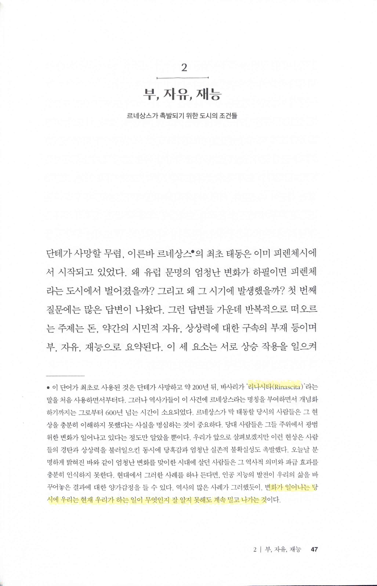
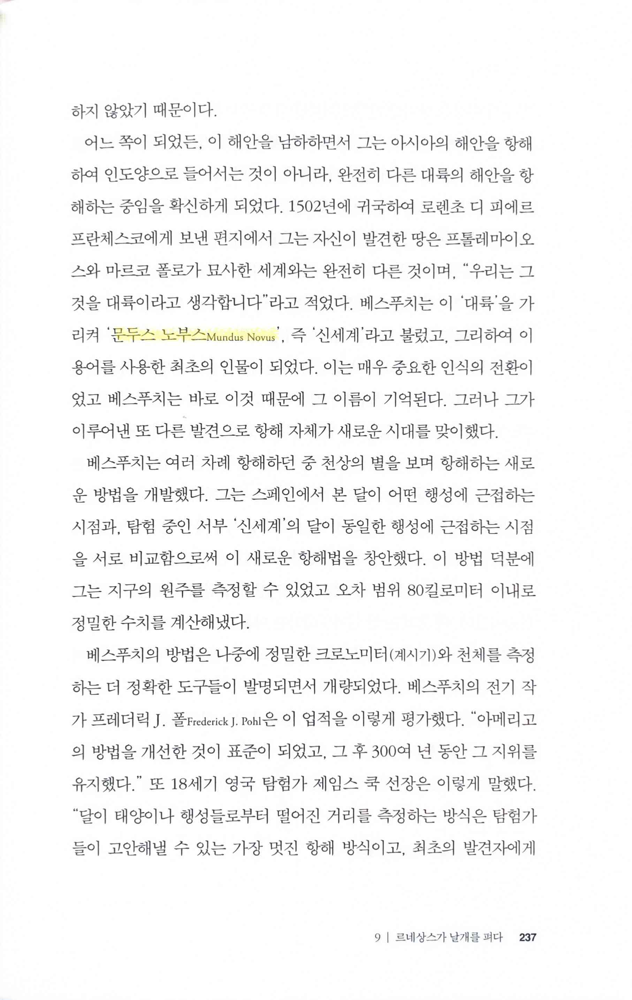
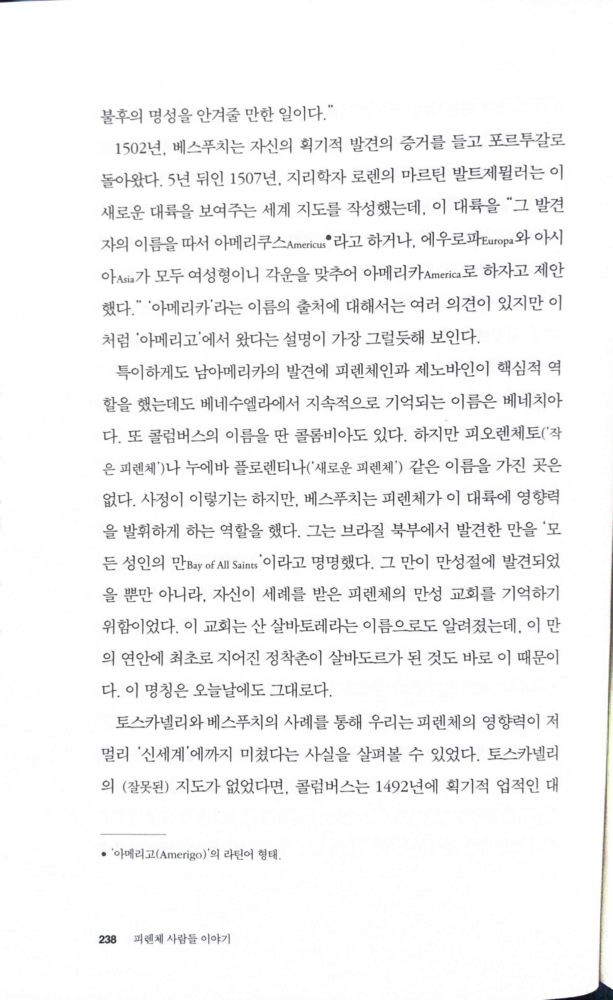

# 피렌체 사람들 이야기 THE FLORENTINES

Tags: history
Date: April 30, 2024 → May 4, 2024
Score: ★★★☆☆

- ★★★☆☆ April 30, 2024 → May 4, 2024
    - 한라 928-스887ㅍ 제주 928-스838피

- 리나시타 Rinascita (Rebirth) … 변화가 일어나는 당시에 우리는 현재 우리가 하는 일이 무엇인지 잘 알지 못해도 계속 밀고 나가는 것
    - [Renaissance - Wikipedia](https://en.wikipedia.org/wiki/Renaissance)

- 문두스 노부스 Mundus Novus 신세계, 아메리고 베스푸치의 이름이 아메리카의 유래가 된 이유
