The Goal 당신의 목표는 무엇인가?
================================

> `생산성` 한 회사가 그 회사의 목표치에 점점 다가가는 일련의 행위. 회사가 목표치에 접근할 수 있도록 하는 모든 행위를 생산적이라고 한다면, 그 반대의 행위는 비생산적
>
> 목표를 정확히 파악하지 못하는 한 생산성이라는 말은 아무런 의미도 없다

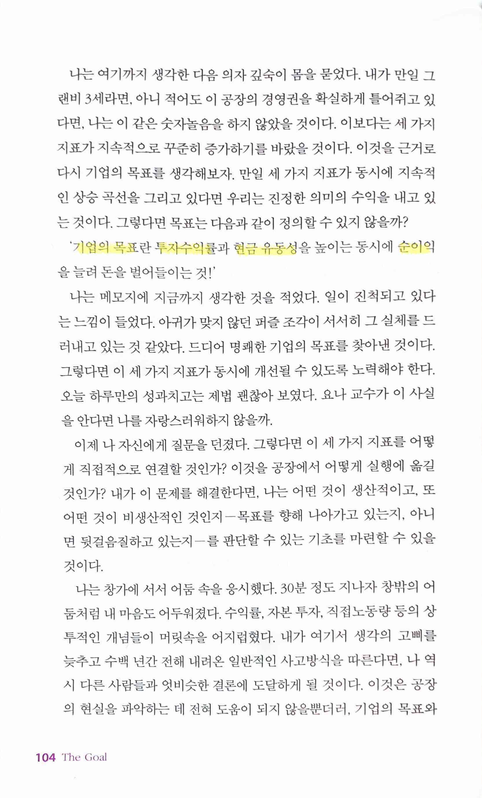

> 기업의 목표 `투자수익률` `현금유동성` `순이익`

   

> `현금 창출률` 판매를 통해서 돈을 창출해내는 비율
>
> `재고` 판매하려는 물품을 만드는 데 투자한 총액
>
> `운영비` 재고를 현금으로 전환하기 위해 쓰는 총비용
>
> 조직 전반에 관한 사안, 부분적인 최적 조건 X

> `현금 창출률` 시스템 내부로 들어오는 돈(수입)
>
> `재고` 시스템 내부에 잠겨(쌓여) 있는 돈
>
> `운영비` 현금 창출률을 높이기 위해 나가는 돈(지출)

> 완전히 소모한 돈은 모두 `운영비`, 팔 수 있는 돈은 모두 `재고`
>
> 판매될 수 있는 투자는 `재고`, 보유 자산은 `운영비`

> 전 직원이 쉬지 않고 일하는 공장의 효율성은 최악

    

> 경영자들의 생각. 가능하면 생산능력을 시장 수요와 일치하도록 조정하고, 남아도는 자원을 끊임없이 재배치해 생산능력을 분배. 인력도 마찬가지
>
> 균형 잡힌 공장을 만들어가려고 노력할수록 그만큼 파산에 가까워진다
>
> 진정한 목표는 운영비와 재고를 줄이면서 동시에 현금 창출률을 올리는
>
> `종속적 사건 (dependent events)` 어떤 사건이 일어나려면 꼭 그전에 한 가지 혹은 여러 가지 사건이 발생해야 한다. 즉 후속 사건은 선행하는 사건과 연관되어 있다
>
> 종속적 사건들이 '통계적 변동 (statistical fluctuations)'이라 불리는 또 다른 현상과 결합될 때 중대한 일
>
> `통계적 변동 (statistical fluctuations)` 예측 가능한 정보와 예측 불가능한 정보의 차이
>
> 성공적으로 운영하는 데 필요한 중요한 요인들은 대부분 사전에 정확하게 결정할 수 없는 것들

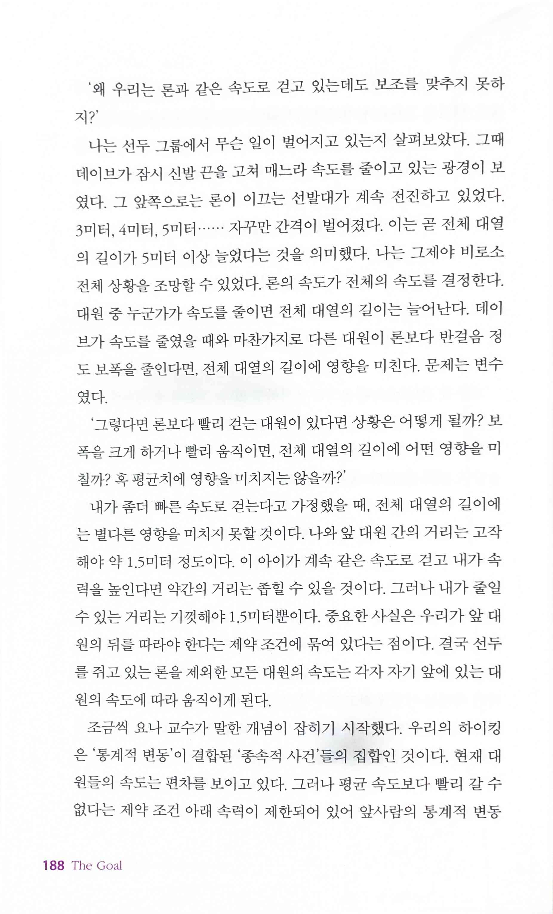 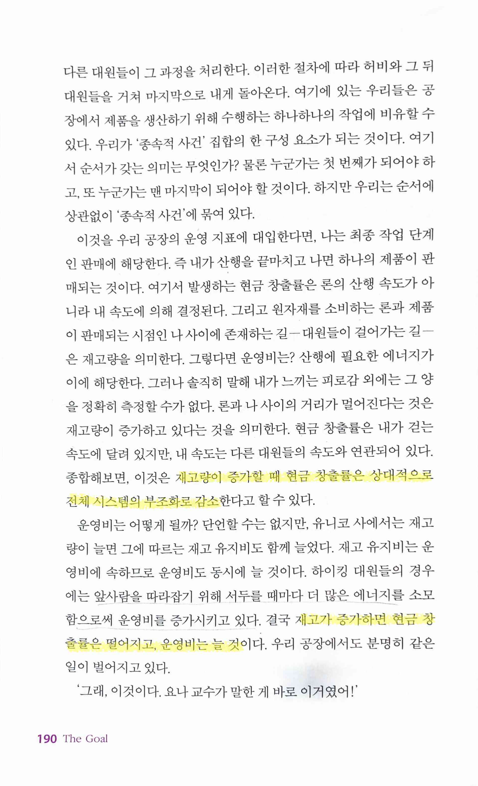

> 재고량이 증가할 때 현금 창출률은 상대적으로 전체 시스템의 부조화로 감소
>
> 재고가 증가하면 현금 창출률은 떨어지고, 운영비는 늘 것

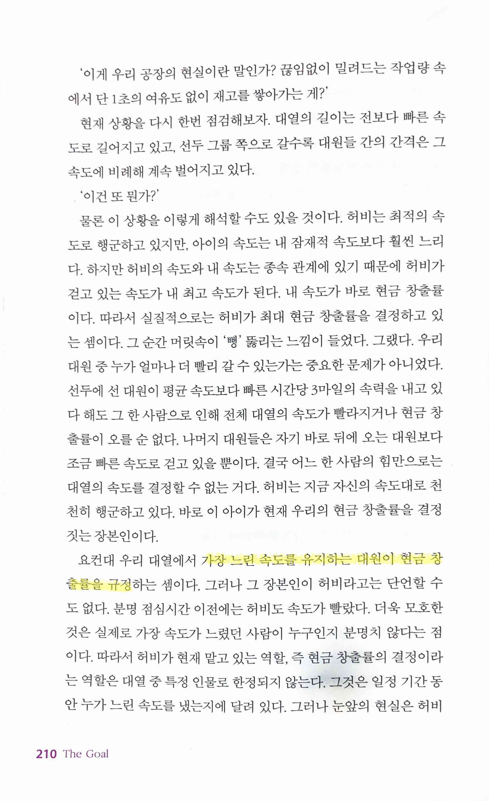

> 가장 느린 속도를 유지하는 대원이 현금 창출률을 규정

> 선행 작업의 최고 편차가 그 이후 연속 작업의 출발점

 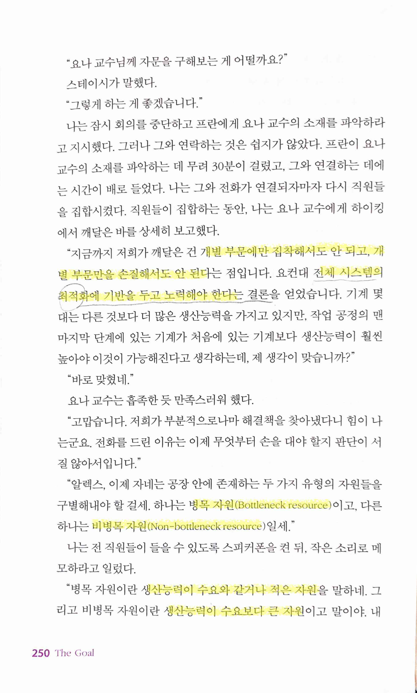  

> 개별 부문에만 집착해서도 안 되고, 개별 부문만을 손질해서도 안 된다. 전체 시스템의 최적화에 기반을 두고 노력해야 한다
>
> `병목 자원(Bottleneck resource)` 생산능력이 수요와 같거나 적은 자원
>
> `비병목 자원(Non-bottleneck resource)` 생산능력이 수요보다 큰 자원
>
> 시장 수요와 공장의 제품 생산 속도 간에 균형... 생산능력이 아니라 생산 속도와 균형을 맞춰야 한다
>
> 최적의 조건은 생산 속도가 시장수요보다 약간 느린
>
> 병목 자원을 갖고 있다는 건 그냥 현실. 병목 자원이 뭔지 알아낸 뒤 그것을 조정해서 생산 속도를 통제하라

 

> 문제의 근원에 집중
>
> 병목지점에 있는 자원의 생산량이 수요와 같아질 수 있는 방법을 찾자

 

> 병목 자원에서 낭비한 시간은 현금 창출률의 감소로 이어진다

  

> 완제품 생산능력은 병목 자원의 생산능력과 일치
>
> 첫 번째 원칙 병목 자원에서 생산 자원의 시간이 낭비되지 않도록 하는 것
>
> 두 번째 원칙 병목 자원의 부하량을 덜어내 비병목 자원으로 옮기기

> 중요한 것은 흐름을 유지하는 일

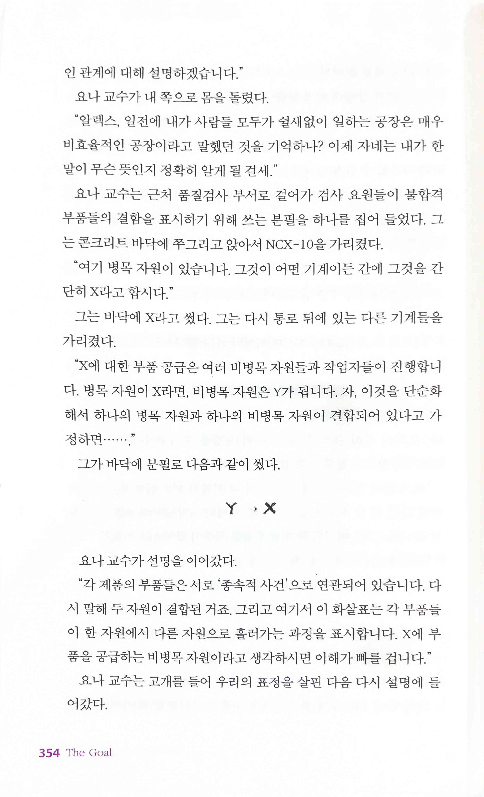  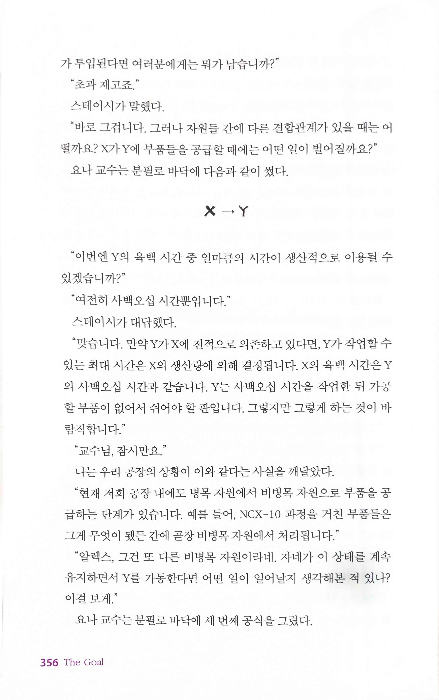  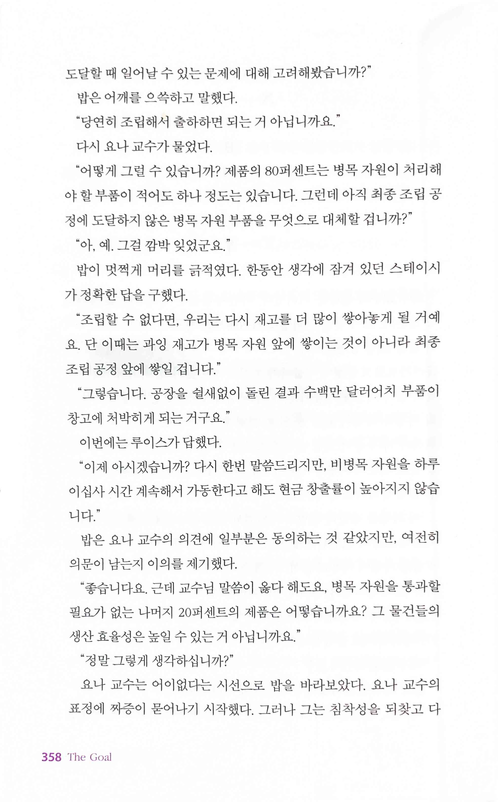  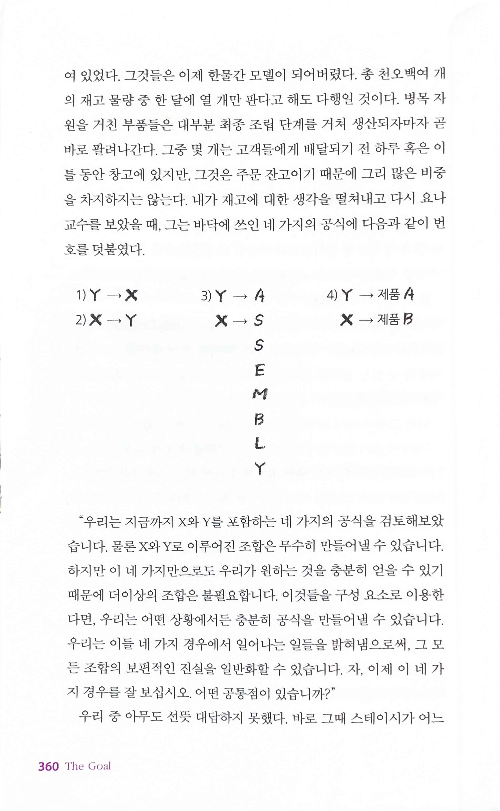  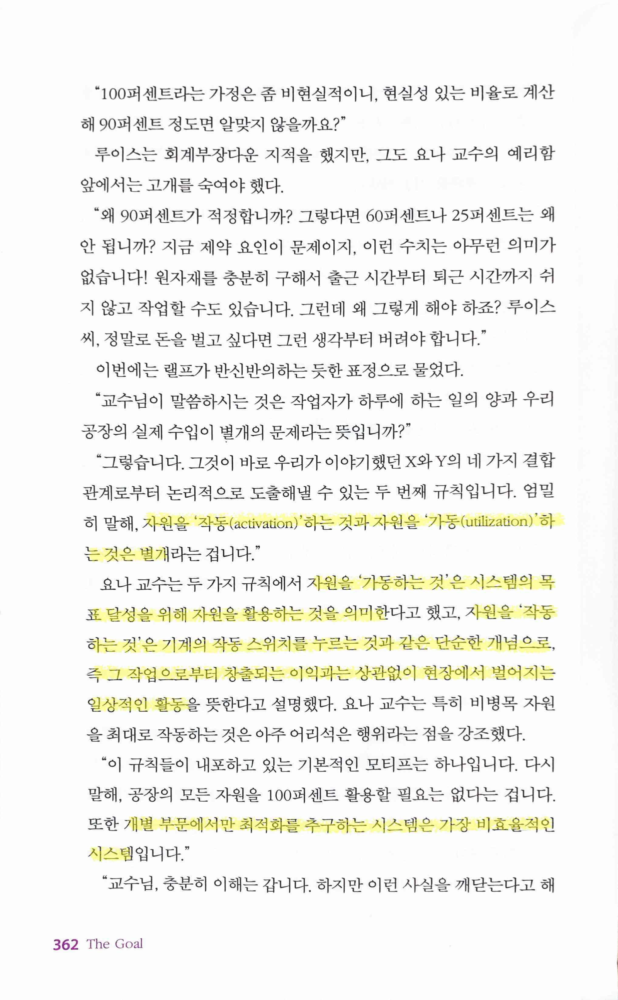 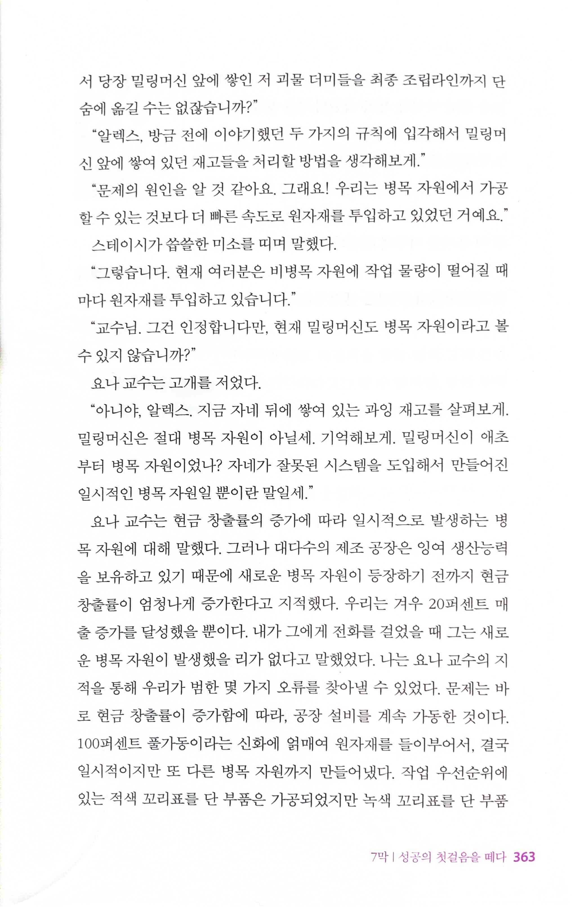

> (비병목 자원) 시장 수요가 흡수할 수 있는 만큼만 이용 가능... 제약 요인은 생산이 아닙니다. 마케팅 능력
>
> 비병목 자원의 이용 정도는 그것 자체의 잠재력을 기준으로 결정하는 게 아니라, 다른 어떤 제약 요인을 기준으로 결정해야 한다
>
> 비병목 자원으로 병목 자원보다 더 많은 작업을 한다고 해서 생산성이 높아지는 게 아니라 정반대. 재고만 늘어난다. 목표에 반대되는 행위
>
> 자원을 `작동(activation)`하는 것과 자원을 `가동(utilization)`하는 것은 별개
>
> 자원을 '가동하는 것'은 시스템의 목표 달성을 위해 자원을 활용하는 것
>
> 자원을 '작동하는 것'은 ... 그 작업으로부터 창출되는 이익과는 상관없이 현장에서 벌어지는 일상적인 활동
>
> 비병목 자원을 최대로 작동하는 것은 아주 어리석은 행위
>
> 개별 부문에서만 최적화를 추구하는 시스템은 가장 비효율적인 시스템

> 필요한 것은 원자재 투입 시기와 병목 자원들을 연결하는 신호를 결정하는 일

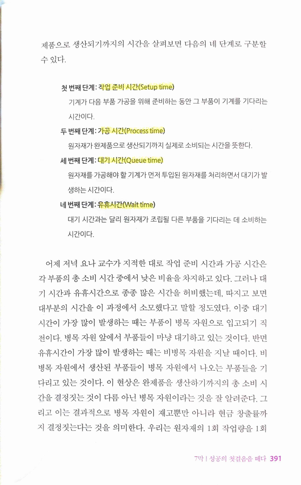 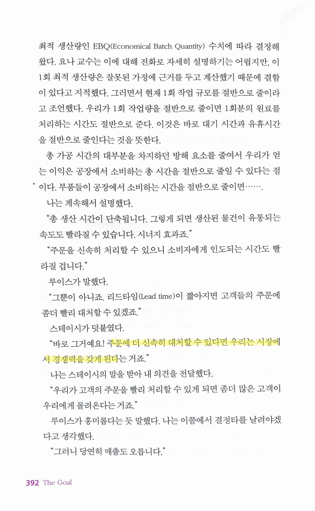

> 첫 번째 단계: 작업 준비 시간(Setup time) 기계가 다음 부품 가공을 위해 준비하는 동안 그 부품이 기계를 기다리는 시간
>
> 두 번째 단계: 가공 시간(Process time) 원자재가 완제품으로 생산되기까지 실제로 소비되는 시간
>
> 세 번째 단계 : 대기 시간(Queue time) 원자재를 가공해야 할 기계가 먼저 투입된 원자재를 처리하면서 대기가 발생하는 시간
>
> 네 번째 단계: 유휴시간(Wait time) 대기 시간과는 달리 원자재가 조립될 다른 부품을 기다리는 데 소비하는 시간
>
> `리드타임 (Lead time)`이 짧아지면 고객들의 주문에 좀더 빨리 대처. 주문에 더 신속히 대처할 수 있다면 우리는 시장에서 경쟁력을 갖게 된다

 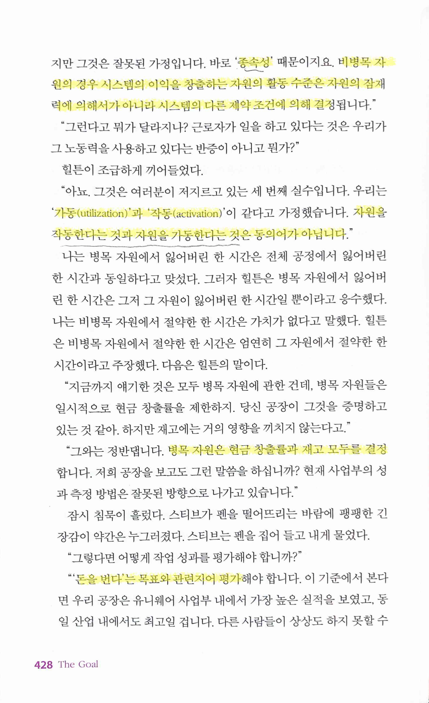

> 생산능력의 균형을 맞추려고 노력해서는 안 됨. 초과 생산능력 필요. 흐름과 수요가 균형을 이루도록 하는 것
>
> 종속성. 비병목 자원의 경우 시스템의 이익을 창출하는 자원의 활동 수준은 자원의 잠재력에 의해서가 아니라 시스템의 다른 제약 조건에 의해 결정
>
> 자원을 작동(activation)한다는 것과 자원을 가동(utilization)한다는 것은 동의어가 아님
>
> 병목 자원은 현금 창출률과 재고 모두를 결정
>
> '돈을 번다'는 목표와 관련지어 평가

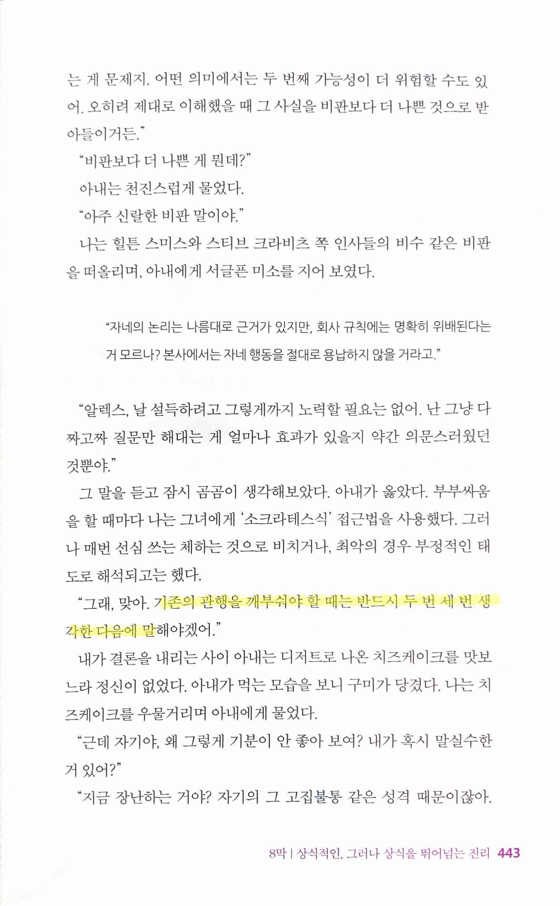 

> 기존의 관행을 깨부숴야 할 때는 반드시 두 번 세 번 생각한 다음에 말
>
> 기술. 상대방을 설득하는 방법, 기존의 관행을 걷어내는 비결, 변화에 대한 반발을 제어하는 기술

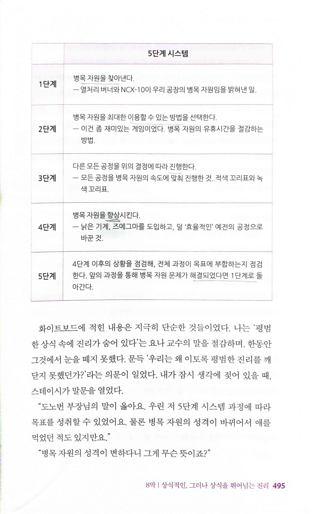 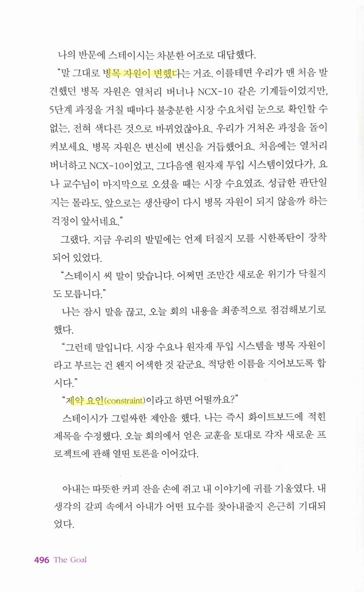

> 5단계 시스템
>
> `제약요인(constraint)`

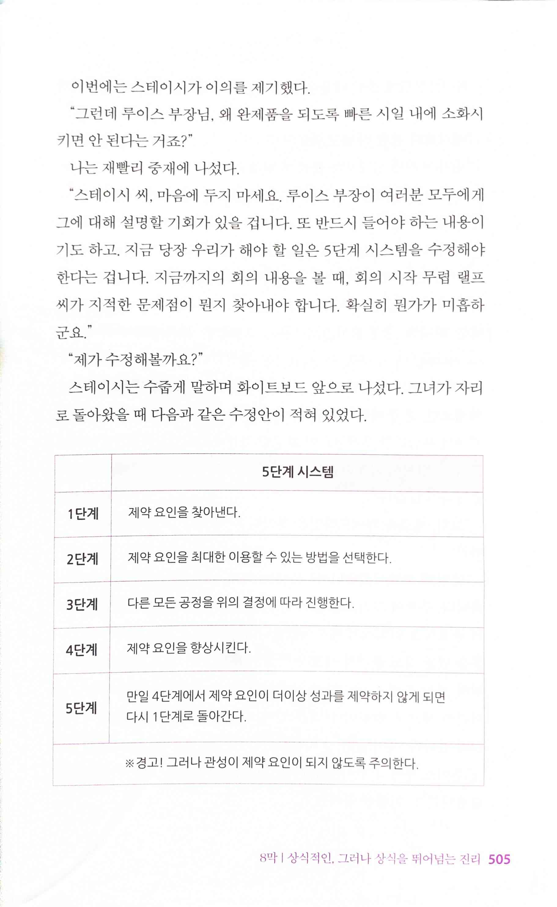 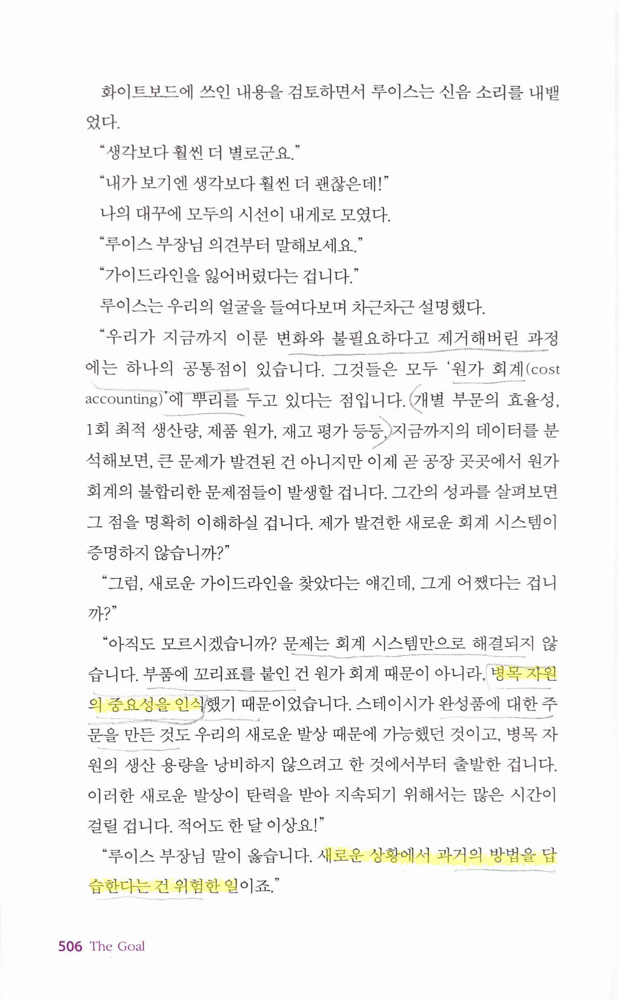

> 5단계 시스템
>
> 1단계 제약요인을 찾아낸다
>
> 2단계 제약요인을 최대한 이용할 수 있는 방법을 선택한다
>
> 3단계 다른 모든 공정을 위의 결정에 따라 진행한다
>
> 4단계 제약요인을 향상시킨다
>
> 5단계 만일 4단계에서 제약 요인이 더이상 성과를 제약하지 않게 되면 다시 1단계로 돌아간다
>
> 병목 자원의 중요성 인식
>
> 새로운 상황에서 과거의 방법을 답습한다는 건 위험한 일

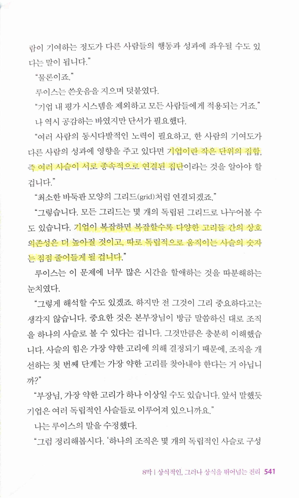

> 기업이란 작은 단위의 집합, 즉 여러 사슬이 서로 종속적으로 연결된 집단
>
> 기업이 복잡하면 복잡할수록 다양한 고리들 간의 상호의존성은 더 높아질 것이고, 따로 독립적으로 움직이는 사슬의 숫자는 점점 줄어들게

> '무엇을 바꾸어야 하는가?', '어떤 방향으로 바꾸어야 하는가?', '어떻게 변화를 일으킬 것인가?'... 관리자가 가져야 할 가장 근본적인 역량