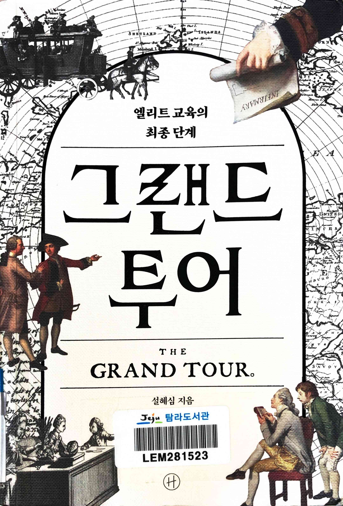
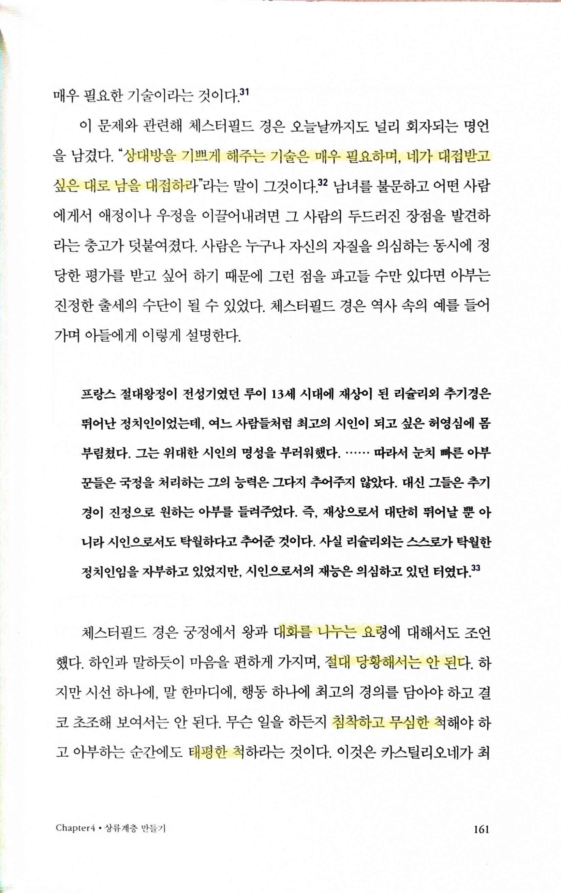
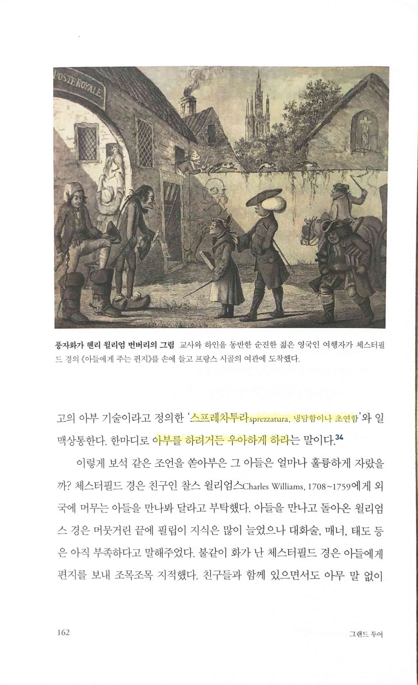
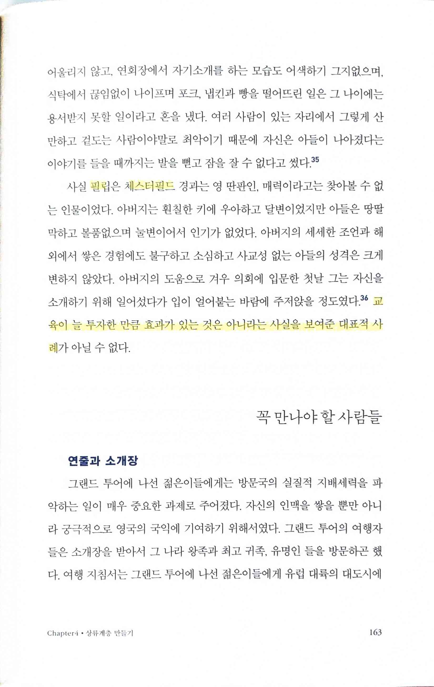
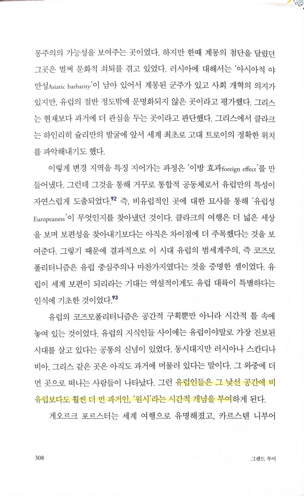
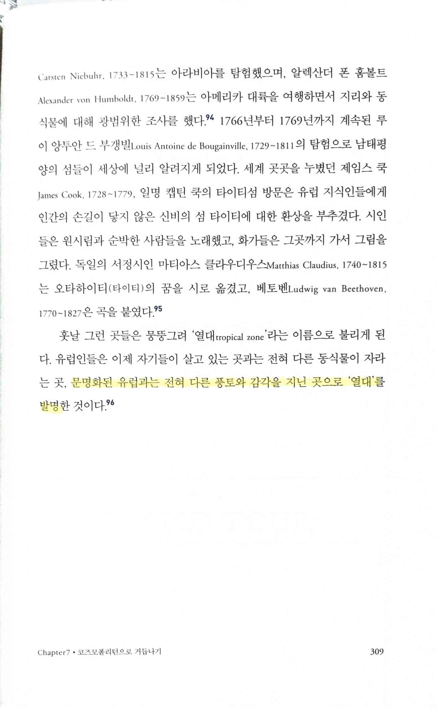

# 엘리트 교육의 최종 단계 그랜드 투어

Tags: history
Date: April 10, 2024
Score: ★★★☆☆

- ★★★☆☆ April 8, 2024 → April 10, 2024 저자가 가족도 보기 쉬운 책을 목표로 썼다고 했는데 그만큼 편하고 재미있게 읽을 수 있다. Grand Tour에 대해 대략은 알고 있었기 때문에 세부적인 내가 몰랐던 여러가지 이야기를 볼 수 있었고, 영국인만이 아니라 유명한 외국인들(e.g. 괴테, 표트르)도 이런 그랜드 투어의 영향으로 여행을 다녔던 건 처음 생각해보게 된 일, 즉 각각의 사실은 알고 있었으나 그 연결은 못했던 터라, 이라 좋았다. 베네치아의 순례자 투어만이 아니라 이 그랜드 투어도 현대의 여행, 패키지 관광까지도 영향을 줬을 거도 역시 흥미롭게 연결할만한 사실이었다.
    - 탐라 문920.4-설94ㄱ
    - [유럽 엘리트 교육의 최종단계 ‘여행’ :: 문화일보 munhwa](https://www.munhwa.com/news/view.html?no=2013030801032530024002)
- pp161~163
    - p161

        

        - 상대방을 기쁘게 해주는 기술은 매우 필요하며, 네가 대접받고 싶은 대로 남을 대접하라
        - 대화를 나누는 요령… 절대 당황해서는 안 된다… 침착하고 무심한 척… 태평한 척
    - p162

        

        - 스프레차투라 sprezzatura 냉담함이나 초연함… 아부를 하려거든 우아하게 하라
            - https://brunch.co.kr/@tjkmix/583
    - p163

        

        - 교육이 늘 투자한 만큼 효과가 있는 것은 아니라는 사실을 보여주는 대표적 사례
            - http://www.postnews.kr/cpost_life/sub_read.asp?cate=21&BoardID=337
- pp308~309
    - p308

        

        - 유럽인들은 그 낯선 공간에 비유럽보다 훨씬 더 먼 과거인, ‘원시’라는 시간적 개념을 부여
    - p309

        

        - 문명화된 유럽과는 전혀 다른 풍토와 감각을 지닌 곳으로 ‘열대’를 발명
