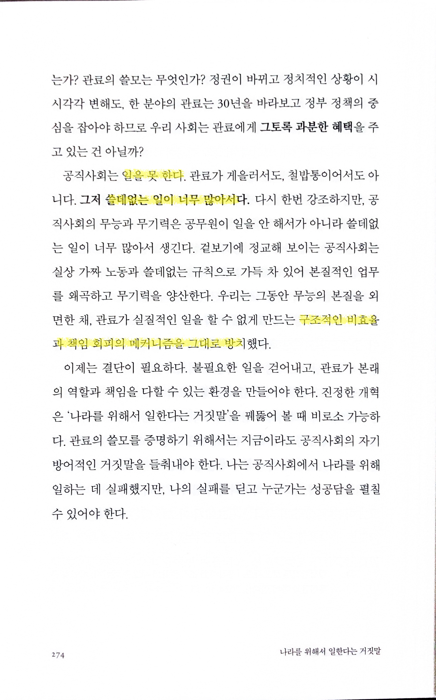

# 나라를 위해서 일한다는 거짓말

Tags: essay
Date: March 1, 2025
Score: ★★★☆☆

- ★★★☆☆ March 1, 2025
    - 이미 유튜브 등을 통해 책의 핵심 이야기를 접해서인지, 『나라를 위해서 일한다는 거짓말』을 단숨에 읽었다. 행정고시에 합격해 10년간 사무관으로 일하고, 서기관 승진 후 퇴직한 저자가 쓴 공직사회 비판서이지만, 실상은 한국 사회 전반의 구조적 문제에 대한 이야기이기도 하다.
    - 책을 관통하는 주된 문제의식은 “왜 관료들은 유난히 무기력해졌는가?”라는 질문이다. 저자는 공무원 개인의 태만이나 무능보다, 체계적으로 불필요한 업무를 양산하는 상명하복식 구조를 핵심 원인으로 지목한다. 겉으로는 “나라를 위해 일한다”라고 말하면서도 실제로는 윗선의 지시만 추종하며, ‘가짜 성과’나 ‘불필요한 일’이 반복·확대되는 현실은 결국 공무원을 무기력하게 만들고, 공직사회의 역량을 갉아먹는다. 특히, 문제에 대한 책임을 회피하기 위해 점점 더 많은 ‘서류 작업’과 ‘보고서 간소화’를 강제하는 시스템은 하위직급 공무원의 적극적인 업무 수행을 방해한다.
    - 그렇다고 공무원 개개인을 일방적으로 비난하기는 어렵다. 저자가 강조하듯, 실제로 하위직급에서 성실하게 일하며 전문성을 쌓은 이들은 많다. 문제는 이들의 역량이 무의미한 보고 체계와 권위적인 조직문화에 갇혀 제대로 활용되지 못한다는 점이다. 이러한 구조적 병폐를 타파하기 위해서는 결국 “위로부터의 인식 변화”와 “국민의 선택”이 필수적이다. 즉, 실질적인 변화를 주도할 수 있는 리더를 선출하는 정치 문화가 자리 잡아야 하고, 그것이 조직 내부에서 변화를 요구하는 목소리와 맞물려야만 비효율을 제거할 수 있다는 것이다.
    - 책을 읽는 내내, 저자의 솔직하면서도 꼼꼼한 내부 고발이 꽤나 날카롭다고 느껴졌다. 동시에 가장 큰 울림은 “공무원은 정말 나라를 위해 일하고 싶어 한다”는 역설적인 사실이었다. 그들이 무능해 보이는 이유가 개인의 성향이나 능력 탓이 아니라, 오히려 부조리한 구조에서 비롯된 문제라면, 해결책 역시 구조적 개선과 시민의 의식 변화에서 찾아야 할 것이다. “가랑비에 옷이 젖듯 익숙해진 무기력”과 결별하기 위해 무엇이 필요한지, 이 책을 통해 곱씹어볼 만하다.
    - [행시 출신 30대 공무원, 4급 승진하자마자 사표 낸 이유 인터뷰](https://v.daum.net/v/20250105143355572)

