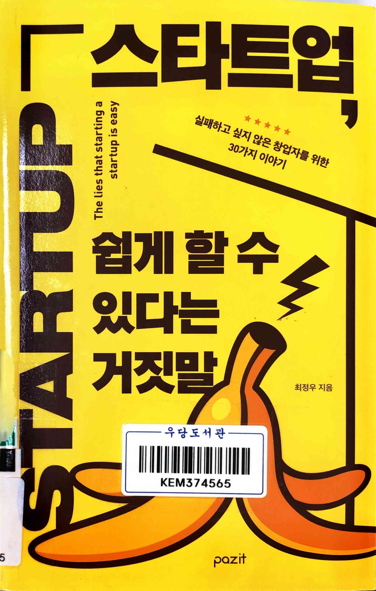
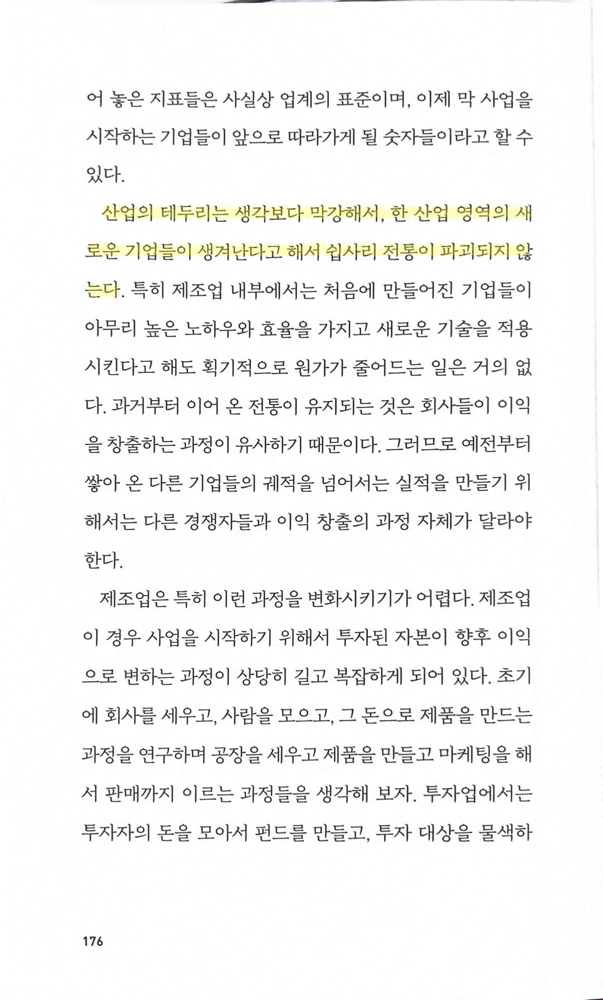
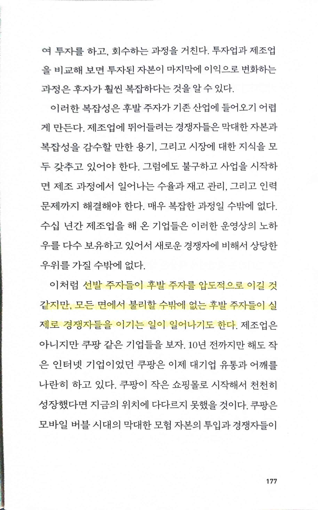
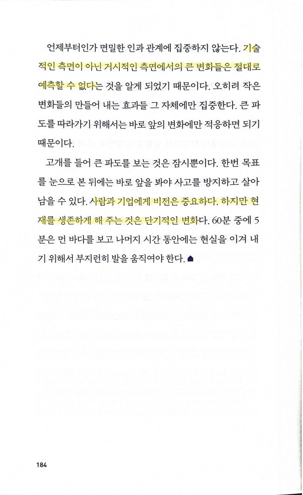
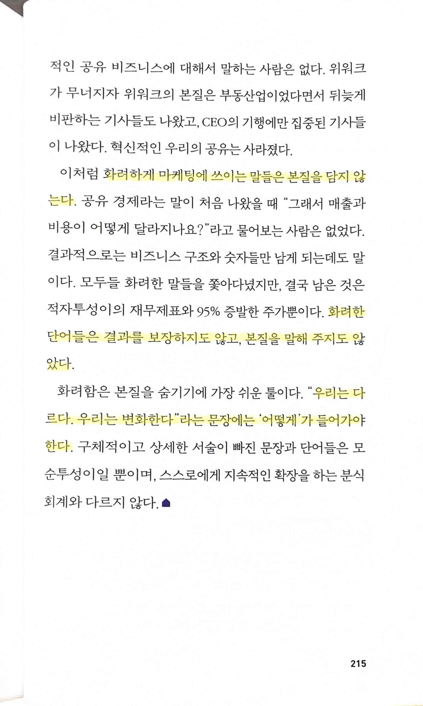
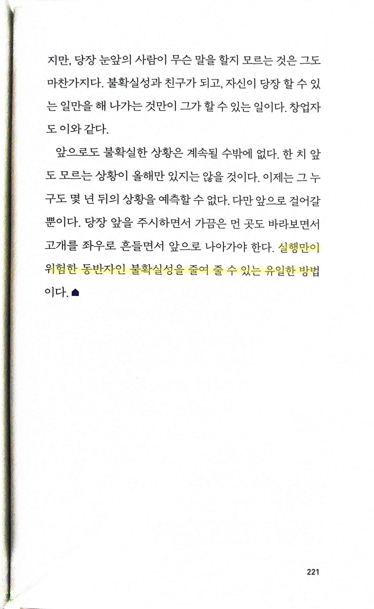
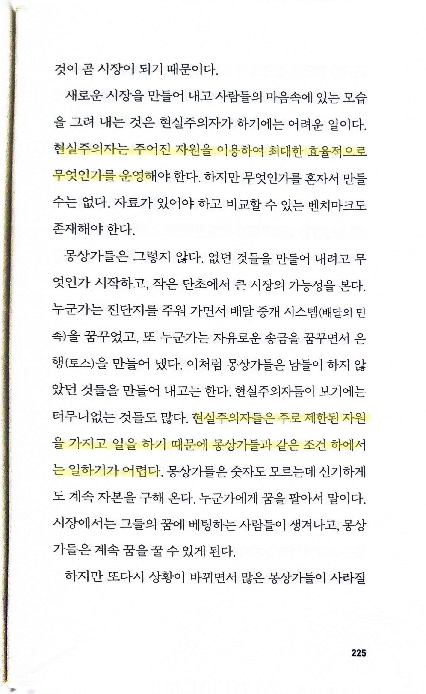

# 스타트업 쉽게 할 수 있다는 거짓말

Tags: business, startup
Date: August 12, 2024 → August 13, 2024
Score: ★★★☆☆

- ★★★☆☆ August 12, 2024 → August 13, 2024 (원래 그렇게도 생각했지만, 책의 표현대로도) '현실주의자'인 나에게 스타트업이 얼마나 어려운지 피상적으로나마 다시 한 번 깨닫게 해주는 책. 창업을 하고 싶은 사람들에게 충분히 권할만한 좋은 책. 짧은 챕터들의 연속으로 창업의 '현실'을 알려주지만, 이런 어려움에도 불구하고 '몽상주의자'들이라면 도전을 원할 것
    - 탐라 문325.21-최73ㅅ 우당 문325.21-최73ㅅ
- pp176~177

    

    

- p184

    

    - 기술적인 측면이 아닌 거시적인 측면에서의 큰 변화들은 절대로 예측할 수 없다
    - 사람과 기업에게 비전은 중요하다. 하지만 현재를 생존하게 해 주는 것은 단기적인 변화다.
- p215

    

    - 화려하게 마케팅에 쓰이는 말들은 본질을 담지 않는다
    - 화려한 단어들은 결과를 보장하지도 않고, 본질을 말해 주지도 않았다
    - “우리는 다르다. 우리는 변화한다”라는 문장에는 ‘어떻게’가 들어가야 한다
- p221

    

    - 실행만이 위험한 동반자인 불확실성을 줄여 줄 수 있는 유일한 방법
- p225

    

    - 현실주의자는 주어진 자원을 이용하여 최대한 효율적으로 무엇인가를 운영해야 한다
    - 현실주의자들은 주로 제한된 자원을 가지고 일을 하기 때문에 몽상가들과 같은 조건 하에서는 일하기가 어렵다
