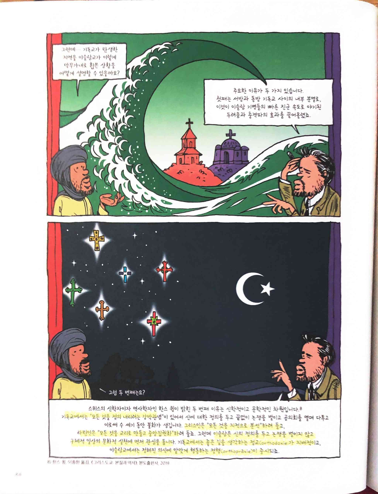

# 만화로 배우는 서양사 - 중세

Tags: comic, history, middle ages
Date: April 13, 2023
Score: ★★★☆☆

- ★★★☆☆ April 13, 2023
    - (만화로 배우는 서양사) 중세. 1, 암흑의 시대 중세를 살던 사람들의 이야기
        
        
        
        - 탐라 문920.3-만96ㅈ-1
        - 우당 문920-한49ㅈ-1
    - (만화로 배우는 서양사) 중세. 2, 십자군의 원정로를 따라가는 시간여행
        
        
        
        - 탐라 문920.3-만96ㅈ-2
        - 우당 문920-한49ㅈ-2
    - (만화로 배우는 서양사) 중세. 3, 중세를 지배한 로마 가톨릭교회의 역사
        
        
        
        - 탐라 문920.3-만96ㅈ-3
        - 우당 문920-한49ㅈ-3
        
        
        
        - 기독교가 탄생한 지역을 이슬람교가 휩쓴 이유
            1. 서방과 동방 기독교 사이의 내부 분열
                1. 이슬람 기병들의 빠른 진군 속도로 야기된 두려움과 충격파의 효과 상승
            2. 신학적, 문학적 차원
                1. 기독교에서는 ‘모든 것을 정의 내리려는 강박관념’이 있어서 신에 대한 정의를 두고 끝없이 논쟁을 벌이고 공의회를 열며 다투고 이로써 수 세기 동안 불화
                2. 그리스인은 ‘모든 것을 지적으로 분석’하려 들고, 라틴인은 ‘모든 것을 교리로 만들고 중앙집권화’하려 듦
                3. 이슬람은 신의 정의를 두고 논쟁을 벌이지 않고 구체적 일상의 문화적 실천에 먼저 관심
                4. 기독교에서는 좋은 길을 생각하는 `정교 orthodoxy`가 지배적
                5. 이슬람교에서는 정해진 의식에 알맞게 행동하는 `정행 orthopraxy`이 중시
            - 양쪽 다 결국 필요한 부분인데 이슬람교에서는 당시에는 실천이 먼저였기 때문에 상대적으로 꽤 후발 주자임에도 퍼질 수 있었다는 해석인 듯. 그런데 지금은 수니 시아를 필두로 정치 경제적인 상황에 따라 분열이 심한 걸 보면 이슬람교 탄생 시점에나 유효한 해석인 듯. 수니 시아 분열 자체가 무함마드 사후 바로 발생한 일이니 이 해석도 어쩐지 많은 반박을 받았을 거 같다
