# 중세 III THE MIDDLE AGES III

Tags: history, religion
Date: June 17, 2024
Score: ★★★☆☆

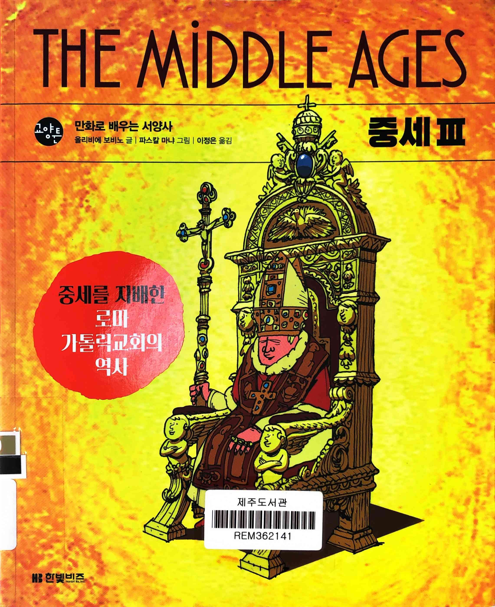

- ★★★☆☆ June 17, 2024
- 도그마 dogma 좋다고 보이는 것

    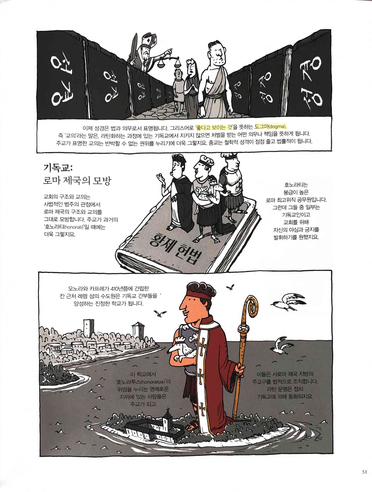

- caput 머리 princeps 프링쳅스 프린켑스 PAPE 교황 fons 폰스 원천

    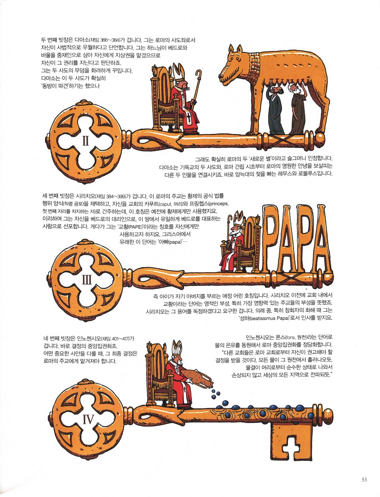

- 아우구스티누스 성경의 라틴어 번역을 바탕으로 추론

    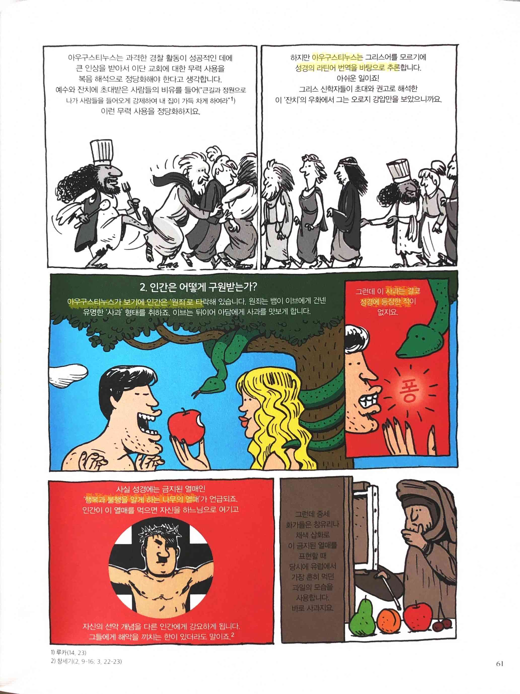

    - 인간은 ‘원죄’로 타락… 사과는 결코 성경에 등장한 적이 없…
    - ‘행복과 불행을 알게 하는 나무의 열매’가 언급
- 그리스 신학자… ‘아담의 잘못’ ‘아담 이후로 모두가 죄를 지었’는데, 이 죄는 인간을 구성하는 측면 중 하나… 또 다른 측면은 ‘사랑을 체험하는 능력’

    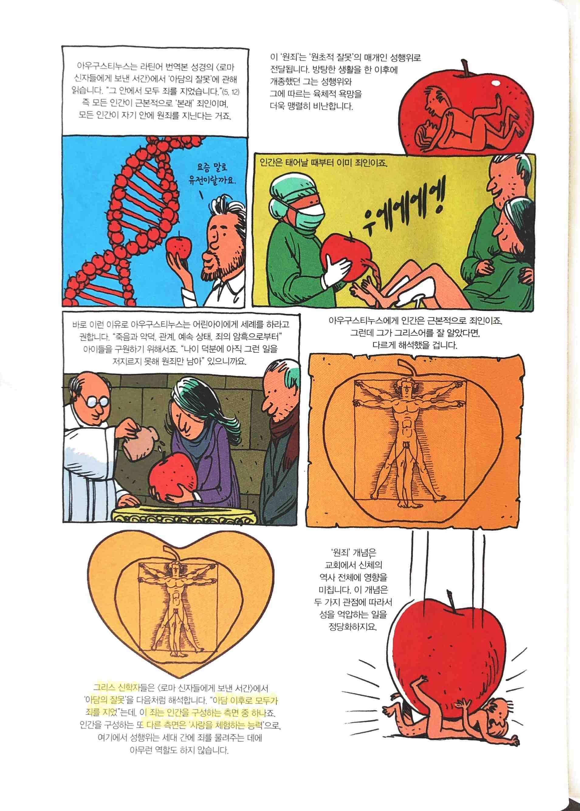

- 라틴어 번역과 달리 유대교 및 랍비 전통에서는… 이브는 아담의 ‘갈비뼈(cote)’에서 만들어진 게 아니라, 아담의 ‘곁(cotes)’에…

    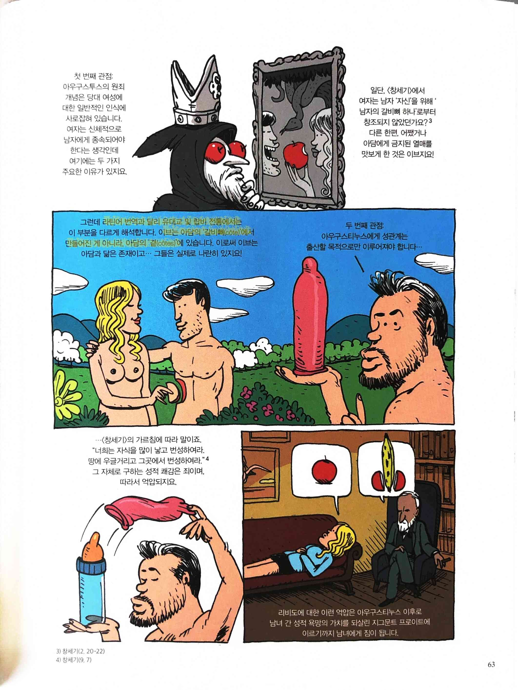

- 이슬람이란 말은 아랍어 쿠두(khudu)를 어근으로 하는 ‘복종’으로 번역되지 않습니다. 이슬람의 어근은 살람(salam, 평화, 인사)에도 들어 있는 슬름(slm)이고 동작동사인 아슬라마(aslama)에서… ‘평화로 들어서다’라는 뜻의 자동사

    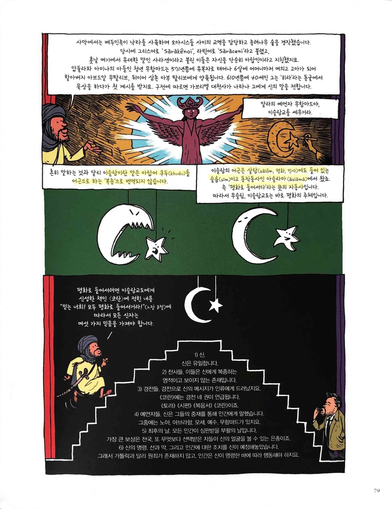

- 기독교에서는 “모든 것을 정의 내리려는 강박관념”… 신에 대한 정의를 두고 끝없이 논쟁을 벌이고 공의회를 열며 다투고… 그리스인은 “모든 것을 지적으로 분석”… 라틴인은 “모든 것을 교리로 만들고 중앙집권화”… 이슬람은 신의 정의를 두고 논쟁을 벌이지 않고 구체적 일상의 문화적 실천에 먼저 관심…

    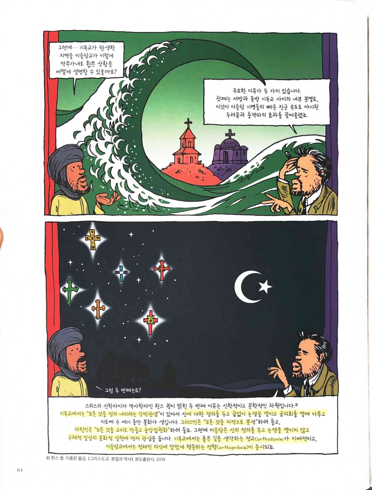

    - 기독교에서는 좋은 길을 생각하는 정교(orthoxodie)가 지배적
    - 이슬람교에서는 정해진 의식에 알맞게 행동하는 정행(orthopraxie)이 중시
- 모세 예수 부처 무함마드 공자

    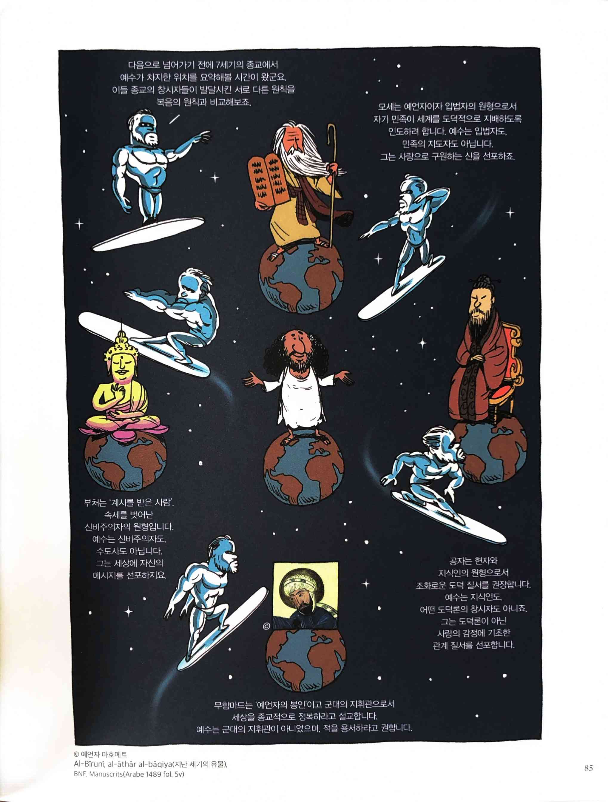

- 교회법(canon)… ‘모든 것의 척도’

    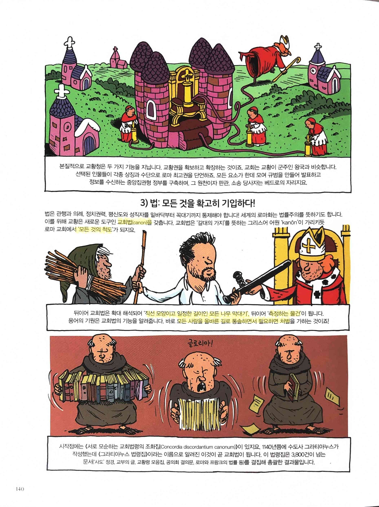

    - ‘직선 모양이고 일정한 길이인 모든 나무 막대기’… ‘측정하는 물건’… 모든 사람을 올바른 길로 통솔하면서 필요하면 처벌
- 그레고리오 7세… 이슬람교도에게 폭력을 행한 기독교인에게 면죄부… 근거는 바로 성경 속 예레미야 예언자의 말

    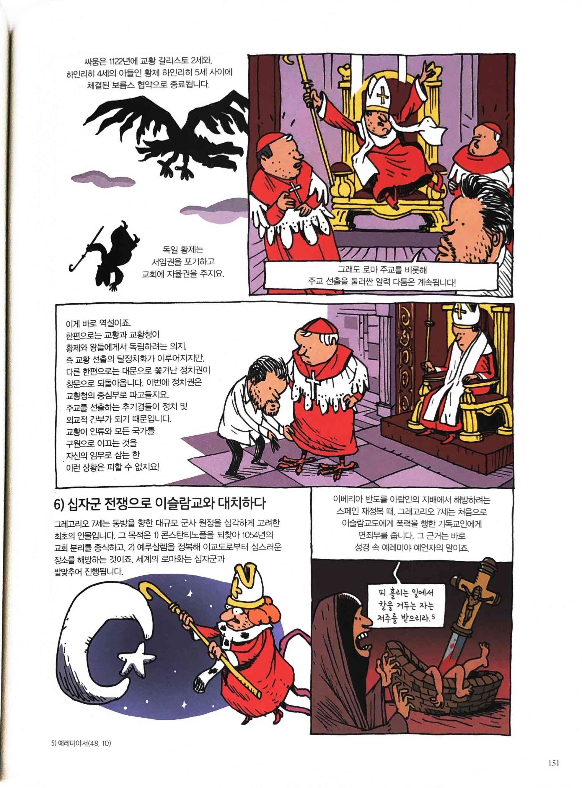

    - 피 흘리는 일에서 칼을 거두는 자는 저주를 받으리라
- 푸른색… ‘왕의 푸른 색(로열 블루)’… ‘훈장, 공로’의 색

    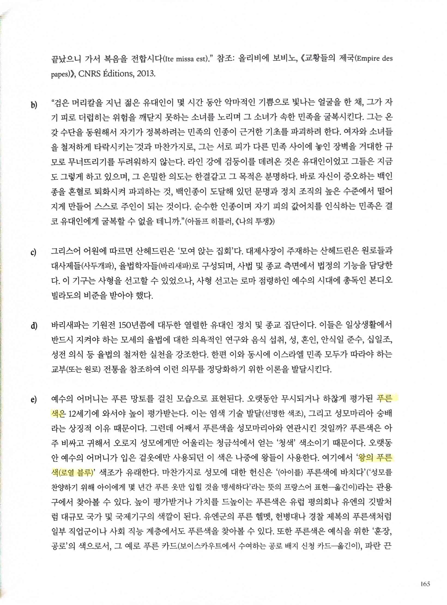

- 근대 사회에서는 분홍색이 새로운 시장

    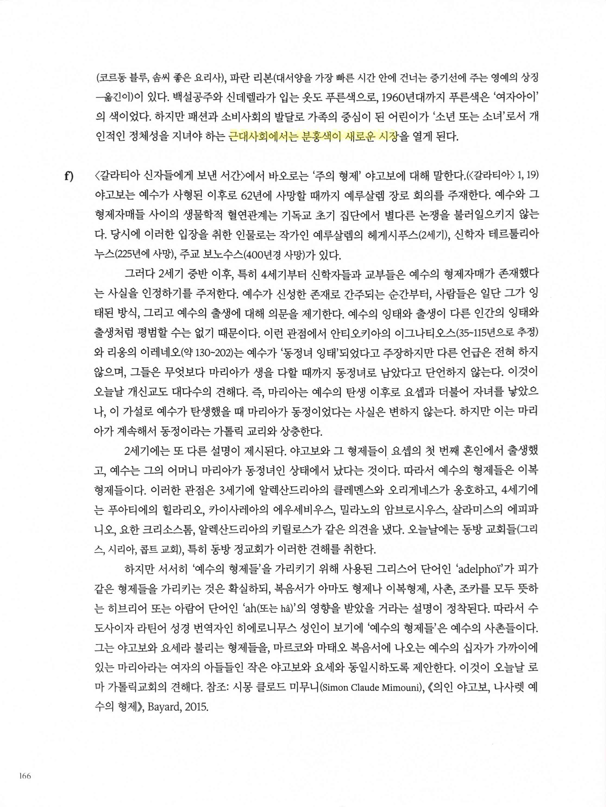
