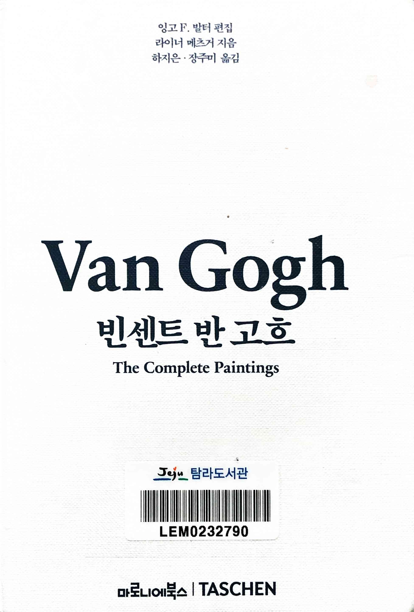
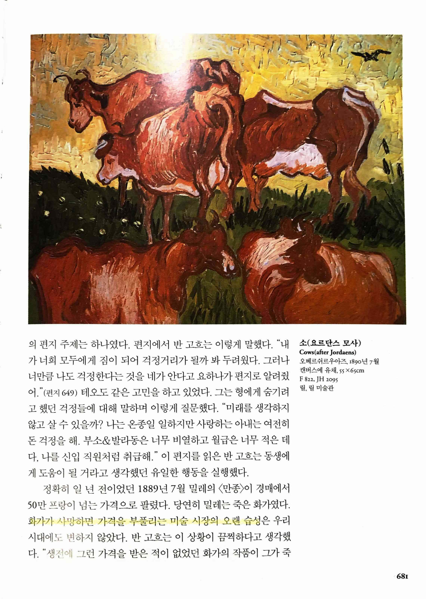
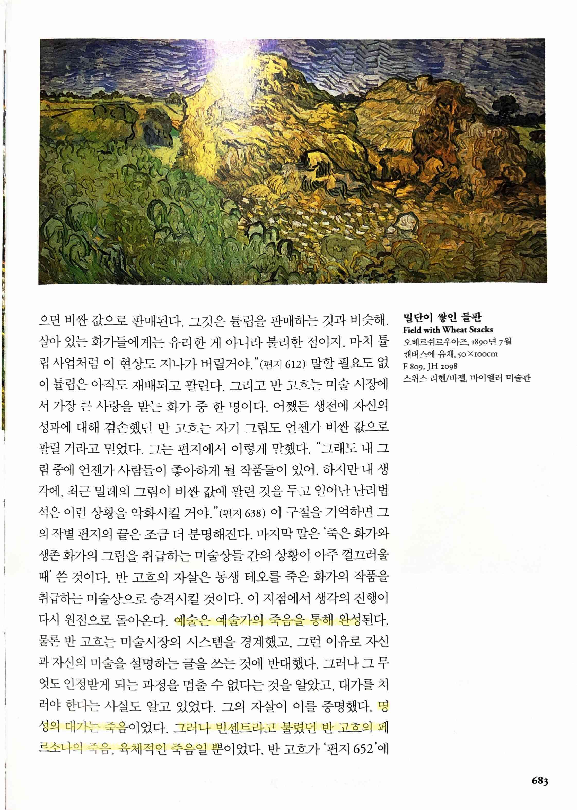
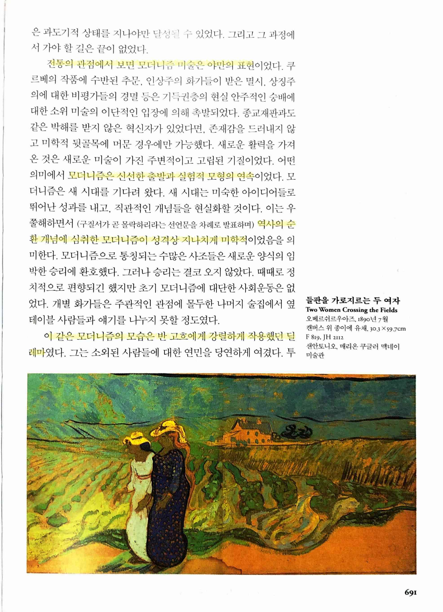
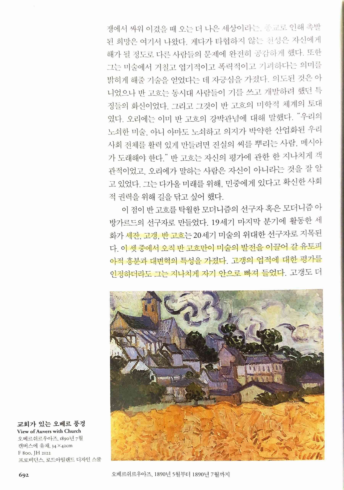
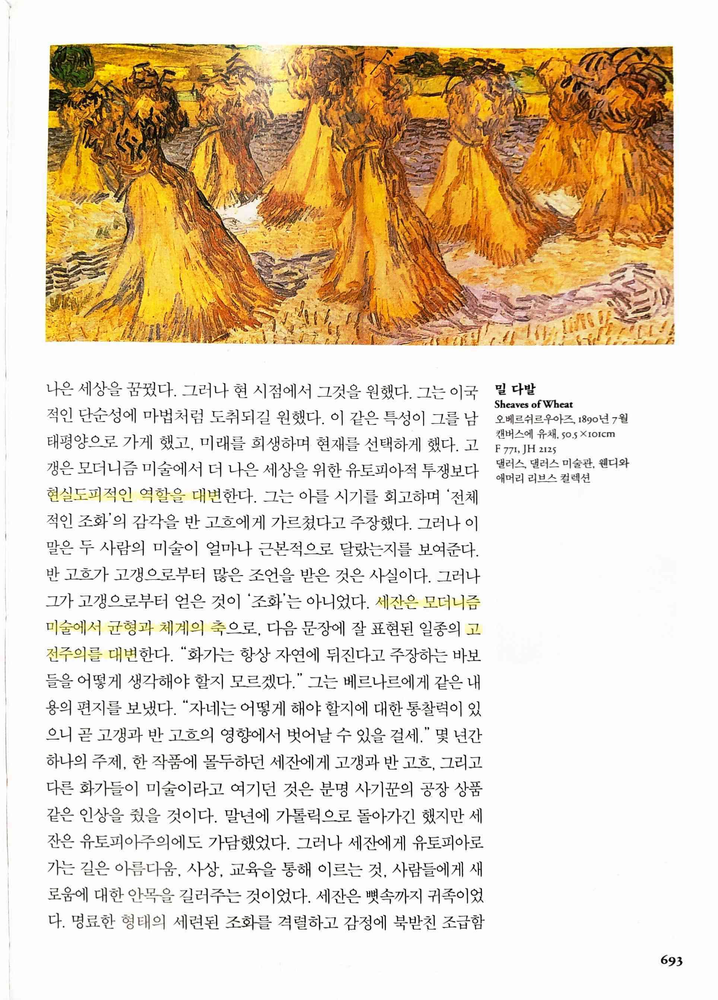
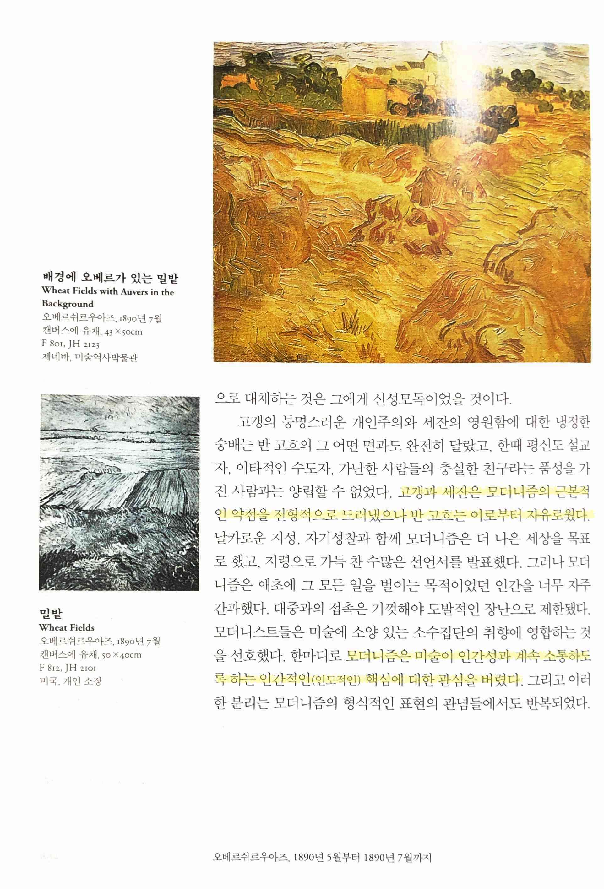

빈센트 반 고흐 Van Gogh The Complete Paintings
==============================================

# 6장 최후 오베르쉬르우아즈, 1890년 5월부터 1890년 7월까지

> 화가가 사망하면 가격을 부풀리는 미술 시장의 오랜 습성

> 예술은 예술가의 죽음을 통해 완성... 명성의 대가는 죽음. 그러나 빈센트라고 불렸던 반 고흐의 페르소나의 죽음, 육체적인 죽음일 뿐이었다.

> 전통의 관점에서 보면 모더니즘 미술은 야만의 표현... 모더니즘은 신선한 출발과 실험적 모형의 연속... 역사의 순환 개념에 심취한 모더니즘이 성격상 지나치게 미학적이었음을 의미.
>
> 이 같은 모더니즘의 모습은 반 고흐에게 강렬하게 작용했던 딜레마

  

> 세잔, 고갱, 반 고흐... 이 셋 중에서 오직 반 고흐만이 미술의 발전을 이끌어 갈 유토피아적 흥분과 대변혁의 특성을 가졌다. 고갱의 업적에 대한 평가를 인정하더라도 그는 지나치게 자기 안으로 빠져 들었다... 현실도피적인 역할을 대변... 세잔은 모더니즘미술에서 균형과 체계의 축... 일종의 고전주의를 대변... 고갱과 세잔은 모더니즘의 근본적인 약점을 전형적으로 드러냈으나 반 고흐는 이로부터 자유로웠다... 모더니즘은 미술이 인간성과 계속 소통하도록 하는 인간적인(인도적인) 핵심에 대한 관심을 버렸다.