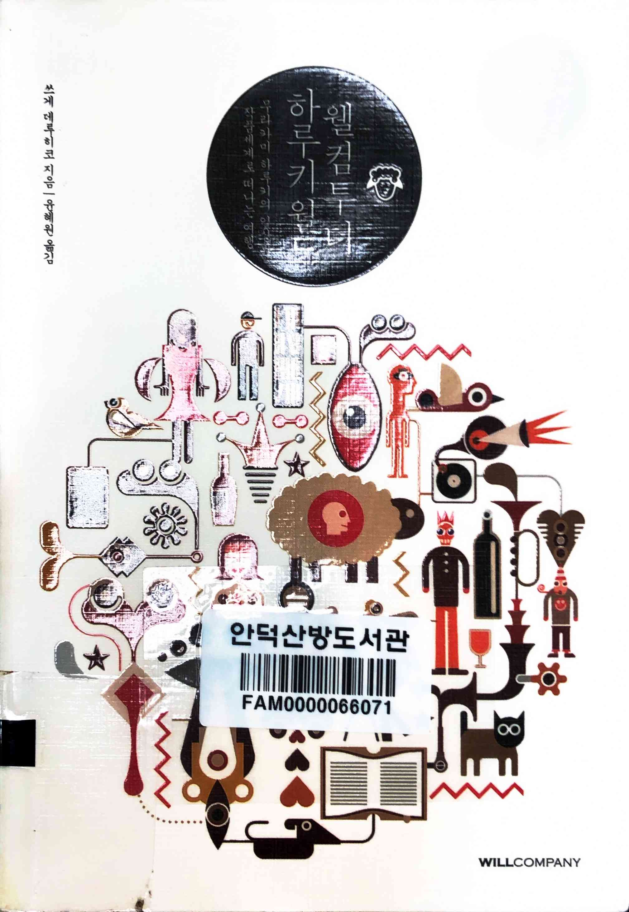
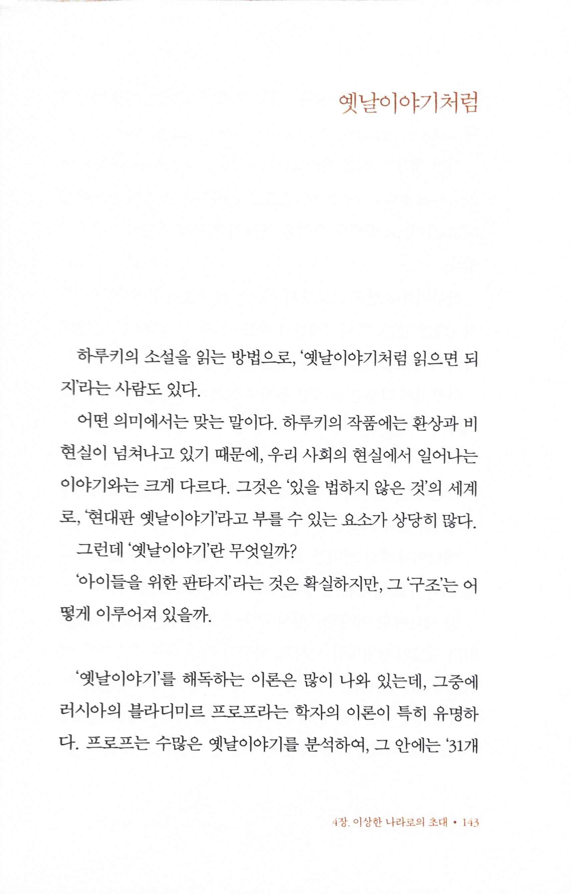

# 웰컴 투 더 하루키 월드

Tags: literature
Date: February 3, 2025
Score: ★★★☆☆

- ★★★☆☆ February 3, 2025 하루키 수필을 좋아하다보니, 하루키가 쓴 책이 아니라 하루키에 대해 쓴 책도 조금씩 읽게 된다. 하루키를 좋아하는 사람이라면 한번쯤 읽어봐도 좋은 여러가지 내용이 있다. 가장 기억에 남는 건 극도로 미디어를 꺼려서 사진도 잘 안 찍고, 젊은 시절 사진만 약간 공개했다는 점. 저자를 비롯해 문학계 인사들도 실제로 만난 경우가 아예 없는 사람들도 있다고 하니 (스스로는 평범하다고 항상 쓰곤 하지만) 거장은 역시 분야를 막론하고 특이한 경우가 많다는 생각이 든다.
    - https://www.aladin.co.kr/shop/wproduct.aspx?ItemId=34103427&start=slayer

- pp143~144
    
    
    
    
