# 달리기를 말할 때 내가 하고 싶은 이야기

Date: December 17, 2023
Score: ★★★☆☆

- ★★★☆☆ 2023.12.17
    - 한라 838-무292ㄷ 탐라 문838-무292ㄷ 제주 838-하237달

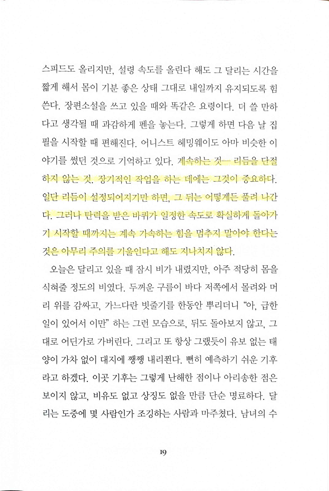

- 리듬, 루틴의 중요성

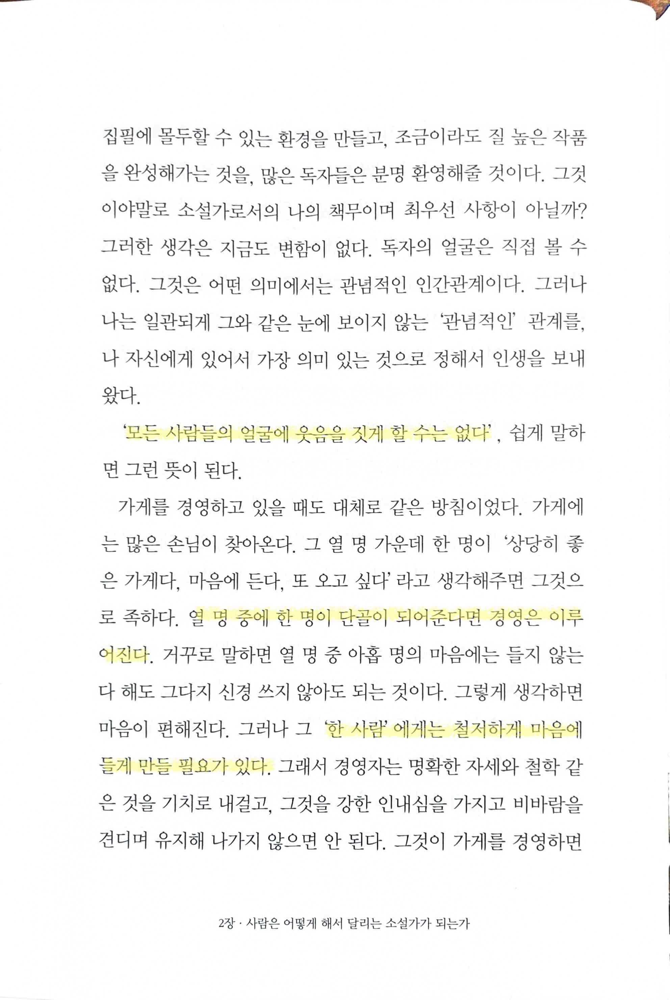

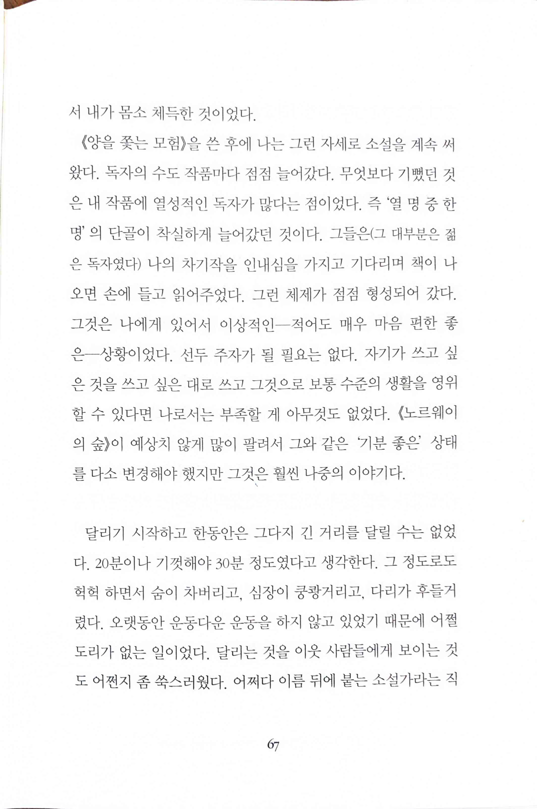

- 흔히 말하는 ‘뾰족하게 만드는 것’의 중요함을 이미 경험적으로 알고 있던 하루키. 역시 이런 거만 봐도 평범한 사람이 아니다

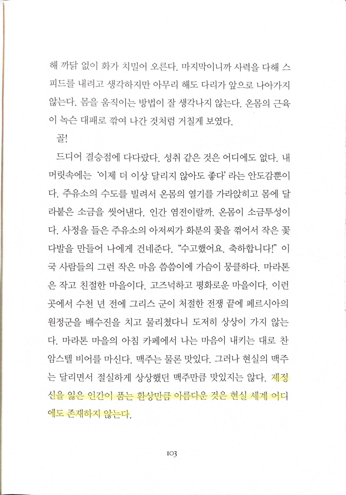

- 전혀 다른 이야기이지만 마약같은 걸 통한 환상도 저런 느낌을 일시적으로 주는 걸까? 어떤 기사에서는 오히려 마약을 하는 때는 평범한 순간이고 그 이외의 시간은 지옥과 같은 느낌을 주기 때문에 상대적으로 마약을 하는 순간이 좋게 느껴진다고 하긴 하던데

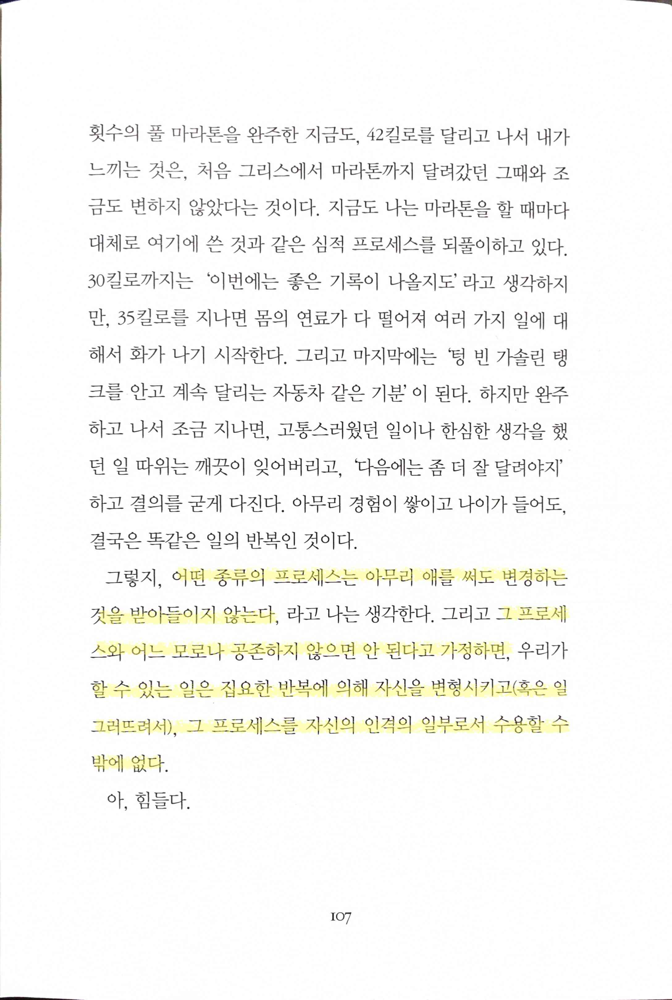

- 좋아서 하는 게 아니라 억지로라도 몸과 마음을 거기에 끼워넣듯이 익숙하게라도 만들어 그것을 벗어나는 걸 못 견디게 만드는 일의 필요함. 한때 software engineering에서 ‘프로세스’의 불필요함을 강조하고 자유롭게 개발하는 게 생산성을 극대화할 수 있는 방법이라고 주장하던 사람들이 있었다(지금도 그런지는 모르겠음). management를 하며 느낀 점은 현실적으로 불가능하다는 것. 이번 re:Invent에서도 느꼈지만 operation의 중요성을 거듭 느끼고 있다. 과거 six sigma를 software에 적용하려던 시도도 전혀 맞지 않은 방법이었지만 최소한 그 필요성만큼은 인정할 수 있게 되었다.

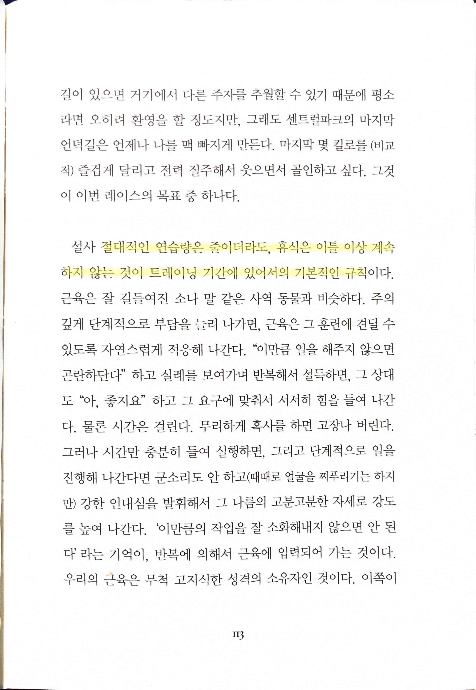

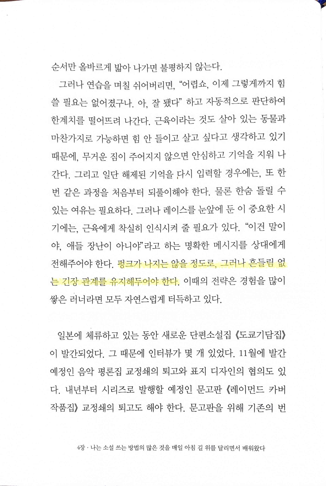

- 다시 한 번 강조하는 지속적인 훈련, 리듬, 루틴의 중요성

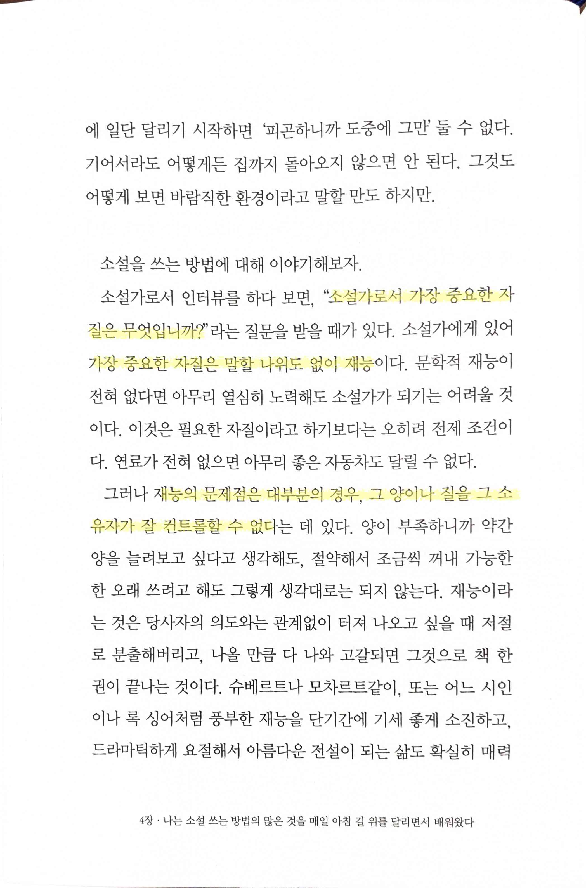

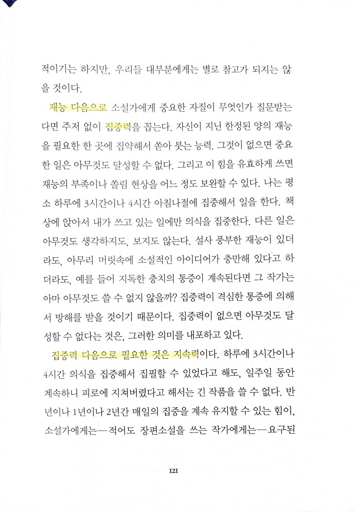

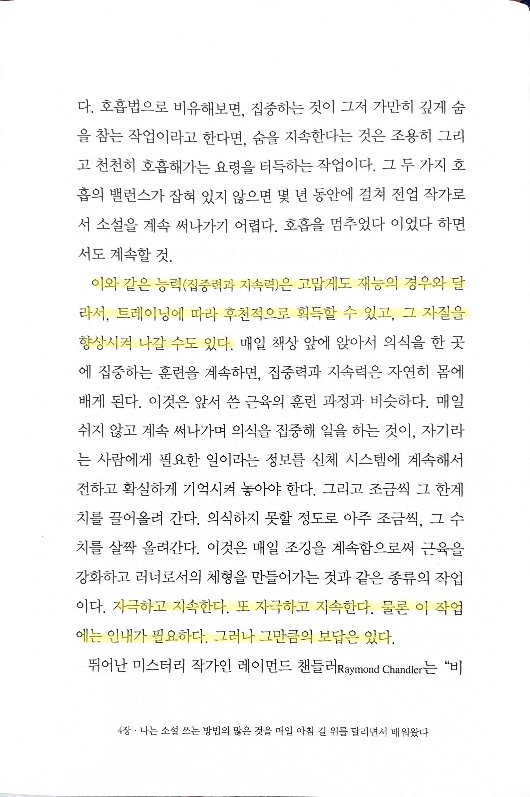

- 소설가에게 필요한 자질 재능, 집중, 지속. 소설가가 아니라 다른 어떤 직업을 넣어도 대체로 부드럽게 읽을 수 있다

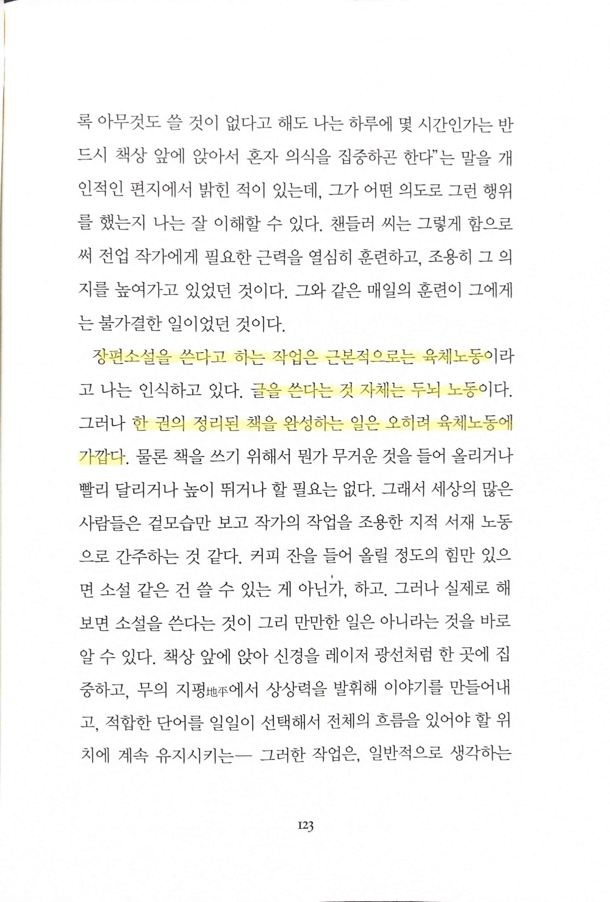

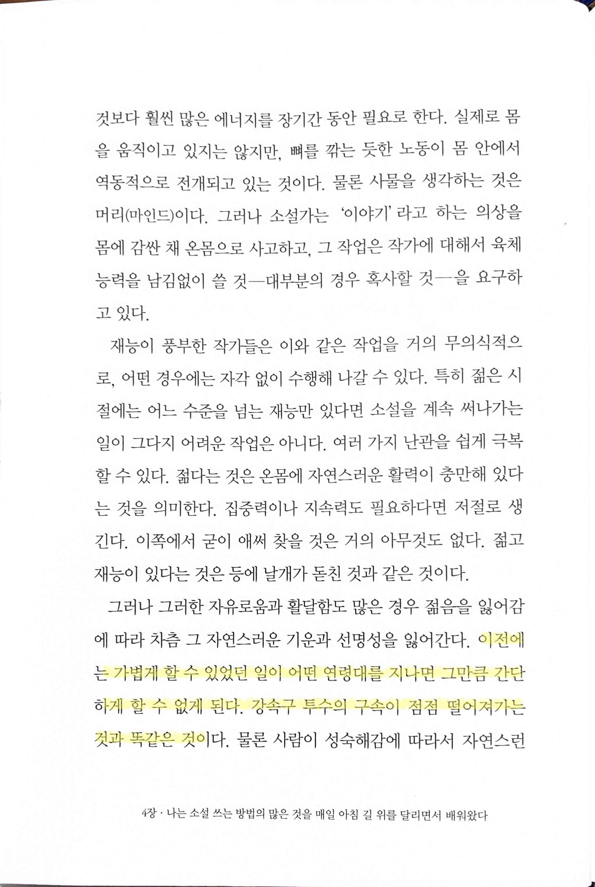

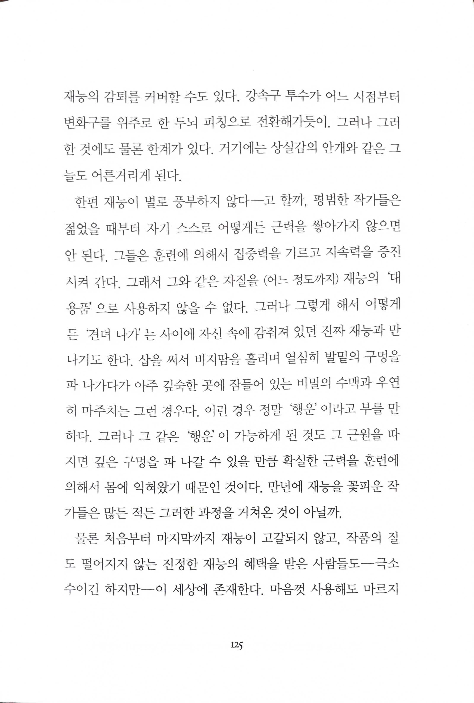

- 하루키 책에서 종종 읽을 수 있는 소설가는 육체노동이란 이야기와 그에 따라 체력이 떨어지면 어떻게 보충해야 하는지에 대한 이야기

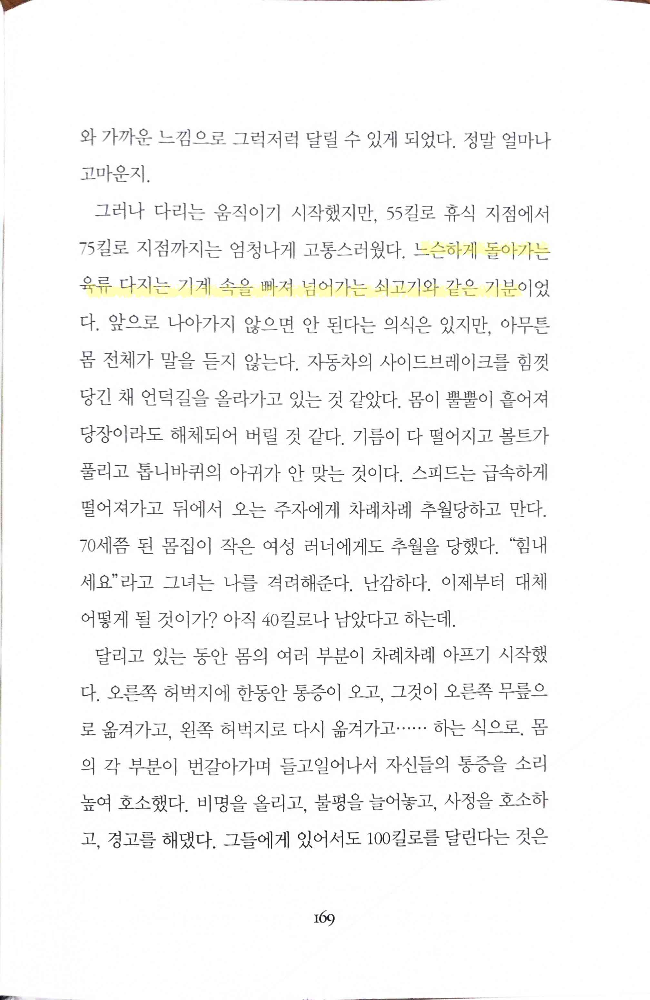

- 하루키의 글에서 종종 볼 수 있는 재미있는 비유

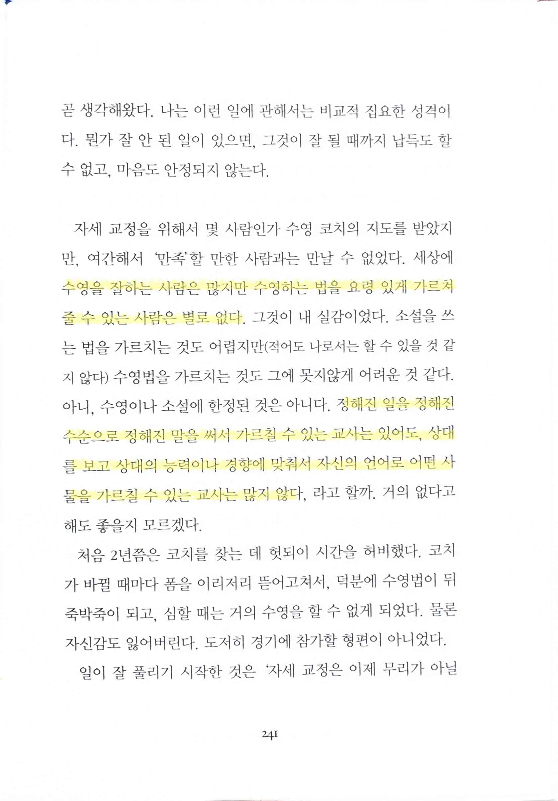

- 잘 하는 거와 잘 가르치는 거 사이의 간극. 스타 선수가 스타 감독이 되기 쉽지 않은 경우를 어디서나 쉽게 만날 수 있다
