# 숨결이 바람 될 때 When Breath Becomes Air

Tags: essay
Date: November 23, 2024
Score: ★★★☆☆

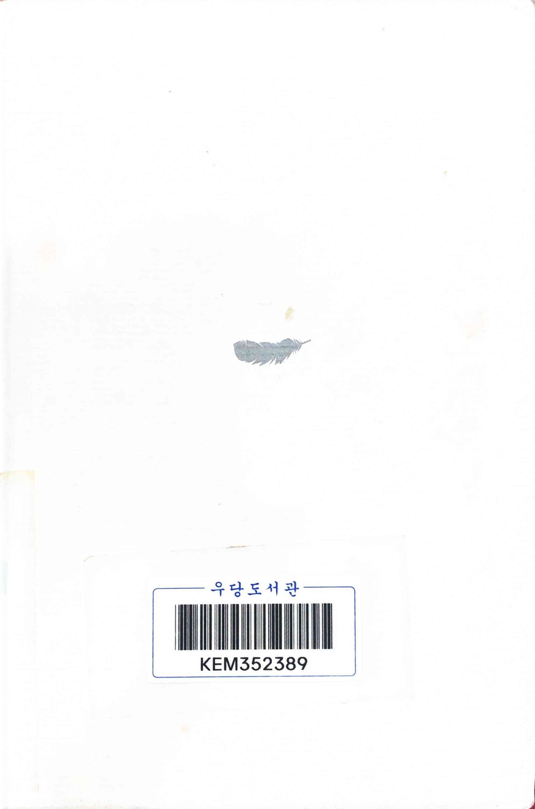

- ★★★☆☆ November 23, 2024
    - 얼마 전 《아버지의 죽음 앞에서 Dear Life 》를 읽으며 죽음과 삶에 대해 생각했던 시기에, 함께 읽으려고 리스트에 올려둔 책 중 하나가 《숨결이 바람 될 때》였다. 두 책 모두 의사가 자신의 죽음을 기록한 작품이라는 공통점이 있지만, 사랑하는 가족의 죽음을 앞둔 입장과 자신의 죽음을 마주한 입장의 차이, 그리고 응급의학과와 신경외과라는 세부 전공의 차이 때문인지 이 책은  다른 감정과 울림을 주었다.
    - 저자는 성공의 문턱에 선 신경외과 레지던트였다. 혹독한 수련 과정을 거의 마치고, 어느 대학의 교수로 가게 될지, 어떤 연구를 할지 생각하는 정도가 고민거리인, 장밋빛 미래를 눈앞에 두고 있었다. 그러나 폐암 4기라는 진단은 그의 삶을 송두리째 바꾸어 놓았다. 죽음이라는 필연 앞에서 그는 의사로서의 경력뿐 아니라, 삶 자체에 대한 방향을 완전히 재정비해야 했다.
    - 어렸을 때 병원에 3개월 넘게 입원한 경험이 있던 나로서는, 병으로 인해 삶이 송두리째 흔들리는 감정을 아주 약간은 이해할 수 있다. 하지만 성공 직전에서 모든 것이 무너지는 듯한 경험은 상상 속에서만 그려볼 뿐이다. 슬픔의 5단계에서 "체념"과 "수용"에 이르는 것이 얼마나 어려운 과정인지는 상상을 해도 가늠하기 힘들다. 저자 역시 그 과정에서 느낀 무력감과 혼란, 손만 뻗으면 닿을 것 같던 성공을 포기해야 했던 아픔을 담담한 문장으로 그려낸다. 의사였던 그는 누구보다도 자신의 몸 상태를 잘 이해했지만, 역설적으로 바로 그 지식이 자신의 상황을 더 뼈아프게 만들었을지도 모른다.
    - 하지만 그는 끝까지 살아가기로 결심했다. 아내와 함께 아이를 갖기로 결정하고, 죽기 얼마 전 딸을 만나게 되는 기쁨을 통해 그는 새로운 의미를 찾았다. 그리고 마지막까지 자신의 경험과 생각을 글로 기록하며 자신의 삶을 완성해 나갔다. 그의 글은 단순히 개인적인 투병기를 넘어, 삶과 죽음, 인간의 존재에 대한 고민을 담고 있다.
    - 죽음은 인간이라면 누구도 피할 수 없는 미래다. 나이가 들수록 그 주제에 대해 더 자주 생각하게 되는 요즘, 죽음이라는 주제에 관심이 있거나, 삶의 본질을 성찰해보고자 하는 사람들에게 이 책을 추천하고 싶다.
- p178, p192 어렸을 때 병원에 3개월 넘게 입원했던 일이 있어서 이런 감정적인 혼란이 잘 이해가 간다
    
    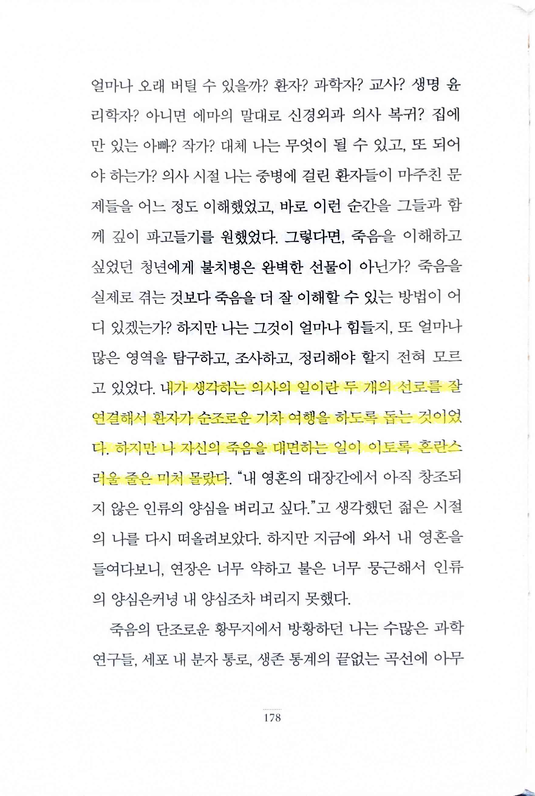
    
    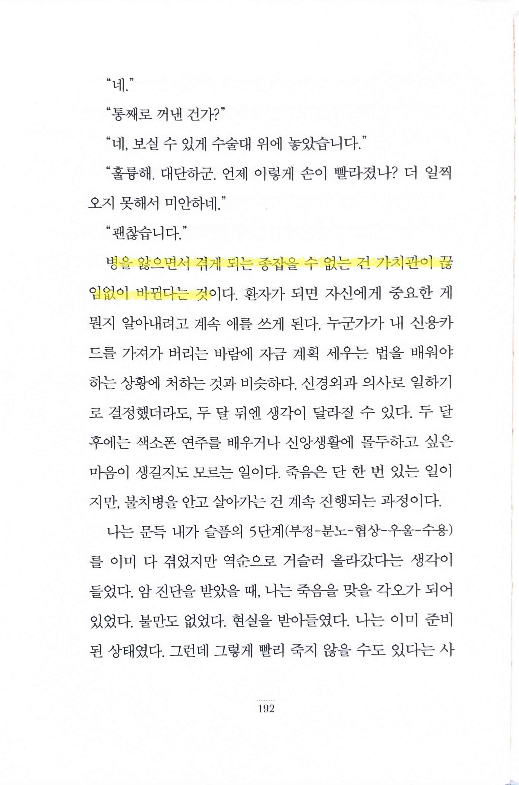
    
- pp197~198 누구나 그렇지만 이렇게 죽음을 앞에 둔 상황이라고 해도 결국 자신에 대한 인식은 스스로 찾고 정립해야 한다
    
    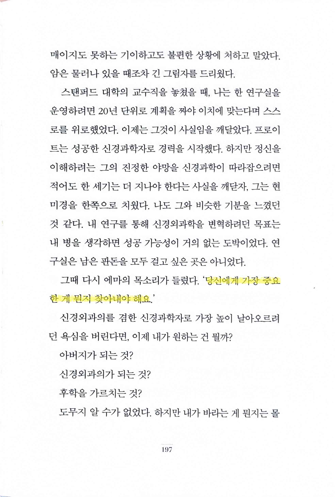
    
    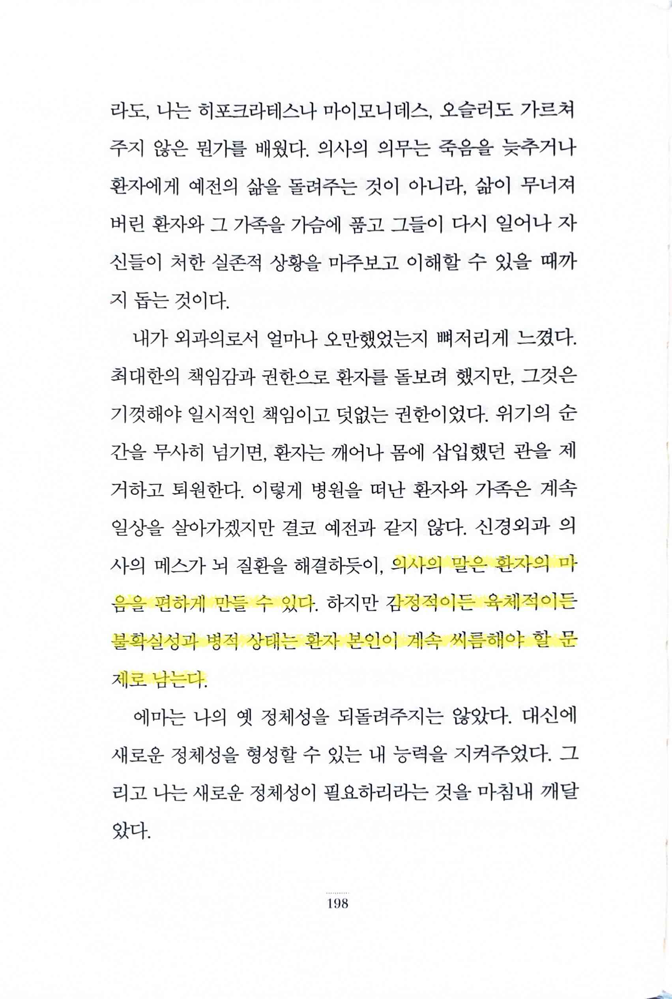
    
- pp201~203
    
    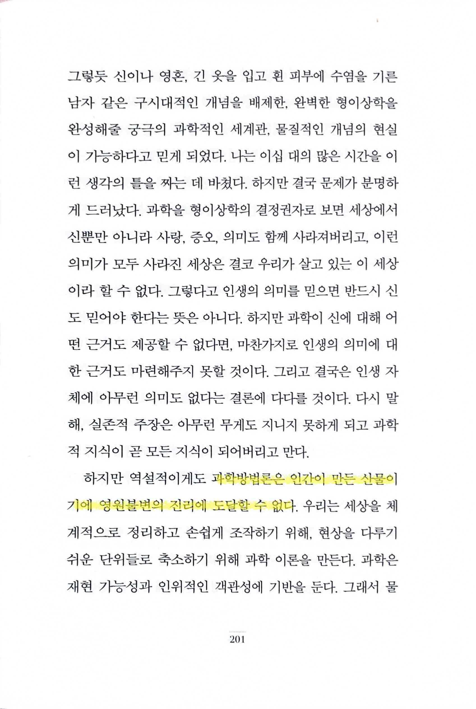
    
    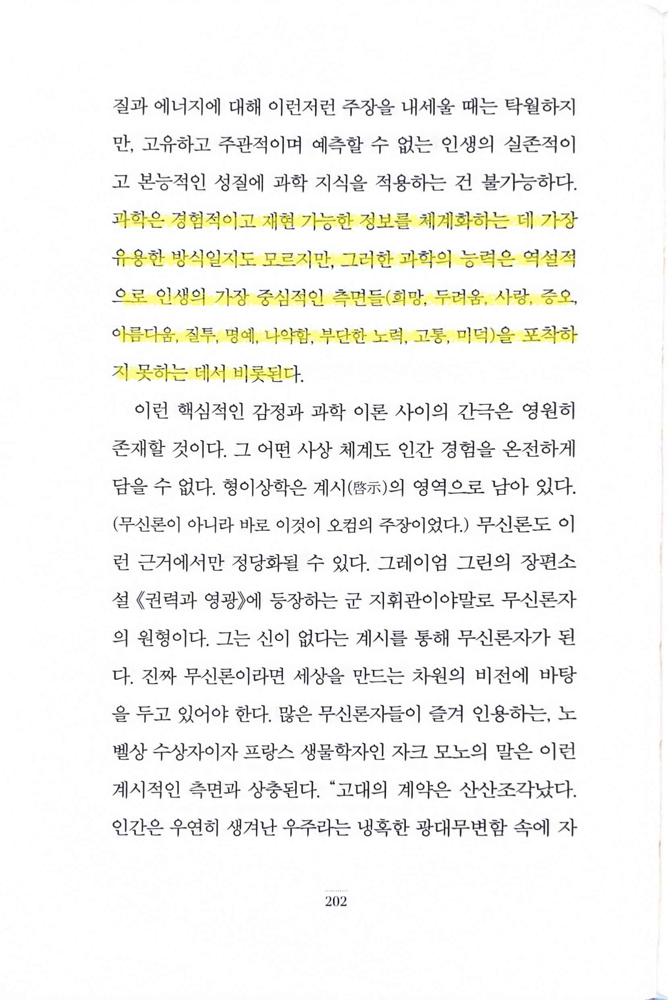
    
    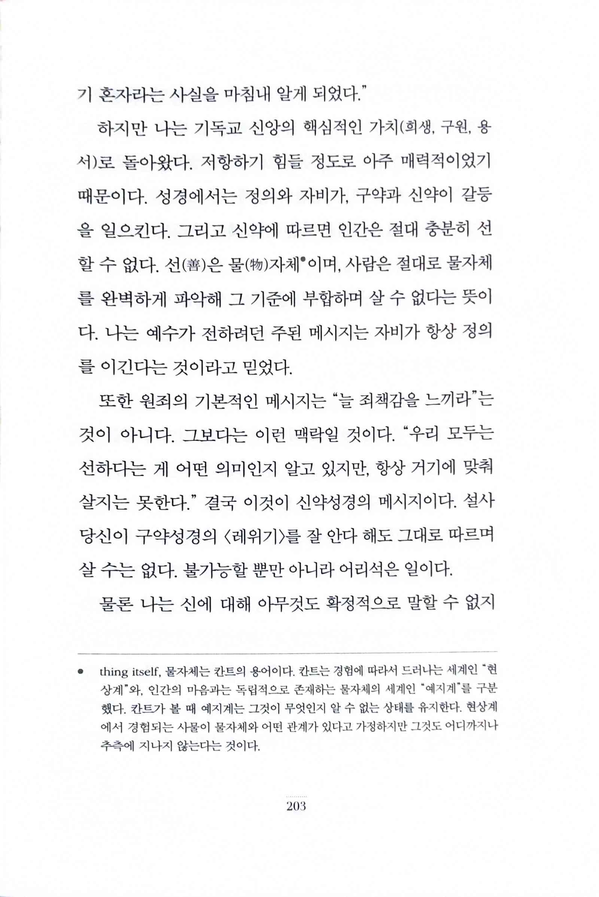
    
- p223 `WICOS(Who Is the Captain Of the Ship: 이 배의 선장은 누구인가?) 문제`
    
    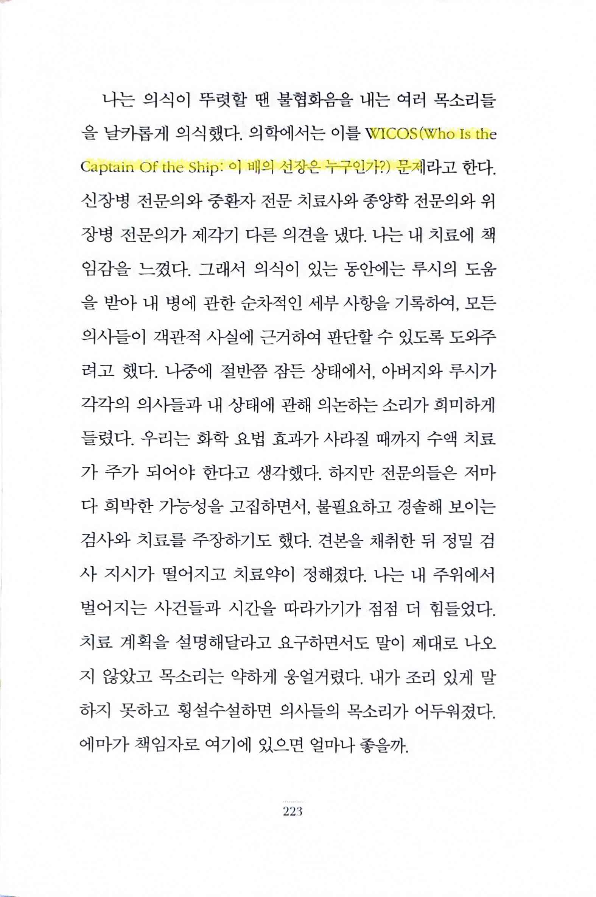
    
- p232 `그레이엄 그린`, `인생은 첫 20년까지이고 나머지 시간은 그 20년을 회고하며 보내는 법`
    
    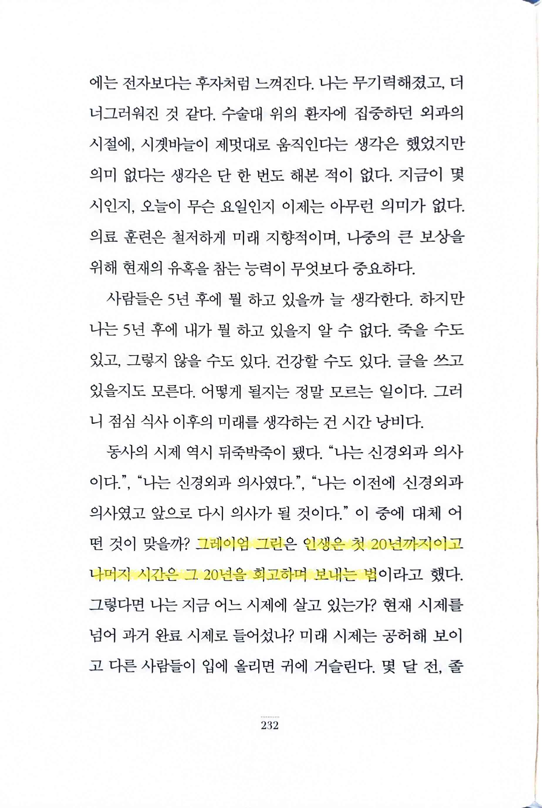
    
- p234 아이를 가진 부모가 아니면 쉽게 이해하기 어려울 감정이다. 다만 죽음을 앞둔 상황에서는 얼마나 극적이었을지 상상이 가지 않는다.
    
    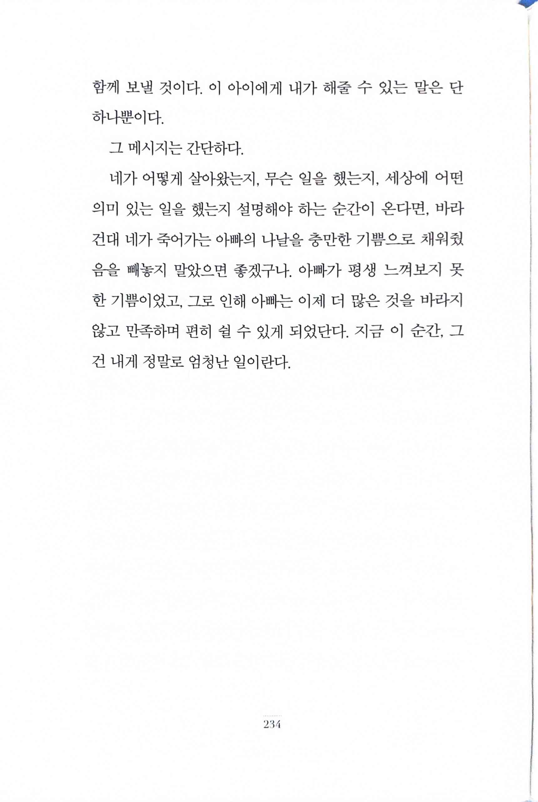
    
- p262 `C. S. 루이스`, `“사별은 부부애의 중단이 아니라, 신혼여행처럼 그 정상적인 과정중 하나이다. 우리가 바라는 건 결혼 생활을 잘 영위하여 이 과정도 충실하게 헤쳐나가는 것이다.”`
    
    
