물고기는 존재하지 않는다
==================
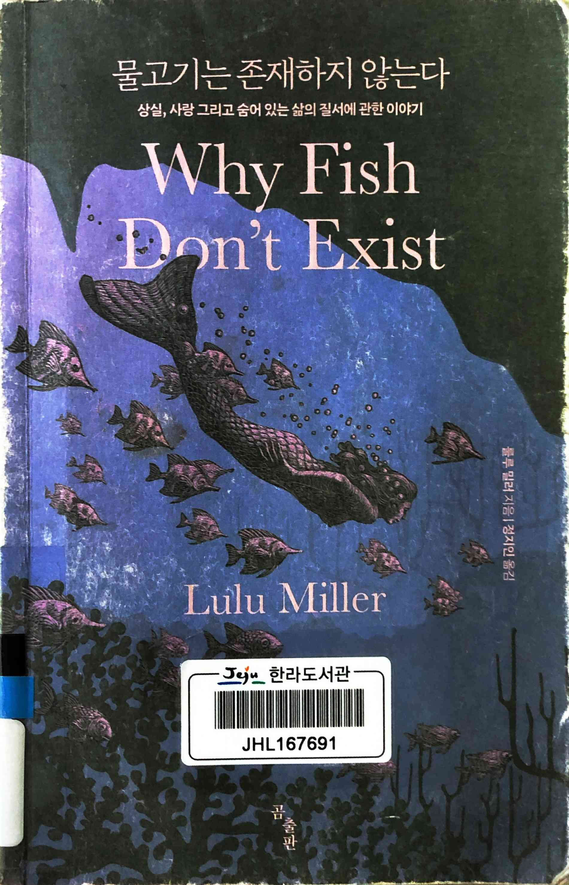

* ★★★★☆ 2023.05.17 물고기가 인간의 자의적인 분류라는 깜짝 놀랄 사실과, 이 (존재하지 않는) 물고기라는 종의 분류를 주도한 인물이 스탠포드 대학과 관계가 있고, 우생학을 미국에 보급하는데 앞장선 문제의 인물이며, 그로 인해 미국이 얼마나 영향을 받았는지(그래서 비록 사문화되었다고는 하지만, 아직도 법에 남아있다는) 여러가지 놀라운 사실을 알게 되었다. 생선을 좋아하는데, 앞으로 생선을 먹을 때마다 이 책이 생각나지 않을까 하는 좀 수준 낮은 생각도 들고, 우생학이라는 지금은 사라졌다고 생각한 인종차별이 사실은 아직도 그림자를 드리우고 있다는 불쾌한 사실까지 많은 생각이 들었다. 그래도 이 책이 출판된 이후 스탠포드/인디애나 대학의 데이비드 조던 이름이 붙은 건물이 이름이 변경되었다는 에필로그를 보면 미국의 힘이 조금은 남아있단 생각도 든다.

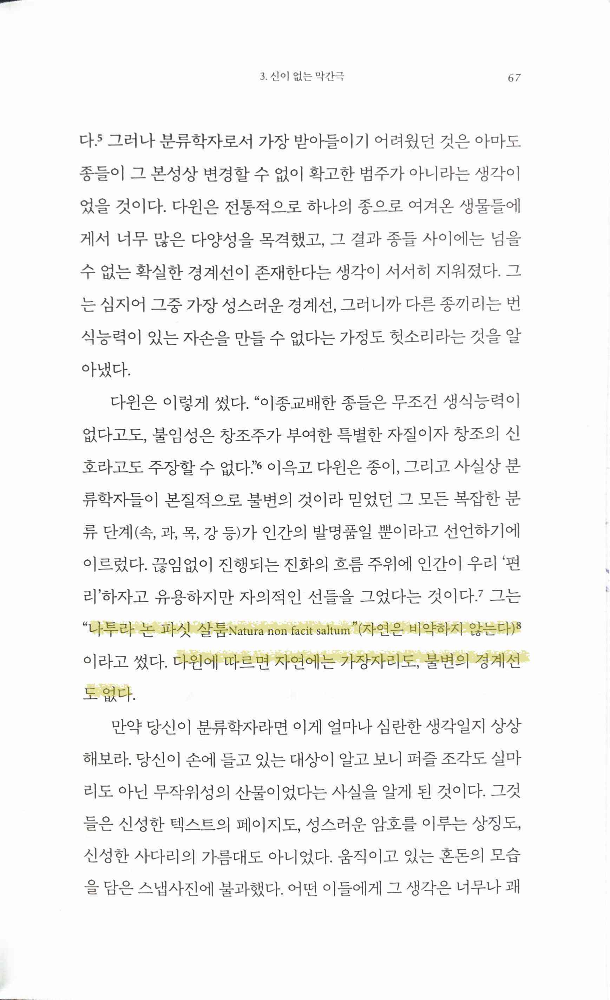

> “나투라 논 파싯 살툼 Natura non facit saltum"(자연은 비약하지 않는다)이라고 썼다. 다윈에 따르면 자연에는 가장자리도, 불변의 경계선도 없다.

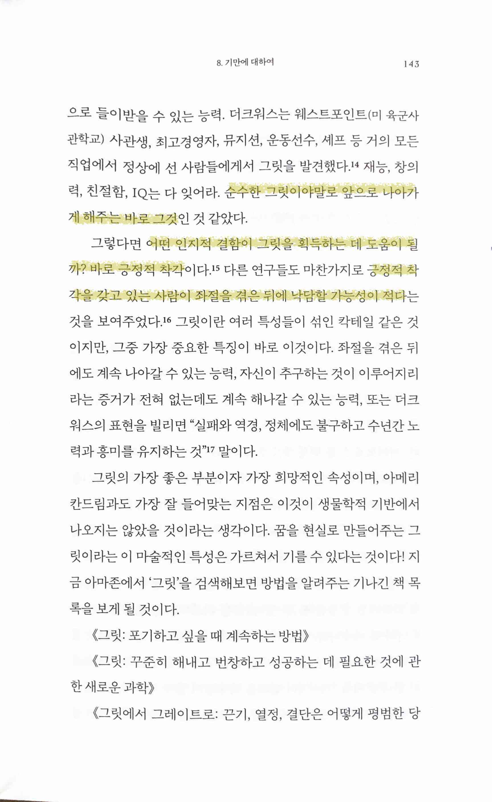

> 순수한 그릿이야말로 앞으로 나아가게 해주는 바로 그것
>
> 어떤 인지적 결함이 그릿을 획득하는 데 도움이 될까? 바로 긍정적 착각... 긍정적 착각을 갖고 있는 사람이 좌절을 겪은 뒤에 낙담할 가능성이 적다

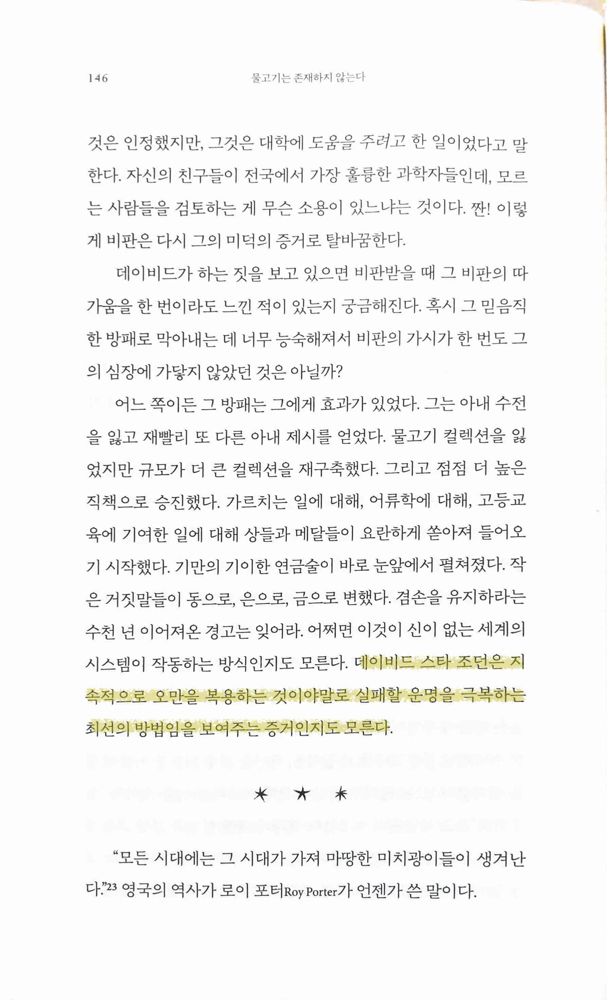

> 데이비드 스타 조던은 지속적으로 오만을 복용하는 것이야말로 실패할 운명을 극복하는 최선의 방법임을 보여주는 증거인지도 모른다.
* 데이비드 스타 조던만 그렇겠는가. 우리 사회엔 이런 자들이 넘쳐난다. 차라리 무능력하면 드러날 거란 기대라도 하겠지만 어떤 경우에는 유능하기도 하고 또 성실하기까지 하다. 다만 그 방향이 너무나 틀렸고 문제가 될 뿐. 이런 경우에는 데이비드 스타 조던처럼 엄청난 악영향을 남기고 그 영향력은 영원히 해결할 수 없을지도 모른다.

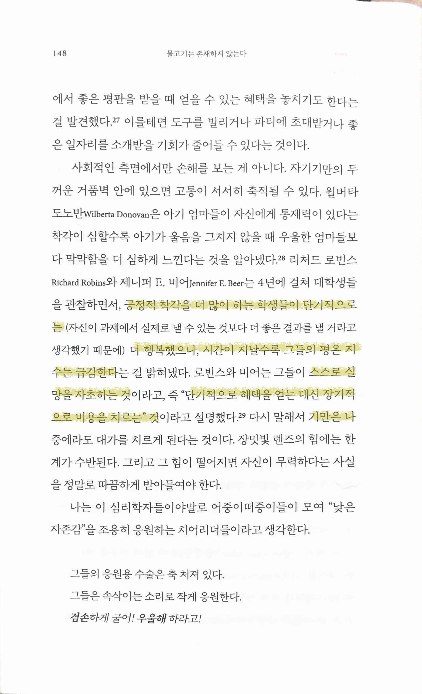

> 긍정적 착각을 더 많이 하는 학생들이 단기적으로는 (...) 더 행복했으나, 시간이 지날수록 그들의 평온 지수는 급감... 스스로 실망을 자초하는 것... “단기적으로 혜택을 얻는 대신 장기적으로 비용을 치르는” 것... 기만은 나중에라도 대가를 치르게 된다는 것이다. 장밋빛 렌즈의 힘에는 한계가 수반

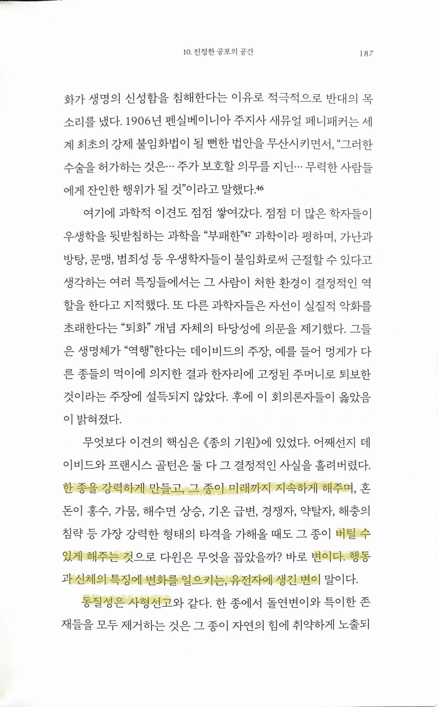 

> 한 종을 강력하게 만들고, 그 종이 미래까지 지속하게 해주며, ... 버틸 수있게 해주는 것... 변이다. 행동과 신체의 특징에 변화를 일으키는, 유전자에 생긴 변이
>
> 동질성은 사형선고
>
> 상황이 바뀌면 그 상황에 어떤 특징이 더 유용하게 적용될지는 아무도 모르는 법... "적합성에 대한 우리의 관점에서는 불쾌하게" 보일 수 있는 특징들이 사실 종 전체나 생태계에는 이로울 수도 있고, 혹은 시간이 지나고 상황이 바뀌면 이로운 것이 될 수도 있다

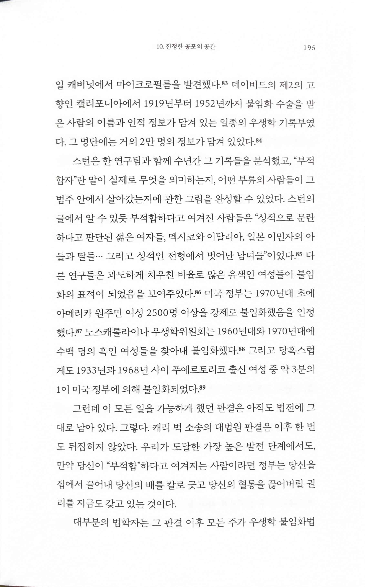 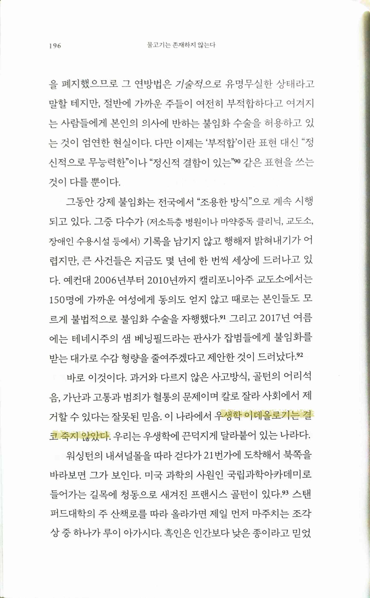

> 우생학 이데올로기는 결코 죽지 않았다.

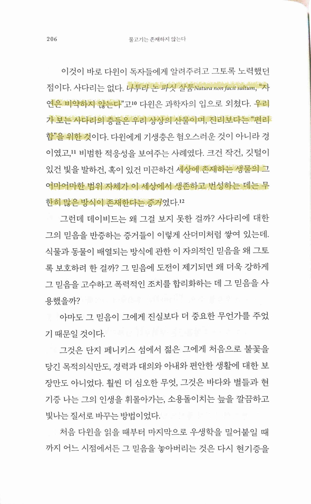

> 나투라 논 파싯 살툼 Natura non facit saltum, “자연은 비약하지 않는다"... 우리가 보는 사다리의 층들은 우리 상상의 산물이며, 진리보다는 편리함을 위한 것... 세상에 존재하는 생물의 그 어마어마한 범위 자체가 이 세상에서 생존하고 번성하는 데는 무한히 많은 방식이 존재한다는 증거

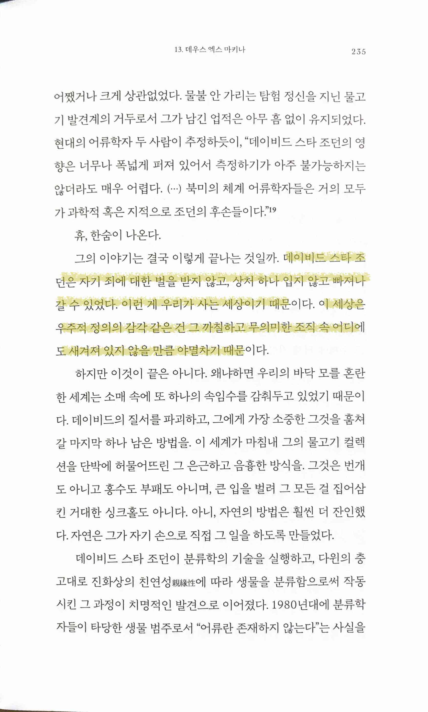

> 데이비드 스타 조던은 자기 죄에 대한 벌을 받지 않고, 상처 하나 입지 않고 빠져나갈 수 있었다. 이런 게 우리가 사는 세상이기 때문이다. 이 세상은 우주적 정의의 감각 같은 건 그 까칠하고 무의미한 조직 속 어디에도 새겨져 있지 않을 만큼 야멸차기 때문이다.

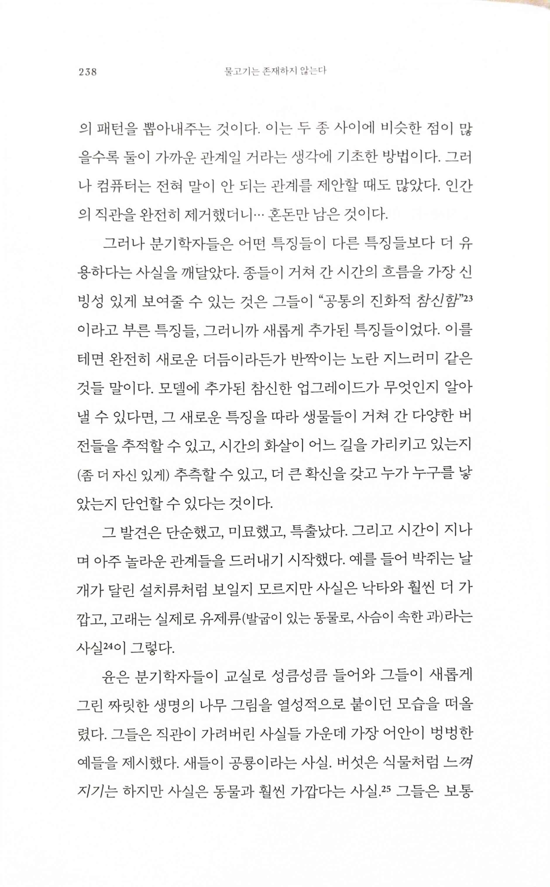 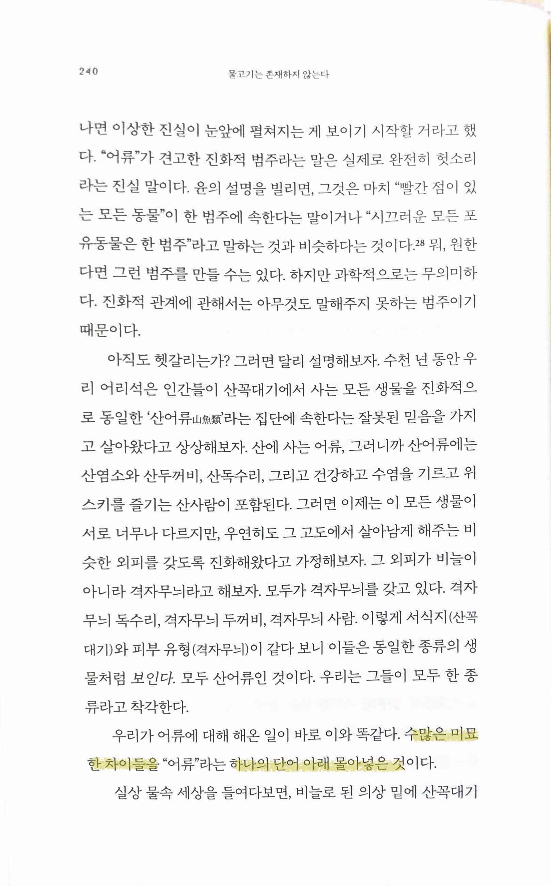 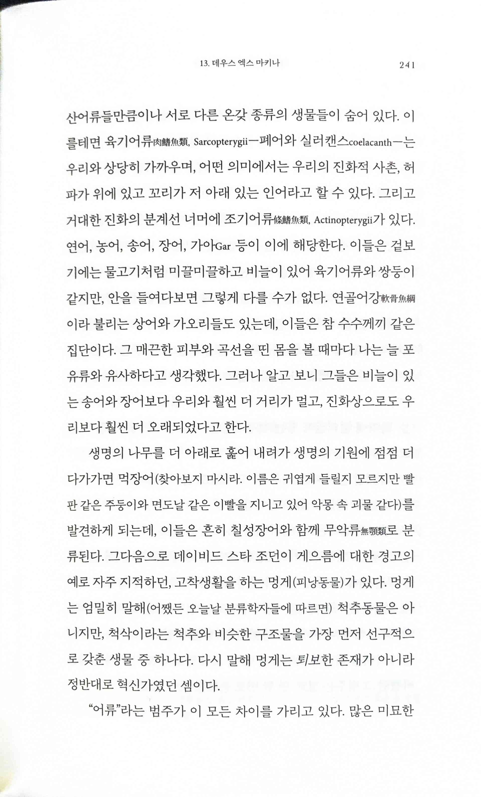

> 수많은 미묘한 차이들을 ... 하나의 단어 아래 몰아넣은 것

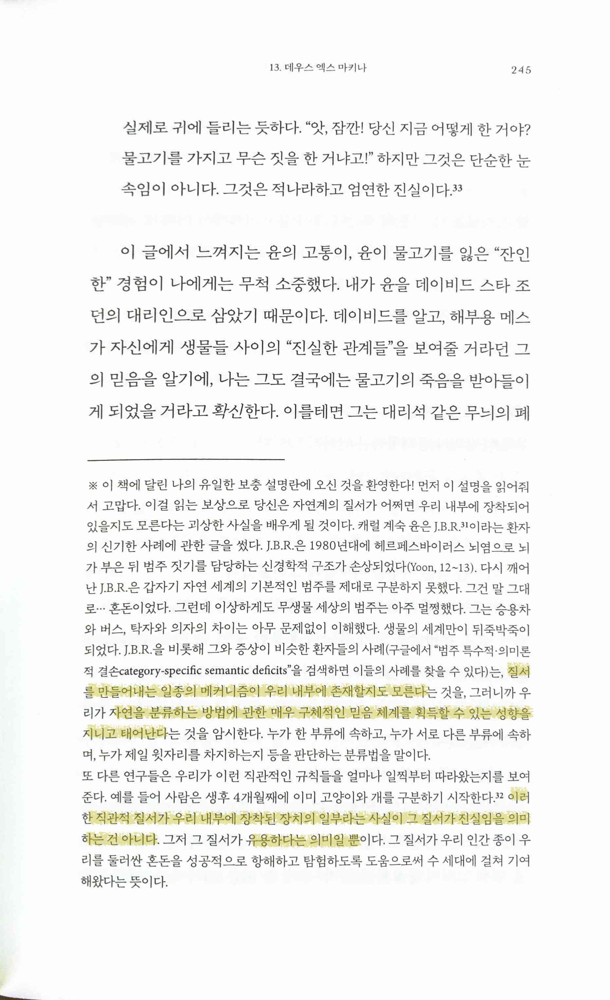

* `범주 특수적 의미론적 결손` [Category-specific semantic deficits: the role of familiarity and property type reexamined - PubMed](https://pubmed.ncbi.nlm.nih.gov/9673994/)
> 질서를 만들어내는 일종의 메커니즘이 우리 내부에 존재할지도 모른다... 자연을 분류하는 방법에 관한 매우 구체적인 믿음 체계를 획득할 수 있는 성향을 지니고 태어난다
>
> 이러한 직관적 질서가 우리 내부에 장착된 장치의 일부라는 사실이 그 질서가 진실임을 의미하는 건 아니다. 유용하다는 의미일 뿐

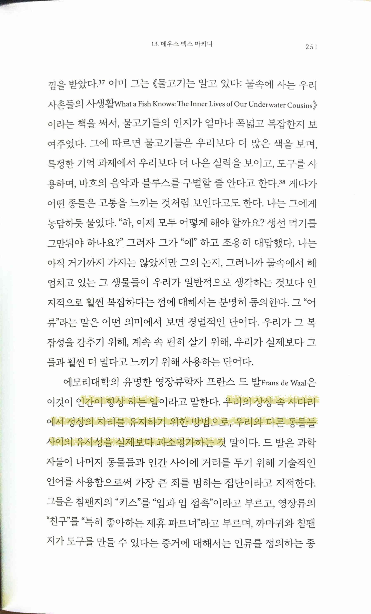

> 인간이 항상 하는 일... 우리의 상상 속 사다리에서 정상의 자리를 유지하기 위한 방법으로, 우리와 다른 동물들 사이의 유사성을 실제보다 과소평가하는 것

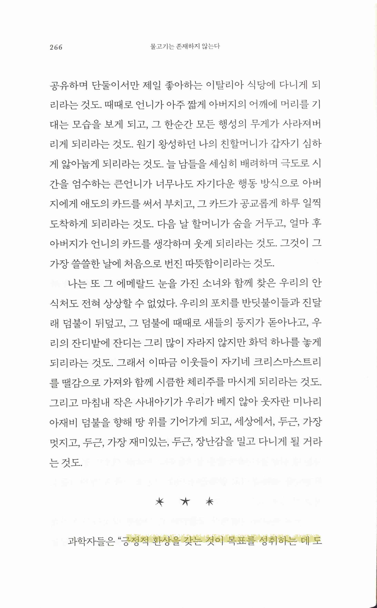 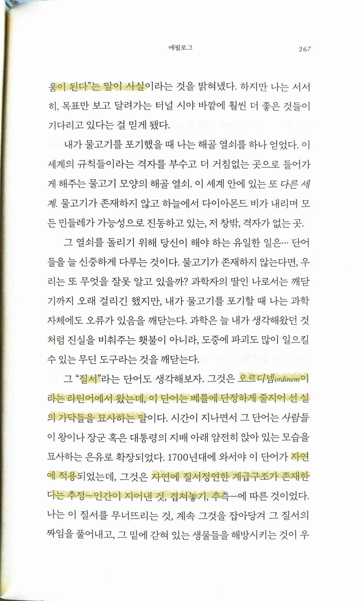

> "긍정적 환상을 갖는 것이 목표를 성취하는 데 도움이 된다"는 말이 사실
>
> "질서"... 오르디넴 ordinem이라는 라틴어에서 왔는데, 이 단어는 베틀에 단정하게 줄지어 선 실의 가닥들을 묘사하는 말... 자연에 적용... 자연에 질서정연한 계급구조가 존재한다는 추정-인간이 지어낸 것, 겹쳐놓기, 추측-에 따른 것

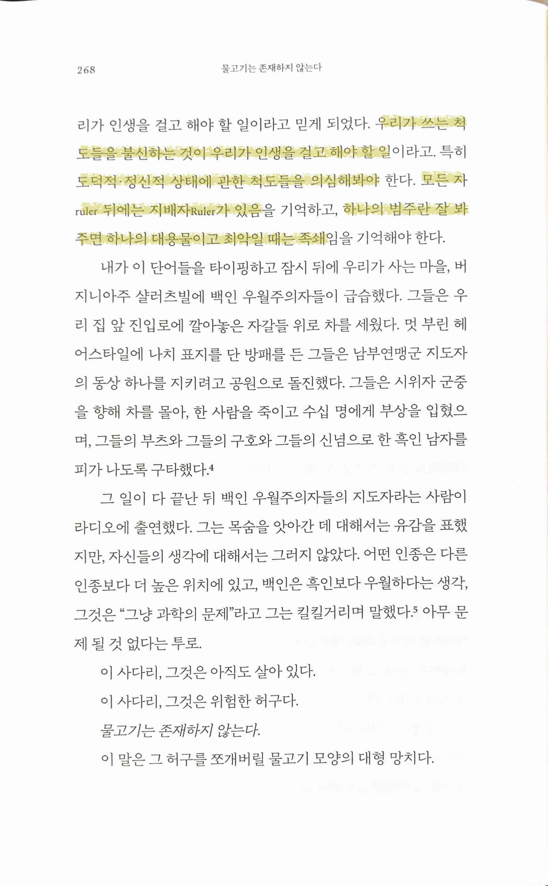

> 우리가 쓰는 척도들을 불신하는 것이 우리가 인생을 걸고 해야 할 일... 도덕적·정신적 상태에 관한 척도들을 의심해봐야 한다. 모든 자 ruler 뒤에는 지배자 Ruler가 있음..., 하나의 범주란 잘 봐주면 하나의 대용물이고 최악일 때는 족쇄
