# 이토록 간결한 글쓰기

Tags: writing
Date: March 19, 2024
Score: ★★★☆☆

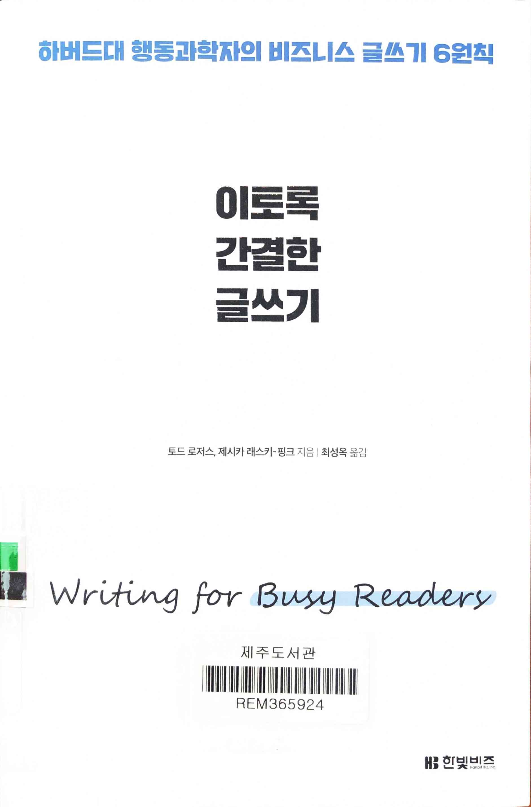

- ★★★☆☆ March 19, 2024 [이토록 간결한 글쓰기](https://www.hanbit.co.kr/biz/books/book_view.html?p_code=B7457234509)
    - 제주 325.484-로73이

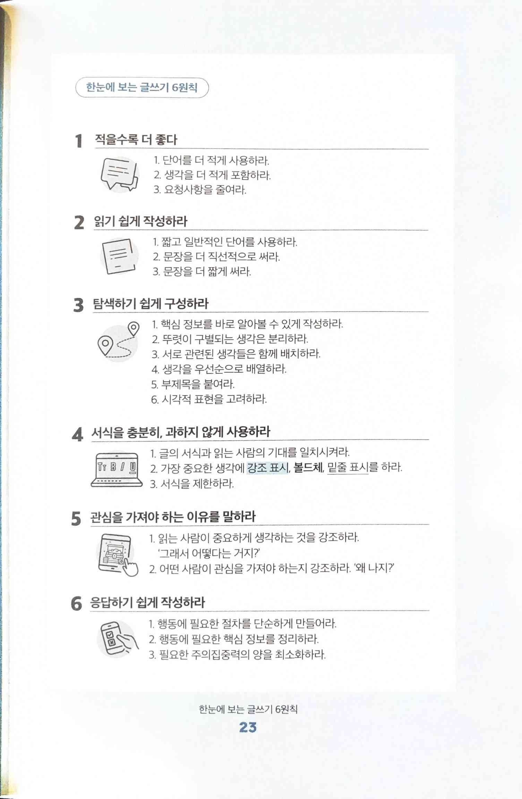

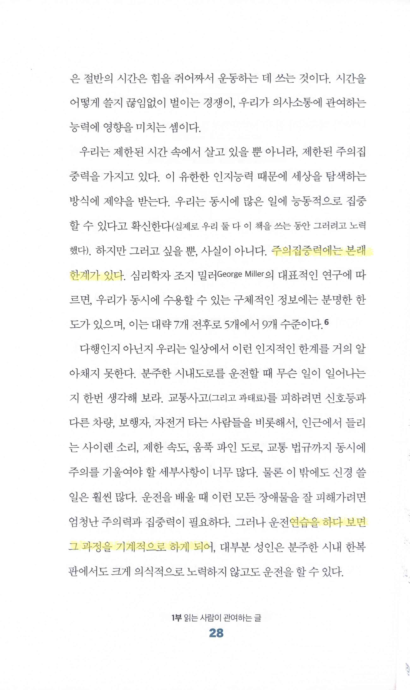

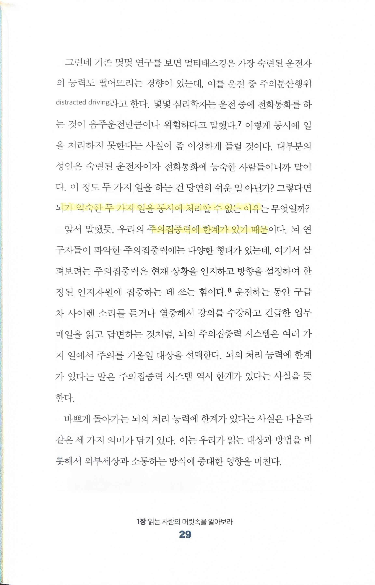

> 주의집중력에는 본래 한계가 있다
> 
> - 7±2에서 최근에는 4±2개로 더 작은 수를 이야기하는 연구 결과도 있음 → [프로그래머의 뇌 - 재그지그의 개발 블로그](https://wormwlrm.github.io/2022/11/06/Programmers-Brain.html)
> 
> 연습을 하다 보면 그 과정을 기계적으로 하게 되어
> 뇌가 익숙한 두 가지 일을 동시에 처리할 수 없는 이유는… 주의집중력에 한계가 있기 때문
> 

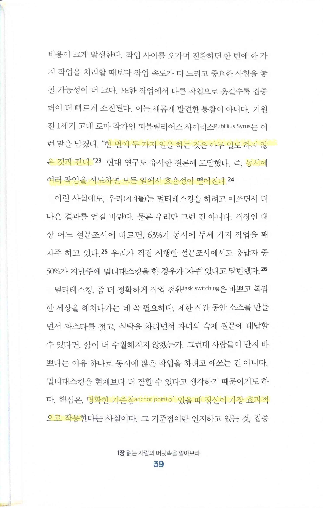

> 한 번에 두 가지 일을 하는 것은 아무 일도 하지 않은 것과 같다
> 
> - [Publilius Syrus - Wikipedia](https://en.wikipedia.org/wiki/Publilius_Syrus)
> 
> 동시에 여러 작업을 시도하면 모든 일에서 효율성이 떨어진다
> 명확한 기준점 anchor point이 있을 때 정신이 가장 효과적으로 작용
> 

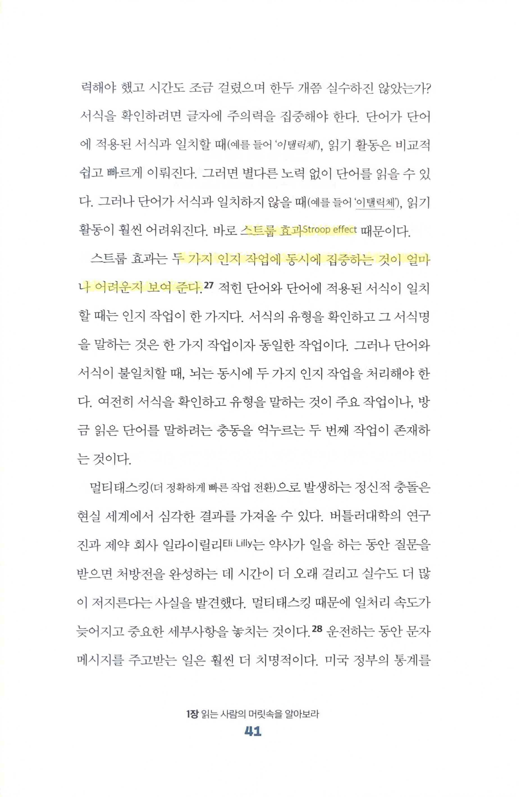

> 스트룹 효과 Stroop effect 두 가지 인지 작업에 동시에 집중하는 것이 얼마나 어려운지 보여 준다
> 
> - [스트루프 효과 - 위키백과, 우리 모두의 백과사전](https://ko.wikipedia.org/wiki/%EC%8A%A4%ED%8A%B8%EB%A3%A8%ED%94%84_%ED%9A%A8%EA%B3%BC)

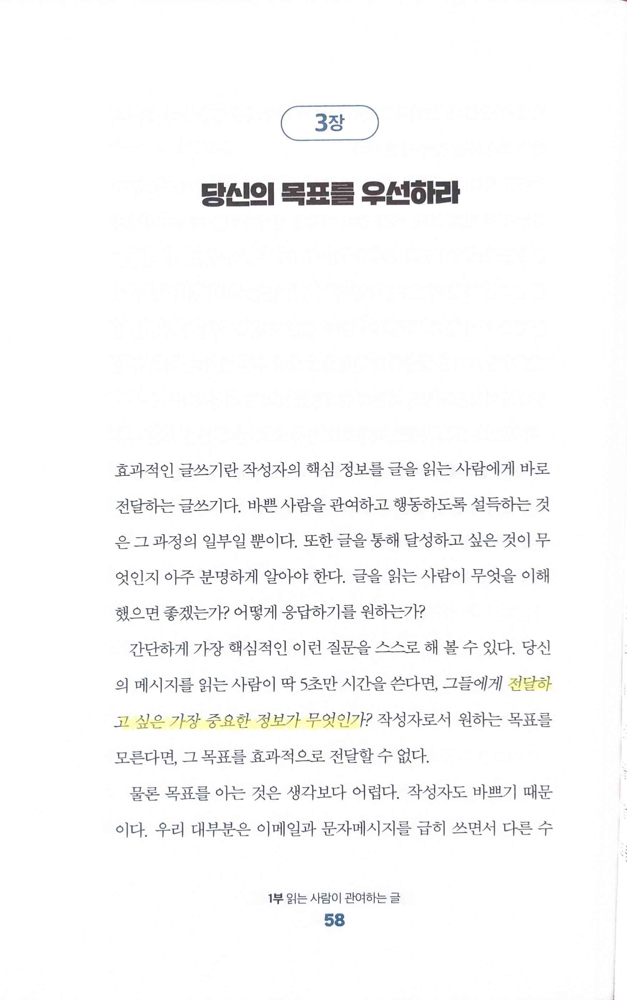

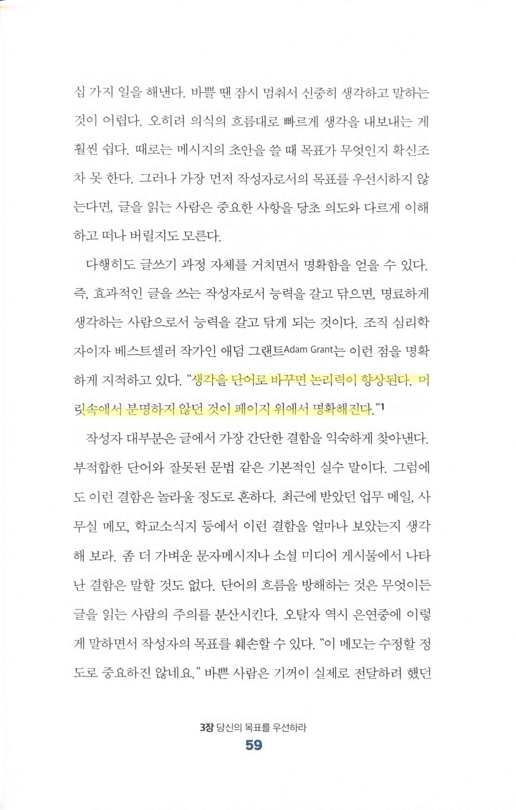

> 전달하고 싶은 가장 중요한 정보가 무엇인가?
생각을 단어로 바꾸면 논리력이 향상된다. 머릿속에서 분명하지 않던 것이 페이지 위에서 명확해진다
> 

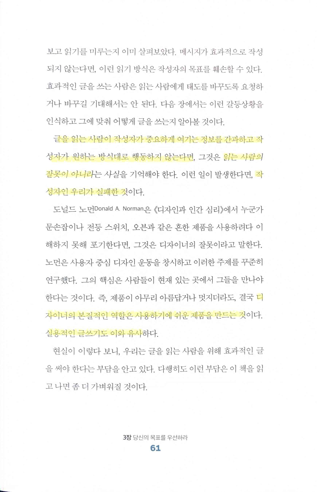

> 글을 읽는 사람이 작성자가 중요하게 여기는 정보를 간과하고 작성자가 원하는 방식대로 행동하지 않는다면, … 읽는 사람의 잘못이 아니라… 작성자인 우리가 실패한 것
디자이너의 본질적인 역할은 사용하기에 쉬운 제품을 만드는 것… 실용적인 글쓰기도 이와 유사
> 
> - 결국 글쓰기, 디자이너의 역할 두 가지 모두 사용자에게 product/service를 제공하는 사람들의 역할과 비슷하단 생각이 든다. 사용자가 사용하기 불편한 경우 사용자의 잘못이 아니라 사용하기 어려운 제품을 만든 쪽의 문제이듯. 가장 대표적인 예가 키오스크

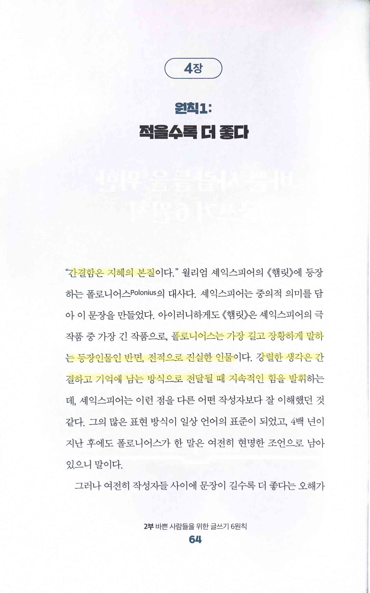

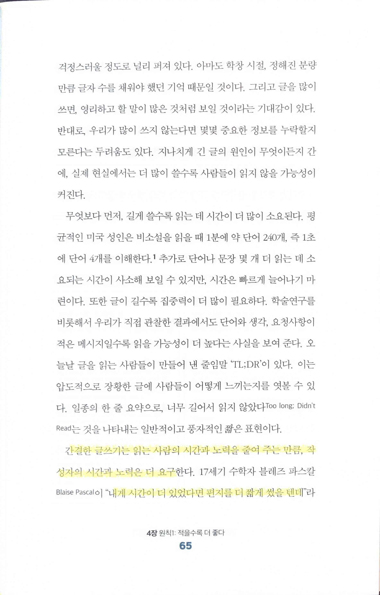

> 간결함은 지혜의 본질
폴로니어스는 가장 길고 장황하게 말하는 등장인물인 반면, 전적으로 진실한 인물이다. 강렬한 생각은 간결하고 기억에 남는 방식으로 전달될 때 지속적인 힘을 발휘
간결한 글쓰기는 읽는 사람의 시간과 노력을 줄여주는 만큼, 작성자의 시간과 노력은 더 요구
> 
> - 이 역시 앞서와 마찬가지로 사용자의 시간과 노력을 줄여줄 product/service를 만들어야 하는 부분과 유사
> 
> ”내게 시간이 더 있었다면 편지를 더 짧게 썼을 텐데”
> 

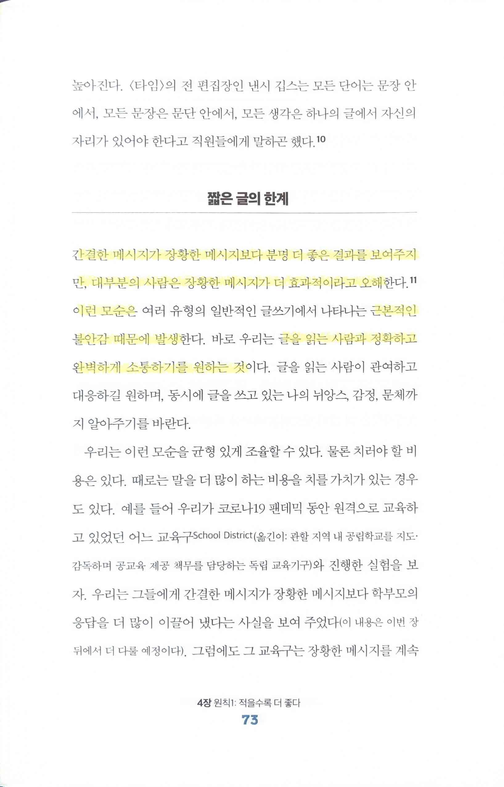

> 간결한 메시지가 장황한 메시지보다 분명 더 좋은 결과를 보여주지만, 대부분의 사람은 장황한 메시지가 더 효과적이라고 오해… 이런 모순은… 근본적인 불안감 때문에 발생… 글을 읽는 사람과 정확하고 완벽하게 소통하기를 원하는 것
> 
> - 여러 product/service의 실패 원인중 큰 부분이 사용자의 행동을 가정했는데, 그 가정에 따르지 않기 때문. 가정이 복잡할수록, 즉 사용할 때 과정이 여러 단계를 가지고 여러가지 경로를 선택 가능할수록, 수정이 어려워서 빠르게 대응하기 어렵고 실패할 확률도 높아진다

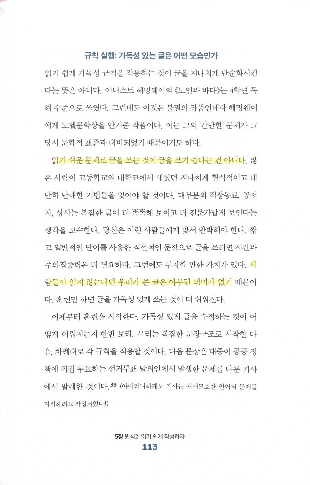

> 읽기 쉬운 문체로 글을 쓰는 것이 글을 쓰기 쉽다는 건 아니다… 사람들이 읽지 않는다면 우리가 쓴 글은 아무런 의미가 없기…
> 
> - 사용자가 없는 product/service는 많은 자원을 투입해서 높은 품질로 만들었다고 해도 결국 쓸모가 없음

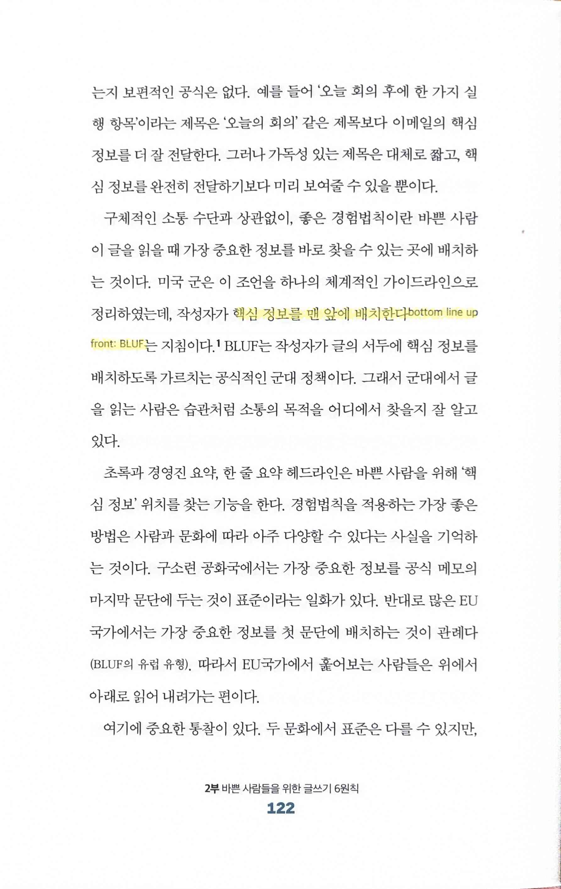

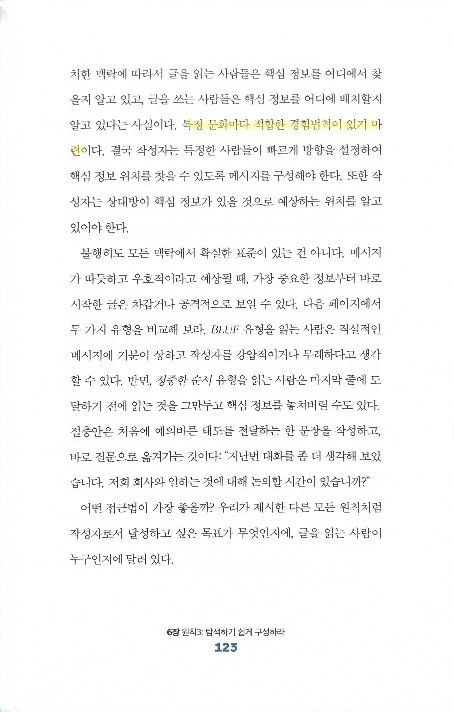

> 핵심 정보를 맨 앞에 배치한다 bottom line up front: BLUP
특정 문화마다 적합한 경험법칙이 있기 마련
> 

> 중요한 정보를 시각적으로 전달하면 언어 장벽도 문제없다
일부 문장을 표나 그래픽으로 전환함으로써 많은 의사소통이 더 효과적으로
> 

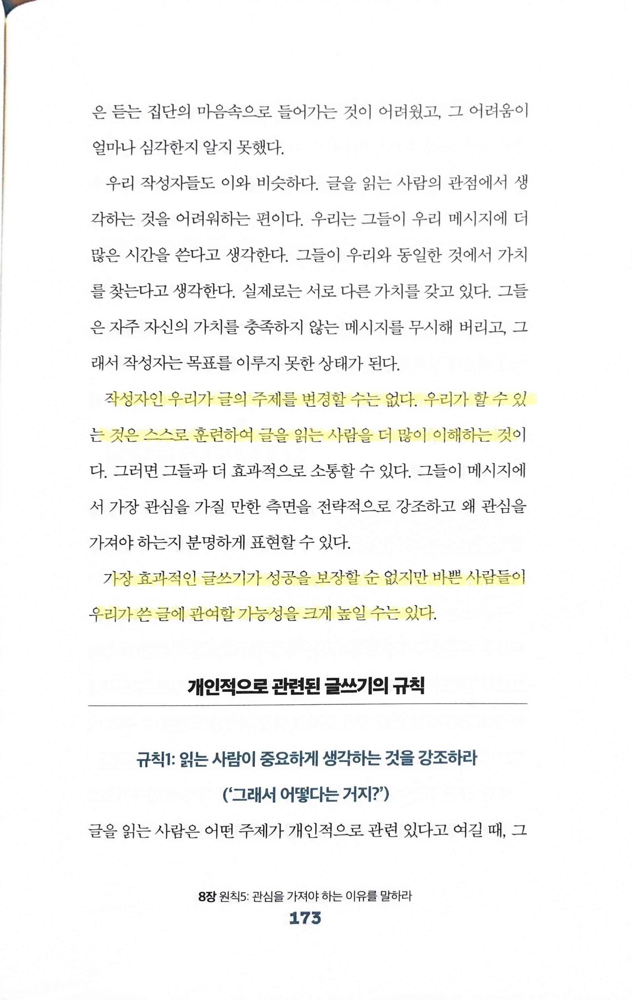

> 작성자인 우리가 글의 주제를 변경할 수는 없다. 우리가 할 수 있는 것은 스스로 훈련하여 글을 읽는 사람을 더 많이 이해하는 것
> 
> - 사용자에게 의미있는 서비스를 만들어야지 만드는 사람들의 추측으로 만들어서는 안된다는 점과 유사하다고 볼 수 있다
> 
> 가장 효과적인 글쓰기가 성공을 보장할 순 없지만 바쁜 사람들이 우리가 쓴 글에 관여할 가능성을 크게 높일 수는 있다
> 

> 주의집중력의 양을 최소화하면 글을 읽는 사람이 요청사항을 따를 가능성을 효과적으로 높일 수… 선택 사항을 제한… 응답 옵션에 제약… 응답 절차를 명확
대안의 수를 제한하면 선택하는 것이 훨씬 쉽고 에너지 소모도 줄어든다
> 
> - 스티브 잡스, 마크 주커버그와 비슷한 오바마의 사례
