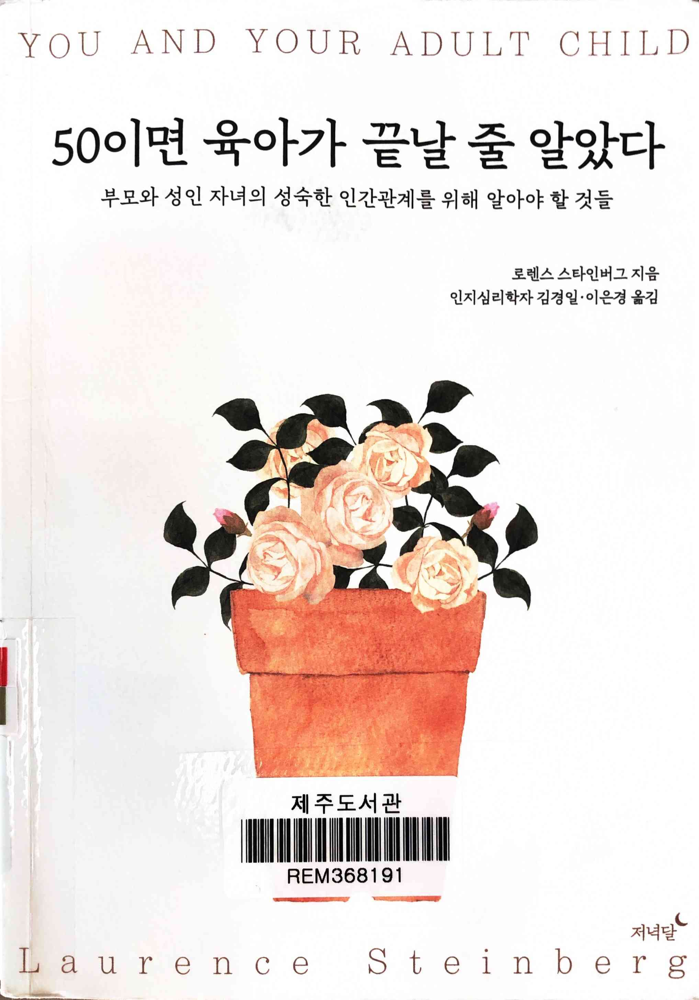
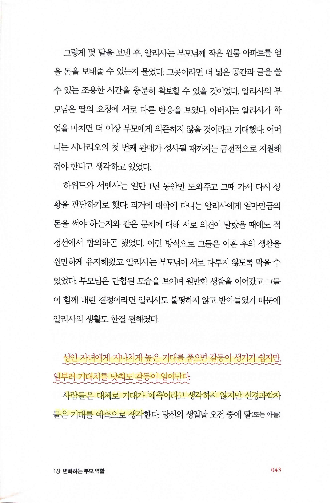
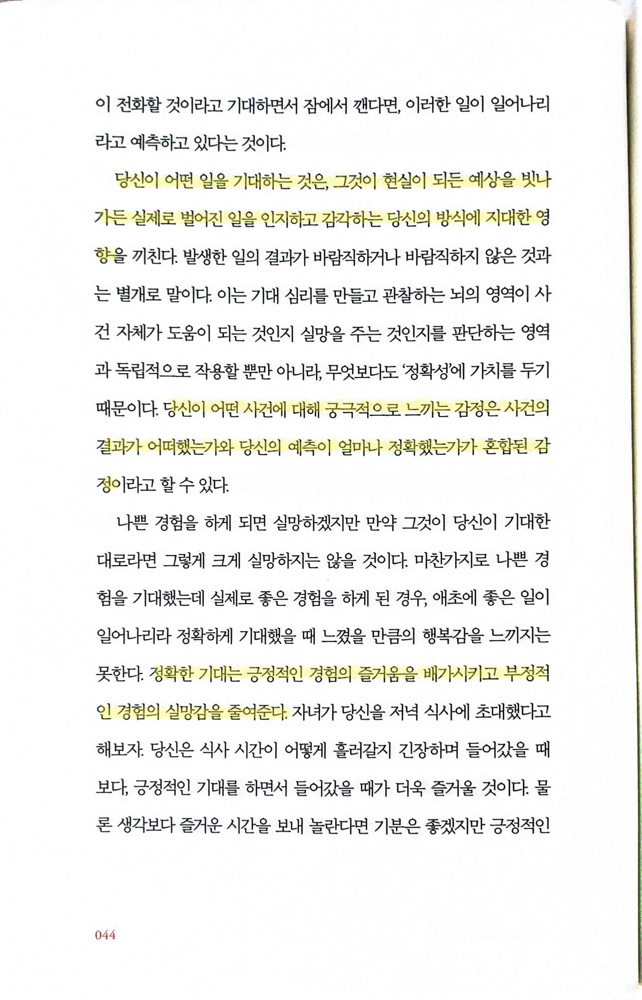
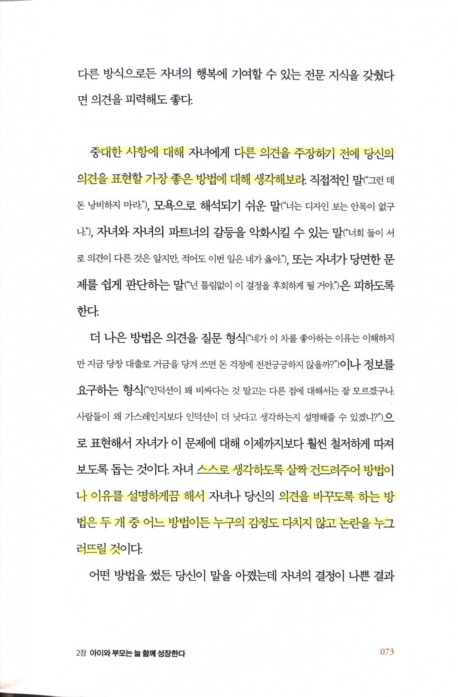
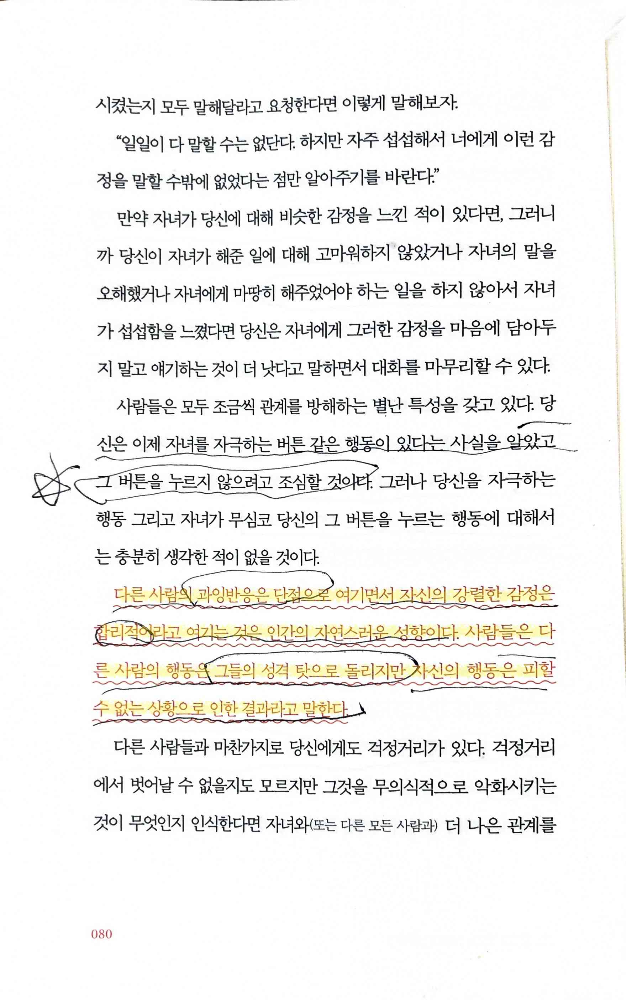
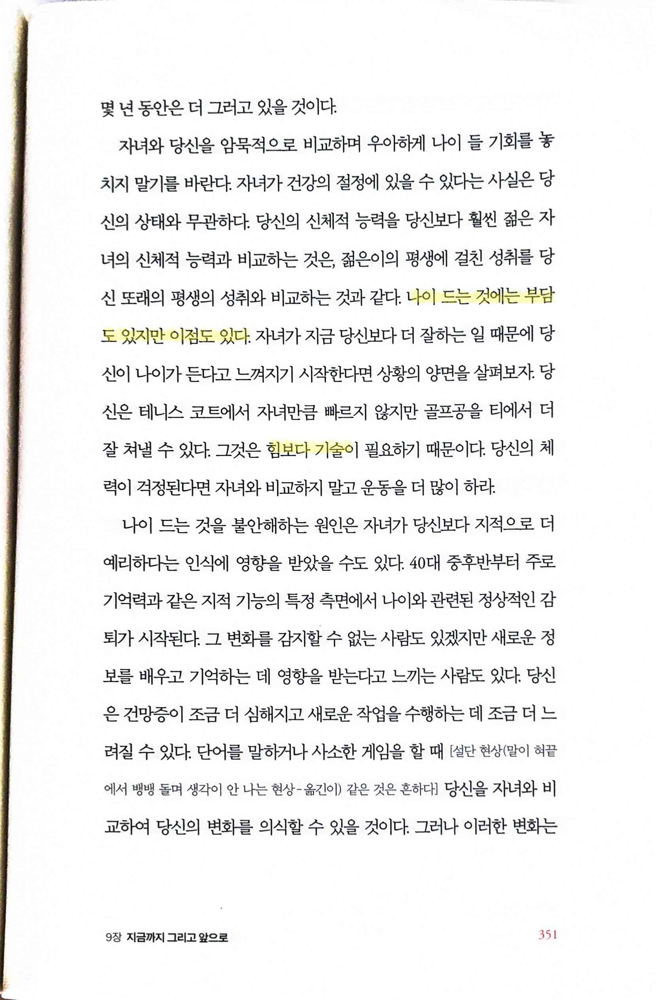

# 50이면 육아가 끝날 줄 알았다 you and your adult child

Tags: psychology
Date: June 18, 2024 → June 20, 2024
Score: ★★★☆☆

- ★★★☆☆ June 18, 2024 → June 20, 2024 시대의 변화가 사람의 모든 생활에 영향을 준다는 걸 문자로만 알고 있었지 모르는 영역이 훨씬 많다는 걸 다시 한 번 깨닫게 해준 책. 당장 적합하진 않아도 나에게도 곧 닥칠 일이라고 생각하면서 읽어봤다. 이런 부분까지 쓴다고? 하면서 세부적인 거까지 항상 신경을 써야 한다는 점을 스스로 상기하면서 읽었다.
    - 우당 문189.24-스831ㅇ 제주 598.1-스831오
    - https://www.linkedin.com/posts/duckjungkim_이-책을-읽고-두가지를-느꼈습니다-1집에서-자녀와-잘-지내지-못한-임원은-activity-7169173578817503232-JyVA
- pp43~44
    
    
    
    > 성인 자녀에게 지나치게 높은 기대를 품으면 갈등이 생기기 쉽지만, 일부러 기대치를 낮춰도 갈등이 일어난다.
    > 
    
    > 사람들은 대체로 기대가 ‘예측’이라고 생각하지 않지만 신경과학자들은 기대를 예측으로 생각한다.
    > 
    
    
    
    > 당신이 어떤 일을 기대하는 것은, 그것이 현실이 되든 예상을 빗나가든 실제로 벌어진 일을 인지하고 감각하는 당신의 방식에 지대한 영향을 끼친다… 당신이 어떤 사건에 대해 궁극적으로 느끼는 감정은 사건의 결과가 어떠했는가와 당신의 예측이 얼마나 정확했는가가 혼합된 감정
    > 
    > - 결과와 무관하게 기대를 어떻게 하느냐가 감정에 영향을 준다면 기대를 맞추기 위해서는 어떻게 해야 할까? 미리 이 기대치를 조정하기 위해 서로 detail을 논의하는 게 맞을까? 맞다면 어느 정도까지 논의해야 할까?
- p73
    
    
    
    > 중대한 사항에 대해… 다른 의견을 주장하기 전에 당신의 의견을 표현할 가장 좋은 방법에 대해 생각해보라.
    > 
    
    > 스스로 생각하도록 살짝 건드려주어 방법이나 이유를 설명하게끔 해서… 의견을 바꾸도록 하는 방법은 두 개 중 어느 방법이든 누구의 감정도 다치지 않고 논란을 누구러뜨릴 것
    > 
    > - 이 부분이 말로 하긴 쉬운데 실제로 하기는 어려운 부분이고 이걸 말이나 글로 배울 수 있는 건지 궁금하다
- p80
    
    
    
    > 다른 사람의 과잉반응은 단점으로 여기면서 자신의 강렬한 감정은 합리적이라고 여기는 것은 인간의 자연스러운 성향이다. 사람들은 다른 사람의 행동은 그들의 성격 탓으로 돌리지만 자신의 행동은 피할 수 없는 상황으로 인한 결과라고 말한다.
    > 
    > - 내로남불은 인간의 본성일까?
    > - 이런 부분을 기록하면서 이렇게 쓰는 것도 웃긴 일일 수 있지만, 공공 도서관의 책을 이렇게 자기 책인양 줄을 긋고 표시하는 심리를 도무지 이해할 수가 없다
- p351
    
    
    
    > 나이 드는 것에는 부담도 있지만 이점도 있다… 힘보다 기술…
    > 
    > - 스포츠에서는 시즌 가장 호흡이 긴 게 야구이고 보통 야구가 체력보다 기술이 중요하단 말을 하는데 이와 비슷하게 생각할 수 있는 걸까?
