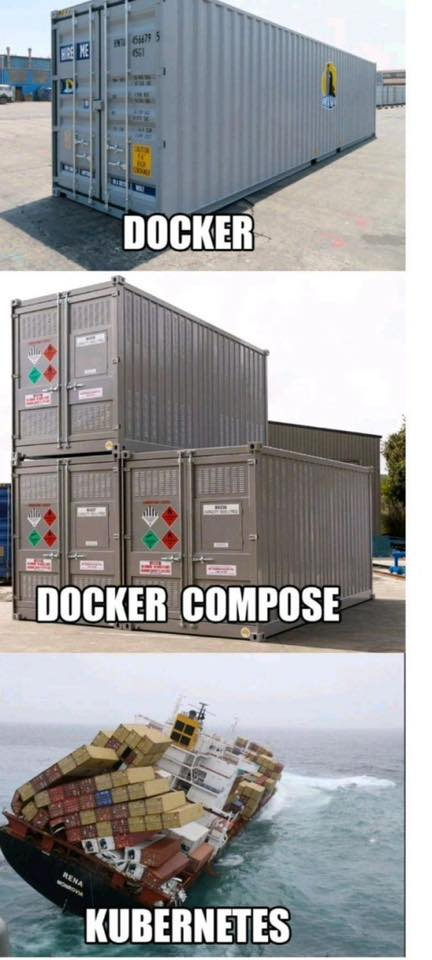

Docker
======
* [Awesome-docker](https://awesome-docker.netlify.com/)
* [Introduction to Docker](https://www.youtube.com/watch?v=Q5POuMHxW-0)
* [도커 무작정 따라하기](http://www.slideshare.net/pyrasis/docker-fordummies-44424016)
* [도커(Docker) 튜토리얼 : 깐 김에 배포까지](http://blog.nacyot.com/articles/2014-01-27-easy-deploy-with-docker/)
* [**DOCKER 부터 KUBERNETES 까지**](https://www.fiveminutesdev.com/category/tutorials/)
* [가장 빨리 만나는 도커](http://www.pyrasis.com/private/2014/11/30/publish-docker-for-the-really-impatient-book)
* [Docker란 무엇인가? : Docker 기본 사용법](http://www.slideshare.net/pyrasis/docker-docker-38286477)
* [Docker, 그것은 무엇이고, 설치는 어떻게 할까?](http://blog.neonkid.xyz/85)
* [hello](https://www.youtube.com/watch?v=ExJXmMO5uvg)
* [생활코딩 docker](https://www.youtube.com/watch?v=Bhzz9E3xuXY)
* [생활코딩 Docker 입구 수업 - YouTube](https://www.youtube.com/playlist?list=PLuHgQVnccGMDeMJsGq2O-55Ymtx0IdKWf)
* [생활코딩 Docker 입구 수업 - 생활코딩](https://opentutorials.org/course/4781)
* [Hello World Docker](https://uni2u.tistory.com/109)
* **초보를 위한 도커 안내서**
  * [도커란 무엇인가?](https://subicura.com/2017/01/19/docker-guide-for-beginners-1.html)
  * [설치하고 컨테이너 실행하기](https://subicura.com/2017/01/19/docker-guide-for-beginners-2.html)
  * [이미지 만들고 배포하기](https://subicura.com/2017/02/10/docker-guide-for-beginners-create-image-and-deploy.html)
* [Docker, 앱등이 개발자의 메모장 : 네이버 블로그](https://blog.naver.com/apple_mania0414)
* [시작하는 이들을 위한 컨테이너, VM, 그리고 도커에 대한 이야기](https://medium.com/@jwyeom63/%EC%8B%9C%EC%9E%91%ED%95%98%EB%8A%94-%EC%9D%B4%EB%93%A4%EC%9D%84-%EC%9C%84%ED%95%9C-%EC%BB%A8%ED%85%8C%EC%9D%B4%EB%84%88-vm-%EA%B7%B8%EB%A6%AC%EA%B3%A0-%EB%8F%84%EC%BB%A4%EC%97%90-%EB%8C%80%ED%95%9C-%EC%9D%B4%EC%95%BC%EA%B8%B0-3a04c000cb5c)
* [도커는 무엇으로 어떻게 구성되어 있을까?. 많은 문서가 도커, 컨테이너를 설명 할 때 VM 과 비교를 하면서… | by KC | Aug, 2021 | Medium](https://medium.com/@cloudacode/%EB%8F%84%EC%BB%A4%EB%8A%94-%EB%AC%B4%EC%97%87%EC%9C%BC%EB%A1%9C-%EC%96%B4%EB%96%BB%EA%B2%8C-%EA%B5%AC%EC%84%B1%EB%90%98%EC%96%B4-%EC%9E%88%EC%9D%84%EA%B9%8C-1b2a52ca8d1c)
* [**도커 컨테이너는 가상머신인가요? 프로세스인가요?**](https://www.44bits.io/ko/post/is-docker-container-a-virtual-machine-or-a-process)
* [**도커(Docker) 입문편 컨테이너 기초부터 서버 배포까지**](https://www.44bits.io/ko/post/easy-deploy-with-docker)
* [도커(Docker) 시작하기](http://kwangshin.pe.kr/blog/2018/04/14/docker-intro/)
* [Mobile Convergence :: Docker 도커 시작하기](https://mobicon.tistory.com/578)
* [도커 시작하기 글 목록](https://javacan.tistory.com/entry/docker-start-toc)
  * [도커 시작하기 0 : 우분투에 도커 설치하기](https://javacan.tistory.com/entry/docker-start-0-install-docker-in-ubuntu)
  * [도커 시작하기 1 : 도커란](https://javacan.tistory.com/entry/docker-start-1-docker-and-container)
  * [도커 시작하기 2 : 컨테이너 실행하기](https://javacan.tistory.com/entry/docker-start-2-running-container)
  * [도커 시작하기 3 : 호스트 포트, 환경 변수, 로컬 스토리지](https://javacan.tistory.com/entry/docker-start-3-port-env-local-storage)
  * [도커 시작하기 4 : 스토리지와 볼륨](https://javacan.tistory.com/entry/docker-start-4-storage-volume)
  * [도커 시작하기 5 : 단일 호스트 네트워크](https://javacan.tistory.com/entry/docker-start-5-network-in-single-host)
  * [도커 시작하기 6 : 도커 이미지 이해](https://javacan.tistory.com/entry/docker-start-6-docker-image-layer)
  * [도커 시작하기 7 : Dockerfile을 이용한 이미지 생성](https://javacan.tistory.com/entry/docker-start-7-create-image-using-dockerfile)
  * [도커 시작하기 8 : 도커 스웜 - 클러스터 구축](https://javacan.tistory.com/entry/docker-start-8-swarm-cluster)
  * [도커 시작하기 9 : 도커 스웜 - 서비스 기초](https://javacan.tistory.com/entry/docker-start-9-swarm-service)
  * [도커 시작하기 10 : 도커 스웜 - 컴포즈 파일과 스택](https://javacan.tistory.com/entry/docker-start-10-swarm-compose-stack)
  * [도커 시작하기 11 : 도커 스웜 - 네트워크](https://javacan.tistory.com/entry/docker-start-11-swarm-network)
* [도커 시작하기 : 네이버 블로그](https://blog.naver.com/gi_balja/223150246738)
* [실리콘밸리 엔지니어와 함께하는 Docker | 학습 페이지](https://www.inflearn.com/courses/lecture?courseId=336031&unitId=263561&subtitleLanguage=ko&audioLanguage=ko&tab=curriculum)
* [도커 허브에 이미지 Push & Pull : 네이버 블로그](https://blog.naver.com/gi_balja/223151355830)
* [도커 볼륨 (Docker Volume) : 네이버 블로그](https://blog.naver.com/gi_balja/223153540874)
* [도커 바인드 마운트 (Bind Mount) : 네이버 블로그](https://blog.naver.com/gi_balja/223156789354)
* [도커 컨테이너 간 애플리케이션 구축 실습 : 네이버 블로그](https://blog.naver.com/gi_balja/223167131890)
* [마이크로서비스 아키텍처용 Docker 활용 | AppMaster](https://appmaster.io/ko/blog/dokeo-maikeuroseobiseu-akitegceo)
* [Docker가 뭐고 왜 쓰는건가요?](https://www.youtube.com/watch?v=tPjpcsgxgWc)
* [4분코딩 왜 도커(Docker)를 사용해야 할까요? - YouTube](https://www.youtube.com/watch?v=3FcFL2C3ME8)
* [이론과 실습을 통해 이해하는 Docker 기초](https://hudi.blog/about-docker/)
* ['Docker' 카테고리의 글 목록](https://ba-reum.tistory.com/category/Docker)
* [Infra 도커(docker)(0) 도커의 개념, 컨테이너? - 로스카츠의 AI 머신러닝](https://losskatsu.github.io/it-infra/docker00/)
* [Infra 도커(docker)(1) 설치, hello world - 로스카츠의 AI 머신러닝](https://losskatsu.github.io/it-infra/docker01/)
* [Infra 도커(docker)(2) 컨테이너 조작 기초(pull, run, ps) - 로스카츠의 AI 머신러닝](https://losskatsu.github.io/it-infra/docker02/)
* [Infra 도커(docker)(3) 이미지 변경 후 저장(commit) - 로스카츠의 AI 머신러닝](https://losskatsu.github.io/it-infra/docker03/)
* [Infra 도커(docker)(4) 컨테이너 <-> 호스트 파일 전송 - 로스카츠의 AI 머신러닝](https://losskatsu.github.io/it-infra/docker04/)
* [Infra 도커(docker)(5) API 서버 이미지 빌드 및 컨테이너 실행 - 로스카츠의 AI 머신러닝](https://losskatsu.github.io/it-infra/docker05/)
* [Infra 도커(docker)(6) 도커 컴포즈(docker compose)를 활용한 여러 개의 Flask, Nginx 배포 - 로스카츠의 AI 머신러닝](https://losskatsu.github.io/it-infra/docker06/)
* [Infra 도커(docker)(7) 도커 볼륨(docker volume)을 이용한 데이터 관리 - 로스카츠의 AI 머신러닝](https://losskatsu.github.io/it-infra/docker07/)
* [Infra 도커(docker)(8) 도커 장고 이미지 컨테이너 살펴보기 - 로스카츠의 AI 머신러닝](https://losskatsu.github.io/it-infra/docker08/)
* [Infra 도커(docker)(9) 도커 PostgreSQL 컨테이너 배포하기 - 로스카츠의 AI 머신러닝](https://losskatsu.github.io/it-infra/docker09/)
* [Infra 도커(docker)(10) 도커 이미지 삭제 안될때 - 로스카츠의 AI 머신러닝](https://losskatsu.github.io/it-infra/docker10/)
* [documents.docker.co.kr: Docker 한국어 문서 / 영상 모음집](https://github.com/remotty/documents.docker.co.kr)
* [무료 DevOps 강의 Docker - YouTube](https://www.youtube.com/playlist?list=PLmEhRs1HB7RFFeGYI3JksmZd1MPHR2HwG)
* [Docker 시작하기. 리눅스의 컨테이너 기술은 굉장히 오래전부터 있던 기술입니다.  그런데… | by yjs0997 | DT Evangelist 기술 블로그 | Medium](https://medium.com/dtevangelist/docker-%EC%8B%9C%EC%9E%91%ED%95%98%EA%B8%B0-f930c5484f71)
* [Docker 기본(1/8) Hello Docker!. Docker란 리눅스의 응용프로그램들을 소프트웨어 Container… | by yjs0997 | DT Evangelist 기술 블로그 | Medium](https://medium.com/dtevangelist/docker-%EA%B8%B0%EB%B3%B8-1-8-hello-docker-5165abd00a3d)
* [Docker 기본(2/8) Docker’s Skeleton | by yjs0997 | DT Evangelist 기술 블로그 | Medium](https://medium.com/dtevangelist/docker-%EA%B8%B0%EB%B3%B8-2-8-dockers-skeleton-649f818b5c3e)
* [Docker 기본(3/8) Container는 뭘까?. Docker는 Application의 배포와 운영을 쉽게 도와주는… | by yjs0997 | DT Evangelist 기술 블로그 | Medium](https://medium.com/dtevangelist/docker-%EA%B8%B0%EB%B3%B8-3-8-container%EB%8A%94-%EB%AD%98%EA%B9%8C-bf3df8cbaf44)
* [Docker 기본(4/8) docker build & push | by yjs0997 | DT Evangelist 기술 블로그 | Medium](https://medium.com/dtevangelist/docker-%EA%B8%B0%EB%B3%B8-4-8-docker-build-push-71d740c1d629)
* [Docker 기본(5/8) Volume을 활용한 Data 관리 | by yjs0997 | DT Evangelist 기술 블로그 | Medium](https://medium.com/dtevangelist/docker-%EA%B8%B0%EB%B3%B8-5-8-volume%EC%9D%84-%ED%99%9C%EC%9A%A9%ED%95%9C-data-%EA%B4%80%EB%A6%AC-9a9ac1db978c)
* [Docker 기본(6/8) Docker의 Container Ochestartion: Swarm | by yjs0997 | DT Evangelist 기술 블로그 | Medium](https://medium.com/dtevangelist/docker-%EA%B8%B0%EB%B3%B8-6-8-docker%EC%9D%98-container-ochestartion-swarm-4ddfb3a8cd83)
* [Docker 기본(7/8) Docker Swarm의 구조와 Service 배포하기 | by yjs0997 | DT Evangelist 기술 블로그 | Medium](https://medium.com/dtevangelist/docker-%EA%B8%B0%EB%B3%B8-7-8-docker-swarm%EC%9D%98-%EA%B5%AC%EC%A1%B0%EC%99%80-service-%EB%B0%B0%ED%8F%AC%ED%95%98%EA%B8%B0-1d5c05967b0d)
* [Docker 기본(8/8) Docker의 Network. Docker Swarm은 두 가지 종류의 Traffic을 생성합니다. | by yjs0997 | DT Evangelist 기술 블로그 | Medium](https://medium.com/dtevangelist/docker-%EA%B8%B0%EB%B3%B8-8-8-docker%EC%9D%98-network-c75f3077335d)
* [Dive Into Docker part 1: How to use Docker Images - DEV Community](https://dev.to/klip_klop/dive-into-docker-part-1-how-to-use-docker-images-13pm)
* [Dive Into Docker part 2: Building Docker Images - DEV Community](https://dev.to/klip_klop/dive-into-docker-part-2-building-docker-images-319i)
* [Dive Into Docker part 3: Caching and Building Containers - DEV Community](https://dev.to/klip_klop/dive-into-docker-part-3-caching-and-building-containers-17lb)
* [Dive Into Docker part 4: Inspecting Docker Image - DEV Community](https://dev.to/klip_klop/dive-into-docker-part-4-inspecting-docker-image-568o)
* [A comprehensive introduction to Docker, Virtual Machines, and Containers](https://medium.freecodecamp.org/comprehensive-introductory-guide-to-docker-vms-and-containers-4e42a13ee103)
* [Learn Docker in 1 Hour | Full Docker Course for Beginners - YouTube](https://www.youtube.com/watch?v=GFgJkfScVNU)
* [Virtual Machine (VM) vs Docker - YouTube](https://www.youtube.com/watch?v=a1M_thDTqmU)
* [1. Introduction to Docker](https://minkukjo.tistory.com/7)
* [Intro to Docker using a Raspberry Pi 4](https://www.youtube.com/watch?v=nBwJm0onzeo)
* [Learn Docker in a Month of Lunches • Elton Stoneman & Bret Fisher • GOTO 2026 - YouTube](https://www.youtube.com/watch?v=7G7eEk7AZxw)
  * [Docker 초보자를 위한 최적화 및 최신 컨테이너 기술: 'Learn Docker in a Month of Lunches' 2판 (GOTO 2026)](https://livewiki.com/ko/content/learn-docker-month-lunches)
* [Docker Containers vs Virtual Machines vs Physical Machines | Docker Tutorial For Beginners](https://www.youtube.com/watch?v=FRescr1iBZI)
* [virtual machines image explanation](https://gist.github.com/hyunjun/ed1cdebcf982e30b2cc1b6c039f2d7b7?permalink_comment_id=4116324#gistcomment-4116324)
* [**가상 머신의 성능을 높이는 것도 지구 온난화에 도움이 될까요?**](https://techblog.lycorp.co.jp/ko/increase-vm-performance-to-reduce-global-warming)
* [why containers? image explanation](https://gist.github.com/hyunjun/ed1cdebcf982e30b2cc1b6c039f2d7b7?permalink_comment_id=4116325#gistcomment-4116325)
* [container networking image explanation](https://gist.github.com/hyunjun/ed1cdebcf982e30b2cc1b6c039f2d7b7?permalink_comment_id=4116326#gistcomment-4116326)
* [containers vs VMs image explanation](https://gist.github.com/hyunjun/ed1cdebcf982e30b2cc1b6c039f2d7b7?permalink_comment_id=4116330#gistcomment-4116330)
* [what's a container? image explanation](https://gist.github.com/hyunjun/ed1cdebcf982e30b2cc1b6c039f2d7b7?permalink_comment_id=4116331#gistcomment-4116331)
* [Docker For The Absolute Beginner](https://kodekloud.com/p/docker-for-the-absolute-beginner-hands-on)
* [Docker for Beginners: Full Course](https://www.youtube.com/watch?v=zJ6WbK9zFpI)
* [Docker Tutorial for Beginners Full Course in 3 Hours](https://morioh.com/p/439efe820105)
* [My Favorite Free Courses to learn Docker and DevOps for Frontend Developers | by javinpaul | Javarevisited | Medium](https://medium.com/javarevisited/10-free-courses-to-learn-docker-and-devops-for-frontend-developers-691ac7652cee)
* [Exploring Docker: A Hands-On Guide for Absolute Beginners](https://morioh.com/p/db0120b2e184)
* [Docker Tutorial for Beginners - Fundamentals Of Dockerfile](https://morioh.com/p/5fe4189b9ead)
* [Docker Tutorial for Beginners Full Course in 3 Hours - YouTube](https://www.youtube.com/watch?v=3c-iBn73dDE)
* [A crash course on Docker — Learn to swim with the big fish](https://blog.sourcerer.io/a-crash-course-on-docker-learn-to-swim-with-the-big-fish-6ff25e8958b0)
* [Docker - YouTube](https://www.youtube.com/playlist?list=PLVx1qovxj-amqyqHceAhkcsopzi4PFcKc)
* [Docker - YouTube](https://www.youtube.com/playlist?list=PL3_YUnRN3UhjcTj7y6RQzCfq2gmQVEd7t)
* [Beginner's Series to: Dev Containers - YouTube](https://www.youtube.com/playlist?list=PLj6YeMhvp2S5G_X6ZyMc8gfXPMFPg3O31)
* [Working with Dev Containers by Chris Ayers - YouTube](https://www.youtube.com/watch?v=HV7LJ_LUZ5A)
* ["일관된 개발 환경 구축과 간소화" 데브 컨테이너의 활용과 장점 - ITWorld Korea](https://www.itworld.co.kr/news/348429)
* [Learning container from scratch](https://devocean.sk.com/vlog/view.do?id=340&vcode=A03)
* [**서비스 개발자를 위한 컨테이너 뽀개기 (a.k.a 컨테이너 인터널)**](https://tech.kakaoenterprise.com/150)
  * [if(kakao)dev2022 이게 돼요? 도커 없이 컨테이너 만들기](https://if.kakao.com/2022/session/104)
* [IMDEV 2023 IMQA Container 환경 서비스 제공 적응기 - YouTube](https://www.youtube.com/watch?v=MdrOjh_aIxw)
* [docker tutorial.md at master · pandora0667/TILD](https://github.com/pandora0667/TILD/blob/master/Docker/docker%20tutorial.md)
* [Docker Tutorial For Beginners | Introduction To Docker | Invensis Learning - YouTube](https://www.youtube.com/watch?v=7vriS2zd0lM)
* [Docker Tutorial for Beginners Part-I - Analytics Vidhya](https://www.analyticsvidhya.com/blog/2022/04/docker-tutorial-for-beginners-part-i/)
* [Docker Tutorial for Beginners with practice lab 😱 | Run Jenkins in Docker Container | Docker basics😱 - YouTube](https://www.youtube.com/watch?v=Y_1mIttlabk)
* [DevOps Training Course and Tutorials - Beginner - ScanSkill](https://scanskill.com/course/devops-training-course-and-tutorials-beginner/)
* [Docker Tutorial For Beginners - How To Containerize Python Applications with terraform - YouTube](https://www.youtube.com/watch?v=CMyTMfSwb_c)
* [Docker Tutorial Full Course | Drive Link Series - YouTube](https://www.youtube.com/watch?v=3wl9yuyBelg)
* [따배도 도커 시리즈 - YouTube](https://www.youtube.com/playlist?list=PLApuRlvrZKogb78kKq1wRvrjg1VMwYrvi)
* [Docker Best Practices for Python Developers | TestDriven.io](https://testdriven.io/blog/docker-best-practices/)
* [Docker Best Practices for Node Developers](https://morioh.com/a/7dea17309e0e/docker-best-practices-for-node-developers)
* [Running Python Script on Docker - YouTube](https://www.youtube.com/watch?v=QLENvSMSD-0)
* [Running Python Script on Docker - YouTube](https://www.youtube.com/watch?v=YUZl6x_fupY)
* [How to create a great dev environment with Docker - YouTube](https://www.youtube.com/watch?v=0H2miBK_gAk) python
* [**Articles: Production-ready Docker packaging for Python developers**](https://pythonspeed.com/docker/)
* [Docker for Beginner - YouTube](https://www.youtube.com/playlist?list=PL7yCeT0QPg1_t_vIsDGST88jjEwAu51_1)
* [The Docker Handbook – 2021 Edition](https://www.freecodecamp.org/news/the-docker-handbook/)
* [가장 쉽게 배우는 도커 - YouTube](https://www.youtube.com/watch?v=hWPv9LMlme8)
* [WHAT IS DOCKER?](https://www.gangboard.com/blog/what-is-docker)
* [Docker: Getting Started with Docker Docker 시작하기](http://www.sauru.so/blog/getting-started-with-docker/)
* [Docker 시작하기. - 완두블로그](https://wani.kr/posts/2015/02/02/start-docker/)
* [Docker: Installation and Test Drive Utuntu 위에 Docker 설치하고 맛보기](http://www.sauru.so/blog/docker-installation-and-test-drive/)
* [Docker: 나의 첫 Docker Image Build and Push my own Docker Image](http://www.sauru.so/blog/build-my-first-docker-image/)
* [Docker image](https://trylhc.tistory.com/entry/Docker-image)
* [How to create a production Docker image - DEV Community](https://dev.to/abdorah/how-to-create-production-docker-image-ready-for-deployment-4bbe)
* [What is a Docker container vs. an image?](https://searchitoperations.techtarget.com/answer/What-is-a-Docker-container-vs-an-image)
* [도커 Docker 기초 확실히 다지기](https://futurecreator.github.io/2018/11/16/docker-container-basics)
* [Docker에 대해서 정리해 봅니다](https://developer88.tistory.com/293)
* [Docker](https://github.com/sangyeol-kim/ausg-docker-seminar/tree/master/1.Docker)
* [Docker](https://www.youtube.com/playlist?list=PLfI752FpVCS84hxOeCyI4SBPUwt4Itd0T) Docker, Kubernetes, google cloud 배포, Dockerfile 없이 image build
* [**왜 굳이 도커(컨테이너)를 써야 하나요? 눈송이 서버의 한계를 넘어 컨테이너를 사용해야 하는 이유**](https://www.44bits.io/ko/post/why-should-i-use-docker-container)
* [왜, Docker를 써야 하는가?. 왜, 물리 서버 환경에서 Container 환경으로 변화해야 할까? | by JinStyle | Apr, 2022 | 롯데ON 기술 블로그](https://techblog.lotteon.com/docker%EB%A5%BC-%EC%99%9C-%EC%8D%A8%EC%95%BC%EB%90%98%EB%8A%94%EA%B0%80-2310117b4dea)
* [**리눅스 컨테이너란?**](https://www.44bits.io/ko/keyword/linux-container)
* [4 Linux technologies fundamental to containers | Opensource.com](https://opensource.com/article/21/8/container-linux-technology)
* [stdout_013.log: 도커를 굳이 왜 사용해야하나요?](https://stdout.fm/13/)
* [Docker in 100 Seconds](https://morioh.com/p/91121416b5d4)
* [Docker 정리 #1 (개념 및 간단한 명령어 정리)](https://jungwoon.github.io/docker/2019/01/11/Docker-1/)
* [Docker 정리 #2 (분리된 어플리케이션 컨테이너 만들기)](https://jungwoon.github.io/docker/2019/01/13/Docker-2/)
* [Docker 정리 #3 (도커 볼륨)](https://jungwoon.github.io/docker/2019/01/13/Docker-3/)
* [**Docker 정리 #4 (도커 네트워크)**](https://jungwoon.github.io/docker/2019/01/13/Docker-4/)
* [Docker 정리 #5 (도커 로깅)](https://jungwoon.github.io/docker/2019/01/13/Docker-5/)
* [Docker 정리 #6 (도커 자원 할당 제어)](https://jungwoon.github.io/docker/2019/01/13/Docker-6/)
* [Docker 정리 #7 (도커 이미지)](https://jungwoon.github.io/docker/2019/01/13/Docker-7/)
* [Docker 정리 #8 (Dockerfile)](https://jungwoon.github.io/docker/2019/01/13/Docker-8/)
* [Docker 따라하기 #1](https://donghopark.github.io/2019/02/27/docker-1/)
* [Docker 따라하기 #2](https://donghopark.github.io/2019/02/27/docker-2/)
* [Docker 따라하기 #3](https://donghopark.github.io/2019/02/28/docker-3/)
* [Docker 따라하기 #4](https://donghopark.github.io/2019/03/02/docker-4/)
* Learn Enough Docker to be Useful
  * [Part 1: The Conceptual Landscape](https://towardsdatascience.com/learn-enough-docker-to-be-useful-b7ba70caeb4b)
  * [Part 2: A Delicious Dozen Docker Terms You Need to Know](https://towardsdatascience.com/learn-enough-docker-to-be-useful-1c40ea269fa8)
  * [Part 3: A Dozen Dandy Dockerfile Instructions](https://towardsdatascience.com/learn-enough-docker-to-be-useful-b0b44222eef5)
  * [Part 4: Slimming Down Your Docker Images](https://towardsdatascience.com/slimming-down-your-docker-images-275f0ca9337e)
  * [Part 5: 15 Docker Commands You Should Know](https://towardsdatascience.com/15-docker-commands-you-should-know-970ea5203421)
  * [Part 6 Pump up the Volumes: Data in Docker](https://towardsdatascience.com/pump-up-the-volumes-data-in-docker-a21950a8cd8)
* [Learn Docker in 12 Minutes](https://www.youtube.com/watch?v=YFl2mCHdv24) php 예제
* [Docker 101: Fundamentals and Practice](https://medium.freecodecamp.org/docker-101-fundamentals-and-practice-edb047b71a51t)
* [How To Run Docker in Docker Container 3 Methods Explained](https://devopscube.com/run-docker-in-docker/)
* [DinD(docker in docker)와 DooD(docker out of docker) | 아이단은 어디갔을까](https://aidanbae.github.io/code/docker/dinddood/)
* [Docker in docker. 지난 한주 동안 애플리케이션을 Kubernetes 배포하는 CI/CD… | by yjs0997 | DT Evangelist 기술 블로그 | Medium](https://medium.com/dtevangelist/docker-in-docker-fb54252e3188)
* [Learning Docker with Docker - Toying With DinD For Fun And Profit](https://iximiuz.com/en/posts/containers-learning-docker-with-docker/)
* [Devops Project | CI/CD Setup | Part-6 | Real Time | Docker Image Build Stage - YouTube](https://www.youtube.com/watch?v=dg3PRhQOXUg)
* [Docker and Btrfs in practice](https://docs.docker.com/engine/userguide/storagedriver/btrfs-driver/)
* [Docker Best Practices](https://medium.com/rainist-engineering/docker-best-practices-8b4f28ab3a65)
* [도커 베스트 프랙티스 (번역)](https://changhoi.github.io/posts/docker/Docker-best-practices/)
* [Top 8 Docker Best Practices for using Docker in Production - YouTube](https://www.youtube.com/watch?v=8vXoMqWgbQQ)
* [Top 5 Docker Best Practices - DEV Community](https://dev.to/karanpratapsingh/top-5-docker-best-practices-57oh)
* [Local Docker Best Practices | Viget](https://www.viget.com/articles/local-docker-best-practices/)
* ['쓸만한' Docker Image 만들기 - Part 1 Build an Usable Docker Image with Alpine Linux](http://www.sauru.so/blog/build-usable-docker-image-part1/)
* ['쓸만한' Docker Image 만들기 - Part 2 | 소용환의 생각저장소](https://www.sauru.so/blog/build-usable-docker-image-part2/)
* [Stop using Alpine Docker images | Inside SumUp](https://medium.com/inside-sumup/stop-using-alpine-docker-images-fbf122c63010)
  * 가벼운 이미지를 위해 Alpine을 많이 사용하지만 distroless 이미지가 더 안전하고 작기 때문에 더는 Alpine 이미지를 쓸 필요 없음
  * Docker에서는 scratch라는 아주 작은 이미지도 제공하기 때문에 이를 이용해서 distroless 이미지를 직접 제작 가능
  * distroless는 애플리케이션 외에 일반적으로 Linux에 있는 패키지 매니저나 셸 등이 포함되지 않은 이미지
* [효율적인 도커 이미지 만들기 #1 - 작은 도커 이미지](https://bcho.tistory.com/1356)
* [효율적인 도커 이미지 만들기 #2 - 도커 레이어 캐슁을 통한 빌드/배포 속도 높이기](https://bcho.tistory.com/1357)
* [**도커 이미지 잘 만드는 방법**](https://jonnung.dev/docker/2020/04/08/optimizing-docker-images/)
* [도커빌드 시간을 1/3로 줄여보았다. Part (1/2) | by Harim kim | 스마트스터디 기술 블로그 | Mar, 2021 | Medium](https://medium.com/smartstudy-tech/%EB%8F%84%EC%BB%A4%EB%B9%8C%EB%93%9C-%EC%8B%9C%EA%B0%84%EC%9D%84-1-3%EB%A1%9C-%EC%A4%84%EC%97%AC%EB%B3%B4%EC%95%98%EB%8B%A4-part-1-411840808f20)
* [도커빌드 시간을 1/3로 줄여보았다. Part (2/2). 이번 글은 도커빌드 시간을 1/3로 줄여보았다 Part 1에서 이어지는… | by Harim kim | 스마트스터디 기술 블로그 | Mar, 2021 | Medium](https://medium.com/smartstudy-tech/%EB%8F%84%EC%BB%A4%EB%B9%8C%EB%93%9C-%EC%8B%9C%EA%B0%84%EC%9D%84-1-3%EB%A1%9C-%EC%A4%84%EC%97%AC%EB%B3%B4%EC%95%98%EB%8B%A4-part-2-ca72749abdb8)
* [Docker Cloud에서 자동빌드하기 Setting Automated Build on Docker Cloud](http://www.sauru.so/blog/automated-build-with-docker-cloud/)
* [Deploy Docker Containers with Docker Cloud](https://www.youtube.com/watch?v=F82K07NmRpk) 예전 버전인 점 감안
* [DockerHub의 Automated Build](https://blog.outsider.ne.kr/1387)
* [Travis CI에서 Docker Hub에 이미지 푸시하기](https://blog.outsider.ne.kr/1388)
* [Docker Hub Pull 횟수 6시간에 100회 제한 정책 | 쿠버네티스 안내서](https://subicura.com/k8s/2021/01/02/docker-hub-pull-limit/)
* [GitHub may replace DockerHub. It’s been interesting to witness the… | by James Read | Dec, 2021 | Level Up Coding](https://levelup.gitconnected.com/github-may-replace-dockerhub-a5da5e547f01)
* [Announcing Docker Hub OCI Artifacts Support - Docker](https://www.docker.com/blog/announcing-docker-hub-oci-artifacts-support/)
  * 기존에는 Docker Hub에 컨테이너 이미지만 저장해서 사용할 수 있었지만 이제 OCI 아티팩트도 지원
  * 이로써 컨테이너뿐 아니라 Helm 차트나 Docker 볼륨 등을 패키징해서 Docker Hub에 등록해서 관리 가능
  * 이 글에서 Helm 차트나 볼륨 등록 예제 제공
* [Docker - 이미지와 컨테이너, 10분 정리](https://www.sangkon.com/hands-on-docker-part1/)
* [Docker - 컴포넌트, 20분 정리](https://www.sangkon.com/hands-on-docker-part2/)
* [Managing Open-Source Docker Images on Docker Hub using Travis](https://medium.com/vaidikkapoor/managing-open-source-docker-images-on-docker-hub-using-travis-7fd33bc96d65)
* [Docker Machine으로 Docker Node 뿌리기 - Docker is Not In My BackYard, But on the Cloud!](http://www.sauru.so/blog/provision-docker-node-with-docker-machine/)
* [Docker Machine 다시 보기 - A Little More About Docker Machine](http://www.sauru.so/blog/little-more-about-docker-machine/)
* [Getting Started with Docker Swarm | 소용환의 생각저장소](https://www.sauru.so/blog/getting-started-with-docker-swarm/)
* [Docker Swarm에 Service 올려보기 - Docker Swarm 방식으로 서비스 생명주기 관리하기](http://www.sauru.so/blog/run-a-service-on-docker-swarm)
* [Docker Swarm의 고가용성 - 서비스 가용성을 보장하기 위한 Swarm 클러스터 구성 방법](http://www.sauru.so/blog/high-availability-of-docker-swarm)
* [Docker Swarm 다시 보기 - Docker의 Label과 관련된 몇 가지 재미있는 기능들](http://www.sauru.so/blog/little-more-about-docker-swarm/)
* 토크ON세미나 컨테이너 기반 가상화 플랫폼‘도커(Doker)'의 이해
  * [1강](https://www.youtube.com/watch?v=o4_KESBNFhI)
  * [2강](https://www.youtube.com/watch?v=RlezLB66KPg)
  * [3강](https://www.youtube.com/watch?v=9K6TNCLlqOI)
  * [4강](https://www.youtube.com/watch?v=eNsDjKKLFCA)
* [Getting started with Docker #1](https://itnext.io/getting-started-with-docker-1-b4dc83e64389)
* [Docker 이해하기](https://tech.osci.kr/docker/2018/09/10/45749387)
* [Oracle Code Seoul 2017 - Docker 초보자들이 듣는 Container Cloud Service를 활용한 애플리케이션 컨테이너화](https://www.youtube.com/watch?v=vcd45mo0V9E)
* [윈도우 도커(docker) 오라클(oracle) 설치 하기 (1)](https://stricky.tistory.com/395)
* [내가 필요한 Docker Image 만들기](http://www.nurinamu.com/dev/2016/07/04/create-a-docker-image/)
* [Docker를 이용해 호스트와 다른 버전의 PHP 개발환경 만들기](https://blog.grotesq.com/post/651)
* [도커 Docker 로 논리적으로 구분된 PHP 작업 공간 만들기](https://blog.grotesq.com/post/660)
* [How to Easily deploy a Laravel application with Docker](https://morioh.com/p/fd19b25eefd1)
* [Docker를 이용한 개발 환경 구축하기](https://sangheon.com/docker%EB%A5%BC-%EC%9D%B4%EC%9A%A9%ED%95%9C-%EA%B0%9C%EB%B0%9C-%ED%99%98%EA%B2%BD-%EA%B5%AC%EC%B6%95%ED%95%98%EA%B8%B0/)
* [A short guide to using Docker for your data science environment](https://towardsdatascience.com/a-short-guide-to-using-docker-for-your-data-science-environment-912617b3603e)
* [A Guide to Docker for Developer](https://morioh.com/p/a312e1df301c)
* [leafcats.com/tag/docker](http://www.leafcats.com/tag/docker)
  * [가상머신과 도커(Docker)](http://www.leafcats.com/152)
* [sarc.io/index.php/component/tags/tag/docker](https://sarc.io/index.php/component/tags/tag/docker)
* 케빈 TV
  * [시즌2 - 2회 Docker 1회 맛보기](https://www.youtube.com/watch?v=T-qkeSf2uzw)
  * [시즌2 - 3회 Docker 2회](https://www.youtube.com/watch?v=mjRtbb-hobk)
  * [시즌2 - 4회 Docker 3회](https://www.youtube.com/watch?v=Kf7a04de15s)
  * [S02E05 - Docker 4회 (2016-09-11)](https://www.youtube.com/watch?v=2wC9A52_eA0)
  * [S02E06 - Docker 5회 (2016-09-18)](https://www.youtube.com/watch?v=w6HuosHRCKA)
  * [S02E07 - Docker 6회 + Zeppelin 설치 (반만 성공) + FP 얘기 조금 (2016-09-25)](https://www.youtube.com/watch?v=wjEYAlVj3Vc)
* [Docker란 무엇인가?](bcho.tistory.com/805)
* [Docker?!? But I'm a SYSADMIN!](https://www.youtube.com/watch?v=s9nuPlukp8k)
* [docs.docker.com](https://docs.docker.com/)
* [github.com/docker-library/docs](https://github.com/docker-library/docs)
* [hub.docker.com](https://hub.docker.com/)
  * [Docker 위의 웹서버 프로젝트 구상하기](https://woolbro.tistory.com/102) ELK, Flask Vue, MongoDB
  * [workout-log/back-end: workout-log의 백엔드 레포지토리 입니다](https://github.com/workout-log/back-end) JavaScript, EC2, mongodb, Cookie + JWT
  * [**GitHub Container Registry에 도커 이미지 Push 하기 - Qiita**](https://qiita.com/leechungkyu/items/f95998506d45feb15393)
  * [Dockerfile Security Best Practices - Cloudberry Engineering](https://cloudberry.engineering/article/dockerfile-security-best-practices/)
  * [Editing files in a docker container | by Maciek Opała | SoftwareMill Tech Blog](https://blog.softwaremill.com/editing-files-in-a-docker-container-f36d76b9613c)
  * [Container images for portable development environments](https://pythonawesome.com/container-images-for-portable-development-environments/)
  * [Docker LAMP(mattrayner/lamp) 사용기](https://velog.io/@jeongyk92/TIL-Docker-LAMP-%EC%82%AC%EC%9A%A9%EA%B8%B0)
  * [DIT4C image for Apache Zeppelin](https://hub.docker.com/r/dit4c/dit4c-container-zeppelin/)
  * [Build statically linked Graal-VM native-image using Make and Docker. Go through all TODO-steps!](https://gist.github.com/johanthoren/74529bcbc94779757de8d12acd5022ab)
  * [내가 사용하는 도커 컨테이너 리스트](https://cliearl.github.io/posts/etc/favorite-docker-containers/)
  * [내가 사용하는 도커 컨테이너 리스트](https://cliearl.github.io/posts/linux/favorite-docker-containers/)
  * [centos](https://hub.docker.com/_/centos/)
  * couchbase
    * [Setting Up a Couchbase Cluster in 10 Minutes with Docker Compose](https://medium.com/@teivah/setting-up-a-couchbase-cluster-in-10-minutes-with-docker-and-docker-compose-61e5ccfae21a)
  * Deep Learning
    * [bi_deeplearning](https://hub.docker.com/r/imcomking/bi_deeplearning/) TensorFlow + Theano + Torch + Scikit-learn + Keras + Caffe + ...
    * [Dockerfile for Pydata Eco Systems with Tensorflow](https://hub.docker.com/r/teamlab/pydata-tensorflow/)
    * [이제는, 딥러닝 개발환경도 Docker로 올려보자!](https://github.com/2sang/Moducon-Docker-tf-setup/blob/master/Docker-tensorflow-setup.pdf)
    * [example of auto-build deep learning development environment, using nvidia-docker+packer+ansible](https://github.com/EJSohn/nvidia-packer-docker-ansible)
    * [nvidia-docker로 개발환경 한방에 세팅하기](https://jybaek.tistory.com/791)
    * [nvidia-docker Installation in Ubuntu](https://jybaek.tistory.com/796)
    * [Introducing Deep Learning Containers: Consistent and portable environments](https://cloud.google.com/blog/products/ai-machine-learning/introducing-deep-learning-containers-consistent-and-portable-environments)
      * Tensorflow, PyTorch, R 포함. TensorFlow의 경우 하드웨어 최적화된 버전이 Docker 이미지에 포함 (다른 이미지들도 최적화 되었지만, TensorFlow가 특히 더)
      * 총 세가지 환경에 대해서 손쉽게 배포/사용 가능. 기본적으로 JupyterLab 패키지 동봉 (물론, base 이미지에, 자신만의 패키지 추가 가능)
      * 로컬 환경 (gcr.io Registry에 존재하는 이미지 + 커스텀 패키지) 구동
      * Cloud AI Platform (구. Cloud ML Engine) (gcr.io Registry에 존재하는 이미지 + 커스텀 패키지) 구동. gcloud 툴을 이용해서, JupyterLab 환경 또는 Job 형태로 구동
      * GKE (Google Kubernetes Engine) POD에 대한 YAML 파일에 (gcr.io Registry에 존재하는 이미지 + 커스텀 패키지) 내용을 기술하여 GKE 환경에서 배포
    * [Why Use Docker In Machine Learning? We Explain With Use Cases](https://www.analyticsindiamag.com/why-use-docker-in-machine-learning-we-explain-with-use-cases/)
    * [AI platform setting](https://lonehades.github.io/ai%20platform/2019/08/20/setting_AIplatform/) GCP, Ubuntu 10.04, NVIDIA, Tensorflow
    * [The unreasonable shallowness of my guide to Docker for ML researchers](https://keunwoochoi.wordpress.com/2019/10/16/the-unreasonable-shallowness-of-my-guide-to-docker-for-ml-researcher/)
    * [gobbli - Deep learning with text doesn't have to be scary](https://github.com/RTIInternational/gobbli)
    * [Anaconda와 Docker 를 사용한 머신러닝 개발환경 구성하기](https://m-learn.tistory.com/6)
    * [NIPA x Docker ! · Jerry's Blog](https://jjerry-k.github.io/deeplearning/2020/06/28/nipa_docker/)
    * [NIPA x VScode ! · Jerry's Blog](https://jjerry-k.github.io/deeplearning/2020/07/15/nipa_vscode/)
    * [Distributed Training in TensorFlow with AI Platform & Docker | Sayak Paul](https://sayak.dev/distributed-training/)
  * [distroless: 🥑 Language focused docker images, minus the operating system](https://github.com/GoogleContainerTools/distroless)
  * [elasticsearch](https://hub.docker.com/_/elasticsearch/)
    * [ELK 사용해서 flask 로그 분석하기](https://woolbro.tistory.com/88)
  * [httpd](https://hub.docker.com/_/httpd/)
  * java
    * [Creating Docker images with Spring Boot 2.3.0.M1](https://spring.io/blog/2020/01/27/creating-docker-images-with-spring-boot-2-3-0-m1)
    * [SPRING 스프링부트로 도커 이미지 만들기](https://gracelove91.tistory.com/97)
    * [Create Docker Image without Dockerfile in Spring Boot](https://morioh.com/p/56262a739ff3)
    * [스프링부트 어플리케이션 도커이미지 만들고 실행하기 - YouTube](https://www.youtube.com/watch?v=2bpgUZ-geqc)
    * [spring boot docker - YouTube](https://www.youtube.com/watch?v=HXgHgYRr3eY)
    * [Using JLink to create smaller Docker images for your Spring Boot Java application | Snyk](https://snyk.io/blog/jlink-create-docker-images-spring-boot-java/)
    * [도커 기초 명령어 #스프링-부트 - YouTube](https://www.youtube.com/watch?v=xurih1ca0jk)
    * [Slim Docker Images for Java - Piotr's TechBlog](https://piotrminkowski.com/2023/11/07/slim-docker-images-for-java/)
  * javascript
    * [node.js 도커(docker) 기반으로 배포하기](https://blog.naver.com/pjt3591oo/222010156379)
    * [Docker Best Practices for Node Developers](https://morioh.com/p/7dea17309e0e)
    * [Docker best practices with Node.js - DEV](https://dev.to/nodepractices/docker-best-practices-with-node-js-4ln4)
    * [Dockerize Your Development Environment in VS Code | by Niall Joe Maher | Better Programming | Sep, 2020 | Medium](https://medium.com/better-programming/dockerize-your-development-environment-in-vs-code-d55ba8d705a9)
    * [Here’s How You Can Use Docker With React | by Indrek Lasn | Better Programming | Medium](https://medium.com/better-programming/heres-how-you-can-use-docker-with-create-react-app-3ee3a972b04e)
    * [How to Reduce Node Docker Image Size by 10X | itsopensource](https://itsopensource.com/how-to-reduce-node-docker-image-size-by-ten-times/)
    * [**Tiny Container Challenge: Building a 6kB Containerized HTTP Server! | DevOps Directive**](https://devopsdirective.com/posts/2021/04/tiny-container-image/)
    * [nest.js 도커라이징](https://velog.io/@hong-brother/nodeJS-%EB%8F%84%EC%BB%A4%EB%9D%BC%EC%9D%B4%EC%A7%95)
    * [Let’s Dockerize a Node.js Express App | by Aakash Jha | Aug, 2022 | Bits and Pieces](https://blog.bitsrc.io/lets-dockerize-a-node-express-app-fdba1cf516b2)
    * [How to Dockerize a Node.js Application | by Victor Valencia Rico | May, 2023 | Medium](https://medium.com/@victor.valencia.rico/how-dockerize-a-node-js-application-f180f998e4c1)
  * jenkins
    * [Combining Jenkins and Docker for Continuously Running Instances](http://www.focusedsupport.com/blog/beyond-builds-combining-jenkins-and-docker-for-continuously-running-instances/)
    * [Build & Push Docker Image using Jenkins Pipeline | Devops Integration Live Example Step By Step - YouTube](https://www.youtube.com/watch?v=PKcGy9oPVXg)
  * [**jupyter-repo2docker**](https://repo2docker.readthedocs.io)
    * [Docker for Data Science Without the Hassle](https://towardsdatascience.com/docker-without-the-hassle-b98447caedd8)
  * [JupyterHub Image with TensorFlow and PyTorch ](https://hub.docker.com/r/dakshoont/jupyterhub)
  * kafka
    * [Running Kafka 1.0 in Docker](https://medium.com/@teivah/running-kafka-1-0-in-docker-1dd04b5bc23c)
    * [Kafka 1.1 Docker Image](https://medium.com/@teivah/kafka-1-1-docker-image-5e4e9aac201d)
    * [**Kafka Docker: Run Multiple Kafka Brokers and ZooKeeper Services in Docker**](https://medium.com/better-programming/kafka-docker-run-multiple-kafka-brokers-and-zookeeper-services-in-docker-3ab287056fd5)
    * [The five reasons why distributed architectures powered by Kafka overpass classical software designs | by Jaime Dantas | Reverse Engineering | Sep, 2020 | Medium](https://medium.com/reverse-engineering/the-five-reasons-why-distributed-architectures-powered-by-kafka-overpass-classical-software-designs-e10726a6c3be)
  * [kernel builder](https://github.com/memnoth-projects/docker-kernel-builder)
  * MongoDB [Docker 를 사용해 Database 간단하게 구축하기 (Mongodb)](https://woolbro.tistory.com/90)
  * [mysql-server](https://hub.docker.com/r/mysql/mysql-server/)
    * [~A tutorial on how to use MySQL with Docker~](http://www.luiselizondo.net/a-tutorial-on-how-to-use-mysql-with-docker/)
    * [MySQL Docker Containers: Understanding the basics](http://severalnines.com/blog/mysql-docker-containers-understanding-basics)
    * [Setting up a MySQL Docker container](https://tectonic.com/quay-enterprise/docs/latest/mysql-container.html)
    * [Docker로 MySQL 사용하기](http://gyuha.tistory.com/490)

      ```
      sudo docker pull mysql:5.7.17
      sudo docker run -d --env MYSQL_ROOT_PASSWORD=test_root --env MYSQL_USER=test_user --env MYSQL_PASSWORD=testpwd --env MYSQL_DATABASE=test_db [--bind-address=0.0.0.0] --name test_image_name -p 53306:3306 mysql:5.7.17 --character-set-server=utf8 --collation-server=utf8_unicode_ci

      mysql -h 127.0.0.1 -P 53306 -u test_user -ptestpwd test_db < <schema name>.sql
      mysql -h 127.0.0.1 -P 53306 -u test_user -ptestpwd test_db

      docker exec -it test_image_name mysql -P 53306 -u root -p
      docker exec -it test_image_name bash  # then inside bash, execute command "mysql -u root -p"
      docker exec -it test_image_name mysqldump [--no-data] -P 53305 -u root -ptest_root <database name> > <schema name>.sql
      docker exec -i test_image_name mysql -P 53305 -u root -ptest_root <database name> < <schema name>.sql
      ```
      * [docker mysql 한글 깨짐 해결 & 초기 설정](http://epr.pe.kr/wordpress/?p=553)
    * [Develop a Spring Boot and MySQL Application and run in Docker (end-to-end)](https://medium.com/codefountain/develop-a-spring-boot-and-mysql-application-and-run-in-docker-end-to-end-15b7cdf3a2ba)
    * [Setting Up a MySQL and Orchestrator Docker Environment](https://www.percona.com/blog/2020/06/01/setting-up-a-mysql-and-orchestrator-docker-environment/)
    * [Docker 를 사용해 Database 간단하게 구축하기 (MYSQL)](https://woolbro.tistory.com/89)
    * [Installing MySQL with Docker - Percona Database Performance Blog](https://www.percona.com/blog/2019/11/19/installing-mysql-with-docker/)
  * [NexClipper - the container and container orchestration monitoring and performance management solution specialized in Docker, DC/OS, Mesosphere, Kubernetes](https://github.com/NexClipper/NexClipper)
  * Nginx
    * [AWS ECS에서 Nginx - Node.js 웹서버 구성하기](https://coinbine.com/post/150)
    * [도커가 답이다](https://jybaek.tistory.com/803)
    * [Docker, 도커의 이미지를 이용해서 컨테이너를 실행 및 중지해보자](https://devocean.sk.com/blog/techBoardDetail.do?ID=163125)
  * python
    * [How To Use Docker To Make Local Development A Breeze - YouTube](https://www.youtube.com/watch?v=zkMRWDQV4Tg)
  * R
    * [hub.docker.com/r/mrchypark/tfr-rstudio/tags](https://hub.docker.com/r/mrchypark/tfr-rstudio/tags/)
    * [Docker swarm development environment for customized medical study app](https://github.com/jinseob2kim/swarm-setting)
  * redis

    ```
    $ sudo docker pull redis:3.0.7
    $ sudo docker run -p 56379:6379 redis:3.0.7
    $ nc -v 127.0.0.1 56379
    info
    ```
    * [당신이 Docker로 개발환경을 구축해야 하는 이유(Docker로 Postgresql과 Redis 설치하기 예제)](https://velog.io/@couchcoding/%EB%8B%B9%EC%8B%A0%EC%9D%B4-Docker%EB%A1%9C-%EA%B0%9C%EB%B0%9C%ED%99%98%EA%B2%BD%EC%9D%84-%EA%B5%AC%EC%B6%95%ED%95%B4%EC%95%BC-%ED%95%98%EB%8A%94-%EC%9D%B4%EC%9C%A0Docker%EB%A1%9C-Postgresql%EA%B3%BC-Redis-%EC%84%A4%EC%B9%98%ED%95%98%EA%B8%B0-%EC%98%88%EC%A0%9C)
  * scala
    * [How to Dockerise a Scala and Akka HTTP Application — the easy way](https://medium.freecodecamp.org/how-to-dockerise-a-scala-and-akka-http-application-the-easy-way-23310fc880fa)
  * [Selenium Grid With Docker. Automation using Selenium WebDriver has… | by Nitin Bhardwaj | Medium](https://medium.com/@nitinbhardwaj6/selenium-grid-with-docker-c8ecb0d8404)
  * [sonarqube](https://hub.docker.com/_/sonarqube/)
    * [docker-sonarqube](https://github.com/SonarSource/docker-sonarqube/)
    * [Super quick Sonar/Postgres setup with docker](http://blog.anorakgirl.co.uk/2015/11/super-quick-sonarpostgres-setup-with-docker/)
    * [downloads.sonarsource.com/sonarqube](http://downloads.sonarsource.com/sonarqube/)
    * [github.com/SonarSource/sonar-examples](https://github.com/SonarSource/sonar-examples)
    * [Python Plugin](http://docs.sonarqube.org/display/PLUG/Python+Plugin)
    * [JavaScript Static Analysis Report System with SonarQube](http://readme.skplanet.com/?p=13679)
    * [소나큐브 이용 코드 정적분석 자동화](https://taetaetae.github.io/2018/02/08/jenkins-sonar-github-integration/)
    * [내 코드를 자동으로 리뷰해준다면? ( by sonarQube )](https://www.popit.kr/%EB%82%B4%EC%BD%94%EB%93%9C%EB%A5%BC-%EC%9E%90%EB%8F%99%EC%9C%BC%EB%A1%9C-%EB%A6%AC%EB%B7%B0%ED%95%B4%EC%A4%80%EB%8B%A4%EB%A9%B4-by-sonarqube/)
    * [SonarQube7.9 설치하기 /w PostgreSQL (docker-compose)](https://velog.io/@king/SonarQube7.9-%EC%84%A4%EC%B9%98%ED%95%98%EA%B8%B0-with-PostgreSQL-docker-compose-dgk56rd2db)
    * [SonarQube7.9 -> 8.0 업그레이드 하기](https://velog.io/@king/SonarQube7.9-8.0-%EC%97%85%EA%B7%B8%EB%A0%88%EC%9D%B4%EB%93%9C-%ED%95%98%EA%B8%B0-u4k56spwx4)
    * [SonarQube7.9 마이그레이션하기 /w PostgreSQL (docker-compose)](https://velog.io/@king/SonarQube7.9-%EB%A7%88%EC%9D%B4%EA%B7%B8%EB%A0%88%EC%9D%B4%EC%85%98%ED%95%98%EA%B8%B0-w-PostgreSQL-docker-compose-kpk56ueqkg)
    * [코드 분석 툴 sonarqube 시작하기 - YouTube](https://www.youtube.com/watch?v=8HXyH_nOTUY)
    * [SonarCloud를 통한 Node.js & Jest 프로젝트 정적 분석하기](https://jojoldu.tistory.com/662)
    * [SonarLint와 SonarCloud 연동하기 (WebStorm Plugin)](https://jojoldu.tistory.com/665)
    * [SonarLint - IntelliJ IDEs Plugin | Marketplace](https://plugins.jetbrains.com/plugin/7973-sonarlint)
  * [ubuntu](https://hub.docker.com/_/ubuntu/)
    * [Encoding Problems when running an app in docker (Python, Java, Ruby, …) with Ubuntu Containers (ascii, utf-8)](https://stackoverflow.com/questions/27931668/encoding-problems-when-running-an-app-in-docker-python-java-ruby-with-u/27931669)

      ```
      FROM ubuntu:latest

      RUN apt-get update -y && apt-get install -y ... locales
      ...
      ENV PYTHONIOENCODING="utf-8"
      RUN locale-gen ko_KR.UTF-8
      ENV LANG=ko_KR.UTF-8
      ENV LANGUAGE=ko_KR.UTF-8
      ENV LC_ALL=ko_KR.UTF-8
      ```
    * [도커(Docker) 컨테이너 로케일 설정 - 데비안(Debian), 우분투(Ubuntu) 이미지에서 한글 입력 문제](https://www.44bits.io/ko/post/setup_linux_locale_on_ubuntu_and_debian_container)
    * `docker run -it ubuntu`
    * [ubuntu + python3.6](https://gist.github.com/monkut/c4c07059444fd06f3f8661e13ccac619)
      * ENTRYPOINT로 python3.6 사용
    * [Ubuntu 16.04 Docker 설치](http://uni2u.tistory.com/92)
    * [깡통 우분투를 도커로 올려보자](https://jybaek.tistory.com/829)
* [Docker로 파이썬 배포 운영하기](http://greatkim91.tistory.com/194)
* [파이썬 Docker 이미지 관리하기](http://greatkim91.tistory.com/195)
* [도커를 이용한 파이썬 모듈 배포하기 - 서준석](https://www.youtube.com/watch?v=RRT58hbDXNs)
* [docker로 만들어보는 가상 원격 데스크탑 - 이형규](https://www.youtube.com/watch?v=wReN7LG2zJg)
* [Running Linux desktop environments in containers - YouTube](https://www.youtube.com/watch?v=9A8PMkLaSHs)
* [CoreOS : 설치부터 컨테이너 배포까지 - 김충섭](https://www.youtube.com/watch?v=pR5MoWHPtQs)
* [초보의 도커 간증 - 박성재님](https://www.youtube.com/watch?v=j3M8-R8GzXQ)
* [도커로 고스트 블로그 플랫폼 5분만에 설치하기 - 김한기](https://www.youtube.com/watch?v=MGXMRJP4LhQ)
* [Deploy Angular 5 app in Docker Container in under 10 mins - For local development](https://www.youtube.com/watch?v=L2UkQ2CND68)
* [도커 학습과 Boot2Docker - 이재홍(@pyrasis)](https://www.youtube.com/watch?v=MqL5exxZDg4)
* [Docker Histroy & Ecosystem - 김대권(@nacyot)](https://www.youtube.com/watch?v=K3ilFtXODZQ)
* [Docker로 레일스 배포하기 - 정창훈(@seapy)](https://www.youtube.com/watch?v=pcQtXnHXbLQ)
* [도커(Docker)로 루비 온 레일스(Ruby on Rails) 어플리케이션 배포하기 1/2](https://www.youtube.com/watch?v=LEeQvLx70MA)
* [도커(Docker)로 루비 온 레일스(Ruby on Rails) 어플리케이션 배포하기 2/2 이미지 배포 / 공유하기](https://www.youtube.com/watch?v=t_YzzLoyVn8)
* [Docker Korea 두번째 모임 : Docker와 로그 & 메트릭스 수집](https://www.youtube.com/watch?v=eFPsz0oCLSs)
* [Docker Tutorial for Beginners](https://examples.javacodegeeks.com/devops/docker/docker-tutorial-beginners/)
* [Docker Tutorial — Getting Started with Python, Redis, and Nginx](https://hackernoon.com/docker-tutorial-getting-started-with-python-redis-and-nginx-81a9d740d091)
* [나는 (거의) 모든 것에 Docker를 사용합니다 - YouTube](https://www.youtube.com/watch?v=EQsYN-ALJZU)
* [Docker, FROM scratch - Aaron Powell](https://www.youtube.com/watch?v=RBnPvQQ36mA)
* [Docker Machine Guide (VirtualBox on Mac OS X)](http://waterlink.github.io/blog/2015/08/31/docker-machine-guide-virtualbox-mac-os-x/)
* [docker the cloud](https://spoqa.github.io/2013/11/22/docker-the-cloud.html)
* [A quick introduction to Docker http://odewahn.github.io/docker-jumpstart](https://github.com/odewahn/docker-jumpstart/)
* [What is Docker?](https://www.conetix.com.au/blog/what-is-docker)
* [What Is Docker? | What Is Docker And How It Works? | Docker Tutorial For Beginners | Simplilearn](https://www.youtube.com/watch?v=rOTqprHv1YE)
* [A beginner’s guide to Docker — how to create your first Docker application](https://medium.freecodecamp.org/a-beginners-guide-to-docker-how-to-create-your-first-docker-application-cc03de9b639f)
* [Show HN: CLI for executing code in many different languages with Docker](https://docker-exec.github.io/)
* [Docker building dockers - keeping them small](https://github.com/jamiemccrindle/dockerception)
* [Docker Without Docker](https://chimeracoder.github.io/docker-without-docker/)
* [7 Things You Must Be Doing With Docker](http://blog.getcrane.com/7-things-must-docker)
* [Privilege Escalation via Docker](https://fosterelli.co/privilege-escalation-via-docker.html)
* [Creating honeypots using Docker](http://itinsight.hu/blog/posts/2015-05-04-creating-honeypots-using-docker.html)
* [ImageLayers.io - Docker Image Visualization and Badges](https://imagelayers.io)
* [Container Factory - Turn your Github repo into a published container image](http://www.containerfactory.io/)
* [The case against Docker](https://www.andreas-jung.com/contents/the-case-against-docker)
* [Convert Any Server to a Docker Container](https://zwischenzugs.wordpress.com/2015/05/24/convert-any-server-to-a-docker-container/)
* [Tales of a Part-time Sysadmin: Dogfooding Docker to test Docker](https://blog.jessfraz.com/post/dogfooding-docker-to-test-docker/)
* [Serverspec(서버스펙)을 통한 도커 이미지 테스트 자동화](http://blog.nacyot.com/articles/2015-06-30-serverspec-with-docker/)
  * [Serverspec(서버스펙)을 통한 도커 이미지 테스트 자동화 코드](https://github.com/nacyot/serverspec_tutorial)
* [도커 Base 이미지 테스트 | Mohwa Blog](https://mohwa.github.io/docker-base-test/)
* [Building Better Docker Images](http://jonathan.bergknoff.com/journal/building-better-docker-images)
* [**Docker on a diet**](https://dev.to/sammyvimes/docker-on-a-diet-1n6j)
* [Docker, Mesos, Marathon, and the End of Pets](http://blog.factual.com/docker-mesos-marathon-and-the-end-of-pets)
* [Docker , the future of Virtualization for your Django web development](https://impythonist.wordpress.com/2015/06/21/docker-the-future-of-virtualization-for-your-django-web-development/)
* [Docker, CoreOS, Google, Microsoft, Amazon And Others Come Together To Develop Common Container Standard](http://techcrunch.com/2015/06/22/docker-coreos-google-microsoft-amazon-and-others-agree-to-develop-common-container-standard)
* [OPEN CONTAINER PROJECT](http://www.opencontainers.org/)
* [docker con](http://www.dockercon.com)
  * [dockercon cfp summary](https://blog.docker.com/2015/04/dockercon-cfp-summary/)
  * [DOCKERCON 2015 KEYNOTE VIDEOS](https://blog.docker.com/2015/06/dockercon-2015-keynote-videos/)
    * [DockerCon 2015 키노트 요약](http://pragmaticstory.com/2015/06/24/dockercon-2015-키노트-요약/)
  * [A Summary about Hykes' Keynote on Dockercon 2015](http://www.slideshare.net/hshenry/hykes-keynote-summary-on-dockercon-2015)
  * [Enabling Microservices @Orbitz - DockerCon 2015](http://www.slideshare.net/bacoboy/enabling-microservices-orbitz-dockercon-2015)
  * [Dockercon 2015 - Faster Cheaper Safer](http://www.slideshare.net/adriancockcroft/faster-cheaper-safer)
  * [Interconnecting containers at scale #Dockercon](http://www.slideshare.net/sarahnovotny/interconnecting-containers-at-scale-dockercon)
  * [DOCKERCON GENERAL SESSION DAY 1 AND DAY 2 VIDEOS](https://blog.docker.com/2016/06/dockercon-general-session-day-1-and-day-2-videos/)
  * [Dockercon 2018 SF 1일차 제너럴 센션](http://pragmaticstory.com/?p=1593)
* [10 Open Source Docker Tools You Should Be Using](http://blog.getcrane.com/10-open-source-docker-tools-you-should-be-using)
* [Docker and Microsoft announce more innovation to cross platforms and win hearts](http://azure.microsoft.com/blog/2015/06/23/docker-and-microsoft-announce-more-innovation-to-cross-platforms-and-win-hearts)
* [Container OS comparison](http://blog.codeship.com/container-os-comparison/)
* [Why Docker is Not Yet Succeeding Widely in Production](http://sirupsen.com/production-docker/)
* [Docker Misconceptions](https://valdhaus.co/writings/docker-misconceptions/)
* [My Slow Internet vs Docker](https://medium.com/google-cloud-platform-developer-advocates/my-slow-internet-vs-docker-7678ae1cae72)
* [Running containers from Mac OS X](https://hyper.sh/blog/post/2015/07/30/running-containers-from-mac-os-x.html)
* [ANNOUNCING DOCKER 1.8: CONTENT TRUST, TOOLBOX, AND UPDATES TO REGISTRY AND ORCHESTRATION](http://blog.docker.com/2015/08/docker-1-8-content-trust-toolbox-registry-orchestration/)
  * [ANNOUNCING DOCKER TOOLBOX](https://blog.docker.com/2015/08/docker-toolbox/)
* [Full-stack Docker performance monitoring: From containers to applications](https://blog.ruxit.com/full-stack-docker-performance-monitoring-containers-and-applications/)
* [END-TO-END AUTOMATION FOR DOCKER-BASED APPLICATIONS ON DIGITALOCEAN](http://dchq.co/2/post/2015/09/end-to-end-automation-for-docker-based-applications-on-digitalocean.html)
* [How We Deploy Containers at Grammarly](http://tech.grammarly.com/blog/posts/How-We-Deploy-Containers-at-Grammarly.html)
* [EXTENDING DOCKER WITH PLUGINS](https://blog.docker.com/2015/06/extending-docker-with-plugins/)
* [large scale backend service develpment](http://www.slideshare.net/deview/212-large-scale-backend-service-develpment)
* [Docker CRIU Demo](https://zwischenzugs.wordpress.com/2015/10/11/docker-migration-in-flight-criu/)
* [AWS Korea container day](http://www.slideshare.net/awskorea/tag/container-day?adbsc=social_20151227_56754856&adbid=1657767227813305&adbpl=fb&adbpr=1563378127252216)
* [Docker Sotrage 의 거의 모든 것](http://play.joinc.co.kr/w/man/12/docker/storage)
* [10 Tips & Tricks with Docker](https://mercurenews.com/en/10-tips-tricks-with-docker)
* [10 Docker Tips and Tricks That Will Make You Sing A Whale Song of Joy](https://nathanleclaire.com/blog/2014/07/12/10-docker-tips-and-tricks-that-will-make-you-sing-a-whale-song-of-joy/)
* [Using Docker to Run Python](https://civisanalytics.com/blog/engineering/2014/08/14/Using-Docker-to-Run-Python/)
* [도커를 이용한 웹서비스 무중단 배포하기](http://subicura.com/2016/06/07/zero-downtime-docker-deployment.html)
* [Docker, AWS-ECR, Jenkins를 이용해서 웹서비스 무중단 배포하기](https://redice-inc.github.io/deploy-web-service-with-docker/)
* [Jérôme Petazzoni - Introduction to Docker and containers - PyCon 2016](https://www.youtube.com/watch?v=ZVaRK10HBjo)
* [Docker 로 Node.js 배포하기](http://seokjun.kr/docker-nginx-node/)
* [도커(Docker)로 루비 온 레일스 어플리케이션 배포하기 (1) 어플리케이션 이미지 만들기](http://blog.nacyot.com/articles/2014-08-08-rails-on-docker/)
* [웹호스팅계의 혁신, Docker](http://etinow.me/73)
* [2014 Red Hat Forum - Docker, 그 기발한 활용법 (부제 : dumpdocker – 자동덤프분석툴)](https://www.youtube.com/watch?v=Wk9LvdvI75A)
* [Discovering Docker Datacenter](https://medium.com/lucjuggery/discovering-docker-datacenter-cf0daccddc41)
* [개발자 장난감 시리즈, 시놀로지 NAS로 EC2 만들기](http://www.popit.kr/%EA%B0%9C%EB%B0%9C%EC%9E%90-%EC%9E%A5%EB%82%9C%EA%B0%90-%EC%8B%9C%EB%A6%AC%EC%A6%88-%EC%8B%9C%EB%86%80%EB%A1%9C%EC%A7%80-nas%EB%A1%9C-ec2-%EB%A7%8C%EB%93%A4%EA%B8%B0/)
* [**Docker를 기반으로 다양한 데이터베이스 환경 통합하기**](http://blog.chequer.io/archives/860)
* [Introducing Docker 1.13](https://blog.docker.com/2017/01/whats-new-in-docker-1-13/)
* [DevOps with Docker](https://readme.skplanet.com/?p=11449)
* [도커 컨테이너 활용 사례 Codigm - 남 유석 개발팀장 :: AWS Container Day](http://www.slideshare.net/awskorea/codigm-aws-container-day)
* [codeschool.com/courses/try-docker](https://www.codeschool.com/courses/try-docker)
* [PART 5 OF DATA LAKE 3.0: YARN AND CONTAINERIZATION: SUPPORTING DOCKER AND BEYOND](https://hortonworks.com/blog/part-5-of-data-lake-3-0-yarn-and-containerization-supporting-docker-and-beyond/)
  * LinuxContainerExecutor를 통해 Docker 컨테이터를 실행하는 YARN에 대한 이야기
* [Docker](https://www.fullstackpython.com/docker.html)
* [Build and Deploy a Python Web App on Docker](https://www.distelli.com/docs/tutorials/build-and-deploy-python-with-docker/)
* [Episode 3 — Containerizing a Python/Django App | by Francisco Betancourt | Nov, 2021 | Medium](https://medium.com/@betancourt.francisco/episode-3-containerizing-a-python-django-app-5cd952bea204)
* bash/shell script
  * [bash](https://docs.docker.com/samples/library/bash/)
  * [Docker with shell script or Makefile](https://ypereirareis.github.io/blog/2015/05/04/docker-with-shell-script-or-makefile/)
  * [docker run a shell script in the background without exiting the container](http://stackoverflow.com/questions/31570208/docker-run-a-shell-script-in-the-background-without-exiting-the-container#answer-31570980)
  * [서버 재부팅 시 Docker 안에 특정 Deamon 자동 기동되게 만들기](https://junyharang.tistory.com/397)
* [내가 Docker를 시작했던 방법](http://realignist.me/code/2017/06/14/docker-my-usecase.html)
* [특정 포트의 실행 대기하기](http://ohgyun.com/749)
* [컨테이너에 HTTP 프록시 적용하기](http://ohgyun.com/747)
* [Docker를 기반으로 다양한 데이터베이스 환경 통합하기](https://medium.com/chequer/docker%EB%A5%BC-%EA%B8%B0%EB%B0%98%EC%9C%BC%EB%A1%9C-%EB%8B%A4%EC%96%91%ED%95%9C-%EB%8D%B0%EC%9D%B4%ED%84%B0%EB%B2%A0%EC%9D%B4%EC%8A%A4-%ED%99%98%EA%B2%BD-%ED%86%B5%ED%95%A9%ED%95%98%EA%B8%B0-96aa68363775)
* install
  * [practice - installation script](https://gist.github.com/hyunjun/c316ab211c71ffb4cf90582e8a2c17b0)
  * uninstall

    ```
    $ cat /etc/redhat-release
    CentOS Linux release 7.3.1611 (Core)
    $ sudo service docker stop
    $ sudo yum remove docker-io
    $ sudo yum remove docker docker-common docker-selinux docker-engine
    ```
  * [How To Install Docker on CentOS 6](https://www.liquidweb.com/kb/how-to-install-docker-on-centos-6/)
  * [도커(Docker) 튜토리얼 : 0.8 맥에서 설치하기](http://blog.nacyot.com/articles/2014-02-11-dokcer-08-on-macosx/)
  * [우분투(Ubuntu) 14.04에서 도커(Docker) 설치 및 사용하기](http://blog.nacyot.com/articles/2014-04-18-docker-on-ubuntu-14-04/)
  * [Ubuntu 18.06](https://uni2u.tistory.com/108)
* [Docker를 이용한 크로스 컴파일 툴체인 이용하기](http://mcchae.egloos.com/11274635)
* [CircleCI: 커스텀 도커 이미지로 어플리케이션 빌드 시간 단축하기](https://engineering.huiseoul.com/circleci-%EC%BB%A4%EC%8A%A4%ED%85%80-%EB%8F%84%EC%BB%A4-%EC%9D%B4%EB%AF%B8%EC%A7%80%EB%A1%9C-%EB%B9%8C%EB%93%9C-%EC%8B%9C%EA%B0%84-%EB%8B%A8%EC%B6%95%ED%95%98%EA%B8%B0-5c3a889bd2f7)
* [Docker for Data Science](https://towardsdatascience.com/docker-for-data-science-4901f35d7cf9)
* [**Building Your Own Data Science Platform With Python & Docker**](https://www.youtube.com/watch?v=NC2wXYHBrL0)
  * [Beyond Jupyter Notebooks](https://github.com/jgoerner/beyond-jupyter)
* [Docker 컨테이너 안에 jupyter 접속하기](https://jybaek.tistory.com/812) firewall 조작
* [시스템 부팅시 도커 컨테이너 자동 실행](http://daddycat.blogspot.kr/2017/12/blog-post_21.html)
* [Docker Korea 스터디 그룹 모임](http://blog.nacyot.com/articles/2014-07-26-docker-korea/)
* [Docker Korea 스터디 그룹 두번째 모임](http://blog.nacyot.com/articles/2014-08-04-docker-korea-secord/)
* [이미지 기반 어플리케이션 배포 패러다임 Immutable Infrastructure](http://blog.nacyot.com/articles/2014-04-06-immutable-infrastructure/)
* [Running GUI apps with Docker](http://fabiorehm.com/blog/2014/09/11/running-gui-apps-with-docker/)
* [Docker(container)의 작동 원리: namespaces and cgroups](https://tech.ssut.me/what-even-is-a-container/)
* [**UTS 네임스페이스를 사용한 호스트네임 격리 - 컨테이너 네트워크 기초 1편 | 44BITS**](https://www.44bits.io/ko/post/container-network-1-uts-namespace)
* [**ip로 직접 만들어보는 네트워크 네임스페이스와 브리지 네트워크 - 컨테이너 네트워크 기초 2편 | 44BITS**](https://www.44bits.io/ko/post/container-network-2-ip-command-and-network-namespace)
* [How Docker Desktop Networking Works Under the Hood - Docker Blog](https://www.docker.com/blog/how-docker-desktop-networking-works-under-the-hood/)
* [Cgroup Driver 선택하기 – tech.kakao.com](https://tech.kakao.com/2020/06/29/cgroup-driver/)
* [<컨테이너 가상화의 이해> chroot를 사용해 프로세스의 루트 바꾸기](https://steemit.com/kr/@mishana/1-chroot)
* [컨테이너 기초 - chroot를 사용한 프로세스의 루트 디렉터리 격리](https://www.44bits.io/ko/post/change-root-directory-by-using-chroot)
* [정적 링크 프로그램을 chroot와 도커(Docker) scratch 이미지로 실행하기](https://www.44bits.io/ko/post/static-compile-program-on-chroot-and-docker-scratch-image)
* [(리눅스 업스킬 도전 #21-b) (도커 컨테이너의 기반이 되는) chroot 소개](https://jhrogue.blogspot.com/2020/10/21-b-chroot.html)
* [Why Docker makes sense for startups](https://medium.freecodecamp.org/why-docker-makes-sense-for-startups-e9be14a1f662)
* [A quick introduction to Docker tags](https://medium.freecodecamp.org/an-introduction-to-docker-tags-9b5395636c2a)
* [XECon2015 :: 1-5 김훈민 - 서버 운영자가 꼭 알아야 할 Docker](https://www.youtube.com/watch?v=mECbDs9nPnM)
* [**XECon2016 - GitHub + Jenkins + Docker로 자동배포 시스템 구축하기.  조정현**](https://www.youtube.com/watch?v=ZM9sU3nqCMM)
* [docker를 활용한 서버 실습 환경 구축](https://www.youtube.com/watch?v=_uclvwOzgDY)
* [Another reason why your Docker containers may be slow](https://hackernoon.com/another-reason-why-your-docker-containers-may-be-slow-d37207dec27f)
* [Container people, let’s talk about serverless](https://hackernoon.com/container-people-lets-talk-about-serverless-e6ecb5c437cf)
* [Docker Development WorkFlow — a guide with Flask and Postgres](https://medium.freecodecamp.org/docker-development-workflow-a-guide-with-flask-and-postgres-db1a1843044a)
* [When and Why to Use Docker](https://www.linode.com/docs/applications/containers/when-and-why-to-use-docker/)
* [AWSKRUG Container Hands-On #1 - 모두의 Docker](https://docs.google.com/document/d/1x9EHhj_cwuZGY0W6aPXlETUZ5PIJ4czXXtXA-rSu9ts/edit)
* [Deploying deep learning models: Part 1 an overview](https://towardsdatascience.com/deploying-deep-learning-models-part-1-an-overview-77b4d01dd6f7)
* [Docker로 NFD 사용](http://uni2u.tistory.com/91) docker basic build & execute
* [개발자가 처음 Docker 접할때 오는 멘붕 몇가지](https://www.popit.kr/%EA%B0%9C%EB%B0%9C%EC%9E%90%EA%B0%80-%EC%B2%98%EC%9D%8C-docker-%EC%A0%91%ED%95%A0%EB%95%8C-%EC%98%A4%EB%8A%94-%EB%A9%98%EB%B6%95-%EB%AA%87%EA%B0%80%EC%A7%80)
* [This Is How Docker Works, The Fun Way!](https://www.youtube.com/watch?v=-NzfOhSAZpA)
* [docker container 활용 #1](http://www.ahnseungkyu.com/241) dockerd restart 없이 docker 데몬 옵션을 reload 하는 방법
* [**docker container 활용 #2**](http://www.ahnseungkyu.com/242) docker process의 구성을 linux command로 살펴봄
* [**docker container 활용 #3**](http://www.ahnseungkyu.com/243) docker process의 network을 linux command로 살펴봄
* [docker container 활용 #4](http://ahnseungkyu.com/244) CMD와 ENTRYPOINT
* [Stop adding THIS to your Dockerfile - YouTube](https://www.youtube.com/shorts/a8IDHD1noA4) CMD와 ENTRYPOINT
* [docker container 활용 #5](http://ahnseungkyu.com/245) docker image size 줄이기
* [Docker Images : Part I - Reducing Image Size](https://www.ardanlabs.com/blog/2020/02/docker-images-part1-reducing-image-size.html)
* [Docker Images : Part II - Details Specific To Different Languages](https://www.ardanlabs.com/blog/2020/02/docker-images-part2-details-specific-to-different-languages.html)
* [Docker Images : Part III - Going Farther To Reduce Image Size](https://www.ardanlabs.com/blog/2020/04/docker-images-part3-going-farther-reduce-image-size.html)
* [Optimizing Docker image size and why it matters - contains.dev](https://contains.dev/blog/optimizing-docker-image-size)
* [3 simple tricks for smaller Docker images](https://learnk8s.io/blog/smaller-docker-images)
* [랠릿 standalone 적용기](https://tech.inflab.com/20230918-rallit-standalone/)
* [Docker Image Pipelines and Patterns - YouTube](https://www.youtube.com/watch?v=ODXSPVZA4c8)
* [Docker Based Web Hosting](https://code.shoplic.kr/docker-based-web-hosting)
* [Demystifying containers 101: a deep dive into container technology for beginners](https://medium.freecodecamp.org/demystifying-containers-101-a-deep-dive-into-container-technology-for-beginners-d7b60d8511c1)
* [The TICK stack as a Docker Application Package](https://medium.com/lucjuggery/the-tick-stack-as-a-docker-application-package-1d0d6b869211)
* [도커로 얻을 수 있는 이점들](https://medium.com/harrythegreat/%EB%8F%84%EC%BB%A4%EB%A1%9C-%EC%96%BB%EC%9D%84-%EC%88%98-%EC%9E%88%EB%8A%94-%EC%9D%B4%EC%A0%90%EB%93%A4-c4c0ccde7ca3)
* [**How to develop a Flask, GraphQL, Graphene, MySQL, and Docker starter kit**](https://medium.freecodecamp.org/how-to-develop-a-flask-graphql-graphene-mysql-and-docker-starter-kit-4d475f24ee76)
* [Dockerizing Scala App](https://medium.com/@ievstrygul/dockerizing-scala-app-3fdf08cffda4)
* [Wiring Scala App Docker Image With MongoDB](https://medium.com/@ievstrygul/wiring-scala-app-docker-container-with-mongodb-84b29c50ac5)
* [Docker 안에 숨어 있는 Web application JMX profiling Tip](https://www.popit.kr/docker-jmx-profiling-tip/)
* [Deploying on AWS Free Tire with Docker and Fabric](https://hackernoon.com/deploying-on-aws-free-tire-with-docker-and-fabric-d9eca7c629e6)
* [Processes In Containers Should Not Run As Root](https://medium.com/@mccode/processes-in-containers-should-not-run-as-root-2feae3f0df3b)
* [docker 데이터 디렉터리 변경](https://jybaek.tistory.com/797)
* [How to Start With Container Using Docker](https://medium.com/@bryantjiminson/how-to-start-with-container-using-docker-1707a07d66cf)
* [LINE 엔지니어를 지원하는 CaaS 기반 서비스의 현재와 미래](https://engineering.linecorp.com/ko/blog/japan-container-day-v18-12-report/)
* [Part I: Is Docker Supported in OpenShift 4 and RHEL 8?](http://crunchtools.com/docker-support/)
* [Part II: Why Is There No Docker in OpenShift 4 and RHEL 8?](http://crunchtools.com/why-no-docker/)
  * [Part II: Why Is There No Docker in OpenShift 4 and RHEL 8?](https://www.linkedin.com/pulse/part-ii-why-docker-openshift-4-rhel-8-scott-mccarty/)
* [오픈쉬프트와 컨테이너 I](https://naleejang.tistory.com/233)
* [쿠버네티스! 오픈쉬프트! 그리고 컨테이너 II](https://naleejang.tistory.com/234)
* [OpenShift Virtualization - YouTube](https://www.youtube.com/playlist?list=PLrvNoNIHON5ZQGW5_z2o-bG7smGXf4pFa)
* [Teach yourself Red Hat OpenShift in less than 10 minutes by installing a game of duck! - YouTube](https://www.youtube.com/watch?v=xd7m8LEVgRg)
* [Continuous Development with Docker and VSCode](https://hackernoon.com/continuous-development-with-docker-and-vscode-go-version-164ee78d09bf)
* [Predictive CPU isolation of containers at Netflix](https://medium.com/netflix-techblog/predictive-cpu-isolation-of-containers-at-netflix-91f014d856c7)
* [Predictive CPU isolation of containers at Netflix](https://netflixtechblog.com/predictive-cpu-isolation-of-containers-at-netflix-91f014d856c7)
* [Making big moves in Big Data with Hadoop, Hive, Parquet, Hue and Docker](https://towardsdatascience.com/making-big-moves-in-big-data-with-hadoop-hive-parquet-hue-and-docker-320a52ca175)
* [Project Services and Maturity Levels](https://www.cncf.io/projects/)
  * [CNCF Cloud Native Interactive Landscape](https://landscape.cncf.io) image를 통해 각 환경별 project에 대해 볼 수 있음
* [Docker 기반 분산 트랜스코더 개발](https://d2.naver.com/helloworld/3661677)
* [Architecting Containers Part 1: Why Understanding User Space vs. Kernel Space Matters](https://www.redhat.com/en/blog/architecting-containers-part-1-why-understanding-user-space-vs-kernel-space-matters)
* [도커와 컨테이너의 이런저런 역사 이야기](https://prudentcircle.gitlab.io/posts/20190827_docker_history/)
* [**도커 컨테이너에서 멀티 프로세싱을 하면? — 그랩의 블로그**](https://tansfil.tistory.com/69)
* [다시 확인하는 도커와 컨테이너를 사용해야 하는 이유 - ITWorld Korea](https://www.itworld.co.kr/news/271929)
* ["컨테이너 혁명을 주도하는" 도커의 의미와 장단점 - ITWorld Korea](https://www.itworld.co.kr/news/203644)
* ['도커 이전과 도커 이후' 세상이 확연히 달라진 이유 - ITWorld Korea](https://www.itworld.co.kr/news/215339)
* [글로벌 칼럼ㅣ도커가 ‘무료 팀’ 요금제를 없애는 진짜 의미 - ITWorld Korea](https://www.itworld.co.kr/news/283273)
* [클라우드 파운드리의 진화](https://slownews.kr/74385)
* [How containers work: overlayfs](https://jvns.ca/blog/2019/11/18/how-containers-work--overlayfs/)
* [만들면서 이해하는 도커(Docker) 이미지의 구조 - 도커 이미지 빌드 원리와 Overlayfs](https://www.44bits.io/ko/post/how-docker-image-work)
* [Docker 로 Heroku 에 배포하기](https://sangwook.github.io/2015/05/08/docker-heroku.html)
* [도커를 이용해 쉽게 IRC 서버 구축하기](https://blog.rajephon.dev/2019/04/30/setup-irc-server-with-docker/)
* [Docker로 한 서버를 여러 사람이 독립적으로 사용할 수 있는 환경 만들기](https://xo.dev/setup-virtual-environment-for-guests-with-docker/)
* [컨테이너에서 돌아가는 애플리케이션의 GUI를 이용하는 법](https://jonghunbok.github.io/posts/gui-on-container/) X.Org, X11
* [Docker로 간단하게 Let's Encrypt 와일드카드 인증서 발급받기](https://lynlab.co.kr/blog/72)
* [**proxy 뒤에서 docker의 wordpress, https 적용**](https://www.popit.kr/proxy-%EB%92%A4%EC%97%90%EC%84%9C-docker%EC%9D%98-wordpress-https-%EC%A0%81%EC%9A%A9/)
* [**LINUX CONTAINERS IN A FEW LINES OF CODE**](https://zserge.com/posts/containers/)
* [Why strace doesn't work in Docker](https://jvns.ca/blog/2020/04/29/why-strace-doesnt-work-in-docker/)
* [**Docker 컨테이너의 로그 크기 조절**](http://mcchae.egloos.com/11358726) logging
* [Docker for Mac Edge 채널에 Mutagen 기반 캐싱 기능 추가](https://www.44bits.io/ko/post/news--docker-desktop-for-mac-edge-channel-with-mutagen-based-caching)
* [Experimenting with Rootless Docker | by Tõnis Tiigi | Medium](https://medium.com/@tonistiigi/experimenting-with-rootless-docker-416c9ad8c0d6)
* [흔들리는 도커(Docker)의 위상: OCI와 CRI 중심으로 재편되는 컨테이너 생태계](https://www.samsungsds.com/global/ko/support/insights/docker.html)
* [컨테이너 표준 규격 OCI, 컨테이너 런타임 표준 CRI 이해하기](https://blog.naver.com/pjt3591oo/222992244712)
* [What Is a Standard Container (2021 edition) - Ivan Velichko](https://iximiuz.com/en/posts/oci-containers/) OCI
* [도커와 OCI 컨테이너를 사용해야 하는 이유 | ITWorld](https://www.itworld.co.kr/article/3803638/%EB%8F%84%EC%BB%A4%EC%99%80-oci-%EC%BB%A8%ED%85%8C%EC%9D%B4%EB%84%88%EB%A5%BC-%EC%82%AC%EC%9A%A9%ED%95%B4%EC%95%BC-%ED%95%98%EB%8A%94-%EC%9D%B4%EC%9C%A0.html)
* [원리부터 파악하는 컨테이너 이미지 PULL (w/ curl) :: iWan](https://iwanhae.tistory.com/3)
* [Docker: You Are Doing it Wrong. Become a Docker power user with VS Code… | by Dimitris Poulopoulos | Towards Data Science](https://towardsdatascience.com/docker-you-are-doing-it-wrong-e703075dd67b)
* [Container Camp - YouTube](https://www.youtube.com/c/ContainerCamp)
* [Cloud Native is about Culture, Not Containers](https://www.infoq.com/presentations/cloud-native-culture/)
* [Cloud Native News - CNN43](https://blog.nativecloud.dev/cnn-2020-43/)
* [M1 맥에서 Docker 사용하기](https://tech.ssut.me/docker-on-m1-mac/)
* [**컨테이너로 데이터센터 네트워크를 모방해 볼 수 있을까? | Lifestack**](https://ashon.github.io/blog/2020/12/20/homemade-datacenter-network.html)
* [Jonathan Bergknoff: Run More Stuff in Docker](https://jonathan.bergknoff.com/journal/run-more-stuff-in-docker/)
* [LINE의 프라이빗 클라우드 Verda 플랫폼의 Verda Reliability Engineering 팀을 소개합니다 - LINE ENGINEERING](https://engineering.linecorp.com/ko/blog/verda-reliability-engineering-team/)
* [Docker Engine 20.10 Released: Supports cgroups v2 and Dual Logging](https://www.infoq.com/news/2021/01/docker-engine-cgroups-logging/)
* [리눅스의 Control Groups 기능이 Kubernetes에 어떻게 적용되는지 살펴보기](https://d2.naver.com/helloworld/7248350) cgroups
* [How to Download Fedora, RHEL, and Windows Operating System (OS) Images and Verify through CheckSum - YouTube](https://www.youtube.com/watch?v=XDcOWGoD2UQ) ISO image
* [Hypervisor KVM 모니터링하기 1](https://naleejang.tistory.com/241)
* [Hypervisor KVM 모니터링하기 2](https://naleejang.tistory.com/242)
* [Hypervisor KVM 모니터링하기 3](https://naleejang.tistory.com/243)
* [See Docker Community All-Hands #2 at Docker Docker Virtual Meetups](https://events.docker.com/events/details/docker-docker-virtual-meetups-presents-docker-community-all-hands-2/)
* [Laurence Tratt: Fast Enough VMs in Fast Enough Time](https://tratt.net/laurie/blog/entries/fast_enough_vms_in_fast_enough_time.html)
* [MORE AGILE: 구글의 클라우드 컴퓨팅 아키텍처와 오픈소스 컨테이너 프로젝트 Docker](https://www.moreagile.net/2014/05/ContainersAtScale.html) container화의 시작
* [How Do Kubernetes and Docker Create IP Addresses?! | Dustin Specker](https://dustinspecker.com/posts/how-do-kubernetes-and-docker-create-ip-addresses/)
* [Reverse Engineering a Docker Image — The Art of Machinery](https://theartofmachinery.com/2021/03/18/reverse_engineering_a_docker_image.html)
* [File Permissions: the painful side of Docker – Coding Thoughts](https://blog.gougousis.net/file-permissions-the-painful-side-of-docker/)
* [Tech Preview: Docker Dev Environments - Docker Blog](https://www.docker.com/blog/tech-preview-docker-dev-environments/)
  * Docker Desktop 3.5에서 Docker Dev Environments가 테크 프리뷰로 추가
  * git에서 브랜치를 오가면서 환경을 관리할 필요 없이 동시에 여러 환경을 띄우고 각 환경의 코드도 접속 가능
  * 이 환경은 .docker 폴더 아래 Docker Compose를 이용해서 개발에 필요한 환경을 구성해서 사용 가능
  * 환경이 코드에 있으므로 다른 개발자와도 공유해서 관리 가능
* [도커 데스크톱, 대기업 사용자에게는 유료화된다 - CIO Korea](https://www.ciokorea.com/t/537/%EC%95%A0%ED%94%8C%EB%A6%AC%EC%BC%80%EC%9D%B4%EC%85%98/206529)
* [코딩스타트 :: Jenkins - Jenkins dood(docker out of docker)로 실행시켜 agent docker 사용하기](https://coding-start.tistory.com/329)
* [Docker Out of Docker (DooD) - 상구리의 기술 블로그](https://www.skyer9.pe.kr/wordpress/?p=3382)
* [Containers Don't Solve Everything](https://blog.deref.io/containers-dont-solve-everything/)
* [DC/OS 아키텍처에 관한 분석 MESOS와 MARATHON](https://ykarma1996.tistory.com/178)
* [The death of Linux Containers. Unikernels are awesome! | by Inacio Klassmann | Medium](https://inacioklassmann.medium.com/the-death-of-linux-containers-2f7f92e59c33)
* [I Didn't Know I Could Do That with Docker (or Dockerizing a Python App) - YouTube](https://www.youtube.com/watch?v=xDQW4BcGbL8)
* [Learning Containers From The Bottom Up - Ivan Velichko](https://iximiuz.com/en/posts/container-learning-path/)
* [Docker上でjetbrains製品を起動する方法 - Qiita](https://qiita.com/Eliza_wb/items/ff3d885d78ff870191ab)
  * [practice - Docker 상에서 jetbrains 제품을 실행하는 방법](https://gist.github.com/hyunjun/c4ce053c28bd5df8b890aeae19af4270#file-docker_jetbrain-md)
* [Anti-Patterns When Building Container Images](http://jpetazzo.github.io/2021/11/30/docker-build-container-images-antipatterns/)
  * 컨테이너 이미지를 만들 때 안티 패턴 설명: anti pattern(문제점) -> 대안
  * 1GB 이상 되는 너무 큰 이미지
  * 1GB 이상 되는 큰 데이터 이미지에 포함(디스크 사용량, 이미지 크기 증가) -> 볼륨을 연결해서 데이터를 읽어 들이는 것이 더 좋음
  * 너무 작은 이미지 -> 트러블슈팅에 필요한 유용한 도구가 누락
  * 공통된 베이스 이미지 매번 다시 빌드 -> 레지스트리에 저장해 사용
  * 너무 큰 모노 레포의 루트에서 여러 Dockerfile로 빌드(BuildKit이 아니라면 전체 레포를 도커 엔진에 업로드) -> Dockerfile을 디렉터리 별로 분리
  * BuildKit 미사용
  * 변경할 때마다 다시 빌드
  * 커스텀 스크립트 -> 이미 존재하는 도구 활용
* [가벼운 도커 이미지를 만들고 유지하는 방법 6가지 | ITWorld](https://www.itworld.co.kr/article/3819285/%EA%B0%80%EB%B2%BC%EC%9A%B4-%EB%8F%84%EC%BB%A4-%EC%9D%B4%EB%AF%B8%EC%A7%80%EB%A5%BC-%EB%A7%8C%EB%93%A4%EA%B3%A0-%EC%9C%A0%EC%A7%80%ED%95%98%EB%8A%94-%EB%B0%A9%EB%B2%95.html)
  * 새롭게 시작
  * ‘슬림’ 런타임 이미지 사용
  * 다단계 빌드 사용
  * 계층 최소화
  * .dockerignore 사용
  * 툴을 사용해 기존 이미지 검사 및 변경
    * wagoodman/dive
    * [Slim(toolkit): Don't change anything in your container image and minify it by up to 30x (and for compiled languages even more) making it secure too! (free and open source)](https://github.com/slimtoolkit/slim)
* [Mac 업데이트 이후 Docker 실행 안될 경우](https://jojoldu.tistory.com/629)
* [The container throttling problem](https://danluu.com/cgroup-throttling/)
* [가상화 입문 - 가상머신과 도커를 구분하지 못하는 사람들을 위하여](https://velog.io/@skynet/%EA%B0%80%EC%83%81%ED%99%94-%EC%9E%85%EB%AC%B8-%EA%B0%80%EC%83%81%EB%A8%B8%EC%8B%A0%EA%B3%BC-%EB%8F%84%EC%BB%A4%EB%A5%BC-%EA%B5%AC%EB%B6%84%ED%95%98%EC%A7%80-%EB%AA%BB%ED%95%98%EB%8A%94-%EC%82%AC%EB%9E%8C%EB%93%A4%EC%9D%84-%EC%9C%84%ED%95%98%EC%97%AC)
* [20분 만에 전공자처럼 도커, 가상화 이해하기! - YouTube](https://www.youtube.com/watch?v=zh0OMXg2Kog)
* [Docker? 그 전에 Process - YouTube](https://www.youtube.com/watch?v=xewZYX1e5R8)
* [My Favorite Free Courses to Learn Maven, Jenkins, and Docker in 2022 | by javinpaul | Javarevisited | Medium](https://medium.com/javarevisited/top-10-free-courses-to-learn-maven-jenkins-and-docker-for-java-developers-51fa7a1e66f6)
* [Linux containers in 500 lines of code](https://blog.lizzie.io/linux-containers-in-500-loc.html)
  * [500라인으로 만드는 리눅스 컨테이너 (2016) | GeekNews](https://news.hada.io/topic?id=6122)
* [**컨테이너 기술 안 쓰고 대규모로 운영하시는 분 계신가요? | GeekNews**](https://news.hada.io/topic?id=6240)
* [Avoiding CPU Throttling in a Containerized Environment](https://eng.uber.com/avoiding-cpu-throttling-in-a-containerized-environment/)
* [Containerize Your Applications And Learn Using Certifications | ReviewNPrep](https://reviewnprep.com/blog/containerize-your-applications-and-learn-using-certifications/)
* [Build Your First Docker Extension - Docker](https://www.docker.com/blog/build-your-first-docker-extension/)
  * Docker Desktop 4.8.0부터 추가된 확장 기능을 만드는 방법 설명
  * UI는 JavaScript, TypeScript로 작성하는데 React/Material UI 추천
  * 백엔드는 컨테이너 안에서 실행되므로 어떤 언어든 가능
  * docker extension init 명령어로 프로젝트 초기 구성 가능, 로컬 설치, 디버깅 가능, 개발 완료시 마켓 플레이스 등록 가능
* [How Docker Container Works?](https://www.decipherzone.com/blog-detail/how-docker-works)
* [How to Run a Container Without an Image](https://iximiuz.com/en/posts/you-dont-need-an-image-to-run-a-container/)
* [How to increase UDP buffer size on Docker Desktop | by h0n9 | Aug, 2022 | Medium](https://h0n9.medium.com/how-to-increase-udp-buffer-size-on-docker-desktop-b28d02d656e1)
* [Top 6 Best practices for Container Orchestration | by Hardik Shah | Jul, 2022 | Medium](https://hardiks.medium.com/top-6-best-practices-for-container-orchestration-b4b0d3398ebc)
* [Docker Container Orchestration](https://www.wranto.com/2023/03/docker-container-orchestration.html)
* [How we clone a running VM in 2 seconds - CodeSandbox Blog](https://codesandbox.io/post/how-we-clone-a-running-vm-in-2-seconds) mmap CoW copy-on-write
* [Debunking Container Myths 🧵 A (never-ending) series of articles that I started writing a couple of years ago to fix my own misconceptions about containers https://t.co/bD7Iw48ere / Twitter](https://twitter.com/iximiuz/status/1563851156417298434?s=20&t=k9U_jpi2l-s4egt7TvZH6A)
* [Why Docker isn't always a good idea Part 1 - DEV Community 👩💻👨💻](https://dev.to/n00d13/why-docker-isnt-always-a-good-idea-part-1-5ha1)
* [Implementing Container Manager](https://iximiuz.com/en/series/implementing-container-manager/)
* [What are Docker, Containers, Virtual Machines, and Containerization? | by Dineshchandgr | Medium](https://dineshchandgr.medium.com/what-are-docker-containers-virtual-machines-and-containerization-e68bf076edf4)
* [Containerization ≠ Modernization: Kick-Start Your Transformation Journey • Jeevan Dongre • GOTO 2025 - YouTube](https://www.youtube.com/watch?v=ULcWhYFMEKY)
  * [컨테이너화 ≠ 현대화: 혁신 여정을 시작하세요 | Jeevan Dongre | GOTO 2025](https://livewiki.com/ko/content/containerization-modernization-transformation-journey)
* [Container Orchestration and Kubernetes — Part 2 | by Dineshchandgr | Javarevisited | Medium](https://medium.com/javarevisited/container-orchestration-and-kubernetes-part-2-8bf0ff2637e0)
* [컨테이너 인터널 #1 컨테이너 톺아보기](https://tech.kakaoenterprise.com/154)
* [Introducing the Docker+Wasm Technical Preview](https://www.docker.com/blog/docker-wasm-technical-preview/)
  * Docker의 Wasm 지원이 테크니컬 프리뷰로 공개되어 테크니컬 프리뷰 버전의 Docker Desktop을 다운로드 받으면 사용 가능
  * 최근 이미지 관리를 containerd가 하게 바꾸면서 OCI 호환 아티팩트와 containerd shim을 모두 사용 가능
  * CNCF 프로젝트인 WasmEdge와 협업해서 OCI 아티팩트에서 Wasm 모듈을 추출해서 WasmEdge 런타임에서 실행할 수 있게 하는 containerd shim 작성
    * 이를 이용해서 새로운 shim을 사용할 수 있게 해서 Wasm 지원
  * 실행
    * `--runtime=io.containerd.wasmedge.v1`로 cointainerd shim을 사용하도록 해야 하고
    * `--platform=wasi/wasm32`로 Wasm 런타임이 Wasm 바이너리를 변환할 수 있게
    * 글에서 실행 가능한 예제 제공
* [Announcing Docker+Wasm Technical Preview 2 | Docker](https://www.docker.com/blog/announcing-dockerwasm-technical-preview-2/)
  * 작년 말 WasmEdge 런타임으로 Docker에서 Wasm 컨테이너를 실행하는 기능이 테크니컬 프리뷰로 공개
  * WasmEdge 뿐 아니라 `spin`, `slight`, `wasmtime` 런타임 추가
  * 이 런타임은 모두 Wasm에 대한 containerd shim을 쉽게 만들 수 있는 `runwasi` 라이브러리 사용
* [Run x86 Docker containers with Rosetta on Mac | Level Up Coding](https://levelup.gitconnected.com/docker-on-apple-silicon-mac-how-to-run-x86-containers-with-rosetta-2-4a679913a0d5)
  * macOS용 Docker Desktop 4.16 버전부터 Rosetta 지원 추가, 해당 기능을 활성화하면 애플 실리콘 맥에서도 쉽게 x86 기반 Docker 컨테이너를 빌드, 실행 가능
* [Announcing Builds View in Docker Desktop GA | Docker](https://www.docker.com/blog/announcing-builds-view-in-docker-desktop-ga/)
  * Docker Desktop 4.26부터 빌드 뷰 제공. 빌드뷰를 통해서 실패한 빌드의 로그를 볼 수 있고 캐싱 여부도 확인 가능
* [텍스트큐브를 도커로 마이그레이션하기](https://cliearl.github.io/posts/linux/migrate-textcube-to-docker/)
* [AAAP – 작업환경 as a Service 개발기 – tech.kakao.com](https://tech.kakao.com/2022/12/15/aaap/)
* [Docker: Its Hidden Complexity will be the Death of your Startup](https://www.derpytools.com/docker-its-hidden-complexity-will-be-the-death-of-your-startup/)
* [**컨테이너의 구조와 오픈소스의 생태계에 관한 리서치(feat. 도커는 적폐인가?)**](https://ykarma1996.tistory.com/192)
  * 컨테이너 이미지 관련해서 리서치하면서 정리한 글
  * 처음에는 직접 pivot_root와 OverlayFS로 컨테이너의 구조를 살펴보고 CRI, OCI가 무엇이고 Docker와는 어떻게 연결되어 있는지 설명
  * 이 컨테이너를 빌드하는 도구 중 jib, kaniko, BuildKit을 간단히 설명하면서 컨테이너가 표준화가 많이 되어있지만, Dockerfile은 따로 표준이 없기 때문에 Dockerfile을 사용한다면 Docker와의 의존성은 끊기 어렵다고 설명
* [의존성 캐싱을 이용한 Dockerfile 빌드 최적화](https://velog.io/@skynet/%EC%9D%98%EC%A1%B4%EC%84%B1-%EC%BA%90%EC%8B%B1%EC%9D%84-%EC%9D%B4%EC%9A%A9%ED%95%9C-Dockerfile-%EB%B9%8C%EB%93%9C-%EC%B5%9C%EC%A0%81%ED%99%94)
* [Why Every Developer Should Learn Docker in 2023? | by Soma | Javarevisited | Apr, 2023 | Medium](https://medium.com/javarevisited/why-every-developer-should-learn-docker-in-2023-ac27fac5fd6f)
* [container_learning: 컨테이너 기술 공부](https://github.com/pjt3591oo/container_learning)
* [Implementing Auto-Scaling for Improved Performance: A Backend Engineer's Journey - DEV Community](https://dev.to/jackynote/implementing-auto-scaling-for-improved-performance-a-backend-engineers-journey-43g7)
* [실무에서 개발자는 여기까지만 알면 되는 도커 / 쿠버네티스](https://velog.io/@juunini/%EC%8B%A4%EB%AC%B4%EC%97%90%EC%84%9C-%EA%B0%9C%EB%B0%9C%EC%9E%90%EB%8A%94-%EC%97%AC%EA%B8%B0%EA%B9%8C%EC%A7%80%EB%A7%8C-%EC%95%8C%EB%A9%B4-%EB%90%98%EB%8A%94-%EB%8F%84%EC%BB%A4-%EC%BF%A0%EB%B2%84%EB%84%A4%ED%8B%B0%EC%8A%A4)
* [Using docker in unusual ways - YouTube](https://www.youtube.com/watch?v=zfNqp85g5JM)
  * backward compatibility를 위한 사용, docker init, docker compose up --build, docker compose watch, integration test (TestContainer)
  * (vulnerabilities) docker scout quickview, docker scout compare, docker scout recommendations
* [Docker video tutorials - YouTube](https://www.youtube.com/playlist?list=PL39tDLzWvRVahmaH4QgmFwbpUW9J3vgk4)
* [**컨테이너 환경을 위한 초기화 시스템 (tini, dumb-init)** | Swalloow Blog](https://swalloow.github.io/container-tini-dumb-init/)
* [맥을 Docker remote host로 사용하기](https://puddingcamp.com/topic/using-an-imac-as-a-docker-remote-host)
* [도커가 바꾼 개발바닥 - YouTube](https://www.youtube.com/watch?v=e0koWWAmXSk) 설명을 잘 함(역시 강의 만들만 함)
* [자고 일어나니 Docker Captain이 되었다](https://ykarma1996.tistory.com/219)
* [Docker의 문제들이 탈출 러시를 부른 이유 (5가지 대안 컨테이너 런타임) - YouTube](https://www.youtube.com/watch?v=NGAxHC0f1wU)
* [🐳 컨터이너에 앱 담기 dockerize - YouTube](https://www.youtube.com/watch?v=ie19qpwK8Dg)
* [간단히 사용해본 도커(Docker)](https://webnautes.kr/gandanhi-sayonghaebon-dokeo-docker/)
* [개발자 대부분 도커가 필요 없는 이유 (가볍고 빠른 대체 도구들) - YouTube](https://www.youtube.com/watch?v=vp1aBhsoNu4)
* 
* [Demystifying Docker Base Images: Why Ubuntu in a Container Isn't Really Ubuntu](https://oneuptime.com/blog/post/2026-01-19-how-os-base-images-work-in-docker/view)
  * [Docker 베이스 이미지 이해하기: 컨테이너 속 Ubuntu는 진짜 Ubuntu가 아님 | GeekNews](https://news.hada.io/topic?id=25997)
* [A Decade of Docker Containers | ACM](https://cacm.acm.org/research/a-decade-of-docker-containers/)
  * [Docker 컨테이너 10년 | GeekNews](https://news.hada.io/topic?id=27313)

# Book
* [더북(TheBook): 오픈스택을 다루는 기술](https://thebook.io/006881/)
* [**PYRASIS.COM: 이재홍의 언제나 최신 Docker**](https://pyrasis.com/jHLsAlwaysUpToDateDocker)
* [PYRASIS.COM: 이재홍의 언제나 최신 Kubernetes](https://pyrasis.com/jHLsAlwaysUpToDateKubernetes)

# BoxFuse
* [Why Immutable Infrastructure?](https://boxfuse.com/learn/why.html)
* [Immutable Infrastructure: No SSH](https://boxfuse.com/blog/no-ssh.html)
* [Petabyte-Scale Data Pipelines with Docker, Luigi and Elastic Spot Instances](http://tech.adroll.com/blog/data/2015/09/22/data-pipelines-docker.html)
* [Checkpoint and restore Docker container with CRIU](http://blog.circleci.com/checkpoint-and-restore-docker-container-with-criu/)
* [Don't expose the Docker socket (not even to a container)](https://www.lvh.io/posts/dont-expose-the-docker-socket-not-even-to-a-container.html)
* [WRITING AND RUNNING GO API'S IN DOCKER](http://ewanvalentine.io/writing-and-running-go-apis-in-docker/)
* [END-TO-END AUTOMATION FOR DOCKER-BASED PYTHON WITH REDIS ON AWS](http://dchq.co/2/post/2015/09/end-to-end-automation-for-docker-based-python-with-redis-on-aws.html)
* [Docker image with Tor, Privoxy and a process manager under 15 MB](https://medium.com/@rdsubhas/docker-image-with-tor-privoxy-and-a-process-manager-under-15-mb-c9e344111b61)
* [Developing with Docker at IFTTT](https://medium.com/engineering-at-ifttt/developing-with-docker-at-ifttt-5bd03b4e597c)

# Commands
* [**개발 환경에서 유용한 Docker 명령어 소개**](https://spoqa.github.io/2017/06/22/docker-tip.html)
* [이미지, 컨테이너 export, import](https://jybaek.tistory.com/566)
* [도커 트러블슈팅 - 컨테이너 실행환경 디버깅 run, exec, commit 명령어 활용하기](https://www.44bits.io/ko/post/docker-container-trouble-shooting-by-exec-and-commit)
* [Linux Host 에서 Docker 관련 명령어 정리(CentOS 8.x 기준)](https://blog.naver.com/yuheewon01/222221489635)
* [한 장의 이미지로 보는 도커(docker) 명령어 정리](https://open-support.tistory.com/entry/%ED%95%9C-%EC%9E%A5%EC%9D%98-%EC%9D%B4%EB%AF%B8%EC%A7%80%EB%A1%9C-%EB%B3%B4%EB%8A%94-%EB%8F%84%EC%BB%A4docker-%EB%AA%85%EB%A0%B9%EC%96%B4-%EC%A0%95%EB%A6%AC)
* [docker cheat sheet](https://www.docker.com/sites/default/files/d8/2019-09/docker-cheat-sheet.pdf)
* [Containers 101: attach vs. exec - what's the difference?](https://iximiuz.com/en/posts/containers-101-attach-vs-exec/)
* [Docker: The Ultimate Tool for IT Professionals](https://www.linkedin.com/feed/update/urn:li:activity:7172272073866723328/)
* [Docker just got an upgrade - YouTube](https://www.youtube.com/watch?v=ilkZ27TwYVg)
* build
  * `docker build -t [name]:[tag] .`
  * `--build-arg` e.g. `sudo docker build --build-arg http_proxy=http://x.y.z.w:port --build-arg https_proxy=http://x.y.z.w:port -t [name]:[tag] .`
  * `--no-cache` clean build
  * `--shm-size` [RuntimeError: DataLoader worker (pid 13881) is killed by signal: Bus error](https://jybaek.tistory.com/785)
  * [Docker v17.06.0-ce에 도입된 multi-stage 빌드 사용하기](https://blog.outsider.ne.kr/1300)
  * [Optimize your docker containers. You might have been building containers… | by Sergio Marin | ITNEXT](https://itnext.io/optimize-your-docker-containers-6255545dfa54)
  * [DockerFile — Multiple Stage build | by Bikram | Medium](https://bikramat.medium.com/dockerfile-multiple-stage-build-3ee540e7b221)
  * [.dockerignore](https://docs.docker.com/engine/reference/builder/)
    * 무조건 설정하자. 그렇지 않으면 해당 directory의 모든 파일을 일단 다 검색하고, 추가하려고 시도한 다음 필요없으면 버리기 때문에
    * 시간/공간 절약을 위해서는 무조건 사용하는 게 이득
    * 해당 directory에 큰 용량의 log나 data file이 있는 경우 build도 실패할 뿐더러, disk usage가 100%를 찍을 수도 있음
  * [Faster Maven builds in Docker](https://blog.frankel.ch/faster-maven-builds/2/)
* buildx
  * [Using multi-arch Docker images to support apps on any architecture](https://mirailabs.io/blog/multiarch-docker-with-buildx/)
  * [Preparation toward running Docker on ARM Mac: Building multi-arch images with Docker BuildX | by Akihiro Suda | nttlabs | Medium](https://medium.com/nttlabs/buildx-multiarch-2c6c2df00ca2)
  * [Support multi-architecture on Docker](https://www.notion.so/Support-multi-architecture-on-Docker-160e4e71a4064f5cae3e052e545eabe0)
  * [Docker buildx를 활용하여 Multi-Architecture 이미지 빌드](https://judo0179.tistory.com/99)
  * [Building Multi-Architecture Docker Images With Buildx | by Artur Klauser | Medium](https://medium.com/@artur.klauser/building-multi-architecture-docker-images-with-buildx-27d80f7e2408)
  * [Docker builx - multi architecture | nalbam’s blog](https://nalbam.github.io/2021/09/03/docker-builx.html)
  * [Build DOCKER multi-platform image using buildx REMOTE builder NODE - DEV Community](https://dev.to/aboozar/build-docker-multi-platform-image-using-buildx-remote-builder-node-5631)
* commit [도커 : 이미지 만드는 법 - commit - YouTube](https://www.youtube.com/watch?v=RMNOQXs-f68)
* cp `sudo docker cp [host path] [container id]:[container path]` [Copying files from host to docker container](http://stackoverflow.com/questions/22907231/copying-files-from-host-to-docker-container)
* exec

  ```
  sudo docker exec -it [container id] /bin/bash # to get bash into a running container
  sudo docker exec [container id] ls /some/path/
  sudo docker exec <container id or name> sh -c 'chown www-data <absolute directory path>/*'  # apache flask 실행 후 log directory 권한이 충돌해 정상 호출이 불가능한 경우
  ```
  * [Run bash or any command in a Docker container](https://medium.com/the-code-review/run-bash-or-any-command-in-a-docker-container-9a1e7f0ec204)
* images `sudo docker images`
* inspect `sudo docker inspect [container id] | grep IPAddress...`
* kill `sudo docker kill [container id]`
* load & save
  * [도커(Docker) 이미지를 파일로 저장 및 불러오기](https://twpower.github.io/183-how-to-save-or-load-docker-image-file)
* logs
  * `docker logs -f [container id]`
  * [docker 컨테이너 log 남기기](https://hoony-gunputer.tistory.com/entry/docker-%EC%BB%A8%ED%85%8C%EC%9D%B4%EB%84%88-log-%EB%82%A8%EA%B8%B0%EA%B8%B0)
* model
  * [Docker Model Runner | Docker Docs](https://docs.docker.com/desktop/features/model-runner/)
  * [Introducing Docker Model Runner | Docker](https://www.docker.com/blog/introducing-docker-model-runner/)
    * [Introducing Docker Model Runner - YouTube](https://www.youtube.com/watch?v=zQi-8mCTNf8)
  * [Announcing Docker MCP Catalog and Docker MCP Toolkit - YouTube](https://www.youtube.com/watch?v=98M_6njOnus)
  * [How to Run Gemma 3 Locally with Docker Model Runner | Docker](https://www.docker.com/blog/run-gemma-3-locally-with-docker-model-runner/)
  * [Docker Desktop 4.40 Release | Docker](https://www.docker.com/blog/docker-desktop-4-40/)
  * [Docker, 이제 AI 모델도 로컬에서 돌린다! Docker Model Runner 전격 분석 - YouTube](https://www.youtube.com/watch?v=mLTvWutlvJg)
  * [Minho Hwang - Ollama야 안녕? 난 도커라고 해! - Docker, Model Runner & MCP... | Facebook](https://www.facebook.com/rev.minho/posts/pfbid02Wc7fAxn4RH3CeoQjvf93hGn1Fo9NnN4gnaM7JXu26Co9C5UiRcNfciGLuBCZRoQil)
    * [(한글자막) Docker가 누구나 AnythingLLM으로 AI 앱을 쉽게 만들 수 있도록 돕는 방법 - YouTube](https://www.youtube.com/watch?v=d50AA7yGelA)
* nsenter
  * [**Docker Container 내부 소켓 상태 확인 - nsenter와 netstat**](https://aidanbae.github.io/code/docker/docker-netstat/)
  * [docker nsenter - 쩨로그](https://jaeho.tistory.com/22)
  * [Yeah. Get a root shell at any Kubernetes *node* via `privileged: true` + `nsenter` sauce. PodSecurityPolicy will save us. DenyExecOnPrivileged didn't (kubectl-root-in-host-nopriv.sh exploits it)](https://gist.github.com/jjo/a8243c677f7e79f2f1d610f02365fdd7)
* ps `sudo docker ps [-a]`
* registry

  ```
  $ sudo docker logout [url]

  $ sudo vi /etc/systemd/system/docker.service.d/http-proxy.conf
  [Service]
  Environment="HTTP_PROXY=http://some.proxy.url:port" "HTTPS_PROXY=http://some.proxy.url:port" "NO_PROXY=localhost,127.0.0.1,.some.exclusion,..."

  $ sudo service docker restart
  $ sudo systemctl daemon-reload
  $ systemctl show --property=Environment docker
  $ sudo docker info | grep -i proxy

  $ sudo docker login [url]
  ```

  * [docker 로그인/로그아웃할 때의 사설 저장소 연동하기](http://knight76.tistory.com/entry/docker-login-%EC%82%AC%EC%84%A4-%EB%A0%88%EC%A7%80%EC%8A%A4%ED%8A%B8%EB%A6%AC)
  * [**Running Docker behind a proxy**](https://crondev.com/running-docker-behind-proxy/)
  * [도커 레지스트리(Docker Registry) 설치하기 + S3 연동](http://blog.nacyot.com/articles/2014-05-08-docker-registry-introduction/)
  * [사내 Docker Registry 만들기 (Nexus3 기반)](https://velog.io/@king/사내-Docker-Registry-만들기-Nexus3-기반-e9k69evm4a)
* rm `sudo docker rm [container id]`
  * `sudo docker rm $(sudo docker ps -a | grep Exited | awk '{print $1}' | xargs)` [docker rmi cannot remove images, with: no such id](http://stackoverflow.com/questions/24733160/docker-rmi-cannot-remove-images-with-no-such-id)
  * [`docker rm $(docker ps -q -f 'status=exited')`](https://github.com/docker/docker/issues/18869)
  * [`docker volume rm $(docker volume ls -qf dangling=true)`](https://github.com/docker/docker/issues/18869)
  * `docker ps -aq | xargs docker rm` 종료된 docker container 한꺼번에 삭제(docker ps -q 옵션 = 컨테이너 고유 해시값만 출력)
* rmi `sudo docker rmi [-f] [image id]`
  * `sudo docker rmi --force $(sudo docker images -a | grep none | awk '{print $3}' | xargs)`
  * [`docker rmi $(docker images -q -f "dangling=true")`](https://github.com/docker/docker/issues/18869)
* run `sudo docker run [--rm|-d] -p hostPort:containerPort [name]`
  * `--detach` [Docker’s detached mode for beginners](https://medium.freecodecamp.org/dockers-detached-mode-for-beginners-c53095193ee9)
  * `-m 32m`
    * [Limit a container’s access to memory](https://docs.docker.com/engine/admin/resource_constraints/#limit-a-containers-access-to-memory)
    * [컨테이너 메모리 제한](https://jybaek.tistory.com/941)
  * `--net=host` to run as [host mode for network](https://docs.docker.com/network/host/)(default bridge)
    * Use the same port for host & container
      * ... -p 12345:80 ...(X)    (e.g. On Dockerfile `EXPOST 80` for apache server)
      * ... -p 12345:12345 ...(O) (e.g. On Dockerfile `EXPOST 12345` even for apache server)
  * `--oom-kill-disable=true`
    * [**Docker and OOM(Out Of Memory) Killer**](https://blog.2dal.com/2017/03/27/docker-and-oom-killer/)
  * `-p hostPort:containerPort` [Expose vs publish: Docker port commands explained simply](https://medium.freecodecamp.org/expose-vs-publish-docker-port-commands-explained-simply-434593dbc9a3)
  * `--security-opt seccomp=unconfined` [**Faster Python in Docker. Get maximum performance from your… | by Rupert Thomas | Better Programming | Medium**](https://medium.com/better-programming/faster-python-in-docker-d1a71a9b9917)
  * `--sysctl` [Tuning network sysctls in Docker and Kubernetes | by Jens Erat | Daimler TSS Tech | Medium](https://medium.com/daimler-tss-tech/tuning-network-sysctls-in-docker-and-kubernetes-766e05da4ff2)
  * `-u uid:gid` docker container의 user를 다른 user로 remapping e.g. continaer안의 user:root -> host machine host_user:host_user로 변경
  * `-v /etc/localtime:/etc/localtime:ro` [How to make sure docker's time syncs with that of the host?](http://stackoverflow.com/questions/24551592/how-to-make-sure-dockers-time-syncs-with-that-of-the-host)
  * [practice](https://gist.github.com/hyunjun/c4ce053c28bd5df8b890aeae19af4270#file-run-md)
  * [practice of `--env-file=... --rm -v <local dir>:<container dir> -p <host port>:<container port>`](https://github.com/hyunjun/practice/commit/44863bda89d8e306e0b60974d089a8da26000c41)
  * [A Brief Primer on Docker Networking Rules: EXPOSE, -p, -P, --link](https://www.ctl.io/developers/blog/post/docker-networking-rules/)
  * [맥에서 도커 네트워크 포트 여는 방법](http://bcho.tistory.com/1251)
  * [**network bridge mode : 네이버블로그**](https://blog.naver.com/pjt3591oo/222436182026)
  * [Start containers automatically](https://docs.docker.com/engine/admin/start-containers-automatically/)
  * pipe-like, stdin, stdout; 몇 가지 테스트해봤으나 잘 안됨
    * [Attach stdout of one container to stdin of another (pipe-like)](https://github.com/moby/moby/issues/14221)
  * [docker run 과 docker 네트워크 설정, 컨테이너 라이프사이클](http://www.leafcats.com/191)
  * [What Are Docker Labels and When Should You Use Them? – CloudSavvy IT](https://www.cloudsavvyit.com/14348/what-are-docker-labels-and-when-should-you-use-them/)
  * [docker run 과 docker exec 재현을 통해 컨테이너 이해하기](https://alden-kang.tistory.com/41)
    * 컨테이너가 VM과는 달리 "격리된 환경에서 제한된 리소스로 실행되는 프로세스"라는 정의를 직접 실행해 보면서 이해하는 과정 설명
    * nginx 도커를 이용해서 실행한 후 네트워크 인터페이스를 확인한 후 컨테이너 이미지를 tar 파일로 추출해서 로컬에 추출한 뒤에 컨테이너를 실행하는 과정 재현
    * 로컬에 파일 구조를 모두 풀었으므로 docker와 똑같이 docker0 네트워크 브릿지와 nginx 네임스페이스를 만들고 veth123456 인터페이스로 nginx 네임스페이스와 연결한 뒤 chroot로 nginx 프로세스를 실행하고 도커와 동일하게 실행되는지 확인
    * docker run은 재현했으니 docker exec도 컨테이너 안에 들어간다기보다 셸이 실행되는 것일 뿐을 보여주어서 컨테이너 구조를 이해하기 용이
* scan [How to use Docker Security Scan Locally](https://brianchristner.io/how-to-use-docker-scan/)
* stack [docker stack is my new favorite way to deploy to a VPS - YouTube](https://www.youtube.com/watch?v=fuZoxuBiL9o)
* stop `sudo docker stop [container id]`
* [system prune](https://docs.docker.com/engine/reference/commandline/system_prune/)
* volume
  * [Docker: create a persistent volume in a specific directory](https://unix.stackexchange.com/questions/439106/docker-create-a-persistent-volume-in-a-specific-directory)
  * [도커 볼륨](https://bcho.tistory.com/1360)
  * [How to Add a Volume to an Existing Docker Container – CloudSavvy IT](https://www.cloudsavvyit.com/14973/how-to-add-a-volume-to-an-existing-docker-container/)
  * [how to attach volume to running docker container |part3||docker|Devops engineer| - YouTube](https://www.youtube.com/watch?v=jyrfo_0u_x8)

# compose
* [도커 컴포즈 (Docker Compose) : 네이버 블로그](https://blog.naver.com/gi_balja/223168115465)
* [일반 PHP 프로젝트 개발 환경에서 docker 사용하기 - 용균](https://edykim.com/ko/post/using-the-docker-in-a-regular-php-project-development-environment/)
* [Migrating stateful containers using native Docker 1.8 Flocker plugin and Compose](https://clusterhq.com/2015/08/04/docker-volume-plugins/)
* [docker-compose를 이용하여 개발환경 구축하기(feat. vagrant) - 김용휘](https://www.youtube.com/watch?v=MqfGuhHnlxw)
* [**Docker Compose in 12 Minutes**](https://www.youtube.com/watch?v=Qw9zlE3t8Ko) flask + php 예제
* [How to build a simple Flask RESTful API with Docker-Compose | by Daniel Carlier | Medium](https://medium.com/@daniel.carlier/how-to-build-a-simple-flask-restful-api-with-docker-compose-2d849d738137)
* [Docker (Compose) 활용법 - 개발 환경 구성하기](http://raccoonyy.github.io/docker-usages-for-dev-environment-setup/)
* [파이썬 개발환경 구성하기의 끝판왕 - Docker Compose](https://www.slideshare.net/raccoonyy/docker-compose-98851170/raccoonyy/docker-compose-98851170)
* [**도커 컴포즈를 활용하여 완벽한 개발 환경 구성하기 컨테이너 시대의 Django 개발환경 구축하기**](https://www.44bits.io/ko/post/almost-perfect-development-environment-with-docker-and-docker-compose)
* [A beginner’s guide to Docker — how to create a client/server side with Docker-Compose](https://medium.freecodecamp.org/a-beginners-guide-to-docker-how-to-create-a-client-server-side-with-docker-compose-12c8cf0ae0aa)
* [마이크로 서비스에서의 테스트 환경 구축](https://www.popit.kr/%EB%A7%88%EC%9D%B4%ED%81%AC%EB%A1%9C-%EC%84%9C%EB%B9%84%EC%8A%A4%EC%97%90%EC%84%9C%EC%9D%98-%ED%85%8C%EC%8A%A4%ED%8A%B8-%ED%99%98%EA%B2%BD-%EA%B5%AC%EC%B6%95/)
* [**Django로 만든 웹 애플리케이션 도커라이징하기 + 도커 컴포즈로 개발 환경 구축하기**](https://www.slideshare.net/raccoonyy/django-164557454) 예제로 참고하기에 매우 좋음
* [**Docker 개발환경의 구축 docker-compose의 활용**](https://brunch.co.kr/@sokoban/30)
* [Docker Compose로 NodeJS, Nginx 를 한번에 설치해 보자](https://developer88.tistory.com/300)
* [Docker Compose 로 local 개발 환경 쉽게 관리하기](https://blog.gangnamunni.com/post/docker-compose-for-local-env)
* [Docker Compose 로 Full Stack JS 개발환경 구축하기 - YouTube](https://www.youtube.com/watch?v=0GmqiNKJ1tw)
* [Docker Compose와 버전별 특징 : NHN Cloud Meetup](https://meetup.toast.com/posts/277/)
* [1. Docker Compose로 Nodejs 개발/배포환경 구성하기 - Dockerfile로 구성하기](https://jojoldu.tistory.com/584)
* [2. Docker Compose로 Nodejs 개발/배포환경 구성하기 - Docker Compose로 개선하기](https://jojoldu.tistory.com/587)
* [docker-compose clean restart 하기](https://jojoldu.tistory.com/604)
* [Docker compose 를 이용해서 복잡한 도커 컨테이너를 제어하기 - YouTube](https://www.youtube.com/watch?v=EK6iYRCIjYs)
* [Docker & Docker Compose / Projects / codingforentrepreneurs.com / codingforentrepreneurs.com](https://www.codingforentrepreneurs.com/projects/docker-and-docker-compose)
* [docker-compose로 구성된 서버 Elastic Beanstalk에 배포하기 | by Woosik Kim | Apr, 2022 | Medium](https://well-balanced.medium.com/docker-compose%EB%A1%9C-%EA%B5%AC%EC%84%B1%EB%90%9C-%EC%84%9C%EB%B2%84-elastic-beanstalk%EC%97%90-%EB%B0%B0%ED%8F%AC%ED%95%98%EA%B8%B0-58fe8f993b5d)
* [데이터베이스를 docker-compose로 구축하기(mysql, mongodb, redis)](https://www.wool-dev.com/database-with-docker-compose/)
* [Docker, Spring, MySQL Docker Compose에서 Spring과 MySQL이 연결되지 않는 문제 - Communications link failure](https://velog.io/@wo_ogie/Docker-Spring-Boot-MySQL-Spring%EA%B3%BC-MySQL%EC%9D%B4-%EC%97%B0%EA%B2%B0%EB%90%98%EC%A7%80-%EC%95%8A%EB%8A%94-%EB%AC%B8%EC%A0%9C-Communications-link-failure)
* [What is Docker Compose? (with demo) - YouTube](https://www.youtube.com/watch?v=yFvO8Atszl8)
* [Docker Compose: What’s New, What’s Changing, What’s Next | Docker](https://www.docker.com/blog/new-docker-compose-v2-and-v1-deprecation/)
  * Docker Compose v2가 2022년 4월에 GA가 된 후 1년이 지나 올 6월에 v1은 지원 종료 예정
  * 이제 docker-compose 대신 docker compose 명령어를 사용해서 v2로 전환 가능
    * Docker Desktop의 설정에서 Compose V2를 활성화하면 docker-compose 별칭이 만들어져서 기존과 동일하게 v2를 사용 가능
* [docker-compose를 이용하여 로컬 개발환경 구성하기(Part1)](https://dev.gmarket.com/72)
* [docker-compose를 이용하여 다수의 spring boot 프로젝트 연결하기 (Part 2)](https://dev.gmarket.com/80)
* [Docker Compose Experiment: Sync Files and Automatically Rebuild Services with Watch Mode](https://www.docker.com/blog/docker-compose-experiment-sync-files-and-automatically-rebuild-services-with-watch-mode/)
  * Docker Compose가 v2에서 계속 개선이 되고 있는데 v2.17에 서비스를 자동으로 업데이트하는 Watch 명령이 실험적으로 도입
  * Docker Compose의 YAML에서 `x-develop` 필드를 정의해서 특정 경로의 변경 사항이 생겼을 때 바로 컨테이너에 복사하는 `sync`와 이미지를 다시 빌드하는 `rebuild` 옵션을 정의할 수 있게 됨
* [Flask Application Load Balancing using Docker Compose and Nginx – Sweetcode.io](https://sweetcode.io/flask-application-load-balancing-using-docker-compose-and-nginx/)
* [Flask Application Load Balancing using Docker Compose and Nginx - DEV Community](https://dev.to/bravinsimiyu/flask-application-load-balancing-using-docker-compose-and-nginx-3nc3)
* [🚀 도커 컨테이너(Docker cotainer)를 활용한 부하 분산 (Load Balancing) : 초보자를 위한 완벽한 가이드! 💻 - YouTube](https://www.youtube.com/watch?v=xy4C4B_XE2w) nginx
* [Airflow 환경 Docker compose로 containerization하기 | by eunseok yang | 네이버 플레이스 개발 블로그 | Dec, 2023 | Medium](https://medium.com/naver-place-dev/airflow-%ED%99%98%EA%B2%BD-docker-compose%EB%A1%9C-containerization%ED%95%98%EA%B8%B0-4770addae789)
* [dcw - Docker Compose Wrapper to simplify everyday dev work with containers](https://github.com/rezzza/dcw)
* [dockge: A fancy, easy-to-use and reactive self-hosted docker compose.yaml stack-oriented manager](https://github.com/louislam/dockge)
  * [Dockge: A New Way To Manage Your Docker Containers - YouTube](https://www.youtube.com/watch?v=E805XcbTzgY)
  * [Simplify Docker Compose Management with Dockge! - YouTube](https://www.youtube.com/watch?v=ephiayS50jM)
  * [This Docker Compose UI is amazing! //Dockge Tutorial - YouTube](https://www.youtube.com/watch?v=HEklvsr7q54)
* [Harbormaster · A docker-compose manager](https://gitlab.com/stavros/harbormaster)
* [kompose - a tool to help users familiar with docker-compose move to Kubernete](http://kompose.io/)
* [kool.dev](https://kool.dev/)
  * [Kool - 더 나은 로컬 개발 환경 | GeekNews](https://news.hada.io/topic?id=4616)
* [Lorry - a docker-compose.yml validator and composer](https://lorry.io/)

# Conference
* [Cloud Native Korea Community Day 2024](https://kcd-korea.net/schedule)
* DockerCon 2022
  * [The Journey from Docker Desktop to 100K IoT Devices running on Docker - YouTube](https://www.youtube.com/watch?v=C-3IbNoXN4U)
    * [Talks/2022_DockerCon at master · mpous/Talks · GitHub](https://github.com/mpous/Talks/tree/master/2022_DockerCon)
* KubeCon
  * [KubeCon + CloudNativeCon Salt Lake City 2024 - YouTube](https://www.youtube.com/playlist?list=PLj6h78yzYM2Pw4mRw4S-1p_xLARMqPkA7)
    * KubeCon 2024 NA 세션 슬라이드 `git clone https://github.com/denverdino/slides-downloader.git; ./kccncna2024.sh`
  * [KubeCon + CloudNativeCon North America 2019 참석기](https://blog.outsider.ne.kr/1470)
  * [Kubecon + CloudNativeCon NA 2023 행사 참여 후기 | by Namkyu Park | Nov, 2023 | Medium](https://loyle.medium.com/kubecon-cloudnativecon-na-2023-%ED%96%89%EC%82%AC-%EC%B0%B8%EC%97%AC-%ED%9B%84%EA%B8%B0-8b6f6474c397)
  * [KubeCon Vlog 1편: 발표자 시점 쿠버콘 브이로그(ft. KubeCon NA 2023) - YouTube](https://www.youtube.com/watch?v=F4GOwBfbkrI)
  * [KubeCon Vlog 2편: 발표자 시점 쿠버콘 브이로그(ft. KubeCon NA 2023) - YouTube](https://www.youtube.com/watch?v=n3KPbRvbbgE)
* [ThanosCon Retrospective | @bwplotka](https://www.bwplotka.dev/2024/thanoscon2024/)
  * Kubecon Europe 2024에서 Promethues 롱텀 스토리지인 Thanos의 콘퍼런스인 ThanosCon이 처음으로 개최
  * Thanos를 Fabian Reinartz와 함께 만든 Bartek Płotka가 콘퍼런스를 개최한 후기를 정리한 글
  * Bartek Płotka는 ThanosCon을 계속하고 싶어서 사람들한테 물어보다가 원하는 사람들이 있다는 걸 알게 되고
    * Kubecon에서 진행하기 위해 제안서를 내고 승인받아서 콘퍼런스를 열게 되었고 콘퍼런스를 해보면서 알게 된 점을 정리

# CI Continuous Integration
* [Continuous Integration with Docker - 송주영 선임 :: AWS Container Day](http://www.slideshare.net/awskorea/continuous-integration-with-docker-aws-container-day)
* [I have a confession to make… I commit to master](https://hackernoon.com/i-have-a-confession-to-make-i-commit-to-master-6a804f334beb)
* [How to set up continuous deployment in your home project the easy way](https://medium.freecodecamp.org/how-to-set-up-continuous-deployment-in-your-home-project-the-easy-way-41b84a467eed)
* [How to run dockers on CI](https://blog.softwaremill.com/how-to-run-dockers-on-ci-28aad0d33c3a)

# Convox
* [Launch a Private Cloud in Minutes The simplicity of Heroku. The power of AWS](https://convox.com/)

# Dockerfile
* [도커 : 이미지 만드는 법 - Dockerfile & build - YouTube](https://www.youtube.com/watch?v=0kQC19w0gTI)
* [Gotchas in Writing Dockerfile](http://kimh.github.io/blog/en/docker/gotchas-in-writing-dockerfile-en/)
* [How to Optimize Your Dockerfile](https://blog.tutum.co/2014/10/22/how-to-optimize-your-dockerfile/)
* [Best practices for writing Dockerfiles | Docker Documentation](https://docs.docker.com/develop/develop-images/dockerfile_best-practices/)
* [Intro Guide to Dockerfile Best Practices](https://blog.docker.com/2019/07/intro-guide-to-dockerfile-best-practices/)
* [Docker ENTRYPOINT & CMD: Dockerfile best practices](https://medium.freecodecamp.org/docker-entrypoint-cmd-dockerfile-best-practices-abc591c30e21)
* [Docker RUN vs CMD vs ENTRYPOINT: Demystifying the Differences - DEV Community](https://dev.to/kittipat1413/docker-run-vs-cmd-vs-entrypoint-demystifying-the-differences-2a4p)
* [dockerfile: Dockerfile best-practices for writing production-worthy Docker images](https://github.com/hexops/dockerfile)
* [Dockerfile Best Practices for Developers - DEV Community 👩💻👨💻](https://dev.to/pavanbelagatti/dockerfile-best-practices-for-developers-mh2)
* practice
  * [some project with apache](https://gist.github.com/hyunjun/93f3cd9d76d3de50aa22c9477a700492#file-some_project_and_apache-md)
  * [ubuntu + python3, 한글](https://gist.github.com/hyunjun/93f3cd9d76d3de50aa22c9477a700492#file-ubuntu_python3_korean-md)
    * [docker - ko_KR.UTF-8 지원 우분투 14.04 이미지 만들기](http://forum.falinux.com/zbxe/?mid=lecture_tip&l=ru&page=4&m=1&document_srl=808302)
    * [Werkzeug raises BrokenFilesystemWarning](https://stackoverflow.com/questions/34515331/werkzeug-raises-brokenfilesystemwarning)
      * 언제 발생하는지 아직 정확히는 모르겠는데, 한글 설정이 안 되면 이런 오류가 발생할 때가 있음
  * [Oracle Java 8. Scala 2.11.8 and scala-sbt 0.13.16](https://gist.github.com/hyunjun/93f3cd9d76d3de50aa22c9477a700492#file-dockerfile_java_scala_sbt)
  * [`CMD tail -f /dev/null`을 이용한 Dockerfile debug](https://gist.github.com/hyunjun/93f3cd9d76d3de50aa22c9477a700492#file-debug_dockerfile-md)
    * [How to Keep Docker Containers Running - Big Datums](http://bigdatums.net/2017/11/07/how-to-keep-docker-containers-running/)
* crontab
  * 여러가지 방법을 시도해봤으나 모두 실패해 현재는 host에서 `sudo docker exec -it [container id] /path/to/script_name.sh`로 실행 중
  * [practice - crontab](https://gist.github.com/hyunjun/56159df74cbf3aafc936c3b199e99891)
    * cron만 돌리는 test였던 [ubuntu_cron_only](https://gist.github.com/hyunjun/56159df74cbf3aafc936c3b199e99891#file-ubuntu_cron_only-md), [centos68_cron_only](https://gist.github.com/hyunjun/56159df74cbf3aafc936c3b199e99891#file-centos68_cron_only-md) 이외에는 전부 실패
    * 이외에도 내부에서 일단 crontab을 등록해 돌아가는 지 확인해보려고 했지만, crontab -l로 등록 되는 거 까지만 확인하고 실행은 모두 실패
* [Open Sourcing Dockerfile Image Update](https://engineering.salesforce.com/open-sourcing-dockerfile-image-update-6400121c1a75)
* [**How to write Dockerfiles for Python Web Apps**](https://blog.hasura.io/how-to-write-dockerfiles-for-python-web-apps-6d173842ae1d)
* [Dockerfile Tutorial with Example | Creating your First Dockerfile | Docker Training | Edureka](https://www.youtube.com/watch?v=2lU9zdrs9bM)
* [Spacewalk latest Docker image 제작기](https://tech.osci.kr/spacewalk/2019/01/07/55869620/)
* [Dockerfile의 모든 것 | Gracefullight](https://gracefullight.dev/2020/01/13/Dockerfile%EC%9D%98-%EB%AA%A8%EB%93%A0-%EA%B2%83/)
* [도커 이미지 빌드와 Dockerfile 기초 | 44BITS](https://www.44bits.io/ko/post/building-docker-image-basic-commit-diff-and-dockerfile)
* [Buildpacks vs Dockerfiles](https://technology.doximity.com/articles/buildpacks-vs-dockerfiles)
* [Golang Docker 멀티 스테이지 빌드로 한 큐에 이미지 만들기](https://lynlab.co.kr/blog/89)
* [Go 프로젝트 Docker 이미지 크기 99.2% 줄이기 (부제: 이미지 크기 12921% 떡상 시키기)](https://code-yeongyu.tistory.com/36)
* [멀티 스테이지 빌드를 이용하여 이미지 경량화](https://blog.naver.com/pjt3591oo/222677773099)
* [Docker/Container Tutorial: Write your first Dockerfile - YouTube](https://www.youtube.com/watch?v=V7eSfIxSEEE)
* [Creating the Perfect Python Dockerfile | by Luis Sena | May, 2021 | Medium](https://luis-sena.medium.com/creating-the-perfect-python-dockerfile-51bdec41f1c8)
* [Docker For .NET Developers - .NET Guide](https://www.jetbrains.com/dotnet/guide/tutorials/docker-dotnet/)
* [Dockerfile 이미지 만들기, 쉘 스크립트 사용시 주의사항](https://blog.naver.com/pjt3591oo/222444809844)
* [Top 20 Dockerfile best practices for security | Sysdig](https://sysdig.com/blog/dockerfile-best-practices/)
* [망 밖은 위험 ⚠️ 해! 폐쇄망에서 Docker 이미지를 날렵하게 관리하는 법](https://blog.sionic.ai/enterprise-update-docker-strategy) docker-diff
  * [온프레미스 폐쇄망 환경에서 Docker 이미지를 효율적으로 관리하기 | GeekNews](https://news.hada.io/topic?id=20331)
* [Secure Container Images with Chainguard's Tooling: Melange, Apko & Wolfi • Matt Turner • GOTO 2023 - YouTube](https://www.youtube.com/watch?v=bAgCyR0EkTY)
  * [VidiGo Secure Container Images with Chainguards Tooling:](https://vidigo.ai//chatbot/summary/bQ9OxkHaqkSa6xw)
    * 3. 도구의 고민과 해결 Bazel부터 Apko까지
      * 고급 c++ 또는 java 개발자들은 종종 bazel과 같은 도구의 사용으로 어려움 경험
      * Dockerfile 사용 시 기반 이미지 선택의 문제와 빌드 시간 이미지의 한계를 지적
      * 다단계 빌드와 특화된 런타임 베이스 이미지를 통해 이러한 문제를 해결할 수 있다고 설명
  * [Chainguard의 툴링으로 컨테이너 이미지를 보호하세요: 멜란지, 아코, 울피 - 매트 터너 - GOTO 2023 | 완벽한 영상요약, 릴리스에이아이 | Lilys AI](https://lilys.ai/digest/386975?sId=bAgCyR0EkTY)
    * 제로 트러스트 네트워크에 관한 설명을 하며, 콘테이너 내 모든 구성물에 대한 신뢰를 구축하는 것이 중요
    * 7.🔧컨테이너 이미지를 위한 패키지 'Wolfi'
      * 컨테이너 이미지용 패키지 'Wolfi'는 OS가 아닌, 기본적으로 컨테이너 이미지를 위해 제작
        * 'Red Hat'과 같은 OS와는 달리 커널과 부트로더를 포함한 소프트웨어 패키지를 보유하지 않음
      * 컨테이너 이미지의 기본 이미지가 자주 변하지 않는 것이 일반적, 소프트웨어나 타임 존 데이터와 같은 패키지들은 자주 변하는 경향
      * 때때로 안전이 확인된 해외 기관 또는 범죄 조직에 의해 소유된 CA도 존재
        * 해당 CA를 신뢰하도록 OS를 설득하면 이것을 이용하려는 모든 기기는 해당 CA로 서명된 모든 것을 신뢰 가능
      * 웹 루트인증서 세트는 브라우저 뿐만 아니라 OS에도 있어서 패키지 관리자가 인터넷에서 업데이트를 가져올 때 신뢰하는 루트 인증서 세트
        * 일반적으로 HTTP 요청 등을 실행하는 프로그램이 이를 활용
      * 개별적으로 임의의 CA를 생성하여 이를 하나의 OS에 포함시키면 해당 OS의 패키지로 신뢰하려는 모든 기기는 그 CA로 유도된 것을 신뢰하는 문제 발생 가능
        * 흔히 해외 기관이나 범죄 조직에 속한 자로 드러난 CA도 종종 발생
    * 9.개인 유틸리티로 HTTP log 코드를 사용하여 로그 정보를 수집하는 경험
      * HTTP log라는 개인 유틸리티로 데몬이 되어 특정 포트를 'listening'하며 HTTP 연결을 받고 연결 정보를 기록하는 코드를 사용
      * 로드 밸런서 헬스 체크를 받는데 어떤 요청을 받았는지, 호스트 정보나 SNI 서버 이름, Cipher Suites 정보를 파악하지 못하고 있던 중
        * Nginx와 로그 설정 변경보다 간단하게 코드로 처리할 수 있어 해당 유틸리티를 작성
      * 이 코드는 Go로 작성되었고 의존성이 적음. Docker 파일을 이용하여 빌드하며 간단하게 작동
      * 이 코드는 들어오는 연결 정보를 받아들여 필요한 정보를 추출, Docker를 사용하여 빌드하는 등 프로그래밍에 대한 초급 지식을 테스트받는 면접에서 활용한 경험
* [도커 컨테이너 파일 포맷 및 Image Pull Time](https://bcho.tistory.com/1388)
* [Just say no to `:latest` - Platformers](https://platformers.dev/log/2022-03-02-latest-literally-kills-puppies/)
  * Dockerfile에서 latest 태그를 지정하면 지속적 배포의 중요한 요구사항인 재현 가능하고 멱등한 빌드를 깨뜨려서 프로덕션에서 문제 발생 가능
  * Python, npm, Terraform 등 다른 생태계에서도 버전을 지정할 것을 권장하고 lock 파일도 꼭 커밋해서 관리할 것을 권장
  * [:latest 를 사용하지 마세요 | GeekNews](https://news.hada.io/topic?id=6097)
* [`COPY --chmod` reduced the size of my container image by 35%](https://blog.vamc19.dev/posts/dockerfile-copy-chmod/)
* [Dockerfiles now Support Multiple Build Contexts - Docker](https://www.docker.com/blog/dockerfiles-now-support-multiple-build-contexts/)
* [Dockerfile 버전선택](https://malwareanalysis.tistory.com/410)
* [Dockerfile 버전선택(with buildkit) - YouTube](https://www.youtube.com/watch?v=WfhnFLb1tg8)
* [컨테이너 이미지 용량 줄이기 · 클라우드메이트 기술 블로그🦒](https://tech.cloudmt.co.kr/2022/11/08/container-imagesize-diet/)
* [Hacking Docker Filesystems. Containers are a modern application… | by Carlos A. | Medium](https://medium.com/@caralla76/hacking-docker-filesystems-b55690564969)
  * [Building Docker Images: A Deep Dive into the Dockerfile](https://www.linkedin.com/feed/update/urn:li:activity:7029841447373742081/)
* [New Dockerfile capabilities in v1.7.0 | by Tõnis Tiigi | Apr, 2024 | Medium](https://medium.com/@tonistiigi/new-dockerfile-capabilities-in-v1-7-0-be6873650741)
  * Dockerfile 상단에 `#syntax=docker/dockerfile:1.7`이나 `#syntax=docker/dockerfile:1.7.0-labs`를 지정하면 사용할 수 있는 1.7.0의 새로운 기능 설명
  * variable 확장 기능 개선, `${variable#pattern}`, `${variable%pattern}`, `${variable/pattern/replacement}` 변수 받을 때 패턴으로 걸러내거나 치환 가능
  * `COPY`로 파일을 복사시 부모 디렉터리 구조를 유지할지 선택하거나 `.dockerignore` 파일을 쓰지 않고 `COPY`에서 특정 패턴 제외하고 복사 기능 추가
* [Cache mount를 이용한 Dockerfile 빌드 최적화](https://velog.io/@skynet/Cache-mount%EB%A5%BC-%EC%9D%B4%EC%9A%A9%ED%95%9C-Dockerfile-%EB%B9%8C%EB%93%9C-%EC%B5%9C%EC%A0%81%ED%99%94)
* [Docker Image BEST Practices - From 1.2GB to 10MB - YouTube](https://www.youtube.com/watch?v=t779DVjCKCs)
* [Dockerfiles, Jib ..., what's the best way to run your Java code in Containers? by Matthias Haeussler - YouTube](https://www.youtube.com/watch?v=HFhIqfKn_XI)
* [Dockerfile](https://meghasharma.hashnode.dev/dockerfile)
* [Expert Dockerfile Improvements | GoodDockerfiles.com](https://gooddockerfiles.com/)

# gvisor
* [gvisor](https://github.com/google/gvisor) Container Runtime Sandbox
* [Introduction to gVisor: Sandboxed Linux Container Runtime](https://www.youtube.com/watch?v=Ur0hbW_K66s)
* [gVisor: Building and Battle Testing a Userspace OS in Go](https://www.infoq.com/presentations/gvisor-os-go)
* [VM 수준의 보안을 제공하는 gVisor 컨테이너 런타임](https://bcho.tistory.com/1355)

# Harbor
* [**Private Docker Registry를 구축하기 위한 오픈소스 Harbor 도입기**](https://engineering.linecorp.com/ko/blog/harbor-for-private-docker-registry/)
* [Private Docker Registry를 바꿔보자!](https://saramin.github.io/2021-11-23-harbor-registry/)
* [Harbor + Kubernetes = Self-Hosted Container Registry](https://loft.sh/blog/harbor-kubernetes-self-hosted-container-registry/)

# Kubernetes
* [Kubernetes](http://kubernetes.io)
* [쿠버네티스 문서](https://kubernetes.io/ko/docs/home/)
  * [쿠버네티스 문서 한글화 가이드 | Kubernetes](https://kubernetes.io/ko/docs/contribute/localization_ko/)
  * [README-ko.md at main · kubernetes/website](https://github.com/kubernetes/website/blob/main/README-ko.md)
  * [Kubernetes 오픈소스 컨트리뷰션 방법 소개 (한글화 기여를 통해 쿠버네티스에 참여하기, CNCG2020 발표) - YouTube](https://www.youtube.com/watch?v=2JiKkPv_IGs)
* [**Kubernetes**](https://k8s.wlstmd.com/)
* [쿠버네티스(Kubernetes)](https://www.nextree.io/kubeonetiseu-kubernetes/)
* [**CloudNet@ Blog**](https://gasidaseo.notion.site/gasidaseo/CloudNet-Blog-c9dfa44a27ff431dafdd2edacc8a1863)
* [Kubernetes in 5 mins](https://www.youtube.com/watch?v=PH-2FfFD2PU)
* [Kubernetes in 9 minutes!](https://www.youtube.com/watch?v=QJ4fODH6DXI)
* [Getting Started With Kubernetes In 2 Days - DZone Cloud](https://dzone.com/articles/getting-started-with-kubernetes-in-2-days)
* [Kubernetes Intro](https://blog.2dal.com/2018/02/28/kubernetes-intro/)
* [What is Kubernetes?](https://www.linkedin.com/posts/aurimas-griciunas_machinelearning-dataengineering-llmops-activity-7165285956827181056-2oJa/)
* [Intro to Kubernetes - Containers at Scale Containerized Adventures](https://kaslin.rocks/intro-to-kubernetes-containers-at-scale/)
* [Paul Butler – The hater’s guide to Kubernetes](https://paulbutler.org/2024/the-haters-guide-to-kubernetes/)
  * [쿠버네티스를 싫어하는 이들을 위한 안내서 | GeekNews](https://news.hada.io/topic?id=13637)
* [learn-docker-and-k8s](https://github.com/ericboy0224/learn-docker-and-k8s)
* ['쿠버네티스 교육' 카테고리의 글 목록 — 60살까지 엔지니어를 목표로 느리게 생각합니다.](https://jerryljh.tistory.com/category/%EC%BF%A0%EB%B2%84%EB%84%A4%ED%8B%B0%EC%8A%A4%20%EA%B5%90%EC%9C%A1)
* [쿠알못을 위한 Kubernetes 이야기 (1) - YouTube](https://www.youtube.com/watch?v=Iht-Y2iic-I)
* [쿠알못을 위한 Kubernetes 이야기 (2) - YouTube](https://www.youtube.com/watch?v=5QoBtFW--po)
* [드디어! "쿠버네티스(Kubernetes)" .. : 네이버블로그](https://blog.naver.com/ehunterkang/222261251200)
* [쿠버네티스가 대세가 된 이유 3가지!](https://www.youtube.com/watch?v=S3FVcdZcZnA)
* [번역 쿠버네티스는 단순히 컨테이너를 관리하는 툴이 아닙니다. | 커피고래의 노트](https://coffeewhale.com/k8s-isnt-containers)
  * 컨테이너를 관리하기 위해서 만들어졌지만
  * API를 제공해서 일관적인 사용 방법을 제공할 수 있게 되고 여기에 CRD 등 더 많은 API를 제공하면서
  * 단순히 컨테이너 관리 도구가 아니라 API를 제공하는 것이 핵심이라고 설명
* [Flyte propeller 와 k8s CRD 상관 관계 정리 | by Ryan Kim | Dec, 2022 | Medium](https://equus3144.medium.com/flyte-lifecycle%EA%B3%BC-k8s-crd-%EC%83%81%EA%B4%80-%EA%B4%80%EA%B3%84-%EC%A0%95%EB%A6%AC-ef820ede6814)
* [What are Kubernetes Custom Resource Definitions (CRDs)?](https://spacelift.io/blog/kubernetes-crd)
* [Custom Resources | Kubernetes](https://kubernetes.io/docs/concepts/extend-kubernetes/api-extension/custom-resources/)
* [Containers vs. Pods - Taking a Deeper Look - Ivan Velichko](https://iximiuz.com/en/posts/containers-vs-pods/)
* [Ivan Velichko on Twitter: "Containers vs Pods 🧵 A "container" is an isolated and restricted execution environment, typically optimized to run just one service. Being fully isolated from neighbors may feel good, but only at first. What if you need a few _supporting_ services around? Pods to the rescue! https://t.co/QEVdvqB01h" / Twitter](https://twitter.com/iximiuz/status/1551964110295912448)
* [10. Advanced POD Scheduling – 제니퍼소프트](https://jennifersoft.com/ko/blog/tech/2023-11-01-kubernetes-10/)
* [A guide to Kubernetes architecture | Opensource.com](https://opensource.com/article/22/2/kubernetes-architecture)
* [K8s Architecture. Hurray! Vehement readers, I’m up with… | by Gokula Santhiya | Mar, 2022 | Medium](https://santhiyasandyrc.medium.com/k8s-architecture-e7e317cde1a5)
* [Kubernetes Architecture and components | by jaffar shaik | Sep, 2022 | Medium](https://jaffarshaik.medium.com/kubernetes-architecture-and-components-bf637dbd0526)
* [Kubernetes Architecture Let's crack it - YouTube](https://www.youtube.com/watch?v=6E4AsU9Z7_A)
* [Understanding the Architecture of Kubernetes: A Beginner's Guide](https://blog.kubesimplify.com/understanding-the-architecture-of-kubernetes-a-beginners-guide)
  * [쿠버네티스 아키텍처 이해하기 | 밑바닥부터 만드는](https://namkyu1999.github.io/posts/paper/230312_understanding_the_architecture_of_kubernetes/)
* [k8s-stnd-arch/2023](https://github.com/sysnet4admin/_Book_k8sInfra/tree/main/docs/k8s-stnd-arch/2023) 2023 표준 구성
  * 선정 기준 1) 충분한 기능을 가지고 있을 것 2) 도입이 쉬울 것 3) 한국에 사용자 층이 많거나 가능한 알려져 있을 것
* [2023년 쿠버네티스 표준 아키텍처 | 요즘IT](https://yozm.wishket.com/magazine/detail/1998/)
* [2025년 쿠버네티스 표준 아키텍처 | 요즘IT](https://yozm.wishket.com/magazine/detail/2900/)
  * [k8s-stnd-arch/2025/2025-k8s-stnd-arch.pdf](https://github.com/sysnet4admin/_Book_k8sInfra/blob/main/docs/k8s-stnd-arch/2025/2025-k8s-stnd-arch.pdf)
* [2026년 쿠버네티스 표준 아키텍처 | 요즘IT](https://yozm.wishket.com/magazine/detail/3510/)
  * [2026년 쿠버네티스 표준 아키텍처 | Hoon Jo](https://www.linkedin.com/posts/hoonjo_kubernetes-k8s-cloudnative-activity-7404367643325087745-Hely)
  * [_Book_k8sInfra/docs/k8s-stnd-arch/2026 at main · sysnet4admin/_Book_k8sInfra](https://github.com/sysnet4admin/_Book_k8sInfra/tree/main/docs/k8s-stnd-arch/2026)
  * [_Book_k8sInfra/docs/k8s-stnd-arch/2026/README_en.md at main · sysnet4admin/_Book_k8sInfra](https://github.com/sysnet4admin/_Book_k8sInfra/blob/main/docs/k8s-stnd-arch/2026/README_en.md)
* [Container Cluster Manager from Google](https://github.com/googlecloudplatform/kubernetes)
* [Large-scale cluster management at Google with Borg](http://blog.acolyer.org/2015/05/07/large-scale-cluster-management-at-google-with-borg/)
* [Google systems guru explains why containers are the future of computing](https://medium.com/s-c-a-l-e/google-systems-guru-explains-why-containers-are-the-future-of-computing-87922af2cf95)
* [KUBERNETES - THE FUTURE OF DEPLOYMENT](http://www.bashton.com/blog/2015/kubernetes-future-of-deployment/)
* [How to choose kubernetes deployment platform | Razorops](https://razorops.com/blog/how-to-choose-your-kubernetes-deployment-platform/)
* [Istio와 Spinnaker를 활용한 Blue-Green + Canary 자동 배포 전략 도입기](https://tech.devsisters.com/posts/blue-green-canary-deployment/)
* [A visual guide on troubleshooting Kubernetes deployments](https://learnk8s.io/troubleshooting-deployments)
* [Deployment Strategies In Kubernetes](https://auth0.com/blog/deployment-strategies-in-kubernetes/)
* [A visual map of a Kubernetes deployment | Opensource.com](https://opensource.com/article/22/3/visual-map-kubernetes-deployment)
* [Kubernetes Deployments - YouTube](https://www.youtube.com/watch?v=fkUX1aX_OLs)
* [Kubernetes + EKS + Blue/Green Deployment | by jerome.decoster | Medium](https://medium.com/@jerome.decoster/kubernetes-eks-blue-green-deployment-99d611c596ad)
* [10 Anti-Patterns for Kubernetes Deployments | by Becca Bau | Better Programming | Aug, 2020 | Medium](https://medium.com/better-programming/10-antipatterns-for-kubernetes-deployments-e97ce1199f2d)
* [Kubernetes Deployment Strategies | DevOps FAQ | DevOps DevOps Interview Q&A | #k8s - YouTube](https://www.youtube.com/watch?v=aU-EtdEOdlM)
* [Kubernetes Blue/Green deployments in an event based architecture by Nikos Sideris - YouTube](https://www.youtube.com/watch?v=bp3p9Ql3DYg)
* [kubernetes를 이용한 서비스 무중단 배포](http://tech.kakao.com/2018/12/24/kubernetes-deploy/)
* [Kubernetes에 Microservice 배포하기 1편 - 클릭 몇 번으로 배포 시스템 만들기 | Hyperconnect Tech Blog](https://hyperconnect.github.io/2020/06/13/microsrv-deploy-1.html)
* [Kubernetes에 Microservice 배포하기 2편 - Pipeline 복제하기 | Hyperconnect Tech Blog](https://hyperconnect.github.io/2020/07/04/microsrv-deploy-2.html)
* [Kubernetes에 애플리케이션 서비스 배포, 1부 - NGINX STORE](https://www.nginxplus.co.kr/doc/guide/deploying-application-services-in-kubernetes-part-1/)
* [Deploying applications to Kubernetes: never send a human to do a machine's job | Sergii Bishyr - YouTube](https://www.youtube.com/watch?v=h7OgnvS4H8Y)
* [안승규의 블로그 (Stay hungry, stay foolish) :: Kubernetes 기반의 어플리케이션 배포 시스템 구축 방법](https://ahnseungkyu.com/312)
* [리소스 제약적인 MicroK8s 환경에서 MARA로 배포하는 모범사례 - NGINX STORE](https://www.nginxplus.co.kr/best-practices/mara-now-running-on-workstation-near-you/)
* [배포를 우아하게 - 원-클릭(one-click) 배포](https://tech.buzzvil.com/blog/%EB%B0%B0%ED%8F%AC%EB%A5%BC-%EC%9A%B0%EC%95%84%ED%95%98%EA%B2%8C/)
* [배포를 안전하게 - 카나리 배포, 롤백](https://tech.buzzvil.com/blog/%EB%B0%B0%ED%8F%AC%EB%A5%BC-%EC%95%88%EC%A0%84%ED%95%98%EA%B2%8C/)
* [배포를 빠르게 - DIY(Deploy It Yourself)](https://tech.buzzvil.com/blog/%EB%B0%B0%ED%8F%AC%EB%A5%BC-%EB%B9%A0%EB%A5%B4%EA%B2%8C/)
* [if(kakao)dev2022 모든 것이 kubernetes인 세상에서 안전하게 배포하기](https://if.kakao.com/2022/session/59)
* [안승규의 블로그 (Stay hungry, stay foolish) :: Kubernetes Cluster 에서 Blue/Green 배포하기 (scratch 버전)](https://ahnseungkyu.com/307)
* [쿠어클-33 쿠버네티스 배포 파이프라인을 구축하는 자세](https://www.linkedin.com/posts/1pro_level1-level2-level3-activity-7153616544680304641-Htz9/)
* [Kubernetes: Open Source Container Cluster Orchestration](http://blog.kubernetes.io/2015/07/how-did-quake-demo-from-dockercon-work.html)
* [How to switch container runtime in a Kubernetes cluster - DEV Community](https://dev.to/stack-labs/how-to-switch-container-runtime-in-a-kubernetes-cluster-1628)
* [CRI and ShimV2: A New Idea for Kubernetes Integrating Container Runtime - Alibaba Cloud Community](https://www.alibabacloud.com/blog/cri-and-shimv2-a-new-idea-for-kubernetes-integrating-container-runtime_594783)
* [Omega, and what it means for Kubernetes: a Q&A about cluster scheduling](https://blog.kismatic.com/qa-with-malte-schwarzkopf-on-distributed-systems-orchestration-in-the-modern-data-center/?)
* [Granulate Blog - A Deep Dive into Kubernetes Scheduling](https://granulate.io/a-deep-dive-into-kubernetes-scheduling/)
* [CoreOS and Kubernetes 1.0](https://coreos.com/blog/kubernetes-1.0-and-cloud-native-computing-foundation/)
* [Kubernetes from the ground up: the API server](http://kamalmarhubi.com/blog/2015/09/06/kubernetes-from-the-ground-up-the-api-server/)
* [Understanding Kubernetes API - Part 1 : Introduction](http://blog.madhukaraphatak.com/understanding-k8s-api-part-1/)
* [Understanding Kubernetes API - Part 2 : Pods API](http://blog.madhukaraphatak.com/understanding-k8s-api-part-2/)
* [Understanding Kubernetes API - Part 3 : Deployments API](http://blog.madhukaraphatak.com/understanding-k8s-api-part-3/)
* [Working with Kubernetes API](https://iximiuz.com/en/series/working-with-kubernetes-api/)
* [Kubernetes Cluster API 따라하며 이해하기 :: 조은우 개발 블로그](https://jonnung.dev/kubernetes/2021/02/28/cluster-api-quickstart/)
* [Kubernetes Cluster API v1.0, Production Ready](https://www.infoq.com/news/2021/11/kubernetes-cluster-api/)
* [Alpha in Kubernetes v1.22: API Server Tracing | Kubernetes](https://kubernetes.io/blog/2021/09/03/api-server-tracing/)
* [**쿠버네티스 API서버는 정말 그냥 API서버라구욧 | 커피고래의 노트**](https://coffeewhale.com/apiserver)
  * kube-apiserver와 통신할 때 보통 kubectl을 이용하지만 이 kube-apiserver가 그냥 API 서버라는 것을 보여주기 위해 kubectl 대신 curl로 요청 과정 설명
  * 서버 주소를 알아 온 뒤 인증을 위해서 토큰 추출, API에 직업 HTTP 요청을 보내서 kubectl에서 이용, 클러스터 정보 조회 과정 설명
  * kube-apiserver에서 OpeanAPI 스펙 문서도 제공하므로 이를 이용하면 API 목록도 확인 가능
* [Working with Kubernetes API](https://iximiuz.com/en/series/working-with-kubernetes-api/)
* [A Primer on Kubernetes Access Control – The New Stack](https://thenewstack.io/a-primer-on-kubernetes-access-control/)
* [Official Kubernetes on CoreOS Guides and Tools](https://coreos.com/blog/official-kubernetes-on-coreos/)
* [Kubernetes from the ground up: the scheduler](http://kamalmarhubi.com/blog/2015/11/17/kubernetes-from-the-ground-up-the-scheduler/)
* [Scalable Microservices with Kubernetes](https://www.udacity.com/course/scalable-microservices-with-kubernetes--ud615)
* [Getting Started with Kubernetes](https://dzone.com/refcardz/kubernetes-essentials)
* [kakao의 오픈소스 Ep6 - Cite - cite , kubernetes , github , docker , container , microservice](http://tech.kakao.com/2016/12/26/opensource-6-cite/)
* [**Scaling Python Microservices with Kubernetes**](http://blog.apcelent.com/scaling-python-microservices-kubernetes.html)
* [Scaling Kubernetes to multiple clusters and regions - DEV Community 👩💻👨💻](https://dev.to/danielepolencic/scaling-kubernetes-to-multiple-clusters-and-regionss-294b)
* [Peter Babics - Python, Docker, Kubernetes, and beyond ?](https://www.youtube.com/watch?v=KF6lU_fm_Bg)
* [Create and Watch Kubernetes Resources With Python](https://www.youtube.com/watch?v=ck-bB5tqZj4)
* [Managing Kubernetes resources: 5 things to remember | The Enterprisers Project](https://enterprisersproject.com/article/2020/8/managing-kubernetes-resources-5-things-remember)
* [Setting and Rightsizing Kubernetes Resource Limits | Best Practices](https://www.containiq.com/post/setting-and-rightsizing-kubernetes-resource-limits)
* [Limit Ranges](https://lifeoncloud.kr/m/entry/Limit-Ranges) (특정 네임스페이스 안에서)시스템 자원에 대한 사용량을 오브젝트 단위로 관리하는 방법
* [Kubernetes resource가 지워지지 않는 이유 - YouTube](https://www.youtube.com/watch?v=PDlRToeHCNQ)
* [Limiting access to Kubernetes resources with RBAC](https://learnk8s.io/rbac-kubernetes)
* Kubernetes resources under the hood
  * [Kubernetes resources management | by Shon Lev-Ran | Directeam](https://medium.com/directeam/kubernetes-resources-under-the-hood-part-1-4f2400b6bb96)
  * [Kubernetes CPU Shares | by Shon Lev-Ran | Directeam](https://medium.com/directeam/kubernetes-resources-under-the-hood-part-2-6eeb50197c44)
  * [Remove your CPU Limits | by Shon Lev-Ran | Directeam](https://medium.com/directeam/kubernetes-resources-under-the-hood-part-3-6ee7d6015965)
  * Kubernetes에서 리소스를 어떻게 사용하지는 설명하는 글
    * 주로 CPU의 request와 limit의 동작 방식을 설명
  * CFS로 CPU를 스케줄링하는데 request를 설정했을 때 CFS에서 cpu share의 비율을 어떻게 계산하는지
    * request 설정이 스케줄 링 외에 CPU 확보에 어떤 의미가 있는지 설명
    * 스로틀링을 거는 limit 관점에서는 cpu period와 quota를 기준으로 어떤 식으로 스로틀링이 동작하는지 설명
  * 결론은 성능을 향상하길 원한다면 limit을 걸지 않기를 권장
* [Unlocking Kubernetes Performance with no CPU Resource Limits | by Fredrik Fischer | Nordnet Tech | Jan, 2024 | Medium](https://medium.com/nordnet-tech/unlocking-kubernetes-performance-with-no-cpu-resource-limits-56d5dc33037b)
  * Kubernetes에서 리소스를 설정할 때 CPU의 requests와 limits가 어떻게 동작하는지 설명하고 왜 limits를 설정하지 않는 것이 좋은지를 설명한 글
  * requests가 있으면 사용할 CPU를 보장받을 수 있으면서 필요할 때는 그 이상의 CPU 사용 가능
  * limits이 있으면 스로틀링 때문에 보장받은 CPU도 제대로 사용할 수 없기 때문
  * 그림과 함께 이해하기 좋게 설명
* [NDC17 Kubernetes로 개발서버 간단히 찍어내기](https://www.slideshare.net/seungyongoh3/ndc17-kubernetes)
  * [terraform-aws-coreos-kubernetes](https://github.com/kz8s/tack)
* [2. 테라폼을 이용한 EKS 설치 및 로컬 관리 환경 구축 – 제니퍼소프트](https://jennifersoft.com/ko/blog/tech/2023-08-23-jennifer-kubernetes-2/)
* [GitHub 계정으로 Kubernetes 인증하기](https://dailyhotel.io/kubernetes-with-dex-integration-f456e22dd8e4)
* [Kubernetes on bare-metal in 10 minutes](https://blog.alexellis.io/kubernetes-in-10-minutes/)
* [Kubernetes RBAC 위에서 DataDog agent 돌리기](https://andromedarabbit.net/kubernetes-rbac-%EC%9C%84%EC%97%90%EC%84%9C-datadog-agent-%EB%8F%8C%EB%A6%AC%EA%B8%B0/)
* [Kubernetes 운영 17개월의 성과와 교훈](https://dailyhotel.io/kubernetes-%EC%9A%B4%EC%98%81-17%EA%B0%9C%EC%9B%94%EC%9D%98-%EC%84%B1%EA%B3%BC%EC%99%80-%EA%B5%90%ED%9B%88-adf716bd72b1)
* [**An Introduction to Kubernetes 쿠버네티스 살펴보기**](https://subicura.com/remark/kubernetes-intro.html)
* [NHN FORWARD 22 K8s 도입하면서 겪은 일들 - YouTube](https://www.youtube.com/watch?v=JBGsqsoGxEo)
* [Docker for Mac](http://likejazz.com/post/172462024766/docker-for-mac)
* [Docker for Mac으로 Kubernetes 로컬에서 사용하기](https://blog.outsider.ne.kr/1346)
* [Kubernetes](https://www.slideshare.net/sangminpark1979/kubernetes-88700018/1)
* [Microservice, Docker & Kubernetes - 조대협](https://www.youtube.com/watch?v=xdqOxF2JqwU)
* [Kubernetes for dev infrastructure](https://hackernoon.com/kubernetes-for-dev-infrastructure-40b9175cb8c0)
* [A Kubernetes quick start for people who know just enough about Docker to get by](https://blog.sourcerer.io/a-kubernetes-quick-start-for-people-who-know-just-enough-about-docker-to-get-by-71c5933b4633)
* [(정리)쿠버네티스,Amazon EKS,GoogleGKE](https://brunch.co.kr/@topasvga/1801)
* [(전체보기) 쿠버네티스 전문가 되기-2022](https://brunch.co.kr/@topasvga/1656)
* [Getting started with microservices and Kubernetes](https://hackernoon.com/getting-started-with-microservices-and-kubernetes-76354312b556)
* [**A Kubernetes guide for Docker Swarm lovers**](https://hackernoon.com/a-kubernetes-guide-for-docker-swarm-users-c14c8aa266cc)
* [Machine Learning Platform for Kubernetes](https://riseml.com/)
  * [Accelerating I/O bound deep learning on shared storage](https://blog.riseml.com/accelerating-io-bound-deep-learning-e0e3f095fd0)
  * [RiseML supports distributed deep learning with Horovod and TensorFlow](https://blog.riseml.com/riseml-supports-distributed-deep-learning-with-horovod-and-tensorflow-40ac770d0009)
* [Deploy your machine learning models with tensorflow serving and kubernetes](https://towardsdatascience.com/deploy-your-machine-learning-models-with-tensorflow-serving-and-kubernetes-9d9e78e569db)
* [Can Kubernetes Revolutionize The Enterprise World?](https://hackernoon.com/can-kubernetes-revolutionize-the-enterprise-world-86f4ec147d1f)
* [Container Orchestration with Kubernetes: An Overview](https://medium.com/onfido-tech/container-orchestration-with-kubernetes-an-overview-da1d39ff2f91)
* [Container Orchestration — Technology Choices For Microservices and Other Workloads](https://codeburst.io/container-orchestration-technology-choices-for-microservices-and-other-workloads-38999e9902cb)
* [Kubernetes Overview Diagrams](https://brennerm.github.io/posts/kubernetes-overview-diagrams.html)
* [A Simplistic Overview of Kubernetes – Towards AI](https://towardsai.net/p/l/a-simplistic-overview-of-kubernetes)
* [Adaptability-as-a-Service with Kubernetes](https://builttoadapt.io/adaptability-as-a-service-with-kubernetes-afb2754af00a)
* [Cloud Native Days Korea 2019 - kakao's k8s_as_a_service](https://www.slideshare.net/DennisHong18/cloud-native-days-korea-2019-kakaos-k8sasaservice)
* Kubernetes
  * [#1 - 소개](http://bcho.tistory.com/1255)
  * [#2 - 개념 이해 (1/2)](http://bcho.tistory.com/1256)
  * [#3 - 개념 이해 (2/2) 컨트롤러](http://bcho.tistory.com/1257)
  * [#4 - 아키텍쳐](http://bcho.tistory.com/1258)
  * [#5 - 디스크 (볼륨/Volume)](http://bcho.tistory.com/1259)
  * [#6 - 실제 서비스 배포해보기](http://bcho.tistory.com/1261)
  * [#7 - 서비스 (Service)](http://bcho.tistory.com/1262)
  * [#8 - Ingress](http://bcho.tistory.com/1263)
  * [#9 - HealthCheck](http://bcho.tistory.com/1264)
  * [#10 - 배포](http://bcho.tistory.com/1266)
  * [#11 - ConfigMap](http://bcho.tistory.com/1267)
  * [#12 - Secret](http://bcho.tistory.com/1268)
  * [#13 - 모니터링 (1/2)](http://bcho.tistory.com/1269)
  * [#14 - 모니터링 (2/3) Prometheus](http://bcho.tistory.com/1270)
  * [#15 - 모니터링 (3/3) 구글 스택드라이버를 이용한 쿠버네티스 모니터링](http://bcho.tistory.com/1271)
  * [#16 - 보안(1/4) 계정 인증과 권한 인가](http://bcho.tistory.com/1272)
  * [#17 - 보안(2/4) 네트워크 정책을 이용한 트래픽 통제](http://bcho.tistory.com/1274)
  * [#18 - 보안(3/4) Security Policy](http://bcho.tistory.com/1275)
  * [#19 - 보안(4/4) Pod Security Policy](http://bcho.tistory.com/1276)
  * [#20 - Security Best Practice](http://bcho.tistory.com/1290)
  * [#21 - 리소스(CPU/Memory) 할당과 관리](http://bcho.tistory.com/1291)
  * [#22 - StatefulSet을 이용한 상태유지 Pod (데이타베이스) 관리하기 1/2](https://bcho.tistory.com/1306)
  * [쿠버네티스 StatefulSet에서 Headless 서비스를 이용한 Pod discovery](https://bcho.tistory.com/1310)
  * 쿠버네티스 고급 스케쥴링 기법
    * [#23 - Pod 스케쥴링 #1](https://bcho.tistory.com/1344)
    * [#24 - Pod 스케쥴링 #2 Affinity](https://bcho.tistory.com/1346)
    * [#25 - Pod 스케쥴링 #3 리소스 부족 관리](https://bcho.tistory.com/1347)
  * [#26 쿠버네티스 오토 스케일러](https://bcho.tistory.com/1349)
  * [#27 - 쿠버네티스 애플리케이션을 위한 개발환경 #1 IntelliJ](https://bcho.tistory.com/1350)
  * [#28 - 쿠버네티스 애플리케이션을 위한 개발환경 설정하기 #2 VS Code](https://bcho.tistory.com/1351)
* Kubernetes
  * [#1 intro](https://www.slideshare.net/Byungwook/kubernetes-1-intro)
  * [#2 monitoring](https://www.slideshare.net/Byungwook/kubernetes-2-monitoring)
  * [#3 security](https://www.slideshare.net/Byungwook/kubernetes-3-security)
  * [#4 volume & stateful set](https://www.slideshare.net/Byungwook/kubernetes-4-volume-amp-stateful-set)
  * [#6 advanced scheduling](https://www.slideshare.net/Byungwook/kubernetes-6-advanced-scheduling)
* [Kubernetes - POD -](https://spectrumstutz.com/k8s/kubernetes-pod/)
* [Kubernetes pods - YouTube](https://www.youtube.com/watch?v=OE7lza1RGsI)
* [How do we extend persistent Volume on existing application Pod | Scenario based QS #kubernetes #aks - YouTube](https://www.youtube.com/watch?v=eS5Ku7GQ-WE)
* [Kubernetes tutorial | What are Static Pods? - YouTube](https://www.youtube.com/watch?v=zPwNMLfC33Q)
* [Kubernetes production best practices](https://learnk8s.io/production-best-practices)
* [Best practices for deploying highly available apps in Kubernetes. Part 1 – Flant blog](https://blog.flant.com/best-practices-for-deploying-highly-available-apps-in-kubernetes-part-1/)
* [Threat matrix for Kubernetes](https://www.microsoft.com/security/blog/2020/04/02/attack-matrix-kubernetes/)
* [Secure containerized environments with updated threat matrix for Kubernetes - Microsoft Security Blog](https://www.microsoft.com/security/blog/2021/03/23/secure-containerized-environments-with-updated-threat-matrix-for-kubernetes/)
* [How To Secure Docker Images With Encryption Through Containerd - Mend](https://www.mend.io/free-developer-tools/blog/secure-docker-with-containerd/)
* [Kubernetes Security 101 - Best Practices - YouTube](https://www.youtube.com/watch?v=fsfEthTZgFw)
* [Container security best practices: Comprehensive guide - Sysdig](https://sysdig.com/blog/container-security-best-practices/)
* [Database Security Best Practices on Kubernetes](https://blog.crunchydata.com/blog/database-security-best-practices-on-kubernetes)
* [awesome-kubernetes-security: A curated list of awesome Kubernetes security resources](https://github.com/ksoclabs/awesome-kubernetes-security)
* [Security Checklist | Kubernetes](https://kubernetes.io/docs/concepts/security/security-checklist/)
  * Kubernetes에서 기본적인 보안을 점검할 수 있는 체크리스 문서
  * 인증/인가부터 네트워크, Pod, 시크릿, 이미지 등 기본적으로 확인해야 할 사항들
* [(픽션) cloud의 kubernetes 서비스에서 숨겨둔 master 노드에 들어가기](https://gist.github.com/leoh0/1a41ff65ed3b720363382b13bbb82e3f)
* [The race to secure Kubernetes at run time | InfoWorld](https://www.infoworld.com/article/3639829/the-race-to-secure-kubernetes-at-runtime.html)
* [SQL Injection으로부터 Kubernetes 앱 보호 - NGINX STORE](https://www.nginxplus.co.kr/best-practices/microservices-march-protect-kubernetes-apps-from-sql-injection/)
* [Securing Access to Kubernetes Environments with Zero Trust – The New Stack](https://thenewstack.io/securing-access-to-kubernetes-environments-with-zero-trust/)
* [Kubernetes에서 제로 트러스트(Zero Trust)를 구현하기 위한 7가지 지침 - NGINX STORE](https://www.nginxplus.co.kr/doc/guide/seven-guidelines-implementing-zero-trust-in-kubernetes/)
* [NSA on How to Harden Kubernetes – The New Stack](https://thenewstack.io/nsa-on-how-to-harden-kubernetes/)
* [Kubernetes By Example - Brought to you by the OpenShift team](http://kubernetesbyexample.com/)
* 권한을 찾아서: GitHub Team을 이용하여 Kubernetes 계정 인증하기
  * [(1)](https://medium.com/rainist-engineering/k8s-auth-with-github-team-part1-af745bcc0e03)
  * [(2)](https://medium.com/rainist-engineering/k8s-auth-with-github-team-part2-a8affa559570)
  * [(3)](https://medium.com/rainist-engineering/k8s-auth-with-github-team-part3-7e976adcf4c6)
* [Kubernetes 앱에 적합한 Service Mesh를 선택하는 방법 - NGINX STORE](https://www.nginxplus.co.kr/doc/guide/how-to-choose-a-kubernetes-service-mesh/)
* [K8s를 위한 추천 CI/CD](https://andromedarabbit.net/k8s%EB%A5%BC-%EC%9C%84%ED%95%9C-%EC%B6%94%EC%B2%9C-ci-cd/)
* [쿠버네티스 코드 읽기](https://sangwook.github.io/2018/06/19/kubernetes-k8s-code.html)
* [리소스 (Resource)에 대해](http://bcho.tistory.com/1265)
* [Convergence to Kubernetes](https://medium.com/@pingles/convergence-to-kubernetes-137ffa7ea2bc)
* [KUBERNETES IS NOW AVAILABLE IN DOCKER DESKTOP STABLE CHANNEL](https://blog.docker.com/2018/07/kubernetes-is-now-available-in-docker-desktop-stable-channel/)
* [도커(Docker), 쿠버네티스(Kubernetes) 통합 도커 데스크톱을 스테이블 채널에 릴리즈](https://www.44bits.io/ko/post/news--release-docker-desktop-with-kubernetes-to-stable-channel)
* [쿠버네티스 차근차근 다지기](https://www.facebook.com/ChoEunOk/videos/2131989013479471/)
* [2018 Cloud Hackathon Tech Session - Kubernetes](https://www.youtube.com/watch?v=rdyUAduXi48)
* [쿠버네티스 개념 설명과 에코 시스템 (Spinnaker, Istio, KNative 설명)](http://bcho.tistory.com/1281)
* [K8s Secret 어떻게 관리할 것인가?](https://andromedarabbit.net/k8s-secret-어떻게-관리할-것인가/)
* [AWS Secrets Manager로 쿠버네티스 시크릿(Secret)을 관리해보자](https://sjquant.tistory.com/67)
* [An 8-minute introduction to K8S](https://medium.com/prodopsio/an-8-minute-introduction-to-k8s-94fda1fa5184)
* [Kubernetes for Beginners - Docker Introduction](https://www.youtube.com/watch?v=rmf04ylI2K0)
* [Docker and Kubernetes - Full Course for Beginners](https://morioh.com/p/1d2420ffad64)
* [Kubernetes The Easy Way!](https://www.youtube.com/watch?v=kOa_llowQ1c)
* [Kubernetes and the Path to Serverless](https://www.youtube.com/watch?v=lKr6yw9Iw04)
* [**Scaling Microservices with Message Queues, Spring Boot and Kubernetes**](https://hackernoon.com/scaling-microservices-with-message-queues-spring-boot-and-kubernetes-9ba4b0e48bdf)
* [Kubernetes in the Google Cloud](https://www.qwiklabs.com/quests/29)
  * [Introduction to Docker](https://ash84.net/2019/01/13/k8s_google_cloude_docker/)
  * [Hello Node Kubernetes](https://ash84.net/2019/01/23/k8s-node/)
  * [Running a MongoDB Database in Kubernetes with StatefulSets](https://ash84.net/2019/01/26/k8s-statefulsets-mongodb/)
* [Kubernetes in the Google Cloud #1](https://charsyam.wordpress.com/2019/01/13/%EA%B5%AC%EA%B8%80%EC%8A%A4%ED%84%B0%EB%94%94%EC%9E%BC-kubernetes-in-the-google-cloud-1/)
* [Kubernetes in the Google Cloud #2](https://charsyam.wordpress.com/2019/01/20/%EA%B5%AC%EA%B8%80%EC%8A%A4%ED%84%B0%EB%94%94%EC%9E%BC-kubernetes-in-the-google-cloud-2/)
* [Kubernetes in the Google Cloud #3](https://charsyam.wordpress.com/2019/01/27/%EA%B5%AC%EA%B8%80%EC%8A%A4%ED%84%B0%EB%94%94%EC%9E%BC-kubernetes-in-the-google-cloud-3/)
* [How to deploy Laravel the easy way with Kubernetes](https://medium.freecodecamp.org/how-to-deploy-laravel-the-easy-way-with-kubernetes-bb9a0778696c)
* [k8s cronjob 제한](https://ash84.net/2019/01/20/k8s-cronjob-limitations/)
* [PodPreset](https://bcho.tistory.com/1304)
* [PodDisruptionBudget](https://bcho.tistory.com/1305)
* [PodDisruptionBudget로 애플리케이션 보호](https://jybaek.tistory.com/504720)
* [Ruben Orduz, Nolan Brubaker - A Python-flavored Introduction to Containers And Kubernetes](https://www.youtube.com/watch?v=kx-048qE-TI)
* [Boosting your kubectl productivity](https://learnk8s.io/blog/kubectl-productivity/)
* [Everything Useful I Know About kubectl](https://www.atomiccommits.io/everything-useful-i-know-about-kubectl/)
* [‘kubectl create pod’를 실행하면 발생하는 일 — kube-apiserver 감사 로그(Audig Log)로 엿보기 | by Karin | 당근 테크 블로그 | May, 2024 | Medium](https://medium.com/daangn/kubectl-create-pod%EB%A5%BC-%EC%8B%A4%ED%96%89%ED%95%98%EB%A9%B4-%EB%B0%9C%EC%83%9D%ED%95%98%EB%8A%94-%EC%9D%BC-kube-apiserver-%EA%B0%90%EC%82%AC-%EB%A1%9C%EA%B7%B8-audig-log-%EB%A1%9C-%EC%97%BF%EB%B3%B4%EA%B8%B0-6f01487abdda)
* [kubectl get componentstatuses - k8s](https://sysnet4admin.gitbook.io/k8s/arch/kubectl-get-componentstatuses)
* [Martin Heinz | Making Kubernetes Operations Easy with kubectl Plugins](https://martinheinz.dev/blog/58)
* [Extending Kubectl with Plugins. Plugins are software extensions that… | by Aditya Joshi | Oct, 2022 | Level Up Coding](https://levelup.gitconnected.com/extending-kubectl-with-plugins-a9bf2d065441)
  * [Kubectl Plugins - YouTube](https://www.youtube.com/playlist?list=PLuAZTZDgj0ct2wrYI96pJ12EIZJT05bMK)
* [Jenkins에서 Kubernetes 플러그인을 이용해 보다 쉽고 효율적으로 성능 테스트하기 - LINE ENGINEERING](https://engineering.linecorp.com/ko/blog/performance-test-in-jenkins-run-dynamic-pod-executors-in-kubernetes-parallelly/)
* [Amazon VPC CNI 플러그인으로 노드당 파드수 제한 늘리기](https://trans.yonghochoi.com/translations/aws_vpc_cni_increase_pods_per_node_limits.ko)
* [18. 편리한 운영을 위한 오픈소스 솔루션 소개 – 제니퍼소프트](https://jennifersoft.com/ko/blog/tech/2024-01-24-kubernetes-18/) plugin
* [19. 쿠버네티스 환경 변수 사용 및 Probe 설정 – 제니퍼소프트](https://jennifersoft.com/ko/blog/tech/2024-01-31-kubernetes-19/)
* [Coding a real-time dashboard for Kubernetes](https://learnk8s.io/real-time-dashboard)
* [Kubernetes Deep Dive One: k8s Basics | by Tony Li Xu | Sep, 2021 | AWS in Plain English](https://aws.plainenglish.io/kubernetes-deep-dive-one-k8s-basics-81e59d81f4bd)
* [메가존 컨테이너 인프라의 표준 쿠버네티스 - Kubernetes Fundamentals - YouTube](https://www.youtube.com/watch?v=RsBeVyVtNps)
* [How to securely deploy to Kubernetes from Bitbucket Pipelines](https://medium.freecodecamp.org/how-to-securely-deploy-to-kubernetes-from-bitbucket-pipelines-78e668f331b9)
* [From Bare-Metal To Kubernetes](http://highscalability.com/blog/2019/4/8/from-bare-metal-to-kubernetes.html)
* [Railyard: how we rapidly train machine learning models with Kubernetes](https://stripe.com/blog/railyard-training-models)
* [LINE 엔지니어를 지원하는 CaaS 기반 서비스의 현재와 미래](https://engineering.linecorp.com/ko/blog/japan-container-days-v18-12-report/)
* [Kubernetes Learning Path](https://azure.microsoft.com/en-us/resources/kubernetes-learning-path/)
* [Kubernetes Cluster 업데이트가 쏘아 올린 서비스 장애](https://medium.com/rainist-engineering/updating-k8s-cluster-cause-major-outage-1d79304d63eb)
* [50 days from zero to hero with Kubernetes](https://azure.microsoft.com/mediahandler/files/resourcefiles/kubernetes-learning-path/Kubernetes%20Learning%20Path%20version%201.0.pdf)
* [Kubernetes ZERO to HERO in ONE Video|Explained with simple app fromDocker to k8s everything |#devops - YouTube](https://www.youtube.com/watch?v=myo7U-B2MvA)
* [Kubernetes 운영을 위한 etcd 기본 동작 원리의 이해 – tech.kakao.com](https://tech.kakao.com/2021/12/20/kubernetes-etcd/)
  * Kubernetes의 기반 스토리지인 etcd 동작 방식 설명
  * 카카오에서는 마스터 노드를 직접 운영하면서 Kubernetes 업그레이드 시 마스터 노드를 교체하면서 직접 etcd 서버를 추가/삭제하므로 이 과정에서 얻는 경험을 토대로 설명
  * Raft를 구현한 etcd가 리더를 선출하고 로그를 복제하는 과정과 이때 멤버를 추가/삭제하면 어떤 일이 벌어지는지 자세히 보여주고 있어서 이 부분만 알아도 etcd를 이해하는데 도움
  * 글의 뒷부분에는 etcd를 유지보수 하기 위해 백업/복구를 하는 방법 설명
* [Understanding etcd in Kubernetes - CloudCuddler](https://cloudcuddler.com/understanding-etcd-in-kubernetes/)
* [Why (and when) you should use Kubernetes](https://hackernoon.com/why-and-when-you-should-use-kubernetes-8b50915d97d8)
* [MSA, K8S를 이용한 대륙의 서비스 개발 사례](https://www.popit.kr/%ED%9B%84%EA%B8%B0msa-k8s%EB%A5%BC-%EC%9D%B4%EC%9A%A9%ED%95%9C-%EB%8C%80%EB%A5%99%EC%9D%98-%EC%84%9C%EB%B9%84%EC%8A%A4-%EA%B0%9C%EB%B0%9C-%EC%82%AC%EB%A1%80)
  * [Open infradays 2019_msa_k8s](https://www.slideshare.net/babokim/open-infradays-2019msak8s)
* [대규모 Kubernetes 클러스터 구축기](https://engineering.linecorp.com/ko/blog/building-large-kubernetes-cluster/)
* [arisu1000.tistory.com/category/Kubernetes](https://arisu1000.tistory.com/category/Kubernetes)
* [구글 클라우드 스터디잼 (심화)  가이드라인](https://docs.google.com/presentation/d/1BCpECH6lWqwdWfD5eKQ-htKiNjTJh5yOQEnGglYj4fY)
* [쿠버네티스를 이용한 기능 브랜치별 테스트 서버 만들기 (GitOps CI/CD)](https://www.slideshare.net/subicura/gitops-cicd-156402754)
* [Kubernetes at Scale without GitOps Is a Bad Idea – The New Stack](https://thenewstack.io/kubernetes-at-scale-without-gitops-is-a-bad-idea/)
* [Virtual Kubelet을 활용해 Kubernetes를 서버리스 컨테이너로 확장하기](https://yunsangjun.github.io/blog/kubernetes/2019/08/25/virtual-kublet.html)
* [Kubernetes Deep Dive: Kubelet. Part 24 of a series of articles about… | by Tony Li Xu | AWS in Plain English](https://aws.plainenglish.io/kubernetes-deep-dive-kubelet-e4527ed56f4c)
* [Kubernetes from the ground up: the Kubelet | by Apoti Tech | Aug, 2022 | Dev Genius](https://blog.devgenius.io/kubernetes-from-the-ground-up-the-kubelet-747e6d60c922)
* [Kubernetes Failure Stories](https://k8s.af)
* [쿠버네티스 CRI (Container Runtime Interface) & OCI (Open container initiative)](https://bcho.tistory.com/1353)
* [OCI OKE: Kubernetes 아키텍처 및 주요 기능](https://velucid.github.io/oci/oke/oci-oke-kubernetes-architecture.html)
* [Why data scientists love Kubernetes](https://opensource.com/article/19/1/why-data-scientists-love-kubernetes)
* [대세는 클라우드 네이티브 컴퓨팅, 문제는 보안이다](https://slownews.kr/74370)
* ['대세' 쿠버네티스, 문제는 '보안'··· 베스트 보안 프랙티스 5가지 - CIO Korea](http://www.ciokorea.com/news/163115)
* [쿠버네티스에 MicroProfile 기반의 Java 마이크로 서비스 구축하기](https://developer.ibm.com/kr/journey/deploy-microprofile-java-microservices-on-kubernetes/)
  * [쿠버네티스 클러스터에 MicroProfile 기반의 Java 마이크로서비스 구축하기](https://github.com/IBM/Java-MicroProfile-on-Kubernetes/blob/master/README-ko.md)
* [Managing Java Heap size in Kubernetes | by Gonçalo Valente | Marionete | Medium](https://medium.com/marionete/managing-java-heap-size-in-kubernetes-3807159e2438)
* [트랙 1-3. Google Kubernetes Engine과 함께하는 인프라 현대화 (조병욱)](https://www.youtube.com/watch?v=RTgvFpC4RXs&list=PLBgogxgQVM9vM5TCEwKidxbHKvtMvj7pB&index=19)
* [ASP Classic to K8s - The Power of Y2K in Your Kubernetes](https://www.twitch.tv/videos/499381376)
* [쿠버네티스 vs. 도커 : 컨테이너와 오케스트레이션의 이해](http://www.itworld.co.kr/news/135282)
* [Using Docker & Kubernetes to Host Machine Learning Models](https://towardsdatascience.com/using-docker-kubernetes-to-host-machine-learning-models-780a501fda49)
* [쿠버네티스에서 도메인 이름 설정 방법](https://bcho.tistory.com/1362)
* [Kubernetes in Financial Services: A Practical Field Guide](https://www.youtube.com/watch?v=aXPu1DPrfZA)
* [Should you use Kubernetes and Docker in your next project? - Junior Developers Singapore](https://www.youtube.com/watch?v=7XvgqDlp8sQ)
* [A reason for unexplained connection timeouts on Kubernetes/Docker](https://tech.xing.com/a-reason-for-unexplained-connection-timeouts-on-kubernetes-docker-abd041cf7e02)
* [5 Kubernetes trends to watch in 2020](https://enterprisersproject.com/article/2020/1/kubernetes-trends-watch-2020)
* [쿠버네티스 정리 #1 - 쿠버네티스 소개](https://jungwoon.github.io/kubernetes/2020/01/19/Kubernetes-1/)
* [쿠버네티스 정리 #2 - 쿠버네티스 설치](https://jungwoon.github.io/kubernetes/2020/01/19/Kubernetes-2/)
* [쿠버네티스 정리 #3 - 쿠버네티스 개념 및 명령어 정리](https://jungwoon.github.io/kubernetes/2020/01/19/Kubernetes-3/)
* [This Little Trick Keeps Netflix Running - Kubernetes & Containers Explained](https://www.youtube.com/watch?v=yUL5Lp5aPas)
* [쿠버네티스와 도커를 백업하는 방법](http://www.itworld.co.kr/news/142038)
* [Maybe You Don't Need Kubernetes](https://endler.dev/2019/maybe-you-dont-need-kubernetes/)
* [‘쿠버네티스 상에서 직접 서버리스를’··· 주요 프로젝트 5종](http://www.ciokorea.com/news/141326)
* [다시 정리하는 쿠버네티스 : 컴포넌트 개념 #1](https://jybaek.tistory.com/860)
* [쿠버네티스로 P2P 게임 테스트하기](https://snack.planetarium.dev/kor/2020/02/k8s-1/)
* [Operating Akka Clusters using KUDO](https://d2iq.com/blog/operating-akka-clusters-using-kudo)
* [Architecting Kubernetes clusters — how many should you have?](https://learnk8s.io/how-many-clusters)
* [Kubernetes로 클러스터 외부 자원 관리하기](https://engineering.linecorp.com/ko/blog/managing-external-resources-with-kubernetes/)
* [**Kubernetes Service 클라우드 시장의 대세, 쿠버네티스란 무엇인가?**](https://www.youtube.com/watch?v=JNc11rxLtmE)
* [쿠버네티스 차근차근 다지기(Full영상) ::: IBM Developer 밋업](https://www.youtube.com/watch?v=l42GttmnnZ4)
* [**Kubernetes 환경을 위한 자바 에이전트 개발기**](https://hyperconnect.github.io/2020/03/25/kube-agent.html)
* [Kubernetes & 12-factor apps](https://medium.com/ibm-cloud/kubernetes-12-factor-apps-555a9a308caf)
* [7 missing factors from 12 factor application](https://medium.com/ibm-cloud/7-missing-factors-from-12-factor-application-2a3e1169bd9d)
* [Domesticating Kubernetes](https://blog.quickbird.uk/domesticating-kubernetes-d49c178ebc41)
* [Multicluster Kubernetes with Service Mirroring](https://linkerd.io/2020/02/25/multicluster-kubernetes-with-service-mirroring/)
* [Kubernetes의 DNS, CoreDNS를 알아보자](https://jonnung.dev/kubernetes/2020/05/11/kubernetes-dns-about-coredns/)
* [How to Setup DNS for a Website Using Kubernetes, EKS, and NGINX](https://www.freecodecamp.org/news/how-to-setup-dns-for-a-website-using-kubernetes-eks-and-nginx/)
* [반드시 알아야 할 쿠버네티스 디자인 패턴 10가지](https://jflip.tistory.com/13)
* [The Evolution of Distributed Systems on Kubernetes](https://www.infoq.com/presentations/kubernetes-primitives-design-patterns/)
* [쿠버네티스가 도대체 뭐야? 할 수 있는 것들 그리고 할 수 없는 것들 - 테크잇](https://techit.kr/view/?no=20200524170335)
* [Why we don’t use the LoadBalancer k8s service type](https://medium.com/sainsburys-engineering/why-we-dont-use-the-loadbalancer-k8s-service-type-5f5403d42dfd)
* [Allocatable memory and CPU in Kubernetes Nodes](https://learnk8s.io/allocatable-resources)
* [10 most common mistakes using kubernetes](https://blog.pipetail.io/posts/2020-05-04-most-common-mistakes-k8s/)
  * [번역 쿠버네티스에서 쉽게 저지르는 10가지 실수 | 커피고래의 노트](https://coffeewhale.com/kubernetes/mistake/2020/11/29/mistake-10/)
* [Why Not Use Kubernetes?](https://medium.com/better-programming/why-not-use-kubernetes-52a89ada5e22)
* [EKS K8s에서 ELB(ALB, NLB) 제대로 사용하기](https://velog.io/@ausg/eks-k8s-elb)
* [Docker and Kubernetes — root vs. privileged - ITNEXT](https://itnext.io/docker-and-kubernetes-root-vs-privileged-9d2a37453dec)
* [What’s up with the Kubernetes ecosystem – Blocks and Files](https://blocksandfiles.com/2020/07/09/kubernetes-ecosystem-analysis)
* [Docker and Kubernetes — root vs. privileged | by Bryant Hagadorn | Jun, 2020 | ITNEXT](https://itnext.io/docker-and-kubernetes-root-vs-privileged-9d2a37453dec)
* [글로벌 칼럼 | 쿠버네티스가 풀지 못한 '앱 현대화' 문제의 나머지 절반 - ITWorld Korea](http://www.itworld.co.kr/news/159121)
* [Kubernetes Learning Path | Microsoft Azure](https://azure.microsoft.com/ko-kr/resources/kubernetes-learning-path/)
* [Architecting Kubernetes clusters — choosing a cluster size | by Daniel Weibel | ITNEXT](https://itnext.io/architecting-kubernetes-clusters-choosing-a-cluster-size-92f6feaa2908)
* [Application Log Transfer Strategies in Kubernetes: A Complete Guide | by Rohit Jindal | Medium](https://medium.com/@r.jindalrohit/application-log-transfer-strategies-in-kubernetes-a-complete-guide-ee36afe6cebc)
  * [Application Log Transfer Strategies in Kubernetes: A Complete Guide | Donald Lutz](https://www.linkedin.com/posts/donald-lutz-5a9b0b2_application-log-transfer-strategies-in-kubernetes-activity-7432892666834477056-Yllx)
* [Logging in Kubernetes: EFK vs PLG Stack - InfraCloud Technologies](https://www.infracloud.io/blogs/logging-in-kubernetes-efk-vs-plg-stack/)
* [Kubernetes Logging with Fluent Bit, Elasticsearch and Kibana | by Raju Dawadi | Medium](https://dwdraju.medium.com/kubernetes-logging-with-fluent-bit-elasticsearch-and-kibana-c4234f71e65b)
* [Tail logs from multiple Kubernetes pods the easy way | by Geshan Manandhar | THE ICONIC Tech](https://theiconic.tech/tail-logs-from-multiple-kubernetes-pods-the-easy-way-71401b84d7f)
* ['너무 복잡'··· 쿠버네티스 관리를 아무도 원하지 않는 이유 - CIO Korea](https://www.ciokorea.com/news/190458)
* [Top 5 hard-earned lessons from the experts on managing Kubernetes | CNCF](https://www.cncf.io/blog/2025/11/18/top-5-hard-earned-lessons-from-the-experts-on-managing-kubernetes/)
  * 운영 오버헤드, 보안 설정, 스케일링 비용, 전문 인력 부족, 지속적인 업그레이드 등으로 인해 예상보다 훨씬 큰 복잡성/기술 부채 유발 가능
  * "조직은 초기에 보안, 정책, 권한 모델을 제대로 설계하고, 오토스케일링 비용과 인력 계획을 명확히 하며, 모든 워크로드를 쿠버네티스에 올리려 하기보다 비즈니스 필요에 맞게 선택적으로 도입해야 한다고 강조"
* [우리는 불편함을 어떻게 마주하고 있는가 | 우아한형제들 기술블로그](https://techblog.woowahan.com/2696/)
* [Kubernetes에서 NFS(EFS) 사용하기 | PSH's Blog](https://pseonghoon.github.io/post/k8s-and-nfs)
* [Canonical introduces high-availability Micro-Kubernetes | ZDNet](https://www.zdnet.com/article/canonical-introduces-high-availability-micro-kubernetes/)
* [How a Kubernetes Pod Gets an IP Address | Ronak Nathani](https://ronaknathani.com/blog/2020/08/how-a-kubernetes-pod-gets-an-ip-address/)
* [CI/CD Pipelines With Kubernetes in Docker (KinD) | Better Programming](https://medium.com/better-programming/accelerate-your-ci-cd-pipelines-with-kubernetes-in-docker-kind-109a67b39c82)
* [VITO CI/CD 변천사 #1 | 손스케일링. 안녕하세요. 리턴제로에서 서버팀을 맡고있는 Castor입니다. 저희가… | by Kim Seong Su | returnzero | Medium](https://medium.com/return-zero/vito-ci-cd-%EB%B3%80%EC%B2%9C%EC%82%AC-1-%EC%86%90%EC%8A%A4%EC%BC%80%EC%9D%BC%EB%A7%81-a7a8eb9a4407)
* [VITO CI/CD 변천사 #2 | Container Orchestration | by Choi Geonu | returnzero | Aug, 2022 | Medium](https://medium.com/return-zero/vito-ci-cd-%EB%B3%80%EC%B2%9C%EC%82%AC-2-container-orchestration-fcd466d6479c)
* [AI-Powered Self-Healing CI/CD Pipelines Using GitLab and Kubernetes](https://medium.com/@prem17/ai-powered-self-healing-ci-cd-pipelines-using-gitlab-and-kubernetes-9a14b93058fc)
  * [Donald Lutz](https://www.linkedin.com/posts/donald-lutz-5a9b0b2_ai-powered-self-healing-cicd-pipelines-using-activity-7434988169822998528-4jVp)
  * GitLab + K8s로 AI 기반 자가 치유 CI/CD 파이프라인 구현 가이드
* [Kubernetes Imperative Commands Every Engineer Should Learn | by Luisapreciado | Dev Genius | Medium](https://medium.com/dev-genius/kubernetes-imperative-commands-every-engineer-should-learn-3b5d8217fa29)
* [Living with Kubernetes: 12 Commands to Debug Your Workloads – The New Stack](https://thenewstack.io/living-with-kubernetes-12-commands-to-debug-your-workloads/)
* [Cheat Sheet – Kubernetes and Linux Commands | ReviewNPrep](https://reviewnprep.com/blog/cheat-sheet-kubernetes-and-linux-commands/)
* [Ariadne Conill on Twitter: "ok guys time to debug kubernetes https://t.co/jNr1OMgWpr" / Twitter](https://twitter.com/ariadneconill/status/1526658992474361857/photo/1)
* [4 Simple Kubernetes Terminal Customizations to Boost Your Productivity | by Komal Venkatesh Ganesan | Better Programming | Sep, 2020 | Medium](https://medium.com/better-programming/4-simple-kubernetes-terminal-customizations-to-boost-your-productivity-deda60a19924)
* [4 ways to run Kubernetes locally | Opensource.com](https://opensource.com/article/20/11/run-kubernetes-locally)
* [Troubleshooting in Kubernetes: A Strategic Guide | by Komal Venkatesh Ganesan | Better Programming | Nov, 2020 | Medium](https://medium.com/better-programming/troubleshooting-in-kubernetes-a-strategic-guide-ceec28db0043)
* [A “Krispr” Approach to Kubernetes Infrastructure | by Daniel Low | Airbnb Engineering & Data Science | Nov, 2020 | Medium](https://medium.com/airbnb-engineering/a-krispr-approach-to-kubernetes-infrastructure-a0741cff4e0c)
* [Kubernetes 에서 Docker 를 이제 못쓴다고? 팩트체크! - YouTube](https://www.youtube.com/watch?v=XXH0Ocm_9Ro)
* [Kubernetes에 대해 알아보겠습니다](https://developer88.tistory.com/269)
* [Kubernetes의 아키텍처](https://developer88.tistory.com/273)
* [A beginner's guide to Kubernetes Jobs and CronJobs | Opensource.com](https://opensource.com/article/20/11/kubernetes-jobs-cronjobs)
* [Kubernetes Cluster on Rhel7 설치 1](https://naleejang.tistory.com/235)
* [Kubernetes Cluster on Rhel7 설치 2](https://naleejang.tistory.com/236)
* [GlusterFS & Heketi on Rhel7 설치 1](https://naleejang.tistory.com/237)
* [GlusterFS & Heketi on Rhel7 설치 2](https://naleejang.tistory.com/238)
* [GlusterFS & Heketi on Rhel7 설치 3](https://naleejang.tistory.com/239)
* [**Kubernetes를 이용한 효율적인 데이터 엔지니어링(Airflow on Kubernetes VS Airflow Kubernetes Executor) - 1 - LINE ENGINEERING**](https://engineering.linecorp.com/ko/blog/data-engineering-with-airflow-k8s-1/)
* [**Kubernetes를 이용한 효율적인 데이터 엔지니어링(Airflow on Kubernetes VS Airflow Kubernetes Executor) - 2 - LINE ENGINEERING**](https://engineering.linecorp.com/ko/blog/data-engineering-with-airflow-k8s-2/)
* [IDG 블로그 | 쿠버네티스가 답이 아닐 때 - ITWorld Korea](https://www.itworld.co.kr/news/180699)
* [Scaling Kubernetes to 7,500 Nodes](https://openai.com/blog/scaling-kubernetes-to-7500-nodes/)
  * Scaling Kubernetes to 7,500 nodes requires careful attention and special care
  * The upside is a simple infrastructure that allows machine learning research teams to move faster and scale up without changing their code
  * The workload involves running applications and hardware different from typical companies, with a large machine learning job spanning many nodes and running most efficiently when it has access to all hardware resources on each node
  * The nature of the work is research, so workloads are ever-changing, and the system needs to be sustainable and responsive to changes
  * To scale the cluster, the team switched to using the native pod networking technologies and avoided encapsulation to keep the networking setup simple
  * They also use iptables tagging on the host to track network resource usage per Namespace and pod
  * The team uses Prometheus to collect time-series metrics and Grafana for graphs, dashboards, and alerts
  * They have added many of their own dashboards, metrics, and alerts over time
  * However, they struggled with the sheer amount of metrics being collected by Prometheus and had to "drop" some of these metrics from being ingested
  * The team also relies on automation to detect and remove misbehaving nodes from the cluster
  * They have built up a number of healthcheck systems, including passive healthchecks that monitor basic system resources and active GPU tests that exercise GPUs to catch additional problems
  * In terms of quotas and resource usage, the team has implemented team taints, CPU & GPU balloons, and gang scheduling to fairly run work between competing teams and ensure that all members of a StatefulSet are scheduled before any training can be done
  * There are still unsolved problems to address as the team scales up their Kubernetes clusters, including managing the sheer amount of metrics collected by Prometheus and exploring new options to increase monitoring capacity
  * [쿠버네티스를 7500노드로 확장하기 | GeekNews](https://news.hada.io/topic?id=3643)
* [10 awesome Kubernetes tools every user should know | DevNation Tech Talk | Red Hat Developer](https://developers.redhat.com/devnation/tech-talks/10-kubernetes-tools)
* [Migrating a gigantic financial system to 20,000 pods in the cloud | by Hubert Słojewski | VirtusLab | Feb, 2021 | Medium](https://medium.com/virtuslab/migrating-a-gigantic-financial-system-to-20-000-pods-in-the-cloud-220d5fcfcbc0)
* [제3회 스포카콘 Kubernetes in Spoqa](https://www.slideshare.net/ssuser1ac60e/3-kubernetes-in-spoqa)
* [Bottlerocket in Production Kubernetes Cluster | Hyperconnect Tech Blog](https://hyperconnect.github.io/2021/03/08/bottlerocket-on-kubernetes.html)
* [Docker & Kubernetes - SLiPP 스터디 - SLiPP::위키](https://www.slipp.net/wiki/pages/viewpage.action?pageId=41582977)
* [Kubernetes Jenkins Agent 동적생성 – 상구리의 기술 블로그](https://www.skyer9.pe.kr/wordpress/?p=6883)
* [Jenkins End to End Pipeline with Pods as Build Agents, Maven, Nexus, SonarQube, MailHog & Helm - YouTube](https://www.youtube.com/watch?v=l9mf8K3vBvQ)
* [The Evolution of Distributed Systems on Kubernetes](https://www.infoq.com/articles/distributed-systems-kubernetes/)
* [Google admits Kubernetes container tech is so complex, it's had to roll out an Autopilot feature to do it all for you • The Register](https://www.theregister.com/2021/02/25/google_kubernetes_autopilot/)
* [Two reasons Kubernetes is so complex • Buttondown](https://buttondown.email/nelhage/archive/two-reasons-kubernetes-is-so-complex/)
* [Despite Google’s 'Autopilot,' Kubernetes is Still Hard - Container Journal](https://containerjournal.com/features/despite-googles-autopilot-kubernetes-is-still-hard/)
* [**환경미화 프로젝트(부제: 카카오페이 k8s에서 낭비되는 자원을 절약해 보자!) | 카카오페이 기술 블로그**](https://tech.kakaopay.com/post/eco-ami/) autopilot
* [Container부터 다시 살펴보는 Kubernetes Pod 동작원리 - Speaker Deck](https://speakerdeck.com/devinjeon/containerbuteo-dasi-salpyeoboneun-kubernetes-pod-dongjag-weonri)
* [DevOps Tutorials | How to List All Containers in a Pod in Kubernetes Cluster and Nodes. - YouTube](https://www.youtube.com/watch?v=XKuV-nXO6XA)
* [Kubernetes Pod Creation - What happen when we are create a pod?](https://foxutech.com/kubernetes-pod-creation/)
* [k8s 서비스 품질 관리 (QoS) 도입으로 Pod 리소스 관리하기 | by Ryan Kim | Medium](https://equus3144.medium.com/k8s-%EC%84%9C%EB%B9%84%EC%8A%A4-%ED%92%88%EC%A7%88-%EA%B4%80%EB%A6%AC-qos-%EB%8F%84%EC%9E%85%EC%9C%BC%EB%A1%9C-pod-%EB%A6%AC%EC%86%8C%EC%8A%A4-%EA%B4%80%EB%A6%AC%ED%95%98%EA%B8%B0-36a4cab9e385)
* [Kubernetes Pod Graceful Shutdown - How? - FoxuTech](https://foxutech.com/kubernetes-pod-graceful-shutdown-how/)
* [How a Kubernetes Pod Gets an IP Address | Ronak Nathani](https://ronaknathani.com/blog/2020/08/how-a-kubernetes-pod-gets-an-ip-address/)
* [리스와 헤이즐캐스트로 구성한 쿠버네티스 파드 클러스터링 - 넷마블 기술 블로그](https://netmarble.engineering/k8s-pod-clustering-lease-and-hazelcast/)
* [How does Kubernetes assign QoS class to pods through OOM score?](https://cloudyuga.guru/hands_on_lab/k8s-qos-oomkilled)
  * Kubernetes에서 메모리가 부족한 경우 OOMKilled로 죽게 되는데 이는 리눅스 커널에서 OOM Killer가 시스템에 영향이 적도록 가장 적은 수의 프로세스를 죽여서 최대한의 메모리를 가져오도록 죽일 프로세스를 선택
  * 이를 위해 `oom_score`를 사용하는데 `oom_score_adj`로 이 값을 조정할 수 있으므로 Kubernetes도 `oom_score_adj` 사용
  * QoS 클래스마다 점수가 있는데 Guaranteed는 `-998`, BestEffort는 `1000`, Burstable은 `min(max(2, 1000 - (1000 * memoryRequestBytes) / machineMemoryCapacityBytes), 999)`로 부여
    * 가장 높은 `oom_score`의 프로세스를 kill
    * 이를 확인해 볼 수 있는 과정 설명
* [Kubernetes CronJob으로 OOM 이슈 임시 해결하기](https://wrtn.io/cronjob%ec%9c%bc%eb%a1%9c-oom-%ed%95%b4%ea%b2%b0%ed%95%98%ea%b8%b0/)
* [The Evolution of Distributed Systems on Kubernetes](https://www.infoq.com/articles/distributed-systems-kubernetes/)
  * Kubernetes를 이용한 마이크로 서비스 구현
  * 최신 분산 애플리케이션은 클라우드 네이티브 플랫폼이 제공해야 하는 라이프사이클, 네트워킹, 바인딩 및 상태 관리에 대한 요구사항을 가지고 있음
  * 쿠버네티스는 라이프사이클 관리에 대한 훌륭한 지원을 제공하지만 네트워킹, 바인딩 및 상태 관리 기본 요소를 충족시키기 위해 사이드카 및 운영자 개념을 사용하는 다른 플랫폼의 혼용이 요구됨
  * 쿠버네티스의 향후 분산 시스템은 비즈니스 논리가 애플리케이션의 핵심을 이루는 여러 런타임으로 구성될 것이며 사이드카 "메카" 구성요소는 즉시 사용할 수 있는 강력한 분산 기본 요소를 제공함
  * 이 분리된 메카 아키텍처는 통합형 비즈니스 로직 단위의 이점을 제공하며 패치 적용, 업그레이드 및 장기 유지 보수와 같은 프로덕션  운영을 개선함
* [사이드카 프록시로 구현한 서비스 인증](https://engineering.linecorp.com/ko/blog/service-authentication-sidecar-proxy)
* [Making Sense Out of Native Sidecar Containers in Kubernetes](https://labs.iximiuz.com/tutorials/kubernetes-native-sidecars)
  * Kubernetes 1.28에 추가된 네이티브 사이드카 컨테이너를 자세히 설명하는 글
  * Pod의 일반 컨테이너보다 먼저 실행되어야 하는 작업을 위해 `initContainers`가 도입
    * 이는 항상 일반 컨테이너보다 먼저 실행되고 정의한 순서대로 실행되면서 앞의 컨테이너가 완료되어야 다음 컨테이너로 넘어가게 됨
  * 사이드카 패턴은 일반 컨테이너로 사용하지만 실제로는 일반 컨테이너보다 먼저 시작되고 나중에 끝나야 하고
    * Pod의 생명주기와 다르게 움직일 수도 있었기 때문에 이를 해결하기 위해 1.28에는 사이드카 컨테이너가 추가
  * 하지만 `sidecarContainers`같은 게 추가된 게 아니라 `initContainers`에 `restartPolicy: Always`가 추가되어
    * 다음 컨테이너의 시작을 막지 않고 종료 시 재시작
    * startup/readiness/liveness 프로브도 지원
    * 일반 컨테이너가 모두 종료되면 종료되는 특징
    * 이 동작을 이해할 수 있는 그림과 함께 예제도 제공해서 이해하기 좋음
* [쿠버네티스 네이티브 사이드카 컨테이너 (Sidecar Containers)](https://d2.naver.com/helloworld/5564264)
* [실사례로 본 DB on Kubernetes 효과. 기업의 가장 중요한 자산은 Data이다. 그 Data를 보관하고… | by Jerry(이정훈) | Apr, 2021 | Medium](https://jerryljh.medium.com/%EC%8B%A4%EC%82%AC%EB%A1%80%EB%A1%9C-%EB%B3%B8-db-on-kubernetes-%ED%9A%A8%EA%B3%BC-eaed8e4e5811)
* [실수 없이 안전하게 쿠버네티스 운영하기](https://toss.im/slash-21/sessions/1-5)
* [11 Ways (Not) to Get Hacked | Kubernetes](https://kubernetes.io/blog/2018/07/18/11-ways-not-to-get-hacked/)
* [쿠버네티스 Admission Control #1 | 커피고래의 노트](https://coffeewhale.com/kubernetes/admission-control/2021/04/28/opa1/)
* [쿠버네티스 Admission Control #2 - Open Policy Agent | 커피고래의 노트](https://coffeewhale.com/kubernetes/admission-control/2021/05/04/opa2/)
* [4개의 쿠버네티스 정책(Policy) 타입 - CNCF](https://sysnet4admin.gitbook.io/cncf/blog-and-news-ko/blog/none/4-policy)
* [Kubernetes local playground alternatives | by Gabriel Garrido | ITNEXT](https://itnext.io/kubernetes-local-playground-alternatives-e1a590632b9f)
* [9월 와탭 쿠버네티스 웨비나 (full) - YouTube](https://www.youtube.com/watch?v=f7c54VkBed4)
* [토크ON세미나 쿠버네티스 살펴보기 1강 - 컨테이너 오케스트레이션 | T아카데미 - YouTube](https://www.youtube.com/watch?v=WxzWXqTNdlw)
* [토크ON세미나 쿠버네티스 살펴보기 2강 - 쿠버네티스 & 쿠버네티스 아키텍쳐 | T아카데미 - YouTube](https://www.youtube.com/watch?v=xZ3tcFvbUGc)
* [토크ON세미나 쿠버네티스 살펴보기 3강 - 실습 환경구성 | T아카데미 - YouTube](https://www.youtube.com/watch?v=4GQRysL1Cc8)
* [토크ON세미나 쿠버네티스 살펴보기 4강 - Docker(도커) 실습 | T아카데미 - YouTube](https://www.youtube.com/watch?v=4T6wKk_ZWCM)
* [토크ON세미나 쿠버네티스 살펴보기 5강 - Docker-Compose(도커 컴포즈) 실습 | T아카데미 - YouTube](https://www.youtube.com/watch?v=mMfyyUbwtBE)
* [토크ON세미나 쿠버네티스 살펴보기 6강 - Kubernetes(쿠버네티스) 실습 1 | T아카데미 - YouTube](https://www.youtube.com/watch?v=G0-VoHbunks)
* [토크ON세미나 쿠버네티스 살펴보기 7강 - Kubernetes(쿠버네티스) 실습 2 | T아카데미 - YouTube](https://www.youtube.com/watch?v=v6TUgqfV3Fo)
* [쿠버네티스 / 앱 현대화 테크 세미나 1회 참여 후기](https://lifeoncloud.kr/entry/k8s-and-AppModernization-TechSeminar-1)
* [Kubernetes 실습 과제 리스트](https://jerryljh.tistory.com/50)
* [IDG 블로그 | 쿠버네티스를 좀 더 공격적으로 이용해야 하는 이유 - ITWorld Korea](https://www.itworld.co.kr/news/193644)
* [쿠버네티스 발 인재난을 극복하는 4가지 전략 - ITWorld Korea](https://www.itworld.co.kr/news/266032)
* [“쿠버네티스에 핀옵스 더하기” 오픈코스트 활용한 비용 관리법 - ITWorld Korea](https://www.itworld.co.kr/mainnews/290461)
* [블로그 | 쿠버네티스의 TCO를 분석해야 하는 이유 - ITWorld Korea](https://www.itworld.co.kr/news/330762)
* [쿠버네티스와 클라우드 인프라의 미래 : 복잡성, 가시성, 추상화, 자동화, 가상화, 엣지 - ITWorld Korea](https://www.itworld.co.kr/mainnews/349234)
* [번역 쿠버네티스 7,500개 노드 운영하기 | 커피고래의 노트](https://coffeewhale.com/scaling-node02)
* [IPVS: How Kubernetes Services Direct Traffic to Pods | Dustin Specker](https://dustinspecker.com/posts/ipvs-how-kubernetes-services-direct-traffic-to-pods)
* [Capturing container traffic on Kubernetes | by Peter Gillich | FAUN](https://faun.pub/capturing-container-traffic-on-kubernetes-ee4a49b833b7)
* [Architecting Kubernetes clusters — choosing the best autoscaling strategy](https://learnk8s.io/kubernetes-autoscaling-strategies)
* [Migrate virtual machines to Kubernetes with this new tool | Opensource.com](https://opensource.com/article/21/6/migrate-vms-kubernetes-forklift)
* [플레이스 AI 개발의 MLOps w/ Kubernetes | by WonhongYoo | 네이버 플레이스 개발 블로그 | Aug, 2021 | Medium](https://medium.com/naver-place-dev/naver-g%ED%94%8C%EB%A0%88%EC%9D%B4%EC%8A%A4ai%EA%B0%9C%EB%B0%9C-%EB%B6%80%EC%84%9C%EC%9D%98-mlops-kubernetes-%EA%B8%B0%EB%B0%98-1f234d82b238)
* [쿠버네티스가 AI, ML, LLM를 위한 플랫폼인 이유](https://nauco.tistory.com/125) 실무적인 내용이나 근거는 없는 거 같아서 크게 마음이 가진 않음
* [LLMs on Kubernetes Part 1: Understanding the threat model | CNCF](https://www.cncf.io/blog/2026/03/30/llms-on-kubernetes-part-1-understanding-the-threat-model/)
  * K8s에서 LLM 운영 시 보안 위협 모델. OWASP LLM Top 10 중 프롬프트 인젝션, 민감 정보 노출, 공급망 리스크, 과도한 에이전시 4가지 매핑. LiteLLM/Kong AI Gateway 등 정책 레이어 필요
* [Successful Kubernetes Development Workflows • Ellen Körbes • GOTO 2021 - YouTube](https://www.youtube.com/watch?v=9csPAXYEf7M)
* [How to Debug Dead Container in K8s](https://leoh0.github.io/post/2018-08-04-how-to-debug-dead-container-in-k8s/)
* [Living with Kubernetes: Debug Clusters in 8 Commands – The New Stack](https://thenewstack.io/living-with-kubernetes-debug-clusters-in-8-commands)
* [Debugging Kubernetes cluster. I’m pretty sure you’ve debugged a lot… | by Lessandro Z. Ugulino | Oct, 2021 | Medium](https://medium.com/@lessandro.ugulino/debugging-kubernetes-cluster-d655ca2a2405)
* [왜 쿠버네티스는 systemd로 cgroup을 관리하려고 할까요](https://www.slideshare.net/JoHoon1/systemd-cgroup)
* [A Deep Dive Into Kubernetes Schema Validation](https://www.datree.io/resources/kubernetes-schema-validation)
  * Kubernetes manifests를 클러스터에 적용하기 전에 유효성 검사를 할 수 있는 방법 비교
  * kubectl로 --dry-run=client/--dry-run=server로 하는 방법과 kubeval과 kubeconform 도구를 쓴 방법 비교
  * 잘못된 설정을 모두 잡아내는 방법은 --dry-run=server가 가장 확실, 속도는 가장 느림
  * 속도 면에서는 kubeconform이 가장 빠르고 kubeval에 비해 Kubernetes 버전도 최신까지 지원
* [Automating quality checks for Kubernetes YAMLs - DEV Community](https://dev.to/wkrzywiec/automating-quality-checks-for-kubernetes-yamls-398)
* [How to create Kubernetes YAML files | by Piotr | Oct, 2021 | ITNEXT](https://itnext.io/how-to-create-kubernetes-yaml-files-abb8426eeb45)
* [How to create Kubernetes YAML files | Hacker Noon](https://hackernoon.com/how-to-create-kubernetes-yaml-files)
* [Don't Write Your Own Kubernetes YAML Generator](https://matduggan.com/tips-for-making-kubernetes-yaml-less-annoying/)
* [‘긍정과 부정으로 정리한’ 쿠버네티스 자격증의 가치 - CIO Korea](https://www.ciokorea.com/news/206484)
* [Native-k8s(Ubuntu) - Sep 07 2021 - k8s](https://sysnet4admin.gitbook.io/k8s/version/native-k8s-ubuntu-sep-07-2021)
* [KCD KOREA 2021 쿼리파이를 지탱하는 오픈소스 도구들 | 문성주 - YouTube](https://www.youtube.com/watch?v=43UQhxUbiOU)
* [Kubernetes Crash Course for Absolute Beginners NEW - YouTube](https://www.youtube.com/watch?v=s_o8dwzRlu4)
* [3 Reasons to Choose a Wide Cluster over Multi-Cluster with Kubernetes | by Alex Feiszli | Oct, 2021 | ITNEXT](https://itnext.io/3-reasons-to-choose-a-wide-cluster-over-multi-cluster-with-kubernetes-c923fecf4644)
* [컨테이너 탐험가를 위한 ‘쿠버네티스’ 안내서 - CIO Korea](https://www.ciokorea.com/news/211809)
* [방치하면 밑빠진 독··· 쿠버네티스 비용 관리 준칙 6가지 - CIO Korea](https://www.ciokorea.com/news/298195)
* [install k8s on ubuntu20.04](https://uni2u.tistory.com/126)
* [Ubuntu에서 쿠버네티스(k8s) 설치 가이드 - CURVC DevOps - Confluence](https://confluence.curvc.com/pages/releaseview.action?pageId=98048155)
* [install container runtime on ubuntu20.04](https://uni2u.tistory.com/125)
* [Install Node K8s Cluster | Setup Kubernetes Cluster | Kubernetes Training | K21Academy - YouTube](https://www.youtube.com/watch?v=5VWYJ4evllQ)
* [Horizontal Pod Autoscaling with Custom Metrics in Kubernetes | Pixie Labs Blog](https://blog.px.dev/autoscaling-custom-k8s-metric/)
* [07. 파드 오토스케일링 – Metrics-Server & HPA – 제니퍼소프트](https://jennifersoft.com/ko/blog/tech/2023-10-11-jennifer-kubernetes-7/)
* [Kubernetes에서 HPA를 활용한 오토스케일링(Auto Scaling)](https://saramin.github.io/2022-05-17-kubernetes-autoscaling/)
* [K8S Kubernetes의 HPA를 활용한 오토스케일링(Auto Scaling) | by 민현기(Min, Hyun Gi) | DT Evangelist 기술 블로그 | Medium](https://medium.com/dtevangelist/k8s-kubernetes%EC%9D%98-hpa%EB%A5%BC-%ED%99%9C%EC%9A%A9%ED%95%9C-%EC%98%A4%ED%86%A0%EC%8A%A4%EC%BC%80%EC%9D%BC%EB%A7%81-auto-scaling-2fc6aca61c26)
* [Martin Heinz | Keeping Kubernetes Clusters Clean and Tidy](https://martinheinz.dev/blog/60)
* [Kubernetes Persistent Volumes: Examples & Best Practices](https://loft.sh/blog/kubernetes-persistent-volumes-examples-and-best-practices)
* [4 devs by devs: Kubernetes interview question made easy | All about software development](https://jakubstransky.com/2021/11/05/4-devs-kubernetes-interview-question-made-easy/)
* [Can't Resize your Postgres Kubernetes Volume? No Problem!](https://blog.crunchydata.com/blog/resize-postgres-kubernetes-volume-instance-sets)
* [Kubernetes Volumes Simplified - YouTube](https://www.youtube.com/watch?v=LPy6Q-q1MVQ)
* [NDC21-프로그래밍 게임 서버를 품은 쿠버네티스 - YouTube](https://www.youtube.com/watch?v=8R4DDEqjc0I)
* [Get to Know a Kubernetes Operator!](https://spring.io/blog/2021/11/19/get-to-know-a-kubernetes-operator)
* [Kubernetes Operators: what are they? Some examples | Cloud Native Computing Foundation](https://www.cncf.io/blog/2022/06/15/kubernetes-operators-what-are-they-some-examples/)
* [쿠버네티스 오퍼레이터 적용하기](https://dev.gmarket.com/65)
* [쿠버네티스 오퍼레이터를 Golang으로 개발해보기](https://ebay-korea.tistory.com/102)
* [쿠버네티스 오퍼레이터를 Java로 개발해보기](https://ebay-korea.tistory.com/112)
* [Distroless Container Debugging on K8s/OpenShift | by Zhimin Wen | ITNEXT](https://itnext.io/distroless-container-debugging-on-k8s-openshift-e418fd66fdad)
* [The Kubernetes Handbook](https://www.freecodecamp.org/news/the-kubernetes-handbook/)
* [네트워크 엔지니어에게 쿠버네티스는 어떤 의미일까요](https://www.slideshare.net/JoHoon1/ss-250737544)
* [Kubernetes: What is "reconciliation"? - Speaker Deck](https://speakerdeck.com/thockin/kubernetes-what-is-reconciliation)
* [Using Kubernetes Ephemeral Containers for Troubleshooting](https://loft.sh/blog/using-kubernetes-ephemeral-containers-for-troubleshooting/)
* [VirtualBox를 이용하여 k8s cluster 구성하기](https://effectivesquid.tistory.com/entry/VirtualBox%EB%A5%BC-%EC%9D%B4%EC%9A%A9%ED%95%98%EC%97%AC-k8s-cluster-%EA%B5%AC%EC%84%B1%ED%95%98%EA%B8%B0)
* [A Simple Kubernetes Admission Webhook - Slack Engineering](https://slack.engineering/simple-kubernetes-webhook/)
  * Slack에서 Kubernetes의 Admission Webhook을 만드는 과정 설명
  * 처음 Admission Webhook를 알았을 때는 사용해 볼 일이 없다고 생각했지만 만들게 되면서 Kubebuilder나 Operator SDK 등의 복잡한 프레임워크는 필요 없다고 판단하여 간단한 Go 웹서버를 만들어서 Admission Webhook에서 팟의 이름을 검증하고 Mutating 단계에서 환경을 주입하는 등의 간단한 동작을 하는 Admission Webhook을 설명하고 소스 코드도 공개
* [What happens when you upgrade to Kubernetes v1.24? | jimangel.io](https://jimangel.io/post/dockershim-kubernetes-v1.24/) Docker-shim 제외. 2022 2Q 예정
* [k8s 1.24에서 docker 지원 중단에 따른 container 런타임(docker, containerd, cri-o) 전환 방법](https://velog.io/@whereisdw/kubernetes-k8s-1.24%EC%97%90%EC%84%9C-container-%EB%9F%B0%ED%83%80%EC%9E%84-%EB%B3%80%EA%B2%BD-%EB%B0%A9%EB%B2%95)
* [86. Kubernetes docker 지원 중단 관련 설명](https://ikcoo.tistory.com/189)
* [Is Your Cluster Ready for v1.24? | Kubernetes](https://kubernetes.io/blog/2022/03/31/ready-for-dockershim-removal/)
  * Kuberentes는 2020년 12월 Dockershim 폐기 예정 공지
    * dockershim은 Docker 엔진을 Kubernetes의 컨테이너 런타임으로 사용할 수 있게 함
    * 프로젝트 정책에 따라 1년의 유예기간을 두고 곧 출시될 v1.24에서 dockershim 제거 예정
  * Docker 엔진에 대한 의존성이 있는지 검사하고(Docker Desktop으로 이미지를 빌드하는 건 Docker 의존성이 아님) 의존성이 있다면 다른 컨테이너 런타임으로 바꾸어야 한다
    * [Check whether Dockershim deprecation affects you | Kubernetes](https://kubernetes.io/docs/tasks/administer-cluster/migrating-from-dockershim/check-if-dockershim-deprecation-affects-you/)
  * AWS EKS, Azure AKS, Google GKE 같은 매니지드 Kubernetes를 사용한다면 특별히 커스터마이징 하지 않는 이상 신경 쓸 필요 없음
  * 만약 Docker를 런타임으로 유지해야 한다면 dockershim의 대체 소프트웨어인 cri-dockerd를 사용해야 함
* [It’s Time to Migrate your Container Runtime, Kubernetes 1.24 is coming | by Inder Singh | May, 2022 | Medium](https://inder-devops.medium.com/its-time-to-migrate-your-container-runtime-kubernetes-1-24-is-coming-f0c0b6b9bb90)
* [2달 만에 쿠버네티스로 마이그레이션 한 이야기](https://team.alwayz.co/interview1)
* [Kubernetes 1.24 Release Webinar - YouTube](https://www.youtube.com/watch?v=TNo22-a27oY)
* [주니어의 쿠버네티스 생태계에서 살아남기 - YouTube](https://www.youtube.com/watch?v=fvWHLrMjdmI)
  * [주니어의 쿠버네티스 생태계에서 살아남기](https://www.slideshare.net/InfraEngineer/ss-250837857)
* [Implement governance on your Kubernetes cluster | Opensource.com](https://opensource.com/article/21/12/kubernetes-gatekeeper)
* [K8S 보안 1탄 K8S 시스템 보안](https://devocean.sk.com/experts/techBoardDetail.do?ID=165722)
* [K8S 보안 2탄 K8S 사용자 관리](https://devocean.sk.com/experts/techBoardDetail.do?ID=165823)
* [K8S 보안 3탄 Container 보안](https://devocean.sk.com/experts/techBoardDetail.do?ID=165958)
* [K8S 보안 DevSecOps](https://devocean.sk.com/blog/techBoardDetail.do?ID=165989)
* [Writing Custom Kubernetes Controllers: Beware of State Drift – The New Stack](https://thenewstack.io/writing-custom-kubernetes-controllers-beware-of-state-drift)
* [안승규의 블로그 (Stay hungry, stay foolish) :: Kubernetes Custom Controller 개발에 필요한 Go 언어 기초 문법](https://ahnseungkyu.com/311)
* [안승규의 블로그 (Stay hungry, stay foolish) :: Custom Controller 2 - Kubebuilder Architecture](https://ahnseungkyu.com/313)
* [안승규의 블로그 (Stay hungry, stay foolish) :: Custom Controller 3 - CronJob 구현하기](https://ahnseungkyu.com/314)
* [쿠버네티스 커스텀 리소스 정의하고 관리하기(feat.컨트롤러)](https://techblog.lycorp.co.jp/ko/define-and-manage-kubernetes-custom-resources-with-controller)
* [Kubernetes Job과 커스텀 컨트롤러를 활용한 배치 처리 경험기](https://d2.naver.com/helloworld/4142663)
* [‘다중 클러스터 쿠버네티스’의 과제 해결하려면... 고려해야 할 4가지 - CIO Korea](https://www.ciokorea.com/news/219639)
* [블로그 | 쿠버네티스는 더 저렴하다, 그러나 무엇보다 더? - CIO Korea](https://www.ciokorea.com/news/290965)
* [Using K6 test + Docker + Reports. So, you have unit tests and integration… | by Bernardo Teixeira | Geek Culture | Dec, 2021 | Medium](https://medium.com/geekculture/using-k6-tests-docker-reports-53366512b5c5)
* [KCNA-Kubernetes-and-Cloud-Native-Associate: Useful notes for the KCNA - Kubernetes and Cloud Native Associate](https://github.com/moabukar/KCNA-Kubernetes-and-Cloud-Native-Associate)
* [OpenShift vs Kubernetes: what are the differences?](https://www.imaginarycloud.com/blog/openshift-vs-kubernetes-differences/)
* [Kubernetes Is Not Your Platform, It's Just the Foundation](https://www.infoq.com/articles/kubernetes-successful-adoption-foundation/)
* [Kubernetes — Running Multiple Container Runtimes | by Ivan Sim | ITNEXT](https://itnext.io/kubernetes-running-multiple-container-runtimes-65220b4f9ef4)
* [Migrating to Kubernetes + Best Practices for Cloud Native • T. Vitale & L. Højgaard • GOTO 2021 - YouTube](https://www.youtube.com/watch?v=2J3MZlXjLHk)
* [Best Practices for Running Containers and Kubernetes in Production](https://info.aquasec.com/kubernetes-best-practices)
* [Kubernetes Essential Component. 쿠버네티스를 효율적으로 사용하기 위해서는 필수 쿠버네티스 관리… | by KC | Jan, 2022 | Medium](https://medium.com/@cloudacode/%EC%BF%A0%EB%B2%84%EB%84%A4%ED%8B%B0%EC%8A%A4-%ED%95%84%EC%88%98-%EC%BB%B4%ED%8F%AC%EB%84%8C%ED%8A%B8-%EC%95%84%ED%82%A4%ED%85%8D%EC%B3%90-by-cloudacode-b115930db484)
* [Kubernetes: The Documentary PART 1 - YouTube](https://www.youtube.com/watch?v=BE77h7dmoQU)
* [Kubernetes: The Documentary PART 2 - YouTube](https://www.youtube.com/watch?v=318elIq37PE)
* [CKS 시험 정보 Portal ver0.5 - 쿠버네티스 전문가 블로그](https://sysnet4admin.blogspot.com/2021/12/cks-portal-ver05.html)
* [쿠버네티스 시험(CKA, CKAD, CKS)을 위한 공부법 - YouTube](https://www.youtube.com/watch?v=WDanHeELZcA)
* [Building Multi Node Kubernetes Cluster CKS LAB Environment -- Completely Automated - YouTube](https://www.youtube.com/watch?v=t8RRS3Gg-nk)
* [App Modernization: 5 Tips When Migrating to Kubernetes – The New Stack](https://thenewstack.io/app-modernization-5-tips-when-migrating-to-kubernetes)
* [A Primer: Accessing services in Kubernetes](https://blog.alexellis.io/primer-accessing-kubernetes-services/)
* [Kubernetes 컨테이너 환경에서의 컴퓨팅 리소스 정보 및 제한](https://effectivesquid.tistory.com/entry/Kubernetes-%EC%BB%A8%ED%85%8C%EC%9D%B4%EB%84%88-%ED%99%98%EA%B2%BD%EC%97%90%EC%84%9C%EC%9D%98-%EC%BB%B4%ED%93%A8%ED%8C%85-%EB%A6%AC%EC%86%8C%EC%8A%A4-%EC%A0%95%EB%B3%B4-%EB%B0%8F-%EC%A0%9C%ED%95%9C)
* [Cloud Native Progressive Delivery • Matt Turner • GOTO 2021 - YouTube](https://www.youtube.com/watch?v=gUCv50ZTD7s)
* [Kubernetes With Ansible. It’s critical to automate the… | by Shashwot Risal | Feb, 2022 | Medium](https://shashwotrisal.medium.com/kubernetes-with-ansible-881f32b8c53e)
* [Automate All the Boring Kubernetes Operations With Python | by Martin Heinz | May, 2022 | Better Programming](https://betterprogramming.pub/automate-all-the-boring-kubernetes-operations-with-python-7a31bbf7a387)
* [NHN Cloud Kubernetes 활용법 - NHN Cloud](https://doc.skill.or.kr/nhn-cloud)
* [Kubernetes Health Checks Using Probes – The New Stack](https://thenewstack.io/kubernetes-health-checks-using-probes)
* [Will That Kubernetes v1.22 Upgrade Break My Application? | by Sachin Agarwal | Feb, 2022 | Run X](https://blog.runx.dev/will-that-kubernetes-v1-22-upgrade-break-my-application-cc339dc2e2c7)
* [How to Make the Most of Kubernetes Environment Variables – The New Stack](https://thenewstack.io/how-to-make-the-most-of-kubernetes-environment-variables/)
* [Kubernetes Documentary Part 1: A Critical Review | Cloud Critical](https://www.cloudcritical.org/article/kubernetes-documentary-part-1/)
* [JENNIFER – 쿠버네티스 환경(AKS, EKS, GKE,…) 지원 – 제니퍼소프트](https://jennifersoft.com/ko/blog/tech/2022-02-22/)
* [Scaling Kubernetes to Over 4k Nodes and 200k Pods | by Abdul Qadeer | The PayPal Technology Blog | Jan, 2022 | Medium](https://medium.com/paypal-tech/scaling-kubernetes-to-over-4k-nodes-and-200k-pods-29988fad6ed)
* [Accelerating Reinforcement Batch Inference Speed through Unlimited Parallel Processing (AWS, k8s) | by 류원탁 | SPACEWALK blog | Mar, 2022 | Medium](https://medium.com/spacewalk-blog/accelerating-reinforcement-batch-inference-speed-through-unlimited-parallel-processing-aws-k8s-b58debe0e095)
* [Kubernetes is a cloud operating system](https://home.robusta.dev/blog/kubernetes-is-a-cloud-operating-system/)
* [힘들게 구축한 쿠버네티스, 개발자에게 외면받는다면 - ZDNet korea](https://zdnet.co.kr/view/?no=20220314142617)
* [Autoscaling으로 Kubernetes 지연 시간 줄이기 - NGINX STORE](https://www.nginxplus.co.kr/best-practices/reduce-kubernetes-latency-with-autoscaling/)
  * Autoscaling으로 K8s 지연시간 줄이는 방법
    * Kubernetes 클러스터에서 단순 앱 구성
    * NGINX Ingress Controller를 사용하여 앱으로 트래픽 라우팅
    * 트래픽 생성 및 모니터링
    * 자동 크기 조정 NGINX Ingress Controller
* [Best Practices for Running Stateful Applications on Kubernetes](https://www.infoq.com/articles/kubernetes-stateful-applications/)
* [Running Stateful Applications on Kubernetes - Best Practices & Use Cases](https://www.decipherzone.com/blog-detail/running-stateful-applications-kubernetes)
* [Kubernetes Video Highlights from HashiTalks 2022](https://www.hashicorp.com/blog/kubernetes-video-highlights-from-hashitalks-2022)
* [5 Key Elements for a Great Developer Experience with Kubernetes](https://loft.sh/blog/5-key-elements-for-a-great-developer-experience-with-kubernetes)
* [The future of Kubernetes – and why developers should look beyond Kubernetes in 2022](https://www.eficode.com/blog/the-future-of-kubernetes-and-why-developers-should-look-beyond-kubernetes-in-2022)
* [악분의 블로그](https://malwareanalysis.tistory.com/)
* [시리즈 | KANS 스터디 - hyungwook.log](https://velog.io/@hyungwook/series/KANS-%EC%8A%A4%ED%84%B0%EB%94%94)
* [프로덕션 등급 Kubernetes로 복잡성 감소 - NGINX STORE](https://www.nginxplus.co.kr/doc/guide/reduce-complexity-with-production-grade-kubernetes/)
* [고급 트래픽 관리로 Kubernetes의 복원력을 개선하는 방법 - NGINX STORE](https://www.nginxplus.co.kr/doc/guide/improve-kubernetes-resilience-with-advanced-traffic-management/)
  * 트래픽 제어(Traffic Control) 솔루션(Solution): 속도 제한(Rate limiting), 회로 차단(Circuit breaking)
  * 트래픽 분할(Traffic Splitting) 솔루션(Solution): 디버그 라우팅(Debug routing), 카나리(Canary) 배포, A/B 테스트(testing), 블루-그린(Blue-green) 배포
* [NGINX, Opsani 및 Prometheus를 사용하여 클라우드에서 Kubernetes 비용 70% 절감 사례 - NGINX STORE](https://www.nginxplus.co.kr/best-practices/reducing-kubernetes-costs-70-percent-in-cloud-nginx-opsani-prometheus/)
* [트래픽 관리 도구를 사용하여 Kubernetes를 보호하는 6가지 방법 - NGINX STORE](https://www.nginxplus.co.kr/doc/guide/six-ways-to-secure-kubernetes-using-traffic-management-tools/)
* [NGINX Kubernetes Gateway에 대해 꼭 알아야 할 5가지 사항 - NGINX STORE](https://www.nginxplus.co.kr/doc/guide/5-things-to-know-about-nginx-kubernetes-gateway/)
* [네임스페이스와 cgroup은 무엇이며 어떻게 작동합니까? - NGINX STORE](https://www.nginxplus.co.kr/doc/guide/what-are-namespaces-cgroups-how-do-they-work/)
* [Kubernetes Namespace Resource Quotas and Limits | CKAD | Kubernetes Troubleshooting - YouTube](https://www.youtube.com/watch?v=iADfzLI3qDI)
* [Kubernetes Namespace 설계에 관해](https://jinsoopark-dev.tistory.com/16)
* [Kubernetes 보안, 확장성, 안정성, 관찰 가능성 설계된 모던 앱 아키텍처의 예 - NGINX STORE](https://www.nginxplus.co.kr/best-practices/announcing-version-1-0-0-nginx-modern-apps-reference-architecture/)
* [NGINX를 사용하여 Kubernetes에서 TCP 및 UDP 트래픽 로드 밸런싱 - NGINX STORE](https://www.nginxplus.co.kr/best-practices/load-balancing-tcp-and-udp-traffic-in-kubernetes-with-nginx/)
* [DevOps Tutorials | Creating K8s Nginx deployment and Expose a service Node port | cloudlearnhub - YouTube](https://www.youtube.com/watch?v=h50eEo1k7KE)
* [Multi-Tenancy in Kubernetes](https://www.infoq.com/presentations/multi-tenancy-kubernetes/)
* [Kubernetes Workloads in the Serverless Era: Architecture, Platforms, and Trends](https://www.infoq.com/articles/kubernetes-workloads-serverless-era/)
* [Kubernetes .. DaemonSet .. Ensures that all(or Some) Nodes run a copy of a pod .. Tips for CKA exam - YouTube](https://www.youtube.com/watch?v=ZYCNSHgHwhc)
* [Kubernetes Tutorial | How to set environment variables in Pods - YouTube](https://www.youtube.com/watch?v=kbN8nMDqkRM)
* [Pod rebalancing and allocations in Kubernetes | by Daniele Polencic | Apr, 2023 | ITNEXT](https://itnext.io/pod-rebalancing-and-allocations-in-kubernetes-df3dbfb1e2f9)
  * Kubernetes에서 Pod을 균형 있게 스케쥴하는 옵션을 설명한 글
  * antiaffinity는 같은 레이블을 가진 Pod을 다른 노드에 배치되도록 하고 topology spread constrains는 클러스터 전체에 Pod이 확산하는 정책 결정 가능
  * 이 둘은 스케줄링할 때만 결정하기 때문에 이미 스케쥴링되었다면 조정하기 위해서 수동 재시작 필요
  * 동적으로 Pod을 재조정하려면 Descheduler를 사용해서 계속 조정되게 가능
* [쿠버네티스에서 파드를 분산 처리하기 위한 토폴로지 분배 제약 조건 활용 사례 소개](https://techblog.lycorp.co.jp/ko/using-topology-spread-constraints-to-spread-out-pods)
* [Do you really need Kubernetes? | InfoWorld](https://www.infoworld.com/article/3527217/do-you-really-need-kubernetes.html)
* [99% to 99.9% SLO: High Performance Kubernetes Control Plane at Pinterest | by Pinterest Engineering | Pinterest Engineering Blog | Mar, 2022 | Medium](https://medium.com/pinterest-engineering/99-to-99-9-slo-high-performance-kubernetes-control-plane-at-pinterest-894bc8a964f9)
* [May the Control Plane be with you: Kamaji and the rise of Kubernetes at scale by Dario Tranchitella - YouTube](https://www.youtube.com/watch?v=tzmEudUS9Os)
  * [May the Control Plane be with you: Kamaji and the rise of Kubernetes at scale by Dario Tranchitella](https://livewiki.com/ko/content/kamaji-kubernetes-control-plane-scale)
* [Kubernetes tutorials | What is Node Affinity? - YouTube](https://www.youtube.com/watch?v=WHMk_wN-a3c)
* [Kubernetes: The Basics | DaemonSets - YouTube](https://www.youtube.com/watch?v=cdY67JqGbIc)
* [쿠버네티스 데몬셋(DaemonSet)에 대한 핸즈온 데모 설명 | 데몬셋 배포, 예약 및 관리 - YouTube](https://www.youtube.com/watch?v=NIQnF2Gv4bM)
* [쿠버네티스 실습 랩을 Vagrant가 아닌 이미지로 바로 구성 설치하는 법 - YouTube](https://www.youtube.com/watch?v=KxhSWf0ObEU)
* [K8s Session 1 : Kubernetes for beginners #Devops #CICD #Kubernetes #Docker - YouTube](https://www.youtube.com/watch?v=aWtdxQBk73w)
* [K8s Session 2 : Kubectl Installation and Basic commands #Kubernetes #Devops #CICD - YouTube](https://www.youtube.com/watch?v=syK4p3HjBUQ)
* [K8s Session 3 : Stateful application deployment on Kubernetes - Part 1 #Kubernetes - YouTube](https://www.youtube.com/watch?v=NF75lYT26pE)
* [K8s Session 4 : Understanding Kubernetes YAML Files #Kubernetes - YouTube](https://www.youtube.com/watch?v=Y7sVJ7R18PQ)
* [Kubernetes Installation Methods The Complete Guide | by Saeid Bostandoust | ITNEXT](https://itnext.io/kubernetes-installation-methods-the-complete-guide-1036c860a2b3)
* [Can Data on Kubernetes Become a Declarative Resource? | by Uri Zaidenwerg | Apr, 2022 | Medium](https://medium.com/@urizaidenwerg/can-data-on-kubernetes-become-a-declarative-resource-2ea80c162cf4)
* [쿠버네티스를 활용한 선언형 클라우드 DB 서비스 -한국어판- - YouTube](https://www.youtube.com/watch?v=BY6NID6X5eU)
  * [Declarative Cloud DB Service Using Kubernetes - Speaker Deck](https://speakerdeck.com/techverse_2022/declarative-cloud-db-service-using-kubernetes)
  * [쿠버네티스를 활용한 선언형 클라우드 DB 서비스 | Tech-Verse 2022](https://tech-verse.me/ko/sessions/67)
  * [쿠버네티스를 활용한 선언형 클라우드 DB 서비스](https://engineering.linecorp.com/ko/blog/declarative-cloud-db-service-using-kubernetes)
* [Kubernetes Storage — Part 1 — NFS complete tutorial | by Saeid Bostandoust | ITNEXT](https://itnext.io/kubernetes-storage-part-1-nfs-complete-tutorial-75e6ac2a1f77)
* [Kubernetes Storage — Part 2 — GlusterFS complete tutorial | by Saeid Bostandoust | ITNEXT](https://itnext.io/kubernetes-storage-part-2-glusterfs-complete-tutorial-77542c12a602)
* [(공개) 바닐라 쿠베네티스 실습 환경 배포 가이드](https://gasidaseo.notion.site/db0869d191ec4e4d90b1c9bb722a7175)
* [SK텔레콤 컨테이너솔루션개발팀 - YouTube](https://www.youtube.com/channel/UCOQoi9CNSy915agW42113WA)
* [쿠버네티스 데이터베이스 오퍼레이터 소개 및 멤버 글 모음](https://gasidaseo.notion.site/49a7bd791f674dc38093598f9d88d4c2)
* [Best Practices for Running Stateful Applications on Kubernetes](https://www.infoq.com/articles/kubernetes-stateful-applications/)
* [Kubernetes in 2 minutes | Razorops](https://razorops.com/blog/kubernetes-in-2-minutes/)
* [How to Monitor Kubernetes clusters like an Expert ?| DevOps FAQ | DevOps DevOps Interview Q&A | #k8s - YouTube](https://www.youtube.com/watch?v=J9ijNhGATnE)
* [Don't Use Kubernetes, Yet](https://matt-rickard.com/dont-use-kubernetes-yet/)
  * [아직은 쿠버네티스를 사용하지 마라 | GeekNews](https://news.hada.io/topic?id=6802)
* [Kubernetes App Deploy script. 최근 Container 기술이 각광을 받고 있습니다. 그래서 저도… | by yjs0997 | DT Evangelist 기술 블로그 | Medium](https://medium.com/dtevangelist/kubernetes-app-deploy-script-f6b2ed6f43a5)
* [Why Mercedes-Benz runs on 900 Kubernetes clusters | InfoWorld](https://www.infoworld.com/article/3664052/why-mercedes-benz-runs-on-900-kubernetes-clusters.html)
* [Setup Microservices on Kubernetes — Write a Configuration File | by Quân Huỳnh | Jul, 2022 | Better Programming](https://betterprogramming.pub/set-up-microservice-on-kubernetes-write-config-file-8df7c2b07a4c)
* [Adopting FinOps tool for pod-level Kubernetes cost management | Cloud Native Computing Foundation](https://www.cncf.io/blog/2022/05/11/adopting-finops-tool-for-pod-level-kubernetes-cost-management/)
* [Cloud FinOps & Kubernetes Optimisation at Scale • Matt Callanan • YOW! 2023 - YouTube](https://www.youtube.com/watch?v=_F12WgQuTI8)
  * [VidiGo Cloud FinOps & Kubernetes Optimisation at Scale •](https://vidigo.ai//chatbot/summary/7hx3NMUIfIsTPfX)
  * [규모에 따른 클라우드 FinOps 및 Kubernetes 최적화 - Matt Callanan - YOW! 2023 | 완벽한 영상요약, 릴리스에이아이 | Lilys AI](https://lilys.ai/digest/363065?sId=_F12WgQuTI8)
  * backstage.io, AWS EKS, Karpenter
  * HPA
    * burstable는 한도보다 적은 요청이나 한도를 설정하지 않을 때 사용되며, 남은 자원을 활용 가능
    * guaranteed 품질과 함께 품질 서비스를 제공하는 경우, CPU와 메모리 간의 균형이 중요
* [Kubernetes Troubleshoot Example Scenarios - YouTube](https://www.youtube.com/watch?v=d7gl5YE8OoI)
* [Shift-Left Testing Applied to Kubernetes – The New Stack](https://thenewstack.io/shift-left-testing-applied-to-kubernetes/)
* [쿠버네티스 애플리케이션에서 Bus Error (Core Dumped) 대처법 정리 | by Ryan Kim | Jul, 2022 | Medium](https://equus3144.medium.com/%EC%BF%A0%EB%B2%84%EB%84%A4%ED%8B%B0%EC%8A%A4-%EC%95%A0%ED%94%8C%EB%A6%AC%EC%BC%80%EC%9D%B4%EC%85%98%EC%97%90%EC%84%9C-bus-error-core-dumped-%EB%8C%80%EC%B2%98%EB%B2%95-%EC%A0%95%EB%A6%AC-55580e14e003)
* [쿠버네티스 에러 정리 : Pod에 GPU 할당 과정에서 발생한 UnexpectedAdmissionError 해결하기 | by Ryan Kim | Jul, 2022 | Medium](https://equus3144.medium.com/%EC%BF%A0%EB%B2%84%EB%84%A4%ED%8B%B0%EC%8A%A4-%EC%97%90%EB%9F%AC-%EC%A0%95%EB%A6%AC-pod%EC%97%90-gpu-%ED%95%A0%EB%8B%B9-%EA%B3%BC%EC%A0%95%EC%97%90%EC%84%9C-%EB%B0%9C%EC%83%9D%ED%95%9C-unexpectedadmissionerror-%ED%95%B4%EA%B2%B0%ED%95%98%EA%B8%B0-23faddea7d6c)
* [Kubernetes에서 GPU 환경 셋업하기](https://heumsi.github.io/blog/posts/setup-gpu-env-in-k8s/)
* [Dynamic GPU Memory with Run:ai - YouTube](https://www.youtube.com/watch?v=mE-SbPQBVHk)
* [Kubernetes K8s Article - YouTube](https://www.youtube.com/watch?v=rld_y56Q09I)
* [About - Kubernetes](https://kubernetes.youngwjung.com/)
* [Real time issue in Kubernetes | how do we restore tomcat application in Kubernetes #aks #kubernetes - YouTube](https://www.youtube.com/watch?v=FK2ljTJlIsE)
* [Kubernetes ImagePullBackOff: Live Troubleshooting with Examples | Kubernetes - YouTube](https://www.youtube.com/watch?v=MVDwuOR3Z_c)
* [Kubernetes CrashLoopBackOff – Live Troubleshoot with Examples | Kubernetes Practice - YouTube](https://www.youtube.com/watch?v=ALAMyiQNOcw)
* [Expedite Infrastructure Investigations With Kubernetes Anomalies | Datadog](https://www.datadoghq.com/blog/monitor-kubernetes-anomalies/)
* [Equip Any User to Monitor Kubernetes With the Overview Page | Datadog](https://www.datadoghq.com/blog/unify-kubernetes-insights-with-the-kubernetes-overview-page/)
* [AWS Summit Korea 2022 Kubernetes를 위한 Observability | 와탭랩스 세션 - YouTube](https://www.youtube.com/watch?v=DXXJEAfhjiQ)
* [How Kubernetes Reinvented Virtual Machines (in a good sense)](https://iximiuz.com/en/posts/kubernetes-vs-virtual-machines/)
* [kubernetes volume 사용 방법 정리하기. 사용하는 volume의 종류에 따라 ML training… | by Ryan Kim | Aug, 2022 | Medium](https://equus3144.medium.com/kubernetes-volume-%EC%82%AC%EC%9A%A9-%EB%B0%A9%EB%B2%95-%EC%A0%95%EB%A6%AC%ED%95%98%EA%B8%B0-49cc6bc5d761)
* [Troubleshooting Kubernetes Permission Error | Troubleshooting | RBAC | Role & Role binding - YouTube](https://www.youtube.com/watch?v=LL6CIXLjd_Y)
* [Kubernetes StatefulSets are Broken](https://www.plural.sh/blog/kubernetes-statefulsets-are-broken/)
  * Kubernetes StatefulSets이 디스크 볼륨이 필요한 앱을 위해서 만들어졌고
    * 네트워크 연결과 볼륨 유지, 롤링 업데이트를 잘 지원하고 있지만
    * 볼륨 리사이즈를 지원하고 있어서 많은 문제가 생기고 있다고 설명하는 글
  * 이는 CSI 구현체가 대부분 볼륨 리사이징을 지원하고 있음에도
    * StatefulSet 컨트롤러가 리사이징을 지원하지 않고 있어서 수동으로 작업해야 하는 우회 방법을 취해야 함
  * 하지만 오퍼레이터가 이 문제에 대해 StatefulSet 워크로드를 관리하기 때문에
    * StatefulSet을 제거하면 재생성하는 바람에 우회 방법을 쓰기 어렵게 만들고
    * 각 Vitess 오퍼레이터 등에서 각자 구현하고 있다고 함
  * 글 자체는 자사 제품을 홍보하는 느낌
* [Statefulsets | Deploying MongoDB cluster to Kubernetes - YouTube](https://www.youtube.com/watch?v=eUa-IDPGL-Q)
* [kubeadm으로 클러스터 구성하기 | Kubernetes](https://kubernetes.io/ko/docs/setup/production-environment/tools/kubeadm/)
* [Centos 7에 kubeadm을 이용해서 쿠버네티스 (1.13 기준) 설치하기](http://javacan.tistory.com/entry/k8s-install-in-centos7)
* [개발자를 위한 쿠버네티스(Kubernetes) 클러스터 구성하기(Kubeadm, GCE, CentOS)](https://futurecreator.github.io/2019/02/25/kubernetes-cluster-on-google-compute-engine-for-developers/)
* [Kubeadm을 이용한 ARMv8 클러스터 구축. 최근 다양한 기업들이 ARM 진영에 관심을 가지면서 고성능 프로세서들이… | by inerplat | Aug, 2021 | Medium](https://medium.com/@inerplat/kubeadm%EC%9D%84-%EC%9D%B4%EC%9A%A9%ED%95%9C-armv8-%ED%81%B4%EB%9F%AC%EC%8A%A4%ED%84%B0-%EA%B5%AC%EC%B6%95-12a642af3213)
* [DevOps Tutorials | Set Up k8s with KubeAdm Initializing a worker Node and Joining to K8S Cluster - YouTube](https://www.youtube.com/watch?v=R8llq3z2D3Y)
* [kubeadm Master 3개 설정 (Haproxy)](https://velog.io/@pingping95/Kubernetes-kubeadm-Master-%EA%B3%A0%EA%B0%80%EC%9A%A9%EC%84%B1)
* [Kubernetes Native Edge Computing Framework, kubeEdge I Kubernetes Tutorial - YouTube](https://www.youtube.com/watch?v=JEdRAW6O-kM)
* [Re: 제로부터 구축한 새 홈페이지, homin.dev | Homin Lee's blog](https://suapapa.github.io/blog/post/20220908_homin-dev_with_k8s/)
* [Kubernetes Objects #devops #devsecops #shorts #devopsshort #ytshort - YouTube](https://www.youtube.com/watch?v=dO0qQqLFq08)
* [For the love of god, stop using CPU limits on Kubernetes](https://home.robusta.dev/blog/stop-using-cpu-limits/)
* [Kubernetes의 CPU requests와 limits :: Outsider's Dev Story](https://blog.outsider.ne.kr/1653)
* [Kubernetes CronJob의 스케줄 변경 시 소급 적용된다? :: Outsider's Dev Story](https://blog.outsider.ne.kr/1662)
* [Access your local cluster like a managed Kubernetes engine – Inlets – The Cloud Native Tunnel](https://inlets.dev/blog/2022/07/07/access-kubernetes-api-server.html)
* [Build a Local Kubernetes Cluster in Minutes with Terraform and Multipass - DEV Community](https://dev.to/todoroff/build-a-local-kubernetes-cluster-in-minutes-with-terraform-and-multipass-14e4)
  * [Build a Local Kubernetes Cluster in Minutes with Terraform and Multipass | Darryl R.](https://www.linkedin.com/posts/darryl-ruggles_build-a-local-kubernetes-cluster-in-minutes-activity-7399318529474469888-B0Tn)
* [Service Mesh: The best way to Encrypt East-West traffic in Kubernetes | by Nagarjoon B | Sep, 2022 | Medium](https://medium.com/@nagarjoon.b/service-mesh-the-best-way-to-encrypt-east-west-traffic-in-kubernetes-89aab0c77794)
* [Rearchitecting Kubernetes for a more resilient Container Orchestration | by Dr Francesco Dergano | Medium](https://derganodr.medium.com/rearchitecting-kubernetes-for-a-more-resilient-container-orchestration-c54cef3aeef9)
* [Bringing Sub-Second Resilience in Kubernetes Cluster](https://www.loxilb.io/post/bringing-sub-second-resilience-in-kubernetes-cluster)
* [Accidental complexity, essential complexity, and Kubernetes | Drifting in Space](https://driftingin.space/posts/complexity-kubernetes)
* [Kubernetes Was Never Designed for Batch Jobs | by Meadowrun | Sep, 2022 | Better Programming](https://betterprogramming.pub/kubernetes-was-never-designed-for-batch-jobs-f59be376a338)
* [Restructuring the Kubernetes Threat Matrix and Evaluating Attack Detection by Falco | Mercari Engineering](https://engineering.mercari.com/en/blog/entry/20220928-kubernetes-threat-matrix-and-attack-detection-by-falco/)
  * Mercari에서 인턴십을 하면서 Kubernetes의 보안 탐지를 강화한 작업 소개
  * Mercari는 Kuberentes 클러스터의 공격 감지를 위해 Sysdig Secure를 2020년부터 사용
    * [sysdig](https://sysdig.com/)는 Falco에 기반한 보안 기능을 제공하는 유료 SaaS
    * [Falco](https://falco.org/)는 커널의 시스템 호출을 수집해서 Kubernetes와 컨테이너 공격을 감지하는 프로젝트
  * 적용한 지 2년이 지나서 Falco나 sysdig나 새로운 기능이 나왔고 보안에 관한 정보도 많아졌으므로 재평가가 필요
  * [Microsoft에서 발행한 Kubernetes의 위협 메트릭](https://www.microsoft.com/security/blog/2021/03/23/secure-containerized-environments-with-updated-threat-matrix-for-kubernetes/)을 기반으로 위협 메트릭을 정의해서 새로운 Falco 규칙을 Falco에도 적용하게 기여
  * 현재 Falco는 애플리케이션 내의 공격은 탐지하지 못하고 단일 시스템 호출로 식별하므로 여러 시스템 호출의 조합으로 공격하는 경우는 탐지 불가능
* [스트릿 클라우드 파이터 with Red Hat](https://www.redhat.com/ko/cloud_fighters?sc_cid=7013a0000030r3PAAQ)
* [Kubernetes Real Time Challenges with Solutions | Scenario based Interviews| Problems in Production | - YouTube](https://www.youtube.com/watch?v=bjoLPBNfCjs)
* [Keycloak을 이용한 Kubernetes 사용자 분리방법 - 이재상 - YouTube](https://www.youtube.com/watch?v=owaK-V2MAjU)
  * 개발 그룹의 A라는 사람과 운영 그룹의 B라는 사람이 클러스터에 접근할 때 각기 다른 권한을 가지고 접근시 사용
  * 개발 그룹의 A 사람이 쿠버네티스 클러스터 접근 시 ID/PW를 입력해야 해당 클러스터에 접근할 수 있도록 해주는 기능이 있는지는 모름
    * 즉, 개발 그룹의 A 사람이 "kubectl config use-context" 명령어를 입력한 뒤 바로 자원 조회를 하는 것이 아니라
    * 로그인을 통해 해당 컨텍스트로 스위치하는 기능이 있는지
* [Avoid Kubernetes IF... - YouTube](https://www.youtube.com/watch?v=NpYUYjQd8fI)
* [if(kakao)dev2022 쿠버네티스 펀하고 쿨하고 섹시하게 만들기](https://if.kakao.com/2022/session/58)
* [if(kakao)dev2022, KiC 세션 다시보기: 클라우드 개발자들의 쿠버네티스 이야기](https://tech.kakaoenterprise.com/178)
* ["쿠버네티스(Kubernetes)를 이용한 인프라 구축 및 운영" 구성 설치부터 Tool 간단소개 - YouTube](https://www.youtube.com/watch?v=6UiHDCSiiv8)
* [Kubernetes의 Server Side Apply란 무엇일까?](https://heumsi.github.io/blog/posts/server-side-apply-in-kubernetes/)
* [OpenInfra & Cloud Native Days Korea 2022를 다녀왔습니다](https://engineering.linecorp.com/ko/blog/openinfra-cloud-native-days-korea-2022-recap)
* [LINE에서 선언형 DB as a Service를 개발하며 얻은 쿠버네티스 네이티브 프로그래밍 기법 공유](https://www.youtube.com/watch?v=SWD__6nhLic)
  * [LINE에서 선언형 DB as a Service를 개발하며 얻은 쿠버네티스 네이티브 프로그래밍 기법 공유](https://2022.openinfradays.kr/session/3)
* [Safe Kubenetes Environment with AppArmor - Hoon Jo | UbuCon Asia 2022 - YouTube](https://www.youtube.com/watch?v=BFnrd1OJkgk)
* [쿠버네티스 프로비저닝 툴과의 만남부터 헤어짐까지 . . . – tech.kakao.com](https://tech.kakao.com/2023/02/10/making-of-kubernetes-provisioning-tool/)
* [Kubernetes and the JVM - Xebia](https://xebia.com/blog/kubernetes-and-the-jvm/)
* [쿠버네티스 워크로드와 통신하는 방법: ①서비스 | 요즘IT](https://yozm.wishket.com/magazine/detail/1909/)
* [What We've Learned from Scanning 10K+ Kubernetes Clusters by Rotem Refael - YouTube](https://www.youtube.com/watch?v=G85cyUE1US0)
* [Kubernetes 규정 준수를 위한 필수 가이드 - CNCF](https://sysnet4admin.gitbook.io/cncf/blog-and-news-ko/blog/member/compliance)
* [쿠버네티스 앱의 분산 추적에 관해서 지금 알면 좋은 사항(2023.03.29) - CNCF](https://sysnet4admin.gitbook.io/cncf/blog-and-news-ko/blog/member/tracing)
* [Building a Managed Platform While Maintaining a Good Developer Experience • Thor Lange • GOTO 2022 - YouTube](https://www.youtube.com/watch?v=n6dZArS57x0)
* [**Inner Development Loop with Java on Kubernetes • Thomas Vitale • GOTO 2022 - YouTube**](https://www.youtube.com/watch?v=SSuGJZIwnZs)
* [Operating High Traffic Websites on Kubernetes - YouTube](https://www.youtube.com/watch?v=S92WvHaOVQk)
* [VDBUH2023 - Natale Vinto & Kevin Dubois - Progressive Delivery in the Kubernetes era - YouTube](https://www.youtube.com/watch?v=y-GoffQlWxw)
* [WASM + Kubernetes: Beyond Containers - YouTube](https://www.youtube.com/watch?v=ulZGjeFZirU)
* [쿠버네티스 스터디 매거진](https://brunch.co.kr/magazine/kubernetes)
* [Kubernetes 환경에서 Segmentation Fault 트러블슈팅하기 (Feat. Fluent Bit Contribution) | Hyperconnect Tech Blog](https://hyperconnect.github.io/2023/05/02/troubleshooting-fluent-bit-segmentation-fault.html)
* [Kubernetes in 2 Hours (All Practical) - YouTube](https://www.youtube.com/watch?v=D-F67zHsnbs)
* [Talking to Kubernetes with Rust - YouTube](https://www.youtube.com/watch?v=NPCq_3xjI5s)
* [5-How to set up 3 node kubernetes cluster - 1 | Kubernetes Hands On (English) - YouTube](https://www.youtube.com/watch?v=EVaYVWdTDy0)
* [Kubernetes & The Myth of Multi-cloud by Federico Fregosi - YouTube](https://www.youtube.com/watch?v=xS7wSUCrllA)
* [Optimizing Resource Usage in Kubernetes by Carlos Sanchez - YouTube](https://www.youtube.com/watch?v=9hhu_AWiwok)
* [Using OCI artifacts to distribute security profiles for seccomp, SELinux and AppArmor | Kubernetes](https://kubernetes.io/blog/2023/05/24/oci-security-profiles/)
  * Kubernetes에서 Security Profiles Operator(SPO)를 사용하면 보안 기능인 seccomp(secure computing mode), SELinux, AppArmor을 관리 가능
    * 이때 클러스터에 기본 프로파일을 관리하고 애플리케이션에 연결해서 사용 가능
  * 그동안은 기반 프로파일을 관리하는데 어려움이 있었지만 SPO 0.8.0부터는 OCI 아티팩트 기본 프로파일 지원
  * 같이 제공되는 spoc 명령어를 사용해서 OCI 프로파일을 레지스트리에 등록하는 방법도 설명
* [Understanding Kubernetes Pod Security Standards | Snyk](https://snyk.io/blog/understanding-kubernetes-pod-security-standards/)
  * Kubernetes의 Pod Security Standards를 사용하면 쉽게 클러스터 내의 워크로드에 표준 보안 요구사항 적용 가능
    * [Pod Security Standards | Kubernetes](https://kubernetes.io/docs/concepts/security/pod-security-standards/)
  * 이전에는 PodSecurityPolicy가 있었지만 v1.21에서 deprecated, v1.25에서 제거
    * 대신 Pod Security Standards가 보안 요구사항 지원
  * Pod Security Standards는 모범사례를 지원하도록 Privileged, Baseline, Restricted 3가지 프로파일 지원
    * Privileged는 권한 상승을 허용하므로 중요한 워크로드가 있는 제한된 경우에만 사용해야 함
    * Baseline은 복잡하지 않게 보안을 유지할 때 적합
    * Restricted는 가장 안전한 프로파일
  * 파드 시큐리티 어드미션 컨트롤러를 사용하면
    * 정책 위반 파드를 거부하는 Enforce
    * 허용은 하지만 로그 이벤트에 기록하는 Audit
    * 허용하지만 사용자에게 경고하는 Warn 제어 모드 사용 가능
* [Kubernetes 최신 보안 트렌드 5가지 | InfoGrab, DevOps 전문 기술 기업 | 인포그랩 | GitLab기반 DevSecOps 구축,컨설팅,교육,기술지원 서비스 제공](https://insight.infograb.net/blog/2024/08/14/k8s-trends/)
* [How does Kubernetes work internally? | by Soma | Javarevisited | Jun, 2023 | Medium](https://medium.com/javarevisited/how-does-kubernetes-work-internally-702b5d16c6ef)
* [Elevating your Kubernetes Cluster’s Resilience: Pod Disruption Budget | by Arie Bregman | Medium](https://medium.com/@bregman.arie/elevating-your-kubernetes-clusters-resilience-pod-disruption-budget-43979a1cf104)
  * Kubernetes에서 Pod의 안정성을 확보하기 위해 Pod Disruption Budget(PDB) 사용 가능
  * 파드는 의도한 작업이나 예상치 못한 문제로 중단 가능
  * PDB에서 항상 사용할 수 있어야 하는 최소 리플리카 수(min available)와 사용 불가능할 수 있는 최대 리플리카 수(max unavailable)를 지정
    * 이 규칙을 위반하면 작업을 멈추게 함
  * 안정성에는 중요하지만 PDB가 의도한 작업을 차단하거나 지연시킬 수도 있으므로 PDB의 동작을 잘 알고 사용해야 함
* [CNCF Wisdom of the Cloud #3: Midsummer Momentum](https://email.linuxfoundation.org/cncf-wisdom-of-the-cloud-3-midsummer-momentum)
* [B 12 002 트러블 슈팅은 어떻게 진행하면 좋을까요 - YouTube](https://www.youtube.com/watch?v=5_zq1L1nVsg)
* [NCP에서 k8s 사용하기 - 사설 registry 이용](https://blog.naver.com/pjt3591oo/223163689803)
* [Enabling Developers in a Multi-Cloud World • Mauricio Salatino • GOTO 2023 - YouTube](https://www.youtube.com/watch?v=NjvZxGG_8W0)
* [The Power of Kubernetes](https://www.linkedin.com/posts/madhav-reddy-447966213_devops-kubernetes-containerization-ugcPost-7089486747515949058-dNv1/)
* [1. 쿠버네티스의 3가지 주요 특징과 네이티브 vs 매니지드 쿠버네티스 비교 – 제니퍼소프트](https://jennifersoft.com/ko/blog/tech/2023-08-16-jennifer-kubernetes-1/)
* [Dynamic Node Labeling via Node Feature Discovery on Kubernetes | by Richard Durso | Medium](https://medium.com/@reefland/dynamic-kubernetes-node-labeling-via-node-feature-discovery-2c3e9c1879d1)
  * Node Feature Discovery(NFD)를 사용해서 노드의 하드웨어 기능을 노드에 라벨링 해서 스케줄링하는 방법 소개
    * [Get started · Node Feature Discovery](https://kubernetes-sigs.github.io/node-feature-discovery/stable/get-started/index.html)
  * NFD를 클러스터에 설치하면 기본적으로 하드웨어를 탐지해서 노드에 라벨을 추가
  * 사용자가 파악하기 쉽게 라벨을 매핑하면 그것에 맞게 노드 라벨에 추가되고
  * Pod을 `nodeSelector`를 사용해서 스케줄링할 때 GPU 등 원하는 하드웨어가 있는 노드에 스케줄링 가능
* [How Netflix's Container Platform Connects Linux Kernel Panics to Kubernetes Pods | Netflix TechBlog](https://netflixtechblog.com/kubernetes-and-kernel-panics-ed620b9c6225)
* [Lightweight Kubernetes Operators with WebAssembly - YouTube](https://www.youtube.com/watch?v=cdTEeNQQnKg)
* DRA
  * [Endless extension of kubernetes to support a variety of devices.pptx - Google Drive](https://docs.google.com/file/d/1T7hrkO0xqNOMo7FCVLI0QNqH9--uLJ2v/edit?filetype=mspresentation)
  * [Device Plugins 2.0: How to Build a Driver for Dynamic Resource Allocation - K Klues & Alexey Fomenko - YouTube](https://www.youtube.com/watch?v=_fi9asserLE)
* [2024년쿠버네티스표준구성](https://github.com/sysnet4admin/_Book_k8sInfra/tree/main/docs/k8s-stnd-arch/2024)
  * [2024년쿠버네티스표준구성](https://www.linkedin.com/posts/hoonjo_2024qoktjurseqoetyyswmufytbcqvospf-kubernetes-activity-7139924213976469505-Frs7/)
* [A Deep Dive Into CPU Requests and Limits in Kubernetes | Datadog](https://www.datadoghq.com/blog/kubernetes-cpu-requests-limits/)
  * Kubernetes에서 CPU 스케쥴링은 기본적으로 CFS(Completely Fair Scheduler)에 의해서 이루어지고 1.10에서 Beta로 도입되고 1.26에서 Stable이 된 CPU Manager에서 기본 정책인 `none`을 사용하면 CFS가 CPU를 스케쥴링
  * CPU Manager의 정책을 `static`으로 설정하면 Linux CPUSets 사용
    * 이때 Guaranteed QoS 클래스에 할당된 Pod은 요청한 CPU 코어에 독점적인 엑세스를 얻게 되고 해당 코어는 공유 풀에서 제거
    * 이 독점적 코어 사용은 다른 Pod에만 적용되고 시스템 데몬에는 적용되지 않으므로 시스템 데몬에도 따로 CPU 할당 필요
    * 그래서 `static` 정책은 컨텍스트 전환에 민감한 워크로드에 유용하지만 다른 컨테이너에 영향을 줄 수 있음
* [Kubernetes V1.27 : Safeguarding Pod with MemoryThrottlingFactor | by Anav Mahajan | FAUN — Developer Community 🐾](https://faun.pub/kubernetes-v1-27-safeguarding-pod-with-memorythrottlingfactor-cfbccde10de)
  * Kubernetes 1.27에 도입된 메모리 스로틀링 기능 설명
  * 메모리 request와 limit으로 메모리를 제한하고 관리할 수 있지만 1.27은 request와 limit 간의 차이를 기본 스로틀링 계수(기본값은 0.9)로 계산해서 `memory.high` 설정
    * `memory.high`에 가까워지면 메모리 스로틀링이 동작해서 메모리 관리
    * 정확히 스로틀링이 동작하는 방식은 설명이 없음
* [Kubernetes Services : Achieving optimal performance is elusive | by CloudyBytes | Jan, 2024 | Medium](https://cloudybytes.medium.com/kubernetes-services-achieving-optimal-performance-is-elusive-5def5183c281)
* [Understanding service account and token in Kubernetes | Medium](https://medium.com/@th3b3ginn3r/understanding-service-accounts-in-kubernetes-e9d2abe19df8)
* [Understanding the Basics of Internal Networking in Kubernetes(En) | by Albert Weng | Feb, 2024 | Medium](https://weng-albert.medium.com/understanding-the-basics-of-internal-networking-in-kubernetes-dfc27beef60d)
* [Avoid mastering Kubernetes for local dev. with Dapr and Testcontainers by M. Salatino and O. Šelajev - YouTube](https://www.youtube.com/watch?v=VYCelta9WdQ)
  * [VidiGo Avoid mastering Kubernetes for local dev. with Dap](https://vidigo.ai//chatbot/summary/3T4F7mRGlfkxOK0)
    * Kubernetes, dapper, knative
    * Kubernetes 컨테이너 실행에 어려움을 겪는 상황에서 dapr과 test containers를 활용한 개발 방식 제안
    * Dapr 모듈을 통해 개발자의 일상적인 작업에 필요한 api를 로컬에서 쉽게 사용할 수 있도록 지원
    * 애플리케이션을 kubernetes에 배포하지 않고도 dapr api를 사용할 수 있게 해주는 test containers의 역할 강조
  * [로컬 개발을 위한 쿠버네티스 마스터하기. M. Salatino와 O. Šelajev의 Dapr 및 테스트컨테이너를 이용한 개발 | 완벽한 영상요약, 릴리스에이아이 | Lilys AI](https://lilys.ai/digest/378986?sId=VYCelta9WdQ)
    * Dapr는 초기에는 간단한 API 세트, 이제는 이를 기반으로 복잡한 기능 구축
      * 예를 들어, Dapr은 메시지 조정, 상태 저장, 분산 로그와 같은 오케스트레이션 제공, 이를 위해 개발자가 이 분산 로그의 구현 방법에 대해 고민 불필요
      * Dapr을 Kubernetes 클러스터에 설치
        * 애플리케이션을 추상화하고 환경과 분리된 설정을 제공하게 되어 운영 팀 및 생산 환경에 많은 혜택
        * 개발자는 이에 대한 학습과 적응 필요
      * Dapr은 애플리케이션과 상호작용해야 하는 요구사항을 자동으로 인식, 사이드카를 주입하여 애플리케이션을 환경으로부터 완전히 추상화
      * 이러한 구성은 클라우드 네이티브 환경에서 애플리케이션의 책임을 줄이고, 다양한 환경에 대한 설정 및 애플리케이션 논리 분리 가능
    * Dapr는 데이터베이스 연결을 어플리케이션 외부인 Dapr에서 구성 가능, 어플리케이션은 비즈니스 로직 주력
      * 주로 Kubernetes에서 Dapr 사용, Kubernetes 확장이라는 이유로 그럴 수밖에 없었던 것
      * Kubernetes 외부에서도 실행 가능, 이를 통해 개발자가 고려할 필요가 없는 다양한 기능 및 신뢰성, 보안, 가시성을 '박스 밖에서' 획득 가능
      * 어플리케이션 개발자는 '노란색 박스'에 집중해야 하며, 이것이 코드가 위치하는 곳. 카프카 드라이버가 아닌 어플리케이션 코드에 집중 필요
      * 컨테이너, Kubernetes, 인프라에 대한 이해가 필요하지만, 어플리케이션 개발자가 집중해야 하는 것은 실제 변화를 가져오는 '노란색 박스'
        * 이를 통해 생산성과 만족도 향상
      * 어떻게 하면 어플리케이션 개발을 단순화할 수 있을지 고민
        * Dapr을 활용하여 미리 정의된 운영 관련 프로젝트를 사용하며, 데이터를 저장하고 메시지를 전송하는 등의 작업을 간소화하는 방향 추구
    * 쿠버네티스와 Helm과 같은 unfamiliar한 도구 학습 필요
      * 로컬 환경에서 제대로 애플리케이션을 실행할 수 없다면 아무리 well-written code라도 도움이 안 됨
      * API 활용을 통해 개발자가 로컬에서 프로덕션과 유사한 개발 환경을 reproduce할 수 있는 중요성 강조, Dapr을 활용한 경험을 공유
      * Cloud events와 같은 표준 API를 통해 이벤트 교환, 회사 및 팀 내에서 공통된 API를 표준화하는 것의 중요성 강조
    * Dapr API 코드 수준에서는 Dapper 클라이언트를 사용해 PostgreSQL에 상태 저장하는 간단한 API 제공
      * 클라우드에서 보다 복잡한 Cloud-native 설정을 유지하면서도, 개발자는 로컬 인프라에서 작은 애플리케이션과 똑같은 방식으로 작업 선호
      * Kubernetes 클러스터에서 작동하기 때문에 로컬 환경에서 실행하려면 해당 클러스터 필요
      * Dapr을 통해 저장하고 싶은 데이터를 PostgreSQL이나 R과 같은 서비스에 저장 가능
      * 개발자들은 간단한 API로 원하는 서비스에 데이터 저장 가능
    * Testcontainers를 사용해 도커 컨테이너 설정 문제 해결
      * 오픈소스 라이브러리인 Testcontainers는 컨테이너를 다루는 API 제공
      * 도커 이미지 이름과 포트 노출 설정을 통해 컨테이너 라이프사이클을 핸들링하고 커넥션 디테일 획득
      * 프로그래밍으로 컨테이너 작업 가능, 테스트컨테이너 모듈을 통해 기술 생태계 세팅 가능
    * Kubernetes 클러스터와 production 환경을 개발 환경으로 가져오는 문제
      * K3s 컨테이너를 활용하여 Kubernetes 클러스터를 설정하고 여러 컨테이너를 한 네트워크에 놓아 도구 간 통신 가능
      * Dapr과 Testcontainers를 결합해 로컬 개발 환경에서 API를 사용 가능, 테스트 용이
      * 애플리케이션을 Kubernetes에 배포하지 않고 Dapr API 및 Testcontainers로 로컬에서 개발 및 테스트 가능, Spring Boot 애플리케이션을 이용한 테스트도 가능
    * Dapr 프로파일을 선택하여 다양한 컨테이너를 시작할 수 있는 간단한 주석 방식 사용
      * 테스트 스코프용 종속성 추가 및 주석 설정으로, 개발자들은 Dapr API만 학습 필요
      * 프로필 설정을 공유하며 더 나은 통합을 만드는 것을 목표
      * 로컬 테스트 설정을 통해 도커 환경 내에서 테스트 컨테이너 구성하고 테스트하는 방법 설명
    * Dapper 실행 후 integration 및 Dapper container 실행 작업 진행
      * Dapper 모듈에 있는 Testcontainers 모듈을 통해 구성, 복잡성에 대해 걱정 필요 없음
      * 로컬에서 테스트를 실행하여 제품에 사용하는 기술과 일치하는지 확인 가능
      * 클라우드에서도 테스트하는 세팅으로, Cloud offering 구축 작업을 진행 중
      * Diag 팀과 협력하여 Dapr 프로젝트의 generic API를 클라우드로 이동하는 작업 중
* [쿠버네티스 네이티브 워크플로를 이용한 대용량 스트리밍 파이프라인 검증 자동화 - 1편](https://techblog.lycorp.co.jp/ko/automate-streaming-pipeline-validation-with-kubernetes-native-workflows-1)
* [쿠버네티스 네이티브 워크플로를 이용한 대용량 스트리밍 파이프라인 검증 자동화 - 2편](https://techblog.lycorp.co.jp/ko/automate-streaming-pipeline-validation-with-kubernetes-native-workflows-2)
* [쿠버네티스 네이티브 워크플로를 이용한 대용량 스트리밍 파이프라인 검증 자동화 - 3편](https://techblog.lycorp.co.jp/ko/automate-streaming-pipeline-validation-with-kubernetes-native-workflows-3)
* [Do NOT Learn Kubernetes Without Knowing These Concepts... - YouTube](https://www.youtube.com/watch?v=wXuSqFJVNQA)
  * [VidiGo Do NOT Learn Kubernetes Without Knowing These Conc](https://vidigo.ai/share/summary/e0ff5e201c14)
    * AI 인사이트
      * 개발자에서 사이트 신뢰성 엔지니어로 직업을 변경한 Travis는 쿠버네티스와 처음 접하게 되었다
      * 쿠버네티스를 배우기 위해 필요한 기초 지식의 부족으로 어려움 경험
        * 컨테이너화/오케스트레이션 이해, 클라우드 기본 지식, yaml 및 선언적 구성에 대한 이해, 네트워킹 기본 지식과 터미널 사용 능력이 중요하다고 강조
      * Travis는 쿠버네티스 학습을 위해 udemy의 certified kubernetes administrator 과정 추천
        * 이 과정은 devops 사이트 codecloud의 인터랙티브 터미널을 사용하여 실습할 수 있는 기회를 제공
    * AI 요약내용
      * 새로운 도전, 쿠버네티스
        * Travis는 개발자에서 사이트 신뢰성 엔지니어로 직업을 변경하며 쿠버네티스와 처음 접하게 되었다.
        * 쿠버네티스를 배우기 위해 필요한 기초 지식이 부족해 어려움을 겪었다.
      * 쿠버네티스의 중요성과 학습 전 필수 지식
        * 쿠버네티스는 점점 더 많은 채택을 받고 있으며, 이를 학습하기 전에 알아야 할 기본 개념들이 있다.
        * Travis는 컨테이너화와 오케스트레이션의 이해가 첫 번째 필수 요소라고 강조한다.
      * 학습 전 필수 지식 2부
        * 클라우드 기본 지식과 yaml 및 선언적 구성에 대한 이해가 중요하다.
        * 네트워킹 기본 지식과 터미널 사용 능력도 쿠버네티스를 학습하기 전에 필수적이다.
      * 쿠버네티스 학습을 위한 권장 과정
        * Travis는 udemy의 certified kubernetes administrator 과정을 추천한다.
        * 이 과정은 devops 사이트 codecloud의 인터랙티브 터미널을 사용하여 실습할 수 있는 기회를 제공한다.
  * [이러한 개념을 모르면 쿠버네티스를 배우지 마십시오... | The fastest way to absorb knowledge | Lilys AI | Lilys AI](https://lilys.ai/digest/413794?sId=wXuSqFJVNQA)
    * 1. 2019년, 사이트 신뢰성 엔지니어로 취직한 경험과 Kubernetes학습의 어려움
      * 2019년, 개발자 출신으로서 사이트 신뢰성 엔지니어로 취업
      * 회사에서는 컨테이너화 애플리케이션과 Kubernetes 배포 계약을 맡게 되었지만, Kubernetes 경험이 없어 어려움 경험
      * 기본 개념 부족으로 Kubernetes를 이해하는 데 어려움을 겪었으며, 이를 극복하기 위해 필요한 개념을 이해하고자 노력
      * Kubernetes를 배우거나 익히려는 분들을 위해 필수 개념을 소개하며, 학습 여정에서 성공을 위한 지침 제공
    * 2. Kubernetes 채택률 통계 및 중요성 강조
      * CNCF 연례 조사에 따르면, 96%의 기관이 Kubernetes를 사용하거나 평가중, 2020년 83%에서 대폭 상승한 수치
      * 93%의 기관이 컨테이너를 사용하거나 사용할 계획이며, 현재 5.6백만 명의 개발자가 Kubernetes를 사용 중
      * 최고의 학습 리소스를 소개하며, Kubernetes를 배우기 전에 기본 개념을 잘 숙지해야 한다는 점 강조
    * 3. 컨테이너화와 오케스트레이션의 이해가 필수적
      * 컨테이너화와 컨테이너의 오케스트레이션을 이해하는 것이 절대적으로 필요
      * 도커에서 컨테이너를 표준 소프트웨어 단위로 정의
        * 애플리케이션이 하나의 컴퓨팅 환경에서 또 다른 환경으로 신속하고 신뢰성있게 실행될 수 있도록 코드와 의존성을 포장하는 것
      * 컨테이너 이미지는 앱을 실행하는 청사진이며, 필요한 모든 것 포함
        * 즉, 온전히 독립된 컨테이너에서 앱이 실행될 수 있도록 모든 종속성, 코드, 명령 등이 포함
      * 이미지를 실행하면 컨테이너로 전환되어 이전에 작성한 Docker 파일의 지시사항을 따라 실행
        * 이후에는 DockerHub와 같은 이미지 저장소에서 이미지를 내려받아 컴퓨터에서 실행 가능
        * 이를 통해 응용프로그램의 독립적 실행과 이식성을 향상
    * 4. 도커와 쿠버네티스: 컨테이너 관리와 오케스트레이션
      * 컨테이너는 도커와 같은 엔진을 통해 이미지와 컨테이너의 기초를 배우는 것이 중요
      * 쿠버네티스는 컨테이너의 배포, 관리, 확장, 네트워킹을 자동화하는 환경 제공
      * 도커와 쿠버네티스를 배우면 빠르게 이해가 가능하며, 1시간 동안 도커를 배울 수 있는 유튜브 영상도 추천
      * 해당 영상은 리액트 앱과 워드프레스 앱을 컨테이너화하고 시작하는 방법을 알려주며, 빠른 이해를 도움
    * 5. ️쿠버네티스를 배우기 전에 클라우드 기본 지식 필요
      * 기업들은 쿠버네티스를 관리 솔루션으로 클라우드에 배포하는 것을 선택
      * 클라우드 제공업체(AWS, Azure 등)는 쿠버네티스 클러스터를 자체 가상 머신 또는 서버에서 관리, 클라우드 제공자가 제공하는 모든 다른 서비스와 연결 가능
      * 클라우드에서 쿠버네티스를 배포하면 가격이 급격히 오를 수 있으므로 주의 필요
      * 클라우드 관리형 서비스인 Amazon의 EKS와 같은 Kubernetes 서비스를 사용하려면 가상 머신, 로드 밸런서와 같은 클라우드 개념에 익숙해져야 함
      * 클라우드 서비스와 함께 작동하는 Kubernetes를 익히기 위해 Udemy에서 AWS 클라우드 실무자 코스와 같은 기초적인 클라우드 코스를 수강 권유
    * 6. ️Cast AI: Kubernetes 자동화 및 비용 관리 플랫폼 소개
      * Cast AI는 Kubernetes 자동화, 최적화, 보안, 비용 관리를 위한 선도적인 올인원 플랫폼
      * 경량의 읽기 전용 에이전트를 Kubernetes 클러스터에 배포하면 60초 내에 작동하는 세 가지 무료 기능 제공
      * 무료로 보고서를 받아서, 인스턴스 크기 및 유형을 최적화하여 절약할 수 있는 금액을 알려주고
        * 시간적으로 태그, 라벨, 이름, 공간 등으로 구분하는 비용 모니터링 대시보드, 클러스터 취약점 검사
        * 수정 사항을 자동으로 우선순위를 매기는 보안 보고서 제공
      * 유료 요금제로 전환하면 자동화 설정 가능
        * 클러스터를 지속적으로 모니터링하여 pod의 구성을 최적화하고, Cast AI의 정책으로 제어 가능
      * 최적화된 기능을 무료로 체험 가능, 링크를 통해 가입하면 첫 번째 클러스터에 대해 유료 최적화 기능을 무료 이용 가능
    * 7. Kubernetes 오브젝트와 YAML 파일 구성
      * Kubernetes는 오브젝트의 원하는 상태를 정의하며, 지속적으로 이를 유지
      * 예를 들어, 세 개의 복제본이 있는 배포 오브젝트를 정의하는 YAML 예시 제시
      * YAML 파일은 Kubernetes 오브젝트의 선언을 포함하는 구성 파일로, 쉽게 구문 학습 가능
      * Kubernetes 문서에서 오브젝트를 찾으면 많은 예시를 복사하여 사용 가능하며, 이를 통해 문제 해결 가능
    * 8. Kubernetes 학습 전 필수 알아야 할 사항: YAML 및 네트워킹 기본 개념
      * Kubernetes를 배우기 전에 YAML 언어 이해 필요
        * Declarative 구성에서 YAML은 설정 파일을 작성하기 위한 데이터 직렬화 언어로, 모든 JSON 파일이 유효한 YAML 파일
      * Kubernetes 자원은 선언적인 방식으로 생성, 원하는 대로 선언하고 Kubernetes가 그 선언을 충족시키도록 함
        * 이 선언은 '매니페스트 파일'이라고 불리는 YAML 구성 파일에 제공
      * 네트워킹 기본 개념 숙지가 Kubernetes 학습에 중요. 적어도 OSI 계층, 프로토콜, IP, DNS, 게이트웨이, 경로와 같은 네트워킹 개념 숙지 필요
      * 네트워킹 이해 없이 Kubernetes를 학습하면 어려움을 겪을 수 있음. *네트워킹은 Kubernetes 학습 초기에 어려움*의 사례
    * 9. 쿠버네티스 배우기 전 5가지 사전 지식
      * Udemy 강좌 추천 후 네트워킹 섹션을 통해 DNS, Docker 네트워킹, CNI, TLS, 그리고 인증서를 다루는 과정을 깊이 있게 학습 가능
      * 명령 줄에 능숙해지는 것이 중요한데, Kubernetes 클러스터와 상호 작용하기 위해 `kubectl` CLI 사용할 것
        * 리눅스 명령어와 vi 또는 Nano 편집기 사용에 능숙해져야 함
      * 많은 시간을 터미널에서 보낼 것이고, kubectl을 사용할 때 alias 많이 활용
        * 예를 들어 'kubectl'이라고 입력하기 보다는 'k'에 대한 alias를 사용. 팟을 가져오려면 'k get pods' 또는 'kgp'로 사용
      * 이러한 다섯 가지 사전 지식에 대한 이해도가 충분히 높아야 함
        * 마스터할 필요는 없고, 연구에 한 해를 보내야만 하는 것도 아님. Kubernetes에서 문제가 발생했을 때 대처할 수 있을 정도로 잘 알아야 함
    * 10. 쿠버네티스 학습을 위한 추천 강좌 소개
      * Udemy의 'Certified Kubernetes Administrator with Practice Tests' 강좌가 쿠버네티스를 배우는 데 최적이라고 강력 추천
      * 해당 강좌는 DevOps를 위한 'CodeCloud' 사이트를 운영하는 강사가 진행하며, 실습 랩을 활용할 수 있어 쿠버네티스에 대한 실무 경험 획득 가능
      * 또한, 이 강좌는 쿠버네티스 초보자에게 필수인 'Core Concepts' 섹션이 있어, 다양한 부분을 시각적인 예시로 설명해주어 학습을 도움
      * 뿐만 아니라, Udemy는 자주 세일을 진행하여 해당 강좌를 저렴하게 구매할 수 있으니 확인 권유
* [DIY: Create Your Own Cloud with Kubernetes (Part 1) | Kubernetes](https://kubernetes.io/blog/2024/04/05/diy-create-your-own-cloud-with-kubernetes-part-1/)
* [DIY: Create Your Own Cloud with Kubernetes (Part 2) | Kubernetes](https://kubernetes.io/blog/2024/04/05/diy-create-your-own-cloud-with-kubernetes-part-2/)
* [DIY: Create Your Own Cloud with Kubernetes (Part 3) | Kubernetes](https://kubernetes.io/blog/2024/04/05/diy-create-your-own-cloud-with-kubernetes-part-3/)
* [쿠버네티스 챕터1. Spring Boot와 Docker를 이용한 Hello World Rest API Application 개발, 빌드, 배포 - YouTube](https://www.youtube.com/watch?v=kQc0iaWPLjk&list=PL9wb-tjlQWcX1EMc8NI_8_OiGiBqjgpj3&index=18)
* [ARM 서버에 쿠버네티스(Kubernetes,.. : 네이버블로그](https://blog.naver.com/xslab/223467509684)
* [ARM 서버에 쿠버네티스(Kubernetes).. : 네이버블로그](https://blog.naver.com/xslab/223491940839)
* [Load balancing and scaling long-lived connections in Kubernetes](https://learnk8s.io/kubernetes-long-lived-connections)
  * Kubernetes에서 HTTP keepalive처럼 TCP 연결을 열어두고 계속 사용하는 경우 로드밸런싱이 제대로 되지 않는 동작 설명
  * Kubernetes에서 서비스의 IP는 자리 표시자로만 사용
    * 실제로는 연결된 Pod의 IP로 대체되어 사용
    * 이때 iptables는 무작위 알고리즘으로 선택하기 때문에
      * 특정 Pod으로 오랜 기간 유지되는 연결이 열린다면
      * 특정 Pod에만 연결이 몰릴 수 있어서 확장 불가능
  * 이 문제를 해결하려면 클라이언트에서 로드 밸런싱 로직을 가지고나 로드 밸런싱 서비스를 도입해서 사용 필요
    * 인프라에서 해결하려면 Istio나 Linkerd 같은 서비스 메시 사용 가능
* [Python Automation for fetch Kubernetes cluster pod information - YouTube](https://www.youtube.com/watch?v=H8u1ObyoxTM)
  * [VidiGo Python Automation for fetch Kubernetes cluster pod](https://vidigo.ai/share/summary/f32a9a0d45d8)
  * [쿠버네티스 클러스터 포드 정보 가져오기를 위한 Python 자동화 | 완벽한 영상요약, 릴리스에이아이 | Lilys AI](https://lilys.ai/digest/825395)
* [Istio Sidecar 설정을 통한 Pod 의 egress 제어](https://www.kimsehwan96.com/istio-sidecar-egress-control/)
  * [Sehwan Kim on LinkedIn: Istio Sidecar 설정을 통한 Pod 의 egress 제어](https://www.linkedin.com/posts/sehwan-kim-a31543202_istio-sidecar-%EC%84%A4%EC%A0%95%EC%9D%84-%ED%86%B5%ED%95%9C-pod-%EC%9D%98-egress-%EC%A0%9C%EC%96%B4-activity-7218892101755793408-mhL3)
* [Informer를 사용해 쿠버네티스 중계 API 서버의 성능 개선하기](https://techblog.lycorp.co.jp/ko/improving-kubernetes-relay-api-server-performance-with-informer)
  * Kubernetes에서 팀별로 네임스페이스를 할당하고 RBAC로 담당 네임스페이스에만 권한을 가지도록 운영 중
    * 노드의 여유 리소스를 알려주기 위한 기능을 지원하기 위해 중계 API 서버 구축
    * 하지만 모든 파드를 조회해야 했기에 API 응답 속도가 너무 느렸고 클러스터에 큰 부하를 주는 문제
  * 이를 해결하기 위해 Kubernetes의 오브젝트 타임 변경을 알려주는 Informer를 Go로 다시 구축해서 성능 문제 해결
* [Top 10 k8s Design Patterns](https://www.linkedin.com/posts/alexxubyte_systemdesign-coding-interviewtips-activity-7223715221947777027-GPt-/)
* [Kubernetes on VMs vs. Bare Metal: Comparison of Performance | by Make IT Simple | Medium](https://makeitsimple.medium.com/kubernetes-on-vms-vs-bare-metal-comparison-of-performance-674a920b93e4)
  * This blog post by SmartX SKS Team compares the performance of Kubernetes on VMs (SMTX Kubernetes Services, SKS) and bare-metal servers
  * The authors conducted tests on stateful and stateless applications, such as MySQL, Redis, Kafka, Nginx, and Online Boutique, under identical configurations
  * The results show that SKS performs at 82% to 96% of the performance observed in bare-metal Kubernetes deployments
  * SKS can effectively support containerized applications in enterprises, Dev/Test clusters, and most common application use cases
  * However, it may not meet the stringent performance requirements of certain applications with a large number of concurrent users
  * The authors suggest that SKS is well-suited for early and initial stages of containerized application deployment and can support most common application use cases
  * The performance gap between VM-based and bare-metal-based Kubernetes is expected to be addressed in future versions of SKS
  * Gartner anticipates that 70% of data center x86 workloads will continue to be deployed in virtualized environments through 2027 due to the benefits of virtualization
  * Additional information on SKS and VM-based Kubernetes can be found on the SmartX website and in previous blogs
* [쓰기만 했던 개발자가 궁금해서 찾아본 쿠버네티스 내부 | 카카오페이 기술 블로그](https://tech.kakaopay.com/post/jack-k8s-internals-part-1/)
* [쓰기만 했던 개발자가 궁금해서 찾아본 쿠버네티스 내부 2편 | 카카오페이 기술 블로그](https://tech.kakaopay.com/post/jack-k8s-internals-part-2/)
* [HomeLab Cluster Project | LinkedIn](https://www.linkedin.com/pulse/homelab-cluster-project-yuntae-jin-bpxwc/)
  * [HomeLab Cluster yureutae-log](https://yureutae-log.vercel.app/?tag=1%3A%3AProjects%3A%3AHomeLab-Cluster)
  * [yureutae-log 콘텐츠 - 서핏](https://www.surfit.io/channel/yureutae-log)
* [Database in Kubernetes: Is that a good idea?](https://vonng.com/cn/blog/en/db-in-k8s/)
  * [Database in Kubernetes: Is that a good idea? | by Vonng | Medium](https://medium.com/@fengruohang/database-in-kubernetes-is-that-a-good-idea-daf5775b5c1f)
  * The article discusses the pros and cons of using Kubernetes to manage databases, specifically PostgreSQL and MySQL
  * while Kubernetes is great for managing stateless applications, it has fundamental drawbacks when managing stateful services, especially databases
  * The author suggests that treating databases as "cattle" in Kubernetes turns external disk/file system/storage services into new "database pets," and running databases on EBS/network storage presents significant disadvantages in reliability and performance
  * using high-performance local NVMe disks make the database bound to nodes and non-schedulable, negating the primary purpose of putting them in K8S
  * concludes that until the reliability and performance of the network storage surpass local storage, placing databases in K8S is an unwise choice
* [Distributed locks in Kubernetes with Scala | by Jonas Chapuis | Aug, 2024 | Medium](https://jonas-chapuis.medium.com/distributed-locks-in-kubernetes-with-scala-f3ad8253f894)
* [쿠버네티스가 쉬워지는 컨테이너 이야기 — cpuset.cpu편 | by rex.chun | Oct, 2024 | Medium](https://medium.com/@7424069/%EC%BF%A0%EB%B2%84%EB%84%A4%ED%8B%B0%EC%8A%A4%EA%B0%80-%EC%89%AC%EC%9B%8C%EC%A7%80%EB%8A%94-%EC%BB%A8%ED%85%8C%EC%9D%B4%EB%84%88-%EC%9D%B4%EC%95%BC%EA%B8%B0-cpuset-cpu%ED%8E%B8-3ff523ea298b)
* [쿠버네티스가 쉬워지는 컨테이너 이야기 — memory편. 이전 글 | by rex.chun | Oct, 2024 | Medium](https://medium.com/@7424069/%EC%BF%A0%EB%B2%84%EB%84%A4%ED%8B%B0%EC%8A%A4%EA%B0%80-%EC%89%AC%EC%9B%8C%EC%A7%80%EB%8A%94-%EC%BB%A8%ED%85%8C%EC%9D%B4%EB%84%88-%EC%9D%B4%EC%95%BC%EA%B8%B0-memory%ED%8E%B8-62cafabfd160)
* [쿠버네티스가 쉬워지는 컨테이너 이야기 — cpuset.cpu편 | by rex.chun | Medium](https://medium.com/@7424069/%EC%BF%A0%EB%B2%84%EB%84%A4%ED%8B%B0%EC%8A%A4%EA%B0%80-%EC%89%AC%EC%9B%8C%EC%A7%80%EB%8A%94-%EC%BB%A8%ED%85%8C%EC%9D%B4%EB%84%88-%EC%9D%B4%EC%95%BC%EA%B8%B0-cpuset-cpu%ED%8E%B8-3ff523ea298b)
* [쿠버네티스가 쉬워지는 컨테이너 이야기 — cpuset.mem편 | by rex.chun | Medium](https://medium.com/@7424069/%EC%BF%A0%EB%B2%84%EB%84%A4%ED%8B%B0%EC%8A%A4%EA%B0%80-%EC%89%AC%EC%9B%8C%EC%A7%80%EB%8A%94-%EC%BB%A8%ED%85%8C%EC%9D%B4%EB%84%88-%EC%9D%B4%EC%95%BC%EA%B8%B0-cpuset-mem%ED%8E%B8-f3a46268328e)
* [쿠버네티스가 쉬워지는 컨테이너 이야기 — Namespace편 | by rex.chun | Jan, 2025 | Medium](https://medium.com/@7424069/%EC%BF%A0%EB%B2%84%EB%84%A4%ED%8B%B0%EC%8A%A4%EA%B0%80-%EC%89%AC%EC%9B%8C%EC%A7%80%EB%8A%94-%EC%BB%A8%ED%85%8C%EC%9D%B4%EB%84%88-%EC%9D%B4%EC%95%BC%EA%B8%B0-namespace%ED%8E%B8-5453624778bb)
* [안정성과 유연성을 겸비한 카카오뱅크의 On-premise Kubernetes 구축 여정기 / if(kakaoAI)2024 - YouTube](https://www.youtube.com/watch?v=YVsex0H3e_E)
  * [안정성과 유연성을 겸비한 카카오뱅크의 On-premise Kubernetes 구축 여정기 - Speaker Deck](https://speakerdeck.com/kakao/ifkakao24-72)
* [월 유지비 1$ 미만으로 마참내 안죽는 on-premise 인프라를 만들었다](https://velog.io/@juunini/diehard-on-prem-infra-under-one-dollor)
* [Kubernetes 지능형 리소스 최적화 / if(kakaoAI)2024 - YouTube](https://www.youtube.com/watch?v=FEDSGUkUjoQ)
  * [Kubernetes 지능형 리소스 최적화 - Speaker Deck](https://speakerdeck.com/kakao/ifkakao24-74)
* [쿠버네티스 네트워크 3기 스터디 참여 멤버 글 모음](https://gasidaseo.notion.site/3-13a50aec5edf8013984fe0ba0c0e3b39)
* [Dear friend, you have built a Kubernetes](https://www.macchaffee.com/blog/2024/you-have-built-a-kubernetes/)
  * [친애하는 친구야, 넌 Kubernetes를 만들었어 | GeekNews](https://news.hada.io/topic?id=17955)
* [쿠버네티스와 결별했더니 달라진 것들](https://brunch.co.kr/@delight412/750)
* [왜 쿠버네티스와 조용히 결별하는 기업들이 늘고 있는가](https://brunch.co.kr/@delight412/793)
  * [왜 쿠버네티스와 조용히 결별하는 기업들이 늘고 있는가 | 박상길](https://www.linkedin.com/posts/%EC%83%81%EA%B8%B8-%EB%B0%95-b6ab145a_%EC%99%9C-%EC%BF%A0%EB%B2%84%EB%84%A4%ED%8B%B0%EC%8A%A4%EC%99%80-%EC%A1%B0%EC%9A%A9%ED%9E%88-%EA%B2%B0%EB%B3%84%ED%95%98%EB%8A%94-%EA%B8%B0%EC%97%85%EB%93%A4%EC%9D%B4-%EB%8A%98%EA%B3%A0-%EC%9E%88%EB%8A%94%EA%B0%80-activity-7348516848591589377-pGUv/)
* [08. 왜 쿠버네티스에 백업이 필요할까요 - YouTube](https://www.youtube.com/watch?v=A6w5p8zfF3Q&list=PL-AoIAa-OgNkdxO3fRJzb5i61_DaXuJbX&index=8)
  * [IT 인프라 엔지니어 그룹 | 2개의 영상(🎬)이 릴리즈 되었습니다 😊 | Facebook](https://www.facebook.com/groups/InfraEngineer/posts/3791634991151274)
* [CEL만 알면 나도 쿠버네티스 보안 정책 전문가! | 요즘IT](https://yozm.wishket.com/magazine/detail/2922/) common expression language
* [Kubernetes 클러스터: HOSTNAME으로 IP 유연하게 관리하기 – 매주 한 page, 기술 한 spoon](https://showinfo8.com/2025/03/02/kubernetes-%ed%81%b4%eb%9f%ac%ec%8a%a4%ed%84%b0-hostname%ec%9c%bc%eb%a1%9c-ip-%ec%9c%a0%ec%97%b0%ed%95%98%ea%b2%8c-%ea%b4%80%eb%a6%ac%ed%95%98%ea%b8%b0/)
  * Kubernetes 노드의 IP를 변경해야 한다면?
  * 네트워크 변경이나 인프라 재구성으로 마스터 노드의 IP를 바꿔야 할 때, 어떻게 하면 클러스터를 재설치하지 않고 안전하게 변경할 수 있을까요?
  * etcd와 kube-apiserver에서 수정해야 할 설정과 /etc/hosts 업데이트, kubelet 재시작까지 단계별로 정리
  * 💡 특히, controlPlaneEndpoint를 IP 대신 호스트네임으로 설정하면?
  * ✔ 미리 설정된 클러스터를 다양한 환경에서 쉽게 배포 가능
  * ✔ IP 변경이 필요할 때 설정 몇 개만 수정하면 해결!
  * ✔ 네트워크 변경에도 유연하게 대응 가능
* [🚀 Kubernetes에서 Too many open files 오류 해결 – 파일 핸들 개수 조정하기 – 매주 한 page, 기술 한 spoon](https://showinfo8.com/2025/02/15/%f0%9f%9a%80-kubernetes%ec%97%90%ec%84%9c-too-many-open-files-%ec%98%a4%eb%a5%98-%ed%95%b4%ea%b2%b0-%ed%8c%8c%ec%9d%bc-%ed%95%b8%eb%93%a4-%ea%b0%9c%ec%88%98-%ec%a1%b0%ec%a0%95%ed%95%98/)
* [라즈베리 파이로 홈 쿠버네티스 클러스터 구축 매뉴얼](https://dev-ryuon.tistory.com/121)
* [icarus: Cloud를 손에 잡으려다 추락한 자들](https://infoteam-rulrudino.notion.site/icarus-Cloud-1d8365ea27df80adb4d7efbb0910d7cb)
* [Kubernetes v1.33: Octarine | Kubernetes](https://kubernetes.io/blog/2025/04/23/kubernetes-v1-33-release/)
  * [Kubernetes v1.33 - Octarine](https://zerotay-blog.vercel.app/4.RESOURCE/KNOWLEDGE/Kubernetes/etc/%EB%B2%84%EC%A0%84/Kubernetes%20v1.33%20-%20Octarine/)
* [How Kubernetes Runs Containers : A Practical Deep Dive](https://blog.esc.sh/kubernetes-containers-linux-processes/)
* [쿠버네티스 StatefulSet 환경에서 Redis RDB 손상 긴급 대응하기 | LinkedIn](https://www.linkedin.com/pulse/%25EC%25BF%25A0%25EB%25B2%2584%25EB%2584%25A4%25ED%258B%25B0%25EC%258A%25A4-statefulset-%25ED%2599%2598%25EA%25B2%25BD%25EC%2597%2590%25EC%2584%259C-redis-rdb-%25EC%2586%2590%25EC%2583%2581-%25EA%25B8%25B4%25EA%25B8%2589-%25EB%258C%2580%25EC%259D%2591-jin-hyung-park-vbcgf/)
* [한 달이 지나서 쓰는 Kubestronaut 후기](https://xfrnk2.tistory.com/16)
* [K8s in Wonderland: Why? Many of Unknown Code in My Workload? - Hoon Jo, Megazone - YouTube](https://www.youtube.com/watch?v=GvIPSgt69Sg)
* [what-would-a-kubernetes-2-0-look-like](https://matduggan.com/what-would-a-kubernetes-2-0-look-like/)
  * [Kubernetese 2.0은 어떤 모습일까 | GeekNews](https://news.hada.io/topic?id=21571)
* [Kubernetes GPU 클러스터에서 AI 서비스 오토스케일링하기](https://d2.naver.com/helloworld/0251755)
* [제8회 데보션(DEVOCEAN) 테크 데이 - 01. 쿠버네티스로 구현하는 생성형 AI 클라우드 네이티브 아키텍처 - YouTube](https://www.youtube.com/watch?v=YYETIcL92NQ)
* [제8회 데보션(DEVOCEAN) 테크 데이 - 02. Petasus AI Cloud: AI 워크로드 최적화를 위한 쿠버네티스 기반 가상화 플랫폼 - YouTube](https://www.youtube.com/watch?v=U63qZE_AZrk)
* [AI Infrastructure on Kubernetes](https://kube.today/ai-infrastructure-2025)
  * 대부분 조직은 수천 노드 이하의 클러스터를 운영하면서 GPU 비용 최적화와 활용도 개선에 어려움 경험
  * AI 훈련과 추론 워크로드 통합 운영이 선호되며, 노드 관리에서는 자동화 도구 사용이 늘고 있으나 아직 수동 관리도 상당
  * 인프라 확장보다는 조직의 역량과 운영 성숙도가 더 중요하다고 평가
* [쿠버네티스 컨테이너 한방 정리 #3 - 일프로님의 블로그 - 인프런 | 커뮤니티](https://www.inflearn.com/blogs/3576)
* [k8s 마스터 장애, 당황하지 마세요! kubeadm HA etcd 백업/복구 Step-by-Step – 매주 한 page, 기술 한 spoon](https://showinfo8.com/2025/07/05/k8s-%eb%a7%88%ec%8a%a4%ed%84%b0-%ec%9e%a5%ec%95%a0-%eb%8b%b9%ed%99%a9%ed%95%98%ec%a7%80-%eb%a7%88%ec%84%b8%ec%9a%94-kubeadm-ha-etcd-%eb%b0%b1%ec%97%85-%eb%b3%b5%ea%b5%ac-step-by-step/)
* [Kubernetes Korea Group | 여기에 마지막으로 글을 쓴 게 언제였더라 찾아보니, 작년 12월 14일이네요 | Facebook](https://www.facebook.com/groups/k8skr/permalink/4326636030951370/)
  * [Pytorch Jupyter Notebook with GPU | by DaeGon Kim | Oct, 2025 | Dev Genius](https://blog.devgenius.io/pytorch-jupyter-notebook-with-gpu-05164ee6284e)
    * GPU가 사용가능한 Jupyter Notebook를 만드는 방법
  * [GPU Cluster Provisioning. In this article, we will show a process… | by DaeGon Kim | T3CH | Aug, 2025 | Medium](https://medium.com/h7w/gpu-cluster-provisioning-962cc723cc9c)
    * GPU를 Kubernetes에 설치하는 부분
* [🧠 Kubernetes의 피로를 줄이는 혁신 도구 10개 - Bro's Lounge - CloudBro AI](https://www.cloudbro.ai/t/kubernetes-10/2799)
  * [🧠 Kubernetes의 피로를 줄이는 혁신 도구 10개 | Jerry Lee](https://www.linkedin.com/posts/jeeunglee_kubernetes%EC%9D%98-%ED%94%BC%EB%A1%9C%EB%A5%BC-%EC%A4%84%EC%9D%B4%EB%8A%94-%ED%98%81%EC%8B%A0-%EB%8F%84%EA%B5%AC-10%EA%B0%9C-activity-7386165514374656000-8WYy)
* [사이드카가 프로드를 멈춰 세웠다 원인: Pod 단위 프로브 설정 | Victor M. | 10 comments](https://www.linkedin.com/posts/victor-maltsev_kubernetes-devops-fluentbit-activity-7387379674911318016-W-iz) 관찰성(Observability)이 안정성을 잡아먹게 두지 말 것
  * [사이드카(Fluent Bit)가 프로덕션을 멈추게 한 이야기 - 원인과 대책 #kubernetes #fluentbit #loki #observability #sre #devops #reliability | Victor M.](https://www.linkedin.com/posts/victor-maltsev_kubernetes-fluentbit-loki-activity-7388890010957287424--Np8)
    * Kubernetes에서 Pod Ready는 readinessProbe가 있는 모든 컨테이너가 Ready여야만 참
      * 즉, 로깅 사이드카에 readiness를 두면 관측 계층의 작은 장애가 트래픽 차단으로 전파
    * 스테이지에서 Loki 인입을 살짝 제한하자(경험상 429 유도) Fluent Bit의 메모리 버퍼가 붙고, curl :8080은 200 OK인데도 Pod가 Endpoints에서 빠짐
    * 로깅이 병목이 되면 안 됨 — 건강 신호를 컨테이너 단위로 분리
* [Kubernetes Gateway API PoC Research/gateway-PoC/README_ko.md at main · sysnet4admin/Research](https://github.com/sysnet4admin/Research/blob/main/gateway-PoC/README_ko.md)
  * Ingress에서 Gateway API로 마이그레이션을 위한 Gateway 구현체 비교 PoC (Proof of Concept)
* [오픈소스 ‘인그레스 엔진엑스’ 대안, ‘F5 엔진엑스 인그레스 컨트롤러’ - 데이터넷](https://www.datanet.co.kr/news/articleView.html?idxno=207919)
* [In-place Pod resizing in Kubernetes: How it works and how to use it | Tech blog | Palark](https://palark.com/blog/in-place-pod-resizing-kubernetes/)
  * [In-place Pod resizing in Kubernetes: How it works and how to use it | Tech blog | Palark | 박상길](https://www.linkedin.com/posts/%EC%83%81%EA%B8%B8-%EB%B0%95-b6ab145a_in-place-pod-resizing-in-kubernetes-how-activity-7398830039225683968-FBId)
* [From Linux Primitives to Kubernetes Security Contexts](https://learnkube.com/security-contexts)
  * 리눅스 컨테이너 보안의 근간이 되는 원시적인 개념부터 쿠버네티스의 추상화된 Security Contexts를 활용하는 실용적인 방법까지 심도 있게 탐구
  * 컨테이너가 기본적으로 root 권한으로 실행되어 프로덕션 환경에서 불필요한 위험을 초래한다는 문제점을 지적하며 시작
  * 이를 해결하기 위해, 컨테이너 격리의 기반이 되는 리눅스의 핵심 메커니즘인 시스템 호출(Syscalls), 자원 제한을 강제하는 cgroups, 그리고 프로세스 가시성을 격리하는 Namespaces의 역할 설명
  * 궁극적으로 쿠버네티스의 runAsNonRoot, allowPrivilegeEscalation: false, readOnlyRootFilesystem: true 설정과 Linux Capabilities 제어를 통해
    * 애플리케이션에 필요한 최소한의 권한만을 부여하여 보안 위험을 최소화하는 계층화된 방어 전략 강조
* [Kubernetes Security: Best Practices to Protect Your Cluster](https://protsenko.dev/kubernetes-security-top-12-best-practices-to-protect-your-cluster/)
  * 쿠버네티스 클러스터를 보호하기 위한 12가지 보안 강화 핵심 수칙을 체계적으로 정리한 기술적인 가이드라인
  * "컨테이너가 호스트 시스템에 직접 접근하거나 과도한 권한을 갖지 않도록 최소 권한 원칙을 적용하는 데 집중되어 있으며, 특히 비루트(Non-root) 실행, 특권 모드 금지, 그리고 호스트 네임스페이스 공유 제한 등을 강조"
  * 개발 초기 단계부터 보안을 고려하는 시프트 레프트(Shift-left) 실천을 통해 클러스터 전체의 방어력을 높이는 것을 목적
* [Kubernetes Volumes, PVs, PVCs, and StorageClasses: A Practical Hands-on Guide](https://aws.plainenglish.io/kubernetes-volumes-pvs-pvcs-and-storageclasses-a-practical-hands-on-guide)
* [Kubernetes Capacity Planning: Getting It Wrong Is Step One](https://medium.com/@jeremycastle/kubernetes-capacity-planning-getting-it-wrong-is-step-one-and-thats-ok)
* [Taints and Tolerations in Kubernetes: Attaching a Filter at the Node | Medium](https://medium.com/@manishaprep/taints-and-tolerations-in-kubernetes-attaching-a-filter-at-the-node-2412cccaba13)
* [How Kubernetes Learned to Resize Pods Without Restarting Them | by Dinidu Sachintha | Medium](https://medium.com/@dinidusachintha/how-kubernetes-learned-to-resize-pods-without-restarting-them-158241b5eb06)
* [Kubernetes Native AI Infrastructure | The New Stack](https://thenewstack.io/kubernetes-native-ai-infrastructure)
  * [Kubernetes 네이티브 AI 인프라 패턴으로 대규모 추론 환경 운영하기](https://digitalbourgeois.tistory.com/2921)

## Kubernetes Library
* [쿠버네티스를 더 쉽게 쓸 수 있는 툴 12가지](http://www.itworld.co.kr/news/152112)
* [Kubernetes: 6 open source tools to put your cluster to the test | The Enterprisers Project](https://enterprisersproject.com/article/2021/5/kubernetes-6-open-source-tools-to-test-clusters)
* [Kubernetes Essential Tools: 2021. Review of the best tools for Kubernetes | by Javier Ramos | Jul, 2021 | ITNEXT](https://itnext.io/kubernetes-essential-tools-2021-def12e84c572)
  * K3D: 로컬용 Kubernetes 클러스터
  * Lens: K8S IDE
  * ArgoCD: GitOps
  * Kanico: CI/CD 파이프라인
  * Istio: 서비스 메쉬
  * Crossplane: 서드파티 리소스 관리용
  * Knative: 서버리스
  * Kyverno: 정책 관리
  * Kubevela: Open Application Model을 도입한 어플리케이션 플랫폼
  * Snyk: 보안 감사
  * Velero: 백업/복구
  * Sealed Secrets: Git에 민감한 정보 저장
* [Useful Interactive Terminal and Graphical UI Tools for Kubernetes](https://williamlam.com/2020/04/useful-interactive-terminal-and-graphical-ui-tools-for-kubernetes.html)
  * Octant Lens Kubevious kubelive K9s
* [Top Open Source CI/CD Tools for Kubernetes to Know](https://cloud.redhat.com/blog/top-open-source-ci/cd-tools-for-kubernetes-to-know) Tekton, Argo, GitHub Actions, Jenkins X, OpenShift Pipelines, Spinnaker, Circle CI, GitLab
* [Antrea Joins CNCF Sandbox](https://blogs.vmware.com/opensource/2021/05/05/antrea-joins-cncf-sandbox/) CNI(Container Network Interface)와 Kubernetes NetworkPolicy를 pod 수준에서 구현한 VMWare의 프로젝트
* [ejpark78/kans: KANS 1기 최종 과제](https://github.com/ejpark78/kans)
* [“알짜만 남겼다” 단출한 컨테이너 관리를 위한 쿠버네티스 배포판 3가지 - ITWorld Korea](https://www.itworld.co.kr/news/269655)
* AiSuite [DEVIEW 2021 :: AiSuite : Kubeflow를 통해 더 나은 AI 모델 서빙과 MLOps 실현하기](https://deview.kr/2021/sessions/465)
  * [AI 플랫폼과 데이터 플랫폼을 이어주는 Alluxio 적용기](https://d2.naver.com/helloworld/3863967)
* [Aptakube · Kubernetes GUI | macOS, Windows, Linux](https://aptakube.com/)
  * [aptakube: Modern, lightweight and multi-cluster Kubernetes GUI. Available on Windows, macOS and Linux](https://github.com/aptakube/aptakube)
    * 가볍고 네이티브(GUI) + 멀티클러스터 관리 도구
    * 1. 멀티클러스터 통합 뷰: 여러 K8s 컨텍스트의 Pod/Deployment를 하나의 화면에서 관리
    * 2. 멀티 로그 스트리밍: 여러 Pod 로그 동시 스트림, 필터, 다운로드
    * 3. 실시간 메트릭: 노드, 애플리케이션 CPU/Memory 사용량 시각화
    * 4. 원클릭 Port-forward
    * 5. 클러스터/네임스페이스 간 리소스 비교 기능
    * 6. YAML 편집 + 사람이 읽기 좋은 UI
    * 7. 설정 필요 없음: kubectl 설정만 있으면 즉시 작동
    * 깔끔하고 빠르고, 드디어 편하게 Kubernetes를 다룰 수 있는 도구
* [argo - Get stuff done with Kubernetes Open source Kubernetes native workflows, events, CI and CD](https://argoproj.github.io/)
  * [컨테이너 기반의 워크플로우 솔루션 argo](http://bcho.tistory.com/1299)
  * [Intezer - New Attacks on Kubernetes via Misconfigured Argo Workflows](https://www.intezer.com/blog/container-security/new-attacks-on-kubernetes-via-misconfigured-argo-workflows/)
  * [Picking A Kubernetes Orchestrator: Airflow, Argo, and Prefect | by Ian McGraw | Arthur Engineering | Medium](https://medium.com/arthur-engineering/picking-a-kubernetes-orchestrator-airflow-argo-and-prefect-83539ecc69b)
  * [Argo CD - Declarative GitOps CD for Kubernetes](https://argo-cd.readthedocs.io/)
    * [Introducing the AppSource Controller for ArgoCD | by Marco Acea | Aug, 2021 | Argo Project](https://blog.argoproj.io/introducing-the-appsource-controller-for-argocd-52f21d28d643)
      * ArgoCD의 애플리케이션은 어드민이 각각 만들어주어야 하는데 여러 애플리케이션을 만들어야 할 때 app-of-apps 구현이나 ApplicationSet CRD를 많이 이용
      * 하지만 이 두 방법도 중앙화된 방법이므로 어드민의 개입 없이 개발자가 직접 관리할 수 있게 하는 AppSource 프로젝트를 공개
      * AppSource 컨트롤러를 이용하면 어드민은 사용자가 네임스페이스 내에서 ArgoCD 앱을 배포하도록 해서 개발자가 직접 앱을 배포 가능
    * [Running Apache Spark on Kubernetes | by Ramiro Alvarez Fernandez | empathy.co | Medium](https://medium.com/empathyco/running-apache-spark-on-kubernetes-2e64c73d0bb2)
    * [ArgoCD Tutorial for Beginners | GitOps CD for Kubernetes - YouTube](https://www.youtube.com/watch?v=MeU5_k9ssrs)
    * [Kubernetes CI/CD with Tekton and ArgoCD - Piotr's TechBlog](https://piotrminkowski.com/2021/08/05/kubernetes-ci-cd-with-tekton-and-argocd/)
    * [Create and Manage Kubernetes Clusters with Cluster API and ArgoCD](https://piotrminkowski.com/2021/12/03/create-kubernetes-clusters-with-cluster-api-and-argocd/)
    * [How to implement GitOps with ArgoCD to deploy Helm Charts on Kubernetes | Level Up Coding](https://levelup.gitconnected.com/gitops-ci-cd-using-github-actions-and-argocd-on-kubernetes-909d85d37746)
    * [How to Deploy the Application automatically using Argo CD - FoxuTech](https://foxutech.com/how-to-create-the-application-automatically-using-argo-cd/)
    * [Argo CD에서 App 배포도 GitOps스럽게 하기](https://heumsi.github.io/blog/posts/argocd-apps-deployment)
      * Argo CD에서 앱을 배포하려고 UI에서 동기화 할때 이는 GitOps의 흐름과는 다른 문제가 있는데 이를 App of Apps와 ApplicationSet으로 해결하는 방법 설
      * App of Apps는 Argo CD의 Application이 리소스임을 이용한 패턴이고 ApplicationSetdms Argo CD에 새로 추가된 앱 관리를 위한 리소스
    * [Argo CD Projects and Examples - FoxuTech](https://foxutech.com/argo-cd-projects-and-examples/)
    * [ArgoCD Tracking Strategies | ArgoCD Best Practices | GitOps - YouTube](https://www.youtube.com/watch?v=lEhO3caUhM8)
    * [Manage Argo CD Repositories and Applications using Argo CD CLI - FoxuTech](https://foxutech.com/manage-argo-cd-repositories-and-applications-using-argo-cd-cli/)
    * [Argo CD with Azure DevOps || GitOps || Azure Repos || CICD || k8s || #devopsinterviewquestions - YouTube](https://www.youtube.com/watch?v=O9vZiAQObmA)
    * [How do you run ArgoCD? | ArgoCD Full Crash Course Tutorial - YouTube](https://www.youtube.com/watch?v=WX6VmBo7FUY)
    * [Argo CD Sync phases and waves | Argo CD | GitOps | - YouTube](https://www.youtube.com/watch?v=afQpUL5yJgc)
    * [Secure your application from Argo CD to Kubernetes | Snyk](https://snyk.io/blog/secure-apps-from-argocd-to-kubernetes/)
    * [Argo CD에 컨트리뷰트하며 본 새로운 것들](https://velog.io/@juunini/Argo-CD%EC%97%90-%EC%BB%A8%ED%8A%B8%EB%A6%AC%EB%B7%B0%ED%8A%B8%ED%95%98%EB%A9%B0-%EB%B3%B8-%EC%83%88%EB%A1%9C%EC%9A%B4-%EA%B2%83%EB%93%A4)
    * [Sync 10,000 Argo CD Applications in One Shot | by Jun Duan | Feb, 2023 | ITNEXT](https://itnext.io/sync-10-000-argo-cd-applications-in-one-shot-bfcda04abe5b)
      * Argo CD에서 수천 개의 앱을 Kubernetes 클러스터에 동기화할 때 병목 지점을 확인하기 위해 2천 개에서 만개까지의 애플리케이션을 동기화하는 실험을 한 과정
      * Kustomization을 쓰고 있다면 CPU 병목이 생길 수 있고 수천 개의 앱을 사용한다면 기본 재동기화 시간을 늘려야 할 수 있고 최악의 상황에는 동기화 지연이 발생할 수도 있음
    * [ArgoCD Vault Plugin | docmoa](https://docmoa.github.io/04-HashiCorp/06-Vault/04-UseCase/argocd-vault-plugin.html)
    * [3. Argo-CD를 이용한 GitOps 시스템 구축 – 제니퍼소프트](https://jennifersoft.com/ko/blog/tech/2023-08-30-jennifer-kubernetes-3/)
    * [Infisical Open Source SecretOps: Apply it using GitOps approach. | by Mr DevOps 🐳 ☸ ☁️ 🌐 | Aug, 2023 | Medium](https://mrdevops.medium.com/infisical-open-source-secretops-apply-it-using-gitops-approach-245f57fcd67e)
      * 시크릿 관리 서비스인 Infisical을 ArgoCD와 Helm을 이용해서 Kubernetes에 배포
      * 애플리케이션에 Infisical에 저장된 시크릿을 제공하는 설정 방법 설명
    * [딜라이트룸 DevOps 1탄: Argo CD 넌 뭐니?. ArgoCD란 무엇인가? | by DelightRoom | DelightRoom | Oct, 2023 | Medium](https://medium.com/delightroom/%EB%94%9C%EB%9D%BC%EC%9D%B4%ED%8A%B8%EB%A3%B8-devops-1%ED%83%84-argo-cd-%EB%84%8C-%EB%AD%90%EB%8B%88-59f453ceb590)
    * [딜라이트룸 DevOps 1탄: Argo CD 넌 뭐니?. ArgoCD란 무엇인가? | by Chris Lee | DelightRoom | Dec, 2023 | Medium](https://medium.com/delightroom/%EB%94%9C%EB%9D%BC%EC%9D%B4%ED%8A%B8%EB%A3%B8-devops-1%ED%83%84-argo-cd-%EB%84%8C-%EB%AD%90%EB%8B%88-071547c97627)
    * [Preview Environments on Kubernetes with ArgoCD](https://piotrminkowski.com/2023/06/19/preview-environments-on-kubernetes-with-argocd/)
      * ArgoCD와 Tekton을 이용해서 프리뷰 환경을 구성하는 방법 설명
      * Argo CD를 이용해서 GitHub의 Pull Request를 모니터링하다가 새 브랜치나 커밋이 올라오면 Tekton으로 빌드하고 Argo CD의 앱을 생성해서 Kubernetes 클러스터에 프리뷰 환경을 배포하는 예시를 보여줌
    * [ArgoCD와 GitOps를 인터넷(IGW) 없는 환경에서 구축하기 - 정영진, LG U+AWS :: Community Day 2023 - YouTube](https://www.youtube.com/watch?v=xNdVGmYuVdA)
    * [The Argo CD MCP Server | Akuity](https://akuity.io/blog/argo-cd-mcp-server)
    * [ArgoCD vs FluxCD? #devops #kubernetes #gitops #argocd #fluxcd | Victor M.](https://www.linkedin.com/posts/victor-maltsev_devops-kubernetes-gitops-activity-7383850345053044736-FOVl)
    * [Argo CD, Linkerd 기반 QA 병목 제거: PR Preview 환경 구축](https://tech.inflab.com/20251121-pr-preview/)
      * [Argo CD, Linkerd 기반 QA 병목 제거: PR Preview 환경 구축 | 이동욱](https://www.linkedin.com/posts/jojoldu-%EC%9D%B4%EB%8F%99%EC%9A%B1_argo-cd-linkerd-%EA%B8%B0%EB%B0%98-qa-%EB%B3%91%EB%AA%A9-%EC%A0%9C%EA%B1%B0-pr-preview-activity-7403927513703428096-I7Dc)
    * [GitOps & Argo CD: A Complete Introduction. - DEV Community](https://dev.to/careerbytecode/gitops-argo-cd-a-complete-introduction-1l08)
      * [GitOps & Argo CD: A Complete Introduction. | Darryl R.](https://www.linkedin.com/posts/darryl-ruggles_gitops-argo-cd-a-complete-introduction-activity-7399688475060510720-B5Hl)
    * [malwareanalysis.tistory.com/search/ArgoCD](https://malwareanalysis.tistory.com/search/ArgoCD)
  * [Deploy an application in Kubernetes using Argo CD with GitHub](https://foxutech.com/deploy-an-application-using-argo-cd-with-github/)
  * [Argo를 사용해보자 · 클라우드메이트 기술 블로그🦒](https://tech.cloudmt.co.kr/2023/02/27/juunini-why-argo/)
  * [GitOps Argo CD on GKE (v0.9.2).pdf](https://www.slideshare.net/JoHoon1/gitops-argo-cd-on-gke-v092pdf)
  * [Why We Created the Argo Project | Akuity](https://akuity.io/blog/why-we-created-the-argo-project/)
    * Argo 프로젝트를 Jesse Suen, Alexander Matyushentsev와 시작했던 Hong Wang이 처음에 왜 Argo 프로젝트를 시작했는지를 정리
      * 셋은 Applatix라는 스타트업에서 만났는데 2016년 Applatix에서 DevOps 솔루션을 구축해서 컨테이너와 퍼블릭 클라우드를 통해 Jenkins보다 나음 경험을 제공하고자 함
      * Kubernetes를 알게 되고 Kuberntes 네이티브로 만들어야 한다는 것을 깨닫고는 Argo Workflows를 시작
      * 2017년에는 Kubernetes에 CRD가 나오면서 이 CRD를 사용하기로 결정하고 Argo Workflows 2.0을 재작성
      * Intuit가 Kubernetes로 이전하는 작업을 원활하게 수행할 팀을 찾다가 Applatix를 인수하기로 결정했고 Argo Workflows 팀은 하루 빨리 대규모로 테스트하길 원함
      * 하지만 바로 Intuit에 Kubernetes 클러스터와 네임스페이스가 너무 많았지만 이를 관리할 도구는 없다는 걸 깨달음
      * 처음부터 멀티 클러스터 지원이 필요, 더 쉽게 오케스트레이션 하려면 단일 컨트롤 플레인이 필요했기에 Argo CD를 만들게 되었고 플랫폼 팀과 애플리케이션 팀이 협업해서 역량을 강화하기 위해 GUI 중심으로 만들기로 결정
      * Intuit에서 점점 Kubernetes로 운영하면서 장애의 50%정도가 배포때 발생하고 복구하는게 걸리는 시간(MTTR)을 단축하는데 실패했다는 걸 깨닫게 됨
      * 이 문제 해결을 위해 블루/그린과 카나리 배포 전략을 소개하게 하고 Argo Rollouts 제작
  * [Argo Rollout 을 사용한 블루/그린 배포 | 개발자 Story | SKT Enterprise](https://www.sktenterprise.com/bizInsight/blogDetail/dev/7991)
  * [Argo Workflows | Argo](https://argoproj.github.io/workflows/)
    * [쿠버네티스 Argo workflow 소개 | 커피고래의 노트](https://coffeewhale.com/kubernetes/workflow/argo/2020/02/14/argo-wf/)
    * [레거시 교체! 달리는 기차의 바퀴를 갈아 끼우다](https://ykarma1996.tistory.com/198)
    * [최저가 항공 요금 수집을 위한 데이터 파이프라인 개발기](https://squarelab.co/blog/how-to-build-flight-fare-data-pipeline-with-argo/)
    * [ArgoWorkflow: First Deployment. Argo workflows is a workflow engine for… | by DaeGon Kim | Sep, 2024 | Dev Genius](https://blog.devgenius.io/argoworkflow-first-deployment-8ff95bfdd847)
    * [Argo Workflow Templates. In a previous article, we covered how… | by DaeGon Kim | Sep, 2024 | Dev Genius](https://blog.devgenius.io/argo-workflow-templates-69d54ed1a4fe)
  * [tutorials-argo-rollouts Wiki](https://github.com/jangjaelee/tutorials-argo-rollouts/wiki)
    * [Rollout_Cheat_Sheet.png (5160×6176)](https://raw.githubusercontent.com/jangjaelee/tutorials-argo-rollouts/main/cheat_sheet/Rollout_Cheat_Sheet.png)
* [autoscaler: Autoscaling components for Kubernetes](https://github.com/kubernetes/autoscaler)
  * [Dynamic Kubernetes Cluster Scaling at Airbnb | by David Morrison | The Airbnb Tech Blog | May, 2022 | Medium](https://medium.com/airbnb-engineering/dynamic-kubernetes-cluster-scaling-at-airbnb-d79ae3afa132)
* [aws-controllers-k8s](https://github.com/aws-controllers-k8s)
  * [ACK - AWS Controllers for K8s](https://aws-controllers-k8s.github.io/community/)
* [botkube: An app that helps you monitor your Kubernetes cluster, debug critical deployments & gives recommendations for standard practices](https://github.com/kubeshop/botkube)
  * Kubernetes 클러스터을 모니터링해서 정책에 어긋나는 부분을 Slack, Discord 등으로 알림을 받을 수 있는 봇
* [Cellery: A Code-First Approach to Deploy Applications on Kubernetes](https://www.infoq.com/articles/cellery-code-first-kubernetes/)
* Chaos Mesh [A Powerful Chaos Engineering Platform for Kubernetes | Chaos Mesh](https://chaos-mesh.org/)
  * [Test your Kubernetes experiments with an open source web interface | Opensource.com](https://opensource.com/article/21/6/chaos-mesh-kubernetes)
  * [Attaining harmony of chaos in Kubernetes with Chaos Mesh – Flant blog](https://blog.flant.com/chaos-mesh-in-kubernetes/)
  * [Chaos Engineering in Kubernetes using Chaos Mesh | by Pavan Kumar | Nerd For Tech | Medium](https://medium.com/nerd-for-tech/chaos-engineering-in-kubernetes-using-chaos-mesh-431c1587ef0a)
  * [AWSKRUG: 오픈소스 카오스 엔지니어링 툴 소개 - Google Slides](https://docs.google.com/presentation/d/e/2PACX-1vR1fNr6jeEvwUepa9Zfy2hXFRx5N6xDywYW6LX9bq0WtrPYhBYHeVFkymsgNcnttjoCT7gjXYNOMOrF/pub)
* [Citrix ADC with k8s](https://profuse-paper-676.notion.site/Citrix-ADC-with-k8s-e57b6056f1334c9094f444d1c183f378)
* [cloudflow - Streaming Data Pipelines on Kubernetes](https://cloudflow.io/)
  * [Scale By The Bay 2020: Nolan Grace, Cloudflow: Spark, Flink, and Akka Working together on Kubernetes - YouTube](https://www.youtube.com/watch?v=XOBb7bLS3Q8)
  * [How to build streaming data pipelines with Akka Streams, Flink, and Spark using Cloudflow - YouTube](https://www.youtube.com/watch?v=MaXCx0fy0xU)
* cloud manager
  * [A CLI Tool for Multi-Cluster Kubernetes: Cloud Manager Rocks | by Jorge Simão | Jan, 2021 | Medium](https://einnovator.medium.com/a-cli-tool-for-multi-cluster-kubernetes-cloud-manager-rocks-af17124af2a6)
  * [Deploying Java/Spring Apps to Multiple Clouds with Kubernetes Cloud Manager | by Jorge Simão | Geek Culture | Mar, 2021 | Medium](https://medium.com/geekculture/deploying-java-spring-apps-to-multiple-clouds-with-kubernetes-cloud-manager-87cc61275cb0)
  * [Microservices Auto-Configuration with Connectors & Bindings: Cloud-Native Dependency-Injection in Kubernetes Cloud Manager | by Jorge Simão | Mar, 2021 | Medium](https://einnovator.medium.com/microservices-auto-configuration-with-connectors-bindings-cloud-native-dependency-injection-in-531488c74c4)
* [Crossplane](https://crossplane.io/) Compose cloud infrastructure and services into custom platform APIs
  * [Crossplane #1 - 소개 :: Outsider's Dev Story](https://blog.outsider.ne.kr/1561)
  * [Crossplane #2 - Configuration :: Outsider's Dev Story](https://blog.outsider.ne.kr/1562)
  * [Scaling Kubernetes to Thousands of CRDs](https://blog.upbound.io/scaling-kubernetes-to-thousands-of-crds/)
    * Kubernetes에서 클라우드 리소스를 관리할 수 있게 하는 Crossplane에서는 수백 개의 CRD가 필요
      * 이로 인한 Kubernetes의 문제를 개선해나가는 과정을 정리한 글
    * 대부분은 수십 개의 CR만을 운영했는데 CR이 수백 개가 되다 보니 발견하게 된 클라이언트와 서버 쪽 병목지점 존재
      * 이를 Kubernetes에 기여해서 성능 개선
      * 내부 동작도 이해 가능
    * [Kubernetes에서 수천개의 CRD를 사용하도록 확장하기 | GeekNews](https://news.hada.io/topic?id=7231)
  * [Why K8s Native Infrastructure is the Future: a look at Crossplane - Andrea Giardini - #swisscnd 2023 - YouTube](https://www.youtube.com/watch?v=2_Genyj6Ti8)
* [Cryostat | JDK Flight Recorder Management for Kubernetes and OpenShift](https://cryostat.io/)
  * [Announcing Cryostat 2.0: JDK Flight Recorder for Containers](https://www.infoq.com/news/2021/11/cryostat-jvm-profiler-container/)
* [ctx-cleaner: Easy to clean up garbage cluster & user information](https://github.com/sysnet4admin/ctx-cleaner)
* [dashboard: General-purpose web UI for Kubernetes clusters](https://github.com/kubernetes/dashboard)
  * [On Securing the Kubernetes Dashboard | by Joe Beda | Heptio](https://blog.heptio.com/on-securing-the-kubernetes-dashboard-16b09b1b7aca)
* [Data on Kubernetes Community](https://dok.community/)
* Decapod [Cloud Native Infra: Project Decapod & Taco](https://github.com/openinfradev)
* [detek: Extensible problem-detecting CLI tool for reliable Kubernetes cluster operations and rapid problem detections](https://github.com/kakao/detek)
  * [7천개가 넘어가는 클러스터에서 쏟아지는 온콜 이슈 처리하기](https://www.youtube.com/watch?v=uPFyanT8vKA)
    * [7천개가 넘어가는 클러스터에서 쏟아지는 온콜 이슈 처리하기](https://2022.openinfradays.kr/session/21)
* [DevSpace - The Fastest Kubernetes Development Tool (100% open-source)](https://devspace.sh/)
  * [How to Get Started With DevSpace and Rapidly Develop Kubernetes Apps – CloudSavvy IT](https://www.cloudsavvyit.com/14690/how-to-get-started-with-devspace-and-rapidly-develop-kubernetes-apps/)
* [Devtron - The DevOps Accelerator](https://devtron.ai/)
  * [DevTron - k8s용 소프트웨어 딜리버리 워크플로우 | GeekNews](https://news.hada.io/topic?id=4593)
* [faasd: A lightweight & portable faas engine](https://github.com/openfaas/faasd)
  * [OpenFaaS - Run Containerized Functions On Your Own Terms - Ivan Velichko](https://iximiuz.com/en/posts/openfaas-case-study/)
* [Falco](https://falco.org/)
  * [falco: Cloud Native Runtime Security](https://github.com/falcosecurity/falco)
  * [MITRE ATT&CK Framework, Falco Container Security | Sysdig](https://sysdig.com/blog/mitre-attck-framework-for-container-runtime-security-with-sysdig-falco/)
  * [Falco is the First Runtime Security Project to be Accepted into CNCF Incubator](https://www.infoq.com/news/2020/01/falco-security-cncf/)
  * [Runtime Security Project Falco Adds Extensible Plugin Framework](https://www.infoq.com/news/2022/02/falco-plugins/)
  * [falcosidekick: Connect Falco to your ecosystem](https://github.com/falcosecurity/falcosidekick)
* [Fission](https://fission.io/) Open source Kubernetes-native Serverless Framework
* [fluent-operator: Operate Fluent Bit and Fluentd in the Kubernetes way - Previously known as FluentBit Operator](https://github.com/fluent/fluent-operator)
  * [로그수집기 fluentbit in TACO LMA](https://devocean.sk.com/blog/techBoardDetail.do?ID=164136)
  * [ElasticSearch Index LifeCycle to Template with Fluentbit](https://ykarma1996.tistory.com/115)
* [Fluid, elastic data abstraction and acceleration for BigData/AI applications in cloud. (Project under CNCF)](https://github.com/fluid-cloudnative/fluid) 분산 데이터 세트 오케스트레이터/엑셀러레이터
* [Flux](https://fluxcd.io/)
  * [GitOps on Kubernetes: Deciding Between Argo CD and Flux – The New Stack](https://thenewstack.io/gitops-on-kubernetes-deciding-between-argo-cd-and-flux/)
  * [Tutorial: A GitOps Deployment with Flux on DigitalOcean Kubernetes – The New Stack](https://thenewstack.io/tutorial-a-gitops-deployment-with-flux-on-digitalocean-kubernetes/)
* [headlamp: A Kubernetes web UI that is fully-featured, user-friendly and extensible](https://github.com/kubernetes-sigs/headlamp)
  * [Headlamp — 사용하기 쉽고 확장성 좋은 Kubernetes 웹 UI | GeekNews](https://news.hada.io/topic?id=25215)
* [Helm - The package manager for Kubernetes](https://helm.sh/)
  * [Helm 사용법](http://reoim.tistory.com/37)
  * [How to migrate from Helm v2 to Helm v3](https://helm.sh/blog/migrate-from-helm-v2-to-helm-v3/)
  * 쿠버네티스 패키지 매니저 Helm
    * [#1 - 개념, 설치](https://bcho.tistory.com/1335)
    * [#2 - Chart](https://bcho.tistory.com/1337)
    * [#2-2. Chart (버전과 릴리즈)](https://bcho.tistory.com/1338)
    * [#2-3. Charts (디렉토리 구조)](https://bcho.tistory.com/1339)
    * [#2-4 Helm Chart Hook](https://bcho.tistory.com/1340)
    * [#2-5. Chart 배포 (Repository)](https://bcho.tistory.com/1341)
  * [How To Install Software on Kubernetes Clusters with the Helm Package Manager](https://www.digitalocean.com/community/tutorials/how-to-install-software-on-kubernetes-clusters-with-the-helm-package-manager)
  * [Welcome! Helm Package Manager](https://www.katacoda.com/courses/kubernetes/helm-package-manager)
  * [스포카에서 Helm을 도입 하는 이야기](https://spoqa.github.io/2020/03/30/k8s-with-helm-chart.html)
  * [DevOps Tutorials | Helm Charts | Create and Install Your First Helm Charts | Kubernetes - YouTube](https://www.youtube.com/watch?v=ZVMJGBr27yM)
  * [Helm Your Way with Kubernetes • Ana-Maria Mihalceanu • GOTO 2022 - YouTube](https://www.youtube.com/watch?v=grEueqT24YI)
  * [`helm upgrade --install` 오류](https://jybaek.tistory.com/998)
  * [11. 헬름을 이용하여 퍼블릭 애플리케이션 설치 – 제니퍼소프트](https://jennifersoft.com/ko/blog/tech/2023-11-15-kubernetes-11/)
  * [spaceone-helm: A helm chart for SpaceONE](https://github.com/spaceone-dev/spaceone-helm)
* [hub.cncf.io - Find, install and publish Kubernetes packages](https://hub.cncf.io/)
* ipify [K8s 레시피 - ipify » 안드로메다 토끼](https://andromedarabbit.net/k8s-%eb%a0%88%ec%8b%9c%ed%94%bc-ipify/)
* Istio
  * [Zero-Downtime Rolling Updates With Istio](https://www.javacodegeeks.com/2018/10/zero-downtime-rolling-updates-istio.html)
  * [Istio를 활용해 Multi Cluster 환경에 Service Mesh 구성하기](https://yunsangjun.github.io/blog/istio/2019/08/11/istio-multi-cluster-mesh.html)
  * [Azar Mirror 서버 제작기 2편 - Istio와 함께하는 Traffic Mirroring](https://hyperconnect.github.io/2020/06/02/azar-mirror-2.html)
  * [Kubernetes에 Microservice 배포하기 3편 - Canary Deployments with Istio | Hyperconnect Tech Blog](https://hyperconnect.github.io/2020/08/19/microsrv-deploy-3.html)
  * [K8s Service Mesh: Linkerd or Istio | by Ohad Senior | CloudZone | Medium](https://medium.com/cloudzone/k8s-service-mesh-linkerd-or-istio-4bb650d51bc6)
  * [이스티오(Istio)의 앰비언트 메시 소개 - k8s](https://sysnet4admin.gitbook.io/k8s/service-mesh/istio/ambient-mesh/Introducing-ambient-mesh)
  * [Istio / Kubernetes Native Sidecars in Istio](https://istio.io/latest/blog/2023/native-sidecars/)
    * Istio Proxy는 사이드카 패턴으로 실행
    * 이때 문제 중 하나가 컨테이너가 죽어도 사이드카가 죽지 않으면 팟이 내려가지 않고 계속 실행
    * 혹은 사이드카보다 서비스 컨테이너가 먼저 뜨면 네트워크에 접속하지 못하는 문제
    * Kubernetes가 이를 해결하기로 해서 1.28부터 사이드카를 지원하는 `SidecarContainers` 기능이 드디어 추가
      * 이를 사용해서 istio 프락시를 실행했을 때 `initContainers`로 실행되고 컨테이너가 죽었을 때 사이드카도 같이 죽음
  * [How a Request Travels Through Kubernetes Using Gateway API and Istio](https://medium.com/@nirupamagr738/how-a-request-travels-through-kubernetes-using-gateway-api-and-istio-a-real-networking-story-2ff03adc4ba7)
    * [Donald Lutz](https://www.linkedin.com/posts/donald-lutz-5a9b0b2_how-a-request-travels-through-kubernetes-activity-7434959739106795520-BrWj)
    * Gateway API와 Istio 서비스 메시를 통해 요청이 Kubernetes 클러스터에서 이동하는 전체 흐름 설명
  * [kyc-docker-k8-istio: ServiceMesh with Docker K8 Istio - KYC scenario](https://github.com/vijayredkar/kyc-docker-k8-istio)
    * [BankNext Case Study — ServiceMesh with Docker-K8-Istio-Sidecar | by Vijay Redkar | Nov, 2021 | Medium](https://vijayredkar.medium.com/banknext-case-study-servicemesh-with-docker-k8-istio-sidecar-b5e3ba930835)
* [k0s - Zero Friction Kubernetes](https://github.com/k0sproject/k0s)
  * [Small Kubernetes for your local experiments: k0s, MicroK8s, kind, k3s, and Minikube – Flant blog](https://blog.flant.com/small-local-kubernetes-comparison/)
* [k3d](https://k3d.io/)
* k3s
  * [k3s로 간단하게 Kubernetes 환경 구축하기](https://si.mpli.st/dev/2020-01-01-easy-k8s-with-k3s/)
  * [Bare-metal Kubernetes with K3s](https://blog.alexellis.io/bare-metal-kubernetes-with-k3s/)
  * [Kubernetes at Home With K3s :: Bruno Antunes — Thoughts, rants, ideas](https://blog.nootch.net/post/kubernetes-at-home-with-k3s/)
  * [Offline 환경에서 K3S 세팅하기](https://blog.annotation-ai.com/offline-k3s-setting/)
  * [라즈베리파이엔 k3s 쓰세요](https://velog.io/@juunini/rpi-k3s-good)
  * [K3S-Virtual-Cluster: Kubernetes virtual cluster simulator using multipass](https://github.com/J-hoplin1/K3S-Virtual-Cluster)
* k6 [Load testing for engineering teams | Grafana k6](https://k6.io/)
* [k8s-device-plugin: NVIDIA device plugin for Kubernetes](https://github.com/NVIDIA/k8s-device-plugin)
* [K8sGPT](https://k8sgpt.ai/)
  * [k8sgpt: Giving Kubernetes Superpowers to everyone](https://github.com/k8sgpt-ai/k8sgpt)
  * [ChatGPT로 쿠버네티스 관리하는 방법 | 요즘IT](https://yozm.wishket.com/magazine/detail/1990/)
  * [**로컬 LLM에서 K8sGPT로 쿠버네티스 AIOps 실행하기 (1) | 요즘IT**](https://yozm.wishket.com/magazine/detail/2515/)
  * [**로컬 LLM에서 K8sGPT로 쿠버네티스 AIOps 실행하기 (2) | 요즘IT**](https://yozm.wishket.com/magazine/detail/2516/)
  * [Unleashing the Power of AI in Kubernetes through K8sGPT | Alex Jones - YouTube](https://www.youtube.com/watch?v=aKVDMh2ha98)
  * [Find Your Own Personal Tutor for the Study of Kubernetes | 为学习Kubernetes找到适合您的个人导师 - Hoon Jo - YouTube](https://www.youtube.com/watch?v=xy7tJTIfyg8)
    * To learn Kubernetes more effectively, consider using K8sGPT with Ollama to overcome knowledge gaps
    * K8sGPT offers interactive mode, which allows users to ask follow-up questions until they receive satisfactory answers
  * [K8sGPT + Ollama: A Free Kubernetes Automated Diagnostic Solution | by Addo Zhang | Medium](https://addozhang.medium.com/k8sgpt-ollama-a-free-kubernetes-automated-diagnostic-solution-d453b63f112f)
* [k8spacket - packets traffic visualization for kubernetes](https://github.com/k8spacket/k8spacket)
* k8s-tunnels [Guest Blog: k8s tunnels with Kudelski Security](https://blog.cloudflare.com/guest-blog-zero-trust-access-kubernetes/)
* [K9s — the powerful terminal UI for Kubernetes | by Flant staff | Flant | Medium](https://medium.com/flant-com/k9s-terminal-ui-for-kubernetes-aeead8b0303f)
  * [Kubernetes 운영에 사용하던 Lens 대체제로 찾은 k9s :: Outsider's Dev Story](https://blog.outsider.ne.kr/1649)
* [Kanister - An extensible framework for application-level data management on Kubernetes](https://kanister.io/)
* [karpenter: Kubernetes Node Autoscaling: built for flexibility, performance, and scalability](https://github.com/awslabs/karpenter)
  * Kubernetes 노드 오토스케일러
  * [Karpenter](https://karpenter.sh/)
  * [Karpenter 소개 – 오픈 소스 고성능 Kubernetes 클러스터 오토스케일러 | Amazon Web Services 한국 블로그](https://aws.amazon.com/ko/blogs/korea/introducing-karpenter-an-open-source-high-performance-kubernetes-cluster-autocaler/)
  * [My first impression of AWS Karpenter](https://heuristicwave.github.io/Karpenter)
  * [Kurly만의 MLOps 구축하기 - 초석 다지기 - 컬리 기술 블로그](https://helloworld.kurly.com/blog/first-mlops)
    * Kurly에서 학습에 사용하는 GPU를 좀더 자유롭고 효율적으로 사용하기 위해 MLOps 플랫폼을 만들기로 하고 그 과정의 첫번째 글
    * 필요할 때마다 GPU 인스턴스를 연결해야 하는데
      * Cloud Auto Scaler는 AWS의 오토 스케일링 그룹을 이용하지만
      * Karpenter는 직접 노드를 관리하기 때문에 더 빠르게 Karpenter를 사용하기로 결정
  * [데브옵스 오픈 소스 Karpenter를 활용한 Amazon EKS 확장 운영 전략 | 신재현, 무신사 - YouTube](https://www.youtube.com/watch?v=FPlCVVrCD64)
  * [AWSKRUG 성수소모임발표 - karpenter - mysetting](https://mysetting.io/slides/karpenter-for-eks)
    * [카펜터 by 신재현님 - AWSKRUG 성수 소모임 230221 - YouTube](https://www.youtube.com/watch?v=Re0jZ4Umb80)
  * [Amazon EKS 클러스터를 비용 효율적으로 오토스케일링하기 | AWS 기술 블로그](https://aws.amazon.com/ko/blogs/tech/amazon-eks-cluster-auto-scaling-karpenter-bp/)
  * [다시 정리하는 쿠버네티스 : HPA와 Karpenter](https://jybaek.tistory.com/1002)
  * [Karpenter. 안녕하세요. 여기어때컴퍼니 인프라개발팀에서 EKS(Elastic… | by Jensen | Oct, 2023 | 여기어때 기술블로그](https://techblog.gccompany.co.kr/karpenter-7170ae9fb677)
  * [08. 노드 오토스케일링 – Karpenter – 제니퍼소프트](https://jennifersoft.com/ko/blog/tech/2023-10-18-kubernetes-8/)
  * [09. 안전하게 카펜터를 사용하는 방법 – 제니퍼소프트](https://jennifersoft.com/ko/blog/tech/2023-10-25-kubernetes-9/)
  * [karpenter로 EKS노드를 오토 스케일링 - YouTube](https://www.youtube.com/watch?v=WjkfXgNJsig)
  * [Karpenter 0.34 업데이트, 중요한 기능 추가](https://www.linkedin.com/posts/youngjin-jung_karpenter-spot-ec2-activity-7161007863031590913-so9m/)
    * 1. Spot으로 프로비저닝된 노드 Consolidation
      * 이전 버전에서 On-demand로 프로비저닝된 노드를 합치거나 삭제해 비용 최적화를 지원해주던 기능, 0.34부터는 Spot도 지원. 더 비용 최적화 가능
    * 2. Distruption Budgets 지정
      * 현재 떠있는 노드들 중 특정 비율 혹은 특정 대수를 지정해 Karpenter로 인해 죽지 않도록 지정 및 Scheduling 가능
  * [Karpenter 0.3x. 안녕하세요. 여기어때컴퍼니 SRE팀에서 EKS(Elastic… | by Jensen | Apr, 2024 | 여기어때 기술블로그](https://techblog.gccompany.co.kr/karpenter-0-3x-36a0cb57b205)
  * [EKS클러스터 Karpenter 적용기](https://devblog.kakaostyle.com/ko/2022-10-13-1-karpenter-on-eks/)
  * [Karpenter 파일럿](https://saramin.github.io/2024-06-26-karpenter/)
  * [FAQs | Karpenter](https://karpenter.sh/v0.37/faq/#why-arent-my-topology-spread-constraints-spreading-pods-across-zones)
    * Karpenter를 사용할 때, pod이 topologySpreadConstraints 를 따르지 않는 이유
      * karpenter를 사용하기 때문
      * k8s 1.27버전부터 minDomains 추가 사용 권장
      * minDomains를 설저해야 kube-scheulder가 Pending 걸고 Node 생성 요청하게 됨
* [kDbench: Kubernetes Storage Benchmark thru fio: IOPS, Bandwidth MB/s and Latency](https://github.com/sysnet4admin/kDbench)
  * [Revitalize opensource project kDbench - Hoon Jo - YouTube](https://www.youtube.com/watch?v=vS1W7qcXJ28)
* [KEDA is a Kubernetes-based Event Driven Autoscaling component. It provides event driven scale for any container running in Kubernetes](https://github.com/kedacore/keda)
  * [Announcing KEDA: bringing event-driven containers and functions to Kubernetes](https://cloudblogs.microsoft.com/opensource/2019/05/06/announcing-keda-kubernetes-event-driven-autoscaling-containers/)
  * [KEDA를 활용하여 방문자가 있을 때만 작동하는 서비스 배포하기 · 클라우드메이트 기술 블로그🦒](https://tech.cloudmt.co.kr/2022/03/11/http-traffic-based-autoscaling-with-keda/)
  * [How to Autoscale Kubernetes pods based on ingress request — Prometheus, KEDA, and K6 | by KC | Apr, 2022 | Medium](https://blog.cloudacode.com/how-to-autoscale-kubernetes-pods-based-on-ingress-request-prometheus-keda-and-k6-84ae4250a9f3)
  * [Kubernetes Event-driven Autoscaling | by Moti Malka | Jun, 2022 | Medium](https://medium.com/@moti.malka25/kubernetes-event-driven-autoscaling-d8a6dc5c18a8)
  * [이벤트 베이스 쿠버네티스 오토스케일링 KEDA](https://bcho.tistory.com/1390)
  * [KEDA. 안녕하세요. 여기어때컴퍼니 인프라개발팀에서 EKS(Elastic… | by Jensen | Oct, 2023 | 여기어때 기술블로그](https://techblog.gccompany.co.kr/keda-16204b60a388)
  * [Scaling Kubernetes-based Event-driven Workloads with Keda & Karpenter • Roland Barcia • GOTO 2023 - YouTube](https://www.youtube.com/watch?v=QaPbcayEicw)
  * [Scaling EDA Workloads with Kubernetes, KEDA & Karpenter • Natasha Wright • GOTO 2024 - YouTube](https://www.youtube.com/watch?v=YWmu2SFNNVY)
    * [VidiGo Scaling EDA Workloads with Kubernetes, KEDA & Karp](https://vidigo.ai/share/summary/07055ab76dcb)
    * [Kubernetes, KEDA 및 Karpenter로 EDA 워크로드 확장하기 - 나타샤 라이트 - GOTO 2024 | 완벽한 영상요약, 릴리스에이아이 | Lilys AI](https://lilys.ai/digest/840633)
  * [Scale to zero on GKE with KEDA | Google Cloud Blog](https://cloud.google.com/blog/products/containers-kubernetes/scale-to-zero-on-gke-with-keda?hl=en)
  * [Mastering Auto-Scaling with KEDA HTTP Add-on | by JB | Jan, 2025 | Medium](https://medium.com/@chillcaley/mastering-auto-scaling-with-keda-http-add-on-ea3a737d2a91)
  * [Autoscaling .NET APIs with KEDA and Kubernetes Metrics | by Bhagya Rana | Medium](https://medium.com/@bhagyarana80/autoscaling-net-apis-with-keda-and-kubernetes-metrics-9a8b6a6a9a21)
    * .NET API를 Kubernetes 환경에서 KEDA(Kubernetes Event-driven Autoscaling)와 Kubernetes 메트릭 활용 실시간 자동 확장하는 방법 설명
    * 전통적인 CPU/메모리 기반 자동 확장이 아닌, 이벤트 기반 스케일링으로 트래픽 급증 상황에서도 빠르게 대응 가능
    * KEDA는 외부 이벤트 및 맞춤형 지표를 활용해 효율적으로 컨테이너 수를 조절하는 핵심 도구
* Ketch [Application Delivery - Ketch](https://www.theketch.io/)
  * [Use Ketch to Deploy Apps on Kubernetes With YAML - DZone Cloud](https://dzone.com/articles/how-to-use-ketch-to-deploy-applications-on-kuberne)
* [kexp: k'exp - Kubernetes Explorer](https://github.com/iximiuz/kexp)
  * [Kubernetes Explorer - Reflecting Cluster Changes in Real-Time - YouTube](https://www.youtube.com/watch?v=wOqJIOwjbGk)
* [kgateway](https://kgateway.dev/)
  * [Kgateway v2.1 is released! | CNCF](https://www.cncf.io/blog/2025/11/18/kgateway-v2-1-is-released/)
    * Cloud Native Computing Foundation (CNCF)의 생태계 전반 소개
    * Kgateway v2.1이라는 주요 프로젝트의 새로운 기능에 초점
    * CNCF는 Graduated, Incubating, Sandbox와 같은 성숙도 수준으로 프로젝트 분류, 교육, 인증, 커뮤니티 참여 등 다양한 지원 서비스 제공
    * 이번에 발표된 Kgateway v2.1 릴리스는 Kubernetes Gateway API의 오픈 소스 구현체
      * LLM 및 AI 에이전트 연결을 위한 agentgateway 통합이 주요 특징, AI 워크로드 관리 강화
      * Kubernetes Gateway API 1.3.0에 대한 완전한 적합성 보장
      * 글로벌 정책 첨부, 향상된 부하 분산 및 헬스 체크 기능 등 다양한 성능 및 운영 개선 사항 포함
* [Killercoda Interactive Environments](https://killercoda.com/)
  * [killercoda · GitHub](https://github.com/killercoda)
  * [Killercoda Interactive Environments](https://killercoda.com/creators)
  * [Examples | Killercoda](https://killercoda.com/examples)
* [Killer Shell - Exam Simulators](https://killer.sh/) CKS CKA CKAD LFCS LFCT Simulators
* [kind](https://kind.sigs.k8s.io/)
  * [Kind로 Kubernetes control plane의 로그 레벨 설정하기 :: Outsider's Dev Story](https://blog.outsider.ne.kr/1659)
  * [Kind의 Kubernetes 노드 이미지 직접 생성하기 :: Outsider's Dev Story](https://blog.outsider.ne.kr/1661)
* [kim: In ur kubernetes, buildin ur imagez](https://github.com/rancher/kim) Rancher에서 공개한 Kubernetes 이미지 관리자
* [klaw.sh: kubectl for AI Agents — enterprise AI agent orchestration as a single binary](https://github.com/klawsh/klaw.sh)
  * [klaw.sh | GeekNews](https://news.hada.io/topic?id=27448)
  * Kubernetes 방식의 AI 에이전트 오케스트레이션. 단일 바이너리, 수백 에이전트 확장
* [Knative](https://knative.dev/)
  * [Knative on EKS](https://ddii.dev/kubernetes/knative-on-aws/)
  * 서버리스 오픈소스 - knative
    * [#1 소개 & Serving](https://bcho.tistory.com/1322)
    * [#2 Eventing](https://bcho.tistory.com/1323)
    * [KNative Auto scaling](https://bcho.tistory.com/1359)
  * [Getting Started with Knative in Scala | @lightbend](https://www.lightbend.com/blog/getting-started-with-knative-in-scala)
  * [Knative Cookbook | Red Hat Developer](https://developers.redhat.com/books/knative-cookbook)
  * [Knative Serverless to architect decomposed components by Maarten Vandeperre and Dieter De Moitie - YouTube](https://www.youtube.com/watch?v=ekkwMIMVA2Y)
  * [Knative Serverless for AI/ML Applications | Ian Lawson - YouTube](https://www.youtube.com/watch?v=UWkPkT8R5wc)
* [Kogito ergo automate - CLOUD-NATIVE BUSINESS AUTOMATION FOR BUILDING INTELLIGENT APPLICATIONS, BACKED BY BATTLE-TESTED CAPABILITIES](https://kogito.kie.org)
* [kopf: A Python framework to write Kubernetes operators in just a few lines of code](https://github.com/nolar/kopf)
  * [Kopf로 Kubernetes CRD Operator 구현해보기](https://heumsi.github.io/blog/posts/crd-and-kopf-tutorial/)
  * [간단하게 알아보는 Kubernetes Operator의 개념과 Kopf 프레임웍](https://bcho.tistory.com/1391)
* [Krew – kubectl plugin manager](https://krew.sigs.k8s.io/)
* [Krustlet - a Kubelet written in Rust](https://krustlet.dev/)
* [KServe: A Robust and Extensible Cloud Native Model Server – The New Stack](https://thenewstack.io/kserve-a-robust-and-extensible-cloud-native-model-server)
  * [Kubeflow KFServing 그 존재의 이유](https://devocean.sk.com/blog/techBoardDetail.do?ID=163645)
  * [안승규(Ahn Seungkyu)의 블로그 (Stay hungry, stay foolish) :: KServe 이 보다 더 쉬운 ML Model Serving 은 없다](https://ahnseungkyu.com/302)
  * [Serverless Machine Learning Model Inference on Kubernetes with KServe by Stavros Kontopoulos - YouTube](https://www.youtube.com/watch?v=ldSzwF11HBk)
* ksonnet
  * [쿠버네티스 리소스 배포와 관리를 위한 ksonnet](http://bcho.tistory.com/1302)
* [Kubara — Open-source Kubernetes platform framework built on GitOps](https://kubara.io/)
  * [kubara](https://github.com/kubara-io/kubara)
  * [Kubara: An Open-Source Kubernetes Platform Framework Built on GitOps](https://itnext.io/kubara-an-open-source-kubernetes-platform-framework-built-on-gitops-8990b8a635b3)
* [kube-bench - k8s](https://sysnet4admin.gitbook.io/k8s/security/cluster/kube-bench)
* [Kubebuilder - SDK for building Kubernetes APIs using CRDs](https://github.com/kubernetes-sigs/kubebuilder)
  * [Introduction - The Kubebuilder Book](https://book.kubebuilder.io/)
  * [Kubebuilder Tips and Tricks - DEV Community](https://dev.to/sklarsa/kubebuilder-tips-and-tricks-28jj)
* [Kubecost | Kubernetes cost monitoring and management](https://www.kubecost.com/)
* [kubectl-debug: Debug your pod by a new container with every troubleshooting tools pre-installed](https://github.com/aylei/kubectl-debug)
  * [Shell 없는 Container, Live 환경에서 Debugging해보기! | Hyperconnect Tech Blog](https://hyperconnect.github.io/2021/09/15/kubectl-debug-on-bottlerocket.html) Bottlerocket
  * [How to Work With the Kubectl Debug Command | HackerNoon](https://hackernoon.com/how-to-work-with-the-kubectl-debug-command)
    * Kubernetes 1.18부터 도입된 kubectl debug 명령어로 노드나 Pod을 디버깅하는 방법 설명
    * 클러스터에서 문제가 있는 경우 로컬에서 환경을 재현하기가 쉽지 않은데
      * debug 명령어를 사용하면 기존 프로덕션 환경과 별개로 Pod이나 컨테이너를 생성해서 확인할 수 있기 때문에 문제 추적시 유용
* kubectl exec [Using kubectl exec | Shell Commands & Examples](https://www.containiq.com/post/using-kubectl-exec-shell-commands-examples)
* [kubectl-gpt: Kubectl-GPT is a kubectl plugin to generate `kubectl` commands from natural language input by using GPT model](https://github.com/devinjeon/kubectl-gpt)
* [kubectl-trace: Schedule bpftrace programs on your kubernetes cluster using the kubectl](https://github.com/iovisor/kubectl-trace)
* [kubectl-tree: kubectl plugin to browse Kubernetes object hierarchies as a tree 🎄 (star the repo if you are using)](https://github.com/ahmetb/kubectl-tree)
* [kubectx: Faster way to switch between clusters and namespaces in kubectl](https://github.com/ahmetb/kubectx)
* [kubectxon: Easy to check active-context in kubernetes thru the prompt](https://github.com/sysnet4admin/kubectxon)
* [kubedoom: Kill Kubernetes pods by playing Id's DOOM!](https://github.com/storax/kubedoom)
* [kubefarm: Automated Kubernetes deployment and the PXE-bootable servers farm](https://github.com/kvaps/kubefarm)
  * [Kubernetes-in-Kubernetes and the WEDOS PXE bootable server farm | Kubernetes](https://kubernetes.io/blog/2021/12/22/kubernetes-in-kubernetes-and-pxe-bootable-server-farm/)
* Kubeflow
  * [Introducing Kubeflow - A Composable, Portable, Scalable ML Stack Built for Kubernetes](http://blog.kubernetes.io/2017/12/introducing-kubeflow-composable.html)
  * Kubeflow는 Kubernetes에서 ML 스택의 사용을 쉽고 빠르며 확장 할 수 있도록 능률화하기 위해 Github에서 호스팅되는 새로운 오픈소스 프로젝트
  * 비전
    * 생산 준비가 된 ML 시스템의 생성을 단순화하고, 클러스터간에 ML 스택의 이동성을 보장하며, 모든 클러스터 크기로 쉽게 확장
    * Kubernetes는 어떤 클라우드(AWS, GCP, AZURE 등) 또는 베어메탈보다 먼저 실행되기 때문에 Kubernetes 클러스터를 실행하는 모든 곳에서 Kubeflow 스택을 실행할 수 있으므로 클라우드에서 쉽게 이동 가능
  * [Let's Flow within Kubeflow](https://ai.intel.com/lets-flow-within-kubeflow/) 배포된 Tensorflow와 Kubeflow를 처음부터 사용하여 MNIST를 학습하는 방법
  * 쿠버네티스 기반의 End2End 머신러닝 플랫폼 Kubeflow
    * [#1 - 소개](http://bcho.tistory.com/1301)
  * [The Winding Road to Better Machine Learning Infrastructure Through Tensorflow Extended and Kubeflow](https://labs.spotify.com/2019/12/13/the-winding-road-to-better-machine-learning-infrastructure-through-tensorflow-extended-and-kubeflow)
  * [AI/ML pipelines using Open Data Hub and Kubeflow on Red Hat OpenShift](https://developers.redhat.com/blog/2019/12/16/ai-ml-pipelines-using-open-data-hub-and-kubeflow-on-red-hat-openshift)
  * [Kubeflow – Fairing](https://www.kangwoo.kr/2020/03/14/kubeflow-fairing/)
  * [Kubeflow 파이프라인 운용하기](https://medium.com/daangn/kubeflow-%ED%8C%8C%EC%9D%B4%ED%94%84%EB%9D%BC%EC%9D%B8-%EC%9A%B4%EC%9A%A9%ED%95%98%EA%B8%B0-6c6d7bc98c30)
  * [조대협의 블로그 :: Kubeflow pipeline 과 TFX 메모](https://bcho.tistory.com/1378)
  * [실시간 추천을 위한 kubeflow 환경 구축 :: GS Retail Engineering](https://gsretail.tistory.com/12)
  * [MacOS에 Kubeflow 설치하는 쉬운 방법. 그 교육의 일환으로 Kubeflow 튜토리얼을 정리 중입니다. 개인… | by Chris Song | Apr, 2021 | Medium](https://chris-loves-ai.medium.com/macos%EC%97%90-kubeflow-%EC%84%A4%EC%B9%98%ED%95%98%EB%8A%94-%EC%89%AC%EC%9A%B4-%EB%B0%A9%EB%B2%95-728f8fc95c6d)
  * [Build your first ML pipeline in Kubeflow](https://analyticsindiamag.com/build-your-first-ml-pipeline-in-kubeflow/)
  * [Kurly만의 MLOps 구축하기 - 쿠브플로우 도입기 - 컬리 기술 블로그](https://helloworld.kurly.com/blog/second-mlops/)
  * [Kubeflow Explained: NLP Architectures on Kubernetes • Michelle Casbon • YOW! 2018 - YouTube](https://www.youtube.com/watch?v=Nwa_1UXTU-w)
    * [VidiGo Kubeflow Explained: NLP Architectures on Kubernete](https://vidigo.ai/share/summary/7ddda79c6e7c)
    * [쿠브플로우 설명: Kubernetes의 NLP 아키텍처 - 미셸 카스본 - YOW! 2018 | 완벽한 영상요약, 릴리스에이아이 | Lilys AI](https://lilys.ai/digest/754028)
  * [krsh: A declarative KubeFlow Management Tool](https://github.com/riiid/krsh)
    * Kubeflow Pipeline을 선언적으로 관리하기 위한 툴킷
    * Riiid에서는 Kubeflow Pipeline으로 머신러닝 파이프라인을 관리. Kubeflow Pipeline은 Kubernetes 위에서 파이프라인을 관리하는 머신러닝 분야의 Airflow 역할
    * Kubeflow Pipeline을 배포할 때 매번 빌드를 하고 업로드를 하는 작업을 하게 되는데, 이 과정을 Terraform처럼 `krsh apply` 명령을 cli에서 보내면 자동으로 파이프라인의 형상을 관리할 수 있게 작성
    * Infrastructure as Code (IaC)의 철학을 머신러닝 파이프라인에도 적용
    * [Kubeflow와 KRSH로 개발하는 ML Pipeline 맛보기. 김완수 - PyCon Korea 2021 - YouTube](https://www.youtube.com/watch?v=RU_jVmh5O40)
* [kubegraph: Realtime Web Based Kubernetes Visualizer with WebAssembly](https://github.com/iwanhae/kubegraph)
* [kubekey: Install Kubernetes/K3s only, both Kubernetes/K3s and KubeSphere, and related cloud-native add-ons, it supports all-in-one, multi-node, and HA 🔥 ⎈ 🐳](https://github.com/kubesphere/kubekey)
  * [Quickly Install a Kubernetes Cluster with KubeKey – The New Stack](https://thenewstack.io/quickly-install-a-kubernetes-cluster-with-kubekey)
* kubelet API [Attacking Kubernetes clusters using the Kubelet API | by Eduardo Baitello | FAUN](https://faun.pub/attacking-kubernetes-clusters-using-the-kubelet-api-abafc36126ca)
* [kube-no-trouble: Easily check your clusters for use of deprecated APIs](https://github.com/doitintl/kube-no-trouble)
* [kube-prometheus: Use Prometheus to monitor Kubernetes and applications running on Kubernetes](https://github.com/prometheus-operator/kube-prometheus)
  * [Introduction | kube-prometheus runbooks](https://runbooks.prometheus-operator.dev/)
* [kube-ps1: Kubernetes prompt info for bash and zsh](https://github.com/jonmosco/kube-ps1)
* [kuberian.pages.dev/?q=](https://kuberian.pages.dev/?q=)
  * [Kuberian: LLM 을 사용한 Kubernetes 소스코드 자연어 검색 서비스 | GeekNews](https://news.hada.io/topic?id=10179)
* kubernetes-client [Package kubernetes-client - man pages | ManKier](https://www.mankier.com/package/kubernetes-client)
* [kubernetes-event-exporter: Export Kubernetes events to multiple destinations with routing and filtering](https://github.com/opsgenie/kubernetes-event-exporter)
  * [kubernetes-event-exporter 오래된 쿠버네티스 이벤트 조회 | 박성훈의 블로그](https://pseonghoon.github.io/post/kubernetes-event-exporter/)
* [kubernetes-external-secrets: Integrate external secret management systems with Kubernetes](https://github.com/external-secrets/kubernetes-external-secrets)
  * [k8s External Secrets 훑어보기](https://brunch.co.kr/@alden/68)
    * AWS에서 Kubernetes를 사용할 때 시크릿 정보를 AWS에서 관리하는 Secrets Manger나 Parameter Store에서 가져오기 위해 External Secrets을 사용하는 방법을 설명
    * External Secrets 컨트롤러가 Secrets Manager에 접근해서 정보를 가져올 수 있도록 권한을 설정하는 방법을 설명
    * 이렇게 가져온 정보는 Secrets이 되므로 Deployment 등에서 envFrom이나 secretRef로 가져와서 사용 가능
* [kubernetes-goat: Kubernetes Goat is a "Vulnerable by Design" cluster environment to learn and practice Kubernetes security using an interactive hands-on playground 🚀](https://github.com/madhuakula/kubernetes-goat)
* Kubernetes Hardening Guidance
  * [쿠버네티스 보안 강화를 위한 NSA/CISA 가이드 분석 - ITWorld Korea](https://www.itworld.co.kr/news/205884)
  * [The NSA Can Help Secure Your Kubernetes Clusters – The New Stack](https://thenewstack.io/the-nsa-can-help-you-secure-your-kubernetes-clusters/)
  * [NSA, CISA release Kubernetes Hardening Guidance > National Security Agency Central Security Service > Article View](https://www.nsa.gov/News-Features/Feature-Stories/Article-View/Article/2716980/nsa-cisa-release-kubernetes-hardening-guidance/)
  * [kubescape is the first tool for testing if Kubernetes is deployed securely as defined in Kubernetes Hardening Guidance by to NSA and CISA (https://www.nsa.gov/News-Features/Feature-Stories/Article-View/Article/2716980/nsa-cisa-release-kubernetes-hardening-guidance/)](https://github.com/armosec/kubescape)
    * [Kubescape - 쿠버네티스 보안 설치 확인도구 | GeekNews](https://news.hada.io/topic?id=4966)
* [Kubernetes instance calculator](https://learnk8s.io/kubernetes-instance-calculator)
* [Kubernetes playgrounds | iximiuz Labs](https://labs.iximiuz.com/playgrounds?category=kubernetes)
* kubernetes scheduler
  * [안승규(Ahn Seungkyu)의 블로그 (Stay hungry, stay foolish) :: Kubernetes Scheduler 살펴보기](https://ahnseungkyu.com/294)
  * [(1) 스케줄러 동작 원리와 Scheduling Framework 이해 - DeepDivers](https://deepdivers.gitbook.io/deepdivers/kubernetes-scheduler/1)
  * [Kubernetes scheduler deep dive | by Daniele Polencic | ITNEXT](https://itnext.io/kubernetes-scheduler-deep-dive-fdfcb516be30)
    * Kubernetes 스케쥴러가 팟을 할당하기 위해 13개의 기본 필터를 거쳐서 노드에 점수를 매겨서 노드를 선택하는 과정 설명
  * [talks/KubeCon/2025-NA/DEMO/k8s-scheduler at main · sysnet4admin/talks](https://github.com/sysnet4admin/talks/tree/main/KubeCon/2025-NA/DEMO/k8s-scheduler)
    * [Kubernetes Korea Group | #KubeCon + #CloudNativeCon 북미 2025 발표 자료인데, 만들고 보니 꽤 쿠버네티스 스케줄러를 이해하는데 도움이 는거 같?... | Facebook](https://www.facebook.com/groups/k8skr/permalink/4348893955392244/)
* [Kubernetes Spec v1.32: Reference Guide and Documentation](https://kubespec.dev/)
  * [Kubernetes Spec Explorer | GeekNews](https://news.hada.io/topic?id=18248)
* [Kubescape is a K8s open-source tool providing a multi-cloud K8s single pane of glass, including risk analysis, security compliance, RBAC visualizer and image vulnerabilities scanning](https://github.com/armosec/kubescape)
  * [쿠버네티스용 오픈소스 보안 플랫폼 ‘쿠버스케이프'에 취약성 검사 기능 추가 - ITWorld Korea](https://www.itworld.co.kr/news/250618)
* [kube-schedule-scaler: Kubernetes Controller which provides schedule scaling to Kubernetes deployments and other custom resources in the cluster](https://github.com/amelbakry/kube-schedule-scaler)
  * [kube schedule scaler 도입기](https://www.linkedin.com/posts/gunwoo-park-iwan_%EC%B9%B4%EC%82%AC-%EC%9E%85%EC%82%AC%ED%95%B4%EC%84%9C-%EC%A7%84%ED%96%89%ED%95%9C-%EC%B2%AB-%EC%82%AC%EC%9D%B4%EB%93%9C-%ED%94%84%EB%A1%9C%EC%A0%9D%ED%8A%B8%EC%97%90-%EA%B8%B0%EB%A1%9D%EC%9D%84-%EB%82%A8%EA%B2%A8%EB%86%93%EC%9C%BC%EB%A0%A4%EA%B3%A0%ED%95%9C%EB%8B%A4-activity-6921404760088600576-oaMg/)
* [kube-scheduler-simulator: The simulator for the Kubernetes scheduler](https://github.com/kubernetes-sigs/kube-scheduler-simulator)
  * [Writing your own scheduler with kube-scheduler-simulator | CNCF](https://www.cncf.io/blog/2022/08/24/writing-your-own-scheduler-with-kube-scheduler-simulator/)
* [kubeshark: The API traffic viewer for Kubernetes providing deep visibility into all API traffic and payloads going in, out and across containers and pods inside a Kubernetes cluster. Think TCPDump and Wireshark re-invented for Kubernetes](https://github.com/kubeshark/kubeshark)
* kubespray
  * [처음 만난 Kubespray](http://knight76.tistory.com/entry/kubespary-%EC%B2%98%EC%9D%8C-%EB%A7%8C%EB%82%9C-Kubespray)
  * [kubespray를 통한 클러스터 구축 - WONIZZ.LOG](https://blog.wonizz.tk/2021/05/17/kubernetes-kubespray/)
  * [Kubernetes at Home with Kubespray and Ansible - YouTube](https://www.youtube.com/watch?v=1W4w2ziRU8Q)
  * [Deploy Kubernetes in your Homelab: How to use Kubespray - YouTube](https://www.youtube.com/watch?v=lvkpIoySt3U)
  * [Kubespray Deployment with Custom Configurations | by DaeGon Kim | T3CH | Dec, 2024 | Medium](https://medium.com/h7w/kubespray-deployment-with-custom-configurations-488d4269dba6)
  * [Kubernetes Deployment using Kubespray | by DaeGon Kim | Dev Genius](https://blog.devgenius.io/kubernetes-deployment-using-kubespray-63e5086237f7)
* kubestack [Enjoy the best developer experience and build your Kubernetes platform | Kubestack](https://www.kubestack.com/)
  * [KubeStack — A Must Use. An Open-Source, Easy-to-use GitOps… | by Shanika Perera | Geek Culture | Jun, 2021 | Medium](https://medium.com/geekculture/kubestack-a-must-use-117a32efd427)
* [kubethanos kills half of your pods randomly to engineer chaos in your preferred environment, gives you the opportunity to see how your system behaves under failures](https://github.com/berkay-dincer/kubethanos)
* [Kubeval](https://www.kubeval.com/)
* [kubevela: The Modern Application Platform](https://github.com/kubevela/kubevela)
  * [Make shipping applications more enjoyable. | KubeVela](https://kubevela.io/)
  * [KubeVela: 클라우드 네이티브 애플리케이션 및 플랫폼 엔지니어링으로 가는 길(2023.03.31) - CNCF](https://sysnet4admin.gitbook.io/cncf/blog-and-news-ko/blog/project/kubevela-2023.03.31)
* [Kubevirt | Wait... Running Virtual Machine (VM) inside Kuberenetes? Now, you can! - YouTube](https://www.youtube.com/watch?v=3kQDtXE4qi8)
* [kubie: A more powerful alternative to kubectx and kubens](https://github.com/sbstp/kubie)
* [Kueue](https://kueue.sigs.k8s.io/)
  * [Mastering Workloads in Kubernetes with Kueue — part 1: Queues and Priorities | by Michał Żyliński | Google Cloud - Community | Oct, 2025 | Medium](https://medium.com/google-cloud/mastering-workloads-in-kubernetes-with-kueue-part-1-queues-and-priorities-339257d8b4ba)
* [Kui - a terminal with visualizations by and for developers](https://kui.tools/)
  * [DEMO 쿠버네티스 터미널을 더욱 더 있어 보이게 (kui+k9s) - YouTube](https://www.youtube.com/watch?v=K9p8qYMSHJM)
* [kURL - Open Source Kubernetes Installer](https://kurl.sh/)
* [Kustomize - Kubernetes native configuration management](https://kustomize.io/)
  * [Kustomize - The right way to do templating in Kubernetes](https://blog.stack-labs.com/code/kustomize-101/)
  * [쿠버네티스 Config 변경을 위한 Kustomize](https://bcho.tistory.com/1392)
* [kwok: Kubernetes WithOut Kubelet - Simulates thousands of Nodes and Clusters](https://github.com/kubernetes-sigs/kwok) Kubernetes 클러스터를 시뮬레이팅 해주는 툴킷
  * [DEMO kwok at openinfra community days 2023 - YouTube](https://www.youtube.com/watch?v=TNJ4AQi7KhY)
  * [demo-kwok(KUBERNETES WITHOUT KUBELET)](https://github.com/sysnet4admin/IaC/tree/master/k8s/kwok)
* [Kyverno](https://kyverno.io/)
  * [Best practices and lessons learnt from running Kyverno in production kubernetes | by amitagarwal | Feb, 2022 | Medium](https://amit-agarwal.medium.com/best-practices-and-lessons-learnt-from-running-kyverno-in-production-kubernetes-cd1bbecd2305)
    * [How to Generate Kyverno Admission Controller Policies with KubeArmor®](https://www.accuknox.com/blog/kyverno-admission-controller-policies-kubearmor)
  * [Automate Pod Disruption Budgets with Kyverno Policy-as-Code | Darryl R. posted on the topic | LinkedIn](https://www.linkedin.com/posts/darryl-ruggles_automating-pod-disruption-budgets-with-kyverno-activity-7401565736273338368-OKF1)
* [Lens | The Kubernetes IDE](https://k8slens.dev/)
  * [Lens 5.2 Released. We are proud to release Lens 5.2… | by Miska Kaipiainen | k8slens | Sep, 2021 | Medium](https://medium.com/k8slens/lens-5-2-released-874af03495de)
* Linkerd [The world's lightest, fastest service mesh. | Linkerd](https://linkerd.io/)
  * [How Linkerd uses iptables to transparently route Kubernetes traffic | Linkerd](https://linkerd.io/2021/09/23/how-linkerd-uses-iptables-to-transparently-route-kubernetes-traffic/index.html)
  * [Service Mesh Linkerd](https://gasidaseo.notion.site/Service-Mesh-Linkerd-af5ab1c832214ed5ad3f60e1cb9fe459)
* [localizer: ⛵ A no-frills local development tool for service developers working in Kubernetes](https://github.com/getoutreach/localizer)
* [loxilb: eBPF based cloud-native load-balancer. Powering K8s|Edge|5G|IoT|XaaS Apps](https://github.com/loxilb-io/loxilb)
  * [K8s: LoxiLB를 통한 SCTP 멀티호밍(Multi-homing) 기능 소개](https://ko.loxilb.io/post/k8s-loxilb%EB%A5%BC-%ED%86%B5%ED%95%9C-sctp-%EB%A9%80%ED%8B%B0%ED%98%B8%EB%B0%8D-multi-homing-%EA%B8%B0%EB%8A%A5-%EC%86%8C%EA%B0%9C)
  * [5G SCTP LoadBalancer Using LoxiLB Applying on free5GC | by 許博勝 | Jun, 2023 | Medium](https://medium.com/@ben0978327139/5g-sctp-loadbalancer-using-loxilb-applying-on-free5gc-b5c05bb723f0)
  * [K8s : 클러스터 내에서 external 로드밸런서 서비스 구성 (with LoxiLB)](https://ko.loxilb.io/post/k8s-understanding-nuances-of-in-cluster-external-service-lb-with-loxilb) LoxiLB가 쿠버네티스에서 in-cluster 모드로 kube-proxy를 대체 가능
    * [loxilb/cicd/k3s-flannel-incluster at main · loxilb-io/loxilb](https://github.com/loxilb-io/loxilb/tree/main/cicd/k3s-flannel-incluster)
  * [K8s : Bringing load-balancing to multus workloads with loxilb | by CloudyBytes | Medium](https://cloudybytes.medium.com/k8s-bringing-load-balancing-to-multus-workloads-with-loxilb-a0746f270abe)
  * [OCP with LoxiLB in-cluster mode](https://ko.loxilb.io/post/ocp-with-loxilb-in-cluster-mode)
  * [Tanzu with LoxiLB in-cluster mode & BGP Peering](https://ko.loxilb.io/post/tanzu-with-loxilb-in-cluster-mode-bgp-peering)
  * [LoxiLB Cluster Networking: Elevating Kubernetes Networking capabilities](https://www.loxilb.io/post/loxilb-cluster-networking-elevating-k8s-networking-capabilities)
    * K8s 클러스터 네트워킹을 eBPF로 오프로드. K8s 네트워킹이 단순화 되면서도 성능까지 향상
  * [LoxiLB 클러스터 네트워킹: Kubernetes 네트워킹 기능 향상](https://ko.loxilb.io/post/loxilb-%ED%81%B4%EB%9F%AC%EC%8A%A4%ED%84%B0-%EB%84%A4%ED%8A%B8%EC%9B%8C%ED%82%B9-kubernetes-%EB%84%A4%ED%8A%B8%EC%9B%8C%ED%82%B9-%EA%B8%B0%EB%8A%A5-%ED%96%A5%EC%83%81)
  * [오픈소스 기업/넷록스 주식회사 넷록스, 클라우드 네이티브 생태계 구축을 위해 필수적인 Load Balancer 오픈소스로 공개 - 공개SW 포털](https://www.oss.kr/oss_case/show/42f88c9a-48df-42a8-a78f-82bc463504d8)
  * [IT 인프라 엔지니어 그룹 | Cloud Native Korea Community Day 2024 에서 발표한 자료를 공유 합니다 | Facebook](https://www.facebook.com/groups/InfraEngineer/posts/3755334598114647)
  * [Aws multi az - loxilb v0.9.4](https://loxilb-io.github.io/loxilbdocs/aws-multi-az/)
  * [Building a resilient EKS Cluster with in-cluster auto-scaled LoxiLB](https://www.loxilb.io/post/build-a-high-performance-eks-cluster-using-auto-scaled-loxilb)
  * [LoxiLB: Another Load Balancer. Here we will install LoxiLB on… | by DaeGon Kim | Nov, 2024 | Dev Genius](https://blog.devgenius.io/loxilb-another-load-balancer-aabf4a29d810)
* [maesh - Simpler Service Mesh](https://containo.us/maesh/)
  * [Announcing Maesh, a Lightweight and Simpler Service Mesh Made by the Traefik Team](https://blog.containo.us/announcing-maesh-a-lightweight-and-simpler-service-mesh-made-by-the-traefik-team-cb866edc6f29)
* [MicroK8s - Zero-ops Kubernetes for developers, edge and IoT](https://microk8s.io/)
  * [What’s new in MicroK8s v1.23?. Committed to our mission we released… | by K. Tsakalozos | Dec, 2021 | ITNEXT](https://itnext.io/whats-new-in-microk8s-v1-23-9516c452fdaf)
  * [Deploy Microk8s and the Kubernetes Dashboard for K8s Development – The New Stack](https://thenewstack.io/deploy-microk8s-and-the-kubernetes-dashboard-for-k8s-development/)
  * [MicroK8s Multi-Node-Cluster Installation Steps! | by M Asif Muzammil | Mar, 2023 | Medium](https://medium.com/@m.asif.muzammil/microk8s-multi-node-cluster-installation-steps-169b83285d32)
* Minikube [Welcome! | minikube](https://minikube.sigs.k8s.io/docs/)
  * [Using Kubernetes for Local Development — Minikube](https://medium.com/devopslinks/using-kubernetes-minikube-for-local-development-c37c6e56e3db)
  * [Getting started with Minikube: Kubernetes on your laptop](https://opensource.com/article/18/10/getting-started-minikube)
  * [How to learn Kubernetes with Minikube](https://www.hpe.com/us/en/insights/articles/how-to-learn-kubernetes-with-minikube-1812.html)
  * [우분투에서 minikube를 VM 없이 실행하기](https://bcho.tistory.com/1307)
  * [minikube에서 Loadbalancer type 서비스 테스트 하기](https://bcho.tistory.com/1308)
  * [How to Use Own Local Docker Images With Minikube | by Bhargav Bachina | BB Tutorials & Thoughts | Medium](https://medium.com/bb-tutorials-and-thoughts/how-to-use-own-local-doker-images-with-minikube-2c1ed0b0968)
  * [How To Run NodeJS API on Minikube | by Bhargav Bachina | Bachina Labs | Medium](https://medium.com/bb-tutorials-and-thoughts/how-to-run-nodejs-api-on-local-kubernetes-a9e61274be22)
  * [**minikube로 docker와 docker-compose를 대체하기**](https://novemberde.github.io/docker/2021/09/02/podman-minikube.html) docker 유료화에 맞춘 시의적절한 글
  * [Minikube installation | Kubernetes Tutorial - DEV Community](https://dev.to/jmbharathram/minikube-installation-kubernetes-tutorial-4d30)
  * [Minikube installation | Kubernetes tutorial - YouTube](https://www.youtube.com/watch?v=GaozUc_1zQc)
  * [Jumpstart Kubernetes Locally with this MiniKube Tutorial](https://adamtheautomator.com/minikube-tutorial/)
  * [How to install a single node Kubernetes cluster on Ubuntu using Minikube - YouTube](https://www.youtube.com/watch?v=rl_sQ0SOT4M)
  * [Setup #minikube cluster in 2 minutes - YouTube](https://www.youtube.com/watch?v=zc5ks0Vd8Oc)
* [mirrord: mirrord lets you easily mirror traffic from your production environment to your development environment](https://github.com/metalbear-co/mirrord)
  * [mirrord - 프로덕션 트래픽을 개발 환경으로 미러링 해주는 오픈소스 | GeekNews](https://news.hada.io/topic?id=6721)
* [multi-kubectl: Multi Cluster Kubectl](https://github.com/suminhong/multi-kubectl)
  * [multi-kubectl: Multi Cluster Kubectl | Sumin Hong](https://www.linkedin.com/posts/sumin-hong-a34589224_github-suminhongmulti-kubectl-multi-cluster-activity-7403020515784744960-hc-n)
* [node-feature-discovery: Node feature discovery for Kubernetes](https://github.com/kubernetes-sigs/node-feature-discovery)
* [Octant](https://octant.dev/)
* [OKD 개요](https://velog.io/@_gyullbb/OKD-%EA%B0%9C%EC%9A%94)
* [Okteto - The Kubernetes development platform](https://okteto.com/)
  * [okteto: Develop your applications directly in your Kubernetes Cluster](https://github.com/okteto/okteto)
  * [Okteto Cloud as another way for local development in Kubernetes – Flant blog](https://blog.flant.com/okteto-cloud-for-local-development-in-kubernetes/)
* [opencost: Cross-cloud cost allocation models for Kubernetes workloads](https://github.com/kubecost/opencost)
  * [OpenCost: Open Source Collaboration on Kubernetes Cost Standards – The New Stack](https://thenewstack.io/opencost-open-source-collaboration-on-kubernetes-cost-standards/)
* [OpenEBS - Kubernetes storage simplified](https://openebs.io/)
  * [Default Kyverno Policies for OpenEBS. - DEV Community](https://dev.to/niveditacoder/default-kyverno-policies-for-openebs-4abf)
* [OperatorHub.io - a new home for the Kubernetes community to share Operators. Find an existing Operator or list your own today](https://www.operatorhub.io)
* [otomi-core: Self-hosted PaaS for Kubernetes](https://github.com/redkubes/otomi-core)
* [Otterize](https://otterize.com/) EKS zero trust를 구성할 때 netpol을 쉽게 적용할 수 있는 툴
* [Pixie - k8s](https://sysnet4admin.gitbook.io/k8s/observability/pixie)
  * [Kubernetes Monitoring, Application Debug Platform | Pixie](https://px.dev/)
  * [Pixie | Pixie Product Documentation](https://docs.px.dev/)
    * [Observability strategies to not overload engineering teams – eBPF | by Nicolas Takashi | Jan, 2023 | ITNEXT](https://itnext.io/observability-strategies-to-not-overload-engineering-teams-ebpf-b034b26d7f1d)
      * eBPF의 특징에 대해서 간략히 설명
      * Kubernetes에서 eBPF로 telemetry 데이터를 수집하는 오픈소스 옵저버빌리티 솔루션인 Pixie 소개
      * 클러스터에 설치해서 사용하는 방법 간략히 설명
  * [New Relic, eBPF 회사 Pixie 인수하고 오픈소스로 공개 | GeekNews](https://news.hada.io/topic?id=3371)
* Prow
  * [개발문화를 code로 만드는 CI/CD 도구: Prow](https://leoh0.notion.site/leoh0/code-CI-CD-Prow-aa50953c1e8248cbad9e56a50dd080d5)
    * 좋은 개발 문화를 달성하는데 Continuous delivery가 중요한 역할
    * 이를 위해 DORA 연구에 따르면 자율성을 높이기 위해 규칙은 단순화하는 게 좋음
    * 이러한 규칙을 코드로 관리할 수 있다면 더 좋기 때문에 Kuberentes 기반의 CI/CD 도구인 Prow의 활용을 설명한 글
    * Prow는 Kubernetes 뿐 아니라 많은 CNCF 프로젝트가 사용하고 있는 CI/CD 도구, GitHub의 이벤트와 잘 연동
    * . /command 형식의 댓글로 리뷰를 승인하거나 레이블을 추가하는 등의 액션 가능
    * ChatOps로 이러한 부분을 자동화
* [Rancher - Complete container management platform Deploy and manage Kubernetes with ease](https://rancher.com/)
  * [Purpose built OS for Kubernetes and fully managed by Kubernetes. https://k3os.io ](https://github.com/rancher/k3os)
  * [쿠버네티스 멀티 클라우드/클러스터를 위한 Rancher](https://bcho.tistory.com/1348)
  * [Comparing Five Monitoring Options for Docker](http://rancher.com/comparing-monitoring-options-for-docker-deployments/)
  * [SUSE Korea OSC Korea 복잡한 멀티 클러스터 쿠버네티스 운영, 관리의 모든 것 - YouTube](https://www.youtube.com/watch?v=2ZX3tej8oxw)
  * [Rancher Desktop: Kubernetes and container management on the desktop](https://rancherdesktop.io/)
  * [RKE2 - Rancher's Next Generation Kubernetes Distribution](https://docs.rke2.io/)
    * [온프레미스 쿠버네티스 프로덕션 환경 10개월 운영기 | 오토피디아](https://medium.com/autopedia/rke2-%EA%B8%B0%EB%B0%98%EC%9D%98-on-premise-%EC%BF%A0%EB%B2%84%EB%84%A4%ED%8B%B0%EC%8A%A4-%ED%94%84%EB%A1%9C%EB%8D%95%EC%85%98-%ED%99%98%EA%B2%BD%EC%97%90%EC%84%9C-%EC%9A%B4%EC%98%81%ED%95%98%EA%B8%B0-%EC%8A%A4%ED%83%80%ED%8A%B8%EC%97%85-%EB%8D%B0%EC%9D%B4%ED%84%B0-%EB%B0%B0%EA%B4%80%EA%B3%B5-%EC%83%9D%EC%A1%B4%EA%B8%B0-%EC%8B%9C%EB%A6%AC%EC%A6%88-2%ED%8E%B8-f4c71bce65a2)
      * [온프레미스 쿠버네티스 프로덕션 환경 10개월 운영기.pdf - Google Drive](https://drive.google.com/file/d/1Atl5TPsIaPMQuRCWMhtr1LY17Qz7inp-/view)
    * [온프레미스 쿠버네티스에서 NAS, GPU 사용하기 (with RKE2, NFS, gpu-operator) | by Kevin Jo | 오토피디아 | Aug, 2022 | Medium](https://medium.com/autopedia/%EC%98%A8%ED%94%84%EB%A0%88%EB%AF%B8%EC%8A%A4-%EC%BF%A0%EB%B2%84%EB%84%A4%ED%8B%B0%EC%8A%A4%EC%97%90%EC%84%9C-gpu-%EC%82%AC%EC%9A%A9%ED%95%98%EA%B8%B0-with-rke2-gpu-operator-12ec53919a25)
* [Reloader: A Kubernetes controller to watch changes in ConfigMap and Secrets and do rolling upgrades on Pods with their associated Deployment, StatefulSet, DaemonSet and DeploymentConfig](https://github.com/stakater/Reloader) prod에서는 추천하지 않는다는 의견이 있음
* [rustcost](https://github.com/rustcost)
  * [Cloud 자원의 효율적 사용과 비용 최적화를 목표로 하는 FinOps 도구 | Jerry Lee](https://www.linkedin.com/posts/jeeunglee_rustcost-activity-7389199355246714881-4OKL)
* [sealed-secrets: A Kubernetes controller and tool for one-way encrypted Secrets](https://github.com/bitnami-labs/sealed-secrets)
  * [GitOps Secret 관리 | 커피고래의 노트](https://coffeewhale.com/sealedsecret)
    * GitOps를 할 때 시크릿은 Git 저장소에 넣을 수가 없으므로 이 부분을 따로 관리해야 하는데 이 부분을 해결하기 위해서 SealedSecret 이용 방법 설명
    * SealedSecret의 인증서로 시크릿 데이터를 암호화해서 Git 저장소에 커밋하면 Kubernetes 클러스터에 적용될 때 SealedSecret 컨트롤러가 암호화된 값을 복호화해서 Kubernetes Secret으로 작성
  * [Managing your sensitive information during GitOps process with Secret Sealed | by Jerome Tarte | Dec, 2021 | Medium](https://medium.com/@jerome_tarte/managing-your-sensitive-information-during-gitops-process-with-secret-sealed-27498c77e2b8)
  * [Sealed Secrets for Kubernetes. How to encrypt Kubernetes Secret… | by Bharathiraja | CodeX | Jan, 2022 | Medium](https://medium.com/codex/sealed-secrets-for-kubernetes-722d643eb658)
  * [쿠버네티스에서 Sealed Secrets을 활용한 시크릿 암호화 방법 | by LG U+ Techblog | Feb, 2025 | LG유플러스기술 블로그](https://techblog.uplus.co.kr/%EC%BF%A0%EB%B2%84%EB%84%A4%ED%8B%B0%EC%8A%A4%EC%97%90%EC%84%9C-sealed-secrets%EC%9D%84-%ED%99%9C%EC%9A%A9%ED%95%9C-%EC%8B%9C%ED%81%AC%EB%A6%BF-%EC%95%94%ED%98%B8%ED%99%94-%EB%B0%A9%EB%B2%95-1f44635a53e3)
* [simplenetes: The sns tool is used to manage the full life cycle of your Simplenetes clusters. It integrates with the Simplenetes Podcompiler project podc to compile pods](https://github.com/simplenetes-io/simplenetes)
* Skaffold
  * [쿠버네티스용 Continuous Deployment 툴인 Skaffold](https://bcho.tistory.com/1342)
  * [쿠버네티스를 위한 CD 툴, Skaffold #2](https://bcho.tistory.com/1343)
  * [Skaffold 에서 Kubernetes context 변경](https://bcho.tistory.com/1352)
* [sniff - kubectl 환경 패킷 캡쳐 유틸리디 :: 60살까지 엔지니어를 목표로 느리게 생각합니다](https://jerryljh.tistory.com/58)
* [Space Cloud: Instant Realtime APIs for Serverless Apps](https://space-cloud.io/)
  * [Space Cloud - k8s 기반 서버리스 플랫폼 | GeekNews](https://news.hada.io/topic?id=4447)
* [StormForge Optimize](https://docs.stormforge.io/)
  * [How to Optimize Java Apps on Kubernetes  – The New Stack](https://thenewstack.io/how-to-optimize-java-apps-on-kubernetes/)
* [Submariner k8s project documentation website](https://submariner.io/) 다중 Kubernetes 클러스터 연결, 서비스 디스커버리 제공
* [Talos Linux](https://www.talos.dev/)
  * [K3s vs. Talos Linux: What’s the Difference? - Civo.com](https://www.civo.com/blog/k3s-vs-talos-linux)
  * [K3s vs Talos Linux](https://www.cloudraft.io/blog/k3s-vs-talos-linux)
  * https://www.siderolabs.com/wp-content/uploads/2022/07/Sales-Deck.pdf
  * [Kubernetes 새로운 패러다임, Talos Linux 이야기 | InfoGrab, DevOps 전문 기술 기업 | 인포그랩 | GitLab기반 DevSecOps 구축,컨설팅,교육,기술지원 서비스 제공](https://insight.infograb.net/blog/2024/08/14/introducing-talos/)
* [Tekton](https://tekton.dev/) 원래 Knative의 '빌드' 구성요소였다가 독립형 제품이 되면서 이름 변경
  * [Cloud Native Continuous Delivery on Kubernetes with Tekton](https://www.infoq.com/presentations/tekton-cloud-native/)
  * [Canary Release on Kubernetes with Knative and Tekton - Piotr's TechBlog](https://piotrminkowski.com/2022/03/29/canary-release-on-kubernetes-with-knative-and-tekton/)
* [TELEPRESENCE FAST, LOCAL DEVELOPMENT FOR KUBERNETES AND OPENSHIFT MICROSERVICES](https://www.telepresence.io/)
  * [Telepresence로 Kubernetes 클러스터에서 실행할 애플리케이션을 로컬 환경에서 개발하기](https://d2.naver.com/helloworld/7861046)
  * [Istio와 Telepresence로 공용 Kubernetes 클러스터에서 실행할 애플리케이션을 로컬 환경에서 개발하기](https://d2.naver.com/helloworld/4817173)
  * [Kubernetes 클러스터에 배포할 애플리케이션의 로컬 개발을 쉽게 해줄 Telepresence :: Outsider's Dev Story](https://blog.outsider.ne.kr/1526)
  * [Run Telepresence Anywhere Part 1: Containers | by Kelsey Evans | Jun, 2021 | Ambassador Labs](https://blog.getambassador.io/run-telepresence-anywhere-part-1-containers-3d9e235b6776)
  * [Integrating Telepresence with Docker Desktop: Tales from the Docker Extensions Avant-Garde - YouTube](https://www.youtube.com/watch?v=gda_5P39_Ag)
  * [Kubernetes 클러스터에 배포할 애플리케이션 로컬 디버깅 및 개발하기 : NHN Cloud Meetup](https://meetup.nhncloud.com/posts/364)
* [Tilt | Kubernetes for Prod, Tilt for Dev](https://tilt.dev/)
  * [Welcome Tilt: Fixing the pains of microservice development for Kubernetes - Docker](https://www.docker.com/blog/welcome-tilt-fixing-the-pains-of-microservice-development-for-kubernetes/)
* [Traefik Proxy Documentation - Traefik](https://doc.traefik.io/traefik/)
  * [K8s에서 Traefik으로 gRPC 로드 밸런싱하기](https://blog.annotation-ai.com/grpc-loadbalancing-in-k8s/)
    * [gRPC Load Balancing on Kubernetes without Tears | Kubernetes](https://kubernetes.io/blog/2018/11/07/grpc-load-balancing-on-kubernetes-without-tears/)
* [trivy: Scanner for vulnerabilities in container images, file systems, and Git repositories, as well as for configuration issues](https://github.com/aquasecurity/trivy)
  * [trivy - k8s](https://sysnet4admin.gitbook.io/k8s/security/container/trivy)
  * [Scanning for AWS Security Issues With Trivy | liamg](https://lia.mg/posts/trivy-aws/)
  * [trivy-operator](https://mr100do.tistory.com/1494)
* [ValidKube | Validate, Clean & Secure Your K8s YAML](https://validkube.com/)
* Velero
  * [How backup and restore works in kubernetes with velero - YouTube](https://www.youtube.com/watch?v=UdHP2ewBJNY)
  * [NKS: 복제 기능 소개 : NHN Cloud Meetup](https://meetup.toast.com/posts/329)
  * [(1) How backup and restore works in kubernetes with velero - YouTube](https://www.youtube.com/watch?v=UdHP2ewBJNY)
* [Verrazzano Enterprise Container Platform](https://verrazzano.io/)
  * [오라클, 쿠버네티스용 ‘베라짜노 컨테이너 플랫폼’ 발표 - CIO Korea](https://www.ciokorea.com/news/203699)
* [Volcano](https://github.com/volcano-sh)
  * [Cloud Native Batch System Volcano moves to the CNCF Incubator | Cloud Native Computing Foundation](https://www.cncf.io/blog/2022/04/07/cloud-native-batch-system-volcano-moves-to-the-cncf-incubator/)
  * [Volcano Engine: Dragonfly를 통한 효과적인 이미지 배포 가속 방법(2023.04.13) - CNCF](https://sysnet4admin.gitbook.io/cncf/blog-and-news-ko/blog/project/dragonfly2)
    * Dragonfly와 Kraken 비교와 하단에 그림으로 표현된 OCI v1을 통해서 보여지는 P2P 방식으로 이미지 배포 속도 가속
      * 굉장히 빠르게 그리고 글로벌 서비스를 적용해야 하는 분야에 적합한거라 국내에는 사례가 많이 없을 듯
      * 향후에 글로벌 전자제품 OS 이미지나 일부 게임서비스에 CDN과 유사하게 적용할 수 있을 것으로 예상
* vcluster [Using Virtual Clusters for Development and CI/CD Workflows - YouTube](https://www.youtube.com/watch?v=Dx4-O6cpaf8)
* werf [Giterministic CLI tool | werf](https://werf.io/)
  * [Building and Deploying a Simple App to Kubernetes Using “werf” | by Konstantin Nezhbert | Apr, 2022 | Better Programming](https://betterprogramming.pub/building-and-deploying-a-simple-app-to-kubernetes-using-werf-51bee0b3718d)
    * 앱으로 Docker containers를 만들고 werf를 사용하여 Kubernetes 에 배치할 수 있도록
      * 단계별 튜토리얼 안내 앱이 실행 중일 때 소스 코드와 K8s 리소스를 변경한 다음 업데이트가 어떻게 쉽게 적용되는지 확인 가능
    * [first-steps-example: Applications for articles "First steps"](https://github.com/werf/first-steps-example)
  * [Running one-time tasks and debugging images in the Kubernetes cluster using werf – Flant blog](https://blog.flant.com/kubectl-run-tasks-in-kubernetes-with-werf/)
* [xlskubectl — a spreadsheet to control your Kubernetes cluster](https://github.com/learnk8s/xlskubectl)

## Kubernetes Monitoring
* [kubernetes를 부탁해~ Prometheus 기반 Monitoring 구축&활용기](https://www.slideshare.net/jinsumoon33/kubernetes-prometheus-monitoring)
* [Kubernetes Prometheus Install](https://uni2u.tistory.com/105)
* [누가 Kubernetes 클러스터에 있는 나의 사랑스러운 Prometheus 컨테이너를 죽였나! - LINE ENGINEERING](https://engineering.linecorp.com/ko/blog/prometheus-container-kubernetes-cluster/)
* [Monitor Kubernetes with Prometheus & Grafana | Better Programming](https://medium.com/better-programming/monitor-your-kubernetes-cluster-with-prometheus-and-grafana-1f7d0195e59)
* [DevOps Tutorials | How to Deploy Prometheus Dashboard on Kubernetes Cluster | cloudlearnhub - YouTube](https://www.youtube.com/watch?v=X0b5jNzqTmQ)
* [13 Best Kubernetes Monitoring Tools: Open Source & Paid 2021 - Sematext](https://sematext.com/blog/kubernetes-monitoring-tools/)
* [Launch HN: ContainIQ (YC S21) – Kubernetes Native Monitoring with eBPF | Hacker News](https://news.ycombinator.com/item?id=29825681)
* [뱀이 지켜보고 있어요: Python으로 Kubernetes 모니터링 하기. 이상유 - PyCon Korea 2021 - YouTube](https://www.youtube.com/watch?v=MYtipLD47cM)
* [30+ Free and Open Source Kubernetes Monitoring Tools](https://www.fossmint.com/kubernetes-monitoring-tools/)
* [쿠버네티스 클러스터 운영자를 위한 모니터링](https://www.samsungsds.com/kr/insights/kubernetes_monitoring.html)
* [쿠버네티스의 HPA/VPA 오토스케일링을 위한 모니터링 아키텍처](https://bcho.tistory.com/1389)
* [Beautiful Dashboards with Grafana and Prometheus - Monitoring Kubernetes Tutorial - YouTube](https://www.youtube.com/watch?v=fzny5uUaAeY)
* [Metric, Trace. Istio vs OpenTelemetry?](https://www.anyflow.net/sw-engineer/metric-trace-istio-vs-opentelemetry)
  * Kuberetes / Istio 환경에서 traffic metrics와 distributed tracing을 가장 효과, 효율적으로 취하는 방법
  * traffic metrics로는 Istio가 생성하는 metric
  * (distributed) trace로는 OpenTelemetry eBPF Instrumentation(OBI) 또는 Grafana Beyla가 생성하는 trace 사용

## Kubernetes Networking
* [Deploy Microservices in Kubernetes using External-DNS and Ingress - YouTube](https://www.youtube.com/watch?v=P_npB_OCoag)
* [Kubernetes NodePort vs LoadBalancer vs Ingress? When should I use what?](https://medium.com/google-cloud/kubernetes-nodeport-vs-loadbalancer-vs-ingress-when-should-i-use-what-922f010849e0)
* [Kubernetes ingress, deep dive](https://banzaicloud.com/blog/k8s-ingress/)
* [A Terrible, Horrible, No-Good, Very Bad Day at Slack | by Laura Nolan | Jun, 2020 | Several People Are Coding](https://slack.engineering/a-terrible-horrible-no-good-very-bad-day-at-slack-dfe05b485f82) ingress
* [Kubernetes Ingress Controllers - Google Sheets](https://docs.google.com/spreadsheets/d/191WWNpjJ2za6-nbG4ZoUMXMpUK8KlCIosvQB0f-oq3k/edit#gid=907731238)
* [Kubernetes — Ingress Overview. What is K8s Ingress? — Introduction to… | by Ashish Patel | DevOps Mojo | Jul, 2021 | Medium](https://medium.com/devops-mojo/kubernetes-ingress-overview-what-is-kubernetes-ingress-introduction-to-k8s-ingress-b0f81525ffe2)
* [Kubernetes Ingress — AWS EKS Cluster with AWS Load Balancer Controller | by George Tsopouridis | Medium](https://gtsopour.medium.com/kubernetes-ingress-aws-eks-cluster-with-aws-load-balancer-controller-cf49126f8221)
* [Why and How of Kubernetes Ingress (and Networking) | by getenroute.io/yastack.io | ITNEXT](https://itnext.io/why-and-how-of-kubernetes-ingress-and-networking-6cb308ca03d2)
* [Docker & Kubernetes - Kubernetes Ingress with AWS ALB Ingress Controller in EKS - 2021](https://www.bogotobogo.com/DevOps/Docker/Docker-Kubernetes-ALB-Ingress-Controller-with-EKS.php)
* [Ingress Controllers: The Swiss Army Knife of Kubernetes – The New Stack](https://thenewstack.io/ingress-controllers-the-swiss-army-knife-of-kubernetes/)
* [Kubernetes Ingress Tutorial: Beginners Series](https://devopscube.com/kubernetes-ingress-tutorial/)
* [Kubernetes Ingress: A Beginners' Guide | ARMO](https://www.armosec.io/blog/kubernetes-ingress-beginners-guide/)
* [Okta 및 NGINX Ingress Controller를 사용하여 Kubernetes용 OpenID Connect 인증 구현 - NGINX STORE](https://www.nginxplus.co.kr/best-practices/implementing-openid-connect-authentication-kubernetes-okta-and-nginx-ingress-controller/)
* [Kubernetes 의 인증과 인가](https://stupendous-purple-c9f.notion.site/Kubernetes-035fe6bef71b490197acf0d99261ff6a)
* [Ingress Controller 선택 가이드, Part 2: 위험 및 미래 대비 - NGINX STORE](https://www.nginxplus.co.kr/doc/guide/guide-to-choosing-ingress-controller-part-2-risks-future-proofing/)
  * Q1. 복잡성(Complexity) – 마이크로서비스 아키텍처(MSA)의 목적을 위배합니까?
  * Q2. 대기 시간(Latency) – Ingress Controller가 앱 속도를 늦추나요?
  * Q3. 보안(Security) – Ingress Controller가 해커의 문을 열어줍니까?
* [어떨 때 사용할까요? API Gateway vs Ingress Controller vs Service Mesh - NGINX STORE](https://www.nginxplus.co.kr/best-practices/when-to-use-it-api-gateway-vs-ingress-controller-vs-service-mesh/)
* [k8s ingress-nginx & cert-managert 를 이용해서 한번에 https 적용시키기](https://velog.io/@juunini/k8s-ingress-nginx-cert-managert-%EB%A5%BC-%EC%9D%B4%EC%9A%A9%ED%95%B4%EC%84%9C-%ED%95%9C%EB%B2%88%EC%97%90-https-%EC%A0%81%EC%9A%A9%EC%8B%9C%ED%82%A4%EA%B8%B0)
* [Ingress Nginx Controller의 Prometheus Metric 병목 현상: 원인 분석과 해결 (1부) - tech.kakao.com](https://tech.kakao.com/posts/683)
* [Ingress Nginx Controller의 Prometheus Metric 병목 현상: 원인 분석과 해결 (2부) - tech.kakao.com](https://tech.kakao.com/posts/684)
* [Kubernetes에서 가시성(Visibility)을 개선하는 방법 - NGINX STORE](https://www.nginxplus.co.kr/doc/guide/how-to-improve-visibility-in-kubernetes/)
  * 가시성(Visibility) 확보: Ingress-Egress 트래픽에 대한 통찰력(Insight), east-west 트래픽에 대한 통찰력(Insight)
  * 문제(Problem): 내 앱이 느림(또는 다운), 내 클러스터 또는 플랫폼에 리소스 부족
* [Kubernetes Ingress 및 Egress 트래픽 관리를 단순화하는 방법 - NGINX STORE](https://www.nginxplus.co.kr/best-practices/how-to-simplify-kubernetes-ingress-egress-traffic-management/)
* [Kubernetes Ingress for Beginners | Configuring and Managing Kubernetes Networking, and Ingress | K8S - YouTube](https://www.youtube.com/watch?v=gW2C-2q8t54)
* [Kubernetes Networking Fundamentals – techbeatly](https://www.techbeatly.com/kubernetes-networking-fundamentals/)
* [쿠버네티스 네트워킹 이해하기#1: Pods](https://coffeewhale.com/k8s/network/2019/04/19/k8s-network-01/)
  * [번역 쿠버네티스 네트워킹 이해하기#1: Pods](https://coffeewhale.com/k8s/network/2019/04/19/k8s-network-01/)
* [쿠버네티스 네트워킹 이해하기#2: Services](https://coffeewhale.com/k8s/network/2019/05/11/k8s-network-02/)
  * [번역 쿠버네티스 네트워킹 이해하기#2: Services | 커피고래의 노트](https://coffeewhale.com/k8s/network/2019/05/11/k8s-network-02/)
* [쿠버네티스 네트워킹 이해하기#3: Ingress](https://coffeewhale.com/k8s/network/2019/05/30/k8s-network-03/)
  * [번역 쿠버네티스 네트워킹 이해하기#3: Ingress | 커피고래의 노트](https://coffeewhale.com/k8s/network/2019/05/30/k8s-network-03/)
* [Life of a Packet in Kubernetes — Part 1 | by Dinesh Kumar Ramasamy | Medium](https://dramasamy.medium.com/life-of-a-packet-in-kubernetes-part-1-f9bc0909e051)
  * [번역 쿠버네티스 패킷의 삶 - #1 | 커피고래의 노트](https://coffeewhale.com/packet-network1)
  * [번역 쿠버네티스 패킷의 삶 - #2 | 커피고래의 노트](https://coffeewhale.com/packet-network2) calico
  * [번역 쿠버네티스 패킷의 삶 - #3 | 커피고래의 노트](https://coffeewhale.com/packet-network3)
  * [번역 쿠버네티스 패킷의 삶 - #4 | 커피고래의 노트](https://coffeewhale.com/packet-network4)
* [**Journey to Kubernetes with Blockchain Network(+CKAD)**](https://engineering.linecorp.com/ko/blog/journey-to-kubernetes-with-blockchain-network-ckad/)
* [**Diving Deep Into Kubernetes Networking: Docker와 k8s 네트워크 분석**](https://woohhan.github.io/study/k8s_networking_deep_diving/)
* [A Guide to the Kubernetes Networking Model - Kevin Sookocheff](https://sookocheff.com/post/kubernetes/understanding-kubernetes-networking-model/)
* [**번역 쿠버네티스 2,500대 노드 운영하기 | 커피고래의 노트**](https://coffeewhale.com/scaling-node01) etcd kube master docker image pull networking ARP cache
  * OpenAI에서 Kubernetes의 노드를 2,500대 운영하면서 겪은 문제와 개선한 과정을 정리한 글을 번역
  * 처음에는 etcd에서 성능 저하 발생, 이는 Fluentd와 Datadog의 문제였고 이는 해결했지만 Events API를 ectd 클러스터와 분리하는 것을 추천
  * OpenAI의 특성상 작업을 한곳에 모으려고 kube-scheduler를 수정해서 작업이 한곳에 모였지만 노드에 집중되어서 발생한 문제가 발생
  * 특정 Docker 이미지가 너무 큰 문제로 다른 이미지까지 지연되는 --serialize-image-pulls 설정 문제 등도 알게 됨
* [How to learn and practice more in Kubernetes Network Policy for CKx exams and EKS ? - DEV Community](https://dev.to/aws-builders/how-to-learn-and-practice-more-in-kubernetes-network-policy-for-ckx-exams-and-eks--4cgn)
* [Implementing Network Policies to Control Traffic Between Pods in Kubernetes | by Platform Engineers | Medium](https://medium.com/@platform.engineers/implementing-network-policies-to-control-traffic-between-pods-in-kubernetes-c89c8d7ee3dd)
* [Kubernetes and Networks - why is this so dang hard? - Speaker Deck](https://speakerdeck.com/thockin/kubernetes-and-networks-why-is-this-so-dang-hard)
* [Kubernetes 네트워킹 101 - NGINX STORE](https://www.nginxplus.co.kr/best-practices/kubernetes-networking-101/)
* [Kubernetes Network Plugins - kubedex.com](https://kubedex.com/kubernetes-network-plugins/)
* [Kubernetes 네트워크 이해하기 (1) : 컨테이너 네트워크부터 CNI까지 - Speaker Deck](https://speakerdeck.com/devinjeon/kubernetes-neteuweokeu-ihaehagi-1-keonteineo-neteuweokeubuteo-cniggaji)
* [CNI Benchmark: Understanding Cilium Network Performance — Cilium](https://cilium.io/blog/2021/05/11/cni-benchmark)
  * CNI인 Cilium과 Calico의 네트워크 성능 비교 차이점 분석, eBPF를 비교하기 위해 Calico eBPF도 비교 대상에 추가
  * 컨테이너 간 네트워크에는 오버헤드가 있는데 eBPF는 iptables와 오버헤드 발생 부분 생략 가능, 네트워크 성능이 훨씬 개선
  * 네트워크 부하를 더 크게 한 결과에서도 eBPF(Cilium, Calico 둘 다)가 좋은 성능
* [eBPF를 활용한 문제 해결 사례 - EBUSY — IndieCoder](https://back1ash.tistory.com/entry/eBPF%EB%A5%BC-%ED%99%9C%EC%9A%A9%ED%95%9C-%EB%AC%B8%EC%A0%9C-%ED%95%B4%EA%B2%B0-%EC%82%AC%EB%A1%80-EBUSY)
  * [eBPF를 활용한 문제 해결 사례 - EBUSY | 이해준](https://www.linkedin.com/posts/back1ash_ebpf%EB%A5%BC-%ED%99%9C%EC%9A%A9%ED%95%9C-%EB%AC%B8%EC%A0%9C-%ED%95%B4%EA%B2%B0-%EC%82%AC%EB%A1%80-ebusy-activity-7394359872340844544-tSKT)
* [Calico?Weave? CNI에 관하여](https://ykarma1996.tistory.com/179)
* [CNI (Container Network Interface) ?](https://uni2u.tistory.com/127)
* [리얼리눅스 무료세미나: 도커/쿠버네티스/클라우드 네트워크 문제해결이 어려운 이유 - YouTube](https://www.youtube.com/watch?v=McDxXTGnWPE)
* [VritualBox host-only Network(MAC,Linux).pdf](https://github.com/sysnet4admin/_Book_k8sInfra/blob/main/docs/%EC%8B%A4%EC%8A%B5%20%EC%9D%B4%EC%8A%88%231%20-%20VritualBox%20host-only%20Network(MAC%2CLinux).pdf)
* [BLOG: Canal and Calico Networking for k8s - Google 드로잉](https://docs.google.com/drawings/d/1SNBKcFM9diHU0--zIgK5zg4aFDWmSL-g4H3G01t7uy0/edit)
* [컨테이너 와 쿠버네티스의 네트워크 구조 (공개용) - Google Slides](https://docs.google.com/presentation/d/1N7qaDYtl8hLFSVL6rL4Yni8bUVdfJ8wj8_9rgOoFPp4/edit)
* [4. 쿠버네티스 네트워크 이해 – 제니퍼소프트](https://jennifersoft.com/ko/blog/tech/2023-09-06-jennifer-kubernetes-4/)
* [5. 쿠버네티스 인그레스, AWS LB Controller, External DNS Controller 이해 – 제니퍼소프트](https://jennifersoft.com/ko/blog/tech/2023-09-13-jennifer-kubernetes-5/)
* [6. 쿠버네티스 스토리지의 이해 및 EKS 환경 CSI Driver 스토리지 실습 – 제니퍼소프트](https://jennifersoft.com/ko/blog/tech/2023-09-20-jennifer-kubernetes-6/)
* [쿠버네티스(Kubernetes) 네트워크 정리 | 요즘IT](https://yozm.wishket.com/magazine/detail/2251/)
* [Kubernetes에서 DNS 다루는 방법 - 도메인을 찾아서](https://d2.naver.com/helloworld/2905424)
* [How to inspect kubernetes networking | by Max Zhang | Medium](https://medium.com/@helpme.zhang/how-to-inspect-kubernetes-networking-0d89dfefee95)
  * Kubernetes에서 네트워크를 추적할 수 있는 명령어 정리
  * PID를 찾아서 `nsenter`로 네트워크 네임스페이스를 찾거나
  * 이더넷 인터페이스 찾기 `conntrack`으로 연결을 보거나
  * `iptables`, `ipvsadm`를 살펴보는 방법 설명
* [Kubernetes Networking from Packets to Pods | Blog | Luca Cavallin](https://www.lucavall.in/blog/kubernetes-networking-from-packets-to-pods)
  * 복잡한 쿠버네티스 네트워킹의 전 과정을, 가장 근본적인 TCP/IP 모델과 리눅스 커널의 기본 원리부터 시작, 체계적으로 해부
  * 컨테이너 격리를 위한 네임스페이스와 최신 eBPF 기술을 기반
    * CNI 플러그인이 모든 Pod당 고유 IP를 할당하는 쿠버네티스 네트워크의 핵심 구조 설명
  * 임시적인 Pod IP를 안정적인 접근점으로 만드는 Service 추상화와 함께, 진화된 트래픽 관리 기준인 Gateway API 소개, 상위 수준의 네트워킹 패턴 탐구
  * 하부 패킷 처리부터 상위의 서비스 메시까지 전체 계층 구조를 이해하는 것이 쿠버네티스 환경을 성공적으로 진단하고 운영하는 데 필수적
* [Duolingo's Kubernetes Leap - InfoQ](https://www.infoq.com/presentations/duolingo-eks-kubernetes/)
  * Duolingo 500+ 백엔드 서비스를 AWS ECS에서 EKS로 마이그레이션. Argo CD 기반 GitOps, IPv6-only 포드, 셀룰러 아키텍처로 환경 격리. 128M+ 활성 사용자 대상
* Calico
  * [Container Network Interface (CNI)](https://awx.notion.site/Container-Network-Interface-CNI-42a4460c70be4fd49bcd038cfd09cd41)
  * [Calico Metric , Monitoring 구축해보기](https://blog.naver.com/justlive82/222639952264)
  * [What is Tailscale? - ddiiwoong Tech Blog](https://ddii.dev/kubernetes/what-is-tailscale/#)
  * [번역 Calico 라우팅 모드 | 커피고래의 노트](https://coffeewhale.com/calico-mode)
  * [Kubernetes – Calico Troubleshooting – 상구리의 기술 블로그](https://www.skyer9.pe.kr/wordpress/?p=7416)
  * [Calico?Weave? CNI에 관하여](https://ykarma1996.tistory.com/179?category=1089407)
* [Cilium - Linux Native, API-Aware Networking and Security for Containers](https://cilium.io/)
  * [Kubernetes Network & Cilium](https://www.notion.so/Kubernetes-Network-Cilium-1d4371f562ea4acdb5e679e376a7c992)
  * [Network Policy Editor for Kubernetes](https://editor.cilium.io/)
  * [Detecting a Container Escape with Cilium and eBPF](https://isovalent.com/blog/post/2021-11-container-escape)
  * [Getting started with Cilium for Kubernetes networking and observability - Spectro Cloud](https://www.spectrocloud.com/blog/getting-started-with-cilium-for-kubernetes-networking-and-observability/)
    * Kubernetes에서 Cilium을 테스트해보는 간단한 소개 글
    * Cilium은 eBPF 기반의 네트워크 플러그인으로 그 특성상 성능이 좋고 네트워크, 보안, 관측성을 제공할 수 있고 최근에 Mesh도 추가
    * 로컬에서 K3s로 Kubernetes 클러스터를 구성해서 여기에 cilium CLI로 설치하고 Hubble로 대시보드까지 확인하는 방법 설명
  * [eBPF와 함께 이해하는 Cilium 네트워킹 - Speaker Deck](https://speakerdeck.com/hadaney/ebpfwa-hamgge-ihaehaneun-cilium-neteuweoking)
  * [Cilium CNI on EKS using secondary CIDR and prefix delegation | by Benoit MOUQUET | Medium](https://medium.com/@benoit.mouquet/cilium-cni-on-eks-using-secondary-cidr-and-prefix-delegation-55e57ffd2537)
    * Cilium은 eBPF 기반으로 네트워크 통신을 모니터링하고 필터링
    * AWS EKS는 Calico를 사용하고 있지만 DNS 정책을 적용할 수 있고 Hubble로 가시성을 제공할 수 있으므로 Cilium을 사용하기로 선택
      * Cilium 네트워크 플러그인, Pod을 위한 VPC의 secondary CIDR, ENI 접두사 위임을 사용하기로 결정
      * EKS에서 지원하지 않기 때문에 VPC CNI를 따로 지워야 했고
      * 이후 Cilium을 설정하고 Hubble UI로 기본 설정 확인을 한 뒤 정책을 적용하는 방법 정리
  * [Cilium Mesh - One Mesh to Connect Them All - Isovalent](https://isovalent.com/blog/post/introducing-cilium-mesh/)
    * Cilium에서 범용 네트워킹 레이어인 Cilium Mesh 공개
    * Cilium 기반 네트워크와 보안을 확장하기 위해 Cilium Mesh 도입
    * 기존 Cilium 구성 요소와 연결되어 Kubernetes를 넘어서 멀티 클라우드 혹은 하이브리드 클라우드에 걸쳐서 제로 트러스트 보안을 적용하고 네트워크 가시성 확보 가능
  * [Saying Goodbye to Ingress: Embracing the Future of Kubernetes Traffic Management with Gateway API and Cilium | by Seifeddine Rajhi | ITNEXT](https://itnext.io/saying-goodbye-to-ingress-embracing-the-future-of-kubernetes-traffic-management-with-gateway-api-6584b7b8f913)
  * [Effortless Mutual Authentication with Cilium | Liz Rice - YouTube](https://www.youtube.com/watch?v=0t_lhV0fvQ8)
  * [카카오페이증권의 Egress Gateway | 카카오페이 기술 블로그](https://tech.kakaopay.com/post/cilium-egress-gateway/)
  * [Cilium Network Deep Dive: Routing, Masquerading, and DNS | by Sigrid Jin | Aug, 2025 | Medium](https://sigridjin.medium.com/cilium-network-deep-dive-routing-masquerading-and-dns-32f8d873330e)
    * 1. Cilium은 클러스터 내부 통신은 파드 IP 그대로 라우팅하지만, 외부로 나갈 때는 자동으로 노드 IP로 SNAT (외부 네트워크가 파드 CIDR을 모르기 때문)
    * 2. ip-masq-agent를 사용하면 특정 대역(e.g. 내부망)에 대해 SNAT 예외 설정 가능 (이 때에는 해당 네트워크에 파드 CIDR 라우팅 추가를 해야 라우팅 경로를 어디로 할 지 앎)
    * 3. NodeLocal DNS + LocalRedirectPolicy를 조합하면 DNS 쿼리가 eBPF로 로컬 캐시로 리다이렉트되어 네트워크 홉 없이 처리 (캐시 미스만 CoreDNS로 전달)
  * [Cilium Deep Dive](https://jysk.tech/cilium-deep-dive-6b6a596e398e)
* [Emissary-ingress - Open Source API Gateway from Ambassador](https://www.getambassador.io/products/api-gateway/)
* [Flannel](https://sw-cho.github.io/study/#/flannel) k8s를 위해서 L3 network 를 구축해주는 간단한 CNI plugin
  * [k8s 쿠버네티스 클러스터 구성 - kubeadm, flannel](https://blog.naver.com/pjt3591oo/223095377717)
* [gateway-api: Repository for the next iteration of composite service (e.g. Ingress) and load balancing APIs](https://github.com/kubernetes-sigs/gateway-api)
  * [Gateway API v0.8.0: Introducing Service Mesh Support | Kubernetes](https://kubernetes.io/blog/2023/08/29/gateway-api-v0-8/)
    * Kubernetes Gateway API의 서비스 메시 지원이 실험 단계. Kuma 2.3+, Linkerd 2.14+, Istio 1.16+가 모두 이 서비스 메시 지원과 완전히 호환
  * [쿠버네티스 GatewayAPI 도입기 최성우 (무신사) 2월 28일 AWSKRUG 성수 소모임 - YouTube](https://www.youtube.com/watch?v=wd9gejiX1fY)
* kube-proxy
  * [76. kubernetes NodePort Networking 분석 (kube-proxy : IPVS mode)](https://ikcoo.tistory.com/166)
  * [Cracking kubernetes node proxy (aka kube-proxy)](https://arthurchiao.art/blog/cracking-k8s-node-proxy/)
* [network-node-manager: network-node-manager is a kubernetes controller that controls the network configuration of a node to resolve network issues of kubernetes](https://github.com/kakao/network-node-manager)
  * [Kubernetes의 네트워크 이슈를 해결할 수 있는 network-node-manager – tech.kakao.com](https://tech.kakao.com/2021/03/03/network-node-manager/)

## Kubernetes Tutorial
* [**초보를 위한 쿠버네티스 안내서 - YouTube**](https://www.youtube.com/playlist?list=PLIUCBpK1dpsNf1m-2kiosmfn2nXfljQgb)
* [따배쿠 쿠버네티스 시리즈 - YouTube](https://www.youtube.com/playlist?list=PLApuRlvrZKohaBHvXAOhUD-RxD0uQ3z0c)
* [빠르게 하는 쿠버네티스 실습 - YouTube](https://www.youtube.com/playlist?list=PLC0BZ3yQ3qxgD94fxKcgrCTwNKLNdfwIg)
* [빠르게 하는 쿠버네티스 실습 - YouTube](https://www.youtube.com/playlist?list=PLC0BZ3yQ3qxgD94fxKcgrCTwNKLNdfwIg)
* [인프런 비전공자도 이해할 수 있는 쿠버네티스 입문/실전 - YouTube](https://www.youtube.com/playlist?list=PLtUgHNmvcs6pBvcX0ilCncJRgBHNs40vX)
* [일프로 - YouTube](https://www.youtube.com/@k8s.1pro/playlists)
* [6 Best Udemy Courses to Learn Docker and Kubernetes in 2024 | by javinpaul | Javarevisited | Jul, 2024 | Medium](https://medium.com/javarevisited/6-best-udemy-courses-to-learn-docker-and-kubernetes-in-2024-6e72055b3a1c)
* [29 Kubernetes Deployment | Kubernetes Tutorial for Beginners - YouTube](https://www.youtube.com/watch?v=ojrNIZMT-Y4)
* [AKS로 쿠버네티스 시작하기 : kubectl plugin | 개발자 Story | SKT Enterprise](https://www.sktenterprise.com/bizInsight/blogDetail/dev/8805)
* [Basics of Kubernetes - YouTube](https://www.youtube.com/playlist?list=PL39tDLzWvRVYcilrX349DRs4qGgiCkRTi)
* [DevOps Tutorial | Understand Kubernetes Cluster Architecture | How to setup EKS Cluster on AWS - YouTube](https://www.youtube.com/watch?v=XL2dH3fQMZo)
* [Hands on Kubernetes Part I - YouTube](https://www.youtube.com/watch?v=BqaQfYLSDAk)
* [Infra 쿠버네티스(kubernetes)(1) 쿠버네티스 구조(Kubernetes architecture) - 로스카츠의 AI 머신러닝](https://losskatsu.github.io/it-infra/kubernetes01/)
* [Infra 쿠버네티스(kubernetes)(2) 쿠버네티스 설치(Kubernetes install) - 로스카츠의 AI 머신러닝](https://losskatsu.github.io/it-infra/kubernetes02/)
* [Infra 쿠버네티스(kubernetes)(2) 쿠버네티스 설치(Kubernetes install) - 로스카츠의 AI 머신러닝](https://losskatsu.github.io/it-infra/kubernetes02/)
* [Infra 쿠버네티스(kubernetes)(3) 쿠버네티스로 nginx, flask 연동 후 배포하기 - 로스카츠의 AI 머신러닝](https://losskatsu.github.io/it-infra/kubernetes03/)
* [Infra 쿠버네티스(kubernetes)(4) 컨테이너 IP와 파드 IP의 관계 - 로스카츠의 AI 머신러닝](https://losskatsu.github.io/it-infra/kubernetes04/)
* [Infra 쿠버네티스(kubernetes)(5) 퍼시스턴트 볼륨 스토리지 - 로스카츠의 AI 머신러닝](https://losskatsu.github.io/it-infra/kubernetes05/)
* [Infra 쿠버네티스(kubernetes)(6) The connection to the server localhost:8080 was refused - 로스카츠의 AI 머신러닝](https://losskatsu.github.io/it-infra/kubernetes06/)
* [Infra 쿠버네티스(kubernetes)(7) Metallb로 로드밸런서 구축하기 - 로스카츠의 AI 머신러닝](https://losskatsu.github.io/it-infra/kubernetes07/)
* [Infra 쿠버네티스(kubernetes)(8) invalid Host header 에러 - 로스카츠의 AI 머신러닝](https://losskatsu.github.io/it-infra/kubernetes08/)
* 쿠버네티스 시작하기
  * [1부. minikube와 kubectl 사용해서 앱 배포하기](https://www.youtube.com/watch?v=IFc1mG48j0s)
  * [2부. Pod, Node 그리고 Service](https://www.youtube.com/watch?v=lVG9LU90ZQw)
  * [3부 (완결): 애플리케이션 스케일링과 롤링 업데이트](https://www.youtube.com/watch?v=6q1MRXNUzPU)
* [**쿠버네티스 시작하기 - 설치부터 배포까지**](https://subicura.com/2020/12/13/kubernetes-basic-2.html)
* [**쿠버네티스 시작하기 - 쿠버네티스란 무엇인가?**](https://subicura.com/2019/05/19/kubernetes-basic-1.html)
* [**쿠버네티스 따라하기**](https://subicura.com/k8s/)
* [쿠버네티스 감잡기 - 왕초보편 - YouTube](https://www.youtube.com/playlist?list=PLeWIi-8hd-6WRfohXdF93aPfbaJdf6h96)
* [쿠버네티스 사용해보기 - YouTube](https://www.youtube.com/playlist?list=PLbkeo0MyuahMfS9igIsWpLVXV-G_bg8dC)
* [쿠버네티스 시작하기 - SLiPP 스터디 - SLiPP::위키](https://www.slipp.net/wiki/pages/viewpage.action?pageId=65765967)
* [쿠버네티스 실습 환경 배포 - YouTube](https://www.youtube.com/playlist?list=PLDoAIZhHTMvP1gmNsWr6YvXIQ7TonCr8h)
* [쿠버네티스(Kubernetes) - YouTube](https://www.youtube.com/playlist?list=PLeWIi-8hd-6VUOy_U0pXs_3mcDGB3VwlP)
* Kubernetes
  * [01 – Pod](https://blog.2dal.com/2018/03/28/kubernetes-01-pod/)
  * [02 – ReplicaSet](https://blog.2dal.com/2018/04/30/kubernetes-02-replicaset/)
  * [03 – Kubernetes Cluster on AWS with kops](https://blog.2dal.com/2019/04/24/kubernetes-03-kubernetes-cluster-on-aws-with-kops)
* [Kubernetes - YouTube](https://www.youtube.com/playlist?list=PLE1_rz1ItUtnlCgJPRSfSianrArOF6WfE)
* [Kubernetes 101 - Concepts and Why It Matters](https://www.magalix.com/blog/kubernetes-101-concepts-and-why-it-matters)
* [Kubernetes 101: Pods, Nodes, Containers, and Clusters](https://medium.com/google-cloud/kubernetes-101-pods-nodes-containers-and-clusters-c1509e409e16)
* [Kubernetes Tutorial For Beginners | Full Practical Course - YouTube](https://www.youtube.com/watch?v=mfodU3kCXQE)
* [Kubernetes Tutorial For Beginners | Kubernetes Backup and Restore Explained Step by Step - YouTube](https://www.youtube.com/watch?v=vtSUlcN4Kfg)
* [Kubernetes Tutorial For Beginners | Kubernetes Secrets Explained - YouTube](https://www.youtube.com/watch?v=_PhZVtf_IgQ)
* [Kubernetes Tutorial For Beginners | how to use can-i command - YouTube](https://www.youtube.com/watch?v=PGkiTPvdKXk)
* [Kubernetes Tutorial for Beginners FULL COURSE in 4 Hours - YouTube](https://www.youtube.com/watch?v=X48VuDVv0do)
* [Kubernetes Tutorial for Beginners Full Course in 4 Hours - YouTube](https://www.youtube.com/watch?v=X48VuDVv0do)
* [Kubernetes Tutorial for Beginners with Practice labs | K8S for Beginners - YouTube](https://www.youtube.com/watch?v=TXMCoJf3vSM)
* [Kubernetes Tutorial for Beginners | 2 Hours Course With Example | JavaTechie - YouTube](https://www.youtube.com/watch?v=gMmcRbd8L5Y)
* [Kubernetes Tutorial | Metrics Server | Explained Simply - YouTube](https://www.youtube.com/watch?v=7I3h1G-ik-E)
* [Kubernetes Tutorials | How to Create Replicaset Controller and deploy in Kubernetes | Cloudlearnhub - YouTube](https://www.youtube.com/watch?v=ueJ46LMIpHQ)
* [Kubernetes Tutorials | How to Deploy and Access the Kubernetes Dashboard | Cloudlearnhub - YouTube](https://www.youtube.com/watch?v=KzDBZz8lToM)
* [Kubernetes tutorial | Kubernetes services | ports? target ports? node ports? - YouTube](https://www.youtube.com/watch?v=svjIcifW1JA)
* [Kubernetes tutorials | Taints and Tolerations - YouTube](https://www.youtube.com/watch?v=j0WeocXRTw0)
* [Kubernetes 활용(1/8) 시작하기. Kubernetes를 처음 접하는 사용자를 위해 Kubernetes… | by 강훈기 | DT Evangelist 기술 블로그 | Medium](https://medium.com/dtevangelist/kubernetes-%ED%99%9C%EC%9A%A9-1-8-%EC%8B%9C%EC%9E%91%ED%95%98%EA%B8%B0-b208a2d28649)
* [Learn Kubernetes and Start Containerizing Your Applications](https://www.freecodecamp.org/news/learn-kubernetes-and-start-containerizing-your-applications/)
* [Learn Kubernetes with this Introductory Course in One Hour (All Core Components and Hands On!) - YouTube](https://www.youtube.com/watch?v=n4zxKk2an3U)
* [Lecture k8s learning.kit: '그림으로 배우는 쿠버네티스' 온라인 강의](https://github.com/sysnet4admin/_Lecture_k8s_learning.kit)
* [Let's Learn Kubernetes - Basics - 1 - DEV Community](https://dev.to/pghildiyal/let-s-learn-kubernetes-basics-part-1-3of7)
* [Let's Learn Kubernetes - Basics - 2 - DEV Community](https://dev.to/pghildiyal/let-s-learn-kubernetes-basics-2-2a9a)
* [Let's Learn Kubernetes - Basics - 3 - DEV Community](https://dev.to/pghildiyal/lets-learn-kubernetes-basics-3-4lm)
* [Season4 Kubernetes - YouTube](https://www.youtube.com/playlist?list=PLqba2bt00jhGvfqQazIeYVOxnE4UKmtkU)
* [튜토리얼](https://kubernetes.io/ko/docs/tutorials/)
* [Tutorial : Getting Started with Kubernetes with Docker on Mac](https://rominirani.com/tutorial-getting-started-with-kubernetes-with-docker-on-mac-7f58467203fd)
* [kubernetes introduction!!!Kubernetes tutorial for beginners !!!How to learn Kubernetes !!! - YouTube](https://www.youtube.com/watch?v=fUXHP7EXMjs)
* [study-kubernetes-in-action](https://github.com/sungsu9022/study-kubernetes-in-action/issues)

# Library
* [Top GUI for Docker | by appfleet team | appfleet | Medium](https://medium.com/appfleet/top-gui-for-docker-9b45588393d3)
* [10 Tools That Complement Docker – CloudSavvy IT](https://www.cloudsavvyit.com/15158/10-tools-that-complement-docker/) Docker Compose, Portainer, Kubernetes, Traefik, Trivy, Syft, Dive, Flocker, Dokku, Hadolint
* Anchore [도커 컨테이너 보안 취약점 스캔 도구 Anchore](https://bcho.tistory.com/1309)
* [apollo - an extensible Docker-based Platform as a Service (PaaS)](https://gitlab.com/p3r.one/apollo)
* [Batect](https://batect.dev/)
* [Bocker - Docker implemented in 100 lines of bash https://www.p8952.info/projects.html ](https://github.com/p8952/bocker)
* [Boot2Docker](https://github.com/boot2docker)
* [buildkit: concurrent, cache-efficient, and Dockerfile-agnostic builder toolkit](https://github.com/moby/buildkit)
  * [Speed up Docker build time with cache warming | Blog by Gaspare Vitta](https://www.gasparevitta.com/posts/docker-warm-up-cache-from-image-buildkit/)
  * [Advanced Docker: Multistage parallel Docker build | Blog by Gaspare Vitta](https://www.gasparevitta.com/posts/advanced-docker-multistage-parallel-build-buildkit/)
  * [Pass secure information for building Docker images | by Rafael Natali | Marionete | Jul, 2021 | Medium](https://medium.com/marionete/pass-secure-information-for-building-docker-images-8adeafe08355)
  * [Multi-stage Docker Build와 BuildKit | by Asher | 직방 기술 블로그 | Apr, 2023 | Medium](https://medium.com/zigbang/multi-stage-docker-build%EC%99%80-buildkit-a55fa60aaee7)
  * [Voxxed Days Ioannina 2024 - Abusing Docker builds with BuildKit and friends - YouTube](https://www.youtube.com/watch?v=5zp2rV_I4dw)
    * [Voxxed Days Ioannina 2024 - Abusing Docker builds with BuildKit and friends - YouTube](https://lilys.ai/digest/344540?sId=5zp2rV_I4dw)
      * 네트워크 액세스 스토리지, 로컬 네트워크, 빌드 클라우드, 이미지 풀 시 저장된 캐시, 호스트 머신에서 동시에 여러 서비스 빌드, 도커 파일/도커 컴포즈 파일 효율적 활용 방법
* [codetainer allows you to create code 'sandboxes' you can embed in your web applications](https://github.com/codetainerapp/codetainer)
* [colima: Container runtimes on macOS (and Linux) with minimal setup](https://github.com/abiosoft/colima)
* [controlplane-in-docker: all kubernetes controlplane in container](https://github.com/iwanhae/controlplane-in-docker)
* [Coolify](https://coolify.io/)
* [d2hub - kakao Docker Hub](https://github.com/kakao/d2hub)
  * [d2hub playbook](https://github.com/kakao/d2hub-playbook)
  * [Docker Registry 2 authentication server](https://github.com/kakao/docker_auth)
  * [docker-builder](https://github.com/kakao/docker-builder)
  * [registryv2](https://github.com/kakao/d2hub-registry)
  * [deploy-registryv2](https://github.com/kakao/d2hub-deploy-registryv2)
* [Daytona · Dev Environment Manager](https://www.daytona.io/)
  * [daytona: The Open Source Dev Environment Manager](https://github.com/daytonaio/daytona)
  * [Daytona - 오픈소스 개발환경 관리자 | GeekNews](https://news.hada.io/topic?id=16887)
* DBohdan.com [Self-hosted PaaS - DBohdan.com](https://dbohdan.com/self-hosted-paas)
* [ddocker - Distributed Docker](https://github.com/jsikyoon/ddocker)
* [detek: Extensible problem-detecting CLI tool for reliable Kubernetes cluster operations and rapid problem detections](https://github.com/kakao/detek)
* [Development containers](https://containers.dev/)
* [DevLab is a utility that allows you to easily containerize your development workflow using Docker](https://github.com/TechnologyAdvice/DevLab)
* [DevPod - Open Source Dev-Environments-As-Code](https://devpod.sh/)
  * [devpod: Codespaces but open-source, client-only and unopinionated: Works with any IDE and lets you use any cloud, kubernetes or just localhost docker](https://github.com/loft-sh/devpod)
  * [Introducing DevPod - Codespaces but Open Source](https://loft.sh/blog/introducing-devpod-codespaces-but-open-source/)
  * [Introducing DevPod - Codespaces but Open Source - YouTube](https://www.youtube.com/watch?v=87oHtFO5lkc)
  * [Live Demo of DevPod - YouTube](https://www.youtube.com/watch?v=4xrencJtFNo)
  * [Level Up Your Development with DevPod: Open-Source Tool - Civo.com - YouTube](https://www.youtube.com/watch?v=WCMYS5nuj5w)
  * [How Devpod became the primary development environment at Uber - YouTube](https://www.youtube.com/watch?v=axf75wEy6Nw)
  * [How DevPod Became Uber's Primary Development Environment by Matas Strukčinskas (Uber) #CDEUniverse - YouTube](https://www.youtube.com/watch?v=TJsuLPk7ZYw)
  * [Introducing DevPod - A Livestream Event - YouTube](https://www.youtube.com/watch?v=Bu-aGpzwMUw)
  * [Open Source Dev Containers with DevPod - YouTube](https://www.youtube.com/watch?v=jSVWiecTeo0)
* [Dinghy - Using Docker Machine on OS X with Dinghy](http://mageinferno.com/blog/using-docker-machine-os-x-dinghy)
* [dive - A tool for exploring a docker image, layer contents, and discovering ways to shrink your Docker image size](https://github.com/wagoodman/dive)
  * 도커 이미지를 탐색하고 각 레이어를 분석해서 낭비되는 용량이 얼마인지, 얼마나 이미지 용량을 더 줄일 수 있는지 확인할 수 있는 CLI 툴
* [Docker Bench - The Docker Bench for Security is a script that checks for all the automatable tests included in the CIS Docker 1.6 Benchmark. https://dockerbench.com](https://github.com/diogomonica/docker-bench-security)
  * [docker-bench - k8s](https://sysnet4admin.gitbook.io/k8s/security/node/docker-bench)
* Docker Build Cloud [Build Docker Images Faster | Docker Build Cloud](https://www.docker.com/products/build-cloud/)
  * [Introducing Docker Build Cloud: A new solution to speed up build times and improve developer productivity | Docker](https://www.docker.com/blog/introducing-docker-build-cloud/)
    * Docker에서 build cloud 공개
    * 시간이 지나면서 빌드 시간은 점점 길어지는 데 빌드 클라우드를 이용하면 빌드 시간도 39배 빨라지고 멀티아키텍처 빌드도 할 수 있다고 소개
* [dockerc: container image to single executable compiler](https://github.com/NilsIrl/dockerc)
  * [dockerc - Docker 이미지를 스탠드얼론 포터블 바이너리로 컴파일하는 도구 | GeekNews](https://news.hada.io/topic?id=13706)
* [docker-debug: use new container attach on already container go on debug](https://github.com/zeromake/docker-debug)
  * [도커와 k8s 디버거](https://jhrogue.blogspot.com/2021/07/b-k8s.html)
* [docker-jinja: The extension to Docker you want. ed](https://github.com/Grokzen/docker-jinja)
* [Docker monitoring](https://ruxit.com/docker-monitoring/)
* [Docker-OSX: Run Mac in a Docker! Run near native OSX-KVM in Docker! X11 Forwarding! CI/CD for OS X!](https://github.com/sickcodes/Docker-OSX)
* [docker-py: A Python library for the Docker Engine API](https://github.com/docker/docker-py)
  * [Docker SDK for Python — Docker SDK for Python](https://docker-py.readthedocs.io/)
  * [A Python library for the Docker Engine API](https://pythonawesome.com/a-python-library-for-the-docker-engine-api/)
* [DockerSlim (docker-slim): Don't change anything in your Docker container image and minify it by up to 30x (and for compiled languages even more) making it secure too! (free and open source) https://dockersl.im ](https://github.com/docker-slim/docker-slim)
* [docker-sync - Run your application at full speed while syncing your code for development, finally empowering you to utilize docker for development under OSX/Windows/Linux](https://docker-sync.readthedocs.io)
  * [Docker 로 쾌적한 개발환경 구축하기 Ruby on Rails 개발환경을 Docker로 옮겨보았습니다](https://medium.com/myrealtrip-product/docker-%EB%A1%9C-%EC%BE%8C%EC%A0%81%ED%95%9C-%EA%B0%9C%EB%B0%9C%ED%99%98%EA%B2%BD-%EA%B5%AC%EC%B6%95%ED%95%98%EA%B8%B0-e484b80947a3?sk=81c84f2359395e5a1e4fbffec40b6c6e)
* [docker-webtop: Ubuntu, Alpine, Arch, and Fedora based Webtop images, Linux in a web browser supporting popular desktop environments](https://github.com/linuxserver/docker-webtop)
  * [linuxserver/webtop - LinuxServer.io](https://docs.linuxserver.io/images/docker-webtop)
  * [Linux desktop, inside of a container, inside of a browser??? Yes. A Webtop. - YouTube](https://www.youtube.com/watch?v=Gd9bvdkIXOQ)
    * [Linux desktop, inside of a container, inside of a browser??? Yes. A Webtop. | Techno Tim](https://technotim.live/posts/webtop-container/)
  * [서버포럼 - 리눅스데스크탑을 웹으로? Webtop 소개](https://svrforum.com/svr/349515)
* [docker-wine: Docker image that includes Wine and Winetricks for running Windows applications on Linux and macOS](https://github.com/scottyhardy/docker-wine)
* [Dockhand - Modern Docker Management](https://dockhand.pro/)
  * [Dockhand: The Easiest Way I’ve Found to Manage and Update Docker Containers - YouTube](https://www.youtube.com/watch?v=F7aXfYGf5q4)
* [dockle: Container Image Linter for Security, Helping build the Best-Practice Docker Image, Easy to start](https://github.com/goodwithtech/dockle)
* [DockPanel — Lightweight Server Management](https://dockpanel.dev/)
  * [dockpanel](https://github.com/ovexro/dockpanel)
  * 경량 서버 관리 도구
* [dokku - A docker-powered PaaS that helps you build and manage the lifecycle of applications http://dokku.viewdocs.io/dokku ](https://github.com/dokku/dokku)
  * [도쿠(Dokku)로 만드는 미니 히로쿠(Heroku)](http://blog.nacyot.com/articles/2014-01-30-deploying-application-with-dokku/)
* [Dokploy - Deploy your applications with ease](https://dokploy.com/)
  * [dokploy: Open Source Alternative to Vercel, Netlify and Heroku](https://github.com/dokploy/dokploy)
* [domeide - Docker meets the IDE!](http://domeide.github.io/)
* [draft: A day 0 tool for getting your app on k8s fast](https://github.com/Azure/draft)
* [Droot - a super-easy application container engine with chroot without docker](https://github.com/yuuki1/droot)
* [Empire - Introducing Empire: A self-hosted PaaS built on Docker & Amazon ECS](http://engineering.remind.com/introducing-empire/)
* [example-voting-app: Example distributed app composed of multiple containers for Docker, Compose, Swarm, and Kubernetes](https://github.com/dockersamples/example-voting-app)
* [Firecracker - Secure and fast microVMs for serverless computing](https://firecracker-microvm.github.io/)
  * [firecracker: Secure and fast microVMs for serverless computing](https://github.com/firecracker-microvm/firecracker)
  * [Firecracker: start a VM in less than a second](https://jvns.ca/blog/2021/01/23/firecracker--start-a-vm-in-less-than-a-second/)
  * [kkamagui의 작업실 :: 아마존(Amazon) Firecracker 시작하기](https://kkamagui.tistory.com/945)
* firefighter [microVM: Another Level of Abstraction for Serverless Computing | by Mostafa Moradian | ITNEXT](https://itnext.io/microvm-another-level-of-abstraction-for-serverless-computing-5f106b030f15)
* [Flocker 1.0: Container Data Management for Docker](https://clusterhq.com/2015/06/17/flocker-1-0/)
* [Galley is a command-line tool for orchestrating Docker containers in development and test environments](https://github.com/twitter-fabric/galley)
* [hadolint - Dockerfile linter, validate inline bash, written in Haskell](https://github.com/hadolint/hadolint)
  * [Dockerfile 정적분석하기 (hadolint)](https://qiita.com/leechungkyu/items/50976861ae1faecaaafd)
  * [Hadolint - 도커파일 린터 | GeekNews](https://news.hada.io/topic?id=3521)
* [hyper - Hypervisor-agnostic Docker Engine](https://hyper.sh/)
  * [CLI and Daemon for Hyper](https://github.com/hyperhq/hyper)
* [instadocker - Run any Docker container on the cloudin just 3 seconds](http://instadocker.com/)
* [jib - Build container images for your Java applications](https://github.com/GoogleContainerTools/jib)
  * [Spring Boot 과 Docker (with jib)](https://medium.com/@gaemi/spring-boot-과-docker-with-jib-657d32a6b1f0)
  * [Jib 1.0.0 is GA—building Java Docker images has never been easier](https://cloud.google.com/blog/products/application-development/jib-1-0-0-is-ga-building-java-docker-images-has-never-been-easier)
  * [jib를 이용한 자바 앱 컨테이너화](https://brunch.co.kr/@alden/72)
    * [jib를 이용한 자바 앱 컨테이너화](https://alden-kang.tistory.com/1)
    * Java 애플리케이션을 Docker 이미지로 만들 때 빌드과정 등의 복잡함을 쉽게 해결할 수 있도록 Google에서 만든 jib를 이용해서 Java 애플리케이션으로 도커 이미지를 사용하는 방법을 설명
    * Gradle로 jib를 설정해서 빌드부터 Docker 이미지 생성, 푸시까지 한 번에 되는 과정
  * [jib로 springboot 애플리케이션 컨테이너화 + registry 등록](https://springboot.cloud/37)
  * [Dockerizing a Spring Boot Application and Using the Jib Maven Plugin | by Betül Şahin | Nov, 2021 | Medium](https://betulsahinn.medium.com/dockerizing-a-spring-boot-application-and-using-the-jib-maven-plugin-95c329866f34)
  * [자바 개발자를 위한 컨테이너 이미지 빌드 | 요즘IT](https://yozm.wishket.com/magazine/detail/2018/)
* [Kamal — Deploy web apps anywhere](https://kamal-deploy.org/)
* [Kasm Workspaces | The Container Streaming Platform](https://kasmweb.com/)
  * [Kasm Workspaces: Your Solution for Remote Desktops? Full Review! - YouTube](https://www.youtube.com/watch?v=hXkZVqqAg7c)
  * [Protect Yourself Online: Disposable Browsing & Virtual Environments - YouTube](https://www.youtube.com/watch?v=TbtGd3lWc4M)
* [Kontena - a docker platform in Ruby](Application Containers for Masses)
* [Kyverno](https://kyverno.io/) Kubernetes Native Policy Management
* [lazydocker: The lazier way to manage everything docker](https://github.com/jesseduffield/lazydocker)
  * [lazydocker로 Docker 컨테이너를 쉽게 관리하는 방법 – All Things N](https://new.atsit.in/7525/)
  * [lazydocker (TUI for both docker and docker-compose) | HamoniKR 4.0](https://docs.hamonikr.org/hamonikr/tips/cli-tools/lazydocker-tui-for-both-docker-and-docker-compose)
  * [This one tool forever changed how I use Docker - YouTube](https://www.youtube.com/watch?v=IUAk1pjXDWM)
* [lorispack - Network Microsegmentation for Docker container deployments](https://github.com/sdnhub/lorispack)
* [MAAS | Metal as a Service](https://maas.io/)
  * [MAAS Integration with VirtualBox (vboxpower) | by Saeid Bostandoust | ITNEXT](https://itnext.io/maas-integration-with-virtualbox-20d850381c21)
  * [MAAS Terraform Ansible Integration | by Saeid Bostandoust | ITNEXT](https://itnext.io/maas-terraform-ansible-integration-adb57e09caf2)
* [magicpak enables you to build minimal docker images without any bothersome preparation such as static linking](https://github.com/coord-e/magicpak)
* [miniboss: The most versatile way to manage containers locally](https://github.com/afroisalreadyinu/miniboss)
* [Moby](https://mobyproject.org/)
  * [The Moby Project - a collaborative project for the container ecosystem to assemble container-based systems](https://github.com/moby/moby)
* [Morte: an intermediate language for super-optimizing functional programs](http://www.haskellforall.com/2014/09/morte-intermediate-language-for-super.html)
* [netmanager 1.0 - Network management for docker containers](https://github.com/vmulas/docker-netmanager)
* [netshoot: a Docker + Kubernetes network trouble-shooting swiss-army container](https://github.com/nicolaka/netshoot)
* [Network Containers](https://www.zerotier.com/blog/?p=490)
* [nginx-proxy](https://github.com/jwilder/nginx-proxy)
  * tcp request를 domain name base로 구분하여 각각의 docker container로 연결해주는 nginx 기반의 proxy
  * nginx-proxy container가 docker.sock를 연결하여 구동
    * `docker run -d -p 80:80 -v /var/run/docker.sock:/tmp/docker.sock:ro jwilder/nginx-proxy`
  * 다른 docker container 구동시 VIRTUAL_HOST env로 정의하면, docker-gen에 의해 nginx-proxy의 config가 변경되어 재구동
    * `docker run -e VIRTUAL_HOST=foo.bar.com ...`
* [Nomad is an easy-to-use, flexible, and performant workload orchestrator that can deploy a mix of microservice, batch, containerized, and non-containerized applications. Nomad is easy to operate and scale and has native Consul and Vault integrations](https://github.com/hashicorp/nomad)
* [Notary project comprises a server and a client for running and interacting with trusted collections](https://github.com/docker/notary)
* [Omnibus – Dependency Isolation Without Docker](https://blog.barricade.io/omnibus-dependency-isolation-without-docker/)
* [Packer](https://www.packer.io/)
  * [패커(Packer)로 도커(Docker) 이미지 빌드 및 AMI 자동 빌드 시스템 구축](http://blog.remotty.com/blog/2015/09/30/paekeopackerro-dokeodocker-imiji-bildeu-mic-ami-jadong-bildeu-siseutem-gucug/)
* [Podman - Manage pods, containers, and container images](https://podman.io/)
  * [Replacing Docker With Podman](https://www.youtube.com/watch?v=N0hSn5EwW8w)
  * [Podman and Buildah for Docker users](https://developers.redhat.com/blog/2019/02/21/podman-and-buildah-for-docker-users)
  * [Replacing Docker with Podman — Power of Podman — Cloudnweb](https://medium.com/@ganeshmani009/replacing-docker-with-podman-power-of-podman-cloudnweb-23cfb7541538)
  * [**Podman 기본명령어 튜토리얼**](https://qiita.com/leechungkyu/items/50c3d96a69239a7e4f7f)
  * [컨테이너 기술:: Docker와 Podman](https://naleejang.tistory.com/227)
  * [Transitioning from Docker to Podman - Red Hat Developer](https://developers.redhat.com/blog/2020/11/19/transitioning-from-docker-to-podman/)
  * [How to replace Docker with Podman on a Mac | Enable Sysadmin](https://www.redhat.com/sysadmin/replace-docker-podman-macos)
  * [Run a Linux virtual machine in Podman | Opensource.com](https://opensource.com/article/21/7/linux-podman)
  * [Podman vs Docker: What are the differences?](https://www.imaginarycloud.com/blog/podman-vs-docker/)
  * [Run containers on Linux without sudo in Podman | Opensource.com](https://opensource.com/article/22/1/run-containers-without-sudo-podman)
  * [How Podman can transfer container images without a registry | Enable Sysadmin](https://www.redhat.com/sysadmin/podman-transfer-container-images-without-registry)
    * [Podman, Registry 없이 컨테이너 이미지 전송 가능 | GeekNews](https://news.hada.io/topic?id=6175)
  * [당신의 컨테이너 이미지가 더 작아야 하는 이유를 알고 계시나요? - NGINX STORE](https://www.nginxplus.co.kr/best-practices/building-smaller-container-images/)
  * [컨테이너 분야의 '요즘 애들', 포드맨을 아시나요? - CIO Korea](https://www.ciokorea.com/news/241109)
  * [도커를 대체할 podman 살펴보기](https://blog.naver.com/pjt3591oo/222997069333)
  * [도커 대신 Podman 사용하기 - AnyDoc](https://dev.alliknow.info/posts/2023/5/podman-instead-of-docker)
  * [Dockerless, Elixir Web Application using Podman and Plug](https://spacedimp.com/blog/dockerless-setting-up-an-elixir-webapp-using-podman-and-plug/)
  * [Is it time to switch from Docker to Podman? - YouTube](https://www.youtube.com/watch?v=7-qo6tTPdTM)
  * [Podman vs Docker in 2024: What's Really Different? - YouTube](https://www.youtube.com/watch?v=SIvoAOpXZPg)
  * [It's Making Me REPLACE Docker... - YouTube](https://www.youtube.com/watch?v=Gft9e1o3Hgg)
  * [Stop Using Docker. Use Open Source Instead - YouTube](https://www.youtube.com/watch?v=Z5uBcczJxUY)
  * [Switching from Docker to Podman](https://codesmash.dev/why-i-ditched-docker-for-podman-and-you-should-too)
    * [내가 Docker에 Podman으로 전환한 이유 | GeekNews](https://news.hada.io/topic?id=22931)
  * [아직도 Docker 쓰시나요? 데몬 없는 컨테이너 'Podman' 완벽 가이드 - YouTube](https://www.youtube.com/watch?v=211IadGwiXQ)
    * Docker의 중앙 데몬(dockerd) 단일 장애점 문제를 Podman의 데몬리스·루트리스 설계로 해결. 사용자 네임스페이스 맵핑으로 컨테이너 탈출 시에도 호스트 권한 없음. podman generate kube/play kube로 로컬-K8s 간 YAML 양방향 변환. 기존 Docker CLI와 호환(alias docker=podman)
  * [Harbr: Native Podman desktop app for developers. No Electron, no forced sign-ins, no bloat](https://github.com/harbr-hq/harbr-app)
    * Tauri+React+TypeScript 프론트엔드·Rust 백엔드 경량 네이티브 Podman 데스크톱 앱. 라이브 모니터링·로그 스트리밍(전체 텍스트 검색)·터미널·Docker Compose·내장 문서
  * [podman-desktop: Podman Desktop - A graphical tool for developing on containers and Kubernetes](https://github.com/containers/podman-desktop)
    * [Leverage Podman with a Desktop App | Podman Desktop](https://podman-desktop.io/)
* Portainer [Container Management | Kubernetes GUI | Docker Swarm GUI | Portainer](https://www.portainer.io/)
  * [Deploy Portainer for Easier Container Management – The New Stack](https://thenewstack.io/deploy-portainer-for-easier-container-management/)
  * [videos/portainer-tutorial at main · ChristianLempa/videos](https://github.com/christianlempa/videos/tree/main/portainer-tutorial)
  * [Yacht vs Portainer - Docker Dashboard comparison! - YouTube](https://www.youtube.com/watch?v=bsB2dvpdBYg)
  * [Introduction to Portainer - YouTube](https://www.youtube.com/watch?v=1vpsiVkZJ4E)
    * [VidiGo Introduction to Portainer.mp4](https://vidigo.ai/share/summary/b4ac4f04db9c)
    * [포테이너 소개 | 완벽한 영상요약, 릴리스에이아이 | Lilys AI](https://lilys.ai/digest/773050)
  * [This tool will CHANGE the way you use Docker! - YouTube](https://www.youtube.com/watch?v=CelLibFSDoo)
* [Proxmox 설치 및 환경 설정](https://velog.io/@hong-brother/Proxmox)
  * [Proxmox로 사설 클라우드 구축하기](https://velog.io/@minboykim/%EB%8D%94-%EC%9D%B4%EC%83%81-%ED%94%84%EB%A6%AC%ED%8B%B0%EC%96%B4%EB%8A%94-%EA%B7%B8%EB%A7%8C.-%EB%82%98%EB%A7%8C%EC%9D%98-%EC%82%AC%EC%84%A4-%ED%81%B4%EB%9D%BC%EC%9A%B0%EB%93%9C-%EA%B5%AC%EC%B6%95%ED%95%98%EA%B8%B0)
* [qemu: QEMU in a Docker container](https://github.com/qemus/qemu)
* [qontainer: QEMU in Docker, but in Container Native way!](https://github.com/iwanhae/qontainer)
* [registry.hub.docker.com](https://registry.hub.docker.com)
* [rocker-compose - Docker composition tool with idempotency features for deploying apps composed of multiple containers](https://github.com/grammarly/rocker-compose)
* [Sandboxie: Sandboxie - Open Source](https://github.com/sandboxie-plus/Sandboxie)
* [seagull - Friendly Web UI to manage and monitor docker](https://github.com/tobegit3hub/seagull)
* Shipa [Home - Shipa](https://shipa.io/) Shipa does for applications what Terraform did for infrastructure. A consistent application definition for an evolving infrastructure
* [Sokovan Container Orchestrator for Accelerated AI:ML Workloads and Massive scale GPU Computing - YouTube](https://www.youtube.com/watch?v=4t9zJIlB0n4)
* [Ubicloud - Open and portable cloud](https://www.ubicloud.com/)
  * [ubicloud: Open, free, and portable cloud. Elastic compute, block storage (non replicated), virtual networking, managed Postgres, and IAM services in public beta](https://github.com/ubicloud/ubicloud)
  * [Ubicloud - 오픈소스, 무료, 포터블 클라우드 | GeekNews](https://news.hada.io/topic?id=13784)
* [uncloud: A lightweight tool for deploying and managing containerised applications across a network of Docker hosts. Bridging the gap between Docker and Kubernetes ✨](https://github.com/psviderski/uncloud)
  * [Self-host and scale web apps without Kubernetes complexity | Uncloud](https://uncloud.run/)
  * [Uncloud - Kubernetes의 복잡함 없이 서버 간 컨테이너 앱을 배포하는 도구 | GeekNews](https://news.hada.io/topic?id=24862)
* [url-shortener: URL shortener service on hostOS / docker-compose / k8s](https://github.com/Curt-Park/url-shortener)
* [youki: A container runtime written in Rust](https://github.com/containers/youki)
  * [Youki - Rust로 작성된 컨테이너 런타임 | GeekNews](https://news.hada.io/topic?id=5116)
  * [Hello, youki! – utam0k](https://www.utam0k.jp/en/blog/2021/12/27/youki_first_release/)

## Library docker alternative
* [An Overview of Docker Desktop Alternatives](https://matt-rickard.com/docker-desktop-alternatives/)
* [How Docker broke in half | InfoWorld](https://www.infoworld.com/article/3632142/how-docker-broke-in-half.html)
* [유료화 정책 단행이 예정된 Windows용 도커 데스크톱을 대체할 수 있는 방법을 알아봅니다. | WSLHUB](https://blog.wslhub.com/%EC%9C%A0%EB%A3%8C%EB%A1%9C-%EC%A0%84%ED%99%98%EB%90%98%EB%8A%94-%EB%8F%84%EC%BB%A4-%EB%8D%B0%EC%8A%A4%ED%81%AC%ED%86%B1-%EB%8C%80%EC%95%88-%EC%B0%BE%EA%B8%B0-%EC%9C%88%EB%8F%84%EC%9A%B0-%EC%82%AC%EC%9A%A9%EC%9E%90-74f1a261eb32)
* [Docker Desktop 유료화와 대응방법](https://devocean.sk.com/search/techBoardDetail.do?ID=163537)
* [Top Docker alternatives for 2022 - LogRocket Blog](https://blog.logrocket.com/top-docker-alternatives-2022/)
* [LXC vs Docker: Which Container Platform Is Right for You? - Earthly Blog](https://earthly.dev/blog/lxc-vs-docker/)
* [Man Seok Techne Schoe: macOS (M1) 환경에서 Docker 를 대치할 만한 것들](https://manseok.blogspot.com/2022/04/macos-m1-docker.html) podman minikube multipass lima
* [Build and Run Containers without Docker | #buildah |#podman |#skopeo | Problems with Docker|#devops - YouTube](https://www.youtube.com/watch?v=yatyVLfhlic)
* [Capsule Shield: A Docker Alternative Tailor-Made for the JVM](http://blog.paralleluniverse.co/2015/10/08/container-capsules/)
* [colima: Container runtimes on macOS (and Linux) with minimal setup](https://github.com/abiosoft/colima)
  * [How I switched from Docker Desktop to Colima | Opensource.com](https://opensource.com/article/22/9/docker-desktop-colima)
* [containerd: An open and reliable container runtime](https://github.com/containerd/containerd)
  * [Debugging containerd. containerd is the container runtime… | by Sam Lockart | Jun, 2022 | Zendesk Engineering](https://zendesk.engineering/debugging-containerd-a20f28a2a8bf)
  * [containerd-the-hard-way](https://github.com/JeongsikKang/containerd-the-hard-way)
  * [쿠버네티스 컨테이너 런타임 Docker에서 Containerd로 - Tech Blog - Tech Blog](https://tech.osci.kr/space/TB/21099380847/%EC%BF%A0%EB%B2%84%EB%84%A4%ED%8B%B0%EC%8A%A4+%EC%BB%A8%ED%85%8C%EC%9D%B4%EB%84%88+%EB%9F%B0%ED%83%80%EC%9E%84+Docker%EC%97%90%EC%84%9C+Containerd%EB%A1%9C)
  * [Why and How to Use containerd from the Command Line - Ivan Velichko](https://iximiuz.com/en/posts/containerd-command-line-clients/)
  * [Docker Removed from Kubernetes - How To Switch To ContainerD - YouTube](https://www.youtube.com/watch?v=MUcs5ekgtQs)
  * [Containerd Adds Support for a New Container Type: Wasm Containers](https://www.infoq.com/news/2023/02/containerd-wasi/)
  * [Deprecation Warnings in containerd - Getting Ready for 2.0!](https://samuel.karp.dev/blog/2024/01/deprecation-warnings-in-containerd-getting-ready-for-2.0/)
    * containerd가 2017년 1.0 릴리스 이후 6년간의 개발을 통해 2.0가 나올 예정이므로 이를 준비하라고 알리는 글
    * `ctr deprecations list` 명령어로 사용량 기반으로 중단되는 기능을 확인 가능
* [devbox: Instant, easy, and predictable development environments](https://github.com/jetify-com/devbox)
  * [Devbox - 격리 쉘/컨테이너를 쉽게 만들어주는 CLI도구 | GeekNews](https://news.hada.io/topic?id=7279)
  * [I replaced Docker with THIS. - YouTube](https://www.youtube.com/watch?v=Mpmjl5RTAlA)
* [docker-machine-for-mac: Docker Machine for Mac - an alternative to Docker for Mac](https://github.com/stenh0use/docker-machine-for-mac)
* [lima: Linux virtual machines, on macOS (aka "Linux-on-Mac", "macOS subsystem for Linux", "containerd for Mac", unofficially)](https://github.com/lima-vm/lima)
  * [**containerd & Lima: Open source alternative to Docker for Mac | by Akihiro Suda | nttlabs | Sep, 2021 | Medium**](https://medium.com/nttlabs/containerd-and-lima-39e0b64d2a59)
  * [Man Seok Techne Schoe: Lima + docker server 구성](https://manseok.blogspot.com/2022/04/lima-docker-server.html)
  * [Man Seok Techne Schoe: Native, Docker for Mac, Lima에서 실행 결과 비교](https://manseok.blogspot.com/2022/04/native-docker-for-mac-lima.html)
* LXD
  * [Linux Containers - LXD - Introduction](https://linuxcontainers.org/lxd/introduction/)
  * [A Quick Introduction to LXD](http://blog.scottlowe.org/2015/05/06/quick-intro-lxd/)
  * [LXD 설치 및 설정 가이드: Ubuntu에서의 활용법 – 매주 한 page, 기술 한 spoon](https://showinfo8.com/2025/05/04/lxd-%ec%84%a4%ec%b9%98-%eb%b0%8f-%ec%84%a4%ec%a0%95-%ea%b0%80%ec%9d%b4%eb%93%9c-ubuntu%ec%97%90%ec%84%9c%ec%9d%98-%ed%99%9c%ec%9a%a9%eb%b2%95/)
* [minivm: A VM That is Dynamic and Fast](https://github.com/FastVM/minivm)
* [Multipass orchestrates virtual Ubuntu instances](https://multipass.run/) 우분투 기반 도커 호스팅을 매우 빠르게 실행
  * [Docker Desktop 대탈출, multipass로 갑니다](https://jybaek.tistory.com/934)
  * [WSL2보다 더 간단하게 구축하는 Multipass와 도커 개발 환경 - 넷마블 기술 블로그](https://netmarble.engineering/docker-on-multipass-as-replacement-for-wsl2/)
  * [Multipass - Instant Ubuntu Virtual Machines on your Computer](https://www.derpytools.com/multipass-instant-ubuntu-virtual-machines-on-your-computer/)
* [runfinch](https://github.com/runfinch)
  * [Finch – 오픈 소스 기반 컨테이너 빌드 클라이언트 프로젝트 출시 | Amazon Web Services 한국 블로그](https://aws.amazon.com/ko/blogs/korea/finch-opensource-container-build-client/)

# Network
* [Networking](https://docs.docker.com/engine/userguide/networking/)
* [Docker Networking: Reborn](http://www.container42.com/2015/10/30/docker-networking-reborn/)
* [Docker network performance](https://jtway.co/docker-network-performance-b95bce32b4b9)
* [사용하기 어려운 도커, 네트워크 종류부터 알아두자](http://www.boannews.com/media/view.asp?idx=55957)
* Docker Network 구조
  * [(1) - docker0와 container network 구조](http://bluese05.tistory.com/15)
  * [(2) - container network 방식 4가지](http://bluese05.tistory.com/38)
  * [(3) - container 외부 통신 구조](http://bluese05.tistory.com/53)
  * [(4) - container link 구조](http://bluese05.tistory.com/54)
    * `--link` 이야기인데, 이건 [공식 가이드](https://docs.docker.com/engine/userguide/networking/)에서 더 이상 대부분의 경우 추천하지 않는다고 나옴
* [Docker 네트워크 구성과 설정](http://blog.neonkid.xyz/87)
* [Docker 사용자 정의 네트워크 구성](http://blog.neonkid.xyz/88)
* [NETWORK](https://www.joinc.co.kr/w/man/12/docker/InfrastructureForDocker/network)
* [PERFORMANCE](https://www.joinc.co.kr/w/man/12/docker/Performance)
* [Docker 네트워크에 관하여](https://kycfeel.github.io/2017/03/16/Docker-%EB%84%A4%ED%8A%B8%EC%9B%8C%ED%81%AC%EC%97%90-%EA%B4%80%ED%95%98%EC%97%AC/)
* [Docker 컨테이너 네트워크](https://sangwook.github.io/2015/01/16/docker-container-network.html)
* [Docker 네트워크](https://blog.naver.com/forioso/220718873417)
* [Docker 컨테이너 네트워크 설정시 ifconfig로 docker0를 찾을 수 없는 문제에 대해](http://crowjdh.blogspot.com/2016/03/docker-ifconfig-docker0.html)
* [도커 & 쿠버네티스의 네트워크 모델](http://ingeec.tistory.com/76)
* [native vs docker vs KVM network performance 비교](https://github.com/leeplay/study/blob/master/docker/native%20vs%20docker%20vs%20KVM%20network%20performance%20%EB%B9%84%EA%B5%90.md)
* [Testing Docker multi-host network performance](https://www.percona.com/blog/2016/08/03/testing-docker-multi-host-network-performance/)
* Networking for Docker Containers
  * [(a Primer) Part I](https://mesosphere.com/blog/networking-docker-containers/)
  * [Part II: Service Discovery for Traditional Apps and Microservices](https://mesosphere.com/blog/networking-docker-containers-part-ii-service-discovery-traditional-apps-microservices)
  * [Part III: Architectural Patterns for Service Registration, Service Discovery, and Load Balancing](https://mesosphere.com/blog/networking-docker-containers-part-iii-architectural-patterns-service-registration-service-discovery-load-balancing)
* [OKKY - 도커컨테이너와 로컬DB연결시키기](https://okky.kr/article/650088)
* [Why is Networking important in Docker? | Networking in Docker #1 - TechMormo](https://techmormo.com/posts/docker-networking-1-why-is-networking-important/)
* [Basics of Networking | Networking in Docker #2 - TechMormo](https://techmormo.com/posts/docker-networking-2-basics-of-networking/)
* [Docker Network Drivers Overview | Networking in Docker #3 - TechMormo](https://techmormo.com/posts/docker-networking-3-drivers-overview/)
* [The None Network Driver | Networking in Docker #4 - TechMormo](https://techmormo.com/posts/docker-networking-4-none-driver/)
* [The Host Network Driver | Networking in Docker #5 - TechMormo](https://techmormo.com/posts/docker-networking-5-host-driver/)
* [The Bridge Network Driver | Networking in Docker #6 - TechMormo](https://techmormo.com/posts/docker-networking-6-bridge-driver/)
* [The Overlay Network Driver | Networking in Docker #7 - TechMormo](https://techmormo.com/posts/docker-networking-7-overlay-driver/)
* [Docker Networking Summary | Networking in Docker #8 - YouTube](https://www.youtube.com/watch?v=3c0miSU038E)
* [Why is Docker and container networking so hard!?](https://www.linkedin.com/feed/update/urn:li:activity:7022246391301246976/)
* [Docker networking is CRAZY!! (you NEED to learn it) - YouTube](https://www.youtube.com/watch?v=bKFMS5C4CG0)

# Nomad
* [Nomad, a cluster manager and scheduler designed for microservices and batch workloads](https://www.hashicorp.com/blog/nomad.html)
* [오픈소스 간단 리뷰 - nomad : 가벼운 스케쥴러, 강력한 성능](http://tech.kakao.com/2017/01/25/nomad/)
* [How we use HashiCorp Nomad](https://blog.cloudflare.com/how-we-use-hashicorp-nomad/)

# OpenStack
* [공개된 카카오 오픈 스택 관련 공개 및 강의 자료](http://knight76.tistory.com/entry/%ED%8E%8C-%EA%B3%B5%EA%B0%9C%EB%90%9C-%EC%B9%B4%EC%B9%B4%EC%98%A4-%EC%98%A4%ED%94%88-%EC%8A%A4%ED%83%9D-%EA%B4%80%EB%A0%A8-%EA%B3%B5%EA%B0%9C-%EB%B0%8F-%EA%B0%95%EC%9D%98-%EC%9E%90%EB%A3%8C)
* [처음 본 Kolla](http://knight76.tistory.com/entry/%EC%B2%98%EC%9D%8C-%EB%B3%B8-Kolla)
* [처음 본 오픈 스택의 Cinder](http://knight76.tistory.com/entry/%EC%B2%98%EC%9D%8C-%EB%B3%B8-%EC%98%A4%ED%94%88-%EC%8A%A4%ED%83%9D%EC%9D%98-Cinder)
* [처음 본 오픈스택 Swift](http://knight76.tistory.com/entry/%EC%B2%98%EC%9D%8C-%EB%B3%B8-%EC%98%A4%ED%94%88%EC%8A%A4%ED%83%9D-Swift)
* [처음 본 오픈 스택의 Nova](http://knight76.tistory.com/entry/%EC%B2%98%EC%9D%8C-%EB%B3%B8-Nova-Open-Stack)
* [처음 본 오픈 스택 Glance](http://knight76.tistory.com/entry/%EC%B2%98%EC%9D%8C-%EB%B3%B8-%EC%98%A4%ED%94%88-%EC%8A%A4%ED%83%9D-Glance)
* [openstack rpc worker는 thread임…](http://blog.woosum.net/archives/1589)
* [Red Hat! and After 1 year](http://naleejang.tistory.com/204)
* [Load balancer as a service Octavia](https://naleejang.tistory.com/212)
* [Octavia Amphora Instance](https://naleejang.tistory.com/213)
* [How to operate containerized OpenStack](https://www.slideshare.net/NaleeJang/how-to-operate-containerized-openstack-178346398)
* [오픈스택과 컨테이너 I](https://naleejang.tistory.com/229)
* [오픈스택과 컨테이너 II](https://naleejang.tistory.com/230)
* [오픈스택과 컨테이너 III](https://naleejang.tistory.com/231)
* [Red Hat OpenStack 16.2 설치 템플릿](https://naleejang.tistory.com/255)
* [2021.02 세미나 - kubernetes와 kubernetes on openstack 구축 사례 및 비교 - 김호진 - YouTube](https://www.youtube.com/watch?v=dbQcBlei2eI)
  * [오픈소스컨설팅 쿠버네티스와 쿠버네티스 on 오픈스택 비교 및 구축 방법](https://www.slideshare.net/OpenSourceConsulting/on-244106649)
* [OpenvSwitch 와 Open Virtual Network](https://naleejang.tistory.com/244)
* [클라우드 시스템 운영 비율](https://naleejang.tistory.com/246)
* [오픈소스 컨트리뷰션 1주차 스프린트 : 오픈스택 환경 구성하기 | by Ryan Kim | Aug, 2021 | Medium](https://equus3144.medium.com/%EC%98%A4%ED%94%88%EC%86%8C%EC%8A%A4-%EC%BB%A8%ED%8A%B8%EB%A6%AC%EB%B7%B0%EC%85%98-1%EC%A3%BC%EC%B0%A8-%EC%8A%A4%ED%94%84%EB%A6%B0%ED%8A%B8-%EC%98%A4%ED%94%88%EC%8A%A4%ED%83%9D-%EC%84%A4%EC%B9%98-%EB%94%94%EB%B2%84%EA%B9%85%ED%95%98%EA%B8%B0-be44aed886)
* [Open Infra How to calculate the cloud system operating rate](https://naleejang.tistory.com/247)
* [컴퓨트 노드에서 DHCP 가상 네트워크 찾기](https://naleejang.tistory.com/256)
* [컴퓨트 노드 별 인스턴스 개수 세기](https://naleejang.tistory.com/258)
* [쉘 스크립트로 오픈스택 모니터링하기](https://naleejang.tistory.com/259)
* [Heat Template를 이용한 오픈스택 프로비저닝 - YouTube](https://www.youtube.com/watch?v=dGkMWdTsjxc)
* [셸 스크립트를 이용한 인스턴스 생성](https://www.youtube.com/watch?v=C_iUDJ7ZPFE)
* [셸 스크립트를 활용한 클라우드 모니터링](https://www.youtube.com/watch?v=f5_JMY2nHFs)
* [Bad News for Cloud Computing: OpenStack Use Plummets and Discounts Dry Up – The New Stack](https://thenewstack.io/bad-news-for-cloud-computing-openstack-use-plummets-and-discounts-dry-up/)
* [Man Seok Techne Schoe: OpenStack Yoga 클라우드 구성](https://manseok.blogspot.com/2022/04/openstack-yoga.html)
* [if(kakao)dev2022 Openstack을 쿠버네티스 네이티브하게 운영하는 방법](https://if.kakao.com/2022/session/57)
* [레드햇 오픈스택 17 저자직강 + 스터디 그룹 자료 공개](https://naleejang.tistory.com/268)
* [Hyper-V Open Stack이란?](https://junyharang.tistory.com/466)
* [Hyper-V Open Stack Controller Node Hyper-V 구성 및 Ubuntu 22.04.3 LTS Server 설치](https://junyharang.tistory.com/467)
* [Hyper-V Open Stack Controller Node ② NTP Server 구성](https://junyharang.tistory.com/468)
* [OpenStack CCM 기반 Istio Ingress Gateway 동작 원리 및 사례 분석 | by Sigrid Jin | Feb, 2025 | Medium](https://sigridjin.medium.com/openstack-ccm-%EA%B8%B0%EB%B0%98-istio-ingress-gateway-%EB%8F%99%EC%9E%91-%EC%9B%90%EB%A6%AC-%EB%B0%8F-%EC%82%AC%EB%A1%80-%EB%B6%84%EC%84%9D-4d8e29e1e9a1)
* [제8회 데보션(DEVOCEAN) 테크 데이 - 03. 오픈스택 기반 AI 클라우드 플랫폼 설계 및 구축, 운영 경험 - YouTube](https://www.youtube.com/watch?v=6PcFsFKehFY)

# RunC
* [Announcing a lightweight universal runtime container, by the OPEN CONTAINER PROJECT](http://runc.io/)
* [Introduction to runc — Danish Prakash](https://danishpraka.sh/2020/07/24/introduction-to-runc.html)

# Security
* [Rootless Containers: The Next Trend in Container Security](https://unit42.paloaltonetworks.com/rootless-containers-the-next-trend-in-container-security/)
* anchore
  * [How to perform security scan with grype and syft ? learn in 20 min#devops #docker #maven - YouTube](https://www.youtube.com/watch?v=EhDuxQ4uepk)
  * [grype: A vulnerability scanner for container images and filesystems](https://github.com/anchore/grype)
  * [syft: CLI tool and library for generating a Software Bill of Materials from container images and filesystems](https://github.com/anchore/syft)

# Swarm
* [docker swarm - 신명수](https://www.youtube.com/watch?v=DZOu7GkXULI)
* [**Docker Swarm을 이용한 쉽고 빠른 분산 서버 관리**](https://subicura.com/2017/02/25/container-orchestration-with-docker-swarm.html)
* [Adding Compose to the Swarm + Powerstrip + Flocker + Weave demo](https://clusterhq.com/blog/adding-compose-to-the-swarm-demo/)
* [Tutorial: Deploying Apache Storm on Docker Swarm](http://blog.baqend.com/post/142795871760/tutorial-deploying-apache-storm-on-docker-swarm?hash=3c62bfcf-d5c3-45cc-9490-f22597dc8260)
* [Swarm v. Fleet v. Kubernetes v. Mesos](http://radar.oreilly.com/2015/10/swarm-v-fleet-v-kubernetes-v-mesos.html)
* [Docker Clustering Tools Compared: Kubernetes vs Docker Swarm](http://technologyconversations.com/2015/11/04/docker-clustering-tools-compared-kubernetes-vs-docker-swarm/)
* [Scale Testing Docker Swarm to 30,000 Containers](http://blog.docker.com/2015/11/scale-testing-docker-swarm-30000-containers/)
* [**Docker 공식문서 에서 제시하는 개발-배포 Flow 따라가기 (Docker Swarm 사용하기)**](http://jaynewho.com/post/21)
* [AWS와 Docker Swarm을 이용한 쉽고 빠른 컨테이너 오케스트레이션 - 김충섭 개발자(퍼플웍스)](https://www.youtube.com/watch?v=16LNWMqphOA)
* [Docker Swarm 을 이용한 Container Orchestration 환경 만들기](https://tech.osci.kr/2019/02/13/59736201/)
* [Docker swarm - setup and usage](https://knowledgepill.it/posts/docker_swarm_compendium/)
* [Container Orchestration With Docker Swarm – Julien Salinas](https://juliensalinas.com/en/container-orchestration-docker-swarm-nlpcloud/)
* [Kubernetes vs Docker Swarm: A Container Orchestration Tools Comparison](https://www.decipherzone.com/blog-detail/kubernetes-vs-docker-swarm)

# TDD, Test
* [Spin up a Docker dev/test Environment in 60 Minutes or Less](https://www.joyent.com/blog/spin-up-a-docker-dev-test-environment-in-60-minutes-or-less)
* [How to Dockerize your End-to-End acceptance tests | by Dominic Fraser | freeCodeCamp.org | Medium](https://medium.com/free-code-camp/how-to-dockerize-your-end-to-end-acceptance-tests-dbb593acb8e0)
* [Distributed load testing with Gatling and Kubernetes | by Anna Shepeleva | De Bijenkorf Techblog | Medium](https://medium.com/de-bijenkorf-techblog/https-medium-com-annashepeleva-distributed-load-testing-with-gatling-and-kubernetes-93ebce26edbe)
* [**쿠버네티스를 이용해 테스팅 환경 구현해보기 | 우아한형제들 기술블로그**](https://techblog.woowahan.com/2562/)
* [The Subtle Art of Test Automation Using Docker Compose | by Shreyas Chaudhari | Better Programming | Medium](https://medium.com/better-programming/the-subtle-art-of-test-automation-using-docker-compose-69a10fc9aac5)

# Triton
* [Triton Elastic Container Service](https://docs.joyent.com/public-cloud)
* [Comparing Triton containers to VMs and bare metal servers](https://www.joyent.com/blog/understanding-triton-containers)

# Troubleshooting
* [practice - docker memory full with python logging](https://github.com/hyunjun/practice/tree/master/docker/python_memory_overflow)
* [Why Docker is eating your disk space - Juhana Jauhiainen](https://juhanajauhiainen.com/posts/why-docker-is-eating-all-your-diskspace)
* [Luavis' Dev Story - 사라진 800MB를 찾아서](https://b.luavis.kr/server/missing-800mb)
* `Bind address already in use`
  * container를 stop 했는데도, 해당 container가 사용하던 port를 반환받지 못함.  어느 정도 시간이 지난 후 다시 run 하면 되긴 하는데, 그 시간이 일정하지 않음.  짧은 경우도 있고 제법 긴 경우(몇 분?)도 있음
  * [github.com/moby/moby/issues/8714](https://github.com/moby/moby/issues/8714)
* `device or resource busy` [practice - docker version 변경을 통해 해결](https://gist.github.com/hyunjun/ed1cdebcf982e30b2cc1b6c039f2d7b7#file-device_or_resource_busy-md)
* [`docker: Error response from daemon: Container command '...' could not be invoked`](https://github.com/docker/docker/issues/20789)
  * Does the entrypoint exist?
  * Is it executable?
* [Docker for Mac에서 No space left on device 오류](https://blog.outsider.ne.kr/1295)
  * [Docker for mac eating disk space](https://www.chrissearle.org/2016/09/11/docker-for-mac-eating-disk-space/) 그냥 해당 directory 삭제 후 재시작
  * [How to free extra disk space used by Docker](https://www.youtube.com/watch?v=irRW2a6bLiw)
* [Docker cache and apt-get update](http://lenguyenthedat.com/docker-cache/)
  * `docker build ...`가 `returned a non-zero code: 100`로 끝날 때의 해결책
  * Redhat 7.2, docker 1.10.3에서는 해결되지 않음
  * [Docker.qcow2 never shrinks - disk space usage leak in docker for mac](https://github.com/docker/for-mac/issues/371) 2017.03.17 현재, 곧 1년이 되며 여전히 해결 못함
  * [How to clear Docker cache and free up space on your system - DEV Community](https://dev.to/kylegalbraith/how-to-clear-docker-cache-and-free-up-space-on-your-system-72f)
* [Docker daemon memory leak due to logs from long running process](https://stackoverflow.com/questions/27628276/docker-daemon-memory-leak-due-to-logs-from-long-running-process)
* `Error response from daemon: Get ...: unauthorized: incorrect username or password`
  * `docker login --username <username>`
* iTerm3.0 설치 후 docker quickstart terminal이 정상 동작하지 않을 때; [Replace /Applications/Docker/Docker Quickstart Terminal.app/Contents/Resources/Scripts/iterm.scpt with this](https://gist.github.com/gnachman/49cd5f8bcadc874ea8fc)
* `kernel:unregister_netdevice: waiting for lo to become free. Usage count = 1`
  * kernel bug, not yet resolved
  * [github.com/moby/moby/issues/5618](https://github.com/moby/moby/issues/5618)
  * kernel bug로 cent os 7.x에서 docker를 사용하는 경우 계속 발생(ubuntu 쓰면 안 나타난다고 함)
  * service 영향은 상황마다 달라서 일률적으로 알 수 없다고 함
  * [www.reddit.com/r/docker/comments/6j2s2s/kernelunregister_netdevice_waiting_for_lo_to](https://www.reddit.com/r/docker/comments/6j2s2s/kernelunregister_netdevice_waiting_for_lo_to/)
  * [Docker on CentOS 7.2: kernel:unregister_netdevice: waiting for lo to become free. Usage count = 1](https://stackoverflow.com/questions/43153503/docker-on-centos-7-2-kernelunregister-netdevice-waiting-for-lo-to-become-free)
* `Target WSGI script ... cannot be loaded as Python module` [practice; -v로 연결한 directory의 permission 문제](https://gist.github.com/hyunjun/ed1cdebcf982e30b2cc1b6c039f2d7b7#file-permission-md)
  * [Docker & File Permissions](https://serversforhackers.com/c/dckr-file-permissions)
* [Troubleshooting Container Networking](https://success.docker.com/article/Troubleshooting_Container_Networking)
* [`Error “The input device is not a TTY”`](https://stackoverflow.com/questions/43099116/error-the-input-device-is-not-a-tty)
  * e.g. `docker exec -it mysql ... < <schema name>.sql`로 하면 terminal 입력이라 오류가 발생하므로 `-it`를 `-i`로 변경해야 함
* [Got permission denied while trying to connect to the Docker - YouTube](https://www.youtube.com/watch?v=BKh0w7RBRcM)

# Vagrant
* [Docker vs. Vagrant](https://www.upguard.com/articles/docker-vs-vagrant)
* [Speed up your Vagrant NFS shares with cachefilesd](http://chase-seibert.github.io/blog/2014/03/09/vagrant-cachefilesd.html)
* [Otto — the successor to Vagrant. Otto is the single solution to develop and deploy any application](https://www.hashicorp.com/blog/otto.html)
* [15분만에 윈도우에서 Ansible 테스트 환경 구축하기 (서버 1대 + 노드 5대)](https://sysnet4admin.blogspot.com/2017/06/vagrant-15-ansible-1-5.html)
* [HashiConf 17 참석기 : Day 1](https://blog.outsider.ne.kr/1320)
* [HashiConf 17 참석기 : Day 2](https://blog.outsider.ne.kr/1321)
* [DevOps101: How To Provide Infrastructure To Your Startup In 7 Easy Steps](https://hackernoon.com/devops101-how-to-provide-infrastructure-to-your-startup-in-6-easy-steps-563b53e77281)
* [Increase Docker Performance on macOS With Vagrant](https://medium.com/better-programming/vagrant-to-increase-docker-performance-with-macos-25b354b0c65c)
* [Container networking is simple](https://iximiuz.com/en/posts/container-networking-is-simple/)
* [**베이그런트(Vagrant) 튜토리얼: 개발 환경 공유와 가상 머신 관리 도구 | 44BITS**](https://www.44bits.io/ko/post/vagrant-tutorial)
* [도커 없이 컨테이너 만들기](https://netpple.github.io/docs/make-container-without-docker/)
  * [도커 없이 컨테이너 만들기 1편 - Google Slides](https://docs.google.com/presentation/d/1Z9RcxEy0I5Xq6yd6JHQ8hBTgsfjcwHJ2NoHkl_KL3TY/edit) [pdf](pdfs/container_without_docker_1.pdf)
  * [도커 없이 컨테이너 만들기 2편 - Google Slides](https://docs.google.com/presentation/d/1ROUHDBp1l7oP6wcCO-kfj9tQHHjDQg5gFm1FXr5IB1I/edit) [pdf](pdfs/container_without_docker_2.pdf)
  * [도커 없이 컨테이너 만들기 3편 - Google Slides](https://docs.google.com/presentation/d/1NhzhNDiWTCIKCViWPW8Wvza8GrT56xugymX5TV-WLbc/edit) [pdf](pdfs/container_without_docker_3.pdf)
  * [도커 없이 컨테이너 만들기 4편 - Google Slides](https://docs.google.com/presentation/d/1_jQJffjdNK0fOyWl83iPKU8xRp88uPE5vk6-IRIhmNk/edit) [pdf](pdfs/container_without_docker_4.pdf)
  * [도커 없이 컨테이너 만들기 5편 - Google Slides](https://docs.google.com/presentation/d/1rQQzmg83m_lU6mcIy2eZSXDlLqKmJB748GfPeHDWTeI/edit) [pdf](pdfs/container_without_docker_5.pdf)
  * [도커 없이 컨테이너 만들기 6편 - Google Slides](https://docs.google.com/presentation/d/10JRQpeRHKhrl_FS-IWyCENRF9mjedXlxZbX8o0MEoFk/edit) [pdf](pdfs/container_without_docker_6.pdf)
  * [도커 없이 컨테이너 만들기 7편 - Google Slides](https://docs.google.com/presentation/d/10TCStiRnnvF-IBCGx7hNB4na5YI-CSmxWB6HpG9HCrc/edit) [pdf](pdfs/container_without_docker_7.pdf)
  * [도커 없이 컨테이너 만들기 8편 - Google Slides](https://docs.google.com/presentation/d/1CY3lXDpWSsNbp8mhUsQAsp474jY7THt7CpCf5dWdLEc/edit) [pdf](pdfs/container_without_docker_8.pdf)
* [Toward Vagrant 3.0](https://www.hashicorp.com/blog/toward-vagrant-3-0)
* [Try Kubernetes with Vagrant](http://lollyrock.com/articles/kubernetes-vagrant/)
* [Use Vagrant to test your scripts on different operating systems | Opensource.com](https://opensource.com/article/21/9/test-vagrant)
* [How I use Vagrant with libvirt | Opensource.com](https://opensource.com/article/21/10/vagrant-libvirt)
* [HBsmith가 Vi)rtualBox에서 Parallels로 갈아탄 이유 | by Jesang Yoon | Hard Boiled Smith Stories](https://blog.hbsmith.io/hbsmith%EA%B0%80-virtualbox%EC%97%90%EC%84%9C-parallels%EB%A1%9C-%EA%B0%88%EC%95%84%ED%83%84-%EC%9D%B4%EC%9C%A0-4dab5005302f)
* [Just download the code and use single command "vagrant up" to make k8s cluster readily available - YouTube](https://www.youtube.com/watch?v=Hqkujcop3NE)
* [VM 관리를 위한 vagrant 알아보기](https://blog.naver.com/pjt3591oo/223082616862)
* [2 4 베이그런트Vagrant+VMware Fusion으로 쿠버네티스 환경 구축하기 비상업적, arm64 사용자 v1 30 - YouTube](https://www.youtube.com/watch?v=v7EJ4BHNNMk)
* [테라폼의 원형, 베이그런트의 앞날은? | 요즘IT](https://yozm.wishket.com/magazine/detail/2815/)
* [bootstrapping-microservices/example-vagrant-vm: An example Vagrant virtual machine setup with Docker and Terraform installed](https://github.com/bootstrapping-microservices/example-vagrant-vm)
* [cube-bldr at master · sysnet4admin/IaC](https://github.com/sysnet4admin/IaC/tree/master/Docker/cube-bldr) 도커 빌드 + 쿠버 테스트 환경 통합을 위한 베이그런트 스크립트
* [vagrant-k8s-provisioning](https://github.com/adamsipo/vagrant-k8s-provisioning)

# Virtualization
* [ARM 서버 기반 KVM 가상화 : 네이버 블로그](https://blog.naver.com/xslab/223404140262)
* [가상화에 대한 짧은 단상](https://ebay-korea.tistory.com/107)
* [Virt Tools](https://www.virt-tools.org/)
* [webvm: Virtual Machine for the Web](https://github.com/leaningtech/webvm) 아직은 속도 문제로 뭔가 하기 어렵지만 기대가 됨

# VMWare
* [VMware Tanzu Community Edition Released - ServeTheHome](https://www.servethehome.com/vmware-tanzu-community-edition-released/)
* [맥 VMware Fusion 속에서 윈도우10 속도 올리는 법 : 클리앙](https://www.clien.net/service/board/lecture/15536102?type=recommend)
* [VMware Fusion Pro 이제 개인용은 무료로 제공 | GeekNews](https://news.hada.io/topic?id=14829)
  * (2024.05.18 기준) Windows는 UTM보다 편리하게 설치/실행 가능, Ubuntu도 iso로 큰 어려움 없이 설치/실행 성공
    * 다음 자료들 참고해서 Mac OS Sonoma 설치는 실패(Mac은 UTM이 오히려 간단히 설치/실행 가능)
      * [Full Guide Download and Create macOS Sonoma ISO File](https://www.drbuho.com/how-to/download-create-macos-sonoma-iso-file)
      * [Install MacOS on VMWare fusion on Mac - Apple Community](https://discussions.apple.com/thread/255245209?sortBy=best)
      * [VMware Documentation for macOS 13](https://partnerweb.vmware.com/GOSIG/MacOS_13.html)
      * [Installing macOS Ventura in VMWare Fusion Pro 13 | MacRumors Forums](https://forums.macrumors.com/threads/installing-macos-ventura-in-vmware-fusion-pro-13.2397170/)
* [VMware Fusion 사용하여 Apple Silicon Macbook에 Ubuntu ARM64 설치하는 방법](https://webnautes.tistory.com/2413)
* [맥북 가상윈도우 설치 & 업무포털 접속 완벽 해결 - YouTube](https://www.youtube.com/watch?v=Xoe4l2xUrjU)

# Windows
* [Windows Docker Toolbox에서 Host PC와 폴더 공유하기](http://bryan7.tistory.com/797)
* [Using Docker Tools on Windows 10 with Hyper-V](http://daddycat.blogspot.com/2017/07/using-docker-tools-on-windows-10-with.html)
* [Windows Service를 컨테이너로 옮기기](https://medium.com/rkttu/move-windows-service-to-container-74043491f9ff)
* [Docker Tip #13: Get Docker for Windows and VirtualBox Working Together](https://nickjanetakis.com/blog/docker-tip-13-get-docker-for-windows-and-virtualbox-working-together)
* [Docker Volumes on Windows - Introducing the `G` Drive](https://blog.sixeyed.com/docker-volumes-on-windows-the-case-of-the-g-drive/)
* [Windows에서 Docker 공유 드라이브가 끊어지는 이슈 해결 방법](https://blog.gaerae.com/2019/03/configuring-docker-for-windows-volumes.html)
* [Windows 10에 Hyper-V 설치/삭제 및 문제 해결](https://blog.gaerae.com/2019/04/hyper-v-troubleshooting.html)
* [Docker for Windows 설치 및 문제 해결](https://blog.gaerae.com/2019/04/docker-for-windows-troubleshooting.html)
* [Windows Subsystem for Linux (WSL)에서 쿠버네이티즈 사용하기](https://blog.aliencube.org/ko/2018/06/04/running-kubernetes-on-wsl/)
* [Kubernetes에서 Windows Application 호스팅하기](https://www.slideshare.net/rkttu/kubernetes-windows-application)
* [Windows Kubernetes Bootstrapping and Operations](https://www.slideshare.net/ssuserc67c6b1/windows-kubernetes-bootstrapping-and-operations)
* [Windows 컨테이너 1: Windows 컨테이너에 대한 이해](https://tech.devsisters.com/posts/intro-windows-container)
* [Windows 컨테이너 2: Windows 컨테이너 개발 환경 구축하고 테스트하기](https://tech.devsisters.com/posts/start-windows-container-dev)
* [Windows 컨테이너 3: NT 서비스를 Windows 컨테이너로 마이그레이션하기](https://tech.devsisters.com/posts/migrate-nt-service-to-container)
* [Windows 컨테이너 4: 베이스 이미지, 격리 방식에 대한 이해](https://tech.devsisters.com/posts/windows-container-basics/)
* [Docker Desktop WSL 2 Tech Preview](https://docs.docker.com/docker-for-windows/wsl-tech-preview)
* [Windows 10 Home에 Docker 설치하기](https://github.com/jehyunlee/docker/blob/master/Win10Home/text.md)
* [윈도우 Docker - ubuntu GUI를 사용 가능한 방법](https://open-support.tistory.com/entry/%EC%9C%88%EB%8F%84%EC%9A%B0-Docker-ubuntu-GUI%EB%A5%BC-%EC%82%AC%EC%9A%A9-%EA%B0%80%EB%8A%A5%ED%95%9C-%EB%B0%A9%EB%B2%95)
* [docker-qemu-win2000: A Docker image for Windows 2000 Advanced Server with SP4](https://github.com/hectorm/docker-qemu-win2000)
