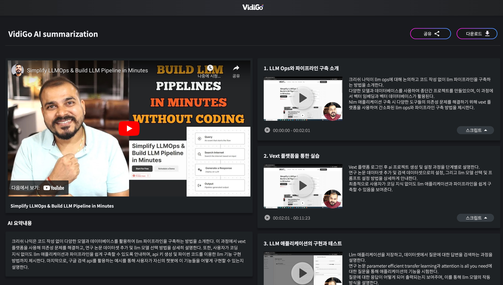
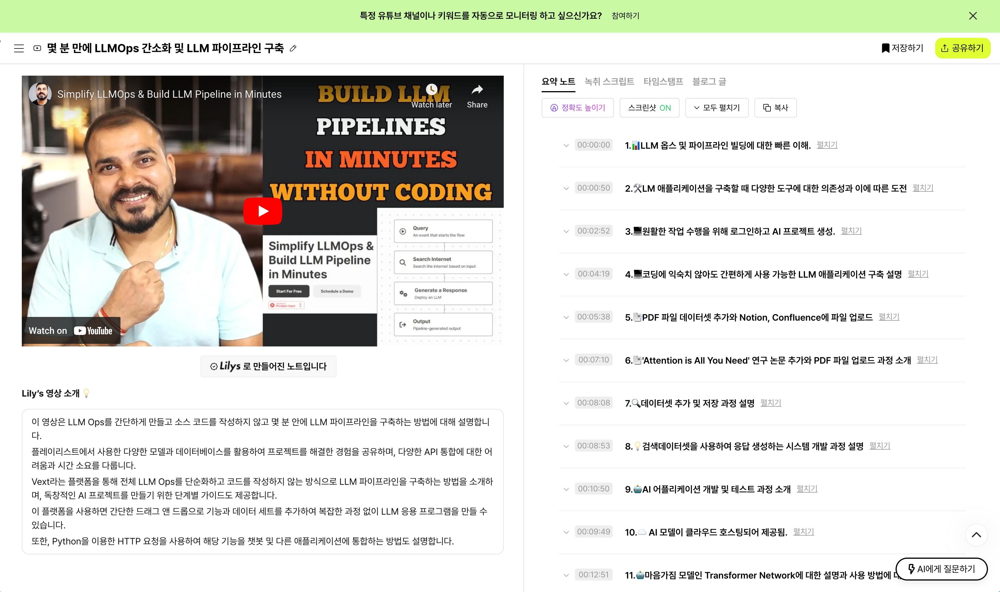
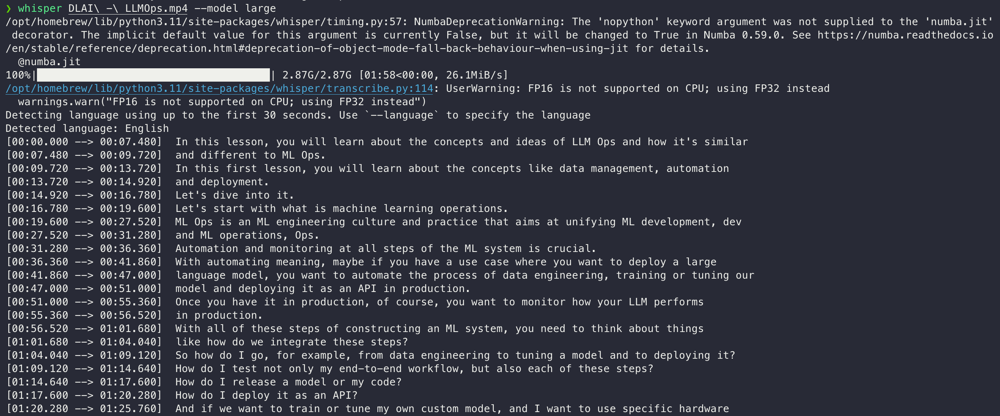
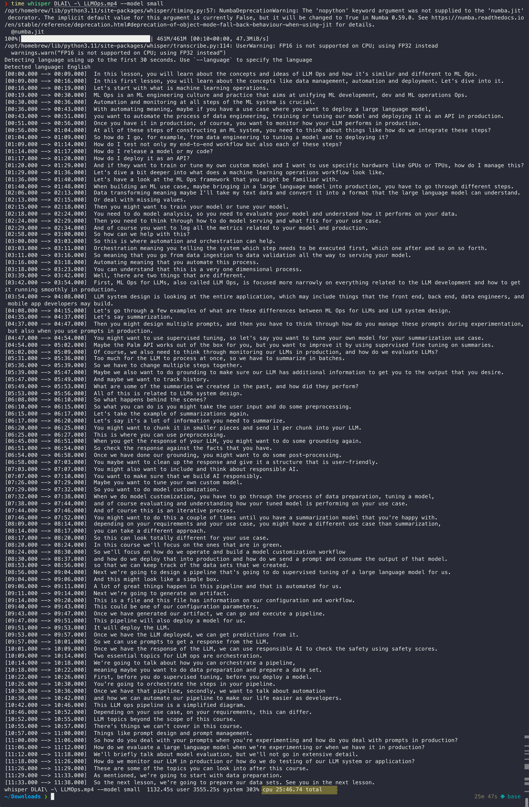
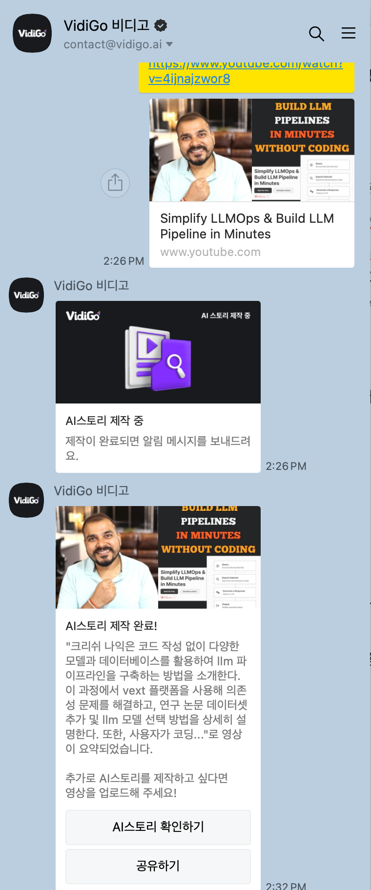

# 동영상 summarization 비교

# Candidates

## Lilys.ai

- [https://lilys.ai/](https://lilys.ai/)

## VidiGo

- [https://vidigo.ai/](https://vidigo.ai/)

## Whisper

# Comparison

- 대상 동영상:
    
    [https://www.youtube.com/watch?v=4ijnajzwor8](https://www.youtube.com/watch?v=4ijnajzwor8)
    
- Summarization
    - [https://vidigo.ai//chatbot/summary/kupgzvNDYTVZHVI](https://vidigo.ai//chatbot/summary/kupgzvNDYTVZHVI)
        
        
        
    - [https://lilys.ai/digest/350318?sId=4ijnajzwor8](https://lilys.ai/digest/350318?sId=4ijnajzwor8)
        
        
        
    - Whisper(large model)는 진행하다가 너무 느려 취소
        
        
        

## Speed

- VidiGo > [Lilys.ai](http://Lilys.ai) > … > Whisper
    - VidiGo: 대략 6분 (오늘 가입해서 무료 사용 중이기도 하고, 사용자가 늘어나면 어떨지 알 수 없음)
    - Lilys.ai: 10분 (그러나 가입 직후 무료 크레딧이 있는 경우는 굉장히 빨랐음)
    - Whisper: (동영상을 download해 진행) local이긴 하지만 Macbook M2 Pro(16GB)에서 하는데 시작한 지 1시간이 넘었지만 아직도 진행중이고 언제 끝날지 모르겠음
        - 추가로 작업 진행하는 동안 Macbook을 거의 제대로 사용할 수 없을 정도로 부하가 심함
        - 다른 동영상(11m39s라 위의 대상 동영상 22m의 절반 길이)으로, model을 small로 한 경우에는 25분만에 script를 다 받았는데, 이걸 다시 번역해서 요약을 시키는 경우에도 결국 작업시간이 들어가기 때문에 속도나 사용 편의성 면에서 위의 두 가지 상용 product와는 비교하긴 어려움. 다만 원하는 LLM을 선택 사용할 수 있다는 점 정도가 작은 장점일 수 있음
            
            
            

## Quality

- (Whisper는 취소했으니 제외하고) VidiGo는 좀 더 요약쪽으로 집중, Lilys.ai는 내용을 더 풍부하게 전달하는 쪽을 선택한 걸로 보임
    - VidiGo
        1. LLM Ops와 파이프라인 구축 소개
            1. 크리쉬 나익이 llm ops에 대해 논의하고 코드 작성 없이 llm 파이프라인을 구축하는 방법을 소개한다
            2. 다양한 모델과 데이터베이스를 사용하여 종단간 프로젝트를 만들었으며, 이 과정에서 벡터 임베딩과 벡터 데이터베이스가 활용된다
            3. Nlm 애플리케이션 구축 시 다양한 도구들의 의존성 문제를 해결하기 위해 vext 플랫폼을 사용하여 간소화된 llm ops와 파이프라인 구축 방법을 제시한다
        2. Vext 플랫폼을 통한 실습
            1. Vext 플랫폼 로그인 후 ai 프로젝트 생성 및 설정 과정을 단계별로 설명한다
            2. 연구 논문 데이터셋 추가 및 검색 데이터셋으로의 설정, 그리고 llm 모델 선택 및 프롬프트 설정 방법을 상세하게 안내한다
            3. 최종적으로 사용자가 코딩 지식 없이도 llm 애플리케이션과 파이프라인을 쉽게 구축할 수 있음을 보여준다
        3. LLM 애플리케이션의 구현과 테스트
            1. Llm 애플리케이션을 저장하고, 데이터셋에서 질문에 대한 답변을 검색하는 과정을 설명한다
            2. 연구 논문 parameter efficient transfer learning과 attention is all you need에 대한 질문을 통해 애플리케이션의 기능을 시험한다
            3. 질문에 대한 응답이 어떻게 되어 출력되는지 보여주며, 이를 통해 llm 모델의 작동 방식을 설명한다
        4. API 키 생성 및 파이썬 코드를 이용한 LLM 기능 구현
            1. Api 키를 생성하고, 파이썬 코드를 사용하여 llm 기능을 구현하는 방법을 소개한다
            2. Machine learning과 krish에 대한 질문으로 google 검색 api를 활용하는 과정을 보여준다
            3. 최종적으로, 사용자가 자신의 챗봇에 이 기능들을 어떻게 구현할 수 있는지에 대해 설명한다
    - Lilys.ai
        1. 📊LLM 옵스 및 파이프라인 빌딩에 대한 빠른 이해.
            1. 유튜브 채널 소개와 함께, LLMOps 및 LLM 파이프라인 비쥬얼 구축에 초점
            2. Lang chain Lama Index 재생 목록에서 Google Gman Pro, OpenAI 같은 모델 및 Lama 2, mrol 등을 활용한 프로젝트 다수 진행
            3. 프로젝트에서는 벡터 임베딩, Cassandra, DataStax 등 데이터베이스 사용 중. 또한, Pinecone, Chroma DB와 같은 플랫폼 활용
        2. 🛠️LM 애플리케이션을 구축할 때 다양한 도구에 대한 의존성과 이에 따른 도전
            1. LM 애플리케이션을 구축할 때 여러 도구에 의존해야 하며, 모델(예: OpenAI)과 문서, Google Search API, Wikipedia Search API 같은 외부 소스를 통합할 경우 여러 API와 함께 작업 필요
            2. 각 통합에 대한 환경 키를 생성해야 함. 예를 들어 Google Search API를 사용하려면 환경 키가 필요함. Vector IDing의 경우, Chroma DB, Pinecone과 같은 벡터 데이터베이스에 대한 별도의 키가 필요함
            3. LLM 파이프라인을 만들려면 많은 시간이 소요되며 초기 설정을 잘 관리해야 함. 이 도전을 Vext 플랫폼을 통해 해결하고, 코드 작성없이 LLM 파이프라인을 구축할 수 있음
            4. Vext를 이용하면 외부 소스에 의존하거나 구글 검색과 같은 다양한 기능을 사용할 수 있어 환경 설정이나 API 생성에 신경 쓸 필요가 없음. 한 API 만으로 전체 LLM 파이프라인을 구축하여 사용 가능함
            5. 프로젝트를 빠르게 개발하고 무료로 시작할 수 있음. 챗봇, LLM 애플리케이션 등 다양한 응용 분야에서 해당 API를 사용할 수 있음
        3. 💻원활한 작업 수행을 위해 로그인하고 AI 프로젝트 생성.
            1. 이메일 ID로 로그인하여 작업 절차를 단계별로 안내할 것이며, 영상을 끝까지 시청하는 것이 중요하다
            2. 로그인 후 대시보드를 확인하고, AI 프로젝트 섹션으로 이동하여 프로젝트를 생성한다
            3. 설정을 완료하고 애플리케이션을 시작하기 위해 올바르게 활성화해야 한다
            4. 특정 플랫폼에 로그인하지 않았다면, 회원가입부터 시작해야 하며, 프로젝트명을 설정하고 애플리케이션을 활성화함으로써 작업을 완료한다
        4. 💻코딩에 익숙치 않아도 간편하게 사용 가능한 LLM 애플리케이션 구축 설명
            1. 파이프라인 전체에서 쿼리와 출력이 중요한 부분이며, 쿼리는 흐름을 시작하는 이벤트를 의미한다
            2. LLM 애플리케이션을 간단히 구축할 수 있고, 개발자가 필요하지 않을 정도로 간단하게 전체 파이프라인을 구축할 수 있다
            3. 출력은 마지막 응답을 나타내며, 액션 추가하는 옵션으로 LLM 모델로부터 응답 생성하거나 데이터셋 추가 등이 가능하다
            4. 추가로 스마트 함수 실행과 같은 다양한 옵션이 있는데, 이를 상세히 설명할 예정이다
        5. 📑PDF 파일 데이터셋 추가와 Notion, Confluence에 파일 업로드
            1. 다수의 PDF 파일을 갖고 있을 때, Notion이나 Confluence에 Q&A 문서나 검색 보강 생성을 위한 RAG 시스템을 만들기 위해 데이터셋을 추가한다
            2. 다양한 업로드 옵션 중 Google Drive나 Notion, Confluence에 파일을 추가할 수 있다. LM에 대한 코딩 경험이 부족한 사용자에게 특히 유용하다
            3. 연구 논문에 대한 PDF 파일 업로드 후 리서치 페이퍼를 만들고 해당 연구 논문의 세부 정보나 자료를 추가한다
            4. 연구 논문은 LLM 모델에 사용되는 Laura 및 CLA 설정과 같은 세부 사항에 대한 Fine-tuning을 다룬다. 리소스 추가를 통해 파일을 업로드한다
        6. 📑'Attention is All You Need' 연구 논문 추가와 PDF 파일 업로드 과정 소개
            1. 파일을 추가하고 'Add Source'를 클릭하여 관련 논문 'Attention is All You Need'을 업로드한다
            2. 'Attention is All You Need'와 관련된 논문을 PDF 파일로 업로드하며, 한 프로젝트 안에 다수의 논문을 추가할 수 있지만 최대 파일 용량은 5MB로 제한된다
            3. 현재 해당 프로젝트에는 해당 논문 두 개의 PDF 파일이 포함되어 있으며, 더 많은 논문을 추가할 수 있다
            4. 프로젝트 내에서 생성한 랙 시스템에 현재는 두 개의 흐름이 있는 것으로 나타난다
        7. 🔍데이터셋 추가 및 저장 과정 설명
            1. LLM pipeline에서 'search dataset'을 추가하여 'research paper' 데이터셋을 선택하고 저장한다
            2. 데이터가 추가되면 우측 모서리에 'save' 버튼이 나타나고, 클릭하여 데이터 주입이 완료된다
            3. 이로써 'search dataset'에 필요한 데이터가 제공되는 과정이 완료된다
        8. 💡검색데이터셋을 사용하여 응답 생성하는 시스템 개발 과정 설명
            1. RG 시스템 또는 문서 Q&A를 구현하기 위해 검색 데이터셋을 사용하며, 시스템은 필요한 임베딩을 생성하는 내부 작업을 수행한다
            2. 각 데이터가 벡터 저장소를 필요로 할 때, 이를 모두 생성한다
            3. 이후 데이터 적재 단계를 완료한 후, LLM 모델을 추가하여 질문을 던지면 답변을 생성하고 이를 요약한다
            4. 다양한 모델 선택 옵션이 제공되는데, 특정 데이터에 질문을 던지면 선택된 LLM 모델을 활용하여 응답 생성이 가능하다
        9. 🤖AI 어플리케이션 개발 및 테스트 과정 소개
            1. AI 어플리케이션을 개발하고 테스트하는 과정 소개
            2. LLM 어플리케이션에 대해 설명하며 데이터 세트를 활용해 사용자 질문에 대한 답변을 제공한다
            3. Playground 옵션을 이용하여 어플리케이션이 정상작동하는지 테스트함
            4. 두 개의 연구 논문을 추가하여 parameter-efficient transfer learning과 Attention Is All You Need에 관해 문의함
        10. ☁️ AI 모델이 클라우드 호스팅되어 제공됨
            1. 다양한 모델들(Azure Open GPT 3.5, Azure Open GPT 4, Anthropic Cloud Instant, Anthropic Cloud Google Pro Beta)을 제공하고, 미래에는 LLM2와 같은 다양한 모델들이 추가될 예정이다
            2. 모델들은 클라우드에 호스팅되어 서비스로 제공되며, 사용자가 선택할 수 있다
            3. 사용자는 특정 모델을 선택하고, 해당 모델에 대해 어떻게 작동할지 안내할 프롬프트를 작성한다
            4. 모델은 벡터 임베딩 형식의 데이터셋에서 정보를 찾고, 그 정보를 LLM 모델을 통해 요약한 결과를 제공한다
        11. 🤖마음가짐 모델인 Transformer Network에 대한 설명과 사용 방법에 대한 내용
            1. Transformer Network에 대한 기능 설명과 지식 전송을 가능케 하는 방법에 대한 설명이 포함된다
            2. 주요 기능을 간단히 설명하고 챗봇이나 다양한 채널에서 해당 기능을 통합할 수 있다는 점을 강조한다
            3. 또한 'attention is all you need'라는 연구 논문을 통해 어떤 기능을 추가할 것인지에 대한 내용과 활성화 함수들에 대한 설명이 포함된다
            4. 코드를 많이 작성할 필요가 없고 drag and drop을 통해 데이터 및 속성을 추가할 수 있다는 강점을 소개하며, 실행 함수와 여러 옵션에 대해 논한다
        12. 💡스마트 기능을 사용해 여러 기능 통합, 검색 및 정보 획들 가능한 코딩 방법 소개
            1. 스마트 기능 내에서 여러 기능을 한데 모아 사용할 수 있으며, 구글 검색이나 RF, 위키피디아 사용이 가능하다
            2. 첫 요청에는 시간이 걸리지만, 이후 요청에서는 매끄럽게 작동한다. '머신러닝이란 무엇인가?', 'Krish Naik은 누구인가?'의 예시로 검색 결과 확인 가능하다
            3. Krish Naik은 유튜버이자 데이터과학자로, 머신러닝 교육 콘텐츠로 유명하다
            4. 스마트 기능을 이용해 정확한 답변이 제공되는 점이 매력적이다
        13. 🤖챗봇에 API 키를 이용하여 HTTP 요청을 보내는 방법
            1. 코딩에서 챗봇에 구현된 기능을 사용하기 위해 HTTP 요청과 POST 요청을 활용한다
            2. POST 요청 내에서 API 키를 설정하고 질문 등 페이로드를 포함하여 특정 URL과 채널 토큰을 통해 요청을 보낼 수 있다
            3. 파이썬을 사용하여 POST 요청을 보내는 방법을 설명하며, API 키를 생성하고 저장하는 과정을 안내한다
            4. API 키를 이용하여 HTTP 요청을 보내는 데 필요한 코드도 제공한다
        14. 🤖AI 프로젝트를 위해 특정 API 키를 업데이트하고 쿼리 전송
            1. AI 프로젝트로 돌아가 AI 프로젝트로 다시 가서, 코드와 포스트 요청을 사용한다
            2. 이것 전체 파이프라인에서 하나의 API만 필요하며, 해당 API로 포스트 및 게트를 수행할 수 있다. 벡터 임베딩이나 Google 검색 또는 RCI나 Wikipedia와 같은 API에 대해 걱정할 필요가 없다
            3. 대신 이 특정 API에만 집중할 것이며, Python 코드로 CURL 포스트 요청을 작성했다
            4. API 키를 업데이트하고 'What is machine learning?'이라는 쿼리를 보내고, 컨텐츠 유형 헤더를 application Json으로 설정하며, 페이로드를 통해 전체 데이터를 전송할 것이다
        15. 💻간단한 파이썬 코드 활용해 머신러닝 질문·응답 컨셉 시연
            1. 챗 GPT에서 따온 curl post로 URL에 Krishna 06과 함께 request.post로 JSON 데이터와 headers를 보냈다
            2. 코드는 API 키, 쿼리, 헤더, 데이터를 설정하며 실행하여 머신러닝 질문 시도. 일부 예외 발생
            3. 이를 수정해 다시 실행한 결과, 머신러닝과 관련한 응답 돌아옴
            4. 간단한 파이썬 코드로 머신러닝 질문-응답 시연. 사용하는 API 등은 자유롭게 선택 가능하다
            5. 앱 디렉토리, AWS Sagemaker, Hugging Face 등과 연결 가능. LLM 사용하기도 가능
        16. 🛠️코드 한 줄 없이 LLM 파이프라인을 구축하는 방법 소개
            1. 코드 없이 LLM 파이프라인을 구축하는 방법에 대한 흥미로운 소개 동영상이었다
            2. 관리자, 리더 등은 이를 활용해야 한다는데, 이는 홍보가 아닌, 실제 흥미로운 정보를 전하고자 하는 것이다
            3. 다음 영상에서 만나기를 기대하며, 즐거운 하루를 보내길 바라며 감사 인사를 전한다. 모두 안녕히 계세요. 재미있는 정보를 전하고자 함
- 정확도는 당연히 100%는 아니지만 크게 문제가 될 정도는 아님

## Etc

- UI는 둘 다 기본적으로 비슷. 왼쪽에 동영상, 그 아래에는 간단한 정리, 오른쪽에 시간대별로 나눠 요약 스크립트가 위치하는 형태
- 다만 Lilys.ai가 먼저 개발한 product여서 그런지 좀 더 다양한 기능을 제공하는 걸 알 수 있음
    - 세션 유지 시간을 짧게 설정했는지 로그인이 너무 빠르게 풀리고, 새로운 url을 입력할 때나 공유하기 버튼을 사용할 때 이상하게 한 번에 동작하는 경우가 없는 등 소소한 오류나 불편함이 있음
- VidiGo가 채택한 카카오톡 이용하는 방식이 확실히 사용이 간단해서 우리나라에서는 강점이 있을 걸로 예상
    
    
