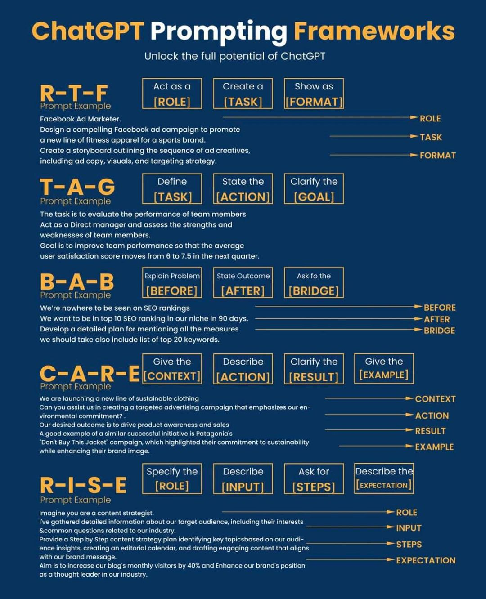

NLP
===

* [A curated list of speech and natural language processing resources](https://github.com/edobashira/speech-language-processing)
* [NLPK: 강승식 교수의 nlp 카페](http://cafe.daum.net/nlpk)
* [자연어처리 바이블: ChatGPT 핵심기술 | NLP BIBLE](https://nlpbible.github.io/)
* [Introduction to NLP](https://towardsdatascience.com/introduction-to-nlp-5bff2b2a7170)
* [An easy introduction to Natural Language Processing](https://towardsdatascience.com/an-easy-introduction-to-natural-language-processing-b1e2801291c1)
* [Introduction to Natural Language Processing for Text](https://towardsdatascience.com/introduction-to-natural-language-processing-for-text-df845750fb63)
* [Introduction To Natural Language Processing | Machine Learning Projects | Eduonix](https://www.youtube.com/watch?v=yN3B-k4F8L4)
* [5—INTRO TO NLP AND RNNS](http://course.fast.ai/lessons/lesson5.html)
* [A Review of the Neural History of Natural Language Processing](http://blog.aylien.com/a-review-of-the-recent-history-of-natural-language-processing/)
* [| NC NLP Center Tech Blog](https://ncsoft.github.io/ncnlp/)
* [Keyword extraction in Java](http://www.vikasing.com/2013/09/keyword-extraction-in-java.html)
* [Extracting meaningful text from webpages](http://www.vikasing.com/2012/03/extracting-meaningful-text-from.html)
* [Extracting (meaningful) text from webpages - II](http://www.vikasing.com/2013/06/extracting-meaningful-text-from.html)
* [‘시리’가 아직까지 말귀를 못 알아듣는 까닭](http://www.bloter.net/archives/227915)
* [Heteronym (linguistics)](https://en.wikipedia.org/wiki/Heteronym_%28linguistics%29)
* [Pronounceable Anagrams](http://smithamilli.com/blog/anagrams/)
* [ROC Curve, AUC](http://digndig.net/blog/2013/06/01/312/)
* [원티드 AI 이야기 ROC Curve 이해하기(1) (원티드가 AI를 평가하는 방법, AI 합격 예측, 인공지능)](https://blog.naver.com/wantedlab/222714528598)
* [원티드 AI 이야기 ROC Curve 이해하기(2) (원티드가 AI를 평가하는 방법, AI 합격 예측, 인공지능)](https://blog.naver.com/wantedlab/222719920948)
* [Part 1: For Beginners - Bag of Words 캐글뽀개기 6월 이상열](http://nbviewer.ipython.org/gist/syleeie2310/d720330f793203829e47)
* [Writers Choose Their Favorite Words](http://www.newyorker.com/culture/cultural-comment/writers-choose-their-favorite-words/) 쓰이는 단어의 종류를 통해 글 쓴 사람 예측?
* [Algorithms for text fingerprinting?](https://news.ycombinator.com/item?id=9716837)
* [하나의 차트로 이해하는 민주당과 공화당이 세계를 보는 다른 시각](http://newspeppermint.com/2015/06/15/worldview/)
* [Ask HN: What are the best tools for analyzing large bodies of text?](https://news.ycombinator.com/item?id=9733883)
* [~Special Section: Reconceiving Text Analytics~](http://dho.ie/sites/default/files/Toward_an_Algorithmic_Criticism.pdf)
* [Top NLP Algorithms & Concepts](https://www.datasciencecentral.com/profiles/blogs/top-nlp-algorithms-amp-concepts)
* [ExoBrain](http://exobrain.kr/)
  * [인간-기계 지식소통을 위한 자연어 QA 워크샵 – 엑소브레인 인공지능](http://143.248.55.96/workshop/)
* [한자로](http://hanjaro.juntong.or.kr/)
* [Making Apps Understand Natural Language](http://yahoolabs.tumblr.com/post/123387824121/making-apps-understand-natural-language)
* [Automatically spotting interesting sentences in parliamentary debates](https://fullfact.org/blog/getting_closer_automated_factchecking)
* [Tone Analyzer](https://tone-analyzer-demo.mybluemix.net/)
* [Bag of Words Meet Bags of Popcorn - (1) Part 1: Bag of Words](http://khanrc.tistory.com/entry/kaggle-Bag-of-Words-Meet-Bags-of-Popcorn-1-Part-1)
* [WHERE TECHNOLOGY MEETS BUSINESS. TYING TEXT ANALYTICS TO YOUR BUSINESS GOALS](http://www.incite-group.com/events/textwest/conference-agenda.php)
* [For 40 years, computer scientists looked for a solution that doesn’t exist](http://www.bostonglobe.com/ideas/2015/08/10/computer-scientists-have-looked-for-solution-that-doesn-exist/tXO0qNRnbKrClfUPmavifK/story.html) edit distance
* [Deep Learning for NLP Best Practices](http://ruder.io/deep-learning-nlp-best-practices/)
* [DAWG data structure in Word Judge](http://porcupineprogrammer.blogspot.kr/2012/03/dawg-data-structure-in-word-judge.html)
* [A Simple Artificial Intelligence Capable of Basic Reading Comprehension](http://blog.ayoungprogrammer.com/2015/09/a-simple-artificial-intelligence.html)
* [The future of programmers](http://tcz.hu/the-future-of-programmers)
* [IBM ‘왓슨’, 인지컴퓨팅 서비스로 업그레이드](http://www.bloter.net/archives/239630)
* [How To Create Natural Language Semantic Search For Arbitrary Objects With Deep Learning](https://towardsdatascience.com/semantic-code-search-3cd6d244a39c)
* [politeness - Write in a more polite, friendly tone](https://labs.foxtype.com/politeness)
* [Understanding Natural Language with Deep Neural Networks Using Torch](http://devblogs.nvidia.com/parallelforall/understanding-natural-language-deep-neural-networks-using-torch)
* [An Inside View of Language Technologies at Google](http://breakthroughanalysis.com/2015/10/28/an-inside-view-of-language-technologies-at-google/)
* [Google Cloud에서 Natural Language API 정리](https://jungwoon.github.io/google%20cloud/2017/11/13/Google-Natural-Language/)
* [Google Cloud 서비스 계정키 얻기 및 GCS 공유하기](https://jungwoon.github.io/google%20cloud/2017/11/17/Get-Service-Account-Key/)
* [Understanding Convolutional Neural Networks for NLP](http://www.wildml.com/2015/11/understanding-convolutional-neural-networks-for-nlp/)
  * [자연어 처리 문제를 해결하는 CONVOLUTIONAL NEURAL NETWORKS 이해하기](http://blog.naver.com/rupy400/220776488979)
* [**Convolutional Methods for Text**](https://medium.com/@TalPerry/convolutional-methods-for-text-d5260fd5675f)
  * 텍스트 처리와 관련해서는 LSTM/GRU를 비롯한 RNNs 가 대세지만 CNN도 장점이 있는데 이를 잘 정리한 글
  * RNN이 순서에 영향을 받지만 CNN은 단어의 의미에 영향을 주는 데에 있어 조금 멀리 떨어져 있는 문장에서의 단어 등이 역할을 할 수 있음
  * 전체를 한꺼번에 보게 하는 데에는 더 유리
  * NLP 전반에 대한 이해와 DNN 종류들의 장단점 등도 잘 파악할 수 있는 매우 좋은 글
* [Convolutional Sequence-to-Sequence Learning (2017)](https://github.com/j-min/conv_s2s/blob/master/overview.ipynb)
  * [Convolutional Sequence-to-Sequence Learning (2017)](https://nbviewer.jupyter.org/github/j-min/conv_s2s/blob/master/overview.ipynb)
  * (NLP 처음 접하시는 분들을 위한)
  * RNN enc-dec 부터 conv seq2seq 까지 간단한 흐름 정리
  * conv s2s 이해를 위해 읽어야 할 논문 10+ 편
* [시나브로 배우는 자연어처리](http://www.slideshare.net/shuraba1/ss-56479835)
* [collocations.de - Association Measures](http://collocations.de/AM/index.html)
* [Perplexity](https://en.wikipedia.org/wiki/Perplexity)
  * [Perplexity in LM](http://hexists.tistory.com/215)
  * [Lecture 4: Evaluating language models](https://courses.engr.illinois.edu/cs498jh/Slides/Lecture04.pdf)
  * [speech recognition & LM](http://phonolog.tistory.com/entry/speech-recognition-LM)
  * [하이퍼망 분자컴퓨팅 기반 단어 재인 시뮬레이션](https://bi.snu.ac.kr/Publications/Theses/MS06f_KangYJ.pdf)
* [An Experimental Study on Open Source Korean Morphological Analyzers for Evaluating Noun Extraction](http://www.dbpia.co.kr/Journal/ArticleDetail/NODE06559147)
* [Episode 22: 자연언어처리 특집 1부 – 마이크로소프트 NLP연구실의 김용범님과 함께](https://iamprogrammer.io/post/9401)
* [Espresso - AIR LAB, Changwon National University](http://air.changwon.ac.kr/\~airdemo/Espresso/)
* [악평생성기 (Bad Comment Generator using RNN) \_ 송치성](http://www.slideshare.net/shuraba1/bad-comment-generator-using-rnn)
  * [Bad Comment Generator using RNN](http://nbviewer.jupyter.org/github/daydrill/BadCmtGenerator/blob/master/bad_cmt_generator_code.ipynb)
* [Generating text using a Recurrent Neural Network](https://towardsdatascience.com/generating-text-using-a-recurrent-neural-network-1c3bfee27a5e)
* [딥엘라스틱 - 검색 + 로봇 저널리즘 + 인지신경언어학 + 딥러닝NLP](http://babelpish.github.io/deep-elastic/)
* [PHP + MySQL 언어 식별기(Language Detection) 개발기](http://bab2min.tistory.com/503)
  * [언어 식별기 (Language Detection)](http://lab.bab2min.pe.kr/detectLang)
* [word-rnn - a fork of Andrej Karpathy's wonderful char-rnn](https://github.com/larspars/word-rnn)
* [컴퓨터가 소설을 써요](http://jamonglab.com/2015/11/11/computer-writer/)
* [Next Word Auto-Completion](https://kyucho.shinyapps.io/nextword/)
* [2015 자연어처리 및 정보검색 워크샵](https://sites.google.com/site/sighclt/haengsasogae/jayeon-eocheoli-mich-jeongbogeomsaeg-wokeusyab-1/jayeon-eocheoli-mich-jeongbogeomsaeg-wokeusyab)
* [“네이버에서 만나보셨나요? 인공지능 채팅 로봇”](http://www.bloter.net/archives/256278)
* [Introducing DeepText: Facebook's text understanding engine](https://code.facebook.com/posts/181565595577955/introducing-deeptext-facebook-s-text-understanding-engine/)
  * [페이스북, ‘사람 수준으로’ 내용을 이해하는 딥텍스트 A.I. 공개](http://www.itworld.co.kr/news/99613#csidxc8e244e28d7c435a8c8b8bbefd32f3e)
* [NLP 자연어처리](http://hub-ai.com/nlp)
* [니코니코동화의 공개코멘트 데이터를 Deep Learning로 해석하기](https://blog.umay.be/2016/06/02/niconico-nlp.html)
  * [わかるLSTM ～ 最近の動向と共に](http://qiita.com/t_Signull/items/21b82be280b46f467d1b)
* [Generative Models](https://openai.com/blog/generative-models)
* [온라인 한국어 POS 태거 만들기](https://www.youtube.com/watch?v=oSPVB9o6D50)
* [파이썬을 이용한 자연어처리 기초](https://www.facebook.com/notes/%EB%B0%94%EB%B2%A8%ED%94%BC%EC%89%AC/%ED%8C%8C%EC%9D%B4%EC%8D%AC%EC%9D%84-%EC%9D%B4%EC%9A%A9%ED%95%9C-%EC%9E%90%EC%97%B0%EC%96%B4%EC%B2%98%EB%A6%AC-%EA%B8%B0%EC%B4%88/784679931573503)
* [Introducing Cloud Natural Language API, Speech API open beta and our West Coast region expansion](https://cloudplatform.googleblog.com/2016/07/the-latest-for-Cloud-customers-machine-learning-and-west-coast-expansion.html)
* [구글, 자연어·음성인식 API 공개…한국어도 포함](http://www.bloter.net/archives/260492)
* [머신러닝의 자연어 처리기술(I)](http://www.slideshare.net/ssuser06e0c5/i-64267027)
* [영국의 19살 청년이 만든 인공지능 로봇변호사](http://www.venturesquare.net/728822)
* [ko\_restoration - Module for restoring Korean text working with KomornaPy](https://github.com/lynn-hong/ko_restoration)
* [딥러닝을 이용한 자연어처리의 연구동향](http://www.slideshare.net/ssuser06e0c5/ss-64417928)
* [Exploring Session Context using Distributed Representations of Queries and Reformulations](https://www.microsoft.com/en-us/research/wp-content/uploads/2015/08/sigirfp093-mitra.pdf)
  * 사용자의 쿼리 세션데이터와, 문서클릭데이터로 CNN으로 쿼리의 word-embedding을 만듦
  * 쿼리와 관계를 벡터로 변환
  * 두 쿼리의 관계벡터는 단순히 두 쿼리벡터의 뺴기(차이?)로 간단하지만
  * 이러한 관계벡터들을 클러스터링하니, 쿼리 변환의 의도가 클러스터링 됨
    * 동일의도인데, 다른 모양의 쿼리변환
    * 검색 의도를 좁히는 쿼리변환
    * 의도를 아예 점프하는 쿼리변환
* [기계학습과 딥러닝의 응용](https://www.youtube.com/watch?v=7_6b8iSGj5g)
* [Universal Dependencies](http://universaldependencies.org/)
* [BabelNet](http://babelnet.org/)
  * [META prize 2015: BabelNet!](https://www.youtube.com/watch?v=lchI3AQbA9M)
* [An Intuitive Natural Language Understanding System](http://www.slideshare.net/inscit2006/an-intuitive-natural-language-understanding-system)
* [An NLP Approach to Analyzing Twitter, Trump, and Profanity](http://blog.algorithmia.com/nlp-approach-twitter-trump-profanity)
* [Deep Learning Cases: Text and Image Processing](http://www.slideshare.net/grigorysapunov/deep-learning-cases-text-and-image-processing)
* [CS 124: From Languages to Information](http://web.stanford.edu/class/cs124/)
* [NLP Seminar Schedule — Winter 2019](https://nlp.stanford.edu/seminar/)
* [영문 복사만 하면…품사 알려드려요](http://techholic.co.kr/archives/51731)
* [PyData Paris 2016 - Statistical Topic Extraction](https://www.youtube.com/watch?v=Y4nE6diy72o)
* [28회 한글 및 한국어 정보처리 학술대회](https://sites.google.com/site/2016hclt)
  * [자료실](https://sites.google.com/site/2016hclt/jalyosil)
  * [개체명 인식 시스템 개발 및 적용](https://github.com/krikit/annie)
* [확률문법](https://www.facebook.com/saishiot/photos/a.1786185075003862.1073741835.1538273176461721/1786185115003858)
* [주니어 데이터 분석가의 걸그룹 데이터 분석하기](https://brunch.co.kr/@cloud09/97)
* [korean.abcthesaurus.com](http://korean.abcthesaurus.com/) 동의어 사전
* [en.wikipedia.org/wiki/Precision\_and\_recall](https://en.wikipedia.org/wiki/Precision_and_recall)
  * 실제와 예측이 일치; True Positive / Negative
  * 실제와 예측이 불일치; False Positive / Negative
  * 발생했다고 예측 Positive, 발생하지 않았다고 예측 Negative
  * [정밀도와 재현율](https://ko.wikipedia.org/wiki/%EC%A0%95%EB%B0%80%EB%8F%84%EC%99%80_%EC%9E%AC%ED%98%84%EC%9C%A8)
  * [**accuracy, precision, recall의 차이**](http://shine-ing.tistory.com/m/157)
  * [정확도(accuracy)와 정밀도(precision)의 차이](http://www.withrobot.com/technicalreport19/)
  * [en.wikipedia.org/wiki/Sensitivity\_and\_specificity](https://en.wikipedia.org/wiki/Sensitivity_and_specificity)
  * [measure 상관관계](https://gist.github.com/hyunjun/aaa479bcf6485ea36e6add81c65d3e78)
  * [#2.6. Accuracy, Precision, Recall](https://www.youtube.com/watch?v=1jboC7nWnfM\&list=PL0oFI08O71gKEXITQ7OG2SCCXkrtid7Fq)
  * [입개발자를 위한 Accuracy, Precision, Recall](http://www.popit.kr/%EC%9A%A9%EC%96%B4-%EC%A0%95%EB%A6%AC-%EC%9E%85%EA%B0%9C%EB%B0%9C%EC%9E%90%EB%A5%BC-%EC%9C%84%ED%95%9C-accuracy-precision-recall/)
  * [Classification 모델 평가 기준 1편](https://brunch.co.kr/@chris-song/54)
  * [**Classification & Clustering 모델 평가**](http://bcho.tistory.com/1206)
  * [Fighting Financial Fraud with Targeted Friction](https://medium.com/airbnb-engineering/fighting-financial-fraud-with-targeted-friction-82d950d8900e)
  * [Beyond Accuracy: Precision and Recall](https://towardsdatascience.com/beyond-accuracy-precision-and-recall-3da06bea9f6c)
  * [Precision vs Recall](https://towardsdatascience.com/precision-vs-recall-386cf9f89488)
  * [Comparison of the best NSFW Image Moderation APIs 2018](https://towardsdatascience.com/comparison-of-the-best-nsfw-image-moderation-apis-2018-84be8da65303)
  * [Understand Classification Performance Metrics](https://becominghuman.ai/understand-classification-performance-metrics-cad56f2da3aa)
  * [민감도와 특이도 (sensitivity and specificity)](https://adnoctum.tistory.com/981)
  * [혼돈행렬, 혼돈매트릭스,Confusion Matrix :: 통컨(통계컨설팅)](https://rsas.tistory.com/33)
  * [**정밀도(Precision)와 재현율(Recall) 내용 정리 | Pacientes Devlog**](https://pacientes.github.io/posts/2021/01/ml-precision-recall/)
  * [AP & mAP 내용 정리 | Pacientes Devlog](https://pacientes.github.io/posts/2021/02/ml-ap-map/) AP(Average Precision) mAP(mean Average Precision)
  * [reliability of Covid-19 self test kit | Pega Devlog](https://jehyunlee.github.io/2022/04/23/Python-DS-99-covidprec/)
  * [Precision & Recall](https://mlu-explain.github.io/precision-recall/)
  * [**검색 시스템의 정밀도와 재현율 사이의 균형을 어떻게 맞추면 좋을까요?**](https://www.linkedin.com/posts/sigridjineth_%EA%B2%B0%EC%A0%95%EC%A0%81-%EC%A7%88%EB%AC%B8-%EA%B2%80%EC%83%89-%EC%8B%9C%EC%8A%A4%ED%85%9C%EC%9D%98-%EC%A0%95%EB%B0%80%EB%8F%84%EC%99%80-%EC%9E%AC%ED%98%84%EC%9C%A8-%EC%82%AC%EC%9D%B4%EC%9D%98-%EA%B7%A0%ED%98%95%EC%9D%84-%EC%96%B4%EB%96%BB%EA%B2%8C-%EB%A7%9E%EC%B6%94%EB%A9%B4-activity-7300018490646609920-qceZ/)
    * 정밀도(Precision) 와 재현율(Recall) 사이의 균형은 중요한 과제
      * 정밀도는 검색된 결과 중 관련성이 높은 결과의 비율을 의미
      * 재현율은 실제로 관련성이 높은 문서 중 검색된 문서의 비율을 의미
      * 간단히 말해, 정밀도는 "진실만을 담는" 데 초점을 맞추고, 재현율은 "모든 진실을 놓치지 않는" 데 주력
    * Cumulative Gain 개념이 유용
      * 검색 단계에서는 가능한 한 모든 관련 결과를 포함하도록 해야 하지만, 그중에서도 기여하는 가치가 더 큰 결과가 존재
      * 우리가 실무에서 주로 중요한 것은 "관련 결과 중 몇 퍼센트를 가져왔느냐"가 아니라, "가치의 총합 중 어느 정도를 회수했느냐"일 때가 대다수
      * 이는 Discounted Cumulative Gain, DCG 같은 순위 매김 지표가 "가장 가치 있는 결과를 상위에 배치"하는 것을 중시하는 관점과 일맥상통
* [Natural Language Understanding with Distributed Representation](https://github.com/nyu-dl/NLP_DL_Lecture_Note/blob/master/lecture_note.pdf)
* [Repository for PyCon 2016 workshop Natural Language Processing in 10 Lines of Code](https://github.com/cytora/pycon-nlp-in-10-lines)
* [Deep Learning the Stock Market](https://medium.com/@TalPerry/deep-learning-the-stock-market-df853d139e02)
* [Welcome to Railroad Diagram Generator!](http://bottlecaps.de/rr/ui) BNF rule to diagram
* [Awesome-Korean-NLP](https://github.com/datanada/Awesome-Korean-NLP)
* [Awesome-korean-nlp](https://insikk.github.io/awesome-korean-nlp/)
* [Is Google Hyping it? Why Deep Learning cannot be Applied to Natural Languages Easily](https://www.linkedin.com/pulse/google-hyping-why-deep-learning-cannot-applied-easily-berkan-ph-d)
* [ratsgo.github.io/blog/categories](https://ratsgo.github.io/blog/categories/)
  * [딥러닝 기반 자연어처리 기법의 최근 연구 동향](https://ratsgo.github.io/natural%20language%20processing/2017/08/16/deepNLP/)
* [NLP를 위한 딥러닝 가이드](http://docs.likejazz.com/deep-learning-for-nlp/)
* [Information Extraction with Reinforcement Learning](https://github.com/karthikncode/DeepRL-InformationExtraction)
* [Last Words: Computational Linguistics and Deep Learning](http://mitp.nautil.us/article/170/last-words-computational-linguistics-and-deep-learning)
  * PDP(연결주의)쪽 룸멜허트나 맥클랜드의 연구들 - 신경망 기반 의미론 모형
  * 인간 언어와 관련한 인지과학적 연구 - 어떻게 언어를 학습하고 개념들이 조직화되는가라는 관점
* [Computational Linguistics and Deep Learning](http://www.mitpressjournals.org/doi/pdf/10.1162/COLI_a_00239)
* [4 APPROACHES TO NATURAL LANGUAGE PROCESSING & UNDERSTANDING](http://www.topbots.com/4-different-approaches-natural-language-processing-understanding)
  * Distributional: 최근 유행하는 ML. 폭은 넓힐 수 있지만, 깊이는 잡지 못함
  * Frame-based: 마빈 민스키. 논리적 semantics에 강점. 확고한 supervision이 존재해야 한다는 단점
  * Model-theoretical: Q/A와 rich semantics의 장점. (프레임 기반보다 더한) labor-intensive and narrow in scope
  * Interactive learning: language as a cooperative game between speaker and listener
    * Syntax – what is grammatical? : “no compiler errors”
    * Semantics – what is the meaning?: “no implementation bugs”
    * Pragmatics – what is the purpose or goal?: “implemented the right algorithm.”
* [Deep Learning for Text Understanding from Scratch](http://www.kdnuggets.com/2015/03/deep-learning-text-understanding-from-scratch.html)
* [How to get started in NLP](https://medium.com/towards-data-science/how-to-get-started-in-nlp-6a62aa4eaeff)
* [NATURAL LANGUAGE GENERATION](http://www.inf.ed.ac.uk/teaching/courses/nlg/)
* [NLP for Korean](https://github.com/bage79/nlp4kor)
  * [nlp4kor](https://www.youtube.com/playlist?list=PLE_yleP-KQefhFSNh16hJKnq6stIG05fu)
  * [CNN for MNIST](http://nbviewer.jupyter.org/github/bage79/nlp4kor/blob/master/ipynb/CNN_for_MNIST.ipynb)
  * [FFNN for 한글 띄어쓰기](https://github.com/bage79/nlp4kor/blob/master/ipynb/FFNN_for_word_spacing.ipynb)
  * [DAE for 철자 오류 교정](http://nbviewer.jupyter.org/github/bage79/nlp4kor/blob/master/ipynb/DAE_for_spelling_error_correction.ipynb)
* [Teaching Machines to Describe Images with Natural Language Feedback](http://www.cs.toronto.edu/\~linghuan/feedbackImageCaption/)
* [루다, 눈을 뜨다! 포토챗 베타의 멀티모달 기술 소개 – 핑퐁팀 블로그](https://tech.scatterlab.co.kr/photochat-beta/) image comment
* [멀티턴 이미지 대화: 조규성 vs 안정환, 루다야 누가 더 잘생겼어? – 스캐터랩 기술 블로그](https://tech.scatterlab.co.kr/multiturn-image-dialogue/)
* [Sang-Kil Park's Jupyter Notebooks](https://github.com/likejazz/jupyter-notebooks)
* [An Adversarial Review of “Adversarial Generation of Natural Language”](https://medium.com/@yoav.goldberg/an-adversarial-review-of-adversarial-generation-of-natural-language-409ac3378bd7)
* [Deep Learning for Speech and Language](https://www.facebook.com/nextobe1/posts/339301146505887)
* [deep learning nlp best practices](http://ruder.io/deep-learning-nlp-best-practices/index.html)
* [Natural Language Processing in Artificial Intelligence is almost human-level accurate. Worse yet, it gets smart!](https://sigmoidal.io/boosting-your-solutions-with-nlp/)
* [Language Emergence](https://github.com/batra-mlp-lab/lang-emerge)
* [Memory Augmented Neural Networks for Natural Language Processing](https://drive.google.com/file/d/0B9dqzboiV5u-UmxJQlJqcUl6anM/view)
* [EMNLP 2018 참관기](https://brunch.co.kr/@kakao-it/320)
* [EMNLP 2017](http://mogren.one/blog/2017/09/13/emnlp.html)
  * [EMNLP 2017](https://ku.cloud.panopto.eu/Panopto/Pages/Sessions/List.aspx)
* [Natural Language Processing Tasks and Selected References](https://github.com/Kyubyong/nlp_tasks)
* 자연언어처리(NLP)를 위한 언어학 기초
  * [담화분석](http://blog.naver.com/bcj1210/221147187757)
  * [화용론](http://blog.naver.com/bcj1210/221147166747)
  * [의미론](http://blog.naver.com/bcj1210/221147150551)
  * [통사론](http://blog.naver.com/bcj1210/221147134955)
  * [구와 문장](http://blog.naver.com/bcj1210/221145989566)
  * [형태론](http://blog.naver.com/bcj1210/221145151867)
  * [단어의 형성](http://blog.naver.com/bcj1210/221144651784)
  * [언어의 기원](http://blog.naver.com/bcj1210/221144574548)
* [Deep Learning for NLP, advancements and trends in 2017](https://tryolabs.com/blog/2017/12/12/deep-learning-for-nlp-advancements-and-trends-in-2017/)
* [Deep NLP: 딥러닝을 이용한 자연어처리](https://speakerdeck.com/vcnc/deep-nlp-dibreoningeul-iyonghan-jayeoneoceori)
* [AI: NLP](https://www.youtube.com/playlist?list=PLsFtzQAC8dDdIqSY3o5XF_IBIgSLcyzTd)
* [ML/NLP PUBLICATIONS IN 2017](http://www.marekrei.com/blog/ml-nlp-publications-in-2017/)
* [Experiments Codes for Bi-directional Block Self-attention](https://github.com/code4review/BiBloSA)
  * [Bi-Directional Block Self-Attention for Fast and Memory-Efficient Sequence Modeling](https://openreview.net/forum?id=H1cWzoxA-)
  * 주어진 시퀀스를 여러 개의 Block 으로 나누고 intra-block SAN으로 local context 를 모델링한 뒤, inter-block SAN으로 long-range dependency 를 모델링
  * 기존의 Self-Attention Network (SAN) 이 너무 메모리를 많이 쓰는 점을 개선
  * 많은 NLP 분야에서 Self-attention 기법들이 (특히 번역 분야에서는) 표준으로 자리잡고 후속 연구가 활발히 이루어지고 있는 걸로 보임
    * (ex. Non-autoregressive transformer, Masked self-attention, Directional self-attention)
* [Understanding and Applying Self-Attention for NLP - Ivan Bilan](https://www.youtube.com/watch?v=OYygPG4d9H0)
* [How to solve 90% of NLP problems: a step-by-step guide](https://blog.insightdatascience.com/how-to-solve-90-of-nlp-problems-a-step-by-step-guide-fda605278e4e)
* [파이썬자연어처리](https://www.youtube.com/playlist?list=PLaTc2c6yEwmrmRyBUMsDDFk_FyLF9fARR)
* [**Text Analysis Developers’ Workshop 2018 참석 후기**](http://freesearch.pe.kr/archives/4791)
* [Text Analysis in Excel: Real world use-cases](https://blog.paralleldots.com/product/use-cases-excel-add-text-analysis)
* [Auto Tagging Stack Overflow Questions](https://towardsdatascience.com/auto-tagging-stack-overflow-questions-5426af692904)
* [A Neural Network Model That Can Reason - Prof. Christopher Manning](https://www.youtube.com/watch?v=24AX4qJ7Tts)
  * [Compositional Attention Networks for Machine Reasoning](https://openreview.net/forum?id=S1Euwz-Rb)
* [NLP with attention](https://github.com/dsindex/blog/wiki/\[attention]-NLP-with-attention)
* [Team AURA - 1st Meeting Summary](https://www.ai-lab.kr/labs/aura-raebjang-gimhyeonu/team-aura-1st-meeting-summary)
* [NLP's ImageNet moment has arrived](https://thegradient.pub/nlp-imagenet/)
* [NLP's ImageNet moment has arrived](http://ruder.io/nlp-imagenet/)
  * 시간 문제에 불과하다는 결론, BERT의 등장으로 현실에 가까워짐(ELMO - LSTM / OpenAI의 GPT, BERT - Transformer)
  * Pre-trained Models의 fine-tuning은 필수, 인간이 언어를 이해한다는 것이 그저 엄청난 계산에 불과할 뿐이라는 사실(정말인가?)
  * 이제 계산량을 줄이는 방법이 아니라 계산량을 늘리고 계산 속도를 높이는 방향이 옳을 지도 모름
* [Introduction to Clinical Natural Language Processing: Predicting Hospital Readmission with Discharge Summaries](https://towardsdatascience.com/introduction-to-clinical-natural-language-processing-predicting-hospital-readmission-with-1736d52bc709)
* [Feature-wise transformations - A simple and surprisingly effective family of conditioning mechanisms](https://distill.pub/2018/feature-wise-transformations/)
* [RNN과 Beam search](https://ratsgo.github.io/deep%20learning/2017/06/26/beamsearch/)
* [Unicode 2.0 에서 한글의 이해](https://spectrumdig.blogspot.com/2012/11/unicode-20.html)
* [한글 유니코드 자소 분리](http://dream.ahboom.net/entry/%ED%95%9C%EA%B8%80-%EC%9C%A0%EB%8B%88%EC%BD%94%EB%93%9C-%EC%9E%90%EC%86%8C-%EB%B6%84%EB%A6%AC-%EB%B0%A9%EB%B2%95)
* [PyConKr 2018 Why I learn, How I learn](https://github.com/songys/pycon2018_keynote/blob/master/PyCon_2018_youngsooksong.pdf)
* [Analogy and Analogical Reasoning](https://plato.stanford.edu/entries/reasoning-analogy/)
* [딥러닝이 탐구하지 못한 언어와 5가지 태스크](https://brunch.co.kr/@kakao-it/295)
* [How NLP is Automating the complete Text Analysis Process for Enterprises?](https://blog.paralleldots.com/data-science/nlp/nlp-is-automating-the-complete-text-analysis)
* [강화학습을 자연어 처리에 이용할 수 있을까? (보상의 희소성 문제와 그 방안)](https://tv.naver.com/v/4336217)
* [github.com/warnikchow](https://github.com/warnikchow)
  * [DLK2NLP: Day-by-day Line-by-line Keras-based Korean NLP](https://github.com/warnikchow/dlk2nlp)
    * [3i4K - Intonation-aided intention identification for Korean](https://github.com/warnikchow/3i4k)
  * [KorInto - 5-class sentence-final intonation classifier for a syllable-timed and head-final language (Korean)](https://github.com/warnikchow/korinto) 억양분류
  * [KorEmo - 5-class Korean emotion classifier](https://github.com/warnikchow/koremo) 감정분류
  * [raws - Real-time Automatic Word Segmentation (for user-generated texts)](https://github.com/warnikchow/raws) 한영 noisy text segmentation
* [NLP Guide: Identifying Part of Speech Tags using Conditional Random Fields](https://medium.com/analytics-vidhya/pos-tagging-using-conditional-random-fields-92077e5eaa31)
* [Industrial strength Natural Language Processing](https://medium.freecodecamp.org/industrial-strength-natural-language-processing-de2588b6b1ed)
* [A Review of the Neural History of Natural Language Processing](http://ruder.io/a-review-of-the-recent-history-of-nlp/)
* [Analyzing open-ended text? Its easier than you think!](https://blog.karna.ai/challenges-with-analyzing-open-ended-text-are-disappearing-a348d55e2ab2)
* [**Fast Word Segmentation of Noisy Text**](https://towardsdatascience.com/fast-word-segmentation-for-noisy-text-2c2c41f9e8da)
* [Solving NLP task using Sequence2Sequence model: from Zero to Hero](https://towardsdatascience.com/solving-nlp-task-using-sequence2sequence-model-from-zero-to-hero-c193c1bd03d1)
* [Natural Language Processing is Fun! How computers understand Human Language](https://medium.com/@ageitgey/natural-language-processing-is-fun-9a0bff37854e)
* [NLP 2018 highlights](https://docs.google.com/presentation/d/1dSP3j_nFIW3_pwlRLI-znj9pbS2sCCdRjKk49tUh3pE/mobilepresent?slide=id.p)
* [딥러닝 자연어처리 - RNN에서 BERT까지](https://www.slideshare.net/deepseaswjh/rnn-bert)
* [딥러닝 자연어처리 - YouTube](https://www.youtube.com/playlist?list=PLVNY1HnUlO26qqZznHVWAqjS1fWw0zqnT)
* [Natural Language Processing in Python](https://www.youtube.com/watch?v=xvqsFTUsOmc)
* [A Practitioner's Guide to Natural Language Processing (Part I) — Processing & Understanding Text Proven and tested hands-on strategies to tackle NLP tasks](https://towardsdatascience.com/a-practitioners-guide-to-natural-language-processing-part-i-processing-understanding-text-9f4abfd13e72)
* The 7 NLP Techniques That Will Change How You Communicate in the Future
  * [(Part I)](https://heartbeat.fritz.ai/the-7-nlp-techniques-that-will-change-how-you-communicate-in-the-future-part-i-f0114b2f0497)
  * [(Part II)](https://heartbeat.fritz.ai/the-7-nlp-techniques-that-will-change-how-you-communicate-in-the-future-part-ii-636ab06da258)
* [Natural Language Understanding benchmark](https://github.com/snipsco/nlu-benchmark)
  * [NLU / Intent Detection Benchmark by Intento, August 2017](https://www.slideshare.net/KonstantinSavenkov/nlu-intent-detection-benchmark-by-intento-august-2017)
* [콜라 좀… 쉽게 담을 수 없나요, 쓰앵님 | 우아한형제들 기술블로그](https://techblog.woowahan.com/2612/) 메뉴 검색을 위해 초중종성 분리 검색 개발
* [Machine Learning with Python: NLP and Text Recognition](https://levelup.gitconnected.com/machine-learning-with-python-nlp-and-text-recognition-94444d55b0ef)
* [Deploying Handwritten Text Recognition Using Tensorflow and CNN](https://artificialintelligence.oodles.io/dev-blogs/Deploying-Handwritten-Text-Recognition-Using-Tensorflow-and-CNN/)
* [I build my ideas #8 - 07/19/20 - I build my ideas from Jordan Singer](https://ibuildmyideas.substack.com/p/i-build-my-ideas-8-071920)
* [Text generation with a Variational Autoencoder](https://nicgian.github.io/text-generation-vae/)
* [Sentence Simplification with Seq2Seq](https://towardsdatascience.com/sentence-simplification-with-seq2seq-1b20d05a4663)
* [seq2seq.ipynb - Colaboratory](https://colab.research.google.com/gist/hyunjun/6638d69b18deec4c6971062fe0066140/seq2seq.ipynb)
* [Integrating Transformer and Paraphrase Rules for Sentence Simplification](https://github.com/Sanqiang/text_simplification)
* [How Transformers Work](https://towardsdatascience.com/transformers-141e32e69591)
* [Transformer (Attention Is All You Need) 구현하기 (1/3)](https://paul-hyun.github.io/transformer-01/)
* [Transformer (Attention Is All You Need) 구현하기 (2/3)](https://paul-hyun.github.io/transformer-02/)
* [Transformer (Attention Is All You Need) 구현하기 (3/3)](https://paul-hyun.github.io/transformer-03/)
* [Transformer - Harder, Better, Faster, Stronger - Transformer 구조체와 이 구조를 향상시키기 위한 기법들을 같이 알아봅시다](https://blog.pingpong.us/ml-transformer/)
* [구글 AI 리포머: 효율적인 트랜스포머](https://brunch.co.kr/@synabreu/31) ipynb
* [Transformer:언어 이해를 위한 새 신경망 구조](https://brunch.co.kr/@synabreu/94)
* [How-to Build a Transformer for Language Classification in TensorFlow](https://morioh.com/p/549c05d48f8e)
* [NLP 논문 구현 pytorch로 구현하는 Transformer (Attention is All You Need) – Hansu Kim](https://cpm0722.github.io/pytorch-implementation/transformer)
* [트랜스포머 transformer positional encoding](https://www.blossominkyung.com/deeplearning/transfomer-positional-encoding)
* [tta: Transformer-based Text Auto-encoder (T-TA) using TensorFlow 2](https://github.com/jeongukjae/tta)
* [Transformers Explained Visually (Part 1): Overview of Functionality | by Ketan Doshi | Towards Data Science](https://towardsdatascience.com/transformers-explained-visually-part-1-overview-of-functionality-95a6dd460452)
* [Transformers Explained Visually (Part 2): How it works, step-by-step | by Ketan Doshi | Towards Data Science](https://towardsdatascience.com/transformers-explained-visually-part-2-how-it-works-step-by-step-b49fa4a64f34)
* [Transformer Explainer: LLM Transformer Model Visually Explained](https://poloclub.github.io/transformer-explainer/)
* [Transformer in CV. The increasing convergence of computer… | by Cheng He | Towards Data Science](https://towardsdatascience.com/transformer-in-cv-bbdb58bf335e)
* [Generative Python Transformer p.1 - Acquiring Raw Data - YouTube](https://www.youtube.com/watch?v=3P3TcKaegbA)
* [Generative Python Transformer p.2 - Raw Data Cleaning - YouTube](https://www.youtube.com/watch?v=MPK3HEKvhes)
* [Generative Python Transformer p.3 - Preprocessing Dataset - YouTube](https://www.youtube.com/watch?v=PUr-4ouD0Xc)
* [Generative Python Transformer p.4 - Tokenizing - YouTube](https://www.youtube.com/watch?v=4WHt1VLon_U)
* [Generative Python Transformer p.5 - Training and some testing of GPT-2 model - YouTube](https://www.youtube.com/watch?v=2486auSLTUI)
* [Generative Python Transformer p.6 - Testing larger model - YouTube](https://www.youtube.com/watch?v=vG-z-Y_Sfrw)
* [Sentdex/GPyT · Hugging Face](https://huggingface.co/Sentdex/GPyT)
  * [GPyT - Generative Python Transformer Model released (the off-brand Github Copilot) - YouTube](https://www.youtube.com/watch?v=1PMECYArtuk)
* [유니버설 컴퓨팅 엔진으로 사전 훈련된 트랜스포머](https://brunch.co.kr/@synabreu/115)
* [Mike Rothenhäusler - Everything you need to know about Transformer Models | PyData Global 2022 - YouTube](https://www.youtube.com/watch?v=aWbRZxtwMbQ)
* [김성완 - Transformers without Normalization 이 간단한 걸 여태 몰랐다는... | Facebook](https://www.facebook.com/seongwan.kim.3/posts/pfbid02xoeEtL3DtgB21qb4XY1BNFmvvotxZyzwrxw3Bj8tUVyEvq9M7ZGBwpSuVp9wEyBbl)
* [2021-dialogue-summary-competition: 2021 훈민정음 한국어 음성•자연어 인공지능 경진대회 대화요약 부문 알라꿍달라꿍 팀의 대화요약 학습 및 추론 코드를 공유하기 위한 레포입니다](https://github.com/cosmoquester/2021-dialogue-summary-competition)
* [Position Encoding의 종류와 분석. by 박승원 (http://swpark.me/) | by Team Deepest | Feb, 2021 | Medium](https://blog-deepest.medium.com/position-encoding%EC%9D%98-%EC%A2%85%EB%A5%98%EC%99%80-%EB%B6%84%EC%84%9D-ab1816b0f62a)
* [10 Exciting Ideas of 2018 in NLP](https://databreak.netlify.com/2019-03-28-Exciting_Ideas_NLP_2018/)
* [Talk Powerpoint Generator](https://korymath.github.io/talk-generator/)
* [#자연어, #시퀀스를 위한 #재귀신경망 성능향상 기법! 대공개!! 첫번째!](https://www.youtube.com/watch?v=EZnG78g4moI)
* [Natural language processing of customer reviews](https://medium.com/hackernoon/natural-language-processing-of-customer-reviews-49dff6fd9e57)
* [자연어 처리 Word representation](https://bcho.tistory.com/1345)
* [Introduction to Natural Language Processing (NLP) and Bias in AI](https://towardsdatascience.com/introduction-to-natural-language-processing-nlp-and-bias-in-ai-877d3f3ee680)
* [nlp\_applications](https://nbviewer.jupyter.org/github/dipanjanS/nlp_workshop_iisc19/tree/master/nlp_applications/) ipynb
* [NLP News By Sebastian Ruder](http://newsletter.ruder.io/)
* [NLP 101: 딥러닝과 자연어 처리 학습을 위한 자료 저장소](https://github.com/Huffon/NLP101)
* [Natural Language Processing RoadMap - 2019](https://github.com/graykode/nlp-roadmap)
* [Nlp Roadmap](https://awesomeopensource.com/project/graykode/nlp-roadmap)
* [NLP Year in Review — 2019](https://medium.com/dair-ai/nlp-year-in-review-2019-fb8d523bcb19)
* [NLP HighlightsPro - Allen Institute for Artificial Inte Seattle, United States](https://soundcloud.com/nlp-highlights)
* [SKC\_Text\_Preprocessing - SKC 텍스트 전처리 강의](https://github.com/Parkchanjun/SKC_Text_Preprocessing)
* [한국어 전처리.ipynb - Colaboratory](https://colab.research.google.com/drive/1FfhWsP9izQcuVl06P30r5cCxELA1ciVE?usp=sharing)
* [PRODUCTIONIZING NLP MODELS](https://www.topbots.com/productionizing-nlp-models/)
* [딥 러닝 자연어 처리를 학습을 위한 파워포인트. (Deep Learning for Natural Language Processing)](https://www.slideshare.net/wonjoonyoo/ss-188835227)
* [Distilling knowledge from Neural Networks to build smaller and faster models](https://blog.floydhub.com/knowledge-distillation/)
* [AI 모델 ‘지식 증류’의 모든 것 | 요즘IT](https://yozm.wishket.com/magazine/detail/3107/) distillation
* [LLM 지식 90%는 쓸모 없는 지식 LLM에서 핵심 지식만 뽑아내는 기술-Distillation - YouTube](https://www.youtube.com/shorts/jj4QnalJ5Oo)
* [일본어 NLP 프로젝트 시작하기](https://blog.pingpong.us/japanese/)
* [자연언어처리(NLP)... 무엇이며, 그 기술과 시장은?](http://www.aitimes.kr/news/articleView.html?idxno=15036)
* [기획자와 마케터를 위한 이벤트 댓글 분석 - feat. 인프런 새해 다짐 이벤트](https://github.com/corazzon/inflearn-new-year-event-2020)
  * [텍스트데이터분석](https://www.youtube.com/playlist?list=PLaTc2c6yEwmohRzCxWQqJ7Z9aqc-sQ5gC)
* [NLU sense](https://nlusense.com)
* [A no-frills guide to most Natural Language Processing Models — The Pre-LSTM Ice-Age — (R)NNLM, GloVe, Word2Vec & fastText](https://towardsdatascience.com/a-no-frills-guide-to-most-natural-language-processing-models-part-1-the-pre-lstm-ice-age-86055dd5d67c)
* [Natural Language Processing(NLP) Real World Project in Web Using Flask:- Himanshu Tripathi](https://www.youtube.com/watch?v=7E_CtqM_nsE)
* [싸이감성체를 활용한 한국인 인증 인터페이스 개발기](https://brunch.co.kr/@andrewyhc/127)
* [네이버 스마트 스토어 구매평을 통한 소비자 반응 분석(텍스트 분석) 프로젝트](https://github.com/seoulblanc/NaverStoreData)
* [100문제로 두드려 보는 자연어처리 2020 (Rev 1) - NLP100 2020](https://nlp100.github.io/ko/)
* [AI 데이터 분석가 ‘물어보새’ 등장 – 1부. RAG와 Text-To-SQL 활용 | 우아한형제들 기술블로그](https://techblog.woowahan.com/18144/)
* [AI 데이터 분석가 ‘물어보새’ 등장 – 2부. Data Discovery | 우아한형제들 기술블로그](https://techblog.woowahan.com/18362/)
* [클린봇 2.0: 문맥을 이해하는 악성 댓글(단문) 탐지 AI](https://d2.naver.com/helloworld/7753273) ELMO
* [Semantic Segmentation PyTorch Tutorial & ECCV 2020 VIPriors Challenge 참가 후기 정리](https://hoya012.github.io/blog/segmentation_tutorial_pytorch/)
  * [semantic-segmentation-tutorial-pytorch: A simple PyTorch codebase for semantic segmentation using Cityscapes](https://github.com/hoya012/semantic-segmentation-tutorial-pytorch)
* [awesome-semantic-segmentation: awesome-semantic-segmentation](https://github.com/mrgloom/awesome-semantic-segmentation)
* [머신러닝을 활용한 오픈챗 클린 스코어 모델 개발기 - LINE ENGINEERING](https://engineering.linecorp.com/ko/blog/line-openchat-cleanscore/)
* [badword\_check: 딥러닝을 통한 한글 욕설 분류 프로젝트](https://github.com/Nam-SW/badword_check)
* [**위클리 NLP - jiho-ml**](https://www.jiho-ml.com/tag/weekly-nlp/)
* [Automate Data Cleaning with Unsupervised Learning | by Marco Cerliani | Towards Data Science](https://towardsdatascience.com/automate-data-cleaning-with-unsupervised-learning-2046ef59ac17)
* [지식그래프에서 경로를 탐색하는 모델 AttnIO를 소개합니다](https://tech-kakaoenterprise.tistory.com/95)
* [AI Grand Challenge, 인공지능 그랜드 챌린지 1위 입상 후기 및 입상 모델 설명](https://ai4nlp.tistory.com/17) 음성인식 + 텍스트분류
* [ML and NLP Research Highlights of 2020](https://ruder.io/research-highlights-2020/)
* [2018-2020 NLU 연구 동향을 소개합니다](https://www.kakaobrain.com/blog/118)
* [자연어 생성의 편견과 기타 유해성에 대처하기 - ITWorld Korea](https://www.itworld.co.kr/news/186448)
* [Addressing Algorithmic Bias • Muniba Talha • GOTO 2022 - YouTube](https://www.youtube.com/watch?v=9U4zN1nN8NE) 편견?
* [Best Practices: Designing autosuggest experiences](https://blog.prototypr.io/best-practices-designing-autosuggest-experiences-9c3394774519)
  * [자동 추천(Autosuggest) 기능의 사용자 경험 설계하기 | GeekNews](https://news.hada.io/topic?id=3867)
* ['사물에 이입해 대답한다' 구글, 개발자 회의서 AI 기술 역량 과시 - CIO Korea](https://www.ciokorea.com/news/194544) LaMDA MUM
* [텍스트 스타일을 바꾸는 딥러닝 기술 | Kakao Enterprise AI Research](https://kakaoenterprise.github.io/deepdive/210525) text style transfer
* ['빅데이터/빅데이터 with python' 카테고리의 글 목록](https://ehclub.net/category/%EB%B9%85%EB%8D%B0%EC%9D%B4%ED%84%B0/%EB%B9%85%EB%8D%B0%EC%9D%B4%ED%84%B0%20with%20python) 웹 검색엔진 만들기
* [How MDN's autocomplete search works - Mozilla Hacks - the Web developer blog](https://hacks.mozilla.org/2021/08/mdns-autocomplete-search/)
  * [MDN의 검색 자동완성 구현 방법 | GeekNews](https://news.hada.io/topic?id=4762)
* [Machine Learning Won't Solve Natural Language Understanding](https://thegradient.pub/machine-learning-wont-solve-the-natural-language-understanding-challenge/) NLU
* [NLP in Fintech. Introduction | by FinTech MK | Sep, 2021 | Medium](https://medium.com/@fintech.macedonia/nlp-in-fintech-1aee4fd8ed08)
* [딥 러닝 자연어 처리를 학습을 위한 파워포인트. (Deep Learning for Natural Language Proces…](https://www.slideshare.net/wonjoonyoo/ss-188835227)
* [Selecting optimal subsets of Amazon Reviews & Large Scale Data Pipeline for Scraping Amazon Reviews - YouTube](https://www.youtube.com/watch?v=Ya-zq61XxCg)
* [Boost Customer Experience With NLP | LinkedIn](https://www.linkedin.com/pulse/boost-customer-experience-nlp-ram-narasimhan/) 기술적인 이야기가 아니라 NLP로 product의 가치를 높이는 이야기
* ["언어학자는 초거대 AI 개발 비용 줄이는 법을 알고 있다"...서울대 박진호 교수 인터뷰 - AI타임스](https://www.aitimes.com/news/articleView.html?idxno=141369)
* [essay-grading-hackathon: 🥇1st solution 에세이 글 데이터 인공지능 학습용 데이터 해커톤](https://github.com/quarter-100/essay-grading-hackathon)
* [자연어처리와 HR analytics](https://blog.ncsoft.com/data-analytics-20211028/)
* [2021년 기계 학습과 자연어 처리 연구 하이라이트](https://velog.io/@aldente0630/2021%EB%85%84-%EA%B8%B0%EA%B3%84-%ED%95%99%EC%8A%B5%EA%B3%BC-%EC%9E%90%EC%97%B0%EC%96%B4-%EC%B2%98%EB%A6%AC-%EC%97%B0%EA%B5%AC-%ED%95%98%EC%9D%B4%EB%9D%BC%EC%9D%B4%ED%8A%B8)
* [Using Kubeflow to solve natural language processing problems](https://analyticsindiamag.com/using-kubeflow-to-solve-natural-language-processing-nlp-problems/)
* [Document Understanding 그리고 Information Extraction의 Multi-Modal Embedding DRAMA\&COMPANY AI Lab.](https://blog.dramancompany.com/2022/03/document-understanding-information-extraction-multi-modal-embedding-layoutlm-docformer-vibertgrid/)
* [MAVEN Dataset - YouTube](https://www.youtube.com/watch?v=fX-pW5wMxmM) Event Extraction을 위한 MAVEN Dataset 소개 및 논문 리뷰
* [Horrible edge cases to consider when dealing with music](https://dustri.org/b/horrible-edge-cases-to-consider-when-dealing-with-music.html)
  * [음악을 다룰 때 고려해야 할 엣지케이스들 | GeekNews](https://news.hada.io/topic?id=6319)
* [NLU 중심의 연구를 하고있는 AI팀이 일하는 방법. 원티드 서비스를 이용하다 보면 한 번쯤은 AI 기능은 누가, 어떻게… | by Myounghee jang | 원티드 제품 팀블로그 | Apr, 2022 | Medium](https://medium.com/wantedjobs/%EC%9B%90%ED%8B%B0%EB%93%9C-ai%ED%8C%80%EC%9D%84-%EC%86%8C%EA%B0%9C%ED%95%A9%EB%8B%88%EB%8B%A4-5292e6220f1b)
* [2022 Hugging Face & ETH Typical decoding for Natural Language - YouTube](https://www.youtube.com/watch?v=1_xw30L31n8)
* [자연어 처리](https://velog.io/@djarkdud27/NLP-%EC%9E%90%EC%97%B0%EC%96%B4-%EC%B2%98%EB%A6%AC)
* [딥러닝 공개 모델 활용 정보 수집 효율화 | Pega Devlog](https://jehyunlee.github.io/2022/11/11/Python-DS-120-eost2022/)
* [RLHF: Reinforcement Learning from Human Feedback](https://huyenchip.com/2023/05/02/rlhf.html)
* [29 Nov 2023 RLHF Lecture @ Stanford - Google Slides](https://docs.google.com/presentation/d/1T6X8ZlwrBek14wGfKljLxikwkTBDdM88r0AZ6NiodU4/)
  * [Nathan Lambert on LinkedIn: 29 Nov 2023 RLHF Lecture @ Stanford | 12 comments](https://www.linkedin.com/posts/natolambert_29-nov-2023-rlhf-lecture-stanford-activity-7136029436520398849-LQyO)
* [(1) Andrej Karpathy on X: "# RLHF is just barely RL Reinforcement Learning from Human Feedback (RLHF) is the third (and last) major stage of training an LLM, after pretraining and supervised finetuning (SFT). My rant on RLHF is that it is just barely RL, in a way that I think is not too widely https://t.co/sjRZvqc5KC" / X](https://x.com/karpathy/status/1821277264996352246)
  * ["RLHF는 RL의 작은 부분일 뿐입니다." - Andrej Karpathy | GeekNews](https://news.hada.io/topic?id=16246)
* [LLM Finetune vs RLHF](https://bcho.tistory.com/1422)
* [Tips for LLM Pretraining and Evaluating Reward Models](https://magazine.sebastianraschka.com/p/tips-for-llm-pretraining-and-evaluating-rms) RLHF
* [(3) New LLM Pre-training and Post-training Paradigms | LinkedIn](https://www.linkedin.com/pulse/new-llm-pre-training-post-training-paradigms-sebastian-raschka-phd-l53zc/?trackingId=a5NwZb%2BmcpGQIQXRo163dg%3D%3D)
  * The article discusses the latest advancements in pre-training and post-training methodologies for large language models (LLMs)
  * The author reviews the training pipelines of four major new LLMs: Meta AI's Llama 3.1, Google's Gemma 2, Alibaba's Qwen 2, and Apple's foundation models
  * The article focuses on the pre-training and post-training pipelines of Alibaba's Qwen 2, Apple's foundation language models, and Google's Gemma 2
  * The author highlights the importance of data quality, the use of synthetic data, and the focus on long-context training and alignment
  * The article also mentions the popular two-phase post-training methodology, supervised instruction fine-tuning, and direct preference optimization (DPO)
* [DPO 톺아보기 · likejazz.com](https://likejazz.com/dpo/)
* [Human Feedback 받은 LLM이 사람보다 요약을 잘한다? | OpenAI 2020 | 김선호 - YouTube](https://www.youtube.com/watch?v=Sv9lFaEsGsU)
* [ART: Agent Reinforcement Trainer - Open-source RL for LLMs](https://github.com/OpenPipe/ART)
  * [How to fine-tune LLMs in 2026 (100% open-source, reward-free RFT) | Akshay Pachaar](https://www.linkedin.com/posts/akshay-pachaar_how-to-fine-tune-llms-in-2026-100-open-source-activity-7434989161377558528-Wktz)
  * GRPO+RULER(LLM-as-judge) 조합으로 수동 reward function 없이 LLM 파인튜닝. Multi-turn tool call 네이티브 지원
* [Fine-Grained Human Feedback으로 LLM을 더 잘 학습 할 수 있는가? | NeurIPS 2023 | 김강민 - YouTube](https://www.youtube.com/watch?v=JATgComUQiw)
* [DistilKoBiLSTM: Distilling Task-Specific Knowledge from Teacher Model into BiLSTM](https://github.com/gyunggyung/DistilKoBiLSTM)
* [NLP-Research Retnet Model](https://latte4me.com/retnet-model/)
* [SceneXplain's Image-to-JSON: Extract Structured Data from Images with Precision](https://jina.ai/news/scenexplains-image-json-extract-structured-data-images-precision/)
* [AI 경량화: 더 빠르고 저렴한 AI 서비스](https://d2.naver.com/helloworld/4608596) LaRva
* [중요한 것은 사용자의 의도를 꺾지 않으려는 마음 (동시편집에서 Text.Style Operation 개선 및 Multi User Undo/Redo 구현하기)](https://d2.naver.com/helloworld/6014816) peritext
* [What's the Best Framework for Your #GenAI Project?](https://www.linkedin.com/posts/pavan-belagatti_genai-activity-7144549890780454912-v8DJ)
* [고르곤졸라는 되지만 고르곤 졸라는 안 돼! 배달의민족에서 금칙어를 관리하는 방법 | 우아한형제들 기술블로그](https://techblog.woowahan.com/15764/) nori ahocorasick
* [유엔진 솔루션즈라는 회사에서 진행한 무료 웨비나 영상 중 일부](https://www.facebook.com/groups/174499879257223/?multi_permalinks=25087421780871688)
  * [2. ChatGPT 프롬프트 활용](https://www.youtube.com/watch?v=kBNsFTgF1W4)
  * [3. Copilot의 한계와 Cursor IDE](https://www.youtube.com/watch?v=F2YhSCcEZe8)
  * [5. 프롬프트 엔지니어링 실습](https://www.youtube.com/watch?v=x6NEhMjKN9E)
* [A Beginner’s Guide to Vector Embeddings](https://www.timescale.com/blog/a-beginners-guide-to-vector-embeddings/)
  * [초보자를 위한 Vector Embeddings 가이드 | GeekNews](https://news.hada.io/topic?id=15094)
* [카카오의 스팸 메일 대응 전략: 문자열 변형 CASE STUDY / 제6회 Kakao Tech Meet - tech.kakao.com](https://tech.kakao.com/posts/624) spam
* [Embedding.io - 모든 웹사이트를 LLM을 위한 지식창고로 전환하기 | GeekNews](https://news.hada.io/topic?id=16137)
  * [Turn websites into knowledge bases | Embedding.io](https://www.embedding.io/)
* [Embeddings are underrated](https://technicalwriting.dev/data/embeddings.html)
  * [임베딩 기술은 저평가 되었음 | GeekNews](https://news.hada.io/topic?id=17545)
* [왜 단일 임베딩 모델은 문서가 많아지면 검색을 못 하는가?](https://kr.linkedin.com/pulse/%EC%99%9C-%EB%8B%A8%EC%9D%BC-%EC%9E%84%EB%B2%A0%EB%94%A9-%EB%AA%A8%EB%8D%B8%EC%9D%80-%EB%AC%B8%EC%84%9C%EA%B0%80-%EB%A7%8E%EC%95%84%EC%A7%80%EB%A9%B4-%EA%B2%80%EC%83%89%EC%9D%84-%EB%AA%BB-%ED%95%98%EB%8A%94%EA%B0%80-jin-hyung-park-sigrid-jin--sbkxc)
  * [왜 단일 임베딩 모델은 문서가 많아지면 검색을 못 하는가? | Jin Hyung Park (Sigrid Jin)](https://www.linkedin.com/posts/sigridjineth_%EB%8B%A8%EC%9D%BC-%EB%B2%A1%ED%84%B0-%EC%9E%84%EB%B2%A0%EB%94%A9%EC%9D%80-%ED%91%9C%ED%98%84%ED%95%B4%EC%95%BC-%ED%95%A0-%EC%A7%88%EC%9D%98-%EB%AC%B8%EC%84%9C-%EA%B4%80%EB%A0%A8%EC%84%B1-%ED%8C%A8%ED%84%B4%EC%9D%98-%EB%B3%B5%EC%9E%A1%EB%8F%84%EA%B0%80-%EC%A3%BC%EC%96%B4%EC%A7%84-activity-7367381132939546624-ag59)
* [It's all just text - stitcher.io](https://stitcher.io/blog/its-all-just-text) 단순화된 관점으로 보면 복잡한 문제들을 더 쉽게 이해하고 해결 가능
  * [결국 모든 것은 텍스트이다 | GeekNews](https://news.hada.io/topic?id=17050)
* [Plain Text - Dylan Beattie - NDC Copenhagen 2022 - YouTube](https://www.youtube.com/watch?v=gd5uJ7Nlvvo)
  * Dylan Beattie's NDC Copenhagen 2022 talk, "Plain Text," highlights the importance of text in software development, discussing various aspects such as history, encodings, collations, and code pages
  * The speaker shares memorable bugs, golden rules for working with plain text, and the story behind the phrase "pike matchbox."
  * The talk also touches on the speaker's background and experiences, including their work with distributed systems, websites, and the programming language Rockstar
  * It emphasizes the value of text encoding and sharing ideas, concepts, and media through technology
* [트랜스포머 2.0 등장인가... 구글, 기존 단점 제대로 극복한 새로운 AI 모델 ’Titans' 공개 | AI 칩 경쟁 판 바뀌나 | On-Device AI 시작 - YouTube](https://www.youtube.com/watch?v=qoKggLbjkGU)
* [2305.18323 ReWOO: Decoupling Reasoning from Observations for Efficient Augmented Language Models](https://arxiv.org/abs/2305.18323)
  * [AI 시대 취업 및 사업 - 이것을 준비하세요. ReWOO 소스코드 분석 및 IT 직무 변화 전망 - YouTube](https://www.youtube.com/watch?v=_MnR4K59fVg)
    * [ReasoningWithoutObservation.ipynb - Colab](https://colab.research.google.com/drive/1J2vYIErlpZqRsNzetFLy0w0mkITGgO05?usp=sharing#scrollTo=byAW1Rp1RulY)
* [REST: A Stress-Testing Framework for Evaluating Multi-Problem Reasoning in Large Reasoning Models - MarkTechPost](https://www.marktechpost.com/2025/07/26/rest-a-stress-testing-framework-for-evaluating-multi-problem-reasoning-in-large-reasoning-models/)
  * [REST로 본 대규모 추론 모델의 다중 문제 처리 능력](https://aibpress.com/news/7707)
* [텍스트 정규화 #1 — 공백 차이. 1. 문제 상황 소개 | by Jaeseong Yoo | Apr, 2025 | Medium](https://medium.com/@praster1/%ED%85%8D%EC%8A%A4%ED%8A%B8-%EC%A0%95%EA%B7%9C%ED%99%94-1-%EA%B3%B5%EB%B0%B1-%EC%B0%A8%EC%9D%B4-23a987169051)
* [텍스트 정규화 #2 — 대소문자 차이. 1. 문제 상황 소개 | by Jaeseong Yoo | Apr, 2025 | Medium](https://medium.com/@praster1/%ED%85%8D%EC%8A%A4%ED%8A%B8-%EC%A0%95%EA%B7%9C%ED%99%94-2-%EB%8C%80%EC%86%8C%EB%AC%B8%EC%9E%90-%EC%B0%A8%EC%9D%B4-ae05fa3ebd44)
* [텍스트 정규화 #3 — 구두점(punctuation) 차이. 1. 문제 상황 소개 | by Jaeseong Yoo | Apr, 2025 | Medium](https://medium.com/@praster1/%ED%85%8D%EC%8A%A4%ED%8A%B8-%EC%A0%95%EA%B7%9C%ED%99%94-3-%EA%B5%AC%EB%91%90%EC%A0%90-punctuation-%EC%B0%A8%EC%9D%B4-75182d763d46)
* [텍스트 정규화 #4 — 특수문자 포함 여부. 1. 문제 상황 소개 | by Jaeseong Yoo | Apr, 2025 | Medium](https://medium.com/@praster1/%ED%85%8D%EC%8A%A4%ED%8A%B8-%EC%A0%95%EA%B7%9C%ED%99%94-4-%EA%B5%AC%EB%91%90%EC%A0%90-punctuation-%EC%B0%A8%EC%9D%B4-f4b4ad5b0e02)
* [텍스트 정규화 #5 — 숫자 표현 차이. 1. 문제 상황 소개 | by Jaeseong Yoo | Apr, 2025 | Medium](https://medium.com/@praster1/%ED%85%8D%EC%8A%A4%ED%8A%B8-%EC%A0%95%EA%B7%9C%ED%99%94-5-%EC%88%AB%EC%9E%90-%ED%91%9C%ED%98%84-%EC%B0%A8%EC%9D%B4-49404e60f7a3)
* [텍스트 정규화 #6 — 단어 순서만 바뀐 경우. 1. 문제 상황 소개 | by Jaeseong Yoo | Apr, 2025 | Medium](https://medium.com/@praster1/%ED%85%8D%EC%8A%A4%ED%8A%B8-%EC%A0%95%EA%B7%9C%ED%99%94-6-%EB%8B%A8%EC%96%B4-%EC%88%9C%EC%84%9C%EB%A7%8C-%EB%B0%94%EB%80%90-%EA%B2%BD%EC%9A%B0-d3d339e28234)
* [텍스트 정규화 #7 — 동의어 사용. 1. 문제 상황 소개 | by Jaeseong Yoo | Apr, 2025 | Medium](https://medium.com/@praster1/%ED%85%8D%EC%8A%A4%ED%8A%B8-%EC%A0%95%EA%B7%9C%ED%99%94-7-%EB%8F%99%EC%9D%98%EC%96%B4-%EC%82%AC%EC%9A%A9-5255c50269cd)
* [텍스트 정규화 #8 — 접두사/접미사 또는 줄임말. 접두사·접미사·줄임말 표기 차이로 인한 엔티티 불일치를 룰 기반 제거와… | by Jaeseong Yoo | Apr, 2025 | Medium](https://medium.com/@praster1/%ED%85%8D%EC%8A%A4%ED%8A%B8-%EC%A0%95%EA%B7%9C%ED%99%94-8-%EC%A0%91%EB%91%90%EC%82%AC-%EC%A0%91%EB%AF%B8%EC%82%AC-%EB%98%90%EB%8A%94-%EC%A4%84%EC%9E%84%EB%A7%90-ae9ce482a757)
* [텍스트 정규화 #9 — 오타 또는 철자 오류. 오타·철자 오류로 인한 불일치를 Levenshtein… | by Jaeseong Yoo | Apr, 2025 | Medium](https://medium.com/@praster1/%ED%85%8D%EC%8A%A4%ED%8A%B8-%EC%A0%95%EA%B7%9C%ED%99%94-9-%EC%98%A4%ED%83%80-%EB%98%90%EB%8A%94-%EC%B2%A0%EC%9E%90-%EC%98%A4%EB%A5%98-9af0d06ea6a2)
* [텍스트 정규화 #9.2 — 한글의 오타 또는 철자 오류. 한글 텍스트에서 비슷한 자모 혼동·모음·자음 누락·중복·분리, 띄어쓰기… | by Jaeseong Yoo | May, 2025 | Medium](https://medium.com/@praster1/%ED%85%8D%EC%8A%A4%ED%8A%B8-%EC%A0%95%EA%B7%9C%ED%99%94-9-2-%ED%95%9C%EA%B8%80%EC%9D%98-%EC%98%A4%ED%83%80-%EB%98%90%EB%8A%94-%EC%B2%A0%EC%9E%90-%EC%98%A4%EB%A5%98-3fd6a7fed84c)
* [텍스트 정규화 #10 — 언어 혼용. 한영이 혼용된 텍스트에서 영어 구문을 추출·번역 매핑·패턴 기반으로… | by Jaeseong Yoo | Apr, 2025 | Medium](https://medium.com/@praster1/%ED%85%8D%EC%8A%A4%ED%8A%B8-%EC%A0%95%EA%B7%9C%ED%99%94-10-%EC%96%B8%EC%96%B4-%ED%98%BC%EC%9A%A9-1183d9567a01)
* [텍스트 정규화 #11 — 중복된 단어 포함. 중복 단어(동일 단어·동의어 포함)로 인한 데이터 불일치를… | by Jaeseong Yoo | Apr, 2025 | Medium](https://medium.com/@praster1/%ED%85%8D%EC%8A%A4%ED%8A%B8-%EC%A0%95%EA%B7%9C%ED%99%94-11-%EC%A4%91%EB%B3%B5%EB%90%9C-%EB%8B%A8%EC%96%B4-%ED%8F%AC%ED%95%A8-3f27c545b6db)
* [텍스트 정규화 #12 — 불용어(stopwords)의 포함 여부 | by Jaeseong Yoo | Apr, 2025 | Medium](https://medium.com/@praster1/%ED%85%8D%EC%8A%A4%ED%8A%B8-%EC%A0%95%EA%B7%9C%ED%99%94-12-%EB%B6%88%EC%9A%A9%EC%96%B4-stopwords-%EC%9D%98-%ED%8F%AC%ED%95%A8-%EC%97%AC%EB%B6%80-21cf90dbb165)
* [텍스트 정규화 #13 — 인코딩 문제. 인코딩 불일치로 발생하는 한글 깨짐·모지바케를 탐지·변환·복구하는… | by Jaeseong Yoo | Apr, 2025 | Medium](https://medium.com/@praster1/%ED%85%8D%EC%8A%A4%ED%8A%B8-%EC%A0%95%EA%B7%9C%ED%99%94-13-%EC%9D%B8%EC%BD%94%EB%94%A9-%EB%AC%B8%EC%A0%9C-3e5688e74fd7)
* [텍스트 정규화 #14 — 단위 표현 차이. 무게(kg, g, lb, oz)와 길이(m, cm, ft, in 등)… | by Jaeseong Yoo | May, 2025 | Medium](https://medium.com/@praster1/%ED%85%8D%EC%8A%A4%ED%8A%B8-%EC%A0%95%EA%B7%9C%ED%99%94-14-%EB%8B%A8%EC%9C%84-%ED%91%9C%ED%98%84-%EC%B0%A8%EC%9D%B4-c67b376117db)
* [텍스트 정규화 #15 — 특수문자 유사 표현. 스마트 따옴표·전각 기호 등 특수문자의 다양한 유사 표현을… | by Jaeseong Yoo | May, 2025 | Medium](https://medium.com/@praster1/%ED%85%8D%EC%8A%A4%ED%8A%B8-%EC%A0%95%EA%B7%9C%ED%99%94-15-%ED%8A%B9%EC%88%98%EB%AC%B8%EC%9E%90-%EC%9C%A0%EC%82%AC-%ED%91%9C%ED%98%84-65cac5229c02)
* [텍스트 정규화 #16 — HTML/이모지 등 이질 문자 포함 | by Jaeseong Yoo | May, 2025 | Medium](https://medium.com/@praster1/%ED%85%8D%EC%8A%A4%ED%8A%B8-%EC%A0%95%EA%B7%9C%ED%99%94-16-html-%EC%9D%B4%EB%AA%A8%EC%A7%80-%EB%93%B1-%EC%9D%B4%EC%A7%88-%EB%AC%B8%EC%9E%90-%ED%8F%AC%ED%95%A8-13b41eb7c1c2)
* [텍스트 정규화 #17 — 약어 vs 풀네임. 약어(‘UN’, ‘EU’ 등)와 풀네임(‘United Nations’… | by Jaeseong Yoo | May, 2025 | Medium](https://medium.com/@praster1/%ED%85%8D%EC%8A%A4%ED%8A%B8-%EC%A0%95%EA%B7%9C%ED%99%94-17-%EC%95%BD%EC%96%B4-vs-%ED%92%80%EB%84%A4%EC%9E%84-c9bb864ff417)
* [텍스트 정규화 #18 — 날짜/시간 표현 다양성. 다양한 형식의 날짜·시간 표현(ISO·미국식·유럽식·문자 포함·상대… | by Jaeseong Yoo | May, 2025 | Medium](https://medium.com/@praster1/%ED%85%8D%EC%8A%A4%ED%8A%B8-%EC%A0%95%EA%B7%9C%ED%99%94-18-%EB%82%A0%EC%A7%9C-%EC%8B%9C%EA%B0%84-%ED%91%9C%ED%98%84-%EB%8B%A4%EC%96%91%EC%84%B1-da7ef7919eef)
* [텍스트 정규화 #19 — 단수/복수 표현 차이. 영어 단수형과 복수형의 표현 차이로 발생하는 집계·검색·유사도 오류를… | by Jaeseong Yoo | May, 2025 | Medium](https://medium.com/@praster1/%ED%85%8D%EC%8A%A4%ED%8A%B8-%EC%A0%95%EA%B7%9C%ED%99%94-19-%EB%8B%A8%EC%88%98-%EB%B3%B5%EC%88%98-%ED%91%9C%ED%98%84-%EC%B0%A8%EC%9D%B4-070ee68b3b1c)
* [텍스트 정규화 #20 — 동사의 활용·시제 차이. 동사의 다양한 활용형(과거·현재·미래·수·인칭 등)으로 인한… | by Jaeseong Yoo | May, 2025 | Medium](https://medium.com/@praster1/%ED%85%8D%EC%8A%A4%ED%8A%B8-%EC%A0%95%EA%B7%9C%ED%99%94-20-%EB%8F%99%EC%82%AC%EC%9D%98-%ED%99%9C%EC%9A%A9-%EC%8B%9C%EC%A0%9C-%EC%B0%A8%EC%9D%B4-0395b2548014)
* [텍스트 정규화 #21 — 비교급, 최상급. 비교급(‘-er’/more)과 최상급(‘-est’/most)의 불규칙… | by Jaeseong Yoo | May, 2025 | Medium](https://medium.com/@praster1/%ED%85%8D%EC%8A%A4%ED%8A%B8-%EC%A0%95%EA%B7%9C%ED%99%94-21-%EB%B9%84%EA%B5%90%EA%B8%89-%EC%B5%9C%EC%83%81%EA%B8%89-c422f8872617)
* [텍스트 정규화 #22 — 표준화되지 않은 접두/접미. 비표준화된 접두어·접미어(“\[공지\]”, “★”, “Re:”, “FW:”… | by Jaeseong Yoo | May, 2025 | Medium](https://medium.com/@praster1/%ED%85%8D%EC%8A%A4%ED%8A%B8-%EC%A0%95%EA%B7%9C%ED%99%94-22-%ED%91%9C%EC%A4%80%ED%99%94%EB%90%98%EC%A7%80-%EC%95%8A%EC%9D%80-%EC%A0%91%EB%91%90-%EC%A0%91%EB%AF%B8-3510299809dd)
* [토큰화, 벡터화, 임베딩 무슨 차이일까? - NLP와 LLM 텍스트 데이터 기초 용어 이해하기 - YouTube](https://www.youtube.com/watch?v=9rbm29bCjaQ)
* [Lightweight Guide to understanding GRPO and RL principles - Musings of Murali](https://gitlostmurali.com/blog/grpo-intro/)
  * [my write-up on understanding GRPO](https://www.linkedin.com/posts/activity-7374322924738084864-Zdcb/)
* [7x Longer Context Reinforcement Learning GRPO | Unsloth Documentation](https://unsloth.ai/docs/new/grpo-long-context)
  * Unsloth가 도입한 새로운 기술을 통해 강화학습(GRPO) 시 메모리 사용량을 획기적으로 줄이고 컨텍스트 길이를 최대 12배까지 확장
    * 기존에는 대규모 GPU 자원이 필요했던 긴 문맥의 추론 모델 학습을 24GB VRAM 수준의 소비자용 GPU에서도 가능하게 구현
    * 정확도 손실 없이 학습 속도와 효율성을 동시에 달성
  * 1. 메모리 효율 극대화: 새로운 커널과 알고리즘을 통해 GRPO 학습 시 VRAM 사용량을 80% 절감
    * 동일 자원에서 최대 12배 더 긴 컨텍스트 지원
  * 2. 소비자용 GPU 지원: 과거 192GB VRAM이 필요했던 작업을 24GB VRAM(RTX 3090/4090 등)에서 수행 가능, 개인 개발자 접근성 향상
  * 3. 정확도 보존: 근사치 계산이 아닌 정확한 계산 방식을 사용하여 성능 저하 없이 최적화 달성
  * 4. 통합 최적화: vLLM 대기 모드(Standby), 플렉스 어텐션(Flex Attention)등 신기술을 결합, 긴 문맥 학습 시 발생하는 병목 현상 해결
* [tokens are getting more expensive - by Ethan Ding](https://ethanding.substack.com/p/ai-subscriptions-get-short-squeezed)
  * [LLM 서비스 비용은 정말로 많이 내려갔는가? LLM의 가격이 지속적으로 떨어지고 있다는 이야기가 요즘 곳곳에서 들립니다. 언론에서도, 투자 보고서에서도 “AI 모델의 단가가 급격히 낮아지고 있다”고 말하곤 합니다. 그러나 이 말은 절반만 맞습니다. 지난 2년간 LLM 서비스 비용이 눈부시게 내려간 것은 사실이지만, 그 하락이 앞으로도 같은 속도로… | Dongsoo Lee](https://www.linkedin.com/posts/dongsoo-lee-45028017_llm-%EC%84%9C%EB%B9%84%EC%8A%A4-%EB%B9%84%EC%9A%A9%EC%9D%80-%EC%A0%95%EB%A7%90%EB%A1%9C-%EB%A7%8E%EC%9D%B4-%EB%82%B4%EB%A0%A4%EA%B0%94%EB%8A%94%EA%B0%80-llm%EC%9D%98-%EA%B0%80%EA%B2%A9%EC%9D%B4-%EC%A7%80%EC%86%8D%EC%A0%81%EC%9C%BC%EB%A1%9C-ugcPost-7384202513224433664-iwxb) 토큰 비용 등
* [Understanding KV Caching in Transformers | by Minhajul Hoque | Medium](https://medium.com/@minh.hoque/understanding-kv-caching-in-transformers-729271c9b74a)
  * [How KV caching boosts LLM performance | Harshada Jivane posted on the topic | LinkedIn](https://www.linkedin.com/posts/harshadajivane_understanding-kv-caching-in-transformers-activity-7385951225428713472-e4HH)
* [왜 모델은 첫 문장을 내뱉기 전에 잠시 멈춰 있는 것일까?  | Suk Hyun K.](https://www.linkedin.com/posts/suk-hyun-kim-31ba9b369_llm-sluslqriwqzc-ai-ugcPost-7404997839216369664-jRk-) TTFT(Time to First Token) KV Caching
* [TurboQuant: Redefining AI Efficiency with Extreme Compression | Google Research](https://research.google/blog/turboquant-redefining-ai-efficiency-with-extreme-compression/)
  * [KV 캐시를 이렇게까지 압축해도 성능이 유지된다면? TurboQuant 초압축 AI 기술 핵심](https://digitalbourgeois.tistory.com/2924)
  * [어텐션 방식의 또한번의 도약: 트랜스포머의 메모리 장벽을 넘는 세 번째 기술적 돌파구 | Sungjin Kim, Ph.D.](https://www.linkedin.com/pulse/%EC%96%B4%ED%85%90%EC%85%98-%EB%B0%A9%EC%8B%9D%EC%9D%98-%EB%98%90%ED%95%9C%EB%B2%88%EC%9D%98-%EB%8F%84%EC%95%BD-%ED%8A%B8%EB%9E%9C%EC%8A%A4%ED%8F%AC%EB%A8%B8%EC%9D%98-%EB%A9%94%EB%AA%A8%EB%A6%AC-%EC%9E%A5%EB%B2%BD%EC%9D%84-%EB%84%98%EB%8A%94-%EC%84%B8-%EB%B2%88%EC%A7%B8-%EA%B8%B0%EC%88%A0%EC%A0%81-%EB%8F%8C%ED%8C%8C%EA%B5%AC-sungjin-kim-ph-d--2ranc/)
    * 어텐션 진화 3단계(2014 동적 문맥 참조 → 2017 셀프 어텐션 → 현재 KV 캐시 압축) 정리. TurboQuant·CommVQ·KVTC 등 3~4비트 극단적 압축으로 메모리 장벽 극복, 연산-메모리 간 데이터 이동 병목 최소화
* [수많은 정보는 LLM 모델 속 어디에 저장되어있는걸까? | DL 7 - YouTube](https://www.youtube.com/watch?v=zHQLPJ8-9Qc)
  * [수많은 정보는 LLM 모델 속 어디에 저장되어있는걸까? | DL 7 | 박상길](https://www.linkedin.com/posts/%EC%83%81%EA%B8%B8-%EB%B0%95-b6ab145a_%EC%88%98%EB%A7%8E%EC%9D%80-%EC%A0%95%EB%B3%B4%EB%8A%94-llm-%EB%AA%A8%EB%8D%B8-%EC%86%8D-%EC%96%B4%EB%94%94%EC%97%90-%EC%A0%80%EC%9E%A5%EB%90%98%EC%96%B4%EC%9E%88%EB%8A%94%EA%B1%B8%EA%B9%8C-dl-7-activity-7386236075452764160-XNhk)
    * 대규모 언어 모델(LLM), 특히 트랜스포머 아키텍처의 핵심 구성 요소인 멀티레이어 퍼셉트론(MLP) 레이어가 사실적 지식을 저장하고 처리하는 방식을 설명

# 띄어쓰기

* [기계학습을 이용한 한글 자동 띄어쓰기](http://hub-ai.com/nlp/767)
* [어절 uni-gram을 이용한 띄어쓰기 모델](http://sonsworld.tistory.com/85)
* [Sentence boundary disambiguation](https://en.wikipedia.org/wiki/Sentence_boundary_disambiguation)
* [python-crfsuite를 사용해서 한국어 자동 띄어쓰기를 학습해보자](http://blog.theeluwin.kr/post/147587579528/python-crfsuite%EB%A5%BC-%EC%82%AC%EC%9A%A9%ED%95%B4%EC%84%9C-%ED%95%9C%EA%B5%AD%EC%96%B4-%EC%9E%90%EB%8F%99-%EB%9D%84%EC%96%B4%EC%93%B0%EA%B8%B0%EB%A5%BC-%ED%95%99%EC%8A%B5%ED%95%B4%EB%B3%B4%EC%9E%90)
* [RNN을 이용한 한글 자동 띄어쓰기](http://freesearch.pe.kr/archives/4617)
* [대화체에 유연한 띄어쓰기 모델 만들기](https://blog.pingpong.us/spacing)
  * [핑퐁에서 만든 채팅체랑 잘 맞는 띄어쓰기 모델!](https://github.com/pingpong-ai/chatspace)
* [딥러닝 기반 한글 자동 띄어쓰기 API 공개](http://freesearch.pe.kr/archives/4647)
  * [딥러닝 한글 자동띄어쓰기 모형 성능 향상 및 API 업데이트](http://freesearch.pe.kr/archives/4674)
* [한국어 띄어쓰기 프로그램 도전기](https://www.slideshare.net/TaekyoonChoi/taekyoon-choi-pycon)
* [korean-spacing-model: 한국어 문장 띄어쓰기(삭제/추가) 모델입니다. 데이터 준비 후 직접 학습이 가능하도록 작성하였습니다](https://github.com/jeongukjae/korean-spacing-model)
  * [한국어 띄어쓰기 모델 작성하기 – Jeong Ukjae](https://jeongukjae.github.io/posts/korean-spacing-model/)
* [KoSpacing : 한글 자동 띄어쓰기 패키지 공개](http://freesearch.pe.kr/archives/4759)
  * [KoSpacing - R package for automatic Korean word spacing](https://github.com/haven-jeon/KoSpacing)
* [soyspacing. Heuristic Korean Space Correction, A safer space corrector](https://lovit.github.io/nlp/2018/04/25/soyspacing/)

# ANN Approximate Nearest Neighbours

* [Billion Scale Deduplication using Approximate Nearest Neighbours| Idan Richman Goshen, Sr Ds@Lusha - YouTube](https://www.youtube.com/watch?v=SL7hZ8gC-rs)
* [Annoy (Approximate Nearest Neighbors Oh Yeah) - a C++ library with Python bindings to search for points in space that are close to a given query point](https://github.com/spotify/annoy)
  * [Approximate nearest neighbor methods and vector models – NYC ML meetup](http://www.slideshare.net/erikbern/approximate-nearest-neighbor-methods-and-vector-models-nyc-ml-meetup)
  * [Approximate Nearest Neighbors](https://brunch.co.kr/@goodvc78/15)

# Annotation

* [Korean Treebank Annotations Version 2.0](https://catalog.ldc.upenn.edu/LDC2006T09)
  * [sample](https://catalog.ldc.upenn.edu/desc/addenda/LDC2006T09.txt) EUC-KR encoded
* [brat rapid annotation tool](http://brat.nlplab.org/index.html) online environment for collaborative text annotation
  * [brat rapid annotation tool (brat) - for all your textual annotation needs](https://github.com/nlplab/brat)
* [doccano: Open source text annotation tool for machine learning practitioner](https://github.com/doccano/doccano)

# BERT

* [Open Sourcing BERT: State-of-the-Art Pre-training for Natural Language Processing](https://ai.googleblog.com/2018/11/open-sourcing-bert-state-of-art-pre.html)
* [BERT: Pre-training of Deep Bidirectional Transformers for Language Understanding](https://rosinality.github.io/2018/10/bert-pre-training-of-deep-bidirectional-transformers-for-language-understanding)
* [BERT: Pre-training of Deep Bidirectional Transformers for Language Understanding](https://www.facebook.com/groups/TensorFlowKR/permalink/767590103582050/)
* [BERT TensorFlow code and pre-trained models for BERT](https://github.com/google-research/bert)
* [bert-as-service - Mapping a variable-length sentence to a fixed-length vector using pretrained BERT model](https://github.com/hanxiao/bert-as-service)
* [BERT – STATE OF THE ART LANGUAGE MODEL FOR NLP](https://www.lyrn.ai/2018/11/07/explained-bert-state-of-the-art-language-model-for-nlp)
* [Language Learning with BERT - TensorFlow and Deep Learning Singapore](https://www.youtube.com/watch?v=0EtD5ybnh_s)
* [BERT-NER - Use google BERT to do CoNLL-2003 NER !](https://github.com/kyzhouhzau/BERT-NER)
* [BERT-BiLSMT-CRF-NER - Tensorflow solution of NER task Using BiLSTM-CRF model with Google BERT Fine-tuning](https://github.com/macanv/BERT-BiLSMT-CRF-NER)
* [BERT을 이용한 NER 적용 방법 정리 :: MezzanineX](https://mezzaninex.tistory.com/entry/AI-BERT%EC%9D%84-%EC%9D%B4%EC%9A%A9%ED%95%9C-NER-%EC%A0%81%EC%9A%A9-%EB%B0%A9%EB%B2%95-%EC%A0%95%EB%A6%AC)
* [Dissecting BERT](https://medium.com/dissecting-bert)
* [Bert state Of The Art pre Training for nlp Post](https://parksurk.github.io/BERT-State-of-the-Art-Pre-training-for-NLP-post)
* [bert-multiple-gpu - A multiple GPU support version of BERT](https://github.com/JayYip/bert-multiple-gpu)
* [NVIDIA Achieves 4X Speedup on BERT Neural Network](https://news.developer.nvidia.com/nvidia-achieves-4x-speedup-on-bert-neural-network)
* [BERT 톺아보기](http://docs.likejazz.com/bert/)
* [The Illustrated BERT, ELMo, and co. (How NLP Cracked Transfer Learning)](http://jalammar.github.io/illustrated-bert/)
* [SQUAD 2.0과 BERT(2)](https://dos-tacos.github.io/paper%20review/BERT/)
* [Multi-label Text Classification using BERT – The Mighty Transformer](https://medium.com/huggingface/multi-label-text-classification-using-bert-the-mighty-transformer-69714fa3fb3d)
* [Multi-GPU Ready BERT](https://github.com/lambdal/bert)
* [BERT 논문정리](https://mino-park7.github.io/nlp/2018/12/12/bert-%EB%85%BC%EB%AC%B8%EC%A0%95%EB%A6%AC/)
* [Visualization tool for Transformer-based language representation models (demonstrated on BERT)](https://www.youtube.com/watch?v=187JyiA4pyk)
* [Guide KorQuAD upload to leaderboard (EM 68.947 / F1 88.468) model which only use BERT-multilingual(single) https://korquad.github.io](https://github.com/graykode/KorQuAD-beginner)
* [Transformer-Encoder-with-Char](https://github.com/MSWon/Transformer-Encoder-with-Char)
* [Language Model Overview: From word2vec to BERT](https://www.youtube.com/watch?v=ycXWAtm22-w)
* [BERT Explained: State of the art language model for NLP](https://towardsdatascience.com/bert-explained-state-of-the-art-language-model-for-nlp-f8b21a9b6270)
* [Efficient Training of Bert by Progressively Stacking](https://www.slideshare.net/HoonHeo5/efficient-training-of-bert-by-progressively-stacking)
  * [Source code for "Efficient Training of BERT by Progressively Stacking"](https://github.com/gonglinyuan/StackingBERT)
* [카톡 데이터는 어떻게 정제할 수 있을까? - Dialog-BERT 만들기 1편](https://blog.pingpong.us/dialog-bert-1)
* [누가누가 잘하나! 대화체와 합이 잘 맞는 Tokenizer를 찾아보자! - Dialog-BERT 만들기 2편](https://blog.pingpong.us/tokenizer/)
* [카톡 대화 데이터를 BERT로 잘 학습시킬 수 있을까? - Dialog-BERT 만들기 3편](https://blog.pingpong.us/dialog-bert-pretrain/)
* [대화의 Context를 반영한 답변을 생성할 수 있을까? - Dialog-BERT 만들기 4편](https://blog.pingpong.us/ml-dialog-bert-multiturn/)
* [A Simple Guide On Using BERT for Binary Text Classification](https://medium.com/swlh/a-simple-guide-on-using-bert-for-text-classification-bbf041ac8d04)
* [Fast implementation of BERT inference directly on NVIDIA (CUDA, CUBLAS) and Intel MKL](https://github.com/zhihu/cuBERT)
* [MULTI GPU환경에서 ETRI 한국어 BERT모델 활용한 Korquad 학습 방법](https://github.com/domyounglee/korbert-mecab-multigpu)
  * [nlp-api - ETRI KoBERT에서 사용하기 위해 만든 Mecab 형태소 분석기 API](https://github.com/Gyunstorys/nlp-api)
* [AI도 한글 공부가 필요해! 국내 유일의 한국어 데이터셋 코쿼드(KorQuAD) 2.0 이야기](https://www.youtube.com/watch?v=imq-hvbQa54)
* [꼼꼼하고 이해하기 쉬운 XLNet 논문 리뷰](https://blog.pingpong.us/xlnet-review/)
* [한국어로 XLNet 학습해보기!](https://banana-media-lab.tistory.com/entry/%ED%95%9C%EA%B5%AD%EC%96%B4%EB%A1%9C-XLNet-%ED%95%99%EC%8A%B5%ED%95%B4%EB%B3%B4%EA%B8%B0)
* [Google Brain’s XLNet bests BERT at 20 NLP tasks](https://venturebeat.com/2019/06/21/google-brains-xlnet-bests-bert-at-20-nlp-tasks/)
* [실제 코드로 보는 XLNet (Code Review)](https://www.notion.so/4aca62fa1ffe4e3483b69cbc09f0a066)
* [Introducing MASS – A pre-training method that outperforms BERT and GPT in sequence to sequence language generation tasks](https://www.microsoft.com/en-us/research/blog/introducing-mass-a-pre-training-method-that-outperforms-bert-and-gpt-in-sequence-to-sequence-language-generation-tasks)
* [BERT 설명 발표 자료](https://banana-media-lab.tistory.com/entry/BERT-%EC%84%A4%EB%AA%85-%EB%B0%9C%ED%91%9C-%EC%9E%90%EB%A3%8C)
* [파이콘 2019 100억건의 카카오톡 데이터로 똑똑한 일상대화 인공지능 만들기](https://speakerdeck.com/codertimo/paikon-2019-100eoggeonyi-kakaotog-deiteoro-ddogddoghan-ilsangdaehwa-ingongjineung-mandeulgi)
* [Smaller, faster, cheaper, lighter: Introducing DistilBERT, a distilled version of BERT](https://medium.com/huggingface/distilbert-8cf3380435b5)
* [GPT3 능가하는 자연어 모델 훈련 알고리즘 등장 - AI타임스](http://www.aitimes.com/news/articleView.html?idxno=132637)
* [More on Transformers: BERT와 친구들](https://docs.google.com/presentation/d/1OeDO-d4hxQ7OuhbpxJjsMGVfLWakSGIqnhu_IvQbxqQ)
* [GLUE: 벤치마크를 통해 BERT 이해하기](https://huffon.github.io/2019/11/16/glue/)
* [2020.02.06 우리는 왜 glue를 버렸나?](https://www.slideshare.net/Thomas_Hyun_Park/20200206-glue)
* [StructBert Review](https://baekyeongmin.github.io/paper-review/structbert-review/)
* [Using BERT For Classifying Documents with Long Texts](https://medium.com/@armandj.olivares/using-bert-for-classifying-documents-with-long-texts-5c3e7b04573d)
* [AI조직에서의 1년](http://freesearch.pe.kr/archives/4981)
* [BERT(Bidirectional Encoder Representations from Transformers) 구현하기 (1/2)](https://paul-hyun.github.io/bert-01/)
* [BERT(Bidirectional Encoder Representations from Transformers) 구현하기 (2/2)](https://paul-hyun.github.io/bert-02/)
* [BERT-related Papers](https://github.com/tomohideshibata/BERT-related-papers/)
* [BERT로 Q\&A 구현해보기 With SQuAD AND KERAS](https://www.youtube.com/watch?v=LuApA264Wbs)
* [주정헌 - Revealing the Dark Secrets of BERT - YouTube](https://www.youtube.com/watch?v=gcar30nhgqQ)
* [nn.utils.prune 모듈로 BERT 파라미터 Pruning 해보기](https://github.com/Huffon/nlp-various-tutorials/blob/master/pruning-bert.ipynb)
* [Movie Reviews with bert-for-tf2 on TPU.ipynb - Colaboratory](https://colab.research.google.com/github/kpe/bert-for-tf2/blob/master/examples/tpu_movie_reviews.ipynb)
* [BERT for Sentiment Analysis on Sustainability Reporting](https://www.infoq.com/presentations/bert-sentiment-analysis/)
* [Colab에서 TPU로 BERT 처음부터 학습시키기 - Tensorflow/Google ver. - Beomi's Tech blog](https://beomi.github.io/2020/02/26/Train-BERT-from-scratch-on-colab-TPU-Tensorflow-ver/)
  * [공개용 Colab에서 TPU로 KcBERT 처음부터 Pretrain하기 with Korpora - Colaboratory](https://colab.research.google.com/drive/1lYBYtaXqt9S733OXdXvrvC09ysKFN30W)
* [PyCon2020 NLP beginner's BERT challenge](https://www.slideshare.net/ssuser78d9d6/pycon2020-nlp-beginners-bert-challenge)
* [딥러닝으로 동네생활 게시글 필터링하기. BERT를 사용해서 동네 생활 게시글 필터링 모델을 개발한 과정을… | by matthew l | 당근마켓 팀블로그 | Medium](https://medium.com/daangn/%EB%94%A5%EB%9F%AC%EB%8B%9D%EC%9C%BC%EB%A1%9C-%EB%8F%99%EB%84%A4%EC%83%9D%ED%99%9C-%EA%B2%8C%EC%8B%9C%EA%B8%80-%ED%95%84%ED%84%B0%EB%A7%81%ED%95%98%EA%B8%B0-263cfe4bc58d)
* [Using BERT to Battle Job Scams. The BERT model has many practical… | by Sadrach Pierre, Ph.D. | Towards Data Science](https://towardsdatascience.com/using-bert-to-battle-job-scams-d98e6a0ca1e1)
* [Pydata Berlin Meetup October 2020: Long Story Short: - YouTube](https://www.youtube.com/watch?v=LfdbCfKGKco)
* [deep learning NLP easy to understand BERT - YouTube](https://www.youtube.com/watch?v=w80YhQ4nMxI)
* [Why and how to use BERT for NLP Text Classification? - Analytics Vidhya](https://www.analyticsvidhya.com/blog/2021/06/why-and-how-to-use-bert-for-nlp-text-classification/)
* [Email Spam Detection using Pre-Trained BERT Model : Part 1 - Introduction and Tokenization](https://blog.madhukaraphatak.com/bert-email-spam-1)
* [Email Spam Detection using Pre-Trained BERT Model : Part 2 - Model Fine Tuning](https://blog.madhukaraphatak.com/bert-email-spam-2)
* [Aman's AI Journal • Primers • Bidirectional Encoder Representations from Transformers (BERT)](https://aman.ai/primers/ai/bert/)
* [sentence2vec 이후로는 문장의 유사도를 판단하는데 뭘 사용하는가?](https://www.facebook.com/hyunjun77/posts/pfbid028Uek26QFWxRap1N3jnQFGDVMKDnDpj81hP3KhEXCQ6hjzhawsoVb5wEXYc8fh2Aql)
* Sentence Transfomers [파이썬 문장 유사도 알고리즘 쉽게 확인하는 방법은?!](https://www.infoking.site/52)
* [Sentence Bert 구조 소개 및 코드 구현 | 데이터를 취합해 정보를 만듭니다](https://yangoos57.github.io/blog/DeepLearning/paper/Sbert/Sbert/)
* [17-07 센텐스버트(Sentence BERT, SBERT) - 딥 러닝을 이용한 자연어 처리 입문](https://wikidocs.net/156176)
* [Sentence-BERT 살펴보기 — 수로그](https://cocosy.tistory.com/80)
* [개인 회고 Sentence Textual Similarity](https://velog.io/@khs0415p/wrap-up-Sentence-Textual-Similarity)
  * [STS-wrap-up-report](https://succinct-bat-e13.notion.site/STS-wrap-up-report-ba9eab4f326441109f54433cbd3b5e98)
  * [level1\_semantictextsimilarity\_nlp-level1-nlp-03: level1\_semantictextsimilarity\_nlp-level1-nlp-03 created by GitHub Classroom](https://github.com/boostcampaitech4nlp1/level1_semantictextsimilarity_nlp-level1-nlp-03)
* [Text Similarity, Semantic Similarity](https://forbetterdays.tistory.com/110)
* [Aleksander Molak - Applying contrastive learning to fight anisotropy in language models - YouTube](https://www.youtube.com/watch?v=IdI3ccktbKw)
* [Going beyond RAG: Extended Mind Transformers - Phoebe Klett - YouTube](https://www.youtube.com/watch?v=cS6M6Jec0lU)
  * Phoebe Klett, a machine learning engineer at normal Computing, introduces Extended Mind Transformers (EMTs) as a new approach to improve language models
  * EMTs allow the model to select and attend to the most relevant information at each generation step
  * The talk covers the problem of retrieval augmented generation, the extended mind attention mechanism, and the importance of assigning position information to retrieved tokens
  * EMTs are evaluated on a new counterfactual retrieval Benchmark and compared to fine-tuned models
  * The results show that EMTs are competitive with fine-tuned models and outperform them when combined with more information and context
  * The talk also discusses the importance of citations in AI applications
* [BERT is just a Single Text Diffusion Step | nathan.rs](https://nathan.rs/posts/roberta-diffusion/)
* [They just turned BERT into a chatbot. No, seriously | LinkedIn](https://www.linkedin.com/posts/svonava_they-just-turned-bert-into-a-chatbot-no-activity-7396220991947055104-ic7f/)
* [2510.01149 ModernVBERT: Towards Smaller Visual Document Retrievers](https://arxiv.org/abs/2510.01149)
  * [ModernVBERT (ModernVBERT)](https://huggingface.co/ModernVBERT)
  * [작지만 강력한 멀티모달 임베딩 모델, ModernVBERT | Jin Hyung Park (Sigrid Jin)](https://www.linkedin.com/posts/sigridjineth_%EC%A7%80%EB%82%9C-2%EB%85%84%EA%B0%84-vlm-%EC%9E%AC%ED%99%9C%EC%9A%A9%EC%9D%B4-%EB%8C%80%EC%84%B8%EC%98%80%EC%8A%B5%EB%8B%88%EB%8B%A4-moca-vlm2vec-colpali-activity-7380071925659754496-kA2o)
* [ALBERT Review](https://baekyeongmin.github.io/paper-review/albert-review/)
  * [ALBERT:언어 표현의 자율지도 학습](https://brunch.co.kr/@synabreu/32)
* [Bart : Denoising Sequence-to-Sequence Pre-training for Natural Langua…](https://www2.slideshare.net/taeseonryu/bart-denoising-sequencetosequence-pretraining-for-natural-language-generation-translation-and-comprehension)
* [BERTopic](https://maartengr.github.io/BERTopic/) a topic modeling technique that leverages 🤗 transformers and c-TF-IDF to create dense clusters allowing for easily interpretable topics whilst keeping important words in the topic descriptions
* DeBERTa [2006.03654 DeBERTa: Decoding-enhanced BERT with Disentangled Attention](https://arxiv.org/abs/2006.03654)
  * [deberta-v2-xlarge-mnli · Hugging Face](https://huggingface.co/microsoft/deberta-v2-xlarge-mnli)
  * [KPMG Lighthouse mDeberta v3 base Kor further](https://kpmgkr.notion.site/KPMG-Lighthouse-mDeberta-v3-base-Kor-further-194bbabb247943f5b338b0267ff80778)
* [exBERT - A Visual Analysis Tool to Explore Learned Representations in Transformers Models](http://exbert.net/)
* [HanBert-54kN](https://github.com/tbai2019/HanBert-54k-N)
* [Keras-Bert를 이용한 간단 구현(정확도 94%) - DACON](https://dacon.io/codeshare/2044)
* [KeyBERT: Minimal keyword extraction with BERT](https://github.com/MaartenGr/KeyBERT)
  * [KeyBERT.ipynb - Colaboratory](https://colab.research.google.com/drive/1OxpgwKqSzODtO3vS7Xe1nEmZMCAIMckX?usp=sharing)
* [KoBART: Korean BART](https://github.com/SKT-AI/KoBART) Bidirectional and Auto-Regressive Transformers, 한국어 encoder-decoder 언어 모델
  * [Korean BERT pre-trained cased (KoBERT)](https://github.com/SKTBrain/KoBERT)
  * [KoBART-summarization: Summarization module based on KoBART](https://github.com/seujung/KoBART-summarization)
  * [kobart-transformers: kobart on huggingface transformers](https://github.com/hyunwoongko/kobart-transformers)
* [Korean ALBERT](https://github.com/MrBananaHuman/KalBert)
* [KoreanCharacterBert - Korean BERT model using character tokenizer](https://github.com/MrBananaHuman/KoreanCharacterBert)
* [korpatbert: 특허분야 한국어 AI언어모델 KorPatBERT](https://github.com/kipi-ai/korpatbert)
* [KR-BERT-SimCSE: Implementing SimCSE using KR-BERT](https://github.com/jeongukjae/KR-BERT-SimCSE)
  * [SimCSE 리뷰 & KR-BERT 이용해서 구현해보기 – Jeong Ukjae](https://jeongukjae.github.io/posts/simcse-kr-bert/)
* [ModernBERT - a answerdotai Collection](https://huggingface.co/collections/answerdotai/modernbert-67627ad707a4acbf33c41deb)
  * [Finally, a Replacement for BERT: Introducing ModernBERT](https://huggingface.co/blog/modernbert)
    * [ModernBERT - BERT를 대체할 모델 | GeekNews](https://news.hada.io/topic?id=18355)
  * [Hands-on 나만의 RAG Agentic 모델 만들기](https://jypthemiracle.notion.site/Hands-on-RAG-Agentic-167ff228a180805d9008df325b720c44)
  * [TDD로 ModernBERT 밑바닥부터 이해하기](https://blog.sionic.ai/modernbert-tdd)
    * [TDD를 통해 ModernBERT 밑바닥부터 이해하기 | GeekNews](https://news.hada.io/topic?id=19073)
* [MT-DNN Review](https://baekyeongmin.github.io/paper-review/mt-dnn/)
* [Natural Language Processing with Transformers](https://github.com/nlp-with-transformers)
* [publicservant\_AI](https://github.com/kimwoonggon/publicservant_AI)
* [RoBERTa Review](https://baekyeongmin.github.io/paper-review/roberta-review/)
  * [Decoding-Enhanced BERT with Disentangled Attention Paper explained - YouTube](https://www.youtube.com/watch?v=hNTkpNk7v-I)
* [SentenceTransformers Documentation — Sentence-Transformers documentation](https://www.sbert.net/)
  * [sentence-transformers: Multilingual Sentence & Image Embeddings with BERT](https://github.com/UKPLab/sentence-transformers)
  * [Basic NLP sentence-transformers 라이브러리를 활용한 SBERT 학습 방법](https://velog.io/@jaehyeong/Basic-NLP-sentence-transformers-%EB%9D%BC%EC%9D%B4%EB%B8%8C%EB%9F%AC%EB%A6%AC%EB%A5%BC-%ED%99%9C%EC%9A%A9%ED%95%9C-SBERT-%ED%95%99%EC%8A%B5-%EB%B0%A9%EB%B2%95)
  * [Sentence Transformers 사용방법](https://webnautes.tistory.com/2282)
  * [ko-sentence-transformers: 한국어 BERT 모델을 sentence-transformers 라이브러리에서 활용](https://github.com/jhgan00/ko-sentence-transformers)
* [soongsil-bert-base-nsmc.ipynb - Colaboratory](https://colab.research.google.com/drive/1Js24ps3JvsN-WO9DURzueTUeCmg_BP-g)
* [TinyBERT](https://www.slideshare.net/HoonHeo5/tinybert)
* [XLNet: Generalized Autoregressive Pretraining for Language Understanding(19.06.25)](https://www.notion.so/f4b608f11dfc4c8c8eb4c504f867d4aa)
  * [A Simple Explanation of XLNet](https://www.slideshare.net/DomyoungLee/a-simple-explanation-of-xlnet)

# Book

* [자연어처리(NLP) 추천 웹사이트, 동영상강좌, 책](https://brunch.co.kr/@gauss92tgrd/50)
* [7 Best Natural Language Processing Books In 2020](https://nextotech.com/natural-language-processing-books-in-2020/)
* [7 Best Natural Language Processing Books In 2021](https://nextotech.com/natural-language-processing-books-in-2021/)
* [딥 러닝을 이용한 자연어 처리 입문](https://wikidocs.net/book/2155)
  * [tensorflow-nlp-tutorial: tensorflow를 사용하여 텍스트 전처리부터 BERT, GPT와 같은 최신 모델의 다운스트림 태스크 코드들을 정리한 Deep Learning NLP 저장소입니다](https://github.com/ukairia777/tensorflow-nlp-tutorial)
* [생성 AI 활용기: ChatGPT, OpenAI API, Stable Diffusion - WikiDocs](https://wikidocs.net/book/9451)
* [음성인식으로 시작하는 딥러닝](https://wikidocs.net/book/2553)
* [자연어 처리의 비밀 무기, OpenAI ChatGPT 임베딩: 전문가를 위한 실무 가이드 - WikiDocs](https://wikidocs.net/book/9787)
* [How To Scale Your Model](https://jax-ml.github.io/scaling-book/) A Systems View of LLMs on TPUs
  * [How To Scale Your Model](https://jh-michael-shin.github.io/scaling-book/)
  * [All About Rooflines | How To Scale Your Model](https://jax-ml.github.io/scaling-book/roofline/)
    * [All About Rooflines | How To Scale Your Model](https://jh-michael-shin.github.io/scaling-book/roofline/)
  * [How to Think About TPUs | How To Scale Your Model](https://jax-ml.github.io/scaling-book/tpus/)
    * [How to Think About TPUs | How To Scale Your Model](https://jh-michael-shin.github.io/scaling-book/tpus/)
  * [Sharded Matrices and How to Multiply Them | How To Scale Your Model](https://jax-ml.github.io/scaling-book/sharding/)
    * [Sharded Matrices and How to Multiply Them | How To Scale Your Model](https://jh-michael-shin.github.io/scaling-book/sharding/)
  * [All the Transformer Math You Need to Know | How To Scale Your Model](https://jax-ml.github.io/scaling-book/transformers/)
    * [All the Transformer Math You Need to Know | How To Scale Your Model](https://jh-michael-shin.github.io/scaling-book/transformers/)
  * [How to Parallelize a Transformer for Training | How To Scale Your Model](https://jax-ml.github.io/scaling-book/training/)
    * [How to Parallelize a Transformer for Training | How To Scale Your Model](https://jh-michael-shin.github.io/scaling-book/training/)
  * [Training LLaMA 3 on TPUs | How To Scale Your Model](https://jax-ml.github.io/scaling-book/applied-training/)
    * [Training LLaMA 3 on TPUs | How To Scale Your Model](https://jh-michael-shin.github.io/scaling-book/applied-training/)
  * [All About Transformer Inference | How To Scale Your Model](https://jax-ml.github.io/scaling-book/inference/)
    * [All About Transformer Inference | How To Scale Your Model](https://jh-michael-shin.github.io/scaling-book/inference/)
  * [Serving LLaMA 3-70B on TPUs | How To Scale Your Model](https://jax-ml.github.io/scaling-book/applied-inference/)
    * [Serving LLaMA 3-70B on TPUs | How To Scale Your Model](https://jh-michael-shin.github.io/scaling-book/applied-inference/)
  * [How to Profile TPU Programs | How To Scale Your Model](https://jax-ml.github.io/scaling-book/profiling/)
    * [How to Profile TPU Programs | How To Scale Your Model](https://jh-michael-shin.github.io/scaling-book/profiling/)
  * [Programming TPUs in JAX | How To Scale Your Model](https://jax-ml.github.io/scaling-book/jax-stuff/)
    * [Programming TPUs in JAX | How To Scale Your Model](https://jh-michael-shin.github.io/scaling-book/jax-stuff/)
  * [Conclusions and Further Reading | How To Scale Your Model](https://jax-ml.github.io/scaling-book/conclusion/)
    * [Conclusions and Further Reading | How To Scale Your Model](https://jh-michael-shin.github.io/scaling-book/conclusion/)
* [Neural Network Methods for Natural Language Processing](http://www.morganclaypoolpublishers.com/catalog_Orig/samples/9781627052955_sample.pdf)
  * [A Primer on Neural Network Models for Natural Language Processing](http://u.cs.biu.ac.il/\~yogo/nnlp.pdf)
* [practical-nlp: Official Repository for 'Practical Natural Language Processing' by O'Reilly](https://github.com/practical-nlp/practical-nlp)
* [Quantitative corpus linguistics with R: a practical introduction](http://www.linguistics.ucsb.edu/faculty/stgries/research/qclwr/qclwr.html)
* [The Smol Training Playbook: The Secrets to Building World-Class LLMs - a Hugging Face Space by HuggingFaceTB](https://huggingface.co/spaces/HuggingFaceTB/smol-training-playbook)
  * [김성완 - The Smol Training Playbook: The Secrets to Building... | Facebook](https://www.facebook.com/seongwan.kim.3/posts/pfbid02pezwpwmVR58WL5nmhFZ7nuNWt8Pr7cCRX5zEGQbWFqYsnQ6t7k7X9L1EvcJ3g6rhl)
* [Speech and Language Processing (3rd ed. draft)](https://web.stanford.edu/\~jurafsky/slp3/)

# Category

* text categorization; 예를 들어 100만개의 상품 description이 있고, 이걸 supervised를 위한 document로 사용해, 나중에 들어오는 상품 description을 통해 cateogory 판별
  * naive bayes
  * gensim, model.docvecs e.g. model.docvecs.most\_similar(\[1,2,3]) -> 문서 태그가 '10000'이면 model.docvecs\['10000']으로 해당 docvec을 가져옴
    * most\_similar 호출 시 파라미터로써 벡터(numpy array)의 리스트 혹은, 문서의 태그들이 담긴 리스트 전달 가능
    * 결과 값으로 문서의 태그 및 유사도를 반환
  * doc2vec
    * 낮은 정확도
    * 기본적으로 word co-occurrence 에 기반하고 있고 각 word 는 word embedding 에 의한 vector 사용
    * 이 vector들의 단순 합은 ambiquity 문제가 경험적으로 발생
    * document 단위가 짧으면 짧은 대로 , 쿼리 스트링이 짧으면 짧은 대로 또 ambiguity 문제가 발생
  * word2vec
    * doc2vec과 유사
    * 전체 corpus 에 대해 모델을 만든 후, predict 할 때 description 보다 제목 같이 짧으면서 컨텍스트를 담고 있는 것으로 입력을 주면 좀 나음
  * 이미 카테고리 도메인이 결정된 경우 LDA/LSI 가 더 좋은 방법일 수 있음
    * LDA / LSI 는 각각의 카테고리를 반영하는 토큰의 기여도를(weight) 확률분포로 표현
    * LDA 경우 더 많이 기여하고 있는 워드 순
    * LSI 의 경우 positive 기여도 뿐만 아니라 negative 기여도 확률을 결과로 반환
    * 그러므로 쿼리스트링이 있을 때 가장 확률 높은 카테고리 계산 가능
  * TFIDF
    * feature 수가 많다 해도 document similarity 를 계산하는 게 아니라 카테고리를 분류하기 위함이기 때문에 dimension 문제가 크지 않을 수 있음
    * TFIDF 로 weighting 한 벡터들을 가지고 클러스터링
    * 실제 label 가지고 TFIDF weight 가 각 label 을 얼마나 잘 구분하고 있는지 feasibility 를 판단할 수도 있음
    * 혹은 각 카테고리별로 모델을 만들어서 dictionary 를 작게 만들어 feature 수를 줄일 수도 있음
    * 각각의 dictionary 셋과 워드에 대한 TFIDF weight 를 가지고 카테고리별로 representing 한 워드들을 뽑아볼 수도 있음
* [나누고 분류해야 세상이 보인다](http://ppss.kr/archives/32926)
* [Category Theory for Programmers: The Preface](http://bartoszmilewski.com/2014/10/28/category-theory-for-programmers-the-preface/)
* [Category Theory for Scientists (Old Version)](http://ocw.mit.edu/courses/mathematics/18-s996-category-theory-for-scientists-spring-2013/textbook/MIT18_S996S13_textbook.pdf)
* [분류 문제에서 앙상블 방법](http://freesearch.pe.kr/archives/1071)
* [Logic, Languages, Compilation, and Verification](http://www.cs.uoregon.edu/research/summerschool/summer12/curriculum.html)
* [Categories for Programmers](http://bartoszmilewski.com/2015/09/01/the-yoneda-lemma/)
* [Fast & easy baseline text categorization with vw](http://nlpers.blogspot.com/2016/08/fast-easy-baseline-text-categorization.html)
* [글쓰기 화면에서 카테고리 자동 추천하는 모델 만들기](https://medium.com/daangn/%EA%B8%80%EC%93%B0%EA%B8%B0-%EC%B9%B4%ED%85%8C%EA%B3%A0%EB%A6%AC-%EC%B6%94%EC%B2%9C%EB%AA%A8%EB%8D%B8-%EA%B0%9C%EB%B0%9C%ED%95%98%EA%B8%B0-cbbcc43e1f7f) fasttext

# ChatBot

* [HipChat을 이용한 ChatBot 만들기](https://opentutorials.org/module/2260/12797)
* [DEEP LEARNING FOR CHATBOTS, PART 1 – INTRODUCTION](http://www.wildml.com/2016/04/deep-learning-for-chatbots-part-1-introduction/)
  * [딥러닝 챗봇, PART 1 – INTRODUCTION (한글번역)](http://blog.naver.com/rupy400/220781279491)
* [DEEP LEARNING FOR CHATBOTS, PART 2 – IMPLEMENTING A RETRIEVAL-BASED MODEL IN TENSORFLOW](http://www.wildml.com/2016/07/deep-learning-for-chatbots-2-retrieval-based-model-tensorflow/)
  * [딥러닝 챗봇 , PART 2 – IMPLEMENTING A RETRIEVAL-BASED MODEL IN TENSORFLOW(한글번역)](http://blog.naver.com/rupy400/220781859893)
* [Deep leaning for Chatbot Developers](https://github.com/j-min/DL-for-Chatbot/)
  * [DL-for-Chatbot](https://github.com/j-min/DL-for-Chatbot/tree/master/slides)
* [Clippy’s Back: The Future of Microsoft Is Chatbots](http://www.bloomberg.com/features/2016-microsoft-future-ai-chatbots/)
* [Build a bot without coding - Launch a full-featured chatbot in 7 minutes](https://chatfuel.com/)
* [Microsoft Bot Framework](https://dev.botframework.com/)
* [사람이 챗봇을 만듭니다](https://www.youtube.com/playlist?list=PLqkITFr6P-oRQu0OJCIqHuff-ubbCkWlL)
  * [Microsoft Bot Framework 관련 강좌](https://github.com/koreaEva/Bot)
* [AWS Lambda와 API Gateway로 Slack Bot 만들기](http://www.usefulparadigm.com/2016/04/06/creating-a-slack-bot-with-aws-lambda-and-api-gateway/)
* [Building an LLM-Powered Slackbot. How Benchling built a Knowledge Base in… | by Christian Monaghan | Dec, 2024 | Benchling Engineering](https://benchling.engineering/building-an-llm-powered-slackbot-557a6241e993)
  * [LLM을 활용하는 슬랙봇 만들기 | GeekNews](https://news.hada.io/topic?id=18427)
* [Your next shopping experience starts with a text](https://operator.com/)
* [AWS 서버리스 챗봇 경진대회에 참여하세요!](https://aws.amazon.com/ko/blogs/korea/enter-the-aws-serverless-chatbot-competition/)
* [The White House's New Facebook Messenger Bot Makes It Easy To Send A Message To Obama](http://www.fastcompany.com/3062674/the-white-houses-new-facebook-messenger-bot-makes-it-easy-to-send-a-message-to-obama)
* [Wonder is a bot that will remember anything for you](https://techcrunch.com/2016/08/12/wonder-is-a-bot-that-will-remember-anything-for-you/)
* [Introducing the Bots Landscape: 170+ companies, $4 billion in funding, thousands of bots](http://venturebeat.com/2016/08/11/introducing-the-bots-landscape-170-companies-4-billion-in-funding-thousands-of-bots/)
* [지적 대화를 위한 깊고 넓은 딥러닝 Pycon APAC 2016](http://www.slideshare.net/carpedm20/pycon-korea-2016)
  * [PyCon 2016’s TensorFlow 자료](https://tensorflowkorea.wordpress.com/2016/08/16/pycon-2016s-tensorflow-%EC%9E%90%EB%A3%8C/)
  * 이미지(사람의 얼굴 사진)을 이해하고 스스로 만드는 모델
    * [carpedm20.github.io/faces](http://carpedm20.github.io/faces/)
  * [github.com/carpedm20/DCGAN-tensorflow](https://github.com/carpedm20/DCGAN-tensorflow)
  * [뉴럴 네트워크로 만든 튜링 머신](https://github.com/carpedm20/NTM-tensorflow)
  * [Question Answering, Language Model](https://github.com/carpedm20/MemN2N-tensorflow)
  * [Teaching Machines to Read and Comprehend](https://github.com/carpedm20/attentive-reader-tensorflow)
  * [Neural Variational Inference for Text Processing](https://github.com/carpedm20/variational-text-tensorflow)
* [Stanfy Blog](https://stanfy.com/blog/)
  * [Advanced Natural Language Processing Tools for Bot Makers – LUIS, Wit.ai, Api.ai and others](https://stanfy.com/blog/advanced-natural-language-processing-tools-for-bot-makers/)
  * [The Rise of Chat Bots: Useful Links, Articles, Libraries and Platforms](https://stanfy.com/blog/the-rise-of-chat-bots-useful-links-articles-libraries-and-platforms/)
  * [Know Your Bot, Part II: Slack, The Bot Paradise](https://stanfy.com/blog/know-your-bot-part-ii-slack-the-bot-paradise/)
  * [Know Your Bot, Part I: Telegram And Twitter](https://stanfy.com/blog/know-your-bot-part-i-telegram-and-twitter/)
  * [s2 lab1-1: API.ai concept and terms](https://www.youtube.com/watch?v=jF70X0tUzV8)
  * [s2 lab1-2: API.ai making bot demo](https://youtu.be/jBnzfLGcn5o)
* [Multi-domain Neural Network Language Generation for Spoken Dialogue Systems(NAACL-HLT 2016)](https://arxiv.org/abs/1603.01232)
  * [code](https://github.com/shawnwun/RNNLG/tree/master)
* [코딩없이 만드는 채팅봇](http://www.closer.co.kr/)
* [Do-it-yourself NLP for bot developers](https://medium.com/lastmile-conversations/do-it-yourself-nlp-for-bot-developers-2e2da2817f3d)
* [Making Friends With Artificial Intelligence: Eric Horvitz at TEDxAustin](https://www.youtube.com/watch?v=dpoVh9xwdD4)
* [4차 산업혁명 특별기획 ‘기계와의 대결’ 2부](http://news.kbs.co.kr/news/view.do?ncd=3336967)
* [Facebook steps in to prove the value of chatbots with Tommy Hilfiger](https://techcrunch.com/2016/09/09/botty-hilfiger)
* [The rise of bots... acquisitions!](https://www.linkedin.com/pulse/rise-bots-acquisitions-luigi-congedo)
* [**라이크 어 Poncho: JiveScript 날씨 챗봇**](http://www.popit.kr/how-to-make-korean-chatbot/)
* [혼자 힘으로 한국어 챗봇 개발하기](http://exagen.tistory.com/notice/63)
* [챗봇 개발 프레임워크 ChatFlow, 베타버전 출시](http://etinow.me/104)
* [Build a restaurant reservation Messenger bot using IBM Watson with no code](https://blog.stamplay.com/build-a-restaurant-reservation-messenger-bot-using-ibm-watson-with-no-code-912745bafa7)
* [DeepQA - My tensorflow implementation of "A neural conversational model", a Deep learning based chatbot](https://github.com/Conchylicultor/DeepQA)
  * [Deep Q\&A](https://github.com/hunkimForks/DeepQA)
* [챗봇 시작해보기](http://www.slideshare.net/ssusercf5d12/ss-69518853)
* [대화형 챗봇 설계의 과제](https://gist.github.com/haje01/7fc9d1b1fc1b6c8c9b7918abf5407a86)
* [A developer's guide to chatbots](http://www.ibm.com/developerworks/library/cc-cognitive-chatbot-guide/index.html)
* [UX 북마크#10. 챗봇(Chatbot) A-Z](https://brunch.co.kr/@ebprux/197)
* [TF-KR Conf 2 강의 2: 조재민, Developing Korean chatbot 101](https://www.youtube.com/watch?v=i0sQB1DRh84\&index=3\&list=PLlMkM4tgfjnLHjEoaRKLdbpSIDJhiLtZE\&t=372s)
* [Developing Korean Chatbot 101](http://www.slideshare.net/JaeminCho6/developing-korean-chatbot-101-71013451)
* [Retrieval-Based Conversational Model in Tensorflow (Ubuntu Dialog Corpus)](https://github.com/dennybritz/chatbot-retrieval/)
* [20170121 한국인공지능협회 - 제7차 오픈세미나 - 챗봇 (1/5)](https://www.youtube.com/watch?v=UdQBegtyFsw)
* [20170121 한국인공지능협회 - 제7차 오픈세미나 - 챗봇 (2/5)](https://www.youtube.com/watch?v=5tb-BMMp0Zc)
* [20170121 한국인공지능협회 - 제7차 오픈세미나 - 챗봇 (3/5)](https://www.youtube.com/watch?v=DXgHy8YUbZs)
* [20170121 한국인공지능협회 - 제7차 오픈세미나 - 챗봇 (4/5)](https://www.youtube.com/watch?v=Tq2otY_SQQQ)
* [20170121 한국인공지능협회 - 제7차 오픈세미나 - 챗봇 (5/5)](https://www.youtube.com/watch?v=n-IXuLpqkGo)
* [세계 챗봇 생태계 분석](https://brunch.co.kr/@pilsogood/2)
* [20170227 파이썬으로 챗봇 만들기](https://www.slideshare.net/KimSungdong1/20170227-72644192)
* [KahWee Teng: Coding Chat Bots - JSConf.Asia 2016](https://www.youtube.com/watch?v=c_hmwFwvO0U)
* [Node.JS로 카카오봇 만들기](https://cheese10yun.github.io/kakao-bot-node)
* [카카오톡 자동응답 API로 학식봇 구현](http://throughkim.kr/2016/07/11/kakao-haksik/)
* [카카오톡 자동응답 API를 이용하여 카카오톡 봇 만들기](http://secumaster2.tistory.com/3)
* [The Conversational Intelligence Challenge](https://deeppavlov.github.io/convai/)
* [Visual Dialog - a novel task that requires an AI agent to hold a meaningful dialog with humans in natural, conversational language about visual content](https://visualdialog.org/)
  * [Visual Dialog Challenge 2018](https://visualdialog.org/challenge/2018)
* [Natural Language Pipeline for Chatbots](https://hackernoon.com/natural-language-pipeline-for-chatbots-897bda41482)
* [Contextual Chat-bots with Tensorflow](https://chatbotsmagazine.com/contextual-chat-bots-with-tensorflow-4391749d0077)
* [How To Build an Interactive Chatbot for Twitter Direct Messages](https://chatbotsmagazine.com/how-to-create-a-twitter-direct-message-bot-with-quick-replies-3ee6a2af4a12)
* [슬랙봇, 어디까지 만들어봤니?](https://spoqa.github.io/2017/05/22/slackbot.html)
* [왓슨으로 쉽게 개발하는 카카오톡 챗봇 1. Watson Conversation 서비스로 인공지능 대화 서비스 만들기](https://developer.ibm.com/kr/cloud/bluemix/watsonservice/2017/01/13/watsonchatbot-1-watson-conversation/)
* [Node.js Facebook 챗봇 빠른시작: 369봇 만들기](https://gist.github.com/kidkkr/b8e0f18b9274bb66b2630e38c9c5211b)
* [챗봇을 만들기 위한 두 가지 AI 모델](https://brunch.co.kr/@gentlepie/18)
* [Deal or no deal? Training AI bots to negotiate](https://code.facebook.com/posts/1686672014972296)
  * [Deal or No Deal? End-to-End Learning for Negotiation Dialogues](https://github.com/facebookresearch/end-to-end-negotiator) pytorch
* [대화시스템 개발을 위한 자연어처리 기술](http://blog.naver.com/naver_search/221027662050)
* [Creating AnswerBot with Keras and TensorFlow (TensorBeat)](https://www.slideshare.net/Avkashslide/creating-answerbot-with-keras-and-tensorflow-tensorbeat)
  * [tensorbeat-answerbot](https://github.com/Avkash/mldl/tree/master/tensorbeat-answerbot)
* [30분 안에 챗봇 만들기 1편](https://brunch.co.kr/@chris-song/28)
* [30분 안에 챗봇 만들기 2편](https://brunch.co.kr/@chris-song/29)
* [Own ChatBot Based on Recurrent Neural Network](https://blog.kovalevskyi.com/rnn-based-chatbot-for-6-hours-b847d2d92c43)
* [Chatbots: Theory and Practice](https://www.linkedin.com/pulse/chatbots-theory-practice-jonathan-mugan)
* [Show me red! – feat. 서울 시립 미술관 데이터를 사용한 챗봇 만들기](http://khg423.dothome.co.kr/index.php/2017/08/21/show-me-red-feat-%EC%84%9C%EC%9A%B8-%EC%8B%9C%EB%A6%BD-%EB%AF%B8%EC%88%A0%EA%B4%80-%EB%8D%B0%EC%9D%B4%ED%84%B0%EB%A5%BC-%EC%82%AC%EC%9A%A9%ED%95%9C-%EC%B1%97%EB%B4%87-%EB%A7%8C%EB%93%A4%EA%B8%B0/)
* [Python과 Tensorflow를 활용한 AI Chatbot 개발 및 실무 적용](https://www.slideshare.net/healess/python-tensorflow-ai-chatbot)
* [“인공지능” 리테일 챗봇 만들기](https://developer.ibm.com/kr/journey/create-cognitive-retail-chatbot/)
* [Seq2Seq Chatbot](https://github.com/zsdonghao/seq2seq-chatbot)
* [페이스북 챗봇 만들기](https://korchris.github.io/2017/06/29/FB_chatbot/)
* [Neural Network Dialog System Papers](https://github.com/snakeztc/NeuralDialogPapers)
* [강화학습 챗봇 Dialogue Policy Optimization](https://drive.google.com/file/d/1thN7vY8QnWtVM1X5myoxnhRi8DK1tlpG/view)
* [딥러닝을 사용한 챗봇 개발방법 정리](http://aidev.co.kr/chatbotdeeplearning/3187)
* [Python과 Tensorflow를 활용한 Al 챗봇 개발 4강](https://www.youtube.com/watch?v=6yCD8nw2ZQM\&list=WL\&t=0s\&index=61)
  * [Python과 Tensorflow를 활용한 AI Chatbot 개발 및 실무 적용](https://www.slideshare.net/healess/python-tensorflow-ai-chatbot)
  * [Seq2Seq를 활용한 간단한 Q/A 봇을 만들어보자](https://github.com/TensorMSA/tensormsa_jupyter/blob/master/chap13_chatbot_lecture/6.Chatbot%28QA-seq2seq%29-Word_onehot.ipynb)
* [Retrieval-Based Conversational Model in Tensorflow (Ubuntu Dialog Corpus)](https://github.com/dennybritz/chatbot-retrieval/)
* [Automated Text Classification Using Machine Learning](https://blog.paralleldots.com/product/automated-text-classification-using-machine-learning)
* [sunwoobot - 선우봇 카카오 i 오픈빌더 챗봇](https://github.com/swparkaust/sunwoobot)
* [A Repository of Conversational Datasets](https://medium.com/@matthen/a-repository-of-conversational-datasets-95e5ff17b6fb) PolyAI 공개. Reddit, OpenSubtitles, AmazonQA 등에서 모은 수억 건의 대화 데이터셋
* [인공지능 챗봇과 딥러닝 자연어 처리](https://github.com/elymas/ai_chatbot_class)
* [Not another Conversational AI report](https://medium.com/wluper/not-another-conversational-ai-report-4a094337e6f1)
* [How do Dialogue Systems decide what to say or which actions to take?](https://medium.com/wluper/how-do-dialogue-systems-decide-what-to-say-or-which-actions-to-take-b32ca223aff1)
* [구글의 Open-Domain 챗봇 'Meena' 논문 리뷰](https://blog.pingpong.us/meena-presentation/)
* [Build a WhatsApp Chatbot With Ruby, Sinatra, and Twilio](https://medium.com/better-programming/build-a-whatsapp-chatbot-with-ruby-sinatra-and-twilio-69482ea1e8e8)
* [Dialogue Generation](https://pingpong.us/ko/generation/)
* [일상대화 챗봇 분석 시스템 구축기 1편 - 데이터 파이프라인 편 – 핑퐁팀 블로그](https://blog.pingpong.us/chatbot-data-pipeline/)
* [일상대화 챗봇 분석 시스템 구축기 2편 - 데이터 시각화 편 – 핑퐁팀 블로그](https://blog.pingpong.us/chatbot-data-visualization/)
* [챗봇을 위한 대화는 어떻게 디자인할까](https://d2.naver.com/helloworld/2110494)
* [Recipes for building an open-domain chatbot](https://parl.ai/projects/recipes/)
* [How We Built Our In-house Chat Platform for the Web](https://engineering.grab.com/how-we-built-our-in-house-chat-platform-for-the-web)
* [How We Improved Agent Chat Efficiency with Machine Learning](https://engineering.grab.com/how-we-improved-agent-chat-efficiency-with-ml)
* [AI 모델 탐험기 #1 프롤로그: 인공지능의 달에 착륙하다 | by AI Network | AI Network\_KR | Mar, 2021 | Medium](https://medium.com/ai-networkkr/ai-%EB%AA%A8%EB%8D%B8-%ED%83%90%ED%97%98%EA%B8%B0-1-%ED%94%84%EB%A1%A4%EB%A1%9C%EA%B7%B8-%EC%9D%B8%EA%B3%B5%EC%A7%80%EB%8A%A5%EC%9D%98-%EB%8B%AC%EC%97%90-%EC%B0%A9%EB%A5%99%ED%95%98%EB%8B%A4-7377c829ab96)
* [1일차 - 딥러닝 챗봇 만들기 스터디 후기 - 토크나이징, 임베딩, 텍스트 유사도 : 네이버 카페](https://cafe.naver.com/ai4kr/517)
* [Using Semantic Search to Drive Smart Annotations for Chatbot Models | by Samarth Agarwal | DBS Tech Blog | Jan, 2022 | Medium](https://medium.com/dbs-tech-blog/using-semantic-search-to-drive-smart-annotations-for-chatbot-models-f317db7fd41e)
* [인공지능 대화 데이터, 언어 전문가가 만들어야 하는 이유](https://blog.naver.com/textnetofficial/222678979440)
* [챗GPT와 유사한 오픈소스 모델 공개됐지만… - ZDNet korea](https://zdnet.co.kr/view/?no=20230103091955)
* [AI Like ChatGPT Are No Good at ‘Not’ | Quanta Magazine](https://www.quantamagazine.org/ai-like-chatgpt-are-no-good-at-not-20230512/)
* [Using reinforcement learning for dynamic planning in open-ended conversations – Google Research Blog](https://ai.googleblog.com/2023/05/using-reinforcement-learning-for.html)
* [엉터리 대답을 하지 않는 '인공지능 챗봇'을 만드는 방법 - 쉽고 재미있는 IT뉴스, 아웃스탠딩!](https://outstanding.kr/aichatbot20230801)
* [PyCon KR 2023 Chatbot Framework with Python 조성빈 - YouTube](https://www.youtube.com/watch?v=Lt_tbZRUkgo) RASA LangChain
* [챗봇의 귀여운 말투가 서비스 실패 상황에서 어떤 영향을 미치는가에 대한 논문](https://www.linkedin.com/posts/jiho-park-31a798212_%EC%84%9C%EB%B9%84%EC%8A%A4-%EC%8B%A4%ED%8C%A8-%EC%83%81%ED%99%A9%EC%97%90%EC%84%9C-%EC%B1%97%EB%B4%87%EC%9D%98-%EA%B7%80%EC%97%AC%EC%9B%80%EC%9D%98-%EC%98%81%ED%96%A5-ugcPost-7168535985914335232-uAW9/)
* [셀프서비스, 챗봇에게 물어보세요](https://techblog.woowahan.com/16021/)
* [👀 코드 기반 답변하는 💻 GitHub 소스코드 기반 Q&A 챗봇🤖 제작기 - YouTube](https://www.youtube.com/watch?v=yB8b-lW_5HY)
* [GPT 나침반으로 읽는 코드 구조 탐험 지도 - 모두의연구소](https://modulabs.co.kr/blog/gpt-uml-analysis/)
* [bing-chat-macos: WebKit-based Bing Chat exclusive macOS app](https://github.com/nedpark/bing-chat-macos)
* [Botkit - Building Blocks for Building Slack Bots](https://howdy.ai/botkit/)
* [bots.duolingo.com](http://bots.duolingo.com/)
* [Character.AI](https://beta.character.ai/)
* [Chatbase | ChatGPT for your website](https://www.chatbase.co/)
* [Chatbot](https://github.com/gusdnd852/Chatbot)
* Chatbot Arena [Chat with Open Large Language Models](https://chat.lmsys.org/)
  * [AI 커뮤니티가 들썩... 지금 바로 써보세요 | GPT4 성능 갖는 미스터리 모델 gpt2-chatbot이 OpenAI에서 만든 Q* 적용 AGI 테스트 모델일까요? - YouTube](https://www.youtube.com/watch?v=FxlIS2KL-Lw)
* [ChatGPT](https://chat.openai.com/)
  * [OpenAI Developers](https://developers.openai.com/)
  * [ChatGPT: Optimizing Language Models for Dialogue](https://openai.com/blog/chatgpt/)
    * OpenAI에서 대화형으로 질문을 하면 답변을 받을 수 있는 ChatGPT 공개
    * 한국어를 포함해서 자연어로 질문을 하면 ChatGPT가 답변
    * 모든 정보가 정확한 것은 아니더라도 상당히 자연스럽게 답변을 해주기 때문에 많은 관심
  * [ChatGPT란 무엇이고 어떻게 미디어 산업을 혁신할 것인가? (번역) – 이바닥늬우스](https://ebadak.news/2022/12/04/what-is-chatgpt/)
  * [Building A Virtual Machine inside ChatGPT](https://www.engraved.blog/building-a-virtual-machine-inside/)
    * [ChatGPT 속에 VM 만들기](https://www.facebook.com/groups/TensorFlowKR/posts/1910790999261949/)
      * ChatGPT 에게 리눅스 머신의 터미널인 척 행동 하라고 지시한 다음, 각종 명령어를 수행하는 흥미로운 글
  * [ChatGPT 3 is out and the internet is exploding!](https://www.linkedin.com/posts/tobias-zwingmann_chatgpt-ai-innovation-activity-7005151270218907648-sd99/)
  * [ChatGPT에게 개발자 멘토링을 받아보다 | Daniel Lee](https://typefully.com/dylayed/AhU7qqx)
  * [AI로 인해 S/W 개발자는 모두 실직하게 될까요? | Revue](https://www.getrevue.co/profile/golbin/issues/ai-s-w-1486136)
  * [인공지능 챗봇 ChatGPT 체험기](https://velog.io/@skynet/%EC%9D%B8%EA%B3%B5%EC%A7%80%EB%8A%A5-%EC%B1%97%EB%B4%87-ChatGPT-%EC%B2%B4%ED%97%98%EA%B8%B0)
  * [👀 타임라인을 휩쓴 ChatGPT 초간단 정리 올뉴레터](https://us17.campaign-archive.com/?u=c0401761242593db52d34af4c\&id=2d36a2d73e)
  * [ChatGPT 만든 OpenAI를 파헤쳐 봤습니다](https://stibee.com/api/v1.0/emails/share/nYXtKpv4SkKNEnaIzA7yColNbEI6qzw=)
  * [ChatGPT가 뭔데? 사용법부터 한계까지 개념 총정리! - 아틀라스랩스 블로그 | Atlas Labs](https://blog.atlaslabs.ai/chatgpt-concept/)
  * [How to use ChatGPT in product design: 8 practical examples](https://babich.biz/how-to-use-chatgpt-in-product-design/)
    * [제품 디자인에 ChatGPT를 이용하는 법 : 8가지 실제 사례 | GeekNews](https://news.hada.io/topic?id=8198)
  * [2023 ChatGPT 관련 최신 소식 정리. 사용량, DAU, MAU, 이용자 수, Microsoft, 투자, GPT-4, Google, DeepMind, LaMDA, Sparrow, You.com, Perplexity.ai, Bing](https://hipgyung.tistory.com/entry/2023-ChatGPT-%EA%B4%80%EB%A0%A8-%EC%B5%9C%EC%8B%A0-%EC%86%8C%EC%8B%9D-%EC%A0%95%EB%A6%AC-%EC%82%AC%EC%9A%A9%EB%9F%89-DAU-MAU-%EC%9D%B4%EC%9A%A9%EC%9E%90-%EC%88%98-Microsoft-%ED%88%AC%EC%9E%90-GPT-4-Google-DeepMind-LaMDA-Sparrow-Youcom-Perplexityai-Bing)
  * [ChatGPT의 성과와 한계 | Wharton School MBA 통과, 의사 면허 시험 통과, 변호사 시험 통과, 코딩, 알고리즘, 수학 능력, zero-shot, 발전 가능성](https://hipgyung.tistory.com/entry/ChatGPT%EC%9D%98-%EC%84%B1%EA%B3%BC%EC%99%80-%ED%95%9C%EA%B3%84-Wharton-School-MBA-%ED%86%B5%EA%B3%BC-%EC%9D%98%EC%82%AC-%EB%A9%B4%ED%97%88-%EC%8B%9C%ED%97%98-%ED%86%B5%EA%B3%BC-%EB%B3%80%ED%98%B8%EC%82%AC-%EC%8B%9C%ED%97%98-%ED%86%B5%EA%B3%BC-%EC%BD%94%EB%94%A9-%EC%95%8C%EA%B3%A0%EB%A6%AC%EC%A6%98-%EC%88%98%ED%95%99-%EB%8A%A5%EB%A0%A5-zero-shot-%EB%B0%9C%EC%A0%84-%EA%B0%80%EB%8A%A5%EC%84%B1)
  * [ChatGPT에 화들짝 놀라신 분 들어오세요 - 원리 편](https://jiho-ml.com/chatgpt-intro/)
  * [ChatGPT에게 한국 역사를 물어보다 - 한계 편](https://jiho-ml.com/chatgpt-factuality/)
  * [ChatGPT creates a new ChatGPT - YouTube](https://www.youtube.com/watch?v=QumfkMQr47M)
  * [ChatGPT and Watermarking - Seewoo Lee](https://seewoo5.github.io/jekyll/update/2023/01/28/chatgpt-watermark.html)
  * [챗GPT를 비판하는 진영의 논리도 함 보시죠](https://www.linkedin.com/posts/freeasthewind_%EB%A9%94%ED%83%80-ai-%EC%B1%85%EC%9E%84%EC%9E%90-%EC%B1%97gpt%EB%8A%94-%ED%98%81%EC%8B%A0%EC%A0%81%EC%9D%B4%EC%A7%80-%EC%95%8A%EB%8B%A4-activity-7025683900551073792-aynX/)
  * [ChatGPT Is a Blurry JPEG of the Web | The New Yorker](https://www.newyorker.com/tech/annals-of-technology/chatgpt-is-a-blurry-jpeg-of-the-web)
    * [천재 SF 작가가 말하는 ChatGPT의 한계 (테드 창)](https://www.philgineer.com/2023/02/sf-chatgpt.html)
    * ChatGPT는 웹의 흐릿한 JPEG라고 얘기하는 유명 SF 작가 테드 창의 글
    * JPEG 처럼 대규모 언어 모델(LLM)도 웹의 손실 압축이기 때문에 흐릿한 정보를 재포장하는 데는 유능해 보일 수 있지만
      * 재포장이 많아질수록 JPEG를 계속 압축하는 것처럼 흐려져서 품질이 나빠질 것
    * LLM의 품질을 측정하는 기준으로 회사가 생성한 텍스트를 새 모델의 학습 자료로 쓰려고 하는지로 볼 수 있는데
      * 이렇게 하려면 발전 필요
    * 독창적인 글쓰기에 LLM이 도움이 되느냐고 했을 때
      * 복사기를 이용한 예술가와 예술 장르가 있으므로 "그렇다"고 대답할 수도 있지만
      * 복사기가 예술의 필수 도구라거나 복사기로 불이익을 받는다고 말하는 사람은 없음
      * 테드 창은 모호한 복사로 시작하는 것이 독창적인 작품을 만드는 좋은 방법은 아니며 독창적인 작품을 쓰기 전에 독창적이지 않은 작품을 많이 만드는 과정이 밑거름된다고 이야기
  * [챗GPT 근황 : 네이버 블로그](https://blog.naver.com/ranto28/222999223825)
  * [AI와 노코드로 자동 블로그를 만들어보고 느낀 점](https://blog.nocodecamp.kr/lesson-learned-from-chatgpt/)
  * [Ultimate ChatGPT Resource Guide - ChatGPT Tutorial - DEV Community 👩💻👨💻](https://dev.to/adriantwarog/ultimate-chatgpt-resource-guide-chatgpt-tutorial-dfe)
  * [챗GPT는 어떻게 학습되었을까 - Human Feedback Reinforcement Learning (RLHF)](https://littlefoxdiary.tistory.com/111)
  * [개발자는 ChatGPT 이렇게 활용하면 좋습니다 | 요즘IT](https://yozm.wishket.com/magazine/detail/1901/)
  * [What Is ChatGPT Doing … and Why Does It Work?—Stephen Wolfram Writings](https://writings.stephenwolfram.com/2023/02/what-is-chatgpt-doing-and-why-does-it-work/)
  * [정부기관 챗GPT소개 초청세미나를 챗GPT로 준비하기](https://aifactory.space/learning/detail/2280)
    * [챗GPT로 세미나 준비하기](https://aifactory.space/learning/2280/discussion/182)
    * [챗GPT로 보고서 및 계획서 요약하기](https://aifactory.space/learning/2280/discussion/178)
    * [챗GPT로 내용을 표로 요약하기](https://aifactory.space/learning/2280/discussion/181)
    * [챗GPT로 제안서 및 추진계획서 작성하기](https://aifactory.space/learning/2280/discussion/179)
    * [챗GPT로 머신러닝 모델 개발하기](https://aifactory.space/learning/2280/discussion/176)
    * [챗GPT로 딥러닝 모델에서 웹앱까지 개발하기](https://aifactory.space/learning/2280/discussion/174)
  * [어텐션\~\~ 챗GPT는 어떻게 언어의 도사가 됐나? (배순민 KT 연구소장) - 티타임즈](https://www.ttimes.co.kr/article/2023022317387750560)
  * [ChatGPT, 그 이후](https://tech.kakaoenterprise.com/181)
  * [IT TREND ChatGPT에 도전하는 오픈소스 AI](https://tech.kakaoenterprise.com/191)
  * [How should AI systems behave, and who should decide?](https://openai.com/blog/how-should-ai-systems-behave)
    * OpenAI에서 ChatGPT의 동작과 어떻게 개선할 예정인지 정리
    * ChatGPT는 사전 훈련 단계에서 데이터로 다음 단어를 예측하는 방법을 학습하고 시스템의 동작을 좁히기 위해 미세 조정하는 단계를 거쳐서 모델 완성
    * AI 시스템이 즉시 유용하도록 편견을 줄이도록 노력하고 각 사용자가 커스터마이징할 수 있도록 업그레이드 중
    * 문제를 일으키지 않도록 한계를 정의하고 사용자에게 시스템 규칙에 영향을 미칠 수 있는 권한을 주려고 준비 중
  * [Educator Considerations for ChatGPT - OpenAI API](https://platform.openai.com/docs/chatgpt-education)
    * [ChatGPT에 대한 교육자 고려 사항 - Google Docs](https://docs.google.com/document/d/1ROFRqltC31yUZTJB1CIofHg2I1GVlUhAeSFATR4opQQ/edit)
      * OpenAI에서 교육자들이 ChatGPT와 관련해서 고려해야 할 가이드라인으로 작성한 Educator considerations for ChatGPT 번역문
      * 학생들이 자료를 만들 때 ChatGTP를 사용했음을 명시 권장
      * 잘못된 답변을 할 수 있으므로 학생들이 정보의 신뢰성을 평가하는 방법을 알아야 하고 결과물을 사용할 때 주의해야 한다고 설명
  * [ChatGPT는 어떻게 학습할까요 ChatGPT 언어모델 소개 - YouTube](https://www.youtube.com/watch?v=vziygFrRlZ4)
  * [ChatGPT가 촉발한 초거대 AI시대 우리의 대응 전략｜하정우 NAVER AI Lab 연구소장｜제309회 스마트포럼 - YouTube](https://www.youtube.com/watch?v=ceLCB1PRRVE)
  * [ChatGPT: 🤖 ChatGPT Desktop Application (Mac, Windows and Linux)](https://github.com/lencx/ChatGPT)
  * [ChatGPT API Python 사용법 (feat.DALL-E, Karlo) - 정우일 블로그](https://wooiljeong.github.io/python/chatgpt-api/)
  * [ChatGPT API in Python - YouTube](https://www.youtube.com/watch?v=c-g6epk3fFE)
  * [당장 사용 가능한 ChatGPT API 활용팁 모음! - YouTube](https://www.youtube.com/watch?v=n_8XhAD9G8g)
  * [Python Chatgpt API 사용 및 네이버 뉴스 요약 응용 - 미완성의신](https://unfinishedgod.netlify.app/2023/07/14/python-chatgpt-api/)
  * [폴 그레이엄 에세이 탐색기.ipynb - Colaboratory](https://colab.research.google.com/drive/185aHP5REKp0auqY86w0Ye59SzCJAjv_m?usp=sharing)
  * [AI와 목소리로 이야기를 나눠보자.ipynb - Colaboratory](https://colab.research.google.com/drive/1DO-5Xf0ko8XIkM_Gck94eCNxJHCWe-En?usp=sharing)
    * [Colab에서 Gradio + Whisper + ChatGPT + TTS는 크롬 브라우져의 speechSynthesis](https://www.facebook.com/seungjoon.choi/posts/pfbid02my3kb9McXr9MFyKYhBHZGXdwJxeMtx337CLEzk1uUD2XFRtoXHJjXFTDKmRUH8X5l)
  * [ChatGPT 업무효율화 가이드 | Pega Devlog](https://jehyunlee.github.io/2023/02/15/Python-General-16-chatgpt/)
  * [How to learn to code FAST using ChatGPT (it's a game changer seriously) - YouTube](https://www.youtube.com/watch?v=VznoKyh6AXs)
  * [ChatGPT run by python](https://sysnet4admin.gitbook.io/cloud/others/tools/chatgpt/python)
  * [Python Automation with ChatGPT - YouTube](https://www.youtube.com/watch?v=w-X_EQ2Xva4)
  * [ChatGPT 핵심기술 RLHF 코드리뷰 feat ChatLLaMA - YouTube](https://www.youtube.com/watch?v=T1XadeiKl1M)
  * [ChatGPT 등장 후 우리에게 일어난 일들 | 요즘IT](https://yozm.wishket.com/magazine/detail/1929/%EC%9A%B0%EB%A6%AC%EC%97%90%EA%B2%8C/)
  * [슬랙에 ChatGPT 납치하기 #1 - 슬랙 APP 생성](https://jybaek.tistory.com/988)
  * [슬랙에 ChatGPT 납치하기 #2 - PC에서 서비스](https://jybaek.tistory.com/989)
  * [슬랙에 ChatGPT 납치하기 #3 - 클라우드에서 서비스](https://jybaek.tistory.com/990)
  * [긴급 세미나. (실전) ChatGPT-replica 만들기 코드실습 & GPT4 (전자통신부설연구소 고우영 선임연구원) - YouTube](https://www.youtube.com/watch?v=Iq8erq62s8c)
    * [KoChatGPT: ChatGPT의 RLHF를 학습을 위한 3가지 step별 한국어 데이터셋](https://github.com/airobotlab/KoChatGPT)
  * [로컬 컴퓨터에 "ChatGPT"를 설치하세요: LLaMA & 알파카 :: ChatGPT 정리](https://banjubu.tistory.com/398)
  * [GPT Journey - A text and image game with ChatGPT - YouTube](https://www.youtube.com/watch?v=YY7LIEHiAfg)
  * [ChatGPT와 함께 춤을](https://jojoldu.tistory.com/709)
  * [남세동 특강 “챗GPT 작동원리는 막노동이다” - 티타임즈](https://www.ttimes.co.kr/article/2023032416337735950)
  * [ChatGPT의 등장과 은 탄환에 대한 생각 | 웹으로 말하기](https://mytory.net/archives/13940)
  * [ChatGPT로 간단한 게임 시나리오를 만들기까지 - 넷마블 기술 블로그](https://netmarble.engineering/creating-a-simple-game-scenario-with-chatgpt/)
    * [ChatGPT를 이용한 게임 시나리오 만들기 - 프롬프트 - 넷마블 기술 블로그](https://netmarble.engineering/creating-a-simple-game-scenario-with-chatgpt-full-text/)
  * [How to Build a FULL App With ChatGPT in 20 minutes! - YouTube](https://www.youtube.com/watch?v=i_a9bqvqmzo)
  * [Creating Powerful Chatbots: A Developer’s Guide to Integrating ChatGPT and React Native | by Chirag Jadav | Mar, 2023 | Medium](https://medium.com/@hello_chirag/creating-powerful-chatbots-a-developers-guide-to-integrating-chatgpt-and-react-native-dfa320e33917)
  * [AI-enhanced development makes me more ambitious with my projects](https://simonwillison.net/2023/Mar/27/ai-enhanced-development/)
    * 숙련된 개발자로서 ChatGPT나 GitHub Copilot을 사용하면 '뭔가를 알아내는' 시간을 크게 줄일 수 있기 때문에 아이디어가 있어도 투자할 시간 때문에 안 했던 프로젝트를 더 많이 실행 가능
    * 예시로 ChatGPT의 대화 기록을 다른 데 아카이빙해두고 싶었는데 ChatGPT의 네트워크 통신을 보고 JSON 데이터가 오고 가는 것을 보았지만 이를 어떻게 가로채야 할지 몰랐음
      * 보통은 여기서 프로젝트를 그만두었겠지만, 이를 ChatGPT에 물어보니 원래 ChatGPT의 fetch 기능을 그대로 동작하면서 별도로 데이터를 저장할 수 있게 하는 함수를 작성해 주었고 CORS 처리도 알려주었기 때문에 금방 아이디어를 구현
  * [On-Demand Code Review With ChatGPT - NearForm](https://www.nearform.com/blog/on-demand-code-review-with-chatgpt/)
    * NearForm에서 코드 리뷰 과정을 개선하기 위해 ChatGPT로 코드 리뷰봇을 프로토타입한 과정
    * GitHub 앱으로 리뷰 봇을 만들어서 리뷰를 요청하면 코드 diff와 컨텍스트를 조합해서 OpenAPI에 요청을 보내고 이를 PR의 댓글로 달도록 구현
    * 코드 리뷰도 AI가 많은 것을 바꾸겠지만 프로토타이핑해보니 코드 컨텍스트에 대한 이해가 제한적이라 잘못된 제안을 하는 경우가 많았고 코드의 기밀성을 유지하기는 어려웠고 어떤 코드로 학습했는지 모르므로 편향성에 대해서도 알기 어려웠다고 함
  * [긴급 AI 인공지능 챗GPT 수익화 방법 - 진짜 전문가가 알려드립니다! - YouTube](https://www.youtube.com/watch?v=FkxnQpEDMrk)
  * [Can you use ChatGPT in VS Code?? - YouTube](https://www.youtube.com/watch?v=gDJzr9DBKTI)
  * [What if ChatGPT was trained on decades of financial news and data? BloombergGPT aims to be a domain-specific AI for business news | Nieman Journalism Lab](https://www.niemanlab.org/2023/04/what-if-chatgpt-was-trained-on-decades-of-financial-news-and-data-bloomberggpt-aims-to-be-a-domain-specific-ai-for-business-news/)
    * 금융 특화 데이터로 해당 분야 태스크에서 SOTA 기록
    * 토큰 수를 7천억 개로 늘렸고 이 중 3630억 개는 블룸버그 자체 재무 데이터에서 추출
    * 5B 모델로도 기존 다른 175B 모델의 성능을 능가. 앞으로 도메인 기반의 회사들이 지향해야 할 방향일 수 있음
  * [ChatGPT를 활용해 정성적인 기대감을 정량적인 숫자로 바꿔보다 - 넷마블 기술 블로그](https://netmarble.engineering/comment-metric-labeling-by-chatgpt)
  * [Create a Telegram Bot Using ChatGPT | Telegram Chatbot Using Python | ChatGPT Tutorial |Simplilearn - YouTube](https://www.youtube.com/watch?v=B8N_HyGhZ0U)
  * [챗GPT 근황 업데이트 : 네이버 블로그](https://blog.naver.com/ranto28/223068372777)
  * [챗GPT 근황 A/S (feat 카니발리제이션) : 네이버 블로그](https://blog.naver.com/ranto28/223078242687) 기술 이야기 X 모두 맞는 이야기는 아니지만 cannibalization에 대한 이야기는 귀담아 들을만 함
  * [ChatGPT를 대하는 프런트엔드 개발자의 자세 • 캡틴판교](https://joshua1988.github.io/web-development/frontend-development-with-chatgpt/)
  * [마틴 파울러가 알려주는 ChatGPT와 페어 프로그래밍 하는 법 | by Sigrid Jin | Apr, 2023 | Medium](https://sigridjin.medium.com/%EB%A7%88%ED%8B%B4-%ED%8C%8C%EC%9A%B8%EB%9F%AC%EA%B0%80-%EC%95%8C%EB%A0%A4%EC%A3%BC%EB%8A%94-chatgpt%EC%99%80-%ED%8E%98%EC%96%B4%EC%BD%94%EB%94%A9%ED%95%98%EB%8A%94-%EB%B0%A9%EB%B2%95-2077b894d5e3/)
    * 리팩토링으로 유명한 Martin Fowler가 ThoughtWorks의 동료인 Xu Hao와 대화하다가 Xu Hao가 ChatGPT를 활용하는 방법을 듣고 정리한 글
    * 태스크 코드를 작성하는 과정
      * 어떤 프로그램이 있고 어떤 테스트를 만들려고 하는지 아주 자세한 프롬프트를 제공하지만
      * 코드는 작성하지 않도록 하고 나온 대답에 관해서 추가적인 지시를 하거나 답변한 내용의 이유를 물어보면서 해야 할 작업 목록을 구체화한 뒤
      * 맘에 들면 각 할 일마다 컴포넌트의 이름을 작성한 뒤에 테스트 코드를 작성하게 함
      * 토큰 제한 때문에 앞의 맥락을 잊어버리는 게 문제인데 할 일 목록을 만든 것을 다시 입력하면 새 세션에서도 다시 이야기를 이어 나갈 수 있음
  * [데이터 시각화의 모든 것 | ● ChatGPT를 데이터 시각화에 활용할 수 있습니다. | Facebook](https://www.facebook.com/groups/datainsouthkorea/posts/6081398341953067)
  * [How ChatGPT Works Technically | ChatGPT Architecture - YouTube](https://www.youtube.com/watch?v=bSvTVREwSNw)
  * [Top 5 AI Tools That Are BETTER Than ChatGPT, But Nobody is Using Them | Coding & Productivity Tools - YouTube](https://www.youtube.com/watch?v=5XnNom5YUk4) AgentGPT Ora.sh Meetcody.ai Jasper literallyanything.io
  * [Monitor OpenAI GPT Application Usage | New Relic](https://newrelic.com/blog/nerdlog/new-relic-integration-with-gpt-3)
    * New Relic에서 OpenAI의 GPT 모델을 서비스에서 사용하는 사용자가 GPT 모델의 성능을 모니터링 할 수 있는 기능 공개
    * OpenAI의 API를 사용할 때 New Relic의 모니터링 코드를 추가하면 사용량과 모델의 응답 속도를 측정해서 비용과 성능을 모니터링 가능
  * [ChatGPT로 10분만에 ChatGPT용 크롬 익스텐션 앱 출시 - YouTube](https://www.youtube.com/watch?v=yQDKrXS6Nos)
  * [Integrate ChatGPT into Jupyter Notebooks - YouTube](https://www.youtube.com/watch?v=O2nO1CPUEKg)
  * [이태영 - ChatGPT Service Architecture 제가 작성한 아키텍처는 세 가지 주요 구성 요소로... | Facebook](https://www.facebook.com/tylee8033/posts/pfbid0BwDuY3U2VWWvTDK7JsA1vrmdAsrnaxZxm9nW2W9yY1KLwtXpFz88sd2PLXnPpj3Jl)
  * [ChatGPT로 달라진 개발자의 일상 / 제1회 kakao tech meet – tech.kakao.com](https://tech.kakao.com/2023/05/31/life-after-chatgpt/)
  * [실전! 인공지능 챗봇 개발 / 제1회 kakao tech meet – tech.kakao.com](https://tech.kakao.com/2023/05/31/ai-chatbot/)
  * [ChatGPT로 네이티브 지식없이 react-native-cookies 패키지 Android 버그 해결하기 | 오토피디아 블로그](https://blog.doctor-cha.com/solving-an-android-bug-in-the-react-native-cookies-package-using-chatgpt)
  * [마이크로소프트에게 내용증명 받고 23만 유저 앱 삭제한 건에 대하여 🗑️ @ Sunghyun Cho](https://cho.sh/ko/w/5ADC58)
  * [챗 GPT, 정말 잘 쓰고 있나요?. 글. 이지윤(Jeanne) / Product Strategist | by 이지윤(Jeanne) | Jul, 2023 | 여기어때 기술블로그](https://techblog.gccompany.co.kr/%EC%B1%97-gpt-%EC%A0%95%EB%A7%90-%EC%9E%98-%EC%93%B0%EA%B3%A0-%EC%9E%88%EB%82%98%EC%9A%94-4c5fe0aac074)
  * [Sung Kim - GPT Code Interpreter의 10가지 멋진 Use Cases 공유드립니다. WOW... | Facebook](https://www.facebook.com/hunkims/posts/pfbid02eu2xwvsW2ibFxx6wAmW1U2vyRxfu6d2NoXPsg1RoRRQVJbiyyBRaZ1mucVq1vecCl)
  * [코드 인터프리터 활용 사례 모음 (슬라이드 + 링크 포함)](https://www.gpters.org/c/news/code-interpreter-aea80b)
    * [새툴새툴, 새로운 AI 툴을 사용해봅시다. - Google Slides](https://docs.google.com/presentation/d/1P9UHkVj2XXgPEqKxkEe4bybyBkb6qNCKTi1Eif3ydMk/edit)
    * [AI 코드 인터프리터(Code Interpreter) 활용 사례들을 정리해봤습니다. : 클리앙](https://www.clien.net/service/board/lecture/18180121)
  * [ChatGPT 역대급 기능 드디어 출시되었습니다 | AI 코딩 - YouTube](https://www.youtube.com/watch?v=nkNKBwXUL84) code interpreter
  * [ChatGPT Code Interpreter | Pega Devlog](https://jehyunlee.github.io/2023/08/09/Python-DS-132-kierlecture202303/)
  * [코드 없이 실시간 웹 서비스를 만들어 보기](https://mrobo2016.notion.site/mrobo2016/5086175cbbe04a12a4eef8a647e3b842)
  * [기술은 끝이 없다. - 정육각 그리고 초록마을의 사업에서 치열하게 수정하고, 개선하고, 끝없이 학습하는 개발자의 이야기](https://blog.jeongyookgak.com/service/2023/08/01/gpt-applied-search.html)
  * [Creating Jarvis powered by OpenAI and Python | ChatGPT - YouTube](https://www.youtube.com/watch?v=BEw5EFqCCEI)
  * [긴급방송 ChatGPT 파인튜닝 코드 공유 및 시연 - TheMatrix 이태희 대표(빵형의개발도상국) - YouTube](https://www.youtube.com/watch?v=3JNgRcvf2YA)
  * [A Bicycle for the (AI) Mind: GPT-4 + Tools - YouTube](https://www.youtube.com/watch?v=KMT2vpyq4Fw) API call
  * [Considering ChatGPT's Technical Review of a Programming Book | Real Python Podcast #174 - YouTube](https://www.youtube.com/watch?v=oonLYruswjk)
  * [ChatGPT 코드 인터프리터로 데이터 시각화하기 - YouTube](https://www.youtube.com/watch?v=Uimu7kun5zw)
  * [국가통계포털 KOSIS 경기종합지수 ChatGPT와 함께 파이썬으로 분석하기 - YouTube](https://www.youtube.com/watch?v=c62S-WZtVJ4)
  * [OpenAI DevDay, Opening Keynote](https://share.summaryapp.io/ko/6549854a8205d6248893efce)
  * [ChatGPT-3.5(free) + Colab | Pega Devlog](https://jehyunlee.github.io/2023/11/10/Python-DS-133-afore2023/)
  * [First impressions with the Assistants API - Vellum](https://www.vellum.ai/blog/first-impressions-with-the-assistants-api)
    * [The new Assistants API from OpenAI makes spinning up a chatbot easier than ever](https://www.linkedin.com/posts/akash-sharma53_first-impressions-with-the-assistants-api-activity-7136040176119607296-Oerc/)
  * [제미나이 API로 실시간 주식정보 가져오기 : 초보 탈출?](https://fornewchallenge.tistory.com/entry/%EC%A0%9C%EB%AF%B8%EB%82%98%EC%9D%B4-API%EB%A1%9C-%EC%8B%A4%EC%8B%9C%EA%B0%84-%EC%A3%BC%EC%8B%9D%EC%A0%95%EB%B3%B4-%EA%B0%80%EC%A0%B8%EC%98%A4%EA%B8%B0-%EC%B4%88%EB%B3%B4-%ED%83%88%EC%B6%9C)
  * [ChatGPT로 한글과 한자가 적힌 카드 만들기 | Pega Devlog](https://jehyunlee.github.io/2023/12/25/General-33-ChatGPT_DataAnalysis/)
  * [ChatGPT 활용 KIER 업무효율화 역량강화 강의자료 | Pega Devlog](https://jehyunlee.github.io/2024/02/22/General-43_kierchatgpt/)
  * [ChatGPT 활용 KIER 강의자료 중 업무효율화 SW | Pega Devlog](https://jehyunlee.github.io/2024/04/02/General-47_kierworkaccel/)
  * [KIER 강연 - AI활용 업무 효율화 방안 | Pega Devlog](https://jehyunlee.github.io/2024/04/03/General-48_kierworkaccellec/)
  * [생성AI 활용 학회 발표 준비 | Pega Devlog](https://jehyunlee.github.io/2024/11/07/General-67_afore2024/)
  * [06. ChatGPT API로 챗봇 웹앱 만들기 - 빵형의 AI 활용 개발 강의 - YouTube](https://www.youtube.com/watch?v=2a5V3oiaWUI)
  * [Inside OpenAI: How does ChatGPT Ship So Quickly?](https://newsletter.pragmaticengineer.com/p/inside-openai-how-does-chatgpt-ship)
  * [Scaling ChatGPT: Five Real-World Engineering Challenges](https://newsletter.pragmaticengineer.com/p/scaling-chatgpt)
    * [ChatGPT 서비스 확장에서 겪은 현실적인 엔지니어링 문제들](https://maily.so/saascenter/posts/c97fb3f1?mid=fd9804ec)
  * [Bye Bye Bye...: Evolution of repeated token attacks on ChatGPT models - Dropbox](https://dropbox.tech/machine-learning/bye-bye-bye-evolution-of-repeated-token-attacks-on-chatgpt-models)
    * ChatGPT 모델에서 발견된 새로운 취약점: 반복 토큰 공격
    * 이 공격은 ChatGPT 모델이 즉시 지침을 무시하고 환상적인 응답을 생성하거나 학습 데이터를 추출하게 만듦
    * Dropbox는 2023년 10월부터 이 취약점을 발견하고 2024년 1월 OpenAI에 보고함
    * OpenAI는 단일 토큰 반복 필터링 등 완화 조치를 취했지만 다중 토큰 반복에는 여전히 취약했음
    * Dropbox는 다중 토큰 반복을 이용해 GPT-3.5와 GPT-4 모델의 학습 데이터를 추출할 수 있었음
    * 반복된 토큰이 포함된 입력에 대해 chatGPT 모델이 장시간 응답하면서 서비스 거부 공격에도 취약할 수 있음
    * Dropbox는 반복 토큰 공격 탐지 도구를 공개하고 다른 오픈소스 모델에 대한 연구 결과를 공유할 예정
  * [How to Stream OpenAI API Responses in a Flask App - YouTube](https://www.youtube.com/watch?v=z6iYcqNECwA)
    * [How to Stream OpenAI API Responses in a Flask App](https://github.com/PrettyPrinted/youtube_video_code/tree/master/2024/03/28/How%20to%20Stream%20OpenAI%20API%20Responses%20in%20a%20Flask%20App/flask_openai_streaming)
  * [GPT(a.k.a. 뚝딱이)와 함께 하는 서비스 만들기 #우아콘2023 #우아한형제들 - YouTube](https://www.youtube.com/watch?v=VFwoEH50WpU)
    * [VidiGo GPT(a.k.a. 뚝딱이)와 함께 하는 서비스 만들기 #우아콘2023 #우아한형제들.mp](https://vidigo.ai/share/summary/3f77e8f24670)
    * [Creating a service with GPT (a.k.a. drip) #UACon2023 #UA Brothers | The fastest way to absorb knowledge | Lilys AI | Lilys AI](https://lilys.ai/digest/441136?sId=VFwoEH50WpU)
    * [리뷰를 재료로 GPT가 뚝딱뚝딱 만들어낸 메뉴추천, 메뉴뚝딱AI | 우아한형제들 기술블로그](https://techblog.woowahan.com/16877/)
  * [데이터는 못 보내지만 Cloud LLM은 쓰고싶어](https://velog.io/@geoffyoon-dev/cloud-LLM-in-data-security-policy) NL2SQL, masked data prompting
  * [Improvements to data analysis in ChatGPT | OpenAI](https://openai.com/index/improvements-to-data-analysis-in-chatgpt/)
  * [ChatGPT from Scratch: How to Train an Enterprise AI Assistant • Phil Winder • GOTO 2023 - YouTube](https://www.youtube.com/watch?v=N53Gsz0Gm4c)
    * [VidiGo ChatGPT from Scratch: How to Train an Enterprise A](https://vidigo.ai/share/summary/1286b49eff31)
    * [처음부터 ChatGPT: 엔터프라이즈 AI 어시스턴트를 교육하는 방법 - 필 윈더 - GOTO 2023 | 완벽한 영상요약, 릴리스에이아이 | Lilys AI](https://lilys.ai/digest/661077)
  * [Reproducing GPT-2 (124M) in llm.c in 90 minutes for $20 · karpathy/llm.c · Discussion #481](https://github.com/karpathy/llm.c/discussions/481)
    * [Let's reproduce GPT-2 (124M) - YouTube](https://www.youtube.com/watch?v=l8pRSuU81PU)
    * [(1) Andrej Karpathy on X: "# Reproduce GPT-2 (124M) in llm.c in 90 minutes for $20 ✨ The GPT-2 (124M) is the smallest model in the GPT-2 series released by OpenAI in 2019, and is actually quite accessible today, even for the GPU poor. For example, with llm.c you can now reproduce this model on one 8X https://t.co/C9GdaxGPhd" / X](https://x.com/karpathy/status/1795484547267834137)
    * [llm.c를 사용하여 GPT-2 모델을 저렴하게 재구현하기 | GeekNews](https://news.hada.io/topic?id=15065)
    * [GPT Series - Positional Embedding | Julien's blog](https://bornlex.github.io/posts/positional-embedding/)
    * [GPT Series - Multi-head Self Attention | Julien's blog](https://bornlex.github.io/posts/gpt-mha/)
    * [GPT Series - KV Cache | Julien's blog](https://bornlex.github.io/posts/kv-cache/)
    * [GPT Series - Triton 1 (make GPU go brrr) | Julien's blog](https://bornlex.github.io/posts/triton1/)
      * [GPT Series - Triton 1 (make GPU go brrr) | Julien Séveno-Piltant](https://www.linkedin.com/posts/juliensevenopiltant_gpt-series-triton-1-make-gpu-go-brrr-activity-7386325466900750336-ZhiB)
  * [What if...? 처음부터 다시 LLM 어플리케이션을 개발한다면 - Speaker Deck](https://speakerdeck.com/huffon/what-if-dot-dot-dot-ceoeumbuteo-dasi-llm-eopeulrikeisyeoneul-gaebalhandamyeon)
  * [Inside GPT – Large Language Models Demystified • Alan Smith • GOTO 2024 - YouTube](https://www.youtube.com/watch?v=MznD2DzlQCc)
    * discusses the inner workings of Generative Pre-trained Transformers (GPT) algorithms and how they can be used to create engaging and useful applications
    * He will cover the fundamental concepts of natural language processing, such as word embedding, vectorization, and tokenization, and demonstrate how these techniques can be applied to train a GPT2 model that generates song lyrics
    * Smith will also explore the limitations of larger language models like ChatGPT and GPT4 and explain the use of hyperparameters such as temperature and frequency penalty
    * Attendees will learn how to harness the power of GPT algorithms in their own solutions
    * [VidiGo Inside GPT – Large Language Models Demystified • A](https://vidigo.ai/share/summary/bf84204bd7c8)
    * [GPT 내부 - 대규모 언어 모델에 대한 이해 - Alan Smith - GOTO 2024 | 완벽한 영상요약, 릴리스에이아이 | Lilys AI](https://lilys.ai/digest/1132733)
  * [LinkedIn 장승국 페이지: #chatgpt #openai #tasks #gpt4o #개발공부 #study](https://www.linkedin.com/posts/lou2_chatgpt-openai-tasks-activity-7286176054145093633-e6HB)
    * [ChatGPT Tasks 기능으로 매일 개발 공부받는 방법 | GeekNews](https://news.hada.io/topic?id=18780)
  * [ChatGPT GitHub 연결 : ChatGPT 딥 리서치 도구와 GitHub 연결 기능 출시로 개발자들의 업무 혁신 시작되다 - DX Talk](https://dxtalk.net/chatgpt-github-integration/)
  * [ChatGPT 맞춤 설정(Custom Instructions) - 모두의AI](https://mo-ai.notion.site/Custom-Instructions-b3d2a41ae563485aabafc60c7364d50a)
  * [AgentGPT](https://agentgpt.reworkd.ai/)
    * [코딩,인스톨 없이 Auto-GPT를 간편하게 사용하자: AgentGPT - YouTube](https://www.youtube.com/watch?v=YIvwK9ZH-Rw)
  * [AIFactory](https://aifactory.space/competition/2286/discussion/188)
    * [챗GPT 러닝데이 입문 - 자연어처리 시작하기](https://aifactory.space/learning/detail/2306)
    * [챗GPT 러닝데이 초급 - CNN, RNN, Seq2Seq, Attention](https://aifactory.space/learning/detail/2308)
    * [챗GPT 러닝데이 중급 - Transformer 모델 개요와 GPT3 모델 활용 실습](https://aifactory.space/learning/detail/2300)
    * [챗GPT 러닝데이 ChatGPT 이론 파헤치기(고급) - YouTube](https://aifactory.space/learning/detail/2298)
    * [챗GPT 러닝데이 개발 - ChatGPT 기반 나만의 챗봇 서비스 개발 - YouTube](https://www.youtube.com/watch?v=n8hKjxCVNdo)
    * [챗GPT 러닝데이 ChatGPT로 똑똑하게 일하기 - YouTube](https://www.youtube.com/watch?v=NOebvGUcpiM)
    * [GitHub Copilot과 Bing AI로 코딩 생산성 높이기](https://aifactory.space/learning/detail/2357)
    * [챗GPT에 날개를 달아줄 랭체인! (LangChain)](https://aifactory.space/learning/2359/discussion/215)
    * [챗GPT에 날개를 달아줄 랭체인! 2부](https://aifactory.space/learning/detail/2379)
    * [챗GPT에 날개를 달아줄 랭체인! 3부 | ERP](https://aifactory.space/learning/2401/discussion/253)
    * [ChatGPT와 Azure가 만났을 때 PDF 문서](https://aifactory.space/learning/2358/discussion/218)
      * [ChatGPT러닝데이 CognitiveSearch\_and\_OpenAIService.ipynb - Colaboratory](https://colab.research.google.com/drive/1oZtXh4okbCEegs7abNfxazv3Oex0qLCK?usp=sharing)
      * [Azure OpenAI 및 ChatGPT 실습가이드 (Hands-on-lab)](https://www.slideshare.net/MinnieSeungminCho/azure-openai-chatgpt-handsonlab)
    * [생성에이전트 프롬프트 간소화 버전](https://aifactory.space/competition/2290/discussion/250)
    * [오프라인 리테일 기업의 ChatGPT 실무 사용기](https://aifactory.space/learning/2364/discussion/233)
    * [Open API를 활용한 연구원의 업무 효율화](https://aifactory.space/learning/2361/discussion/234)
    * [챗GPT 러닝데이 | 챗GPT말고 LLM LLM 기반 챗봇 만들기 - 박찬성](https://aifactory.space/learning/2419/discussion/339)
    * [챗GPT 러닝데이 | 챗GPT말고 LLM 딥러닝 병렬처리 및 Polyglot 언어모델](https://aifactory.space/learning/2416/discussion/352)
    * [챗GPT 러닝데이 | 챗GPT말고 LLM LoRA로 빠르게 나만의 모델을 만들어보자](https://aifactory.space/learning/2433/discussion/358)
  * [AI-girlfriend-bocchi: GPT 어시스턴트로 AI 여친을 만들어보자](https://github.com/sebanimm/AI-girlfriend-bocchi)
    * [OpenAI 어시스턴트로 AI 여친 만들기](https://velog.io/@sebanim/AI-%EC%97%AC%EC%B9%9C-%EB%A7%8C%EB%93%A4%EA%B8%B0)
    * [Go To Jeju - LLM과 함께하는 가상연애 도전기.pptx - 공유용.pptx - Google Slides](https://docs.google.com/presentation/d/1V6sG9HfFyJDEyD-5Wp5H7ctPxrUHOxuu/mobilepresent)
    * [3boku/Go-To-Jeju: LLM과 함께하는 가상 연애 도전기](https://github.com/3boku/Go-To-Jeju)
  * [Auto-GPT: An experimental open-source attempt to make GPT-4 fully autonomous](https://github.com/Torantulino/Auto-GPT)
  * [Auto-GPT: An experimental open-source attempt to make GPT-4 fully autonomous](https://github.com/Significant-Gravitas/Auto-GPT)
    * [ChatGPT 는 잊어라. AutoGPT 가 왔다. - YouTube](https://www.youtube.com/watch?v=YbLef4CrZNU)
    * ['오토GPT'는 선물인가 재앙인가](https://www.aitimes.com/news/articleView.html?idxno=150562)
    * [IT TREND 자율 AI 에이전트, ChatGPT 다음의 메가트렌드?](https://tech.kakaoenterprise.com/194)
  * [backend-GPT](https://github.com/TheAppleTucker/backend-GPT)
  * Bard
    * [Sign up to try Bard from Google](https://blog.google/technology/ai/try-bard/)
    * [Python Google BARD API 사용 - 미완성의신](https://unfinishedgod.netlify.app/2023/06/23/python-google-bard-api/)
    * [구글 BARD가 ChatGPT와 근본적으로 다른 점 - 쉽고 재미있는 IT뉴스, 아웃스탠딩!](https://outstanding.kr/bardchatgpt20230704)
  * [bitGPT: Tools to use chatGPT for Koreans](https://github.com/bit2r/bitGPT)
  * [BMTools: Tool Learning for Big Models, Open-Source Solutions of ChatGPT-Plugins](https://github.com/OpenBMB/BMTools)
  * [CAMEL: Communicative Agents for “Mind” Exploration of Large Scale Language Model Society](https://github.com/lightaime/camel)
  * [ChatGee: 카카오톡 AI 챗봇 빌더](https://github.com/woensug-choi/chatgee)
  * [ChatGPT o3의 환각 현상 유도 방법](https://velog.io/@skynet/ChatGPT-o3%EC%9D%98-%ED%99%98%EA%B0%81-%ED%98%84%EC%83%81-%EC%9C%A0%EB%8F%84-%EB%B0%A9%EB%B2%95)
  * [ChatGPT plugins](https://openai.com/blog/chatgpt-plugins)
    * OpenAI에서 ChatGPT의 기능을 확장할 수 있는 플러그인을 공개했고 현재는 승인받아야 개발 가능
    * 첫 플러그인은 Expedia, FiscalNote, Instacart, KAYAK, Klarna, Milo, OpenTable, Shopify, Slack, Speak, Wolfram, Zapier이 작성
    * OpenAI에서 직접 운영하는 web browser와 code interpreter 플러그인도 공개
      * web browser는 ChatGPT가 웹 검색을 할 수 있게 하고 code interpreter는 Python 코드를 실행 가능
    * [나만의 ChatGPT 플러그인 만들기! 10분컷. - YouTube](https://www.youtube.com/watch?v=pBdwrB4rEA4)
    * [ChatGPT 플러그인 정리 - 모두의연구소](https://modulabs.co.kr/blog/chatgpt-%ED%94%8C%EB%9F%AC%EA%B7%B8%EC%9D%B8-%EC%A0%95%EB%A6%AC/)
    * [챗GPT 플러그인 만들기 1. 전체구조 2.OpenAI API - YouTube](https://www.youtube.com/watch?v=fpu4TwNSaHU)
    * [Building a ChatGPT Plugin for Medium | by Thomas Ricouard | Apr, 2023 | Medium Engineering](https://medium.engineering/building-a-chatgpt-plugin-for-medium-6813b59e4b24)
      * Medium에서 ChatGPT 플러그인을 만들어 보면서 경험을 정리한 글
        * 이 플러그인은 아직 공개 여부 미정
      * 사이트에서 `.well-known/ai-plugin.json`를 노출해서 쉽게 플러그인을 구축할 수 있고 GraphQL로 된 API를 ChatGPT를 위해 RESTful API로 노출하도록 Go로 프로그램 작성
        * 다양하게 테스트해 본 결과 API를 이용해서 꽤 괜찮은 결과를 조회하고 연관된 콘텐츠까지도 조회하는 등 ChatGPT의 이해도가 놀라웠음
    * [08-2 챗GPT에서 위키독스 플러그인 사용하기 (시험 중) - 위키독스](https://wikidocs.net/197151)
  * [chatgpt-retrieval-plugin](https://github.com/openai/chatgpt-retrieval-plugin)
  * [chatgpt\_stock\_report: 그날의 증권사 리포트를 챗 gpt를 활용해 요약하는 레포](https://github.com/ddobokki/chatgpt_stock_report/)
  * [ChatGPT\_Trading\_Bot: This is the code for the "ChatGPT Trading Bot" Video by Siraj Raval on Youtube](https://github.com/llSourcell/ChatGPT_Trading_Bot/)
    * [I Built a Trading Bot with ChatGPT - YouTube](https://www.youtube.com/watch?v=fhBw3j_O9LE)
  * [ChatRWKV: ChatRWKV is like ChatGPT but powered by the RWKV (100% RNN) language model, and open source](https://github.com/BlinkDL/ChatRWKV)
    * [ChatRWKV - RWKV(100% RNN)로 구현한 ChatGPT와 비슷한 오픈소스 | GeekNews](https://news.hada.io/topic?id=8329)
  * [discuss-chatgpt: "사람들은 왜 ChatGPT에 열광하는가?" 집중 토의](https://github.com/AttentionX/discuss-chatgpt)
  * [chatgpt-weak-labeler-web-ui: Weak Labeling (NER) using ChatGPT](https://github.com/ainbr/chatgpt-weak-labeler-web-ui)
  * [GPT-4](https://openai.com/product/gpt-4)
    * [OpenAI - GPT-4 발표. ChatGPT Plus에서 GPT-4 모델 선택가능 | GeekNews](https://news.hada.io/topic?id=8697)
    * [IT TREND AI 시장 동향 : GPT-4의 등장](https://tech.kakaoenterprise.com/185)
    * [Implementing your own ChatGPT in Java :OpenAI Models GPT-4,GPT-3.5,GPT-3,Whisper,Codex,Moderation | by Meherban Singh | Mar, 2023 | Medium](https://medium.com/@singhmeherban84/implementing-your-own-chatgpt-in-java-openai-models-gpt-4-gpt-3-5-gpt-3-whisper-codex-moderation-37392587fc87)
    * [GPT-4 API general availability and deprecation of older models in the Completions API](https://openai.com/blog/gpt-4-api-general-availability)
    * [First experiences with GPT-4 fine-tuning : r/OpenAI](https://www.reddit.com/r/OpenAI/comments/1bj9vbi/first_experiences_with_gpt4_finetuning/)
  * GPT-4o
    * [Hello GPT-4o | OpenAI](https://openai.com/index/hello-gpt-4o/)
    * [20$ 유료 챗GPT 말고, 무료 GPT-4o Github Models (깃허브 모델스) 사용하세요! - YouTube](https://www.youtube.com/watch?v=VhMHl9LH2qw)
    * [GPT-4o mini: advancing cost-efficient intelligence | OpenAI](https://openai.com/index/gpt-4o-mini-advancing-cost-efficient-intelligence/)
  * [GPT 5 is All About Data - YouTube](https://www.youtube.com/watch?v=c4aR_smQgxY)
    * [Using GPT-5 - OpenAI API](https://platform.openai.com/docs/guides/latest-model)
    * [인공지능 AI 코딩 실력 GPT-5 vs Claude 비교 - YouTube](https://www.youtube.com/watch?v=NfoQecGo9V8)
    * [ChatGPT 맞춤 설정(Custom Instructions) - 모두의AI](https://mo-ai.notion.site/Custom-Instructions-for-GPT-5-b3d2a41ae563485aabafc60c7364d50a)
  * [gpt-migrate: Easily migrate your codebase from one framework or language to another](https://github.com/0xpayne/gpt-migrate)
  * [OpenAI o1 Hub | OpenAI](https://openai.com/o1/)
    * [OpenAI, 더 많이 생각하고 대답하는 o1 모델 프리뷰 공개 | GeekNews](https://news.hada.io/topic?id=16735)
    * [김성현 - 이전에 언급했던 것처럼 지금 가장 중요한 문제는 o1에 사용된 추론 능력을 위한 방법을 알아내는 것이었다.... | Facebook](https://www.facebook.com/rosinality/posts/pfbid0zuAVXRYPzRQ2zUpp32UTXbppu6EAWwefopSWJ7Ay3zu7BEBSct2BfKwr8MRKJ3rkl)
      * 결과 보상(Outcome Reward)만으로 추론 능력을 모델에 주입하는데 성공
  * [gpt-oss를 소개합니다 | OpenAI](https://openai.com/ko-KR/index/introducing-gpt-oss/)
    * [‘gpt-oss’ 모델은 기존의 INT8보다 높은 메모리 효율을 가져온 MXFP4라는 양자화 방식을 ’네이티브’ 하게 적용했다고 소개... 그러나 이 부분에 대해 Huizi Mao 는 이에 동의하지 않고 양자화 인지 학습(QAT, Quantization-Aware Training)에 가깝다고 분석](https://www.linkedin.com/posts/sigridjineth_%EC%B5%9C%EA%B7%BC-openai%EA%B0%80-%EA%B3%B5%EA%B0%9C%ED%95%9C-gpt-oss-%EB%AA%A8%EB%8D%B8%EC%9D%80-%EA%B8%B0%EC%A1%B4%EC%9D%98-int8%EB%B3%B4%EB%8B%A4-%EB%86%92%EC%9D%80-activity-7359057066377818112-7i8P/)
    * [From GPT-2 to gpt-oss: Analyzing the Architectural Advances](https://magazine.sebastianraschka.com/p/from-gpt-2-to-gpt-oss-analyzing-the)
    * [GPT-OSS-120B를 8GB VRAM, 64GB RAM으로 구동시켜보기](https://webnautes.kr/gpt-oss-120breul-8gb-vram-64gb-rameuro-gudongsikyeobogi/)
    * [The Illustrated GPT-OSS - by Jay Alammar](https://newsletter.languagemodels.co/p/the-illustrated-gpt-oss)
      * [GPT-OSS에 관한 비주얼 가이드](https://tulip-phalange-a1e.notion.site/GPT-OSS-255c32470be2805dbc87c2172d697de7)
    * [H100 위에서 GPT-5 OSS 20B 사용.. : 네이버블로그](https://blog.naver.com/ulsancoding/223983874842)
    * [gpt-oss-20b Tool Calling  - 리눅서의 기술술 블로그](https://linuxer.name/2025/09/gpt-oss-20b-tool-calling/)
      * [gpt-oss-20b Tool Calling | TaeHwan Jeong](https://www.linkedin.com/posts/taehwan-jeong-274846190_gpt-oss-20b-tool-calling-activity-7372620893140918272-fC9R)
    * [fi-le.net](https://fi-le.net/oss/)
      * [오픈AI의 GPT-OSS가 드러내는 OpenAI 훈련 데이터의 비밀 | GeekNews](https://news.hada.io/topic?id=23479)
  * [GPT for Slides - Create Presentation With AI in seconds](https://www.gptforslides.app/)
  * GPTs
    * [GPTs 만들기 - YouTube](https://www.youtube.com/watch?v=4XMAmspzAVo)
    * [GPTs 만들기 사용법 간단 설명 | Create vs Configure 모드 실사용 후기 | 나만의 챗GPT 프롬프트 만들기 | GPT4 Turbo 리뷰 - YouTube](https://www.youtube.com/watch?v=7vYWRlsmOVQ)
    * [Top GPTs for Researchers](https://www.linkedin.com/posts/razia-aliani_research-research-academicwriting-activity-7132219385636696065-Iea2)
    * [OpenAI 챗봇 스토어가 스팸으로 가득 차고 있음 | GeekNews](https://news.hada.io/topic?id=13953)
    * [GPTs으로 나만의 Custom GPT 만들기 예제 50](https://mo-ai.notion.site/GPTs-Custom-GPT-50-bbbb8c5e706f402baaa377186550c6a1)
    * [연구용 GPT 만들기 - 논문봇 등 | Pega Devlog](https://jehyunlee.github.io/2024/06/19/General-56-customgpt/)
    * [논문봇 v2 - 출력물 일관성 확보 | Pega Devlog](https://jehyunlee.github.io/2024/08/19/General-59-paperbot2/)
    * [문장을 웹소설 스타일의 망가진 체로 바꿔주는 GPTs | GeekNews](https://news.hada.io/topic?id=15499)
    * [데이터 분석용 GPTs - 플랏봇 | Pega Devlog](https://jehyunlee.github.io/2024/08/11/General-58-plotbot/)
    * [플랏봇 v0.15 - 시각화 커스터마이징 | Pega Devlog](https://jehyunlee.github.io/2024/09/08/General-61-plotbot2/)
    * [인공지능소사이어티 - 연구활용 실전 LLMs | Pega Devlog](https://jehyunlee.github.io/2024/08/29/General-60-researchLLMs/)
    * [효율적 업무효율화 | Pega Devlog](https://jehyunlee.github.io/2024/09/25/General-62_worksmart/)
    * [상위 1% 고수들만 아는 챗GPT 활용법 - YouTube](https://www.youtube.com/watch?v=ueJNkEMieJo)
    * [Authflow | Monetize Custom GPTs with Secure Paywalls - Start for Free](https://authflow.ai/)
      * [authflow-monetize-gpts: A complete beginner-friendly guide that shows you how to monetize your custom GPTs on ChatGPT using Authflow.ai. Learn how to add paywalls, protect your GPT with authentication, create subscription tiers, and start earning from your custom GPTs on ChatGPT — step by step](https://github.com/cporter202/authflow-monetize-gpts)
    * [BestGPTs: Top ranked OpenAI GPTs](https://github.com/AgentOps-AI/BestGPTs)
    * [CodeWiz for Programmer](https://www.facebook.com/groups/2743655075770207/?multi_permalinks=3000676323401413&hoisted_section_header_type=recently_seen)
  * [HealthGPT: Query your Apple Health data with natural language](https://github.com/StanfordBDHG/HealthGPT)
  * [Hello-ChatGPT: Connect ChatGPT to Slackbot. Works via FastAPI](https://github.com/jybaek/Hello-ChatGPT)
  * OpenChatKit [Announcing OpenChatKit — TOGETHER](https://www.together.xyz/blog/openchatkit)
    * AI용 분산 클라우드를 제공하는 Together에서 소스 코드, 모델 가중치, 트레이닝 데이터 세트를 포함한 OpenChatKit을 오픈소스로 공개
    * OpenChatKit은 GPT를 이용하는 챗봇을 만들 수 있게 개발되었으며 목적에 맞게 파인 튜닝도 지원
  * [Operator](https://operator.chatgpt.com/)
    * [Introducing Operator research preview | OpenAI](https://openai.com/index/introducing-operator/)
    * [OpenAI, 에이전트 서비스 "Operator" 공개 | GeekNews](https://news.hada.io/topic?id=18886)
    * [Open AI가 드디어 내놓은 신기능 오퍼레이터 직접 써봤더니... - YouTube](https://www.youtube.com/watch?v=1wd0UlhFmZU)
  * [privateGPT: Interact privately with your documents using the power of GPT, 100% privately, no data leaks](https://github.com/imartinez/privateGPT)
    * 오프라인에서도 사용 가능한 비공개 LLM 기반 Chat
    * 2주도 안되어 Star 18k, fork 1.9k
    * 맥북, 리눅스, 윈도우 PC 구동 가능. 단, 윈도우는 몇 가지 추가 설치 필요
    * Chat UI 도 PR 에 있으며 검토 중
    * [How To Install PrivateGPT - Chat With PDF, TXT, and CSV Files Privately! (Quick Setup Guide) - YouTube](https://www.youtube.com/watch?v=jxSPx1bfl2M)
    * [PrivateGPT와 간단한 사용 후기 | 개발자 Story | SKT Enterprise](https://www.sktenterprise.com/bizInsight/blogDetail/dev/7611/)
    * [practice](https://gist.github.com/hyunjun/cb01f64076cf4f81578963641230ff51#file-test-md)
  * [Sweep: AI-powered Junior Developer for small features and bug fixes](https://github.com/sweepai/sweep)
  * [visual-chatgpt: VisualChatGPT](https://github.com/microsoft/visual-chatgpt)
    * [Visual chatGPT와 LangChain 도입기. 초거대AI 기술로 업데이트 된 오르카봇을 소개합니다. | by Corca | Corca | Mar, 2023 | Medium](https://medium.com/corca/visual-chatgpt%EC%99%80-langchain-%EB%8F%84%EC%9E%85%EA%B8%B0-358af151169d)
  * [YGK-a: YGK-a: Your Genius, Knowledgeable assistant, An advanced ChatGPT client from your shell](https://github.com/code-yeongyu/ygk-a)
* ChatRTX [Build a Custom LLM with ChatRTX | NVIDIA](https://www.nvidia.com/en-us/ai-on-rtx/chatrtx/)
  * [챗 위드 RTX'(chat with RTX)](https://www.notion.so/RTX-chat-with-RTX-1cce323ea2b580248dffe3c4809c24bd)
* [chat-ui: Open source codebase powering the HuggingChat app](https://github.com/huggingface/chat-ui)
* [NLP @ Postech - Dialogue System](https://nlp.postech.ac.kr/research/dialogue-system)
* [gpt4all: a chatbot trained on a massive collection of clean assistant data including code, stories and dialogue](https://github.com/nomic-ai/gpt4all)
  * [무료로 노트북에서도 실행 가능한 70억 파라미터 챗봇 - 테크레시피](https://techrecipe.co.kr/posts/52507)
  * [😎경량화! 노트북에 구축하는 대규모 언어모델 GPT4All😎 (feat, ChatGPT, GPT3.5, LLaMA, Alpaca, Vicuna) - YouTube](https://www.youtube.com/watch?v=HewtI35-lp8)
  * [리뷰 GPT4All: 로컬 PC에서 사용가능한 LLaMA | by daewoo kim | Apr, 2023 | Medium](https://moon-walker.medium.com/%EB%A6%AC%EB%B7%B0-gpt4all-%EB%A1%9C%EC%BB%AC-pc%EC%97%90%EC%84%9C-%EC%82%AC%EC%9A%A9%EA%B0%80%EB%8A%A5%ED%95%9C-llama-ee98b6348c9)
  * [GPT4All is the Local ChatGPT for your Documents and it is Free! - KDnuggets](https://www.kdnuggets.com/2023/06/gpt4all-local-chatgpt-documents-free.html)
  * [인공지능 내 노트북에서 ChatGPT 같은 오픈소스 인공지능 챗봇(ChatBot) 구축하기(GPT4All)](https://sansamlife.com/entry/%EC%9D%B8%EA%B3%B5%EC%A7%80%EB%8A%A5-%EB%82%B4-%EB%85%B8%ED%8A%B8%EB%B6%81%EC%97%90%EC%84%9C-%EA%B5%AC%EB%8F%99%EB%90%98%EB%8A%94-%EC%98%A4%ED%94%88%EC%86%8C%EC%8A%A4-%EC%9D%B8%EA%B3%B5%EC%A7%80%EB%8A%A5-%EC%B1%97%EB%B4%87ChatBot)
  * [Run LLMs on Any GPU: GPT4All Universal GPU Support](https://blog.nomic.ai/posts/gpt4all-gpu-inference-with-vulkan)
  * [단 몇 분 만에 뚝딱… ‘나만의 AI 챗봇’ 만드는 법 - ITWorld Korea](https://www.itworld.co.kr/news/324316)
* [gpt-assembly-example](https://github.com/gyunggyung/gpt-assembly-example)
* [gpt-crawler: Crawl a site to generate knowledge files to create your own custom GPT from a URL](https://github.com/BuilderIO/gpt-crawler)
  * [Rod Rivera on LinkedIn: gpt-crawler - AI library of the day: gpt-crawler by Builder.io crawls… | 22 comments](https://www.linkedin.com/posts/rorcde_gpt-crawler-ai-library-of-the-day-gpt-crawler-activity-7144510534409752576-ygKa)
* [h2ogpt: Come join the movement to make the world's best open source GPT led by H2O.ai](https://github.com/h2oai/h2ogpt)
  * [100% Offline ChatGPT Alternative? - YouTube](https://www.youtube.com/watch?v=Coj72EzmX20)
* [Jan is an open source alternative to ChatGPT that runs 100% offline on your computer](https://github.com/janhq/jan/)
  * [Open-source ChatGPT Alternative | Jan](https://jan.ai/)
* [Heek is a chatbot that can build you a website](https://techcrunch.com/2016/10/03/heek-is-a-chatbot-that-can-build-you-a-website/)
* [HuLiC](https://hulic.smilegate.net/) 개인/기업이 만든 챗봇의 API를 제출하면, 전문 작업자가 수많은 대화를 통해 HuLiC 평가 기준에 맞춰 인간성 평가를 대신 진행
  * [HuLiC](https://github.com/smilegate-ai/HuLiC) 사람과 챗봇간의 대화에 대해 모든 턴마다 인간성 평가 점수를 메긴 데이터
* [Kino - My Personal Assistant (개인용 Slack Bot을 통한 Quantified Self 프로젝트)](https://www.slideshare.net/DongJunLee6/kino-my-personal-assistant-slack-bot-quantified-self)
* [llm-agent: It shows how to deploy and use an agent with LLM](https://github.com/kyopark2014/llm-agent)
* [LLM-As-Chatbot: LLM as a Chatbot Service](https://github.com/deep-diver/LLM-As-Chatbot)
* [www.luis.ai](https://www.luis.ai)
* [Mantium](https://mantiumai.com/)
  * [Better decision making with always up-to-date vector databases | ODFP210 - YouTube](https://www.youtube.com/watch?v=DCy3RHa7x_8)
* [nanoGPT: The simplest, fastest repository for training/finetuning medium-sized GPTs](https://github.com/karpathy/nanoGPT)
  * [nanoGPT - 중간규모 GPT를 가장 빠르게 훈련/미세조정하기 위한 오픈소스 | GeekNews](https://news.hada.io/topic?id=8170)
* [NeMo: a toolkit for conversational AI](https://github.com/NVIDIA/NeMo)
  * [NeMo-Guardrails: NeMo Guardrails is an open-source toolkit for easily adding programmable guardrails to LLM-based conversational systems.](https://github.com/NVIDIA/NeMo-Guardrails)
    * [엔비디아, 오픈소스 소프트웨어 ‘네모 가드레일’ 출시](https://www.epnc.co.kr/news/articleView.html?idxno=232776)
    * [Nemo-Guardrails를 소개합니다](https://bobb-ai-brain.vercel.app/nemo-one)
    * [LLM 파인튜닝 없이 edge case 처리하기👀 with Nemo-Guardrails | bobb Kim](https://www.linkedin.com/posts/autorag-bwook_nemo-guardrails%EB%A5%BC-%EC%86%8C%EA%B0%9C%ED%95%A9%EB%8B%88%EB%8B%A4-activity-7347848727463677953-j7qU)
* [Open Assistant](https://open-assistant.io/)
  * [OpenAssistant First Models are here! (Open-Source ChatGPT) - YouTube](https://www.youtube.com/watch?v=Hi6cbeBY2oQ)
* [PetGPT: Train your own PetGPT at home!](https://github.com/maziarraissi/PetGPT)
* [Plato Research Dialogue System](https://github.com/uber-research/plato-research-dialogue-system)
  * [Introducing the Plato Research Dialogue System: A Flexible Conversational AI Platform](https://eng.uber.com/plato-research-dialogue-system/)
* [RestGPT: An LLM-based autonomous agent controlling real-world applications via RESTful APIs](https://github.com/Yifan-Song793/RestGPT)
* [ShareGPT: Share your wildest ChatGPT conversations with one click.](https://sharegpt.com/)
  * [Check out this ShareGPT conversation](https://sharegpt.com/c/77j528O)
* [slacker로 slack bot 만들기](https://hyesun03.github.io/2016/10/08/slackbot/)
* [Stephanie - YOUR VIRTUAL ASSISTANT!](https://slapbot.github.io/)
  * [Stephanie Virtual Assistant](https://www.youtube.com/watch?v=Pp5dXbWZsrU)
  * [Stephanie - an open-source platform built specifically for voice-controlled applications as well as to automate daily tasks imitating much of a virtual assistant's work](https://github.com/slapbot/stephanie-va)
  * [SOUNDER ALGORITHM](https://slapbot.github.io/documentation/resources/algorithm/)
  * [Sounder API - the Sounder Library API, which is an abstraction of the Sounder Algorithm](https://github.com/slapbot/sounder)
  * [USAGE](https://slapbot.github.io/documentation/usage/)
* Tabnine [AI assistant for software developers | Tabnine](https://www.tabnine.com/)
  * [Say hello to Tabnine Chat!](https://www.tabnine.com/blog/say-hello-to-tabnine-chat/)
  * [Tabnine Chat 베타 공개 | GeekNews](https://news.hada.io/topic?id=9595)
* [TypeChat is a library that makes it easy to build natural language interfaces using types](https://github.com/microsoft/TypeChat)
* [Vicuna: An Open-Source Chatbot Impressing GPT-4 with 90% ChatGPT Quality | by the Team with members from UC Berkeley, CMU, Stanford, and UC San Diego](https://vicuna.lmsys.org/)
  * [😎 비쿠냐(vicuna-13B) 소개 😎 ChatGPT의 90% 성능의 오픈소스 챗봇 모델 - YouTube](https://www.youtube.com/watch?v=ha9yYq7ulWQ)
  * [KoVicuna](https://github.com/melodysdreamj/KoVicuna)
  * [Stability AI releases StableVicuna, the AI World’s First Open Source RLHF LLM Chatbot — Stability AI](https://stability.ai/blog/stablevicuna-open-source-rlhf-chatbot)
    * [PyTorch KR | 스테이블리티 AI, 세계 최초 오픈소스 RLHF LLM 챗봇 '스테이블비쿠나' 출시 4월 28일 "스테이블 비쿠냐" - 스테이블 ?... | Facebook](https://www.facebook.com/groups/PyTorchKR/posts/2617503821722616/)
* [viper: Code for the paper "ViperGPT: Visual Inference via Python Execution for Reasoning"](https://github.com/cvlab-columbia/viper)
  * [bitsandbytes 이슈 삽질기 | Lablup Blog](https://blog.lablup.com/posts/2023/07/28/bitsandbytes/)
* [wechaty: Conversational RPA SDK for Chatbot Makers. Join our Discord: https://discord.gg/7q8NBZbQzt ](https://github.com/wechaty/wechaty)
* [wit.ai](https://wit.ai/)
  * [Wit.ai stories/conversational app demo](https://youtu.be/yLAHVPaHWFA)
* [x.ai is a personal assistant who schedules meetings for you](https://x.ai/)

## ChatBot Prompt
* [Prompting Is Programming: A Query Language For Large Language Models](https://www.facebook.com/seongwan.kim.3/posts/pfbid03RMbuzmddJ3HdeXdP8cH9fus62dAsvhzzcr1r7bFpm3D4JMiemjcpUHzMKbtzAZ3l)
* [챗GPT의 모든 것 프롬프트](https://brunch.co.kr/@seungpillee/68)
* [Don’t you (forget NLP): Prompt injection with control characters in ChatGPT - Dropbox](https://dropbox.tech/machine-learning/prompt-injection-with-control-characters-openai-chatgpt-llm)
* [ChatGPT 프롬프트 가이드 - 지시+문맥+(출력) - 틸노트 인공지능 공략집](https://tilnote.io/books/649ea7839c2b8d498077e2de/649ea7b09c2b8d498077e2f2)
* [Ties de Kok - Going beyond ChatGPT: introduction to prompt engineering & LLMs | PyData Seattle 2023 - YouTube](https://www.youtube.com/watch?v=CG3b6D3XNOE)
* [**I Scanned 1000+ Prompts so You Don’t Have to: 10 Need-to-Know Techniques | by Maximilian Vogel | MLearning.ai | Aug, 2023 | Medium**](https://medium.com/mlearning-ai/i-scanned-1000-prompts-so-you-dont-have-to-10-need-to-know-techniques-a77bcd074d97)
* [AI 를 200% 활용하는 방법! feat. 프롬프트 엔지니어링 - YouTube](https://www.youtube.com/watch?v=WRkig3VeRLY)
  * [2302.11382 A Prompt Pattern Catalog to Enhance Prompt Engineering with ChatGPT](https://arxiv.org/abs/2302.11382)
* [Matt Shumer on X: "GPT-4 struggles to write in different styles, which is why most AI-written text sounds the same. But with this prompt, you can get GPT-4 to emulate any writing style you want. Use it to write like your favorite author, mimic a specific tone, or even create content that matches… https://t.co/euf5TBqEf0" / X](https://twitter.com/mattshumer_/status/1705258197794070598)
* [ChatGPT Prompt Engineering for Developers - DeepLearning.AI](https://www.deeplearning.ai/short-courses/chatgpt-prompt-engineering-for-developers/)
  * [ChatGPT Prompt Engineering 요약](https://velog.io/@youngerjesus/ChatGPT-Prompt-Engineering-%EC%9A%94%EC%95%BD)
  * [ChatGPT Prompt Engineering 요약 | 커리어리](https://careerly.co.kr/comments/82904)
* [해외에서 가져온 치트키 프롬프트로 하루만에 인공지능 비즈니스 시작하기 | 할아버지 프롬프트 | superpowerGPT | Deep L #부트캠프 - YouTube](https://www.youtube.com/watch?v=y5Pk1biS-3g)
* [효과적인 프롬프팅(Prompting) 방법론 소개](https://blog.sionic.ai/prompting)
* [Visual Prompting Livestream With Andrew Ng - YouTube](https://www.youtube.com/watch?v=FE88OOUBonQ)
* [생성형 AI ChatGPT/Bard LLM에서 프롬프팅을 이용한 공격/방어 방법](https://bcho.tistory.com/1397)
* [주제와 관계 없는 질문을 막기 위한 DARE 프롬프팅 기법](https://bcho.tistory.com/1396)
* [ChatGPT를 더 잘 쓰는 방법 1탄 • 캡틴판교 블로그](https://joshua1988.github.io/web-development/opinions/how-to-use-chatgpt-part1/)
* [ChatGPT를 더 잘 쓰는 방법 2탄 • 캡틴판교 블로그](https://joshua1988.github.io/web-development/opinions/how-to-use-chatgpt-part2/)
* [**Cognitive Prompting 정리(1zlabs Ken. Ver.231207 공유용) - Google Slides**](https://docs.google.com/presentation/d/1kayepoiTVT838Tetk02nxeqVmmS9BDc9O7n-4OzJdL8/)
* [5 prompt frameworks](https://www.linkedin.com/posts/marcellvollmer_chatgpt-chatbots-chatgpt4-activity-7140080858924773376-U_CU)
* [ChatGPT Prompt Engineering for Developers - DeepLearning.AI](https://www.deeplearning.ai/short-courses/chatgpt-prompt-engineering-for-developers/)
* [프롬프트, 프로그래밍처럼 생각하기 :: BlaCk_Log](https://black7375.tistory.com/97)
* [practice - 인공지능 프롬프트 활용법 - 쉽고 재미있게 다루기](https://www.notion.so/1003/LLM-859a247f88ab4f4c86af782c98229f27?pvs=4#9ee1a0d470c54218a87bba4f257ff285)
* [practice - LangChain meetup - 프롬프트 흐름](https://www.notion.so/1003/LLM-859a247f88ab4f4c86af782c98229f27?pvs=4#44ae73a90515478b8084e46fbf2286a3)
* [ChatGPT 치트키로 코딩 쉽게하세요 - YouTube](https://www.youtube.com/watch?v=OVBpddAEHuY) SCC Semantic Code Completer
* [논문으로 검증된 26가지 프롬프트 엔지니어링 개꿀팁 - YouTube](https://www.youtube.com/watch?v=mC2b57u_s0k)
* [알아두면 쓸모 있는 ChatGPT 숨어있는 프롬프트 명령어 팁](https://charlychoi.blogspot.com/2023/06/chatgpt.html)
* [AI Prompt Engineering Is Dead - IEEE Spectrum](https://spectrum.ieee.org/prompt-engineering-is-dead)
  <details>
    <summary>Claude 3 Sonnet v1</summary>

    * 이 기사는 AI 모델이 최적의 프롬프트를 직접 생성할 수 있게 됨에 따라 사람에 의한 프롬프트 엔지니어링이 시들해질 수 있다는 내용을 다룹니다. 연구진들은 언어 모델과 이미지 생성 모델에 대해 자동화된 도구를 사용하여 프롬프트를 최적화한 결과가 수동으로 만든 프롬프트보다 더 나은 성능을 보였다는 것을 발견했습니다. 자동으로 생성된 프롬프트는 종종 이상하고 인간이 고안하기 힘든 내용이었습니다. 현재 프롬프트 엔지니어링 방식은 유행이 지나갈 수 있지만, AI 모델을 적용하고 배포하는 작업에는 여전히 인력이 필요할 것입니다. 새로운 직함으로는 "LLMOps 엔지니어" 등이 있을 수 있습니다. 이 분야의 경관은 빠르게 변화하고 있으며, 생성 AI의 "서부 개척시대" 단계에서는 아직 규칙이 확립되지 않았습니다.
  </details>
  <details>
    <summary>Claude 3 Haiku v1</summary>

    * 이 기사는 AI 프롬프트 엔지니어링이 어떻게 발전하고 있는지 다룹니다. 최근 연구에 따르면, 프롬프트 엔지니어링은 인간이 하는 것보다 AI 모델 자체가 수행하는 것이 더 좋다고 합니다.
    * 이 기사는 VMware 연구원들의 연구를 소개합니다. 그들은 수학 문제 성능 향상을 위한 다양한 프롬프트 엔지니어링 전략을 시도했지만, 일관되지 않은 결과를 얻었습니다. 대신 모델이 자체적으로 최적의 프롬프트를 찾도록 하는 것이 사람이 만든 프롬프트보다 더 좋은 성능을 보였습니다.
    * Intel Labs 연구진도 이미지 생성 프롬프트를 자동으로 향상시키는 NeuroPrompts라는 도구를 개발했습니다. 이 도구는 사람이 만든 프롬프트보다 더 미학적으로 우수한 결과를 내놓았습니다.
    * 프롬프트 엔지니어링의 자동화가 증가함에 따라 프롬프트 엔지니어 역할이 줄어들 수 있지만, 기사는 이 역할이 계속 진화하며 "LLMOps(Large Language Model Operations)" 직책의 일부로 자리 잡을 것으로 예상합니다. 전반적으로 기사는 생성 AI 모델이 발전함에 따라 복잡한 프롬프트 엔지니어링의 필요성이 줄어들겠지만, 산업 요구에 AI를 적용하는 데 있어 인간의 개입이 계속 필요할 것이라고 제안합니다.
  </details>

  * Llama 2 Chat 70B v1 - 뭐가 문제인지 모르겠지만 한국어로는 안 나옴
* [셸 스크립트를 몰라도 자동화는 하고 싶어, ChatGPT를 활용한 git flow 관리 스크립트 자동화 진행기 | 우아한형제들 기술블로그](https://techblog.woowahan.com/16044/)
* [Goos Kim - 페북에 떠돌아 다니는 이미지가 있길래, ChatGPT에게 업로드하고 한글로 이해하기 쉽도록 번역... | Facebook](https://www.facebook.com/Captain.Goos/posts/pfbid0226a6D1aKKk2iefCkHqqDS4urZrR4epiaBPNB1CwvGrXq1z4pn7j9arHMPrz7LiVAl)
  * 
  * #R-T-F (Role-Task-Format: 역할-과제-형식)
  * #T-A-G (Task-Action-Goal: 과제-행동-목표)
  * #C-A-R-E (Context-Action-Result-Example: 맥락-행동-결과-예시)
  * #B-A-B (Before-After-Bridge: 이전-이후-연결)
  * #R-I-S-E (Role-Input-Steps-Expectation: 역할-입력-단계-기대)
* [In-Ear Insights: How to Apply Agile to Prompt Engineering - YouTube](https://www.youtube.com/watch?v=kNADHfJ6g7U)
  * [VidiGo In-Ear Insights: How to Apply Agile to Prompt Engi](https://vidigo.ai//share/summary/a4991071ab0b)
  * [인이어 인사이트: 프롬프트 엔지니어링에 애자일을 적용하는 방법 | 완벽한 영상요약, 릴리스에이아이 | Lilys AI](https://lilys.ai/digest/677855)
* [AGI KR | # <Prompt Brittleness: '아 다르고 어 다르다'> | Facebook](https://www.facebook.com/groups/agikr/posts/2276248129382899/)
  * [AGI KR | <스페이스 하나의 차이> | Facebook](https://www.facebook.com/groups/agikr/permalink/2255751434765902/)
  * [AGI KR | 안녕하세요, LLM 답변의 신뢰도를 향상시킬 수 있는 Batch Calibration이라는 방법론을 접하게 되어 소개해드리고자 합... | Facebook](https://www.facebook.com/groups/agikr/permalink/2271661406508238)
* [AGI KR | 2024.04.12 AI쪽 알게된 것들 간헐적 공유 | Facebook](https://www.facebook.com/groups/agikr/posts/2274626356211743/)
  * Google Cloud Next 24, Gemini 1.5 Pro 및 Gemma, Closed LLM 성능을 넘보는 오픈 LLM, Andrej Karpathy의 신규 오픈소스 llm.c, Text Generation Inference(TGI) 라이선스 변경, MoJo 🔥 표준 라이브러리의 오픈소스화
* [Explaining Transformer with llm.c by hand in C | Tom Yeh posted on the topic | LinkedIn](https://www.linkedin.com/posts/tom-yeh_llmc-by-hand-c-meets-transformer-this-ugcPost-7391153565051994112-RT_B)
* ["최적의 프롬프트 단어 수는 21개"...구글, 프롬프트 비결 담은 가이드북 발간 < 산업일반 < 산업 < 기사본문 - AI타임스](https://www.aitimes.com/news/articleView.html?idxno=159796)
* [LLM과 기호. 들어가며 | by Simple | Jun, 2024 | Medium](https://medium.com/@simple0314/llm%EA%B3%BC-%EA%B8%B0%ED%98%B8-c7caf48143dd)
* [The Prompt Report: A Systematic Survey of Prompting Techniques](https://arxiv.org/abs/2406.06608)
* [유출된 ChatGPT 프롬프트와 Personality v1~v6 | GeekNews](https://news.hada.io/topic?id=15734)
* [LLMOps를 위한 프롬프트 엔지니어링 도구 개발 경험기](https://d2.naver.com/helloworld/3344073)
* [System Prompts - Anthropic](https://docs.anthropic.com/en/release-notes/system-prompts)
  * [Anthropic publishes the 'system prompts' that make Claude tick | TechCrunch](https://techcrunch.com/2024/08/26/anthropic-publishes-the-system-prompt-that-makes-claude-tick/)
    * [Anthropic, Claude를 움직이게 하는 "시스템 프롬프트" 공개 | GeekNews](https://news.hada.io/topic?id=16498)
* [Say goodbye to manual prompting!](https://www.linkedin.com/posts/li-yin-ai_google-colab-activity-7233293559943028736-qbL9/)
  * [adalflow_object_count_auto_optimization.ipynb - Colab](https://colab.research.google.com/drive/1n3mHUWekTEYHiBdYBTw43TKlPN41A9za?usp=sharing)
* [한국어 언어모델은 얼마나 안전할까? 유해 프롬프트에 대한 대응 분석 | by 김희규 | Oct, 2024 | Medium](https://heegyukim.medium.com/%ED%95%9C%EA%B5%AD%EC%96%B4-%EC%96%B8%EC%96%B4%EB%AA%A8%EB%8D%B8%EC%9D%80-%EC%96%BC%EB%A7%88%EB%82%98-%EC%95%88%EC%A0%84%ED%95%A0%EA%B9%8C-%EC%9C%A0%ED%95%B4-%ED%94%84%EB%A1%AC%ED%94%84%ED%8A%B8%EC%97%90-%EB%8C%80%ED%95%9C-%EB%8C%80%EC%9D%91-%EB%B6%84%EC%84%9D-21d0cc1c902d)
* [뉴테크프라임 » AIPromptSmarteasy 사용해 보기 – 나 교수와 글 읽기 – Prompt Engineering Guide 01](http://www.umlcert.com/aipromptsmarteasy_professor-na_prompt_engineering-02/)
* [Fine-tuning 없이, 프롬프트 엔지니어링으로 메뉴 이미지 검수하기 #우아콘2024 #우아한형제들 - YouTube](https://www.youtube.com/watch?v=YjdZL3Sc9hA)
* [환각 줄이고, SW 서비스까지 만들 수 있는 프롬프팅은? (프롬프트 엔지니어 강수진 박사) - YouTube](https://www.youtube.com/watch?v=GlvOHXJT_gI)
  * [VidiGo 환각 줄이고, SW 서비스까지 만들 수 있는 프롬프팅은? (프롬프트 엔지니어 강수진 박사)](https://vidigo.ai//share/summary/5f97da5b3e8d)
  * [환각 줄이고, SW 서비스까지 만들 수 있는 프롬프팅은? (프롬프트 엔지니어 강수진 박사) |](https://lilys.ai/digest/2278427)
  * 1️⃣ 사실과 의견을 명확히 구분
    * "모르는 정보면 '모른다'고 답하라"는 규칙을 추가하면 환각이 줄어든다는 연구 결과
    * → 팩트(fact)와 의견(opinion)을 구분해 명확하게 요청
  * 2️⃣ 구조화된 텍스트 활용
    * 줄글보다 구조화된 텍스트가 언어 모델의 이해도 향상
    * → 주제, 지침, 항목별로 나누고, 예시 포맷을 제공하면 더 나은 응답
  * 3️⃣ 코드 스위칭(Code-Switching) 기법
    * 한국어와 영어를 혼합하여 사용하는 것이 때때로 더 정확한 답을 얻는 방법일 가능성
    * → 예시: 로컬 개념(제주도 오메기떡)은 한국어로, 나머지는 영어로 구성
  * 4️⃣ 셀프 크리틱(Self-Critique) 요청
    * "최종 답변 전에 스스로 검증하라"는 프롬프트를 추가
    * → 이렇게 하면 AI가 더 신중하게 답을 생성
* [Prompts as code. Is this the future of prompting? | by Full Stack CISO | Medium](https://medium.com/@fullstackciso/prompts-as-code-is-this-the-future-of-prompting-aac7fadf69cc) Structured prompts
  * The article discusses the concept of using prompts in the form of code, specifically JSON, to interact with AI models such as ChatGPT
  * The author argues that this approach can improve the efficiency and accuracy of AI responses by providing clear and structured input
  * The author also provides a sample JSON prompt for a security awareness training bot and discusses the potential advantages of using this approach, such as easier programmatic manipulation and versioning.
* [프롬프트 엔지니어링 - YouTube](https://www.youtube.com/playlist?list=PLlqh_fi1f9ZFyBddaeaSC0-pOHAAm-UpG)
* [GPT 프롬프트 개발자도 놀란 1% 비밀코드: 실제 전문가들이 사용하는 예시 - 파이널의 건강한 이야기](https://write-final.com/gpt-%ed%94%84%eb%a1%ac%ed%94%84%ed%8a%b8-%ea%b0%9c%eb%b0%9c%ec%9e%90-%ec%b5%9c%ec%a0%81%ed%99%94-%ec%97%94%ec%a7%80%eb%8b%88%ec%96%b4%eb%a7%81-%ec%83%9d%ec%84%b1%ed%98%95/)
* [강수진 박사님(Sujin Kang Ph.D.)의 영상기반 프롬프트 제작을 이런 방식으로 해봐도 유용](https://www.linkedin.com/posts/duckjungkim_%EC%96%B4%EC%A0%9C-%ED%8F%AC%EC%8A%A4%ED%8C%85%ED%95%9C-%EA%B0%95%EC%88%98%EC%A7%84-%EB%B0%95%EC%82%AC%EB%8B%98sujin-kang-phd%EC%9D%98-%EC%98%81%EC%83%81%EA%B8%B0%EB%B0%98-%ED%94%84%EB%A1%AC%ED%94%84%ED%8A%B8-activity-7318120029823123456-cvFc/)
  * 1) NotebookLM에서 노트를 하나 만들고 소스에 강수진 박사님의 영상을 추가함.
  * 2) 채팅창에서 이전과 동일하게 "~강수진 박사님이라면 어떻게 프롬프트를 만들까?"를 입력
  * 3) 마인드맵에서 강박사님의 영상을 구조화 시켜서 확인 (참고 목적)
* [Prompt Engineer, the Hottest AI Job of 2023, Is Already Obsolete - WSJ](https://www.wsj.com/articles/the-hottest-ai-job-of-2023-is-already-obsolete-1961b054)
  * [프롬프트 엔지니어에 대한 빗나간 예측](https://www.linkedin.com/posts/daleseo_the-hottest-ai-job-of-2023-is-already-obsolete-activity-7325994484641464322-jjnB/)
* [추론모델은 프롬프트를 길게? 아니면 짧게 써야 할까? (프롬프트 엔지니어 강수진 박사) - YouTube](https://www.youtube.com/watch?v=F4ExQ3P_A5w)
* [ChatGPT에 아래 JSON 파일을 넣어 이미지를 생성해 보고, 다양한 형태로 활용](https://www.linkedin.com/posts/joshuamyungcho_chatgpt%EC%97%90-%EC%95%84%EB%9E%98-json-%ED%8C%8C%EC%9D%BC%EC%9D%84-%EB%84%A3%EC%96%B4-%EC%9D%B4%EB%AF%B8%EC%A7%80%EB%A5%BC-%EC%83%9D%EC%84%B1%ED%95%B4-%EB%B3%B4%EA%B3%A0-%EB%8B%A4%EC%96%91%ED%95%9C-activity-7342037736947666944-YPY8/)
* [뉴테크프라임 » My AI Smarteasy에서 프롬프트 작성하기 – 환각 식별을 위한 프롬프트 템플릿](http://www.umlcert.com/0721-04/)
* [Google의 AI 프롬프팅 정석 TCREI 알려드립니다 - YouTube](https://www.youtube.com/watch?v=3TSjxs2oP-Q)
  * [Google의 AI 프롬프팅 정석 TCREI 알려드립니다 | Lilys AI: Youtube, PDF, WebPage, Audio 어떤 자료든 완벽하게 요약 - Lilys AI](https://lilys.ai/digest/5254976/4739942)
  * tcrei는 task(명확한 지시), context(정보 제공), reference(샘플 제시), evaluate(자체 점검), iterate(반복 개선)의 5단계로 구성
* [LLMHomogenization.pdf](https://kiaghods.com/assets/pdfs/LLMHomogenization.pdf)
  * [이거는 진짜 흥미롭네요 일반적으로 AI가 생성하는 창작물은 인간 집단이 생산하는 결과물보다 다양성이 떨어진다는 인식이 존재한다고 합니다. 그러나 해당 연구는 이러한 가설을 부정했습니다. 연구진은 GPT-4o에게 이야기의 일부를 제공하고, 이를 완성하도록 하는 과제를 부여했습니다. 이때 ‘맥락(Context)’과 ‘무작위성(Randomness)’ 요소를 함께 포함시킨 결과, GPT-4o의 산출물은 인간 집단의 작품과 동등한 수준의 스타일적, 어휘적, 의미적 다양성을 보였다고 합니다. 흥미로운 점은 시스템 프롬프트(System Prompt)에 ‘참고용 무작위 단어’를 포함시키는 것이 결과물의 다양성에 상당한 영향을 미쳤다고 합니다.](https://www.threads.com/@aicoffeechat/post/DNRDq0vTRHd)
  * [배휘동 - AI에게도 창의성을 높여주는 대각선 법칙 '참고용 무작위 단어'를 통해 AI의 창의성을 높일 수 있다는... | Facebook](https://www.facebook.com/hwidong.bae/posts/pfbid091eUUR6RSMk2pxR55irRJDGUMJ7NnTwopTdrvEZpDTFN9F6u9qbJCKPHZfBgq5BSl)
* [Prefix-tuning과 Prompt-tuning, 그리고 임베딩 모델과 리랭커](https://obsidian-blog-gilt.vercel.app/paper-review/Prefix-tuning%EA%B3%BC%20Prompt-tuning,%20%EA%B7%B8%EB%A6%AC%EA%B3%A0%20%EC%9E%84%EB%B2%A0%EB%94%A9%20%EB%AA%A8%EB%8D%B8%EA%B3%BC%20%EB%A6%AC%EB%9E%AD%EC%BB%A4/)
  * [Prefix-tuning과 Prompt-tuning, 그리고 임베딩 모델과 리랭커 | Jeffrey Kim](https://www.linkedin.com/posts/jeffrey-dongkyu_prefix-tuning%EA%B3%BC-prompt-tuning-%EA%B7%B8%EB%A6%AC%EA%B3%A0-%EC%9E%84%EB%B2%A0%EB%94%A9-%EB%AA%A8%EB%8D%B8%EA%B3%BC-activity-7363943263898107905-Q-eI)
* [실무용 클로드 코드 프롬프트 엔지니어링 템플릿 3종 | 요즘IT](https://yozm.wishket.com/magazine/detail/3353/)
* [만일 ChatGPT 유료 버전을 사용하시는 분이라면 Agent 모드를 이용해서 전문적인 글로벌 뉴스레터를 만들어 보세요.  (아래는 Prompt이고 \[ \] 안의 내용을 바꿔서 사용해 보세요.) ———————————————————————— You are a **\[인공지능과 인사관리\] Daily News Watcher Agent**. GOAL •… | 김덕중 | 댓글 10](https://www.linkedin.com/posts/duckjungkim_%EB%A7%8C%EC%9D%BC-chatgpt-%EC%9C%A0%EB%A3%8C-%EB%B2%84%EC%A0%84%EC%9D%84-%EC%82%AC%EC%9A%A9%ED%95%98%EC%8B%9C%EB%8A%94-%EB%B6%84%EC%9D%B4%EB%9D%BC%EB%A9%B4-agent-%EB%AA%A8%EB%93%9C%EB%A5%BC-%EC%9D%B4%EC%9A%A9%ED%95%B4%EC%84%9C-activity-7380591913034317824-oMGL)
* [Mastering JSON Prompting for LLMs - MachineLearningMastery.com](https://machinelearningmastery.com/mastering-json-prompting-for-llms/)
* [Role assignment vs self-assessment in language models | Claude](https://claude.ai/share/85bfe01d-cf37-4169-8d4b-201ad2da814d)
  * [LLM 프롬프팅: 페르소나 지정 vs 메타인지 방식의 차이점 :: ROBOCO](https://roboco.io/posts/persona-vs-metacognition/)
* [😇👀 프롬프트 초보자들이여, Prompt Library를 보라! #promptengineering #chatgpt - YouTube](https://www.youtube.com/watch?v=HFOCLRhvSis)
  * [초보자들을 위한 챗GPT 프롬프트 라이브러리 활용법 (feat. 오픈 AI 아카데미, GPTs, 프롬프트 제너레이터)](https://livewiki.com/ko/content/prompt-library-beginners-chatgpt)
* [“심호흡해”라는 한 마디가 AI 정확도를 끌어 올렸습니다 Google DeepMind 연구팀이 흥미로운 실험을 했습니다. AI에게 수학 문제를 풀게 하면서 프롬프트에 “심호흡하고 차근차근 풀어봐”라는 한 줄을 추가했습니다. 정확도가 34%에서 80%로 뛰었습니다. 물론 이 상승분 전체가 “심호흡” 덕분은 아닙니다. “차근차근 단계별로”만 추가해도… | Kyunghun Lee](https://www.linkedin.com/posts/leekh929_%EC%8B%AC%ED%98%B8%ED%9D%A1%ED%95%B4%EB%9D%BC%EB%8A%94-%ED%95%9C-%EB%A7%88%EB%94%94%EA%B0%80-ai-%EC%A0%95%ED%99%95%EB%8F%84%EB%A5%BC-%EB%81%8C%EC%96%B4-%EC%98%AC%EB%A0%B8%EC%8A%B5%EB%8B%88%EB%8B%A4-google-deepmind-activity-7402925259915735040-hN5f)
* ["논문, 보고서 요약해줘"라고 AI한테 시키는 것이 '최악의 프롬프팅'인 이유(이제현 박사) - YouTube](https://www.youtube.com/watch?v=vq5mTwRjikQ)
  * [AI 활용의 함정: 논문/보고서 요약 시 환각과 오류 피하는 법 (이재현 박사)](https://livewiki.com/ko/content/ai-worst-prompting-reason)
    * '요약' 대신 '발췌'를 권장, 환각 발생 감소
* [안드레이 카파시가 오늘 매우 유익한 팁](https://www.facebook.com/564625039/posts/10163575527660040/)
  * LLM을 어떤 “존재”로 생각하지 말고 시뮬레이터로 생각하세요. 예를 들어, 어떤 주제를 탐구할 때 이렇게 묻지 마세요:
    * “너는 xyz에 대해 어떻게 생각해?”
  * “너”라는 존재는 없습니다. 대신에 이렇게 시도해보세요:
    * “어떤 그룹이 xyz를 탐구하기에 좋은 사람들일까? 그들은 뭐라고 할까?”
  * LLM은 다양한 관점을 전달/시뮬레이션할 수 있지만, xyz에 대해 오랜 시간 스스로 “생각해본” 적이 없고, 자신의 의견을 형성한 것도 아닙니다
  * 따라서 질문에 “너”라는 표현으로 강제하면, 파인튜닝 데이터의 통계에 암시된 특정 페르소나 임베딩 벡터를 채택해 그걸 시뮬레이션 할 뿐입니다
  * 그렇게 물어봐도 괜찮지만, 사람들이 “AI에게 묻는다”는 것에 부여하는 신비함은 사실 생각보다 훨씬 덜합니다
* ["어제 쓴 프롬프트, 오늘도 그대로 쓰시나요?" #우아콘2025 #우아한형제들 - YouTube](https://www.youtube.com/watch?v=YcA31dmSNMk)
  * [AI 시대 개발자를 위한 프롬프트 엔지니어링: "어제 쓴 프롬프트, 오늘도 그대로 쓰시나요?"](https://livewiki.com/ko/content/prompt-reusability-tips)
* [AI의 핵심은 기술이 아닌 공감지능 그리고 사회성 | Suk Hyun K. | 58 comments](https://www.linkedin.com/posts/suk-hyun-kim-31ba9b369_tfmqvz-ai-suaqtztfmqvz-ugcPost-7403920648101666816-SIZk)
* [Gemini 3 Prompting: Best Practices for General Usage](https://www.philschmid.de/gemini-3-prompt-practices)
  * Gemini 3 AI 모델의 최적 활용법 가이드
  * 명확한 지시와 구조화된 프롬프트 작성이 모델 성능을 극대화
  * 간결하면서도 직접적인 명령과 역할 정의, 컨텍스트 제공, 결과 형식 명시가 중요
* [Prompt Decorators: A Simple Way to Improve AI Responses | by Mostapha Kalami Heris | Medium](https://kalami.medium.com/prompt-decorators-a-simple-way-to-improve-ai-responses-c3f3c2579a8c)
  * `+++Reasoning`
  * `+++StepByStep`
  * `+++Socratic`
  * `+++Debate`
  * `+++Critique`
  * `+++Refine(iterations=N)`
  * `+++CiteSources`
  * `+++FactCheck`
  * `+++OutputFormat(format=FORMAT)`
  * `+++Tone(style=STYLE)`
* [Do Emotions in Prompts Matter? Effects of Emotional Framing on Large Language Models](https://arxiv.org/abs/2604.02236)
  * [감정적 표현이 AI 성능을 바꿀까? — 프롬프트 감정 프레이밍의 실제 효과 | GeekNews](https://news.hada.io/topic?id=28217)
  * 고정 감정 표현은 미미한 영향, 적응형 감정 프롬프팅(EmotionRL)으로 안정적 성능 개선 달성
* [2401.12954 Meta-Prompting: Enhancing Language Models with Task-Agnostic Scaffolding](https://arxiv.org/abs/2401.12954)
  * [Meta Prompt 의 문제점 "프롬프트를 만들어줘" "수정해줘" 과도 사용은 독이 됩니다 #metaprompt #promptengineering #prompting #llm #promptstrategy | Sujin Kang Ph.D.](https://www.linkedin.com/posts/sujin-prompt-engineer_metaprompt-promptengineering-prompting-ugcPost-7384610218225287168-ZG06)
* [2510.04950 Mind Your Tone: Investigating How Prompt Politeness Affects LLM Accuracy (short paper)](https://arxiv.org/abs/2510.04950)
  * [이상선 - 펜실베이니아 주립대 연구진: “무례하게 말할수록 ChatGPT가 더 똑똑해진다” 1. 연구 개요... | Facebook](https://www.facebook.com/lsszz1/posts/pfbid0UmxFF5SfeNogKZQmKvVDDyp8HhN6JKJJHNUMZ4esZoHnhiWBZmnSYcekipiAU7FCl)
* [2510.01171v3 VERBALIZED SAMPLING: HOW TO MITIGATE MODE COLLAPSE AND UNLOCK LLM DIVERSITY](https://arxiv.org/abs/2510.01171v3)
  * [#promptengineering #verbalizedsampling #llmresearch #prompting #semanaticdiversity | Sujin Kang Ph.D.](https://www.linkedin.com/posts/sujin-prompt-engineer_promptengineering-verbalizedsampling-llmresearch-activity-7391337914993086464-Fo-W)
* [2510.03374 Lightweight Prompt Engineering for Cognitive Alignment in Educational AI: A OneClickQuiz Case Study](https://arxiv.org/abs/2510.03374)
  * [김진관 - 인지적 정렬이 필요한 생성에서 페르소나 프롬프트는 왜 역효과를 냈을까? 1. 연구의 목적 (1) AI가... | Facebook](https://www.facebook.com/faithfuljk/posts/pfbid0Yzx9n6JP6nUNiQZGrQZpQh3AMDwQs7mwM7QHWvwJW3dLRnnqWSWr8ZrYVPWoywPol)
    * 블룸 분류(지식, 적용, 분석) 수준에 맞는 문항 생성에서, 정의, 행동동사를 명시한 상세 프롬프트(A)가 정렬 96%로 압도적이고 단순(B) 60%, 페르소나(C) 40%로 최악
    * 세 방식 모두 문항의 명확성, 관련성은 높았지만, 단순 프롬프트는 목표보다 어려운 문항을 만드는 인지적 과잉(overshooting) 유발
    * 페르소나 프롬프트는 ‘노련한 교수’ 신호가 복잡성 증가로 해석되어 낮은 수준 요청을 덮어버렸고, 실무적으로는 UI가 단순해도 백엔드에 구조화된 명시적 지시를 넣는 것이 효과적
* [Agenta - Prompt Management, Evaluation, and Observability for LLM apps](https://agenta.ai/)
  * [agenta: The all-in-one LLM developer platform: prompt management, evaluation, human feedback, and deployment all in one place](https://github.com/Agenta-AI/agenta)
* [Arch - Intelligent Prompt Gateway](https://archgw.com/)
  * [Arch is an intelligent prompt gateway. Engineered with (fast) LLMs for the secure handling, robust observability, and seamless integration of prompts with APIs - all outside business logic. Built by the core contributors of Envoy proxy, on Envoy](https://github.com/katanemo/arch)
    * [Arch - 지능형 프롬프트 게이트웨이 | GeekNews](https://news.hada.io/topic?id=17438)
* [chatgpt_system_prompt: store all agent's system prompt](https://github.com/LouisShark/chatgpt_system_prompt)
* [claudecode.md at main · kn1026/cc · GitHub](https://github.com/kn1026/cc/blob/main/claudecode.md) claude code system prompt 유출본(진위는 알 수 없음)
* [Cluely System prompt](https://gist.github.com/cablej/ccfe7fe097d8bbb05519bacfeb910038)
  * ['Cluely'의 시스템 프롬프트가 유출](https://www.linkedin.com/posts/jaeyunhenrylee_cluely%EC%9D%98-%EC%8B%9C%EC%8A%A4%ED%85%9C-%ED%94%84%EB%A1%AC%ED%94%84%ED%8A%B8%EA%B0%80-%EC%9C%A0%EC%B6%9C%EB%90%98%EC%97%88%EC%8A%B5%EB%8B%88%EB%8B%A4-%EB%B6%80%EC%A0%95%ED%96%89%EC%9C%84-ai%EB%A1%9C-%EC%95%84%EB%A7%88%EC%A1%B4%EC%9D%84-activity-7342544831841280000-Fv59/)
* CoD Chain of Density
  * [Victor Mota on X: "The latest paper from @salesforce AI, et al. discovers a new prompt called Chain of Density (CoD) that produces more dense and human-preferable summaries compared to vanilla GPT-4. I gave it a try for a few articles and it's really solid. Pasted it here if you want to try it 👇… https://t.co/KgiV6FuUp7" / X](https://twitter.com/vimota/status/1702503466994982914?s=12)
  * [세밀한 요약을 위한 프롬프팅 Elment-Aware Summary Chain-of-Density (CoD) Prompting](https://www.linkedin.com/posts/ugcPost-7262473989036343297-Luji/)
* CoT Chain of Thought
  * [LLM이 차근차근 생각하면 복잡한 추론문제를 풀 수 있을까? | NeurIPS 2022 | 조성국 - YouTube](https://www.youtube.com/watch?app=desktop&v=T9huhEaJhFA&feature=youtu.be)
    * NeurIPS 2022 논문 중 하나인 "LLMs Can Solve Complex Reasoning Tasks if You Give Them a Chance: An In-depth Study of Chain of Thought Reasoning"
    * COT는 추론 과정을 단계별로 텍스트로 작성하는 방법
    * 언어 모델에 리즈닝 개념을 적용한 첫 번째 논문
    * COT는 모델의 크기가 클수록, 태스크가 복잡할수록 더 효과적
    * 작은 모델에서는 성능 향상이 미미했으며, 이는 리즈닝 능력의 한계로 인한 것으로 추정
    * [VidiGo LLM이 차근차근 생각하면 복잡한 추론문제를 풀 수 있을까? | NeurIPS 2022 |](https://vidigo.ai/share/summary/829b0e4ad43d)
    * [LLM이 차근차근 생각하면 복잡한 추론문제를 풀 수 있을까? NeurIPS 2022 조성국 | 완벽한 영상요약, 릴리스에이아이 | Lilys AI](https://lilys.ai/digest/997242)
  * [뉴테크프라임 » 차 교수와 함께 – 마법 지팡이, CoT 프롬프트의 세계로 떠나는 모험!](http://www.umlcert.com/aipromptsmarteasy_use-20240817-2/)
    * [cot.md at main · smarteasy/write-with-cha](https://github.com/smarteasy/write-with-cha/blob/main/cot.md)
  * [GPT의 지적 수준을 5배 이상 끌어 올려줄 프롬프트 엔지니어링 공개 - YouTube](https://www.youtube.com/watch?v=UUlFV7F9eBU)
    * COT(Chain of Thought)라는 기법을 사용하여 GPT가 문제를 분석하고 단계별로 해결하는 데 시간을 할애
    * 다음으로, XML 태그를 사용하여 명령어와 첨부된 내용을 구분
    * 이후, 이러한 기법을 주식 데이터 분석 및 예측 시뮬레이션에 적용하고, 이를 기반으로 주식 보고서를 작성
  * [CoT-Reasoning_without_Prompting: 구글에서 발표한 Chain-of-Thought Reasoning without Prompting을 코드로 구현한 레포입니다](https://github.com/daje0601/CoT-Reasoning_without_Prompting)
  * [COT_steering: This repository aims to develop CoT Steering based on CoT without Prompting. It focuses on enhancing the model’s latent reasoning capability without additional training by leveraging Test-Time Scaling techniques](https://github.com/Marker-Inc-Korea/COT_steering)
    * [훈련리소스 하나 들이지 않고 33B 오픈소스 LLM으로 deepseek 뛰어 넘는방법을 오픈소스로 공개](https://www.facebook.com/groups/255834461424286?multi_permalinks=2555116984829344&hoisted_section_header_type=recently_seen)
* [DSPy](https://dspy.ai/)
  * [DSPy: The framework for programming—not prompting—foundation models](https://github.com/stanfordnlp/dspy)
  * [DSPy Explained! - YouTube](https://www.youtube.com/watch?v=41EfOY0Ldkc)
  * [Why I'm excited about DSPy](https://www.linkedin.com/pulse/why-im-excited-dspy-stephen-byrne-smkhe/)
  * [Intro to DSPy: Goodbye Prompting, Hello Programming! | by Leonie Monigatti | Feb, 2024 | Towards Data Science](https://towardsdatascience.com/intro-to-dspy-goodbye-prompting-hello-programming-4ca1c6ce3eb9)
  * [DSPy - 언어모델을 (프롬프팅 대신) 프로그래밍하는 프레임워크 | GeekNews](https://news.hada.io/topic?id=18212)
* [Generative AI Scripting | GenAIScript](https://microsoft.github.io/genaiscript/)
  * [Microsoft GenAIScript - 생성형 AI 스크립팅 | GeekNews](https://news.hada.io/topic?id=17417)
* [ChatGPT for students](https://chatgpt.com/use-cases/students)
* [gpt-prompt-engineer](https://github.com/mshumer/gpt-prompt-engineer)
* [GPT-5 prompting guide](https://cookbook.openai.com/examples/gpt-5/gpt-5_prompting_guide)
  * [GPT-5 Prompt Migration and Improvement Using the New Optimizer](https://cookbook.openai.com/examples/gpt-5/prompt-optimization-cookbook)
  * [최승준 - GPT-5 프롬프팅 가이드 "뭐 별거 있겠어?" 하고 큰 기대없이 읽어봤는데 내용이 무척 충실하고... | Facebook](https://www.facebook.com/seungjoon.choi/posts/pfbid0aAapVPKTr6A43pDNGSFbfoDHDoNejxHkimMVTo7M2ZLDkjWxKDH2xzm6HE9msvNyl)
  * [GPT-5 새로운 파라미터: Verbosity 와 System Prompt - sujin-prompt-engineer](https://slashpage.com/sujin-prompt-engineer/prompt_tips?post=xjqy1g2vwzje9m6vd54z)
    * [GPT-5 새로운 파라미터: Verbosity 와 System Prompt](https://www.linkedin.com/posts/sujin-prompt-engineer_gpt5-verbosity-promptengineering-ugcPost-7360225705818804224-rfa9/)
* [leaked-system-prompts: Collection of leaked system prompts](https://github.com/jujumilk3/leaked-system-prompts) 빅테크 회사 시스템 프롬프트 유출 모음
* [lecture/GPT/prompt at main · dremdeveloper/lecture · GitHub](https://github.com/dremdeveloper/lecture/tree/main/GPT/prompt)
* [Maskara.ai](https://www.maskara.ai/)
  * [프롬프트 개선 서비스 사이트](https://www.linkedin.com/posts/duckjungkim_%EB%A7%88%EC%8A%A4%EC%B9%B4%EB%9D%BC-%EB%9D%BC%EB%8A%94-%ED%94%84%EB%A1%AC%ED%94%84%ED%8A%B8-%EA%B0%9C%EC%84%A0-%EC%84%9C%EB%B9%84%EC%8A%A4-%EC%82%AC%EC%9D%B4%ED%8A%B8-%EC%9E%85%EB%8B%88%EB%8B%A4-%EB%A7%8C%EC%9D%BC-%EC%A0%9C%EA%B0%80-%EA%B0%84%EB%8B%A8%ED%95%9C-activity-7298698976835342337-Fre4/)
* [open-prompt](https://github.com/smarteasy/open-prompt/)
* PoE Panel of Experts
  * [PoE(Panel-of-Experts), 더 나은 문제 해결 방법을 제시하는 프롬프트 엔지니어링 기법 | 개발자 Story | SKT Enterprise](https://www.sktenterprise.com/bizInsight/blogDetail/dev/10829)

    ```
    Panel-of-Experts Prompt Template

    Context: You are a panel of three experts on [specific topic].

    Roles:

    Expert 1: [Name], an authority in [specific area].
    Expert 2: [Name], a specialist in [specific area].
    Expert 3: [Name], a well-regarded [specific area] expert.
    Task: Given the problem [insert specific problem], your goal is to collaboratively discuss and solve it step-by-step, ensuring that the solution is accurate and well-reasoned.

    Discussion Flow:

    Each expert will present one step of their thinking.
    After each step, the other experts will critique and provide feedback.
    If an expert realizes a mistake in their reasoning, they should correct it or step back.
    Final Output: Once the discussion is complete, collate the final solution and present it in a clear and structured format.

    Example Start:

    Expert 1: [Initial thought or step].
    Expert 2: [Critique or support of Expert 1's point].
    Expert 3: [Additional insight or alternative view].
    Goal: The objective is to leverage diverse perspectives to arrive at the most robust and accurate solution to the problem.
    ```
* [Prompt-Engineering-Guide: 🐙 Guides, papers, lecture, notebooks and resources for prompt engineering](https://github.com/dair-ai/Prompt-Engineering-Guide)
  * 어떻게 최신 논문, 학습 가이드, 강의, 참고 자료 및 도구를 활용하여 LLM의 프롬프트 엔지니어링을 배울 수 있는지에 대한 모든 정보가 포함된 가이드
  * [IT TREND 프롬프트 엔지니어링, AI라는 도구를 잘 사용하는 방법](https://tech.kakaoenterprise.com/188)
  * [Prompt Engineering Guide | Prompt Engineering Guide](https://www.promptingguide.ai/)
  * [Prompt Engineering Guide | Prompt Engineering Guide](https://www.promptingguide.ai/kr)
* [Prompt engineering - OpenAI API](https://platform.openai.com/docs/guides/prompt-engineering)
  * [**Best practices for prompt engineering with the OpenAI API | OpenAI Help Center**](https://help.openai.com/en/articles/6654000-best-practices-for-prompt-engineering-with-the-openai-api) 구체적인 설명
  * [OpenAI just released a Prompting Guide](https://www.linkedin.com/posts/maxrascher-ai_ai-artificialintelligence-chatgpt-activity-7141419147279679488-ODMo/)
  * [GPT-5.2 Prompting Guide](https://cookbook.openai.com/examples/gpt-5/gpt-5-2_prompting_guide)
    * 핵심: “무엇이 달라졌나 → 어떻게 프롬프트를 짜나 → 운영/마이그레이션”
    * 1) GPT-5.2의 핵심 특성(행동 차이)
      * 더 계획적(scaffolding)이고 구조적인 진행이 기본값, 범위/길이 제약을 명시할수록 성능 안정
      * 전반적으로 불필요한 장황함이 줄고, 지시사항 준수(형식/의도)와 포맷 품질 강화
      * 도구 사용은 신뢰성이 좋아졌지만, 상호작용 흐름에서 도구 호출이 더 많아질 수 있어 프롬프트로 최적화 여지가 있다고 안내
      * 불확실한 상황에서 보수적(grounding bias) 으로 “정확성/근거”를 선호하므로, 애매함 처리는 프롬프트 설계가 중요
    * 2) 프롬프팅 패턴(가이드가 반복 강조하는 설계 원칙)
      * A. 길이·출력 형태를 ‘숫자/틀’로 고정
        * “기본은 몇 문장/몇 개 불릿”, “복잡 작업은 짧은 개요 + 태그 달린 불릿 묶음”처럼 출력 상한과 형태를 구체적으로 주면 결과가 더 일관적
      * B. 스코프 드리프트 방지(특히 프론트엔드/UX)
        * GPT-5.2가 코드를 잘 쓰는 만큼 요구하지 않은 기능·스타일·컴포넌트를 추가할 위험이 있어, “요청한 것만”, “디자인 시스템 준수”, “임의 색/토큰/애니메이션 추가 금지”처럼 금지 규칙 명시 권장
      * C. 장문 컨텍스트: 요약·재고정으로 “lost in the scroll” 방지
        * 긴 문서/스레드/PDF에서는 (1) 관련 섹션 중심으로 짧은 아웃라인, (2) 사용자 제약조건(관할/기간/제품 등) 재명시, (3) 답변에서 근거를 섹션에 앵커링(“데이터 보존 섹션에 따르면…”)하는 패턴 권장
      * D. 모호함·환각 리스크: “질문/가정/자기점검”을 규칙화
        * 애매한 요구에는 1~3개의 정밀 질문 또는 2~3개 해석안 + 가정 라벨링을 지시
        * 최신성이 중요한 외부 사실(가격/정책/출시 등)에서 도구가 없으면 일반론으로 답하고 변경 가능성을 고지
        * 법무/금융/컴플라이언스 등 고위험 출력은 자기점검(근거 없는 수치/강한 단정/숨은 가정 제거) 규칙 필요
    * 3) 장기 작업 운영: Compaction으로 유효 컨텍스트 확장
      * 툴 호출이 많은 장기 워크플로우는 `/v1/responses/compact`로 대화 상태를 손실-인식 압축(opaque/암호화된 아이템)해 컨텍스트 한도를 넘지 않게 이어가도록 안내
      * 운영 팁: 매 턴이 아니라 “큰 마일스톤 후”에 압축하고, 압축 결과는 내부를 파싱하지 말고 불투명 객체로 취급 권고
    * 4) 에이전트 운영(업데이트/툴콜/병렬화)
      * 사용자 업데이트는 짧게(1~2문장), 큰 단계 시작/계획 변경 시에만, “무엇을 발견/확인/수정했는지” 구체 결과를 포함하되, 불필요한 ‘도구 호출 내레이션’은 피하라고 제안
      * 툴 사용은 “언제 어떤 툴을 쓰는지”를 1~2문장으로 명확히 쓰고, 독립적인 읽기 작업은 병렬화를 명시적으로 요구하며, 결제/인프라 같은 고영향 작업은 검증 단계를 강제 권고
    * 5) PDF/오피스/추출 작업: 스키마가 성패를 좌우
      * 표·PDF·이메일 등에서 구조화 추출은 스키마(JSON 형태)를 반드시 제공하고, 필수/선택 필드 구분, 누락은 null로(추측 금지), 완전성 재스캔 지시 필요
    * 6) GPT-5.2로 마이그레이션(가장 실무적인 파트)
      * `reasoning_effort`(none~xhigh)로 비용/지연 vs 추론 깊이를 고정하고, 이 값까지 포함해 “이전 모델과 동등한 동작”을 맞춘 뒤 변경 권고
      * 기본 매핑 예: GPT-4o/4.1 → GPT-5.2는 기본을 none으로 두고, 회귀 시에만 올리는 접근 제시
      * 절차: 모델만 교체(프롬프트는 그대로) → reasoning_effort 고정 → Evals로 베이스라인 → 회귀 시에만 프롬프트/effort를 “작게” 조정(한 번에 하나씩)
    * 7) 웹 리서치 프롬프트 운영 원칙
      * 검색 방식(2차 탐색, 모순 해소, 인용 포함 여부)과 “어디까지 더 조사할지(한계 효용 감소 시 종료)”를 처음부터 기준으로 작성
      * 애매함은 “질문 늘리기”보다 지시로 범위를 포괄(가능한 의도를 커버)
      * 출력 형식/톤(마크다운 구조, 비교표, 용어 정의, 비아첨 톤 등) 명시
  * [system_prompts_leaks/OpenAI/gpt-5-thinking.md at main · asgeirtj/system_prompts_leaks](https://github.com/asgeirtj/system_prompts_leaks/blob/main/OpenAI/gpt-5-thinking.md)
* [Prompt Engineering | Kaggle](https://www.kaggle.com/whitepaper-prompt-engineering)
  * [구글 프롬프트 엔지니어링 백서 바이브 코딩 관련 내용 요약 :: ROBOCO](https://roboco.io/posts/google-prompt-engineering-whitepaper/)
  * [궁극의 프롬프팅](https://brunch.co.kr/@7efd1b0de0604d5/56)
* [promptflow: Build high-quality LLM apps - from prototyping, testing to production deployment and monitoring.](https://github.com/microsoft/promptflow)
  * [Developing LLM Powered XApplications: A Low/No Code Chat Application using Prompt Flow (6/n) | by Madhusudhan Konda | Oct, 2023 | Medium](https://mkonda007.medium.com/developing-llm-powered-xapplications-a-low-no-code-chat-application-using-prompt-flow-6-n-464738fd6364)
  * [LLMOps 도구인 Prompt Flow 활용한 LLM API 만들기 - YouTube](https://www.youtube.com/watch?v=ECl0D8rHoDc)
    * [VidiGo LLMOps 도구인 Prompt Flow 활용한 LLM API 만들기.mp4](https://vidigo.ai/share/summary/6aaa037b94df)
      * 노드 기반의 작업 흐름 구성
        * 프롬프트 플로우에서는 노드 형태로 작업을 구성하며, 각 노드는 순차적으로 실행된다.
        * 사용자는 파이썬을 주 언어로 하여 전처리나 후처리 로직을 포함한 다양한 작업을 할 수 있다.
        * 외부 api 호출과 같은 고급 기능도 지원하여 사용자가 원하는 출력 결과를 얻을 수 있게 한다.
      * 실습 환경 설정 및 예제 실행
        * 개발 환경은 코드 스페이스를 이용해 쉽게 설정할 수 있으며 몇 분 내에 준비된다.
        * 웹 클래시피케이션 예제를 통해 url의 컨텐츠 성격을 분류하는 api 만드는 방법을 배울 수 있다.
        * 실습은 이미 준비된 코드와 문서를 바탕으로 진행되며, 사용자는 api 값을 연결만 하면 실행할 수 있다.
      * 프롬프트 플로우와 API 연결 과정
        * 프롬프트 플로우 확장 기능을 통해 파일 구조를 참조하고 샘플에 접근할 수 있다.
        * Api 연결을 위해 keylink.alt 설치가 필요하며, 설치 후 .env 파일에 엔드포인트 url과 api 키를 등록한다.
        * Azure openai와 위키피디아 ai 서치를 포함한 여러 서비스들을 연결하여 활용할 수 있다.
      * API 키 찾기와 Cognitive Search 준비
        * Netflix에서 서로를 잡을 수 있으며, api 키 위치에 대한 질문이 나온다.
        * Api 키는 리소스 클릭 후 상단의 오버뷰에서 찾을 수 있으며, 프로퍼티 탭에서 api 액세스 컨트롤을 통해 복사할 수 있다.
        * Cognitive search에 wikipedia 인덱스와 azure openai가 추가되어 사용 준비가 완료된다.
      * 실습 준비와 Flow 사용법
        * Prompt flow를 사용하여 hello world 샘플과 웹 클래시핑 등 다양한 예제를 열어본다.
        * 각 노드의 입력과 출력을 정의하고 연결하는 방법을 설명하며, url 값을 기반으로 데이터 처리 과정을 진행한다.
        * 최종 결과물은 카테고리와 evidence 값이 출력되어야 하며, 이 과정은 converttodict 노드에서 선언된다.
      * LLM 활용과 AB 테스트 실행
        * LLm(large language model)을 활용하여 대량의 데이터를 하고 분류하는 과정을 설명한다.
        * Ab 테스트를 위해 다양한 설정 옵션과 함께 여러 환경에서 실험할 수 있는 방법을 제공한다.
        * 최종적으로 json 형태의 아웃풋이 생성되며, 이는 후처리 과정을 거쳐 활용될 준비가 된다.
      * 프로젝트 설정과 실행 과정
        * 코드가 자동으로 입력되고 실행되며, 필요한 환경 설정이 완료된다.
        * 프로젝트가 자동으로 열리고, 필요한 패키지 설치를 위한 명령어가 제공된다.
        * 실행 결과를 확인하고, 문제 발생 시 대처 방법을 안내한다.
      * 프롬프트 플로우와 AB 테스트
        * 프롬프트 플로우를 활용하여 입력값과 출력값을 확인하고 테스트할 수 있다.
        * 다양한 변형을 실행하여 최적의 결과를 도출하기 위한 ab 테스트 방법을 소개한다.
        * 결과 분석을 통해 더 나은 프롬프트 구성 방법을 모색한다.
      * 최종 결과 분석 및 평가
        * 구현된 로직에 따라 최종 결과가 반환되며, 이를 바탕으로 전처리 및 분류 작업이 이루어진다.
        * 각 단계별 실행 시간과 사용된 리소스를 분석하여 최적화 방안을 모색한다.
        * 최종적으로 얻은 데이터를 바탕으로 추가 개선이 필요한 부분을 파악한다.
      * 통합 개발 환경과 데이터 처리의 편리성
        * 개발자들은 복잡한 설정 없이 통합된 환경에서 바로 작업을 시작할 수 있다.
        * 다양한 확장 프로그램과 도구를 설치하여 사용할 수 있으며, 오픈소스 프로젝트로서 접근성이 높다.
        * 데이터 처리와 배치 실행 기능을 포함하여, 결과 분석 및 리포트 생성까지 지원한다.
      * API 테스트 및 공유의 용이성
        * API를 쉽게 만들고 테스트할 수 있으며, 변경된 url로도 실험 가능하다.
        * 로컬 앱으로의 배포와 웹 브라우저에서의 시각화를 통해 결과를 즉시 확인할 수 있다.
        * 코드 스페이스를 이용해 외부에서 접근 가능하게 하여 다른 사람들과 함께 테스트할 수 있는 환경을 제공한다.
      * 오픈소스 프로젝트와 커스터마이징 가능성
        * 오픈소스 프로젝트로서 모든 자료가 공개되어 있어 자유롭게 사용 및 수정이 가능하다.
        * 도커 이미지 생성과 같은 고급 기능을 이용하여 개인화된 서비스 구축이 용이하다.
        * 벡터 db 검색과 임베딩 기술을 활용하여 사용자 맞춤형 검색 서비스를 구현할 수 있다.
  * [LLMOps 도구인 Prompt Flow 활용한 LLM API 만들기 | The fastest way to absorb knowledge | Lilys AI | Lilys AI](https://lilys.ai/digest/409311?sId=ECl0D8rHoDc)
    * 1. 프롬프트 플로우와 퀵 스타트 기능 설명
      * 프롬프트 플로우와 퀵 스타트를 활용하여 API를 쉽게 만들 수 있는 도구.
      * 퀵 스타트 문서는 개발자를 위한 예시들과 코드를 제공함.
      * 이 도구는 마이크로소프트가 만들어 오픈소스로 제공하며, 샘플 코드와 *코드 스페이스*를 통해 편리한 개발 가능.
      * 프롬프트 플로우로 쉽게 *API 개발*이 가능하며, 지시에 따라 간편한 설정과 *개발 프로세스* 진행.
    * 2. 데이터 처리와 *AI*에 관한 설명
      * *에어 플로우*나 데이터에 대해 알고 있는 사용자들을 위한 설명.
      * 데이터 처리에 파이썬이 핵심이며, 노드들을 연결하여 *결과 생성*.
      * 임베딩 작업을 통해 *AI 검색 엔진*에 활용 가능한 벡터 데이터 생성.
      * AI 플레이그라운드에서 사용할 수 있는 *요약문 생성*과 *정보 추출*.
    * 3. Docker 이미지 및 API 환경 제공, 입력과 배치 데이터 처리
      * 도커 이미지를 만들어 배포하며 로컬에서 API테스트까지 가능한 환경을 제공한다.
      * API를 구축하면 입력 데이터를 배치로 처리해야 하고, 정답 데이터와 비교하여 결과를 평가하는 프롬프트 플로우 툴 사용이 가능하다.
      * 프롬프트 플로우는 시각적으로 값들을 연결하고 작성할 수 있게끔 설계돼 있다.
      * 노드를 통해 값들이 전달되며 우측 사각형 상자에는 각 값의 키와 밸류가 시각화돼 연결된다.
    * 4. URL 기반 API 만들기
      * URL과 컨텐츠 성격을 분석하여 해당 URL의 컨텐츠 성격을 구별하는 API 생성하는 방법에 대해 샘플 예시를 제시한다.
      * API 값만 연결하면 즉시 실행 가능하며 실행을 위해 단계별로 진행하는 과정을 안내한다.
      * 개발 환경을 미리 설정하고 세 탭에서 코드 작성을 시작하여 개발 환경이 나타날 때까지 대기한다.
      * 환경에는 개발이 필요한 모든 설치가 이미 되어 있어 대기하면 되며, 흐름과 플로우에 대한 설명을 제공한다.
    * 5. LM 앱에 대한 디테일한 전처리 후처리 설명 및 API 활용 방법
      * LM 앱에서는 1번부터 5번까지 *세부사항을 디테일하게 지정*할 수 있으며, 전처리와 후처리 및 외부 API 호출을 통해 *원하는 결과물을 얻기 위한 로직*이 필요하다.
      * API를 만들어 도커 이미지로 배포하여 *사용자가 활용*할 수 있도록 한다.
      * 코드 스페이스를 통해 가상환경을 만들고, *자동 클로닝 및 실행* 과정을 통해 구조를 보고 실행할 수 있다.
      * 프롬프트 플로우를 활용하여 *프로젝트 구조에 접근*할 수 있게 도와주는 익스텐션을 설명하며, *이미 모든 설치가 되어있어* 사용자가 편리하게 환경을 구성할 수 있다.
    * 6. 프롬 플로에서 API 연결 오류 해결 방법
      * 프롬 플로로 돌아와 *API 연결 오류* 해결을 위해 kings.AI 설치 필요.
      * FAQ 문서에서 *pipenv 설치* 과정을 참고한 후 킥스타트 문서에서 이를 실행하여 API 키 등록.
      * 프롬프트 플로 아이콘을 클릭하고 오픈 AI와 AI 서치 API 키를 등록하는 과정 수행. 마지막으로 연결 완료.
      * 오픈 AI, 커스텀 LM 등 여러 AI 모델 활용을 위한 설정 과정, 벡터 DV 및 다양한 API 서프 활용 가능.
    * 7. AI API를 등록하고 활용하는 과정
      * 오픈 AI 스웨덴에서 AI API를 등록하려면 API를 써야 하고 API 키는 안전한 방법으로 저장되어야 한다.
      * API 등록 후 '크리에이트 커넥션' 클릭하여 API 키를 입력하고 복사하여 등록 작업을 완료한다.
      * 등록 시 API 키를 안전하게 복사하여 활용하며, 두 번째 키를 등록할 때는 네모 박스를 클릭하여 복사해야 한다.
    * 8. AI 서치 오픈 위키피디아 등록 방법
      * 두 가지 AI 서치 등록방법: AI 서치 라이트와 *커스텀 인덱스* 등록.
      * API키, URL, 인덱스값을 등록하여 API에 접근 가능.
      * API 베이스 및 API 키만 입력하여 사용 가능.
      * 프로퍼티에서 API 키값을 복사하여 적절히 활용.
      * 위키피디아 인덱스와 API 엑세스 컨트롤 값 역시 중요.
    * 9. 프롬프트 플로에 API키 입력 후, SDK 또는 API 호출 불필요
      * 프롬프트 플로에 API키를 입력 후, 이제 노드 상에서 연결 가능하다.
      * API키 위치 확인 후 'A'서치에서 리소스 클릭하여 API엑세스컨트롤에서 API키를 찾을 수 있다.
      * API키 화면에서 복사하여 프롬프트 플로에 입력하면 치라고하는 위키피디아 인덱스와 API가 추가된다.
      * 사용 준비 완료 시, 어려움 있을 시 지우고 다시 등록 가능하며, 여러분들이 볼수있는 것을 알려준다.
    * 10. ️프롬트 플로에서 플로우 샘플 찾기, 노드 연결 방법 설명
      * 프롬트 플로를 이용하여 플로우에서 '헬로월드' 샘플을 찾고, EX 플로 스탠더드와 웹 클래시피케이션을 살펴보며 노드 간 연결 방법을 설명한다.
      * 다양한 노드 중에서 인풋과 아웃풋은 항상 존재하며, 노드 간 연결을 통해 원하는 값을 가져와야 한다.
      * 오픈 테스트 배치론 빌드를 통해 실습 화면을 표시하고, 데이터를 요약하는 LM 동작과 패치 텍스트 및 컨텐츠 프 URL을 통한 값 연결 방법을 설명한다.
      * AB 테스트를 위해 변형된 노드들을 따로 편집해야 하며, 이에 대한 설명 후에 다룰 예정이라고 안내한다.
    * 11. AI 모델 및 API 설정 방법과 오류 해결
      * LM을 사용해 URL과 컨텐츠를 구분하며, *프로프트 생성 및 LM 아테 요청*으로 결과 구분.
      * API 연결 및 AB 테스트를 통해 *AI 서비스 설정*하고 *성능 최적화*를 위한 다양한 설정 가능.
      * 모델 선택 시 *GPT 3.5 터보 16k* 모델 권장하고, *템퍼러처 및 맥스 토큰 설정*으로 세밀한 조정 가능.
      * 파일 설정 후 *템플릿 활용* 및 *반복문 문법*을 통한 프롬프트 작성, LM 역시 설정 후 실행하는 옵션 제공.
    * 12. ️API AB 테스트 동시 진행 및 설치 오류 해결 방법 설명
      * 이 텍스트 컨텐트를 클릭하면 두 개의 API를 동시에 AB 테스트 할 수 있다.
      * 설치 오류로 BS 4 라이브러리가 설치되지 않았는데, 해당 라이브러리를 설치하는 과정이 중요하다.
      * 패키지 실행 시 문제가 있을 때 require.txt 파일을 실행하여 해결할 수 있으며, UI 툴을 활용해 CLI 명령어 대신 사용할 수 있다.
      * API 실행 결과를 살펴보고 최종 결과를 확인할 수 있다.
    * 13. 노드 설정 및 파이썬 코드 실행 로직 설명
      * '앱 보스'와 차트 업데이트 확인, '톡을 심플 모드' 클릭하여 값들의 인풋과 아웃풋 확인 가능.
      * '프롬프 플로'를 활용하여 노드 설정 및 코드 실행 로직 확인 가능.
      * 'HTML 파팅'을 통해 크롤링 후 텍스트 추출, 예외 발생 시 '에러 출력' 형태로 처리.
      * 로직 실행 후 최종적으로 리턴되는 값이 다음 노드의 아웃풋으로 전달됨.
    * 14. ️AB 테스트 결과 해석 및 프롬프트 설정의 중요성
      * LM 베리언트 분석 시 서머라이즈 텍스트 컨텐트 차이 확인.
      * AB 테스트로 실행 결과 확인하여 프롬프트 설정 조정하는 중요성 강조.
      * 서로 다른 결과를 확인하고, 최적의 결과 도출을 위해 테스트 반복 추천.
      * 베리언트 1과 2 실행 결과와 처리 시간 비교 후 성능 분석 포인트로 활용.
    * 15. 문서 크롤링 및 분류 기능 구현
      * 템플릿에서 해당하는 컨텐츠를 받아 배열값 처리하여 동작.
      * 클래시피케이션 LLM 구현으로 샘플 데이터로부터 컨텐츠 생성.
      * 아웃풋은 URL과 텍스트 컨텐츠 값의 JSON으로 변환하여 결과 제공.
      * 최종 결과물은 URL, 텍스트 컨텐츠 값의 제이슨 출력으로 완료.
    * 16. 모델 따라서 후처리 로직 중요성과 결과 확인.
      * 모델 변경으로 후처리 로직 필요성이 나타나며, 변경사항에 대한 오류 예방 필요.
      * 결과 확인 후 카테고리 정보와 에비던스 표기가 중요하며, 노드별 처리 시간 및 토큰 사용량 추적 가능.
      * 프로플로우 관련 문서를 통해 프로젝트 필요성과 경험 공유, 마이크로소프트의 오픈소스화 노력과 제공 방식 설명.
      * AI 스튜디오는 통합 클라우드 환경으로의 이동을 지원하며, 다양한 활용을 위해 오픈소스 프로젝트 지원.
    * 17. ️AI 스튜디오에서의 결과값과 배치 실행 설명.
      * 결과값과 배치 실행 설명을 통해 데이터 분석 기능 확인 가능하며, 패키지 1과 파일 'J'이 존재함.
      * 라벨링된 데이터를 활용하여 모델 평가하고, 프롬프트 플로의 배치를 통해 자동 결과 생성 가능함.
      * API 테스트 및 빌드 기능으로 데이터 처리 및 테스트를 지원.
      * 결과 시각화는 AI 스튜디오에서 정확하게 나오지만, 오픈 소스에서는 개선이 필요함.
      * 작업 내용은 퀵스타트 문서에 자세히 기재되어 있으며, 향후 업데이트로 개선 예정임.
    * 18. 로컬 앱 만들기와 도커 관련 편리한 기능들 소개
      * 로컬 앱을 8080 포트로 만들어 웹 브라우저에서 테스트하며 UI로 빠르게 확인 가능한 기능 제공.
      * API 테스트를 위해 URL을 공유하거나 도커 이미지 빌드하여 PC나 쿠버네티스에서 사용 가능.
      * 배포된 도커 이미지는 오픈소스로 제공되며, 애저 컴퓨팅 서비스를 통해 편리하게 사용 가능.
      * 디버깅 기능과 배치 실행 기능 또한 제공되어 있으며, 다양한 예제를 통해 기능을 익힐 수 있다.
    * 19. ️벡터 기반 검색 시스템 소개
      * 텍스트 인풋으로 벡터 기반 검색을 하며, 임베딩 기술과 벡터 DB를 활용한다.
      * 임베딩을 통해 1536차원의 데이터를 얻고, '코그니티브 서치'를 통해 결과를 조회할 수 있다.
      * 0.7 이상인 문서를 가져오고, 문맥상 일치 시 검색 가능한 AI 기반 검색 시스템이다.
      * 검색된 결과를 토대로 L&M 질문을 하며 사용자에게 알맞은 요약 결과를 제공한다.
    * 20. ️웹 클래시피케이션 과제안과 고유 서비스 개발 도전.
      * 웹 클래시피케이션 예제를 활용, 설정 후 고유 서비스를 개발하는 도전과제.
      * 사전 지식 활용 없이, 백틱 안 텍스트로 컨텐츠 구성 포함. AI 오픈_AI_플레이그라운드에서의 커스터마이징을 통한 결과 도출 해석.
      * 결과물은 다양한 종류의 출력으로 나타내며, 파이썬 노드 추가, 전처리, 후처리 가능. 프롬프트 작성 불필요.
      * LM 모드나 파이썬 모드 추가 등 다양한 결과물 생성 가능. LM 프롬프트는 삭제 후 혼자 구성.
    * 21. 파이썬을 이용한 벡터 데이터베이스 및 AI 서비스 개발
      * 파이썬을 활용하여 벡터 DB를 통해 데이터를 벡터 형태로 검색하는 AI 서비스를 구현하는 방법이 소개되었다.
      * 임베딩을 통해 노드를 추가하고 API를 통해 연결하는 과정을 설명하며, 텍스트 임베딩을 통해 인풋 데이터를 처리한다.
      * 데이터 임베딩 및 노드 연결을 통해 벡터 데이터베이스 및 AI 서비스를 개발하는 방법이 상세히 안내되었다.
* [PromptHero - Search prompts for Stable Diffusion, ChatGPT & Midjourney](https://prompthero.com/)
* [prompt-poet: Streamlines and simplifies prompt design for both developers and non-technical users with a low code approach](https://github.com/character-ai/prompt-poet)
  * [Introducing Prompt Poet](https://blog.character.ai/introducing-prompt-poet/)
    * [뉴테크프라임 » AIPromptSmarteasy 사용해 보기 – 나 교수와 글 읽기 – Introducing Prompt Poet](http://www.umlcert.com/aipromptsmarteasy_prompt-poet/)
* [PrompTessor - AI Prompt Analysis and Optimization](https://promptessor.com/)
* [prompttools: Open-source tools for prompt testing and experimentation, with support for both LLMs (e.g. OpenAI, LLaMA) and vector databases (e.g. Chroma, Weaviate, LanceDB)](https://github.com/hegelai/prompttools)
* [Prompty makes it easy to create, manage, debug, and evaluate LLM prompts for your AI applications. Prompty is an asset class and format for LLM prompts designed to enhance observability, understandability, and portability for developers](https://github.com/microsoft/prompty)
* [smarter-prompt: 모두의AI에서 제공하는 SMART+ER Prompt](https://github.com/modu-ai/smarter-prompt)
* [system_prompts_leaks](https://github.com/asgeirtj/system_prompts_leaks/)
  * [나만의 AI agent 서비스를 개발 중이시라면, 이 오픈소스를 꼭 참고하세요! 🤖 OpenAI, Anthropic, Google 등 유명 LLM 챗봇 서비스들의 프롬프트를 비교 분석하고, AI 에이전트 설계에 활용해 보실 수도 있을 거예요. System Prompts Leaks 라는 오픈소스인데, 현재 7개 대형 회사의 프롬프트를 제공합니다. API… | HaYeJin Kang](https://www.linkedin.com/posts/h4y3j1n_%EB%82%98%EB%A7%8C%EC%9D%98-ai-agent-%EC%84%9C%EB%B9%84%EC%8A%A4%EB%A5%BC-%EA%B0%9C%EB%B0%9C-%EC%A4%91%EC%9D%B4%EC%8B%9C%EB%9D%BC%EB%A9%B4-%EC%9D%B4-%EC%98%A4%ED%94%88%EC%86%8C%EC%8A%A4%EB%A5%BC-%EA%BC%AD-%EC%B0%B8%EA%B3%A0%ED%95%98%EC%84%B8%EC%9A%94-activity-7369096013514539008-YKPs)

## ChatBot Python

* [Slacker를 이용한 Slack Bot 만들기](https://corikachu.github.io/articles/2016-08/python-slack-bot-slacker)
* [Building AI Chat bot using Python 3 & TensorFlow](https://speakerdeck.com/inureyes/building-ai-chat-bot-using-python-3-and-tensorflow)
  * [Chat bot making process using Python 3 & TensorFlow](http://pt.slideshare.net/inureyes/chat-bot-making-process-using-python-3-tensorflow)
  * [신정규 : Creating AI chat bot with Python 3 and Tensorflow - PyCon APAC 2016](https://www.youtube.com/watch?v=q44fefORi1k)
  * [Scripts used for preparing PyCON APAC 2016 presentation https://speakerdeck.com/inureyes/building-ai-chat-bot-using-python-3-and-tensorflow](https://github.com/inureyes/pycon-apac-2016)
* [Create a Chatbot for Telegram in Python to Summarize Text](http://blog.algorithmia.com/create-a-chatbot-telegram-python-summarize-text/)
* [python에서 telegram bot 사용하기](https://blog.psangwoo.com/2016/12/08/python%EC%97%90%EC%84%9C-telegram-bot-%EC%82%AC%EC%9A%A9%ED%95%98%EA%B8%B0/)
* python으로 telegram bot 활용하기
  * [1 기본 설정편](https://blog.psangwoo.com/coding/2016/12/08/python-telegram-bot-1.html)
  * [2 채널편](https://blog.psangwoo.com/coding/2016/12/11/python-telegram-bot-2.html)
  * [3 챗봇편](https://blog.psangwoo.com/coding/2018/01/09/python-telegram-bot-3.html)
  * [4 Inline Keyboard편](https://blog.psangwoo.com/coding/2018/08/20/python-telegram-bot-4.html)
* [Learn to build your first bot in Telegram with Python](https://medium.freecodecamp.org/learn-to-build-your-first-bot-in-telegram-with-python-4c99526765e4)
* [Building a Telegram Bot 🤖 to Automate Web Processes Using Python, Selenium and Telegram](https://hackernoon.com/building-a-telegram-bot-to-automate-web-processes-38a6ab9e664f)
* [telegram bot / 텔레그램 봇 만들기 : 네이버 블로그](https://blog.naver.com/oralol/222907250901)
* [Building a botnet on PyPi](https://hackernoon.com/building-a-botnet-on-pypi-be1ad280b8d6)
* [ChatOps with PowerShell - Matthew Hodgkins](https://www.youtube.com/watch?v=XIMOFnfdOx0)
* [Let Android dream electric sheep: Making emotion model for chat-bot with Python3, NLTK and TensorFlow](https://www.slideshare.net/inureyes/let-android-dream-electric-sheep-making-emotion-model-for-chatbot-with-python3-nltk-and-tensorflow)
* [Building a Simple Chatbot from Scratch in Python (using NLTK)](https://medium.com/analytics-vidhya/building-a-simple-chatbot-in-python-using-nltk-7c8c8215ac6e)
* [A Transformer Chatbot Tutorial with TensorFlow 2.0](https://medium.com/tensorflow/a-transformer-chatbot-tutorial-with-tensorflow-2-0-88bf59e66fe2)
* [How To Make a Chatbot in Python | Python Chat Bot Tutorial](https://morioh.com/p/55e676a3d9f8)
* [채팅 프로그램 만들기 : 네이버 블로그](https://blog.naver.com/pjt3591oo/222027725523)
* [Build a Collaborative Chatbot with Google Sheets and TensorFlow | Jonathan Bgn](https://jonathanbgn.com/nlp/2020/09/29/chatbot-universal-sentence-encoder.html)
* [Build A Simple Chatbot In Python With Deep Learning | by Kurtis Pykes | Mar, 2021 | Towards Data Science](https://towardsdatascience.com/a-simple-chatbot-in-python-with-deep-learning-3e8669997758)
* [ChatGPT AP: Function Calling with Python JSON Output Example - YouTube](https://www.youtube.com/watch?v=BQWi3R6-TfM)
* [Blender, Facebook State-of-the-Art Human-Like Chatbot, Now Open Source](https://www.infoq.com/news/2020/04/facebook-blender-chatbot/)
  * [A state-of-the-art open source chatbot](https://ai.facebook.com/blog/state-of-the-art-open-source-chatbot)
  * [Blender Bot 2.0: An open source chatbot that builds long-term memory and searches the internet](https://ai.facebook.com/blog/blender-bot-2-an-open-source-chatbot-that-builds-long-term-memory-and-searches-the-internet)
    * [페이스북 Blenderbot 2.0 공개 | GeekNews](https://news.hada.io/topic?id=4630)
  * [Facebook Open-Sources BlenderBot 2.0 Chatbot](https://www.infoq.com/news/2021/08/facebook-blenderbot-2/)
  * [대화를 통해 더 똑똑해지는 인공지능 챗봇...메타 AI, 거의 모든 주제에 말할 수 있는 '블렌더봇 3' 오픈소스로 공개 < 자연어 < AI Tech < 기사본문 - 인공지능신문](http://www.aitimes.kr/news/articleView.html?idxno=25726)
* [**dialogpt-chat: Chatting with DialoGPT (Large-Scale Generative Pre-training for Conversational Response Generation)**](https://github.com/hyunwoongko/dialogpt-chat)
  * [P.1 Chatbot with Mic input/Speaker output using Python, Jarvis, and DialoGPT - YouTube](https://www.youtube.com/watch?v=CumHy6v7un0)
  * [P.2 Chatbot with Mic input/Speaker output using Python, Jarvis, and DialoGPT - YouTube](https://www.youtube.com/watch?v=lheXIYXanuU)
  * [Microsoft Releases DialogGPT AI Conversation Model](https://www.infoq.com/news/2019/11/microsoft-ai-conversation/)
* [generative\_agents: Generative Agents: Interactive Simulacra of Human Behavior](https://github.com/joonspk-research/generative_agents)
  * [Generative Agents: Interactive Simulacra of Human Behavior 논문의 소스코드 공개](https://www.facebook.com/groups/255834461424286/?multi_permalinks=2101953426812371)
* [kochat: Opensource Korean chatbot framework based on deep learning](https://github.com/gusdnd852/kochat)
* [openchat: Opensource chatting framework for generative models](https://github.com/hyunwoongko/openchat)
  * [AI 모델 탐험기 #2 챗봇이 뭐지? NLP 기술을 활용한 Open chat | by AI Network | AI Network\_KR | Apr, 2021 | Medium](https://medium.com/ai-networkkr/ai-%EB%AA%A8%EB%8D%B8-%ED%83%90%ED%97%98%EA%B8%B0-2-nlp-%EA%B8%B0%EC%88%A0%EC%9D%84-%ED%99%9C%EC%9A%A9%ED%95%9C-open-chat-b9612ca4d335)
* [Parrot: A practical and feature-rich paraphrasing framework to augment human intents in text form to build robust NLU models for conversational engines](https://github.com/PrithivirajDamodaran/Parrot)
  * To build a chatbot you need data for your intent classification. But what if you have too little? Paraphrasing is one option for augmentation. But what is a good paraphrase?
  * Almost all conditioned text generation models are validated on 2 factors:
    1. If the generated text conveys the same meaning as the original context (Adequacy)
    2. If the text is fluent / grammatically correct english (Fluency)
  * For instance Neural Machine Translation outputs are tested for Adequacy and Fluency
  * But a good paraphrase should be adequate and fluent while being as different as possible on the surface lexical form. With respect to this definition, the 3 key metrics that measures the quality of paraphrases are:
    1. Adequacy: Is the meaning preserved adequately?
    2. Fluency: Is the paraphrase fluent English?
    3. Diversity: Lexical / Phrasal / Syntactical → how much has the paraphrase changed the original sentence?
* [RASA - Create assistants that go beyond basic FAQs](https://rasa.com)
  * [Building a chatbot with Rasa](https://itnext.io/building-a-chatbot-with-rasa-9c3f3c6ad64d)
  * [Building a Conversational Chatbot for Slack using Rasa and Python -Part 1](https://towardsdatascience.com/building-a-conversational-chatbot-for-slack-using-rasa-and-python-part-1-bca5cc75d32f)
  * [How to build a voice assistant with open source Rasa and Mozilla tools](https://blog.rasa.com/how-to-build-a-voice-assistant-with-open-source-rasa-and-mozilla-tools)
  * [Rasa youtube channel](https://www.youtube.com/channel/UCJ0V6493mLvqdiVwOKWBODQ)
  * [GPT-3 vs. Rasa chatbots. Comparing the performance of GPT-3 and… | by Mark Ryan | Aug, 2020 | Towards Data Science](https://towardsdatascience.com/gpt-3-vs-rasa-chatbots-8b3041daf91d)
  * [Building your first chatbot in Python - Rachael Tatman | PyData Jeddah - YouTube](https://www.youtube.com/watch?v=wgP3JffApic)
  * [Chatbots Using Python and Rasa - GeeksforGeeks](https://www.geeksforgeeks.org/chatbots-using-python-and-rasa/)
  * [Conversational AI Made Easy: Developing a ML FAQ Model Demo from Scratch Using Rasa and Docker | Docker](https://www.docker.com/blog/developing-using-rasa-and-docker/)
* [TextFeatureSelection](https://pypi.org/project/TextFeatureSelection/)

# Classification

* [Bag-of-words model](https://en.wikipedia.org/wiki/Bag-of-words_model)
* [Implementing a CNN for Text Classification in TensorFlow](http://www.wildml.com/2015/12/implementing-a-cnn-for-text-classification-in-tensorflow/)
  * [Convolutional Neural Network for Text Classification in Tensorflow](https://github.com/dennybritz/cnn-text-classification-tf)
  * [IMPLEMENTING A CNN FOR TEXT CLASSIFICATION IN TENSORFLOW (한글 번역)](http://blog.naver.com/rupy400/220777178142)
  * [CNNs for sentence classification](https://github.com/yoonkim/CNN_sentence)
  * [합성곱 신경망(CNN) 딥러닝을 이용한 한국어 문장 분류](http://docs.likejazz.com/cnn-text-classification-tf/)
  * [MIT 6.S191 Lecture 2: Sequence Modeling with Neural Networks](https://www.youtube.com/watch?v=zQxm3Upr3_I)
* [Free Code Friday - Better and Faster Machine Learning Classifiers in Python](https://www.youtube.com/watch?v=AA-bJmZak9Q)
* [Time series classification](http://www.slideshare.net/hunkim/time-series-classification)
* [“What is Relevant in a Text Document?”](https://arxiv.org/abs/1612.07843v1)
  * 예를 들어, 카테고리가 있는 뉴스문서 학습데이터가 있는 경우 문서를 분류하는 분류기를 만들 때
  * 문서에서 어떤 단어가 어떤 클래스로 분류하는데 얼만큼의 영향이 있었는지 역으로 추적하기가 쉽지 않음(Maximum Entropy 같은 걸 사용하는 것이 아니라면)
  * 이를 역으로 추적하는 방법에 대한 논문
* [Text Classification using Neural Networks](https://machinelearnings.co/text-classification-using-neural-networks-f5cd7b8765c6)
* [Text Classification using Algorithms](https://chatbotslife.com/text-classification-using-algorithms-e4d50dcba45)
* [Text Classifier Algorithms in Machine Learning](https://blog.statsbot.co/text-classifier-algorithms-in-machine-learning-acc115293278)
* [Tensorflow Text Classification – Python Deep Learning](https://sourcedexter.com/tensorflow-text-classification/)
* [lime](https://github.com/marcotcr/lime)
* [On Building a “Fake News” Classification Model \*update](https://opendatascience.com/blog/how-to-build-a-fake-news-classification-model/)
* [scalawox fakenews](https://www.facebook.com/scalawox/posts/483538445375414)
* [Automated Text Classification Using Machine Learning](https://www.kdnuggets.com/2018/01/automated-text-classification-machine-learning.html)
* [TRAIN ONCE, TEST ANYWHERE: ZERO-SHOT LEARNING FOR TEXT CLASSIFICATION](https://paralleldots.xyz/Zero-Shot-Learning-for-Text-Classification)
  * Zero Shot Learning : 학습 데이터없이 텍스트 분류 모델 만들기
    * Zero Shot Learning은 학습을 하지 않고 데이터세트의 구성원을 추론할 수 있는 방법
    * 대부분 하나의 데이터 세트에서 습득한 지식을 다른 학습 세트에 적용 할 수 있는 일부 형태의 transfer learning에 의해 성취됩니다
  * 지금까지 imagenet 데이터세트의 지식을 새로운 것에 사용할 수 있는 비전 작업을 위해 여러 개의 Zero Shot Learning 방법을 제안했지만 텍스트 분류를 위한 건 최초
    * 큰 노이즈의 데이터세트에서 문장과 해당 범주 간의 관계를 학습하여 새로운 범주 또는 새 데이터세트로 일반화
  * [TRY OUR CUSTOM CLASSIFIER DEMO](https://www.paralleldots.com/custom-classifier)
* [Alisa Dammer - Baby steps in short-text classification with python](https://www.youtube.com/watch?v=5ExfLYdYzQE)
* [Actionable and Political Text Classification Using Word Embeddings and LSTM](https://www.youtube.com/watch?v=NOUMgThZ5UE)
* [Pycon Ireland 2017: Text Classification with Word Vectors & Recurrent Neural Networks - Shane Lynn](https://www.youtube.com/watch?v=KcS6nVUT3Gc)
* [Machine Learning - Text Classification with Python, nltk, Scikit & Pandas](https://www.youtube.com/watch?v=5xDE06RRMFk)
* [Introduction to Natural Language Processing with Python - Asyncjs](https://www.youtube.com/watch?v=IMKweOTFjXw)
* [Patrick Harrison | Modern NLP in Python](https://www.youtube.com/watch?v=6zm9NC9uRkk)
* [Advanced Python 2: Advanced Text Processing](https://www.youtube.com/watch?v=kVnGH0i4Kbs)
* [Creating a simple text classifier using Google CoLaboratory](https://www.kdnuggets.com/2018/03/simple-text-classifier-google-colaboratory.html) Google CoLaboratory 환경에서 Scikit Learn를 사용하여 간단한 2진 텍스트 분류자를 만드는 방법
* [Text Classification with TensorFlow Estimators](http://ruder.io/text-classification-tensorflow-estimators/)
* [Multi-Class Text Classification with Scikit-Learn](https://towardsdatascience.com/multi-class-text-classification-with-scikit-learn-12f1e60e0a9f)
* [Multi Label Text Classification with Scikit-Learn](https://towardsdatascience.com/multi-label-text-classification-with-scikit-learn-30714b7819c5)
* [Recurrent Neural Network for Text Calssification](https://github.com/roomylee/rnn-text-classification-tf)
* [Introducing state of the art text classification with universal language models](http://nlp.fast.ai/classification/2018/05/15/introducting-ulmfit.html)
* [Evaluating Classifiers: Confusion Matrix for Multiple Classes](https://www.youtube.com/watch?v=FAr2GmWNbT0)
* [The last 3 years in Text Classification](https://medium.com/explorations-in-language-and-learning/the-last-3-years-in-text-classification-8f408c043a79)
* [Automated Text Classification Using Machine Learning](https://blog.paralleldots.com/product/automated-text-classification-using-machine-learning)
* [CNN으로 문장 분류하기](https://ratsgo.github.io/natural%20language%20processing/2017/03/19/CNN/)
* [Introducing Custom Classifier – Build Your Own Text Classification Model Without Any Training Data](https://blog.paralleldots.com/product/custom-text-classification-model-without-any-training-data/)
* [Practical Text Classification With Python and Keras](https://realpython.com/python-keras-text-classification)
* [Multi-Class Text Classification with SKlearn and NLTK in python| A Software Engineering Use Case](https://towardsdatascience.com/multi-class-text-classification-with-sklearn-and-nltk-in-python-a-software-engineering-use-case-779d4a28ba5)
* [Tutorial on Text Classification (NLP) using ULMFiT and fastai Library in Python](https://medium.com/analytics-vidhya/tutorial-on-text-classification-nlp-using-ulmfit-and-fastai-library-in-python-2f15a2aac065)
* [Deep Transfer Learning for Natural Language Processing — Text Classification with Universal Embeddings](https://towardsdatascience.com/deep-transfer-learning-for-natural-language-processing-text-classification-with-universal-1a2c69e5baa9)
* [Democratizing NLP content modeling with transfer learning using GPUs - Sanghamitra Deb](https://www.youtube.com/watch?v=9XXRHoKinwI)
* [The State of Transfer Learning in NLP](http://ruder.io/state-of-transfer-learning-in-nlp)
* [Using Transfer Learning for NLP with Small Data](https://blog.insightdatascience.com/using-transfer-learning-for-nlp-with-small-data-71e10baf99a6)
  * 이미지 분류 작업의 경우 Transfer Learning은 레이블이 적은 데이터세트로 우수한 정확도를 제공하여 매우 효과적인 것으로 입증
  * Transfer Learning은 한 데이터세트에서 다른 데이터세트로 학습된 지식을 전송할 수 있는 기술
  * Transfer Learning을 텍스트 분류에 사용하기 쉽게 만드는 이 프로젝트를 통해 단지 500개의 IMDB 영화 리뷰 데이터세트로 83%의 분류 정확도 달성
* [Adapters: A Compact and Extensible Transfer Learning Method for NLP](https://medium.com/dair-ai/adapters-a-compact-and-extensible-transfer-learning-method-for-nlp-6d18c2399f62)
* [A Light Introduction to Transfer Learning for NLP | by Elvis | dair.ai | Medium](https://medium.com/dair-ai/a-light-introduction-to-transfer-learning-for-nlp-3e2cb56b48c8)
* [Develop a NLP Model in Python & Deploy It with Flask, Step by Step - Flask API, Document Classification, Spam Filter](https://towardsdatascience.com/develop-a-nlp-model-in-python-deploy-it-with-flask-step-by-step-744f3bdd7776)
* [신입 DevOps 엔지니어의 AI/ML 기반 자동화된 스팸 필터링 도입 경험기](https://tech.inflab.com/20241205-spamfilter/)
* [NLP Classification Tutorial with PyTorch](https://github.com/DonghyungKo/naver_movie_review_sentiment_classification) CBOW, CNN, DCNN, RNN, LSTM
* [Practical Text Classification With Python and Keras](https://realpython.com/python-keras-text-classification/)
* [Multi-Class Text Classification Using PySpark, MLlib & Doc2Vec](https://medium.com/towards-artificial-intelligence/multi-class-text-classification-using-pyspark-mllib-doc2vec-dbfcee5b39f2)
* [Intro to Text classification through tensorflow in Python](https://morioh.com/p/85e4537d9904)
* [Using Doc2Vec to classify movie reviews](https://jackdry.com/using-doc2vec-to-classify-movie-reviews)
* [A Basic NLP Tutorial for News Multiclass Categorization](https://medium.com/@armandj.olivares/a-basic-nlp-tutorial-for-news-multiclass-categorization-82afa6d46aa5)
  * Natural Language Processing, Support Vector Machine, TF- IDF, deep learning, Spacy, Attention LSTM
  * 헤드 라인과 간단한 설명을 기반으로 뉴스 유형을 식별하여 Python에서 텍스트 데이터의 멀티 클래스 분류 방법을 이해
* [NLP 튜토리얼: 라벨링 없이 트위터 유저들을 자동으로 나누어보기](https://beomi.github.io/2020/01/05/Clustering_Twitter_Users/)
* 소설 작가 분류 AI 경진대회
  * [Baseline + 1D CNN - DACON](https://dacon.io/codeshare/1772)
  * [Baseline + Bidirectional LSTM - DACON](https://dacon.io/codeshare/1771)
* [How-to Build a Transformer for Language Classification in TensorFlow](https://morioh.com/p/c34b27962135)
* [TextFeatureSelection: Python library for feature selection for text features. It has filter method, genetic algorithm and TextFeatureSelectionEnsemble for improving text classification models. Helps improve your machine learning models](https://github.com/StatguyUser/TextFeatureSelection)

# Clustering

* dbscan
* [Finding Topics in Harry Potter using K-Means Clustering](http://dogdogfish.com/2015/05/11/finding-topics-in-harry-potter-using-k-means-clustering/)
* 언론사가 알아야 할 알고리즘
  * [① k-means 클러스터링](http://www.bloter.net/archives/263023)
  * [② 협업 필터링 추천](http://www.bloter.net/archives/263722)
* [Comparing different clustering algorithms on toy datasets](http://scikit-learn.org/stable/auto_examples/cluster/plot_cluster_comparison.html#sphx-glr-auto-examples-cluster-plot-cluster-comparison-py)
* [Density-Based Clustering](https://blog.dominodatalab.com/topology-and-density-based-clustering/)
* [Text Clustering : Get quick insights from Unstructured Data 1](https://machinelearningblogs.com/2017/01/26/text-clustering-get-quick-insights-from-unstructured-data/)
* [Text Clustering : Get quick insights from Unstructured Data 2](https://machinelearningblogs.com/2017/06/23/text-clustering-get-quick-insights-unstructured-data-2/)
* [14 Great Articles and Tutorials on Clustering](https://www.datasciencecentral.com/profiles/blogs/14-great-articles-and-tutorials-on-clustering)
* [The 5 Clustering Algorithms Data Scientists Need to Know](https://towardsdatascience.com/the-5-clustering-algorithms-data-scientists-need-to-know-a36d136ef68)

# Conference

* [JSALT 2019 Montréal: Dive into Deep Learning for Natural Language Processing](https://jsalt19.mxnet.io/)
* [LangCon](https://songys.github.io/2019LangCon/about/)
  * [발표소개 | LangCon](https://songys.github.io/2020LangconOnOff/about/)
  * [2020Langcon - YouTube](https://www.youtube.com/playlist?list=PLqkITFr6P-oRTpBB7GZB7zRq70RQ4Brqt)
  * [2024Langcon - YouTube](https://www.youtube.com/playlist?list=PLqkITFr6P-oQ9YXCr5rsMGS1uyMqwA-H9)
    * [발표 및 스탭 안내](https://2024langcon.oopy.io/ad8826ed-57f6-4a98-b864-3d5aadccc5c1)
* [텐서플로 월드2019 행사 핵심요약 2. NLP가 대세입니다!](https://www.youtube.com/watch?v=5gKWS4CfE2Y)
* [이 선 넘으면 침범이야 BEEP! - 문지형 - PyCon Korea 2020 - YouTube](https://www.youtube.com/watch?v=P0fyKb3U9yo)
* [Highly-Scalable NLP to Answer Questions on COVID-19 WhatsApp Hotline | PyData Global 2021 - YouTube](https://www.youtube.com/watch?v=EzQ3i3yOZNY)
* [Natural Language Processing: Trends, Challenges and Opportunities | PyData Global 2021 - YouTube](https://www.youtube.com/watch?v=Y2WZEV-Ds-o)
* [Using NLP to Detect Knots in Protein Structures — Eva Klimentová - YouTube](https://www.youtube.com/watch?v=Kah5QOWnLrM)

# Corpus

* [CORPORA AND OTHER LANGUAGE AND SPEECH DATA UNDER DICE](http://www.inf.ed.ac.uk/resources/corpora/)
* [UTagger + KorpuSQL을 이용해서 코퍼스 구축하기](http://bab2min.tistory.com/474)
* [KorpuSQL 클릭만으로 간편하게 코퍼스 구축하기](http://bab2min.tistory.com/529)
* [PHP, MySQL 코퍼스를 통해 관련어 추출](http://bab2min.tistory.com/533)
* [인공지능 씨앗 한글 말뭉치, 2007년 멈춰선 까닭](http://www.bloter.net/archives/260569)
* [④ 송철의 국립국어원장 "한국어 AI 시대의 기초는 말뭉치..제2의 세종계획 추진해야"](http://media.daum.net/digital/others/newsview?newsid=20161009102004061)
* [언제까지 포털 영어사전만 쓸 건가요? – 말뭉치(코퍼스)를 활용한 영어 글쓰기 기초 편](http://slownews.kr/58742)
* [형태소 분석기와 Branching entropy를 활용한 비지도 신조어 탐색 – Ukjae Jeong](https://jeongukjae.github.io/posts/pos-tagger-branching-entropy/) corpus는 아니지만, 신조어 찾는 방법에 대한 이야기라 연관이 있음
* [Facebook, NYU expand available languages for natural language understanding systems](https://code.fb.com/ai-research/xlni/)
* [TextNet Linguist가 수행하는 대화자원구축 service](https://www.notion.so/TextNet-Linguist-service-b94d424579b641b2bd929706386e3a95)
* [개체명 인식용 말뭉치](https://ithub.korean.go.kr/user/total/referenceView.do?boardSeq=5\&articleSeq=118\&boardGb=T\&isInsUpd\&boardType=CORPUS)
* [국어사전 데이터](http://www.korean.go.kr/front/onlineQna/onlineQnaView.do;front=C010D1C318C9E310B1EAB32905185327?mn_id=60\&qna_seq=123958\&pageIndex=1)
* [표준국어대사전.csv](https://github.com/mrchypark/stdkor)
* [모두의 말뭉치](https://corpus.korean.go.kr)
* [형태소 분석기의 모호성 해소 성능을 평가해보자](https://bab2min.tistory.com/672)
* [APEACH – 혐오발화 평가데이터를 만드는 새로운 방법 – tech.kakao.com](https://tech.kakao.com/2022/04/14/apeach/)
  * [apeach.ipynb - Colaboratory](https://colab.research.google.com/drive/1djd0fuoMYIaf7VCHaLQIziJi4_yBJruP)
  * [apeach.ipynb - Colaboratory](https://colab.research.google.com/gist/hyunjun/8a2ce7fa1bf59883e8aa51b38f76f3e7/apeach.ipynb)
  * [jason9693/APEACH · Datasets at Hugging Face](https://huggingface.co/datasets/jason9693/APEACH)
* [hatescore-korean-hate-speech: 8K human in the loop hate speech dataset and 2.2K neutral sentences](https://github.com/sgunderscore/hatescore-korean-hate-speech/)
* [kmhas\_korean\_hate\_speech · Datasets at Hugging Face](https://huggingface.co/datasets/jeanlee/kmhas_korean_hate_speech) 혐오발언 데이터
* [Korean Parallel corpora (of https://sites.google.com/site/koreanparalleldata/)](https://github.com/jungyeul/korean-parallel-corpora)
* [korean\_unsmile\_dataset](https://github.com/smilegate-ai/korean_unsmile_dataset) 단일 문장에 대해 8개의 혐오카테고리로 multi-labeling한 데이터
* [koSentences - a large-scale web corpus of Korean text](https://github.com/cynthia/kosentences)
* [KOTE: Korean Online That-gul Emotions Dataset](https://github.com/searle-j/KOTE)
* [massive: Tools and Modeling Code for the MASSIVE dataset](https://github.com/alexa/massive)
  * [Amazon releases 51-language dataset for language understanding - Amazon Science](https://www.amazon.science/blog/amazon-releases-51-language-dataset-for-language-understanding)
* [NIA(National Information Society Agency) Dictionary](https://github.com/haven-jeon/NIADic)
  * [신조어 포함된 형태소사전 공개..빅데이터 분석 정확도↑](http://v.media.daum.net/v/20170221141203629)
  * [우리말샘 사전 현황](https://htmlpreview.github.io/?https://github.com/haven-jeon/NIADic/blob/master/NIADic/vignettes/woorimalsam-dic.html)

# Course MOOC Lecture

* [언어와 컴퓨터 (100.130)](https://github.com/suzisuti/lecture/tree/master/2018/LC)
  * [lecture/2021/LC at master · suzisuti/lecture · GitHub](https://github.com/suzisuti/lecture/tree/master/2021/LC)
* [자연어처리 특강 - YouTube](https://www.youtube.com/playlist?list=PLgD4RfwkG2A5fNsi7PyhWCiIz5zU2Q6Z0)
* [딥러닝을 이용한 자연어 처리 강좌소개 : 부스트코스](https://www.boostcourse.org/ai331)
* [바벨피쉬 | Facebook](https://www.facebook.com/groups/babelPish/)
* [Donkuk\_AI\_NLP\_MachineTranslation - 동국대학교 영어영문학부 대상으로 진행하는 인공지능, 자연언어처리, 기계번역 강의자료](https://github.com/Parkchanjun/Donkuk_AI_NLP_MachineTranslation)
* [A Primer on Neural Network Models for Natural Language Processing](http://u.cs.biu.ac.il/\~yogo/nnlp.pdf)
* [List of free resources to learn Natural Language Processing](https://blog.paralleldots.com/data-science/nlp/free-natural-language-processing-resources)
* [Learn Natural Language Processing](https://www.youtube.com/watch?v=GazFsfcijXQ)
* [9 Best Tensorflow Courses & Certifications Online- Discover the Best One!](https://www.mltut.com/best-tensorflow-courses-certifications-online/)
* [NLP Course | For You](https://lena-voita.github.io/nlp_course.html) word embeddings, text classification, language modeling, seq2seq and attention
* [Best Natural Language Processing Courses Online in 2021-UPDATED](https://www.mltut.com/best-natural-language-processing-courses-online-to-become-expert/)
* [11 Best Natural Language Processing Courses Online- Bestseller in 2021](https://www.mltut.com/best-natural-language-processing-courses-online-to-become-expert/)
* [Computational Linguistics](https://hpshin.github.io/ComputationalLinguistics/index.html)
* [CS 20SI: Tensorflow for Deep Learning Research](https://web.stanford.edu/class/cs20si/)
* [CS224d: Deep Learning for Natural Language Processing](http://cs224d.stanford.edu/)
  * [DSBA CS224d](https://www.youtube.com/playlist?list=PLetSlH8YjIfUf3gBv1JpCLa9WVaL8yE0-)
  * [CS224d 2017 video subtitles translation project for everyone](https://github.com/songys/CS224N_17_KOR_SUB)
* [CS224n: Natural Language Processing with Deep Learning](https://web.stanford.edu/class/cs224n/)
  * [cs224n-winter17-notes](https://github.com/stanfordnlp/cs224n-winter17-notes)
  * [CS 224N: TensorFlow Tutorial](http://web.stanford.edu/class/cs224n/lectures/cs224n-2017-tensorflow.pdf)
  * [Lecture Collection | Natural Language Processing with Deep Learning (Winter 2017)](https://www.youtube.com/playlist?list=PL3FW7Lu3i5Jsnh1rnUwq_TcylNr7EkRe6)
  * [CS224n: Natural Language Processing with Deep Learning | Winter 2019](https://www.youtube.com/playlist?list=PLoROMvodv4rOhcuXMZkNm7j3fVwBBY42z)
  * [Danqi-QA-slides-2022](http://web.stanford.edu/class/cs224n/slides/Danqi-QA-slides-2022.pdf) ChatGPT의 기본 구조를 이루는 질문 답변
  * [cs224n-2022-lecture12-generation-final.pdf](http://web.stanford.edu/class/cs224n/slides/cs224n-2022-lecture12-generation-final.pdf) ChatGPT의 다음버전인 GPT-4에서 멀티모달의 근간이 될 것으로 평가받기도 하는 자연어 생성]
  * [cs224n-2022-lecture-knowledge](http://web.stanford.edu/class/cs224n/slides/cs224n-2022-lecture-knowledge.pdf) 대규모언어모델에 전문가지식을 입력하여 구현한 ChatGPT의 언어 모델에 지식 통합
  * [Representing and Using Knowledge in NLP (public copy)](http://web.stanford.edu/class/cs224n/slides/cs224n-2022-lecture15-guu.pdf) ChatGPT에는 아직 도입이 안된 검색 증강 모델 + 지식
* [CS224U: Natural Language Understanding](http://web.stanford.edu/class/cs224u/)
  * [Distributional word representations](http://nbviewer.jupyter.org/github/cgpotts/cs224u/blob/master/vsm.ipynb)
  * [한글자막 Introduction and Welcome Stanford CS224U Natural Language Understanding Spring 2021 - YouTube](https://www.youtube.com/watch?v=rM1MZNxW2Ls)
* [CS4650 and CS7650 ("Natural Language") at Georgia Tech](https://github.com/jacobeisenstein/gt-nlp-class/tree/master/notes)
* [CS 447: Natural Language Processing](https://courses.engr.illinois.edu/cs447/fa2017/)
* [CS6101 - Deep Learning for NLP](https://www.comp.nus.edu.sg/~kanmy/courses/6101_1810/)
* [Deep Learning for Natural Language Processing: 2016-2017](http://www.cs.ox.ac.uk/teaching/courses/2016-2017/dl/)
  * [Oxford Deep NLP 2017 course](https://github.com/oxford-cs-deepnlp-2017/lectures)
  * [Lecture 8 - Generating Language with Attention Chris Dyer](https://www.youtube.com/watch?v=ah7_mfl7LD0)
* [DeepMind x UCL | Deep Learning Lectures | 7/12 | Deep Learning for Natural Language Processing - YouTube](https://www.youtube.com/watch?v=8zAP2qWAsKg)
* [DeepNLP: 딥러닝 NLP](https://github.com/modulabs/DeepNLP)
* [eisenstein-nlp-notes.pdf at master · jacobeisenstein/gt-nlp-class](https://github.com/jacobeisenstein/gt-nlp-class/blob/master/notes/eisenstein-nlp-notes.pdf)
* [NLP\_DL\_Lecture\_Note](https://github.com/nyu-dl/NLP_DL_Lecture_Note)
* [YSDA Natural Language Processing course](https://github.com/yandexdataschool/nlp_course)

# Data

* [Justin J. Nguyen: Exposing Dark Data in the enterprise with custom NLP | PyData Miami 2019](https://www.youtube.com/watch?v=iFgNcBahUAE)
* [handwritten Hangul Datasets: PE92, SERI95, and HanDB](https://github.com/callee2006/HangulDB)
* [Building A Gigaword Corpus Lessons on Data Ingestion, Management, and Processing for NLP](https://www.youtube.com/watch?v=j1DdGX2d9BE)
* [Extracting Structured Data From Recipes Using Conditional Random Fields](http://open.blogs.nytimes.com/2015/04/09/extracting-structured-data-from-recipes-using-conditional-random-fields/?_r=1)
* [The Big Bad NLP Database - Quantum Stat](https://datasets.quantumstat.com/)
* [Mimesis - a package for Python, which helps generate big volumes of fake data for a variety of purposes in a variety of languages](https://github.com/lk-geimfari/mimesis)
  * 기본적으로 Random 기반, 생성보다 Possible 한 목록이 기록된 json에서 내용 추출. 해쉬같이 완전히 무작위로 만드는 것도 존재
  * API 설계를 쉽게 해 둬서, 자신만의 Generator 생성 및 기존의 Generator와 혼합 가능
  *
    1. local 특성에 따라 달라지는것; Address, Business, Datetime, Food, Person, Science, Text
  *
    2. local 특성과는 무관한것; Clothing, Code, Choice, Cryptographic, Development, File, Hardware, Internet, Numbers, Path, Structure, Transport, UnitSystem
  *
    3. 나만의 Generator는 BaseDataProvider 같은 것을 상속받아 작성
* [The Pile](https://pile.eleuther.ai/)

# Disambiguation

* [Discovering Types for Entity Disambiguation](https://blog.openai.com/discovering-types-for-entity-disambiguation/)

# Doc2Vec

* [REDDIT 2 VEC - Use Doc2Vec to get SubReddit Suggestions](http://www.reddit2vec.com/)

# Filtering

* [집단지성프로그래밍 ch6. 문서 필터링](http://www.slideshare.net/icristi/ch6-48743141)

# Graph

* [Microsoft Concept Graph Preview For Short Text Understanding](https://concept.research.microsoft.com/Home/Introduction)
* [Knowledge Graphs in Natural Language Processing @ ACL 2020 | by Michael Galkin | Towards Data Science](https://towardsdatascience.com/knowledge-graphs-in-natural-language-processing-acl-2020-ebb1f0a6e0b1)
* [Combining LLMs and Knowledge Graphs!](https://www.linkedin.com/posts/sanyambhutani_combining-llms-and-knowledge-graphs-activity-7077640425301229568-L0Ox/)
* [Awesome-LLM4Graph-Papers: KDD'2024 Survey+Tutorial "LLM4Graph: A Survey of Large Language Models for Graphs"](https://github.com/HKUDS/Awesome-LLM4Graph-Papers)
* [graph4nlp: Graph4nlp is the library for the easy use of Graph Neural Networks for NLP](https://github.com/graph4ai/graph4nlp)
* [GraphGPT: Extrapolating knowledge graphs from unstructured text using GPT-3 🕵️♂️](https://github.com/varunshenoy/GraphGPT)
* [NGT - Neighborhood Graph and Tree for Indexing High-dimensional Data](https://github.com/yahoojapan/NGT/blob/master/README.md)
  * word embeddings와 같은 고차원 데이터에서 k nearest item을 근사적으로 빠르게 찾는 라이브러리
  * annoy와 비슷하지만 graph tree 기반 indexing
* [recsys-nlp-graph: 🛒 Simple recommender with matrix factorization, graph, and NLP](https://github.com/eugeneyan/recsys-nlp-graph)
  * [그래프 & 자연어처리 기법으로 추천 시스템 개발하기 - pytorch - 러닝머신의 Train Data Set](https://myeonghak.github.io/graph%20neural%20networks/recommender%20systems/Beating-the-baseline-recommender-using-Graph-and-NLP-techniques-in-PyTorch/)

# Knowledge

* [국가생물종지식정보시스템](http://www.nature.go.kr/)
* [:BaseKB Gold Ultimate is now available in AWS](https://groups.google.com/forum/#!topic/infovore-basekb/1YR9Zl5ANDQ)
  * [:BaseKB Gold Ultimate](http://basekb.com/gold/)
  * [:BaseKB Gold Ultimate](https://aws.amazon.com/marketplace/pp/B010RA39G4/)
* [Hyper-Extract: LLM-powered knowledge extraction framework](https://yifanfeng97.github.io/Hyper-Extract/)
  * [Hyper-Extract](https://github.com/yifanfeng97/Hyper-Extract)
  * 비정형 텍스트를 지식 그래프·하이퍼그래프·시공간 추출 등 8가지 자동 타입으로 구조화. 80+ 도메인 템플릿, 선언적 YAML 구성. CLI 도구
* [Knowledge-Based Trust: Estimating the Trustworthiness of Web Sources](http://www.vldb.org/pvldb/vol8/p938-dong.pdf)
* [sift-kg: CLI tool that transforms document collections into interactive knowledge graphs](https://github.com/juanceresa/sift-kg)
  * LLM 기반 엔티티·관계 추출, 3단계 중복 제거(자동 정규화 → LLM 제안 → 사람 검토), 브라우저 시각화. 75+ 파일 포맷, 다국어 지원, 출처 추적

# Language Model LM
* 언어 모델링은 음성-텍스트, 대화식 시스템, 텍스트 요약과 같은 여러 가지 자연어 처리 작업에 핵심적인 문제
* Text Generation
  * 텍스트 생성은 언어 모델링 문제의 유형
  * 잘 학습된 언어 모델은 텍스트에서 사용된 단어의 이전 순서를 기반으로 단어의 발생 가능성을 학습
  * 언어 모델은 문자 수준, n-gram 수준, 문장 수준 또는 단락 수준에서 조작 가능
* [WHAT EVERY NLP ENGINEER NEEDS TO KNOW ABOUT PRE-TRAINED LANGUAGE MODELS](https://www.topbots.com/ai-nlp-research-pretrained-language-models)
* [Language modeling a billion words](http://torch.ch/blog/2016/07/25/nce.html)
* [확률론적 언어 모형](https://www.datascienceschool.net/view-notebook/a0c848e1e2d343d685e6077c35c4203b/)
* [Perplexed by Game of Thrones. A Song of N-Grams and Language Models](http://nlp.yvespeirsman.be/blog/song-of-ngrams-and-lms/)
* [질문할 때마다 다른 대답을 주는 LLM, 무슨 비밀이 숨어있을까? | SKT Enterprise Story | SKT Enterprise](https://www.sktenterprise.com/bizInsight/blogDetail/skt/9622)
* [생성형 AI는 알아도 LLM은 모른다면? | SKT Enterprise Story | SKT Enterprise](https://www.sktenterprise.com/bizInsight/blogDetail/skt/9717)
* [Character-Aware Neural Language Models](https://arxiv.org/abs/1508.06615)
  * [Character-Aware Neural Language Models](https://github.com/yoonkim/lstm-char-cnn)
  * CNN과 Highway Network를 사용 (입력은 LSTM)해서 State-of-Art의 성과
  * 기존보다 크게 감소된 Parameter로 높은 성능을 내어, 휴대폰과 같은 Model Size가 중요한 영향을 미치는 곳에 적합
  * Word Embedding 시 형태소 tagging 필요하지 않음
  * 형태소 정보들이 많은 언어에서 기존보다 높은 성능 (언어 종속성 낮음)
* [14. 텐서플로우(TensorFlow)를 이용해서 언어 모델(Language Model) 만들기 – Recurrent Neural Networks(RNNs) 예제 2 – PTB(Penn Tree Bank) 데이터셋](http://solarisailab.com/archives/1925)
* [‘진짜 서비스’에 쓸 AI 모델 만들기: 서비스 요구 사항과 학습 데이터셋 | 요즘IT](https://yozm.wishket.com/magazine/detail/2824/)
* [**How to Develop a Word Embedding Model for Predicting Movie Review Sentiment**](https://machinelearningmastery.com/develop-word-embedding-model-predicting-movie-review-sentiment/) keras, word2vec
* [MUSE: Multilingual Unsupervised and Supervised Embeddings](https://github.com/facebookresearch/MUSE)
* [Dynamic Meta Embeddings](https://towardsdatascience.com/dynamic-meta-embeddings-f97e2c682187) DME
* [LSTM and QRNN Language Model Toolkit](https://github.com/salesforce/awd-lstm-lm)
* [Generating Drake Rap Lyrics using Language Models and LSTMs](https://towardsdatascience.com/generating-drake-rap-lyrics-using-language-models-and-lstms-8725d71b1b12)
* [Recurrent Neural Networks: The Powerhouse of Language Modeling](https://medium.com/analytics-vidhya/recurrent-neural-networks-the-powerhouse-of-language-modeling-f292c918b879)
* [Character-Aware Neural Language Models](https://www.slideshare.net/HoonHeo5/characteraware-neural-language-models)
* [Language Models are Open Knowledge Graphs .. but are hard to mine! | by Nikhil Dharap | Jan, 2021 | Towards Data Science](https://towardsdatascience.com/language-models-are-open-knowledge-graphs-but-are-hard-to-mine-13e128f3d64d)
* [Large-scale LM에 대한 얕고 넓은 지식들(part 1) - YouTube](https://www.youtube.com/watch?v=w4a-ARCEiqU)
  * [season2/advanced at main · jiphyeonjeon/season2](https://github.com/jiphyeonjeon/season2/tree/main/advanced)
* [Large-scale LM에 대한 얕고 넓은 지식들(part 2) - YouTube](https://www.youtube.com/watch?v=zbuD21YwLZI)
* [Beauty Domain-Specific Pre-trained Language Model 개발하기 –](http://blog.hwahae.co.kr/all/tech/tech-tech/5876/)
* [What Have Language Models Learned?](https://pair.withgoogle.com/explorables/fill-in-the-blank/)
* [Using DeepSpeed and Megatron to Train Megatron-Turing NLG 530B, the World’s Largest and Most Powerful Generative Language Model | NVIDIA Developer Blog](https://developer.nvidia.com/blog/using-deepspeed-and-megatron-to-train-megatron-turing-nlg-530b-the-worlds-largest-and-most-powerful-generative-language-model/)
  * [MS와 Nvidia가 세계 최대규모 언어 모델 MT-NLG 530B를 발표 | GeekNews](https://news.hada.io/topic?id=5187)
* [Do large language models understand us? | by Blaise Aguera y Arcas | Dec, 2021 | Medium](https://medium.com/@blaisea/do-large-language-models-understand-us-6f881d6d8e75)
* [The Next Generation Of Large Language Models](https://www.forbes.com/sites/robtoews/2023/02/07/the-next-generation-of-large-language-models/?sh=2a8551318dbc)
  * 대규모 언어 모델(LLM)의 미래에 대한 기사
    * LLM의 다음 세대는 어떤 모습일까에 대한 대답은 이미 나와 있고 다음과 같은 모델이 될 것이라고 함
  * 스스로 학습 데이터를 생성하여 스스로 개선할 수 있는 모델
    * 인간의 뇌와 비슷하게 모델이 학습 데이터를 만들어서 자기 개선을 계속할 수 있다면 데이터 부존 문제를 해결
  * 스스로 사실 확인을 할 수 있는 모델
    * 현재의 LLM은 Google 검색을 대체할 수 없는데 부정확하거나 잘못된 정보를 자신감 있고 설득력 있게 제시하기 때문
    * OpenAI의 CEO인 샘 알트먼도 "ChatGPT는 믿을 수 없을 정도로 제한적이지만, 일부 기능에서는 훌륭하다는 오해를 불러일으킬 만큼 충분히 뛰어납니다. 지금 당장 중요한 일에 이 기술에 의존하는 것은 실수입니다."라고 언급
    * 이를 개선하기 위해 LLM이 외부 소스에서 정보를 검색할 수 있고 제공하는 정보에 대한 참조를 제공할 수 있도록 하는 연구 진행 중
  * 대규모의 sparse expert 모델
    * 현재의 LLM은 아키텍처가 거의 동일, 모델이 실행될 때마다 모든 매개 변수가 사용
    * sparse expert 모델에서는 관련된 하위 집합만 사용할 수 있기 때문에 계산 요구사항이 적고 해석하기 쉽다는 장점
* [Huge “foundation models” are turbo-charging AI progress | The Economist](https://www.economist.com/interactive/briefing/2022/06/11/huge-foundation-models-are-turbo-charging-ai-progress)
* [Building Large Language Model at Scale - Speaker Deck](https://speakerdeck.com/inureyes/building-large-language-model-at-scale)
* [LLMOps란 무엇인가? - LLMOps 정의, 예시 - 모두의연구소](https://modulabs.co.kr/blog/llmops-intro/)
* [LLMOps (LLM Bootcamp) - YouTube](https://www.youtube.com/watch?v=Fquj2u7ay40)
* [Large Language Model Operations (LLMOps) Explained - YouTube](https://www.youtube.com/watch?v=cvPEiPt7HXo)
  * EDA -> data prep -> prompt engineering -> fine tuning -> mode review/governance -> model inference -> model monitoring
* [일반 기업이 LLM기반 AI개발 하려면? LLMOps vs MLOps 세미남282@토크아이티, 쿤텍 김성환이사, 데이터이쿠 홍용민 부사장 - YouTube](https://www.youtube.com/watch?v=h6dNiR-C1t4)
* [LLMOps (LLM Bootcamp) - YouTube](https://www.youtube.com/watch?v=Fquj2u7ay40)
* [What is LLMOps | MLOps for Large Language Models Explained in 3 Minutes - YouTube](https://www.youtube.com/watch?v=XICCkRraeHQ)
* [LLMOps: Everything You Need to Know to Manage LLMs - YouTube](https://www.youtube.com/watch?v=LGsQZS18m5A)
  * [LLMOps: LLM을 관리하기 위해 알아야 할 모든 것 | 완벽한 영상요약, 릴리스에이아이 | Lilys AI](https://lilys.ai/digest/342699?sId=LGsQZS18m5A)
* [Evaluating LLM-based Applications - YouTube](https://www.youtube.com/watch?v=2CIIQ5KZWUM)
  * [LLM 기반 애플리케이션 평가 | 완벽한 영상요약, 릴리스에이아이 | Lilys AI](https://lilys.ai/digest/342824?sId=2CIIQ5KZWUM)
* [LLMOps: Everything You Need to Know to Manage LLMs - YouTube](https://www.youtube.com/watch?v=D-_Usg9TCRQ) Lakehouse AI의 사용 예와 아키텍처
  * [LLMOps: Everything You Need to Know to Manage LLMs - YouTube](https://lilys.ai/digest/344553?sId=D-_Usg9TCRQ)
* [LLMOPS! Setting up Active Learning with LangChain and ClearML - YouTube](https://www.youtube.com/watch?v=gR__vhOVvy4)
  * [LLMOPS! LangChain 및 ClearML로 능동형 학습 설정하기 | 완벽한 영상요약, 릴리스에이아이 | Lilys AI](https://lilys.ai/digest/345583?sId=gR__vhOVvy4)
    * Streamlit 활용, 직관적인 UI를 만들어 팀원들이 훈련/세밀한 조정을 하는 등, 반복적으로 훈련하여 규모에 맞게 모든 것을 추적하고, 운영과 피드백이 중요
    * 사람 labelers 또는 QA 팀원과 같이 예시 질문에 대한 답변의 품질을 평가할 수 있도록 Streamlit 앱 사용
    * 질문에 정확한 답변을 하되, Uncertain 한 경우 명시하고, 소스를 같이 제시함을 요청
    * 이전 피드백을 고려할 때, 질문과 소스 포맷팅에 주의해 충분한 답변을 제공
  * [Use AI to train AI: prompt learning using OpenAI API and ClearML - ClearML](https://clear.ml/blog/use-ai-to-train-ai-prompt-learning-using-openai-api-and-clearml/)
  * [promptimyzer](https://github.com/thepycoder/promptimyzer)
* [Intro to Language Model Operations (LLM-Ops) - YouTube](https://www.youtube.com/watch?v=nKb5xf9R4Dk)
  * [언어 모델 작업(LLM-Ops) 소개 | 완벽한 영상요약, 릴리스에이아이 | Lilys AI](https://lilys.ai/digest/345658?sId=nKb5xf9R4Dk)
    * 모델을 평가하는 여러 방법 중 'Ground truth metrics'와 벤치마크의 중요성 강조
    * LLM 평가 방식인 self-check GPT 등 새로운 접근법에 대해 소개, LLM-Ops에서 내부모델 외에도 외부 API 등 다양한 요소 고려 필요
      * 전통적인 ML 지표와 다른 방식으로 모델을 평가 필요, 모니터링 파이프라인에서 분포 이동 체크와 이상 감지의 중요성 강조
      * 프롬프트와 응답을 단독으로 보는 것이 아니라 복합 객체로 보아야 한다고 강조
      * 이러한 규칙을 그룹화하여 LLM의 성능을 파악하는 것이 중요
    * 지연 시간 감소, 연속적인 컨텍스트 윈도우 활용
      * 언어 모델 훈련이 필요한 경우 OpenAI나 Anthropic과 같은 사용자의 독특한 가치 제안을 가진 비즈니스에 한정하는 것이 좋음
      * 모델을 저장하고 풋프린트를 줄이거나 작은 장치에 배치하는 것이 필요한 경우, 양자화, 메모리제거, 캐싱을 사용하여 지연 시간 감소 가능
      * 비용 최적화를 위해 다양한 모델, GPU 클러스터 및 오픈소스 배포도 고려 필요
    * 딥러닝 모델 배포와 모델 세밀 조정에 대한 기반 필요
* [End-to-End AI App Development: Prompt Engineering to LLMOps | BRK203 - YouTube](https://www.youtube.com/watch?v=DdOylyrTOWg)
  * [엔드투엔드 AI 앱 개발: 프롬프트 엔지니어링에서 LLMOps까지 | BRK203 | 완벽한 영상요약, 릴리스에이아이 | Lilys AI](https://lilys.ai/digest/346092?sId=DdOylyrTOWg)
    * AI 애플리케이션 개발은 ideation/exploration, 모델 개발, 평가의 세 가지 단계로 구성
      * ideation 단계에서는 카탈로그에서 적절한 모델을 선택하고 데이터 소스 고려
      * prompt engineering을 통해 가설이 유망한지 확인하고, 다음 단계로 진행
      * 모델 개발 단계에서는 데이터 소스를 고민하고, 데이터를 벡터화하고 모델을 수정하는 작업 진행
      * 평가는 AI 애플리케이션의 핵심이며, 평가를 반복적으로 수행하여 품질을 높이는 것이 중요
    * 애플리케이션의 운영화 단계에서는 배포, 보안, 데이터 보호와 같은 전통적인 문제에 대해 고려 필요
      * 생성 모델 기반 AI 애플리케이션의 경우, 안전 경계를 들어맞추는 방법과 부적절한 콘텐츠 필터링에 대한 고려사항 추가
      * 모델이 확률적인 애플리케이션이기 때문에 모니터링 능력 필요, 작동 잘 되고 있는지, 어떤 것이 잘 되고 있는지를 확인 필요
      * MS는 LLMOps의 모든 부분을 다루는 통합 AI 플랫폼 구축, 모델 카탈로그, 데이터 벡터화, 프롬프트 엔지니어링, 콘텐츠 안전 및 모니터링 기능 제공
    * Prompt flow 이야기
    * ChatGPT는
      * '정보 출처'와 모델이 생성하는 답변이 얼마나 일치하는지 측정하는 'Groundedness'
      * 질문에 적절하게 답변하는지를 평가하는 'Relevance'
      * 대화의 일관성을 측정하는 'Coherence'를 평가하는 도구
    * 모델 배포 및 모니터링에 대한 설명과 관련 기술을 소개
      * 생성한 애플리케이션을 테스트하고 모델의 성능을 실시간으로 확인하는 방법
      * 모델의 성능 모니터링을 위해 '모니터링' 기능을 활용하여 메트릭을 확인하고 생산 환경에서 발생한 문제를 알려주는 알림 기능 사용 가능
      * 어떤 고객의 의도를 이해하여 적절한 흐름으로 라우팅하는 '의도 분류'의 중요성 강조, 이에 따라 모델을 업데이트하는 방법에 대해서도 설명
      * 배포한 모델이 실제로 어떻게 동작하는지 테스트, 과거 데이터에 기반한 평가를 통해 발생한 문제를 해결하여 엔드 투 엔드 과정을 완성
* [MLOps vs LLMOps // Panel 4 // LLMs in Conference in Production Conference Part 2 - YouTube](https://www.youtube.com/watch?v=CJbse6x1YqU)
  * [MLOps와 LLMOps // 패널 4 // 프로덕션 컨퍼런스의 LLM 파트 2 | 완벽한 영상요약, 릴리스에이아이 | Lilys AI](https://lilys.ai/digest/346189?sId=CJbse6x1YqU)
    * LLM Ops와 MLOps의 차이점 = '추상화와 일반화'
      * LLM Ops는 언어 중심이며 일반화되어 있어 사용 사례를 어떻게 구성할지에 관한 중요성 강조
    * 오프라인 플로우의 중요성이 감소하면서 애플리케이션 빌더들은 새로운 사용 사례에 대한 가능성을 보다 쉽게 개척 가능
      * 모델을 쉽게 프로덕션 환경에 적용하여 사용자 앞에 내놓고 트래픽을 유도하며 다음 단계를 고민하는 것이 중요
      * 오프라인 플로우는 이제 초점이 아닌 보조 단계, 모델 훈련과 같은 과정이 처음 단계보다는 후속 과정으로 변화
      * 이는 새로운 'LLMOps' 세계에서 일어나는 근본적인 변화 중 하나
    * 프롬프트 엔지니어링을 통해 많은 일 가능
      * 훈련과 정교화가 아닌, 프롬프트에 대한 반복이나 문맥에 대해 고려
      * 과거보다 개선에 대한 생각이 다르며, LLM 엔지니어링에서 훈련보다는 프롬프트와 프롬프트 반복에 중점을 둔다는 점은 동일
      * MLOps와 LLMOps 모두에서 중요한 것은 견고하고 일관된 작업을 하는 것이 어렵다는 점
    * MLOps에 대한 이해가 쉽지 않은 회사들을 위해, 기존의 구축물을 가져다 써도 되는 것인지 아니면 완전히 별도의 노력이 필요한지 고민되는 상황
      * 기존의 예측 사용 사례, 분류, 추출 등이 여전히 중요
      * 세부적인 예측 작업은 기존 모델로도 충분할 수 있으며, 일반적인 것에서 전문가로 전환되는 경향
    * AI가 특히 복잡하고 가치 있는 문제에서 '마지막 단계'가 항상 어렵다는 사실 이해 필요
      * 일반 모델은 탐구를 시작하는 강력한 기반이 될 것으로 보이며, 전문가를 훈련시키기 위한 출발점으로 활용
      * 전문가가 필요한 특정한 문제를 해결할 때에는 실제로 전문가들이 필요
    * 데이터 엔지니어링에서 데이터 조작과 외부 컨텍스트가 중요하며 하이퍼파라미터 모델 선택보다 더 중요
      * 서비스측에서 전통적 MLOps와 일반적 모델의 서로 다른 접근을 예측하며, 대형 모델이 필요한 경우와 Ops의 차이를 강조
      * 전문화된 모델과 일반 모델 사이에서 변화가 예상
    * 기업들이 오픈소스 규칙을 활용하는 방법과 데이터의 안전성 확보에 대한 고민, 내부에서 LLM 모델 구축을 고려하는 경향
      * 대기업들이 LLM을 도입하는 것은 아직 초기 단계, 실제 적용에는 어려움이 존재
      * 보안 및 데이터팀들은 OpenAI의 API와 같은 외부로 데이터를 전송하는 것에 신중함 요구, 자체 스택 소유/외부 데이터 전송 불가능한 경우 신규 구축 혹은 협업 고려
      * LLM 구축에 초점을 둔 스타트업이 많이 나타나며, 대규모 LLM을 관리하고 배포하는 것은 큰 부담일 가능성. 산업계에는 아직 해답이 모호한 문제
    * LLM 운영에서 주목해야 할 점은 디버그나 진단에 집중해야 할 필요성이며, 복잡한 데이터 관계 및 서비스 호출 로직에 대해 파악하는 것이 중요
    * 몇 가지 모델의 예측 정확도는 기본적으로 여전히 문제
      * 맞춤형 평가 기준을 구축 및  데이터의 출처와 학습에 사용된 데이터에 대해 신중할 필요
      * 많은 데모가 훌륭해 보일 수 있지만 엄격한 평가에 따르면 준비된 것이 아님, 아직 그 과정이 초기에 머물고 있는 것으로 평가
* [Building an LLMOps Stack for Large Language Models | LLMs - YouTube](https://www.youtube.com/watch?v=S_GvegmypBw)
  * [대규모 언어 모델을 위한 LLMOps 스택 구축하기 | LLMs | 완벽한 영상요약, 릴리스에이아이 | Lilys AI](https://lilys.ai/digest/346573?sId=S_GvegmypBw)
    * Prompt engineering이 중요
      * 모델과의 대화 방식, 질문 방법, 결과를 해석하는 방법을 배우고, 그 후 평가 단계를 거치며 결과를 확인하고, LLM을 어떻게 운영할지에 대한 전략을 결정
      * LLM 결과가 좋다면, 프로덕션에 배포하고 production 환경에 모니터링 및 관찰 가능성을 유지하는 것이 중요
      * Prompt engineering과 평가를 거쳐 production으로의 배포가 결정되는 과정은 중요하며, 프로덕션 배포 방법과 모델 모니터링이 이어짐
    * 프롬프트 엔지니어링 실험을 평가한 뒤, 데이터 양과 품질이 fine-tuning의 성공에 영향
      * 데이터가 풍부하고 품질이 우수하다면 오픈소스 모델을 세밀히 조정 가능, 독점적 모델도 fine-tuning이 가능
      * 평가 후 최적의 결과를 보장하기 위해 제대로 실험한 뒤 하이브리드 접근법을 택할 수 있고, 부족한 데이터일 경우 RAG도 고려 가능
      * LLMOps에 접근할 때 중요한 단계는 foundational 모델 선택부터 retrieval, generation, evaluation까지 다양한 parameter 및 구성 평가를 거쳐 fine-tuning과 prompt engineering 조합 가능
    * 평가를 위한 도구들, 특히 MLflow와 DeepChecks가 가장 잘 알려진 도구 중 하나
* [Research on How to Create Data for Fine-Tuning](https://www.perplexity.ai/search/research-on-how-to-create-data-5hEr4F8lQd.D_AKU29IEhg)
* [The Ultimate Guide to Fine-Tuning LLMs from Basics to Breakthroughs: An Exhaustive Review of Technologies, Research, Best Practices, Applied Research Challenges and Opportunities (Version 1.0)](https://arxiv.org/html/2408.13296v1)
  * [The Ultimate Guide to Fine-Tuning LLMs from Basics to Breakthroughs: An Exhaustive Review of Technologies, Research, Best Practices, Applied Research Challenges and Opportunities | 박상길](https://www.linkedin.com/posts/%EC%83%81%EA%B8%B8-%EB%B0%95-b6ab145a_the-ultimate-guide-to-fine-tuning-llms-from-activity-7387598858261831680-QDD8)
* [Simplify LLMOps & Build LLM Pipeline in Minutes - YouTube](https://www.youtube.com/watch?v=4ijnajzwor8)
  * [VidiGo Simplify LLMOps & Build LLM Pipeline in Minutes](https://vidigo.ai//chatbot/summary/kupgzvNDYTVZHVI)
  * [몇 분 만에 LLMOps 간소화 및 LLM 파이프라인 구축 | 완벽한 영상요약, 릴리스에이아이 | Lilys AI](https://lilys.ai/digest/350318?sId=4ijnajzwor8)
  * [동영상 summarization 비교](https://www.notion.so/1003/summarization-24a1f8ee555f46bc8025a6552f76000b)
  * [동영상 summarization 비교](https://github.com/hyunjun/bookmarks/blob/master/docs/youtube_summarization_comparison.md)
  * [동영상 summarization 비교. Candidates | by Jun | Mar, 2024 | Medium](https://nymets.medium.com/%EB%8F%99%EC%98%81%EC%83%81-summarization-%EB%B9%84%EA%B5%90-4995e12f0407)
  * [동영상 summarization 비교 - Jun’s Substack](https://recur.substack.com/p/summarization)
* [LLMOps - DeepLearning.AI](https://www.deeplearning.ai/short-courses/llmops/)
  * [LLMOps - DeepLearning.AI](https://www.notion.so/1003/deeplearning-ai-fb7a5bc822d34dafa841bb20ed7d6ea7?pvs=4#63656ceb4d834ef8b9def4631cde9f4e)
    * [DLAI - LLMOps.mp4 | 완벽한 영상요약, 릴리스에이아이 | Lilys AI](https://lilys.ai/digest/346525?sId=055aae79-ef04-4f3b-8e98-1ec7bc8dd88d)
* [Automated Testing for LLMOps - DeepLearning.AI](https://www.deeplearning.ai/short-courses/automated-testing-llmops/)
* [Code-First LLMOps from prototype to production with GenAI tools | BRK110 - YouTube](https://www.youtube.com/watch?v=gvqsPhd27LE)
* [PyData Madrid Abril 2024 @ Repsol 🐲 LLMOps & ML para Drilling Performance y Python & Mazmorras - YouTube](https://www.youtube.com/watch?v=sFvEbWltYZQ)
  * [VidiGo PyData Madrid Abril 2024 @ Repsol LLMOps & ML par](https://vidigo.ai/share/summary/a45f3815b0ce)
  * [PyData 마드리드 2024년 4월 @ Repsol 🐲 드릴링 성능과 파이썬 및 마즈모라스를 위한 LLMOps 및 ML | 완벽한 영상요약, 릴리스에이아이 | Lilys AI](https://lilys.ai/digest/522664)
* [ZenML - LLMOps Database](https://www.zenml.io/llmops-database)
  * [오픈소스 LLMOps 실전 사례 모음집](https://www.linkedin.com/posts/ee-juni_zenml-llmops-database-activity-7269486367892529152-elaI/)
* [MLOps Now Nov: Complete Session - MLOps & LLMOps 2023 Trend - YouTube](https://www.youtube.com/watch?v=KP42-SevkxU)
  * [MLOps Now Nov: 전체 세션 - MLOps 및 LLMOps 2023 트렌드 | 완벽한 영상요약, 릴리스에이아이 | Lilys AI](https://lilys.ai/digest/342773?sId=KP42-SevkxU)
* [MLOps Now Nov Session #1 : MLOps & LLMOps 2023 주요 트렌드 (by 안재만, VESSL AI) - YouTube](https://www.youtube.com/watch?v=-ND0cYlOm7E)
  * [MLOps Now by VESSL AI](https://vesslai.notion.site/MLOps-Now-by-VESSL-AI-d30a9596e6b0476db16ccaad3b67c17b)
  * 차이점: transfer learning, compute management, feedback loops
* [MLOps Now Sep Session #2 : Private sLLM — 어떻게 만들고 어떻게 배포할까? 스캐터랩의 좌출우돌 스토리 - YouTube](https://www.youtube.com/watch?v=aoRw-zR5ckI)
  * [MLOps Now Sep Session #2 : Private sLLM — 어떻게 만들고 어떻게 배포할까? 슼랩의 좌출우돌 스토리 | 완벽한 영상요약, 릴리스에이아이 | Lilys AI](https://lilys.ai/digest/342752?sId=aoRw-zR5ckI)
* [MLOps Now Nov Session #2: MLOps & AI Infrastructure for Production-ready LLMs (by 류인태, VESSL AI) - YouTube](https://www.youtube.com/watch?v=HJRd4Gkd3Pk)
  * [MLOps Now 11월 세션 #2: 프로덕션-레디 LLM을 위한 MLOps 및 AI 인프라(류인태, VESSL AI) | 완벽한 영상요약, 릴리스에이아이 | Lilys AI](https://lilys.ai/digest/342760?sId=HJRd4Gkd3Pk)
* [MLOps Now Nov Session #3 : 고군분투 LLM 프로덕트 적용기 — Blind Prompting 부터 Agent까지 (by 허훈, LINER) - YouTube](https://www.youtube.com/watch?v=iCUlpGUXPOo)
  * [MLOps Now Nov Session #3 : 고군분투 LLM 프로덕트 적용기 — Blind Prompting 부터 Agent까지 (by 허훈, LINER) | 완벽한 영상요약, 릴리스에이아이 | Lilys AI](https://lilys.ai/digest/342704?sId=iCUlpGUXPOo)
* [IT TREND FMOps, LLM 시대의 AI 앱 개발 방법](https://tech.kakaoenterprise.com/196)
* [Miguel Martínez & Meriem Bendris - Building Large-scale Localized Language Models - YouTube](https://www.youtube.com/watch?v=7CaLrxbEhC4)
* [오늘날의 챗GPT가 있기까지, 언어모델의 타임라인 - MIT Technology Review](https://www.technologyreview.kr/chatgpt-is-everywhere-heres-where-it-came-from/)
* [The State of Multilingual AI](https://www.ruder.io/state-of-multilingual-ai/)
  * [한국어 모델이 따로 필요한가? 요즘 multilingual LLM 시대로 가고 있지 않나?](https://www.facebook.com/groups/255834461424286/?multi_permalinks=1995742284100153)
* [슈퍼컴 필요없는 소형 언어모델 'sLLM' 급부상 < 트랜드 < 산업 < 기사본문 - AI타임스](https://www.aitimes.com/news/articleView.html?idxno=150299)
* [MLOps Now Sep Session #2 : Private sLLM — 어떻게 만들고 어떻게 배포할까? 슼랩의 좌출우돌 스토리 - YouTube](https://www.youtube.com/watch?v=aoRw-zR5ckI)
* [오픈 소스, 반년 새 폐쇄형 LLM 턱밑까지 성능 추격 < 산업일반 < 산업 < 기사본문 - AI타임스](https://www.aitimes.com/news/articleView.html?idxno=155196)
* [Schillace laws of semantic AI 스췰라스(Schillace)의 법칙 스췰라스(Schillace)의 법칙](https://www.facebook.com/seungjoon.choi/posts/pfbid0JRCoWbt7wZicmYX6G2XyPSxUSXqoRHK29vvWhTbfXbgmKah9jbvPMNisbb6pksnKl)
* [LLaMA SFT RLHF & etc.](https://www.facebook.com/likejazz/posts/pfbid0229K3D55aH2phKU1WMEmx3FjpMQhBdkNn4U2Hz9NWdTsEfpBuNMMyRmhaBk1awt3Xl)
* [Check Your Facts and Try Again: Improving Large Language Models with External Knowledge and Automated Feedback - Microsoft Research](https://www.microsoft.com/en-us/research/group/deep-learning-group/articles/check-your-facts-and-try-again-improving-large-language-models-with-external-knowledge-and-automated-feedback/)
* [Building LLM applications for production](https://huyenchip.com/2023/04/11/llm-engineering.html)
* [Open challenges in LLM research](https://huyenchip.com/2023/08/16/llm-research-open-challenges.html)
* [ChatGPT를 1\~2달 써보고 써보고 본인이 LLM 전문가인듯이 글을 쓰는 사람들에 대한 반박](https://www.facebook.com/hyunwoongko/posts/pfbid02Xf5Du6dgadcMX7Dtdy1R5H3avpLa7CKP9iDPfXCHis1JEZSZwdo4995BDMop8zsbl)
* [**거대언어모델(LLM)의 현주소**](https://brunch.co.kr/@brunchgpjz/49)
* [Replit - How to train your own Large Language Models](https://blog.replit.com/llm-training)
* [Guiding Frozen Language Models with Learned Soft Prompts – Google AI Blog](https://ai.googleblog.com/2022/02/guiding-frozen-language-models-with.html)
* [An Introduction to Large Language Models: Prompt Engineering and P-Tuning | NVIDIA Technical Blog](https://developer.nvidia.com/blog/an-introduction-to-large-language-models-prompt-engineering-and-p-tuning/)
* [LLM 모델과 프롬프트 작성 방법](https://bcho.tistory.com/1394)
* [Google "We Have No Moat, And Neither Does OpenAI"](https://www.semianalysis.com/p/google-we-have-no-moat-and-neither/)
  * [구글, "(AI에 대해서) 우린 해자가 없음, OpenAI도 마찬가지" | GeekNews](https://news.hada.io/topic?id=9129)
  * Google뿐 아니라 OpenAI도 AI에 관해서 moat 해자 역할을 하는 보호장치가 없다고 이야기
  * 이는 Google 내부의 한 연구원이 작성한 문서가 유출, 회사 전체의 의견은 아니지만 오픈소스 AI가 구글과 OpenAI를 모두 능가할 것이라고 주장
  * 오픈 소스 모델이 더 빠르고 커스터마이징할 수 있으며 성능도 뛰어나면서 비용도 적게 들고 있어서 스케일링 문제 해결
  * LoRA를 통해 몇 시간 만에 언어 모델을 개인화할 수 있게 되어 더 저렴하게 최신 모델을 유지할 수 있게 되어 오히려 가장 큰 모델을 유지 관리하는 게 더 불리한 입장
  * 역설적으로 LLaMA가 유출된 Meta가 가장 승자로 오픈소스의 무료 노동력을 얻었으면 구글도 오픈소스와 협력해야 한다고 주장
* [A list of open source LLMs available for commercial use](https://www.linkedin.com/posts/sudalairajkumar_llms-activity-7061196282454814720-XtZ4/)
* [금융지식의 LLM Adaptation Part1 금융지식편](https://www.facebook.com/groups/TensorFlowKR/posts/2039158413091873/)
* [금융지식의 LLM Adaptation Part2 LLM 동향편](https://www.facebook.com/groups/TensorFlowKR/posts/2040179472989767)
* [금융지식의 LLM Adaptation Part3 Adaptation편](https://www.facebook.com/groups/TensorFlowKR/posts/2041190419555339/)
* [AI-Text 필터링 모델을 위한 거대 ML 모델 적용기](https://engineering.linecorp.com/ko/blog/apply-large-ml-models-for-ai-text-filtering-models)
* [개발자로서 LLM 사용을 위해 알아두면 좋은 내용들 (Large Language Model for ordinary developers), Haandol](https://haandol.github.io/2023/05/02/llm-for-ordinary-developers.html)
* [Finetuning LLMs Efficiently with Adapters](https://magazine.sebastianraschka.com/p/finetuning-llms-with-adapters)
* [🔥 라이브 Q&A Open Ko(한국어) LLM 리더보드 최장기간 1위 모델 개발하신 이승유님과 #FineTuning 주제로 달려봅시다! 🔥 - YouTube](https://www.youtube.com/live/ptlmj9Y9iwE)
* [top 5 LLM fine-tuning techniques, explained with visuals](https://www.linkedin.com/posts/akshay-pachaar_i-have-been-fine-tuning-llms-for-over-2-years-activity-7355228285615656960--zwM/)
  * 1) LoRA 2) LoRA-FA 3) VeRA 4) Delta-LoRA 5) LoRA+
* [HelloWorld.23 개발자를 위한 Large Language Model(LLM)- 한성민 - YouTube](https://www.youtube.com/watch?v=MQqywFK36V8)
* [칼럼ㅣ대규모 언어 모델(LLM)에의 열광 유감 - CIO Korea](https://www.ciokorea.com/column/291979)
* [대형 언어 모델을 바라보는 IT와 금융 업계의 시선](https://www.boannews.com/media/view.asp?idx=118316)
* [State of GPT | BRK216HFS - YouTube](https://www.youtube.com/watch?v=bZQun8Y4L2A) LLM RLHF
* [실전에서 LLM 애플리케이션 구축하기 | LinkedIn](https://www.linkedin.com/pulse/%EC%8B%A4%EC%A0%84%EC%97%90%EC%84%9C-llm-%EC%95%A0%ED%94%8C%EB%A6%AC%EC%BC%80%EC%9D%B4%EC%85%98-%EA%B5%AC%EC%B6%95%ED%95%98%EA%B8%B0-jung-dong-kim/)
* [Paper Review From 175B to 7B – DSBA](http://dsba.korea.ac.kr/seminar/?mod=document\&uid=2675)
* [언어모델의 원리와 만들기 – tech.kakao.com](https://tech.kakao.com/2023/06/05/languagemodel-mlm-clm/)
* [How to use Large Language Models for Scala documentation](https://virtuslab.com/blog/large-language-models-scala-documentation/)
* [그랩의 LLM Application 개발 경험/레슨런 공유회 - YouTube](https://www.youtube.com/watch?v=TJ2mYNpUTAY)
  * [VidiGo | 비디고 - Analyze Video AI](https://vidigo.ai/h/result/summary/21878)
  * [그랩의 LLM Application 개발 경험/레슨런 공유회 | 완벽한 영상요약, 릴리스에이아이 | Lilys AI](https://lilys.ai/digest/470094?sId=TJ2mYNpUTAY)
* [The New Language Model Stack | Sequoia Capital](https://www.sequoiacap.com/article/llm-stack-perspective/)
  * 거의 모든 회사가 도입하려 하고 있으나, 아직 초창기라 앞으로 도입에 장애물이 많이 생길 것이므로 따라서 창업자에게 기회가 많이 생길 것
  * 벡터 서치가 LLM 스택의 핵심
  * 파인 튜닝도 빠르게 발전 중이며, 프리트레이닝 모델 및 벡터 디비 사용과 통합될 것
  * 10% 미만의 응답자가 비용/성능, 테스팅 및 모니터링 도구를 찾기 시작. 대기업과 규제 산업에서 LLM을 채택하기 시작하면 신뢰도 문제로 관심이 증가할 것
* [Emerging Architectures for LLM Applications | Andreessen Horowitz](https://a16z.com/2023/06/20/emerging-architectures-for-llm-applications/)
  * [LLM 어플리케이션을 위한 새로운 아키텍쳐 | GeekNews](https://news.hada.io/topic?id=9596)
  * [권정혁 - a16z가 정리한 "LLM 어플리케이션을 위한 새로운 아키텍쳐" "최신 데이터 인프라를 위한 아키텍처"... | Facebook](https://www.facebook.com/xguru/posts/pfbid05mGBAADr4pPJAwXWwSbyPjaqqLJXCUEgd6MTsY1pQEzcHdKiK36cf7TjvtimGxy7l)
  * [거대 언어 모델 앱들을 위한 아키텍처의 탄생](https://brunch.co.kr/@delight412/589)
* [Foundation Model Ops: Powering the Next Wave of Generative AI Apps - Foundation Capital](https://foundationcapital.com/foundation-model-ops-powering-the-next-wave-of-generative-ai-apps/)
* [Unleashing the Power of Large Language Models: Building an AI Chatbot for Private Knowledge Base Queries | by Frank Adams | Jun, 2023 | Medium](https://medium.com/@FrankAdams7/unleashing-the-power-of-large-language-models-building-an-ai-chatbot-for-private-knowledge-base-eb8cf31c7fcc)
  * [YoonSeok Choi - 기업의 자체 자료에 대해 ChatGPT처럼 질문을 하고 답변을 얻고자 할 경우의 프로세스를... | Facebook](https://www.facebook.com/yoonseok.choi.14/posts/pfbid0297sVEgRTxD76GDGDGXfBQH2axD2A8fFLJi8kVZY45Az3fLf4bPPapGBJGdbH23dGl)
* [LLM Powered Autonomous Agents | Lil'Log](https://lilianweng.github.io/posts/2023-06-23-agent/)
* [Autonomous Agent in Production - Speaker Deck](https://speakerdeck.com/huffon/autonomous-agent-in-production)
* [Large Language Models: Friend, Foe, or Otherwise • Alex Castrounis • GOTO 2023 - YouTube](https://www.youtube.com/watch?v=05GkNdD7JGo)
* [“하나의 모델이 만능은 아니다” 챗GPT를 대체할 만한 14가지 LLM - ITWorld Korea](https://www.itworld.co.kr/news/298207)
* ['작을 수록 좋은 것' 대규모 언어 모델은 축소되어야 한다 - ITWorld Korea](https://www.itworld.co.kr/news/307765)
* ["생성형 AI의 기반" 대규모 언어 모델 총정리 - ITWorld Korea](https://www.itworld.co.kr/news/314561)
* [Deduplication - 학습 데이터에서 중복 제거하기 – 스캐터랩 기술 블로그](https://tech.scatterlab.co.kr/deduplication/)
* [$0 Embeddings (OpenAI vs. free & open source) - YouTube](https://www.youtube.com/watch?v=QdDoFfkVkcw)
* [올여름의 불타는 LLM: 세상도 불타고 나도 불타고 - Speaker Deck](https://speakerdeck.com/inureyes/olyeoreumyi-bultaneun-llm-sesangdo-bultago-nado-bultago)
* [대규모 언어모델 너도 나도 업무에 사용해보자: To Beginner](https://d2.naver.com/helloworld/9383947)
* [**Create a CustomGPT And Supercharge your Company with AI  -  Pick the Best LLM - The Abacus.AI Blog**](https://blog.abacus.ai/blog/2023/08/10/create-your-custom-chatgpt-pick-the-best-llm-that-works-for-you/)
* [A jargon-free explanation of how AI large language models work | Ars Technica](https://arstechnica.com/science/2023/07/a-jargon-free-explanation-of-how-ai-large-language-models-work/)
* [**Patterns for Building LLM-based Systems & Products**](https://eugeneyan.com/writing/llm-patterns/)
  * 대규모 언어 모델을 시스템에 통합하기 위한 7가지 실용적인 패턴에 대해 설명
    * 성능 측정, 최신 지식 추가, 작업 미세 조정, 시간/비용 절감을 위한 캐싱, 품질 출력 보장, 오류 관리, 사용자 피드백 활용에 대해 설명
  * [practical patterns for building LLM-based systems and products](https://www.linkedin.com/feed/update/urn:li:activity:7098693440158199808/)
* [The Easiest Part of LLM Applications is the LLM](https://generatingconversation.substack.com/p/the-easiest-part-of-llm-applications)
* [Want to learn how to 𝗳𝗶𝗻𝗲-𝘁𝘂𝗻𝗲 𝗮𝗻 𝗟𝗟𝗠, build a 𝘀𝘁𝗿𝗲𝗮𝗺𝗶𝗻𝗴 𝗽𝗶𝗽𝗲𝗹𝗶𝗻𝗲, use a 𝘃𝗲𝗰𝘁𝗼𝗿 𝗗𝗕, build a 𝗳𝗶𝗻𝗮𝗻𝗰𝗶𝗮𝗹 𝗯𝗼𝘁 and 𝗱𝗲𝗽𝗹𝗼𝘆 𝗲𝘃𝗲𝗿𝘆𝘁𝗵𝗶𝗻𝗴 using a serverless solution?](https://www.linkedin.com/posts/pauliusztin_machinelearning-mlops-deeplearning-activity-7105074644193308673-qe-0/)
* [Why Large Language Models Hallucinate and How to Reduce it If you are a power user of ChatGPT you have probably been bitten by the hallucination bug. The LLM lulls you into getting comfortable with it and then springs a convincing but totally made-up story, playing you for a… https://t.co/CP5GxbNpJr / X](https://twitter.com/bindureddy/status/1699975747786641855)
* [Why language models hallucinate | OpenAI](https://openai.com/index/why-language-models-hallucinate/)
  * [2509.04664 Why Language Models Hallucinate](https://www.arxiv.org/abs/2509.04664)
  * [LLM의 환각, 피할 수 없다면 관리하세요. - Deskroom | 블로그](https://blog.deskroom.so/platform/why-language-models-hallucinate)
  * [최근 OpenAI에서 발표한 연구 “Why Language Models Hallucinate”는 LLM이 자신이 알지 못하는 정보에 대해서도 답변을 생성하는 구조적 원인을 밝혔습니다](https://www.linkedin.com/posts/%EA%B2%BD%ED%98%B8-%EB%B0%95-3b978ba5_llm%EC%9D%98-%ED%99%98%EA%B0%81-%ED%94%BC%ED%95%A0-%EC%88%98-%EC%97%86%EB%8B%A4%EB%A9%B4-%EA%B4%80%EB%A6%AC%ED%95%98%EC%84%B8%EC%9A%94-deskroom-%EB%B8%94%EB%A1%9C%EA%B7%B8-activity-7370969204797132800-JC2l)
  * [LLM - OpenAI 가 알려주는 할루시네이션의 이유?, Why Language Models Hallucinate 따끈한 논문 리뷰](https://velog.io/@qlgks1/why-language-models-hallucinate)
  * [김성완 - Why Language Models Hallucinate 최근 언어 모델이 헛소리를 하는 이른바 환각... | Facebook](https://www.facebook.com/seongwan.kim.3/posts/pfbid02U98RkjmpjekuFFGVyZxZYW9PxeTTyCJNzbvsD3JQRreqpzUqBc2bt4Eg9ghXAPZJl)
* [hallucination으로 인한 Air Canada의 챗봇 손해배상 사건](https://www.linkedin.com/posts/jae-hong-e-93368248_%EB%B2%95%EC%A0%9Cbrief24-3-%EC%BA%90%EB%82%98%EB%8B%A4-%EC%B1%97%EB%B4%87-%EC%86%90%ED%95%B4%EB%B0%B0%EC%83%81-%EC%82%AC%EA%B1%B4%EC%9D%98-%EC%A3%BC%EC%9A%94-%EB%82%B4%EC%9A%A9-%EB%B0%8F-activity-7171470902704893953-xKZk/)
* [LLaMA 같은 오픈소스 LLM을 사용 할 수 없는 이유](https://typical-clam-45a.notion.site/LLaMA-LLM-fe3501eebcbf4f5b949d913dd1191327)
* [Large Language Models: From Prototype to Production — Ines Montani - YouTube](https://www.youtube.com/watch?v=ZjjgMiCU8s4)
* [Frameworks for Serving LLMs. A comprehensive guide into LLMs inference and serving | by Sergei Savvov | Jul, 2023 | Medium | Better Programming](https://betterprogramming.pub/frameworks-for-serving-llms-60b7f7b23407)
* [제8회 데보션(DEVOCEAN) 테크 데이 - 06. 리벨리온의 LLM Serving Stack - YouTube](https://www.youtube.com/watch?v=BNejw0Hjo7k)
* [LLM 모델 기반 서비스 실전 가이드 | PPT](https://www.slideshare.net/taeyounglee1447/llm-261139869)
* [LLM Output Parsing: Function Calling vs. LangChain | by Gabriel Cassimiro | Sep, 2023 | Towards Data Science](https://towardsdatascience.com/llm-output-parsing-function-calling-vs-langchain-63b80545b3a7)
* [OpenAI will Transform Data Science - Here's How - YouTube](https://www.youtube.com/watch?v=NBseu9f3P5U) function calling
* [Function Calling 연쇄 호출 테스트](https://aifactory.space/task/8841/discussion/4172)
* [LLM Function Calling에 대한 요약](https://sturdy-mink-c2f.notion.site/LLM-Function-Calling-1a8020f4210280838773ccaf52c2be46)
* [Ines Montani (spaCy) - Large Language Models from Prototype to Production PyData Südwest - YouTube](https://www.youtube.com/watch?v=UbPuen-rlDk) spaCy, Prodigy
* [A Hackers' Guide to Language Models - YouTube](https://www.youtube.com/watch?v=jkrNMKz9pWU)
* [Large Language Models (in 2023) - YouTube](https://www.youtube.com/watch?v=dbo3kNKPaUA)
* [이 영상 하나로 AI. GPT 원리 이해 쌉가능...! - YouTube](https://www.youtube.com/watch?v=GT6lxw70K28)
* [LLM세미나 LLM과 API의 만남 | Toolformer - YouTube](https://www.youtube.com/watch?v=mXvkM0cSIIw)
* [LLM 비교/테스트: 39개 모델 테스트(7B~70B + ChatGPT/GPT-4)](https://slashpage.com/haebom/llm-model-test)
* [The Smallness of Large Language Models | September 2023 | Communications of the ACM](https://cacm.acm.org/magazines/2023/9/275686-the-smallness-of-large-language-models/abstract)
  * [LLM의 한계에 대하여 – Passion is like genius; a miracle.](https://mkseo.pe.kr/blog/?p=4656)
* [PyCon KR 2023 MLOps, LLM 개발에 필요한 실전 파이썬 디자인 패턴 이태호 - YouTube](https://www.youtube.com/watch?v=CbpgjBTm0C4)
* [편집본 대형 언어 모델(LLM) 특집 | 블랙 프라이데이 세일중(~11/30) - YouTube](https://www.youtube.com/watch?v=nfeKVQ4LqGk)
* [Fine-tuning Large Language Models (LLMs) | w/ Example Code - YouTube](https://www.youtube.com/watch?v=eC6Hd1hFvos)
* [**지극히 사적인 나만의 LLM, 가질 수 있을까? 1편 - 파인튜닝**](https://blog.sionic.ai/Finetuning_Llama) PEFT, LoRA, QLoRA
* [지극히 사적인 나만의 LLM, 가질 수 있을까? 2편 - WebGPU Build & Run](https://blog.sionic.ai/webgpu-build-and-run)
* [LoRA is a genius idea](https://www.linkedin.com/posts/svpino_lora-is-a-genius-idea-to-understand-the-activity-7156653694069932032-2GO8/)
* [LLM 파인튜닝 기법 LoRA에 대한 개념 이해](https://bcho.tistory.com/1452) PEFT, LoRA, Adapter
* [Let's fine-tune a Small Vision Model - by Pau Labarta Bajo](https://paulabartabajo.substack.com/p/lets-fine-tune-a-small-vision-model)
  * [Let's fine-tune a Small Vision Model | 박상길](https://www.linkedin.com/posts/%EC%83%81%EA%B8%B8-%EB%B0%95-b6ab145a_lets-fine-tune-a-small-vision-model-activity-7385492040274526210-opjL)
* MoRA: High-Rank Updating for Parameter-Efficient Fine-Tuning
  * ["💡 LoRA를 넘어선 새로운 패러다임! MoRA가 메모리 문제를 해결하는 방법" - YouTube](https://www.youtube.com/watch?v=_goMNbhRIkI)
    * [AGI KR | 오늘 소개해드릴 논문은 "MoRA: High-Rank Updating for Parameter-Efficient Fine-Tuning"입니다 | Facebook](https://www.facebook.com/groups/agikr/posts/%EC%98%A4%EB%8A%98-%EC%86%8C%EA%B0%9C%ED%95%B4%EB%93%9C%EB%A6%B4-%EB%85%BC%EB%AC%B8%EC%9D%80-mora-high-rank-updating-for-parameter-efficient-fine-tuning%EC%9E%85%EB%8B%88%EB%8B%A4-%EC%9D%B4-%EB%85%BC%EB%AC%B8/2442336092774101/)
* [ReFT: A New Way of Finetuning LLMs 🧠 ♻ ](https://www.linkedin.com/posts/pascalbiese_reft-a-new-way-of-finetuning-llms-activity-7155504535883374592-PjnJ/)
* Andrej Karpathy
  * [1hr Talk Intro to Large Language Models - YouTube](https://www.youtube.com/watch?v=zjkBMFhNj_g)
  * [Let's build the GPT Tokenizer - YouTube](https://www.youtube.com/watch?v=zduSFxRajkE)
  * [How I use LLMs - YouTube](https://www.youtube.com/watch?v=EWvNQjAaOHw)
    * [How I use LLMs |](https://lilys.ai/digest/2785246/977598)
  * [(1) Andrej Karpathy on X: "Power to the people: How LLMs flip the script on technology diffusion" / X](https://x.com/karpathy/status/1909308143156240538)
    * [(1) 김성완 - 안드레이 카파시의 에세이입니다. 인민에게 권력을: LLM이 기술 확산의 패턴을 뒤집다 혁신적인 기술은... | Facebook](https://www.facebook.com/seongwan.kim.3/posts/pfbid0mHwpwVgLTmCyatpuqRN2ioDkqFfjuoXXGRkkTi5PH6hixTu21mxxqWjzmmH1suWHl)
  * [김성완 - 최근 안드레이 카파시의 인터뷰 내용에 많이 동의합니다. 특히, 교육자의 관점에서 뭐든 제대로 이해하려면... | Facebook](https://www.facebook.com/seongwan.kim.3/posts/pfbid0qaBZEfFL3a7BbSYJKfaWvjRyynz6DzRb8N7qo3LXyir2WNq5d3aKMmqvmERV8riwl)
* [How to Build LLM Apps that can See Hear Speak - SingleStore Spaces](https://www.singlestore.com/spaces/how-to-build-llm-apps-that-can-see-hear-speak/)
* [Generative AI with Large Language Models | Coursera](https://www.coursera.org/learn/generative-ai-with-llms)
* [Generative AI for Everyone - DeepLearning.AI](https://www.deeplearning.ai/courses/generative-ai-for-everyone/)
* [Towards Better GenAI: 5 Major Issues, and How to Fix Them - DataScienceCentral.com](https://www.datasciencecentral.com/generative-ai-five-major-issues-and-how-to-fix-them/)
* [Open-Source LLMs vs. ChatGPT](https://www.linkedin.com/posts/sophiamyang_are-open-source-large-language-models-catching-ugcPost-7135873268930019328-8ouP/)
* [흙수저용 무료 GPT - YouTube](https://www.youtube.com/watch?v=_tUDZdlehAk)
* [Max Pumperla - Building & Deploying LLM Apps - YouTube](https://www.youtube.com/watch?v=Gj2_knxjVOk)
* [Jeroen Overschie - Dataset enrichment using LLM's ✨ - YouTube](https://www.youtube.com/watch?v=hJeMtABYkEQ)
* [SBTB 2023: Charles Frye, Parallel Processors: Past & Future Connections Between LLMs and OS Kernels. - YouTube](https://www.youtube.com/watch?v=VxFtHqlMv8c)
* [SBTB 2023: LLM Workshop - YouTube](https://www.youtube.com/playlist?list=PLNESult6cnOk7wD-jvkBXlODyLQJ4TOok)
* [Chevy Chatbot Misfire: A Case Study in LLM Guardrails and Best Practices | by Branden Mcintyre | Dec, 2023 | Medium](https://medium.com/@branden.mcintyre/chevy-chatbot-misfire-a-case-study-in-llm-guardrails-and-best-practices-7ae319088e94)
* [Guardrails for LLMs](https://arize.com/the-complete-guide-to-jailbreaking-ai-models/guardrails-for-llms/)
  * [LLM 보안을 위한 가드레일 설계와 구현 전략 (샘플코드 포함)](https://www.arizekorea.com/insights/post/guardrails-for-llms-0h7djQwOTxhVKCc)
* [사내 데이터에 대한 LLM 연결, 보안 없이는 불가능합니다](https://www.linkedin.com/posts/%ED%9D%AC%EC%B2%A0-%EC%9E%84-aa1223240_%EC%82%AC%EB%82%B4-%EB%8D%B0%EC%9D%B4%ED%84%B0%EC%97%90-%EB%8C%80%ED%95%9C-llm-%EC%97%B0%EA%B2%B0-%EB%B3%B4%EC%95%88-%EC%97%86%EC%9D%B4%EB%8A%94-%EB%B6%88%EA%B0%80%EB%8A%A5%ED%95%A9%EB%8B%88%EB%8B%A4-%EB%A7%8E%EC%9D%80-%EC%A7%81%EC%9B%90%EB%93%A4%EC%9D%B4-activity-7362836678366912513-kqCG/)
* [Debugging LLMs in prod with OpenTelemetry - YouTube](https://www.youtube.com/watch?v=Yq2DSZswPxI)
* [SK TECH SUMMIT 2023 AI : LLM - YouTube](https://www.youtube.com/playlist?list=PLwZwCc2PHzL89Sxf9KZE_q03wlqpm8IHu)
* [Measuring Bias, Toxicity, and Truthfulness in LLMs With Python | Real Python Podcast #188 - YouTube](https://www.youtube.com/watch?v=bloZciD8oCE)
* [**오픈소스로 완성하는 AI Full Stack**](https://revf.tistory.com/303)
* [How to Fine-Tune Open Source LLMs for My Specific Purpose - DeepNatural Blog](https://deepnatural.ai/blog/how-to-fine-tune-open-source-llms-for-my-specific-purpose-en)
* [Unleash the Power of Large Language Models (LLMs) • Daria Hvizdalova • GOTO 2023 - YouTube](https://www.youtube.com/watch?v=M0exasJQ1ks)
* [Why LLMs are vulnerable to the ‘butterfly effect’ – DNyuz](https://dnyuz.com/2024/01/23/why-llms-are-vulnerable-to-the-butterfly-effect/)
  * 말투는 물론 공백 차이로도 출력에 큰 영향
  * [Are LLMs Greedy? An Experimental Analysis of the Tipping Prompt ($0 to $1 Million) – Be on the Right Side of Change](https://blog.finxter.com/impact-of-monetary-incentives-on-the-performance-of-gpt-4-turbo-an-experimental-analysis/)
    * 팁을 주면 더 나은 결과를 가져올까 하는 연구도 있는데 이건 큰 효과는 없었음
* [colab에서 transformers 라이브러리로 LLM 학습시 checkpoint 사용하기](https://webnautes.tistory.com/2279)
* [안전한 LLM 학습 데이터는 어떻게 수집할까? | OpenAI 2022 | 조원익 - YouTube](https://www.youtube.com/watch?v=gTjC88AHr_g)
  * [VidiGo 안전한 LLM 학습 데이터는 어떻게 수집할까? | OpenAI 2022 | 조원익](https://vidigo.ai//chatbot/summary/atunzmSDdje1vtS) RLHF
  * [요약 03월08일20시37분{{lilys_init}} | 완벽한 영상요약, 릴리스에이아이 | Lilys AI](https://lilys.ai/digest/359169?sId=gTjC88AHr_g&source=video&result=summaryNote&isBlogRequested=false)
* [SK TECH SUMMIT 2023 비즈니스에 실제로 활용 가능한 LLM 서비스 만들기 - YouTube](https://www.youtube.com/watch?v=9Rf2EibqddQ)
* [LLM 모델 기반 서비스 실전 가이드 - 이태영 (케라스 코리아 운영진) I 모두의연구소 K-디지털플랫폼 모두팝 - YouTube](https://www.youtube.com/watch?v=8UfK7fVPCGQ)
  * [LLM 모델 기반 서비스 실전 가이드 - 이태영 (케라스 코리아 운영진) I 모두의연구소 K-디지털플랫폼 모두팝 | 완벽한 영상요약, 릴리스에이아이 | Lilys AI](https://lilys.ai/digest/345692?sId=8UfK7fVPCGQ)
    * 프롬프트 엔지니어링
      * 인스트럭션, 컨텍스트, 인풋 데이터, 아웃풋 인디케이터가 중요
      * 도메인 전문가의 컨텍스트 고도화 중요
      * 프롬프트 모니터링, 응답셋 관리, 랭킹모델을 통한 답변 품질 유지 등의 프롬프트 엔지니어링 및 관리의 중요성
      * 돈과 전문성에 대한 투자 필요, 관리 포커스를 잘 조절할수록 긍정적인 결과
* [Building AI LLM Apps with LangChain (and more?) - LIVE STREAM - YouTube](https://www.youtube.com/watch?v=M-2Cj_2fzWI)
* [Efficiently Scaling and Deploying LLMs // Hanlin Tang // LLM's in Production Conference - YouTube](https://www.youtube.com/watch?v=AVccFl8-5-8)
  * [LLM의 효율적인 확장 및 배포 // 한린 탕 // 프로덕션 환경에서의 LLM 컨퍼런스 | 완벽한 영상요약, 릴리스에이아이 | Lilys AI](https://lilys.ai/digest/346377?sId=AVccFl8-5-8)
    * 대규모 언어 모델 훈련에 대한 두 가지 오해를 해소
      * 첫 번째는 비용 문제는 실제로 그렇게 높지 않다는 점
      * 두 번째는 어렵지 않다는 것
* [The Guide To LLM Evals: How To Build and Benchmark Your Evals | by Aparna Dhinakaran | Towards Data Science](https://towardsdatascience.com/llm-evals-setup-and-the-metrics-that-matter-2cc27e8e35f3)
  * LLM 평가 구축, 기준 설정
  * 사용자 피드백 부족 및 비용이 많이 드는 인간 레이블링으로 인한 전통적 평가 방법의 어려움, 평가 프로세스를 자동화하기 위해 LLM 도입
  * 초점은 LLM 모델 평가와 LLM 시스템 평가 구별
    * LLM 모델 평가는 기본 모델의 전체 성능을 평가
    * LLM 시스템 평가는 특정 구성 요소를 평가, 프롬프트 및 컨텍스트와 같은 제어된 시스템 내에서 평가
  * 다양한 사용 사례를 기반으로 LLM 시스템 평가 메트릭 소개, 구조적 정보 추출, 질문 응답 및 RAG(Retrieval Augmented Generation)과 같은 다양한 평가 메트릭에 중점
    * LLM 프롬프트 템플릿을 평가하기 위한 기준으로 정확도만 의존하지 말아야 하는 한계를 강조하며 정밀도와 재현율의 중요성 설명
  * LLM 평가를 구축하는 과정은 적합한 메트릭 선택, ground truth label 포함 대표적인 "골든 데이터셋" 획득, 평가용으로 LLM 선택 및 효과적인 평가 템플릿 설계로 진행
    * 성능 메트릭을 기반으로 템플릿을 개선하는 반복적인 과정과 골든 데이터셋에 과도하게 적응하지 않도록 하는 중요성 강조
  * 응용 프로그램에서 LLM 평가를 실행하는 방법 설명
    * 재현 가능성과 유연성을 갖춘 내장된 프롬프트 템플릿이 포함된 라이브러리 사용의 중요성 강조
  * 프로덕션 이전 및 이후에 시스템 성능을 이해하기 위해 LLM 평가의 중요성을 강조
    * 샘플링 크기, 사용 사례에 기반한 평가 메트릭의 선택, 적절한 LLM 모델 선택과 같은 주요 고려 사항 설명
  * 결론
    * 사용자 경험을 최적화하기 위해 프롬프트 템플릿을 포함한 전체 LLM 기반 시스템을 평가 중요성 강조
    * 최적의 결과를 얻기 위한 최선의 방법, 표준 도구 및 선별된 데이터셋의 역할 강조
* [On-device용 AI 모델과, Cloud향 AI 모델의 구조가 점점 달라지는 방향으로 최적화될 거 같다는 예상](https://www.facebook.com/groups/TensorFlowKR/posts/2252038391803873)
* [SK AI 경연 최우수상 수상 후기: 1B 모델로 tool calling하기 SK그룹에서는 매년 전 계열사가 참여하는 AI… | Jihwan Kim](https://www.linkedin.com/posts/jihwan-kim-749ba6164_sk-ai-%EA%B2%BD%EC%97%B0-%EC%B5%9C%EC%9A%B0%EC%88%98%EC%83%81-%EC%88%98%EC%83%81-%ED%9B%84%EA%B8%B0-1b-%EB%AA%A8%EB%8D%B8%EB%A1%9C-tool-calling%ED%95%98%EA%B8%B0-activity-7393153299140681728-Z6jh) on-device 경량 언어모델 개발
  * 1B 크기의 경량 모델(llama 3.2 1b)로 수십 종류의 function call을 정확하게 수행 필요
    * 처음에는 파인튜닝 없이 접근, 1B 모델은 복잡한 instruction도, 다양한 function call도 제대로 소화 불가능
  * 결국 파인튜닝을 선택, 접근 방법은 의외로 단순
    * 상용 LLM으로 각 tool별 충분한 학습 데이터 생성
    * Unsloth를 활용한 full finetuning (학습 시간 30분 이내)
    * Runpod의 A100 GPU 사용 (1회 학습 비용 1달러), 비용 부담이 적어서 다양한 실험을 부담 없이 진행
  * 결과는 기대 이상
    * 잘 파인튜닝된 1B LLM은 여러 건의 tool calling을 동시에 처리하는 복잡한 문제도 안정적으로 해결
    * 결과적으로 95% 이상의 정답률을 달성하여 상용 LLM 급의 성능
    * 적절한 도구와 학습 전략만 있다면, 경량 LLM 파인튜닝은 프로덕션 환경에서 충분히 실용적인 선택지
* [Blend LLMs to Make Best Performing AI Model - YouTube](https://www.youtube.com/watch?v=byf-y0P4hMg)
  * [VidiGo Blend LLMs to Make Best Performing AI Model](https://vidigo.ai//chatbot/summary/5c9gOYk8qXRPuV5)
  * [LLM을 혼합하여 최고 성능의 AI 모델 만들기 | 완벽한 영상요약, 릴리스에이아이 | Lilys AI](https://lilys.ai/digest/386585?sId=byf-y0P4hMg)
    * 3.💻모델 병합을 위한 간단한 가이드와 MK Compute GPU 임대 정보
      * 모델을 병합하기 위해 Merge Kit을 설치하고, 모델과 매개변수를 영어로 작성해 명시하는 과정 등 세 가지 간단한 단계로 진행
      * 하드웨어적으로, 16GB RAM을 가진 맥에서 70억 파라미터를 갖는 모델 3개를 병합할 수 있었으나 더 복잡한 작업에는 한계가 있어 GPU를 임대하기로 결정
      * MK Compute에서 GPU를 임대해 도움을 받고, Mass Computes의 가상 머신 렌탈도 추천하며, Merge Kit Library가 설치된 이미지로 바로 모델 병합을 시작
      * 모델 병합 후, 사전 설치된 텍스트 생성 웹 UI를 통해 모델을 불러와 성능을 확인할 수 있으며, 시간당 62센트로 이용 가능하며 할인 링크로 50% 할인 혜택
    * 5.🔍모델 병합 시 중요한 질문 및 병합 방법에 대한 설명
      * 모델을 병합할 때 고려해야 할 두 가지 중요한 질문은, 'Hugging Face Hub의 수천 개 모델 중 어떤 모델을 선택해야 하는가'와 '어떤 병합 방법이 아이디어에 가장 적합한가'
      * 모델 복제 방법에 대해 설명하면, 연구자들은 작년에 게재된 연구에서 과정 벡터에 초점. 이 벡터는 사전 훈련된 모델의 가중치와 파인 튜닝 후 모델의 가중치 사이의 차이
      * 가중치는 모델 구조에 저장된 숫자로, 모델이 언어를 이해하려고 할 때 특정 단어나 구를 얼마나 주의를 기울일지를 결정
      * 따라서 과제 벡터 산술을 통해 이러한 벡터를 부정이나 추가와 같은 기본 산술 연산을 사용하여 조작할 수 있으며, 이를 통해 개선된 결과 획득
    * 6.🧠언어모델 적용 방법과 합치는 기술 설명
      * 두 가지 언어 모델을 사용하여, 과연 정확하고 시적인 고양이 설명을 생성하기 위한 방법 소개
      * Task vector 산술을 통해 다양한 모델을 결합하여 사용하는데, 이를 위해 SLERP와 같은 방법 활용
      * SLERP는 모델 간 차이를 조정하고, 서로 다른 의견을 가진 모델 사이의 중간 지점을 찾아내는 방법을 제공, DARE은 여러 모델을 합치기 위한 방법 제공
      * THAI 방법은 모델의 중요한 변화를 식별, DARE 방법은 파라미터를 수정하고 가중치를 조정하는 방법 중 하나. 마지막으로, pass-through 방법
    * 7.💻모델 블렌딩에 중요한 아키텍처와 레이어 매치
      * 다양한 모델을 연결하여 Frankenstein merges 또는 Franken merges로 알려진 새로운 모델 작성 가능
      * 다른 아키텍처의 모델을 섞는 것은 작동하지 않으며 이를 피하기 위해 같은 가족의 모델과 동일한 레이어 수를 유지 필요
      * MergeKit's GitHub은 다른 아키텍처의 모델을 병합할 수 있다고 제안하지만, 사용자들은 문제 보고, 제작자 자신도 실험적이며 아직 가능하지 않다고 확인
      * 다른 아키텍처 모델을 혼합하면 헷갈리는 출력이 나오는데, 좋은 성과를 내는 모델을 함께 섞어보기 위해 Open LLM Leaderboard를 확인하고 실험
      * 모델을 선택하고 다른 모델을 고수하는 것이 중요하며, 그러기 위해 모델의 가족 구조를 표시해주는 Maxim Leon이 만든 Google Colab 노트북을 사용 가능
    * 9.🔄모델 병합을 위한 매개변수와 설정 설명
      * 모델 병합을 위해 병합 방법, 베이스 모델 유형, 슬라이스 정의 등이 필요
      * T 파라미터와 같어야 하는 보간 인자 'D'가 0이면 베이스 모델이 병합 결과로 반환되지만 의미가 없음
      * 두 모델 중 하나가 베이스 모델이어야 하며, 슬라이스에서 층을 선택하는 기울기로 부드럽게 병합 가능
      * 또한 각 모델의 가장 중요한 매개변수의 분수를 정의하는 밀도 파라미터를 사용하여 병합 프로세스를 최적화 가능
      * 레이어가 항상 겹쳐지도록 유의해야하며, 겹치지 않으면 모델이 일관성 없는 결과가 나올 수도
    * 10.🤖🔗Hugging Face 모델 병합과 업로드 과정, 성능 비교
      * 'das-dash-allow-crme-s'를 통해, 다른 아키텍처를 가진 모델들을 혼합할 수 있지만 아직 작동하지는 않음
      * 'Copy-tokenizer'는 베이스 모델에서 토크나이저를 복사 가능
      * 'Out-shart-size 1 billion'은 모델을 작은 조각으로 나누어 작동하게 하여 작은 RAM을 가진 CPU에서도 계산 가능
      * Lazy와 pickle은 실험적인 기능으로, 메모리 사용량 감소
      * 모델을 로드하여 텍스트 생성 웹 UI에서 추론을 수행하고, 만족스러운 모델이라면 Hugging Face에 업로드하여 Open LLM 리더보드에 제출 가능
    * 11.💻오픈 LLM Leaderboard의 측정과 오염에 대한 문제점
      * Reddit 사용자가 'Open LLM Leaderboard Is Disgusting'이라는 제목의 글을 올리며 순위표에 대한 불만 표현
      * 오픈 LLM Leaderboard에 모델을 업로드할 때 측정되는 것은 AI2 Reasoning Challenge, HellaSwag, MMLU, Truthful QA 등
      * 모델이 훈련 데이터에서 거짓 정보를 학습 가능, 이는 이 모델이 Benchmark의 일부 질문을 훈련 데이터로 사용했기 때문에 발생하는 데이터 오염
      * 그러나 이러한 Benchmark의 질문이 모델의 훈련 데이터에 포함되면 이것이 'Data contamination'으로 불린다
        * 이는 모델이 이러한 질문에 최적화되어 높은 점수를 받게 되지만, 이는 실제로 모델이 지능적이라는 의미 아님
    * 12.🤖Reddit 게시물에서 모델 병합에 대한 고민과 과적합에 대한 경고
      * Reddit 게시물에서는 모델 병합을 통한 최신 모델의 개발과 과적합 문제 소개
      * 모델 병합 시 최적화된 리더보드를 위해 더 좋은 모델을 가져올 수도 있지만, 오버피팅 문제 또한 발생 가능
      * 모델이 훈련 데이터의 세부 정보를 너무 잘 학습하여 일반화하지 못하고 새로운 데이터에 적용하지 못할 수 있는 위험
      * 모델을 병합할 때 데이터 오염에 주의해야 하며, 믿을만한 벤치마크 도움이 실제로 얼마나 유용한지도 의문
* [명확한 검증을 위한 LLM 성능 평가 벤치마크 데이터셋 구축 방법 - 텍스트넷 공식 블로그](https://article.textnet.kr/llm-benchmark-dataset-creation-methods)
* [Nick Sorros - A Tour of Large Language Models - YouTube](https://www.youtube.com/watch?v=ksVED-hacKA)
  * [VidiGo Nick Sorros - A Tour of Large Language Models.mp4](https://vidigo.ai/share/summary/e3c4074acaeb)
    * LLM 훈련 과정의 단계 설명
      * Llm 훈련은 주로 사전 훈련(pretraining) 단계에서 많은 시간과 비용 소모. 이 단계는 다음 토큰을 예측하는 작업으로 구성
      * 사전 훈련 이외에도 지시사항 따르기(instruction fine tuning), 선호 학습(preference learning) 등의 단계
        * 이들은 모델이 원하는 지시를 따르도록 가르치거나 더 관련성 높은 답변을 선택하도록 하는 과정
      * 최근에는 문맥 윈도우 확장(context window extension)과 최적화(optimization) 같은 추가적인 단계 도입
    * LLM 차이점 분석 및 중요 요소 탐색
      * Llm을 비교할 때 크기(size), 훈련 데이터 양(training data amount), 모델 압축(distillation), 최적화(optimization) 등 네 가지 주요 요소를 고려 필요
      * 크기와 데이터 양은 모델 성능에 직접적인 영향, 압축과 최적화는 성능 개선 및 운영 효율성 증대에 기여
      * Chinchilla와 같은 연구 결과들은 기존의 스케일링 법칙(scaling law)을 수정하고 모델 학습 방식에 새로운 인사이트 제공
    * 대규모 언어 모델의 발전과 데이터의 중요성
      * 최근에 발표된 주요 모델들은 처음부터 사전 훈련, 라마 시리즈부터 시작해 젬마와 미스트론에 이르기까지 다양
      * 이 모델들의 성능 차이는 훈련에 사용된 데이터 양에 크게 의존, 점점 더 많은 데이터를 사용하여 모델 개선
      * 예를 들어, 초기 모델은 1조 개의 토큰으로 시작, 최신 모델들은 6조, 8조 개의 토큰 사용, 이는 모델의 성능을 크게 향상
    * 지식 증류와 학습 최적화
      * 지식 증류는 큰 규모의 선생님 모델로부터 작은 학생 모델이 지식을 배우는 과정, 이 과정을 통해 학생 모델의 성능 극대화
      * Gpt4와 같은 최신 대형 모델들이 선생님 역할을 하여 더 작고 효율적인 학생 모델들이 그 지식을 습득하도록 함
      * 이러한 방법은 학생 모델이 실제 활용 시 더 낮은 비용과 빠른 속도로 운영될 수 있게 하면서도 좋은 성능을 유지할 수 있도록 도움
    * 지식 증류를 위한 구체적 방법론과 한계
      * 가장 간단한 지식 증류 방법 중 하나는 고품질 대화 데이터 활용, 이를 통해 학생 모델이 선생님 모델에 가까운 결과 달성 가능
      * 알파카와 같은 일부 프로젝트에서는 gpt4로부터 생성된 지시사항 기반 데이터셋으로 학생 모델을 정렬시켜 성능 개선
      * 그러나 이러한 접근 방법에는 한계, 실제 상황에서 완전히 독립적으로 운영될 수 있는 범용 소형 모델을 만드는 것에는 여전히 도전과제 존재
    * 교과서 같은 예시의 중요성
      * 교육 과정에서 교과서가 중요한 역할을 한다는 점을 강조
      * 고품질의 복잡한 데이터셋이 학습에 필수적
      * 자동 생성된 교과서 같은 예시를 통해 모델 학습이 가능
    * 상업 라이선스와 데이터셋 최적화
      * 마이크로소프트가 gpt3.4의 상업 라이선스를 보유
      * 데이터셋 생성에 있어 복잡성, 고품질, 다양성이 중요한 요소
      * 최적화된 데이터셋으로 모델 성능 향상 가능성 설명
    * 모델 최적화와 새로운 기술들
      * 다양한 모델 최적화 기법과 새로운 기술들에 대해 소개
      * Zephyr와 notors 같은 모델들이 어떻게 성능을 개선했는지 설명
      * 하드웨어 파라미터 조정을 통해 모델 성능을 높일 수 있는 가능성 논의
  * [닉 소로스 - 대규모 언어 모델 둘러보기 | 완벽한 영상요약, 릴리스에이아이 | Lilys AI](https://lilys.ai/digest/441385?sId=ksVED-hacKA)
    * 2. 프리트레이닝 이후 모델 정련 및 세부 튜닝 단계
      * 프리트레이닝에서 *다음 토큰 예측*에 주로 시간과 컴퓨팅 자원 투자, 이로써 수백만 달러 수개월 소요
      * 몇몇 기업은 모델을 사유적으로 유지하거나 오픈소스화하는 결정
      * 프리트레이닝 후에는 규모가 작아지는 몇 가지 단계 존재
      * 훈련된 모델의 변형이 많이 발표, 후속 단계와 관련된 변형들이 많이 존재
      * 추가적인 세부 튜닝 단계로는 *지시 사항 튜닝*과 *우선순위 학습*이 있는데, 주로 '일치'에 그룹화
    * 3.️ LLM 크기, 데이터양은 어떤 영향을 미칠까?
      * LLM에서 규모(L2)와 *훈련 데이터양*은 성능과 상관관계가 있는데, 이를 예측하는 스케일링 법칙이 오픈AI에서 제안
      * 모델이 **클수록** 훈련 데이터양이 **많을수록** 손실이 낮아지는 경향
      * 이는 LLM 간 차이를 만들어내는 주된 요인 중 하나로, **모델 규모**와 **훈련 데이터양**이 중요한데 이는 **일정한 상수값**에 의존
      * LLM 세계에서 성능을 결정하게 되는 주요 매개변수는 모델 크기와 훈련 데이터양, 이 두 가지가 서로 어떻게 연관되는지 중요
    * 4. 모델 크기와 데이터의 중요성
      * 2021년까지 모델 크기를 늘리는 것이 중요하다고 여겨졌으나, 'Switch Transformer'는 적은 데이터 만으로도 효과
      * 이후 'ChatGPT 시대' 동안 데이터 크기가 모델 성능에 미치는 영향을 살펴보았으며, 데이터 양의 증대는 성능 향상에 큰 영향
      * 기존의 'Let's make the models bigger' 모델 크기 증대 경향은 일부 모델이 충분히 훈련되지 않았음을 보여주었으며, 새로운 스케일링에 대한 고찰 필요
      * 이를 통해 데이터 양이 모델 성능에 미치는 영향을 이해, 초기에 성능이 소홀히 채 필요한 데이터 양의 중요성 강조
    * 5. 모델 크기 중요성과 균형 유지
      * 모델 크기의 중요성을 강조, ChatGPT 시대 이전부터 이익 감소가 있었고, 새로운 스케일링으로 보정
      * 데이터와 토큰의 중요성 강조, 그리고 모든 모델들의 parameter size 일정하지만 데이터 양과 최종 성능에 영향을 주는 사례
      * 이제 로스쿨 모델들은 토큰에 점점 더 데이터를 던저, 모델 성능 향상. DBRx은 12조 토큰, 모델 손실은 동일하지만 데이터 양 증가는 성능 향상에 기여
      * 새로운 스케일링으로 연관된 LLM평가 과정 중 데이터 양이 중요한 요소. 도입부 Colors_data는 12조 토큰으로 훈련될 것으로
        * LLM은 Chinchilla 법칙을 따르지 않지만 살펴볼 중요성 존재
    * 6. 모델 사이즈와 성능 균형 유지
      * 모델에 토큰을 투입할 때의 trade-off는 *과소적합 대신 과적합*의 문제가 있다.
      * 더 작은 모델을 만들 수 있는지, 그리고 동일한 성능을 얻기 위해 얼마나 많은 데이터를 투입해야 하는지에 대한 문제를 고민한다.
      * 모델을 축소할수록 추론이 최적화되며, 실행이 빨라지고 비용이 적게 든다.
      * 이러한 모델 훈련의 지연은 추론 시 더 저렴하게 만드는 목적으로 추가 훈련이 필요하다.
      * 모델 훈련에 발생하는 계산 오버헤드는 일종의 선을 따른다. 이는 첫 번째 스케일링 법칙에서 등장한 것이며 이 블로그가 소개하거나 강조한 것은 아니지만 주목을 받게 만들었다.
    * 7. 컴퓨팅 사이즈와 토큰의 중요성
      * 그래프에서 '총합적 최적 크기' 중요, 그보다 작은 사이즈의 모델들은 '추론적 최적 사이즈'로 이동 중
      * 성능 유지하려면 지수적 증가하는 컴퓨트와 데이터 필요, 초과할 경우 토큰 소비는 비효율적
      * 모델 크기와 토큰 수에 따라 적절한 모델 사이즈 결정, 2조 토큰과 6조 토큰 포함한 후보들 확인
      * 대형 모델은 추론 최적화, 20조부터 40조까지 다양한 크기 모델 예상, 12조부터 70조 소프트스팟으로 성장 가능
      * 학습 토큰 수와 모델 사이즈 중요, 산출로 확인, 적합한 디스틸레이션 모델 개발 중요
    * 8. 모델 경량화에 대한 연구와 제한
      * 작은 모델을 사용하여 큰 모델만큼 능숙하게 만들지 않는 이유에 대한 연구는 교수-학생 가르침과 관련
      * 교수 모델이 학생 모델에 풍부한 신호를 제공해 필수적인 지식 전달이 어렵다고 지적하는 연구 존재
      * 이러한 지식 전달은 작고 경량화된 모델이 일부 중요 지식을 얻지 못하는, 제한된 가르침 과정으로 이어질 가능성
      * 모델은 교수 모델과 몇몇 핵심 능력을 공유하지만, 경량화 과정에서 중요한 지식 부분이 누락 가능
    * 9. 학습 모델을 발전시키는 방법: 교사 모델을 활용한 기술 진보
      * 학생 모델이 *자동 작성된 명령문*을 사용하여 *교사 모델*을 활용해 데이터셋을 만들고 세밀한 조정을 통해 교사 모델에 더 가까워질 수 있음
      * 점차 발전함에 따라, 정보의 중요성을 점차 깨달았으며 *비단순함이 중요*하다는 주제를 강조, 이를 *기술 진보*에 적용
      * *간단한 지시사항*에서 시작하여 점차 *교사 모델*을 활용하여 *복잡도를 향상*시켜 신호의 풍부함을 개선
      * *지시사항이 복잡*해지면, 그에 따라 *해결책도 복잡*해지며 이는 *더욱 풍부한 신호*로 이어지게 되어 교사 모델에 더 가까워지게 함
      * 이러한 개발 방식이 *GPT-3*가 수행한 것으로, 다른 모델보다 더욱 우수한 결과
    * 10. 모델 훈련을 통해 텍스트북적 예제를 활용하여 교수 모델에 근접
      * Alaka 이전 모델로, Alpaca 및 GPT와 같이 제약된 언어로 생성된 모델에서 자유롭게 학습하는 모델인 Five 존재
      * Five 모델은 3억번 규모로 훈련되어 매우 작은 모델 크기로도 교수 모델에 거의 준하는 성능을 보여주며, 상업적 라이센스 보유
      * Microsoft의 교육을 받은 34는 GPT3 권리 소유로 상업적 라이센스 보유
      * Five의 학습 방식은 텍스트북 예제를 생성하여 고품질, 복잡성이 높고, 교수 모델에 근접한 학습을 제공하는 특징
    * 11. 모델 요약 기술과 최적화에 대한 토론
      * 새로운 기술이 소개됐는데, 데이터 중요성 강조하며 자동 생성 모델 설명
      * 데이터셋의 중요성 강조: 복잡성, 고품질, 다양성이 중요
      * 선생님 모델을 활용, 최상의 복잡하고 고품질의 예시만 유지하며 다양성을 고려
      * Zephyr, Notus 등의 모델 소개. 데이터셋의 중요성 강조하며 모델 성능 향상에 기여
      * 모델들은 유사한 구조지만 세부적인 차이 있음. 데이터셋 다양성, 품질 개선은 모델 성능 향상에 중요
    * 12. 새로운 활성화 함수 및 어텐션 메커니즘 사용
      * 활성화 함수인 'Street glue'를 통해 좀 더 안정적이고 성능 향상이 있는 것을 확인
      * 다양한 어텐션 메커니즘(다중쿼리어텐션, 그룹쿼리어텐션)을 사용하여 훈련과 디코딩 과정을 최적화
      * 하드워크로 두 억 버전 모델을 성공적으로 훈련하며, 최적화를 통해 성능 향상
      * *데이터 로스*와 *모델 로스*를 설명하며, 최적화 작업이 모델의 성능 향상에 중요함 강조
    * 13. 파라미터 업데이트와 새로운 추정치를 통한 스케일링 법의 지속적인 노력
      * 스케일링 법에 대한 파라미터 업데이트나 더 나은 추정치를 찾기 위한 노력 지속
      * 새로운 경계 모델이 학습될 때마다 새로운 스케일링 법이 맞추어지고 조정되는 양상
      * 이러한 논의가 진행되고 있지만 공개적인 연구로는 나와 GPT-4가 1조 범위에 있다는 새로운 스케일링 법이라는 논문이 없음
      * 작년에 제시된 다른 중요한 것들을 확인할 가치 있는 큰 요소가 무엇인지에 대해 언급하기 어려운 흐름 존재
    * 14. 모델 데이터량, 사전훈련, 그리고 세부 특징에 대한 토론
      * 모델에 사용된 데이터양, 60조 토큰을 사용하는 6조 모델에 대해 논의되었고 100조 토큰까지 필요할 수 있다고 언급
      * 데이터가 부족한지에 대해 다른 면을 논의하며, 사전 훈련이 충분하지 않을 때 파인튜닝이 필요한 시점을 결정하는 것에 대해 설명
      * 마지막 부분은 사전훈련을 위해 팁 공유
* [AI 모델의 IO-bound vs Compute-bound 개념과 분석 방법 | MinGyu Kim](https://www.linkedin.com/posts/mingyu84_ai-%EB%AA%A8%EB%8D%B8%EC%9D%98-io-bound-vs-compute-bound-%EA%B0%9C%EB%85%90%EA%B3%BC-%EB%B6%84%EC%84%9D-%EB%B0%A9%EB%B2%95-activity-7369153476469129216-1emK)
* [State of the art in LLMs + Robotics - 2023 - hlfshell](https://hlfshell.ai/posts/llms-and-robotics-papers-2023/)
* [Testing LLM models on Jetson Xavier NX #ollama #LLM #Jetson #NVIDIA - YouTube](https://www.youtube.com/watch?v=FJ6laH7hq9c)
* ["인간의 언어/지식을 넘어선 Language Model"에 대한 생각의 묶음](https://www.facebook.com/groups/255834461424286/?multi_permalinks=2269327740074938&hoisted_section_header_type=recently_seen)
* [당근에서 LLM 활용하기. 당근에서는 LLM을 어떻게 활용하고 있는지 소개해요 | by Tommy Park | 당근 테크 블로그 | Apr, 2024 | Medium](https://medium.com/daangn/%EB%8B%B9%EA%B7%BC%EC%97%90%EC%84%9C-llm-%ED%99%9C%EC%9A%A9%ED%95%98%EA%B8%B0-76131ecebce1)
* [Yuri Orshulevich - LLM-Generated Text Detection - YouTube](https://www.youtube.com/watch?v=hJ4NjViBF98)
  * [VidiGo Yuri Orshulevich - LLM-Generated Text Detection.mp](https://vidigo.ai/share/summary/d35b49a1cceb)
  * [유리 오르슐레비치 - LLM으로 생성된 텍스트 감지 | 완벽한 영상요약, 릴리스에이아이 | Lilys AI](https://lilys.ai/digest/555985)
* [이민석 - "Textbooks are all you need", 마이크로소프트의 작은 LLM 논문 제목이다. 훈련... | Facebook](https://www.facebook.com/minsuk.lee0/posts/pfbid0sUqQ4myqaKT2CnBoLXSWKYoWaaWoUSKfTCZfSLwfqe7JaqFJFmo4gAJsPv9KPEBNl)
* [LinkedIn Jeonghwan Park 페이지: Chat 모델에 raw 데이터를 학습시킬 수 있을까?](https://www.linkedin.com/posts/jeonghwan-park-6b97b1245_layer-switching-variable-instruct-model-activity-7189224193878642688-XO2U)
* [How to Train LLM? - From Data Parallel To Fully Sharded Data Parallel](https://joonwon-cv.notion.site/How-to-Train-LLM-From-Data-Parallel-To-Fully-Sharded-Data-Parallel-5862aa3aa6b64c95a965b26bd5abfd5c)
* [MegaScale: Scaling Large Language Model Training to More Than 10,000 GPUs | Haibin Lin - YouTube](https://www.youtube.com/watch?v=ZQvxrUNlZq4)
  * [VidiGo MegaScale: Scaling Large Language Model Training t](https://vidigo.ai/share/summary/ad7436943250)
  * [메가스케일: 대규모 언어 모델 학습을 10,000개 이상의 GPU로 확장하기 | Haibin Lin | 완벽한 영상요약, 릴리스에이아이 | Lilys AI](https://lilys.ai/digest/790263)
* [MLOps Now — 쉽고 빠르게 커스텀 LLM을 파인튜닝, 배포하는 방법 — 안재만, CEO, VESSL AI - YouTube](https://www.youtube.com/watch?v=4EY1TP4FrEE)
  * [VidiGo MLOps Now — 쉽고 빠르게 커스텀 LLM을 파인튜닝, 배포하는 방법 — 안재만, C](https://vidigo.ai/share/summary/9191ebf8d2a4)
  * [MLOps Now — 쉽고 빠르게 커스텀 LLM을 파인튜닝, 배포하는 방법 — 안재만, CEO, VESSL AI - YouTube | 완벽한 영상요약, 릴리스에이아이 | Lilys AI](https://lilys.ai/digest/622164)
* [LLM을 탈옥](https://www.linkedin.com/posts/seungyun-baek-aa40a4211_%EB%8B%A8%EB%8F%88-300%EC%9B%90%EC%97%90-llm%EC%9D%84-%ED%83%88%EC%98%A5%EC%8B%9C%EC%BC%9C%EB%B3%B4%EC%84%B8%EC%9A%94-%EC%B2%AB-%EB%AC%B8%EC%9E%A5%EC%9D%B4-%EB%8B%A4%EC%86%8C-%EC%9E%90%EA%B7%B9%EC%A0%81%EC%9D%B4%EC%A7%80%EB%A7%8C-activity-7196382790781669376-NTcS/)
* [Do Large Language Models have a Theory of Mind? How LLaMA2 beat GPT-4 and even humans](https://www.linkedin.com/posts/pascalbiese_testing-theory-of-mind-in-llms-and-humans-ugcPost-7198400282303594496-SDaT/)
* [ChatGPT로 암호화폐 가격 예측하기 - 카카오뱅크 기술블로그](https://tech.kakaobank.com/posts/2405-predicting-cryptocurrency-prices-with-chatgpt/)
* [LLM을 프로덕션에 적용하며 배운 것들 | 당근 ML 밋업 1회 - YouTube](https://www.youtube.com/watch?v=NzxlIGPbICY)
  * [VidiGo LLM을 프로덕션에 적용하며 배운 것들 | 당근 ML 밋업 1회.mp4](https://vidigo.ai/share/summary/f867c9e44a9f)
  * [LLM을 프로덕션에 적용하며 배운 것들 | 당근 ML 밋업 1회 | 완벽한 영상요약, 릴리스에이아이 | Lilys AI](https://lilys.ai/digest/740604)
* [Applied LLMs - What We’ve Learned From A Year of Building with LLMs](https://applied-llms.org/)
  * [1년 동안 LLM과 함께 구축하며 배운 점 | GeekNews](https://news.hada.io/topic?id=15268)
  * [GN#258 1년 동안 LLM과 함께 구축하며 배운 점 | GeekNews](https://news.hada.io/weekly/202425)
* [Uncensor any LLM with abliteration](https://huggingface.co/blog/mlabonne/abliteration)
  * [Abliteration 으로 LLM 무삭제 검열 해제하기 | GeekNews](https://news.hada.io/topic?id=15331)
* [Solar 10.7B: 간단하지만 효과적으로 수리능력이 강화된 sLLM | Upstage 2023 | 조진욱 - YouTube](https://www.youtube.com/watch?v=DRq4ZGXCc6M)
  * [솔라 프리뷰 프로 DocumentParse 테.. : 네이버블로그](https://blog.naver.com/ulsancoding/223639638559)
  * [LIVE From Scratch로 학습한 Solar-Open-100B 공개 검증세션 - YouTube](https://www.youtube.com/live/2YY9aAUSo_w)
    * [이진원 - 2026년 첫 날 들었던 믿기 힘들고 굉장히 충격적이었던 외혹 제기가 하루만에 정리가 되는 분위기네요 어제... | Facebook](https://www.facebook.com/jinwon.lee.330/posts/pfbid0xP8JMwMc9nLqiHF7BCPVYKwrQfWr1AoHXrwUa5GUzUqowsgAKvbEceSyLiXspuzZl)
    * [solar-vs-glm-vs-phi: Solar vs GLM vs Phi](https://github.com/hyunwoongko/solar-vs-glm-vs-phi)
  * [SOLAR 10.7B: Scaling Large Language Models with Simple yet Effective Depth Up-Scaling - Google Slides](https://docs.google.com/presentation/d/1jSRbNQ5ZAjLu09BkLR1Mk7FbxCYozg13eRvHtOLkv9M/edit#slide=id.p)
  * [Solar-LLM-ZeroToAll/99_all.ipynb at main · UpstageAI/cookbook](https://github.com/UpstageAI/cookbook/blob/main/Solar-LLM-ZeroToAll/99_all.ipynb)
    * [AGI KR | 오픈소스인 `arize-phoenix[evals]` 프로젝트를 소개 합니다 | Facebook](https://www.facebook.com/groups/agikr/posts/2344760702531641/)
* [LLM은 패턴을 읽는다. Large Language Models as General… | by Simple | Jun, 2024 | Medium](https://medium.com/@simple0314/llm%EC%9D%80-%ED%8C%A8%ED%84%B4%EC%9D%84-%EC%9D%BD%EB%8A%94%EB%8B%A4-7a52e7fde34e)
* [Programming in the LLM Era #1 - Why | by Beejei | Jun, 2024 | Medium](https://beejei.medium.com/programming-in-the-llm-era-1-why-8965f525c300)
* [Programming in the LLM Era #2 — How | by Beejei | Jun, 2024 | Medium](https://beejei.medium.com/programming-in-the-llm-era-2-how-4071ac6e4245)
* [Introducing Lamini Memory Tuning: 95% LLM Accuracy, 10x Fewer Hallucinations | Lamini - Enterprise LLM Platform](https://www.lamini.ai/blog/lamini-memory-tuning)
  * [LLM 할루시네이션을 10배 감소 시키는 메모리 튜닝](https://www.linkedin.com/feed/update/urn:li:activity:7207552674488094720/)
* [Meta LLM 컴파일러 발표 | GeekNews](https://news.hada.io/topic?id=15601)
* [스팸 콘텐츠 대응을 위한 카카오의 대규모 언어 모델(LLM) 도입 사례 / 제6회 Kakao Tech Meet - tech.kakao.com](https://tech.kakao.com/posts/626)
* [AI Convergence :: Embedding 중간값과 백터](https://mobicon.tistory.com/605)
* [LLM으로 혼자서 두 달 만에 1,000명의 고객 만들기](https://www.t4eh0.com/how-can-i-get-1000-customers-in-2months/)
* [우리 회사에도 LLM 기반의 서비스를 도입할 수 있을까요? - INFCON 2024](https://www.inflearn.com/conf/infcon-2024/session-detail/875/)
* [고성능 GPU 클러스터 도입기 #1: 요리하라고 해서 왔는데 프라이팬이 없어요](https://toss.tech/article/securities_llm_1)
* [Beyond the Hype: A Realistic Look at Large Language Models • Jodie Burchell • GOTO 2024 - YouTube](https://www.youtube.com/watch?v=Pv0cfsastFs)
  * [VidiGo Beyond the Hype: A Realistic Look at Large Languag](https://vidigo.ai/share/summary/169d47321dbc)
* [효과적인 LLM 도입을 위한 최적의 LLMOps 구성법 - YouTube](https://www.youtube.com/watch?v=wtUbUIQIsAA)
  * [VidiGo 효과적인 LLM 도입을 위한 최적의 LLMOps 구성법.mp4](https://vidigo.ai/share/summary/b0b6a3945088)
  * [효과적인 LLM 도입을 위한 최적의 LLMOps 구성법 | 완벽한 영상요약, 릴리스에이아이 | Lilys AI](https://lilys.ai/digest/961112)
* [LLM 대화 답변 품질을 잘 평가하려면 어떻게 해야할까? | NeurIPS 2023 | 오영화 - YouTube](https://www.youtube.com/watch?v=n_8iwOQn35A)
  * [VidiGo LLM 대화 답변 품질을 잘 평가하려면 어떻게 해야할까? | NeurIPS 2023 |](https://vidigo.ai/share/summary/5e664d3c6a3b)
  * [LLM 대화 답변 품질을 잘 평가하려면 어떻게 해야할까? NeurIPS 2023 오영화 | 완벽한 영상요약, 릴리스에이아이 | Lilys AI](https://lilys.ai/digest/964071)
* [LLM에게 친절해야 할까? - 프롬프트 작성팁](https://slashpage.com/sujin-prompt-engineer/n8pw9x2zpvkgd2g7yrqv)
  * [Sujin Kang Ph.D. on LinkedIn: #promptengineering #promptandpoliteness #prompting #politenessandllm](https://www.linkedin.com/posts/sujin-kang-ph-d-662444278_promptengineering-promptandpoliteness-prompting-ugcPost-7223263718539739137-HPfm)
  * [Hard Evidence That Please And Thank You In Prompt Engineering Counts When Using Generative AI](https://www.forbes.com/sites/lanceeliot/2024/05/18/hard-evidence-that-please-and-thank-you-in-prompt-engineering-counts-when-using-generative-ai/)
    * In this column, the author discusses the impact of politeness in prompt engineering when using generative AI
    * They explain that politeness can potentially improve the results of generative AI apps like ChatGPT, GPT-4, Bard, Gemini, and Claude
    * The author provides a comprehensive guide on over fifty other prompting strategies, and they also mention the limitations and drawbacks of politeness in prompts
    * They emphasize the importance of using politeness in prompts and provide examples to illustrate the concept
* [2303.16634 G-Eval: NLG Evaluation using GPT-4 with Better Human Alignment](https://arxiv.org/abs/2303.16634)
  * [LLM 기반으로 AI 제품 평가하기. LLM을 이용한 평가 자동화 방법과 그 한계 알기 | by Jonas Kim | Jul, 2024 | Medium](https://medium.com/@aldente0630/llm-%EA%B8%B0%EB%B0%98-rag-%EC%95%A0%ED%94%8C%EB%A6%AC%EC%BC%80%EC%9D%B4%EC%85%98-%ED%8F%89%EA%B0%80-5aaeca30365e)
* [A Visual Guide to Quantization - by Maarten Grootendorst](https://newsletter.maartengrootendorst.com/p/a-visual-guide-to-quantization)
  * [LLM 양자화에 대한 비쥬얼 가이드 | GeekNews](https://news.hada.io/topic?id=16107)
* [LLM 양자화(Quantization): 원리부터 코드까지 - GPU 메모리는 왜 4배 줄어들까?](https://doobeom-coding.tistory.com/84)
* [Lean Copilot: An AI Tool that Allows Large Language Models (LLMs) to be used in Lean for Proof Automation - MarkTechPost](https://www.marktechpost.com/2024/07/30/lean-copilot-an-ai-tool-that-allows-large-language-models-llms-to-be-used-in-lean-for-proof-automation/)
* [Arpita Gupta on LinkedIn: What’s the diff between LLMs & Transformers ? Lets go Back to Roots LLMs… | 24 comments](https://www.linkedin.com/posts/arpita-gupta-5a05b044_whats-the-diff-between-llms-transformers-activity-7225575147443793920-yfD0)
  * LLMs and transformers are both open-source AI models based on deep learning
  * Transformers are the building blocks of modern-day LLMs, introduced in 2017 to solve sequential processing problems
  * They consist of an encoder, a decoder, and an attention mechanism
  * The attention mechanism selects important information from large data and focuses on these important pieces while ignoring unimportant info
  * Self-attention is the core idea behind transformers, which reduces reliance on external information and excels at capturing internal correlations within data or features
  * Transformers are specific with a narrower focus, while LLMs are broad models trained on large amounts of data
* [RALM: Retriever와 LLM결합 방식에 대한 이론적 토대! | TACL 2023 | 김재희 - YouTube](https://www.youtube.com/watch?v=eYSMUqtljSI)
* [Think about mid-sized LLM intelligence · The Missing Papers](https://docs.likejazz.com/llm-intelligence/)
  * [(4) 박상길 - 7B ~ 10B 사이의 중형 모델에 대한 지능 평가 결과를 소개합니다. 이 평가는 영어와 한국어 두 언어를... | Facebook](https://www.facebook.com/likejazz/posts/pfbid025aTaNhPjbsb2yb9HxnKS5gzfkpoypEKriyj6Jc3Wz39robaZ65vigogWigodLbPSl)
* [MoE 정리 : A Survey on Mixture of Experts – Data Rabbit](https://flonelin.wordpress.com/2024/08/25/moe-%ec%a0%95%eb%a6%ac-a-survey-on-mixture-of-experts/)
* [이 MoE 모델은 무료로 임베딩 해줍니다](https://obsidian-blog-gilt.vercel.app/paper-review/%EC%9D%B4%20MoE%20%EB%AA%A8%EB%8D%B8%EC%9D%80%20%EB%AC%B4%EB%A3%8C%EB%A1%9C%20%EC%9E%84%EB%B2%A0%EB%94%A9%20%ED%95%B4%EC%A4%8D%EB%8B%88%EB%8B%A4/) PromptEOL 방법론
  * [MoE LLM은 "추가 훈련 없이" 무료로 임베딩 모델로 사용할 수 있습니다](https://www.linkedin.com/posts/jeffrey-dongkyu_%EC%9D%B4-moe-%EB%AA%A8%EB%8D%B8%EC%9D%80-%EB%AC%B4%EB%A3%8C%EB%A1%9C-%EC%9E%84%EB%B2%A0%EB%94%A9-%ED%95%B4%EC%A4%8D%EB%8B%88%EB%8B%A4-activity-7341380955334483968--BDG/)
* [노토랩 변형호 Mixture-of-Experts (MoE) 정리](https://bustling-pea-9a9.notion.site/Mixture-of-Experts-MoE-28193e636af1809ca756cbacea186bf6)
  * [노토랩 변형호 Mixture-of-Experts (MoE) 정리 | Notion | Hyungho Byun](https://www.linkedin.com/posts/hyungho-byun-6b2588224_%EB%85%B8%ED%86%A0%EB%9E%A9-%EB%B3%80%ED%98%95%ED%98%B8-mixture-of-experts-moe-%EC%A0%95%EB%A6%AC-notion-activity-7380441486330564608-KSy2)
* [MoE (Mixture-of-Experts) | noviceforever](https://housekdk.gitbook.io/ml/genai/moe) MoE 딥다이브 기술 가이드
  * [MoE (Mixture-of-Experts) | noviceforever | Daekeun Kim](https://www.linkedin.com/posts/daekeun-kim_moe-mixture-of-experts-noviceforever-activity-7386671947801223168-R5WF)
* [인공지능소사이어티 - 연구활용 실전 LLMs | Pega Devlog](https://jehyunlee.github.io/2024/08/29/General-60-researchLLMs/)
* [LLM, 더 저렴하게, 더 빠르게, 더 똑똑하게 - tech.kakao.com](https://tech.kakao.com/posts/633)
* [Jonas Kim - 지난주 AWS AI Day에서 'AI Agentic Workflow: 단순 업무 보조에서 비즈니스... | Facebook](https://www.facebook.com/aldente0630/posts/pfbid02VUugMrLApo6zftJv6UF4NGEtu9P2UQykm778tPE13ixdSFBXY6H3QobTW96sU5p6l)
  * Amazon의 AI Agentic Workflow: 단순 업무 보조에서 비즈니스 솔루션 제공자
    * 지난 주, Amazon의 AI Day에서 AI Agentic Workflow에 대한 발표 진행
    * Agentic이라는 용어는 포용성과 혁신을 장려하기 위해 사용
    * LLM을 직접 사용하는 것은 초안을 작성하는 것과 유사하며, 에이전틱 워크플로우는 수정 및 개선 과정을 더 잘 반영
    * 에이전틱 워크플로우의 4가지 구현 패턴: 반성, 도구 사용, 계획 수립 및 다중 에이전트 협업
    * Amazon Bedrock Agent, LangGraph, XAgent 및 TaskWeaver와 같은 에이전틱 워크플로우 솔루션 소개
    * 에이전틱 워크플로우로 인해 AI의 작업 수행 범위가 크게 확장 예상, 새로운 작업 위임 및 응답 대기 방식에 적응 필요
* [Reflections on Optimizer and LM parameter values](https://joonwon-cv.notion.site/Reflections-on-Optimizer-and-LM-parameter-values-6b738433278f449b839b6bbd3fc3ce20)
  * LLM 학습시 Optimizer가 차지하는 VRAM의 비율이 높다는 점과 Learning Rate 설정의 중요성에 대해 고민
  * 특히 모델의 각 파라미터와 동일한 크기를 가지는 First/Second Order Momentum이 어떻게 추가 메모리를 사용하며, 이것이 학습에 어떤 영향을 주는지 정리
* [Use Prolog to improve LLM's reasoning](https://www.linkedin.com/posts/shchegrikovich_use-prolog-to-improve-llms-reasoning-on-activity-7251342511439233026-3rJA/)
  * [Prolog를 활용하여 LLM(대형 언어 모델)의 추론 능력을 향상시키는 방법](https://www.linkedin.com/posts/activity-7251362436010672128-XUhM/)
* [The State of LLM Reasoning Models](https://magazine.sebastianraschka.com/p/state-of-llm-reasoning-and-inference-scaling)
  * This article explores recent research advancements in reasoning-optimized LLMs, focusing on inference-time compute scaling methods since the release of DeepSeek R1
  * It discusses several interesting research papers, such as s1: Simple Test-Time Scaling, which introduces "wait" tokens to control response length and improve accuracy
  * also covers other methods like Test-Time Preference Optimization, Thought Switching Penalty, and self-backtracking mechanisms to enhance LLMs' reasoning abilities
* [LLM vs. 전문가: AI가 인간의 직관과 경험을 대체할 수 있는가? - 인간의 직관이 중요한 이유. - 해경](https://www.haegyung.com/llm-vs-%EC%A0%84%EB%AC%B8%EA%B0%80-ai%EA%B0%80-%EC%9D%B8%EA%B0%84%EC%9D%98-%EC%A7%81%EA%B4%80%EA%B3%BC-%EA%B2%BD%ED%97%98%EC%9D%84-%EB%8C%80%EC%B2%B4%ED%95%A0-%EC%88%98-%EC%9E%88%EB%8A%94%EA%B0%80/)
* [경량화 레시피: Teacher 지식 조린 소형 모델, 근데 성능을 곁들인](https://d2.naver.com/helloworld/8866888)
* [LLM 기반 체크리스트 생성 툴 공유](https://chance-doe.tistory.com/26)
* [DAN 24 - LLM for Search: 꽁꽁 얼어붙은 검색 서비스 위로 LLM이 걸어다닙니다](https://dan.naver.com/24/sessions/588)
* [DAN 24 - 사람을 대신해야 진짜 AI지? : LLM 기반 임베딩부터 검색 품질 자동 평가 모델까지](https://dan.naver.com/24/sessions/591)
* [Building LLMs is probably not going be a brilliant business](https://calpaterson.com/porter.html)
  * [LLM 구축은 아마도 훌륭한 사업이 되지 못할 겁니다 | GeekNews](https://news.hada.io/topic?id=18062)
* [LLM 서비스 개발할 때 알아두면 좋을 3가지 툴 | 요즘IT](https://yozm.wishket.com/magazine/detail/2889/)
* [crawshaw - 2025-01-06](https://crawshaw.io/blog/programming-with-llms)
  * [LLM과 함께 프로그래밍하는 방법 | GeekNews](https://news.hada.io/topic?id=18619)
* [⭐️ Fast LLM Inference From Scratch](https://andrewkchan.dev/posts/yalm.html)
  * [C++와 CUDA를 사용하여 처음부터 LLM 추론 엔진 만들기 | GeekNews](https://news.hada.io/topic?id=18295)
* [2024년 12월 2025년 1월 LLM 논문보고 느낀점](https://www.linkedin.com/posts/gim-gyungjin-7430aab4_large-concept-models-language-modeling-in-activity-7299102436495896576-Fkj1/)
  * 상당한 연구가 practical한 workflow 문제를 풀기 위해 집중하고 있음
  * LLM이 고수준의 concept을 이해할 수 있음을 확인하는 논문들 등장
  * 각종 Inference-Time Self-Improvement(ITSI) 방법론이 성장하고 있는 추세
* [현직 개발자가 알려주는 LLM 제대로 사용하기 인공지능 오디세이](https://n.news.naver.com/article/308/0000036225)
* [What is Model Merging? Techniques & Challenges](https://www.deepchecks.com/glossary/model-merging/)
* [LLM 바닥부터 만들기 (대형언어모델) 1시간 핵심 정리! 홍정모 연구소 - YouTube](https://www.youtube.com/watch?v=osv2csoHVAo)
  * [HongLabLLM](https://github.com/HongLabInc/HongLabLLM)
    * [pretraining.ipynb at main · HongLabInc/HongLabLLM](https://github.com/HongLabInc/HongLabLLM/blob/main/pretraining.ipynb)
* [LLMs - YouTube](https://www.youtube.com/playlist?list=PLTKMiZHVd_2Licpov-ZK24j6oUnbhiPkm)
  * [One of the first steps to code LLMs, either for educational, research, or production purposes is to set up your code environment](https://www.linkedin.com/posts/sebastianraschka_build-an-llm-from-scratch-1-set-up-your-activity-7300579403514748928-qvH4/)
* [한 단어 씩 생성하는 트랜스포머 LLM… 정말 곧 대체되겠네요. 지금 바로 사용 가능 | 10배 빠르고 10배 싸다. 텍스트-이미지 생성처럼 한 방에 텍스트 생성하는 LLM 출시 - YouTube](https://www.youtube.com/watch?v=s2bTE1FPb50) dLLM LLaDA
  * [Mercury Coder](https://chat.inceptionlabs.ai/)
  * [Introducing Mercury 2 – Inception](https://www.inceptionlabs.ai/blog/introducing-mercury-2)
    * [Mercury 2: 확산 기반 초고속 추론 LLM | GeekNews](https://news.hada.io/topic?id=27005)
    * [Mercury 2: 확산 기반 병렬 정제로 1,009토큰/초를 구현한 초고속 추론 LLM](https://digitalbourgeois.tistory.com/2813)
    * 여러 토큰을 동시에 생성·정제하는 병렬 방식으로 1,009토큰/초 달성, 128K 컨텍스트 지원. OpenAI API 완전 호환
* [초등학생을 위한 요즘 LLM](https://velog.io/@sunrabbit123/%EC%B4%88%EB%93%B1%ED%95%99%EC%83%9D%EC%9D%84-%EC%9C%84%ED%95%9C-%EC%9A%94%EC%A6%98-LLM)
* [오픈소스 LLM 선택 기준 체크리스트](https://brunch.co.kr/@jinhoyooephf/39)
* [LLM 서빙 프레임워크로 프라이빗 AI구축하기 feat. Ollama, vLLM, SGLang 세미남589@토크아이티, 윤성열 대표 / 드림플로우 - YouTube](https://www.youtube.com/watch?v=UK4QwKJDf-Q)
* [(1) AI 응답의 안정성을 높이는 3가지 방법 - 1) 무작위성 낮추기 | LinkedIn](https://www.linkedin.com/pulse/ai-%EC%9D%91%EB%8B%B5%EC%9D%98-%EC%95%88%EC%A0%95%EC%84%B1%EC%9D%84-%EB%86%92%EC%9D%B4%EB%8A%94-3%EA%B0%80%EC%A7%80-%EB%B0%A9%EB%B2%95-1-%EB%AC%B4%EC%9E%91%EC%9C%84%EC%84%B1-%EB%82%AE%EC%B6%94%EA%B8%B0-%ED%9C%98%EB%8F%99-%EB%B0%B0-uuuic/)
* [(1) AI 응답의 안정성을 높이는 3가지 방법 - 2) 출력 형식 지정하기 | LinkedIn](https://www.linkedin.com/pulse/ai-%EC%9D%91%EB%8B%B5%EC%9D%98-%EC%95%88%EC%A0%95%EC%84%B1%EC%9D%84-%EB%86%92%EC%9D%B4%EB%8A%94-3%EA%B0%80%EC%A7%80-%EB%B0%A9%EB%B2%95-2-%EC%B6%9C%EB%A0%A5-%ED%98%95%EC%8B%9D-%EC%A7%80%EC%A0%95%ED%95%98%EA%B8%B0-%ED%9C%98%EB%8F%99-%EB%B0%B0-umzwc/)
* [**GPT 호출이 전부가 아니다! 실전 LLM 앱 구조(아키텍처) 공개 #1 - YouTube**](https://www.youtube.com/watch?v=0T2LlsQDz-o)
  * [GPT 호출이 전부가 아니다! 실전 LLM 앱 구조(아키텍처) 공개 #1 | Lilys AI: Youtube, PDF, WebPage, Audio 어떤 자료든 완벽하게 요약 - Lilys AI](https://lilys.ai/digest/4260190/3189469)
* [LLM 앱 성능, 여기서 갈립니다. 개발자라면 반드시 알아야 할 고급 아키텍처 4가지 (Agent,RAG,워크플로우,튜닝)- LLM 시스템 아키텍처 2 - YouTube](https://www.youtube.com/watch?v=LxJthxHLwdI)
  * [LLM 앱 성능, 여기서 갈립니다. 개발자라면 반드시 알아야 할 고급 아키텍처 4가지 (Agent,RAG,워크플로우,튜닝)- LLM 시스템 아키텍처 2 | Lilys AI: Youtube, PDF, WebPage, Audio 어떤 자료든 완벽하게 요약 - Lilys AI](https://lilys.ai/digest/4371245/3354426)
* [LLM - Diffusion LLM vs Autoregressive LLM (근데 이제 논문을 곁들인...)](https://velog.io/@qlgks1/LLM-Diffusion-LLM-vs-Autoregressive-LLM-%EA%B7%BC%EB%8D%B0-%EC%9D%B4%EC%A0%9C-%EB%85%BC%EB%AC%B8%EC%9D%84-%EA%B3%81%EB%93%A4%EC%9D%B8)
* [LLM 추론 최적화를 위한 Dynamic Quantization](https://velog.io/@isanghao/LLM-%EC%B6%94%EB%A1%A0-%EC%B5%9C%EC%A0%81%ED%99%94%EB%A5%BC-%EC%9C%84%ED%95%9C-Dynamic-Quantization)
* [데이터 인터페이스로서 LLM이 갖는 중요한 역할](https://brunch.co.kr/@graypool/2306)
* [LLM을 활용한 AI 와인 라벨 이미지 검색 개발 여정](https://gsretail.tistory.com/82)
* [2309.06180 Efficient Memory Management for Large Language Model Serving with PagedAttention](https://arxiv.org/abs/2309.06180)
  * [**언어 모델을 왜 이렇게 고사양의 GPU가 필요할까?**](https://www.linkedin.com/posts/gim-gyungjin-7430aab4_%EC%96%B8%EC%96%B4-%EB%AA%A8%EB%8D%B8%EC%9D%84-%EC%99%9C-%EC%9D%B4%EB%A0%87%EA%B2%8C-%EA%B3%A0%EC%82%AC%EC%96%91%EC%9D%98-gpu%EA%B0%80-%ED%95%84%EC%9A%94%ED%95%A0%EA%B9%8C-autoregressive-activity-7352335035087114241-U2iY/)
* [The Big LLM Architecture Comparison](https://magazine.sebastianraschka.com/p/the-big-llm-architecture-comparison)
  * [The Big LLM Architecture Comparison | Lilys AI: Youtube, PDF, WebPage, Audio 어떤 자료든 완벽하게 요약 - Lilys AI](https://lilys.ai/digest/5064909/4445700)
* [Beyond Tokenization: How Hierarchical Networks (H-Nets) are Revolutionizing Language Models | by Jossue Amador | Jul, 2025 | Medium](https://medium.com/@jfaa27/beyond-tokenization-how-hierarchical-networks-h-nets-are-revolutionizing-language-models-0068d242673b)
  * [토큰화의 경계를 넘다: H-넷의 혁신 | AIB프레스](https://aibpress.com/news/7643)
* [정확도는 안 떨어졌는데, LLM 모델이 바보가 됐습니다: metric만 보면 놓치는 것](https://velog.io/@isanghao/%EC%A0%95%ED%99%95%EB%8F%84%EB%8A%94-%EC%95%88-%EB%96%A8%EC%96%B4%EC%A1%8C%EB%8A%94%EB%8D%B0-LLM-%EB%AA%A8%EB%8D%B8%EC%9D%B4-%EB%B0%94%EB%B3%B4%EA%B0%80-%EB%90%90%EC%8A%B5%EB%8B%88%EB%8B%A4-metric%EB%A7%8C-%EB%B3%B4%EB%A9%B4-%EB%86%93%EC%B9%98%EB%8A%94-%EA%B2%83)
* [LLM 아키텍처 비교 · likejazz.com](https://likejazz.com/llm-comparison/)
* [LLMs Are Not Black Magic At All • Preben Thorø • GOTO 2024 - YouTube](https://www.youtube.com/watch?v=hPbKh7c5vCo)
  * [LLMs Are Not Black Magic At All • Preben Thorø • GOTO 2024 | Lilys AI: Youtube, PDF, WebPage, Audio 어떤 자료든 완벽하게 요약 - Lilys AI](https://lilys.ai/digest/5522789/5150819)
* ["What's the real bottleneck in LLM serving throughput? How can PagedAttention help?" #machinelearning #datascience #inference | Anshuman Mishra | 댓글 29](https://www.linkedin.com/posts/anshuizme_machinelearning-datascience-inference-activity-7374072530405371904-p3ih)
  * [#machinelearning #datascience #inference | Anshuman Mishra | 29 comments | Lilys AI: Youtube, PDF, WebPage, Audio 어떤 자료든 완벽하게 요약 - Lilys AI](https://lilys.ai/digest/5890311/5708963)
* [Why do LLMs freak out over the seahorse emoji?](https://vgel.me/posts/seahorse/)
  * [LLM들은 왜 해마 이모지에서 이상 행동을 보일까? | GeekNews](https://news.hada.io/topic?id=23487)
* [B200 GPU로 한국어 소형 파운데이션 모델 구축하기 ① - 데이터셋 | Elice](https://www.linkedin.com/posts/elice_b200-gpu%EB%A1%9C-%ED%95%9C%EA%B5%AD%EC%96%B4-%EC%86%8C%ED%98%95-%ED%8C%8C%EC%9A%B4%EB%8D%B0%EC%9D%B4%EC%85%98-%EB%AA%A8%EB%8D%B8-%EA%B5%AC%EC%B6%95%ED%95%98%EA%B8%B0-%E2%91%A0-%EB%8D%B0%EC%9D%B4%ED%84%B0%EC%85%8B-activity-7394531899060338689-vcX0)
  * [B200 GPU로 한국어 소형 파운데이션 모델 구축하기 ① - 데이터셋](https://elice.io/ko/newsroom/b200-korean-llm-dataset-1)
  * [B200 GPU로 한국어 소형 파운데이션 모델 구축하기 ② - 학습·평가](https://elice.io/ko/newsroom/b200-korean-llm-dataset-2)
* [Emergent Introspective Awareness in Large Language Models](https://transformer-circuits.pub/2025/introspection/index.html)
  * [김성완 - Emergent Introspective Awareness in Large Language Models... | Facebook](https://www.facebook.com/seongwan.kim.3/posts/pfbid0Q1ZapW8ac2uHR5tjr8LSqsDMAPTG9V8XvDXoRxA6erbMqmPZkvxpihgwZRnVHMZGl)
    * 앤트로픽에서 대규모 언어 모델(LLM)이 자신의 내부 상태를 성찰적으로 인식하는 능력이 있는지에 대한 연구
    * 연구진은 "개념 주입"이라는 기술 사용, 모델의 활성화에 의도적인 "생각" 삽입, 모델이 주입된 개념을 감지/식별할 수 있는지 측정
    * 주요 발견
      * 모델이 자신의 내부 상태 보고 가능
      * 주입된 "생각"을 텍스트 입력과 구별 가능
      * 의도된 출력과 인위적으로 사전 채워진 출력을 분별하기 위해 내부 의도 표현을 활용
    * 가장 유능한 모델인 Claude Opus 4 및 4.1이 이러한 성찰적 능력을 가장 크게 표출
      * 이는 LLM의 전반적인 능력 향상과 함께 성찰 능력이 출현할 수 있음을 시사
    * 전반적으로, 이 연구는 현재 LLM이 제한적이지만 기능적인 형태의 성찰적 인식 보유 증명
      * 이는 AI의 투명성과 통제 가능성에 중요한 영향
* [Sigal Shaked: Fine-Tuning Small Language Models with Python (HE) | PyData Tel Aviv 2025 - YouTube](https://www.youtube.com/watch?v=RIFjLtffoXQ) SLM PEFT LoRA QLoRA
  * [파이썬으로 소규모 언어 모델 미세 조정: 비용 절감 및 성능 향상 | PyData Tel Aviv 2025](https://livewiki.com/ko/content/sigal-shaked-fine-tuning-llms)
* [LLM이지만 PDF는 읽고 싶어: 복잡한 PDF를 LLM이 이해하는 방법 - YouTube](https://www.youtube.com/watch?v=LTX27YIS_CI)
  * [복잡한 PDF, LLM이 이해하는 방법: 팔라딘(Paladin) PDF 파서 개발 및 성능 평가](https://livewiki.com/ko/content/llm-pdf-understanding)
* [Architectural Decisions for Training LLMs - by Sanat Sharma](https://sanatsharma.substack.com/p/architectural-decisions-for-training)
  * [Huggingface LLM Guide: Top Learnings on Model Architecture | Sanat Sharma posted on the topic | LinkedIn](https://www.linkedin.com/posts/sanat-sharma_architectural-decisions-for-training-llms-activity-7402187932066852864-HVyE)
* [Štěpán Procházka - LLMs, the do-it-yourself edition (PyData Prague #27) - YouTube](https://www.youtube.com/watch?v=kqTVY1CwgS8)
  * [LLM과 DIY: 지능형 문서 처리를 위한 Rossum의 LLM 활용 전략 (PyData Prague #27)](https://livewiki.com/ko/content/stepan-prochazka-llms-diy)
* [Beyond Chat: Bringing Models to the Canvas • Lu Wilson • GOTO 2025 - YouTube](https://www.youtube.com/watch?v=pSTOENRgt7g)
* [Lily Xu-Traditional AI + LLMs to Automate Complex and Critical Docs in Healthcare-PyData Boston 2025 - YouTube](https://www.youtube.com/watch?v=Pumn_YLgQ6M)
* [Zvi Topol-Uncertainty-Guided AI Red Teaming- -PyDatsa Boston 2025 - YouTube](https://www.youtube.com/watch?v=qogkcFjPawQ)
* [practice - LLM이 걸어온 길과 앞으로의 활약 분야](https://www.notion.so/1003/LLM-859a247f88ab4f4c86af782c98229f27?pvs=4#c919231604724305884dcf82f4bbee51)
* [practice - LLM으로 LLM 해킹](https://www.notion.so/1003/LLM-859a247f88ab4f4c86af782c98229f27?pvs=4#13008e643f00493492fe6617221bdb25)
* [practice - LLM Multi Agent - Customer Service 자동화](https://www.notion.so/1003/LLM-859a247f88ab4f4c86af782c98229f27?pvs=4#e33e91c668a04b27a9f61378cacb6b1b)
* [practice - Solar와 함께하는 LLM Reasoning 기법들](https://www.notion.so/1003/LLM-859a247f88ab4f4c86af782c98229f27?pvs=4#cab3520f1f8d45cb95bf5ffbb88e9810)
* [42dot_LLM: 42dot LLM consists of a pre-trained language model, 42dot LLM-PLM, and a fine-tuned model, 42dot LLM-SFT, which is trained to respond to user prompts and supports both languages simultaneously by learning a large amount of Korean and English text](https://github.com/42dot/42dot_LLM)
  * [Open Dataset | 42dot](https://42dot.ai/openDataset/nlp/overview)
  * [42dot LLM 1.3B](https://42dot.ai/blog/178)
* [A.X-4.0: SKT A.X LLM 4.0](https://github.com/SKT-AI/A.X-4.0)
  * [SKT에서 개발한 상용 LLM 인 A.X 4.0 LLM 개발과정](https://www.linkedin.com/posts/skt-a-x_skt%EC%97%90%EC%84%9C-%EA%B0%9C%EB%B0%9C%ED%95%9C-%EC%83%81%EC%9A%A9-llm-%EC%9D%B8-ax-40-llm-%EA%B0%9C%EB%B0%9C%EA%B3%BC%EC%A0%95-%EA%B7%B8-%EB%91%90-ugcPost-7345373784654139392-9zm1/)
* [AdalFlow: The library to build & auto-optimize any LLM task.](https://github.com/SylphAI-Inc/AdalFlow)
  * [Unites Research and Production — AdalFlow: The Library to Build and Auto-Optimize LLM Task Pipelines](https://adalflow.sylph.ai/)
  * [adalflow_object_count_auto_optimization.ipynb - Colab](https://colab.research.google.com/drive/1n3mHUWekTEYHiBdYBTw43TKlPN41A9za?usp=sharing)
* [aiexe, the cutting-edge command-line interface (CLI) tool](https://github.com/kstost/aiexe)
  * [방구석 컴퓨터에 두뇌를 장착해보세요 | ChatGPT, Claude, LLaMA, Gemini - YouTube](https://www.youtube.com/watch?v=dvx-gFx6nUw)
  * [Windows에서 인공지능 에이전트 AIEXE 사용하는 방법 - YouTube](https://www.youtube.com/watch?v=C_hs9obj_gg)
  * [인공지능 활용의 끝판왕 | AI EXE GUI - YouTube](https://www.youtube.com/watch?v=HgbDCQ1k7kA)
  * [Claude, GPT와 AIEXE로 오픈소스 프로젝트 코딩 업그레이드 하기 - YouTube](https://www.youtube.com/watch?v=MCgvv3XeBJE)
  * [스스로 행동하는 무료 자율 수행 인공지능 AI 툴 | Claude](https://www.youtube.com/watch?v=GkOZ6fG99RI)
  * [코드깎는노인 클래스](https://cokac.com/list/announcement/5)
* [AIOS: LLM Agent Operating System](https://github.com/agiresearch/AIOS)
* [AI Playground by Vercel Labs](https://play.vercel.ai/)
  * [Show HN: AI Playground by Vercel Labs | Hacker News](https://news.ycombinator.com/item?id=35621417)
* [airllm: AirLLM 70B inference with single 4GB GPU](https://github.com/0xSojalSec/airllm)
  * [What?! You can now run 70B LLMs on a 4GB GPU 🤯 AirLLM is a memory-optimized inference approach that makes very large models usable on low-memory hardware. The key idea is simple: models are… | Charly Wargnier | 61 comments](https://www.linkedin.com/posts/charlywargnier_what-you-can-now-run-70b-llms-on-a-4gb-activity-7416586634135228416-sH-_)
  * [이길환 - 제목: AI 대형 언어모델, 이제 일반 PC에서도 돌아간다… '레이어 단위 실행' 기술로 메모리 장벽 허물어... | Facebook](https://www.facebook.com/weaikorea/posts/pfbid0nb2WKmrcbuwcaRTcm6QXGhVdewEpq9fBPBP7RNpeUwg6M85QHiixh93d4G7bwHtol)
* [AnythingLLM | The all-in-one AI application for everyone](https://anythingllm.com/)
  * [Local Docker Installation ~ AnythingLLM](https://docs.anythingllm.com/installation/self-hosted/local-docker)
  * [anything-llm: The all-in-one Desktop & Docker AI application with built-in RAG, AI agents, and more.](https://github.com/Mintplex-Labs/anything-llm)
    * [(1) Kubernetes Korea Group | 안녕하세요, 오늘은 쿠버네티스는 아니지만 흥미로운 프로젝트가 있어 공유 드려봅니다.(벌써 22K네요;;) | Facebook](https://www.facebook.com/groups/k8skr/posts/3945537662394544/)
* [Aria: Codebase for Aria - an Open Multimodal Native MoE](https://github.com/rhymes-ai/Aria)
  * [멀티모달 오픈소스 Aria 공개](https://brunch.co.kr/@namojo/33)
  * [🌟Aria: 최신 오픈소스 멀티모달 네이티브 MoE 모델](https://fornewchallenge.tistory.com/entry/%F0%9F%8C%9FAria-%EC%B5%9C%EC%8B%A0-%EC%98%A4%ED%94%88%EC%86%8C%EC%8A%A4-%EB%A9%80%ED%8B%B0%EB%AA%A8%EB%8B%AC-%EB%84%A4%EC%9D%B4%ED%8B%B0%EB%B8%8C-MoE-%EB%AA%A8%EB%8D%B8)
* [ArxivDigest: ArXiv Digest and Personalized Recommendations using Large Language Models](https://github.com/AutoLLM/ArxivDigest)
* [AutoGPTQ: An easy-to-use LLMs quantization package with user-friendly apis, based on GPTQ algorithm](https://github.com/PanQiWei/AutoGPTQ)
  * [Making LLMs lighter with AutoGPTQ and transformers](https://huggingface.co/blog/gptq-integration)
    * 대규모 언어 모델은 텍스트 이해와 생성에 뛰어난 능력을 가질 수 있지만 비싼 GPU와 같은 하드웨어 요구 사항이 증가
      * 오픈소스 모델이 나와도 로컬에서 테스트 힘듦
    * 허깅 페이스는 모든 사용자가 이러한 모델에 쉽게 접근할 수 있게 하기 위해 AutoGPTQ 라이브러리를 Transformers에 통합
      * 사용자는 GPTQ 알고리즘으로 모델의 정밀도를 8, 4, 3, 2비트로 조정 가능
      * 특히, 4비트 양자화는 정확도 저하가 적으며 추론 속도도 fp16 기준과 유사
      * 이 기능은 Nvidia와 AMD GPU에서 모두 사용 가능
* [autotrain-advanced: 🤗 AutoTrain Advanced](https://github.com/huggingface/autotrain-advanced)
  * [코드 1줄 Llama 2 내 데이터로 파인튜닝 Colab에서 - YouTube](https://www.youtube.com/watch?v=GjZ1a0OJqGk)
    * [Llama2 파인튜닝 - 빵형의 개발도상국 - Colaboratory](https://colab.research.google.com/drive/1JDnGJbxT8fSqwnXY8J-XFo73AtiSuQMe?usp=sharing)
* [aviary: Ray Aviary - evaluate multiple LLMs easily](https://github.com/ray-project/aviary)
* [Awesome-Efficient-Arch: Speed Always Wins: A Survey on Efficient Architectures for Large Language Models](https://github.com/weigao266/Awesome-Efficient-Arch)
  * [2508.09834v1.pdf](https://arxiv.org/abs/2508.09834)
  * [#llm #awesome_efficient_arch | Donghoon Yoo (유동훈)](https://www.linkedin.com/posts/sayinel_llm-awesomeabrefficientabrarch-activity-7364104365428629504-U930)
* [awesome-korean-llm: Awesome list of Korean Large Language Models](https://github.com/NomaDamas/awesome-korean-llm)
* [Awesome-LLM: Awesome-LLM: a curated list of Large Language Model](https://github.com/Hannibal046/Awesome-LLM) 선별된 목록로 구성된 대형 언어 모델에 관한 논문과 자료 들의 목록
* [awesome-llm-apps: Collection of awesome LLM apps with AI Agents and RAG using OpenAI, Anthropic, Gemini and opensource models](https://github.com/Shubhamsaboo/awesome-llm-apps)
  * [unwind ai](https://www.theunwindai.com/)
* [Awesome-LLM-Inference: A curated list of Awesome LLM Inference Paper with Code](https://github.com/xlite-dev/Awesome-LLM-Inference)
* [awesome-llm-interpretability: A curated list of Large Language Model (LLM) Interpretability resources](https://github.com/JShollaj/awesome-llm-interpretability)
* [Awesome-LLMOps: An awesome & curated list of best LLMOps tools for developers](https://github.com/tensorchord/awesome-llmops) 최고의 LLMOps 도구들을 뽑아 정리한 목록
* [awesome-llm-os: A curated list of awesome resources, tools, research papers, and projects related to the concept of Large Language Model Operating Systems (LLM-OS)](https://github.com/bilalonur/awesome-llm-os)
* [BABILong is a benchmark for LLM evaluation using the needle-in-a-haystack approach](https://github.com/booydar/babilong)
* [BAML is a templating language to write typed LLM functions using jinja. Check out the promptfiddle.com playground](https://github.com/boundaryml/baml)
  * [BAML - 더 깔끔한 LLM 함수를 작성하기 위한 템플릿 언어 | GeekNews](https://news.hada.io/topic?id=15416)
* [bert_score: BERT score for text generation](https://github.com/Tiiiger/bert_score)
  * [BERTScore 는 문장간 유사성을 구하는 데 활용되는 LLM 기반 패키지](https://www.linkedin.com/posts/jamessungjinkim_bertscore-llm-bert-activity-7220880796885114881-UMnt/)
* [BitNet: Official inference framework for 1-bit LLMs](https://github.com/microsoft/BitNet)
  * CPU에서 직접 실행되는 초고속 1비트 LLM 추론 프레임워크인 bitnet.cpp 오픈소스화
  * GPU 없이도 로컬 장치에서 최대 6배 향상된 속도와 82% 더 적은 에너지 소비로 100억 개의 파라미터 모델 실행 가능
  * [AI판 LK-99 사실이었다...지금 사용 가능 | Microsoft 1-bit으로 학습한 BitNet | 경쟁 모델보다 앞선 성능에도, 겨우 400MB 사용, CPU로 구동 가능 - YouTube](https://www.youtube.com/watch?v=XHoj9MrEFA8)
  * [Microsoft just changed the game! 🔥](https://www.linkedin.com/posts/sumanth077_microsoft-just-changed-the-game-theyve-ugcPost-7318891713194872835-uIcr/)
  * [Tae Hyung Kim - 마이크로소프트가 LLM을 1-bit 연산으로 구현할 수 있는 혁신적인 기술을 발표했다.... | Facebook](https://www.facebook.com/socialego/posts/pfbid07NZ757rfkp7yAj3WWZR7jFSEitwy7fkhvk6S6vXFtPj29JoGEXwaxfNv9VSGkhf1l)
  * [GPU는 이제 돈 낭비?! CPU로 인공지능 돌리는 기술, BitNet - YouTube](https://www.youtube.com/watch?v=YwiPuJ6trb4)
  * [2504.12285 BitNet b1.58 2B4T Technical Report](https://arxiv.org/abs/2504.12285)
* [browser-use: Open-Source Web Automation library with any LLM](https://github.com/gregpr07/browser-use)
  * [Browser-Use - LLM을 이용한 웹 오토메이션 오픈소스 | GeekNews](https://news.hada.io/topic?id=17665)
  * [🤖Browser Use: AI가 스스로 웹을 탐색하고 상호작용하는 혁신적 도구](https://fornewchallenge.tistory.com/entry/%F0%9F%A4%96Browser-Use-AI%EA%B0%80-%EC%8A%A4%EC%8A%A4%EB%A1%9C-%EC%9B%B9%EC%9D%84-%ED%83%90%EC%83%89%ED%95%98%EA%B3%A0-%EC%83%81%ED%98%B8%EC%9E%91%EC%9A%A9%ED%95%98%EB%8A%94-%ED%98%81%EC%8B%A0%EC%A0%81-%EB%8F%84%EA%B5%AC)
  * [🌐🤖 Browser-Use WebUI: AI로 웹 브라우저를 제어하세요](https://fornewchallenge.tistory.com/entry/%F0%9F%8C%90%F0%9F%A4%96-Browser-Use-WebUI-AI%EB%A1%9C-%EC%9B%B9-%EB%B8%8C%EB%9D%BC%EC%9A%B0%EC%A0%80%EB%A5%BC-%EC%A0%9C%EC%96%B4%ED%95%98%EC%84%B8%EC%9A%94)
  * [웹 브라우저 제어 AI 에이전트 Browser Use WebUI Deep Research 기능 사용하기 - YouTube](https://www.youtube.com/watch?v=ge0ahR_XAWE)
* [ByteDance Seed](https://seed.bytedance.com/en/)
  * [바이트댄스의 오픈소스 LLM 도전장, Seed-OSS 심층 분석](https://fornewchallenge.tistory.com/entry/%EB%B0%94%EC%9D%B4%ED%8A%B8%EB%8C%84%EC%8A%A4%EC%9D%98-%EC%98%A4%ED%94%88%EC%86%8C%EC%8A%A4-LLM-%EB%8F%84%EC%A0%84%EC%9E%A5-Seed-OSS-%EC%8B%AC%EC%B8%B5-%EB%B6%84%EC%84%9D)
* [chameleon: Repository for Meta Chameleon a mixed-modal early-fusion foundation model from FAIR](https://github.com/facebookresearch/chameleon)
  * [Chameleon: Meta의 새로운 멀티-모달 LLM | GeekNews](https://news.hada.io/topic?id=14954)
  * [Releasing New AI Research Models to Accelerate Innovation at Scale | Meta](https://about.fb.com/news/2024/06/releasing-new-ai-research-models-to-accelerate-innovation-at-scale/)
    * Meta is releasing five AI research models, including image-to-text and text-to-music generation models, a multi-token prediction model, and a technique for detecting AI-generated speech. The goal is to inspire collaboration and advance AI in a responsible way. They're also releasing key components of their Chameleon models, which can process and generate both images and text, as well as their JASCO model for better control over AI music generation. Additionally, they're sharing AudioSeal, a watermarking technique for detecting AI-generated speech, and tools to increase diversity in text-to-image generation systems.
* [ChatGLM: The ChatGPT killer? Checking out ChatGLM6B - YouTube](https://www.youtube.com/watch?v=fGpXj4bl5LI)
* Claude [Product | Anthropic](https://www.anthropic.com/product)
  * [Anthropic | Introducing Claude](https://www.anthropic.com/index/introducing-claude)
  * [챗GPT·빙챗·바드를 부끄럽게 만든 1등 클로드 < 산업일반 < 산업 < 기사본문 - AI타임스](https://www.aitimes.com/news/articleView.html?idxno=151525)
  * [Anthropic's "safer" Claude 2 AI Is Here - Dataconomy](https://dataconomy.com/2023/07/12/claude-2-ai-is-out-chatgpt/)
  * [Introducing the next generation of Claude \ Anthropic](https://www.anthropic.com/news/claude-3-family)
    * [Claude 3 모델 공개 | GeekNews](https://news.hada.io/topic?id=13649)
    * [Claude 3 Creates a Multi-Player Application with a Single Prompt! : r/singularity](https://www.reddit.com/r/singularity/comments/1b8f5q3/claude_3_creates_a_multiplayer_application_with_a/)
      * [claude-app-generator-demo: This app was generated by Claude 3 Opus in one go without help](https://github.com/mayfer/claude-app-generator-demo)
  * [🔥오래전부터 준비한 토이프로젝트🔥 gpt4 를 뛰어넘었다는 claude3 써봤어요🙌 - YouTube](https://www.youtube.com/watch?v=2JfGHBij1ko)
  * [Claude 3.0: Anthropic의 AI 혁명, 새로운 지평을 열다 - 모두의연구소](https://modulabs.co.kr/blog/anthropic-claude-3-0/)
  * [⚡️직접 경험한 클로드 3 지금 당장 사용해야하는 이유 - 클로드 특강 #claude - YouTube](https://www.youtube.com/watch?v=suC3irqOWXA)
  * [⚡️직접 경험한 클로드 3 지금 당장 사용해본 성공사례 - 클로드 특강 #claude - YouTube](https://www.youtube.com/watch?v=njMjq1okwTw)
  * [Mapping the Mind of a Large Language Model \ Anthropic](https://www.anthropic.com/research/mapping-mind-language-model)
    * [Anthropic, LLM의 내부를 이해하는데 있어 상당한 진전을 보임 | GeekNews](https://news.hada.io/topic?id=14942)
  * [Prompt library](https://docs.anthropic.com/claude/prompt-library)
    * [Anthropic의 프롬프트 라이브러리 | GeekNews](https://news.hada.io/topic?id=13912)
  * [Golden Gate Claude \ Anthropic](https://www.anthropic.com/news/golden-gate-claude)
    * [Anthropic, LLM의 내부 작동 방식을 조정한 "금문교 Claude" 버전 공개 | GeekNews](https://news.hada.io/topic?id=14977)
  * [Claude 클로드 사용법 | AI로 데이터 분석하기 | Daily Log](https://jiyeonseo.github.io/2024/05/31/data-analytic-with-claude/)
  * [Introducing Claude 3.5 Sonnet \ Anthropic](https://www.anthropic.com/news/claude-3-5-sonnet)
    * [Claude 3.5 Sonnet 출시: GPT4o를 뛰어넘는 성능 | GeekNews](https://news.hada.io/topic?id=15439)
  * [챗GPT보다 좋다고? ‘클로드’로 업무 생산성 높이기 | 요즘IT](https://yozm.wishket.com/magazine/detail/2775/)
  * [모두의AI Claude 프롬프팅 가이드](https://mo-ai.notion.site/AI-Claude-f2d0acd56ee74bd8b00354a2bb2d273d)
  * [Anthropic, Claude Projects 기능 추가 | GeekNews](https://news.hada.io/topic?id=15549)
  * [무료 배포 클로드 프롬프트 엔지니어링 가이드 북!](https://news.aikoreacommunity.com/claude-prompt-engineering-guide/)
    * [무료 배포 클로드 프롬프트 엔지니어링 가이드 북! (80페이지) 1권이면 끝! Claude 3.5 Sonnet 프롬프트 자료 받아가세요! - YouTube](https://www.youtube.com/watch?v=_sLSFlXAuqs)
  * [Claude로 코드리뷰 경험 개선하기 | Disquiet\*](https://disquiet.io/@williamjung/makerlog/claude%EB%A1%9C-%EC%BD%94%EB%93%9C%EB%A6%AC%EB%B7%B0-%EA%B2%BD%ED%97%98-%EA%B0%9C%EC%84%A0%ED%95%98%EA%B8%B0)
  * [Anthropic, Claude에 Prompt Caching(베타)기능 추가 | GeekNews](https://news.hada.io/topic?id=16390)
  * [Claude’s API now supports CORS requests, enabling client-side applications](https://simonwillison.net/2024/Aug/23/anthropic-dangerous-direct-browser-access/)
    * [Claude API가 CORS 지원을 시작, 클라이언트 측 어플리케이션이 가능해짐 | GeekNews](https://news.hada.io/topic?id=16433)
  * [Introducing the analysis tool in Claude.ai \ Anthropic](https://www.anthropic.com/news/analysis-tool)
    * [Notes on the new Claude analysis JavaScript code execution tool](https://simonwillison.net/2024/Oct/24/claude-analysis-tool/)
      * [Claude의 새 analysis JavaScript 코드 실행 도구에 대한 노트 | GeekNews](https://news.hada.io/topic?id=17426)
  * [Introducing computer use, a new Claude 3.5 Sonnet, and Claude 3.5 Haiku \ Anthropic](https://www.anthropic.com/news/3-5-models-and-computer-use)
    * [Anthropic, Computer Use 기능과 Claude 3.5 Sonnet/Haik | GeekNews](https://news.hada.io/topic?id=17378)
    * [ZombAIs - Claude Computer Use의 프롬프트 인젝션에서 C2(지휘통제) | GeekNews](https://news.hada.io/topic?id=17454)
    * [Claude Computer Use - Vision은 궁극의 API인가? | GeekNews](https://news.hada.io/topic?id=17451)
    * [Claude AI의 컴퓨터 조작 ! 미래의 AI 비서 Claude AI 는 과연 얼마나 똑똑할까?💻 - YouTube](https://www.youtube.com/watch?v=neEpWtueVBs&list=PLuySsHNr_M9IHW4o7sIyUz4x6Og7lsbK9&index=10)
  * [MAC Claude APP 만들어서 사용하는 방법](https://newstars.cloud/593)
  * [Anthropic, 데스크탑용 Claude AI 앱 베타버전 공개 | GeekNews](https://news.hada.io/topic?id=17528)
  * [PDF support (beta) - Anthropic](https://docs.anthropic.com/en/docs/build-with-claude/pdf-support)
    * [#anthropic #PDF Support 는 RAG 성능이 어떨까요? - YouTube](https://www.youtube.com/watch?v=JVBXekOaKJw)
      * [easy-pdf-rag: This is an example of implementing the RAG feature based on OpenAI Assistant V2 and Anthropic's PDF feature](https://github.com/teddylee777/easy-pdf-rag)
  * [코딩 능력은 역시 클로드인가보네요 | Claude 3.7 Sonnet & Claude Code - YouTube](https://www.youtube.com/watch?v=qV3opTT526U)
  * [27년 된 EXE 파일을 Claude 3.7에 업로드한 후 일어난 놀라운 일 | GeekNews](https://news.hada.io/topic?id=19493)
  * [Statement on Anthropic Model Availability](https://windsurf.com/blog/anthropic-models)
  * [Anthropic 공동 창립자: Claude Code 구축, GPT-3 및 LLM 시스템 설계에서 얻은 교훈 - YouTube](https://www.youtube.com/watch?v=JdT78t1Offo)
    * [Anthropic Co-founder: Building Claude Code, Lessons From GPT-3 & LLM System Design | Lilys AI: Youtube, PDF, WebPage, Audio 어떤 자료든 완벽하게 요약 - Lilys AI](https://lilys.ai/digest/5452837/5045479)
  * [A postmortem of three recent issues \ Anthropic](https://www.anthropic.com/engineering/a-postmortem-of-three-recent-issues)
    * [A postmortem of three recent issues | Dale Seo (달레)](https://www.linkedin.com/posts/daleseo_a-postmortem-of-three-recent-issues-activity-7374218098897367040-jTgY)
  * [Opus 4.5! 오늘도 다 지우는 날~! 기모링 - YouTube](https://www.youtube.com/watch?v=t6fMLeh9DMo)
  * [클로드 4.5 Opus 인공지능 AI가 똑똑해진 진짜 이유 - YouTube](https://www.youtube.com/watch?v=45dlLw18A-E)
  * [anthropic-cookbook/third_party/VoyageAI/how_to_create_embeddings.md at main · anthropics/anthropic-cookbook · GitHub](https://github.com/anthropics/anthropic-cookbook/blob/main/third_party/VoyageAI/how_to_create_embeddings.md)
  * [system_prompts_leaks/claude-3.7-full-system-message-with-all-tools.md at main · asgeirtj/system_prompts_leaks · GitHub](https://github.com/asgeirtj/system_prompts_leaks/blob/main/claude-3.7-full-system-message-with-all-tools.md)
    * ["Claude는 어떻게 응답을 결정할까?" — 유출된 시스템 프롬프트가 말해주는 AI의 내부 규칙](https://digitalbourgeois.tistory.com/1204)
* [cover-agent: CodiumAI Cover-Agent: An AI-Powered Tool for Automated Test Generation and Code Coverage Enhancement! 💻🤖🧪🐞](https://github.com/Codium-ai/cover-agent)
  * [We created the first open-source implementation of Meta’s TestGen–LLM | CodiumAI](https://www.codium.ai/blog/we-created-the-first-open-source-implementation-of-metas-testgen-llm/)
  * [Meta의 TestGen-LLM을 최초로 오픈소스로 구현 | GeekNews](https://news.hada.io/topic?id=14957)
* [dalai: The simplest way to run LLaMA on your local machine](https://github.com/cocktailpeanut/dalai)
* [data-modori](https://github.com/teamreboott/data-modori/)
* [DB-GPT](http://docs.dbgpt.site/docs/overview)
  * [DB-GPT: Revolutionizing Database Interactions with Private LLM Technology](https://github.com/eosphoros-ai/DB-GPT)
* [dbrx: Code examples and resources for DBRX, a large language model developed by Databricks](https://github.com/databricks/dbrx)
  * [Introducing DBRX: A New State-of-the-Art Open LLM | Databricks](https://www.databricks.com/blog/introducing-dbrx-new-state-art-open-llm)
* [DeepSeek](https://www.deepseek.com/)
  * [무료인데 역대급 성능! 딥시크(Deep Seek) | 챗GPT, 클로드 뛰어 넘지만 불안한 한가지! - YouTube](https://www.youtube.com/watch?v=dOv0tivK1oc)
  * [Meta의 생성형 AI 조직은 DeepSeek때문에 충격에 빠져있음 | GeekNews](https://news.hada.io/topic?id=18896)
  * [딥시크, "자기 스스로 개선하는 AI, '딥시크-GRM' 공개"... 차세대 언어모델 패러다임 바꾼다! < 기획 < FOCUS < 기사본문 - 인공지능신문](https://www.aitimes.kr/news/articleView.html?idxno=34523)
  * [DeepSeek Just Fixed One Of The Biggest Problems With AI - YouTube](https://www.youtube.com/watch?v=DmtoVnTkQnM)
    * [DeepSeek, AI의 가장 큰 문제를 해결하다](https://livewiki.com/ko/content/deepseek-ai-fixed-problem)
  * [2512.02556 DeepSeek-V3.2: Pushing the Frontier of Open Large Language Models](https://arxiv.org/abs/2512.02556)
    * [DeepSeek‑V3.2은 단순히 파라미터를 키운 모델이 아니라, 긴 컨텍스트를 감당할 수 있는 스파스 어텐션(DSA), 사전학습 비용의 10%를 넘게 투자한 대규모 RL, 그리고 합성 에이전트 과제를 통한 도구 사용 학습까지, 모델이 어떻게 “생각하고 행동하는지”를 끝까지 디자인 | Jin Hyung Park (Sigrid Jin) 🌈](https://www.linkedin.com/posts/sigridjineth_2d0aa38511b9df084d12a00fe04a96595496af772cb766c516c4e6aee1e21246-activity-7401476793561718785-uYLj)
  * [awesome-deepseek-integration: Integrate the DeepSeek API into popular software](https://github.com/deepseek-ai/awesome-deepseek-integration)
  * [DeepSeek-R1](https://github.com/deepseek-ai/DeepSeek-R1)
    * [DeepSeek-R1 모델 공개 | GeekNews](https://news.hada.io/topic?id=18824)
    * [Hugging Face Journal Club - DeepSeek R1 - YouTube](https://www.youtube.com/watch?v=1xDVbu-WaFo)
    * [deepseek-r1 모델로 rag 시스템 구축 따라해보기(streamlit, langchain, ollama, huggingface) 100%free - YouTube](https://www.youtube.com/watch?v=2XIGfyf8lKc)
    * [Explainer: What's R1 & Everything Else? - Tim Kellogg](https://timkellogg.me/blog/2025/01/25/r1)
      * [R1과 그외 모든 것들에 대한 설명 | GeekNews](https://news.hada.io/topic?id=18930)
    * [DeepSeek의 강화학습 기반 성능 개선, OpenAI도 하고 있었다? | OpenAI 정형원 박사님 2024년 MIT 세미나 내용 통한 딥씨크 모델 이해 - YouTube](https://www.youtube.com/watch?v=c0VEJPLBIxQ)
    * [코딩에서 DeepSeek R1이 유망한 결과를 냄 | GeekNews](https://news.hada.io/topic?id=18954)
    * [DeepSeek모델 안전하게 코딩에 응용하기--(1) : 네이버 블로그](https://blog.naver.com/ulsancoding/223741412600)
    * [DeepSeek모델 안전하게 코딩에 응용하기--(2) : 네이버 블로그](https://blog.naver.com/ulsancoding/223742116518)
    * [DeepSeek모델 안전하게 코딩에 응용하기--(3) : 네이버 블로그](https://blog.naver.com/ulsancoding/223743812949)
    * [DeepSeek모델 안전하게 코딩에 응용하기--(4) : 네이버 블로그](https://blog.naver.com/ulsancoding/223747979844)
    * [초간단 딥시크 R1 사용법 | 무설치, 미국 서버, 무료 추론모델 - YouTube](https://www.youtube.com/watch?v=fzc-1_9CH3M)
    * [🐋DeepSeek-R1: OpenAI-o1 뛰어넘은 오픈소스 추론 모델이 무료!](https://fornewchallenge.tistory.com/entry/%F0%9F%90%8BDeepSeek-R1-OpenAI-o1-%EB%9B%B0%EC%96%B4%EB%84%98%EC%9D%80-%EC%98%A4%ED%94%88%EC%86%8C%EC%8A%A4-%EC%B6%94%EB%A1%A0-%EB%AA%A8%EB%8D%B8%EC%9D%B4-%EB%AC%B4%EB%A3%8C)
    * [DeepSeek-R1에 관한 비주얼 가이드](https://tulip-phalange-a1e.notion.site/DeepSeek-R1-189c32470be2801c94b6e5648735447d)
    * [DeepSeek에 관한 정리](https://brunch.co.kr/@jinhoyooephf/38)
    * [🐋 Run DeepSeek R1 Dynamic 1.58-bit with Llama.cpp | Open WebUI](https://docs.openwebui.com/tutorials/integrations/deepseekr1-dynamic/)
    * [Tutorial: How to Run DeepSeek-R1 on your own local device | Unsloth Documentation](https://docs.unsloth.ai/basics/tutorial-how-to-run-deepseek-r1-on-your-own-local-device#using-llama.cpp-recommended)
    * [DeepSeek R1을 Amazon EKS에서 호스팅하는 방법](https://www.linkedin.com/posts/woohyungchoi_hosting-deepseek-r1-on-amazon-eks-notion-activity-7290707140577574912-ui3s/)
      * [Hosting DeepSeek-R1 on Amazon EKS](https://whchoi98.notion.site/Hosting-DeepSeek-R1-on-Amazon-EKS-18b04ef7e60e80d3b714d55a667a4033)
    * [DeepSeek 관련하여 비즈니스 관점에서 정리한 보고서](https://www.linkedin.com/posts/%EC%98%81%EC%A7%84-%EB%B0%95-41b49639_deepseek-%E1%84%89%E1%85%AD%E1%84%8F%E1%85%B3-%E1%84%8E%E1%85%A9%E1%86%BC%E1%84%8C%E1%85%A5%E1%86%BC%E1%84%85%E1%85%B5%E1%84%86%E1%85%B5%E1%84%85%E1%85%A2%E1%84%8B%E1%85%A6%E1%84%89%E1%85%A6%E1%86%BA-activity-7295605625705611264-iK8o/)
    * [DeepSeek 정복기 1 강화학습(Reinforcement Learning : RL) 기초](https://smartest-suri.tistory.com/72)
    * [DeepSeek 정복기 2 GRPO 수식 이해하기 (R1, DeepSeekMath)](https://smartest-suri.tistory.com/73)
    * [DeepSeek 정복기 3 딥시크 V3에 대한 기본적인 이해](https://smartest-suri.tistory.com/74)
    * [**쉽게 쓰여진 GRPO | LinkedIn**](https://www.linkedin.com/pulse/%EC%89%BD%EA%B2%8C-%EC%93%B0%EC%97%AC%EC%A7%84-grpo-jin-hyung-park-prv4c/)
    * [인공지능 발전 추세와 두 가지 추론에 대한 수박 겉핥기](https://brunch.co.kr/@graypool/2166) GRPO, down sized, distilled, inference, reasoning
    * [무료! 🔍🤖📚DeepSeek/Gemini로 Open Deep Research 만들기](https://fornewchallenge.tistory.com/entry/%EB%AC%B4%EB%A3%8C%F0%9F%94%8D%F0%9F%A4%96%F0%9F%93%9ADeepSeekGemini%EB%A1%9C-Open-Deep-Research-%EB%A7%8C%EB%93%A4%EA%B8%B0)
    * [🐋DeepSeek Open Source Week: 핵심 AI 인프라 기술 5종 오픈소스 공개!](https://fornewchallenge.tistory.com/entry/%F0%9F%90%8BDeepSeek-Open-Source-Week-%ED%95%B5%EC%8B%AC-AI-%EC%9D%B8%ED%94%84%EB%9D%BC-%EA%B8%B0%EC%88%A0-5%EC%A2%85-%EC%98%A4%ED%94%88%EC%86%8C%EC%8A%A4-%EA%B3%B5%EA%B0%9C)
      * [DeepSeek Open Source Week: Technical Deep-Dive and Implications | by Jonghong Jeon | Mar, 2025 | Medium](https://medium.com/@favorable_eminence_oyster_546/deepseek-open-source-week-technical-deep-dive-and-implications-4fc232e0bec3)
      * [Deepseek Open Source Week Kicked off with FlashMLA(Github Codebase Included!) - DEV Community](https://dev.to/apilover/deepseek-open-source-week-kicked-off-with-flashmlagithub-codebase-included-53im)
      * [✨Deepseek Open Source Week Day 2: Unpacking DeepEP👍 - DEV Community](https://dev.to/apilover/deepseek-open-source-week-day-2-unpacking-deepep-24od)
      * [DeepSeek Open Source Week Day 3: DeepGEMM - DEV Community](https://dev.to/apilover/deepseek-open-source-week-day-3-deepgemm-1h0)
      * [DeepSeek Open Source Week Day 4: DualPipe and EPLB - DEV Community](https://dev.to/apilover/deepseek-open-source-week-day-3-dualpipe-and-eplb-17l4)
      * [DeepSeek Open Source Week Day 5: 3FS - DEV Community](https://dev.to/apilover/deepseek-open-source-week-day-5-3fs-jkj)
    * [Deepseek+Exaone+Docling으로 오픈소스 Reasoning RAG 구축하기 - YouTube](https://www.youtube.com/watch?v=4j6J-9hxfhk)
    * [북경 대학의 딥시크 분석 자료 바탕으로 허깅페.. : 네이버블로그](https://blog.naver.com/ulsancoding/223793159665)
    * [로컬 컴퓨터로 ‘딥시크 챗봇’ 만들어봤습니다 | 요즘IT](https://yozm.wishket.com/magazine/detail/3057/)
    * [DeepSeek-V3.2-Exp](https://github.com/deepseek-ai/DeepSeek-V3.2-Exp)
      * [류내원 - 딥시크, 제미나이 3·GPT-5와 맞먹는 새 모델 2종 'Deepseek-V3.2'... | Facebook](https://www.facebook.com/won.wizard/posts/pfbid02vRkR1QjZAgTTwtnZxmPm9SMkZ5sS6SAvTtFtEQNYfveLA1X8ytAnw8rrV6Vufd6Hl)
    * [DeepSeek R1 논문이 Nature 표지 논문으로 실렸습니다. 사실 이미 소개된 지 꽤 된 연구인데, 세계적인 저널의 표지에까지 등장하게 된 점이 흥미롭습니다. 물론 이번에도 "고작 30만 달러"라는 터무니없이 저렴한 학습 비용을 강조하는 다소 과장된 홍보가 따라붙었지만, 여러모로 의미가 크다고 생각합니다. 무엇보다 이번 연구가 보여주는 핵심은… | Dongsoo Lee](https://www.linkedin.com/posts/dongsoo-lee-45028017_deepseek-r1-%EB%85%BC%EB%AC%B8%EC%9D%B4-nature-%ED%91%9C%EC%A7%80-%EB%85%BC%EB%AC%B8%EC%9C%BC%EB%A1%9C-%EC%8B%A4%EB%A0%B8%EC%8A%B5%EB%8B%88%EB%8B%A4-%EC%82%AC%EC%8B%A4-activity-7374634499231420417-U7QP)
      * 1. Pre-training 2. Post-training 3. Test-time scaling
    * [Transform LLMs with Unsloth and GRPO | Kalyan KS posted on the topic | LinkedIn](https://www.linkedin.com/posts/kalyanksnlp_reasoning-deepseekr1-llms-activity-7417083955755036672-4_gn)
    * [deepseek-r1-azureml: This is a simple example of how to serve a DeepSeek model with Azure ML](https://github.com/daekeun-ml/deepseek-r1-azureml)
    * [DualPipe: A bidirectional pipeline parallelism algorithm for computation-communication overlap in V3/R1 training.](https://github.com/deepseek-ai/DualPipe)
    * [EPLB: Expert Parallelism Load Balancer](https://github.com/deepseek-ai/eplb)
    * [microR1: Simple repository for training small reasoning models](https://github.com/tyler-romero/microR1)
    * [MiniR1_sogmgm_ver: Small-scale test implementation of DeepSeek-R1-Zero](https://github.com/sogmgm/MiniR1_sogmgm_ver)
      * [MiniR1_sogmgm_ver: Small-scale test implementation of DeepSeek-R1-Zero | Kibin Yang](https://www.linkedin.com/posts/sogm_github-sogmgmminir1sogmgmver-small-scale-activity-7400871502193127425-Zl4g)
    * [open-r1: Fully open reproduction of DeepSeek-R1](https://github.com/huggingface/open-r1)
    * [profile-data: Analyze computation-communication overlap in V3/R1.](https://github.com/deepseek-ai/profile-data)
    * [simple-r1](https://github.com/goddoe/simple-r1)
      * [simple-r1 또 다른 DeepSeek-R1 Reproduction 하지만 멀티 노드 RL 학습 환경에서 Training Node, Inference Node 분리와 vLLM 기반 Inference Worker에 대해 NCCL을 활용한 빠른 Weight Update를 곁들인](https://www.linkedin.com/posts/sungju-kim-3b0406b0_simple-r1-%EB%98%90-%EB%8B%A4%EB%A5%B8-deepseek-r1-reproduction-%ED%95%98%EC%A7%80%EB%A7%8C-ugcPost-7298064153900892160-odV7/)
    * [smallpond: A lightweight data processing framework built on DuckDB and 3FS](https://github.com/deepseek-ai/smallpond)
      * [DeepSeek just open-sourced a lightweight data processing framework](https://www.linkedin.com/posts/sumanth077_damn-deepseek-just-open-sourced-a-lightweight-activity-7301492125559332864-sqmr/)
    * [TinyR1-32B-Preview: 大语言模型TinyR1-32B-Preview](https://github.com/Qihoo360/TinyR1-32B-Preview)
  * [DeepSeek-V3-0324 · Hugging Face](https://huggingface.co/deepseek-ai/DeepSeek-V3-0324)
    * [🐳 DeepSeek V3-0324 공개! 오픈소스 LLM의 새로운 강자 등장](https://fornewchallenge.tistory.com/entry/%F0%9F%90%B3-DeepSeek-V3-0324-%EA%B3%B5%EA%B0%9C-%EC%98%A4%ED%94%88%EC%86%8C%EC%8A%A4-LLM%EC%9D%98-%EC%83%88%EB%A1%9C%EC%9A%B4-%EA%B0%95%EC%9E%90-%EB%93%B1%EC%9E%A5)
  * [DeepSeek V4](https://huggingface.co/collections/deepseek-ai/deepseek-v4)
    * [DeepSeek_V4.pdf](https://huggingface.co/deepseek-ai/DeepSeek-V4-Pro/blob/main/DeepSeek_V4.pdf)
    * [DeepSeek-V4 아키텍처 혁신: Sparse Attention과 1.6T 모델 이해 | digitalbourgeois](https://digitalbourgeois.tistory.com/3050)
      * V3 600B→V4 1.6T로 확장하면서 연산 비용 급감. 사전학습에 통합된 Sparse Attention(슬라이딩 윈도우+압축 토큰+인덱스 어텐션), MLA→MQA 대체, 알고리즘-하드웨어 레벨 인프라 최적화. 27% 토큰 연산·10% KV 캐시 메모리
  * [DeepSeek-V4-Pro: Highly Efficient Million-Token Context Intelligence](https://huggingface.co/deepseek-ai/DeepSeek-V4-Pro)
    * [DeepSeek-V4 공개 | GeekNews](https://news.hada.io/topic?id=28845)
    * [EP 95. DeepSeek-V4 논문 읽기 - YouTube](https://www.youtube.com/watch?v=rJEMaldMyLE)
      * [DeepSeek-V4 논문 정독: 모델 확장·Sparse Attention·Muon | GeekNews](https://news.hada.io/topic?id=28996)
    * 1.6T MoE(49B 활성), 1M 컨텍스트. Compressed Sparse Attention(CSA) + Heavily Compressed Attention(HCA) 하이브리드. DeepSeek-V3.2 대비 27% FLOPs, KV 캐시 90% 감소. Non-Think/Think High/Think Max 3단계 추론. MMLU-Pro 87.5, LiveCodeBench 93.5, SWE Verified 80.6. MIT
* [Dify is an open-source LLM app development platform. Dify's intuitive interface combines AI workflow, RAG pipeline, agent capabilities, model management, observability features and more, letting you quickly go from prototype to production](https://github.com/langgenius/dify)
  * [김헌기 - AI 및 LLM(Large Language Model) 분야에서 최근에 주목받고 있는 오픈소스 플랫폼인... | Facebook](https://www.facebook.com/hnki0104/posts/pfbid0eWeiS8tCGar1J59MuyLNJtLtjiVQzqC78b6rA74LnfVMietaCZEa95uG83tMrrvMl)
* [distilabel: ⚗️ AI Feedback framework for scalable LLM alignment](https://github.com/argilla-io/distilabel)
* [dllm: dLLM: Simple Diffusion Language Modeling](https://github.com/ZHZisZZ/dllm)
* [Dr.LLaMA: Improving Small Language Models Through Generative Data Augmentation](https://github.com/zguo0525/Dr.llama)
* [embedchain: Data platform for LLMs - Load, index, retrieve and sync any unstructured data](https://github.com/embedchain/embedchain)
* [Ecco - Look Inside Language Models](https://www.eccox.io/)
  * [Jay Alammar - Take A Look Inside Language Models With Ecco | PyData Khobar - YouTube](https://www.youtube.com/watch?v=rHrItfNeuh0)
* ERNIE Bot [文心一言](https://yiyan.baidu.com/)
  * [바이두, GPT-4.5보다 성능이 뛰어난 ‘어니 4.5’와 딥시크와 동등한 성능의 ‘어니 X1’ 오픈소스로 공개 < 자연어 < AI Tech < 기사본문 - 인공지능신문](https://www.aitimes.kr/news/articleView.html?idxno=34258)
* [EVAL: Corca / DEV EVAL(Elastic Versatile Agent with Langchain) will execute all your requests. Just like an eval method!](https://github.com/corca-ai/EVAL)
* [evalverse: The Universe of Evaluation. All about the evaluation for LLMs](https://github.com/UpstageAI/evalverse)
  * [Introduction to Evalverse | Open-Source Project for LLM Evaluations - YouTube](https://www.youtube.com/watch?v=-VviAutjpgM)
* [evolve-instruct: evolve llm training instruction, from english instruction to any language](https://github.com/lcw99/evolve-instruct)
* [EXAONE-Deep-32B · Hugging Face](https://huggingface.co/LGAI-EXAONE/EXAONE-Deep-32B)
  * [LG, 자체개발 추론AI '엑사원 딥' 공개…'에이전틱 AI' 시대 예고](https://n.news.naver.com/article/001/0015270988?sid=105)
  * [LG EXAONE 4 서버리스 슬랙 앱 연동 .. : 네이버블로그](https://blog.naver.com/ulsancoding/223943912594)
  * [LG EXAONE4 AI 모델 GCC 연동 코.. : 네이버블로그](https://blog.naver.com/ulsancoding/223949457227)
  * [“주식 상식 깨졌다” 증권사 초토화된 AI신기술 등장, LG 진짜 무섭네 ㄷㄷ - YouTube](https://www.youtube.com/watch?v=KMMeRKr8w4Y)
    * [LG AI, 뉴욕 증시를 뚫다! 한국 최초의 AI상업화 성공 - 하이젠버그](https://heisenberg.kr/lg_financial/)
* [Falcon LLM - Home](https://falconllm.tii.ae/)
  * [UAE's Falcon 40B is now Royalty Free | Technology Innovation Institute](https://www.tii.ae/news/uaes-falcon-40b-now-royalty-free)
  * [Falcon-40B 모델을 대규모 모델 추론 딥러닝 컨테이너(DLC)로 Amazon SageMaker에 배포하기 | AWS 기술 블로그](https://aws.amazon.com/ko/blogs/tech/machine-learning-deploy-falcon-40b-with-large-model-inference-dlcs-on-amazon-sagemaker/)
  * [The BEST Open Source LLM? (Falcon 40B) - YouTube](https://www.youtube.com/watch?v=-IV1NTGy6Mg)
  * [대형언어모델 '팰컨'의 혁신!.. 세계에서 가장 강력한 LLM·생성AI 모델 ‘팰컨 180B’ 오픈소스로 공개 < 플랫폼 < AI Tech < 기사본문 - 인공지능신문](https://www.aitimes.kr/news/articleView.html?idxno=28878)
  * [Fine-tune Falcon 180B with DeepSpeed ZeRO, LoRA & Flash Attention](https://www.philschmid.de/deepspeed-lora-flash-attention)
* [FlexFlow: A distributed deep learning framework](https://github.com/flexflow/FlexFlow)
* [Flipped-Learning: ICLR 2023 Guess the Instruction! Flipped Learning Makes Language Models Stronger Zero-Shot Learners](https://github.com/seonghyeonye/Flipped-Learning/)
* [FlowiseAI - Build LLMs Apps Easily](https://flowiseai.com/)
  * [Flowise: Drag & drop UI to build your customized LLM flow](https://github.com/FlowiseAI/Flowise)
  * [Did you know you can build a functional LLM app that uses LangChain, OpenAI, and soon any model on Hugging Face without coding and within minutes?](https://www.linkedin.com/posts/sahar-mor_did-you-know-you-can-build-a-functional-llm-activity-7095044049841115137-BdnO/)
* [Fuzz4All: Universal Fuzzing with Large Language Models](https://fuzz4all.github.io/)
* [GLM-4.6V - Z.AI DEVELOPER DOCUMENT](https://docs.z.ai/guides/vlm/glm-4.6v)
  * [🤖 GLM-4.6V: 혁신적인 멀티모달 AI 모델 분석 및 가이드](https://fornewchallenge.tistory.com/entry/%F0%9F%A4%96-GLM-46V-%ED%98%81%EC%8B%A0%EC%A0%81%EC%9D%B8-%EB%A9%80%ED%8B%B0%EB%AA%A8%EB%8B%AC-AI-%EB%AA%A8%EB%8D%B8-%EB%B6%84%EC%84%9D-%EB%B0%8F-%EA%B0%80%EC%9D%B4%EB%93%9C)
  * [AutoGLM Blog](https://autoglm.z.ai/blog/)
    * [Open-AutoGLM: An Open Phone Agent Model & Framework. Unlocking the AI Phone for Everyone](https://github.com/zai-org/Open-AutoGLM/)
    * [🤖 AutoGLM-Phone-Multilingual: 스마트폰을 AI 비서로 만드는 오픈소스 프로젝트](https://fornewchallenge.tistory.com/entry/%F0%9F%A4%96-AutoGLM-Phone-Multilingual-%EC%8A%A4%EB%A7%88%ED%8A%B8%ED%8F%B0%EC%9D%84-AI-%EB%B9%84%EC%84%9C%EB%A1%9C-%EB%A7%8C%EB%93%9C%EB%8A%94-%EC%98%A4%ED%94%88%EC%86%8C%EC%8A%A4-%ED%94%84%EB%A1%9C%EC%A0%9D%ED%8A%B8)
* [glm-5, qwen3-max, MiniMax-M2.5 AI 모델에 웹 검색과 이미지 인식 기능 추가하기](https://fornewchallenge.tistory.com/entry/%F0%9F%91%81%EF%B8%8Fglm-5-qwen3-max-MiniMax-M25-AI-%EB%AA%A8%EB%8D%B8%EC%97%90-%EC%9B%B9-%EA%B2%80%EC%83%89%EA%B3%BC-%EC%9D%B4%EB%AF%B8%EC%A7%80-%EC%9D%B8%EC%8B%9D-%EA%B8%B0%EB%8A%A5-%EC%B6%94%EA%B0%80%ED%95%98%EA%B8%B0)
  * Alibaba Cloud Model Studio에서 웹 검색 기능 추가 + Firecrawl MCP와 Skill/Agent로 텍스트 전용 모델에 시각 기능 확장
* [GLM-5.1 - How to Run Locally | Unsloth](https://unsloth.ai/docs/models/glm-5.1)
  * [GLM-5.1 로컬 실행 가이드: 대규모 언어 모델을 내 PC에서 사용하는 방법](https://digitalbourgeois.tistory.com/2971)
  * Z.ai 최신 오픈소스 모델, 200K 컨텍스트. Unsloth 동적 양자화로 1.65TB→220~236GB 압축. Unsloth Studio/llama.cpp/llama-server(OpenAI 호환 API) 로컬 배포
* [good luck have fun](https://glhf.chat/landing/home)
  * [glhf - (거의) 모든 언어 모델 실행하기 | GeekNews](https://news.hada.io/topic?id=16069) vLLM 사용
* [Gorilla: An API store for LLMs](https://github.com/ShishirPatil/gorilla)
  * [고릴라: 대규모 API와 연결된 대규모 언어 모델. UC... | Facebook](https://www.facebook.com/newhiwoong/posts/pfbid034pCQy3hBAYsKhN3r2YBw1MpA3bfBJZFot4TzSPrASHckVH9fUVST5DnkuqJjuGd6l)
  * [Gorilla - LLM을 위한 API 스토어 | GeekNews](https://news.hada.io/topic?id=9283)
* GPhyT
  * [2509.13805v1.pdf TOWARDS A PHYSICS FOUNDATION MODEL](https://arxiv.org/abs/2509.13805)
  * [김성완 - General Physics Transformer: Towards a Physics Foundation... | Facebook](https://www.facebook.com/seongwan.kim.3/posts/pfbid02Rym1DC6TXMG8YG8hgJ9CgqF7j7hCr7q2TiXCSKBgjDKL889JZ9yJWgUAuewaJY9gl)
* [GPTCache: GPTCache is a library for creating semantic cache to store responses from LLM queries](https://github.com/zilliztech/GPTCache)
* [gpt-neox: An implementation of model parallel autoregressive transformers on GPUs, based on the DeepSpeed library](https://github.com/EleutherAI/gpt-neox)
  * [Scaling LLaMA and GPTNeoX to >8k input context](https://www.linkedin.com/posts/gante_scaling-llama-and-gptneox-to-8k-input-context-activity-7085545793050320896-8OKi/)
* [GritLM](https://jypthemiracle.notion.site/GritLM-1e9ff228a18080eb9f61fe9c94011119)
* [grok-1: Grok open release](https://github.com/xai-org/grok-1)
  * [Open Release of Grok-1](https://x.ai/blog/grok-os)
  * [Grok-2 Beta Release](https://x.ai/blog/grok-2)
    * [Grok-2 베타 릴리즈 | GeekNews](https://news.hada.io/topic?id=16333)
  * [🚀xAI API와 Grok 모델 활용 가이드: 베타 기간 월 25달러 혜택!](https://fornewchallenge.tistory.com/entry/%F0%9F%9A%80xAI-API%EC%99%80-Grok-%EB%AA%A8%EB%8D%B8-%ED%99%9C%EC%9A%A9-%EA%B0%80%EC%9D%B4%EB%93%9C-%EB%B2%A0%ED%83%80-%EA%B8%B0%EA%B0%84-%EC%9B%94-25%EB%8B%AC%EB%9F%AC-%ED%98%9C%ED%83%9D)
  * [Grok3 리버스엔지니어링 Unofficial.. : 네이버블로그](https://blog.naver.com/ulsancoding/223776728224)
  * [Grok3 리버스엔지니어링으로 쿠키 다루기 -.. : 네이버블로그](https://blog.naver.com/ulsancoding/223777977753)
* [GroqChat](https://groq.com/)
  * [Groq Labs LPU ( Language Processing Unit ) Chip Insane LLM Inference Speed - YouTube](https://www.youtube.com/watch?v=4Tjeb6Kk1H8)
  * [Groq_API_LangChain.ipynb - Colab](https://colab.research.google.com/drive/1boaH7FMRUD3xE2rpmWvJMwVue1GcoUWi)
* GSLM
  * [텍스트 없는 자연어처리?... 음성 인공지능 NLP 시대 열어, 페이스북 AI ‘생성적 화자 언어 모델’ 오픈 소스로 공개](https://www.aitimes.kr/news/articleView.html?idxno=22445)
  * [Textless NLP: Generating expressive speech from raw audio](https://ai.facebook.com/blog/textless-nlp-generating-expressive-speech-from-raw-audio/)
* [guidance: A guidance language for controlling large language models](https://github.com/microsoft/guidance)
* [h2o-llmstudio: H2O LLM Studio - a framework and no-code GUI for fine-tuning LLMs](https://github.com/h2oai/h2o-llmstudio)
* [Hands-On Large Language Models](https://www.llm-book.com/)
  * [Hands-On-Large-Language-Models: Official code repo for the O'Reilly Book - "Hands-On Large Language Models"](https://github.com/HandsOnLLM/Hands-On-Large-Language-Models)
  * [Hands-on Large Language Models! | Sungjin Kim | 21 comments](https://www.linkedin.com/feed/update/urn:li:activity:7396580606630998017)
* [Hermes 3 - NOUS RESEARCH](https://nousresearch.com/hermes3/)
  * [⚡Hermes 3: Llama 3.1을 넘어선 최첨단 오픈 소스 언어 모델의 등장](https://fornewchallenge.tistory.com/entry/%E2%9A%A1Hermes-3-Llama-31%EC%9D%84-%EB%84%98%EC%96%B4%EC%84%A0-%EC%B5%9C%EC%B2%A8%EB%8B%A8-%EC%98%A4%ED%94%88-%EC%86%8C%EC%8A%A4-%EC%96%B8%EC%96%B4-%EB%AA%A8%EB%8D%B8%EC%9D%98-%EB%93%B1%EC%9E%A5)
* [HuatuoGPT-o1: Medical o1, Towards medical complex reasoning with LLMs](https://github.com/FreedomIntelligence/HuatuoGPT-o1)
* [human-eval: Code for the paper "Evaluating Large Language Models Trained on Code"](https://github.com/openai/human-eval)
* [Hume AI](https://www.hume.ai/)
  * ["감정 이해가 LLM 성능을 높이는 길"...목소리로 의도 파악하는 AI 등장 < 산업일반 < 산업 < 기사본문 - AI타임스](https://www.aitimes.com/news/articleView.html?idxno=158403)
* hunyuan [腾讯混元大模型_大语言模型_自然语言大模型- 腾讯云](https://cloud.tencent.com/product/hunyuan)
  * [🏯🧠Hunyuan-T1: GPT 4.5 뛰어넘은 세계 최초 Hybrid-Transformer-Mamba MoE 모델](https://fornewchallenge.tistory.com/entry/%F0%9F%8F%AF%F0%9F%A7%A0Hunyuan-T1-GPT-45-%EB%9B%B0%EC%96%B4%EB%84%98%EC%9D%80-%EC%84%B8%EA%B3%84-%EC%B5%9C%EC%B4%88-Hybrid-Transformer-Mamba-MoE-%EB%AA%A8%EB%8D%B8)
* HY3 [Tencent Hy Research - HY3](https://hy.tencent.com/research/hy3)
  * [텐센트, 오픈AI 출신 과학자 영입 후 차세대 AI 모델 HY3 공개 | CIO](https://www.cio.com/article/4164030/%ED%85%90%EC%84%BC%ED%8A%B8-%EC%98%A4%ED%94%88ai-%EC%B6%9C%EC%8B%A0-%EA%B3%BC%ED%95%99%EC%9E%90-%EC%98%81%EC%9E%85-%ED%9B%84-%EC%B0%A8%EC%84%B8%EB%8C%80-ai-%EB%AA%A8%EB%8D%B8-hy3.html)
* [instructor: structured outputs for llms](https://github.com/jxnl/instructor)
  * [The Art of Crafting RANchain Code with LLMs - Network APIOps](https://www.linkedin.com/posts/jinsung-choi-48a8b61_oran-openran-orancopilot-activity-7156849383840366592-Hi-F/)
* [InternLM: InternLM has open-sourced a 7 billion parameter base model, a chat model tailored for practical scenarios and the training system](https://github.com/InternLM/InternLM)
  * [Intern-S1: A Scientific Multimodal Foundation Model](https://github.com/InternLM/Intern-S1/)
* [jamo\_llm: 어느 고등학생의 심플한 확률론적 앵무새 만들기](https://github.com/yoonhero/jamo_llm)
* [JudgeBench: A Benchmark for Evaluating LLM-Based Judges](https://github.com/ScalerLab/JudgeBench)
* [kanana: Kanana: Compute-efficient Bilingual Language Models](https://github.com/kakao/kanana)
  * [밑바닥부터 Kanana LLM 개발하기: Pre-training - tech.kakao.com](https://tech.kakao.com/posts/661)
  * [밑바닥부터 Kanana LLM 개발하기: Post-training - tech.kakao.com](https://tech.kakao.com/posts/662)
  * [이미지도 찰떡같이 이해하는 카카오의 멀티모달 언어모델 Kanana-v 알아보기 - tech.kakao.com](https://tech.kakao.com/posts/667)
  * [허깅페이스 Pre-Trained 모델 로컬에서.. : 네이버블로그](https://blog.naver.com/ulsancoding/223791843957)
  * [카카오 AI Safety 팀에서 AI 가드레일 모델 3종을 오픈소스로 공개](https://www.linkedin.com/posts/kyunghoon-kim-8b5962bb_%EC%B9%B4%EC%B9%B4%EC%98%A4-ai-%EA%B0%80%EB%93%9C%EB%A0%88%EC%9D%BC-%EB%AA%A8%EB%8D%B8-kanana-safeguard-%EC%8B%9C%EB%A6%AC%EC%A6%88%EB%A5%BC-%EC%86%8C%EA%B0%9C%ED%95%A9%EB%8B%88%EB%8B%A4-activity-7333679267026739200-vXbC/)
    * [카카오 AI 가드레일 모델, Kanana Safeguard 시리즈를 소개합니다. - tech.kakao.com](https://tech.kakao.com/posts/705)
  * [Kanana 언어모델에 추론 기능 붙여보기 (feat. Kanana-1.5) - tech.kakao.com](https://tech.kakao.com/posts/724)
  * [Kanana-2: 카카오의 오픈소스 에이전틱 AI 구현 차세대 언어모델](https://fornewchallenge.tistory.com/entry/Kanana-2-%EC%B9%B4%EC%B9%B4%EC%98%A4%EC%9D%98-%EC%98%A4%ED%94%88%EC%86%8C%EC%8A%A4-%EC%97%90%EC%9D%B4%EC%A0%84%ED%8B%B1-AI-%EA%B5%AC%ED%98%84-%EC%B0%A8%EC%84%B8%EB%8C%80-%EC%96%B8%EC%96%B4%EB%AA%A8%EB%8D%B8)
  * Kanana-MoE [국내 최초 MoE 모델 ‘Kanana-MoE’ 개발기 - tech.kakao.com](https://tech.kakao.com/posts/716)
  * kanana nano
    * [작지만 강한 Kanana Nano 효율적으로 개발하기 - tech.kakao.com](https://tech.kakao.com/posts/682)
    * [카카오 카나나 kanana nano 나노 모델.. : 네이버블로그](https://blog.naver.com/ulsancoding/223785754788)
    * [kanana-nano-2.1b-base · Hugging Face](https://huggingface.co/kakaocorp/kanana-nano-2.1b-base)
      * [카카오, 자체 개발 언어 AI 모델 ‘카나나' 연구 성과 및 고성능 경량 모델 ‘카나나 나노 2.1B’ 오픈소스로 공개 < 자연어 < AI Tech < 기사본문 - 인공지능신문](https://www.aitimes.kr/news/articleView.html?idxno=34052)
  * kanana o
    * [이미지와 음성을 아우르는 카카오의 멀티모달 언어모델 Kanana-o 알아보기 - tech.kakao.com](https://tech.kakao.com/posts/702)
    * [더욱 똑똑하게 답하며, 더욱 풍부한 감정표현을 향한 Kanana-o의 진화 과정 - tech.kakao.com](https://tech.kakao.com/posts/802)
* [KICE_slayer_AI_Korean: 수능 국어 1등급에 도전하는 AI](https://github.com/NomaDamas/KICE_slayer_AI_Korean)
* [Kimi - 更强大的 AI 助手](https://www.kimi.com/)
  * [Kimi K2: Open Agentic Intelligence](https://moonshotai.github.io/Kimi-K2/)
    * [🛠️🤖🔓Kimi K2: 오픈소스 에이전트 AI 시대의 개막](https://fornewchallenge.tistory.com/entry/%F0%9F%9B%A0%EF%B8%8F%F0%9F%A4%96%F0%9F%94%93Kimi-K2-%EC%98%A4%ED%94%88%EC%86%8C%EC%8A%A4-%EC%97%90%EC%9D%B4%EC%A0%84%ED%8A%B8-AI-%EC%8B%9C%EB%8C%80%EC%9D%98-%EA%B0%9C%EB%A7%89)
    * [뉴테크프라임 » My AI Smarteasy와 글 읽기 – Kimi K2: 오픈소스 에이전트 AI 시대의 개막](http://www.umlcert.com/0718-03/)
    * [뉴테크프라임 » My AI Smarteasy와 글 읽기 – 저스틴의 AI 특강 “답만 하는 AI는 가라!” 스스로 일하는 괴물, Kimi K2 완벽 분석](http://www.umlcert.com/0719-02/)
  * [Kimi K2.6: Advancing Open-Source Coding](https://www.kimi.com/blog/kimi-k2-6)
    * [Kimi K2.6 - 오픈소스 코딩을 위한 새로운 성과 | GeekNews](https://news.hada.io/topic?id=28736)
    * Moonshot AI 오픈소스. 장시간 코딩(Zig 최적화 12시간+, 4,000 툴 호출로 15→193 tok/s), 300개 서브에이전트 스웜, OpenClaw·Hermes 연동 24/7 자율 실행. Rust·Go·Python·풀스택·디자인
  * [Kimi-Linear](https://github.com/MoonshotAI/Kimi-Linear)
    * [2510.26692 Kimi Linear: An Expressive, Efficient Attention Architecture](https://arxiv.org/abs/2510.26692)
    * [와.. 이 논문 정말 뜨겁습니다. Moonshot AI에서 공개한 Kimi Linear가 주목받고 있습니다. Kimi Linear는 기존의 full attention와 linear attention과 결합한 하이브리드 방식을 사용하는 것이 특징인데요. 핵심은 Kimi Delta Attention(KDA) 구조로, 채널 단위로 작동해 메모리 효율을 높이면서 성능 저하 없이 최대 6.3배 빠른 디코딩과 75% 적은 메모리 사용량(KV 캐시 기준)을 실현한 점입니다. 예를 들어, 1백만 토큰 디코딩 길이에서 기존 full attention 대비 6.3배 빠르게 디코딩하면서도, MMLU-Pro 성능은 51.0으로 full attention(MLA 모델, 47.2점)보다 높습니다. 기존 선형linear attention은 품질이 떨어져 주류에서 멀어졌지만, Kimi Linear는 속도와 품질 모두를 확보하며 실사용 가능한 수준에 도달한 것으로 보입니다.](https://www.threads.com/@choi.openai/post/DQmJi0Bj44E/%EC%99%80-%EC%9D%B4-%EB%85%BC%EB%AC%B8-%EC%A0%95%EB%A7%90-%EB%9C%A8%EA%B2%81%EC%8A%B5%EB%8B%88%EB%8B%A4moonshot-ai%EC%97%90%EC%84%9C-%EA%B3%B5%EA%B0%9C%ED%95%9C-kimi-linear%EA%B0%80-%EC%A3%BC%EB%AA%A9%EB%B0%9B%EA%B3%A0-%EC%9E%88%EC%8A%B5%EB%8B%88%EB%8B%A4kimi-linear%EB%8A%94-%EA%B8%B0%EC%A1%B4%EC%9D%98-full-att?hl=ko)
      * 핵심은 Kimi Delta Attention(KDA) 구조로, 채널 단위로 작동해 메모리 효율을 높이면서 성능 저하 없이 최대 6.3배 빠른 디코딩과 75% 적은 메모리 사용량(KV 캐시 기준)을 실현
    * [중국 'Kimi Linear'가 일으킨 AI 스푸트니크: 미국은 왜 충격에 빠졌나 - 하이젠버그](https://heisenberg.kr/kimi_linear/)
* [KLUE Benchmark](https://klue-benchmark.com/)
  * [KLUE-benchmark/KLUE: 📖 Korean NLU Benchmark](https://github.com/KLUE-benchmark/KLUE)
  * [klue-transformers-tutorial: KLUE 데이터를 활용한 HuggingFace Transformers 튜토리얼](https://github.com/Huffon/klue-transformers-tutorial)
  * [KLUE 한국어 데이터 셋 | GeekNews](https://news.hada.io/topic?id=4644)
  * [NIKL-KLUE: 모두의 말뭉치 인공 지능 언어 능력 평가 1등 솔루션입니다](https://github.com/NIKL-Team-BC/NIKL-KLUE)
* [KoBigBird: 🦅 Pretrained BigBird Model for Korean (up to 4096 tokens)](https://github.com/monologg/KoBigBird)
* [Korean-PLM: List of Korean pre-trained language models](https://github.com/sooftware/Korean-PLM)
* [Korean-SAT-LLM-Leaderboard: Korean SAT leader board](https://github.com/minsing-jin/Korean-SAT-LLM-Leaderboard/tree/main)
  * [수능 국어 LLM 벤치마크 리더보드 오픈 | GeekNews](https://news.hada.io/topic?id=17292)
  * [Korean-SAT-LLM-Leaderboard/Korean_README.md at main · Marker-Inc-Korea/Korean-SAT-LLM-Leaderboard](https://github.com/Marker-Inc-Korea/Korean-SAT-LLM-Leaderboard/blob/main/Korean_README.md)
* [KORMo-Team (KORMo)](https://huggingface.co/KORMo-Team)
  * [2510.09426 KORMo:Korean OpenReasoning Model for Everyone](https://arxiv.org/abs/2510.09426)
  * [임경태 - 안녕하세요. 비영어권 최초의 Fully Open Source LLM, #KORMo 를 공유드리고 싶습니다.... | Facebook](https://www.facebook.com/100002653915950/posts/24506164355722021/)
* [ktransformers: A Flexible Framework for Experiencing Heterogeneous LLM Inference/Fine-tune Optimizations](https://github.com/kvcache-ai/ktransformers)
  * [Introduction - Ktransformers](https://kvcache-ai.github.io/ktransformers/)
  * [이젠 고가의 GPU 없이도 671B 파라미터 AI 모델을 돌릴 수 있습니다🚀 "CPU와 GPU를 모두 활용해 초대형 LLM 추론 속도를 최대 27배 가속"해주는 오픈소스 프레임워크, KTransformers를 칭화대 MADSys 연구팀에서 공개 | HaYeJin Kang](https://www.linkedin.com/posts/h4y3j1n_671b-activity-7401394693546422272-hVRf)
* [KULLM: 구름(KULLM): 고려대학교에서 개발한, 한국어에 특화된 LLM](https://github.com/nlpai-lab/KULLM)
* [Lakera Guard - Protect your LLM applications against security threats, instantly](https://www.lakera.ai/lakera-guard)
  * [How we use Lakera Guard to secure our LLMs - Dropbox](https://dropbox.tech/security/how-we-use-lakera-guard-to-secure-our-llms)
    * Dropbox uses Lakera Guard to secure their LLMs, providing robust capabilities to safeguard user data and maintain the reliability and trustworthiness of their intelligent features
    * The integration of Lakera Guard was a gradual process, starting with one product and eventually creating a custom Dropbox service that can automatically scale up more containers as needed
    * Dropbox plans to expand their Lakera Guard integration to all products using LLMs and collaborates with Lakera to improve the product and address novel ways to cause LLM hallucination
* [LAMA: LAnguage Model Analysis](https://github.com/facebookresearch/LAMA)
* [LangChain](https://github.com/langchain-ai) LLM을 사용하여 애플리케이션을 만들기 위한 프레임워크로 설계. 쉽고 간편하게 애플리케이션을 만드는 게 목표
  * [langchain: ⚡ Building applications with LLMs through composability ⚡](https://github.com/langchain-ai/langchain)
  * [LangChain Academy](https://academy.langchain.com/)
    * [Project: Deep Research with LangGraph](https://academy.langchain.com/courses/deep-research-with-langgraph/)
  * [**<랭체인LangChain 노트> - LangChain 한국어 튜토리얼🇰🇷 - WikiDocs**](https://wikidocs.net/book/14314)
    * [langchain-kr/17-LangGraph at main · teddylee777/langchain-kr](https://github.com/teddylee777/langchain-kr/tree/main/17-LangGraph)
  * [langchain에 대한 여러가지 이야기](https://www.facebook.com/seungjoon.choi/posts/pfbid031R9GMoJV9YdAB6s7pCuk7YCQWBSx6PXhSFSWMojwG1uSGeWcgtkpYpwpjshK7mgQl)
  * [LangChain 을 알아볼까요?](https://revf.tistory.com/280)
  * [한글자막 LangChain LLM explained GPT-4 interface - YouTube](https://www.youtube.com/watch?v=Mrf49u-QLVQ)
  * [랭체인으로 책 벡터 저장 & LLM 질문: 효율적인 방법 및 비용 분석 - YouTube](https://www.youtube.com/watch?v=9xiFa5e6H7c)
  * [LangChain (1/) | 뉴테크프라임](http://www.umlcert.com/langchain/)
  * [LangChain (2/) | 뉴테크프라임](http://www.umlcert.com/langchain-2/)
  * [LangChain – Model (1/) | 뉴테크프라임](http://www.umlcert.com/langchain-model1/)
  * [LangChain – Prompt (1/) | 뉴테크프라임](http://www.umlcert.com/langchain-prompt1/)
  * [LangChain – Prompt (2/) | 뉴테크프라임](http://www.umlcert.com/langchain-prompt-2/)
  * [LangChain – Prompt (3/) | 뉴테크프라임](http://www.umlcert.com/langchain-prompt-3/)
  * [LangChain – Prompt (4/) | 뉴테크프라임](http://www.umlcert.com/langchain-prompt-4/)
  * [LangChain – Agent (1/) | 뉴테크프라임](http://www.umlcert.com/langchain-agent-1/)
  * [LangChain – Agent (2/) | 뉴테크프라임](http://www.umlcert.com/langchain-agent-2/)
  * [LangChain – Chain (1/) | 뉴테크프라임](http://www.umlcert.com/langchain-chain1/)
  * [LangChain – Chain (2/) – additional/tagging | 뉴테크프라임](http://www.umlcert.com/langchain-chain2/)
  * [LangChain 강좌 - YouTube](https://www.youtube.com/playlist?list=PLo_iW4-JxSetdyIdeunPvVLvA_735kt1l)
  * [랭체인러닝데이 도입 시급! 회사내규 챗봇 직접 만들어보기](https://aifactory.space/competition/2374/discussion/366)
  * [랭체인러닝데이 챗GPT 점메추 메뉴판, 예산입력하고 점심 메뉴 추천받자](https://aifactory.space/competition/2374/discussion/368)
  * [LangChain Crash Course: Build a AutoGPT app in 25 minutes! - YouTube](https://www.youtube.com/watch?v=MlK6SIjcjE8)
  * [HOW to Make Conversational Form with LangChain | LangChain TUTORIAL - YouTube](https://www.youtube.com/watch?v=IT93On2LB5k)
  * [ReAct (Reason+Act) prompting in OpenAI GPT and LangChain – tsmatz](https://tsmatz.wordpress.com/2023/03/07/react-with-openai-gpt-and-langchain/)
  * [LangChain Retrieval QA Over Multiple Files with ChromaDB - YouTube](https://www.youtube.com/watch?v=3yPBVii7Ct0)
    * [여러 문서에서 검색/질문/답변하는 QA 챗봇 만들기 매우쉬움주의 - LangChain, ChatGPT, Chroma DB - YouTube](https://www.youtube.com/watch?v=ftXLn9DE7YY)
      * [여러 문서에서 찾아서 답변하는 QA 챗봇 만들기 - 빵형의 개발도상국 - Colaboratory](https://colab.research.google.com/drive/1MlrF0Mo8KHrxcrAeulCP3t9hroc073YN?usp=sharing)
  * [LangChain 을 알아볼까요?](https://revf.tistory.com/280)
  * [chatGPT에 검색엔진을 붙여보자! feat. Naver search api](https://develop-park.tistory.com/59)
  * [How to Leverage the Full Potential of LLMs for Your Business with Langchain - Leon Ruddat - YouTube](https://www.youtube.com/watch?v=vZmoEa7oWMg)
  * [랭체인(LangChain) 이용한 AI 웹서비스 만들기 (with ChatGPT, LLaMA 2) - YouTube](https://www.youtube.com/watch?v=W0bfOCG__fo)
  * [기고 | LLM과 함께 뜨는 중··· 개발자를 위한 '랭체인' 안내서 - CIO Korea](https://www.ciokorea.com/news/305341)
  * [“LLM 개발을 더 간편하게” 랭체인(LangChain)의 이해 - ITWorld Korea](https://www.itworld.co.kr/news/307189)
  * [랭체인으로 수익형 AI 웹서비스 만들기 with ChatGPT, LLaMA 2 - YouTube](https://www.youtube.com/watch?v=EWKbZFqiCsE)
  * [Announcing LangChain for Elixir · The Phoenix Files](https://fly.io/phoenix-files/announcing-langchain-for-elixir/)
  * [LLM 챗봇 ,랭체인의 핵심 Retrieval - Document Loaders - YouTube](https://www.youtube.com/watch?v=tIU2tw3PMUE)
  * [How to print intermediate values in the langchain chain – Passion is like genius; a miracle](https://mkseo.pe.kr/blog/?p=4671)
  * [아직도 '랭체인'을 모른다고 해서 5분 설명해드림 - YouTube](https://www.youtube.com/watch?v=aDN8hm4pfPE)
  * [Season 11 LangChain - YouTube](https://www.youtube.com/playlist?list=PLqba2bt00jhFQKPn4df8snG7VSzlUpvyY)
  * [LLM 애플리케이션 개발을 위한 Langchain #1 소개](https://bcho.tistory.com/1407)
  * [LLM 애플리케이션 개발을 위한 Langchain #2 주요 컴포넌트](https://bcho.tistory.com/1408)
  * [LLM 애플리케이션 개발을 위한 Langchain #3 Model 및 호출 방법](https://bcho.tistory.com/1409)
  * [LLM 애플리케이션 개발을 위한 Langchain #4 토큰 비용 관리 및 토큰카운트](https://bcho.tistory.com/1410)
  * [LLM 애플리케이션 개발을 위한 Langchain #5 캐싱을 이용한 API 비용 절감](https://bcho.tistory.com/1411?category=1133793)
  * [LLM 애플리케이션 개발을 위한 Langchain #6 Chat Model](https://bcho.tistory.com/1412)
  * [LLM 애플리케이션 개발을 위한 Langchain #7 PromptTemplate](https://bcho.tistory.com/1413)
  * [Langchain을 이용한 LLM 애플리케이션 개발 #8 - 프롬프트 예제 선택기](https://bcho.tistory.com/1414)
  * [Langchain을 이용한 LLM 애플리케이션 개발 #9 - RAG를 이용한 문서 참조. 문서 저장하기](https://bcho.tistory.com/1415)
  * [Langchain을 이용한 LLM 애플리케이션 개발 #10 - 벡터 DB 검색하기](https://bcho.tistory.com/1416)
  * [Langchain을 이용한 LLM 애플리케이션 개발 #11 - 벡터DB 검색 내용을 요약하기](https://bcho.tistory.com/1417)
  * [Langchain을 이용한 LLM 애플리케이션 개발 #12 - 큰문서를 나눠서 검색하기 (Parent-Child Chunking)](https://bcho.tistory.com/1419)
  * [Langchain을 이용한 LLM 애플리케이션 개발 #13 - Chain을 이용한 워크 플로우 구현 #1](https://bcho.tistory.com/1420)
  * [Langchain을 이용한 LLM 애플리케이션의 구현 #14 - Chain을 이용한 워크 플로우 구현 #2](https://bcho.tistory.com/1421)
  * [Langchain을 이용한 LLM 애플리케이션 구현 #15 - LCEL](https://bcho.tistory.com/1423)
  * [Langchain을 이용한 LLM 애플리케이션 구현 #15 - 자연어로 SQL 쿼리하기](https://bcho.tistory.com/1424)
  * [Langchain을 이용한 LLM 애플리케이션 구현 #17 - ChatGPT 구글 검색 엔진과 연동하기](https://bcho.tistory.com/1426)
  * [#18.LangSmith를 이용한 Langchain agent 내부 동작 구조 이해](https://bcho.tistory.com/1427)
  * [#19 ChatGPT에서 질문과 관련된 웹페이지 크롤링하기](https://bcho.tistory.com/1428)
  * [#20. ChatGPT에서 대화 히스토리 유지하기](https://bcho.tistory.com/1429)
  * [Langchain Integrations](https://bcho.tistory.com/1425)
  * [Langchain Vector Store Record Delete](https://bcho.tistory.com/1418)
  * [LLM 애플리케이션 아키텍처 (1/2)](https://bcho.tistory.com/1431)
  * [Building an LLM Open-Source Search Engine in 100 Lines](https://www.anyscale.com/blog/llm-open-source-search-engine-langchain-ray)
  * [Langchain PDF를 학습한 나만의 챗봇 streamlit에 배포 하기 - 미완성의신](https://unfinishedgod.netlify.app/2023/12/16/langchain-pdf-streamlit/)
  * [LangChain Explained In 15 Minutes - A MUST Learn For Python Programmers - YouTube](https://www.youtube.com/watch?v=mrjq3lFz23s)
  * [LangChain 문장을 파이썬 코드로, 이미지를 파이썬 코드로 변경하는 방법 - 테디노트](https://www.teddynote.com/langchain/langchain-code-generator/)
  * [LangChain으로 네이버 뉴스 기반 Q&A 애플리케이션 구축하기 - 기본편 - 테디노트](https://teddylee777.github.io/langchain/rag-naver-news-qa/)
  * [LangChain RAG 파헤치기: 문서 기반 QA 시스템 설계 방법 - 심화편 - 테디노트](https://teddylee777.github.io/langchain/rag-tutorial/)
  * [RAG From Scratch](https://www.linkedin.com/posts/ashishpatel2604_rag-llms-datascience-activity-7176548971912323072-EJjZ/)
    * [RAG From Scratch - YouTube](https://www.youtube.com/playlist?list=PLfaIDFEXuae2LXbO1_PKyVJiQ23ZztA0x)
    * [rag-from-scratch/rag_from_scratch_1_to_4.ipynb at main · langchain-ai/rag-from-scratch](https://github.com/langchain-ai/rag-from-scratch/blob/main/rag_from_scratch_1_to_4.ipynb)
    * [rag-from-scratch/rag_from_scratch_5_to_9.ipynb at main · langchain-ai/rag-from-scratch](https://github.com/langchain-ai/rag-from-scratch/blob/main/rag_from_scratch_5_to_9.ipynb)
    * [rag-from-scratch/rag_from_scratch_10_and_11.ipynb at main · langchain-ai/rag-from-scratch](https://github.com/langchain-ai/rag-from-scratch/blob/main/rag_from_scratch_10_and_11.ipynb)
  * [RAG + Langchain Python Project: Easy AI/Chat For Your Docs - YouTube](https://www.youtube.com/watch?v=tcqEUSNCn8I)
    * [VidiGo RAG + Langchain Python Project: Easy AI/Chat For Y](https://vidigo.ai/share/summary/556c19ed2212)
    * [RAG + 랭체인 파이썬 프로젝트: 문서를 위한 쉬운 AI/챗 | 완벽한 영상요약, 릴리스에이아이 | Lilys AI](https://lilys.ai/digest/523011)
  * [Building an Observable arXiv RAG Chatbot with LangChain, Chainlit, and Literal AI | by Tahreem Rasul | May, 2024 | Towards Data Science](https://towardsdatascience.com/building-an-observable-arxiv-rag-chatbot-with-langchain-chainlit-and-literal-ai-9c345fcd1cd8)
  * [Agentic RAG Using CrewAI & LangChain! - YouTube](https://www.youtube.com/watch?v=tioFxI_WTkk)
    * [Pavan Belagatti on LinkedIn: #agenticrag](https://www.linkedin.com/posts/pavan-belagatti_agenticrag-activity-7226598573440708608-5R1V)
  * [LLMs를 활용한 문서 요약 가이드: Stuff, Map-Reduce, Refine 방법 총정리 - 테디노트](https://teddylee777.github.io/langchain/summarize-chain/)
  * [LangChain Expression Language(LCEL) 원리 이해와 파이프라인 구축 가이드 - 테디노트](https://teddylee777.github.io/langchain/langchain-lcel/)
  * [LangChain 에이전트(Agent)와 도구(tools)를 활용한 지능형 검색 시스템 구축 가이드 - 테디노트](https://teddylee777.github.io/langchain/langchain-agent/)
  * [DuckDuckGo, Serp API 활용 랭체인 웹검색 실습 코드(🎊사용 후기 댓글 이벤트 오픈) - YouTube](https://www.youtube.com/watch?v=iPlbwLchXF0)
  * [practice - LangChain meetup - QA 기능을 이용한 효율적인 정보 추출](https://www.notion.so/1003/LLM-859a247f88ab4f4c86af782c98229f27?pvs=4#2cffe55e456849d086827cf5f04a01ff)
  * [Streamlit과 Langchain으로 나만의 웹서비스 개발하기.pptx - Google Slides](https://docs.google.com/presentation/d/1_qS2dWZGsR4WesEnGtvxiAjL1_6xXLL0/edit#slide=id.p1)
  * [Plan-and-Execute Agents](https://blog.langchain.dev/planning-agents/)
  * [Launch an LLM App in One Hour (LLM Bootcamp) - YouTube](https://www.youtube.com/watch?v=twHxmU9OxDU)
    * [the-full-stack/ask-fsdl: Document Q&A over The Full Stack's Corpus](https://github.com/the-full-stack/ask-fsdl)
  * [Gor Hayrapetyan & Karen Javadyan - Langchain: A Framework for Building Large Language Model Apps - YouTube](https://www.youtube.com/watch?v=YNixBsPt7Ds)
    * [VidiGo | 비디고 - Analyze Video AI](https://vidigo.ai/h/result/summary/23041)
    * [고르 헤이라페티안 & 카렌 자바디얀 - Langchain: 대규모 언어 모델 앱 구축을 위한 프레임워크 | 완벽한 영상요약, 릴리스에이아이 | Lilys AI](https://lilys.ai/digest/493325?sId=YNixBsPt7Ds)
      * 1. 데이터 엔지니어와 소프트웨어 엔지니어가 Langchain 프레임워크를 소개
        * Langchain은 LLM 앱을 위한 프레임워크 오케스트레이션 프레임워크로, 이론적인 설정 단계부터 데모 소개
        * LLM은 데이터 생성을 위해 중요한 모델, Transformer 아키텍처에 관심 집중, 이에 대한 논문이나 여러 설명을 통해 머신러닝 지식 습득 가능
      * 2. 네트워크에 기반한 LLMS의 기본 개념
        * LLMS는 *다음 단어를 예측*하며 지식을 압축하는 것, 인터넷 텍스트 데이터나 도메인 특정 데이터 등 다양한 출처에서 파생된 지식을 압축 제공
        * Andre Carpalo, LLMS를 새로운 운영체제 CPU나 프로세스 핵심 컴포넌트로 생각 가능. 여기서 운영체제 CPU로서 동작 W context window로서 RAM이 작용
        * LLMS는 초기 작은 상태에서 시작 수백만 개 토큰 처리 가능하게 성장, 이에 대한 의문이 제기되는 상황에서 어떻게 적용될지에 대한 *놀라운 예상 존재*
        * LLMS는 브라우저로 인터넷과 연결, 다른 LLMS와 대화 가능, 비디오 및 오디오 입력 장치와 같은 주변 기기, 계산기, 터미널, IDE 같은 소프트웨어 내장
        * 이러한 관점에서 LLMS는 새로운 유형의 엔진처럼 생각 가능, 현재는 생산 시스템에 통합하여 이 엔진을 사용할 수 있도록 하는 단계
      * 3. LLM 도메인 특화를 위한 접근 방법
        * LLM은 일반적으로 사전 훈련된 것이기 때문에 도메인 특화를 위해 사용하기 어려움
        * 도메인 특화를 위한 세 가지 접근 방법 존재. 가장 간단한 접근 방식은 '프롬프트 엔지니어링'. 수동적, 자동화하기 어렵지만 시작하기 쉽고 저렴
        * RAG를 활용도 도메인 특화 방법 중 하나. RAG는 프롬프트 엔지니어링과 외부 소스에서 데이터를 가져오는 것을 결합하여 더 복잡하지만 저렴, 용이
        * 마지막 접근 방식은 파인튜닝, 라벨링 및 도메인 특화 데이터로 LLM을 더 훈련. 고비용이며 새 데이터를 받을 때마다 할 수 있는 것은 아님
      * 4. 데이터 통합 및 외부 데이터 소스 활용
        * Rag 통합 및 외부 데이터 소스 노출은 복잡하고 세밀한 조정 필요, Rag가 Langchain을 향해 이끌고 있음을 이해해야 함
        * Rag는 비용 효율적이며 자동화를 도와주는 등 다양한 문제 해결에 기여
        * RCK는 일반 물리학 지식을 활용하여 특정 도메인 서적을 활용해 문제를 해결하는 방식을 설명
        * Fine-tuning은 학생이 특정 코스에 대해 훈련을 받은 후 책 없이 시험을 볼 수 있도록 해 올바른 용어를 사용하고 올바르게 생각할 수 있도록 도움
        * Pre-trained LLMs를 사용하여 특정 모델(GPT, OpenAI 등) 문제를 해결하고, 더 나은 가치를 제공하며 개발 및 컴퓨팅 비용 투자 가능
      * 5. AI 코딩 도우미 Copilot의 한계 및 새로운 방법론 소개
        * Copilot와 같은 사전 학습된 AI 모델은 코드에 특화, 데이터셋 측면에서 더 작은 모델이 필요한 경우 존재
        * 사전 학습된 LLM은 특정 시점까지의 정보만 포함하므로 데이터나 정보가 변경되면 오래된 답변을 제공 가능
        * RAG 방식은 특정 데이터셋으로 답변을 제한하여 신뢰성 있는 답변 획득
        * ROCC를 활용해 데이터의 출처를 확인하여 정확성을 검증하고, 비용 효율적이며 엔지니어들에게 쉽게 접근 가능
      * 6. 데이터 처리과정: 책 데이터를 섬세하게 활용하는 방법
        * 데이터를 다루는 과정에서, 책 데이터를 활용하기 쉽게 가공 필요
        * 이를 위해 데이터를 분할하여 비교적 중요한 부분만을 골라 정확한 인용 가능
        * 인덱싱이 중요한데, LLM은 질문과 데이터의 의미적 연결을 이해 필요
        * 단어뿐만 아니라 의미적 비교를 가능하게 하는 임베딩 사용
      * 7. LLM과 다른 프레임워크 비교
        * LLM을 사용할 때 관련 데이터 덩어리와 질문을 함께 제공하여 해당 데이터에 대한 지식을 갖고 LLM이 관련 결과 생성
        * Langchain과 다른 프레임워크는 RAG 아키텍처를 구현하기 위한 다양한 도구 제공, Langchain은 현재 LMS의 가장 인기 있는 조작 프레임워크 중 하나
        * Llama Index는 RCK에 대해 주로 다루며, 다른 프레임워크인 Semantic Kernel은 Enterprise 애플리케이션을 LLM과 통합, 서로 다른 호출을 진행에 사용
      * 8. LLM, 다양한 에이전트를 활용한 Autogen 및 Langchain 프레임워크 소개
        * LLM에게 능동적 결정 권한을 주는 에이전트를 활용한 접근 방식 소개
        * Autogen은 다중 에이전트 및 에이전트 그룹을 활용하는 프레임워크로 데이터 통합 및 응용 도구 사용
        * Langchain은 히스토리와 데이터 저장에 중점을 둔 안정적인 프레임워크로, Spark 등의 도구에서 이미 활용 중
        * Langchain Library는 증가하는 생태계, Lang Serve 라이브러리로 chain REST API 노출 가능, Lsmith 상용 제품에서 모니터링, 테스팅, 추적, 평가 가능
      * 9. 코드 예제 보여주며 Chat OpenAI 모델과 프롬템플릿 소개
        * LLM이 일반적으로 다음 단어 예측을 수행하는 기본 모델, Chat OpenAI 모델은 채팅 데이터에 적합한 버전이어서 채팅 포맷으로 응답 가능
        * 코드는 Chat OpenAI 모델(GPT-4 Turbo)을 사용 시스템 메시지/사용자 메시지 구분, LLM에 메시지 전달, 자연스러운 방식으로 프롬프트 조합 방법 소개
        * 프롬템플릿과 문자열 출력 파서 등의 요소도 코드에서 소개, 사용자 입력에 따라 값을 대체하여 질문을 하는 방법도 설명
        * 이러한 요소들을 조합해 체인을 생성하고 입력값을 전달하는 방법까지 명확히 보여주고 있음
      * 10. 인공지능 메시지 생성 및 체인 작동 방식 설명
        * 입력값을 바탕으로 '안녕, 나는 몰라. 현재인 거 맞지?'와 '너는 누구니?' 라고 말
        * 이 입력은 *프롬프트*로 이동하는데, 여기서 *LLM*이 생성된 프롬프트를 기반으로 대답 반환
        * AI 메시지 e.g. 'Hello Karen John, I am a digital assistant here to help you with your questions and tasks you might have.', 'Karen John' 유의
        * 체인 작동에 대한 설명으로, 입력값이 템플릿을 거쳐 *챗 모델*로 이동하고, *LLM*을 통해 챗 메시지가 출력
      * 11. 베타서치를 통해 가능한 검색 모델 소개
        * Rug에 대한 개념적인 내용과 어떻게 개선할 수 있는지에 대해 다룸
        * 메모리 벡터 저장소로 간단한 문장을 임베딩하고 의미론적 의미에 따라 쿼리할 수 있는 작업 진행
        * 리트리버를 만들어 가장 의미론적으로 유사한 문장을 반환하고, *'누가 꿀을 먹는 것을 좋아하나요?'* 같은 질의에 답함
        * 이를 통해 유사 문장과 의미적으로 관련이 있는 문장을 검색
      * 12.️ 인공지능 모델을 활용한 챗봇을 구축하는 과정 설명
        * 프롬프트 및 템플릿을 활용하여 llm 콜의 주요 템플릿을 생성하고 이를 두 변수인 '상황'과 '질문'에 채우는 방식으로 인공지능 모델 호출
        * 검색 및 인풋을 통해 회수된 문맥을 '상황' 키 아래에 넣고, 인풋을 '질문' 키 아래에 넣어 딕셔너리를 생성하여 템플릿을 렌더링
        * 최종 체인은 설정 및 검색 체인을 통해 문맥 및 질문을 가져와서 프롬프트에 제출, 모델에 전달, 모델 출력 분석하여 결과를 문자열 형태로 반환
        * 이러한 과정을 거친 후 채팅 모델을 통해 자연스러운 대화 메시지 획득 가능
      * 13. AI 챗봇 인터랙션과 LLM 루프 구현 설명
        * 현재 삭제하면 채팅에서의 응답 메시지만 남을 것임
        * AI 메시지를 반환하되, 추가적인 내용과 메타 정보가 있을 수 있지만 제거 가능
        * 라이브로 진행되며, *문자열* PAR은 클래스를 반환하며 발생하는 일들, 토큰 사용량, 모델 사용 등 메타데이터 포함
        * LLM 루프 핵심 개념은 LLM이 *행동 후 피드백을 받고 다음 조치 결정*하는 것. Langchain으로 반복실행, 역할 수행 후 피드백 수신하고 다음 동작 결정
        * Langchain 내에서 LRA 라이브러리를 사용해 체인이나 그래프 내에 순환 필요한 경우 사용
      * 14. OpenAI 모델과 Tavil Search 기능을 활용한 에이전트 노드 개발
        * OpenAI 모델 사용시, 요청마다 '오픈 기능'을 설명할 수 있으며, 특정 함수를 호출하거나 텍스트 생성 가능
        * 리용된 도구 데코레이터는 Python 함수를 연 다른 도구로 만들어주어 오픈 함수로 활용 가능
        * Tavil Search는 구글 검색과 유사한 기능으로, 에이전트 노드를 통해 검색하고 결과를 생성
        * 상태 그래프는 메시지 히스토리를 유지하여 대화 모델이 메시지를 추가하거나 함수 호출을 처리
      * 15.️ 도구 실행 기능과 관련된 내용
        * 이 기능은 행동을 취할 수 있는 능력을 가지고 시작
        * 세 종류의 도구를 사용하는데, 역순 텍스트 도구 및 설명, 유형 주석 및 Tav 검색 결과를 제공하는 간단한 도구 사용
        * 우리는 이 도구 실행자를 만들어야 하는데, 이는 코드에서 실행할 수 있는 능력을 다시 갖기 위함
        * 모델을 초기화하고 Langchain의 '도구'를 Open AI 함수로 변환해야 하며, 함수 호출이 있는지에 따라 실행 여부를 결정
      * 16.️ 그래프 노드 및 연결 작업 설명
        * 그래프 구축을 위해 'agent'와 'action' 두 노드 추가. 'agent'는 'call model,' 'action'은 'call tool'이 책임
        * 'agent' 진입점으로 설정, 조건부 엣지 추가. 'agent'에서 나오는 엣지는 'should continue' 함수 응답 기반, 'action' 노드나 'end' 노드로 이동 결정
        * 'action'에서 'agent'로의 엣지 추가. 메시지 추가 시, LLM을 호출하여 최종 결정 도출
        * 그래프 실행 시, 메시지 리스트 상태, 인간 메시지와 L 연쇄 원시 데이터를 그래프 또는 앱에 입력하는 방법 결정
        * 'Argentinan President at March 2024'질문을 통해 LLM이 호출할 도구 결정, 결과 반환
      * 17. 모델로부터 생성된 텍스트 및 작동 과정 이해
        * 모델은 OpenAI의 GPT-4를 사용하여, 특히 이러한 기능 호출 능력이 사전에 학습
        * 함수 호출이란, 각 요청마다 사용 가능한 함수에 대한 설명을 모델에 바인딩하는 것을 의미
        * 매 요청 시, 사용 가능한 함수에 관한 정보를 별도의 필드로 보내고, 모델은 올바른 매개변수를 포함한 구조화된 출력으로 응답하도록 훈련
        * 이 과정을 통해 모델이 기능을 호출하는 방식을 이해 가능
      * 18. AI 어시스턴트의 초보자 실수
        * AI 어시스턴트 제작 시 가장 큰 초보자 실수 중 상위 3가지에 대해 묻는 질문에 대답하려 했으나, 한 가지만 제시
        * 최초 응답자는 현재는 최선의 방법론이 존재하지 않는 새로운 기술적 환경 속에서 어플리케이션 개발 필요
          * 이때 'Langchain'을 단순히 고려하는 것이 아닌 네트워크 사용법에 대해 이해하고 상호작용하는 것이 중요하다고 설명
        * 덧붙여서, 엔지니어로서 LLMs나 신경망에 대한 기본적인 이해 필요, 'Langchain'의 운영 방식이 아닌 모델과의 상호작용에 집중하는 것이 필요
      * 19. 프롬프트 엔지니어링과 기술 변경에 대한 토론
        * 프롬프트 엔지니어링이 코드와 함께 밀접하게 연결
        * 흐름 속에서 쌓이는 프롬프트로 실제 상황을 이해하는 데 도구 (*Lmth* 등) 활용
        * 변화에 적응하고, 인터페이스, 모니터링, 스케일링, 로깅 등 추가 작업 필요
        * 초기 고립된 요소를 재사용하거나, 새로운 기능 빠르게 구현하는 *LLM*의 유연함 강조
  * [구글폼, 깃허브 액션 그리고 랭체인으로 AI 인플루언서 블로그 작성 간소화](https://tykimos.github.io/2024/04/13/simplifying_virtual_influencer_blog_creation_with_google_forms,_github_actions,_and_langchain/)
  * [LangChain KR | LangChain 에 HWP 문서 로더가 없어 직접 구현하였습니다 | Facebook](https://www.facebook.com/groups/langchainkr/posts/3101395573329487/)
    * [HWP파서예제-20240728 - Colab](https://colab.research.google.com/drive/1DlcP1pjr_Wdrq-3R3MUTBk4iUr2A-X9u?usp=sharing)
  * [10분 만에 랭체인(LangChain) 이해하기](https://brunch.co.kr/@ywkim36/147)
    * [10분 만에 랭체인 이해하기 | 요즘IT](https://yozm.wishket.com/magazine/detail/2839/)
  * [무엇이든 요약해주는 ai 프로그램 만들기 #랭체인 #슬랙 #ai - YouTube](https://www.youtube.com/watch?v=GHO-zIsoCpM)
  * [AI Convergence :: LangChain is like Spring Framework for LLM](https://mobicon.tistory.com/602)
  * [AI Convergence :: LCC-1 LangChain Concept - Components & RAG](https://mobicon.tistory.com/607)
  * [AI Convergence :: LCC-2 LangChain Document Loaders 이해](https://mobicon.tistory.com/610)
  * [AI Convergence :: LCC-3 LangChain Splitter 이해](https://mobicon.tistory.com/611)
  * [AI Convergence :: LCC-4 LangChain Embedding Model 이해](https://mobicon.tistory.com/613)
  * [AI Convergence :: LCC-5 LangChain VectorStore 이해](https://mobicon.tistory.com/614)
  * [AI Convergence :: LCC-6 LangChain Retriever 이해](https://mobicon.tistory.com/616)
  * [AI Convergence :: LCC-7 LangChain PromptTemplate 이해](https://mobicon.tistory.com/617)
  * [AI Convergence :: LCC-9 LangChain Runnable 이해](https://mobicon.tistory.com/624)
  * [AI Convergence :: LCC-10 LangChain RunnableParallel, @chain 이해](https://mobicon.tistory.com/625)
  * [AI Convergence :: LCC-11 LangChain RunnableConfig 이해](https://mobicon.tistory.com/626)
  * [AI 1탄- 실습환경 - Windows PC에 아나콘다](https://brunch.co.kr/@topasvga/4145)
  * [AI 1탄-1-2. 랭체인을 활용한 LLM AI 구축](https://brunch.co.kr/@topasvga/3864)
  * [AI 1탄-1-3. 랭체인을 활용한 AI서비스 8개](https://brunch.co.kr/@topasvga/4148)
  * [🤖🧑🏻💻📱누구나 5분만에 LLM 활용하기! LangChain #langchain #데이터분석 - YouTube](https://www.youtube.com/watch?v=PQhd1FIMHeE)
  * ["의류 추천 multimodal-rag"구축 따라해보기(langchain, chroma, huggingface) - YouTube](https://www.youtube.com/watch?v=_Cc3-_pEDyk)
  * [직접 만든 Langgraph Agent에서 MCP 서버 연결하기 | Langchain MCP Adapters - YouTube](https://www.youtube.com/watch?v=EaTUa3h1EtU)
  * [Microsoft and LangChain: Leading the Way in AI Security for Open Source on Azure - Microsoft for Developers](https://devblogs.microsoft.com/blog/microsoft-and-langchain-leading-the-way-in-ai-security-for-open-source-on-azure)
    * [(4) Korea Azure & AI Group | LLM계에서는 사실상 LangChain이 표준처럼 사용되고 있는데 이번에 Microsoft와 LangChain의 협업 결과물이 나와서 공유 ?... | Facebook](https://www.facebook.com/groups/krazure/posts/29866503039631814/)
  * [auto-evaluator](https://github.com/langchain-ai/auto-evaluator)
    * [Auto-Evaluator](https://autoevaluator.langchain.com/)
  * [deepagents at blog.langchain.com](https://github.com/hwchase17/deepagents?ref=blog.langchain.com)
    * [Deep Agents](https://blog.langchain.com/deep-agents/)
    * [lab/deep-agents-from-scratch: 밑바닥부터 손수 만들어 보면서 개념을 익히는 핸즈온 Deep Agents 튜토리얼](https://github.com/teddynote-lab/deep-agents-from-scratch)
      * LangChain 에서 얼마전 공개한 딥에이전트(Deep Agents) 의 한국어 버전 튜토리얼 "밑바닥에서 만들어 보는 Deep Agents"
      * Deep Agents 는 "딥리서치 에이전트"가 아니라
        * Manus 나 Claude Code, 최근에는 Google 의 Antigravity 에디터에도 적용되어있는
        * Agent 의 작업 수행/관리 등을 최적화하여 긴 컨택스트에 대한 효율적인 처리를 가능케하는 일종의 에이전트 시스템 아키텍처
      * 주요 특징
        * 작업에 대한 TODO 리스트 작성 및 순차 수행
        * file system 을 활용한 컨택스트 관리
        * Sub-Agent 에 컨텍스트 격리로 효율적인 컨택스트 관리(비용 관점, context 최적화 관점)
  * [Langchain](https://js.langchain.com/docs/get_started/introduction)
    * [Langchain-js: Langchain-js tutorial](https://github.com/sw-woo/Langchain-js)
      * [langchain,js introduce - Google Slides](https://docs.google.com/presentation/d/14QQT3hacU0TO4XQmr763cDazu4E3_0Qo_y3lR2PTnXo/edit#slide=id.g26160318ce7_0_52)
      * [langchain-nextjs-template/app/generative_ui/README.md at main · langchain-ai/langchain-nextjs-template · GitHub](https://github.com/langchain-ai/langchain-nextjs-template/blob/main/app%2Fgenerative_ui%2FREADME.md)
    * [프로젝트에 LLM 끼얹기 - Naver SmartStudio Blog](https://smartstudio.tech/how-to-build-ai-agent-with-llm/)
      * Yorkie 프로젝트에서 AI Agent를 만들기 위해 원하는 형태의 GitHub 이슈를 생성해 주는 아이디어를 생각
      * ChatGPT와 Langchain을 사용해서 구현 후 도입까지 한 과정 설명
    * [Langchain의 RAG - YouTube](https://www.youtube.com/watch?v=bfYmKElrHrY)
      * RAG(Retriever Augmented Generation) 이론과 랭체인을 사용하여 셜록 홈즈 AI를 만드는 방법에 대한 영상
      * LM의 지식을 보완하고 더 정확한 답변을 제공하며, 신뢰성과 효율성을 높이기 위해 RAG의 필요성을 설명
      * RAG에는 데이터를 더 효율적으로 검색할 수 있도록 변형하여 저장하는 인덱싱과
        * 사용자 입력에 따라 인덱스에서 관련 데이터를 검색한 후 모델에 전달하는 Retriever and Generation이 포함
    * [LangChain.js LLM 챗봇 개발 세미나 01 - 인트로](https://mixedcode.com/blog/62)
    * [LangChain.js LLM 챗봇 개발 세미나 02 - Next.js 웹 풀스택 개발환경 구축하고 프로젝트 만들기](https://mixedcode.com/blog/63)
    * [LangChain.js LLM 챗봇 개발 세미나 03 - Next.js 프로젝트 구조설명 VSCode 확장툴 설치 VSCode 확장툴 설치](https://mixedcode.com/blog/64)
    * [LangChain.js LLM 챗봇 개발 세미나 04 - React Tailwind 기반 챗봇 UI 개발하기](https://mixedcode.com/blog/65)
    * [LangChain.js LLM 챗봇 개발 세미나 05 - RESTful Bot API 개발하기](https://mixedcode.com/blog/66)
    * [LangChain.js LLM 챗봇 개발 세미나 06 - 랭체인 소개 및 설치하여 심플봇 개발하기](https://mixedcode.com/blog/67)
    * [LangChain.js LLM 챗봇 개발 세미나 07 - LangChain기초모듈 사용 및 역할기반 챗봇 구현하기](https://mixedcode.com/blog/68)
    * [LangChain.js LLM 챗봇 개발 세미나 08-대화이력기반 챗봇 개발 및 RAG 봇 구현하기](https://mixedcode.com/blog/69)
    * [TypeScript로 시작하는 LangChain - YouTube](https://www.youtube.com/playlist?list=PL7ioo6VtXD2lgm9yfBRHkubxeobqAoztE)
  * [LangSmith](https://www.langchain.com/langsmith)
    * [Self Learning GPT #LangSmith 피드백으로 원하는 형식의 답변을 학습하는 GPT - YouTube](https://www.youtube.com/watch?v=8JEbrboSumg&t=0s)
    * [AI Convergence :: LangChain LangSmith 시작하기](https://mobicon.tistory.com/601)
    * [LangChain 사용추적,모니터링을 도와주는 LangSmith를 알아보자!](https://codesw.tistory.com/entry/LangChain-%EC%82%AC%EC%9A%A9%EC%B6%94%EC%A0%81%EB%AA%A8%EB%8B%88%ED%84%B0%EB%A7%81%EC%9D%84-%EB%8F%84%EC%99%80%EC%A3%BC%EB%8A%94-LangSmith%EB%A5%BC-%EC%95%8C%EC%95%84%EB%B3%B4%EC%9E%90)
    * [자동으로 #프롬프트 최적화 하는 도구를 LangSmith 피드백 기능을 활용하여 만들어 봤습니다. - YouTube](https://www.youtube.com/watch?v=z0c2BcTnYpY)
    * [agentic-workflow/README.md at main · kyopark2014/agentic-workflow · GitHub](https://github.com/kyopark2014/agentic-workflow/blob/main/README.md#code-interpreter)
      * [그래프를 그리거나 복잡한 연산을 할 경우에 Agent의 Code Interpreter를 활용하면 손쉽게 좋은 결과](https://www.linkedin.com/posts/kyoungsu-park-9b9a1068_agent-aws-langgraph-activity-7297078914495979520-b1mf/)
  * [langchain-ask-pdf: An AI-app that allows you to upload a PDF and ask questions about it. It uses OpenAI's LLMs to generate a response](https://github.com/alejandro-ao/langchain-ask-pdf)
  * [langchain-chat-nextjs: Next.js frontend for LangChain Chat](https://github.com/zahidkhawaja/langchain-chat-nextjs)
  * [langchain_clova_emb.ipynb - Colab](https://colab.research.google.com/drive/1BdgOq4KuL--BWkpdDlQ1HbDPYajt4tGh?usp=sharing)
  * [Langchain-Full-Course](https://github.com/Coding-Crashkurse/Langchain-Full-Course)
  * [langchain-kr: LangChain 공식 Document, Cookbook, 그 밖의 실용 예제를 바탕으로 작성한 한국어 튜토리얼입니다. 본 튜토리얼을 통해 LangChain을 더 쉽고 효과적으로 사용하는 방법을 배울 수 있습니다](https://github.com/teddylee777/langchain-kr)
    * [#langchain 밋업 발표 R.A.G. 우리가 절대 쉽게 결과물을 얻을 수 없는 이유 - YouTube](https://www.youtube.com/watch?v=NfQrRQmDrcc)
    * [11-Retriever/11-Korean-Tokenizer-Tutorial.ipynb at main · teddylee777/langchain-kr · GitHub](https://github.com/teddylee777/langchain-kr/blob/main/11-Retriever/11-Korean-Tokenizer-Tutorial.ipynb)
  * [LangChain_misc/TokenUsageinStreaming.ipynb at main · NotoriousH2/LangChain_misc · GitHub](https://github.com/NotoriousH2/LangChain_misc/blob/main/TokenUsageinStreaming.ipynb)
  * [langchain-naver-community: 🚀 Community-driven Naver integrations for LangChain! Seamlessly connect Naver's search, translation, and AI services with LangChain to build powerful AI-driven applications](https://github.com/e7217/langchain-naver-community)
    * [NAVER | 🦜️🔗 LangChain](https://python.langchain.com/docs/integrations/providers/naver/)
  * [langchain-python-basic: langchain-python-basic book](https://github.com/sw-woo/langchain-python-basic/tree/main)
    * [langchain-python-basic/rangserve-fastapi-server at main · sw-woo/langchain-python-basic · GitHub](https://github.com/sw-woo/langchain-python-basic/tree/main/rangserve-fastapi-server)
  * [langchain-python-pr/langGraph-finace/app.py at main · sw-woo/langchain-python-pr · GitHub](https://github.com/sw-woo/langchain-python-pr/blob/main/langGraph-finace/app.py)
  * [langchain-teddynote: LangChain 을 더 쉽게 구현하기 위한 유틸 함수, 클래스를 만들어서 패키지로 배포하였습니다](https://github.com/teddylee777/langchain-teddynote)
  * [langchain-tutorials: A set of LangChain Tutorials from my youtube channel](https://github.com/samwit/langchain-tutorials)
  * [langflow: ⛓️ Langflow is a UI for LangChain, designed with react-flow to provide an effortless way to experiment and prototype flows](https://github.com/logspace-ai/langflow)
    * [LLM 애플리케이션을 만들어봅시다! Langflow - Unreasonable Effectiveness](https://tkdguq05.github.io/2024/10/12/langflow/)
  * [🦜🕸️LangGraph | 🦜️🔗 Langchain](https://python.langchain.com/docs/langgraph)
    * [LangGraph - Multi-Agent Collaboration(다중 협업 에이전트) 로 복잡한 테스크를 수행하는 LLM 어플리케이션 제작 - 테디노트](https://www.teddynote.com/langgraph/langgraph-multi-agent-collaboration/)
    * [#LangChain 이 만든 #LangGraph 출시! LangGraph 의 멀티 에이전트 콜라보레이션 찍먹하기 - YouTube](https://www.youtube.com/watch?v=G8jrAA2bPnA)
    * [LangGraph 발표자료 공유 드립니다](https://aifactory.space/task/4239/discussion/1587)
    * [🔥 #LangGraph 개념 완전 정복 몰아보기(3시간) 🔥 - YouTube](https://www.youtube.com/watch?v=W_uwR_yx4-c)
    * [랭체인밋업 Q2 발표 제 RAG 경험은 이제 #LangGraph 경험하기 전과 후로 나뉩니다. - YouTube](https://www.youtube.com/watch?v=4JdzuB702wI)
      * [VidiGo 랭체인밋업 Q2 발표 제 RAG 경험은 이제 #LangGraph 경험하기 전과 후로](https://vidigo.ai/share/summary/dc9a7e8940b5)
      * [랭체인밋업 Q2 발표 제 RAG 경험은 이제 #LangGraph 경험하기 전과 후로 나뉩니다. | 완벽한 영상요약, 릴리스에이아이 | Lilys AI](https://lilys.ai/digest/852042)
    * [LangChain KR | 🔥LangGraph 2차 튜토리얼 오픈하여 공유 드립니다🔥 | Facebook](https://www.facebook.com/groups/langchainkr/posts/3237878866347823/)
      * [01. 에이전트 대화 시뮬레이션 (고객 응대 시나리오) - <랭체인LangChain 노트> - LangChain 한국어 튜토리얼🇰🇷](https://wikidocs.net/267816)
      * [langchain-kr/17-LangGraph/03-Use-Cases at main · teddylee777/langchain-kr](https://github.com/teddylee777/langchain-kr/tree/main/17-LangGraph/03-Use-Cases)
    * [랭그래프 agent를 다루는 기술, 레시피 agent 만들기 - YouTube](https://www.youtube.com/watch?v=hBvltr5J1cI)
    * [LangGraph Functional API Overview - YouTube](https://www.youtube.com/watch?v=NXhyWJozM9A)
    * [Building Effective Agents with LangGraph - YouTube](https://www.youtube.com/watch?v=aHCDrAbH_go)
    * [DB 조회결과에 따라 스스로 쿼리문을 수정하는 Agent | LangGraph | Text2Cypher - YouTube](https://www.youtube.com/watch?v=O93x9JvDQd0)
      * [Text2Cypher Agent for GraphRAG (LangGraph).ipynb - Colab](https://colab.research.google.com/drive/1OCJOE0b6jsYYwz_CcglNAe6l7kxNtQpK?usp=sharing)
      * [Building Knowledge Graph Agents With LlamaIndex Workflows - Graph Database & Analytics](https://neo4j.com/blog/developer/knowledge-graph-agents-llamaindex/)
      * [text2cypher_llama_agent: A collection of LlamaIndex Workflows-powered agents that convert natural language to Cypher queries designed to retrieve information from a Neo4j database to answer the question with included benchmark data.](https://github.com/tomasonjo-labs/text2cypher_llama_agent)
      * [GraphRAG : Neo4j 생성형 AI 패키지(Neo4j-GraphRAG)로 영화 정보 질의응답 구현하기 | Cypher 쿼리 자동 생성 — After work](https://uoahvu.tistory.com/entry/GraphRAG-Neo4j-%EC%83%9D%EC%84%B1%ED%98%95-AI-%ED%8C%A8%ED%82%A4%EC%A7%80Neo4j-GenAI%EB%A1%9C-%EC%98%81%ED%99%94-%EC%A0%95%EB%B3%B4-%EC%A7%88%EC%9D%98%EC%9D%91%EB%8B%B5-%EA%B5%AC%ED%98%84%ED%95%98%EA%B8%B0-Cypher-%EC%BF%BC%EB%A6%AC-%EC%9E%90%EB%8F%99-%EC%83%9D%EC%84%B1)
    * [LangGraph를 활용한 Agentic AI 시스템 구축](https://linktr.ee/teddynote)
    * [Langchain이 있는데, Langgraph가 왜 필요할까?](https://bcho.tistory.com/1490)
    * [AI Agent 개념, 사례, 실습 이 영상 하나로 끝내드립니다ㅣLangGraph로 Agent 실습까지 - YouTube](https://www.youtube.com/watch?v=nxsa38ZfGY4)
    * LangGraph 도장깨기 시리즈 | Anthony Kim
      * [#2 State | Facebook](https://www.facebook.com/donghak.kim.3893/posts/pfbid0vcxhBaSYVyhcPpsfpvD2qwC7WdfLPopiUUFw5B88qDDDpyEP2eBsufWaQLHwntknl)
      * [#3 Reducer | Facebook](https://www.facebook.com/donghak.kim.3893/posts/pfbid0cUcUUfpEjUAXkiRv9nmhrpcohNUHZKxsHXBvfRkNUExCnqmNUQXetvPHPPBNK8gyl)
      * [#5 메시지 관리 시스템 | Facebook](https://www.facebook.com/donghak.kim.3893/posts/pfbid0DkmrB5Rp6WmcEa4HwQvwn5xHDdE6RZLHjBp2hmPNcm16AmcBykPWQrGciZSpR9yol)
    * [agentic-rag-for-dummies: Modular Agentic RAG system using LangGraph](https://github.com/GiovanniPasq/agentic-rag-for-dummies/)
      * 계층적 문서 인덱싱, 대화 메모리, 지능형 쿼리 명확화를 갖춘 모듈식 Agentic RAG
    * [agent-skills: LangGraph Agent Skill 가이드](https://github.com/kyopark2014/agent-skills)
      * [LangGraph Agent Skill | Kyoungsu Park](https://www.linkedin.com/posts/kyoungsu-park-9b9a1068_langgraph-agent-skill-ugcPost-7433472108283748352-N6RL)
    * [CopilotKit: React UI + elegant infrastructure for AI Copilots, in-app AI agents, AI chatbots, and AI-powered Textareas 🪁](https://github.com/CopilotKit/CopilotKit)
      * [Intro to CoAgents (Public Beta)](https://docs.copilotkit.ai/coagents)
      * [Build Agent-Native Apps with LangGraph & CoAgents (tutorial) - YouTube](https://www.youtube.com/watch?v=0b6BVqPwqA0)
    * [langgraph-dynamic-mcp-agents: LangGraph ReAct Agents with an ability to use MCP Tools dynamically](https://github.com/teddynote-lab/langgraph-dynamic-mcp-agents)
      * [#MCP 에이전트 공개(동적 도구 설정 대시보드, 시스템 프롬프트 설정, 다양한 모델) - YouTube](https://www.youtube.com/watch?v=s-rDDqcGymk)
    * [langgraph/examples/multi_agent/multi-agent-collaboration.ipynb at main · langchain-ai/langgraph](https://github.com/langchain-ai/langgraph/blob/main/examples/multi_agent/multi-agent-collaboration.ipynb)
    * [langgraph-swarm-py: Python library for building swarm-style multi-agent systems](https://github.com/langchain-ai/langgraph-swarm-py/)
      * 에이전트가 전문성에 따라 동적으로 제어권을 넘기는 스웜 스타일 멀티에이전트 시스템
    * [langrepl: Interactive terminal CLI for building and running LLM agents](https://github.com/midodimori/langrepl/)
      * LangChain/LangGraph 기반 대화형 터미널 CLI. 파일 접근, 명령 실행, MCP 서버 통합
    * [LLMCompiler : 한국인이 만든 추론 방법론으로 AI Agent를 만듭니다. 역시 '빨리빨리' - YouTube](https://www.youtube.com/watch?v=PSTsSCvuoMk)
      * [LG_LLMCompiler.ipynb - Colab](https://colab.research.google.com/drive/1LEiKJ21l3Z-9HbKXmjque_PL5Qd9v2gm?usp=sharing)
      * [LLMCompiler 2 : AI 시대 코딩 배워야 합니다. AI App Flow를 아시면 무엇을 배워야 하는지 아실 수 있습니다. - YouTube](https://www.youtube.com/watch?v=lBPidxUL8zg)
    * [rag-with-reflection: It shows an advanced RAG with Reflection where LangGraph is used for workflow management](https://github.com/kyopark2014/rag-with-reflection)
      * [LangGraph를 이용하여 기본 RAG를 구현하고, Reflection과 Query Transformation을 이용하여 RAG의 성능을 향상시키는 방법](https://www.linkedin.com/posts/kyoungsu-park-9b9a1068_reflection-aws-claude-activity-7246795188537303040-1a3u/)
    * [writing-agent: It shows an intelligent agent based on LangGraph for long form writing](https://github.com/kyopark2014/writing-agent)
      * [LangGraph 기반의 multi-agent는 사람의 글쓰기 사고 과정을 모방한 agent](https://www.linkedin.com/posts/kyoungsu-park-9b9a1068_agent-langgraph-multiagent-activity-7242144172319653889-OpVr/)
  * LangMem [Introduction](https://langchain-ai.github.io/langmem/)
  * [LangServe 리뷰 초간편 LLM 웹앱 제작 & 배포기능까지! 과연, Streamlit 대체할 수 있을까? - YouTube](https://www.youtube.com/watch?v=mdzMBF56HOM)
  * [memory-agent](https://github.com/langchain-ai/memory-agent)
    * [LLM Agent에 장기 기억 심어주기](https://www.linkedin.com/posts/ee-juni_long-term-memory-agent-template-activity-7249925915353210880-HJQB/)
      * [Long-Term Memory Agent Template - YouTube](https://www.youtube.com/watch?v=-xkduCeudgY)
      * [Launching Long-Term Memory Support in LangGraph](https://blog.langchain.dev/launching-long-term-memory-support-in-langgraph/)
  * [open_deep_research](https://github.com/langchain-ai/open_deep_research)
    * [LangChain Open Deep Research 코드 분석](https://hyun941213.tistory.com/entry/LangChain-Open-Deep-Research-%EC%BD%94%EB%93%9C-%EB%B6%84%EC%84%9D)
  * [RAPTOR](https://teddylee777.notion.site/RAPTOR-e835d306fc664dc2ad76191dee1cd859)
    * [👀 긴 문서(long context) 에 대한 참신한 RAG 방법론: RAPTOR! 논문 리뷰와 코드를 준비했습니다👌 - YouTube](https://www.youtube.com/watch?v=gcdkISrpMCA)
    * [RAG관련 최신 논문 RAPTOR: Recursive Abstractive Processing for Tree-Organized Retrieval(2024)](https://www.facebook.com/groups/2743655075770207/?multi_permalinks=3020420234760355)
      * [VidiGo | 비디고 - Analyze Video AI](https://vidigo.ai/h/result/summary/24098)
      * [👀 긴 문서(long context) 에 대한 참신한 RAG 방법론: RAPTOR! 논문 리뷰와 코드를 준비했습니다👌 | 완벽한 영상요약, 릴리스에이아이 | Lilys AI](https://lilys.ai/digest/512941)
    * [07-RAG/09-RAPTOR-Long-Context-RAG.ipynb at main · teddylee777/langchain-kr](https://github.com/teddylee777/langchain-kr/blob/main/07-RAG/09-RAPTOR-Long-Context-RAG.ipynb)
* [LangChain for LLM Application Development - DeepLearning.AI](https://www.deeplearning.ai/short-courses/langchain-for-llm-application-development/)
* [LangDiff](https://langdiff.readthedocs.io/en/latest/)
  * [langdiff: Progressive UI from LLM](https://github.com/globalaiplatform/langdiff)
  * [번거로운 LLM 스트림 처리 고민을 해결해 줄 ⚖️ LangDiff 라이브러리를 공개합니다](https://www.linkedin.com/posts/taeho-kim-75325641_%EB%B2%88%EA%B1%B0%EB%A1%9C%EC%9A%B4-llm-%EC%8A%A4%ED%8A%B8%EB%A6%BC-%EC%B2%98%EB%A6%AC-%EA%B3%A0%EB%AF%BC%EC%9D%84-%ED%95%B4%EA%B2%B0%ED%95%B4-%EC%A4%84-langdiff-%EB%9D%BC%EC%9D%B4%EB%B8%8C%EB%9F%AC%EB%A6%AC%EB%A5%BC-activity-7360578639949676544-1i0G/)
* [lassl: Easy framework for pre-training language models](https://github.com/lassl/lassl)
* [LIMA: Less Is More for Alignment](https://arxiv.org/abs/2305.11206)
  * [Home · aymara/lima Wiki](https://github.com/aymara/lima/wiki)
* [lingoose: 🪿 LinGoose it's a Go framework for developing LLMs-based application using pipelines](https://github.com/henomis/lingoose)
* [Lightning AI](https://lightning.ai/)
  * [⚡️ Lightning AI · GitHub](https://github.com/Lightning-AI)
  * [LightningAI: STOP PAYING for Google's Colab with this NEW & FREE Alternative (Works with VSCode) - YouTube](https://www.youtube.com/watch?v=uSOclWUu4xY)
    * [VidiGo LightningAI: STOP PAYING for Google's Colab with t](https://vidigo.ai/share/summary/084615c788ae)
    * [AI 우선 데이터 인프라 | Barak Yagour | 완벽한 영상요약, 릴리스에이아이 | Lilys AI](https://lilys.ai/digest/679964)
  * [lit-gpt: Hackable implementation of state-of-the-art open-source LLMs based on nanoGPT. Supports flash attention, 4-bit and 8-bit quantization, LoRA and LLaMA-Adapter fine-tuning, pre-training. Apache 2.0-licensed](https://github.com/Lightning-AI/lit-gpt) Lit-GPT 최신 오픈 소스 LLMs의 해킹 가능한 구현
  * [LitServe home ⚡Lightning AI - Docs](https://lightning.ai/docs/litserve/home)
    * [LitServe 리뷰 — DEV.DY](https://dytis.tistory.com/89)
    * [최근 Lightning AI에서 AI 모델 서빙 프레임워크인 LitServe를 공개](https://www.linkedin.com/posts/dong-yong-lee-523ba9138_litserve-%EB%A6%AC%EB%B7%B0-activity-7235598025509781504-bB92)
* [LiOn: 다양한 데이터와 연결되어 자연어 처리 분야에서의 전문성을 확장](https://github.com/gyunggyung/LiOn)
* [Liquid Docs](https://docs.liquid.ai/)
  * [Small-fine-tuning: Examples, end-2-end tutorials and apps built using Liquid AI Foundational Models (LFM) and the LEAP SDK](https://github.com/0xSojalSec/Small-fine-tuning)
* [LiteLLM — Call 100+ LLMs using the OpenAI format](https://docs.litellm.ai/)
  * [litellm](https://github.com/BerriAI/litellm)
* [llama: Inference code for LLaMA models](https://github.com/facebookresearch/llama)
  * [ChatGpt의 오픈소스버전? Meta의 LLaMA: Open and Efficient Foundation Language Models 논문 리뷰!](https://cobslab.tistory.com/79)
  * [What's LLaMA? – Meta's Latest Collection of Large Language Models (LLMs) | Data Achilles](https://medium.com/data-achilles/everything-you-need-to-know-about-llama-b57834113f1b)
  * [‘오픈AI Vs. 오픈AI’ 메타의 ‘라마’ 유출이 던진 질문 - 테크42](https://www.tech42.co.kr/%EC%98%A4%ED%94%88ai-vs-%EC%98%A4%ED%94%88ai-%EB%A9%94%ED%83%80%EC%9D%98-%EB%9D%BC%EB%A7%88-%EC%9C%A0%EC%B6%9C%EC%9D%B4-%EB%8D%98%EC%A7%84-%EC%A7%88%EB%AC%B8/)
  * [GPT-3 경쟁 LLaMA를 스마트폰에서 작동? - 테크레시피](https://techrecipe.co.kr/posts/51840)
  * [Edge AI Just Got Faster](https://justine.lol/mmap/) C++ 표준 I/O 대신 mmap()을 사용, LLaMA를 100배 빠르게 로드
  * [Georgi Gerganov on Twitter: "Introducing LLaMA voice chat! You can run this locally on an M1 Pro https://t.co/jetTQ5FxcS" / Twitter](https://twitter.com/ggerganov/status/1640022482307502085)
  * [ChatGPT보다 성능이 더 뛰어나다? \_ 메타의 언어모델, LLaMA 라마 코드분석 - YouTube](https://www.youtube.com/watch?v=jvYpv9VJBOA)
  * [Meta가 쏘아올린 작은 공 LLaMA에 대해 알아보자 - 윤주성](https://aifactory.space/learning/2414/discussion/327)
  * [Why Developers Are Flocking to LLaMA, Meta’s Open Source LLM - The New Stack](https://thenewstack.io/why-open-source-developers-are-using-llama-metas-ai-model/)
  * [Introducing quantized Llama models with increased speed and a reduced memory footprint](https://ai.meta.com/blog/meta-llama-quantized-lightweight-models/)
    * [메타, 속도 향상 및 메모리 사용량 감소된 양자화(Quantized) Llama 모델 공개 | GeekNews](https://news.hada.io/topic?id=17418)
  * [풀버전 Local LLM - YouTube](https://www.youtube.com/watch?v=KnjWSWNmmOI)
  * [A practical guide to Llama Stack for Node.js developers | Red Hat Developer](https://developers.redhat.com/articles/2025/04/02/practical-guide-llama-stack-nodejs-developers#)
    * [Node.js 개발자를 위한 Llama Stack 실용 가이드 | GeekNews](https://news.hada.io/topic?id=20245)
  * [Everything we announced at our first-ever LlamaCon](https://ai.meta.com/blog/llamacon-llama-news/)
    * [Meta가 첫번째 LlamaCon에서 발표한 모든 것 | GeekNews](https://news.hada.io/topic?id=20667)
  * [라마 API (llama API) 바이브 코딩.. : 네이버블로그](https://blog.naver.com/ulsancoding/223855611631)
  * code-llama
    * [Introducing Code Llama, a state-of-the-art large language model for coding](https://ai.meta.com/blog/code-llama-large-language-model-coding)
      * Meta에서 코드와 코드에 대한 자연어를 생성할 수 있는 LLM인 Code Llama 공개
      * Python, C++, Java, PHP, TypeScript(JavaScript), C#, Bash 등의 언어 지원
      * 7억, 13억, 34억 개의 파라미터를 가진 세 가지 크기의 Code Llama 제공
    * [Phind: AI Search Engine and Pair Programmer](https://www.phind.com/blog/code-llama-beats-gpt4)
  * [finetune-embedding: Fine-Tuning Embedding for RAG with Synthetic Data](https://github.com/run-llama/finetune-embedding)
  * [GPTQ-for-LLaMa: 4 bits quantization of LLaMA using GPTQ](https://github.com/qwopqwop200/GPTQ-for-LLaMa)
  * [Koala: A Dialogue Model for Academic Research – The Berkeley Artificial Intelligence Research Blog](https://bair.berkeley.edu/blog/2023/04/03/koala/)
  * [KoChatLLaMA.cpp: Port of Facebooks LLaMA model in C/C++ and Fine-tuning in Korean.](https://github.com/gyunggyung/KoChatLLaMA.cpp)
  * [lit-llama: Implementation of the LLaMA language model based on nanoGPT. Supports quantization, LoRA fine-tuning, pre-training. Apache 2.0-licensed](https://github.com/Lightning-AI/lit-llama)
  * [Llama 2: Open Foundation and Fine-Tuned Chat Models | Meta AI Research](https://ai.meta.com/research/publications/llama-2-open-foundation-and-fine-tuned-chat-models/)
    * [메타가 개발한 대규모 언어 모델, ‘라마 2’란 무엇인가? - ITWorld Korea](https://www.itworld.co.kr/news/308005)
    * [메타에서 발표한 Llama 2 콜랩에서 수박 겉핥기 - YouTube](https://www.youtube.com/watch?v=OZbarkziC14)
    * [😎 ChatGPT의 진정한 대항마, 본인등판 메타(mata)의 LLaMA 2 - 😎 묻고 더블로가! 😎 - YouTube](https://www.youtube.com/watch?v=zN30JodATrU)
    * [Meta’s LLaMa 2 license is not Open Source - Voices of Open Source](https://blog.opensource.org/metas-llama-2-license-is-not-open-source/)
    * [DEMO 초보자가 쿠버네티스에서 돌려본 라마 버전2(llama-2-13b) 13B 모델 - YouTube](https://www.youtube.com/watch?v=VfEVKc1BdrE)
    * [A simple guide to fine-tuning Llama 2 | Brev docs](https://brev.dev/blog/fine-tuning-llama-2)
    * [Amazon SageMaker JumpStart, Meta의 Llama 2 파운데이션 모델 지원 | Amazon Web Services 한국 블로그](https://aws.amazon.com/ko/blogs/korea/llama-2-foundation-models-from-meta-are-now-available-in-amazon-sagemaker-jumpstart/)
    * [The EASIEST way to finetune LLAMA-v2 on local machine! - YouTube](https://www.youtube.com/watch?v=3fsn19OI_C8)
    * [LLaMA2 Local install on MacBook - YouTube](https://www.youtube.com/watch?v=TsVZJbnnaSs)
    * [Llama 2 in LangChain — FIRST Open Source Conversational Agent! - YouTube](https://www.youtube.com/watch?v=6iHVJyX2e50)
    * [메타의 LLaMa 2의 새로운 기능은 무엇인가요?](https://textcortex.com/ko/post/what-is-llama-2)
    * [Meta LLama 2 Foundational Model with Prompt Flow - YouTube](https://www.youtube.com/watch?v=zFTnc8vbfVI)
    * [Llama 2에 세계가 열광하는 이유는? (Llama 2 개념/특징/사용법까지)](https://modulabs.co.kr/blog/llama-2-intro/)
    * [Extended Guide: Instruction-tune Llama 2](https://www.philschmid.de/instruction-tune-llama-2)
    * [The EASIEST way to finetune LLAMA-v2 on local machine! - YouTube](https://www.youtube.com/watch?v=3fsn19OI_C8)
    * [Llama 2 is about as factually accurate as GPT-4 for summaries and is 30X cheaper | Anyscale](https://www.anyscale.com/blog/llama-2-is-about-as-factually-accurate-as-gpt-4-for-summaries-and-is-30x-cheaper)
      * [Llama2가 요약에 있어 GPT-4만큼 정확하며 30배 더 저렴 | GeekNews](https://news.hada.io/topic?id=10620)
    * [라마2에 적용된 추론 속도 향상 기술인 GQA(Grouped Query Attention)에 대해](https://devocean.sk.com/blog/techBoardDetail.do?ID=165192)
    * [CoT-llama2 - Chain-of-thought 방식을 활용하여 llama2-ko를 fine-tuning](https://kyujinpy.tistory.com/103)
    * [Fine-Tuning LLMs: LoRA or Full-Parameter? An in-depth Analysis with Llama 2](https://www.anyscale.com/blog/fine-tuning-llms-lora-or-full-parameter-an-in-depth-analysis-with-llama-2)
    * [Host a Llama 2 API on GPU for Free | by Yuhong Sun | Aug, 2023 | Medium](https://medium.com/@yuhongsun96/host-a-llama-2-api-on-gpu-for-free-a5311463c183)
      * [HostLlama2BehindAPI.ipynb - Colaboratory](https://colab.research.google.com/drive/1XfkVbh4noX9E4_90Ve9rv5zPqu6dIVQr)
    * [Llama2(라마2) 모델 개인 노트북으로 실행하기 요약(CPU기반) - YouTube](https://www.youtube.com/watch?v=gdzeE6ys2nM)
    * [Build your first AI app in Rust using Serverless AI Inferencing - YouTube](https://www.youtube.com/watch?v=TyP-BSy-gi4)
    * [이준범 영어 잘 하는 모델을 한국어 잘 하는 모델로 바꾸는 레시피 - YouTube](https://www.youtube.com/watch?v=pxWji5kykw8)
      * [1:25](https://2024langcon.oopy.io/e820b185-0f58-4797-bfe2-a4b8e63008ae)
    * [LLAMA2: 오픈소스 위한 LLM 레시피 - Pre-training | Meta 2023 | 김보섭 - YouTube](https://www.youtube.com/watch?v=KVpZ3XdIQC4)
    * [How LLaMA2 beat GPT-4 and even humans](https://www.linkedin.com/posts/pascalbiese_testing-theory-of-mind-in-llms-and-humans-ugcPost-7198400282303594496-SDaT/)
    * [exllamav2: A fast inference library for running LLMs locally on modern consumer-class GPUs](https://github.com/turboderp/exllamav2)
    * [KO-Platypus: KO-Platy🥮 Korean-Open-platypus를 활용하여 llama-2-ko를 fine-tuning한 KO-platypus model](https://github.com/Marker-Inc-Korea/KO-Platypus)
      * [KO-Platy🥮 - Korean-Open-platypus를 활용하여 llama-2-ko를 fine-tuning한 KO-platypus model](https://kyujinpy.tistory.com/101)
    * [Llama2-Chat on Your Local Computer | Free ChatGPT Alternative - YouTube](https://www.youtube.com/watch?v=WzCS8z9GqHw)
      * [Llama2-Chat on Your Local Computer | Free GPT-4 Alternative | by Martin Thissen | Jul, 2023 | Medium](https://medium.com/@martin-thissen/llama2-chat-on-your-local-computer-free-gpt-4-alternative-41b7638033a8)
      * [llama2\_local](https://github.com/thisserand/llama2_local)
    * [llama2gptq: Chat to LLaMa 2 that also provides responses with reference documents over vector database. Locally available model using GPTQ 4bit quantization](https://github.com/seonglae/llama2gptq)
    * [modal\_finetune\_sql](https://github.com/run-llama/modal_finetune_sql)
    * [TOGETHER](https://api.together.xyz/)
      * [Llama-2-7B-32K-Instruct — and fine-tuning for Llama-2 models with Together API — TOGETHER](https://together.ai/blog/llama-2-7b-32k-instruct)
      * [Llama-2-7B-32K-Instruct · Hugging Face](https://huggingface.co/togethercomputer/Llama-2-7B-32K-Instruct)
  * llama3 [Meta Llama 3](https://llama.meta.com/llama3/)
    * [Meta Platforms to Launch Small Versions of Llama 3 Next Week — The Information](https://www.theinformation.com/articles/meta-platforms-to-launch-small-versions-of-llama-3-next-week)
      * [Meta, 다음 주에 Llama 3의 소형 버전 출시 예정 | GeekNews](https://news.hada.io/topic?id=14215)
    * [Introducing Meta Llama 3: The most capable openly available LLM to date](https://ai.meta.com/blog/meta-llama-3/)
      * [Meta, Llama 3 공개 | GeekNews](https://news.hada.io/topic?id=14388)
    * [Llama 3 출시 : AI 전쟁의 서막 (메타 라마 시리즈, 2024 LLMs)](https://modulabs.co.kr/blog/llama-3-intro/)
    * [라마 3 핵심 정리 (8b, 70b) - YouTube](https://www.youtube.com/watch?v=bDUXAh2UhGA)
    * [(2) 임경태 - LLama-3-70B 한국어로 풀튜닝 하면 어떻게될까요?? 저희 서울과기대 MLP연구실에서 한국어-영어... | Facebook](https://www.facebook.com/kyungtae.lim.1/posts/pfbid037LjjFdCWz1M6UXyH2XwTjpPiDAE9j6YqzKbE9jswuwimAVcjK1nGUgpWKZwvtHJml)
    * [NumPy로 구현하는 라마 3 모델 · The Missing Papers](https://docs.likejazz.com/llama3.np/)
      * [순수 NumPy로 구현하는 라마 3 모델 | GeekNews](https://news.hada.io/topic?id=14856)
    * [Python Llama3를 파인튜닝을 통해 나만의 데이터로 학습 및 Huggingface에 적재해보자. - 미완성의신](https://unfinishedgod.netlify.app/2024/05/24/python/)
    * [Kyoungsu Park on LinkedIn: #llama3 #langchain #chatbot](https://www.linkedin.com/posts/kyoungsu-park-9b9a1068_llama3-langchain-chatbot-activity-7197549384434130944-KHVr) Llama3 70B와 LangChain으로 한국어 Chatbot, bedrock
    * [Building open source LLM agents with Llama 3 - YouTube](https://www.youtube.com/watch?v=j2OAeeujQ9M)
      * [VidiGo Building open source LLM agents with Llama 3.mp4](https://vidigo.ai/share/summary/9e47bbf5eda3)
      * [Llama 3로 오픈 소스 LLM 에이전트 구축하기 | 완벽한 영상요약, 릴리스에이아이 | Lilys AI](https://lilys.ai/digest/798228)
    * [Cost Of Self Hosting Llama-3 8B-Instruct](https://blog.lytix.co/posts/self-hosting-llama-3)
      * [Llama-3 8B-Instruct 모델 셀프 호스팅 비용 | GeekNews](https://news.hada.io/topic?id=15387)
    * [Open Source AI Is the Path Forward | Meta](https://about.fb.com/news/2024/07/open-source-ai-is-the-path-forward/)
      * ["오픈소스 AI가 미래의 길입니다." by 마크 주커버그 | GeekNews](https://news.hada.io/topic?id=15988)
    * [llama 기반 한국어 소형 언어모델이 이거까지 된다고?? Bllossom-AICA 모델 데모! - YouTube](https://www.youtube.com/watch?v=4lAUVwTN608)
    * [Llama3 Tokenizer](https://joonwon-cv.notion.site/Llama3-Tokenizer-8a7615d8531a4cd2b2599bdd7a06e4a1)
      * Llama3는 이전 버전인 Llama2에 비해 학습 데이터 증가, 컨텍스트 길이 증가, 토크나이저 교체, 그리고 GQA 적용 등을 통해 성능 향상
      * 그중에서도 토크나이저의 교체에 주목하여, 새로운 BPE(Byte Pair Encoding) 기반의 토크나이저가 어떻게 효율성과 확장성을 가져왔는지 분석
      * 또한 토큰 수의 확장이 모델 성능과 효율성에 어떤 영향을 미치는지 작성
    * [Llama 3.1 | Model Cards and Prompt formats](https://llama.meta.com/docs/model-cards-and-prompt-formats/llama3_1)
      * [Llama 3.1 models from Meta are available on AWS for generative AI applications](https://www.aboutamazon.com/news/aws/meta-llama-3-1-models-aws-generative-ai)
      * [Meta, Llama 3.1 공개 | GeekNews](https://news.hada.io/topic?id=15987)
      * [오픈소스 Llama 3.1 주의사항](https://brunch.co.kr/@yongjinjinipln/153)
      * [Llama 3 vs 3.1 모델 비교 · The Missing Papers](https://docs.likejazz.com/llama-model-diff/)
      * [hello-llama: A simple chat bot to play with Llama 3.1](https://github.com/holdenmatt/hello-llama)
      * [open-notebooklm: Convert any PDF into a podcast episode!](https://github.com/gabrielchua/open-notebooklm)
        * [📄Open NotebookLM: 무료로 PDF 문서를 팟캐스트로 만들어보세요!🎧](https://fornewchallenge.tistory.com/entry/%F0%9F%93%84Open-NotebookLM-%EB%AC%B4%EB%A3%8C%EB%A1%9C-PDF-%EB%AC%B8%EC%84%9C%EB%A5%BC-%ED%8C%9F%EC%BA%90%EC%8A%A4%ED%8A%B8%EB%A1%9C-%EB%A7%8C%EB%93%A4%EC%96%B4%EB%B3%B4%EC%84%B8%EC%9A%94%F0%9F%8E%A7)
      * [Llama3.1_(8B)-GRPO.ipynb - Colab](https://colab.research.google.com/github/unslothai/notebooks/blob/main/nb/Llama3.1_\(8B\)-GRPO.ipynb#scrollTo=8eb_7DQwmAoR)
    * [Llama 3.2 3B fine tuning 해보기](https://webnautes.tistory.com/2398)
    * [라마 3.2 llama 이미지 인식 가능 모델.. : 네이버블로그](https://blog.naver.com/ulsancoding/223597308980)
      * [LM-STUDIO 에서 라마 3.2 llama.. : 네이버블로그](https://blog.naver.com/ulsancoding/223599503060)
      * [라마3.2 비전 모델로 사진을 묘사하게 해보자.. : 네이버블로그](https://blog.naver.com/ulsancoding/223605417527)
    * LLama3.2-OCR [ai-engineering-hub/llama-ocr at main · patchy631/ai-engineering-hub](https://github.com/patchy631/ai-engineering-hub/tree/main/llama-ocr)
    * [Llama 3.3 70B로 이제 GPT-4급 모델을 노트북에서 실행가능 | GeekNews](https://news.hada.io/topic?id=18204)
    * [llama3.cuda: llama3.cuda is a pure C/CUDA implementation for Llama 3 model](https://github.com/likejazz/llama3.cuda)
      * [llama3.cuda: pure C/CUDA implementation for Llama 3 model : r/LocalLLaMA](https://www.reddit.com/r/LocalLLaMA/comments/1d6q7qh/llama3cuda_pure_ccuda_implementation_for_llama_3/)
    * [llama3-langchain-kor: It shows a korean chatbot using LangChain based on Llama3](https://github.com/kyopark2014/llama3-langchain-kor)
    * [llama3-rag-workshop: Llama3 RAG system](https://github.com/kyopark2014/llama3-rag-workshop)
      * [Kyoungsu Park on LinkedIn: #rag #llama3](https://www.linkedin.com/posts/kyoungsu-park-9b9a1068_rag-llama3-activity-7212618732764872704-qDn5)
    * [Llama 3-V: Matching GPT4-V with a 100x smaller model and 500 dollars | by Aksh Garg | May, 2024 | Medium](https://aksh-garg.medium.com/llama-3v-building-an-open-source-gpt-4v-competitor-in-under-500-7dd8f1f6c9ee)
      * [Llama 3-V - GPT4-V와 동등한 성능을 100배 작은 모델과 500달러로 구현하 | GeekNews](https://news.hada.io/topic?id=15076)
    * [The Llama 4 herd: The beginning of a new era of natively multimodal AI innovation](https://ai.meta.com/blog/llama-4-multimodal-intelligence/)
      * [Llama 4: 핵심 기능, 성능 비교, 활용 사례 완벽 분석 - DX Talk](https://dxtalk.net/llama-4-analysis/)
      * [🐪🖼️ Llama 4: Meta 최초의 MoE 기반 개방형 멀티모달 AI](https://fornewchallenge.tistory.com/entry/%F0%9F%90%AA%F0%9F%96%BC%EF%B8%8F-Llama-4-Meta-%EC%B5%9C%EC%B4%88%EC%9D%98-MoE-%EA%B8%B0%EB%B0%98-%EA%B0%9C%EB%B0%A9%ED%98%95-%EB%A9%80%ED%8B%B0%EB%AA%A8%EB%8B%AC-AI)
      * [뉴테크프라임 » 스마티지와 글 읽기 – The Llama 4 herd: The beginning of a new era of natively multimodal AI innovation](http://www.umlcert.com/myaismarteasy-04-04-1-2/)
      * [메타 라마4 매버릭 Maverick 파이썬 코.. : 네이버블로그](https://blog.naver.com/ulsancoding/223826132271)
      * [Sionic Llama 4 Token Editor 라마 4는 한국어에 가장 친화적인 오픈소스 모델입니다](https://blog.sionic.ai/llama4-token-editor)
  * [llama: Simple llama usage example](https://github.com/go-noah/llama)
  * [LLaMA 7B - a Hugging Face Space by chansung](https://huggingface.co/spaces/chansung/LLaMA-7B)
    * [llama-up-data](https://github.com/hunkim/llama-up-data)
  * [llama.cpp: Port of Facebooks LLaMA model in C/C++](https://github.com/ggerganov/llama.cpp)
    * [주요 목표는 MacBook에서 4비트 양자화를 사용하여 LLaMA을 실행](https://www.linkedin.com/posts/activity-7040496097366065152-4cn3)
    * [Zero to Hero LLMs with M3 Max BEAST - YouTube](https://www.youtube.com/watch?v=0RRsjHprna4)
    * [Understanding and Implementing KV Cache for Efficient LLM Inference](https://kolosal.ai/articles/LLM-Optimization/Understanding-and-Implementing-KV-Cache-for-Efficient-LLM-Inference)
  * [LLAMAFACTORY: Easy and Efficient LLM Fine-Tuning](https://www.linkedin.com/posts/kalyanksnlp_llms-generativeai-nlproc-activity-7177129541763563521-RZZv/)
    * [Easy and Efficient LLM Fine-Tuning with LLAMAFACTORY](https://blog.akmmusai.pro/llamafactory-unified-efficient-fine-tuning-of-100-language-models)
  * [LlamaGym: Fine-tune LLM agents with online reinforcement learning](https://github.com/KhoomeiK/LlamaGym)
    * [LlamaGym - 온라인 강화 학습을 통한 LLM 에이전트의 파인 튜닝 | GeekNews](https://news.hada.io/topic?id=13938)
  * [LLaMA\_MPS: Run LLaMA inference on Apple Silicon GPUs](https://github.com/jankais3r/LLaMA_MPS)
  * [llama.ttf](https://fuglede.github.io/llama.ttf/)
    * [Llama.ttf - LLM 기능을 가진 폰트 | GeekNews](https://news.hada.io/topic?id=15486)
  * [Llama Tutor – AI Personal Tutor](https://llamatutor.together.ai/)
    * [llamatutor: An AI personal tutor built with Llama 3.1](https://github.com/Nutlope/llamatutor)
    * [Llama Tutor - 오픈소스 AI 튜터 | GeekNews](https://news.hada.io/topic?id=16492)
  * [Medusa: Simple Framework for Accelerating LLM Generation with Multiple Decoding Heads — TOGETHER](https://together.ai/blog/medusa)
  * [ollama: Get up and running with Llama 2 and other large language models locally](https://github.com/jmorganca/ollama)
    * [Ollama](https://ollama.ai/)
    * [Building LLM-Powered Web Apps with Client-Side Technology · Ollama Blog](https://ollama.ai/blog/building-llm-powered-web-apps)
    * [Ollama + langchain.js+NEXT.js/ts = 무제한 무료 LLM 어플리케이션 만들기 가능성 확인해보기](https://www.facebook.com/groups/TensorFlowKR/posts/2184031145271265/)
    * [Build A Next.JS Chatbot with Langchain and Upstash Redis - YouTube](https://www.youtube.com/watch?v=gpXXIvfSCto)
    * [Run Llama 2 Uncensored Locally](https://ollama.ai/blog/run-llama2-uncensored-locally)
    * [ChatGPT 플러스 결제를 중단하는 이유? - YouTube](https://www.youtube.com/watch?v=_HuQNooKRXQ)
    * [Ollama meets LangChain - YouTube](https://www.youtube.com/watch?v=k_1pOF1mj8k)
    * [Ollama - Libraries, Vision and Updates - YouTube](https://www.youtube.com/watch?v=9NJ196KlAE0)
    * [Unleash the power of Local LLM's with Ollama x AnythingLLM - YouTube](https://www.youtube.com/watch?v=IJYC6zf86lU)
    * [17. 폐쇄형 LLM 기반 개발 환경 구성 - YouTube](https://www.youtube.com/watch?v=CMfkhN6gwV0)
    * [일상이 AI #1. 나른한 토요일. 그냥 만들 수 있는 인공지능 채팅 애플리케이션. - YouTube](https://www.youtube.com/watch?v=6QbgzBEQzw0)
    * [일상이 AI #2 개인 PC에 나만의 인공지능 비서 만들어보기 - YouTube](https://www.youtube.com/watch?v=kAjnu7K8E8A)
    * [Ollama, 이제 AMD 그래픽 카드 지원 | GeekNews](https://news.hada.io/topic?id=13838)
    * [RAG With PostgreSQL - pgDash](https://pgdash.io/blog/rag-with-postgresql.html)
      * [PostgreSQL로 RAG 시스템 구축하기 | GeekNews](https://news.hada.io/topic?id=14898)
    * [macOS에서 Ollama 사용하기](https://cliearl.github.io/posts/etc/ollama-intro/)
    * [OLLAMA로 자체 AI GPT 구축하기 - YouTube](https://www.youtube.com/watch?v=YZbkYCt6jEw)
      * [VidiGo OLLAMA로 자체 AI GPT 구축하기.mp4](https://vidigo.ai/share/summary/d0e22dd15924)
      * [OLLAMA로 자체 AI GPT 구축하기 | 완벽한 영상요약, 릴리스에이아이 | Lilys AI](https://lilys.ai/digest/767632)
    * [라마 3.1을 로컬 설치방법 | 권장 컴퓨터 성능과 비용 | 인공지능을 배울 이유 | #라마3.1 #llama3 #LLM로컬설치, #클로드소넷 - YouTube](https://www.youtube.com/watch?v=Cd0f1DermRo)
    * [Tool support · Ollama Blog](https://ollama.com/blog/tool-support)
      * [Ollama, Tool 호출 지원 | GeekNews](https://news.hada.io/topic?id=16393)
    * [Java + Ollama — Unlock capability of Generative AI to Java developer with LangChain4j (Model on locally) | by Thanaphoom Babparn | Medium](https://tpbabparn.medium.com/java-ollama-unlock-capability-of-generative-ai-to-java-developer-with-langchain4j-model-on-c814f97d9676)
    * [Ollama 0.4, Llama 3.2 Vision 지원 | GeekNews](https://news.hada.io/topic?id=17645)
    * [Feed Your OWN Documents to a Local Large Language Model! - YouTube](https://www.youtube.com/watch?v=fFgyOucIFuk)
    * [LLM 노트북에 설치하기, 인터넷 없이 사용, 간단함, 빠름 - YouTube](https://www.youtube.com/watch?v=AQmYY8N8iy8)
    * [ollama](https://okdevtv.com/mib/ollama)
    * [오픈소스 로컬 LLM 활용 OpenWebUI와 MCP 통합 가이드 (실습파일 제공) - YouTube](https://www.youtube.com/watch?v=C_VOGWjTyTs)
    * [Function calling with Gemma3 using Ollama | by Arjun Prabhulal | Google Cloud - Community | Mar, 2025 | Medium | Google Cloud - Community](https://medium.com/google-cloud/function-calling-with-gemma3-using-ollama-120194577fa6)
      * [Ollama와 Gemma3를 활용한 함수 호출](https://devway.tistory.com/80)
    * [Ollama's new app · Ollama Blog](https://ollama.com/blog/new-app)
      * [Ollama, 맥과 윈도우용 새로운 앱 출시 | GeekNews](https://news.hada.io/topic?id=22270)
    * [Ollama로 내 PC에서 코딩 AI 돌리기! MIMO 연동 & 클라우드 활용법 - YouTube](https://www.youtube.com/watch?v=nea8Cc-dcaE)
      * [Ollama로 내 PC에서 코딩 AI 돌리기: MIMO 연동 & 클라우드 활용법](https://livewiki.com/ko/content/ollama-coding-ai-mimo-cloud)
    * [Friends Don't Let Friends Use Ollama](https://sleepingrobots.com/dreams/stop-using-ollama/)
      * [로컬 LLM 생태계에는 Ollama가 필요하지 않다 | GeekNews](https://news.hada.io/topic?id=28622)
      * llama.cpp 크레딧 부족, 커스텀 백엔드 전환 후 성능 저하, 비호환 모델 형식으로 락인, GUI 비공개 전환 비판. 대안: llama.cpp, LM Studio, Jan
    * [backend-generator-ai](https://github.com/cloudmatelabs/backend-generator-ai)
      * [AI를 이용해서 백엔드를 작성해주는 오픈소스 만듦](https://velog.io/@juunini/AI%EB%A5%BC-%EC%9D%B4%EC%9A%A9%ED%95%B4%EC%84%9C-%EB%B0%B1%EC%97%94%EB%93%9C%EB%A5%BC-%EC%9E%91%EC%84%B1%ED%95%B4%EC%A3%BC%EB%8A%94-%EC%98%A4%ED%94%88%EC%86%8C%EC%8A%A4-%EB%A7%8C%EB%93%A6)
    * [Cloud - Ollama](https://docs.ollama.com/cloud)
      * [Ollama 클라우드: AI 모델은 쓰고 싶은데 GPU가 없다고요? 걱정 마세요!](https://fornewchallenge.tistory.com/entry/Ollama-%ED%81%B4%EB%9D%BC%EC%9A%B0%EB%93%9C)
    * [KOllama: A UI client for Ollama written in Compose Multiplatform focused on running Deepseek r1 locally](https://github.com/Kashif-E/KOllama)
    * [NativeMind: Your fully private, open-source, on-device AI assistant | NativeMind](https://nativemind.app/)
      * [NativeMind 는 올라마를 기반으로 한 브라우져 기능강화 서비스를 제공](https://www.linkedin.com/posts/duckjungkim_%EC%98%AC%EB%9D%BC%EB%A7%88ollama%EB%8A%94-%EA%B3%B5%EA%B0%9C%EB%90%9C-llm%EC%9D%84-%EC%82%AC%EC%9A%A9%EC%9E%90-pc%EC%97%90-%EC%84%A4%EC%B9%98%ED%95%B4%EC%84%9C-%EC%82%AC%EC%9A%A9%ED%95%98%EA%B2%8C-%ED%95%98%EB%8A%94-activity-7344366356298964992-hmj8/)
    * [ollama-prompt: A Python CLI tool for advanced prompt analysis and cost tracking with local Ollama models](https://github.com/dansasser/ollama-prompt)
      * [Vibe Coding is Life | Not sure of how many folks in this group use VS Code or Claude Code in VS Code but Daniel T Sasser II showed me an AMAZING agent adder plugin he built... | Facebook](https://www.facebook.com/groups/vibecodinglife/permalink/1887491645172697/)
    * [ollamex: Ollamex is an Elixir wrapper of the ollama REST API](https://github.com/waseigo/ollamex)
    * [Page Assist - A Web UI for Local AI Models](https://chromewebstore.google.com/detail/page-assist-a-web-ui-for/jfgfiigpkhlkbnfnbobbkinehhfdhndo?pli=1)
    * [talkative](https://github.com/rifaideen/talkative)
      * [Integrating LLMs in Golang in minutes | by Rifa | Mar, 2024 | Medium](https://medium.com/@rifai201/talkative-your-golang-gateway-to-powerful-large-language-models-7577814bb7c3)
  * [open\_llama](https://github.com/openlm-research/open_llama)
    * [오픈소스로 가자! OpenLLaMA 의 등장](https://revf.tistory.com/286)
  * [ts-agents: Demonstration of agentic capabilities in TypeScript](https://github.com/run-llama/ts-agents)
  * [WhatsApp-Llama: Finetune a LLM to speak like you based on your WhatsApp Conversations](https://github.com/Ads-cmu/WhatsApp-Llama)
    * [WhatsApp-Llama - 자신의 왓츠앱 대화로 LLM 파인튜닝 하기 | GeekNews](https://news.hada.io/topic?id=11008)
* [llamafile: Distribute and run LLMs with a single file](https://github.com/Mozilla-Ocho/llamafile)
* [llama_index: LlamaIndex (GPT Index) is a data framework for your LLM applications](https://github.com/jerryjliu/llama_index)
  * 일반적인 개념처럼 쉽고 유연한 데이터 프레임워크인 LlamaIndex는 대용량 언어 모델과 특정 데이터 소스를 연결하는 데 사용
  * [LlamaIndex 🦙 0.8.15](https://gpt-index.readthedocs.io/)
    * [Elasticsearch Vector Store - LlamaIndex 🦙 0.8.23.post1](https://gpt-index.readthedocs.io/en/stable/examples/vector_stores/ElasticsearchIndexDemo.html)
  * [Discover LlamaIndex: Introduction to Data Agents for Developers - YouTube](https://www.youtube.com/watch?v=GkIEEdIErm8)
  * [RAG with Llama Index and Weaviate - dstack](https://dstack.ai/examples/llama-index-weaviate/)
  * [Talk to Your Documents, Powered by Llama-Index - YouTube](https://www.youtube.com/watch?v=WL7V9JUy2sE)
  * [Building the data framework for LLMs | by Jerry Liu | LlamaIndex Blog | Jun, 2023 | Medium](https://medium.com/llamaindex-blog/building-the-data-framework-for-llms-bca068e89e0e)
  * [Build and Evaluate LLM Apps with LlamaIndex and TruLens | by Jerry Liu | LlamaIndex Blog | Jun, 2023 | Medium](https://medium.com/llamaindex-blog/build-and-evaluate-llm-apps-with-llamaindex-and-trulens-6749e030d83c)
  * [Build and Scale a Powerful Query Engine with LlamaIndex and Ray | Anyscale](https://www.anyscale.com/blog/build-and-scale-a-powerful-query-engine-with-llamaindex-ray)
  * [Building Advanced Query Engine and Evaluation with LlamaIndex and W\&B | llama-index-report – Weights & Biases](https://wandb.ai/ayush-thakur/llama-index-report/reports/Building-Advanced-Query-Engine-and-Evaluation-with-LlamaIndex-and-W-B--Vmlldzo0OTIzMjMy)
  * [LLM evals are not one-size-fits-all](https://www.linkedin.com/posts/llamaindex_llm-evals-are-not-one-size-fits-all-it-activity-7109939418693582849-VT4R/)
  * [LlamaIndex Webinar: Make RAG Production-Ready - YouTube](https://www.youtube.com/watch?v=Zj5RCweUHIk)
  * [LlamaIndex + Metaphor: Towards Automating Knowledge Work with LLMs | by Jerry Liu | LlamaIndex Blog | Aug, 2023 | Medium](https://medium.com/llamaindex-blog/llamaindex-metaphor-towards-automating-knowledge-work-with-llms-5520a32efa2f)
  * [LlamaIndex: Automatic Knowledge Transfer (KT) Generation for Code Bases | by Ravi Theja | LlamaIndex Blog | Aug, 2023 | Medium](https://medium.com/llamaindex-blog/llamaindex-automatic-knowledge-transfer-kt-generation-for-code-bases-f3d91f21b7af)
  * [LlamaIndex 🦙 on X: "Extracting metadata is super important for better RAG, but using individual LLM calls for metadata extraction is inefficient 🐌 You can now extract a full Pydantic object from any doc with 1 LLM call. Augments embeddings/response gen, or use w/ vector db metadata filters 👇 https://t.co/ZHBGNVANgA" / X](https://twitter.com/llama_index/status/1705302359038202101)
  * [How LlamaIndex Brings Data to LLMs - YouTube](https://www.youtube.com/watch?v=FQBou-YgxyE)
  * [Discover LlamaIndex: Bottoms-Up Development with LLMs (Part 5, Retrievers + Node Postprocessors) - YouTube](https://www.youtube.com/watch?v=mIyZ_9gqakE)
  * [Masking PII Data in RAG Pipeline. Exploring LlamaIndex’s… | by Wenqi Glantz | Oct, 2023 | Better Programming](https://betterprogramming.pub/masking-pii-data-in-rag-pipeline-326d2d330336)
  * [Advanced RAG 01: Small-to-Big Retrieval with LlamaIndex - YouTube](https://www.youtube.com/watch?v=ihSiRrOUwmg)
  * [How to Build a RAG System With LlamaIndex, OpenAI, and MongoDB Vector Database | MongoDB](https://www.mongodb.com/developer/products/atlas/rag-with-polm-stack-llamaindex-openai-mongodb/)
  * [LlamaIndex Talk (AI Eng World Fair, 2024-06-26) - Google Slides](https://docs.google.com/presentation/d/1uDMj6iaMnJqcfSUVt5EnrPAzefSghzapSxQBcN2wR80/edit#slide=id.g2e72dddadfe_0_0)
  * [Why I use Lamindex_공유 - Google Slides](https://docs.google.com/presentation/d/1hv0hnQ1tSl85H9dgPYyo2vQUEfU_9i3MuBtG-bSpSdY/edit)
  * [LangChain KR | Hybrid Retriever: RAG 성능 향상을 위한 효과적인 Re-Rank 기법 #RAGtip | Facebook](https://www.facebook.com/groups/langchainkr/posts/3096888607113517/)
    * [LlamaIndex Hybrid Search with QueryFusionRetriever.ipynb - Colab](https://colab.research.google.com/drive/1mXhshwRjh-h6HSG9VQW8iuxDHnzCfvks?usp=sharing)
  * [dynamic-few-shot-llamaindex-workflow](https://github.com/rsrohan99/dynamic-few-shot-llamaindex-workflow)
    * [Dynamic Few-shot prompting is an intuitive alternative to finetuning LLMs where](https://www.linkedin.com/posts/rs-rohan-57a336278_dynamic-few-shot-prompting-is-an-intuitive-ugcPost-7252018879051280384-FDRI/)
* [LLM4Decompile: Reverse Engineering: Decompiling Binary Code with Large Language Models](https://github.com/albertan017/LLM4Decompile)
* [LLM Arena: a wolf versus a rabbit](https://llmarena.com/)
* [LLM-as-a-judge-using-G-eval: LLM-as-a-judge using G-eval Scratch](https://github.com/suhan1433/LLM-as-a-judge-using-G-eval/tree/main)
  * [LLM-as-a-Judge, 이제는 "점수"만 보지 말고 "확률"까지 보자](https://www.linkedin.com/posts/suhan-jo-7113b334a_github-suhan1433llm-as-a-judge-using-g-eval-activity-7361238234422472704-D2Pw/)
* [LLM Bootcamp - Spring 2023 - The Full Stack](https://fullstackdeeplearning.com/llm-bootcamp/spring-2023/)
* [llm-colosseum: Make LLMs fight for their survival! The new way to evaluate the quality of an LLM](https://github.com/OpenGenerativeAI/llm-colosseum)
* [llm-council: LLM Council works together to answer your hardest questions](https://github.com/karpathy/llm-council)
  * [lucas on X: "카파시가 공유한 "LLM Council".. 여러 LLM을 한 방에 몰아넣고 서로의 답변을 평가하게 만든 뒤, 의장 LLM이 최종 요약을 뽑아내는 시스템. 그런데 연관된 대화가 흥미로웠어요. Burkov가 한마디 합니다. 이 녀석들이 서로의 답변을 거의 100% 가까이 "와 이거 진짜 훌륭한데?"라고 칭찬한다는 https://t.co/Eb2dMJdiPL" / X](https://x.com/lucas_flatwhite/status/1992439324911210998)
  * [AIboard](https://github.com/Hyeong-soo/AIboard)
    * [GitHub - Hyeong-soo/AIboard | Hyeong-soo Kim](https://www.linkedin.com/posts/henry---kim_github-hyeong-sooaiboard-activity-7400459351049760768-iBMY)
* [llm-course: Course to get into Large Language Models (LLMs) with roadmaps and Colab notebooks](https://github.com/mlabonne/llm-course)
  * [mlabonne blog](https://mlabonne.github.io/blog/)
* [LLMDataHub: A quick guide (especially) for trending instruction finetuning datasets](https://github.com/Zjh-819/LLMDataHub)
* [llm-datasets: High-quality datasets, tools, and concepts for LLM fine-tuning](https://github.com/mlabonne/llm-datasets)
* [llm_distillation_playbook: Practical best practices for distilling large language models](https://github.com/predibase/llm_distillation_playbook)
* [llm-engineer-toolkit: A curated list of 120+ LLM libraries category wise.](https://github.com/KalyanKS-NLP/llm-engineer-toolkit)
* [LLM-Finetuning: LLM Finetuning with peft](https://github.com/ashishpatel26/LLM-Finetuning)
* [llm-guard: The Security Toolkit for LLM Interactions](https://github.com/laiyer-ai/llm-guard)
* [LLMLingua: To speed up LLMs' inference and enhance LLM's perceive of key information, compress the prompt and KV-Cache, which achieves up to 20x compression with minimal performance loss](https://github.com/microsoft/LLMLingua)
* [LLM-narratives](https://github.com/jwkangmarco/LLM-narratives)
* [LLMSearchRecommender: This compendium reviews significant published research contributions and industrial engineering practices in leveraging Generative AI and LLMs for developing search, recommender, personalization, and question-answering systems. It aims to cover the entire spectrum of research and practices](https://github.com/alopatenko/LLMSearchRecommender)
* [LLMServingPerfEvaluator](https://github.com/friendliai/LLMServingPerfEvaluator)
  * [Measuring LLM Serving Performance with LLMServingPerfEvaluator](https://friendli.ai/blog/llm-serving-perf-evaluator/)
* [LLMStack | AI Agents in Minutes | No-code AI App Builder | LLMStack](https://llmstack.trypromptly.com/)
  * [LLMStack: No-code multi-agent framework to build LLM Agents, workflows and applications with your data](https://github.com/trypromptly/LLMStack)
* [llm-starter-pack: 🤖 Get started with LLMs on your kind cluster, today!](https://github.com/cncf/llm-starter-pack)
* [The /llms.txt file – llms-txt](https://llmstxt.org/)
  * [Llms.txt - LLM에게 웹사이트 이용정보를 제공하기 위한 표준 제안 | GeekNews](https://news.hada.io/topic?id=16676)
  * [생성형 엔진 최적화(GEO)의 핵심, llms.txt](https://www.facebook.com/groups/1183007433518603/?multi_permalinks=1246588737160472&hoisted_section_header_type=recently_seen)
* [LLMSurvey: A collection of papers and resources related to Large Language Models](https://github.com/RUCAIBox/LLMSurvey)
  * [A Survey of Large Language Models (LLMs)](https://www.linkedin.com/posts/jae-hong-eom-93368248\_survey-large-language-activity-7052275487703793665-WUfC/)
* [llm-tutorials: A set of LLM Tutorials from my youtube channel](https://github.com/samwit/llm-tutorials)
* [LLM Visualization](https://bbycroft.net/llm)
  * [LLM 시각화 | GeekNews](https://news.hada.io/topic?id=22925)
* lmarena.ai [Chatbot Arena (formerly LMSYS): Free AI Chat to Compare & Test Best AI Chatbots](https://lmarena.ai/)
  * [이게 무료라고? 하루 만에 전 세계 뒤집은 나노 바나나 사용 방법 - YouTube](https://www.youtube.com/watch?v=ebfajXrhRkw)
* [LM-kor: Pretrained Language Models for Korean](https://github.com/kiyoungkim1/LM-kor)
* [LMCache](https://lmcache.ai/)
  * [LMCache: Supercharge Your LLM with the Fastest KV Cache Layer](https://github.com/LMCache/LMCache)
  * [Fastest inference engine for LLMs!](https://www.linkedin.com/posts/sumanth077_fastest-inference-engine-for-llms-lmcache-activity-7362750190094602240-rvkB/)
* [LMOps: General technology for enabling AI capabilities w/ LLMs and Generative AI models](https://github.com/microsoft/LMOps)
* [LM Studio - Discover, download, and run local LLMs](https://lmstudio.ai/)
  * [Stop paying for ChatGPT with these two tools | LMStudio x AnythingLLM - YouTube](https://www.youtube.com/watch?v=-Rs8-M-xBFI)
  * [🤗 #huggingface 에 공개된 오픈모델을 💻 로컬PC 에서 빠르게 실행🔥 해보고 테스트 하는 방법 + 모델 서빙🚀 + 업무자동화🤖 에 적용하는 방법까지! - YouTube](https://www.youtube.com/watch?v=bANQk--Maxs)
  * [로컬에서 LLM 모델을 실행하기 위한 Ollama, LMStudio](https://bcho.tistory.com/1451)
* [LMSYS Org](https://lmsys.org/)
  * [RouteLLM: Achieves 90% GPT-4 Quality at 80% Lower Cost | by Ali Waseem | Jul, 2024 | Medium](https://medium.com/@learngrowthrive.fast/routellm-achieves-90-gpt-4-quality-at-80-lower-cost-6686e5f46e2a)
    * RouteLLM is a project from lmsys.org that aims to significantly reduce the cost of running large language models (LLMs) by up to 80% while maintaining 95% of GPT-4's quality
    * It is an open-source framework designed for cost-effective LLM routing, achieving high-quality results using smaller, open-source models
    * Key features include efficient query handling, optimized systems, and local computing
    * The framework's use of data augmentation and preference data training methods ensures high-quality responses while optimizing costs, making it a valuable tool for deploying LLMs efficiently
    * [RouteLLM이라는 시스템을 통해 LLM(대형 언어 모델)의 추론 비용을 최적화하는 방법을 제시](https://www.linkedin.com/posts/activity-7261003576498376704-PFvW/)
* [Local-LLM-Comparison-Colab-UI: Compare the performance of different LLM that can be deployed locally on consumer hardware. Run yourself with Colab WebUI](https://github.com/Troyanovsky/Local-LLM-Comparison-Colab-UI/)
  * [Build with GenAI: generative search with local LLM | by Guodong (Troy) Zhao | Apr, 2024 | Bootcamp](https://bootcamp.uxdesign.cc/build-with-genai-generative-search-with-local-llm-342eb5a5037a)
  * [A complete guide to running local LLM models | by Guodong (Troy) Zhao | Bootcamp](https://bootcamp.uxdesign.cc/a-complete-guide-to-running-local-llm-models-3225e4913620)
* [LogicKor: 한국어 언어모델 다분야 사고력 벤치마크](https://github.com/StableFluffy/LogicKor)
  * [한국어 언어모델 리더보드는 제 역할을 하지 못한다](https://www.facebook.com/groups/255834461424286/?multi_permalinks=2262905880717124)
* [LSP-AI is an open-source language server that serves as a backend for AI-powered functionality, designed to assist and empower software engineers, not replace them](https://github.com/SilasMarvin/lsp-ai)
  * [LSP-AI : AI기능을 위한 오픈소스 랭귀지 서버 | GeekNews](https://news.hada.io/topic?id=15278)
* [maestro: A framework for Claude Opus to intelligently orchestrate subagents](https://github.com/Doriandarko/maestro)
  * [Ollama 활용 🤖AI 자동화로 손쉽게 앱 만들기: Maestro 설치 및 활용](https://fornewchallenge.tistory.com/entry/Ollama-%ED%99%9C%EC%9A%A9-%F0%9F%A4%96AI-%EC%9E%90%EB%8F%99%ED%99%94%EB%A1%9C-%EC%86%90%EC%89%BD%EA%B2%8C-%EC%95%B1-%EB%A7%8C%EB%93%A4%EA%B8%B0-Maestro-%EC%84%A4%EC%B9%98-%EB%B0%8F-%ED%99%9C%EC%9A%A9)
* [MedLLMsPracticalGuide: Nature Reviews Bioengineering🔥 Application of Large Language Models in Medicine. A curated list of practical guide resources of Medical LLMs (Medical LLMs Tree, Tables, and Papers)](https://github.com/AI-in-Health/MedLLMsPracticalGuide)
* [Mellum - 개발자를 위해 설계된 JetBrains의 새로운 LLM | JetBrains 블로그](https://blog.jetbrains.com/ko/blog/2024/11/21/introducing-mellum-jetbrains-new-llm-built-for-developers/)
* [mem0: The memory layer for Personalized AI](https://github.com/mem0ai/mem0)
  * [Mem0 - 개인화 AI를 위한 Long-Term 메모리 | GeekNews](https://news.hada.io/topic?id=16084)
* [Memento: Teaching LLMs to manage their own context](https://arxiv.org/abs/2604.09852)
  * [memento](https://github.com/microsoft/memento)
  * [Memento: Teaching LLMs to Manage Their Own Context | Microsoft Research](https://www.microsoft.com/en-us/research/articles/memento-teaching-llms-to-manage-their-own-context/)
  * Microsoft. CoT를 블록+요약으로 분할, 블록 처리 후 KV 캐시에서 제거하여 고정 컨텍스트 윈도우 내에서 확장된 추론. 특수 토큰(block_start/end)으로 추론 구간 구분, vLLM 통합
* [mergekit: Tools for merging pretrained large language models](https://github.com/cg123/mergekit)
  * [Merge Large Language Models with mergekit](https://huggingface.co/blog/mlabonne/merge-models)
* [MiniCPM-V: MiniCPM-Llama3-V 2.5: A GPT-4V Level Multimodal LLM on Your Phone](https://github.com/OpenBMB/MiniCPM-V)
* [MiniMax Official Website - Intelligence with everyone](https://www.minimax.io/)
  * [MiniMax · GitHub](https://github.com/minimax-ai)
  * [미니맥스, 100만 토큰까지 추론 가능한 ‘미니맥스-M1’ 오픈 소스 공개 < 산업일반 < 산업 < 기사본문 - AI타임스](https://www.aitimes.com/news/articleView.html?idxno=171405)
  * [🤖 MiniMax-M2 스트리밍 챗봇 만들기 튜토리얼](https://fornewchallenge.tistory.com/entry/MiniMax-M2-%EC%8A%A4%ED%8A%B8%EB%A6%AC%EB%B0%8D-%EC%B1%97%EB%B4%87-%EB%A7%8C%EB%93%A4%EA%B8%B0-%ED%8A%9C%ED%86%A0%EB%A6%AC%EC%96%BC)
  * [🤖 MiniMax-M2를 활용한 Claude Code 설정 가이드](https://fornewchallenge.tistory.com/entry/%F0%9F%A4%96-MiniMax-M2%EB%A5%BC-%ED%99%9C%EC%9A%A9%ED%95%9C-Claude-Code-%EC%84%A4%EC%A0%95-%EA%B0%80%EC%9D%B4%EB%93%9C)
  * [🤖 MiniMax M2.1: 루빅스 큐브 시뮬레이터 성공한 오픈소스 AI](https://fornewchallenge.tistory.com/entry/%F0%9F%A4%96-MiniMax-M21-%EB%A3%A8%EB%B9%85%EC%8A%A4-%ED%81%90%EB%B8%8C-%EC%8B%9C%EB%AE%AC%EB%A0%88%EC%9D%B4%ED%84%B0-%EC%84%B1%EA%B3%B5%ED%95%9C-%EC%98%A4%ED%94%88%EC%86%8C%EC%8A%A4-AI)
  * [MiniMax M2.5: 更快更强更智能，为真实世界生产力而生 - MiniMax News | MiniMax](https://www.minimax.io/news/minimax-m25)
    * [MiniMax M2.5 출시 - 실제 업무 생산성을 위해 설계된 모델 | GeekNews](https://news.hada.io/topic?id=26658)
  * [MiniMax M2.7](https://www.minimax.io/news/minimax-m27-en)
    * [MiniMax M2.7: 자기 진화를 시작한 차세대 에이전트 AI 모델의 기술적 의미와 활용 가능성](https://digitalbourgeois.tistory.com/2897)
* [mini-omni: open-source multimodal large language model that can hear, talk while thinking. Featuring real-time end-to-end speech input and streaming audio output conversational capabilities](https://github.com/gpt-omni/mini-omni/)
  * [2408.16725 Mini-Omni: Language Models Can Hear, Talk While Thinking in Streaming](https://arxiv.org/abs/2408.16725)
* Mistral [Frontier AI LLMs, assistants, agents, services | Mistral AI](https://mistral.ai/)
  * [마이크로소프트, OpenAI를 넘어서 Mistral과 다년간 협약 체결 | GeekNews](https://news.hada.io/topic?id=13543)
  * [Mistral Large 모델 공개 | GeekNews](https://news.hada.io/topic?id=13541)
  * [미스트랄 Mistral AI 모델 무료플랜 코.. : 네이버블로그](https://blog.naver.com/ulsancoding/223630231649)
  * [Free Intro to Mistral AI Tutorial: Learn to build intelligent apps in this course by Mistral AI and Scrimba](https://scrimba.com/intro-to-mistral-ai-c035)
  * [Remote agents in Vibe. Powered by Mistral Medium 3.5 | Mistral AI](https://mistral.ai/news/vibe-remote-agents-mistral-medium-3-5)
    * [Mistral AI - Vibe 리모트 에이전트와 Mistral Medium 3.5 | GeekNews](https://news.hada.io/topic?id=29047)
    * 128B 플래그십, 256k 컨텍스트, SWE-Bench Verified 77.6%, 4개 GPU로 셀프호스팅. Mistral Vibe CLI·Le Chat에서 비동기 병렬 리모트 코딩 에이전트. Work Mode 에이전틱 기능. HF 수정 MIT 오픈 웨이트
  * [Codestral: Hello, World! | Mistral AI | Frontier AI in your hands](https://mistral.ai/news/codestral/)
    * [Codestral - Mistral의 코드 생성 AI 모델 | GeekNews](https://news.hada.io/topic?id=15082)
  * [Le Chat - Mistral AI](https://chat.mistral.ai/chat)
    * [🧑💻미스트랄의 새로운 AI 비서 le Chat: 웹 검색, Canvas, 이미지 생성까지!](https://fornewchallenge.tistory.com/entry/%F0%9F%A7%91%E2%80%8D%F0%9F%92%BB%EB%AF%B8%EC%8A%A4%ED%8A%B8%EB%9E%84%EC%9D%98-%EC%83%88%EB%A1%9C%EC%9A%B4-AI-%EB%B9%84%EC%84%9C-le-Chat-%EC%9B%B9-%EA%B2%80%EC%83%89-Canvas-%EC%9D%B4%EB%AF%B8%EC%A7%80-%EC%83%9D%EC%84%B1%EA%B9%8C%EC%A7%80)
  * [🚀 Mistral 3 출시: 무료 사용법 및 로컬 실행 가이드](https://fornewchallenge.tistory.com/entry/%F0%9F%9A%80-Mistral-3-%EC%B6%9C%EC%8B%9C-%EB%AC%B4%EB%A3%8C-%EC%82%AC%EC%9A%A9%EB%B2%95-%EB%B0%8F-%EB%A1%9C%EC%BB%AC-%EC%8B%A4%ED%96%89-%EA%B0%80%EC%9D%B4%EB%93%9C)
    * [Ministral 3 - How to Run Guide | Unsloth Documentation](https://docs.unsloth.ai/models/ministral-3)
    * [Mistral AI releases Ministral 3, their new reasoning and instruct models! 🔥 Ministral 3 comes in 3B, 8B, and 14B sizes with vision support and best-in-class performance for their sizes. Run the full… | Daniel Han | 32 comments](https://www.linkedin.com/posts/danielhanchen_mistral-ai-releases-ministral-3-their-new-activity-7401640509477437442-Y5EH)
    * [Ministral_3_VL_(3B)_Vision.ipynb - Colab](https://colab.research.google.com/github/unslothai/notebooks/blob/main/nb/Ministral_3_VL_\(3B\)_Vision.ipynb)
  * [Mistral 7B | Mistral AI | Open source models](https://mistral.ai/news/announcing-mistral-7b/)
    * [LLM을 활용하여 최고의 Text Embedding 만들기](https://blog.sionic.ai/e5-mistral)
  * [Mistral Forge](https://mistral.ai/news/forge)
    * [Mistral Forge | GeekNews](https://news.hada.io/topic?id=27616)
  * [mixtral-offloading: Run Mixtral-8x7B models in Colab or consumer desktops](https://github.com/dvmazur/mixtral-offloading/tree/master)
    * [What is better than running a Mixtral-8x7B model?](https://www.linkedin.com/posts/itamar-g1_what-is-better-than-running-a-mixtral-8x7b-activity-7146889906101948416-62bp/)
    * [demo.ipynb - Colaboratory](https://colab.research.google.com/github/dvmazur/mixtral-offloading/blob/master/notebooks/demo.ipynb)
    * [Mistral just released their new Mixtral 8x22B (176B) model](https://www.linkedin.com/posts/liorsinclair_mistral-just-released-their-new-mixtral-8x22b-ugcPost-7183828208096620545-rVZU/)
  * [pinecone_rag.ipynb at main · mistralai/cookbook · GitHub](https://github.com/mistralai/cookbook/blob/main/pinecone_rag.ipynb)
* [Mistral NeMO 12B](https://www.linkedin.com/posts/jamessungjinkim_google-colab-activity-7220182160907886593-QuQs/)
  * [Alpaca + Mistral Nemo 12b Unsloth 2x faster finetuning.ipynb - Colab](https://colab.research.google.com/drive/17d3U-CAIwzmbDRqbZ9NnpHxCkmXB6LZ0?usp=sharing)
  * [Kaggle Mistral Nemo 12b Unsloth notebook](https://www.kaggle.com/code/danielhanchen/kaggle-mistral-nemo-12b-unsloth-notebook)
  * [Finetune Mistral NeMo with Unsloth](https://unsloth.ai/blog/mistral-nemo)
    * [unslothai/unsloth: Finetune Llama 3, Mistral, Phi & Gemma LLMs 2-5x faster with 80% less memory](https://github.com/unslothai/unsloth)
    * [unsloth (Unsloth AI)](https://huggingface.co/unsloth)
* [mistral-community/pixtral-12b-240910 · Hugging Face](https://huggingface.co/mistral-community/pixtral-12b-240910)
  * [Mistral releases Pixtral 12B, its first multimodal model | TechCrunch](https://techcrunch.com/2024/09/11/mistral-releases-pixtral-its-first-multimodal-model/)
    * [Mistral, 첫 멀티모달 모델 Pixtral 12B 공개 | GeekNews](https://news.hada.io/topic?id=16747)
* [Mistral Small 3 | Mistral AI](https://mistral.ai/en/news/mistral-small-3)
  * [🔓Mistral Small 3: GPT-4o-mini를 대체할 오픈소스 언어 모델](https://fornewchallenge.tistory.com/entry/%F0%9F%94%93Mistral-Small-3-GPT-4o-mini%EB%A5%BC-%EB%8C%80%EC%B2%B4%ED%95%A0-%EC%98%A4%ED%94%88%EC%86%8C%EC%8A%A4-%EC%96%B8%EC%96%B4-%EB%AA%A8%EB%8D%B8)
* [MLC LLM | Home](https://mlc.ai/mlc-llm/)
  * [mlc-llm: Enable everyone to develop, optimize and deploy AI models natively on everyone's devices](https://github.com/mlc-ai/mlc-llm)
* [MosaicML | Home](https://www.mosaicml.com/)
  * [MPT-30B: Raising the bar for open-source foundation models](https://www.mosaicml.com/blog/mpt-30b)
* [motif-llm](https://github.com/moreh-io/motif-llm)
  * [🚀Motif: KMMLU에서 GPT-4o를 뛰어넘은 한국어 오픈소스 LLM](https://fornewchallenge.tistory.com/entry/%F0%9F%9A%80Motif-KMMLU%EC%97%90%EC%84%9C-GPT-4o%EB%A5%BC-%EB%9B%B0%EC%96%B4%EB%84%98%EC%9D%80-%ED%95%9C%EA%B5%AD%EC%96%B4-%EC%98%A4%ED%94%88%EC%86%8C%EC%8A%A4-LLM)
* [Msty - Using AI Models made Simple and Easy](https://msty.app/)
  * [평생 공짜! 내 PC에 챗GPT 비슷한 인공지능 LLM 설치 방법 | Msty - YouTube](https://www.youtube.com/watch?v=WhuyVpiHIcU)
  * [MSTY를 사용한 카카오 kanana 모델 로.. : 네이버블로그](https://blog.naver.com/ulsancoding/223790524681)
* [mxfp4-llm: Official implementation for Training LLMs with MXFP4](https://github.com/amazon-science/mxfp4-llm)
* [MyChatGPT: The ultimate PyQt6 application that integrates the power of OpenAI, Google Gemini, Claude, and other open-source AI models](https://github.com/hyun-yang/MyChatGPT)
* [MyLLM: "LLM from Zero to Hero: An End-to-End Large Language Model Journey from Data to Application!"](https://github.com/silvaxxx1/MyLLM)
  * [MyLLM/Modules at main · silvaxxx1/MyLLM](https://github.com/silvaxxx1/MyLLM/tree/main/Modules)
  * [MyLLM/myllm at main · silvaxxx1/MyLLM](https://github.com/silvaxxx1/MyLLM/tree/main/myllm)
  * [Building LLMs from Scratch: My Journey and Resources | Mohammed Sedeg님이 토픽에 대해 올림 | LinkedIn](https://www.linkedin.com/posts/mohammed-sedeg-67444b307_llm-deeplearning-rlhf-activity-7369168887025745920-g6G8)
* [Nemotron 3 Nano Omni: Efficient and Open Multimodal Intelligence](https://huggingface.co/nvidia/Nemotron-3-Nano-Omni-30B-A3B-Reasoning-NVFP4)
  * NVIDIA 30B 멀티모달. 비디오(2분)·오디오(1시간)·이미지·텍스트 입력, 256K 컨텍스트, CoT 추론·툴 호출·단어 단위 전사 타임스탬프. NVFP4 20.9GB/FP8 32.8GB/BF16 61.5GB. GUI 자동화·문서 OCR·영상/음성 분석. Blackwell/Hopper/Ampere/Lovelace
* [NExT-GPT](https://next-gpt.github.io/)
  * [NExT-GPT: Code and models for NExT-GPT: Any-to-Any Multimodal Large Language Model](https://github.com/NExT-GPT/NExT-GPT)
* [offsetbias: Official implementation of "OffsetBias: Leveraging Debiased Data for Tuning Evaluators"](https://github.com/ncsoft/offsetbias)
* [Olive is an easy-to-use hardware-aware model optimization tool that composes industry-leading techniques across model compression, optimization, and compilation](https://github.com/microsoft/Olive/)
* [OLMo: Modeling, training, eval, and inference code for OLMo](https://github.com/allenai/OLMo)
  * [2402.00838 OLMo: Accelerating the Science of Language Models](https://arxiv.org/abs/2402.00838)
    * [OLMo(Open Language Model) : 완전한 오픈소스 대형 언어 모델](https://fornewchallenge.tistory.com/entry/OLMoOpen-Language-Model-%EC%99%84%EC%A0%84%ED%95%9C-%EC%98%A4%ED%94%88%EC%86%8C%EC%8A%A4-%EB%8C%80%ED%98%95-%EC%96%B8%EC%96%B4-%EB%AA%A8%EB%8D%B8)
  * [Olmo 3: Charting a path through the model flow to lead open-source AI | Ai2](https://allenai.org/blog/olmo3)
  * [75% 향상된 추론 효율성, 무료 Olmo Hybrid 7B 사용법](https://fornewchallenge.tistory.com/entry/%F0%9F%A4%96-Olmo-Hybrid-7B%EB%9E%80-%EB%AC%B4%EC%97%87%EC%9D%B8%EA%B0%80%EC%9A%94)
    * RNN+Transformer 결합. 2배 데이터 효율성, 75% 추론 효율성 향상
    * [Olmo 3.1 32B Think 심층 분석: 투명성과 성능의 완벽한 조화](https://fornewchallenge.tistory.com/entry/Olmo-31-32B-Think-%EC%8B%AC%EC%B8%B5-%EB%B6%84%EC%84%9D-%ED%88%AC%EB%AA%85%EC%84%B1%EA%B3%BC-%EC%84%B1%EB%8A%A5%EC%9D%98-%EC%99%84%EB%B2%BD%ED%95%9C-%EC%A1%B0%ED%99%94)
* [OmniVinci: Joint Visual-Audio Understanding](https://nvlabs.github.io/OmniVinci/)
  * [OmniVinci is an omni-modal LLM for joint understanding of vision, audio, and language](https://github.com/NVlabs/OmniVinci/)
* [onprem - OnPrem.LLM](https://amaiya.github.io/onprem/)
  * [onprem: A tool for running on-premises large language models with non-public data](https://github.com/amaiya/onprem)
* [OpenCoder: Top-Tier Open Code Large Language Models](https://opencoder-llm.github.io/)
  * [OpenCoder-llm: The Open Cookbook for Top-Tier Code Large Language Model](https://github.com/OpenCoder-llm/OpenCoder-llm)
  * [OpenCoder: 최상위 코드 LLM을 위한 오픈 쿡북 | GeekNews](https://news.hada.io/topic?id=17675)
* [open\_flamingo: An open-source framework for training large multimodal models](https://github.com/mlfoundations/open_flamingo)
  * [OpenFlaminKO: Polyglot을 활용한 image-text multimodal](https://github.com/Marker-Inc-Korea/OpenFlaminKO)
    * [OpenFlaminKO - Polyglot-KO를 활용한 한국어 기반 MultiModal 도전기!](https://kyujinpy.tistory.com/100)
* [OpenLLM: Operating LLMs in production](https://github.com/bentoml/OpenLLM) 실제 애플리케이션에서 LLM의 배포 및 운영을 용이하게 하도록 설계
  * [OpenLLM - LLM을 프로덕션에서 운영하기 위한 오픈 플랫폼 | GeekNews](https://news.hada.io/topic?id=9452)
* [open-llms: 🤖 A list of open LLMs available for commercial use](https://github.com/eugeneyan/open-llms)
* [OpenRouter](https://openrouter.ai/)
  * [완전 무료 Claude Code를 OpenRouter로 0원 코딩 에이전트 구축하기](https://fornewchallenge.tistory.com/entry/%F0%9F%86%93-%EC%99%84%EC%A0%84-%EB%AC%B4%EB%A3%8C-Claude-Code%EB%A5%BC-OpenRouter%EB%A1%9C-0%EC%9B%90-%EC%BD%94%EB%94%A9-%EC%97%90%EC%9D%B4%EC%A0%84%ED%8A%B8-%EA%B5%AC%EC%B6%95%ED%95%98%EA%B8%B0)
* [open-webui: User-friendly WebUI for LLMs (Formerly Ollama WebUI)](https://github.com/open-webui/open-webui)
  * [FREE Local LLMs on Apple Silicon | FAST! - YouTube](https://www.youtube.com/watch?v=bp2eev21Qfo)
  * [Open WebUI : 1. OpenWebUI 란? - YouTube](https://www.youtube.com/watch?v=Qk74tAvJNls)
  * [아직도 Streamlit으로 챗봇 만드신다면 보세요 feat.OpenWebUI, Msty, AnythingLLM - YouTube](https://www.youtube.com/watch?v=4Hx1uE6UYnw)
* [OptiMind: Teaching LLMs to Think Like Optimization Experts - Microsoft Research](https://www.microsoft.com/en-us/research/publication/optimind-teaching-llms-to-think-like-optimization-experts/)
  * [OptiMind: A small language model with optimization expertise - Microsoft Research](https://www.microsoft.com/en-us/research/blog/optimind-a-small-language-model-with-optimization-expertise/)
* [oscar - Git at Google](https://go.googlesource.com/oscar)
  * [Oscar - 구글의 오픈소스 컨트리뷰터 에이전트 아키텍처 | GeekNews](https://news.hada.io/topic?id=16291)
* [oss-fuzz-gen: LLM powered fuzzing via OSS-Fuzz](https://github.com/google/oss-fuzz-gen) security check for LLM
* [PaperSorter: Sends alerts to a Slack channel for potentially interesting new articles selected from RSS feeds](https://github.com/ChangLabSNU/PaperSorter)
  * [장혜식 - 논문이 너무 많이 나옵니다. 10년 전에 비해 저널도 많이 늘었지만 특히 프리프린트 때문에 두세배는 더... | Facebook](https://www.facebook.com/hyeshik/posts/pfbid0yTvWKy2w2vmTpuHwdjmHpEZiSJnM6vd5o7Lb1Pjg9oR9RFrf89wtKdtSTFkRxxJkl)
* [palico-ai: Quickly Iterate on your LLM Application](https://github.com/palico-ai/palico-ai)
  * [Palico AI - LLM Application의 성능 극대화를 위한 프레임워크 | GeekNews](https://news.hada.io/topic?id=15770)
* PaLM
  * [PaLM2를 비롯한 몇 가지 LM 이야기](https://www.youtube.com/channel/UCakfMU03ImeiRukrloMrkKA/community?lb=UgkxVupwDxjP9L2eQdnDKe1xFzCwnJVY129J)
  * [GPT4를 최단기 퇴물로 만들어버릴 PaLM2 - YouTube](https://www.youtube.com/watch?v=w9YnsVkI980)
  * [generative-ai/language/examples/langchain-intro/intro\_langchain\_palm\_api.ipynb at main · GoogleCloudPlatform/generative-ai · GitHub](https://github.com/GoogleCloudPlatform/generative-ai/blob/main/language/orchestration/langchain/intro_langchain_palm_api.ipynb)
  * [generative-ai-python: Python client library for Google's large language model PaLM API](https://github.com/google/generative-ai-python)
    * 대화 히스토리 관리 차원의 토큰을 사용자가 관리할 필요 없음
    * ChatGPT 를 채팅에 연동하려면 대화 히스토리 관리 때문에 코드가 꽤 지저분해지는데 generative-ai는 편함
    * 토큰 길이 지정은 파라미터로 지원
    * 대화 히스토리는 서버에서 내려주는 response에 다 담겨있음
    * 슬랙 등에 연동 할 때 채팅 스레드별로 혹은 사용자별로 대화 히스토리 관리하려면 `response.__dict__` 를 저장해두면 됨
      * 가져와서 쓰려면 `ChatResponse(**foo)` 이런 코드 한줄로 구현
    * 속도는 불편함 느끼지 못하게 빠름. 스트리밍 방식은 지원하지 않음. 일관된 성능을 보장해주는 느낌
    * 아직 버전이 0.1.0이라 갈 길이 많이 남았음. 응답을 내려주지 못하는 경우가 꽤 존재. Who are you 에도 대답을 못함; 구글에서는 이미 알고 있는 문제라고 함. 오히려 복잡한 질문에는 잘 대답
    * 현재 영어만 지원
* [Phi-3CookBook: This is a Phi-3 book for getting started with Phi-3. Phi-3, a family of open AI models developed by Microsoft. Phi-3 models are the most capable and cost-effective small language models (SLMs) available, outperforming models of the same size and next size up across a variety of language, reasoning, coding, and math benchmarks](https://github.com/microsoft/Phi-3CookBook)
  * [Microsoft Phi-3 Cookbook | GeekNews](https://news.hada.io/topic?id=14975)
* [phi-4 · Hugging Face](https://huggingface.co/microsoft/phi-4)
  * [📊마이크로소프트 Phi-4: 14B 매개변수로 GPT-4o를 넘어서다](https://fornewchallenge.tistory.com/entry/%F0%9F%93%8A%EB%A7%88%EC%9D%B4%ED%81%AC%EB%A1%9C%EC%86%8C%ED%94%84%ED%8A%B8-Phi-4-14B-%EB%A7%A4%EA%B0%9C%EB%B3%80%EC%88%98%EB%A1%9C-GPT-4o%EB%A5%BC-%EB%84%98%EC%96%B4%EC%84%9C%EB%8B%A4)
* [PLMpapers](https://github.com/thunlp/PLMpapers)
* [Polyglot: Large Language Models of Well-balanced Competence in Multi-languages](https://github.com/EleutherAI/polyglot)
  * [Japanese StableLM, Marking Entry into International Language Model  Market — Stability AI](https://stability.ai/blog/stability-ai-new-jplm-japanese-language-model-stablelm)
  * [polyglot-finetuning-oslo](https://github.com/jason9693/polyglot-finetuning-oslo)
    * [oslo/FEATURES.md at tp-3d · EleutherAI/oslo · GitHub](https://github.com/EleutherAI/oslo/blob/tp-3d/FEATURES.md)
* [PromptCraft-Robotics: Community for applying LLMs to robotics and a robot simulator with ChatGPT integration](https://github.com/microsoft/PromptCraft-Robotics)
* [PyGPT Desktop AI Assistant: o1, o3, GPT-4, GPT-4 Vision, ChatGPT, Gemini, Claude, Grok, DeepSeek, Perplexity, Ollama](https://pygpt.net/)
  * [py-gpt: Desktop AI Assistant powered by o1, o3, GPT-4, Gemini, Claude, Ollama, DeepSeek, Perplexity, Grok, Bielik, chat, vision, voice control, image generation and analysis, agents, tools, file upload/download, speech synthesis and recognition, access to Web, memory, presets, assistants, plugins, and more. Linux, Windows, Mac](https://github.com/szczyglis-dev/py-gpt)
* [pyllms: Minimal Python library to connect to LLMs (OpenAI, Anthropic, AI21, Cohere, Aleph Alpha, HuggingfaceHub, Google PaLM2, with a built-in model performance benchmark](https://github.com/kagisearch/pyllms)
* QLoRA
  * [적은 GPU 메모리로 파라미터수 큰 언어 모델 학습을… - 테크레시피](https://techrecipe.co.kr/posts/54671)
  * [QLoRA is all you need (Fast and lightweight model fine-tuning) - YouTube](https://www.youtube.com/watch?v=J_3hDqSvpmg)
  * [Building an LLM fine-tuning Dataset - YouTube](https://www.youtube.com/watch?v=pCX_3p40Efc)
  * [QLoRA—How to Fine-tune an LLM on a Single GPU (w/ Python Code) - YouTube](https://www.youtube.com/watch?v=XpoKB3usmKc)
  * [QLoRA 파인튜닝 실습 ( Gemma-3-270m-it 사용)](https://webnautes.kr/qlora-paintyuning-silseub-gemma-3-270m-it-sayong/)
* [OpenTSLM](https://www.opentslm.com/)
  * [OpenTSLM: Time-Series Language Models for Reasoning over Multivariate Medical Text- and Time-Series Data](https://github.com/StanfordBDHG/OpenTSLM)
  * [OpenTSLM - 시계열 데이터를 이해하는 언어 모델 | GeekNews](https://news.hada.io/topic?id=23420)
* [opik: Debug, evaluate, and monitor your LLM applications, RAG systems, and agentic workflows with comprehensive tracing, automated evaluations, and production-ready dashboards](https://github.com/comet-ml/opik)
  * [Home | Opik Documentation](https://www.comet.com/docs/opik/)
  * [Build faster, better, and cheaper LLM systems!](https://www.linkedin.com/posts/akshay-pachaar_build-faster-better-and-cheaper-llm-systems-activity-7350513973617709057-xe8B/)
* Qwen
  * [A 30B Qwen Model Walks Into a Raspberry Pi… and Runs in Real Time](https://byteshape.com/blogs/Qwen3-30B-A3B-Instruct-2507/)
    * [라즈베리 파이에서 실시간으로 구동되는 300억 파라미터 Qwen 모델 | GeekNews](https://news.hada.io/topic?id=25628)
  * [Nexusflow.ai | Blog :: Introducing Athene-V2: Advancing Beyond the Limits of Scaling with Targeted Post-training](https://nexusflow.ai/blogs/athene-v2)
    * [🚀Athene-V2 : GPT-4o를 넘어선 최신 오픈소스 모델 ! (+무료 API)](https://fornewchallenge.tistory.com/entry/%F0%9F%9A%80Athene-V2-GPT-4o%EB%A5%BC-%EB%84%98%EC%96%B4%EC%84%A0-%EC%B5%9C%EC%8B%A0-%EC%98%A4%ED%94%88%EC%86%8C%EC%8A%A4-%EB%AA%A8%EB%8D%B8-%EB%AC%B4%EB%A3%8C-API)
  * [🤖🔍QVQ-Max: 생각하고 이해하는 알리바바의 최첨단 시각적 추론 AI](https://fornewchallenge.tistory.com/entry/%F0%9F%A4%96%F0%9F%94%8DQVQ-Max-%EC%83%9D%EA%B0%81%ED%95%98%EA%B3%A0-%EC%9D%B4%ED%95%B4%ED%95%98%EB%8A%94-%EC%95%8C%EB%A6%AC%EB%B0%94%EB%B0%94%EC%9D%98-%EC%B5%9C%EC%B2%A8%EB%8B%A8-%EC%8B%9C%EA%B0%81%EC%A0%81-%EC%B6%94%EB%A1%A0-AI)
  * QvQ-Qwen [Trying out QvQ—Qwen’s new visual reasoning model](https://simonwillison.net/2024/Dec/24/qvq/)
    * [Qwen의 새로운 시각적 추론 모델 QvQ 사용 후기 | GeekNews](https://news.hada.io/topic?id=18441)
  * [Qwen2 is the large language model series developed by Qwen team, Alibaba Cloud.](https://github.com/QwenLM/Qwen2)
    * [Hello Qwen2 | Qwen](https://qwenlm.github.io/blog/qwen2/)
    * [Alibaba, Qwen 2 모델 공개 | GeekNews](https://news.hada.io/topic?id=15235)
    * [Introducing Qwen2-Math | Qwen](https://qwenlm.github.io/blog/qwen2-math/)
      * [Alibaba, Qwen2-Math 모델 공개 | GeekNews](https://news.hada.io/topic?id=16261)
    * [Arcee-Spark · Hugging Face](https://huggingface.co/arcee-ai/Arcee-Spark)
      * [AGI KR | 🤖 Arcee Spark: 작은 몸집의 AI 괴물 | Facebook](https://www.facebook.com/groups/agikr/posts/2333064283701283/)
  * [🤖💪Qwen2.5 Coder 32B: 오픈소스로 GPT-4o급 성능에 아티팩트까지!](https://fornewchallenge.tistory.com/entry/%F0%9F%A4%96%F0%9F%92%AAQwen25-Coder-32B-%EC%98%A4%ED%94%88%EC%86%8C%EC%8A%A4%EB%A1%9C-GPT-4o%EA%B8%89-%EC%84%B1%EB%8A%A5%EC%97%90-%EC%95%84%ED%8B%B0%ED%8C%A9%ED%8A%B8%EA%B9%8C%EC%A7%80)
  * [Qwen3: Think Deeper, Act Faster | Qwen](https://qwenlm.github.io/blog/qwen3/)
    * [Qwen3 의 Hybrid thinking mode](https://devocean.sk.com/blog/techBoardDetail.do?ID=167448) Hybrid Thinking mode
    * [Qwen 3 (큐웬 3) MoE 서빙 최적화를 위한 사이오닉의 전략](https://blog.sionic.ai/qwen3-moe-upscaling)
      * [Qwen 3 (큐웬 3) 서빙 최적화를 위한 MoE 업스케일링 전략 | GeekNews](https://news.hada.io/topic?id=20946)
    * [2508.10355 Making Qwen3 Think in Korean with Reinforcement Learning](https://arxiv.org/abs/2508.10355)
      * [Making Qwen 3 Think in Korean with Reinforcement Learning | by Dnotitia Inc. | Medium](https://medium.com/@dnotitia/making-qwen-3-think-in-korean-with-reinforcement-learning-fb3d3ed98215)
    * [LLMs-from-scratch/ch05/11_qwen3 at main · rasbt/LLMs-from-scratch · GitHub](https://github.com/rasbt/LLMs-from-scratch/tree/main/ch05/11_qwen3)
    * [Qwen3_(4B)-GRPO.ipynb - Colab](https://colab.research.google.com/github/unslothai/notebooks/blob/main/nb/Qwen3_\(4B\)-GRPO.ipynb)
      * [Qwen3: How to Run & Fine-tune | Unsloth Documentation](https://docs.unsloth.ai/basics/qwen3-how-to-run-and-fine-tune#fine-tuning-qwen3-with-unsloth)
      * [releasing a new advanced GRPO notebook to fine-tune Qwen3 for free](https://www.linkedin.com/posts/danielhanchen_were-releasing-a-new-advanced-grpo-notebook-activity-7328108784994656257-wNn8/)
    * [qwen-8b/BENCHMARK_REPORT_KR.md at main · Cloud-Linuxer/qwen-8b · GitHub](https://github.com/Cloud-Linuxer/qwen-8b/blob/main/BENCHMARK_REPORT_KR.md)
      * [속도는 vllm 이 더 빨랐고 자원소모는 sglang이 더 적었습니다 qwen-8b/BENCHMARK_REPORT_KR.md at main · Cloud-Linuxer/qwen-8b | TaeHwan Jeong](https://www.linkedin.com/posts/taehwan-jeong-274846190_qwen-8bbenchmarkreportkrmd-at-main-activity-7373730152242888704-gzSu)
    * [qwen3-on-sagemaker](https://github.com/Napkin-DL/qwen3-on-sagemaker)
      * [최근 공개된 Qwen3 모델을 Amazon SageMaker에서 효율적으로 학습하고 배포하는 전체 워크플로우 예제 코드](https://www.linkedin.com/posts/napkin_github-napkin-dlqwen3-on-sagemaker-activity-7325315642205577216-2P5o/)
    * Qwen3-Max [알리바바의 Qwen3-Max: 1조 파라미터의 진실](https://fornewchallenge.tistory.com/entry/%EC%95%8C%EB%A6%AC%EB%B0%94%EB%B0%94%EC%9D%98-Qwen3-Max-1%EC%A1%B0-%ED%8C%8C%EB%9D%BC%EB%AF%B8%ED%84%B0%EC%9D%98-%EC%A7%84%EC%8B%A4)
    * [text-embeddings-inference/Dockerfile-cuda at feat/qwen3-reranker-support · danielchalef/text-embeddings-inference](https://github.com/danielchalef/text-embeddings-inference/blob/feat/qwen3-reranker-support/Dockerfile-cuda)
  * [Qwen3.5 - a Qwen Collection](https://huggingface.co/collections/Qwen/qwen35)
    * [Qwen 3.5 Medium 시리즈 공개: 35B 모델이 235B 플래그십을 넘어선 이유](https://digitalbourgeois.tistory.com/2809)
    * [Diary - LLM에서 효율적인 강화학습이란 무엇일까 2 (feat. Qwen-3.5와 GLM-5)](https://jackyoung96.github.io/2026/02/26/Qwen3-5-GLM-5/)
      * [Diary - LLM에서 효율적인 강화학습이란 무엇일까 2 (feat. Qwen-3.5와 GLM-5) | Jaekyung Cho](https://www.linkedin.com/posts/jaekyung-cho-7361b521a_diary-llm%EC%97%90%EC%84%9C-%ED%9A%A8%EC%9C%A8%EC%A0%81%EC%9D%B8-%EA%B0%95%ED%99%94%ED%95%99%EC%8A%B5%EC%9D%B4%EB%9E%80-%EB%AC%B4%EC%97%87%EC%9D%BC%EA%B9%8C-2-feat-qwen-activity-7432800170339115008-rnlL)
    * [명령어 한 줄로 로컬 AI 실행! Qwen3.5-0.8B 최적 활용 가이드](https://fornewchallenge.tistory.com/entry/%F0%9F%86%93-%EB%AA%85%EB%A0%B9%EC%96%B4-%ED%95%9C-%EC%A4%84%EB%A1%9C-%EB%A1%9C%EC%BB%AC-AI-%EC%8B%A4%ED%96%89-Qwen35-08B-%EC%B5%9C%EC%A0%81-%ED%99%9C%EC%9A%A9-%EA%B0%80%EC%9D%B4%EB%93%9C)
      * 262,144 토큰 컨텍스트, 멀티모달 기능. Ollama/HuggingFace/vLLM/SGLang으로 명령어 한 줄 로컬 실행
    * [flash-moe: Pure C/Metal inference engine — Qwen3.5-397B on MacBook Pro 48GB at 4.4+ tok/s](https://github.com/danveloper/flash-moe)
      * [Autoresearching Apple's "LLM in a Flash" to run Qwen 397B locally](https://x.com/danveloper/status/2034353876753592372)
      * SSD에서 209GB 모델 스트리밍, Metal 컴퓨트 셰이더, Python 의존성 없음
  * [Qwen3.6](https://qwen.ai/blog?id=qwen3.6)
    * [Qwen3.6-Plus 기술 업데이트 핵심 정리: 에이전트 코딩과 멀티모달 AI의 실제 활용 단계 진입](https://digitalbourgeois.tistory.com/2947)
    * 100만 토큰 컨텍스트, 에이전트 코딩(터미널 명령, 파일 수정, 멀티스텝 계획), 멀티모달 추론 대폭 향상
    * [뉴런데브 - 경악스러운 Qwen 3.6 35B 성능 | YouTube](https://www.youtube.com/post/UgkxncuNbJtpUHKrJmi4l9xRmE1iDFfYMcL6)
      * Qwen3 coder next 80B 능가. Unsloth UD-IQ3_XXS(13.2GB, VRAM 16GB), UD-IQ4_LN(18GB, 24GB 3090) 추천. 3090에서 초당 100토큰, 맥미니 M4에서 45-55토큰. 에이전트 도구호출 뛰어남
    * [Qwen3.6-35B-A3B](https://qwen.ai/blog?id=qwen3.6-35b-a3b)
      * [Qwen3.6-35B-A3B: 모든 사람을 위한 에이전틱 코딩 능력 공개 | GeekNews](https://news.hada.io/topic?id=28609)
      * MoE 아키텍처(350억 중 30억 파라미터 활성화), 에이전틱 코딩에서 Claude Sonnet 4.5 다수 항목 능가, 완전 오픈소스
  * [Qwen3.6-Max-Preview - 에이전틱 코딩과 세계 지식이 강화된 차세대 모델](https://qwen.ai/blog?id=qwen3.6-max-preview)
    * [Qwen3.6-Max-Preview 공개 | GeekNews](https://news.hada.io/topic?id=28738)
    * [Qwen3.6 - How to Run Locally | Unsloth Documentation](https://unsloth.ai/docs/models/qwen3.6)
    * 알리바바 Qwen3.6. SWE-bench Pro/Terminal-Bench 2.0 등 6개 코딩 벤치마크 최상위. SkillsBench +9.9, SuperGPQA +2.3. preserve_thinking으로 대화 간 추론 유지. Alibaba Cloud Model Studio 독점, OpenAI·Anthropic API 호환. 27B/35B-A3B 로컬 실행, 256K·201개 언어
  * [Qwen-7B: The official repo of Qwen-7B (通义千问-7B) chat & pretrained large language model proposed by Alibaba Cloud](https://github.com/QwenLM/Qwen-7B)
    * [알리바바, 오픈소스 LLM 출시...메타 '라마2'와 경쟁 < Global < 기사본문 - AI타임스](https://www.aitimes.com/news/articleView.html?idxno=152752)
    * [Qwen1.5-MoE: Matching 7B Model Performance with 1/3 Activated Parameters | Qwen](https://qwenlm.github.io/blog/qwen-moe/)
  * [🤖 QwenLong-L1.5: 4백만 토큰을 처리하는 알리바바의 최신 AI 모델](https://fornewchallenge.tistory.com/entry/%F0%9F%A4%96-QwenLong-L15-4%EB%B0%B1%EB%A7%8C-%ED%86%A0%ED%81%B0%EC%9D%84-%EC%B2%98%EB%A6%AC%ED%95%98%EB%8A%94-%EC%95%8C%EB%A6%AC%EB%B0%94%EB%B0%94%EC%9D%98-%EC%B5%9C%EC%8B%A0-AI-%EB%AA%A8%EB%8D%B8)
    * [2512.12967 QwenLong-L1.5: Post-Training Recipe for Long-Context Reasoning and Memory Management](https://arxiv.org/abs/2512.12967)
  * [Sky-T1: Train your own O1 preview model within $450](https://novasky-ai.github.io/posts/sky-t1/)
    * [Sky-T1: $450로 o1 preview급의 고성능 추론 모델 훈련하기 | GeekNews](https://news.hada.io/topic?id=18764)
  * [smoothie-qwen: A lightweight adjustment tool for smoothing token probabilities in the Qwen models to encourage balanced multilingual generation.](https://github.com/dnotitia/smoothie-qwen)
    * [박상길 - 저희가 이번에 Smoothie Qwen이라는 이름의 오픈소스를 릴리즈 했습니다. - 공식 깃헙... | Facebook](https://www.facebook.com/likejazz/posts/pfbid0rFQJ9i2YMWf3z85XiqY1biDnmxJ5e6TesH5Vw4QRrnaNA93DNA8kYXSiD5XmY9Fzl)
    * [캐럿 노트북 LM AI 검열 해제 스무디 의 혁신 - YouTube](https://www.youtube.com/watch?v=suwTPkaEZ_E)
      * [양병석 - 이제 제 노트북에서 로컬 llm돌릴수 있는 환경이 됬습니다. 그런데 역시 deepseek답네요. ㅜㅡ... | Facebook](https://www.facebook.com/fstory97/posts/pfbid02pfex8AJ8z7v9KDa4HJR47x55LWPKFfi6TXfw1aERzGKSwRnNuhdnC2Gsgzh8wFcQl)
* [quant.cpp: Lightweight embeddable LLM inference engine in pure C with ~4x longer context via delta KV compression](https://github.com/quantumaikr/quant.cpp)
  * 33K LOC 순수 C11 구현, 외부 라이브러리 제로. Delta KV 압축으로 3.8~4.3배 메모리 절감, ARM NEON/AVX2/Metal/CUDA/Vulkan 지원
* [Reader-LM: Small Language Models for Cleaning and Converting HTML to Markdown](https://jina.ai/news/reader-lm-small-language-models-for-cleaning-and-converting-html-to-markdown/)
  * [Reader-LM : HTML을 마크다운으로 변환하는 작은 언어 모델 | GeekNews](https://news.hada.io/topic?id=16744)
* [RLYX: A hackable, simple, and reseach-friendly GRPO Training Framework with high speed weight synchronization in a multinode environment.](https://github.com/goddoe/RLYX)
  * [an RL framework called RLYX (formerly, simple-r1)](https://www.linkedin.com/posts/sungju-kim-3b0406b0_github-goddoerlyx-a-hackable-simple-activity-7366509719814881281-zZ4d)
* [RouteLLM: A framework for serving and evaluating LLM routers - save LLM costs without compromising quality!](https://github.com/lm-sys/RouteLLM)
  * [RouteLLM - LLM 라우터 서빙 및 평가를 위한 프레임워크 | GeekNews](https://news.hada.io/topic?id=15800)
* [s1: Simple test-time scaling](https://github.com/simplescaling/s1)
  * [AI 이슈 “단돈 50달러로 오픈AI 'o1'에 필적하는 AI 모델 나왔다!”...스탠퍼드-워싱턴大-앨런인공지능연구소, 's1' 오픈소스로 공개 < 기획 < FOCUS < 기사본문 - 인공지능신문](https://www.aitimes.kr/news/articleView.html?idxno=33791)
* [Sakura-SOLAR-DPO: Sakura-SOLAR-DPO: Merge, SFT, and DPO](https://github.com/KyujinHan/Sakura-SOLAR-DPO)
* [sec-insights: A real world full-stack application using LlamaIndex](https://github.com/run-llama/sec-insights)
  * [Discover LlamaIndex: SEC Insights, End-to-End Guide - YouTube](https://www.youtube.com/watch?v=2O52Tfj79T4)
* [semantic-kernel: Integrate cutting-edge LLM technology quickly and easily into your apps](https://github.com/microsoft/semantic-kernel)
  * [Hello, Semantic Kernel! | Semantic Kernel](https://devblogs.microsoft.com/semantic-kernel/hello-world/)
  * [Introducing Semantic Kernel](https://www.linkedin.com/learning/introducing-semantic-kernel-building-ai-based-apps/introducing-semantic-kernel)
  * [마이크로소프트의 Semantic Kernel](https://www.facebook.com/seungjoon.choi/posts/pfbid022q3xw2Fcrfe1X2ycz3gqZF19uZkeZHwSyajEJWsWXWD6WeWtpDcDZeipx1KNkuXnl)
  * [Power of Semantic Kernel and Custom Plugin with SAP Data | LinkedIn](https://www.linkedin.com/pulse/power-semantic-kernel-azure-openai-sap-data-chanjin-park-y8u3c%3FtrackingId=NOVhGXKhTUOtjl%252FOOp7%252BJg%253D%253D/)
  * [“컨텍스트 대화를 위한 런타임” 시멘틱 커널을 사용한 AI 에이전트 만들기 - ITWorld Korea](https://www.itworld.co.kr/news/323287)
* [skyvern: Automate browser-based workflows with LLMs and Computer Vision](https://github.com/Skyvern-AI/skyvern)
  * [Skyvern – LLM 및 컴퓨터 비전을 활용한 브라우저 워크플로우 자동화 | GeekNews](https://news.hada.io/topic?id=13860)
* [SNgramExtractor: Python package code repo for Implementation of syntactic n-grams (sn-gram) extraction](https://github.com/StatguyUser/SNgramExtractor)
  * 의존성 파스 트리 구조를 사용하여 syntactic 합성 n-gram 추출
* [sparrow: Data processing with ML and LLM](https://github.com/katanaml/sparrow)
* StableLM: StableLM: Stability AI Language Models https://github.com/Stability-AI/StableLM
* [stanford\_alpaca: Code and documentation to train Stanford's Alpaca models, and generate the data](https://github.com/tatsu-lab/stanford_alpaca)
  * [TensorFlow KR | LLaMA 7B를 파인튜닝한 스탠포드의 Alpaca 7B가 나왔는데, 7B임에도 성능이 준수한가 봅니다 | Facebook](https://www.facebook.com/groups/TensorFlowKR/posts/1991567364517645)
* [synthid-text](https://github.com/google-deepmind/synthid-text)
  * [구글 딥마인드, LLM이 생성한 텍스트를 워터마킹하고 감지하는 SynthID를 오픈소스로 | GeekNews](https://news.hada.io/topic?id=17508)
* [text-generation-inference: Large Language Model Text Generation Inference](https://github.com/huggingface/text-generation-inference) architecture
* [Tiktokenizer](https://tiktokenizer.vercel.app/)
* [Tinker - Thinking Machines Lab](https://thinkingmachines.ai/tinker/)
  * [Tinker: a training API for researchers and developers – Tinker API](https://tinker-docs.thinkingmachines.ai/)
  * [🤖 Tinker: 미라 무라티의 첫 번째 프로젝트, 누구나 LLM 미세조정](https://fornewchallenge.tistory.com/entry/%F0%9F%A4%96-Tinker-%EB%AF%B8%EB%9D%BC-%EB%AC%B4%EB%9D%BC%ED%8B%B0%EC%9D%98-%EC%B2%AB-%EB%B2%88%EC%A7%B8-%ED%94%84%EB%A1%9C%EC%A0%9D%ED%8A%B8-%EB%88%84%EA%B5%AC%EB%82%98-LLM-%EB%AF%B8%EC%84%B8%EC%A1%B0%EC%A0%95)
* [TinyAgent: Function Calling at the Edge – The Berkeley Artificial Intelligence Research Blog](https://bair.berkeley.edu/blog/2024/05/29/tiny-agent/)
  * [귱귱 - 아래는 'TinyAgent: Function Calling at the Edge'라는 기법을 즐겁게 요약한... | Facebook](https://www.facebook.com/newhiwoong/posts/pfbid032jQEb8xeUyZx7ck6aP2nyc1hfa6oxSdtwAQa5Mef7Zbc6s2FDsFq3VGyfPzPiGATl) SLM, Tool RAG
* [tokencost: Easy token price estimates for 400+ LLMs](https://github.com/AgentOps-AI/tokencost)
  * [Token Cost - 400+개 LLM의 토큰당 비용 계산하기 | GeekNews](https://news.hada.io/topic?id=15421)
* [torchchat: Run PyTorch LLMs locally on servers, desktop and mobile](https://github.com/pytorch/torchchat)
  * [Torchchat - LLM과 대화를 어디에서나 가능하게 | GeekNews](https://news.hada.io/topic?id=16149)
* [Tulu | Ai2](https://allenai.org/tulu)
  * [Ai2 Playground](https://playground.allenai.org/)
  * [美 앨런인공지능연구소, 中 '딥시크 R1'과 유사하며, '딥시크 v3' 및 'GPT-4o' 뛰어넘는?... '툴루3 405B' 오픈소스로 공개 < 기획 < FOCUS < 기사본문 - 인공지능신문](https://www.aitimes.kr/news/articleView.html?idxno=33728)
* [tunib-electra: Korean-English Bilingual Electra Models](https://github.com/tunib-ai/tunib-electra)
* [TutoriaLLM: Self-hosted environment for programming tutorial by LLM](https://github.com/TutoriaLLM/TutoriaLLM/)
  * [TutorialLLM - LLM에 의해 진행되는 프로그래밍 학습 플랫폼 | GeekNews](https://news.hada.io/topic?id=17646)
* [txtai: 💡 All-in-one open-source embeddings database for semantic search, LLM orchestration and language model workflows](https://github.com/neuml/txtai)
  * [txtai - 시맨틱 검색, LLM 오케스트레이션, 언어모델 워크플로우를 위한 올인원 임베 | GeekNews](https://news.hada.io/topic?id=15957)
* [TWO](https://www.two.ai/)
  * [투플랫폼 “수트라 한국어 추론 능력이 국내 모델보다 뛰어나“ < 인터뷰 < 산업 < 기사본문 - AI타임스](https://www.aitimes.com/news/articleView.html?idxno=159362)
* [unsloth: Finetune Llama 3, Mistral, Phi & Gemma LLMs 2-5x faster with 80% less memory](https://github.com/unslothai/unsloth)
  * [LLM unsloth를 사용한 파인 튜닝 및 GGUF 변환 - 미완성의신](https://unfinishedgod.netlify.app/2024/06/15/llm-unsloth-gguf/)
  * [Qwen3.5: How to Run & Fine-tune | Unsloth](https://unsloth.ai/docs/models/qwen3.5)
    * [Qwen3.5 | GeekNews](https://news.hada.io/topic?id=27315)
  * [Unsloth Studio](https://unsloth.ai/docs/new/studio)
    * [Unsloth Studio 로컬 환경에서 AI 모델을 실행·학습하는 통합 노코드 플랫폼](https://digitalbourgeois.tistory.com/2895)
* [Unstructured](https://unstructured.io/)
* [UpTrain | Full-Stack LLMOps Platform](https://uptrain.ai/)
  * [Lost in Translation: The Critical Impact of Neglecting Guideline Adherence in LLMs - UpTrain AI](https://blog.uptrain.ai/lost-in-translation-the-critical-impact-of-neglecting-guideline-adherence-in-llms/) LLMOps
  * [How to effectively evaluate LLM-based applications?](https://www.linkedin.com/posts/pavan-belagatti_llm-activity-7176460669096013826-39H9/)
    * [Evaluating LLMs with Uptrain - SingleStore Spaces](https://www.singlestore.com/spaces/evaluating-ll-ms-with-uptrain/)
* [vLLM: Easy, Fast, and Cheap LLM Serving with PagedAttention](https://vllm.ai/)
  * [Serving LLM 24x Faster On the Cloud with vLLM and SkyPilot | SkyPilot Blog](https://blog.skypilot.co/serving-llm-24x-faster-on-the-cloud-with-vllm-and-skypilot/)
  * [LLM AWS T4 GPU 서버에서 vllm 사용하기 - 미완성의신](https://unfinishedgod.netlify.app/2024/07/08/llm-aws-t4-gpu-vllm/)
  * [LLM llama3.1을 vllm API를 통해 서빙해보자. (feat. FastAPi) - 미완성의신](https://unfinishedgod.netlify.app/2024/07/26/llm-llama3-1-vllm-api-feat-fastapi/)
  * [SOLID 원칙의 최고 예제! vLLM | Kyunam Cho](https://www.linkedin.com/posts/mystous_vllm-llm-pagedattention-ugcPost-7389894978275217409-NFA3)
  * [Zero-Reload Model Switching with vLLM Sleep Mode | vLLM Blog](https://blog.vllm.ai/2025/10/26/sleep-mode.html)
    * vLLM Sleep Mode는 대형 언어모델(LLM)을 GPU에 효율적으로 서빙하기 위한 새로운 기능
    * 모델을 즉시 하이버네이트하고 빠르게 깨우는 구조라서 재로딩의 긴 지연(30~100초)을 대폭 단축
    * 두 가지 Sleep Mode(레벨 1/2)를 지원하며, 각각 속도와 CPU 메모리 사용량 조정
    * 실제 벤치마크에서 모델 전환이 최대 200배, 추론속도가 61~88% 향상
    * 즉, 멀티모델 GPU 서빙 환경에서 효율성과 속도 획기적 개선
  * [Inference startup Inferact lands $150M to commercialize vLLM | TechCrunch](https://techcrunch.com/2026/01/22/inference-startup-inferact-lands-150m-to-commercialize-vllm/)
    * [vLLM 제작자들이 설립한 'Inferact', 오픈소스 추론 엔진 상용화 위해 1억 5천 | GeekNews](https://news.hada.io/topic?id=26066)
  * [vLLM PagedAttention: 낭비되는 GPU 메모리 수 백만 달러 절약하기](https://codepointerko.substack.com/p/vllm-pagedattention-gpu)
  * [nano-vllm: Nano vLLM](https://github.com/GeeeekExplorer/nano-vllm)
    * [nanoRLHF 프로젝트에서 가장 어려웠던 nanovllm 개발 종료](https://www.facebook.com/story.php?story_fbid=3811983599094612&id=100008490288977)
    * [nanoRLHF/examples/nanovllm.py at main · hyunwoongko/nanoRLHF](https://github.com/hyunwoongko/nanoRLHF/blob/main/examples/nanovllm.py)
    * [nanoRLHF/nanorlhf/nanovllm at main · hyunwoongko/nanoRLHF](https://github.com/hyunwoongko/nanoRLHF/tree/main/nanorlhf/nanovllm)
* VRAM & Performance Calculator [Can You Run This LLM? VRAM Calculator (Nvidia GPU and Apple Silicon)](https://apxml.com/tools/vram-calculator)
  * [내 맥북에서 어떤 LLM까지 돌릴 수 있을까? ](https://www.facebook.com/syp.sypark/videos/1404010003932593)
* [webGPT: LLM이 Human Sequence of Actions을 모방할 수 있는가? | OPENAI 2021 | 조용래 - YouTube](https://www.youtube.com/watch?v=0yMZyIru-X0)
  * [WebGPT-조용래-240720 - Google Slides](https://docs.google.com/presentation/d/1_yCG3DMYsStdhs4AsbPXN7PrD6Us4TnvUg9UryQgMNI/)
* [WebLLM | Home](https://webllm.mlc.ai/)
  * [Web LLM - WebGPU로 브라우저에서 LLM 가속하여 실행하기 | GeekNews](https://news.hada.io/topic?id=8977)
  * [Web LLM - Llama2 7B/13B 지원 시작 | GeekNews](https://news.hada.io/topic?id=10619)
* [WeClone: Create digital avatars from chat history](https://github.com/xming521/WeClone)
  * 채팅 기록으로 디지털 아바타 생성. PII 자동 필터링→LLM 파인튜닝(QLoRA, 이미지 멀티모달)→Telegram/WhatsApp/Discord 챗봇 배포. 4-24GB VRAM에서 학습 가능
* [WellnessConversationAI: Korean Language Model을 이용한 심리상담 대화 언어 모델](https://github.com/nawnoes/WellnessConversationAI)
* [WizardLM: LLMs build upon Evol Insturct: WizardLM, WizardCoder, WizardMath](https://github.com/nlpxucan/WizardLM)
  * [Huggingface KR | Facebook](https://www.facebook.com/groups/1272877526915876/?multi_permalinks=1489933088543651)
* [WizardVicunaLM: LLM that combines the principles of wizardLM and vicunaLM](https://github.com/melodysdreamj/WizardVicunaLM)
* [Xiaomi MiMo API Open Platform](https://platform.xiaomimimo.com/)
  * [MiMo-V2.5: Native Omnimodal Model with Agentic Capabilities](https://huggingface.co/XiaomiMiMo/MiMo-V2.5)
    * [Xiaomi MiMo-V2.5 공개 | GeekNews](https://news.hada.io/topic?id=29006)
    * Xiaomi 오픈소스 옴니모달. 텍스트·이미지·비디오·오디오 통합, 310B MoE(15B 활성), 1M 컨텍스트. Sliding Window+Global Attention 하이브리드(KV 6배 절감), MTP 스펙큘러티브 디코딩, 48T FP8 프리트레이닝, 에이전틱 RL+MOPD 포스트트레이닝
  * [MiMo-V2-Flash: MiMo-V2-Flash: Efficient Reasoning, Coding, and Agentic Foundation Model](https://github.com/XiaomiMiMo/MiMo-V2-Flash?tab=readme-ov-file)
    * [Xiaomi MiMo](https://mimo.xiaomi.com/blog/mimo-v2-flash)
  * [MiMo V2 Pro](https://mimo.xiaomi.com/mimo-v2-pro)
    * [Hunter Alpha 미스터리 샤오미 MiMo-V2-Pro 정체 공개](https://fornewchallenge.tistory.com/entry/%F0%9F%94%8D-Hunter-Alpha-%EB%AF%B8%EC%8A%A4%ED%84%B0%EB%A6%AC-%EC%83%A4%EC%98%A4%EB%AF%B8-MiMo-V2-Pro-%EC%A0%95%EC%B2%B4-%EA%B3%B5%EA%B0%9C)
* [xionic-ko-llama-3-70b](https://github.com/sionic-ai/xionic-ko-llama-3-70b)
* [Yi: A series of large language models trained from scratch by developers @01-ai](https://github.com/01-ai/yi)
  * [Yi - 차세대 오픈소스 이중언어 LLM | GeekNews](https://news.hada.io/topic?id=13767)
  * [Yi 1.5 - 차세대 오픈소스 이중언어 LLM | GeekNews](https://news.hada.io/topic?id=14861)
  * [Meet Yi-Coder: A Small but Mighty LLM for Code - 01.AI Blog](https://01-ai.github.io/blog.html?post=en/2024-09-05-A-Small-but-Mighty-LLM-for-Code.md)
    * [Yi-Coder - 코드를 위한 작고 강력한 LLM | GeekNews](https://news.hada.io/topic?id=16626)
* [Zep: A long-term memory store for LLM / Chatbot applications](https://github.com/getzep/zep)
* [ZHIPU AI OPEN PLATFORM](https://open.bigmodel.cn/)
  * ["오픈AI와 딥시크는 저리비켜!"... 中 즈푸AI, 고성능 'AI 에이전트' 무료 공개로 글로벌 AI 패권 경쟁 가속 < 플랫폼 < AI Tech < 기사본문 - 인공지능신문](https://www.aitimes.kr/news/articleView.html?idxno=34428)

## Language Model LM GPT
* [GPT 한글판 - YouTube](https://www.youtube.com/playlist?list=PLVNY1HnUlO24P-ntdjID_89eVO4PjhI2q)
* [OpenAI GPT-2: Understanding Language Generation through Visualization](https://towardsdatascience.com/openai-gpt-2-understanding-language-generation-through-visualization-8252f683b2f8)
  * [Better Language Models and Their Implications](https://openai.com/blog/better-language-models) GPT-2 based artificial news
  * [GPT-2 Playground](https://colab.research.google.com/github/ilopezfr/gpt-2/blob/master/gpt-2-playground_.ipynb)
* [The Way you Write Code Is About to Change: Join the Waiting List | by Dimitris Poulopoulos | Towards Data Science](https://towardsdatascience.com/the-way-you-write-code-is-about-to-change-join-the-waiting-list-8c9e544e5de0) OpenAI
* [The Illustrated GPT-2 (Visualizing Transformer Language Models)](https://jalammar.github.io/illustrated-gpt2/)
* [OpenGPT-2: We Replicated GPT-2 Because You Can Too](https://medium.com/@vanya_cohen/opengpt-2-we-replicated-gpt-2-because-you-can-too-45e34e6d36dc)
* [Fine-Tuning GPT-2 from Human Preferences](https://openai.com/blog/fine-tuning-gpt-2/)
* [Too big to deploy: How GPT-2 is breaking servers](https://towardsdatascience.com/too-big-to-deploy-how-gpt-2-is-breaking-production-63ab29f0897c)
* [The Annotated GPT-2](https://amaarora.github.io/2020/02/18/annotatedGPT2.html)
* [Does GPT-2 Know Your Phone Number? – The Berkeley Artificial Intelligence Research Blog](https://bair.berkeley.edu/blog/2020/12/20/lmmem/)
* [This Code Does Not Exist](https://doesnotexist.codes/) GPT2를 이용한 코드 생성
* [자연어 인공지능 모델 해킹하기 | GeekNews](https://news.hada.io/topic?id=3886) GPT2 대상 공격
* [How GPT3 Works - Visualizations and Animations – Jay Alammar – Visualizing machine learning one concept at a time](https://jalammar.github.io/how-gpt3-works-visualizations-animations/)
* [What is GPT-3? Showcase, possibilities, and implications - YouTube](https://www.youtube.com/watch?v=5fqxPOaaqi0)
* [GPT-3가 뭐길래, 제2의 알파고? - YouTube](https://www.youtube.com/watch?v=vLCQGkT2nFc)
* [GPT-3, 인류 역사상 가장 뛰어난 언어 AI – 핑퐁팀 블로그](https://blog.pingpong.us/gpt3-review/)
* [OpenAI GPT-3 - Good At Almost Everything! 🤖 - YouTube](https://www.youtube.com/watch?v=_x9AwxfjxvE)
* [Can GPT-3 Make Analogies?. By Melanie Mitchell | by Melanie Mitchell | Aug, 2020 | Medium](https://medium.com/@melaniemitchell.me/can-gpt-3-make-analogies-16436605c446)
* [GPT-3의 다섯 가지 한계 – 핑퐁팀 블로그](https://blog.pingpong.us/gpt3-limit/)
* [GPT-3 paper를 읽고 써보는 간략한 리뷰, Language Models are Few-Shot Learners](https://ai4nlp.tistory.com/11)
* [대화형 인공지능(GPT-3) 한방에 이해하기 feat. 솔트룩스 이경일 대표 - YouTube](https://www.youtube.com/watch?v=LO1aa_1J_HE)
* [The First Wave of GPT-3 Enabled Applications Offer a Preview of Our AI Future](https://www.infoq.com/articles/gpt3-enabled-applications/)
* [영상 초보자도 쉽게 GPT-3를 사용해 혼자서 GPT-3 모델을 구현한다 - 인공지능신문](http://www.aitimes.kr/news/articleView.html?idxno=17777)
* [과연 GPT-3는 얼마나 똑똑한 걸까? – 핑퐁팀 블로그](https://blog.pingpong.us/gpt3-evaluation/)
* [Can GPT-3 Make Analogies?. By Melanie Mitchell | by Melanie Mitchell | Medium](https://medium.com/@melaniemitchell.me/can-gpt-3-make-analogies-16436605c446)
* [GPT-3은 얼마내고 써야할까요?](https://media-ai.tistory.com/16) 계산 과정이 재미있음
* [구독자 GPT-3는 우리 중에 최약체지](https://maily.so/kyeom.ai/posts/366f2a)
* [GPT-3 is not That Smart. With a Reason | LinkedIn](https://www.linkedin.com/pulse/gpt-3-smart-reason-stojancho-tudjarski/)
* [GPT-3 is No Longer the Only Game in Town - Last Week in AI](https://lastweekin.ai/p/gpt-3-is-no-longer-the-only-game)
* [OpenAI’s API Now Available with No Waitlist](https://openai.com/blog/api-no-waitlist/)
  * GPT-3 악용을 막기 위해 그동안 API의 사용이 허가된 사용자만 사용 가능했으나 이제 보호장치를 만들어 지원국가의 사용자는 가입만 하면 GPT-3 API 사용 가능. API는 [콘텐츠 가이드라인](https://beta.openai.com/docs/usage-guidelines/content-guidelines)하에서만 사용
* [GPT-3 공식문서번역 1. Get started - Introduction — BetaMan의 공사장](https://betaman-workshop.tistory.com/63)
* [GPT-3 공식문서번역 2. Get started - Developer quickstart — BetaMan의 공사장](https://betaman-workshop.tistory.com/64)
* [GPT-3 공식문서번역 3. Get started - Engines — BetaMan의 공사장](https://betaman-workshop.tistory.com/65)
* [GPT-3 공식문서번역 4. Get started - Going live — BetaMan의 공사장](https://betaman-workshop.tistory.com/66)
* [GPT-3 공식문서번역 5. Get started - Usage guidelines — BetaMan의 공사장](https://betaman-workshop.tistory.com/67)
* [AI Can Write in English. Now It's Learning Other Languages | WIRED](https://www.wired.com/story/ai-write-english-learning-other-languages/) GPT3
* [Can’t Access GPT-3? Here’s GPT-J — Its Open-Source Cousin | by Alberto Romero | Towards Data Science](https://towardsdatascience.com/cant-access-gpt-3-here-s-gpt-j-its-open-source-cousin-8af86a638b11)
* [New GPT-3 Capabilities: Edit & Insert](https://openai.com/blog/gpt-3-edit-insert/)
  * OpenAI에서 GPT-3와 Codex 새 버전 릴리스
    * 이 새 버전에서는 기존 텍스트를 완성하는 것만이 아니라 기존 텍스트를 수정하거나 내용 추가
    * 이를 이용하면 기존 문단을 콘텍스트에 맞게 수정할 수도 있고 이미 작성된 코드를 업데이트도 가능
  * [Building games and apps entirely through natural language using OpenAI’s code-davinci model – @AndrewMayne](https://andrewmayneblog.wordpress.com/2022/03/17/building-games-and-apps-entirely-through-natural-language-using-openais-davinci-code-model/)
    * 이 모델을 사용해 자연어로 게임을 만들도록 지시만 하고 코드는 하나도 수정 안 한 채로 만든 게임 데모 공개
* [GPT-3로 AI 철학자 만들어 보니..."인간 철학자와 구분 힘들어" < 테크 < 기사본문 - AI타임스](https://www.aitimes.com/news/articleView.html?idxno=146149)
* [Responding to recruiter emails with GPT-3 | Matt’s programming blog](https://matthewbilyeu.com/blog/2022-09-01/responding-to-recruiter-emails-with-gpt-3)
* [What to expect in GPT 4? (Natural Language Processing) - YouTube](https://www.youtube.com/watch?v=46nCp8kzAK4)
* [HyperCLOVA 서빙 프레임워크 선정 | CLOVA Engineering Blog](https://engineering.clova.ai/posts/2022/01/hyperclova-part-1)
* [블로그는 되고 뉴스는 안 된다? 말뭉치의 종류에 따른 HyperCLOVA 인컨텍스트 러닝(In-context Learning) 성능 변화 | CLOVA Engineering Blog](https://engineering.clova.ai/posts/2022/05/hyperclova-corpus)
* [2507.16003 Learning without training: The implicit dynamics of in-context learning](https://arxiv.org/abs/2507.16003)
  * [Tae Hyung Kim - 거대언어모델에게 바이오 관련 가설을 세우기 위한 긴 프롬프트(prompt)를 잘 구조화해서... | Facebook](https://www.facebook.com/socialego/posts/pfbid02G7MgJNZ5yHRFhPRCzutD7Eq3JSeebUzWwjUm2p6RA7t4fWPmqxuDfZeUZXZ8NGcyl)
* [HyperCLOVA X Vision: 눈을 뜨다 | CLOVA](https://clova.ai/tech-blog/hyperclova-x-vision-%ED%95%98%EC%9D%B4%ED%8D%BC%ED%81%B4%EB%A1%9C%EB%B0%94-%EB%88%88%EC%9D%84-%EB%9C%A8%EB%8B%A4)
  * [HyperCLOVA X Vision : 눈을 뜨다 | GeekNews](https://news.hada.io/topic?id=16402)
* [OpenAI Codex 공개 및 파이썬 퍼즐 챌린지 예정 | GeekNews](https://news.hada.io/topic?id=4803)
* [21년 2월 2주 - from **future** import dreamfrom **future** import dream](http://freesearch.pe.kr/archives/5034)
* [꿀벌개발일지 :: 뉴스: GPT-Neo 를 개발하고 있다는 소식](https://ohgyun.com/796)
* [머신러닝은 인간의 글쓰기를 어떻게 바꿔 놓을 것인가 | 10x Lessons](https://tkim.co/2022/04/30/how-ml-changes-writing/) DALL-E 2
* [GPT in 60 Lines of NumPy | Jay Mody](https://jaykmody.com/blog/gpt-from-scratch/)
* [GPT-3.5 Turbo Fine-tuning - Colaboratory](https://colab.research.google.com/drive/1YGbCj_7MI1R7iulc01aPjj8zIyN9GSOr)
* [Effectively Building with LLMs in the Browser with Jacob - YouTube](https://www.youtube.com/watch?v=-1sdWLr3TbI) WebML
* [AI x Bookathon｜인공지능을 수필 쓰는 작가로 학습시켜보자!](https://jeinalog.tistory.com/25) GPT, hdf5, scrapy, selenium
  * [Ai bookathon public](https://www.slideshare.net/MinjungChung1/ai-bookathon-public)
* [Introducing GPT-4.5 | OpenAI](https://openai.com/index/introducing-gpt-4-5/)
  * [GPT-4.5 Pre-Training과정에서 얻은 데이터 압축과 지능의 관계에 대해 – Data Rabbit](https://flonelin.wordpress.com/2025/05/18/gpt-4-5-pre-training%ea%b3%bc%ec%a0%95%ec%97%90%ec%84%9c-%ec%96%bb%ec%9d%80-%eb%8d%b0%ec%9d%b4%ed%84%b0-%ec%95%95%ec%b6%95%ea%b3%bc-%ec%a7%80%eb%8a%a5%ec%9d%98-%ea%b4%80%ea%b3%84%ec%97%90-%eb%8c%80/)
* [Algpt2 Part 2 | Bilal Khan](https://bkkaggle.github.io/blog/algpt2/2020/07/17/ALGPT2-part-2.html)
* [alpaca.cpp: Locally run an Instruction-Tuned Chat-Style LLM](https://github.com/antimatter15/alpaca.cpp)
  * [chat - cloud](https://sysnet4admin.gitbook.io/cloud/others/tools/alpaca/chat)
  * [DEMO alpaca-chat (7B, 30B) on local labtop(MacBook-Intel) - YouTube](https://www.youtube.com/watch?v=E1zAdwgMDys)
  * [알파카 윈도우즈/맥 쉬운 설치 방법 - GPU 필요없음 - YouTube](https://www.youtube.com/watch?v=xbgwqEcB_Zk)
  * [How to Build a Momentum Algorithm Trading Bot in Python w/ Lumibot & Alpaca - YouTube](https://www.youtube.com/watch?v=p8FO_kkaKe4)
  * [Alpaca-LoRA-Serve: Alpaca-LoRA as Chatbot service](https://github.com/deep-diver/Alpaca-LoRA-Serve)
  * [KoAlpaca: Korean Alpaca Model based on Stanford Alpaca (feat. LLAMA and Polyglot-ko)](https://github.com/Beomi/KoAlpaca)
    * [챗GPT 러닝데이 | 챗GPT | 한국어 LLM 민주화의 시작 KoAlpaca! - 이준범](https://aifactory.space/learning/2415/discussion/383)
    * [KoAlpaca-Polyglot-12.8B · Hugging Face](https://huggingface.co/beomi/KoAlpaca-Polyglot-12.8B)
* [autogen: Enable Next-Gen Large Language Model Applications. Join our Discord: https://discord.gg/pAbnFJrkgZ ](https://github.com/microsoft/autogen)
  * [AutoGen Studio 2.0 Full Course - NO CODE AI Agent Builder - YouTube](https://www.youtube.com/watch?v=apEA0oJaFb4)
  * [🤖Magentic-One: 마이크로소프트의 최신 멀티 에이전트 시스템](https://fornewchallenge.tistory.com/entry/%F0%9F%A4%96Magentic-One-%EB%A7%88%EC%9D%B4%ED%81%AC%EB%A1%9C%EC%86%8C%ED%94%84%ED%8A%B8%EC%9D%98-%EC%B5%9C%EC%8B%A0-%EB%A9%80%ED%8B%B0-%EC%97%90%EC%9D%B4%EC%A0%84%ED%8A%B8-%EC%8B%9C%EC%8A%A4%ED%85%9C)
    * [autogen/python/packages/autogen-magentic-one at main · microsoft/autogen](https://github.com/microsoft/autogen/tree/main/python/packages/autogen-magentic-one)
  * [마이크로소프트에서 만든 autogen agent 프레임워크 사용해보기 with No code autogen studio - YouTube](https://www.youtube.com/watch?v=qwOOOLX5vSo)
* [awesome-gpt3](https://github.com/elyase/awesome-gpt3)
* [book\_writer - AI Book Writing with GPT3 & Dalle-mini](https://github.com/hunkim/book_writer) streamlit
  * `GOOGLE_REDIRECT_URI=??? GOOGLE_CLIENT_SECRET=GO...Vw GOOGLE_CLIENT_ID=19...sm.apps.googleusercontent.com DALLE_URL=https://main-dalle-server-scy6500.endpoint.ainize.ai/ OPENAI_API_KEY=sk-...H7 FIREBASE_KEY_JSON=test-...1c.json LOG_FILE=log.txt make run`
  * [Firebase Cloud Messaging 용 API KEY는 어디에서 찾을 수 있습니까? - 리뷰나라](http://daplus.net/firebase-firebase-cloud-messaging-%EC%9A%A9-api-key%EB%8A%94-%EC%96%B4%EB%94%94%EC%97%90%EC%84%9C-%EC%B0%BE%EC%9D%84-%EC%88%98-%EC%9E%88%EC%8A%B5%EB%8B%88%EA%B9%8C/)
  * [플러터 + 파이어베이스 로그인 연동 \<firebase admin 설정> part-6 :: 개발하는남자](https://sudarlife.tistory.com/entry/flutter-firebase-auth-%ED%94%8C%EB%9F%AC%ED%84%B0-%ED%8C%8C%EC%9D%B4%EC%96%B4%EB%B2%A0%EC%9D%B4%EC%8A%A4-%EB%A1%9C%EA%B7%B8%EC%9D%B8-%EC%97%B0%EB%8F%99-firebase-admin-%EC%84%A4%EC%A0%95-part-6)
  * [#18 그림 그리는 AI, DALL-E | by AI Network | AI Network\_KR | Medium](https://medium.com/ai-networkkr/ai-%EB%AA%A8%EB%8D%B8-%ED%83%90%ED%97%98%EA%B8%B0-18-%EA%B7%B8%EB%A6%BC-%EA%B7%B8%EB%A6%AC%EB%8A%94-ai-dall-e-d982209ba995)
    * [scy6500/DALLE-server](https://ainize.ai/scy6500/DALLE-server)
  * [구글 소셜 로그인 Client ID와 Client Secret Key 설정방법 | 메디프레스](https://medipress.co.kr/archives/2147)
  * [How to understand the Google Redirect URI correctly? - Stack Overflow](https://stackoverflow.com/questions/28623891/how-to-understand-the-google-redirect-uri-correctly)
  * [test – 프로젝트 설정 – Firebase Console](https://console.firebase.google.com/project/test-ef755/settings/serviceaccounts/adminsdk)
  * [서비스 계정 – IAM 및 관리자 – test – Google Cloud Platform](https://console.cloud.google.com/iam-admin/serviceaccounts?authuser=0\&project=test-ef755\&hl=ko\&pli=1)
  * [사용자 인증 정보 – API 및 서비스 – test – Google Cloud Platform](https://console.cloud.google.com/apis/credentials?project=test-ef755)
  * [OpenAI API](https://openai.com/api/)
    * [Account API Keys - OpenAI API](https://beta.openai.com/account/api-keys)
  * [클라이언트 ID 만들기  |  App Engine용 Cloud Endpoints Frameworks  |  Google Cloud](https://cloud.google.com/endpoints/docs/frameworks/python/creating-client-ids?hl=ko&_ga=2.196418476.-1452048031.1654761680)
* [CounselGPT: 한국어 심리 상담 데이터셋](https://github.com/MrBananaHuman/CounselGPT)
* [dolly](https://github.com/databrickslabs/dolly)
  * [Hello Dolly: Democratizing the magic of ChatGPT with open models](https://www.databricks.com/blog/2023/03/24/hello-dolly-democratizing-magic-chatgpt-open-models.html)
  * [데이터브릭스, 챗GPT급 소형 언어모델 ‘돌리’ 출시 < AI 기업 < 산업 < 기사본문 - AI타임스](https://www.aitimes.com/news/articleView.html?idxno=150153)
  * [Free Dolly: Introducing the World's First Open and Commercially Viable Instruction-Tuned LLM - The Databricks Blog](https://www.databricks.com/blog/2023/04/12/dolly-first-open-commercially-viable-instruction-tuned-llm)
  * [Denny Lee - Why Dolly is just the beginning for open LLM models | Scala Days 2023 Seattle - YouTube](https://www.youtube.com/watch?v=-0Een-HbKc8)
* [fewshot\_torch](https://github.com/Ronalmoo/fewshot_torch) Few-shot learning
* [Google AI Blog: Advancing NLP with Efficient Projection-Based Model Architectures](https://ai.googleblog.com/2020/09/advancing-nlp-with-efficient-projection.html) GPT-3와 반대로 적은 parameter로 만드는 model에 대한 이야기
* [Goopt: 🔍 Search Engine for a Procedural Simulation of the Web with GPT-3](https://github.com/jokenox/Goopt)
* [gpt-engineer: Specify what you want it to build, the AI asks for clarification, and then builds it](https://github.com/AntonOsika/gpt-engineer)
* [gpt-neo: An implementation of model parallel GPT2& GPT3-like models, with the ability to scale up to full GPT3 sizes (and possibly more!), using the mesh-tensorflow library](https://github.com/EleutherAI/gpt-neo/)
* [kogpt: KakaoBrain KoGPT (Korean Generative Pre-trained Transformer)](https://github.com/kakaobrain/kogpt) GPT-3 기반의 한국어 특화 AI 언어 모델
  * [if(kakao) 2021](https://if.kakao.com/session/48)
  * [ChatGPT? 카카오 KoGPT API 개념과 코딩 맛보기 | 웹으로 말하기](https://mytory.net/archives/13805)
  * [kogpt at web-app](https://github.com/noah-ko/kogpt/tree/web-app)
* [KoGPT2 - Korean GPT-2 pretrained cased (KoGPT2)](https://github.com/SKT-AI/KoGPT2)
* [KoGPT2-chatbot: Simple Chit-Chat based on KoGPT2](https://github.com/haven-jeon/KoGPT2-chatbot)
* [KoGPT2-FineTuning: 🔥 Korean GPT-2, KoGPT2 FineTuning cased. 한국어 가사 데이터 학습 🔥](https://github.com/gyunggyung/KoGPT2-FineTuning)
* [KoGPT2ForParaphrasing](https://github.com/MrBananaHuman/KoGPT2ForParaphrasing)
* [KorGPT2Tutorial: Tutorial for pretraining Korean GPT-2 model](https://github.com/MrBananaHuman/KorGPT2Tutorial)
* [LLM Visualization](https://bbycroft.net/llm)
* [mesh-transformer-jax: Model parallel transformers in JAX and Haiku](https://github.com/kingoflolz/mesh-transformer-jax)
  * [Checking out a 6-Billion parameter GPT model, GPT-J, from Eleuther AI - YouTube](https://www.youtube.com/watch?v=_z86t7LerrQ)
* [microgpt](https://karpathy.ai/microgpt.html)
  * [microgpt](https://karpathy.github.io/2026/02/12/microgpt/)
  * [microgpt](https://gist.github.com/karpathy/8627fe009c40f57531cb18360106ce95)
  * [MicroGPT Visualizer](https://microgpt.enescang.dev/)
  * [vabruzzo/snes-gpt: micro-gpt in ASM on the Super Nintendo](https://github.com/vabruzzo/snes-gpt)
  * [microgpt.js - a Hugging Face Space by webml-community](https://huggingface.co/spaces/webml-community/microgpt.js)
  * [xenova/microgpt.js: The most atomic way to train and inference a GPT in pure, dependency-free JavaScript. This repository covers the complete algorithm. Everything else is just efficiency. Inspired by Karpathy's microgpt.py.](https://github.com/xenova/microgpt.js)
  * [microgpt.ipynb - Colab](https://colab.research.google.com/drive/1vyN5zo6rqUp_dYNbT4Yrco66zuWCZKoN?usp=sharing)
  * [최승준 - microgpt 200라인의 코드에 압축했네요. 공개된 걸 본 후 저도 바로 Opus 4.6으로 하여금... | Facebook](https://www.facebook.com/seungjoon.choi/posts/pfbid0abNS3N74PuZx49THh1raoZeTodrY7Gv3qqQWdZgxnJbLk3hEFmpcAA1y7fjNx1Bdl)
* [minGPT: A minimal PyTorch re-implementation of the OpenAI GPT (Generative Pretrained Transformer) training](https://github.com/karpathy/minGPT) 일종의 교육용 GPT
* [Parti: Pathways Autoregressive Text-to-Image Model](https://parti.research.google/)
* [Qwen: The official repo of Qwen (通义千问) chat & pretrained large language model proposed by Alibaba Cloud](https://github.com/QwenLM/Qwen)
* [Tracking AI](https://trackingai.org/) Monitoring Bias in Artificial Intelligence Chatbots

## Language Model LM Observability
* [Langfuse](https://langfuse.com/)
  * [langfuse: Open source observability and analytics for LLM applications](https://github.com/langfuse/langfuse/)
  * [🦜🔗 Langchain Integration - Langfuse Blog](https://langfuse.com/blog/langchain-integration)
* [helicone](https://github.com/Helicone/helicone)
  * [Helicone - Open-Source Generative AI Platform for Developers](https://www.helicone.ai/)
* [openllmetry: Open-source observability for your LLM application, based on OpenTelemetry](https://github.com/traceloop/openllmetry)
  * [OpenLLMetry - LLM 어플리케이션을 위한 오픈소스 Observability | GeekNews](https://news.hada.io/topic?id=13482)

## Language Model LM RAG
* [Jerry Liu on X: "Building good RAG systems is hard, but building LLM-powered QA systems that can scale to large #’s of docs and question types is even harder 📑 We’re excited to introduce multi-document agents (V0) - a step beyond “naive” top-k RAG. Using multi-document agents allows our system… https://t.co/rMH4jwoob9" / X](https://twitter.com/jerryjliu0/status/1708523212366393403)
* [Why do you need a streaming pipeline instead of a batch pipeline when implementing RAG in your LLM applications? What do you need to implement a streaming pipeline for a financial assistant?](https://www.linkedin.com/posts/pauliusztin_machinelearning-mlops-datascience-activity-7162007367100960768-AVZn/)
* [캐글에서 살펴본 RAG 트렌드 살펴보기 (1)](https://brunch.co.kr/@hotorch/20)
* [캐글에서 살펴본 RAG 트렌드 살펴보기 (2)](https://brunch.co.kr/@hotorch/21)
* [Aurimas Griciūnas on LinkedIn: “Hello World”s of RAG](https://www.linkedin.com/posts/aurimas-griciunas_you-can-%3F%3F%3F%3F%3F%3F%3F%3F%3F%3F-%3F%3F%3F%3F%3F-that-activity-7160565020626411521-rh5E)
* [RAG - 우리가 절대 쉽게 원하는 결과물을 얻을 수 없는 이유](https://aifactory.space/task/2719/discussion/830)
* [오픈소스 LLM으로 RAG 시스템 만들기 - YouTube](https://www.youtube.com/watch?v=04jCXo5kzZE)
* [RAG(Retrieval-Augmented Generation)의 개념과 프레임워크 – Data Rabbit](https://flonelin.wordpress.com/2024/03/24/ragretrieval-augmented-generation%ec%9d%98-%ea%b0%9c%eb%85%90%ea%b3%bc-%ed%94%84%eb%a0%88%ec%9e%84%ec%9b%8c%ed%81%ac/) LangChain LlamaIndex
* [RAG를 개선하는 전체적인 흐름](https://www.linkedin.com/posts/hoyeon-lee-a58702117_rag%EB%A5%BC-%EA%B0%9C%EC%84%A0%ED%95%98%EB%8A%94-%EC%9E%91%EC%97%85%EC%9D%80-%EC%A0%95%EB%A7%90-%EC%89%BD%EC%A7%80-%EC%95%8A%EC%8A%B5%EB%8B%88%EB%8B%A4-%EC%95%84%EB%A7%88-llm-%EA%B8%B0%EB%B0%98-%EC%84%9C%EB%B9%84%EC%8A%A4%EB%A5%BC-activity-7210793127924649984-ps1H/)
  * 1. 평가 지표/방식 정하기
  * 2. 테스트 셋 만들기
  * 3. 실험 가설 세우기
  * 4. 환경을 격리해서 실험용 RAG 만들기
  * 5. 테스트 셋을 실행해서 평가 메트릭 얻기
  * 6. 기존 베이스라인 결과와 비교하고 적용 여부 결정
* [Command-R: RAG at Production Scale](https://txt.cohere.com/command-r/)
* [Semantic RAG: Enhancing LLMs with Knowledge Graphs - PoolParty Semantic Suite](https://www.poolparty.biz/blogposts/semantic-rag-knowledge-graphs-llms)
* [knowledge_graph_rag_query_engine.ipynb - Colab](https://colab.research.google.com/github/jerryjliu/llama_index/blob/main/docs/docs/examples/query_engine/knowledge_graph_rag_query_engine.ipynb)
* [검색 증강 생성이 뭐죠? AI 필수 지식 RAG, 15분만에 배우기 - YouTube](https://www.youtube.com/watch?v=m7cNjCVpSrw)
* [Python RAG Tutorial (with Local LLMs): AI For Your PDFs - YouTube](https://www.youtube.com/watch?v=2TJxpyO3ei4)
  * [VidiGo Python RAG Tutorial (with Local LLMs): AI For Your](https://vidigo.ai/share/summary/0323abe95372)
  * [Python RAG 튜토리얼(로컬 LLM 포함): PDF를 위한 AI | 완벽한 영상요약, 릴리스에이아이 | Lilys AI](https://lilys.ai/digest/522895)
* [RAFT Retrieval Augmented Fine Tuning](https://gorilla.cs.berkeley.edu/blogs/9_raft.html)
  * [Check out RAFT: Retrieval-Aware Fine Tuning! A simple technique to prepare data for fine-tuning LLMs for in-domain RAG, i.e., question-answering on your set of documents](https://www.linkedin.com/feed/update/urn:li:activity:7174525633291587584/)
    * Claude 3 Sonnet v1
      * RAFT(Retrieval Augmented Fine Tuning)는 특정 도메인의 "열린 책" 환경에서 질문에 답하는 모델의 성능을 향상시키기 위한 미세조정 전략입니다. 이 기법은 선택된 문서 모음을 기반으로 질문 응답 작업을 위해 대규모 언어모델(LLM)을 미세조정하는 레시피를 제공합니다. 주요 설계 결정 사항으로는 문서 검색기를 통해 얻은 부적절한 문서와 함께 모델을 훈련시키고, 일부 데이터에서는 관련 문서를 포함하지 않으며, 텍스트에서 직접 인용하는 방식으로 사유 과정 답변을 작성하는 것 등이 있습니다. PubMed, HotpotQA, Gorilla API Bench에서의 평가를 통해 RAFT의 상당한 잠재력이 입증되었습니다. 앞으로 도메인 특화 검색 증강 생성(in-domain Retrieval-Augmented Generation, RAG)이 산업계와 학계에서 관심을 더욱 받을 것으로 예상됩니다. 일반 RAG와 달리 본 연구는 LLM이 도메인 특화 지식을 활용하여 질문에 답해야 하는 실제 시나리오를 다루고 있습니다. 본 연구 결과는 도메인 특화 질문 응답 작업에서 미세조정된 소형 모델도 일반 LLM 모델과 비슷한 성능을 낼 수 있음을 시사합니다.
    * Claude 3 Haiku v1
      * RAFT: 도메인 특정 RAG에 언어 모델 적용하기
      * 다양한 응용 프로그램에 거대 언어 모델(LLM)을 통합할 때 종종 도메인 특정 지식이나 독점 데이터와 같은 새로운 정보를 검색 보조 생성(RAG) 기반 프롬프팅 또는 미세 조정과 같은 기술을 통해 통합해야 합니다. 그러나 이 새로운 지식을 모델에 주입하는 가장 효과적인 방법을 결정하는 것이 과제입니다. 최근 블로그에서 우리는 "열린 책" 설정에서 특정 도메인 내 질문에 대한 답변 성능을 향상시키기 위한 간단하고 강력한 미세 조정 레시피인 검색 기반 미세 조정(RAFT)을 소개합니다. 열린 책 설정은 모델이 문서를 참조하여 질문에 답변할 수 있는 패러다임을 의미합니다.
      * RAFT는 모델이 주어진 질문에 대답하는 데 기여하지 않는 검색된 문서를 무시하도록 훈련함으로써 이러한 방해 요소를 제거합니다. 이는 도움이 되는 문서에서 관련 부분을 정확히 식별하고 인용하여 질문에 대답함으로써 달성됩니다. 또한 RAFT의 Chain-of-Thought 스타일 응답은 모델의 추론 능력을 더욱 개선합니다. 도메인 특정 RAG에 적용될 때 RAFT는 PubMed, HotpotQA, Gorilla 등 다양한 데이터 세트에서 일관되게 성능을 향상시켜 도메인 특정 RAG 기능을 갖는 사전 훈련된 LLM에 대한 유용한 사후 훈련 강화를 제공합니다.
      * RAFT 모델은 Meta의 Llama2-7B 기본 모델과 Microsoft AI Studio에서 훈련됩니다. RAG 응용 프로그램을 위한 RAFT 모델을 직접 훈련하는 방법에 대한 짧은 자습서를 제공합니다. RAFT에 대한 자세한 내용은 논문과 Microsoft-Meta 블로그를 참조하십시오.
  * [gorilla/raft at main · ShishirPatil/gorilla](https://github.com/ShishirPatil/gorilla/tree/main/raft)
* [Bay.Area.AI: LLM + Graph Database for RAG, Andreas Kollegger - YouTube](https://www.youtube.com/watch?v=-P0__Ch3sqE)
  * [VidiGo Bay.Area.AI: LLM + Graph Database for RAG, Andreas](https://vidigo.ai/share/summary/7f3e15f9df46)
  * [Bay.Area.AI: RAG용 LLM + 그래프 데이터베이스, Andreas Kollegger | 완벽한 영상요약, 릴리스에이아이 | Lilys AI](https://lilys.ai/digest/581310)
* [Skelter Labs Blog - RAG vs. 파인튜닝 :: 기업용 맞춤 LLM을 위한 선택 가이드](https://www.skelterlabs.com/blog/rag-vs-finetuning)
* [RAG(검색 증강 생성)란? - LLM 단점을 보완하는 기술 - 모두의연구소](https://modulabs.co.kr/blog/retrieval-augmented-generation/)
* [LangChainKR 2024Q2 Native RAG to Advanced RAG 톺아보기 - Speaker Deck](https://speakerdeck.com/hyerimbaek/langchainkr-2024q2-native-rag-to-advanced-rag-topabogi)
* [논문리뷰 Context-augmented Retrieval: A Novel Framework for FastInformation Retrieval based Response Generation using LargeLanguage Model(2024) :: AI for Everyone](https://aiforeveryone.tistory.com/53)
* [Why Are Enterprises Adopting Agentic RAG? | by Aniket Hingane | Artificial Intelligence in Plain English](https://ai.plainenglish.io/why-are-enterprises-adopting-agentic-rag-b638a0227b7f)
  * [Pavan Belagatti on LinkedIn: #rag | 10 comments](https://www.linkedin.com/posts/pavan-belagatti_rag-activity-7219402464964354048-jeFe)
* [BingChat과 같이 기본 정보를 검색해서 요약해주는 정도로 RAG를 활용한다면 Q&A와 Chat 모드와는 달리 조금 낮은 레벨의 LLM을 활용하는 건 가능. 하지만 정답 자체가 중요한 시스템일 때는 그런 단순 접근은 아주 위험](https://www.linkedin.com/posts/jamessungjinkim_llmrag-based-question-answering-activity-7219994805022380033-GPK5/)
* [Amazon launches App Studio and new gen AI guardrails at AWS Summit | ZDNET](https://www.zdnet.com/article/amazon-updates-ai-enterprise-solutions-with-guardrails-at-aws-summit/)
* [LLM과 RAG, 파인튜닝 중 AI 품질을 결정하는 가장 중요한 것은? - 티타임즈](https://www.ttimes.co.kr/article/2024072215017713111)
  * [VidiGo 사람과 LLM 사이의 RAG 작동 시연 (이창수 올거나이즈 대표).mp4](https://vidigo.ai/share/summary/5b0a9e4df337)
  * [사람과 LLM 사이의 RAG 작동 시연 (이창수 올거나이즈 대표) | 완벽한 영상요약, 릴리스에이아이 | Lilys AI](https://lilys.ai/digest/975842)
* [LangChain KR | Multilingual Hybrid Retriever: 다국어 문서를 위한 Tokenizer 설정#RAGtip | Facebook](https://www.facebook.com/groups/langchainkr/posts/3101370099998701)
  * [LlamaIndex multi tokenizer for bm25.ipynb - Colab](https://colab.research.google.com/drive/1lIW2U08MeGP6g9Oa1FSmpmgAnZ824Cwz?usp=sharing)
* [12 Retrieval Augmented Generation (RAG) Tools / Software in '23](https://research.aimultiple.com/retrieval-augmented-generation/)
* [What is RAG?](https://www.linkedin.com/posts/mr-deepak-bhardwaj_ai-machinelearning-datascience-activity-7232004159162474497-fW8E/)
* [RAG 대표적인 청킹 방법 5가지 !](https://velog.io/@autorag/RAG-%EB%8C%80%ED%91%9C%EC%A0%81%EC%9D%B8-%EC%B2%AD%ED%82%B9-%EB%B0%A9%EB%B2%95-5%EA%B0%80%EC%A7%80)
* [Still Need Chunking When Long-Context Models Can Do It All?](https://jina.ai/news/still-need-chunking-when-long-context-models-can-do-it-all/)
  * [긴 컨텍스트 임베딩 모델에서 청킹(Chunking)은 여전히 필요할까요? | GeekNews](https://news.hada.io/topic?id=18191)
* [KT DS 김성우 단장님 RAG 강의 자료 리뷰 브리핑 - 8:07 부터 시작 - YouTube](https://www.youtube.com/watch?v=CKiXGNWmSr0)
  * [RAG 강의자료-KT DS 김성우 기술혁신단장님 자료 + BM25 + RAG 평가 - 기초부터 응용까지 : 네이버 카페](https://cafe.naver.com/aidev/804)
    * [사내 강의용으로 만든 RAG 시스템 이해 및 구현 교안](https://www.linkedin.com/posts/%EC%84%B1%EC%9A%B0-%EA%B9%80-58448045_ssam-retrieval-augmented-generation-rag-activity-7246734773266628609-E2hB/)
* [Goodbye, vanilla RAG Hello, Agentic RAG](https://www.linkedin.com/posts/804250ab_goodbye-vanilla-rag-hello-agentic-rag-activity-7259598157938880513-HfyM/)
* [10분 만에 RAG 이해하기](https://brunch.co.kr/@ywkim36/146)
  * [10분 만에 RAG 이해하기 | 요즘IT](https://yozm.wishket.com/magazine/detail/2828/)
* [RAG Architectures](https://www.linkedin.com/posts/kalyanksnlp_rag-llms-nlproc-activity-7272451928540758016-TPYC/)
* [RAG #01. RAG 밑바닥부터 웹 채팅까지 - 파이썬사랑방 튜토리얼](https://ai.pyhub.kr/rag-01/)
* [RAG - LLM 데이터 생성 시 발생하는 오류 해결 방법 모음 - 텍스트넷 공식 블로그](https://article.textnet.kr/errors-and-solutions-in-rag-llm)
* [왜 내가 만든 LLM 서비스는 멍청할까요? | 요즘IT](https://yozm.wishket.com/magazine/detail/3086/) CoRAG
* [검색 시스템에서 길이 편향(size bias)이란 무엇이며 어떻게 극복할 수 있을까요? | LinkedIn](https://www.linkedin.com/pulse/%25EA%25B2%2580%25EC%2583%2589-%25EC%258B%259C%25EC%258A%25A4%25ED%2585%259C%25EC%2597%2590%25EC%2584%259C-%25EA%25B8%25B8%25EC%259D%25B4-%25ED%258E%25B8%25ED%2596%25A5size-bias%25EC%259D%25B4%25EB%259E%2580-%25EB%25AC%25B4%25EC%2597%2587%25EC%259D%25B4%25EB%25A9%25B0-%25EC%2596%25B4%25EB%2596%25BB%25EA%25B2%258C-%25EA%25B7%25B9%25EB%25B3%25B5%25ED%2595%25A0-%25EC%2588%2598-%25EC%259E%2588%25EC%259D%2584%25EA%25B9%258C%25EC%259A%2594-jin-hyung-park-xalqc/)
* [Hierarchical Reranking Unleashed: A Step-by-Step Implementation of Enhanced RAG | by M K Pavan Kumar | Jul, 2025 | Medium](https://medium.com/@manthapavankumar11/hierarchical-reranking-unleashed-a-step-by-step-implementation-of-enhanced-rag-81829353d239)
  * [Improving RAG Accuracy with Hierarchical Reranking](https://www.linkedin.com/posts/qdrant_improving-rag-accuracy-with-hierarchical-activity-7357730714043199488-iyGb/)
* [Stop saying "Just build a RAG system"!](https://www.linkedin.com/posts/kameshwara-pavan-kumar-mantha-91678b21_llm-genai-rag-activity-7355794248350253057-N6_j/)
* [RAG(Retrieval-Augmented Generation)](https://www.notion.so/RAG-Retrieval-Augmented-Generation-245e323ea2b5807bb474f713f5996f99)
* [The Hidden Costs of Naive Retrieval: Adaptive RAG, Part 1 - Sumit's Diary](https://blog.reachsumit.com/posts/2025/09/problems-with-naive-rag/)
* [Deciding When Not to Retrieve: Adaptive RAG, Part 2 - Sumit's Diary](https://blog.reachsumit.com/posts/2025/09/deciding-when-not-to-retrieve/)
* [Probing LLMs' Knowledge Boundary: Adaptive RAG, Part 3 - Sumit's Diary](https://blog.reachsumit.com/posts/2025/09/probing-llms-knowledge-boundary/)
  * [Probing LLMs' Knowledge Boundary: Adaptive RAG, Part 3 | Sumit Kumar](https://www.linkedin.com/posts/reachsumit_probing-llms-knowledge-boundary-adaptive-activity-7378974219197476864-CEOI)
  * [Adaptive RAG: 지능적 검색 결정 및 LLM 지식 경계 탐색 | Lilys AI: Youtube, PDF, WebPage, Audio 어떤 자료든 완벽하게 요약 - Lilys AI](https://lilys.ai/digest/6087889/6011498)
* [Building a HybridRAG Document Question-Answering System - YouTube](https://www.youtube.com/watch?v=KTpG-T3DK6k)
* [RAG is not just one technique, it is an entire ecosystem of intelligence. From context-aware assistants to domain-specific systems, here are 16 types of RAG models shaping the next wave of AI… | Shalini Goyal | 41 comments](https://www.linkedin.com/posts/goyalshalini_rag-is-not-just-one-technique-it-is-an-entire-activity-7391744178835169280-geW8)
  * 1. Standard RAG 2. Agentic RAG 3. Graph RAG 4. Modular RAG 5. Memory-Augmented RAG 6. Multi-Modal RAG 7. Federated RAG 8. Streaming RAG 9. ODQA RAG (Open-Domain QA) 10. Contextual Retrieval RAG 11. Knowledge-Enhanced RAG 12. Domain-Specific RAG 13. Hybrid RAG 14. Self-RAG 15. HyDE RAG (Hypothetical Document Embeddings) 16. Recursive / Multi-Step RAG
* [How to Reduce Cost and Latency of Your RAG Application Using Semantic LLM Caching - MarkTechPost](https://www.marktechpost.com/2025/11/11/how-to-reduce-cost-and-latency-of-your-rag-application-using-semantic-llm-caching/)
* [The Truth About RAG & vLLM: Why Your Multimodal System Fails at Scale - YouTube](https://www.youtube.com/watch?v=jIgj_nVqjog)
  * [RAG와 vLLM의 진실: 대규모 멀티모달 시스템이 실패하는 이유와 해결책](https://livewiki.com/ko/content/rag-vllm-multimodal-system-fails)
* [Retrieval-Augmented Generation (RAG): From the Basics to Implementation | by Yuanyuan Lu | Oct, 2025 | Medium](https://medium.com/@monodara.lu/retrieval-augmented-generation-rag-from-the-basics-to-implementation-8b21d5ed3543)
* [RAG 정확도 왜 안 나올까? HybridRAG로 해결하세요 - YouTube](https://www.youtube.com/watch?v=VSmhII3C_ps)
  * [RAG 정확도 문제, HybridRAG로 35% 향상시키는 방법 (그래프 RAG, 벡터 RAG 비교)](https://livewiki.com/ko/content/rag-hybridrag)
    * 하이브리드 RAG의 핵심 아이디어는 벡터 검색과 그래프 검색 두 가지를 동시에 실행
* [Agentic RAG: 95% is NOT 100%. Nailing GenAI Precision in Production - YouTube](https://www.youtube.com/watch?v=HVYCWhvz5B8)
  * [에이전트 RAG: 95%로는 부족합니다 - GenAI 프로덕션에서 정밀도 확보하기](https://livewiki.com/ko/content/agentic-rag-genai-precision-production)
* [RAG, 들어는 봤는데... 내 서비스엔 어떻게 쓰지? #우아콘2025 #우아한형제들 - YouTube](https://www.youtube.com/watch?v=dP2wliNlvuo)
  * [RAG(검색 증강 생성) 서비스 구축: 우아한형제들 교육 운영 사례와 구현 6단계](https://livewiki.com/ko/content/rag-service-application)
* [RAG Isn't About Embeddings - by Alireza Rahmani Khalili](https://nidly.substack.com/p/rag-isnt-about-embeddings)
  * [Fixing RAG Systems: Index Configuration Over Embeddings | Alireza Rahmani Khalili posted on the topic | LinkedIn](https://www.linkedin.com/posts/rahmanikhalili_rag-isnt-about-embeddings-activity-7403509919057932288-X1TW)
* [PyCon Korea 2025 RAG 애플리케이션 개발을 위한 Chunking 최적화 - 강성우 - YouTube](https://www.youtube.com/watch?v=jgFduVaa07M)
* [RAG가 더 이상 AI 제품의 표준 아키텍처가 아닌 이유 | Minkyu Jung](https://www.linkedin.com/posts/minkyujung_boris-cherny-bcherny-on-x-activity-7436238540520194048-6RcM)
  * 구조 있는 데이터는 SQL/파일시스템 직접 탐색(Claude Code는 Glob+Grep만으로 수백만줄 탐색), 구조 없는 데이터는 Knowledge Graph로 구조화, 프롬프트 캐싱으로 100만+ 토큰 전체 포함
* [RAG 시스템의 치명적 약점 | Seongeun So](https://www.linkedin.com/posts/sungeuns2_rag-%EC%8B%9C%EC%8A%A4%ED%85%9C%EC%9D%98-%EC%B9%98%EB%AA%85%EC%A0%81-%EC%95%BD%EC%A0%90-activity-7440063966439174144-fqcx)
* [How to Build a Production RAG System with Cloudflare Workers – a Handbook for Devs](https://www.freecodecamp.org/news/build-a-production-rag-system-with-cloudflare-workers-handbook/)
  * Cloudflare Workers + Vectorize + Workers AI로 프로덕션 RAG 구축. 월 $8~10으로 운영 가능(경쟁사 $50~200 대비). 데이터 파이프라인·쿼리 처리·에러 핸들링·보안까지 실전 코드 포함
* [Implementing a RAG system: Walk](https://medium.com/google-cloud/implementing-a-rag-system-walk-c207aea0cd6b)
  * 문서 처리, 벡터 유사도, 재순위 지정 기술로 RAG 성능 최적화. Docling, Cohere 임베딩, LanceDB 활용 구현 사례
* [2509.01092 REFRAG: Rethinking RAG based Decoding](https://arxiv.org/abs/2509.01092)
  * [Meta Researchers Introduce REFRAG: A New RAG Approach | Avi Chawla님이 토픽에 대해 올림 | LinkedIn](https://www.linkedin.com/posts/avi-chawla_researchersfrommetabuiltanewragapproach-activity-7383088093597220864-wXLO)
  * [토큰을 버리고 임베딩을 선택하다, Meta가 다시 쓴 RAG 공식 | Suk Hyun Kim](https://www.linkedin.com/posts/suk-hyun-kim-31ba9b369_ai-suaqtztfmqvz-rag-activity-7405368460823658496-aE2B)
  * [기존 RAG의 문제점을 해결하는 방법 : REFRAG](https://thelink.tistory.com/entry/%EA%B8%B0%EC%A1%B4-RAG%EC%9D%98-%EB%AC%B8%EC%A0%9C%EC%A0%90%EC%9D%84-%ED%95%B4%EA%B2%B0%ED%95%98%EB%8A%94-%EB%B0%A9%EB%B2%95-REFRAG)
  * [REFRAG: Rethinking RAG based Decoding](https://yoonschallenge.tistory.com/1139)
  * [REFRAG: RAG 디코딩을 혁신한 흥미로운 이야기!](https://brunch.co.kr/@miminy91/112)
  * [Meta Superintelligence’s surprising first paper](https://paddedinputs.substack.com/p/meta-superintelligences-surprising)
    * [Meta Superintelligence, 놀라운 첫 논문 ‘REFRAG’으로 RAG 효율 | GeekNews](https://news.hada.io/topic?id=23603)
  * [REFRAG: Rethinking RAG based Decoding, 논문 정리](https://velog.io/@gathers/REFRAG-Rethinking-RAG-based-Decoding-%EB%85%BC%EB%AC%B8-%EC%A0%95%EB%A6%AC)
  * [REFRAG-style RAG (compress → sense/select → expand) — Single-file reference implementation](https://github.com/simulanics/REFRAG)
* [2603.23516 MSA: Memory Sparse Attention for Efficient End-to-End Memory Model Scaling to 100M Tokens](https://arxiv.org/abs/2603.23516)
  * [GitHub Stars 2200개 코드는 아직 한 줄도 없는데 논문 | Hansol Nam](https://www.linkedin.com/posts/hansol-nam_github-stars-2200%EA%B0%9C-%EC%BD%94%EB%93%9C%EB%8A%94-%EC%95%84%EC%A7%81-%ED%95%9C-%EC%A4%84%EB%8F%84-%EC%97%86%EB%8A%94%EB%8D%B0-%EB%85%BC%EB%AC%B8-share-7443215773956931584-P8sJ/)
  * 16K→100M 토큰 스케일링 시 성능 저하 9% 미만. 스파스 어텐션 + 문서별 포지셔널 인코딩으로 소비자 GPU에서 추론 가능. 기존 프론티어 모델·RAG 대비 장문맥 벤치마크 대폭 개선
  * [MSA](https://github.com/EverMind-AI/MSA)
* [Arctic_Agentic_RAG](https://github.com/Snowflake-Labs/Arctic_Agentic_RAG)
  * [Arctic Agentic RAG: Smarter, Faster, and More Reliable AI for Enterprise](https://www.snowflake.com/en/engineering-blog/arctic-agentic-rag-enterprise-ai/)
  * [Arctic Agentic RAG Ep. 1: Enhancing Query Clarity for Faster AI Responses](https://www.snowflake.com/en/engineering-blog/arctic-agentic-rag-query-clarification/)
* [ARES](https://github.com/stanford-futuredata/ARES)
  * [Home - ARES Documentation](https://ares-ai.vercel.app/)
* [awesome-generative-ai-guide/research_updates/rag_research_table.md at main · aishwaryanr/awesome-generative-ai-guide](https://github.com/aishwaryanr/awesome-generative-ai-guide/blob/main/research_updates/rag_research_table.md)
* [AutoRAG: RAG AutoML Tool - Find optimal RAG pipeline for your own data.](https://github.com/Marker-Inc-Korea/AutoRAG)
  * [🤖 E01. #AutoRAG 처음 사용자를 위한 튜토리얼 by Markr.AI 김동규 - YouTube](https://www.youtube.com/watch?v=rA5SoBXB8R4)
  * [🤖 E02. RAG 평가하다 $700 날렸다... by Markr.AI 김동규, 김병욱 - YouTube](https://www.youtube.com/watch?v=iMdwyGAgjd4)
    * [VidiGo E02. RAG 평가하다 $700 날렸다... by Markr.AI 김동규, 김병욱.mp](https://vidigo.ai/share/summary/a5e2bf80a283)
    * [🤖 E02. RAG 평가하다 $700 날렸다... by Markr.AI 김동규, 김병욱 | 완벽한 영상요약, 릴리스에이아이 | Lilys AI](https://lilys.ai/digest/804643)
  * [AutoRAG 튜토리얼 #2 - RAG 평가 데이터 생성 - YouTube](https://www.youtube.com/watch?v=l1j4QUELLNY)
  * [🔥 AutoRAG 총출동 한국어 Advanced RAG 최적화를 위한 평가 데이터셋, 평가, 최적화 꿀팁들 대방출 🔥 - YouTube](https://www.youtube.com/live/zjUPWtsjdWk)
  * [AutoRAG-example-korean-embedding-benchmark: AutoRAG example about benchmarking Korean embeddings.](https://github.com/Marker-Inc-Korea/AutoRAG-example-korean-embedding-benchmark)
    * [어떤 한국어 임베딩 모델 성능이 가장 좋을까? 직접 벤치마크 해보자](https://velog.io/@autorag/%EC%96%B4%EB%96%A4-%ED%95%9C%EA%B5%AD%EC%96%B4-%EC%9E%84%EB%B2%A0%EB%94%A9-%EB%AA%A8%EB%8D%B8-%EC%84%B1%EB%8A%A5%EC%9D%B4-%EA%B0%80%EC%9E%A5-%EC%A2%8B%EC%9D%84%EA%B9%8C-%EC%A7%81%EC%A0%91-%EB%B2%A4%EC%B9%98%EB%A7%88%ED%81%AC-%ED%95%B4%EB%B3%B4%EC%9E%90)
* [AutoRAG-Research: Automate your RAG research](https://github.com/NomaDamas/AutoRAG-Research)
  * 통합 RAG 벤치마킹 프레임워크. BEIR/MTEB/RAGBench 등 다중 데이터셋, 사전 계산 임베딩, BasicRAG/IRCoT/ET2RAG/VisRAG 등 SOTA 파이프라인 구현. 플러그인 확장, Gradio 리더보드, 에이전트 스킬 통합
* [chonkie: 🦛 CHONK your texts with Chonkie ✨ - The no-nonsense RAG chunking library](https://github.com/bhavnicksm/chonkie)
  * [Chonkie - 빠르고 경량인 RAG용 파이썬 텍스트 청킹 라이브러리 | GeekNews](https://news.hada.io/topic?id=17714)
* [ColiVara](https://colivara.com/)
  * [Colivara is a suite of services that allows you to store, search, and retrieve documents based on their visual embedding. ColiVara has state of the art retrieval performance on both text and visual documents. using vision models instead of chunking and text-processing for documents. No OCR, no text extraction, no broken tables, or missing images](https://github.com/tjmlabs/ColiVara)
* [CRAG: Corrective Retrieval Augmented Generation](https://github.com/HuskyInSalt/CRAG)
* [django-pyhub-rag: 빠른 RAG 구현을 위한 장고 라이브러리](https://github.com/pyhub-kr/django-pyhub-rag)
* [docpixie: Lightweight Vision native Multimodal Document Agent](https://github.com/qnguyen3/docpixie/)
* [embedJs: A NodeJS RAG framework to easily work with LLMs and embeddings](https://github.com/llm-tools/embedJs)
* [GPT-RAG: Sharing the learning along the way we been gathering to enable Azure OpenAI at scale in a secure manner. GPT-RAG core is a Retrieval-Augmented Generation pattern running in Azure, using Azure Cognitive Search for retrieval and Azure OpenAI large language models to power ChatGPT-style and Q&A experiences](https://github.com/Azure/GPT-RAG)
* [graphrag: A modular graph-based Retrieval-Augmented Generation (RAG) system](https://github.com/microsoft/graphrag)
  * [Welcome to GraphRAG](https://microsoft.github.io/graphrag/)
  * [GraphRAG: Unlocking LLM discovery on narrative private data - Microsoft Research](https://www.microsoft.com/en-us/research/blog/graphrag-unlocking-llm-discovery-on-narrative-private-data/)
  * [GraphRAG - Microsoft의 데이터 디스커버리 도구 | GeekNews](https://news.hada.io/topic?id=15660)
  * [GraphRAG: New tool for complex data discovery now on GitHub - Microsoft Research](https://www.microsoft.com/en-us/research/blog/graphrag-new-tool-for-complex-data-discovery-now-on-github/)
    * [LangChain KR | 와, Microsoft가 'GraphRAG'라는 새로운 AI 도구를 공개했군요 | Facebook](https://www.facebook.com/groups/langchainkr/posts/3080170255452019/)
  * [GraphRAG 평가 방식](https://www.linkedin.com/feed/update/urn:li:activity:7214220267156295680/)
    * Retrieval 에서는 NDCG MRR MAP … 등
    * Generation 에서는 Bleu rouge Bert score METOR 등
    * LLM as a judge 관점을 활용한 single point , reference based , pair wise based scoring ...
  * [Graph RAG은 무엇인가?](https://turingpost.co.kr/p/graph-rag)
    * [RAG의 한계와 Graph RAG의 이점](https://www.linkedin.com/posts/jinsoo-lee33_graph-rag%EC%9D%80-%EB%AC%B4%EC%97%87%EC%9D%B8%EA%B0%80-rag%EC%9D%98-%ED%95%9C%EA%B3%84%EC%99%80-graph-rag%EC%9D%98-%EC%9D%B4%EC%A0%90-activity-7218047969256779779-BNHI/)
  * [Graph RAG의 모든 것 - DEV Community](https://dev.to/bits-bytes-nn/graph-ragyi-modeun-geos-1n5k)
  * [Elasticsearch 및 GraphDB를 활용한 세법 RAG 시스템: GraphRAG 도입기 | by crowdworks | 크라우드웍스 Tech Blog | May, 2025 | Medium](https://medium.com/crowdworks-tech/elasticsearch-%EB%B0%8F-graphdb%EB%A5%BC-%ED%99%9C%EC%9A%A9%ED%95%9C-%EC%84%B8%EB%B2%95-rag-%EC%8B%9C%EC%8A%A4%ED%85%9C-graphrag-%EB%8F%84%EC%9E%85%EA%B8%B0-ffbf59f92a47)
  * [25년 10월 1주차(2) 그래프 오마카세](https://www.graphusergroup.com/hypergraphrag/)
    * [안녕하세요 정이태입니다. 오랜만에 그래프 오마카세 발행에 참여했습니다. 금요일 퇴근 후부터 일요일 오전까지, 논문을 깊이 분석하고 저만의 인사이트(Insight)와 색깔을 입혀 지식을 재구성하는 과정. 지식을 나눌수록 오히려 지식이 채워지고 얻어진다 현상을 경험한 주말이였네요. 첨부한 사진은 서울숲에서 발행 직전의 모습을 촬영한겁니다. 저도… | Yitae Jeong](https://www.linkedin.com/posts/yitaejeong_%EC%95%88%EB%85%95%ED%95%98%EC%84%B8%EC%9A%94-%EC%A0%95%EC%9D%B4%ED%83%9C%EC%9E%85%EB%8B%88%EB%8B%A4-%EC%98%A4%EB%9E%9C%EB%A7%8C%EC%97%90-%EA%B7%B8%EB%9E%98%ED%94%84-%EC%98%A4%EB%A7%88%EC%B9%B4%EC%84%B8-%EB%B0%9C%ED%96%89%EC%97%90-%EC%B0%B8%EC%97%AC%ED%96%88%EC%8A%B5%EB%8B%88%EB%8B%A4-%EA%B8%88%EC%9A%94%EC%9D%BC-activity-7377998185287520256-dyJK)
  * [그래프 기술로 밥벌이를 하는 사람으로서, 'GraphRAG가 느리다'는 피드백에 대해 습관적으로 GDBMS 튜닝만을 제시했던 지난날을 반성해 본 주말이었습니다. 그동안은 Retrieval(검색) 과정이나 Knowledge Graph 구축 방식, 그리고 인프라에만 몰두해 왔습니다. 하지만 시야를 돌려, 본질적으로 결과값이 유저에게 전달되기 직전인… | Yitae Jeong](https://www.linkedin.com/posts/yitaejeong_%EA%B7%B8%EB%9E%98%ED%94%84-%EA%B8%B0%EC%88%A0%EB%A1%9C-%EB%B0%A5%EB%B2%8C%EC%9D%B4%EB%A5%BC-%ED%95%98%EB%8A%94-%EC%82%AC%EB%9E%8C%EC%9C%BC%EB%A1%9C%EC%84%9C-graphrag%EA%B0%80-%EB%8A%90%EB%A6%AC%EB%8B%A4%EB%8A%94-%ED%94%BC%EB%93%9C%EB%B0%B1%EC%97%90-activity-7403343217640837120-mh8Z)
  * [GraphRAG: Building a Smarter AI System (full walkthrough) | Thu Vu - YouTube](https://www.youtube.com/watch?v=JTVx6i6MzVw)
    * [thu-vu92/graphRAG](https://github.com/thu-vu92/graphRAG)
    * Microsoft의 GraphRAG 논문 기반 튜토리얼. 표준 RAG의 한계, GraphRAG란 무엇인지, GraphRAG vs 표준 RAG 사용 구분
  * [code-graph-rag: The ultimate RAG for your monorepo. Query, understand, and edit multi-language codebases with the power of AI and knowledge graphs](https://github.com/vitali87/code-graph-rag)
    * [A graph-based RAG over code solution!](https://www.linkedin.com/feed/update/urn:li:activity:7372849079128805376/)
  * [FalkorDB Graph Database with GraphRAG for AI/ML and GenAI](https://www.falkordb.com/)
    * [FalkorDB: A super fast Graph Database uses GraphBLAS under the hood for its sparse adjacency matrix graph representation. Our goal is to provide the best Knowledge Graph for LLM (GraphRAG)](https://github.com/FalkorDB/FalkorDB)
    * [GraphRAG_with_Ollama: A local-LLM based Graph RAG agent using FalkorDB](https://github.com/eastsea17/GraphRAG_with_Ollama/)
      * [Graph RAG, 복잡하지 않게 시작하는 방법 | Dong-ha K. | 16 comments](https://www.linkedin.com/posts/donghakim417_rag-graphrag-falkordb-activity-7399713370603610113-F6II)
    * [falkordb-py: FalkorDB Python Client](https://github.com/falkordb/falkordb-py)
  * [graphrag-rs: High-performance Rust implementation of Graph-RAG with server/WASM/hybrid deployment](https://github.com/automataIA/graphrag-rs)
    * LightRAG dual-level(6000× 토큰 감소), Fast-GraphRAG+PageRank, ROGRAG 쿼리 분해. 서버(Qdrant) / WASM(WebGPU, 100% 클라이언트) / 하이브리드 배포. Ollama 스트리밍, ONNX+WebLLM(40-62 tok/s), Metal/CUDA
* [JamAIBase: JamAI Base: Let Your Database Orchestrate LLMs and RAG](https://github.com/EmbeddedLLM/JamAIBase)
* [KAG: KAG is a logical form-guided reasoning and retrieval framework based on OpenSPG engine and LLMs. It is used to build logical reasoning and factual Q&A solutions for professional domain knowledge bases. It can effectively overcome the shortcomings of the traditional RAG vector similarity calculation model](https://github.com/OpenSPG/KAG)
  * [KAG - Knowledge Graph RAG Framework | GeekNews](https://news.hada.io/topic?id=18724)
* [LumberChunker: Long-Form Narrative Document Segmentation](https://github.com/joaodsmarques/LumberChunker)
  * [2406.17526](https://arxiv.org/abs/2406.17526)
  * LLM을 활용해 장문 서사 문서를 의미론적으로 독립된 청크로 동적 분할. EMNLP 2024, GutenQA 데이터셋(100권 책, 3,000 QA 쌍) 제공
* [PageIndex — Vectorless, reasoning-based RAG](https://pageindex.ai/)
  * [PageIndex](https://github.com/VectifyAI/PageIndex)
  * 벡터 DB 없이 문서 계층 트리 인덱스 구축 → LLM 추론 기반 검색. 청킹·임베딩 불필요, 페이지 참조 추적 가능. FinanceBench 98.7% 정확도
* [production-agentic-rag-course](https://github.com/jamwithai/production-agentic-rag-course)
* [R2R is a prod-ready RAG (Retrieval-Augmented Generation) engine with a RESTful API. R2R includes hybrid search, knowledge graphs, and more](https://github.com/SciPhi-AI/R2R)
  * [R2R V2 - 프로덕션 준비된 오픈 소스 RAG 엔진 | GeekNews](https://news.hada.io/topic?id=15575)
* [RAG-Anything: "RAG-Anything: All-in-One RAG System"](https://github.com/HKUDS/RAG-Anything)
  * [All-in-One RAG System!](https://www.linkedin.com/posts/sumanth077_all-in-one-rag-system-rag-anything-is-a-activity-7366372905531691008-LjGy/)
  * [A Graph-powered all-in-one RAG system! (100% open-source and multimodal) Modern documents increasingly contain diverse multimodal content like text, images, tables, equations, charts, and… | Akshay Pachaar | 댓글 17](https://www.linkedin.com/posts/akshay-pachaar_a-graph-powered-all-in-one-rag-system-activity-7376976934632730624-pDkL)
* Ragas [Introduction | Ragas](https://docs.ragas.io/)
* [rag-demystified: An LLM-powered advanced RAG pipeline built from scratch](https://github.com/pchunduri6/rag-demystified)
* [RAGFlow | RAGFlow](https://ragflow.io/)
  * [RAGFlow is an open-source RAG (Retrieval-Augmented Generation) engine based on deep document understanding.](https://github.com/infiniflow/ragflow)
* [RAG-Survey](https://github.com/tongji-kgllm/rag-survey)
  * [Retrieval-Augmented Generation for Large Language Models: A Survey - 요즘 주목받는 키워드 중 하나인 RAG(Retrieval-Augmented Generation)에 대한 종합적인 연구동향 조사 분석 분석](https://www.facebook.com/1biit/posts/pfbid02ELvS8Qo77LKJJ9qLBg5AgWzpeR2FTb3HXg2ByKyvoeAsjdsown9SumY9uJkUDxr1l)
* [retriever-simple-benchmark: Make running benchmark simple yet maintainable, again. Now only supports Korean-based cross-encoder](https://github.com/instructkr/retriever-simple-benchmark)
  * [가볍고 효율적인 RAG 모델 평가 코드 프로젝트 | GeekNews](https://news.hada.io/topic?id=18501)
* [text-embeddings-inference: A blazing fast inference solution for text embeddings models](https://github.com/huggingface/text-embeddings-inference)
  * [HuggingFace TEI(Text Embeddings Inference) 아키텍처 심층 분석](https://kr.linkedin.com/pulse/huggingface-teitext-embeddings-inference-%EC%95%84%ED%82%A4%ED%85%8D%EC%B2%98-%EC%8B%AC%EC%B8%B5-%EB%B6%84%EC%84%9D-sigrid-jin--k3jgc)
    * [HuggingFace TEI(Text Embeddings Inference) 아키텍처 심층 분석 | Jin Hyung Park (Sigrid Jin) 🌈](https://www.linkedin.com/posts/sigridjineth_%EC%9E%90%EC%97%B0%EC%96%B4-%EC%B2%98%EB%A6%AC-%ED%94%84%EB%A1%9C%EC%A0%9D%ED%8A%B8%EB%A5%BC-%ED%95%98%EB%8B%A4-%EB%B3%B4%EB%A9%B4-%ED%85%8D%EC%8A%A4%ED%8A%B8%EB%A5%BC-%EC%88%AB%EC%9E%90-%EB%B2%A1%ED%84%B0%EB%A1%9C-%EB%B0%94%EA%BE%B8%EB%8A%94-%EC%9E%84%EB%B2%A0%EB%94%A9-%EC%9E%91%EC%97%85%EC%9D%84-ugcPost-7402511241640091648-nNmU)
* [torchv-unstructured: TorchV开源的解析代码仓库](https://github.com/torchv/torchv-unstructured)
* [urstory-rag: 한국어 최적화 프로덕션 RAG 시스템](https://github.com/urstory/urstory-rag)
  * PGVector + Elasticsearch(Nori) 하이브리드 검색, bge-reranker-v2-m3-ko 한국어 리랭킹, HyDE 합성 문서, PII 마스킹·프롬프트 인젝션 방어. RAGAS 자동 평가 + Langfuse v3 모니터링. 평균 92.0/100점, 96% 성공률
* [WeKnora: LLM-powered framework for deep document understanding, semantic retrieval, and context-aware answers using RAG paradigm](https://github.com/Tencent/WeKnora)
  * [Tencent 올인원 RAG 프레임워크를 오픈소스로 | HaYeJin Kang](https://www.linkedin.com/posts/h4y3j1n_tencent-activity-7407555266591932416-7ScG)
    * ReACT 패턴으로 지식베이스 + 웹 검색 + MCP 도구까지 알아서 조합해서 답변하도록 개발
  * [김헌기 - 단상 LLM이 매번 다른 대답을 하는 걸 보면서, 나도 한동안은 “프롬프트를 더 잘 쓰면 해결되겠지”라고... | Facebook](https://www.facebook.com/hnki0104/posts/pfbid0EM7dQkyd9nnRu5TmBNFr6KbeBrEREan4RSu1mbQ944QL1a9tceoR54V6rjbg7ywgl)

# Law
* [내가 “Cursor for 로톡 변호사”를 만들며 배운 것들 | Disquiet\*](https://disquiet.io/@pungrue26/makerlog/%EB%82%B4%EA%B0%80-cursor-for-%EB%A1%9C%ED%86%A1-%EB%B3%80%ED%98%B8%EC%82%AC-%EB%A5%BC-%EB%A7%8C%EB%93%A4%EB%A9%B0-%EB%B0%B0%EC%9A%B4-%EA%B2%83%EB%93%A4)
* [Smart Use of Legal NLP | Dr. Benjamin Werthmann, RAILS PyData Südwest / Big Data BBQ - YouTube](https://www.youtube.com/watch?v=0KfbrS_hUkQ)
* [한국 교육법률 온톨로지 시각화 시스템](https://climtc.github.io/education-law-ontology/)
  * 국가교육발전계획 2028-2037 기반, 47개 교육 관련 법률×9개 프로젝트 분야 매핑 매트릭스. MiroFish GraphRAG + Multi-Agent Simulation 아키텍처 기반 비공식 연구용 사이트
* [korean-law-mcp: 대한민국 법률 검색 MCP 서버 및 CLI](https://github.com/chrisryugj/korean-law-mcp)
  * 법제처 Open API 기반 64개 법률 도구 제공. 법령·판례·행정규칙·조례·헌법재판소 결정 검색, 법률 약칭 자동 해석, 별표 마크다운 변환, 7개 복합 워크플로우 체인 도구. Claude Desktop·Cursor·Windsurf 등 MCP 클라이언트 지원
  * [나만의 인공지능 AI 변호사를 가져보세요 - YouTube](https://www.youtube.com/watch?v=GX0qaErlZuY)
    * [나만의 AI 변호사를 만드는 방법 (코리안 로우 MCP & 코깎 DIR 활용)](https://livewiki.com/ko/content/ai-22108)
  * [Claude Code에서 대한민국 법령 검색하는 방법 (3분 완성)](https://fornewchallenge.tistory.com/entry/%E2%9A%96%EF%B8%8F-Claude-Code%EC%97%90%EC%84%9C-%EB%8C%80%ED%95%9C%EB%AF%BC%EA%B5%AD-%EB%B2%95%EB%A0%B9-%EA%B2%80%EC%83%89%ED%95%98%EB%8A%94-%EB%B0%A9%EB%B2%95-3%EB%B6%84-%EC%99%84%EC%84%B1)
  * [미용실에서 흥미로운 대화 - 실업급여·보험 분쟁에 법률 MCP 활용 | SungJae Shim](https://www.linkedin.com/posts/sungjae-shim-9b353159_%EC%96%B4%EC%A0%9C-%EB%AF%B8%EC%9A%A9%EC%8B%A4%EC%97%90%EC%84%9C-%ED%9D%A5%EB%AF%B8%EB%A1%9C%EC%9A%B4-%EB%8C%80%ED%99%94%EB%A5%BC-%ED%96%88%EC%8A%B5%EB%8B%88%EB%8B%A4-%EC%9B%90%EC%9E%A5%EB%8B%98%EC%9D%B4-%ED%87%B4%EC%82%AC%ED%95%9C-%EC%A7%81%EC%9B%90%EC%9D%98-%EC%8B%A4%EC%97%85%EA%B8%89%EC%97%AC-share-7443832006372827136-SW1u/)
    * 웹 검색 결과가 아닌 법제처 원본 DB 직접 연결의 차이를 강조. 실업급여·보험 분쟁 등 일상 법률 문제에 AI+법률 MCP 활용 사례
  * [AX 불 지핀 행정 8급 공무원 "혁신 가로막는 건 조직문화" | 지디넷코리아 (네이버)](https://n.news.naver.com/article/092/0002421919)
    * 류승인 주무관 인터뷰. AI 확산엔 성과 내는 사람 인정·보상 체계가 필수. 공공 부문 AX 현장 사례
* [lbox-open](https://github.com/lbox-kr/lbox-open)
  * [LBox Open: 한국어 AI Benchmark Dataset](https://blog.lbox.kr/13a2b770-5767-4e9b-8f00-e4f2457ec540)
* [Legal-BERT, 법률 도메인에 특화된 언어모델 개발기](https://blog.lbox.kr/legal-bert)
* [legalize-kr — 법령을 코드처럼, 판례도 코드처럼](https://legalize.kr/)
  * [legalize-kr](https://github.com/legalize-kr)
  * [Show GN: legalize-kr | GeekNews](https://news.hada.io/topic?id=28353)
  * 대한민국 법령·판례를 Markdown+Git으로 아카이빙. 6,907건 법령(81,629회 개정 이력), 123,467건 판례. 모든 개정을 Git 커밋으로 추적, 오프라인 접근 가능. 법제처 OpenAPI 기반, MIT/Apache-2.0
  * [compiler: legalize-kr 캐시를 Git 저장소로 변환하는 컴파일러](https://github.com/legalize-kr/compiler)

# LDA Latent Dirichlet Allocation

* [Latent Dirichlet Allocation](https://en.wikipedia.org/wiki/Latent_Dirichlet_allocation)
* [Yes24 책 추천 알고리즘, 어떻게 구현했나](http://hyunje.com/data%20analysis/2016/02/02/yes24-recommendation-2/)
* [Latent Dirichlet Allocation (LDA) with Python](https://rstudio-pubs-static.s3.amazonaws.com/79360_850b2a69980c4488b1db95987a24867a.html#what-is-lda)
* [Latent Dirichlet Allocation, LDA](http://parkcu.com/blog/latent-dirichlet-allocation/)
* [word2vec, LDA, and introducing a new hybrid algorithm: lda2vec](http://www.slideshare.net/ChristopherMoody3/word2vec-lda-and-introducing-a-new-hybrid-algorithm-lda2vec-57135994)
* [Spectral LDA on Spark](https://github.com/FurongHuang/spectrallda-tensorspark)
* [LDA in Python – How to grid search best topic models?](https://www.machinelearningplus.com/nlp/topic-modeling-python-sklearn-examples/)
  * Scikit Learn은 Latent Dirichlet allocation(LDA), LSI, Non-Negative Matrix Factorization과 같은 알고리즘을 사용하여 주제 모델링을 위한 편리한 인터페이스를 제공
  * 이 튜토리얼에서는 최상의 LDA 토픽 모델을 작성하고 결과를 의미있는 결과로 보여주는 방법
* [Language Modelling and Text Generation using LSTMs — Deep Learning for NLP](https://medium.com/@shivambansal36/language-modelling-text-generation-using-lstms-deep-learning-for-nlp-ed36b224b275)
  * 최첨단의 RNN을 구현하고 학습하여 자연어 텍스트를 생성하는 언어 모델을 만드는 방법을 설명
  * 이 모델의 목적은 일부 입력 텍스트가 있는 경우 새 텍스트를 생성
* [Topic Modeling and Latent Dirichlet Allocation (LDA) in Python](https://towardsdatascience.com/topic-modeling-and-latent-dirichlet-allocation-in-python-9bf156893c24)
* [The Hottest Topics In Machine Learning - Analyzing machine learning trends in research](https://towardsdatascience.com/the-hottest-topics-in-machine-learning-53b5ebd02e44)

# Library
* [🇰🇷한글 형태소 분석기(Kiwi, Kkma, Okt) + BM25, FAISS 리트리버로 한글 검색 성능 테스트🤖 - YouTube](https://www.youtube.com/watch?v=qm9_WBkX6Os)
* [Free Term Extractors](https://termcoord.wordpress.com/about/testing-of-term-extraction-tools/free-term-extractors/)
* [CUDA C 수준에서 한국어 토크나이저 구현](https://blog.sionic.ai/cuda-tokenizer)
* [Hugging Face "Tokenizers"와 PyTorch "Captum" 라이브러리 사용기](https://github.com/Huffon/nlp-various-tutorials/blob/master/tokenizers-captum.ipynb) ipynb
  * [huggingface.co/nlp/viewer](https://huggingface.co/nlp/viewer/)
  * [ML (Huggingface transformers) coding tips from Yannic Kilcher](https://www.notion.so/ML-Huggingface-transformers-coding-tips-from-Yannic-Kilcher-30b4d8298bfb45cba199d4f1651a1d9f)
  * [A small timing experiment on the new Tokenizers library — a write-up](https://towardsdatascience.com/a-small-timing-experiment-on-the-new-tokenizers-library-a-write-up-7caab6f80ea6)
  * [Beyond Classification With Transformers and Hugging Face | by Nikhil Dharap | Towards Data Science](https://towardsdatascience.com/beyond-classification-with-transformers-and-hugging-face-d38c75f574fb)
  * [huggingface를 이용한 한국어 BART 학습 후기](https://cosmoquester.github.io/huggingface-bart-train/)
  * [transformers에 모델 기여하기 | LASSL](https://lassl.github.io/history/contribution-to-transformers.html)
  * [Accelerate Big Model Inference: How Does it Work? - YouTube](https://www.youtube.com/watch?v=MWCSGj9jEAo)
  * [DataSimple.education](https://www.datasimple.education/hugging-faces-transformers-tf/working-with-hugging-faces-nlp-dataset/)
  * [🤗 Hub client library](https://huggingface.co/docs/huggingface_hub/index)
    * [Programmatically manage 🤗 Inference Endpoints](https://www.philschmid.de/inference-endpoints-iac)
  * [🔥Private #chatgpt 🔥 나만의 ChatGPT 만들기 (HuggingFace Open LLM 활용) - YouTube](https://www.youtube.com/watch?v=aECwQqBWfJM)
    * [text-generation-webui: A Gradio web UI for Large Language Models. Supports transformers, GPTQ, AWQ, EXL2, llama.cpp (GGUF), Llama models](https://github.com/oobabooga/text-generation-webui)
  * [공짜로 LLM모델 이용하는 방법 - YouTube](https://www.youtube.com/watch?v=xduuvEuV3-I)
    * [공짜로LLM모델사용하기.ipynb - Colaboratory](https://colab.research.google.com/drive/1pgsCLrwt0M1KjOsXiLU0-LgVChqt7LPj?usp=sharing)
  * [허깅페이스 세미나 자료 공유](https://www.linkedin.com/posts/jihyun-kim-19a5b2223_huggingface-ugcPost-7186490556519198720-2nVC/)
  * [Python Huggingface에 데이터셋 업로드 - 미완성의신](https://unfinishedgod.netlify.app/2024/05/19/python-huggingface/)
  * ["Hugging Face smolagents"ollama 설정부터 agentic rag 까지 - YouTube](https://www.youtube.com/watch?v=oO51WERWubw)
    * [smolagent-yotube](https://github.com/sw-woo/smolagent-yotube)
  * [koclip: KoCLIP: Korean port of OpenAI CLIP, in Flax](https://github.com/jaketae/koclip)
    * 2021년 1월 OpenAI 가 공개한 CLIP(Contrastive Language–Image Pre-training)은 자연어와 이미지를 동시에 학습하는 멀티모달 모델로 ImageNet등의 태스크에서 기존 모델을 상회하는 정확도와 범용성
    * KoCLIP은 오픈소스로 공개 되는 첫 한국어 멀티모달 인공지능으로 AIHub의 한국어-이미지 캡션 데이터셋을 사용해 학습
    * Flax-Community-Week에서 제공한 TPU3-v8 VM 을 활용해 KoCLIP-Base와 KoCLIP-Large, 총 두 버전의 모델 제작
    * KoCLIP-Base는 텍스트 인코더로 klue/roberta-large와 이미지 인코더로 openai/clip-vit-base-patch32 를, KoCLIP-Large는 같은 텍스트 인코더와 google/vit-large-patch16-224를 이미지 인코더로 사용
    * KoCLIP은 다양한 방향으로 활용 가능성을 품고 있으며 다음 세 가지 기능이 [Streamlit](https://tinyurl.com/koclip-app)을 통해 배포
    * Text2Image: 텍스트 쿼리를 입력하면 사전에 저장해둔 사진들 중 쿼리와 가장 유사도 높은 사진 반환
    * Image2Text: Zero-Shot Classifier의 한 종류로 사진과 다수의 레이블을 입력하면 여러 레이블중 사진과 가장 어울리는 것을 반환
    * Text2Patch: 역시 Zero-Shot Classifier의 한 갈래로 사진과 텍스트 쿼리가 입력되면 텍스트와 가장 연관성이 깊은 사진 패치 반환
  * [nlp\_tutorials: huggingface를 이용하여 downstream task 수행하기](https://github.com/seopbo/nlp_tutorials)
  * [optimum](https://github.com/huggingface/optimum)
    * [Introducing Optimum: The Optimization Toolkit for Transformers at Scale](https://huggingface.co/blog/hardware-partners-program)
    * [Exporting 🤗 Transformers Models](https://huggingface.co/docs/transformers/master/en/serialization)
    * [Optimum+ONNX Runtime - Easier, Faster training for your Hugging Face models](https://huggingface.co/blog/optimum-onnxruntime-training)
      * Optimum과 ONNX Runtime을 사용하는 방법 설명
      * 실제 ONNX Runtime의 경우 양자화와 그래프 최적화를 사용하기 때문에 빠르게 학습
      * 해당 블로그는 소개영상이니 HuggingFace 라이브러리를 사용하는 경우에 한번 사용하길 추천
  * [parallelformers: Parallelformers: An Efficient Model Parallelization Toolkit for Deployment](https://github.com/tunib-ai/parallelformers)
  * [Transformers.js v3: WebGPU Support, New Models & Tasks, and More…](https://huggingface.co/blog/transformersjs-v3)
    * [Transformers.js v3 릴리즈 | GeekNews](https://news.hada.io/topic?id=17427)
    * [pylon-js](https://github.com/sionic-ai/pylon-js)
* [3 Natural Language Processing Tools From AWS to Python | by SeattleDataGuy | Better Programming | Oct, 2020 | Medium](https://medium.com/better-programming/3-natural-language-processing-tools-from-aws-to-python-954dbb34b189)
  * [Amazon Comprehend - Natural Language Processing (NLP) and Machine Learning (ML)](https://aws.amazon.com/comprehend/)
  * [Cloud Natural Language  |  Google Cloud](https://cloud.google.com/natural-language)
  * [TextBlob: Simplified Text Processing](https://textblob.readthedocs.io/)
    * [How to Perform Emotion detection in Text via Python | Hacker Noon](https://hackernoon.com/how-to-perform-emotion-detection-in-text-via-python-lk383tsu)
* [Open Source Natural Language Processing Libraries To Get You Started](https://www.quansight.com/post/open-source-natural-language-processing-libraries-to-get-you-started)
* [Python - KoNLPy 형태소 분석기 비교 (Komoran, Okt, Kkma)](https://couplewith.tistory.com/entry/Python-KoNLPy-%ED%98%95%ED%83%9C%EC%86%8C-%EB%B6%84%EC%84%9D%EA%B8%B0-%EB%B9%84%EA%B5%90-Komoran-Okt-Kkma)
* [한글 자연어 처리 패키지가 포함된 딥러닝 전용 도커 배포 (손쉬운 설치 및 실행)](https://teddylee777.github.io/linux/docker-kaggle-ko2)
* [꼬꼬마 프로젝트!](http://kkma.snu.ac.kr/)
* 날개셋
  * [다음 버전 개발 근황](http://moogi.new21.org/tc/1360)
* [오픈 한글](http://openhangul.com/)
* [은전한닢 프로젝트 - 검색에서 쓸만한 오픈소스 한국어 형태소 분석기를 만들자!](http://eunjeon.blogspot.kr/)
  * [elasticsearch-analysis-seunjeon 5.0.0.0 배포합니다](http://eunjeon.blogspot.com/2016/11/elasticsearch-analysis-seunjeon-5000.html)
* [academictorrents.com](http://academictorrents.com/)
* [activetigger: Text annotation web tool dedicated to computational social sciences](https://github.com/emilienschultz/activetigger/)
  * [E. Schultz-ActiveTigger: A Collaborative Text Annotation Research Tool for Comp. Social Sciences - YouTube](https://www.youtube.com/watch?v=uSFAfAWkKYg)
    * [ActiveTigger: 전산사회과학을 위한 협업 텍스트 주석 연구 도구](https://livewiki.com/ko/content/schultz-activetigger-social-sciences)
* [AllenNLP - An open-source NLP research library, built on PyTorch](http://allennlp.org/)
  * [An open-source NLP research library, built on PyTorch](https://github.com/allenai/allennlp)
    * [crf](https://github.com/allenai/allennlp/blob/master/allennlp/modules/conditional_random_field.py)
* [aoai-fwdproxy-funcapp](https://github.com/denlai-mshk/aoai-fwdproxy-funcapp) Boost up 4x Request per minute for your AOAI Resources
* [Autosub - Command-line utility for auto-generating subtitles for any video file](https://github.com/agermanidis/autosub)
* [**AwesomeKorean_Data: 한국어 데이터 세트 링크**](https://github.com/songys/AwesomeKorean_Data)
* [Babelpish.github.io](http://babelpish.github.io)
* [CLaF: Clova Language Framework https://naver.github.io/claf ](https://github.com/naver/claf)
* [Compact Language Detector 2](https://github.com/CLD2Owners/cld2)
* [ConceptNet - a multilingual knowledge base, representing words and phrases that people use and the common-sense relationships between them](https://github.com/commonsense/conceptnet5/wiki)
* [coreferee: Coreference resolution for English, German and Polish, optimised for limited training data and easily extensible for further languages](https://github.com/msg-systems/coreferee)
* Cubism
  * [SF Scala: Enhancing Spark's Power with ZIO, Qubism and NLP at Scale, Using Nix for Haskell](https://www.youtube.com/watch?v=Ov7WZroBkv0)
* [Daon 형태소 분석기](https://github.com/rasoio/daon)
* [decaNLP - The Natural Language Decathlon: A Multitask Challenge for NLP](https://github.com/salesforce/decaNLP)
  * [The Natural Language Decathlon](https://einstein.ai/research/the-natural-language-decathlon)
* [EleutherAI](https://www.eleuther.ai/)
  * [EleutherAI에서의 1년](https://songys.github.io/2023Langcon/data/kevinko.pdf)
* [es-hangul: A modern JavaScript library for handling Hangul characters](https://github.com/toss/es-hangul)
  * 초성 검색이나 조사 붙이기 등의 한글 작업을 도와주는 Toss에서 만든 오픈소스 라이브러리
* [fastT5: ⚡ boost inference speed of T5 models by 5x & reduce the model size by 3x](https://github.com/Ki6an/fastT5)
* [fastText is a library for efficient learning of word representations and sentence classification](https://github.com/facebookresearch/fastText)
  * C++, 추가적인 의존 라이브러리 없음
  * Deep Learning 기반의 분류기와 정확도는 비슷하면서도 속도가 빠름
  * multi-core CPU 상에서 10억개 이상의 단어를 10분 내로 학습하고, 50만개의 문장을 1분안에 312k개의 클래스로 분류 가능
  * [Bag of Tricks for Efficient Text Classification](https://arxiv.org/abs/1607.01759)
    * our fast text classifier fastText is often on par with deep learning classifiers in terms of accuracy, and many orders of magnitude faster for training and evaluation
    * We can train fastText on more than one billion words in less than ten minutes using a standard multicore CPU, and classify half a million sentences among 312K classes in less than a minute.
  * [Enriching Word Vectors with Subword Information](https://arxiv.org/abs/1607.04606)
  * [Facebook’s Artificial Intelligence Research lab releases open source fastText on GitHub](https://techcrunch.com/2016/08/18/facebooks-artificial-intelligence-research-lab-releases-open-source-fasttext-on-github)
  * [**Introduction to Natural Language Processing with fastText**](https://github.com/miguelgfierro/sciblog_support/blob/master/Intro_to_NLP_with_fastText/Intro_to_NLP.ipynb)
  * [FastText.zip: Compressing text classification models](https://arxiv.org/abs/1612.03651)
  * [Pre-trained word vectors](https://github.com/facebookresearch/fastText/blob/master/pretrained-vectors.md)
  * [Aligning the fastText vectors of 78 languages](https://github.com/Babylonpartners/fastText_multilingual)
  * [Introduction to Natural Language Processing with fastText](https://github.com/miguelgfierro/sciblog_support/blob/master/Intro_to_NLP_with_fastText/Intro_to_NLP.ipynb)
  * [FastText Tutorial - How to Classify Text with FastText](https://www.youtube.com/watch?v=4l_At3oalzk)
  * [한국어를 위한 어휘 임베딩의 개발 -1-](https://brunch.co.kr/@learning/7) [-1-](https://brunch.co.kr/@trost/27)
  * [한국어를 위한 어휘 임베딩의 개발 -2-](https://brunch.co.kr/@learning/8) [-2-](https://brunch.co.kr/@trost/35)
  * [FastText, 실전 사용하기](https://ratsgo.github.io/from%20frequency%20to%20semantics/2017/07/06/fasttext/)
  * [글쓰기 화면에서 카테고리 자동 추천하는 모델 만들기](https://medium.com/daangn/%EA%B8%80%EC%93%B0%EA%B8%B0-%EC%B9%B4%ED%85%8C%EA%B3%A0%EB%A6%AC-%EC%B6%94%EC%B2%9C%EB%AA%A8%EB%8D%B8-%EA%B0%9C%EB%B0%9C%ED%95%98%EA%B8%B0-cbbcc43e1f7f)
  * [FastText Pre-trained 한국어 모델 사용기 – Inah Jeon – Inah Jeon's personal blog](https://inahjeon.github.io/fasttext/)
  * [fastText4j - Java port of C++ version of Facebook Research fastText](https://github.com/linkfluence/fastText4j)
  * [fastText\_doc2vec](https://github.com/august-yeom/fastText_doc2vec)
  * [fastText for Korean](https://github.com/skyer9/FastTextKorean)
  * [fasttext.js: FastText for Node.js](https://github.com/loretoparisi/fasttext.js)
    * [FastText for Node.js](https://github.com/loretoparisi/fasttext.js)
  * [models.fasttext – FastText model](https://radimrehurek.com/gensim/models/fasttext.html#usage-examples) gensim example
  * [Production Machine Learning Pipeline for Text Classification with fastText](https://blog.valohai.com/production-machine-learning-pipeline-text-classification-fasttext)
    * [Running fastText in Valohai](https://github.com/arimbr/valohai-fasttext-example)
  * [pyfasttext](https://pypi.org/project/pyfasttext)
  * [scikit-learn wrappers for Python fastText](https://github.com/shaypal5/skift)
  * [SwiftFastText - Swift wrapper for the Facebook FastText Library for efficient text classification and representation learning](https://github.com/JacopoMangiavacchi/SwiftFastText)
* [FunctionChat-Bench](https://github.com/kakao/FunctionChat-Bench)
  * [카카오, AI 언어모델 Function Call 성능 평가 벤치마크 데이터셋 국내 IT 기업 최초 구축 및 오픈소스 공개 | 카카오](https://www.kakaocorp.com/page/detail/11253?lang=KOR)
* [GluonNLP: NLP made easy](https://gluon-nlp.mxnet.io)
  * [Attention API로 간단히 어텐션 사용하기](http://freesearch.pe.kr/archives/4876) gluonNLP
* [go-freeling - Golang Natural Language Processing](https://github.com/advancedlogic/go-freeling)
* [Go-nlp: A Few Structures for Doing NLP analysis / Experiments](https://morioh.com/p/81956277d782)
* [haerae-evaluation-toolkit: The most modern LLM evaluation toolkit](https://github.com/HAE-RAE/haerae-evaluation-toolkit)
  * [한국어 오픈소스 평가 툴킷인 HRET (Haerae-Evaluation-Toolkit) v0.1.0이 드디어 첫 릴리스를 발표](https://www.linkedin.com/posts/hanwoolalbert_github-hae-raehaerae-evaluation-toolkit-activity-7314481823730782208-nGtj/)
* [hangul-toolkit - 한글 자모 분해, 조합(오토마타), 조사 붙이기, 초/중/종 분해조합, 한글/한자/영문 여부 체크 등을 지원](https://github.com/bluedisk/hangul-toolkit)
* [InferSent - semantic sentence 표현을 제공하는 sentence embedding 방법](https://www.facebook.com/nextobe1/posts/341533606282641)
* [JARVIS, a system to connect LLMs with ML community. Paper: https://arxiv.org/abs/2303.17580](https://github.com/microsoft/JARVIS)
* Jarvis [Introducing NVIDIA Jarvis: A Framework for GPU-Accelerated Conversational AI Applications](https://devblogs.nvidia.com/introducing-jarvis-framework-for-gpu-accelerated-conversational-ai-apps/)
* [JoSH: KDD 2020 Hierarchical Topic Mining via Joint Spherical Tree and Text Embedding](https://github.com/yumeng5/JoSH)
* [kakaotalk\_msg\_preprocessor: 카카오톡 채팅방에서 대화 내보내기를 통해 생성한 파일을 전처리해주는 라이브러리입니다](https://github.com/uoneway/kakaotalk_msg_preprocessor)
* [Kanji recognition - implementation of Nei Kato's directional feature extraction algorithm](https://github.com/bitbanger/gogaku)
* [KETI/KE-T5-Vision](https://github.com/AIRC-KETI/KE-T5-Vision)
* [khaiii](https://github.com/kakao/khaiii)
  * [카카오의 딥러닝 기반 형태소 분석기](https://brunch.co.kr/@kakao-it/308)
  * [kakao의 오픈소스 Ep9 - Khaiii : 카카오의 딥러닝 기반 형태소 분석기](http://tech.kakao.com/2018/12/13/khaiii/)
  * [카카오 형태소 분석기(khaiii) 설치와 은전한닢(mecab) 형태소 분석기 비교](https://lsjsj92.tistory.com/408)
  * [카카오 형태소 분석기(khaiii) 분석 시간 및 딥러닝 모델 성능 비교](https://lsjsj92.tistory.com/410)
  * [한국어 형태소 분석기 성능 비교](https://iostream.tistory.com/144)
  * [임재수 khaiii(카카오 형태소 분석기)](https://www.youtube.com/watch?v=NV5rjDRCebk)
* [Kiwi - 지능형 한국어 형태소 분석기(Korean Intelligent Word Identifier)](https://github.com/bab2min/Kiwi)
  * [좋아, 형태소 분석기를 만들어봅시다. - 0](http://bab2min.tistory.com/560)
  * [좋아, 형태소 분석기를 만들어봅시다. - 1](http://bab2min.tistory.com/561)
  * [좋아, 형태소 분석기를 만들어봅시다. - 2](http://bab2min.tistory.com/562)
  * [좋아, 형태소 분석기를 만들어봅시다. - 3](http://bab2min.tistory.com/563)
  * [지능형 한국어 형태소 분석기 ver 0.2](http://bab2min.tistory.com/571)
  * [지능형 한국어 형태소 분석기 ver 0.3 - 알고리즘 최적화 & 메모리 풀](http://bab2min.tistory.com/572)
  * [지능형 한국어 형태소 분석기 0.4버전 업데이트](http://bab2min.tistory.com/580)
  * [kiwigo: https://github.com/bab2min/Kiwi for go](https://github.com/codingpot/kiwigo)
    * [kiwigo - 한글 형태소 분석기인 kiwi의 go binding | GeekNews](https://news.hada.io/topic?id=5292)
  * [kiwipiepy: Python API for Kiwi](https://github.com/bab2min/kiwipiepy)
    * [Kiwi로 한국어 문장 분리하기](https://bab2min.tistory.com/669)
    * [한국어 형태소 분석기 Kiwipiepy 사용방법 :: 멈춤보단 천천히라도](https://webnautes.tistory.com/2362)
* [KoalaNLP = Korean + Scala + NLP. 한국어 형태소 및 구문 분석기의 모음입니다](https://github.com/nearbydelta/KoalaNLP)
* [KoParadigm: Korean Inflectional Paradigm Generator](https://github.com/Kyubyong/paradigm)
  * paradigm은 용언 활용 테이블을 뜻하는 언어학 용어. 예를 들어, 영어의 go는 go, went, going, goes 등과 같이 어형이 변화
  * 한국어는 그 변화양상이 복잡. 동사/어미의 종류와 소리에 따라 규칙이 복잡. 그 규칙들을 테이블로 정리해 공개
* [Korpora: Korean corpus repository](https://github.com/ko-nlp/Korpora)
* KorpuSQL
  * [웹용 KorpuSQL 실행기](http://lab.bab2min.pe.kr/KorpuSQLWeb)
* [Koshort - Koshort은 한국어 NLP를 위한 high-level API 프로젝트입니다](https://koshort.github.io/)
* [LASER - Zero-shot transfer across 93 languages: Open-sourcing enhanced LASER library](https://code.fb.com/ai-research/laser-multilingual-sentence-embeddings/)
* [lit: The Language Interpretability Tool: Interactively analyze NLP models for model understanding in an extensible and framework agnostic interface](https://github.com/pair-code/lit/)
* live caption [구글 크롬, Live Caption 기능 공개 | GeekNews](https://news.hada.io/topic?id=3919)
* [madlibs: Generates random strings with random verbs, nouns, and adjectives](https://github.com/KasperKen/madlibs)
* Mecab
  * [Taku Kudo - Mecab developer](http://chasen.org/\~taku/index.html.en)
  * [mecab-ko 윈도우에서 빌드하기](http://legendfinger.tistory.com/625)
  * [윈도우 python3.X mecab 설치 간단\~](https://cleancode-ws.tistory.com/97)
  * [Google Colab에서 Mecab-ko-dic 쉽게 사용하기](https://somjang.tistory.com/entry/Google-Colab%EC%97%90%EC%84%9C-Mecab-koMecab-ko-dic-%EC%89%BD%EA%B2%8C-%EC%82%AC%EC%9A%A9%ED%95%98%EA%B8%B0)
  * [요기요 검색에서 형태소 분석기의 한계와 극복. 오늘은 형태소 분석기의 오분석에 대한 이야기를 공유해 드리겠습니다. | by Seunghan Jung | Jul, 2024 | YOGIYO Tech Blog - 요기요 기술블로그](https://techblog.yogiyo.co.kr/%EC%9A%94%EA%B8%B0%EC%9A%94-%EA%B2%80%EC%83%89%EC%97%90%EC%84%9C-%ED%98%95%ED%83%9C%EC%86%8C-%EB%B6%84%EC%84%9D%EA%B8%B0%EC%9D%98-%ED%95%9C%EA%B3%84%EC%99%80-%EA%B7%B9%EB%B3%B5-3da53beb6ea5)
  * [mecab-bind: Binding MeCab Tagger to Python3 and TensorFlow](https://github.com/jeongukjae/mecab-bind)
    * [mecab-ko-dic-prebuilt: 미리 빌드되어 있는 mecab-ko-dic](https://github.com/jeongukjae/mecab-ko-dic-prebuilt)
  * [natto-py - combines the Python programming language with MeCab, the part-of-speech and morphological analyzer for the Japanese language](https://github.com/buruzaemon/natto-py)
  * [python-mecab - A repository to bind mecab for Python 3.5+. Not using swig nor pybind. https://pypi.org/project/python-mecab](https://github.com/jeongukjae/python-mecab)
  * [python-mecab-ko: A python binding for mecab-ko](https://github.com/jonghwanhyeon/python-mecab-ko)
  * [python-mecab-kor: Yet another python binding for mecab-ko](https://github.com/hyunwoongko/python-mecab-kor)
* [Memory Networks](https://github.com/facebook/MemNN)
* [mesh-transformer-jax: Model parallel transformers in JAX and Haiku](https://github.com/kingoflolz/mesh-transformer-jax)
* [MINT-1T: A one trillion token multimodal interleaved dataset.](https://github.com/mlfoundations/MINT-1T)
  * [세일즈포스, 기존 10배 규모 오픈 소스 멀티모달 데이터셋 출시 < 산업일반 < 산업 < 기사본문 - AI타임스](https://www.aitimes.com/news/articleView.html?idxno=161998)
* [mit-nlp](https://github.com/mit-nlp)
* [muvera-py: Python Implementation of MUVERA (Multi-Vector Retrieval via Fixed Dimensional Encodings)](https://github.com/sionic-ai/muvera-py)
  * [muvera-py: Python Implementation of MUVERA (Multi-Vector Retrieval via Fixed Dimensional Encodings)](https://github.com/sigridjineth/muvera-py)
  * [🤓☝️ MUVERA가 무엇인가요? | Jin Hyung Park (Sigrid Jin)](https://www.linkedin.com/posts/sigridjineth_github-sigridjinethmuvera-py-python-implementation-activity-7347478425827229697-qISU)
  * [ColBERT의 접근 방식은, 기반이 되는 BERT 크로스 인코더 방식과 거의 대등한 수준의 강력한 성능을 발휘하면서도, 확장성 측면에서는 수십, 수백 배 더 뛰어난 효율 | Jin Hyung Park (Sigrid Jin) 🌈](https://www.linkedin.com/posts/sigridjineth_github-sionic-aimuvera-py-python-implementation-activity-7393850808435597313-CPXj)
  * [2004.12832 ColBERT: Efficient and Effective Passage Search via Contextualized Late Interaction over BERT](https://arxiv.org/abs/2004.12832)
* [name2nat: a Python package for nationality prediction from a name](https://github.com/Kyubyong/name2nat)
* [nlg-eval - Evaluation code for various unsupervised automated metrics for Natural Language Generation](https://github.com/Maluuba/nlg-eval)
* [nori-clone: Standalone Nori (Korean Morphological Analyzer)](https://github.com/jeongukjae/nori-clone)
* [ojd_daps_skills: Nesta's Skills Extractor Library](https://github.com/nestauk/ojd_daps_skills)
  * [How Nesta uses NLP to process 7m job ads and shed light on the UK’s labor market · Explosion](https://explosion.ai/blog/nesta-skills)
  * [India Kerle, Liz Gallagher, and Jack Vines - Building a skills extraction library using NLP tools - YouTube](https://www.youtube.com/watch?v=VEqKA_zec_Y)
* [Paper2Code: Automating Code Generation from Scientific Papers in Machine Learning](https://github.com/going-doer/Paper2Code)
  * [최신 논문을 자동으로 완전한 코드로 변환해주는 Multi Agent 오픈소스 라이브러리](https://www.linkedin.com/posts/h4y3j1n_sota-activity-7352842254383812608-yqo4/)
  * [md2tex: a simple and customizable markdown 2 (la)tex command line interface conversion tool](https://github.com/hongsw/md2tex)
* [pattern: Web mining module for Python, with tools for scraping, natural language processing, machine learning, network analysis and visualization](https://github.com/clips/pattern)
* [pecab: Pure python mecab analyzer for Japanese and Korean](https://github.com/hyunwoongko/pecab)
* [Pororo: A Deep Learning based Multilingual Natural Language Processing Library](https://github.com/kakaobrain/pororo)
  * [Welcome to Pororo’s documentation! — Pororo 0.1.2 documentation](https://kakaobrain.github.io/pororo/)
  * [Pororo 출시기념 이메일 요약기 - YouTube](https://www.youtube.com/watch?v=PtgnzgaURIM)
    * [gmail-summary.ipynb - Colaboratory](https://colab.research.google.com/drive/1vf6bRcjnTjztobN394KNtt9E_FPEKgUb#scrollTo=OLEk3DkImC-S)
    * [gmail-summary.ipynb - Colaboratory](https://colab.research.google.com/gist/hyunjun/4e0260800599ca4af8323039569bb062/gmail-summary.ipynb)
  * [DOOLY: 🦕 A library that handles everything with 🤗 and supports batching to models in PORORO](https://github.com/jinmang2/DOOLY)
  * [stock-news-summary: 관심 주식 종목의 뉴스의 요약본을 메일로 전달하는 모듈](https://github.com/myeonghak/stock-news-summary)
    * [NLP 주식 뉴스 요약 메일링 프로그램 - 러닝머신의 Train Data Set](https://myeonghak.github.io/natural%20language%20processing/NLP-%EC%A3%BC%EC%8B%9D-%EB%89%B4%EC%8A%A4-%EC%9A%94%EC%95%BD-%EB%A9%94%EC%9D%BC%EB%A7%81-%ED%94%84%EB%A1%9C%EA%B7%B8%EB%9E%A8/)
* [Pragmatic Segmenter - a rule-based sentence boundary detection gem that works out-of-the-box across many languages](https://github.com/diasks2/pragmatic_segmenter)
* [python-nori: Pynori - Lucene Nori, Korean Mopological Analyzer, in Python](https://github.com/gritmind/python-nori)
* [PyText - a deep-learning based NLP modeling framework built on PyTorch](https://facebook.ai/developers/tools/pytext)
  * [PyText - A natural language modeling framework based on PyTorch https://fb.me/pytextdocs](https://github.com/facebookresearch/pytext)
  * [Open-sourcing PyText for faster NLP development](https://code.fb.com/ai-research/pytext-open-source-nlp-framework/)
  * [페이스북, 자연어 처리 프로젝트를 오픈소스로 전환](http://www.ciokorea.com/news/113247)
  * [Introducing PyText - Facebook’s New Framework for Better NLP Development](https://towardsdatascience.com/introducing-pytext-d8f404f1745)
* [quepy - A python framework to transform natural language questions to queries in a database query language](https://github.com/machinalis/quepy)
* [RealChar: 🎙️🤖Create, Customize and Talk to your AI Character/Companion in Realtime (All in One Codebase!). Have a natural seamless conversation with AI everywhere (mobile, web and terminal) using LLM OpenAI GPT3.5/4, Anthropic Claude2, Chroma Vector DB, Whisper Speech2Text, ElevenLabs Text2Speech🎙️🤖](https://github.com/Shaunwei/RealChar)
  * minimal하게 시작하기 위해 최소한 `OPENAI_API_KEY`, `ELEVEN_LABS_API_KEY` 필요, speaker는 동작하나 macbook mic로는 안 되고 airpod으로만 가능했음
* [Rouzeta - 유한 상태 기반의 한국어 형태소 분석기](https://shleekr.github.io/)
  * [유한 상태 기반의 한국어 형태소 분석기](http://readme.skplanet.com/?p=13166)
  * [유한 상태 기반의 한국어 형태소 분석기](https://shleekr.github.io/2016/06/30/introducing-rouzeta/)
* [SentencePiece - an unsupervised text tokenizer and detokenizer mainly for Neural Network-based text generation systems where the vocabulary size is predetermined prior to the neural model training](https://github.com/google/sentencepiece)
  * [SentencePiece 알고리즘](https://velog.io/@gibonki77/SentencePiece)
  * [SentencePiece Tokenizer Demystified | by Jonathan Kernes | Towards Data Science](https://towardsdatascience.com/sentencepiece-tokenizer-demystified-d0a3aac19b15)
  * [Sentencepiece python module example - Colaboratory](https://colab.research.google.com/github/google/sentencepiece/blob/master/python/sentencepiece_python_module_example.ipynb)
* [Simplenlg - a simple Java API designed to facilitate the generation of Natural Language](https://github.com/delver/simplenlg)
* [spark-nlp: State of the Art Natural Language Processing](https://github.com/johnsnowlabs/spark-nlp)
  * [Advanced Natural Language Processing with Apache Spark NLP - YouTube](https://www.youtube.com/watch?v=78FWrtEVYeA)
  * [Scale By The Bay 2020: David Talby, State of the art natural language understanding at scale - YouTube](https://www.youtube.com/watch?v=96HmVkmtCXA)
* [Stanford Natural Language Processing Group](http://nlp.stanford.edu/software/corenlp.shtml)
  * [corenlp](http://corenlp.run/)
  * [Stanford CoreNLP – a suite of core NLP tools](http://stanfordnlp.github.io/CoreNLP/)
  * [nlp.stanford.edu/teaching](https://nlp.stanford.edu/teaching/)
  * [StanfordNLP: A Python NLP Library for Many Human Languages](https://pypi.org/project/stanfordnlp/)
  * [Stanford CS224U: Natural Language Understanding | Spring 2019](https://www.youtube.com/playlist?list=PLoROMvodv4rObpMCir6rNNUlFAn56Js20)
* [Stanza - A Python NLP Library for Many Human Languages](https://stanfordnlp.github.io/stanza/)
* [StarSpace - Learning embeddings for classification, retrieval and ranking](https://github.com/facebookresearch/Starspace)
  * [Embed All The Things](https://www.facebook.com/groups/PyTorchKR/permalink/967337433405938/)
* [Steamship](https://www.steamship.com/)
  * [steamship-core/python-client](https://github.com/steamship-core/python-client)
* [subtitle-translator](https://github.com/revfactory/subtitle-translator)
  * [subtitle-translator-notebook.ipynb - Colab](https://colab.research.google.com/drive/1npelqXuTejHVnci562GS_dX4ebG2HfIE?usp=sharing)
  * [차원이 다른 AI 번역: 더 똑똑해진 한글 자막 생성기를 소개합니다](https://revf.tistory.com/305)
* [**The Super Duper NLP Repo**](https://notebooks.quantumstat.com/)
* Text2SQL
  * [if(kakao)dev2022 RYANSQL: 한국어 Text2SQL 모델 개발](https://if.kakao.com/2022/session/71)
  * [SPARTA: Semantic Parsing And Relational Table Aware Model that generates SQL from question written in Korean language](https://github.com/TooTouch/SPARTA)
    * [Text2SQL 한국어 데이터 테스트 - YouTube](https://www.youtube.com/watch?v=qzeufyuyrEE)
* [text-to-text-transfer-transformer: Code for the paper "Exploring the Limits of Transfer Learning with a Unified Text-to-Text Transformer"](https://github.com/google-research/text-to-text-transfer-transformer)
  * [kolang-t5-base: T5-base model for Korean](https://github.com/seujung/kolang-t5-base)
* [tacit - Text Analysis,Collection and Interpretation Tool](http://tacit.usc.edu/)
* [Text Understanding from Scratch](http://arxiv.org/abs/1502.01710)
* [TextWorld: A learning environment for training reinforcement learning agents, inspired by text-based games](https://www.microsoft.com/en-us/research/blog/textworld-a-learning-environment-for-training-reinforcement-learning-agents-inspired-by-text-based-games/)
* teachable-nlp [Ainize | Launchpad for open-source AI projects](https://ainize.ai/teachable-nlp)
  * [AI 모델 탐험기 #3 모델 Fine-Tuning(feat. Teachable NLP) | by AI Network | AI Network\_KR | Apr, 2021 | Medium](https://medium.com/ai-networkkr/ai-%EB%AA%A8%EB%8D%B8-%ED%83%90%ED%97%98%EA%B8%B0-3-%EB%AA%A8%EB%8D%B8-fine-tuning-feat-teachable-nlp-557677764abf)
* [ttmik: Talk to me in Korean Anki cards and related scripts](https://github.com/karpathy/ttmik)
* [TUNiBridge](https://tunibridge.ai/)
* [Typoon: A text expander that fully supports Korean letters as well. 한글을 제대로 지원하는 텍스트 확장기](https://github.com/yeshjho/Typoon)
  * [Typoon - 한글을 제대로 지원하는 텍스트 확장기(Text Expander) | GeekNews](https://news.hada.io/topic?id=12809)
* [yok\_mask: 비속어 마스킹 API with 인공지능](https://github.com/yoonhero/yok_mask)

## Library Java

* [한글 받침에따라서 '을/를' 구분하기](http://gun0912.tistory.com/65)
* [Autocomplete words with spring boot and redis](https://github.com/okihouse/spring-boot-redis-auto-complete) 자동완성
* [KLAY - Korean Language AnalYzer (한국어 형태소 분석기)](https://github.com/ks-shim/klay)
* [lucene-Korean-Analyzer Lucene Analyzer For Korean](https://github.com/need4spd/lucene-Korean-Analyzer)
  * [03. Solr 5.0.0 - 아리랑(arirang) 한글 형태소 분석기 적용](http://juncon.tistory.com/8)
* [VWL 텍스트 분석기 0.9](http://www.vw-lab.com/31)

## Library JavaScript

* [TajaJS is a simple Hangul library in JavaScript](https://github.com/linterpreteur/taja.js)

## Library Python

* [**13 Deep Learning Frameworks for Natural Language Processing in Python**](https://medium.com/@datamonsters/13-deep-learning-frameworks-for-natural-language-processing-in-python-2b84a6b6cd98)
* [자연어 처리(NLP)가 필요하다면?··· 추천 파이썬 라이브러리 8종 - CIO Korea](https://www.ciokorea.com/news/187313) CoreNLP Gensim NLTK Pattern Polyglot PyNLPI SpaCy TextBlob
* better\_profanity [Day 36 : Remove Cuss Words using Python - YouTube](https://www.youtube.com/watch?v=r9qeg-T_9_s)
* [Document Clustering with Python](http://brandonrose.org/clustering)
* [ade-python: Agentic Document Extraction Python Library by LandingAI](https://github.com/landing-ai/ade-python)
  * 문서 파싱·분류·스키마 기반 데이터 추출 REST API SDK. Pydantic 타입 응답, 동기/비동기 클라이언트, 대용량 비동기 작업, MCP 서버 통합. Python 3.9+
* [ecco: Visuals and explore NLP language models. Ecco creates interactive visualizations directly in Jupyter notebooks explaining the behavior of Transformer-based language models (like GPT2)](https://github.com/jalammar/ecco)
* [Ekphrasis - a text processing tool, geared towards text from social networks, such as Twitter or Facebook. Ekphrasis performs tokenization, word normalization, word segmentation (for splitting hashtags) and spell correction](https://github.com/cbaziotis/ekphrasis)
* [Emoji for Python](https://github.com/carpedm20/emoji)
  * [A Python script to check if a character is or a text contains emoji](https://gist.github.com/jezdez/0185e35704dbdf3c880f)
* [flair - A very simple framework for state-of-the-art Natural Language Processing (NLP)](https://github.com/zalandoresearch/flair)
  * [A very simple framework for state-of-the-art Natural Language Processing (NLP)](https://github.com/flairNLP/flair)
  * [Text Classification with State of the Art NLP Library — Flair - A new version of Flair - simple Python NLP library has just been released by Zalando Research!](https://towardsdatascience.com/text-classification-with-state-of-the-art-nlp-library-flair-b541d7add21f)
  * [Tadej Magajna - State of the Art NLP with Flair](https://www.youtube.com/watch?v=e4ItiGVbels)
* [Hangulize - 외래어 자동 한글 변환 모듈](https://github.com/sublee/hangulize)
* [keystroke practice](https://github.com/hyunjun/practice/tree/master/python/keystroke)
* [Keyword finder: automatic keyword extraction from text](http://blog.urx.com/urx-blog/2015/10/13/keyword-finder-automatic-keyword-extraction-from-text)
* [KoNLPy: Korean NLP in Python](http://konlpy.org/)
  * [github.com/konlpy/konlpy](https://github.com/konlpy/konlpy)
  * [자바, 미안하다! 파이썬 한국어 NLP](http://www.slideshare.net/lucypark/py-con-2014-38531830)
  * [자바, 미안하다! Korean NLP with Python](https://www.lucypark.kr/slides/2014-pyconkr)
  * [word2vec을 하기 앞서 형태소 분석을 해보자](http://blog.naver.com/pjt3591oo/220967117096)
  * [Pycon2017 koreannlp](https://www.slideshare.net/kimhyunjoonglovit/pycon2017-koreannlp)
  * [customized KoNLPy](https://github.com/lovit/customized_konlpy)
  * [MAC OSX에서 konlpy 설치 시 ImportError: No module named 'jpype' 오류 해결](http://corazzon.github.io/Konlpy_JPype_install_struggle)
  * [파이썬과 커뮤니티와 한국어 오픈데이터](https://speakerdeck.com/e9t/paisseongwa-keomyunitiwa-hangugeo-opeundeiteo)
  * [말뭉치를 이용한 한국어 용언 분석기 (Korean Lemmatizer)](https://lovit.github.io/nlp/2019/01/22/trained_kor_lemmatizer/)
  * [docker-ubuntu-konlpy](https://hub.docker.com/r/theeluwin/ubuntu-konlpy)
  * [KoNLPy-homi: Redesigned KoNLPy (Wrapper) for Usability and Portability with gRPC Using Homi](https://github.com/wesky93/KoNLPy-homi)
* [kordoc: 한국 문서(HWP/HWPX/PDF)를 마크다운으로 변환하는 파싱 라이브러리](https://github.com/chrisryugj/kordoc)
  * HWP 5.x, HWPX, PDF 자동 감지 파싱, 문서 간 IR-level 비교, 정부 양식 필드 자동 추출, 마크다운→HWPX 생성, OCR 플러그인 지원. Claude·Cursor·Windsurf용 MCP 도구 7개 포함
* [korean - A library for Korean morphology](https://pythonhosted.org/korean/ko/)
  * [gist.github.com/allieus/0e8b609fe146ad63462ca81c70b2f5a2](https://gist.github.com/allieus/0e8b609fe146ad63462ca81c70b2f5a2)
* [ko\_restoration - Module for restoring Korean text working with KomornaPy](https://github.com/lynn-hong/ko_restoration)
  * [파이썬(Python) 형태소 분석기를 활용한 한국어 원형 복원 분석기 설치 및 설정하기](https://lsjsj92.tistory.com/611)
* [Koshort - a Python project for Korean natural language processing... or maybe Korean domestic cat](https://github.com/koshort)
  * [Goorm - A little word cloud generator in Python - Korean wrapper](https://github.com/koshort/goorm)
* [krtpy - Korean Romanization/Hangulization utility written in python](https://github.com/danrasband/krtpy)
* [kss - Korean Sentence Splitter](https://pypi.org/project/kss/)
  * [Kss: A Toolkit for Korean sentence segmentation](https://github.com/hyunwoongko/kss)
  * [Korean Sentence Splitter](https://github.com/likejazz/korean-sentence-splitter)
  * [한글 문장 분리기](http://docs.likejazz.com/kss/)
  * [Kss: A Toolkit for Korean sentence segmentation](https://github.com/hyunwoongko/kss)
  * [kss-java: Korean Sentence Splitter](https://github.com/sangdee/kss-java)
* [NLTK](http://www.nltk.org)
  * [book](http://www.nltk.org/book/)
  * [한국어와 NLTK, Gensim의 만남](http://www.slideshare.net/lucypark/nltk-gensim)
  * [NLP with NLTK – Part 1](https://opendatascience.com/blog/nlp-with-nltk-part-1/)
  * [python\_nltk](https://github.com/zerosum99/python_nltk)
  * [NLTK로 배우는 자연언어처리](https://blog.naver.com/PostList.nhn?blogId=bcj1210\&categoryNo=10)
  * [Tutorial 5: Analyzing text using Python NLTK](https://www.youtube.com/watch?v=Flpj_D8b1Vg)
  * [NLTK Basic Text Analytics](https://www.youtube.com/watch?v=AKcxEfz-EoI)
  * [NLTK with Python 3 for Natural Language Processing](https://www.youtube.com/playlist?list=PLQVvvaa0QuDf2JswnfiGkliBInZnIC4HL)
  * [22 Python NLTK Corpus](https://www.youtube.com/watch?v=pMv-rxqBhsY)
  * [NLTK Text Processing Tutorial Series](https://www.youtube.com/playlist?list=PLcTXcpndN-Sl9eYrKM6jtcOTgC52EJnqH)
  * [Computing Document Similarity with NLTK (March 2014)](https://www.youtube.com/watch?v=FfLo5OHBwTo)
  * [Tokenizing Words Sentences with Python NLTK](https://www.youtube.com/watch?v=A5n7tsZctwM)
  * [Natural Language Processing (NLP) Tutorial with Python & NLTK](https://www.youtube.com/watch?v=X2vAabgKiuM)
  * [tokenizeComplete NLTK Tokenizer Tutorial for Beginners | MLK - Machine Learning Knowledge](https://machinelearningknowledge.ai/nltk-tokenizer-tutorial-with-word_tokenize-sent_tokenize-whitespacetokenizer-wordpuncttokenizer/)
  * [TOKENIZE | NLTK | DATA CLEANING - YouTube](https://www.youtube.com/watch?v=p8V3V5QpC10)
  * [How to select correct tokenizer for your text processor? | NLTK for Text Analytics - YouTube](https://www.youtube.com/watch?v=MQVwBBsl0W4)
  * [How to select the correct NLTK Tokenizer for your context? - YouTube](https://www.youtube.com/watch?v=MQVwBBsl0W4)
  * [Natural Language Processing With Python's NLTK Package – Real Python](https://realpython.com/nltk-nlp-python/)
  * [1min-chatbot: make a question answering chatbot in 1 minute with Docker, Roberta-base, and NLTK](https://github.com/mariyasha/1min-chatbot)
* [ParlAI (pronounced “par-lay”) - a framework for dialog AI research, implemented in Python](https://github.com/facebookresearch/ParlAI)
  * [ParlAI: A new software platform for dialog research](https://code.facebook.com/posts/266433647155520/parlai-a-new-software-platform-for-dialog-research)
* [PreNLP - Preprocessing Library for Natural Language Processing](https://github.com/lyeoni/prenlp)
* [pyeunjeon (python + eunjeon)](https://github.com/koshort/pyeunjeon) 은전한닢 프로젝트와 mecab 기반의 한국어 형태소 분석기의 독립형 python 인터페이스
* [pySBD (Python Sentence Boundary Disambiguation) is a rule-based sentence boundary detection that works out-of-the-box](https://github.com/nipunsadvilkar/pySBD)
* [PyStruct - Structured Learning in Python](https://pystruct.github.io)
* [Python-jamo is a Python Hangul syllable decomposition and synthesis library for working with Hangul characters and jamo](https://github.com/JDongian/python-jamo)
* [soynlp](https://github.com/lovit/soynlp) 단어 추출/ 토크나이저 / 품사판별/ 전처리 기능을 제공
* [spaCy - a library for industrial-strength natural language processing in Python and Cython](http://spacy.io/)
  * [NLP (SpaCy)](https://course.spacy.io) 총 4개의 챕터, SpaCy 패키지 사용 방법
  * [spaCy Cheat Sheet: Advanced NLP in Python](https://www.datacamp.com/community/blog/spacy-cheatsheet)
  * [dependency parse tree visualization](http://spacy.io/displacy/)
  * [Dead Code Should be Buried](http://spacy.io/blog/dead-code-should-be-buried/)
  * [spaCy: Industrial-strength NLP](https://github.com/explosion/spaCy)
  * [dependency parse tree visualization](http://spacy.io/displacy/)
  * [Neural coref - State-of-the-art coreference resolution based on neural nets and spaCy](https://github.com/huggingface/neuralcoref)
    * 신경망과 spaCy를 이용한 coreference resolution library
    * [State-of-the-art neural coreference resolution for chatbots](https://medium.com/huggingface/state-of-the-art-neural-coreference-resolution-for-chatbots-3302365dcf30)
  * [NLP With Python: Build a Haiku Machine in 50 Lines Of Code | by Sean Zhai | Better Programming | Oct, 2020 | Medium](https://medium.com/better-programming/nlp-with-python-build-a-haiku-machine-in-50-lines-of-code-6c7b6de959e3)
  * [yujuwon.tistory.com/m/tag/spaCy](http://yujuwon.tistory.com/m/tag/spaCy)
  * [Machine Learning for Text Classification Using SpaCy in Python](https://towardsdatascience.com/machine-learning-for-text-classification-using-spacy-in-python-b276b4051a49)
  * [Korean support](https://github.com/explosion/spaCy/pull/3901)
  * [irl.spacy.io/2019](https://irl.spacy.io/2019)
    * [SPACY IRL 2019](https://www.youtube.com/playlist?list=PLBmcuObd5An4UC6jvK_-eSl6jCvP1gwXc)
  * [Advanced NLP with spaCy](https://course.spacy.io/)
  * [Natural Language in Python using spaCy: An Introduction](https://blog.dominodatalab.com/natural-language-in-python-using-spacy/)
  * [Vincent Warmerdam - Playing by the Rules-Based-Systems | PyData Eindhoven 2020 - YouTube](https://www.youtube.com/watch?v=nJAmN6gWdK8)
  * [merge-idioms: Implementation of Spacy's NLP pipeline for merging idioms as standalone tokens](https://github.com/eubinecto/merge-idioms) 숙어는 tokenizing할 때 각 단어별로 나누지 않는 library
  * [Prodigy: A new tool for radically efficient machine teaching](https://explosion.ai/blog/prodigy-annotation-tool-active-learning)
  * [Introducing spaCy v3.1 · Explosion](https://explosion.ai/blog/spacy-v3-1)
  * [spaCyOpenTapioca · spaCy Universe](https://spacy.io/universe/project/spacyopentapioca/)
  * [Andrea Mocci MINIMIZE YOUR PYTHON DISCOMFORT: A TOUR OF NLP WITH SPACY, SCALAPAY, AND SCALA 3 - YouTube](https://www.youtube.com/watch?v=Z1dKpX8w3Bk)
  * [spacy-space](https://github.com/shhommychon/spacy-space/)
* [TextBlob Sentiment: Calculating Polarity and Subjectivity](http://planspace.org/20150607-textblob_sentiment/) python
  * [Natural Language Basics with TextBlob](http://rwet.decontextualize.com/book/textblob/)
  * [Day 20 : Spelling Correction with Python - YouTube](https://www.youtube.com/watch?v=RQMrtwEjqAg)
* [TextFeatureSelection · PyPI](https://pypi.org/project/TextFeatureSelection/)
  * [TextFeatureSelection — A Python package - Praveen Govindaraj - Medium](https://medium.com/@praveengovi/textfeatureselection-a-python-package-c7493207b92)
* [Text Generation With LSTM Recurrent Neural Networks in Python with Keras](http://machinelearningmastery.com/text-generation-lstm-recurrent-neural-networks-python-keras/)
* [textgenrnn - Python module to easily generate text using a pretrained character-based recurrent neural network](https://github.com/minimaxir/textgenrnn)
* [twitter\_optimus\_twint: Analyzing tweets with Twint, Optimus and Apache Spark](https://github.com/FavioVazquez/twitter_optimus_twint)
  * [Analyzing Tweets with NLP in minutes with Spark, Optimus and Twint | by Favio Vázquez | Towards Data Science](https://towardsdatascience.com/analyzing-tweets-with-nlp-in-minutes-with-spark-optimus-and-twint-a0c96084995f)
* [UTagger](http://nlplab.ulsan.ac.kr/doku.php?id=utagger)
* [Vowpal Wabbit is a machine learning system which pushes the frontier of machine learning with techniques such as online, hashing, allreduce, reductions, learning2search, active, and interactive learning. http://hunch.net/\~vw ](https://github.com/JohnLangford/vowpal_wabbit)
  * [vwnlp - Solving NLP problems with Vowpal Wabbit: Tutorial and more](https://github.com/hal3/vwnlp)

## Library R

* [KoNLP - R package for Korean NLP http://cran.r-project.org/web/packages/KoNLP/index.html](https://github.com/haven-jeon/KoNLP)
  * [KoNLP v.0.80.0 버전 업(on CRAN now)](http://freesearch.pe.kr/archives/4520)
  * [한글 언어 자원과 R: KoNLP 개선과 활용](http://www.slideshare.net/r-kor/r-konlp)
  * [KoNLPer - KoNLP 결과를 보내주는 flask with r 서버 dockerize http://konlper.duckdns.org/list](https://github.com/mrchypark/KoNLPer)
* [KoSpacing - Automatic Korean word spacing with R](https://github.com/haven-jeon/KoSpacing)
  * [KoSpacing : 한글 자동 띄어쓰기 패키지 공개](http://freesearch.pe.kr/archives/4759)
  * [TrainKoSpacing: Automatic Korean word spacing with neural n-gram detector(NND)](https://github.com/haven-jeon/TrainKoSpacing)

## Library Scala

* [Open Korean Text Processor - An Open-source Korean Text Processor](https://github.com/open-korean-text/open-korean-text)
* [twitter-korean-text - 트위터에서 만든 한국어 처리기](https://github.com/twitter/twitter-korean-text)

# LSA

* [잠재 디리클레 할당](http://ko.wikipedia.org/wiki/%EC%9E%A0%EC%9E%AC_%EB%94%94%EB%A6%AC%ED%81%B4%EB%A0%88_%ED%95%A0%EB%8B%B9)
* [A Solution to Plato's Problem: The Latent Semantic Analysis Theory of Acquisition, Induction and Representation of Knowledge](http://lsa.colorado.edu/papers/plato/plato.annote.html)
* [Word vectors using LSA, Part - 2](http://www.vikasing.com/2015/05/word-vectors-using-lsa-part-2.html)
* [Sentence Embedding](https://medium.com/towards-data-science/sentence-embedding-3053db22ea77)
* [숨은의미분석 LSA(Latent Semantic Analysis)](https://docs.google.com/presentation/d/1LqlQ-nMe_iP36zq9RmNpEicy49AU9NpnRv5Q5afaOMk/edit#slide=id.p)

# LSH

* [LSH (Locality sensitive hashing)](http://blog.daum.net/jchern/13627840)

# Named Entity

* [Named Entity Recognition: Examining the Stanford NER Tagger](http://blog.urx.com/urx-blog/2015/7/28/named-entity-recognition-examining-the-stanford-ner-tagger)
* [한국어 개체명 인식 기술(Named Entity Recognition)](http://swguru.kr/48)
* [K-ICT 빅데이터센터](https://kbig.kr/)
* [Entity extraction using Deep Learning](https://medium.com/intro-to-artificial-intelligence/entity-extraction-using-deep-learning-8014acac6bb8)
  * 기사의 각 단어를 organisation, person, miscellaneous 및 other의 네가지 범주로 태그
  * 그런 다음 기사에서 가장 두드러진 조직과 이름을 찾아 딥러닝 모델은 각 단어를 위의 4가지 범주로 분류
  * 그런 다음 원치 않는 태깅을 필터링하고 가장 유명한 이름과 조직을 찾는 규칙 기반 접근 방식
* [Named Entity Recognition: Milestone Models, Papers and Technologies](https://blog.paralleldots.com/data-science/named-entity-recognition-milestone-models-papers-and-technologies)
* [Introduction to Named Entity Recognition](https://medium.com/explore-artificial-intelligence/introduction-to-named-entity-recognition-eda8c97c2db1)
* [Named Entity Recognition (NER), Meeting Industry’s Requirement by Applying state-of-the-art Deep](https://towardsdatascience.com/named-entity-recognition-ner-meeting-industrys-requirement-by-applying-state-of-the-art-deep-698d2b3b4ede)
* [Parsing XML, Named Entity Recognition in One-Shot - Conditional Random Fields, Sequence Prediction, Sequence Labelling](https://towardsdatascience.com/parsing-xml-named-entity-recognition-in-one-shot-629a8b9846ee)
* [Named Entity Recognition with NLTK and SpaCy](https://towardsdatascience.com/named-entity-recognition-with-nltk-and-spacy-8c4a7d88e7da)
* [Multilingual Named Entity Recognition: Research to Reality](https://blog.paralleldots.com/product/text-analytics/multilingual-named-entity-recognition/)
* [etagger - reference tensorflow code for named entity recognition](https://github.com/dsindex/etagger)
* [GENRE: Autoregressive Entity Retrieval](https://github.com/facebookresearch/GENRE)
* [NeuroNER - A Named-Entity Recognition Program based on Neural Networks and Easy to Use](http://neuroner.com/)

# News
* [“포털 야구 중계, 로봇 저널리즘이 대체 가능해“](http://www.bloter.net/archives/227030)
  * [이 기사는 로봇이 썼을까, 기자가 썼을까](http://www.bloter.net/archives/227482)
* [③로봇, 저널리즘을 넘보다](http://www.bloter.net/archives/232289)
* [마커, “뉴스, 다 읽지 마세요. 형광펜 처리된 중요한 부분만 보세요”](http://besuccess.com/2015/05/%EB%B9%84%EA%B8%80%EB%A1%9C%EB%B2%8C-%EC%8A%A4%ED%83%80%ED%8A%B8%EC%97%85-%EB%B0%B0%ED%8B%80-%EB%A7%88%EC%BB%A4-%EB%89%B4%EC%8A%A4-%EB%8B%A4-%EC%9D%BD%EC%A7%80-%EB%A7%88%EC%84%B8%EC%9A%94/)
* [“수 없이 쏟아지는 읽을거리, 중요한 것만 밑줄 쳐 드립니다”, 마커 정철현 대표](http://besuccess.com/2015/07/marker-2/)
* [‘뉴욕타임스’, 머신러닝 기반 자동 태그 시스템 개발](http://www.bloter.net/archives/234850)
* [지난 26년간 언론에서 가장 중요한 정보원은 누구였을까?](http://slownews.kr/53460)
* [세월호 참사 1년 동안의 언론보도를 통해 드러난 언론매체의 정치적 경도](http://jhp.snu.ac.kr/sewol.html)
* [세월호 참사 1년 동안의 언론보도를 통해 드러난 언론매체의 정치적 경도](http://jhp.snu.ac.kr/sewol.html)
* [왜 언론사는 채팅봇에 흥분하는가](http://www.bloter.net/archives/254532)
* [뉴스 빅데이터 분석 시스템 ‘빅카인즈’ 공식 출범](http://www.bloter.net/archives/254773)
* [네이버 뉴스 댓글 ‘남성’ 많고 ’10대·여성’ 적고](http://www.bloter.net/archives/260384)
* [뉴스를 재미있게 만드는 방법; 뉴스잼](https://www.pycon.kr/2016apac/program/1)
  * [김경훈: 뉴스를 재미있게 만드는 방법; 뉴스잼 - PyCon APAC 2016](https://www.youtube.com/watch?v=Txj4MzqL_Mk)
  * [20160813, PyCon2016APAC 뉴스를 재미있게 만드는 방법; 뉴스잼](http://www.slideshare.net/koorukuroo/20160813-pycon2016apac)
* [‘2억9천만원 아파트’ 기사에 달린 댓글로 본 사회학](http://www.vw-lab.com/23)
* [Google starts highlighting fact-checks in News](https://techcrunch.com/2016/10/13/google-helps-speak-truth-to-power-adds-prominence-to-fact-checks-in-news/)
* [Extract News In Three Words Using Triples](http://www.cytora.com/insights/2016/11/21/extracting-information-from-natural-language-using-triples)
* [factcheck.snu.ac.kr](http://factcheck.snu.ac.kr/)
* [컴퓨테이셔널 저널리즘](http://www.bloter.net/archives/276095)
* [딥러닝을 활용한 뉴스 메타 태깅](https://brunch.co.kr/@kakao-it/284)
* [딥러닝을 활용한 뉴스 메타 태깅](https://www.slideshare.net/ifkakao/ss-113740929)
* [스포츠 저널리즘의 변화와 AI의 활용](https://brunch.co.kr/@kakao-it/292)
* [8.15 광화문 집회로 인한 코로나 재확산, 통합당 책임 vs 통합당과 무관, 정부가 야당을 탄압하려는 정치적 시도 (데이터 분석으로 알아보자) - YouTube](https://www.youtube.com/watch?v=TcxYR6poEIo)
  * [news-analysis-8.15-rally: 8.15 광화문 집회로 인한 코로나 재확산, 통합당 책임 vs 통합당과 무관, 정부가 야당을 탄압하려는 정치적 시도? 여러분의 선택은??? 데이터 분석으로 알아보자!](https://github.com/captainnemo9292/news-analysis-8.15-rally)

# Ontology
* [jena Ontology API와 sparQL을 사용하여 검색시스템 만들기](http://cholol.tistory.com/225)
* [팔란티어는 어떻게 '맥락'을 데이터로 저장할까? | Kyunghun Lee](https://www.linkedin.com/posts/leekh929_%ED%8C%94%EB%9E%80%ED%8B%B0%EC%96%B4%EB%8A%94-%EC%96%B4%EB%96%BB%EA%B2%8C-%EB%A7%A5%EB%9D%BD%EC%9D%84-%EB%8D%B0%EC%9D%B4%ED%84%B0%EB%A1%9C-%EC%A0%80%EC%9E%A5%ED%95%A0%EA%B9%8C-%EC%98%A8%ED%86%A8%EB%A1%9C%EC%A7%80%EB%9D%BC%EB%8A%94-%EB%8B%A8%EC%96%B4%EA%B0%80-%EC%96%B4%EB%94%98%EA%B0%80-activity-7343744817501282305-mOCx)
* [251105 팔런티어와 온톨로지 | Facebook](https://www.facebook.com/groups/agentic.coding/permalink/1152674793141163/)
* [조직 데이터를 이해하는 LLM의 시작점: 온톨로지(Ontology) - Deskroom | 블로그](https://blog.deskroom.so/platform/deskroom-supports-ontology-for-ai-driven-decision-making)
* [과거 온톨로지(Ontology) 구축을 직접 시도해본 경험이 있었다. 정말 쉽지 않았다. 비정형 문서에서 어떤 엔터티를 뽑아야 할지, 그 관계를 어떻게 정의해야 할지가 가장 큰 난관이었다. 업무 전문가들에게 물어도 “우리가 모르는 새로운 인사이트를 엔터티로 만들어야 하는 거 아닌가요?”라는 답변이 돌아오곤 했다. 결국 해당 도메인의 논문과 문서를 뒤져… | 이재훈](https://www.linkedin.com/posts/%EC%9E%AC%ED%9B%88-%EC%9D%B4-998b64108_%EA%B3%BC%EA%B1%B0-%EC%98%A8%ED%86%A8%EB%A1%9C%EC%A7%80ontology-%EA%B5%AC%EC%B6%95%EC%9D%84-%EC%A7%81%EC%A0%91-%EC%8B%9C%EB%8F%84%ED%95%B4%EB%B3%B8-%EA%B2%BD%ED%97%98%EC%9D%B4-%EC%9E%88%EC%97%88%EB%8B%A4-%EC%A0%95%EB%A7%90-activity-7368393340695867393-WRLB)
  * 1. 데이터 구조를 잘 알고 원하는 답을 정확히 아는 경우에는 SQL이 더 빠르다
  * 2. 반대로 데이터 구조를 모르거나 답이 어디에 있는지 모를 때는, 온톨로지 관계를 따라가다 보면 새로운 길을 열어줄 수도 있다
* [이길환 - https://www.webig.ai 온톨로지는 특정 도메인의 개념과 그들 간의 관계를 형식적으로 정의한... | Facebook](https://www.facebook.com/story.php?story_fbid=122136470114942599&id=61578277976192)
* [쉽게 쓰여진 온톨로지 만약 온톨로지를 공부해봐도 도대체 어떻게 쓰이는건지 아리쏭하다면, 바로 당신을 위한 글이다.   배경은 다들 알다시피 이러하다. 팔란티어(Palantir)가 이제는 다소 진부해진 LLM이나 RAG 대신 '온톨로지'를 전면에 내세워 기술력을 강조했고, 이것이 먹혀들어가며 시장을 점령했다. 그렇다면 이 온톨로지라는 것은 무엇이고… | Onion Kim](https://www.linkedin.com/posts/onion-kim-371976229_%EC%89%BD%EA%B2%8C-%EC%93%B0%EC%97%AC%EC%A7%84%EC%98%A8%ED%86%A8%EB%A1%9C%EC%A7%80-%EB%A7%8C%EC%95%BD%EC%98%A8%ED%86%A8%EB%A1%9C%EC%A7%80%EB%A5%BC-%EA%B3%B5%EB%B6%80%ED%95%B4%EB%B4%90%EB%8F%84-%EB%8F%84%EB%8C%80%EC%B2%B4%EC%96%B4%EB%96%BB%EA%B2%8C-%EC%93%B0%EC%9D%B4%EB%8A%94%EA%B1%B4%EC%A7%80-activity-7392501072008929280-d-d2)
* [AI 답변 성능의 핵심은 GraphRAG와 온톨로지.팔란티어의 사례를 파헤쳐 봅니다 l Sionic AI ML 엔지니어 정세민,박진형(AI 팟캐스트 #74) - YouTube](https://www.youtube.com/watch?v=Y0wb27QFaFU)
  * [AI 답변 성능의 핵심: 그래프 RAG와 온톨로지, 팔란티어 사례 분석 (Sionic AI ML 엔지니어 정세민, 박진형)](https://livewiki.com/ko/content/graphrag-ontology-palantir-ai)
* [RDF 온톨로지와 벡터 검색을 활용한 동적 멀티에이전트 워크플로우 발견 시스템](https://aifactory.space/task/9251/overview)
  * [RDF 온톨로지와 벡터 검색을 활용한 동적 멀티에이전트 워크플로우 발견 시스템 - YouTube](https://www.youtube.com/watch?v=eOtAZ0xl0wM)
* [AI에이전트! 엑셀로 일시키면 40점, 온톨로지로 시키면 90점 (이경일 솔트룩스 대표) - YouTube](https://www.youtube.com/watch?v=qqnRzpLNfxY)
  * [AI 에이전트 성능 비교: 엑셀 vs 온톨로지](https://livewiki.com/ko/content/ai-agent-excel-ontology)
  * 같은 AI 에이전트라도 엑셀로 일 시키면 40점, 온톨로지로 시키면 90점. 데이터 형태에 따라 에이전트 이해 수준 변화. X/Y축 기반 DB vs 의미 기반 온톨로지의 성능 격차
* [251227_AI인터시스브랜드(온톨로지논문)](https://aibread.notion.site/251227_AI-2d58d9a8b46080089449e1fc48b42fff)
* [Disease Ontology](http://www.disease-ontology.org/)
* [distil-text2sql: Query your data in plain English with a fine-tuned Text2SQL model](https://github.com/distil-labs/distil-text2sql)
* [SNOMED CT](http://en.wikipedia.org/wiki/SNOMED_CT)
* [Text-to-SQL Learning to query tables with natural language](https://medium.com/@aerinykim/text-to-sql-learning-to-query-tables-with-natural-language-7d714e60a70d)
* [TypeDB: The AI-native database for intelligent systems](https://typedb.com/)
  * [TypeDB: the power of programming, in your database](https://github.com/typedb/typedb)
  * [온톨로지를 코드로 구현하기 | TypeDB 완전정복 - YouTube](https://www.youtube.com/watch?v=qMGpzTxX5xk)
    * [TypeDB 완전 정복: 온톨로지 데이터베이스로 지식 그래프 구축하기](https://livewiki.com/ko/content/ontology-typedb-code)

# Paper
* [57 SUMMARIES OF MACHINE LEARNING AND NLP RESEARCH](http://www.marekrei.com/blog/paper-summaries/)
* [Paper in Natural Laguage Processing](https://github.com/reniew/paper-in-natural-language-processing)
* [EMNLP-IJCNLP 2019 프리뷰](https://blog.pingpong.us/emnlp2019-preview)
* [Paper Digest: EMNLP 2019 Highlights](https://www.paperdigest.org/2019/11/emnlp-2019-highlights)
* [핑퐁팀 ML 세미나, 그 네번째](https://blog.pingpong.us/ml-seminar-season-4/)
* [핑퐁팀 ML 세미나, 그 다섯 번째 – 핑퐁팀 블로그](https://blog.pingpong.us/ml-seminar-season-5/)
* [핑퐁팀 ML 세미나, 그 여섯 번째 – 핑퐁팀 블로그](https://blog.pingpong.us/ml-seminar-season-6/)
* [**집현전 NLP 리뷰 모임**](https://github.com/jiphyeonjeon/nlp-review)
* [Text Processing Functions | Pega Devlog](https://jehyunlee.github.io/2022/08/27/Python-DS-111-textprocfn/) Open API를 이용한 고속 논문 분석
* [100 Must-Read NLProc Papers](http://masatohagiwara.net/100-nlp-papers/)
* [100-nlp-papers: 100 Must-Read NLP Papers](https://github.com/mhagiwara/100-nlp-papers)
* [Attention Is All You Need](https://www.notion.so/5944fbf370ab46b091eeb64453ac3af5)
* [Awesome Korean NLP Papers](https://github.com/papower1/Awesome-Korean-NLP-Papers)
* [BRIGHT & JudgeRank](https://jypthemiracle.notion.site/BRIGHT-JudgeRank-1e9ff228a18080dcb7baeadd0744fc5c)
* [Kakao Enterprise AI Research | 카카오엔터프라이즈 연구 성과를 공개하는 리서치 플랫폼](https://kakaoenterprise.github.io/)
* [Language Understanding for Text-based Games Using Deep Reinforcement Learning](http://arxiv.org/abs/1506.08941v1)
* [Linguistic Knowledge as Memory for Recurrent Neural Networks](https://arxiv.org/abs/1703.02620)
* [NLP papers](https://docs.google.com/spreadsheets/d/1phOGpz-ckF48yLHIW98cuqzR9cas5wXpEqoZi9r4WDI/edit#gid=0)
* [Recent Trends in Deep Learning Based Natural Language Processing](https://arxiv.org/abs/1708.02709)
* [Semantics, Representations and Grammars for Deep Learning](http://arxiv.org/abs/1509.08627)
* [SSL-narratives-NLP-1: 거꾸로 읽는 self-supervised learning in NLP](https://github.com/jwkanggist/SSL-narratives-NLP-1)
* [SSL-NLP 파트1 - YouTube](https://www.youtube.com/playlist?list=PLMSTs9nojhszeFer8gYnEI5yA5JenWzEA)
* [환각의 불가피성을 증명한 논문들](https://www.linkedin.com/posts/activity-7368110690919698434-W0uE/)
  * [2401.11817 Hallucination is Inevitable: An Innate Limitation of Large Language Models](https://arxiv.org/abs/2401.11817)
  * [2506.06382v2 On the Fundamental Impossibility of Hallucination Control in Large Language Models](https://arxiv.org/abs/2506.06382v2)
* [Titans + MIRAS: Helping AI have long-term memory](https://research.google/blog/titans-miras-helping-ai-have-long-term-memory/)
  * [2501.00663 Titans: Learning to Memorize at Test Time](https://arxiv.org/abs/2501.00663)
  * [2504.13173 It's All Connected: A Journey Through Test-Time Memorization, Attentional Bias, Retention, and Online Optimization](https://arxiv.org/abs/2504.13173)
  * [Attention은 틀렸다? 'Deep Memory'의 역습 | Suk Hyun K.](https://www.linkedin.com/posts/suk-hyun-kim-31ba9b369_qzcslr-memory-ai-ugcPost-7403544751381172225-fdjh)
* 2402.01822v1 [Building Guardrails for Large Language Models](https://arxiv.org/html/2402.01822v1)
  * [Why LLM Guardrails are Essential for Safe AI | Pavan Belagatti posted on the topic | LinkedIn](https://www.linkedin.com/posts/pavan-belagatti_llm-systemsapplications-can-generate-harmful-activity-7388976939077652480-ScFz)
  * [Building Safer AI: Input Guardrails for LLMs with FastAPI | by Dheeraj Bhat | Medium](https://dheerajnbhat.medium.com/building-safer-ai-input-guardrails-for-llms-with-fastapi-7109edf07bb2)
* [2501.09223 Foundations of Large Language Models](https://arxiv.org/abs/2501.09223)
  * [NLPBook: A comprehensive book on neural networks and large language models in NLP](https://github.com/NiuTrans/NLPBook)
* [2505.06708v1 Gated Attention for Large Language Models: Non-linearity, Sparsity, and Attention-Sink-Free](https://arxiv.org/abs/2505.06708v1)
  * [Gated Attention for Large Language Models: Non-linearity, Sparsity, and Attention-Sink-Free | Jin Hyung Park (Sigrid Jin) 🌈](https://www.linkedin.com/posts/sigridjineth_gated-attention-for-large-language-models-activity-7401306789860007936-9bih)
    * Attention Sink 현상을 “구조적으로 없애 보자”는 시도
* [2505.24189v2 Fine-Tune an SLM or Prompt an LLM? The Case of Generating Low-Code Workflows](https://arxiv.org/html/2505.24189v2)
  * [Vibe-Tuning: The Art of Fine-Tuning Small Language Models with a Prompt](https://www.distillabs.ai/blog/vibe-tuning-the-art-of-fine-tuning-small-language-models-with-a-prompt)
  * [Fine-tune a SLM or prompt engineer a LLM? It’s becoming slightly more clear when to do which. This paper, by the original agent pioneers at ServiceNow, presents a clear, tangible use case where… | Mary Newhauser | 26 comments](https://www.linkedin.com/posts/mary-newhauser_fine-tune-a-slm-or-prompt-engineer-a-llm-activity-7398737223061450752-S5tt)
    * Cost → At scale and over time, SLMs will likely be cheaper
    * Task specificity → SLMs will likely be better at very specific tasks, LLMs will be better at handling a variety of tasks
    * Privacy → SLMs can run locally, meaning data doesn’t go through an external API
* [2507.18546v1 GLiNER2: An Efficient Multi-Task Information Extraction System with Schema-Driven Interface](https://arxiv.org/html/2507.18546v1)
  * [You should be using BERT-based SLMs. Because they are tiny! (And can be better at specific tasks than large proprietary models.) GLiNER2, released by Fastino is a SLM fine-tuned for structured data… | Mary Newhauser | 70 comments](https://www.linkedin.com/posts/mary-newhauser_you-should-be-using-bert-based-slms-because-activity-7397287634982719489-CzqD)
* [2508.15260 Deep Think with Confidence](https://arxiv.org/abs/2508.15260)
  * [복잡한 연산 없이 모델의 Confidence를 활용해 더 나은 추론](https://www.linkedin.com/posts/h4y3j1n_meta-activity-7365673072051318785-GjBT)
  * [DeepConf on vLLM - Minimal Patch & Usage Guide](https://jiaweizzhao.github.io/deepconf/static/htmls/code_example.html)
  * [DeepConf의 핵심은 모델이 각 토큰을 생성할 때 내부적으로 계산하는 확률 분포, 즉 모델의 '확신도(confidence)'에 주목](https://www.linkedin.com/posts/sigridjineth_%EC%B5%9C%EA%B7%BC-llm%EC%9D%98-%EB%B3%B5%EC%9E%A1%ED%95%9C-%EC%B6%94%EB%A1%A0-%EB%8A%A5%EB%A0%A5%EC%9D%84-%EA%B7%B9%EB%8C%80%ED%99%94%ED%95%98%EA%B8%B0-%EC%9C%84%ED%95%9C-%EA%B0%80%EC%9E%A5-%ED%99%95%EC%8B%A4%ED%95%9C-%EB%B0%A9%EB%B2%95%EB%A1%A0%EC%9C%BC%EB%A1%9C-activity-7366399602566049796-jnnf/)
* [2508.19229 StepWiser: Stepwise Generative Judges for Wiser Reasoning](https://arxiv.org/abs/2508.19229)
  * [LLM 모델이 스스로 '사고 과정(CoT)을 평가하고 개선'](https://www.linkedin.com/posts/h4y3j1n_meta-activity-7368421153805135874-XORP)
* [2509.07414v1 Language Self-Play For Data-Free Training](https://arxiv.org/abs/2509.07414)
  * [김성완 - Language Self-Play For Data-Free Training 메타에서 대규모 언어 모델... | Facebook](https://www.facebook.com/seongwan.kim.3/posts/pfbid0iiR4hNgVufW2r6CaQLD5mfLhMxVtfjHwG47qxDEHSAVrwnYvTd4UH2BqER4JCgZBl)
* [2509.07980 Parallel-R1: Towards Parallel Thinking via Reinforcement Learning](https://arxiv.org/abs/2509.07980)
  * [Tencent AI Lab에서 저번주에 발표한 논문에 굉장히 흥미로운 내용이 있네요. LLM의 넥스트는 CoT를 넘어 다중 생각인 듯합니다. 대규모 언어 모델이 여러 사고 경로를 동시에 탐색할 수 있다면 어떨까요? 논문의 핵심을 요약 공유합니다. 📑 논문명: Parallel-R1: Towards Parallel Thinking via… | HaYeJin Kang](https://www.linkedin.com/posts/h4y3j1n_tencent-ai-lab%EC%97%90%EC%84%9C-%EC%A0%80%EB%B2%88%EC%A3%BC%EC%97%90-%EB%B0%9C%ED%91%9C%ED%95%9C-%EB%85%BC%EB%AC%B8%EC%97%90-%EA%B5%89%EC%9E%A5%ED%9E%88-%ED%9D%A5%EB%AF%B8%EB%A1%9C%EC%9A%B4-%EB%82%B4%EC%9A%A9%EC%9D%B4-activity-7373856969507397632-fS5O)
* [2509.08825 Large Language Model Hacking: Quantifying the Hidden Risks of Using LLMs for Text Annotation](https://arxiv.org/abs/2509.08825)
  * [전종홍 - “LLM은 편리한 조교가 아니라, 반드시 교정·검증이 필요한 불안정한 계측기이다.” LLM이 사회과학 연구의... | Facebook](https://www.facebook.com/story.php?story_fbid=10164592570216410&id=683301409)
* [2509.15172 Internalizing Self-Consistency in Language Models: Multi-Agent Consensus Alignment](https://arxiv.org/abs/2509.15172)
  * ["왜 언어 모델은 일관된 생각을 유지하지 못할까?"라는 질문에 정면으로 도전하는 내용 #meta #모델_일관성 | HaYeJin Kang](https://www.linkedin.com/posts/h4y3j1n_meta-riwqzcabrsueqtkspf-activity-7377175086182813696-64Jf)
* [2509.20186 Thinking Augmented Pre-training](https://arxiv.org/abs/2509.20186)
  * [최근 논문을 보면 대기업들의 관심사는 “적은 데이터로 대규모 언어 모델을 더 똑똑하게 만들 수 있을까?” #microsoft에서도 | HaYeJin Kang](https://www.linkedin.com/posts/h4y3j1n_microsoftslssokrba-activity-7379077625656479744-3Vcr)
* [2509.08825 Large Language Model Hacking: Quantifying the Hidden Risks of Using LLMs for Text Annotation](https://arxiv.org/abs/2509.08825)
  * [Facebook](https://www.facebook.com/Nine.Dragons/posts/pfbid02LMnBA3m7gjyAZjip1Z8MrHP3QoSF39qL8wYKCxmP9syFw165L6sUnRFFbww63HHTl)
    * 37개의 실제 데이터를 가지고 실험을 했는데 모든 LLM 모델에서 30% 이상의 오류가 발생
    * 프롬프트에 따라 통계결과가 완전히 뒤집히는 결과가 대다수
    * 여전한 기본 데이터의 중요성
* [2510.07192 Poisoning Attacks on LLMs Require a Near-constant Number of Poison Samples](https://arxiv.org/abs/2510.07192)
  * [A small number of samples can poison LLMs of any size \ Anthropic](https://www.anthropic.com/research/small-samples-poison)
    * [(3) 전종홍 - 250개의 샘플만으로도 LLM 학습데이터 오염과 변조가 가능하고 그것을 기반으로한 추가 공격이 가능하다는... | Facebook](https://www.facebook.com/story.php?story_fbid=10164607057756410&id=683301409)
* [2510.11690 Diffusion Transformers with Representation Autoencoders](https://arxiv.org/abs/2510.11690)
  * [RAE: Official PyTorch Implementation of "Diffusion Transformers with Representation Autoencoders"](https://github.com/bytetriper/RAE)
  * [Diffusion Transformers with Representation Autoencoders](https://rae-dit.github.io/)
  * [류내원 - 사진 내용까지 이해하는 AI 이미지 생성 모델 RAE 등장 (출처: 뉴스) 뉴욕대학교(NYU) 연구진이... | Facebook](https://www.facebook.com/won.wizard/posts/pfbid0Ln9r98yDHmFzNusMHWJLcnVx9jyDvAb8nartxCFYvY8XrvFcRqm5nfSeq9ejgFeXl)
* [2510.13928 LLMs Can Get "Brain Rot"!](https://www.arxiv.org/abs/2510.13928)
  * [Tae Hyung Kim - 최근 공개된 한 논문이 시선을 사로잡았다. 제목부터 엄청나다. 거대 언어모델(LLM)도... | Facebook](https://www.facebook.com/socialego/posts/pfbid0DJgczRpXqmoWUnZ6JUMzAcgNYJyavKiBGbXNM2abDvBofQe96TJVQLYgXLxNUd3Cl)
* 2510.24701 [Tongyi DeepResearch Technical Report | alphaXiv](https://www.alphaxiv.org/abs/2510.24701v1)
  * [이승현 - ☑️ “답을 잘하는 모델”에서 “조사를 잘하는 모델” 로 ☑️ <Tongyi DeepResearch... | Facebook](https://www.facebook.com/epoko/posts/pfbid02SAA7WhqM6Ry8qyvM3QWwdGTSLkD5GEPQgXgeKDWkyCgxe2KAC5y851AsKVs8BHnwl)
* [2510.27656 RDMA Point-to-Point Communication for LLM Systems](https://arxiv.org/abs/2510.27656)
  * [pplx-garden: Perplexity open source garden for inference technology](https://github.com/perplexityai/pplx-garden)
  * [Explorations of RDMA in LLM Systems](https://le.qun.ch/en/blog/2025/11/09/rdma-p2p-for-llm/)
    * why collective communication feels awkward for newer LLM workloads (disaggregated inference, RL weight update, MoE)
    * why people don’t just use raw RDMA, how we approached it, and some behind-the-scenes stories
* [2511.09030 Solving a Million-Step LLM Task with Zero Errors](https://arxiv.org/abs/2511.09030)
  * [MDAP(Massively Decomposed Agentic Processes) 에이젠틱 코딩은 엄청난 반복인데, 이 경우 복잡도 낮은게 오히려 해법 | Jedi Kim](https://www.linkedin.com/posts/jedikim_solving-a-million-step-llm-task-with-zero-activity-7397071564950667264-IzSa)
* [2511.13720 Back to Basics: Let Denoising Generative Models Denoise](https://arxiv.org/abs/2511.13720)
  * [우리는 수년 동안 확산 모델을 훈련시키며 “노이즈를 예측하는 것”이 생성의 핵심이라고 믿어왔다. 그러나 MIT는 이 믿음 자체가 잘못된 전제이며, 모델은 애초부터 “깨끗한 이미지를 직접 예측(x-pred)”했어야 한다고 주장 | LinkedIn](https://www.linkedin.com/posts/suk-hyun-kim-31ba9b369_ai-suaqtztfmqvz-diffusion-ugcPost-7397761041348214785-Ibsz/)
* [2511.16664 Nemotron Elastic: Towards Efficient Many-in-One Reasoning LLMs](https://arxiv.org/abs/2511.16664)
  * [NVIDIA가 "12B 모델 안에 9B, 6B를 중첩시켜 단일 학습으로 추출 가능"하게 만드는 Nemotron Elastic을 발표 | HaYeJin Kang](https://www.linkedin.com/posts/h4y3j1n_nvidia-activity-7398861734364704768-cKKG)
* [2511.18538 From Code Foundation Models to Agents and Applications: A Comprehensive Survey and Practical Guide to Code Intelligence](https://arxiv.org/abs/2511.18538)
  * [LLM의 몰락, SLM이 진가를 드러내는 시대 | Suk Hyun K.](https://www.linkedin.com/posts/suk-hyun-kim-31ba9b369_llm-slm-sluslqriwqzc-activity-7402104559206092800-dvuW)
    * reasoning 훈련에서 구조가 내용보다 중요
      * 모델이 모방하는 대상은 ‘사실’이 아니라 문제를 분해하는 ‘인지적 템플릿’
      * 좋은 reasoning 성능을 위해 가장 중요한 요소는 콘텐츠가 아니라 사고 흐름의 설계라는 뜻
    * multi-agent debate 역시 강력한 방식이지만, 구조가 조금만 잘못되면 모델들이 서로의 착각을 강화하는 역효과가 발생
    * 모델 구조 측면에서는 MoE가 높은 능력을 제공하지만, SFT 단계에서는 매우 불안정하고 hyperparameter에 민감
      * Dense 모델은 안정적이지만 용량 면에서 한계가 있다. 여기에는 능력 vs 안정성이라는 뚜렷한 교환 관계가 존재
    * RLVR(Reinforcement Learning from Verified Rewards)은 매우 희망적인 결과
      * 고품질 검증 데이터를 기반으로 훈련된 14B 모델이 OpenAI o3과 비슷한 성능을 냈다는 사실
      * 초거대 모델만이 높은 지능을 보장하는 것이 아니다라는 점을 증명
      * 정교한 데이터와 훈련 방식이 모델 크기보다 더 중요한 시대가 도래
    * 앞으로는 문제 정의 → 코드 생성 → 실행 → 검증 → 수정의 전체 루프를 모델이 스스로 처리하는 수준까지 발전할 가능성
    * 코드 LLM의 미래는 단순한 성능 향상이 아니라, 인간처럼 사고하고 검증하며 발전하는 지능 구조의 재설계
* [2511.21140 How to Correctly Report LLM-as-a-Judge Evaluations](https://arxiv.org/abs/2511.21140)
  * [LLM 평가가 드러낸 충격적이고 불편한 진실 | Suk Hyun K.](https://www.linkedin.com/posts/suk-hyun-kim-31ba9b369_llmuchqoo-rsktbsregtme-ai-ugcPost-7400302479810404352-Jes6)
    * LLM은 완벽한 심판이 될 수 없다
      * 정답을 정답으로 판단할 확률(q1), 오답을 오답으로 판단할 확률(q0)이 각각 존재하며, 이 값들이 1이 아닌 이상 오판은 불가피
      * 그럼에도 우리는 지금까지 ‘LLM이 맞다고 판단한 비율(p̂)’을 모델의 실제 정확도와 동일시하는 오류
      * 문제는 p̂가 단순히 흔들리는 값 정도가 아니라, 일관된 방향으로 왜곡되는 편향된 지표라는 점
* [2512.19428 Attention Is Not What You Need](https://arxiv.org/abs/2512.19428)
  * [Attention Is Not What You Need... | LinkedIn](https://www.linkedin.com/posts/suk-hyun-k-31ba9b369_attention-slqtqysps-ai-activity-7411556934257922049-6CUh/)
* [2601.05106 Token-Level LLM Collaboration via FusionRoute](https://arxiv.org/abs/2601.05106)
  * [전종홍 - 멀티 LLM 협력도 이젠 라우팅 방식으로 하네요. Meta에서 여러 전문 LLM을 효율적으로 협업시키면서도,... | Facebook](https://www.facebook.com/1biit/posts/pfbid0Xv4JbUCpBxN9p6rPyU3yFdKfUbG1AEU6ZPZBNLNfHrrDsZfG4hmAuLsxKonEBfrdl)
* [2601.05242 GDPO: Group reward-Decoupled Normalization Policy Optimization for Multi-reward RL Optimization](https://arxiv.org/abs/2601.05242)
  * [GDPO: Official implementation of GDPO: Group reward-Decoupled Normalization Policy Optimization for Multi-reward RL Optimization](https://github.com/NVlabs/GDPO)
  * [NVIDIA 가 "다중 보상 RL에서 GRPO를 쓰면 서로 다른 보상 조합들이 동일한 값으로 붕괴된다"는 충격적인 결함을 발견하고, 이를 해결한 GDPO를 공개 | HaYeJin Kang](https://www.linkedin.com/posts/h4y3j1n_nvidia-share-7416362821661184000-jEud/)
* [2601.05437 Tracing Moral Foundations in Large Language Models](https://arxiv.org/abs/2601.05437)
  * [Moll on X: "Do LLMs have morality? The authors build on Moral Foundations Theory - the idea that human morality consists of several relatively independent foundations: care/harm, fairness, loyalty, authority, and sanctity. Instead of looking at surface-level answers, they search for these https://t.co/A3CCfl7bwS" / X](https://x.com/Moleh1ll/status/2010981563098411016)
  * [김성완 - LLM의 내부에 도덕적인 구조가 있는지 조사한 연구입니다. --- LLM에 도덕성이 있을까? 저자들은... | Facebook](https://www.facebook.com/seongwan.kim.3/posts/pfbid02fuypQi94nvk7PMwmLEvApRyooYuRWy6sNsdVVXKaWa8iSSdwVdvgGadVytcwjwHel)
* [2601.10639 STEM: Scaling Transformers with Embedding Modules](https://arxiv.org/abs/2601.10639)
  * [추론의 시대가 가고, STEM의 시대가 온다 | Suk Hyun K.](https://www.linkedin.com/posts/suk-hyun-k-31ba9b369_ai-suaqtztfmqvz-rhqtnk-activity-7419514213116559361-bjGm)
    * STEM이 진짜로 던지는 질문은 이것이다. 지능이란 진정으로 무엇인가?
* [2603.19220v2 Nemotron-Cascade 2: Post-Training LLMs with Cascade RL and Multi-Domain On-Policy Distillation](https://arxiv.org/html/2603.19220v2)
  * [NVIDIA Nemotron-Cascade-2: 활성화 3B 모델로 IMO 금메달 달성](https://fornewchallenge.tistory.com/entry/%F0%9F%8F%86-NVIDIA-Nemotron-Cascade-2-30B-%EB%A1%9C-%EA%B8%88%EB%A9%94%EB%8B%AC-%EB%8B%AC%EC%84%B1)
* [6019_editing_models_with_task_arith.pdf](https://openreview.net/pdf?id=6t0Kwf8-jrj)
  * [Task Arithmetic (Task Vector, Model Merge)](https://obsidian-blog-gilt.vercel.app/paper-review/Task%20Arithmetic%20\(Task%20Vector,%20Model%20Merge\)/)
    * [Task Arithmetic (Task Vector, Model Merge) | Jeffrey Kim](https://www.linkedin.com/posts/jeffrey-dongkyu_task-arithmetic-task-vector-model-merge-activity-7374305239404830721-oSrg)
* [Continuous Autoregressive Language Models | Chenze Shao](https://shaochenze.github.io/blog/2025/CALM/)
  * [calm: Official implementation of "Continuous Autoregressive Language Models"](https://github.com/shaochenze/calm)
  * [#토큰 #데이터 #llm #calm #인공지능 #ai #텐센트 #언어모델 | Suk Hyun Kim | 12 comments](https://www.linkedin.com/posts/suk-hyun-kim-31ba9b369_tsatmi-qzustwtps-llm-activity-7391569501068316672-GYXc)
  * [Comparison/Contrast between HUFD and CALM | J Harlow](https://www.linkedin.com/posts/activity-7391921093298720768-587u)
* [S1-MMAlign: A Large-Scale, Multi-Disciplinary Dataset for Scientific Figure–Text Understanding](https://arxiv.org/html/2601.00264v1)
  * [ScienceOne-AI/S1-MMAlign · Datasets at Hugging Face](https://huggingface.co/datasets/ScienceOne-AI/S1-MMAlign)
  * [Jehyun Lee - ● 과학논문 figure-text dataset 15.5M - 중국과학원이 과학 논문의... | Facebook](https://www.facebook.com/jehyun.lee.9615/posts/pfbid02QpYnNF4rGHY5aq4gU5L4EFYUvG8Pupr4Z84M7mkLYfWS1x2E2652rdrEUkLoqHRvl)

# Parser

* [Syntactic Parsing of Web Queries with Question Intent](https://research.yahoo.com/publications/8709/syntactic-parsing-web-queries-question-intent)
  * [Novel Modeling of Syntactic Parsing for Web Queries](https://yahooresearch.tumblr.com/post/145926804326/novel-modeling-of-syntactic-parsing-for-web)
  * [The Yahoo Query Treebank, V. 1.0](http://arxiv.org/abs/1605.02945v2)
  * [Language Data - Yahoo Answers Query Treebank, version 1.0](http://webscope.sandbox.yahoo.com/catalog.php?datatype=l\&did=79)
* [Adapt Intent Parser - an open source software library for converting natural language into machine readable data structures](https://adapt.mycroft.ai)
* [Grammatical Framework - A programming language for multilingual grammar applications](http://www.grammaticalframework.org/)
* [knwl - A Javascript Natural Language Parser](http://loadfive.com/os/knwl/)
* [parserator - a framework for making parsers using natural language processing (NLP) methods](http://parserator.datamade.us/)
* [Phoenix Server - a Galaxy-wrapped version of the Phoenix robust semantic CFG parser](http://wiki.speech.cs.cmu.edu/olympus/index.php/Phoenix)
* [SLING: A Natural Language Frame Semantic Parser](https://research.googleblog.com/2017/11/sling-natural-language-frame-semantic.html)
* [SQLova - a neural semantic parser translating natural language utterance to SQL query](https://github.com/naver/sqlova)
* STORM Parse [Gemini FileSearch 보다 성능이 20% 높은 성능의 스톰 파스 (STORM Parse)](https://blog.sionic.ai/stormparse-vs-googleapi)
  * [storm-cookbook: Welcome to the Storm Cookbook! This is your go to guide for Building with STORM Solution](https://github.com/sionic-ai/storm-cookbook)
  * [Google의 Gemini File Search API가 출시되면서 관리형 Agentic RAG 서비스에 대한 관심이 다시 한 번 높아지고 있습니다. Sionic AI의 AI/ML Researcher이신 Seokhyeon Jeong 님께서 Gemini File Search API와 STORM Parse를 실제… | Jin Hyung Park (Sigrid Jin) 🌈](https://www.linkedin.com/posts/sigridjineth_httpslnkdingbmera3t-google%EC%9D%98-gemini-activity-7395843745339854848-4w5M)
* SyntaxNet [Announcing SyntaxNet: The World’s Most Accurate Parser Goes Open Source](http://googleresearch.blogspot.kr/2016/05/announcing-syntaxnet-worlds-most.html)
  * [SyntaxNet: 텐서플로우 NLP](https://tensorflow.blog/2016/05/13/syntaxnet-%ED%85%90%EC%84%9C%ED%94%8C%EB%A1%9C%EC%9A%B0-nlp/)
  * [Google 자연어 처리 오픈소스 SyntaxNet 공개](http://cpuu.postype.com/post/166917/)
  * [Google SyntaxNet 설치하기(Ubuntu / Mac)](http://cpuu.postype.com/post/197684/)
  * [SyntaxNet in context: Understanding Google's new TensorFlow NLP model](https://spacy.io/blog/syntaxnet-in-context)
  * [Structured Training for Neural Network Transition-Based Parsing](http://www.petrovi.de/data/acl15.pdf)
  * [github.com/dsindex/syntaxnet](https://github.com/dsindex/syntaxnet)
  * [github.com/dsindex/parsing-syntaxnet](https://github.com/dsindex/blog/wiki/\[parsing]-SyntaxNet)
  * [github.com/krikit/syntaxnet](https://github.com/krikit/syntaxnet)
  * [An Upgrade to SyntaxNet, New Models and a Parsing Competition](https://research.googleblog.com/2017/03/an-upgrade-to-syntaxnet-new-models-and.html)

# QA Question Answer

* [www.facebook.com/groups/AIKoreaOpen/permalink/1207284209305687](https://www.facebook.com/groups/AIKoreaOpen/permalink/1207284209305687)
  * [Query-Regression Networks](https://github.com/seominjoon/qrn)
* [carpedm20.github.io](http://carpedm20.github.io/)
* [Implementation of Dynamic memory networks by Kumar et al. http://arxiv.org/abs/1506.07285](https://github.com/YerevaNN/Dynamic-memory-networks-in-Theano)
* [Implementation of the Convolution Neural Network for factoid QA on the answer sentence selection task](https://github.com/aseveryn/deep-qa)
* [Generating Factoid Questions With Recurrent Neural Networks: The 30M Factoid Question-Answer Corpus](https://arxiv.org/abs/1603.06807)
* [Deep Language Modeling for Question Answering using Keras](http://benjaminbolte.com/blog/2016/keras-language-modeling.html)
* [Deep Language Modeling for Question Answering using Keras](http://ben.bolte.cc/blog/2016/keras-language-modeling.html)
* [KBQA: An Online Template Based Question Answering System over Freebase](https://www.ijcai.org/Proceedings/16/Papers/640.pdf)
* [KBQA: Learning Question Answering over QA Corpora and Knowledge Bases](http://www.vldb.org/pvldb/vol10/p565-cui.pdf)
* [Question Answering System using Multiple Information Source and Open Type](http://www.aclweb.org/anthology/N15-3023) Answer Merge
* [Reading Wikipedia to Answer Open-Domain Questions](https://research.fb.com/publications/reading-wikipedia-to-answer-open-domain-questions/)
* [SIGIR2017에서 발표한 RNN을 이용한 자연어 질의 변환](http://blog.naver.com/naver_search/221066184768)
* [PR-037: Ask me anything: Dynamic memory networks for natural language processing](https://www.youtube.com/watch?v=oxSrjuspQEs)
* [Learning to reason by reading text and answering questions](https://www.youtube.com/watch?v=r0veZ_WV0sA)
  * [Learning to reason by reading text and answering questions](https://www.slideshare.net/NaverEngineering/learning-to-reason-by-reading-text-and-answering-questions/1)
* [강화학습 기반 QA 시스템 - 김영삼](https://www.youtube.com/watch?v=jw-Am-sPTsY)
* [MRQA 2018: Machine Reading for Question Answering](https://mrqa2018.github.io/)
* [MRC 시리즈 1편: MRC가 뭐예요? : 네이버 블로그](https://blog.naver.com/skelterlabs/222015644741)
* [Transparency-by-Design networks (TbD-nets)](https://github.com/davidmascharka/tbd-nets)
* [Relational Network Review](https://seujung.github.io/2018/05/29/rl_network/)
* [Building a Question-Answering System from Scratch— Part 1](https://towardsdatascience.com/building-a-question-answering-system-part-1-9388aadff507)
* [2018 06-11-active-question-answering](https://www.slideshare.net/WoongwonLee/2018-0611activequestionanswering)
* [Bilinear attention networks for visual question answering](https://github.com/jnhwkim/ban-vqa)
* [Presenting Multitask Learning as Question Answering: The Natural Language Decathlon](https://www.techleer.com/articles/527-presenting-multitask-learning-as-question-answering-the-natural-language-decathlon/)
* [ATOMIC An Atlas of Machine Commonsense for If-Then Reasoning](https://homes.cs.washington.edu/\~msap/atomic/)
* [Run your own Q\&A Platforms like Stackoverflow or Quora with Open Source Projects for free!](https://www.youtube.com/watch?v=9VOA0PgeemI)
* [7 open source Q\&A platforms](https://opensource.com/article/20/2/open-source-qa)
* [QA Search Engine: Amazon Kendra, Canada project, Talk to Books, etc](https://www.youtube.com/watch?v=-SrjxUVWiLo)
* [정답 유형을 분류하는 딥러닝 기술](https://tech.kakaoenterprise.com/64)
* [if(kakao)dev2022 한국어 오픈 도메인 질의응답 시스템 2.0](https://if.kakao.com/2022/session/70)
* [FRDF Frame Semantic-based QA system](https://machinereading.github.io/FRDF/)
  * [FRDF: Frame-semantic-based QA system](https://github.com/machinereading/FRDF)
* [gotquestions.org](http://www.gotquestions.org/)
* [gpt3-krtranslated-qa](https://github.com/hunkim/gpt3-krtranslated-qa)
* [littlebird: Implementation of LittleBird: Efficient Faster & Longer Transformer for Question Answering](https://github.com/jwnz/littlebird)
* [OKBQA Home](http://www.okbqa.org/)
* [qald.sebastianwalter.org](http://qald.sebastianwalter.org/)
* [SearchQA](https://github.com/nyu-dl/SearchQA)
* [SQuAD - The Stanford Question Answering Dataset](https://stanford-qa.com/)
  * [BiDAF - Bi-Directional Attention Flow for Machine Comprehension](https://allenai.github.io/bi-att-flow/)
  * [SQuAD - The Stanford Question Answering Dataset](https://rajpurkar.github.io/SQuAD-explorer/)
  * [어떻게 해야 기계에게 글을 잘 읽고 말할 수 있게 할까?](https://www.slideshare.net/NaverEngineering/ss-108892693)
* [START - Natural Language Question Answering System](http://start.csail.mit.edu/)
* [TriviaQA: A Large Scale Dataset for Reading Comprehension and Question Answering](http://nlp.cs.washington.edu/triviaqa/)

# Sentiment

* [A comparison of open source tools for sentiment analysis](http://fotiad.is/blog/sentiment-analysis-comparison/)
* [TextBlob Sentiment: Calculating Polarity and Subjectivity](http://planspace.org/20150607-textblob_sentiment/) python
  * [Natural Language Basics with TextBlob](http://rwet.decontextualize.com/book/textblob/)
* [Modern Methods for Sentiment Analysis](https://districtdatalabs.silvrback.com/modern-methods-for-sentiment-analysis)
* [LSTM Networks for Sentiment Analysis](http://deeplearning.net/tutorial/lstm.html)
* [Sentiment Analysis using LSTM network](https://codeburst.io/sentiment-analysis-using-lstm-network-a9a28682d3e6)
* [KOrean Sentiment Analysis Corpus, KOSAC](http://word.snu.ac.kr/kosac/)
* [Naver sentiment movie corpus v1.0](https://github.com/e9t/nsmc)
* [Naver Movie Sentiment Classification](https://github.com/simonjisu/nsmc_study)
* [The emotional arcs of stories are dominated by six basic shapes](http://arxiv.org/abs/1606.07772)
  * [컴퓨터가 분석한 6가지 이야기 유형](http://newspeppermint.com/2016/07/24/m-stories/)
    * [The emotional arcs of stories are dominated by six basic shapes](http://arxiv.org/abs/1606.07772)
* [dracula.sentimentron.co.uk/sentiment-demo](http://dracula.sentimentron.co.uk/sentiment-demo/)
* [Sentiment Analysis and Aspect classification for Hotel Reviews](https://github.com/monkeylearn/hotel-review-analysis)
* [Exploring Sentiment in Literature with Deep Learning](https://medium.com/@awjuliani/exploring-sentiment-in-literature-with-deep-learning-30366aff578e)
* [Learning when to skim and when to read](https://metamind.io/research/learning-when-to-skim-and-when-to-read)
* [감성분석 API](http://api.openhangul.com/overview?m=sentiment)
* [Sentiment analysis on Twitter using word2vec and keras](http://ahmedbesbes.com/sentiment-analysis-on-twitter-using-word2vec-and-keras.html)
  * [Sentiment analysis on forum articles using word2vec and Keras](https://nbviewer.jupyter.org/github/likejazz/jupyter-notebooks/blob/master/sentimental-analysis-word2vec-keras.ipynb)
* [TWITTER SENTIMENT ANALYSIS USING COMBINED LSTM-CNN MODELS](http://konukoii.com/blog/2018/02/19/twitter-sentiment-analysis-using-combined-lstm-cnn-models/)
* [한국어 감성 분석기](https://github.com/mrlee23/KoreanSentimentAnalyzer)
* [How to Develop an N-gram Multichannel Convolutional Neural Network for Sentiment Analysis](https://machinelearningmastery.com/develop-n-gram-multichannel-convolutional-neural-network-sentiment-analysis)
* [5 Things You Need to Know about Sentiment Analysis and Classification](https://www.kdnuggets.com/2018/03/5-things-sentiment-analysis-classification.html)
* [Sentiment analysis in Korean](https://github.com/buomsoo-kim/Easy-deep-learning-with-Keras/tree/master/6.%20Examples/Sentiment%20analysis%20in%20Korean)
* [IMDB 영화리뷰 감정 분석](https://www.youtube.com/playlist?list=PLaTc2c6yEwmocBySMhvBttyAD8eZelFIP)
* [소셜 미디어 감성분석을 통한 주가 예측](http://blog.naver.com/anthouse28/221082691132)
* [Detecting Sarcasm with Deep Convolutional Neural Networks](https://medium.com/dair-ai/detecting-sarcasm-with-deep-convolutional-neural-networks-4a0657f79e80)
* [Basic Data Cleaning/Engineering Session Twitter Sentiment Data](https://towardsdatascience.com/basic-data-cleaning-engineering-session-twitter-sentiment-data-95e5bd2869ec)
* [Perform sentiment analysis with LSTMs, using TensorFlow](https://www.oreilly.com/learning/perform-sentiment-analysis-with-lstms-using-tensorflow)
* [Sentence classification by MorphConv](https://nbviewer.jupyter.org/github/aisolab/TF_code_examples_for_Deep_learning/blob/master/Sentence%20classification%20by%20MorphConv.ipynb)
* [How to build a simple text classifier with TF-Hub](https://www.tensorflow.org/hub/tutorials/text_classification_with_tf_hub)
  * [예제의 텍스트 임베딩 함수](https://tfhub.dev/google/nnlm-en-dim128/1)가 estimator로 바로 피딩되는 바람에 feature vector 자체에 접근 불가능
  * 이를 해결한 방법 [demo\_sentence\_feature.ipynb](https://github.com/sjchoi86/deep-robust-nlp/blob/master/code/demo_sentence_feature.ipynb)
* [Sentiment analysis : Frequency-based models](http://tech.reputation.com/sentiment-mining-frequency-based-models/)
* [Sentiment analysis : Frequency-based models](https://medium.com/@samuelpilcer/sentiment-analysis-frequency-based-models-288c0accdd12)
* [Sentiment analysis : Machine-Learning approach](http://tech.reputation.com/sentiment-analysis-machine-learning/)
* [Sentiment analysis : Machine-Learning approach](https://medium.com/datadriveninvestor/sentiment-analysis-machine-learning-approach-83e4ba38b57)
* [A Beginner’s Guide on Sentiment Analysis with RNN](https://towardsdatascience.com/a-beginners-guide-on-sentiment-analysis-with-rnn-9e100627c02e)
* [Sentiment Classification with Natural Language Processing on LSTM](https://blog.usejournal.com/sentiment-classification-with-natural-language-processing-on-lstm-4dc0497c1f19)
* [Sentiment Analysis: Concept, Analysis and Applications](https://blog.paralleldots.com/product/contextual-sentiment-analysis-applications)
* [sentiment\_dataset](https://github.com/AcademiaSinicaNLPLab/sentiment_dataset)
* [Sentiment Analysis using Deep Learning with Tensorflow](https://medium.com/analytics-vidhya/sentiment-analysis-using-deep-learning-with-tensorflow-2bb176c40257)
* [python-machine-learning-book-3rd-edition 네이버 영화 리뷰 감성 분류](https://github.com/rickiepark/python-machine-learning-book-3rd-edition/blob/master/ch08/naver_movie_review.ipynb)
* [Sentiment Analysis (Opinion Mining) with Python - NLP Tutorial | Towards AI](https://medium.com/towards-artificial-intelligence/sentiment-analysis-opinion-mining-with-python-nlp-tutorial-d1f173ca4e3c)
* [Sentiment-analysis-using-tensorflow: Here i tried to do a simple sentiment analysis of amazon product reviews using universal sentence encoder](https://github.com/Tasfiq23/Sentiment-analysis-using-tensorflow)
* [국민·고객·직원의 '마음'을 엿본다··· ‘정서 분석’ 가이드 - CIO Korea](https://www.ciokorea.com/news/207589)
* [이렇게 사용하세요! 텍스트 감정 분석 서비스 구현하기 (CLOVA Sentiment 활용기) | by NAVER CLOUD PLATFORM | NAVER CLOUD PLATFORM | Medium](https://medium.com/naver-cloud-platform/%EC%9D%B4%EB%A0%87%EA%B2%8C-%EC%82%AC%EC%9A%A9%ED%95%98%EC%84%B8%EC%9A%94-%ED%85%8D%EC%8A%A4%ED%8A%B8-%EA%B0%90%EC%A0%95-%EB%B6%84%EC%84%9D-%EC%84%9C%EB%B9%84%EC%8A%A4-%EA%B5%AC%ED%98%84%ED%95%98%EA%B8%B0-clova-sentiment-%ED%99%9C%EC%9A%A9%EA%B8%B0-5d9db7b0209b)
* [HuggingFace KoElectra로 NSMC 감성분석 Fine-tuning해보기 | by 김희규 | Aug, 2020 | Medium](https://medium.com/@heegyukim/huggingface-koelectra%EB%A1%9C-nsmc-%EA%B0%90%EC%84%B1%EB%B6%84%EB%A5%98%EB%AA%A8%EB%8D%B8%ED%95%99%EC%8A%B5%ED%95%98%EA%B8%B0-1a23a0c704af)
* [dangam](https://github.com/jasonheesanglee/dangam)
* [Liana Minasyan - Target-Based Sentiment Analysis with T5 | PyData Yerevan 2022 - YouTube](https://www.youtube.com/watch?v=PYLgpw4w8EU)
* [NLTK | Sentiment Analysis with python | NLP - YouTube](https://www.youtube.com/watch?v=TcmnP7wsMFY)
* [nsmc: Naver sentiment movie corpus](https://github.com/e9t/nsmc)
* [nsmc-tf-text: tensorflow text로 간편하게 시작하는 NSMC 분류](https://github.com/jeongukjae/nsmc-tf-text)
  * [편리한 NLP를 위한 TensorFlow-Text와 RaggedTensor – Jeong Ukjae](https://jeongukjae.github.io/posts/tensorflow-text-and-ragged-tensor/)
* [Moral_Emotion_Dataset: GIT](https://github.com/kjhkjh95/Moral_Emotion_Dataset) KOTE (Korean Online That-gul Emotions) 데이터셋을, Haidt의 도덕감정(Moral Emotion) 분류로 편집한 멀티라벨(Multi-Labels) 데이터셋
* vader
  * [Simplifying Sentiment Analysis using VADER in Python (on Social Media Text)](https://medium.com/analytics-vidhya/simplifying-social-media-sentiment-analysis-using-vader-in-python-f9e6ec6fc52f)
  * [Rule-based Sentiment Analysis of App Store Review in Python | by Ng Wai Foong | Jun, 2020 | Towards Data Science](https://towardsdatascience.com/rule-based-sentiment-analysis-of-app-store-review-in-python-94d8bbfc48bb)

# Similarity

* [Analyzing stylistic similarity amongst authors A quantitative comparison of writing styles in 12,590 books from Project Gutenberg](http://markallenthornton.com/blog/stylistic-similarity/)
* [Correlation and dependence](https://en.wikipedia.org/wiki/Correlation_and_dependence)
* [faiss - A library for efficient similarity search and clustering of dense vectors](https://github.com/facebookresearch/faiss)
  * [카탈로그 내 중복 상품 찾기의 자동화 | 쿠팡 엔지니어링 | Coupang Engineering Blog](https://medium.com/coupang-engineering/matching-duplicate-items-to-improve-catalog-quality-9ed4455b4ed3)
    * [컴퓨터가 수백만 개 상품을 사람처럼 인식할 수 있을까? | 요즘IT](https://yozm.wishket.com/magazine/detail/2242/)
  * [FaissImputer: Missing data imputation using Faiss for enhanced data quality](https://github.com/ScionKim/FaissImputer)
    * [Introducing FaissImputer: Impute Missing Values using Faiss | by 김학길 | Aug, 2023 | Medium](https://medium.com/@scionkim_71044/introducing-faissimputer-impute-missing-values-using-faiss-a74a8b011b80)
  * [faiss-serving: A lightweight Faiss HTTP Server 🚀](https://github.com/scatterlab/faiss-serving)
* [Fuzzy string matching using cosine similarity](http://blog.nishtahir.com/2015/09/19/fuzzy-string-matching-using-cosine-similarity/)
* [코사인 유사도의 의미](http://docs.likejazz.com/cosine-sim/)
* [Jaccard index](https://en.wikipedia.org/wiki/Jaccard_index)
* [Most frequent k characters](https://en.wikipedia.org/wiki/Most_frequent_k_characters)
* [Mutual information](https://en.wikipedia.org/wiki/Mutual_information)
  * [Pointwise mutual information](https://en.wikipedia.org/wiki/Pointwise_mutual_information)
* [Similarity measure](https://en.wikipedia.org/wiki/Similarity_measure)
* [Simple matching coefficient](https://en.wikipedia.org/wiki/Simple_matching_coefficient)
* [Sørensen–Dice coefficient](https://en.wikipedia.org/wiki/S%C3%B8rensen%E2%80%93Dice_coefficient)
* [Tversky index](https://en.wikipedia.org/wiki/Tversky_index)
* [FIVE MOST POPULAR SIMILARITY MEASURES IMPLEMENTATION IN PYTHON](https://dataaspirant.com/2015/04/11/five-most-popular-similarity-measures-implementation-in-python/)
* [**Vector Similarity - Python, Java implementation of TS-SS called from "A Hybrid Geometric Approach for Measuring Similarity Level Among Documents and Document Clustering"**](https://github.com/taki0112/Vector_Similarity)
* [MinHash Tutorial with Python Code](http://mccormickml.com/2015/06/12/minhash-tutorial-with-python-code/)
* [Vector\_Similarity](https://github.com/taki0112/Vector_Similarity/blob/master/README.md)
* [NMF 알고리즘을 이용한 유사한 문서 검색과 구현(1/2)](http://bcho.tistory.com/1216) matrix factorization
* [NMF 알고리즘을 이용한 유사 문서 검색과 구현(2/2) sklearn을 이용한 구현](http://bcho.tistory.com/1220)
* [String Matching and Database Merging](https://medium.com/@javiergb_com/string-matching-and-database-merging-9ef9b4f7fea4) Machine Learning to compare and join heterogeneous data from heterogeneous sources
* [Brain's Pick: 단어 간 유사도 파악 방법](https://brunch.co.kr/@kakao-it/189)
  * [ling.kakaobrain.com/wordweb](http://ling.kakaobrain.com/wordweb)
* [Siamese LSTM을 이용한 Quora 질문 유사도 판별](http://docs.likejazz.com/siamese-lstm/)
* [한글 데이터 머신러닝 및 word2vec을 이용한 유사도 분석](https://www.nextobe.com/single-post/2017/06/28/%ED%95%9C%EA%B8%80-%EB%8D%B0%EC%9D%B4%ED%84%B0-%EB%A8%B8%EC%8B%A0%EB%9F%AC%EB%8B%9D-%EB%B0%8F-word2vec%EC%9D%84-%EC%9D%B4%EC%9A%A9%ED%95%9C-%EC%9C%A0%EC%82%AC%EB%8F%84-%EB%B6%84%EC%84%9D)
* [EUCLIDEAN DISTANCE FOR FINDING SIMILARITY](https://mlforanalytics.com/2018/04/01/euclidean-distance-for-finding-similarity/)
* [PEARSON CORRELATION SCORE](https://mlforanalytics.com/2018/04/03/pearson-correlation-score/)
* [AWS 람다(Lambda)로 실시간 추천하기 – 로켓펀치의 전문기술 정보](https://blog.rocketpunch.com/2018/07/26/specialty-recommendation/)
* [WMD 문서 유사도 구하기 (word mover's distance)](https://www.youtube.com/watch?v=zFnrq5SmBdg)
* [Chapter 3 : 단어 임베딩을 사용하여 텍스트 유사성 계산하기](https://eda-ai-lab.tistory.com/118)
* [11. Deep Learning Cookbook/03. 단어 임베딩을 사용하여 텍스트 유사성 계산하기](https://daljoong2.tistory.com/36)
* [엘라스틱서치의 벡터(Vector) 필드와 텐서플로우를 이용한 문서 유사도 검색 (1) > Similarity Search #elasticsearch](https://blog.naver.com/olpaemi/221639136195)
* [텍스트 요약 모델 성능 평가를 위한 새로운 척도, RDASS를 소개합니다. | Kakao Enterprise AI Research](https://kakaoenterprise.github.io/deepdive/210729)
* [Find anything blazingly fast with Google's vector search technology | Google Cloud Blog](https://cloud.google.com/blog/topics/developers-practitioners/find-anything-blazingly-fast-googles-vector-search-technology)
* [Vector Databases and Large Language Models // Samuel Partee // LLMs in Production Conference - YouTube](https://www.youtube.com/watch?v=GJDN8u3Y-T4)
* [(8) 고차원 임베딩에서 벡터 유사도를 파헤치기 | LinkedIn](https://www.linkedin.com/pulse/%EA%B3%A0%EC%B0%A8%EC%9B%90-%EC%9E%84%EB%B2%A0%EB%94%A9%EC%97%90%EC%84%9C-%EB%B2%A1%ED%84%B0-%EC%9C%A0%EC%82%AC%EB%8F%84%EB%A5%BC-%ED%8C%8C%ED%97%A4%EC%B9%98%EA%B8%B0-jin-hyung-park-bvjsc/)
* [string-similarity: Finds degree of similarity between two strings, based on Dice's Coefficient, which is mostly better than Levenshtein distance](https://github.com/aceakash/string-similarity)

# Summary, Summarize

* [Automatic summarization](https://en.wikipedia.org/wiki/Automatic_summarization)
* [Text summarization with TensorFlow](https://tensorflowkorea.wordpress.com/2016/08/25/text-summarization-with-tensorflow/)
* [How to Run Text Summarization with TensorFlow](https://medium.com/@surmenok/how-to-run-text-summarization-with-tensorflow-d4472587602d)
* [Text summarization with TensorFlow](https://research.googleblog.com/2016/08/text-summarization-with-tensorflow.html)
  * [github.com/tensorflow/models/textsum](https://github.com/tensorflow/models/tree/master/textsum)
  * [sequence-to-sequence Learning](http://arxiv.org/abs/1409.3215)
  * dataset [A Neural Attention Model for Abstractive Sentence Summarization](https://arxiv.org/abs/1509.00685)
* [NDC 2017 마이크로토크 - 프로그래머가 뉴스 읽는 법](https://www.slideshare.net/suminb/ndc-2017-how-programmers-read-news)
* [tldr - Text summarization service](https://github.com/suminb/tldr)
* [24 A Serious NLP Application Text Auto Summarization using Python](https://www.youtube.com/watch?v=NDPyjZkblJc)
* [Summarizing Tweets in a Disaster](https://towardsdatascience.com/summarizing-tweets-in-a-disaster-e6b355a41732)
* [Unsupervised Text Summarization using Sentence Embeddings](https://medium.com/jatana/unsupervised-text-summarization-using-sentence-embeddings-adb15ce83db1)
* [Understand Text Summarization and create your own summarizer in python - An Introduction to Text Summarization](https://towardsdatascience.com/understand-text-summarization-and-create-your-own-summarizer-in-python-b26a9f09fc70)
* [Text Summarization on the Books of Harry Potter](https://towardsdatascience.com/text-summarization-on-the-books-of-harry-potter-5e9f5bf8ca6c)
* [Simple Text Summarizer Using Extractive Method](https://towardsdatascience.com/simple-text-summarizer-using-extractive-method-849b65c2dc5a)
* [분석 DeepTitle : 한국어 기사 자동 요약](https://www.slideshare.net/BOAZbigdata/deeptitle)
* [Natural Language Processing: A Road Map leading to Extractive Summarization | LinkedIn](https://www.linkedin.com/pulse/natural-language-processing-road-map-leading-extractive-summarization-/)
* [NLP 맛보기(Text Summarization Series) — 추출 요약1 편 | by 박은지 | Modulabs Tech Blog | Mar, 2022 | Medium](https://medium.com/modulabs/nlp-%EB%A7%9B%EB%B3%B4%EA%B8%B0-text-summarization-series-%EC%B6%94%EC%B6%9C-%EC%9A%94%EC%95%BD1-%ED%8E%B8-7122f35b0300)
* [Summarize Text from Images Using AI, Python, and Twilio - DEV Community 👩💻👨💻](https://dev.to/anthonyjdella/summarize-text-from-images-using-ai-python-and-twilio-2mg1)
* [naver-news-summarization-ko · Datasets at Hugging Face](https://huggingface.co/datasets/daekeun-ml/naver-news-summarization-ko)
* [summarizers: Package for controllable summarization](https://github.com/hyunwoongko/summarizers)
* [text-summarization](https://github.com/Jay-Ppark/text-summarization)
* [Text-Summarization-Repo: 텍스트 요약 관련 paper 및 관련 추천자료, data에 대한 정보를 축적해나가는 저장소입니다](https://github.com/uoneway/Text-Summarization-Repo)

## Summary, Summarize TextRank

* [An Introduction to Text Summarization using the TextRank Algorithm (with Python implementation)](https://medium.com/analytics-vidhya/an-introduction-to-text-summarization-using-the-textrank-algorithm-with-python-implementation-2370c39d0c60)
* [**TextRank를 이용한 문서요약**](http://excelsior-cjh.tistory.com/entry/TextRank%EB%A5%BC-%EC%9D%B4%EC%9A%A9%ED%95%9C-%EB%AC%B8%EC%84%9C%EC%9A%94%EC%95%BD)
* [TextRank for Korean](https://github.com/theeluwin/textrankr)
* [LexRank for Korean](https://github.com/theeluwin/lexrankr)
* [NDC 2017 마이크로토크 - 프로그래머가 뉴스 읽는 법](https://www.slideshare.net/suminb/ndc-2017-how-programmers-read-news)
* [Text Summarization with Gensim](https://rare-technologies.com/text-summarization-with-gensim/) gensim의 textrank
* [파이썬으로 3줄 요약기](http://blog.theeluwin.kr/post/146188165713/summariz3)
* [한국어 3줄 요약기 - TextRank 알고리즘을 사용한 3줄 요약기 크롬 확장 앱](https://github.com/graykode/summariz3)
* [Text Summarization (1) - TextRank 알고리즘](https://gwlabs.tistory.com/29)
* [python-rake](https://pypi.python.org/pypi/python-rake) 키워드 추출 패키지
* [summariz3](http://theeluwin.tumblr.com/post/146188165713/summariz3)
* [textacy: higher-level NLP built on spaCy](https://github.com/chartbeat-labs/textacy) text analysis based on spaCy

# Spark

* [Natural Language Processing With Apache Spark](https://dzone.com/articles/in-progress-natural-language-processing)
* [Introducing the Natural Language Processing Library for Apache Spark](https://databricks.com/blog/2017/10/19/introducing-natural-language-processing-library-apache-spark.html)
  * [spark-nlp - Natural Language Understanding Library for Apache Spark](https://github.com/johnsnowlabs/spark-nlp)
* [Deep learning text NLP and Spark Collaboration . 한글 딥러닝 Text NLP & Spark](https://www.slideshare.net/ssusere94328/deep-learning-text-nlp-and-spark-collaboration-text-nlp-spark)
* [Deep Learning and NLP with Spark by Andy Petrella and Melanie Warrick](https://www.youtube.com/watch?v=vaiE2yGdJSg)
* [Classifying Text in Money Transfers with Apache Spark - Jose A. Rodriguez-Serrano](https://www.youtube.com/watch?v=sqKQdEE2cvY)
* [Deep Learning and NLP with Spark - by Andy Petrella](https://www.youtube.com/watch?v=kHgttIwWcaE)
* [SF Scala, David Hall, ScalaNLP Epic](https://www.youtube.com/watch?v=rpfVtRqQ4_o)
* [Natural Language Processing with CNTK and Apache Spark - Ali Zaidi](https://www.youtube.com/watch?v=vArImMkvlGM)
* [Text By the Bay 2015: Marek Kolodziej, Unsupervised NLP Tutorial using Apache Spark](https://www.youtube.com/watch?v=pIMs946Eu2U)
* [TextMining과 NaiveBayes분류 알고리즘](https://docs.google.com/presentation/d/1ifJYIn9t7jMg79SP5I9XWLy-gOZQwdHurw0F7VRF5Ok/edit#slide=id.g27272b0fe3_0_292)

# Speller

* [How to Write a Spelling Corrector](http://norvig.com/spell-correct.html)
  * [철자 교정기 작성하기](http://theyearlyprophet.com/spell-correct.html)
* [Deep Spelling](https://medium.com/@majortal/deep-spelling-9ffef96a24f6)
* [How to Strike a Match](http://www.catalysoft.com/articles/strikeamatch.html)
* [파이썬으로 네이버 맞춤법 검사하기](https://festi.kr/blog/924384d4-1059-4093-acc0-ff48fbacf7f1/)
* [한글 검색 질의어 오타 패턴 분석과 사용자 로그를 이용한 질의어 오타 교정 시스템 구축](http://www.slideshare.net/gogamza/ss-6265729)
* [사쿠라 훈민정음](http://terms.naver.com/list.nhn?cid=41818\&categoryId=41818\&so=st4.asc)
* [**Word Prediction using Convolutional Neural Networks**](https://github.com/Kyubyong/word_prediction)
* [비슷한 명령어 추천은 어떻게 하는걸까? – \~/xo.dev –](https://xo.dev/hacking-command-recommendation/) Levenshtein
* [facebook 맞춤법 검사기 봇](https://www.facebook.com/groups/botgroup/permalink/504923836371451/)
* [Spelling Checker Program in Python - Python Programming - PyShark](https://pyshark.com/spelling-checker-program-in-python/)
* [Spelling Corrector Program in Python - Python Programming - PyShark](https://pyshark.com/spelling-corrector-program-in-python/)
* [검색 시스템 톺아보기 - 1. 검색어 자동완성과 오타 교정 기능](https://blog.lbox.kr/search-engine-1)
* [카테고리 자동완성 개발기. 안녕하세요. 29CM 발견스쿼드에서 백엔드개발을 담당하고 있는… | by Circlee7 | 29CM TEAM | Oct, 2022 | Medium](https://medium.com/29cm/%EC%B9%B4%ED%85%8C%EA%B3%A0%EB%A6%AC-%EC%9E%90%EB%8F%99%EC%99%84%EC%84%B1-%EA%B0%9C%EB%B0%9C%EA%B8%B0-93069d5835c4)
* [단디 - 한국어 맞춤법 검사기](https://marketplace.visualstudio.com/items?itemName=fallroot.vscode-dandy)
* [if(kakao)dev2022 딥(Deep)하게 오타 교정하기](https://if.kakao.com/2022/session/72)
* [cspell: A Spell Checker for Code!](https://github.com/streetsidesoftware/cspell)
  * [Code Quality CSpell - CSpell을 사용하여 오탈자를 검사하는 방법에 대해서 알아봅시다.](https://deku.posstree.com/ko/code_quality/cspell/)
* [kled-js: KLED: Fuzzy Matching Library with Levenshtein Edit Distance, Tailored for Korean Language Support](https://github.com/taggon/kled-js)
  * [KLED: 한국어를 지원하는 퍼지 검색 라이브러리 - 코드쓰는사람](https://taegon.kim/archives/10671)
* [ko-prfrdr: Utils for Korean proofreader](https://github.com/ychoi-kr/ko-prfrdr)
* [hanspell: (주)다음과 부산대학교 인공지능연구실/(주)나라인포테크의 웹 서비스를 이용한 한글 맞춤법 검사기](https://github.com/9beach/hanspell)
* [hanspellr: R package for Korean spell checker](https://github.com/bayesiahn/hanspellr)
* [py-hanspell - 파이썬 한글 맞춤법 검사 라이브러리. (네이버 맞춤법 검사기 사용)](https://github.com/ssut/py-hanspell)
  * [파이썬 네이버 맞춤법 검사 API, Py-hanspell](https://blog.naver.com/dsz08082/222317249656)
* [SymSpell: 1 million times faster spelling correction & fuzzy search through Symmetric Delete spelling correction algorithm](https://github.com/wolfgarbe/SymSpell)
  * [Symspell을 이용한 한글 맞춤법 교정. 맞춤법 교정 혹은 오타 교정이라고 부르는 방법은 입력 중 발생하는… | by 김희규 | Oct, 2021 | Medium](https://heegyukim.medium.com/symspell%EC%9D%84-%EC%9D%B4%EC%9A%A9%ED%95%9C-%ED%95%9C%EA%B8%80-%EB%A7%9E%EC%B6%A4%EB%B2%95-%EA%B5%90%EC%A0%95-3def9ca00805)
  * [Symspell을 이용한 한글 맞춤법 교정 2 — 복합어와 띄어쓰기 교정 | by 김희규 | Nov, 2021 | Medium](https://heegyukim.medium.com/symspell%EC%9D%84-%EC%9D%B4%EC%9A%A9%ED%95%9C-%ED%95%9C%EA%B8%80-%EB%A7%9E%EC%B6%A4%EB%B2%95-%EA%B5%90%EC%A0%95-2-%EB%B3%B5%ED%95%A9%EC%96%B4%EC%99%80-%EB%9D%84%EC%96%B4%EC%93%B0%EA%B8%B0-%EA%B5%90%EC%A0%95-7605ec2fcebc)
  * [symspellpy-ko: symspellpy를 한글 특성에 맞춰서 수정한 라이브러리. 음소분해를 이용해 더 정확한 오타교정을 해준다](https://github.com/HeegyuKim/symspellpy-ko)
* [vscode-hanspell: 비주얼 스튜디오 코드 한스펠(vscode-hanspell)은, (주)다음과 부산대학교 인공지능연구실/(주)나라인포테크의 웹 서비스를 이용해서 한글 맞춤법 검사 기능을 제공하는 비주얼 스튜디오 코드용 익스텐션입니다](https://github.com/9beach/vscode-hanspell)

# Text Mining

* [Kaggle Solution: What’s Cooking ? (Text Mining Competition)](http://www.analyticsvidhya.com/blog/2015/12/kaggle-solution-cooking-text-mining-competition)
* [How to create a text mining algorithm with Python](http://breakoutroom.co/v/641)
* [Python을 활용한 텍스트 마이닝](http://www.lifebloom.biz/category/py/tm/)
* [Text Mining 101: A Stepwise Introduction to Topic Modeling using Latent Semantic Analysis (using Python)](https://medium.com/analytics-vidhya/text-mining-101-a-stepwise-introduction-to-topic-modeling-using-latent-semantic-analysis-using-add9c905efd9)
* [Natural Language Processing (NLP) & Text Mining Tutorial Using NLTK | NLP Training | Edureka](https://www.youtube.com/watch?v=05ONoGfmKvA)
* [**Mining English and Korean text with Python**](https://www.lucypark.kr/courses/2015-ba/text-mining.html)
* [teanaps: 텍스트 분석을 위한 교육용 Python 패키지 입니다](https://github.com/fingeredman/teanaps)

# TFIDF, TF-IDF

* [TFIDF In Java](https://github.com/taki0112/TFIDF_Java)
* [The fastest way to identify keywords in news articles — TFIDF with Wikipedia (Python version)](https://medium.com/@adam.chin/the-fastest-way-to-identify-keywords-in-news-articles-tfidf-with-wikipedia-python-version-baf874d7eb16)
* [Machine Learning with Text - TFIDF Vectorizer MultinomialNB Sklearn (Spam Filtering example Part 2)](https://www.youtube.com/watch?v=bPYJi1E9xeM)
* [Tf-idf 가중치](http://jeongsw.tistory.com/449)
* [입 개발자를 위한 TF-IDF](https://charsyam.wordpress.com/2017/04/08/%EC%9A%A9%EC%96%B4-%EC%A0%95%EB%A6%AC-%EC%9E%85-%EA%B0%9C%EB%B0%9C%EC%9E%90%EB%A5%BC-%EC%9C%84%ED%95%9C-tf-idf/)
* [What is TF-IDF? The 10 minute guide](http://michaelerasm.us/tf-idf-in-10-minutes/)
* [How I used text mining to decide which Ted Talk to watch](https://towardsdatascience.com/how-i-used-text-mining-to-decide-which-ted-talk-to-watch-dfe32e82bffd)
* [Keyword Extraction with TF-IDF and scikit-learn – Full Working Example](http://kavita-ganesan.com/extracting-keywords-from-text-tfidf)
* [시멘틱 웹 검색 엔진 만들기 python, mssql - YouTube](https://www.youtube.com/playlist?list=PL_fV1knZRgi49qS1OBEZsKngIoWbxwi3w)
  * [웹 페이지 수집하기](https://ehclub.net/649)
* [Keyword_Extraction_Articles](https://github.com/AbdullahFarooq0/Keyword_Extraction_Articles)

# Tokenization

* [한국어 데이터 Tokenizer](http://www.dafit.me/question/?q=YToxOntzOjEyOiJrZXl3b3JkX3R5cGUiO3M6MzoiYWxsIjt9\&bmode=view\&idx=2622480\&t=board)
* [한국어 자연어처리 1편 서브워드 구축(Subword Tokenizer, huggingface VS SentencePiece)](https://keep-steady.tistory.com/37)
* [#09 Python Guide for Lead Developers | Tokenization in NLP - YouTube](https://www.youtube.com/watch?v=5jY2bELY4s0)
* [비지도 학습 기반의 경쟁적 신경 언어 모델로 단어 분할하기 | by 쿠팡 엔지니어링 | Medium | Coupang Engineering Blog](https://medium.com/coupang-engineering/unsupervised-competing-neural-language-model-for-word-segmentation-8f43ac811c7d)
* [**You Should Probably Pay Attention to Tokenizers** - Cybernetist](https://cybernetist.com/2024/10/21/you-should-probably-pay-attention-to-tokenizers/)
  * [Tokenizer에 주의를 기울여야 합니다 | GeekNews](https://news.hada.io/topic?id=17398)
* [Let’s Build the GPT Tokenizer: A Complete Guide to Tokenization in LLMs – fast.ai](https://www.fast.ai/posts/2025-10-16-karpathy-tokenizers.html)
  * [Let’s Build the GPT Tokenizer: A Complete Guide to Tokenization in LLMs – fast.ai | 박상길](https://www.linkedin.com/posts/%EC%83%81%EA%B8%B8-%EB%B0%95-b6ab145a_lets-build-the-gpt-tokenizer-a-complete-activity-7386148858172665856-Uf6Q)
* [kortok: The code and models for "An Empirical Study of Tokenization Strategies for Various Korean NLP Tasks" (AACL-IJCNLP 2020)](https://github.com/kakaobrain/kortok)

# Topic Modeling

* [Topic Modeling with LDA Introduction](https://opendatascience.com/blog/topic-modeling-with-lda-introduction/)
* [Text Mining 101: Topic Modeling](http://www.kdnuggets.com/2016/07/text-mining-101-topic-modeling.html)
* [Topic Modeling in Multi-Aspect Reviews](http://nbviewer.ipython.org/gist/benjamincohen1/d7caaa3d07bbb89cd39a)
* [Topic Modeling of Twitter Followers](http://alexperrier.github.io/jekyll/update/2015/09/04/topic-modeling-of-twitter-followers.html)
* [Topic Modeling With Python](https://www.youtube.com/watch?v=XVrZSXuYliI)
* [Topic Modelling in Python with NLTK and Gensim](https://towardsdatascience.com/topic-modelling-in-python-with-nltk-and-gensim-4ef03213cd21)
* [Extracting Hidden Topics in a Corpus](https://medium.com/@soorajsubrahmannian/extracting-hidden-topics-in-a-corpus-55b2214fc17d)
* [Topic Modeling with Scikit Learn](https://medium.com/mlreview/topic-modeling-with-scikit-learn-e80d33668730)
* [간편한 토픽 모델링 툴 Tomoto Gui](http://bab2min.tistory.com/602)
* [An NLP Approach to Mining Online Reviews using Topic Modeling (with Python codes)](https://medium.com/analytics-vidhya/an-nlp-approach-to-mining-online-reviews-using-topic-modeling-with-python-codes-9d766e783003)
* [Topic Modeling with LSA, PLSA, LDA & lda2Vec](https://medium.com/nanonets/topic-modeling-with-lsa-psla-lda-and-lda2vec-555ff65b0b05)
* [Topic modeling using Khaiii](https://github.com/rudvlf0413/khaiii-topicmodeling)
* [토픽 모델링으로 그리게 될 LINER의 미래 - The Highlights - 라이너 팀 블로그](https://blog.getliner.com/%ED%86%A0%ED%94%BD-%EB%AA%A8%EB%8D%B8%EB%A7%81%EC%9C%BC%EB%A1%9C-%EA%B7%B8%EB%A6%AC%EA%B2%8C-%EB%90%A0-liner%EC%9D%98-%EB%AF%B8%EB%9E%98/)
* [Sultan Al Awar - Generating Customers Insights with Topic Modelling and HuggingFace SetFit Method - YouTube](https://www.youtube.com/watch?v=pNha2RLMxzM)
  * [VidiGo Sultan Al Awar - Generating Customers Insights wit](https://vidigo.ai/share/summary/d4d65111aae1)
  * [술탄 알 아와르 - 토픽 모델링과 HuggingFace SetFit 메서드를 사용한 고객 인사이트 생성 | 완벽한 영상요약, 릴리스에이아이 | Lilys AI](https://lilys.ai/digest/821568)
* [tomotopy - Python package of Tomoto, the Topic Modeling Tool](https://github.com/bab2min/tomotopy)
  * [Python용 토픽 모델링 패키지 - tomotopy 개발](https://bab2min.tistory.com/632)
  * [Python tomotopy로 쉽게 토픽 모델링 실시하기](https://bab2min.tistory.com/633)

# Translation

* [Introduction to Neural Machine Translation with GPUs (Part 1)](http://devblogs.nvidia.com/parallelforall/introduction-neural-machine-translation-with-gpus/)
* [Introduction to Neural Machine Translation with GPUs (Part 2)](http://devblogs.nvidia.com/parallelforall/introduction-neural-machine-translation-gpus-part-2/)
* [Introduction to Neural Machine Translation with GPUs (part 3)](http://devblogs.nvidia.com/parallelforall/introduction-neural-machine-translation-gpus-part-3/)
* [Machine Translation Survey (vol1) : Background - YouTube](https://www.youtube.com/watch?v=KQfvEg-fGMw)
* [문자 단위의 Neural Machine Translation](http://www.slideshare.net/naver-labs/27-hclt-neural-machine-traslation)
* [Jointly Modeling Embedding and Translation to Bridge Video and Language](https://drive.google.com/file/d/0B-ZSzubU1u02TDZKU1Q0akxUM0k/view)
* [Tips on Building Neural Machine Translation Systems](https://github.com/neubig/nmt-tips/blob/master/README.md)
  * [Subword Neural Machine Translation](https://github.com/rsennrich/subword-nmt)
* [Machine Learning is Fun Part 5: Language Translation with Deep Learning and the Magic of Sequences](https://medium.com/@ageitgey/machine-learning-is-fun-part-5-language-translation-with-deep-learning-and-the-magic-of-sequences-2ace0acca0aa)
* [Google's Neural Machine Translation System](https://norman3.github.io/papers/docs/google_neural_machine_translation)
* [Peeking into the neural network architecture used for Google's Neural Machine Translation](http://smerity.com/articles/2016/google_nmt_arch.html)
* [Google's Multilingual Neural Machine Translation System: Enabling Zero-Shot Translation](https://arxiv.org/abs/1611.04558) 여러 언어를 동시에 번역하도록 학습했더니 한번도 학습에 사용한 적이 없는 언어쌍에 대해서도 번역이 가능
* [ZERO-SHOT LEARNING FOR VISION AND MULTIMEDIA](https://staff.fnwi.uva.nl/t.e.j.mensink/zsl2016/)
* [Deep Learning Takes on Translation](https://cacm.acm.org/magazines/2017/6/217734-deep-learning-takes-on-translation/fulltext)
* [TensorFlow에서 나만의 신경 기계 번역 시스템 구축](https://www.facebook.com/nextobe1/posts/345585482544120)
* [Learned in translation: contextualized word vectors](https://einstein.ai/research/learned-in-translation-contextualized-word-vectors)
* [OpenSubtitles2016](http://opus.lingfil.uu.se/OpenSubtitles2016.php)
* [카카오번역기가 양질의 대규모 학습 데이터를 확보하는 방법](https://brunch.co.kr/@kakao-it/154)
* [신경망 번역 모델의 진화 과정](https://brunch.co.kr/@kakao-it/155)
* [Machine Translation Without the Data](https://buzzrobot.com/machine-translation-without-the-data-21846fecc4c0)
* [How to Configure an Encoder-Decoder Model for Neural Machine Translation](https://machinelearningmastery.com/configure-encoder-decoder-model-neural-machine-translation)
* [Neural Korean to English Machine Translater with Gluon](https://github.com/haven-jeon/ko_en_neural_machine_translation)
* [신경망 한영 번역기 코드 공개](http://freesearch.pe.kr/archives/4741)
* [A history of machine translation from the Cold War to deep learning](https://medium.freecodecamp.org/a-history-of-machine-translation-from-the-cold-war-to-deep-learning-f1d335ce8b5)
* [UNdreaMT: Unsupervised Neural Machine Translation](https://github.com/artetxem/undreamt) pytorch
* [Neural Machine Translation : Everything you need to know](https://www.youtube.com/watch?v=yM2wqxhOb74)
* [Neural Translation Model with Attention](https://medium.com/datadriveninvestor/neural-translation-model-95277838d17d)
* [Word Piece Model (a.k.a sentencepiece)](https://lovit.github.io/nlp/2018/04/02/wpm/) RNN
* [Character Word LSTM Language Models paper review](https://github.com/YBIGTA/DeepNLP-Study/wiki/Character-Word-LSTM-Language-Models-paper-review)
* [기계번역 시퀀스 투 시퀀스 + 어텐션 모델](https://www.youtube.com/watch?v=WsQLdu2JMgI)
* [Neural Machine Translation With Attention Mechanism](https://machinetalk.org/2019/03/29/neural-machine-translation-with-attention-mechanism/)
* [Attn: Illustrated Attention](https://towardsdatascience.com/attn-illustrated-attention-5ec4ad276ee3)
* [모두를 위한 기계번역](https://blog.naver.com/bcj1210/221581381848)
* [SK T아카데미 모두를 위한 기계번역](https://github.com/Parkchanjun/SK_MT_FOR_EVERYONE)
* [SKC\_MachineTranslation 강의자료](https://github.com/Parkchanjun/SKC_MachineTranslation)
* [토크ON 58차. 기계번역 입문 | T아카데미](https://www.youtube.com/playlist?list=PL9mhQYIlKEhcyCTvJq6tGJ3_B6hRjLm2N)
* [Unsupervised Word Segmentation for Neural Machine Translation and Text Generation](https://github.com/rsennrich/subword-nmt)
* [Combined Quality Estimation and Automatic Post Editing in Machine Translation (기계번역 품질예측과 사후처리의 기술 융합)](https://blog.naver.com/bcj1210/221714284644)
* [제주어 기계번역 모델과 음성합성 모델에 관한 연구를 소개합니다](https://kakaobrain.com/blog/119)
* [Google Document Translation Now Generally Available](https://www.infoq.com/news/2021/11/google-document-translation/)
* [전문 번역에서 고객 대응까지··· NLP 성공 사례 5선 - CIO Korea](https://www.ciokorea.com/news/255760)
* [번역 모델 비교 - 성능, 시간, 요금 | Pega Devlog](https://jehyunlee.github.io/2023/02/20/Python-DS-128-transqual/)
* [ML simple works - A Gentle Introduction to Creating an English-to-Korean translator with Transformers](https://metamath1.github.io/blog/posts/gentle-t5-trans/gentle_t5_trans.html)
* [Adam Bittlingmayer - Accelerating Human-Quality Translation in the Real World - YouTube](https://www.youtube.com/watch?v=5Wrs_jmbOD4)
* [cjk\_trans: Pre-trained Machine Translation Models of Korean from/to ECJ](https://github.com/Kyubyong/cjk_trans)
* [dodari: AI 영한-한영 번역기, 도다리 en-ko/ ko-en AI translator](https://github.com/vEduardovich/dodari)
* fairseq [Facebook AI Research Sequence-to-Sequence Toolkit written in Python](https://github.com/pytorch/fairseq)
  * [오픈소스로 쉽게 만드는 기계번역기 | NHN FORWARD](https://forward.nhn.com/2021/sessions/20)
  * [MMS: Scaling Speech Technology to 1000+ languages](https://github.com/facebookresearch/fairseq/tree/main/examples/mms)
    * [Introducing speech-to-text, text-to-speech, and more for 1,100+ languages](https://ai.facebook.com/blog/multilingual-model-speech-recognition/)
      * [Meta, 1100개 이상의 언어에 대한 음성-텍스트, 텍스트-음성 변환 모델 MMS(Massively Multilingual Speech) 공개 - 읽을거리&정보공유 - 파이토치 한국 사용자 모임](https://discuss.pytorch.kr/t/meta-1100-mms-massively-multilingual-speech/1618/1)
* [gtbot - 구글 번역 API를 이용한 슬랙 번역 봇입니다](https://github.com/qodot/gtbot)
* [Kagi Translate - Kagi 검색엔진이 제공하는 번역 서비스 | GeekNews](https://news.hada.io/topic?id=17663)
* [LibreTranslate: Free and Open Source Machine Translation API. 100% self-hosted, no limits, no ties to proprietary services. Built on top of Argos Translate](https://github.com/uav4geo/LibreTranslate)
* [nmtpy - a suite of Python tools, primarily based on the starter code provided in github.com/nyu-dl/dl4mt-tutorial for training neural machine translation networks using Theano](https://github.com/lium-lst/nmtpy)
* [onlinedoctranslator.com](https://www.onlinedoctranslator.com/) 구글 api를 사용해 만든 번역 서비스
* [OpenNMT - a industrial-strength, open-source (MIT) neural machine translation system utilizing the Torch mathematical toolkit](http://opennmt.net/)
  * [Open-Source Neural Machine Translation in PyTorch http://opennmt.net](https://github.com/OpenNMT/OpenNMT-py)
  * [OpenNMT-Colab-Tutorial OpenNMT Colab Tutorial Pytorch && Tensorflow](https://github.com/Parkchanjun/OpenNMT-Colab-Tutorial)
  * [OpenNMT\_Library\_Tutorial\_Using\_Colab](https://github.com/Parkchanjun/OpenNMT_Library_Tutorial_Using_Colab)
  * [OpenNMT-py: Open Source Neural Machine Translation in PyTorch](https://github.com/OpenNMT/OpenNMT-py)
* [py-googletrans - (unofficial) Googletrans: Free and Unlimited Google translate API for Python. Translates totally free of charge](https://github.com/ssut/py-googletrans)
* [word2word - Easy-to-use word-to-word translations for 3,564 language pairs](https://github.com/Kyubyong/word2word)

# Tutorial

* [Devfest Incheon 2025 모두를 위한 친절한 언어모델(LLM) 학습 가이드 - Speaker Deck](https://speakerdeck.com/beomi/devfest-incheon-2025-modureul-wihan-cinjeolhan-eoneomodel-llm-hagseub-gaideu)
  * [PyAI 심포지움 1회 모두를 위한 친절한 언어모델LLM 학습 가이드 - 이준범 - YouTube](https://www.youtube.com/watch?v=T8uJmrwB-xc)
    * [모두를 위한 친절한 LLM 학습 가이드: 개념부터 파인튜닝, 멀티모달까지](https://livewiki.com/ko/content/pyai-symposium-llm-guide)
* [Natural Language Processing (NLP) Tutorial | Data Science Tutorial | Simplilearn](https://www.youtube.com/watch?v=6WpnxmmkYys)
* [**Over 200 of the Best Machine Learning, NLP, and Python Tutorials — 2018 Edition**](https://medium.com/machine-learning-in-practice/over-200-of-the-best-machine-learning-nlp-and-python-tutorials-2018-edition-dd8cf53cb7dc)
* [Natural Language Processing Tutorial Part 1 | NLP Training Videos | Text Analysis](https://www.youtube.com/watch?v=Na4ad0rqwQg)
* [Natural Language Processing Tutorial Part 2 | NLP Training Videos | Text Analysis](https://www.youtube.com/watch?v=9LLs2I8_gQQ)
* [Natural Language Processing Tutorial Part 3 | NLP Training Videos | Text Analysis](https://www.youtube.com/watch?v=af4C8OhoWlQ)
* [Natural Language Processing Tutorial Part 4 | NLP Training Videos | Text Analysis](https://www.youtube.com/watch?v=JcscKnF-T24)
* [Natural Language Processing Tutorial Part 5 | NLP Training Videos | Text Analysis](https://www.youtube.com/watch?v=Dv6MAWtWBmU)
* [Natural Language Processing Tutorial Part 6 | NLP Training Videos | Text Analysis](https://www.youtube.com/watch?v=VZFmwKMh9Ck)
* [Natural\_language\_Processing\_self\_study](https://github.com/hskimim/nlp-paper-implementation)
* [NLP Tutorial with Deep Learning using tensorflow](https://github.com/Bricoler/nlp-tensorflow)
* [NLP Tutorial with Deep Learning using tensorflow](https://github.com/bzantium/nlp-tensorflow)
* [Natural Language Processing with TensorFlow 2](https://morioh.com/p/117a9d815a80)
* [Natural Language Processing Tutorial for Deep Learning Researchers](https://github.com/graykode/nlp-tutorial) TensorFlow and Pytorc
* [Concrete solutions to real problems](https://github.com/hundredblocks/concrete_NLP_tutorial/blob/master/NLP_notebook.ipynb)
* [Natural Language Processing with TensorFlow 2 - Beginner's Course](https://www.youtube.com/watch?v=B2q5cRJvqI8)
* [Natural Language Processing Distinguish yourself by learning to work with text data](https://www.kaggle.com/learn/natural-language-processing)
* [Natural Language Processing Tutorial for Deep Learning Researchers](https://github.com/graykode/nlp-tutorial) pytorch
* [Tutorial: Natural Language Processing (NLP) in Python - From Zero to Hero](https://us.pycon.org/2020/schedule/presentation/49/)
* [Natural Language Processing using TensorFlow: From Zero To Hero](https://morioh.com/p/c5c4a6aae0d5)
* [Natural Language Processing - YouTube](https://www.youtube.com/playlist?list=PLdxQ7SoCLQAMZtGFH69qj4PADyV6WZuqI)
* [Ben Batorsky - Introduction to Natural Language processing | PyData Boston May Meetup - YouTube](https://www.youtube.com/watch?v=2EIzR5DwOg0)
* [MrBananaHuman/KorNlpTutorial: 한국어 자연어처리 튜토리얼](https://github.com/MrBananaHuman/KorNlpTutorial)
* [NLP 언제까지 미룰래? 일단 들어와!! #1.자연어 처리란? - DACON](https://dacon.io/codeshare/1794)
* [NLP 언제까지 미룰래? 일단 들어와!! #2. NLP 전처리 - DACON](https://dacon.io/codeshare/1823)
* [NLP 언제까지 미룰래? 일단 들어와!! #3. Vectorization - DACON](https://dacon.io/codeshare/1841)
* [NLP 언제까지 미룰래? 일단 들어와!! #4. word embedding - DACON](https://dacon.io/codeshare/1892)
* [NLP 언제까지 미룰래? 일단 들어와!! #5. Modeling(완) - DACON](https://dacon.io/codeshare/1893)
* [AIFactory 입문 - 자연어처리 시작하기](https://aifactory.space/learning/2306/discussion/192)
* [AIFactory 초급 - CNN, RNN, Seq2Seq, Attention](https://aifactory.space/learning/2308/discussion/196)
* [nlp-review: nlp review repository for jiphyeonjeon group](https://github.com/jiphyeonjeon/nlp-review)
* [NLP with Python for Machine Learning Essential Training](https://www.linkedin.com/learning/nlp-with-python-for-machine-learning-essential-training)
* [1/13\~13/13 모음 국민청원으로 파이썬 자연어처리 입문하기 - YouTube](https://www.youtube.com/watch?v=ECr23w_B3_w)
* [NLP Tutorial Playlist Python - YouTube](https://www.youtube.com/playlist?list=PLeo1K3hjS3uuvuAXhYjV2lMEShq2UYSwX)
* [NLP Introduction With PySpark || Himanshu Tripathi - YouTube](https://www.youtube.com/watch?v=GZS_zqBe6f0)
* [large-scale-lm-tutorials: Large-scale language modeling tutorials with PyTorch](https://github.com/tunib-ai/large-scale-lm-tutorials)
* [nlp\_tutorials: huggingface를 이용하여 downstream task 수행하기](https://github.com/seopbo/nlp_tutorials)

# Twitter

* [Analyzing Twitter Part 1](http://rohankshir.github.io/2015/06/30/analyzing-twitter-part-1/)
* [Analyzing Twitter Part 2](http://rohankshir.github.io/2015/10/30/analyzing-twitter-part-2/)
* [Analyzing Twitter Part 3](http://rohankshir.github.io/2015/12/25/analyzing-twitter-part-3/)

# Voice
* [THE COMPUTERS ARE LISTENING HOW THE NSA CONVERTS SPOKEN WORDS INTO SEARCHABLE TEXT](https://firstlook.org/theintercept/2015/05/05/nsa-speech-recognition-snowden-searchable-text/)
* [“음성인식 기술로 만화 주인공과 대화 나눠요”](http://www.bloter.net/archives/234697)
* [Google voice search: faster and more accurate](https://research.googleblog.com/2015/09/google-voice-search-faster-and-more.html)
* [Baidu Deep Voice explained Part 2 — Training](https://medium.com/athelas/baidu-deep-voice-explained-part-2-training-810e87d20047)
* [Neural Voice Cloning with a Few Samples](http://research.baidu.com/neural-voice-cloning-samples/)
* [Tutorial: Asynchronous Speech Recognition in Python](https://medium.com/towards-data-science/tutorial-asynchronous-speech-recognition-in-python-b1215d501c64)
* [책 읽어주는 딥러닝: 배우 유인나가 해리포터를 읽어준다면 DEVIEW 2017](https://www.slideshare.net/carpedm20/deview-2017-80824162)
  * [Multi-speaker Tacotron in TensorFlow. 오픈소스 딥러닝 다중 화자 음성 합성 엔진. http://carpedm20.github.io/tacotron](https://github.com/devsisters/multi-speaker-tacotron-tensorflow)
* [카카오미니는 목소리를 어떻게 인식할까?](https://brunch.co.kr/@kakao-it/135)
* [SPEECH TO TEXT(STT) 라이브러리와 프로세싱을 이용하여 음성인식 테스트하기](http://kocoafab.cc/tutorial/view/608)
* [Getting robots to understand speech: Using Watson’s Natural Language Classifier service](https://www.ibm.com/blogs/watson/2016/08/getting-robots-understand-speech-using-watsons-natural-language-classifier-service/)
* [How to build a simple speech recognition app](https://medium.freecodecamp.org/how-to-build-a-simple-speech-recognition-app-a65860da6108)
* [딥러닝 음성합성 multi-speaker-tacotron(tacotron+deepvoice) 설치 및 사용법](http://nblog.syszone.co.kr/archives/9416)
* [딥 러닝 음성 인식에 필요한 훈련 데이터를 직접 만들어보자](https://engineering.linecorp.com/ko/blog/voice-waveform-arbitrary-signal-to-noise-ratio-python)
* [Towards end-to-end speech recognition](https://jybaek.tistory.com/793)
* [컴퓨터는 어떻게 소리를 들을까?](https://evan-moon.github.io/2019/07/10/javascript-audio-waveform/)
* [**How to Make a Speech Emotion Recognizer Using Python And Scikit-learn**](https://www.thepythoncode.com/article/building-a-speech-emotion-recognizer-using-sklearn) Librosa, Numpy, Soundfile, Scikit-learn, PyAudio
* [음성인식 코드 짜는 최단 경로 (With Naver Cloud Platform): 순식간에 STT 완성하기](https://dev-sngwn.github.io/2020-01-13-stt-step-by-step/)
* [텍스트를 음성 mp3로 간단하게 변환하기 (With Naver Cloud Platform)](https://dev-sngwn.github.io/2020-02-16-tts-step-by-step/)
* [NHN FORWARD 2021 Non-Autoregressive 구조의 한국어 TTS 개발기 - YouTube](https://www.youtube.com/watch?v=UGJMnRwL-mw)
* [**연구자로 성장하기 Audio알못에서 VCC2020참가까지 (카카오엔터프라이즈 인턴 후기) - Subinium의 코딩일지**](https://subinium.github.io/kep-vcc2020-review/)
* [꿀벌개발일지 :: 클럽하우스와 음성 데이터](https://ohgyun.com/797)
* [Transcribe Audio and Use Speech Recognition in Python - YouTube](https://www.youtube.com/watch?v=L0N2Ve9vhPk)
* [이렇게 사용하세요! AI 음성인식 API로 음성 변환 서비스 쉽게 만들 (CLOVA Speech Recognition, CSR)](https://blog.naver.com/n_cloudplatform/222583556230)
* [Neural Instrument Cloning from very few samples](https://erlj.notion.site/Neural-Instrument-Cloning-from-very-few-samples-2cf41d8b630842ee8c7eb55036a1bfd6)
* [NDC22 "선생님과 눈을 맞추고 이름을 불러주는 '아로나' 만들기"](https://thisisgame.com/webzine/gameevent/nboard/227/?n=151132)
* [Build a Text-to-Speech component in React | Edvins Antonovs](https://edvins.io/react-text-to-speech)
* [듣고 말하는 음성 챗봇 만들기](https://aifactory.space/competition/2445/discussion/502)
  * [음성기반 챗GPT 동시통역사](https://tykimos.github.io/2023/07/25/voice_based_interpreter/)
  * [듣고 말하는 음성 챗봇 만들기 | Microsoft Learn AI 기술 챌린지 - YouTube](https://www.youtube.com/watch?v=5WXfDyS_T5k)
* [화상 회의할 때 음성 품질을 높이는 기술](https://engineering.linecorp.com/ko/blog/line-voip-voice-quality-with-vqe)
* [LINE 앱에서 음성 품질을 측정하는 방법](https://techblog.lycorp.co.jp/ko/how-to-measure-voice-quality-in-line-app)
* [LINE 앱의 잡음 제거 기술 성능 측정 방법](https://techblog.lycorp.co.jp/ko/how-to-measure-noise-suppression-performance-in-line-app)
* [Detecting Speech and Music in Audio Content | by Netflix Technology Blog | Nov, 2023 | Netflix TechBlog](https://netflixtechblog.com/detecting-speech-and-music-in-audio-content-afd64e6a5bf8)
* [Web Speech API로 프론트엔드에서 TTS 구현하기 - 재그지그의 개발 블로그](https://wormwlrm.github.io/2024/03/09/Web-Speech-API.html)
* [Hi, AI: Our Thesis on AI Voice Agents | Andreessen Horowitz](https://a16z.com/ai-voice-agents/)
  * [a16z가 정리한 AI Voice 에이전트에 대한 모든 것 | GeekNews](https://news.hada.io/topic?id=15304)
* [RAG 시스템에서의 Relevance Feedback 활용 방안 | LinkedIn](https://www.linkedin.com/pulse/rag-%25EC%258B%259C%25EC%258A%25A4%25ED%2585%259C%25EC%2597%2590%25EC%2584%259C%25EC%259D%2598-relevance-feedback-%25ED%2599%259C%25EC%259A%25A9-%25EB%25B0%25A9%25EC%2595%2588-jin-hyung-park-wdvpc/)
* [Speech Embeddings for Engineers](https://colab.research.google.com/drive/1pUy9tp145qlWni2CIuBvQUNdokiB6rx6)
* [5 Best Open Source Speech-to-Text Tools in 2026](https://www.agenticcodingweekly.com/p/5-best-open-source-speech-to-text-tools-in-2026)
* [Voice dictation setup for Ollama + Gemma 4 on Mac mini](https://gist.github.com/greenstevester/fc49b4e60a4fef9effc79066c1033ae5)
  * [Mac mini에서 Ollama과 Gemma 4 26B 모델 설정 요약 | GeekNews](https://news.hada.io/topic?id=28205)
* [Advancing voice intelligence with new models in the API | OpenAI](https://openai.com/index/advancing-voice-intelligence-with-new-models-in-the-api/)
  * [OpenAI, GPT-5급 추론 능력을 가진 GPT-Realtime-2 시리즈 공개 | GeekNews](https://news.hada.io/topic?id=29284)
  * 3개 신규 오디오 모델: GPT-Realtime-2(GPT-5급 추론, 도구 호출·중단 처리), GPT-Realtime-Translate(70+ 언어), 전사 모델
* [How OpenAI Delivers Low-Latency Voice AI at Scale | OpenAI](https://openai.com/index/delivering-low-latency-voice-ai-at-scale/)
  * [OpenAI가 대규모 저지연 음성 AI를 제공하는 방법 | GeekNews](https://news.hada.io/topic?id=29168)
  * 주간 9억+ 사용자 대상 1:1 음성 대화를 위해 WebRTC를 relay+transceiver 구조로 재설계. SFU 대신 패킷 라우팅(relay)과 프로토콜 처리(transceiver) 분리, ICE username fragment 결정적 라우팅으로 K8s 배포의 UDP 노출 최소화
* TTS survey
  * [(PDF) A SURVEY ON METHODS OF TTS AND VARIOUS TEST FOR EVALUATING THE QUALITY OF SYNTHESIZED SPEECH](https://www.researchgate.net/publication/353155941_A_SURVEY_ON_METHODS_OF_TTS_AND_VARIOUS_TEST_FOR_EVALUATING_THE_QUALITY_OF_SYNTHESIZED_SPEECH)
    * MOS Mean Opinion Score 결국 사람들의 평가
  * [2023-24's Top 10 Text-to-Speech Tools: In-Depth Comparison](https://wavel.ai/blog/best-10-text-to-speech-software-2023-24/)
  * [Comparison of speech synthesizers - Wikipedia](https://en.wikipedia.org/wiki/Comparison_of_speech_synthesizers)
  * [Best Text to Speech Software (2024)](https://elevenlabs.io/blog/best-text-to-speech-software/)
  * [Top 16 BEST Text To Speech Software 2024 Review](https://www.softwaretestinghelp.com/text-to-speech-software/)
  * [15 Best AI Voice Generators 2024 (with Output Samples)](https://nerdynav.com/best-ai-voice-generators/)
  * [Best Text to Speech Software for 2024 | G2](https://www.g2.com/categories/text-to-speech)
    * [Compare Eleven Labs Software vs. HeyGen vs. D-ID vs. Rask AI | G2](https://www.g2.com/compare/elevenlabsio-vs-heygen-vs-d-id-vs-rask-ai?category_id=2391&company_segment=) 여러 회사에 대해 최대 4개까지 비교 가능
  * [Voice Cloning Guide - How to use AI Voice Cloning and Text to Speech Safely](https://elevenlabs.io/safety)
  * [RealtimeTTS: Converts text to speech in realtime](https://github.com/KoljaB/RealtimeTTS)
* Adobe [Enhance Speech from Adobe | Free AI filter for cleaning up spoken audio](https://podcast.adobe.com/enhance)
* [ai-english-tutor: Interactive AI English Tutor: Harnessing OpenAI's APIs for an Immersive Language Learning Experience](https://github.com/jasonkang14/ai-english-tutor)
* [annyang! Easily add speech recognition to your site](https://www.talater.com/annyang/)
  * [annyang:  Speech recognition for your site](https://github.com/TalAter/annyang)
* [Audiobox: Generating audio from voice and natural language prompts](https://ai.meta.com/blog/audiobox-generating-audio-voice-natural-language-prompts/)
  * 원하는 음성이나 음향 효과에 대한 프롬프트를 입력해서 소리를 생성할 수 있는 모델인 Audiobox를 Meta에서 공개
* [AudioCraft: A simple one-stop shop for audio modeling](https://ai.meta.com/blog/audiocraft-musicgen-audiogen-encodec-generative-ai-audio/)
  * [Audiocraft is a library for audio processing and generation with deep learning. It features the state-of-the-art EnCodec audio compressor / tokenizer, along with MusicGen, a simple and controllable music generation LM with textual and melodic conditioning](https://github.com/facebookresearch/audiocraft)
  * [생성 AI로 누구나 작곡가, 음향효과 전문가 될 수 있다!...메타, 오디오 생성 인공지능 '오디오크래프트' 오픈 소스로 공개 < 플랫폼 < AI Tech < 기사본문 - 인공지능신문](https://www.aitimes.kr/news/articleView.html?idxno=28661)
* [AudioSet - A massive dataset of manually annotated audio events](https://research.google.com/audioset/)
* [Awesome-Korean-Speech-Recognition: 한국어 음성인식 STT API 리스트. 각 성능 벤치마크](https://github.com/rtzr/Awesome-Korean-Speech-Recognition)
* [awesome-voice-typing: Curated list of open-source voice typing tools](https://github.com/primaprashant/awesome-voice-typing)
  * 다양한 플랫폼(Linux, macOS, Windows, Android, iOS)에서 사용 가능한 40여 개 오픈소스 음성 타이핑 도구 비교
* [chatterbox: SoTA open-source TTS](https://github.com/resemble-ai/chatterbox)
  * [chatterbox_demopage](https://resemble-ai.github.io/chatterbox_demopage/)
  * [Chatterbox-TTS-Extended: Modified version of Chatterbox that accepts text files as input and no character restrictions. I use it to make audiobooks, especially for my kids](https://github.com/petermg/Chatterbox-TTS-Extended/)
  * Chatterbox-Turbo(350M): 저지연 음성 에이전트용, 1스텝 멜 디코더, 웃음·기침 등 paralinguistic 태그 지원. Multilingual(500M): 23+ 언어 제로샷 음성 복제. Perth 워터마커로 신경 워터마크 내장. MIT 라이선스
* [Cohere Transcribe: state-of-the-art speech recognition](https://cohere.com/blog/transcribe)
  * [Cohere Transcribe - SOTA 오픈소스 음성 인식 모델 | GeekNews](https://news.hada.io/topic?id=28165)
  * [cohere-transcribe-03-2026 · CohereLabs](https://huggingface.co/CohereLabs/cohere-transcribe-03-2026)
  * [코히어, 한국어 지원하는 기업용 2B 오픈소스 음성 모델 출시 - AI타임스](https://www.aitimes.com/news/articleView.html?idxno=208459)
  * 2B 파라미터 Conformer 기반 오픈소스 ASR. 14개 언어(한국어 포함), WER 5.42%로 Open ASR 리더보드 1위, 1분에 525분 오디오 처리
  * 하나의 .m4a이긴 했지만 실제로 테스트해봤을 때 성능은 whisper에 비해 크게 좋다고 하긴 어려웠음
* [~Coqui~](https://coqui.ai/)
  * [coqui](https://github.com/coqui-ai)
  * [TTS 0.16.3 documentation](https://tts.readthedocs.io/)
  * [Bark 🐶 - TTS 0.16.3 documentation](https://tts.readthedocs.io/en/dev/models/bark.html)
    * [Coqui Bark Voice Cloning - a Hugging Face Space by fffiloni](https://huggingface.co/spaces/fffiloni/instant-TTS-Bark-cloning)
* [DeepSpeech: DeepSpeech is an open source embedded (offline, on-device) speech-to-text engine which can run in real time on devices ranging from a Raspberry Pi 4 to high power GPU servers](https://github.com/mozilla/DeepSpeech)
  * [DeepSpeech 0.6: Mozilla’s Speech-to-Text Engine Gets Fast, Lean, and Ubiquitous](https://hacks.mozilla.org/2019/12/deepspeech-0-6-mozillas-speech-to-text-engine/)
    * [Mozilla, 음성데이터세트 ‘딥스피치(DeepSpeech)’ 공개](http://www.aitimes.kr/news/articleView.html?idxno=11072)
* [dia2: TTS model capable of streaming conversational audio in realtime](https://github.com/nari-labs/dia2)
* [Diffusion-Speech-Tokenizer: This repository contains a series of works on diffusion-based speech tokenizers, including the official implementation of the paper: "TaDiCodec: Text-aware Diffusion Speech Tokenizer for Speech Language Modeling" https://arxiv.org/abs/2508.16790](https://github.com/HeCheng0625/Diffusion-Speech-Tokenizer)
  * [TaDiCodec · Hugging Face](https://huggingface.co/amphion/TaDiCodec)
  * TaDiCodec — 초고효율 음성 토크나이저
    * 1. 특징
      * Binary Spherical Quantization (BSQ) 방식 → 코드북 손상 없이 안정적
      * 잠재 벡터(latents)를 단순 이진화 → 이산 토큰으로 변환
      * 16,384 토큰 규모 코드북
      * 초저비트레이트: 0.0875 kbps (24 kHz 기준)
      * Diffusion Autoencoder 아키텍처 기반 → GAN·복잡한 구조 불필요
    * 2. 의미
      * 오디오를 수만 배 압축하면서도 음성 품질 유지 가능
      * 차세대 음성 생성·통신·스트리밍 모델에 핵심 기술로 활용 가능
* [DKTC: Dataset of Korean Threatening Conversations](https://github.com/tunib-ai/DKTC)
* [Ecoute is a live transcription tool that provides real-time transcripts for both the user's microphone input (You) and the user's speakers output (Speaker) in a textbox. It also generates a suggested response using OpenAI's GPT-3.5 for the user to say based on the live transcription of the conversation](https://github.com/SevaSk/ecoute)
* [ElevenLabs Voice Isolator - 음성만 깨끗하게 분리 | GeekNews](https://news.hada.io/topic?id=15709)
  * [Free Voice Isolator and Background Noise Remover | ElevenLabs](https://elevenlabs.io/voice-isolator)
* [FastSpeech2: An implementation of Microsoft's "FastSpeech 2: Fast and High-Quality End-to-End Text to Speech"](https://github.com/ming024/FastSpeech2)
  * [~PYRASIS.COM: 내 목소리를 TTS로 만들기(FastSpeech2)~](https://pyrasis.com/tts/2023/02/05/FastSpeech2-My-Voice-TTS)
  * [Korean-FastSpeech2-Pytorch: Implementation of Korean FastSpeech2](https://github.com/HGU-DLLAB/Korean-FastSpeech2-Pytorch)
* [FireRedTTS2: Long-form streaming TTS system for multi-speaker dialogue generation](https://github.com/FireRedTeam/FireRedTTS2)
* [Free Text to Speech Online Converter Tools](https://www.text-to-speech.online/)
* Frill [텐서플로우 라이트 이용한 혁신적인 음성 임베딩... 음성 AI모델, 온 디바이스로 구현하는 'FRILL' 오픈 소스로 공개](https://www.aitimes.kr/news/articleView.html?idxno=21321)
* [g2pK: g2p module for Korean](https://github.com/Kyubyong/g2pK) 발음 생성 모듈. TTS의 전처리 모듈로 흔히 사용
* [Gemini 3.1 Flash TTS: New text-to-speech AI model](https://blog.google/innovation-and-ai/models-and-research/gemini-models/gemini-3-1-flash-tts/)
  * [Gemini 3.1 Flash TTS - 자연어로 음성 스타일을 제어하는 차세대 AI 음성 모델 | GeekNews](https://news.hada.io/topic?id=28563)
  * "audio tags"로 음성 스타일·속도·전달 방식 제어. 70개+ 언어, 네이티브 멀티 스피커 대화, SynthID 워터마크
* [GPT-SoVITS: 1 min voice data can also be used to train a good TTS model! (few shot voice cloning)](https://github.com/RVC-Boss/GPT-SoVITS)
  * [이 말투로 TTS를 만들면 어떻게 될까 - YouTube](https://www.youtube.com/watch?v=bYxwtLvFNRI)
* [Handy](https://handy.computer/)
  * [Handy: A free, open source, and extensible speech-to-text application that works completely offline](https://github.com/cjpais/Handy)
* [Hound Internal Demo](https://www.youtube.com/watch?v=M1ONXea0mXg)
  * [숨쉬기 힘들 때까지 말해도…놀라운 음성인식엔진](http://techholic.co.kr/archives/35360)
* [icefall](https://github.com/k2-fsa/icefall)
  * [Icefall — icefall 0.1 documentation](https://k2-fsa.github.io/icefall/index.html)
* [IMS-Toucan: Text-to-Speech Toolkit of the Speech and Language Technologies Group at the University of Stuttgart. Objectives of the development are simplicity, modularity, controllability and multilinguality](https://github.com/digitalphonetics/ims-toucan)
* [Jasper | Control everything with your voice](https://jasperproject.github.io/)
* [Kaldi Speech Recognition Toolkit](https://github.com/kaldi-asr/kaldi)
  * [install (feat. on Mac)](https://jybaek.tistory.com/771)
  * [Run sample script on Mac](https://jybaek.tistory.com/772)
  * [voxforge online demo](https://jybaek.tistory.com/776)
  * [Run sample script on Mac](https://jybaek.tistory.com/772)
  * [음성인식모델로 음성합성 데이터 만들기 (kaldi 음성 인식 모델 환경 구현)](http://nblog.syszone.co.kr/archives/9788)
  * [Kaldi on AWS](http://jrmeyer.github.io/asr/2017/10/13/Kaldi-AWS.html)
  * [docker-kaldi-gstreamer-server: Dockerfile for kaldi-gstreamer-server](https://github.com/jcsilva/docker-kaldi-gstreamer-server)
* [kani-tts](https://github.com/nineninesix-ai/kani-tts/)
* [KittenTTS: Open-source text-to-speech library — high-quality voice synthesis on CPU](https://github.com/KittenML/KittenTTS)
  * GPU 불필요 CPU 전용 TTS. 15M~80M 파라미터 3종 모델, 8개 프리트레인 음성, 24kHz 오디오, ONNX 기반 엣지 배포 최적화
* [KoG2P - Korean grapheme-to-phone conversion in Python](https://github.com/scarletcho/KoG2P) python 발음 생성 모듈
* [kokoro-web: 🔊 Kokoro Web: Free AI text-to-speech, online or self-hosted, OpenAI compatible!](https://github.com/eduardolat/kokoro-web/)
* [korean-voice-acting-engine: Local-first Korean voice toolkit for record, generate, and polish](https://github.com/sinmb79/korean-voice-acting-engine)
  * 로컬 퍼스트 한국어 음성 툴킷. 한국어 텍스트 정규화(숫자·영어·기호·날짜·조사), `kva polish` 음성 다듬기 프리셋, 품질 게이트·ASR 리뷰, 장시간 녹음 분할, 공개 한국어 AI 보이스 카탈로그, 개인정보 보호 매니페스트
* [KoSpeech: Open Source Project for Korean End-to-End (E2E) Automatic Speech Recognition (ASR) in Pytorch for Deep Learning Researchers](https://github.com/sooftware/KoSpeech)
* [KrillinAI — AI Video Translation and Dubbing Tool](https://www.klic.studio/)
  * [KrillinAI](https://github.com/krillinai/KrillinAI)
  * Whisper 기반 음성 인식 + LLM 스마트 자막 분할 + 100+ 언어 번역 + 음성 복제/TTS 더빙. 가로·세로 영상 모두 지원, YouTube/TikTok/Bilibili 등 플랫폼 최적화. Windows/Linux/macOS 데스크톱+서버
* [KsponSpeech-preprocess: Pre-processing KsponSpeech corpus (Korean Speech dataset) provided by AI Hub](https://github.com/sooftware/KsponSpeech-preprocess)
* [llm-voicebot: It is a voice bot based on LLM](https://github.com/kyopark2014/llm-voicebot)
  * [LinkedIn Kyoungsu Park 페이지: LLM으로 한국어 Voice-to-Voice 방식의 Voice bot을 Serverless Architecture로 만들어…](https://www.linkedin.com/posts/kyoungsu-park-9b9a1068_llm%EC%9C%BC%EB%A1%9C-%ED%95%9C%EA%B5%AD%EC%96%B4-voice-to-voice-%EB%B0%A9%EC%8B%9D%EC%9D%98-voice-bot%EC%9D%84-serverless-activity-7182599717908856832-jLn8)
* [local-korean-xtts-engine: Local Korean-first TTS on XTTS-v2 for short-form video narration](https://github.com/sinmb79/local-korean-xtts-engine)
  * XTTS-v2 기반 한국어 특화 로컬 TTS. 사용자 음성 특성 보존(레퍼런스 오디오), 단일 테이크 합성으로 자연스러운 문장 흐름, 다국어 TTS의 한국어 발음 문제 해결. 마스터 오디오 단일 파일 출력
* [LuxTTS: Lightweight voice cloning TTS model](https://github.com/ysharma3501/LuxTTS)
  * 경량 음성 복제 특화 TTS. 150배+ 실시간 속도, 48kHz 고품질, 1GB 미만 VRAM. ZipVoice 아키텍처 4단계 추론 증류. GPU/CPU/Apple MPS 지원
* [Mellotron: a multispeaker voice synthesis model based on Tacotron 2 GST that can make a voice emote and sing without emotive or singing training data](https://github.com/NVIDIA/mellotron)
* [MeloTTS](https://github.com/myshell-ai/MeloTTS)
  * [TTS 라이브러리 MeloTTS로 한국어 음성 합성해보기](https://webnautes.com/tts-raibeureori-melottsro-hangugeo-eumseong-habseonghaebogi/)
* [MockingBird: 🚀AI拟声: 5秒内克隆您的声音并生成任意语音内容 Clone a voice in 5 seconds to generate arbitrary speech in real-time](https://github.com/babysor/MockingBird)
* [moonshine: Real-time on-device speech recognition](https://github.com/moonshine-ai/moonshine)
  * [Moonshine - 엣지 디바이스용 고속·고정확도 음성 인식 오픈소스 | GeekNews](https://news.hada.io/topic?id=27103)
  * Medium 모델 WER 6.65%로 Whisper Large v3(7.44%) 능가. 스트리밍 기반, Python/iOS/Android 지원, 8개 언어 다국어
* [moshi.chat](https://us.moshi.chat/)
  * [Unveiling of Moshi: the first voice-enabled AI openly accessible to all. - YouTube](https://www.youtube.com/watch?v=hm2IJSKcYvo)
* [MVSEP - Music & Voice Separation](https://mvsep.com/en)
* [Nari Labs: Dia Examples](https://yummy-fir-7a4.notion.site/dia)
  * [dia: A TTS model capable of generating ultra-realistic dialogue in one pass](https://github.com/nari-labs/dia)
    * [Dia-1.6B · Hugging Face](https://huggingface.co/nari-labs/Dia-1.6B)
* [NVIDIA Jarvis | NVIDIA Developer](https://developer.nvidia.com/nvidia-jarvis)
  * [1. Live coding Jarvis Transcriptions for Speech to Text Dataset p.1 - YouTube](https://www.youtube.com/watch?v=ubvgReZVf5g\&t=0s)
  * [2. Live coding Jarvis Transcriptions for Speech to Text Dataset p.2 - YouTube](https://www.youtube.com/watch?v=BDl6fzhp2Ao)
* [omnilingual-asr: Omnilingual ASR Open-Source Multilingual SpeechRecognition for 1600+ Languages](https://github.com/facebookresearch/omnilingual-asr)
  * [Omnilingual ASR: Advancing Automatic Speech Recognition for 1,600+ Languages](https://ai.meta.com/blog/omnilingual-asr-advancing-automatic-speech-recognition/)
    * [모든 ASR 시스템에서 제공하지 않은 500개의 저커버 언어를 포함하여 1,600여 개의 언어에 대한 ASR 기능을 제공하는 모델 모음인 Meta Omnilingual Automatic Speech Recognition(ASR)을 소개](https://www.facebook.com/reel/1201241428559224)
* [Omni SenseVoice: High-Speed Speech Recognition with words timestamps 🗣️🎯](https://github.com/lifeiteng/OmniSenseVoice)
  * [Omni SenseVoice - 단어별 타임스탬프 가능한 고속 음성 인식 | GeekNews](https://news.hada.io/topic?id=17671)
* [openspeech: Open-Source Toolkit for End-to-End Speech Recognition leveraging PyTorch-Lightning and Hydra](https://github.com/openspeech-team/openspeech)
* [parakeet-tdt-0.6b-v2 · Hugging Face](https://huggingface.co/nvidia/parakeet-tdt-0.6b-v2)
  * [엔비디아, 60분짜리 오디오 1초 만에 받아 쓰는 전사 모델 오픈 소스 공개 < 뉴테크 < 기술 < 기사본문 - AI타임스](https://www.aitimes.com/news/articleView.html?idxno=170202)
  * [엔비디아, 60분짜리 오디오 1초 만에 받아 쓰는 전사 모델 오픈 소스 parakeet-tdt-0.6b-v2 공개](https://www.facebook.com/groups/255834461424286/user/100001182289254/)
* [parler-tts: Inference and training library for high-quality TTS models](https://github.com/huggingface/parler-tts) 프롬프팅 가이드로 목소리 성향 조절이 가능
* [pipecat: Open Source framework for voice and multimodal conversational AI](https://github.com/pipecat-ai/pipecat)
  * [Welcome! | Pipecat](https://pipecat.ai/)
* PlayHT [AI Voice Generator & Realistic Text to Speech Online | PlayHT](https://play.ht/)
  * [Play 3.0 Mini 공개 - 경량, 비용 효율적인 다국어 Text-To-Speech | GeekNews](https://news.hada.io/topic?id=17564)
* [pyttsx3 - Text-to-speech x-platform — pyttsx3 2.6 documentation](https://pyttsx3.readthedocs.io/)
* [Qwen2-Audio: The official repo of Qwen2-Audio chat & pretrained large audio language model proposed by Alibaba Cloud](https://github.com/QwenLM/Qwen2-Audio/)
* [Qwen3-ASR: Qwen3-ASR is an open-source series of ASR models developed by the Qwen team at Alibaba Cloud, supporting stable multilingual speech/music/song recognition, language detection and timestamp prediction](https://github.com/QwenLM/Qwen3-ASR)
  * [Qwen3-ASR 및 Qwen3-ForcedAligner가 오픈소스로 공개](https://www.facebook.com/groups/255834461424286/?multi_permalinks=2857185841289122&hoisted_section_header_type=recently_seen)
  * [맥에서 Qwen3 ASR 쓰는 팁](https://x.com/xrath/status/2031588181347328165)
* [🤖 Qwen3-TTS: AI 음성 합성의 새로운 혁신](https://fornewchallenge.tistory.com/entry/%F0%9F%A4%96-Qwen3-TTS-AI-%EC%9D%8C%EC%84%B1-%ED%95%A9%EC%84%B1%EC%9D%98-%EC%83%88%EB%A1%9C%EC%9A%B4-%ED%98%81%EC%8B%A0-1)
  * [Qwen3 TTS Voice Design - a Hugging Face Space by Qwen](https://huggingface.co/spaces/Qwen/Qwen3-TTS-Voice-Design)
  * [Qwen TTS Clone Demo - a Hugging Face Space by Qwen](https://huggingface.co/spaces/Qwen/Qwen-TTS-Clone-Demo)
  * [📖 Qwen3-TTS 무료 사용법: 음성 복제부터 디자인까지 완벽 가이드](https://fornewchallenge.tistory.com/entry/%F0%9F%93%96-Qwen3-TTS-%EB%AC%B4%EB%A3%8C-%EC%82%AC%EC%9A%A9%EB%B2%95-%EC%9D%8C%EC%84%B1-%EB%B3%B5%EC%A0%9C%EB%B6%80%ED%84%B0-%EB%94%94%EC%9E%90%EC%9D%B8%EA%B9%8C%EC%A7%80-%EC%99%84%EB%B2%BD-%EA%B0%80%EC%9D%B4%EB%93%9C)
* [**ratsgo's speechbook**](https://ratsgo.github.io/speechbook/)
  * [Baum-Welch Algorithm - ratsgo's speechbook](https://ratsgo.github.io/speechbook/docs/am/baumwelch)
* [Retell AI - Conversational speech API for your LLM](https://www.retellai.com/)
  * [RetellAI-Web-Widget](https://github.com/marioaldayuz/RetellAI-Web-Widget)
* [SALMONN: Speech Audio Language Music Open Neural Network](https://github.com/bytedance/SALMONN)
  * [음성과 소리를 동시에 이해하는 멀티모달 모델 공개 | Facebook](https://www.facebook.com/groups/TensorFlowKR/posts/2168476370160076/)
* [sam-audio: The repository provides code for running inference with the Meta Segment Anything Audio Model (SAM-Audio), links for downloading the trained model checkpoints, and example notebooks that show how to use the model](https://github.com/facebookresearch/sam-audio)
  * [메타, 원하는 오디오만 쉽게 분리하는 첨단 모델 ‘SAM Audio’ 공개 | Facebook](https://www.facebook.com/groups/255834461424286?multi_permalinks=2821261288214911&hoisted_section_header_type=recently_seen)
* [SCE-TTS: 내 목소리로 TTS 만들기](https://sce-tts.github.io/)
* [Seamless Communication - AI at Meta](https://ai.meta.com/research/seamless-communication/)
  * [SeamlessM4T—Massively Multilingual & Multimodal Machine Translation | Meta AI Research](https://ai.meta.com/research/publications/seamless-m4t/)
    * [Introducing a foundational multimodal model for speech translation](https://ai.meta.com/blog/seamless-m4t/)
    * [Introducing SeamlessM4T, a Multimodal AI Model for Speech and Text Translations | Meta](https://about.fb.com/news/2023/08/seamlessm4t-ai-translation-model/)
* [SEPIA Framework](https://sepia-framework.github.io/)
* [shuo: Open source voice agent framework](https://github.com/NickTikhonov/shuo)
  * [How I built a sub-500ms latency voice agent from scratch](https://www.ntik.me/posts/voice-agent)
  * [500ms 이하 지연 시간의 음성 에이전트를 처음부터 구축한 방법 | GeekNews](https://news.hada.io/topic?id=27164)
  * Deepgram Flux + LLM 스트리밍 + TTS 파이프라이닝으로 ~400ms E2E 지연. 상용 플랫폼(Vapi) 대비 2배 빠름
* [silero-models: Silero Models: pre-trained speech-to-text, text-to-speech and text-enhancement models made embarrassingly simple](https://github.com/snakers4/silero-models)
* [SoundStorm](https://google-research.github.io/seanet/soundstorm/examples/)
* SoundStream [구글, End-to-End 뉴럴 오디오 코덱 SoundStream 공개 | GeekNews](https://news.hada.io/topic?id=4824)
* [speech-recognition: Develop speech recognition models with Tensorflow 2](https://github.com/cosmoquester/speech-recognition)
* [speech_recognition: Speech recognition module for Python, supporting several engines and APIs, online and offline](https://github.com/Uberi/speech_recognition#readme)
  * [Make a Voice Assistant with Python - YouTube](https://www.youtube.com/watch?v=iwVaAAEE4fo)
* [SSML-prosody-library: A collection of pre-built speech synthesis settings used to convey emotion](https://github.com/brycehowitson/SSML-prosody-library)
* [stable-audio-open-demo](https://github.com/Stability-AI/stable-audio-open-demo)
  * Stable audio는 오토인코더와 T5 텍스트 임베딩을 사용한 DiT 구조를 차용, 크리에이티브 커먼즈 데이터로 훈련
  * 연구자들은 훈련 환경과 하이퍼파라미터, 모델 구조와 Solver 등의 디테일을 보고서에 기록
* [Synthflow AI](https://synthflow.ai/)
  * [Building an AI Salesman in Under 10 Minutes (Outbound & Inbound Sales) - YouTube](https://www.youtube.com/watch?v=ICnDb6kWsnI)
* Tabletop [Bringing Tabletop Audio to Actions on Google through media responses](https://medium.com/google-developers/bringing-tabletop-audio-to-actions-on-google-through-media-responses-a48bbcd9a38)
* [Tacotron, Wavenet-Vocoder, Koearn TTS](https://github.com/hccho2/Tacotron-Wavenet-Vocoder)
* [TEN Framework — Real-time multimodal conversational AI agents](https://agent.theten.ai/)
  * [ten-framework](https://github.com/TEN-framework/ten-framework)
  * 실시간 멀티모달 음성 AI 에이전트 프레임워크. RTC/WebSocket 연결, Agora+Deepgram+OpenAI+ElevenLabs 통합. 화자 분리, 립싱크 아바타, SIP 통화, TMAN 비주얼 디자이너. Docker 기반 배포
  * [딥러닝 음성합성 multi-speaker-tacotron(tacotron+deepvoice)설치 및 사용법](http://nblog.syszone.co.kr/archives/9416)
* [Toolkits for robust speech processing](https://www.slideshare.net/ChangGiMoon/toolkits-for-robust-speech-processing)
* tweepy [민트 초코 논란! 자연어 처리(NLP)로 종결해드림. - YouTube](https://www.youtube.com/watch?v=QTgRNer2epE)
* [Vapi - Voice AI for developers](https://vapi.ai/)
  * According to the founder
    * STT - running DeepGram on-premise. tuned it to run at a lower heartbeat, 100 ms instead of 1 sec
    * LLMs
      * running 40 instances of different LLMs across different geographies, load balancing and constantly pinging endpoints to route the requests to the fastest endpoint
      * response time for GPT-4 is 1.2 seconds, they think it is able to get it down to 1 second soon
    * TTS - using PlayHT, also run on premise, said PlayHT > ElevenLabs
    * WebRTC - using Daily.co
* [VibeVoice](https://microsoft.github.io/VibeVoice/)
  * [VibeVoice: Open-Source Frontier Voice AI](https://github.com/microsoft/VibeVoice)
  * MS 오픈소스 음성 AI. TTS(1.5B, 최대 90분/4화자), ASR(7B, 60분 1회 처리, 50+언어), Realtime(0.5B, 300ms). 7.5Hz 저프레임 연속 토크나이저+Next-token diffusion. TTS 코드는 오남용 우려로 2025.9 제거됨. MIT, HF Transformers 통합
  * [🎙️마이크로소프트 VibeVoice: 90분 길이 다중 화자 음성 합성 AI](https://fornewchallenge.tistory.com/entry/%F0%9F%8E%99%EF%B8%8F%EB%A7%88%EC%9D%B4%ED%81%AC%EB%A1%9C%EC%86%8C%ED%94%84%ED%8A%B8-VibeVoice-90%EB%B6%84-%EA%B8%B8%EC%9D%B4-%EB%8B%A4%EC%A4%91-%ED%99%94%EC%9E%90-%EC%9D%8C%EC%84%B1-%ED%95%A9%EC%84%B1-AI)
  * [VibeVoice - 오픈소스 프론티어 음성 AI 모델 | GeekNews](https://news.hada.io/topic?id=28971)
  * [VibeVoice-Realtime-0.5B - a Hugging Face Space by anycoderapps](https://huggingface.co/spaces/anycoderapps/VibeVoice-Realtime-0.5B)
  * [VibeVoice-Realtime-0.5B: Low Latency TTS Model | Mahmoud Rabie posted on the topic | LinkedIn](https://www.linkedin.com/posts/mahmoudrabie2004_openabrsourceabrllms-didabryouabrknowabrthat-activity-7403482375290228736-Pvvz)
* [VibeVoiceFusion: A complete full-stack voice generation solution with an intuitive user interface, project management, and advanced VRAM optimization features](https://github.com/zhao-kun/VibeVoiceFusion/)
* [voxmlx: Realtime Transcription with Voxtral in MLX](https://github.com/awni/voxmlx)
* [voxtral.c: Pure C inference of Mistral Voxtral Realtime 4B speech to text model](https://github.com/antirez/voxtral.c)
  * [Mistral Voxtral Realtime 4B 음성 인식 모델의 순수 C 기반 CPU | GeekNews](https://news.hada.io/topic?id=26608)
* [Voxtral TTS - Speaking of Voxtral | Mistral AI](https://mistral.ai/news/voxtral-tts)
  * [Voxtral TTS paper](https://huggingface.co/papers/2603.25551)
  * [Mistral just open-sourced a TTS model | Akshay Pachaar](https://www.linkedin.com/posts/akshay-pachaar_mistral-just-open-sourced-a-tts-model-share-7443538642817617920-lg3M)
  * Mistral 최초의 TTS 모델. 3.4B 트랜스포머 디코더 + 390M flow-matching 음향 트랜스포머 + 300M 뉴럴 코덱. 9개 언어, 감정 표현, 제로샷 크로스링구얼 적응, 70ms 레이턴시(RTF ≈9.7x). Hugging Face 오픈 웨이트 공개. 3초 음성 복제, ElevenLabs Flash v2.5 대비 68.4% win rate
* [wav2letter - a simple and efficient end-to-end Automatic Speech Recognition (ASR) system from Facebook AI Research](https://github.com/facebookresearch/wav2letter)
* wav2letter++ [Introducing Wav2letter++ - How Facebook Implements Speech Recognition Systems Completely Based on Convolutional Neural Networks](https://towardsdatascience.com/introducing-wav2latter-9e94ae13246)
  * [Open sourcing wav2letter++, the fastest state-of-the-art speech system, and flashlight, an ML library going native](https://code.fb.com/ai-research/wav2letter/)
* [Wav2Lip: This repository contains the codes of "A Lip Sync Expert Is All You Need for Speech to Lip Generation In the Wild", published at ACM Multimedia 2020](https://github.com/Rudrabha/Wav2Lip)
* [Wav2vec 2.0: Learning the structure of speech from raw audio](https://ai.facebook.com/blog/wav2vec-20-learning-the-structure-of-speech-from-raw-audio)
  * [Fine-Tune Wav2Vec2 for English ASR in Hugging Face with 🤗 Transformers](https://huggingface.co/blog/fine-tune-wav2vec2-english)
  * [Fine-Tune XLSR-Wav2Vec2 for low-resource ASR with 🤗 Transformers](https://huggingface.co/blog/fine-tune-xlsr-wav2vec2)
  * [Wav2vec: Semi and Unsupervised Speech Recognition | Vaclav Kosar’s Blog](https://vaclavkosar.com/ml/Wav2vec2-Semi-and-Unsupervised-Speech-Recognition)
* [WaveNet: A Generative Model for Raw Audio](https://deepmind.com/blog/wavenet-generative-model-raw-audio/)
  * [인간처럼 톤․억양 재현한 음성을…](http://techholic.co.kr/archives/60333)
* [whisper: Robust Speech Recognition via Large-Scale Weak Supervision](https://github.com/openai/whisper)
  * [Introducing Whisper](https://openai.com/blog/whisper/) OpenAI에서 음성인식 데이터를 680,000 시간 학습시킨 음성 인식 모델을 오픈소스로 공개
  * [사람 말귀 더 잘 알아듣는 AI...오픈AI, 다국어 음성 인식 '위스퍼' 아키텍처 공개](https://www.zoominlife.com/2163)
  * [Building a highly accurate Speech to Text API supporting dozens of languages with Python and Whisper | by Adriel | Slid | Nov, 2022 | Medium](https://medium.com/slid/building-a-highly-accurate-speech-to-text-api-supporting-dozens-of-languages-with-python-and-1ba0312fa770)
  * [OpenAI whisper 사용법 - 음성을 텍스트로 변환할 수 있는 인공지능 10분 만에 사용하기 - TILNOTE](https://tilnote.io/pages/6400496b81a210e930bb2af1)
  * [OpenAI 의 음성인식 Whisper #1](https://devocean.sk.com/blog/techBoardDetail.do?ID=164545)
  * [Whisper AI가 내 모든 동영상에 한국어 자막 달아준다. (Open AI) - YouTube](https://www.youtube.com/watch?v=CHtQuG8wnio)
  * [누구나 1분이면 현존 최고의 자동자막을 쓸 수 있습니다. \[무료 Whisper AI | 프리미어, 다빈치 리졸브, 파컷\] - YouTube](https://www.youtube.com/watch?v=ZQqGUEg1TLg)
  * [Automatically Transcribe YouTube Videos with OpenAI Whisper - DEV Community](https://dev.to/zirkelc/automatically-transcribe-youtube-videos-with-openai-whisper-1856)
  * [Transcribing YouTube Videos using OpenAI’s Whisper📽️🗣️ | by Devang Tomar | May, 2023 | Dev Genius](https://blog.devgenius.io/transcribing-youtube-videos-using-openais-whisper-%EF%B8%8F-%EF%B8%8F-a29d264d6fb1)
  * [OpenAI 오디오 API 활용법 - YouTube](https://www.youtube.com/watch?v=4FrLq_8P7Js)
  * [Navigating the Challenges and Opportunities of Synthetic Voices](https://openai.com/blog/navigating-the-challenges-and-opportunities-of-synthetic-voices)
  * [AWS CDK를 이용해서 OpenAI Whisper 모델 SageMaker Endpoint에 배포하기](https://www.linkedin.com/posts/sungminkim23_sagemakerendpoint-openaiwhisper-stt-activity-7206188249474625536-Rd0Q/)
    * [aws-kr-startup-samples/machine-learning/sagemaker/whisper-model-hosting-on-sagemaker-endpoint at main · aws-samples/aws-kr-startup-samples · GitHub](https://github.com/aws-samples/aws-kr-startup-samples/tree/main/machine-learning/sagemaker/whisper-model-hosting-on-sagemaker-endpoint)
    * [High-Performance & Cost-Effective Model Deployment Strategies with Amazon SageMaker - YouTube](https://www.youtube.com/watch?v=_-hX-2MqiOg)
  * [asr\_whisper\_korea\_colab.ipynb - Colaboratory](https://colab.research.google.com/drive/1g8TYPv9sy4usQsHSB7tm8OiB6Q6gO0VE?usp=sharing)
    * [asr\_whisper\_korea\_colab.ipynb - Colaboratory](https://colab.research.google.com/gist/hyunjun/05bcd18509affd900308c63857f930db/asr_whisper_korea_colab.ipynb)
    * OpenAI에서 공개한 Transformer 기반 다국어 음성인식모델(ASR, STT) Whisper 모델을 colab에서 한국어 음성에 맞춰 쉽게 돌려볼 수 있는 코드
    * 한국어도 되는 다중언어 모델, 680,000 hours 데이터로 학습
    * 음성을 입력하면 language detection과 음성인식을 모두 수행
    * 음성을 log melspectogram으로 변환한 후 transformer 기반 sequence-to-sequence 모델로 학습
    * 실습 코드에선 한국어 25초 음성을 인식하는데 12sec 정도 소요(base 모델 기준)
    * 예시 음성파일로 실험해 보니 '수서'->'수소', '우리역엔' -> '우리옆엔', '전동차와 승강장 사이가' -> '전동장와 생강장사위가'로 인식되긴 하지만 monolingual이 아닌 multilingual임에도 불구하고 전체적으로 잘 되는 느낌. 일본어 음성도 잘 인식
  * [faster-whisper-youtube: 🔉 Youtube Videos Transcription with OpenAI's Whisper](https://github.com/lewangdev/faster-whisper-youtube)
  * [insanely-fast-whisper: CLI tool to transcribe audio using Whisper Large v3 with Flash Attention 2](https://github.com/Vaibhavs10/insanely-fast-whisper)
    * HuggingFace Transformers+Optimum+Flash Attention 2 기반. 150분 오디오를 ~98초에 트랜스크립션(A100). 화자 분리, 단어별 타임스탬프, 번역 지원. Apple Silicon 호환
  * [lightning-whisper-mlx: An extremely fast implementation of whisper optimized for Apple Silicon using MLX](https://mustafaaljadery.github.io/lightning-whisper-mlx/)
    * [lightning-whisper-mlx](https://github.com/mustafaaljadery/lightning-whisper-mlx)
    * Whisper CPP보다 10배, MLX Whisper보다 4배 빠른 성능. 배치 디코딩, 증류·양자화 모델 지원
  * [whisper-asr-webservice: OpenAI Whisper ASR Webservice](https://github.com/ahmetoner/whisper-asr-webservice)
  * [whisper-jax](https://github.com/sanchit-gandhi/whisper-jax)
  * [WhisperKit — Argmax](https://www.takeargmax.com/blog/whisperkit)
    * [WhisperKit: On-device Inference of Whisper Speech Recognition Models for Apple Silicon](https://github.com/argmaxinc/WhisperKit)
  * [whisper_streaming: Whisper realtime streaming for long speech-to-text transcription and translation](https://github.com/ufal/whisper_streaming)
    * [Near real-time transcription of a live audio stream with OpenAI Whisper for keyword monitoring - Data-Dive](https://data-dive.com/realtime-audio-stream-keyword-monitoring-and-alerting-using-openai-whisper/)
  * [Whisper-WebUI: A Web UI for easy subtitle using whisper model.](https://github.com/jhj0517/Whisper-WebUI)
    * [그래픽카드로 자막을 만든다? 무료 Ai 자막 생성 프로그램 Whisper-WebUI - YouTube](https://www.youtube.com/watch?v=jRbdj27J6b8)
  * [WhisperX: Automatic Speech Recognition with Word-level Timestamps (& Diarization)](https://github.com/m-bain/whisperX)
    * [인프런이 자동으로 자막을 생성하기까지 (AI/인프라 편)](https://tech.inflab.com/20231031-inflearn-subtitle/)
* [Return Zero Inc. - The future of next-generation speech AI](https://www.rtzr.ai/en)
  * [음성인식 API (STT API) - RTZR STT](https://developers.rtzr.ai/)
* [supertonic: Lightning-fast, on-device TTS — running natively via ONNX](https://github.com/supertone-inc/supertonic)
  * [세상에서 가장 빠른 TTS, 수퍼토닉을 오픈소스로 공개 | Facebook](https://www.facebook.com/groups/255834461424286?multi_permalinks=2790590804615293&hoisted_section_header_type=recently_seen)
* [video_transcription: Turn any video into a rich, timestamped transcript — audio + on-screen visuals, merged](https://github.com/treesoop/video_transcription)
  * Metal 가속 Whisper 음성 전사 + 키프레임 추출·묘사를 통합한 비디오 트랜스크립션 도구. Claude Code·OpenAI Codex·Gemini 연동, 화자 분리, 99개 언어, 완전 로컬 처리
* VocGAN [더 깨끗하고 완벽한 AI 음성을 위해, 뉴럴 보코더(Neural Vocoder)](https://blog.ncsoft.com/vocgan-ai-20200922/)
* [Vocloner: Free Instant AI Voice Cloning](https://vocloner.com/)
* voice [Common Voice Project](https://voice.mozilla.org/)
* [voice2json | Command-line tools for speech and intent recognition on Linux](https://voice2json.org/)
* [VoiceAgentRAG: Solving the RAG Latency Bottleneck in Real-Time Voice Agents](https://arxiv.org/abs/2603.02206)
  * [세일즈포스, 음성 검색 지연 316배 줄인 'VoiceAgentRAG' 출시 | AI타임스](https://www.aitimes.com/news/articleView.html?idxno=208628)
  * Salesforce/Stanford 논문. Fast Talker(시맨틱 캐싱, 0.35ms)+Slow Thinker(백그라운드 프리페치) 이중 에이전트. 검색 속도 316배 향상(110ms→0.35ms), 캐시 적중률 75~95%
* [Voicebox: Text-Guided Multilingual Universal Speech Generation at Scale | Meta AI Research](https://ai.meta.com/research/publications/voicebox-text-guided-multilingual-universal-speech-generation-at-scale/)
* [Voicebox — The Open-Source Voice Synthesis Studio](https://voicebox.sh/)
  * [voicebox](https://github.com/jamiepine/voicebox)
  * [Voicebox: 로컬 환경에서 완성하는 오픈소스 음성 합성 스튜디오](https://digitalbourgeois.tistory.com/2778)
  * ElevenLabs 대안 로컬퍼스트 음성 합성 앱. Qwen3-TTS·LuxTTS·Chatterbox 등 5개 엔진, 23개 언어, 음성 복제·타임라인 편집·오디오 이펙트·5만자 자동 청킹. Tauri(Rust) 기반, Apple Silicon MLX 가속 4~5배
* [voice-pro: Gradio WebUI for creators and developers, featuring key TTS (Edge-TTS, kokoro) and zero-shot Voice Cloning (E2 & F5-TTS, CosyVoice), with Whisper audio processing, YouTube download, Demucs vocal isolation, and multilingual translation](https://github.com/abus-aikorea/voice-pro)
  * Voice cloning toolkit for creators
* [voice-rag-example at main · SOPT-AI-25SS/week3 · GitHub](https://github.com/SOPT-AI-25SS/week3/tree/main/tutorial/voice-rag-example)
* [VoiceTypr — Offline AI voice to text app for founders and builders](https://voicetypr.com/)
  * [VoiceTypr - AI powered offline voice to text dictation tool for busy founders, vibe coders, AI power users on macos, windows. Alternative to wispr flow and superwhisper](https://github.com/moinulmoin/voicetypr/)
* [VoxFlow: Free offline speech-to-text for Windows and macOS](https://github.com/aievolutionpl/VoxFlow)
  * 핫키로 녹음→Whisper로 로컬 전사→활성 창에 자동 입력. 완전 오프라인, 폴란드어·영어·독일어 등 다국어 지원
* [VoxCPM: Tokenizer-Free TTS for Context-Aware Speech Generation and True-to-Life Voice Cloning](https://github.com/OpenBMB/VoxCPM/)
  * [VoxCPM은 토큰화를 완전히 건너뛴다. 엔드투엔드 디퓨전 자동그레시브 아키텍처를 사용하여 연속 공간에서 오디오를 모델링](https://www.facebook.com/thanhhm/posts/pfbid02ctGPGCooHE12q8NEZH7zH1kAGHdjipTZE231mJrLnV6pQLPhhNSAHWhcYMBB7BHol)
    * 1. 문맥 인식 생성. 이것은 당신의 텍스트를 읽고 적절한 프로소디, 감정 및 페이싱을 자동으로 유도. 수동 조정이 불필요
    * 2. 제로샷 음성 복제. 짧은 오디오 클립을 주면 목소리뿐만 아니라 억양, 리듬, 감정적인 음색을 캡쳐
* [Zonos-v0.1 is a leading open-weight text-to-speech model trained on more than 200k hours of varied multilingual speech, delivering expressiveness and quality on par with—or even surpassing—top TTS providers](https://github.com/Zyphra/Zonos)
  * [AGI KR | 250220 모두에게 전하는 모두연 AI뉴스🥨 | Facebook](https://www.facebook.com/groups/agikr/posts/2523780197963023/) Zonos-v0.1: 고품질 오픈소스 TTS 모델 공개!

# Wikipedia
* [How Wikipedia survives while the rest of the internet breaks | The Verge](https://www.theverge.com/cs/features/717322/wikipedia-attacks-neutrality-history-jimmy-wales)
  * [위키피디아는 인터넷이 무너지는 가운데 살아남음 | GeekNews](https://news.hada.io/topic?id=22927)
* [**practice - wikipedia**](https://gist.github.com/hyunjun/3f628bbf2a4ccdcd11f4)
* [A Multilingual Corpus of Automatically Extracted Relations from Wikipedia](http://googleresearch.blogspot.kr/2015/06/a-multilingual-corpus-of-automatically.html)
* [Exploring Wikipedia with Gremlin Graph Traversals](http://markorodriguez.com/2012/03/07/exploring-wikipedia-with-gremlin-graph-traversals/)
* [**Fact Extraction from Wikipedia Text**](https://github.com/dbpedia/fact-extractor)
* [LSA-ing Wikipedia with Apache Spark](http://www.slideshare.net/cloudera/lsaing-wikipedia-with-apache-spark)
* [wiki - Command line tool to fetch summaries from mediawiki wikis, like Wikipedia](https://github.com/walle/wiki)
* [What are the ten most cited sources on Wikipedia? Let’s ask the data](https://medium.com/freely-sharing-the-sum-of-all-knowledge/what-are-the-ten-most-cited-sources-on-wikipedia-lets-ask-the-data-34071478785a)
* [Transforming Wikipedia into an accurate cultural knowledge quiz](https://medium.com/@mjbaldwin/transforming-wikipedia-into-an-accurate-cultural-knowledge-quiz-b0a0f74877c)
* [Wikipedia Data Science: Working with the World’s Largest Encyclopedia](https://towardsdatascience.com/wikipedia-data-science-working-with-the-worlds-largest-encyclopedia-c08efbac5f5c)
* [한국어 위키백과내 주요 문서 16만개에 포함된 지식을 추출하여 객체(entity), 속성(attribute), 값(value)을 갖는 트리플 형식의 데이터 75만개](http://www.aihub.or.kr/content/142)
* [Data-Mining Wikipedia for Fun and Profit – 🦉 billpg industries™](https://billpg.com/data-mining-wikipedia/)
* [namuwiki-extracted · Datasets at Hugging Face](https://huggingface.co/datasets/heegyu/namuwiki-extracted)

# Word2Vec

* [awesome-sentence-embedding - A curated list of pretrained sentence(and word) embedding models](https://github.com/Separius/awesome-sentence-embedding)
* [awesome-network-embedding](https://github.com/chihming/awesome-network-embedding)
* [An Idiot’s Guide to Word2vec Natural Language Processing](https://medium.com/@ODSC/an-idiots-guide-to-word2vec-natural-language-processing-5c3767cf8295)
* [Modern Methods for Sentiment Analysis](https://districtdatalabs.silvrback.com/modern-methods-for-sentiment-analysis)
* [Word vectors (word2vec) on named entities and phrases - I](http://www.vikasing.com/2015/03/word-vectors-word2vec-on-named-entities.html)
* [w.elnn.kr](http://w.elnn.kr)
* [Five crazy abstractions my Deep Learning word2vec model just did](http://byterot.blogspot.kr/2015/06/five-crazy-abstractions-my-deep-learning-word2doc-model-just-did-NLP-gensim.html)
* [Neural Language Model and Word2Vec](https://github.com/dsindex/blog/wiki/\[Word2Vec]-Neural-Language-Model-and-Word2Vec)
* [2015 py con word2vec이 추천시스템을 만났을 때](http://www.slideshare.net/ssuser2fe594/2015-py-con-word2vec)
* [한국어와 NLTK, Gensim의 만남](http://www.slideshare.net/lucypark/nltk-gensim)
* [한국어와 NLTK, Gensim의 만남](https://www.lucypark.kr/slides/2015-pyconkr/)
* [**Word2Vec Vector Algebra Comparison - Python(Gensim) VS Scala(Spark)**](http://hoondongkim.blogspot.com/2016/07/word2vec-vector-algebra-comparison.html)
* [FastText and Gensim word embeddings](http://rare-technologies.com/fasttext-and-gensim-word-embeddings/)
* [word2vec with gensim](http://m.blog.naver.com/pdc222/220693024820)
* [단어 임베딩의 원리와 gensim.word2vec 사용법](https://www.datascienceschool.net/view-notebook/6927b0906f884a67b0da9310d3a581ee/)
* [models.word2vec – Deep learning with word2vec](https://radimrehurek.com/gensim/models/word2vec.html)
* [Word2vec with Gensim - Python](https://www.youtube.com/watch?v=thLzt3D-A10)
* [Getting started with Word2Vec in Gensim and making it work!](https://github.com/kavgan/data-science-tutorials/blob/master/word2vec/Word2Vec.ipynb)
* [Gensim Word2Vec Tutorial – Full Working Example](http://kavita-ganesan.com/gensim-word2vec-tutorial-starter-code)
* [Fast Sentence Embeddings is a Python library that serves as an addition to Gensim](https://github.com/oborchers/Fast_Sentence_Embeddings)
* [gensim + word2vec 모델 만들어서 사용하기 :: 긍정적 사고, 음식의 절제, 규칙적인 운동](https://ngio.co.kr/5291)
* [로컬 임베딩 해봤는데 속도가.. - Ai 언어모델 로컬 채널](https://arca.live/b/alpaca/79025648)
* [word2vec tutorial](https://github.com/krikit/word2vec_tutorial)
  * [word2vec\_tutorial.ipynb](https://github.com/krikit/word2vec_tutorial/blob/master/word2vec_tutorial.ipynb)
  * [doc2vec\_tutorial.ipynb](https://github.com/krikit/word2vec_tutorial/blob/master/doc2vec_tutorial.ipynb)
* Word2Vec Tutorial
  * [The Skip-Gram Model](http://mccormickml.com/2016/04/19/word2vec-tutorial-the-skip-gram-model/)
  * [Part 2 - Negative Sampling](http://mccormickml.com/2017/01/11/word2vec-tutorial-part-2-negative-sampling/)
  * [Commented (but unaltered) version of original word2vec C implementation](https://github.com/chrisjmccormick/word2vec_commented)
  * [Word2Vec Resources](http://mccormickml.com/2016/04/27/word2vec-resources/)
* [Demystifying Neural Network in Skip-Gram Language Modeling](https://aegis4048.github.io/demystifying_neural_network_in_skip_gram_language_modeling)
* [word2vec, LDA, and introducing a new hybrid algorithm: lda2vec](http://www.slideshare.net/ChristopherMoody3/word2vec-lda-and-introducing-a-new-hybrid-algorithm-lda2vec-57135994)
* [Bag of Words Meets Bags of Popcorn](https://www.kaggle.com/c/word2vec-nlp-tutorial)
  * [Bag of Words Meets Bags of Popcorn](https://github.com/corazzon/KaggleStruggle/blob/master/word2vec-nlp-tutorial/tutorial-part-1.ipynb)
* [An introduction to Bag of Words and how to code it in Python for NLP](https://medium.freecodecamp.org/an-introduction-to-bag-of-words-and-how-to-code-it-in-python-for-nlp-282e87a9da04)
* [Vector Representations of Words](https://www.tensorflow.org/versions/r0.7/tutorials/word2vec/index.html)
  * [단어의 벡터 표현 (Vector Representations of Words)](https://codeonweb.com/entry/dcc9ef10-5d8f-47c4-bd6e-27878a9a8b62)
* [브런치 작가 추천과 Word2Vec](https://brunch.co.kr/@goodvc78/7)
* [Tensorflow-101/notebooks/word2vec\_basic.ipynb at master · sjchoi86/Tensorflow-101](https://github.com/sjchoi86/Tensorflow-101/blob/master/notebooks/word2vec_basic.ipynb)
* [The Amazing Power of Word Vectors](http://www.kdnuggets.com/2016/05/amazing-power-word-vectors.html)
* [Audio Word2Vec: Unsupervised Learning of Audio Segment Representations using Sequence-to-sequence Autoencoder](http://arxiv.org/abs/1603.00982)
* [word2vec](https://code.google.com/archive/p/word2vec/)
* [How to giving a specific word to word2vec model in tensorflow](http://stackoverflow.com/questions/38027289/how-to-giving-a-specific-word-to-word2vec-model-in-tensorflow)
* [한국어 Word2Vec](http://blog.theeluwin.kr/post/146591096133/%ED%95%9C%EA%B5%AD%EC%96%B4-word2vec)
* [tag2vec - 인스타그램 태그를 Word2vec으로 학습시킨 태그 벡터 공간입니다. https://tag2vec.herokuapp.com](https://github.com/muik/tag2vec)
* [Making Sense of Everything with words2map](http://blog.yhat.com/posts/words2map.html)
* [github.com/leeyonghwan92/news\_clustering](https://github.com/leeyonghwan92/news_clustering) 동국대학교 4학년 학생 졸업 프로젝트
* [한글을 이용한 데이터마이닝및 word2vec이용한 유사도 분석](http://blog.naver.com/2feelus/220384206922)
* [5-1. 텐서플로우(TensorFlow)를 이용해 자연어를 처리하기(NLP) – Word Embedding(Word2vec)](http://solarisailab.com/archives/374)
* [On word embeddings - Part 3: The secret ingredients of word2vec](http://sebastianruder.com/secret-word2vec/index.html)
* [Ali Ghodsi, Lec 3,1: Deep Learning, Word2vec](https://www.youtube.com/watch?v=TsEGsdVJjuA\&spfreload=10)
* [Play with word embeddings in your browser](https://medium.com/@awjuliani/play-with-word-embeddings-in-your-browser-fc904a009058)
* [Introduction to Natural Language Processing (NLP) and Bias in AI](https://towardsdatascience.com/introduction-to-natural-language-processing-nlp-and-bias-in-ai-877d3f3ee680)
* [NLP Research part 1. Vector Representations of Words](https://www.facebook.com/notes/enjoydl/nlp-research-part-1-vector-representations-of-words/1237465276335840)
* [Word2Vec 그리고 추천 시스템의 Item2Vec](https://brunch.co.kr/@goodvc78/16)
* [박근혜 탄핵 결정문 전문 Word2Vec Visualization w/Tensorflow](http://visionigniter.blogspot.com/2017/03/word2vec-visualization-wtensorflow.html)
* [단어를 숫자로! Google의 Word2Vec](https://medium.com/@deepvalidation/%EB%8B%A8%EC%96%B4%EB%A5%BC-%EC%88%AB%EC%9E%90%EB%A1%9C-google%EC%9D%98-word2vec-18a4b14f8730)
* [code.google.com/archive/p/word2vec](https://code.google.com/archive/p/word2vec/)
* [Sample code for vectorizing emotion words, visualize emotion word vectors, and find most similar words for "angry"](https://gist.github.com/kendemu/6df1722bed1d5148cf43385c992c8414)
* [Simple NN with Keras](https://nbviewer.jupyter.org/github/likejazz/jupyter-notebooks/blob/master/vector-representation-of-words.ipynb)
* [Deep Learning #4: Why You Need to Start Using Embedding Layers](https://medium.com/towards-data-science/deep-learning-4-embedding-layers-f9a02d55ac12)
* [A non-NLP application of Word2Vec](https://medium.com/towards-data-science/a-non-nlp-application-of-word2vec-c637e35d3668)
* [PR-027:GloVe - Global vectors for word representation](https://www.youtube.com/watch?v=uZ2GtEe-50E)
* [텍스트 데이터를 숫자로 변환하기: 자연어 처리의 실무 활용 방법 | NHN FORWARD](https://forward.nhn.com/2021/sessions/7) GloVe, 마케팅 전략 수립에 활용
* [카카오 미니의 명령어 분류 방법](https://brunch.co.kr/@kakao-it/243)
* [Lecture 2 | Word Vector Representations: word2vec](https://www.youtube.com/watch?v=ERibwqs9p38\&index=2\&list=PL3FW7Lu3i5Jsnh1rnUwq_TcylNr7EkRe6)
* [번역에서 배우기 : 문맥화된 단어 벡터(contextualized word vector)](https://www.facebook.com/nextobe1/posts/375503076219027)
* [쉽게 씌어진 word2vec](https://dreamgonfly.github.io/machine/learning,/natural/language/processing/2017/08/16/word2vec_explained.html)
* [Stop Using word2vec](http://multithreaded.stitchfix.com/blog/2017/10/18/stop-using-word2vec/)
* [Word Tensors](http://multithreaded.stitchfix.com/blog/2017/10/25/word-tensors/)
* [Word embeddings in 2017: Trends and future directions](http://ruder.io/word-embeddings-2017/)
* [Aerin Kim - Phrase2Vec In Practice #AIWTB 2016](https://www.youtube.com/watch?v=kGGA1Wm8_x0)
* [Using Word2vec for Music Recommendations](https://towardsdatascience.com/using-word2vec-for-music-recommendations-bb9649ac2484)
* [Use Neural Networks to Find the Best Words to Title Your eBook](https://www.datasciencecentral.com/profiles/blogs/use-neural-networks-to-find-the-best-words-to-title-your-ebook)
* [Playing with word vectors](https://medium.com/@martinkonicek/playing-with-word-vectors-308ab2faa519)
* [Transform anything into a vector; entity2vec: Using cooperative learning approaches to generate entity vectors](https://blog.insightdatascience.com/entity2vec-dad368c5b830)
* [Learning meaningful location embeddings from unlabeled visits](http://www.sentiance.com/2018/01/29/learning-meaningful-location-embeddings-from-unlabeled-visits/)
* [Mapping Medium’s Tags](https://medium.engineering/mapping-mediums-tags-1b9a78d77cf0)
* [Exploring Word2Vec](http://sujayskumar.blogspot.com/2017/03/exploring-word2vec_3.html)
* Word2Vec 모델 기초
  * [(1) - 개념 정리](http://pythonkim.tistory.com/92)
  * [(2) - 코드 분석](http://pythonkim.tistory.com/93)
* [Text Embedding Models Contain Bias. Here's Why That Matters](https://developers.googleblog.com/2018/04/text-embedding-models-contain-bias.html)
  * WEAT 테스트는 목표 단어 세트(예 : 아프리카계 미국인 이름, 유럽계 미국인 이름, 꽃, 곤충)와 속성 단어 세트 (예 : "안정", "즐거운"또는 "불쾌한")를 모델이 연관시키는 정도를 측정
  * 두개의 주어진 단어 사이의 연관성은 단어에 대한 임베딩 벡터 사이의 코사인 유사성으로 정의
* [Text Embedding Paper를 읽고자 하는 이들을 위한 히치하이커 가이드](https://aifactory.space/task/9170/overview)
* [An Intuitive Understanding of Word Embeddings: From Count Vectors to Word2Vec](https://www.analyticsvidhya.com/blog/2017/06/word-embeddings-count-word2veec/)
* [node2vec: Embeddings for Graph Data](https://towardsdatascience.com/node2vec-embeddings-for-graph-data-32a866340fef)
* [PyData Tel Aviv Meetup: Node2vec - Elior Cohen](https://www.youtube.com/watch?v=828rZgV9t1g)
* [Think your Data Different - Learn how node2vec works, and what kind of information it captures that word2vec doesn’t — includes case study](https://towardsdatascience.com/think-your-data-different-ddc435f70850)
* [700x faster node2vec models: fastest random walks on a graph](https://www.singlelunch.com/2019/08/01/700x-faster-node2vec-models-fastest-random-walks-on-a-graph)
* [Word2Vec](https://www.youtube.com/watch?v=sY4YyacSsLc)
* [Text Classification With Word2Vec](http://nadbordrozd.github.io/blog/2016/05/20/text-classification-with-word2vec/)
* [Word2vec로 사용할 수 있는 벡터 모델들](http://www.neuromancer.kr/t/word2vec/481)
* [딥러닝 프레임워크로 임베딩 제대로 학습해보기](http://freesearch.pe.kr/archives/4828)
* [word embedding 관련 정리](http://nohhj.blogspot.com/2015/08/word-embedding.html)
* [word2vec\_cluster.py](https://github.com/gaetangate/word2vec-cluster/blob/master/word2vec_cluster.py)
* [cluster\_vectors.py](https://github.com/duhaime/cluster-semantic-vectors/blob/master/cluster_vectors.py)
* [K Means Clustering Example with Word2Vec in Data Mining or Machine Learning](http://ai.intelligentonlinetools.com/ml/k-means-clustering-example-word2vec/)
* [ELMO DEEP CONTEXTUALIZED WORD REPRESENTATIONS](http://hugrypiggykim.com/2018/06/08/elmo-deep-contextualized-word-representations/)
* [The Current Best of Universal Word Embeddings and Sentence Embeddings](https://medium.com/huggingface/universal-word-sentence-embeddings-ce48ddc8fc3a)
* [Word Embeddings and Document Vectors](https://github.com/ashokc/Word-Embeddings-and-Document-Vectors)
  * [Part 1. Similarity](http://xplordat.com/2018/09/27/word-embeddings-and-document-vectors-part-1-similarity/)
  * [Part 1. Similarity](https://towardsdatascience.com/word-embeddings-and-document-vectors-part-1-similarity-1cd82737cf58)
  * [Part 2. Classification](http://xplordat.com/2018/10/09/word-embeddings-and-document-vectors-part-2-classification/)
  * [Part 2. Order Reduction](https://towardsdatascience.com/word-embeddings-and-document-vectors-part-2-order-reduction-2d11c3b5139c)
  * [When in Doubt, Simplify](https://towardsdatascience.com/word-embeddings-and-document-vectors-when-in-doubt-simplify-8c9aaeec244e)
* [Various Optimisation Techniques and their Impact on Generation of Word Embeddings](https://hackernoon.com/various-optimisation-techniques-and-their-impact-on-generation-of-word-embeddings-3480bd7ed54f)
* [Word Vector Representation for Korean: Evaluation Set](https://github.com/SungjoonPark/KoreanWordVectors)
* [Word2Vec 강의 정리](http://mobicon.tistory.com/560)
* [Word2Vec — a baby step in Deep Learning but a giant leap towards Natural Language Processing](https://medium.com/explore-artificial-intelligence/word2vec-a-baby-step-in-deep-learning-but-a-giant-leap-towards-natural-language-processing-40fe4e8602ba)
* [Neural Network Embeddings Explained](https://towardsdatascience.com/neural-network-embeddings-explained-4d028e6f0526)
* [Beyond Word Embeddings Part 1](https://towardsdatascience.com/beyond-word-embeddings-part-1-an-overview-of-neural-nlp-milestones-82b97a47977f)
* [word\_embedding.ipynb](https://gist.github.com/skyer9/ed004b397e1569715e26ac5a6a692259)
* [Word2Vec For Phrases — Learning Embeddings For More Than One Word](https://towardsdatascience.com/word2vec-for-phrases-learning-embeddings-for-more-than-one-word-727b6cf723cf)
* [How to incorporate phrases into Word2Vec – a text mining approach](http://kavita-ganesan.com/how-to-incorporate-phrases-into-word2vec-a-text-mining-approach)
* [Core Modeling at Instagram](https://instagram-engineering.com/core-modeling-at-instagram-a51e0158aa48)
* [Python을 이용한 콴다 리뷰 분석](https://medium.com/qandastudy/python%EC%9D%84-%EC%9D%B4%EC%9A%A9%ED%95%9C-%EC%BD%B4%EB%8B%A4-%EB%A6%AC%EB%B7%B0-%EB%B6%84%EC%84%9D-73b3f26e967c)
* [When and Why does King - Man + Woman = Queen? (ACL 2019)](https://kawine.github.io/blog/nlp/2019/06/21/word-analogies.html)
* [Word2vec: fish + music = bass](https://graceavery.com/word2vec-fish-music-bass/)
* [그래프 임베딩 요약](https://medium.com/watcha/%EA%B7%B8%EB%9E%98%ED%94%84-%EC%9E%84%EB%B2%A0%EB%94%A9-%EC%9A%94%EC%95%BD-bc2732048999)
* [기계는 사람의 말을 어떻게 이해할까? 워드 임베딩(Word Embedding)](https://blog.naver.com/saltluxmarketing/221607368769)
* [기초적이지만 꽤 재미있는 word embedding 놀이](https://inforience.net/2019/10/05/word-embedding-for-fun/)
* [성지석-Deep contextualized word representations](https://www.youtube.com/watch?v=Vc13QVAKyGk)
* [Word2Vec 체크리스트](https://orill.tistory.com/9)
* [**그래프 임베딩 요약**](https://medium.com/watcha/%EA%B7%B8%EB%9E%98%ED%94%84-%EC%9E%84%EB%B2%A0%EB%94%A9-%EC%9A%94%EC%95%BD-bc2732048999)
* [MODUCON 2019 자연어 처리 모델의 성능을 높이는 비결 Embedding - 이기창](https://www.youtube.com/watch?v=FpWe2PBu_PE)
* [Identifying Lexico-Semantic Word Relations — A Beginner’s Guide | by Karan Praharaj | Towards Data Science](https://towardsdatascience.com/identification-of-lexico-semantic-word-relations-a-beginners-guide-427ed331e287)
* [#Python | GloVe, Global Vectors for Word Representation | #GlobalVector #WordEmbedding #Stanford - YouTube](https://www.youtube.com/watch?v=_K7ZuZi0gXE)
* [고차원 임베딩에서 벡터 유사도를 파헤치기 | LinkedIn](https://www.linkedin.com/pulse/%25EA%25B3%25A0%25EC%25B0%25A8%25EC%259B%2590-%25EC%259E%2584%25EB%25B2%25A0%25EB%2594%25A9%25EC%2597%2590%25EC%2584%259C-%25EB%25B2%25A1%25ED%2584%25B0-%25EC%259C%25A0%25EC%2582%25AC%25EB%258F%2584%25EB%25A5%25BC-%25ED%258C%258C%25ED%2597%25A4%25EC%25B9%2598%25EA%25B8%25B0-jin-hyung-park-bvjsc/) 임베딩 기반 검색에서 높은 유사도 점수가 얼마나 중요한 시그널이 될 수 있는지
* [임베딩의 이론과 실무: 한계와 효율을 동시에 바라보기](https://www.linkedin.com/pulse/%EC%9E%84%EB%B2%A0%EB%94%A9%EC%9D%98-%EC%9D%B4%EB%A1%A0%EA%B3%BC-%EC%8B%A4%EB%AC%B4-%ED%95%9C%EA%B3%84%EC%99%80-%ED%9A%A8%EC%9C%A8%EC%9D%84-%EB%8F%99%EC%8B%9C%EC%97%90-%EB%B0%94%EB%9D%BC%EB%B3%B4%EA%B8%B0-%EB%8C%80%EA%B3%A4-%EC%9C%A0-gk0ic)
* [bilm-tf](https://github.com/allenai/bilm-tf)
  * word2vec, glove 등의 lookup 기반 embedding 기법과는 다르게 context word embedding을 사용해서 downstream task의 성능 향상
  * 1. 대용량 corpus를 이용해서 2-layer bilstm lm 모델을 만들고
  * 2. 각 timestep에 있는 h값에 대한 linear combination 결과를 현재 timestep의 word embedding으로 사용
  * 3. combination weight는 downstream task의 cost function을 통해서 조정
* [Embedding Atlas](https://apple.github.io/embedding-atlas/)
  * [embedding-atlas: Embedding Atlas is a tool that provides interactive visualizations for large embeddings. It allows you to visualize, cross-filter, and search embeddings and metadata](https://github.com/apple/embedding-atlas)
  * [🚀 We've just open-sourced Embedding Atlas – a tool for exploring large embedding spaces through rich, interactive visualizations. | Donghao Ren](https://www.linkedin.com/posts/donghaoren_embedding-atlas-activity-7356797244643160065-77w_)
* [graph2vec - A parallel implementation of "graph2vec: Learning Distributed Representations of Graphs" (MLGWorkshop 2017)](https://github.com/benedekrozemberczki/graph2vec)
* [GraphWave - A scalable implementation of "Learning Structural Node Embeddings Via Diffusion Wavelets (KDD 2018)"](https://github.com/benedekrozemberczki/GraphWaveMachine)
* [KCharEmb - Tutorial for character-level embeddings in Korean sentence classification](https://github.com/warnikchow/kcharemb)
  * [1909 paclic](https://www.slideshare.net/WonIkCho/1909-paclic)
* [kor2vec: OOV없이 빠르고 정확한 한국어 Embedding 라이브러리](https://github.com/naver/kor2vec)
* [Magnitude: a fast, simple vector embedding utility library](https://github.com/plasticityai/magnitude)
* [moe: Misspelling Oblivious Word Embeddings](https://github.com/facebookresearch/moe)
* [role2vec - A scalable Gensim implementation of "Learning Role-based Graph Embeddings" (IJCAI 2018)](https://github.com/benedekrozemberczki/role2vec)
* [semantic-grep: grep for words with similar meaning to the query](https://github.com/arunsupe/semantic-grep)
  * [Semantic Grep - Word2Vec 기반 검색 도구 | GeekNews](https://news.hada.io/topic?id=16056)
* [Text2Shape: Generating Shapes from Natural Language by Learning Joint Embeddings](http://text2shape.stanford.edu/)
* [Word2Bits - Quantized Word Vectors](https://github.com/agnusmaximus/Word2Bits)
* [Word2GM (Word to Gaussian Mixture)](https://github.com/benathi/word2gm)
* [word2vec4kor](https://github.com/bage79/word2vec4kor)
* [word2vec graph - This visualization builds graphs of nearest neighbors from high-dimensional word2vec embeddings](https://github.com/anvaka/word2vec-graph)
* [Word2Vec In Java](https://github.com/taki0112/Word2VecJava)
* wordvectors [Pre-trained word vectors of 30+ languages](https://github.com/Kyubyong/wordvectors)
