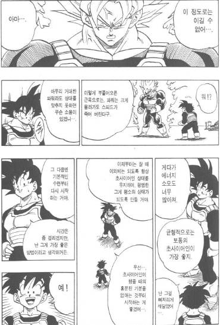
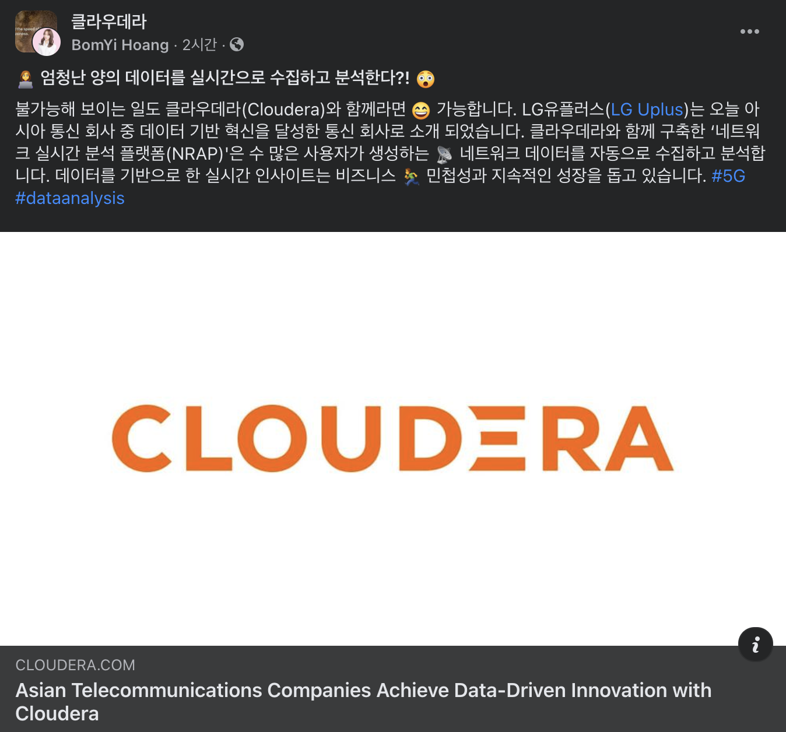
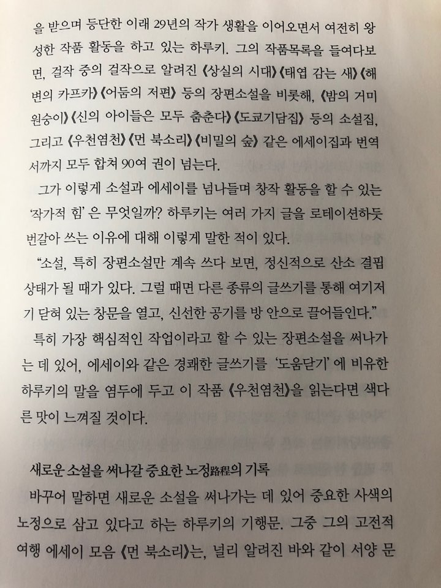

# 이야기 소재

* interview
  * behaviorl
    * bad: 이용규 광주로는 xxx 직전 팀에 대한 안 좋은 이야기
    * good: 안치홍
* dev
  * 내공 : 외공 = 알고리즘 : 코드 작성
  * 내공 외공 한쪽만으로도 최고수
    * e.g. 교수 비전공자로 성공한 사람 결국 어느 쪽이건 양쪽이 필요해짐
  * 주화입마
  * architecture
    * 흐름을 단순화해야 하는 이유
      * 프로그래밍을 배울 때 goto를 피해야 한다고 배움. 스파게티 코드를 피하기 위해서
      * 이런 문제를 피하기 위해 oop, design pattern, ... 같은 게 생겨나게 되었음
      * architecture도 마찬가지. 특히 MSA로 만드는 경우 micro service 하나 하나를 function으로 바꿔서 보면 이런 위험에 빠지기 쉬움
    * [미래를 예측할 수 없으니 가능한 단순하게 만들어라](https://twitter.com/promit_roy/status/1405912880663433223)
      * John Carmack이 유명해서인지 마치 그가 한 말인 거 처럼 퍼지는 데 [John Carmack은 retweet](https://twitter.com/ID_AA_Carmack/status/1405932642005041153)하면서 의견을 더함
  * balance
    * 가장 중요한 부분에 집중해야 하는 건 코드 작성에서도 마찬가지이지만 그렇다고 균형을 잃고 한쪽에 과도하게 집중하면 반대로 손실도 항상 발생
    * 야구에서 장타력을 더 향상시키기 위해 웨이트를 늘력 근육량을 키웠다가 균형을 잃고 타격 지표 전체가 하락하는 일은 빈번(e.g. 2021 터커)
    * 
* 야구
  * 류현진
    * 92mile fastball 피안타율 0.222
    * 메이저리그 92mile fastball 피안타율 0.257 97mile fastball 0.225 98mile fastball 0.209
    * 즉 류현진의 92mile = 메이저리그 97mile fastball
    * pitch desgin을 통해 자신의 공의 위력을 상승
    * 다만 류현진의 <90mile fastball 피안타율 0.308 구속이 느릴수록 약한 볼인 건 누구나 마찬가지. 구속을 안 타는 투수란 없음
  * 수비 시프트
    * 정위치에서 다이빙캐치로 잡는 수비 < 수비 시프트로 평범한 포구
    * 사용자의 클릭을 증가시키기 위한 모든 작업이 수비 시프트와 같이 수비를 더 안정적으로 높은 확률로 하기 위한 게 아닐까?
      * 프론트에서는 UI UX의 개선, 백엔드에서는 좀 더 빠르고 안정적인 처리
  * personal milestone or project
    * 점수차가 크게 벌어진 경기에서 신인이나 1군 경험이 별로 없는 선수를 등판시키는 경우와 비슷하지 않을까?
  * 육성 시스템의 필요성. 그러나 현실적으로 여유가 없음. 마치 KBO의 현실과 똑같은데 해결책은?
    * [19세 유망주, 미국은 싱글A부터..한국은? 외인 사령탑이 답하다 MD이슈](https://sports.v.daum.net/v/kcL0qUA1xs)
* [제프 베조스의 마지막 연례 주주서한 | ㅍㅍㅅㅅ](https://ppss.kr/archives/240022)
  * 마지막 섹션에서 리처드 도킨스가 지은 『The Blind Watchmaker』의 한 부분을 첨부
  * 사람의 체온은 죽고 나서 주위의 온도와 같아진다. 결국 ‘달라져야 살아남는다’
* 실수
  * 대가들도 실수를 함
  * 도널드 크누스 교수도 한 때 goto문을 옹호(?)
    * [What was Donald Knuth wrong about? | Hacker News](https://news.ycombinator.com/item?id=17164505)
    * [다익스트라, 왜 goto에 시비(?)를 거는가? - ZDNet korea](https://zdnet.co.kr/view/?no=00000010060491&from=pc)
  * 마틴 오더스키. scala에 xml을 언어 자체의 기능으로 포함. xml을 data format의 미래라고 오판
* [문경은 - 선수들을 100% 믿고 기다리는 게 좋은 것만은 아니었다](https://sports.news.naver.com/news.nhn?oid=529&aid=0000057518)
* [Asian Telecommunications Companies Achieve Data-Driven Innovation with Cloudera](https://www.cloudera.com/about/news-and-blogs/press-releases/2021-08-03-asian-telecommunications-companies-achieve-data-driven-innovation-with-cloudera.html)
  * 내부적으로는 의미있는 일일 수 있으나 business적으로도 그럴까?
  * 
* 하루키의 우천염천
  * 오픈소스나 개인 프로젝트 등의 다른 일을 하는 게 마치 하루키의 수필과도 같다는 생각이 듦
  * 핵심작업을 하기 위한 도움닫기이자 새로운 활력을 얻는 바탕이 되지 않을까?
  * 
