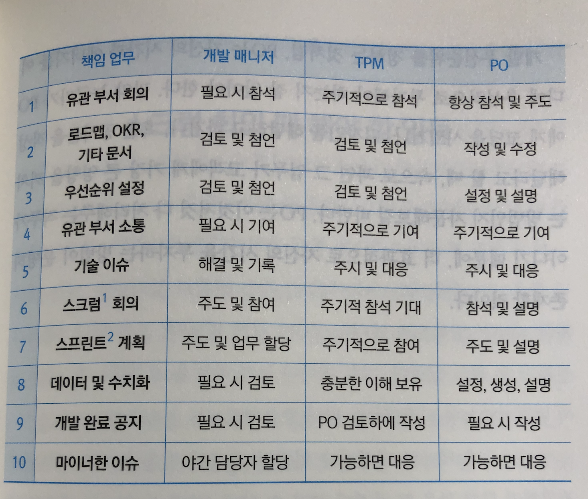

Programming Books
=================

* [2021 개발자 필독서](https://www.notion.so/2021-de02598a8b5d4ab5a9d1c7f9aa069e3f)
* mindmap
  * [언어와 컴퓨터 과학 기초](https://www.mindmeister.com/502625671/_?fullscreen=1)
  * [언어와 기초 이론](https://www.mindmeister.com/781068868/_?fullscreen=1)
  * [백엔드 개발](https://www.mindmeister.com/530652609/_?fullscreen=1)
  * [서버 운영과 데브옵스](https://www.mindmeister.com/774142178/_?fullscreen=1)
  * [스카이넷도 딥러닝부터](https://www.mindmeister.com/812276967/_?fullscreen=1)
  * [기본기 레벨업](https://www.mindmeister.com/529620367/_?fullscreen=1)
  * [모바일 개발](https://www.mindmeister.com/1248268101/_?fullscreen=1)
  * [게임과 그래픽스](https://www.mindmeister.com/528513515/_?fullscreen=1)
  * [한빛미디어](https://www.mindmeister.com/523584665/_?fullscreen=1)
* [bigbook.or.kr](http://www.bigbook.or.kr/)
* [thebook.io](https://thebook.io/) 길벗
* [SW교육도서 소개](http://hicoding.kr/?page_id=38623) 초등학생용이지만 수준이 상당함
* [전자책 출간 후기](https://www.popit.kr/%EC%A0%84%EC%9E%90%EC%B1%85-%EC%B6%9C%EA%B0%84-%ED%9B%84%EA%B8%B0)
* [전자책 1인출판 도전기 #6 출판사 신고하기 (1)](https://brunch.co.kr/@merryseo/9)
* [독서가 내게 가져다 준 것들 - 우아한형제들 기술 블로그](https://woowabros.github.io/growth/2020/11/25/what-reading-gave-to-me.html)
* [한빛 리얼타임 eBook](https://www.hanbit.co.kr/realtime/books/new_webbook_list.html)
* [2021년 상반기 개발자는 이 책을 읽었다](https://www.notion.so/2021-73cb3aa263ae4c4c903e10b854dda826)
* [2021 개발자 필독서 ](https://www.kyobobook.co.kr/eventRenewal/eventViewByPid.laf?eventPid=42768)
* [OKKY - 절판된 개발서적 합법적으로 구하는 방법](https://okky.kr/article/1016313)
* [79. 앱 개발 책 - 2021](https://brunch.co.kr/@topasvga/1452)
* [사물인터넷을위한 BBC microbit 프로그래밍](http://jpub.tistory.com/723)
  * 한라 005.118 서64ㅂ
  * microbit 기본 프로그래밍 + 실습 예제 성격의 프로젝트
* 넘버스 - 수학으로 범죄 해결하기
  * 한라 410 데47ㄴ
  * 약간의 수학이 나오지만, 현실에서 수학을 어떻게 사용하는지에 대한 재미있는 이야기
* 아파치 플링크 - Learning Apache Flink
  * 한라 005.76 데56ㅇ
* [반갑다 Ionic](http://bjpublic.tistory.com/296)
  * 한라 005.11이14ㅂ
* [프로그래밍 언어 도감](http://www.datanet.co.kr/news/articleView.html?idxno=124905)
  * 한라 005.1마57ㅍ
  * [서평: 프로그래밍 언어도감 ](https://blog.gaerae.com/2018/08/programming-gengo-zukan.html)
  * ★★☆☆☆ 뭔가 애매한 느낌. 초보자를 위한 책이라고 하지만, 언어 소개는 확실히 초보자 용으로 읽고 넘어갈 정도인데, 프로그래밍 개념 부분은 의외로 중급자용 키워드를 소개한다. 재미로 읽어볼만 함
* [실용주의 프로그래머](https://jh4hj.tistory.com/entry/%EC%8B%A4%EC%9A%A9%EC%A3%BC%EC%9D%98-%ED%94%84%EB%A1%9C%EA%B7%B8%EB%9E%98%EB%A8%B8)
  * 2009.11.13~17
  * [008. 지속 가능한 소프트웨어 개발 | LinkedIn](https://www.linkedin.com/pulse/008-%EC%A7%80%EC%86%8D-%EA%B0%80%EB%8A%A5%ED%95%9C-%EC%86%8C%ED%94%84%ED%8A%B8%EC%9B%A8%EC%96%B4-%EA%B0%9C%EB%B0%9C-%ED%98%84%EC%9E%AC-%EC%9D%B4/)
* [신화와 야망 Google](https://jh4hj.tistory.com/entry/%EC%8B%A0%ED%99%94%EC%99%80-%EC%95%BC%EB%A7%9D-Google)
  * 2009.11.26~27
* [소프트웨어 산책](https://jh4hj.tistory.com/entry/%EC%86%8C%ED%94%84%ED%8A%B8%EC%9B%A8%EC%96%B4-%EC%82%B0%EC%B1%85)
  * 2010.02.07~08
* [뉴욕의 프로그래머](https://jh4hj.tistory.com/entry/%EB%89%B4%EC%9A%95%EC%9D%98-%ED%94%84%EB%A1%9C%EA%B7%B8%EB%9E%98%EB%A8%B8)
  * 2010.02.08~09
* [프로그래밍은 상상이다](https://jh4hj.tistory.com/entry/%ED%94%84%EB%A1%9C%EA%B7%B8%EB%9E%98%EB%B0%8D%EC%9D%80-%EC%83%81%EC%83%81%EC%9D%B4%EB%8B%A4)
  * 2010.02.10~11
* [행복한 프로그래밍](https://jh4hj.tistory.com/entry/%ED%96%89%EB%B3%B5%ED%95%9C-%ED%94%84%EB%A1%9C%EA%B7%B8%EB%9E%98%EB%B0%8D)
  * 2010.02.21
* [해커와 화가](https://jh4hj.tistory.com/entry/%ED%95%B4%EC%BB%A4%EC%99%80-%ED%99%94%EA%B0%80)
  * 2010.02.22
* [구글을 지탱하는 기술](https://jh4hj.tistory.com/entry/%EA%B5%AC%EA%B8%80%EC%9D%84-%EC%A7%80%ED%83%B1%ED%95%98%EB%8A%94-%EA%B8%B0%EC%88%A0)
  * 2010.02.23
* [사랑하지 않으면 떠나라](https://jh4hj.tistory.com/entry/%EC%82%AC%EB%9E%91%ED%95%98%EC%A7%80-%EC%95%8A%EC%9C%BC%EB%A9%B4-%EB%96%A0%EB%82%98%EB%9D%BC)
  * 2010.05.15
* [프로그래밍 심리학](https://jh4hj.tistory.com/entry/%ED%94%84%EB%A1%9C%EA%B7%B8%EB%9E%98%EB%B0%8D-%EC%8B%AC%EB%A6%AC%ED%95%99)
  * 2010.05.26~29
* [룰 메이커 - 실리콘밸리를 움직이는 사람들](https://jh4hj.tistory.com/entry/%EB%A3%B0-%EB%A9%94%EC%9D%B4%EC%BB%A4-%EC%8B%A4%EB%A6%AC%EC%BD%98%EB%B0%B8%EB%A6%AC%EB%A5%BC-%EC%9B%80%EC%A7%81%EC%9D%B4%EB%8A%94-%EC%82%AC%EB%9E%8C%EB%93%A4)
  * 2015.07.28
* [인터랙티브 디벨로퍼](https://jh4hj.tistory.com/entry/%EC%9D%B8%ED%84%B0%EB%9E%99%ED%8B%B0%EB%B8%8C-%EB%94%94%EB%B2%A8%EB%A1%9C%ED%8D%BC)
  * 2016.05.03~04
* [소프트 스킬 - 평범한 개발자의 비범한 인생 전략 71가지](https://www.gilbut.co.kr/book/view?bookcode=BN001351)
  * [소프트 스킬 평범한 개발자의 비범한 인생 전략 71가지](https://jh4hj.tistory.com/entry/%EC%86%8C%ED%94%84%ED%8A%B8-%EC%8A%A4%ED%82%AC-%ED%8F%89%EB%B2%94%ED%95%9C-%EA%B0%9C%EB%B0%9C%EC%9E%90%EC%9D%98-%EB%B9%84%EB%B2%94%ED%95%9C-%EC%9D%B8%EC%83%9D-%EC%A0%84%EB%9E%B5-71%EA%B0%80%EC%A7%80)
    * 2016.05.16
* [임백준의 대살개문](https://jh4hj.tistory.com/entry/%EC%9E%84%EB%B0%B1%EC%A4%80%EC%9D%98-%EB%8C%80%EC%82%B4%EA%B0%9C%EB%AC%B8)
  * 2016.08.31
* [데브옵스 2.0 툴킷](http://acornpub.co.kr/book/devops-2.0-toolkit)
  * 2018.09
  * 한라 005.12파297ㄷ
  * vagrant, docker, kubernetes, puppet, chef, ansible, docker swarm, docker compose, consul, etcd, registrator, confd, nginx/ha proxy
* [해킹 일렉트로닉스: 아두이노와 라즈베리 파이로 배우는 전자공학](http://jpub.tistory.com/821)
  * 2018.09
  * 한라 569몽877ㅎ
* [오늘부터 개발자](https://jh4hj.tistory.com/entry/%EC%98%A4%EB%8A%98%EB%B6%80%ED%84%B0-%EA%B0%9C%EB%B0%9C%EC%9E%90)
  * [오늘부터 개발자. 이런 책도 출판되는 걸 보면 확실히 개발자가 부족하긴 하다. 우리… | by Jun | Nov, 2021 | Medium](https://nymets.medium.com/%EC%98%A4%EB%8A%98%EB%B6%80%ED%84%B0-%EA%B0%9C%EB%B0%9C%EC%9E%90-fbf62d0e9876)
  * 2021.11.11
  * ★★★★☆
  * 제목 그대로 비전공자가 개발자가 되기 위해 필요한 부분을 자세히 설명한 책
  * 이미 개발자가 된 사람에게는 전혀 필요없지만 관심을 갖는 사람을 위해 읽어보라고 하기에는 매우 좋다
* [처음 배우는 애저](https://jh4hj.tistory.com/entry/%EC%B2%98%EC%9D%8C-%EB%B0%B0%EC%9A%B0%EB%8A%94-%EC%95%A0%EC%A0%80)
  * [처음 배우는 애저. 회사를 옮겼는데, 스타트업이 보통 그렇듯 회사 시스템은 전부 AWS에서… | by Jun | Nov, 2021 | Medium](https://nymets.medium.com/%EC%B2%98%EC%9D%8C-%EB%B0%B0%EC%9A%B0%EB%8A%94-%EC%95%A0%EC%A0%80-a27207be748f)
  * 2021.11.16
  * ★★★★☆
* [사용자를 유혹하는 UX의 기술](https://brunch.co.kr/@upleat/105)
  * 2021.12.08
  * ★★★☆☆ 잘 모르는 분야라 훝어 보는 정도로 읽었는데 군데군데 쉽게 적용할 수 있을 듯한 부분도 보여서 좋았음
* [프로그래머의 뇌](https://jh4hj.tistory.com/entry/%ED%94%84%EB%A1%9C%EA%B7%B8%EB%9E%98%EB%A8%B8%EC%9D%98-%EB%87%8C)
  * 2022.01.14
  * ★★★★☆ 독특하게도 프로그래밍과는 대부분 무관하거나 혹은 간접적인 이야기를 하는 프로그래머에 대한 책
  * [프로그래머의 뇌. 프로그래밍과 직접 연관된 부분은 거의 없지만, 여러가지 시사점을… | by Jun | Jan, 2022 | Medium](https://nymets.medium.com/%ED%94%84%EB%A1%9C%EA%B7%B8%EB%9E%98%EB%A8%B8%EC%9D%98-%EB%87%8C-fb28e58477f2)
  * [독서광 프로그래머의 뇌](https://jhrogue.blogspot.com/2022/01/blog-post_19.html)
* [**죽을 때까지 코딩하며 사는 법 by Codong's Development Diary**](https://codong.tistory.com/40)
  * ★★★★☆ 2022.01.31
  * [죽을 때까지 코딩하며 사는 법 | by Jun | Feb, 2022 | Medium](https://nymets.medium.com/%E1%84%8C%E1%85%AE%E1%86%A8%E1%84%8B%E1%85%B3%E1%86%AF-%E1%84%84%E1%85%A2%E1%84%81%E1%85%A1%E1%84%8C%E1%85%B5-%E1%84%8F%E1%85%A9%E1%84%83%E1%85%B5%E1%86%BC%E1%84%92%E1%85%A1%E1%84%86%E1%85%A7-%E1%84%89%E1%85%A1%E1%84%82%E1%85%B3%E1%86%AB-%E1%84%87%E1%85%A5%E1%86%B8-b825f1b86cdd)
  * [죽을 때까지 코딩하며 사는 법](https://jh4hj.tistory.com/entry/%E1%84%8C%E1%85%AE%E1%86%A8%E1%84%8B%E1%85%B3%E1%86%AF-%E1%84%84%E1%85%A2%E1%84%81%E1%85%A1%E1%84%8C%E1%85%B5-%E1%84%8F%E1%85%A9%E1%84%83%E1%85%B5%E1%86%BC%E1%84%92%E1%85%A1%E1%84%86%E1%85%A7-%E1%84%89%E1%85%A1%E1%84%82%E1%85%B3%E1%86%AB-%E1%84%87%E1%85%A5%E1%86%B8)
* (NOT YET) [기획자의 글쓰기](https://jhrogue.blogspot.com/2021/11/blog-post_25.html)
* (NOT YET) 웹 사이트 최적화 기법 웹사이트를 더 빠르게 만드는 14단계, UI 개발자를 위한 필수 지침서
* (NOT YET) [계산기는 어떻게 인공지능이 되었을까?](http://jhrogue.blogspot.com/2019/04/blog-post_20.html)
* (NOT YET) 앤서블 철저 입문
  * 2017.12 탐라
* (NOT YET) [사이트 신뢰성 엔지니어링](https://blog.outsider.ne.kr/1358)
  * [사이트 신뢰성 엔지니어링을 통해 구글의 서비스 개발과 운영 노하우를 소개합니다](https://developers-kr.googleblog.com/2018/04/blog-post.html)
* (NOT YET) (더 나은 코딩을 위한,) 코딩을 지탱하는 기술 : 원리로 깨우치는 프로그래밍 기법
  * 탐라 개005.1-니58ㅋ
  * 한라 005.11-니58ㅋ
* (NOT YET) [Chaos Engineering](https://blog.outsider.ne.kr/1374)
* (NOT YET) [구글 클라우드 플랫폼 입문](http://jybaek.tistory.com/744)
* (NOT YET) [실리콘밸리를 그리다](https://brunch.co.kr/@svillustrated/42)
  * 2018.10 탐라
* (NOT YET) 우린 이렇게 왔다 미국의 테크 기업으로 이직한 토종 한국인 25인의 취업 이야기
  * 2018.10 탐라
* (NOT YET) [누가 IT시장 취업에 성공하는가: 신입 경력 지원자와 면접관을 위한 지침서](https://roadbook.co.kr/252)
* (NOT YET) [데브옵스 (DevOps Troubleshooting)](http://jybaek.tistory.com/759)
* (NOT YET) [데브옵스 핸드북](http://acornpub.co.kr/book/devops-handbook)
  * [데브옵스 핸드북 실천법 핵심 요약](http://javacan.tistory.com/entry/devops-handbook-core-practice-summary)
  * [엣시와 콘웨이 법칙 - 데브옵스 핸드북 읽기](https://brunch.co.kr/@moonjoonyoung/6)
* (NOT YET) [아두이노 바이블](https://jpub.tistory.com/1164)
* (NOT YET) [성공하는 프로그래밍 공부법: 사람과 프로그래머 #7](http://roadbook.co.kr/205)
  * 2018.10 한라
* (NOT YET) JVM 언어 입문 - 자바, 스칼라, 클로저, 코틀린, 그루비 체험하기
  * 2018.10 한라
* (NOT YET) [프로그래밍의 정석](https://www.popit.kr/bookreview-principlesofprogramming)
* (NOT YET) [**빅데이터를 지탱하는 기술**](http://jpub.tistory.com/8610)
* (NOT YET) [프로그래밍의 정석 - 프로그래머가 반드시 알아야 할 101가지 원리 원칙](https://freelec.co.kr/book/1448/)
* (NOT YET) [인텔리제이 IDEA 기본 사용법부터 고급 기능까지 마스터하기](http://acornpub.co.kr/book/intellij-idea)
* (NOT YET) [AI 빅데이터에 숨어있는 수학의 아름다움](http://www.sejongbooks.co.kr/book_board/pubstory_book_view.php?id=bookstory&no=20501&category=08)
* (NOT YET) [**HTTP 완벽 가이드: 웹은 어떻게 동작하는가**](https://blog.outsider.ne.kr/1431)
* (NOT YET) [빅데이터가 만드는 세상 / 빅토르 마이어 쇤버거](http://ohyecloudy.com/pnotes/archives/book-big-data-a-revolution-that-will-transform-how-we-live-work-and-think/)
* (NOT YET) [OpenCV 4로 배우는 컴퓨터 비전과 머신 러닝](https://sunkyoo.github.io/opencv4cvml/)
  * [『OpenCV 4로 배우는 컴퓨터 비전과 머신 러닝』 Python 예제 코드](https://github.com/sunkyoo/opencv4cvml/tree/master/python)
* (NOT YET) [파이썬으로 만드는 OpenCV 프로젝트, 간단한 영상 입출력부터 머신러닝까지](https://blog.xcoda.net/101)
  * [파이썬으로 만드는 OpenCV 프로젝트](https://blog.insightbook.co.kr/2019/04/03/%ED%8C%8C%EC%9D%B4%EC%8D%AC%EC%9C%BC%EB%A1%9C-%EB%A7%8C%EB%93%9C%EB%8A%94-opencv-%ED%94%84%EB%A1%9C%EC%A0%9D%ED%8A%B8/)
* (NOT YET) [C#과 파이썬을 활용한 OpenCV 4 프로그래밍 - 컴퓨터 비전 기초 이론부터 머신러닝을 활용한 영상 처리 프로젝트까지](https://wikibook.co.kr/opencv4/)
* (NOT YET) [알짜배기 예제로 배우는 OpenCV](https://bjpublic.tistory.com/359)
* (NOT YET) [밑바닥부터 만드는 컴퓨팅 시스템](https://blog.insightbook.co.kr/2019/03/29/%EB%B0%91%EB%B0%94%EB%8B%A5%EB%B6%80%ED%84%B0-%EB%A7%8C%EB%93%9C%EB%8A%94-%EC%BB%B4%ED%93%A8%ED%8C%85-%EC%8B%9C%EC%8A%A4%ED%85%9C/)
* (NOT YET) [나는 LINE 개발자입니다](http://www.hanbit.co.kr/store/books/look.php?p_code=B3137155711)
* (NOT YET) [양자 컴퓨터 프로그래밍 IBM Q Experience로 하는 양자 컴퓨터 프로그래밍](http://acornpub.co.kr/book/practical-quantum-developers)
* (NOT YET) [양자 컴퓨팅 입문 - 간결하게 배우는 양자 컴퓨팅](http://acornpub.co.kr/book/quantum-beginner)
* (NOT YET) [오픈 소스로 미래를 연마하라](https://jirak.net/wp/도서-오픈-소스로-미래를-연마하라/)
* (NOT YET) [심플 소프트웨어 - 코드의 단순성, 가독성, 안정성, 유지보수](https://www.aladin.co.kr/shop/wproduct.aspx?ItemId=212938581)
* (NOT YET) [개발자의 글쓰기 - 변수 네이밍부터 릴리스 노트, 장애 보고서, 기술 블로그까지, 프로그래머의 글쓰기 고민 끝!](https://wikibook.co.kr/on-writing/)
  * [개발자의 글쓰기](https://www.notion.so/3252727e7f374d499b4ec93691fd5e7e)
* (NOT YET) [IT에 몸담은 이들을 위한 지적 생산 기술](http://naver.me/xwCKOrWa)
* (NOT YET) [오픈 소스로 미래를 연마하라](https://blog.outsider.ne.kr/1474)
* (NOT YET) [손에 잡히는 10분 정규 표현식](https://blog.insightbook.co.kr/2019/07/10/%ec%86%90%ec%97%90-%ec%9e%a1%ed%9e%88%eb%8a%94-10%eb%b6%84-%ec%a0%95%ea%b7%9c-%ed%91%9c%ed%98%84%ec%8b%9d/)
* (NOT YET) [데이터 읽기의 기술](https://jhrogue.blogspot.com/2020/02/blog-post.html)
* (NOT YET) [출판사가 OK하는 책쓰기](http://jhrogue.blogspot.com/2020/02/ok.html)
* (NOT YET) [처음 배우는 플러터, 유동환 저(2020)](https://medium.com/@larkbless/%EC%84%9C%ED%8F%89-%EC%B2%98%EC%9D%8C-%EB%B0%B0%EC%9A%B0%EB%8A%94-%ED%94%8C%EB%9F%AC%ED%84%B0-%EC%9C%A0%EB%8F%99%ED%99%98-%EC%A0%80-2020-1327c26c57cc)
* (NOT YET) [줄리아를 생각하다 데이터 과학자를 위한 최적의 프로그래밍 언어](http://www.yes24.com/Product/Goods/89643887?scode=032&OzSrank=1)
* (NOT YET) [(유튜브 방송) UX/UI의 10가지 심리학 법칙](https://jhrogue.blogspot.com/2020/09/uxui-10.html)
* (NOT YET) [도서 일상 속 사물이 알려주는 웹 API 디자인 – 지락문화예술공작단](https://jirak.net/wp/%EB%8F%84%EC%84%9C-%EC%9D%BC%EC%83%81-%EC%86%8D-%EC%82%AC%EB%AC%BC%EC%9D%B4-%EC%95%8C%EB%A0%A4%EC%A3%BC%EB%8A%94-%EC%9B%B9-api-%EB%94%94%EC%9E%90%EC%9D%B8/)
* (NOT YET) [웹 애플리케이션 보안 : 네이버 블로그](https://blog.naver.com/ins_soul80/222288561320)
* (NOT YET) [한 권으로 읽는 컴퓨터 구조와 프로그래밍](https://www.onlybook.co.kr/entry/secret-programs)
  * [한 권으로 읽는 컴퓨터 구조와 프로그래밍 - YouTube](https://www.youtube.com/watch?v=H89867LMv-4)
  * [한 권으로 읽는 컴퓨터 구조와 프로그래밍](https://jhrogue.blogspot.com/2021/04/blog-post.html)
* (NOT YET) [이야기로 배우는 구글 빅쿼리](https://jybaek.tistory.com/918) GCP Google Big Query
* (NOT YET) [스트리밍 시스템 | 에이콘출판사](http://www.acornpub.co.kr/book/streaming-systems)
* (NOT YET) [레거시 코드 활용 전략](https://jhrogue.blogspot.com/2021/07/blog-post_8.html)
* (NOT YET) [나는 주니어 개발자다](https://jhrogue.blogspot.com/2021/09/blog-post_15.html)
* (NOT YET) [류광의 번역 이야기 :: 번역서 "핸즈온 해킹" 출간 소식](http://occamsrazr.net/tt/376)
* (NOT YET) [『컴퓨터과학이 여는 세계』 세상을 바꾼 컴퓨터, 소프트웨어의 원천 아이디어 그리고 미래 – 도서출판 인사이트](https://blog.insightbook.co.kr/2015/05/21/%E3%80%8E%EC%BB%B4%ED%93%A8%ED%84%B0%EA%B3%BC%ED%95%99%EC%9D%B4-%EC%97%AC%EB%8A%94-%EC%84%B8%EA%B3%84%E3%80%8F-%EC%84%B8%EC%83%81%EC%9D%84-%EB%B0%94%EA%BE%BC-%EC%BB%B4%ED%93%A8%ED%84%B0-%EC%86%8C-2/)
* (NOT YET) [데이터 스토리 ( 데이터를 설득력 있는 이야기로 바꾸는 방법 )](https://jybaek.tistory.com/944)
* (NOT YET) SRE를 위한 시스템 설계와 구축 [SRE? 데브옵스? 노옵스? 데브섹옵스?...그리고 신뢰성 보안 - 한빛출판네트워크](https://www.hanbit.co.kr/channel/category/category_view.html?cms_code=CMS2873493735)
* (NOT YET) [해커, 광기의 랩소디 - 세상을 바꾼 컴퓨터 혁명의 영웅들 :: Outsider's Dev Story](https://blog.outsider.ne.kr/1580)
* (NOT YET) [1일 1로그 100일 완성 IT 지식](https://jhrogue.blogspot.com/2022/02/1-1-100-it.html)

# Agile Scrum

* [(성공적인 애자일 도입을 위한) 에센셜 스크럼](2017-5-2-essential-scrum.md)
  * 한라 005.1-루48ㅇ
* [**카이젠 저니: 나와 팀이 함께 자라는 애자일 여행**](https://jpub.tistory.com/959)
  * 소설같은 형식으로 매우 쉽게 읽을 수 있지만 내용이 충실
  * [성장과 개선은 내가 만들고 함께 하는 것이다](https://brunch.co.kr/@khorikim/514)
* (NOT YET) [함께 자라기 - 애자일로 가는 길](http://agile.egloos.com/5914591)
  * [함께 자라기: 애자일로 가는 길](https://blog.outsider.ne.kr/1423)
  * [리뷰: 함께 자라기 - 애자일로 가는 길](https://blog.gaerae.com/2019/03/book-agile.html)
* (NOT YET) [소프트웨어 장인: 아마추어에서 프로페셔널로](https://wormwlrm.github.io/2019/04/04/Software-Craftsmanship.html)
  * [나는 어떤 마음으로 소프트웨어를 만들어야 하는가](https://evan-moon.github.io/2019/09/05/about-software-craftsmanship/)
* (NOT YET) [네이키드 애자일](https://imch.dev/posts/naked-agile)
* (NOT YET) [《클린 애자일: 새로운 세대를 위한 애자일 가치와 실천》 – 도서출판 인사이트](https://blog.insightbook.co.kr/2020/12/03/%e3%80%8a%ed%81%b4%eb%a6%b0-%ec%95%a0%ec%9e%90%ec%9d%bc-%ec%83%88%eb%a1%9c%ec%9a%b4-%ec%84%b8%eb%8c%80%eb%a5%bc-%ec%9c%84%ed%95%9c-%ec%95%a0%ec%9e%90%ec%9d%bc-%ea%b0%80%ec%b9%98%ec%99%80-%ec%8b%a4/)
* (NOT YET) [떠오르는 애자일 방법론 칸반 – 도서출판 인사이트](https://blog.insightbook.co.kr/2014/11/24/%eb%96%a0%ec%98%a4%eb%a5%b4%eb%8a%94-%ec%95%a0%ec%9e%90%ec%9d%bc-%eb%b0%a9%eb%b2%95%eb%a1%a0-%ec%b9%b8%eb%b0%98/)
* (NOT YET) [애자일 듀오 ‘칸반과 스크럼’ – 도서출판 인사이트](https://blog.insightbook.co.kr/2013/05/08/%ec%95%a0%ec%9e%90%ec%9d%bc-%eb%93%80%ec%98%a4-%ec%b9%b8%eb%b0%98%ea%b3%bc-%ec%8a%a4%ed%81%ac%eb%9f%bc/)
* (NOT YET) [익스트림 프로그래밍 - 도서출판 인사이트](http://ebook.insightbook.co.kr/book/48)

# Algorithm

* [누워서 읽는 알고리즘](https://jh4hj.tistory.com/entry/%EB%88%84%EC%9B%8C%EC%84%9C-%EC%9D%BD%EB%8A%94-%EC%95%8C%EA%B3%A0%EB%A6%AC%EC%A6%98)
  * 2010.02.23~26
* [누워서 읽는 퍼즐북 : 뉴욕의 프로그래머 임백준의 퍼즐이야기](https://jh4hj.tistory.com/entry/%EB%88%84%EC%9B%8C%EC%84%9C-%EC%9D%BD%EB%8A%94-%ED%8D%BC%EC%A6%90%EB%B6%81-%EB%89%B4%EC%9A%95%EC%9D%98-%ED%94%84%EB%A1%9C%EA%B7%B8%EB%9E%98%EB%A8%B8-%EC%9E%84%EB%B0%B1%EC%A4%80%EC%9D%98-%ED%8D%BC%EC%A6%90%EC%9D%B4%EC%95%BC%EA%B8%B0)
  * 2010.06.17~23
* 해커의 기쁨: 비트와 바이트 그리고 알고리즘
  * 한라 004.661워294ㅎ
* Top Coder 알고리즘 트레이닝
  * 한라 005.1타87ㅌ
* 프로그래밍 대회에서 배우는 알고리즘 문제해결 전략 1, 2권
  * 탐라 005.1구75ㅇv.1,2
* 문제로 풀어보는 알고리즘
  * 탐라 005.1황68ㅁ
* 다양한 예제로 학습하는 데이터 구조와 알고리즘 for java
  * 한라 005.73카296ㄷ
* Hello Coding 그림으로 개념을 이해하는 알고리즘
  * 한라 005.11 바297ㅎ
  * [정말 쉬운 <그림으로 개념을 이해하는 알고리즘>](https://brunch.co.kr/@insuk/31)
  * python2.7
* Programming challenges : 알고리즘 트레이닝 북
  * 한라 005.1-스878ㅍ
* [알고리즘 도감](http://jpub.tistory.com/760)
  * 한라 005.1이58ㅇ
  * ★★★☆☆
    * + 그림을 자세히 그려놓아서 이해하기 쉽다
    * - 코드는 없다
    * - 저자가 암호를 좋아하는 건지 기본 알고리즘 - 암호화 알고리즘 - k means - 기타(유클리드, 페이지 랭크, 하노이의 탑)등 내용이 좀 산만하고 어떤 기준으로 선정했는지를 모르겠다
* [파이썬 자료구조와 알고리즘 : 기초 튼튼, 핵심 쏙쏙, 실력 쑥쑥](http://www.hanbit.co.kr/media/books/book_view.html?p_code=B8465804191)
  * [파이썬 자료구조와 알고리즘](https://jh4hj.tistory.com/entry/%ED%8C%8C%EC%9D%B4%EC%8D%AC-%EC%9E%90%EB%A3%8C%EA%B5%AC%EC%A1%B0%EC%99%80-%EC%95%8C%EA%B3%A0%EB%A6%AC%EC%A6%98)
* [다이나믹 프로그래밍 완전 정복](https://jh4hj.tistory.com/entry/%EB%8B%A4%EC%9D%B4%EB%82%98%EB%AF%B9-%ED%94%84%EB%A1%9C%EA%B7%B8%EB%9E%98%EB%B0%8D-%EC%99%84%EC%A0%84-%EC%A0%95%EB%B3%B5)
* [가장 쉬운 독학 알고리즘 첫걸음 - C&자바편 | 동양북스](http://www.dongyangtv.com/book/book_view.asp?menu_1=general&menu_2=general%5Fit&goods_code=2740)
  * [가장 쉬운 독학 알고리즘 첫걸음 — C&자바편. 제목에서 알 수 있듯 이 책은 초보자가 독학으로 알고리즘을 배우는 걸… | by Jun | Nov, 2021 | Medium](https://nymets.medium.com/%EA%B0%80%EC%9E%A5-%EC%89%AC%EC%9A%B4-%EB%8F%85%ED%95%99-%EC%95%8C%EA%B3%A0%EB%A6%AC%EC%A6%98-%EC%B2%AB%EA%B1%B8%EC%9D%8C-c-%EC%9E%90%EB%B0%94%ED%8E%B8-9abd8fea21c3)
  * [가장 쉬운 독학 알고리즘 첫걸음 — C&자바편 -](https://jh4hj.tistory.com/entry/%EA%B0%80%EC%9E%A5-%EC%89%AC%EC%9A%B4-%EB%8F%85%ED%95%99-%EC%95%8C%EA%B3%A0%EB%A6%AC%EC%A6%98-%EC%B2%AB%EA%B1%B8%EC%9D%8C-%E2%80%94-C%EC%9E%90%EB%B0%94%ED%8E%B8)
* (NOT YET) 알고리즘 : 컴퓨터 과학의 기본, 숫자 알고리즘에서 양자 알고리즘까지
* (NOT YET) 알고리즘 문제 풀이 전략
* (NOT YET) 코딩 트레이닝
* (NOT YET) 알고리즘 비밀의 문을 열다 - 처음 배우는 알고리즘
  * 2016.11
  * 한라 005.1 코34알
* (NOT YET) [알고리즘 트레이닝: 자료 구조, 알고리즘 문제 해결 핵심 노하우](https://blog.insightbook.co.kr/book/programming-insight/%EC%95%8C%EA%B3%A0%EB%A6%AC%EC%A6%98-%ED%8A%B8%EB%A0%88%EC%9D%B4%EB%8B%9D/)
  * 2017.07 한라
* (NOT YET) [처음 만나는 알고리즘](http://www.kyobobook.co.kr/product/detailViewKor.laf?ejkGb=KOR&mallGb=KOR&barcode=9791185890821&orderClick=LAH&Kc=)
  * 2017.07 한라
* (NOT YET) 모두의 알고리즘 with 파이썬
  * 2017.07 한라
* (NOT YET) [알고리즘 트레이닝 - 자료구조, 알고리즘 문제해결 핵심 노하우](http://suakii.tistory.com/273)
  * 2017.08 한라
* (NOT YET) [파이썬으로 배우는 수학적 프로그래밍](http://sigmadream.github.io/Programming_and_Mathematical_Thinking_Python/)
  * 한라 005.135-스884ㅍ
* (NOT YET) [파이썬으로 배우는 실전 알고리즘 - 물리, 생물, 재무 등 다양한 분야의 응용 예제 구현](https://freelec.co.kr/book/1782/)
  * 한라 005.133-피64ㅍ
* (NOT YET) [알고리즘, 인생을 계산하다](https://m.blog.naver.com/hl4gnn/221228428136)
* (NOT YET) 알고리즘 산책
  * 제네릭 프로그래밍의 개념을 적용해 STL을 만든 알렉산더 스테파노프가 설명하는 프로그래밍과 수학 이야기
  * 한라 005.1-스884ㅇ
* (NOT YET) [서평: 그들은 알고리즘을 알았을까? ](https://blog.gaerae.com/2018/10/once-upon-an-algorithm.html)
* (NOT YET) [자료구조 입문 - 알고리즘과 그림으로 이해하고 C로 구현하는](https://freelec.co.kr/book/%ED%94%84%EB%A1%9C%EA%B7%B8%EB%9E%98%EB%B0%8D%EC%9D%98-%EA%B8%B0%EB%B3%B8%EC%9D%84-%ED%83%84%ED%83%84%ED%9E%88-%ED%95%98%EC%9E%90/)
* (NOT YET) [알고리즘 트레이닝: 프로그래밍 대회 입문 가이드](https://blog.insightbook.co.kr/2019/05/07/%E3%80%8A%EC%95%8C%EA%B3%A0%EB%A6%AC%EC%A6%98-%ED%8A%B8%EB%A0%88%EC%9D%B4%EB%8B%9D-%ED%94%84%EB%A1%9C%EA%B7%B8%EB%9E%98%EB%B0%8D-%EB%8C%80%ED%9A%8C-%EC%9E%85%EB%AC%B8-%EA%B0%80%EC%9D%B4%EB%93%9C/)
* (NOT YET) [퍼즐로 배우는 알고리즘 with 파이썬](https://blog.naver.com/ydot/221616317667)
* (NOT YET) [다이내믹 프로그래밍 완전 정복](http://www.hanbit.co.kr/media/books/book_view.html?p_code=B9440449667)
* (NOT YET) [파이썬 알고리즘 인터뷰 95가지 알고리즘 문제 풀이로 완성하는 코딩 테스트](https://www.aladin.co.kr/shop/wproduct.aspx?ItemId=245495826)
  * [algorithm-interview: <파이썬 알고리즘 인터뷰> 95가지 알고리즘 문제 풀이로 완성하는 코딩 테스트](https://github.com/onlybooks/algorithm-interview)
  * [독서광 파이썬 알고리즘 인터뷰](https://jhrogue.blogspot.com/2020/07/blog-post.html)
  * [책 리뷰 파이썬 알고리즘 인터뷰 | Charsyam's Blog](https://charsyam.wordpress.com/2020/08/23/%ec%b1%85-%eb%a6%ac%eb%b7%b0-%ed%8c%8c%ec%9d%b4%ec%8d%ac-%ec%95%8c%ea%b3%a0%eb%a6%ac%ec%a6%98-%ec%9d%b8%ed%84%b0%eb%b7%b0/)
* (NOT YET) [이것이 취업을 위한 코딩 테스트다 with 파이썬](https://hanbit.co.kr/store/books/look.php?p_code=B8945183661)
* (NOT YET) [파이썬을 이용한 컴퓨터 과학 입문 - YES24](http://www.yes24.com/Product/Goods/85111306)
* (NOT YET) [책 리뷰 실전 대비 C 알고리즘 인터뷰 – 길벗 | Charsyam's Blog](https://charsyam.wordpress.com/2021/01/10/%ec%b1%85-%eb%a6%ac%eb%b7%b0-%ec%8b%a4%ec%a0%84-%eb%8c%80%eb%b9%84-c-%ec%95%8c%ea%b3%a0%eb%a6%ac%ec%a6%98-%ec%9d%b8%ed%84%b0%eb%b7%b0-%ea%b8%b8%eb%b2%97/)
* (NOT YET) [알라딘: 코드 없는 알고리즘과 데이터 구조](https://www.aladin.co.kr/shop/wproduct.aspx?ItemId=264048968)

# Amazon AWS

* (아마존 웹 서비스를 이용한)글로벌 서비스 인프라 설계 : 효율적인 AWS 운용을 위한 DevOps 환경 만들기
  * 탐라 문004.58-윤51ㄱ
  * 한라 004.58-윤52ㄱ
  * AWS 사용하려면 꼭 봐야 할 듯
* 처음 시작하는 AWS 람다
  * 한라 004.58 풀294ㅊ
* 탄력적 개발을 위한 AWS 실천 기술
  * 2016.12
  * 한라 004.5 타884ㅌ
* [AWS Lambda 인 액션](http://jpub.tistory.com/749)
  * 2018.01
  * 한라 004.588 포86ㅇ
* [210.(책추천) AWS시작으로 좋은 책들](https://brunch.co.kr/@topasvga/666)
* (NOT YET) [아마존 웹 서비스 인 액션](https://medium.com/@need4spd/%EC%B1%85-%EB%A6%AC%EB%B7%B0-amazon-web-service-in-action-9e5d81b184ad)
* (NOT YET) [서비스 운영이 쉬워지는 AWS 인프라 구축 가이드 서버 구축부터 배포, 모니터링, 관리 자동화, 데브옵스까지](http://wikibook.co.kr/aws-infra/)
* (NOT YET) [AWS 시스템 설계와 마이그레이션 아마존 웹 서비스 업무 시스템 설계와 마이그레이션을 위한 베스트 프랙티스](http://wikibook.co.kr/aws-design-migration/)
* (NOT YET) [서비스 운영이 쉬워지는 AWS 인프라 구축 가이드](https://wikibook.co.kr/aws-infra/)
* (NOT YET) [테라폼 설치에서 운영까지](https://jpub.tistory.com/907)
  * [테라폼 설치에서 운영까지](https://blog.outsider.ne.kr/1451)
  * [테라폼 설치에서 운영까지 (Terraform Up & Running)](https://jybaek.tistory.com/893)
* (NOT YET) [**스프링 부트와 AWS로 혼자 구현하는 웹 서비스 출간 후기**](https://jojoldu.tistory.com/463)
  * [freelec-springboot2-webservice](https://github.com/jojoldu/freelec-springboot2-webservice)
  * [(2020.12.16) 스프링 부트와 AWS로 혼자 구현하는 웹 서비스 최신 코드로 변경하기](https://jojoldu.tistory.com/539)
* (NOT YET) [Amazon Web Services로 시작하는 클라우드 입문](https://jybaek.tistory.com/907)
* (NOT YET) [AWS Lambda로 시작하는 서버리스](https://bjpublic.tistory.com/379)
* (NOT YET) [배워서 바로 쓰는 14가지 AWS 구축 패턴](https://jybaek.tistory.com/913)
* (NOT YET) [AWS 기반 AI 애플리케이션 개발 | 에이콘출판사](http://www.acornpub.co.kr/book/ai-aws)
* (NOT YET) [AWS 전환 모범 사례와 엔터프라이즈 IT의 미래 | 에이콘출판사](http://www.acornpub.co.kr/book/ahead-cloud)
* (NOT YET) [생활코딩! 아마존 웹 서비스 | 위키북스](https://wikibook.co.kr/aws/)

# Android

* [핵심만 골라 배우는 안드로이드 스튜디오3 & 프로그래밍](https://github.com/Jpub/Androidstudio3)
* [나의 첫 안드로이드: 안드로이드 기초부터 실습까지](https://www.youtube.com/playlist?list=PLVsNizTWUw7F7esGouHumJdP8NW7Embci)
  * [나의 첫 안드로이드](https://jybaek.tistory.com/769)
* (NOT YET) [안드로이드 개발 레벨업 교과서](http://wikibook.co.kr/advanced-android-book)
  * 2017.06 한라
* (NOT YET) [아키텍처를 알아야 앱 개발이 보인다](https://bjpublic.tistory.com/357)

# Architecture

* **마이크로서비스 아키텍처 구축**
  * 한라 005.12 뉴34ㅁ
  * ★★★★☆ 예제 코드는 없지만, 마이크로서비스의 기초적인 부분에 대해서 사례와 함께 자세히 설명
  * [마이크로서비스 아키텍처 구축](https://brunch.co.kr/@insuk/30)
  * p29, 얼마나 작아야 하는 것인가? 충분히 작아서 더 이상 작아질 수 없는 크기
    * 마치 linux command와 같이 하나의 일을 잘 하는 방식으로 나누면 되는 게 아닐까?
  * p33, 회복성 resilience; 한 시스템의 컴포넌트에 장애가 발생해도, 장애가 전파되지 않으면 문제가 격리되는 것
    * 참고할 만한 예도 적고, 실제로 해보지 않은 서비스의 경우 더 필요한 게 아닐까?
    * 어느 부분에서 traffic이 몰릴지, 문제가 발생할 지 예측이 불가능하니까
  * p46, 아키텍트의 역할은 simcity와 비슷
    * 상업구역, 거주구역을 정해주면 게임 내에서 알아서 건물이 생기고 사람이 모이듯이
    * 개발자가 거주할 수 있는 시스템을 만들고 설계하는 일을 한다
  * p94, HTTP 기반 REST의 단점
    * HTTP 기반의 REST 애플리케이션 프로토콜용 클라이언트 스텁은 RPC처럼 쉽게 생성할 수 없다(?)
    * 성능 저하, thrift같은 binary protocol에 훨씬 못 미침
    * 많은 단점에도 불구하고, 서비스 대 서비스의 상호작용을 위해 합리적이고 기본적인 선택
  * 5장 모놀리스 분해하기
    * 접합부 seam; 코드베이스의 나머지 부분에 영향을 주지 않은 격리된 코드 부분
    * foreign key 관계에 있는 table도 별도 서비스로 분리
    * 그렇다면 transaction 처리는? 2단계 commit같은 분산 transaction, 나중에 재시도하기, 전체 작업 중지하기 등...
  * [마이크로서비스 아키텍처 구축](https://blog.outsider.ne.kr/1482)
  * [책 마이크로서비스 아키텍처 구축](https://jybaek.tistory.com/936)
* [마이크로서비스 도입, 이렇게 한다](https://jhrogue.blogspot.com/2021/01/blog-post.html)
  * [<마이크로서비스 도입, 이렇게 한다> 도서 증정 이벤트](https://jhrogue.blogspot.com/2021/01/blog-post_28.html)
  * [**마이크로서비스 도입 이렇게 한다 | Popit**](https://www.popit.kr/%eb%a7%88%ec%9d%b4%ed%81%ac%eb%a1%9c%ec%84%9c%eb%b9%84%ec%8a%a4-%eb%8f%84%ec%9e%85-%ec%9d%b4%eb%a0%87%ea%b2%8c-%ed%95%9c%eb%8b%a4/)
  * ['마이크로서비스 도입 이렇게 한다' 출연 동영상과 멋진 독후감 소개](https://jhrogue.blogspot.com/2021/05/b.html)
  * [마이크로서비스 도입, 이렇게 한다](https://jybaek.tistory.com/929)
  * [MSA 기술이전 사업을 시작하다](https://brunch.co.kr/@graypool/245) 서평은 아니고 비개발자, 혹은 buzzword에 혹한 사람들에 대한 이야기
* [이벤트 기반 마이크로서비스 구축](https://nymets.medium.com/%EC%9D%B4%EB%B2%A4%ED%8A%B8-%EA%B8%B0%EB%B0%98-%EB%A7%88%EC%9D%B4%ED%81%AC%EB%A1%9C%EC%84%9C%EB%B9%84%EC%8A%A4-%EA%B5%AC%EC%B6%95-c2e4bbfdba2e)
  * ★★★★☆
* [개발자에서 아키텍트로](https://nymets.medium.com/%EA%B0%9C%EB%B0%9C%EC%9E%90%EC%97%90%EC%84%9C-%EC%95%84%ED%82%A4%ED%85%8D%ED%8A%B8%EB%A1%9C-76317c59165f)
  * ★★★★☆
  * [개발자에서 아키텍트로](https://jybaek.tistory.com/946)
* [**Microservices Up & Running**](https://jybaek.tistory.com/933)
  * ★★★★☆ 2022.01.31 책 두께는 얇지만 다루는 내용은 폭이 굉장히 넓으며 기술 외적인 부분도 꽤 있어서 여러 모로 좋음
  * [Microservices Up & Running. 서비스 경계를 정할 때 다음과 같은 설계를 위해 노력해야 한다고… | by Jun | Feb, 2022 | Medium](https://nymets.medium.com/microservices-up-running-47abdf30e0b)
  * [Microservices Up & Running](https://jh4hj.tistory.com/entry/Microservices-Up-Running)
  * repos
    * [inadarei/nodebootstrap-microservice: Microservice Template for NodeBootstrap](https://github.com/inadarei/nodebootstrap-microservice)
      * 노드 부트스트랩 템플릿의 장점은 마이크로서비스의 OAS를 완벽하게 지원한다는 것이다. 이전에 설계한 스펙을 docs/api.yml 파일에 넣어 샘플 스펙과 교체한다. 터미널에서 docs 하위폴더로 이동한 후 다음과 같이 make start 명령어를 실행한다.
    * [implementing-microservices/ms-reservations: A sample implementation of a microservice for the O'Reilly Microservices Up and Running book](https://github.com/implementing-microservices/ms-reservations)
    * [inadarei/microservices-workspace: Batteries-included blueprint of a comfortable development environment for a heterogenous microservices project.](https://github.com/inadarei/microservices-workspace)
    * [implementing-microservices/microservices-workspace: Developer Workspace for O'Reilly's Microservices Up and Running Book](https://github.com/implementing-microservices/microservices-workspace)
    * [implementing-microservices/module-aws-traefik](https://github.com/implementing-microservices/module-aws-traefik)
    * [implementing-microservices/module-aws-db: Provisions Redis and MySQL databases for the book Microservices Up & Running](https://github.com/implementing-microservices/module-aws-db)
    * [implementing-microservices/infra-staging-env: A Terraform based CI/CD module to build the staging environment (from the book Microservices Up & Running)](https://github.com/implementing-microservices/infra-staging-env)
    * [november11th/infra-staging-env: A Terraform based CI/CD module to build the staging environment (from the book Microservices Up & Running)](https://github.com/november11th/infra-staging-env)
    * [ms-flights/main.yml at master · implementing-microservices/ms-flights](https://github.com/implementing-microservices/ms-flights/blob/master/.github/workflows/main.yml)
    * [ms-deploy/ms-flights at master · implementing-microservices/ms-deploy](https://github.com/implementing-microservices/ms-deploy/tree/master/ms-flights)
* (NOT YET) [마이크로서비스 인 액션 올바른 마이크로서비스 도입을 위한 완벽 실용서](https://wikibook.co.kr/microservices-in-action/)
* (NOT YET) [도메인 주도 설계로 시작하는 마이크로서비스 개발 | 위키북스](https://wikibook.co.kr/ddd-msa/)
* (NOT YET) [소프트웨어 아키텍트가 알아야할 97가지 출간!!! | Architecture 101](https://architecture101.blog/2011/04/04/publish-eva-97architect/)
* (NOT YET) [엔터프라이즈 환경을 위한 마이크로서비스 | 에이콘출판사](http://www.acornpub.co.kr/book/microservices-enterprise)
* (NOT YET) [파이썬으로 살펴보는 아키텍처 패턴](https://www.hanbit.co.kr/store/books/look.php?p_code=B9529701010) TDD DDD EDM
* (NOT YET) [《가상 면접 사례로 배우는 대규모 시스템 설계 기초》 – 도서출판 인사이트](https://blog.insightbook.co.kr/2021/07/22/%E3%80%8A%EA%B0%80%EC%83%81-%EB%A9%B4%EC%A0%91-%EC%82%AC%EB%A1%80%EB%A1%9C-%EB%B0%B0%EC%9A%B0%EB%8A%94-%EB%8C%80%EA%B7%9C%EB%AA%A8-%EC%8B%9C%EC%8A%A4%ED%85%9C-%EC%84%A4%EA%B3%84-%EA%B8%B0%EC%B4%88/)
  * [독서광 대규모 시스템 설계 기초 - YouTube](https://www.youtube.com/watch?v=KRIY7Y_8AKY)
  * [독서광 가상 면접 사례로 배우는 대규모 시스템 설계 기초](https://jhrogue.blogspot.com/2021/08/blog-post.html)
* (NOT YET) [만들면서 배우는 클린 아키텍처 | 위키북스](https://wikibook.co.kr/clean-architecture/) hexagonal architecture
  * [독서광 만들면서 배우는 클린 아키텍처 (이벤트 있음)](https://jhrogue.blogspot.com/2021/12/blog-post.html)
  * [clean-architecture: 《만들면서 배우는 클린 아키텍처》 예제 코드](https://github.com/wikibook/clean-architecture)
* (NOT YET) [Patterns of Enterprise Application Architecture: Fowler, Martin: 8601300201672: Amazon.com: Books](https://www.amazon.com/Patterns-Enterprise-Application-Architecture-Martin/dp/0321127420)
  * [번역할 뻔 했던 Patterns of Enterprise Application Architecture - 뒤태지존의 끄적거림](https://homoefficio.github.io/2015/10/16/%EB%B2%88%EC%97%AD%ED%95%A0-%EB%BB%94-%ED%96%88%EB%8D%98-Patterns-of-Enterprise-Application-Architecture/)

# C

* Understanding and Using C Pointers / C 포인터의 이해와 활용
  * 한라 005.13리57ㅆ
* (NOT YET) [모던 C 언어 프로그래밍 IDE, 디자인 패턴, XP, TDD, 리팩터링, 지속적인 통합](https://wikibook.co.kr/modern-c-programming/)
* (NOT YET) [컴파일러 개발자가 들려주는 C 이야기 – 도서출판 인사이트](https://blog.insightbook.co.kr/2022/01/07/%EC%BB%B4%ED%8C%8C%EC%9D%BC%EB%9F%AC-%EA%B0%9C%EB%B0%9C%EC%9E%90%EA%B0%80-%EB%93%A4%EB%A0%A4%EC%A3%BC%EB%8A%94-c-%EC%9D%B4%EC%95%BC%EA%B8%B0/)

# C++

* Boost.Asio를 이용한 네트워크 프로그래밍
  * 탐라 개005.11최95ㄴ
* Boost.Asio C++ 네트워크 프로그래밍 쿡북
  * 한라 005.133 라27ㅂ
* C++ 더 쉽게, 더 깊게
  * 한라 005.133-알294ㅆ
  * 탐라 개005.1알294ㅆ
  * 입문서. Code::Blocks라는 open source IDE 사용
  * OS X 사용자를 위해 Xcode 설치가 나와있는 점도 특이
* Effective Modern C++ (이펙티브 모던 C++) C++11 C++14, 스콧 마이어스 저
  * [북리뷰 Effective Modern C++ (이펙티브 모던 C++) C++11 C++14, 스콧 마이어스 저](http://blog.naver.com/yo2dh/220822566110)
  * [프로그래밍 도서 추천: 이펙티브 모던 C++](https://blog.ifunfactory.com/2019/03/11/프로그래밍-도서-추천-이펙티브-모던-c/)
* [모던 C++로 배우는 동시성 프로그래밍](http://jpub.tistory.com/824)
  * 2018.09
  * 한라 005.135그298ㅁ
  * [Concurrency with Modern C++](https://leanpub.com/concurrencywithmodernc)
  * [모던 C++로 배우는 동시성 프로그래밍](https://jpub.tistory.com/826)
  * [모던 C++로 배우는 동시성 프로그래밍](https://github.com/jpub/rainergrimm)
* [모던 C++로 배우는 함수형 프로그래밍 - 커링, 메타프로그래밍 등 C++와 함수형 프로그래밍의 핵심](http://acornpub.co.kr/book/cplus-functional-programming)
  * 2018.09
  * 한라 005.133앤14ㅁ
  * [Learning C++ Functional Programming](https://github.com/PacktPublishing/LearningCPPFunctionalProgramming)
  * [(번역서) 모던 C++로 배우는 함수형 프로그래밍 예제 코드](https://github.com/surinkim/learning_cpp_functional_programming_kor)
* [C++ 최적화 : 최고 성능을 구현하는 10가지 검증된 기법](http://www.hanbit.co.kr/store/books/look.php?p_code=B8975427001)
  * [C++ 최적화 : 최고 성능을 구현하는 10가지 검증된 기법](https://jh4hj.tistory.com/entry/C-%EC%B5%9C%EC%A0%81%ED%99%94-%EC%B5%9C%EA%B3%A0-%EC%84%B1%EB%8A%A5%EC%9D%84-%EA%B5%AC%ED%98%84%ED%95%98%EB%8A%94-10%EA%B0%80%EC%A7%80-%EA%B2%80%EC%A6%9D%EB%90%9C-%EA%B8%B0%EB%B2%95)
* (NOT YET) [고성능을 위한 언어 C++ - 이론과 C++17, 메모리 관리, 동시성, STL 알고리즘 모범 사례](http://acornpub.co.kr/book/c-high-performance)
* (NOT YET) [C++20: 풍부한 예제로 익히는 핵심 기능 – 도서출판 인사이트](https://blog.insightbook.co.kr/2022/01/10/c20-%ED%92%8D%EB%B6%80%ED%95%9C-%EC%98%88%EC%A0%9C%EB%A1%9C-%EC%9D%B5%ED%9E%88%EB%8A%94-%ED%95%B5%EC%8B%AC-%EA%B8%B0%EB%8A%A5/)
  * [번역서 "C++20: 풍부한 예제로 익히는 핵심 기능" 나왔습니다. :: 류광의 번역 이야기](https://occamsrazr.net/tt/379)

# C#

* C# 코딩의 기술
  * 한라 005.13가65ㅆ
  * 일본책 번역서. cookbook류 서적
* 가볍게 시작하는 리얼 C# 프로그래밍
  * 탐라 문005.13조56ㄱ
  * C# 기초 서적이지만, 네트워크와 데이터베이스 프로그래밍도 포함
* C# 6.0 완벽 가이드: 깊고 넓게 알려주는 레퍼런스 북
  * 한라 005.133 앨44ㅅ
* (NOT YET) [C# 으로 배우는 적응형 코드](https://www.haruair.com/blog/4452)
* (NOT YET) [이것이 C#이다](http://greentec.egloos.com/4440971)
* (NOT YET) [UWP 퀵스타트](https://kaki104.tistory.com/703)

# Clojure

* 클로저 프로그래밍의 즐거움
  * 한라 005-포14ㅋ
* [클로저 시작하기: 기본 개념과 7주 훈련 프로그램](https://blog.insightbook.co.kr/2016/03/30/%ED%81%B4%EB%A1%9C%EC%A0%80-%EC%8B%9C%EC%9E%91%ED%95%98%EA%B8%B0-%EA%B8%B0%EB%B3%B8-%EA%B0%9C%EB%85%90%EA%B3%BC-7%EC%A3%BC-%ED%9B%88%EB%A0%A8-%ED%94%84%EB%A1%9C%EA%B7%B8%EB%9E%A8/)
  * 한라 005.135-마68ㅋ
  * clojure 1.8
  * 후반부의 7주 연습은 4clojure + clojure kata + heroku 웹 애플리케이션 배포 실습으로 구성
* 누구나 쉽게 배우는 클로저 (더 나은 프로그래머가 되기 위한 궁극의 언어)
  * 탐라 문005.13 히18ㄴ
  * clojure 1.7

# Compiler

* [제대로 배우는 LLVM 코어 라이브러리](http://bjpublic.tistory.com/271)
  * 2017.04
  * 한라 005.453 로894ㅇ

# Database, SQL

* Effective SQL SQL 코딩의 기술
  * 2018.01
  * 한라 005.11 비62ㅇ
* (친절한 설명과 풍부한 그림으로 배우는) SQL 더 쉽게, 더 깊게
  * 탐라 개005.755-미877ㅇ
* [**데이터 분석을 위한 SQL 레시피**](http://www.hanbit.co.kr/store/books/look.php?p_code=B8585882565)
  * 한라 005.755가52ㄷ
  * [데이터 분석을 위한 SQL 레시피](http://jybaek.tistory.com/742)
  * PostgreSQL, Apache Hive, Amazon Redshift, Google BigQuery, SparkSQL에 적용가능한 중급 이상의 SQL
* [관계형 데이터베이스 실전 입문](http://wikibook.co.kr/rdb-in-practice/)
  * 한라 005.7533오876ㄱ
  * 이론서(e.g. DB에 수학이 어떻게 적용되어나)이나 그래프 저장, 캐시, 스케일 아웃 등에 대한 이야기가 있어 참고할만 함
* (NOT YET) **Real MySQL 개발자와 DBA를 위한**
* (NOT YET) [DBA를 위한 MySQL 운영 기술 모니터링, 백업/복구, 이중화, 도구와 기법](http://wikibook.co.kr/mysql-for-dba/)
* (NOT YET) [파워 오브 데이터베이스](https://bjpublic.tistory.com/322)
* (NOT YET) [MySQL 5.7 완벽 분석](https://blog.insightbook.co.kr/2019/05/03/19542/)
* (NOT YET) [SQL로 맛보는 데이터 전처리 분석](https://bjpublic.tistory.com/351)
* (NOT YET) [이것이 MySQL이다](https://sihan-son.github.io/MYSQL/)
* (NOT YET) [프로젝트 성패를 결정짓는 데이터 모델링 이야기](https://jybaek.tistory.com/887)
* (NOT YET) [모두를 위한 PostgreSQL](https://bjpublic.tistory.com/394)
* (NOT YET) [Real MySQL - YES24](http://www.yes24.com/Product/Goods/6960931)
* (NOT YET) [Real MariaDB - YES24](http://www.yes24.com/Product/Goods/12653486?OzSrank=1)
* (NOT YET) [High Performance MySQL: Optimization, Backups, and Replication: Schwartz, Baron, Zaitsev, Peter, Tkachenko, Vadim: 9781449314286: Amazon.com: Books](https://www.amazon.com/High-Performance-MySQL-Optimization-Replication/dp/1449314287)
* (NOT YET) [독학으로 예제따라 익히는 mysql/mariadb SQL 입문서](https://stricky.tistory.com/469)
* (NOT YET) [업무에 바로 쓰는 SQL 튜닝](https://jybaek.tistory.com/926)
* (NOT YET) [이경오의 SQL+SQLD 비밀노트 (한빛미디어, 이경오 저)](https://goaloflife.tistory.com/220)

# Data Science

* 빅데이터의 충격
  * 탐라 개325.431지67ㅂ
  * 개론서, 프로그래밍 책 아님. 사례 참고에는 어느 정도 도움될 듯
* 빅데이터, 어떻게 활용할 것인가: 오라일리 심층 보고서
* 데이터 마이닝: 데이터 속 숨은 의미를 찾는 기계 학습의 이론과 응용
* 데이터의 미학: 빅데이터 기술에서 데이터 과학자까지, 데이터에 관한 모든 것
* 19인의 데이터 과학자가 알려주는 나쁜 데이터 핸드북
  * 한라 005.75맥874ㄴ
  * 데이터 사용 전반에 관한 내용
* Head first Data analysis
  * 한라 005.53밀887ㅎ
* 인공지능을 이용한 빅데이터 처리 입문
  * 한라 004.73오22ㅇ c.2
  * C로 배우는 AI
* 앞으로 데이터 분석을 시작하려는 사람을 위한 책
  * 한라 005.75구25ㅇ
  * 역자가 프로그래머나 통계를 하는 사람이 아님
* Doing Data Science 데이터과학 입문
  * 한라 005.7슈887ㄷ
* **데이터 과학자**
  * 한라 007.7불12ㄷ
  * 입문서. 프로그래밍 뿐만 아니라 다양한 분야 입문 설명을 한다. 자료 찾을 곳이 필요할 때 유용할 듯
* [빅데이터의 다음 단계는 예측 분석이다](https://jh4hj.tistory.com/entry/%EB%B9%85%EB%8D%B0%EC%9D%B4%ED%84%B0%EC%9D%98-%EB%8B%A4%EC%9D%8C-%EB%8B%A8%EA%B3%84%EB%8A%94-%EC%98%88%EC%B8%A1-%EB%B6%84%EC%84%9D%EC%9D%B4%EB%8B%A4)
  * 한라 005.76시14ㅇ
  * 2015.06.24
* **엑셀로 이해하는 데이터 과학 입문**
  * 한라 005.76-포34ㄷ
  * AI의 기본 알고리즘 설명, 각 알고리즘 별 excel file 실습 제공
  * lisp과 prolog 배경 설명
* 엑셀로 배우는 인공지능
  * 한라 004.73 아52ㅇ
* 빅데이터 베이스볼 : 20년간 실패한 팀은 어떻게 승자가 되었나?
  * 탐라 문695.7-트29ㅂ
  * 프로그래밍 서적 아님
  * [단상](http://jh4hj.tistory.com/entry/%EB%B9%85%EB%8D%B0%EC%9D%B4%ED%84%B0-%EB%B2%A0%EC%9D%B4%EC%8A%A4%EB%B3%BC)
* DATA SMART - 엑셀로 이해하는 데이터 과학 입문
  * 한라 005.76포34ㄷ
  * 제목 그대로 엑셀을 이용한 데이터 과학 입문. 마지막에 R을 설명하면서 옮겨갈 것을 권함
* 헬로 데이터 과학 (MS 본사 데이터 과학자가 알려주는)
  * 한라 005.7김78ㅎ
  * 엑셀 + R로 데이터과학 기초를 알려줌. 실습이 많아 좋을 듯
* 빅데이터 시스템 구축 가이드
  * 한라 005.76 0152빅
* [**밑바닥부터 시작하는 데이터 과학**](https://blog.insightbook.co.kr/book/programming-insight/%EB%B0%91%EB%B0%94%EB%8B%A5%EB%B6%80%ED%84%B0-%EC%8B%9C%EC%9E%91%ED%95%98%EB%8A%94-%EB%8D%B0%EC%9D%B4%ED%84%B0-%EA%B3%BC%ED%95%99/)
  * 한라 005.7 그296ㄷ
  * 여러가지 기초에 해당하는 부분들을 다룸
  * [밑바닥부터 시작하는 데이터 사이언스](https://github.com/insightbook/Data-Science-from-Scratch)
  * [데이터 과학에 필요한 기초 이론과 프로그래밍, 두 마리 토끼를 모두 잡는 기본서](https://blog.insightbook.co.kr/2016/05/27/%EB%8D%B0%EC%9D%B4%ED%84%B0-%EA%B3%BC%ED%95%99%EC%97%90-%ED%95%84%EC%9A%94%ED%95%9C-%EA%B8%B0%EC%B4%88-%EC%9D%B4%EB%A1%A0%EA%B3%BC-%ED%94%84%EB%A1%9C%EA%B7%B8%EB%9E%98%EB%B0%8D-%EB%91%90-%EB%A7%88/)
  * [밑바닥부터 시작하는 데이터 과학 ch.03 데이터 시각화](http://seokjoonyun.blogspot.com/2016/08/ch03.html)
  * [밑바닥부터 시작하는 딥러닝 - 3장(신경망)](http://astrod.github.io/2017/02/19/%EB%B0%91%EB%B0%94%EB%8B%A5%EB%B6%80%ED%84%B0-%EC%8B%9C%EC%9E%91%ED%95%98%EB%8A%94-%EB%94%A5%EB%9F%AC%EB%8B%9D_%EC%8B%A0%EA%B2%BD%EB%A7%9D.html)
  * [딥러닝 - 오차역전파법](http://astrod.github.io/2017/03/19/%EC%98%A4%EC%B0%A8%EC%97%AD%EC%A0%84%ED%8C%8C%EB%B2%95(5%EC%9E%A5).html)
  * [딥러닝 - 학습 관련 기술들](http://astrod.github.io/2017/04/01/%ED%95%99%EC%8A%B5-%EA%B4%80%EB%A0%A8-%EA%B8%B0%EC%88%A0%EB%93%A4.html)
  * [합성곱 신경망(CNN)](http://astrod.github.io/2017/04/09/%ED%95%A9%EC%84%B1%EA%B3%B1-%EC%8B%A0%EA%B2%BD%EB%A7%9D(CNN).html)
* Microsoft Azure Machine Learning 애저 머신 러닝을 이용한 예측 분석
  * 한라 005.133 바297ㅇ
* Microsoft Azure 에센셜 (Azure 입문 & 개발자를 위한 Azure 웹 앱)
  * 2016.12
  * 한라 005.118샤92ㅁ
* [실무 프로젝트로 배우는 빅데이터 기술](http://wikibook.co.kr/bigdata/)
  * 2017.01
  * 탐라 문005.76 김12ㅅ
* 모두의 데이터 과학 with 파이썬
  * 2017.08
  * 한라 005.133 지195ㅁ
* [지식그래프](http://commbooks.com/%EB%8F%84%EC%84%9C/%EC%A7%80%EC%8B%9D%EA%B7%B8%EB%9E%98%ED%94%84/)
  * 2017.08
  * 한라 004.73 김92ㅈ
* [실리콘밸리 데이터 과학자가 전하는 "데이터 과학 입문"](http://jpub.tistory.com/700)
  * 2017.08
  * 한라 005.133 권73ㄸ
* [**애자일 데이터 과학 2.0**](http://wikibook.co.kr/agile-data-science/)
  * 탐라 문 005.74저219ㅇ
  * 굉장히 많은 내용을 담고 있으며, 특히 airflow를 책에서 다루는 건 처음 본 듯
* [**파이썬으로 데이터 주무르기 : 독특한 예제를 통해 배우는 데이터 분석 입문**](https://bakyeono.net/post/2018-03-28-book-review-manipulate-data-with-python.html)
  * 한라 005.133-민94ㅍ
  * 완전히 실무서적. 참고할 만한 예가 많아서 좋음. 예제도 jupyter로 진행
* [데이터 분석을 떠받치는 수학 엑셀과 수학, 통계로 배우는 데이터 과학의 기술](http://wikibook.co.kr/math-for-data-science/)
  * 한라
  * ★★★★☆ 엑셀을 이용해 데이터 분석 관련 수학을 실습하며 배울 수 있음. 자세해서 좋음
* (NOT YET) 비즈니스를 위한 데이터 과학
  * 탐라 개005.7-프295ㄷ
* (NOT YET) 데이터로 말하라 : 냉철한 판단과 완벽한 설득의 기술
  * 325.26-강63ㄷ
* (NOT YET) 빅데이터로 일하는 기술 : 감이 아닌 과학으로 성공하는 빅데이터 구축 및 활용 가이드
  * 탐라 개005.76-장25ㅂ
* (NOT YET) [지능형 클라우드 애플리케이션 구축 - Azure 서버리스 아키텍처를 활용한 확장성 있는 AI 모형 개발하기](http://acornpub.co.kr/book/intelligent-cloud-app)
* (NOT YET) 알고리즘 트레이딩 시스템 개발
  * [Algorithm-Trading-System-Book-Code](https://github.com/greentec/Algorithm-Trading-System-Book-Code/tree/master)
* (NOT YET) [단어의 사생활](https://brunch.co.kr/@cloud09/125)
  * 2016.12 탐라 한라
* (NOT YET) 빅데이터 마이닝
  * 한라 005.76 레57ㅂ
* (NOT YET) [처음 배우는 인공지능](http://www.hanbit.co.kr/store/books/look.php?p_code=B1908490055)
  * 2017.06 한라
* (NOT YET) [파이썬으로 배우는 인공지능 - 현실 세계와 지능적으로 상호작용하는 인공지능 애플리케이션 만들기](http://acornpub.co.kr/book/ai-python)
  * 2018.02 한라
* (NOT YET) 링크드 데이터
  * 한라 005.118-우27ㄹ
* (NOT YET) 소셜 웹 마이닝 : 페이스북, 트위터, 링크드인 등의 소셜 미디어 데이터 분석하기
  * 한라 004.76-러54ㅅ
* (NOT YET) [데이터 분석을 떠받치는 수학(개정판) 엑셀과 수학, 통계로 배우는 데이터 과학의 기술](https://wikibook.co.kr/math-ds-rev/)
* (NOT YET) [인공지능을 위한 수학](https://freelec.co.kr/book/%EC%9D%B8%EA%B3%B5%EC%A7%80%EB%8A%A5%EC%9D%84-%EC%9C%84%ED%95%9C-%EC%88%98%ED%95%99/)
* (NOT YET) [데이터 중심 애플리케이션 설계 신뢰할 수 있고 확장 가능하며 유지보수하기 쉬운 시스템을 지탱하는 핵심 아이디어](https://wikibook.co.kr/data-intensive-applications)
  * [데이터 중심 애플리케이션 설계 - 1장](https://astrod.github.io/data/2019/07/07/%EB%8D%B0%EC%9D%B4%ED%84%B0-%EC%A4%91%EC%8B%AC-%EC%95%A0%ED%94%8C%EB%A6%AC%EC%BC%80%EC%9D%B4%EC%85%98-%EC%84%A4%EA%B3%84-1%EC%9E%A5/)
  * [데이터 중심 애플리케이션 설계 2장 - 데이터 모델과 질의 언어](https://astrod.github.io/data/2019/07/27/%EB%8D%B0%EC%9D%B4%ED%84%B0-%EC%A4%91%EC%8B%AC-%EC%95%A0%ED%94%8C%EB%A6%AC%EC%BC%80%EC%9D%B4%EC%85%98-%EC%84%A4%EA%B3%84-2%EC%9E%A5-%EB%8D%B0%EC%9D%B4%ED%84%B0-%EB%AA%A8%EB%8D%B8%EA%B3%BC-%EC%A7%88%EC%9D%98-%EC%96%B8%EC%96%B4/)
  * [데이터 중심 애플리케이션 설계 3장 - 저장소와 검색](http://astrod.github.io/data/2019/08/04/%EB%8D%B0%EC%9D%B4%ED%84%B0-%EC%A4%91%EC%8B%AC-%EC%95%A0%ED%94%8C%EB%A6%AC%EC%BC%80%EC%9D%B4%EC%85%98-%EC%84%A4%EA%B3%84-3%EC%9E%A5-%EC%A0%80%EC%9E%A5%EC%86%8C%EC%99%80-%EA%B2%80%EC%83%89/)
  * [**데이터 중심 애플리케이션 설계 5장 - 복제**](http://astrod.github.io/data/2019/08/11/%EB%8D%B0%EC%9D%B4%ED%84%B0-%EC%A4%91%EC%8B%AC-%EC%95%A0%ED%94%8C%EB%A6%AC%EC%BC%80%EC%9D%B4%EC%85%98-5%EC%9E%A5-%EB%B3%B5%EC%A0%9C/)
* (NOT YET) [데이터를 보는 사람에게 추천하는 교양서](https://cojette.github.io/bookfordatauser/)
* (NOT YET) [데이터 전처리 대전](http://www.hanbit.co.kr/store/books/look.php?p_code=B1543811360)
  * [Sihan's Blog](https://sihan-son.github.io/data-preprocessing/)
* (NOT YET) [직장인을 위한 데이터 분석 실무 with 파이썬 - 마케팅, 영업, 기획 실무 담당자를 위한 데이터 분석의 기술](https://wikibook.co.kr/playwithdata/)
* (NOT YET) [인공지능 100점을 위한 파이썬 수학](https://bjpublic.tistory.com/360)
* (NOT YET) [쏙쏙 들어오는 인공지능 알고리즘](https://jhrogue.blogspot.com/2021/06/blog-post.html)
* (NOT YET) [만화로 풀어낸 AI 이야기 '야만인' 쉽게 읽히지만 깊이도 갖춰 - AI타임스](http://www.aitimes.com/news/articleView.html?idxno=131334)
* (NOT YET) [파이썬 데이터 분석 실무 테크닉 100 | 위키북스](https://wikibook.co.kr/pyda100/)
  * [제대로 된 실무서적 - 파이썬 데이터분석 실무 테크닉 100 | 딥백수](https://dl4ab.github.io/2020/09/04/python-data-analysis-technique)
* (NOT YET) [데이터 과학 트레이닝 북 – 도서출판 인사이트](https://blog.insightbook.co.kr/2020/12/21/%EB%8D%B0%EC%9D%B4%ED%84%B0-%EA%B3%BC%ED%95%99-%ED%8A%B8%EB%A0%88%EC%9D%B4%EB%8B%9D-%EB%B6%81/)
* (NOT YET) [팩트풀니스 - 우리가 세상을 오해하는 10가지 이유와 세상이 생각보다 괜찮은 이유 :: Outsider's Dev Story](https://blog.outsider.ne.kr/1528)
  * [데이터 분석가의 팩트풀니스](https://brunch.co.kr/@secreties86/40)
* (NOT YET) [데이터 과학 트레이닝 북: 넘파이, 사이파이, 판다스, 매트플롯립을 활용하여 직접 실습해 보는 – 도서출판 인사이트](https://blog.insightbook.co.kr/2020/12/21/%eb%8d%b0%ec%9d%b4%ed%84%b0-%ea%b3%bc%ed%95%99-%ed%8a%b8%eb%a0%88%ec%9d%b4%eb%8b%9d-%eb%b6%81/)
* (NOT YET) [더 괜찮은 개발자가 되기 위한 AI 품질 관리 가이드 | 프리렉](https://freelec.co.kr/book/%EB%8D%94-%EA%B4%9C%EC%B0%AE%EC%9D%80-%EA%B0%9C%EB%B0%9C%EC%9E%90%EA%B0%80-%EB%90%98%EA%B8%B0-%EC%9C%84%ED%95%9C-ai-%ED%92%88%EC%A7%88-%EA%B4%80%EB%A6%AC-%EA%B0%80%EC%9D%B4%EB%93%9C/)
* (NOT YET) [엑셀과 비교하며 배우는 파이썬 데이터 분석](https://jpub.tistory.com/1159)
* (NOT YET) [루비페이퍼 :: 파이썬을 이용한 데이터 분석의 정석](https://www.rubypaper.co.kr/entry/%ED%8C%8C%EC%9D%B4%EC%8D%AC%EC%9D%84-%EC%9D%B4%EC%9A%A9%ED%95%9C-%EB%8D%B0%EC%9D%B4%ED%84%B0-%EB%B6%84%EC%84%9D%EC%9D%98-%EC%A0%95%EC%84%9D)
* (NOT YET) [실무 예제로 배우는 데이터 공학](https://jpub.tistory.com/1175)
* (NOT YET) [데이터 분석가의 숫자유감](https://jhrogue.blogspot.com/2021/08/blog-post_25.html)
  * [데이터 분석가의 숫자유감 :: Outsider's Dev Story](https://blog.outsider.ne.kr/1563)
  * [데이터 분석가의 숫자유감 1화 상관관계와 인과관계 : 광고 덕분에 DAU가 늘었다? - 골든래빗](https://goldenrabbit.co.kr/2022/01/12/%EB%8D%B0%EC%9D%B4%ED%84%B0-%EB%B6%84%EC%84%9D%EA%B0%80%EC%9D%98-%EC%88%AB%EC%9E%90%EC%9C%A0%EA%B0%90-%EC%83%81%EA%B4%80%EA%B4%80%EA%B3%84%EC%99%80-%EC%9D%B8%EA%B3%BC%EA%B4%80%EA%B3%84/)
* (NOT YET) [데이터 과학자 되는 법 (에밀리 로빈슨, 재클린 놀리스 著, 이창화 譯, 2021)](https://jehyunlee.tistory.com/31)

## Deep Learning
* [김대식의 인간 vs 기계](https://jh4hj.tistory.com/entry/%EA%B9%80%EB%8C%80%EC%8B%9D%EC%9D%98-%EC%9D%B8%EA%B0%84-vs-%EA%B8%B0%EA%B3%84)
  * ★★☆☆☆ 2016.06.27
* 가장 빨리 만나는 딥러닝 with Caffe
  * 탐라 문004.73 다87ㄷ
  * 입문서. 제목과 달리 Caffe에 대한 이야기는 5, 6장에 설치 및 활용에 관한 이야기, 1~4장은 딥러닝 기초 설명
* 딥 러닝 제대로 시작하기
  * 탐라 문004.73 오87ㄷ
  * 입문서이자 이론서. 코드는 별로 없음
* C++와 CUDA C로 구현하는 딥러닝 알고리즘
  * 한라 004.73 마57ㅆ
* 밑바닥부터 시작하는 딥러닝
  * 2017.01
  * 탐라 문004.73 사68ㅁ
  * [『밑바닥부터 시작하는 딥러닝』 (원서 : ゼロから作る Deep Learning)](https://github.com/WegraLee/deep-learning-from-scratch/blob/master/README.md)
  * 이론 설명 + 파이썬으로 딥러닝 구현
  * vector의 표현 형식이 row major와 column major가 혼재되어 있다고 비판하는 의견도 있음
    * [Row major vs. column major, row vectors vs. column vectors](https://fgiesen.wordpress.com/2012/02/12/row-major-vs-column-major-row-vectors-vs-column-vectors/)
    * [Row- and column-major order](https://en.wikipedia.org/wiki/Row-_and_column-major_order)
  * [밑바닥부터 시작하는 딥러닝](http://jybaek.tistory.com/678)
  * [github.com/gangnamio/BackToTheDeep](https://github.com/gangnamio/BackToTheDeep)
* 골빈해커의 3분 딥러닝
* 장교수의 딥러닝
  * 한라 004.73 장44ㄷ
  * 완전히 교과서 스타일의 이론서
* [처음 배우는 딥러닝 수학](http://www.hanbit.co.kr/store/books/look.php?p_code=B6703128448)
  * [서평, 한빛미디어](https://medium.com/@strncpy/%EA%B8%B0%EC%B4%88%EB%A5%BC-%EC%9D%B5%ED%9E%88%EB%8A%94%EB%8D%B0-%ED%81%B0-%EB%8F%84%EC%9B%80%EC%9D%84-%EC%A3%BC%EB%8A%94-%EC%B1%85-489f192d04a7)
* [Deep Learning Cookbook](https://ridibooks.com/v2/Detail?id=2121000012)
  * [Deep Learning Cookbook 추가 설명집](https://wikidocs.net/book/2522)
  * [github.com/DOsinga/deep_learning_cookbook](https://github.com/DOsinga/deep_learning_cookbook)
  * [1. Word embedding - 텍스트 유사성 계산, 위키피디아를 이용한 영화 추천 시스템 (Chapter 3, Chapter 4)](https://fintelab.tistory.com/3)
  * [03 단어 임베딩을 사용하여 텍스트 유사성 계산하기 (1)](https://wegonnamakeit.tistory.com/19)
  * [03 단어 임베딩을 사용하여 텍스트 유사성 계산하기 (2)](https://wegonnamakeit.tistory.com/20)
  * [04 위키피디아 외부 링크를 이용한 추천 시스템 구축](https://wegonnamakeit.tistory.com/21)
* [파이썬 날코딩으로 알고 짜는 딥러닝](http://www.hanbit.co.kr/media/books/book_view.html?p_code=B8585180187)
  * [1장](https://www.slideshare.net/mediahanbit/1-220897934)
  * [2장](https://www.slideshare.net/mediahanbit/2-220898680)
  * [3장](https://www.slideshare.net/mediahanbit/ss-220899210)
  * [4장](https://www.slideshare.net/mediahanbit/4-221707105)
  * [5장](https://www.slideshare.net/mediahanbit/5-221709470)
  * [6장](https://www.slideshare.net/mediahanbit/6-221707156)
  * [7장](https://www.slideshare.net/mediahanbit/7-221707223)
  * [파이썬 날코딩으로 알고 짜는 딥러닝](https://jh4hj.tistory.com/entry/%ED%8C%8C%EC%9D%B4%EC%8D%AC-%EB%82%A0%EC%BD%94%EB%94%A9%EC%9C%BC%EB%A1%9C-%EC%95%8C%EA%B3%A0-%EC%A7%9C%EB%8A%94-%EB%94%A5%EB%9F%AC%EB%8B%9D)
* [파이썬으로 배우는 딥러닝 교과서 이미지 인식 모델을 만들면서 익히는 딥러닝](http://www.hanbit.co.kr/store/books/look.php?p_code=B5364144898)
  * ★★★★☆
  * [파이썬으로 배우는 딥러닝 교과서](https://nymets.medium.com/%ED%8C%8C%EC%9D%B4%EC%8D%AC%EC%9C%BC%EB%A1%9C-%EB%B0%B0%EC%9A%B0%EB%8A%94-%EB%94%A5%EB%9F%AC%EB%8B%9D-%EA%B5%90%EA%B3%BC%EC%84%9C-a4a3eb376a8)
* [처음 시작하는 딥러닝](https://nymets.medium.com/%EC%B2%98%EC%9D%8C-%EC%8B%9C%EC%9E%91%ED%95%98%EB%8A%94-%EB%94%A5%EB%9F%AC%EB%8B%9D-1f4c108283e4)
  * ★★★★☆
* [그로킹 딥러닝](https://nymets.medium.com/%EA%B7%B8%EB%A1%9C%ED%82%B9-%EB%94%A5%EB%9F%AC%EB%8B%9D-2cc20305877e)
  * ★★★★☆
* (NOT YET) 딥러닝 첫걸음
  * 2017.01 탐라
  * 이론 설명 + matlab 예제 코드
* (NOT YET) [그림과 수식으로 배우는 통통 딥러닝](http://jpub.tistory.com/687)
  * 2017.07 탐라
* (NOT YET) (처음 만나는) 머신러닝과 딥러닝C언어로 구현하며 익히는 기본 개념
  * 2017.07 한라
* (NOT YET) [딥러닝 워크북](http://m.post.naver.com/viewer/postView.nhn?volumeNo=15007933&memberNo=40845152)
* (NOT YET) [이것이 우리에게 딱 맞는 딥러닝 with 텐서플로](http://bjpublic.tistory.com/306)
  * 2018.07 탐라
* (NOT YET) [파이썬 라이브러리로 배우는 딥러닝 이론과 응용](http://jpub.tistory.com/873)
* (NOT YET) [신경망 설계 2/e - 주요 신경망 이론과 응용 사례](http://acornpub.co.kr/book/neural-network-design-2e)
* (NOT YET) [가장 쉬운 딥러닝 입문 교실 그림으로 쉽게 이해하는 딥러닝 이론](http://wikibook.co.kr/easy-deep-learning/)
* (NOT YET) [초보자를 위한 신경망 딥러닝 입문 수식 없이, 코딩 없이 드래그 앤드 드롭으로 배우는 딥러닝](http://wikibook.co.kr/neural-deep-learning/)
* (NOT YET) [나의 첫 머신러닝/딥러닝 파이썬으로 구현해보는 필수 머신러닝/딥러닝 알고리즘](http://wikibook.co.kr/machine-learning/)
* (NOT YET) [실체가 손에 잡히는 딥러닝, 기초부터 실전 프로그래밍 기초 수학과 파이썬 코드를 따라만 하면 신기하게 이해되는](https://blog.naver.com/hico01/221557056078)
  * [실체가 손에 잡히는 딥러닝(1) "인공지능의 세계, 머신러닝과 딥러닝은 어떻게 등장했나"](https://www.popit.kr/deep-learning-1)
  * [실체가 손에 잡히는 딥러닝(2) “인간의 뇌를 모방한 신경망, 그리고 딥러닝”](https://www.popit.kr/deep-learning-2)
  * [실체가 손에 잡히는 딥러닝(3) “이것만은 꼭 알아두자! 딥러닝의 꽃 - 가중치, 편향, 활성화 함수, 역전파”](https://www.popit.kr/%EC%8B%A4%EC%B2%B4%EA%B0%80-%EC%86%90%EC%97%90-%EC%9E%A1%ED%9E%88%EB%8A%94-%EB%94%A5%EB%9F%AC%EB%8B%9D3-%EC%9D%B4%EA%B2%83%EB%A7%8C%EC%9D%80-%EA%BC%AD-%EC%95%8C%EC%95%84%EB%91%90%EC%9E%90)
* (NOT YET) [알파고를 분석하며 배우는 인공지능](https://jpub.tistory.com/941)
* (NOT YET) [실전 예제로 배우는 GAN - 파이썬, 텐서플로, 케라스로 다양한 GAN 아키텍처를 구축하고 활용하기](https://wikibook.co.kr/gan/)
* (NOT YET) [파이썬을 이용한 머신러닝, 딥러닝 실전 앱 개발 - 실무에서 즉시 활용 가능한 머신러닝, 딥러닝 실전 앱 개발](https://wikibook.co.kr/python-ml-app-dev/)
* (NOT YET) [이토록 쉬운 딥러닝을 위한 기초 수학 with 파이썬](https://www.rubypaper.co.kr/93)
* (NOT YET) [브레인 이미테이션? 무슨 의미일까요?](https://jpub.tistory.com/944)
* (NOT YET) [신경망과 심층학습: 뉴럴 네트워크와 딥러닝 교과서](https://jpub.tistory.com/957)
  * [번역서 '신경망과 심층 학습' 출간 소식 및 근황](http://occamsrazr.net/tt/357)
* (NOT YET) [파이썬을 활용한 딥러닝 전이학습 Transfer Learning으로 빠르고 손쉽게 구축하는 고급 딥러닝 모델](https://wikibook.co.kr/transfer-learning/)
* (NOT YET) [기초부터 시작하는 강화학습/신경망 알고리즘 - AI는 어떻게 게임을 할까](https://wikibook.co.kr/rlnn/)
* (NOT YET) [알파제로를 배우며 분석하는 인공지능: 딥 러닝, 강화 학습, 탐색으로 배우는 인공지능 프로그래밍](https://jpub.tistory.com/993)
* (NOT YET) [수학으로 풀어보는 강화학습 원리와 알고리즘](https://github.com/pasus/Reinforcement-Learning-Book)
  * [수학으로 풀어보는 강화학습 원리와 알고리즘 예제(TF2.0 버전)](https://github.com/Yeachan-Heo/Reinforcement-Learning-Book)
* (NOT YET) [단단한 강화학습: 강화학습 기본 개념을 제대로 정리한 인공지능 교과서](https://jpub.tistory.com/1026)
* (NOT YET) [검색을 위한 딥러닝: 심층 신경망을 활용하는 차세대 검색 엔진 개발](https://jpub.tistory.com/1017)
  * [도서리뷰 검색을 위한 딥러닝 2장: 동의어 생성](https://medium.com/@leejukyung/%EB%8F%84%EC%84%9C%EB%A6%AC%EB%B7%B0-%EA%B2%80%EC%83%89%EC%9D%84-%EC%9C%84%ED%95%9C-%EB%94%A5%EB%9F%AC%EB%8B%9D-2%EC%9E%A5-%EB%8F%99%EC%9D%98%EC%96%B4-%EC%83%9D%EC%84%B1-6c00bf856df4)
* (NOT YET) [딥러닝을 위한 수학 인공지능의 핵심 원리를 이해하고 파이썬으로 구현해 보는](https://wikibook.co.kr/mathdl/)
* (NOT YET) [친절한 실전 딥러닝 수업](https://bjpublic.tistory.com/355)
  * [친절한 실전 딥러닝 수업](https://github.com/bjpublic/TMI-Deeplearning)
* (NOT YET) [모두의 딥러닝(개정2판)](https://theorydb.github.io/review/2020/03/28/review-book-everyones-dl/)
* (NOT YET) [딥러닝 머신러닝 위한 파이썬 넘파이](http://www.upinews.kr/newsView/upi202006080054)
  * [넘파이 오프닝 - YouTube](https://www.youtube.com/watch?v=9DoYtrDrWd4)
* (NOT YET) [Do It! 딥러닝 입문](https://www.youtube.com/playlist?list=PLJN246lAkhQgbBx2Kag0wIZedn-P9KcH9)
* (NOT YET) [딥러닝과 바둑-번역 후기 – Cojette (꼬젯) – 잡덕 잉여 데이터 분석가의 이것저것](https://cojette.github.io/deeplearningandgo/)
* (NOT YET) [신경망 교과서 : 네이버 블로그](https://blog.naver.com/drvoss/222025379076)
* (NOT YET) [심층 강화학습 인 액션](https://jpub.tistory.com/1098)
  * [리뷰 심층 강화학습 인 액션 · TheoryDB](https://theorydb.github.io/review/2021/03/16/review-book-deep-reinforcement-learning-in-action/)
* (NOT YET) Do it 강화학습 입문
  * [start-RL: Do it 강화학습 입문(Getting Started with Deep Reinforcement Learning) 소스코드 저장소](https://github.com/yunho0130/start-RL)
* (NOT YET) 실습하며 배우는 딥러닝 입문 with Kaggle
  * [Dr. Bean의 코딩교실 - YouTube](https://www.youtube.com/user/FlyHeavensky)
* (NOT YET) [인공지능: 현대적 접근방식 제4판](http://occamsrazr.net/tt/374)
* (NOT YET) [단단한 심층 강화학습](https://jpub.tistory.com/1240)

## Machine Learning
* Building Machine Learning Systems with Python (Scikit-learn 라이브러리로 구현하는 기계학습)
  * 한라 004.73리874ㅂ
* 만들면서 배우는 기계 학습: 생각을 만드는 빅데이터 기술
  * 한라 005.75오22ㅁ
* 해커 스타일로 배우는 기계학습
  * 한라 005.1콘66ㅎ
  * R로 배우는 기계학습
* 패턴인식과 기계학습 (기초부터 활용까지)
  * 한라 004.74박94ㅍ
* 파이썬과 기계 학습 - scikit-learn을 활용한
  * 한라 005.133가294ㅍ
* [**지능형 웹 알고리즘 지능형 웹 서비스 개발을 위한 머신러닝, 통계 분석, 신경망, 딥러닝 알고리즘과 추천엔진 구축**](http://wikibook.co.kr/intelligent-web-algorithms/)
  * 2017.12
  * 한라 005.76 매878ㅈ
  * 각 알고리즘 설명 + 파이썬 에제
* 머신러닝 인 파이썬
  * 한라 005.76 보66ㅁ
* 확률적 프로그래밍 기초 원리 머신러닝과 인공지능을 이해하는 또 다른 방법
  * 한라 004.73신57ㅎ
  * 확률 기초, 베이즈 원리, church 언어를 이용한 확률적 프로그래밍 소개
* 알고리즘으로 배우는 인공지능 머신러닝 딥러닝 입문
  * 한라 004.73 김67ㅇ
  * 완전한 입문서. 프로그래밍 책이 아니라 교양 서적에 가까움
* **머신러닝 이론 입문 (IT 엔지니어를 위한)**
  * 한라 005.76 나872ㅁ
  * 입문서. 저자가 Pattern Recognition and Machine Learning을 읽기 위해 보라고 권함
* 알고리즘 중심의 머신러닝 가이드
  * 2017.01
  * 탐라 문004.73 마57ㅁ
* 마스터 알고리즘
  * 한라 003.54 도38ㅁ
  * 머신러닝의 큰 5가지 갈래에 대한 이야기 프로그래밍 책은 아니지만 개념을 잡기 위해 좋을 듯
* [내꺼하자! 머신러닝! 어서와~ 머신러닝은 처음이지?](http://m.aladin.co.kr/m/mproduct.aspx?ItemId=99084501)
  * 2016.12
  * 한라 004.73 양78ㅇ
  * 이론 + R programming & library
* 웹을 위한 머신 러닝
  * 2017.03
  * 한라 005.73 아68ㅇ
* 파이썬 라이브러리를 활용한 머신러닝
  * 2016.06
  * 한라 005.133 뮐294ㅍ
* [파이썬을 이용한 머신러닝 딥러닝 실전 개발 입문](http://wikibook.co.kr/python-machine-learning/)
  * [머신러닝/딥러닝 실전 입문](https://www.youtube.com/playlist?list=PLBXuLgInP-5m_vn9ycXHRl7hlsd1huqmS)
* [그림과 수식으로 배우는 통통 머신러닝](http://jpub.tistory.com/722)
  * 한라 005.76 스18ㅌ
* 파이썬으로 구현하는 고급 머신 러닝
  * 한라 004.73 하888ㅍ
* 파이썬 머신 러닝
  * 한라 005.133 라56ㅍ
* 추천 엔진을 구축하기 위한 기본서 - R, 파이썬, 스파크, 머하웃, Neo4j를 이용해 추천 엔진 구축 시작하기
  * 한라 005.133 고292ㅊ
* [리얼월드 머신러닝 생생한 현장의 실무 예제로 배우는](http://wikibook.co.kr/real-world-machine-learning/)
  * 2017.12
  * 한라 004.73 브298ㄹ
  * 전반부는 설명, 후반부는 에제(scikit-learn 사용)
* 머신러닝 실무 프로젝트
  * [서평, 한빛미디어](https://medium.com/@strncpy/%EB%A8%B8%EC%8B%A0%EB%9F%AC%EB%8B%9D-%EC%8B%A4%EB%AC%B4-%ED%94%84%EB%A1%9C%EC%A0%9D%ED%8A%B8-42d1b2bac9cd)
* [(Kaggle 우승작으로 배우는) 머신러닝 탐구생활](http://bjpublic.tistory.com/310)
  * 2018.09
  * 탐라 문004.73 정17ㅁ
* [파이썬으로 시작하는 캐글](https://jpub.tistory.com/1141) kaggle
* [파이썬을 활용한 머신러닝 쿡북](https://jybaek.tistory.com/839)
  * ★★★★☆
  * [책리뷰 파이썬을 활용한 머신러닝 쿡북](https://www.youtube.com/watch?v=UOKjbLfx4L0)
  * [파이썬을 활용한 머신러닝 쿡북](https://nymets.medium.com/%ED%8C%8C%EC%9D%B4%EC%8D%AC%EC%9D%84-%ED%99%9C%EC%9A%A9%ED%95%9C-%EB%A8%B8%EC%8B%A0%EB%9F%AC%EB%8B%9D-%EC%BF%A1%EB%B6%81-3f443a5cdb39)
* [머신러닝 파워드 애플리케이션 | 텐서 플로우 블로그 (Tensor ≈ Blog)](https://tensorflow.blog/mlpa/)
  * ★★★★☆
  * [머신러닝 파워드 애플리케이션 — 초보자에게 전체적인 관점에서 application을 볼 수 있게 해주는 책 | by Jun | Oct, 2021 | Medium](https://nymets.medium.com/%EB%A8%B8%EC%8B%A0%EB%9F%AC%EB%8B%9D-%ED%8C%8C%EC%9B%8C%EB%93%9C-%EC%95%A0%ED%94%8C%EB%A6%AC%EC%BC%80%EC%9D%B4%EC%85%98-%EC%B4%88%EB%B3%B4%EC%9E%90%EC%97%90%EA%B2%8C-%EC%A0%84%EC%B2%B4%EC%A0%81%EC%9D%B8-%EA%B4%80%EC%A0%90%EC%97%90%EC%84%9C-application%EC%9D%84-%EB%B3%BC-%EC%88%98-%EC%9E%88%EA%B2%8C-%ED%95%B4%EC%A3%BC%EB%8A%94-%EC%B1%85-8f9526c11131)
  * [머신러닝 파워드 애플리케이션 - 초보자에게 전체적인 관점에서 application을 볼 수 있게 해주는 책 -](https://jh4hj.tistory.com/entry/%EB%A8%B8%EC%8B%A0%EB%9F%AC%EB%8B%9D-%ED%8C%8C%EC%9B%8C%EB%93%9C-%EC%95%A0%ED%94%8C%EB%A6%AC%EC%BC%80%EC%9D%B4%EC%85%98-%EC%B4%88%EB%B3%B4%EC%9E%90%EC%97%90%EA%B2%8C-%EC%A0%84%EC%B2%B4%EC%A0%81%EC%9D%B8-%EA%B4%80%EC%A0%90%EC%97%90%EC%84%9C-application%EC%9D%84-%EB%B3%BC-%EC%88%98-%EC%9E%88%EA%B2%8C-%ED%95%B4%EC%A3%BC%EB%8A%94-%EC%B1%85)
* [기계 학습을 다시 묻다](https://cse.snu.ac.kr/node/52625)
  * ★★★★☆ 별 하나가 빠진 건 제대로 이해하기엔 내 수준이 낮아서일뿐. 매우 좋은 책이며, 당장 실무에 도움이 되진 않지만 큰 그림을 보는 데는 도움이 될 책
* (NOT YET) 머신 러닝 워크북
  * 한라 005.76-벨74ㅁ
* (NOT YET) 머신 러닝 인 자바 (자바 기반 머신 러닝)
  * 2017.01
* (NOT YET) 통계적 기계 학습
  * 2016.04
  * 한라 004.74 스18ㅌ
* (NOT YET) [파이썬 라이브러리를 활용한 머신러닝(번역개정판) : 사이킷런 핵심 개발자가 쓴 머신러닝과 데이터 과학 실무서](http://www.hanbit.co.kr/store/books/look.php?p_code=B5750278775)
  * [개정판 파이썬 라이브러리를 활용한 머신러닝](https://tensorflow.blog/%EA%B0%9C%EC%A0%95%ED%8C%90-%ED%8C%8C%EC%9D%B4%EC%8D%AC-%EB%9D%BC%EC%9D%B4%EB%B8%8C%EB%9F%AC%EB%A6%AC%EB%A5%BC-%ED%99%9C%EC%9A%A9%ED%95%9C-%EB%A8%B8%EC%8B%A0%EB%9F%AC%EB%8B%9D)
* (NOT YET) [캐글 가이드 전 세계 데이터 과학자와 소통하고, 경쟁하고, 성장하기 | 동양북스](http://www.dongyangbooks.com/book/book_view.asp?menu_1=general&menu_2=general_it&goods_code=2656)
* (NOT YET) [주머니 속의 머신러닝](https://jpub.tistory.com/1148) kaggle
* (NOT YET) [패턴 인식과 머신 러닝](http://jpub.tistory.com/831)
* (NOT YET) [파이썬으로 배우는 머신러닝의 교과서 - 그림으로 이해하고 코드로 확인하는 머신러닝, 딥러닝 기초](http://www.hanbit.co.kr/store/books/look.php?p_code=B8718279503)
  * [파이썬으로 배우는 머신러닝 교과서](https://jybaek.tistory.com/774)
* (NOT YET) [데이터 분석을 위한 머신 러닝 입문](http://www.gilbut.co.kr/book/bookView.aspx?bookcode=BN002144)
* (NOT YET) [사이킷런(scikit-learn)을 활용한 분류, 회귀 문제부터 간단한 알고리즘, 선형대수까지 - 머신 러닝 부트캠프 with 파이썬](http://www.gilbut.co.kr/book/bookView.aspx?bookcode=BN002001)
* (NOT YET) [머신러닝 딥러닝 바로가기 - 구글 클라우드 플랫폼을 활용한 실전 개발](https://freelec.co.kr/book/%EB%A8%B8%EC%8B%A0%EB%9F%AC%EB%8B%9D-%EB%94%A5%EB%9F%AC%EB%8B%9D-%EB%B0%94%EB%A1%9C%EA%B0%80%EA%B8%B0/)
* (NOT YET) [Go를 활용한 머신 러닝 Go 프로그래밍 언어를 사용해 회귀분석, 분류, 클러스터링, 시계열 모델, 신경망 및 딥러닝 구현하기](http://acornpub.co.kr/book/ml-with-go)
* (NOT YET) [딥러닝으로 걷는 시계열 예측](https://bjpublic.tistory.com/353)
* (NOT YET) [실전 시계열 분석](https://www.hanbit.co.kr/store/books/look.php?p_code=B9090689318) python R
* (NOT YET) [파이썬으로 실무에 바로 적용하는 머신 러닝](http://acornpub.co.kr/book/understanding-ml)
* (NOT YET) [머신 러닝 알고리즘 파이썬 예제와 함께 배우는 머신 러닝](http://acornpub.co.kr/book/ml-algorithms)
* (NOT YET) [머신러닝 TensorFlow.js JavaScript - 자바스크립트와 TensorFlow.js 환경에서 머신러닝 구현](https://www.aladin.co.kr/shop/wproduct.aspx?ItemId=188034357)
* (NOT YET) [딥러닝 인 더 브라우저](https://jpub.tistory.com/1007)
* (NOT YET) [머신 러닝 교과서 with 파이썬, 사이킷런, 텐서플로 - Python Machine Learning 2/E : Numpy, scikit-learn 0.2x, TensorFlow 2.x로 배우는 머신 러닝, 딥러닝 핵심 알고리즘](https://www.aladin.co.kr/shop/wproduct.aspx?ItemId=191948149)
  * [머신러닝 교과서 1장 정리](https://benghak.github.io/2020-01-09-ML_chapter_01)
  * [머신 러닝 교과서 3판 - YouTube](https://www.youtube.com/playlist?list=PLJN246lAkhQiEc-QvvGzUneCWuRnCNKgU)
* (NOT YET) [전문가를 위한 머신러닝 솔루션 - 파이썬을 이용한 머신러닝 고급 문제 해결 기법]((https://wikibook.co.kr/ml-solutions/)
* (NOT YET) [머신러닝 도감](https://jpub.tistory.com/990)
* (NOT YET) [단단한 머신러닝](https://jpub.tistory.com/1010)
* (NOT YET) [머신러닝을 위한 파이썬 한 조각](https://bjpublic.tistory.com/352)
* (NOT YET) [당신이 지금 알아야 할 빅4 클라우드 머신러닝](https://bjpublic.tistory.com/354)
* (NOT YET) [비즈니스 머신러닝 - 아마존 세이지메이커와 주피터를 활용한 빠르고 효과적인 머신러닝 활용법](https://www.linkedin.com/posts/kimjeongmin_%EB%B9%84%EC%A6%88%EB%8B%88%EC%8A%A4-%EB%A8%B8%EC%8B%A0%EB%9F%AC%EB%8B%9D-%EA%B5%90%EB%B3%B4%EB%AC%B8%EA%B3%A0-activity-6752014975637843968-_2dX/)
* (NOT YET) [Review 혼자 공부하는 머신러닝+딥러닝 | Pacientes Devlog](https://pacientes.github.io/posts/2021/01/review_self_study_ml_dl/)
  * [혼자 공부하는 머신러닝+딥러닝 - YouTube](https://www.youtube.com/playlist?list=PLVsNizTWUw7HpqmdphX9hgyWl15nobgQX)
* (NOT YET) [선형대수와 통계학으로 배우는 머신러닝 with 파이썬](https://bjpublic.tistory.com/392)
* (NOT YET) [이보다 더 쉬울 수 없는 자바 머신러닝 with Weka](https://bjpublic.tistory.com/393)
* (NOT YET) [신호와 소음](https://jhrogue.blogspot.com/2021/07/blog-post_14.html)
* (NOT YET) [코드로 배우는 인공지능 - 개발자의, 개발자에 의한, 개발자를 위한 AI 도서](https://jpub.tistory.com/1214)
* (NOT YET) [파이썬 머신러닝 실무테크닉 100 - 머신러닝 실무를 지원하는 100가지 무기!](https://jpub.tistory.com/1218)
* (NOT YET) [생활코딩 머신러닝 with 파이썬 텐서플로(실습편) | 위키북스](https://wikibook.co.kr/tf/)
* (NOT YET) [파이썬으로 완성하는 비지도 학습 알고리즘](https://bjpublic.tistory.com/428)
* (NOT YET) [머신러닝 프로젝트 수명주기로 배우는 머신러닝 엔지니어링](https://jpub.tistory.com/1223?category=203154)
* (NOT YET) [금융 머신러닝 - 이론에서 실전까지](https://brunch.co.kr/@gauss92tgrd/47)
  * [ML_Finance_Codes: Machine Learning in Finance: From Theory to Practice Book](https://github.com/mfrdixon/ML_Finance_Codes)

## Keras
* [파이썬과 케라스로 배우는 강화학습](http://wikibook.co.kr/reinforcement-learning/)
  * 2017.08
  * 탐라 문 004.73 이67ㅍ
  * [파이썬과 케라스로 배우는 강화학습 저자특강](https://www.slideshare.net/WoongwonLee/ss-78783597)
* [블록과 함께하는 파이썬 딥러닝 케라스 이야기](https://tykimos.github.io/2017/09/30/Book_Python_DeepLearning_Keras_with_Block/)
  * 탐라 004.73 김832ㅍ
  * 처음부터 케라스 코드가 같이 설명. 블록으로 설명하는 부분은 아직 좋은지 안 좋은지 잘 판단이 안 감
* 코딩 셰프의 3분 딥러닝 케라스맛
  * [케라스 맛보기](http://booiljoungailab.blogspot.com/2018/01/blog-post.html)
  * [서평, 한빛미디어](http://jh4hj.tistory.com/entry/%EC%BD%94%EB%94%A9%EC%85%B0%ED%94%84%EC%9D%98-3%EB%B6%84-%EB%94%A5%EB%9F%AC%EB%8B%9D-%EC%BC%80%EB%9D%BC%EC%8A%A4%EB%A7%9B)
* [케라스 창시자에게 배우는 딥러닝](https://tensorflow.blog/%EC%BC%80%EB%9D%BC%EC%8A%A4-%EC%B0%BD%EC%8B%9C%EC%9E%90%EC%97%90%EA%B2%8C-%EB%B0%B0%EC%9A%B0%EB%8A%94-%EB%94%A5%EB%9F%AC%EB%8B%9D/)
  * [“케라스 창시자에게 배우는 딥러닝”이 출간되었습니다](https://tensorflow.blog/2018/10/08/%EC%BC%80%EB%9D%BC%EC%8A%A4-%EC%B0%BD%EC%8B%9C%EC%9E%90%EC%97%90%EA%B2%8C-%EB%B0%B0%EC%9A%B0%EB%8A%94-%EB%94%A5%EB%9F%AC%EB%8B%9D%EC%9D%B4-%EC%B6%9C%EA%B0%84%EB%90%98%EC%97%88%EC%8A%B5%EB%8B%88/)
  * [github.com/gilbutITbook/006975](https://github.com/gilbutITbook/006975)
  * [github.com/rickiepark/deep-learning-with-python-notebooks](https://github.com/rickiepark/deep-learning-with-python-notebooks)
  * [서평, 길벗](https://medium.com/@strncpy/%EC%BC%80%EB%9D%BC%EC%8A%A4-%EC%B0%BD%EC%8B%9C%EC%9E%90%EC%97%90%EA%B2%8C-%EB%B0%B0%EC%9A%B0%EB%8A%94-%EB%94%A5%EB%9F%AC%EB%8B%9D-4803654c014c)
  * [케라스 창시자에게 배우는 딥러닝](https://subinium.github.io/Keras/)
  * [tensorflow.org/tutorials/keras](https://www.tensorflow.org/tutorials/keras)
  * [3장. 신경망 시작하기 (1)](https://subinium.github.io/Keras-3-1/)
  * [케라스 창시자에게 배우는 딥러닝](https://jh4hj.tistory.com/entry/%EC%BC%80%EB%9D%BC%EC%8A%A4-%EC%B0%BD%EC%8B%9C%EC%9E%90%EC%97%90%EA%B2%8C-%EB%B0%B0%EC%9A%B0%EB%8A%94-%EB%94%A5%EB%9F%AC%EB%8B%9D)
* [정석으로 배우는 딥러닝 텐서플로와 케라스로 배우는 시계열 데이터 처리 알고리즘](http://wikibook.co.kr/deep-learning-with-tensorflow/)
  * 2017.12
  * 한라 004.73 스15ㅈ
  * 케라스로 RNN쪽 집중해 설명
* 강화학습 첫 걸음
  * 2018.03
  * 문004.73 줄239ㄱ
* [케라스로 구현하는 고급 딥러닝 알고리즘 - 딥러닝 기법, 오토 인코더, GAN, 변분 오토인코더, 심층 강화학습, 정책 경사 기법 적용하기](https://wikibook.co.kr/keras)
* (NOT YET) [실전! 딥러닝 텐서플로와 케라스를 이용한 딥러닝 최신 기술 활용 가이드](http://wikibook.co.kr/practical-deep-learning/)
* (NOT YET) [딥러닝 부트캠프 with 케라스](https://www.gilbut.co.kr/book/bookView.aspx?bookcode=BN001913&page=1&TF=T)
  * 2018.02 한라
* (NOT YET) [케라스 창시자의 딥러닝 with R](https://jpub.tistory.com/897)
* (NOT YET) [딥러닝 모델 설계를 떠받치는 기술 딥러닝이 안 풀릴 때 보는 케라스 해법 정리서](http://wikibook.co.kr/deep-learning-reference/)
* (NOT YET) [미술관에 GAN 딥러닝 실전 프로젝트 GAN으로 쓰기, 그리기, 게임하기, 작곡하기](http://www.hanbit.co.kr/store/books/look.php?p_code=B9882286651)
  * [책 Generative Deep Learning - 미술관에 GAN 딥러닝 실전 프로젝트](https://jybaek.tistory.com/852)
* (NOT YET) [실전! GAN 프로젝트 - 텐서플로와 케라스를 이용한 차세대 생성적 적대 신경망 모델 구축](https://wikibook.co.kr/practical-gan/)
* (NOT YET) [리뷰 GAN 첫걸음 · TheoryDB](https://theorydb.github.io/review/2021/03/20/review-book-first-gan/)

## Tensorflow
* 텐서플로 첫걸음
  * 탐라 문004.73-토29ㅌ
  * 한라 004.73-토294ㅌ
* 텐서플로 입문: 예제로 배우는 텐서플로
  * 2016.11
  * 탐라 문005.12-자87ㅌ
  * 한라 004.73-자875ㅌ
* Tensorflow Maching Learning Cookbook - 다양한 텐서플로 예제를 실행해 보면서 빠르게 익히는 머신러닝
  * 한라 004.73 맥897ㄷ
  * 1.2 + python3
* 처음 배우는 머신러닝 기초부터 모델링, 실전 에제, 문제 해결까지
  * 한라 004.73 김57ㅊ
  * 이론서 + tensorflow 설치 및 실습
* [직접 코딩하면서 배우는 머신러닝/딥러닝](http://www.kernel.bz/product/book10_ml2)
  * 탐라 문 005.76 정72ㅈ
  * tensorflow 0.7.1이긴 한데, 라즈베리파이에 올리는 경우라 버전 낮은게 상관이 없는지 잘 모르겠음. 후반부는 C로 직접 머신러닝 알고리즘 구현
  * [github.com/kernel-bz/ml](https://github.com/kernel-bz/ml)
* 엣지있게 설명한 텐서플로우
  * 탐라 문 005.133 아48ㅌ
  * 버전 정보는 정확히 모르겠는데 2017년 1월에 나온 책이라 2016년의 버전일 걸로 추정
* [핸즈온 머신러닝 사이킷런과 텐서플로를 활용한 머신러닝, 딥러닝 실무](http://www.hanbit.co.kr/store/books/look.php?p_code=B9267655530)
  * [Hands-On Machine Learning with Scikit-Learn & TensorFlow](https://tensorflow.blog/2017/12/30/review-hands-on-machine-learning-with-scikit-learn-tensorflow/)
  * [서평, 한빛미디어](http://jh4hj.tistory.com/entry/%ED%95%B8%EC%A6%88%EC%98%A8-%EB%A8%B8%EC%8B%A0%EB%9F%AC%EB%8B%9D-%EC%82%AC%EC%9D%B4%ED%82%B7%EB%9F%B0%EA%B3%BC-%ED%85%90%EC%84%9C%ED%94%8C%EB%A1%9C%EB%A5%BC-%ED%99%9C%EC%9A%A9%ED%95%9C-%EB%A8%B8%EC%8B%A0%EB%9F%AC%EB%8B%9D-%EB%94%A5%EB%9F%AC%EB%8B%9D-%EC%8B%A4%EB%AC%B4)
  * [머신러닝의 바이블, 핸즈온 머신러닝 2판을 읽고](https://brunch.co.kr/@synabreu/74)
  * [핸즈온 머신러닝 2](https://www.youtube.com/playlist?list=PLJN246lAkhQjX3LOdLVnfdFaCbGouEBeb)
* (NOT YET) 텐서플로로 시작하는 딥러닝
  * 2017.07 탐라
  * [텐서플로로 시작하는 딥러닝](https://github.com/jpub/tensorflowdeeplearning)
* (NOT YET) [러닝 텐서플로 딥러닝 영상처리와 NLP부터 텐서보드 시각화, 멀티스레딩, 분산처리까지](http://www.yes24.com/24/goods/60506589)
  * 한라 004.73-호897ㄹ
* (NOT YET) [텐서플로로 시작하는 딥러닝 입문 그림으로 익히고 파이썬 코드로 구현하는 인공신경망 알고리즘](http://wikibook.co.kr/tensorflow/)
* (NOT YET) [실전활용! 텐서플로 딥러닝 프로젝트 10가지 실무 프로젝트로 배우는 텐서플로와 딥러닝 알고리즘 100% 활용법](http://wikibook.co.kr/tensorflow-projects/)
* (NOT YET) [텐서플로를 이용한 고급 딥러닝 수학의 기초와 함께 이해하는 파이썬 딥러닝](http://acornpub.co.kr/book/pro-deep-learning-tensorflow)
* (NOT YET) [텐서플로와 유니티 ML-Agents로 배우는 강화학습 - 다섯 가지 게임을 제작하며 살펴보는 심층 강화학습](https://wikibook.co.kr/tensorflow-mlagents/)
* (NOT YET) [텐서플로로 하는 딥러닝 기초와 응용 | 에이콘출판사](http://www.acornpub.co.kr/book/nn-tensorflow2)

## PyTorch
* [만들면서 배우는 파이토치 딥러닝](https://www.hanbit.co.kr/store/books/look.php?p_code=B7628794939)
  * [만들면서 배우는 파이토치 딥러닝. 파이토치는 텐서플로우와 함께 양대 산맥으로 굳건히 자리 잡고 있어서… | by Jun | Sep, 2021 | Medium](https://nymets.medium.com/%EB%A7%8C%EB%93%A4%EB%A9%B4%EC%84%9C-%EB%B0%B0%EC%9A%B0%EB%8A%94-%ED%8C%8C%EC%9D%B4%ED%86%A0%EC%B9%98-%EB%94%A5%EB%9F%AC%EB%8B%9D-7c977a114fc1)
  * [만들면서 배우는 파이토치 딥러닝](https://jh4hj.tistory.com/entry/%EB%A7%8C%EB%93%A4%EB%A9%B4%EC%84%9C-%EB%B0%B0%EC%9A%B0%EB%8A%94-%ED%8C%8C%EC%9D%B4%ED%86%A0%EC%B9%98-%EB%94%A5%EB%9F%AC%EB%8B%9D)
  * [리뷰 만들면서 배우는 파이토치 딥러닝 · TheoryDB](https://theorydb.github.io/review/2021/09/18/review-book-pytorch-dl-making/)
* (NOT YET) [PyTorch를 활용한 머신러닝, 딥러닝 철저 입문 - 파이토치를 활용한 머신러닝, 딥러닝 알고리즘의 원리와 구현](http://wikibook.co.kr/pytorch/)
* (NOT YET) [3분 딥러닝 파이토치맛](https://github.com/keon/3-min-pytorch)
* (NOT YET) [PyTorch를 활용한 강화학습/심층강화학습 실전 입문](http://wikibook.co.kr/pytorch-drl/)
* (NOT YET) [PyTorch로 시작하는 딥러닝 딥러닝 기초에서 최신 모던 아키텍처까지](http://acornpub.co.kr/book/deep-learning-pytorch)
* (NOT YET) [파이토치 첫걸음](https://jpub.tistory.com/914)
  * (NOT YET) [파이토치 첫걸음](https://jpub.tistory.com/918)
* (NOT YET) [파이토치 첫걸음 딥러닝 기초부터 RNN, 오토인코더, GAN 실전 기법까지](http://www.hanbit.co.kr/store/books/look.php?p_code=B7818450418)
  * [리뷰 파이토치 첫걸음 · TheoryDB](https://theorydb.github.io/review/2021/08/21/review-book-fitst-pytorch/)
* (NOT YET) [딥러닝에 목마른 사람들을 위한 PyTorch](https://www.notion.so/PyTorch-37bbddb9ca76472c81fc063013368e6b)
* (NOT YET) [김기현의 자연어 처리 딥러닝 캠프(파이토치 편)](http://www.hanbit.co.kr/media/books/book_view.html?p_code=B1294694476)
  * [자연어 처리 딥러닝 캠프](https://jybaek.tistory.com/820)
* (NOT YET) [펭귄브로의 3분 딥러닝, 파이토치맛](http://www.hanbit.co.kr/store/books/look.php?p_code=B7193109877)
  * [책 펭귄브로의 3분 딥러닝, 파이토치맛](https://jybaek.tistory.com/879)
* (NOT YET) [fastai와 파이토치가 만나 꽃피운 딥러닝(제레미 하워드, 실뱅 거거 著, 박찬성, 김지은 譯, 2021)](https://jehyunlee.tistory.com/27)
  * [학위 없이 폼나게 AI를 구현 할 수 있는 fastai 란? fastai 책 역자 인터뷰 - YouTube](https://www.youtube.com/watch?v=53Np5TUz85I)
* (NOT YET) [실전! 파이토치 딥러닝 프로젝트 | 위키북스](https://wikibook.co.kr/pytorchdl/)

## Visualization
* 비쥬얼라이즈 디스: 빅데이터 시대의 데이터 시각화 + 인포그래픽 기법
  * 한라 004.76-야66ㅂ
  * 데이터시각화 101, 입문서. 프로그래밍은 python과 R
  * 그 밖에 데이터의 종류에 따라 어떤 그래프가 유용한지등 기본적으로 알아야 하는 모든 내용
* 데이터 스토리텔링 (설득력 있는 프리젠테이션을 위한 데이터 시각화 기법)
  * 한라 307.32 내897ㄷ
  * 데이터 시각화 입문서. 프로그래밍 책은 아니고, 어떤 경우에 어떤 시각화를 써야 할지 참고하는 데 좋을 듯
* [데이터 시각화 원리 - 조르즈 카몽이스 지음, 이혜연 옮김](http://greentec.egloos.com/4441082)
* (NOT YET) [진실을 드러내는 데이터 시각화의 과학과 예술](https://blog.insightbook.co.kr/2019/05/02/%E3%80%8A%EC%A7%84%EC%8B%A4%EC%9D%84-%EB%93%9C%EB%9F%AC%EB%82%B4%EB%8A%94-%EB%8D%B0%EC%9D%B4%ED%84%B0-%EC%8B%9C%EA%B0%81%ED%99%94%EC%9D%98-%EA%B3%BC%ED%95%99%EA%B3%BC-%EC%98%88%EC%88%A0%E3%80%8B/)
* (NOT YET) [데이터 시각화 교과서](http://jhrogue.blogspot.com/2020/03/blog-post_23.html)
* (NOT YET) [데이터가 한눈에 보이는 시각화: 데이터 시각화 기초부터 분석 사례, 다양한 차트 유형까지 알아보는](https://wikibook.co.kr/dataviz/)
* (NOT YET) [데이터 시각화 교과서 | Facebook](https://www.facebook.com/commerce/products/2865226240202367/)
  * [Data Visualization](https://socviz.co/)
  * [SDS 375](https://wilkelab.org/SDS375/)

# Debugging

* (NOT YET) [이펙티브 디버깅 디버깅 지옥에서 탈출하는 66가지 전략과 기법](http://www.hanbit.co.kr/store/books/look.php?p_code=B5607403301)
  * 2017.06 한라

# Docker

* 도커 오케스트레이션
  * 한라 005.11 홀 292ㄷ
* 가장 빨리 만나는 Docker
  * 한라 005.11이73ㄱ
* 더 도커 북
  * 한라 005.1턴46ㄷ
  * 2014년 번역이라 버전이 낮은 게 흠
* Docker Up & Running 도커 (설치에서 운영까지)
  * 2016.10
  * 한라 005.3 마888ㄷ
  * 1.11 version 대응
* 완벽한 IT 인프라 구축을 위한 Docker : 인프라 기초 지식 코드에 따른 환경 구축의 자동화
  * 2016.09
  * 문004.588 아52ㅇ
  * version 1.12, 데이터 전용 컨테이너 항목 참고
* [**시작하세요! 도커**](http://wikibook.co.kr/docker/)
  * 2017.04
  * 한라 005.1 용82ㅅ
  * 17.03.0-ce version 사용. 자세하지는 않아도 전반적인 부분을 잘 다루고 있어 보기 좋음
* (NOT YET) 제대로 배우는 도커
  * 2017.01
* (NOT YET) Docker로 PaaS 구성하기
  * 2017.06 한라
* (NOT YET) [The DevOps 2.3 Toolkit: Kubernetes](https://blog.outsider.ne.kr/1377)
* (NOT YET) [도커/쿠버네티스를 활용한 컨테이너 개발 실전 입문 - 현장에서 바로 활용할 수 있는 컨테이너 개발 기법과 실전 기술](https://wikibook.co.kr/docker-kubernetes/)
* (NOT YET) [Kubernetes(쿠버네티스) : 완벽한 IT 인프라 구축의 자동화를 위한](http://www.infopub.co.kr/new/include/detail.asp?sku=12000029)
* (NOT YET) [쿠버네티스 입문 90가지 예제로 배우는 컨테이너 관리 자동화 표준](https://www.dongyangbooks.com/book/book_view.asp?menu_1=general&menu_2=general%5Fit&goods_code=2618)
* (NOT YET) [쿠버네티스를 활용한 클라우드 네이티브 데브옵스](https://jybaek.tistory.com/864)
* (NOT YET) [독서광 쿠버네티스 패턴](https://jhrogue.blogspot.com/2020/05/blog-post.html)
  * [Kubernetes Patterns - Examples](https://github.com/k8spatterns/examples)
* (NOT YET) [쿠버네티스 입문 - 90가지 예제로 배우는 컨테이너 관리 자동화 표준 :: Outsider's Dev Story](https://blog.outsider.ne.kr/1542)
* (NOT YET) [Container Security (컨테이너 보안)](https://jybaek.tistory.com/892)
  * [류광의 번역 이야기 :: 번역서 "컨테이너 보안" 출간 소식](http://occamsrazr.net/tt/370)
* (NOT YET) [핵심만 콕! 쿠버네티스](https://bjpublic.tistory.com/374)
* (NOT YET) [알면 더 쉬운 도커 쿠버네티스](https://bjpublic.tistory.com/369)
* (NOT YET) [Programming Kubernetes :: Outsider's Dev Story](https://blog.outsider.ne.kr/1545)
* (NOT YET) [클라우드 네이티브를 위한 쿠버네티스 실전 프로젝트 | 동양북스](https://www.dongyangbooks.com/book/book_view.asp?menu_1=general&menu_2=general%5Fit&goods_code=2720)
* (NOT YET) [15단계로 배우는 도커와 쿠버네티스](https://jpub.tistory.com/1090)
  * [쿠버네티스 시작하기 - SLiPP 스터디 - SLiPP::위키](https://www.slipp.net/wiki/pages/viewpage.action?pageId=65765967)
* (NOT YET) [Kubernetes: Up & Running • Brendan Burns & Matt Turner • GOTO 2021 - YouTube](https://www.youtube.com/watch?v=Nr3i2r-ffnc)
* (NOT YET) [더북(TheBook): 컨테이너 인프라 환경 구축을 위한 쿠버네티스/도커](https://thebook.io/080241/)
  * [컨테이너 인프라 환경 구축을 위한 쿠버네티스/도커](https://github.com/sysnet4admin/_Book_k8sInfra)
    * [_Book_k8sInfra/확장본#2 - 자바 개발자를 위한 컨테이너 이미지 빌드.pdf at main · sysnet4admin/_Book_k8sInfra](https://github.com/sysnet4admin/_Book_k8sInfra/blob/main/docs/%ED%99%95%EC%9E%A5%EB%B3%B8%232%20-%20%EC%9E%90%EB%B0%94%20%EA%B0%9C%EB%B0%9C%EC%9E%90%EB%A5%BC%20%EC%9C%84%ED%95%9C%20%EC%BB%A8%ED%85%8C%EC%9D%B4%EB%84%88%20%EC%9D%B4%EB%AF%B8%EC%A7%80%20%EB%B9%8C%EB%93%9C.pdf)
    * [A visual guide on troubleshooting Kubernetes deployments](https://learnk8s.io/troubleshooting-deployments)
    * [troubleshooting-kubernetes.ko_kr.v2.pdf](https://learnk8s.io/a/a-visual-guide-on-troubleshooting-kubernetes-deployments/troubleshooting-kubernetes.ko_kr.v2.pdf)
    * [2022년 쿠버네티스 표준 아키택처](https://github.com/sysnet4admin/_Book_k8sInfra/tree/main/docs/k8s-stnd-arch/2022)
* (NOT YET) [쿠버네티스 모범 사례](https://jybaek.tistory.com/937)

# Domain Driven Development DDD
* (NOT YET) [도메인 주도 설계: 소프트웨어의 복잡성을 다루는 지혜 | 위키북스](https://wikibook.co.kr/domain-driven-design/)
  * [도메인 주도 설계(에릭에반스) -1](https://ash84.net/2017/06/04/domain-driven-development/)
  * [도메인 주도 설계(에릭에반스) -2](https://ash84.net/2017/06/08/domain-driven-development_2/)
  * [도메인 주도 설계(에릭에반스) -3](https://ash84.net/2017/06/11/domain-driven-development_3/)
* (NOT YET) [도메인 주도 설계 핵심](https://blog.gaerae.com/2018/08/domain-driven-design-distilled.html)
  * [추상화를 조심스럽게 선택하라](http://huns.me/development/2252)
  * [도메인 주도 설계 핵심](https://imch.dev/posts/domain-driven-design-distilled)
* (NOT YET) [DDD START!](https://joochang.tistory.com/93)
* (NOT YET) [도메인 주도 설계 구현 Implementing Domain-Driven Design](https://www.aladin.co.kr/shop/wproduct.aspx?ItemId=80250410)

# Elasticsearch

* 전문 검색과 분석을 위한 Elasticsearch 서버 : 아파치 루씬 기반의 고성능 엔터프라이즈 플랫폼
  * 한라 004.584-쿠877ㅈ
* 실무 예제로 배우는 Elasticsearch 검색엔진
  * 한라 004.575정95ㅇ
* 루씬 인 액션 : 고성능 오픈소스 자바 검색 엔진
  * 한라 004.584-맥873ㄹ
* 아파치 Solr4 구축과 관리
  * 한라 004.58쿠877ㅇ
* 일래스틱서치 모니터링 - 정제된 커뮤니티의 경험
  * 한라 004.584 노47ㅇ
  * 2.3.2 기준
* (NOT YET) 일래스틱 스택 6 입문
  * 2018.07 한라
  * 한라005.74슈877ㅇ
* (NOT YET) [데이터 분석 플랫폼 구축과 활용](http://www.yes24.com/24/goods/64464997?scode=032&OzSrank=2)
  * 2018.10 한라
  * Fluentd, ElasticSearch, Kibana를 이용한 로그 수집, 데이터 분석, 시각화
  * Logstash는 다루지 않으나, 데이터 분석 플랫폼 구축 및 활용에 도움
  * Fluentd의 비중이 높아 데이터 수집 및 정제에 대한 사례 참고에 좋음
* (NOT YET) [일래스틱서치 쿡북 3/e 170가지 단계별 레시피](http://acornpub.co.kr/book/elasticsearch-cookbook-3)
* (NOT YET) [실전비급 아파치 루씬 7](http://www.hanbit.co.kr/store/books/look.php?p_code=E1000467446)
* (NOT YET) [실전비급 엘라스틱 스택 6.4](http://www.hanbit.co.kr/store/books/look.php?p_code=E2111484583)
* (NOT YET) [엘라스틱서치 실무 가이드 - 한글 검색 시스템 구축부터 대용량 클러스터 운영까지](https://wikibook.co.kr/practical-elasticsearch/)
  * [엘라스틱서치 실무 가이드](https://www.facebook.com/%EC%97%98%EB%9D%BC%EC%8A%A4%ED%8B%B1%EC%84%9C%EC%B9%98-%EC%8B%A4%EB%AC%B4-%EA%B0%80%EC%9D%B4%EB%93%9C-343249896296014)
* (NOT YET) [엘라스틱서치 SELK 구축과 웹 해킹 분석](http://www.yes24.com/Product/Goods/79928972)
* (NOT YET) [기초부터 다지는 ElasticSearch 운영 노하우: 기본 개념부터 클러스터 구축, 실무 활용 시나리오까지 – 도서출판 인사이트](https://blog.insightbook.co.kr/2021/01/07/%EA%B8%B0%EC%B4%88%EB%B6%80%ED%84%B0-%EB%8B%A4%EC%A7%80%EB%8A%94-elasticsearch-%EC%9A%B4%EC%98%81-%EB%85%B8%ED%95%98%EC%9A%B0-%EA%B8%B0%EB%B3%B8-%EA%B0%9C%EB%85%90%EB%B6%80%ED%84%B0-%ED%81%B4/)
* (NOT YET) [나만의 데이터 분석 플랫폼 엘라스틱서치](https://bjpublic.tistory.com/397)
* (NOT YET) [엘라스틱 스택 개발부터 운영까지](https://www.onlybook.co.kr/entry/elasticstack)
  * [엘라스틱 스택 개발부터 운영까지](https://jhrogue.blogspot.com/2021/08/blog-post_20.html)
  * [독서광 엘라스틱 스택 개발부터 운영까지 - YouTube](https://www.youtube.com/watch?v=_TWmXx1ECd4)

# Finance

* [블록체인 애플리케이션 개발 실전 입문](http://wikibook.co.kr/blockchain-solidity)
  * 2017.12
  * 한라 005.11 와882ㅂ
  * 블록체인, 이더리움, Geth(go로 만들어진 이더리움 클라이언트)
* [파이썬 증권 데이터 분석](http://hanbit.co.kr/store/books/look.php?p_code=B7026921929)
  * ★★★★☆
  * [StockAnalysisInPython](https://github.com/INVESTAR/StockAnalysisInPython)
  * [파이썬 증권 데이터 분석](https://nymets.medium.com/%ED%8C%8C%EC%9D%B4%EC%8D%AC-%EC%A6%9D%EA%B6%8C-%EB%8D%B0%EC%9D%B4%ED%84%B0-%EB%B6%84%EC%84%9D-424d289de071)
* (NOT YET) [블록체인 무엇인가?](http://jhrogue.blogspot.com/2018/03/blog-post.html)
* (NOT YET) [블록체인 기업으로 가는 길: 가상의 기업 사례 회고를 통한 블록체인의 비즈니스 도입과 기술 전략](http://jhrogue.blogspot.com/2019/02/blog-post_18.html)
* (NOT YET) [이더리움을 활용한 블록체인 프로젝트 구축 쉽게 접하는 블록체인 개발](http://acornpub.co.kr/book/blockchain-projects)
* (NOT YET) [블록체인 거번먼트](http://www.aladin.co.kr/shop/wproduct.aspx?ItemId=110487241)
  * 2017.06 탐라
* (NOT YET) [예제로 배우는 블록체인' 출간 소식](http://occamsrazr.net/tt/356)
* (NOT YET) [코어 이더리움 프로그래밍](http://jhrogue.blogspot.com/2019/03/blog-post_23.html)
* (NOT YET) [밑바닥부터 시작하는 비트코인](http://www.hanbit.co.kr/store/books/look.php?p_code=B2663064363)
* (NOT YET) [누구나 할 수 있다. 비트코인 자동 매매](https://pystock.net/2) PyQt, scraping
* (NOT YET) [역서출간 핸즈온 머신러닝 딥러닝 알고리즘 트레이딩](https://brunch.co.kr/@gauss92tgrd/9)
* (NOT YET) [파이썬과 케라스를 이용한 딥러닝/강화학습 주식투자](http://wikibook.co.kr/deep-learning-trading/)
  * 한라 004.73-김36ㄷ
* (NOT YET) [퀀트 전략을 위한 인공지능 트레이딩](https://www.hanbit.co.kr/store/books/look.php?p_code=B1740090592)
* (NOT YET) [알고리즘트레이딩을 위한 파이썬](https://brunch.co.kr/@gauss92tgrd/15)
* (NOT YET) [퀀트 투자를 위한 머신러닝·딥러닝 알고리듬 트레이딩](https://brunch.co.kr/@gauss92tgrd/33)

# Flutter
* (NOT YET) [처음 배우는 플러터 : 예제로 배우는 크로스 플랫폼 애플리케이션 개발](http://www.hanbit.co.kr/store/books/look.php?p_code=B8753032429)
  * [처음 배우는 플러터 :: 배워서 남주자](https://countryxide.tistory.com/177)
* (NOT YET) [소문난 명강의 : 오준석의 플러터 생존 코딩](http://hanbit.co.kr/store/books/look.php?p_code=B9770627589)

# Functional programming
* (NOT YET) [순수 함수형 데이터 구조 - 불변성과 지연 계산을 활용한 함수형 데이터 구조](http://acornpub.co.kr/book/purely-functional-structures)
* (NOT YET) [함수형 언어 산책](https://jpub.tistory.com/981)

# Game
* (NOT YET) [게임으로 익히는 코딩 알고리즘](http://www.hanbit.co.kr/store/books/look.php?p_code=B7463314905)
* (NOT YET) [파이썬으로 게임 만들기 그 첫 번째 이야기(입문편)](https://jpub.tistory.com/1092)
* (NOT YET) [(번역서) 게임 엔진 블랙 북: 울펜슈타인 3D](https://jhrogue.blogspot.com/2020/10/3d.html)
* (NOT YET) [리뷰 파이썬으로 배우는 게임 개발 입문편 · TheoryDB](https://theorydb.github.io/review/2021/03/02/review-book-python-game-low/)
* (NOT YET) [리뷰 파이썬으로 배우는 게임 개발 실전편 · TheoryDB](https://theorydb.github.io/review/2021/03/04/review-book-python-game-mid/)

# Git

* pro git
  * 한라 005.1샤875ㅍ
* Git을 이용한 버전 관리
  * 한라 005.1소32ㄱ
* Github 사용 설명서
  * 한라 005.138벨898ㄱ
* **소셜 코딩으로 이끄는 GitHub 실천기술**
  * 한라 005.118오65ㅅ
  * 예제 충실
* 프로 Git 2판
  * 탐라 문005.1스87ㅍ
  * Git 관련 내용이 많아 맘에 듦
* **[팀을 위한 Git Git 워크플로우를 효율적으로 만드는 사용자 중심 접근법](http://www.kyobobook.co.kr/product/detailViewKor.laf?ejkGb=KOR&mallGb=KOR&barcode=9788968488337&orderClick=LAG&Kc)**
  * 한라 005.118-웨57ㅌ
  * Git뿐만 아니라 GIthub, Bitbucket, Gitlab등의 내용도 포함
  * 색인이 없다는 단점
  * [팀을 위한 Git](https://blog.outsider.ne.kr/1281)
* (NOT YET) [Do it! 지옥에서 온 문서 관리자 깃&깃허브 입문](http://www.easyspub.co.kr/20_Menu/BookView/A001/342/PUB)
  * [opentutorials.org/module/3733](https://opentutorials.org/module/3733)
* (NOT YET) [팀 개발을 위한 Git・GitHub 시작하기](https://jybaek.tistory.com/874)
* (NOT YET) [Git TextBook | 깃 개념 잡기](https://git.jiny.dev/text/concept/)

# Go

* 가장 빨리 만나는 Go 언어
  * 한라 005.1이73ㄱ
  * Go 언어 자체는 맘에 안 드지만, 책은 잘 쓴 걸로 보임. 예제가 많아서 배우기 좋을 듯
* (개발자를 위한)하룻밤에 읽는 Go 언어 이야기
  * 한라 005.13-신74ㅎ
  * Go 101 언어 자체보다는 왜 Go가 좋은지, Go 언어 소개. 간단히 읽기 좋음
  * [개발자를 위한 하룻밤에 읽는 Go 언어 이야기 :: Outsider's Dev Story](https://blog.outsider.ne.kr/1544)
* 디스커버리 Go 언어
  * 한라 005.13 염73ㄷ
* The Go Programming Language
  * 한라 005.13 도195ㄱ
* Go 인 액션 (높은 생산성과 쉬운 프로그래밍을 위한,구글이 만든 차세대 언어!)
  * 한라 005.133 케194ㄱ
  * feed 예제 프로그램으로 설명
* **[Go 언어 웹 프로그래밍 철저 입문](https://thebook.io/006806/)**
  * 한라 005.13-장73ㄱ
  * 1~7장은 기초(다른 책과 큰 차이 없을 듯). 8, 9, 10(Revel)장이 좋은 듯
* [Go 웹 프로그래밍](http://bjpublic.tistory.com/269)
  * 2017.03
  * 한라 005.118 참52ㄱ
* [Head First Go](https://nymets.medium.com/head-first-go-feb4c5a80708)
* (NOT YET) [Go 동시성 프로그래밍 개발자를 위한 도구와 테크닉](http://acornpub.co.kr/book/concurrency-in-go)
* (NOT YET) [<Must Have> Tucker의 Go 언어 프로그래밍 : Golang 입문부터 고급 기법까지, 재미있는 4가지 프로젝트와 함께(27장 SOLID 전체 공개 버전) by 최현우 - issuu](https://issuu.com/iamhwchoi/docs/golang2)
  * [Tucker Programming - YouTube](https://www.youtube.com/channel/UCZp_ftx6UB_32VfVmlS3o_A)
  * [Tucker의 Go 언어 프로그래밍](https://jhrogue.blogspot.com/2021/04/tucker-go.html)
  * [생각하는 Go 언어 프로그래밍 : Go 제네릭의 이해 - 골든래빗](https://goldenrabbit.co.kr/2022/01/28/%EC%83%9D%EA%B0%81%ED%95%98%EB%8A%94-go-%EC%96%B8%EC%96%B4-%ED%94%84%EB%A1%9C%EA%B7%B8%EB%9E%98%EB%B0%8D-go-%EC%A0%9C%EB%84%A4%EB%A6%AD%EC%9D%98-%EC%9D%B4%ED%95%B4/)
* (NOT YET) [Go 마스터하기 2/e | 에이콘출판사](http://www.acornpub.co.kr/book/mastering-go-2e)
* (NOT YET) [밑바닥부터 만드는 인터프리터 in Go](https://www.aladin.co.kr/shop/wproduct.aspx?ItemId=277193668)
* (NOT YET) [밑바닥부터 만드는 컴파일러 in Go](https://www.aladin.co.kr/shop/wproduct.aspx?ItemId=277194800)

# Hadoop

* 거침없이 배우는 하둡
  * 2012.07
  * 탐라 개005.7534척29ㅎ
  * 한라 005.74램83ㅎ
  * Hadoop in Action 번역서
  * 하둡, Pig, Hive
* Do it 직접 해보는 하둡 프로그래밍
  * 2013.02
  * 한라 005.11한18ㅈ
  * 하둡, Pig, 스트리밍, 아마존 EMR
  * 더그 커팅과 같이 일한 한국인 프로그래머가 쓴 책이라는 점이 세일즈 포인트
  * Java / WordCount, TopN, Count Trigram, Count Citation, Join ID & Title, StringSort, Inverted Index, CreateESIndex등 예제 프로그램이 다른 책보다 많음
* Hadoop 완벽 가이드
  * 한라 005.74화68ㅎ
* 시작하세요 하둡 프로그래밍
  * 한라 005.11정73ㅎ
* 시작하세요 하둡 프로그래밍 (2016 개정판)
  * 한라 005.74-정73ㅅ
* 하둡 맵리듀스 프로그래밍: 빅데이터 처리와 분석을 위한
  * 한라 005.74페294ㅎ
* 맵리듀스 디자인 패턴 : 하둡과 빅데이터에 효과적인 6가지 방법론과 26가지 실용 패턴
  * 한라 005.74마68ㅁ
* 실전 하둡 운용 가이드: 대규모 하둡 클러스터 관리를 위한 필수 노하우
  * 한라 005.74새34ㅅ
  * 하둡 프로그래밍이 아니라 운영 방법
* 빅데이터 시대의 하둡 완벽 입문0
  * 한라 005.11오65ㅂ
* 하둡과 빅데이터 분석 실무
  * 회사
* 하둡 맵리듀스 최적화와 튜닝
  * 005.74타198ㅎ
  * 하둡 프로그래밍이 아니라 설정 등 운영 관련
* **이클립스 환경에서의 빅데이터 프로그래밍**
  * 한라 005.75황54ㅂ
  * 비교적 소스가 자세히 나와서 도움이 될 거 같음. 다른 책에는 잘 없는 chain 관련 내용도 있음
  * [github.com/gladiator67/nosql-programming](https://github.com/gladiator67/nosql-programming)
* **하둡 애플리케이션 아키텍처**
  * 한라 005.74그295ㅎ
  * 하둡 뿐만 아니라 스파크, 지라프, 그래프X, 임팔라 등 굉장히 다양한 제품 소개
* (NOT YET) Pig를 이용한 빅데이터 처리 패턴
  * 한라 005.74-파56ㅍ

## Mahout

* 마하웃 완벽 가이드
  * 탐라 개004.지67ㅁ

# Haskell
* [하스켈로 배우는 함수형 프로그래밍](https://jpub.tistory.com/511)

# Infrastructure
* [코드로 인프라 관리하기](http://www.hanbit.co.kr/store/books/look.php?p_code=B6496581381)
  * 한라 004.78-모298ㅋ
  * [코드로 인프라 관리하기](https://blog.outsider.ne.kr/1317)
* Chef Solo 입문 : 인프라스트럭처 자동화 프레임워크
  * 한라 004.79-이885ㅅ
* [개발자도 궁금한 IT 인프라](http://jpub.tistory.com/806)
  * 2018.07
  * 한라 004.2정55ㄱ
  * 내용은 좋아 보이는데, 팟캐스트를 그대로 옮겨놓은 듯한 느낌이라 읽기가 편하지는 않다
* [클라우드 네이티브](https://nymets.medium.com/%ED%81%B4%EB%9D%BC%EC%9A%B0%EB%93%9C-%EB%84%A4%EC%9D%B4%ED%8B%B0%EB%B8%8C-bd9365de890c)
  * ★★★★☆
* (NOT YET) 서버/인프라를 지탱하는 기술
* (NOT YET) 대규모 서비스를 지탱하는 기술 웹 개발자를 위한, 데이터 구조 메모리 OS DB 서버 인프라
* (NOT YET) [클라우드 네이티브 인프라스트럭처](http://jhrogue.blogspot.com/2018/09/blog-post.html)
  * [클라우드 네이티브 인프라스트럭처:진정한 클라우드 네이티브 컴퓨팅 시대를 위한 아키텍처 패턴과 설계](https://blog.outsider.ne.kr/1428)
* (NOT YET) [구글 클라우드 플랫폼 입문 - 웹부터 머신러닝을 이용한 클라우드 애플리케이션까지](https://freelec.co.kr/book/%EA%B5%AC%EA%B8%80-%ED%81%B4%EB%9D%BC%EC%9A%B0%EB%93%9C-%ED%94%8C%EB%9E%AB%ED%8F%BC%EC%9C%BC%EB%A1%9C-%EA%B5%AC%EC%B6%95%ED%95%98%EC%9E%90/)
* (NOT YET) [대용량 아키텍처와 성능 튜닝조대협의 서버 사이드](https://freelec.co.kr/book/1749/)
* (NOT YET) [클라우드 네이티브 패턴 - 변화에 잘 견디는 소프트웨어 개발](http://acornpub.co.kr/book/cloud-native-patterns)
* (NOT YET) [**Istio in Action :: Outsider's Dev Story**](https://blog.outsider.ne.kr/1574)

# Interview

* 코딩 인터뷰 완전 분석 : 150가지 프로그래밍 문제와 해법
  * 탐라 문005.11-게68ㅋ
* 코딩 인터뷰 퀘스천 : 문제로 풀어보는 코딩인터뷰 가이드북
  * 한라 005.13-카296ㅋ
* 프로그래밍 면접 이렇게 준비한다
  * 개566.84-몽14ㅍ (2007년판)
  * 한라 005.1몽14ㅍ (2014년판)
  * [프로그래밍 면접 이렇게 준비한다 책 요약정리](http://www.slideshare.net/ddayinhwang9/ss-60152650)
  * (NOT YET) [프로그래밍 면접, 이렇게 준비한다(4판)](http://www.hanbit.co.kr/media/books/book_view.html?p_code=B6503680425)
* (NOT YET) 구글러가 전하는 IT 취업 가이드 : 면접준비에서 연봉협상까지 [A-Z]
  * 한라 325.337-맥25ㄱ
* (NOT YET) [제이펍의 참 똑똑한 2비트 책 이야기 :: 인공지능 전문가를 위한 인터뷰(면접) 가이드](https://jpub.tistory.com/1053)
* (NOT YET) [리뷰 데이터 과학자와 데이터 엔지니어를 위한 인터뷰 문답집 · TheoryDB](https://theorydb.github.io/review/2020/09/19/review-book-data-science-interview/)
* (NOT YET) [266가지 문제로 정복하는 코딩 인터뷰 in C++ · TheoryDB](https://theorydb.github.io/review/2021/10/30/review-book-cpp-algorithm-266/)

# iOS

* (NOT YET) [아론 할리가스의 iOS 프로그래밍](http://www.yes24.com/24/goods/26035538)
  * 2016.04
  * 한라 005.11-힐298아

## Swift

* [스위프트 프로그래밍](http://blog.yagom.net/533)
* (NOT YET) [The 친절한 Swift 프로그래밍 Zero](http://cafe.naver.com/ilovebookcase/28)

# Java

* 테스트 주도 개발로 배우는 객체 지향 설계와 실천
  * 한라 005.115프298ㅌ
* 가장 빨리 만나는 자바8
  * 한라 005.133호57ㄱ
* 오픈소스 자바 검색엔진 정복 세트
* 이클립스 juno 따라잡기
  * 탐라 개005.135아292ㅇ
* 자바8 람다의 힘 Functional Programming in Java8
  * 한라 005.18수47ㅈ
* java를 이용한 암호화
  * 한라 005.82비55ㅈ
  * 학부 수준 암호화 서적. 기초적인 수학과 함께 설명
* 수치해석 및 전산통계 (Java 프로그래밍과 함께 배우는)
* java 프로그래밍 면접 이렇게 준비한다
  * 한라 005.133마877ㅈ
  * 면접보다는 자바 서적이라고 해야 할 듯
* 네이버를 만든 기술, 읽으면서 배운다 - 자바 편
  * 한라 005.133강14ㄴ
* 자바 ORM 표준 JPA 프로그래밍
  * 한라 005.115김64ㅈ
  * 스프링이란 점에서 나에겐 쓸모없지만 JPA를 다루는 책이 드물다는 점을 생각하면 읽을 가치가 있을 듯
* **자바를 다루는 기술**
  * 한라 005.133김44ㅈ
  * 자바 입문 + 몇 가지 라이브러리 활용
  * 9장 스레드 부분과 뒤쪽의 log4j, xml, json 오픈소스 라이브러리 활용에 도움 될 듯
* **비동기 이벤트 기반 고성능 네트워크 프레임워크 자바 네트워크 소녀 Netty**
  * 한라 005.133정14ㅈ
* 카이 호스트만의 코어 자바8
  * 한라 005.138호57ㅋ
* 함수형 사고 (객체지향 개발자에서 함수형 개발자로 거듭나기,Functional Thinking)
  * 탐라 문005.133-닐895ㅎ
  * 한라 005.136-포27ㅎ
  * java, closure, groovy, scala등 jvm 언어로 함수형으로 사고를 전환하는 이야기
  * [**기존의 사고 방식을 깨부수는 함수형 사고**](https://evan-moon.github.io/2019/12/15/about-functional-thinking/)
* [**Practical 자바 유틸리티: Git, 서브버전, 메이븐, 그레이들, JUnit, 트랙, 젠킨스, JMeter**](https://blog.insightbook.co.kr/2016/09/21/practical-%EC%9E%90%EB%B0%94-%EC%9C%A0%ED%8B%B8%EB%A6%AC%ED%8B%B0-git-%EC%84%9C%EB%B8%8C%EB%B2%84%EC%A0%84-%EB%A9%94%EC%9D%B4%EB%B8%90-%EA%B7%B8%EB%A0%88%EC%9D%B4%EB%93%A4-junit-%ED%8A%B8/)
  * 한라 005.1-장66ㅍ
  * 다루는 종류가 많고, 참고 서적이 없는 부분에 대한 건 참 좋음
  * 얼마나 자세할 지는 모르겠음 java를 계속 사용한다면 좋을 듯
* RxJava 프로그래밍 리액티브 프로그래밍 기초부터 RxAndroid까지 한 번에
* 함수형 반응형 프로그래밍 - FRP 입문자를 위한 종합 안내서
  * 한라 005.138블239ㅎ
* [자바 프로젝트 필수 유틸리티](https://brunch.co.kr/@insuk/41)
  * 2018.07
  * 한라 005.135쇼22ㅈ
  * [자바 프로젝트 필수 유틸리티](http://www.hanbit.co.kr/store/books/look.php?p_code=B8716214772)
* 자바로 배우는 핵심 자료구조와 알고리즘
  * 한라 005.73-다66ㅈ
  * [github.com/yudong80/ThinkDataStructures](https://github.com/yudong80/ThinkDataStructures)
  * 얇아서 보기 편함. 특이하게 레디스를 이용하는 챕터가 있음. 그 외에는 기본적인 자료구조에 대한 설명 및 구현
  * [독자가 풀어보는 "자바로 배우는 핵심 자료 구조와 알고리즘" 1회](http://www.hanbit.co.kr/channel/category/category_view.html?cms_code=CMS4973879534)
* [이것이 자바다](http://www.hanbit.co.kr/store/books/look.php?p_code=B1460673937)
  * [서평, 한빛미디어](https://medium.com/@strncpy/%EC%9D%B4%EA%B2%83%EC%9D%B4-%EC%9E%90%EB%B0%94%EB%8B%A4-a18d98b4b5b8)
* [Think Data Structures 자바로 배우는 핵심 자료구조와 알고리즘](https://nymets.medium.com/think-data-structures-%EC%9E%90%EB%B0%94%EB%A1%9C-%EB%B0%B0%EC%9A%B0%EB%8A%94-%ED%95%B5%EC%8B%AC-%EC%9E%90%EB%A3%8C%EA%B5%AC%EC%A1%B0%EC%99%80-%EC%95%8C%EA%B3%A0%EB%A6%AC%EC%A6%98-d26ba67c7179)
* (NOT YET) 자바 성능 튜닝
* (NOT YET) [자바 람다 배우기](http://www.acornpub.co.kr/book/java-lambdas)
  * 한라 005.133-웨57ㅈ
* (NOT YET) [가장 빨리 만나는 코어 자바 9](http://www.aladin.co.kr/shop/wproduct.aspx?ItemId=138397162)
* (NOT YET) 클라우드 네이티브 자바 스프링 마이크로서비스 아키텍처와 데브옵스를 실천하는 클라우드 기반 서비스의 모든 것
* (NOT YET) [자바 기반의 마이크로서비스 이해와 아키텍처 구축하기](http://jpub.tistory.com/845)
* (NOT YET) 처음 배우는 스프링 부트 2
  * [서평 처음 배우는 스프링 부트 2](https://www.popit.kr/서평-처음-배우는-스프링-부트-2)
* (NOT YET) [배워서 바로 쓰는 스프링 부트2](https://jybaek.tistory.com/872)
* (NOT YET) [예제로 배우는 스프링 부트 입문](https://bjpublic.tistory.com/384)
* (NOT YET) [스프링 부트 실전 활용 마스터 책 소개](https://jhrogue.blogspot.com/2021/05/blog-post_27.html)
* (NOT YET) [스프링 배치 완벽 가이드 2/e | 에이콘출판사](http://www.acornpub.co.kr/book/definitive-spring-batch)
  * [스프링 배치 완벽 가이드 - SLiPP 스터디 - SLiPP::위키](https://www.slipp.net/wiki/pages/viewpage.action?pageId=65765957)
* (NOT YET) [그레이들 - 문법과 구조에서 활용까지 빌드의 모든 것](https://freelec.co.kr/book/%EA%B7%B8%EB%A0%88%EC%9D%B4%EB%93%A4%EC%9D%98-%EB%AA%A8%EB%93%A0-%EA%B2%83/)
* (NOT YET) [엔터프라이즈 자바 마이크로서비스](https://jybaek.tistory.com/832)
* (NOT YET) [자바 트러블슈팅](https://jpub.tistory.com/989)
* (NOT YET) [알라딘: 자바 코딩의 기술](https://www.gilbut.co.kr/book/view?bookcode=BN002823)
* (NOT YET) [Practical 모던 자바: 어려워진 자바, 실무에 자신 있게 적용하기 – 도서출판 인사이트](https://blog.insightbook.co.kr/2020/09/16/practical-%eb%aa%a8%eb%8d%98-%ec%9e%90%eb%b0%94-%ec%96%b4%eb%a0%a4%ec%9b%8c%ec%a7%84-%ec%9e%90%eb%b0%94-%ec%8b%a4%eb%ac%b4%ec%97%90-%ec%9e%90%ec%8b%a0-%ec%9e%88%ea%b2%8c-%ec%a0%81%ec%9a%a9%ed%95%98/)

# JavaScript

* [만약 헤밍웨이가 자바스크립트로 코딩한다면](https://jh4hj.tistory.com/entry/%EB%A7%8C%EC%95%BD-%ED%97%A4%EB%B0%8D%EC%9B%A8%EC%9D%B4%EA%B0%80-%EC%9E%90%EB%B0%94%EC%8A%A4%ED%81%AC%EB%A6%BD%ED%8A%B8%EB%A1%9C-%EC%BD%94%EB%94%A9%ED%95%9C%EB%8B%A4%EB%A9%B4)
  * 2017.01.26
* 처음 만나는 자바스크립트
  * 한라 005.138 가195ㅊ
  * 일본책 번역. 기초, jquery, 간단한 프로젝트. 따라하기 좋아 보인다
* [엔지니어를 위한 데이터 시각화 : D3.js로 배우는 데이터 시각화 이론과 12가지 사례](http://www.hanbit.co.kr/store/books/look.php?p_code=B1155848153)
  * 탐라 005.133 모239ㅇ
  * 데이터 시각화의 기초가 7/10, coffee script, D3.js 기초, 사례 연구 각 한 chapter씩. 즉 이론서에 조금 더 가까움
* [혼자 공부하는 자바스크립트](https://nymets.medium.com/%ED%98%BC%EC%9E%90-%EA%B3%B5%EB%B6%80%ED%95%98%EB%8A%94-%EC%9E%90%EB%B0%94%EC%8A%A4%ED%81%AC%EB%A6%BD%ED%8A%B8-8e7e770c9650)
* (NOT YET) [<코어 자바스크립트> - 정재남 지음](http://greentec.egloos.com/4453678)
* (NOT YET) [SNS 앱 예제로 배우는 프로그레시브 웹 앱 - YES24](http://www.yes24.com/Product/Goods/91360603)
* (NOT YET) [《자바스크립트는 왜 그 모양일까?: 더글러스 크락포드가 알려주는 위험한 자바스크립트를 안전하게 사용하는 법》 – 도서출판 인사이트](https://blog.insightbook.co.kr/2020/05/22/%e3%80%8a%ec%9e%90%eb%b0%94%ec%8a%a4%ed%81%ac%eb%a6%bd%ed%8a%b8%eb%8a%94-%ec%99%9c-%ea%b7%b8-%eb%aa%a8%ec%96%91%ec%9d%bc%ea%b9%8c-%eb%8d%94%ea%b8%80%eb%9f%ac%ec%8a%a4-%ed%81%ac%eb%9d%bd%ed%8f%ac/)
  * [자바스크립트는 왜 그모양일까? 1.이름](https://velog.io/@undefined/%EC%9E%90%EB%B0%94%EC%8A%A4%ED%81%AC%EB%A6%BD%ED%8A%B8%EB%8A%94-%EC%99%9C-%EA%B7%B8%EB%AA%A8%EC%96%91%EC%9D%BC%EA%B9%8C-1.%EC%9D%B4%EB%A6%84)
  * ['자바스크립트는 왜 그모양일까' 읽기 | rinae's devlog](https://rinae.dev/posts/how-javascript-works-summary)
* (NOT YET) [클론 코딩으로 시작하는 Next.js](https://bjpublic.tistory.com/391)
* (NOT YET) [《이펙티브 타입스크립트: 동작 원리의 이해와 구체적인 조언 62가지》 – 도서출판 인사이트](https://blog.insightbook.co.kr/2021/06/10/%e3%80%8a%ec%9d%b4%ed%8e%99%ed%8b%b0%eb%b8%8c-%ed%83%80%ec%9e%85%ec%8a%a4%ed%81%ac%eb%a6%bd%ed%8a%b8-%eb%8f%99%ec%9e%91-%ec%9b%90%eb%a6%ac%ec%9d%98-%ec%9d%b4%ed%95%b4%ec%99%80-%ea%b5%ac%ec%b2%b4/)
* (NOT YET) [스벨트로 시작하는 웹 프런트엔드](https://bjpublic.tistory.com/435)
  * [취준생을 위한 웹프론트앤드 - 도서 추천 (feat. 스벨트로 시작하는 웹 프런트엔드) - YouTube](https://www.youtube.com/watch?v=5STDzb_6kHw)
  * [‘스벨트로 시작하는 웹 프런트엔드’ 출판 후기. 내가 Svelte를 알게된 것은 2020년 어느 때인가로 기억한다. 이… | by freeseamew | hollo coding story | Feb, 2022 | Medium](https://medium.com/freeseamew/%EC%8A%A4%EB%B2%A8%ED%8A%B8%EB%A1%9C-%EC%8B%9C%EC%9E%91%ED%95%98%EB%8A%94-%EC%9B%B9-%ED%94%84%EB%9F%B0%ED%8A%B8%EC%97%94%EB%93%9C-%EC%B6%9C%ED%8C%90-%ED%9B%84%EA%B8%B0-c1ac66f9b309)

## Angular

* (한라 취소됨) [쉽고 빠르게 배우는 Angular 2 프로그래밍](http://wikibook.co.kr/angular-2/)
  * 2016.12
* (NOT YET) [제대로 배우는 Angular 4](http://bjpublic.tistory.com/274)
  * 2017.07 한라

## Node.js
* Express 인액션Node.js를 쉽고 강력하게 만들어 줄 웹 프레임워크
  * 2017.01
  * 한라 005.118 한64ㅇ
* **(자바스크립트와 Node.js를 이용한) 웹 크롤링 테크닉수집 저장 분석에서 머신러닝까지**
  * 2016.12
  * 한라 005.74 쿠78ㅇ
  * 크롤링, 형태소 분석, electron, 머신러닝까지 다양한 기술
* Node.js를 활용한 마이크로서비스 개발
  * 한라 005.118 곤72ㄴ
  * Node.js + 세네카 seneca, PM2 프레임워크, 모카 mocha, 차이 chai, 시논 sinon , 스웨거 swagger
* [웹 서비스를 만들며 배우는 node.js 프로그래밍](http://jpub.tistory.com/822?category=203154)
  * 한라 00.5118정38ㄴ
  * ★★★☆☆ 실용적. 기초부터 시작해 Rest API 구현까지
* (NOT YET) [초보자를 위한 Node.js 200제](http://jybaek.tistory.com/741)
* (NOT YET) [Electron 애플리케이션 개발 - 웹 기술로 구현하는 크로스 플랫폼 데스크톱 애플리케이션](https://freelec.co.kr/book/1500/)
* (NOT YET) [실전! Node.js 마이크로서비스 개발 자바스크립트를 이용한 마이크로서비스 구축부터 보안, 테스트, 배포까지](http://wikibook.co.kr/nodejs-microservices/)
* (NOT YET) [Node.js로 프로그래밍 시작하기](http://acornpub.co.kr/book/get-nodejs)

## React
* [누구나 쉽게 배우는 챗봇 서비스](http://www.aladin.co.kr/shop/wproduct.aspx?ItemId=151346241)
  * 2018.07
  * 한라 004.73박14ㅊ
* (NOT YET) [ReactJS 이 정도는 알아야지](http://bjpublic.tistory.com/288)
  * 2018.02 한라
* (NOT YET) [러닝 리액트](http://greentec.egloos.com/4437451)
* (NOT YET) [리액트를 다루는 기술](https://velopert.com/3697)
  * [리액트를 다루는 기술 리뷰](https://youduk.github.io/book_review/2018/08/24/%EB%A6%AC%EC%95%A1%ED%8A%B8%EB%A5%BC-%EB%8B%A4%EB%A3%A8%EB%8A%94-%EA%B8%B0%EC%88%A0-%EB%A6%AC%EB%B7%B0.html)
* (NOT YET) 리액트 교과서 = React qulckly : 기본기에 충실한 리액트 입문서!
  * 한라 005.118-마297ㄹ
  * [리액트 교과서 - 재그지그의 개발 블로그](https://wormwlrm.github.io/2021/08/29/React-Quickly.html)
* (NOT YET) [모던 리액트/리덕스 프로그래밍 React/Redux를 통해 배우는 모던 웹 프로그래밍의 정석](http://wikibook.co.kr/react-redux/)
* (NOT YET) [실전 리액트 프로그래밍](https://medium.com/@ljs0705/%EB%A6%AC%EC%95%A1%ED%8A%B8-%EC%B1%85%EC%9D%84-%EC%8D%BC%EC%8A%B5%EB%8B%88%EB%8B%A4-b227ab9df8b8)
  * [실전 리액트 프로그래밍](http://ebook.insightbook.co.kr/book/68)
  * [<실전 리액트 프로그래밍> 개정판 소식 - landvibe - Medium](https://medium.com/@ljs0705/%EC%8B%A4%EC%A0%84-%EB%A6%AC%EC%95%A1%ED%8A%B8-%ED%94%84%EB%A1%9C%EA%B7%B8%EB%9E%98%EB%B0%8D-%EA%B0%9C%EC%A0%95%ED%8C%90-%EC%86%8C%EC%8B%9D-d6d7a77e1c52)
* (NOT YET) [스무디 한 잔 마시며 끝내는 React Native](https://bjpublic.tistory.com/343)
* (NOT YET) [파이썬과 리액트를 활용한 주식 자동거래 시스템 구축 데이터 수집부터 거래 자동화, API 서버, 웹 개발, 데이터 분석까지 아우르는](https://wikibook.co.kr/stock-trading/)
* (NOT YET) [Do it! 리액트 프로그래밍 정석](https://sihan-son.github.io/do-it-react/)

## Vue.js
* (빠르게 배워서 바르게 적용하는) Vue.js 퀵 스타트
  * 한라 005.138-원94ㅂ
* (쉽고 빠르게 배우는) Vue.js 2 프로그래밍 : 프로그레시브 자바스크립트 프레임워크
  * 한라 005.118-키298ㅂ
* [Vue.js 이 정도는 알아야지](http://bjpublic.tistory.com/285)
  * 2018.01
  * 한라 005.138 김78ㅂ
  * 한국인 저자, vue.js 2.3 기준
* Do it! Vue.js 입문
  * 한라 005.118장18ㅂ
  * [Do it! Vue.js 입문 책을 집필하면서](https://joshua1988.github.io/web-development/vuejs/doit-vuejs-book/)
  * ['Do it! Vue.js 입문' 책 개정판 안내](https://joshua1988.github.io/web-development/vuejs/doit-vuejs-book-edit/)
  * [웹 개발 입문자를 위한 Vue.js 프레임워크 소개](https://joshuajangblog.wordpress.com/2018/02/14/%EC%9B%B9-%EA%B0%9C%EB%B0%9C-%EC%9E%85%EB%AC%B8%EC%9E%90%EB%A5%BC-%EC%9C%84%ED%95%9C-vue-js-%ED%94%84%EB%A0%88%EC%9E%84%EC%9B%8C%ED%81%AC-%EC%86%8C%EA%B0%9C/)
  * 일단 얇아서 좋음. pwa까지 여러가지 소개
* (NOT YET) [Vue.js 2 Cookbook](http://jybaek.tistory.com/737)
* [Vue.js 개발자를 위한 ES6 입문서(무료)](https://joshua1988.github.io/es6-online-book/) ebook
* (NOT YET) [고양이도 할수있는 Vue.js](https://jpub.tistory.com/923)
* (NOT YET) [Vue.js 철저 입문 - 기초부터 실전 애플리케이션 개발까지](https://wikibook.co.kr/vuejs/)

# Kafka

* [**카프카, 데이터 플랫폼의 최강자 실시간 비동기 스트리밍 솔루션 Kafka의 기본부터 확장 응용까지**](http://jhrogue.blogspot.kr/2018/05/blog-post.html)
  * 탐라 문005.76고58ㅋ
  * 주키퍼, 카프카 스트림즈, KSQL, 구글 펍/섭, 아마존 키네시스 등
* [아파치 카프카로 데이터 스트리밍 애플리케이션 제작](http://acornpub.co.kr/book/data-apache-kafka)
  * 탐라 문005.74쿠31ㅇ
* (NOT YET) [카프카 핵심 가이드](http://jpub.tistory.com/849)
* (NOT YET) [실전 아파치 카프카](http://www.hanbit.co.kr/media/books/book_view.html?p_code=B8503179529)
* (NOT YET) [아파치 카프카 애플리케이션 프로그래밍 with 자바 - YES24](http://www.yes24.com/Product/Goods/99122569?OzSrank=1)
* (NOT YET) [카프카, 데이터 플랫폼의 최강자](https://www.onlybook.co.kr/entry/kafka)
* (NOT YET) [실전 카프카 개발부터 운영까지](https://jhrogue.blogspot.com/2021/10/blog-post_21.html)
  * [독서광 실전 카프카 개발부터 운영까지 - YouTube](https://www.youtube.com/watch?v=-bBksx0uVTI)

# Kotlin

* 핵심 문법과 예제로 배우는 코틀린
  * 한라 005.115 이192ㅋ
  * 2장까지 기본 문법, 3~5장은 안드로이드 앱 개발
* [커니의 코틀린](https://blog.insightbook.co.kr/2017/12/19/%EC%BB%A4%EB%8B%88%EC%9D%98-%EC%BD%94%ED%8B%80%EB%A6%B0/)
  * 2017.12
  * 한라 005.58 김883ㅋ
  * 1부 - 코틀린 언어, 2부 - 앱 개발로 진행
* Kotlin in action : 코틀린 컴파일러 개발자가 직접 알려주는 코틀린 언어 핵심
  * 한라 005.133-제34ㅋ
* [깡샘의 코틀린 프로그래밍](http://book.naver.com/bookdb/book_detail.nhn?bid=13378953)
  * 2018.04
  * 한라 005.13 강54ㄲ
  * 자세한 코틀린 문법, 안드로이드 to do앱, 웹 어플리케이션 개발(자바스크립트를 코틀린으로 대체)
* [자바 개발자를 위한 KOTLIN : 차세대 안드로이드 개발자를 위한](http://book.interpark.com/product/BookDisplay.do?_method=detail&sc.shopNo=0000400000&sc.prdNo=273985614&sc.saNo=003002001&bid1=search&bid2=product&bid3=title&bid4=001)
  * 2018.04
  * 한라 005.133 박76ㅋ
  * 코틀린 기본, 안드로이드 스튜디오, 전화번호부 앱 개발
* (NOT YET) [함수형 코틀린 코틀린과 애로우로 배우는 함수형 프로그래밍](http://acornpub.co.kr/book/functional-kotlin)
* (NOT YET) [코틀린 마이크로서비스 개발 스프링 5와 스프링 부트 2.0을 활용해 코틀린으로 구축하는 리액티브 마이크로서비스](http://acornpub.co.kr/book/microservices-kotlin)
* (NOT YET) [빅 너드 랜치의 코틀린 프로그래밍](https://jpub.tistory.com/906)
* (NOT YET) [코틀린 이것만 보면 돼](https://bjpublic.tistory.com/318)
* (NOT YET) [{열혈코딩}안드로이드 스튜디오로 만나는 코틀린](https://bjpublic.tistory.com/316)
* (NOT YET) [코틀린 리액티브 프로그래밍 RxKotlin을 사용한 리액티브 프로그래밍](http://acornpub.co.kr/book/reactive-kotlin)
  * [**1-00.코틀린을 리액티브하게 Flex하다**](https://soda1127.github.io/flex-reactive-kotlin/)
* (NOT YET) [코틀린을 다루는 기술](https://sihan-son.github.io/Kotlin-advanced/) 함수형 패러다임이 잘 녹아들었다는 평이 있음
* (NOT YET) [Joyce의 안드로이드 앱 프로그래밍 with 코틀린 - 골든래빗](https://goldenrabbit.co.kr/product/must-have-joyce%EC%9D%98-%EC%95%88%EB%93%9C%EB%A1%9C%EC%9D%B4%EB%93%9C-%EC%95%B1-%ED%94%84%EB%A1%9C%EA%B7%B8%EB%9E%98%EB%B0%8D-with-%EC%BD%94%ED%8B%80%EB%A6%B0/)

# Linux

* 데브옵스 개발자 QA 관리자가 함께 보는 리눅스 서버 트러블슈팅 기법
  * 한라 005.44랜878ㄷ
* 서버/인프라 엔지니어를 위한 DevOps
  * 한라 005.12-요58ㅅ
* **CentOS 리눅스 구축관리 실무**
  * 탐라 문005.43정67c
  * 자세하게 나와서 좋음
* [리눅스 입문자를 위한 명령어 사전](https://www.hanbit.co.kr/store/books/look.php?p_code=B4300598719)
  * ★★★★☆
  * [리눅스 입문자를 위한 명령어 사전. 유닉스의 탄생을 읽고 나서 썼지만 유닉스/리눅스 운영체제는 문서화의… | by Jun | Aug, 2021 | Medium](https://nymets.medium.com/%EB%A6%AC%EB%88%85%EC%8A%A4-%EC%9E%85%EB%AC%B8%EC%9E%90%EB%A5%BC-%EC%9C%84%ED%95%9C-%EB%AA%85%EB%A0%B9%EC%96%B4-%EC%82%AC%EC%A0%84-d9cf272eca03)
  * [리눅스 입문자를 위한 명령어 사전](https://jh4hj.tistory.com/entry/%EB%A6%AC%EB%88%85%EC%8A%A4-%EC%9E%85%EB%AC%B8%EC%9E%90%EB%A5%BC-%EC%9C%84%ED%95%9C-%EB%AA%85%EB%A0%B9%EC%96%B4-%EC%82%AC%EC%A0%84)
* (NOT YET) 만화로 배우는 리눅스 시스템 관리 1 명령어 & 셸 스크립트 입문
* (NOT YET) [**DevOps와 SE를 위한 리눅스 커널 이야기**](http://jybaek.tistory.com/748)
* (NOT YET) [64비트 멀티코어 OS 원리와 구조](http://kkamagui.tistory.com/746)
  * ["64비트 멀티코어 OS 원리와 구조" 의 예제 소스 코드](https://github.com/kkamagui/mint64os-examples)
* (NOT YET) [실습과 그림으로 배우는 리눅스 구조](https://jybaek.tistory.com/784)
* (NOT YET) [12가지 실무 프로젝트로 배우는 리눅스 관리의 기술 모던 리눅스 관리](https://www.gilbut.co.kr/book/view?bookcode=BN002552)
* (NOT YET) [번역서 "BPF로 리눅스 관측 가능성 향상하기" 나왔습니다](http://occamsrazr.net/tt/363)
* (NOT YET) [칼리 리눅스로 파헤치는 도커 해킹](https://bjpublic.tistory.com/362)
* (NOT YET) [kkamagui의 작업실 :: 서평 프리-오픈소스 소프트웨어 혁명의 역사](https://kkamagui.tistory.com/939)

## Shell script, bash
* 유닉스 리눅스 셸 스크립트 예제 사전
  * 한라 005.44오57ㅇ
  * 상황에 맞는 예제가 있는 경우 좋을 듯
* (NOT YET) 배시 핵심 레퍼런스
  * 2017.01
* (NOT YET) [bash를 활용한 사이버 보안 운영 자료 수집, 로그 분석, 침입 탐지, 역공학, 보안 관리까지 실전 CLI 활용 기법](http://www.hanbit.co.kr/store/books/look.php?p_code=B1345967931)
  * [bash를 활용한 사이버 보안 운영](http://occamsrazr.net/tt/360)
* (NOT YET) [세번째 책 처음 배우는 셸 스크립트를 발간하였습니다](https://naleejang.tistory.com/240)
  * [처음 배우는 셸 스크립트](https://jybaek.tistory.com/901)

## Unix

* 나의 첫 UNIX 교과서
  * 한라 005.44키35ㄴ
  * 명령어 참고에 도움이 될 듯. soso
* [유닉스의 탄생](https://jybaek.tistory.com/876)
  * ★★★★★
  * [유닉스의 탄생 :: Outsider's Dev Story](https://blog.outsider.ne.kr/1521)
  * [유닉스의 탄생. 제목에서 알 수 있듯 책을 읽는다고 해도 프로그래밍에 대해 배울 수… | by Jun | Jun, 2021 | Medium](https://nymets.medium.com/%EC%9C%A0%EB%8B%89%EC%8A%A4%EC%9D%98-%ED%83%84%EC%83%9D-edf150eb3598)

## Vim

* 손이 먼저 반응하는 Practical Vim
  * 탐라 문005.51 네68p

# Management
* [스타트업 대표 132명이 직접 추천했다?! 대표 책상에 놓여있는 조직문화 필독서!! - 쉽고 재미있는 IT뉴스, 아웃스탠딩!](https://outstanding.kr/organizational20220114)
* [똑똑하고 100배 일 잘하는 개발자 모시기 : 조엘 온 소프트웨어 시즌 2](https://jh4hj.tistory.com/entry/%EB%98%91%EB%98%91%ED%95%98%EA%B3%A0-100%EB%B0%B0-%EC%9D%BC-%EC%9E%98%ED%95%98%EB%8A%94-%EA%B0%9C%EB%B0%9C%EC%9E%90-%EB%AA%A8%EC%8B%9C%EA%B8%B0-%EC%A1%B0%EC%97%98-%EC%98%A8-%EC%86%8C%ED%94%84%ED%8A%B8%EC%9B%A8%EC%96%B4-%EC%8B%9C%EC%A6%8C-2)
  * 2010.03.14
* [조엘 온 소프트웨어](https://jh4hj.tistory.com/entry/%EC%A1%B0%EC%97%98-%EC%98%A8-%EC%86%8C%ED%94%84%ED%8A%B8%EC%9B%A8%EC%96%B4)
  * 2010.03.29~30
* [왜 일하는가](https://jh4hj.tistory.com/entry/%EC%99%9C-%EC%9D%BC%ED%95%98%EB%8A%94%EA%B0%80)
  * 2010.05.16
* [드리밍 인 코드](https://jh4hj.tistory.com/entry/%EB%93%9C%EB%A6%AC%EB%B0%8D-%EC%9D%B8-%EC%BD%94%EB%93%9C)
  * 2010.05.30 앨런 케이 등
* [More Joel on Software](https://jh4hj.tistory.com/entry/More-Joel-on-Software)
  * 2013.12.26
* [구글은 어떻게 일하는가](https://jh4hj.tistory.com/entry/%EA%B5%AC%EA%B8%80%EC%9D%80-%EC%96%B4%EB%96%BB%EA%B2%8C-%EC%9D%BC%ED%95%98%EB%8A%94%EA%B0%80)
  * 2015.01.02
* [이스라엘 비즈니스 산책](https://jh4hj.tistory.com/entry/%EC%9D%B4%EC%8A%A4%EB%9D%BC%EC%97%98-%EB%B9%84%EC%A6%88%EB%8B%88%EC%8A%A4-%EC%82%B0%EC%B1%85)
  * 2015.05.25
* [세상에서 가장 맛있는 빵집 이야기](https://jh4hj.tistory.com/entry/%EC%84%B8%EC%83%81%EC%97%90%EC%84%9C-%EA%B0%80%EC%9E%A5-%EB%A7%9B%EC%9E%88%EB%8A%94-%EB%B9%B5%EC%A7%91-%EC%9D%B4%EC%95%BC%EA%B8%B0)
  * 2015.06.02
* [장병규의 스타트업 한국](https://estimastory.com/2017/12/27/jangstartup/)
  * 2018.01
  * 한라 325.21 장44ㅅ
  * 간단히 살펴봐서 정확히는 모르겠지만, '창업자와 스타트업 구성원의 가족이 자주 하는 질문' 부분만 봐도 꽤 괜찮은 책이라는 생각이 든다. 현실적으로 자주 할 법한 질문들을 현실적으로 답변
* [엔지니어링 매니저 필독 도서&아티클](https://welcome.publy.co/em-books-and-articles/)
* [엔지니어링 매니저가 꼭 읽어야 할 도서&아티클](https://blog.careerly.co.kr/engineering-reading/)
* ["맨먼스미신" 서평](https://www.popit.kr/%EB%A7%A8%EB%A8%BC%EC%8A%A4%EB%AF%B8%EC%8B%A0-%EC%84%9C%ED%8F%89)
* [개발 7년차, 매니저 1일차](https://jybaek.tistory.com/867)
  * ★★★★★
  * [독서광 개발 7년차, 매니저 1일차](https://jhrogue.blogspot.com/2020/06/7-1.html)
  * [개발 7년차, 매니저 1일차](https://nymets.medium.com/%EA%B0%9C%EB%B0%9C-7%EB%85%84%EC%B0%A8-%EB%A7%A4%EB%8B%88%EC%A0%80-1%EC%9D%BC%EC%B0%A8-3189fcbc2d54)
* [나는 아마존에서 미래를 다녔다, 박정준](http://valuevine.kr/archives/2560)
  * ★★★★☆ 2021.08.25
  * 아마존에 12년이나 근무했던 개발자(였다가 경영분석으로 변경)였고 지금은 자기 사업을 하는 저자의 아마존에서의 경험을 잘 보여준 책
  * 너무 긍정적인 쪽으로 치우친 게 아닌가 싶긴 하지만 그래도 배울 점이 많음
  * [나는 아마존에서 미래를 다녔다. “실패와 혁신은 분리할 수 없는 쌍둥이다 Failure and… | by Jun | Sep, 2021 | Medium](https://nymets.medium.com/%EB%82%98%EB%8A%94-%EC%95%84%EB%A7%88%EC%A1%B4%EC%97%90%EC%84%9C-%EB%AF%B8%EB%9E%98%EB%A5%BC-%EB%8B%A4%EB%85%94%EB%8B%A4-12bd958784ee)
    * [“실패와 혁신은 분리할 수 없는 쌍둥이다 Fallure and innovation are inseparable twins"](images/amazon00.jpeg)
    * [찰스 두히그 charles Dunigg가 《1등의 습관smarter Faster Better)에서 이야기한 대로 구글의 데이터사이언스팀이 밝혀낸 생산성 높은 팀의 비밀은 다름 아닌 마음 놓고 내 의견을 말할 수 있다는 점이었다.](images/amazon01.jpeg)
    * [바보 같은 질문은 없다.](images/amazon02.jpeg)
    * [소비자 리뷰](images/amazon03.jpeg)
    * [원클릭](images/amazon04.jpeg)
    * [아폴로](images/amazon05.jpeg)
    * [도해를 그리다 보면 내가 모르는 지점이 어디인지가 정확히 드러나고, 완성하고 나면 모든 퍼즐 조각들이 맞추어지는 쾌감을 경험할 수 있다](images/amazon06.jpeg)
    * [이처럼 복잡한 내용을 도해나 도표 등으로 시각화하는 것은 학습과 정보 전달에 대단히 효율적이다. 우선 이를 완성하는 과정에서 내가 어느 부분을 정확히 이해하지 못하는지가 명확하게 드러난다. 하나의 도해를 만들려면 온전한 지식이 필요하기 때문이다.](images/amazon07.jpeg)
    * [실시간으로 업데이트가 되는 경영 상황판](images/amazon08.jpeg)
* [조직을 성공으로 이끄는, 프로덕트 오너 - 김성한](https://blog.naver.com/teincept/221905630896)
  * ★★★★★ 2021.09.02
  * 교과서적인 내용, 그만큼 실천하기 어려우면서 효과적일 수 있을 듯
  * p104 "나의 일은 모든 걸 자동화해서 내 존재의 필요성 자체를 없애는 거라고 생각해"
  * p142 PO가 개발자에게 존중받는 가장 확실한 방식은 요구사항을 명확하게 전달하는 것임을 명심하라
  * p147 역할 구분 
    * 
  * p199 PO는 늘 다른 팀원보다 조금 더 멀리 내다보고 있어야 한다. 개발자나 디자이너가 궁금해하기도 전에, 최대한 미리 정의를 다 해놓고 제공하는 것이 최적화된 협업 방식이라고 생각한다
  * [프로덕트 오너. 친구는 우버라는 서비스를 사용하는 그 순간, 감동을 느꼈던 것이다. | by Jun | Oct, 2021 | Medium](https://nymets.medium.com/%ED%94%84%EB%A1%9C%EB%8D%95%ED%8A%B8-%EC%98%A4%EB%84%88-d0bedcc2335) 3번째 읽고 기록
* [인스파이어드(Inspired) - 개발자스럽다](https://blog.gaerae.com/2019/01/inspired-2nd-edition.html)
  * ★★★★☆ 2021.09.05
  * 프로덕트 오너에 이어 읽은 책. 프로덕트 오너에 비해 조금 더 high level의 관점으로 이해했음
  * 뭔가 구성이 나와 안 맞는지 프로덕트 오너에 비해 잘 읽히지는 않았지만(그래서 별넷) 마지막 파트 "문화"는 짧지만 가장 잊지 말아야 할 점들을 축약했다
* [하드씽. 비즈니스에서 ‘난제'란 크고 대담한 목표를 세우는 게 아니다. 그런… | by Jun | Sep, 2021 | Medium](https://nymets.medium.com/%ED%95%98%EB%93%9C%EC%94%BD-30791a74b521)
  * ★★★★☆ 2021.09.24
  * CEO에 대한 책이라 나와는 약간 안 맞는 부분도 있지만 전반적으로 매우 맘에 듦
  * 본인의 경험(성공 + 실패)에서 오는 정말 솔직한 이야기가 인상깊었음
  * [하드씽](https://jhrogue.blogspot.com/2021/07/blog-post_21.html)
* [순서 파괴, 아마존의 유일한 성공 원칙](https://brunch.co.kr/@dream40k/121)
  * ★★★★☆ 2021.09.27
  * 아마존에 대해 알고 싶으면 정말 좋은 책. 확실히 여러 가지 다른 점들이 있고 적용해보고 싶은 것들이 있음
  * [순서파괴 Working Backwards. 그린 컴퍼니의 채용 프로세스에는 몇 가지 중대한 오류가 있다. 첫째… | by Jun | Sep, 2021 | Medium](https://nymets.medium.com/%EC%88%9C%EC%84%9C%ED%8C%8C%EA%B4%B4-working-ba-9b3068303d1e)
* [배틀그라운드 신화를 만든 10년의 도전 크래프톤 웨이](http://www.gimmyoung.com/Book/BookView?bookCode=BC003339&bookType=all) 한국판 하드씽
  * [최윤섭님 서평](https://www.facebook.com/photo?fbid=6059054744134439)
  * ★★★★☆ 2021.09.29
  * 541 페이지의 책인데, 창업할 때의 희망찬 모습을 제외하면 480 페이지 전까지는 계속되는 실패로 괴로워하는 모습들만 자세히 보여준다
  * 성공한 모습을 이미 알고 읽는데도 암울한 느낌이 들었다. 하드씽과 비슷하게 경험을 솔직히 보여주는 게 좋았음
  * [크래프톤 웨이. 장병규가 말했다. 팀워크의 핵심은 커뮤니케이션이니까, 사무실 동선을… | by Jun | Sep, 2021 | Medium](https://nymets.medium.com/%ED%81%AC%EB%9E%98%ED%94%84%ED%86%A4-%EC%9B%A8%EC%9D%B4-195709f39be3)
* [최강의 조직](https://brunch.co.kr/@younghakjang/118)
  * ★★★★☆ 2021.11.18
  * [최강의 조직. 마지막으로, 구성원들이 ‘왜?’라는 질문을 던지는 데 주저함이 없고 그… | by Jun | Nov, 2021 | Medium](https://nymets.medium.com/%EC%B5%9C%EA%B0%95%EC%9D%98-%EC%A1%B0%EC%A7%81-394ccd294df8)
* [개발자로 살아남기](https://jh4hj.tistory.com/entry/%EA%B0%9C%EB%B0%9C%EC%9E%90%EB%A1%9C-%EC%82%B4%EC%95%84%EB%82%A8%EA%B8%B0)
  * ★★★★★ 2021.12.30
  * [개발자로 살아남기. 정리를 잘해서 prolog만 읽어도 이 책의 주제를 바로 이해할 수… | by Jun | Jan, 2022 | Medium](https://nymets.medium.com/%EA%B0%9C%EB%B0%9C%EC%9E%90%EB%A1%9C-%EC%82%B4%EC%95%84%EB%82%A8%EA%B8%B0-2db79678ec6e)
  * [10년 경력을 설계하는 방법 – 1/3/3/3 원칙 :: Channy's Blog](http://channy.creation.net/blog/1517)
  * [블리자드 레전드 개발자의 30년 압축 핵심 노하우 - YouTube](https://www.youtube.com/watch?v=u1ByKUip9q0)
* [성취예측모형](https://www.facebook.com/dongseok.tschoe/posts/10215559373897226)
  * ★★★★★ 2022.01.08
  * [성취 예측 모형 (최동석 지음/클라우드나인 펴냄/초판1쇄 2021.12.20./23,000원/472쪽) - YouTube](https://www.youtube.com/watch?v=oQMp5xQ1dn4)
  * [새책 성취예측모형에 관한 기초적 지식과 그 배경을 설명한 영상 - YouTube](https://www.youtube.com/watch?v=CmmIT5kDFRs)
* (NOT YET) 스타트업 인 액션
  * [startup-in-action: Example source codes for the book Startup in action](https://github.com/infpress/startup-in-action)
  * 한라 005.1-전95ㅅ
* (NOT YET) [프로그래머의 리더십](https://blog.gaerae.com/2018/08/programmer-leadership.html)
* (NOT YET) [The Manager's Path: A Guide for Tech Leaders Navigating Growth and Change (9781491973899): Fournier, Camille: Books](https://www.amazon.com/Managers-Path-Leaders-Navigating-Growth/dp/1491973897)
* (NOT YET) [요즘 팀장은 이렇게 일합니다 - 중앙북스](https://jbooks.joins.com/book/book_info.asp?bokid=2455)
  * [“팀장이 가장 어려웠어요”…모두가 알아야 할 ‘팀장 리더십’ : 네이버 뉴스](https://news.naver.com/main/read.nhn?mode=LSD&mid=sec&sid1=110&oid=243&aid=0000014586)
* (NOT YET) [실리콘밸리 리더십](https://jybaek.tistory.com/931)
  * [실리콘밸리 리더십](https://jhrogue.blogspot.com/2021/09/blog-post.html)
* (NOT YET) [실리콘밸리의 팀장들](http://www.chungrim.com/booktotal/bin/view.php?&code=book&isbn=978-89-352-1282-8&cpage=1)
* (NOT YET) [팀장의 탄생](https://brunch.co.kr/@insaboy/122)
* (NOT YET) [팀장으로 산다는 건](https://brunch.co.kr/brunchbook/teamjang)
* (NOT YET) [왜 리더인가(이나모리 가즈오 지음/김윤경 옮김/다산북스 펴냄) - YouTube](https://www.youtube.com/watch?v=_mhyRrB0pWs)
  * [왜 리더인가 – Interpreting Compiler](https://interpiler.com/2021/10/20/%ec%99%9c-%eb%a6%ac%eb%8d%94%ec%9d%b8%ea%b0%80/)
* (NOT YET) [넷플릭스, '규칙 없음'](https://brunch.co.kr/@pliossun/170)
* (NOT YET) [‘리더 디퍼런트’ - 인사이트](https://www.insight.co.kr/news/355641) Start with why, Simon Sinek
* (NOT YET) [소방관의 선택](https://jhrogue.blogspot.com/2021/10/blog-post.html)
* (NOT YET) [아마존 사람들은 이렇게 일합니다](https://polydalai.tistory.com/entry/%EC%95%84%EB%A7%88%EC%A1%B4-%EC%82%AC%EB%9E%8C%EB%93%A4%EC%9D%80-%EC%9D%B4%EB%A0%87%EA%B2%8C-%EC%9D%BC%ED%95%A9%EB%8B%88%EB%8B%A4)
* (NOT YET) 임파워드 [관리자는 신입 PM을 보며 어떤 생각을 할까?](https://brunch.co.kr/@soosunnaa/23)
* (NOT YET) [팀 토폴로지 : 빠른 업무 플로우를 만드는 조직 설계 - 매튜 스켈톤, 마누엘 페이스](https://blog.daum.net/eastern/12707711)
  * [(리뷰)팀 토폴로지 - 빠른 업무 플로우를 만드는 조직 설계 | Huns.me](https://huns.me/posts/2022-02-14-39-%ED%8C%80%ED%86%A0%ED%8F%B4%EB%A1%9C%EC%A7%80)
* (NOT YET) [언리더십 자본주의 4.0 시대의 새로운 리더십 12](https://www.waytoliah.com/786)

# Math

* [착한 수학 (Good Math)](https://youngjaekim.wordpress.com/2017/05/24/%EC%B0%A9%ED%95%9C-%EC%88%98%ED%95%99/)
  * 한라 410.4-추873ㅊ
* [프로그래머를 위한 단단한 수학 책, 『CONCRETE MATHEMATICS 구체 수학』](https://blog.insightbook.co.kr/2018/04/09/%ED%94%84%EB%A1%9C%EA%B7%B8%EB%9E%98%EB%A8%B8%EB%A5%BC-%EC%9C%84%ED%95%9C-%EB%8B%A8%EB%8B%A8%ED%95%9C-%EC%88%98%ED%95%99-%EC%B1%85-%E3%80%8Econcrete-mathematics-%EA%B5%AC%EC%B2%B4-%EC%88%98%ED%95%99/)
  * 한라 413.5그294ㄱ
  * continuous + discrete = concrete. 이 책을 읽고 이해할 수 있다면 왠만한 problem solving 영역의 문제들은 해결할 수 있을 듯
* (NOT YET) 프로그래머를 위한 선형대수
  * 2017.06 탐라
* (NOT YET) [수학의 언어로 세상을 본다면](http://www.aladin.co.kr/shop/wproduct.aspx?ItemId=110877788&start=slayer)
  * 2017.06 탐라 한라
* (NOT YET) [수학의 아름다움](https://www.popit.kr/%EC%88%98%ED%95%99%EC%9D%98-%EC%95%84%EB%A6%84%EB%8B%A4%EC%9B%80/)
* (NOT YET) [함수와 미적분을 기초부터 응용까지 프로그래머를 위한 기초 해석학](https://www.gilbut.co.kr/book/view?bookcode=BN002349)
* (NOT YET) [파이썬으로 풀어보는 수학 코드로 통계, 확률, 미적분과 같은 다양한 수학 탐험하기](http://acornpub.co.kr/book/doing-math-with-python)
* (NOT YET) [소문난 명강의 : 김도형의 데이터 사이언스 스쿨(수학 편)](http://www.hanbit.co.kr/store/books/look.php?p_code=B3111220544) 아이파이썬(IPython), 사이킷런(Scikit-Learn), 맷플롯립(matplotlib), 넘파이(NumPy), 시본(seaborn), 사이파이(SciPy), 피지엠파이(pgmpy)
* (NOT YET) [엔지니어를 위한 선형대수 - 철저한 증명을 통해 깊고 확실하게 이해하는 선형대수학](https://wikibook.co.kr/linear-algebra/)
* (NOT YET) [파이썬과 함께 하는 수학 어드벤처 - 파이썬과 프로세싱으로 수학 개념 이해하기](http://acornpub.co.kr/book/math-adventures)
* (NOT YET) [프로그래머, 수학의 시대 (사람과 프로그래머 #8)](https://roadbook.co.kr/226)
* (NOT YET) [《수학 리부트: 프로그래머를 위한 기초 수학》 – 도서출판 인사이트](https://blog.insightbook.co.kr/2020/07/01/%E3%80%8A%EC%88%98%ED%95%99-%EB%A6%AC%EB%B6%80%ED%8A%B8-%ED%94%84%EB%A1%9C%EA%B7%B8%EB%9E%98%EB%A8%B8%EB%A5%BC-%EC%9C%84%ED%95%9C-%EA%B8%B0%EC%B4%88-%EC%88%98%ED%95%99%E3%80%8B/)
* (NOT YET) [수학으로 풀어보는 칼만 필터 알고리즘: 기초 이론부터 깊게 이해하고 응용 예제로 철저하게 배우는 | 위키북스](https://wikibook.co.kr/kalman/)
* (NOT YET) [더북(TheBook): 머신 러닝을 위한 수학 with 파이썬, R](https://thebook.io/007019/)
* (NOT YET) [제대로 배우는 수학적 최적화: 드디어 제대로된 최적화 책이 나왔다](https://developer-kelvin.tistory.com/32)

# Network

* **얇지만 얇지 않은 TCP/IP 소켓 프로그래밍 C**
  * 2018.01
  * 한라 005.2 도192ㅌ
  * socket, network programming을 이해하기 위해 매우 좋은 책으로 보임
* (NOT YET) [그림으로 공부하는 TCP/IP](https://brunch.co.kr/@promise4u/189)

# NLP

* 단어의 사생활
  * programming 책은 아니지만, 사용하는 단어를 분석해 여러가지를 파악한다는 점에서 읽어볼만한 책
* 파이썬과 자연어 처리파이썬과 함께하는 NLP 애플리케이션 만들기
  * 2017.08
  * 탐라 문 004.735 초848ㅍ
* (NOT YET) [텐서플로우와 머신러닝으로 시작하는 자연어처리(로지스틱회귀부터 트랜스포머 챗봇까지)](http://wikibook.co.kr/nlp/)
  * [https://github.com/NLP-kr/tensorflow-ml-nlp](https://github.com/NLP-kr/tensorflow-ml-nlp)
* (NOT YET) [자연어 처리 쿡북 with 파이썬 파이썬으로 NLP를 구현하는 60여 가지 레시피](http://acornpub.co.kr/book/nlp-python-cookbook)
* (NOT YET) [자연어 텍스트 처리를 통한 검색 시스템 구축 아파치 솔라, 루씬, OpenNLP 등 오픈소스 활용](http://acornpub.co.kr/book/taming-text)
* (NOT YET) [Natural Language Processing in Action Understanding, analyzing, and generating text with Python](https://www.manning.com/books/natural-language-processing-in-action)
* (NOT YET) [**한국어 임베딩 자연어 처리 모델의 성능을 높이는 핵심 비결 Word2Vec에서 ELMo, BERT까지**](http://acornpub.co.kr/book/korean-embedding)
* (NOT YET) [파이썬으로 배우는 응용 텍스트 분석](https://jpub.tistory.com/976) 사이킷런, NLTK, Gensim, spaCy, NetworkX, Yellowbrick
* (NOT YET) [파이썬으로 다시 배우는 핵심 고등 수학 - 수포자 프로그래머를 위한 손에 잡히는 기초 수학](https://wikibook.co.kr/python-math/)
* (NOT YET) [파이썬으로 배우는 자연어 처리 인 액션](https://jpub.tistory.com/1008)
* (NOT YET) [텐서플로와 머신러닝으로 시작하는 자연어 처리 TensorFlow 2 | 위키북스](https://wikibook.co.kr/nlp-tf2/)
* (NOT YET) [파이토치로 배우는 자연어 처리](https://hanbit.co.kr/store/books/look.php?p_code=B1231887279)
* (NOT YET) [구글 BERT의 정석](https://hanbit.co.kr/store/books/look.php?p_code=B2201215526)
* (NOT YET) [BERT와 GPT로 배우는 인공지능 자연어처리](http://www.aitimes.kr/news/articleView.html?idxno=23390)
  * [**트랜스포머 관련 책 독서 후기**](https://www.facebook.com/Thomas.CS.Park/posts/10222184767793514)

# NoSQL

* 클라우드 컴퓨팅 구현 기술
  * 2010.12 1st / 2012.05 4th
  * 탐라 개004.79김94ㅋ
  * 쓰리프트, 에이브로, 제티, 주키퍼, 하둡
  * NoSQL(클라우데이터, HBase, 카산드라, 몽고디비, MySQL 분산 구성 MMM) 척와, 스크라이브, memcached, membase
* NoSQL 프로그래밍 한 권으로 끝내는 NoSQL 솔루션 활용법
  * 2013.01
  * 탐라 개005.75지67N
  * 한라 005.75지67N
  * 몽고디비, 쓰리프트, 레디스, HBase, 카산드라, Memcached, 구글앱엔진, 아마존 심플디비, 하이브
  * 장점; 하둡이 아니라 NoSQL에 중점을 둔 몇 안되는 책
  * 단점; 각 장마다 계속 몽고디비, 레디스, HBase등이 반복되어 한 가지를 보기에는 조금 불편
* 대용량 데이터 분석 및 처리를 위한 Hadoop NoSQL
  * 2013.01
  * 탐라 개005.74서52H
  * 하둡, 아마존 EMR, 기계학습(Mahout), RHive, Giraph, HBase
* 빅데이터 시대를 위한 NoSQL 핵심가이드
  * 2011.12
  * 한라 005.75다57ㅂ
  * memcached, Tokyo Tyrant, Redis, MongoDB, Cassandra, HBase
  * 일본인 저자, Ruby 예제
* 세븐 데이터베이스(만들면서 파악하는 NoSQL)
  * 한라 005.75레27ㅅ
  * PostgreSQL, Riak, HBase, MongoDB, CouchDB, Neo4J, Redis
* 빅데이터 세상으로 떠나는 간결한 안내서 NoSQL
  * 탐라 개005.75사67ㅇ
  * 다양한 NoSQL 기술의 개요 파악을 위한 책
* **빅데이터 - 람다 아키텍쳐로 알아보는 실시간 빅데이터 구축의 핵심 원리와 기법**
  * 탐라 문005.76네68ㅂ
  * 스톰 프로젝트 창시자의 저서
  * 람다 아키텍처, thrift 스리프트, 하둡, 맵리듀스, J캐스캘로그, 엘리펀트DB, 카산드라, 스톰
* (NOT YET) [그래프 알고리즘 | 에이콘출판사](http://www.acornpub.co.kr/book/graph-algorithms)

## Casandra

* 카산드라 완벽 가이드
  * 2011.10
  * 탐라 개005.7534에44ㅋ

## HBase

* HBase 완벽 가이드
  * 탐라 개005.74지67H
* HBase 클러스터 구축과 관리
  * 탐라 개005.74이89H
* HBase 인액션
  * 한라 005.74디38ㅇ

## Hive

* 하이브 완벽 가이드 : 하둡을 이용한 SQL 기반 빅데이터 분석 도구
  * 2013.04
  * 한라 004.78카897ㅎ

## MongoDB

* MongoDB 활용 가이드
  * 탐라 개005.75초25ㅁ
  * 한라 005.75초25ㅁ
* 몽고디비 인 액션: 빅데이터 시대 최고의 NoSQL 데이터베이스
  * 한라 005.756-뱅874ㅁ
* 클라우드와 빅데이터의 강력한 파트너 MongoDB 핵심가이드
  * 2014.01
  * 한라 005.74김94ㅇ
* (NOT YET) [맛있는 MongoDB](https://bjpublic.tistory.com/349)

## Redis

* 이것이 레디스다
  * 한라 005.4정14ㅇ
* Redis 운영 관리
  * 한라 005.7강23ㄹ

## Storm

* Storm 실시간 빅데이터 분석 플랫폼 분산 환경과 머신 러닝을 이용한 데이터 처리
  * 한라 005.76앤24ㅅ
* 아파치 Storm을 이용한 분산 실시간 빅데이터 처리
  * 한라 005.73계85o

# OCaml
* (NOT YET) [인공지능 함수 OCaml 프로그래밍](https://www.aladin.co.kr/shop/wproduct.aspx?ItemId=226953610)

# OOP, Design Pattern
* [게임 프로그래밍 패턴 (Game Programming Patterns) / 로버트 나이스트롬](http://ohyecloudy.com/pnotes/archives/book-game-programming-patterns/)
* [객체지향의 사실과 오해](http://blog.woniper.net/348)
  * [클래스가 이데아라니](http://imcreator.tistory.com/m/87)
* (NOT YET) [오브젝트 - 코드로 이해하는 객체지향 설계](https://wikibook.co.kr/object/)
  * [토비의 봄 TV 스페셜 - 오브젝트와 토끼책의 저자 조영호 님](https://www.youtube.com/watch?v=8OclN9kZTE4)
  * [Study Object book Content Repository](https://github.com/LenKIM/object-book)
* (NOT YET) [오브젝트 디자인 스타일 가이드: 팀의 생산성을 높이는 고품질 객체지향 코드 작성법 | 위키북스](https://wikibook.co.kr/odsg/)

# PHP

* [라라벨로 배우는 실전 PHP 웹 프로그래밍](http://jpub.tistory.com/622)
  * 2016.11
  * 한라 005.138 김76ㅅ
  * 설치, 라라벨 기본, 실전프로젝트 3가지로 구성. php 기본 문법은 간략하게 나옴
* (NOT YET) [바쁜 팀장님 대신 알려주는 신입 PHP 개발자 안내서](https://www.haruair.com/blog/4365)

# Python
* [한빛 출판사 python mindmap](https://www.mindmeister.com/ko/1125435061/python)
* **파이썬 분산 컴퓨팅분산 컴퓨팅 기초부터 테스팅과 디버깅까지**
  * 2016.11
  * 한라 005.133 피64파
* **[파이썬으로 배우는 알고리즘 트레이딩](http://wikibook.co.kr/algorithm-trading/)**
  * 2017.05
  * 탐라 문 005.133 조222ㅇ
  * 몇몇 증권사 API를 이용해 알고리즘 트레이딩 프로그램 작성이 주요 내용
  * 이외에도 pycharm, pandas, Zipline, matplotlib, PyQT, sqlite에 대한 약간의 내용, windows 기반
* [파이썬 병렬 프로그래밍](http://wikibook.co.kr/python-for-sysadmin/)
  * 한라 005.133 팔292ㅍ
* [파이썬 실무 프로그래밍](http://wikibook.co.kr/python-for-sysadmin/)
  * 005.133 조96ㅍ
  * 2017.03
* [파이썬 코딩의 기술(Effective Python) 리뷰](https://emaren84.github.io/blog/archivers/effective-python-review)
* [파이썬 라이브러리를 활용한 데이터 분석](http://www.hanbit.co.kr/store/books/look.php?p_code=B6540908288)
  * 한라 005.74-맥878ㅍ
* 파이썬을 활용한 데이터 길들이기
  * 한라 005.133 카78ㅍ
* [파이썬 데이터 분석 입문:엑셀 및 CSV 파일 처리부터 데이터베이스, 시각화, 통계분석,자동화까지](http://www.hanbit.co.kr/store/books/look.php?p_code=B9202482281)
  * [Foundations for Analytics with Python (파이썬 데이터 분석 입문)](http://jybaek.tistory.com/682)
  * 탐라 문005.133-브231ㅍ
* 파이썬을 이용한 빅데이터 수집, 분석과 시각화 : 페이스북, 트위터, 네이버, 공공, 일반 웹 데이터 기반
  * 한라 005.76-이66ㅍ
* [엔지니어를 위한 파이썬](http://jpub.tistory.com/738?category=203154)
  * 2017.12
  * 탐라 문005.133 나821ㅇ
  * 파이썬 기초, IPython, Spyder, numpy, scipy, matplotlib, pandas, cython, numba 기초
* [파이썬 정복](http://www.hanbit.co.kr/store/books/look.php?p_code=B9639374575)
  * 2018.04
  * 한라 005.133 김52ㅍ
  * Tk, turtle, wxPython, pycharm 기초 사용법 등이 나온 점만 제외하면 완전히 입문서
* [**구글로 공부하는 파이썬**](http://bjpublic.tistory.com/297)
  * 한라 005.133김65ㄱ
  * 여러가지 라이브러리 기본 사용법
* [**파이썬답게 코딩하기**](http://bjpublic.tistory.com/302)
  * 한라 005.133심14ㅍ
  * multithreading, multiprocessing, async
* **파이썬 Jupyter Notebook 실전 입문**
  * 2018.06
  * 탐라 문005.133이823ㅍ
  * [서평 "파이썬 Jupyter Notebook 실전입문"을 읽고](http://gregor77.tistory.com/entry/%EC%84%9C%ED%8F%89-%ED%8C%8C%EC%9D%B4%EC%8D%AC-Jupyter-Notebook-%EC%8B%A4%EC%A0%84%EC%9E%85%EB%AC%B8%EC%9D%84-%EC%9D%BD%EA%B3%A0)
  * 주피터 노트북을 사용한 데이터 분석 기법
* [**우아한 사이파이 수학, 과학, 엔지니어링을 위한 파이썬 데이터 분석 라이브러리 SciPy**](http://www.hanbit.co.kr/store/books/look.php?p_code=B8736321868)
  * 한라 005.133누194ㅇ
  * [github.com/elegant-scipy](https://github.com/elegant-scipy)
  * scipy + 선형대수
* 한 권으로 배우는 파이썬 기초 & 알고리즘 사고법
  * [서평, jpub](https://medium.com/@strncpy/%ED%95%9C-%EA%B6%8C%EC%9C%BC%EB%A1%9C-%EB%B0%B0%EC%9A%B0%EB%8A%94-%ED%8C%8C%EC%9D%B4%EC%8D%AC-%EA%B8%B0%EC%B4%88-%EC%95%8C%EA%B3%A0%EB%A6%AC%EC%A6%98-%EC%82%AC%EA%B3%A0%EB%B2%95-cd5f19d6ff7a)
* 고성능 파이썬
  * 한라 005.133고294ㄱ
  * [고성능 파이썬(2판)](https://www.hanbit.co.kr/store/books/look.php?p_code=B8494674601)
    * [high-performance-python](https://github.com/UrangUrang/high-performance-python)
* [**실전 스케일링 파이썬 프로그래밍**](https://blog.insightbook.co.kr/2018/08/22/%ED%8C%8C%EC%9D%B4%EC%8D%AC%EA%B3%BC-%ED%95%A8%EA%BB%98%ED%95%98%EB%8A%94-%ED%99%95%EC%9E%A5%EA%B3%BC-%EB%B6%84%EC%82%B0-%E3%80%8E%EC%8B%A4%EC%A0%84-%EC%8A%A4%EC%BC%80%EC%9D%BC%EB%A7%81-%ED%8C%8C/)
  * 2018.09
  * 탐라 문005.133 단77ㅅ
  * [Build apps that scale to billions](https://scaling-python.com/)
  * [practice - The Hacker's Guide to Scaling Python Programming](https://github.com/hyunjun/practice/tree/master/python/book-scaling-python)
* [**파이썬 중급자를 위한 책 추천 – winterjung blog**](https://winterj.me/python-books-for-intermediate/)
* [파이썬 비동기 라이브러리 Asyncio (케일럽 해팅 著, 동동구 譯, 2021)](https://jehyunlee.tistory.com/20)
  * 비동기 관련한 역사부터 자세한 예제까지 자세히 볼 수 있는 좋은 책
* [클린 파이썬 | 에이콘출판사](http://acornpub.co.kr/book/clean-python)
  * ★★★☆☆ 2022.02.02
  * Django를 디장고로 번역한 책은 본 기억이 없음(Django 발음 가지고 커뮤니티에서 논란도 10년도 전에나 있었던 거 같은데)
  * 번역 품질은 그리 좋지 않음(좋게 봐도 직역한 채로 많이 다듬지 않은 느낌)
  * 다루는 내용 자체는 범위가 넓지만 괜찮은 편(대신 깊이는 조금 부족)
* (NOT YET) [파이썬 웹 스크래핑](http://www.aladin.co.kr/shop/wproduct.aspx?ItemId=107637296)
  * 2017.04 탐라
* (NOT YET) [파이썬 라이브러리를 활용한 데이터 분석(2판)](http://www.hanbit.co.kr/store/books/look.php?p_code=B6417848794)
  * [Python for Data Analysis](https://jybaek.tistory.com/815)
* (NOT YET) [파이썬으로 시작하는 컴퓨터 과학 입문](https://blog.insightbook.co.kr/2017/08/16/%ED%95%84%EC%9A%94%ED%95%9C-%EB%A7%8C%ED%81%BC-%EC%B0%A8%EA%B7%BC%EC%B0%A8%EA%B7%BC-%EC%9E%AC%EB%AF%B8%EC%9E%88%EA%B2%8C-%EB%B0%B0%EC%9A%B0%EB%8A%94-%E3%80%8E%ED%8C%8C%EC%9D%B4%EC%8D%AC%EC%9C%BC/)
  * 한라 005.133-젤75ㅍ
* (NOT YET) [프로그래머를 위한 베이지안 with 파이썬](https://www.gilbut.co.kr/book/bookView.aspx?bookcode=BN001887&page=1&sercate1=001019000&sercate2=&orderby=pdate&TF=T)
  * 2018.01 탐라
* (NOT YET) [개발자를 위한 파이썬](http://www.hanbit.co.kr/store/books/look.php?p_code=B7329046703)
  * 2018.02 한라
* (NOT YET) [파이썬으로 데이터 주무르기](http://bjpublic.tistory.com/287)
  * 2018.02 한라
* (NOT YET) [손에 잡히는 파이썬 - 부제 주피터 노트북을 이용한 파이썬 프로그래밍](http://bjpublic.tistory.com/298)
  * 2018.04 탐라
* (NOT YET) 파이썬을 활용한 금융공학 레시피
  * 2018.07 탐라
* (NOT YET) [금융 데이터를 위한 파이썬](https://github.com/bjpublic/python-for-finance-data)
* (NOT YET) Fluent Python 전문가를 위한 파이썬: 간단하고, 명료하고, 효율적인 파이썬 프로그래밍
  * 한라 005.133-하32ㅈ
* (NOT YET) [파이썬 웹 프로그래밍(개정판)](http://www.hanbit.co.kr/store/books/look.php?p_code=B4329597070)
  * 2018.08 탐라
* (NOT YET) [Do it! 데이터 분석을 위한 판다스 입문](http://www.easyspub.co.kr/20_Menu/BookView/A001/275/PUB)
* (NOT YET) [Pandas Cookbook 과학 연산, 시계열 분석, 파이썬을 이용한 시각화, 정돈된 데이터 만들기](http://acornpub.co.kr/book/pandas-cookbook)
* (NOT YET) [손에 잡히는 판다스](https://bjpublic.tistory.com/315)
* (NOT YET) [더 괜찮은 QA가 되기 위한 프랙티컬 테스트 자동화 - 파이썬을 이용한 키워드 중심 테스트 자동화](https://freelec.co.kr/book/%EB%8D%94-%EA%B4%9C%EC%B0%AE%EC%9D%80-qa%EA%B0%80-%EB%90%98%EA%B8%B0-%EC%9C%84%ED%95%9C-%ED%94%84%EB%9E%99%ED%8B%B0%EC%BB%AC-%ED%85%8C%EC%8A%A4%ED%8A%B8-%EC%9E%90%EB%8F%99%ED%99%94/)
* (NOT YET) [일 잘하는 평사원의 업무 자동화 - 업무에 날개를 달아주는 파이썬](https://freelec.co.kr/book/%EC%9D%BC-%EC%9E%98%ED%95%98%EB%8A%94-%ED%8F%89%EC%82%AC%EC%9B%90%EC%9D%98-%EC%97%85%EB%AC%B4-%EC%9E%90%EB%8F%99%ED%99%94/)
* (NOT YET) [파이썬 해킹 입문 - 공격의 언어 파이썬을 이용한 해킹 연습](https://freelec.co.kr/book/%ED%95%B4%ED%82%B9-%EA%B8%B0%EB%B3%B8%EC%84%9C/)
* (NOT YET) [파이썬 해킹 레시피 책이 출간되었습니다](https://whackur.tistory.com/184) 소켓 통신 구현, 백도어 제작, 은닉 채널을 이용한 메세지 송 수신, 네트워크 해킹, 크롤링등의 해킹 기법
* (NOT YET) [마인크래프트와 함께 즐겁게 파이썬](http://bjpublic.tistory.com/314)
* (NOT YET) 파이썬 핵심 개발자들과의 인터뷰 - 파이썬 커뮤니티 코어 개발자들이 말하는 파이썬의 과거, 현재 그리고 미래
* (NOT YET) [파이썬 코딩도장](https://www.stomx.net/entry/Review-%ED%8C%8C%EC%9D%B4%EC%8D%AC-%EC%BD%94%EB%94%A9-%EB%8F%84%EC%9E%A5)
* (NOT YET) [깐깐하게 배우는 파이썬 3](https://blog.insightbook.co.kr/2019/01/23/%EA%B9%90%EA%B9%90%ED%95%98%EA%B2%8C-%EB%B0%B0%EC%9A%B0%EB%8A%94-%ED%8C%8C%EC%9D%B4%EC%8D%AC-3/)
  * [Learn-PYTHON-the-HARD-WAY 깐깐하게 배우는 파이썬 (한국어판) 3rd의 코드 연습](https://github.com/junshoong/Learn-PYTHON-the-HARD-WAY)
  * [The code to Learn Python3 The Hard Way](https://github.com/youknowone/learn-python3-thw-code-ko)
* (NOT YET) [슬기로운 파이썬 트릭](https://blog.insightbook.co.kr/2019/01/23/%ED%8C%8C%EC%9D%B4%EC%8D%AC-%ED%91%9C%ED%98%84%EB%A0%A5%EC%9D%84-%EB%81%8C%EC%96%B4%EC%98%AC%EB%A0%A4-%EC%A3%BC%EB%8A%94%E3%80%8E%EC%8A%AC%EA%B8%B0%EB%A1%9C%EC%9A%B4-%ED%8C%8C%EC%9D%B4%EC%8D%AC/)
* (NOT YET) [데이터 분석을 위한 파이썬 철저 입문 기초 문법부터 실무에 필요한 데이터 분석 기술까지 한 번에 배우는](http://wikibook.co.kr/python-for-data-analysis/)
* (NOT YET) [데이터 분석을 위한 파이썬 철저 입문 (개정증보판) - 기초 문법부터 실무에 필요한 데이터 분석 기술까지 한 번에 배우는](https://wikibook.co.kr/python-for-data-analysis-rev/)
* (NOT YET) 파이썬 클린 코드 유지보수가 쉬운 파이썬 코드를 만드는 비결
* (NOT YET) [깔끔한 파이썬 탄탄한 백엔드](https://bjpublic.tistory.com/317) flask, aws
  * [HTTP의 구조 및 핵심 요소](https://zzsza.github.io/development/2019/03/01/http-structure/)
* (NOT YET) [바이오파이썬으로 만나는 생물정보학](https://bjpublic.tistory.com/324)
* (NOT YET) [파이썬 표현력을 끌어올려 주는『슬기로운 파이썬 트릭』](https://blog.insightbook.co.kr/2019/01/23/파이썬-표현력을-끌어올려-주는『슬기로운-파이썬)
* (NOT YET) [파이썬을 활용한 부동산 데이터 분석 파이썬 기초부터 실제 부동산 데이터를 활용한 매매분석, 수요예측, 시각화까지](https://wikibook.co.kr/python-real-estate)
* (NOT YET) [파이썬 포 에브리바디! 『데이터를 다루며 배우는 파이썬』](https://blog.insightbook.co.kr/2019/08/16/파이썬-포-에브리바디-《데이터를-다루며-배우는-파/)
* (NOT YET) [마야 파이썬 - 3D를 위한 파이썬](http://digital.kyobobook.co.kr/digital/ebook/ebookDetail.ink?selectedLargeCategory=001&barcode=480D190909980&orderClick=LAN&Kc)
* (NOT YET) [파이썬에 참 좋은 PyCharm - 나에게 가장 필요한 파이썬 개발 환경 구축하기](https://www.aladin.co.kr/shop/wproduct.aspx?ItemId=213458036&start=slayer)
  * [파이썬에 참 좋은 PyCharm](https://github.com/bjpublic/pycharm)
* (NOT YET) [프로그래머를 위한 파이썬](https://jpub.tistory.com/1097)
  * [practices-of-the-python-pro: Examples and exercises for Practices of the Python Pro from Manning Books 🐍📘](https://github.com/daneah/practices-of-the-python-pro)
  * [리뷰 프로그래머를 위한 파이썬 · TheoryDB](https://theorydb.github.io/review/2021/02/22/review-book-practice-of-python-pro/)
* (NOT YET) [Do it! 점프 투 플라스크](https://sihan-son.github.io/do-it-flask/)
* (NOT YET) [Do it! 점프 투 장고](https://wikidocs.net/105844)
  * [Book Do it! 점프 투 장고](https://sihan-son.github.io/do-it-django/)
* (NOT YET) [진지한 파이썬](https://www.hanbit.co.kr/store/books/look.php?p_code=B2649943562)
  * [진지한 파이썬 (쥘리앵 당주 著, 김영하 譯, 2021)](https://jehyunlee.tistory.com/15)
* (NOT YET) [효율적 개발로 이끄는 파이썬 실천 기술](https://jpub.tistory.com/1145)
  * [리뷰 효율적 개발로 이끄는 파이썬 실천 기술 · TheoryDB](https://theorydb.github.io/review/2021/04/29/review-book-python-pratice/)
* (NOT YET) [파이썬으로 살펴보는 아키텍처 패턴](https://jybaek.tistory.com/920)
* (NOT YET) [파이썬 스킬 업 (브라이언 오버랜드, 존 베넷 著, 조인석 譯, 2021)](https://jehyunlee.tistory.com/23)
* (NOT YET) [지루한 일을 해치우자, 《뚝딱뚝딱 파이썬 자동화》 – 도서출판 인사이트](https://blog.insightbook.co.kr/2021/07/16/%EC%A7%80%EB%A3%A8%ED%95%9C-%EC%9D%BC%EC%9D%84-%ED%95%B4%EC%B9%98%EC%9A%B0%EC%9E%90-%E3%80%8A%EB%9A%9D%EB%94%B1%EB%9A%9D%EB%94%B1-%ED%8C%8C%EC%9D%B4%EC%8D%AC-%EC%9E%90%EB%8F%99%ED%99%94%E3%80%8B/)

## Python Crawler
* [왕초보! 파이썬 배워 크롤러 DIY 하다!](http://www.aladin.co.kr/shop/wproduct.aspx?ItemId=79657889)
  * 2016.03
  * 한라 005.133 서78ㅇ
  * python 기초, beautifulsoup 한 챕터, 기초 알고리즘 한 챕터
* 파이썬으로 배우는 웹 크롤러
  * 한라 005.133박74ㅍ
  * requests, urllib, bs4, selenium, flask, 머신러닝 기초 등. 약간 중구난방인 듯한 느낌
* (NOT YET) [파이썬으로 웹 크롤러 만들기](http://network.hanb.co.kr/channel/category/category_view.html?cms_code=CMS1068441311&cate_cd=001)
  * 한라 005.133-미83ㅍ
* (NOT YET) [파이썬을 활용한 크롤러 개발과 스크레이핑 입문 - 크롤러 설계와 개발부터 수집 데이터 분석과 운용까지](https://wikibook.co.kr/python-crawler/)
* (NOT YET) [한입에 웹 크롤링](http://bjpublic.tistory.com/311)
  * 한라
* (NOT YET) [완친파 웹크롤러 대마왕편(가치랩스 기술연구소 저 / 서울북)](http://statwith.com/%EC%99%84%EC%B9%9C%ED%8C%8C-%EC%9B%B9%ED%81%AC%EB%A1%A4%EB%9F%AC-%EB%8C%80%EB%A7%88%EC%99%95%ED%8E%B8%EA%B0%80%EC%B9%98%EB%9E%A9%EC%8A%A4-%EA%B8%B0%EC%88%A0%EC%97%B0%EA%B5%AC%EC%86%8C-%EC%A0%80)

# R

* 다양한 예제로 쉽게 배우는 R프로그래밍 R까기
  * 한라 005.54서78ㅇ
* **통계와 R을 함께 배우는 R까기2**
  * 탐라 문005.54박82R
  * 올컬러에 예제도 많아서 보기 편함. 통계 기초와 함께 보기 좋은 듯
* R과 만나는 금융공학 : 기본편
  * 한라 005.7-더295ㅇ
  * 정말 금융공학을 위한 기본 서적. 시계열데이터부터 모든 목차 자체가 금융공학 내용 중심
* 가볍게 시작하는 통계학습 (R로 실습하는)
  * 한라 413.8 제68ㄱ
* 의학논문 작성을 위한 R통계와 그래프
  * 한라 510.73-문14ㅇ
  * R 입문 + 통계
* 손에 잡히는 R 프로그래밍주사위, 카드놀이, 슬롯머신을 만들면서 배우는 R 언어
  * 한라 005.74-그295ㅅ
  * R 프로그래밍 입문. 프로젝트를 통해 R 자체를 알려줌. 통계 없음
* R을 활용한 코퍼스언어학과 통계학
  * 2016.09
  * 한라 701.017 이65ㅇ
  * 통계 + R + 시각화 입문
  * 코퍼스 언어학의 입장에서 보기 때문에 약간이나마 실무와 더 가까울 거 같다
* 언어학자를 위한 통계학 (R활용)
  * 2016.10
  * 한라 701.017 그298o
  * 제목 그대로 통계학 + 언어 + R
* [**이토록 쉬운 통계&R**](https://b-m.facebook.com/commerce/products/1673686476021344/?rid=944403472266716&rt=6&hsi=0)
  * 한라 413.7임14ㅇ
  * [이토록 쉬운 통계&R](https://rpubs.com/fermat39/statisticsandr2)
  * 통계 기본(Ch.1~3) + R(Ch.4)
* [R로 배우는 실무 데이터 과학](http://jpub.tistory.com/742)
  * 2018.04
  * 005.7 줌34ㅇ
  * R을 이용한 데이터 과학 입문서 + RStudio, library 사용법 등
* [효율적인 R 프로그래밍](http://www.yes24.com/24/Goods/61358257?Acode=101)
  * 한라 005.54러47ㅎ
  * ★★★★☆ 목차만 봐도 흔히 찾기 어려운 책이라는 걸 알 수 있다. 환경설정 파일에 대한 설명부터, 하드웨어, 협업, 학습을 효율적으로 하기 위한 방법 등 정말 실용적인 책
* [그것이 R고 싶다](http://www.hanbit.co.kr/store/books/look.php?p_code=B8272913423)
  * [서평, 한빛미디어](https://medium.com/@strncpy/%EA%B7%B8%EA%B2%83%EC%9D%B4-r%EA%B3%A0-%EC%8B%B6%EB%8B%A4-f8671046746)
  * [그것이 R고 싶다](https://www.youtube.com/playlist?list=PLVsNizTWUw7GXqXZwyV2lg5GyzCtCwCXL)
* 처음 시작하는 R 데이터 분석
  * [서평, 한빛미디어](https://medium.com/@strncpy/%EC%B2%98%EC%9D%8C-%EC%8B%9C%EC%9E%91%ED%95%98%EB%8A%94-r-%EB%8D%B0%EC%9D%B4%ED%84%B0-%EB%B6%84%EC%84%9D-ea6a8525fde2)
* [해들리 위컴의 Advanced R](http://jpub.tistory.com/792)
  * [서평, jpub](https://medium.com/@strncpy/%ED%95%B4%EB%93%A4%EB%A6%AC-%EC%9C%84%EC%BB%B4%EC%9D%98-advanced-r-1bece8a507e0)
  * 한라 005.11-위874ㅇ
* (NOT YET) (비즈니스 활용 사례로 배우는)데이터 분석 R
  * 한라 005.76-사872ㄷ
* (NOT YET) 신입 탐정의 데이터 분석 입문
  * 2016.11
* (NOT YET) 통계 분석 너머 R의 무궁무진한 활용
  * 한라 005.54 고54ㅌ
* (NOT YET) R과 데이터 사이언스-비즈니스 시각으로 본 R의 실전 활용법
* (NOT YET) R로 배우는 코딩
  * 한라 005.1-장65ㅇ
* (NOT YET) (빅데이터 분석의 첫걸음) R로 배우는 코딩
  * 2018.04 한라
* (NOT YET) [해들리 위컴의 R 패키지](https://jpub.tistory.com/926)
* (NOT YET) [메이저리그 야구 통계학 빅데이터 분석의 시작 R](http://acornpub.co.kr/book/mlb-statistics)
  * 2018.08 탐라
* (NOT YET) [Do it! 쉽게 배우는 R 데이터 분석](http://www.easyspub.co.kr/20_Menu/BookView/A001/138/PUB)
* (NOT YET) [ggplot2 - R로 분석한 데이터를 멋진 그래픽으로](https://freelec.co.kr/book/%EB%8D%B0%EC%9D%B4%ED%84%B0-%EC%8B%9C%EA%B0%81%ED%99%94-%ED%8C%A8%ED%82%A4%EC%A7%80-ggplot2/)
* (NOT YET) [**R, JAGS, Stan을 이용한 베이지안 데이터 분석 바이블(제2판)**](http://jpub.tistory.com/875)
* (NOT YET) [R로 하는 빅데이터 분석: 데이터 전처리와 시각화](http://ds.sumeun.org/?p=2069)
* (NOT YET) [시작하세요! 데이터 분석 with R R로 배우는 기초 통계와 데이터 분석 기법](http://wikibook.co.kr/data-analysis-with-r/)
* (NOT YET) [앤디 필드의 유쾌한 R 통계학](https://jpub.tistory.com/900)
  * ['Discovering Statistics Using R' 번역서 '앤디 필드의 유쾌한 R 통계학' 출간 소식 및 근황](http://occamsrazr.net/tt/350)
* (NOT YET) [R로 배우는 텍스트마이닝](https://jpub.tistory.com/924)
* (NOT YET) [R을 이용한 퀀트 투자 포트폴리오 만들기](https://jpub.tistory.com/946)
* (NOT YET) [R을 이용한 조건부과정분석 - 매개분석, 조절분석 및 조절된 매개분석](http://www.hakjisa.co.kr/subpage.html?page=book_book_info&bidx=4467)
* (NOT YET) [데이터 애널리틱스: 예제로 배우는 모델링 기법, 데이터 분석, 모델 구축 과정 | 위키북스](https://wikibook.co.kr/data-analytics/)
* (NOT YET) [Do it! 쉽게 배우는 R 텍스트 마이닝](http://www.easyspub.co.kr/20_Menu/BookView/B001/425/PUB)
  * [Doit_textmining/docs at main · youngwoos/Doit_textmining](https://github.com/youngwoos/Doit_textmining/tree/main/docs)
  * [Do it! 쉽게 배우는 R 텍스트 마이닝 - 04 감정 분석: 어떤 마음으로 글을 썼을까?](https://youngwoos.github.io/Doit_textmining/04-sentimentAnalysis.html)
  * [Do it! 쉽게 배우는 R 텍스트 마이닝 - 06 토픽 모델링: 어떤 주제로 글을 썼을까?](https://youngwoos.github.io/Doit_textmining/06/06-topicModeling.html)
  * [Do it! 쉽게 배우는 R 텍스트 마이닝 - 07 텍스트 마이닝 프로젝트: 타다 금지법 기사 댓글 분석](https://youngwoos.github.io/Doit_textmining/07-project1.html)
  * [Do it! 쉽게 배우는 R 텍스트 마이닝 - 08 텍스트 마이닝 프로젝트: 차기 대선 주자 SNS 여론 분석](https://youngwoos.github.io/Doit_textmining/08-project2.html)
* (NOT YET) [메이저리그 야구 통계학 2/e | 에이콘출판사](http://www.acornpub.co.kr/book/mlb-statistics-2e)
* (NOT YET) [실전에서 바로 쓰는 시계열 데이터 처리와 분석 in R](https://jpub.tistory.com/1173)
* (NOT YET) [친절한 R with 스포츠 데이터](https://kuduz.tistory.com/1258)
* (NOT YET) [데이터 분석을 위한 R 자료구조, 딱 이것만 알면 돼 - 골든래빗](https://goldenrabbit.co.kr/2021/10/27/r-%EC%9E%90%EB%A3%8C%EA%B5%AC%EC%A1%B0-%EC%9D%B4%EA%B2%83%EB%A7%8C/)
* (NOT YET) [혼자 공부하는 R 데이터 분석](https://jybaek.tistory.com/947)

# Rust
* (NOT YET) [러스트 프로그래밍 공식 가이드](https://jpub.tistory.com/980)

# Scala

* 쉽게 배워서 빨리 써먹는 스칼라 프로그래밍
  * 2013.07
  * 한라 005.11호57ㅅ
  * 원서: Scala for the impatients 스칼라의 기본적인 부분을 좀 알고 보면 좋을 듯
* **폴리글랏 프로그래밍**
  * 탐라 개005.13임43ㅍ
  * 자바, C#, 스칼라, 특히 자바의 Generic, 공변 covariance, 반공변 contravariace 스칼라의 trait 설명 부분이 좋음
  * [독중감-폴리글랏 프로그래밍](https://seok-hong.github.io/2017/02/02/%EB%8F%85%EC%A4%91%EA%B0%90-%ED%8F%B4%EB%A6%AC%EA%B8%80%EB%9E%8F-%ED%94%84%EB%A1%9C%EA%B7%B8%EB%9E%98%EB%B0%8D/)
* 프로그래밍 인 스칼라
  * 한라 005.13오24프
* 자바 개발자를 위한 스칼라 프로그래밍
  * 한라 005.133알294ㅅ
* Play Framework Cookbook
  * 한라 005.138.릴74ㅅ
* Play for Scala : 플레이 2 프레임워크를 활용한 스칼라 기반의 웹 애플리케이션 만들기
  * 한라 005.118-힐887ㅍ
* Programming in Scala : 창시자가 직접 집필한 스칼라 언어의 바이블
  * 한라 005.13-오24프
* 스칼라로 배우는 함수형 프로그래밍
  * 한라 005.13-키66ㅎ
  * [5 Key Lessons from Functional Programming in Scala - Sandro Maglione](https://www.sandromaglione.com/functional-programming-5-key-lessons-functional-programming-in-scala/)
* (NOT YET) 프로그래밍 스칼라 : 스칼라 2.11x버전 기준
  * 한라 005.133-왐897ㅍ
* (NOT YET) 스칼라 동시성 프로그래밍 : 복잡한 동시성 프로그램을 스칼라로 쉽게 개발하는 방법
  * 한라 005.133-프295ㅅ
* (NOT YET) 누구나 쉽게 스칼라+플레이스칼라 입문부터 게시판, 채팅 프로그램 제작까지
  * 2016.11
* (NOT YET) [러닝 스칼라](http://jpub.tistory.com/673)
  * [Hello Scala! (스칼라 시작하기)](https://lovetoken.github.io/scala/2017/06/06/HelloScala.html)

## Scala Akka
* [러닝 아카: 더 비기닝 - 리액티브 프로그래밍의 시작! 리액티브 선언문에 충실한 분산 시스템 개발을 위한 지침서](https://jiandson.co.kr/books/108)
  * 2017.08
  * 한라 005.13 굿66ㄹ
* [Akka 코딩 공작소](https://www.gilbut.co.kr/book/view?bookcode=BN001795)
  * 한라 005.118 뢰57ㅇ
  * Akka in Action 번역서, scala 2.12.2, JDK 1.8.0_121, sbt 0.13.15, Akka 2.5.0 기준
* (NOT YET) [임백준의 아카 시작하기 : Akka 개념 잡기](http://www.hanbit.co.kr/store/books/look.php?p_code=E3400029901)
* (NOT YET) [Akka 쿡북 다양한 레시피로 아카를 쉽게 배워보기](http://acornpub.co.kr/book/akka-cookbook)
* (NOT YET) [아카를 이용한 마이크로서비스 개발 예제 애플리케이션 구축과 함께하는 아카 이해하기](http://acornpub.co.kr/book/mastering-akka)

# Software engineering
* (NOT YET) [소프트웨어 스펙의 모든 것](https://jybaek.tistory.com/940)

# Spark

* **러닝 스파크 - 번개같이 빠른 데이터 분석**
  * 한라 005.76카295ㄹ
* Spark와 머신 러닝 : 빅데이터 분석과 예측 모델 트레이닝을 위한
  * 한라 005.76-펜887ㅅ
* 스파크를 활용한 빅데이터 분석 (대용량 빅데이터 분석을 위한 스파크 실무 가이드)
  * 한라 005.76 굴294ㅅ
  * GraphX 있음
* Mastering Apache Spark 마스터링 아파치 스파크
  * 한라 005.76 프293ㅁ
  * GraphX 있음
* [9가지 사례로 익히는 고급 스파크 분석 : 현실 세계 빅데이터로 배우는 가장 실용적인 스파크 활용서](http://www.hanbit.co.kr/store/books/look.php?p_code=B2901427500)
  * 탐라 문005.74 라68; 번역이 최근에 되어 그렇지, 예전 책. 1.2를 사용
  * 탐라 문005.76 라69ㅇ 2판; 2.x기준
  * [Advanced Analytics with Spark Source Code](https://github.com/sryza/aas)
* [스파크: 빅데이터 관리자를 위한 클러스터 테크닉](http://www.yes24.com/24/goods/32435764)
  * 탐라 문005.76굴29ㅅ
  * 제목처럼 관리자를 위한 책이라 프로그래밍 설명이 많지는 않음
* [**빅데이터 분석을 위한 스파크 2 프로그래밍**](http://wikibook.co.kr/spark/)
  * 2017.02
  * 한라 005.76-백54ㅂ
  * Spark2.1 사용, MLib, sparkR, GraphX까지 다양
* 아파치 스파크 입문 - 따라 하며 쉽게 익히는 스파크 SQL, 스트림처리, 머신러닝
  * 탐라 004.584 사237ㅇ
  * 6장까지는 2.0, 7, 8장과 부록은 1.6.1 코드라고 함. 부록은 그래프X, 스파크R, 스트림 처리
* [하둡과 스파크를 활용한 실용 데이터 과학](http://www.gilbut.co.kr/book/bookView.aspx?bookcode=BN001798)
  * 한라 005.74멘24ㅎ
  * 기본적인 소개에 그치는 듯. 다른 책을 보고 나서 필요하면 봐도 될 듯
* [**스파크를 다루는 기술 Spark in Action**](https://www.gilbut.co.kr/book/bookView.aspx?bookcode=BN001997)
  * 2018.07
  * 한라 005.76제83ㅅ
* [**하이 퍼포먼스 스파크**](http://jpub.tistory.com/800)
  * 한라 005.74카295ㅎ
  * 최신 내용에 대해 자세히 설명. spark 코드를 위해 필수. 2.2.1, 2.3.0에서 테스트했다고 함
* [PySpark 배우기](http://www.acornpub.co.kr/book/learning-pyspark)
  * 한라 005.76드292ㅍ
  * 2.0 version
* (NOT YET) [하둡과 스파크를 활용한 실용 데이터 과학](http://www.gilbut.co.kr/book/bookView.aspx?bookcode=BN001798&page=1&TF=T)
  * 2018.06 한라
* (NOT YET) 대용량 머신 러닝과 스파크빅데이터 기반의 머신 러닝 애플리케이션 구축
  * 2018.10 한라
* (NOT YET) [빅데이터 분석을 위한 스칼라와 스파크](http://acornpub.co.kr/book/scala-spark-big-data)
* (NOT YET) [스파크 완벽 가이드 스파크를 활용한 빅데이터 처리와 분석의 모든 것](http://www.hanbit.co.kr/store/books/look.php?p_code=B6709029941)
  * [github.com/databricks/Spark-The-Definitive-Guide](https://github.com/databricks/Spark-The-Definitive-Guide)
  * [github.com/ethany21/Spark-The-Definitive-Guide](https://github.com/ethany21/Spark-The-Definitive-Guide)

# Statistics

* [(세상에서 가장 쉬운) 베이즈통계학 입문](https://getpocket.com/a/read/1986392698)
  * 한라 413.8-고78ㅂ
  * 탐라 문413.8-고78ㅂ
* [(세상에서 가장 쉬운) 통계학 입문](https://getpocket.com/a/read/1986392698)
  * 한라 413.8-고78ㅌ
  * 탐라 개413.8-고75ㅌ
* (NOT YET) [파이썬과 PyMC로 구현하며 익히는 베이지안 방법론 프로그래머를 위한 베이지안 with 파이썬](https://www.gilbut.co.kr/book/view?bookcode=BN001887)
* (NOT YET) [계산하지 말고 이해하자! 프로그래머를 위한 확률과 통계](https://www.gilbut.co.kr/book/view?bookcode=BN002428)
* (NOT YET) [통계학: 파이썬을 이용한 분석](https://www.aladin.co.kr/shop/wproduct.aspx?ItemId=164788166)
* (NOT YET) [세상에서 가장 재미있는 통계학](http://jhrogue.blogspot.com/2019/12/blog-post.html)
* (NOT YET) [파이썬으로 배우는 통계학 교과서 기초 이론부터, 모델, 머신러닝까지](http://www.hanbit.co.kr/store/books/look.php?p_code=B7226175941)

# TDD Test
* (NOT YET) 탐험적 테스팅 [배우고 통찰하며 개선하는 소프트웨어 테스트 – 도서출판 인사이트](https://blog.insightbook.co.kr/2014/10/13/%eb%b0%b0%ec%9a%b0%ea%b3%a0-%ed%86%b5%ec%b0%b0%ed%95%98%eb%a9%b0-%ea%b0%9c%ec%84%a0%ed%95%98%eb%8a%94-%ec%86%8c%ed%94%84%ed%8a%b8%ec%9b%a8%ec%96%b4-%ed%85%8c%ec%8a%a4%ed%8a%b8/)

# Window
* (NOT YET) 실무에서 바로쓰는 파워셸
  * [<실무에서 바로쓰는 파워셸> 출간에 즈음하여](http://www.dokyun.pe.kr/223)
