# 개발자 오늘도 마음 튼튼하게 성장하기 10 Simple And Effective Productivity Hacks For Programmers

Tags: productivity, programmer
Date: June 20, 2024 → June 21, 2024
Score: ★★★☆☆

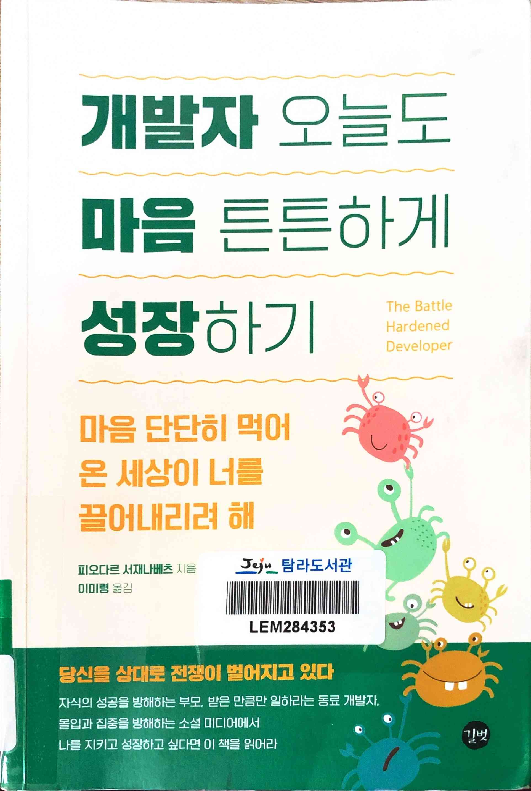

- ★★★☆☆ June 20, 2024 → June 21, 2024 한국어 제목은 사람에 따라 약간 유치할 수 있지만 내용은 좋은 책. 지적확인 환호응답에 대해 알게 된 거 하나만으로도 나에겐 가치가 있다
    - 탐라 문004.58-서72ㄱ
    - https://simpleprogrammer.com/10hacks/
- pp67~70
    - p67

        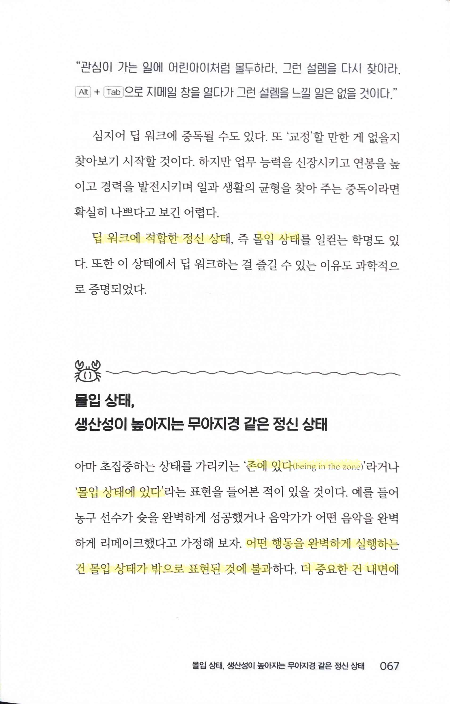

        - 딥 워크에 적합한 정신 상태, 즉 몰입 상태
        - 존에 있다(being in the zone), 몰입 상태에 있다
    - p68

        

        - 어떤 행동을 완벽하게 실행하는 건 몰입 상태가 밖으로 표현된 것에 불과하다. 더 중요한 건 내면에서, 즉 머릿속에서 일어나는 일이다. 몰입 상태는 의식의 변화된 상태다. 행동은 의식 변화의 징후일 뿐이다.
        - 그냥 적절한 순간에 적절한 행동을 수행… ‘몰입 상태’
        - 다음에 무엇을 할지 계속 생각하기보다 몸이 하라는 대로 그냥 하는 것이고, 흐름과 싸우지 않고 흐르는 대로 따라가는 것
    - p69

        

        - 몰입 경험이 일어나는 동안 항상 나타난 여섯 가지 구성 요소
            - 오로지 현재 순간에 집중하는 집중력
            - 행동과 인지를 하나로 인식
            - 자아 감각의 상실
            - 현재 상황을 강력하게 통제한다는 감각
            - 시간에 대한 왜곡된 지각
            - 수행 중인 활동에 대한 쾌감
    - p70

        

        - 몰입 상태에서… 인지가 일부 제한되는 이유는 인간의 뇌가 정보를 처리하는 능력이 제한되어 있기 때문
        - 몰입 상태에 있을 때는 온 신경이 자신이 하고 있는 단 한 가지 활동에만 할당
- p77

    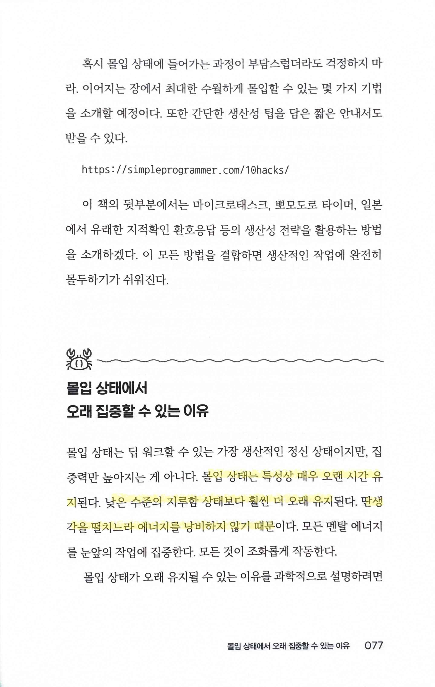

    - 몰입 상태는 특성상 매우 오랜 시간 유지된다. 낮은 수준의 지루함 상태보다 훨씬 더 오래 유지된다. 딴생각을 떨치느라 에너지를 낭비하지 않기 때문
- pp86~87
    - p86

        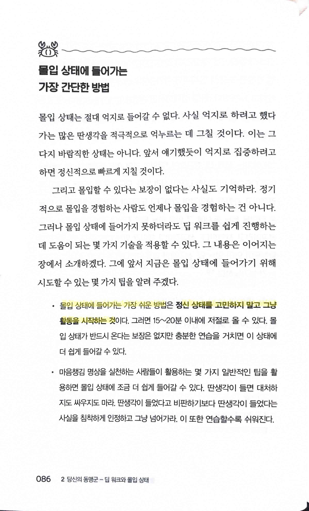

        - 몰입 상태에 들어가는 가장 쉬운 방법은 정신 상태를 고민하지 말고 그냥 활동을 시작하는 것
    - p87

        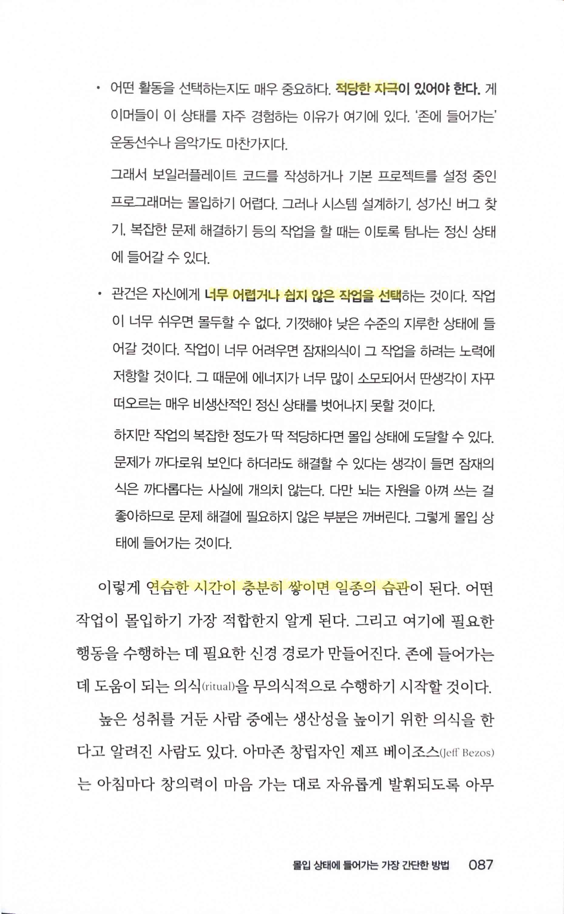

        - 적당한 자극
        - 너무 어렵거나 쉽지 않은 작업을 선택
        - 연습한 시간이 충분히 쌓이면 일종의 습관
- p99

    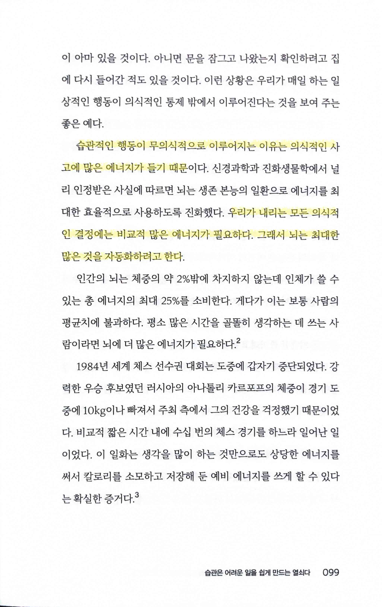

    - 습관적인 행동이 무의식적으로 이루어지는 이유는 의식적인 사고에 많은 에너지가 들기 때문… 우리가 내리는 모든 의식적인 결정에는 비교적 많은 에너지가 필요하다. 그래서 뇌는 최대한 많은 것을 자동화하려고 한다.
- p103

    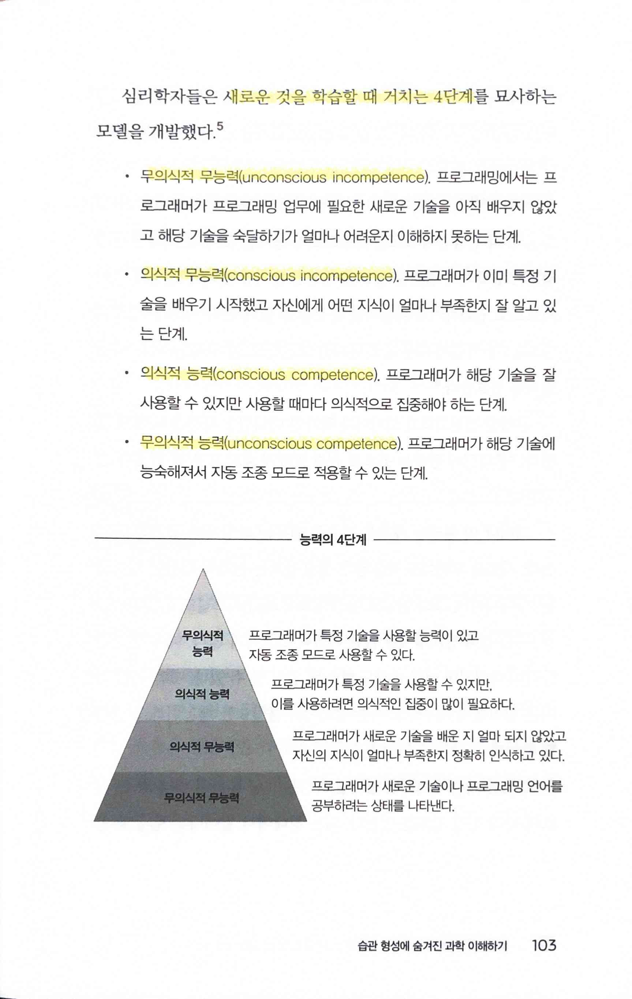

    - 새로운 것을 학습할 때 거치는 4단계
    - 무의식적 무능력(unconscious incompetence)
    - 의식적 무능력(conscious incompetence)
    - 의식적 능력(conscious competence)
    - 무의식적 능력(unconscious competence)
- pp114~116
    - p114

        

        - 작업을 하기로 결심하려면 하고 싶은 다른 일과 비교하며 장단점을 평가해야 한다. 이런 평가는 의식적이거나 반쯤 무의식적인 수준에서 이루어진다. 그래서 이 과정이 그토록 피곤한 것
        - 의식적인 결정을 너무 많이 내리느라 지치는 것을 의사 결정 피로감 또는 자아 고갈
    - p115

        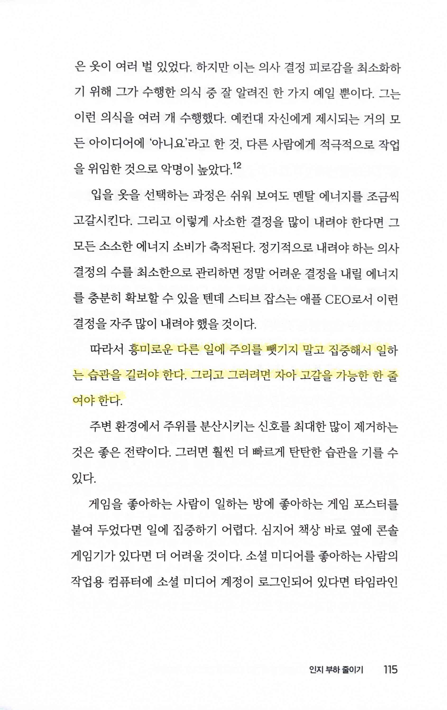

        - 흥미로운 다른 일에 주의를 뺏기지 말고 집중해서 일하는 습관을 길러야 한다. 그리고 그러려면 자아 고갈을 가능한 한 줄여야 한다.
    - p116

        

        - 자기 통제력 습관을 발전시키는 가장 효과적인 방법은 어려운 일을 억지로 하는 게 아니라 환경을 재정비해서 이런 일을 쉽게 할 수 있게 하는 것
- p142

    

    - 뇌의 관점에서는 집단에 속하는 것이 올바른 생각을 하는 것보다 더 중요
    - ‘크랩 멘탈리티(crab mentality)’
- pp274~275
    - p274

        

        - ‘코끼리를 먹을 때는 한 번에 한 입씩 먹어라”
        - 큰 작업을 훨씬 더 관리하기 쉬운 작은 덩어리로 나누자… 마이크로태스크
    - p275

        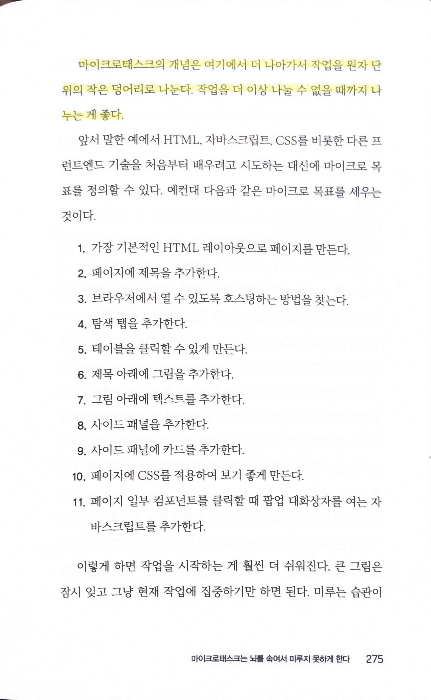

        - 마이크로태스크의 개념은 여기에서 더 나아가서 작업을 원자 단위의 작은 덩어리로 나눈다. 작업을 더 이상 나눌 수 없을 때까지 나누는 게 좋다.
- p314

    

    - 지적확인 환호응답은 청각, 운동 감각, 시각 자극을 활용해서 주의력이 부족한 상태로 작업을 수행하지 못하게 하는 행동 기반 접근법… 학습 효과를 높이고 신경 경로를 강화해서 집중력과 주의력을 날카롭게 한다. 오류 발생은 극적으로 감소하며 큰 효과를 낸다
    - 우리의 활동을 겉으로 드러내고 실현하고 세상에 내놓는 것이 중요
- pp326~327
    - p326

        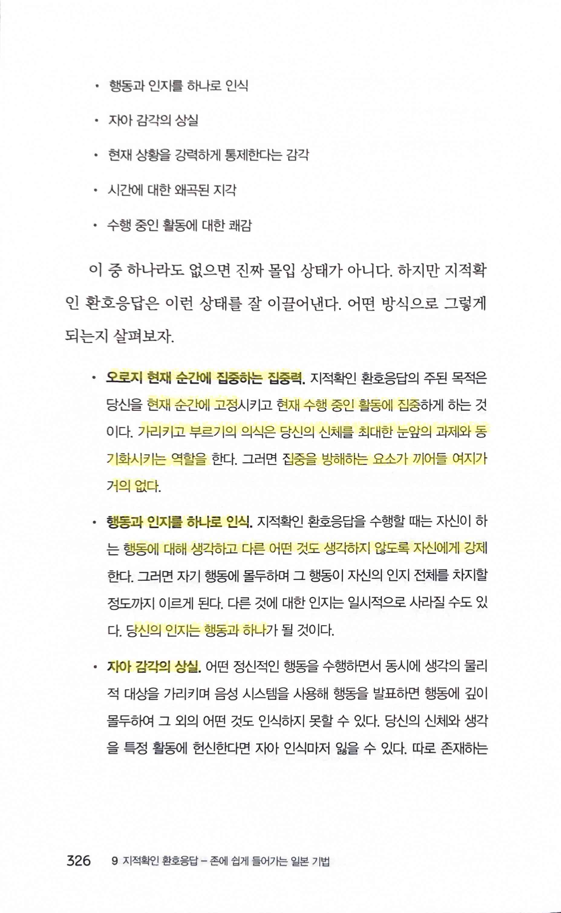

        - 오로지 현재 순간에 집중하는 집중력… 현재 순간에 고정… 현재 수행 중인 활동에 집중… 가리키고 부르기의 의식은 당신의 신체를 최대한 눈앞의 과제와 동기화시키는 역할… 집중을 방해하는 요소가 끼어들 여지가 거의 없다.
        - 행동과 인지를 하나로 인식… 행동에 대해 생각하고 다른 어떤 것도 생각하지 않도록 자신에게 강제… 당신의 인지는 행동과 하나
        - 자아 감각의 상실… 당신과 행동이 하나
    - p327

        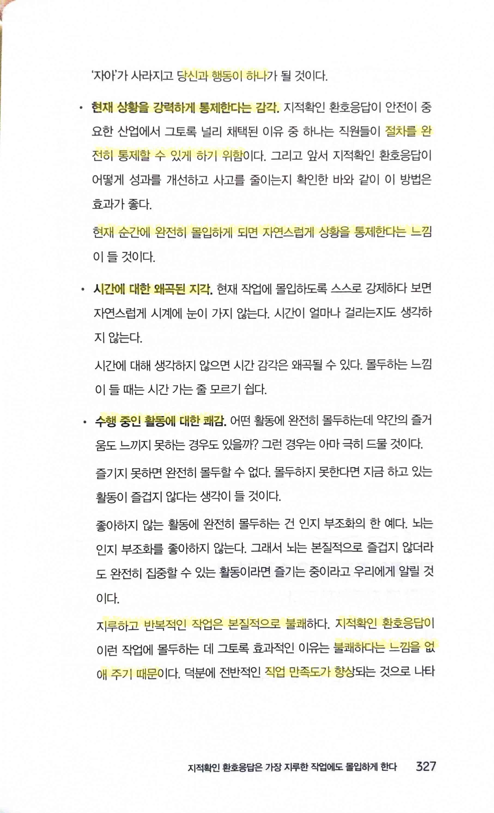

        - 현재 상황을 강력하게 통제한다는 감각… 절차를 완전히 통제할 수 있게 하기 위함
            - 현재 순간에 완전히 몰입하게 되면 자연스럽게 상황을 통제한다는 느낌
        - 시간에 대한 왜곡된 지각
        - 수행 중인 활동에 대한 쾌감
- p342

    

    - 파킨슨의 법칙… 어떤 일에 더 많은 자원을 투입한다고 해서 그 일을 더 효율적으로 완료한다는 보장은 없다
