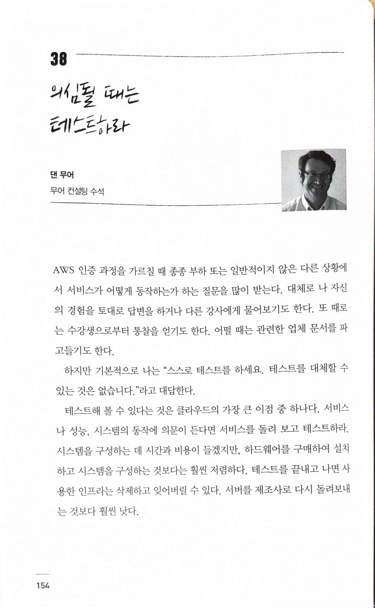
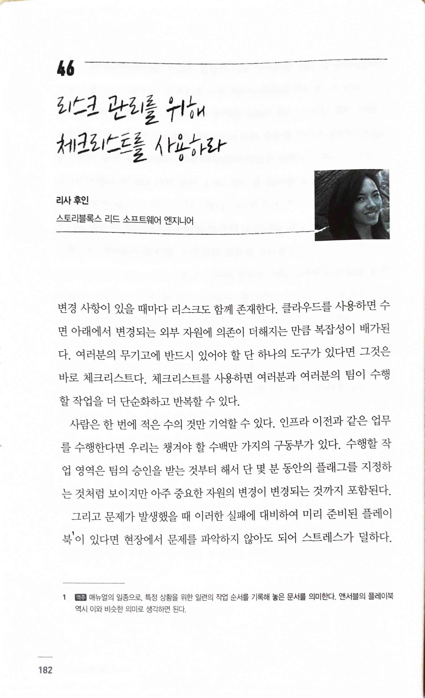
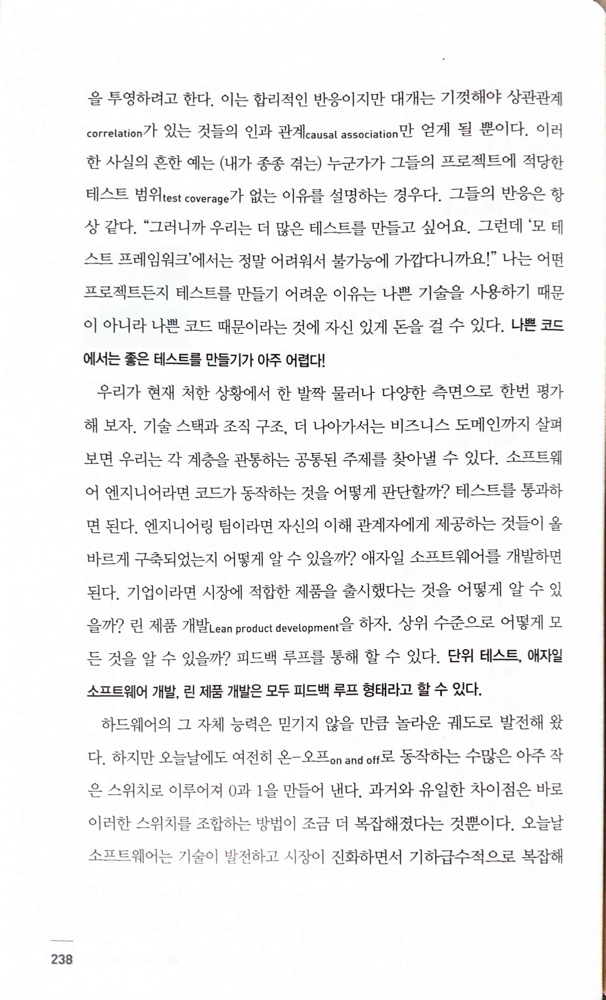
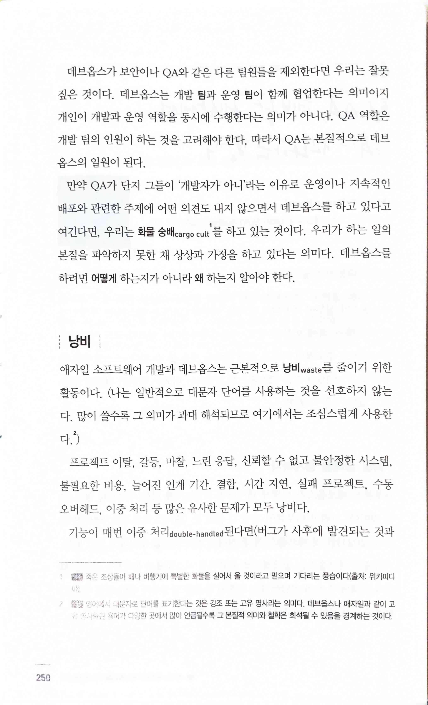
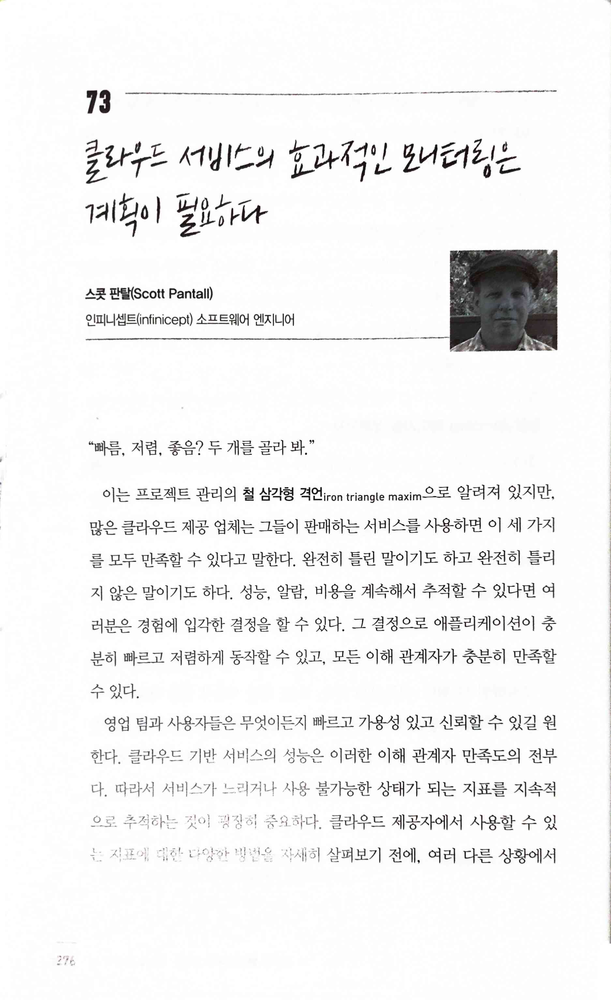
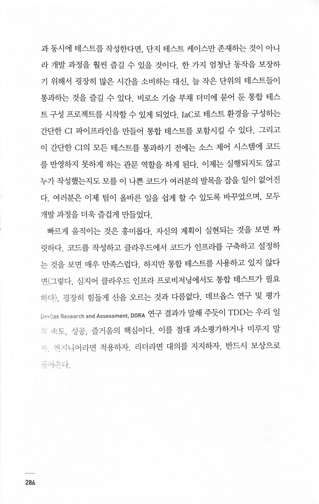
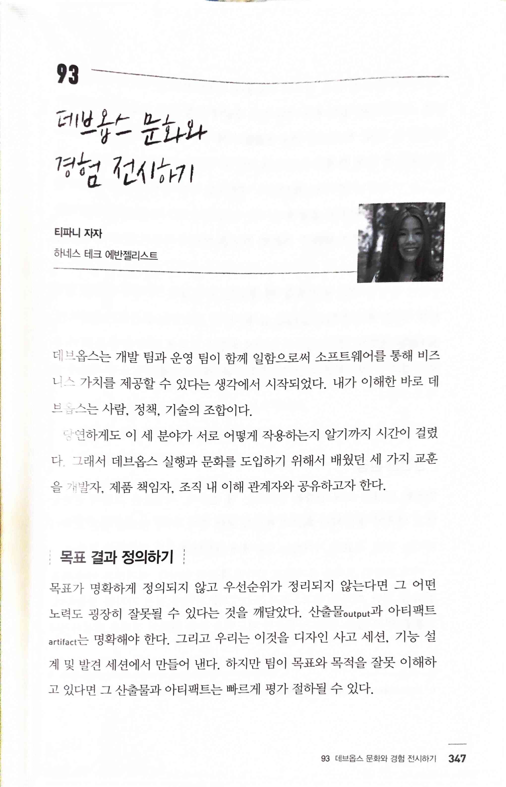

클라우드 엔지니어를 위한 97 가지 조언
=====================================

* "스스로 테스트를 하세요. 테스트를 대체할 수있는 것은 없습니다."

* 훌륭한 팀은 다른 사람에게 숨기는 것이 없다. 협업하고 함께 책임을 진다.

* 여러분의 무기고에 반드시 있어야 할 단 하나의 도구가 있다면 그것은 바로 체크리스트다. 체크리스트를 사용하면 여러분과 여러분의 팀이 수행할 작업을 더 단순화하고 반복할 수 있다.

* 여러분 개발 장비에서 동작하는 것은 클라우드와 상관없다... 클라우드에서 프로덕션 환경의 복잡도가 증가하여 우리의 개발 장비에서 동작하는 코드 문맥을 표현하는 것이 점점 더 부정확해진다. 이러한 연유로 로컬 장비에서 테스트하는 것은 여러분이 작성한 코드의 동작에 자신감을 심어 주기에 부족해졌다.

* 나는 어떤 프로젝트든지 테스트를 만들기 어려운 이유는 나쁜 기술을 사용하기 때문이 아니라 나쁜 코드 때문이라는 것에 자신 있게 돈을 걸 수 있다. 나쁜 코드에서는 좋은 테스트를 만들기가 아주 어렵다!

* 만약 QA가 단지 그들이 '개발자가 아니'라는 이유로 운영이나 지속적인배포와 관련한 주제에 어떤 의견도 내지 않으면서 데브옵스를 하고 있다고 여긴다면, 우리는 화물 숭배 cargo cult 를 하고 있는 것이다. 우리가 하는 일의본질을 파악하지 못한 채 상상과 가정을 하고 있다는 의미다. 데브옵스를 하려면 어떻게 하는지가 아니라 왜 하는지 알아야 한다.

* "빠름, 저렴, 좋음? 두 개를 골라 봐."
* 이는 프로젝트 관리의 철 삼각형 격언iron triangle maxim 으로 알려져 있지만,많은 클라우드 제공 업체는 그들이 판매하는 서비스를 사용하면 이 세 가지를 모두 만족할 수 있다고 말한다.
  * [Project management triangle - Wikipedia](https://en.wikipedia.org/wiki/Project_management_triangle)
  * [The Iron Cross — What I just learnt #3 | by Abderrahim Benmakhlouf | Medium](https://medium.com/@abderrahim.benmakhlouf/the-iron-cross-what-i-just-learnt-3-ec3e09bf3d7c)

* 빠르게 움직이는 것은 흥미롭다. 자신의 계획이 실현되는 것을 보면 짜릿하다. 코드를 작성하고 클라우드에서 코드가 인프라를 구축하고 설정하는 것을 보면 매우 만족스럽다. 하지만 통합 테스트를 사용하고 있지 않다면(그렇다. 심지어 클라우드 인프라 프로비저닝에서도 통합 테스트가 필요하다), 굉장히 힘들게 산을 오르는 것과 다름없다. 데브옵스 연구 및 평가DevOps Research and Assessment, DORA 연구 결과가 말해 주듯이 TDD는 우리 일의 속도, 성공, 즐거움의 핵심이다. 이를 절대 과소평가하거나 미루지 말자 엔지니어라면 적용하자. 리더라면 대의를 지지하자. 반드시 보상으로 돌아온다.

* 데브옵스는 사람, 정책, 기술의 조합이다.
* 목표가 명확하게 정의되지 않고 우선순위가 정리되지 않는다면 그 어떤 노력도 굉장히 잘못될 수 있다는 것을 깨달았다.