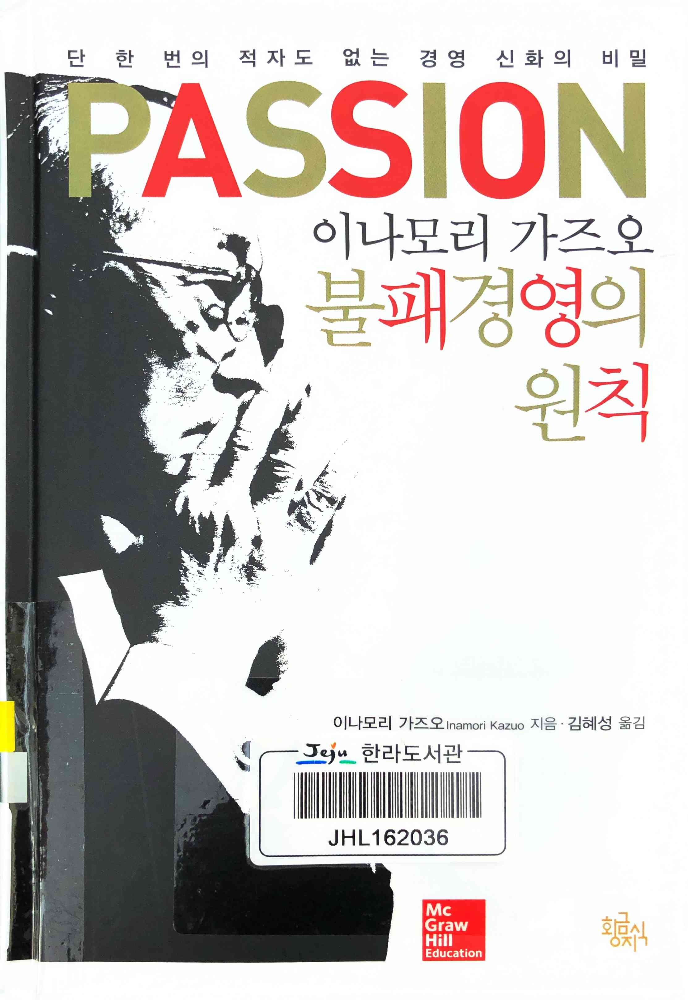
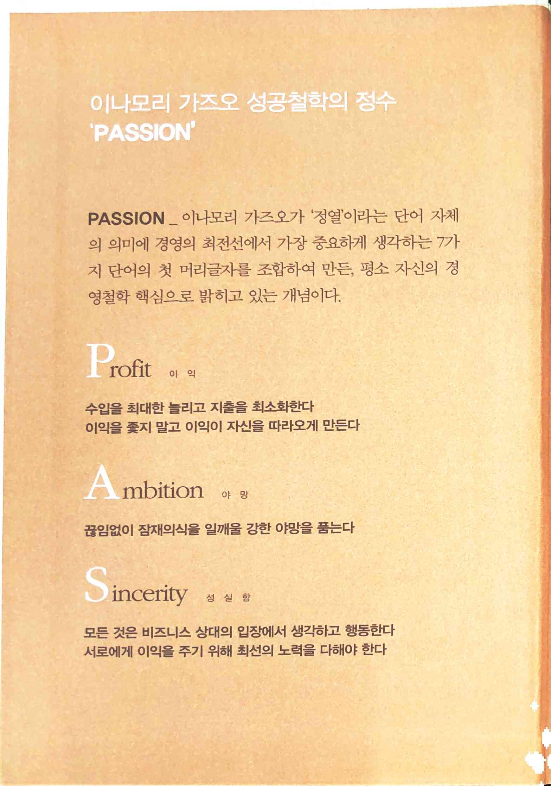
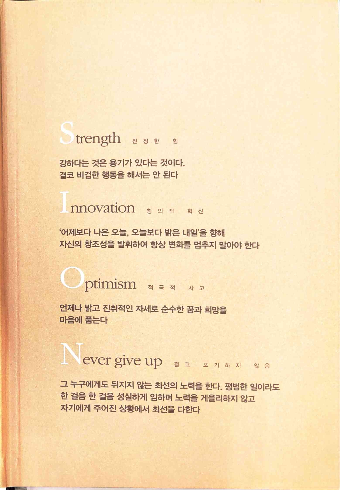

불패경영의 원칙
===============

다른 이나모리 가즈오 책에서 봤던 점들이 많아서 익숙해서 읽기에 편했다. PASSION이라는 단어로 정리한 경영철학의 첫 번째가 Profit이라는 게 가장 와 닿는다. 내가 경영자는 아니지만 요즘 경기 불황으로 인한 여러 회사들의 상황을 보면 더 크게 느껴지는 부분.

 

`Profit 이익`

수입을 최대한 늘리고 지출을 최소화한다
이익을 좇지 말고 이익이 자신을 따라오게 만든다

`Ambition 야망`

끊임없이 잠재의식을 일깨울 강한 야망을 품는다

`Sincerity 성실함`

모든 것은 비즈니스 상대의 입장에서 생각하고 행동한다
서로에게 이익을 주기 위해 최선의 노력을 다해야 한다

`Strength 진정한 힘`

강하다는 것은 용기가 있다는 것이다.
결코 비겁한 행동을 해서는 안 된다

`Innovation 창의적 혁신`

'어제보다 나은 오늘, 오늘보다 밝은 내일'을 향해 자신의 창조성을 발휘하여 항상 변화를 멈추지 말아야 한다

`Optimism 적극적 사고`

언제나 밝고 진취적인 자세로 순수한 꿈과 희망을 마음에 품는다

`Never give up 결코 포기하지 않음`

그 누구에게도 뒤지지 않는 최선의 노력을 한다. 평범한 일이라도 한 걸음 한 걸음 성실하게 임하며 노력을 게을리하지 않고 자기에게 주어진 상황에서 최선을 다한다