# Accelerate 디지털  트랜스포메이션 엔진

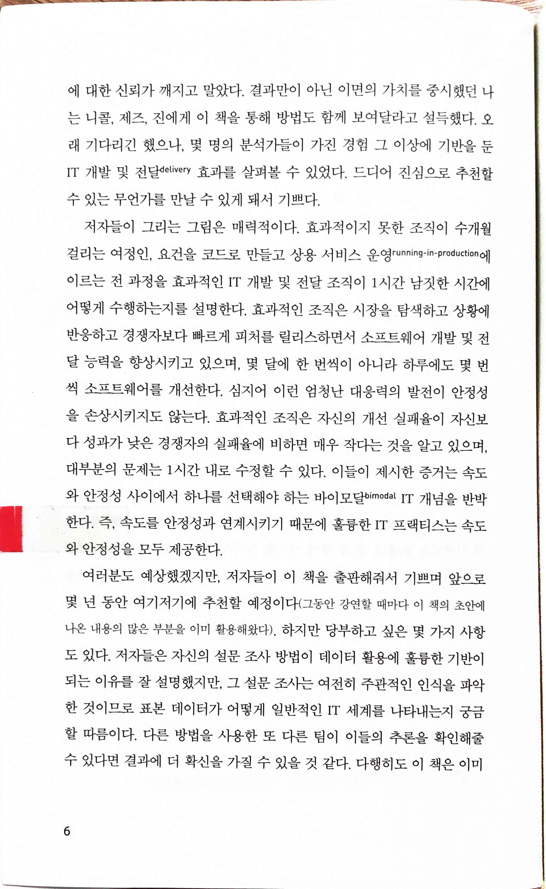

> 속도를 안정성과 연계시키기 때문에 훌륭한 IT 프랙티스는 속도와 안정성을 모두 제공한다.

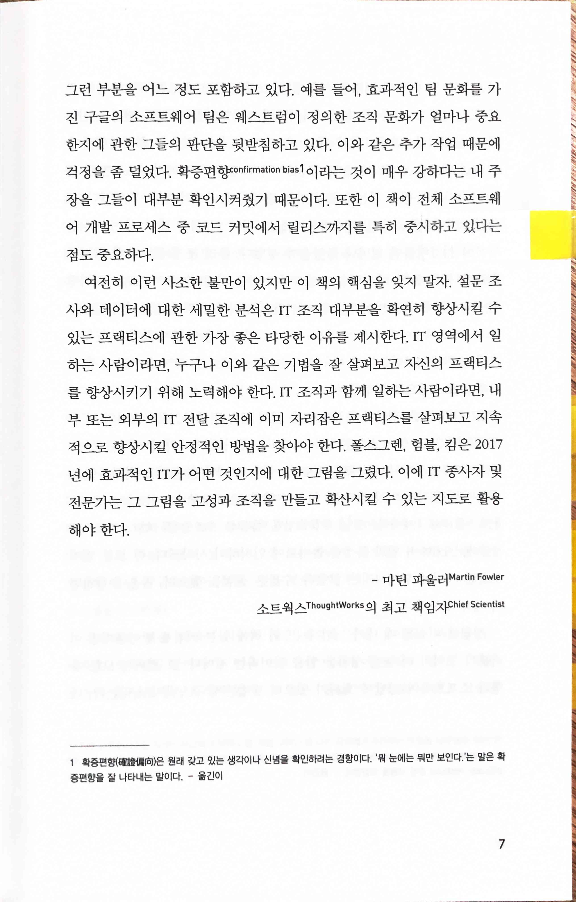

> 전체 소프트웨어 개발 프로세스 중 코드 커밋에서 릴리스까지를 특히 중시하고 있다는 점도 중요
>
> 설문 조사와 데이터에 대한 세밀한 분석은 IT 조직 대부분을 확연히 향상시킬 수 있는 프랙티스에 관한 가장 좋은 타당한 이유를 제시

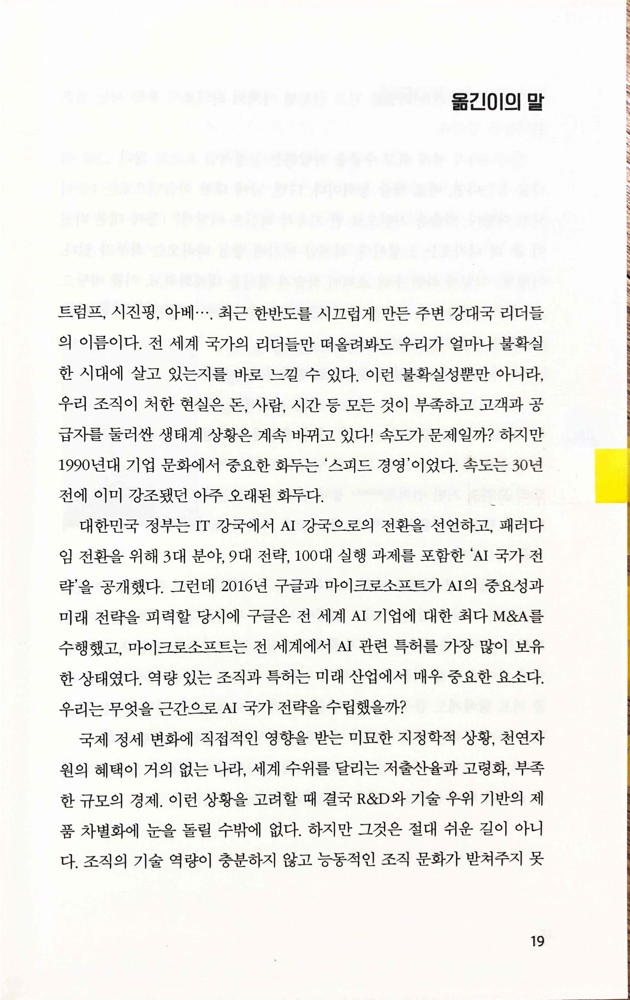

> 1990년대 기업 문화에서 중요한 화두는 '스피드 경영'이었다. 속도는 30년전에 이미 강조됐던 아주 오래된 화두다.

* 빠른 참조: 케이퍼빌러티
* 케이퍼빌러티'는 다섯 개 영역으로 분류할 수 있다.
  * 지속적 전달Continuous Delivery (CD)
  * 아키텍처
  * 제품 및 프로세스
  * 린 관리 및 모니터링
  * 문화
* 지속적 전달 케이퍼빌러티
  * 1 버전 컨트롤: 4장
  * 2 배포 자동화: 4장
  * 3 지속적 통합: 4장
  * 4 트렁크 기반 개발: 4장
  * 5 테스트 자동화: 4장
  * 6 테스트 데이터 관리: 4장
  * 7 조기 보안 설정shift left on security: 6장
  * 8 지속적 전달: 4장
* 아키텍처 케이퍼빌러티
  * 9 느슨하게 연결한 아키텍처: 5장
  * 10 권한이 부여된 팀: 5장
* 제품 및 프로세스 케이퍼빌러티
  * 11 고객 피드백: 8장
  * 12 가치 흐름: 8장
  * 13 작은 배치로 작업하기: 8장
  * 14 팀 실험: 8장
* 린 관리 및 모니터링 케이퍼빌러티
  * 15 변경 사항 승인 프로세스: 7장
  * 16 모니터링: 7장
  * 17 능동적인 통보: 13장
  * 18 WIP 제한 설정: 7장
  * 19 작업 시각화하기: 7장
* 문화 케이퍼빌러티
  * 20 웨스트럼 조직 문화: 3장
  * 21 학습 지원: 10장
  * 22 팀 간 협업: 3장과 5장
  * 23 직무 만족도: 10장
  * 24 트랜스포메이션 리더십: 11장

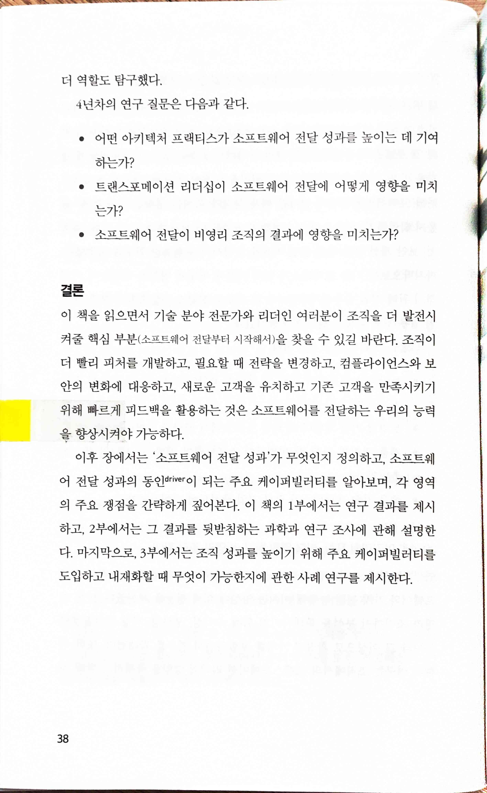

> 조직이 더 빨리 피처를 개발하고, 필요할 때 전략을 변경하고, 컴플라이언스와 보안의 변화에 대응하고, 새로운 고객을 유치하고 기존 고객을 만족시키기위해 빠르게 피드백을 활용하는 것은 소프트웨어를 전달하는 우리의 능력을 향상시켜야 가능하다.

## 1부 우리가 알게 된 것

### 1장 조직 가속화
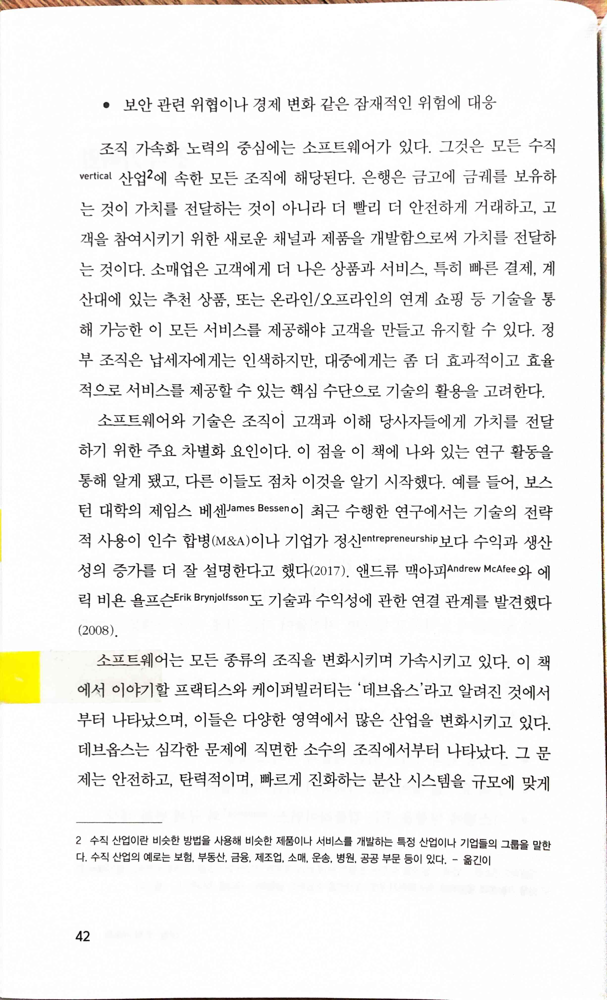

> 소프트웨어는 모든 종류의 조직을 변화시키며 가속시키고 있다. 이 책에서 이야기할 프랙티스와 케이퍼빌러티는 '데브옵스'라고 알려진 것에서부터 나타났으며, 이들은 다양한 영역에서 많은 산업을 변화시키고 있다.

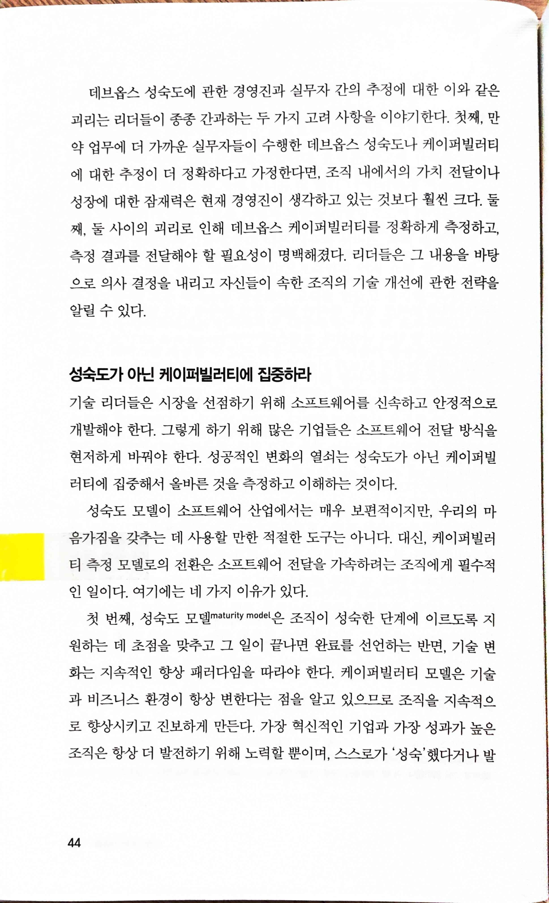 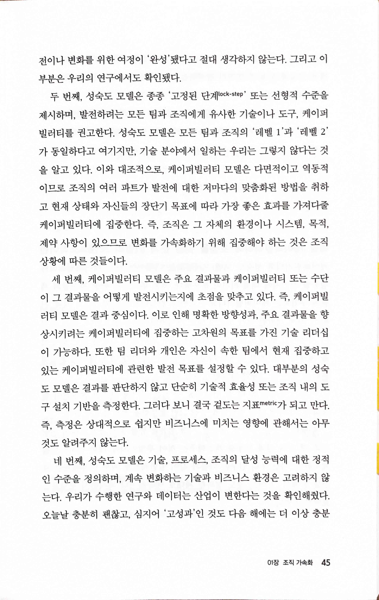 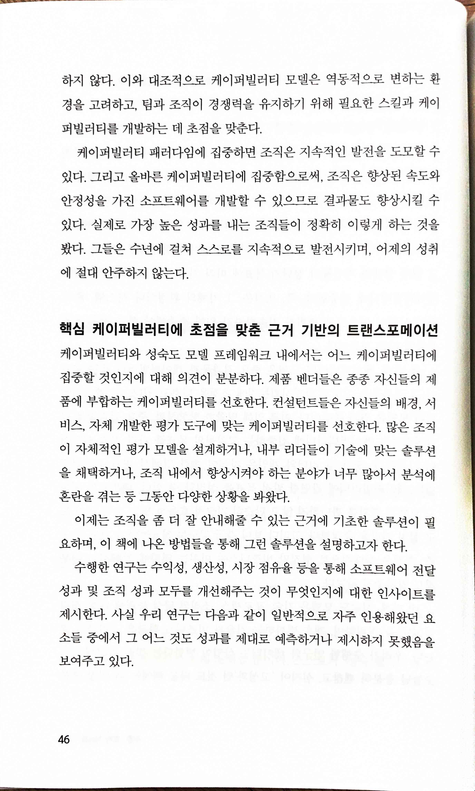

> 성숙도 모델이 소프트웨어 산업에서는 매우 보편적이지만, 우리의 마음가짐을 갖추는 데 사용할 만한 적절한 도구는 아니다. 대신, 케이퍼빌러티 측정 모델로의 전환은 소프트웨어 전달을 가속하려는 조직에게 필수적인 일이다. 여기에는 네 가지 이유가 있다.
>
> 첫 번째, 성숙도 모델maturity model은 조직이 성숙한 단계에 이르도록 지원하는 데 초점을 맞추고 그 일이 끝나면 완료를 선언하는 반면, 기술 변화는 지속적인 향상 패러다임을 따라야 한다...
>
> 두 번째, ...  케이퍼빌러티 모델은 다면적이고 역동적이므로 조직의 여러 파트가 발전에 대한 저마다의 맞춤화된 방법을 취하고 현재 상태와 자신들의 장단기 목표에 따라 가장 좋은 효과를 가져다줄 케이퍼빌러티에 집중한다. 즉, 조직은 그 자체의 환경이나 시스템, 목적, 제약 사항이 있으므로 변화를 가속화하기 위해 집중해야 하는 것은 조직상황에 따른 것들이다.
>
> 세 번째, 케이퍼빌러티 모델은 주요 결과물과 케이퍼빌러티 또는 수단이 그 결과물을 어떻게 발전시키는지에 초점을 맞추고 있다. 즉, 케이퍼빌러티 모델은 결과 중심이다...
>
> 네 번째, ... 케이퍼빌러티 모델은 역동적으로 변하는 환경을 고려하고, 팀과 조직이 경쟁력을 유지하기 위해 필요한 스킬과 케이퍼빌러티를 개발하는 데 초점을 맞춘다.

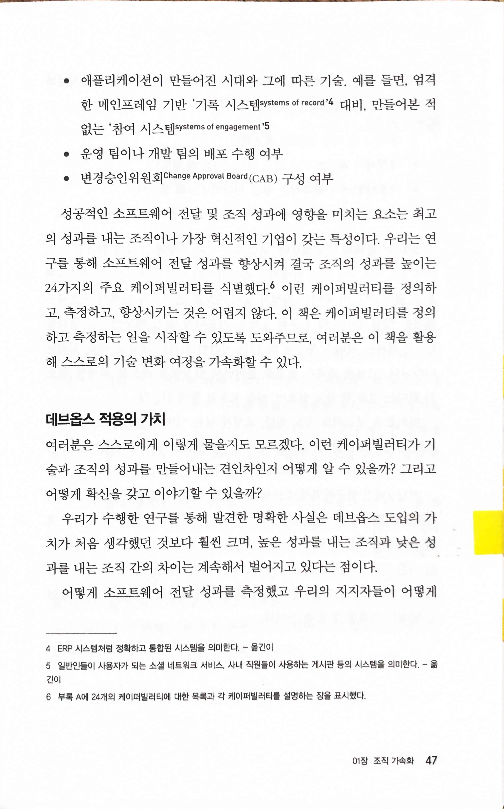 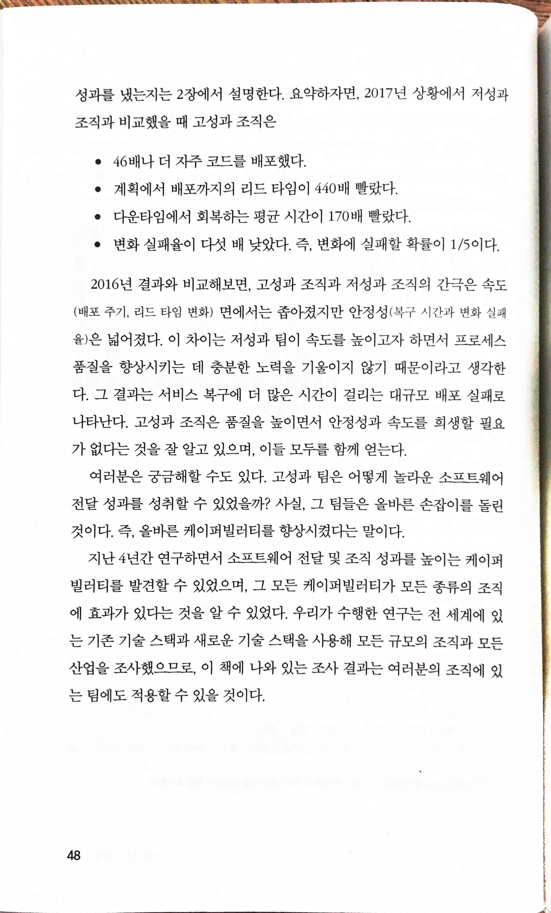

> 우리가 수행한 연구를 통해 발견한 명확한 사실은 데브옵스 도입의 가치가 처음 생각했던 것보다 훨씬 크며, 높은 성과를 내는 조직과 낮은 성과를 내는 조직 간의 차이는 계속해서 벌어지고 있다는 점이다.
>
> 2017년 상황에서 저성과 조직과 비교했을 때 고성과 조직은
>
> • 46배나 더 자주 코드를 배포했다.
>
> • 계획에서 배포까지의 리드 타임이 440배 빨랐다.
>
> • 다운타임에서 회복하는 평균 시간이 170배 빨랐다.
>
> • 변화 실패율이 다섯 배 낮았다. 즉, 변화에 실패할 확률이 1/5이다.
>
> 2016년 결과와 비교해보면, 고성과 조직과 저성과 조직의 간극은 속도(배포 주기, 리드 타임 변화) 면에서는 좁아졌지만 안정성(복구 시간과 변화 실패율)은 넓어졌다. 이 차이는 저성과 팀이 속도를 높이고자 하면서 프로세스 품질을 향상시키는 데 충분한 노력을 기울이지 않기 때문이라고 생각한다. 그 결과는 서비스 복구에 더 많은 시간이 걸리는 대규모 배포 실패로 나타난다. 고성과 조직은 품질을 높이면서 안정성과 속도를 희생할 필요가 없다는 것을 잘 알고 있으며, 이들 모두를 함께 얻는다.

### 2장 성과 측정
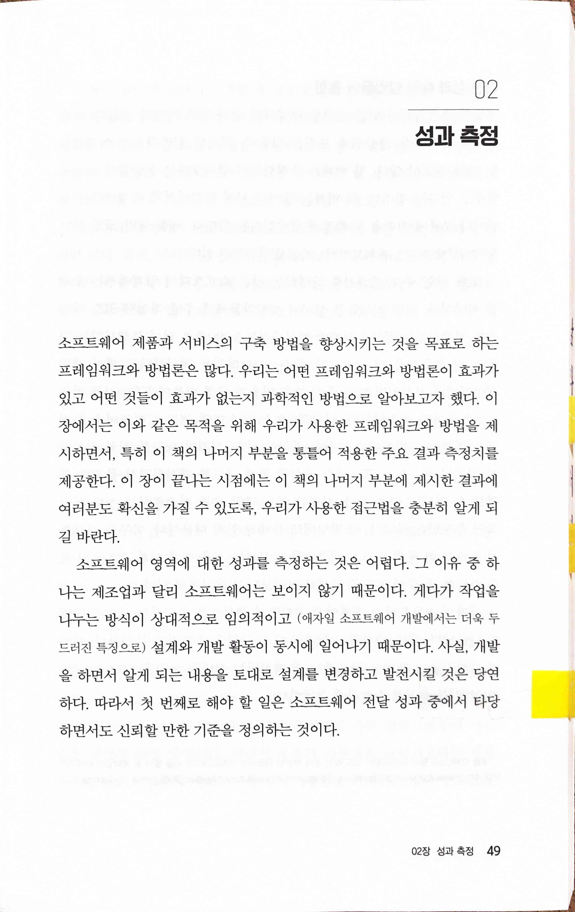

> 첫 번째로 해야 할 일은 소프트웨어 전달 성과 중에서 타당하면서도 신뢰할 만한 기준을 정의하는 것이다.

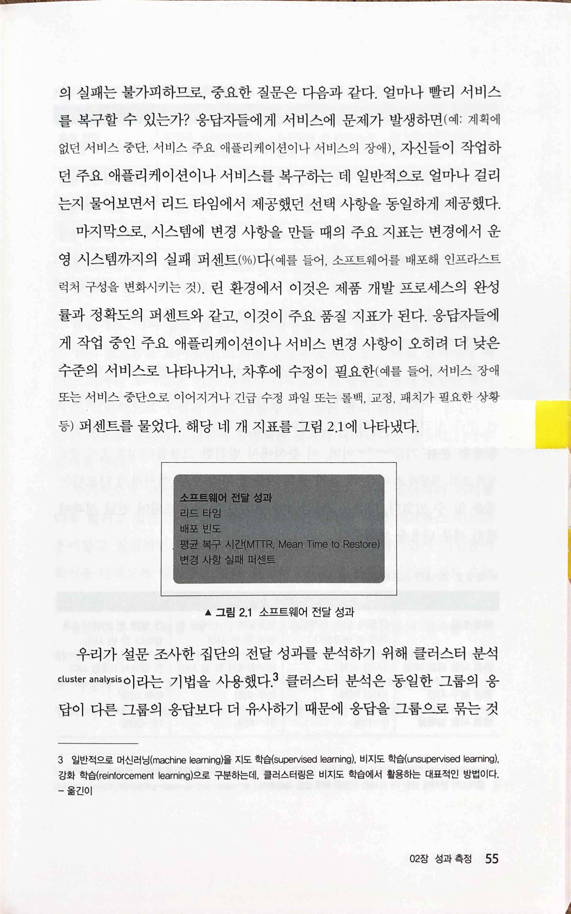

> 소프트웨어 전달 성과
>
> 리드 타임
>
> 배포 빈도
>
> 평균 복구 시간(MTTR, Mean Time to Restore)
>
> 변경 사항 실패 퍼센트

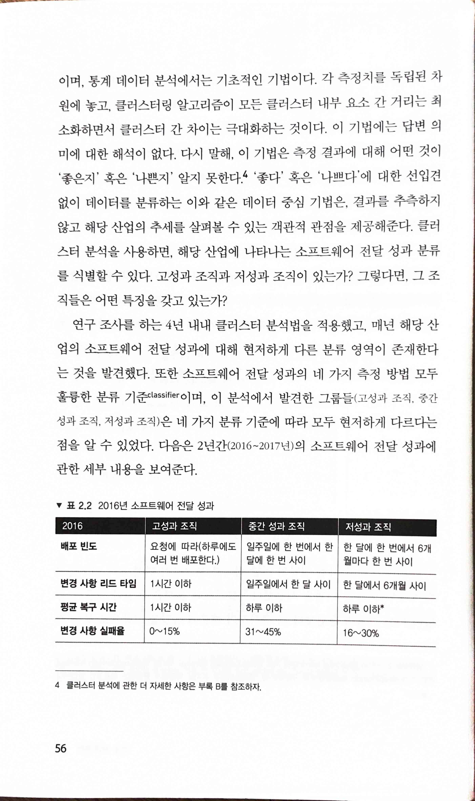 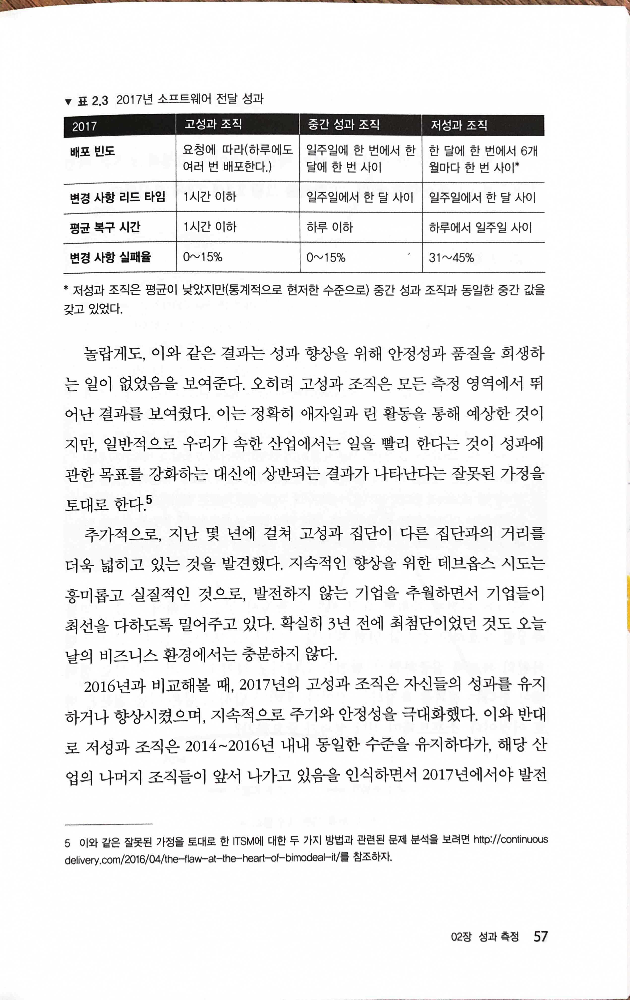

> 표 2.2 2016년 소프트웨어 전달 성과 / 표 2.3 2017년 소프트웨어 전달 성과
>
> 성과 향상을 위해 안정성과 품질을 희생하는 일이 없었음을 보여준다. 오히려 고성과 조직은 모든 측정 영역에서 뛰어난 결과를 보여줬다.
>
> 추가적으로, 지난 몇 년에 걸쳐 고성과 집단이 다른 집단과의 거리를 더욱 넓히고 있는 것을 발견했다. 지속적인 향상을 위한 데브옵스 시도는 흥미롭고 실질적인 것으로 발전하지 않는 기업을 추월하면서 기업들이 최선을 다하도록 밀어주고 있다. 확실히 3년 전에 최첨단이었던 것도 오늘날의 비즈니스 환경에서는 충분하지 않다.

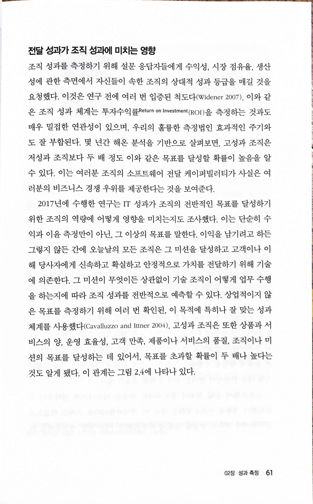

> 고성과 조직은 또한 상품과 서비스의 양, 운영 효율성, 고객 만족, 제품이나 서비스의 품질, 조직이나 미션의 목표를 달성하는 데 있어서, 목표를 초과할 확률이 두 배나 높다는 것도 알게 됐다.

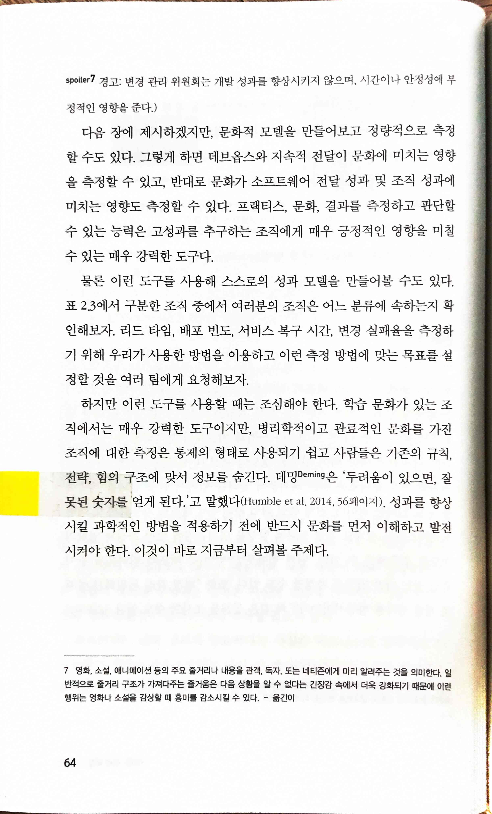

> 하지만 이런 도구를 사용할 때는 조심해야 한다. 학습 문화가 있는 조직에서는 매우 강력한 도구이지만, 병리학적이고 관료적인 문화를 가진 조직에 대한 측정은 통제의 형태로 사용되기 쉽고 사람들은 기존의 규칙, 전략, 힘의 구조에 맞서 정보를 숨긴다. 데밍Deming은 '두려움이 있으면, 잘못된 숫자를 얻게 된다.'고 말했다(Humble et al. 2014, 56페이지). 성과를 향상시킬 과학적인 방법을 적용하기 전에 반드시 문화를 먼저 이해하고 발전시켜야 한다.

### 3장 문화 측정 및 변화
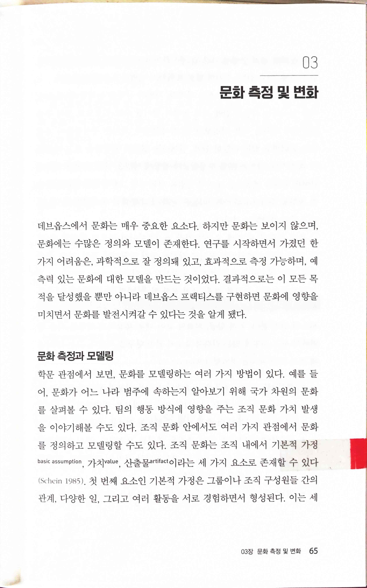

> 조직 문화는 조직 내에서 기본적 가정 basic assumption, 가치 value, 산출물artifact 이라는 세 가지 요소로 존재할 수 있다(Schein 1985)

> 웨스트럼이 간파한 또 다른 것은 조직 안에서 정보가 흐르는 방식을 조직 문화가 예측한다는 것이다. 웨스트럼은 좋은 정보에는 세 가지 특성이 있다고 말한다.
>
> 1. 수신자가 들어야 할 질문에 대한 답을 제공한다.
>
> 2. 시기 적절하다.
>
> 3. 수신자가 효과적으로 사용할 수 있도록 제시한다.
>
> 표 3.1 웨스트럼의 조직 문화 분류

> 첫째, 좋은 문화는 조직 전체에 걸쳐 사람 간의 신뢰와 협력이 필요하기 때문에 조직 내부의 협력과 신뢰의 수준을 반영한다. 둘째, 더 나은 조직문화는 더 높은 품질을 위한 의사 결정을 할 수 있다. 이런 문화를 가진 팀에서는 의사 결정에 필요한 더 나은 정보를 얻을 수 있을 뿐만 아니라, 팀이 폐쇄적이고 계층적이기보다는 개방적이고 투명할 가능성이 더 높기 때문에 그런 결정이 잘못된 것으로 판명되면 더 쉽게 뒤집을 수 있다. 마지막으로, 이런 문화적 규범들을 가진 팀들은 더 신속하게 문제를 발견하고 해결하기 때문에 사람들과의 관계도 더 좋을 확률이 높다.
>
> 우리는 문화가 소프트웨어 전달 성과와 조직 성과 모두에 영향을 줄 것이라고 가정했다. 또한 그것이 더 높은 수준의 직무 만족도로 이어질 것이라고 예측했다. 이 두 가지 가설들은 모두 사실임이 증명됐다.

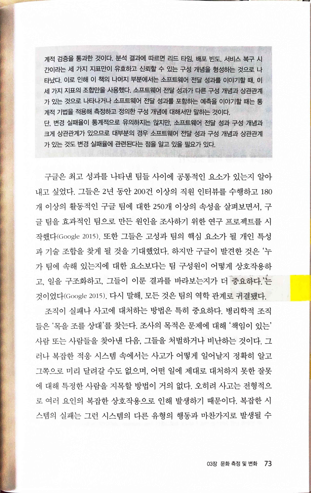

> 구글이 발견한 것은 '누가 팀에 속해 있는지에 대한 요소보다는 팀 구성원이 어떻게 상호작용하고, 일을 구조화하고, 그들이 이룬 결과를 바라보는지가 더 중요하다.'는 것이었다(Google 2015). 다시 말해, 모든 것은 팀의 역학 관계로 귀결됐다.

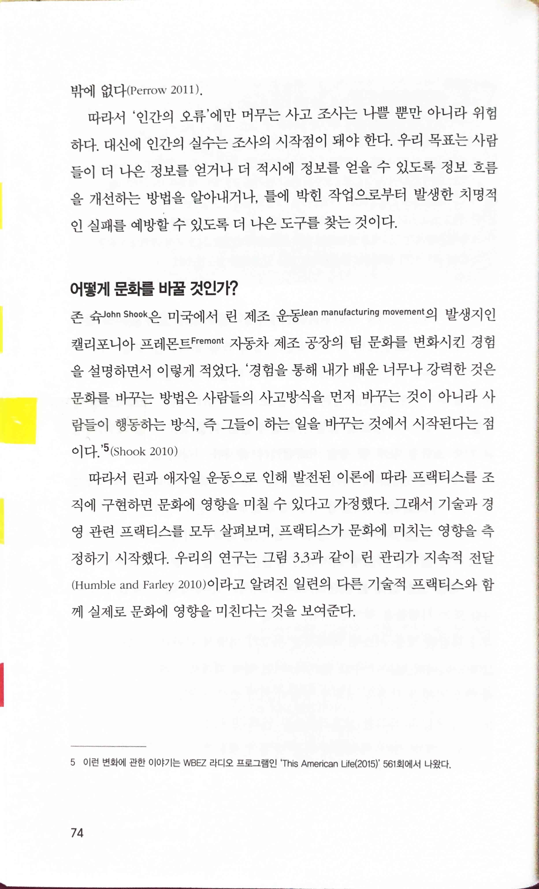

> 존슉John Shook은 미국에서 린 제조 운동lean manufacturing movement 의 발생지인 캘리포니아 프레몬트 Fremont 자동차 제조 공장의 팀 문화를 변화시킨 경험을 설명하면서 이렇게 적었다. '경험을 통해 내가 배운 너무나 강력한 것은 문화를 바꾸는 방법은 사람들의 사고방식을 먼저 바꾸는 것이 아니라 사람들이 행동하는 방식, 즉 그들이 하는 일을 바꾸는 것에서 시작된다는 점이다.(Shook 2010)
* [John Shook - How to Change a Culture: Lessons From NUMMI](https://www.lean.org/downloads/35.pdf)

### 4장 기술 프랙티스
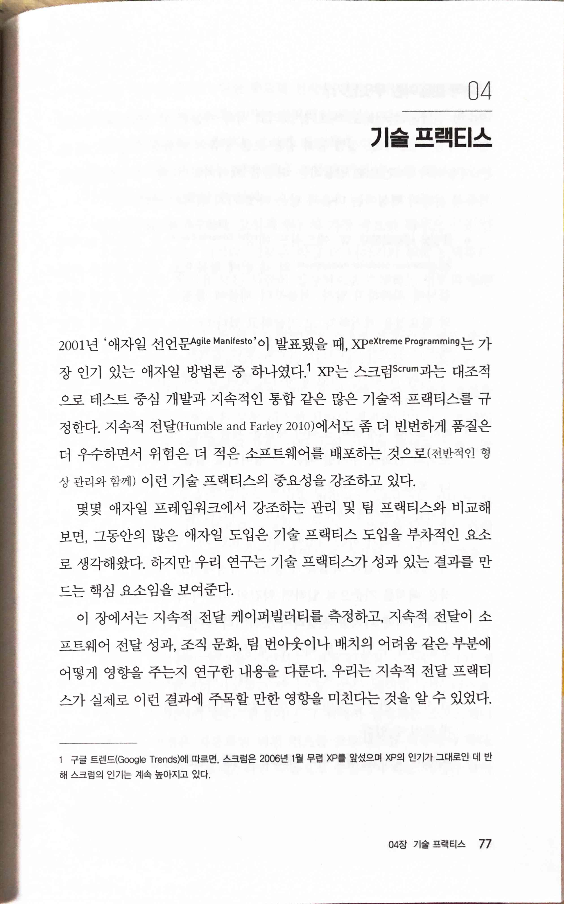

> 그동안의 많은 애자일 도입은 기술 프랙티스 도입을 부차적인 요소로 생각해왔다. 하지만 우리 연구는 기술 프랙티스가 성과 있는 결과를 만드는 핵심 요소임을 보여준다.

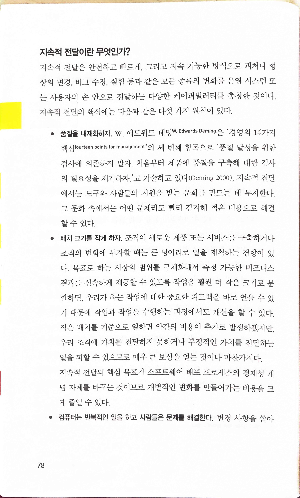 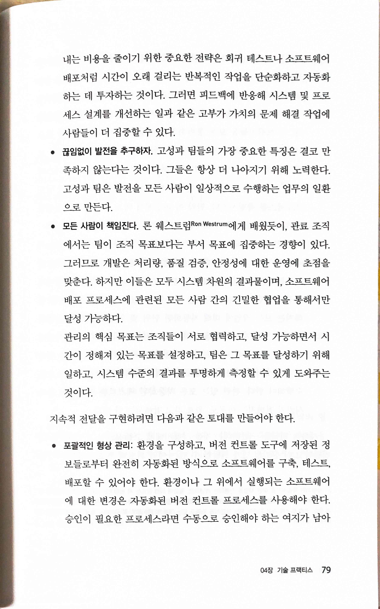 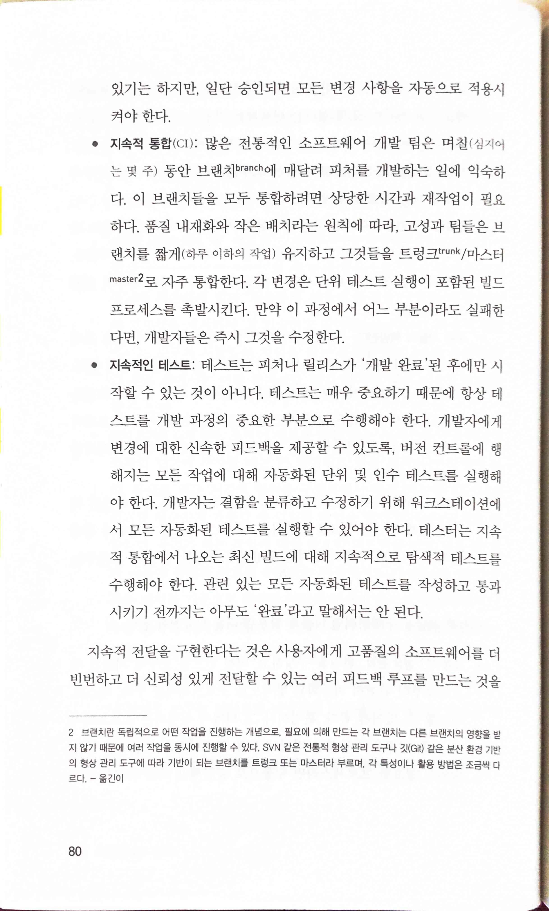

> 지속적 전달의 핵심에는 다음과 같은 다섯 가지 원칙이 있다.
>
> • 품질을 내재화하자. ... 그 문화 속에서는 어떤 문제라도 빨리 감지해 적은 비용으로 해결할 수 있다.
>
> • 배치 크기를 작게 하자. ... 지속적 전달의 핵심 목표가 소프트웨어 배포 프로세스의 경제성 개념 자체를 바꾸는 것이므로 개별적인 변화를 만들어가는 비용을 크게 줄일 수 있다.
>
> • 컴퓨터는 반복적인 일을 하고 사람들은 문제를 해결한다. ... 시스템 및 프로세스 설계를 개선하는 일과 같은 고부가 가치의 문제 해결 작업에 사람들이 더 집중할 수 있다.
>
> • 끊임없이 발전을 추구하자. ... 고성과 팀은 발전을 모든 사람이 일상적으로 수행하는 업무의 일환으로 만든다.
>
> • 모든 사람이 책임진다. ... 소프트웨어 배포 프로세스에 관련된 모든 사람 간의 긴밀한 협업을 통해서만 달성 가능하다.
>
> 지속적 전달을 구현하려면 다음과 같은 토대를 만들어야 한다.
>
> • 포괄적인 형상 관리: 환경을 구성하고, 버전 컨트롤 도구에 저장된 정보들로부터 완전히 자동화된 방식으로 소프트웨어를 구축, 테스트, 배포할 수 있어야 한다. ...
>
> • 지속적 통합(CI): ... 품질 내재화와 작은 배치라는 원칙에 따라, 고성과 팀들은 브랜치를 짧게 (하루 이하의 작업) 유지하고 그것들을 트렁크trunk /마스터 master 로 자주 통합한다.
>
> • 지속적인 테스트: ... 관련 있는 모든 자동화된 테스트를 작성하고 통과시키기 전까지는 아무도 '완료'라고 말해서는 안 된다.

 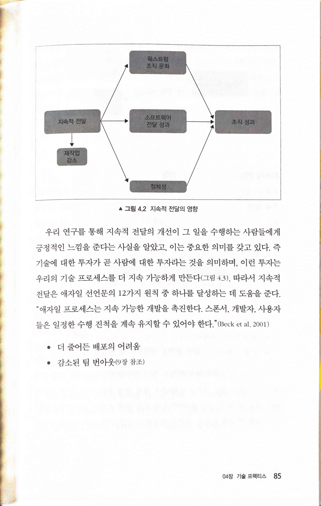

> 그림 4.1 지속적 전달의 동인 / 그림 4.2 지속적 전달의 영향

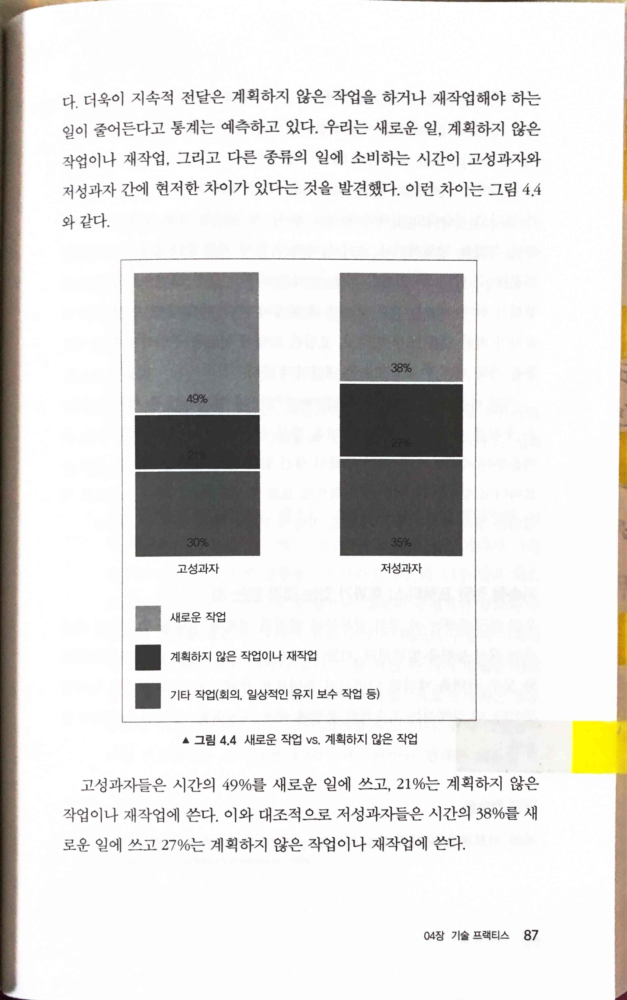

> 일에 소비하는 시간이 고성과자와 저성과자 간에 현저한 차이

### 5장 아키텍처
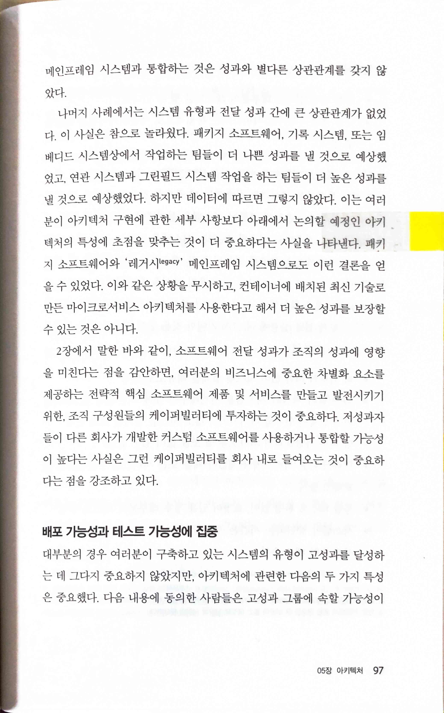 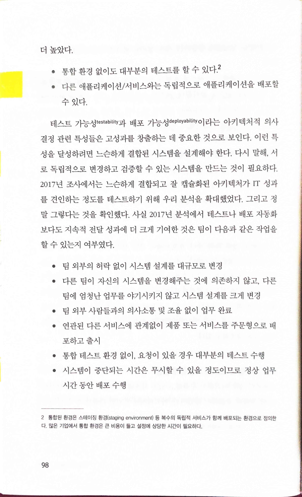

> 시스템 유형과 전달 성과 간에 큰 상관관계가 없었다... 이는 여러분이 아키텍처 구현에 관한 세부 사항보다 아래에서 논의할 예정인 아키텍처의 특성에 초점을 맞추는 것이 더 중요하다는 사실을 나타낸다.
>
> 다음 내용에 동의한 사람들은 고성과 그룹에 속할 가능성이 더 높았다.
>
> • 통합 환경 없이도 대부분의 테스트를 할 수 있다
>
> • 다른 애플리케이션/서비스와는 독립적으로 애플리케이션을 배포할수 있다.
>
> 테스트 가능성 testability 과 배포 가능성 deployability 이라는 아키텍처적 의사결정 관련 특성들은 고성과를 창출하는 데 중요한 것으로 보인다. 이런 특성을 달성하려면 느슨하게 결합된 시스템을 설계해야 한다. 다시 말해, 서로 독립적으로 변경하고 검증할 수 있는 시스템을 만드는 것이 필요하다.

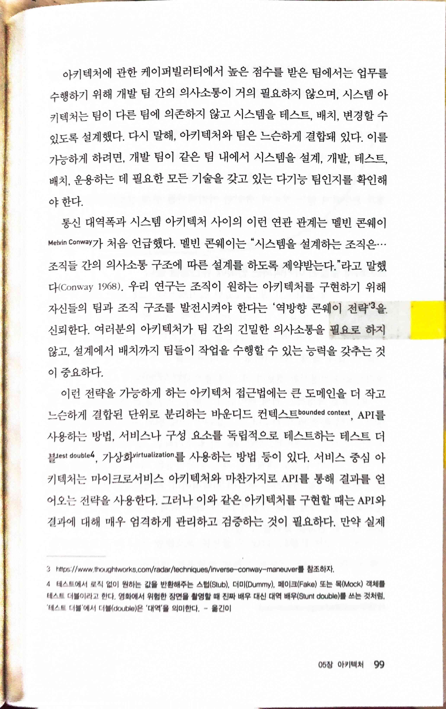

> 멜빈 콘웨이는 "시스템을 설계하는 조직은...조직들 간의 의사소통 구조에 따른 설계를 하도록 제약받는다."라고 말했다(Conway 1968). 우리 연구는 조직이 원하는 아키텍처를 구현하기 위해 자신들의 팀과 조직 구조를 발전시켜야 한다는 '역방향 콘웨이 전략'을 신뢰한다. 여러분의 아키텍처가 팀 간의 긴밀한 의사소통을 필요로 하지 않고, 설계에서 배치까지 팀들이 작업을 수행할 수 있는 능력을 갖추는 것이 중요하다.

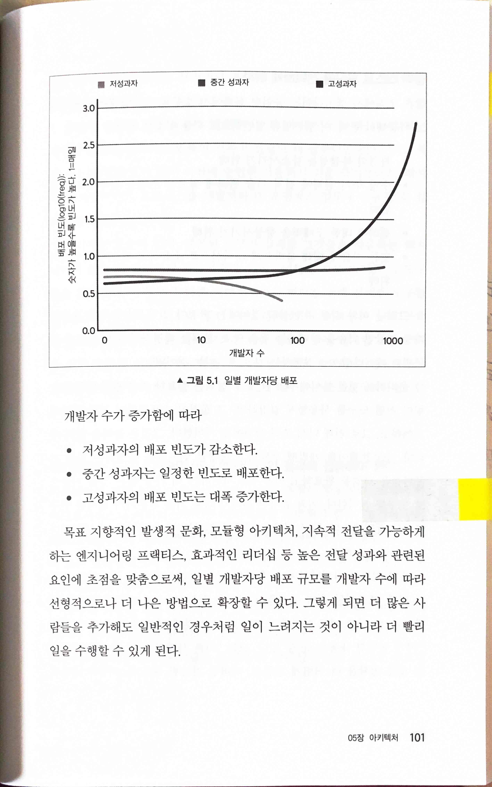

> 목표 지향적인 발생적 문화, 모듈형 아키텍처, 지속적 전달을 가능하게 하는 엔지니어링 프랙티스, 효과적인 리더십 등 높은 전달 성과와 관련된 요인에 초점을 맞춤으로써, 일별 개발자당 배포 규모를 개발자 수에 따라 선형적으로나 더 나은 방법으로 확장할 수 있다. 그렇게 되면 더 많은 사람들을 추가해도 일반적인 경우처럼 일이 느려지는 것이 아니라 더 빨리 일을 수행할 수 있게 된다.

> 중요한 것은 팀이 다른 팀이나 시스템에 의존하지 않고 제품이나 서비스를 변경하는 것이다.

### 6장 정보 보안을 전달 수명 주기에 통합하자
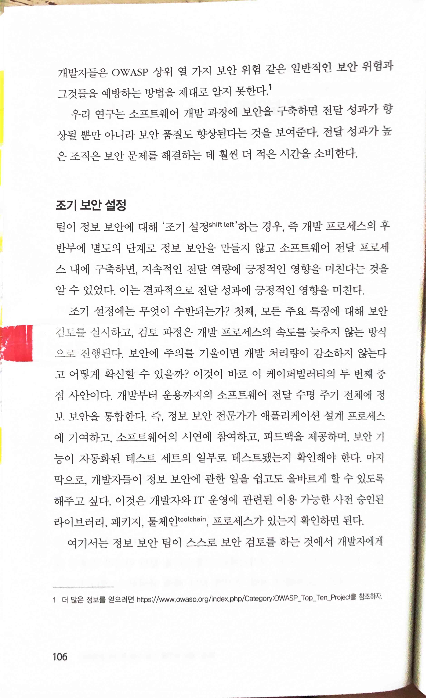

> 조기 설정에는 무엇이 수반되는가? 첫째, 모든 주요 특징에 대해 보안 검토를 실시하고, 검토 과정은 개발 프로세스의 속도를 늦추지 않는 방식으로 진행된다. 보안에 주의를 기울이면 개발 처리량이 감소하지 않는다고 어떻게 확신할 수 있을까? 이것이 바로 이 케이퍼빌러티의 두 번째 중점 사안이다. 개발부터 운용까지의 소프트웨어 전달 수명 주기 전체에 정보 보안을 통합한다. 즉, 정보 보안 전문가가 애플리케이션 설계 프로세스에 기여하고, 소프트웨어의 시연에 참여하고, 피드백을 제공하며, 보안 기능이 자동화된 테스트 세트의 일부로 테스트됐는지 확인해야 한다. 마지막으로, 개발자들이 정보 보안에 관한 일을 쉽고도 올바르게 할 수 있도록 해주고 싶다. 이것은 개발자와 IT 운영에 관련된 이용 가능한 사전 승인된 라이브러리, 패키지, 툴체인toolchain, 프로세스가 있는지 확인하면 된다.

### 7장 소프트웨어 관리 프랙티스
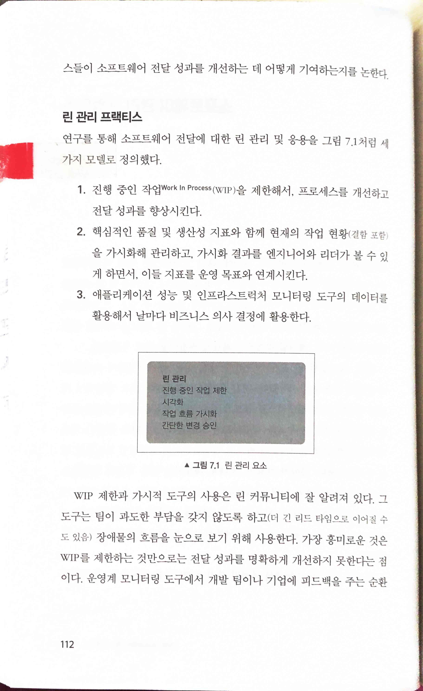

> 린 관리
>
> 진행 중인 작업 제한
>
> 시각화
>
> 작업 흐름 가시화
>
> 간단한 변경 승인

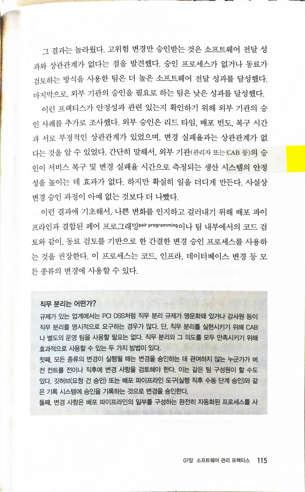

> 외부 기관(관리자 또는 CAB 등)의 승인이 서비스 복구 및 변경 실패율 시간으로 측정되는 생산 시스템의 안정성을 높이는 데 효과가 없다. 하지만 확실히 일을 더디게 만든다. 사실상 변경 승인 과정이 아예 없는 것보다 더 나빴다.

### 8장 제품 개발

> 린 제품 개발
>
> 작은 배치로 작업
>
> 시각화 관리
>
> 고객 피드백 수집 및 구현
>
> 팀 실험

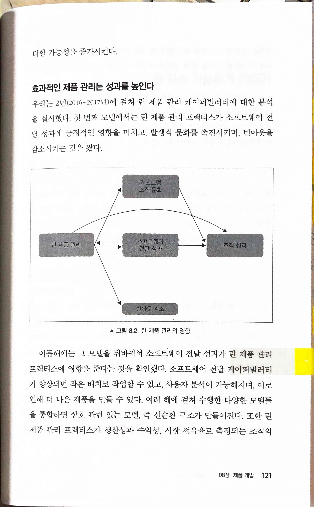

> 소프트웨어 전달 성과가 린 제품 관리 프랙티스에 영향을 준다는 것을 확인했다.

### 9장 작업을 지속 가능하게 만들기

> 코드 배포가 어려울수록 부실한 소프트웨어 전달 성과와 조직성과, 부적절한 문화가 존재한다는 것을 발견했다.

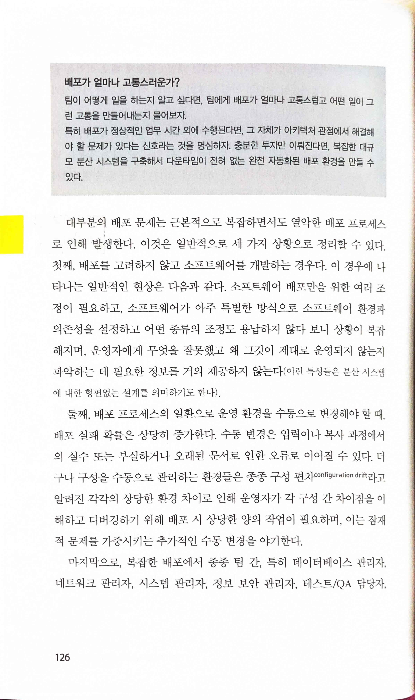 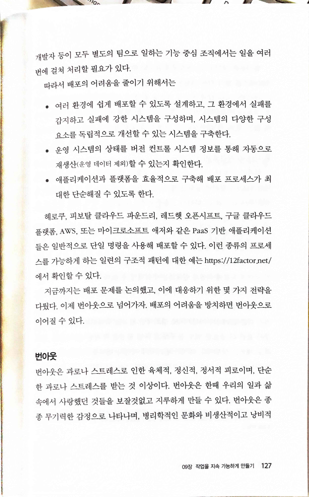

> 대부분의 배포 문제는 근본적으로 복잡하면서도 열악한 배포 프로세스로 인해 발생한다. 이것은 일반적으로 세 가지 상황으로 정리할 수 있다. 첫째, 배포를 고려하지 않고 소프트웨어를 개발하는 경우다. ... 둘째, 배포 프로세스의 일환으로 운영 환경을 수동으로 변경해야 할 때, 배포 실패 확률은 상당히 증가한다. ... 마지막으로, 복잡한 배포에서 종종 팀 간, 특히 데이터베이스 관리자네트워크 관리자, 시스템 관리자, 정보 보안 관리자, 테스트/QA 담당자, 개발자 등이 모두 별도의 팀으로 일하는 기능 중심 조직에서는 일을 여러번에 걸쳐 처리할 필요가 있다.
>
> 따라서 배포의 어려움을 줄이기 위해서는
>
> • 여러 환경에 쉽게 배포할 수 있도록 설계하고, 그 환경에서 실패를 감지하고 실패에 강한 시스템을 구성하며, 시스템의 다양한 구성요소를 독립적으로 개선할 수 있는 시스템을 구축한다.
>
> • 운영 시스템의 상태를 버전 컨트롤 시스템 정보를 통해 자동으로 재생산(운영 데이터 제외)할 수 있는지 확인한다.
>
> • 애플리케이션과 플랫폼을 효율적으로 구축해 배포 프로세스가 최대한 단순해질 수 있도록 한다.

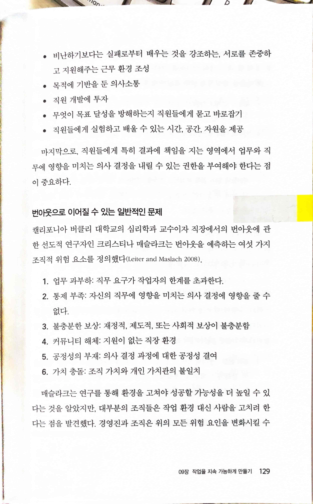

> 번아웃을 예측하는 여섯 가지 조직적 위험 요소
>
> 1. 업무 과부하: 직무 요구가 작업자의 한계를 초과한다.
>
> 2. 통제 부족: 자신의 직무에 영향을 미치는 의사 결정에 영향을 줄 수 없다.
>
> 3. 불충분한 보상: 재정적, 제도적, 또는 사회적 보상이 불충분함
>
> 4. 커뮤니티 해체: 지원이 없는 직장 환경
>
> 5. 공정성의 부재: 의사 결정 과정에 대한 공정성 결여
>
> 6. 가치 충돌: 조직 가치와 개인 가치관의 불일치

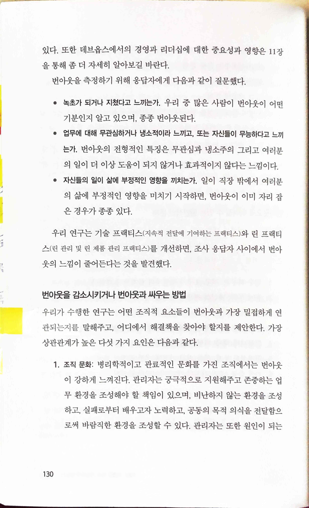 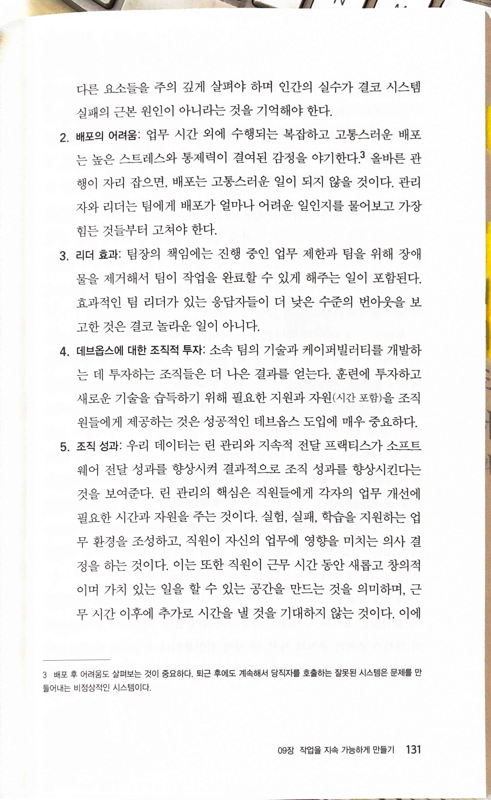 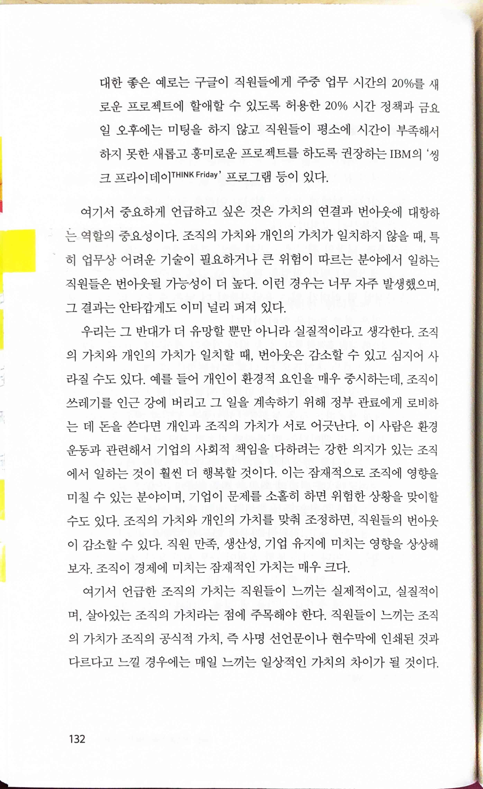

> 번아웃과 가장 상관관계가 높은 다섯 가지 요인은 다음과 같다.
>
> 1. 조직 문화
>
> 2. 배포의 어려움
>
> 3. 리더 효과
>
> 4. 데브옵스에 대한 조직적 투자
>
> 5. 조직 성과: ... 린 관리의 핵심은 직원들에게 각자의 업무 개선에 필요한 시간과 자원을 주는 것이다. 실험, 실패, 학습을 지원하는 업무 환경을 조성하고, 직원이 자신의 업무에 영향을 미치는 의사 결정을 하는 것이다. 이는 또한 직원이 근무 시간 동안 새롭고 창의적이며 가치 있는 일을 할 수 있는 공간을 만드는 것을 의미하며, 근무 시간 이후에 추가로 시간을 낼 것을 기대하지 않는 것이다.
>
> 조직의 가치와 개인의 가치가 일치하지 않을 때, 특히 업무상 어려운 기술이 필요하거나 큰 위험이 따르는 분야에서 일하는 직원들은 번아웃될 가능성이 더 높다.

### 10장 직원 만족 정체성, 그리고 참여
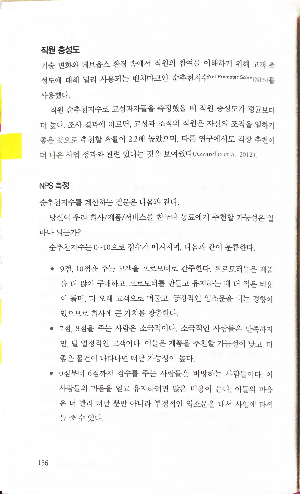

> 직원 순추천지수로 고성과자들을 측정했을 때 직원 충성도가 평균보다 더 높다. 조사 결과에 따르면, 고성과 조직의 직원은 자신의 조직을 일하기 좋은 곳으로 추천할 확률이 2.2배 높았으며, 다른 연구에서도 직장 추천이더 나은 사업 성과와 관련 있다는 것을 보여줬다(Azzarello et al. 2012).

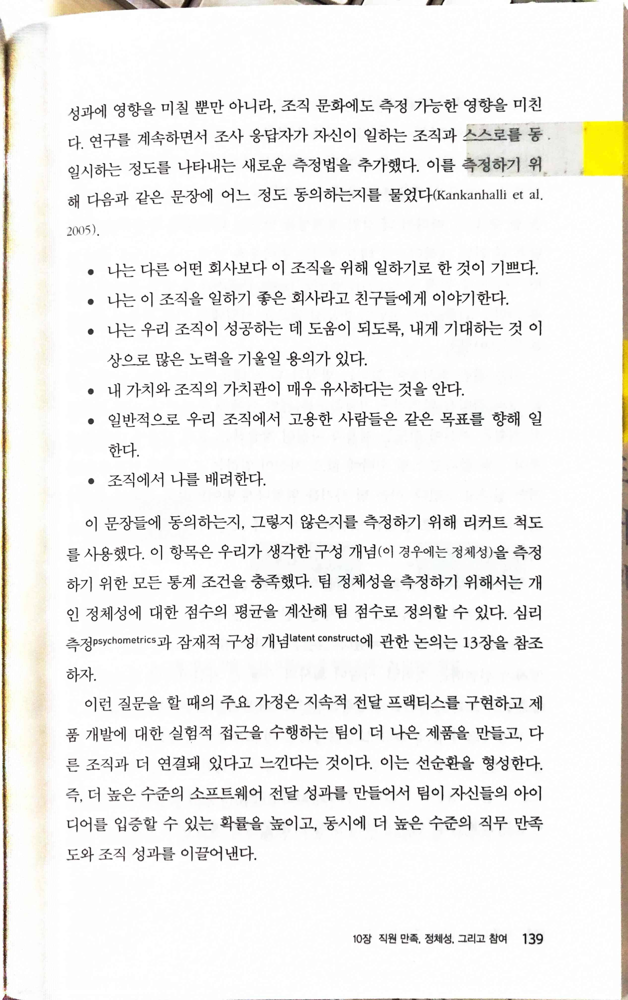

> 조사 응답자가 자신이 일하는 조직과 스스로를 동일시하는 정도를 나타내는 새로운 측정법을 추가

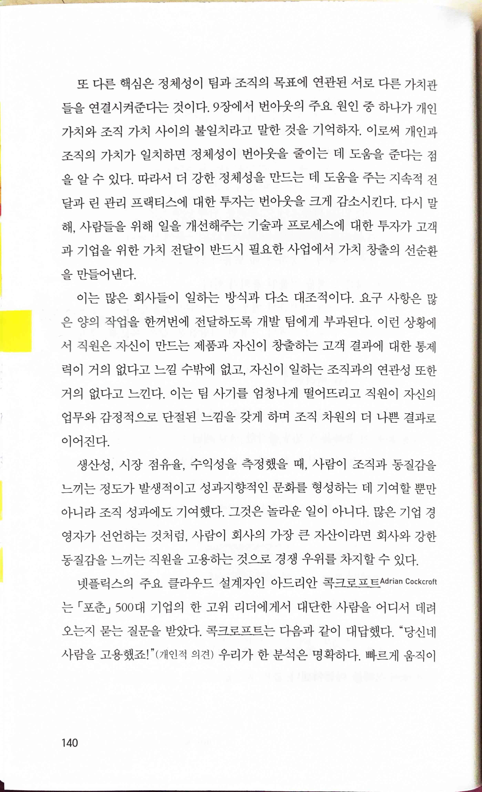

> 요구 사항은 많은 양의 작업을 한꺼번에 전달하도록 개발 팀에게 부과된다. 이런 상황에서 직원은 자신이 만드는 제품과 자신이 창출하는 고객 결과에 대한 통제력이 거의 없다고 느낄 수밖에 없고, 자신이 일하는 조직과의 연관성 또한 거의 없다고 느낀다. 이는 팀 사기를 엄청나게 떨어뜨리고 직원이 자신의 업무와 감정적으로 단절된 느낌을 갖게 하며 조직 차원의 더 나쁜 결과로 이어진다.

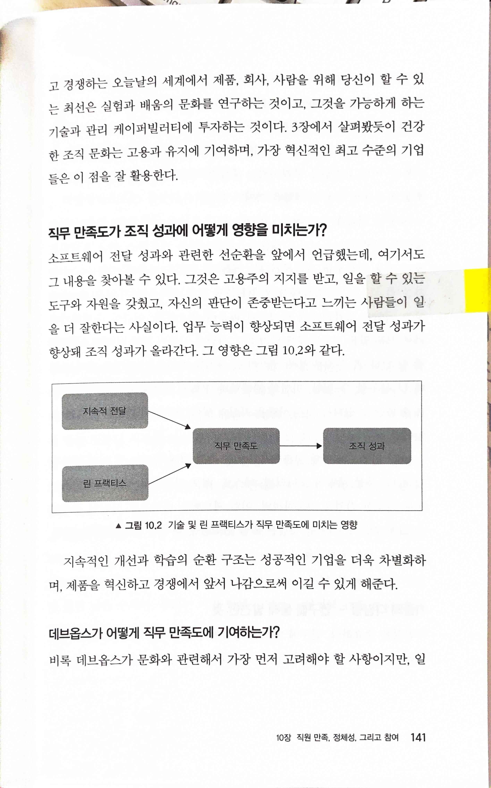

> 고용주의 지지를 받고, 일을 할 수 있는 도구와 자원을 갖췄고, 자신의 판단이 존중받는다고 느끼는 사람들이 일을 더 잘한다는 사실이다. 업무 능력이 향상되면 소프트웨어 전달 성과가 향상돼 조직 성과가 올라간다.

### 11장 리더와 관리자
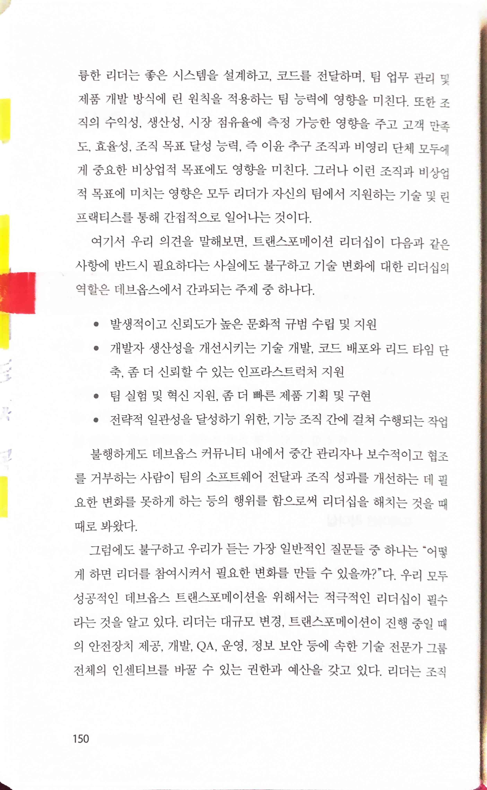

> 트랜스포메이션 리더십이 다음과 같은 사항에 반드시 필요하다
>
> ● 발생적이고 신뢰도가 높은 문화적 규범 수립 및 지원
>
> ● 개발자 생산성을 개선시키는 기술 개발, 코드 배포와 리드 타임 단축, 좀 더 신뢰할 수 있는 인프라스트럭처 지원
>
> ● 팀 실험 및 혁신 지원, 좀 더 빠른 제품 기획 및 구현
>
> ● 전략적 일관성을 달성하기 위한 기능 조직 간에 걸쳐 수행되는 작업

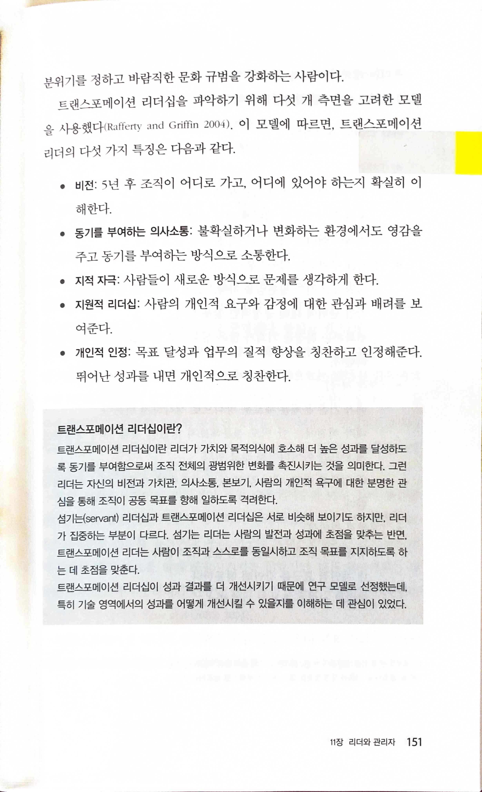

> 트랜스포메이션 리더의 다섯 가지 특징은 다음과 같다.
>
> • 비전 : 5년 후 조직이 어디로 가고, 어디에 있어야 하는지 확실히 이해한다.
>
> • 동기를 부여하는 의사소통 불확실하거나 변화하는 환경에서도 영감을 주고 동기를 부여하는 방식으로 소통한다.
>
> • 지적 자극 사람들이 새로운 방식으로 문제를 생각하게 한다.
>
> • 지원적 리더십 사람의 개인적 요구와 감정에 대한 관심과 배려를 보여준다.
>
> • 개인적 인정: 목표 달성과 업무의 질적 향상을 칭찬하고 인정해준다. 뛰어난 성과를 내면 개인적으로 칭찬한다.
>
> 섬기는(servant) 리더십과 트랜스포메이션 리더십은 서로 비슷해 보이기도 하지만, 리더가 집중하는 부분이 다르다. 섬기는 리더는 사람의 발전과 성과에 초점을 맞추는 반면, 트랜스포메이션 리더는 사람이 조직과 스스로를 동일시하고 조직 목표를 지지하도록 하는 데 초점을 맞춘다.

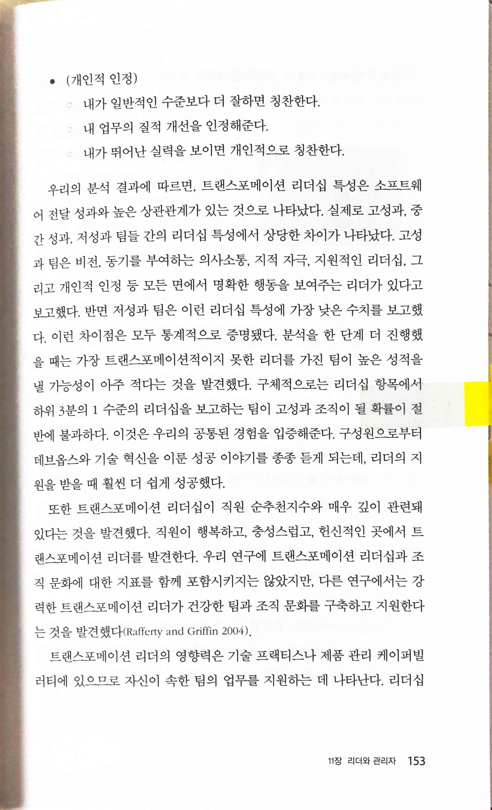

> 트랜스포메이션 리더십 특성은 소프트웨어 전달 성과와 높은 상관관계
>
> 트랜스포메이션 리더십이 직원 순추천지수와 매우 깊이 관련

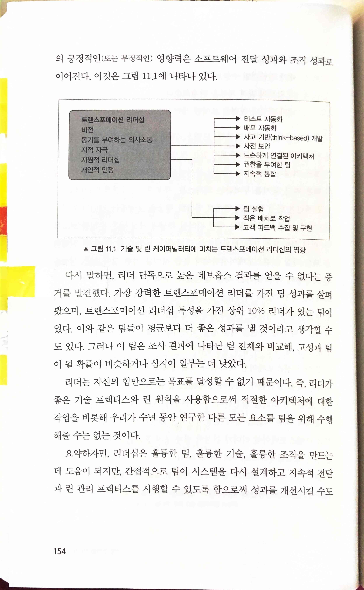

> 리더 단독으로 높은 데브옵스 결과를 얻을 수 없다는 증거를 발견

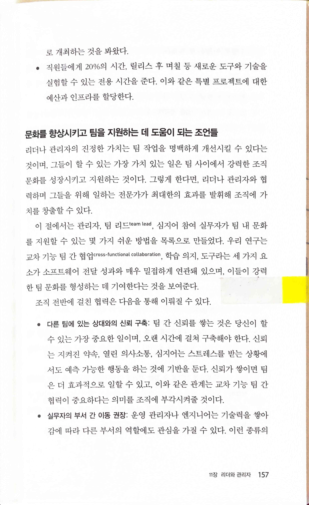

> 교차 기능 팀 간 협업cross-functional collaboration, 학습 의지, 도구라는 세 가지 요소가 소프트웨어 전달 성과와 매우 밀접하게 연관돼 있으며, 이들이 강력한 팀 문화를 형성하는 데 기여한다는 것을 보여준다.
>
> 조직 전반에 걸친 협력은 다음을 통해 이뤄질 수 있다.
>
> • 다른 팀에 있는 상대와의 신뢰 구축: 팀 간 신뢰를 쌓는 것은 당신이 할수 있는 가장 중요한 일이며, 오랜 시간에 걸쳐 구축해야 한다. 신뢰는 지켜진 약속, 열린 의사소통, 심지어는 스트레스를 받는 상황에서도 예측 가능한 행동을 하는 것에 기반을 둔다. 신뢰가 쌓이면 팀은 더 효과적으로 일할 수 있고, 이와 같은 관계는 교차 기능 팀 간협력이 중요하다는 의미를 조직에 부각시켜줄 것이다.
>
> • 실무자의 부서 간 이동 권장
>
> • 협업을 촉진하는 작업을 적극적으로 모색, 장려, 보상

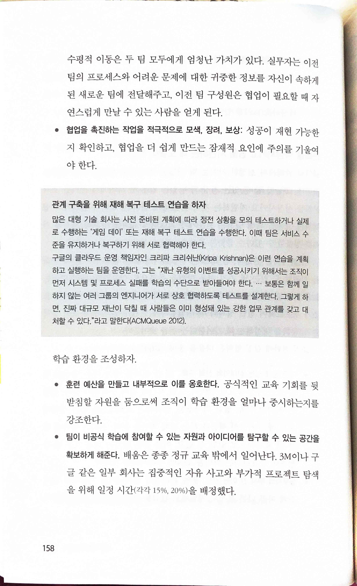 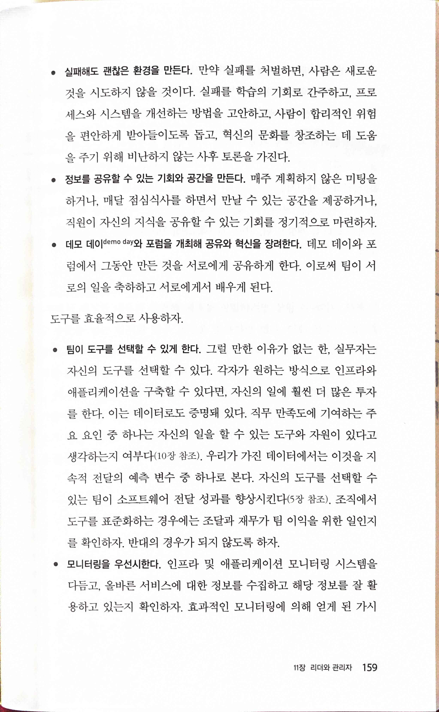 

> 학습 환경을 조성하자.
>
> • 훈련 예산을 만들고 내부적으로 이를 옹호한다.
>
> • 팀이 비공식 학습에 참여할 수 있는 자원과 아이디어를 탐구할 수 있는 공간을 확보하게 해준다.
>
> • 실패해도 괜찮은 환경을 만든다.
>
> • 정보를 공유할 수 있는 기회와 공간을 만든다.
>
> 도구를 효율적으로 사용하자.
>
> • 팀이 도구를 선택할 수 있게 한다.
>
> • 모니터링을 우선시한다.
>
> 많은 데브옵스 성공 사례가 관련 기술 팀의 환상적이고 근본적인 노력을 강조하는 반면, 우리의 경험과 연구는 기술 트랜스포메이션이 팀 업무를 지원하고 개선시킬 수 있는 진정한 트랜스포메이션 리더로 인해 혜택을 받는다는 것을 보여준다. 이런 지원은 비즈니스에 가치를 제공하므로 조직은 리더십 개발을 팀, 기술, 제품에 대한 투자로 보는 것이 현명할 것이다.

## 2부 연구

### 12장 이 책에 숨겨진 과학

### 13장 심리학에 대한 소개


> 표 13.1 웨스트럼의 조직 문화 분류

 

> 웨스트럼 조직 문화에는 팀의 조직 문화를 설명하는 일곱 가지 항목이 있다.
>
> 팀은...
>
> • 정보를 적극적으로 찾는다.
>
> • 정보 전달자가 실패 소식이나 다른 나쁜 소식을 전할 때 처벌받지 않는다.
>
> • 책임을 공유한다.
>
> • 교차 기능 팀 간의 협력을 장려하고 보상한다.
>
> • 실패가 연구를 유발한다.
>
> • 새로운 아이디어를 환영한다.
>
> • 실패를 주로 시스템을 개선할 기회로 간주한다.

### 14장 왜 설문 조사를 사용하는가


> HR 시스템에 존재하는 변수를 사용해 '문화'를 대신 판단하기 어려운 이유는 직접 매핑할 수 있는 변수가 거의 없기 때문이다.

> 질문은 가치가 있다. 연구에 따르면 조직 문화는 기술 및 조직 성과를 예측하고 성과 결과를 예측하며 팀 역학과 심리적 안전이 팀 성과를 이해하는 가장 중요한 측면이라고 한다

### 15장 프로젝트 데이터

## 3부 트랜스포메이션

### 16장 고성과 리더십과 관리


> "행동을 따라 하는 것보다는 왜 그런 행동을 해야 하는지를 이해해야 한다."


> 전통적인 지휘 체계가 아니라, 모든 사람이 코치로서 리더 역할을 맡아 (1) 일을 하고, (2) 그 일을 개선하고, (3) 사람들을 발전시키도록 행동을 변화시키는 것이다. 세 번 목표인 사람을 발전시키는 일은 자동화가 많은 기술 영역에서는 특히 중요하다. 자신의 현재 직업을 사라지게 할지도 모르는 일에 사람이 최선을 다하기 위해서는 현재의 일뿐 아니라 일을 개선하고 혁신할 수 있는 자신의 능력을 리더가 가치 있게 여긴다는 완전한 믿음이 필요하다. 일 자체는 끊임없이 변할 것이다. 따라서 빠르게 배우고 적응하기 위해 꾸준히 활동하는 사람을 포용하는 조직이 선두에 서게 된다.

   

> 학습 조직 만들기
>
> • 올바른 사고방식을 개발하고 유지하자.
>
> • 자신의 것으로 만들어라.
>
> 공부하고 배우되, 여러분의 문화에 어떤 효과가 있는지 실험하고 변경하자.
>
> 자체적으로 코치를 육성하자... 조직이 코칭을 깊이 이해하는 것은 유지와 확장을 이끄는 핵심 요소로 작용한다.
>
> 업무 방식을 바꿀 필요가 있다.
>
> • 훈련에 공들이자.
>
> • 인내심을 발휘하자... 새로운 문화로 정착될 때까지는 많은 시간이 걸린다.
>
> • 연습을 반복하자

## 결론


> 우리의 모든 연구에서 항상 변하지 않는 한 가지 결과가 있다. 거의 모든 회사가 소프트웨어에 의존하고 있기 때문에 오늘날 사업을 하는 모든 조직에서는 전달 성과가 매우 중요하다는 점이다. 그리고 소프트웨어 전달 성과는 리더십, 도구, 자동화, 그리고 지속적인 학습과 개선 문화를 포함한 많은 요인에 의해 영향을 받는다.

## 부록 A 개선을 주도하는 케이퍼빌러티


## 부록 B 통계


## 부록 C 연구에 사용한 통계적 방법