# AWS 전환 모범 사례와 엔터프라이즈 IT의 미래

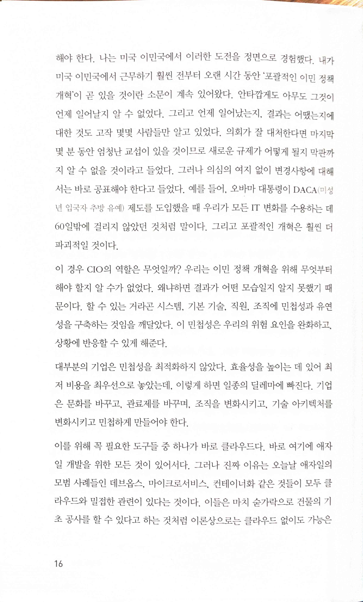

> 대부분의 기업은 민첩성을 최적화하지 않았다. 효율성을 높이는 데 있어 최저 비용을 최우선으로 놓았는데, 이렇게 하면 일종의 딜레마에 빠진다. 기업은 문화를 바꾸고, 관료제를 바꾸며, 조직을 변화시키고, 기술 아키텍처를 변화시키고 민첩하게 만들어야 한다.

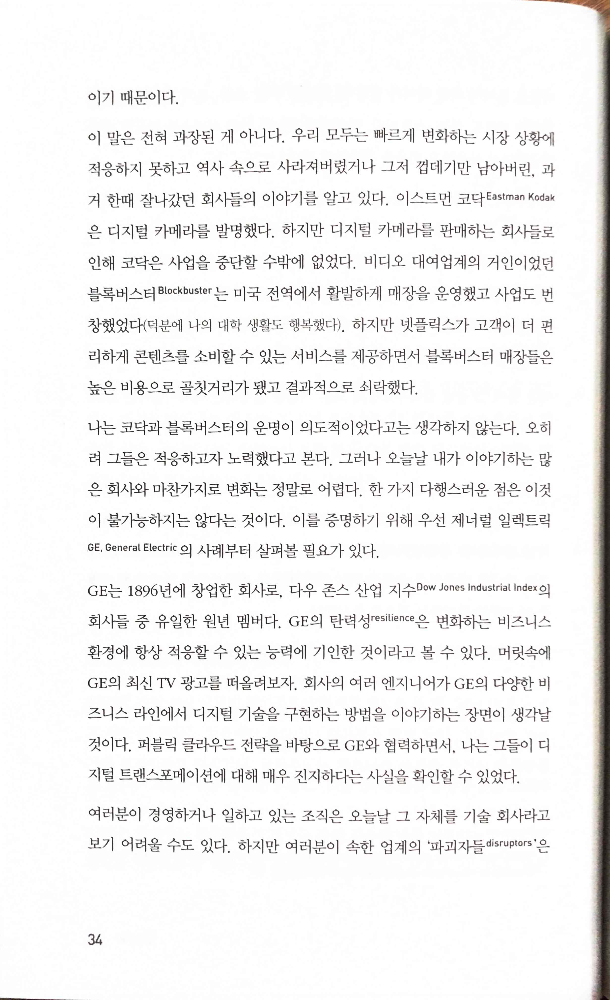

> 나는 코닥과 블록버스터의 운명이 의도적이었다고는 생각하지 않는다. 오히려 그들은 적응하고자 노력했다고 본다. 그러나 오늘날 내가 이야기하는 많은 회사와 마찬가지로 변화는 정말로 어렵다. 한 가지 다행스러운 점은 이것이 불가능하지는 않다는 것이다.

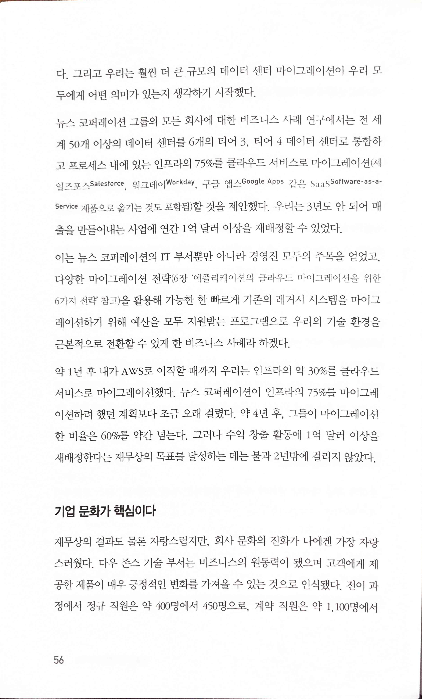 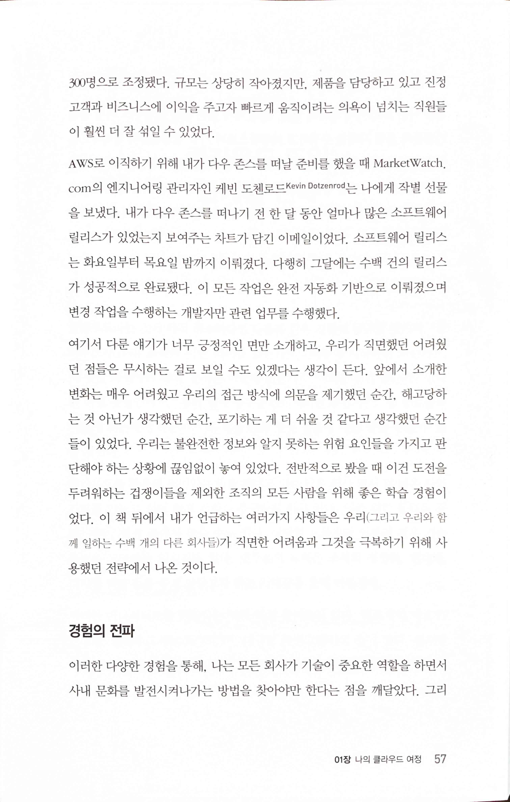

> 기업 문화가 핵심이다.
>
> 재무상의 결과도 물론 자랑스럽지만, 회사 문화의 진화가 나에겐 가장 자랑스러웠다.
>
> 소프트웨어 릴리스는 화요일부터 목요일 밤까지 이뤄졌다. 다행히 그달에는 수백 건의 릴리스가 성공적으로 완료됐다. 이 모든 작업은 완전 자동화 기반으로 이뤄졌으며 변경 작업을 수행하는 개발자만 관련 업무를 수행했다.

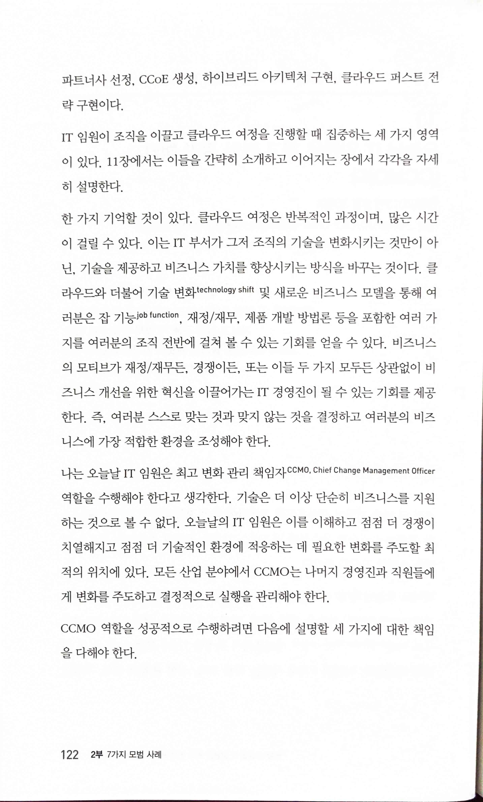 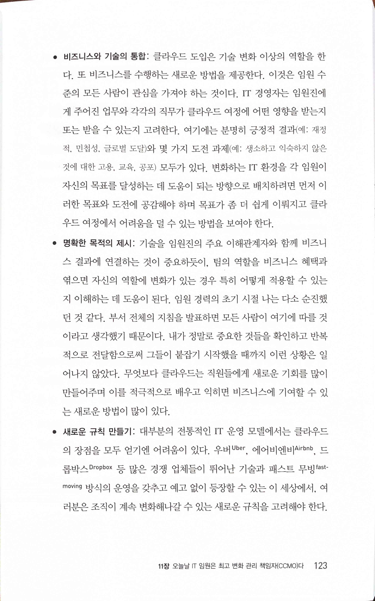

> 나는 오늘날 IT 임원은 최고 변화 관리 책임자 CCMO, Chief Change Management Officer 역할을 수행해야 한다고 생각한다.
>
> • 비즈니스와 기술의 통합: 클라우드 도입은 기술 변화 이상의 역할을 한다. 또 비즈니스를 수행하는 새로운 방법을 제공한다. 이것은 임원 수준의 모든 사람이 관심을 가져야 하는 것이다. IT 경영자는 임원진에게 주어진 업무와 각각의 직무가 클라우드 여정에 어떤 영향을 받는지 또는 받을 수 있는지 고려한다. 여기에는 분명히 긍정적 결과(예: 재정적, 민첩성, 글로벌 도달)와 몇 가지 도전 과제(예: 생소하고 익숙하지 않은 것에 대한 고용, 교육, 공포) 모두가 있다. 변화하는 IT 환경을 각 임원이 자신의 목표를 달성하는 데 도움이 되는 방향으로 배치하려면 먼저 이러한 목표와 도전에 공감해야 하며 목표가 좀 더 쉽게 이뤄지고 클라우드 여정에서 어려움을 덜 수 있는 방법을 보여야 한다.
>
> • 명확한 목적의 제시: 기술을 임원진의 주요 이해관계자와 함께 비즈니스 결과에 연결하는 것이 중요하듯이, 팀의 역할을 비즈니스 혜택과 엮으면 자신의 역할에 변화가 있는 경우 특히 어떻게 적용할 수 있는지 이해하는 데 도움이 된다. 임원 경력의 초기 시절 나는 다소 순진했던 것 같다. 부서 전체의 지침을 발표하면 모든 사람이 여기에 따를 것이라고 생각했기 때문이다. 내가 정말로 중요한 것들을 확인하고 반복적으로 전달함으로써 그들이 붙잡기 시작했을 때까지 이런 상황은 일어나지 않았다. 무엇보다 클라우드는 직원들에게 새로운 기회를 많이 만들어주며 이를 적극적으로 배우고 익히면 비즈니스에 기여할 수 있는 새로운 방법이 많이 있다.
>
> • 새로운 규칙 만들기: 대부분의 전통적인 IT 운영 모델에서는 클라우드의 장점을 모두 얻기엔 어려움이 있다. 우버Uber, 에어비엔비Airbnb, 드롭박스 Dropbox 등 많은 경쟁 업체들이 뛰어난 기술과 패스트 무빙fastmoving 방식의 운영을 갖추고 예고 없이 등장할 수 있는 이 세상에서, 여러분은 조직이 계속 변화해나갈 수 있는 새로운 규칙을 고려해야 한다.

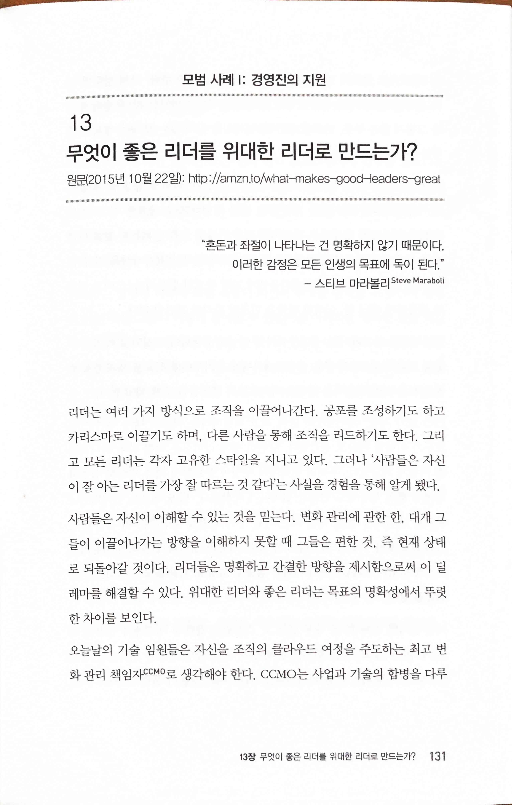 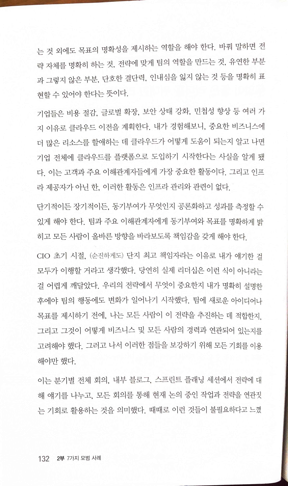

* [What Makes Good Leaders Great? | AWS Cloud Enterprise Strategy Blog](https://aws.amazon.com/ko/blogs/enterprise-strategy/what-makes-good-leaders-great/)
> "혼돈과 좌절이 나타나는 건 명확하지 않기 때문이다.이러한 감정은 모든 인생의 목표에 독이 된다."- 스티브 마라볼리 Steve Maraboll
>
> 모든 리더는 각자 고유한 스타일을 지니고 있다. 그러나 '사람들은 자신이 잘 아는 리더를 가장 잘 따르는 것 같다'는 사실을 경험을 통해 알게 됐다.
>
> 사람들은 자신이 이해할 수 있는 것을 믿는다. 변화 관리에 관한 한, 대개 그들이 이끌어나가는 방향을 이해하지 못할 때 그들은 편한 것, 즉 현재 상태로 되돌아갈 것이다. 리더들은 명확하고 간결한 방향을 제시함으로써 이 딜레마를 해결할 수 있다. 위대한 리더와 좋은 리더는 목표의 명확성에서 뚜렷한 차이를 보인다.
>
> 바꿔 말하면 전략 자체를 명확히 하는 것. 전략에 맞게 팀의 역할을 만드는 것. 유연한 부분과 그렇지 않은 부분, 단호한 결단력, 인내심을 잃지 않는 것 등을 명확히 표현할 수 있어야 한다는 뜻이다.
>
> 단기적이든 장기적이든, 동기부여가 무엇인지 공론화하고 성과를 측정할 수 있게 해야 한다. 팀과 주요 이해관계자에게 동기부여와 목표를 명확하게 밝히고 모든 사람이 올바른 방향을 바라보도록 책임감을 갖게 해야 한다.
>
> CIO 초기 시절, (순진하게도) 단지 최고 책임자라는 이유로 내가 얘기한 걸 모두가 이행할 거라고 생각했다. 당연히 실제 리더십은 이런 식이 아니라는걸 어렵게 깨달았다. 우리의 전략에서 무엇이 중요한지 내가 명확히 설명한 후에야 팀의 행동에도 변화가 일어나기 시작했다. 팀에 새로운 아이디어나 목표를 제시하기 전에, 나는 모든 사람이 이 전략을 추진하는 데 적합한지. 그리고 그것이 어떻게 비즈니스 및 모든 사람의 경력과 연관되어 있는지를 고려해야 했다. 그러고 나서 이러한 점들을 보강하기 위해 모든 기회를 이용해야만 했다.

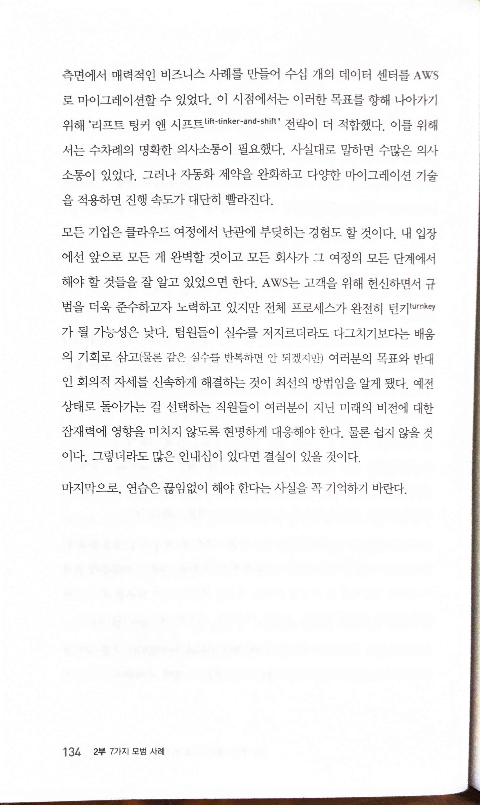

> 모든 기업은 클라우드 여정에서 난관에 부딪히는 경험도 할 것이다... 팀원들이 실수를 저지르더라도 다그치기보다는 배움의 기회로 삼고(물론 같은 실수를 반복하면 안 되겠지만) 여러분의 목표와 반대인 회의적 자세를 신속하게 해결하는 것이 최선의 방법임을 알게 됐다. 예전 상태로 돌아가는 걸 선택하는 직원들이 여러분이 지닌 미래의 비전에 대한 잠재력에 영향을 미치지 않도록 현명하게 대응해야 한다. 물론 쉽지 않을 것이다. 그렇더라도 많은 인내심이 있다면 결실이 있을 것이다.
>
> 마지막으로, 연습은 끊임없이 해야 한다는 사실을 꼭 기억하기 바란다.

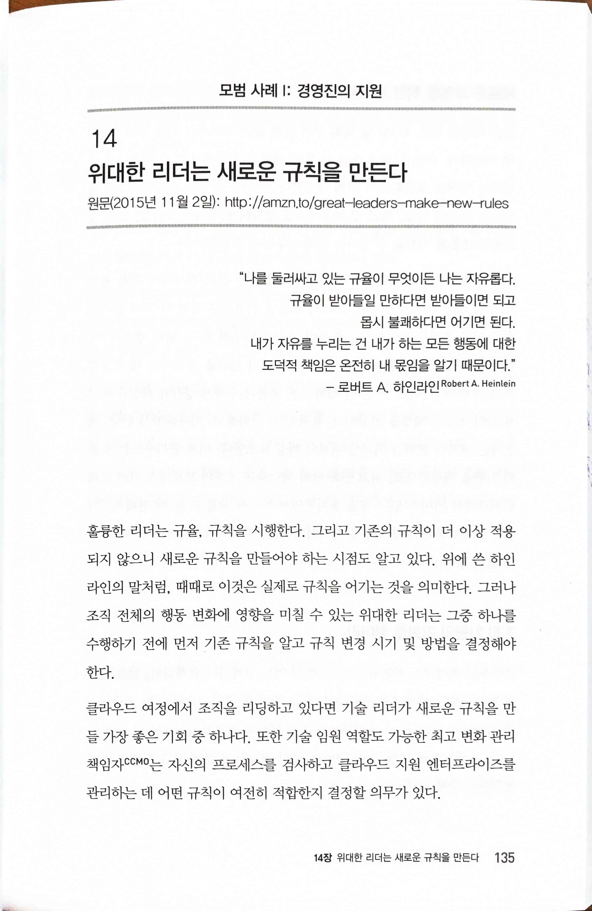

* [Great Leaders Make New Rules | AWS Cloud Enterprise Strategy Blog](https://aws.amazon.com/ko/blogs/enterprise-strategy/great-leaders-make-new-rules/)
> 훌륭한 리더는 규율, 규칙을 시행한다. 그리고 기존의 규칙이 더 이상 적용되지 않으니 새로운 규칙을 만들어야 하는 시점도 알고 있다. 위에 쓴 하인라인의 말처럼, 때때로 이것은 실제로 규칙을 어기는 것을 의미한다. 그러나 조직 전체의 행동 변화에 영향을 미칠 수 있는 위대한 리더는 그중 하나를 수행하기 전에 먼저 기존 규칙을 알고 규칙 변경 시기 및 방법을 결정해야 한다.

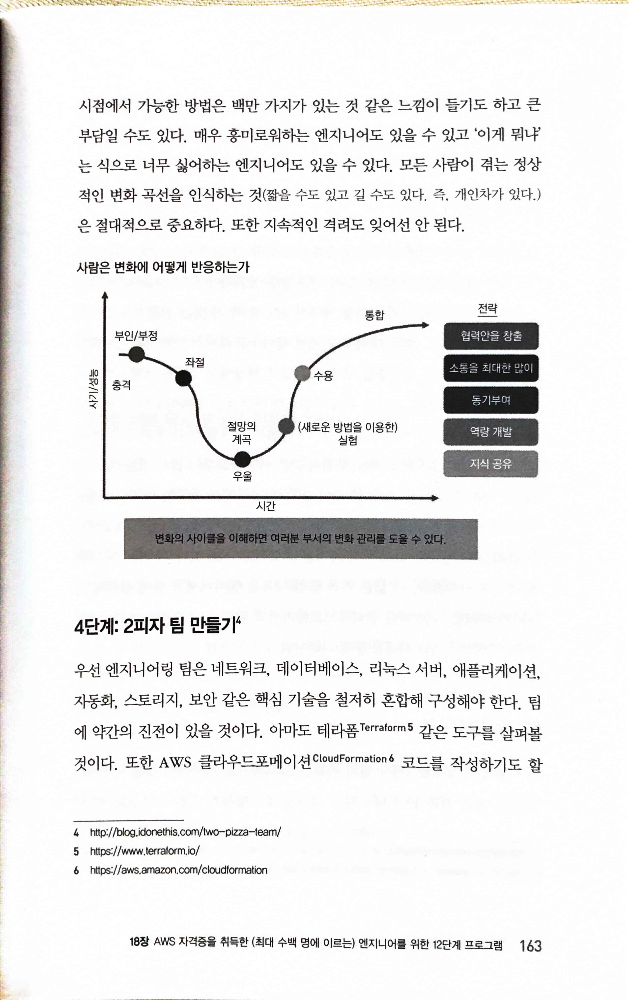 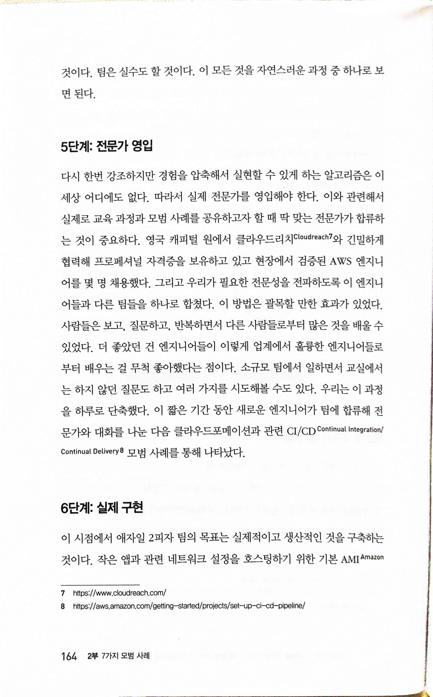

* [The Science Behind Why Jeff Bezos's Two-Pizza Team Rule Works](http://blog.idonethis.com/two-pizza-team/)
> 모든 사람이 겪는 정상적인 변화 곡선을 인식하는 것(짧을 수도 있고 길 수도 있다. 즉, 개인차가 있다.)은 절대적으로 중요하다. 또한 지속적인 격려도 잊어선 안 된다.
>
> 경험을 압축해서 실현할 수 있게 하는 알고리즘은 이 세상 어디에도 없다. 따라서 실제 전문가를 영입해야 한다. 이와 관련해서 실제로 교육 과정과 모범 사례를 공유하고자 할 때 딱 맞는 전문가가 합류하는 것이 중요하다.

> 3(A), 실험을 체계화하기 위해 데브옵스를 고려할 것. 데브옵스 문화는 조직 내 실험을 체계화할 수 있는 강력한 방법 중 하나다. 자산 및 개발 운영에 자동화를 결합하면 변경사항을 릴리스하는 데 걸리는 시간을 크게 단축할 수 있고 별로 쓸모없는 변경사항은 신속하게 롤백할 수 있다.
>
> 3(B), 팀을 의심하지 말 것. 의심은 팀의 사기 저하와 실패를 초래하는 가장 강력한 요인 중 하나다. 여러분이 실험의 범위를 올바르게 정하고 실험을 측정하고 신속하게 반복하는 방법을 알았다면, 의심을 하기에 앞서 접근 방법은 조정될 수 있음을 알아야 한다. 팀이 실험을 측정하는 올바른 방법에 대해 생각하고 어려운 질문을 하는 것은 좋다. 하지만 팀이 문제를 해결할 수 있는 능력을 의심하지 말고 문제를 해결하도록 도와줘야 한다. 사람들은 성공할 것이라고 믿는 지도자를 따르는 경향이 있다.
>
> 4(A). 조직 전체가 참여하도록 장려할 것. 실험을 통해 더 빨리 결과를 제공하기 시작하면 조직의 다른 영역이 여러분의 방법에 매력을 느끼게 된다. 이렇게 관심을 갖는 사람들을 참여시켜야 한다.

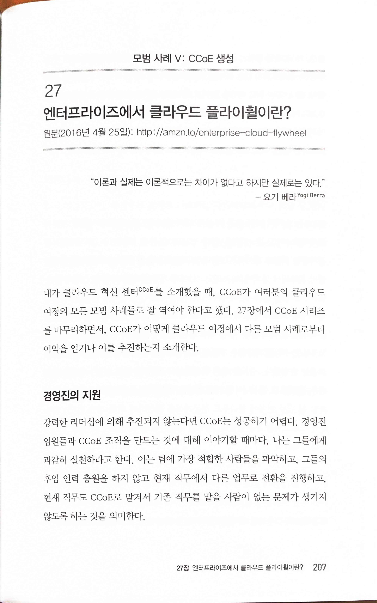

* [Your Enterprise’s Flywheel to the Cloud | AWS Cloud Enterprise Strategy Blog](https://aws.amazon.com/ko/blogs/enterprise-strategy/your-enterprises-flywheel-to-the-cloud/)
> 강력한 리더십에 의해 추진되지 않는다면 CCoE는 성공하기 어렵다. 경영진 임원들과 CCoE 조직을 만드는 것에 대해 이야기할 때마다, 나는 그들에게 과감히 실천하라고 한다. 이는 팀에 가장 적합한 사람들을 파악하고, 그들의 후임 인력 충원을 하지 않고 현재 직무에서 다른 업무로 전환을 진행하고, 현재 직무도 CCoE로 맡겨서 기존 직무를 맡을 사람이 없는 문제가 생기지 않도록 하는 것을 의미한다.

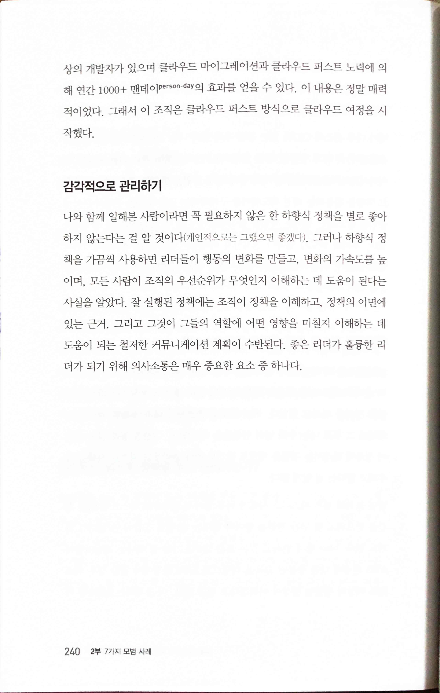

> 나와 함께 일해본 사람이라면 꼭 필요하지 않은 한 하향식 정책을 별로 좋아하지 않는다는 걸 알 것이다(개인적으로는 그랬으면 좋겠다). 그러나 하향식 정책을 가끔씩 사용하면 리더들이 행동의 변화를 만들고, 변화의 가속도를 높이며, 모든 사람이 조직의 우선순위가 무엇인지 이해하는 데 도움이 된다는 사실을 알았다. 잘 실행된 정책에는 조직이 정책을 이해하고, 정책의 이면에 있는 근거, 그리고 그것이 그들의 역할에 어떤 영향을 미칠지 이해하는 데 도움이 되는 철저한 커뮤니케이션 계획이 수반된다. 좋은 리더가 훌륭한 리더가 되기 위해 의사소통은 매우 중요한 요소 중 하나다.

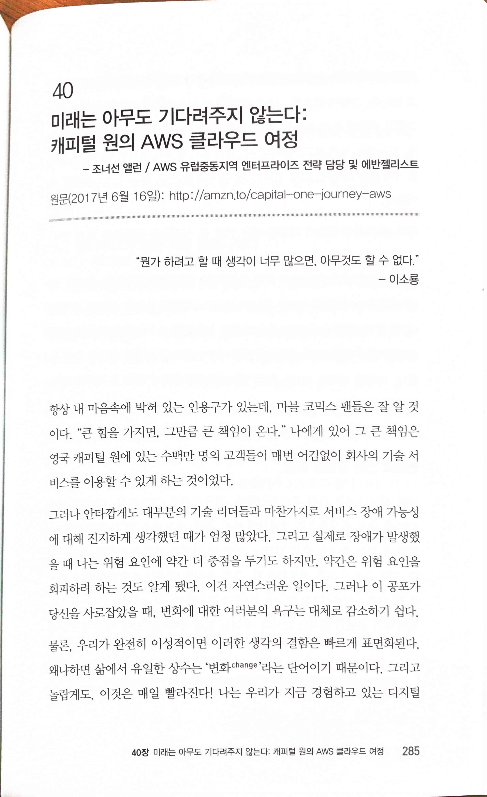

* [The Future Waits for Nobody — My Capital One Journey to the AWS Cloud | by Jonathan Allen | AWS Enterprise Collection | Medium](https://medium.com/aws-enterprise-collection/the-future-waits-for-nobody-my-capital-one-journey-to-the-aws-cloud-3d73e7ecd3da)
> “뭔가 하려고 할 때 생각이 너무 많으면, 아무것도 할 수 없다." - 이소룡
>
> 삶에서 유일한 상수는 '변화 change'라는 단어이기 때문이다. 그리고 놀랍게도, 이것은 매일 빨라진다!

> 가장 큰 변화는 간단한 단계에서부터 시작된다.