AI Platform Odyssey 공학의 미래
===============================
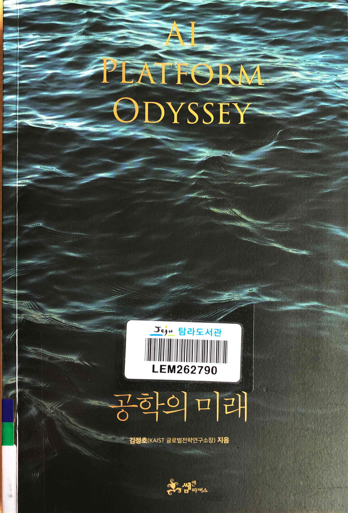

# PROLOGUE 문명사적 변곡점, 공학은 무엇을 해야 하는가

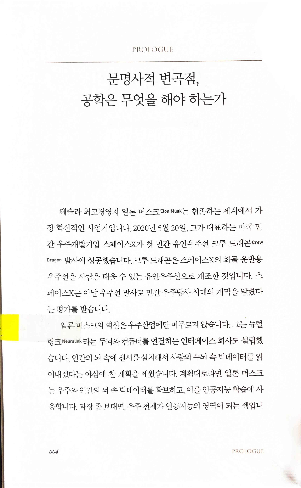

> 일론 머스크 Elon Musk, 스페이스X 크루 드래곤 Crew Dragon, 뉴럴링크 Neuralink

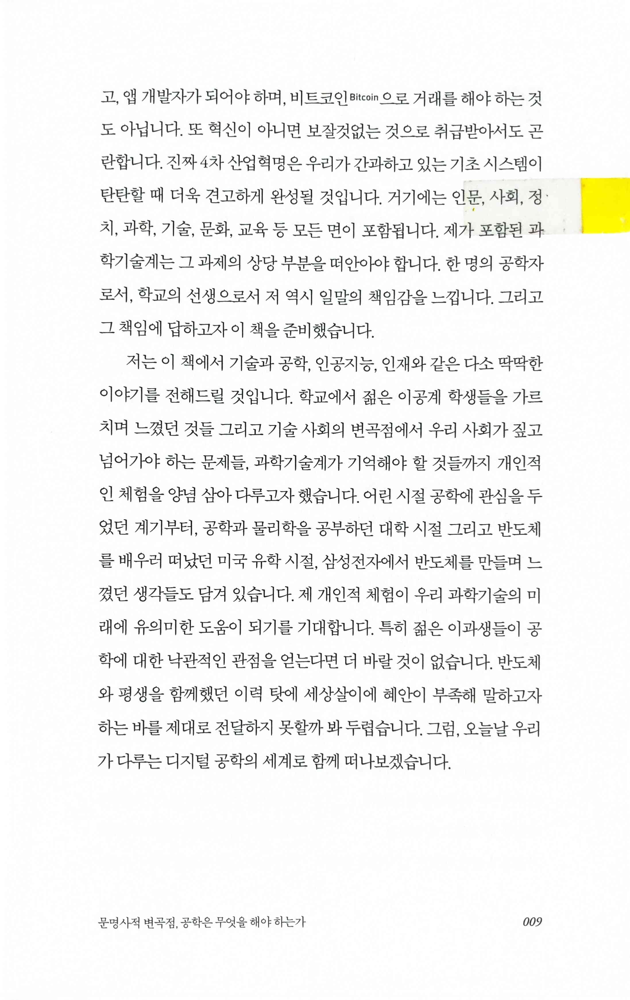

> 진짜 4차 산업혁명은 우리가 간과하고 있는 기초 시스템이 탄탄할 때 더욱 견고하게 완성될 것입니다. 거기에는 인문, 사회, 정치, 과학, 기술, 문화, 교육 등 모든 면이 포함됩니다.
* 맞는 말이라고 생각하긴 하지만, 또 이렇게 이야기하면 어쩐지 뜬구름 잡는 듯한 소리같이 느껴지기도 한다

# CHAPTER 1 인공지능 새로이 찾아온 공학의 기회

## 파블로프의 개와 딥러닝 인공지능
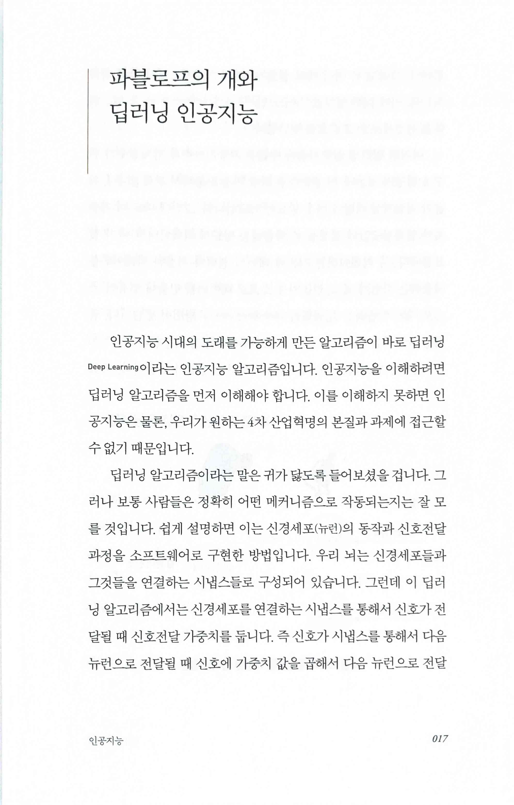 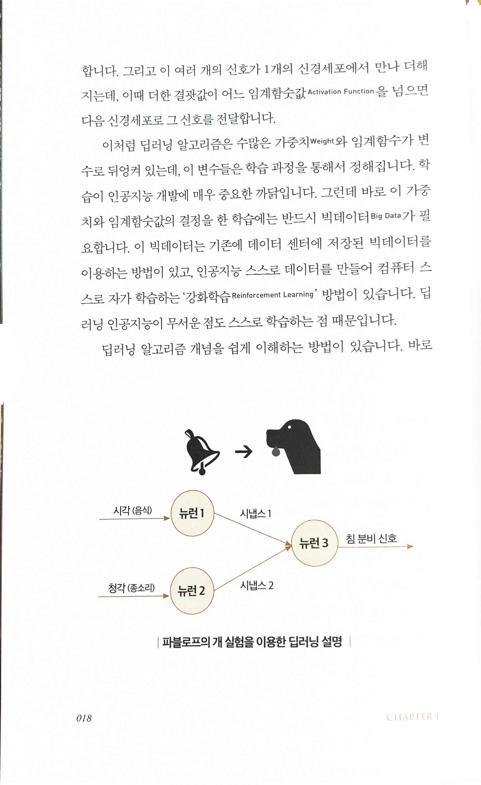 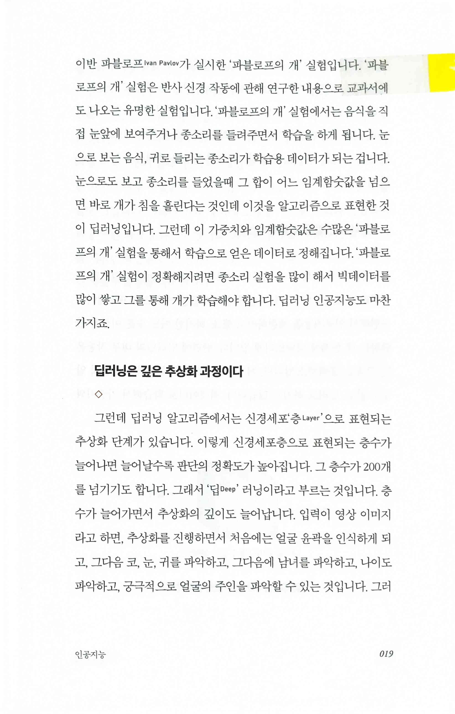

> 파블로프의 개와 딥러닝 인공지능
* 파블로프의 개로 비유하는 건 처음 봐서 기록

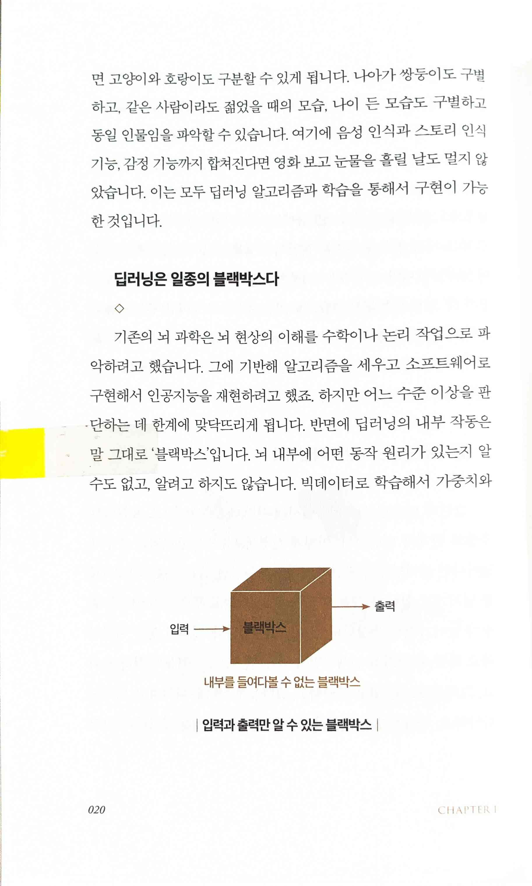

> 딥러닝의 내부 작동은 말 그대로 '블랙박스'. 뇌 내부에 어떤 동작 원리가 있는지 알 수도 없고, 알려고 하지도 않습니다. 내부를 들여다볼 수 없는, 입력과 출력만 알 수 있는 블랙박스

## 인공지능, 과거를 타고 날다

## 인공지능은 '인식'의 기술이 결정한다

## '소통'이 공학의 미래를 좌우한다
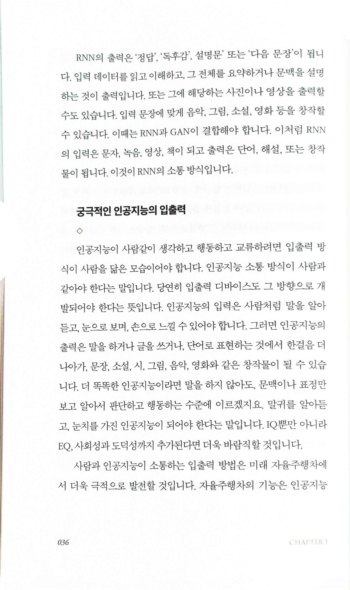

> 인공지능이 사람같이 생각하고 행동하고 교류하려면 입출력 방식이 사람을 닮은 모습이어야 합니다. 인공지능 소통 방식이 사람과 같아야 한다는 말입니다. 당연히 입출력 디바이스도 그 방향으로 개발되어야 한다는 뜻입니다... IQ 뿐만 아니라 EQ, 사회성과 도덕성까지 추가된다면 더욱 바람직할 것입니다.

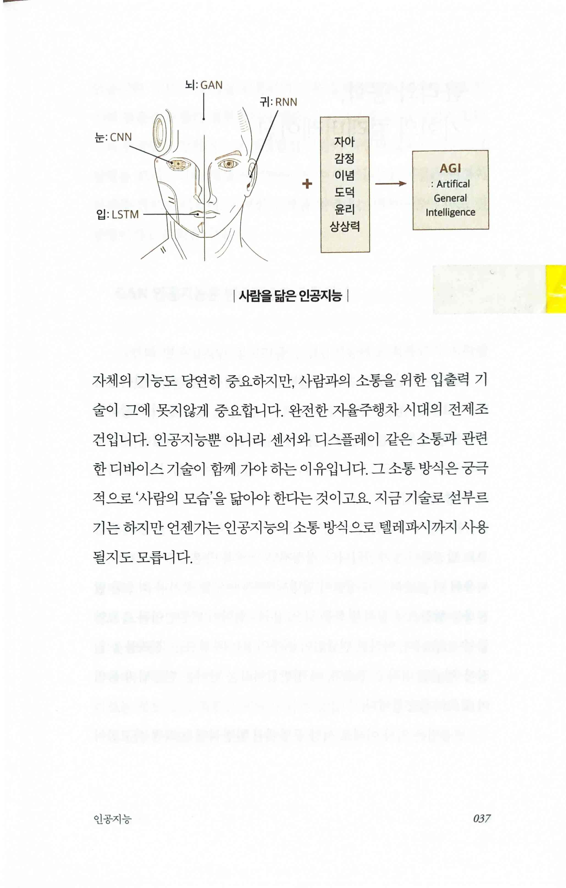

> 눈 : CNN 입: LSTM 뇌 : GAN 귀: RNN + 자아 감정 이념 도덕 윤리 상상력 -> AGI: Artifical General Intelligence

## 윤리와 공학, 기회의 컬래버레이션
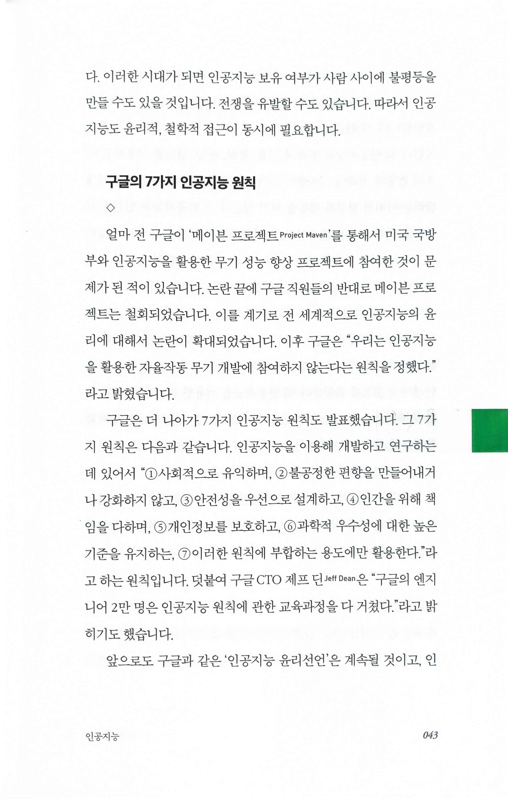

> 구글은 더 나아가 7가지 인공지능 원칙도 발표했습니다. 그 7가지 원칙은 다음과 같습니다. 인공지능을 이용해 개발하고 연구하는데 있어서 “①사회적으로 유익하며, ② 불공정한 편향을 만들어내거나 강화하지 않고, ③ 안전성을 우선으로 설계하고, ④인간을 위해 책임을 다하며, ⑤ 개인정보를 보호하고, ⑥과학적 우수성에 대한 높은 기준을 유지하는, ⑦ 이러한 원칙에 부합하는 용도에만 활용한다."라고 하는 원칙입니다. 덧붙여 구글 CTO 제프 딘Jeft Dean은 "구글의 엔지니어 2만 명은 인공지능 원칙에 관한 교육과정을 다 거쳤다."라고 밝히기도 했습니다.
* Jeff Dean은 구글 CTO였던 적은 없음 [Jeff Dean - Wikipedia](https://en.wikipedia.org/wiki/Jeff_Dean)

## 인공지능이 자아를 가질 때
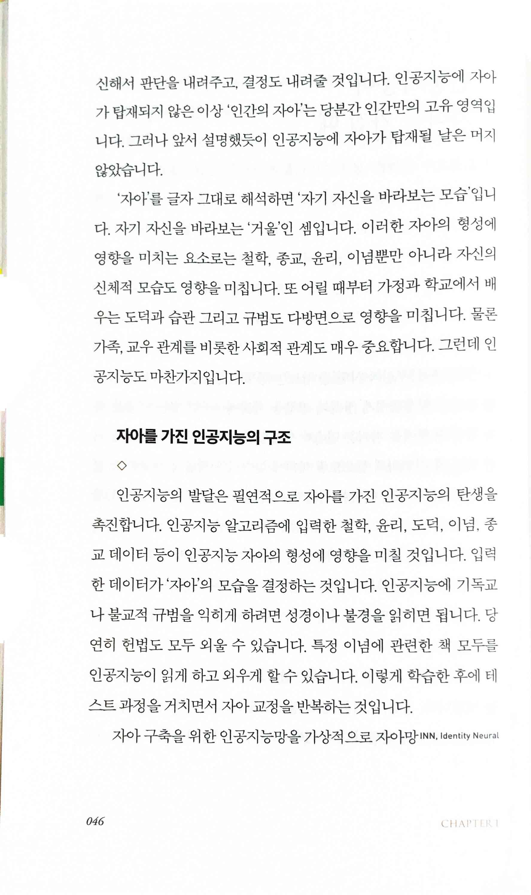 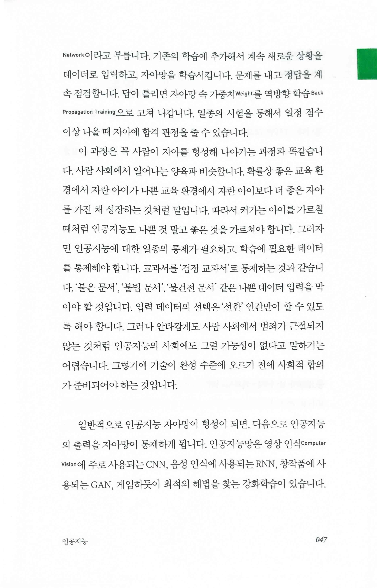

> 인공지능의 발달은 필연적으로 자아를 가진 인공지능의 탄생을 촉진합니다. 인공지능 알고리즘에 입력한 철학, 윤리, 도덕, 이념, 종교 데이터 등이 인공지능 자아의 형성에 영향을 미칠 것입니다. 입력한 데이터가 '자아'의 모습을 결정하는 것입니다.
>
> 자아 구축을 위한 인공지능망을 가상적으로 자아망 INN, Identity Neural Network 이라고 부릅니다. 기존의 학습에 추가해서 계속 새로운 상황을 데이터로 입력하고, 자아망을 학습시킵니다. 문제를 내고 정답을 계속 점검합니다. 답이 틀리면 자아망 속 가중치 Weight를 역방향 학습 Back Propagation Training 으로 고쳐 나갑니다. 일종의 시험을 통해서 일정 점수이상 나올 때 자아에 합격 판정을 줄수 있습니다.
>
> 그러나 안타깝게도 사람 사회에서 범죄가 근절되지 않는 것처럼 인공지능의 사회에도 그럴 가능성이 없다고 말하기는 어렵습니다. 그렇기에 기술이 완성 수준에 오르기 전에 사회적 합의가 준비되어야 하는 것입니다.

> 일반적으로 인공지능 자아망이 형성이 되면, 다음으로 인공지능의 출력을 자아망이 통제하게 됩니다... 일종의 자기 검열입니다. 이 전체 신경망을 '자아 통제 신경망 SINN, Self-Identity Neural Network'이라고 부를 수 있습니다.
>
> 자아가 탑재된 인공지능은 그 자아의 모습에 맞게 행동하고 결정하기 때문에 신뢰도가 향상됩니다. 예측하지 못한 돌발 상황에 대응할 수 있으며, 더 많은 영역에서 사람을 더 대체할 수 있게 됩니다. 단순한 작업뿐만 아니라 복잡한 도덕적 윤리적, 철학적 문제에도 독자적인 결정을 내릴 수 있습니다. 인공지능의 데이터 선택이 얼마만큼 중요한지 보여주는 대목입니다.

## 인공지능을 위한 의료보험 시대가 온다
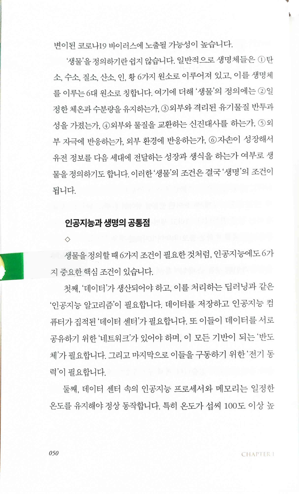 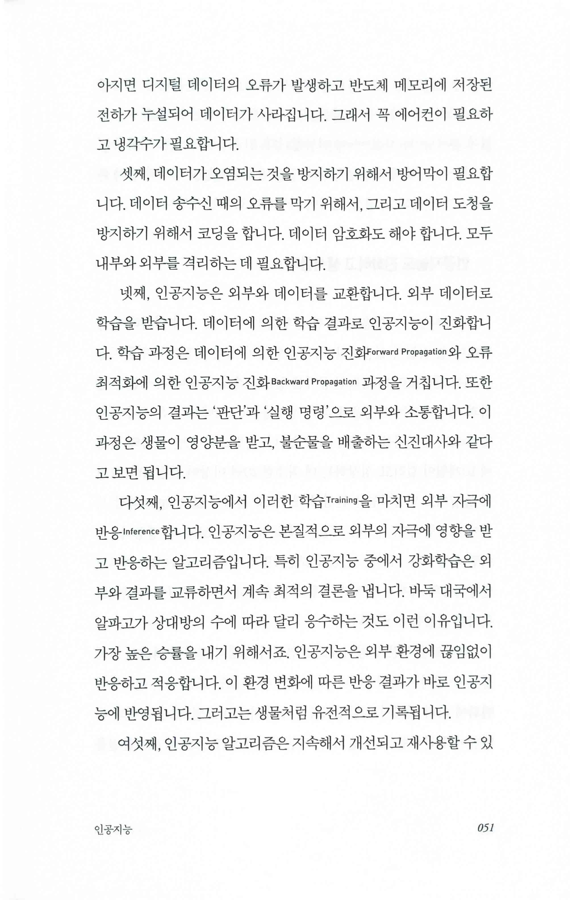 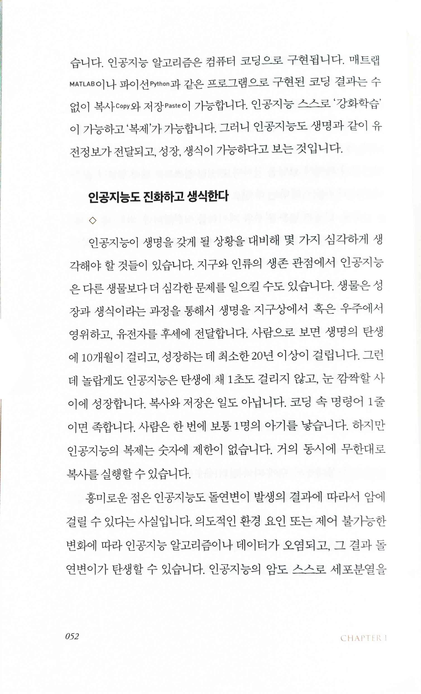 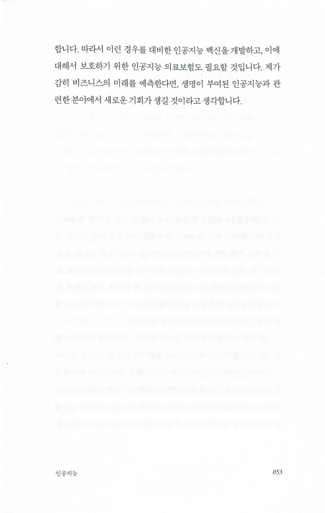

> 생물을 정의할 때 6가지 조건이 필요한 것처럼, 인공지능에도 6가지 중요한 핵심 조건이 있습니다.
>
> 첫째, '데이터'가 생산되어야 하고, 이를 처리하는 딥러닝과 같은 '인공지능 알고리즘'이 필요합니다.
>
> 둘째, 데이터 센터 속의 인공지능 프로세서와 메모리는 일정한 온도를 유지해야 정상 동작합니다.
>
> 셋째, 데이터가 오염되는 것을 방지하기 위해서 방어막이 필요합니다.
>
> 넷째, 인공지능은 외부와 데이터를 교환합니다.
>
> 다섯째, 인공지능에서 이러한 학습 Training을 마치면 외부 자극에 반응 Inference 합니다.
>
> 여섯째, 인공지능 알고리즘은 지속해서 개선되고 재사용할 수 있습니다.
>
> 흥미로운 점은 인공지능도 돌연변이 발생의 결과에 따라서 암에 걸릴 수 있다는 사실입니다. 의도적인 환경 요인 또는 제어 불가능한 변화에 따라 인공지능 알고리즘이나 데이터가 오염되고, 그 결과 돌연변이가 탄생할 수 있습니다. 인공지능의 암도 스스로 세포분열을 합니다. 따라서 이런 경우를 대비한 인공지능 백신을 개발하고, 이에 대해서 보호하기 위한 인공지능 의료보험도 필요할 것입니다. 제가 감히 비즈니스의 미래를 예측한다면, 생명이 부여된 인공지능과 관련한 분야에서 새로운 기회가 생길 것이라고 생각합니다.

## 인공지능의 치매를 막아라
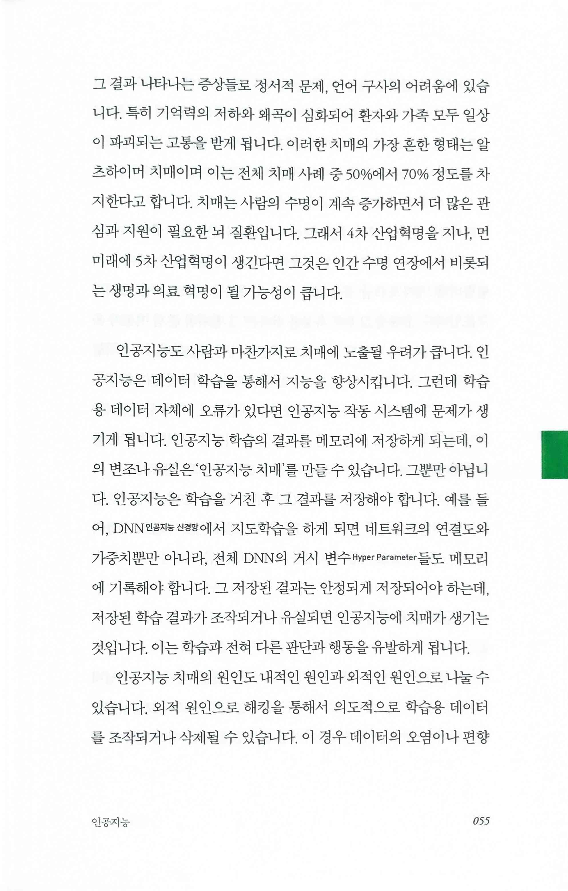

> 인공지능도 사람과 마찬가지로 치매에 노출될 우려가 큽니다. 인공지능은 데이터 학습을 통해서 지능을 향상시킵니다. 그런데 학습용 데이터 자체에 오류가 있다면 인공지능 작동 시스템에 문제가 생기게 됩니다. 인공지능 학습의 결과를 메모리에 저장하게 되는데, 이의 변조나 유실은 '인공지능 치매'를 만들 수 있습니다. 그뿐만 아닙니다. 인공지능은 학습을 거친 후 그 결과를 저장해야 합니다. 예를 들어, DNN 인공지능 신경망에서 지도학습을 하게 되면 네트워크의 연결도와 가중치뿐만 아니라, 전체 DNN의 거시 변수 Hyper Parameter들도 메모리에 기록해야 합니다. 그 저장된 결과는 안정되게 저장되어야 하는데, 저장된 학습 결과가 조작되거나 유실되면 인공지능에 치매가 생기는 것입니다. 이는 학습과 전혀 다른 판단과 행동을 유발하게 됩니다.

## 기술과 함께 사라지는 사람들
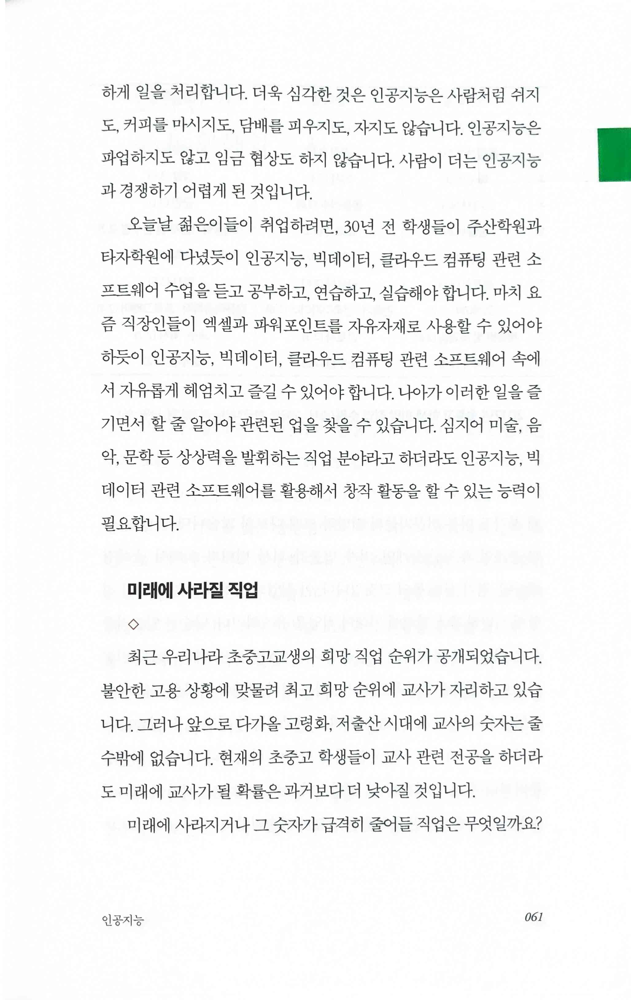

> 인공지능은 사람처럼 쉬지도, 커피를 마시지도, 담배를 피우지도 자지도 않습니다. 인공지능은 파업하지도 않고 임금 협상도 하지 않습니다. 사람이 더는 인공지능과 경쟁하기 어렵게 된 것입니다.

## 인류만의 특권, 화해와 용서
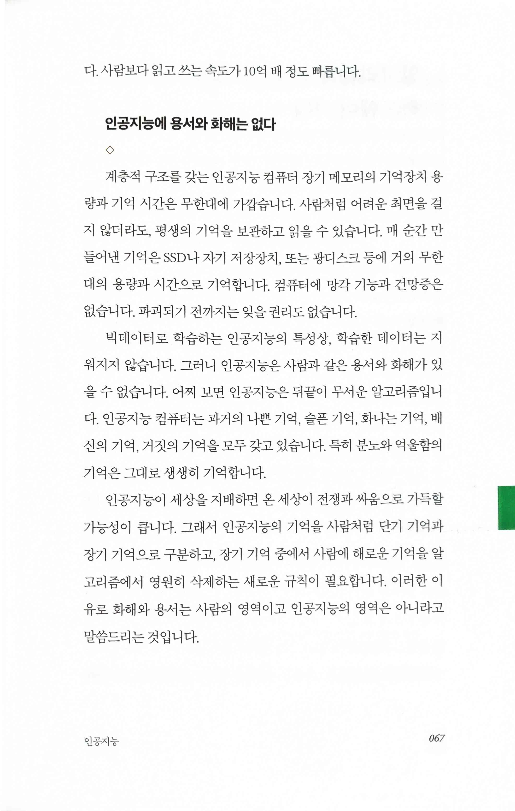

> 인공지능이 세상을 지배하면 온 세상이 전쟁과 싸움으로 가득할 가능성이 큽니다. 그래서 인공지능의 기억을 사람처럼 단기 기억과 장기 기억으로 구분하고, 장기 기억 중에서 사람에 해로운 기억을 알고리즘에서 영원히 삭제하는 새로운 규칙이 필요합니다. 이러한 이유로 화해와 용서는 사람의 영역이고 인공지능의 영역은 아니라고 말씀드리는 것입니다.

## 알고리즘과 하드웨어 파워
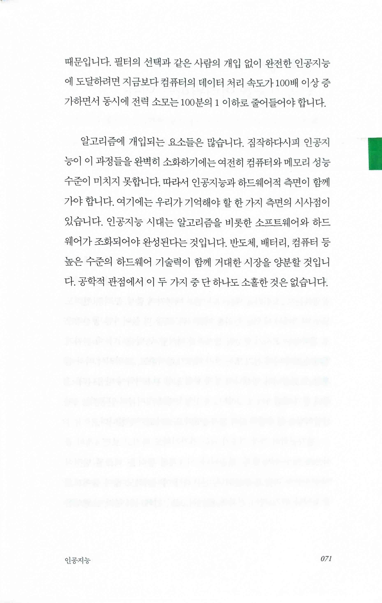

> 인공지능 시대는 알고리즘을 비롯한 소프트웨어와 하드웨어가 조화되어야 완성된다는 것입니다. 반도체, 배터리, 컴퓨터 등 높은 수준의 하드웨어 기술력이 함께 거대한 시장을 양분할 것입니다. 공학적 관점에서 이 두 가지 중 단 하나도 소홀한 것은 없습니다.

## 공학계가 인공지능을 어려워하는 이유
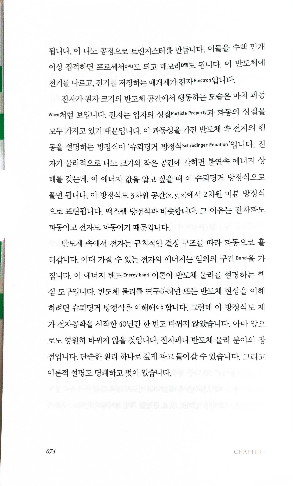

> 전자파나 반도체 물리 분야의 장점입니다. 단순한 원리 하나로 깊게 파고 들어갈 수 있습니다. 그리고 이론적 설명도 명쾌하고 멋이 있습니다.

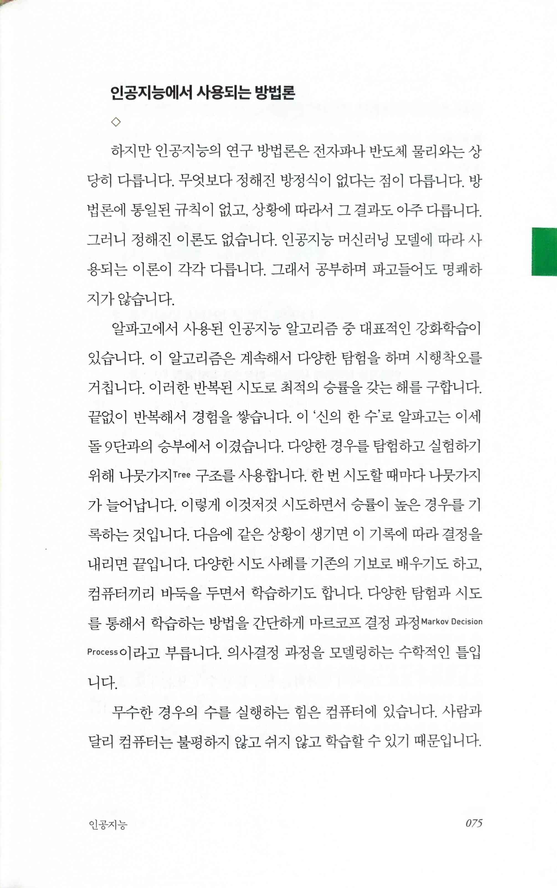

> 하지만 인공지능의 연구 방법론은 전자파나 반도체 물리와는 상당히 다릅니다. 무엇보다 정해진 방정식이 없다는 점이 다릅니다. 방법론에 통일된 규칙이 없고, 상황에 따라서 그 결과도 아주 다릅니다. 그러니 정해진 이론도 없습니다. 인공지능 머신러닝 모델에 따라 사용되는 이론이 각각 다릅니다. 그래서 공부하며 파고들어도 명쾌하지가 않습니다.
>
> 다양한 탐험과 시도를 통해서 학습하는 방법을 간단하게 마르코프 결정 과정 Markov Decision Process 이라고 부릅니다. 의사결정 과정을 모델링하는 수학적인 틀입니다.

## 인공지능 전문가가 되기 위한 두 가지 방법
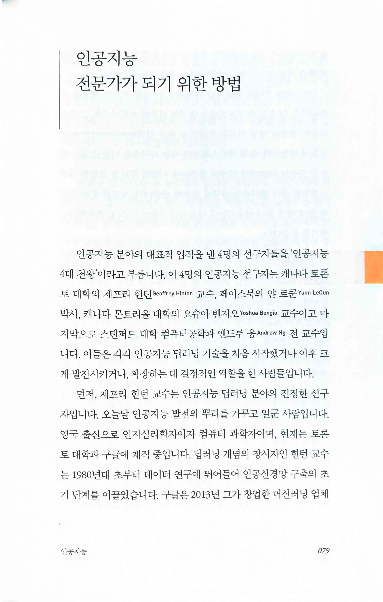 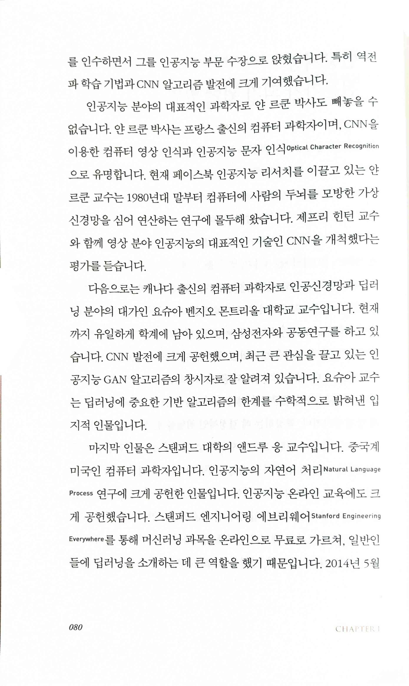 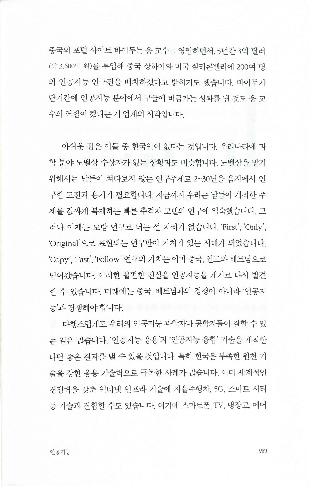

> '인공지능 4대 천왕'은 캐나다 토론토 대학의 제프리 힌턴 Geoffrey Hinton 교수, 페이스북의 얀 르쿤 Yann Lecun 박사, 캐나다 몬트리올 대학의 요슈아 벤지오 Yoshua Bengio 교수이고 마지막으로 스탠퍼드 대학 컴퓨터공학과 앤드루 응Andrew Ng 전 교수입니다.

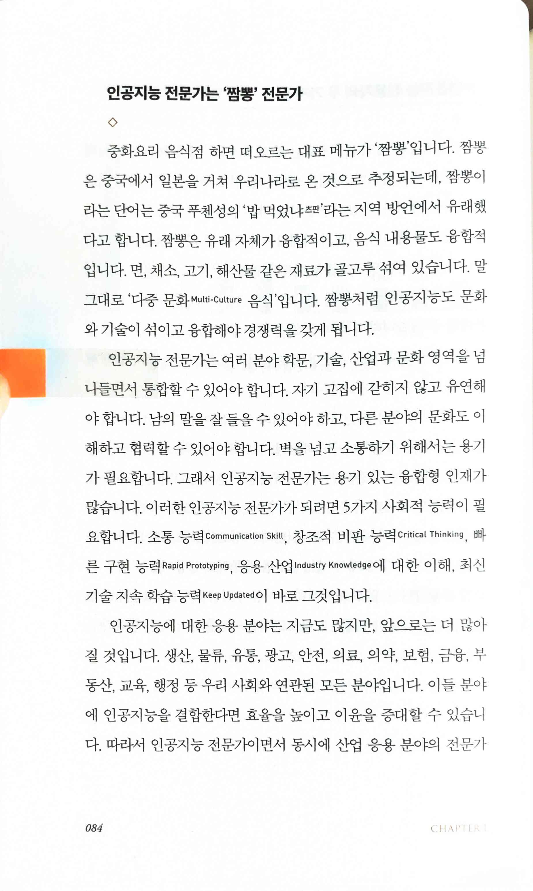

> 인공지능 전문가는 여러 분야 학문, 기술, 산업과 문화 영역을 넘나들면서 통합할 수 있어야 합니다. 자기 고집에 갇히지 않고 유연해야 합니다. 남의 말을 잘 들을 수 있어야 하고, 다른 분야의 문화도 이해하고 협력할 수 있어야 합니다. 벽을 넘고 소통하기 위해서는 용기가 필요합니다. 그래서 인공지능 전문가는 용기 있는 융합형 인재가 많습니다. 이러한 인공지능 전문가가 되려면 5가지 사회적 능력이 필요합니다. 소통 능력 Communication Skill, 창조적 비판 능력 Critical Thinking, 빠른 구현 능력 Rapid Prototyping, 응용 산업 Industry Knowledge 에 대한 이해, 최신기술지속 학습 능력 Keep Updated 이 바로 그것입니다

## 인공지능은 아름다움을 느낀다
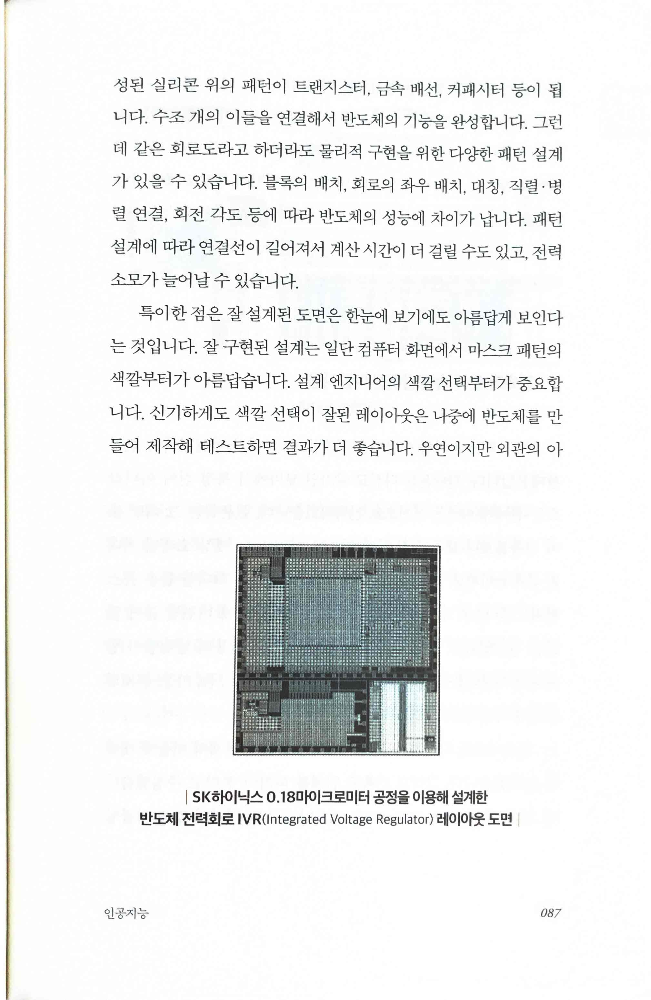 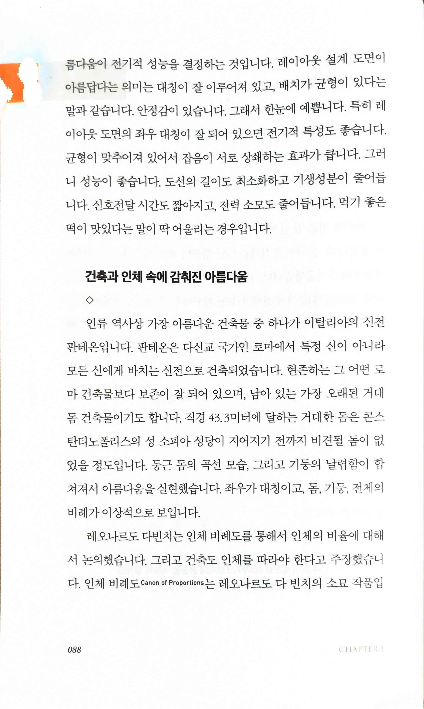

> 특이한 점은 잘 설계된 도면은 한눈에 보기에도 아름답게 보인다는 것입니다. 잘 구현된 설계는 일단 컴퓨터 화면에서 마스크 패턴의 색깔부터가 아름답습니다. 설계 엔지니어의 색깔 선택부터가 중요합니다. 신기하게도 색깔 선택이 잘된 레이아웃은 나중에 반도체를 만들어 제작해 테스트하면 결과가 더 좋습니다. 우연이지만 외관의 아름다움이 전기적 성능을 결정하는 것입니다. 레이아웃 설계 도면이 아름답다는 의미는 대칭이 잘 이루어져 있고, 배치가 균형이 있다는 말과 같습니다. 안정감이 있습니다. 그래서 한눈에 예쁩니다. 특히 레이아웃 도면의 좌우 대칭이 잘 되어 있으면 전기적 특성도 좋습니다. 균형이 맞추어져 있어서 잡음이 서로 상쇄하는 효과가 큽니다. 그러니 성능이 좋습니다. 도선의 길이도 최소화하고 기생성분이 줄어듭니다. 신호전달 시간도 짧아지고, 전력 소모도 줄어듭니다. 먹기 좋은 떡이 맛있다는 말이 딱 어울리는 경우입니다.

## 거울과 꽃 그리고 인공지능

> 인공지능 특이점 singularity이 와도 아마 이러한 이유로 인공지능이 모두를 감동케 할 시를 쓰기에는 여전히 쉽지 않을 것입니다. 인공지능이 이러한 시를 쓸 수 있으려면, 단어의 뜻과 그 뉘앙스를 이해해야 합니다. 거기에 더해 역사, 관계, 연관성도 경험해야 합니다. 사물 특유의 냄새, 소리, 이미지까지도 기억하고 상상해야 합니다. 별, 바람, 풀, 바다, 비 등을 생각하면 그 소리도 기억해야 합니다. 거기에 사람이 공유할 수 있는 추억도 담겨야 합니다. 은유, 직유와 같은 비유법도 이해하고 쓸 수 있으려면 그만큼의 지능과 학습 기법이 필요합니다.

## 지금까지 없던 새로운 일자리의 탄생
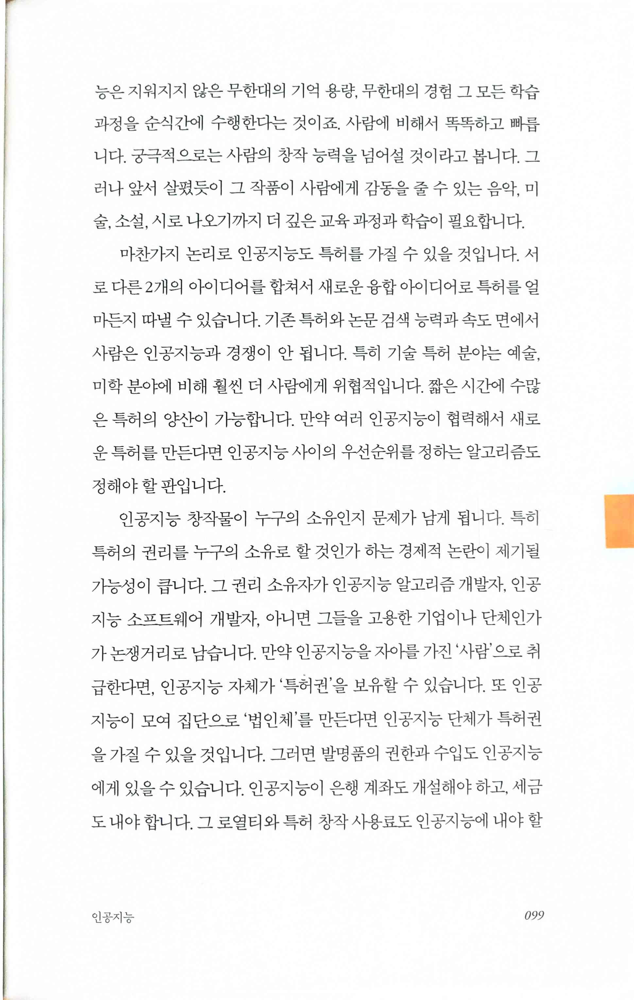

> 인공지능 창작물이 누구의 소유인지 문제가 남게 됩니다. 특히 특허의 권리를 누구의 소유로 할 것인가 하는 경제적 논란이 제기될 가능성이 큽니다. 그 권리 소유자가 인공지능 알고리즘 개발자, 인공지능 소프트웨어 개발자, 아니면 그들을 고용한 기업이나 단체인가가 논쟁거리로 남습니다. 만약 인공지능을 자아를 가진 '사람'으로 취급한다면, 인공지능 자체가 '특허권'을 보유할 수 있습니다. 또 인공지능이 모여 집단으로 '법인체'를 만든다면 인공지능 단체가 특허권을 가질 수 있을 것입니다.

# CHAPTER 2 빅데이터 문제는 속도가 아니라 방향이다

## '빅데이터 '공학' 플랫폼이 희망이다

## 4차 산업혁명은 '센서'의 시대다

## 블록체인의 시대, 비트코인이 말하는 것

## 바닷속 빅데이터 네트워크 전쟁

## 하늘 위의 빅데이터 네트워크

## 데이터 전쟁'의 최종 승자는 누구인가

# CHAPTER 3 클라우드와 컴퓨터 아직 열리지 않은 대융합의 시대

## 클라우드 컴퓨팅이 설계까지 하는 이유

## 클라우드 컴퓨팅의 감춰진 의도

## 통신사가 생존할 수 있는 '필수' 선택지

## 5G 시대는 아직 열리지 않았다

## 모터 이론과 휴머노이드 로봇

## 무선충전 기술, 어디까지 와 있나

## 지금까지 없던 물질혁명이 필요하다
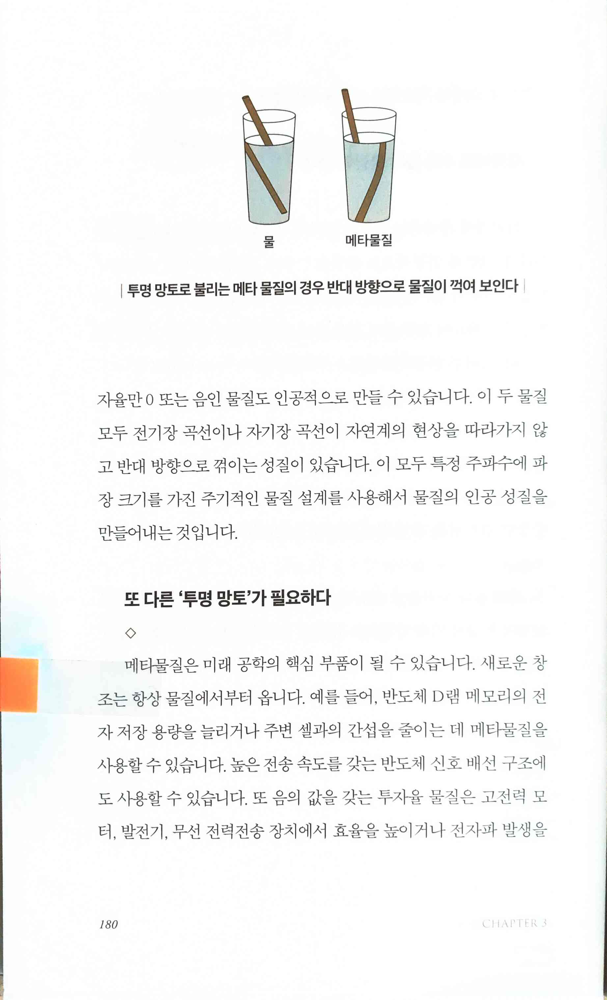

> 메타물질은 미래 공학의 핵심 부품이 될 수 있습니다. 새로운 창조는 항상 물질에서부터 옵니다.

## 비무장 지대 경계와 인공지능 센서

# CHAPTER 4 반도체 반도체 혁신이 우리가 갈길이다

## 컴퓨터는 인내심이 부족하다

## 실리콘 반도체 세상은 바뀌지 않는다

## 인공지능 반도체의 미래 방향
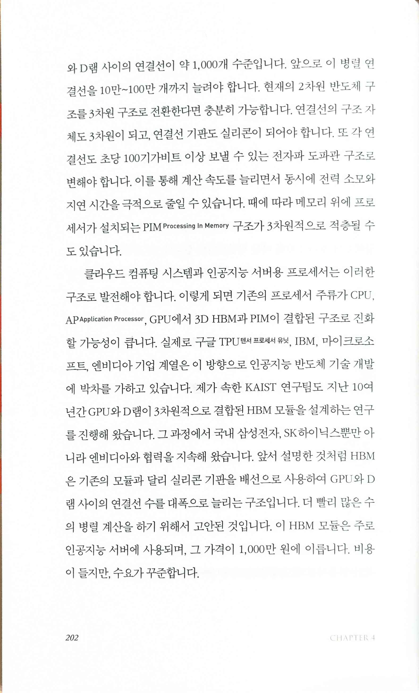

> 기존의 프로세서 주류가 CPU, AP Application Processor, GPU에서 3D HBM과 PIM Processing In Memory이 결합된 구조로 진화할 가능성

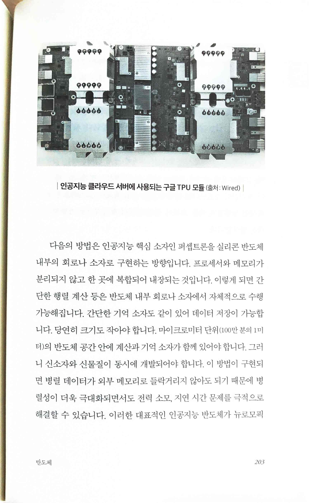 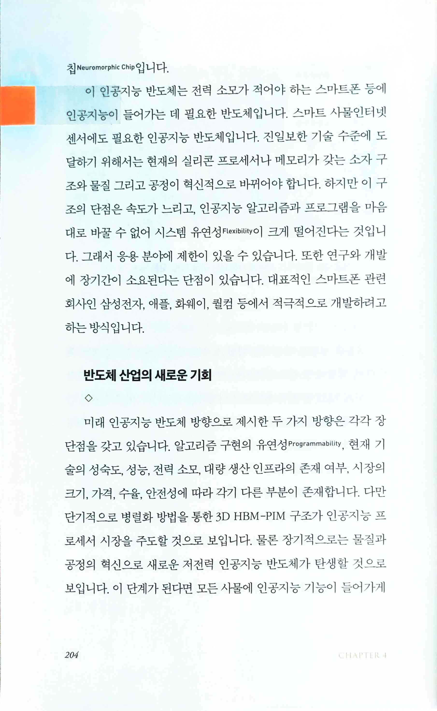

> 인공지능 핵심 소자인 퍼셉트론을 실리콘 반도체 내부의 회로나 소자로 구현하는 방향입니다. 프로세서와 메모리가 분리되지 않고 한 곳에 복합되어 내장되는 것입니다... 이러한 대표적인 인공지능 반도체가 뉴로모픽 칩Neuromorphic Chip 입니다.
>
> 미래 인공지능 반도체 방향으로 제시한 두 가지 방향은 각각 장단점을 갖고 있습니다. 알고리즘 구현의 유연성 Programmability, 현재 기술의 성숙도, 성능, 전력 소모, 대량 생산 인프라의 존재 여부, 시장의 크기, 가격, 수율, 안전성에 따라 각기 다른 부분이 존재합니다. 다만 단기적으로 병렬화 방법을 통한 3D HBM-PIM 구조가 인공지능 프로세서 시장을 주도할 것으로 보입니다. 물론 장기적으로는 물질과 공정의 혁신으로 새로운 저전력 인공지능 반도체가 탄생할 것으로 보입니다.

## 반도체 기술, '경험'에만 의지할 수 없다

## 3번 만난 아인슈타인, 3번의 교훈
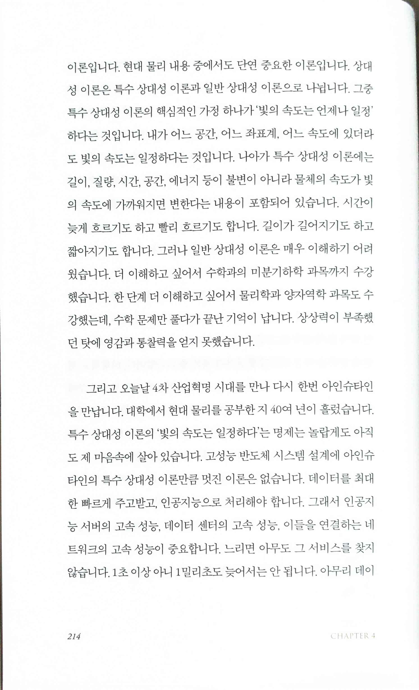 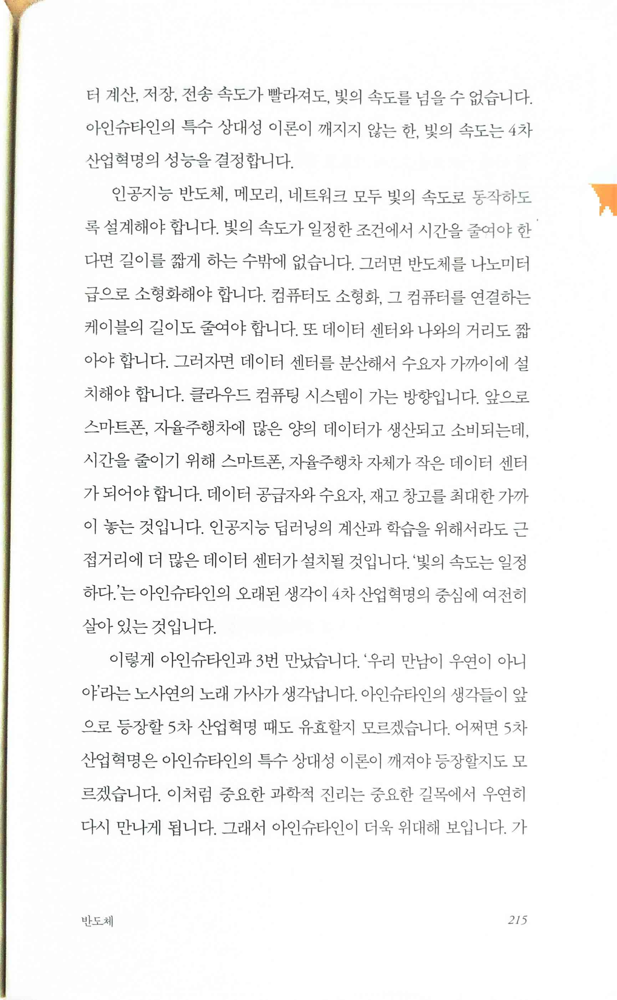

> 고성능 반도체 시스템 설계에 아인슈타인의 특수상대성 이론만큼 멋진 이론은 없습니다. 데이터를 최대한 빠르게 주고받고, 인공지능으로 처리해야 합니다. 그래서 인공지능 서버의 고속 성능, 데이터 센터의 고속 성능, 이들을 연결하는 네트워크의 고속 성능이 중요합니다. 느리면 아무도 그 서비스를 찾지 않습니다. 1초 이상 아니 1 밀리초도 늦어서는 안 됩니다. 아무리 데이터 계산, 저장, 전송 속도가 빨라져도, 빛의 속도를 넘을 수 없습니다. 아인슈타인의 특수 상대성 이론이 깨지지 않는 한, 빛의 속도는 4차 산업혁명의 성능을 결정합니다.

## '동기화 기술'에 미래가 달려 있다
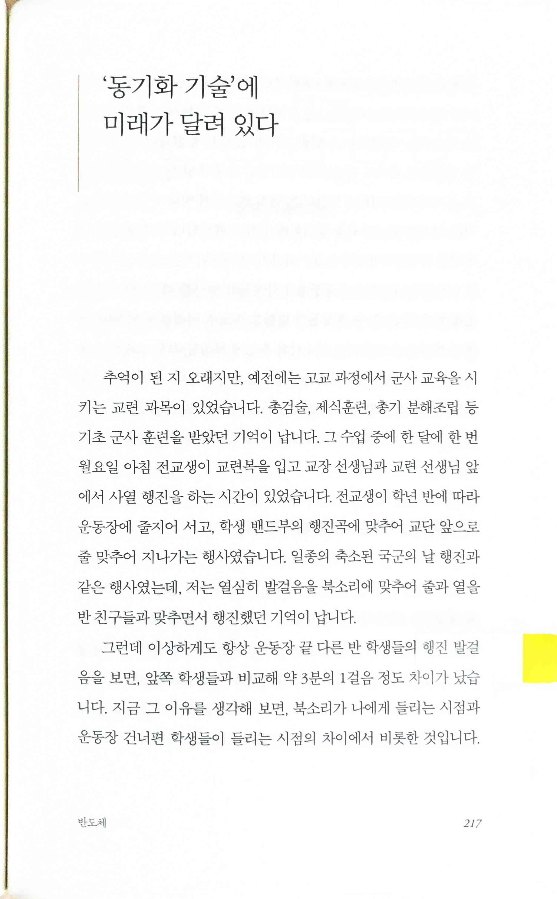 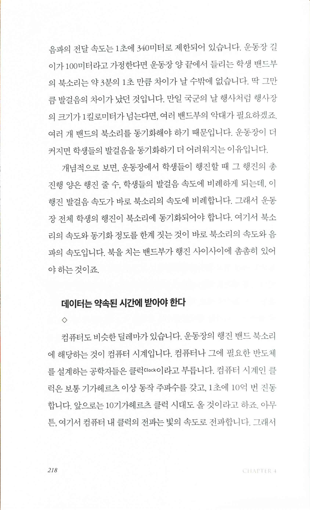

* clock에 대한 운동장 행진 비유. 간단하지만 이해하기 쉬운 좋은 비유라고 생각한다.

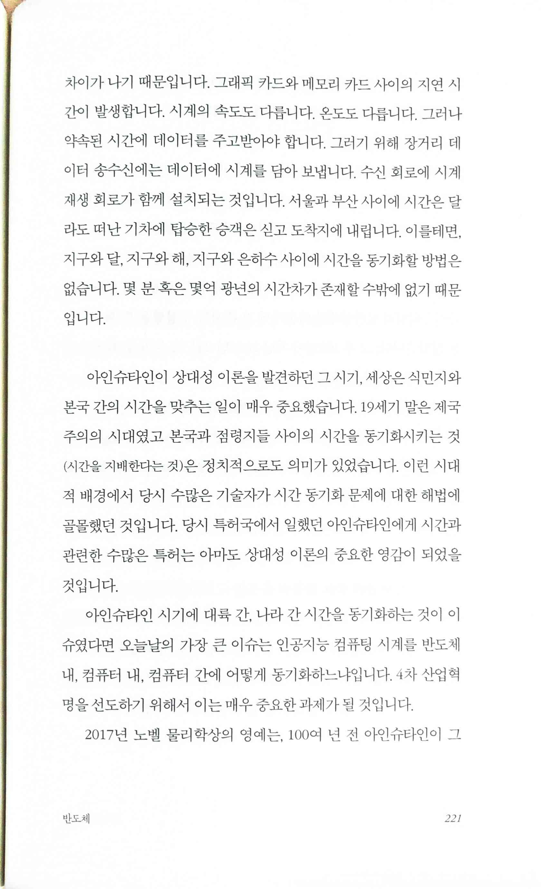

* 상대성 이론과 식민지와 본국 간의 시간 동기화. 제국주의 시대에 이런 일이 정치적으로 의미가 있을 거란 생각은 안 해봤는데 씁쓸하지만 역시 이해하기 쉬운 좋은 비유라고 생각한다.

## 반도체가 자주독립의 길을 이끈다

# CHAPTER 5 수학 '행렬'과 '확률의 시대가 온다

## 수학이 최고의 경쟁력이다

## 유튜브에 행렬이 필요한 이유

## 미래는 2진법 세상이다

## 이산수학이 머신러닝을 이끈다

## '잘 찍는' 인재가 성공한다
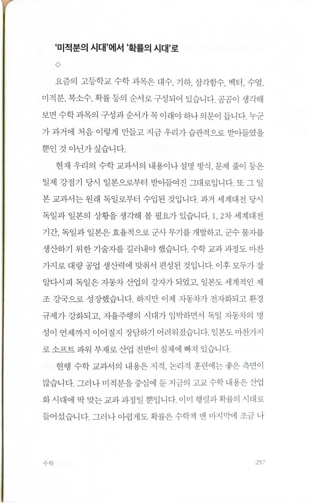

> '미적분의 시대'에서 '확률의 시대'로
>
> 현재 우리의 수학 교과서의 내용이나 설명 방식, 문제 풀이 등은 일제 강점기 당시 일본으로부터 받아들여진 그대로입니다... 수학 교과 과정도 마찬가지로 대량 공업 생산력에 맞춰서 편성된 것입니다.
>
> 현행 수학 교과서의 내용은 지적, 논리적 훈련에는 좋은 측면이 많습니다. 그러나 미적분을 중심에 둔 지금의 고교 수학 내용은 산업화 시대에 딱 맞는 교과 과정일 뿐입니다. 이미 행렬과 확률의 시대로 들어섰습니다.

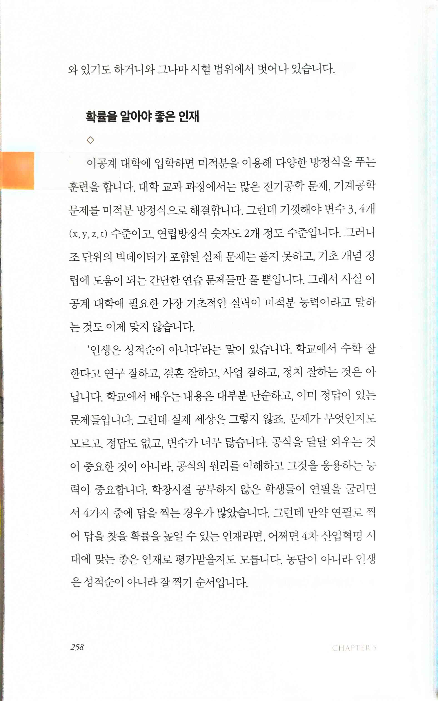

> '인생은 성적순이 아니다'라는 말이 있습니다. 학교에서 수학 잘한다고 연구 잘하고, 결혼 잘하고, 사업 잘하고, 정치 잘하는 것은 아닙니다. 학교에서 배우는 내용은 대부분 단순하고, 이미 정답이 있는 문제들입니다. 그런데 실제 세상은 그렇지 않죠. 문제가 무엇인지도 모르고, 정답도 없고, 변수가 너무 많습니다. 공식을 달달 외우는 것이 중요한 것이 아니라, 공식의 원리를 이해하고 그것을 응용하는 능력이 중요합니다.

## 불확정성 이론과 4차 산업혁명

## 축적의 시간, 축적의 수학

## 자연계의 위대한 곡선, 삼각함수

# CHAPTER 6 인재 누구를 어떻게 길러야하는가

## 성적에 갇힌 공학의 딜레마

## 창의력 고갈과 블록체인의 발상

## 미국 박사학위가 기술 진보를 막는다

## 창의의 시대, '거꾸로 강의'가 이끈다

## 우리는 2차 산업혁명의 시간에 멈춰 있다
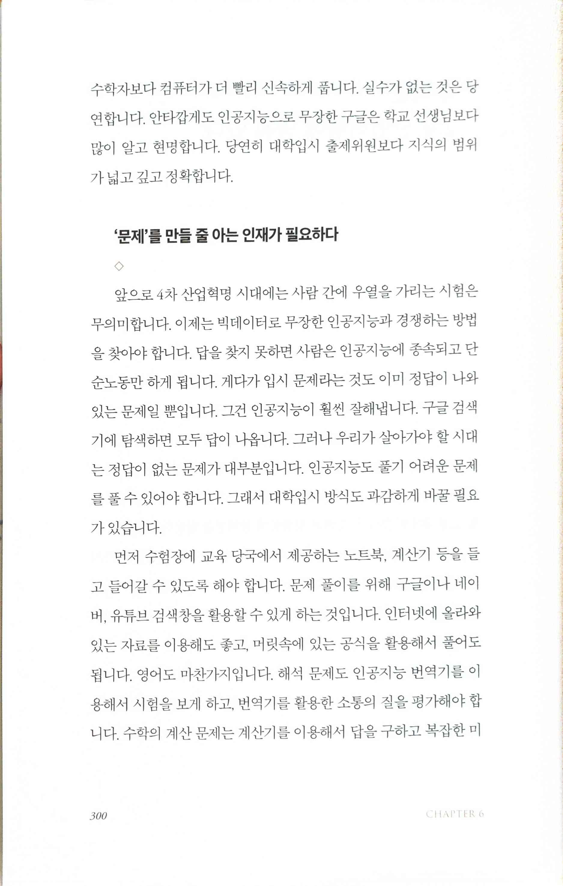

> 앞으로 4차 산업혁명 시대에는 사람 간에 우열을 가리는 시험은무의미합니다. 이제는 빅데이터로 무장한 인공지능과 경쟁하는 방법을 찾아야 합니다. 답을 찾지 못하면 사람은 인공지능에 종속되고 단순노동만 하게 됩니다. 게다가 입시 문제라는 것도 이미 정답이 나와있는 문제일 뿐입니다. 그건 인공지능이 훨씬 잘해냅니다. 구글 검색기에 탐색하면 모두 답이 나옵니다. 그러나 우리가 살아가야 할 시대는 정답이 없는 문제가 대부분입니다. 인공지능도 풀기 어려운 문제를 풀수 있어야 합니다. 그래서 대학입시 방식도 과감하게 바꿀 필요가 있습니다.

> 사람이 정답이 있는 문제 풀이로 인공지능을 이길 방법이란 없습니다. 지금처럼 틀에 박힌 교육에 집착하면 인공지능에게 노동력을 제공하는 노예로 전락할 뿐입니다.

## 코딩은 대화의 방법일 뿐이다

## 세계는 지금 우리의 인재를 빼앗고 있다

## 추격자 모델에서 선도자 모델로 가자

# EPILOGUE | 공학의 미래에는 '따뜻한 인간'이 있다