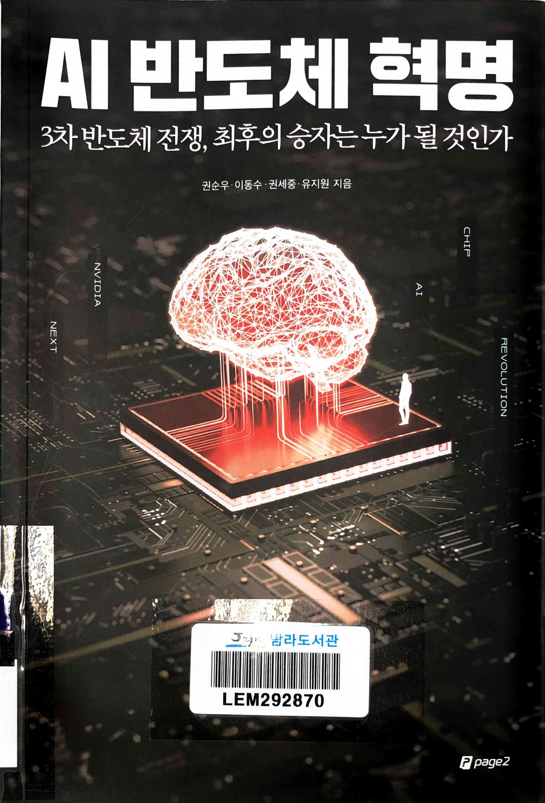
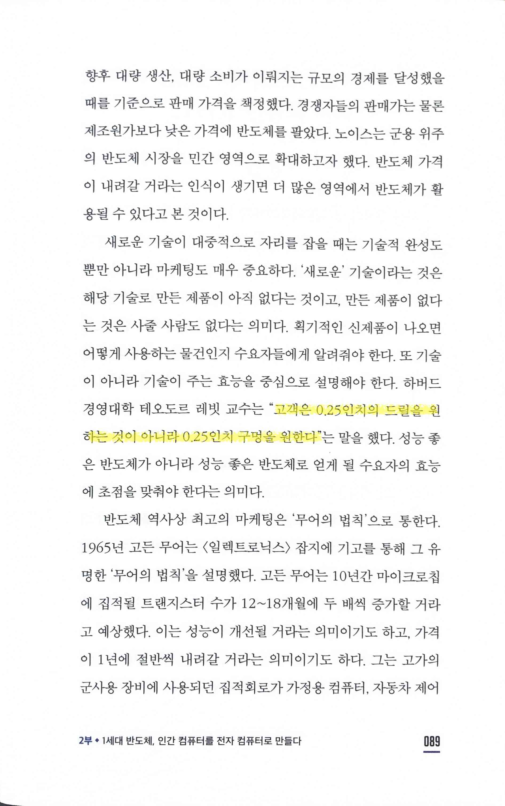
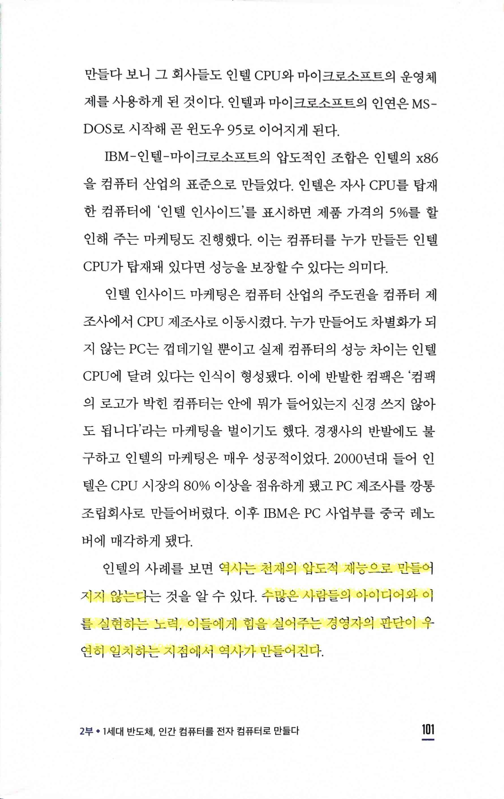
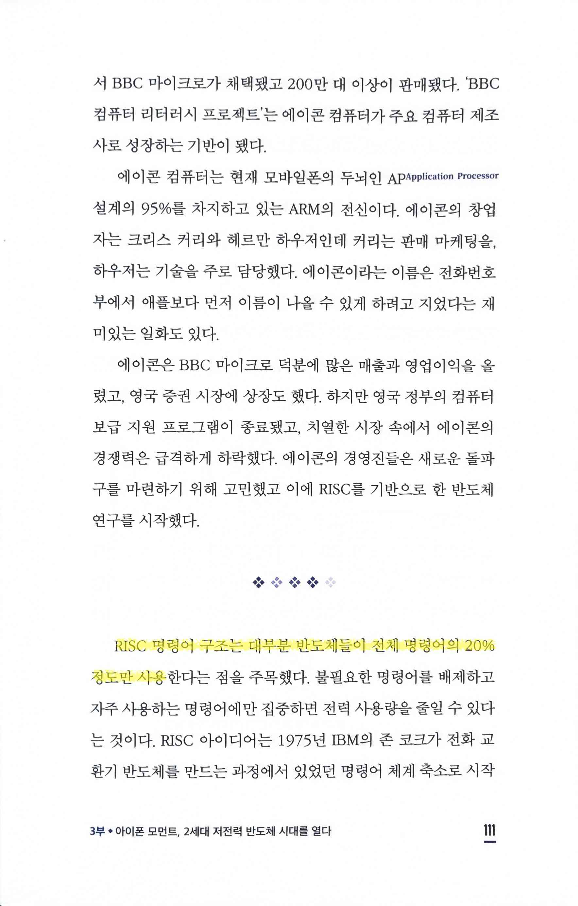
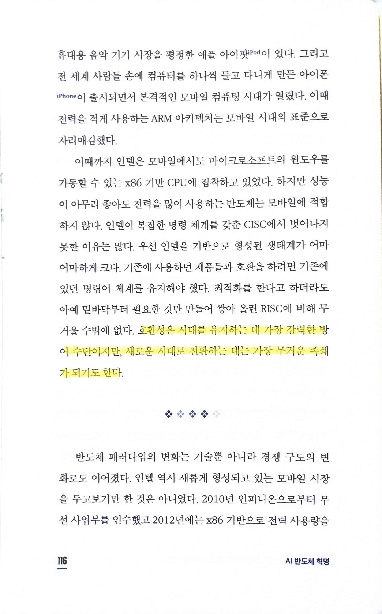

# AI 반도체 혁명

Tags: artificial-intelligence
Date: December 3, 2024 → December 5, 2024
Score: ★★★☆☆

- ★★★☆☆ December 3, 2024 → December 5, 2024
- p89 “고객은 0.25인치의 드릴을 원하는 것이 아니라 0.25인치 구멍을 원한다”

    

    - [“People don’t want to buy a quarter-inch drill. They want a quarter-inch hole!” : Marvin Amm's Blog](https://blogs.ubc.ca/marvinamm/2011/09/26/people-dont-want-to-buy-a-quarter-inch-drill-they-want-a-quarter-inch-hole/)
    - https://hbr.org/2005/12/marketing-malpractice-the-cause-and-the-cure
- p101 역사는 천재의 압도적 재능으로 만들어지지 않는다는 것을 알 수 있다. 수많은 사람들의 아이디어와 이를 실현하는 노력, 이들에게 힘을 실어주는 경영자의 판단이 우연히 일치하는 지점에서 역사가 만들어진다

    

- p111 RISC 명령어 구조는 대부분 반도체들이 전체 명령어의 20% 정도만 사용 → 파레토의 법칙과도 연결이 되는 듯

    

- p116 호환성은 시대를 유지하는 데 가장 강력한 방어 수단이지만, 새로운 시대로 전환하는 데는 가장 무거운 족쇄가 되기도 한다.

    
