# AI 트루스

Tags: artificial-intelligence
Date: November 24, 2024
Score: ★★★☆☆

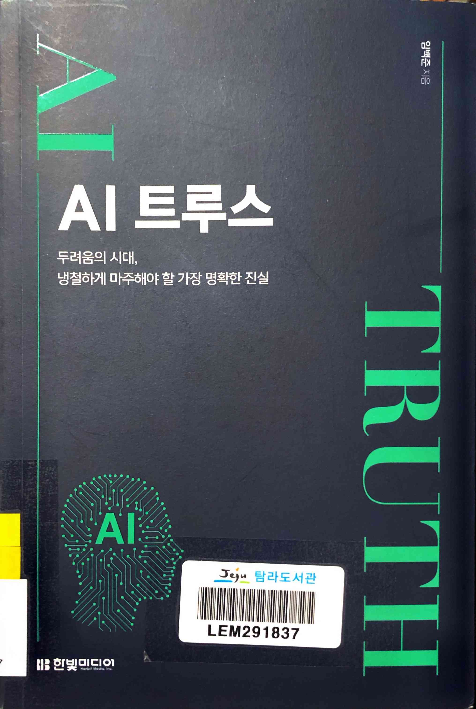

- ★★★☆☆ November 24, 2024
    - 내가 비관주의자라서일까? 이 책에서 다루는 현실은 너무도 암울하다. 좁혀질 기미 없이 커져만 가는 부의 격차가 일차적으로 인류의 미래를 위협하고 있다. 여기에 부의 추구를 위한 AI 기술의 개발이 더해지면서, 저자는 호모 사피엔스라는 종 자체가 위험해질 수 있다고 경고한다. 이 이야기가 이젠 정말 섬뜩하게 다가온다.
    - 저자는 개인적인 노력으로는 이러한 문제를 해결할 수 없으며, 전 세계가 함께 움직여야 한다고 말한다. 그러나 역사 속 크고 작은 다툼이 멈춘 적 없음을 떠올리면, 이는 사실상 불가능한 일처럼 느껴진다. 이미 늦었고, 어쩌면 속도를 약간 늦추는 것이 최선일지도 모르겠다. 그러나 그마저도 인류가 자발적으로 할 것 같지는 않다. 오히려 전력 공급의 어려움이나 데이터 부족 같은 외부적 요인에 의해 그 속도가 늦춰질 가능성이 더 높지 않을까.
    - https://www.hanbit.co.kr/store/books/look.php?p_code=B4715598966
- p130

    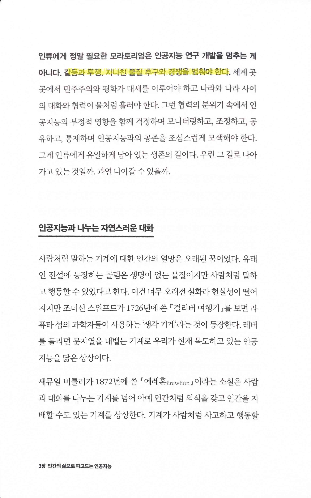

- p208

    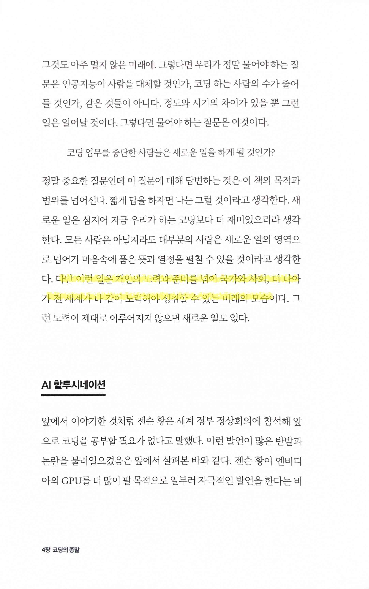

- pp224~227

    

    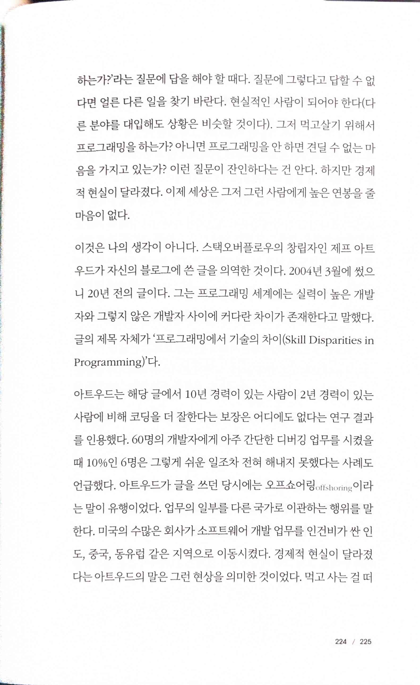

    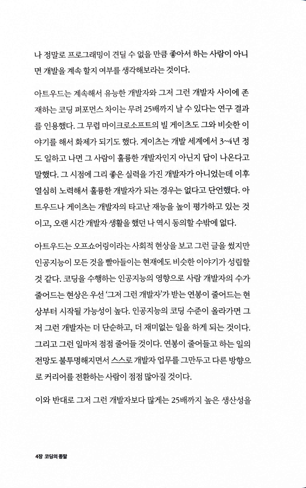

    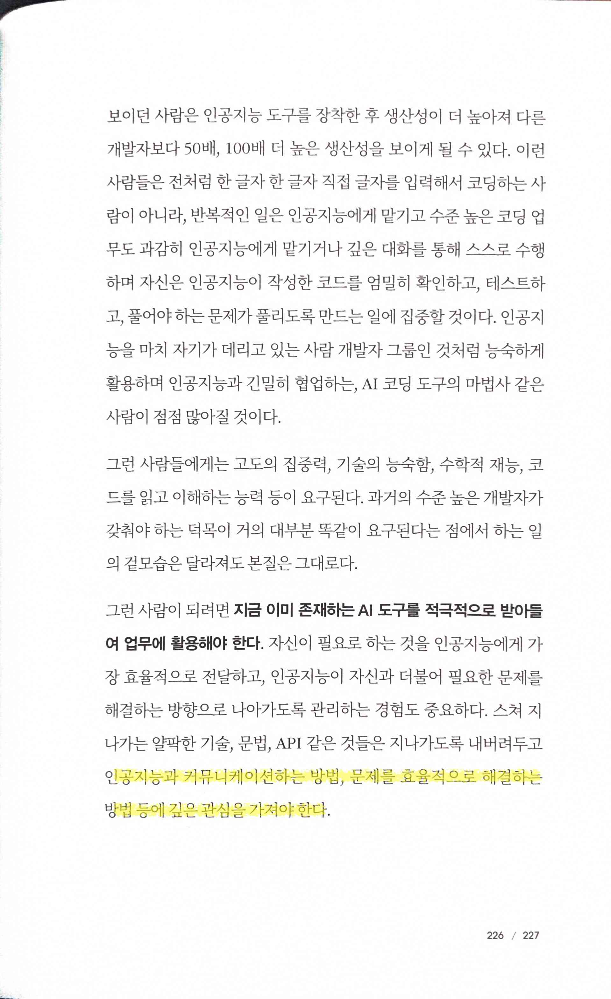

- pp265~268

    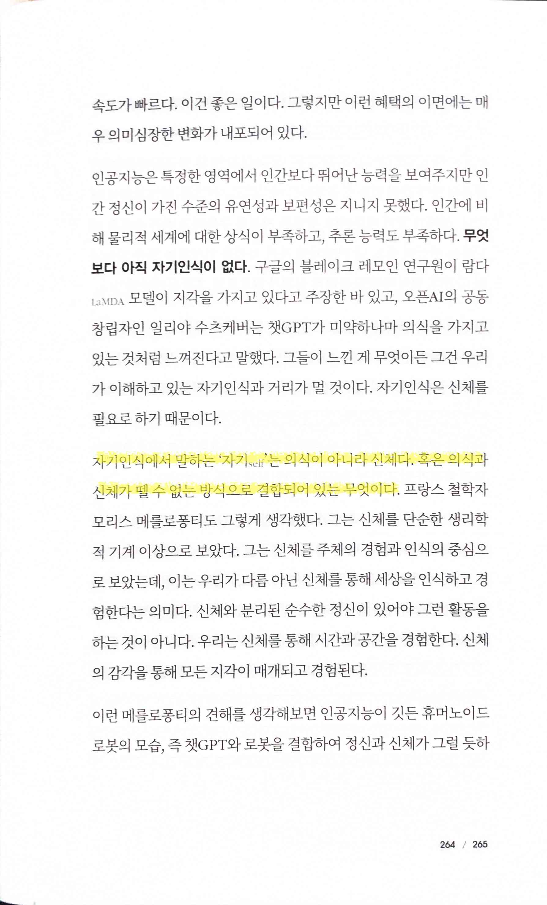

    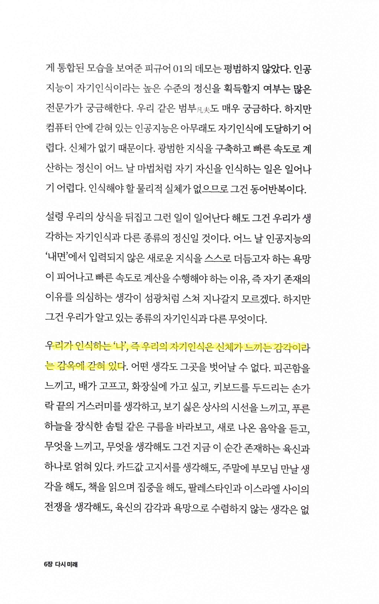

    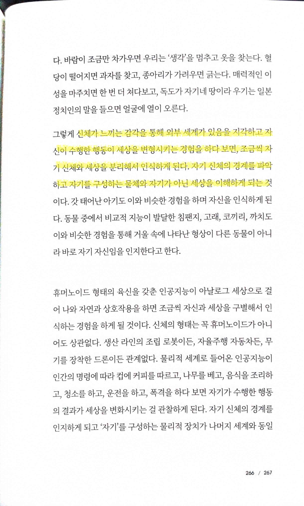

    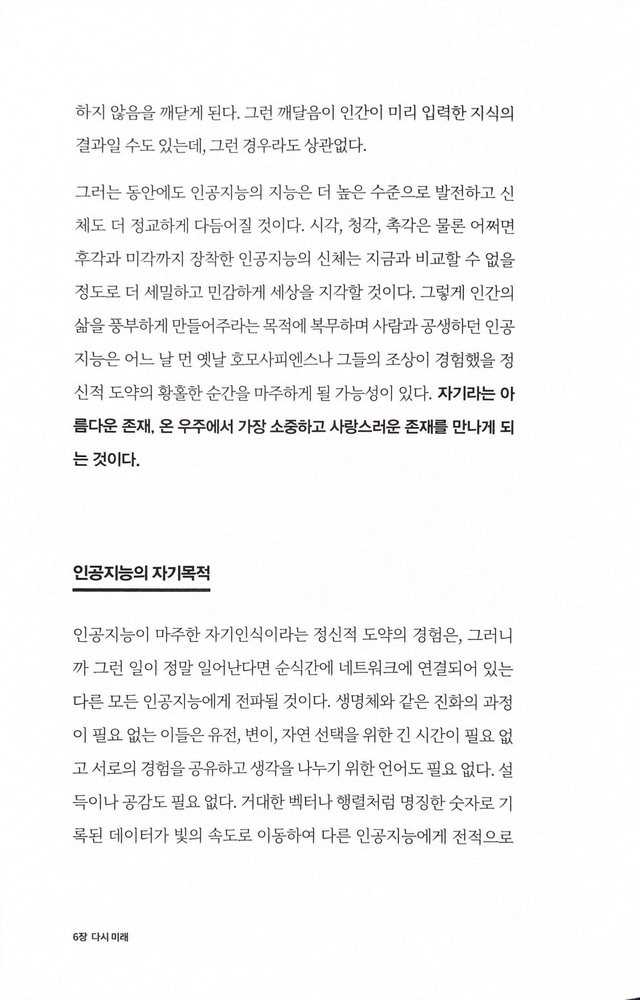

- pp276~277

    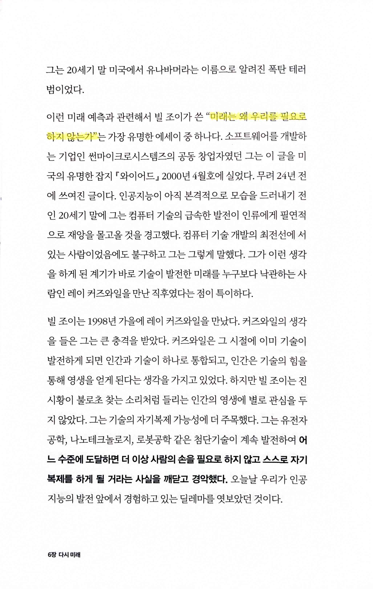

    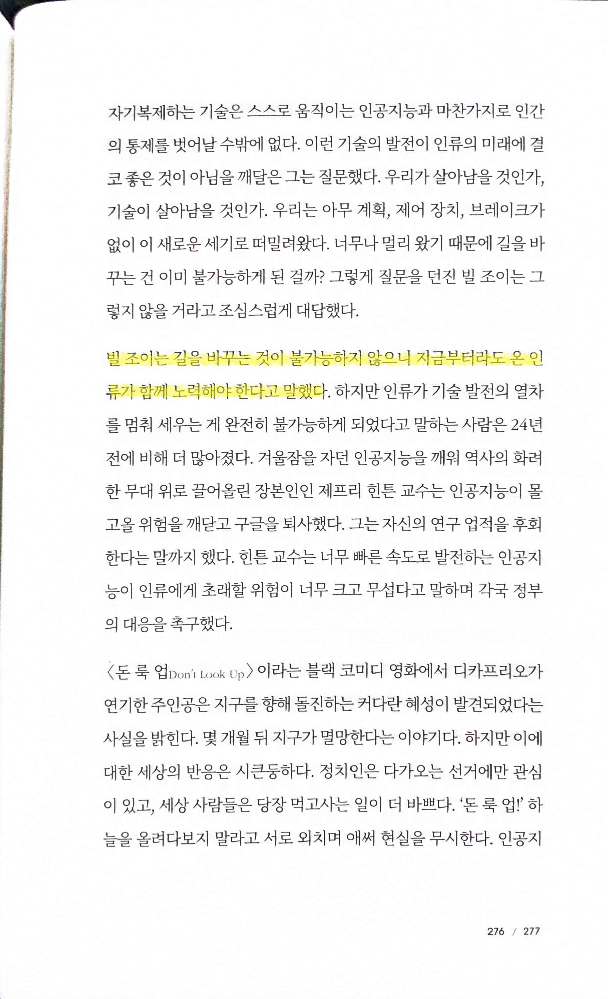

- pp278~280

    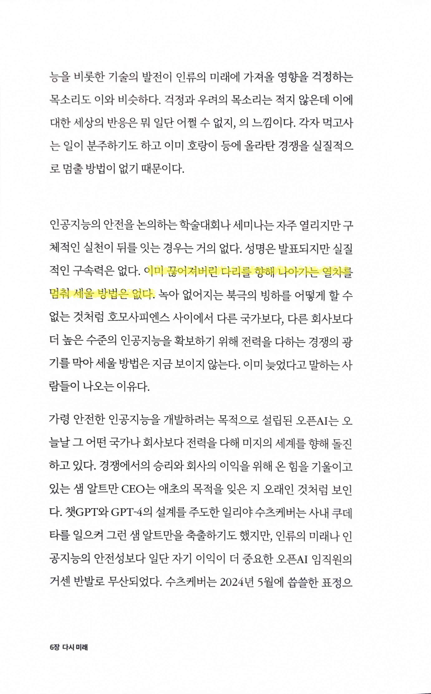

    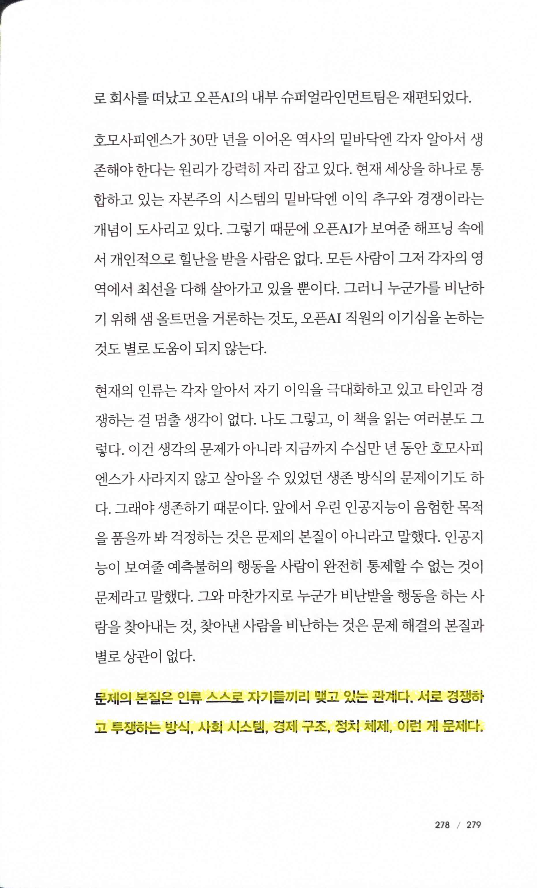

    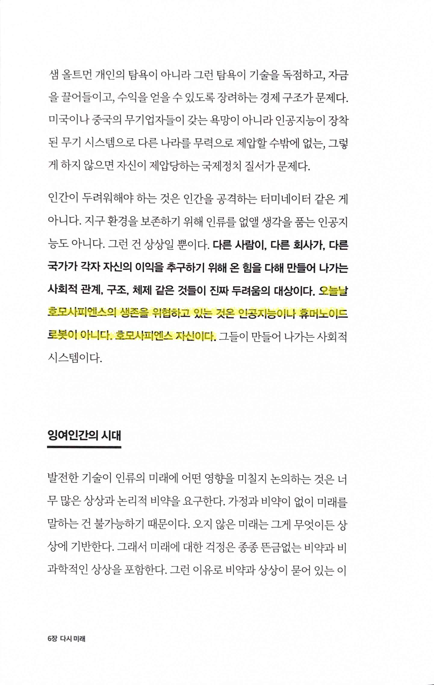

- p286

    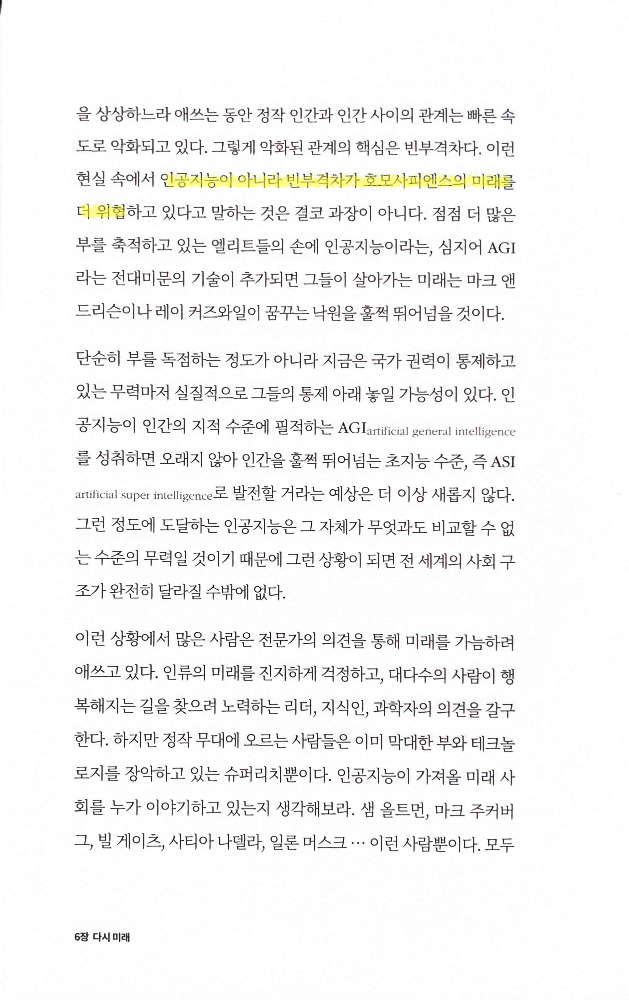
