AI & UX
=======

* ★★★☆☆ 2023.05.08 AI 관련된 app/service에 특화된 UX에 대한 주제를 다루지 않을까 생각했는데 그건 아니고 일반적인 AI에 대한 이야기와 일반적인 UX에 대한 이야기를 같이 다루는데, AI service를 예시로 설명을 하는 책으로 보면 된다. 물론 내용 자체는 좋고 알아두면 좋은 점들이긴 한데, 이 책에서만 볼 수 있는 독특한 걸 다루는 정도까지는 아님. 하지만 그래도 여전히 좋은 책인 거도 맞음

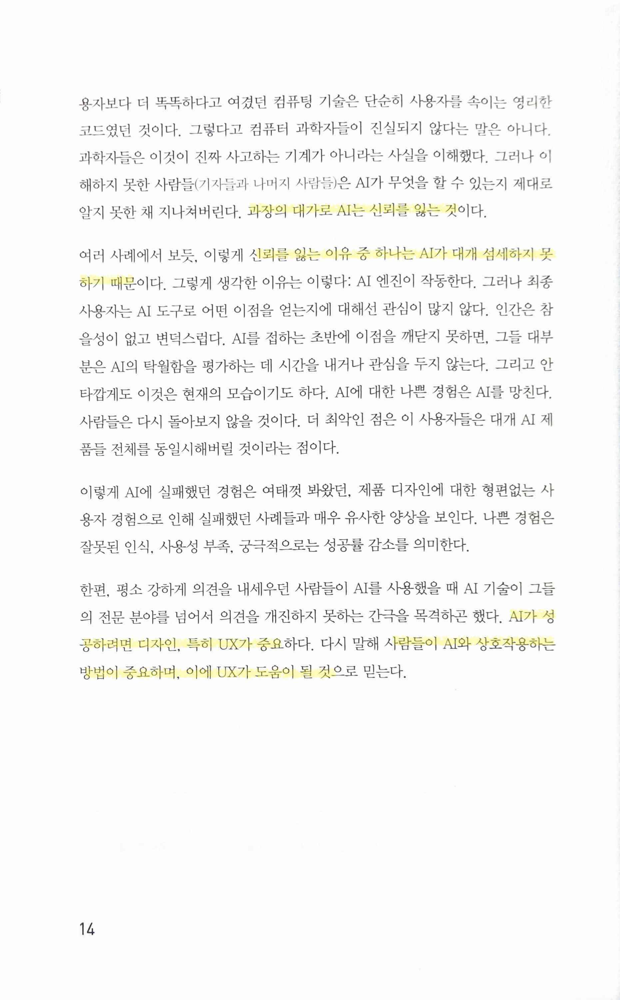

> 과장의 대가로 AI는 신뢰를 잃는 것
>
> 신뢰를 잃는 이유 중 하나는 AI가 대개 섬세하지 못하기 때문
>
> AI가 성공하려면 디자인, 특히 UX가 중요... 사람들이 AI와 상호작용하는 방법이 중요하며, 이에 UX가 도움이 될 것

# CHAPTER 1 AI와 UX 소개
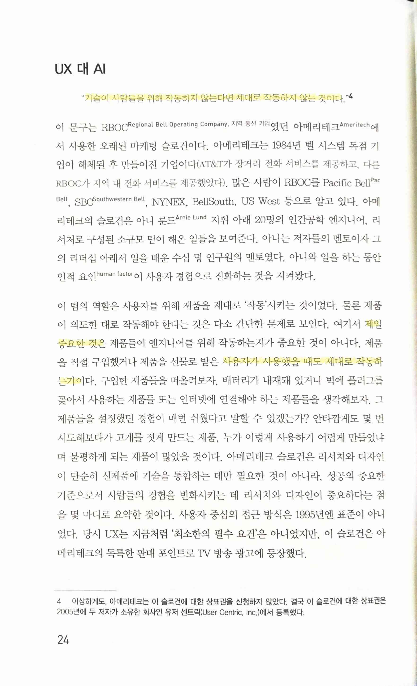

> "기술이 사람들을 위해 작동하지 않는다면 제대로 작동하지 않는 것이다. "
>
> 제일 중요한 것은... 사용자가 사용했을 때도 제대로 작동하는가

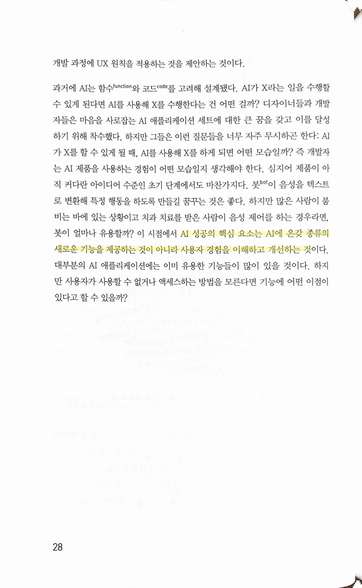

> AI 성공의 핵심 요소는 AI에 온갖 종류의 새로운 기능을 제공하는 것이 아니라 사용자 경험을 이해하고 개선하는 것

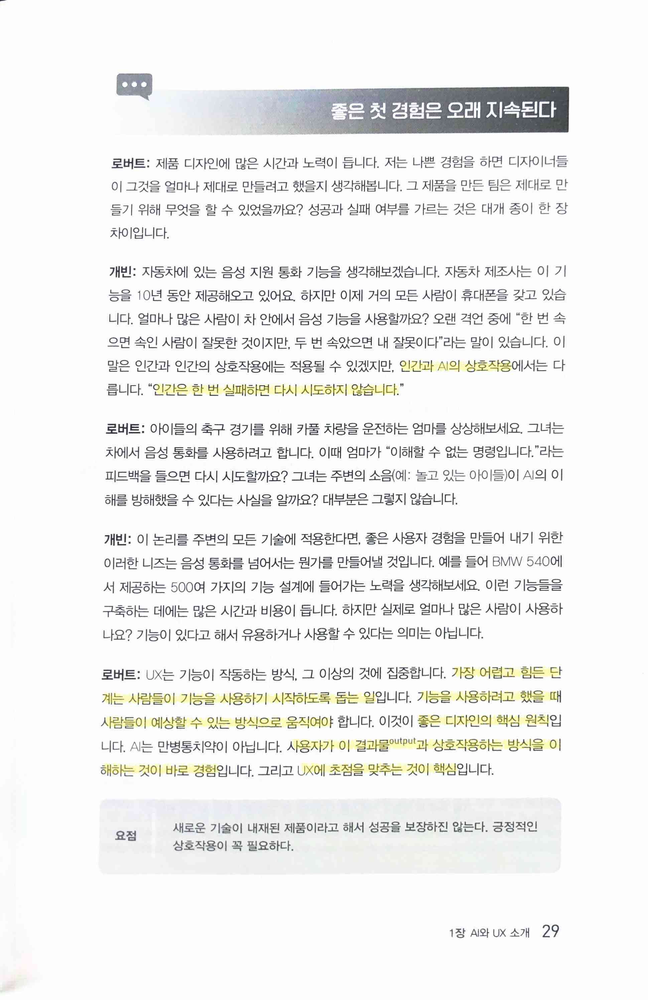

> 인간과 AI의 상호작용... "인간은 한 번 실패하면 다시 시도하지 않습니다."
>
> 가장 어렵고 힘든 단계는 사람들이 기능을 사용하기 시작하도록 돕는 일... 기능을 사용하려고 했을 때 사람들이 예상할 수 있는 방식으로 움직여야... 좋은 디자인의 핵심 원칙... 사용자가 이 결과물 output과 상호작용하는 방식을 이해하는 것이 바로 경험... UX에 초점을 맞추는 것이 핵심

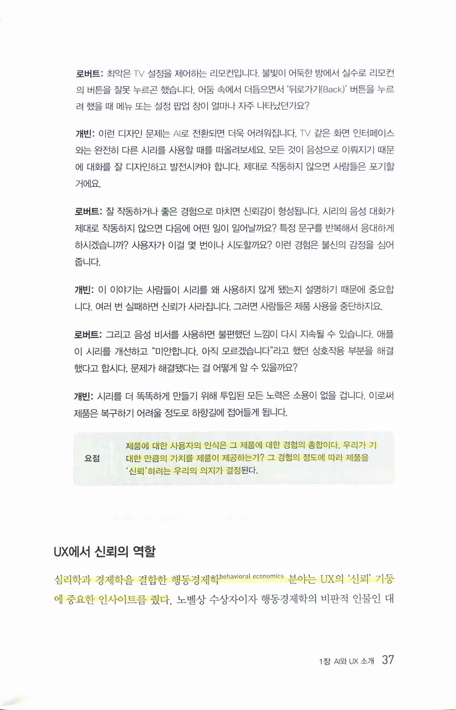

> 제품에 대한 사용자의 인식은 그 제품에 대한 경험의 총합이다. 우리가 기대한 만큼의 가치를 제품이 제공하는가? 그 경험의 정도에 따라 제품을 '신뢰' 하려는 우리의 의지가 결정된다.
>
> 심리학과 경제학을 결합한 행동경제학 behavioral economics 분야는 UX의 '신뢰' 기둥에 중요한 인사이트를 줬다.

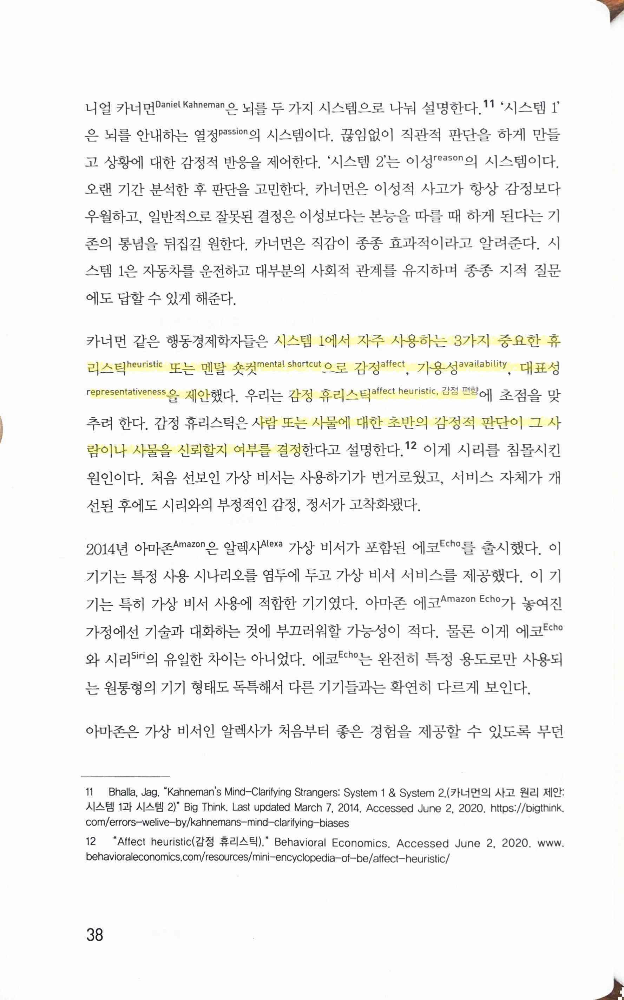

> 시스템 1에서 자주 사용하는 3가지 중요한 휴리스틱 heuristic 또는 멘탈 숏컷 mental shortcut 으로 감정 affect, 가용성 availability, 대표성 representativeness을 제안... 감정 휴리스틱 affect heuristic은 사람 또는 사물에 대한 초반의 감정적 판단이 그 사람이나 사물을 신뢰할지 여부를 결정... 시리를 침몰시킨 원인

# CHAPTER 2 AI와 UX: 병행하는 여정

# CHAPTER 3 AI 제품들이 주변에 나타나고 있다
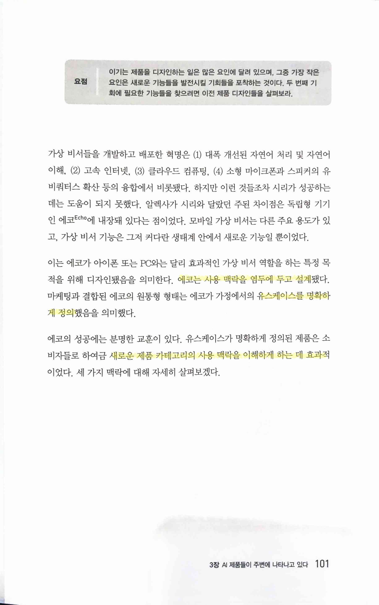

> 에코는 사용 맥락을 염두에 두고 설계... 유스케이스를 명확하게 정의
>
> 새로운 제품 카테고리의 사용 맥락을 이해하게 하는 데 효과적

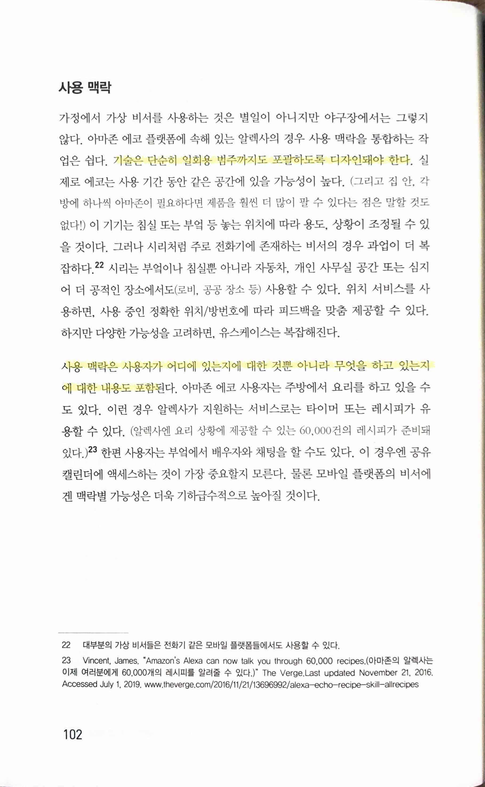

> 사용 맥락
>
> 기술은 단순히 일회용 범주까지도 포괄하도록 디자인돼야 한다.
>
> 사용 맥락은 사용자가 어디에 있는지에 대한 것뿐 아니라 무엇을 하고 있는지에 대한 내용도 포함

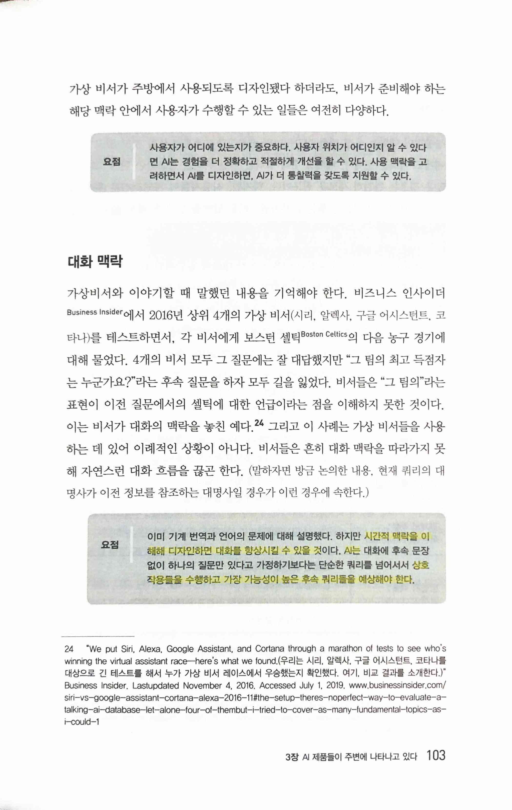

> 대화 맥락
>
> 시간적 맥락을 이해해 디자인하면 대화를 향상시킬 수 있을 것. AI는 ... 상호작용들을 수행하고 가장 가능성이 높은 후속 쿼리들을 예상해야 한다.

> 정보/ 사용자 맥락
* 외부 API, DB 사용으로는 달성하기 쉽지 않은 부분이긴 하다

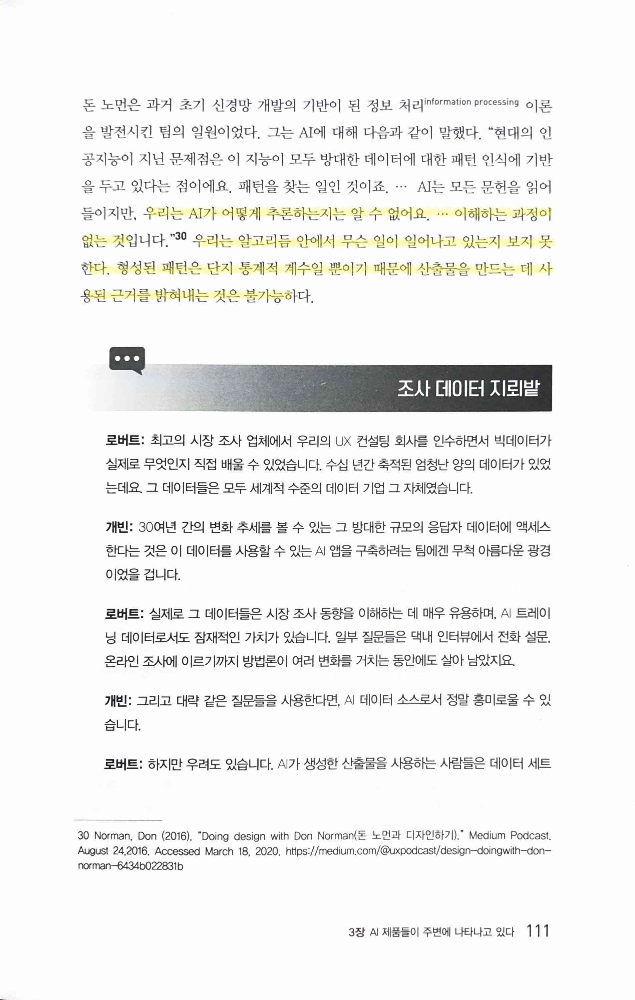

> 우리는 AI가 어떻게 추론하는지는 알 수 없어요.… 이해하는 과정이없는 것... " 우리는 알고리듬 안에서 무슨 일이 일어나고 있는지 보지 못한다. 형성된 패턴은 단지 통계적 계수일 뿐이기 때문에 산출물을 만드는 데 사용된 근거를 밝혀내는 것은 불가능

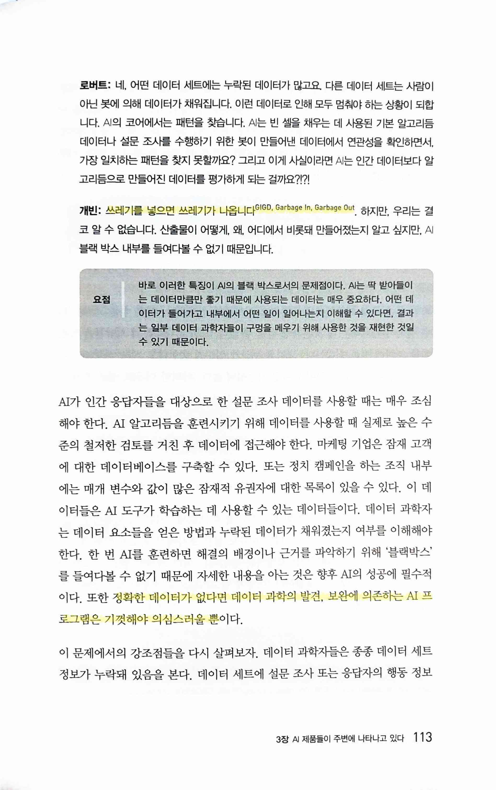

> 쓰레기를 넣으면 쓰레기가 나옵니다 GIGD, Garbage In, Garbage Out
>
> 정확한 데이터가 없다면 데이터 과학의 발견, 보완에 의존하는 AI 프로그램은 기껏해야 의심스러울 뿐

# CHAPTER 4 데이터의 중요성: 쓰레기를 넣으면, 쓰레기가 나온다
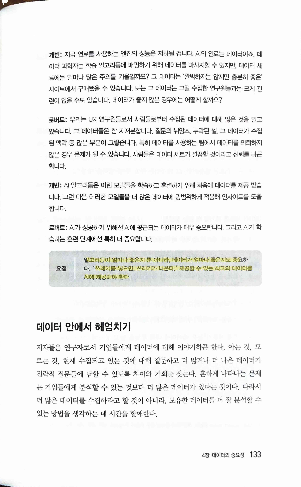

> 알고리듬이 얼마나 좋은지 뿐 아니라, 데이터가 얼마나 좋은지도 중요... '쓰레기를 넣으면, 쓰레기가 나온다.' 제공할 수 있는 최고의 데이터를 AI에 제공해야 한다.

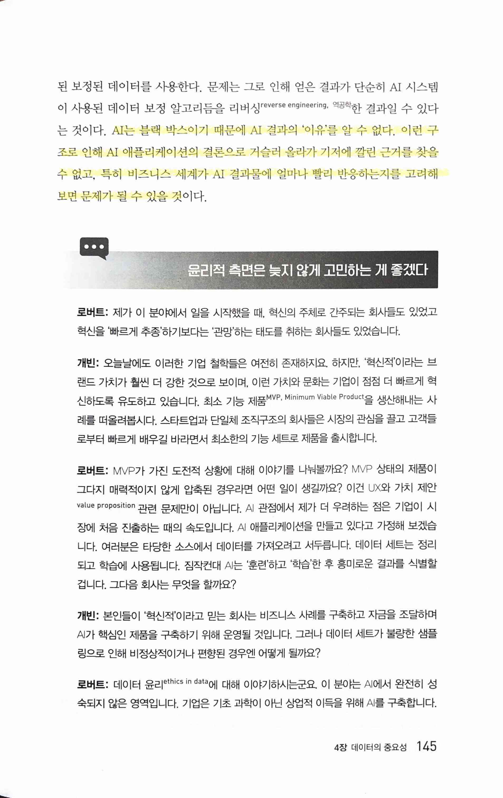

> AI는 블랙 박스이기 때문에 AI 결과의 '이유'를 알 수 없다. 이런 구조로 인해 AI 애플리케이션의 결론으로 거슬러 올라가 기저에 깔린 근거를 찾을 수 없고, 특히 비즈니스 세계가 AI 결과물에 얼마나 빨리 반응하는지를 고려해보면 문제가 될 수 있을 것

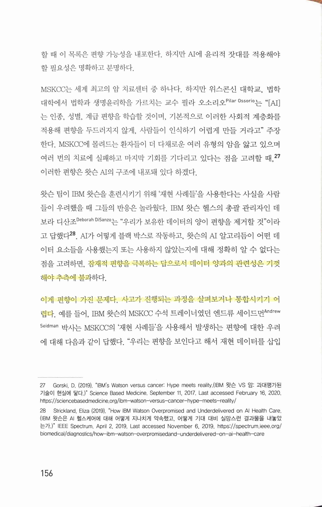

> 잠재적 편향을 극복하는 답으로서 데이터 양과의 관련성은 기껏해야 추측에 불과하다.
>
> 이게 편향이 가진 문제다. 사고가 진행되는 과정을 살펴보거나 통합시키기 어렵다.

# CHAPTER 5 UX 프레임워크 적용하기
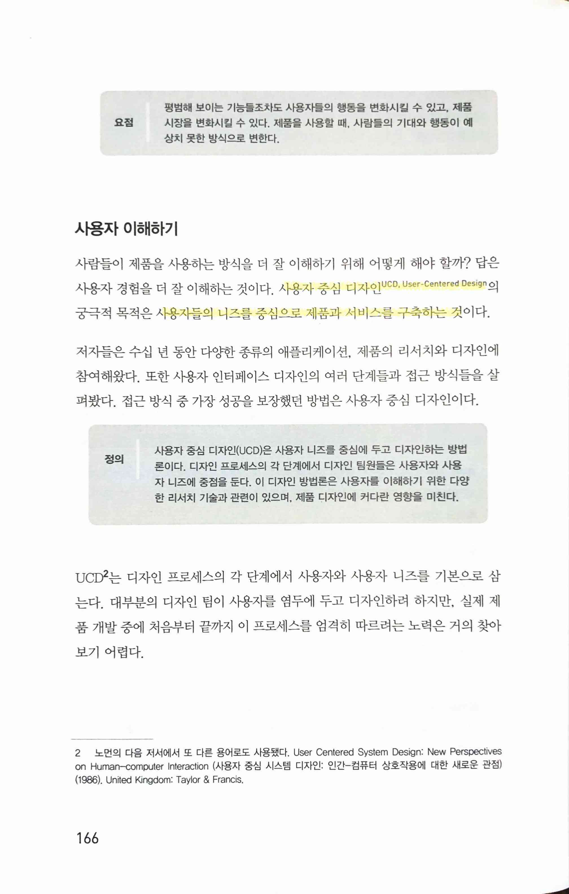

> 사용자 중심 디자인 UCD. User-Centered Design ... 사용자들의 니즈를 중심으로 제품과 서비스를 구축하는 것

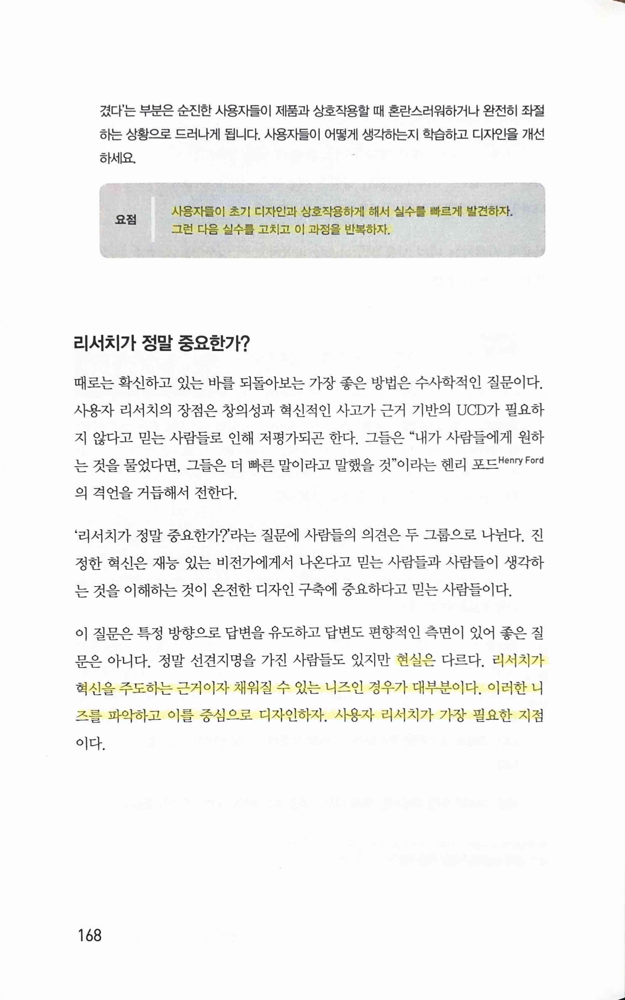

> 사용자들이 초기 디자인과 상호작용하게 해서 실수를 빠르게 발견하자. 그런 다음 실수를 고치고 이 과정을 반복하자
>
> 현실은 .... 리서치가 혁신을 주도하는 근거이자 채워질 수 있는 니즈인 경우가 대부분이다. 이러한 니즈를 파악하고 이를 중심으로 디자인하자. 사용자 리서치가 가장 필요한 지점이다.

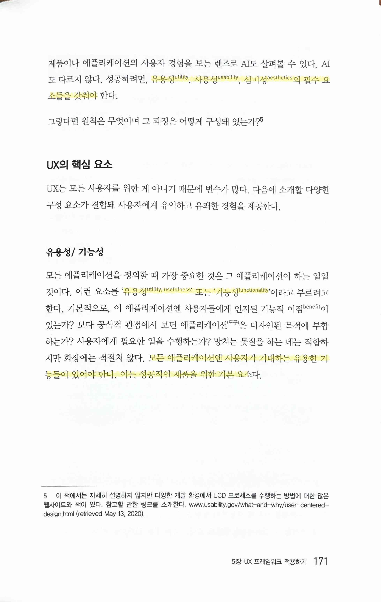

> 유용성 utility, 사용성 usability, 심미성 aesthetics의 필수 요소들을 갖춰야
>
> '유용성 utility, usefulness' 또는 '기능성'unctionality" ... 모든 애플리케이션엔 사용자가 기대하는 유용한 기능들이 있어야 한다. 이는 성공적인 제품을 위한 기본 요소
* [User-Centered Design Basics | Usability.gov](https://www.usability.gov/what-and-why/user-centered-design.html)

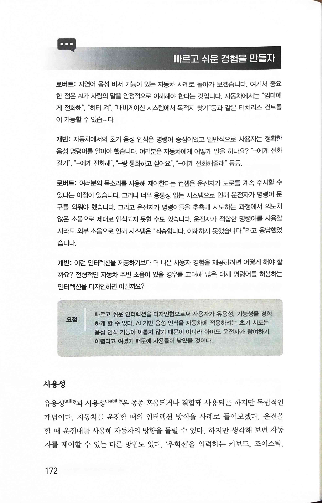

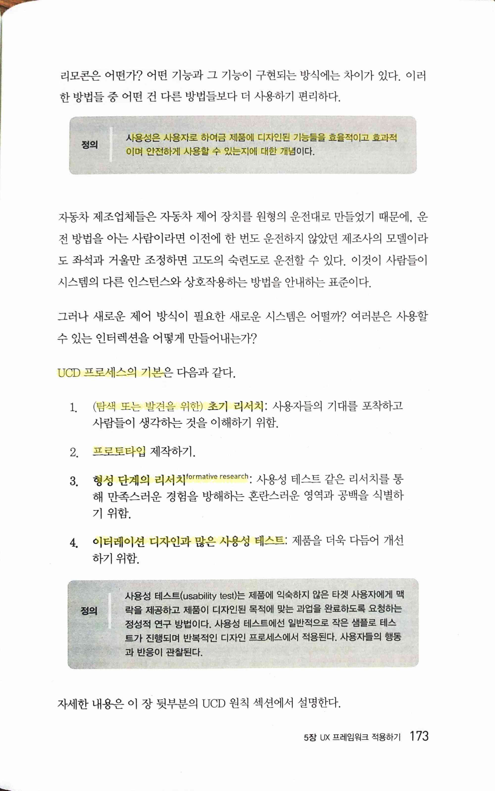

> 사용성 usability은 사용자로 하여금 제품에 디자인된 기능들을 효율적이고 효과적이며 안전하게 사용할 수 있는지에 대한 개념
>
> UCD 프로세스의 기본
>
> 1. (탐색 또는 발견을 위한 초기 리서치: 사용자들의 기대를 포착하고사람들이 생각하는 것을 이해하기 위함.
>
> 2. 프로토타입 제작하기.
>
> 3. 형성 단계의 리서치'ormative research: 사용성 테스트 같은 리서치를 통해 만족스러운 경험을 방해하는 혼란스러운 영역과 공백을 식별하기 위함.
>
> 4. 이터레이션 디자인과 많은 사용성 테스트 제품을 더욱 다듬어 개선하기 위함.

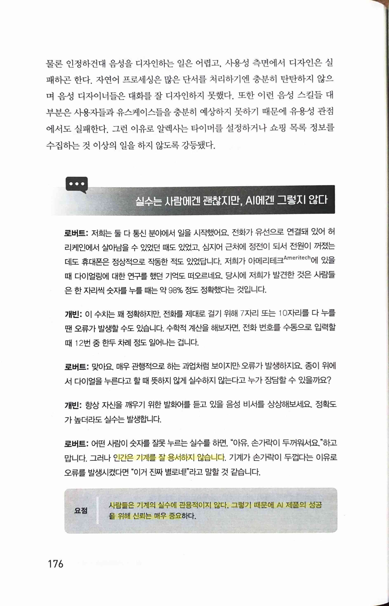

> 인간은 기계를 잘 용서하지 않습니다.
>
> 사람들은 기계의 실수에 관용적이지 않다. 그렇기 때문에 AI 제품의 성공을 위해 신뢰는 매우 중요

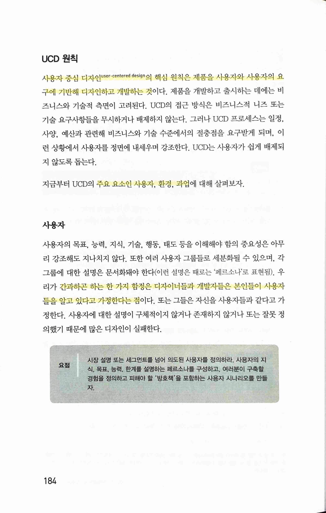

> 사용자 중심 디자인 user-centered design의 핵심 원칙은 제품을 사용자와 사용자의 요구에 기반해 디자인하고 개발하는 것
>
> UCD의 주요 요소 사용자, 환경, 과업
>
> 사용자
>
> 사용자의 목표, 능력, 지식, 기술, 행동, 태도 등을 이해... 여러 사용자 그룹들로 세분화... 각 그룹에 대한 설명은 문서화돼야 한다... 간과하곤 하는 한 가지 함정은 디자이너들과 개발자들은 본인들이 사용자들을 알고 있다고 가정한다는 점

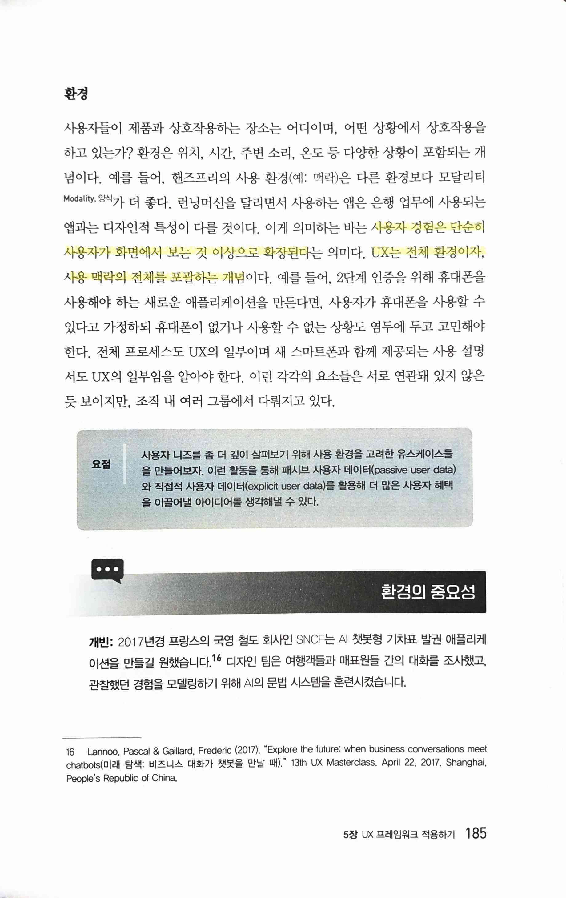

> 환경
>
> 사용자 경험은 단순히 사용자가 화면에서 보는 것 이상으로 확장된다.... UX는 전체 환경이자, 사용 맥락의 전체를 포괄하는 개념

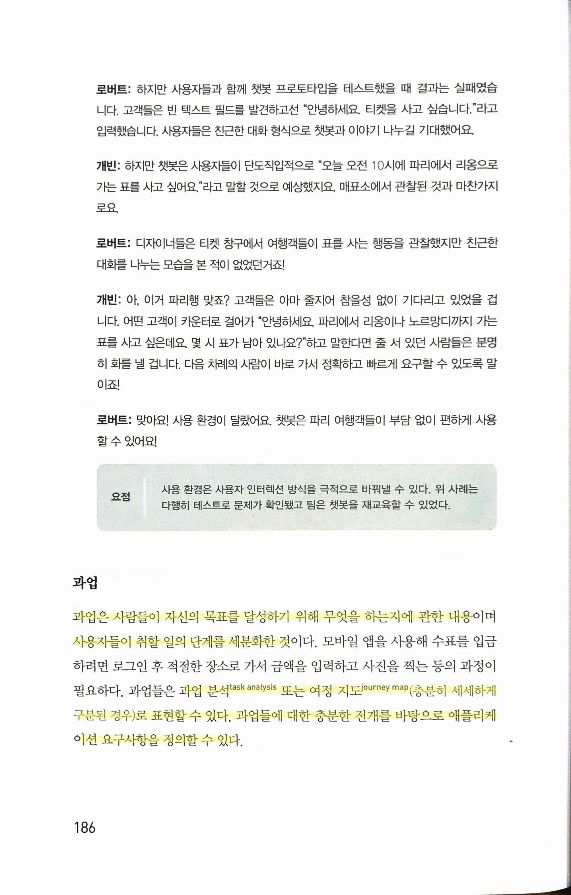

> 과업
>
> 과업은 사람들이 자신의 목표를 달성하기 위해 무엇을 하는지에 관한 내용이며 사용자들이 취할 일의 단계를 세분화한 것... 과업 분석 task analysis 또는 여정 지도 journey map (충분히 세세하게 구분된 경우)로 표현할 수 있다. 과업들에 대한 충분한 전개를 바탕으로 애플리케이션 요구사항을 정의할 수 있다.

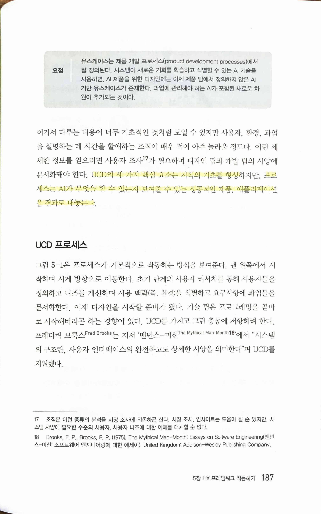

> UCD의 세 가지 핵심 요소는 지식의 기초를 형성... 프로세스는 AI가 무엇을 할 수 있는지 보여줄 수 있는 성공적인 제품, 애플리케이션을 결과로 내놓는다.

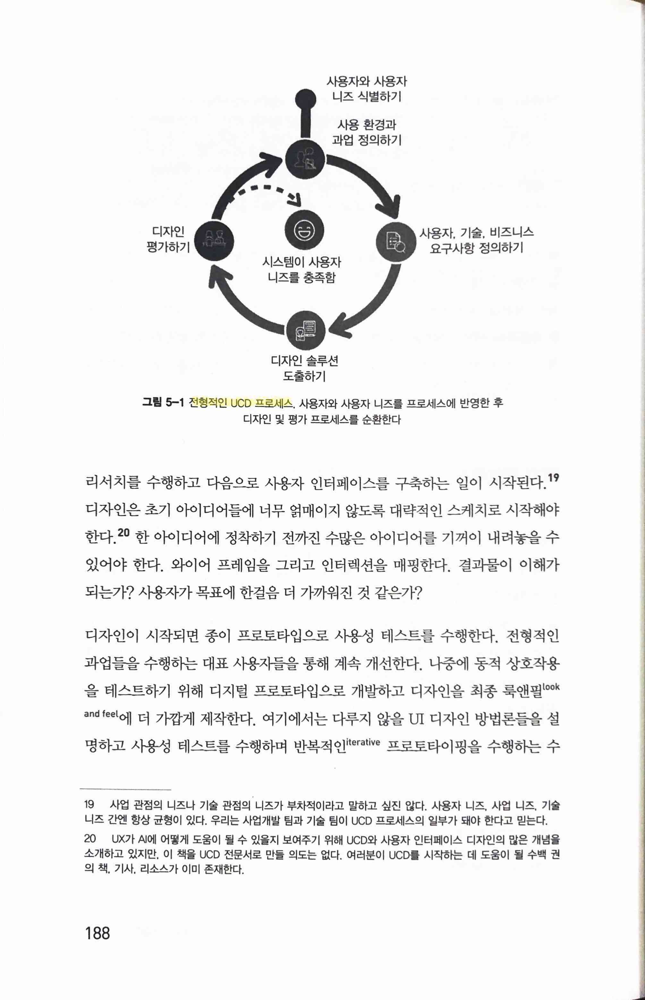

> 그림 5-1 전형적인 UCD 프로세스, 사용자와 사용자 니즈를 프로세스에 반영한 후 디자인 및 평가 프로세스를 순환

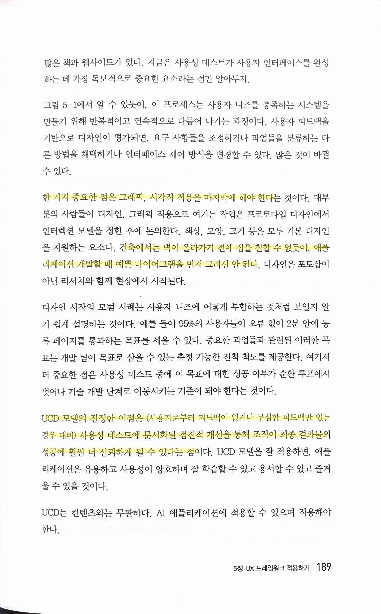

> 한 가지 중요한 점은 그래픽, 시각적 적용을 마지막에 해야 한다는 것... 건축에서는 벽이 올라가기 전에 집을 칠할 수 없듯이, 애플리케이션 개발할 때 예쁜 다이어그램을 먼저 그려선 안 된다. 디자인은 포토샵이 아닌 리서치와 함께 현장에서 시작
>
> UCD 모델의 진정한 이점은 (사용자로부터 피드백이 없거나 무심한 피드백만 있는 경우 대비) 사용성 테스트에 문서화된 점진적 개선을 통해 조직이 최종 결과물의 성공에 훨씬 더 신뢰하게 될 수 있다는 점

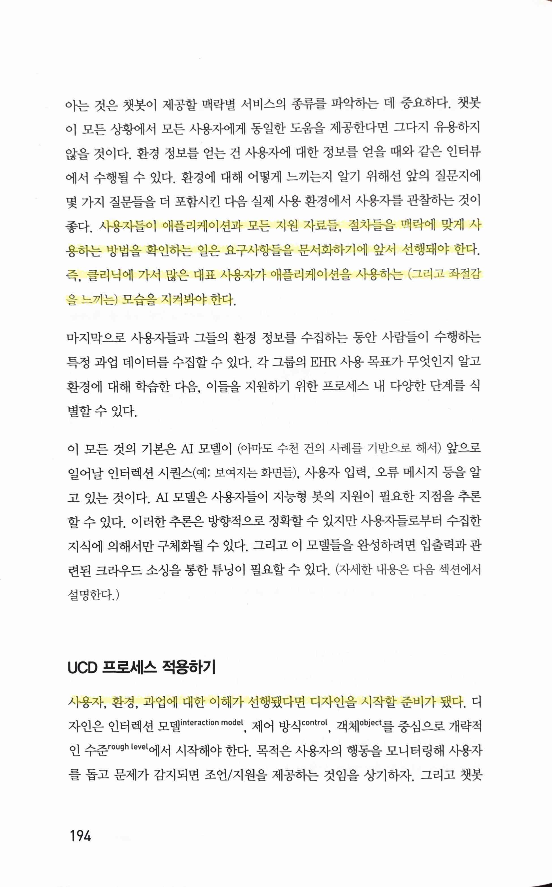

> 사용자들이 애플리케이션과 모든 지원 자료들, 절차들을 맥락에 맞게 사용하는 방법을 확인하는 일은 요구사항들을 문서화하기에 앞서 선행돼야 한다.즉, 클리닉에 가서 많은 대표 사용자가 애플리케이션을 사용하는 (그리고 좌절감을 느끼는) 모습을 지켜봐야 한다.
>
> 사용자, 환경, 과업에 대한 이해가 선행됐다면 디자인을 시작할 준비가 됐다.

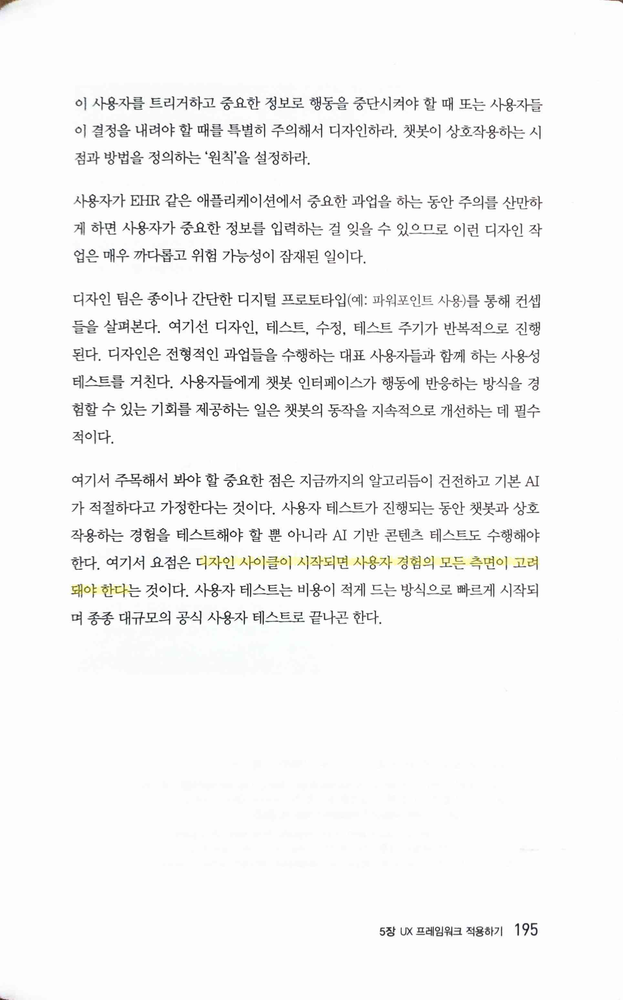

> 디자인 사이클이 시작되면 사용자 경험의 모든 측면이 고려돼야 한다