제품의 탄생
===========
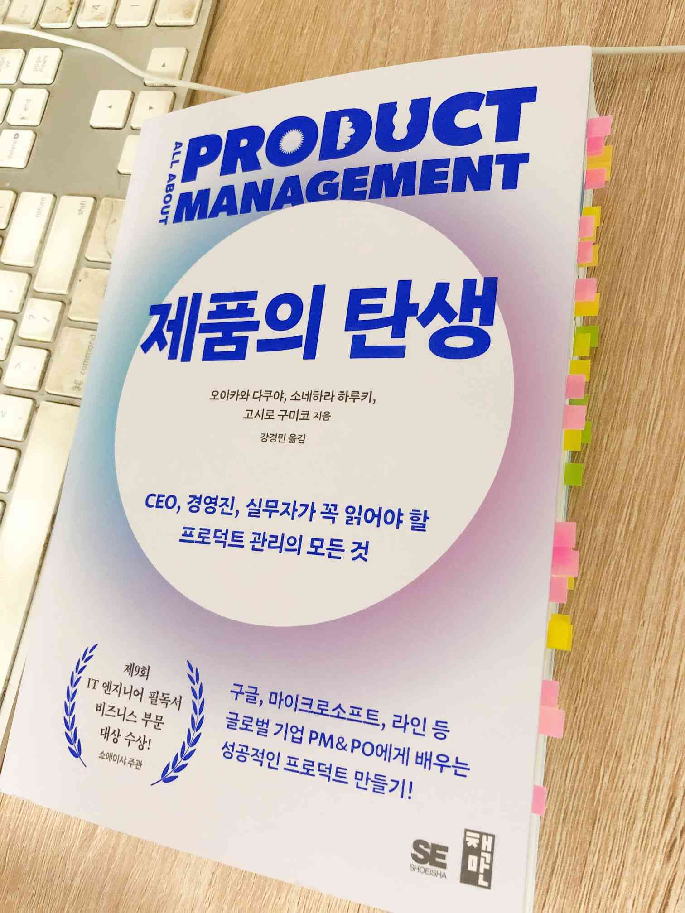

# 1부 성공적인 제품의 탄생

## 1장 성공적인 프로덕트란
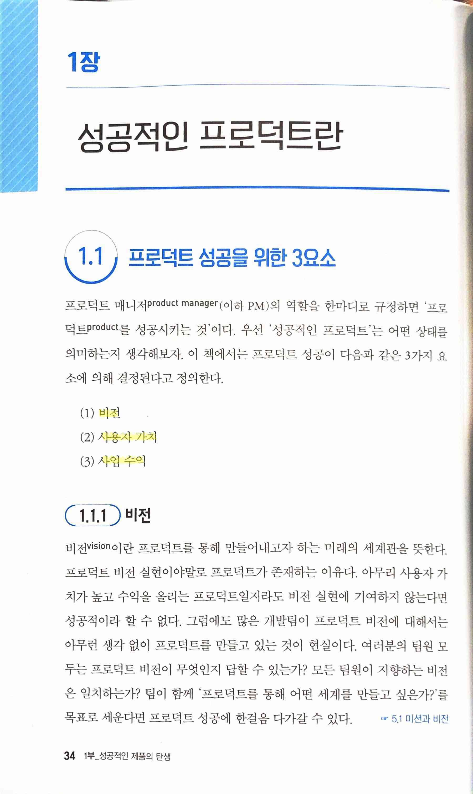

> 프로덕트 성공을 위한 3요소 (1) 비전(2) 사용자 가치 (3) 사업 수익

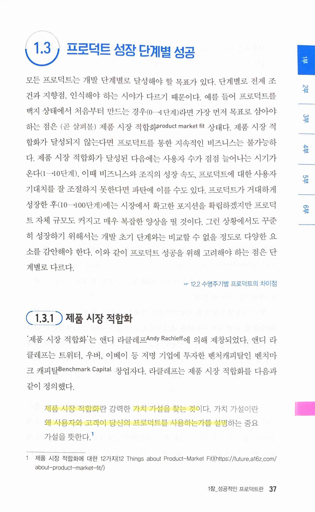

> `제품 시장 적합화`란 강력한 가치 가설을 찾는 것. 가치 가설이란 왜 사용자와 고객이 당신의 프로덕트를 사용하는가를 설명하는 중요가설
* [12 Things About Product-Market Fit | Andreessen Horowitz](https://a16z.com/2017/02/18/12-things-about-product-market-fit-2/)

## 2장 PM의 역할
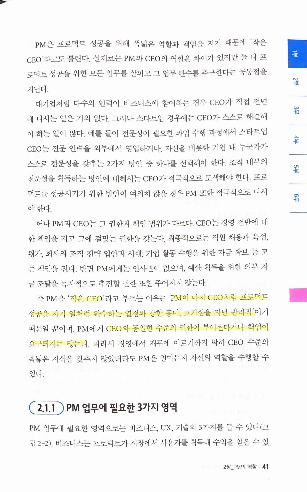

> 즉 PM을 '작은 CEO'라고 부르는 이유는 'PM이 마치 CEO처럼 프로덕트 성공을 자기 일처럼 완수하는 열정과 강한 흥미, 호기심을 지닌 관리직'이기 때문일 뿐이며, PM에게 CEO와 동일한 수준의 권한이 부여된다거나 책임이 요구되지는 않는다.
* 이 책은 PM과 PO의 구분이 다소 불명확하다(혹은 꽤 공통 부분이 많다고 본다). 이 설명도 다른 책에서는 보통 PO에 대해 많이 쓰는 표현

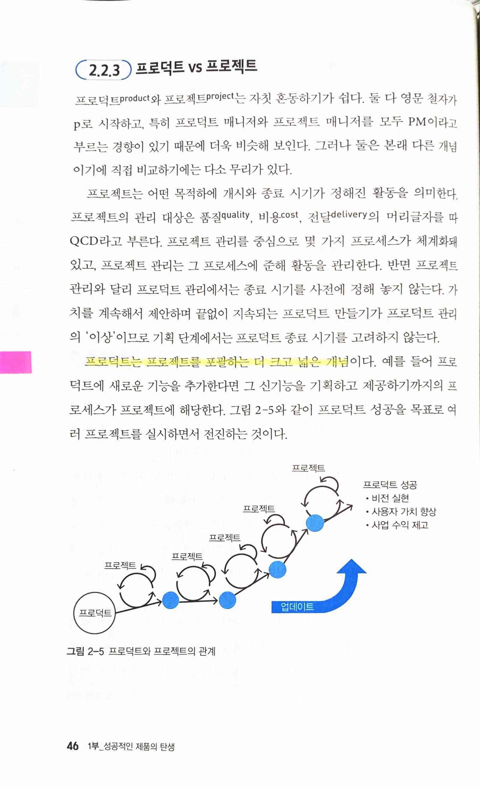

> 프로덕트는 프로젝트를 포괄하는 더 크고 넓은 개념

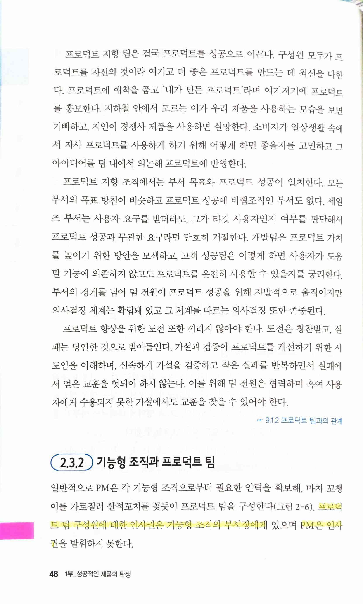

> 프로덕트 팀 구성원에 대한 인사권은 기능형 조직의 부서장에게 있으며 PM은 인사권을 발휘하지 못한다.

## 3장 PM의 직무와 역량

> 프로덕트에 관한 의사결정 하나하나에 대한 근거에는 연쇄적으로 연결된 가설이 있다.

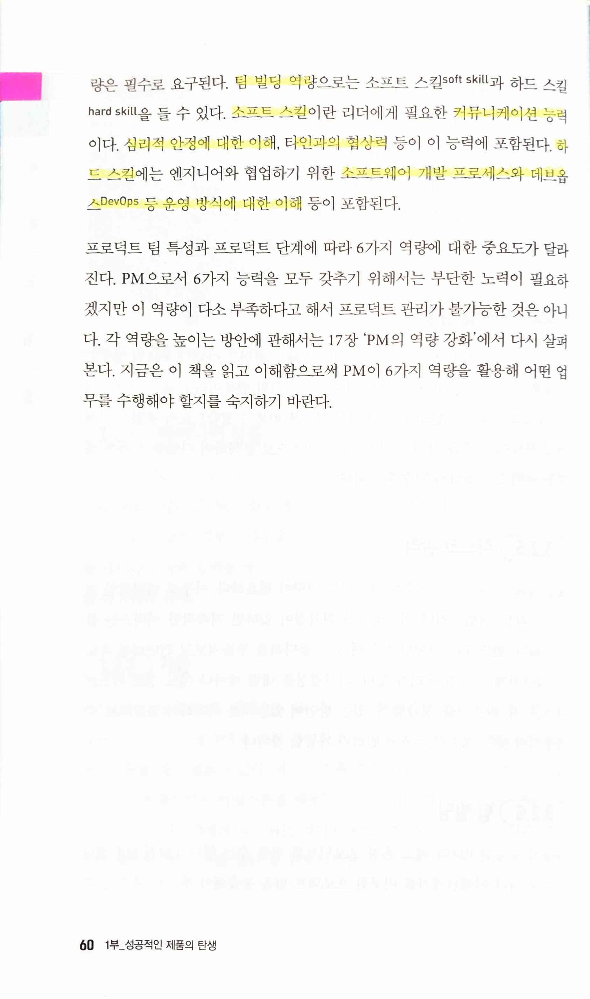

> 소프트 스킬 soft skill 커뮤니케이션 능력, 심리적 안정에 대한 이해, 타인과의 협상력
>
> 하드 스킬 hard skill 소프트웨어 개발 프로세스와 데브옵스DevOps 등 운영 방식에 대한 이해

# 2부 프로덕트 만들기

## 4장 프로덕트 관리를 위한 4가지 단계
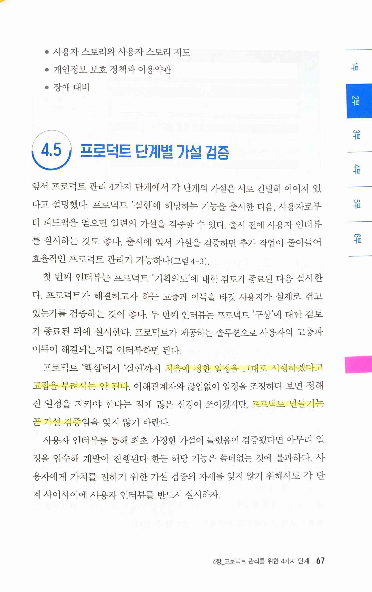

> 처음에 정한 일정을 그대로 시행하겠다고 고집을 부려서는 안 된다. 프로덕트 만들기는 곧 가설 검증

## 5장 핵심 Core
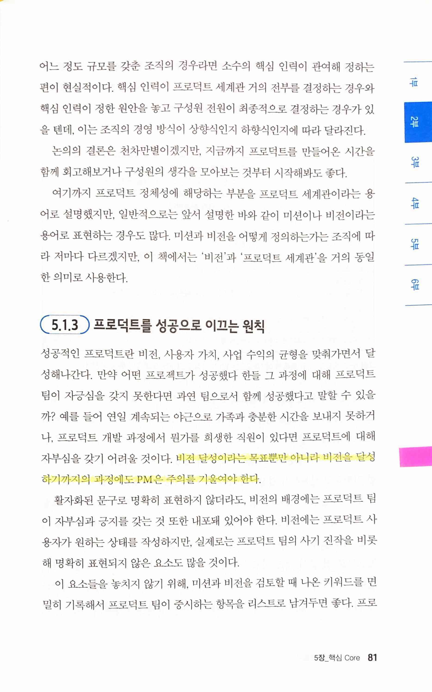

> 비전 달성이라는 목표뿐만 아니라 비전을 달성하기까지의 과정에도 PM은 주의를 기울여야 한다.

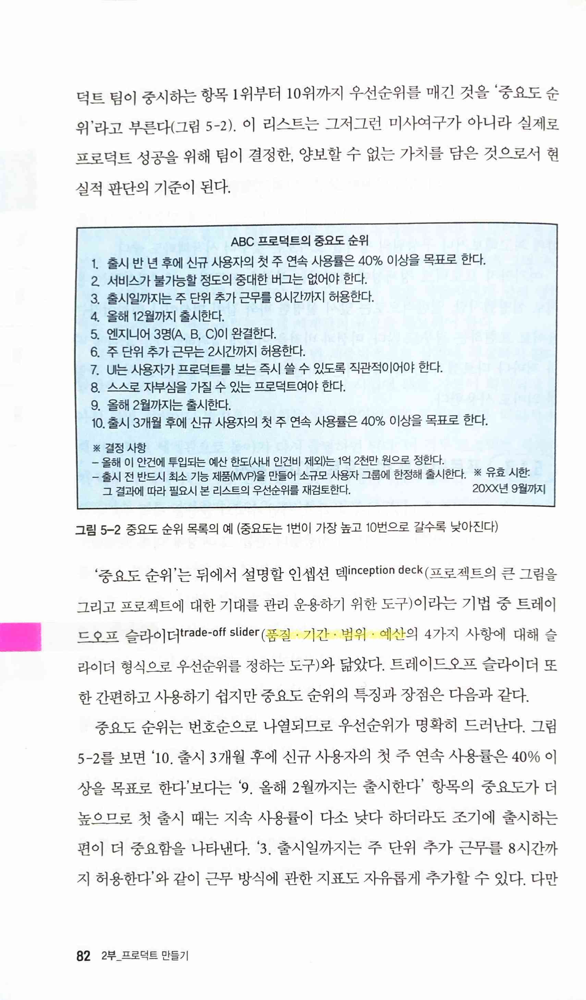

> `트레이드오프 슬라이더 trade-off slider` (품질 · 기간 · 범위 · 예산의 4가지 사항에 대해 슬라이더 형식으로 우선순위를 정하는 도구)
* [Trade-off Sliders](https://ohbarye.github.io/trade-off-sliders/)
  * [Trade-off sliders - Agile Experience Design: A Digital Designer’s Guide to Agile, Lean, and Continuous Book](https://www.oreilly.com/library/view/agile-experience-design/9780132869249/part03lev1sec30.html)
  * [Prioritisation tools | Success trade-off sliders | SoftEd](https://www.softed.com/sg/learning-hub/videos/success-trade-off-sliders/)
* Iron Cross와는 묘하게 다르다 [The Iron Cross — What I just learnt #3 | by Abderrahim Benmakhlouf | Medium](https://medium.com/@abderrahim.benmakhlouf/the-iron-cross-what-i-just-learnt-3-ec3e09bf3d7c)

## 6장 기획의도 Why
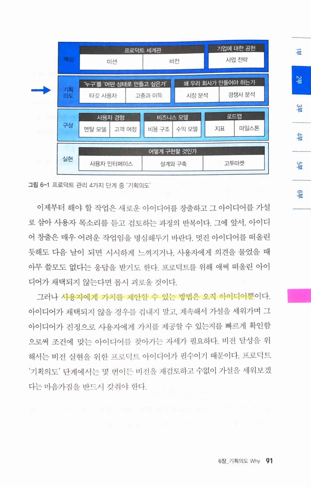

> 사용자에게 가치를 제안할 수 있는 방법은 오직 아이디어뿐

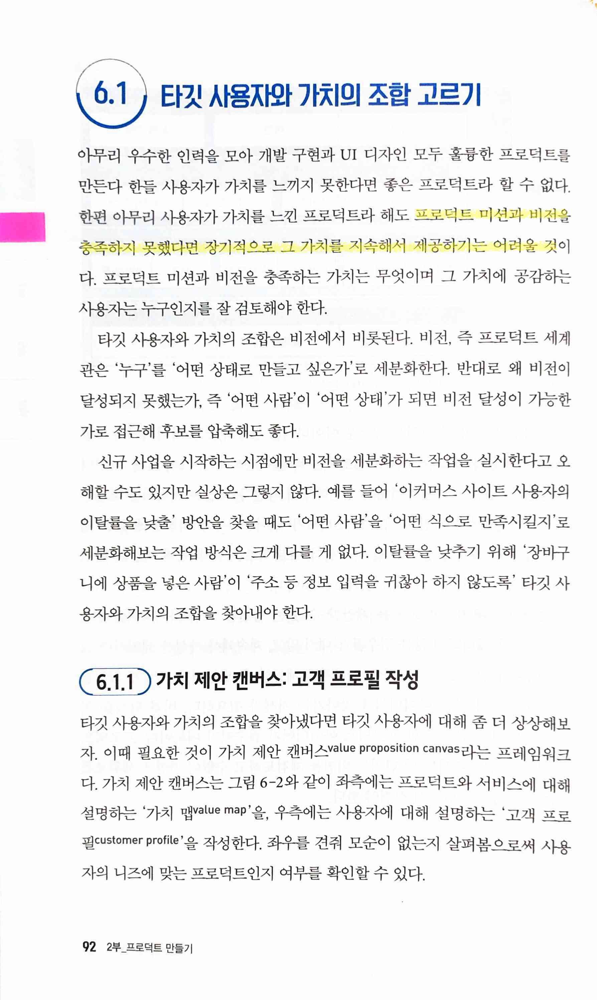

> 프로덕트 미션과 비전을 충족하지 못했다면 장기적으로 그 가치를 지속해서 제공하기는 어려울 것

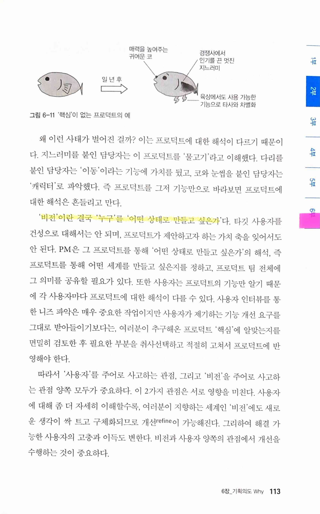

> `'비전'`이란 결국 '누구'를 '어떤 상태로 만들고 싶은가'

## 7장 구상 What
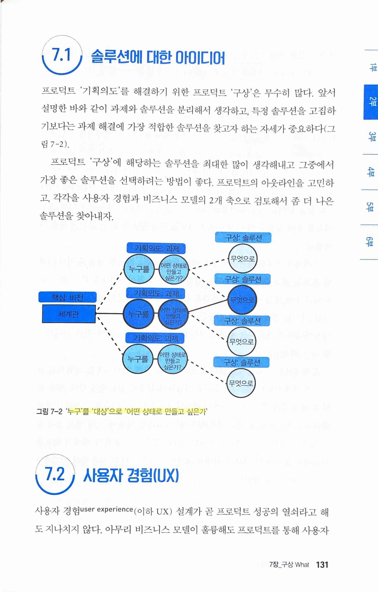

> '누구'를 '대상'으로 '어떤 상태로 만들고 싶은가'

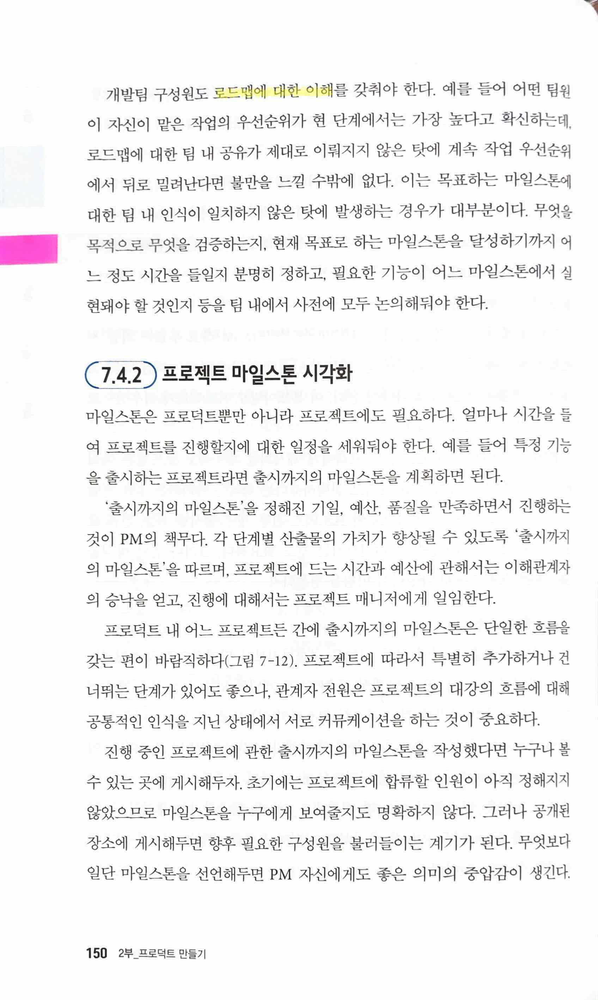

> 구성원도 `로드맵에 대한 이해`를 갖춰야 한다. 예를 들어 어떤 팀원이 자신이 맡은 작업의 우선순위가 현 단계에서는 가장 높다고 확신하는데, 로드맵에 대한 팀 내 공유가 제대로 이뤄지지 않은 탓에 계속 작업 우선순위에서 뒤로 밀려난다면 불만을 느낄 수밖에 없다. 이는 목표하는 마일스톤에 대한 팀 내 인식이 일치하지 않은 탓에 발생하는 경우가 대부분이다. 무엇을 목적으로 무엇을 검증하는지, 현재 목표로 하는 마일스톤을 달성하기까지 어느 정도 시간을 들일지 분명히 정하고, 필요한 기능이 어느 마일스톤에서 실현돼야 할 것인지 등을 팀 내에서 사전에 모두 논의해둬야 한다.

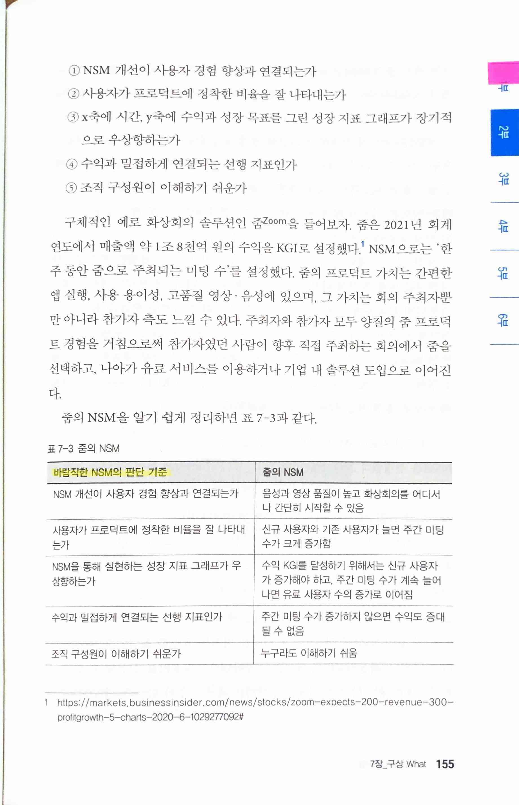

> 바람직한 `North Start Metric` NSM의 판단 기준
>
> ① NSM 개선이 사용자 경험 향상과 연결되는가
>
> ② 사용자가 프로덕트에 정착한 비율을 잘 나타내는가
>
> ③ x 축에 시간, y축에 수익과 성장 목표를 그린 성장 지표 그래프가 장기적으로 우상향하는가
>
> ④ 수익과 밀접하게 연결되는 선행 지표인가
>
> ⑤ 조직 구성원이 이해하기 쉬운가
* [North Star Metric(북극성 지표), 그로스 해킹에 왜 중요하고 어떻게 찾을까요?](https://blog.ab180.co/posts/how-to-find-north-star-metric)

## 8장 실현 How
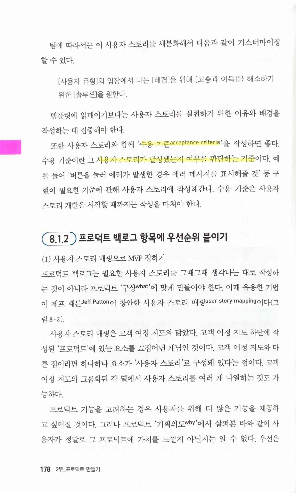

> `'수용 기준 acceptance criteria'` 사용자 스토리가 달성됐는지 여부를 판단하는 기준

> 프로덕트 팀을 제외한 대다수 사람은 프로덕트가 출시될 때 처음으로 프로덕트와 새로운 기능을 접하게 되므로 자세한 정보를 전달할 수 있도록 주의

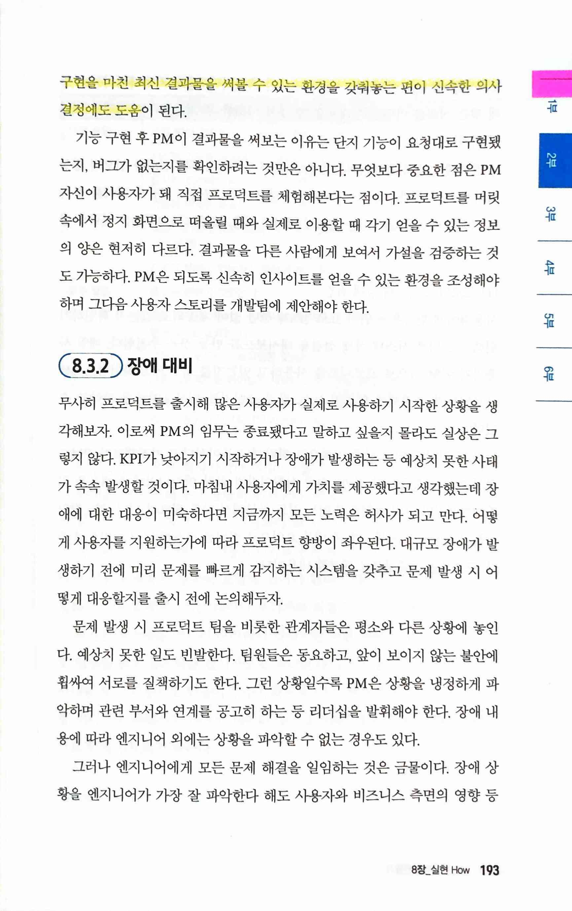

> 구현을 마친 최신 결과물을 써볼 수 있는 환경을 갖춰놓는 편이 신속한 의사결정에도 도움

# 3부 PM의 필수 덕목, 리더십

## 9장 PM을 주축으로 한 조직 환경
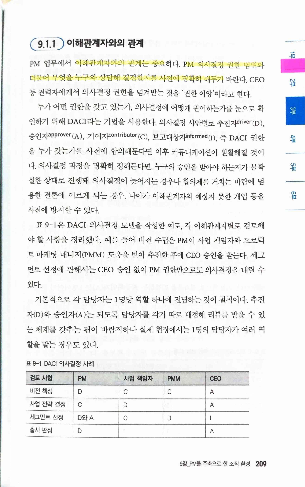

> 이해관계자와의 관계 중요. PM 의사결정 권한 범위와 더불어 무엇을 누구와 상담해 결정할지를 사전에 명확히 해두기

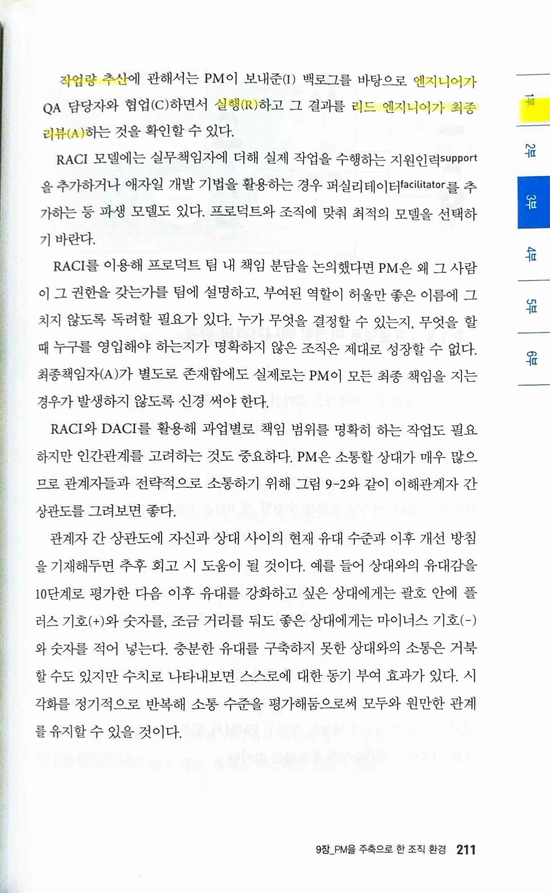

> 작업량 추산에 관해서는 PM이 보내준(I) 백로그를 바탕으로 엔지니어가 QA 담당자와 협업(C)하면서 실행(R)하고 그 결과를 리드 엔지니어가 최종리뷰(A)
* scrum에서는 엔지니어가 자율적으로 결정(위의 실행이라고 쓴 부분)하는 게 중요

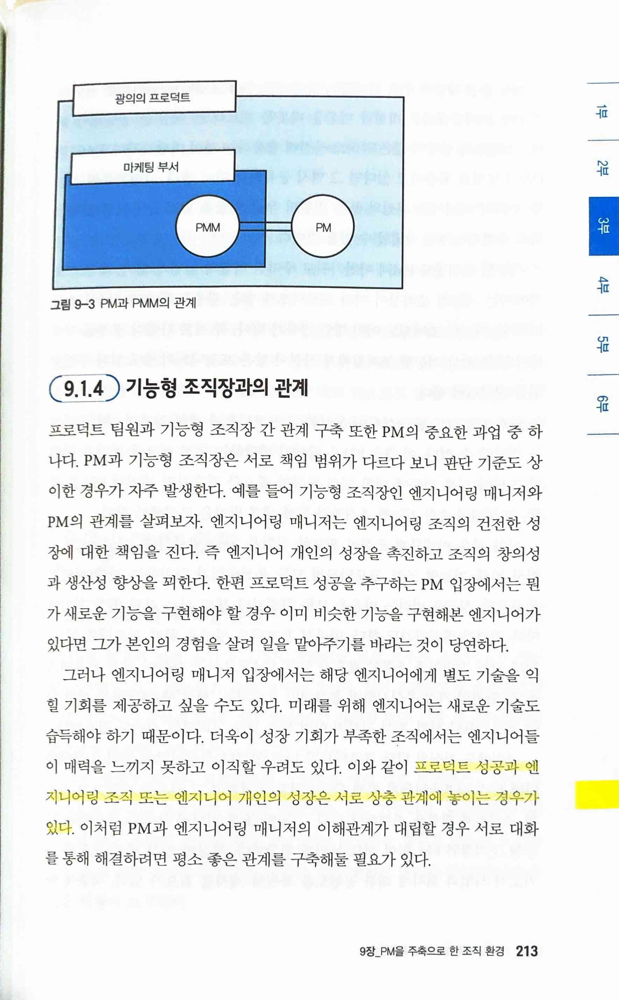

> 프로덕트 성공과 엔지니어링 조직 또는 엔지니어 개인의 성장은 서로 상충 관계에 놓이는 경우가 있다.

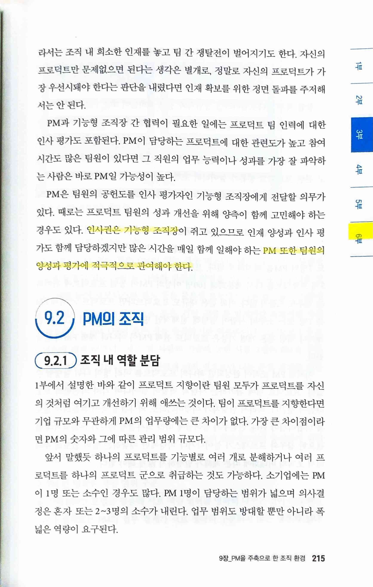

> 인사권은 기능형 조직장... PM 또한 팀원의 양성과 평가에 적극적으로 관여해야 한다.
* 잘 이해가 가지 않는 부분. PM이 개발자(혹은 디자이너) 출신이 아닌 이상 해당 직무에 대한 평가는 명확히 하기 어렵고, 결국 산출물만을 가지고 평가하기 쉽고, 장기적인 관점을 갖기 어렵다.

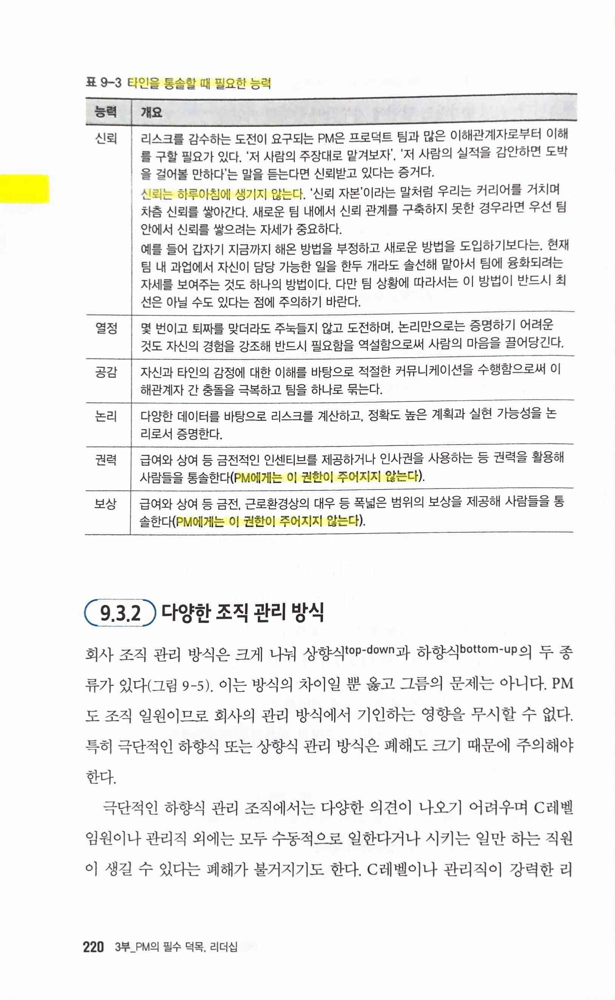

> 타인을 통솔할 때 필요한 능력
>
> 신뢰는 하루아침에 생기지 않는다. '신뢰자본'이라는 말처럼 우리는 커리어를 거치며 차츰 신뢰를 쌓아간다.
>
> 권력, 보상 - (PM에게는 이 권한이 주어지지 않는다)

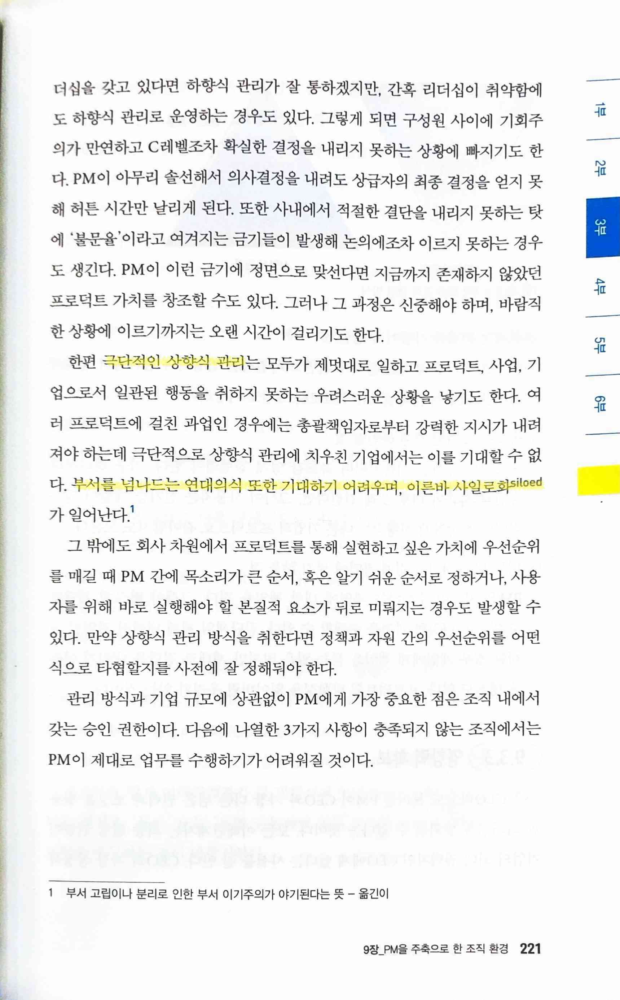

> 극단적인 상향식 관리. 부서를 넘나드는 연대의식 또한 기대하기 어려우며, 이른바 사일로화 siloed가 일어난다.

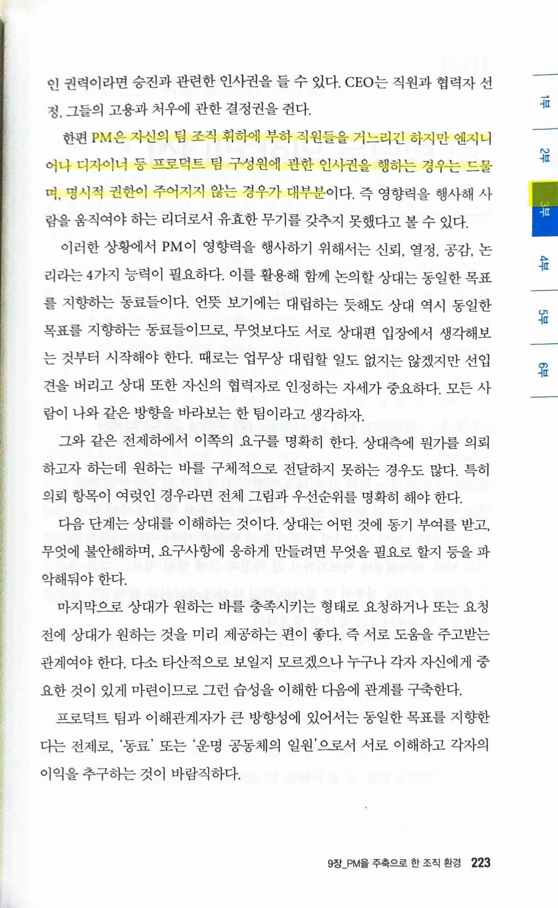

> PM은 자신의 팀 조직 휘하에 부하 직원들을 거느리긴 하지만 엔지니어나 디자이너 등 프로덕트 팀 구성원에 관한 인사권을 행하는 경우는 드물며, 명시적 권한이 주어지지 않는 경우가 대부분이다.
* 개인적으로는 갖는 경우를 단 한 번도 들어보거나 경험한 적은 없다.

## 10장 팀 빌딩을 위한 리더십

> 프로덕트 정보의 투명성, 커뮤니케이션 공유, 회의록, 채팅 그룹, 메일

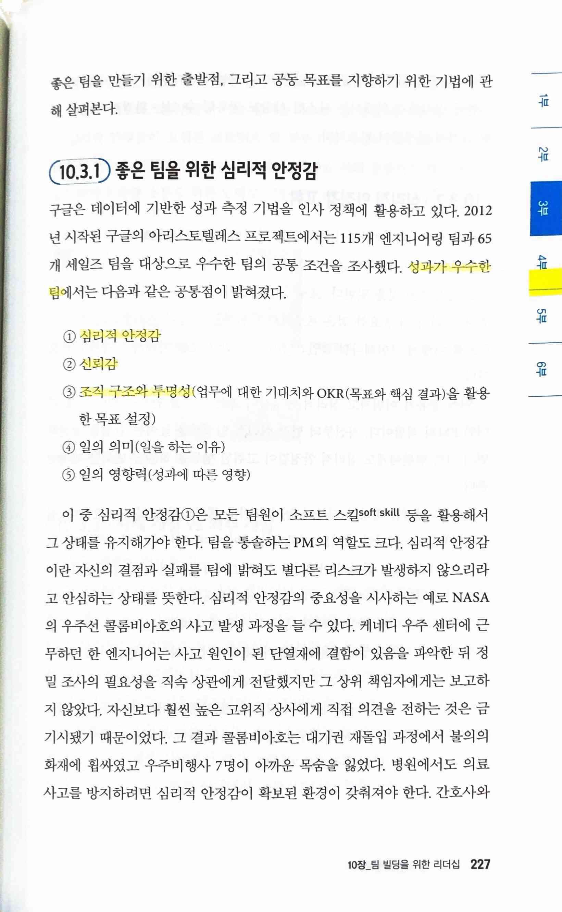

> 성과가 우수한 팀
>
> ① 심리적 안정감
>
> ② 신뢰감
>
> ③ 조직 구조와 투명성(업무에 대한 기대치와 OKR (목표와 핵심 결과)을 활용한 목표 설정)
>
> ③ 일의 의미(일을 하는 이유)
>
> ⑤ 일의 영향력(성과에 따른 영향)

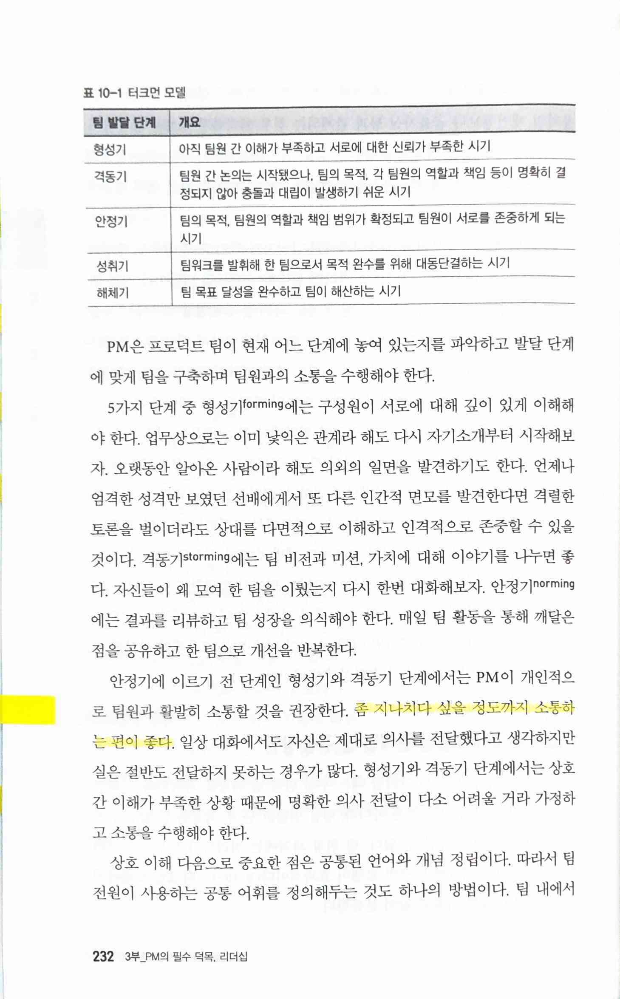

> 좀 지나치다 싶을 정도까지 소통하는 편이 좋다.
* [Better to Over-Communicate Than Under - The Ordinary Leader by Randy Grieser](https://theordinaryleader.com/blog/better-to-over-communicate-than-under/)

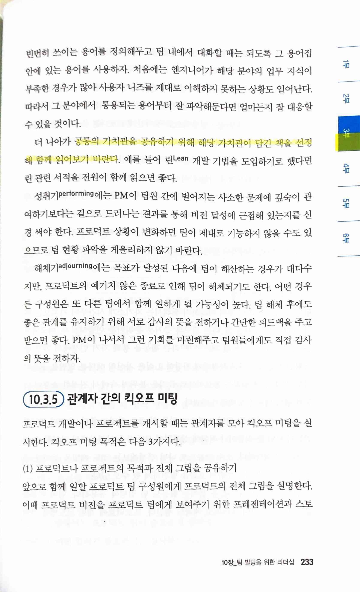

> 공통의 가치관을 공유하기 위해 해당 가치관이 담긴 책을 선정해 함께 읽어보기 바란다.
* scrum을 한다면 scrum guide부터

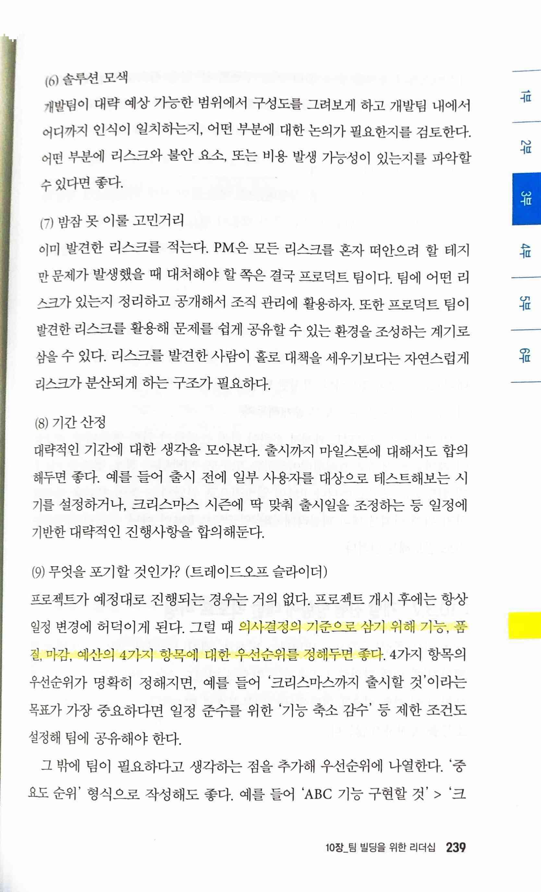

> 의사결정의 기준으로 삼기 위해 기능, 품질, 마감, 예산의 4가지 항목에 대한 우선순위를 정해두면 좋다.

## 11장 원활한 팀 소통을 위한 5가지 기술
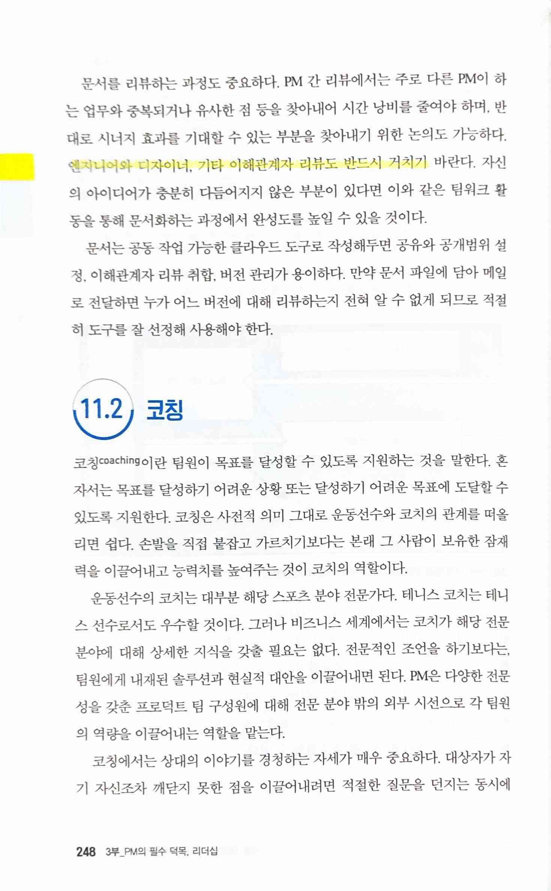

> 엔지니어와 디자이너, 기타 이해관계자 리뷰도 반드시 거치기 바란다.

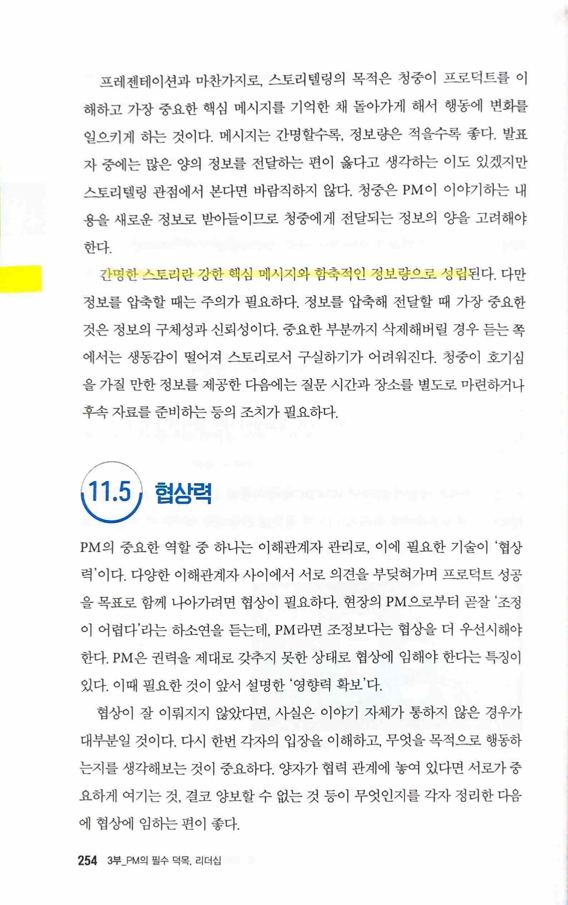

> 간명한 스토리란 강한 핵심 메시지와 함축적인 정보량으로 성립

# 4부 프로덕트 속성과 생태계에 따른 각양각색 PM의 역할

## 12장 프로덕트 성장 시기에 따른 PM의 역할

## 13장 비즈니스 유형에 따른 PM의 역할

## 14장 경험해보지 못한 사업 분야에 진출하려면

## 15장 하드웨어나 AI 관련 PM의 역할

# 5부 PM과 조직의 성장

## 16장 프로덕트 관리와 조직
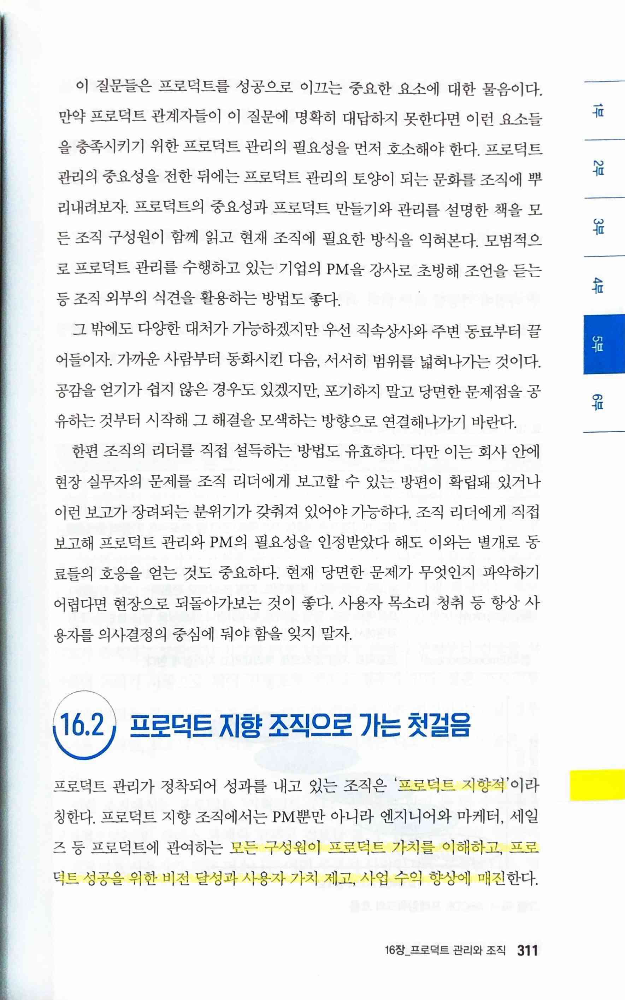

> '프로덕트 지향적' 모든 구성원이 프로덕트 가치를 이해하고, 프로덕트 성공을 위한 비전 달성과 사용자 가치 제고, 사업 수익 향상에 매진

## 17장 PM의 역량 강화
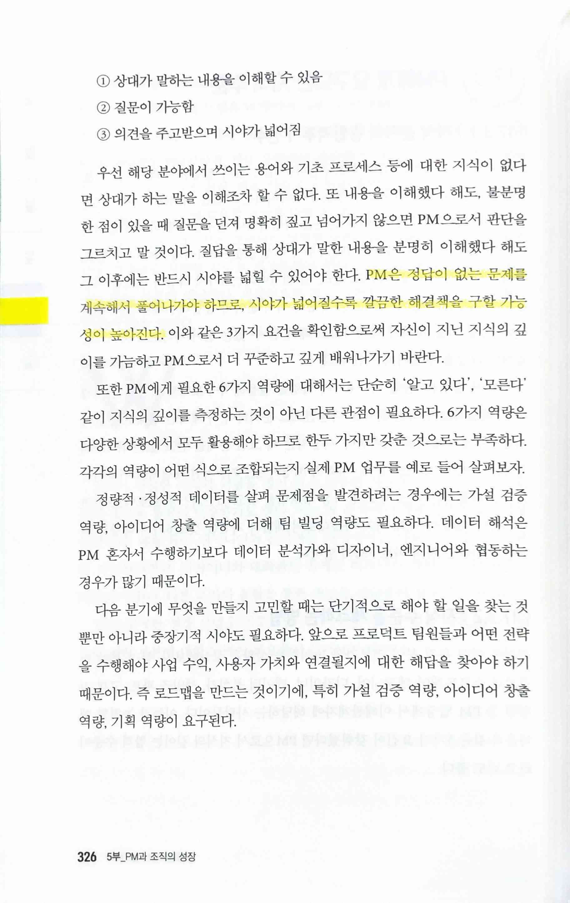

> PM은 정답이 없는 문제를 계속해서 풀어나가야 하므로, 시야가 넓어질수록 깔끔한 해결책을 구할 가능성이 높아진다.

## 18장 커리어관리
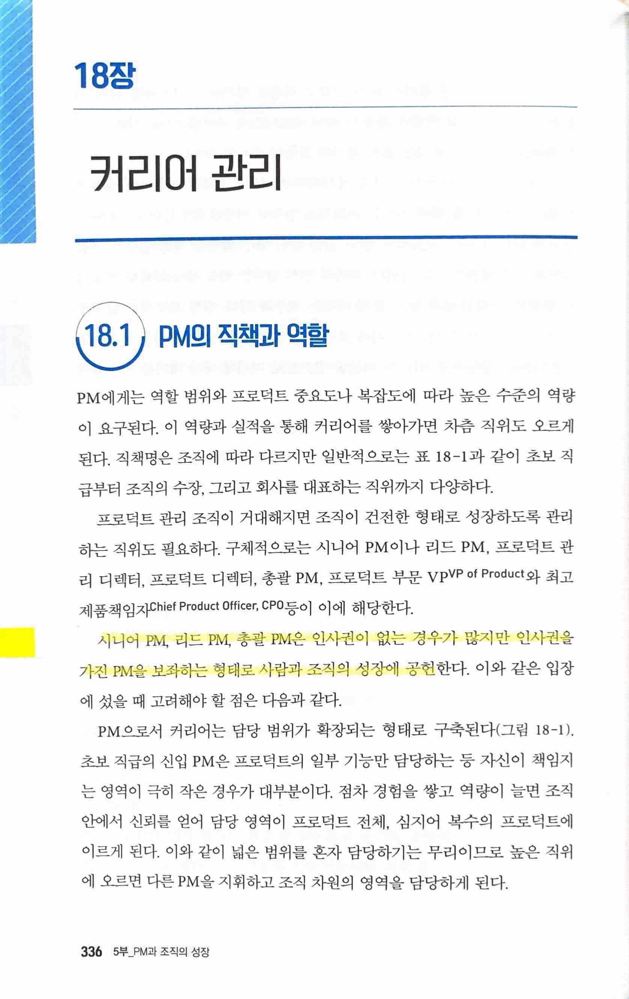

> 시니어 PM, 리드 PM, 총괄 PM은 인사권이 없는 경우가 많지만 인사권을 가진 PM을 보좌하는 형태로 사람과 조직의 성장에 공헌

# 6부 PM 역량을 드높이기 위한 필수 지식 총정리

## 19장 PM이 알아야 할 기초 비즈니스 지식

> 새로운 기능이 제공할 가치 vs. 해당 기능을 구현하는 데 드는 비용

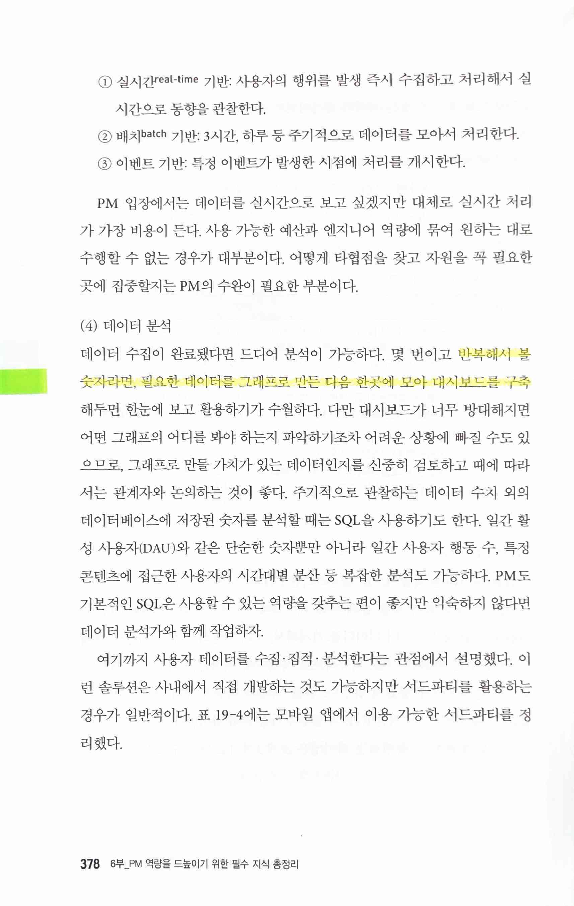

> 반복해서 볼 숫자라면, 필요한 데이터를 그래프로 만든 다음 한곳에 모아 대시보드를 구축

## 20장 PM이 알아야 할 기초 UX/마케팅/법률 지식
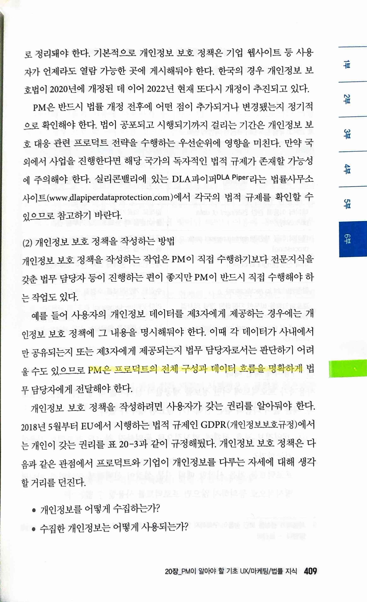

> PM은 프로덕트의 전체 구성과 데이터 흐름을 명확하게
* 개인적으로 생각하는 가장 좋은 방법은 business에 대한 flow diagram을 그리는 것

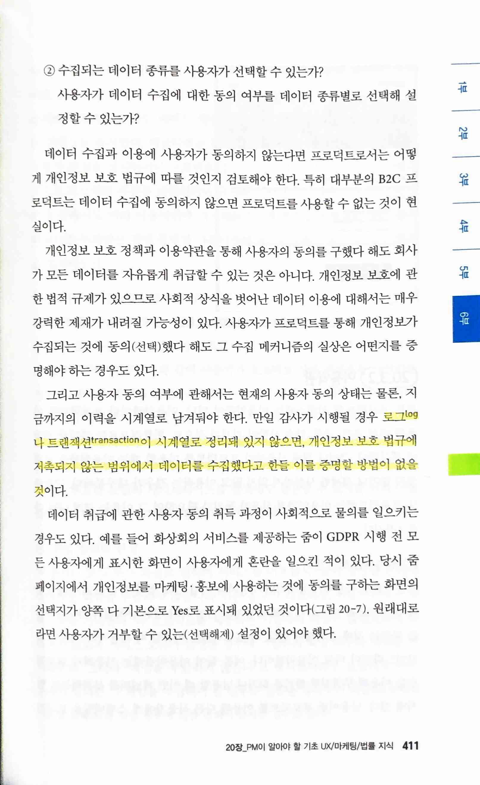

> 로그 log나 트랜잭션 transaction 이 시계열로 정리돼 있지 않으면, 개인정보 보호 법규에 저촉되지 않는 범위에서 데이터를 수집했다고 한들 이를 증명할 방법이 없을 것

## 21장 PM이 알아야 할 기초 IT 지식
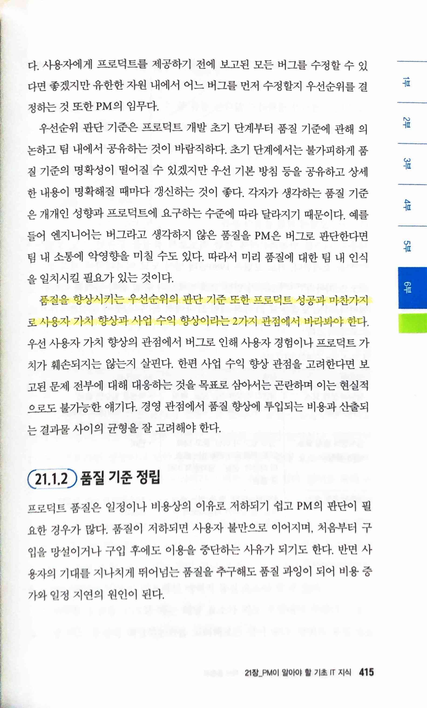

> 품질을 향상시키는 우선순위의 판단 기준 또한 프로덕트 성공과 마찬가지로 사용자 가치 향상과 사업 수익 향상이라는 2가지 관점에서 바라봐야 한다.

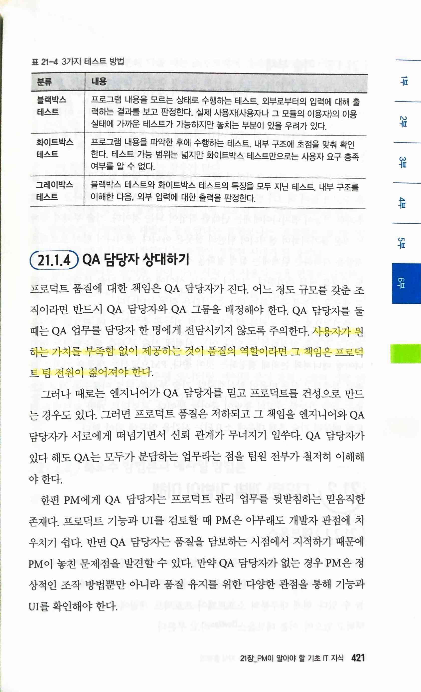

> 사용자가 원하는 가치를 부족함 없이 제공하는 것이 품질의 역할이라면 그 책임은 프로덕트팀 전원이 짊어져야 한다.

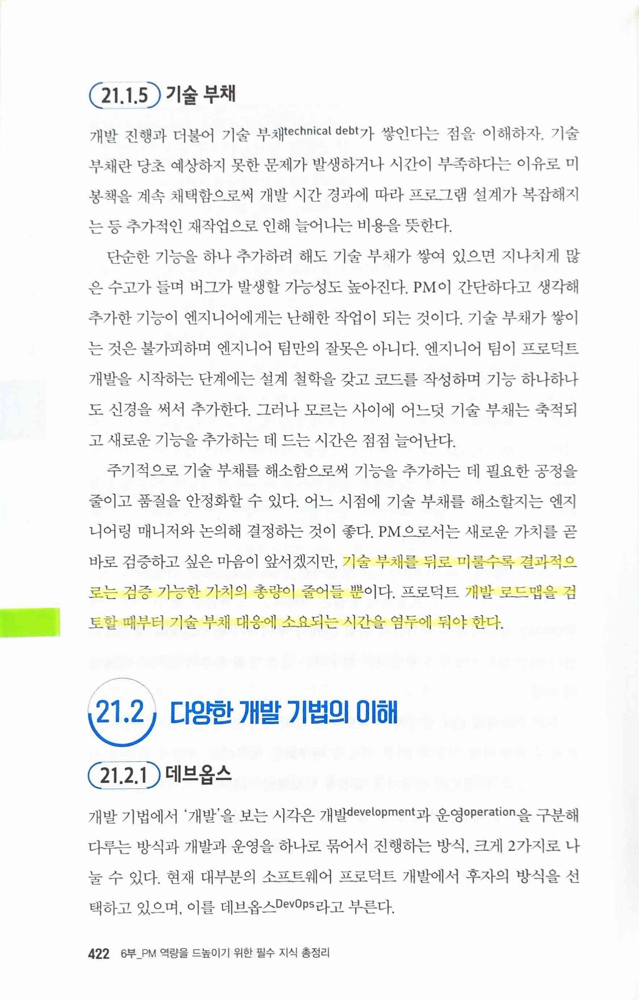

> 기술 부채를 뒤로 미룰수록 결과적으로는 검증 가능한 가치의 총량이 줄어들 뿐이다. 프로덕트 개발 로드맵을 검토할 때부터 기술 부채 대응에 소요되는 시간을 염두에 둬야 한다.