# 안녕하세요, 오늘부터 매니저입니다

Tags: management
Date: March 17, 2024
Score: ★★★★☆

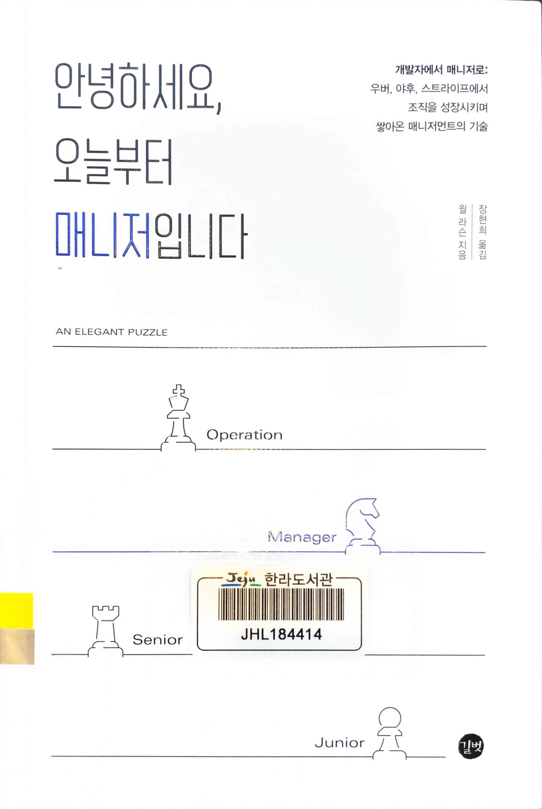

- ★★★★☆ March 17, 2024 → March 18, 2024 [안녕하세요, 오늘부터 매니저입니다 : 길벗, 이지톡](https://www.gilbut.co.kr/book/view?bookcode=BN003912) engineering management에 대한 매우 좋은 책. 별 생각없이 읽었는데 기대에 비해 훨씬 좋은 내용들로 가득했다. 현재 상황에 맞춰서 돌아보고, 또 앞으로 어떻게 해야 할지 방향이 흔들리던 부분이 있었는데 그런 부분을 잡아줘서 더 좋았다. 가장 좋았던 문장 딱 하나만 고르면 `’출시는 습관처럼 하는 거야’`. Routine을 형성하고 반복적으로 cycle을 돌리는 것의 가치를 만드는 건 정말 어렵지만 그래서 더 지향점으로 잡아야 하겠단 생각을 다시 한 번 한다. 물론 문서화나, 사람들간의 관계 형성에 대한 부분 역시 지나치면 안 될, 항상 기억해야 할 부분이다. 원제는 An elegant puzzle인데, 번역서 제목도 나쁘진 않지만 원서 제목이 (우리말로 쓴다고 해도) 훨씬 멋지단 생각이다.
    - 한라 325.2-라57ㅇ
    - system modelling site: [https://insightmaker.com/](https://insightmaker.com/)

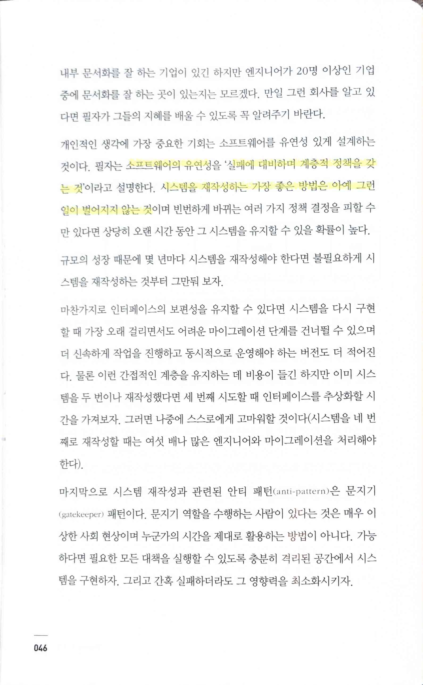

> 소프트웨어의 유연성 ‘실패에 대비하며 계층적 정책을 갖는 것’… 시스템을 재작성하는 가장 좋은 방법은 아예 그런 일이 벌어지지 않는 것
> 

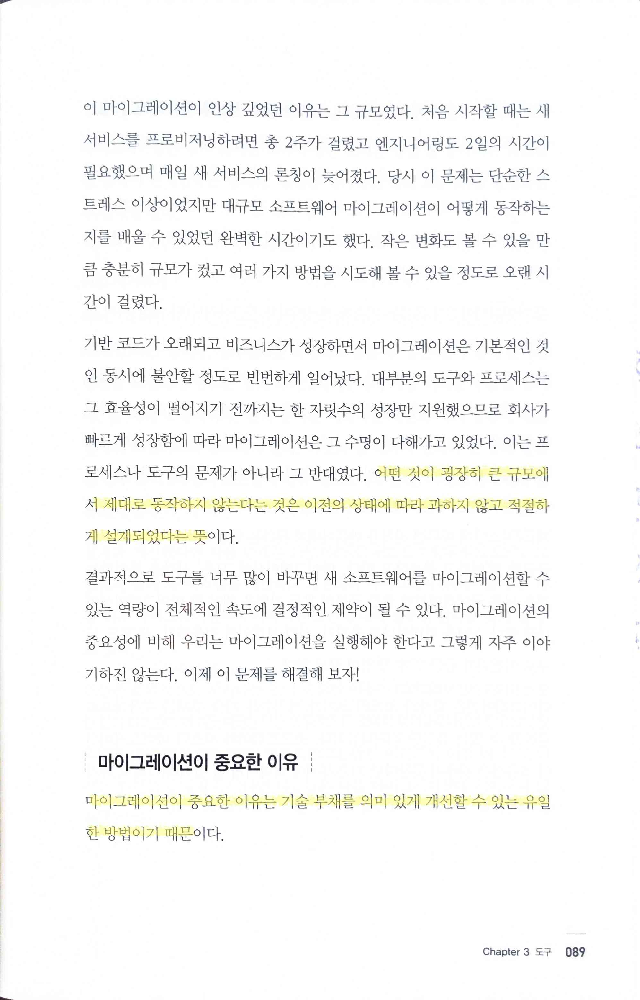

> 어떤 것이 굉장히 큰 규모에서 제대로 동작하지 않는다는 것은 이전의 상태에 따라 과하지 않고 적절하게 설계되었다는 뜻
마이그레이션이 중요한 이유는 기술 부채를 의미 있게 개선할 수 있는 유일한 방법이기 때문
> 

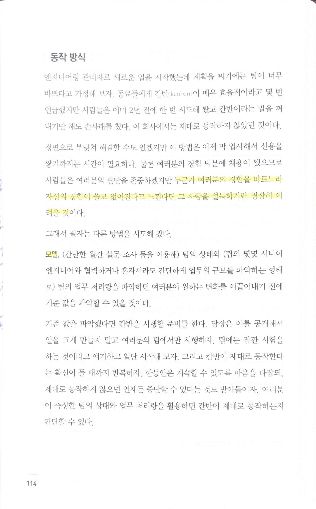

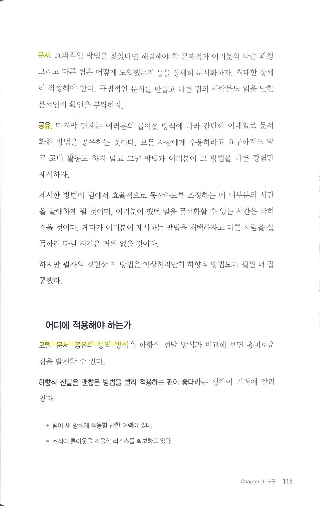

> 누군가 여러분의 경험을 따르느라 자신의 경험이 쓸모 없어진다고 느낀다면 그 사람을 설득하기란 굉장히 어려울 것
모델, 문서, 공유의 동작 방식
> 

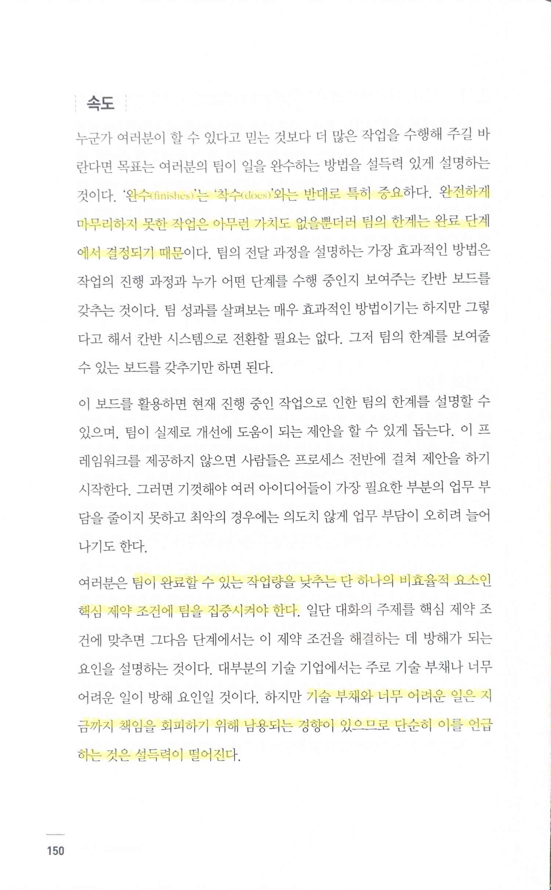

> 완수(finishes)는 착수(does)와는 반대로 특히 중요하다. 완전하게 마무리하지 못한 작업은 아무런 가치가 없을뿐더러 팀의 한계는 완료 단계에서 결정되기 때문
팀이 완료할 수 있는 작업량을 낮추는 단 하나의 비효율적 요소인 핵심 제약 조건에 팀을 집중시켜야 한다… 기술 부채와 너무 어려운 일은 지금까지 책임을 회피하기 위해 남용되는 경향이 있으므로 단순히 이를 언급하는 것은 설득력이 떨어진다. 따라서 기술 부채를 언급하기보다는 문제점을 데이터와 유사한 것으로 바꿔야 한다.
> 

> 긴 뼈는 끝에 성장판이 있어서 성장이 일어나는데, 가운데는 성장하지 않는다. 이는 빠르게 성장하는 회사를 표현하는 매우 적절한 비유
> 

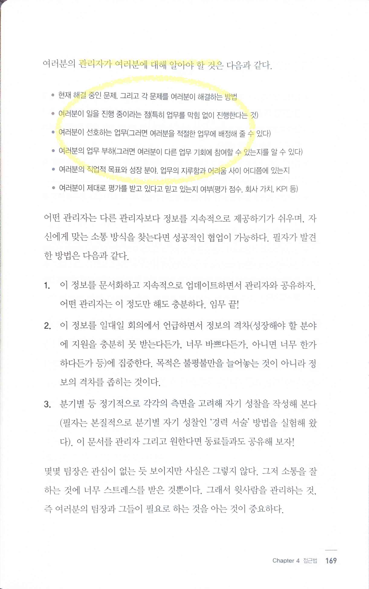

> 관리자가 여러분에 대해 알아야 할 것
> 
> - 반대로 내 manager에게 report해야 할 것이기도 하다

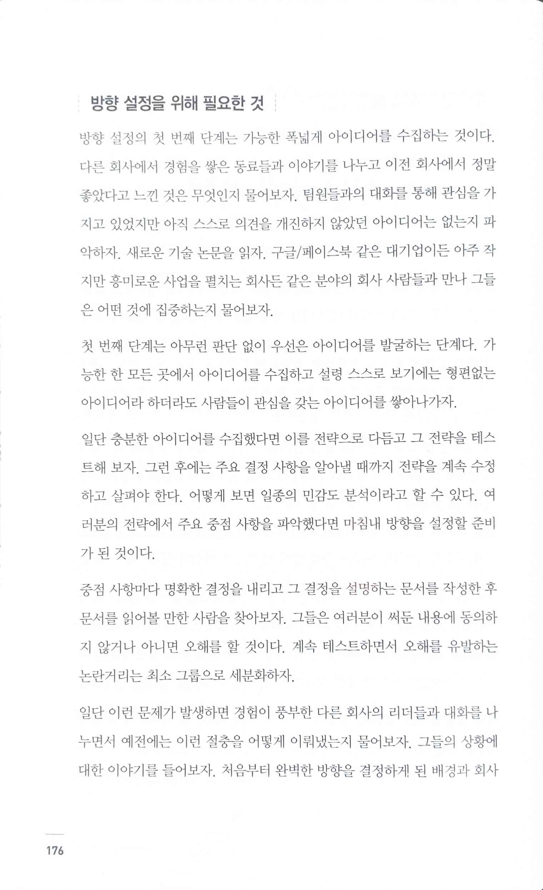

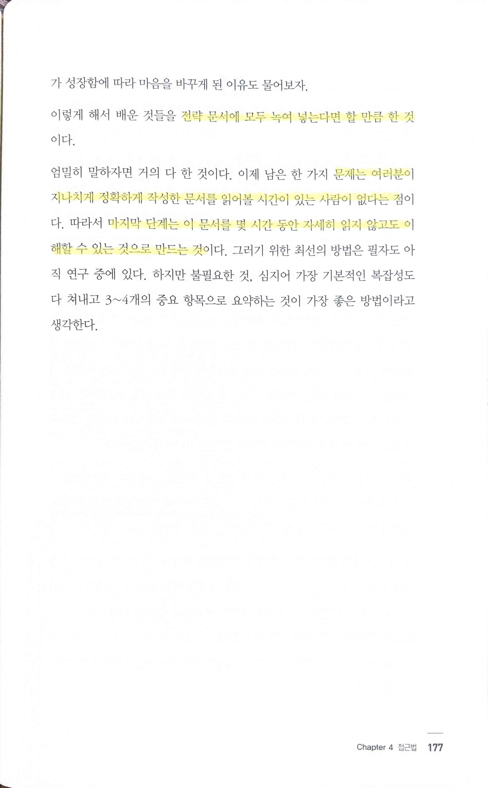

> 전략 문서에 모두 녹여 넣는다면 할 만큼 한 것
문제는 여러분이 지나치게 정확하게 작성한 문서를 읽어볼 시간이 있는 사람이 없다는 점… 마지막 단계는 이 문서를 몇 시간 동안 자세히 읽기 않고도 이해할 수 있는 것으로 만드는 것
> 
> - 문서 작성을 중시하는 점도 좋지만, 이 문서를 어떻게 만들어야 할 지 큰 틀에서 기억해야 할 이야기, 또 마지막에는 정리하는 게 필요하다는 점 역시 매우 중요

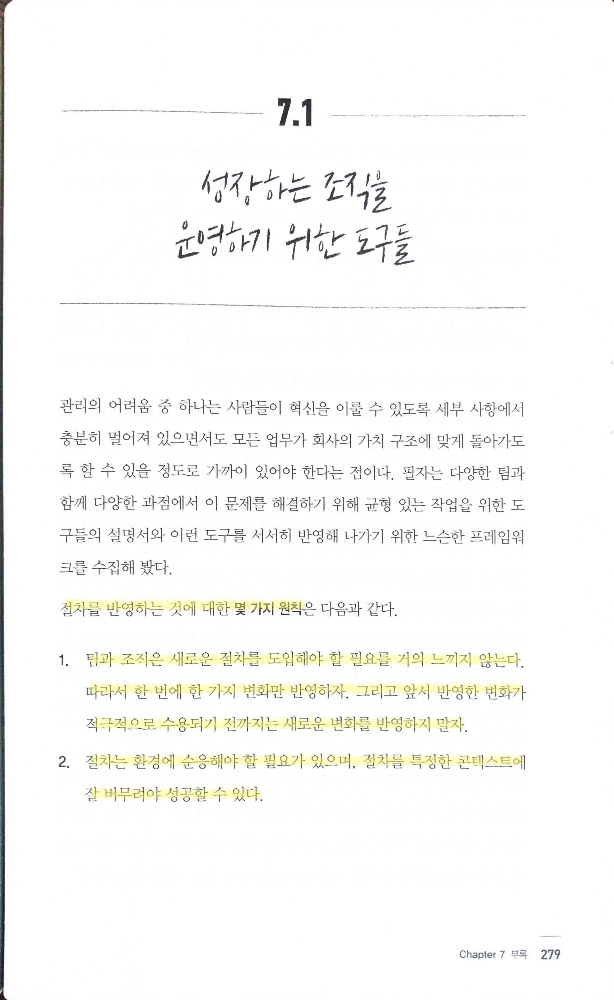

> 절차를 반영하는 것에 대한 몇 가지 원칙
1. 팀과 조직은 새로운 절차를 도입해야 할 필요를 거의 느끼지 않는다. 따라서 한 번에 한 가지 변화만 반영하자. 그리고 앞서 반영한 변화가 적극적으로 수용되기 전까지는 새로운 변화를 반영하지 말자
2. 절차는 환경에 순응해야 할 필요가 있으며, 절차를 특정한 콘텍스트에 잘 버무려야 성공할 수 있다
> 
> - 기본적으로 여기에 동의. 변화의 필요성을 스스로 느끼는 경우도 많지 않지만, 그런 경우라도 변화의 방향이 동일할지도 알 수 없기 때문에 기본적으로 대부분 변화를 싫어한다고 가정하는 게 좋다고 생각한다

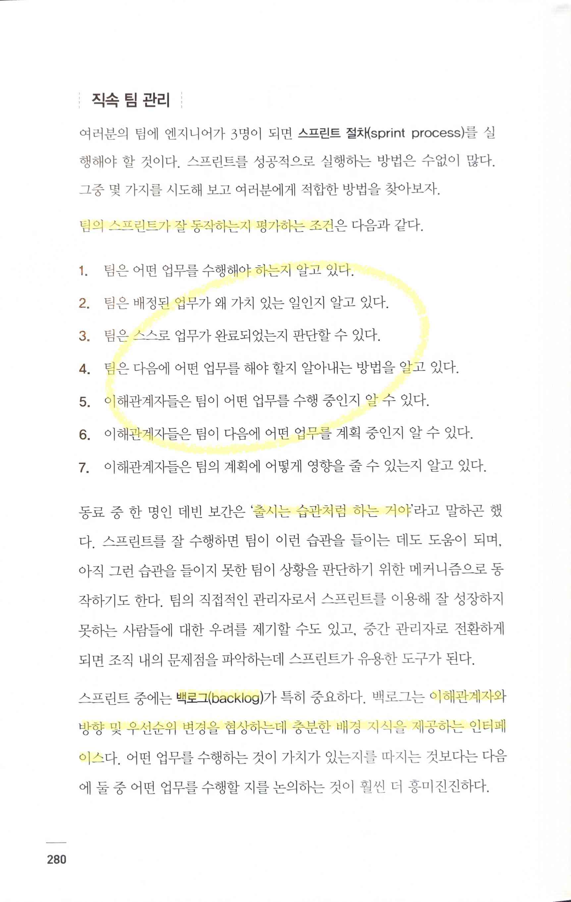

> 팀의 스프린트가 잘 동작하는지 평가하는 조건
’출시는 습관처럼 하는 거야’
> 
> - 100% 동의. 이게 안 되면 product/service에 어떤 변화도 주기 어렵다
> 
> 백로그(backlog)는 이해관계자와 방향 및 우선순위 변경을 협상하는데 충분한 배경 지식을 제공하는 인터페이스
> 

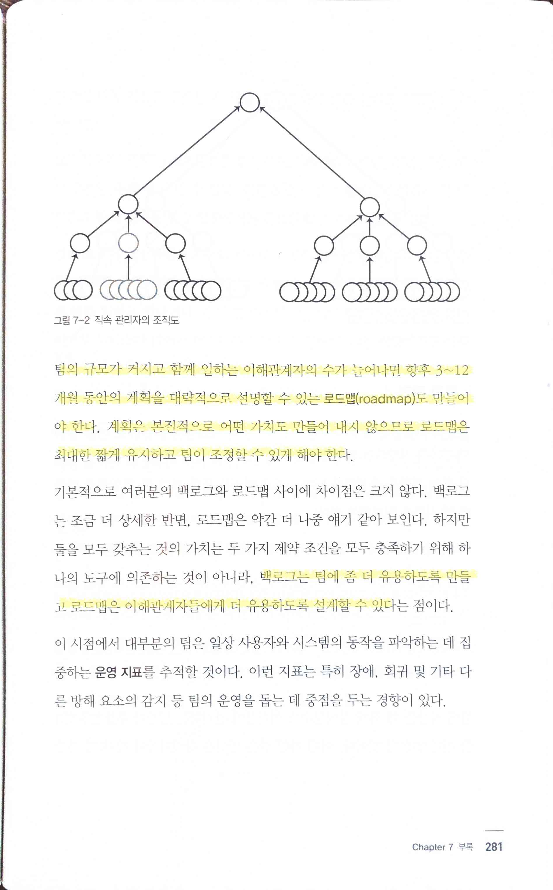

> 팀의 규모가 커지고 함께 일하는 이해관계자의 수가 늘어나면 향후 3~12개월 동안의 계획을 대략적으로 설명할 수 있는 로드맵(roadmap)도 만들어야 한다. 계획은 본질적으로 어떤 가치도 만들어 내지 않으므로 로드맵은 최대한 짧게 유지하고 팀이 조정할 수 있게 해야 한다
> 
> - 계획은 본질적으로 무가치하지만 그럼에도 불구하고 불가피한 작업
> 
> 백로그는 팀에 좀 더 유용하도록 만들고 로드맵은 이해관계자들에게 더 유용하도록 설계할 수 있다
>
