최고의 조직 리더가 지켜야할 것과 버려야할 것
============================================
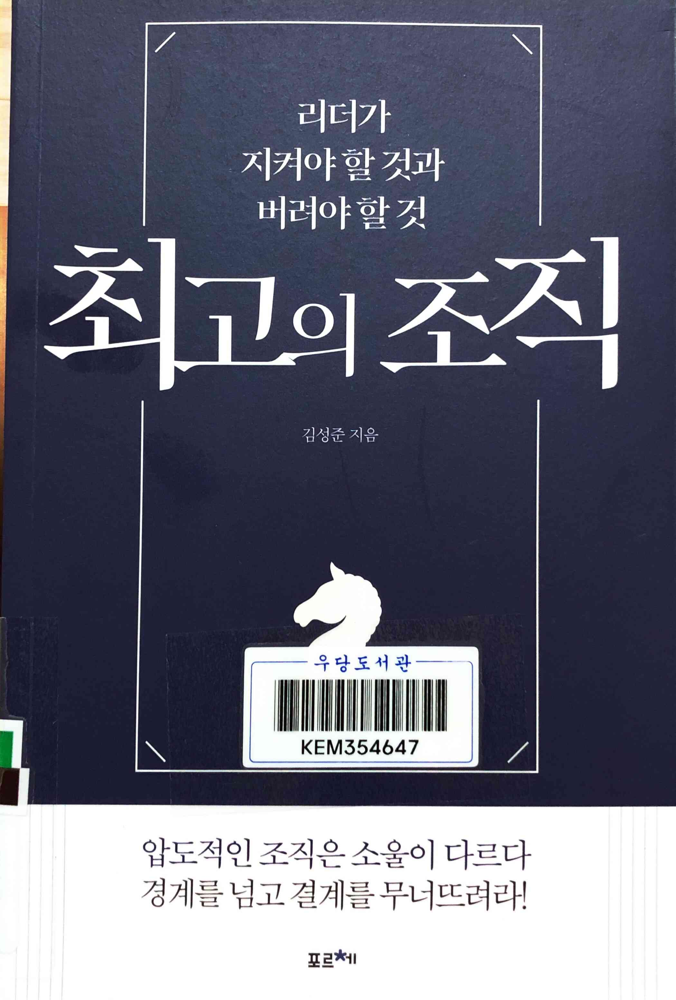

# 1부 지금까지의 조직은 잊어라

## 1 조직과 문화가 결합된 시대
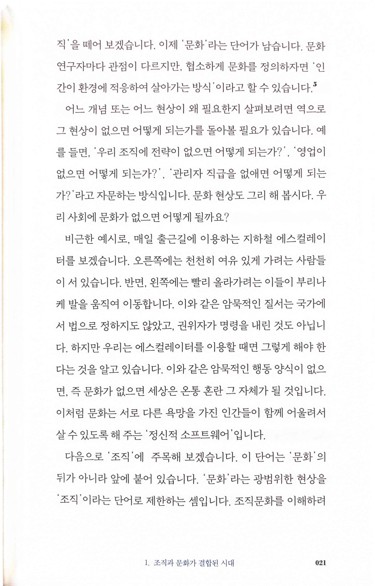

> '문화'; 문화연구자마다 관점이 다르지만, 협소하게 문화를 정의하자면 '인간이 환경에 적응하여 살아가는 방식'이라고 할 수 있습니다.
>
> 문화는 서로 다른 욕망을 가진 인간들이 함께 어울려서살 수 있도록 해 주는 '정신적 소프트웨어'입니다.

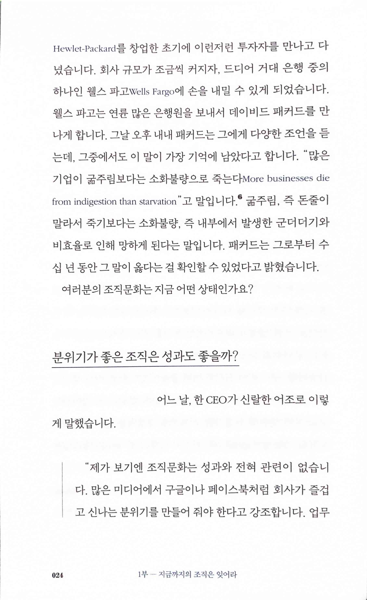

> “많은 기업이 굶주림보다는 소화불량으로 죽는다 More businesses die from indigestion than starvation"
* ["More Organisations Die Of Indigestion Than Starvation" - Morgan Cross Consulting](https://morgancross.co.uk/simplicity/more-organisations-die-of-indigestion-than-starvation/)

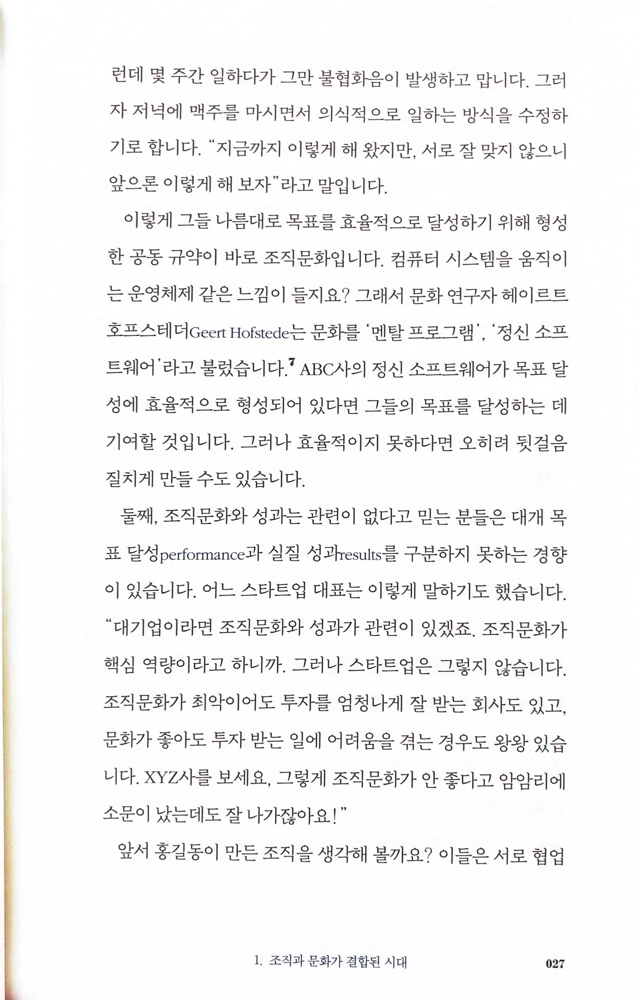

> 목표를 효율적으로 달성하기 위해 형성한 공동 규약이 바로 조직문화... 문화 연구자 `헤이르트 호프스테더 Geert Hofstede`는 문화를 '멘탈 프로그램', '정신 소프트웨어'라고 불렀습니다. ABC사의 정신 소프트웨어가 목표 달성에 효율적으로 형성되어 있다면 그들의 목표를 달성하는 데 기여할 것입니다. 그러나 효율적이지 못하다면 오히려 뒷걸음질치게 만들 수도 있습니다.
* [Geert Hofstede and Gert Jan Hofstede on culture](https://geerthofstede.com/)
> 조직문화와 성과는 관련이 없다고 믿는 분들은 대개 목표 달성performance과 실질 성과results를 구분하지 못하는 경향이 있습니다.

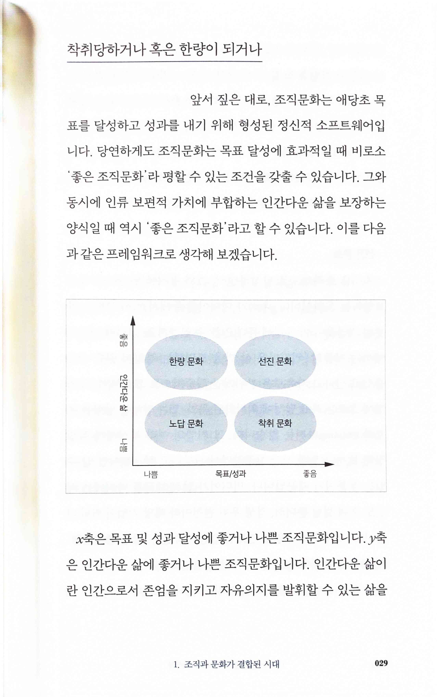

> 조직문화는 애당초 목표를 달성하고 성과를 내기 위해 형성된 정신적 소프트웨어입니다. 당연하게도 조직문화는 목표 달성에 효과적일 때 비로소'좋은 조직문화'라 평할 수 있는 조건을 갖출 수 있습니다. 그와 동시에 인류 보편적 가치에 부합하는 인간다운 삶을 보장하는 양식일 때 역시 '좋은 조직문화'라고 할 수 있습니다.

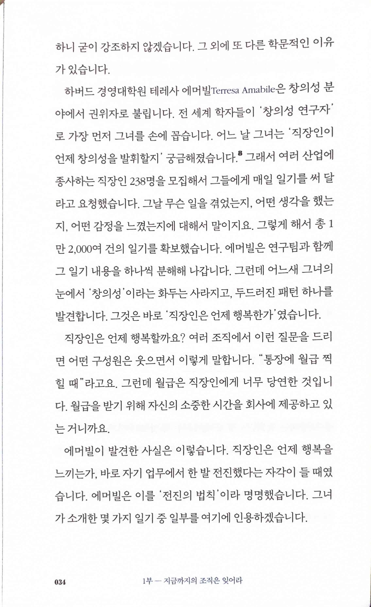 

> 하버드 경영대학원 `테레사 에머빌 Terresa Amabile`은 창의성 분야에서 권위자
* [Teresa M. Amabile - Faculty & Research - Harvard Business School](https://www.hbs.edu/faculty/Pages/profile.aspx?facId=6409)
> 직장인은 언제 행복을 느끼는가, 바로 자기 업무에서 한 발 전진했다는 자각이 들 때였습니다. 에머빌은 이를 '전진의 법칙'이라 명명
>
> 직장인들은 부가적인 이벤트보다는 자신의 일에서 진정한 행복과 즐거움을 느끼고 있었습니다.

## 2 조직은 문화가 좌우한다
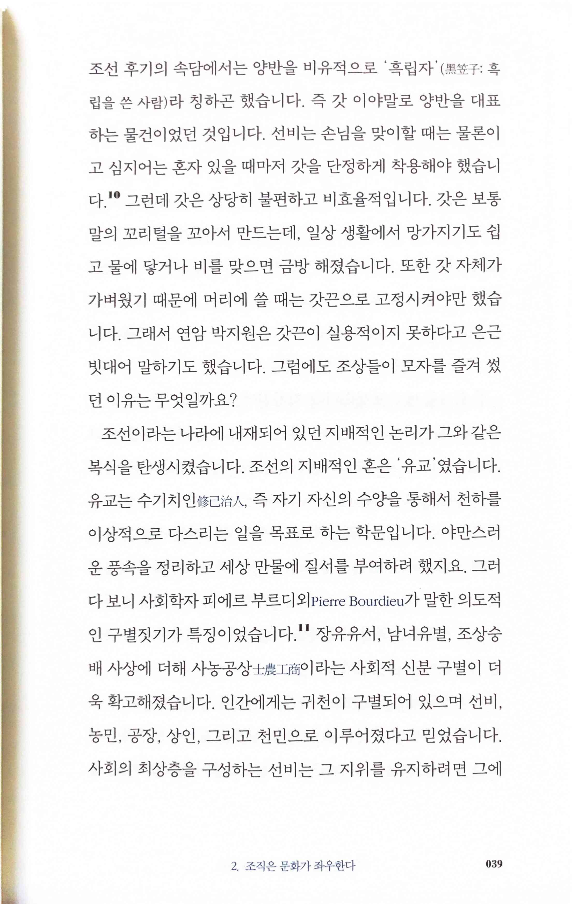

> 사회학자 `피에르 부르디외 Pierre Bourdieu`가 말한 의도적인 구별짓기가 특징
* [Pierre Bourdieu - Wikipedia](https://en.wikipedia.org/wiki/Pierre_Bourdieu)

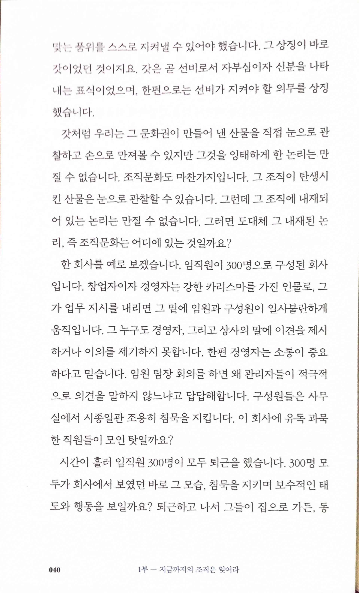

> 갓처럼 우리는 그 문화권이 만들어 낸 산물을 직접 눈으로 관찰하고 손으로 만져볼 수 있지만 그것을 잉태하게 한 논리는 만질 수 없습니다. 조직문화도 마찬가지입니다. 그 조직이 탄생시킨 산물은 눈으로 관찰할 수 있습니다. 그런데 그 조직에 내재되어 있는 논리는 만질 수 없습니다. 그러면 도대체 그 내재된 논리, 즉 조직문화는 어디에 있는 것일까요?

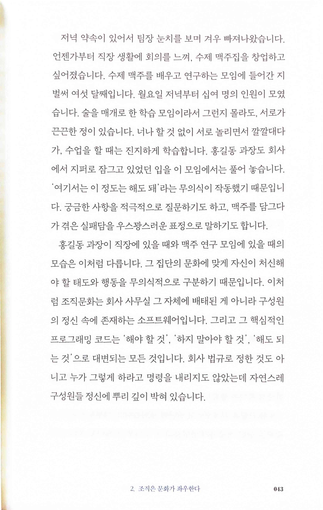

> 집단의 문화에 맞게 자신이 처신해야 할 태도와 행동을 무의식적으로 구분하기 때문입니다. 이처럼 조직문화는 회사 사무실 그 자체에 배태된 게 아니라 구성원의 정신 속에 존재하는 소프트웨어입니다. 그리고 그 핵심적인 프로그래밍 코드는 '해야 할 것', '하지 말아야 할 것', '해도 되는 것'으로 대변되는 모든 것입니다. 회사 법규로 정한 것도 아니고 누가 그렇게 하라고 명령을 내리지도 않았는데 자연스레 구성원들 정신에 뿌리 깊이 박혀 있습니다.

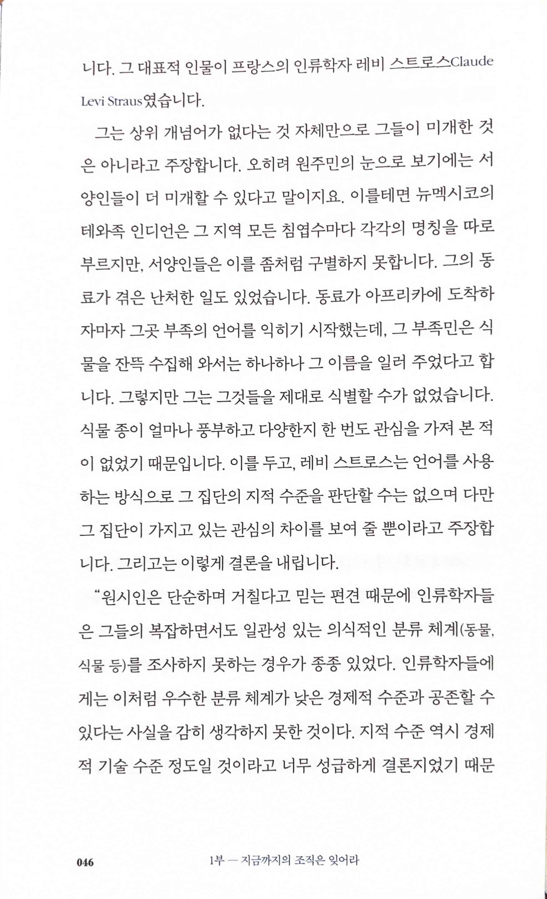

> 프랑스의 인류학자 `레비 스트로스 Claude Lévi-Straus`는 언어를 사용하는 방식으로 그 집단의 지적 수준을 판단할 수는 없으며 다만 그 집단이 가지고 있는 관심의 차이를 보여 줄 뿐이라고 주장합니다.
* [Claude Lévi-Strauss - Wikipedia](https://en.wikipedia.org/wiki/Claude_L%C3%A9vi-Strauss)

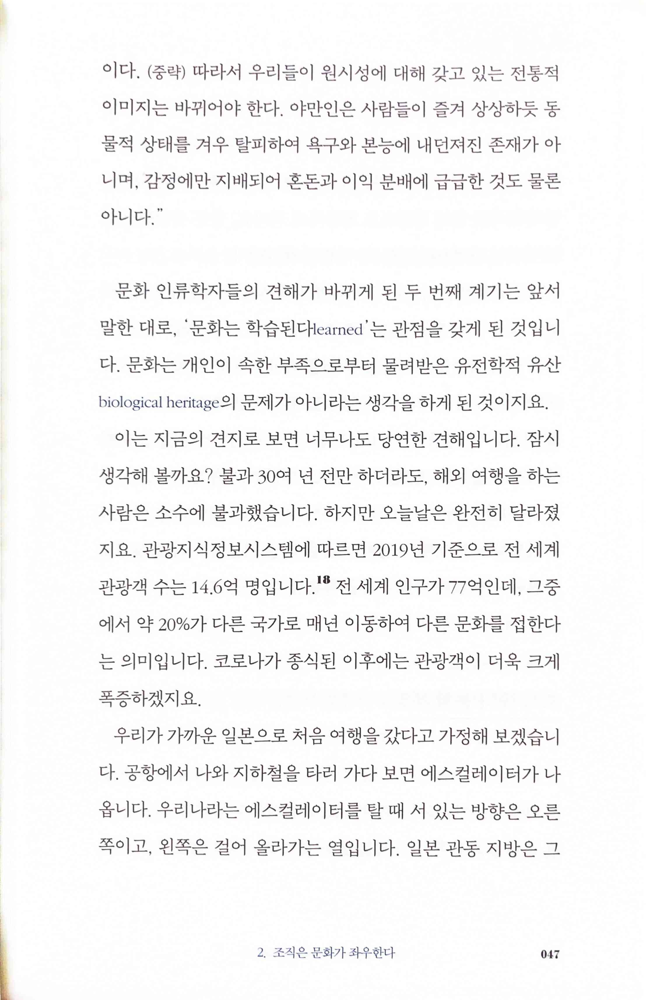

> '문화는 학습된다 learned'는 관점을 갖게 된 것입니다. 문화는 개인이 속한 부족으로부터 물려받은 유전학적 유산 biological heritage의 문제가 아니라는 생각을 하게 된 것이지요.

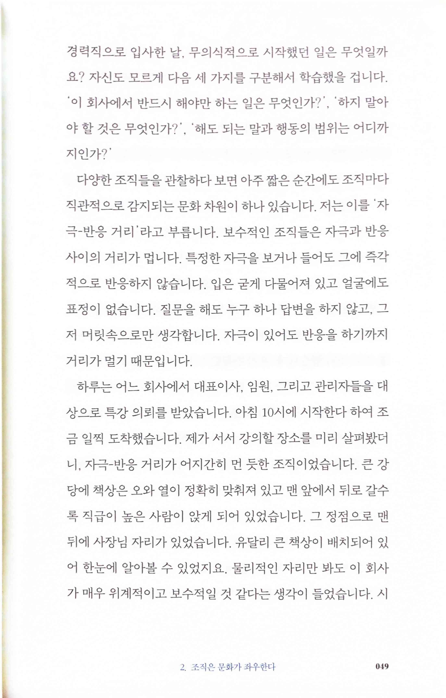

> 경력직으로 입사한 날, 무의식적으로 시작했던 일은 무엇일까요? 자신도 모르게 다음 세 가지를 구분해서 학습했을 겁니다. '이 회사에서 반드시 해야만 하는 일은 무엇인가?', '하지 말아야 할 것은 무엇인가?', '해도 되는 말과 행동의 범위는 어디까지인가?'

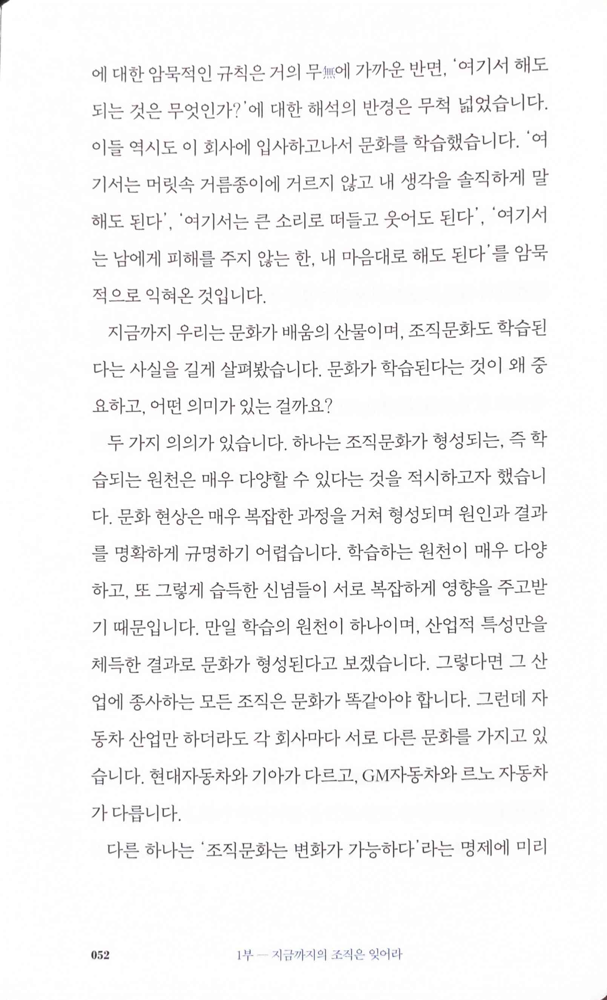 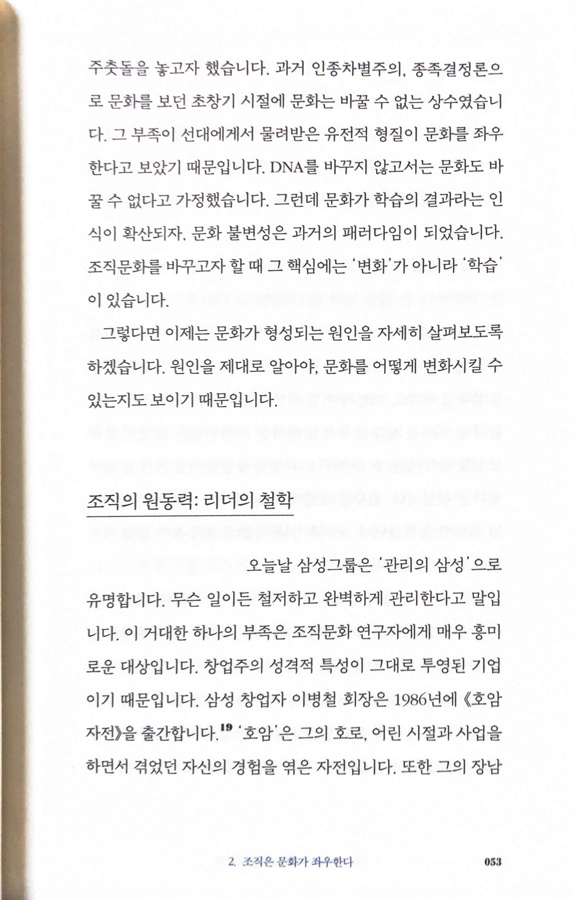

> 지금까지 우리는 문화가 배움의 산물이며, 조직문화도 학습된다는 사실을 길게 살펴봤습니다. 문화가 학습된다는 것이 왜 중요하고, 어떤 의미가 있는 걸까요?
>
> 두 가지 의의가 있습니다. 하나는 조직문화가 형성되는, 즉 학습되는 원천은 매우 다양할 수 있다... 다른 하나는 '조직문화는 변화가 가능하다'
>
> 조직문화를 바꾸고자 할 때 그 핵심에는 '변화'가 아니라 '학습'이 있습니다.

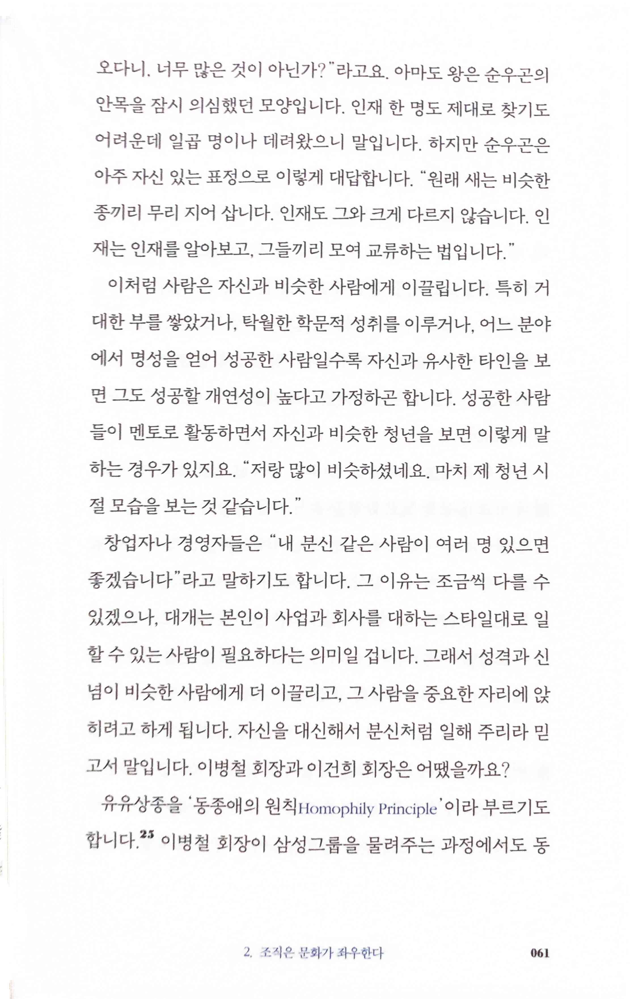

> 순우곤 "원래 새는 비슷한 종끼리 무리 지어 삽니다. 인재도 그와 크게 다르지 않습니다. 인재는 인재를 알아보고, 그들끼리 모여 교류하는 법입니다."
* [물이유취(物以類聚) : 네이버 블로그](https://blog.naver.com/kwank99/30083242304)
> 유유상종 `'동종애의 원칙 Homophily Principle'`
* [Homophily - Wikipedia](https://en.wikipedia.org/wiki/Homophily)

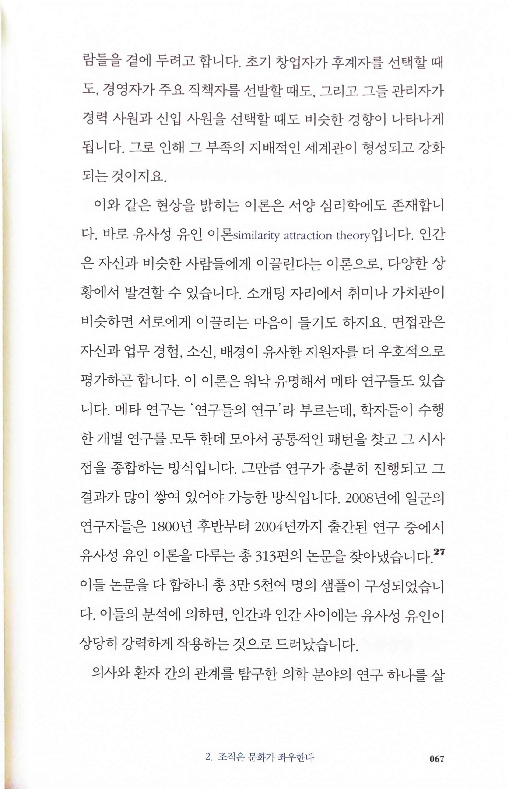

> `유사성 유인 이론 similarity attraction theory` 인간은 자신과 비슷한 사람들에게 이끌린다는 이론
* [Similarity-Attraction Effect - IResearchNet](http://psychology.iresearchnet.com/social-psychology/interpersonal-relationships/similarity-attraction-effect/)
> 인간과 인간 사이에는 유사성 유인이 상당히 강력하게 작용

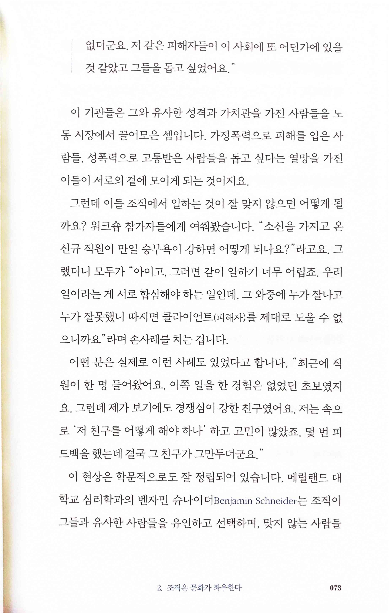 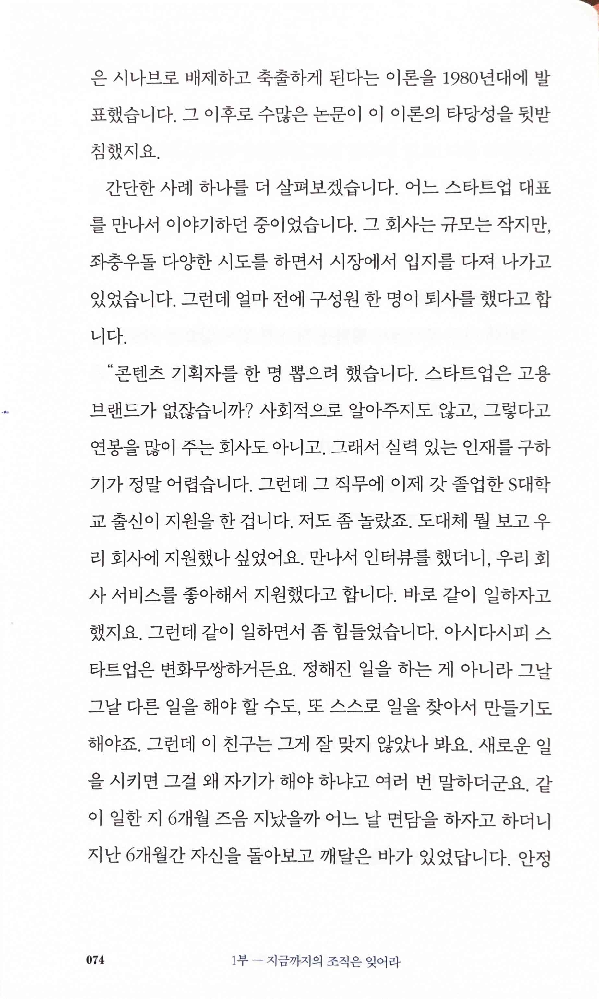

> 메릴랜드 대학교 심리학과의 `벤자민 슈나이더 Benjamin Schneider`는 조직이 그들과 유사한 사람들을 유인하고 선택하며, 맞지 않는 사람들은 시나브로 배제하고 축출하게 된다는 이론을 1980년대에 발표했습니다. 그 이후로 수많은 논문이 이 이론의 타당성을 뒷받침했지요.
* [Benjamin Schneider | USC Center for Effective Organizations](https://ceo.usc.edu/bio/ben-schneider/)

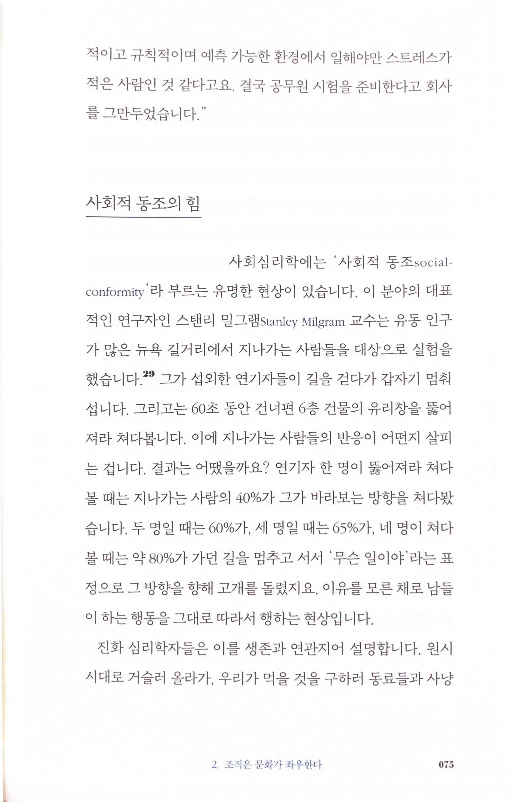

> 사회심리학에는 `'사회적 동조 social conformity'`라 부르는 유명한 현상이 있습니다. 이 분야의 대표적인 연구자인 `스탠리 밀그램 Stanley Milgram` 교수는 유동 인구가 많은 뉴욕 길거리에서 지나가는 사람들을 대상으로 실험을 했습니다.
* [Social Conformity Overview & Types | What is Social Conformity? - Video & Lesson Transcript | Study.com](https://study.com/learn/lesson/social-conformity-overview-types-what-is-social-conformity.html)
* [Stanley Milgram - Wikipedia](https://en.wikipedia.org/wiki/Stanley_Milgram)

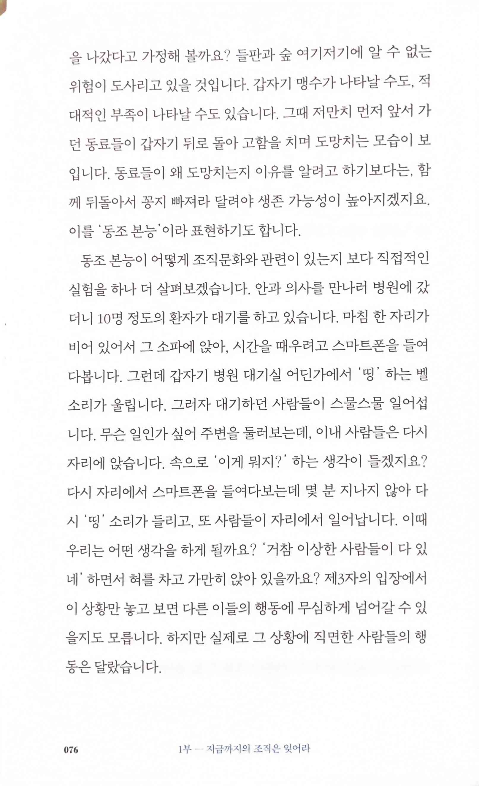

> 진화 심리학자들은 이를 생존과 연관지어 설명합니다... 이를 `'동조 본능'`이라 표현하기도 합니다.
* [동조 생존의 조건 행동 현상 따라하기.. : 네이버블로그](https://blog.naver.com/jscho7942/221316180673)

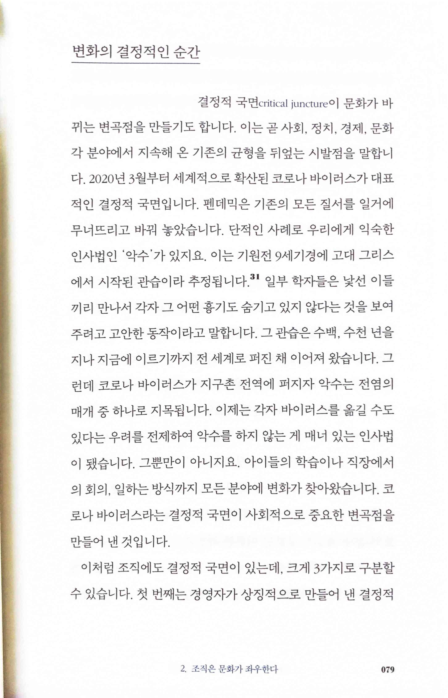

> `결정적 국면 critical juncture`이 문화가 바뀌는 변곡점을 만들기도 합니다. 이는 곧 사회, 정치, 경제, 문화각 분야에서 지속해 온 기존의 균형을 뒤엎는 시발점을 말합니다. e.g. 코로나 바이러스로 수천년을 이어온 악수를 하지 않게 된 상황
* [Critical juncture theory - Wikipedia](https://en.wikipedia.org/wiki/Critical_juncture_theory)

> 결정적 국면은 조직에서 문화의 변곡점을 만듭니다.

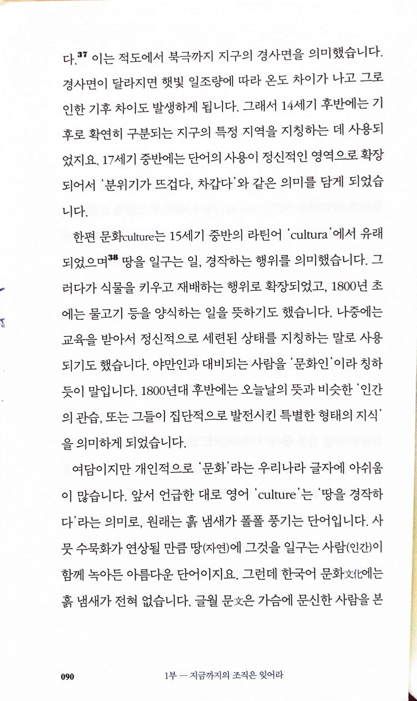 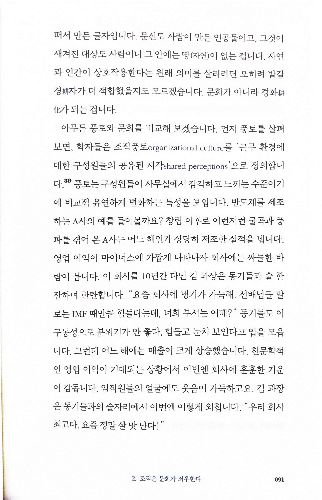

> 학자들은 `조직풍토 organizational culture`를 '근무 환경에 대한 구성원들의 공유된 지각 shared perceptions'으로 정의합니다. 풍토는 구성원들이 사무실에서 감각하고 느끼는 수준이기에 비교적 유연하게 변화하는 특성을 보입니다.
* [What is Organizational Climate? 7 Steps to Improve Yours - AIHR](https://www.aihr.com/blog/organizational-climate/)
* [Frontiers | Perception is Only Real When Shared: A Mathematical Model for Collaborative Shared Perception in Human-Robot Interaction](https://www.frontiersin.org/articles/10.3389/frobt.2022.733954/full)
> 학자들은 표면적 수준의 문화, 이를 따로 칭해서 조직풍토 climate라 말합니다. 작업장이나 사무실에서 구성원들이 접하는 현상에 대한 감각과 감정을 의미합니다. 주변 환경이 달라지면 구성원들의 인식이 달라지듯이, 풍토는 그때마다 달라지는 경향이 있습니다.
* [17편. 조직풍토와 조직문화가 다른 건가요?](https://brunch.co.kr/@donebygod/22)

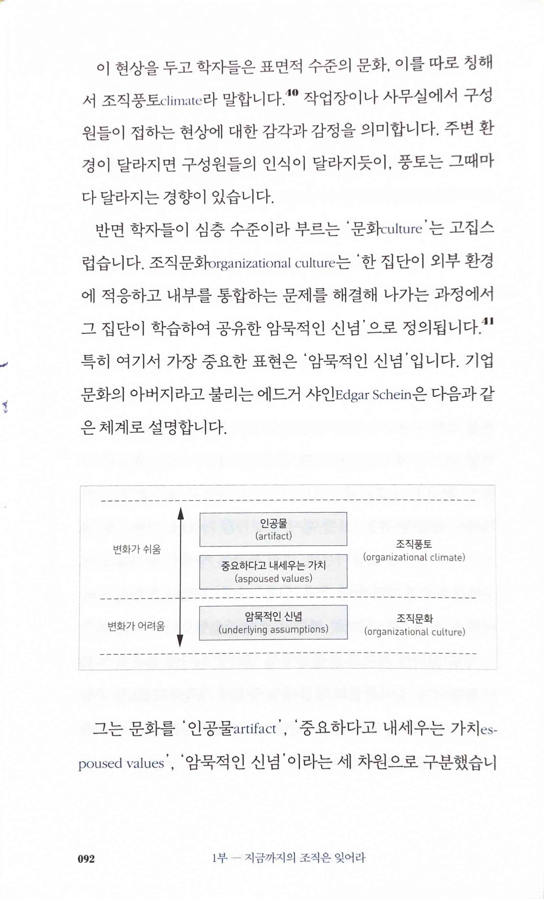 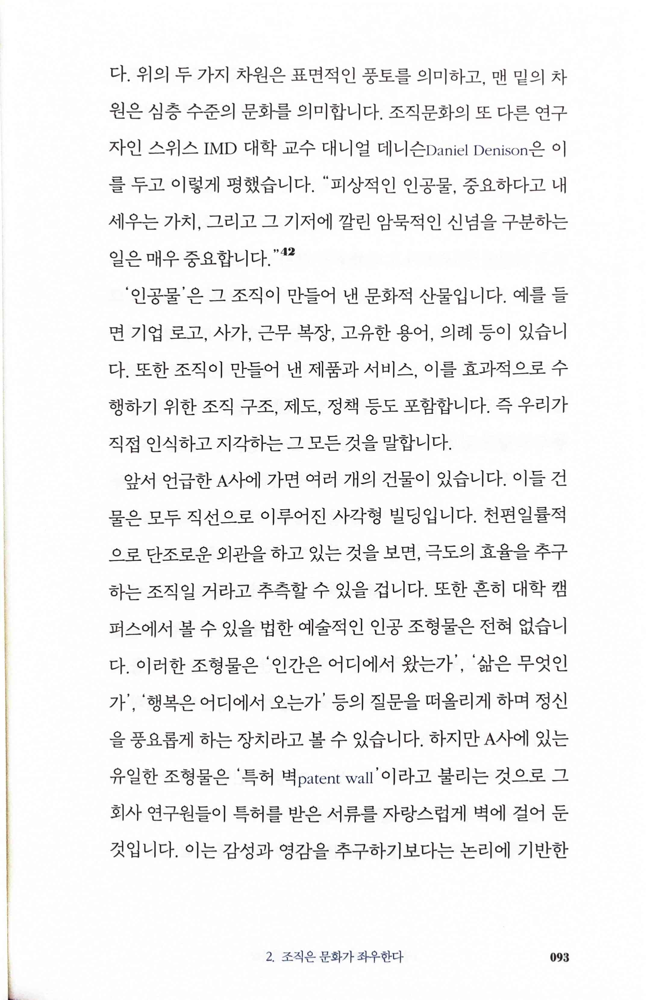

> 학자들이 심층 수준이라 부르는 '문화 culture'는 고집스럽습니다. `조직문화 organizational culture`는 '한 집단이 외부 환경에 적응하고 내부를 통합하는 문제를 해결해 나가는 과정에서 그 집단이 학습하여 공유한 암묵적인 신념'으로 정의됩니다. 특히 여기서 가장 중요한 표현은 '암묵적인 신념' 입니다. 기업문화의 아버지라고 불리는 `에드거 샤인 Edgar Schein`은 다음과 같은 체계로 설명합니다.
* [Organizational culture: Definition, importance, and development - Achievers](https://www.achievers.com/blog/organizational-culture-definition/)
* [Edgar Schein - Wikipedia](https://en.wikipedia.org/wiki/Edgar_Schein)
> 인공물 (artifact) 중요하다고 내세우는 가치 (aspoused values) 조직풍토 (organizational climate)
>
> 암묵적인 신념 (underlying assumptions) 조직문화 (organizational culture)
>
> 조직문화의 또 다른 연구자인 스위스 IMD 대학 교수 `대니얼 데니슨 Daniel Denison`은 이를 두고 이렇게 평했습니다. "피상적인 인공물, 중요하다고 내세우는 가치, 그리고 그 기저에 깔린 암묵적인 신념을 구분하는 일은 매우 중요합니다."
* [Daniel R. Denison - Wikipedia](https://en.wikipedia.org/wiki/Daniel_R._Denison)

# 2부 소통하는 리더가 최고의 조직을 만든다

## 1 좋은 문화는 쇼핑하듯 골라 담을 수 없다
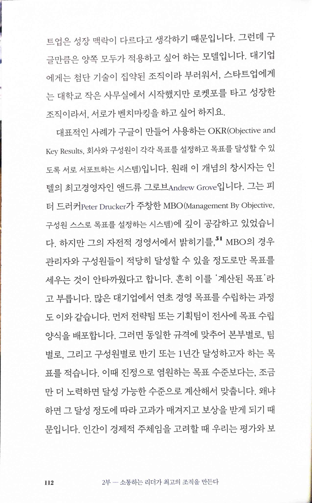

> 구글이 만들어 사용하는 `OKR`(Objective and Key Results, 회사와 구성원이 각각 목표를 설정하고 목표를 달성할 수 있도록 서로 서포트하는 시스템)
>
> 원래 이 개념의 창시자는 인텔의 최고경영자인 앤드류 그로브 Andrew Grove입니다. 그는 피터 드러커 Peter Drucker가 주창한 MBO(Management By Objective,구성원 스스로 목표를 설정하는 시스템)에 깊이 공감하고 있었습니다. 하지만 그의 자전적 경영서에서 밝히기를 MBO의 경우 관리자와 구성원들이 적당히 달성할 수 있을 정도로만 목표를 세우는 것이 안타까웠다고 합니다.

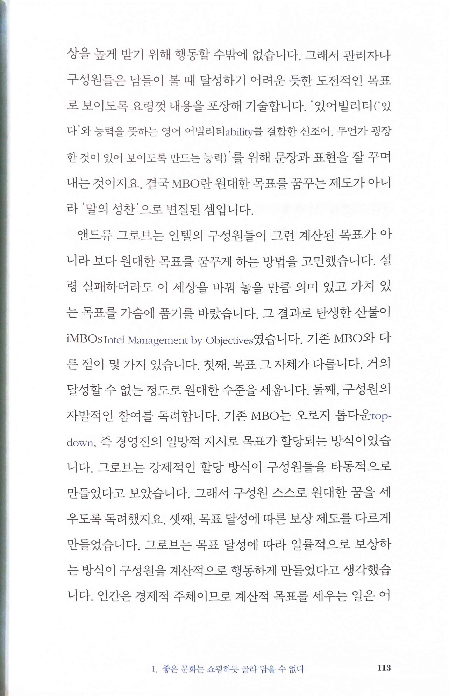

> 앤드류 그로브는 인텔의 구성원들이 그런 계산된 목표가 아니라 보다 원대한 목표를 꿈꾸게 하는 방법을 고민했습니다. 설령 실패하더라도 이 세상을 바꿔 놓을 만큼 의미 있고 가치 있는 목표를 가슴에 품기를 바랐습니다. 그 결과로 탄생한 산물이 iMBOs Intel Management by Objectives였습니다. 기존 MBO와 다른 점이 몇 가지 있습니다. 첫째, 목표 그 자체가 다릅니다. 거의 달성할 수 없는 정도로 원대한 수준을 세웁니다. 둘째, 구성원의 자발적인 참여를 독려합니다. 기존 MBO는 오로지 톱다운 topdown, 즉 경영진의 일방적 지시로 목표가 할당되는 방식이었습니다. 그로브는 강제적인 할당 방식이 구성원들을 타동적으로 만들었다고 보았습니다. 그래서 구성원 스스로 원대한 꿈을 세우도록 독려했지요. 셋째, 목표 달성에 따른 보상 제도를 다르게 만들었습니다. 그로브는 목표 달성에 따라 일률적으로 보상하는 방식이 구성원을 계산적으로 행동하게 만들었다고 생각했습니다. 인간은 경제적 주체이므로 계산적 목표를 세우는 일은 어쩌면 자연스러운 일입니다. 그래서 그는 목표 달성과 보상 수준간의 연계를 느슨하게 만들었습니다.

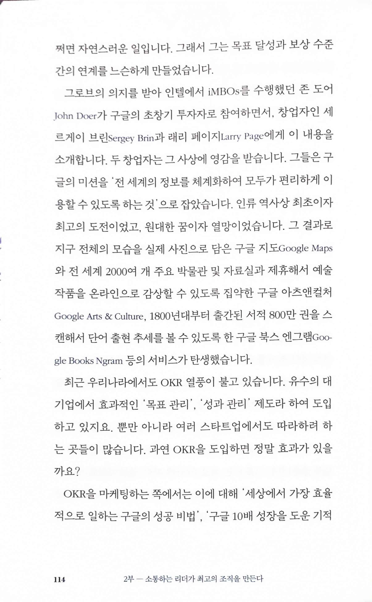

> 그로브의 의지를 받아 인텔에서 iMBOs를 수행했던 존 도어 John Doer가 구글의 초창기 투자자로 참여하면서, 창업자인 세르게이 브린 Sergey Brin과 래리 페이지 Larry Page에게 이 내용을 소개합니다. 두 창업자는 그 사상에 영감을 받습니다.

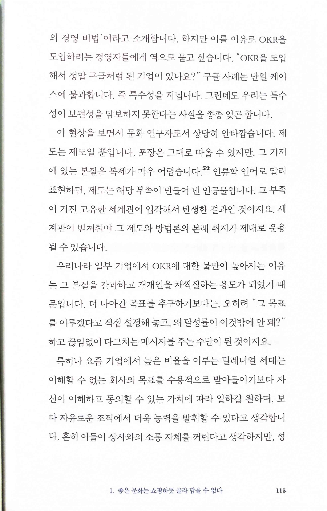

> 제도는 제도일 뿐입니다. 포장은 그대로 따올 수 있지만, 그 기저에 있는 본질은 복제가 매우 어렵습니다. 인류학 언어로 달리 표현하면, 제도는 해당 부족이 만들어 낸 인공물입니다. 그 부족이 가진 고유한 세계관에 입각해서 탄생한 결과인 것이지요. 세계관이 받쳐줘야 그 제도와 방법론의 본래 취지가 제대로 운용될 수 있습니다.

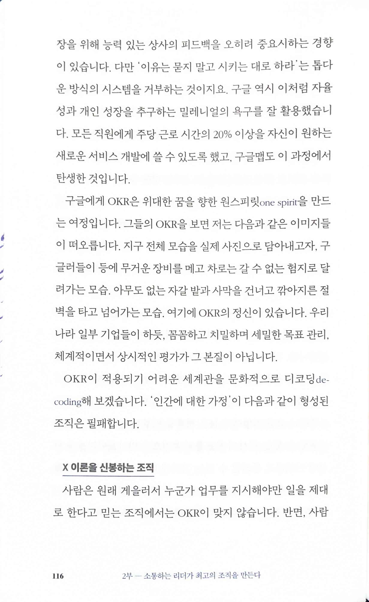

> 구글에게 OKR은 위대한 꿈을 향한 원스피릿 one spirit을 만드는 여정입니다... 여기에 OKR의 정신이 있습니다. 우리나라 일부 기업들이 하듯, 꼼꼼하고 치밀하며 세밀한 목표 관리, 체계적이면서 상시적인 평가가 그 본질이 아닙니다.

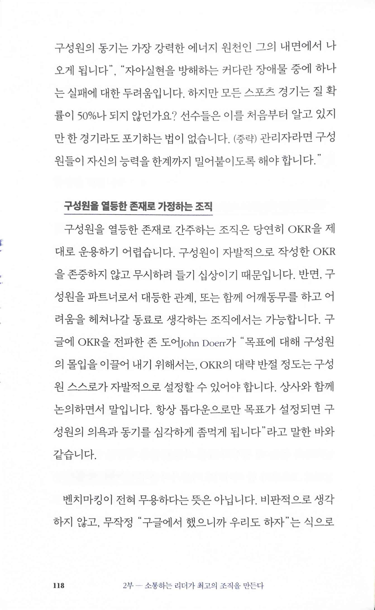

> 구글에 OKR을 전파한 존 도어 John Doerr "목표에 대해 구성원의 몰입을 이끌어 내기 위해서는, OKR의 대략 반절 정도는 구성원 스스로가 자발적으로 설정할 수 있어야 합니다. 상사와 함께 논의하면서 말입니다. 항상 톱다운으로만 목표가 설정되면 구성원의 의욕과 동기를 심각하게 좀먹게 됩니다"

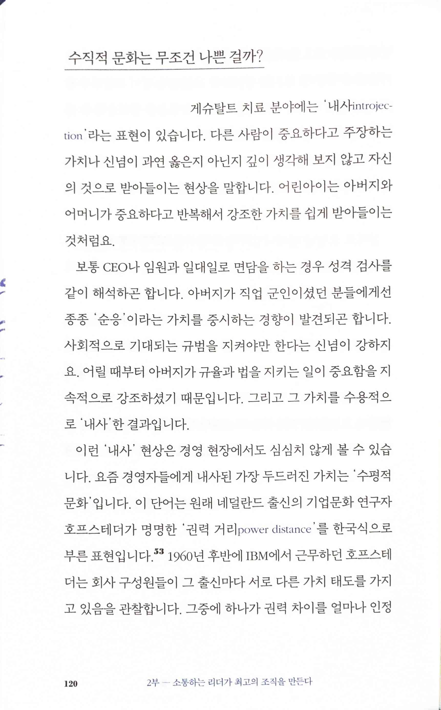

> `게슈탈트 Gestalt` 치료 분야에는 `'내사 introjection'` 라는 표현이 있습니다. 다른 사람이 중요하다고 주장하는 가치나 신념이 과연 옳은지 아닌지 깊이 생각해 보지 않고 자신의 것으로 받아들이는 현상을 말합니다.
* [Gestalt Psychology and Theory | Carter Counseling & Coaching Services](https://serenitycreationsonline.com/gestalt_psychology.html)
> '수평적 문화' 원래 네덜란드 출신의 기업문화 연구자 호프스테더가 명명한 `'권력 거리 power distance'`를 한국식으로 부른 표현
* [Power distance - Wikipedia](https://en.wikipedia.org/wiki/Power_distance)

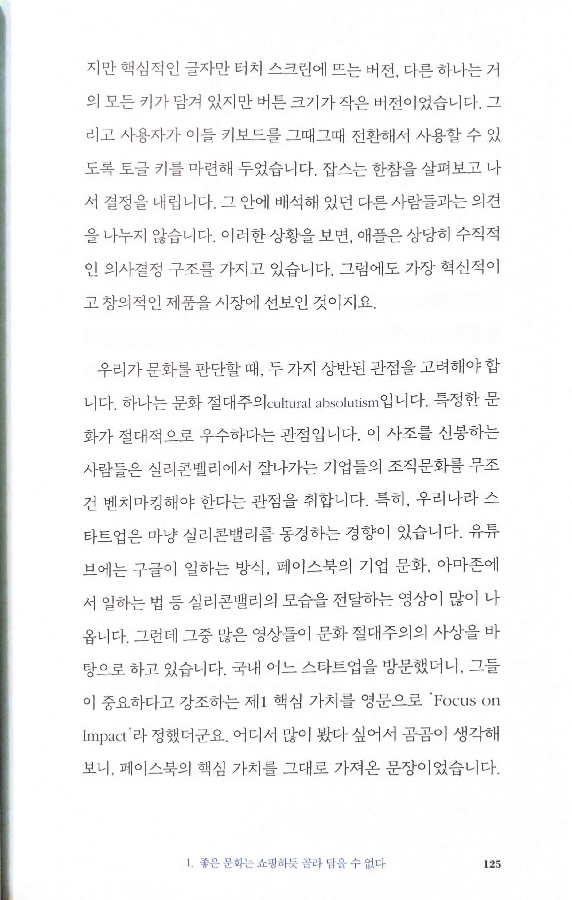

> `문화 절대주의 cultural absolutism` 특정한 문화가 절대적으로 우수하다는 관점

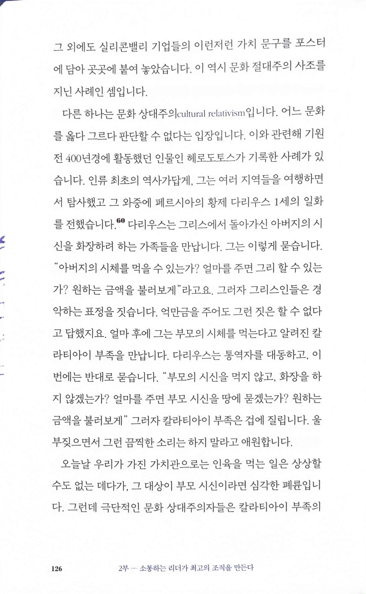

> `문화 상대주의 cultural relativism` 어느 문화를 옳다 그르다 판단할 수 없다는 입장

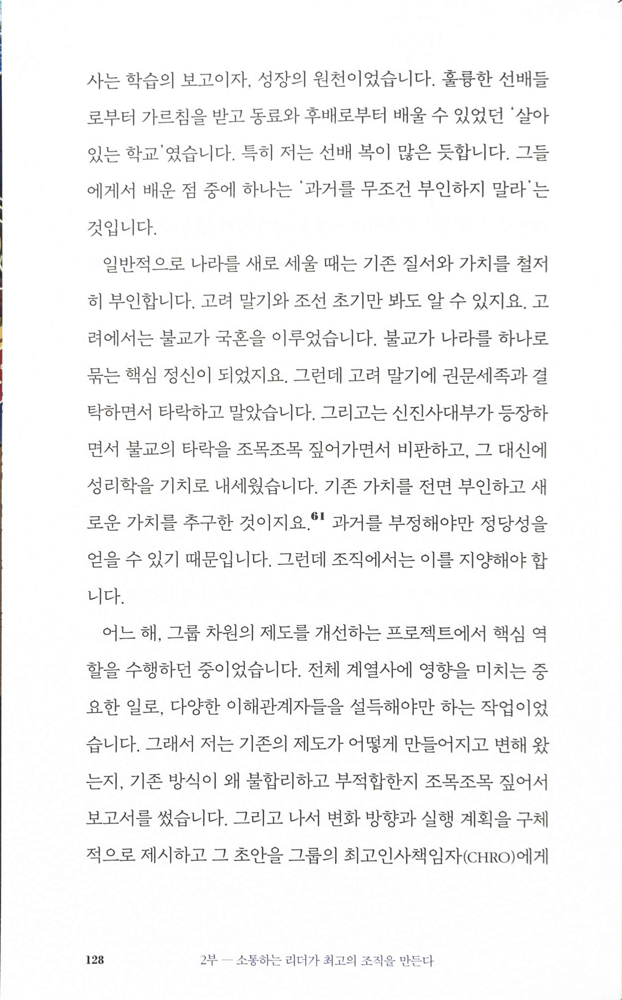

> 일반적으로 나라를 새로 세울 때는 기존 질서와 가치를 철저히 부인합니다... 기존 가치를 전면 부인하고 새로운 가치를 추구한 것이지요. 과거를 부정해야만 정당성을 얻을 수 있기 때문입니다. 그런데 조직에서는 이를 지양해야 합니다.

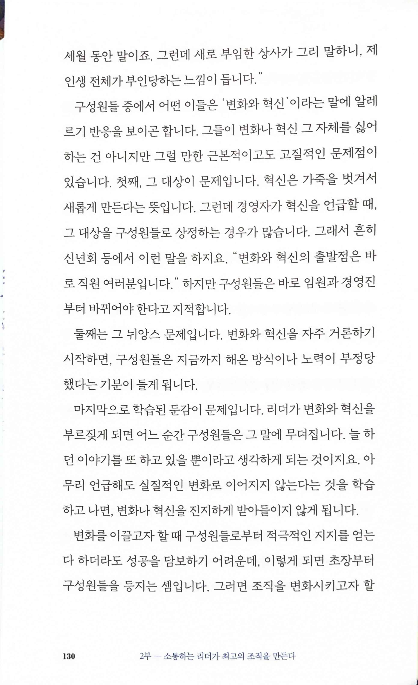

> 변화를 이끌고자 할 때 구성원들로부터 적극적인 지지를 얻는다 하더라도 성공을 담보하기 어려운데

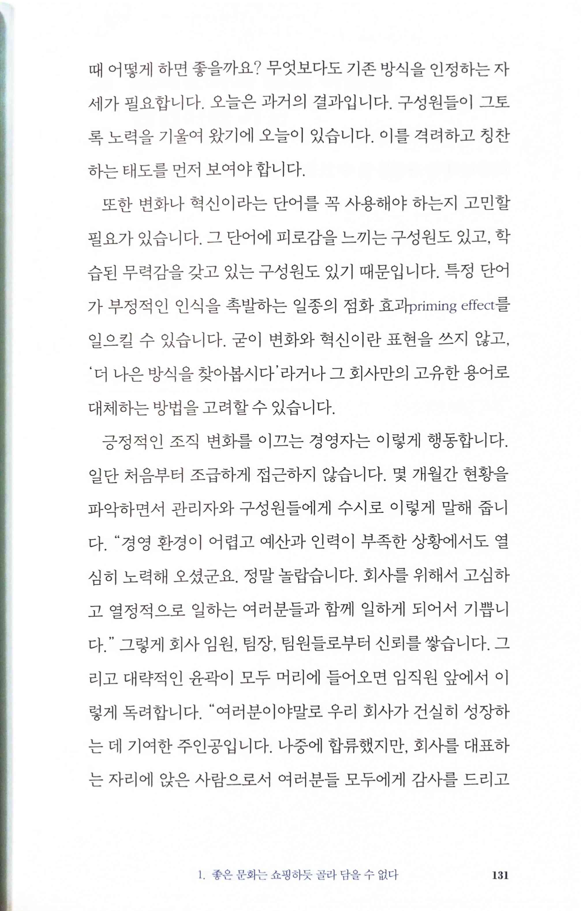

> 조직을 변화시키고자 할 때 어떻게 하면 좋을까요? 무엇보다도 기존 방식을 인정하는 자세가 필요합니다. 오늘은 과거의 결과입니다. 구성원들이 그토록 노력을 기울여 왔기에 오늘이 있습니다. 이를 격려하고 칭찬하는 태도를 먼저 보여야 합니다.
>
> 특정 단어가 부정적인 인식을 촉발하는 일종의 `점화 효과 priming effect`를 일으킬 수 있습니다. 굳이 변화와 혁신이란 표현을 쓰지 않고, '더 나은 방식을 찾아봅시다'라거나 그 회사만의 고유한 용어로 대체하는 방법을 고려할 수 있습니다.
* [Priming - The Decision Lab](https://thedecisionlab.com/biases/priming)

## 2 조직문화의 좋고 나쁨을 판단하는 기준
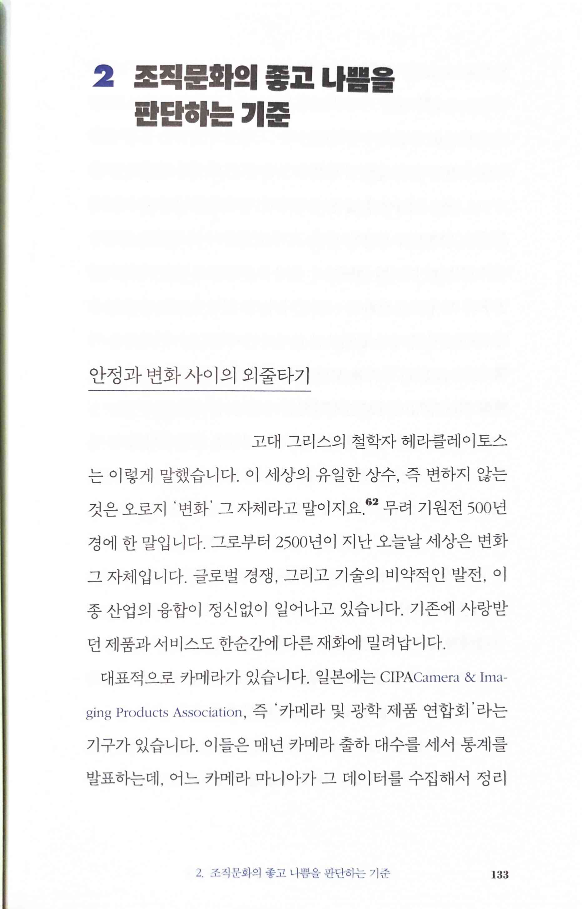

> 고대 그리스의 철학자 헤라클레이토스; 이 세상의 유일한 상수, 즉 변하지 않는 것은 오로지 '변화' 그 자체

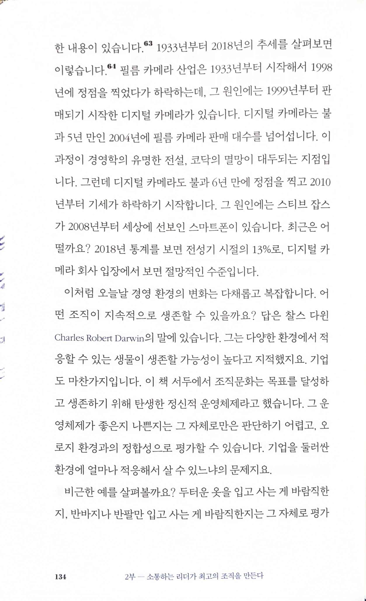

> 어떤 조직이 지속적으로 생존할 수 있을까요? 답은 찰스 다윈 Charles Robert Darwin의 말에 있습니다. 그는 다양한 환경에서 적응할 수 있는 생물이 생존할 가능성이 높다고 지적했지요. 기업도 마찬가지입니다. 이 책 서두에서 조직문화는 목표를 달성하고 생존하기 위해 탄생한 정신적 운영체제라고 했습니다. 그 운영체제가 좋은지 나쁜지는 그 자체로만은 판단하기 어렵고, 오로지 환경과의 정합성으로 평가할 수 있습니다. 기업을 둘러싼 환경에 얼마나 적응해서 살 수 있느냐의 문제지요.

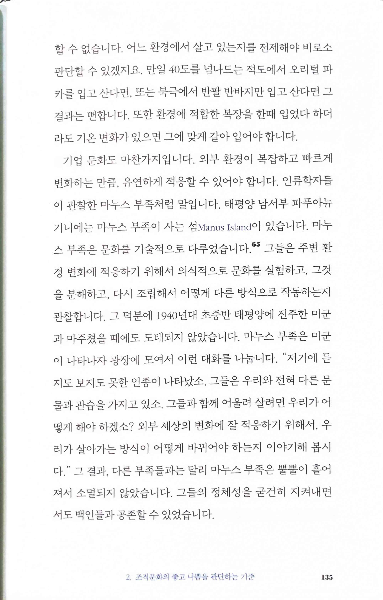

> 기업 문화도 마찬가지입니다. 외부 환경이 복잡하고 빠르게 변화하는 만큼, 유연하게 적응할 수 있어야 합니다.

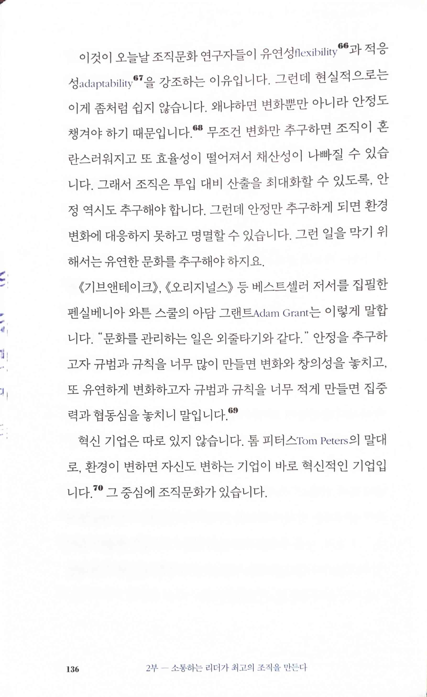

> 오늘날 조직문화 연구자들이 유연성 flexibility 적응성 adaptability을 강조
>
> 무조건 변화만 추구하면 조직이 혼란스러워지고 또 효율성이 떨어져서 채산성이 나빠질 수 있습니다... 안정만 추구하게 되면 환경변화에 대응하지 못하고 명멸할 수 있습니다. 그런 일을 막기 위해서는 유연한 문화를 추구해야 하지요.
>
> 《기브앤테이크》, 《오리지널스》 등 베스트셀러 저서를 집필한 펜실베니아 와튼 스쿨의 `아담 그랜트 Adam Grant`는 이렇게 말합니다. "문화를 관리하는 일은 외줄타기와 같다."
* [Adam Grant – Management Department](https://mgmt.wharton.upenn.edu/profile/grantad/)
> `톰 피터스 Tom Peters`의 말대로, 환경이 변하면 자신도 변하는 기업이 바로 혁신적인 기업입니다. 그 중심에 조직문화가 있습니다.
* [Home - Tom Peters](https://tompeters.com/)

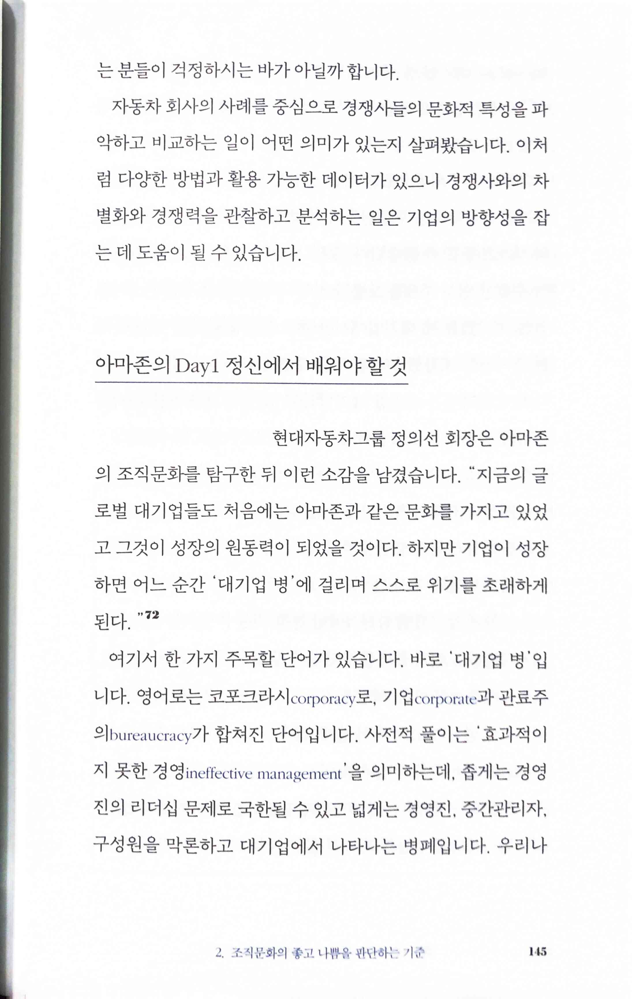

> '대기업 병' 코포크라시 corporacy, 기업 corporate과 관료주의 bureaucracy가 합쳐진 단어입니다. 사전적 풀이는 '효과적이지 못한 경영ineffective management'을 의미하는데, 좁게는 경영진의 리더십 문제로 국한될 수 있고 넓게는 경영진, 중간관리자 구성원을 막론하고 대기업에서 나타나는 병폐입니다.

## 3 거인의 어깨에 올라서면 보인다
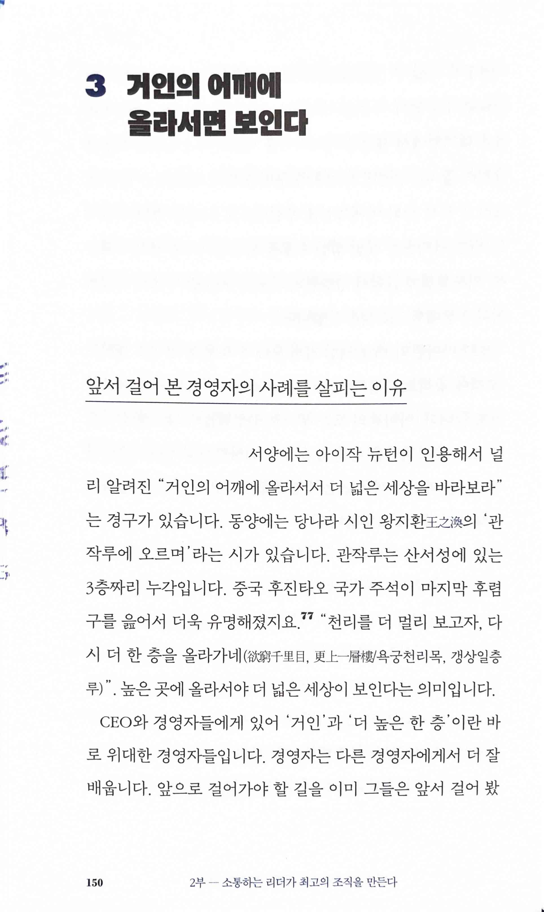

> 아이작 뉴턴 "거인의 어깨에 올라서서 더 넓은 세상을 바라보라"
>
> 당나라 시인 왕지환의 '관작루에 오르며'라는 시

 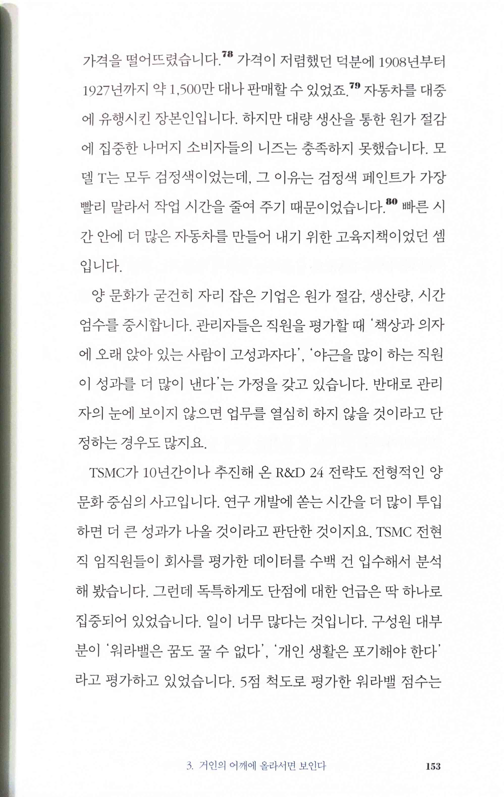

> '양 quantity 문화' 투입과 산출에서 그 규모나 분량을 중시하는 신념이 지배적인 문화입니다. 규모의 경제 economy of scale를 꾀하는 기업, 즉 생산량을 증가시키는 방법으로 평균 비용을 감소시켜서 이익을 추구하는 기업에서 종종 발견되는 신념입니다.
>
> 양 문화가 굳건히 자리 잡은 기업은 원가 절감, 생산량, 시간엄수를 중시합니다. 관리자들은 직원을 평가할 때 책상과 의자에 오래 앉아 있는 사람이 고성과자다', '야근을 많이 하는 직원이 성과를 더 많이 낸다'는 가정을 갖고 있습니다. 반대로 관리자의 눈에 보이지 않으면 업무를 열심히 하지 않을 것이라고 단정하는 경우도 많지요.

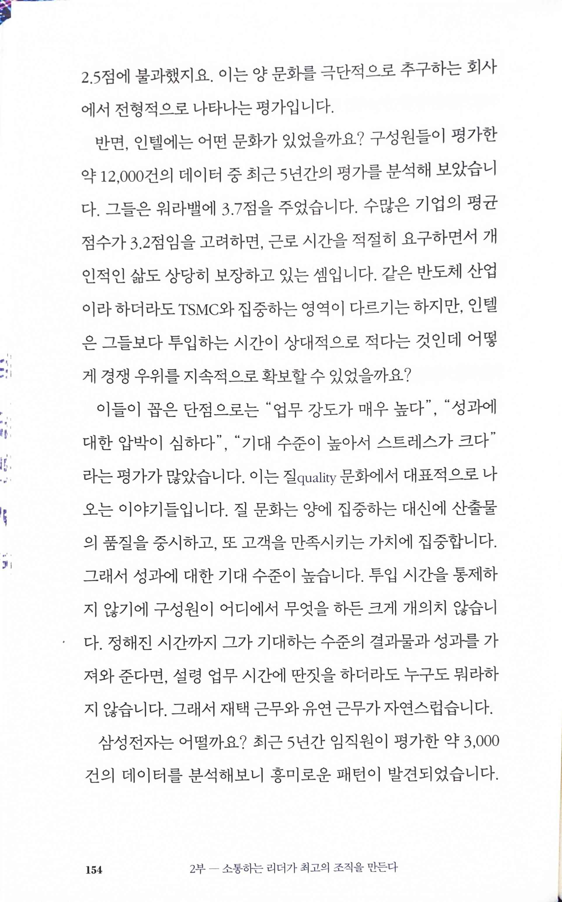

> '질 quality 문화' 양에 집중하는 대신에 산출물의 품질을 중시하고, 또 고객을 만족시키는 가치에 집중합니다. 그래서 성과에 대한 기대 수준이 높습니다. 투입 시간을 통제하지 않기에 구성원이 어디에서 무엇을 하든 크게 개의치 않습니다. 정해진 시간까지 그가 기대하는 수준의 결과물과 성과를 가져와 준다면, 설령 업무 시간에 딴짓을 하더라도 누구도 뭐라하지 않습니다. 그래서 재택 근무와 유연근무가 자연스럽습니다.

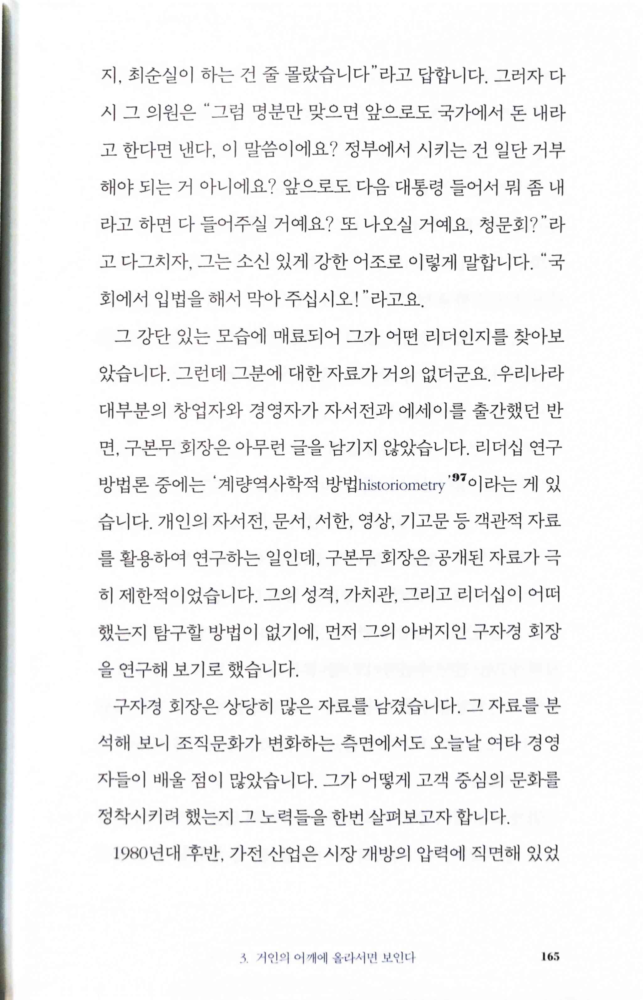

> 리더십 연구방법론 `'계량역사학적 방법 historiometry'` 개인의 자서전, 문서, 서한, 영상, 기고문 등 객관적 자료를 활용하여 연구하는 일
* [Historiometry - Wikipedia](https://en.wikipedia.org/wiki/Historiometry)

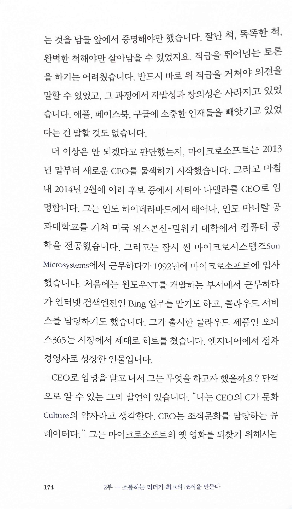

> 사티아 나델라 "나는 CEO의 C가 문화 Culture의 약자라고 생각한다. CEO는 조직문화를 담당하는 큐레이터다."

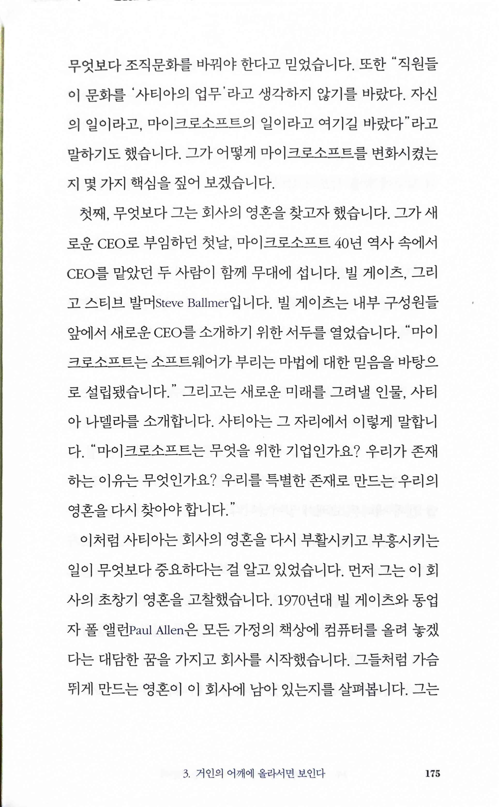

> “마이크로소프트는 무엇을 위한 기업인가요? 우리가 존재하는 이유는 무엇인가요? 우리를 특별한 존재로 만드는 우리의 영혼을 다시 찾아야 합니다."
>
> 이처럼 사티아는 회사의 영혼을 다시 부활시키고 부흥시키는 일이 무엇보다 중요하다는 걸 알고 있었습니다.

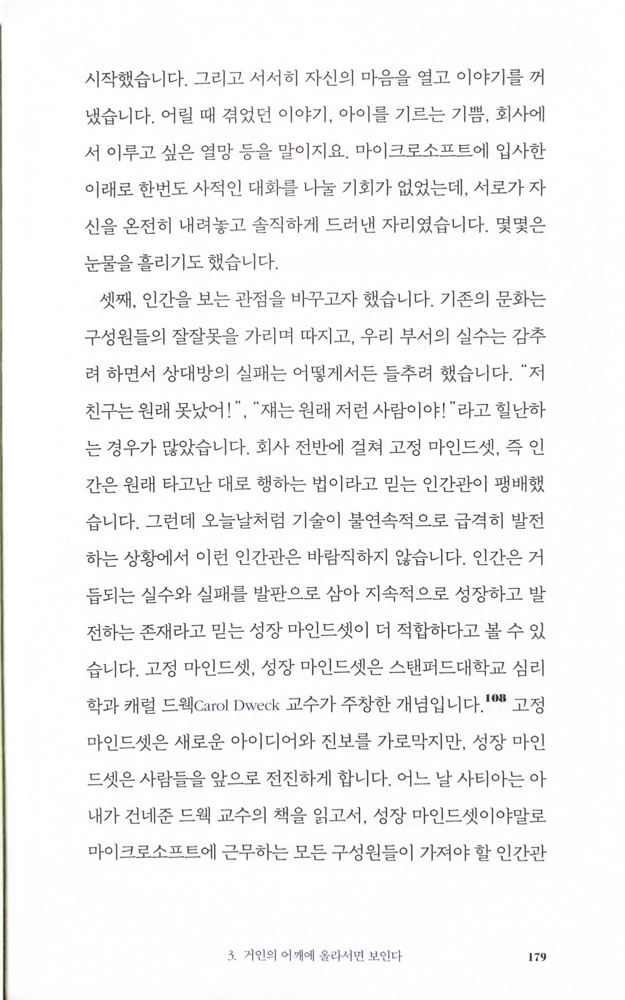

> 고정 마인드셋, 즉 인간은 원래 타고난 대로 행하는 법이라고 믿는 인간관이 팽배했습니다. 그런데 오늘날처럼 기술이 불연속적으로 급격히 발전하는 상황에서 이런 인간관은 바람직하지 않습니다. 인간은 거듭되는 실수와 실패를 발판으로 삼아 지속적으로 성장하고 발전하는 존재라고 믿는 성장 마인드셋이 더 적합하다고 볼 수 있습니다. 고정 마인드셋, 성장 마인드셋은 스탠퍼드대학교 심리학과 `캐럴 드웩 Carol Dweck` 교수가 주창한 개념입니다. 고정 마인드셋은 새로운 아이디어와 진보를 가로막지만, 성장 마인드셋은 사람들을 앞으로 전진하게 합니다.

# 3부 최고의 조직을 만드는 질문

## 1 WHAT: 조직문화, 무엇을 고쳐야 할까?
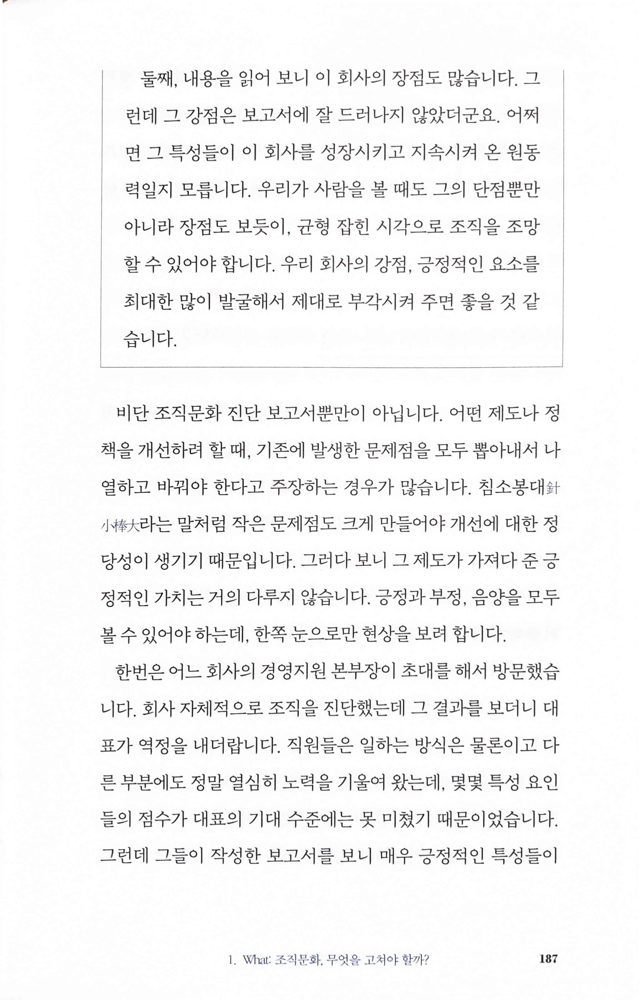

> 긍정과 부정, 음양을 모두 볼 수 있어야 하는데, 한쪽 눈으로만 현상을 보려 합니다.

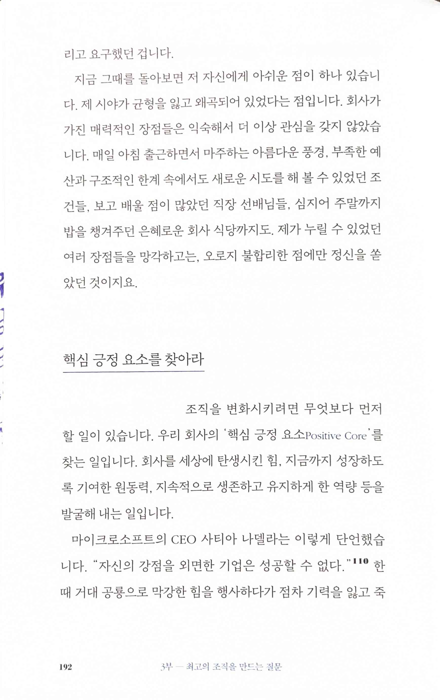

> 조직을 변화시키려면 무엇보다 먼저 할 일이 있습니다. 우리 회사의 '핵심 긍정 요소 Positive Core'를 찾는 일입니다. 회사를 세상에 탄생시킨 힘, 지금까지 성장하도록 기여한 원동력, 지속적으로 생존하고 유지하게 한 역량 등을 발굴해 내는 일입니다.
>
> 마이크로소프트의 CEO 사티아 나델라는 이렇게 단언했습니다. "자신의 강점을 외면한 기업은 성공할 수 없다."

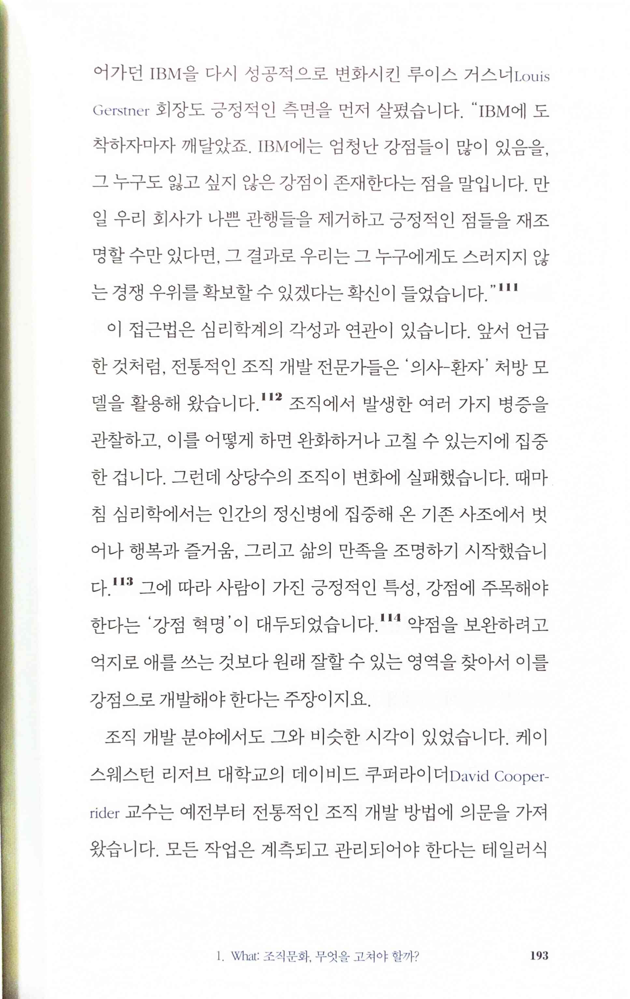

> 이 접근법은 심리학계의 각성과 연관이 있습니다. 앞서 언급한 것처럼, 전통적인 조직 개발 전문가들은 '의사-환자' 처방 모델을 활용해 왔습니다. 조직에서 발생한 여러 가지 병증을 관찰하고, 이를 어떻게 하면 완화하거나 고칠 수 있는지에 집중한 겁니다. 그런데 상당수의 조직이 변화에 실패했습니다. 때마침 심리학에서는 인간의 정신병에 집중해 온 기존 사조에서 벗어나 행복과 즐거움, 그리고 삶의 만족을 조명하기 시작했습니다. 그에 따라 사람이 가진 긍정적인 특성, 강점에 주목해야 한다는 '강점 혁명'이 대두되었습니다. 약점을 보완하려고 억지로 애를 쓰는 것보다 원래 잘할 수 있는 영역을 찾아서 이를 강점으로 개발해야 한다는 주장이지요.
* 야구에서 코칭 방법의 변화와도 맞닿아 있는 이야기

> 조직 개발 분야에서도 그와 비슷한 시각이 있었습니다. 케이스웨스턴 리저브 대학교의 `데이비드 쿠퍼라이더 David Cooperrider` 교수는 예전부터 전통적인 조직 개발 방법에 의문을 가져왔습니다. 모든 작업은 계측되고 관리되어야 한다는 테일러식 관리 (taylor system)가 성행한 이후로, 많은 경영자와 컨설턴트들이 조직을 '기계'로 간주해 왔습니다. 기계가 고장나면 부품을 바꿔 끼우면 되고, 기계 성능이 떨어지면 업그레이드하면 된다는 식이었지요. 이들은 조직이 가진 결함과 문제를 찾아서 이를 고치는 데에 집중했습니다. 그러나 쿠퍼라이더 교수는 그 반대로 생각했습니다. '우리 조직에 생명을 부여하는 긍정적인 요소는 무엇인가? 우리 조직의 생명을 유지하게 만드는 원동력은 무엇인가?' 마침내 그는 조직의 강점을 찾아 이를 굳건하게 다지는 '긍정 조직 혁명' 기법을 제시했습니다.
* [David Cooperrider](https://www.davidcooperrider.com/)

> 핵심 긍정 요소를 지속적으로 상기하고, 또 그것을 강화하는 방향으로 노력을 기울인다면 조직문화는 더 건실해질 수 있을 것입니다.

> 사티아 나델라 “회사의 영혼은 종교에서 이야기하는 영혼이 아니다. 지극히 자연스럽게 다가오는 존재이자 내면의 소리다. 영혼은 사람들에게 동기를 부여할 뿐만 아니라 외부의 압력이 아닌 자신의 가치관에 따라 역량을 쏟아 붓게 한다. 한 회사 안에서 우리만이 느끼는 독특한 감성이다”

## 2 WHO: 조직문화, 누가 바꿔야 할까?
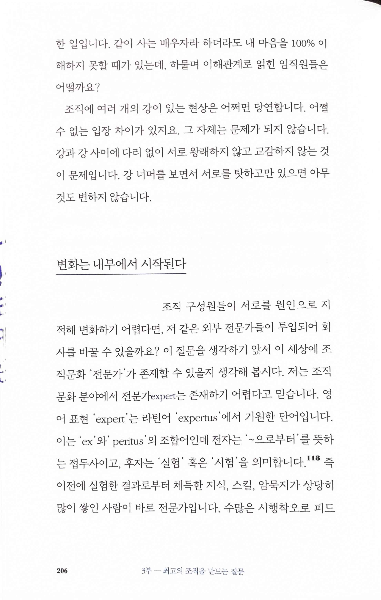

> 조직에 여러 개의 강이 있는 현상은 어쩌면 당연합니다. 어쩔 수 없는 입장 차이가 있지요. 그 자체는 문제가 되지 않습니다. 강과 강 사이에 다리 없이 서로 왕래하지 않고 교감하지 않는 것이 문제입니다. 강 너머를 보면서 서로를 탓하고만 있으면 아무것도 변하지 않습니다.

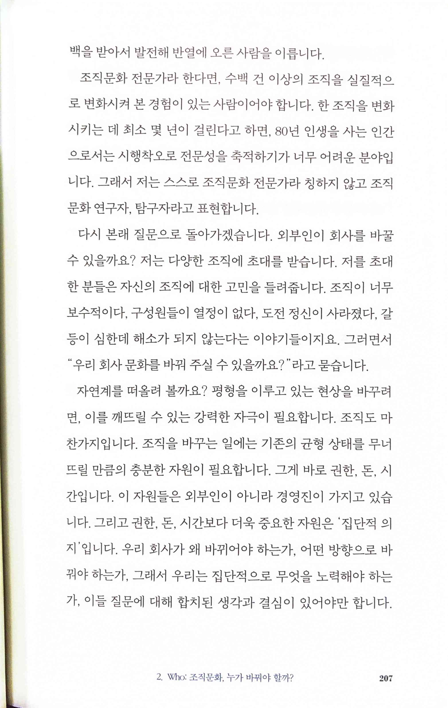

> 자연계를 떠올려 볼까요? 평형을 이루고 있는 현상을 바꾸려면, 이를 깨뜨릴 수 있는 강력한 자극이 필요합니다. 조직도 마찬가지입니다. 조직을 바꾸는 일에는 기존의 균형 상태를 무너뜨릴 만큼의 충분한 자원이 필요합니다. 그게 바로 권한, 돈, 시간입니다. 이 자원들은 외부인이 아니라 경영진이 가지고 있습니다. 그리고 권한, 돈, 시간보다 더욱 중요한 자원은 '집단적 의지'입니다. 우리 회사가 왜 바뀌어야 하는가, 어떤 방향으로 바꿔야 하는가, 그래서 우리는 집단적으로 무엇을 노력해야 하는가, 이들 질문에 대해 합치된 생각과 결심이 있어야만 합니다.

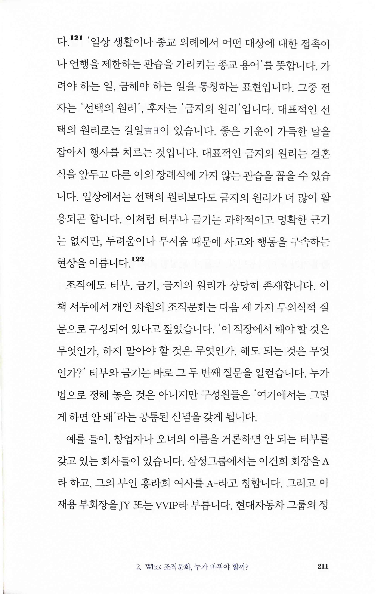

> 조직에도 터부, 금기 금지의 원리가 상당히 존재합니다. 이 책 서두에서 개인 차원의 조직문화는 다음 세 가지 무의식적 질문으로 구성되어 있다고 짚었습니다. '이 직장에서 해야 할 것은 무엇인가, 하지 말아야 할 것은 무엇인가, 해도 되는 것은 무엇인가?' 터부와 금기는 바로 그 두 번째 질문을 일컫습니다. 누가 법으로 정해 놓은 것은 아니지만 구성원들은 '여기에서는 그렇게 하면 안 돼' 라는 공통된 신념을 갖게 됩니다.

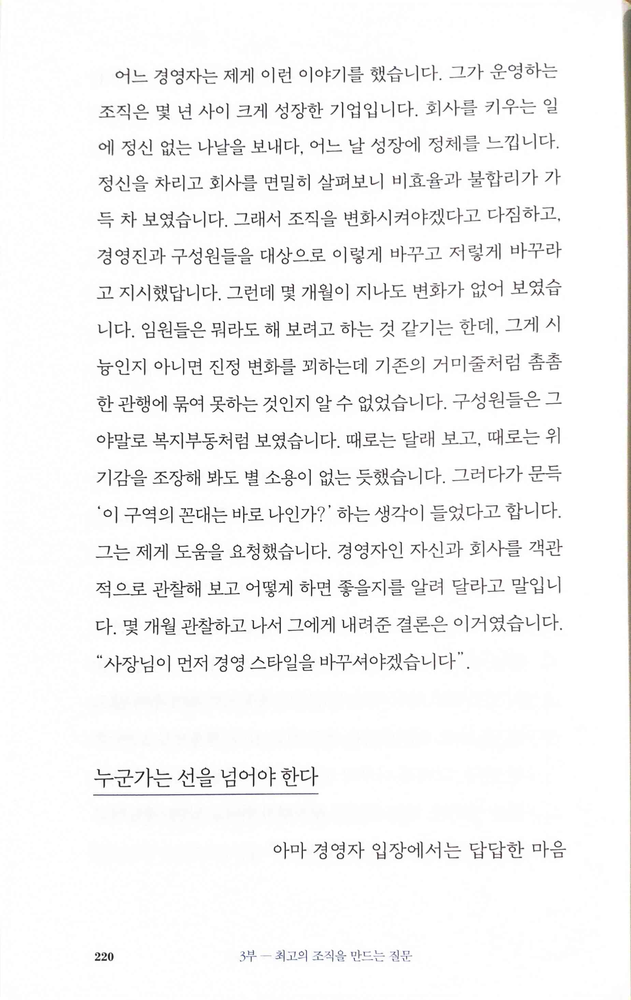

> "사장님이 먼저 경영 스타일을 바꾸셔야겠습니다".

## 3 HOW: 조직문화, 어떻게 바꿀 수 있을까?
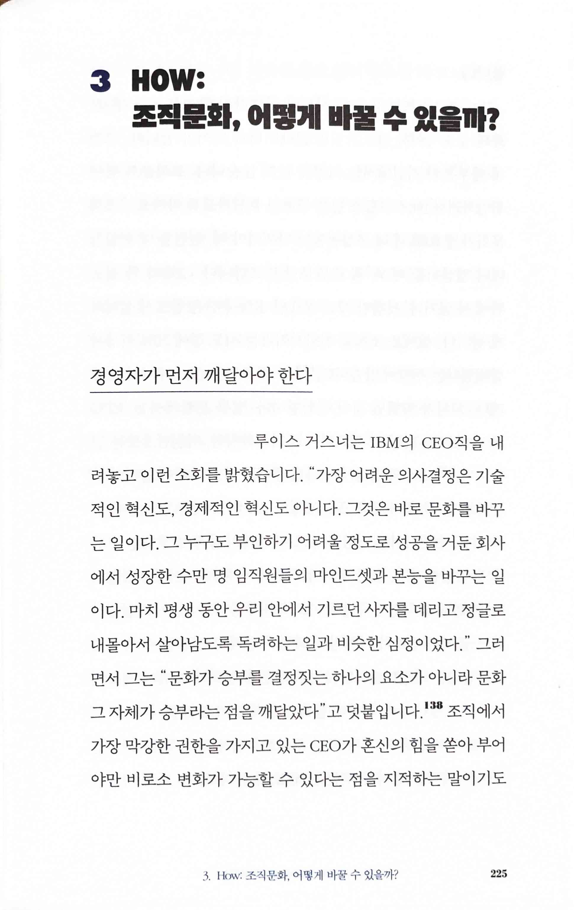

> 루이스 거스너는 IBM의 CEO직을 내려놓고 이런 소회를 밝혔습니다. "가장 어려운 의사결정은 기술적인 혁신도, 경제적인 혁신도 아니다. 그것은 바로 문화를 바꾸는 일이다. 그 누구도 부인하기 어려울 정도로 성공을 거둔 회사에서 성장한 수만 명 임직원들의 마인드셋과 본능을 바꾸는 일이다. 마치 평생 동안 우리 안에서 기르던 사자를 데리고 정글로 내몰아서 살아남도록 독려하는 일과 비슷한 심정이었다." 그러면서 그는 “문화가 승부를 결정짓는 하나의 요소가 아니라 문화 그 자체가 승부라는 점을 깨달았다"고 덧붙입니다. 조직에서 가장 막강한 권한을 가지고 있는 CEO가 혼신의 힘을 쏟아 부어야만 비로소 변화가 가능할 수 있다는 점을 지적하는 말이기도 합니다.

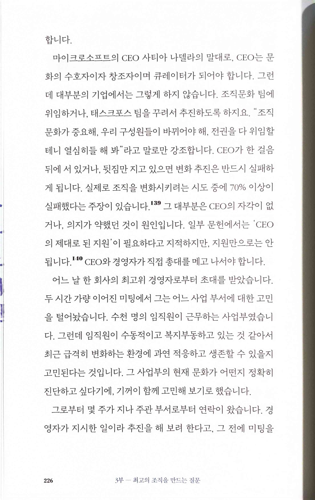

> CEO와 경영자가 직접 총대를 메고 나서야 합니다.

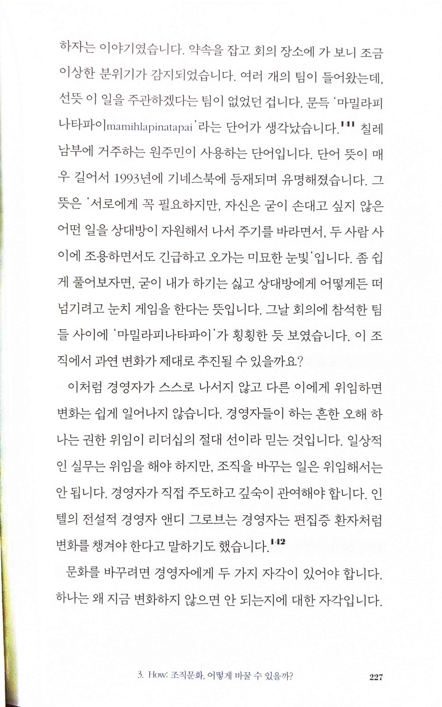

> `'마밀라피나타파이 mamihlapinatapai'` 칠레 남부에 거주하는 원주민이 사용하는 단어입니다. 단어 뜻이 매우 길어서 1993년에 기네스북에 등재되며 유명해졌습니다. 그 뜻은 '서로에게 꼭 필요하지만, 자신은 굳이 손대고 싶지 않은 어떤 일을 상대방이 자원해서 나서 주기를 바라면서, 두 사람 사이에 조용하면서도 긴급하고 오가는 미묘한 눈빛'입니다. 좀 쉽게 풀어보자면, 굳이 내가 하기는 싫고 상대방에게 어떻게든 떠넘기려고 눈치 게임을 한다는 뜻입니다.
* [마밀라피나타파이(mamihlapinatapai)](https://brunch.co.kr/@cecilbook/29)
> 경영자가 스스로 나서지 않고 다른 이에게 위임하면 변화는 쉽게 일어나지 않습니다. 경영자들이 하는 흔한 오해 하나는 권한 위임이 리더십의 절대 선이라 믿는 것입니다. 일상적인 실무는 위임을 해야 하지만, 조직을 바꾸는 일은 위임해서는 안 됩니다. 경영자가 직접 주도하고 깊숙이 관여해야 합니다. 인텔의 전설적 경영자 앤디 그로브는 경영자는 편집증 환자처럼 변화를 챙겨야 한다고 말하기도 했습니다.

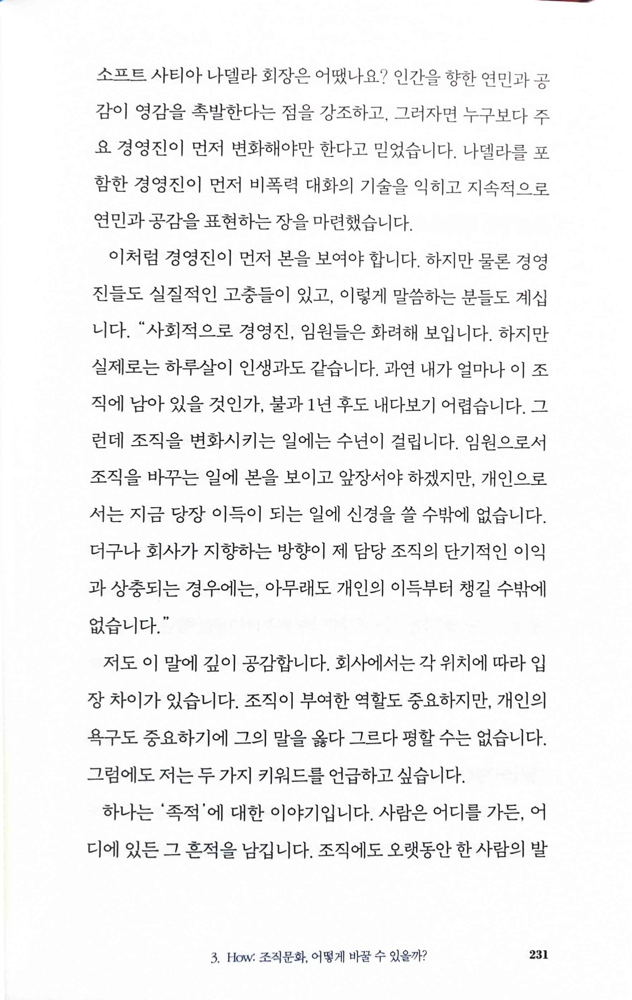 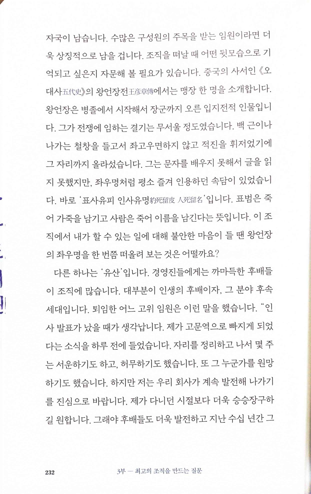

> '족적' 사람은 어디를 가든, 어디에 있든 그 흔적을 남깁니다... 조직을 떠날 때 어떤 뒷모습으로 기억되고 싶은지 자문해 볼 필요가 있습니다. 중국의 사서인 오대사의 왕언장전에서는 맹장 한 명을 소개합니다. '표사유피 인사유명'
>
> '유산'

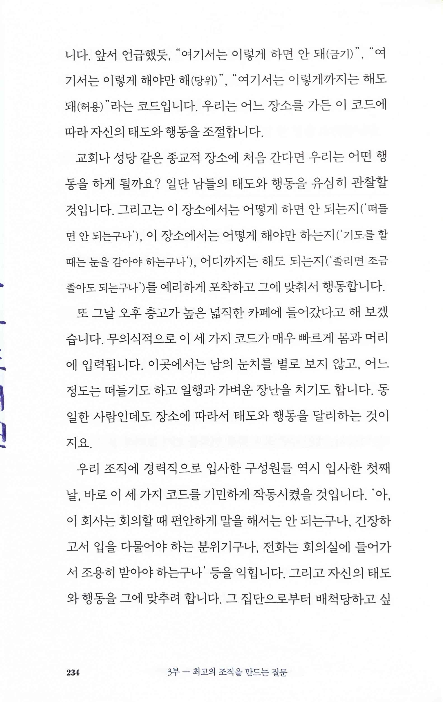

> "여기서는 이렇게 하면 안 돼(금기)", "여기서는 이렇게 해야만 해(당위) ", "여기서는 이렇게까지는 해도 돼(허용)"라는 코드입니다. 우리는 어느 장소를 가든 이 코드에 따라 자신의 태도와 행동을 조절합니다.

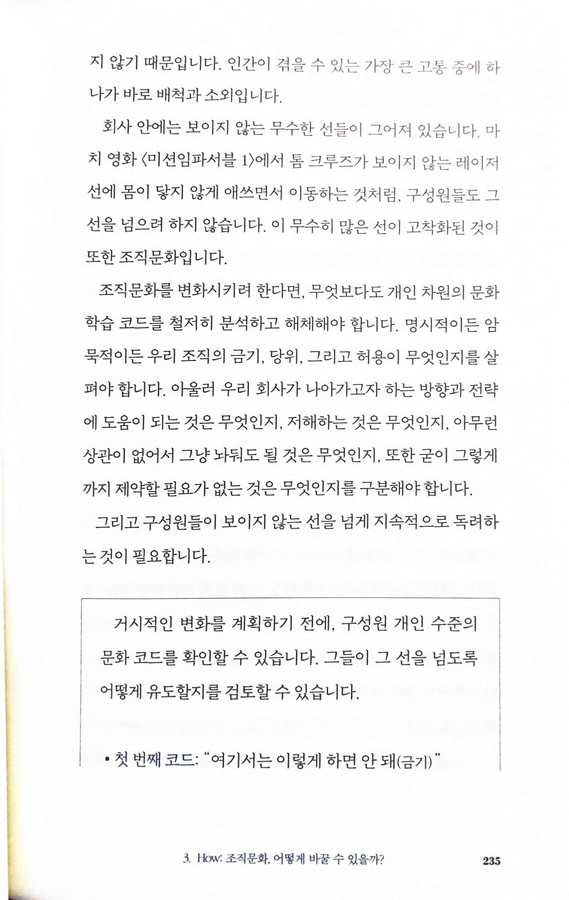

> 조직문화를 변화시키려 한다면, 무엇보다도 개인 차원의 문화학습 코드를 철저히 분석하고 해체해야 합니다. 명시적이든 암묵적이든 우리 조직의 금기, 당위, 그리고 허용이 무엇인지를 살펴야 합니다. 아울러 우리 회사가 나아가고자 하는 방향과 전략에 도움이 되는 것은 무엇인지, 저해하는 것은 무엇인지, 아무런 상관이 없어서 그냥 놔둬도 될 것은 무엇인지, 또한 굳이 그렇게까지 제약할 필요가 없는 것은 무엇인지를 구분해야 합니다.
>
> 그리고 구성원들이 보이지 않는 선을 넘게 지속적으로 독려하는 것이 필요합니다.

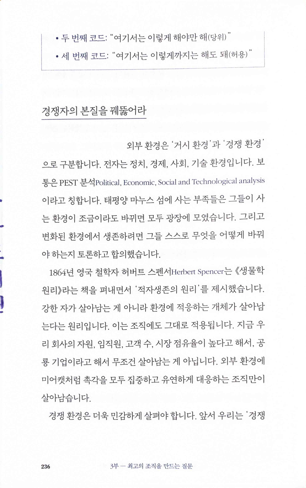

> 1864년 영국 철학자 허버트 스펜서 Herbert Spencer는 《생물학원리》라는 책을 펴내면서 '적자생존의 원리'를 제시했습니다. 강한 자가 살아남는 게 아니라 환경에 적응하는 개체가 살아남는다는 원리입니다. 이는 조직에도 그대로 적용됩니다. 지금 우리 회사의 자원, 임직원, 고객 수, 시장 점유율이 높다고 해서, 공룡 기업이라고 해서 무조건 살아남는 게 아닙니다. 외부 환경에 미어캣처럼 촉각을 모두 집중하고 유연하게 대응하는 조직만이 살아남습니다.

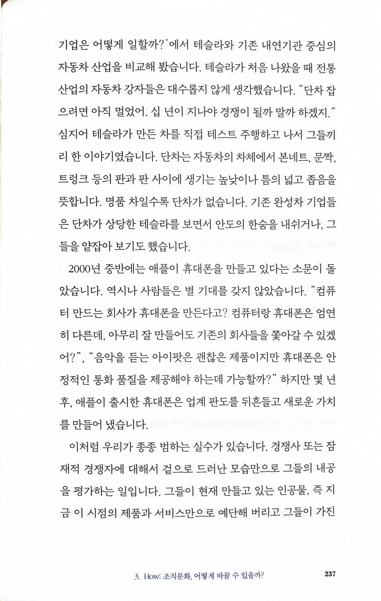 

> 우리가 종종 범하는 실수가 있습니다. 경쟁사 또는 잠재적 경쟁자에 대해서 겉으로 드러난 모습만으로 그들의 내공을 평가하는 일입니다. 그들이 현재 만들고 있는 인공물, 즉 지금 이 시점의 제품과 서비스만으로 예단해 버리고 그들이 가진 잠재력은 살피지 않습니다. 경쟁자의 제품은 현 수준을 말해 주지만 그들이 가진 문화는 미래를 말해 줍니다. 경영자는 겉으로드러난 모습보다 경쟁자의 본질을 꿰뚫어 볼 수 있어야 합니다.그러자면 경쟁사가 가진 혼과 일하는 방식을 파악하는 것이 중요하겠지요.

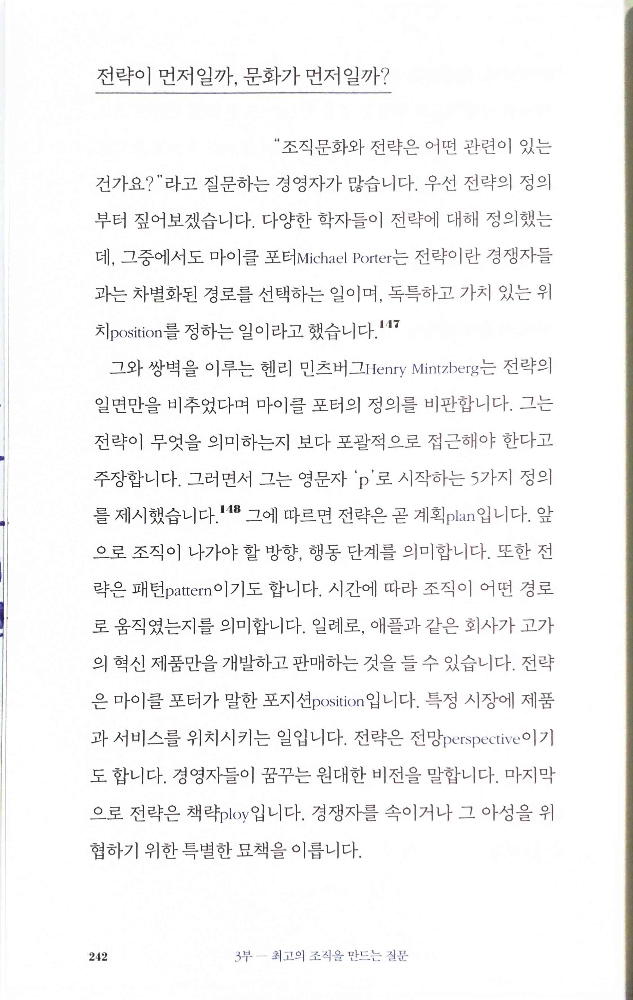

> `마이클 포터 Michael Porter` 전략이란 경쟁자들과는 차별화된 경로를 선택하는 일이며, 독특하고 가치 있는 위치 position를 정하는 일
* [Strategy according to Michael Porter | Kenneth MD | Dr. Kenneth Acha](https://www.kennethmd.com/strategy/strategy-according-to-michael-porter/)
> `헨리 민츠버그 Henry Mintzberg` 전략은 곧 계획 plan입니다. 앞으로 조직이 나가야 할 방향, 행동 단계를 의미합니다. 패턴 pattern이기도 합니다. 시간에 따라 조직이 어떤 경로로 움직였는지를 의미합니다. 포지션 position 입니다. 특정 시장에 제품과 서비스를 위치시키는 일입니다. 전략은 전망 perspective이기도 합니다. 경영자들이 꿈꾸는 원대한 비전을 말합니다. 마지막으로 전략은 책략 ploy입니다. 경쟁자를 속이거나 그 아성을 위협하기 위한 특별한 묘책을 이릅니다.
* [Mintzberg's 5 Ps of Strategy - Strategy Skills From MindTools.com](https://www.mindtools.com/pages/article/mintzberg-5ps.htm)

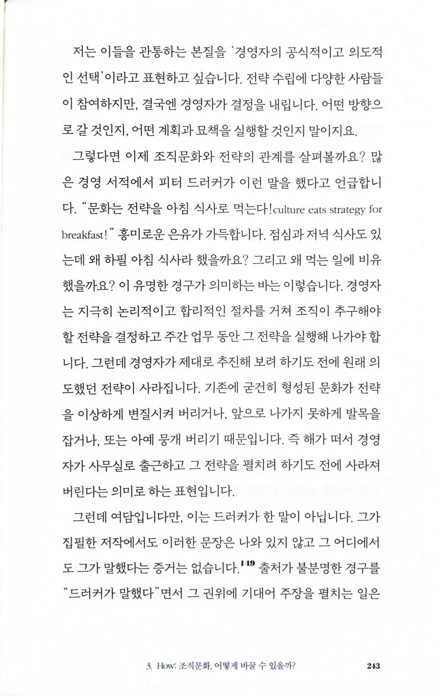

> “문화는 전략을 아침 식사로 먹는다! culture eats strategy for breakfast!"
* [Culture eats strategy for breakfast - The Management Centre](https://www.managementcentre.co.uk/management-consultancy/culture-eats-strategy-for-breakfast/)

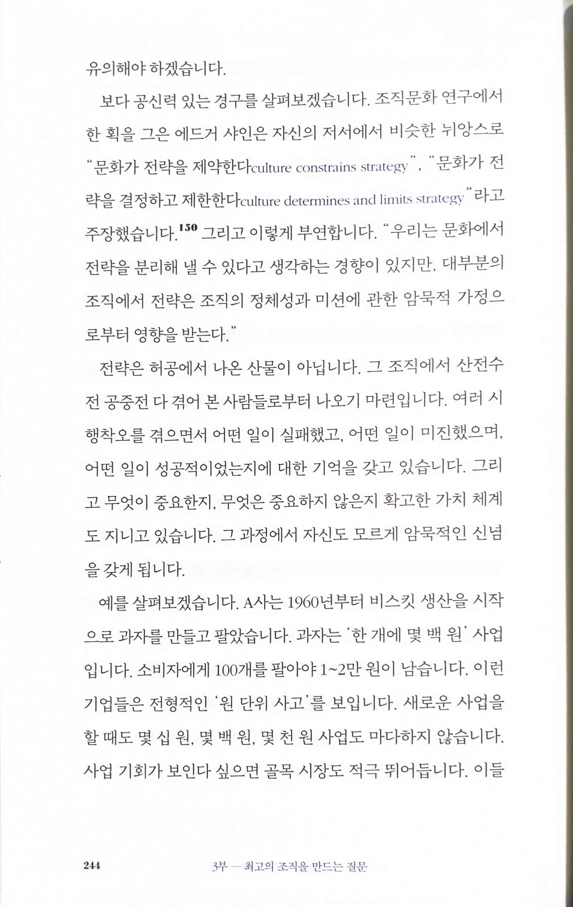 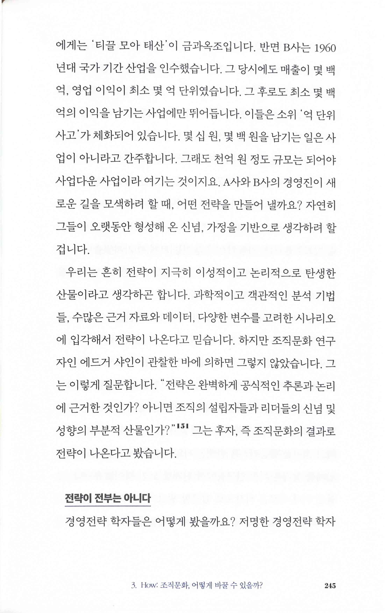

> 에드거 샤인 “문화가 전략을 제약한다 culture constrains strategy", "문화가 전략을 결정하고 제한한다 culture determines and limits strategy"라고 주장했습니다. 그리고 이렇게 부연합니다. "우리는 문화에서 전략을 분리해 낼 수 있다고 생각하는 경향이 있지만, 대부분의 조직에서 전략은 조직의 정체성과 미션에 관한 암묵적 가정으로부터 영향을 받는다."
* [Edgar Schein : Organizational Culture and Leadership – #hypertextual](https://thehypertextual.com/2013/01/17/edgar-schein-organizational-culture-and-leadership/)
> 전략은 허공에서 나온 산물이 아닙니다. 그 조직에서 산전수전 공중전 다 겪어 본 사람들로부터 나오기 마련입니다. 여러 시행착오를 겪으면서 어떤 일이 실패했고, 어떤 일이 미진했으며,어떤 일이 성공적이었는지에 대한 기억을 갖고 있습니다. 그리고 무엇이 중요한지, 무엇은 중요하지 않은지 확고한 가치 체계도 지니고 있습니다. 그 과정에서 자신도 모르게 암묵적인 신념을 갖게 됩니다.
>
> 에드거 샤인이 관찰한 바에 의하면 "전략은 완벽하게 공식적인 추론과 논리에 근거한 것인가? 아니면 조직의 설립자들과 리더들의 신념 및 성향의 부분적 산물인가?" 그는 후자, 즉 조직문화의 결과로 전략이 나온다고 봤습니다.

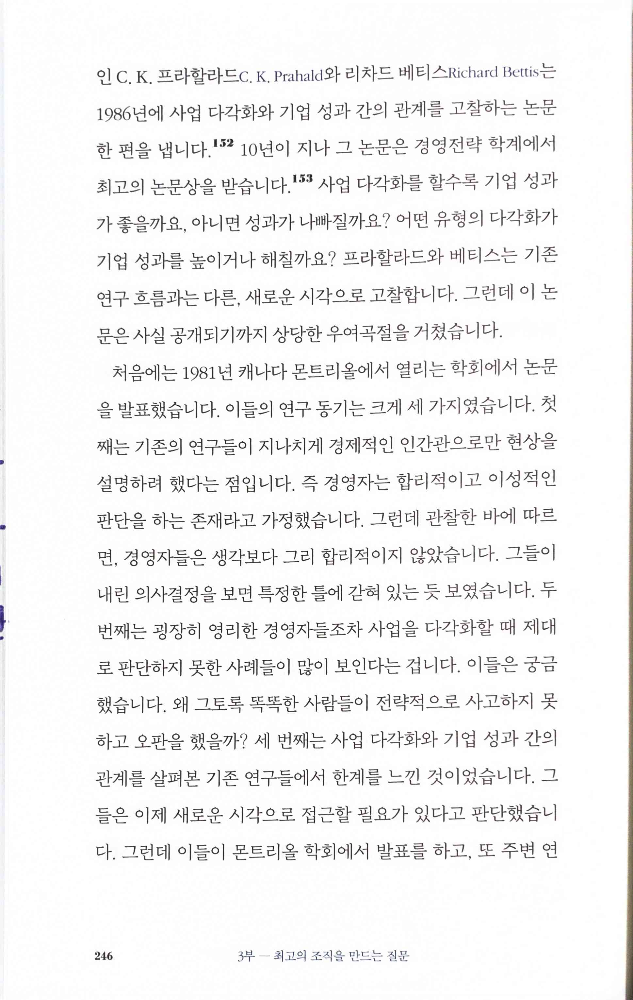 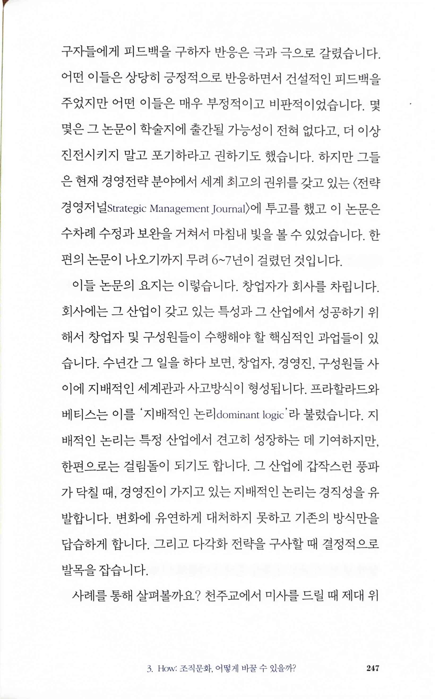

> C. K. 프라할라드 C. K. Prahald와 리차드 베티스 Richard Bettis는 1986년에 사업 다각화와 기업 성과 간의 관계를 고찰하는 논문 한 편을 냅니다.
>
> 이들 논문의 요지는 이렇습니다. 창업자가 회사를 차립니다. 회사에는 그 산업이 갖고 있는 특성과 그 산업에서 성공하기 위해서 창업자 및 구성원들이 수행해야 할 핵심적인 과업들이 있습니다. 수년간 그 일을 하다 보면, 창업자, 경영진, 구성원들 사이에 지배적인 세계관과 사고방식이 형성됩니다. 프라할라드와 베티스는 이를 `'지배적인 논리 dominant logic'`라 불렀습니다. 지배적인 논리는 특정 산업에서 견고히 성장하는 데 기여하지만, 한편으로는 걸림돌이 되기도 합니다. 그 산업에 갑작스런 풍파가 닥칠 때, 경영진이 가지고 있는 지배적인 논리는 경직성을 유발합니다. 변화에 유연하게 대처하지 못하고 기존의 방식만을 답습하게 합니다. 그리고 다각화 전략을 구사할 때 결정적으로 발목을 잡습니다.
* [The Dominant Logic: A New Linkage between Diversity and Performance on JSTOR](https://www.jstor.org/stable/2486135)

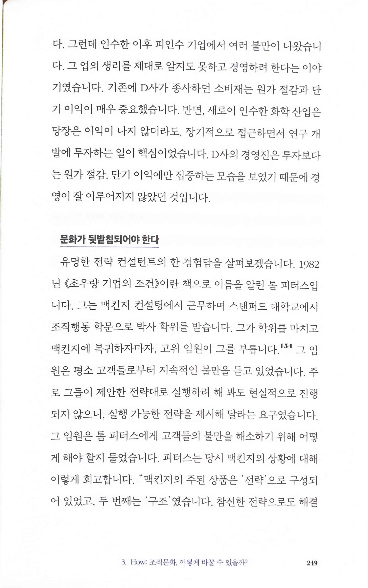 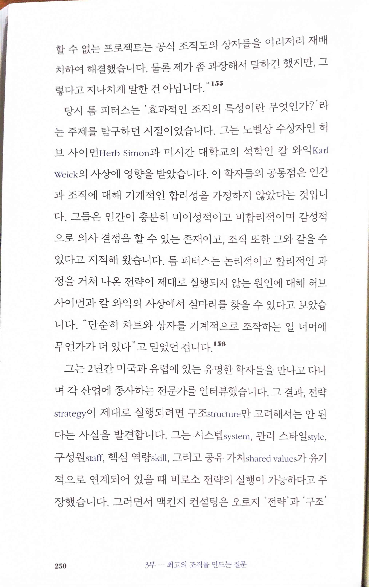 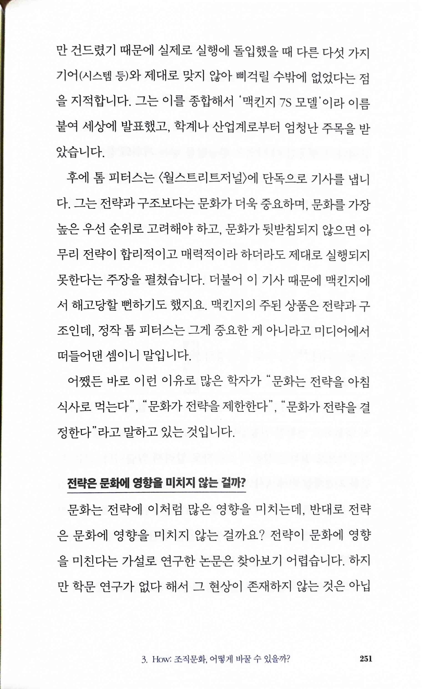

> 1982년 《초우량 기업의 조건》이란 책으로 이름을 알린 톰 피터스
>
> 전략 strategy이 제대로 실행되려면 구조 structure만 고려해서는 안 된다. 시스템 system, 관리 스타일 style, 구성원 staff, 핵심 역량 skill, 그리고 공유 가치 shared values가 유기적으로 연계되어 있을 때 비로소 전략의 실행이 가능하다고 주장했습니다. 맥킨지 컨설팅은 오로지 '전략'과 '구조'만 건드렸기 때문에 실제로 실행에 돌입했을 때 다른 다섯 가지 기어 (시스템 등)와 제대로 맞지 않아 삐걱릴 수밖에 없었다는 점을 지적합니다. 그는 이를 종합해서 `'맥킨지 7s 모델'`이라 이름붙여 세상에 발표했고, 학계나 산업계로부터 엄청난 주목을 받았습니다.
* [McKinsey 7S Model: The 7S Framework Explained - SM Insight](https://strategicmanagementinsight.com/tools/mckinsey-7s-model-framework/)

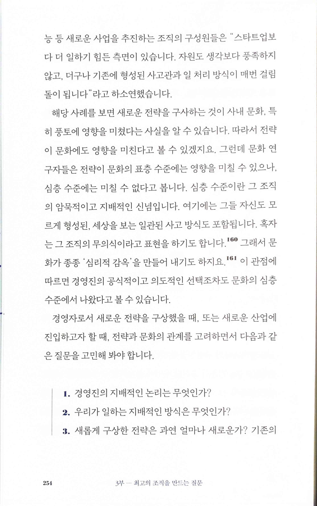

> 전략이 문화에도 영향을 미친다고 볼 수 있겠지요. 그런데 문화 연구자들은 전략이 문화의 표층 수준에는 영향을 미칠 수 있으나, 심층 수준에는 미칠 수 없다고 봅니다. 심층 수준이란 그 조직의 암묵적이고 지배적인 신념입니다. 여기에는 그들 자신도 모르게 형성된 세상을 보는 일관된 사고 방식도 포함됩니다. 혹자는 그 조직의 무의식이라고 표현을 하기도 합니다. 그래서 문화가 종종 '심리적 감옥'을 만들어 내기도 하지요. 이 관점에 따르면 경영진의 공식적이고 의도적인 선택조차도 문화의 심층수준에서 나왔다고 볼 수 있습니다.

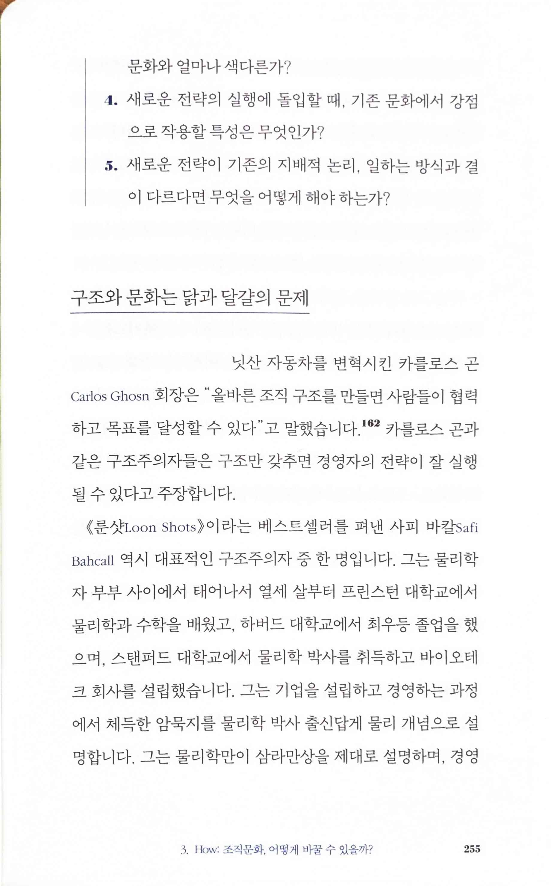 

> 닛산 자동차를 변혁시킨 카를로스 곤Carlos Ghosn 회장은 “올바른 조직 구조를 만들면 사람들이 협력하고 목표를 달성할 수 있다"고 말했습니다. 카를로스 곤과같은 구조주의자들은 구조만 갖추면 경영자의 전략이 잘 실행될 수 있다고 주장합니다.
>
> 《룬샷Loon Shots》이라는 베스트셀러를 펴낸 사피 바칼 Safi Bahcall "조직문화에 관한 논문이나 책은 늘 귀에 걸면 귀걸이, 코에 걸면 코걸이 같다", "문화보다 구조, 혁신보다 설계가 중요하다"고 단언하지요. 그럼 그 구조와 설계는 누가 만들어 내느냐 하면, 그는 룬 loon, 즉 괴짜 천재들이 창조해 낸다고 주장합니다.
>
> HP의 창업자 데이비드 패커드는 "나는 일단 조직이 완성되면 조직도 따위는 버리라고 말해 주고 싶다. 너무 융통성이 부족한 조직은 바람직하다고 할 수 없다. 조직이 변화하는 환경에 유연하게 대처하기 위해서는 조직도를 뛰어넘어야 한다"라고 지적했습니다. 톰 피터스와 로버트 워터먼 Robert Waterman은 베스트셀러 《초우량 기업의 조건》에서 “기존의 낡은 습관을 완전히 버리고 새로운 근육을 단련시키는 것은 어려운 일이다. 이 같은 일은 분명히 조직 구조라는 문제를 벗어나는 새로운 과제다"라면서 구조보다 문화의 중요성을 강조했습니다.

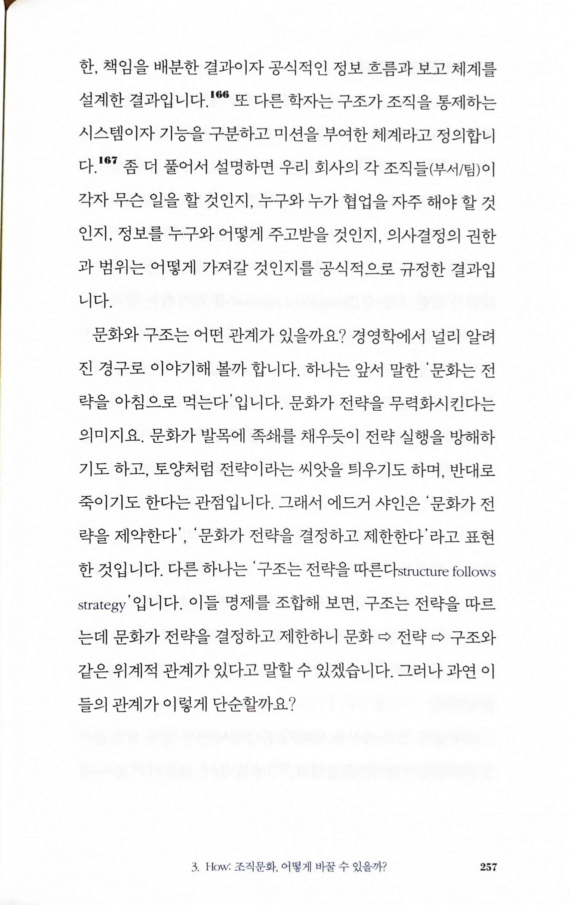

> 구조는 조직 목표를 달성하기 위해서 기능 권한 책임을 배분한 결과이자 공식적인 정보 흐름과 보고 체계를 설계한 결과입니다. 또 다른 학자는 구조가 조직을 통제하는 시스템이자 기능을 구분하고 미션을 부여한 체계라고 정의합니다. 좀 더 풀어서 설명하면 우리 회사의 각 조직들(부서/팀)이 각자 무슨 일을 할 것인지, 누구와 누가 협업을 자주 해야 할 것인지, 정보를 누구와 어떻게 주고받을 것인지, 의사결정의 권한과 범위는 어떻게 가져갈 것인지를 공식적으로 규정한 결과입니다.
>
> 에드거 샤인은 '문화가 전략을 제약한다', '문화가 전략을 결정하고 제한한다'라고 표현한 것입니다. 다른 하나는 '구조는 전략을 따른다 structure follows strategy'입니다. 이들 명제를 조합해 보면, 구조는 전략을 따르는데 문화가 전략을 결정하고 제한하니 문화 -> 전략 -> 구조와 같은 위계적 관계가 있다고 말할 수 있겠습니다. 그러나 과연 이들의 관계가 이렇게 단순할까요?

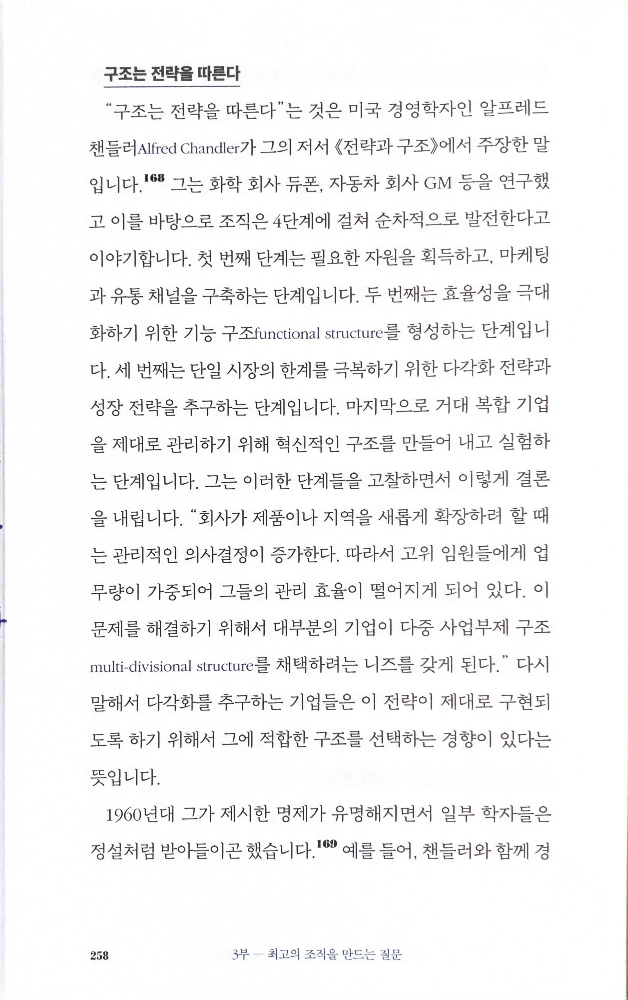

> `“구조는 전략을 따른다"`는 것은 미국 경영학자인 알프레드 챈들러Alfred Chandler가 그의 저서 《전략과 구조》에서 주장한 말
* [Structure follows strategy - CEOpedia | Management online](https://ceopedia.org/index.php/Structure_follows_strategy)
> 하버드경영대학원의 케네스 앤드루스 Kenneth Andrews는 저서 《기업전략의 본질》에서 "전략을 알기 전까지는 어떤 구조가 적합한지 전혀 특정할 수 없다"고 주장
>
> 톰 피터스도 "전략을 제대로 수립하고, 그리고 나서 구조를 바꿔라"라고 조언

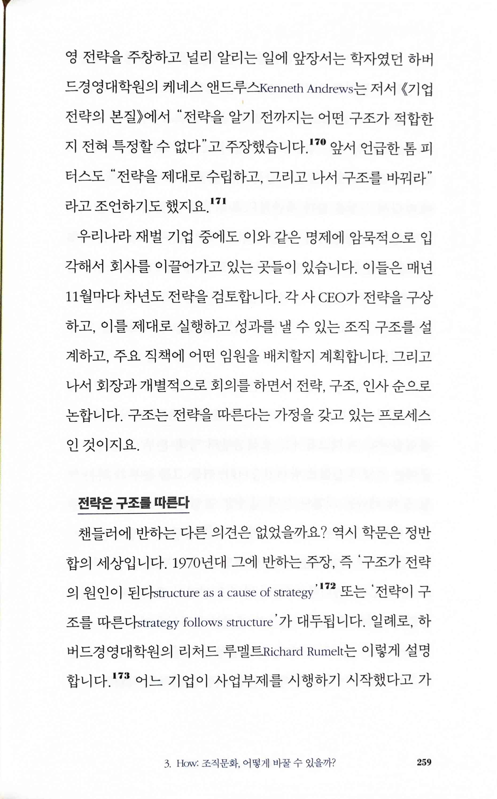 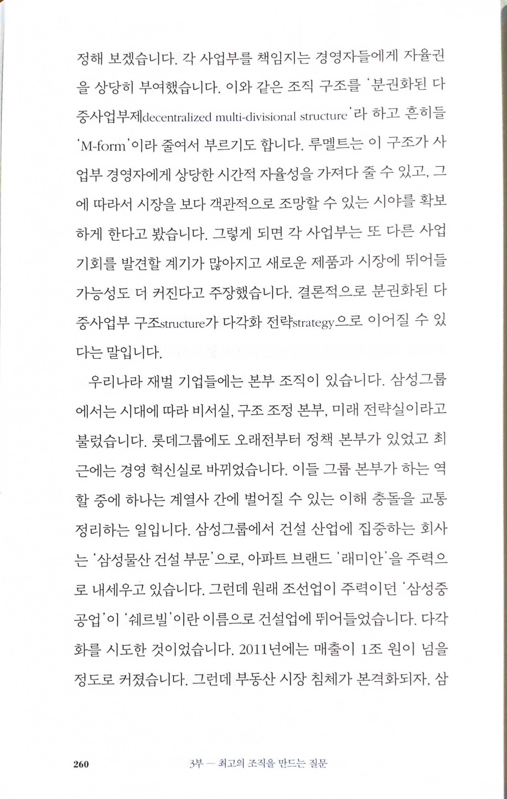

> 1970년대 '구조가 전략의 원인이 된다 structure as a cause of strategy' 또는 '전략이 구조를 따른다 strategy follows structure'가 대두됩니다. 하버드경영대학원의 리처드 루멜트 Richard Rumelt
>
> 분권화된 다중사업부 구조 structure가 다각화 전략 strategy으로 이어질 수 있다

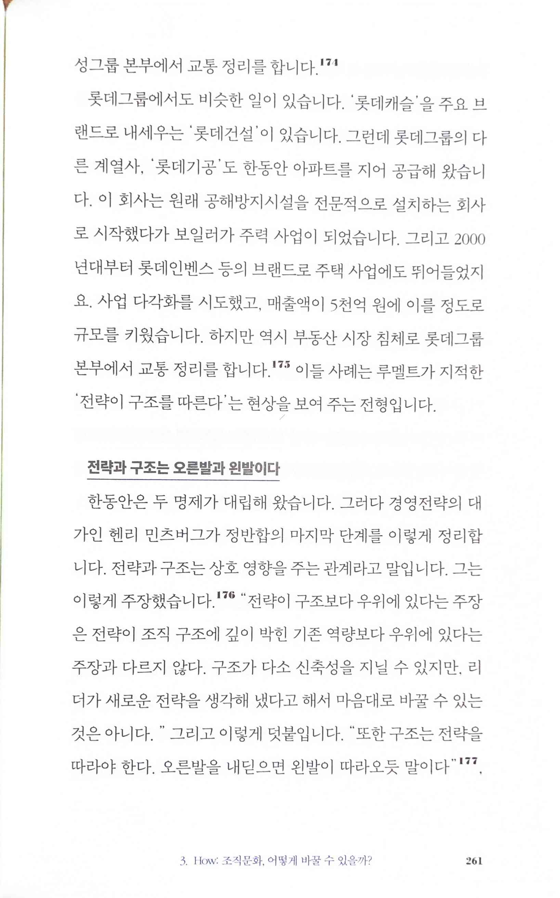 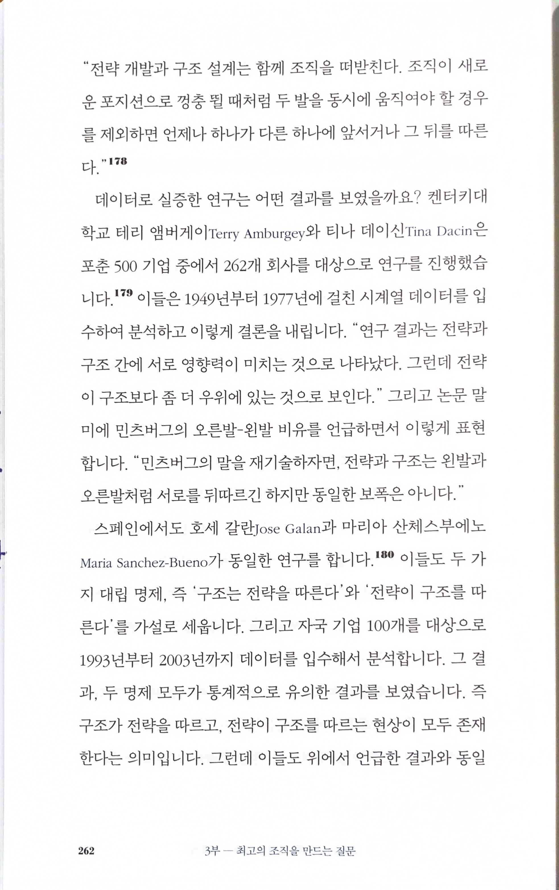 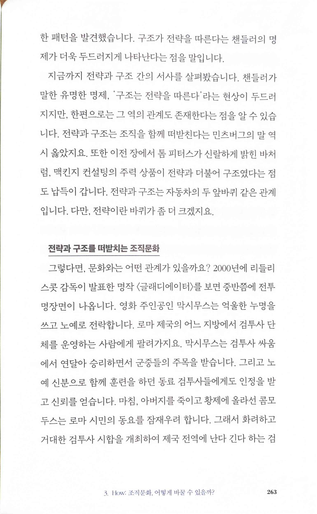

> 경영전략의 대가인 헨리 민츠버그; 전략과 구조는 상호 영향을 주는 관계
>
> "전략이 구조보다 우위에 있다는 주장은 전략이 조직 구조에 깊이 박힌 기존 역량보다 우위에 있다는 주장과 다르지 않다. 구조가 다소 신축성을 지닐 수 있지만, 리더가 새로운 전략을 생각해 냈다고 해서 마음대로 바꿀 수 있는 것은 아니다. "그리고 이렇게 덧붙입니다. "또한 구조는 전략을 따라야 한다. 오른발을 내딛으면 왼발이 따라오듯 말이다"
>
> “전략 개발과 구조 설계는 함께 조직을 떠받친다. 조직이 새로운 포지션으로 껑충 뛸 때처럼 두 발을 동시에 움직여야 할 경우를 제외하면 언제나 하나가 다른 하나에 앞서거나 그 뒤를 따른다."
>
> 켄터키대학교 테리 앰버게이 Terry Amburgey와 티나 데이신 Tina Dacin "연구 결과는 전략과 구조 간에 서로 영향력이 미치는 것으로 나타났다. 그런데 전략이 구조보다 좀 더 우위에 있는 것으로 보인다." 그리고 논문 말미에 민츠버그의 오른발-왼발 비유를 언급하면서 이렇게 표현합니다. "민츠버그의 말을 재기술하자면, 전략과 구조는 왼발과 오른발처럼 서로를 뒤따르긴 하지만 동일한 보폭은 아니다."
>
> 스페인에서도 호세 갈란 Jose Galan과 마리아 산체스부에노 Maria Sanchez-Bueno가 동일한 연구. 구조가 전략을 따르고, 전략이 구조를 따르는 현상이 모두 존재. 그런데 이들도 위에서 언급한 결과와 동일한 패턴을 발견했습니다. 구조가 전략을 따른다는 챈들러의 명제가 더욱 두드러지게 나타난다는 점

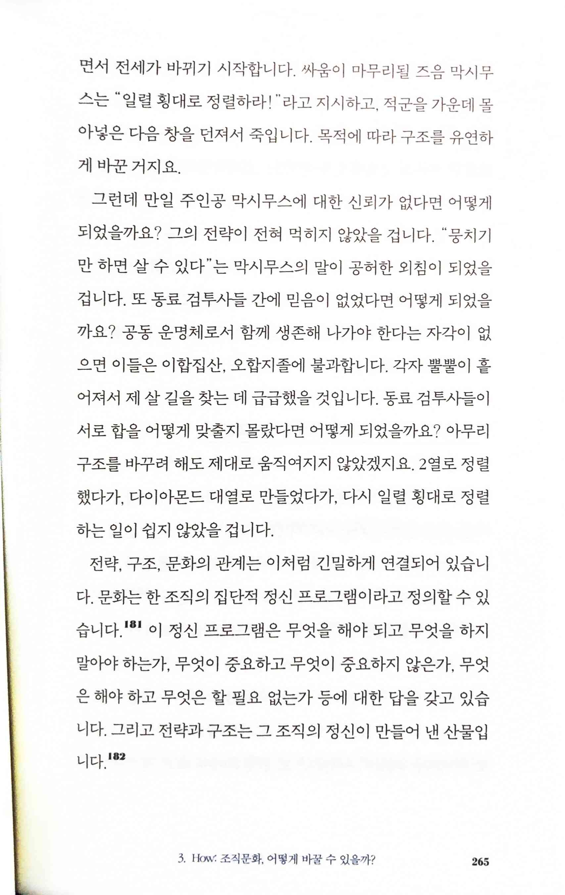 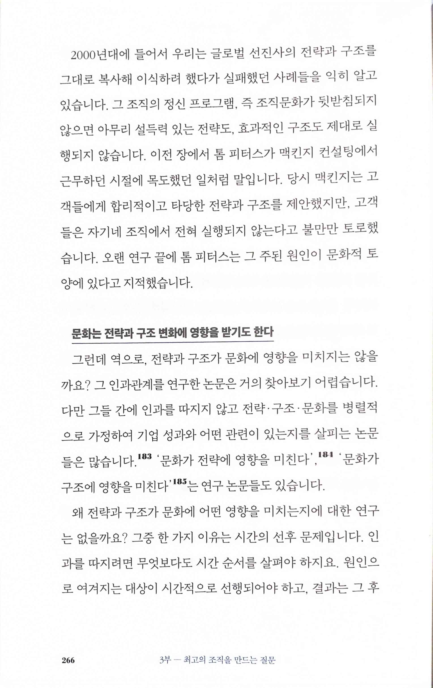

> 신뢰가 없다면 전략이 전혀 먹히지 않았을 것이고 구조를 바꾸려 해도 제대로 움직여지지 않았을 것
>
> 전략, 구조, 문화의 관계는 이처럼 긴밀하게 연결되어 있습니다. 문화는 한 조직의 집단적 정신 프로그램이라고 정의할 수 있습니다. 이 정신 프로그램은 무엇을 해야 되고 무엇을 하지말아야 하는가, 무엇이 중요하고 무엇이 중요하지 않은가, 무엇은 해야 하고 무엇은 할 필요 없는가 등에 대한 답을 갖고 있습니다. 그리고 전략과 구조는 그 조직의 정신이 만들어 낸 산물입니다.
>
> 그 조직의 정신 프로그램, 즉 조직문화가 뒷받침되지 않으면 아무리 설득력 있는 전략도 효과적인 구조도 제대로 실행되지 않습니다. 이전 장에서 톰 피터스가 맥킨지 컨설팅에서 근무하던 시절에 목도했던 일처럼 말입니다. 당시 맥킨지는 고객들에게 합리적이고 타당한 전략과 구조를 제안했지만, 고객들은 자기네 조직에서 전혀 실행되지 않는다고 불만만 토로했습니다. 오랜 연구 끝에 톰 피터스는 그 주된 원인이 문화적 토양에 있다고 지적했습니다.

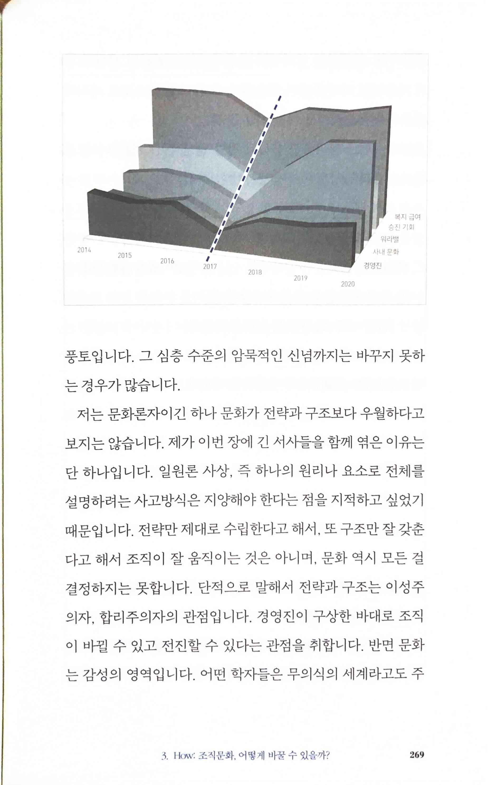 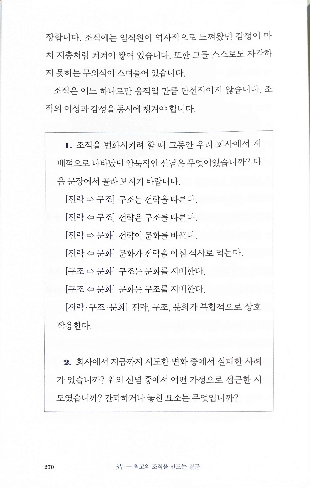

> 일원론 사상, 즉 하나의 원리나 요소로 전체를 설명하려는 사고방식은 지양해야 한다는 점을 지적하고 싶었기 때문입니다. 전략만 제대로 수립한다고 해서, 또 구조만 잘 갖춘다고 해서 조직이 잘 움직이는 것은 아니며, 문화 역시 모든 걸 결정하지는 못합니다. 단적으로 말해서 전략과 구조는 이성주의자, 합리주의자의 관점입니다. 경영진이 구상한 바대로 조직이 바뀔 수 있고 전진할 수 있다는 관점을 취합니다. 반면 문화는 감성의 영역입니다. 어떤 학자들은 무의식의 세계라고도 주장합니다. 조직에는 임직원이 역사적으로 느껴왔던 감정이 마치 지층처럼 켜켜이 쌓여 있습니다. 또한 그들 스스로도 자각하지 못하는 무의식이 스며들어 있습니다.
>
> 조직은 어느 하나로만 움직일 만큼 단선적이지 않습니다. 조직의 이성과 감성을 동시에 챙겨야 합니다.

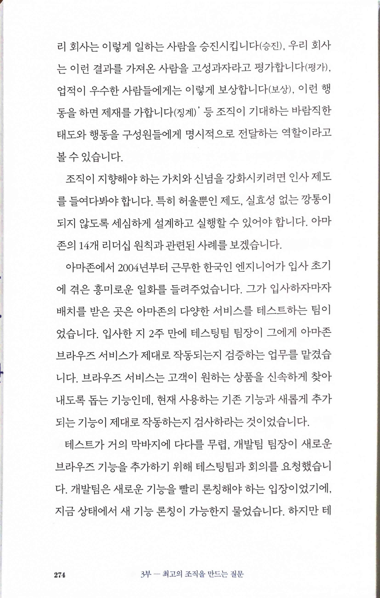

> 승진, 평가, 보상, 징계
>
> 조직이 지향해야 하는 가치와 신념을 강화시키려면 인사제도를 들여다봐야 합니다.

 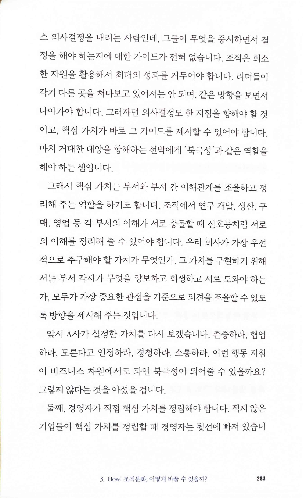 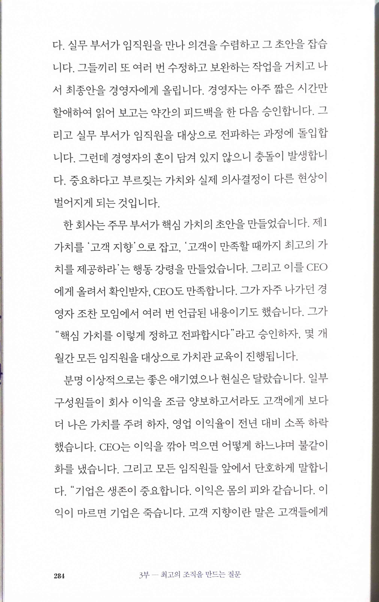 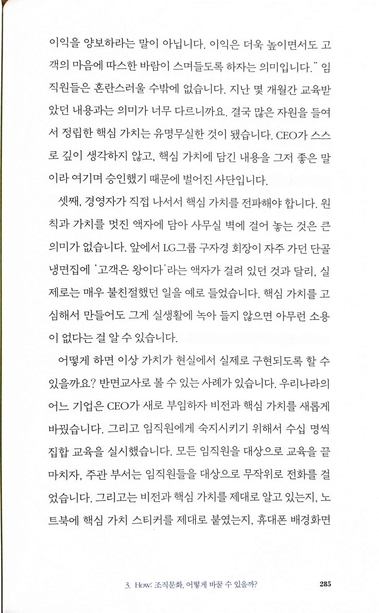

> 핵심 가치를 정할 때에는 세 가지를 유의해야 합니다. 첫째, 핵심 가치는 무엇보다 사업을 위한 의사결정에 가이드를 제공할 수 있어야 합니다. A회사에서는 리더들이 지켜야 할 핵심 가치를 정했습니다. '구성원을 존중하라, 협업해라, 모르면 모른다고 인정해라, 다른 사람이 말할 때 끝까지 경청하라, 투명하게 소통하라'라는 내용이었습니다. 이 자체는 물론 좋은 말이지만, 이상한 부분이 있습니다. 구성원을 대할 때 보여야 하는 태도와 행동 지침만 제시되어 있기 때문입니다. 리더는 다양한 비즈니스 의사결정을 내리는 사람인데, 그들이 무엇을 중시하면서 결정을 해야 하는지에 대한 가이드가 전혀 없습니다. 조직은 희소한 자원을 활용해서 최대의 성과를 거두어야 합니다. 리더들이 각기 다른 곳을 쳐다보고 있어서는 안 되며, 같은 방향을 보면서 나아가야 합니다. 그러자면 의사결정도 한 지점을 향해야 할 것이고, 핵심 가치가 바로 그 가이드를 제시할 수 있어야 합니다. 마치 거대한 대양을 항해하는 선박에게 '북극성'과 같은 역할을해야 하는 셈입니다.
>
> 그래서 핵심 가치는 부서와 부서 간 이해관계를 조율하고 정리해 주는 역할을 하기도 합니다. 조직에서 연구 개발, 생산, 구매, 영업 등 각 부서의 이해가 서로 충돌할 때 신호등처럼 서로의 이해를 정리해 줄 수 있어야 합니다. 우리 회사가 가장 우선적으로 추구해야 할 가치가 무엇인가, 그 가치를 구현하기 위해서는 부서 각자가 무엇을 양보하고 희생하고 서로 도와야 하는가, 모두가 가장 중요한 관점을 기준으로 의견을 조율할 수 있도록 방향을 제시해 주는 것입니다.
>
> 둘째, 경영자가 직접 핵심 가치를 정립해야 합니다.
>
> 셋째, 경영자가 직접 나서서 핵심 가치를 전파해야 합니다.

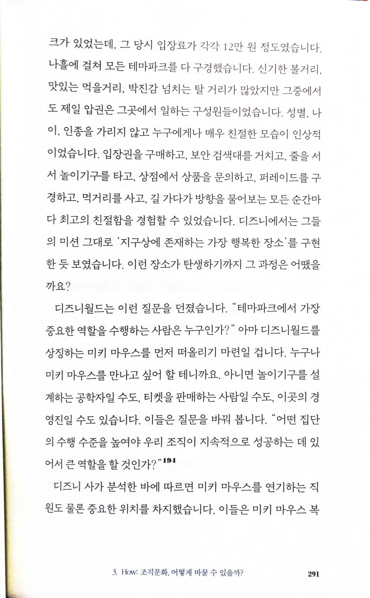

> "어떤 집단의 수행 수준을 높여야 우리 조직이 지속적으로 성공하는 데 있어서 큰 역할을 할 것인가?"

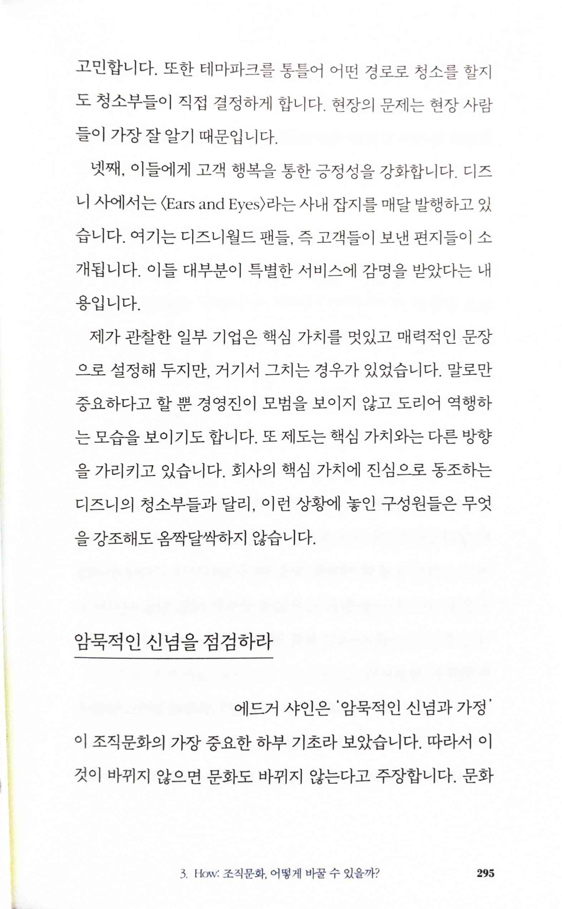

> 제가 관찰한 일부 기업은 핵심 가치를 멋있고 매력적인 문장으로 설정해 두지만, 거기서 그치는 경우가 있었습니다. 말로만 중요하다고 할 뿐 경영진이 모범을 보이지 않고 도리어 역행하는 모습을 보이기도 합니다. 또 제도는 핵심 가치와는 다른 방향을 가리키고 있습니다. 회사의 핵심 가치에 진심으로 동조하는 디즈니의 청소부들과 달리, 이런 상황에 놓인 구성원들은 무엇을 강조해도 옴짝달싹하지 않습니다.

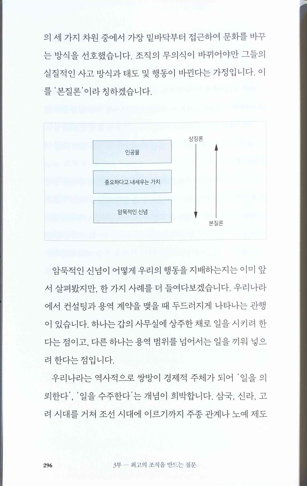 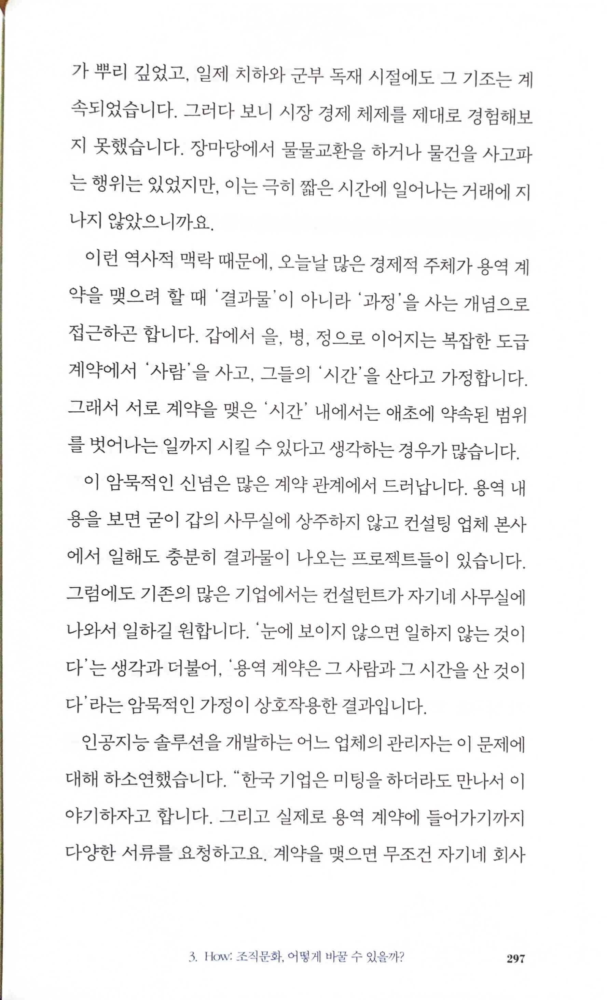 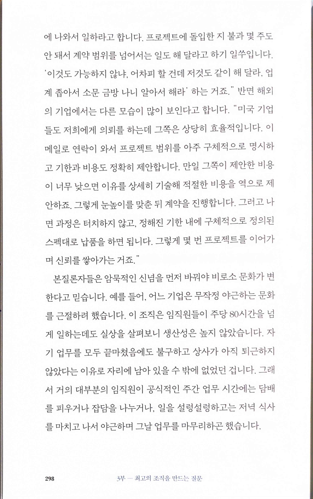

> 에드거 샤인은 '암묵적인 신념과 가정'이 조직문화의 가장 중요한 하부 기초라 보았습니다. 따라서 이것이 바뀌지 않으면 문화도 바뀌지 않는다고 주장합니다. 문화의 세 가지 차원 중에서 가장 밑바닥부터 접근하여 문화를 바꾸는 방식을 선호했습니다. 조직의 무의식이 바뀌어야만 그들의 실질적인 사고 방식과 태도 및 행동이 바뀐다는 가정입니다.
>
> 역사적 맥락 때문에, 오늘날 많은 경제적 주체가 용역 계약을 맺으려 할 때 '결과물'이 아니라 '과정'을 사는 개념으로 접근하곤 합니다. 갑에서 을, 병, 정으로 이어지는 복잡한 도급계약에서 '사람'을 사고, 그들의 '시간'을 산다고 가정합니다. 그래서 서로 계약을 맺은 '시간' 내에서는 애초에 약속된 범위를 벗어나는 일까지 시킬 수 있다고 생각하는 경우가 많습니다.
>
> 본질론자들은 암묵적인 신념을 먼저 바꿔야 비로소 문화가 변한다고 믿습니다.

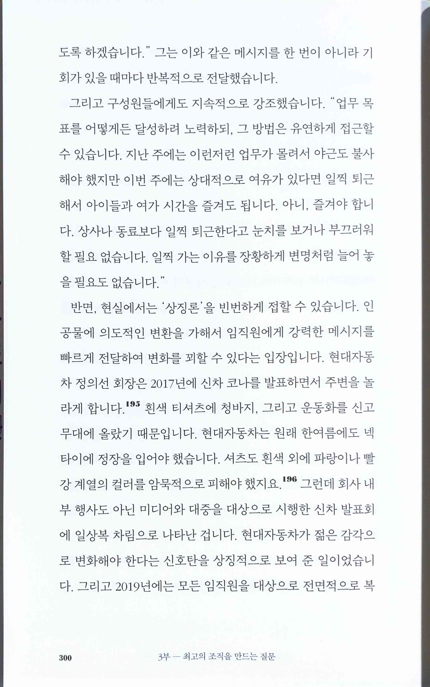

> 현실에서는 '상징론'을 빈번하게 접할 수 있습니다. 인공물에 의도적인 변환을 가해서 임직원에게 강력한 메시지를 빠르게 전달하여 변화를 꾀할 수 있다는 입장입니다.
>
> 상징론자들은 인공물을 바꿔서 구성원들에게 빠르게 메시지를 전달하는 측면에서 상당히 의미가 있다고 생각합니다. 인공물부터 바꾸면 구성원들이 피부로 느낄 수 있으며 '우리 조직이 변화하고 있구나, 그러면 나도 그에 맞춰서 변화해야지'라는 생각을 하도록 촉진하기 때문이라며 말이지요.

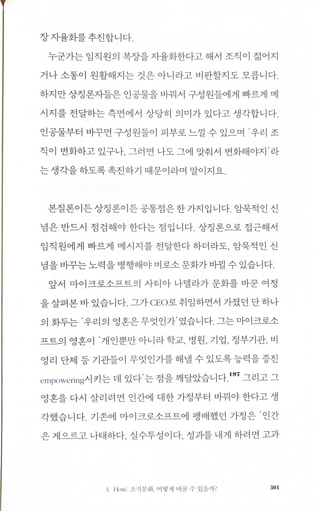 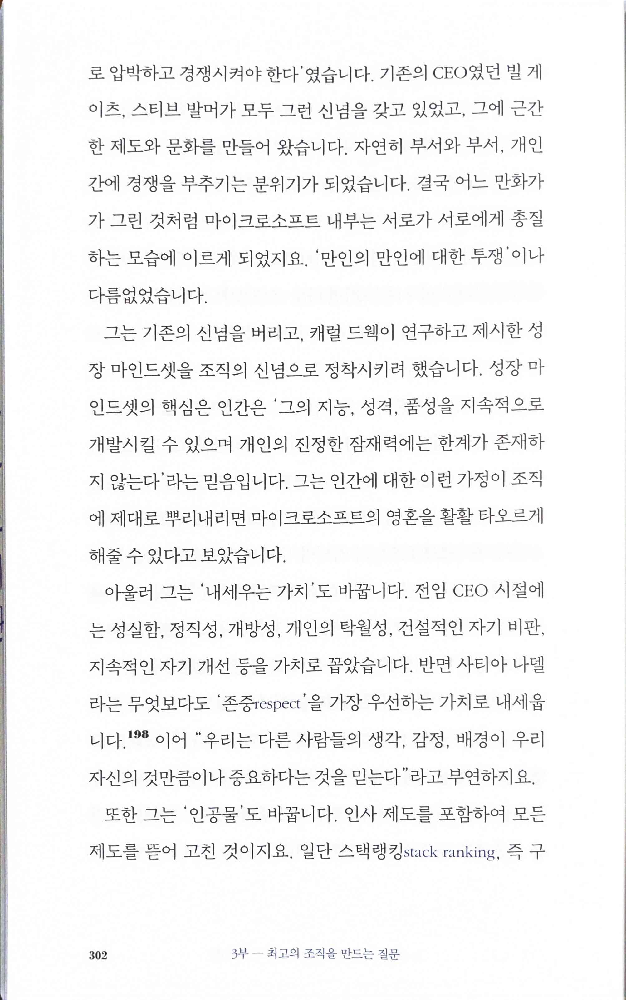 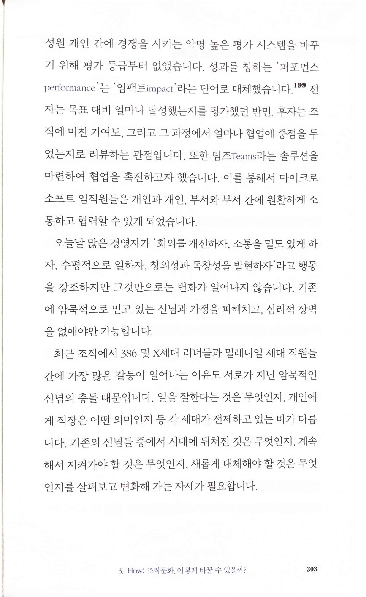

> 본질론이든 상징론이든 공통점은 한 가지입니다. 암묵적인 신념은 반드시 점검해야 한다는 점입니다. 상징론으로 접근해서 임직원에게 빠르게 메시지를 전달한다 하더라도, 암묵적인 신념을 바꾸는 노력을 병행해야 비로소 문화가 바뀔 수 있습니다.
>
> 사티아 나델라 '우리의 영혼은 무엇인가', '개인뿐만 아니라 학교, 병원, 기업, 정부기관, 비영리 단체 등 기관들이 무엇인가를 해낼 수 있도록 능력을 증진 empowering시키는 데 있다'
>
> 무엇보다도 '존중 respect'을 가장 우선하는 가치로, "우리는 다른 사람들의 생각, 감정, 배경이 우리 자신의 것만큼이나 중요하다는 것을 믿는다"
>
> 또한 그는 '인공물'도 바꿉니다. 인사 제도를 포함하여 모든 제도를 뜯어 고친 것이지요. 일단 스택랭킹 stack ranking, 즉 구성원 개인 간에 경쟁을 시키는 악명 높은 평가 시스템을 바꾸기 위해 평가 등급부터 없앴습니다. 성과를 칭하는 '퍼포먼스 performance'는 '임팩트 impact'라는 단어로 대체했습니다. 전자는 목표 대비 얼마나 달성했는지를 평가했던 반면, 후자는 조직에 미친 기여도, 그리고 그 과정에서 얼마나 협업에 중점을 두었는지로 리뷰하는 관점입니다.
>
> 오늘날 많은 경영자가 회의를 개선하자, 소통을 밀도 있게 하자, 수평적으로 일하자, 창의성과 독창성을 발현하자'라고 행동을 강조하지만 그것만으로는 변화가 일어나지 않습니다. 기존에 암묵적으로 믿고 있는 신념과 가정을 파헤치고, 심리적 장벽을 없애야만 가능합니다.
>
> 기존의 신념들 중에서 시대에 뒤쳐진 것은 무엇인지 계속해서 지켜가야 할 것은 무엇인지, 새롭게 대체해야 할 것은 무엇인지를 살펴보고 변화해 가는 자세가 필요합니다.