BEYOND THE BASIC STUFF WITH PYTHON 클린 코드 이제는 파이썬이다
==============================================================
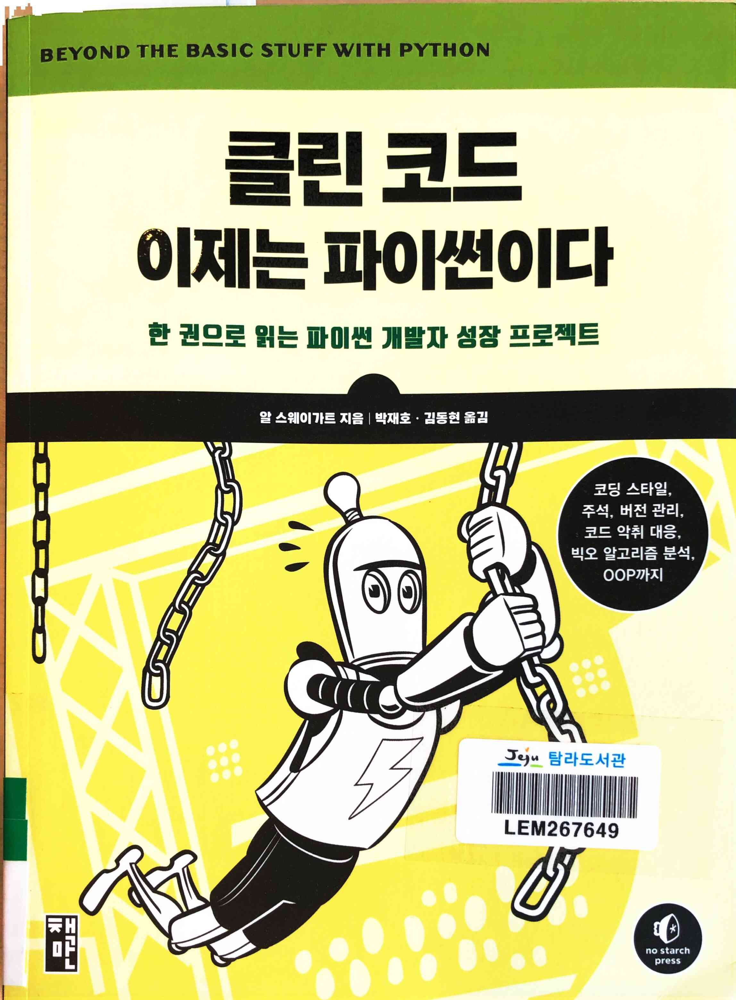

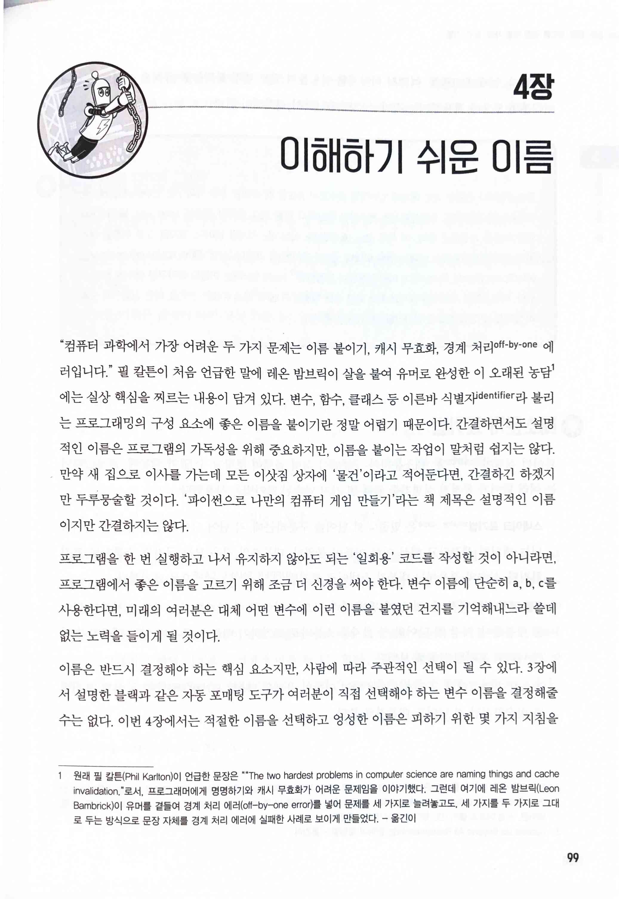

> "컴퓨터 과학에서 가장 어려운 두 가지 문제는 이름 붙이기, 캐시 무효화, 경계 처리off-by-one 에러입니다.” 필 칼튼이 처음 언급한 말에 레온 밤브릭이 살을 붙여 유머로 완성한 이 오래된 농담'에는 실상 핵심을 찌르는 내용이 담겨 있다.
>
> 원래 필 칼튼(Phil Karlton)이 언급한 문장은 "The two hardest problems in computer science are naming things and cache invalidation. "로서, 프로그래머에게 명명하기와 캐시 무효화가 어려운 문제임을 이야기했다. 그런데 여기에 레온 밤브릭 (Leon Bambrick)이 유머를 곁들여 경계 처리 에러(off-by-one error)를 넣어 문제를 세 가지로 늘려놓고도 세 가지를 두 가지로 그대로 두는 방식으로 문장 자체를 경계 처리 에러에 실패한 사례로 보이게 만들었다. - 옮긴이

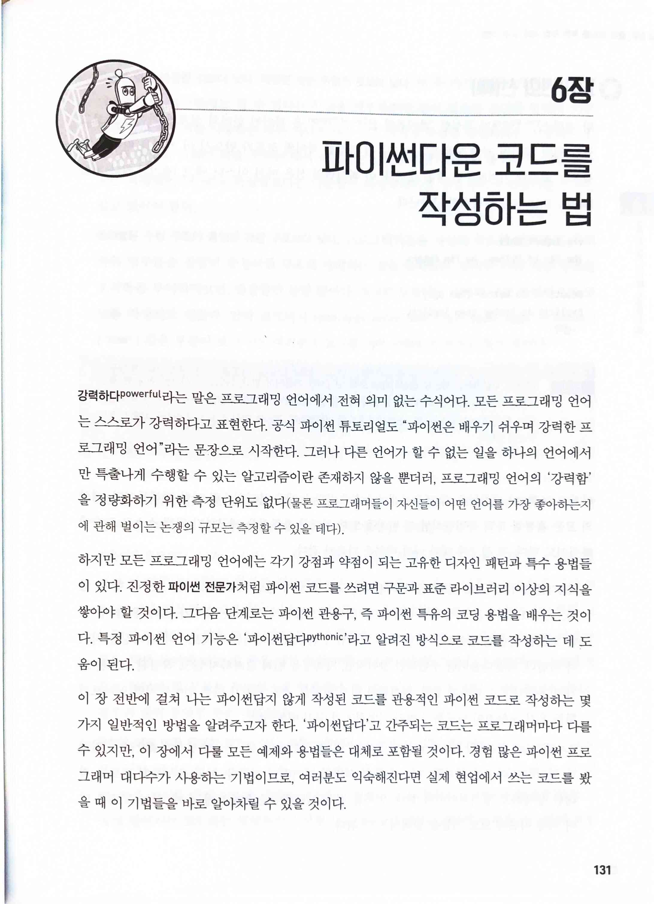

> 강력하다powerful라는 말은 프로그래밍 언어에서 전혀 의미 없는 수식어다. 모든 프로그래밍 언어는 스스로가 강력하다고 표현한다... 그러나 다른 언어가 할 수 없는 일을 하나의 언어에서만 특출나게 수행할 수 있는 알고리즘이란 존재하지 않을 뿐더러, 프로그래밍 언어의 '강력함'을 정량화하기 위한 측정 단위도 없다(물론 프로그래머들이 자신들이 어떤 언어를 가장 좋아하는지에 관해 벌이는 논쟁의 규모는 측정할 수 있을 테다).
>
> 하지만 모든 프로그래밍 언어에는 각기 강점과 약점이 되는 고유한 디자인 패턴과 특수 용법들이 있다.

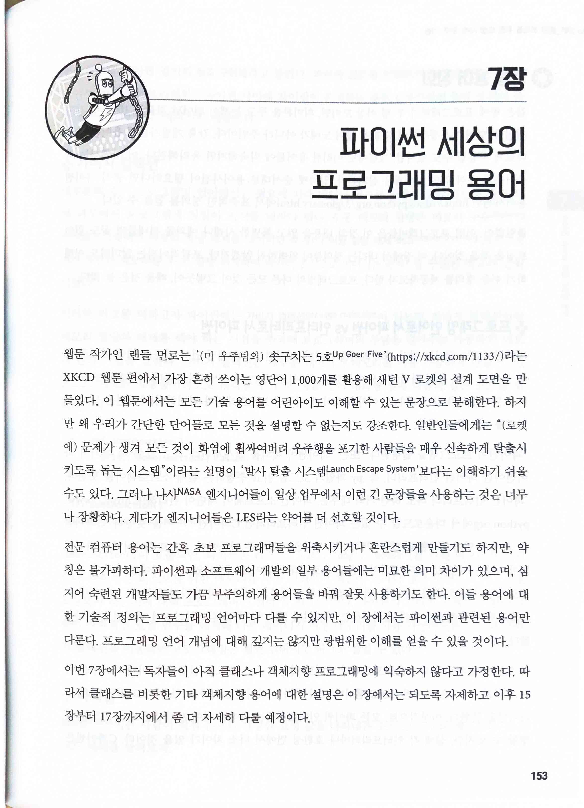

> 웹툰 작가인 랜들 먼로는 '(미 우주팀의) 솟구치는 5호 Up Goer Five' (https://xkcd.com/1133)라는 XKCD 웹툰 편에서 가장 흔히 쓰이는 영단어 1,000개를 활용해 새턴 V 로켓의 설계 도면을 만들었다. 이 웹툰에서는 모든 기술 용어를 어린아이도 이해할 수 있는 문장으로 분해한다. 하지만 왜 우리가 간단한 단어들로 모든 것을 설명할 수 없는지도 강조한다.

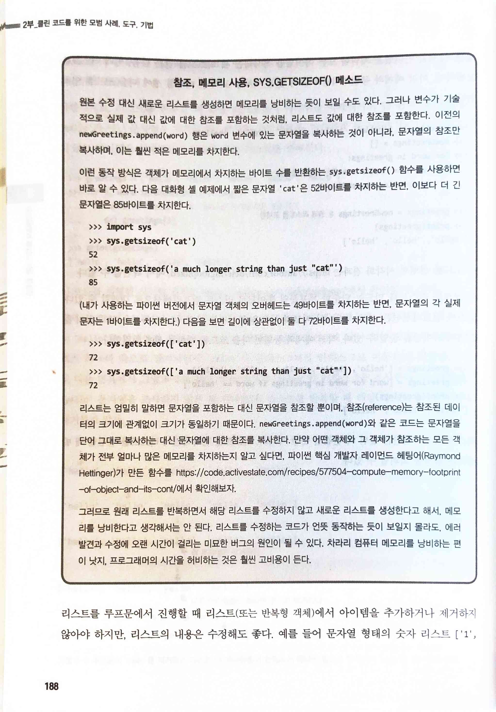

> 어떤 객체와 그 객체가 참조하는 모든 객체가 전부 얼마나 많은 메모리를 차지하는지
* [Compute Memory footprint of an object and its contents « Python recipes « ActiveState Code](https://code.activestate.com/recipes/577504-compute-memory-footprint-of-object-and-its-cont/)
> 차라리 컴퓨터 메모리를 낭비하는 편이 낫지, 프로그래머의 시간을 허비하는 것은 훨씬 고비용이 든다.

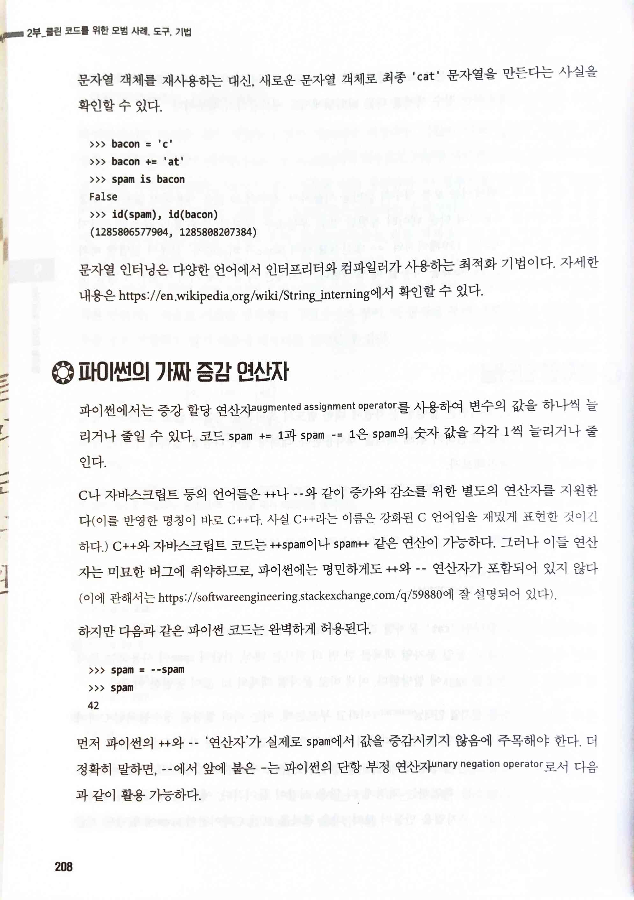

> 그러나 이들 연산자는 미묘한 버그에 취약하므로, 파이썬에는 명민하게도 ++와 - - 연산자가 포함되어 있지 않다
* [c++ - Avoid Postfix Increment Operator - Software Engineering Stack Exchange](https://softwareengineering.stackexchange.com/questions/59880/avoid-postfix-increment-operator)

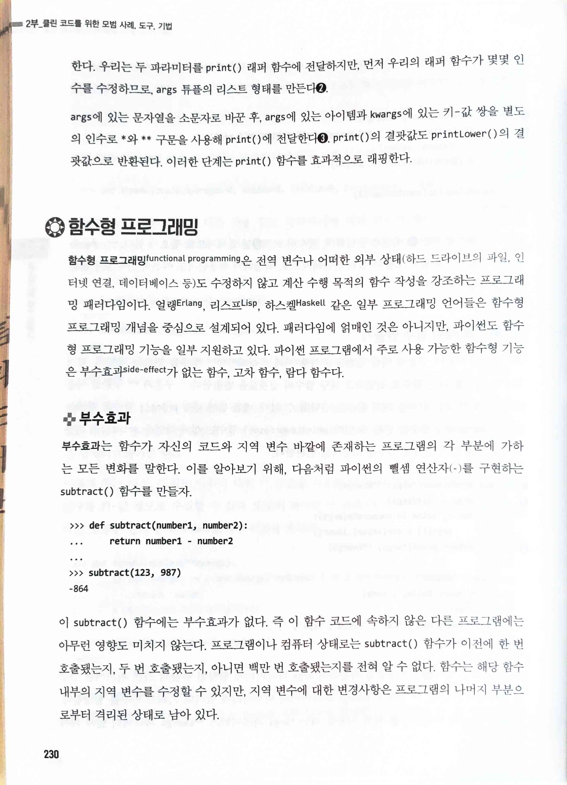

> `함수형 프로그래밍 functional programming`은 전역 변수나 어떠한 외부 상태(하드 드라이브의 파일, 인터넷 연결, 데이터베이스 등)도 수정하지 않고 계산 수행 목적의 함수 작성을 강조하는 프로그래밍 패러다임이다. 얼랭Erlang, 리스프Lisp, 하스켈Haskell 같은 일부 프로그래밍 언어들은 함수형 프로그래밍 개념을 중심으로 설계되어 있다. 패러다임에 얽매인 것은 아니지만, 파이썬 함수형 프로그래밍 기능을 일부 지원하고 있다. 파이썬 프로그램에서 주로 사용 가능한 함수형 기능은 부수효과 side-effect가 없는 함수, 고차 함수, 람다 함수다.
>
> `부수효과`는 함수가 자신의 코드와 지역 변수 바깥에 존재하는 프로그램의 각 부분에 가하는 모든 변화를 말한다.

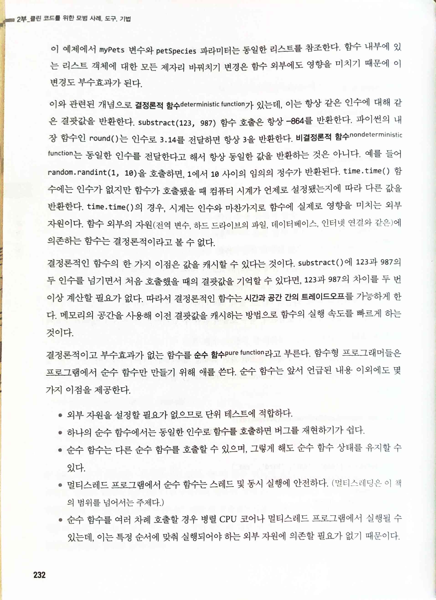

> `결정론적 함수 deterministic function`는 항상 같은 인수에 대해 같은 결괏값을 반환한다.
>
> `비결정론적 함수 nondeterministic function`는 동일한 인수를 전달한다고 해서 항상 동일한 값을 반환하는 것은 아니다.
>
> 결정론적이고 부수효과가 없는 함수를 `순수 함수 pure function` 라고 부른다.

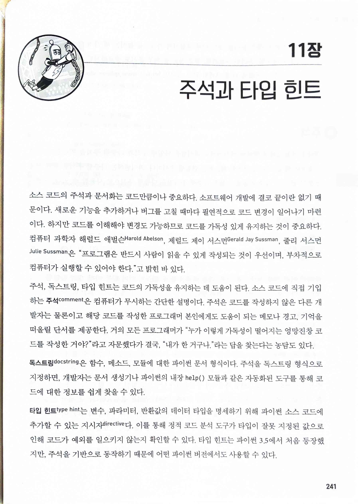

> 소스 코드의 주석과 문서화는 코드만큼이나 중요하다. 소프트웨어 개발에 결코 끝이란 없기 때문이다. 새로운 기능을 추가하거나 버그를 고칠 때마다 필연적으로 코드 변경이 일어나기 마련이다. 하지만 코드를 이해해야 변경도 가능하므로 코드를 가독성 있게 유지하는 것이 중요하다.컴퓨터 과학자 해럴드 애벌슨Harold Abelson, 제럴드 제이 서스먼Gerald Jay Sussman, 줄리 서스먼Julie Sussman은 "프로그램은 반드시 사람이 읽을 수 있게 작성되는 것이 우선이며, 부차적으로 컴퓨터가 실행할 수 있어야 한다."고 밝힌 바 있다.

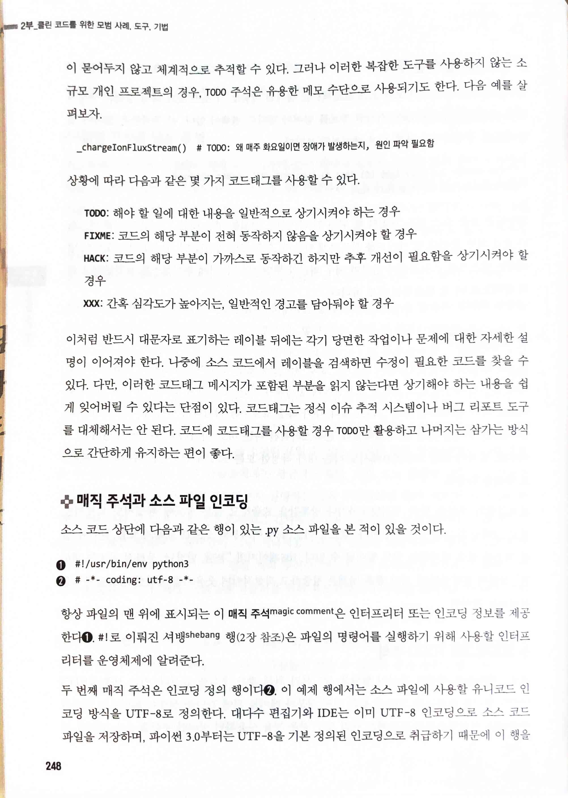

> 코드태그
>
> TODO: 해야 할 일에 대한 내용을 일반적으로 상기시켜야 하는 경우
>
> FIXME: 코드의 해당 부분이 전혀 동작하지 않음을 상기시켜야 할 경우
>
> HACK: 코드의 해당 부분이 가까스로 동작하긴 하지만 추후 개선이 필요함을 상기시켜야 할경우
>
> XXX: 간혹 심각도가 높아지는 일반적인 경고를 담아둬야 할 경우
>
> 코드태그는 정식 이슈 추적 시스템이나 버그 리포트 도구를 대체해서는 안 된다. 코드에 코드태그를 사용할 경우 TODO만 활용하고 나머지는 삼가는 방식으로 간단하게 유지하는 편이 좋다.

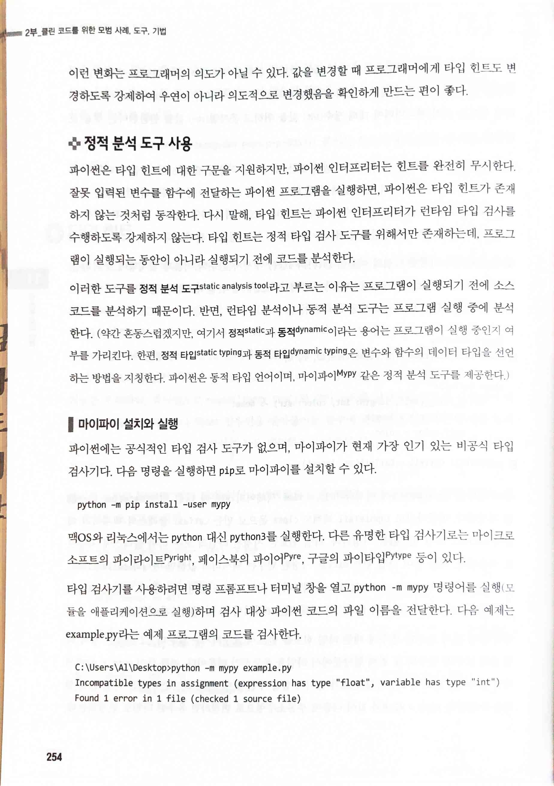

> `정적 분석 도구 static analysis tool`라고 부르는 이유는 프로그램이 실행되기 전에 소스 코드를 분석하기 때문이다. 반면, 런타임 분석이나 동적 분석 도구는 프로그램 실행 중에 분석한다. (약간 혼동스럽겠지만, 여기서 정적static과 동적dynamic이라는 용어는 프로그램이 실행 중인지 여부를 가리킨다. 정적 타입static typing과 동적 타입dynamic typing은 변수와 함수의 데이터 타입을 선언하는 방법을 지칭한다. 파이썬은 동적 타입 언어이며, 마이파이Mypy 같은 정적 분석 도구를 제공한다.)

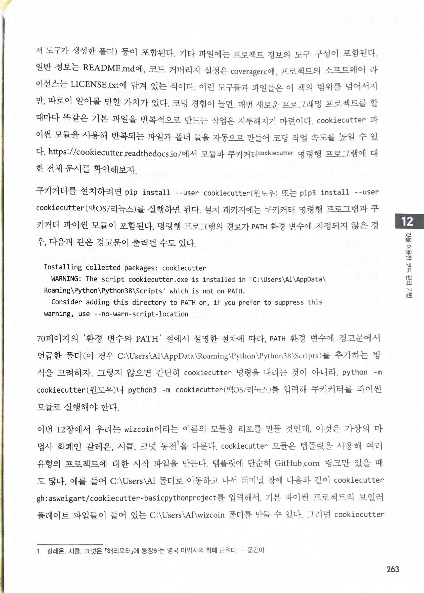

* [Cookiecutter: Better Project Templates — cookiecutter 2.1.1 documentation](https://cookiecutter.readthedocs.io/)

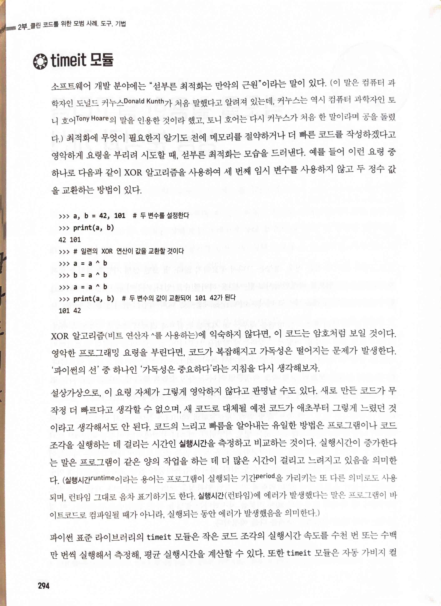

> 소프트웨어 개발 분야에는 “섣부른 최적화는 만악의 근원'이라는 말이 있다. (이 말은 컴퓨터 과학자인 도널드 커누스Donald Kunth가 처음 말했다고 알려져 있는데, 커누스는 역시 컴퓨터 과학자인 토니 호어 Tony Hoare 의 말을 인용한 것이라 했고, 토니 호어는 다시 커누스가 처음 한 말이라며 공을 돌렸다.)

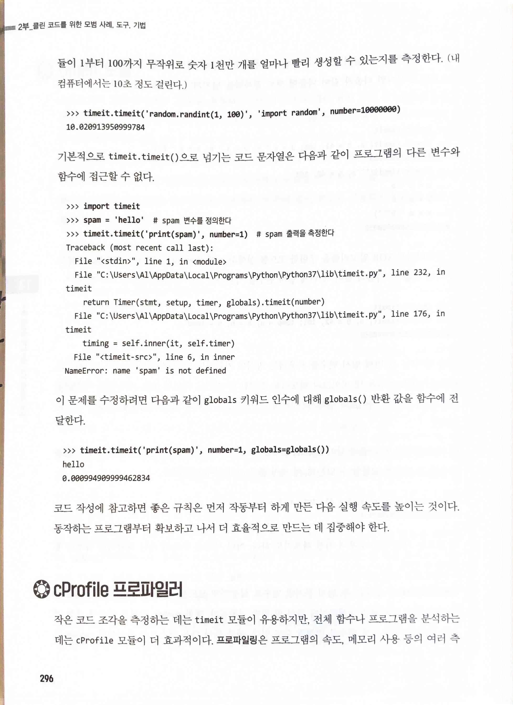

* `timeit`

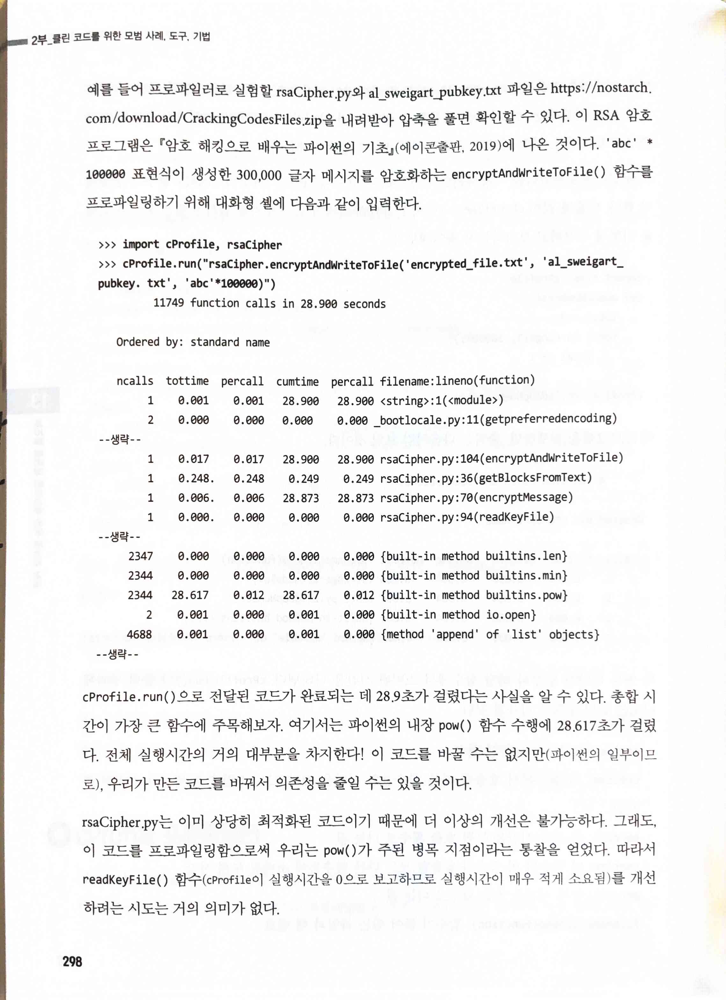

* `rsaCipher`
* https://nostarch.com/download/CrackingCodesFiles.zip

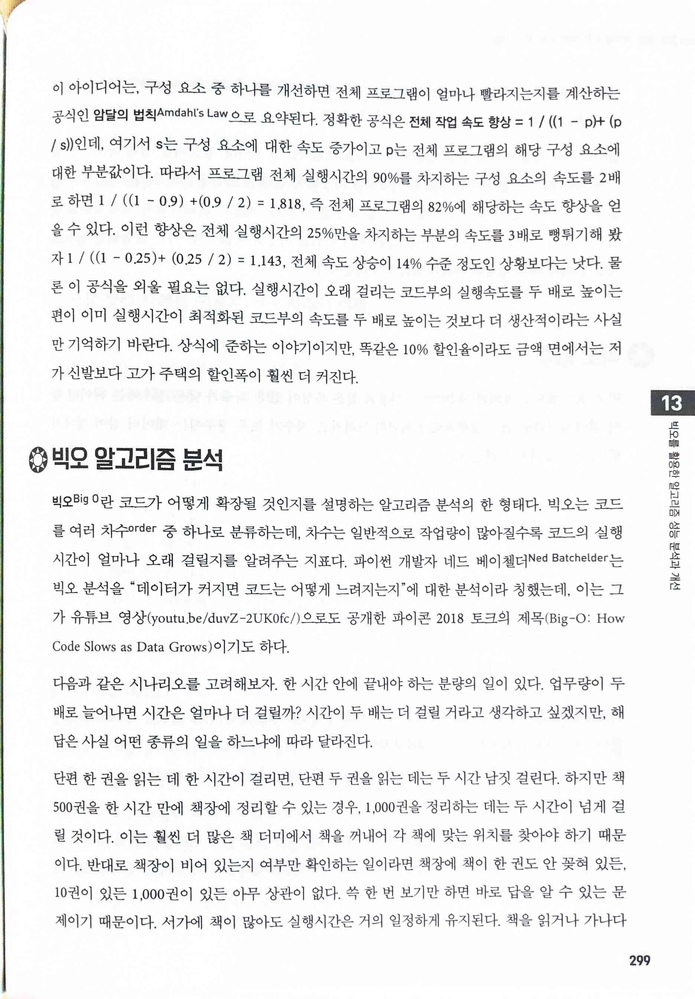

> 구성 요소 중 하나를 개선하면 전체 프로그램이 얼마나 빨라지는지를 계산하는 공식인 `암달의 법칙 Amdahl's Law`
>
> 전체 작업 속도 향상 = 1 / ((1-p) + (p/s))인데, 여기서 s는 구성 요소에 대한 속도 증가이고 p는 전체 프로그램의 해당 구성 요소에 대한 부분값

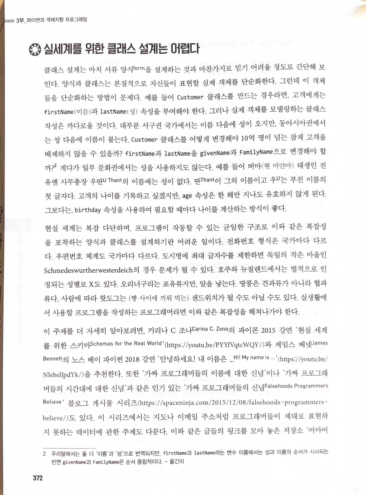 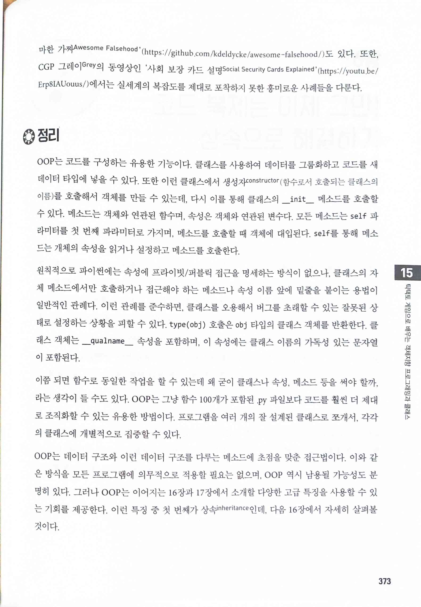

> 현실 세계는 복잡 다단하며, 프로그램이 작동할 수 있는 균일한 구조로 이와 같은 복잡성을 포착하는 양식과 클래스를 설계하기란 어려운 일이다.
* 현실 세계를 위한 스키마 [Carina C. Zona - Schemas for the Real World - PyCon 2015 - YouTube](https://www.youtube.com/watch?v=PYYfVqtcWQY)
* 안녕하세요! 내 이름은 ... [Hi! My name is... - YouTube](https://www.youtube.com/watch?v=NIebelIpdYk)
* 가짜 프로그래머들의 신념 [Falsehoods Programmers Believe](https://spaceninja.com/2015/12/08/falsehoods-programmers-believe/)
* 어마어마한 가짜 [kdeldycke/awesome-falsehood: 😱 Falsehoods Programmers Believe in](https://github.com/kdeldycke/awesome-falsehood)
* 사회 보장 카드 설명 [Your Social Security Card is Insecure - YouTube](https://www.youtube.com/watch?v=Erp8IAUouus)

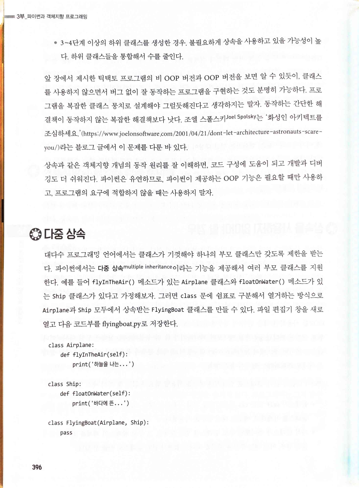

> 동작하는 간단한 해결책이 동작하지 않는 복잡한 해결책보다 낫다.
* [Don’t Let Architecture Astronauts Scare You – Joel on Software](https://www.joelonsoftware.com/2001/04/21/dont-let-architecture-astronauts-scare-you/)

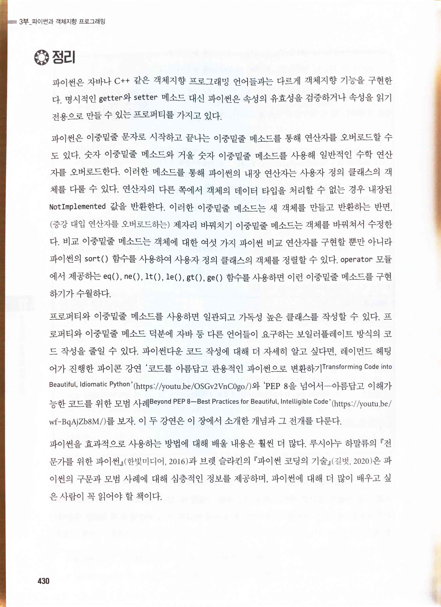

* 코드를 아름답고 관용적인 파이썬으로 변환하기 [Transforming Code into Beautiful, Idiomatic Python - YouTube](https://www.youtube.com/watch?v=OSGv2VnC0go)
* PEP 8을 넘어서-아름답고 이해가능한 코드를 위한 모범 사례 [Raymond Hettinger - Beyond PEP 8 -- Best practices for beautiful intelligible code - PyCon 2015 - YouTube](https://www.youtube.com/watch?v=wf-BqAjZb8M)