전길남, 연결의 탄생
===================
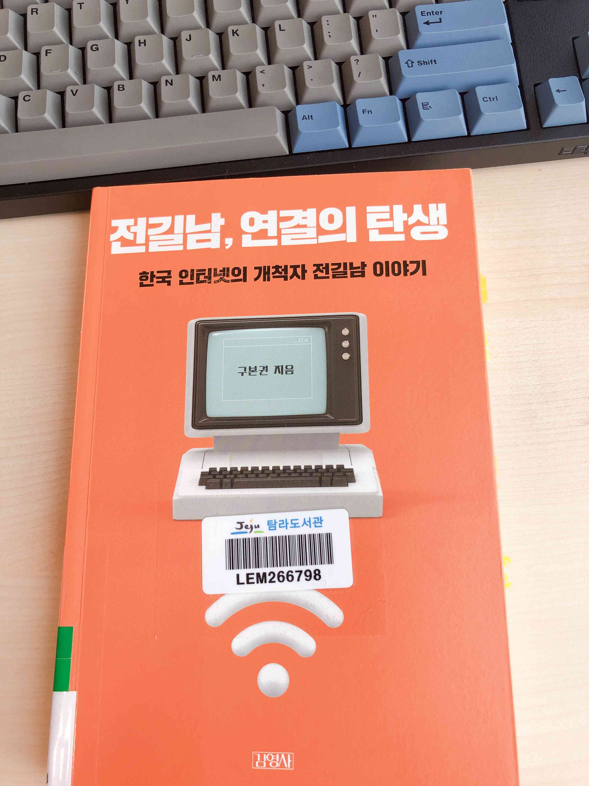

* ['전길남, 연결의 탄생' 구본권 저자와의 만남 - YouTube](https://www.youtube.com/watch?v=XcXE3APW5Ac)

# 서문 한국, 아시아, 그리고 전길남이라는 이름
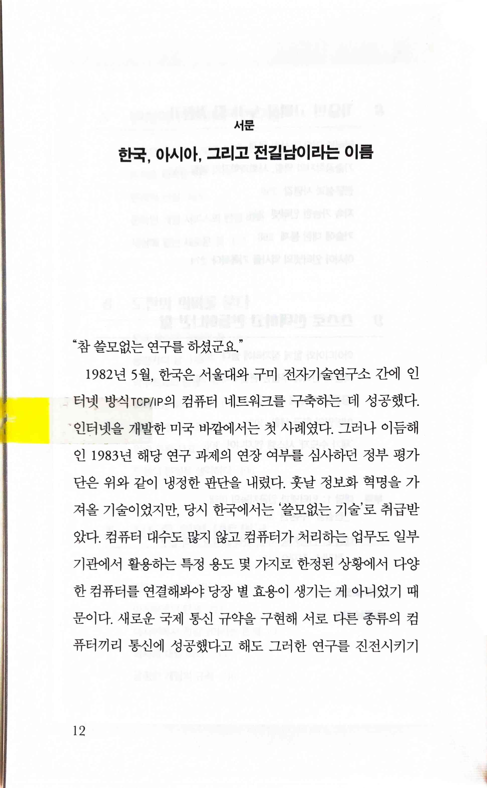

> “참 쓸모없는 연구를 하셨군요."
>
> 1982년 5월, 한국은 서울대와 구미 전자기술연구소 간에 인터넷 방식TCP/IP의 컴퓨터 네트워크를 구축하는 데 성공했다. 인터넷을 개발한 미국 바깥에서는 첫 사례였다. 그러나 이듬해인 1983년 해당 연구 과제의 연장 여부를 심사하던 정부 평가단은 위와 같이 냉정한 판단을 내렸다. 훗날 정보화 혁명을 가져올 기술이었지만, 당시 한국에서는 '쓸모없는 기술'로 취급받았다.

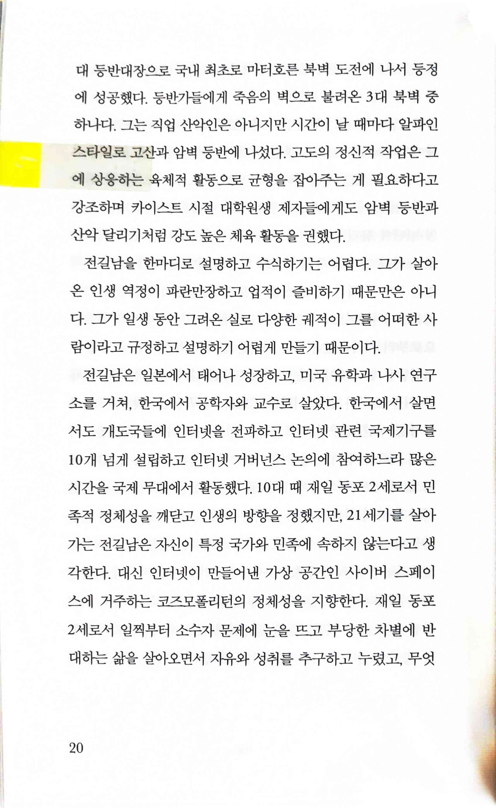

> 고도의 정신적 작업은 그에 상응하는 육체적 활동으로 균형을 잡아주는 게 필요하다고 강조

# 1 한국행을 결심한 자이니치 소년
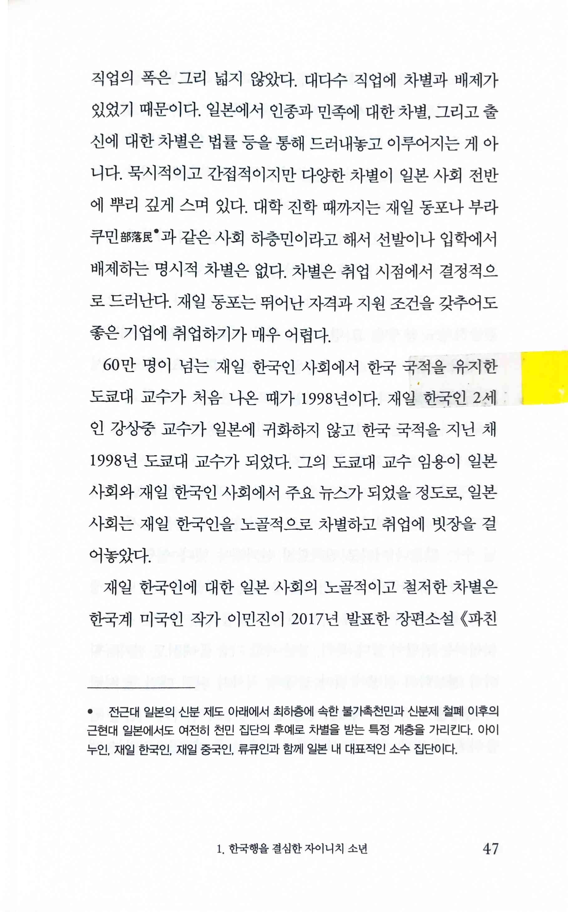

> 60만 명이 넘는 재일 한국인 사회에서 한국 국적을 유지한 도쿄대 교수가 처음 나온 때가 1998년

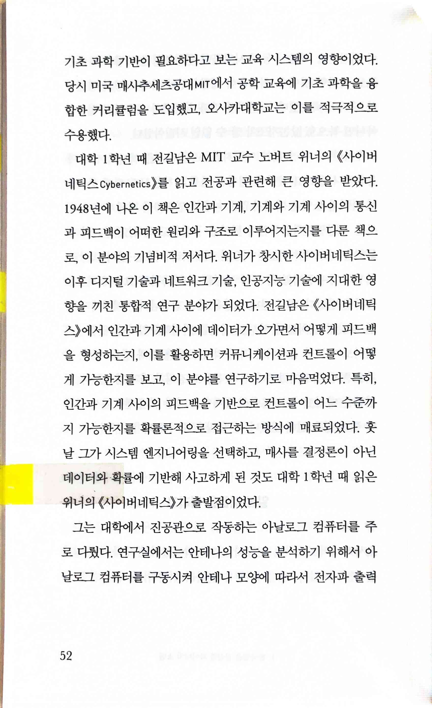

> 훗날 그가 시스템 엔지니어링을 선택하고, 매사를 결정론이 아닌 데이터와 확률에 기반해 사고하게 된 것도 대학 1학년 때 읽은 위너의 <사이버네틱스>가 출발점이었다.
* [노버트 위너 : 사이버네틱스의 세계](http://www.aistudy.co.kr/pioneer/Wiener_fischer.htm)

# 2 NASA에서 배운 시스템공학
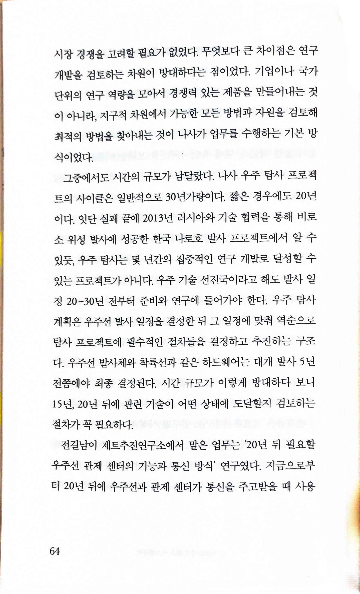 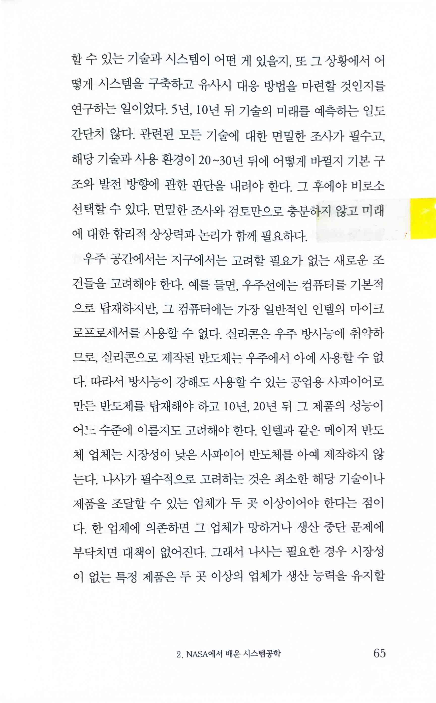

> 관련된 모든 기술에 대한 면밀한 조사가 필수고, 해당 기술과 사용 환경이 20`~`30년 뒤에 어떻게 바뀔지 기본 구조와 발전 방향에 관한 판단을 내려야 한다. 그 후에야 비로소 선택할 수 있다. 면밀한 조사와 검토만으로 충분하지 않고 미래에 대한 합리적 상상력과 논리가 함께 필요하다.

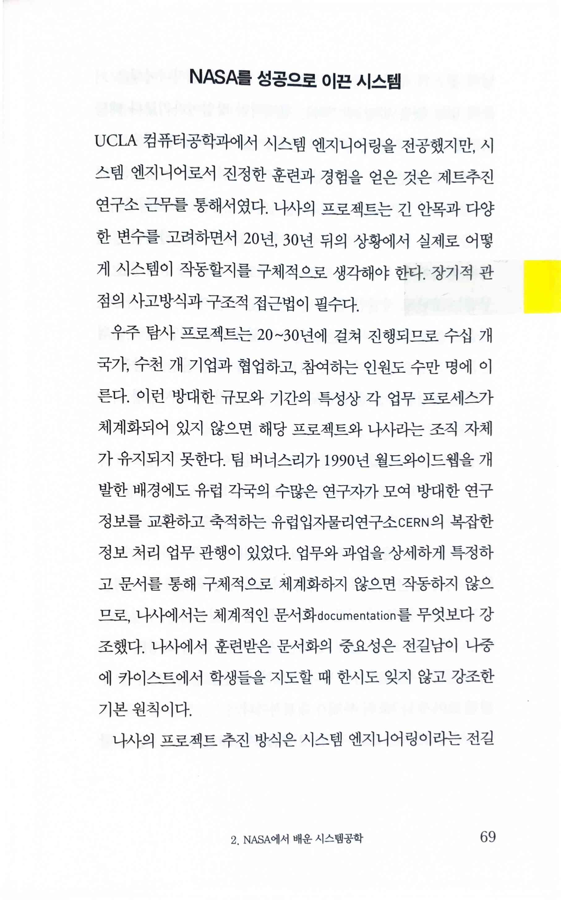

> 나사의 프로젝트는 긴 안목과 다양한 변수를 고려하면서 20년, 30년 뒤의 상황에서 실제로 어떻게 시스템이 작동할지를 구체적으로 생각해야 한다. 장기적 관점의 사고방식과 구조적 접근법이 필수다.
>
> 업무와 과업을 상세하게 특정하고 문서를 통해 구체적으로 체계화하지 않으면 작동하지 않으므로, 나사에서는 체계적인 문서화documentation를 무엇보다 강조했다. 나사에서 훈련받은 문서화의 중요성은 전길남이 나중에 카이스트에서 학생들을 지도할 때 한시도 잊지 않고 강조한 기본 원칙이다.

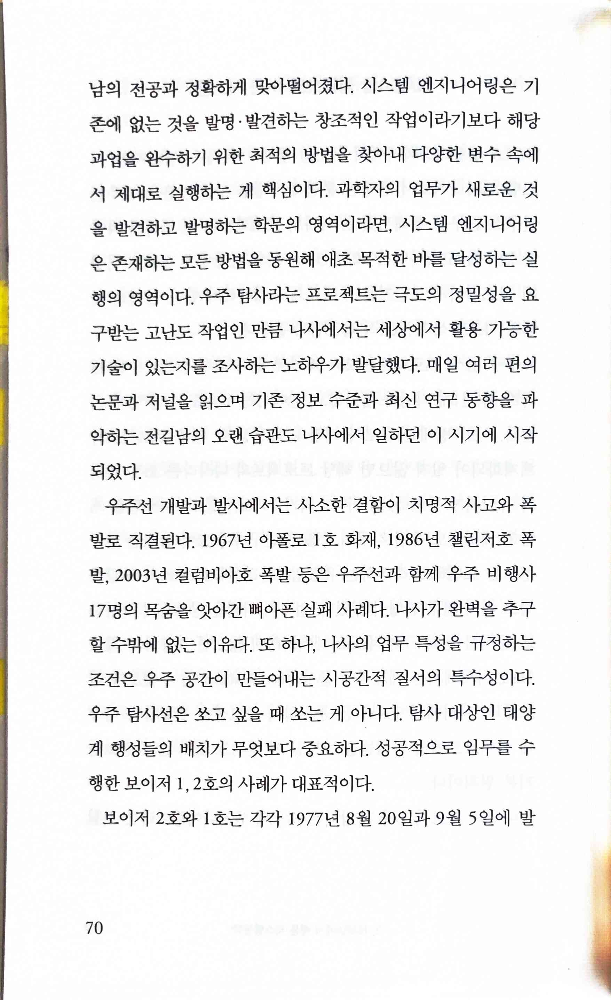 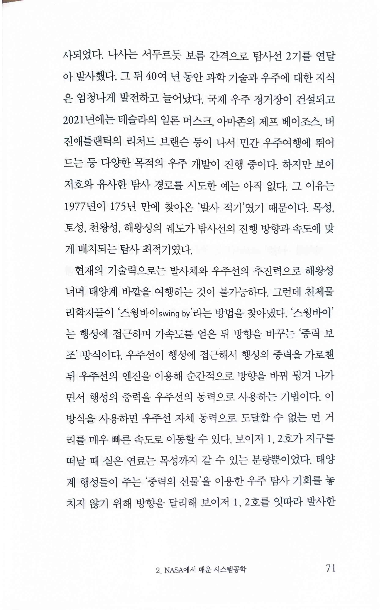 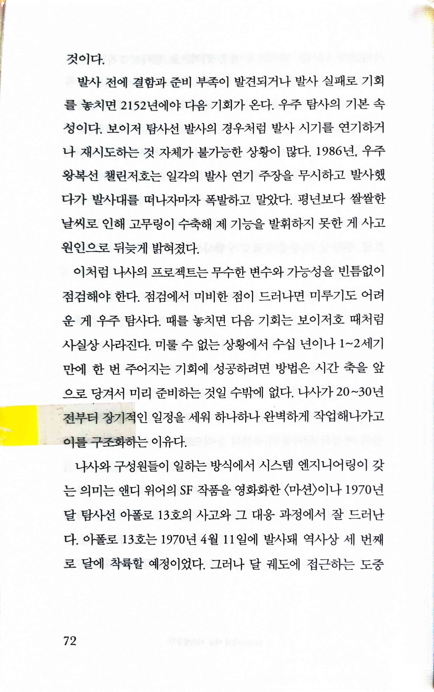

> 시스템 엔지니어링은 기존에 없는 것을 발명. 발견하는 창조적인 작업이라기보다 해당 과업을 완수하기 위한 최적의 방법을 찾아내 다양한 변수 속에서 제대로 실행하는 게 핵심이다. 과학자의 업무가 새로운 것을 발견하고 발명하는 학문의 영역이라면, 시스템 엔지니어링은 존재하는 모든 방법을 동원해 애초 목적한 바를 달성하는 실행의 영역이다. 우주 탐사라는 프로젝트는 극도의 정밀성을 요구받는 고난도 작업인 만큼 나사에서는 세상에서 활용 가능한 기술이 있는지를 조사하는 노하우가 발달했다.
>
> 우주선 개발과 발사에서는 사소한 결함이 치명적 사고와 폭발로 직결된다. 1967년 아폴로 1호 화재, 1986년 챌린저호 폭발, 2003년 컬럼비아호 폭발 등은 우주선과 함께 우주 비행사 17명의 목숨을 앗아간 뼈아픈 실패 사례다. 나사가 완벽을 추구할 수밖에 없는 이유다. 또 하나, 나사의 업무 특성을 규정하는 조건은 우주 공간이 만들어내는 시공간적 질서의 특수성이다. 우주 탐사선은 쏘고 싶을 때 쏘는 게 아니다. 탐사 대상인 태양계 행성들의 배치가 무엇보다 중요하다. 성공적으로 임무를 수행한 보이저 1,2호의 사례가 대표적이다.
>
> 천체물리학자들이 `'스윙바이swing by'`라는 방법을 찾아냈다. '스윙바이'는 행성에 접근하며 가속도를 얻은 뒤 방향을 바꾸는 '중력 보조' 방식이다. 우주선이 행성에 접근해서 행성의 중력을 가로챈 뒤 우주선의 엔진을 이용해 순간적으로 방향을 바꿔 튕겨 나가면서 행성의 중력을 우주선의 동력으로 사용하는 기법이다. 이 방식을 사용하면 우주선 자체 동력으로 도달할 수 없는 먼 거리를 매우 빠른 속도로 이동할 수 있다.
>
> 이처럼 나사의 프로젝트는 무수한 변수와 가능성을 빈틈없이 점검해야 한다. 점검에서 미비한 점이 드러나면 미루기도 어려운 게 우주 탐사다. 때를 놓치면 다음 기회는 보이저호 때처럼 사실상 사라진다. 미룰 수 없는 상황에서 수십 년이나 1`~`2세기만에 한 번 주어지는 기회에 성공하려면 방법은 시간 축을 앞으로 당겨서 미리 준비하는 것일 수밖에 없다. 나사가 20`~`30년 전부터 장기적인 일정을 세워 하나하나 완벽하게 작업해나가고 이를 구조화하는 이유다.

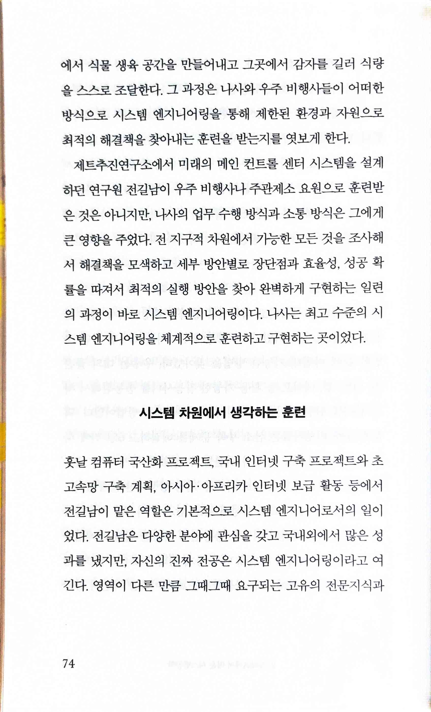 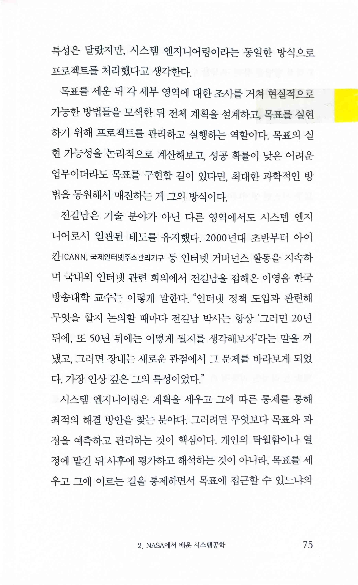

> 나사의 업무 수행 방식과 소통 방식은 그에게 큰 영향을 주었다. 전 지구적 차원에서 가능한 모든 것을 조사해서 해결책을 모색하고 세부 방안별로 장단점과 효율성, 성공 확률을 따져서 최적의 실행 방안을 찾아 완벽하게 구현하는 일련의 과정이 바로 시스템 엔지니어링이다. 나사는 최고 수준의 시스템 엔지니어링을 체계적으로 훈련하고 구현하는 곳이었다.
>
> 목표를 세운 뒤 각 세부 영역에 대한 조사를 거쳐 현실적으로 가능한 방법들을 모색한 뒤 전체 계획을 설계하고, 목표를 실현하기 위해 프로젝트를 관리하고 실행하는 역할이다. 목표의 실현 가능성을 논리적으로 계산해보고, 성공 확률이 낮은 어려운 업무이더라도 목표를 구현할 길이 있다면, 최대한 과학적인 방법을 동원해서 매진하는 게 그의 방식이다.
>
> 시스템 엔지니어링은 계획을 세우고 그에 따른 통제를 통해 최적의 해결 방안을 찾는 분야다. 그러려면 무엇보다 목표와 과정을 예측하고 관리하는 것이 핵심이다.

# 3 세계에서 두 번째로 인터넷을 구축하다
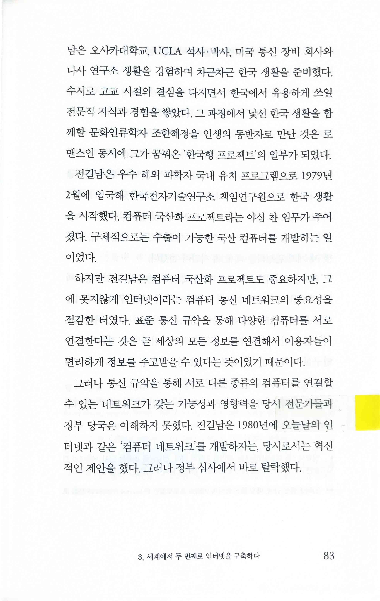

> 통신 규약을 통해 서로 다른 종류의 컴퓨터를 연결할 수 있는 네트워크가 갖는 가능성과 영향력을 당시 전문가들과 정부 당국은 이해하지 못했다. 전길남은 1980년에 오늘날의 인터넷과 같은 '컴퓨터 네트워크'를 개발하자는, 당시로서는 혁신적인 제안을 했다. 그러나 정부 심사에서 바로 탈락했다.

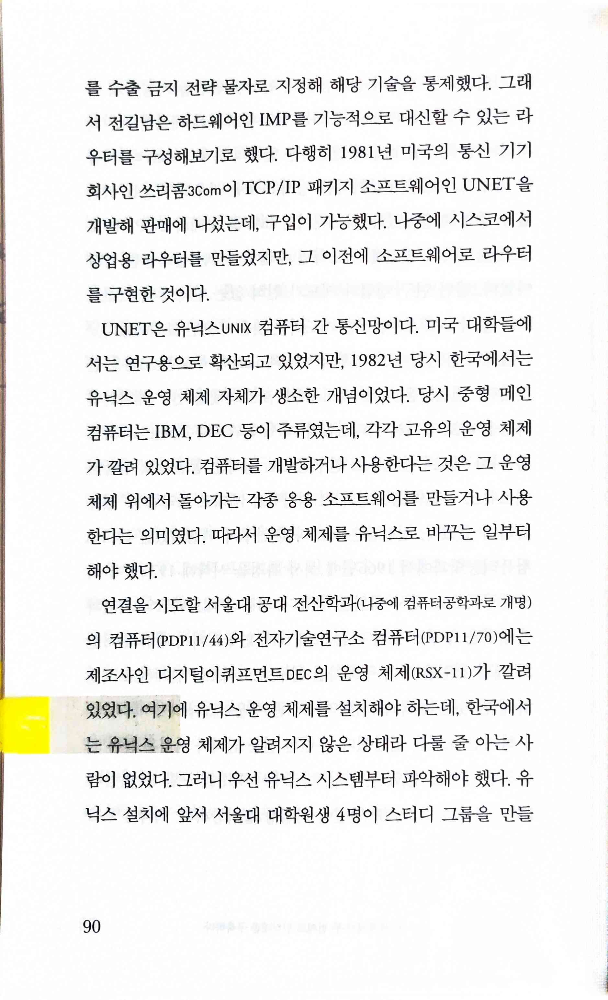 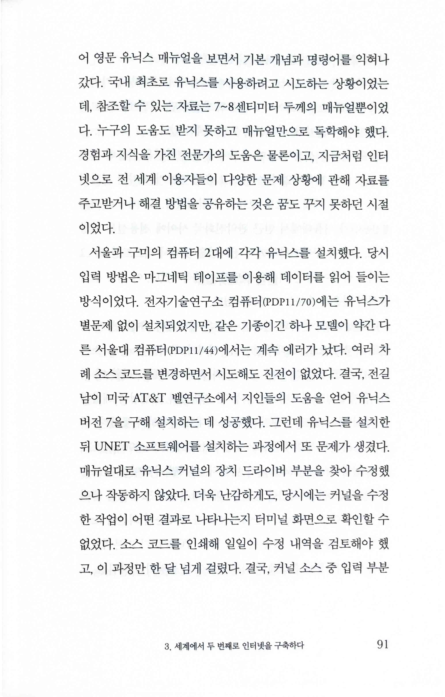 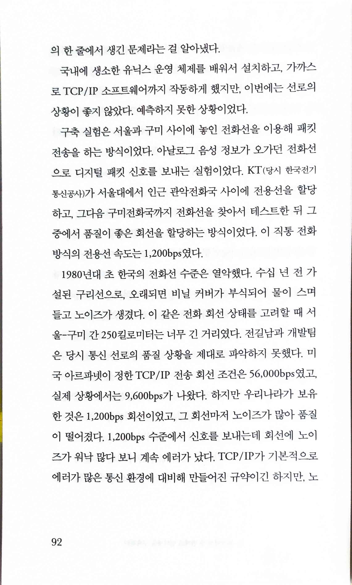

> 여기에 유닉스 운영 체제를 설치해야 하는데, 한국에서는 유닉스 운영 체제가 알려지지 않은 상태라 다룰 줄 아는 사람이 없었다.
>
> 당시에는 커널을 수정한 작업이 어떤 결과로 나타나는지 터미널 화면으로 확인할 수 없었다. 소스 코드를 인쇄해 일일이 수정 내역을 검토해야 했고, 이 과정만 한 달 넘게 걸렸다. 결국, 커널 소스 중 입력 부분의 한 줄에서 생긴 문제라는 걸 알아냈다.
>
> 국내에 생소한 유닉스 운영 체제를 배워서 설치하고, 가까스로 TCP/IP 소프트웨어까지 작동하게 했지만, 이번에는 선로의 상황이 좋지 않았다. 예측하지 못한 상황이었다.
>
> 나중에 초고속 정보통신망 구축을 계획할 때 전길남은 이때의 경험을 바탕으로 반드시 광섬유로 설치해야 한다는 판단을 내렸다.

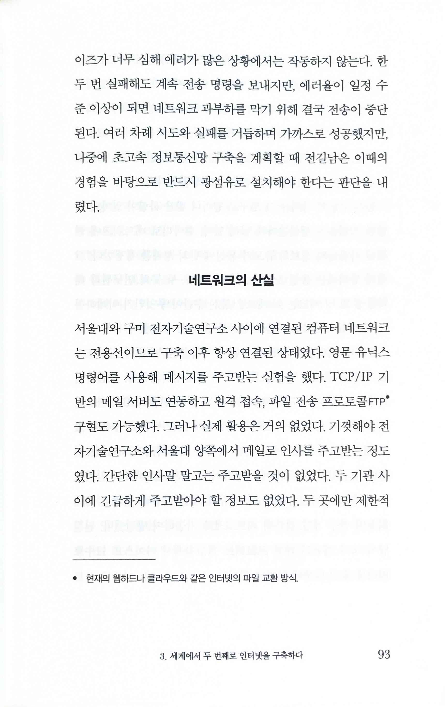 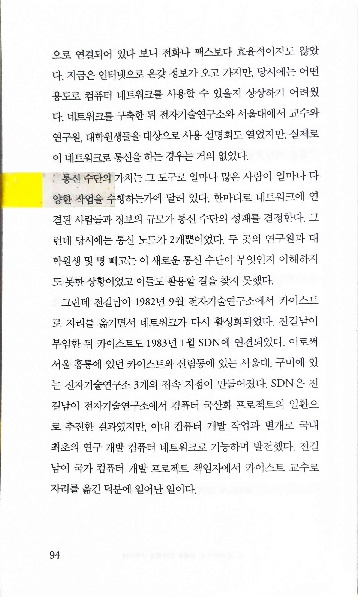

> 통신 수단의 가치는 그 도구로 얼마나 많은 사람이 얼마나 다양한 작업을 수행하는가에 달려 있다. 한마디로 네트워크에 연결된 사람들과 정보의 규모가 통신 수단의 성패를 결정한다.

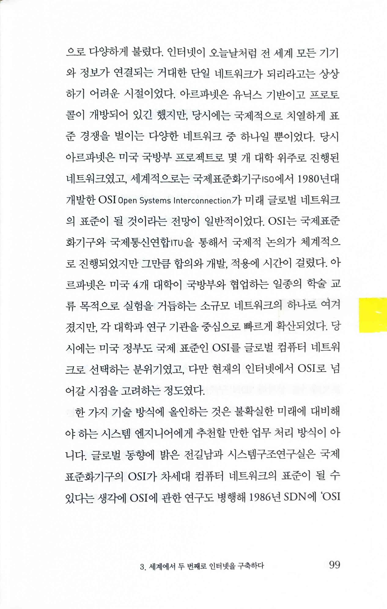

> 인터넷이 오늘날처럼 전 세계 모든 기기와 정보가 연결되는 거대한 단일 네트워크가 되리라고는 상상하기 어려운 시절이었다.

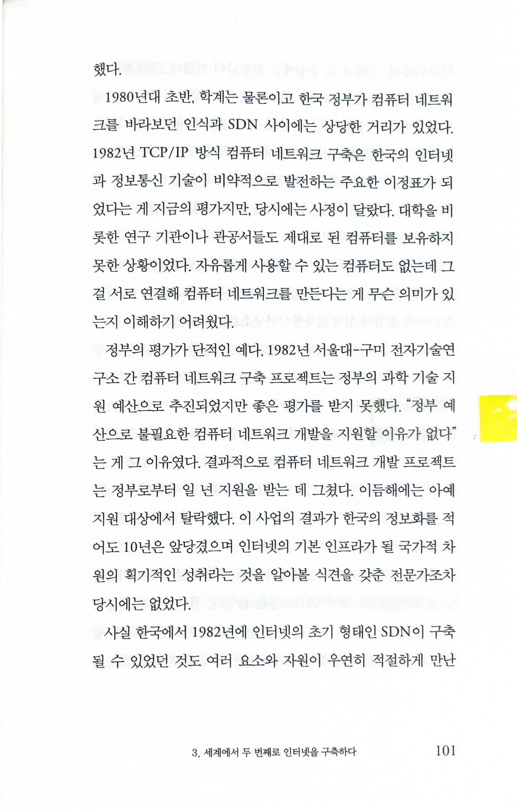 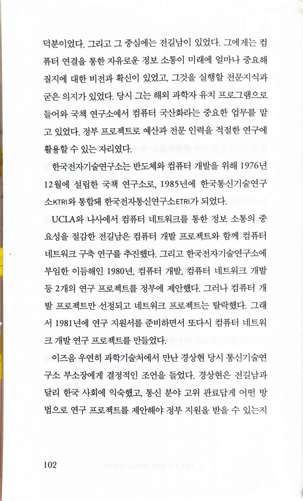 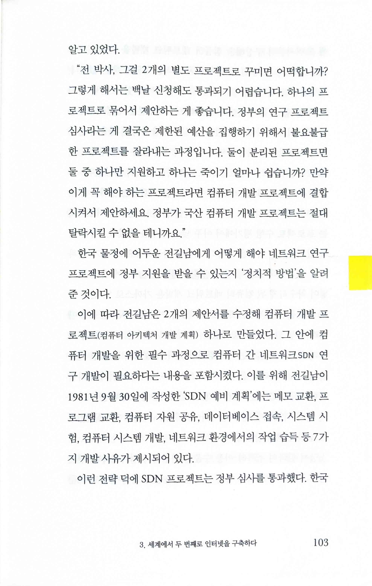

> 1982년 서울대-구미 전자기술연구소 간 컴퓨터 네트워크 구축 프로젝트는 정부의 과학 기술 지원 예산으로 추진되었지만 좋은 평가를 받지 못했다. “정부 예산으로 불필요한 컴퓨터 네트워크 개발을 지원할 이유가 없다"는 게 그 이유였다. 결과적으로 컴퓨터 네트워크 개발 프로젝트는 정부로부터 일 년 지원을 받는 데 그쳤다. 이듬해에는 아예 지원 대상에서 탈락했다. 이 사업의 결과가 한국의 정보화를 적어도 10년은 앞당겼으며 인터넷의 기본 인프라가 될 국가적 차원의 획기적인 성취라는 것을 알아볼 식견을 갖춘 전문가조차 당시에는 없었다.
>
> 한국 물정에 어두운 전길남에게 어떻게 해야 네트워크 연구 프로젝트에 정부 지원을 받을 수 있는지 '정치적 방법'을 알려준 것이다.

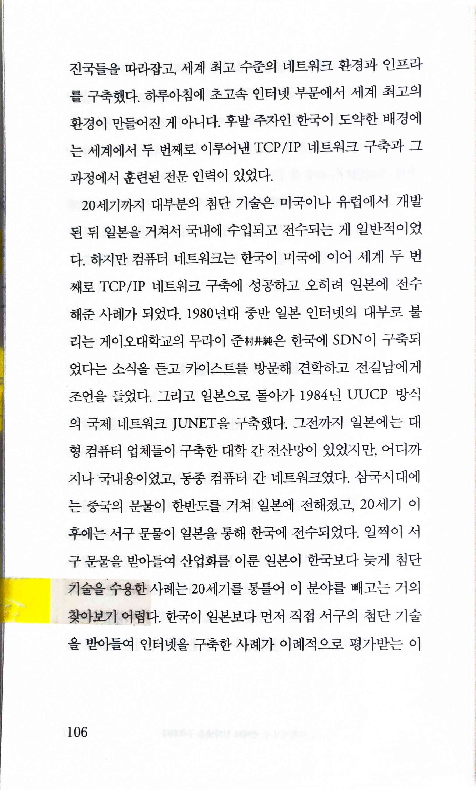

> 삼국시대에는 중국의 문물이 한반도를 거쳐 일본에 전해졌고, 20세기 이후에는 서구 문물이 일본을 통해 한국에 전수되었다. 일찍이 서구 문물을 받아들여 산업화를 이룬 일본이 한국보다 늦게 첨단기술을 수용한 사례는 20세기를 통틀어 이 분야를 빼고는 거의 찾아보기 어렵다.

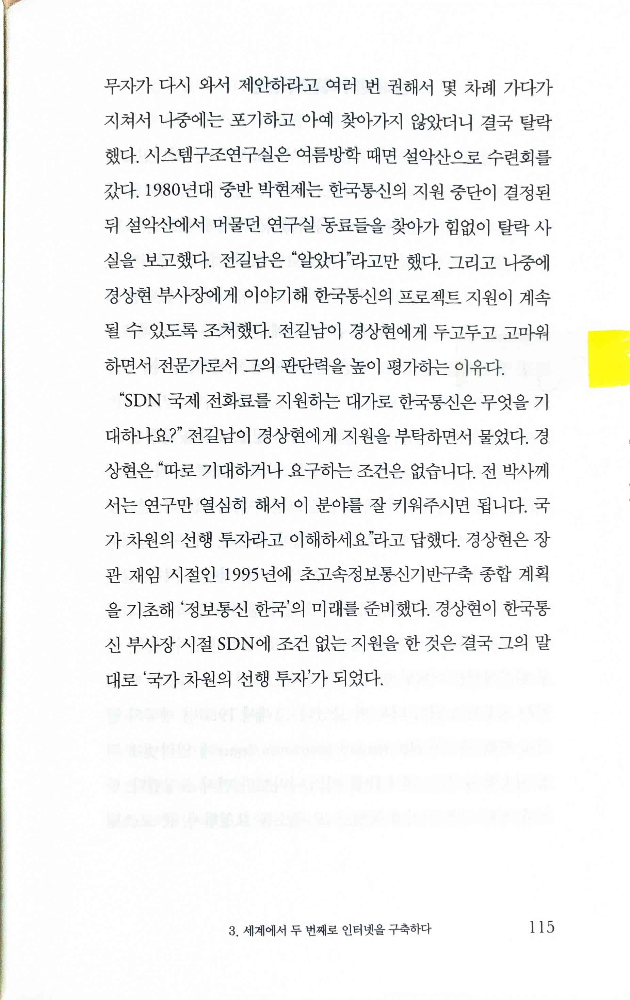

> 경상현이 한국통신 부사장 시절 SDN에 조건 없는 지원을 한 것은 결국 그의 말대로 '국가차원의 선행 투자'가 되었다.

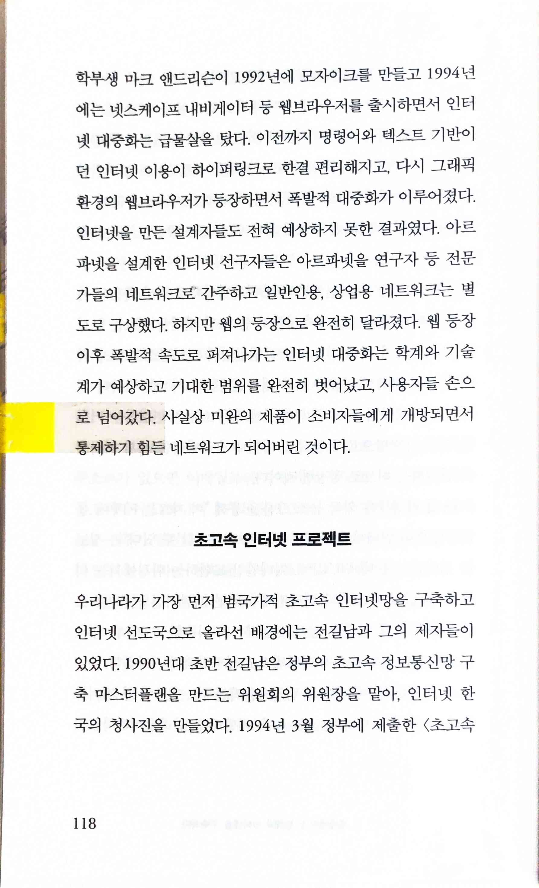

> 인터넷을 만든 설계자들도 전혀 예상하지 못한 결과였다... 웹 등장 이후 폭발적 속도로 퍼져나가는 인터넷 대중화는 학계와 기술계가 예상하고 기대한 범위를 완전히 벗어났고, 사용자들 손으로 넘어갔다. 사실상 미완의 제품이 소비자들에게 개방되면서 통제하기 힘든 네트워크가 되어버린 것이다.

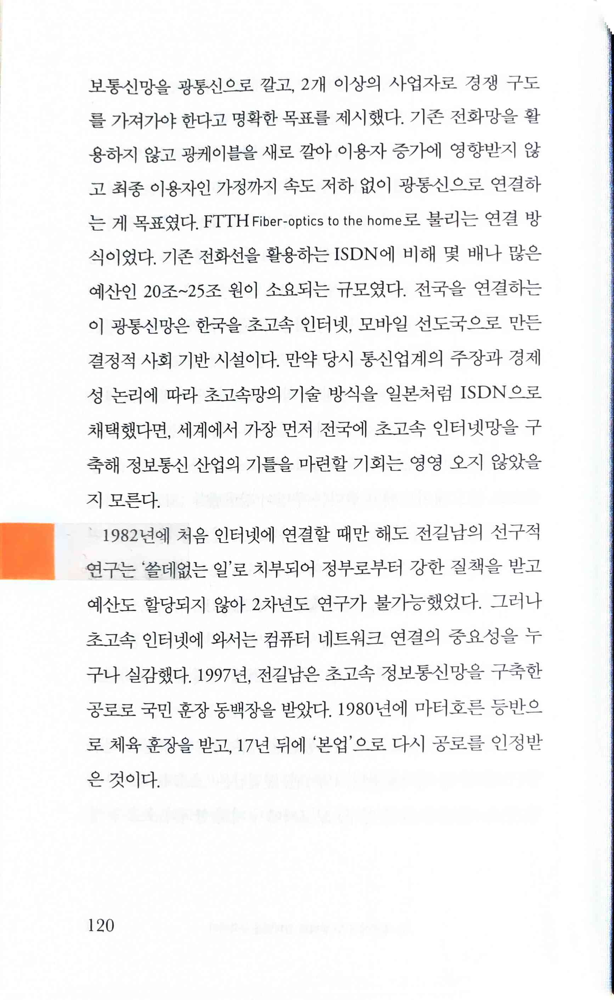

> 1982년에 처음 인터넷에 연결할 때만 해도 전길남의 선구적 연구는 '쓸데없는 일'로 치부되어 정부로부터 강한 질책을 받고 예산도 할당되지 않아 2차년도 연구가 불가능했었다. 그러나 초고속 인터넷에 와서는 컴퓨터 네트워크 연결의 중요성을 누구나 실감했다. 1997년, 전길남은 초고속 정보통신망을 구축한 공로로 국민훈장 동백장을 받았다. 1980년에 마터호른 등반으로 체육 훈장을 받고, 17년 뒤에 '본업'으로 다시 공로를 인정받은 것이다.

# 4 최상의 연구 시스템을 만들다
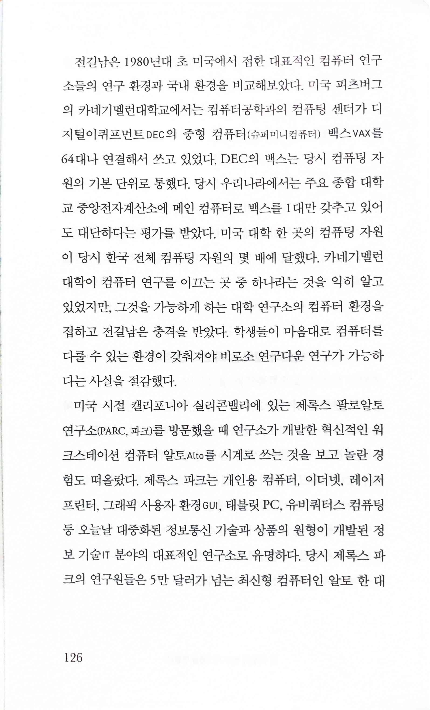 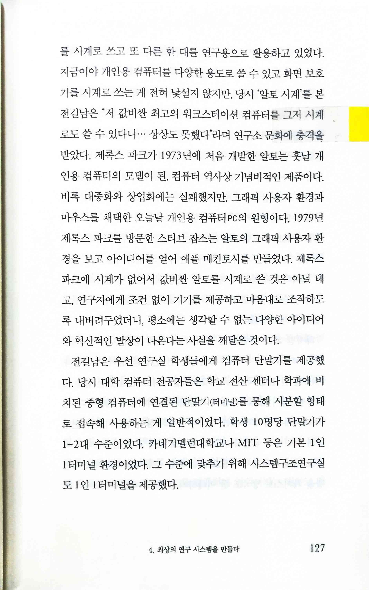

> 학생들이 마음대로 컴퓨터를 다룰 수 있는 환경이 갖춰져야 비로소 연구다운 연구가 가능하다는 사실을 절감했다.
>
> 연구자에게 조건 없이 기기를 제공하고 마음대로 조작하도록 내버려두었더니, 평소에는 생각할 수 없는 다양한 아이디어와 혁신적인 발상이 나온다는 사실을 깨달은 것이다.

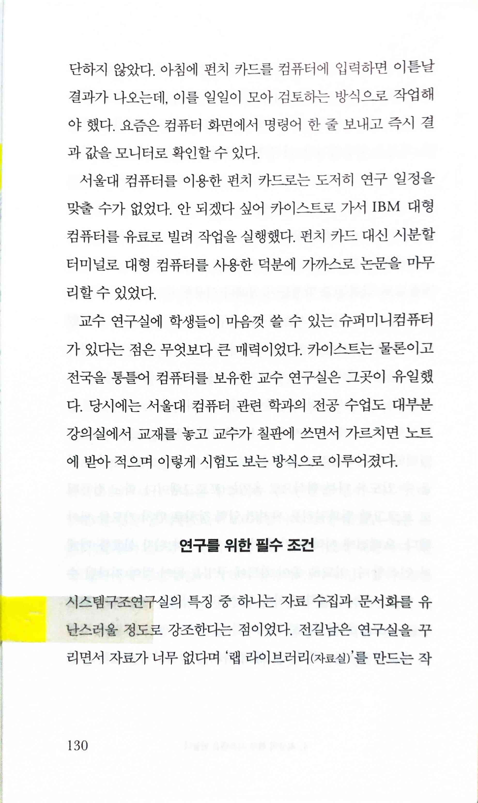 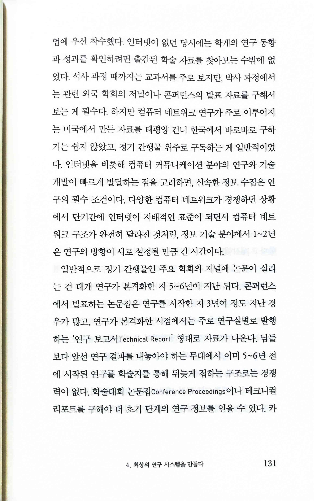

> 시스템구조연구실의 특징 중 하나는 자료 수집과 문서화를 유난스러울 정도로 강조한다는 점이었다.

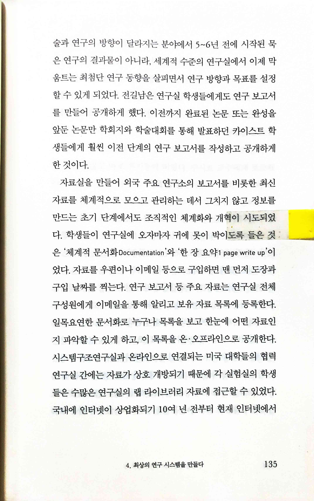

> 자료실을 만들어 외국 주요 연구소의 보고서를 비롯한 최신 자료를 체계적으로 모으고 관리하는 데서 그치지 않고 정보를 만드는 초기 단계에서도 조직적인 체계화와 개혁이 시도되었다. 학생들이 연구실에 오자마자 귀에 못이 박이도록 들은 것은 '체계적 문서화Documentation'와 '한장 요약 1 page write up'이었다.

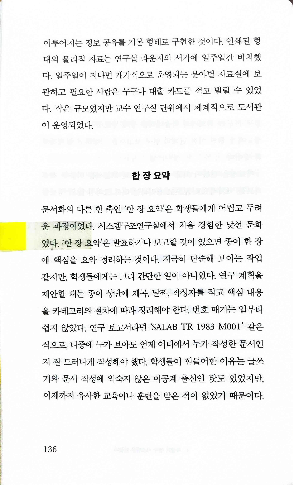

> '한 장 요약'은 발표하거나 보고할 것이 있으면 종이 한 장에 핵심을 요약 정리하는 것이다.

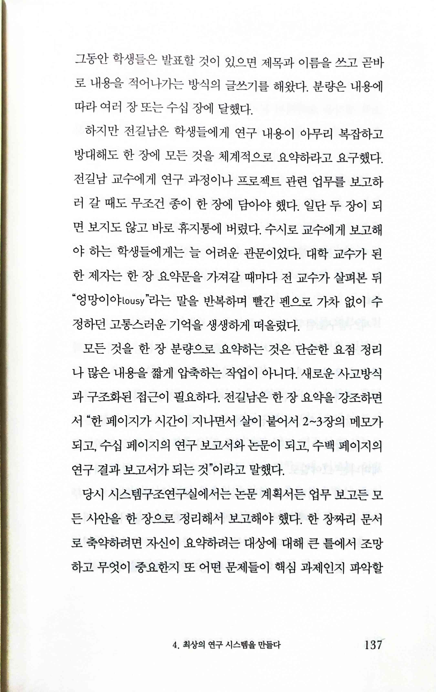 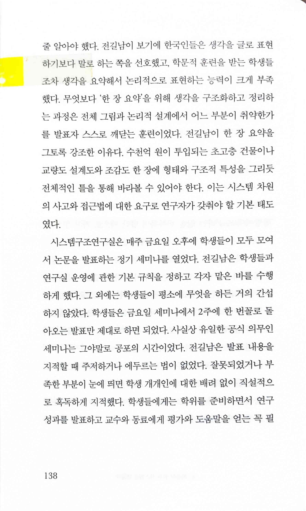

> 전길남이 보기에 한국인들은 생각을 글로 표현하기보다 말로 하는 쪽을 선호했고, 학문적 훈련을 받는 학생들조차 생각을 요약해서 논리적으로 표현하는 능력이 크게 부족했다. 무엇보다 '한 장 요약'을 위해 생각을 구조화하고 정리하는 과정은 전체 그림과 논리적 설계에서 어느 부분이 취약한가를 발표자 스스로 깨닫는 훈련이었다. 전길남이 한 장 요약을 그토록 강조한 이유다. 수천억 원이 투입되는 초고층 건물이나 교량도 설계도와 조감도 한 장에 형태와 구조적 특성을 그리듯 전체적인 틀을 통해 바라볼 수 있어야 한다. 이는 시스템 차원의 사고와 접근법에 대한 요구로 연구자가 갖춰야 할 기본 태도였다.

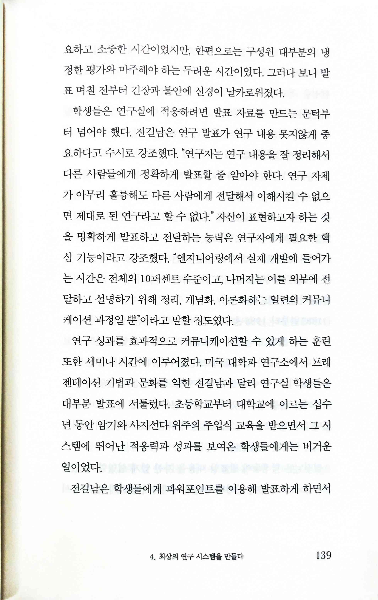  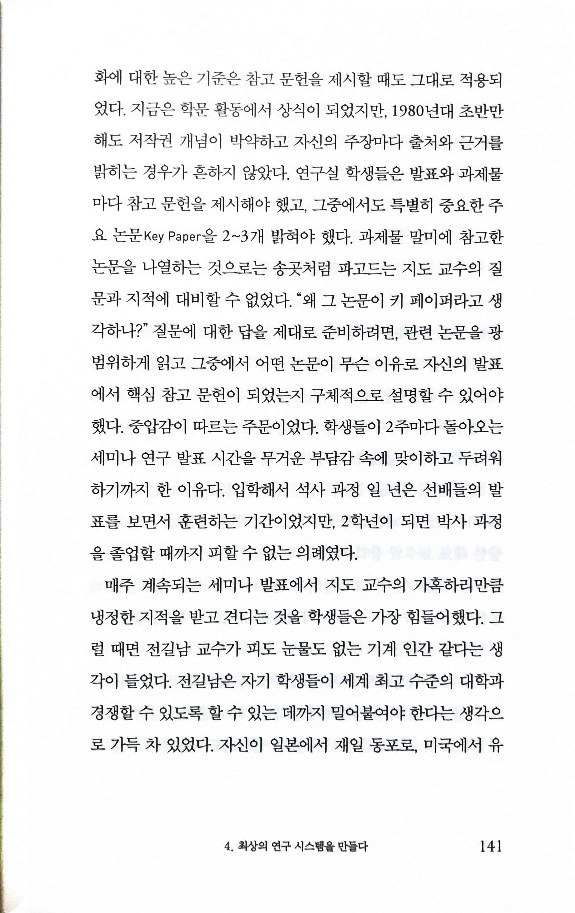

> 전길남은 연구 발표가 연구 내용 못지않게 중요하다고 수시로 강조했다. “연구자는 연구 내용을 잘 정리해서 다른 사람들에게 정확하게 발표할 줄 알아야 한다. 연구 자체가 아무리 훌륭해도 다른 사람에게 전달해서 이해시킬 수 없으면 제대로 된 연구라고 할 수 없다." 자신이 표현하고자 하는 것을 명확하게 발표하고 전달하는 능력은 연구자에게 필요한 핵심 기능이라고 강조했다. "엔지니어링에서 실제 개발에 들어가는 시간은 전체의 10퍼센트 수준이고, 나머지는 이를 외부에 전달하고 설명하기 위해 정리, 개념화, 이론화하는 일련의 커뮤니케이션 과정일 뿐"이라고 말할 정도였다.

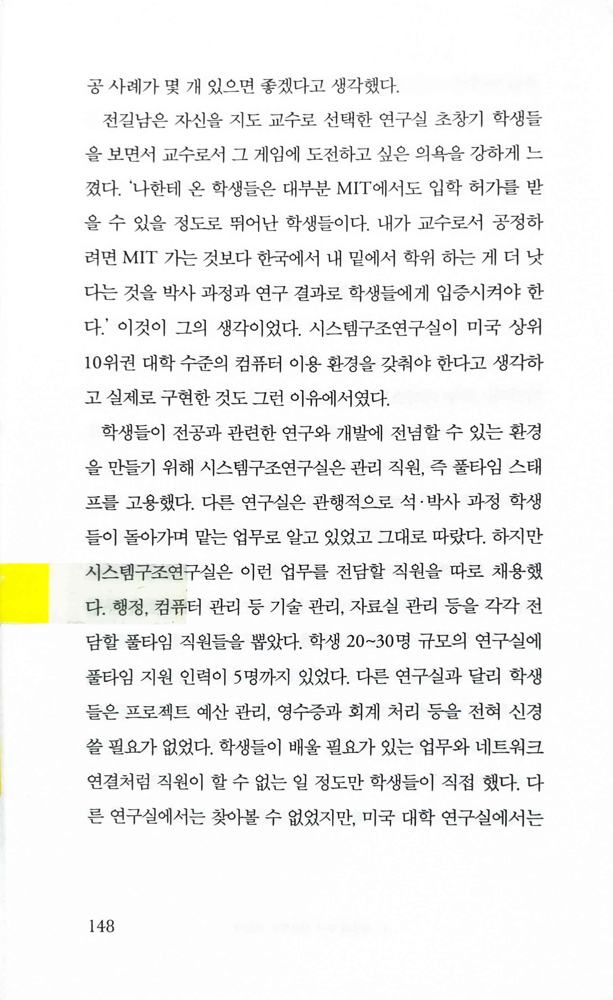

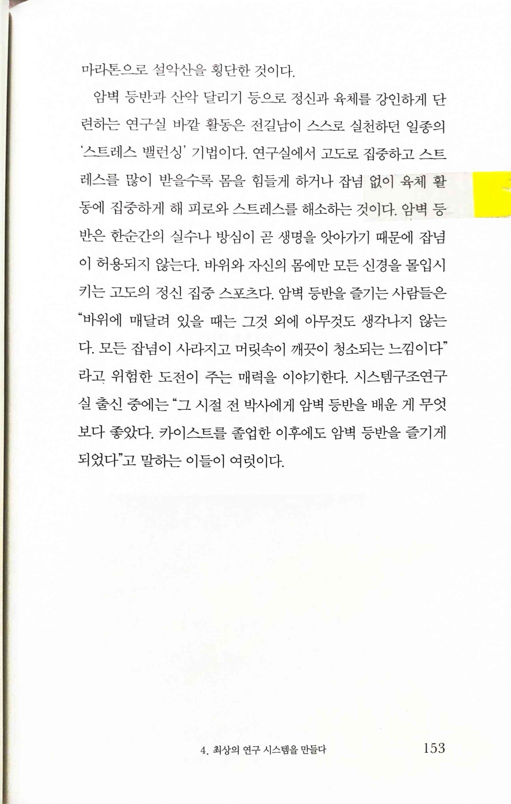

> 암벽 등반과 산악 달리기 등으로 정신과 육체를 강인하게 단련하는 연구실 바깥 활동은 전길남이 스스로 실천하던 일종의 '스트레스 밸런싱' 기법이다. 연구실에서 고도로 집중하고 스트레스를 많이 받을수록 몸을 힘들게 하거나 잡념 없이 육체 활동에 집중하게 해 피로와 스트레스를 해소하는 것이다. 암벽 등반은 한순간의 실수나 방심이 곧 생명을 앗아가기 때문에 잡념이 허용되지 않는다. 바위와 자신의 몸에만 모든 신경을 몰입시키는 고도의 정신 집중 스포츠다. 암벽 등반을 즐기는 사람들은 "바위에 매달려 있을 때는 그것 외에 아무것도 생각나지 않는다. 모든 잡념이 사라지고 머릿속이 깨끗이 청소되는 느낌이다"라고 위험한 도전이 주는 매력을 이야기한다.

# 5 벤처의 산실이 된 연구실
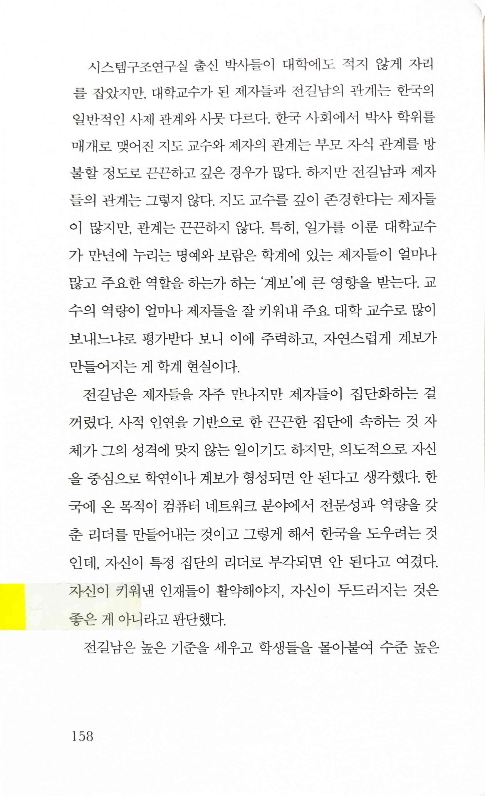

> 자신이 키워낸 인재들이 활약해야지, 자신이 두드러지는 것은 좋은 게 아니라고 판단했다.

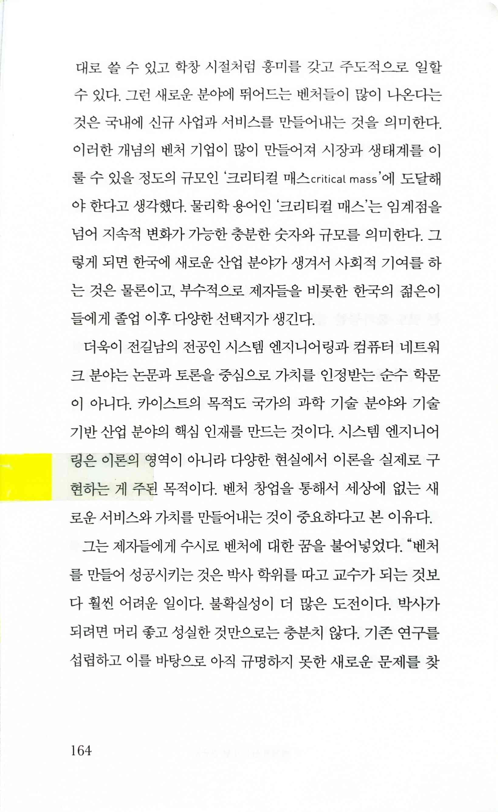

> 시스템 엔지니어링은 이론의 영역이 아니라 다양한 현실에서 이론을 실제로 구현하는 게 주된 목적이다. 벤처 창업을 통해서 세상에 없는 새로운 서비스와 가치를 만들어내는 것이 중요하다고 본 이유다.

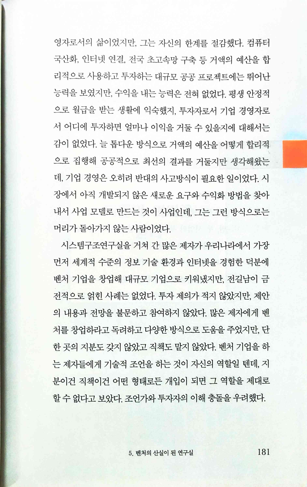 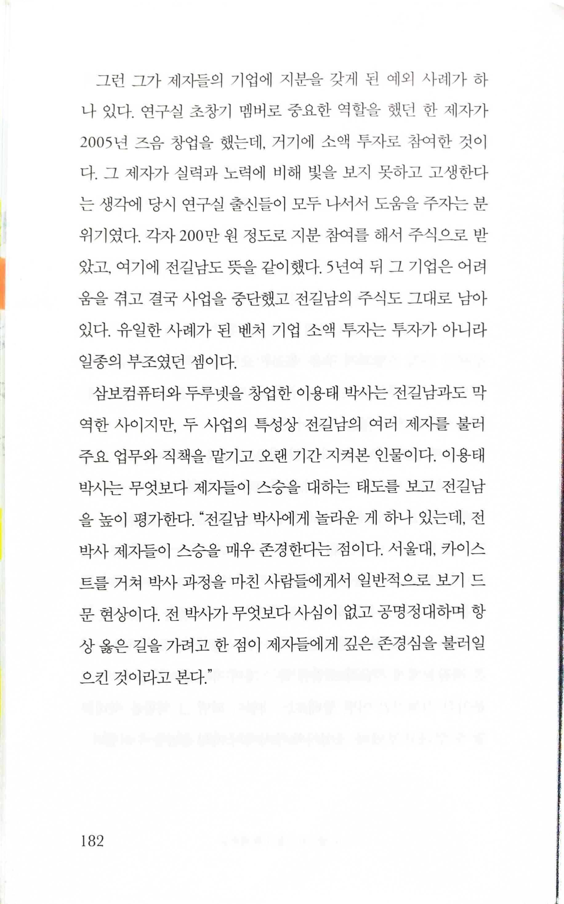

> 늘 톱다운 방식으로 거액의 예산을 어떻게 합리적으로 집행해 공공적으로 최선의 결과를 거둘지만 생각해왔는데, 기업 경영은 오히려 반대의 사고방식이 필요한 일이었다. 시장에서 아직 개발되지 않은 새로운 요구와 수익화 방법을 찾아내서 사업 모델로 만드는 것이 사업인데, 그는 그런 방식으로는 머리가 돌아가지 않는 사람이었다.

# 6 도전의 의미를 묻다
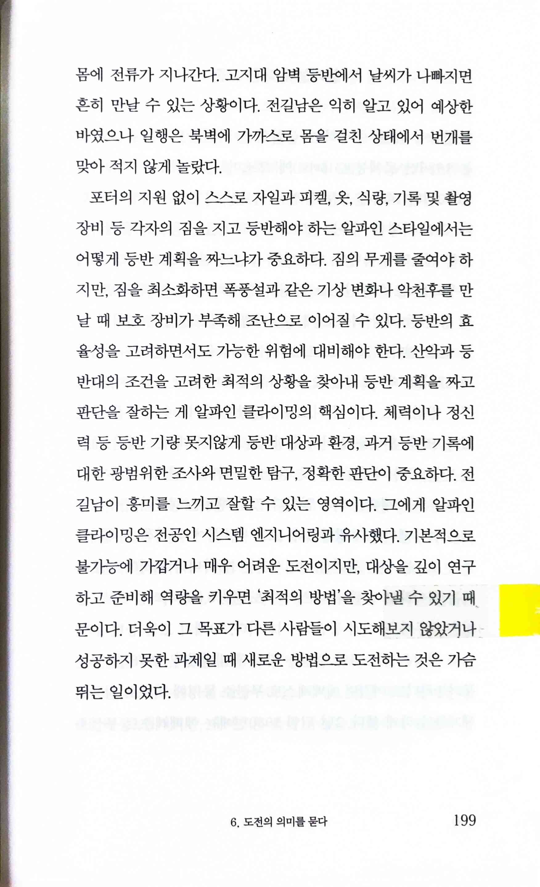

> 그에게 알파인 클라이밍은 전공인 시스템 엔지니어링과 유사했다. 기본적으로 불가능에 가깝거나 매우 어려운 도전이지만, 대상을 깊이 연구하고 준비해 역량을 키우면 '최적의 방법'을 찾아낼 수 있기 때문이다. 더욱이 그 목표가 다른 사람들이 시도해보지 않았거나 성공하지 못한 과제일 때 새로운 방법으로 도전하는 것은 가슴뛰는 일이었다.

> 시스템 엔지니어로서 모든가능성을 미리 계산하고 통제된 위험에 도전하는 삶을 살아왔다고 생각했는데, 자신도 큰 실수를 할 수 있다는 점을 스스로 증명한 셈이었다. 암벽 등반에서 마주친 실수와 사고를 통해 그는 자신이 무엇을 잘못했는지, 그로부터 무엇을 깨닫고 배워야하는지 오랫동안 깊이 생각했다.
>
> 아무리 긴장하고 노력해도 실수를 피할 수 없다는 걸 깨달았다.

# 7 모두를 위한 네트워크
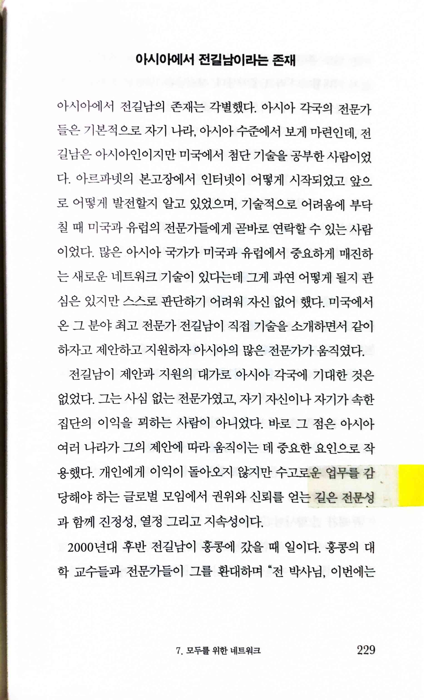

> 개인에게 이익이 돌아오지 않지만 수고로운 업무를 감당해야 하는 글로벌 모임에서 권위와 신뢰를 얻는 길은 전문성과 함께 진정성, 열정 그리고 지속성이다.

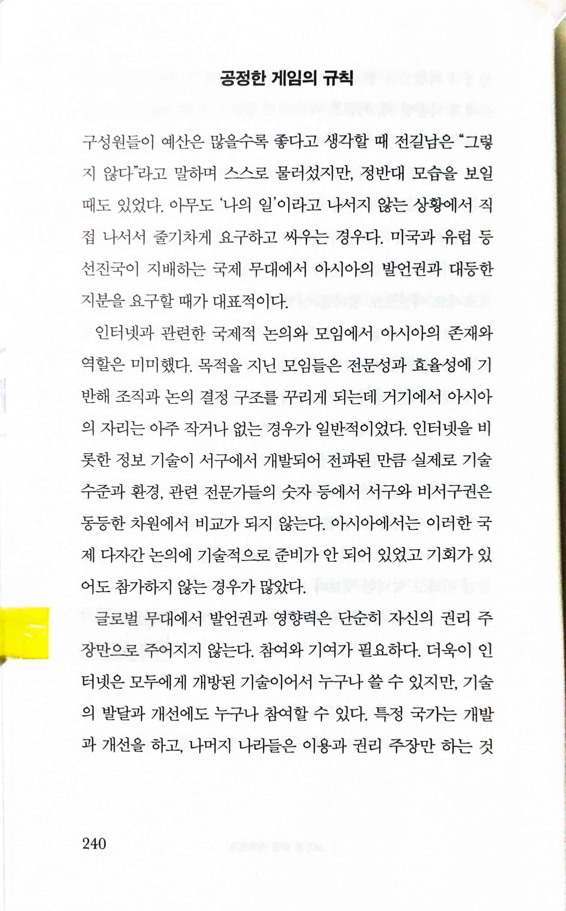 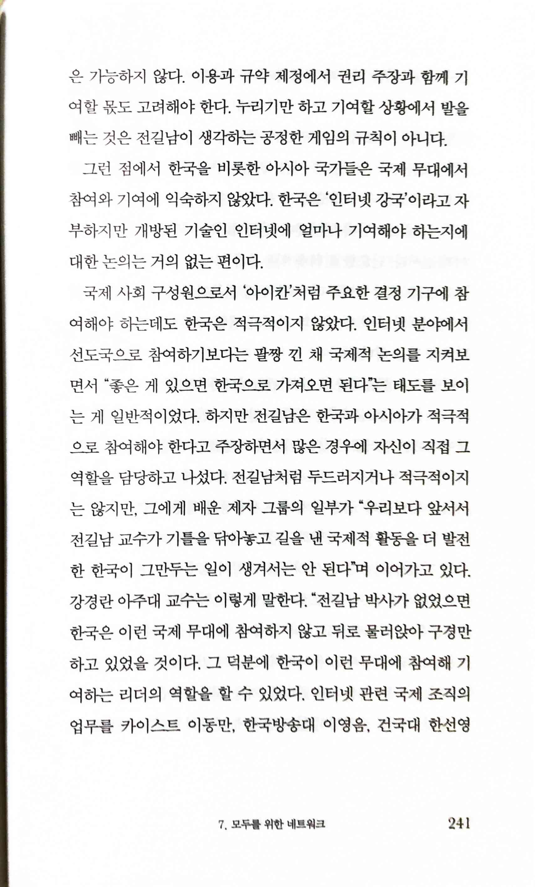

> 글로벌 무대에서 발언권과 영향력은 단순히 자신의 권리 주장만으로 주어지지 않는다. 참여와 기여가 필요하다. 더욱이 인터넷은 모두에게 개방된 기술이어서 누구나 쓸 수 있지만, 기술의 발달과 개선에도 누구나 참여할 수 있다. 특정 국가는 개발과 개선을 하고, 나머지 나라들은 이용과 권리 주장만 하는 것은 가능하지 않다. 이용과 규약 제정에서 권리 주장과 함께 기여할 몫도 고려해야 한다. 누리기만 하고 기여할 상황에서 발을 빼는 것은 전길남이 생각하는 공정한 게임의 규칙이 아니다.

# 8 기술의 고삐를 누가 쥘 것인가
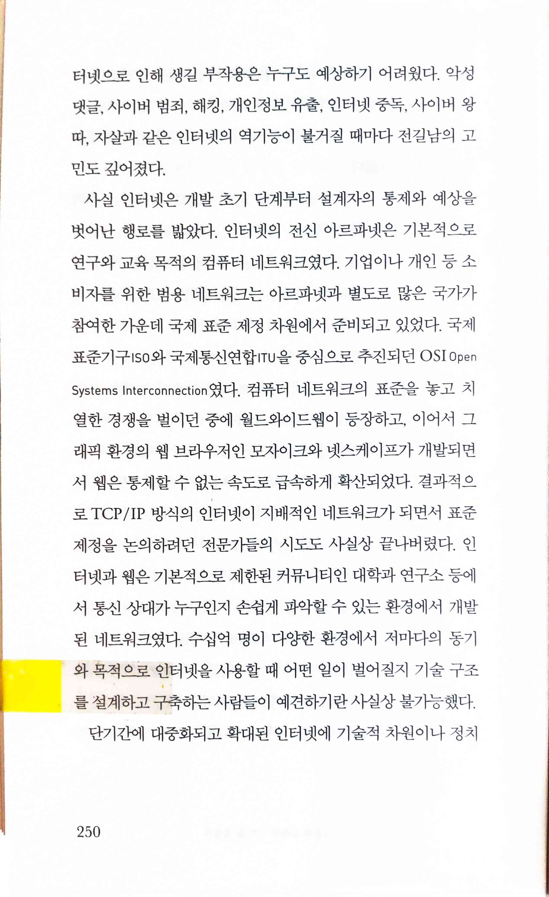 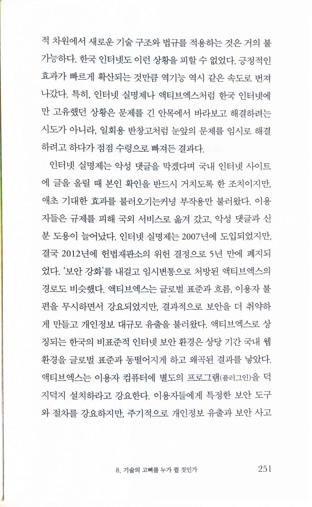

> 사실 인터넷은 개발 초기 단계부터 설계자의 통제와 예상을 벗어난 행로를 밟았다. 인터넷의 전신 아르파넷은 기본적으로 연구와 교육 목적의 컴퓨터 네트워크였다... 결과적으로 TCP/IP 방식의 인터넷이 지배적인 네트워크가 되면서 표준제정을 논의하려던 전문가들의 시도도 사실상 끝나버렸다. 인터넷과 웹은 기본적으로 제한된 커뮤니티인 대학과 연구소 등에서 통신 상대가 누구인지 손쉽게 파악할 수 있는 환경에서 개발된 네트워크였다. 수십억 명이 다양한 환경에서 저마다의 동기와 목적으로 인터넷을 사용할 때 어떤 일이 벌어질지 기술 구조를 설계하고 구축하는 사람들이 예견하기란 사실상 불가능했다.
>
> 단기간에 대중화되고 확대된 인터넷에 기술적 차원이나 정치적 차원에서 새로운 기술 구조와 법규를 적용하는 것은 거의 불가능하다. 한국 인터넷도 이런 상황을 피할 수 없었다. 긍정적인 효과가 빠르게 확산되는 것만큼 역기능 역시 같은 속도로 번져나갔다. 특히, 인터넷 실명제나 액티브엑스처럼 한국 인터넷에만 고유했던 상황은 문제를 긴 안목에서 바라보고 해결하려는시도가 아니라, 일회용 반창고처럼 눈앞의 문제를 임시로 해결하려고 하다가 점점 수렁으로 빠져든 결과다.

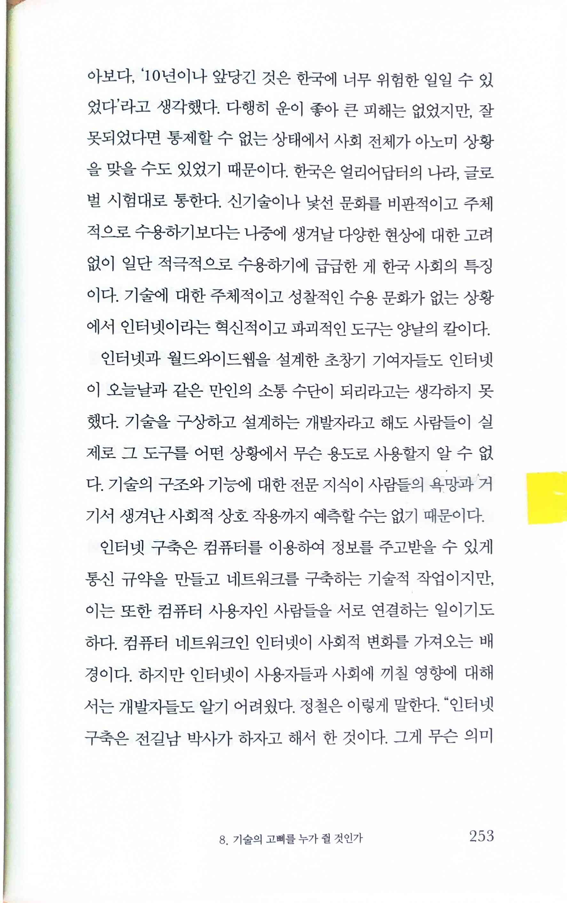

> 인터넷과 월드와이드웹을 설계한 초창기 기여자들도 인터넷이 오늘날과 같은 만인의 소통 수단이 되리라고는 생각하지 못했다. 기술을 구상하고 설계하는 개발자라고 해도 사람들이 실제로 그 도구를 어떤 상황에서 무슨 용도로 사용할지 알 수 없다. 기술의 구조와 기능에 대한 전문 지식이 사람들의 욕망과 거기서 생겨난 사회적 상호 작용까지 예측할 수는 없기 때문이다.
>
> 인터넷 구축은 컴퓨터를 이용하여 정보를 주고받을 수 있게통신 규약을 만들고 네트워크를 구축하는 기술적 작업이지만,이는 또한 컴퓨터 사용자인 사람들을 서로 연결하는 일이기도하다. 컴퓨터 네트워크인 인터넷이 사회적 변화를 가져오는 배경이다. 하지만 인터넷이 사용자들과 사회에 끼칠 영향에 대해서는 개발자들도 알기 어려웠다.

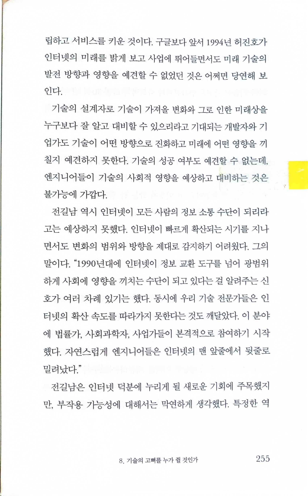

> 기술의 설계자로 기술이 가져올 변화와 그로 인한 미래상을 누구보다 잘 알고 대비할 수 있으리라고 기대되는 개발자와 기업가도 기술이 어떤 방향으로 진화하고 미래에 어떤 영향을 끼칠지 예견하지 못한다. 기술의 성공 여부도 예견할 수 없는데, 엔지니어들이 기술의 사회적 영향을 예상하고 대비하는 것은 불가능에 가깝다.

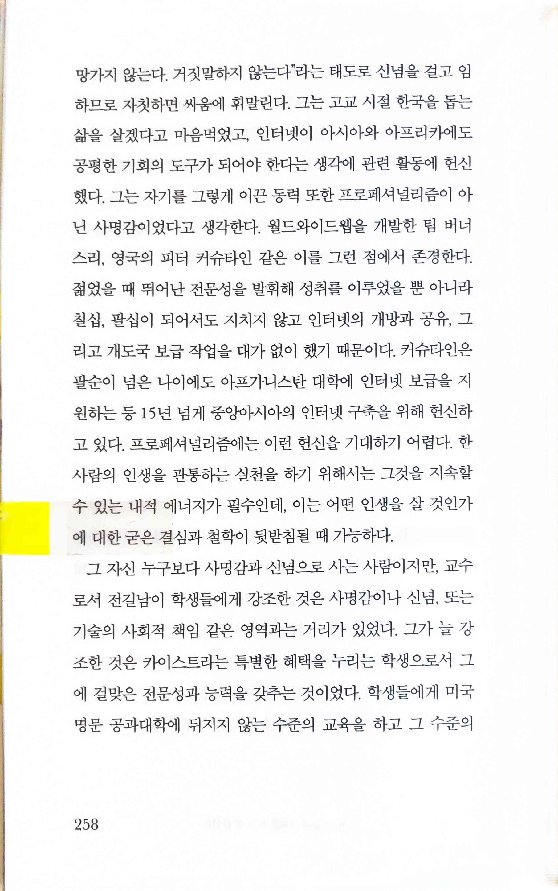

> 한 사람의 인생을 관통하는 실천을 하기 위해서는 그것을 지속할수 있는 내적 에너지가 필수인데, 이는 어떤 인생을 살 것인가에 대한 굳은 결심과 철학이 뒷받침될 때 가능하다.

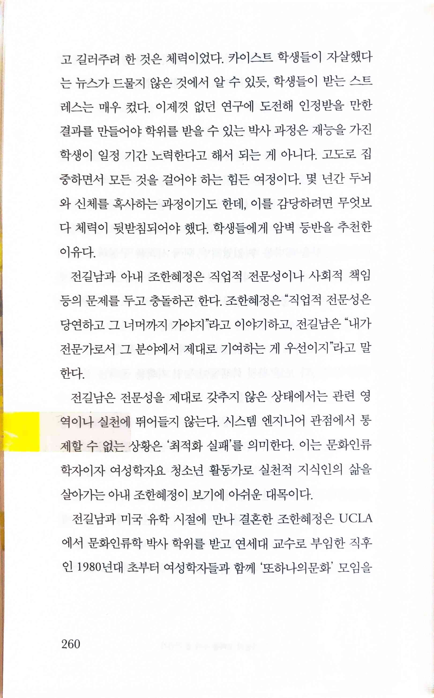

> 전길남은 전문성을 제대로 갖추지 않은 상태에서는 관련 영역이나 실천에 뛰어들지 않는다. 시스템 엔지니어 관점에서 통제할 수 없는 상황은 '최적화 실패'를 의미한다.

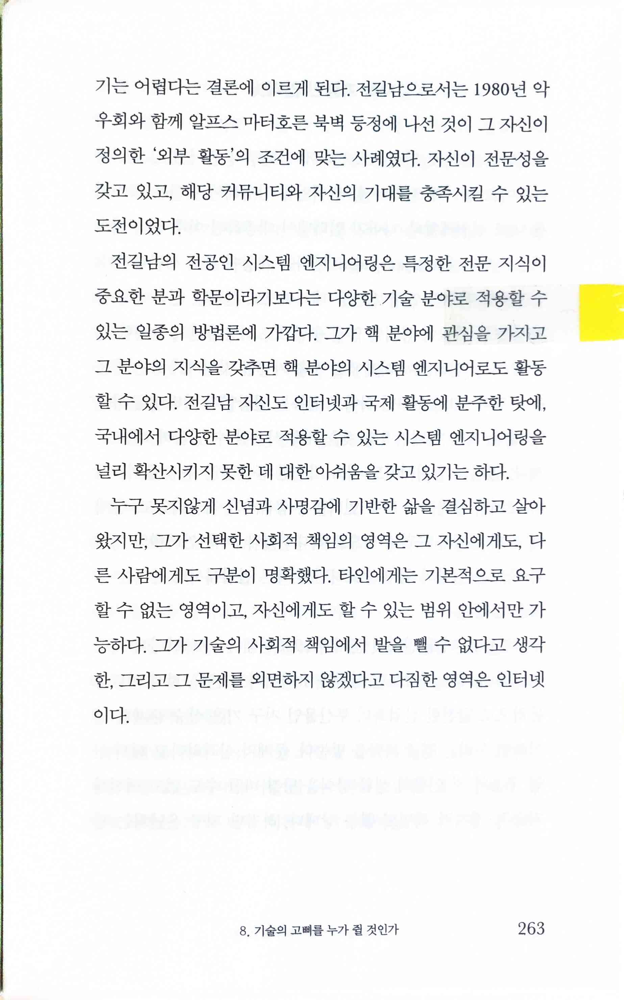

> 전길남의 전공인 시스템 엔지니어링은 특정한 전문 지식이 중요한 분과 학문이라기보다는 다양한 기술 분야로 적용할 수 있는 일종의 방법론에 가깝다.

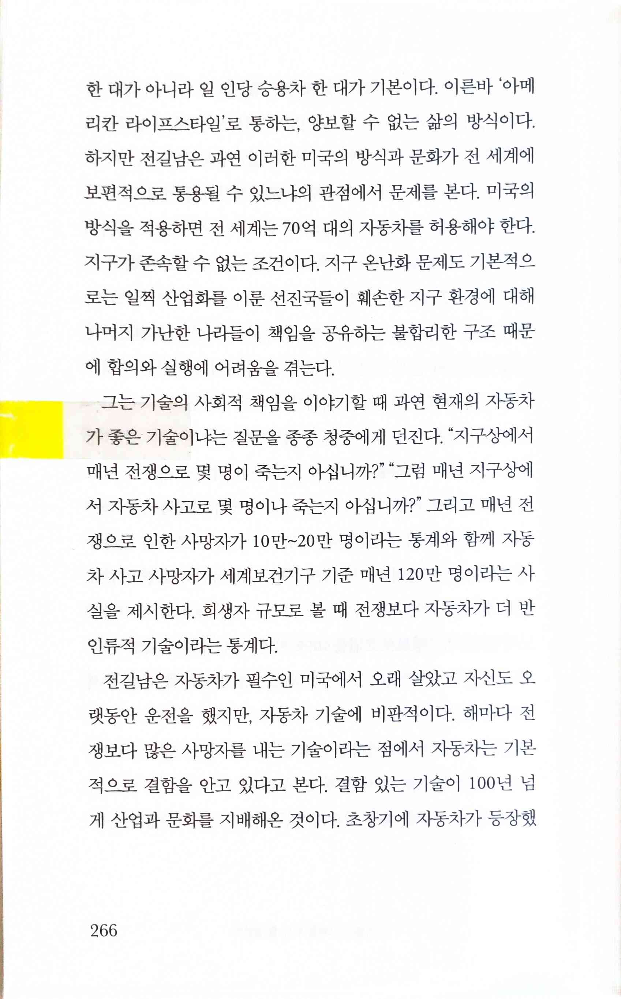 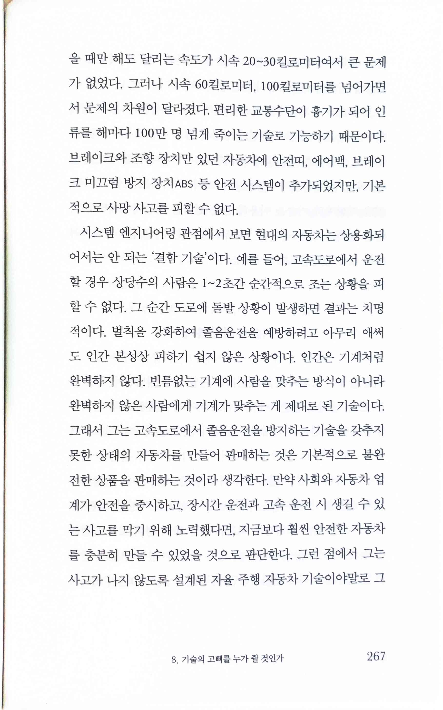

> 그는 기술의 사회적 책임을 이야기할 때 과연 현재의 자동차가 좋은 기술이냐는 질문을 종종 청중에게 던진다... 매년 전쟁으로 인한 사망자가 10만`~`20만 명이라는 통계와 함께 자동차 사고 사망자가 세계보건기구 기준 매년 120만 명이라는 사실을 제시한다. 희생자 규모로 볼 때 전쟁보다 자동차가 더 반인류적 기술이라는 통계다.
>
> ... 자동차 기술에 비판적이다. 해마다 전쟁보다 많은 사망자를 내는 기술이라는 점에서 자동차는 기본적으로 결함을 안고 있다고 본다.
>
> 빈틈없는 기계에 사람을 맞추는 방식이 아니라 완벽하지 않은 사람에게 기계가 맞추는 게 제대로 된 기술이다.

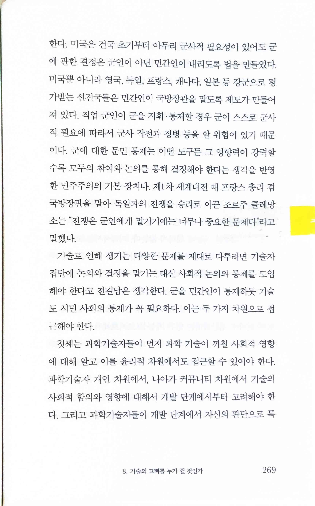

> 제1차 세계대전 때 프랑스 총리 겸 국방장관을 맡아 독일과의 전쟁을 승리로 이끈 조르주 클레망소는 "전쟁은 군인에게 맡기기에는 너무나 중요한 문제다"라고말했다.
>
> 기술로 인해 생기는 다양한 문제를 제대로 다루려면 기술자 집단에 논의와 결정을 맡기는 대신 사회적 논의와 통제를 도입해야 한다고 전길남은 생각한다. 군을 민간인이 통제하듯 기술도 시민 사회의 통제가 꼭 필요하다.

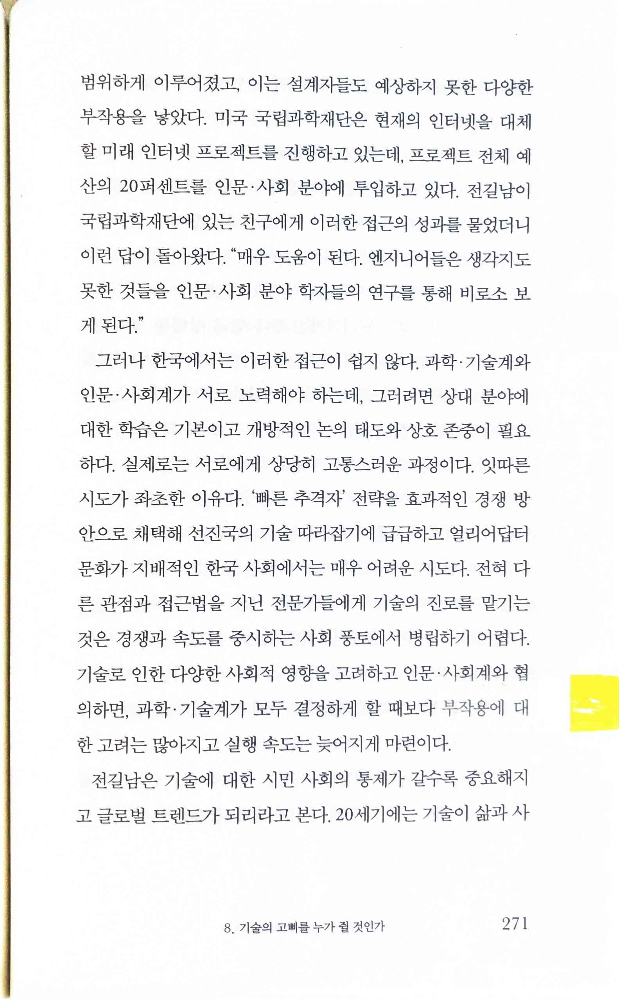

> 한국에서는 이러한 접근이 쉽지 않다. 과학·기술계와 인문·사회계가 서로 노력해야 하는데, 그러려면 상대 분야에 대한 학습은 기본이고 개방적인 논의 태도와 상호 존중이 필요하다. 실제로는 서로에게 상당히 고통스러운 과정이다... 전혀 다른 관점과 접근법을 지닌 전문가들에게 기술의 진로를 맡기는것은 경쟁과 속도를 중시하는 사회 풍토에서 병립하기 어렵다.기술로 인한 다양한 사회적 영향을 고려하고 인문·사회계와 협의하면, 과학·기술계가 모두 결정하게 할 때보다 부작용에 대한 고려는 많아지고 실행 속도는 늦어지게 마련이다.

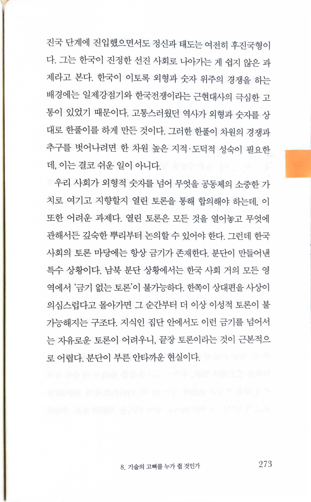

> 그는 한국이 진정한 선진 사회로 나아가는 게 쉽지 않은 과제라고 본다. 한국이 이토록 외형과 숫자 위주의 경쟁을 하는 배경에는 일제강점기와 한국전쟁이라는 근현대사의 극심한 고통이 있었기 때문이다. 고통스러웠던 역사가 외형과 숫자를 상대로 한풀이를 하게 만든 것이다. 그러한 한풀이 차원의 경쟁과 추구를 벗어나려면 한 차원 높은 지적·도덕적 성숙이 필요한데, 이는 결코 쉬운 일이 아니다.

# 9 스스로 선택하고 만들어나간 삶
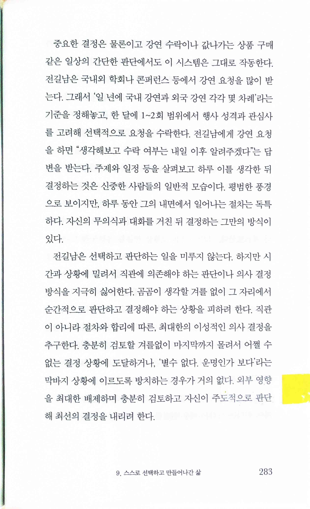

> 전길남은 선택하고 판단하는 일을 미루지 않는다. 하지만 시간과 상황에 밀려서 직관에 의존해야 하는 판단이나 의사 결정방식을 지극히 싫어한다... 외부 영향을 최대한 배제하며 충분히 검토하고 자신이 주도적으로 판단해 최선의 결정을 내리려 한다.

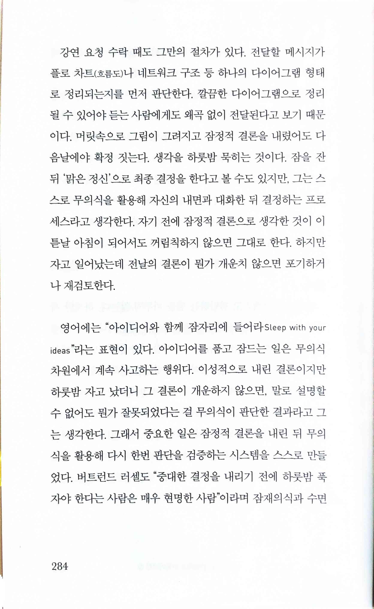 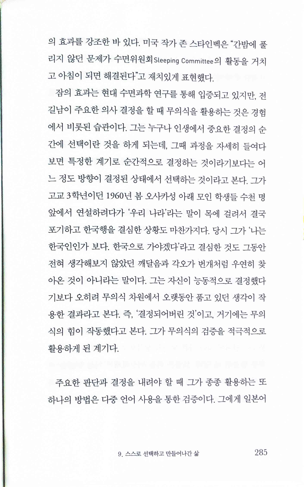

> 영어에는 "아이디어와 함께 잠자리에 들어라 Sleep with your ideas"라는 표현이 있다. 아이디어를 품고 잠드는 일은 무의식 차원에서 계속 사고하는 행위다. 이성적으로 내린 결론이지만 하룻밤 자고 났더니 그 결론이 개운하지 않으면, 말로 설명할 수 없어도 뭔가 잘못되었다는 걸 무의식이 판단한 결과라고 그는 생각한다. 그래서 중요한 일은 잠정적 결론을 내린 뒤 무의식을 활용해 다시 한번 판단을 검증하는 시스템을 스스로 만들었다. 버트런드 러셀도 "중대한 결정을 내리기 전에 하룻밤 푹 자야 한다는 사람은 매우 현명한 사람"이라며 잠재의식과 수면의 효과를 강조한 바 있다. 미국 작가 존 스타인벡은 "간밤에 풀리지 않던 문제가 수면위원회 Sleeping Committee의 활동을 거치고 아침이 되면 해결된다"고 재치있게 표현했다.
>
> 그는 자신이 능동적으로 결정했다기보다 오히려 무의식 차원에서 오랫동안 품고 있던 생각이 작용한 결과라고 본다. 즉, '결정되어버린 것'이고, 거기에는 무의식의 힘이 작동했다고 본다. 그가 무의식의 검증을 적극적으로 활용하게 된 계기다.

> 언어를 바꿔서 생각해본다는 것은 단순히 다른 언어로 어떻게 표현되는가 하는 문제를 넘어서, 다른 사회에서는 같은 사안을 어떻게 받아들이고 의사 결정을 할까에 대한 '사고 실험'이기도 하다.

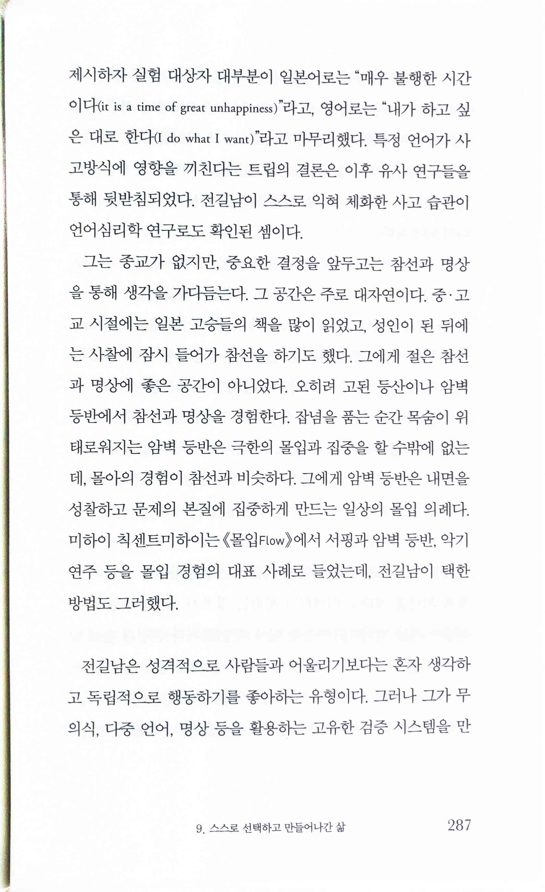

> 특정 언어가 사고방식에 영향을 끼친다는 트립의 결론은 이후 유사 연구들을 통해 뒷받침되었다. 전길남이 스스로 익혀 체화한 사고 습관이 언어심리학 연구로도 확인된 셈이다.

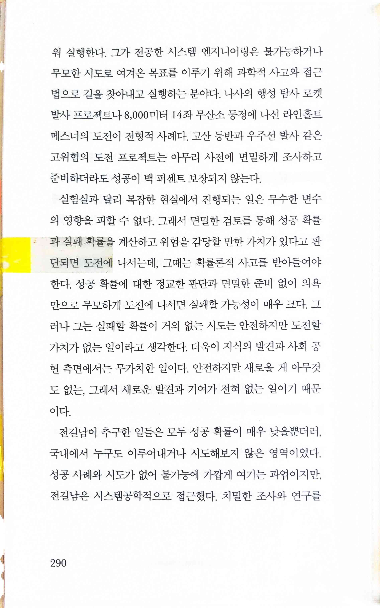

> 실험실과 달리 복잡한 현실에서 진행되는 일은 무수한 변수의 영향을 피할 수 없다. 그래서 면밀한 검토를 통해 성공 확률과 실패 확률을 계산하고 위험을 감당할 만한 가치가 있다고 판단되면 도전에 나서는데, 그때는 확률론적 사고를 받아들여야 한다. 성공 확률에 대한 정교한 판단과 면밀한 준비 없이 의욕만으로 무모하게 도전에 나서면 실패할 가능성이 매우 크다. 그러나 그는 실패할 확률이 거의 없는 시도는 안전하지만 도전할 가치가 없는 일이라고 생각한다. 더욱이 지식의 발견과 사회 공헌 측면에서는 무가치한 일이다. 안전하지만 새로울 게 아무것도 없는, 그래서 새로운 발견과 기여가 전혀 없는 일이기 때문이다.

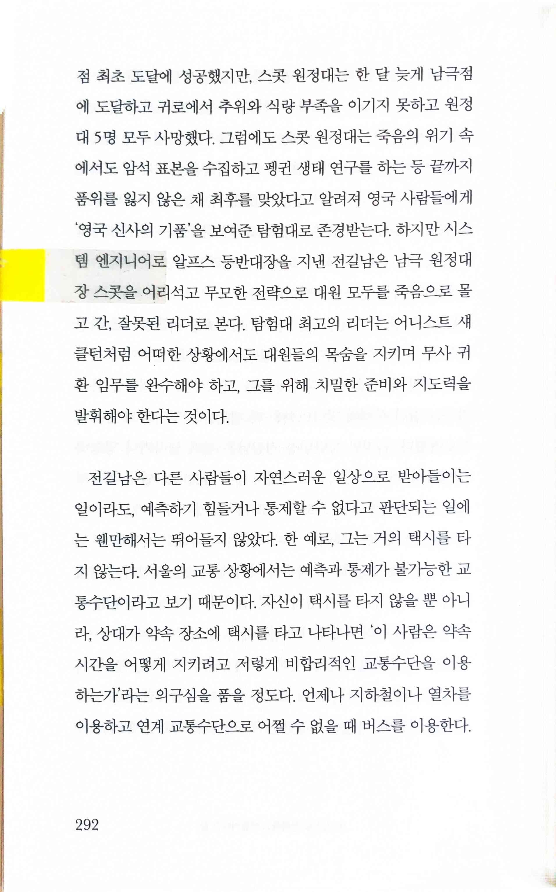

> 시스템 엔지니어로 알프스 등반대장을 지낸 전길남은 남극 원정대장 스콧을 어리석고 무모한 전략으로 대원 모두를 죽음으로 몰고 간, 잘못된 리더로 본다. 탐험대 최고의 리더는 어니스트 섀클턴처럼 어떠한 상황에서도 대원들의 목숨을 지키며 무사 귀환 임무를 완수해야 하고, 그를 위해 치밀한 준비와 지도력을 발휘해야 한다는 것이다.

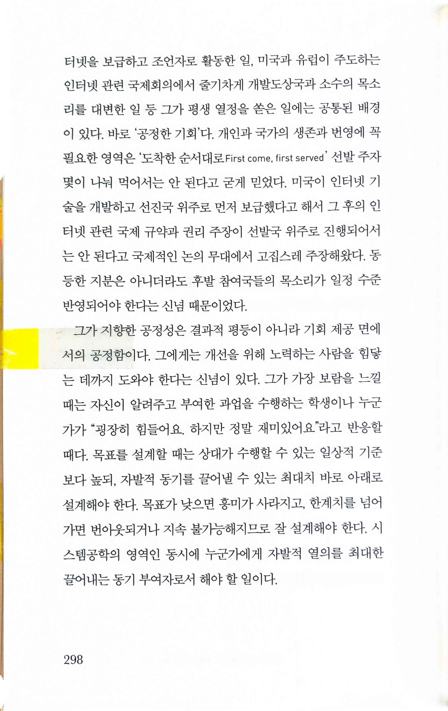

> 그가 지향한 공정성은 결과적 평등이 아니라 기회 제공 면에서의 공정함이다. 그에게는 개선을 위해 노력하는 사람을 힘닿는 데까지 도와야 한다는 신념이 있다. 그가 가장 보람을 느낄 때는 자신이 알려주고 부여한 과업을 수행하는 학생이나 누군가가 "굉장히 힘들어요. 하지만 정말 재미있어요"라고 반응할 때다. 목표를 설계할 때는 상대가 수행할 수 있는 일상적 기준보다 높되, 자발적 동기를 끌어낼 수 있는 최대치 바로 아래로 설계해야 한다. 목표가 낮으면 흥미가 사라지고, 한계치를 넘어가면 번아웃되거나 지속 불가능해지므로 잘 설계해야 한다. 시스템공학의 영역인 동시에 누군가에게 자발적 열의를 최대한 끌어내는 동기 부여자로서 해야 할 일이다.

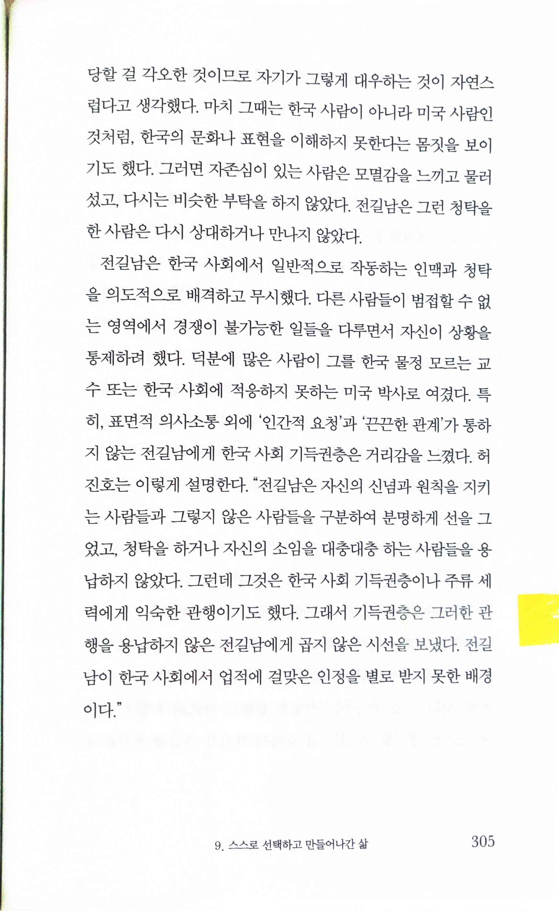

> "전길남은 자신의 신념과 원칙을 지키는 사람들과 그렇지 않은 사람들을 구분하여 분명하게 선을 그었고, 청탁을 하거나 자신의 소임을 대충대충 하는 사람들을 용납하지 않았다. 그런데 그것은 한국 사회 기득권층이나 주류 세력에게 익숙한 관행이기도 했다. 그래서 기득권층은 그러한 관행을 용납하지 않은 전길남에게 곱지 않은 시선을 보냈다. 전길남이 한국 사회에서 업적에 걸맞은 인정을 별로 받지 못한 배경이다.”

# 부록

## 대담 1: 인터넷과 인공지능의 미래 _전길남 구본권 309
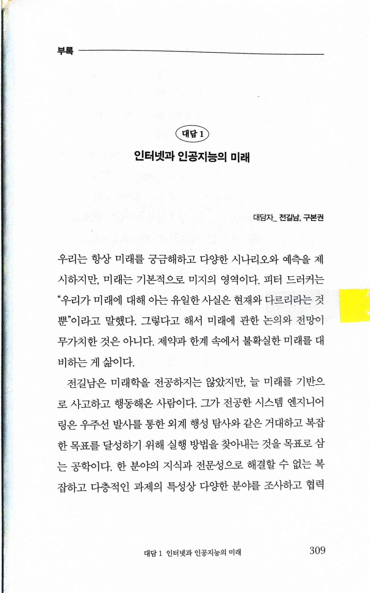

> 우리는 항상 미래를 궁금해하고 다양한 시나리오와 예측을 제시하지만, 미래는 기본적으로 미지의 영역이다. 피터 드러커는 “우리가 미래에 대해 아는 유일한 사실은 현재와 다르리라는 것뿐"이라고 말했다. 그렇다고 해서 미래에 관한 논의와 전망이 무가치한 것은 아니다. 제약과 한계 속에서 불확실한 미래를 대비하는 게 삶이다.

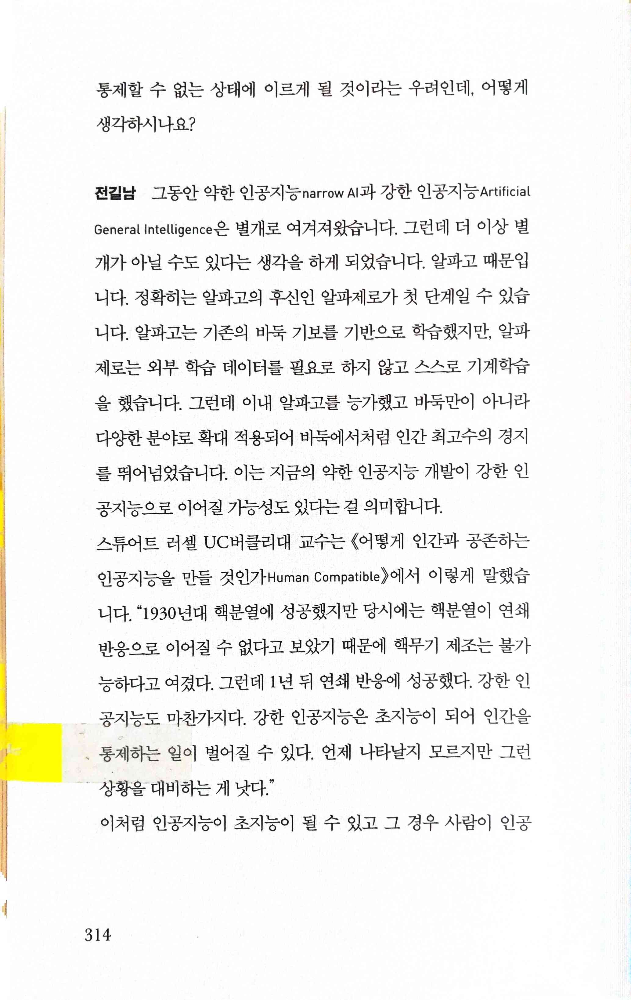

> 스튜어트 러셀 UC버클리대 교수는 <어떻게 인간과 공존하는 인공지능을 만들 것인가Human Compatible>에서 이렇게 말했습니다. "1930년대 핵분열에 성공했지만 당시에는 핵분열이 연쇄반응으로 이어질 수 없다고 보았기 때문에 핵무기 제조는 불가능하다고 여겼다. 그런데 1년 뒤 연쇄 반응에 성공했다. 강한 인공지능도 마찬가지다. 강한 인공지능은 초지능이 되어 인간을 통제하는 일이 벌어질 수 있다. 언제 나타날지 모르지만 그런 상황을 대비하는 게 낫다."

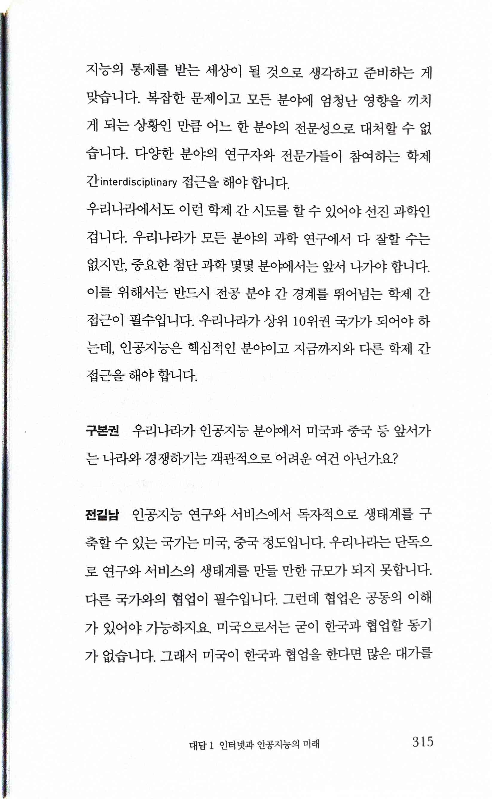

> 우리나라는 단독으로 연구와 서비스의 생태계를 만들 만한 규모가 되지 못합니다. 다른 국가와의 협업이 필수입니다.

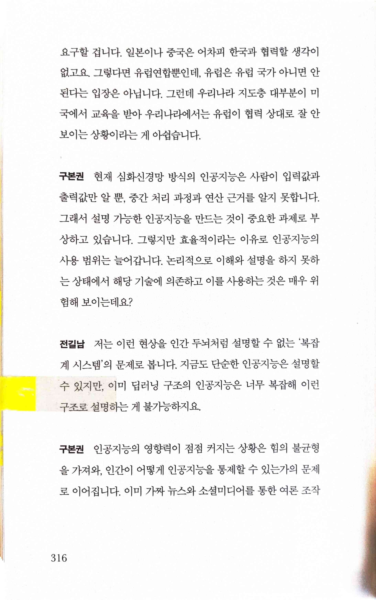

> 저는 이런 현상을 인간 두뇌처럼 설명할 수 없는 '복잡계 시스템'의 문제로 봅니다. 지금도 단순한 인공지능은 설명할수 있지만, 이미 딥러닝 구조의 인공지능은 너무 복잡해 이런 구조로 설명하는 게 불가능하지요.

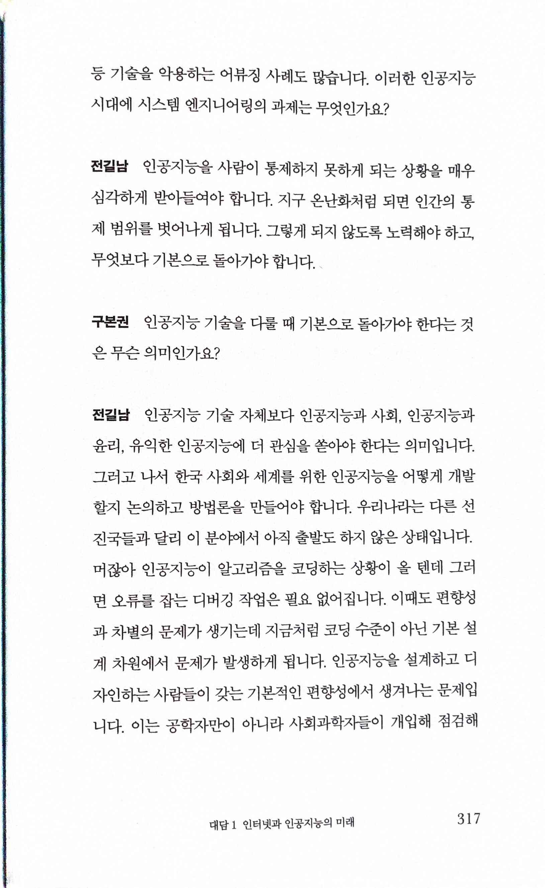

> 머잖아 인공지능이 알고리즘을 코딩하는 상황이 올 텐데 그러면 오류를 잡는 디버깅 작업은 필요 없어집니다. 이때도 편향성과 차별의 문제가 생기는데 지금처럼 코딩 수준이 아닌 기본 설계 차원에서 문제가 발생하게 됩니다. 인공지능을 설계하고 디자인하는 사람들이 갖는 기본적인 편향성에서 생겨나는 문제입니다. 이는 공학자만이 아니라 사회과학자들이 개입해 점검해야 합니다. 인공지능에서 프로그램과 알고리즘의 단위가 커지면서 몇천만 줄, 몇억 줄의 코딩이 이루어집니다. 이런 거대 규모에서는 기존과 차원이 다른 문제가 생겨납니다.

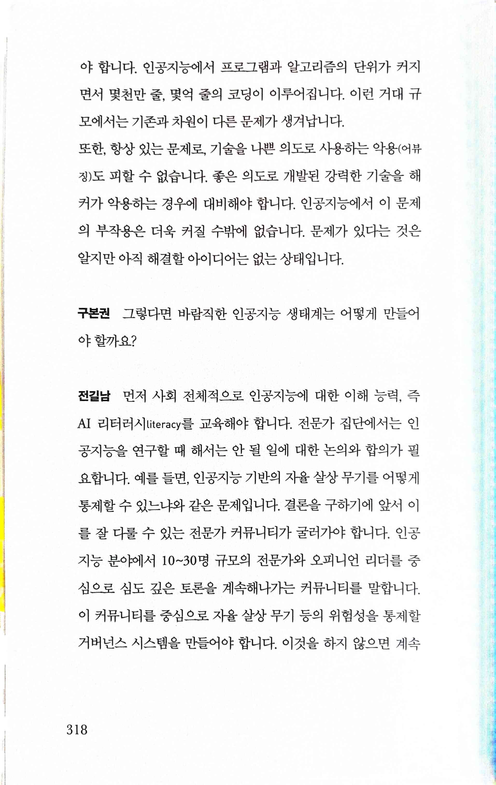

> 먼저 사회 전체적으로 인공지능에 대한 이해 능력, 즉AI 리터러시 Literacy를 교육해야 합니다. 전문가 집단에서는 인공지능을 연구할 때 해서는 안 될 일에 대한 논의와 합의가 필요합니다.

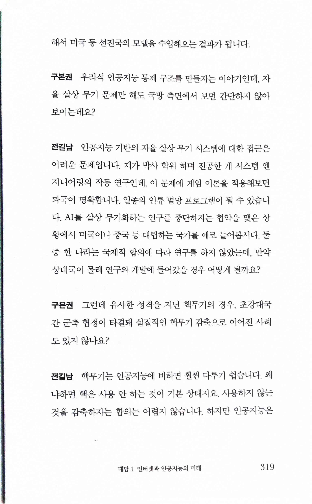 

> 핵무기는 인공지능에 비하면 훨씬 다루기 쉽습니다. 왜냐하면 핵은 사용 안 하는 것이 기본 상태지요. 사용하지 않는것을 감축하자는 합의는 어렵지 않습니다. 하지만 인공지능은 다릅니다. 사회 모든 영역에서 인공지능은 점점 더 많이 사용할 수밖에 없습니다. 일상과 산업의 필수 도구로 사용하면서 특정한 용도로만 사용하지 못하게 하는 질서를 만드는 것은 매우 어려운 일입니다. 새로운 게임 이론이 연구되어야 할 주제입니다. 매우 도전적인 과제지요.

> 인공지능이 발달한다고 해도 사람의 우뇌와 같은 능력을 지니기는 상당 기간 어려울 겁니다.

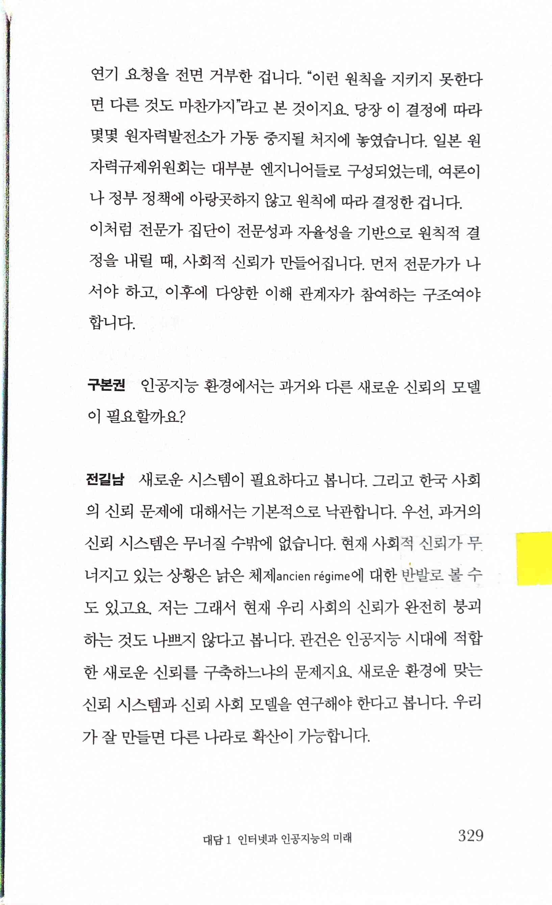 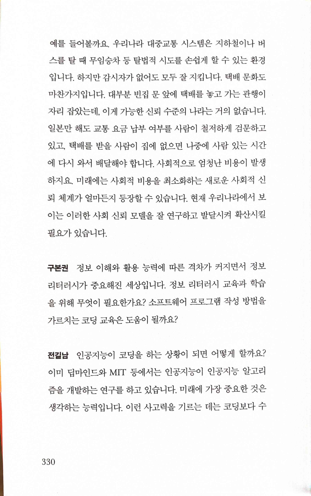

> 우선, 과거의 신뢰 시스템은 무너질 수밖에 없습니다. 현재 사회적 신뢰가 무너지고 있는 상황은 낡은 체제ancien régime에 대한 반발로 볼 수도 있고요. 저는 그래서 현재 우리 사회의 신뢰가 완전히 붕괴하는 것도 나쁘지 않다고 봅니다. 관건은 인공지능 시대에 적합한 새로운 신뢰를 구축하느냐의 문제지요. 새로운 환경에 맞는 신뢰 시스템과 신뢰 사회 모델을 연구해야 한다고 봅니다.

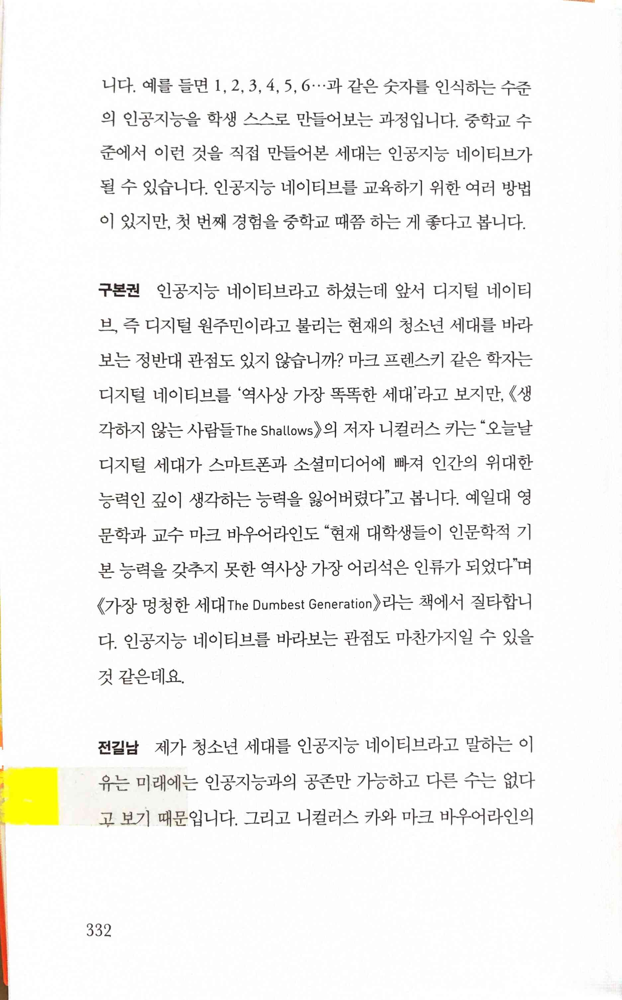 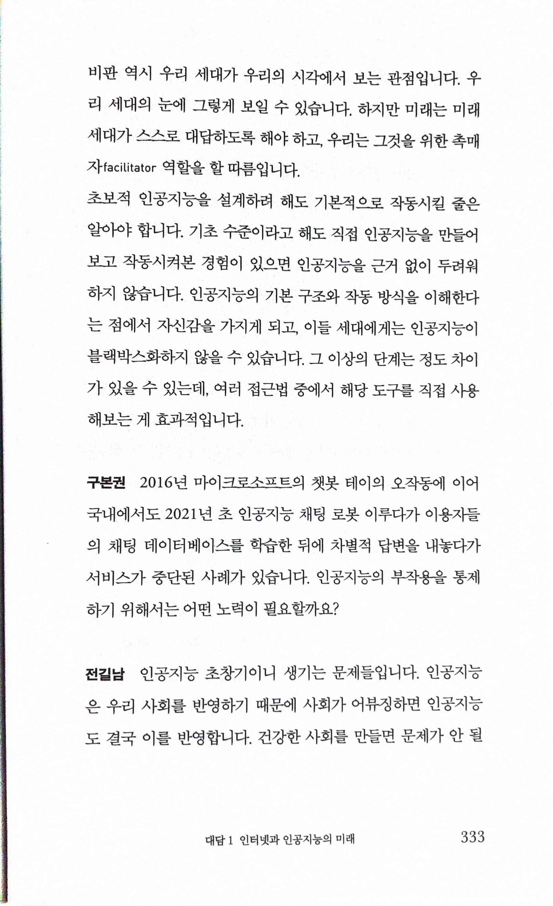

> 마크 프렌스키 같은 학자는 디지털 네이티브를 '역사상 가장 똑똑한 세대'라고 보지만, <생각하지 않는 사람들 The Shallows>의 저자 니컬러스카는 "오늘날 디지털 세대가 스마트폰과 소셜미디어에 빠져 인간의 위대한 능력인 깊이 생각하는 능력을 잃어버렸다"고 봅니다. 예일대 영문학과 교수 마크 바우어라인도 "현재 대학생들이 인문학적 기본 능력을 갖추지 못한 역사상 가장 어리석은 인류가 되었다"며<가장 멍청한 세대 The Dumbest Generation>라는 책에서 질타합니다. 인공지능 네이티브를 바라보는 관점도 마찬가지일 수 있을것 같은데요.
>
> 제가 청소년 세대를 인공지능 네이티브라고 말하는 이유는 미래에는 인공지능과의 공존만 가능하고 다른 수는 없다고 보기 때문입니다. 그리고 니컬러스 카와 마크 바우어라인의 비판 역시 우리 세대가 우리의 시각에서 보는 관점입니다. 우리 세대의 눈에 그렇게 보일 수 있습니다. 하지만 미래는 미래세대가 스스로 대답하도록 해야 하고, 우리는 그것을 위한 촉매자 facilitator 역할을 할 따름입니다.

## 대담 2: 인공지능 시대, 과학 교육과 과학 연구전길남. 정재승 337
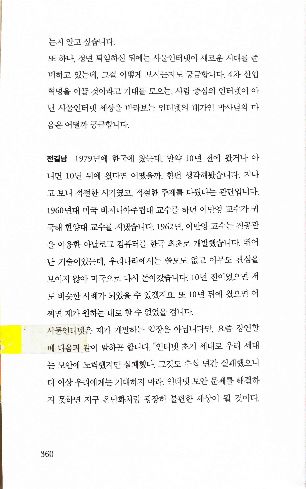 

> 사물인터넷은 제가 개발하는 입장은 아닙니다만, 요즘 강연할때 다음과 같이 말하곤 합니다. "인터넷 초기 세대로 우리 세대는 보안에 노력했지만 실패했다. 그것도 수십 년간 실패했으니 더 이상 우리에게는 기대하지 마라. 인터넷 보안 문제를 해결하지 못하면 지구 온난화처럼 굉장히 불편한 세상이 될 것이다... 지금 인터넷의 보안도 해결 못하는 상황인데 사물인터넷이 되면 보안 취약으로 인한 문제는 더욱 심각해질 겁니다. 대비해야 합니다.

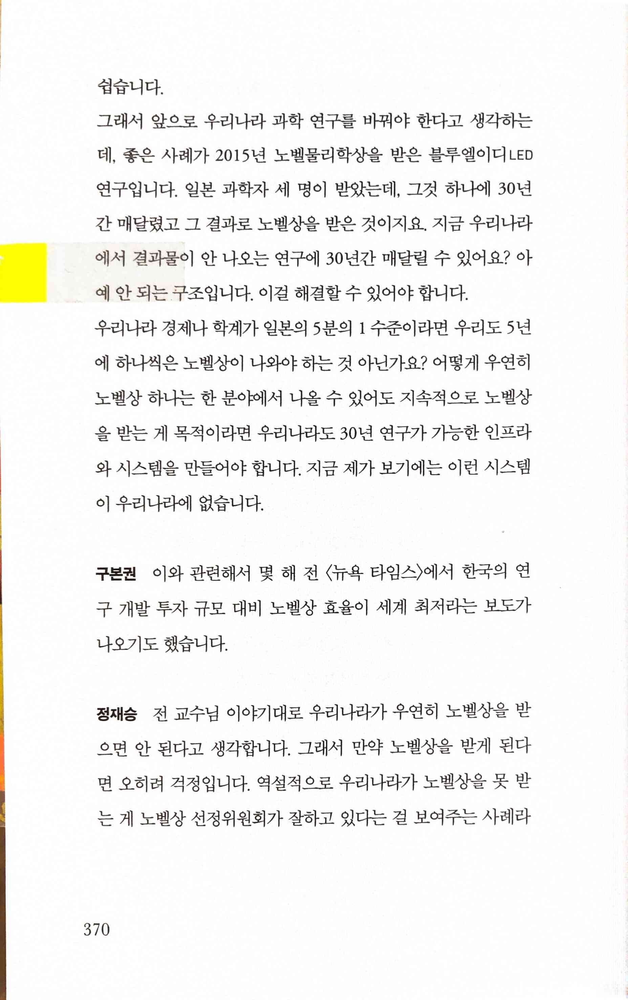

> 지금 우리나라에서 결과물이 안 나오는 연구에 30년간 매달릴 수 있어요? 아예 안 되는 구조입니다. 이걸 해결할 수 있어야 합니다.

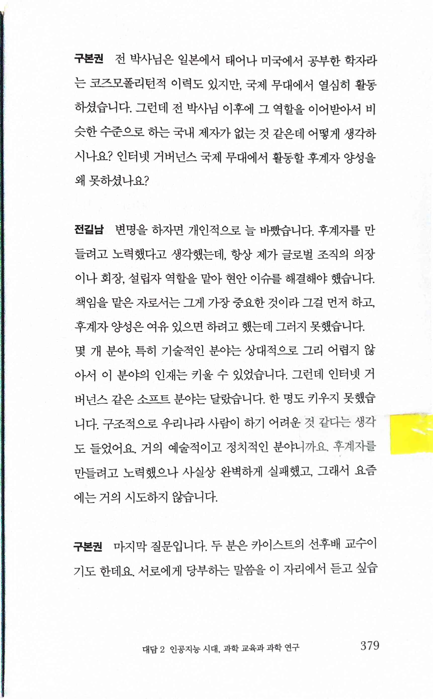

> 인터넷 거버넌스 같은 소프트 분야는 달랐습니다. 한 명도 키우지 못했습니다. 구조적으로 우리나라 사람이 하기 어려운 것 같다는 생각도 들었어요. 거의 예술적이고 정치적인 분야니까요. 후계자를 만들려고 노력했으나 사실상 완벽하게 실패했고, 그래서 요즘에는 거의 시도하지 않습니다.
