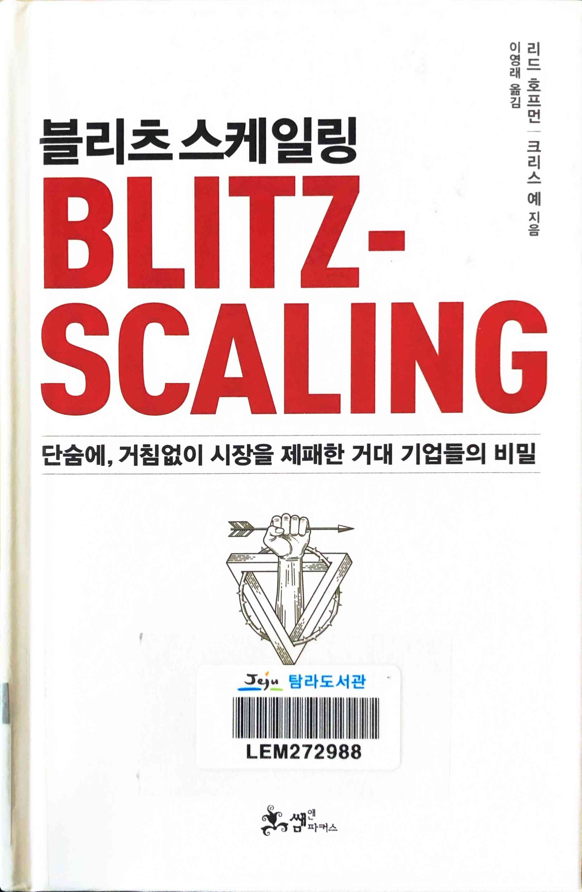
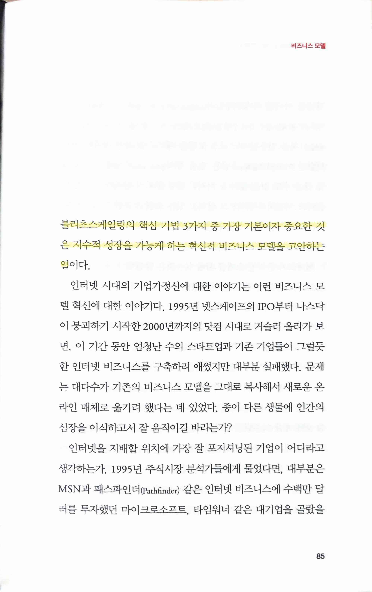
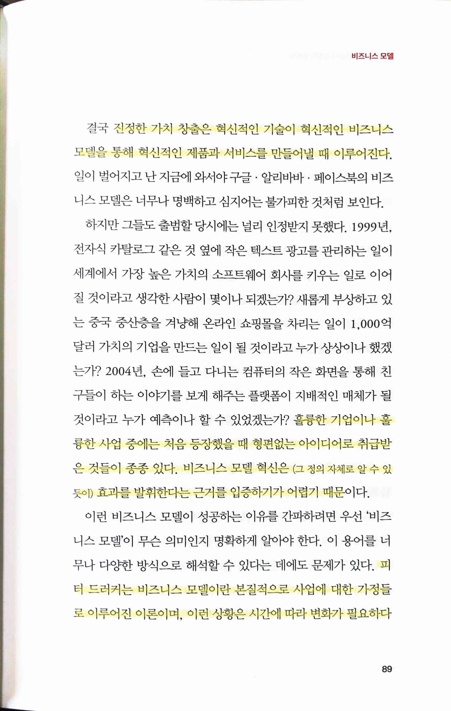
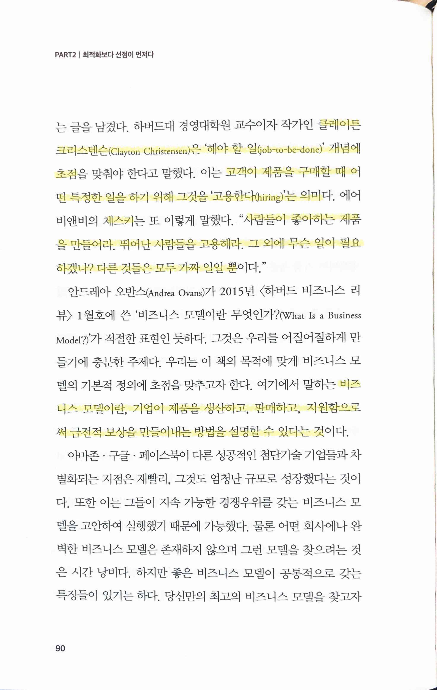
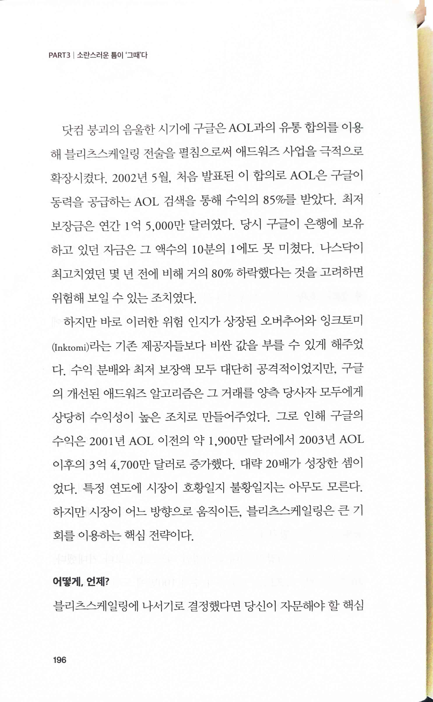
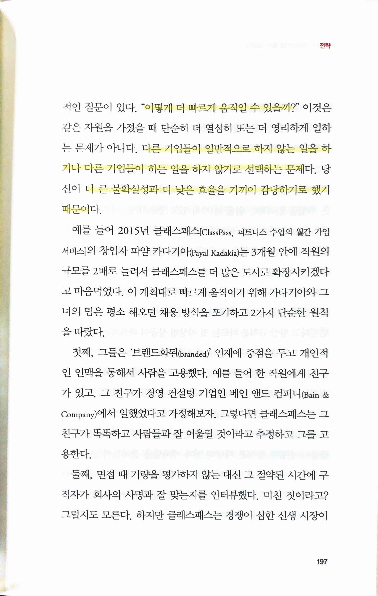
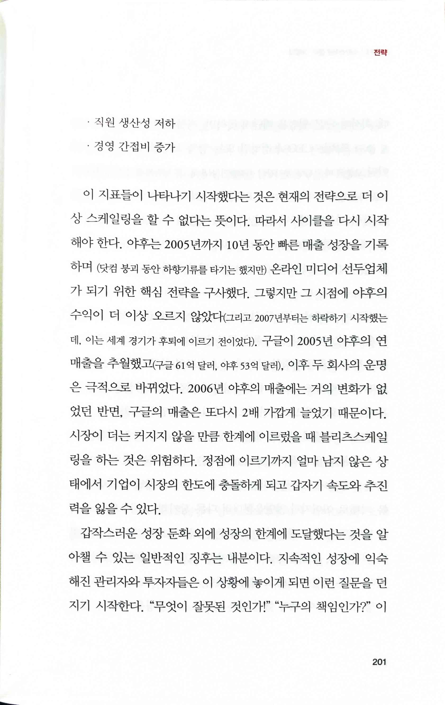
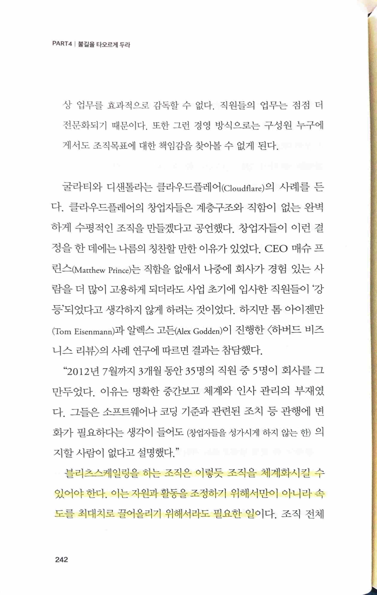
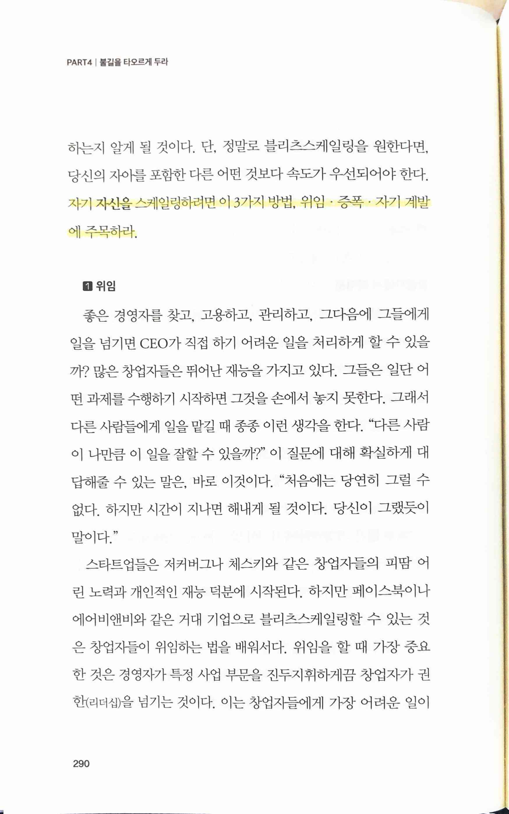
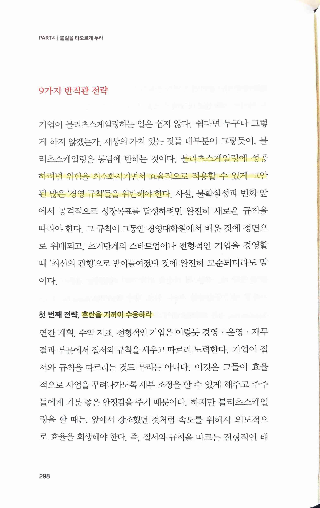

# Blitz Scailing

# 프롤로그 겟빅 패스트 Get Big Fast!

# PART1 모든 것을 걸어야 한다

# PART2 최적화보다 선점이 먼저다

> 블리츠스케일링의 핵심 기법 3가지 중 가장 기본이자 중요한 것은 지수적 성장을 가능케 하는 혁신적 비즈니스 모델을 고안하는 일

 

> 진정한 가치 창출은 혁신적인 기술이 혁신적인 비즈니스 모델을 통해 혁신적인 제품과 서비스를 만들어낼 때 이루어진다.
>
> 훌륭한 기업이나 훌륭한 사업 중에는 처음 등장했을 때 형편없는 아이디어로 취급받은 것들이 종종 있다. 비즈니스 모델 혁신은 그 정의 자체로 알 수 있듯이) 효과를 발휘한다는 근거를 입증하기가 어렵기 때문이다.
>
> 피터 드러커는 비즈니스 모델이란 본질적으로 사업에 대한 가정들로 이루어진 이론이며, 이런 상황은 시간에 따라 변화가 필요하다는 글을 남겼다... 클레이튼 크리스텐슨(Clayton Christensen)은 '해야 할 일(job-to-be-done)' 개념에 초점... 고객이 제품을 구매할 때 어떤 특정한 일을 하기 위해 그것을 '고용한다(hiring)'는 의미... 체스키는... "사람들이 좋아하는 제품을 만들어라 뛰어난 사람들을 고용해라. 그 외에 무슨 일이 필요하겠나? 다른 것들은 모두 가짜 일일 뿐이다."
>
> 비즈니스 모델이란, 기업이 제품을 생산하고, 판매하고, 지원함으로써 금전적 보상을 만들어내는 방법을 설명할 수 있다는 것이다.

* 4가지 핵심 성장 인자
  * 시장 규모; 총유효시장(rotal avail-ablemarket, TAM)
  * 유통 1. 기존 네트워크 활용 2. 바이럴리티
  * 매출총이익
  * 네트워크 효과
    * 1. 네트워크 효과 5가지
      * (1) 직접 네트워크 효과(Direct Network Effects) 
      * (2) 간접 네트워크 효과(Indirect Network Effects)
      * (3) 양면적 네트워크 효과(Two-Sided Network Effects)
      * (4) 지역 네트워크 효과(Local Network Effects)
      * (5) 호환성과 표준(Compatibility and Standards)
    * 2. 네트워크 효과: 공격과 성장, 양날의 검
    * 3. 연결할수록 커진다
* 2가지 핵심 성장 제약 인자
  * 제품과 시장의 궁합
  * 운영 확장성에 대한 대응책
    * 1. 인적 자원 제약
    * 2. 인프라 제약

> 자동화... 컴퓨터는... 거의 언제나 인간보다 빠르고, 저렴하고, 신뢰할 만하다

# PART3 소란스러운 틈이 ‘그때’다

> 위험하고 비용이 증가하더라도 아주 빠르게 성장하는 것이 블리츠스케일링의 목표... 블리츠스케일링이 이치에 맞는 유일한 경우는 (공격적인 이유에서든 방어적인 이유에서든) 시장으로 진입하는 속도가 엄청난 결과를 내는 데 대단히 중요한 역할을 할 때뿐

> 큰 성공을 거두려면 새롭고 큰 기회가 필요

> 지속적인 경쟁우위를 창출하려면... 가파른 학습곡선을 만들어내는 최초의 기업이 되는

 

> “어떻게 더 빠르게 움직일 수 있을까?"... 다른 기업들이 일반적으로 하지 않는 일을 하거나 다른 기업들이 하는 일을 하지 않기로 선택하는 문제... 더 큰 불확실성과 더 낮은 효율을 기꺼이 감당하기로 했기 때문

 

> 블리츠스케일링은 자본을 비효율적으로 사용해야 하기 때문에 속도와 추진력이 중요할 때에만 의미
>
> 가장 어려운 문제 중 하나는 기존에 따르던 전략이 더 이상 먹히지 않을 만큼 기업이 커졌을 때, 그래서 전략을 수정해야 할 때, 바로 그때가 언제인지 아는 일
>
> • 성장 속도의 저하(시장, 경쟁업체와 비교했을 때)
>
> • 유닛 이코노믹스 악화
>
> • 직원 생산성 저하
>
> • 경영 간접비 증가

# PART4 불길을 타오르게 두라

> 블리츠스케일링을 하는 조직은 이렇듯 조직을 체계화시킬 수있어야 한다. 이는 자원과 활동을 조정하기 위해서만이 아니라 속도를 최대치로 끌어올리기 위해서라도 필요한 일

> 규칙을 개선할 수 있다면 그렇게 해야 한다. 다만 규칙이 존재하는 까닭도 분명히 있기 때문에 이것을 어길 때 자신만 옳다고 내세우면 안 된다. 그보다 모든 결과를 이해할 수 없다는 사실을 겸허히 받아들일 줄도 알아야 한다. 규칙을 어기려고 항상 속임수를 쓰진 않겠지만, 이는 커다란 위험을 감수해야 하는 활동이므로 항상 주의가 필요

> 자기 자신을 스케일링하려면 이 3가지 방법, 위임 · 증폭 · 자기 계발에 주목

> 9가지 반직관 전략

블리츠스케일링에 성공하려면 위험을 최소화시키면서 효율적으로 적용할 수 있게 고안된 많은 경영 규칙들을 위반해야 한다.

첫 번째 전략, 혼란을 기꺼이 수용하라

두 번째 전략, 가장 적합한 사람이 아닌 바로 지금 필요한 사람을 영입하라

세 번째 전략, '부적절한' 관리도 때로는 용인하라

네 번째 전략, 상황은 뜻대로 흘러가지 않으므로, 시작은 빠르게

다섯 번째 전략, 불길이 타오르게 내버려 둔다

여섯 번째 전략, 규모가 나오지 않는 일을 한다

일곱 번째 전략, 고객을 무시하라

여덟 번째 전략, 총알은 많을수록 좋다

아홉 번째 전략, 문화를 진화시켜라

# PART5 '골리앗'은 더 큰 '골리앗'이 이긴다

> 공격이 아닌 방어전략으로서 어떻게 블리츠스케일링을 펼칠 것인지... 3가지 방법... 경쟁자를 이기거나, 그들을 합류시키거나, 그들을 피하는 것이다.

# PART6 최초에서 최후의 스케일러로

# 에필로그 시장은 정체와 안주를 '응징'한다
 

> 빠른 속도와 불확실성은 새로운 안정성이다.
>
> 빠르게 변하는 세계에서 번영하는 유일한 길은 변화의 불가피성을 받아들이는 것
>
> 첫째, 무한한 학습자가 돼라
>
> 둘째, 첫 번째 응답자가 돼라
>
> 마지막은 상당히 모순적이지만 안정성의 원천이 돼라