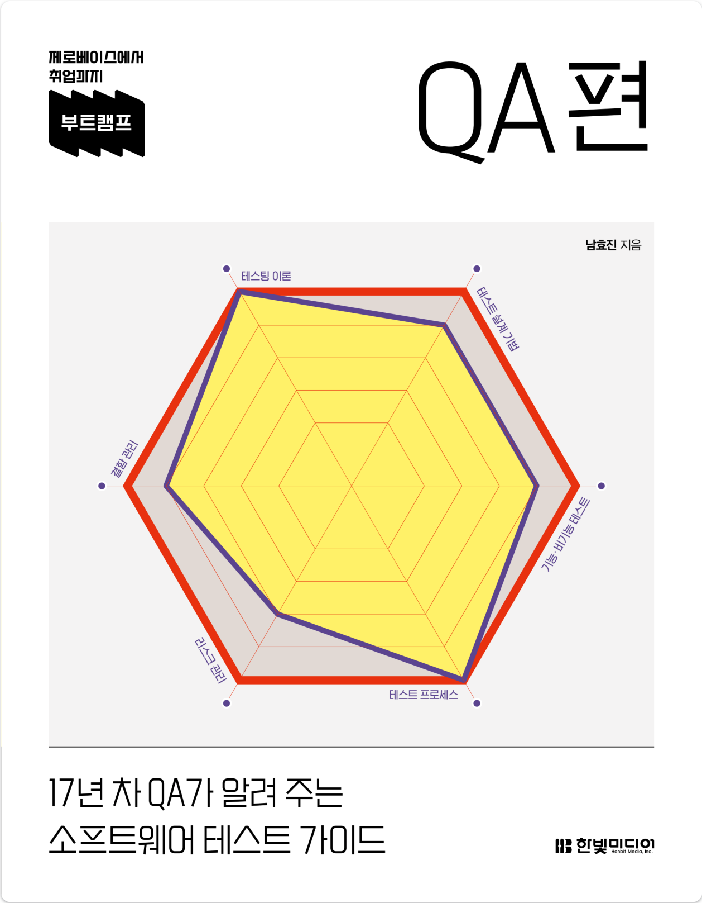
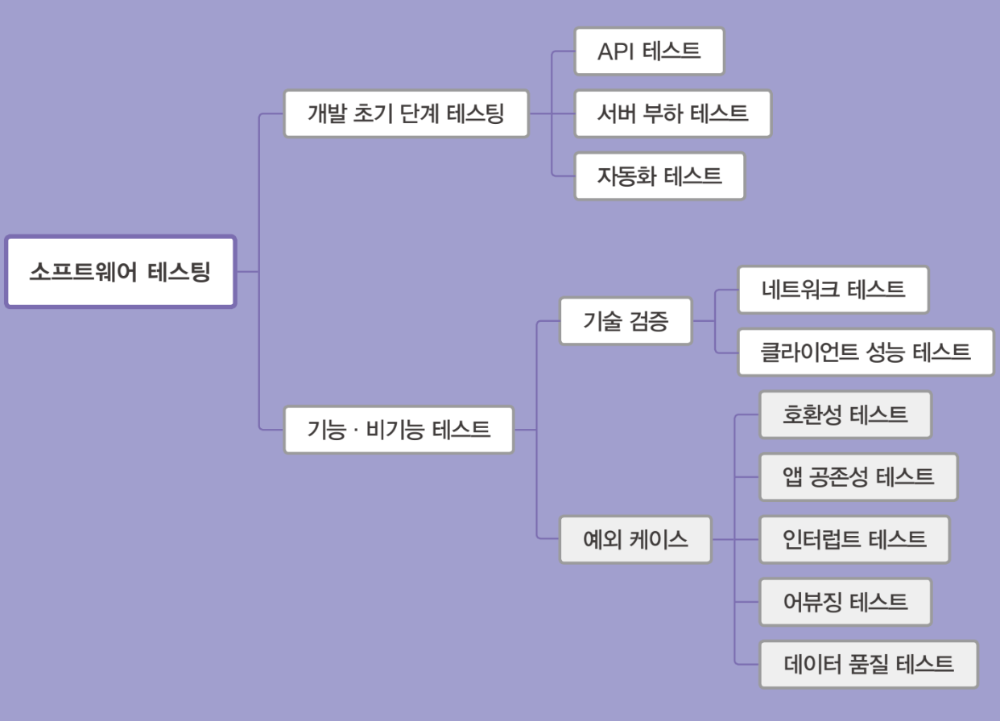

# 부트캠프 QA편

Tags: QA, software-engineering
Date: June 4, 2024 → June 19, 2024
Score: ★★★☆☆

- ★★★☆☆ June 4, 2024 → June 19, 2024

(규모 무관하게) 조직장을 하면서부터 담당하는 프로덕트 혹은 서비스의 품질은 우선순위의 거의 최상단에 위치하기 시작했다. 하지만 아무래도 이 분야는 전문 분야가 아니다보니 같이 일하는 QA 담당자의 능력에 많은 부분이 영향을 받았다. 일을 잘 하는 분과 함께하면 편하고 신경을 덜 써도 되었지만, 서툰 분과 함께하면 부분적으로 개선을 해도 전반적으로 향상시키기는 쉽지 않았다.

사용자들의 기대치는 점점 높아져서 과거와 달리 초기 스타트업의 제품도 품질 문제가 있으면 쉽게 떠나기 때문에 이제 품질의 중요성은 더욱 올라가고 있다. 물론 여전히 많은 경영진들은 품질보다 속도를 먼저 이야기하는 경우가 많긴 하지만, 품질에 문제가 발생하면 바로 책임을 묻기 때문에 어떻게든 신경을 써야한다.

그러므로 책임을 지는 위치에 있으면 직간접적으로 QA를 고려해야만 한다. 선택이 아니라 필수라는 의미이다.

이 책은 QA의 이론적인 면부터 포스트맨같은 유명한 도구를 사용하는 방법까지 전반적인 부분을 한 권에서 설명한 게 돋보인다. 각 챕터마다 다음과 같이 분류를 보여주며 시작하기 때문에 어떤 내용을 만날지도 잘 알려줘서 다시 찾아볼 때도 유용할 거란 생각이 든다.

책에 이런 말이 나온다. QA뿐 아니라 모든 일에 적용할 수 있는 좋은 말이다. 쉽게 하기 어려운 큰 주제가 있으면 가능한 작게 나눠서 할 수 있는 거 부터 해야 조금씩 향상시킬 수 있다. 품질을 향상시키고 싶다면, 혹은 어떻게 관리해야 할지 어렵다면 이 책을 읽어보길 권한다.

"한빛미디어 < 나는리뷰어다 > 활동을 위해서 책을 제공받아 작성된 서평입니다."

