오늘부터 팀장입니다
===================

* [First-time & new managers in start-ups | Bringing Up The Boss](https://www.bringinguptheboss.com/)

# 서문 팀장이 알아야 할 경영관리의 모든 것
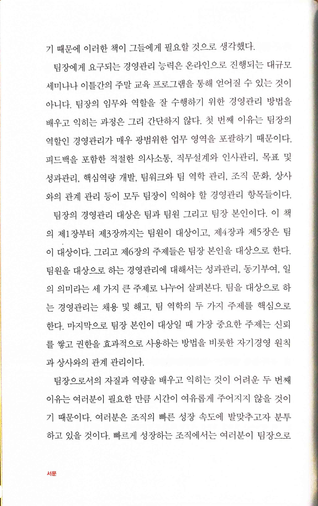

> 피드백을 포함한 적절한 의사소통, 직무설계와 인사관리, 목표 및 성과관리, 핵심역량 개발, 팀워크와 팀 역학 관리, 조직 문화, 상사와의 관계 관리 등이 모두 팀장이 익혀야 할 경영관리 항목들이다.

# 제1장 성과관리

## 제1강 성과에 대한 기대치를 명확하게 제시하라
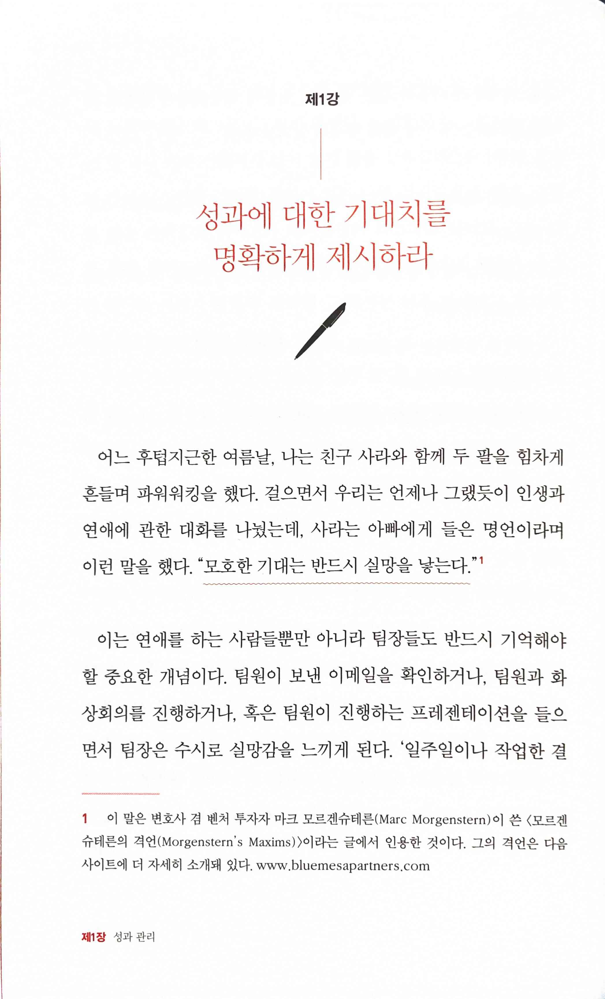

> "모호한 기대는 반드시 실망을 낳는다."
* [Blue Mesa Partners - Morgenstern's Maxims](https://www.bluemesapartners.com/deal-maxims/)

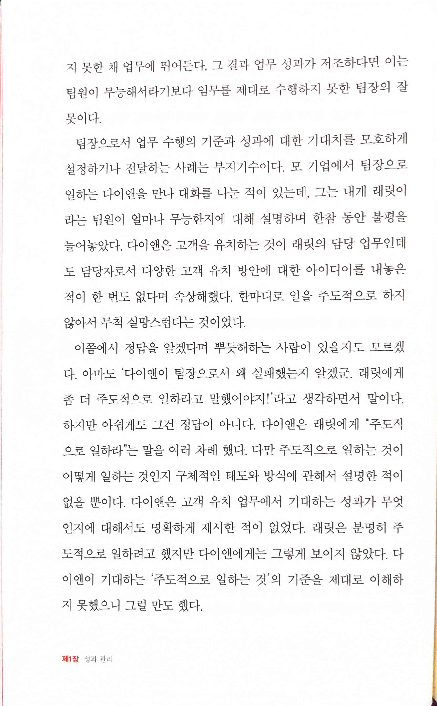

> 업무 성과가 저조하다면 이는 팀원이 무능해서라기보다 임무를 제대로 수행하지 못한 팀장의 잘못이다.

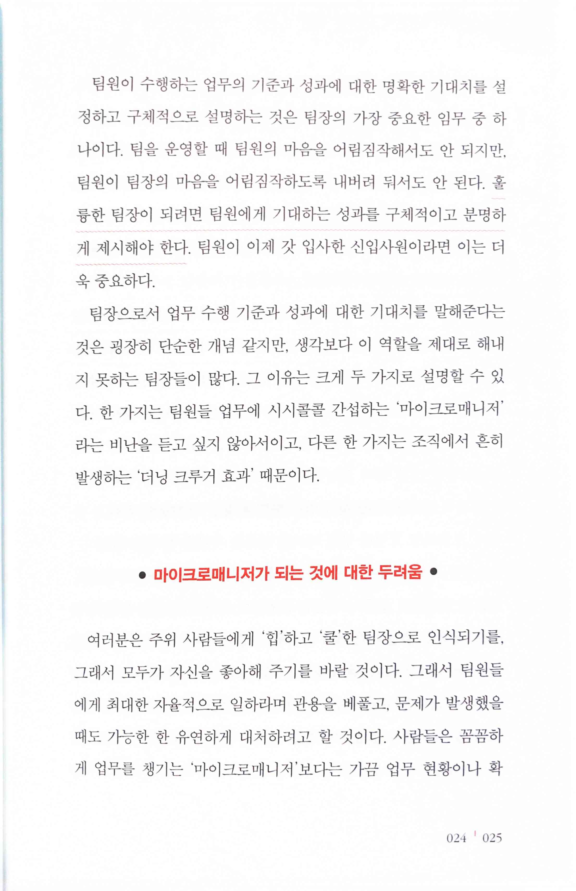

> 훌륭한 팀장이 되려면 팀원에게 기대하는 성과를 구체적이고 분명하게 제시해야 한다.
>
> 팀장으로서 업무 수행 기준과 성과에 대한 기대치를 말해준다는것은 굉장히 단순한 개념 같지만, 생각보다 이 역할을 제대로 해내지 못하는 팀장들이 많다. 그 이유는 크게 두 가지로 설명할 수 있다. 한 가지는 팀원들 업무에 시시콜콜 간섭하는 '마이크로매니저'라는 비난을 듣고 싶지 않아서이고, 다른 한 가지는 조직에서 흔히발생하는 '더닝 크루거 효과' 때문이다.

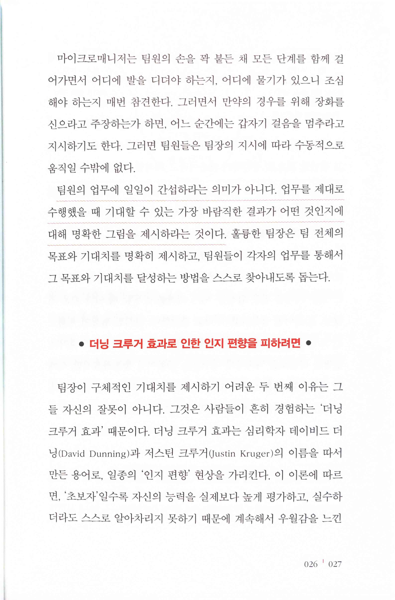

> 팀원의 업무에 일일이 간섭하라는 의미가 아니다. 업무를 제대로 수행했을 때 기대할 수 있는 가장 바람직한 결과가 어떤 것인지에대해 명확한 그림을 제시하라는 것이다.
>
> 더닝 크루거 효과는 심리학자 데이비드 더닝(David Dunning)과 저스틴 크루거 (Justin Kruger)의 이름을 따서 만든 용어로, 일종의 '인지 편향' 현상을 가리킨다. 이 이론에 따르면, '초보자일수록 자신의 능력을 실제보다 높게 평가하고, 실수하더라도 스스로 알아차리지 못하기 때문에 계속해서 우월감을 느낀다. 다른 한편으로 '전문가'의 경우에는 자신에게 쉬운 일은 남들에게도 쉬울 것이라 믿는 경향이 있는데, 이 역시 더닝 크루거 효과에서 비롯된다.
 
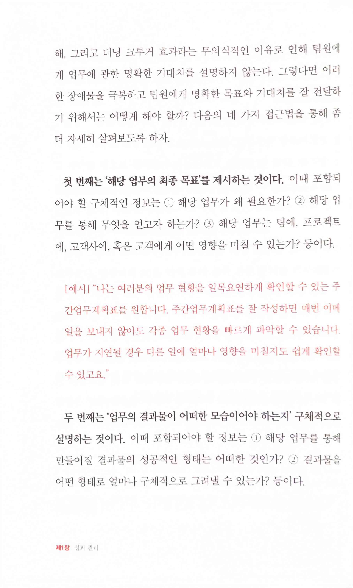 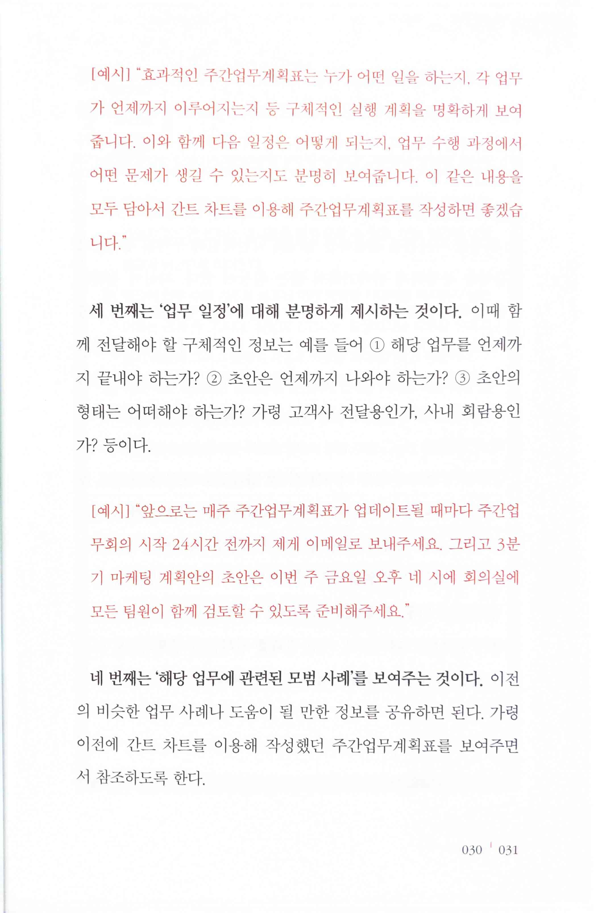

> 명확한 기대치를 설정하는 방법
>
> 첫 번째는 '해당 업무의 최종 목표'를 제시하는 것이다.
>
> 두 번째는 '업무의 결과물이 어떠한 모습이어야 하는지' 구체적으로 설명하는 것이다.
>
> 세 번째는 '업무 일정'에 대해 분명하게 제시하는 것이다.
>
> 네 번째는 '해당 업무에 관련된 모범 사례'를 보여주는 것이다.

## 제2강 지속적이고 체계적으로 피드백을 제공하라
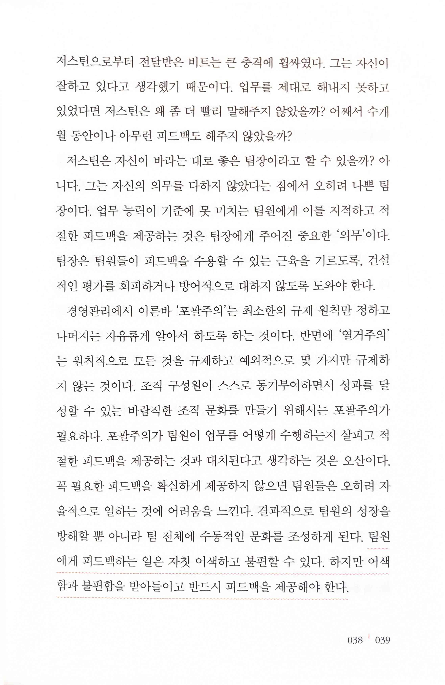

> 경영관리에서 이른바 '포괄주의'는 최소한의 규제 원칙만 정하고 나머지는 자유롭게 알아서 하도록 하는 것이다. 반면에 '열거주의'는 원칙적으로 모든 것을 규제하고 예외적으로 몇 가지만 규제하지 않는 것이다. 조직 구성원이 스스로 동기부여하면서 성과를 달성할 수 있는 바람직한 조직 문화를 만들기 위해서는 포괄주의가 필요하다.
* 규제의 블랙리스트와 화이트리스트와 비슷한 개념으로 생각해도 되는 걸까?
> 어색함과 불편함을 받아들이고 반드시 피드백을 제공해야 한다.

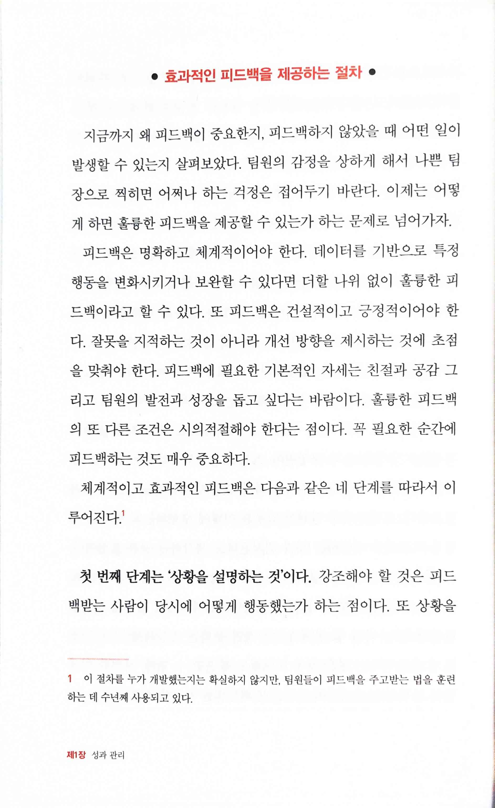 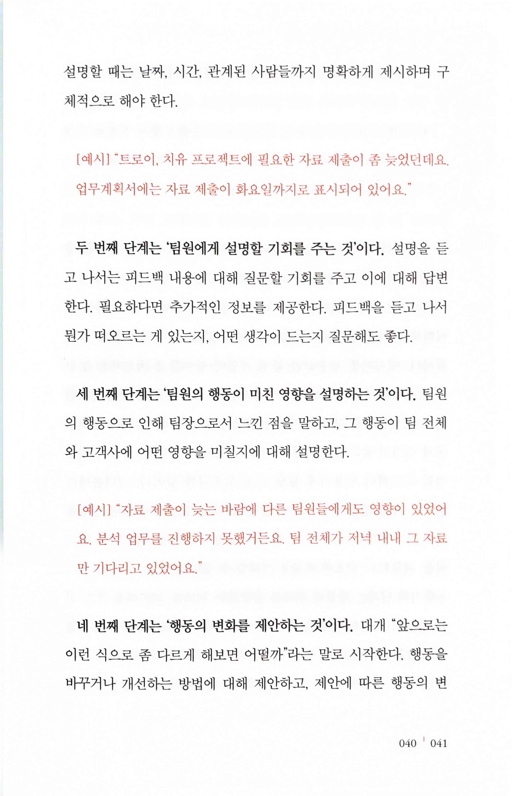

> 피드백은 명확하고 체계적이어야 한다. 데이터를 기반으로 특정 행동을 변화시키거나 보완할 수 있다면 더할 나위 없이 훌륭한 피드백이라고 할 수 있다. 또 피드백은 건설적이고 긍정적이어야 한다. 잘못을 지적하는 것이 아니라 개선 방향을 제시하는 것에 초점을 맞춰야 한다. 피드백에 필요한 기본적인 자세는 친절과 공감 그리고 팀원의 발전과 성장을 돕고 싶다는 바람이다. 훌륭한 피드백의 또 다른 조건은 시의적절해야 한다는 점이다. 꼭 필요한 순간에 피드백하는 것도 매우 중요하다.
>
> 체계적이고 효과적인 피드백은 다음과 같은 네 단계를 따라서 이루어진다'
>
> 첫 번째 단계는 '상황을 설명하는 것'이다.
>
> 두 번째 단계는 '팀원에게 설명할 기회를 주는 것'이다.
>
> 세 번째 단계는 '팀원의 행동이 미친 영향을 설명하는 것'이다.
>
> 네 번째 단계는 '행동의 변화를 제안하는 것'이다.

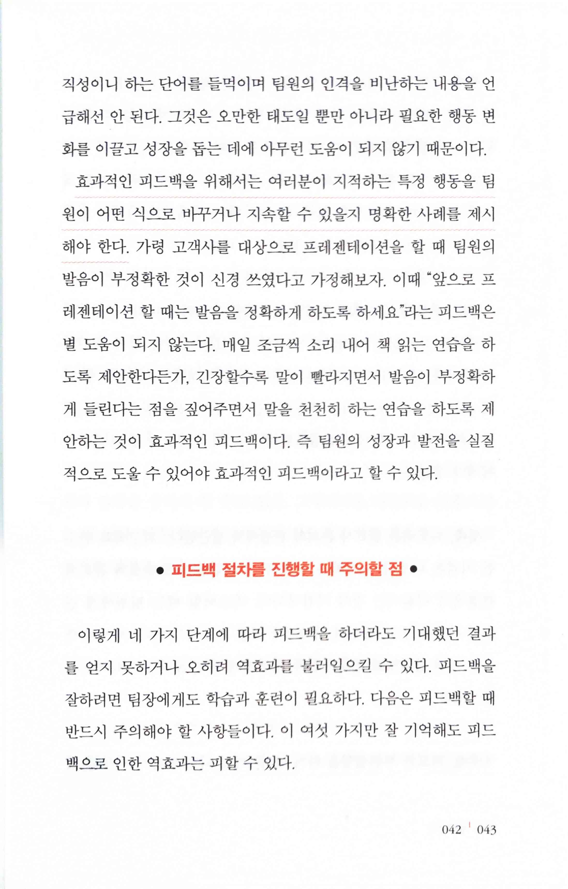

> 효과적인 피드백을 위해서는 여러분이 지적하는 특정 행동을 팀원이 어떤 식으로 바꾸거나 지속할 수 있을지 명확한 사례를 제시해야 한다.

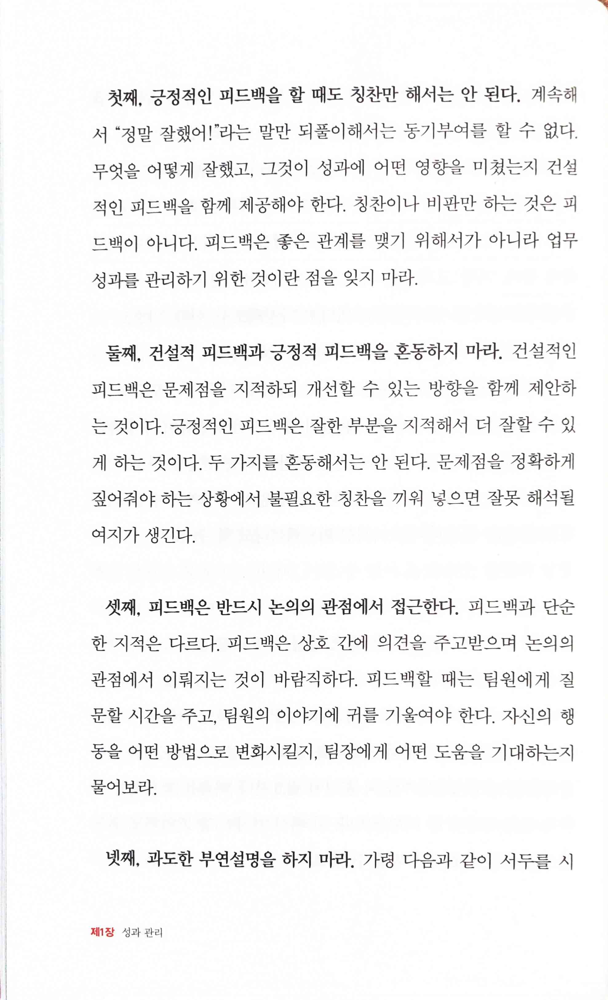 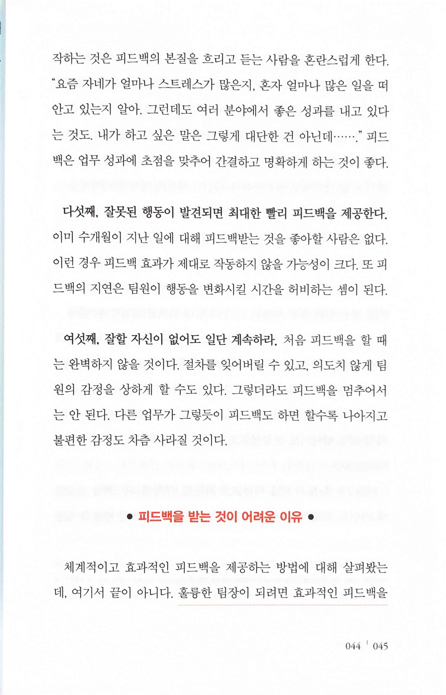

> 피드백 절차를 진행할 때 주의할 점
>
> 첫째, 긍정적인 피드백을 할 때도 칭찬만 해서는 안 된다.
>
> 둘째, 건설적 피드백과 긍정적 피드백을 혼동하지 마라.
>
> 셋째, 피드백은 반드시 논의의 관점에서 접근한다.
>
> 넷째, 과도한 부연설명을 하지 마라.
>
> 다섯째, 잘못된 행동이 발견되면 최대한 빨리 피드백을 제공한다.
>
> 여섯째, 잘할 자신이 없어도 일단 계속하라.

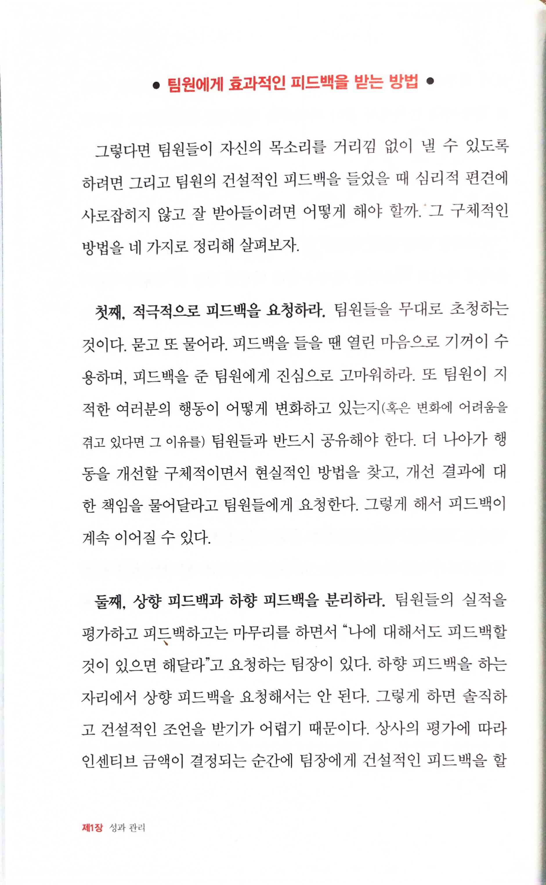 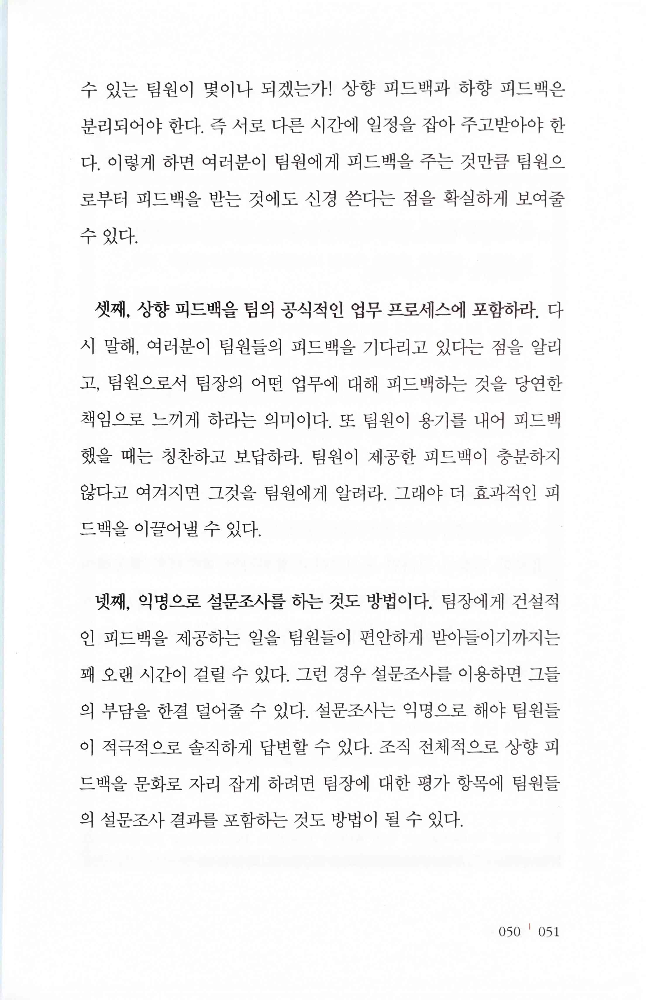

> 팀원에게 효과적인 피드백을 받는 방법
>
> 첫째, 적극적으로 피드백을 요청하라.
>
> 둘째, 상향 피드백과 하향 피드백을 분리하라.
>
> 셋째, 상향 피드백을 팀의 공식적인 업무 프로세스에 포함하라.
>
> 넷째, 익명으로 설문조사를 하는 것도 방법이다.

## 제3강 팀원이 자기 성장의 책임자가 되도록 하라
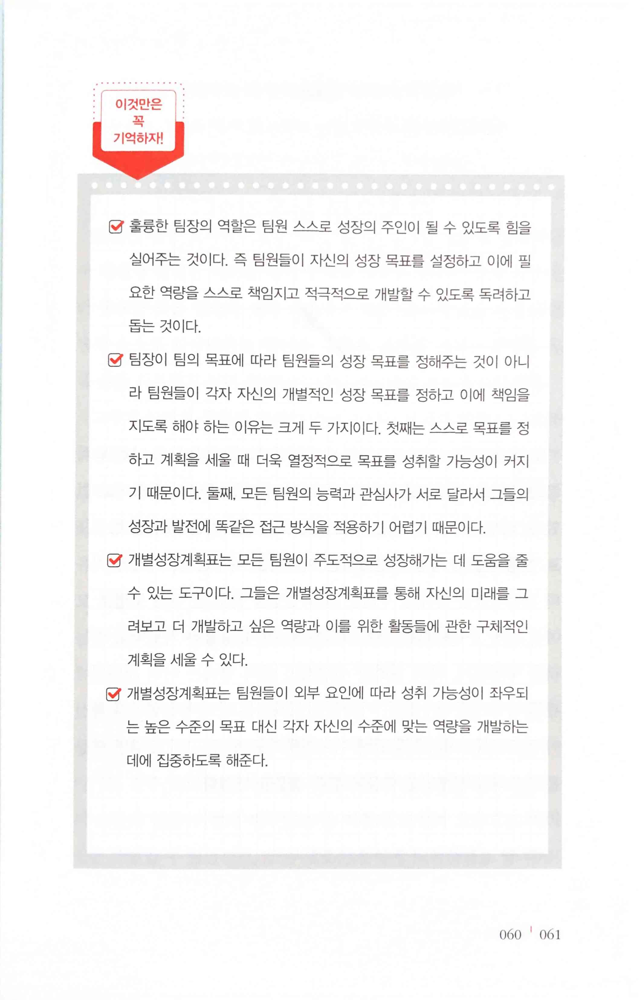

> 훌륭한 팀장의 역할은 팀원 스스로 성장의 주인이 될 수 있도록 힘을 실어주는 것이다. 즉 팀원들이 자신의 성장 목표를 설정하고 이에 필요한 역량을 스스로 책임지고 적극적으로 개발할 수 있도록 독려하고 돕는 것이다.

## 제4강 코칭으로 능동적인 문제해결력을 키워주어라
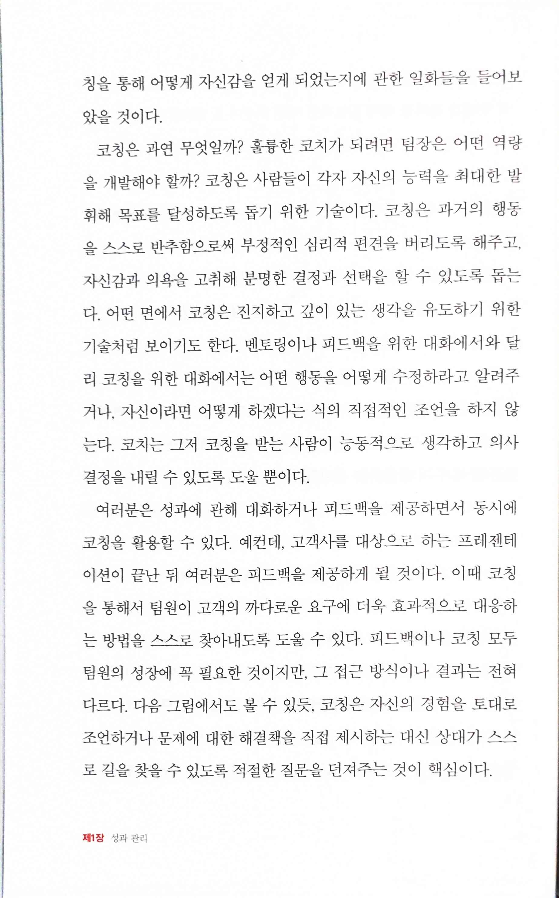

> 코칭은 사람들이 각자 자신의 능력을 최대한 발휘해 목표를 달성하도록 돕기 위한 기술이다. 코칭은 과거의 행동을 스스로 반추함으로써 부정적인 심리적 편견을 버리도록 해주고, 자신감과 의욕을 고취해 분명한 결정과 선택을 할 수 있도록 돕는다. 어떤 면에서 코칭은 진지하고 깊이 있는 생각을 유도하기 위한 기술처럼 보이기도 한다. 멘토링이나 피드백을 위한 대화에서와 달리 코칭을 위한 대화에서는 어떤 행동을 어떻게 수정하라고 알려주거나, 자신이라면 어떻게 하겠다는 식의 직접적인 조언을 하지 않는다. 코치는 그저 코칭을 받는 사람이 능동적으로 생각하고 의사결정을 내릴 수 있도록 도울 뿐이다.
>
> 코칭은 자신의 경험을 토대로 조언하거나 문제에 대한 해결책을 직접 제시하는 대신 상대가 스스로 길을 찾을 수 있도록 적절한 질문을 던져주는 것이 핵심이다.

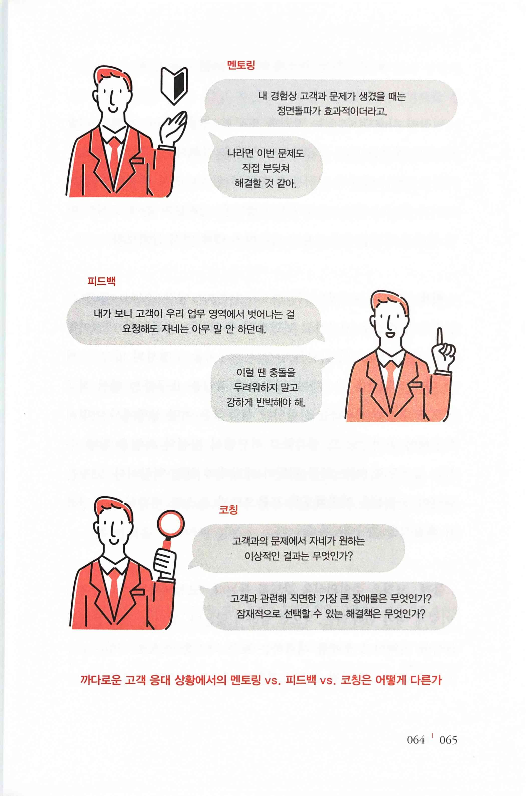

* 멘토링: 이야기하는 사람, 즉 멘토가 어떻게 했는지에 대한 이야기
* 피드백: 듣는 사람이 어떻게 해야 할지에 대한 이야기
* 코칭: 듣는 사람이 어떻게 할지 스스로 생각해보게 함

## 제5강 성과를 측정하고 실적 부진을 관리하라
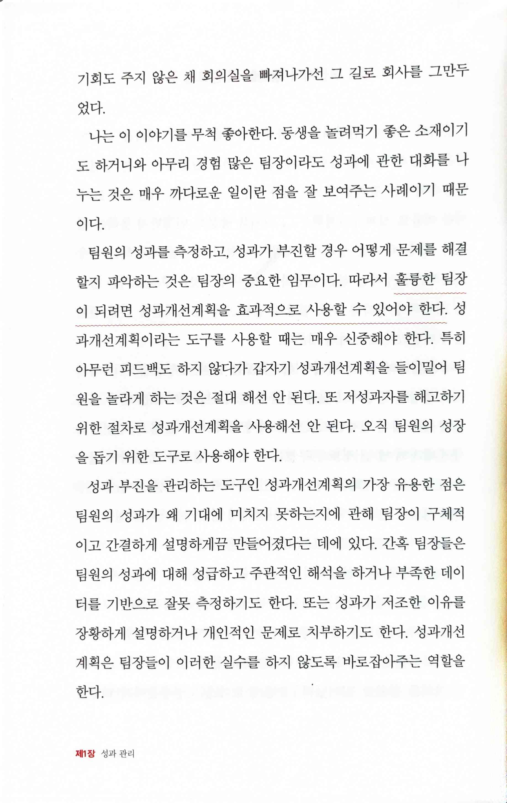

> 훌륭한 팀장이 되려면 성과개선계획을 효과적으로 사용할 수 있어야 한다.
>
> 성과 부진을 관리하는 도구인 성과개선계획의 가장 유용한 점은 팀원의 성과가 왜 기대에 미치지 못하는지에 관해 팀장이 구체적이고 간결하게 설명하게끔 만들어졌다는 데에 있다. 간혹 팀장들은 팀원의 성과에 대해 성급하고 주관적인 해석을 하거나 부족한 데이터를 기반으로 잘못 측정하기도 한다. 또는 성과가 저조한 이유를 장황하게 설명하거나 개인적인 문제로 치부하기도 한다. 성과개선계획은 팀장들이 이러한 실수를 하지 않도록 바로잡아주는 역할을 한다.

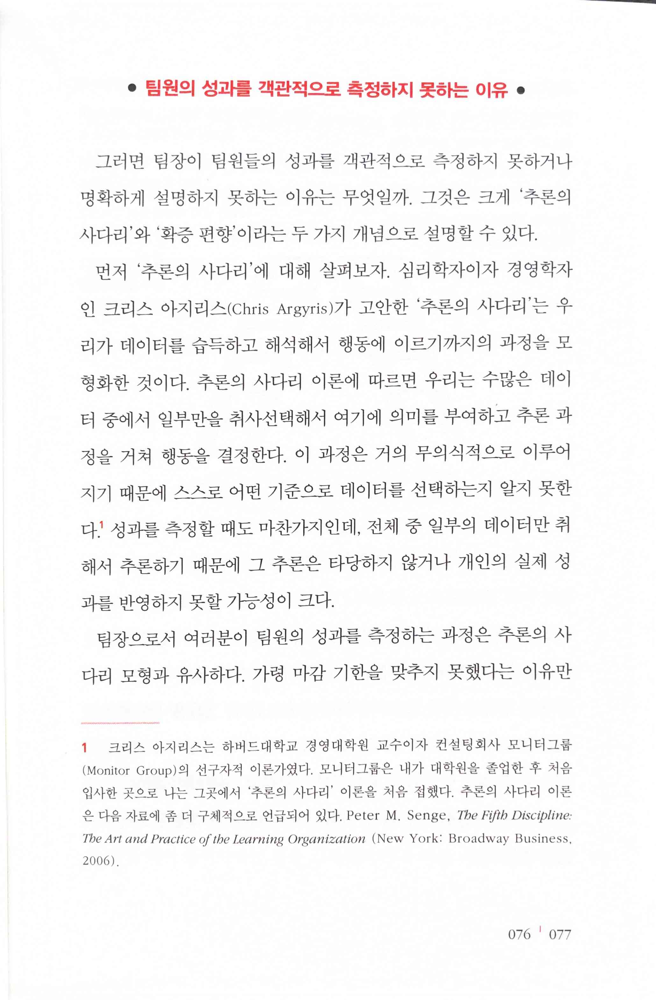

> 팀원의 성과를 객관적으로 측정하지 못하는 이유
>
> 심리학자이자 경영학자인 크리스 아지리스(Chris Argyris)가 고안한 '추론의 사다리'는 우리가 데이터를 습득하고 해석해서 행동에 이르기까지의 과정을 모형화한 것이다. 추론의 사다리 이론에 따르면 우리는 수많은 데이터 중에서 일부만을 취사선택해서 여기에 의미를 부여하고 추론 과정을 거쳐 행동을 결정한다. 이 과정은 거의 무의식적으로 이루어지기 때문에 스스로 어떤 기준으로 데이터를 선택하는지 알지 못한다.
* [(PDF) The Fifth Discipline | Dian Damayanti - Academia.edu](https://www.academia.edu/11944656/The_Fifth_Discipline)
> 우리는 자신에게 문제가 생기면 외부에서 원인을 찾으려고 하면서, 상대에게 문제가 생기면 그 사람이 가진 결점에서 원인을 찾으려고 한다.

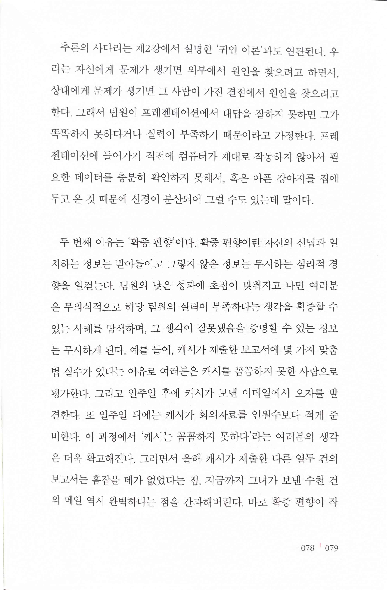

> 확증 편향이란 자신의 신념과 일치하는 정보는 받아들이고 그렇지 않은 정보는 무시하는 심리적 경향을 일컫는다.

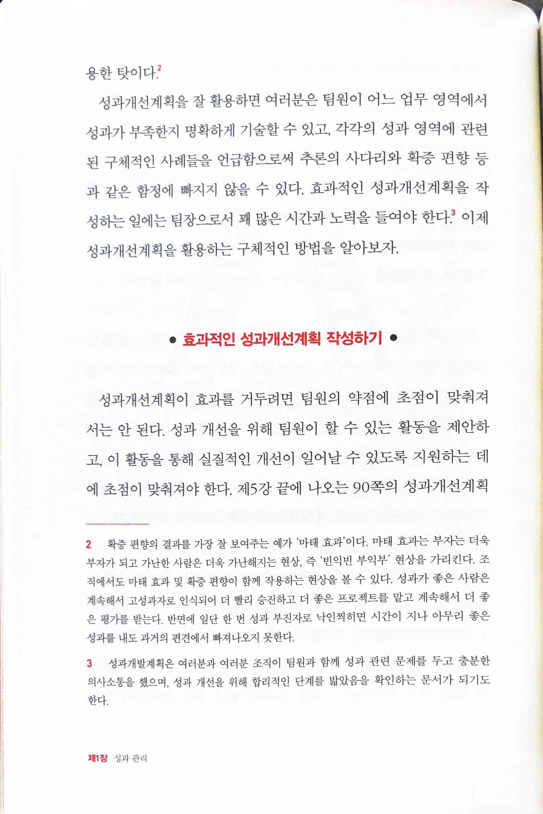

> 성과개선계획을 잘 활용하면 여러분은 팀원이 어느 업무 영역에서 성과가 부족한지 명확하게 기술할 수 있고, 각각의 성과 영역에 관련된 구체적인 사례들을 언급함으로써 추론의 사다리와 확증 편향 등과 같은 함정에 빠지지 않을 수 있다.
>
> 성과개발계획은 여러분과 여러분 조직이 팀원과 함께 성과 관련 문제를 두고 충분한 의사소통을 했으며, 성과 개선을 위해 합리적인 단계를 밟았음을 확인하는 문서가 되기도 한다.

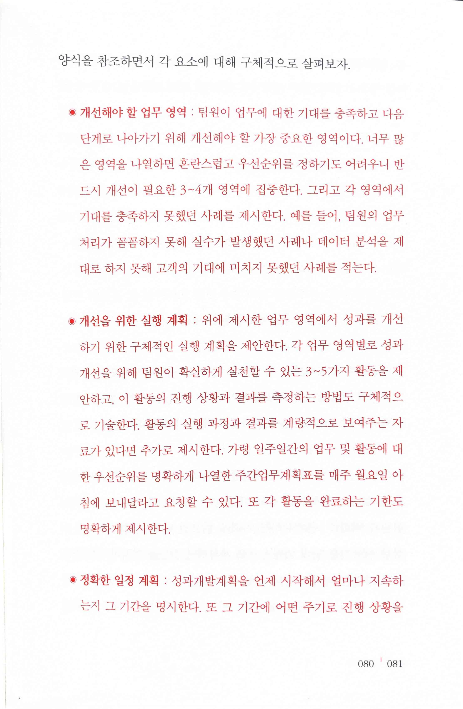 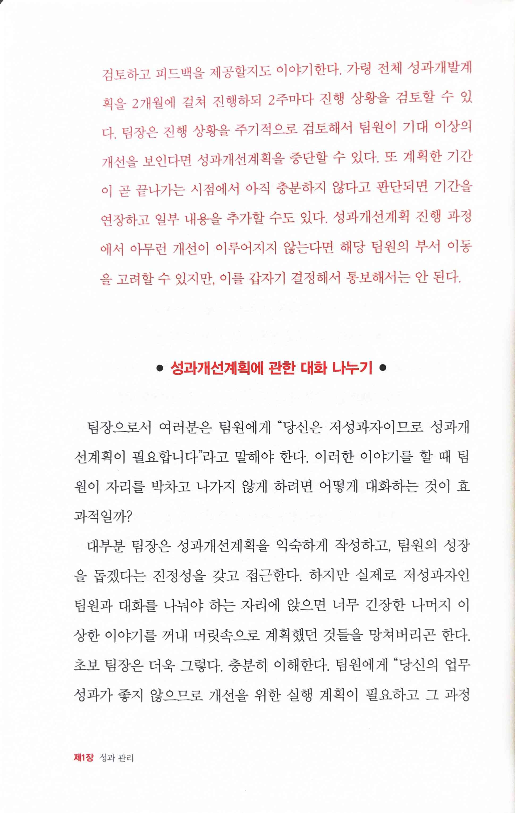

> 효과적인 성과개선계획 작성하기
>
> 개선해야 할 업무 영역
>
> 개선을 위한 실행 계획
>
> 정확한 일정 계획

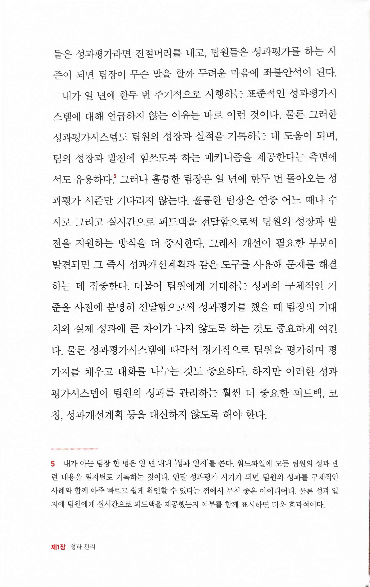

> 훌륭한 팀장은 일 년에 한두 번 돌아오는 성과평가 시즌만 기다리지 않는다. 훌륭한 팀장은 연중 어느 때나 수시로 그리고 실시간으로 피드백을 전달함으로써 팀원의 성장과 발전을 지원하는 방식을 더 중시한다... 성과평가시스템이 팀원의 성과를 관리하는 훨씬 더 중요한 피드백, 코칭, 성과개선계획 등을 대신하지 않도록 해야 한다.

# 제2장 동기부여

## 제6강 개인의 욕구에 초점을 맞춰 동기를 부여하라
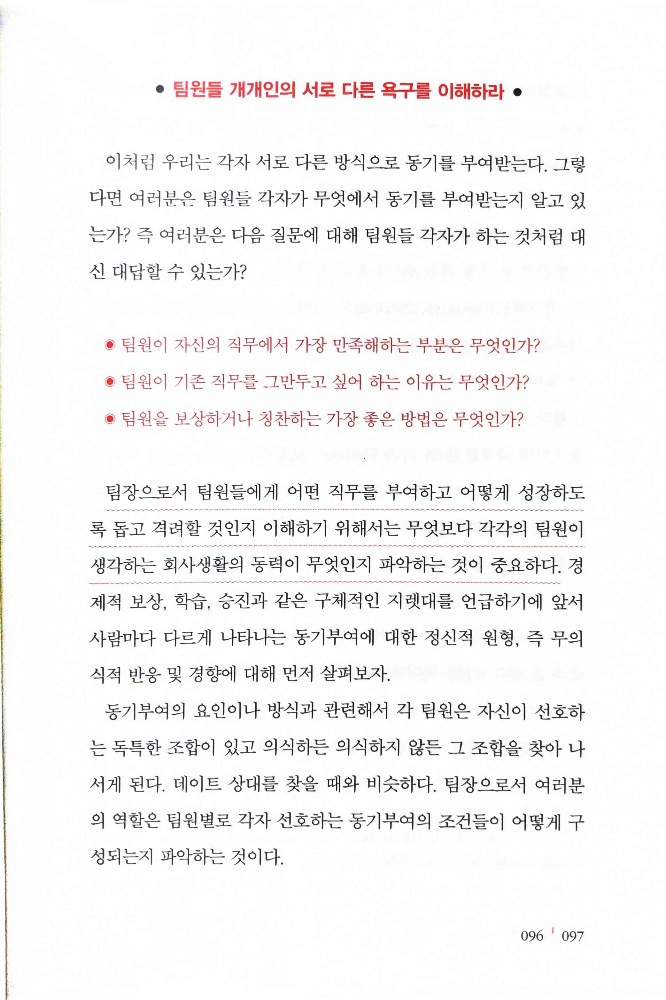

> 팀장으로서 팀원들에게 어떤 직무를 부여하고 어떻게 성장하도록 돕고 격려할 것인지 이해하기 위해서는 무엇보다 각각의 팀원이 생각하는 회사생활의 동력이 무엇인지 파악하는 것이 중요하다.
>
> 팀장으로서 여러분의 역할은 팀원별로 각자 선호하는 동기부여의 조건들이 어떻게 구성되는지 파악하는 것이다.

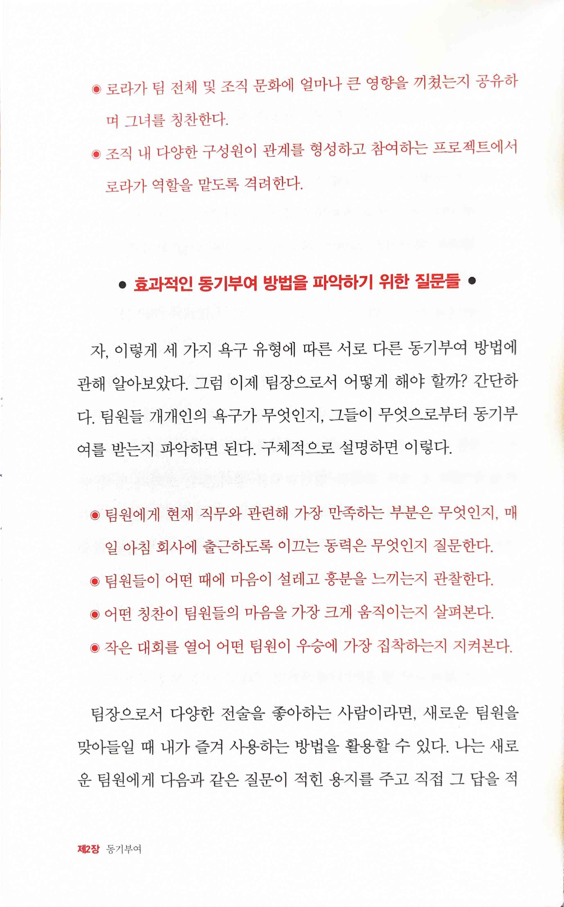

> 팀장으로서 어떻게 해야 할까? 간단하다. 팀원들 개개인의 욕구가 무엇인지, 그들이 무엇으로부터 동기부여를 받는지 파악하면 된다.

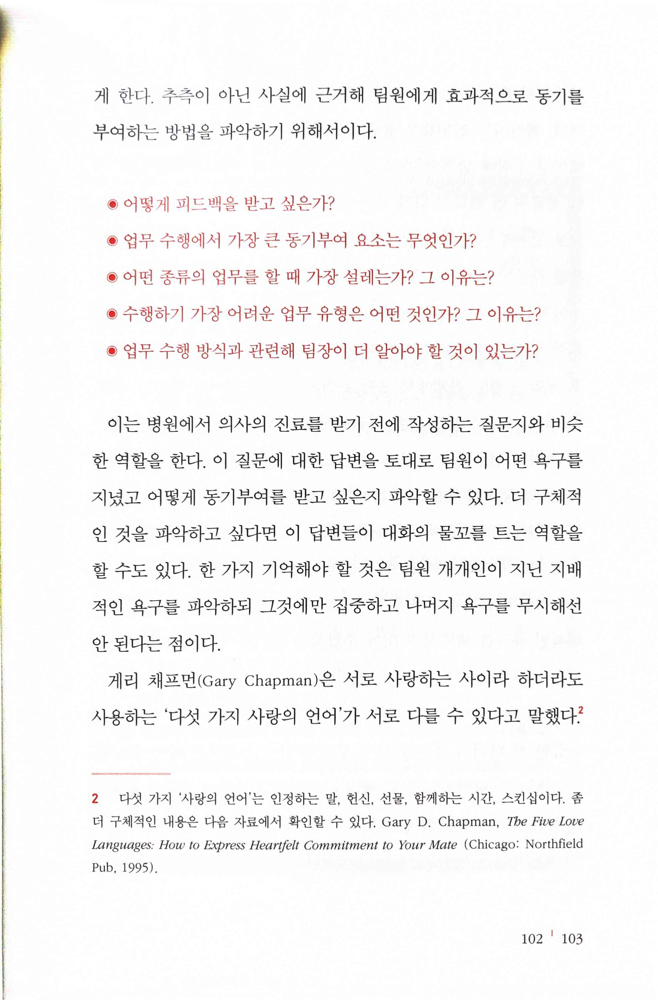

> 한 가지 기억해야 할 것은 팀원 개개인이 지닌 지배적인 욕구를 파악하되 그것에만 집중하고 나머지 욕구를 무시해선 안 된다는 점이다.

## 제7강 유연한 목표를 세우고 결과에 집착하지 마라
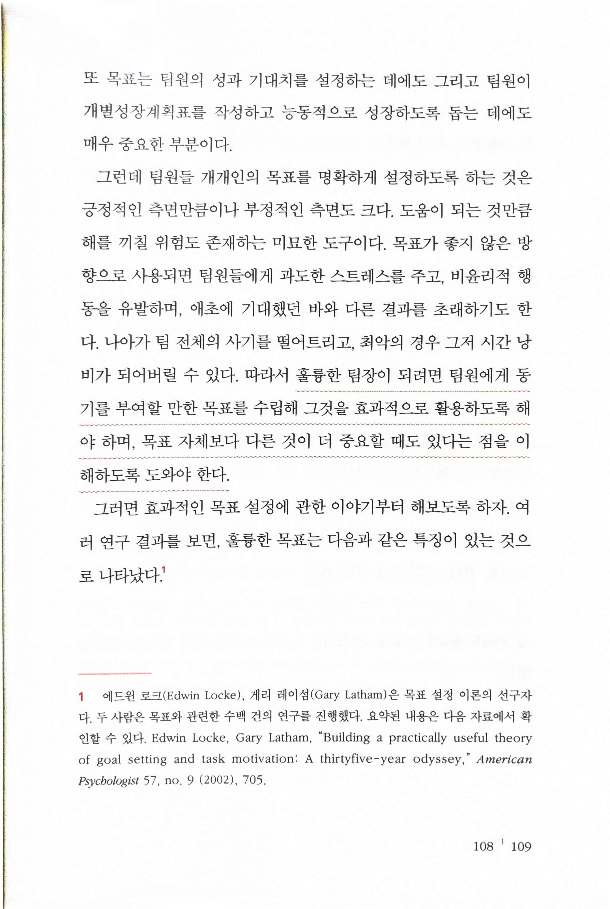

> 훌륭한 팀장이 되려면 팀원에게 동기를 부여할 만한 목표를 수립해 그것을 효과적으로 활용하도록 해야 하며, 목표 자체보다 다른 것이 더 중요할 때도 있다는 점을 이해하도록 도와야 한다.

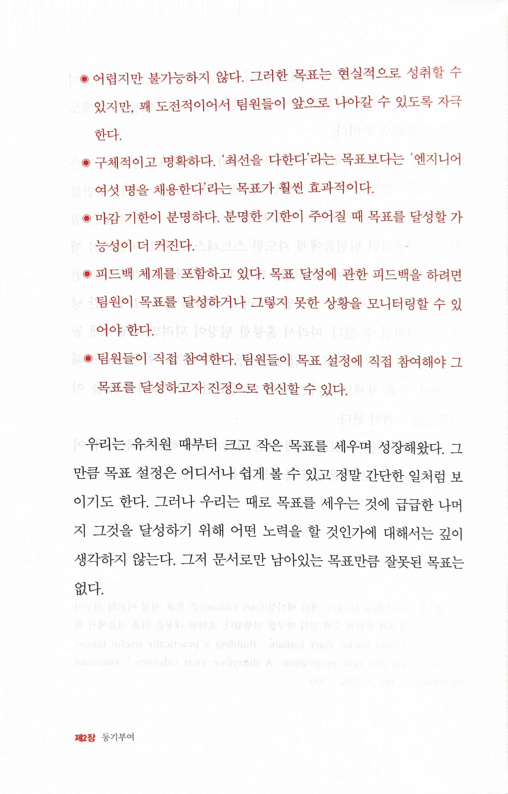

> ● 어렵지만 불가능하지 않다. 그러한 목표는 현실적으로 성취할 수 있지만, 꽤 도전적이어서 팀원들이 앞으로 나아갈 수 있도록 자극한다.
>
> ● 구체적이고 명확하다.
>
> ● 마감 기한이 분명하다. 분명한 기한이 주어질 때 목표를 달성할 가능성이 더 커진다.
>
> ● 피드백 체계를 포함하고 있다.
>
> ● 팀원들이 참여한다.
>
> 우리는 때로 목표를 세우는 것에 급급한 나머지 그것을 달성하기 위해 어떤 노력을 할 것인가에 대해서는 깊이 생각하지 않는다. 그저 문서로만 남아있는 목표만큼 잘못된 목표는 없다.

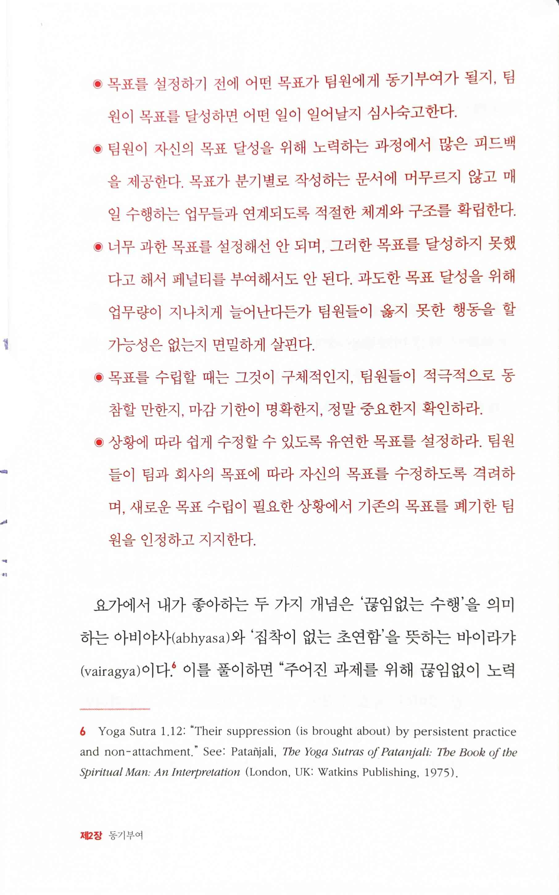

> 요가에서 내가 좋아하는 두 가지 개념은 '끊임없는 수행'을 의미하는 아비야사(abhyasa)와 '집착이 없는 초연함'을 뜻하는 바이라갸(vairagya)이다. 이를 풀이하면 "주어진 과제를 위해 끊임없이 노력하지만, 노력의 결과에 대해서는 집착하지 않는다"라는 의미이다. 다시 말해, 노력의 결과가 아닌 노력 그 자체를 지향해야 한다는 것이다. 기원전 400년의 요가 수행자들은 목표 설정과 관련햇 가장 중요한 이치를 이미 깨달았던 셈이다.

## 제8강 보상의 기준과 근거를 투명하게 공유하라
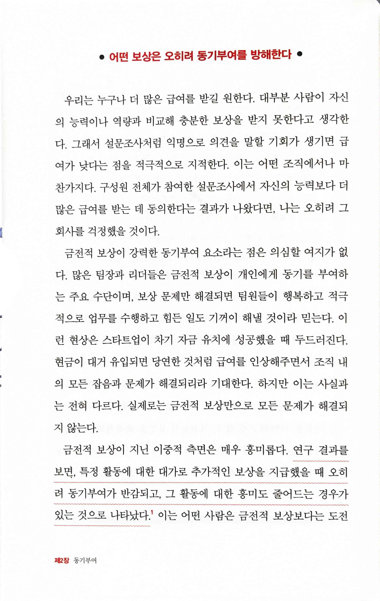

> 연구 결과를 보면, 특정 활동에 대한 대가로 추가적인 보상을 지급했을 때 오히려 동기부여가 반감되고, 그 활동에 대한 흥미도 줄어드는 경우가 있는 것으로 나타났다.

## 제9강 승진 절차와 직함을 가볍게 다루지 마라
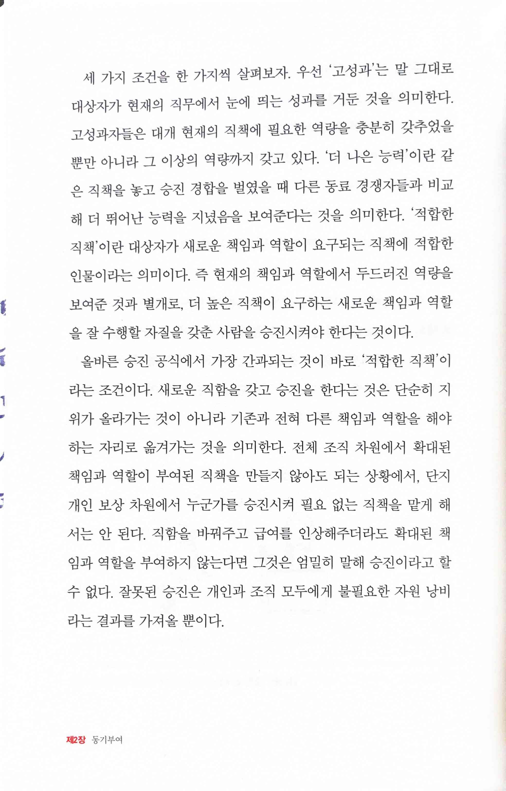

> 세 가지 조건을 한 가지씩 살펴보자. 우선 '고성과'는 말 그대로 대상자가 현재의 직무에서 눈에 띄는 성과를 거둔 것을 의미한다. 고성과자들은 대개 현재의 직책에 필요한 역량을 충분히 갖추었을 뿐만 아니라 그 이상의 역량까지 갖고 있다. '더 나은 능력'이란 같은 직책을 놓고 승진 경합을 벌였을 때 다른 동료 경쟁자들과 비교해 더 뛰어난 능력을 지녔음을 보여준다는 것을 의미한다. '적합한 직책'이란 대상자가 새로운 책임과 역할이 요구되는 직책에 적합한 인물이라는 의미이다. 즉 현재의 책임과 역할에서 두드러진 역량을 보여준 것과 별개로, 더 높은 직책이 요구하는 새로운 책임과 역할을 잘 수행할 자질을 갖춘 사람을 승진시켜야 한다는 것이다.
>
> 직함을 바꿔주고 급여를 인상해주더라도 확대된 책임과 역할을 부여하지 않는다면 그것은 엄밀히 말해 승진이라고 할 수 없다. 잘못된 승진은 개인과 조직 모두에게 불필요한 자원 낭비라는 결과를 가져올 뿐이다.

# 제3장 일의 의미

## 제10강 자기 업무에 대한 인식을 변화시켜라
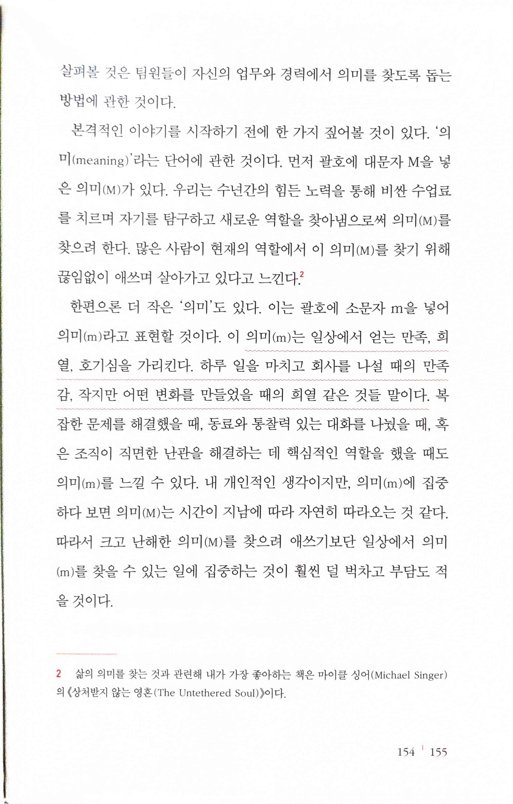

* Meaning & meaning

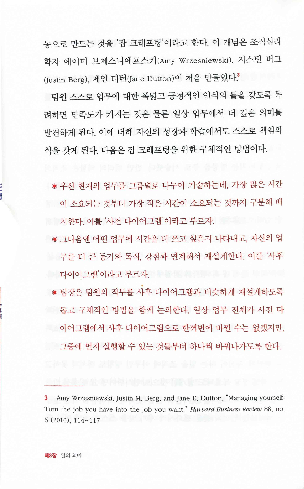

> '잡 크래프팅'이라고 한다. 이 개념은 조직심리학자 에이미 브제스니에프스키(Amy Wrzesniewski), 저스틴 버그(Justin Berg), 제인 더턴(Jane Dutton)이 처음 만들었다.
* Job crafting [Managing Yourself: Turn the Job You Have into the Job You Want](https://hbr.org/2010/06/managing-yourself-turn-the-job-you-have-into-the-job-you-want)
> 팀원 스스로 업무에 대한 폭넓고 긍정적인 인식의 틀을 갖도록 독려하면 만족도가 커지는 것은 물론 일상 업무에서 더 깊은 의미를발견하게 된다. 이에 더해 자신의 성장과 학습에서도 스스로 책임의식을 갖게 된다.

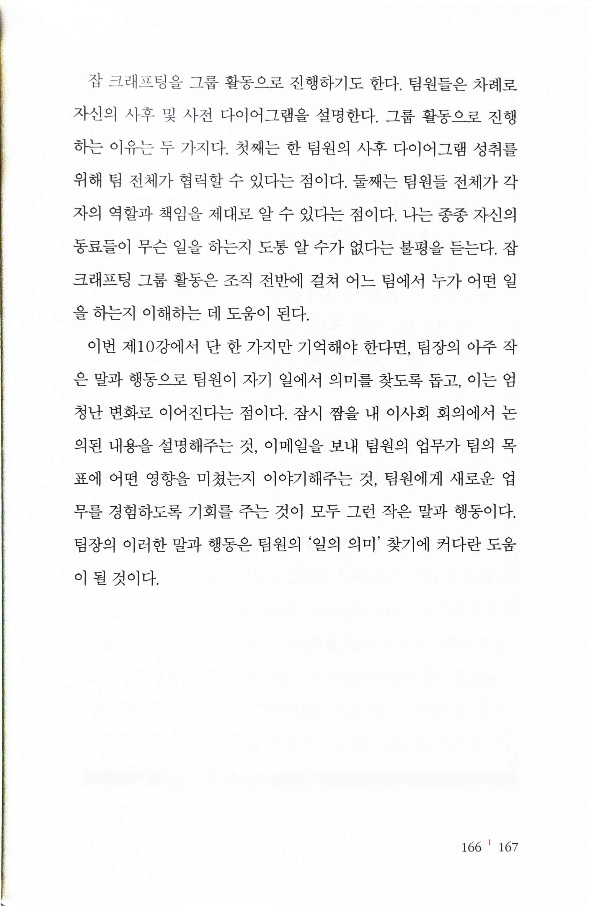

> 팀장의 아주 작은 말과 행동으로 팀원이 자기 일에서 의미를 찾도록 돕고, 이는 엄청난 변화로 이어진다는 점이다... 팀장의 이러한 말과 행동은 팀원의 '일의 의미' 찾기에 커다란 도움이 될 것이다.

## 제11강 감정을 억누르지 말고 현명하게 관리하라
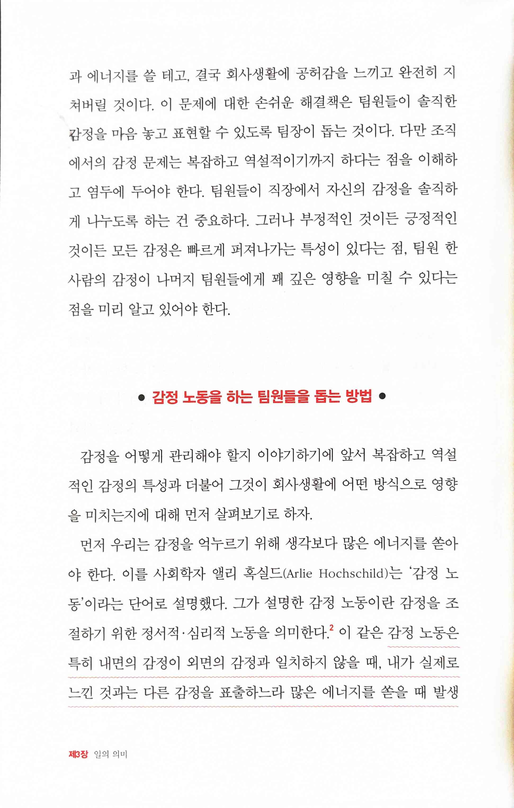

> 사회학자 앨리 혹실드(Arlie Hochschild)는 '감정 노동'이라는 단어로 설명했다. 그가 설명한 감정 노동이란 감정을 조절하기 위한 정서적·심리적 노동을 의미한다. 이 같은 감정 노동은 특히 내면의 감정이 외면의 감정과 일치하지 않을 때, 내가 실제로 느낀 것과는 다른 감정을 표출하느라 많은 에너지를 쏟을 때 발생한다.

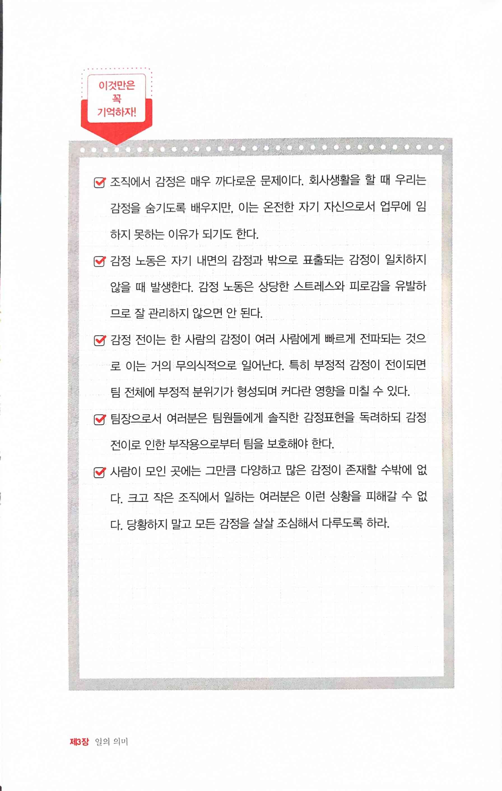

> ● 감정 전이는 한 사람의 감정이 여러 사람에게 빠르게 전파되는 것으로 이는 거의 무의식적으로 일어난다. 특히 부정적 감정이 전이되면팀 전체에 부정적 분위기가 형성되며 커다란 영향을 미칠 수 있다.
>
> ● 팀장으로서 여러분은 팀원들에게 솔직한 감정표현을 독려하되 감정전이로 인한 부작용으로부터 팀을 보호해야 한다.

## 제12강 의사소통은 빠르고 충분할수록 좋다
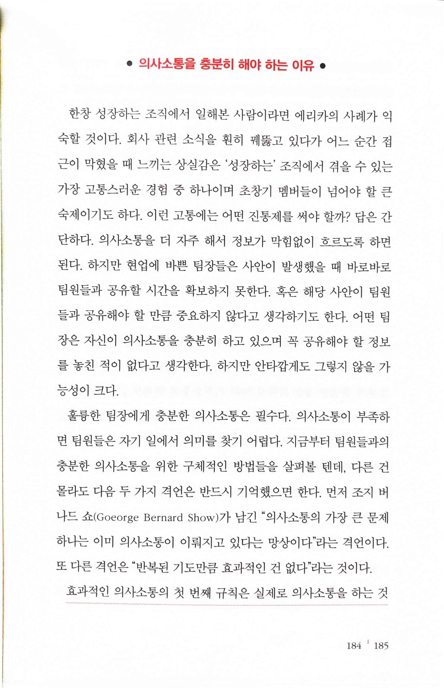

> 훌륭한 팀장에게 충분한 의사소통은 필수다. 의사소통이 부족하면 팀원들은 자기 일에서 의미를 찾기 어렵다... 조지 버나드 쇼(Goeorge Bernard Show)가 남긴 "의사소통의 가장 큰 문제 하나는 이미 의사소통이 이뤄지고 있다는 망상이다"라는 격언이다. 또 다른 격언은 "반복된 기도만큼 효과적인 건 없다"라는 것이다.

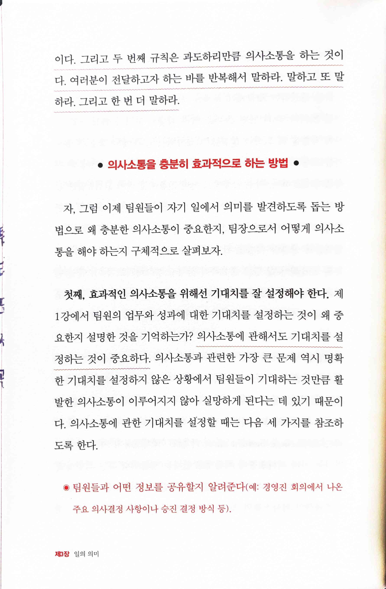 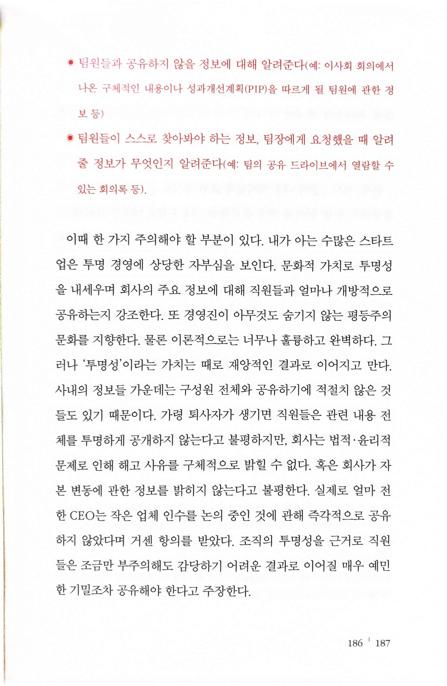 

> 효과적인 의사소통의 첫 번째 규칙은 실제로 의사소통을 하는 것이다. 그리고 두 번째 규칙은 과도하리만큼 의사소통을 하는 것이다. 여러분이 전달하고자 하는 바를 반복해서 말하라. 말하고 또 말하라. 그리고 한 번 더 말하라.
>
> 의사소통을 충분히 효과적으로 하는 방법
>
> 첫째, 효과적인 의사소통을 위해선 기대치를 잘 설정해야 한다. 제1강에서 팀원의 업무와 성과에 대한 기대치를 설정하는 것이 왜 중요한지 설명한 것을 기억하는가? 의사소통에 관해서도 기대치를 설정하는 것이 중요하다.
>
> 모든 정보가 의사소통 대상이 될 수는 없다는 점은 분명하다. 따라서 처음부터 기대치 설정을 명확하게 해두는 편이 낫다. 일부 정보는 의사소통 대상이 아니며, 조직 내 모든 정보를 투명하게 공개할 수 없다는 점을 분명히 하는 것이다.
>
> 둘째, 의사소통의 내용 못지않게 표현 방식도 중요하다. 똑같은 내용이라도 어떤 언어로 어떻게 전달하느냐가 중요하다는 의미다. 의사소통 언어를 잘 구사하는 팀장은 팀원들이 자신의 역할이 조직과 연결되어 있다고 느끼게 해주고 결과적으로 자기 일에서 큰 의미를 발견하도록 돕는다. 심리학자 니라 리버먼(Nira Liberman)과 야코프 트로프(Yaacov Trope)가 고안한 '해석수준이론(construal-level theory)'에 따르면, 우리가 특정 대상에 관해 말할 때 사용하는 언어가 구체적이냐 추상적이냐에 따라 그 대상에 대한 정서적 · 심리적 · 사회적 거리감이 달라진다.
* [Construal-Level Theory of Psychological Distance - PMC](https://www.ncbi.nlm.nih.gov/pmc/articles/PMC3152826/)

## 제13강 아름다운 질문으로 생각의 확장을 도와라
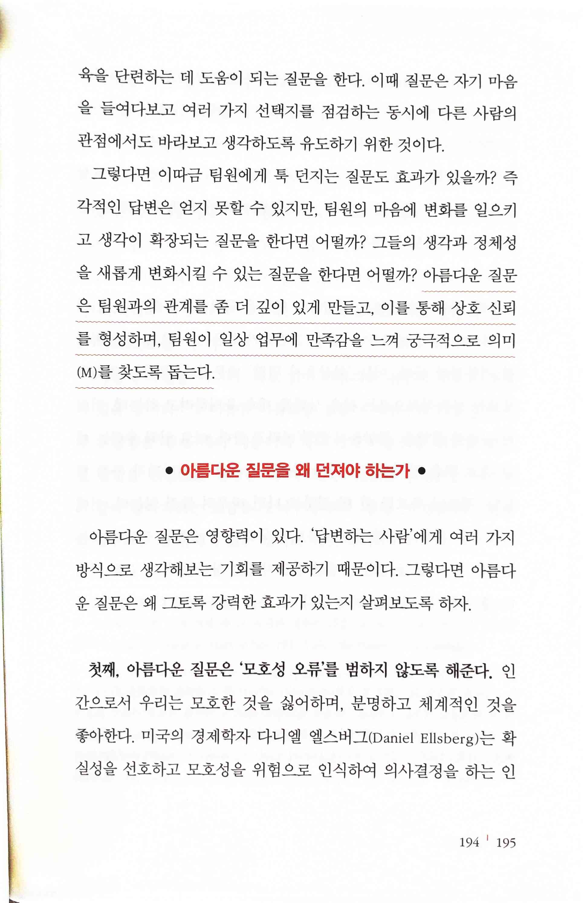 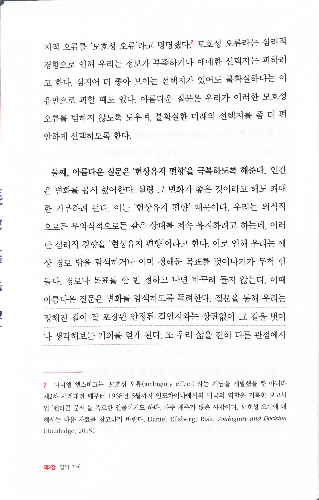 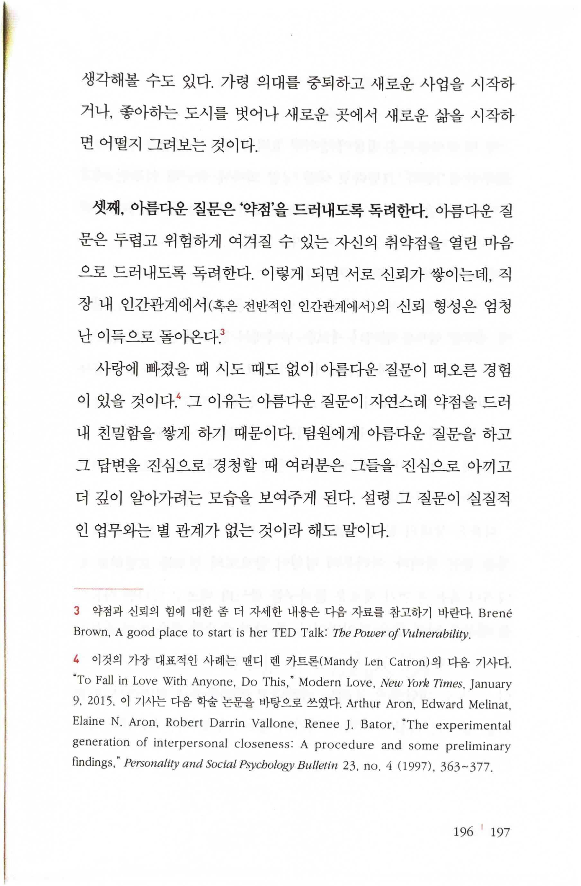

> 아름다운 질문을 왜 던져야 하는가
>
> 첫째, 아름다운 질문은 '모호성 오류'를 범하지 않도록 해준다. 인간으로서 우리는 모호한 것을 싫어하며, 분명하고 체계적인 것을 좋아한다. 미국의 경제학자 다니엘 엘스버그(Daniel Ellsberg)는 확실성을 선호하고 모호성을 위험으로 인식하여 의사결정을 하는 지적 오류를 '모호성 오류'라고 명명했다. 모호성 오류라는 심리적 경향으로 인해 우리는 정보가 부족하거나 애매한 선택지는 피하려고 한다. 심지어 더 좋아 보이는 선택지가 있어도 불확실하다는 이유만으로 피할 때도 있다.
>
> 둘째, 아름다운 질문은 '현상유지 편향'을 극복하도록 해준다... 우리는 의식적으로든 무의식 적으로든 같은 상태를 계속 유지하려고 하는데, 이러한 심리적 경향을 '현상유지 편향'이라고 한다. 이로 인해 우리는 예상 경로 밖을 탐색하거나 이미 정해둔 목표를 벗어나기가 무척 힘들다. 경로나 목표를 한 번 정하고 나면 바꾸려 들지 않는다. 이때 아름다운 질문은 변화를 탐색하도록 독려한다. 질문을 통해 우리는 정해진 길이 잘 포장된 안정된 길인지와는 상관없이 그 길을 벗어나 생각해보는 기회를 얻게 된다.
>
> 셋째, 아름다운 질문은 '약점'을 드러내도록 독려한다. 아름다운 질문은 두렵고 위험하게 여겨질 수 있는 자신의 취약점을 열린 마음으로 드러내도록 독려한다. 이렇게 되면 서로 신뢰가 쌓이는데, 직장 내 인간관계에서 (혹은 전반적인 인간관계에서의 신뢰 형성은 엄청난 이득으로 돌아온다.
* [Brené Brown: The power of vulnerability | TED Talk](https://www.ted.com/talks/brene_brown_the_power_of_vulnerability)
* [To Fall in Love With Anyone, Do This - The New York Times](https://www.nytimes.com/2015/01/11/style/modern-love-to-fall-in-love-with-anyone-do-this.html)
  * [The Experimental Generation of Interpersonal Closeness: A Procedure and Some Preliminary Findings - Arthur Aron, Edward Melinat, Elaine N. Aron, Robert Darrin Vallone, Renee J. Bator, 1997](https://journals.sagepub.com/doi/abs/10.1177/0146167297234003)

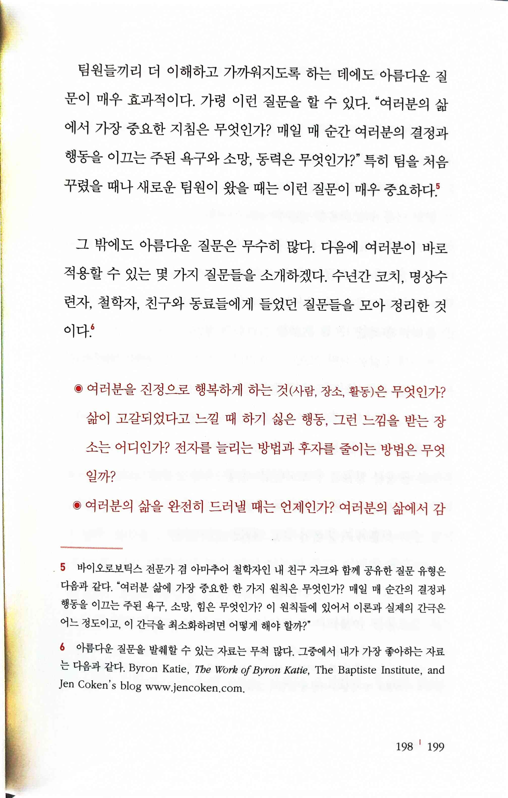

> 팀원들끼리 더 이해하고 가까워지도록 하는 데에도 아름다운 질문이 매우 효과적이다. 가령 이런 질문을 할 수 있다. "여러분의 삶에서 가장 중요한 지침은 무엇인가? 매일 매 순간 여러분의 결정과 행동을 이끄는 주된 욕구와 소망, 동력은 무엇인가?" 특히 팀을 처음 꾸렸을 때나 새로운 팀원이 왔을 때는 이런 질문이 매우 중요하다"

# 제4장 채용 및 해고

## 제14강 효과적인 채용을 위한 면접 절차를 수립하라
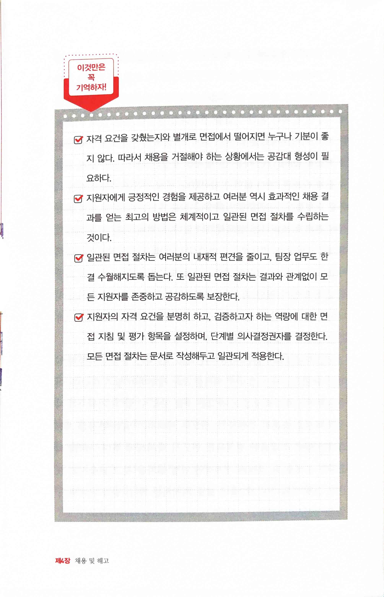

> ● 채용을 거절해야 하는 상황에서는 공감대 형성이 필요하다.
>
> ● 지원자에게 긍정적인 경험을 제공하고 여러분 역시 효과적인 채용 결과를 얻는 최고의 방법은 체계적이고 일관된 면접 절차를 수립하는 것이다.
>
> ● 일관된 면접 절차는 여러분의 내재적 편견을 줄이고, 팀장 업무도 한결 수월해지도록 돕는다. 또 일관된 면접 절차는 결과와 관계없이 모든 지원자를 존중하고 공감하도록 보장한다.
>
> ● 지원자의 자격 요건을 분명히 하고, 검증하고자 하는 역량에 대한 면접 지침 및 평가 항목을 설정하며, 단계별 의사결정권자를 결정한다. 모든 면접 절차는 문서로 작성해두고 일관되게 적용한다.

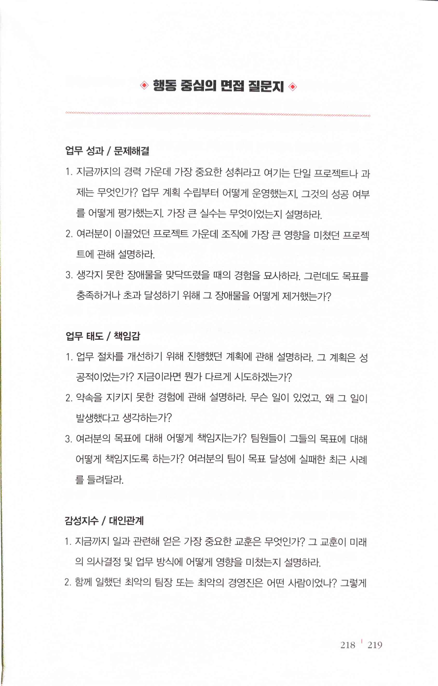 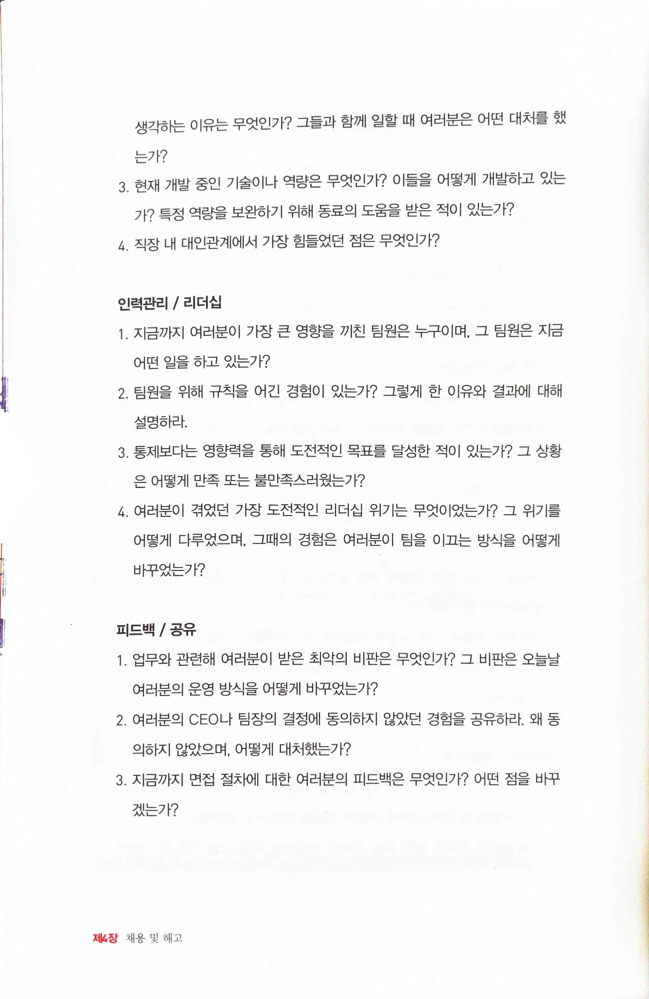 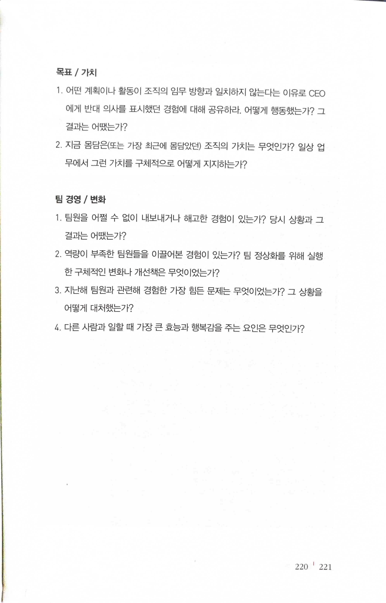

> 행동 중심의 면접 질문지

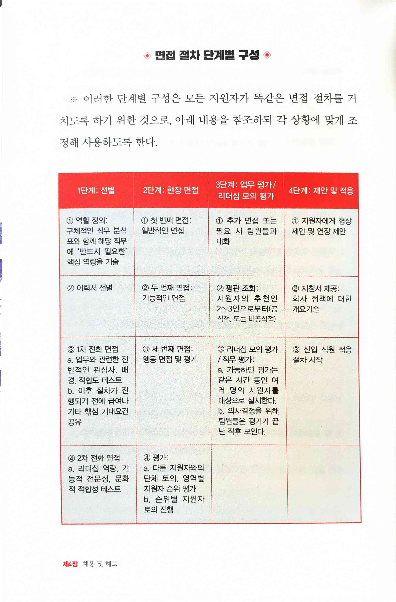

> 면접 절차 단계별 구성

## 제15강 면접 질문은 실제 행동에 초점을 맞춰라
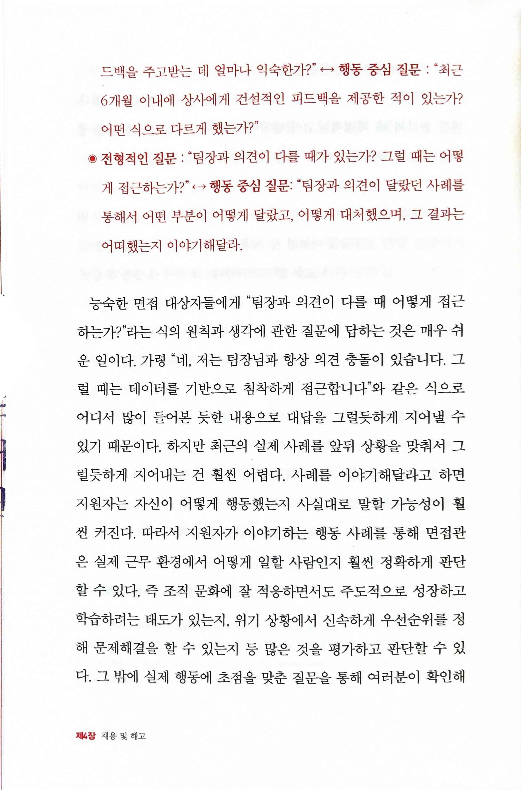

> 능숙한 면접 대상자들에게 ... 원칙과 생각에 관한 질문에 답하는 것은 매우 쉬운 일이다... 하지만 최근의 실제 사례를 앞뒤 상황을 맞춰서 그럴듯하게 지어내는 건 훨씬 어렵다. 사례를 이야기해달라고 하면 지원자는 자신이 어떻게 행동했는지 사실대로 말할 가능성이 훨씬 커진다. 따라서 지원자가 이야기하는 행동 사례를 통해 면접관은 실제 근무 환경에서 어떻게 일할 사람인지 훨씬 정확하게 판단할 수 있다. 즉 조직 문화에 잘 적응하면서도 주도적으로 성장하고 학습하려는 태도가 있는지, 위기 상황에서 신속하게 우선순위를 정해 문제해결을 할 수 있는지 등 많은 것을 평가하고 판단할 수 있다.

## 제16강 신규 입사자의 조직 적응을 체계적으로 도와라
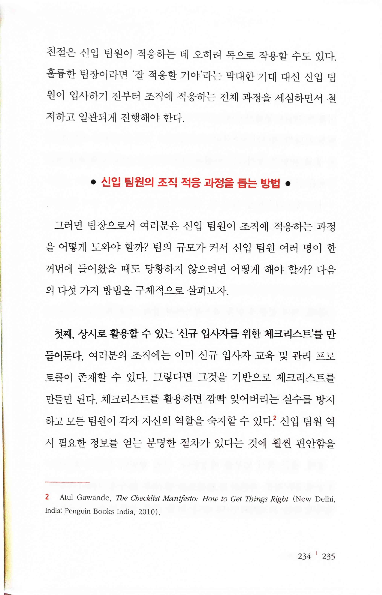

> 훌륭한 팀장이라면 잘 적응할 거야'라는 막대한 기대 대신 신입 팀원이 입사하기 전부터 조직에 적응하는 전체 과정을 세심하면서 철저하고 일관되게 진행해야 한다.
>
> 체크리스트를 활용하면 깜빡 잊어버리는 실수를 방지하고 모든 팀원이 각자 자신의 역할을 숙지할 수 있다.
* [The Checklist Manifesto: How to Get Things Right: Gawande, Atul: 9780312430009: Amazon.com: Books](https://www.amazon.com/Checklist-Manifesto-How-Things-Right/dp/0312430000)

## 제17강 퇴사 문제는 최대한 관대하면서 신속하게 처리하라
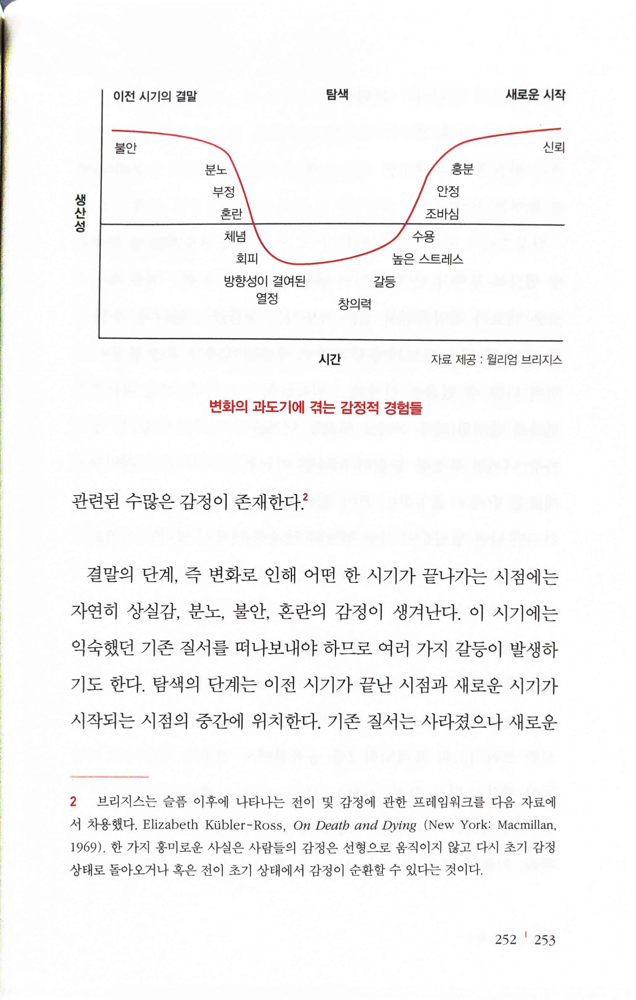

> 변화의 과도기에 겪는 감정적 경험들
* Elizabeth Kübler-Ross, On Death and Dying (New York: Macmillan, 1969) [kubler-ross.pdf](https://www.psy.lmu.de/allg2/download/audriemmo/ws1011/kubler-ross.pdf)
> 흥미로운 사실은 사람들의 감정은 선형으로 움직이지 않고 다시 초기 감정상태로 돌아오거나 혹은 전이 초기 상태에서 감정이 순환할 수 있다는 것이다.

# 제5장 팀 역학

## 제18강 탁월한 팀을 만드는 세 가지 핵심 요건을 관리하라
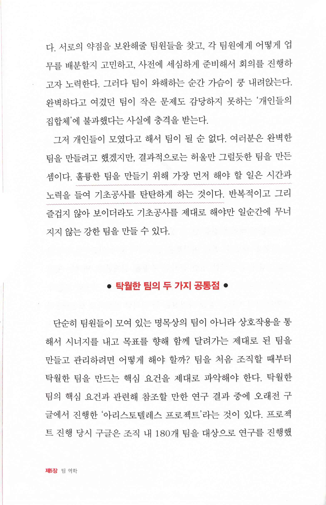

> 훌륭한 팀을 만들기 위해 가장 먼저 해야 할 일은 시간과 노력을 들여 기초공사를 탄탄하게 하는 것이다. 반복적이고 그리 즐겁지 않아 보이더라도 기초공사를 제대로 해야만 일순간에 무너지지 않는 강한 팀을 만들 수 있다.
 
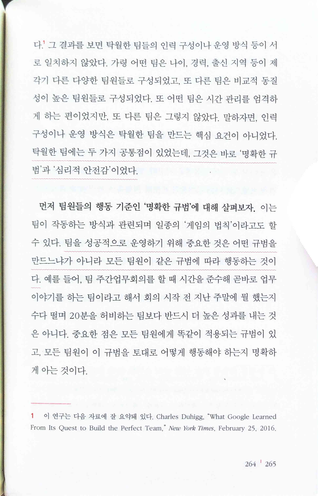 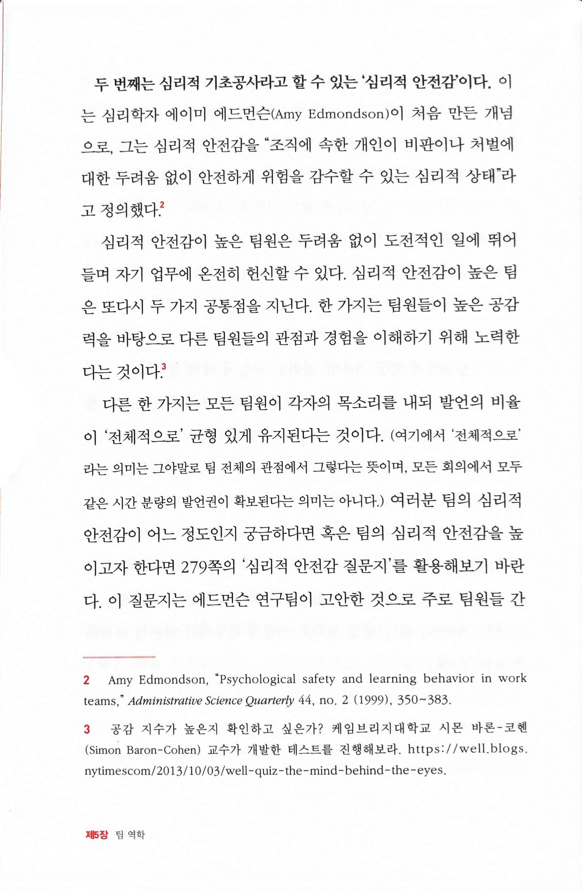

> 탁월한 팀의 두 가지 공통점 
>
> 인력구성이나 운영 방식은 탁월한 팀을 만드는 핵심 요건이 아니었다. 탁월한 팀에는 두 가지 공통점이 있었는데, 그것은 바로 '명확한 규범'과 '심리적 안전감'이었다.
* 아리스토텔레스 프로젝트 [What Google Learned From Its Quest to Build the Perfect Team - The New York Times](https://www.nytimes.com/2016/02/28/magazine/what-google-learned-from-its-quest-to-build-the-perfect-team.html)
>
> '명확한 규범'... 팀을 성공적으로 운영하기 위해 중요한 것은 어떤 규범을 만드느냐가 아니라 모든 팀원이 같은 규범에 따라 행동하는 것이다.
>
> 두 번째는 심리적 기초공사라고 할 수 있는 '심리적 안전감'이다. 이는 심리학자 에이미 에드먼슨(Amy Edmondson)이 처음 만든 개념으로, 그는 심리적 안전감을 조직에 속한 개인이 비판이나 처벌에 대한 두려움 없이 안전하게 위험을 감수할 수 있는 심리적 상태"라고 정의했다.
* [Psychological Safety and Learning Behavior in Work Teams](https://web.mit.edu/curhan/www/docs/Articles/15341_Readings/Group_Performance/Edmondson%20Psychological%20safety.pdf)
> 심리적 안전감이 높은 팀원은 두려움 없이 도전적인 일에 뛰어들며 자기 업무에 온전히 헌신할 수 있다... 팀원들이 높은 공감력을 바탕으로 다른 팀원들의 관점과 경험을 이해하기 위해 노력한다는 것이다.
>
> 다른 한 가지는 모든 자의 목소리를 내되 발언의 비율이 '전체적으로' 균형 있게 유지된다는 것이다.

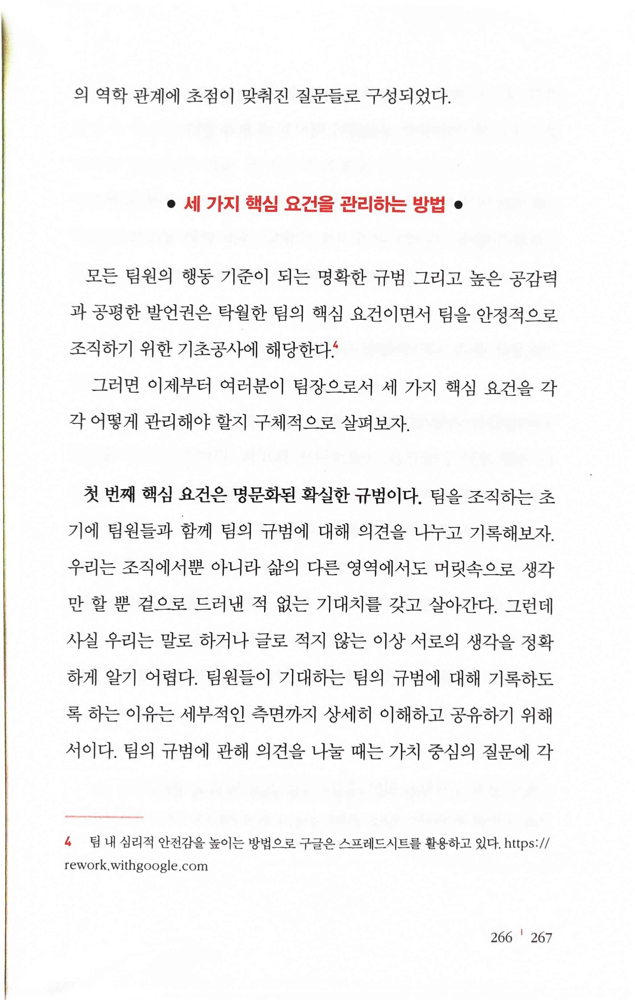

> 모든 팀원의 행동 기준이 되는 명확한 규범 그리고 높은 공감력과 공평한 발언권은 탁월한 팀의 핵심 요건이면서 팀을 안정적으로 조직하기 위한 기초공사에 해당한다.
* 팀 내 심리적 안전감을 높이는 방법으로 구글은 스프레드시트를 활용하고 있다. [re:Work](https://rework.withgoogle.com/)

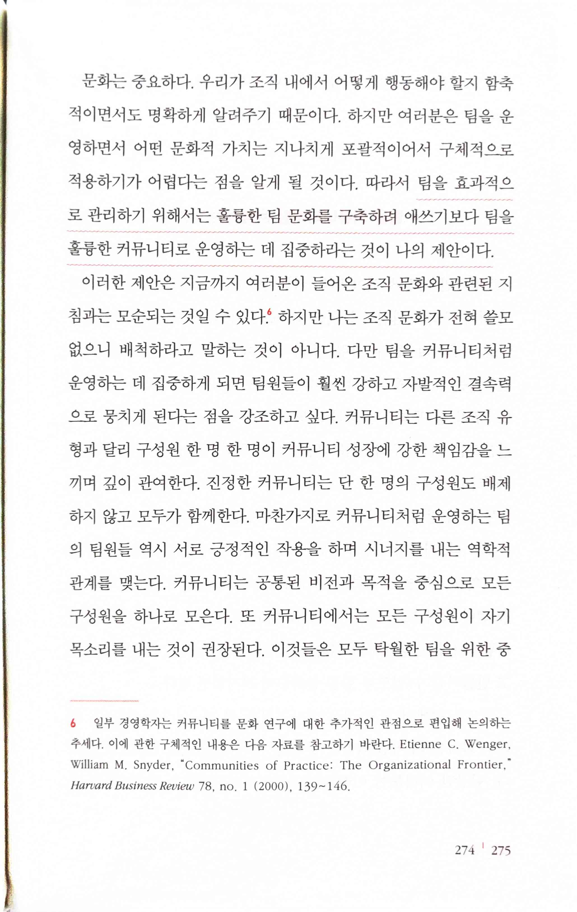

> 문화는 중요하다. 우리가 조직 내에서 어떻게 행동해야 할지 함축적이면서도 명확하게 알려주기 때문이다. 하지만 여러분은 팀을 운영하면서 어떤 문화적 가치는 지나치게 포괄적이어서 구체적으로 적용하기가 어렵다는 점을 알게 될 것이다. 따라서 팀을 효과적으로 관리하기 위해서는 훌륭한 팀 문화를 구축하려 애쓰기보다 팀을 훌륭한 커뮤니티로 운영하는 데 집중하라는 것이 나의 제안이다.
* 이 책을 읽으면서 가장 흥미로운 부분이었다. 호로위츠의 [최강의 조직](https://nymets.medium.com/%EC%B5%9C%EA%B0%95%EC%9D%98-%EC%A1%B0%EC%A7%81-394ccd294df8)에 대해서는 어떻게 생각했을까?
> 조직 문화가 전혀 쓸모없으니 배척하라고 말하는 것이 아니다. 다만 팀을 커뮤니티처럼 운영하는 데 집중하게 되면 팀원들이 훨씬 강하고 자발적인 결속력으로 뭉치게 된다는 점을 강조하고 싶다.

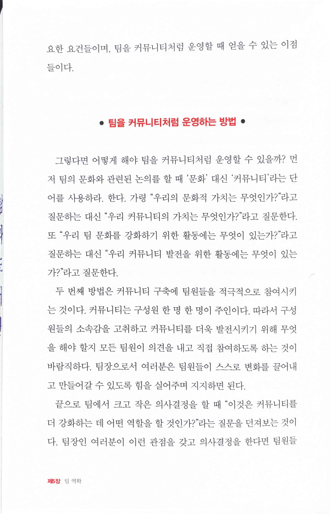 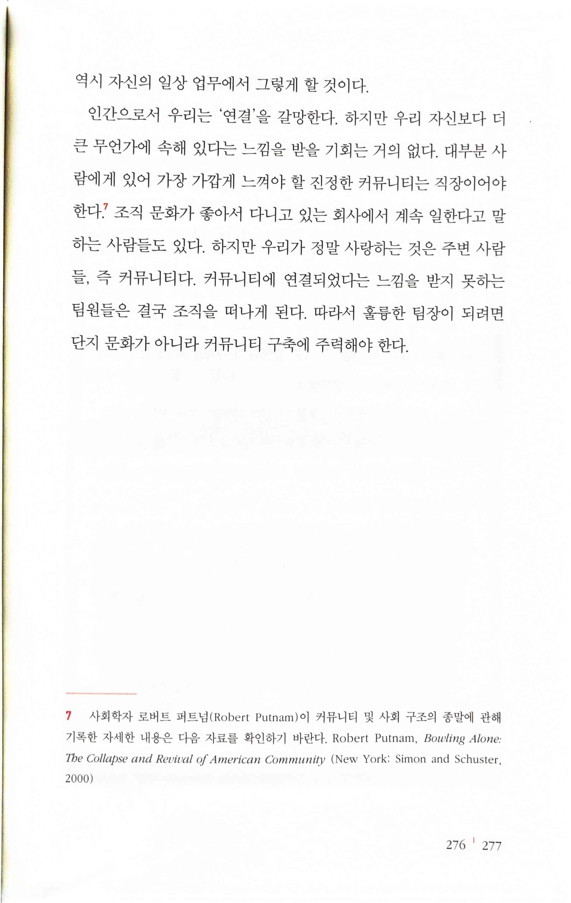

> 팀을 커뮤니티처럼 운영하는 방법
>
> 팀의 문화와 관련된 논의를 할 때 '문화' 대신 '커뮤니티'라는 단어를 사용하라.
>
> 두 번째 방법은 커뮤니티 구축에 팀원들을 적극적으로 참여시키는 것이다.
>
> 끝으로 팀에서 크고 작은 의사결정을 할 때 "이것은 커뮤니티를 더 강화하는 데 어떤 역할을 할 것인가?"라는 질문을 던져보는 것이다.
>
> 인간으로서 우리는 '연결'을 갈망한다. 하지만 우리 자신보다 더 큰 무언가에 속해 있다는 느낌을 받을 기회는 거의 없다. 대부분 사람에게 있어 가장 가깝게 느껴야 할 진정한 커뮤니티는 직장이어야 한다. 조직 문화가 좋아서 다니고 있는 회사에서 계속 일한다고 말하는 사람들도 있다. 하지만 우리가 정말 사랑하는 것은 주변 사람들, 즉 커뮤니티다. 커뮤니티에 연결되었다는 느낌을 받지 못하는 팀원들은 결국 조직을 떠나게 된다. 따라서 훌륭한 팀장이 되려면 단지 문화가 아니라 커뮤니티 구축에 주력해야 한다.
* 회사가 싫어서가 아니라 주변인, 팀장 등이 싫어서 떠나는 경우가 더 많다는 걸 보면 어느 정도 맞는 말로 보인다.
* 사회학자 로버트 퍼트넘(Robert Putnam)의 커뮤니티 및 사회 구조의 종말에 관한 기록 [Putnam, R. D. (2000). Bowling Alone: The Collapse and Revival of American Community. New York: Simon & Schuster | socialcapitalgateway.org](https://www.socialcapitalgateway.org/content/book/putnam-r-d-2000-bowling-alone-collapse-and-revival-american-community-new-york-simon-sc)

## 제19강 자유롭게 자기 목소리를 내는 문화를 만들어라
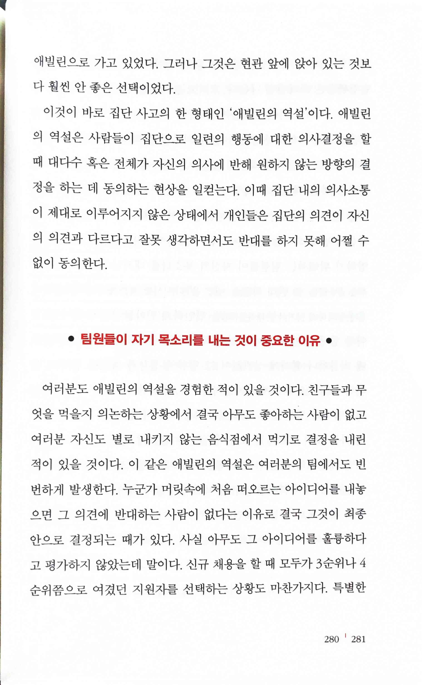

> 이것이 바로 집단 사고의 한 형태인 '애빌린의 역설'이다. 애빌린의 역설은 사람들이 집단으로 일련의 행동에 대한 의사결정을 할때 대다수 혹은 전체가 자신의 의사에 반해 원하지 않는 방향의 결정을 하는 데 동의하는 현상을 일컫는다. 이때 집단 내의 의사소통이 제대로 이루어지지 않은 상태에서 개인들은 집단의 의견이 자신의 의견과 다르다고 잘못 생각하면서도 반대를 하지 못해 어쩔 수없이 동의한다.

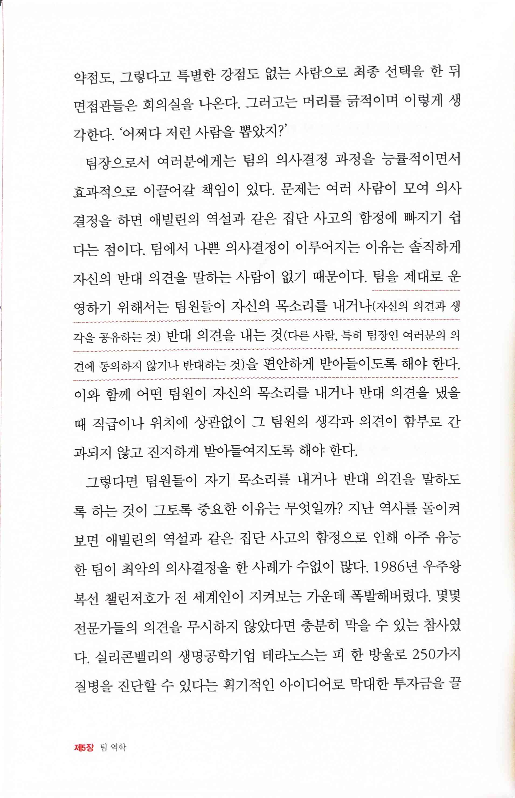

> 팀을 제대로 운영하기 위해서는 팀원들이 자신의 목소리를 내거나(자신의 의견과 생각을 공유하는 것) 반대 의견을 내는 것(다른 사람, 특히 팀장인 여러분의 의견에 동의하지 않거나 반대하는 것)을 편안하게 받아들이도록 해야 한다. 이와 함께 어떤 팀원이 자신의 목소리를 내거나 반대 의견을 냈을 때 직급이나 위치에 상관없이 그 팀원의 생각과 의견이 함부로 간과되지 않고 진지하게 받아들여지도록 해야 한다.

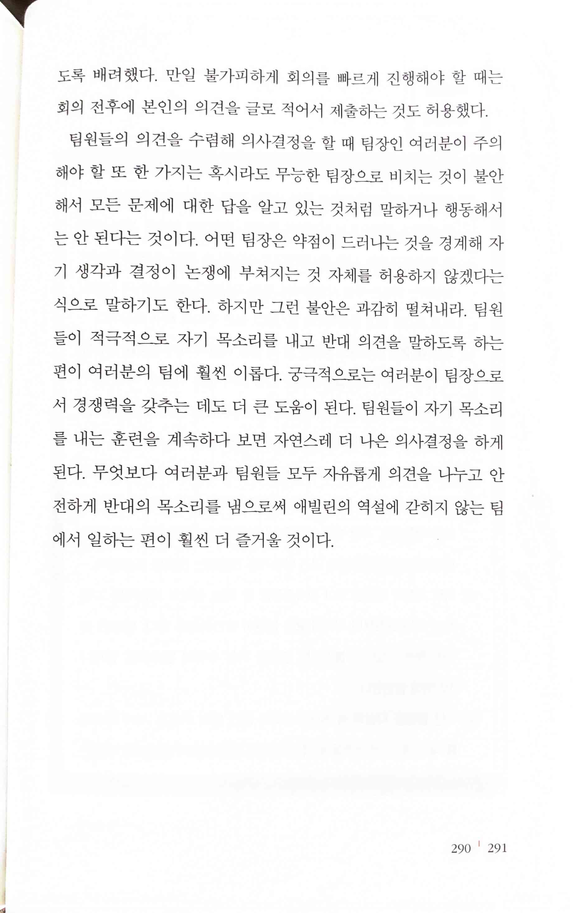

> 팀원들의 의견을 수렴해 의사결정을 할 때 팀장인 여러분이 주의해야 할 또 한 가지는 혹시라도 무능한 팀장으로 비치는 것이 불안해서 모든 문제에 대한 답을 알고 있는 것처럼 말하거나 행동해서는 안 된다는 것이다. 어떤 팀장은 약점이 드러나는 것을 경계해 자기 생각과 결정이 논쟁에 부쳐지는 것 자체를 허용하지 않겠다는식으로 말하기도 한다. 하지만 그런 불안은 과감히 떨쳐내라. 팀원들이 적극적으로 자기 목소리를 내고 반대 의견을 말하도록 하는 편이 여러분의 팀에 훨씬 이롭다. 궁극적으로는 여러분이 팀장으로서 경쟁력을 갖추는 데도 더 큰 도움이 된다. 팀원들이 자기 목소리를 내는 훈련을 계속하다 보면 자연스레 더 나은 의사결정을 하게된다. 무엇보다 여러분과 팀원들 모두 자유롭게 의견을 나누고 안전하게 반대의 목소리를 냄으로써 애빌린의 역설에 갇히지 않는 팀에서 일하는 편이 훨씬 더 즐거울 것이다.

## 제20강 갈등을 생산적인 상호작용으로 전환하라

> 갈등은 부정적인 것이라는 인식이 많지만 사실 갈등 자체는 나쁜 것도 좋은 것도 아니다... 하지만 우리가 어떻게 관리하느냐에 따라 갈등이 오히려 생산적인 작용을 하기도 한다.

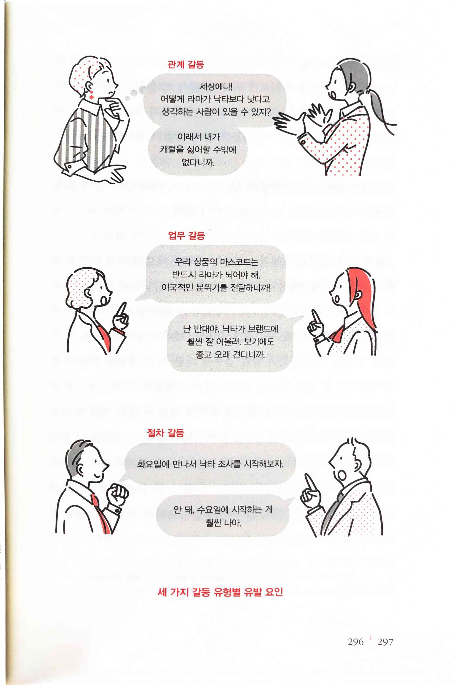

> 관계 갈등, 업무 갈등, 절차 갈등

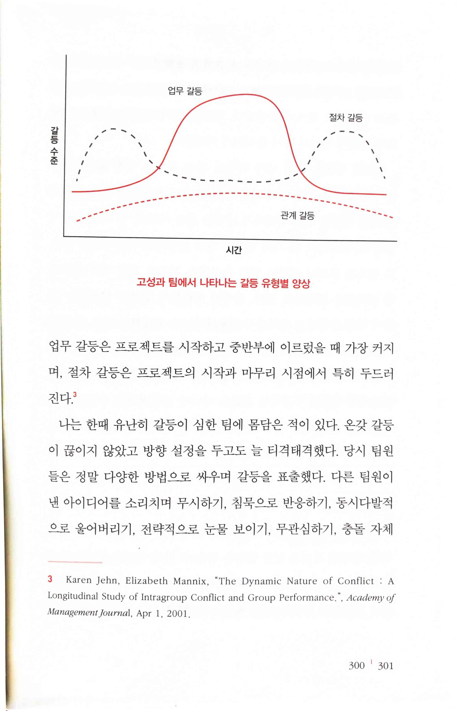

> 고성과 팀에서 나타나는 갈등 유형별 양상
* [(PDF) The Dynamic Nature of Conflict: A Longitudinal Study of Intragroup Conflict and Group Performance](https://www.researchgate.net/publication/243769205_The_Dynamic_Nature_of_Conflict_A_Longitudinal_Study_of_Intragroup_Conflict_and_Group_Performance)

## 제21강 회의 참석자를 신중하게 선정하라
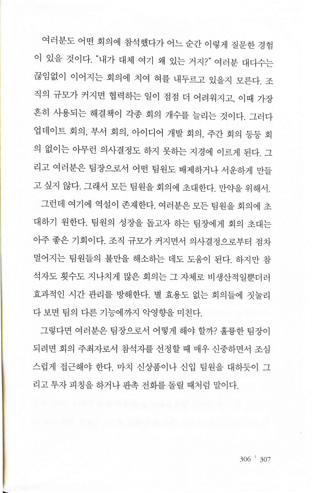

> 훌륭한 팀장이 되려면 회의 주최자로서 참석자를 선정할 때 매우 신중하면서 조심스럽게 접근해야 한다. 마치 신상품이나 신입 팀원을 대하듯이 그리고 투자 피칭을 하거나 판촉 전화를 돌릴 때처럼 말이다.

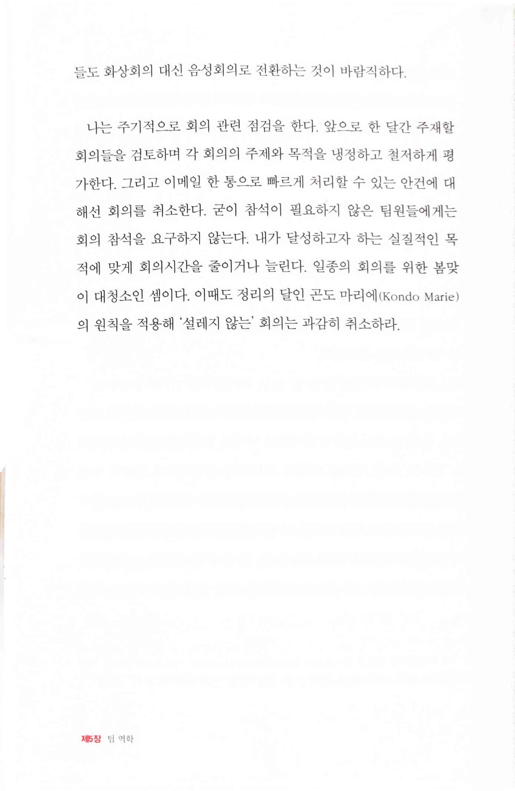

> 정리의 달인 곤도 마리에 (Kondo Marie)의 원칙을 적용해 '설레지 않는' 회의는 과감히 취소하라.

# 제6장 자기경영
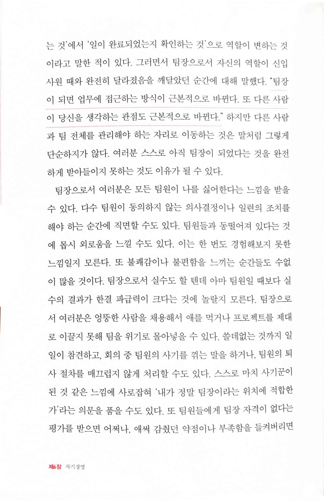 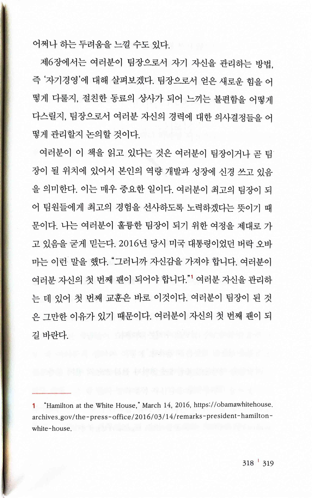

> “팀장이 되면 업무에 접근하는 방식이 근본적으로 바뀐다. 또 다른 사람이 당신을 생각하는 관점도 근본적으로 바뀐다."
>
> 2016년 당시 미국 대통령이었던 버락 오바마는 이런 말을 했다. "그러니까 자신감을 가져야 합니다. 여러분이 여러분 자신의 첫 번째 팬이 되어야 합니다." 여러분 자신을 관리하는 데 있어 첫 번째 교훈은 바로 이것이다. 여러분이 팀장이 된 것은 그만한 이유가 있기 때문이다. 여러분이 자신의 첫 번째 팬이 되길 바란다.
* [Remarks by the President at "Hamilton at the White House" | whitehouse.gov](https://obamawhitehouse.archives.gov/the-press-office/2016/03/14/remarks-president-hamilton-white-house)

## 제22강 약점을 드러냄으로써 신뢰를 쌓아라
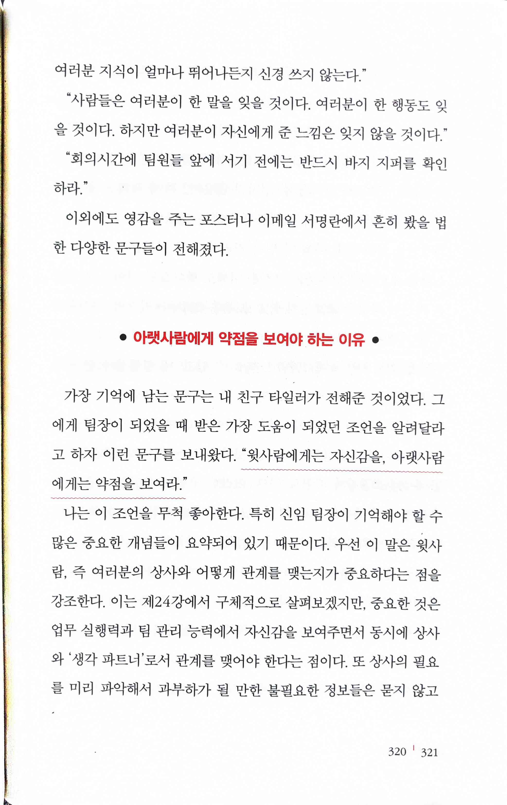 

> "윗사람에게는 자신감을, 아랫사람에게는 약점을 보여라."
>
> 업무 실행력과 팀 관리 능력에서 자신감을 보여주면서 동시에 상사와 '생각 파트너'로서 관계를 맺어야 한다는 점이다. 또 상사의 필요를 미리 파악해서 과부하가 될 만한 불필요한 정보들은 묻지 않고도 미리 걸러낼 수 있을 만큼의 전문가가 되어야 한다. 그것이 상사에게 보여야 할 자신감이다.
>
> 사람들은 자신이 무엇을 모르는지 알고, 도움을 청할 수 있으며, 자신들의 말에 기꺼이 귀 기울여주는 리더를 원한다. 팀원들에게 지나친 자신감을 내세우면 독재자처럼 느껴질 수 있고, 내 경험상 이런 유형의 팀장은 언젠가는 도태되고 만다.
>
> 약점을 드러냄으로써 여러분은 신뢰를 얻을 수 있다. 신뢰는 의사소통의 질을 높이고 부정적인 유형의 갈등을 줄여주는 마법 수프이다. 팀원들이 커뮤니티에 소속된 것처럼 느끼게 하고, 심리적 안전감을 주어 위험을 감수하도록 하는 등 팀원들이 어떤 일이든 더 잘하게 만들어주는 마법 수프 말이다.

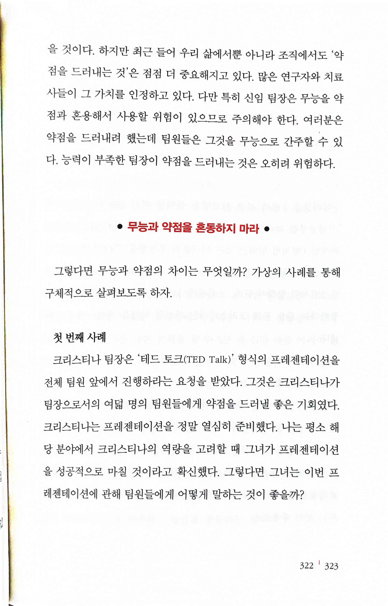

> 다만 특히 신임 팀장은 무능을 약점과 혼용해서 사용할 위험이 있으므로 주의해야 한다. 여러분은 약점을 드러내려 했는데 팀원들은 그것을 무능으로 간주할 수 있다. 능력이 부족한 팀장이 약점을 드러내는 것은 오히려 위험하다.

## 제23강 권한을 팀원의 성장을 돕는 데 사용하라

## 제24강 상사의 성공을 돕는 파트너가 되어라
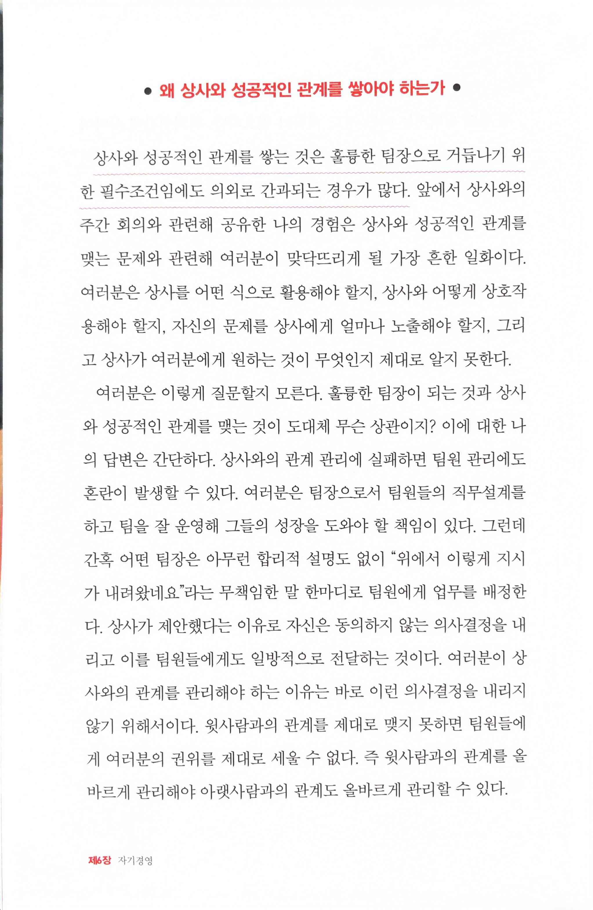

> 상사와 성공적인 관계를 쌓는 것은 훌륭한 팀장으로 거듭나기 위한 필수조건임에도 의외로 간과되는 경우가 많다.
>
> 윗사람과의 관계를 제대로 맺지 못하면 팀원들에게 여러분의 권위를 제대로 세울 수 없다. 즉 윗사람과의 관계를 올바르게 관리해야 아랫사람과의 관계도 올바르게 관리할 수 있다.

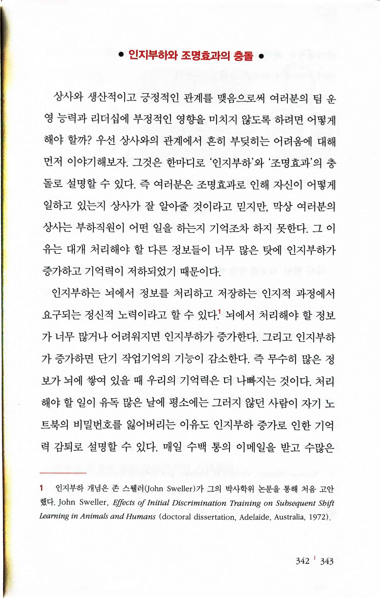 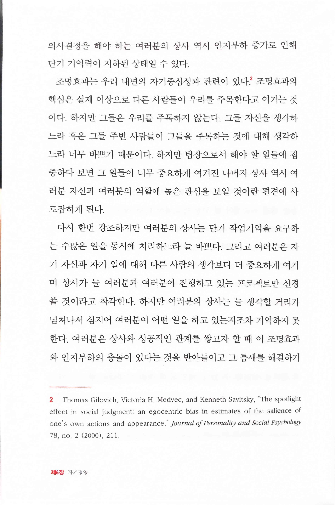

> 우선 상사와의 관계에서 흔히 부딪히는 어려움은 한마디로 '인지부하'와 '조명효과'의 충돌로 설명할 수 있다.
>
> 인지부하는 뇌에서 정보를 처리하고 저장하는 인지적 과정에서 요구되는 정신적 노력이라고 할 수 있다.
* 인지부하 개념은 존 스웰러(John Sweller)가 그의 박사학위 논문을 통해 처음 고안 [Adelaide Research & Scholarship: Effects of initial discrimination training on subsequent shift learning in animals and humans](https://digital.library.adelaide.edu.au/dspace/handle/2440/20426)
> 조명효과는 우리 내면의 자기중심성과 관련이 있다. 조명효과의 핵심은 실제 이상으로 다른 사람들이 우리를 주목한다고 여기는 것이다.
* [(PDF) The Spotlight Effect in Social Judgment: An Egocentric Bias in Estimates of the Salience of One's Own Actions and Appearance](https://www.researchgate.net/publication/12609065_The_Spotlight_Effect_in_Social_Judgment_An_Egocentric_Bias_in_Estimates_of_the_Salience_of_One's_Own_Actions_and_Appearance)

 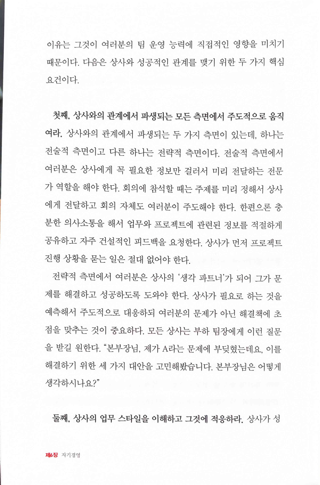 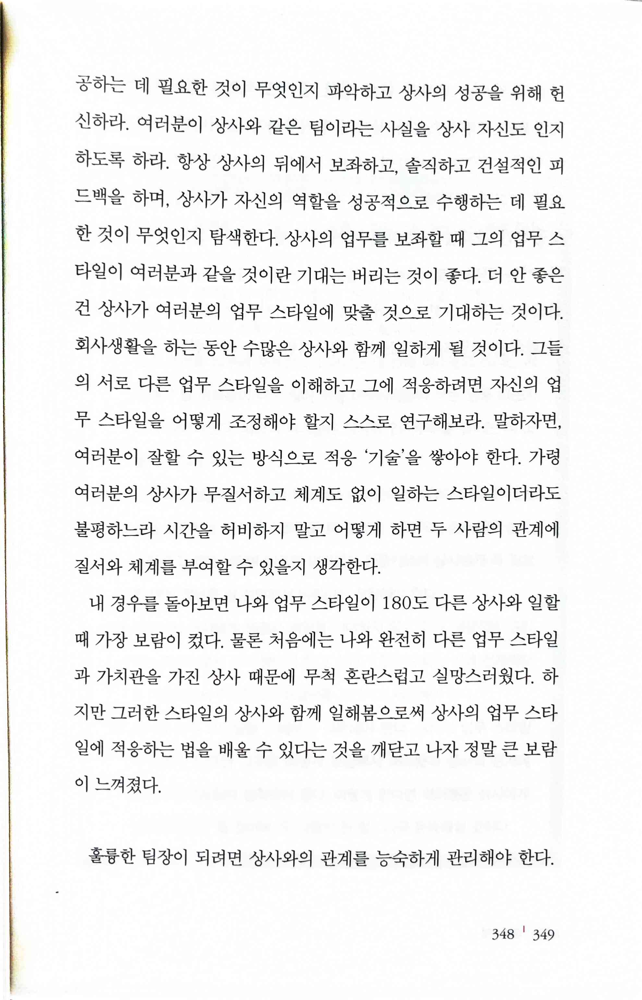

> 상사와의 성공적인 관계를 위한 핵심 요건
>
> 첫째, 상사와의 관계에서 파생되는 모든 측면에서 주도적으로 움직여라... 전술적 측면에서 여러분은 상사에게 꼭 필요한 정보만 걸러서 미리 전달하는 전문가 역할을 해야 한다... 상사가 먼저 프로젝트 진행 상황을 묻는 일은 절대 없어야 한다.
>
> 전략적 측면에서 여러분은 상사의 '생각 파트너'가 되어 그가 문제를 해결하고 성공하도록 도와야 한다. 상사가 필요로 하는 것을 예측해서 주도적으로 대응하되 여러분의 문제가 아닌 해결책에 초점을 맞추는 것이 중요하다.
>
> 둘째, 상사의 업무 스타일을 이해하고 그것에 적응하라... 상사의 업무를 보좌할 때 그의 업무 스타일이 여러분과 같을 것이란 기대는 버리는 것이 좋다. 더 안 좋은 건 상사가 여러분의 업무 스타일에 맞출 것으로 기대하는 것이다.

## 제25강 이직은 신중하게 결정해야 한다
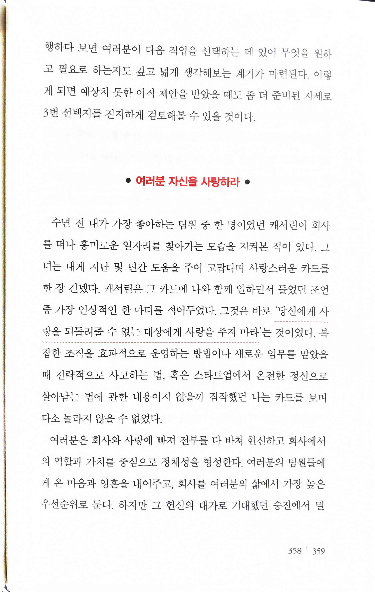

> 여러분 자신을 사랑하라
>
> '당신에게 사랑을 되돌려줄 수 없는 대상에게 사랑을 주지 마라'

# 감사의 말
