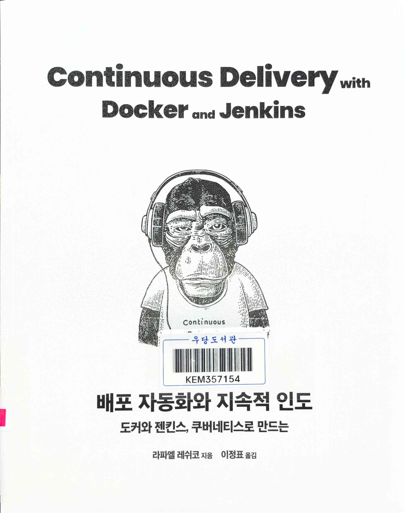
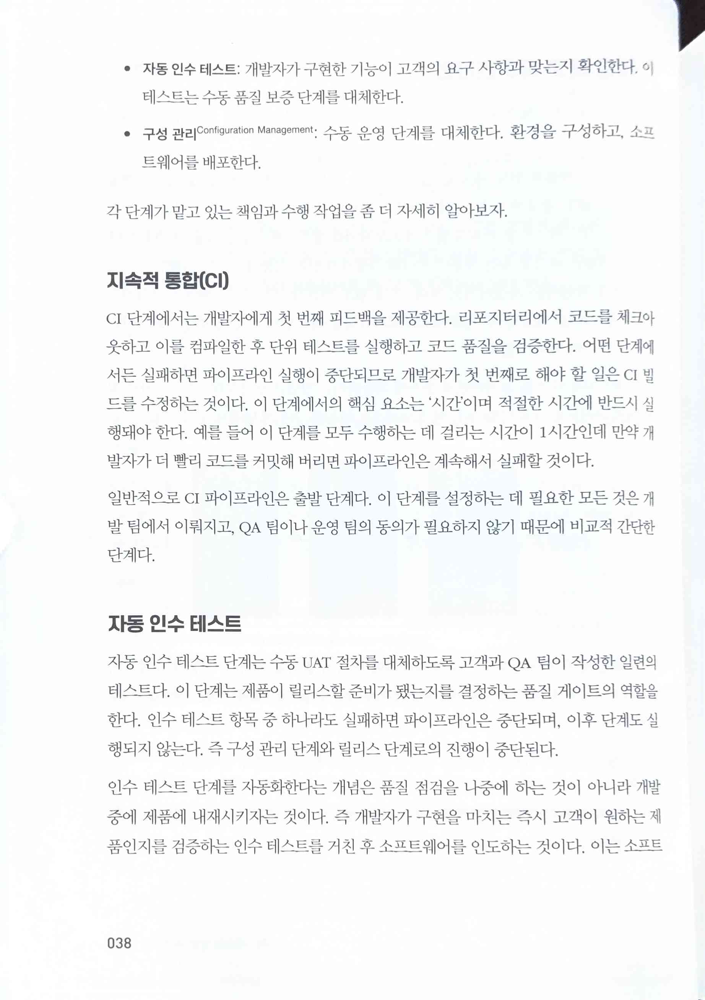
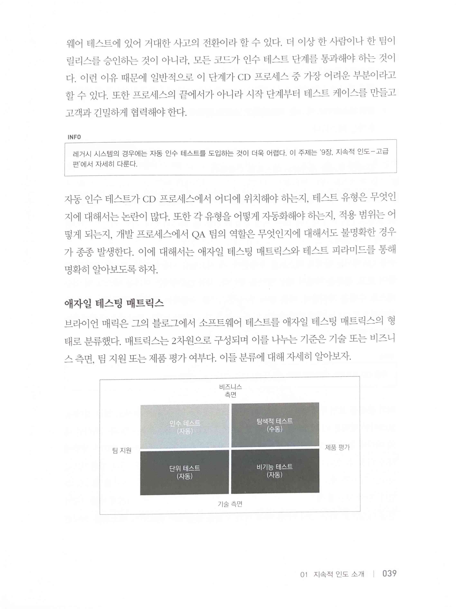
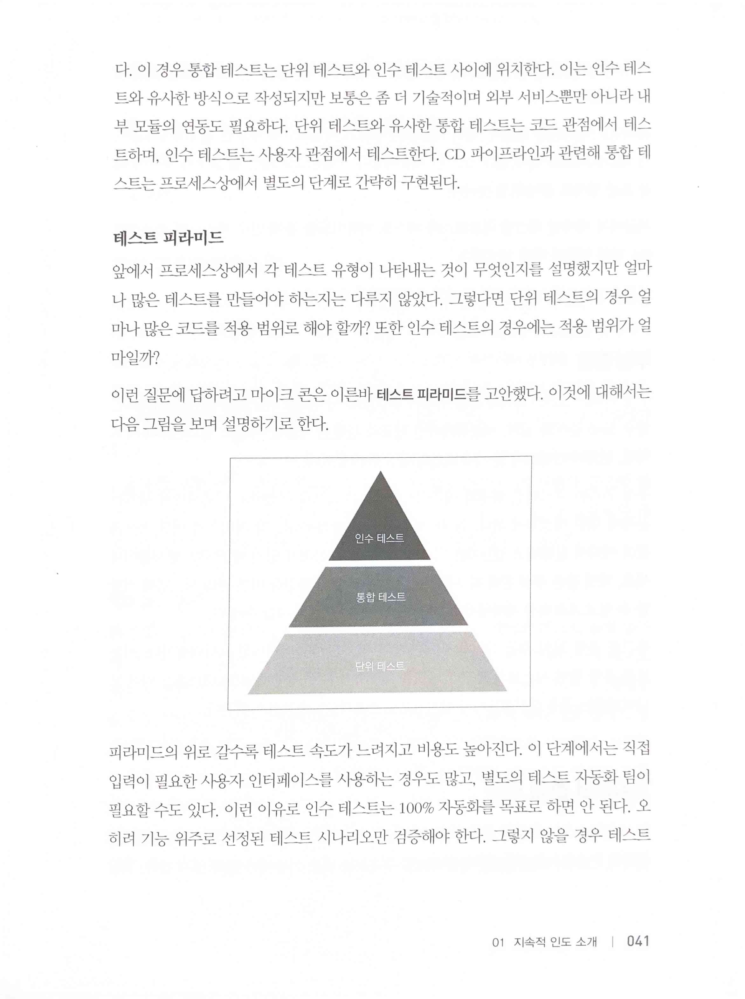
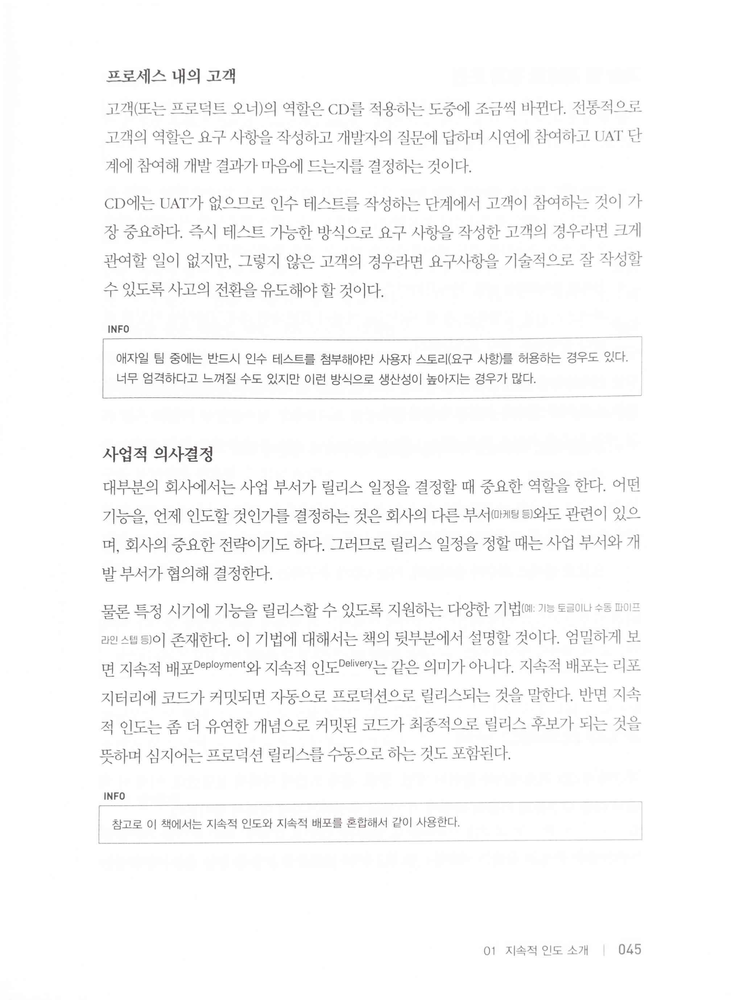
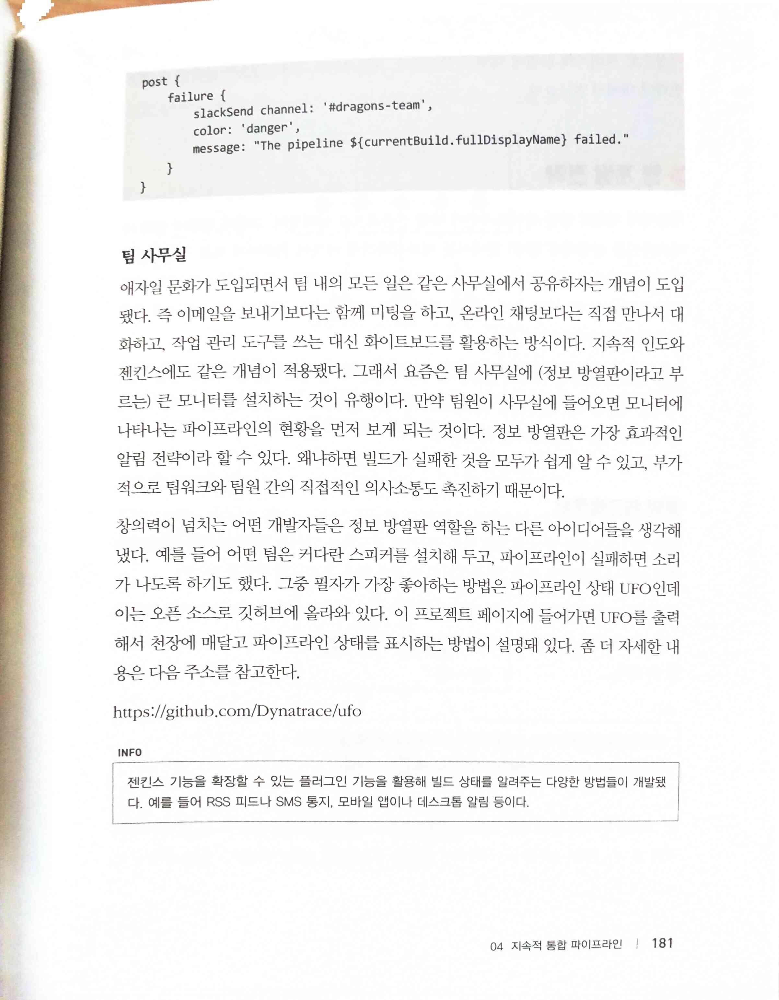
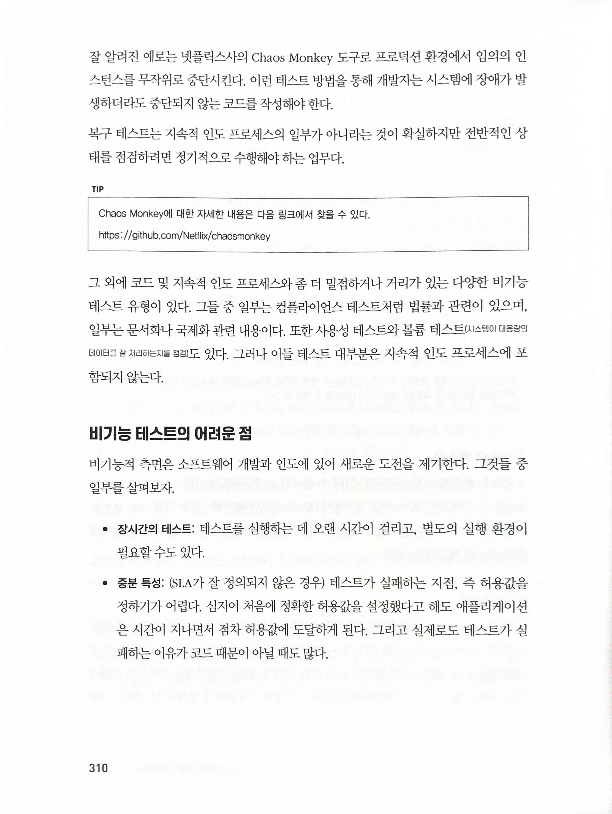
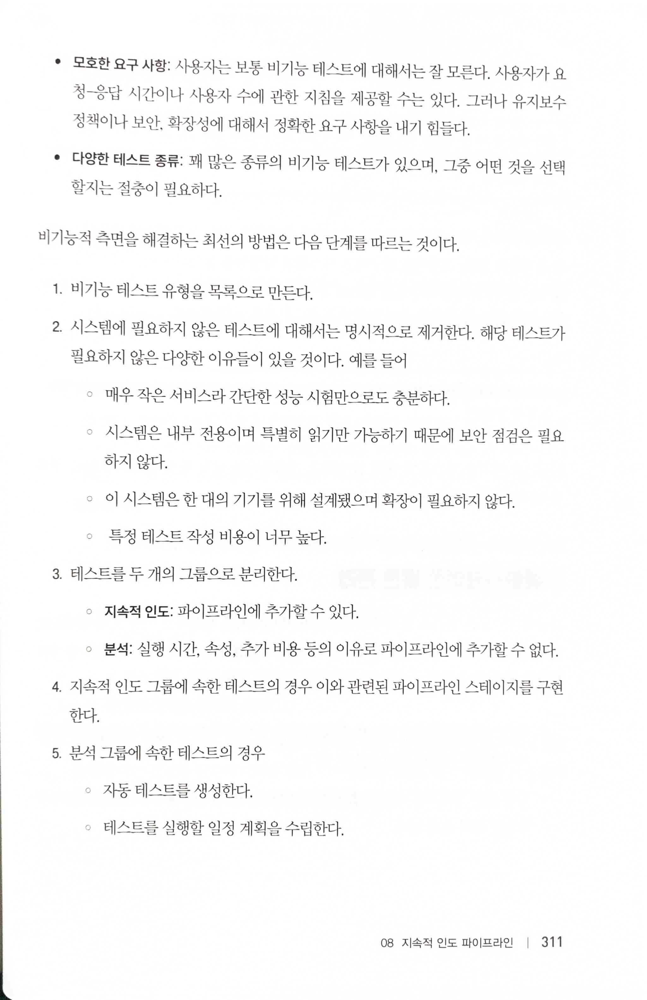
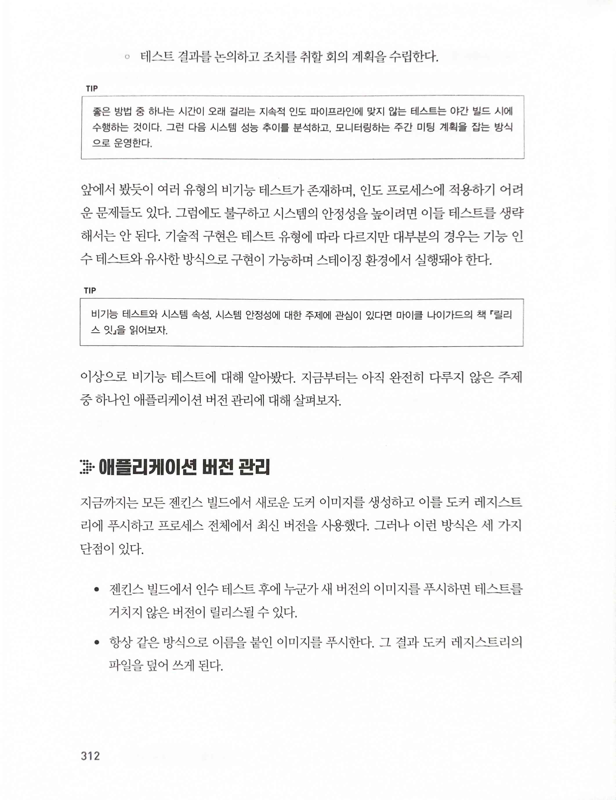

배포 자동화와 지속적 인도
=========================

 

> 지속적 통합(CI)
>
> 자동 인수 테스트
>
> 인수 테스트 단계를 자동화한다는 개념은 품질 점검을 나중에 하는 것이 아니라 개발 중에 제품에 내재시키자는 것이다.
>
> 애자일 테스팅 매트릭스

> 테스트 피라미드
* [The Forgotten Layer of the Test Automation Pyramid](https://www.mountaingoatsoftware.com/blog/the-forgotten-layer-of-the-test-automation-pyramid)
* [TestPyramid](https://martinfowler.com/bliki/TestPyramid.html)

> 많은 조직에서 애자일 프로세스의 도입을 원하지만 이것이 조직 문화를 바꾸지는 못한다. 조직 구조의 변경 없이는 개발 팀이 스크럼을 도입할 수가 없다. 예를 들어 스프린트가 진행 중일 때,프로덕트 오너와 이해관계자, 관리자는 요구 사항을 변경할 수 없다는 것을 이해해야 한다.
>
> 시스템이 대형화되고 개발 팀의 규모가 커짐에 따라 개발 방식도 점차 체계적으로 변했다. 게다가 엔지니어들도 각 분야에서 전문화되기 시작했다. 전문화를 통해 생산성을 극대화할 수 있기 때문에 이런 변화는 당연한 것일 수도 있지만 그 부작용으로 의사소통의 부담이 생기기 시작했다.

> 고객(또는 프로덕트 오너의 역할은 CD를 적용하는 도중에 조금씩 바뀐다. 전통적으로 고객의 역할은 요구 사항을 작성하고 개발자의 질문에 답하며 시연에 참여하고 UAT 단계에 참여해 개발 결과가 마음에 드는지를 결정하는 것이다.
>
> 릴리스 일정을 정할 때는 사업 부서와 개발 부서가 협의해 결정한다.
>
> 엄밀하게 보면 지속적 배포 Deployment와 지속적 인도 Delivery는 같은 의미가 아니다. 지속적 배포는 리포지터리에 코드가 커밋되면 자동으로 프로덕션으로 릴리스되는 것을 말한다. 반면 지속적 인도는 좀 더 유연한 개념으로 커밋된 코드가 최종적으로 릴리스 후보가 되는 것을 뜻하며 심지어는 프로덕션 릴리스를 수동으로 하는 것도 포함된다.
* [What is Continuous Delivery? - Continuous Delivery](https://continuousdelivery.com/)

> 정보 방열판
* [ufo: Visual alert/status display for builds, CI, continuous delivery, operations, and more](https://github.com/Dynatrace/ufo)

  

* [Netflix/chaosmonkey: Chaos Monkey is a resiliency tool that helps applications tolerate random instance failures](https://github.com/Netflix/chaosmonkey)
> 비기능 테스트의 어려운 점
>
> • 장시간의 테스트
>
> • 증분 특성
>
> • 모호한 요구 사항
>
> • 다양한 테스트 종류
>
> 비기능적 측면을 해결하는 최선의 방법은 다음 단계를 따르는 것이다.
>
> 1. 비기능 테스트 유형을 목록으로 만든다.
>
> 2. 시스템에 필요하지 않은 테스트에 대해서는 명시적으로 제거한다. 해당 테스트가 필요하지 않은 다양한 이유들이 있을 것이다.
>
> 3. 테스트를 두 개의 그룹으로 분리한다.
>
> 지속적 인도, 분석
>
> 4. 지속적 인도 그룹에 속한 테스트의 경우 이와 관련된 파이프라인 스테이지를 구현한다.
>
> 5. 분석 그룹에 속한 테스트의 경우
>
> • 자동 테스트를 생성한다.
>
> • 테스트를 실행할 일정 계획을 수립한다.
>
> • 테스트 결과를 논의하고 조치를 취할 회의 계획을 수립한다.