일상의 UX 디자인
=============
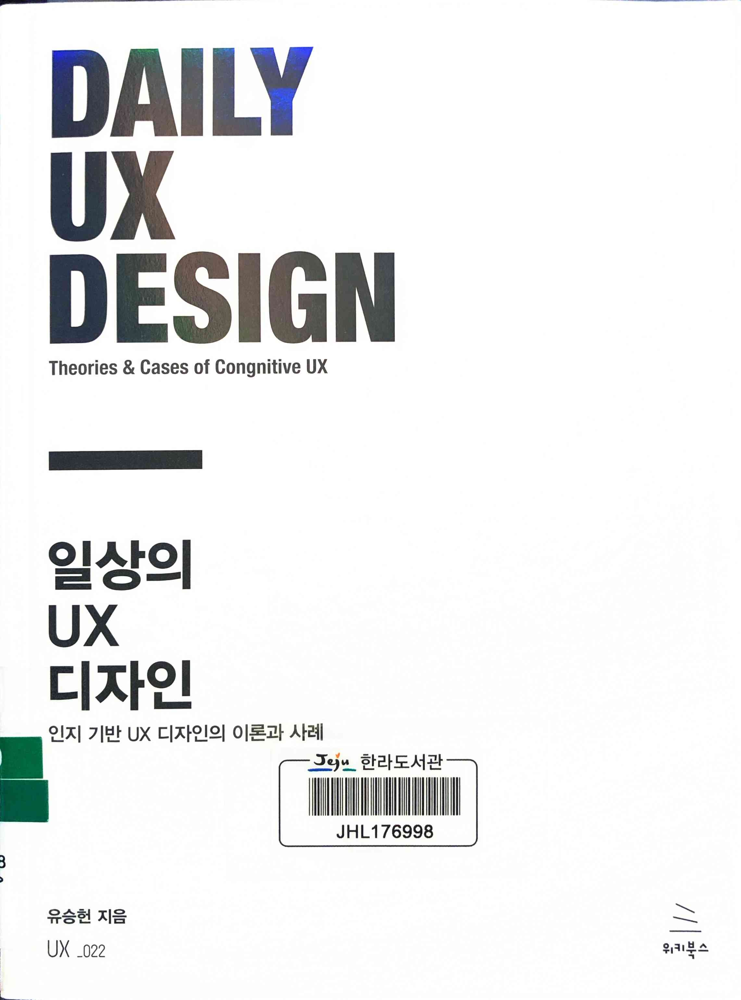

* ★★★☆☆ 2023.04.02~03 UI/UX 101같은 책으로 기초적인 지식부터 잘 읽어볼 수 있어 비전공자가 참고하기 좋음

> 그림 1.21 의사결정 사다리-시스템 분해 조합을 통한 디자인 정보 처리 순환 구조

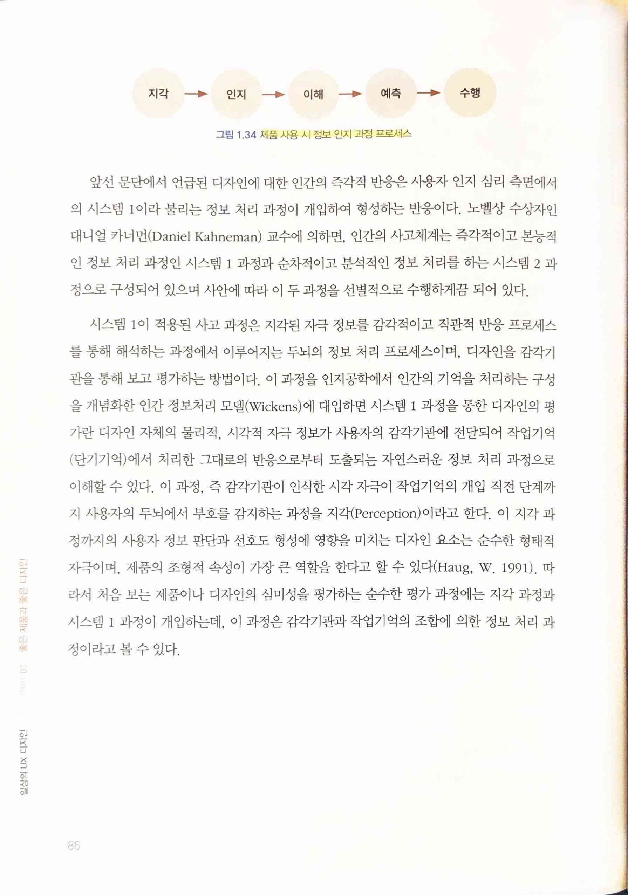

> 지각 -> 인지 -> 이해 -> 예측 -> 수행
>
> 그림 1.34 제품 사용 시 정보 인지과정 프로세스

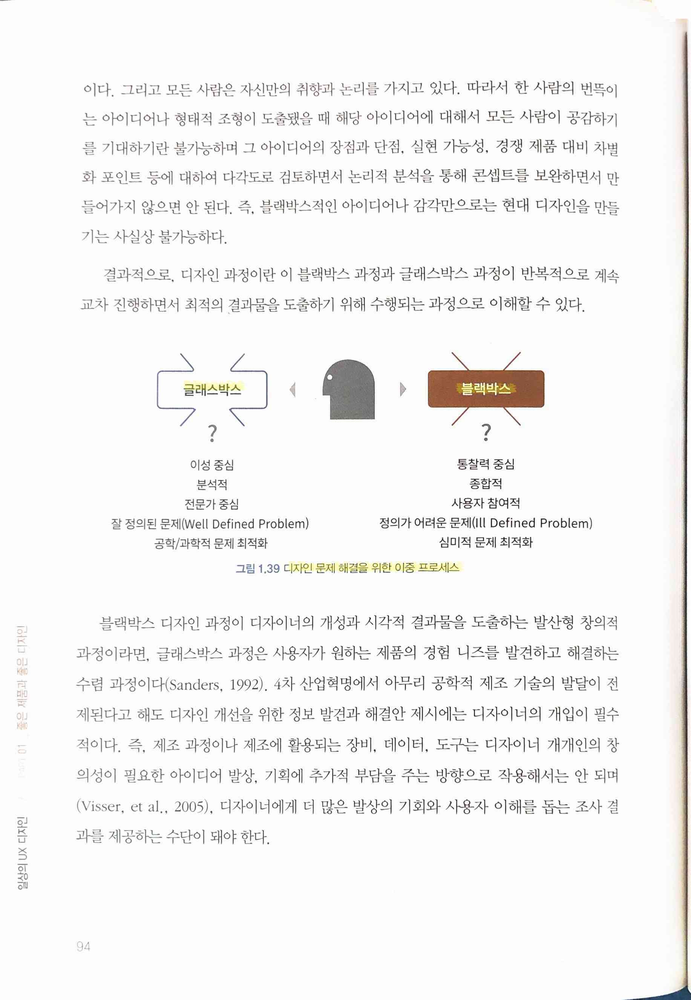

> 글래스박스(이성 중심, 분석적, 전문가 중심, 잘 정의된 문제(Well Defined Problem), 공학/과학적 문제 최적화)
>
> 블랙박스(통찰력 중심, 종합적, 사용자 참여적, 정의가 어려운 문제(Ill Defined Problem), 심미적 문제 최적화)
>
> 그림 1.39 디자인 문제 해결을 위한 이중 프로세스

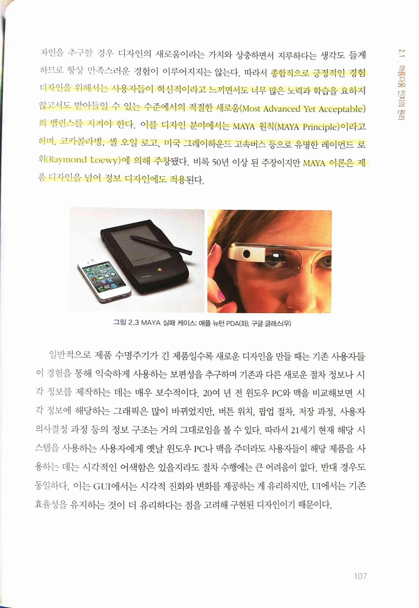

> 종합적으로 긍정적인 경험 디자인을 위해서는 사용자들이 혁신적이라고 느끼면서도 너무 많은 노력과 학습을 요하지 않고서도 받아들일 수 있는 수준에서의 적절한 새로움(Most Advanced Yet Acceptable)의 밸런스를 지켜야 한다. 이를 디자인 분야에서는 MAYA 원칙(MAYA Principle)이라고하며, 코카콜라병, 셸 오일 로고, 미국 그레이하운드 고속버스 등으로 유명한 레이먼드 로위(Raymond Loewy)에 의해 주창됐다. 비록 50년 이상 된 주장이지만 MAYA 이론은 제품 디자인을 넘어 정보 디자인에도 적용된다.
* [Using the MAYA Principle for Effective Communication](https://www.seerinteractive.com/insights/using-the-maya-principle-for-effective-communication)

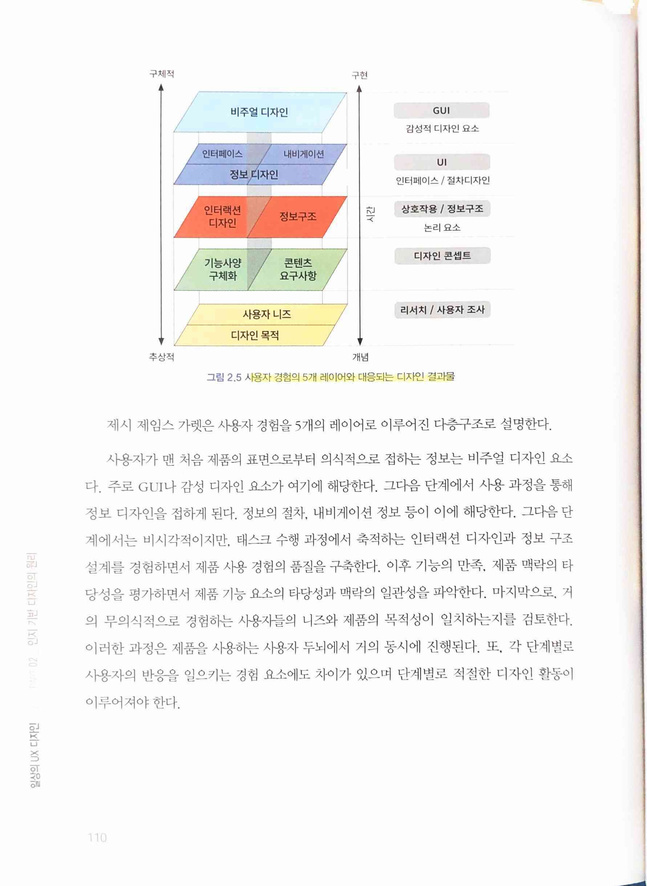

> 그림 2.5 사용자 경험의 5개 레이어와 대응되는 디자인 결과물
>
> 비주얼 디자인 -> 정보 디자인 -> 인터랙션 디자인과 정보 구조 -> 기능/콘텐츠 -> 사용자들의 니즈와 제품의 목적성

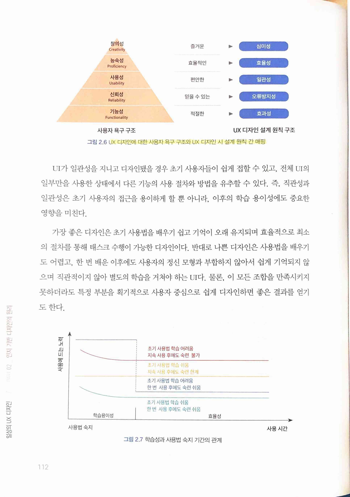

> 그림 2.6 UX 디자인에 대한 사용자 욕구 구조와 UX 디자인 시 설계 원칙 간 매핑
>
> 그림 2.7 학습성과 사용법 숙지 기간의 관계

> 일반적인 인간의 기억 용량은 일반적으로 알려진 수준으로 표현하면 7 ± 2 청크라고 할 수 있다.
* 최근 연구에 따르면 4개 정도라는 설도 있긴 함. 사람들의 행동을 보면 7개보단 4개쪽이 더 가까운 거 같기도 하다

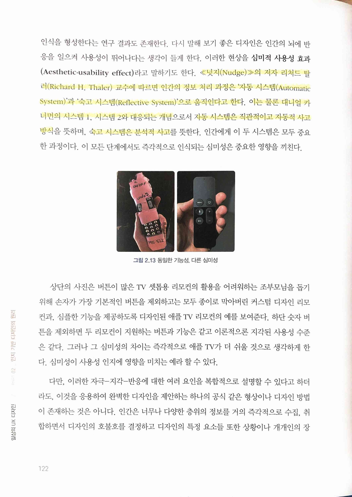

> <넛지(Nudge)>의 저자 리처드 탈러(Richard H. Thaler) 교수에 따르면 인간의 정보 처리 과정은 `자동 시스템(Automatic System)`과 `숙고 시스템(Reflective System)`으로 움직인다고 한다. 이는 물론 대니얼 카너먼의 `시스템 1`, `시스템 2`와 대응되는 개념으로서 자동 시스템은 직관적이고 자동적 사고방식을 뜻하며, 숙고 시스템은 분석적 사고를 뜻한다.

 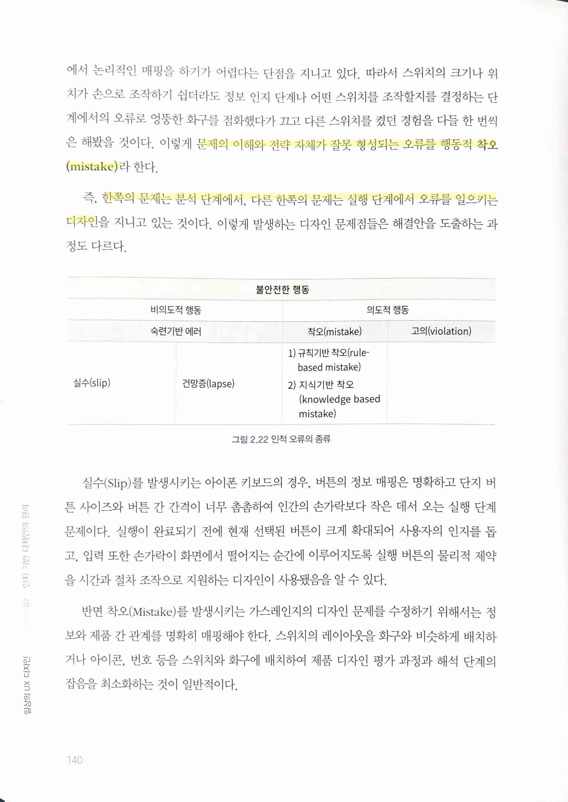

> 실행 단계에서 발생하는 오류를 무의식적 `실수(Slip)`
>
> 문제의 이해와 전략 자체가 잘못 형성되는 오류를 행동적 `착오(mistake)`
>
> 즉, 한쪽의 문제는 분석 단계에서, 다른 한쪽의 문제는 실행 단계에서 오류를 일으키는 디자인을 지니고 있는 것

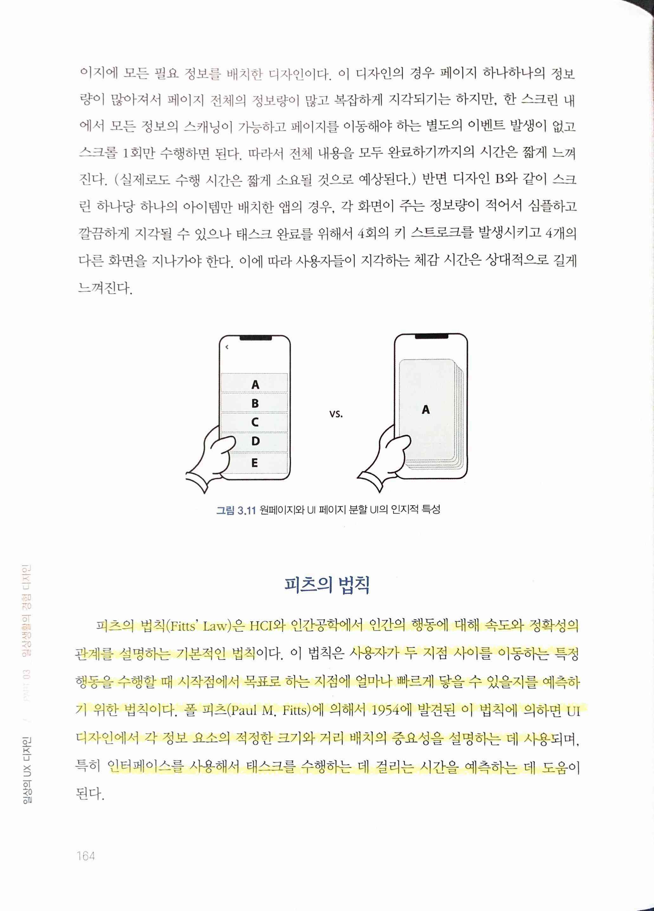 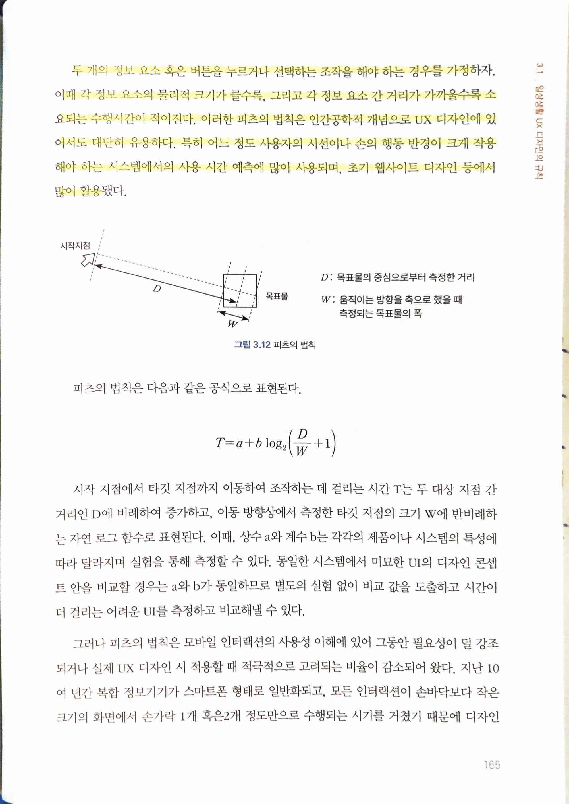

> `피츠의 법칙(Fitts' Law)`은 HCI와 인간공학에서 인간의 행동에 대해 속도와 정확성의 관계를 설명하는 기본적인 법칙이다. 이 법칙은 사용자가 두 지점 사이를 이동하는 특정 행동을 수행할 때 시작점에서 목표로 하는 지점에 얼마나 빠르게 닿을 수 있을지를 예측하기 위한 법칙이다. 폴 피츠(Paul M. Fitts)에 의해서 1954에 발견된 이 법칙에 의하면 UI디자인에서 각 정보 요소의 적정한 크기와 거리 배치의 중요성을 설명하는 데 사용되며, 특히 인터페이스를 사용해서 태스크를 수행하는 데 걸리는 시간을 예측하는 데 도움이된다.
>
> 두 개의 정보 요소 혹은 버튼을 누르거나 선택하는 조작을 해야 하는 경우를 가정하자. 이때 각 정보 요소의 물리적 크기가 클수록, 그리고 각 정보 요소 간 거리가 가까울수록 소요되는 수행시간이 적어진다. 이러한 피츠의 법칙은 인간공학적 개념으로 UX 디자인에 있어서도 대단히 유용하다. 특히 어느 정도 사용자의 시선이나 손의 행동 반경이 크게 작용해야 하는 시스템에서의 사용 시간 예측에 많이 사용되며, 초기 웹사이트 디자인 등에서 많이 활용됐다.

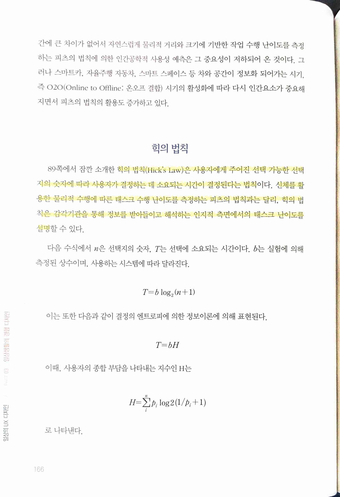 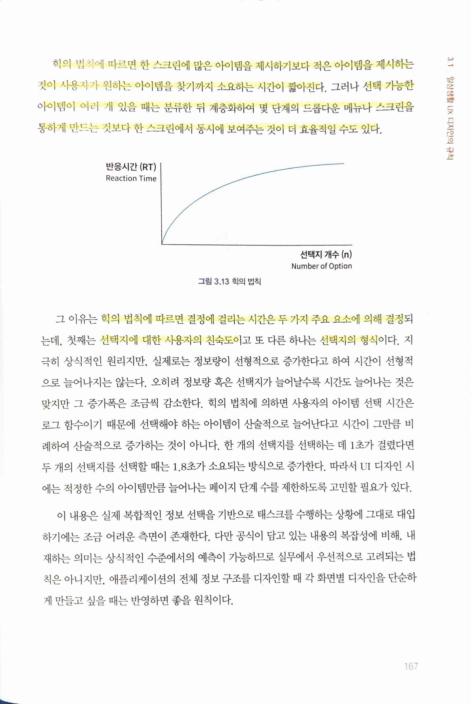

> `힉의 법칙(Hick's Law)`은 사용자에게 주어진 선택 가능한 선택지의 숫자에 따라 사용자가 결정하는 데 소요되는 시간이 결정된다는 법칙이다. 신체를 활용한 물리적 수행에 따른 태스크 수행 난이도를 측정하는 피츠의 법칙과는 달리, 회의 법칙은 감각기관을 통해 정보를 받아들이고 해석하는 인지적 측면에서의 태스크 난이도를 설명할 수 있다.
>
> 힉의 법칙에 따르면 한 스크린에 많은 아이템을 제시하기보다 적은 아이템을 제시하는것이 사용자가 원하는 아이템을 찾기까지 소요하는 시간이 짧아진다. 그러나 선택 가능한 아이템이 여러 개 있을 때는 분류한 뒤 계층화하여 몇 단계의 드롭다운 메뉴나 스크린을 통하게 만드는 것보다 한 스크린에서 동시에 보여주는 것이 더 효율적일 수도 있다.
>
> 그 이유는 힉의 법칙에 따르면 결정에 걸리는 시간은 두 가지 주요 요소에 의해 결정되는데, 첫째는 선택지에 대한 사용자의 친숙도이고 또 다른 하나는 선택지의 형식이다.