# 도메인 주도 설계 철저 입문
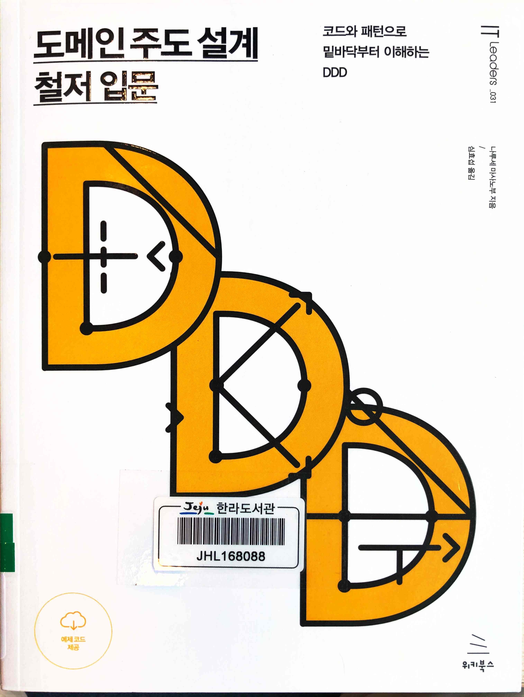

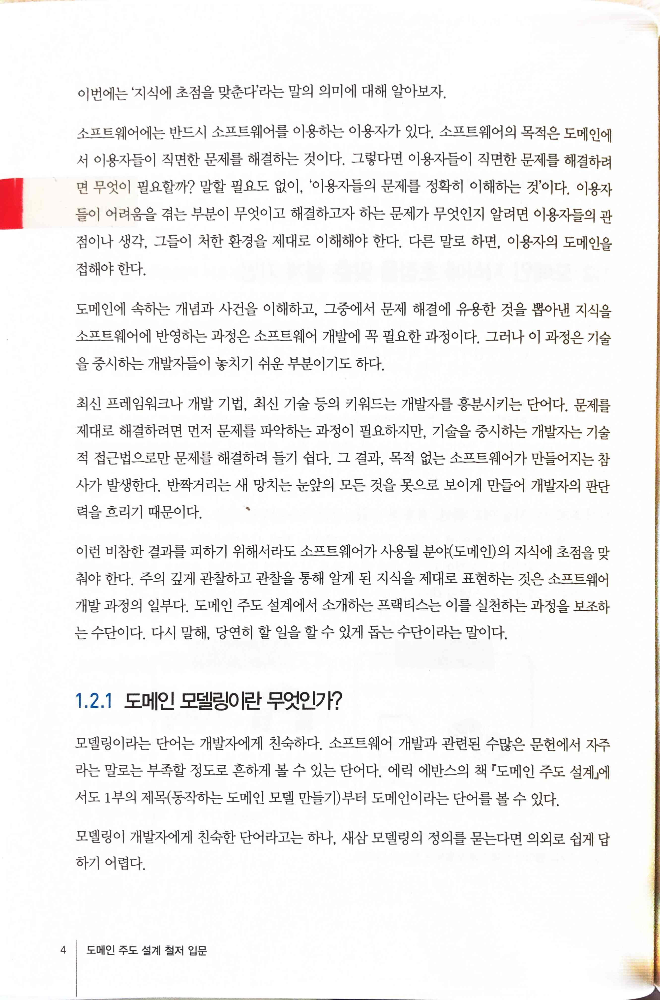

> 소프트웨어의 목적은 도메인에서 이용자들이 직면한 문제를 해결하는 것이다. 그렇다면 이용자들이 직면한 문제를 해결하려면 무엇이 필요할까? 말할 필요도 없이, '이용자들의 문제를 정확히 이해하는 것'이다. 이용자들이 어려움을 겪는 부분이 무엇이고 해결하고자 하는 문제가 무엇인지 알려면 이용자들의 관점이나 생각, 그들이 처한 환경을 제대로 이해해야 한다. 다른 말로 하면, 이용자의 도메인을 접해야 한다.

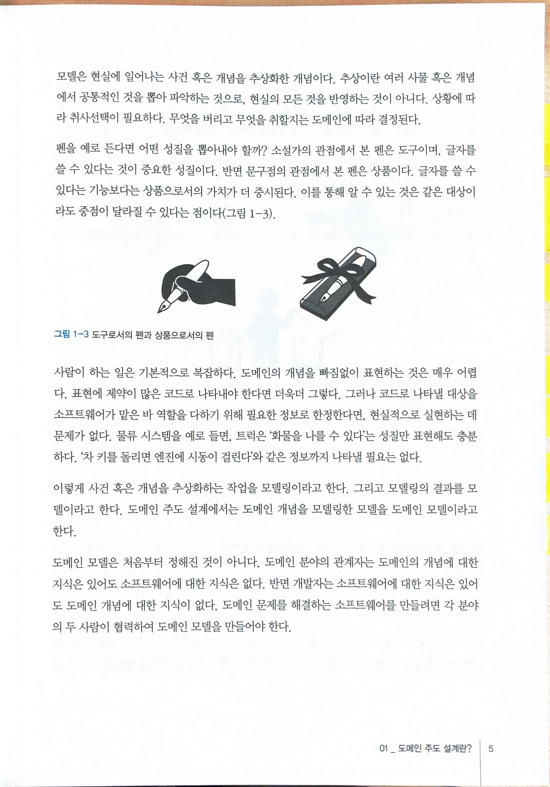

> 모델은 현실에 일어나는 사건 혹은 개념을 추상화한 개념이다. 추상이란 여러 사물 혹은 개념에서 공통적인 것을 뽑아 파악하는 것으로, 현실의 모든 것을 반영하는 것이 아니다. 상황에 따라 취사선택이 필요하다. 무엇을 버리고 무엇을 취할지는 도메인에 따라 결정된다.
>
> 사건 혹은 개념을 추상화하는 작업을 모델링이라고 한다. 그리고 모델링의 결과를 모델이라고 한다. 도메인 주도 설계에서는 도메인 개념을 모델링한 모델을 도메인 모델이라고 한다.

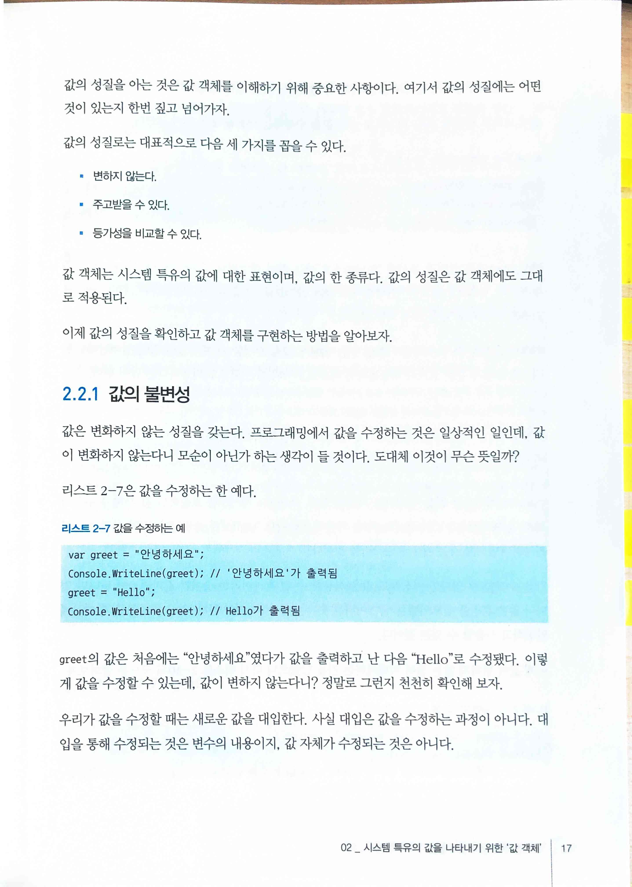

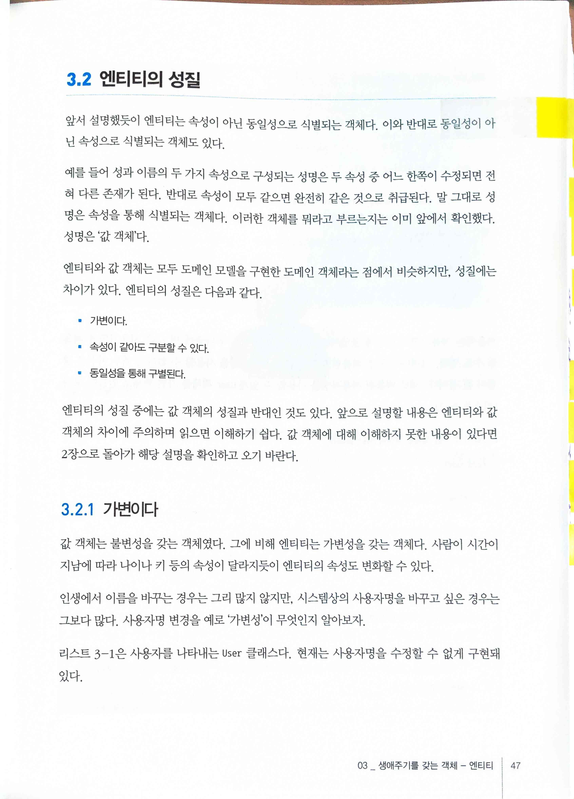

> 엔티티는 속성이 아닌 동일성으로 식별되는 객체다. 이와 반대로 동일성이 아난 속성으로 식별되는 객체도 있다.
>
> 속성이 모두 같으면 완전히 같은 것으로 취급하는 객체는 '값 객체'
>
> 엔티티의 성질
>
> • 가변.• 속성이 같아도 구분 가능 • 동일성을 통해 구별

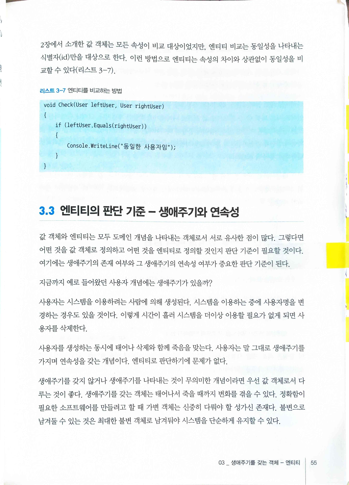

> 어떤 것을 값 객체로 정의하고 어떤 것을 엔티티로 정의할 것인지 판단 기준이 필요할 것이다. 여기에는 생애주기의 존재 여부와 그 생애주기의 연속성 여부가 중요한 판단 기준이 된다.

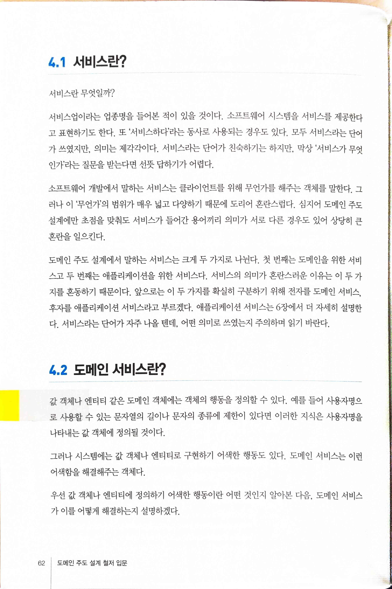

> 그러나 시스템에는 값 객체나 엔티티로 구현하기 어색한 행동도 있다. 도메인 서비스는 이런 어색함을 해결해주는 객체다.

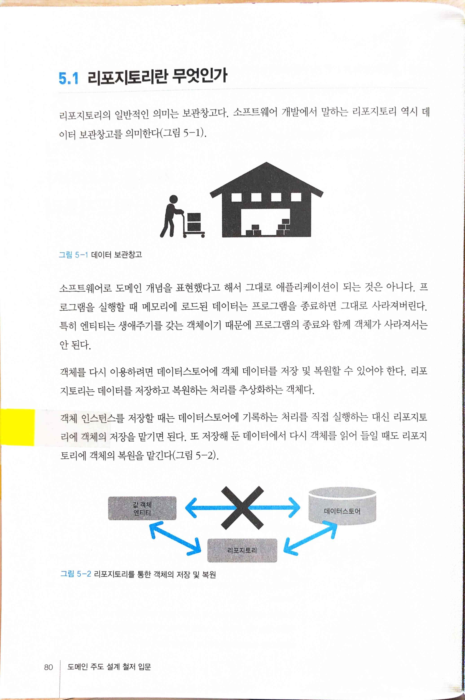

> 객체 인스턴스를 저장할 때는 데이터스토어에 기록하는 처리를 직접 실행하는 대신 리포지토리에 객체의 저장을 맡기면 된다. 또 저장해 둔 데이터에서 다시 객체를 읽어 들일 때도 리포지토리에 객체의 복원을 맡긴다

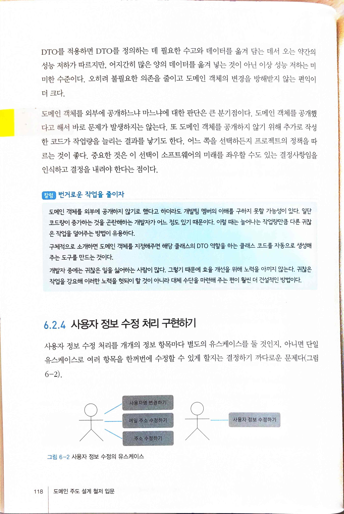

> 도메인 객체를 외부에 공개하느냐 마느냐에 대한 판단은 큰 분기점이다. 도메인 객체를 공개했다고 해서 바로 문제가 발생하지는 않는다. 또 도메인 객체를 공개하지 않기 위해 추가로 작성한 코드가 작업량을 늘리는 결과를 낳기도 한다. 어느 쪽을 선택하든지 프로젝트의 정책을 따르는 것이 좋다. 중요한 것은 이 선택이 소프트웨어의 미래를 좌우할 수도 있는 결정사항임을 인식하고 결정을 내려야 한다는 점이다.

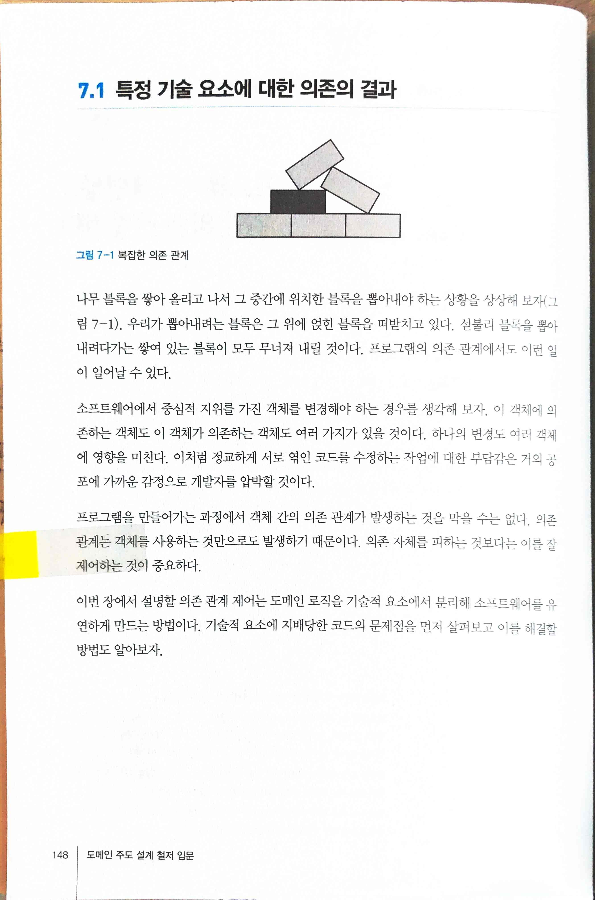

> 프로그램을 만들어가는 과정에서 객체 간의 의존 관계가 발생하는 것을 막을 수는 없다. 의존관계는 객체를 사용하는 것만으로도 발생하기 때문이다. 의존 자체를 피하는 것보다는 이를 잘 제어하는 것이 중요하다.

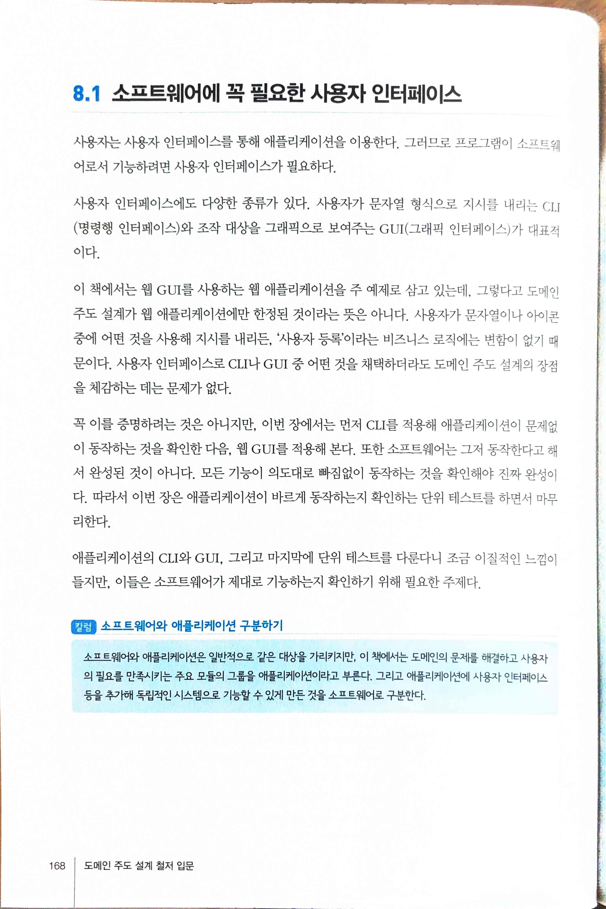

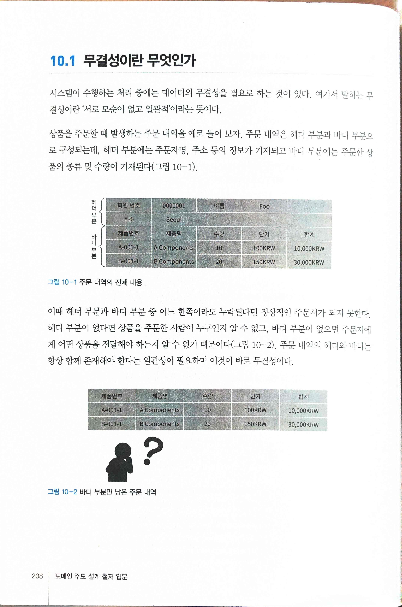 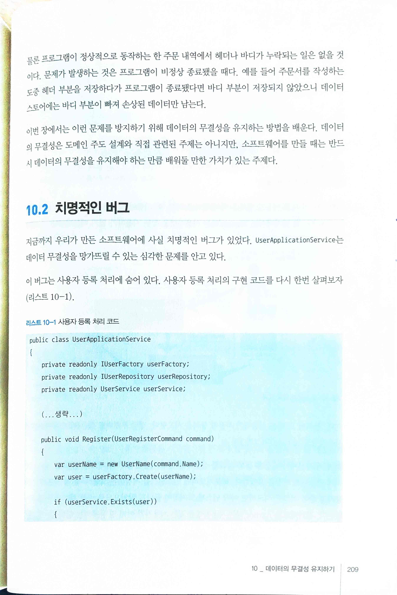

> 시스템이 수행하는 처리 중에는 데이터의 무결성을 필요로 하는 것이 있다. 여기서 말하는 무결성이란 '서로 모순이 없고 일관적'이라는 뜻이다.

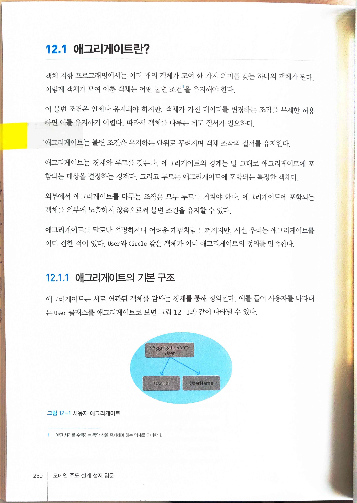

> 애그리게이트는 불변 조건을 유지하는 단위로 꾸려지며 객체 조작의 질서를 유지한다.
>
> 애그리게이트는 경계와 루트를 갖는다. 애그리게이트의 경계는 말 그대로 애그리게이트에 포함되는 대상을 결정하는 경계다. 그리고 루트는 애그리게이트에 포함되는 특정한 객체다.

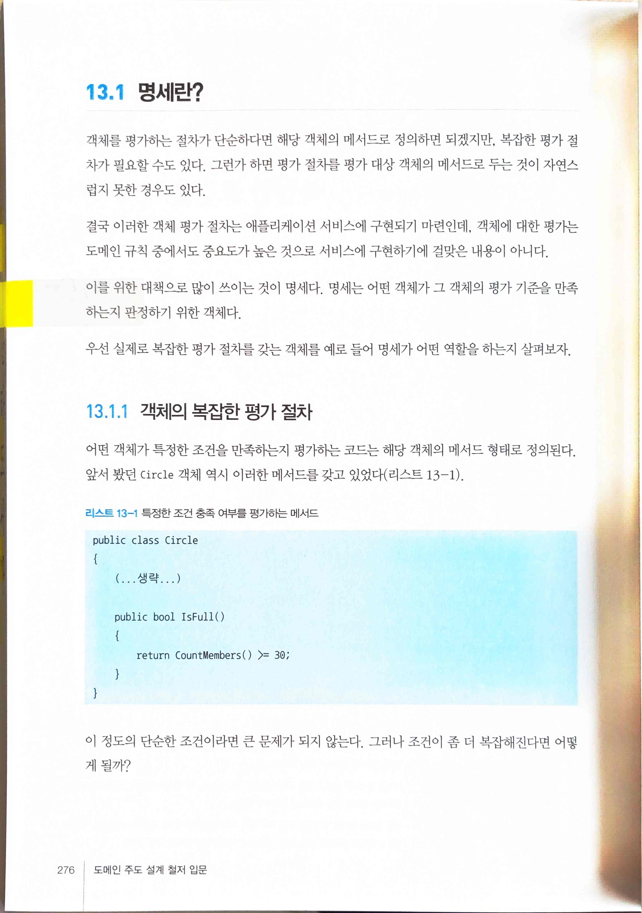

> 객체를 평가하는 절차가 단순하다면 해당 객체의 메서드로 정의하면 되겠지만, 복잡한 평가 절차가 필요할 수도 있다. 그런가 하면 평가 절차를 평가 대상 객체의 메서드로 두는 것이 자연스럽지 못한 경우도 있다.
>
> 결국 이러한 객체 평가 절차는 애플리케이션 서비스에 구현되기 마련인데, 객체에 대한 평가는 도메인 규칙 중에서도 중요도가 높은 것으로 서비스에 구현하기에 걸맞은 내용이 아니다.
>
> 이를 위한 대책으로 많이 쓰이는 것이 명세다. 명세는 어떤 객체가 그 객체의 평가기준을 만족하는지 판정하기 위한 객체다.

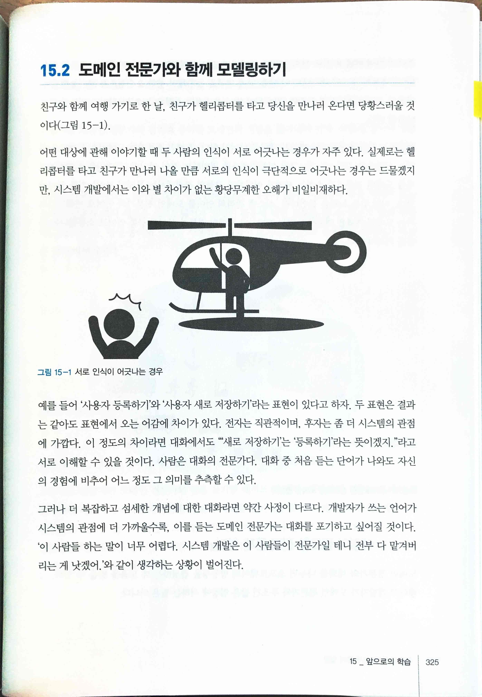

> 개발자가 쓰는 언어가 시스템의 관점에 더 가까울수록, 이를 듣는 도메인 전문가는 대화를 포기하고 싶어질 것이다. '이 사람들 하는 말이 너무 어렵다. 시스템 개발은 이 사람들이 전문가일 테니 전부 다 맡겨버리는 게 낫겠어.'와 같이 생각하는 상황이 벌어진다.

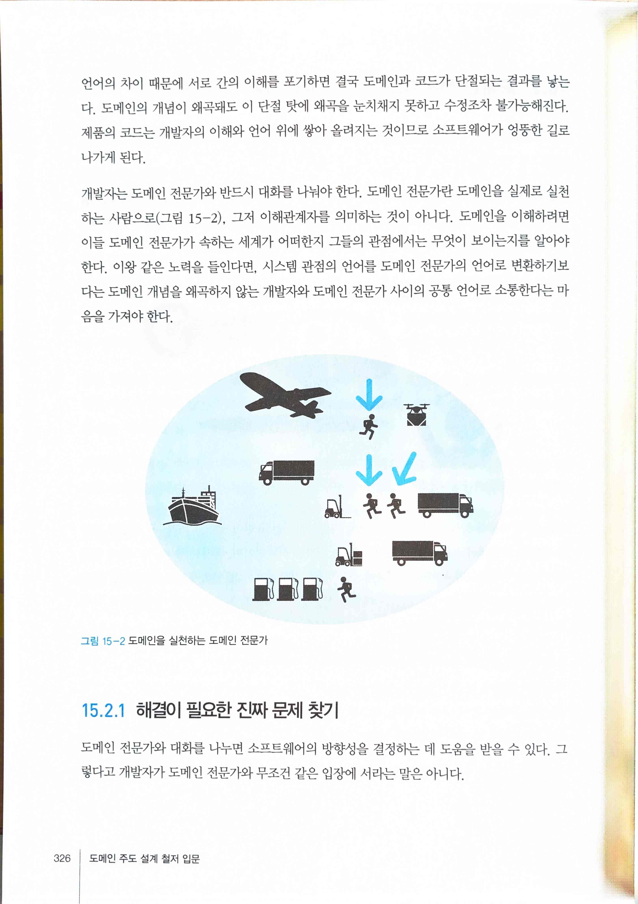

> 도메인 전문가란 도메인을 실제로 실천하는 사람으로, 그저 이해관계자를 의미하는 것이 아니다. 도메인을 이해하려면 이들 도메인 전문가가 속하는 세계가 어떠한지 그들의 관점에서는 무엇이 보이는지를 알아야 한다. 이왕 같은 노력을 들인다면, 시스템 관점의 언어를 도메인 전문가의 언어로 변환하기보다는 도메인 개념을 왜곡하지 않는 개발자와 도메인 전문가 사이의 공통 언어로 소통한다는 마음을 가져야 한다.

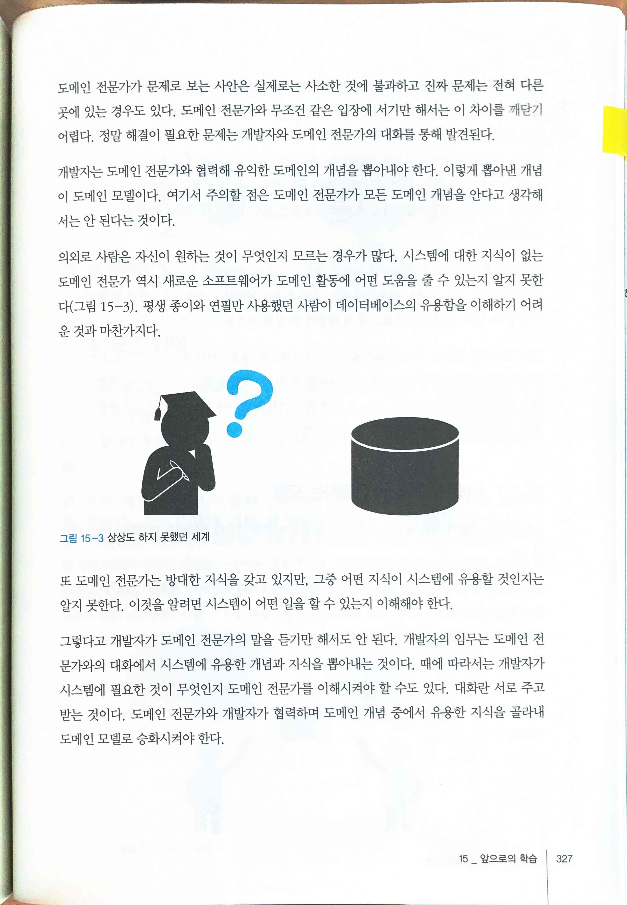

> 도메인 전문가가 문제로 보는 사안은 실제로는 사소한 것에 불과하고 진짜 문제는 전혀 다른곳에 있는 경우도 있다. 도메인 전문가와 무조건 같은 입장에 서기만 해서는 이 차이를 깨닫기 어렵다. 정말 해결이 필요한 문제는 개발자와 도메인 전문가의 대화를 통해 발견된다.
>
> 의외로 사람은 자신이 원하는 것이 무엇인지 모르는 경우가 많다.
>
> 개발자의 임무는 도메인 전문가와의 대화에서 시스템에 유용한 개념과 지식을 뽑아내는 것이다. 때에 따라서는 개발자가 시스템에 필요한 것이 무엇인지 도메인 전문가를 이해시켜야 할 수도 있다. 대화란 서로 주고받는 것이다. 도메인 전문가와 개발자가 협력하며 도메인 개념 중에서 유용한 지식을 골라내 도메인 모델로 승화시켜야 한다.

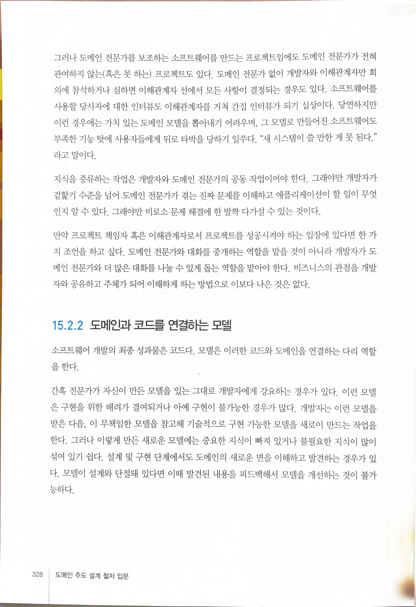

> 도메인 전문가 없이 개발자와 이해관계자만 회의에 참석하거나 심하면 이해관계자 선에서 모든 사항이 결정되는 경우도 있다. 소프트웨어를 사용할 당사자에 대한 인터뷰도 이해관계자를 거쳐 간접 인터뷰가 되기 십상이다. 당연하지만 이런 경우에는 가치 있는 도메인 모델을 뽑아내기 어려우며, 그 모델로 만들어진 소프트웨어도 부족한 기능 탓에 사용자들에게 뒤로 타박을 당하기 일쑤다.
>
> 지식을 증류하는 작업은 개발자와 도메인 전문가의 공동 작업이어야 한다.

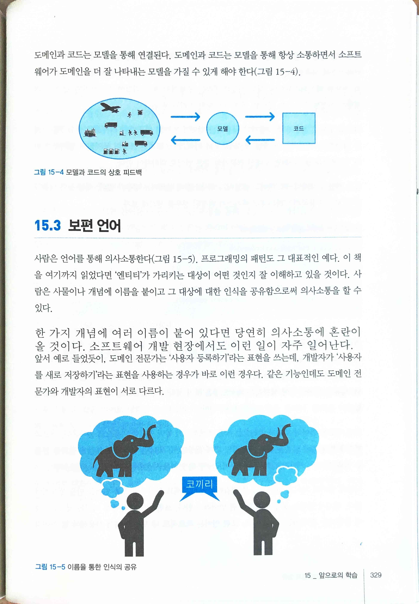

> 한 가지 개념에 여러 이름이 붙어 있다면 당연히 의사소통에 혼란이 올 것이다.

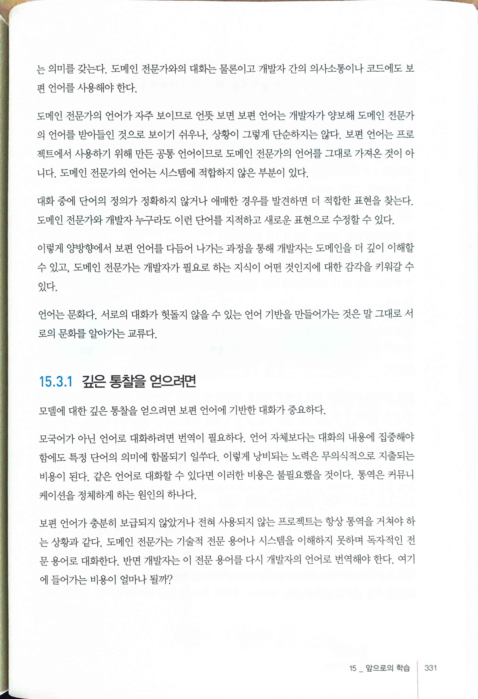

> 양방향에서 보편 언어를 다듬어 나가는 과정을 통해 개발자는 도메인을 더 깊이 이해할수 있고, 도메인 전문가는 개발자가 필요로 하는 지식이 어떤 것인지에 대한 감각을 키워갈 수있다.
>
> 언어는 문화다. 서로의 대화가 헛돌지 않을 수 있는 언어 기반을 만들어가는 것은 말 그대로 서로의 문화를 알아가는 교류다.

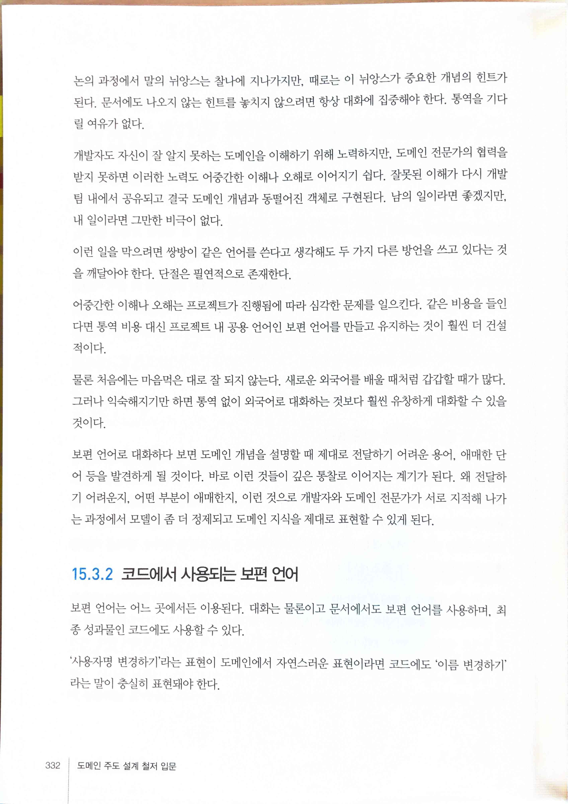

> 개발자도 자신이 잘 알지 못하는 도메인을 이해하기 위해 노력하지만, 도메인 전문가의 협력을받지 못하면 이러한 노력도 어중간한 이해나 오해로 이어지기 쉽다.
>
> 보편 언어로 대화하다 보면 도메인 개념을 설명할 때 제대로 전달하기 어려운 용어, 애매한 단어 등을 발견하게 될 것이다. 바로 이런 것들이 깊은 통찰로 이어지는 계기가 된다. 왜 전달하기 어려운지, 어떤 부분이 애매한지, 이런 것으로 개발자와 도메인 전문가가 서로 지적해 나가는 과정에서 모델이 좀 더 정제되고 도메인 지식을 제대로 표현할 수 있게 된다.

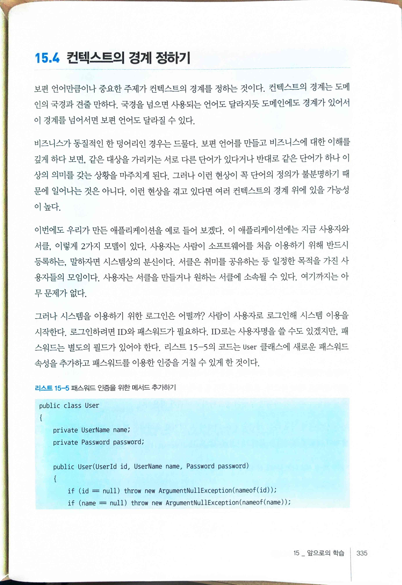

> 컨텍스트의 경계는 도메인의 국경과 견줄 만하다. 국경을 넘으면 사용되는 언어도 달라지듯 도메인에도 경계가 있어서 이 경계를 넘어서면 보편 언어도 달라질 수 있다.
>
> 비즈니스가 동질적인 한 덩어리인 경우는 드물다. 보편 언어를 만들고 비즈니스에 대한 이해를 깊게 하다 보면, 같은 대상을 가리키는 서로 다른 단어가 있다거나 반대로 같은 단어가 하나 이상의 의미를 갖는 상황을 마주치게 된다. 그러나 이런 현상이 꼭 단어의 정의가 불분명하기 때문에 일어나는 것은 아니다. 이런 현상을 겪고 있다면 여러 컨텍스트의 경계 위에 있을 가능성이 높다.

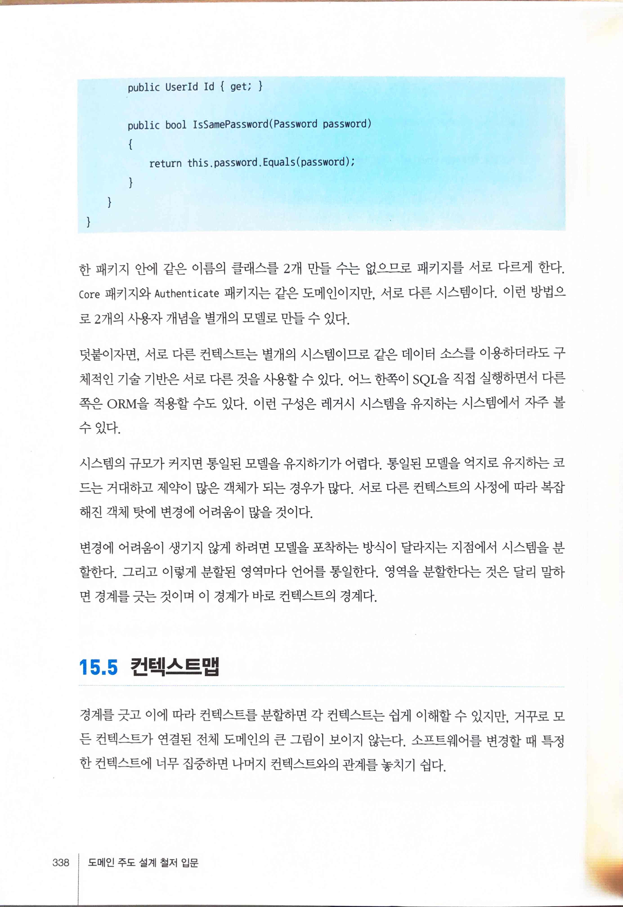

> 시스템의 규모가 커지면 통일된 모델을 유지하기가 어렵다. 통일된 모델을 억지로 유지하는 코드는 거대하고 제약이 많은 객체가 되는 경우가 많다. 서로 다른 컨텍스트의 사정에 따라 복잡해진 객체 탓에 변경에 어려움이 많을 것이다.
>
> 변경에 어려움이 생기지 않게 하려면 모델을 포착하는 방식이 달라지는 지점에서 시스템을 분할한다. 그리고 이렇게 분할된 영역마다 언어를 통일한다. 영역을 분할한다는 것은 달리 말하면 경계를 긋는 것이며 이 경계가 바로 컨텍스트의 경계다.

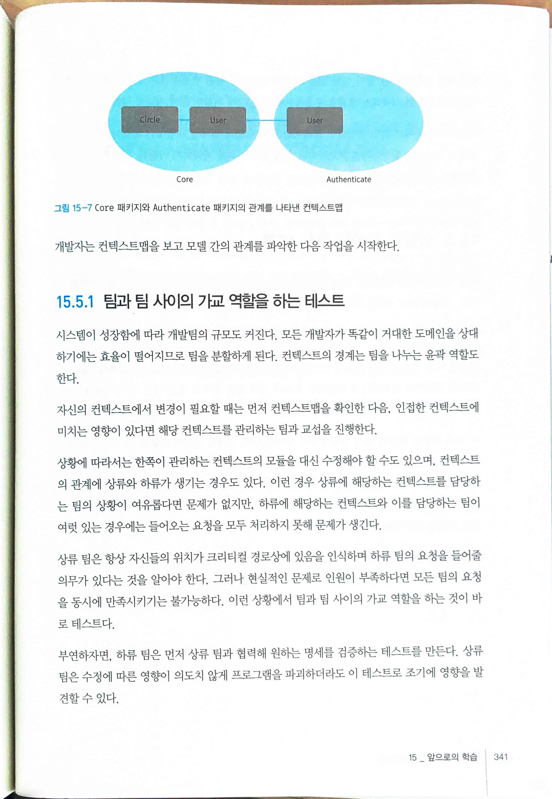

> 팀과 팀 사이의 가교 역할을 하는 테스트

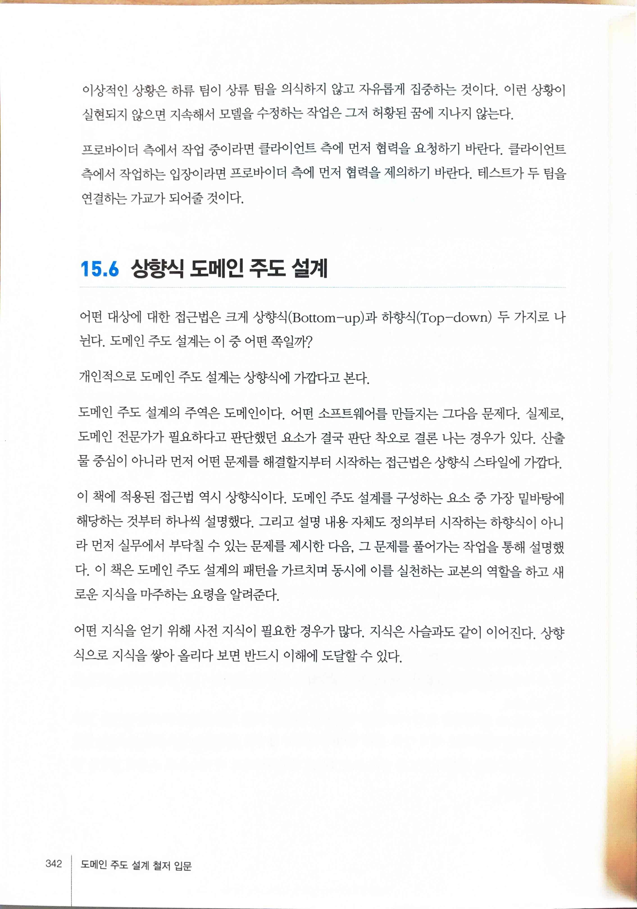

> 도메인 주도 설계의 주역은 도메인이다. 어떤 소프트웨어를 만들지는 그다음 문제다. 실제로, 도메인 전문가가 필요하다고 판단했던 요소가 결국 판단 착오로 결론 나는 경우가 있다. 산출물 중심이 아니라 먼저 어떤 문제를 해결할지부터 시작하는 접근법은 상향식 스타일에 가깝다.