# 기업의 성공을 이끄는 Developer Relations

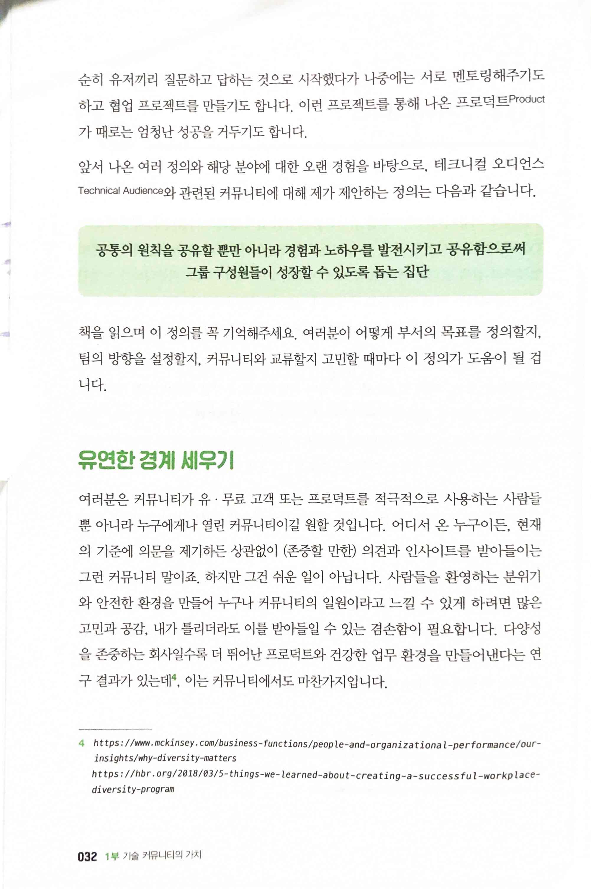 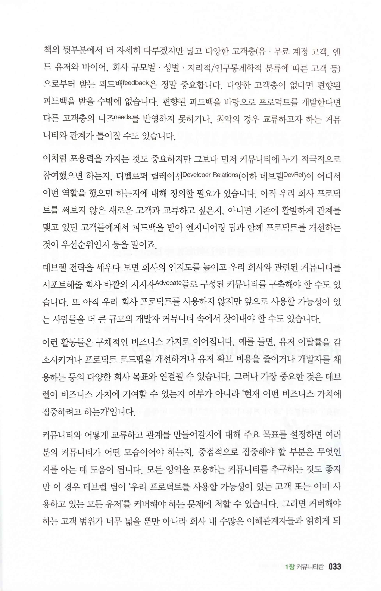

> 공통의 원칙을 공유할 뿐만 아니라 경험과 노하우를 발전시키고 공유함으로써 그룹 구성원들이 성장할 수 있도록 돕는 집단
* [Why diversity matters | McKinsey](https://www.mckinsey.com/business-functions/people-and-organizational-performance/our-insights/why-diversity-matters)
* [5 Things We Learned About Creating a Successful Workplace Diversity Program](https://hbr.org/2018/03/5-things-we-learned-about-creating-a-successful-workplace-diversity-program)

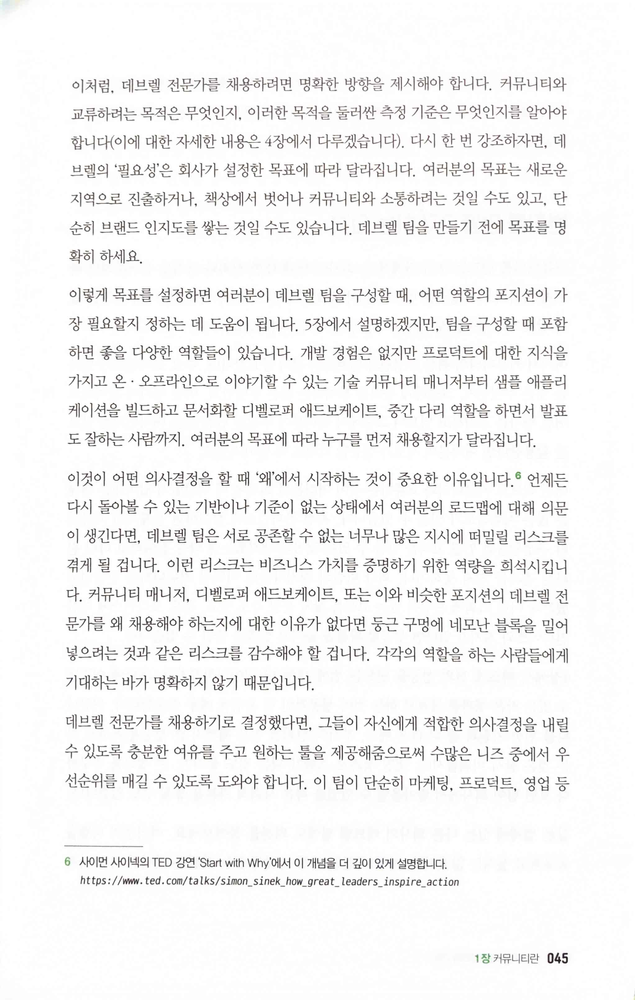

> 데브렐의 '필요성'은 회사가 설정한 목표에 따라 달라집니다. 여러분의 목표는 새로운 지역으로 진출하거나, 책상에서 벗어나 커뮤니티와 소통하려는 것일 수도 있고, 단순히 브랜드 인지도를 쌓는 것일 수도 있습니다. 데브렐 팀을 만들기 전에 목표를 명확히 하세요.
>
> 이것이 어떤 의사결정을 할 때 '왜'에서 시작하는 것이 중요한 이유입니다.
* [Simon Sinek: How great leaders inspire action | TED Talk](https://www.ted.com/talks/simon_sinek_how_great_leaders_inspire_action)

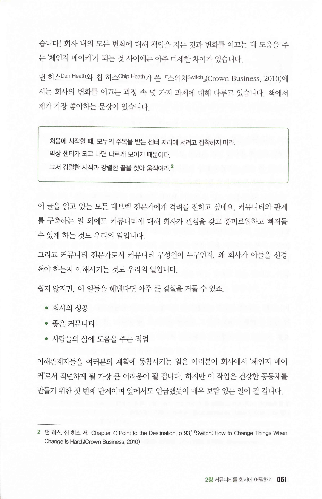

> 댄 히스Dan Heath와 칩 히스Chip Heath가 쓴 스위치Switch(Crown Business, 2010)에서는 회사의 변화를 이끄는 과정 속 몇 가지 과제에 대해 다루고 있습니다. 책에서 제가 가장 좋아하는 문장이 있습니다.
>
> 처음에 시작할 때, 모두의 주목을 받는 센터 자리에 서려고 집착하지 마라. 막상 센터가 되고 나면 다르게 보이기 때문이다. 그저 강렬한 시작과 강렬한 끝을 찾아 움직여라.

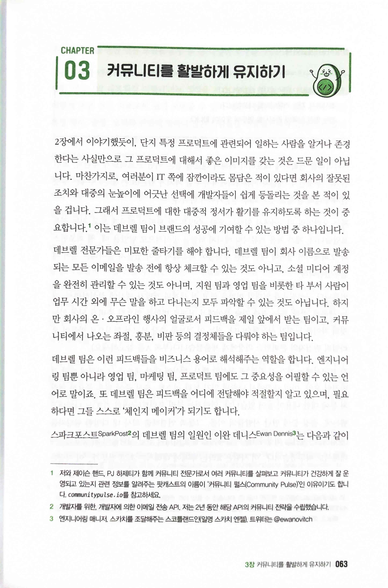

> 데브렐 팀은 이런 피드백들을 비즈니스 용어로 해석해주는 역할

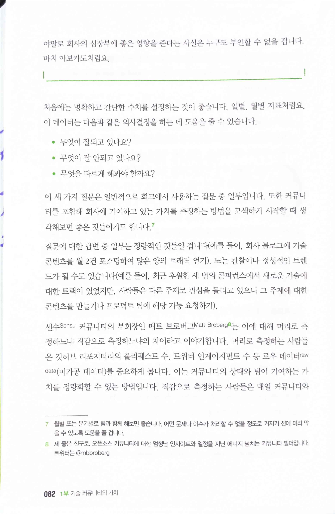

> 처음에는 명확하고 간단한 수치를 설정하는 것이 좋습니다. 일별, 월별 지표처럼요. 이 데이터는 다음과 같은 의사결정을 하는 데 도움을 줄 수 있습니다.
>
> · 무엇이 잘되고 있나요?
>
> · 무엇이 잘 안되고 있나요?
>
> · 무엇을 다르게 해봐야 할까요?
* 이걸 보고 daily scrum과 비슷하다는 생각이 들었다

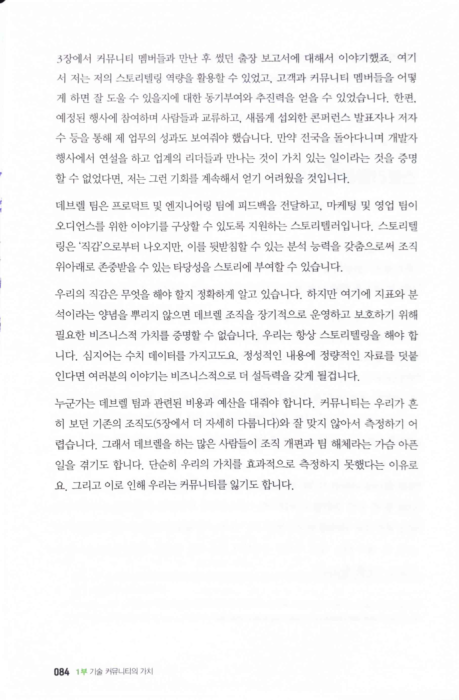

> 우리는 항상 스토리텔링을 해야 합니다. 심지어는 수치 데이터를 가지고도요. 정성적인 내용에 정량적인 자료를 덧붙인다면 여러분의 이야기는 비즈니스적으로 더 설득력을 갖게 될겁니다.
* DevRel에만 한정할 필요가 없는 이야기

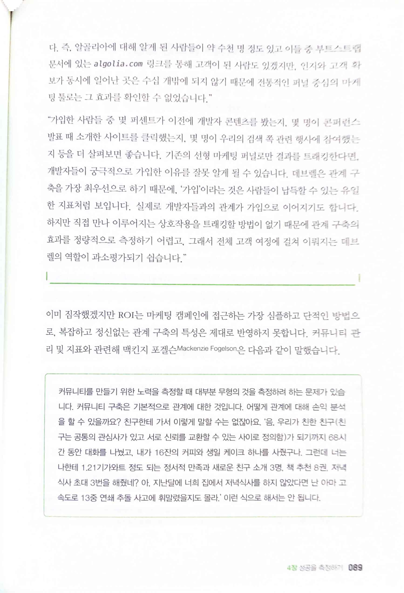

> 커뮤니티를 만들기 위한 노력을 측정할 때 대부분 무형의 것을 측정하려 하는 문제가 있습니다. 커뮤니티 구축은 기본적으로 관계에 대한 것입니다. 어떻게 관계에 대해 손익 분석을 할 수 있을까요?

> 깃허브 풀리퀘스트와 포크부터 트위터 인게이지먼트와 콘텐츠에 달린 댓글에 이르기까지, 온라인 인게이지먼트는 윗사람들에게 성장과 수치적인 지표를 보여줄 수 있는 가장 쉬운 방법입니다. 이런 측정 지표들을 언급한 이유는 바로 트위터 팔로워 수나 깃허브 리포지터리에 얼마나 많은 별을 받았는지와 같은 허무지표가 아니기 때문입니다. 이런 큰 숫자들은 보여주기엔 좋을지 몰라도, 사람들이 실제로 우리 콘텐츠를 보고 있는지에 대해서는 말해주지 않습니다. 그리고 더 중요한 것은 이런 허무지표는 커뮤니티 인게이지먼트를 보여주지 않는다는 것입니다.
* [Bitergia - Software Development Analytics for Your Peace of Mind](https://bitergia.com/)
* [Netflix/osstracker: Github organization OSS metrics collector and metrics dashboard](https://github.com/Netflix/osstracker)
* [MeasureOSS/Measure: At its core Measure is, for lack of a better term, a contributor relationship management system. Measure consists of easy to understand widgets that can be arbitrarily displayed to build dashboards. It allows you to understand how people as individuals and as organizations are interacting with open source projects on GitHub. It’s metrics that focus not only on code, but on contributors.](https://github.com/MeasureOSS/Measure)

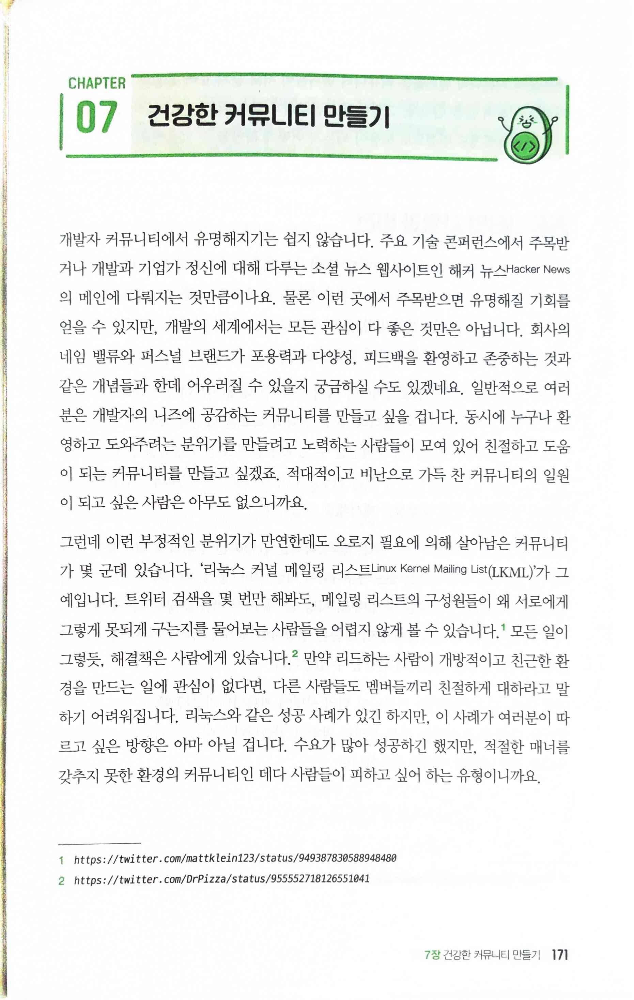

* '리눅스 커널 메일링 리스트Linux Kernel Mailing List(LKML)’에 대한 이야기가 사실이라면 결국 리누스 토발즈의 영향일까?

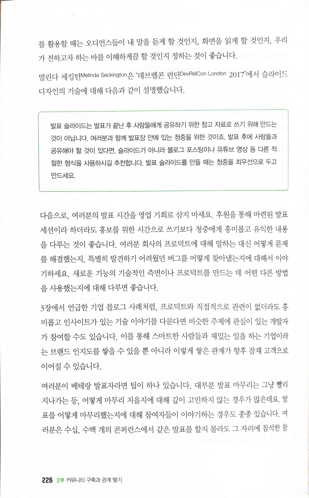 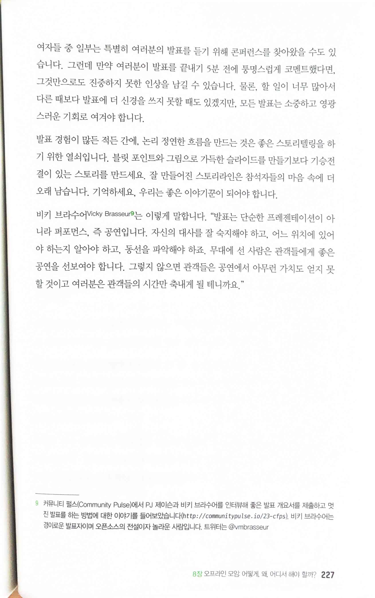

> 발표 슬라이드를 만들 때는 청중을 최우선으로
>
> 우리는 좋은 이야기꾼이 되어야 합니다.
>
> 비키 브라수어Vicky Brasseur 는 이렇게 말합니다. "발표는 단순한 프레젠테이션이 아니라 퍼포먼스, 즉 공연입니다. 자신의 대사를 잘 숙지해야 하고, 어느 위치에 있어야 하는지 알아야 하고, 동선을 파악해야 하죠. 무대에 선 사람은 관객들에게 좋은공연을 선보여야 합니다. 그렇지 않으면 관객들은 공연에서 아무런 가치도 얻지 못할 것이고 여러분은 관객들의 시간만 축내게 될 테니까요."
* [Community Pulse: How to Submit the Best CFP of your Life (and what to do when it gets accepted) (Ep 23)](https://www.communitypulse.io/23-cfps)

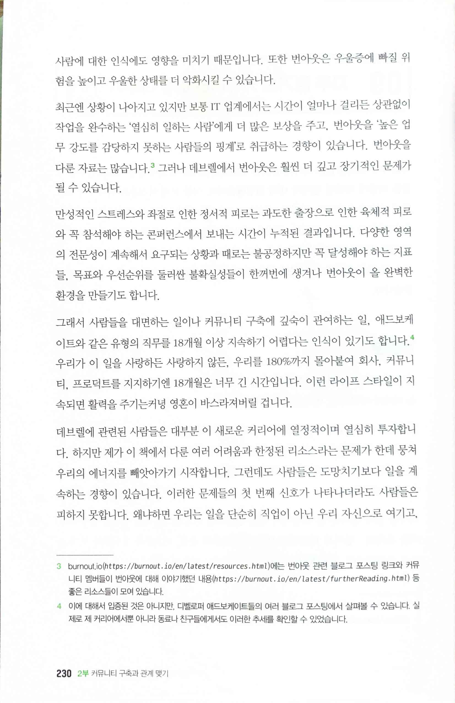 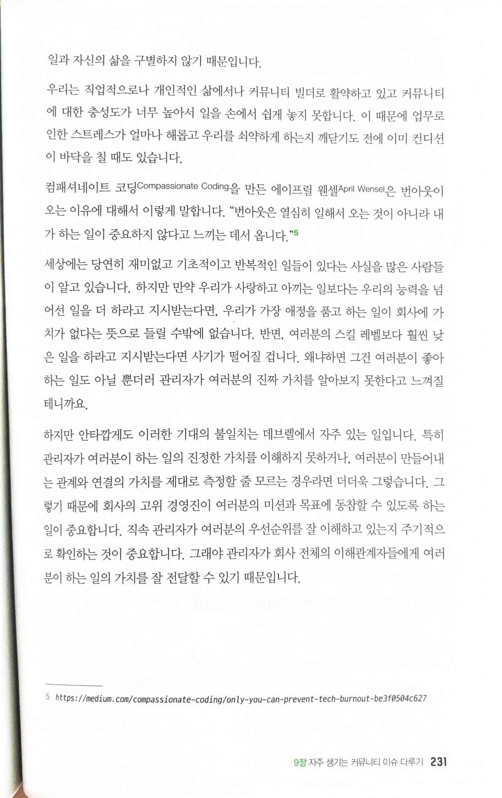

* [Resources — burnout.io 0.1 documentation](https://burnout.io/en/latest/resources.html)
* [Further Reading — burnout.io 0.1 documentation](https://burnout.io/en/latest/furtherReading.html)
> 컴패셔네이트 코딩Compassionate Coding을 만든 에이프릴 웬셀April Wensel은 번아웃이 오는 이유에 대해서 이렇게 말합니다. "번아웃은 열심히 일해서 오는 것이 아니라 내가 하는 일이 중요하지 않다고 느끼는 데서 옵니다."
* [Only You Can Prevent Tech Burnout | by April Wensel | Medium](https://aprilwensel.medium.com/only-you-can-prevent-tech-burnout-be3f0504c627)
> 그렇기 때문에 회사의 고위 경영진이 여러분의 미션과 목표에 동참할 수 있도록 하는 일이 중요합니다. 직속 관리자가 여러분의 우선순위를 잘 이해하고 있는지 주기적으로 확인하는 것이 중요합니다. 그래야 관리자가 회사 전체의 이해관계자들에게 여러분이 하는 일의 가치를 잘 전달할 수 있기 때문입니다.
* 그래서 1 on 1이 더 중요한 게 아닐까?

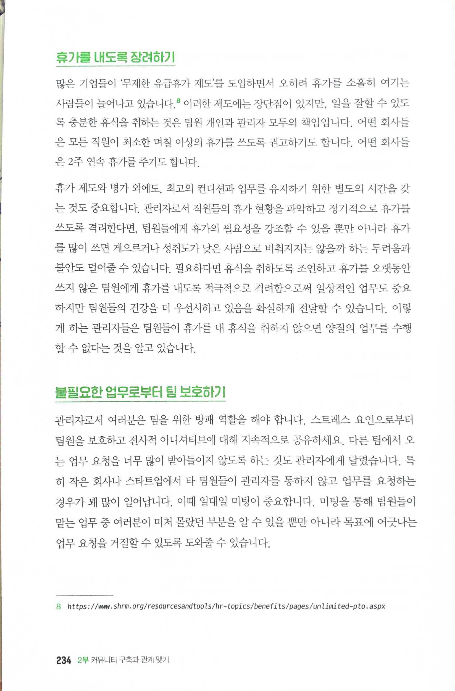

* [Unlimited Paid Time Off: A Good or Bad Idea?](https://www.shrm.org/resourcesandtools/hr-topics/benefits/pages/unlimited-pto.aspx)
> 불필요한 업무로부터 팀 보호하기. 관리자로서 여러분은 팀을 위한 방패 역할을 해야 합니다.

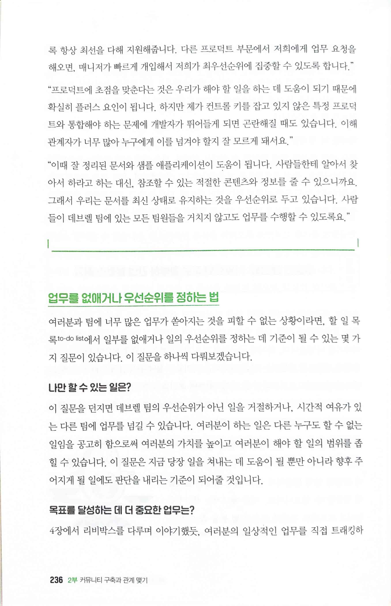 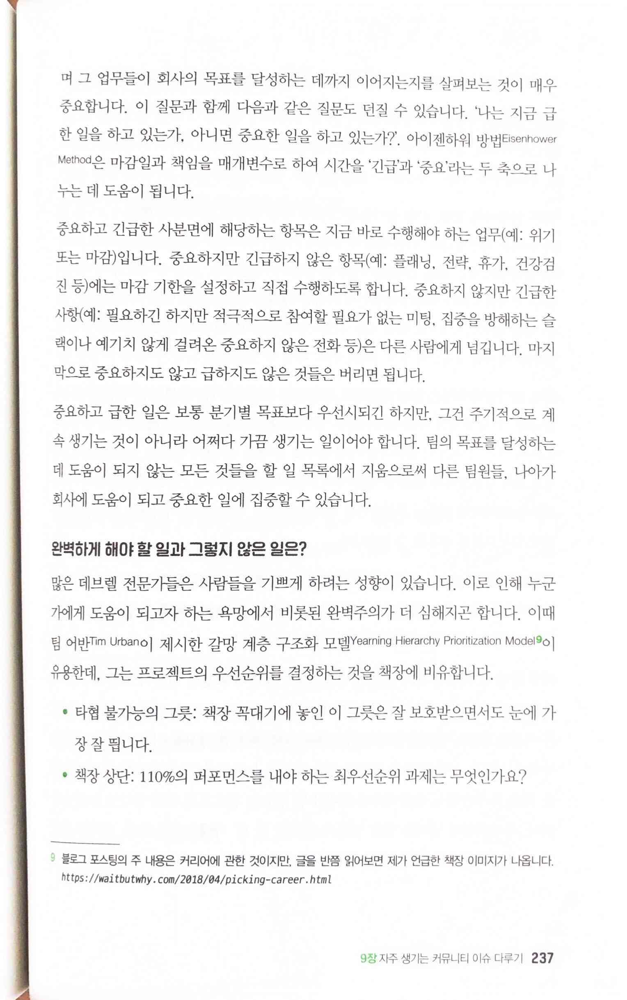 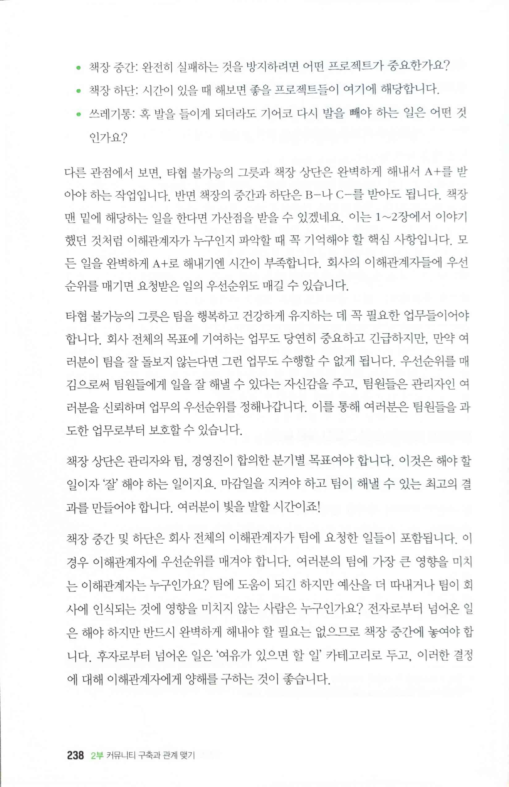 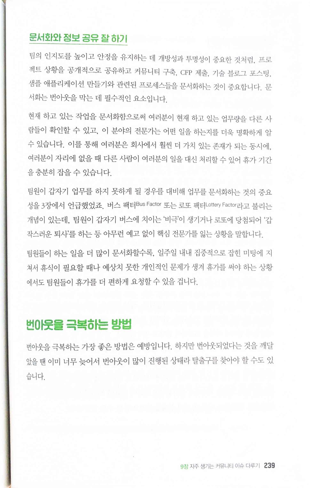

> 업무를 없애거나 우선순위를 정하는 법
>
> 나만 할 수 있는 일은?
>
> 목표를 달성하는 데 더 중요한 업무는?
>
> 완벽하게 해야 할 일과 그렇지 않은 일은?
>
> 문서화와 정보공유 잘 하기
* [How to Pick a Career (That Actually Fits You) — Wait But Why](https://waitbutwhy.com/2018/04/picking-career.html)

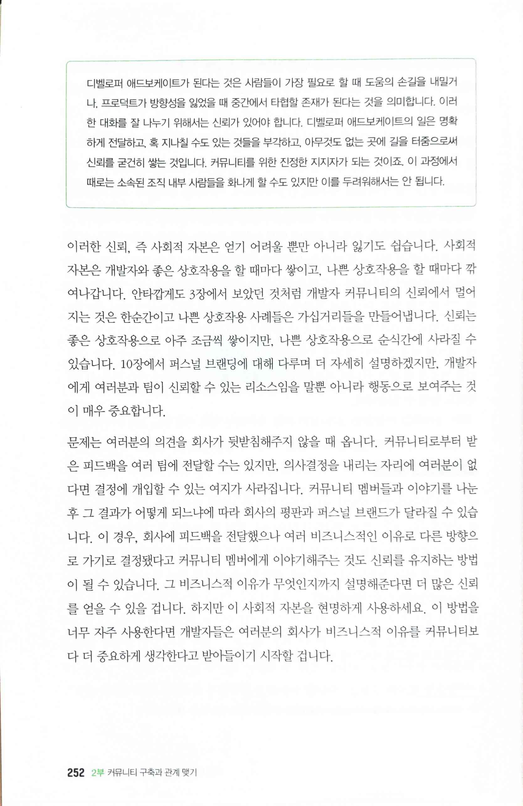

> 신뢰, 즉 사회적 자본은 얻기 어려울 뿐만 아니라 잃기도 쉽습니다... 신뢰는 좋은 상호작용으로 아주 조금씩 쌓이지만, 나쁜 상호작용으로 순식간에 사라질 수 있습니다.

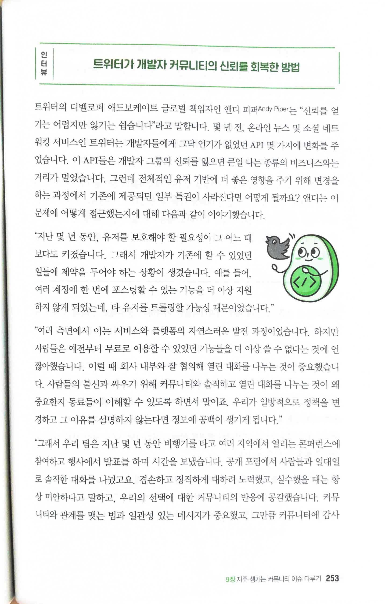 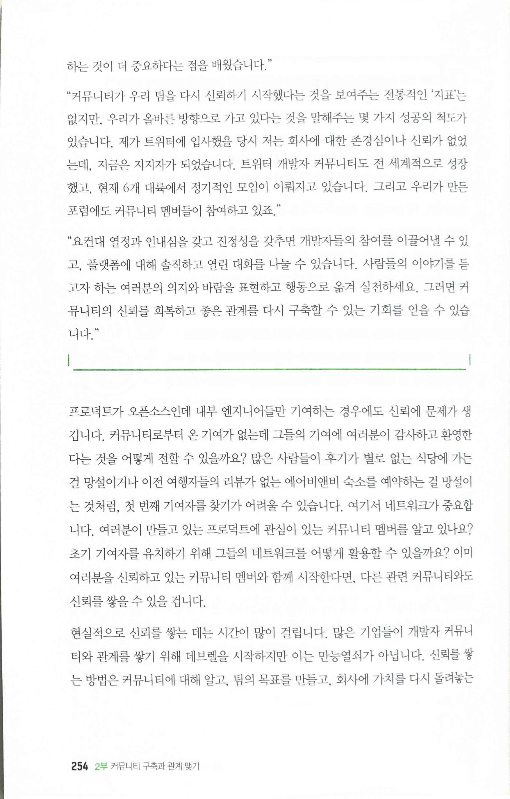 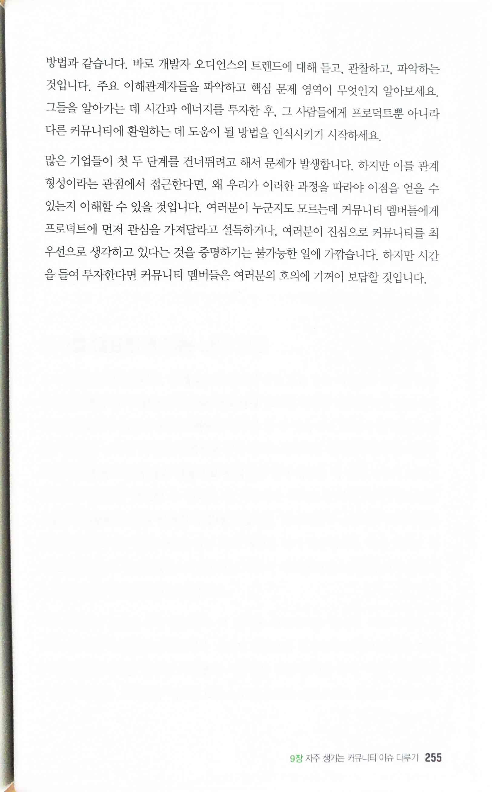

> “신뢰를 얻기는 어렵지만 잃기는 쉽습니다"
>
> 현실적으로 신뢰를 쌓는 데는 시간이 많이 걸립니다.