오늘도 개발자가 안 된다고 말했다
================================

# PART 01 - 가깝고도 먼 개발자

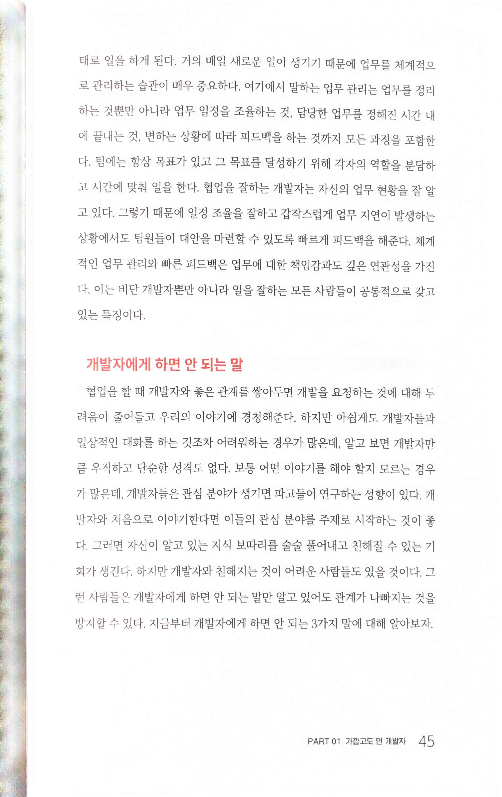 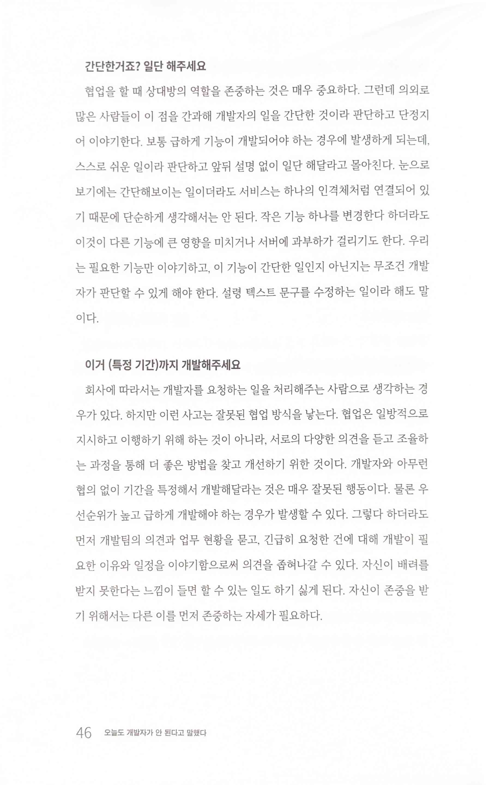 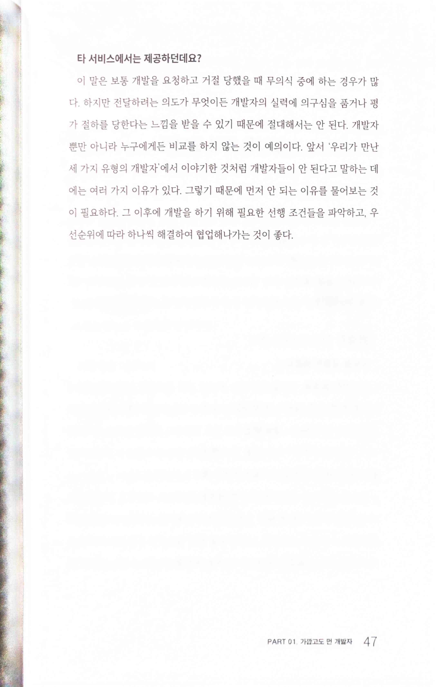

> 개발자에게 하면 안 되는 말
>
> 간단한거죠? 일단 해주세요
>
> 이거 (특정 기간)까지 개발해주세요
>
> 타 서비스에서는 제공하던데요?

# PART 02 - 기획자의 일

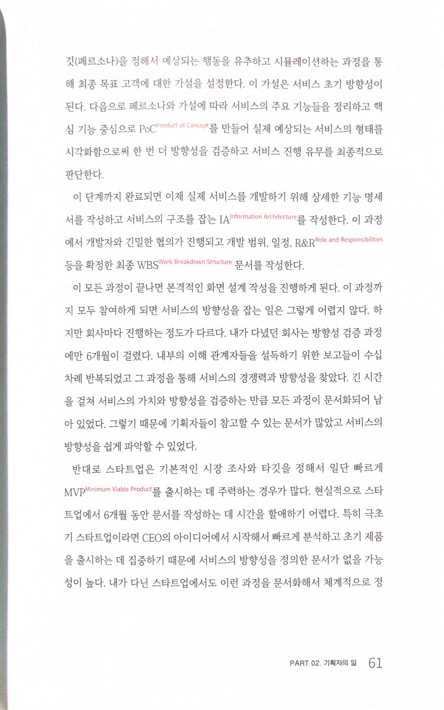

* PoC를 잘못 써놨음

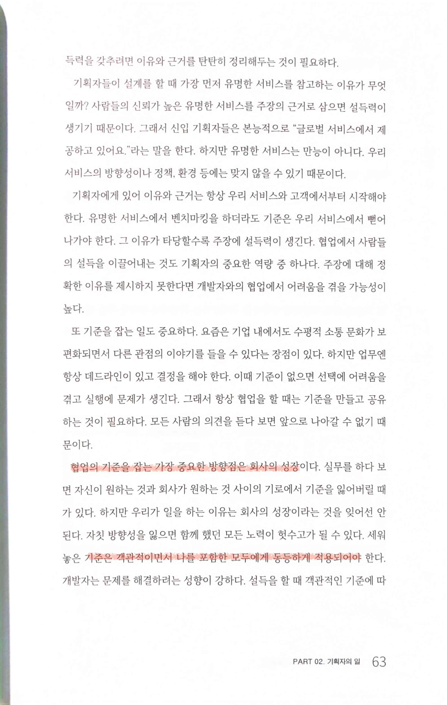

> 협업의 기준을 잡는 가장 중요한 방향점은 회사의 성장이다. 실무를 하다 보면 자신이 원하는 것과 회사가 원하는 것 사이의 기로에서 기준을 잃어버릴 때가 있다. 하지만 우리가 일을 하는 이유는 회사의 성장이라는 것을 잊어선 안된다. 자칫 방향성을 잃으면 함께 했던 모든 노력이 헛수고가 될 수 있다. 세워놓은 기준은 객관적이면서 나를 포함한 모두에게 동등하게 적용되어야 한다.

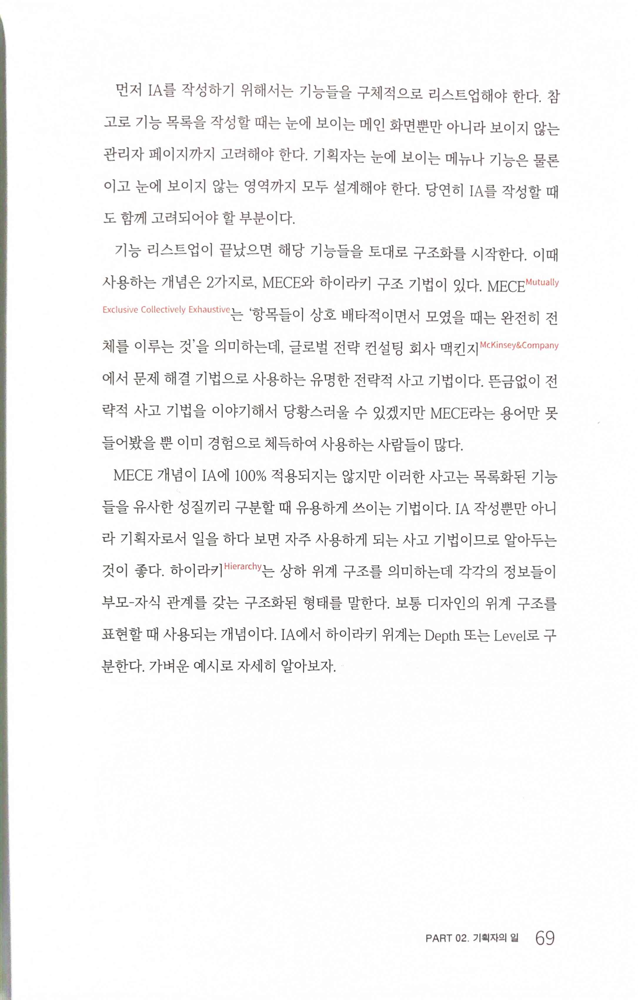

> MECE Mutually Exclusive Collectively Exhaustive '항목들이 상호 배타적이면서 모였을 때는 완전히 전체를 이루는 것'
>
> 하이라키 Hierarchy는 상하 위계 구조를 의미하는데 각각의 정보들이 부모-자식 관계를 갖는 구조화된 형태

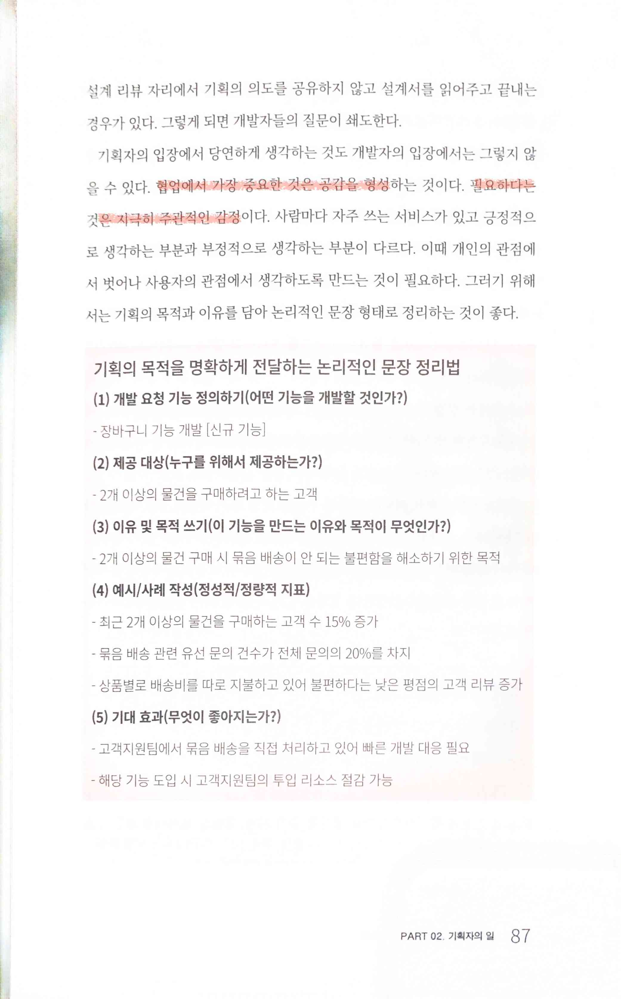

> 협업에서 가장 중요한 것은 공감을 형성하는 것이다. 필요하다는 것은 지극히 주관적인 감정이다.

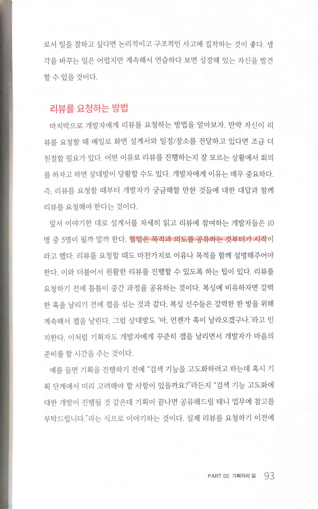

> 협업은 목적과 의도를 공유하는 것부터가 시작

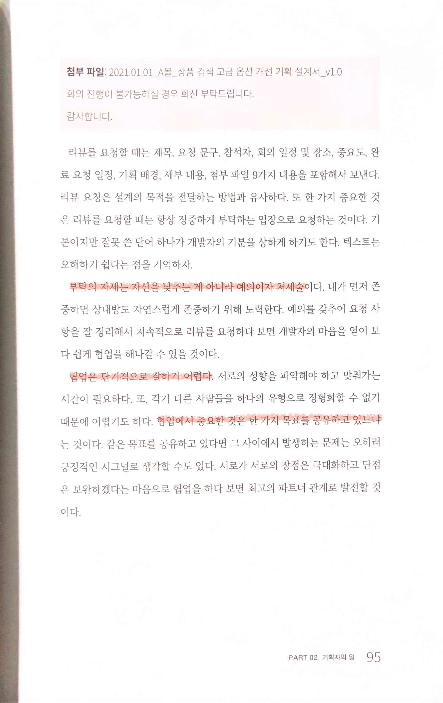

> 부탁의 자세는 자신을 낮추는 게 아니라 예의이자 처세술이다. 내가 먼저 존중하면 상대방도 자연스럽게 존중하기 위해 노력한다.
>
> 협업은 단기적으로 잘하기 어렵다. 서로의 성향을 파악해야 하고 맞춰가는시간이 필요하다. 또, 각기 다른 사람들을 하나의 유형으로 정형화할 수 없기 때문에 어렵기도 하다. 협업에서 중요한 것은 한 가지 목표를 공유하고 있느냐는 것이다. 같은 목표를 공유하고 있다면 그 사이에서 발생하는 문제는 오히려 긍정적인 시그널로 생각할 수도 있다. 서로가 서로의 장점은 극대화하고 단점은 보완하겠다는 마음으로 협업을 하다 보면 최고의 파트너 관계로 발전할 것이다.

# PART 03 - 디자이너의 일

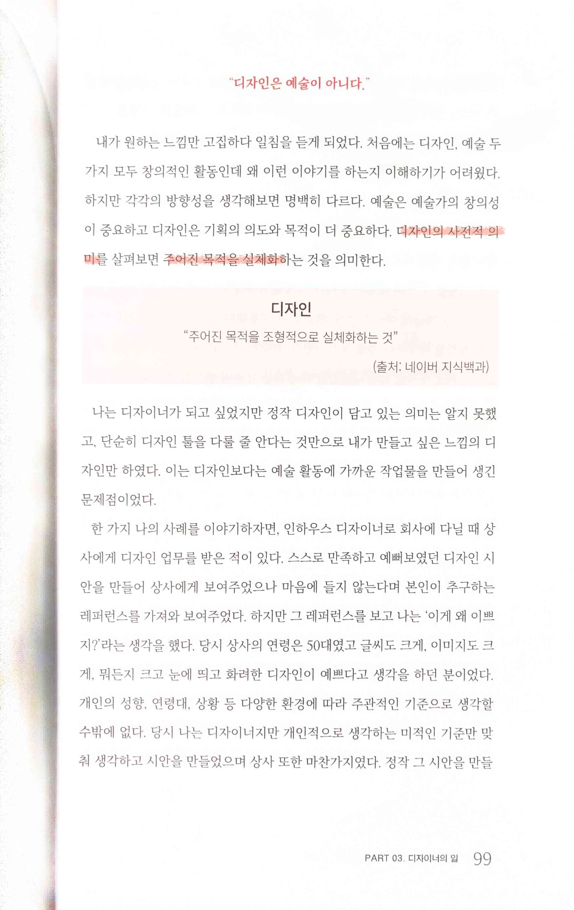

> 디자인의 사전적 의미를 살펴보면 주어진 목적을 실체화하는 것을 의미

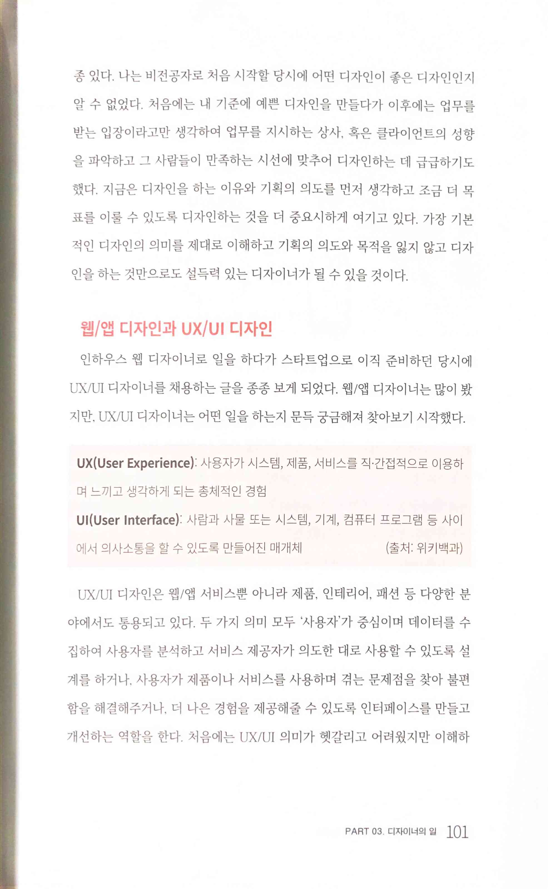 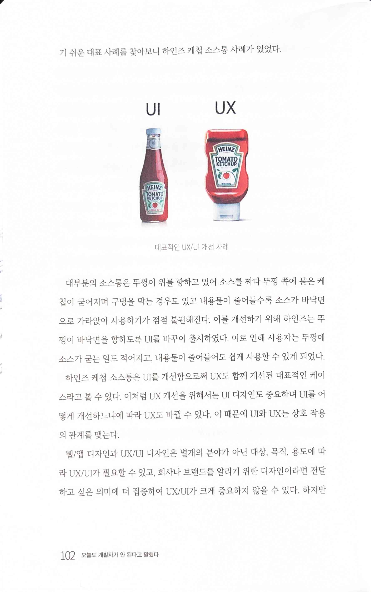

> 하인즈 케첩 소스통은 UI를 개선함으로써 UX도 함께 개선된 대표적인 케이스

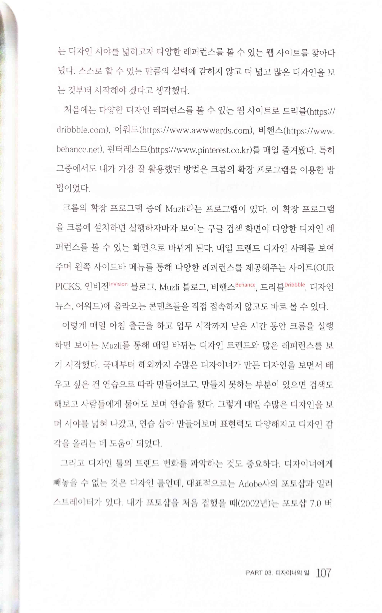

* 디자인 레퍼런스
  * https://dribbble.com
  * https://www.awwwards.com
  * https://www.behance.net
  * https://www.pinterest.com
  * [Muzli by InVision](https://muz.li/) 크롬의 확장 프로그램 Muzli

# PART 04 - 개발자의 일