DOING AGILE RIGHT 조직을 민첩하고 유연하게 바꾸는 애자일 전략
=============================================================
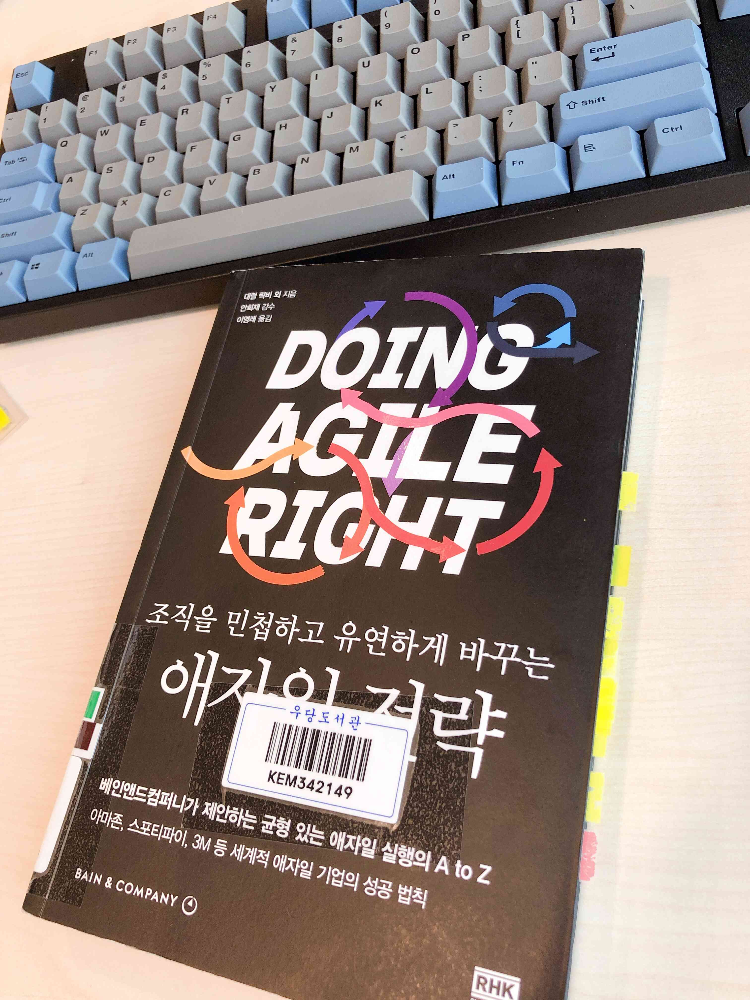

* [Ask the Authors - Doing Agile Right | Bain & Company](https://www.bain.com/ko/insights/books/doing-agile-right/ask-the-authors/)

# 프롤로그 균형 잡힌 애자일 기업으로 나아가기
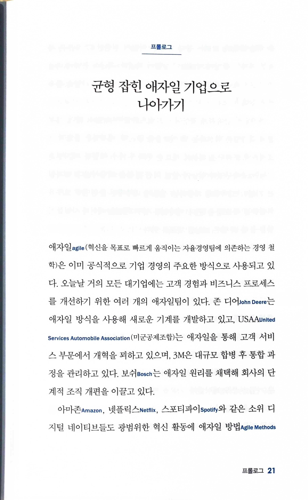

> 애자일 agile (혁신을 목표로 빠르게 움직이는 자율경영팀에 의존하는 경영 철학)은 이미 공식적으로 기업 경영의 주요한 방식으로 사용되고 있다.

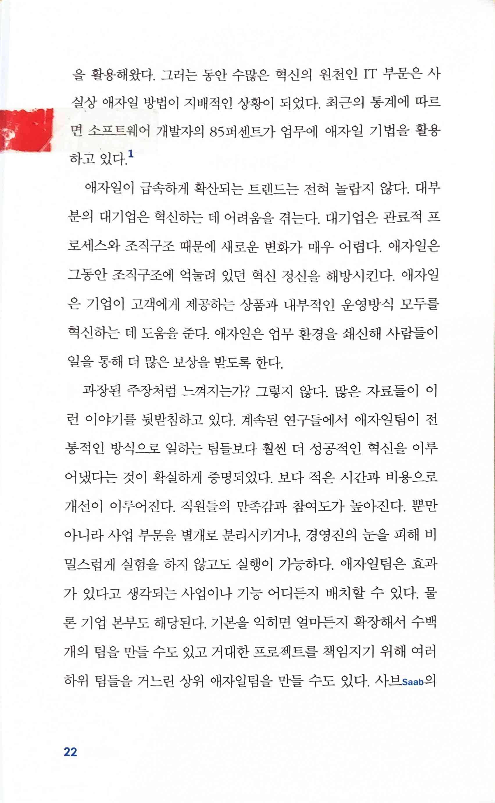

> 수많은 혁신의 원천인 IT 부문은 사실상 애자일 방법이 지배적인 상황이 되었다. 최근의 통계에 따르면 소프트웨어 개발자의 85퍼센트가 업무에 애자일 기법을 활용하고 있다.
* [Stack Overflow Developer Survey 2018](https://insights.stackoverflow.com/survey/2018#development-practices) 조사 대상 소프트웨어 개발자 10만 1,592 명 중 85.9퍼센트가 업무에 애자일을 사용
  * 2019년부터는 아예 이 항목에 대한 조사가 없다. 조사할 필요가 없을 정도로 agile을 모두 쓰기 때문일 지도 모르겠다.

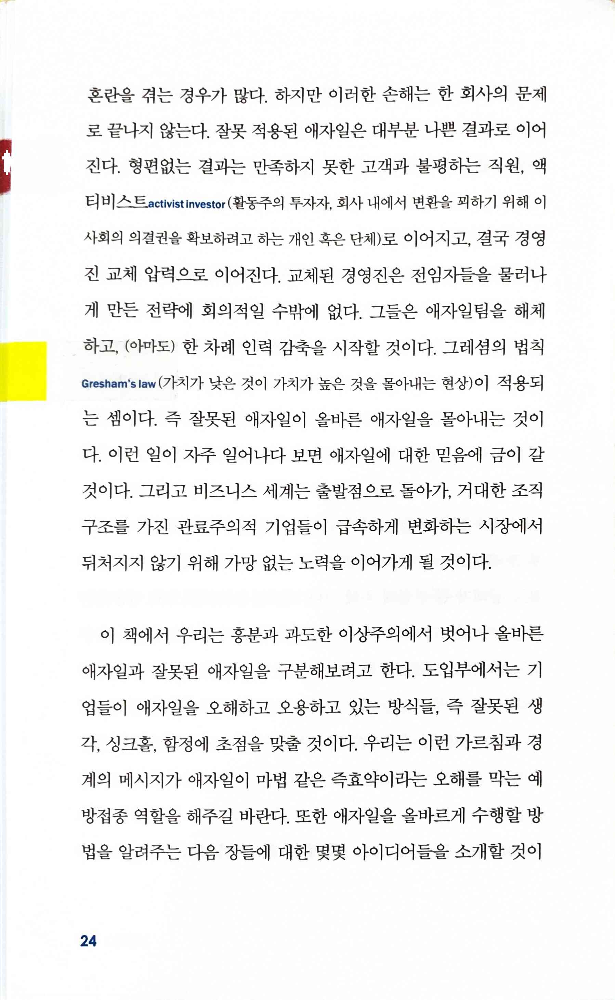

> 잘못 적용된 애자일은 대부분 나쁜 결과로 이어진다... 그들은 애자일팀을 해체하고, (아마도) 한 차례 인력 감축을 시작할 것이다. 그레셤의 법칙 Gresham's law (가치가 낮은 것이 가치가 높은 것을 몰아내는 현상)이 적용되는 셈이다. 즉 잘못된 애자일이 올바른 애자일을 몰아내는 것이다. 이런 일이 자주 일어나다 보면 애자일에 대한 믿음에 금이 갈 것이다. 그리고 비즈니스 세계는 출발점으로 돌아가, 거대한 조직구조를 가진 관료주의적 기업들이 급속하게 변화하는 시장에서 뒤처지지 않기 위해 가망 없는 노력을 이어가게 될 것이다.

> 영화 <프린세스 브라이드The Princess Bride>에서 검법 마스터인 이니고 몬토야는 교활한 비지니를 이렇게 꾸짖는다.
>
> “너는 늘 그 단어를 사용하는데, 그건 네가 생각하는 그런 뜻이 아니야."
>
> 애자일도 마찬가지이다. 어떤 경영자들은 애자일이 어떻게 작동하는지, 어디에서 왜 성공하는지 이해하지 못한다. 그런데도 그들은 끊임없이 애자일 관련 용어들을 함부로 사용하거나 애자일에 대해 사실과 다른 가정을 한다.
* [HDC현산 붕괴 사고, 수익성만 쫓은 ‘애자일 경영'이 문제였나 - 이코노미스트](https://economist.co.kr/2022/01/14/policy/issue/20220114080102874.html)
  * 잘못 적용한 현대산업개발, 애자일을 전혀 모르고 기사를 작성한 기자 양쪽 다 문제
* [KFA, 혁신적 조직개편... 애자일 조직 적용 혁신 공식발표 - 머니투데이](https://news.mt.co.kr/mtview.php?no=202102091657777285O)
  * 이후 2022년 축구 행정은 역대 최악이라는 평가가 나올 정도로 엉망인 상황. 대표적으로 카타르 올림픽을 앞두고 9월 11월 마지막 평가전을 카타르와 시차가 비슷한 유럽에서 치르지 않고 입장 수입을 위해 국내에서 치르기로 해 각종 축구 커뮤니티에서는 불만이 쏟아지는 상황. 동아시아의 월드컵 진출국 중 유럽이 아니라 국내에서 평가전을 치르는 건 한국이 유일
  * 축구협회장은 공교롭게도 광주 붕괴 사고 전까지 현대산업개발 회장이었던 정몽규

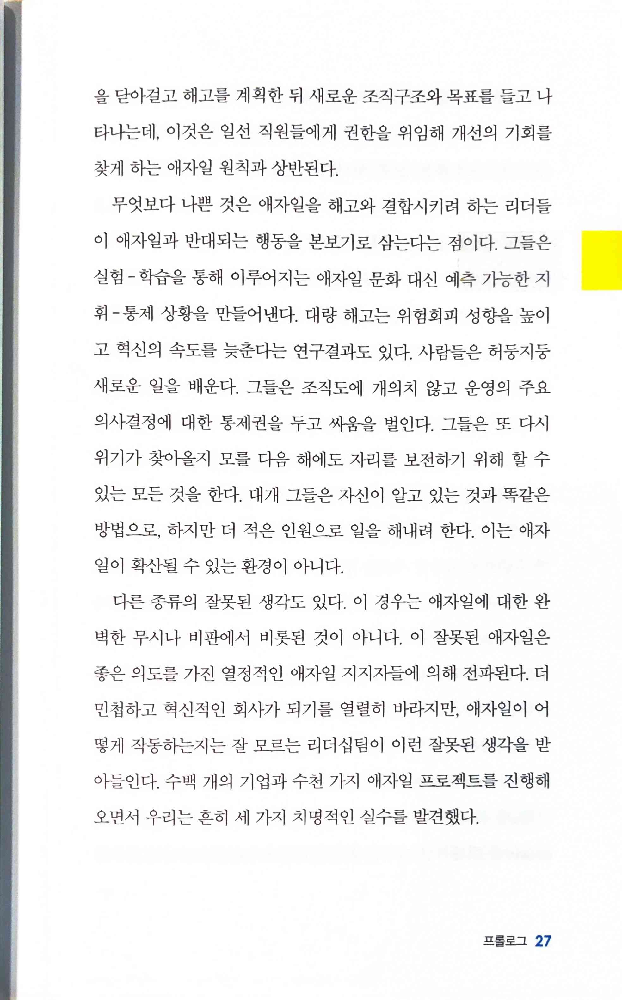

> 무엇보다 나쁜 것은 애자일을 해고와 결합시키려 하는 리더들이 애자일과 반대되는 행동을 본보기로 삼는다는 점이다. 그들은 실험 - 학습을 통해 이루어지는 애자일 문화 대신 예측 가능한 지휘 - 통제 상황을 만들어낸다.

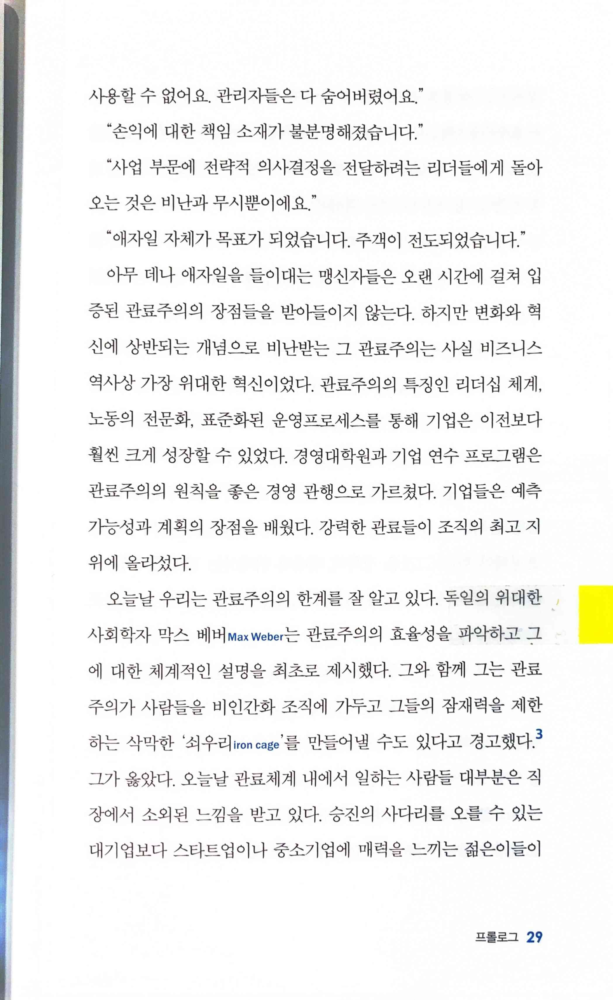

> 독일의 위대한 사회학자 막스 베버 Max Weber는 관료주의의 효율성을 파악하고 그에 대한 체계적인 설명을 최초로 제시했다. 그와 함께 그는 관료주의가 사람들을 비인간화 조직에 가두고 그들의 잠재력을 제한하는 삭막한 '쇠우리 iron cage'를 만들어낼 수도 있다고 경고했다.

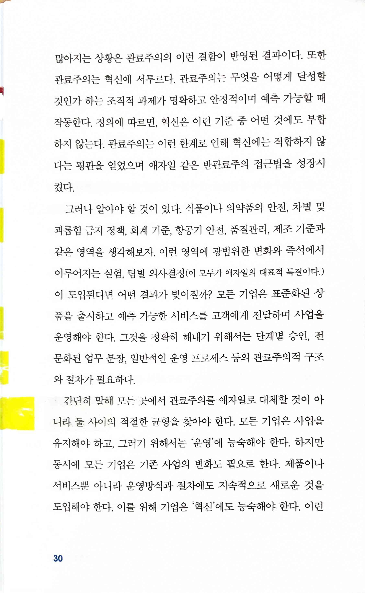

> 간단히 말해 모든 곳에서 관료주의를 애자일로 대체할 것이 아니라 둘 사이의 적절한 균형을 찾아야 한다. 모든 기업은 사업을 유지해야 하고, 그러기 위해서는 '운영'에 능숙해야 한다. 하지만 동시에 모든 기업은 기존 사업의 변화도 필요로 한다. 제품이나 서비스뿐 아니라 운영방식과 절차에도 지속적으로 새로운 것을 도입해야 한다. 이를 위해 기업은 '혁신'에도 능숙해야 한다.

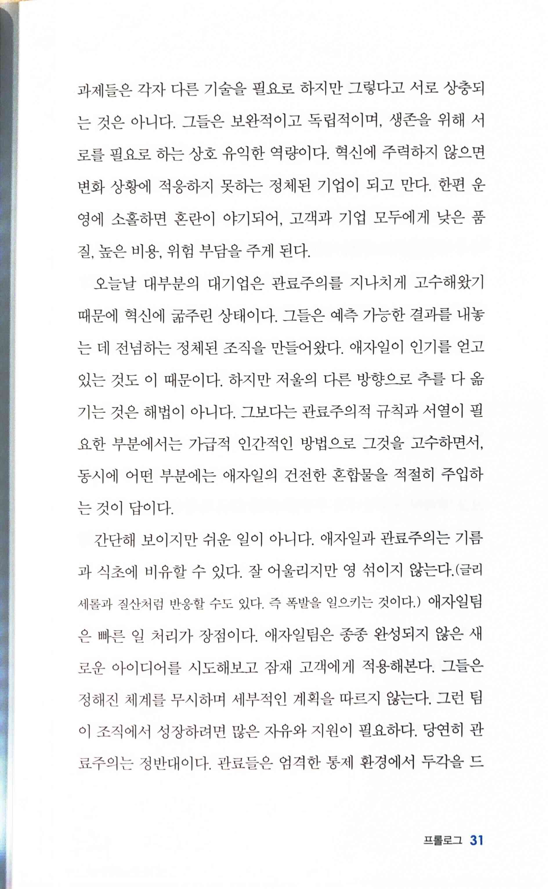

> 오늘날 대부분의 대기업은 관료주의를 지나치게 고수해왔기 때문에 혁신에 굶주린 상태이다. 그들은 예측 가능한 결과를 내놓는 데 전념하는 정체된 조직을 만들어왔다. 애자일이 인기를 얻고 있는 것도 이 때문이다. 하지만 저울의 다른 방향으로 추를 다 옮기는 것은 해법이 아니다. 그보다는 관료주의적 규칙과 서열이 필요한 부분에서는 가급적 인간적인 방법으로 그것을 고수하면서, 동시에 어떤 부분에는 애자일의 건전한 혼합물을 적절히 주입하는 것이 답이다.
>
> 애자일과 관료주의는 기름과 식초에 비유할 수 있다. 잘 어울리지만 영 섞이지 않는다. (글리세롤과 질산처럼 반응할 수도 있다. 즉 폭발을 일으키는 것이다.) 애자일팀은 빠른 일 처리가 장점이다. 애자일팀은 종종 완성되지 않은 새로운 아이디어를 시도해보고 잠재 고객에게 적용해본다. 그들은 정해진 체계를 무시하며 세부적인 계획을 따르지 않는다. 그런 팀이 조직에서 성장하려면 많은 자유와 지원이 필요하다. 당연히 관료주의는 정반대이다.

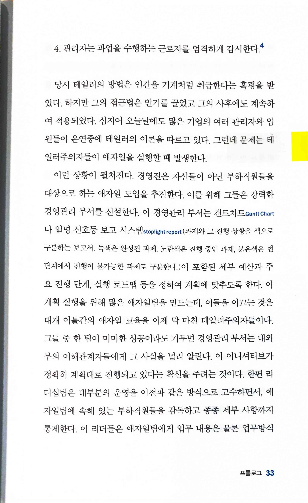

> 문제는 테일러주의자들이 애자일을 실행할 때 발생한다.

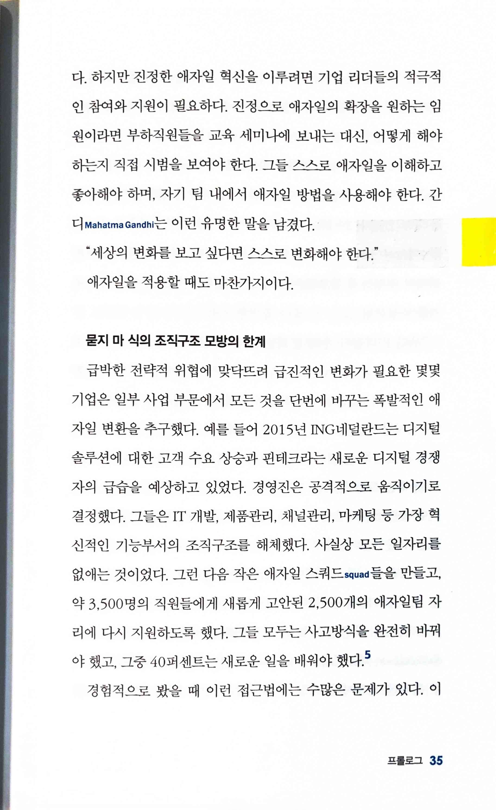

> 진정한 애자일 혁신을 이루려면 기업 리더들의 적극적인 참여와 지원이 필요하다. 진정으로 애자일의 확장을 원하는 임원이라면 부하직원들을 교육 세미나에 보내는 대신, 어떻게 해야 하는지 직접 시범을 보여야 한다. 그들 스스로 애자일을 이해하고 좋아해야 하며, 자기 팀 내에서 애자일 방법을 사용해야 한다. 간디 Mahatma Gandhi는 이런 유명한 말을 남겼다.
>
> “세상의 변화를 보고 싶다면 스스로 변화해야 한다."
>
> 애자일을 적용할 때도 마찬가지이다.

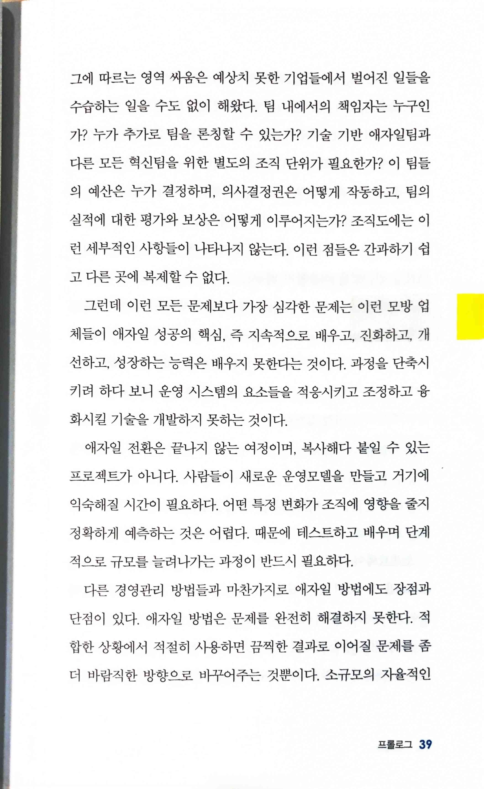

> 가장 심각한 문제는 이런 모방 업체들이 애자일 성공의 핵심, 즉 지속적으로 배우고, 진화하고, 개선하고, 성장하는 능력은 배우지 못한다는 것이다. 과정을 단축시키려 하다 보니 운영 시스템의 요소들을 적응시키고 조정하고 융화시킬 기술을 개발하지 못하는 것이다.
>
> 애자일 전환은 끝나지 않는 여정이며, 복사해다 붙일 수 있는 프로젝트가 아니다. 사람들이 새로운 운영모델을 만들고 거기에 익숙해질 시간이 필요하다. 어떤 특정 변화가 조직에 영향을 줄지 정확하게 예측하는 것은 어렵다. 때문에 테스트하고 배우며 단계적으로 규모를 늘려나가는 과정이 반드시 필요하다.
>
> 다른 경영관리 방법들과 마찬가지로 애자일 방법에도 장점과 단점이 있다. 애자일 방법은 문제를 완전히 해결하지 못한다. 적합한 상황에서 적절히 사용하면 끔찍한 결과로 이어질 문제를 좀더 바람직한 방향으로 바꾸어주는 것뿐이다. 

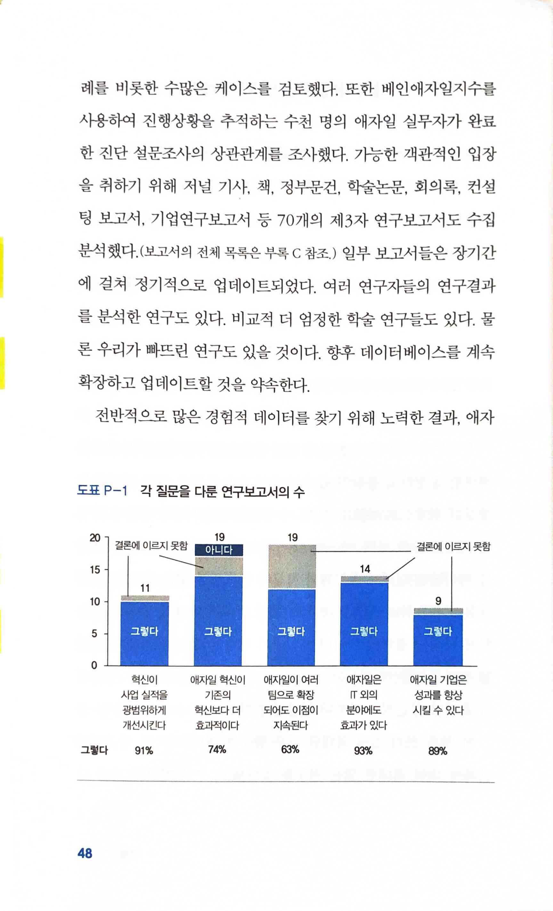 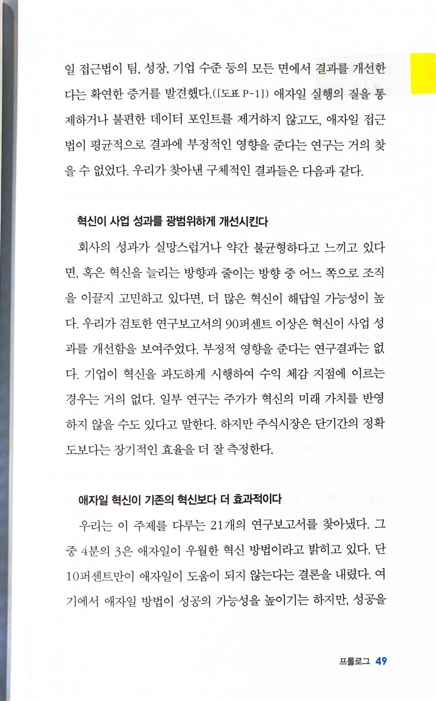

> 전반적으로 많은 경험적 데이터를 찾기 위해 노력한 결과, 애자일 접근법이 팀, 성장, 기업 수준 등의 모든 면에서 결과를 개선한다는 확연한 증거를 발견했다.(도표 P-11)

# 1장 애자일 원리, 애자일은 어떻게 작동하는가? HOW AGILE REALLY WORKS

> CEO가 애자일팀을 보호하는 것이 팀의 성공 가능성을 높이는 것을 이미 목격했습니다. 문제는 그렇게 해서는 수십, 수백 개의 팀으로 늘리는 데 필요한 학습 환경이나 조직 변화를 만들어낼 수 없다는 겁니다.

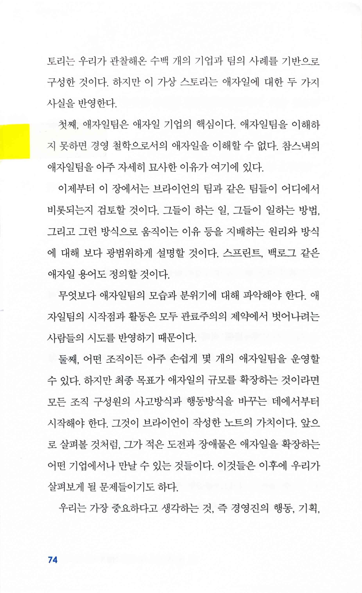

> 첫째, 애자일팀은 애자일 기업의 핵심이다. 애자일팀을 이해하지 못하면 경영 철학으로서의 애자일을 이해할 수 없다.
>
> 둘째, 어떤 조직이든 아주 손쉽게 몇 개의 애자일팀을 운영할 수 있다. 하지만 최종 목표가 애자일의 규모를 확장하는 것이라면 모든 조직 구성원의 사고방식과 행동방식을 바꾸는 데에서부터 시작해야 한다.

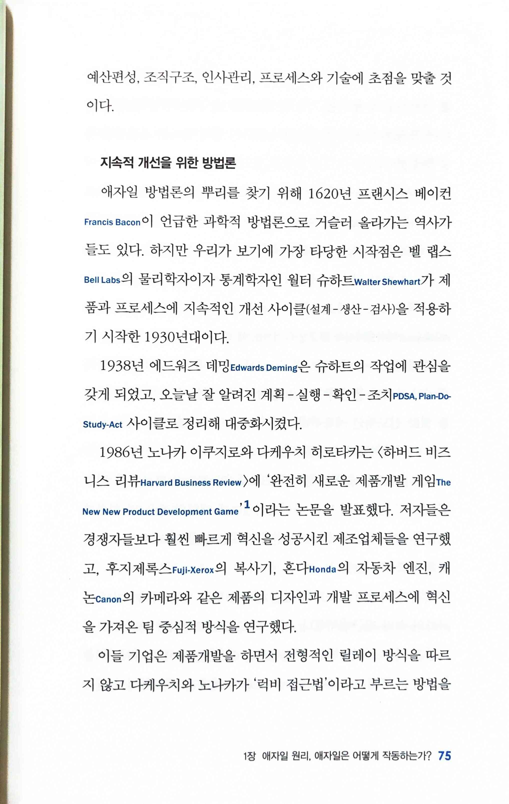

> 애자일 방법론의 뿌리
>
> 벨 랩스 Bell Labs의 물리학자이자 통계학자인 월터 슈하트Walter Shewhart가 제품과 프로세스에 지속적인 개선 사이클(설계 -생산- 검사)을 적용하기 시작한 1930년대
>
> 1938년 에드워즈 데밍Edwards Deming은 슈하트의 작업에 관심을 갖게 되었고, 오늘날 잘 알려진 계획 - 실행 - 확인 - 조치 PDSA, Plan-Do-Study-Act 사이클로 정리해 대중화
>
> 1986년 노나카 이쿠지로와 다케우치 히로타카는 <하버드 비즈니스 리뷰Harvard Business Review>에 '완전히 새로운 제품개발 게임 The New New Product Development Game'이라는 논문을 발표
* [The New New Product Development Game](https://hbr.org/1986/01/the-new-new-product-development-game)

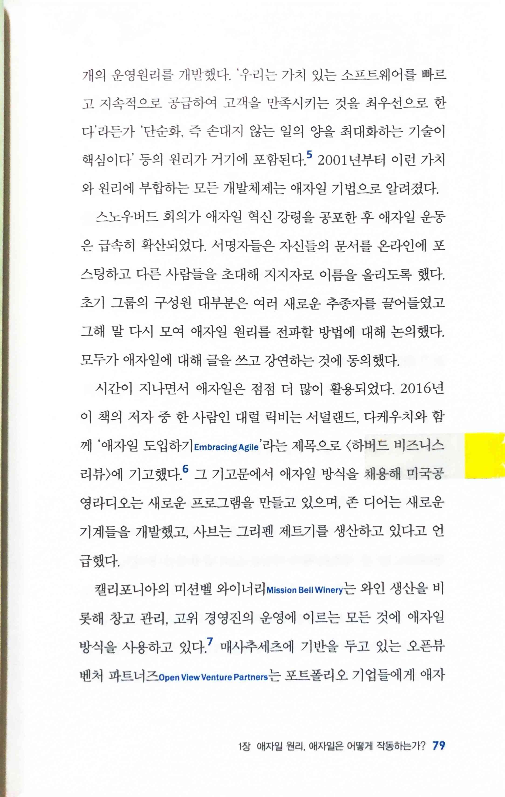

> 2016년이 책의 저자 중 한 사람인 대럴 릭비는 서덜랜드, 다케우치와 함께 '애자일 도입하기 Embracing Agile'라는 제목으로 <하버드 비즈니스 리뷰>에 기고
* [Embracing Agile](https://hbr.org/2016/05/embracing-agile)

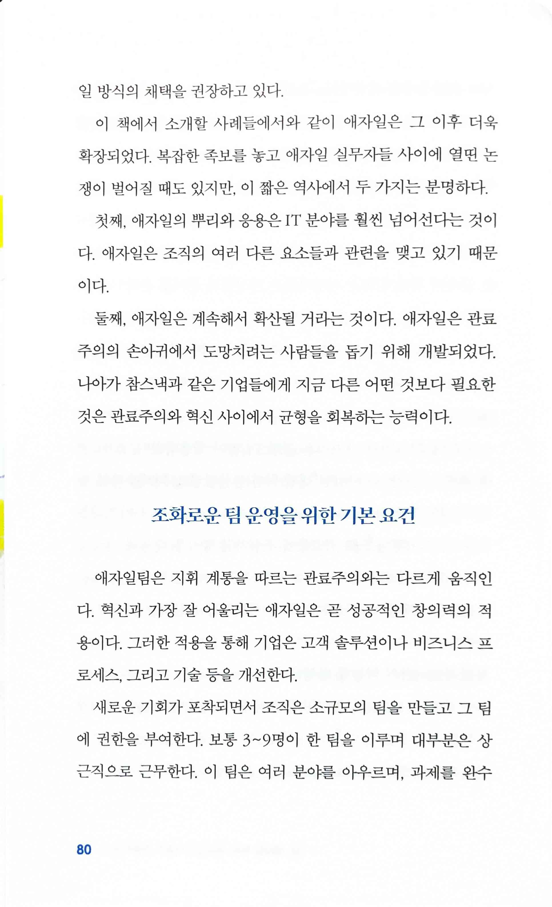

> 복잡한 족보를 놓고 애자일 실무자들 사이에 열띤 논쟁이 벌어질 때도 있지만, 이 짧은 역사에서 두 가지는 분명하다.
>
> 첫째, 애자일의 뿌리와 응용은 IT 분야를 훨씬 넘어선다는 것이다. 애자일은 조직의 여러 다른 요소들과 관련을 맺고 있기 때문이다.
>
> 둘째, 애자일은 계속해서 확산될 거라는 것이다. 애자일은 관료주의의 손아귀에서 도망치려는 사람들을 돕기 위해 개발되었다. 나아가 ... 기업들에게 지금 다른 어떤 것보다 필요한 것은 관료주의와 혁신 사이에서 균형을 회복하는 능력이다.

> 애자일팀은 스스로 관리하며 일의 모든 측면에서 철저히 책임진다. 경영진은 팀원들에게 어느 영역에 집중해야 할지를 말해줄 뿐, 그 방법은 지시하지 않는다. 복잡하고 큰 문제에 부딪히면 팀은 그 문제를 모듈로 나누고, 빠른 프로토타입 산출, 촘촘한 피드백 프로세스를 통해 각 요소에 대한 해법을 개발하며, 이렇게 개발한 해법들을 완전한 솔루션 및 제품으로 통합한다.
>
> 팀원들은 기존 계획을 고수하는 것보다는 변화에 따라 유연하게 대응하는 것에 더 가치를 둔다. 그들은 단순한 성과물(코드라인이나 신제품 수 등)뿐 아니라 최종결과(성장이나 수익성, 고객충성도 등)까지 직접 책임진다. 애자일팀은 내외부에서 고객과 긴밀하게 협력한다. 고객과 가장 가까운 사람들의 손에 혁신의 책임을 맡기는 것을 가장 이상적으로 본다. 이는 통제와 승인의 단계를 줄여 업무의 속도를 높이고 팀의 사기를 끌어올린다.
>
> 애자일 접근법은 생각하는 방식과 구체적 방법론의 조합이다. 종종 열성적 지지자들 사이에서 둘 중 어느 것이 더 중요한가 논쟁이 벌어지기도 하지만 사실 이런 논쟁은 터무니없는 것이다. 머리와 심장 중 생존에 더 중요한 것은 무엇일까? 둘 중 하나라도 없으면 사람은 죽고 만다.
> 철학으로서의 애자일은 오로지 고객에게 초점을 맞춘다. 애자일 전문가들은 모든 업무 활동의 중심에는 고객이 있으며, 그 업무는 고객의 니즈를 가장 효과적이고 유익하게 충족시키도록 구조화되어야 한다고 믿는다.

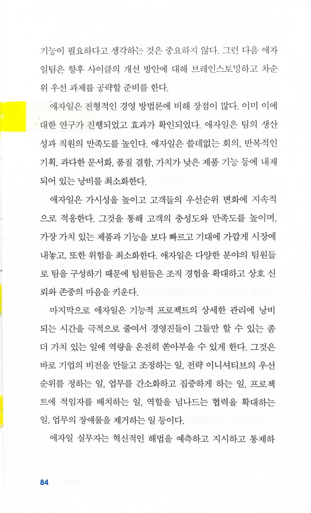

> 애자일은 전형적인 경영 방법론에 비해 장점이 많다. 이미 이에 대한 연구가 진행되었고 효과가 확인되었다. 애자일은 팀의 생산성과 직원의 만족도를 높인다. 애자일은 쓸데없는 회의, 반복적인 기획, 과다한 문서화, 품질 결함, 가치가 낮은 제품 기능 등에 내재되어 있는 낭비를 최소화한다.
>
> 애자일은 가시성을 높이고 고객들의 우선순위 변화에 지속적으로 적응한다. 
>
> 애자일은 기능적 프로젝트의 상세한 관리에 낭비되는 시간을 극적으로 줄여서 경영진들이 그들만 할 수 있는 좀 더 가치 있는 일에 역량을 온전히 쏟아부을 수 있게 한다.

> 애자일 실무자는 혁신적인 해법을 예측하고 지시하고 통제하는 관리자의 능력에 대해 유난히 회의적이다. 특히 무엇을 전달해야 할지, 어떻게 전달해야 할지 모호한 상황에서는 더 그렇다.

> 피드백 시스템이 충분히 짧고 민감하다면, 계획 변경은 갑작스럽거나 거슬리는 것 없이 매끄럽고 편안하게 수행될 것이다. 당신이 배우게 될 애자일이란 이런 것이다.

# 2장 애자일 기업을 향한 확장 SCALING AGILE
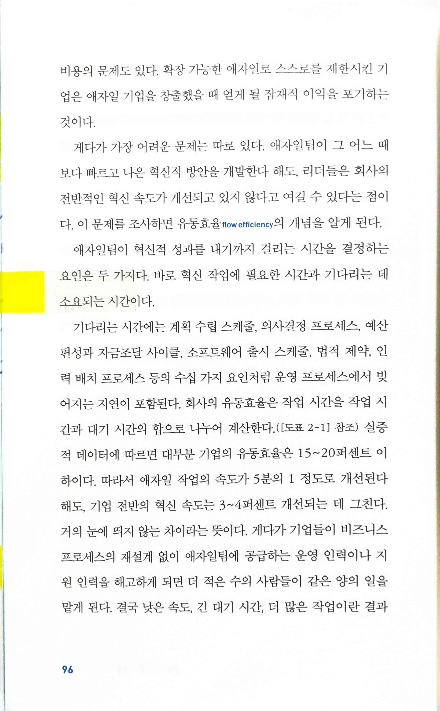

> 애자일팀이 그 어느 때보다 빠르고 나은 혁신적 방안을 개발한다 해도, 리더들은 회사의 전반적인 혁신 속도가 개선되고 있지 않다고 여길 수 있다. 이 문제를 조사하면 유동효율flow efficiency의 개념을 알게 된다.
>
> 애자일팀이 혁신적 성과를 내기까지 걸리는 시간을 결정하는 요인은 두 가지다. 바로 혁신 작업에 필요한 시간과 기다리는 데 소요되는 시간이다.

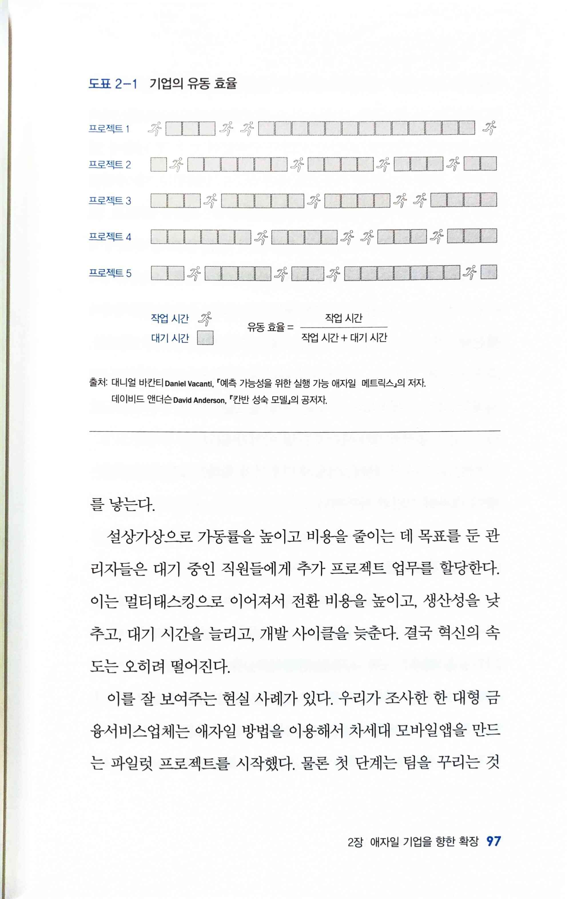

> 도표 2-1 기업의 유동 효율

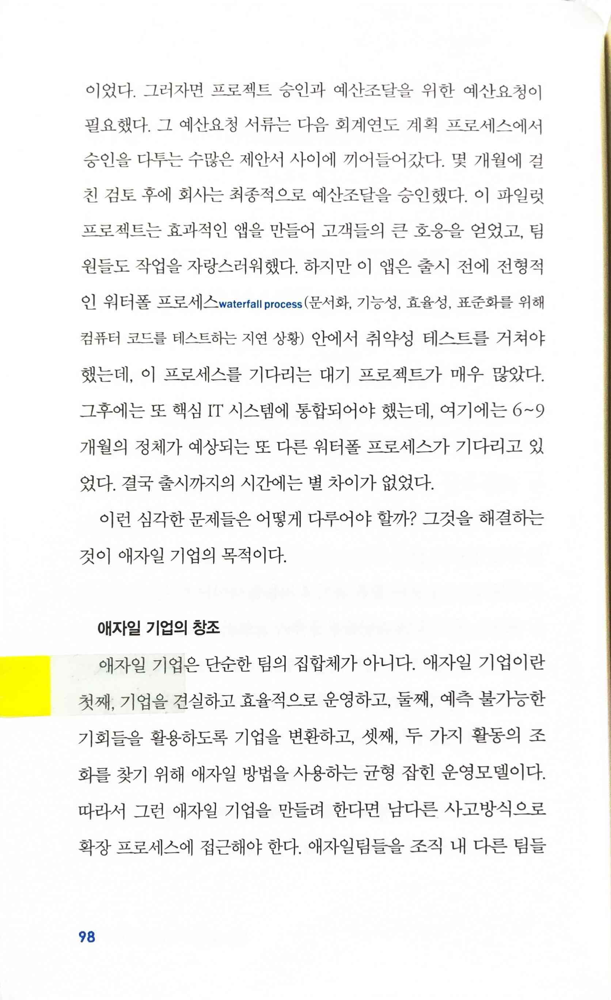 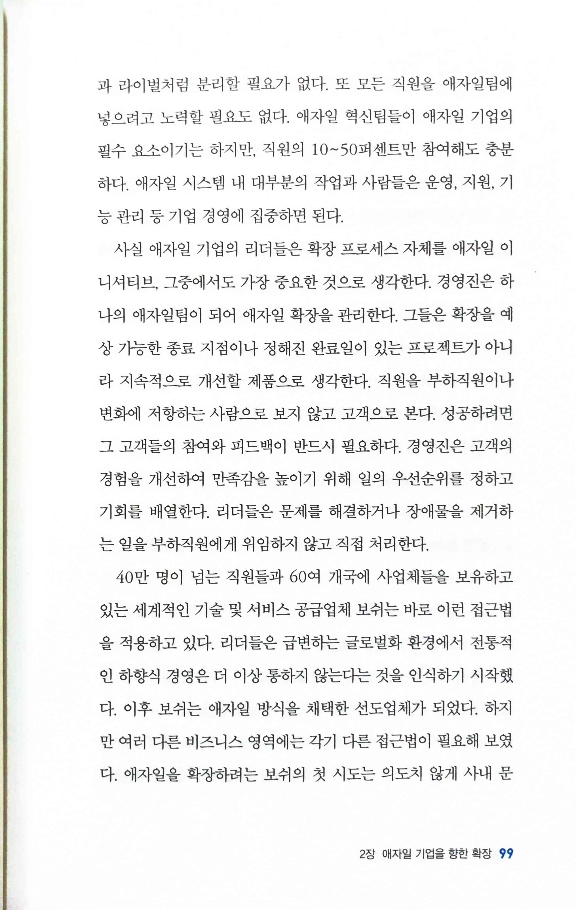

> 애자일 기업은 단순한 팀의 집합체가 아니다. 애자일 기업이란 첫째, 기업을 견실하고 효율적으로 운영하고, 둘째, 예측 불가능한 기회들을 활용하도록 기업을 변환하고, 셋째, 두 가지 활동의 조화를 찾기 위해 애자일 방법을 사용하는 균형 잡힌 운영모델이다. 따라서 그런 애자일 기업을 만들려 한다면 남다른 사고방식으로 확장 프로세스에 접근해야 한다. 애자일팀들을 조직 내 다른 팀들과 라이벌처럼 분리할 필요가 없다. 또 모든 직원을 애자일팀에 넣으려고 노력할 필요도 없다.
>
> 사실 애자일 기업의 리더들은 확장 프로세스 자체를 애자일 이니셔티브, 그중에서도 가장 중요한 것으로 생각한다. 경영진은 하나의 애자일팀이 되어 애자일 확장을 관리한다. 그들은 확장을 예상 가능한 종료 지점이나 정해진 완료일이 있는 프로젝트가 아니라 지속적으로 개선할 제품으로 생각한다. 직원을 부하직원이나 변화에 저항하는 사람으로 보지 않고 고객으로 본다. 성공하려면 그 고객들의 참여와 피드백이 반드시 필요하다. 경영진은 고객의 경험을 개선하여 만족감을 높이기 위해 일의 우선순위를 정하고 기회를 배열한다. 리더들은 문제를 해결하거나 장애물을 제거하는 일을 부하직원에게 위임하지 않고 직접 처리한다.

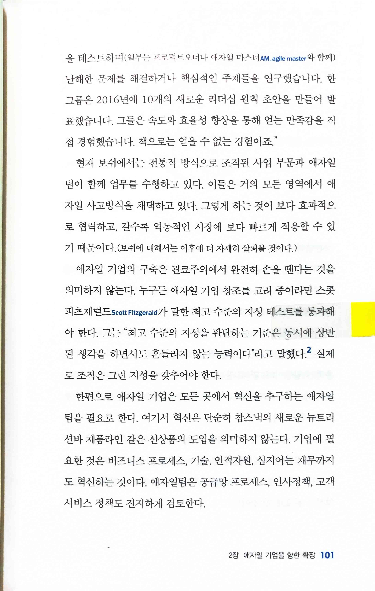

> 애자일 기업의 구축은 관료주의에서 완전히 손을 뗀다는 것을 의미하지 않는다. 누구든 애자일 기업 창조를 고려 중이라면 스콧 피츠제럴드Scott Fitzgerald가 말한 최고 수준의 지성 테스트를 통과해야 한다. 그는 “최고 수준의 지성을 판단하는 기준은 동시에 상반된 생각을 하면서도 흔들리지 않는 능력이다"라고 말했다. 실제로 조직은 그런 지성을 갖추어야 한다.

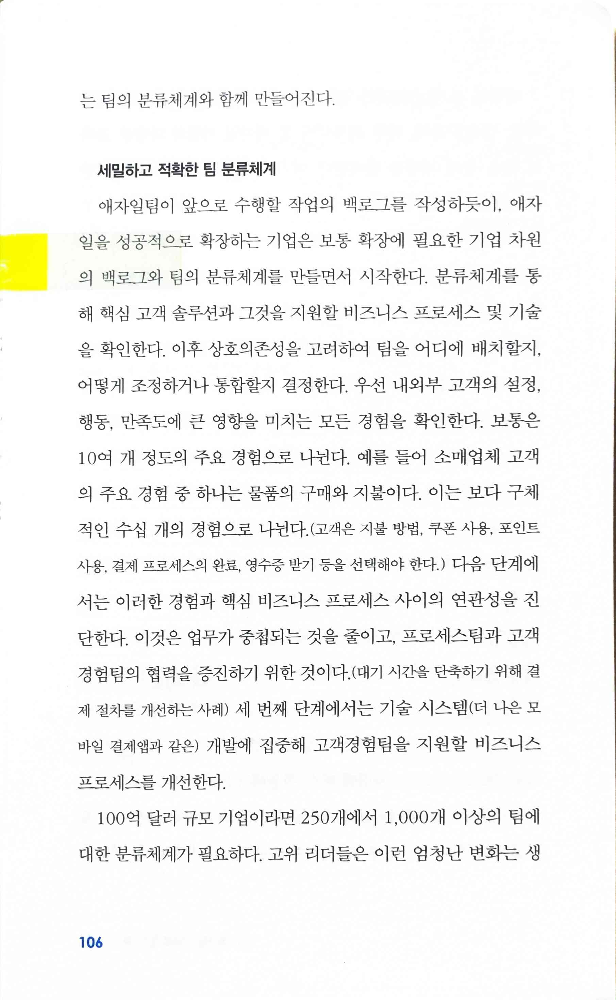

> 애자일팀이 앞으로 수행할 작업의 백로그를 작성하듯이, 애자일을 성공적으로 확장하는 기업은 보통 확장에 필요한 기업 차원의 백로그와 팀의 분류체계를 만들면서 시작한다.

> 100억 달러 규모 기업이라면 250개에서 1,000개 이상의 팀에 대한 류체기 필요하다. 고위 리더들은 이런 엄청난 변화는 생각하기도 싫어한다.(이 중 2~3개팀만 해보고 어떻게 되는지 지켜보는 게 어때?) 하지만 분류체계의 가치는 애자일 전환에 대한 비전을 모색하는 동시에 과정을 소규모 단계들로 나누어 언제든 일시 정지,전환, 중지할 수 있게 만든다는 데 있다. 분류체계는 리더들이 애자일 확장의 제약 요소를 발견하는 데에도 도움을 준다.
>
> 예를 들어 USAA의 분류체계는 기업내의 모든 사람들이 쉽게 파악할 수 있다. 당시 최고운영책임자였던 칼 리버트Carl Liebert 는 이 책을 위해 사전 조사 작업을 진행하던 우리에게 이렇게 이야기했다.
>
> “정말로 좋은 조직 분류체계를 갖고 있어야 합니다. 그러지 못하면 불필요한 업무 중복이 생깁니다. 나는 ...하고 물어봤을 때 담당 팀에게서 명확하고 확실한 답을 얻기 원합니다. 그 팀은 ... 경험을 모두 갖고 있어야 합니다. 단순히 그게 누구라고 가리키는 것은 충분한 답이 되지 않습니다.'그게 좀 복잡한데...'로 시작하는 답이 나와서도 안 됩니다."
* PO들에게 항상 이야기하는 business flow를 모두 파악하고 있어야 한다는 말과도 통하는 듯

> 폭발적인 애자일 변환은 대단히 어렵다. 그런 변환에는 리더 전체의 헌신, 수용적인 문화, 다른 역량들을 고갈시키지 않고도 수백 개의 팀에 직원들을 배치할 정도로 재능과 경험이 풍부한 애자일 전문가들, 그리고 모두의 접근 방식을 맞추기 위한 대단히 강력한 지침 등이 필요하다. 또 위험에 대한 허용 오차와 예기치 못한 실패에 대비한 사전 대책도 있어야 한다.
>
> 이런 자산이 부족하다면 각 사업 부문의 역량에 맞추어 실행해가는 순차적인 단계로 애자일을 펼쳐가는 편이 더 나을 것이다. 그러기 위해서는 우선 비전 스케치와 우선순위로 배열된 백로그를 갖춘 경영진들이 선두 애자일팀들을 출범시킨 다음, 그 팀들이 창출할 가치와 직면할 제약에 대한 자료를 모아야 한다. 그 후에 다음 단계를 수행할지, 언제 어떻게 할지 결정할 수 있다.

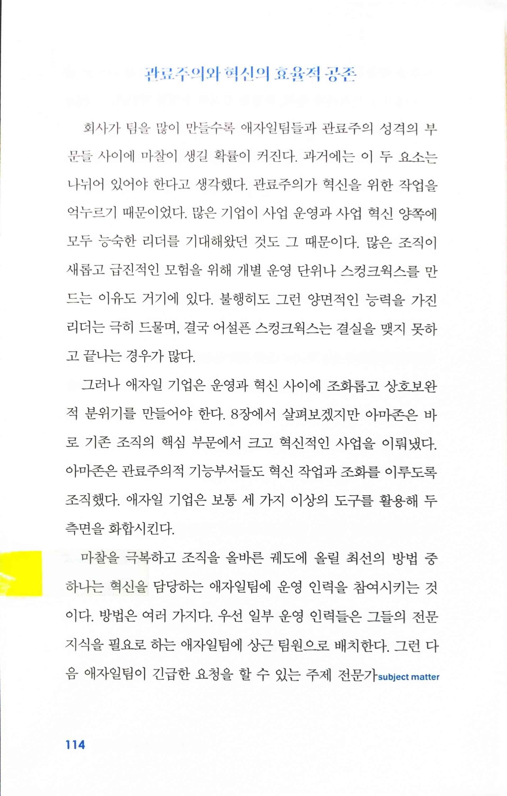

> 마찰을 극복하고 조직을 올바른 궤도에 올릴 최선의 방법 중 하나는 혁신을 담당하는 애자일팀에 운영 인력을 참여시키는 것이다.

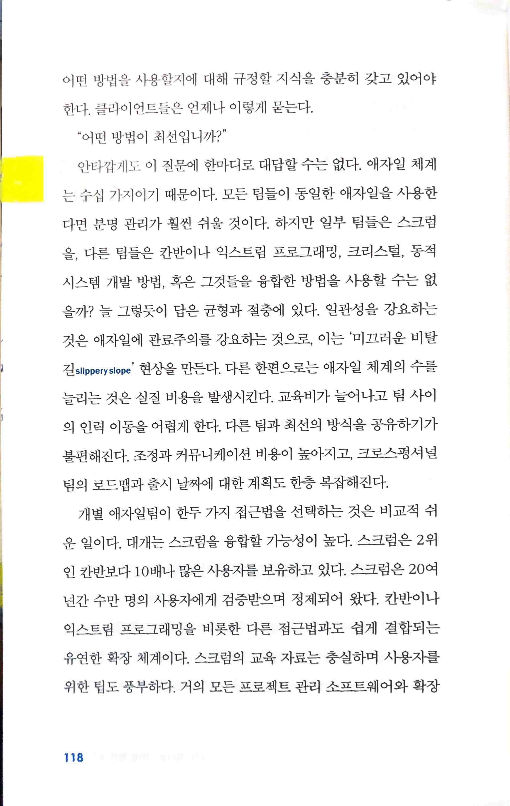

> 클라이언트들은 언제나 이렇게 묻는다.
>
> "어떤 방법이 최선입니까?"
>
> 안타깝게도 이 질문에 한마디로 대답할 수는 없다. 애자일 체계는 수십 가지이기 때문이다. 모든 팀들이 동일한 애자일을 사용한다면 분명 관리가 훨씬 쉬울 것이다. 하지만 일부 팀들은 스크럼을, 다른 팀들은 칸반이나 익스트림 프로그래밍, 크리스털, 동적 시스템 개발 방법, 혹은 그것들을 융합한 방법을 사용할 수는 없을까? 늘 그렇듯이 답은 균형과 절충에 있다. 일관성을 강요하는 것은 애자일에 관료주의를 강요하는 것으로, 이는 '미끄러운 비탈길slippery slope' 현상을 만든다. 다른 한편으로는 애자일 체계의 수를 늘리는 것은 실질 비용을 발생시킨다. 교육비가 늘어나고 팀 사이의 인력 이동을 어렵게 한다. 다른 팀과 최선의 방식을 공유하기가 불편해진다. 조정과 커뮤니케이션 비용이 높아지고, 크로스펑셔널팀의 로드맵과 출시 날짜에 대한 계획도 한층 복잡해진다.

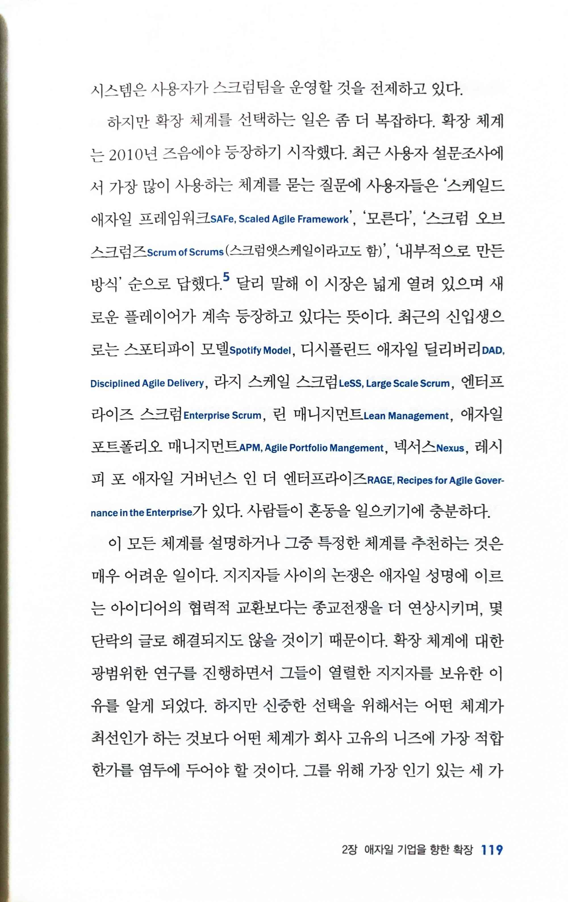

> 확장 체계를 선택하는 일은 좀 더 복잡하다.
>
> 스케일드 애자일 프레임워크 SAFe, Scaled Agile Framework
>
> 스크럼 오브 스크럼즈 Scrum of Scrums (스크럼앳스케일이라고도 함)
>
> 스포티파이 모델 Spotify Model
>
> 디시플린드 애자일 딜리버리 DAD, Disciplined Agile Delivery
>
> 라지 스케일 스크럼 LeSS, Large Scale Scrum
>
> 엔터프라이즈 스크럼 Enterprise Scrum
>
> 린 매니지먼트 Lean Management
>
> 애자일 포트폴리오 매니지먼트 APM, Agile Portfollo Mangement
>
> 넥서스 Nexus
>
> 레시피 포 애자일 거버넌스 인 더 엔터프라이즈 RAGE, Recipes for Agile Governance in the Enterprise

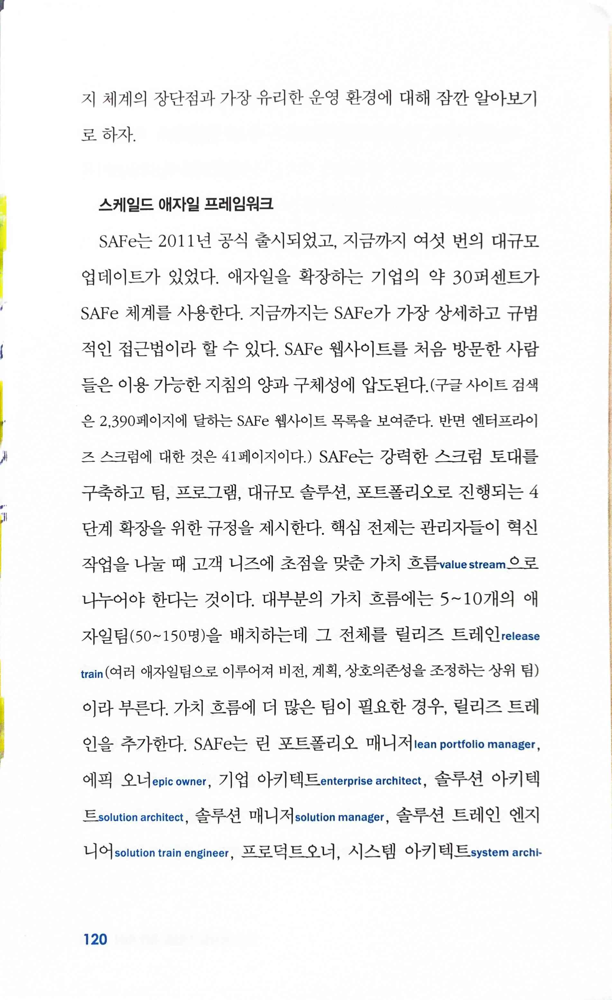 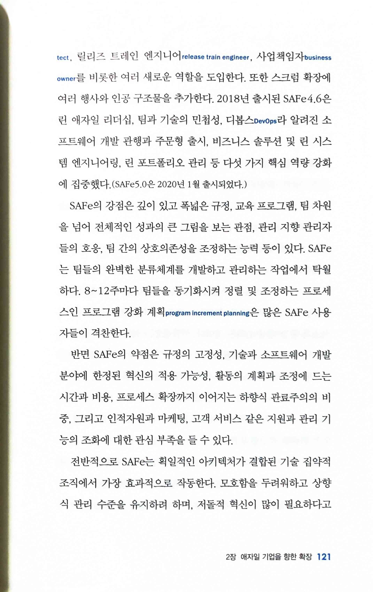

> 스케일드 애자일 프레임워크
* [SAFe 5 for Lean Enterprises](https://www.scaledagileframework.com/)

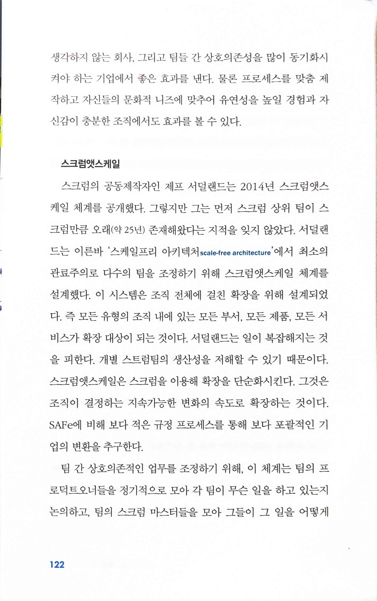 

> 스크럼앳스케일
* [The Scrum@Scale Guide Online | Scrum@Scale Framework](https://www.scrumatscale.com/scrum-at-scale-guide-online/)

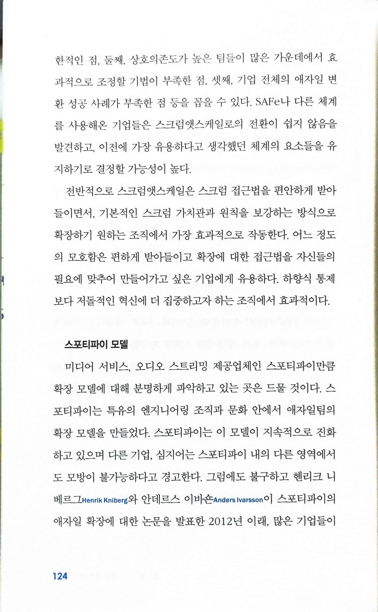  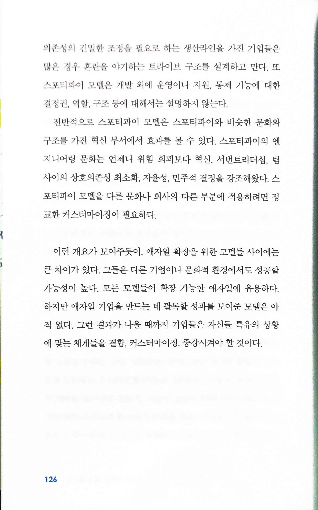

> 스포티파이 모델
* [Here’s How Spotify Scales Up And Stays Agile: It Runs ‘Squads’ Like Lean Startups | TechCrunch](https://techcrunch.com/2012/11/17/heres-how-spotify-scales-up-and-stays-agile-it-runs-squads-like-lean-startups/)
> 스포티파이 모델은 직관적이며 이해하기 쉽다. 그런데 스포티파이의 엔지니어링 부서에서는 잘 작동되지만, 전략 기획이나 재무 같은 영역에서는 중요한 요소가 아니다. 이 접근법은 공유하고 있는 비전에 따라 팀의 강력한 자율성을 선호한다. 스포티파이 모델을 통해 팀은 자신만의 업무방식을 개발하면서, 애자일 도구와 기법을 통해 유연성을 높인다. 이 모델의 약점은 규정이 충분치 않다는 것이다. 스포티파이는 이미 존재하는 문화에 맞춰 모델을 설계했기 때문에, 문화적 규범이나 효율적인 업무방식을 규정할 필요가 없었던 것이다. 스포티파이 모델을 채택한 많은 사람들은 조직구조가 성공의 열쇠라고 생각한다. 하지만 사실 이 조직의 구조는 스포티파이의 기업문화에 내재되어 있던 신뢰와 협력을 활용한 것이다. 또한 이 모델에는 논리적 분류체계의 개발이나 팀들간의 상호의존성 관리가 충분치 않다. 모듈형 제품과 기술 아키텍처로 인해 다른 조직에 비해 상호의존성이 덜 요구되기 때문이다. 그 결과 스포티파이 모델을 복제하려 한 기업, 그러나 사실 상호의존성의 긴밀한 조정을 필요로 하는 생산라인을 가진 기업들은 많은 경우 혼란을 야기하는 트라이브 구조를 설계하고 만다. 또 스포티파이 모델은 개발 외에 운영이나 지원, 통제 기능에 대한 결정권, 역할, 구조 등에 대해서는 설명하지 않는다.

# 3장 얼마나 민첩해질 것인가? HOW AGILE DO YOU WANT TO BE?
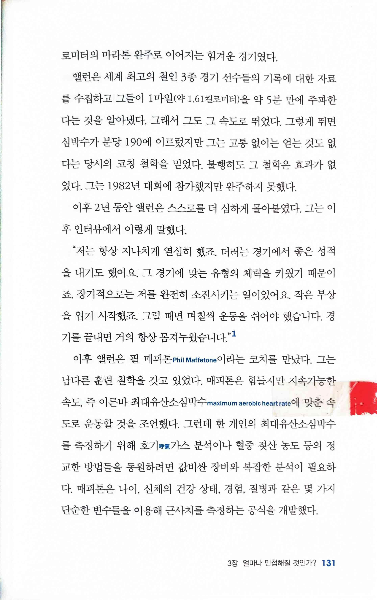  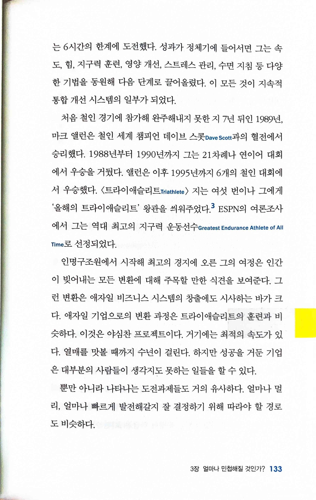

> 앨런은 필 매피톤Phil Maffetone이라는 코치를 만났다. 그는 남다른 훈련 철학을 갖고 있었다. 매피톤은 힘들지만 지속가능한 속도, 즉 이른바 최대유산소심박수maximum aerobic heart rate에 맞춘 속도로 운동할 것을 조언했다. 
>
> 인명구조원에서 시작해 최고의 경지에 오른 마크 앨런의 여정은 인간이 빚어내는 모든 변환에 대해 주목할 만한 식견을 보여준다. 그런 변환은 애자일 비즈니스 시스템의 창출에도 시사하는 바가 크다. 애자일 기업으로의 변환 과정은 트라이애슬리트의 훈련과 비슷하다. 이것은 야심찬 프로젝트이다. 거기에는 최적의 속도가 있다. 열매를 맛볼 때까지 수년이 걸린다. 하지만 성공을 거둔 기업은 대부분의 사람들이 생각지도 못하는 일들을 할 수 있다.

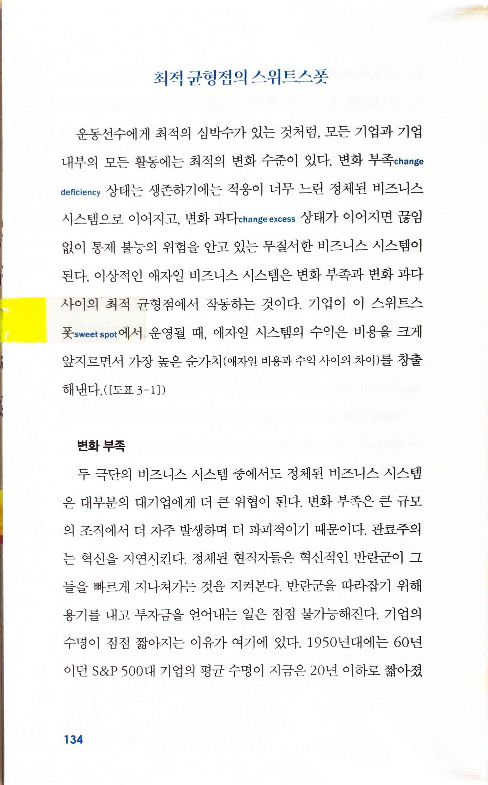

> 운동선수에게 최적의 심박수가 있는 것처럼, 모든 기업과 기업 내부의 모든 활동에는 최적의 변화 수준이 있다. 변화 부족change deficiency 상태는 생존하기에는 적응이 너무 느린 정체된 비즈니스 시스템으로 이어지고, 변화 과다change excess 상태가 이어지면 끊임없이 통제 불능의 위험을 안고 있는 무질서한 비즈니스 시스템이 된다. 이상적인 애자일 비즈니스 시스템은 변화 부족과 변화 과다 사이의 최적 균형점에서 작동하는 것이다. 기업이 이 스위트스폿sweet spot에서 운영될 때, 애자일 시스템의 수익은 비용을 크게 앞지르면서 가장 높은 순가치 (애자일 비용과 수익 사이의 차이)를 창출해낸다.([도표 3-1])
* [Sweet Spot | Glossary | MLB.com](https://www.mlb.com/glossary/statcast/sweet-spot) 야구 타격의 sweet spot과 연결해도 좋을 듯

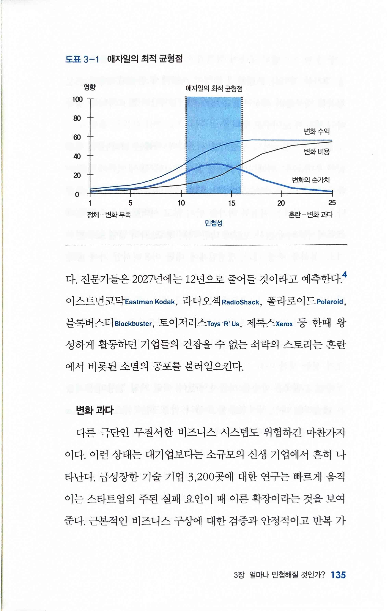 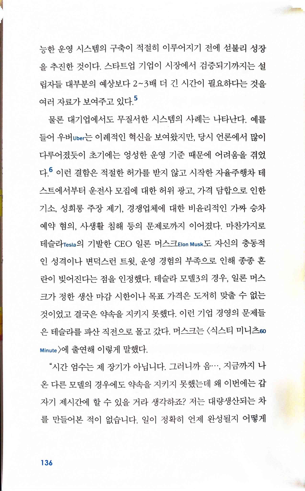

> 변화 부족
>
> 두 극단의 비즈니스 시스템 중에서도 정체된 비즈니스 시스템은 대부분의 대기업에게 더 큰 위협이 된다. 변화 부족은 큰 규모의 조직에서 더 자주 발생하며 더 파괴적이기 때문이다. 관료주의는 혁신을 지연시킨다... 기업의 수명이 점점 짧아지는 이유가 여기에 있다.
>
> 변화 과다
>
> 다른 극단인 무질서한 비즈니스 시스템도 위험하긴 마찬가지이다. 이런 상태는 대기업보다는 소규모의 신생 기업에서 흔히 나타난다... 근본적인 비즈니스 구상에 대한 검증과 안정적이고 반복 가능한 운영 시스템의 구축이 적절히 이루어지기 전에 섣불리 성장을 추진한 것이다. 스타트업 기업이 시장에서 검증되기까지는 설립자들 대부분의 예상보다 2~3배 더 긴 시간이 필요하다는 것을 여러 자료가 보여주고 있다.
* [Startup Genome Report Extra - Premature Scaling version 2](https://integral-entrepreneurship.org/wp-content/uploads/2016/07/Startup-Genome-Premature-Scaling.pdf)

> 스위트스폿을 찾기 위해서는 민첩성 향상에 따르는 비용과 수익을 추산해야 한다. 민첩성은 이례적인 수익을 낳을 수도 있지만, 균형을 맞춰야 하며 상호 절충을 할 때는 양을 정해야 한다. 수익과 비용에 대한 대략적인 추산만으로도 여기에 얼마나 많은 것이 걸려 있는지, 회사의 애자일 변환이 어디까지 이어져야 하는지, 얼마나 빠르게 진행되어야 하는지에 대한 현실적인 예측을 정하는 데 도움이 된다.
>
> 애자일 향상의 대표적인 성과와 그 요인에 다음과 같은 것들이 있다.
>
> 매출의 대폭적인 성장, 비용 절감, 자산 감소

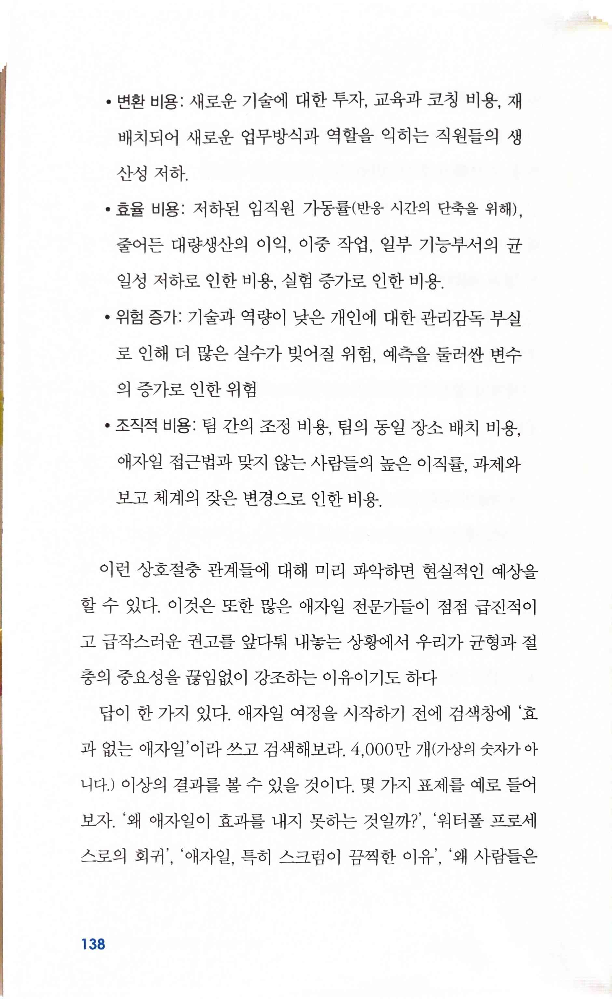

> 잠재적 비용은... 다음과 같은 비용과 발생 요인을 예측해야 할 것
>
> 변환 비용, 효율 비용, 위험 증가, 조직적 비용

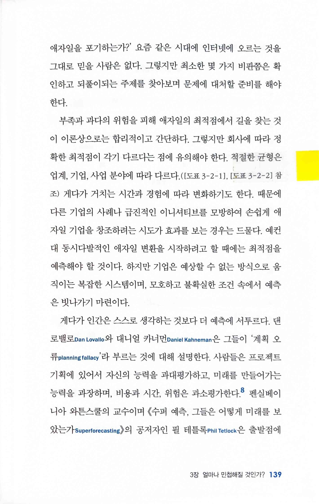 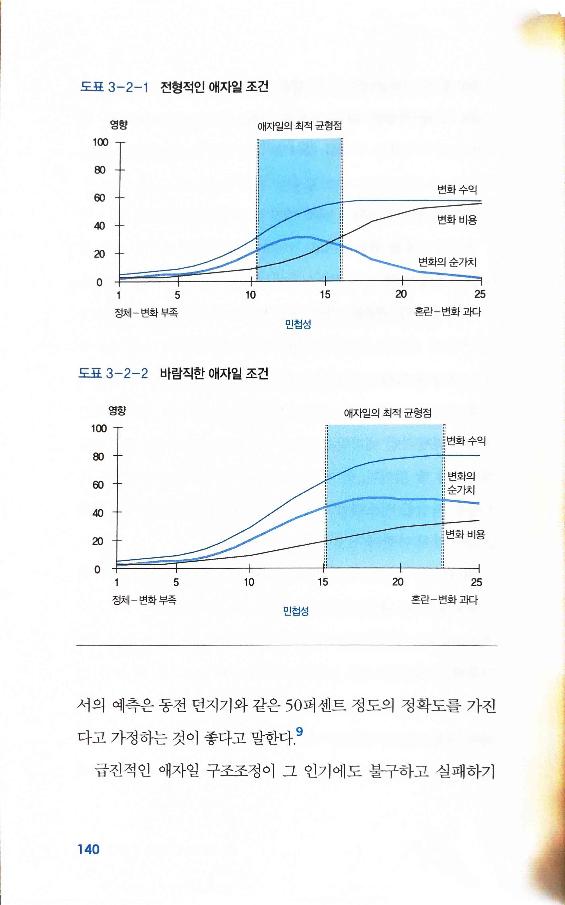

> 부족과 과다의 위험을 피해 애자일의 최적점에서 길을 찾는 것이 이론상으로는 합리적이고 간단하다. 그렇지만 회사에 따라 정확한 최적점이 각기 다르다는 점에 유의해야 한다. 적절한 균형은 업계, 기업, 사업 분야에 따라 다르다.
>
> 게다가 인간은 스스로 생각하는 것보다 더 예측에 서투르다. 댄 로벌로Dan Lovallo와 대니얼 카너먼Daniel Kahneman은 그들이 '계획 오류planning fallacy'라 부르는 것에 대해 설명한다. 사람들은 프로젝트 기획에 있어서 자신의 능력을 과대평가하고, 미래를 만들어가는 능력을 과장하며, 비용과 시간, 위험은 과소평가한다.

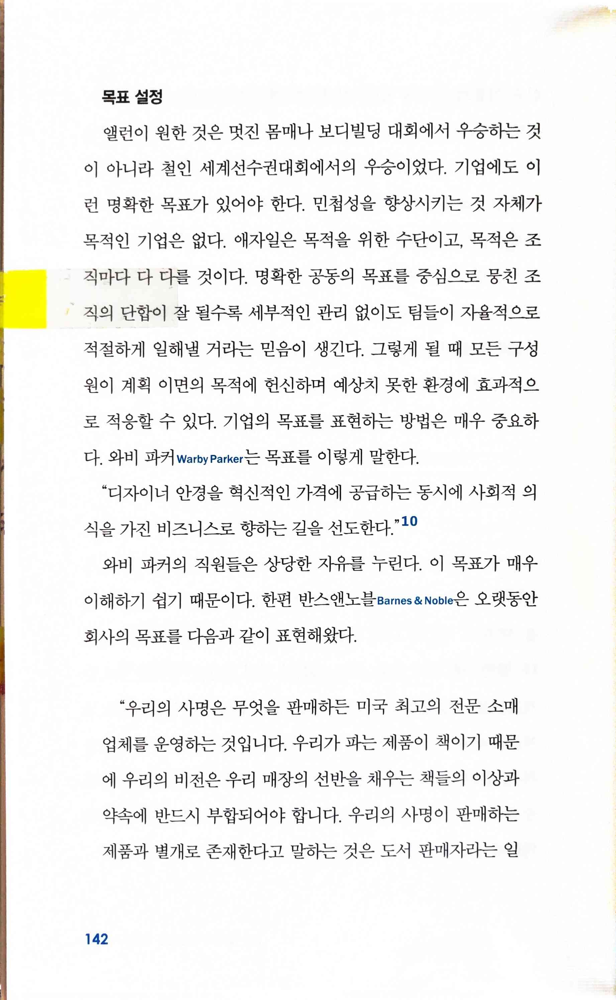 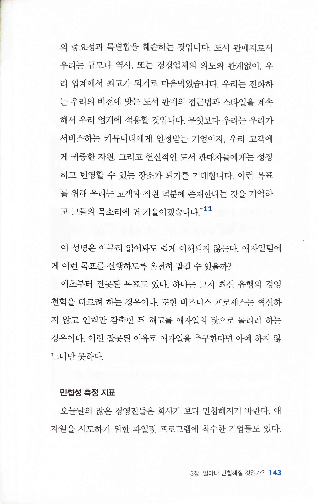

> 앨런이 원한 것은 멋진 몸매나 보디빌딩 대회에서 우승하는 것이 아니라 철인 세계선수권대회에서의 우승이었다. 기업에도 이런 명확한 목표가 있어야 한다. 민첩성을 향상시키는 것 자체가 목적인 기업은 없다. 애자일은 목적을 위한 수단이고, 목적은 조직마다 다 다를 것이다. 명확한 공동의 목표를 중심으로 뭉친 조직의 단합이 잘 될수록 세부적인 관리 없이도 팀들이 자율적으로 적절하게 일해낼 거라는 믿음이 생긴다. 그렇게 될 때 모든 구성원이 계획 이면의 목적에 헌신하며 예상치 못한 환경에 효과적으로 적응할 수 있다. 기업의 목표를 표현하는 방법은 매우 중요하다.
>
> 와비파커 Warby Parker의 매우 이해하기 쉬운 목표와 반스앤노블 Barnes & Noble 쉽게 이해할 수 없는 목표

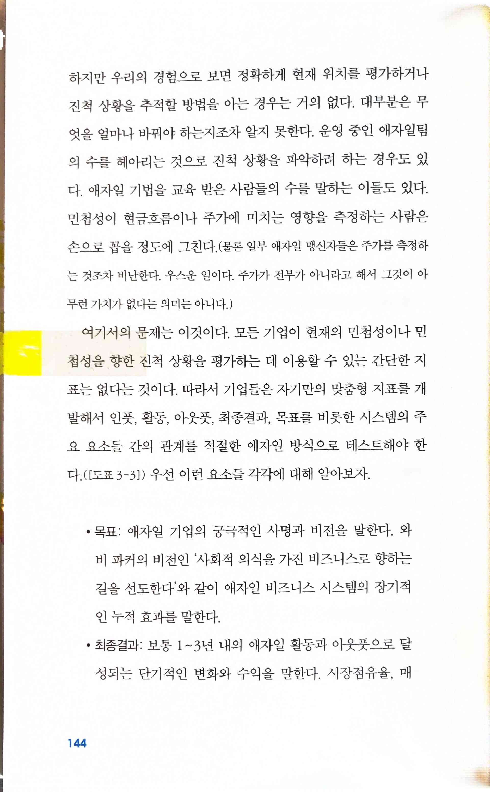

> 모든 기업이 현재의 민첩성이나 민첩성을 향한 진척 상황을 평가하는 데 이용할 수 있는 간단한 지표는 없다는 것이다. 따라서 기업들은 자기만의 맞춤형 지표를 개발해서 인풋, 활동, 아웃풋, 최종결과, 목표를 비롯한 시스템의 주요 요소들 간의 관계를 적절한 애자일 방식으로 테스트해야 한다.

> 도표 3-3 다섯 가지 지표
* [W.K. Kellogg Foundation Logic Model Development Guide](https://hmstrust.org.au/wp-content/uploads/2018/08/LogicModel-Kellog-Fdn.pdf)

> 앨버트 아인슈타인이 했다고 추정되는 말이 있다. “문제를 만든 것과 같은 수준의 사고로는 그 문제를 해결할 수 없다." 그럼에도 불구하고 너무나 많은 경영진들이 바로 그런 식으로 애자일 변환에 접근한다. 실수는 다양한 형태로 나타난다.

> 경영진은 자신과 조직을 훈련 중인 트라이애슬리트라 생각해야 한다. 최대유산소심박수는 조직의 지속가능한 변화 속도이다. 성과의 정체를 돌파하기 위해서는 근육 훈련이나 영양 개선 대신 리더십 행동, 문화적 규범, 기획과 예산배분 체계, 조직구조, 인재개발, 비즈니스 프로세스, 기술이라는 도구나 기법을 사용한다.

# 4장 애자일 리더십, 어떤 리더가될 것인가? AGILE LEADERSHIP
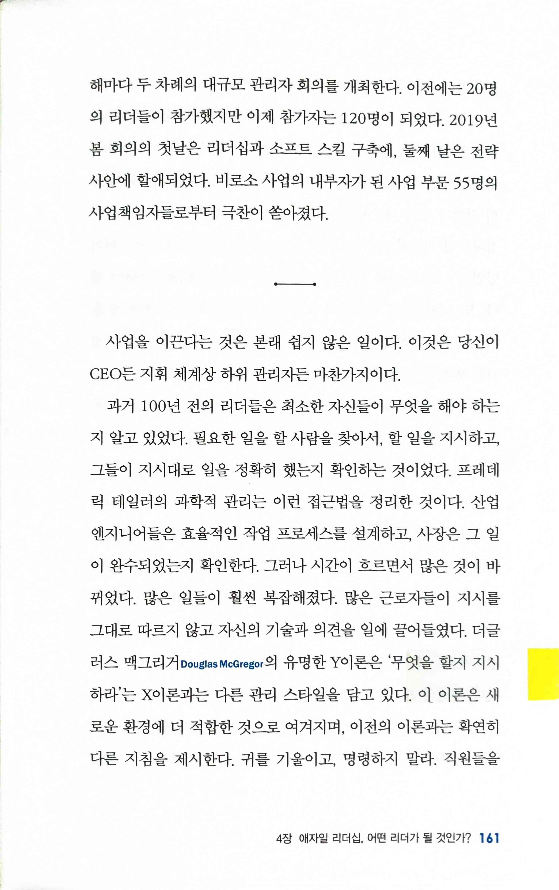

> 더글러스 맥그리거 Douglas McGregor의 유명한 Y이론은 '무엇을 할지 지시하라'는 X이론과는 다른 관리 스타일을 담고 있다. 이 이론은 새로운 환경에 더 적합한 것으로 여겨지며, 이전의 이론과는 확연히 다른 지침을 제시한다. 귀를 기울이고, 명령하지 말라. 직원들을 믿어라. 그들이 책임을 지도록 격려하라.

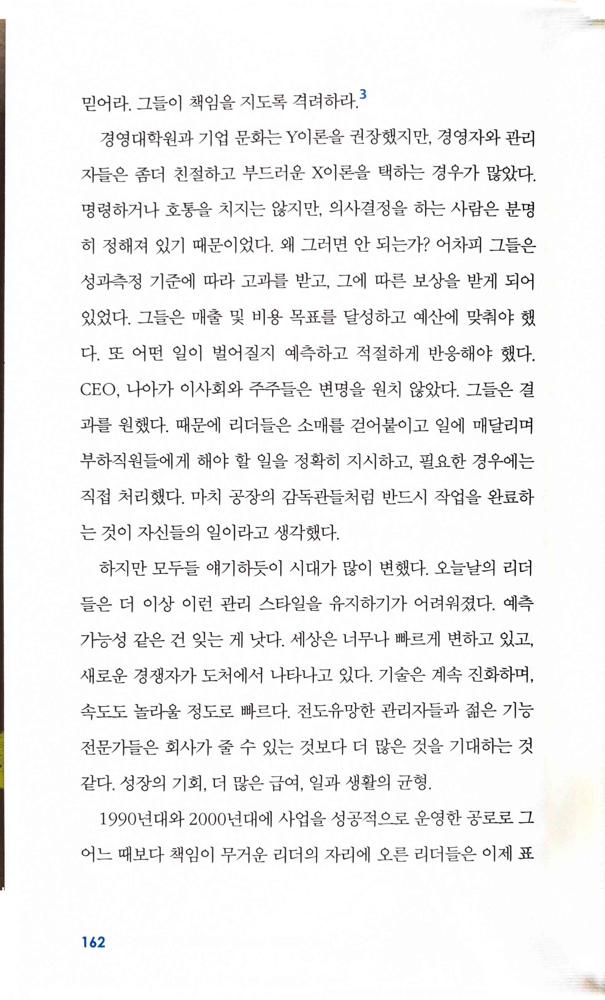 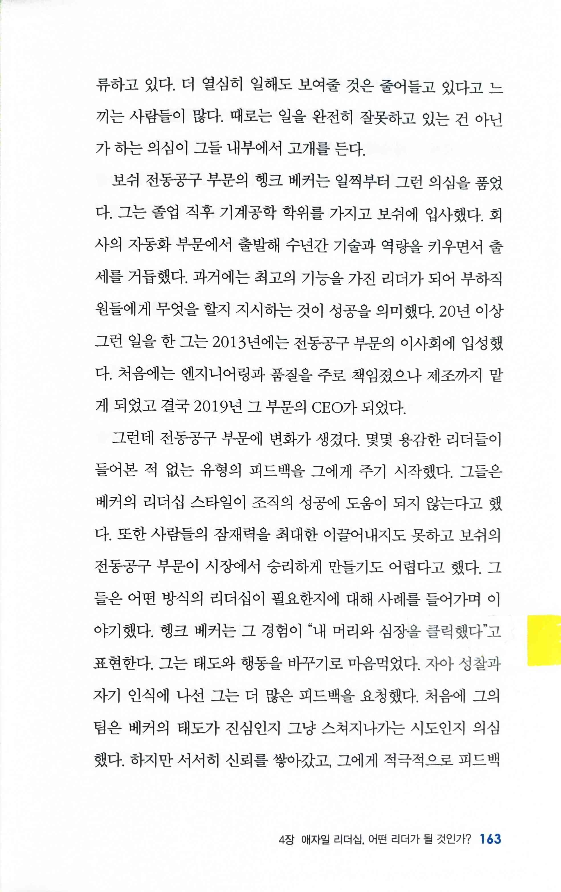

> 그런데 전동공구 부문에 변화가 생겼다. 몇몇 용감한 리더들이 들어본 적 없는 유형의 피드백을 그에게 주기 시작했다. 그들은 베커의 리더십 스타일이 조직의 성공에 도움이 되지 않는다고 했다. 또한 사람들의 잠재력을 최대한 이끌어내지도 못하고 보쉬의 전동공구 부문이 시장에서 승리하게 만들기도 어렵다고 했다. 그들은 어떤 방식의 리더십이 필요한지에 대해 사례를 들어가며 이야기했다. 보쉬 전동공구 부문의 CEO 헹크 베커는 그 경험이 “내 머리와 심장을 클릭했다”고 표현한다. 그는 태도와 행동을 바꾸기로 마음먹었다. 자아 성찰과 자기 인식에 나선 그는 더 많은 피드백을 요청했다. 처음에 그의 팀은 베커의 태도가 진심인지 그냥 스쳐지나가는 시도인지 의심했다. 하지만 서서히 신뢰를 쌓아갔고, 그에게 적극적으로 피드백 을 주는 사람들이 늘어갔다.

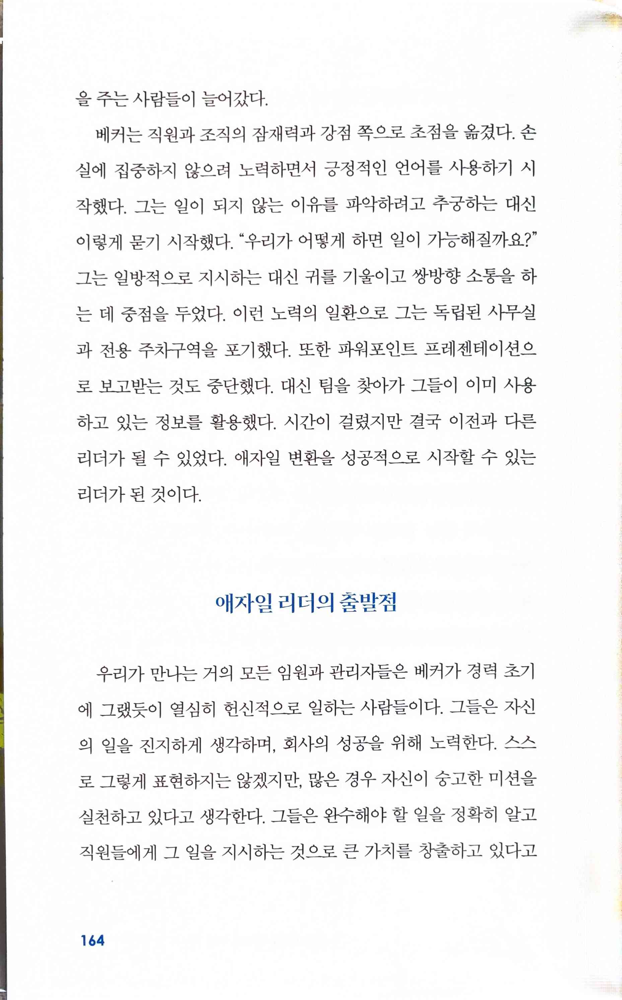 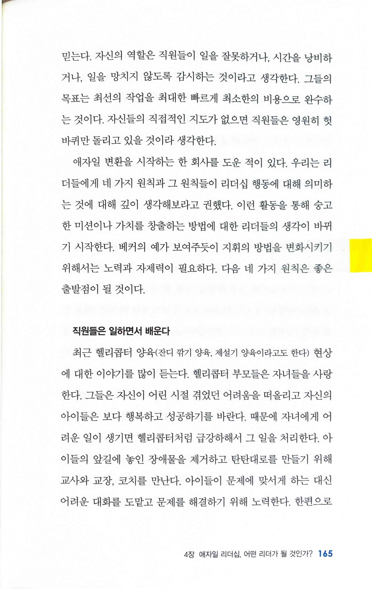

> 베커의 예가 보여주듯이 지휘의 방법을 변화시키기 위해서는 노력과 자제력이 필요하다. 다음 네 가지 원칙은 좋은 출발점이 될 것이다.

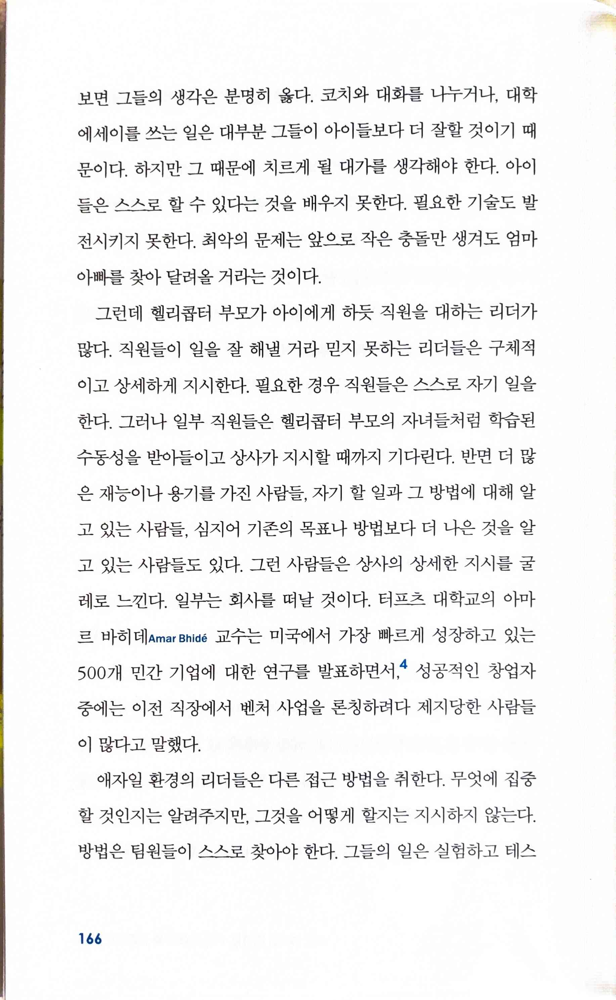

> 직원들은 일하면서 배운다
>
> 애자일 환경의 리더들은 다른 접근 방법을 취한다. 무엇에 집중할 것인지는 알려주지만, 그것을 어떻게 할지는 지시하지 않는다. 방법은 팀원들이 스스로 찾아야 한다.

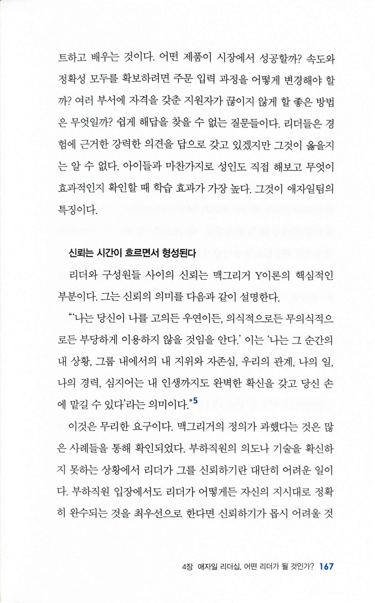 

> 신뢰는 시간이 흐르면서 형성된다
>
> 맥그리거 Y이론의 신뢰의 정의가 과했다는 것은 많은 사례들을 통해 확인되었다.
>
> 애자일은 시간에 따른 신뢰 구축 방법을 제시한다.
>
> 이런 식의 신뢰를 통한 리더십에는 절제력, 특히 스트레스를 받는 상황에서의 절제력이 필요하다. 스트레스를 받으면 통제 본능이 끼어들기 시작하기 때문이다.
>
> 간단히 말해 직장에서의 신뢰는 추상적인 어떤 것이 아니라 사람들의 생산적인 협력을 통해 쌓아가는 것이다.

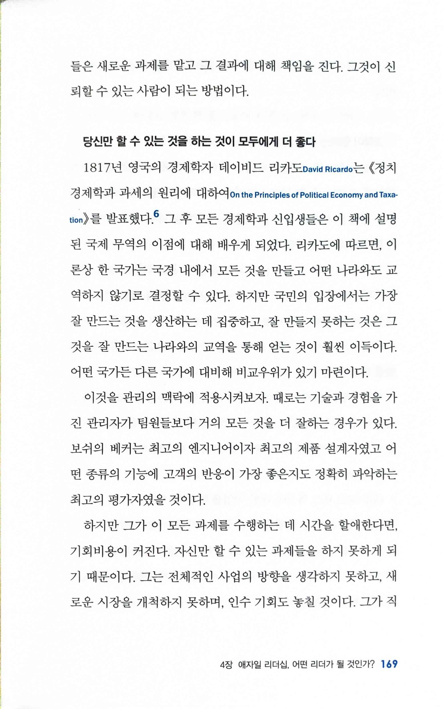

> 당신만 할 수 있는 것을 하는 것이 모두에게 더 좋다

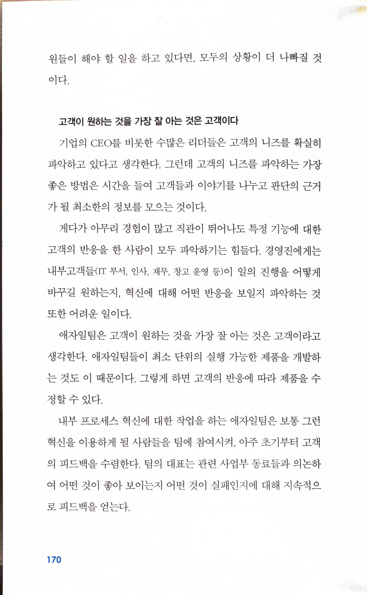

> 고객이 원하는 것을 가장 잘 아는 것은 고객이다
>
> 애자일팀은 고객이 원하는 것을 가장 잘 아는 것은 고객이라고 생각한다. 애자일팀들이 최소 단위의 실행 가능한 제품을 개발하는 것도 이 때문이다. 그렇게 하면 고객의 반응에 따라 제품을 수정할 수 있다.
* 뭘 이야기하는지 알겠지만 이 부분은 동의하기 어려움
* [The Users Don’t Know What They Want, or Do They? — Asking the Right Questions for UX | by Shaza Hakim | Stampede | Medium](https://medium.com/stampede-team/the-users-dont-know-what-they-want-or-do-they-asking-the-right-questions-for-ux-49969607654b)

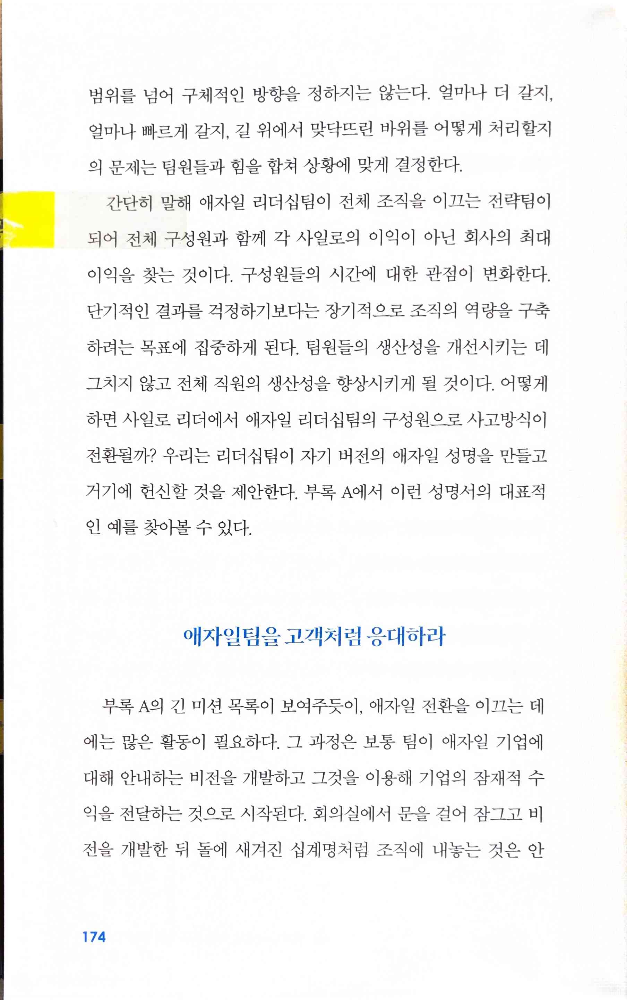

> 간단히 말해 애자일 리더십팀이 전체 조직을 이끄는 전략팀이 되어 전체 구성원과 함께 각 사일로의 이익이 아닌 회사의 최대 이익을 찾는 것이다. 구성원들의 시간에 대한 관점이 변화한다. 단기적인 결과를 걱정하기보다는 장기적으로 조직의 역량을 구축하려는 목표에 집중하게 된다. 팀원들의 생산성을 개선시키는 데 그치지 않고 전체 직원의 생산성을 향상시키게 될 것이다. 어떻게 하면 사일로 리더에서 애자일 리더십팀의 구성원으로 사고방식이 전환될까? 우리는 리더십팀이 자기 버전의 애자일 성명을 만들고 거기에 헌신할 것을 제안한다.

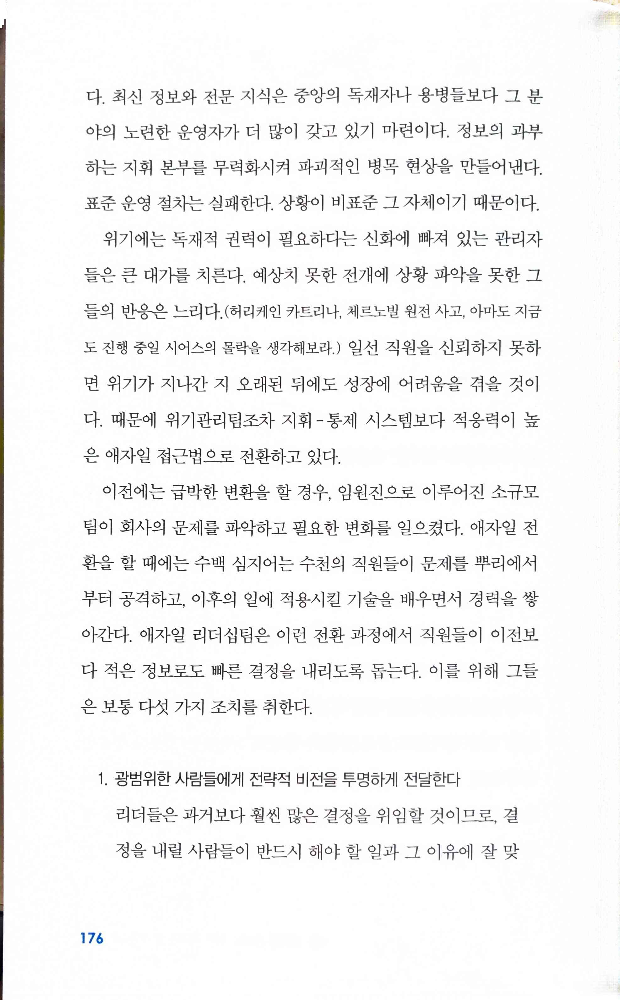 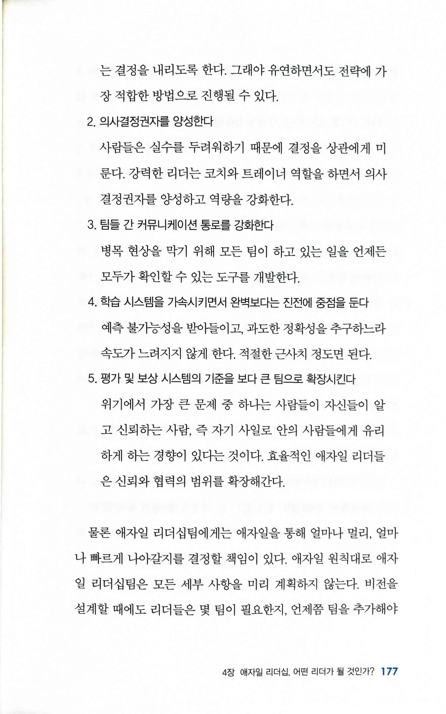

> 정보의 과부하는 지휘 본부를 무력화시켜 파괴적인 병목 현상을 만들어낸다. 표준 운영 절차는 실패한다. 상황이 비표준 그 자체이기 때문이다.
>
> 위기에는 독재적 권력이 필요하다는 신화에 빠져 있는 관리자들은 큰 대가를 치른다. 예상치 못한 전개에 상황 파악을 못한 그들의 반응은 느리다. (허리케인 카트리나, 체르노빌 원전 사고, 아마도 지금도 진행 중일 시어스의 몰락을 생각해보라.) 일선 직원을 신뢰하지 못하면 위기가 지나간 지 오래된 뒤에도 성장에 어려움을 겪을 것이다. 때문에 위기관리팀조차 지휘 통제 시스템보다 적응력이 높은 애자일 접근법으로 전환하고 있다.
>
> 이전에는 급박한 변환을 할 경우, 임원진으로 이루어진 소규모 팀이 회사의 문제를 파악하고 필요한 변화를 일으켰다. 애자일 전환을 할 때에는 수백 심지어는 수천의 직원들이 문제를 뿌리에서부터 공격하고, 이후의 일에 적용시킬 기술을 배우면서 경력을 쌓아간다. 애자일 리더십팀은 이런 전환 과정에서 직원들이 이전보다 적은 정보로도 빠른 결정을 내리도록 돕는다. 이를 위해 그들은 보통 다섯 가지 조치를 취한다.
>
> 1. 광범위한 사람들에게 전략적 비전을 투명하게 전달한다
>
> 2. 의사결정권자를 양성한다
>
> 3. 팀들 간 커뮤니케이션 통로를 강화한다
>
> 4. 학습 시스템을 가속시키면서 완벽보다는 진전에 중점을 둔다
>
> 5. 평가 및 보상 시스템의 기준을 보다 큰 팀으로 확장시킨다

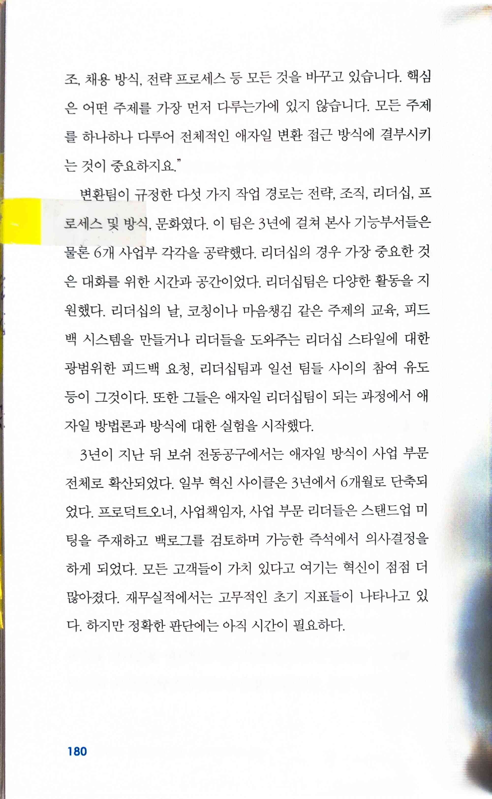

> 변환팀이 규정한 다섯 가지 작업 경로는 전략, 조직, 리더십, 프로세스 및 방식, 문화였다. 이 팀은 3년에 걸쳐 본사 기능부서들은 물론 6개 사업부 각각을 공략했다. 리더십의 경우 가장 중요한 것은 대화를 위한 시간과 공간이었다. 

# 5장 계획은 유연하게,실행은 민첩하게 AGILE PLANNING, BUDGETING, AND REVIEWING

> 애자일 성명은 애자일 실무자들이 '계획의 고수보다 변화에 대한 대응'에 가치를 두어야 한다고 말하고 있다.' 하지만 그것은 계획이 불필요하다는 의미가 아니다. 적응력이 높은 계획을 개발해야 한다는 의미이다.

 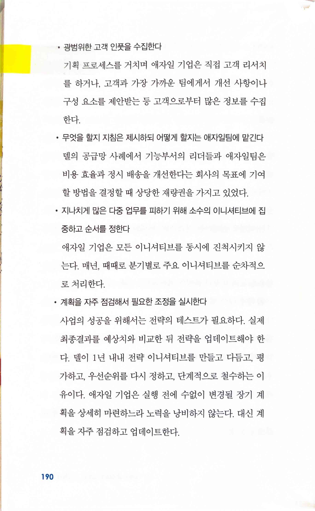

> 애자일 기업은 종래 기업들과 달리 다음의 네 가지 일을 한다.
>
> 광범위한 고객 인풋을 수집한다
>
> 무엇을 할지 지침은 제시하되 어떻게 할지는 애자일팀에 맡긴다
>
> 지나치게 많은 다중 업무를 피하기 위해 소수의 이니셔티브에 집중하고 순서를 정한다
>
> 계획을 자주 점검해서 필요한 조정을 실시한다

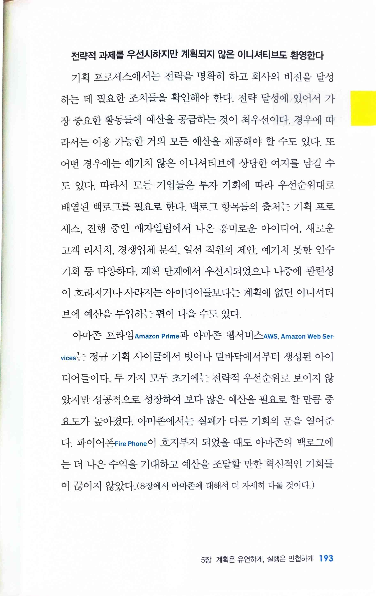

> 기획 프로세스에서는 전략을 명확히 하고 회사의 비전을 달성하는 데 필요한 조치들을 확인해야 한다. 전략 달성에 있어서 가장 중요한 활동들에 예산을 공급하는 것이 최우선이다. 경우에 따라서는 이용 가능한 거의 모든 예산을 제공해야 할 수도 있다. 또 어떤 경우에는 예기치 않은 이니셔티브에 상당한 여지를 남길 수도 있다. 따라서 모든 기업들은 투자 기회에 따라 우선순위대로 배열된 백로그를 필요로 한다.

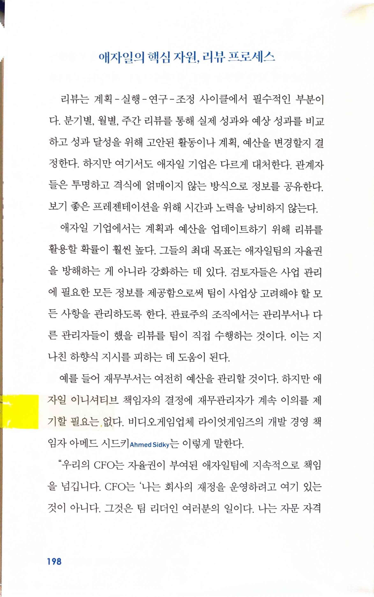

> 애자일 기업에서는 계획과 예산을 업데이트하기 위해 리뷰를 활용할 확률이 훨씬 높다. 그들의 최대 목표는 애자일팀의 자율권을 방해하는 게 아니라 강화하는 데 있다. 검토자들은 사업 관리에 필요한 모든 정보를 제공함으로써 팀이 사업상 고려해야 할 모든 사항을 관리하도록 한다. 관료주의 조직에서는 관리부서나 다른 관리자들이 했을 리뷰를 팀이 직접 수행하는 것이다. 이는 지나친 하향식 지시를 피하는 데 도움이 된다.

# 6장 애자일 기업의 조직구조와 운영모델 AGILE ORGANIZATION, STRUCTURES, AND PEOPLE MANAGEMENT

> 애자일 기업이 되려면 회사 운영모델을 바꾸어야하고, 운영모델에 수반되는 모든 것이 바뀌어야 한다. 역할과 책임을 새로 규정하고 의사결정권을 조정해야 한다. 핵심 경영방식과 절차를 개선해야 한다. 인재관리 방식을 재고하고 기본적인 업무방식을 점검해야 한다. 종종 조직구조의 개조도 필요하다. 리더들이 모든 것을 한 번에 변화시키기로 결정하지 않는 한(최선의 옵션일 확률이 낮다.), 이 모든 변화를 적합한 애자일 방식으로 배열하고 테스트할 방법을 찾아야 한다. 대단히 어려운 일이다. 대부분의 리더들, 즉 관료주의적 방법에 익숙한 사람들은 종종 지름길을 찾고 싶은 유혹을 느낀다.

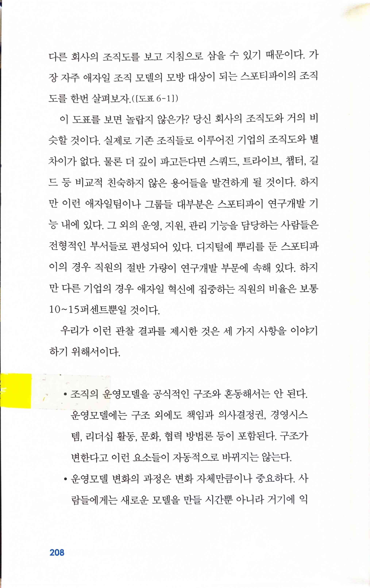 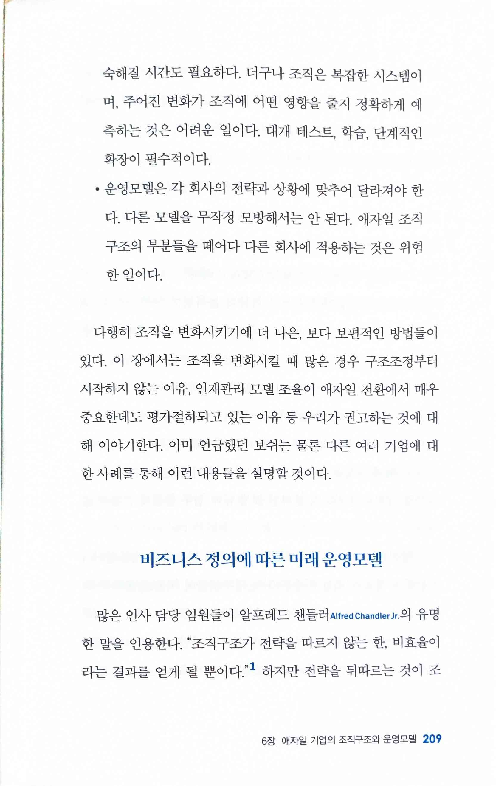

> 스포티파이의 조직도를 보면 당신 회사의 조직도와 거의 비슷할 것이다.
>
> 우리가 이런 관찰 결과를 제시한 것은 세 가지 사항을 이야기하기 위해서이다.
>
> • 조직의 운영모델을 공식적인 구조와 혼동해서는 안 된다. 운영모델에는 구조 외에도 책임과 의사결정권, 경영시스템, 리더십 활동, 문화, 협력 방법론 등이 포함된다. 구조가 변한다고 이런 요소들이 자동적으로 바뀌지는 않는다.
>
> • 운영모델 변화의 과정은 변화 자체만큼이나 중요하다. 사람들에게는 새로운 모델을 만들 시간뿐 아니라 거기에 익숙해질 시간도 필요하다. 더구나 조직은 복잡한 시스템이며, 주어진 변화가 조직에 어떤 영향을 줄지 정확하게 예측하는 것은 어려운 일이다. 대개 테스트, 학습, 단계적인 확장이 필수적이다.
>
> • 운영모델은 각 회사의 전략과 상황에 맞추어 달라져야 한다. 다른 모델을 무작정 모방해서는 안 된다. 애자일 조직 구조의 부분들을 떼어다 다른 회사에 적용하는 것은 위험한 일이다.
>
> 알프레드 챈들러 Alfred Chandler Jr. "조직구조가 전략을 따르지 않는 한, 비효율이라는 결과를 얻게 될 뿐이다."

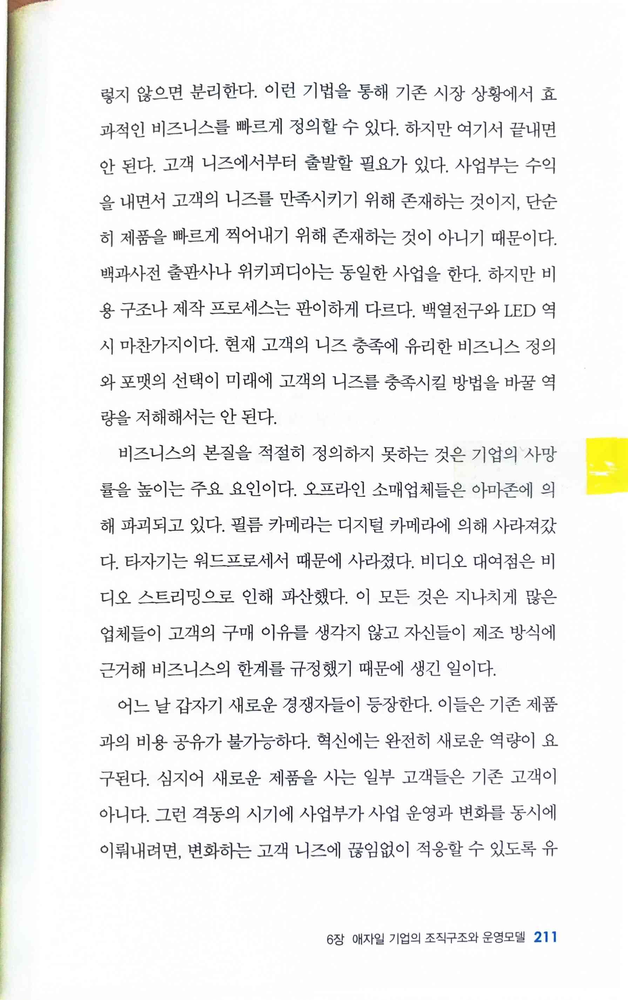

> 비즈니스의 본질을 적절히 정의하지 못하는 것은 기업의 사망률을 높이는 주요 요인이다... 이 모든 것은 지나치게 많은 업체들이 고객의 구매 이유를 생각지 않고 자신들이 제조 방식에 근거해 비즈니스의 한계를 규정했기 때문에 생긴 일이다.

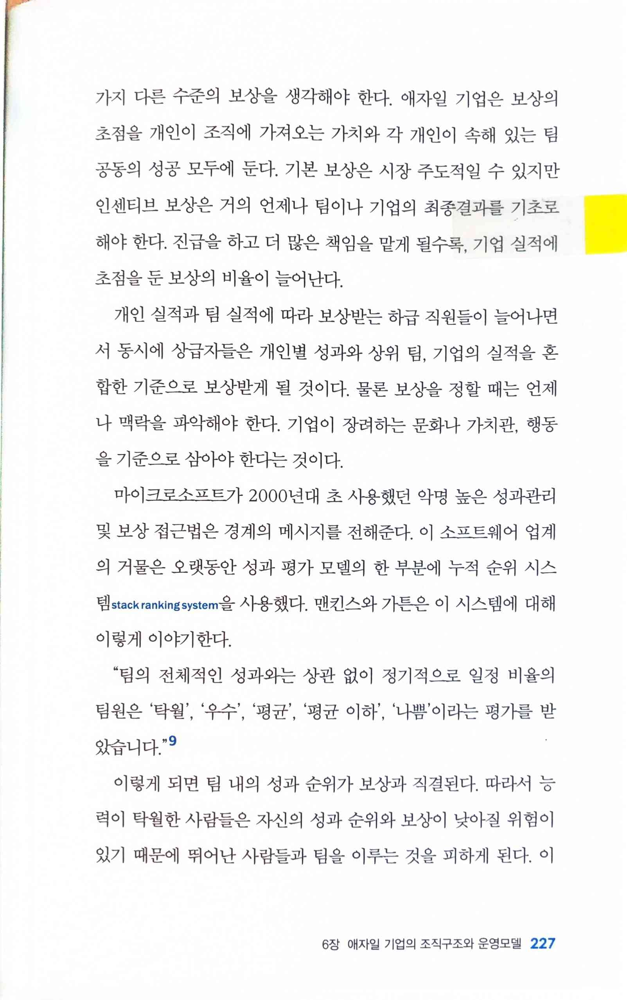

> 애자일 기업은 보상의 초점을 개인이 조직에 가져오는 가치와 각 개인이 속해 있는 팀 공동의 성공 모두에 둔다. 기본 보상은 시장 주도적일 수 있지만 인센티브 보상은 거의 언제나 팀이나 기업의 최종결과를 기초로 해야 한다. 진급을 하고 더 많은 책임을 맡게 될수록, 기업 실적에 초점을 둔 보상의 비율이 늘어난다.

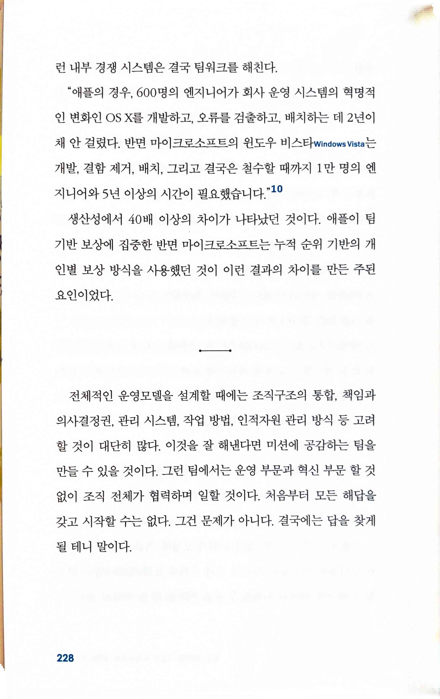

> "애플의 경우, 600명의 엔지니어가 회사 운영 시스템의 혁명적인 변화인 OS X를 개발하고, 오류를 검출하고, 배치하는 데 2년이 채 안 걸렸다. 반면 마이크로소프트의 윈도우 비스타Windows Vista는 개발, 결함 제거, 배치, 그리고 결국은 철수할 때까지 1만 명의 엔지니어와 5년 이상의 시간이 필요했습니다."
* Apple의 팀 기반 보상과 MS의 stack ranking system의 대비, 혹은 Steve Ballmer의 실수를 이야기하는데 좋은 예시이긴 하지만, hardware - software를 폐쇄된 형태로 공급하는 Apple과 MS의 비교는 최소한 기술적인 측면에서는 적합하진 않다. 자사의 몇 가지 lineup에서만 정상 동작하면 되는 OS X와 서로 다른 회사의 hardware들을 조합한 그 어떤 모델에서도 동작해야 하는 Windows는 분명히 다른 환경이긴 하니까.
> 전체적인 운영모델을 설계할 때에는 조직구조의 통합, 책임과 의사결정권, 관리 시스템, 작업 방법, 인적자원 관리 방식 등 고려할 것이 대단히 많다.

# 7장 애자일 프로세스와 기술 혁신 AGILE PROCESSES AND TECHNOLOGY
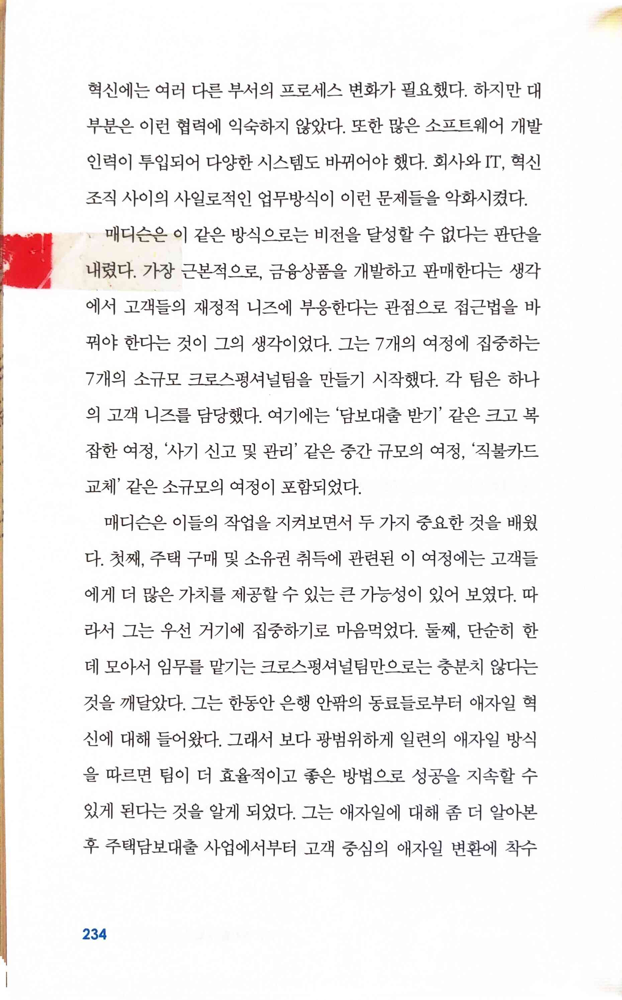

> (스코틀랜드 왕립은행 개인 및 기업금융 사업 부문 CEO인) 매디슨은 이 같은 방식으로는 비전을 달성할 수 없다는 판단을 내렸다. 가장 근본적으로, 금융상품을 개발하고 판매한다는 생각에서 고객들의 재정적 니즈에 부응한다는 관점으로 접근법을 바꿔야 한다는 것이 그의 생각이었다.

> 매디슨이 이 목표(고객 중심의 애자일 변환)를 추구하기 위해 만든 리더십팀이 일을 시작했다. 팀원들은 우선 인간중심 설계라고 알려진 방법을 이용해 고객 중심의 북극성 NorthStar 을 개발하고 혁신 활동을 이끌어갔다. 북극성이란 금융서비스 제공업체가 전달하는 경험과 수익 중에서 고객이 가장 큰 가치를 두는 것에 대한 비전을 말한다.
>
> 다양한 지원장치를 배치하여 팀들이 빠르게 혁신하도록 했다. 예를 들어 혁신팀원과 운영팀원이 함께 배치되었고, 예산 지원은 제품 특성이 아닌 사업의 최종결과에 연계되었다.

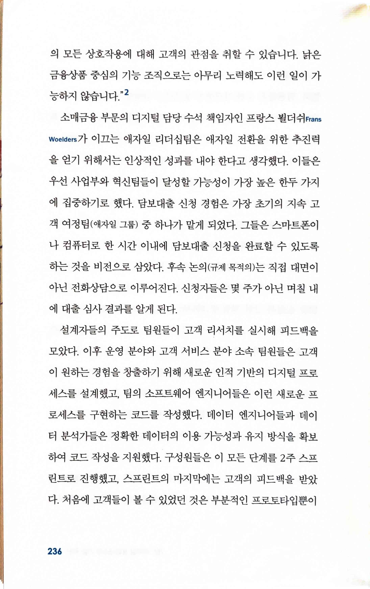 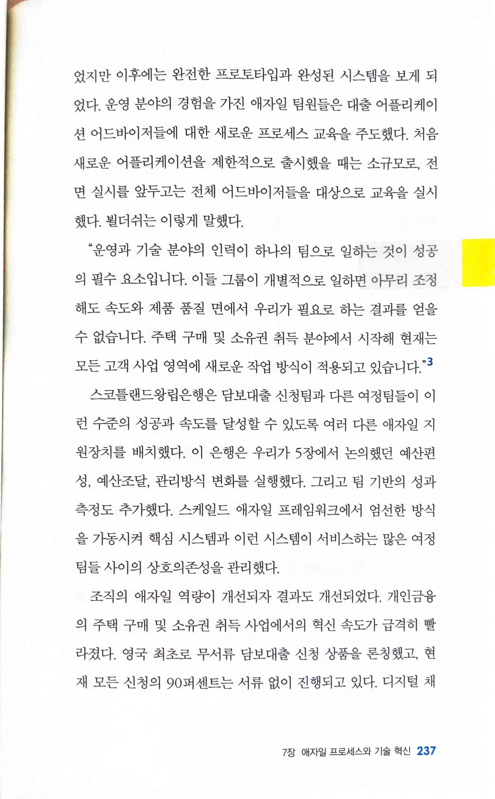

> 매디슨은 이렇게 말했다.
>
> "고객 여정을 중심으로 한 조직 구성이 우리 새로운 모델의 핵심입니다. 이런 구성을 통해 크로스펑셔널팀은 고객과 은행 사이의 모든 상호작용에 대해 고객의 관점을 취할 수 있습니다. 낡은 금융상품 중심의 기능 조직으로는 아무리 노력해도 이런 일이 가능하지 않습니다."
>
> 설계자들의 주도로 팀원들이 고객 리서치를 실시해 피드백을 모았다. 이후 운영 분야와 고객 서비스 분야 소속 팀원들은 고객이 원하는 경험을 창출하기 위해 새로운 인적 기반의 디지털 프로세스를 설계했고, 팀의 소프트웨어 엔지니어들은 이런 새로운 프로세스를 구현하는 코드를 작성했다. 데이터 엔지니어들과 데이터 분석가들은 정확한 데이터의 이용 가능성과 유지 방식을 확보하여 코드 작성을 지원했다. 구성원들은 이 모든 단계를 2주 스프린트로 진행했고, 스프린트의 마지막에는 고객의 피드백을 받았다. 처음에 고객들이 볼 수 있었던 것은 부분적인 프로토타입뿐이었지만 이후에는 완전한 프로토타입과 완성된 시스템을 보게 되었다. 운영 분야의 경험을 가진 애자일 팀원들은 대출 어플리케이션 어드바이저들에 대한 새로운 프로세스 교육을 주도했다. 처음 새로운 어플리케이션을 제한적으로 출시했을 때는 소규모로, 전면 실시를 앞두고는 전체 어드바이저들을 대상으로 교육을 실시했다.
>
> “운영과 기술 분야의 인력이 하나의 팀으로 일하는 것이 성공의 필수 요소입니다. 이들 그룹이 개별적으로 일하면 아무리 조정해도 속도와 제품 품질 면에서 우리가 필요로 하는 결과를 얻을 수 없습니다."
>
> 스코틀랜드왕립은행은 담보대출 신청팀과 다른 여정팀들이 이런 수준의 성공과 속도를 달성할 수 있도록 여러 다른 애자일 지원장치를 배치했다. 이 은행은 우리가 5장에서 논의했던 예산편성, 예산조달, 관리방식 변화를 실행했다. 그리고 팀 기반의 성과 측정도 추가했다. 스케일드 애자일 프레임워크에서 엄선한 방식을 가동시켜 핵심 시스템과 이런 시스템이 서비스하는 많은 여정팀들 사이의 상호의존성을 관리했다.

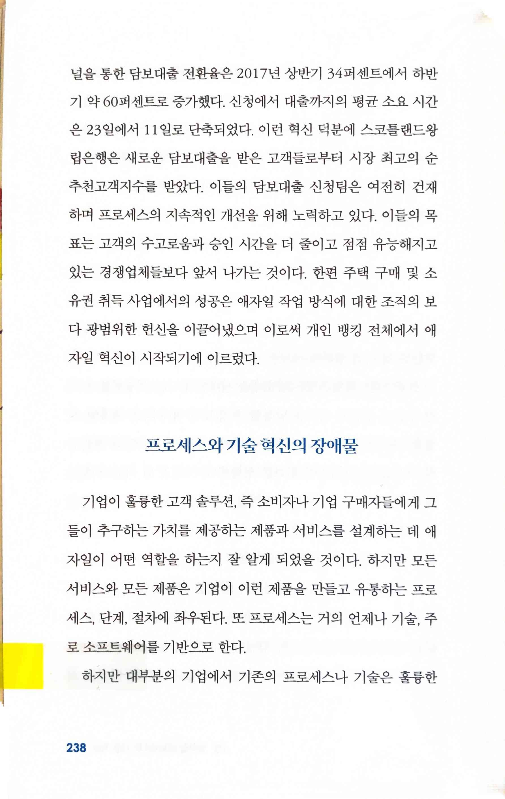 

> 모든 서비스와 모든 제품은 기업이 이런 제품을 만들고 유통하는 프로세스, 단계, 절차에 좌우된다. 또 프로세스는 거의 언제나 기술, 주로 소프트웨어를 기반으로 한다.
>
> 하지만 대부분의 기업에서 기존의 프로세스나 기술은 훌륭한 고객 솔루션의 지원장치가 아니라 장애물이다.

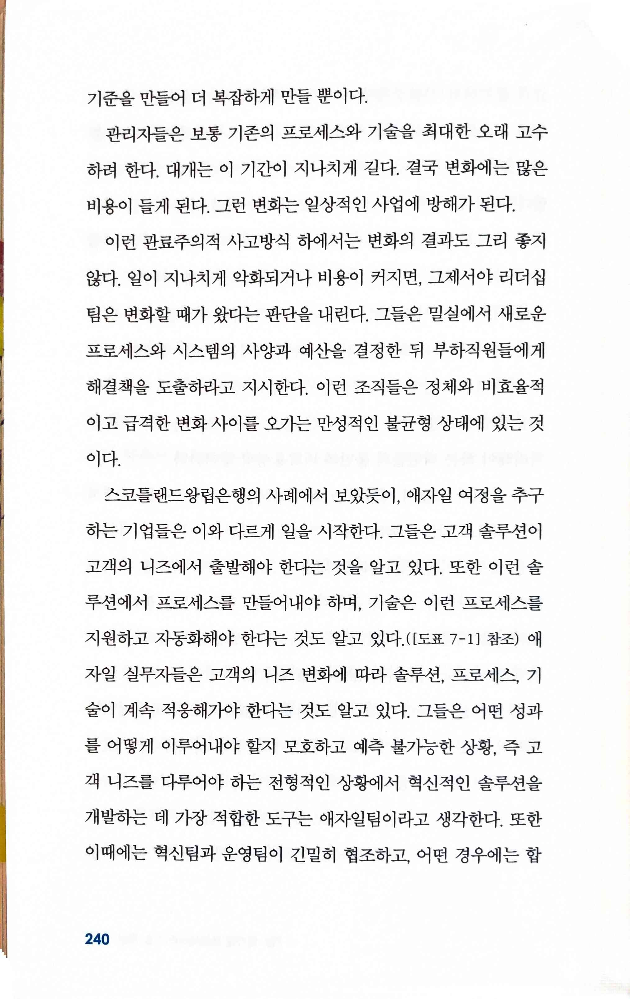 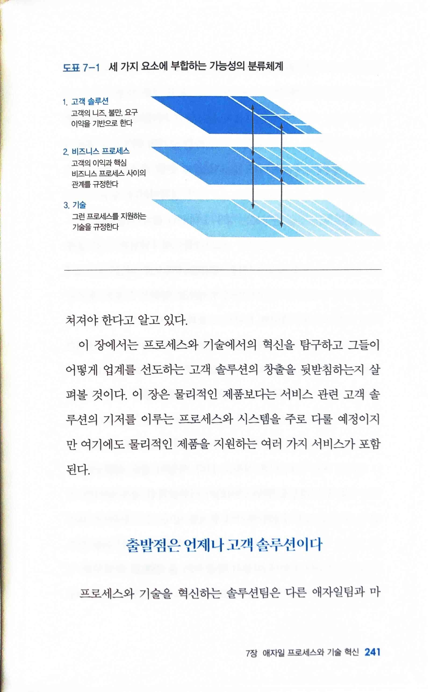

> 관리자들은 보통 기존의 프로세스와 기술을 최대한 오래 고수하려 한다. 대개는 이 기간이 지나치게 길다. 결국 변화에는 많은 비용이 들게 된다. 그런 변화는 일상적인 사업에 방해가 된다.
>
> 애자일 여정을 추구하는 기업들은 이와 다르게 일을 시작한다. 그들은 고객 솔루션이 고객의 니즈에서 출발해야 한다는 것을 알고 있다. 또한 이런 솔루션에서 프로세스를 만들어내야 하며, 기술은 이런 프로세스를 지원하고 자동화해야 한다는 것도 알고 있다.([도표 7-1] 참조) 애자일 실무자들은 고객의 니즈 변화에 따라 솔루션, 프로세스, 기술이 계속 적응해가야 한다는 것도 알고 있다. 그들은 어떤 성과를 어떻게 이루어내야 할지 모호하고 예측 불가능한 상황, 즉 고객 니즈를 다루어야 하는 전형적인 상황에서 혁신적인 솔루션을개발하는 데 가장 적합한 도구는 애자일팀이라고 생각한다. 또한 이때에는 혁신팀과 운영팀이 긴밀히 협조하고, 어떤 경우에는 합쳐져야 한다고 알고 있다.

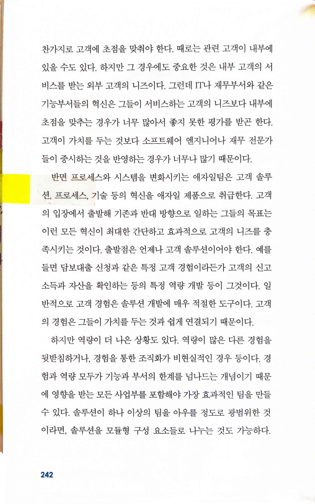

> 프로세스와 기술을 혁신하는 솔루션팀은 다른 애자일팀과 마찬가지로 고객에 초점을 맞춰야 한다. 때로는 관련 고객이 내부에 있을 수도 있다. 하지만 그 경우에도 중요한 것은 내부 고객의 서비스를 받는 외부 고객의 니즈이다.
>
> 반면 프로세스와 시스템을 변화시키는 애자일팀은 고객 솔루션, 프로세스, 기술 등의 혁신을 애자일 제품으로 취급한다. 고객의 입장에서 출발해 기존과 반대 방향으로 일하는 그들의 목표는 이런 모든 혁신이 최대한 간단하고 효과적으로 고객의 니즈를 충족시키는 것이다. 출발점은 언제나 고객 솔루션이어야 한다... 일반적으로 고객 경험은 솔루션 개발에 매우 적절한 도구이다. 고객의 경험은 그들이 가치를 두는 것과 쉽게 연결되기 때문이다.

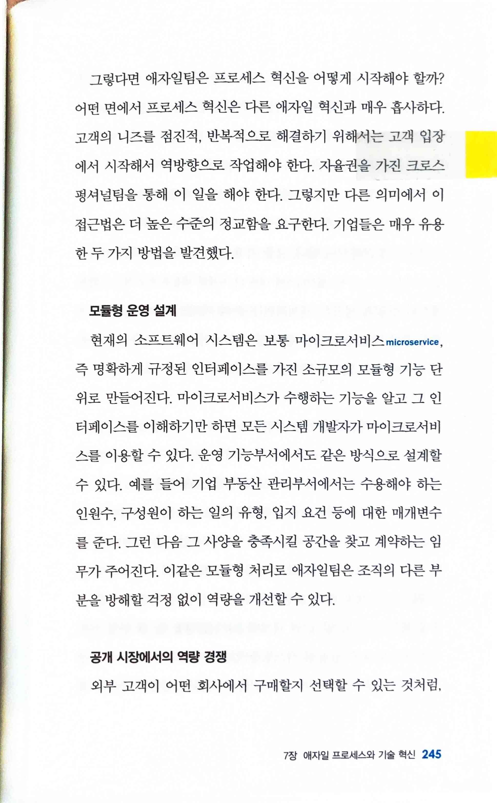

> 애자일팀은 프로세스 혁신을 어떻게 시작해야 할까? 어떤 면에서 프로세스 혁신은 다른 애자일 혁신과 매우 흡사하다. 고객의 니즈를 점진적, 반복적으로 해결하기 위해서는 고객 입장에서 시작해서 역방향으로 작업해야 한다. 자율권을 가진 크로스펑셔널팀을 통해 이 일을 해야 한다. 그렇지만 다른 의미에서 이 접근법은 더 높은 수준의 정교함을 요구한다. 기업들은 매우 유용한 두 가지 방법을 발견했다.
>
> 모듈형 운영 설계, 공개 시장에서의 역량 경쟁

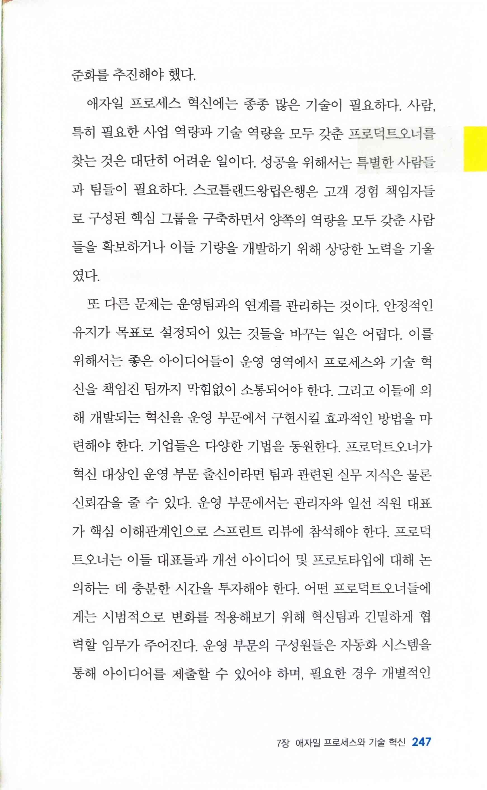

> 애자일 프로세스 혁신에는 종종 많은 기술이 필요하다. 사람, 특히 필요한 사업 역량과 기술 역량을 모두 갖춘 프로덕트오너를 찾는 것은 대단히 어려운 일이다. 성공을 위해서는 특별한 사람들과 팀들이 필요하다. 스코틀랜드왕립은행은 고객 경험 책임자들로 구성된 핵심 그룹을 구축하면서 양쪽의 역량을 모두 갖춘 사람들을 확보하거나 이들 기량을 개발하기 위해 상당한 노력을 기울였다.
>
> 또 다른 문제는 운영팀과의 연계를 관리하는 것이다. 안정적인 유지가 목표로 설정되어 있는 것들을 바꾸는 일은 어렵다.

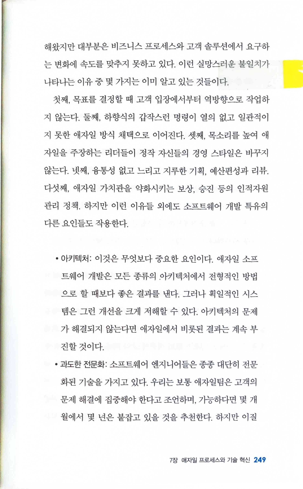 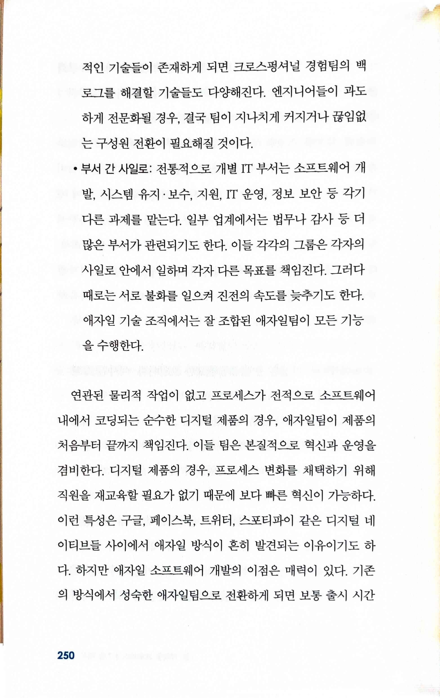

> 대부분은 비즈니스 프로세스와 고객 솔루션에서 요구하는 변화에 속도를 맞추지 못하고 있다. 이런 실망스러운 불일치가 나타나는 이유 중 몇 가지는 이미 알고 있는 것들이다.
>
> 첫째, 목표를 결정할 때 고객 입장에서부터 역방향으로 작업하지 않는다. 둘째, 하향식의 갑작스런 명령이 열의 없고 일관적이지 못한 애자일 방식 채택으로 이어진다. 셋째, 목소리를 높여 애자일을 주장하는 리더들이 정작 자신들의 경영 스타일은 바꾸지 않는다. 넷째, 융통성 없고 느리고 지루한 기획, 예산편성과 리뷰. 다섯째, 애자일 가치관을 약화시키는 보상, 승진 등의 인적자원관리 정책. 하지만 이런 이유들 외에도 소프트웨어 개발 특유의 다른 요인들도 작용한다.
>
> • 아키텍처
>
> • 과도한 전문화
>
> • 부서 간 사일로
>
> 연관된 물리적 작업이 없고 프로세스가 전적으로 소프트웨어 내에서 코딩되는 순수한 디지털 제품의 경우, 애자일팀이 제품의 처음부터 끝까지 책임진다. 이들 팀은 본질적으로 혁신과 운영을 겸비한다. 디지털 제품의 경우, 프로세스 변화를 채택하기 위해 직원을 재교육할 필요가 없기 때문에 보다 빠른 혁신이 가능하다. 이런 특성은 구글, 페이스북, 트위터, 스포티파이 같은 디지털 네이티브들 사이에서 애자일 방식이 흔히 발견되는 이유이기도 하다.

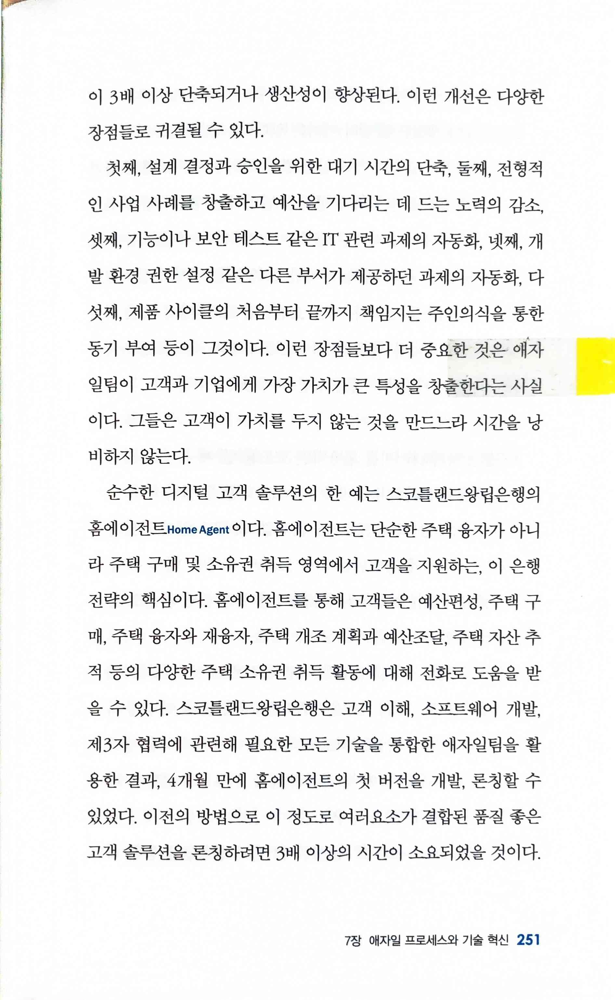

> 기존의 방식에서 성숙한 애자일팀으로 전환하게 되면 보통 출시 시간이 3배 이상 단축되거나 생산성이 향상된다. 이런 개선은 다양한 장점들로 귀결될 수 있다.
>
> 첫째, 설계 결정과 승인을 위한 대기 시간의 단축, 둘째, 전형적인 사업 사례를 창출하고 예산을 기다리는 데 드는 노력의 감소, 셋째, 기능이나 보안 테스트 같은 IT 관련 과제의 자동화, 넷째, 개발 환경 권한 설정 같은 다른 부서가 제공하던 과제의 자동화, 다섯째, 제품 사이클의 처음부터 끝까지 책임지는 주인의식을 통한 동기 부여 등이 그것이다. 이런 장점들보다 더 중요한 것은 애자일팀이 고객과 기업에게 가장 가치가 큰 특성을 창출한다는 사실이다. 그들은 고객이 가치를 두지 않는 것을 만드느라 시간을 낭비하지 않는다.

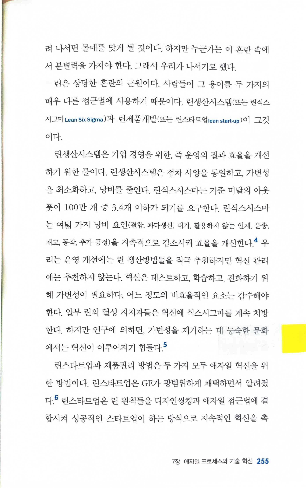

> 린은 상당한 혼란의 근원이다. 사람들이 그 용어를 두 가지의 매우 다른 접근법에 사용하기 때문이다. 린생산시스템(또는 린식스 시그마Lean Six Sigma)과 린제품개발(또는 린스타트업 lean start-up)이 그것이다.
>
> 가변성을 제거하는 데 능숙한 문화에서는 혁신이 이루어지기 힘들다.

# 8장 올바른 애자일은 모두를 위한 것이다 DOING AGILE RIGHT
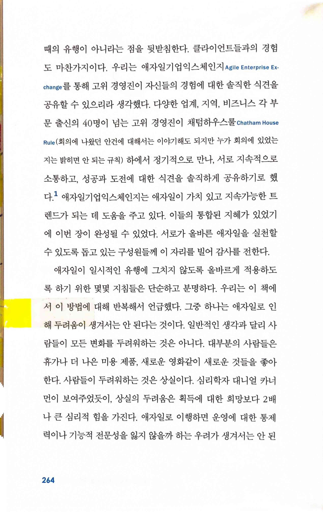

> 채텀하우스룰Chatham House Rule (회의에 나왔던 안건에 대해서는 이야기해도 되지만 누가 회의에 있었는지는 밝히면 안 되는 규칙)
* [Chatham House Rule | Chatham House – International Affairs Think Tank](https://www.chathamhouse.org/about-us/chatham-house-rule)
* [생산적 회의를 위한 또 하나의 원칙 '채텀하우스룰'](https://www.venturesquare.net/539578)
> 애자일로 인해 두려움이 생겨서는 안 된다. 일반적인 생각과 달리 사람들이 모든 변화를 두려워하는 것은 아니다. 대부분의 사람들은 ... 새로운 것들을 좋아한다. 사람들이 두려워하는 것은 상실이다. 심리학자 대니얼 카너먼이 보여주었듯이, 상실의 두려움은 획득에 대한 희망보다 2배나 큰 심리적 힘을 가진다. 애자일로 이행하면 운영에 대한 통제력이나 기능적 전문성을 잃지 않을까 하는 우려가 생겨서는 안 된다. 새로운 방법이 더 낫다는 것을 학습하기 전에 기존 작업 방식을 포기하는 것으로 인한 두려움이 생기게 해서는 안 된다. 진정한 협력과 반복적인 시제품화, 테스트, 그리고 실제 운영 조건에서 제안된 변화의 적용 등을 통해 두려움을 피할 수 있다.

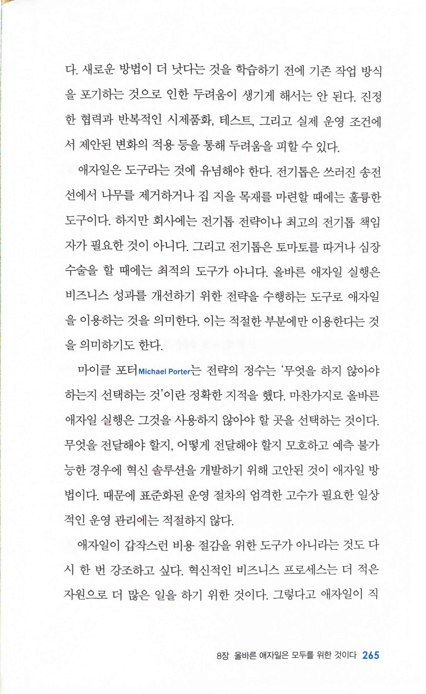

> 애자일은 도구라는 것에 유념해야 한다... 올바른 애자일 실행은 비즈니스 성과를 개선하기 위한 전략을 수행하는 도구로 애자일을 이용하는 것을 의미한다. 이는 적절한 부분에만 이용한다는 것을 의미하기도 한다.
>
> 마이클 포터 Michael Porter는 전략의 정수는 '무엇을 하지 않아야 하는지 선택하는 것'이란 정확한 지적을 했다. 마찬가지로 올바른 애자일 실행은 그것을 사용하지 않아야 할 곳을 선택하는 것이다. 무엇을 전달해야 할지, 어떻게 전달해야 할지 모호하고 예측 불가능한 경우에 혁신 솔루션을 개발하기 위해 고안된 것이 애자일 방법이다. 때문에 표준화된 운영 절차의 엄격한 고수가 필요한 일상적인 운영 관리에는 적절하지 않다.
* [Jim Collins, Meet Michael Porter](https://hbr.org/2011/12/jim-collins-meet-michael-porte) `The essence of strategy, says Porter, is choosing what not to do.`

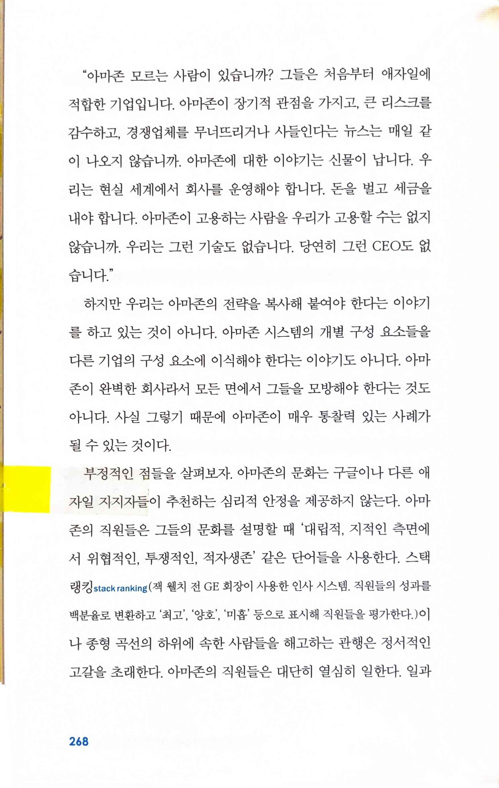 

> 부정적인 점들을 살펴보자. 아마존의 문화는 구글이나 다른 애자일 지지자들이 추천하는 심리적 안정을 제공하지 않는다.
>
> 이론적으로는 이런 약점 중 어느 것이라도 애자일 운영을 저해할 수 있다. 이들이 다 합쳐졌을 때는 심각한 손상을 줄 수 있다.하지만 아마존의 애자일 시스템은 전진을 거듭하고 있다... 그 이유로 강점과 약점의 균형이 맞춰진 시스템을 든다. 그것들은 오랫동안 독특한 아마존 방식으로 함께 진화해왔다.즉 이것은 시스템의 문제이지 개인의 문제가 아니란 뜻이다.

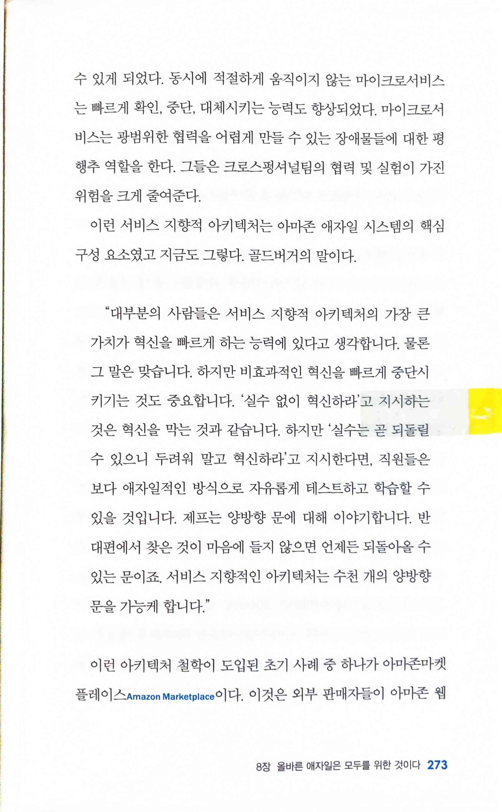

> “대부분의 사람들은 서비스 지향적 아키텍처의 가장 큰 가치가 혁신을 빠르게 하는 능력에 있다고 생각합니다. 물론 그 말은 맞습니다. 하지만 비효과적인 혁신을 빠르게 중단시키기는 것도 중요합니다. '실수 없이 혁신하라'고 지시하는 것은 혁신을 막는 것과 같습니다. 하지만 '실수는 곧 되돌릴 수 있으니 두려워 말고 혁신하라'고 지시한다면, 직원들은 보다 애자일적인 방식으로 자유롭게 테스트하고 학습할 수 있을 것입니다. 제프는 양방향 문에 대해 이야기합니다. 반대편에서 찾은 것이 마음에 들지 않으면 언제든 되돌아올 수 있는 문이죠. 서비스 지향적인 아키텍처는 수천 개의 양방향문을 가능케 합니다."

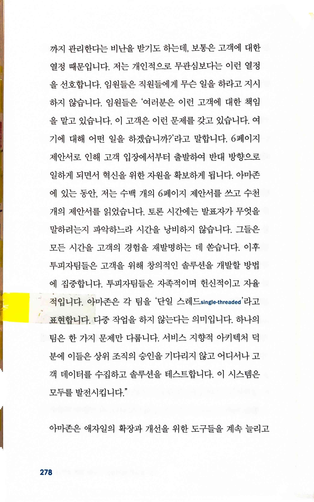

> 아마존은 각 팀을 '단일 스레드single-threaded'라고 표현합니다. 다중 작업을 하지 않는다는 의미입니다. 하나의 팀은 한 가지 문제만 다릅니다. 서비스 지향적 아키텍처 덕분에 이들은 상위 조직의 승인을 기다리지 않고 어디서나 고객 데이터를 수집하고 솔루션을 테스트합니다. 이 시스템은 모두를 발전시킵니다.

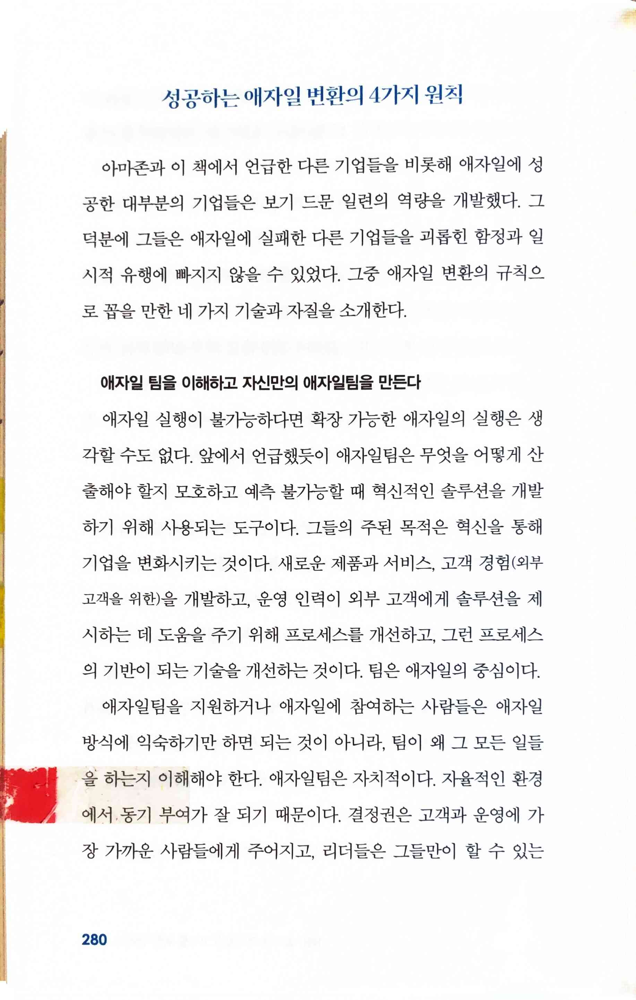 

> 애자일팀을 지원하거나 애자일에 참여하는 사람들은 애자일 방식에 익숙하기만 하면 되는 것이 아니라, 팀이 왜 그 모든 일들을 하는지 이해해야 한다. 애자일팀은 자치적이다. 자율적인 환경에서 동기 부여가 잘 되기 때문이다. 결정권은 고객과 운영에 가장 가까운 사람들에게 주어지고, 리더들은 그들만이 할 수 있는 기업 전략에 집중할 시간을 얻는다. 애자일팀은 규모가 작으며 여러 전문 분야를 아우른다. 작은 규모는 커뮤니케이션의 효율과 생산성을 높인다. 다양한 분야를 포괄하게 되면 창의성이 높아지고, 다른 팀과의 상호의존성이 낮아지며, 의사결정의 속도가 빨라진다. 애자일팀은 하나의 과제에 헌신한다. 다중 작업은 사람들을 둔하게 만들고, 개발 사이클을 늦추고, 진행 중인 작업을 늘리기 때문이다. 효율적인 애자일팀은 맹목적으로 규칙을 따르지 않는다. 자신들이 왜 그 일을 하고 있는지 이해하며, 끊임없이 더 나은 방법을 찾고 다른 팀들과 식견을 공유한다.
>
> 우선순위 설정의 가치를 배운다. 그들은 예측을 뒷받침하는 가정에 이의를 제기하기 시작한다. 그들은 관리자가 아닌 고객들로부터 직접 피드백을 수집하고, 진행 중인 작업의 수를 제한하고, 의사결정의 속도를 높인다. 그들은 가치가 낮은 작업을 제거하는 방법, 지속적으로 나름의 작업 방식을 개선하는 방법을 알아낸다... 애자일팀은 속도와 성공을 방해하는 장애물을 확인하는 법을 배우고, 리더십팀은 이런 장애를 제거하는 방법을 배운다. 애자일팀이 조직으로 밀려드는 것이 아니라, 조직이 애자일팀을 끌어들이는 것이다.

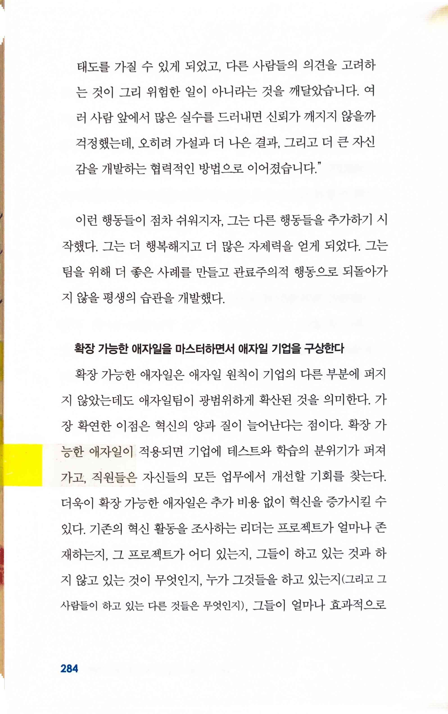

> 확장 가능한 애자일은 애자일 원칙이 기업의 다른 부분에 퍼지지 않았는데도 애자일팀이 광범위하게 확산된 것을 의미한다.
* 원문은 `Agile at scale, remember, refers to widespread proliferation of agile teams, even when agile principles have not spread to the rest of the enterprise.`
  * 무슨 뜻인지 잘 이해가 가지 않아 저자에게 질문했는데 답변을 받았고, 간단히 말하면 제도보다 문화가 더 중요하다는 뜻
  * [Doing Agile Right - Rigby, Darrell <Darrell.Rigby@Bain.com>](https://gist.github.com/hyunjun/7ab272793c30413c7c6e1ebf7f6f7fa2#file-qa-md)
> 확장 가능한 애자일이 적용되면 기업에 테스트와 학습의 분위기가 퍼져가고, 직원들은 자신들의 모든 업무에서 개선할 기회를 찾는다.

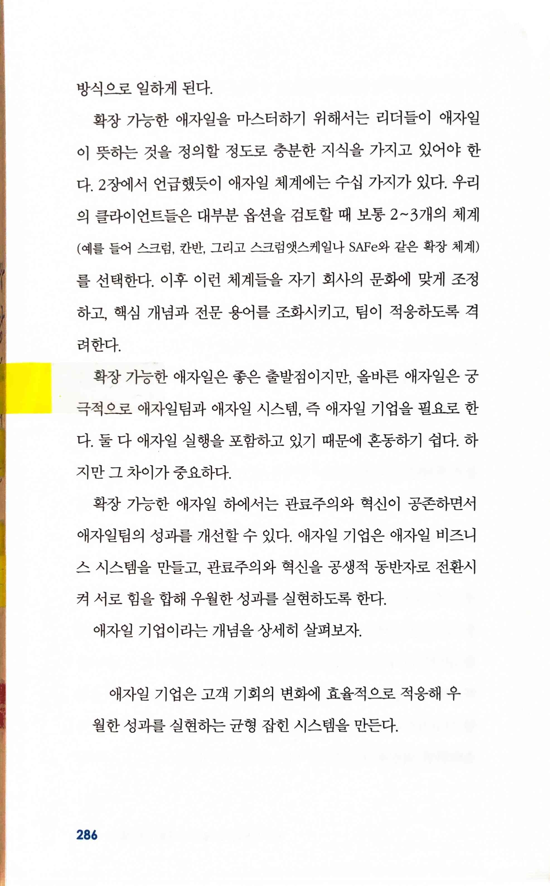

> 확장 가능한 애자일을 마스터하기 위해서는 리더들이 애자일이 뜻하는 것을 정의할 정도로 충분한 지식을 가지고 있어야 한다. 2장에서 언급했듯이 애자일 체계에는 수십 가지가 있다. 우리의 클라이언트들은 대부분 옵션을 검토할 때 보통 2~3개의 체계(예를 들어 스크럼, 칸반, 그리고 스크럼앳스케일나 SAFe와 같은 확장 체계)를 선택한다. 이후 이런 체계들을 자기 회사의 문화에 맞게 조정하고, 핵심 개념과 전문 용어를 조화시키고, 팀이 적응하도록 격려한다.
>
> 확장 가능한 애자일은 좋은 출발점이지만, 올바른 애자일은 궁극적으로 애자일팀과 애자일 시스템, 즉 애자일 기업을 필요로 한다. 둘 다 애자일 실행을 포함하고 있기 때문에 혼동하기 쉽다. 하지만 그 차이가 중요하다.
>
> 확장 가능한 애자일 하에서는 관료주의와 혁신이 공존하면서 애자일팀의 성과를 개선할 수 있다. 애자일 기업은 애자일 비즈니스 시스템을 만들고, 관료주의와 혁신을 공생적 동반자로 전환시켜 서로 힘을 합해 우월한 성과를 실현하도록 한다.

 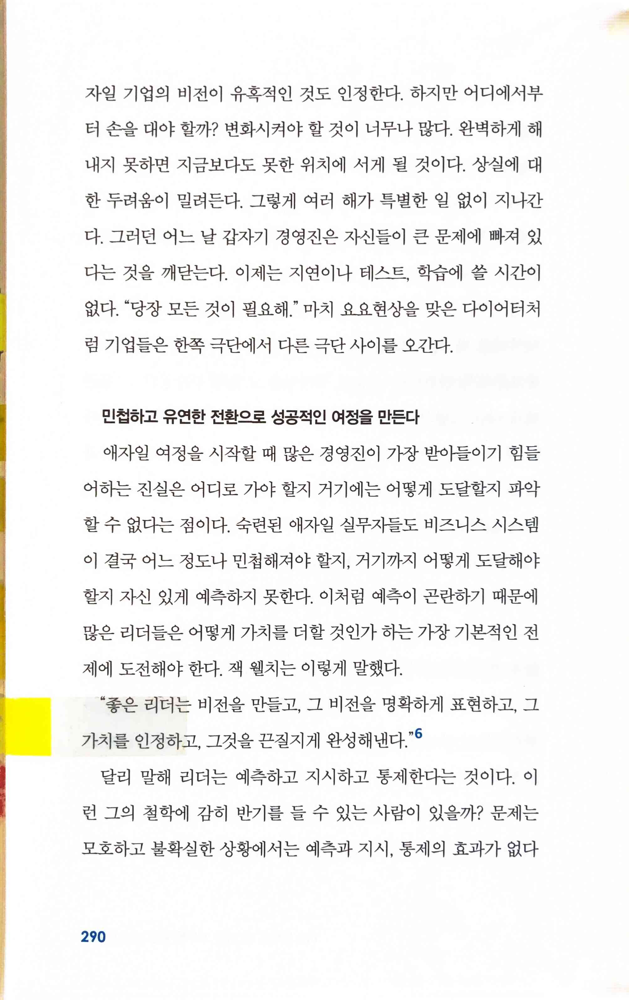

> 동시적이고 일괄적인 애자일 전환의 위험성에 대해서는 이미 이야기한 바 있다. 당장 모든 것을 이루기 원하는 경영진은 보통 관료주의적 변환팀을 이용해 애자일을 조직에 강요한다. 그들은 대개 다른 기업의 애자일 모델을 모방하며 거기에 모든 답이 있다고 굳게 믿고 덤벼든다. 성과가 좋은 경우는 찾기 힘들다. 기업과 같은 복잡한 시스템에서는 인과관계가 종종 모호해지고 의도치 않은 결과로 이어질 수도 있다.
>
> 다른 극단에는 애자일 기업의 복잡한 구조에 압도되어버린 경영진이 있다. 도를 넘은 관료주의로 인한 고통이 극심한 것도, 애자일 기업의 비전이 유혹적인 것도 인정한다. 하지만 어디에서부터 손을 대야 할까? 변화시켜야 할 것이 너무나 많다. 완벽하게 해내지 못하면 지금보다도 못한 위치에 서게 될 것이다. 상실에 대한 두려움이 밀려든다. 그렇게 여러 해가 특별한 일 없이 지나간다. 그러던 어느 날 갑자기 경영진은 자신들이 큰 문제에 빠져 있다는 것을 깨닫는다. 이제는 지연이나 테스트, 학습에 쓸 시간이 없다. “당장 모든 것이 필요해." 마치 요요현상을 맞은 다이어터처럼 기업들은 한쪽 극단에서 다른 극단 사이를 오간다.
>
> 잭 웰치는 이렇게 말했다.
>
> "좋은 리더는 비전을 만들고, 그 비전을 명확하게 표현하고, 그 가치를 인정하고, 그것을 끈질지게 완성해낸다."
>
> 달리 말해 리더는 예측하고 지시하고 통제한다는 것이다. 이런 그의 철학에 감히 반기를 들 수 있는 사람이 있을까? 문제는 모호하고 불확실한 상황에서는 예측과 지시, 통제의 효과가 없다는 점이다.

> 대니얼 카너먼과 같은 학자들은 리더들이 하는 예측의 정확도가 동전 던지기와 비슷하다고 말한다. 그렇다면 지시와 통제의 시도에 대해 여러 가지 의문이 생길 수밖에 없다.

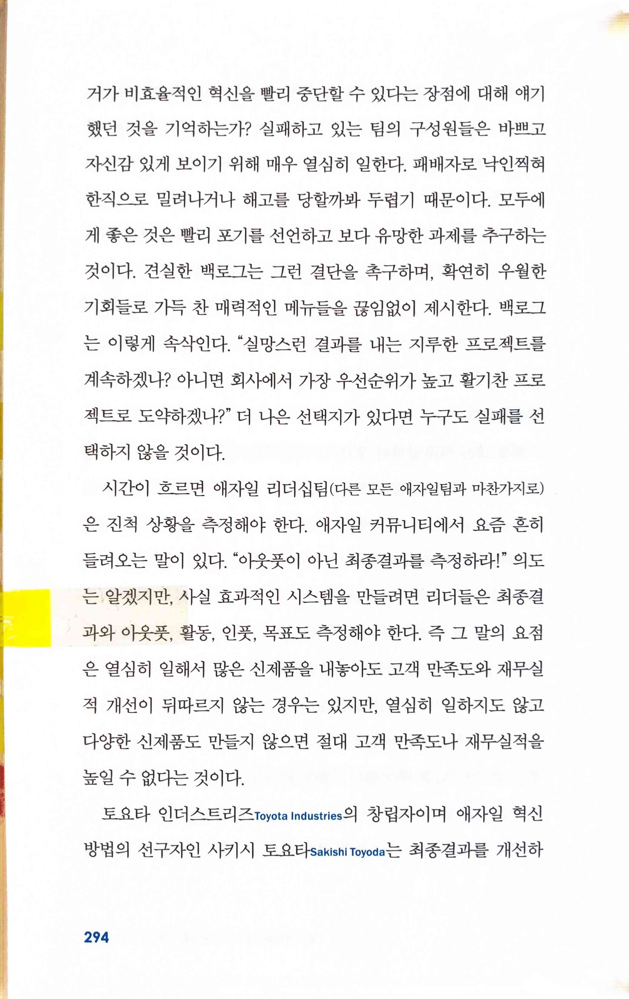

> 시간이 흐르면 애자일 리더십팀(다른 모든 애자일팀과 마찬가지로)은 진척 상황을 측정해야 한다. 애자일 커뮤니티에서 요즘 흔히 들려오는 말이 있다. "아웃풋이 아닌 최종결과를 측정하라!" 의도는 알겠지만, 사실 효과적인 시스템을 만들려면 리더들은 최종결과와 아웃풋, 활동, 인풋, 목표도 측정해야 한다. 즉 그 말의 요점은 열심히 일해서 많은 신제품을 내놓아도 고객 만족도와 재무실적 개선이 뒤따르지 않는 경우는 있지만, 열심히 일하지도 않고 다양한 신제품도 만들지 않으면 절대 고객 만족도나 재무실적을 높일 수 없다는 것이다.

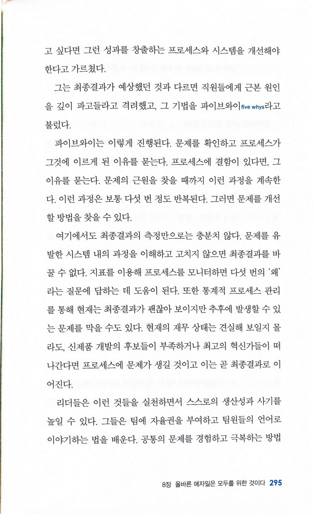

> 그는 최종결과가 예상했던 것과 다르면 근본 원인을 깊이 파고들라
>
> 파이브와이 five whys는 이렇게 진행된다. 문제를 확인하고 프로세스가 그것에 이르게 된 이유를 묻는다. 프로세스에 결함이 있다면, 그 이유를 묻는다. 문제의 근원을 찾을 때까지 이런 과정을 계속한다. 이런 과정은 보통 다섯 번 정도 반복된다. 그러면 문제를 개선할 방법을 찾을 수 있다.
>
> 여기에서도 최종결과의 측정만으로는 충분치 않다. 문제를 유발한 시스템 내의 과정을 이해하고 고치지 않으면 최종결과를 바꿀 수 없다.
>
> 리더들은 이런 것들을 실천하면서 스스로의 생산성과 사기를 높일 수 있다. 그들은 팀에 자율권을 부여하고 팀원들의 언어로 이야기하는 법을 배운다. 공통의 문제를 경험하고 극복하는 방법을 배운다. 그들은 애자일팀을 방해하는 행동을 인식하고 중단한다. 일을 단순화하고 일에 집중하는 법을 배운다. 결과가 개선되면서 조직 전체로 확신과 참여가 확대된다.

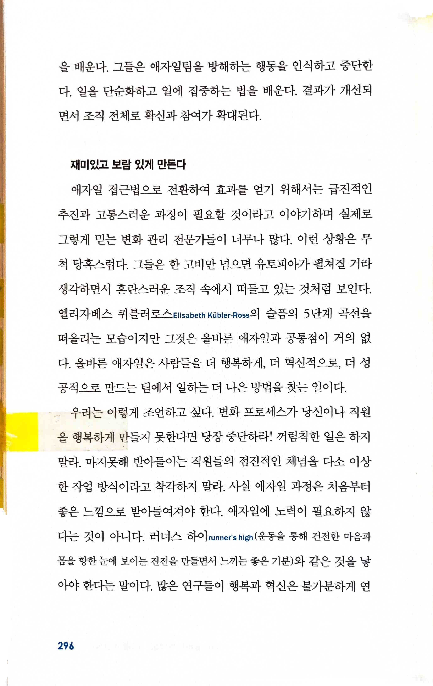 

> 올바른 애자일은 사람들을 더 행복하게, 더 혁신적으로, 더 성공적으로 만드는 팀에서 일하는 더 나은 방법을 찾는 일이다.
>
> 우리는 이렇게 조언하고 싶다. 변화 프로세스가 당신이나 직원을 행복하게 만들지 못한다면 당장 중단하라! 꺼림칙한 일은 하지 말라. 마지못해 받아들이는 직원들의 점진적인 체념을 다소 이상한 작업 방식이라고 착각하지 말라. 사실 애자일 과정은 처음부터 좋은 느낌으로 받아들여져야 한다. 애자일에 노력이 필요하지 않다는 것이 아니다. 러너스 하이 runner's high (운동을 통해 건전한 마음과 몸을 향한 눈에 보이는 진전을 만들면서 느끼는 좋은 기분)와 같은 것을 낳아야 한다는 말이다. 많은 행복과 혁신은 불가분하게 연결되어 있다는 것을 보여준다. 행복이 혁신을 만드는지 혁신이 행복을 만드는지는 중요치 않다. 하나를 개선하면, 두 가지 모두를 지속적으로 개선해갈 사이클이 시작된다. 성공은 습관 형성이다. 우리 두뇌는 성공적인 달성을 이루면 기분이 좋아지는 신경 화학물질을 생산한다. 설정한 목표를 달성하면 두뇌는 도파민을 분비한다. 즐거움을 가져다주는 일을 계속 하도록 하는 보상 호르몬이다. 다른 사람들과 유대감을 형성하고 신뢰를 강화하면 옥시토신을 분비한다. 이는 충성심을 높이며 사교성을 키워준다. 어려운 문제를 극복하면 엔돌핀을 분비해 기분 좋게 만들고 피로감을 낮춘다. 굳건한 목적 의식을 강화하는 활동에 참여할 때에는 세로토닌을 생성하여 자신감과 안정감을 느끼게 한다. 이처럼 여러 화학물질이 바람직한 행동을 촉진하고 팀으로서의 혁신 능력과 행복감을 높인다.
>
> 일을 할 때 행복하지 않다면, 보람 있는 일을 하고 있지 않거나 두뇌가 일을 즐겁게 만드는 화학물질을 충분히 만들고 있지 않은 것이다. 이렇게 되면 일에 열의를 갖지 못할 뿐 아니라 일종의 신경 화학물질 금단 현상을 겪게 된다. 좋은 애자일 리더들은 혁신을 재미있고 보람 있는 일로 만들어서 성과를 높이는 방법을 배워야 한다. 그들은 팀이 목표를 설정하고 달성하며, 다른 사람들과 연대하고, 어려운 도전을 극복하고, 목적의식을 다지고, 성공적인 성과로 즐거워지도록 할 방법을 찾아야 한다.

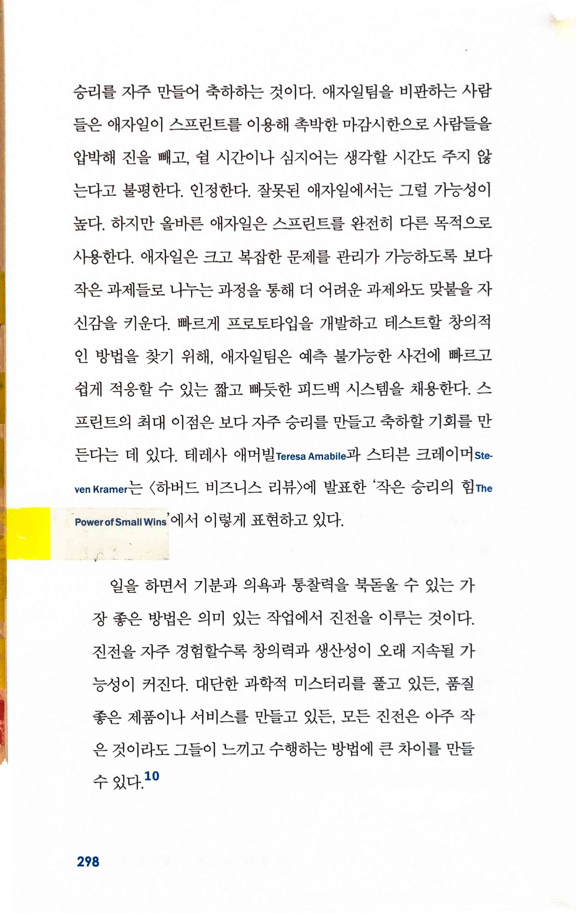

> 수많은 노력을 재미있는 것으로 만드는 한 가지 전술은 작은 승리를 자주 만들어 축하하는 것이다. 애자일팀을 비판하는 사람들은 애자일이 스프린트를 이용해 촉박한 마감시한으로 사람들을 압박해 진을 빼고, 쉴 시간이나 심지어는 생각할 시간도 주지 않는다고 불평한다. 인정한다. 잘못된 애자일에서는 그럴 가능성이 높다. 하지만 올바른 애자일은 스프린트를 완전히 다른 목적으로 사용한다. 애자일은 크고 복잡한 문제를 관리가 가능하도록 보다 작은 과제들로 나누는 과정을 통해 더 어려운 과제와도 맞붙을 자신감을 키운다. 빠르게 프로토타입을 개발하고 테스트할 창의적인 방법을 찾기 위해, 애자일팀은 예측 불가능한 사건에 빠르고 쉽게 적응할 수 있는 짧고 빠듯한 피드백 시스템을 채용한다. 스프린트의 최대 이점은 보다 자주 승리를 만들고 축하할 기회를 만든다는 데 있다.
* [The Power of Small Wins](https://hbr.org/2011/05/the-power-of-small-wins)

# 부록 C 연구 기록 요약
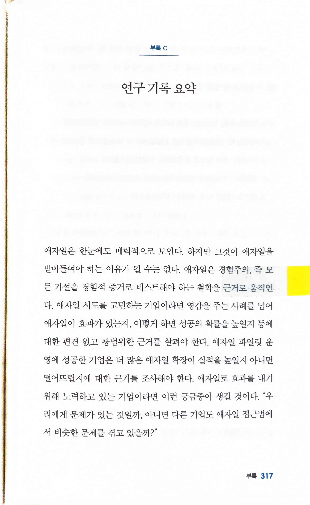

> 애자일은 경험주의, 즉 모든 가설을 경험적 증거로 테스트해야 하는 철학을 근거로 움직인다. 애자일 시도를 고민하는 기업이라면 영감을 주는 사례를 넘어 애자일이 효과가 있는지, 어떻게 하면 성공의 확률을 높일지 등에 대한 편견 없고 광범위한 근거를 살펴야 한다. 애자일 파일럿 운영에 성공한 기업은 더 많은 애자일 확장이 실적을 높일지 아니면 떨어뜨릴지에 대한 근거를 조사해야 한다. 애자일로 효과를 내기위해 노력하고 있는 기업이라면 이런 궁금증이 생길 것이다. “우리에게 문제가 있는 것일까, 아니면 다른 기업도 애자일 접근법에서 비슷한 문제를 겪고 있을까?"

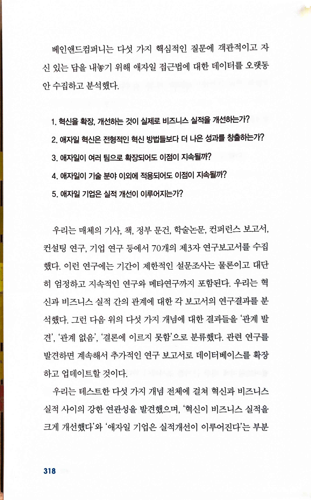 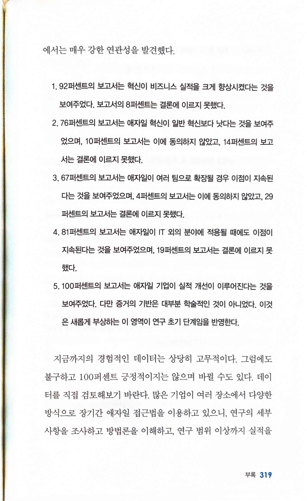

> 다섯 가지 핵심적인 질문
>
> 1. 혁신을 확장, 개선하는 것이 실제로 비즈니스 실적을 개선하는가?
>
> 2. 애자일 혁신은 전형적인 혁신 방법들보다 더 나은 성과를 창출하는가?
>
> 3. 애자일이 여러 팀으로 확장되어도 이점이 지속될까?
>
> 4. 애자일이 기술 분야 이외에 적용되어도 이점이 지속될까?
>
> 5. 애자일 기업은 실적 개선이 이루어지는가?

## 인용 연구

### 혁신이 사업 실적을 광범위하게 개선시킨다

#### 관계 발견
* Atalay, Murat, Nilgün Anafarta, and Fulya Sarvan. [The Relationship between Innovation and Firm Performance: An Empirical Evidence from Turkish Automotive Supplier Industry - ScienceDirect](https://www.sciencedirect.com/science/article/pii/S1877042813005624?via%3Dihub) Procedia- Social and Behavioral Sciences 75 (April 3, 2013): 226-235.
  * 제품과 프로세스 혁신은 회사의 성과에 눈에 띄는 긍정적인 영향을 미친다.
* [Innovation in Australian Business, 2020-21 financial year | Australian Bureau of Statistics](https://www.abs.gov.au/statistics/industry/technology-and-innovation/innovation-australian-business/latest-release)
  * 혁신 기업은 매출의 향상을 보고했고, 경쟁 우위를 확보했다고 느꼈으며, 고객 서비스를 개선했다.
* Cho, Hee-Jae, and Vladimir Pucik. [Relationship between innovativeness, quality, growth, profitability, and market value - Cho - 2005 - Strategic Management Journal - Wiley Online Library](https://onlinelibrary.wiley.com/doi/10.1002/smj.461) Strategic Management Journal 26 (April 11, 2005): 555-575.
  * 결과는 혁신성이 품질과 성장 사이의 관계를 중재하고, 품질은 혁신성과 수익성 사이의 관계를 중재하고, 혁신성과 품질 모두가 시장 가치에 매개 효과를 갖는다는 것을 보여준다.
* Jiménez-Jiménez, Daniel, and Raquel Sanz-Valle. [Innovation, organizational learning, and performance - ScienceDirect](https://www.sciencedirect.com/science/article/abs/pii/S0148296310001906?via%3Dihub) Journal of Business Research 64, no.4 (April 2011): 408-417.
  * 연구는 조직적 학습과 혁신이 비즈니스 성과에 긍정적으로 기여한다는 것을 보여준다.
* Kelly, Bryan, Dimitris Papanikolaou, Amit Seru, and Matt Taddy. [Measuring Technological Innovation over the Long Run | NBER](https://www.nber.org/papers/w25266) NBER Working Paper No. 25266, National Bureau of Economic Research, Inc., Cambridge, MA (November2018).
  * 획기적인 혁신은 기간, 산업, 기업 전반의 생산성 향상과 대응된다.
* Linder, Jane C. [Does innovation drive profitable growth? New metrics for a complete picture | Emerald Insight](https://www.emerald.com/insight/content/doi/10.1108/02756660610692699/full/html) Journal of Business Strategy 27, no. 5(September 1, 2006); 38-44.
  * 재무 데이터를 근거로 한 순위는 조직이 얼마나 혁신적인지에 대한 경영진의 자기 보고 정보와 부합된다.
* Minor, Dylan, Paul Brook, and Josh Bernoff. [Are Innovative Companies More Profitable?](https://sloanreview.mit.edu/article/are-innovative-companies-more-profitable/) MIT Sloan Management Review, December 28, 2017.
  * 연구를 통해 기업에서의 관념화와 수익이나 순수입의 증가 사이의 유의미한 상관관계가 발견되었다.
* Nieves, Julia. [Outcomes of Management Innovation: An Empirical Analysis in the Services Industry - Nieves - 2016 - European Management Review - Wiley Online Library](https://onlinelibrary.wiley.com/doi/10.1111/emre.12071) European Management Review 13 (March 21, 2016): 125-136.
  * 경영 혁신은 제품 혁신에 긍정적인 영향을 주며, 제품 혁신은 재무 실적에 상당한 영향을 준다.
* Rajapathirana, R. P. Jayani, and Yan Hui. [Relationship between innovation capability, innovation type, and firm performance - ScienceDirect](https://www.sciencedirect.com/science/article/pii/S2444569X17300409?via%3Dihub) Journal of Innovation & Knowledge 3, no.1 (January - April 2018): 44-55.
  * 연구는 높은 혁신 역량을 가진 기업은 긍정적이고 매우 강한 영향을 끼친다는 주장을 지지한다.
* Shanker, Roy, Ramudu Bhanugopan, Beatrice I. J. M. van der Heijden, and Mark Farrell. [Organizational climate for innovation and organizational performance: The mediating effect of innovative work behavior - ScienceDirect](https://www.sciencedirect.com/science/article/abs/pii/S0001879117300143?via%3Dihub) Journal of Vocational Behavior 100 (June 2017): 67-77. https://doi.org/10.1016/ j.jvb.2017.02.004.
  * 연구는 조직 환경과 조직 성과 간의 관계가 중요하다는 것을 보여준다.

#### 결론에 이르지 못함
* Youtie, Jan, Philip Shapira, and Stephen Roper. [Exploring Links Between Innovation and Profitability in Georgia Manufacturers - Jan Youtie, Philip Shapira, Stephen Roper, 2018](https://journals.sagepub.com/doi/10.1177/0891242418786430) Economic Development Quarterly 32, no.4 (September 3, 2018): 271-287.
  * 2005년 설문조사에서는 조지아 제조업계의 수익성과 혁신 사이에 긍정적인 관계가 나타났으나 2010년과 2016년 설문에서는 혁신과 기업 성과 사이에 관계가 없었다.

### 애자일 혁신이 기존의 혁신보다 더 효과적이다

#### 관계 발견
* Ambler, Scott W. [2013 IT Project Success Rates Survey Results](http://www.ambysoft.com/surveys/success2013.html) Ambysoft, January 2014.
  * 애자일, 린, 반복 전략은 평균적으로 전형적이고 임시적인 전략들보다 우월하다.
* CollabNet VersionOne. 13th Annual State of Agile Report. [State of Agile](https://stateofagile.com/?ga=2.258734218.1293249604.%201571223036-453094266.1571223036#ufh-c-473508-state-of-agile-report), May7, 2019.
  * 보고된 애자일의 이점에는 변화하는 우선순위 프로젝트 가시성, 비즈니스 및 IT 조정, 출시 속도, 생산성 향상, 프로젝트 위험 감소를 관리할 수 있는 능력 등이 포함된다.
* Fitzgerald, Brian, Gerard Hartnett, and Kieran Conboy. [Customising agile methods to software practices at Intel Shannon: European Journal of Information Systems: Vol 15, No 2](https://www.tandfonline.com/doi/full/10.1057/palgrave.ejis.3000605) (January 9, 2006): 200-213.
  * 이 연구는 인텔섀넌에서 애자일 방법과 익스트림 프로그래밍, 그리고 스크럼의 맞춤화에 대해 조사했다. 코드 결함 밀도의 7배 감소와 프로젝트 달성 속도 향상의 성과가 있었다.
* Freeform Dynamics. [How Agile and DevOps enable digital readiness and transformation - Freeform Dynamics](https://www.freeformdynamics.com/software-delivery/agile-devops-enable-digital-readiness-transformation/) Freeform Dynamics, February 2018.
  * 평균적으로 애자일 마스터들은 매출의 60퍼센트 성장을 보고했으며, 이들은 동료들에 비해 20퍼센트 이상 성장할 확률이 2.4배 높았다.
* Johnson, Suzette, Richard Cheng, Stosh Misiazek, Stephanie Greytak, and James Boston. [The Business Case for Agile Methods - PDF Free Download](http://docplayer.net/5838794-Thebusiness-case-for-agile-methods.html) Arlington, VA: Association for Enterprise Information, 2011.
  * 패트리어트 엑스칼리버의 소프트웨어 출시 사이클은 18개월에서 22주로 감소했다. 애자일의 BMC 채택은 개별 팀 생산성을 20~50퍼센트 상승하도록 이끌었다. 애자일 채택으로 미국통계국은 직원들이 이전에 쏟던 노력의 3분의 1을 사용해서 50퍼센트 빠르게 규정된 요구조건을 달성할 수 있게 되었다.
* Kakar, AdarshK. ["WHAT MOTIVATES TEAM MEMBERS AND USERS OF AGILE PROJECTS?" by Adarsh K. Kakar](https://aisel.aisnet.org/sais2013/17/) Proceedings of the Southern Association for Information Systems Conference Atlanta: Association for Information Systems(AIS), 2013.
  * 애자일 방법은 프로젝트 팀원이 프로젝트 완성을 향해 일하도록 의욕을 고취시켜 완성 효과를 높인다.
* Lo Giudice, Diego, Christopher Mines, Amanda LeClair, Luis Deya, and Andrew Reese. [The State Of Agile 2019: Are We At Scale Yet? | Forrester](https://www.forrester.com/report/The-State-Of-Agile-2017-Agile-At-Scale/RES140411), December 14, 2017.
  * 애자일의 이점에는 출시 빈도의 향상, 고객 경험 개선, 더 나은 비즈니스 및 IT 조정, 기능부서의 품질 향상, 팀 사기 향상 등이 있다.
* Przybilla, Leonard, Manuel Wiesche, and Helmut Krcmar. [The Influence of Agile Practices on Performance in Software Engineering Teams | Proceedings of the 2018 ACM SIGMIS Conference on Computers and People Research](https://dl.acm.org/doi/10.1145/3209626.3209703), 33-40. New York: Association for Computing Machinery, June2018.
  * 매일의 스탠드업 미팅과 반성은 충돌의 수준을 낮추고 성과와 만족감을 높였다.
* Reifer, DonaldJ. [How good are agile methods? | IEEE Journals & Magazine | IEEE Xplore](https://ieeexplore.ieee.org/document/1020280) IEEE Software 19, no.4 (2002): 16–18.
  * 생산성 향상(15~23퍼센트), 비용 절감(5~7퍼센트), 출시 시간 단축(25~50퍼센트) 등의 이점이 있다.
* Rico, DavidE. [What Is the Return on Investment (roi) of Agile Methods? | Semantic Scholar](https://www.semanticscholar.org/paper/What-Is-the-Return-on-Investment-%28roi%29-of-Agile-Rico/8e3dc7208bc743037716f327ba98a7fcb1a69502?p2df). Accessed December 17, 2019.
  * 검토한 문헌을 근거로 볼 때 애자일 방법론의 사용은 비용 효율 향상, 생산성 향상, 품질 향상, 사이클 타임 감소, 고객 만족도 증가를 가져온다.
* Scrum Alliance. [The State of Scrum: 2017-2018 Report](https://resources.scrumalliance.org/Article/state-scrum-2017-2018-report). ScrumAlliance. Accessed December 17, 2019.
  * 참가자의 97퍼센트는 앞으로도 계속해서 스크럼을 사용할 것이다. 애자일을 채택하면 달된 결과에 대한 만족도 향상, 시장 출시 속도 향상, 품질 향상, 직원사기 개선, IT에서의 투자 수익 증가 등의 이점을 얻을 수 있다.
* Serrador, Pedro, Andrew Gemino, and BlaizeH. Reich. [Creating a Climate for Project Success | The Journal of Modern Project Management](https://journalmodernpm.com/index.php/jmpm/article/view/JMPM01605/0) 6 (2018): 38-47.
  * 고위 경영진의 지원, 이해관계인의 참여, 전담팀, 애자일 방법의 지원, 프로덕트 오너와의 잦은 회의, 바람직한 팀 태도가 프로젝트의 성공과 관련된다.
* Serrador, Pedro, and Jeffrey K. Pinto. [Does Agile work? — A quantitative analysis of agile project success - ScienceDirect](https://www.sciencedirect.com/science/article/abs/pii/S0263786315000071) International Journal of Project Management 33, no. 5 (July 1, 2015): 1040-1051.
  * 애자일 방법들은 효율성과 전체 주주 만족도에 긍정적인 영향을 미친다.
* Standish Group. [The CHAOS Report: Decision Latency Theory & Project Environmental Benc – The Standish Group](https://standishgroup.myshopify.com/collections/frontpage/products/project-resolution-benchmark): It's All about the Interval. Boston: Lulu.com, 2018. 
  * 애자일 프로젝트의 성공 확률은 5분의 3 (42.5퍼센트 : 26퍼센트)이고 실패 확률은 3분의 1이다(8퍼센트 : 21퍼센트).

#### 관계 없음
* Budzier, Alexander, and Bent Flyvbjerg. [Making Sense of the Impact and Importance of Outliers in Project Management Through the Use of Power Laws by Alexander Budzier, Bent Flyvbjerg :: SSRN](https://papers.ssrn.com/sol3/papers.cfm?abstract_id=2289549) In Proceedings of International Research Network on Organizing by Projects at Oslo 11 (June1, 2013). New York: SSRN, 2016.
  * 애자일 방법론을 더 많이 채택한 그룹은 비용 중간값, 스케줄, 성과 이익에 큰 차이가 없었다.
* Magazinius, Ana, and Robert Feldt. [Confirming Distortional Behaviors in Software Cost Estimation Practice | IEEE Conference Publication | IEEE Xplore](https://ieeexplore.ieee.org/document/6068377) In Proceedings of the 37th EUROMICRO Conference on Software Engineering and Advanced Applications, 411-418. Institute of Electronics and Electronics Engineers, November 3, 2011.
  * 애자일 기업과 비애자일 기업 사이의 차이를 비교한 결과, 회의 시간과 예산 목표에서의 성공 및 실패 원인이 두 방법론 사이에 큰 차이가 없음을 발견했다.

#### 결론에 이르지 못함
* Dybå, Tore, and Torgeir Dingsøyr. [Empirical studies of agile software development: A systematic review - ScienceDirect](https://www.sciencedirect.com/science/article/abs/pii/S0950584908000256?via%3Dihub) Information and Software Technology 50, nos. 9–10 (August 2008): 833-859.
  * 4개의 연구는 애자일팀이 전형적인 팀보다 2퍼센 생산성을 보여주었으나, 해당 연구들의 품질이 낮다.
* Eveleens, Johan, and Chris Verhoef. [The rise and fall of the Chaos report figures | IEEE Journals & Magazine | IEEE Xplore](https://ieeexplore.ieee.org/document/5232804) IEEE Software 27, no. 1 (January-February 2010): 30-36.
  * 애자일의 이점에 대해 자주 인용되는 스탠디쉬의 카오스보고서 방법론을 비판한다.
* Lindvall, Mikael, Vic Basili, Barry Boehm, Patricia Costa, Kathleen Dangle, Forrest Shull, Roseanne Tesoriero, et al. [Empirical Findings in Agile Methods | SpringerLink](https://link.springer.com/chapter/10.1007/3-540-45672-4_19) In Extreme Programming and Agile Methods- XP/Agile Universe 2002, 197-207. Berlin: Springer, 2002.
  * 애자일 채택은 고객 협력, 결함 취급, 추정 등의 개선이라는 이점이 있다. 한계에는 페어 프로그래밍의 비효율, 설계와 아키텍처 문제에 대한 주의 부족이 포함되었다.

### 애자일이 여러 팀으로 확장되어도 이점이 지속된다

#### 관계 발견
* Atlas, Alan. [Accidental Adoption: The Story of Scrum at Amazon.com | IEEE Conference Publication | IEEE Xplore](https://ieeexplore.ieee.org/document/5261093) In Agile 2009 Conference, 135–140. Institute of Electronics and Electronics Engineers, September 25,2009.
  * 2004년부터 2009년까지 스크럼은 아마존 소프트웨어 개발팀 대부분에 확산되었다. 채택 성공의 핵심 요인에는 문화, 팀의 작은 규모, 내부 지지자들, 교육 등이 포함되었다.
* Brown, Alan W. [A Case Study in Agile-at-Scale Delivery | SpringerLink](https://link.springer.com/chapter/10.1007/978-3-642-20677-1_19) In Agile Processes in Software Engineering and Extreme Programming. XP 2011. Lecture Notes in Business Information Processing 77, 266-291. Berlin: Springer, 2011.
  * 은행에서의 애자일 확장에 대해 설명한다. 초기 8개 파일럿 실행은 생산성과 품질의 개선을 보여주었다.
* Fry, Chris, and Steve Greene. [Large Scale Agile Transformation in an On-Demand World | IEEE Conference Publication | IEEE Xplore](https://ieeexplore.ieee.org/document/4293586) In AGILE 2007, 136–142. Institute of Electronics and Electronics Engineers, August27, 2007.
  * 확장 가능한 애자일을 채택한 세일즈포스닷컴의 사례를 설명한다. 조직 내 설문조사에서 80퍼센트가 새로운 개발 방법론이 팀을 보다 효과적으로 만들고 있다고 생각하는 것으로 나타났다.
* Furuhjelm, Jörgen, Johan Segertoft, Joe Justice, and J. J. Sutherland. [Release-version_Owning-the-Sky-with-Agile.pdf](https://www.scruminc.com/wp-content/uploads/2015/09/Release-version_Owning-the-Sky-with-Agile.pdf) Global Scrum Gathering, San Diego, California, April 10–12, 2017.
  * 사브 디펜스는 애자일 확장을 통해 보다 빠른 속도와 보다 낮은 비용으로 훨씬 좋은 품질의 항공기를 생산했다.
* Jorgensen, Magne. [Do Agile Methods Work for Large Software Projects? | SpringerLink](https://link.springer.com/chapter/10.1007/978-3-319-91602-6_12) In Agile Processes in Software Engineering and Extreme Programming. XP 2018. Lecture Notes in Business Information Processing 314: 179–190. Cham, Switzerland: Springer, 2018.
  * 중·대규모의 소프트웨어 프로젝트의 경우, 애자일 방법들을 사용하는 프로젝트들은 평균적으로 비애자일 방법을 사용하는 프로젝트들에 비해 훨씬 나은 성과를 냈다.
* Kalenda, Martin, Petr Hyna, and Bruno Rossi. [Scaling agile in large organizations: Practices, challenges, and success factors - Kalenda - 2018 - Journal of Software: Evolution and Process - Wiley Online Library](https://onlinelibrary.wiley.com/doi/10.1002/smr.1954) 30, no.10 (May16, 2018).
  * 세계적인 소프트웨어 기업이 프로세스를 기업의 니즈에 맞추고, 애자일 사고방식을 유지하고, 숙련된 애자일팀 구성원을 보유하여 애자일 확장에 성공했다.
* Knaster, R., and D. Lefngwell. SAFe 4.0 Distilled: Applying the Scaled Agile Framework for Lean Software and Systems Engineering. Boston: Addison-Wesley, 2017.
  * 스케일드애자일프레임워크를 채택해 애자일을 확장하여, 품질과 생산성, 직원 참여, 출시 기간 단축, 프로그램 실행, 조정, 투명성 등에서 개선을 이룬 여러 기업을 예로 든다.
* Korhonen, Kirsi. [Evaluating the impact of an agile transformation: a longitudinal case study in a distributed context | SpringerLink](https://link.springer.com/article/10.1007/s11219-012-9189-4) Software Quality Journal 21 (November 1, 2012): 599-624.
  * 노키아지멘스 네트워크는 가시성 요구 사항의 변화에 대응하는 능력, 소프트웨어 개발의 품질 등을 개선하고 직원의 사기를 높였다.
* Lagerberg, Lina, Tor Skude, Pär Emanuelsson, Kristian Sandahl, and Daniel Ståhl. [The Impact of Agile Principles and Practices on Large-Scale Software Development Projects: A Multiple-Case Study of Two Projects at Ericsson | IEEE Conference Publication | IEEE Xplore](https://ieeexplore.ieee.org/document/6681378) In 2013 ACM / IEEE International Symposium on Empirical Software Engineering and Measurement, 348-356. Institute of Electronics and Electronics Engineers, December 12, 2013.
  * 애자일의 수행은 지식 공유에 기여하고 향상된 프로젝트 가시성이나 조정 효과, 생산성 향상과 상관관계가 있는 것으로 밝혀졌다.
* [Large-scale agile transformation at Ericsson: a case study | SpringerLink](https://link.springer.com/article/10.1007/s10664-017-9555-8) Empirical Software Engineering 23 (January11, 2018): 2550–2596.
  * 에릭슨이 새로운 연구개발 제품개발 프로그램에 애자일을 도입하면서 동시에 공격적으로 확장을 진행한 방법에 대해 설명한다. 핵심 성공 요인에는 애자일 사고방식, 점진적인 변화, 회사에 맞춘 확장 방법 등이 포함된다.
* Schnitter, Joachim, and Olaf Mackert. [Large-Scale Agile Software Development at SAP AG | SpringerLink](https://link.springer.com/chapter/10.1007/978-3-642-23391-3_15) In Evaluation of Novel Approaches to Software Engineering. Communications in Computer and Information Science, 209-220. 2011.
  * SAP는 애자일을 세계 12개 지역의 1만 8,000명 엔지니어에게로 확장했다. 실행은 쉽지 않았지만, 애자일은 투명성과 비공식적인 커뮤니케이션을 눈에 띄게 향상시켰다.
* Vaidya, Aashish. “Does DAD Know Best, Is It Better to Do Less or Just Be SAFE? Adapting Scaling Agile Practices into the Enterprise." Presented at the Pacific Northwest Software Quality Conference, Portland, OR, October 20–22, 2014. http://www.uploads.pnsqc.org/2014/Papers/t-033Vaidyapaper.pdf.
  * 캄비아 헬스 솔루션은 40개 이상의 팀에 스크럼을 비롯한 애자일 방식을 시작했다. 그 이점으로는 산출 프로세스와 품질을 위한 관행의 개선을 든다.

#### 결론에 이르지 못함
* Bjarnason, Elizabeth, Krzysztof Wnuk, and Björn Regnell. [A case study on benefits and side-effects of agile practices in large-scale requirements engineering | Proceedings of the 1st Workshop on Agile Requirements Engineering](https://dl.acm.org/doi/10.1145/2068783.2068786) Workshop, 1-5. New York: ACM, 2011.
  * 결과는 부분적이라도 애자일 방식이 대규모 소프트웨어 개발에서 전통적인 엔지니어링 요구 조건과 관련하여 발생하는 여러 문제와 사안을 해결한다는 것을 보여준다. 하지만 새로운 문제를 제기하기도 한다.
* Conboy, Kieran, and Noel Carroll. [Implementing Large-Scale Agile Frameworks: Challenges and Recommendations | IEEE Journals & Magazine | IEEE Xplore](https://ieeexplore.ieee.org/document/8648270) IEEE Software 36, no. 2 (March-April 2019): 44-50.
  * 애자일 확장의 여러 문제를 설명하고 문제를 줄일 수 있는 조언을 제시한다.
* Dikert, Kim, Maria Paasivaara, and Casper Lassenius. [Challenges and success factors for large-scale agile transformations: A systematic literature review - ScienceDirect](https://www.sciencedirect.com/science/article/pii/S0164121216300826?via%3Dihub) A Systematic Literature Journal of Systems and Software 119 (September 2016): 87-108. 
  * 대규모 애자일 변환에서의 문제와 성공 요인을 확인한다.
* Moe, Nils, Bjørn Dahl, Viktoria Karlsen, and Stine Schjødt-Osmo. [Team Autonomy in Large-Scale Agile](https://scholarspace.manoa.hawaii.edu/items/08c41ff7-dabb-45f6-b895-49163ccef132) ScholarSpace, January 8
  * 애자일 확장시 팀 자율권에 대한 장애물들을 찾고 장애물을 제거할 수 있는 방법들을 제안한다.
* Paasivaara, Maria. [Adopting SAFe to Scale Agile in a Globally Distributed Organization | IEEE Conference Publication | IEEE Xplore](https://ieeexplore.ieee.org/document/7976685) In Proceedings of 2017 IEEE 12th International Conference on Global Software Engineerings, 36-40. Institute of Electronics and Electronics Engineers, July 17, 2017.
  * 전 세계를 무대로 활동하는 소프트웨어 개발업체인 컴프텔이 두 사업 부문에SAFe를 채택한 방법에 대해 설명한다. 두 번째 사업 부문은 첫 번째 사업 부문에서 얻은 교훈으로 더 큰 성공을 거두었다.
* Paasivaara, Maria, and Casper Lassenius. [Scaling Scrum in a Large Globally Distributed Organization: A Case Study | IEEE Conference Publication | IEEE Xplore](https://ieeexplore.ieee.org/document/7577422) In 2016 IEEE 11th International Conference on Global Software Engineering, 74–83. Institute of Electronics and Electronics Engineers, September 29, 2016.
  * 애자일 변환으로 상업적인 성공을 거두었지만, 팀에는 애자일 사고방식이 부족했고 LeSS 체계가 제안하는 모든 중요한 방식을 채택하지 않았으며 팀 내 조정이 불충분했다.
* Paasivaara, Maria, Casper Lassenius, and VilleT. Heikkilä. [Inter-team coordination in large-scale globally distributed scrum | Proceedings of the ACM-IEEE international symposium on Empirical software engineering and measurement](https://dl.acm.org/doi/10.1145/2372251.2372294): Do Scrum-of-Scrums Really Work?” In Proceedings of the 2012 ACM- IEEE International Symposium on Empirical Software Engineering and Measurement, 236–238. New York: ACM, 2012.
  * 모든 팀의 대표들이 포함되는 상위 스크럼 회의에 심각한 문제가 있었다. 참가자들이 공통의 목표와 관심을 가지고 있는 팀 내 회의가 더 효과적이었다.

### 애자일은 IT 외의 분야에도 효과가 있다

#### 관계 발견
* CMG Partners. Sixth Annual CMO's Agenda: The Agile Advantage. CMOs Agenda, 2013. [From Always-On to Always-Agile | CMO's AGENDA](https://cmosagenda.com/always-always-agile)
  * 마케팅에 대한 애자일 채택의 이점에는 속도, 적응력, 생산성, 우선순위 결정, 고객 중심 최종결과 산출 능력 등에서의 개선이 포함된다.
* Fryrear, Andrea. “State of Agile Marketing." AgileSherpas. Accessed Decem_ber 18, 2019. [2nd Annual State of Agile Marketing Report](https://www.agilesherpas.com/blog/state-of-agile-marketing-2019)
  * 참가자의 32 퍼센트는 마케팅에 애자일 방법론을 채택하고 있다(일부라도). 50퍼센트는 다음 해 애자일 채택을 계획하고 있다. 적응력 향상, 품질 개선, 속도 증가 등의 이점이 있다.
* Furuhjelm, Jörgen, Johan Segertoft, Joe Justice, and J. J. Sutherland. [Release-version_Owning-the-Sky-with-Agile.pdf](https://www.scruminc.com/wp-content/uploads/2015/09/Release-version_Owning-the-Sky-with-Agile.pdf) Global Scrum Gathering, San Diego, California, April 10-12, 2017.
  * 사브 디펜스는 새로운 크로스펑셔널 타격 전투기, JAS 39E 사브 그리펜 생산에서 하드웨어팀과 소프트웨어팀의 문제를 해결하기 위해 애자일 프로세스를 채택했다. 낮은 비용, 향상된 속도 향상된 품질의 제품이 생산되었다.
* McFarland, KeithR. [Should You Build Strategy Like You Build Software?](https://sloanreview.mit.edu/article/should-you-build-strategy-like-you-build-software/) MIT Sloan Management Review 49, no.3 (2009): 69–74.
  * 식품유통업체 샴록 푸드는 전략 기획에 대한 애자일 접근법, 나선형 계획 모델을 성공적으로 실행했다.
* Petrini, Stefano, and Jorge MunizJr. "Scrum Management Approach Applied in Aerospace Sector." Presented at the IIE Annual Conference, Montreal, Canada, May 31-June 3, 2014.
  * 항공기 부품 테스트 시스템에서의 스크럼 채택은 효율, 적응성, 가시성, 직원 사기의 향상으로 이어졌다.
* Raubenolt, Amy. “An Analysis of Collaborative Problem-Solving Mechanisms in Sponsored Projects: Applying the 5-Day Sprint Model." Journal of Research Administration 47, no.2 (2016): 94-111. [EJ1152255.pdf](https://files.eric.ed.gov/fulltext/EJ1152255.pdf)
  * 국립어린이병원 연구소의 재무 및 지원 프로젝트 사무국은 5일간의 설계 스프린트 세션을 시행해보고 프로세스를 재설계했다. 스프린트 피드백은 압도적으로 긍정적이었다. 모든 팀이 앞으로의 문제 해결에 스프린트 모델을 추천할 것이라고 말했다.
* Scheuermann, Constantin, Stephan Verclas, and Bernd Bruegge. [Agile Factory - An Example of an Industry 4.0 Manufacturing Process | IEEE Conference Publication | IEEE Xplore](https://ieeexplore.ieee.org/document/7272683) In 3rd International Cyber- Physical Systems, Networks, and Applications, 43-47. Institute of Electronics and Electronics Engineers, September 21, 2015.
  * 애자일 소프트웨어 엔지니어링 기법을 제조 영역으로 이전하는 애자일 팩토리프로토타입의 성공적인 개발에 대해 설명한다.
* Serrador, Pedro, and Jeffrey K. Pinto. [Does Agile work? — A quantitative analysis of agile project success - ScienceDirect](https://www.sciencedirect.com/science/article/abs/pii/S0263786315000071?via%3Dihub) International Journal of Project Management 33, no. 5 (July 2015): 1040-1051.
  * 다양한 업계와 국가 및 다양한 프로젝트 유형에 걸쳐 수집한 1,002개 프로젝트의 데이터 샘플에 의하면 더 나은 애자일 반복 접근법이 보고될수록 보고된 프로젝트의 성공률이 높았다.
* Skinner, Ryan, Mary Pilecki, Melissa Parrish, Lori Wizdo, Jessica Liu, Chahiti Asarpta, and Christine Turley. [Agile Methodology Embeds Customer Obsession In Marketing | Forrester](https://www.forrester.com/report/Agile-Methodology-Embeds-Customer-Obsession-In-Marketing/RES139938) Forrester, July 1, 2019.
  * 애자일 원칙과 방식을 마케팅에 채택한 기업들의 예를 보여준다. 집중도, 출시 속도, 변화 대응 능력, 팀 역량에 대한 사실적 평가의 향상 등 이점이 있었다.
* Sommer, Anita Friis, Christian Hedegaard, Iskra Dukovska- Popovska, and Kenn Steger-Jensen. [Improved Product Development Performance through Agile/Stage-Gate Hybrids: The Next-Generation Stage-Gate Process?: Research-Technology Management: Vol 58, No 1](https://www.tandfonline.com/doi/abs/10.5437/08956308X5801236) (December 28, 2015): 34-45.
  * 애자일/스테이지게이트 혼종을 실행한 5개 기업은 효율 향상 프로세스 반복의감소, 가시성 개선, 목표의 더 나은 규정, 고객 불만의 감소, 팀원의 주인의식과 사기 진작 등의 상당히 긍정적인 영향을 보고했다.
* Sutherland, Jeff, and J. J. Sutherland. Scrum: The Art of Doing Twice the Work in Half the Time. New York: Crown Business, 2014.
  * 다양한 기능부서와 업계에 걸쳐 스크럼을 성공적으로 채택한 기업들의 사례를 제공한다. 예를 들어 스크럼은 네덜란드의 학교들에서 활용되어 시험 성적의 10퍼센트 향상이라는 결과를 낳았다.
* Van Solingen, Rini, Jeff Sutherland, and Denny de Waard. [Scrum in Sales: How to Improve Account Management and Sales Processes | IEEE Conference Publication | IEEE Xplore](https://ieeexplore.ieee.org/document/6005833) In Agile 2011 Conference, 284-288. Institute of Electronics and Electronics Engineers, August 20, 2011. 
  * 영업과 회계관리에서 스크럼 채택한 경우 매출 증가, 팀의 자기 동기 부여, 매출의 예측 가능성 등의 이점이 있었다.
* Willeke, Marian H. H. [Agile in Academics: Applying Agile to Instructional Design | IEEE Conference Publication | IEEE Xplore](https://ieeexplore.ieee.org/document/6005511) In Agile 2011 Conference, 246-251. Institute of Electronics and Electronics Engineers, August 30, 2011.
  * 커리큘럼 설계에 대한 애자일 적용은 생산성과 직원 사기를 끌어올린다.

#### 결론에 이르지 못함
* Ahmed-Kristensen, Saeema, and Jaap Daalhuizen. [(PDF) Pioneering the combined use of agile and stage-gate models in new product development - cases from the manufacturing industry](https://www.researchgate.net/publication/279527282_Pioneering_the_combined_use_of_agile_and_stage-gate_models_in_new_product_development_-_cases_from_the_manufacturing_industry) Proceedings of Innovation & Product Development Management Conference, Copenhangen, Denmark, June 14-16, 2015.
  * 애자일은 요구 조건 변경의 니즈를 보다 빠르게 확인시켜주며 비공식적인 지식공유를 개선한다. 엄격한 규정을 따르면서 애자일을 유지하고 설계 요구 조건에서의 변화를 받아들일 방법을 이해하는 데 문제가 있었다.

### 애자일 기업은 성과를 향상시킬 수 있다

#### 관계 발견
* Appelbaum, Steven, Rafael Calla, Dany Desautels, and Lisa N. Hasan. [(PDF) The challenges of organizational agility: part 2](https://www.researchgate.net/publication/313361976_The_challenges_of_organizational_agility_part_2) Industrial and Commercial Training 49, no. 2 (February 6, 2017): 69-74.
  * 조직의 민첩성은 직원들이 예기치 못한 환경 변화에 주도적으로 반응할 수 있게 하지만, 쉽지는 않은 일이다. 여기에는 리더십, 의사결정 역학, 기술, 대인관계에서의 변화가 필요하다.
* Business Agility Institute. 2019 Business Agility Report: Raising the B.A.R., 2nd ed. Business Agility Institute. [2019 Business Agility Report: Raising the BAR](https://businessagility.institute/learn/2019-business-agility-report-raising-the-bar/243)
  * 비즈니스 민첩성의 보고된 이점으로는 고객 만족도 상승, 직원 만족감 향상, 시장성과 개선 등이 있다.
* Denning, S. The Age of Agile: How Smart Companies Are Transforming the Way Work Gets Done. New York: AMACOM, 2018.
  * 애자일 기업(혹은 애자일 기업으로 가는 길에 있는 기업들)의 사례와 품질, 혁신, 출시 속도의 개선으로 인한 성공 사례들을 제시한다.
* Glenn, Marie. Organisational Agility: How Business Can Survive and Thrive in Turbulent Times. Economist Intelligence Unit, CFO Innovation, March 1, 2010. [Organisational Agility: How Business Can Survive and Thrive in Turbulent Times | CFO Innovation](https://www.cfoinnovation.com/organisational-agility-how-business-can-survive-and-thrive-turbulent-times)
  * 설문에 응한 경영진의 거의 90퍼센트는 조직의 민첩성이 사업 성공에 필수적이라고 믿고 있다. 애자일 기업들이 비애자일 기업보다 37퍼센트 빠른 속도로 매출성장을 이루고 30퍼센트 높은 수익을 창출한다고 이야기하는 연구를 인용한다.
* Project Management Institute. [Achieving Greater Project Agility | PMI](https://www.pmi.org/learning/thought-leadership/pulse/agile-project) Project Management Institute, September 2017.
  * 민첩성이 높은 조직들은 원래의 목표와 사업 의도를 충족시킨 프로젝트가 더 많은 것으로 보고하고 있다. 매출 성장의 경험도 더 많아서 75퍼센트는 연간 5퍼센트 이상의 매출 성장률을 나타낸다. 따라서 중요한 인력과 프로세스에 대해 더 많이 실행할 가능성이 더 높다.
* Saha, Nibedita, Ales Gregar, and Petr Sáha. [Organizational agility and HRM strategy: Do they really enhance firms’ competitiveness?](https://ijol.cikd.ca/article_60454.html) Journal of Organizational Leadership 6 (2017): 323-334.
  * 연구에 따르면 인식의 향상(감지 민첩성), 반응성(의사결정민첩성), 조직 신속성(행동 민첩성)이 개별 역량과 조직 학습, 조직 혁신성을 증진한다고 한다.
* Sutherland, J. J. The Scrum Fieldbook: A Master Class on Accelerating Performance, Getting Results, and Defining the Future. New York: Currency, 2019.
  * 르네상스 기업, 즉 조직 전체에 스크럼을 확장하는 기업의 사례와 이점을 설명한다.
* Yang, Chyan, and Hsian-Ming Liu. [Boosting firm performance via enterprise agility and network structure | Emerald Insight](https://www.emerald.com/insight/content/doi/10.1108/00251741211238319/full/html) Management Decision 50 (June 22, 2012): 1022-1044.
  * 결과는 회사의 민첩성 역량과 네트워크 구조가 건실한 성과를 이루는 데 필수적이라는 것을 보여준다. 또한 우월한 기업 민첩성을 가진 회사가 네트워크 구조를 활용하는 능력이 더 좋다.

#### 결론에 이르지 못함
* Ries, Eric. The Startup Way: How Modern Companies Use Entrepreneurial Management to Transform Culture and Drive Long-Term Growth. New York: Currency, 2017.
  * 조직 전체에 걸쳐 애자일과 기업가적 원칙을 채택해 매출을 높이고 혁신을 주도한 기업들의 사례를 보여준다. 하지만 이 책의 가장 유명한 사례인 GE는 린스타트업 방식을 채용한 이래 역사적인 주식 하락에 직면해왔다.
