이펙티브 엔지니어
=================
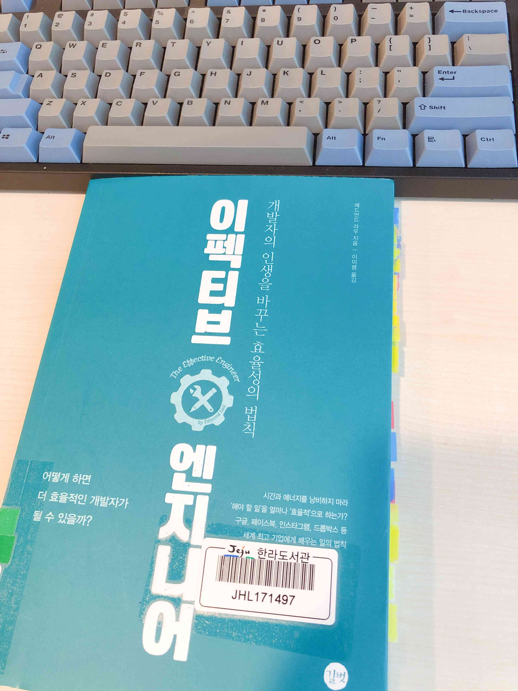

# 1부 올바른 마인드셋을 갖춰라

## 1장 레버리지가 높은 활동에 집중하라 026
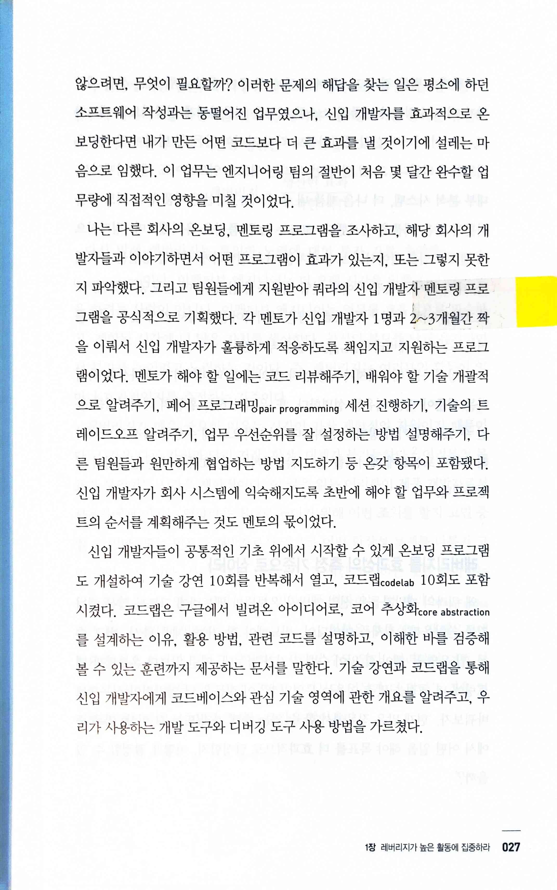

* 온보딩, 멘토링 프로그램
  * 코드 리뷰, 배워야 할 기술 개괄적으로 알려주기, 페어 프로그래밍 pair programming, 기술의 트레이드오프 알려주기, 업무 우선순위를 잘 설정하는 방법, 다른 팀원들과 원만하게 협업하는 방법 지도하기, 신입 개발자가 회사 시스템에 익숙해지도록 초반에 해야 할 업무와 프로젝트의 순서를 계획
  * 코드랩 codelab
    * 코어 추상화core abstraction를 설계하는 이유, 활용 방법, 관련 코드 설명, 이해한 바를 검증해볼 수 있는 훈련까지 제공하는 문서
  * 기술 강연과 코드랩을 통해 신입 개발자에게 코드베이스와 관심 기술 영역에 관한 개요 설명, 개발 도구와 디버깅 도구 사용 방법 교육
 
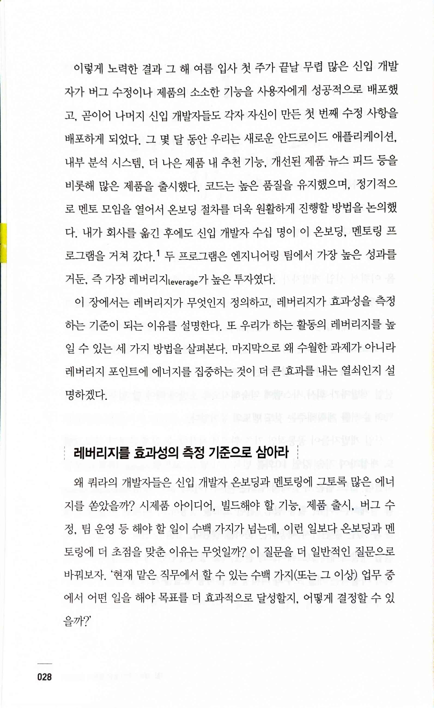

> 온보딩, 멘토링 프로그램은 엔지니어링 팀에서 가장 높은 성과를 거둔, 즉 가장 레버리지 Leverage가 높은 투자

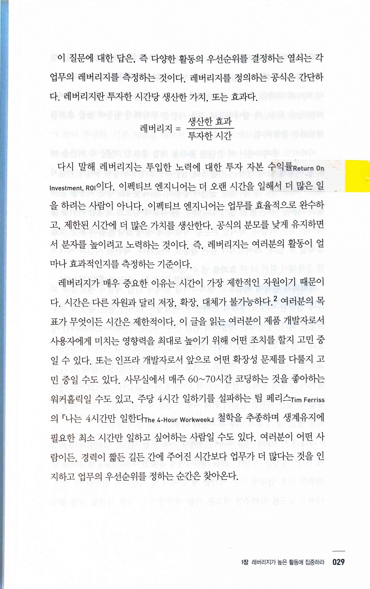

> 레버리지 = 생산한 가치 or 효과 / 투자한 시간
>
> 다시 말해 레버리지는 투입한 노력에 대한 투자 자본 수익률Return On Investment, ROI
>
> 레버리지가 매우 중요한 이유는 시간이 가장 제한적인 자원이기 때문
>
> 여러분이 어떤 사람이든, 경력이 짧든 길든 간에 주어진 시간보다 업무가 더 많다는 것을 인지하고 업무의 우선순위를 정하는 순간은 찾아온다.

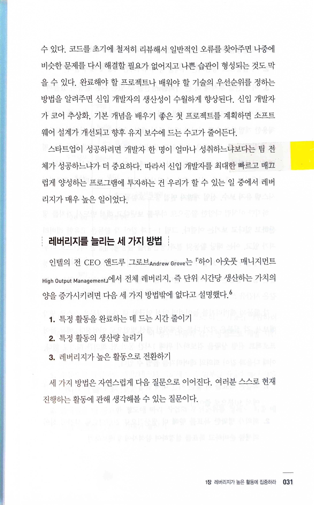

> 스타트업이 성공하려면 개발자 한 명이 얼마나 성취하느냐보다는 팀 전체가 성공하느냐가 더 중요하다. 따라서 신입 개발자를 최대한 빠르고 매끄럽게 양성하는 프로그램에 투자하는 건 우리가 할 수 있는 일 중에서 레버리지가 매우 높은 일이었다.
>
> 레버리지를 늘리는 세 가지 방법
>
> 인텔의 전 CEO 앤드루 그로브Andrew Grove는 하이 아웃풋 매니지먼트High Output Management에서 전체 레버리지, 즉 단위 시간당 생산하는 가치의양을 증가시키려면 다음 세 가지 방법밖에 없다고 설명했다.
>
> 1. 특정 활동을 완료하는 데 드는 시간 줄이기
>
> 2. 특정 활동의 생산량 늘리기
>
> 3. 레버리지가 높은 활동으로 전환하기
 
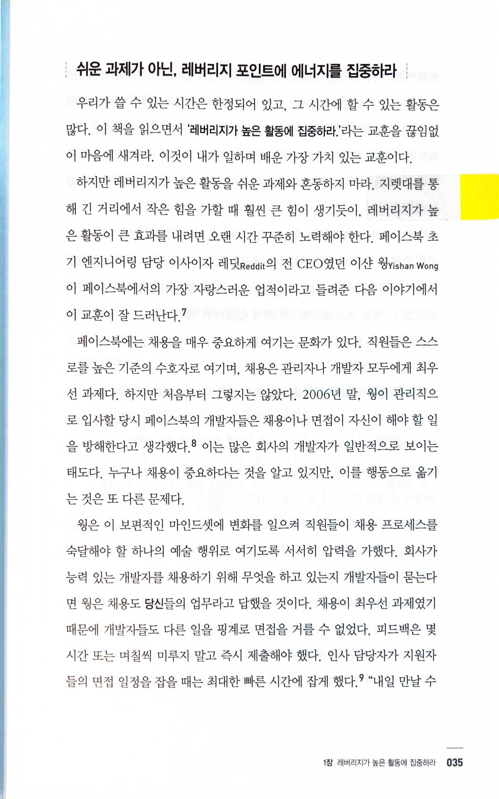

> 레버리지가 높은 활동을 쉬운 과제와 혼동하지 마라... 레버리지가 높은 활동이 큰 효과를 내려면 오랜 시간 꾸준히 노력해야 한다.

## 2장 학습을 위해 최적화하라 038
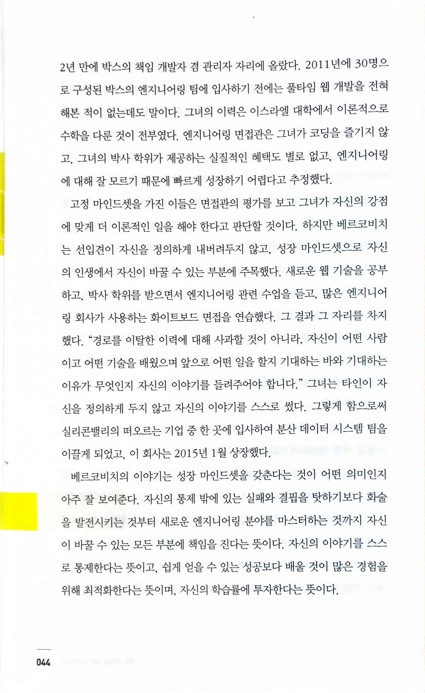

> 성장 마인드셋. 자신의 통제 밖에 있는 실패와 결핍을 탓하기보다 화술을 발전시키는 것부터 새로운 엔지니어링 분야를 마스터하는 것까지 자신이 바꿀 수 있는 모든 부분에 책임을 진다는 뜻이다. 자신의 이야기를 스스로 통제한다는 뜻이고, 쉽게 얻을 수 있는 성공보다 배울 것이 많은 경험을 위해 최적화한다는 뜻이며, 자신의 학습률에 투자한다는 뜻이다.

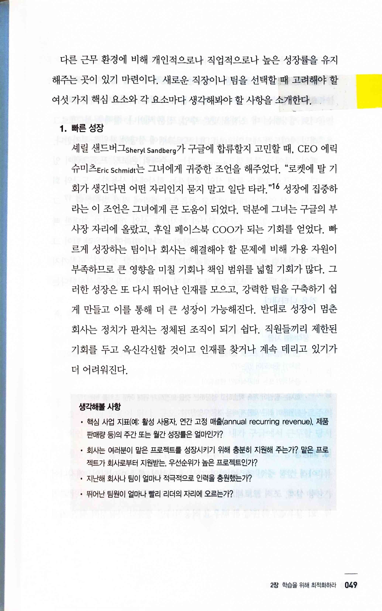  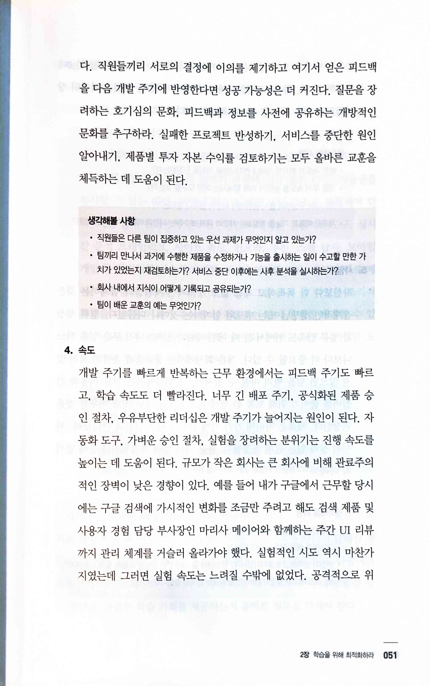 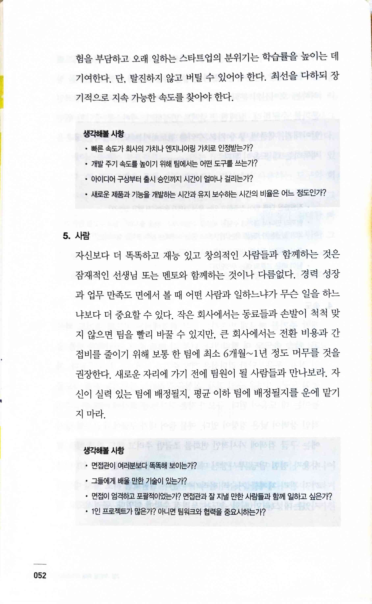 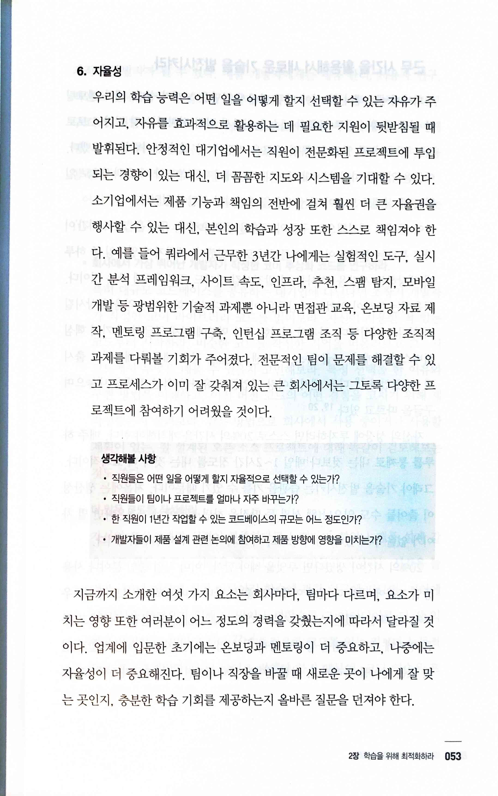

> 새로운 직장이나 팀을 선택할 때 고려해야 할 여섯 가지 핵심 요소와 각 요소마다 생각해봐야 할 사항
>
> 1. 빠른 성장 2. 교육 3. 개방성 4. 속도 5. 사람 6. 자율성
>
> 업계에 입문한 초기에는 온보딩과 멘토링이 더 중요하고, 나중에는 자율성이 더 중요해진다.

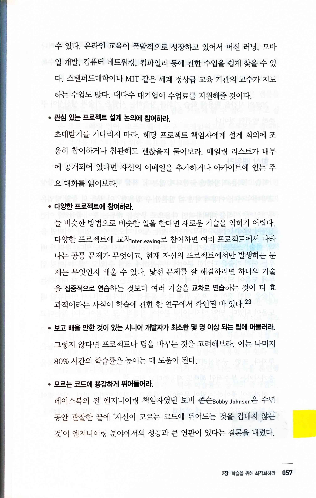 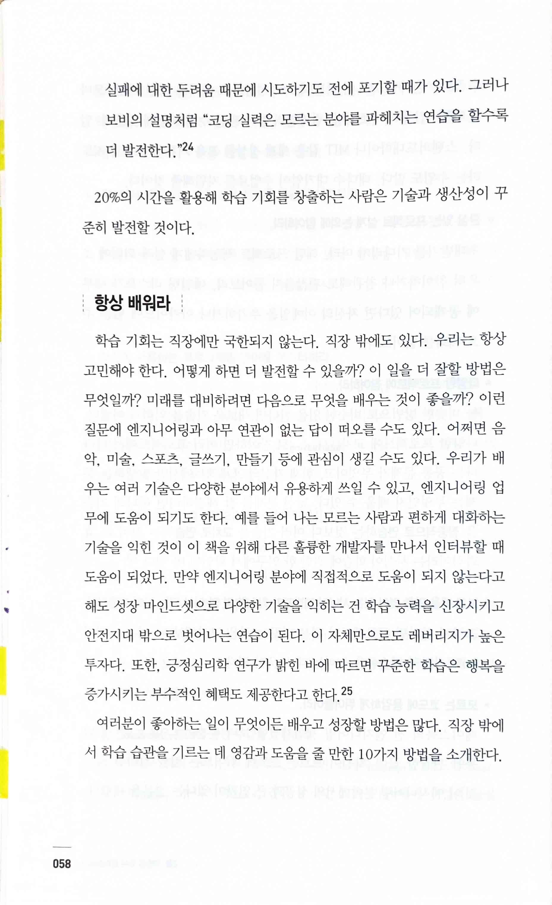

> 페이스북의 전 엔지니어링 책임자였던 보비 존슨Bobby Johnson은 수년동안 관찰한 끝에 '자신이 모르는 코드에 뛰어드는 것'을 겁내지 않는 것이 엔지니어링 분야에서의 성공과 큰 연관이 있다는 결론을 내렸다. 실패에 대한 두려움 때문에 시도하기도 전에 포기할 때가 있다. 그러나 보비의 설명처럼 "코딩 실력은 모르는 분야를 파헤치는 연습을 할수록 더 발전한다. "

## 3장 우선순위를 정기적으로 점검하라 064
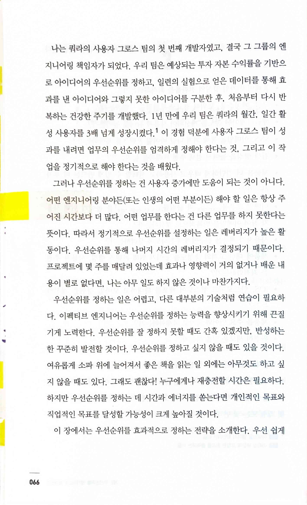

> 어떤 엔지니어링 분야든(또는 인생의 어떤 부분이든) 해야 할 일은 항상 주어진 시간보다 더 많다. 어떤 업무를 한다는 건 다른 업무를 하지 못한다는 뜻이다. 따라서 정기적으로 우선순위를 설정하는 일은 레버리지가 높은 활동이다. 우선순위를 통해 나머지 시간의 레버리지가 결정되기 때문이다.

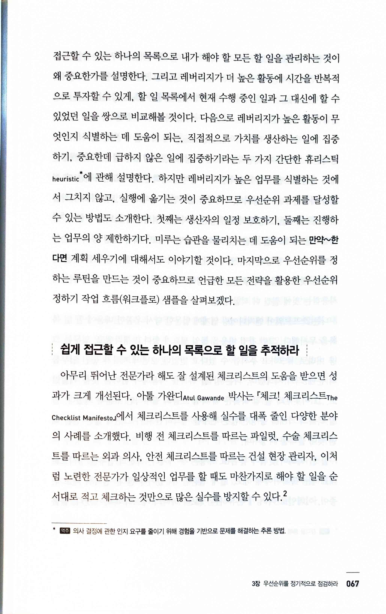 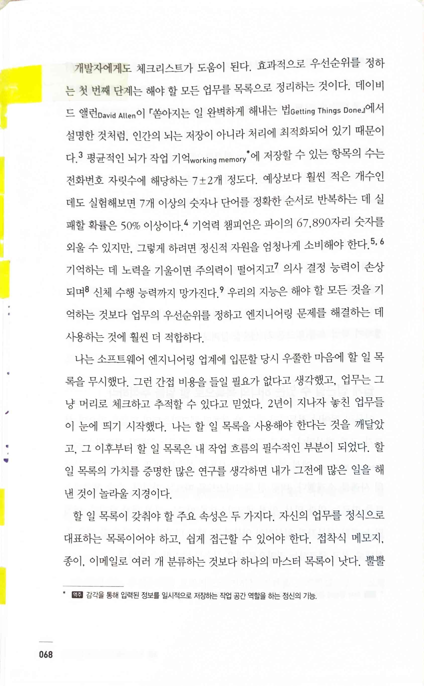

> 아무리 뛰어난 전문가라 해도 잘 설계된 체크리스트의 도움을 받으면 성과가 크게 개선된다... 노련한 전문가가 일상적인 업무를 할 때도 마찬가지로 해야 할 일을 순서대로 적고 체크하는 것만으로 많은 실수를 방지할 수 있다.
>
> 개발자에게도 체크리스트가 도움이 된다. 효과적으로 우선순위를 정하는 첫 번째 단계는 해야 할 모든 업무를 목록으로 정리하는 것이다... 우리의 지능은 해야 할 모든 것을 기억하는 것보다 업무의 우선순위를 정하고 엔지니어링 문제를 해결하는 데 사용하는 것에 훨씬 더 적합하다.

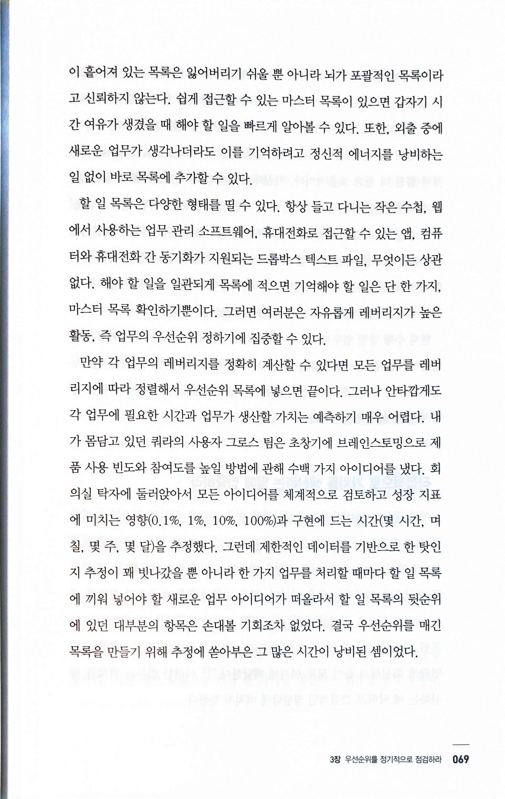

> 해야 할 일을 일관되게 목록에 적으면 기억해야 할 일은 단 한 가지 마스터 목록 확인하기뿐이다. 그러면 여러분은 자유롭게 레버리지가 높은 활동, 즉 업무의 우선순위 정하기에 집중할 수 있다.

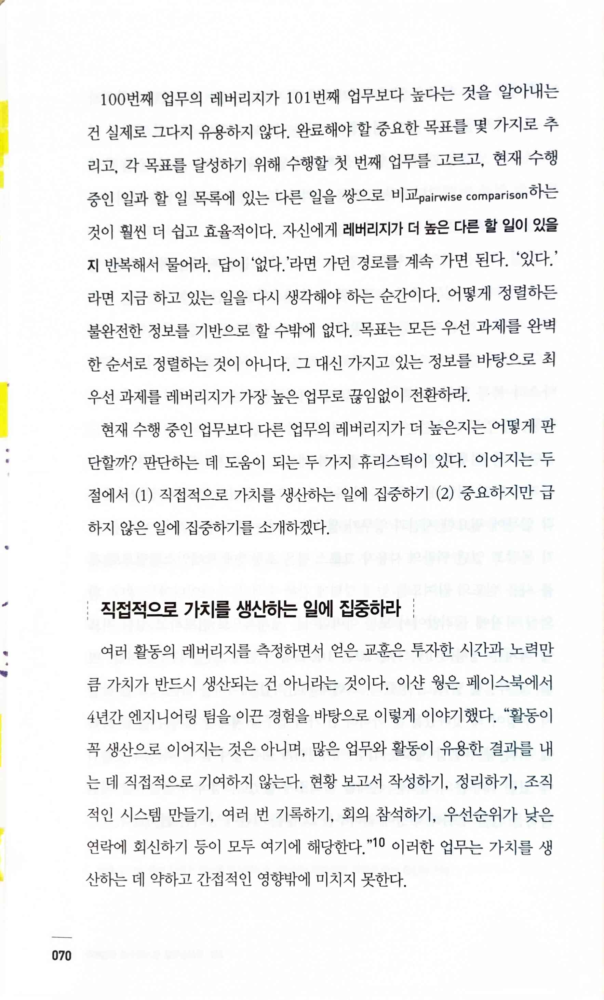

> 현재 수행 중인 업무보다 다른 업무의 레버리지가 더 높은지는 어떻게 판단할까? 판단하는 데 도움이 되는 두 가지 휴리스틱이 있다. 이어지는 두 절에서 (1) 직접적으로 가치를 생산하는 일에 집중하기 (2) 중요하지만 급하지 않은 일에 집중하기를 소개하겠다.
>
> "활동이 꼭 생산으로 이어지는 것은 아니며, 많은 업무와 활동이 유용한 결과를 내는 데 직접적으로 기여하지 않는다. 현황 보고서 작성하기, 정리하기, 조직적인 시스템 만들기, 여러 번 기록하기, 회의 참석하기, 우선순위가 낮은 연락에 회신하기 등이 모두 여기에 해당한다." 이러한 업무는 가치를 생산하는 데 약하고 간접적인 영향밖에 미치지 못한다.

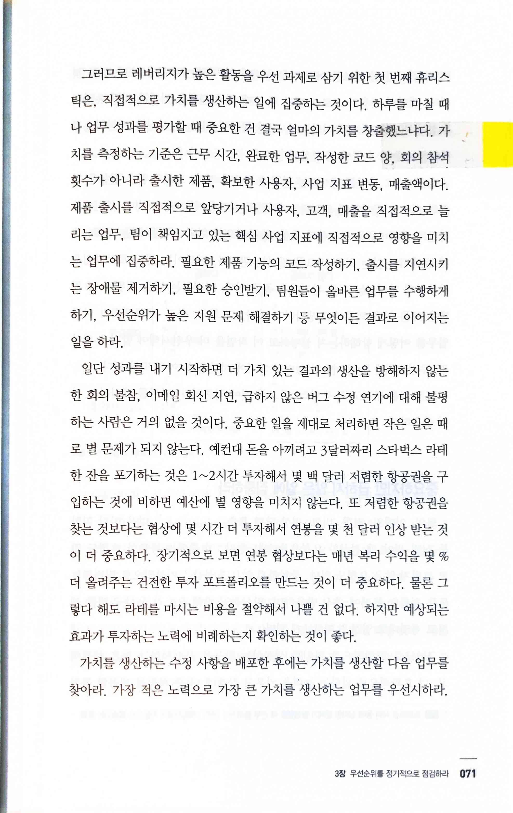

> 그러므로 레버리지가 높은 활동을 우선 과제로 삼기 위한 첫 번째 휴리스틱은, 직접적으로 가치를 생산하는 일에 집중하는 것이다... 무엇이든 결과로 이어지는 일을 하라.
>
> 가장 적은 노력으로 가장 큰 가치를 생산하는 업무를 우선시하라.

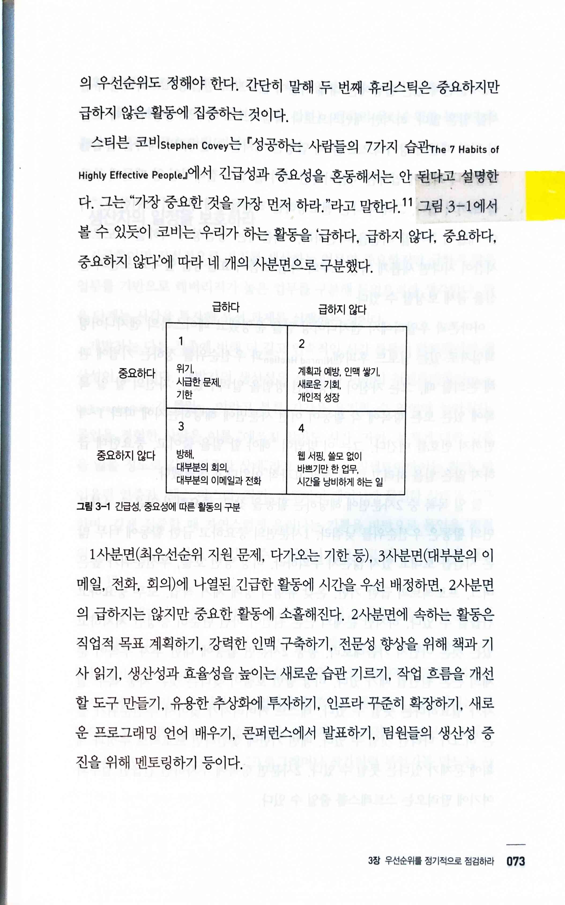

> 그림 3-1 긴급성, 중요성에 따른 활동의 구분
>
> 우선순위를 정하는 행위 자체도 급하지 않아서 중요성이 간과되는 2사분면에 해당하는 활동이다. 우선순위를 정하는 행위의 우선순위를 높이면 효율성이 극적으로 높아질 것이다.

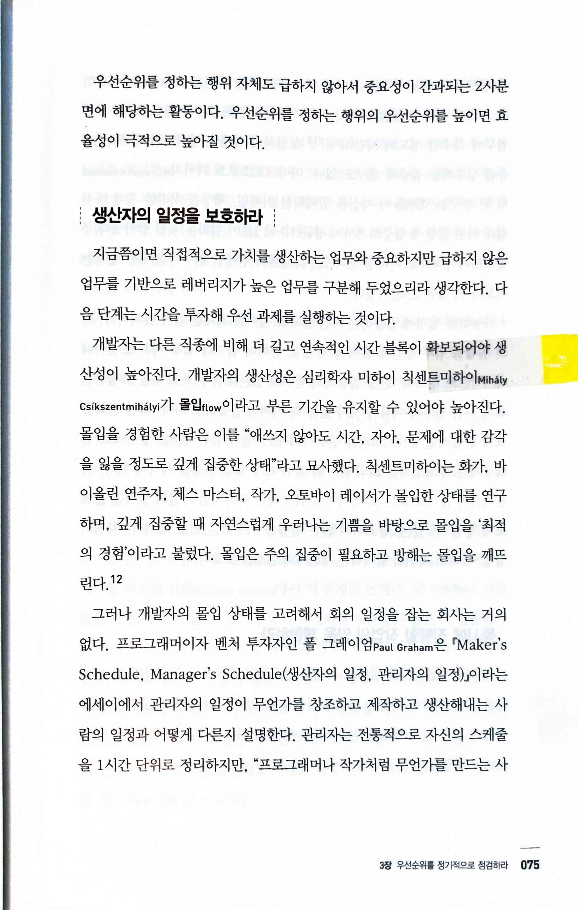

> 개발자는 다른 직종에 비해 더 길고 연속적인 시간 블록이 확보되어야 생산성이 높아진다. 개발자의 생산성은 심리학자 미하이 칙센트미하이 Miháty Csikszentmihátyi가 몰입flow 이라고 부른 기간을 유지할 수 있어야 높아진다. 몰입을 경험한 사람은 이를 "애쓰지 않아도 시간, 자아, 문제에 대한 감각을 잃을 정도로 깊게 집중한 상태"라고 묘사했다... 깊게 집중할 때 자연스럽게 우러나는 기쁨을 바탕으로 몰입을 최적의 경험'이라고 불렀다. 몰입은 주의 집중이 필요하고 방해는 몰입을 깨뜨린다.

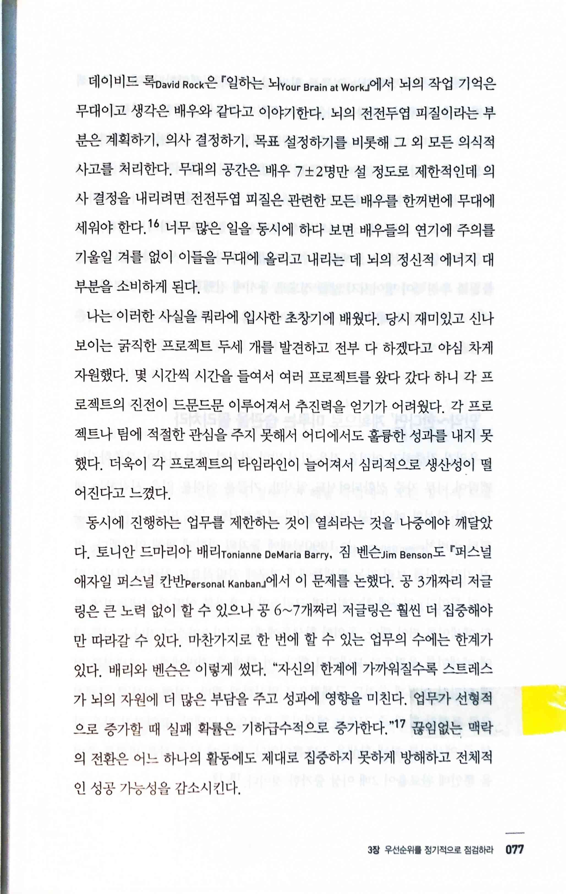

> 한 번에 할 수 있는 업무의 수에는 한계가 있다... "자신의 한계에 가까워질수록 스트레스가 뇌의 자원에 더 많은 부담을 주고 성과에 영향을 미친다. 업무가 선형적으로 증가할 때 실패 확률은 기하급수적으로 증가한다." 끊임없는 맥락의 전환은 어느 하나의 활동에도 제대로 집중하지 못하게 방해하고 전체적인 성공 가능성을 감소시킨다.

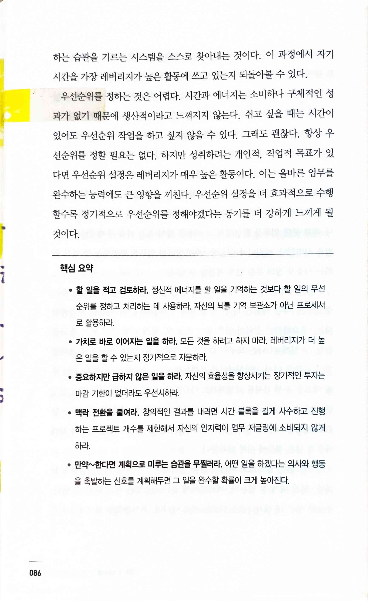 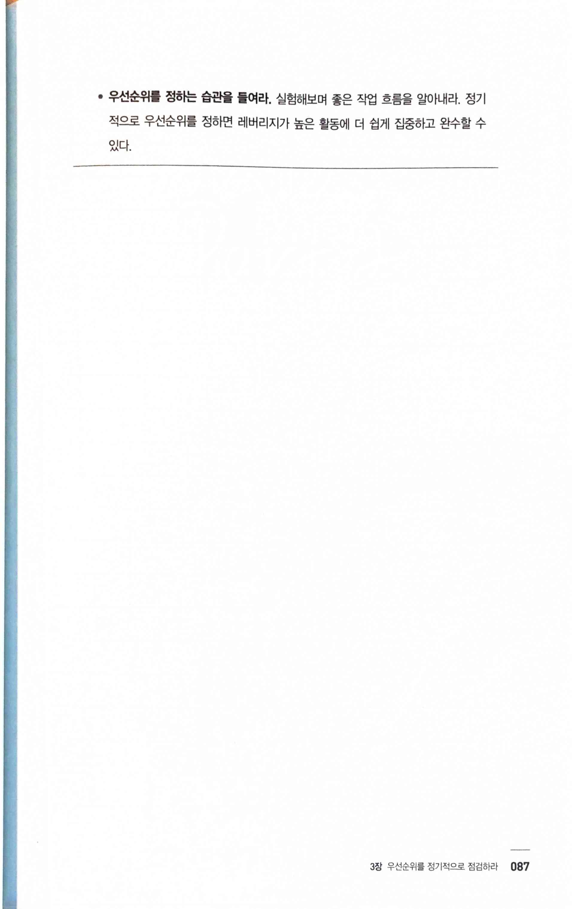

> 우선순위를 정하는 것은 어렵다. 시간과 에너지는 소비하나 구체적인 성과가 없기 때문에 생산적이라고 느껴지지 않는다... 성취하려는 개인적, 직업적 목표가 있다면 우선순위 설정은 레버리지가 매우 높은 활동이다. 이는 올바른 업무를 완수하는 능력에도 큰 영향을 끼친다. 우선순위 설정을 더 효과적으로 수행할수록 정기적으로 우선순위를 정해야겠다는 동기를 더 강하게 느끼게 될 것이다.
>
> 핵심 요약
>
> • 할 일을 적고 검토하라
>
> • 가치로 바로 이어지는 일을 하라
>
> • 중요하지만 급하지 않은 일을 하라
>
> • 맥락 전환을 줄여라
>
> • 만약~한다면 계획으로 미루는 습관을 무찔러라
>
> • 우선순위를 정하는 습관을 들여라

# 2부 실행, 실행, 실행

## 4장 반복 속도에 투자하라 090
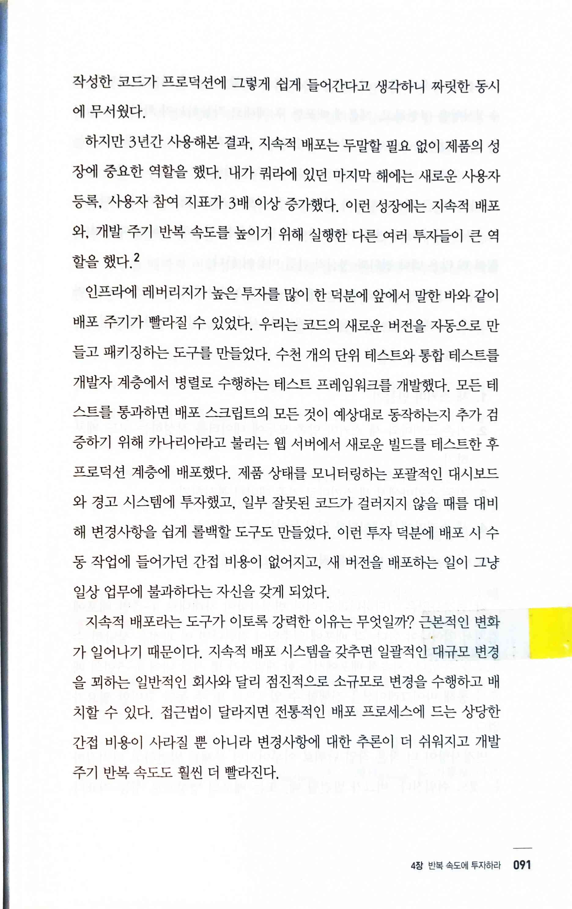

> 지속적 배포라는 도구가 이토록 강력한 이유는 무엇일까? 근본적인 변화가 일어나기 때문이다. 지속적 배포 시스템을 갖추면 일괄적인 대규모 변경을 꾀하는 일반적인 회사와 달리 점진적으로 소규모로 변경을 수행하고 배치할 수 있다. 접근법이 달라지면 전통적인 배포 프로세스에 드는 상당한 간접 비용이 사라질 뿐 아니라 변경사항에 대한 추론이 더 쉬워지고 개발주기 반복 속도도 훨씬 더 빨라진다.

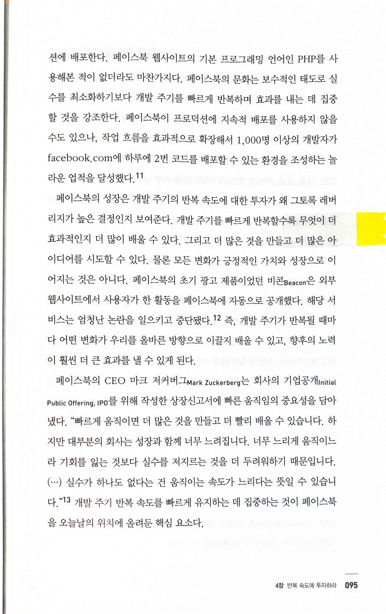

> 개발 주기를 빠르게 반복할수록 무엇이 더 효과적인지 더 많이 배울 수 있다. 그리고 더 많은 것을 만들고 더 많은 아이디어를 시도할 수 있다.
>
> 마크 저커버그 Mark Zuckerberg. "빠르게 움직이면 더 많은 것을 만들고 더 빨리 배울 수 있습니다. 하지만 대부분의 회사는 성장과 함께 너무 느려집니다. 너무 느리게 움직이느라 기회를 잃는 것보다 실수를 저지르는 것을 더 두려워하기 때문입니다. (・・・) 실수가 하나도 없다는 건 움직이는 속도가 느리다는 뜻일 수 있습니다." 개발 주기 반복 속도를 빠르게 유지하는 데 집중하는 것이 페이스북을 오늘날의 위치에 올려둔 핵심 요소다.
 
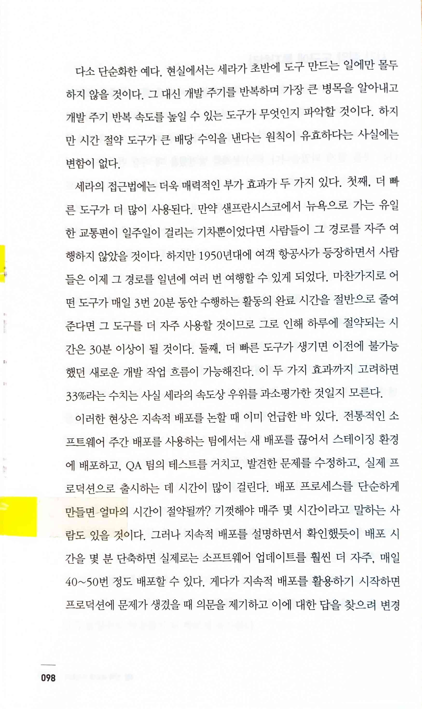 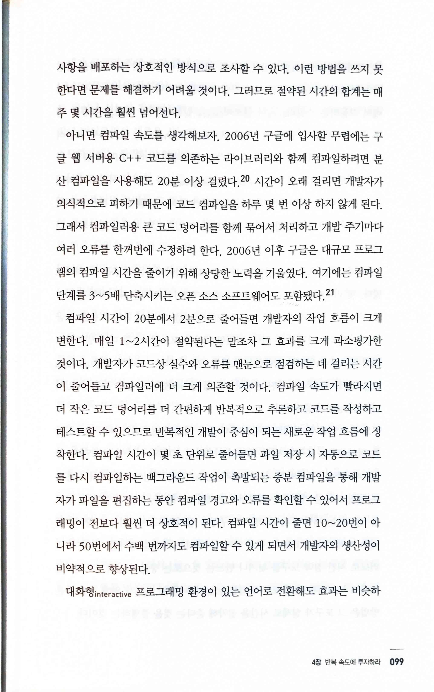 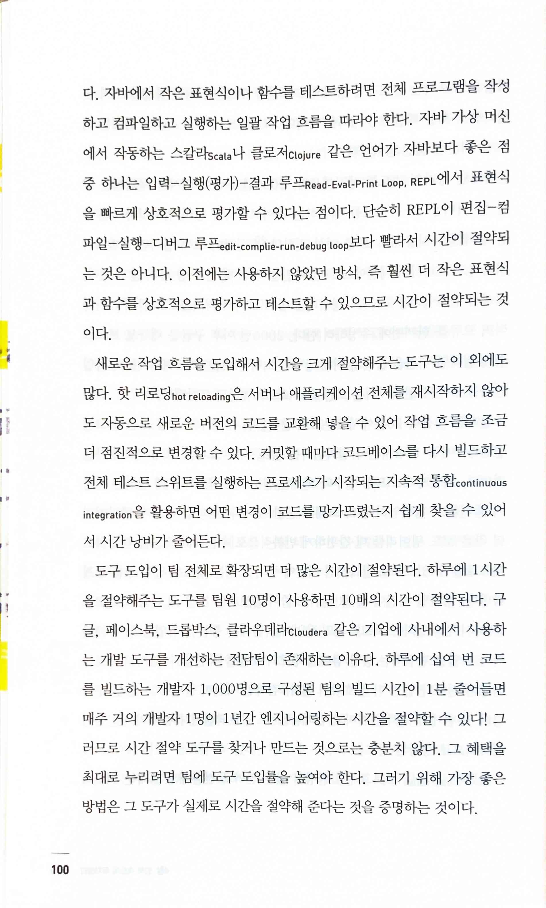

> 지속적 배포를 설명하면서 확인했듯이 배포 시간을 몇 분 단축하면 실제로는 소프트웨어 업데이트를 훨씬 더 자주, 매일 40~50번 정도 배포할 수 있다. 게다가 지속적 배포를 활용하기 시작하면 프로덕션에 문제가 생겼을 때 의문을 제기하고 이에 대한 답을 찾으려 변경사항을 배포하는 상호적인 방식으로 조사할 수 있다. 이런 방법을 쓰지 못한다면 문제를 해결하기 어려울 것이다. 그러므로 절약된 시간의 합계는 매주 몇 시간을 훨씬 넘어선다.
>
> 컴파일 시간이 줄면 10~20번이 아니라 50번에서 수백 번까지도 컴파일할 수 있게 되면서 개발자의 생산성이 비약적으로 향상된다.
>
> 단순히 REPL이 편집파일-실행-디버그 루프edit-complie-run-debug loop보다 빨라서 시간이 절약되는 것은 아니다. 이전에는 사용하지 않았던 방식, 즉 훨씬 더 작은 표현식과 함수를 상호적으로 평가하고 테스트할 수 있으므로 시간이 절약되는 것이다.
>
> 시간 절약 도구를 찾거나 만드는 것으로는 충분치 않다. 그 혜택을 최대로 누리려면 팀에 도구 도입률을 높여야 한다. 그러기 위해 가장 좋은 방법은 그 도구가 실제로 시간을 절약해 준다는 것을 증명하는 것이다.

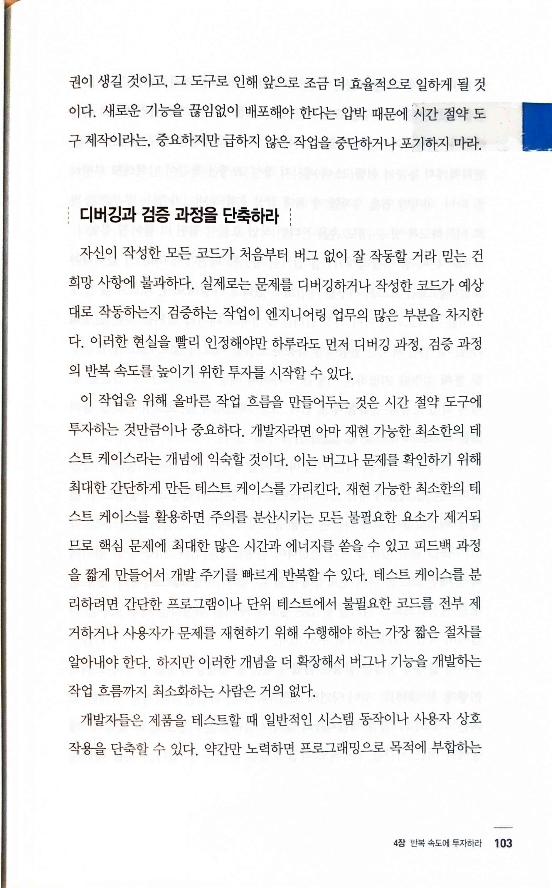

> 새로운 기능을 끊임없이 배포해야 한다는 압박 때문에 시간 절약 도구 제작이라는 중요하지만 급하지 않은 작업을 중단하거나 포기하지 마라.
>
> 디버깅 과정, 검증 과정의 반복 속도를 높이기 위한 올바른 작업 흐름을 만들어두는 것은 시간 절약 도구에 투자하는 것만큼이나 중요하다.

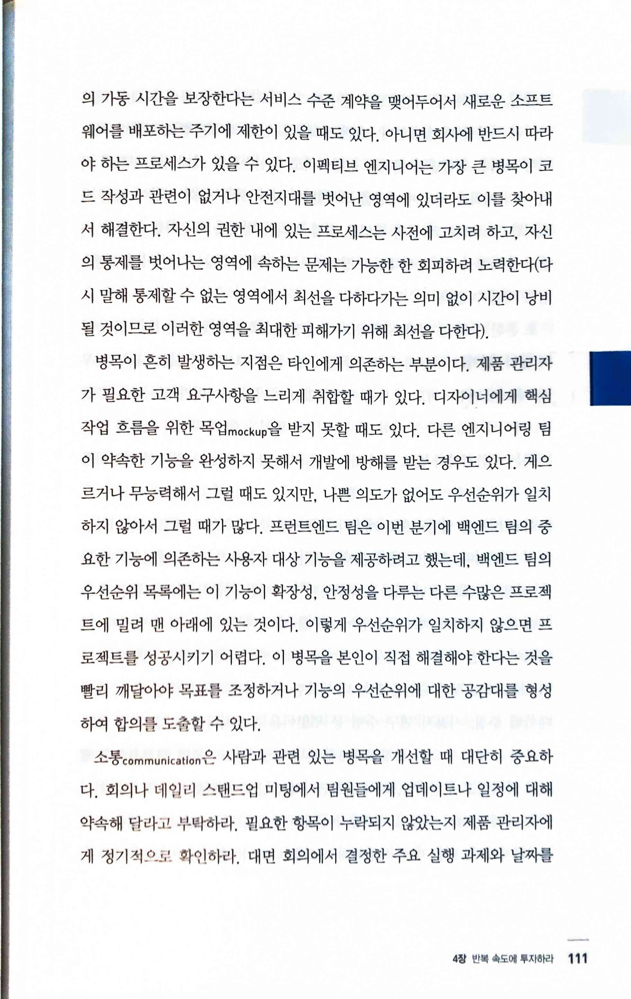

> 병목이 흔히 발생하는 지점은 타인에게 의존하는 부분
>
> 나쁜 의도가 없어도 우선순위가 일치하지 않아서 그럴 때가 많다.
>
> 소통communication은 사람과 관련 있는 병목을 개선할 때 대단히 중요하다.

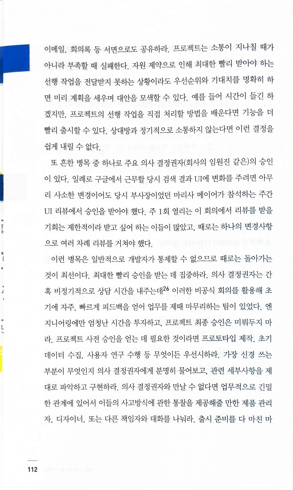

> 프로젝트는 소통이 지나칠 때가 아니라 부족할 때 실패한다.

## 5장 개선하려는 사항을 측정하라 115
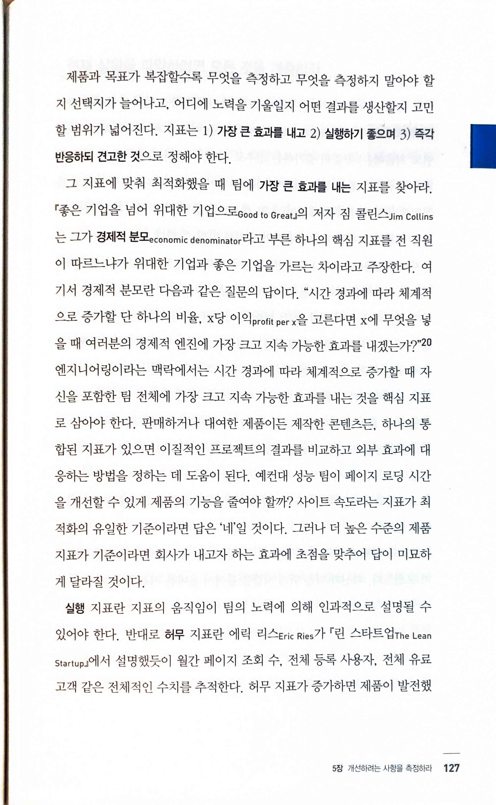 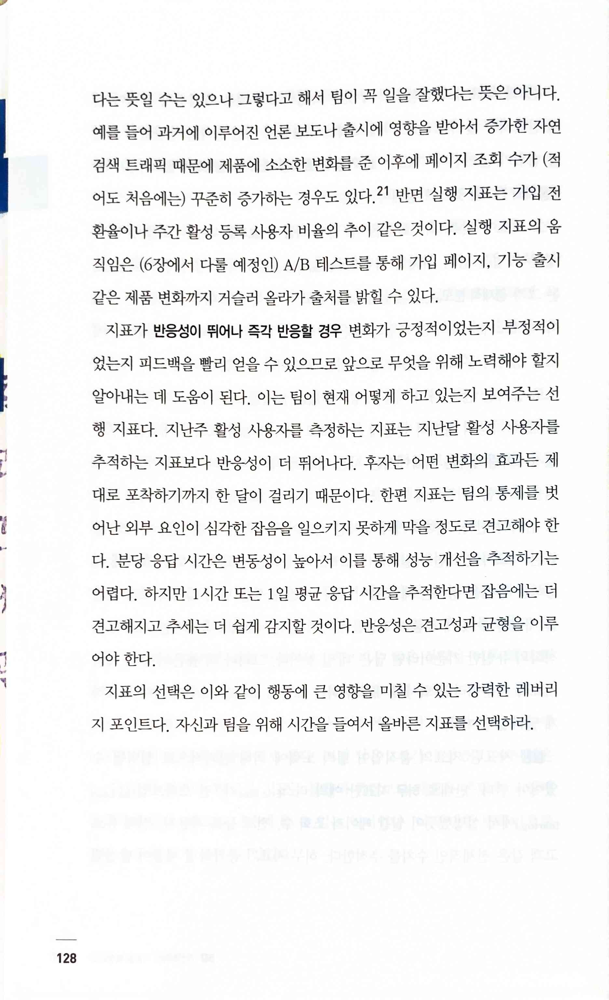

> 제품과 목표가 복잡할수록 무엇을 측정하고 무엇을 측정하지 말아야 할지 선택지가 늘어나고, 어디에 노력을 기울일지 어떤 결과를 생산할지 고민할 범위가 넓어진다. 지표는 1) 가장 큰 효과를 내고 2) 실행하기 좋으며 3) 즉각 반응하되 견고한 것으로 정해야 한다.
>
> 그 지표에 맞춰 최적화했을 때 팀에 가장 큰 효과를 내는 지표를 찾아라.
>
> 실행 지표란 지표의 움직임이 팀의 노력에 의해 인과적으로 설명될 수 있어야 한다. 반대로 허무 지표란 ... 월간 페이지 조회 수, 전체 등록 사용자, 전체 유료 고객 같은 전체적인 수치를 추적한다. 허무 지표가 증가하면 제품이 발전했다는 뜻일 수는 있으나 그렇다고 해서 팀이 꼭 일을 잘했다는 뜻은 아니다.
>
> 지표가 반응성이 뛰어나 즉각 반응할 경우 변화가 긍정적이었는지 부정적이었는지 피드백을 빨리 얻을 수 있으므로 앞으로 무엇을 위해 노력해야 할지 알아내는 데 도움이 된다. 이는 팀이 현재 어떻게 하고 있는지 보여주는 선행 지표다. 지난주 활성 사용자를 측정하는 지표는 지난달 활성 사용자를 추적하는 지표보다 반응성이 더 뛰어나다. 후자는 어떤 변화의 효과 제대로 포착하기까지 한 달이 걸리기 때문이다. 한편 지표는 팀의 통제를 벗어난 외부 요인이 심각한 잡음을 일으키지 못하게 막을 정도로 견고해야 한다. 분당 응답 시간은 변동성이 높아서 이를 통해 성능 개선을 추적하기는 어렵다. 하지만 1시간 또는 1일 평균 응답 시간을 추적한다면 잡음에는 더 견고해지고 추세는 더 쉽게 감지할 것이다. 반응성은 견고성과 균형을 이루어야 한다.

> 계측 마인드셋을 갖춘다는 것은 주요 상태 지표를 표시할 대시보드 세트를 갖추고 관련 데이터를 드릴 다운drill down 할 수 있게 된다는 뜻이다. 그러나 무엇을 측정하고 싶은지 항상 미리 알 수 있는 것은 아니기 때문에, 우리가 답을 찾는 많은 질문들은 탐색적이고 탐구적인 경향이 있다. 그러므로 추가 지표를 쉽게 추적할 수 있게 도구와 추상화를 유연하게 만들어야 한다.

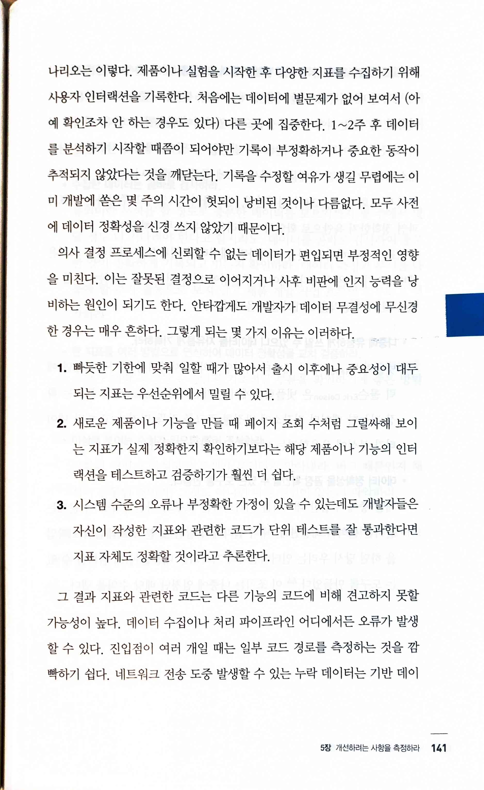

> 의사 결정 프로세스에 신뢰할 수 없는 데이터가 편입되면 부정적인 영향을 미친다. 이는 잘못된 결정으로 이어지거나 사후 비판에 인지 능력을 낭비하는 원인이 되기도 한다. 안타깝게도 개발자가 데이터 무결성에 무신경한 경우는 매우 흔하다. 그렇게 되는 몇 가지 이유는 이러하다.
>
> 1. 빠듯한 기한에 맞춰 일할 때가 많아서 출시 이후에나 중요성이 대두되는 지표는 우선순위에서 밀릴 수 있다.
>
> 2. 새로운 제품이나 기능을 만들 때 페이지 조회 수처럼 그럴싸해 보이는 지표가 실제 정확한지 확인하기보다는 해당 제품이나 기능의 인터랙션을 테스트하고 검증하기가 훨씬 더 쉽다.
>
> 3. 시스템 수준의 오류나 부정확한 가정이 있을 수 있는데도 개발자들은 자신이 작성한 지표와 관련한 코드가 단위 테스트를 잘 통과한다면 지표 자체도 정확할 것이라고 추론한다.
>
> 그 결과 지표와 관련한 코드는 다른 기능의 코드에 비해 견고하지 못할 가능성이 높다.

## 6장 아이디어는 일찍 그리고 자주 검증하라 145
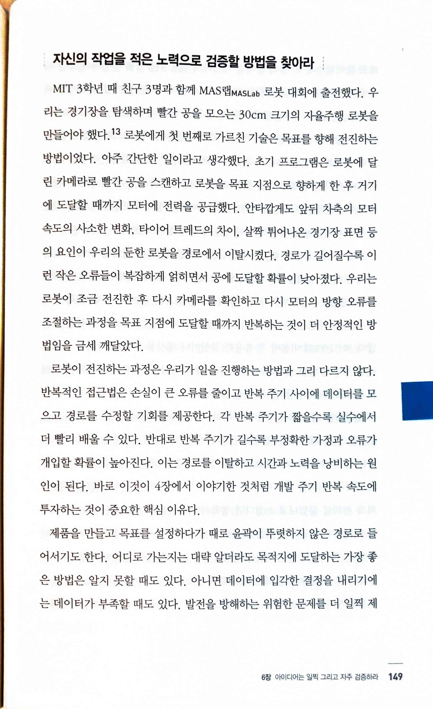

> 반복적인 접근법은 손실이 큰 오류를 줄이고 반복 주기 사이에 데이터를 모으고 경로를 수정할 기회를 제공한다. 각 반복 주기가 짧을수록 실수에서 더 빨리 배울 수 있다. 반대로 반복 주기가 길수록 부정확한 가정과 오류가 개입할 확률이 높아진다. 이는 경로를 이탈하고 시간과 노력을 낭비하는 원인이 된다. 바로 이것이 4장에서 이야기한 것처럼 개발 주기 반복 속도에 투자하는 것이 중요한 핵심 이유다.

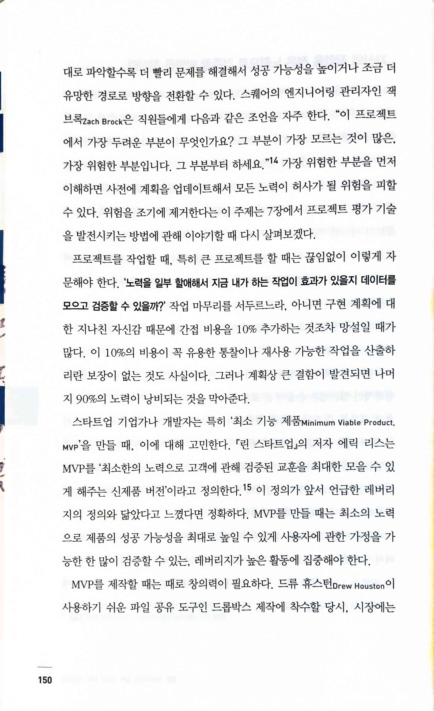

> “이 프로젝트에서 가장 두려운 부분이 무엇인가요? 그 부분이 가장 모르는 것이 많은 가장 위험한 부분입니다. 그 부분부터 하세요."

## 7장 프로젝트 추정 기술을 향상시켜라 170
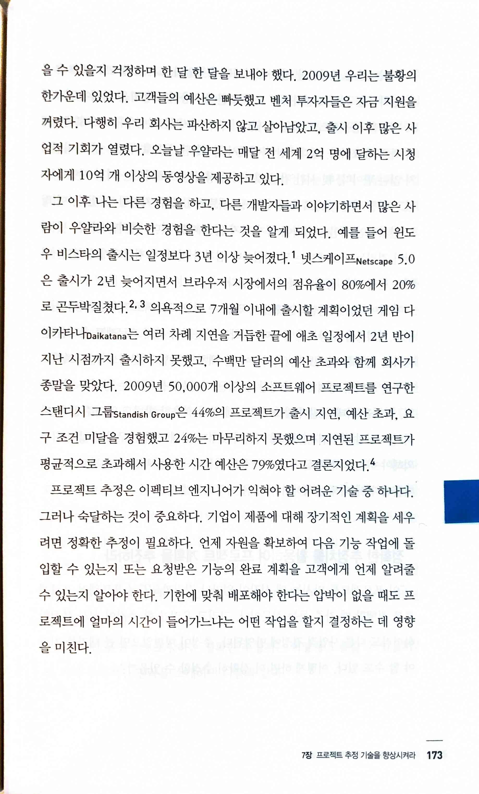

> 프로젝트 추정은 이펙티브 엔지니어가 익혀야 할 어려운 기술 중 하나다. 그러나 숙달하는 것이 중요하다. 기업이 제품에 대해 장기적인 계획을 세우려면 정확한 추정이 필요하다. 언제 자원을 확보하여 다음 기능 작업에 돌입할 수 있는지 또는 요청받은 기능의 완료 계획을 고객에게 언제 알려줄 수 있는지 알아야 한다. 기한에 맞춰 배포해야 한다는 압박이 없을 때도 프로젝트에 얼마의 시간이 들어가느냐는 어떤 작업을 할지 결정하는 데 영향을 미친다.

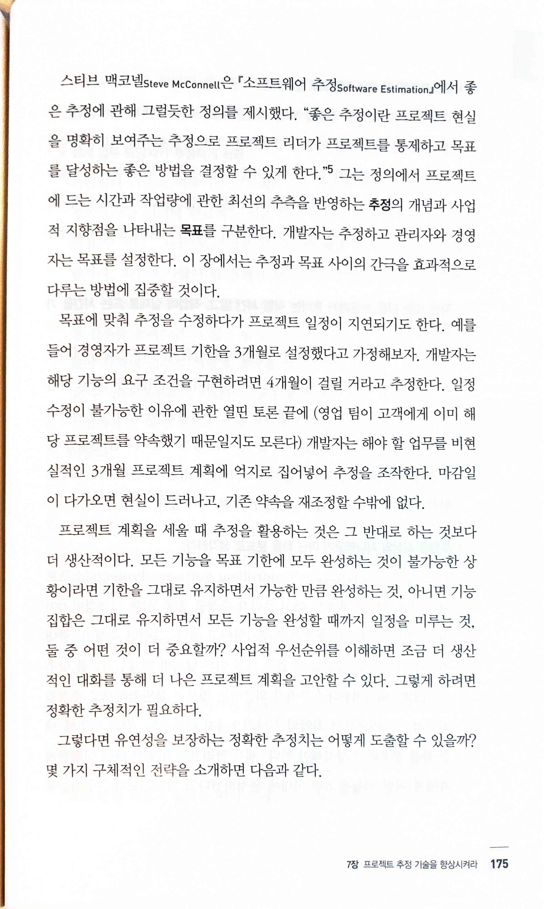

> 스티브 맥코넬Steve McConnell은 소프트웨어 추정software Estimation』에서 좋은 추정에 관해 그럴듯한 정의를 제시했다. "좋은 추정이란 프로젝트 현실을 명확히 보여주는 추정으로 프로젝트 리더가 프로젝트를 통제하고 목표를 달성하는 좋은 방법을 결정할 수 있게 한다. 그는 정의에서 프로젝트에 드는 시간과 작업량에 관한 최선의 추측을 반영하는 추정의 개념과 사업적 지향점을 나타내는 목표를 구분한다. 개발자는 추정하고 관리자와 경영자는 목표를 설정한다.
>
> 프로젝트 계획을 세울 때 추정을 활용하는 것은 그 반대로 하는 것보다 더 생산적이다. 모든 기능을 목표 기한에 모두 완성하는 것이 불가능한 상황이라면 기한을 그대로 유지하면서 가능한 만큼 완성하는 것, 아니면 기능집합은 그대로 유지하면서 모든 기능을 완성할 때까지 일정을 미루는 것, 둘 중 어떤 것이 더 중요할까? 사업적 우선순위를 이해하면 조금 더 생산적인 대화를 통해 더 나은 프로젝트 계획을 고안할 수 있다. 그렇게 하려면 정확한 추정치가 필요하다.

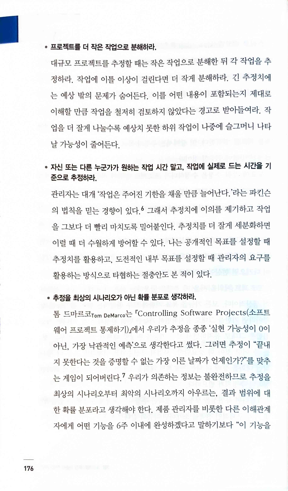 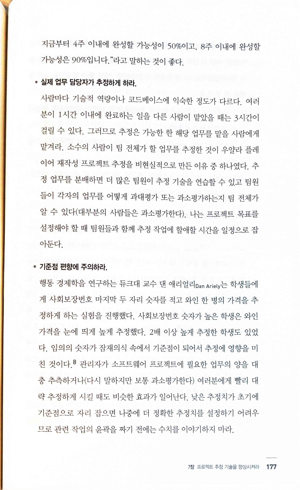 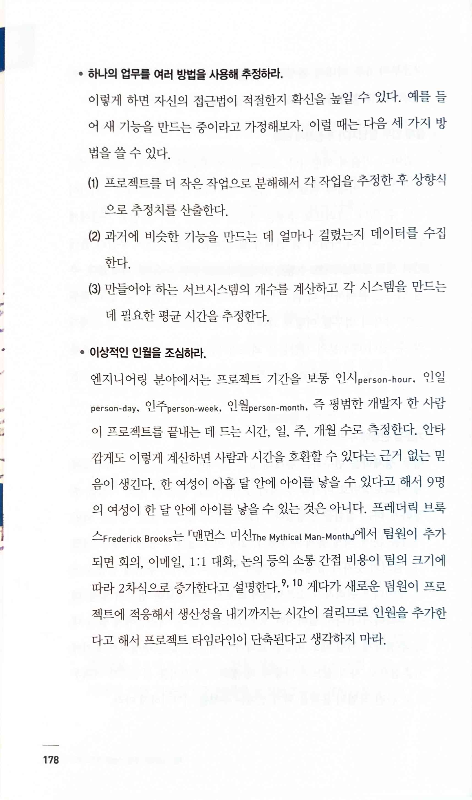 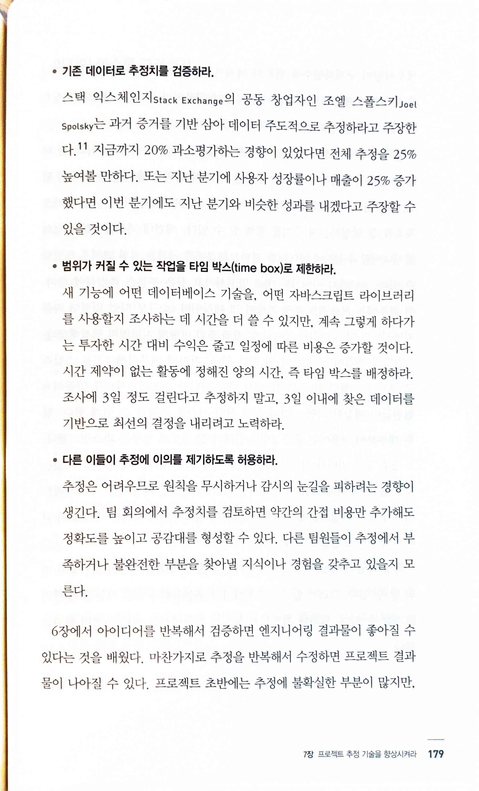

> 유연성을 보장하는 정확한 추정치를 도출하는 구체적인 전략
>
> • 프로젝트를 더 작은 작업으로 분해하라.
>
> • 자신 또는 다른 누군가가 원하는 작업 시간 말고, 작업에 실제로 드는 시간을 기준으로 추정하라.
>
> • 추정을 최상의 시나리오가 아닌 확률 분포로 생각하라.
>
> • 실제 업무 담당자가 추정하게 하라.
>
> • 기준점 편향에 주의하라.
>
> • 하나의 업무를 여러 방법을 사용해 추정하라.
>
> • 이상적인 인월을 조심하라.
>
> 엔지니어링 분야에서는 프로젝트 기간을 보통 인시 person-hour, 인일 person-day. 인주person-week, 인월person-month, 즉 평범한 개발자 한 사람이 프로젝트를 끝내는 데 드는 시간, 일, 주, 개월 수로 측정한다. 안타깝게도 이렇게 계산하면 사람과 시간을 호환할 수 있다는 근거 없는 믿음이 생긴다. 한 여성이 아홉 달 안에 아이를 낳을 수 있다고 해서 9명의 여성이 한 달 안에 아이를 낳을 수 있는 것은 아니다. 프레더릭 브룩스Frederick Brooks는 맨먼스 미신The Mythical Man-Month」에서 팀원이 추가되면 회의, 이메일, 1:1 대화, 논의 등의 소통 간접 비용이 팀의 크기에 따라 2차식으로 증가한다고 설명한다. 게다가 새로운 팀원이 프로젝트에 적응해서 생산성을 내기까지는 시간이 걸리므로 인원을 추가한다고 해서 프로젝트 타임라인이 단축된다고 생각하지 마라.
>
> • 기존 데이터로 추정치를 검증하라.
>
> • 범위가 커질 수 있는 작업을 타임 박스(time box)로 제한하라.
>
> • 다른 이들이 추정에 이의를 제기하도록 허용하라.
>
> 추정을 반복해서 수정하면 프로젝트 결과물이 나아질 수 있다.

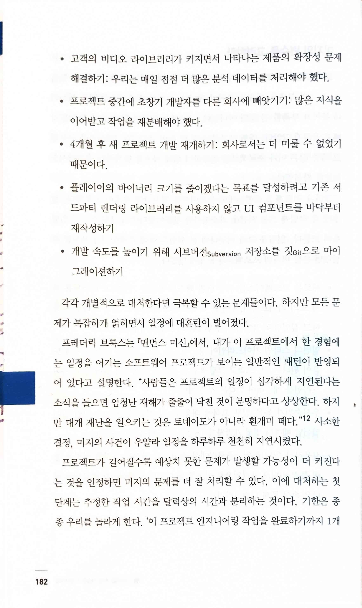

> 프레더릭 브룩스, 맨먼스 미신. “사람들은 프로젝트의 일정이 심각하게 지연된다는 소식을 들으면 엄청난 재해가 줄줄이 닥친 것이 분명하다고 상상한다. 하지만 대개 재난을 일으키는 것은 토네이도가 아니라 흰개미 떼다." 사소한 결정, 미지의 사건이 ... 일정을 하루하루 천천히 지연시켰다.

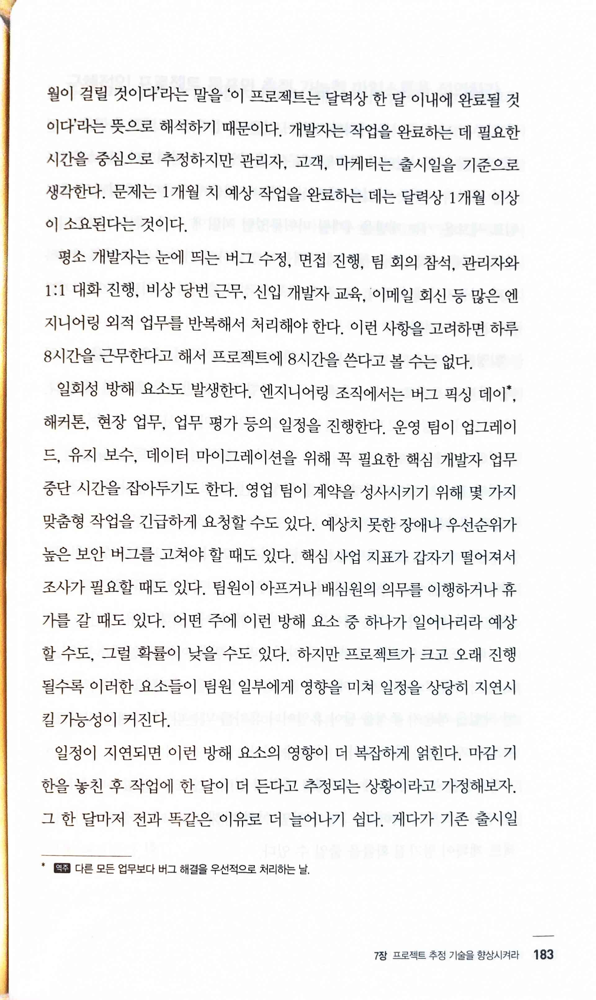

> 개발자는 작업을 완료하는 데 필요한 시간을 중심으로 추정하지만 관리자, 고객, 마케터는 출시일을 기준으로 생각한다. 문제는 1개월 치 예상 작업을 완료하는 데는 달력상 1개월 이상이 소요된다는 것이다.
>
> 평소 개발자는 눈에 띄는 버그 수정, 면접 진행, 팀 회의 참석, 관리자와 1:1 대화 진행, 비상 당번 근무, 신입 개발자 교육, 이메일 회신 등 많은 엔지니어링 외적 업무를 반복해서 처리해야 한다. 이런 사항을 고려하면 하루 8시간을 근무한다고 해서 프로젝트에 8시간을 쓴다고 볼 수는 없다.
>
> 프로젝트가 크고 오래 진행될수록 이러한 요소들이 팀원 일부에게 영향을 미쳐 일정을 상당히 지연시킬 가능성이 커진다.
>
> 일정이 지연되면 이런 방해 요소의 영향이 더 복잡하게 얽힌다.

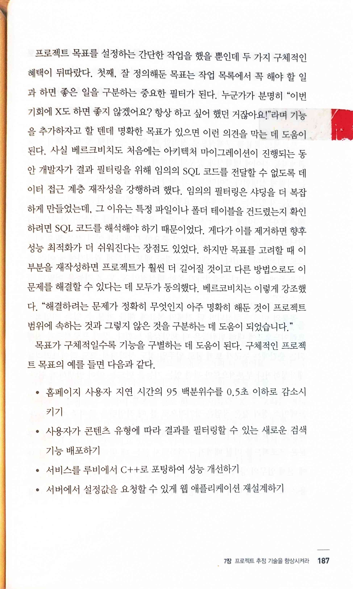

> 프로젝트 목표를 설정하는 간단한 작업을 했을 뿐인데 두 가지 구체적인 혜택이 뒤따랐다. 첫째, 잘 정의해둔 목표는 작업 목록에서 꼭 해야 할 일과 하면 좋은 일을 구분하는 중요한 필터가 된다. 누군가가 분명히 "이번 기회에 X도 하면 좋지 않겠어요? 항상 하고 싶어 했던 거잖아요!"라며 기능을 추가하자고 할 텐데 명확한 목표가 있으면 이런 의견을 막는 데 도움이 된다.
>
> 목표가 구체적일수록 기능을 구별하는 데 도움이 된다.

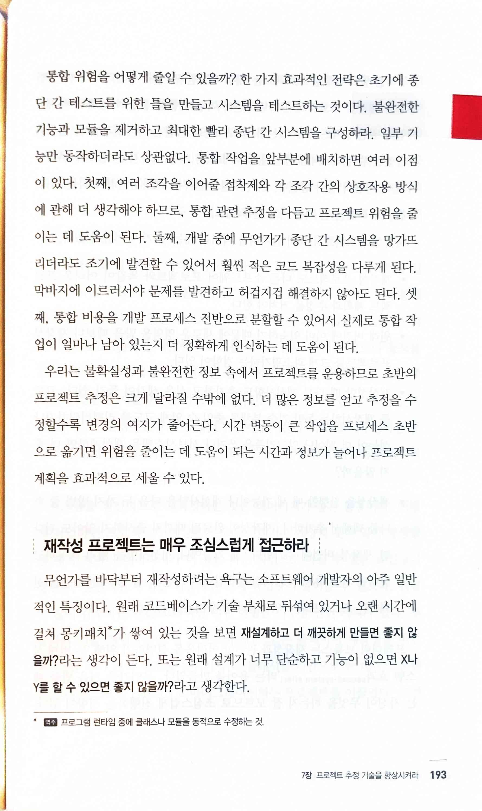

> 통합 위험을 어떻게 줄일 수 있을까? 한 가지 효과적인 전략은 초기에 종단 간 테스트를 위한 틀을 만들고 시스템을 테스트하는 것이다. 불완전한 기능과 모듈을 제거하고 최대한 빨리 종단 간 시스템을 구성하라. 일부 기능만 동작하더라도 상관없다. 통합 작업을 앞부분에 배치하면 여러 이점이 있다. 첫째, 여러 조각을 이어줄 접착제와 각 조각 간의 상호작용 방식에 관해 더 생각해야 하므로, 통합 관련 추정을 다듬고 프로젝트 위험을 줄이는 데 도움이 된다. 둘째, 개발 중에 무언가가 종단 간 시스템을 망가뜨리더라도 조기에 발견할 수 있어서 훨씬 적은 코드 복잡성을 다루게 된다. 막바지에 이르러서야 문제를 발견하고 허겁지겁 해결하지 않아도 된다. 셋째, 통합 비용을 개발 프로세스 전반으로 분할할 수 있어서 실제로 통합 작업이 얼마나 남아 있는지 더 정확하게 인식하는 데 도움이 된다.
>
> 우리는 불확실성과 불완전한 정보 속에서 프로젝트를 운용하므로 초반의 프로젝트 추정은 크게 달라질 수밖에 없다. 더 많은 정보를 얻고 추정을 수정할수록 변경의 여지가 줄어든다. 시간 변동이 큰 작업을 프로세스 초반으로 옮기면 위험을 줄이는 데 도움이 되는 시간과 정보가 늘어나 프로젝트 계획을 효과적으로 세울 수 있다.

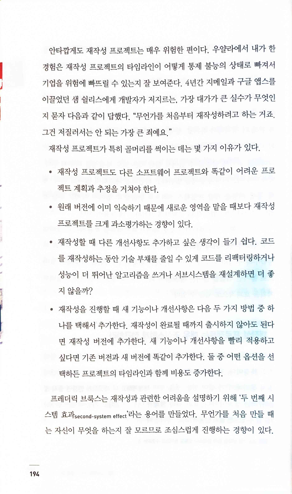 

> 무언가를 바닥부터 재작성하려는 욕구는 소프트웨어 개발자의 아주 일반적인 특징이다.
>
> 안타깝게도 재작성 프로젝트는 매우 위험한 편이다.
>
> • 재작성 프로젝트도 다른 소프트웨어 프로젝트와 똑같이 어려운 프로젝트 계획과 추정을 거쳐야 한다.
>
> • 원래 버전에 이미 익숙하기 때문에 새로운 영역을 맡을 때보다 재작성 프로젝트를 크게 과소평가하는 경향이 있다.
>
> • 재작성할 때 다른 개선사항도 추가하고 싶은 생각이 들기 쉽다.
>
> • 재작성을 진행할 때 새 기능이나 개선사항은 다음 두 가지 방법 중 하나를 택해서 추가한다. 재작성 버전에 추가/기존 버전과 새 버전에 똑같이 추가. 둘 중 어떤 옵션을 선택하든 프로젝트의 타임라인과 함께 비용도 증가한다.
>
> 프레더릭 브룩스는 재작성과 관련한 어려움을 설명하기 위해 '두 번째 시스템 효과second-system effect'라는 용어를 만들었다... 일반적으로 두 번째 시스템은 첫 번째 시스템에서 조심스럽게 피했던 모든 아이디어와 장식을 사용해 과하게 설계하는 경향이 있다." 우리는 개선할 여지가 보이면 이를 해결하려 들기 때문에 프로젝트의 복잡성이 증가한다. 두 번째 시스템은 지나친 자신감 탓에 일정이 지연되기 쉽다.
>
> 성공적으로 시스템을 재작성한 개발자들은 대규모 재작성 프로젝트를 일련의 소규모 프로젝트로 변환하여 진행한다. 소프트웨어 시스템을 더 통제하기 쉬운 단계에서 점진적으로 재작성한다. 마틴 파울러Martin Fowler는 리팩터링Refactoring에서 개발자는 코드를 리팩터링할 때 기존 코드의 동작을 보존하는 일련의 점진적인 변환을 활용해야 한다고 주장한 바 있는데, 재작성에 성공한 개발자들은 바로 그런 마인드셋을 갖추고 있다. "작은 단계를 밟아가며 진행하면 오류 발생의 위험이 줄어든다. 구조를 재구성하는 동안 시스템의 손상도 피할 수 있다. 그러면 장기간에 걸쳐 시스템을 점진적으로 리팩터링할 수 있다."
>
> 시스템을 점진적으로 재작성하는 것은 레버리지가 높은 활동이다. 이렇게 작업하면 프로젝트가 예상보다 오래 걸리거나 예상치 못한 일이 발생했을 때 단계마다 레버리지가 더 높은 다른 작업으로 바꿀 수 있는 유연성이 생긴다. 점진적인 방법을 활용하면 전체 작업량이 늘어날 수 있으나, 위험이 많이 감소하는 것을 고려하면 이런 단점을 감수할 만한 가치가 있다.

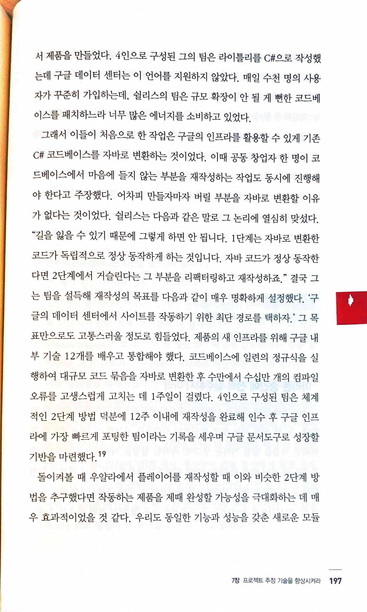

* 목표를 명확한 하나로 좁혀야 하는 이유

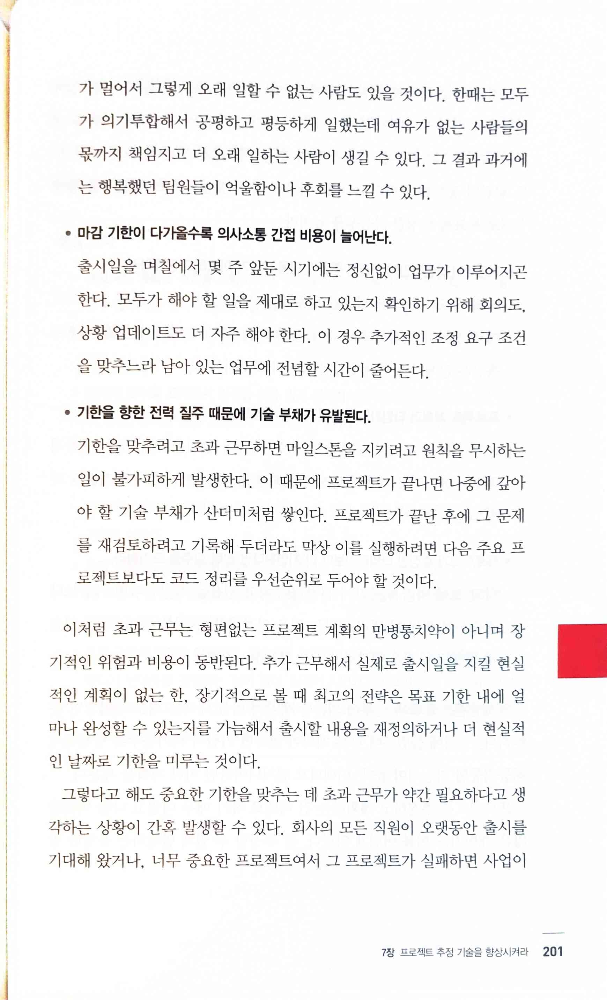

> 초과 근무는 형편없는 프로젝트 계획의 만병통치약이 아니며 장기적인 위험과 비용이 동반된다. 추가 근무해서 실제로 출시일을 지킬 현실적인 계획이 없는 한 장기적으로 볼 때 최고의 전략은 목표 기한 내에 얼마나 완성할 수 있는지를 가늠해서 출시할 내용을 재정의하거나 더 현실적인 날짜로 기한을 미루는 것이다.

# 3부 장기적인 가치를 구축하라

## 8장 품질과 실용주의 사이에서 균형을 유지하라 206
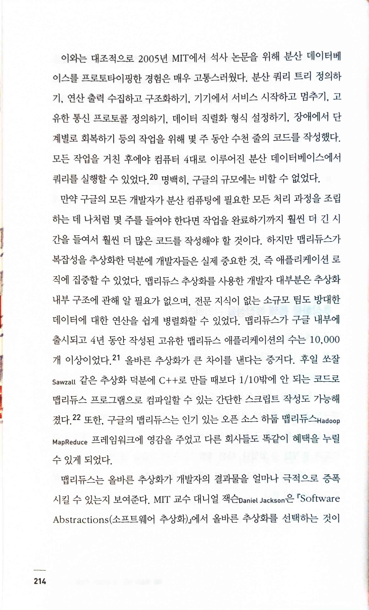 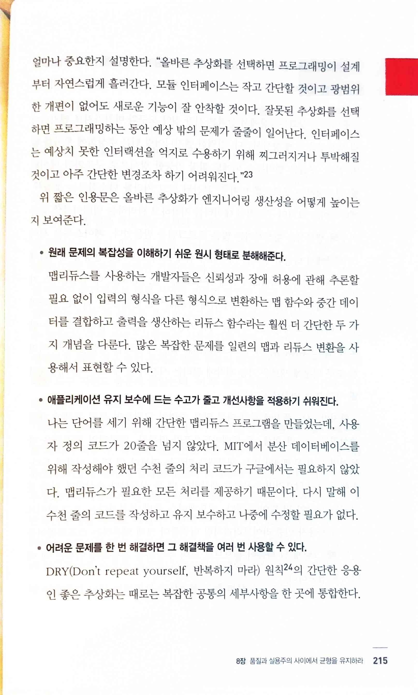

> MIT 교수 대니얼 잭슨Daniel Jackson Software Abstractions(소프트웨어 추상화)에서 올바른 추상화를 선택하는 것이 얼마나 중요한지 설명한다. "올바른 추상화를 선택하면 프로그래밍이 설계부터 자연스럽게 흘러간다. 모듈 인터페이스는 작고 간단할 것이고 광범위한 개편이 없어도 새로운 기능이 잘 안착할 것이다. 잘못된 추상화를 선택하면 프로그래밍하는 동안 예상 밖의 문제가 줄줄이 일어난다. 인터페이스는 예상치 못한 인터랙션을 억지로 수용하기 위해 찌그러지거나 투박해질 것이고 아주 간단한 변경조차 하기 어려워진다. "
>
> 올바른 추상화가 엔지니어링 생산성을 어떻게 높이는지
>
> • 원래 문제의 복잡성을 이해하기 쉬운 원시 형태로 분해해준다.
>
> • 애플리케이션 유지 보수에 드는 수고가 줄고 개선사항을 적용하기 쉬워진다.
>
> • 어려운 문제를 한 번 해결하면 그 해결책을 여러 번 사용할 수 있다.

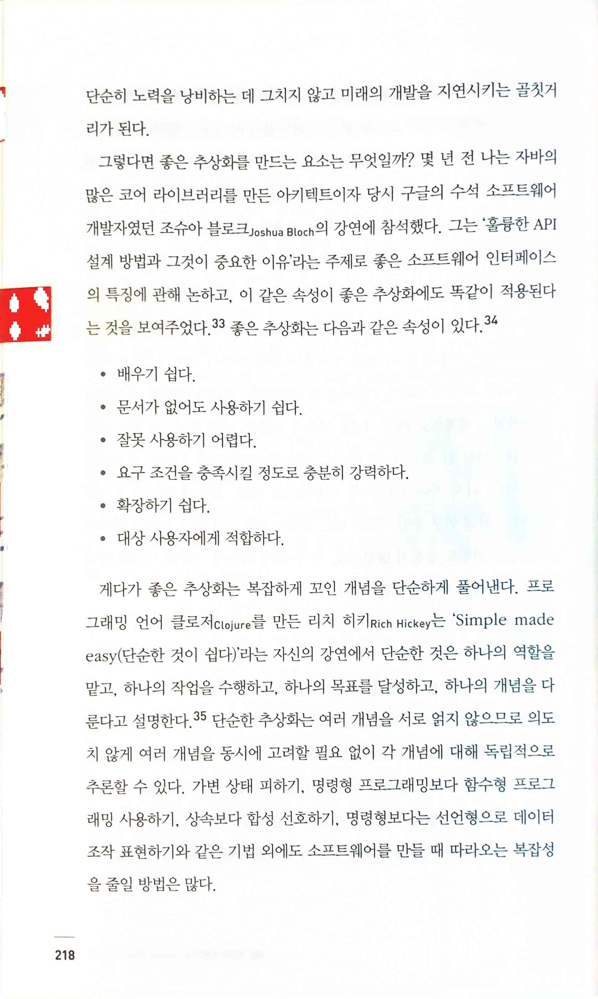

> 좋은 추상화 속성
>
> • 배우기 쉽다.
>
> • 문서가 없어도 사용하기 쉽다.
>
> • 잘못 사용하기 어렵다.
>
> • 요구 조건을 충족시킬 정도로 충분히 강력하다.
>
> • 확장하기 쉽다.
>
> • 대상 사용자에게 적합하다.
>
> 리치 히키 Rich Hickey는 'Simple made easy (단순한 것이 쉽다)'라는 자신의 강연에서 단순한 것은 하나의 역할을 맡고, 하나의 작업을 수행하고, 하나의 목표를 달성하고, 하나의 개념을 다룬다고 설명한다. 단순한 추상화는 여러 개념을 서로 얽지 않으므로 의도치 않게 여러 개념을 동시에 고려할 필요 없이 각 개념에 대해 독립적으로 추론할 수 있다.

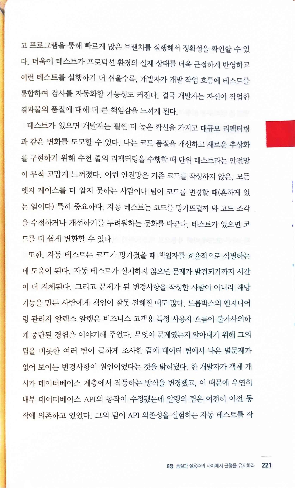

> 테스트가 있으면 개발자는 훨씬 더 높은 확신을 가지고 대규모 리팩터링과 같은 변화를 도모할 수 있다.
>
> 자동 테스트는 코드가 망가졌을 때 책임자를 효율적으로 식별하는데 도움이 된다.

## 9장 운영 부담을 최소화하라 229
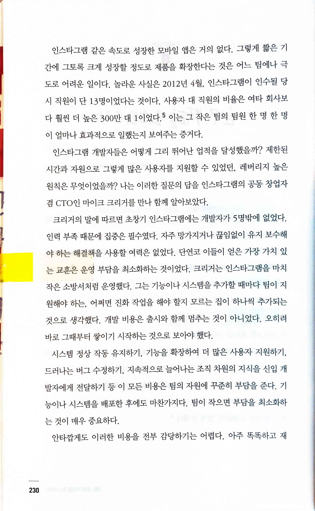

> 인스타그램이 얻은 가장 가치 있는 교훈은 운영 부담을 최소화하는 것
>
> 공동 창업자 겸 CTO인 마이크 크리거는 기능이나 시스템을 추가할 때마다 팀이 지원해야 하는, 어쩌면 진화 작업을 해야 할지 모르는 집이 하나씩 추가되는 것으로 생각했다. 개발 비용은 출시와 함께 멈추는 것이 아니었다. 오히려 바로 그때부터 쌓이기 시작하는 것으로 보아야 했다.

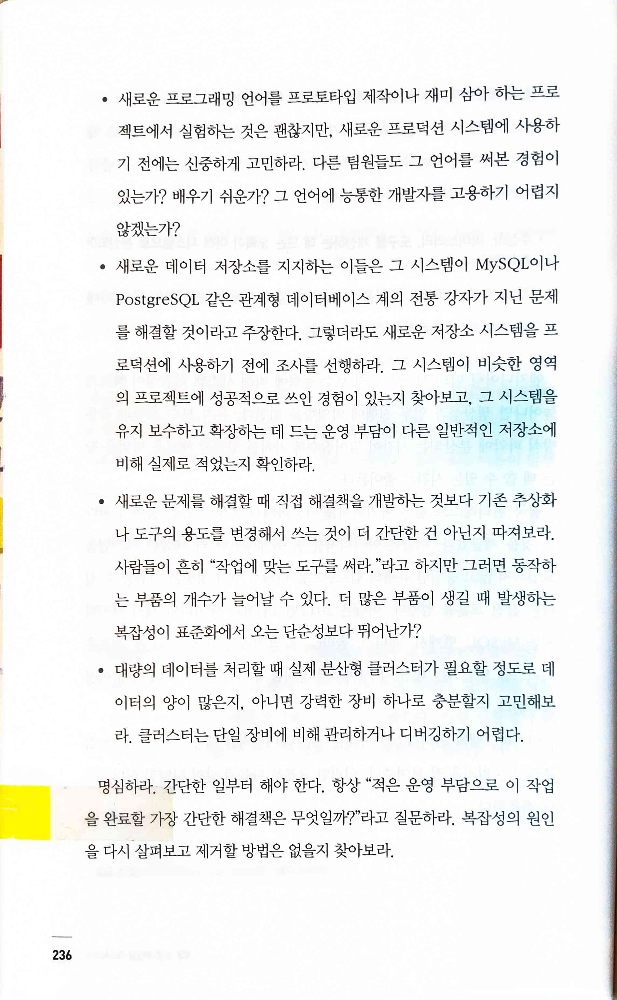

> 명심하라. 간단한 일부터 해야 한다. 항상 "적은 운영 부담으로 이 작업을 완료할 가장 간단한 해결책은 무엇일까?"라고 질문하라. 복잡성의 원인을 다시 살펴보고 제거할 방법은 없을지 찾아보라.

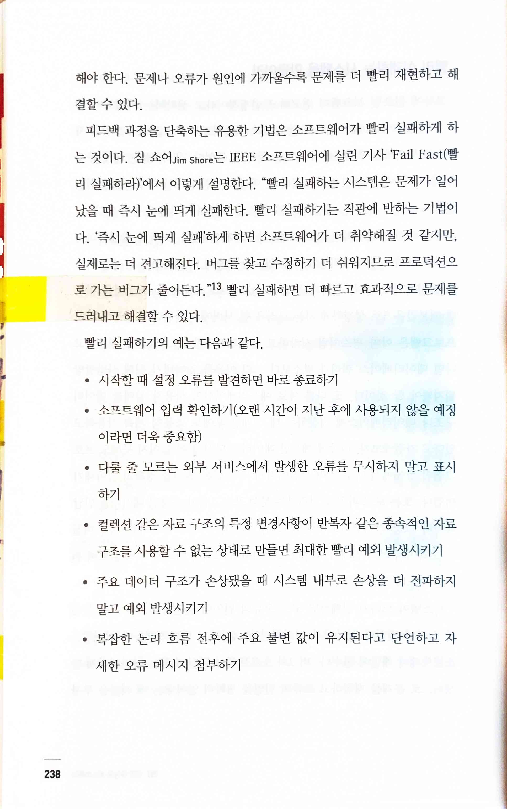

> 피드백 과정을 단축하는 유용한 기법은 소프트웨어가 빨리 실패하게 하는 것이다. 짐 쇼어Jim Shore는 IEEE 소프트웨어에 실린 기사 Fail Fast(빨리 실패하라)'에서 이렇게 설명한다. "빨리 실패하는 시스템은 문제가 일어났을 때 즉시 눈에 띄게 실패한다. 빨리 실패하기는 직관에 반하는 기법이다. '즉시 눈에 띄게 실패하게 하면 소프트웨어가 더 취약해질 것 같지만. 실제로는 더 견고해진다. 버그를 찾고 수정하기 더 쉬워지므로 프로덕션으로 가는 버그가 줄어든다." 빨리 실패하면 더 빠르고 효과적으로 문제를 드러내고 해결할 수 있다.

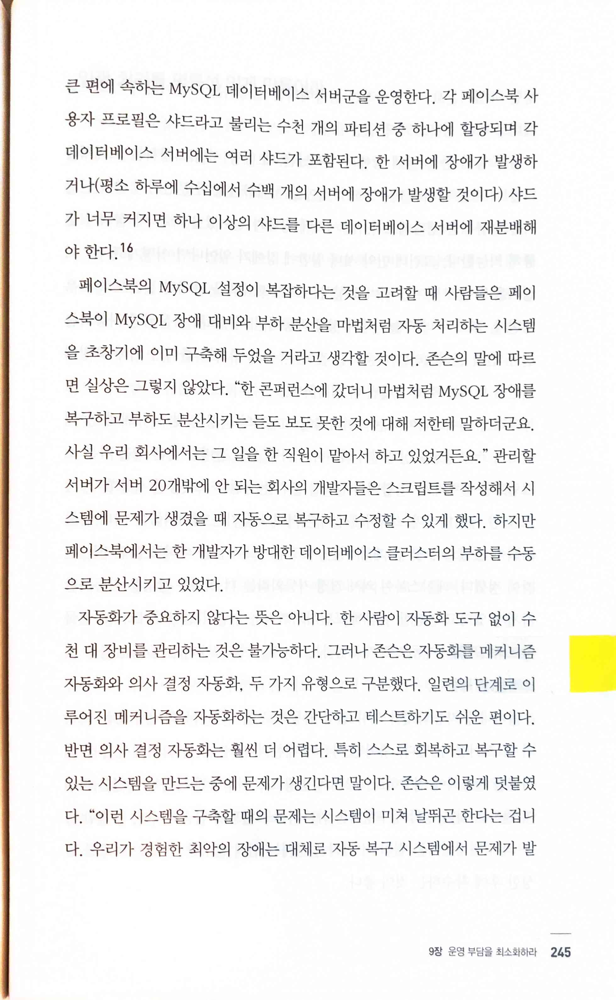 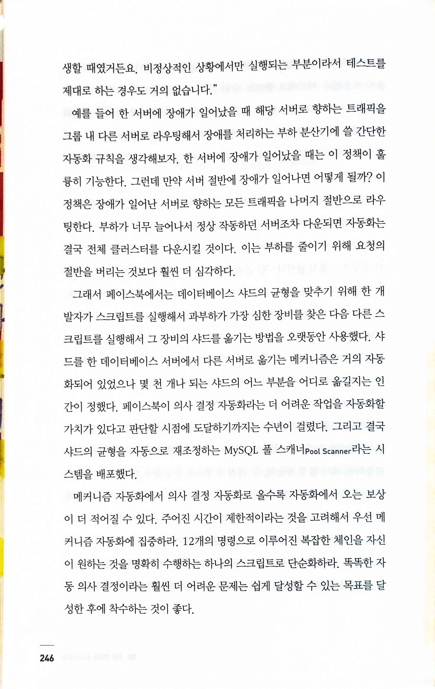

> 자동화를 메커니즘 자동화와 의사 결정 자동화, 두 가지 유형으로 구분했다. 일련의 단계로 이루어진 메커니즘을 자동화하는 것은 간단하고 테스트하기도 쉬운 편이다. 반면 의사 결정 자동화는 훨씬 더 어렵다.
>
> 메커니즘 자동화에서 의사 결정 자동화로 올수록 자동화에서 오는 보상이 더 적어질 수 있다. 주어진 시간이 제한적이라는 것을 고려해서 우선 메커니즘 자동화에 집중하라... 똑똑한 자동 의사 결정이라는 훨씬 더 어려운 문제는 쉽게 달성할 수 있는 목표를 달성한 후에 착수하는 것이 좋다.

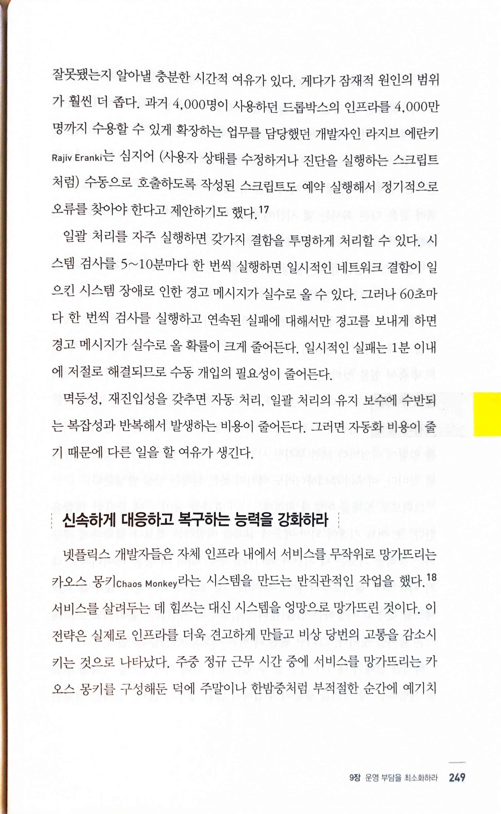

> 멱등성, 재진입성을 갖추면 자동 처리, 일괄 처리의 유지 보수에 수반되는 복잡성과 반복해서 발생하는 비용이 줄어든다. 그러면 자동화 비용이 줄기 때문에 다른 일을 할 여유가 생긴다.

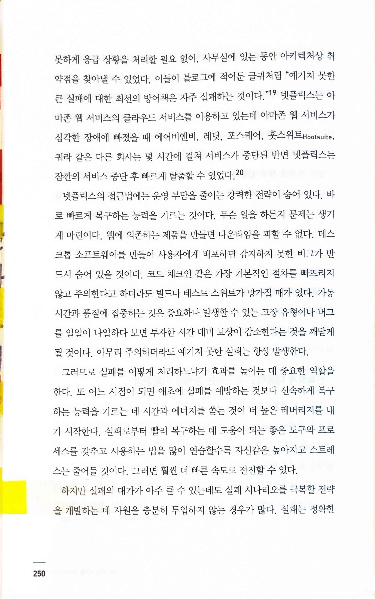

> “예기치 못한 큰 실패에 대한 최선의 방어책은 자주 실패하는 것이다."
>
> 넷플릭스의 접근법에는 운영 부담을 줄이는 강력한 전략이 숨어 있다. 바로 빠르게 복구하는 능력을 기르는 것이다.
>
> 그러므로 실패를 어떻게 처리하느냐가 효과를 높이는 데 중요한 역할을 한다. 또 어느 시점이 되면 애초에 실패를 예방하는 것보다 신속하게 복구하는 능력을 기르는 데 시간과 에너지를 쏟는 것이 더 높은 레버리지를 내기 시작한다. 실패로부터 빨리 복구하는 데 도움이 되는 좋은 도구와 프로세스를 갖추고 사용하는 법을 많이 연습할수록 자신감은 높아지고 스트레스는 줄어들 것이다. 그러면 훨씬 더 빠른 속도로 전진할 수 있다.

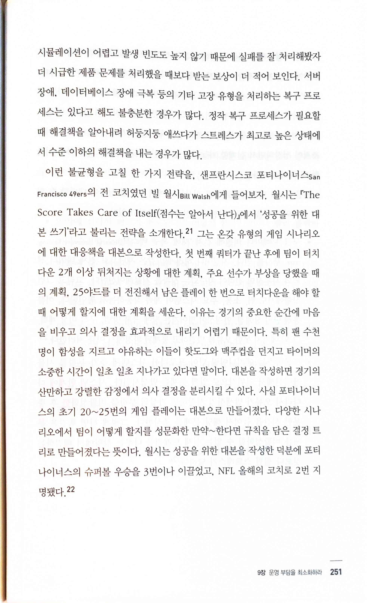

> 샌프란시스코 포티나이너스San Francisco 49ers의 전 코치였던 빌 월시 Bill Walsh. The Score Takes Care of Itself(점수는 알아서 난다)에서 '성공을 위한 대본 쓰기'라고 불리는 전략을 소개... 대본을 작성하면 경기의 산만하고 강렬한 감정에서 의사 결정을 분리시킬 수 있다... 다양한 시나리오에서 팀이 어떻게 할지를 성문화한 만약~한다면 규칙을 담은 결정 트리로 만들어졌다는 뜻이다.

## 10장 팀의 성장에 투자하라 256
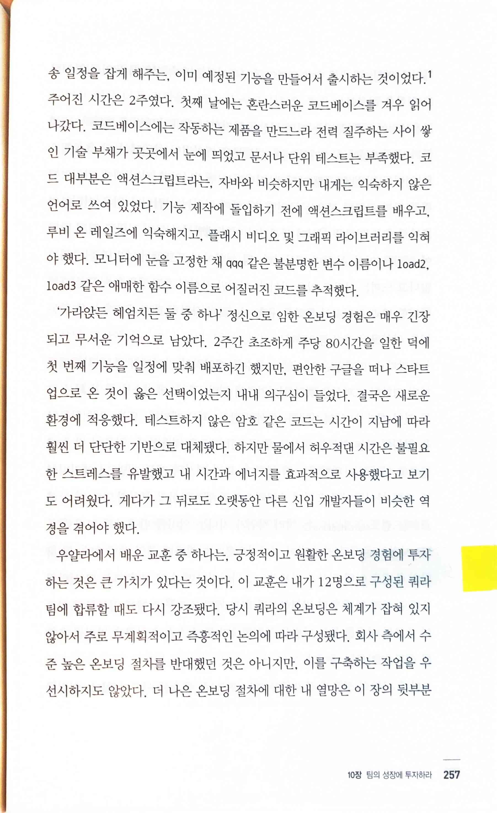

> 긍정적이고 원활한 온보딩 경험에 투자하는 것은 큰 가치가 있다

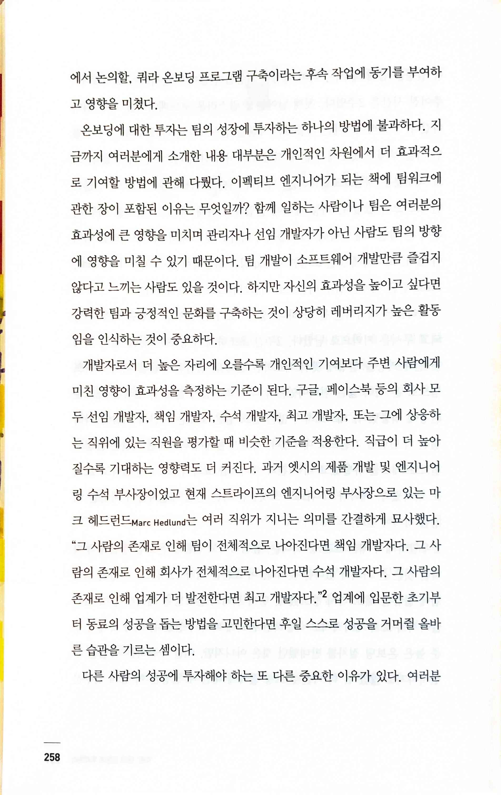

> 개발자로서 더 높은 자리에 오를수록 개인적인 기여보다 주변 사람에게 미친 영향이 효과성을 측정하는 기준이 된다... "그 사람의 존재로 인해 팀이 전체적으로 나아진다면 책임 개발자다. 그 사람의 존재로 인해 회사가 전체적으로 나아진다면 수석 개발자다. 그 사람의존재로 인해 업계가 더 발전한다면 최고 개발자다." 업계에 입문한 초기부터 동료의 성공을 돕는 방법을 고민한다면 후일 스스로 성공을 거머쥘 올바른 습관을 기르는 셈이다.

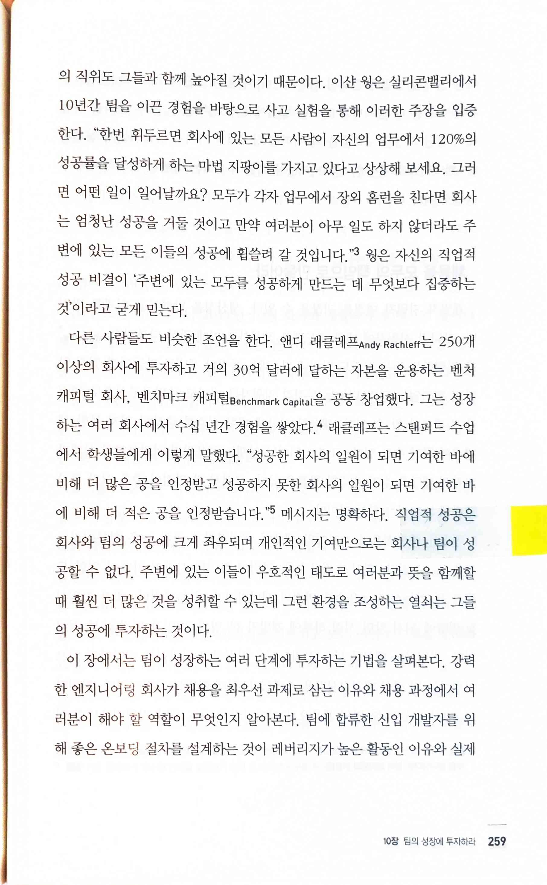

> “성공한 회사의 일원이 되면 기여한 바에 비해 더 많은 공을 인정받고 성공하지 못한 회사의 일원이 되면 기여한 바에 비해 더 적은 공을 인정받습니다." 메시지는 명확하다. 직업적 성공은 회사와 팀의 성공에 크게 좌우되며 개인적인 기여만으로는 회사나 팀이 성공할 수 없다. 주변에 있는 이들이 우호적인 태도로 여러분과 뜻을 함께할 때 훨씬 더 많은 것을 성취할 수 있는데 그런 환경을 조성하는 열쇠는 그들의 성공에 투자하는 것이다.

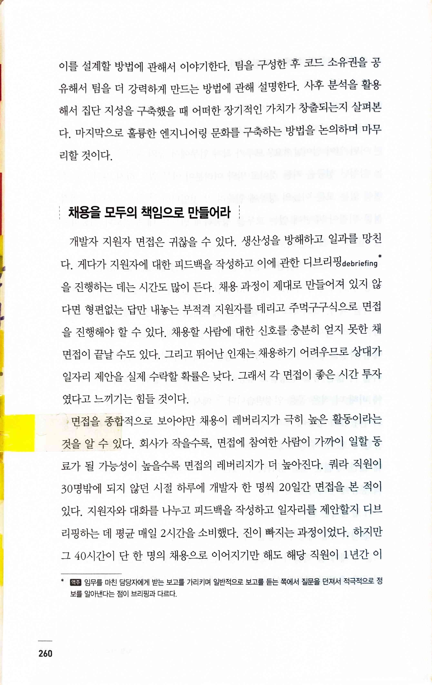 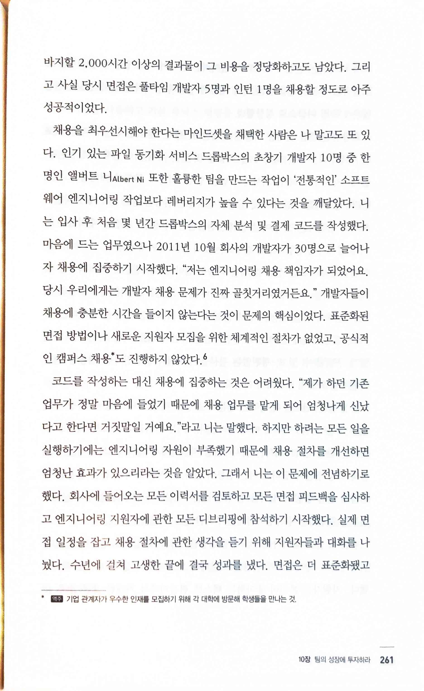

> 면접을 종합적으로 보아야만 채용이 레버리지가 극히 높은 활동이라는 것을 알 수 있다.

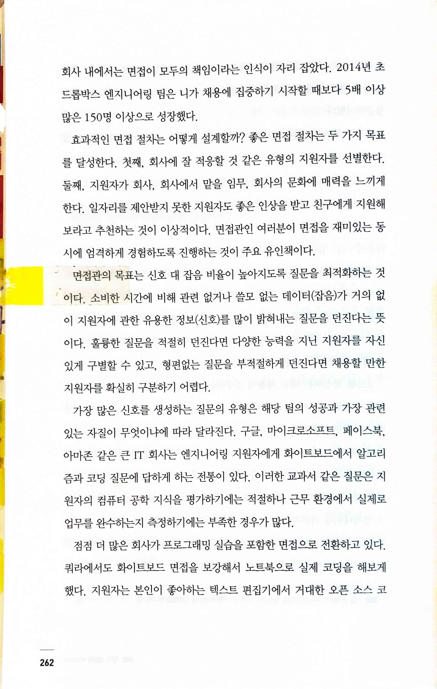

> 면접관의 목표는 신호 대 잡음 비율이 높아지도록 질문을 최적화하는 것이다. 소비한 시간에 비해 관련 없거나 쓸모 없는 데이터(잡음)가 거의 없이 지원자에 관한 유용한 정보(신호)를 많이 밝혀내는 질문을 던진다는 뜻이다. 훌륭한 질문을 적절히 던진다면 다양한 능력을 지닌 지원자를 자신있게 구별할 수 있고, 형편없는 질문을 부적절하게 던진다면 채용할 만한 지원자를 확실히 구분하기 어렵다.

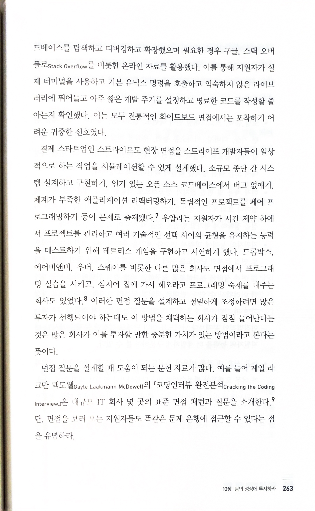

* 실제 코드를 작성하는 면접으로 전환하는 비율이 높아진다는 이야기

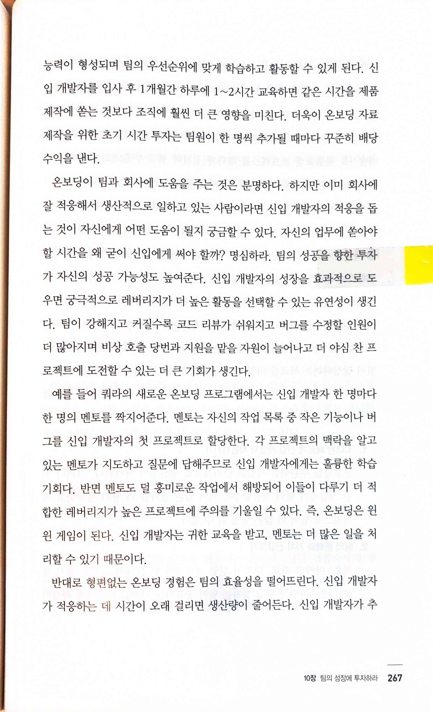

> 온보딩이 팀과 회사에 도움을 주는 것은 분명하다. 하지만 이미 회사에 잘 적응해서 생산적으로 일하고 있는 사람이라면 신입 개발자의 적응을 돕는 것이 자신에게 어떤 도움이 될지 궁금할 수 있다. 자신의 업무에 쏟아야 할 시간을 왜 굳이 신입에게 써야 할까? 명심하라. 팀의 성공을 향한 투자가 자신의 성공 가능성도 높여준다. 신입 개발자의 성장을 효과적으로 도우면 궁극적으로 레버리지가 더 높은 활동을 선택할 수 있는 유연성이 생긴다. 팀이 강해지고 커질수록 코드 리뷰가 쉬워지고 버그를 수정할 인원이 더 많아지며 비상호출 당번과 지원을 맡을 자원이 늘어나고 더 야심 찬 프로젝트에 도전할 수 있는 더 큰 기회가 생긴다.

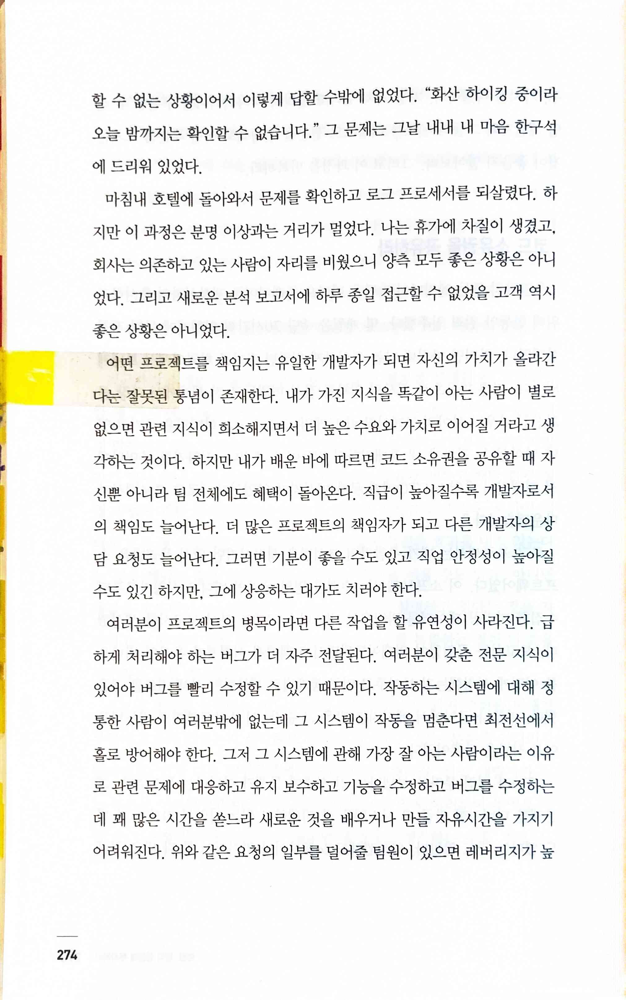 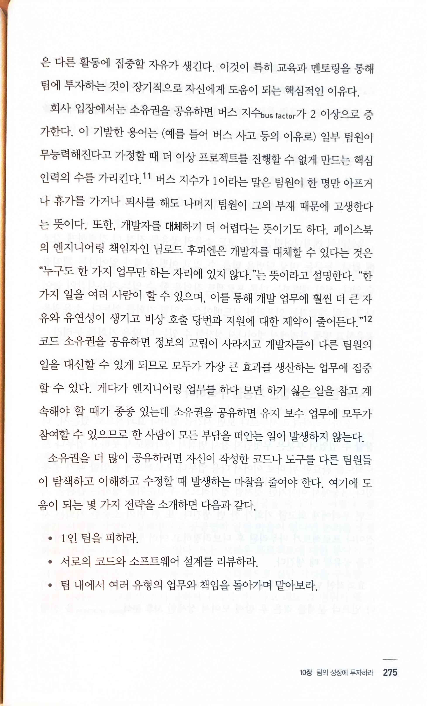

> 어떤 프로젝트를 책임지는 유일한 개발자가 되면 자신의 가치가 올라간다는 잘못된 통념이 존재한다. 내가 가진 지식을 똑같이 아는 사람이 별로 없으면 관련 지식이 희소해지면서 더 높은 수요와 가치로 이어질 거라고 생각하는 것이다. 하지만 내가 배운 바에 따르면 코드 소유권을 공유할 때 자신뿐 아니라 팀 전체에도 혜택이 돌아온다...
>
> 여러분이 프로젝트의 병목이라면 다른 작업을 할 유연성이 사라진다. 급하게 처리해야 하는 버그가 더 자주 전달된다. 여러분이 갖춘 전문 지식이 있어야 버그를 빨리 수정할 수 있기 때문이다... 위와 같은 요청의 일부를 덜어줄 팀원이 있으면 레버리지가 높은 다른 활동에 집중할 자유가 생긴다. 이것이 특히 교육과 멘토링을 통해 팀에 투자하는 것이 장기적으로 자신에게 도움이 되는 핵심적인 이유다.
>
> 코드 소유권을 공유하면 정보의 고립이 사라지고 개발자들이 다른 팀원의 일을 대신할 수 있게 되므로 모두가 가장 큰 효과를 생산하는 업무에 집중할 수 있다. 게다가 엔지니어링 업무를 하다 보면 하기 싫은 일을 참고 계속해야 할 때가 종종 있는데 소유권을 공유하면 유지 보수 업무에 모두가 참여할 수 있으므로 한 사람이 모든 부담을 떠안는 일이 발생하지 않는다.

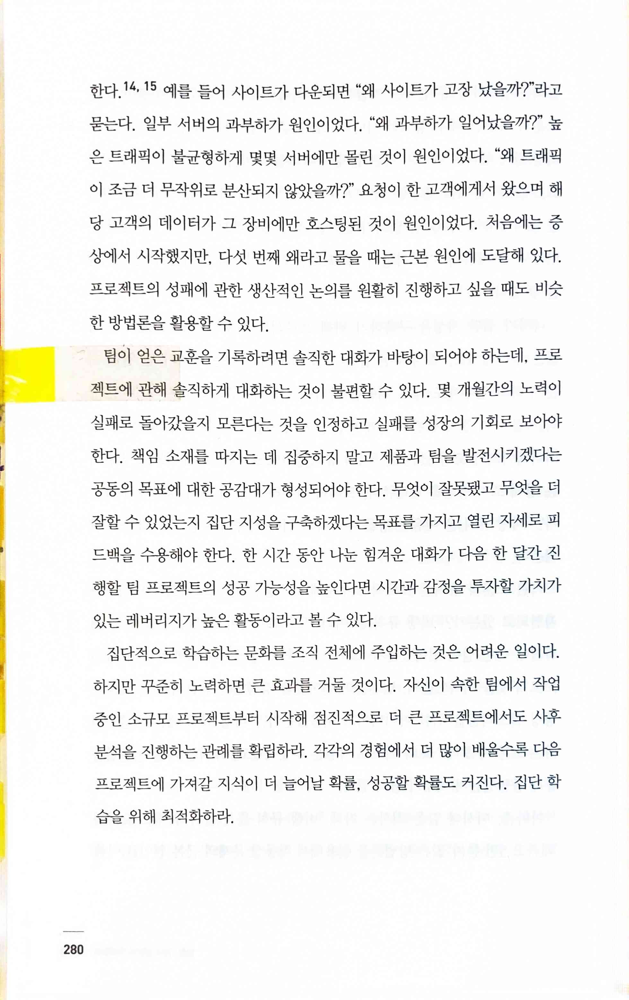

> 팀이 얻은 교훈을 기록하려면 솔직한 대화가 바탕이 되어야 하는데, 프로젝트에 관해 솔직하게 대화하는 것이 불편할 수 있다. 몇 개월간의 노력이 실패로 돌아갔을지 모른다는 것을 인정하고 실패를 성장의 기회로 보아야 한다. 책임 소재를 따지는 데 집중하지 말고 제품과 팀을 발전시키겠다는 공동의 목표에 대한 공감대가 형성되어야 한다. 무엇이 잘못됐고 무엇을 더 잘할 수 있었는지 집단 지성을 구축하겠다는 목표를 가지고 열린 자세로 피드백을 수용해야 한다. 한 시간 동안 나눈 힘겨운 대화가 다음 한 달간 진행할 팀 프로젝트의 성공 가능성을 높인다면 시간과 감정을 투자할 가치가 있는 레버리지가 높은 활동이라고 볼 수 있다.

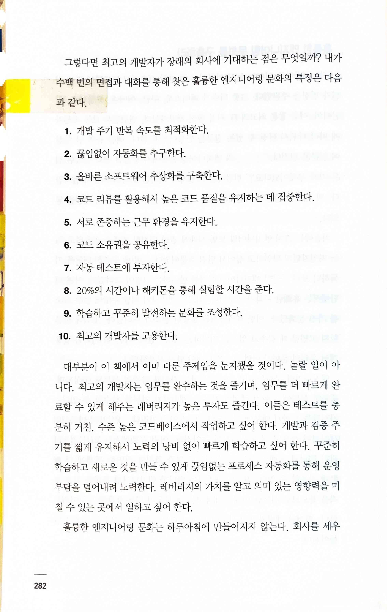

> 훌륭한 엔지니어링 문화의 특징
>
> 1. 개발 주기 반복 속도를 최적화한다.
>
> 2. 끊임없이 자동화를 추구한다.
>
> 3. 올바른 소프트웨어 추상화를 구축한다.
>
> 4. 코드 리뷰를 활용해서 높은 코드 품질을 유지하는 데 집중한다.
>
> 5. 서로 존중하는 근무 환경을 유지한다.
>
> 6. 코드 소유권을 공유한다.
>
> 7. 자동 테스트에 투자한다.
>
> 8. 20%의 시간이나 해커톤을 통해 실험할 시간을 준다.
>
> 9. 학습하고 꾸준히 발전하는 문화를 조성한다.
>
> 10. 최고의 개발자를 고용한다.

# 에필로그 284
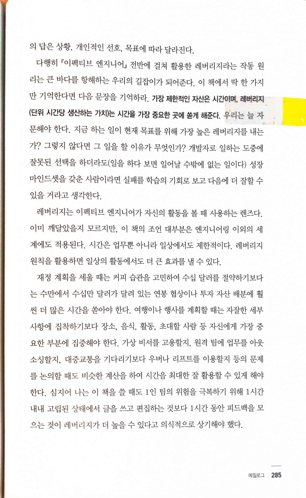

> 가장 제한적인 자산은 시간이며, 레버리지(단위 시간당 생산하는 가치)는 시간을 가장 중요한 곳에 쏟게 해준다.