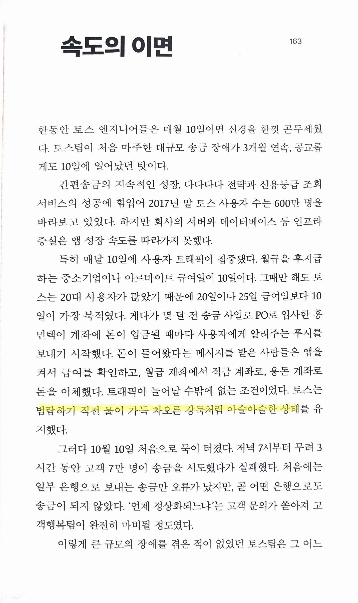
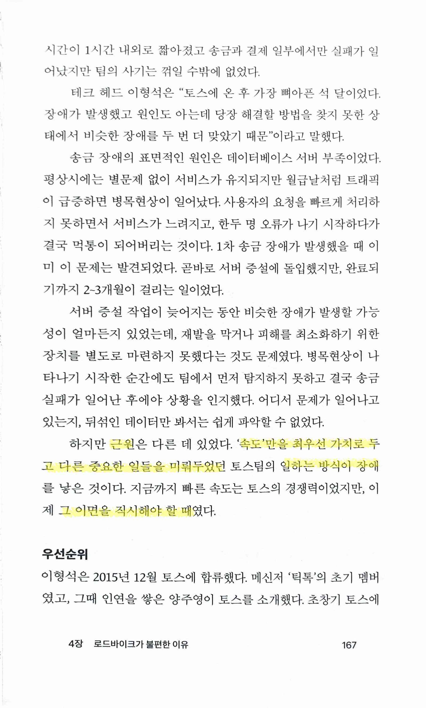
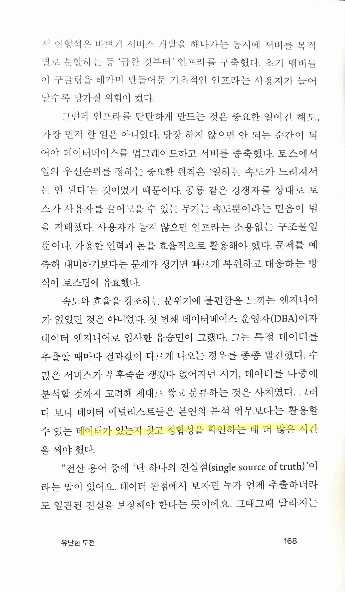
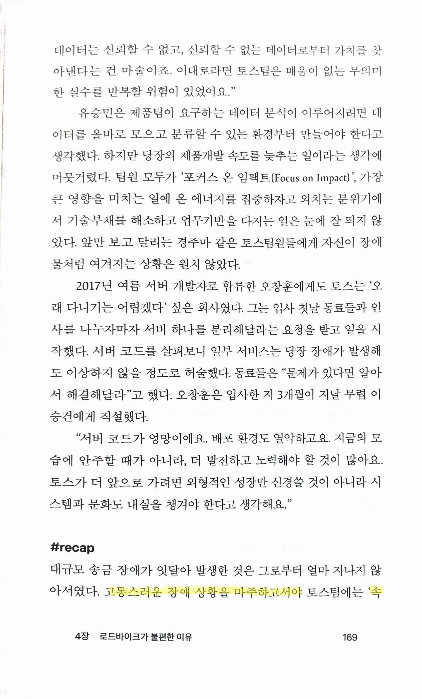
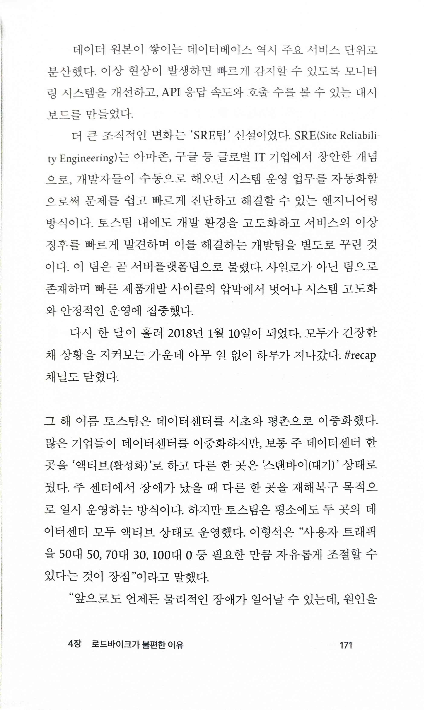
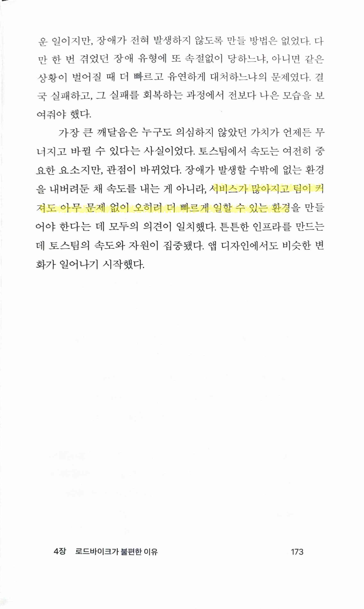

유난한 도전
===========

* 개발 매니지먼트를 하기 때문에 해당 부분만 따로 기록해두지만, 바로 이 뒤에도 design system을 통해 UX의 통일성과 효율성을 높이는 부분도 마찬가지로, 단기적으로는 느려져도 장기적으로 속도를 높이는 일은 조직이 어느 정도 커지면 꼭 필요한 순간이 온다. 그 순간이 언제 올지는 정확히 알 수는 없지만 언젠가는 문제가 발생하고 할 수 밖에 없는 순간이 오고, 그때까지 미루면 미룰수록 힘들게 수습하게 된다. 물론 이런 순간도 맞이하지 못하는 경우보다야 행복한 상황이긴 하다.

> 범람하기 직전 물이 가득 차오른 강둑처럼 아슬아슬한 상태

> 근원. '속도'만을 최우선 가치로 두고 다른 중요한 일들을 미뤄두었던 일하는 방식이 장애. 이면을 직시해야 할 때

 

> 고통스러운 장애 상황을 마주하고서야 '속도'보다 먼저 챙겨야 할 일들도 있다는 인식
>
> 모니터링, 경보 시스템

> 함께 일하는 팀원들의 업무 효율성을 높여주는 프로토콜은 처음 만들 때는 시간이 걸리지만, 한번 만들어두자 오래도록 영향력

> 장애가 발생할 수밖에 없는 환경을 내버려둔 채 속도를 내는 게 아니라, 서비스가 많아지고 팀이 커져도 아무 문제 없이 오히려 더 빠르게 일할 수 있는 환경을 만들어야 한다