Fighting Churn with Data 고객 리텐션의 전략 데이터를 통해 고객 이탈을 막아라
=============================================================================

* https://fightchurnwithdata.com/
* [Fighting Churn with Data](https://www.manning.com/books/fighting-churn-with-data)
* [carl24k/fight-churn: Code from the book Fighting Churn With Data](https://github.com/carl24k/fight-churn)
* [고객 리텐션의 전략 | 에이콘출판사](http://www.acornpub.co.kr/book/churn-data)
* [AcornPublishing/churn-data: 고객 리텐션의 전략 데이터를 통해 고객 이탈을 막아라](https://github.com/AcornPublishing/churn-data)

# Part 1 무기고 쌓기

## 1 이탈의 세계

> `이탈(Churn)` - 고객이 서비스 사용을 중지하거나 가입을 취소하는 경우
>
> `이탈률churn rate` 주어진 기간에 떠나는 고객의 비율
>
> `고객 유지(고객 리텐션, Customer Retention)` - 고객이 서비스를 계속 사용하고 구독 서비스인 경우 구독을 갱신한다. 고객 유지는 이탈의 반대를 의미한다.

 

> 이탈을 줄이는 개입
>
> ■ 제품 개선 Product improvement
>
> ■ 참여 캠페인 Engagement campaigns
>
> ■ 일대일 고객 상호작용 One-on-one customer interactions
>
> ■ 적정 가격 책정 Rightsizing pricing
>
> ■ 인수 목표 Targeting acquisitions

> 이탈과 싸울 때 데이터가 이동한다는 것은 사용 가능한 데이터를 정확하게 판독하여 제품 변경, 고객 개입 및 획득 전략을 설계하는 것을 의미한다.
>
> 이탈 감소 개입에는 몇 가지 일반적인 원칙이 있지만, 이러한 원칙들은 각 제품의 상황에 따른 맞춤화가 필요하다.

> `고객 메트릭(Customer metric)` - 모든 고객에 대해 개별적으로 측정한 값
>
> 고객 지표가 이탈에 잘 대처하게 하려면 다음과 같은 특성이 있어야 한다. (1) 비즈니스에서 쉽게 이해되고 (2) 이탈 및 유지와 명확하게 연관되므로, 건강한 고객이 어떤 모습인지 명확하다.(3) 고객 참여를 증가시키는 목표 개입에 유용한 방식으로 고객을 세분화한다. (4) 제품, 마케팅, 지원 등 e-비즈니스의 여러 기능에 유용하다.
* 토스에서 송금하기를 3번 했던 고객은 95% 활성화 고객이 되었다(정확한 값이나 말은 생각이 안 나지만)고 했던 거와 비슷한 맥락인듯

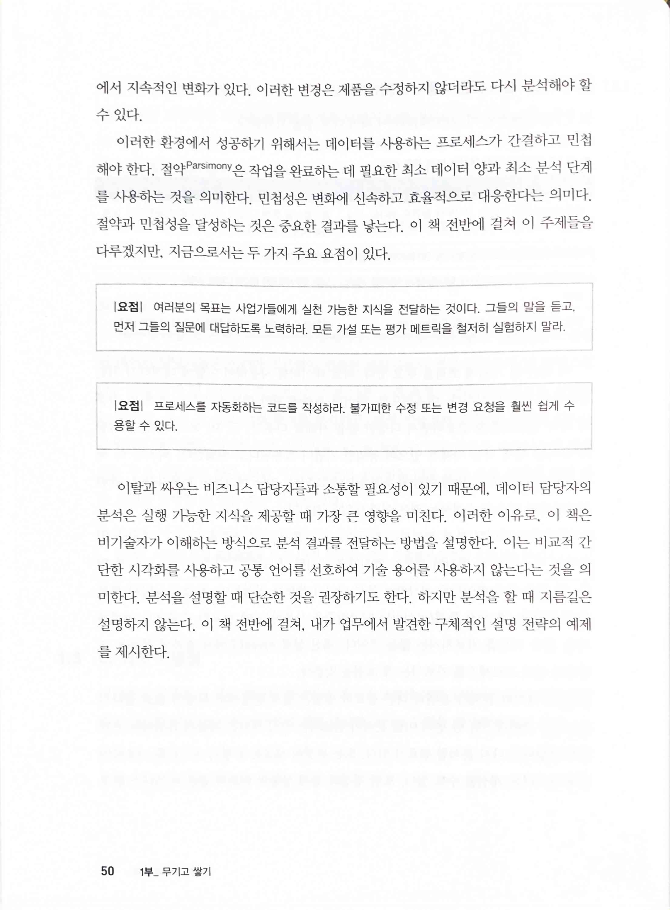

> 여러분의 목표는 사업가들에게 실천 가능한 지식을 전달하는 것이다. 그들의 말을 듣고,먼저 그들의 질문에 대답하도록 노력하라. 모든 가설 또는 평가 메트릭을 철저히 실험하지 말라.
>
> 프로세스를 자동화하는 코드를 작성하라. 불가피한 수정 또는 변경 요청을 훨씬 쉽게 수용할 수 있다.

> 데이터 수집 작업을 다른 팀에 위임하는 것은 매우 위험하다.
* 내가 데이터 과학자들 팀에 항상 해주던 이야기

## 2 이탈 측정
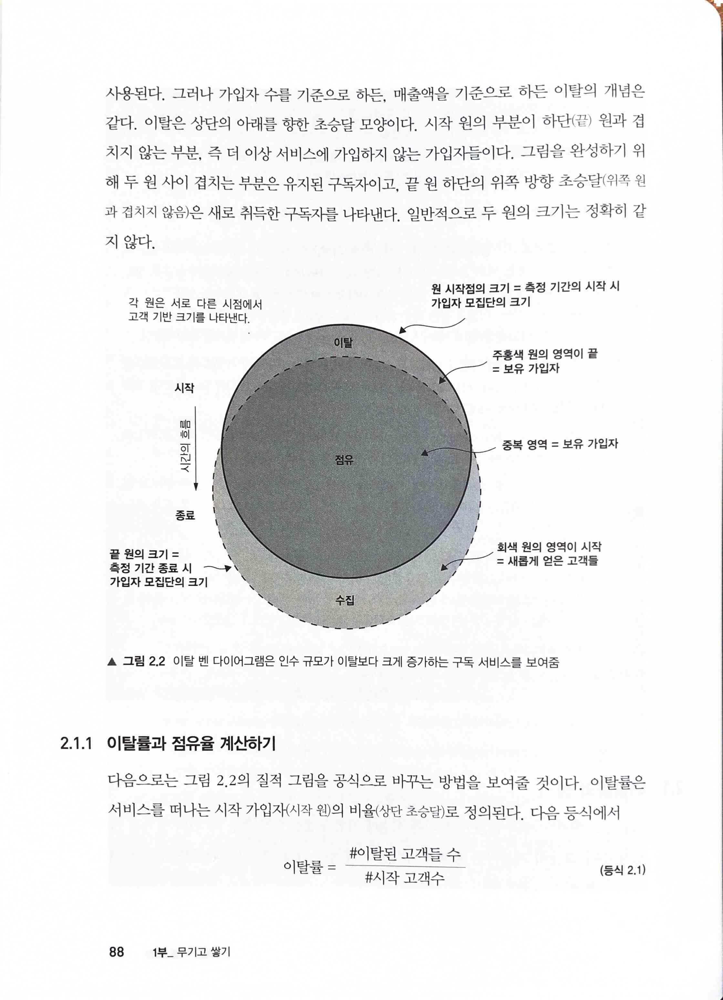

> ▲ 그림 2.2 이탈 벤 다이어그램은 인수 규모가 이탈보다 크게 증가하는 구독 서비스를 보여줌
>
> `이탈률 = #이탈된 고객들 수 / #시작 고객수`

> `점유율 = #남아있는 고객 수 / #시작 고객수`
>
> 시작 = 이탈 + 점유
>
> 100% = 이탈률 + 점유율

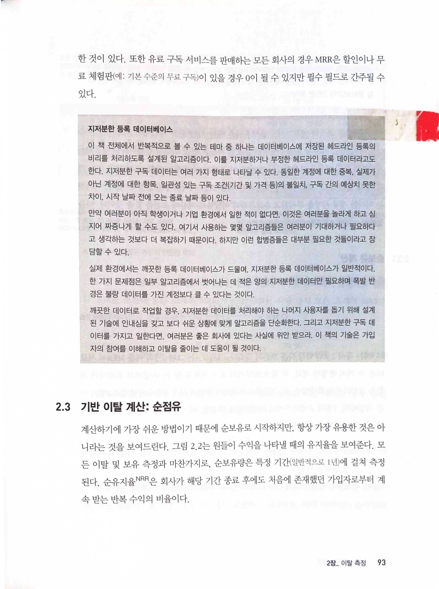

> 실제 환경에서는 깨끗한 등록 데이터베이스가 드물며, 지저분한 등록 데이터베이스가 일반적이다.

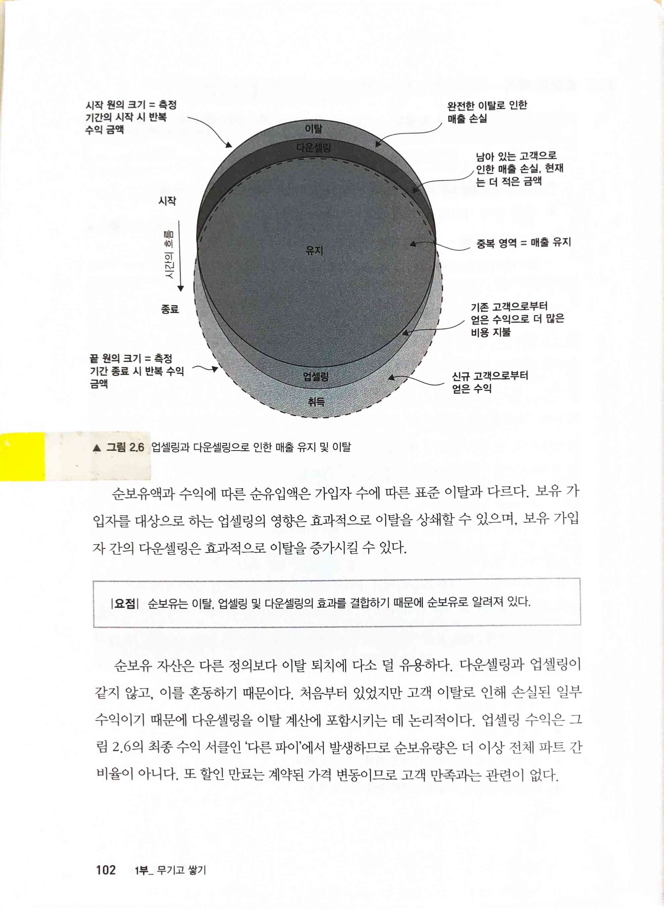

> ▲ 그림 2.6 업셀링과 다운셀링으로 인한 매출 유지 및 이탈
>
> 순보유는 이탈, 업셀링 및 다운셀링의 효과를 결합하기 때문에 순보유로 알려져 있다.

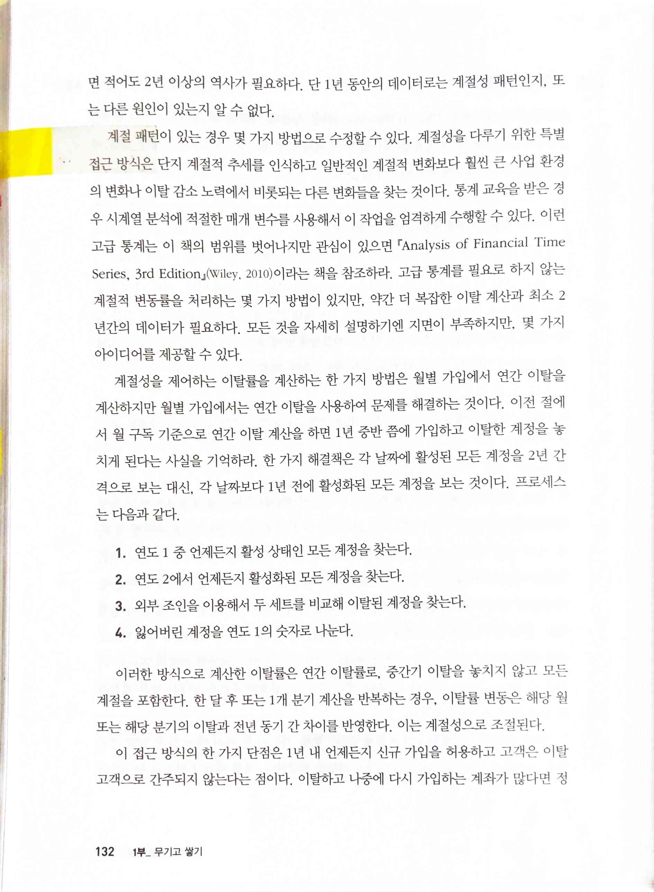

> `계절 패턴`이 있는 경우 몇 가지 방법으로 수정할 수 있다. 계절성을 다루기 위한 특별접근 방식은 단지 계절적 추세를 인식하고 일반적인 계절적 변화보다 훨씬 큰 사업 환경의 변화나 이탈 감소 노력에서 비롯되는 다른 변화들을 찾는 것이다. 통계 교육을 받은 경우 시계열 분석에 적절한 매개 변수를 사용해서 이 작업을 엄격하게 수행할 수 있다.

## 3 고객 측정하기

> `이벤트` - 특정 타임 스탬프와 함께 데이터 웨어하우스에 저장된 사용자 행동에 대한 모든사실
>
> `메트릭` - 사용자 행동에 대한 요약 측정, 메트릭에도 타임 스탬프가 있지만 한 시점 이상의 행동을 요약한다.

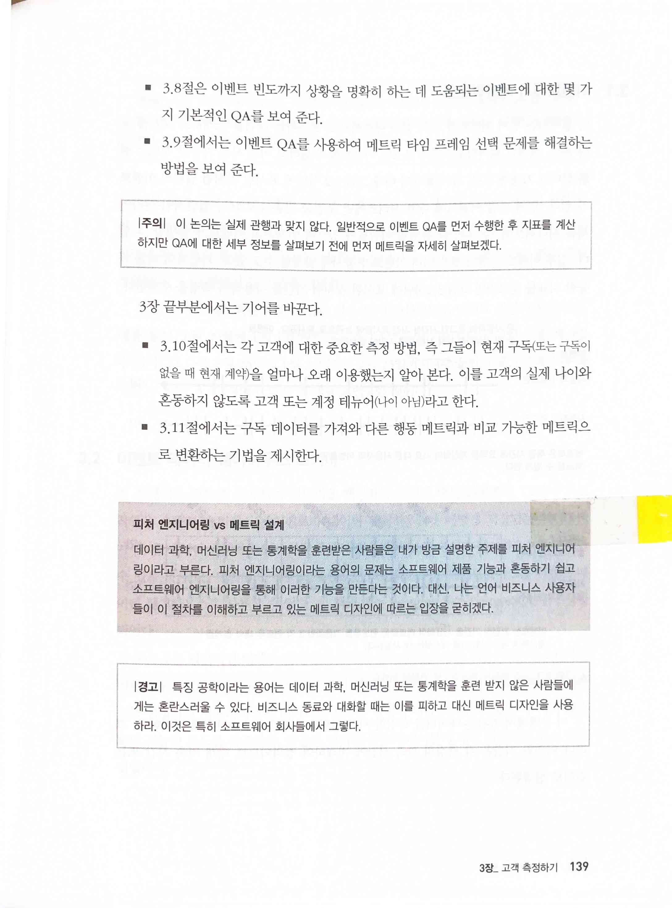

> `피처 엔지니어링` vs `메트릭 설계`
>
> 데이터 과학, 머신러닝 또는 통계학을 훈련받은 사람들은 내가 방금 설명한 주제를 피처 엔지니어링이라고 부른다. 피처 엔지니어링이라는 용어의 문제는 소프트웨어 제품 기능과 혼동하기 쉽고 소프트웨어 엔지니어링을 통해 이러한 기능을 만든다는 것이다. 대신, 나는 언어 비즈니스 사용자들이 이 절차를 이해하고 부르고 있는 메트릭 디자인에 따르는 입장을 굳히겠다.
>
> 특징 공학이라는 용어는 데이터 과학, 머신러닝 또는 통계학을 훈련 받지 않은 사람들에게는 혼란스러울 수 있다. 비즈니스 동료와 대화할 때는 이를 피하고 대신 메트릭 디자인을 사용하라. 이것은 특히 소프트웨어 회사들에서 그렇다.

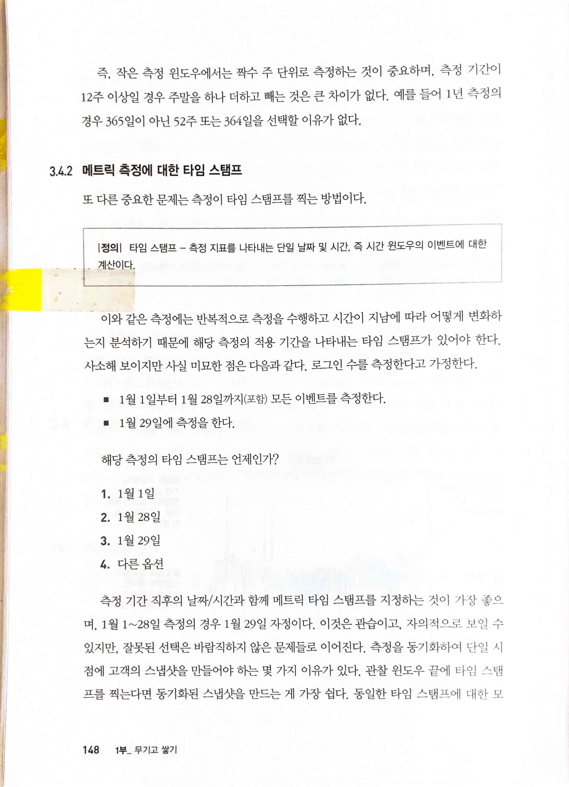

> `타임 스탬프` - 측정 지표를 나타내는 단일 날짜 및 시간, 즉 시간 윈도우의 이벤트에 대한 계산이다.
>
> 측정을 동기화하여 단일 시점에 고객의 스냅샷을 만들어야 하는 몇 가지 이유가 있다.

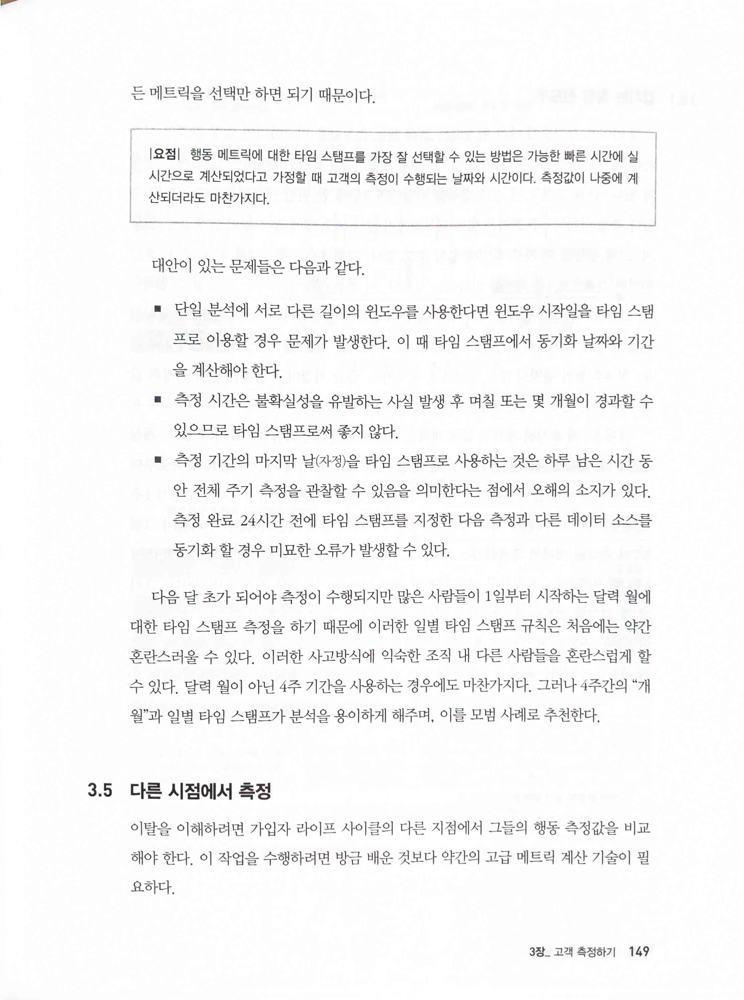

> 행동 메트릭에 대한 타임 스탬프를 가장 잘 선택할 수 있는 방법은 가능한 빠른 시간에 실시간으로 계산되었다고 가정할 때 고객의 측정이 수행되는 날짜와 시간이다. 측정값이 나중에 계산되더라도 마찬가지다.

## 4 갱신과 이탈 관찰
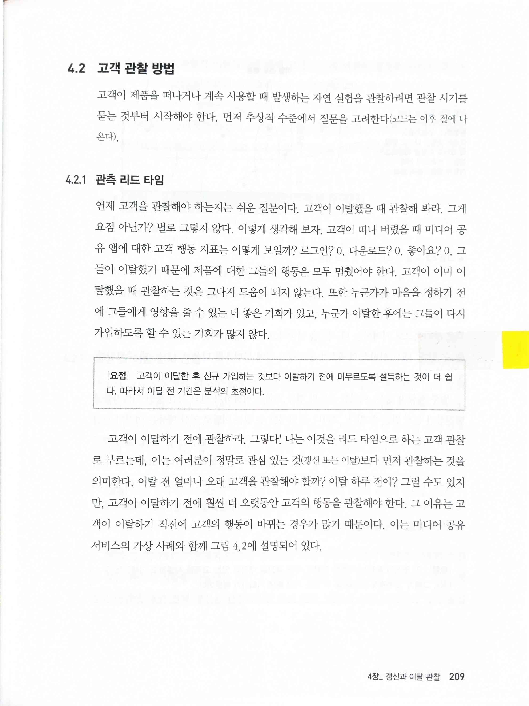

> 고객이 이탈한 후 신규 가입하는 것보다 이탈하기 전에 머무르도록 설득하는 것이 더 쉽다. 따라서 이탈 전 기간은 분석의 초점이다.

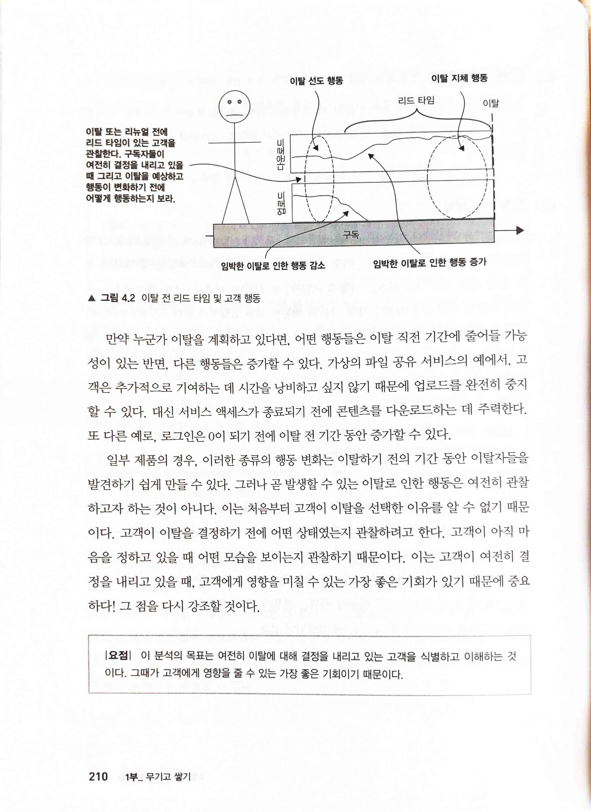

> ▲ 그림 4.2 이탈 전 리드 타임 및 고객 행동
>
> 이 분석의 목표는 여전히 이탈에 대해 결정을 내리고 있는 고객을 식별하고 이해하는 것이다. 그때가 고객에게 영향을 줄 수 있는 가장 좋은 기회이기 때문이다.

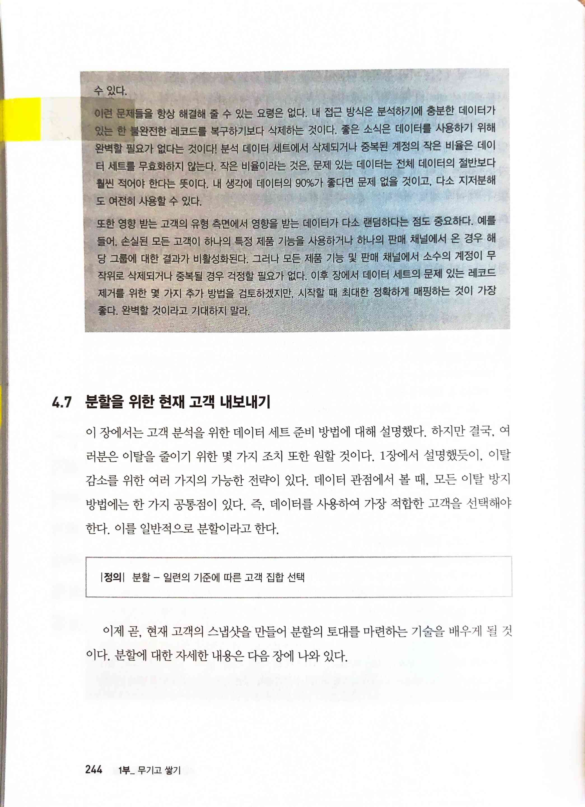

> 이런 문제들을 항상 해결해 줄 수 있는 요령은 없다. 내 접근 방식은 분석하기에 충분한 데이터가 있는 한 불완전한 레코드를 복구하기보다 삭제하는 것이다.
>
> `분할` - 일련의 기준에 따른 고객 집합 선택

# Part 2 전쟁 중

## 5 메트릭을 통한 이탈 및 행동 이해

## 6 고객 행동 사이의 관계

> 많은 고객의 행동은 서로 밀접하게 관련되어 있기 때문에, 이러한 행동에 근거한 메트릭은 이탈과 유사한 관계를 가지고 있다.

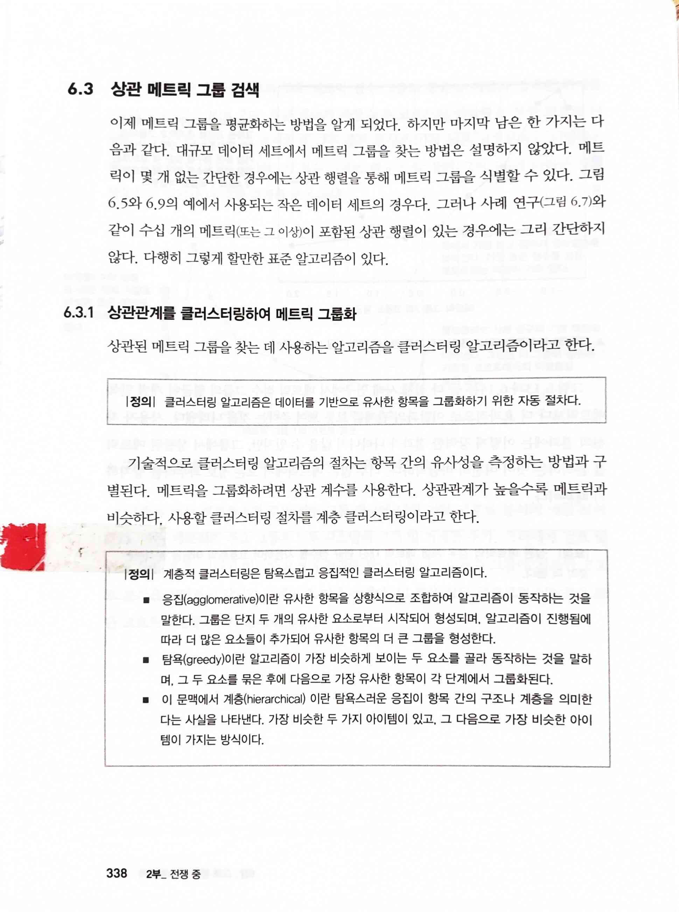

> 클러스터링 알고리즘은 데이터를 기반으로 유사한 항목을 그룹화하기 위한 자동 절차다.
>
> 계층적 클러스터링은 탐욕스럽고 응집적인 클러스터링 알고리즘이다.
>
> ■ 응집(agglomerative)이란 유사한 항목을 상향식으로 조합하여 알고리즘이 동작하는 것을 말한다. 그룹은 단지 두 개의 유사한 요소로부터 시작되어 형성되며, 알고리즘이 진행됨에 따라 더 많은 요소들이 추가되어 유사한 항목의 더 큰 그룹을 형성한다.
>
> ■ 탐욕(greedy)이란 알고리즘이 가장 비슷하게 보이는 두 요소를 골라 동작하는 것을 말하며, 그 두 요소를 묶은 후에 다음으로 가장 유사한 항목이 각 단계에서 그룹화된다.
>
> ■ 이 문맥에서 계층(hierarchical) 이란 탐욕스러운 응집이 항목 간의 구조나 계층을 의미한다는 사실을 나타낸다. 가장 비슷한 두 가지 아이템이 있고, 그 다음으로 가장 비슷한 아이템이 가지는 방식이다.

> 대규모 데이터 세트에 대한 계층적 클러스터링 및 상관관계 계산의 효율성

> 여러분의 업무는 가능한 한 많은 전문 용어로부터 동료들을 보호하는 것이다. 그러니 기술 용어로 그들을 감동시키려 하지 말고 공통 언어로 단순화하려고 노력하라.

## 7 고급 메트릭으로 고객 세분화
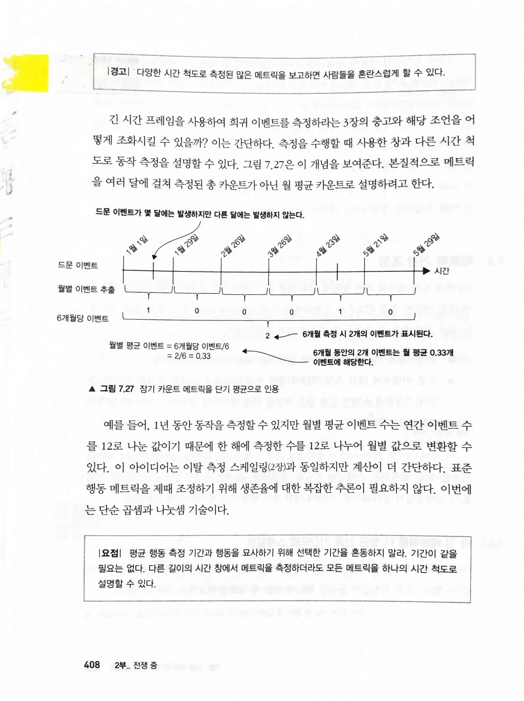

> 다양한 시간 척도로 측정된 많은 메트릭을 보고하면 사람들을 혼란스럽게 할 수 있다.
>
> 평균 행동 측정 기간과 행동을 묘사하기 위해 선택한 기간을 혼동하지 말라. 기간이 같을 필요는 없다. 다른 길이의 시간 창에서 메트릭을 측정하더라도 모든 메트릭을 하나의 시간 척도로 설명할 수 있다.

> 나는 비율 단위는 이해하기 쉬운데 곱셈 단위는 왜 그렇지 않은지를 설명하는 인지 연구를 발견하지 못했다. 그러나 그 사실은 모든 사람들의 경험으로 볼 때 명백하다. 이미 명확한 의미를 부여하는 비즈니스 사례가 있는 경우에만 곱셈 상호작용 메트릭을 사용할 것을 조언한다.
* 정확하게 이해한 건지 모르겠지만, 단위가 조합이 된 게 아니라 단일 단위로 쓰라는 걸로 생각했다

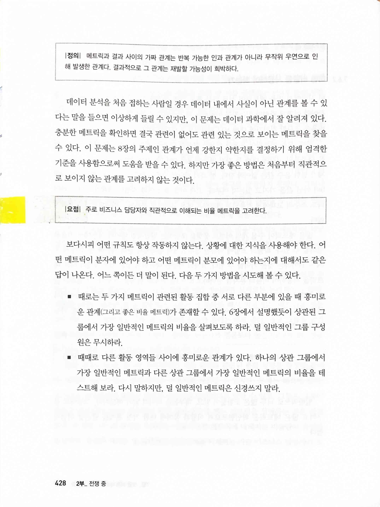

> 메트릭과 결과 사이의 가짜 관계는 반복 가능한 인과 관계가 아니라 무작위 우연으로 인해 발생한 관계다. 결과적으로 그 관계는 재발할 가능성이 희박하다.
>
> 주로 비즈니스 담당자와 직관적으로 이해되는 비율 메트릭을 고려한다.

## 8 이탈 예측
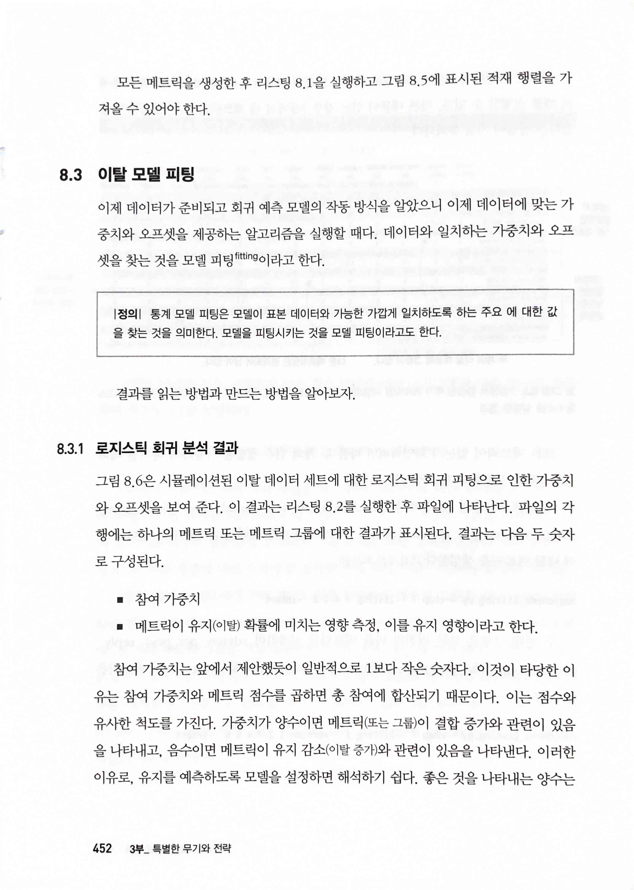

> 통계 모델 피팅은 모델이 표본 데이터와 가능한 가깝게 일치하도록 하는 주요 에 대한 값을 찾는 것을 의미한다. 모델을 피팅시키는 것을 모델 피팅이라고도 한다.

> 유지 확률 예측은 이탈 확률을 예측하는 것보다 해석하기가 더 쉬운데, 이는 숫자적 의미의 양의 가중치가 관여의 의미에서 양의 결과와 연관되기 때문이다.
>
> 메트릭 또는 메트릭 그룹의 유지 영향은 다른 모든 메트릭이 정확히 평균이라고 가정할 때 고객이 이 메트릭의 평균보다 1 표준 편차를 초과하는 유지 확률에 미치는 차이다.
>
> 메트릭이 유지 및 이탈 확률에 미치는 영향은 비즈니스 담당자에게 회귀 결과를 전달하는데 중요하다.

> 이탈 확률이 연간 기간 예측인 경우 고객의 예상수명은 1을 연 단위의 이탈 확률로 나눈 것이다.

## 9 예측 정확도와 머신러닝
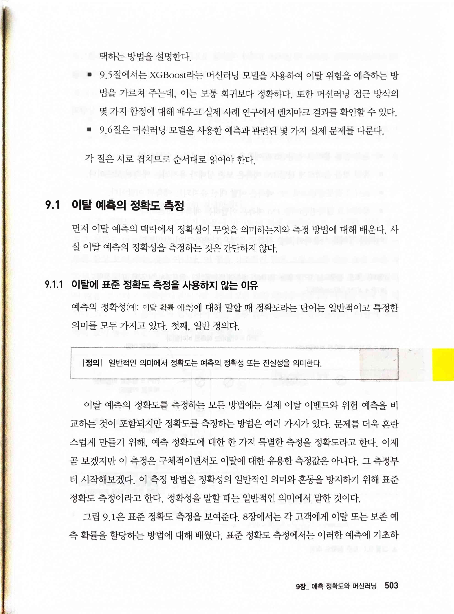

> 일반적인 의미에서 `정확도`는 예측의 정확성 또는 진실성을 의미한다.

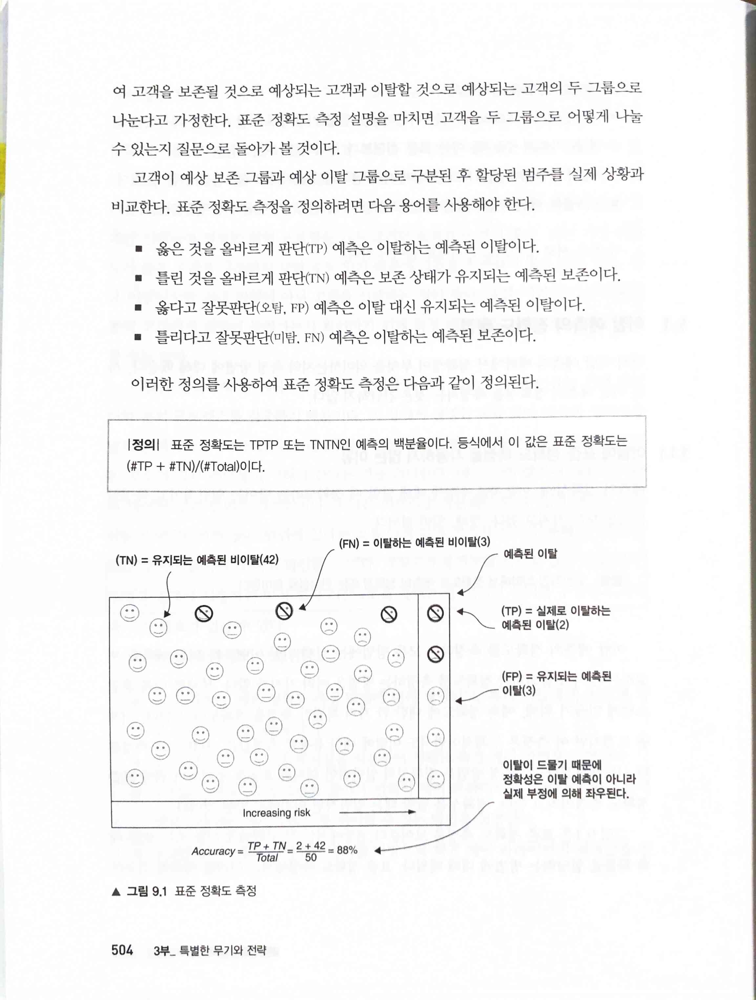

> ■ 옳은 것을 올바르게 판단(`TP`) 예측은 이탈하는 예측된 이탈이다.
>
> ■ 틀린 것을 올바르게 판단(`TN`) 예측은 보존 상태가 유지되는 예측된 보존이다.
>
> ■ 옳다고 잘못판단(오탐, `FP`) 예측은 이탈 대신 유지되는 예측된 이탈이다.
>
> ■ 틀리다고 잘못판단(미탐. `FN`) 예측은 이탈하는 예측된 보존이다.
>
> `표준 정확도`는 TPTP 또는 TNTN인 예측의 백분율이다. 등식에서 이 값은 표준 정확도는 (#TP + #TN)/(#Total)이다.

> ■ 이탈은 드물기 때문에 표준 정확도는 비이탈nonchurn 이 지배한다.
>
> ■ 표준 정확도 측정의 기본 가정은 고객을 예상 이탈과 예상 유지의 두 그룹으로 나눈다는 것이다. 그러나 이 분류는 고객 세분화 사용 사례를 설명하는 데 유용하지 않다.

> 이탈에 사용해야 하는 첫 번째 정확도 측정은 `곡선 아래의 영역AUC`이다. 여기서 곡선은 수신기 작동 곡선이라고 하는 분석 기법을 나타낸다. AUC는 메트릭이 계산되는 방식에 대한 기술적 설명이지만 무엇을 의미하는지 명확하게 전달하지 못하기 때문에 이 명칭은 유감스럽다. 하지만 모두가 이 이름을 사용하기 때문에 이 이름을 고수할 수 밖에 없다.

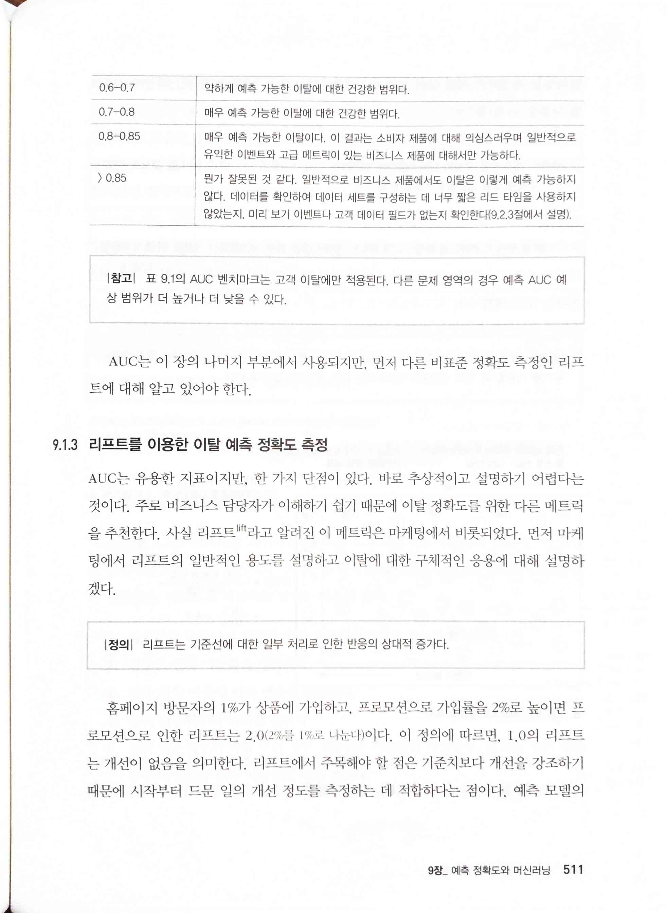

> AUC는 유용한 지표이지만, 한 가지 단점이 있다. 바로 추상적이고 설명하기 어렵다는 것이다. 주로 비즈니스 담당자가 이해하기 쉽기 때문에 이탈 정확도를 위한 다른 메트릭을 추천한다. 사실 리프트lift라고 알려진 이 메트릭은 마케팅에서 비롯되었다. 먼저 마케팅에서 리프트의 일반적인 용도를 설명하고 이탈에 대한 구체적인 응용에 대해 설명하겠다.
>
> `리프트`는 기준선에 대한 일부 처리로 인한 반응의 상대적 증가다.

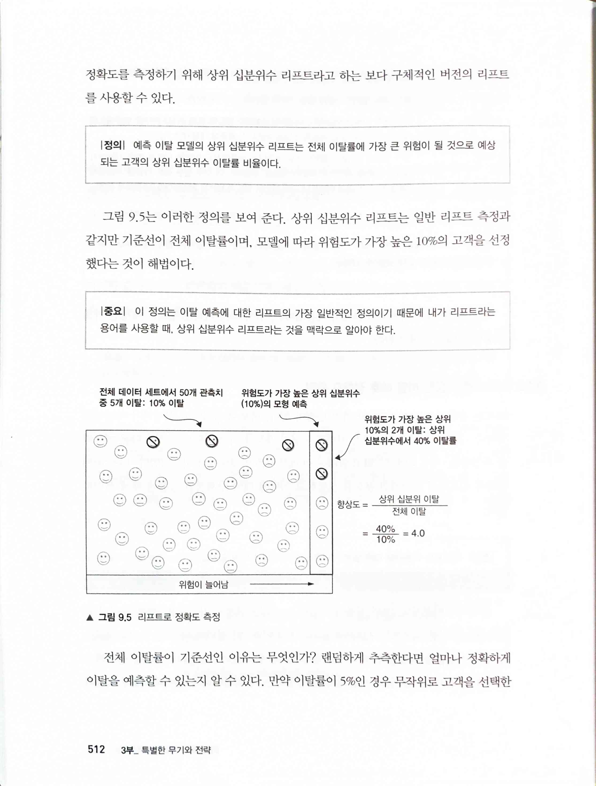

> 예측 이탈 모델의 상위 십분위수 리프트는 전체 이탈률에 가장 큰 위험이 될 것으로 예상되는 고객의 상위 십분위수 이탈률 비율이다.

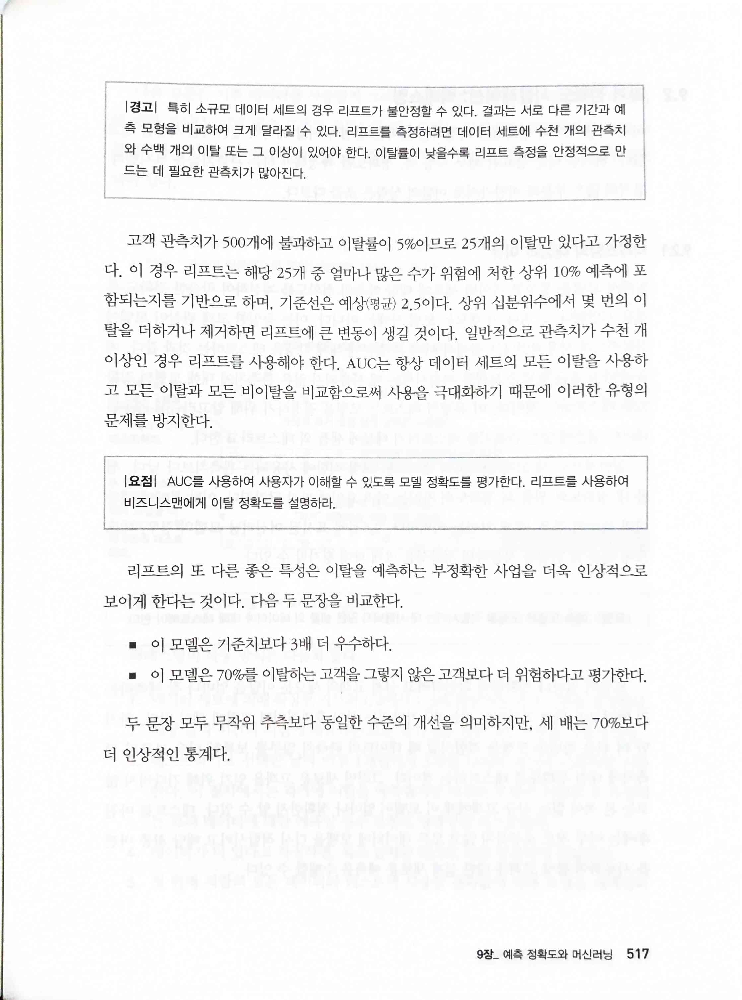

> AUC를 사용하여 사용자가 이해할 수 있도록 모델 정확도를 평가한다. 리프트를 사용하여 비즈니스맨에게 이탈 정확도를 설명하라.

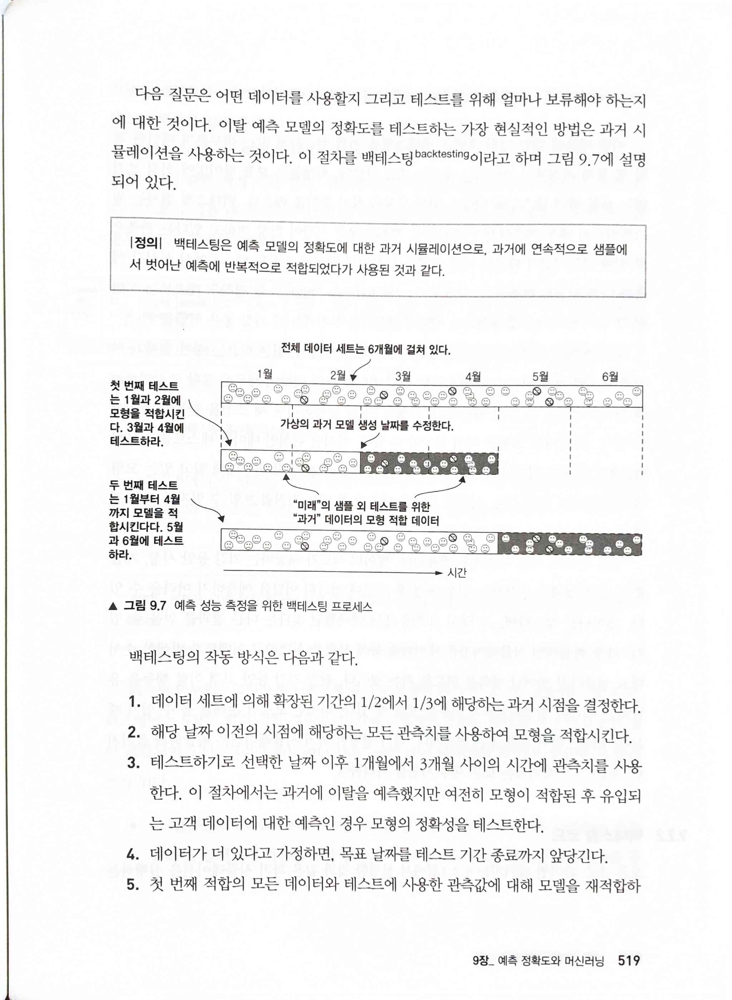

> `백테스팅 backtesting`은 예측 모델의 정확도에 대한 과거 시뮬레이션으로, 과거에 연속적으로 샘플서 벗어난 예측에 반복적으로 적합되었다가 사용된 것과 같다.

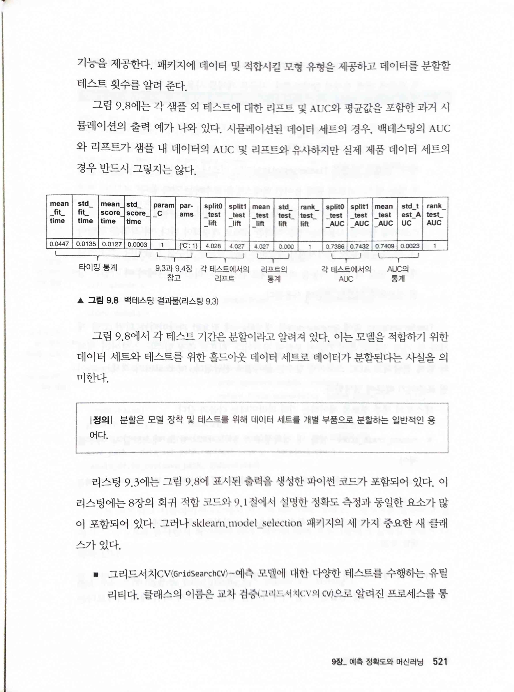

> 분할은 모델 장착 및 테스트를 위해 데이터 세트를 개별 부품으로 분할하는 일반적인 용어다.

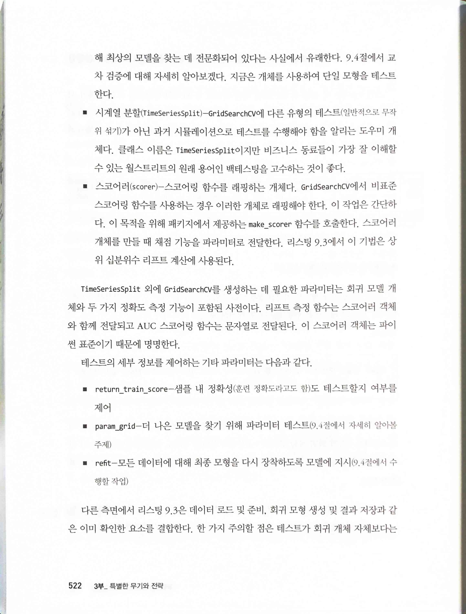

> sklearn.model selection 패키지의 세 가지 중요한 새 클래스가 있다.
>
> ■ 그리드서치CV(GridSearchCV)-예측 모델에 대한 다양한 테스트를 수행하는 유틸리티
>
> ■ 시계열 분할(TimeseriesSplit)-GridSearchcv에 다른 유형의 테스트(일반적으로 무작위 섞기가 아닌 과거 시뮬레이션으로 테스트를 수행해야 함을 알리는 도우미 개체
>
> ■ 스코어러(scorer)-스코어링 함수를 래핑하는 개체

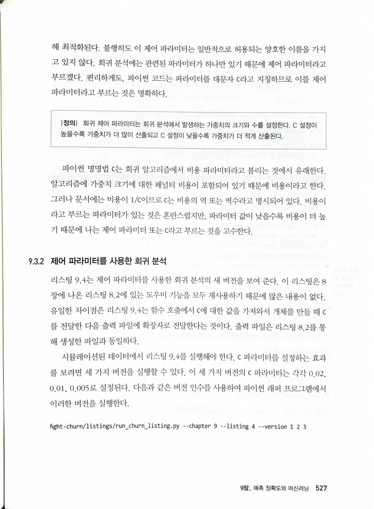

> 회귀 제어 파라미터는 회귀 분석에서 발생하는 가중치의 크기와 수를 설정한다. C 설정이 높을수록 가중치가 더 많이 산출되고 C 설정이 낮을수록 가중치가 더 적게 산출된다.

## 10 이탈 인구 통계 및 기업 통계

## 11 이탈과의 싸움 주도

> 비즈니스와의 상호작용에서 가장 중요한 결과는 비즈니스 담당자가 측정 기준을 사용하여 간단한 기준으로 고객 상태를 평가하도록 하는 것이다.

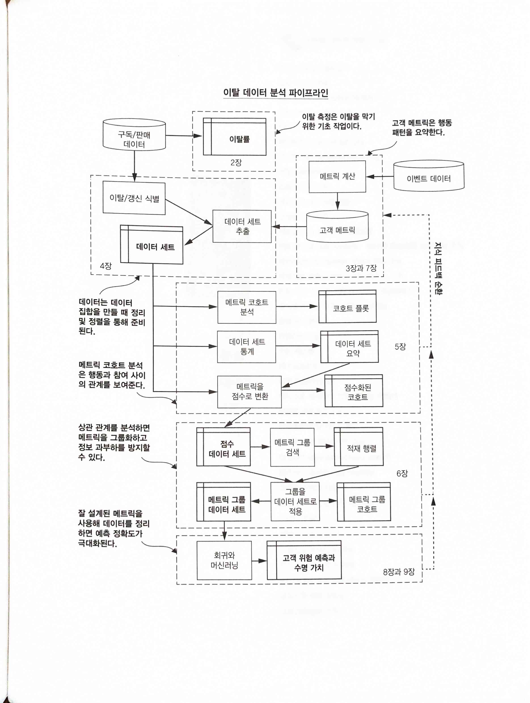

> 이탈 데이터 분석 파이프라인
