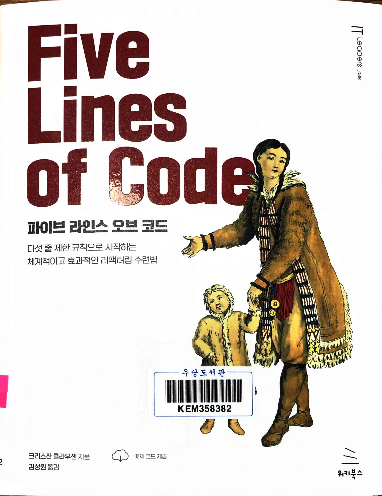
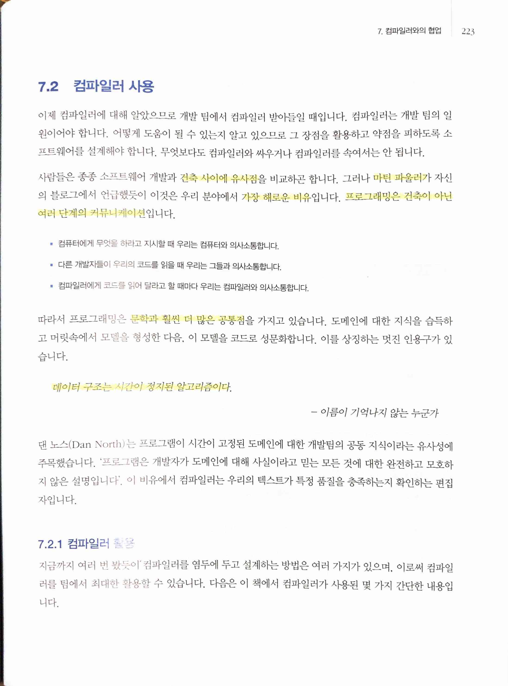
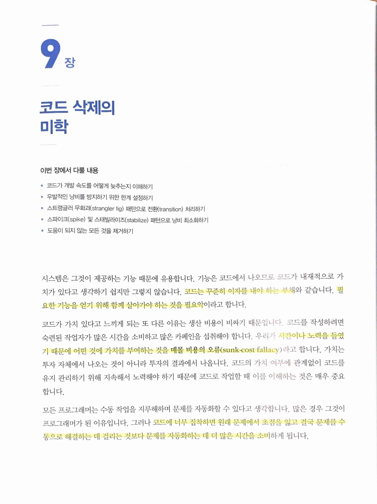
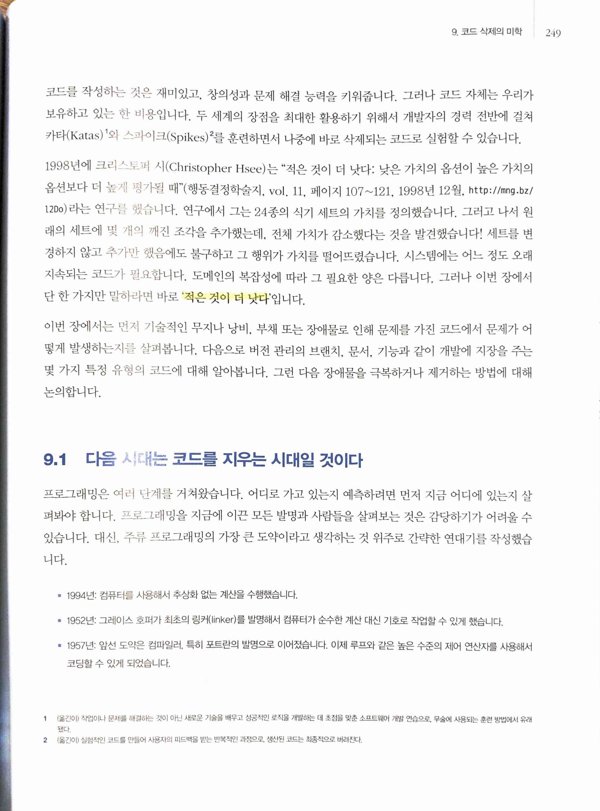
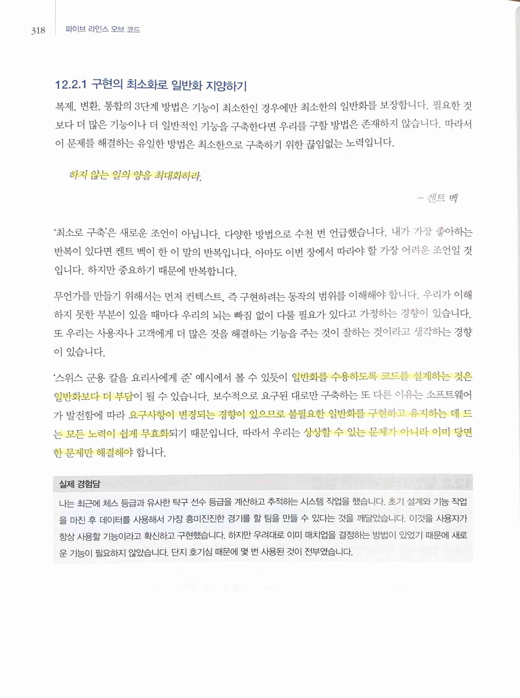
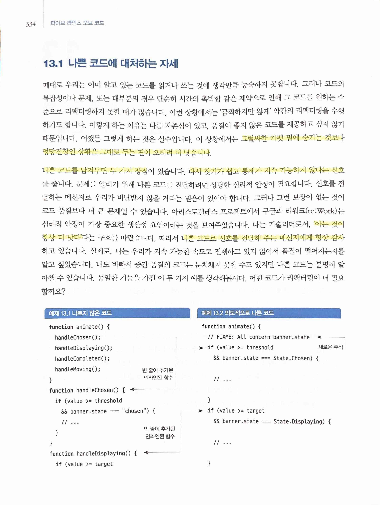
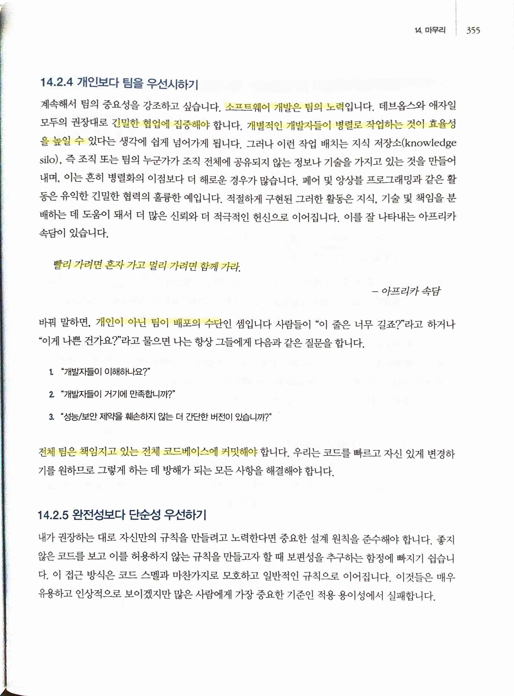
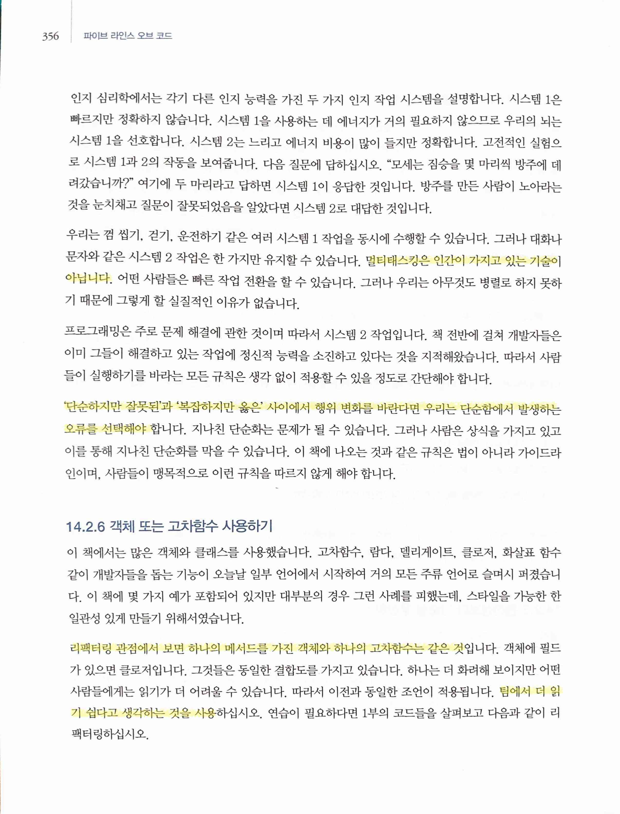

Five Lines of Code
==================

> 건축 사이에 유사점... 마틴 파울러... 가장 해로운 비유... 프로그래밍은 건축이 아닌여러 단계의 커뮤니케이션
>
> 프로그래밍은 문학과 훨씬 더 많은 공통점
>
> `데이터 구조는 시간이 정지된 알고리즘이다.`

> 코드는 꾸준히 이자를 내야 하는 부채... 필요한 기능을 얻기 위해 함께 살아가야 하는 것을 필요악
>
> 시간이나 노력을 들였기 때문에 어떤 것에 가치를 부여하는 것을 `매몰 비용의 오류(sunk-cost fallacy)`
>
> 코드에 너무 집착하면 원래 문제에서 초점을 잃고 결국 문제를 수동으로 해결하는 데 걸리는 것보다 문제를 자동화하는 데 더 많은 시간을 소비

> `적은 것이 더 낫다`
* [Less is better: when low‐value options are valued more highly than high‐value options - Hsee - 1998 - Journal of Behavioral Decision Making - Wiley Online Library](https://onlinelibrary.wiley.com/doi/10.1002/(SICI)1099-0771(199806)11:2%3C107::AID-BDM292%3E3.0.CO;2-Y)

> 해결책은 개발자에게 모범 사례를 건너뛸 기회가 전혀 없게 하는 것... 개발자에게는 관행이 있으며 압박을 받더라도 이를 고수해야 합니다.
* 현실에서는 이걸 고수하는게 정말 쉽지 않다. 심지어 소위 회사의 CTO라는 사람이 이걸 못하게 하는 경우도 있다.
> 기술 부채는 일시적으로 차선의 해결책을 선택해서 이익을 얻는 것... 중요한 것은 일시적
>
> `기술적 장애물(Technical drag)`은 개발을 더디게 만드는 모든 것

> `하지 않는 일의 양을 최대화하라.` - 켄트 벡
>
> 일반화를 수용하도록 코드를 설계하는 것은 일반화보다 더 부담... 요구사항이 변경되는 경향이 있으므로 불필요한 일반화를 구현하고 유지하는 데 드는 모든 노력이 쉽게 무효화... 상상할 수 있는 문제가 아니라 이미 당면한 문제만 해결해야
* 그래서 적정 기술이 필요

> 그럴싸한 카펫 밑에 숨기는 것보다 엉망진창인 상황을 그대로 두는 편이 오히려 더 낫습니다.
>
> 나쁜 코드를 남겨두면 두 가지 장점. 다시 찾기가 쉽고 통제가 지속 가능하지 않다는 신호... '아는 것이 항상 더 낫다'... 나쁜 코드로 신호를 전달해 주는 메신저에게 항상 감사
* 문제는 신호를 보고도 거부하는 경우. 일부러 외면하는 사람/조직이 있다.

> 소프트웨어 개발은 팀의 노력... 긴밀한 협업에 집중해야... 개별적인 개발자들이 병렬로 작업하는 것이 효율성을 높일 수 있다는 생각에 쉽게 넘어가게 됩니다.
>
> `빨리 가려면 혼자 가고 멀리 가려면 함께 가라.` - 아프리카 속담
>
> 개인이 아닌 팀이 배포의 수단
>
> 전체 팀은 책임지고 있는 전체 코드베이스에 커밋해야

> 멀티태스킹은 인간이 가지고 있는 기술이 아닙니다.
>
> '단순하지만 잘못된'과 '복잡하지만 옳은' 사이에서 행위 변화를 바란다면 우리는 단순함에서 발생하는 오류를 선택해야 합니다.
>
> 리팩터링 관점에서 보면 하나의 메서드를 가진 객체와 하나의 고차함수는 같은 것... 팀에서 더 읽기 쉽다고 생각하는 것을 사용