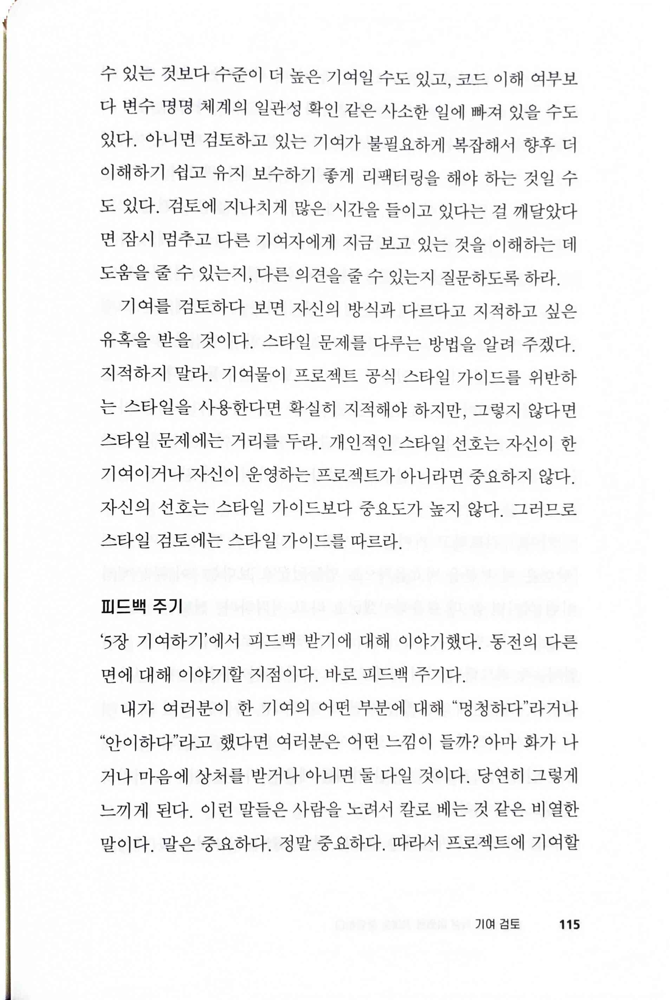
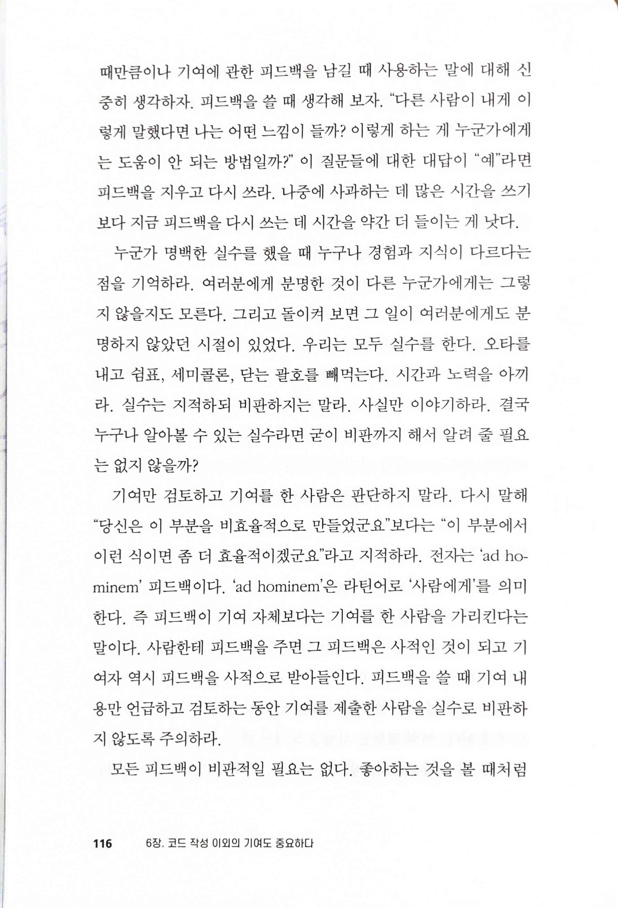
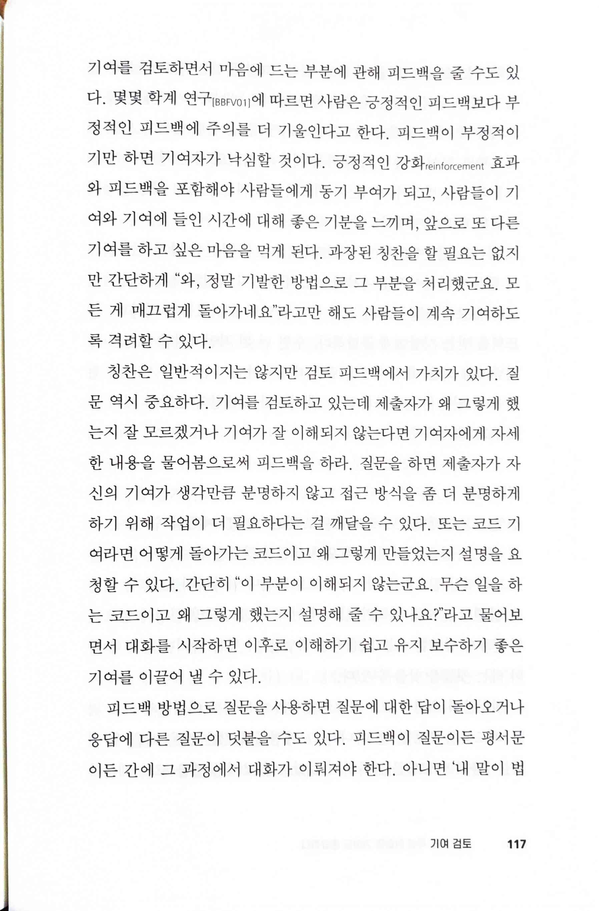
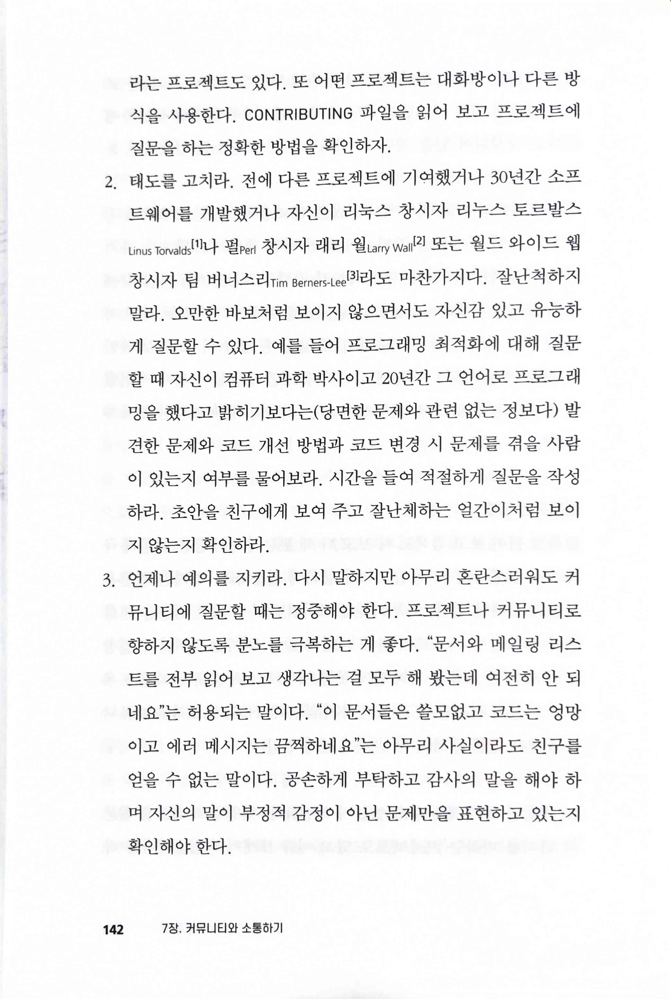
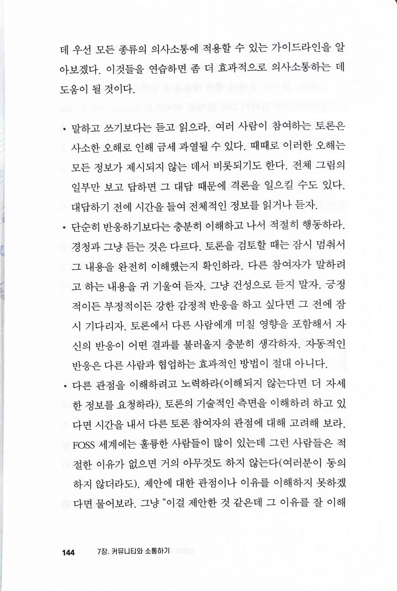
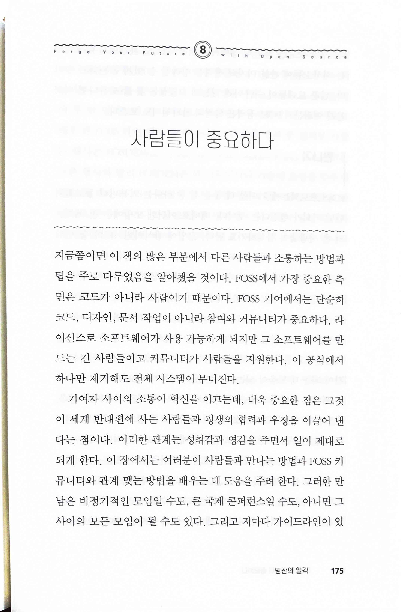
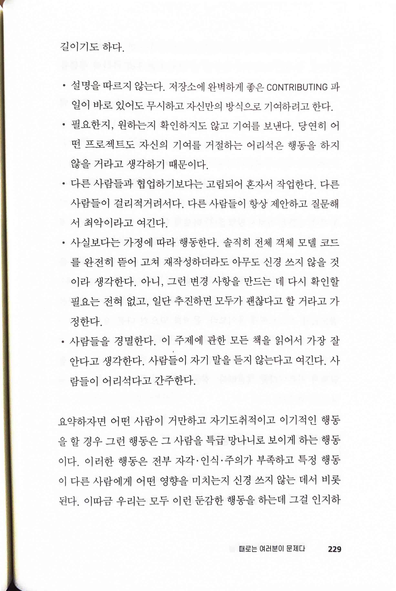
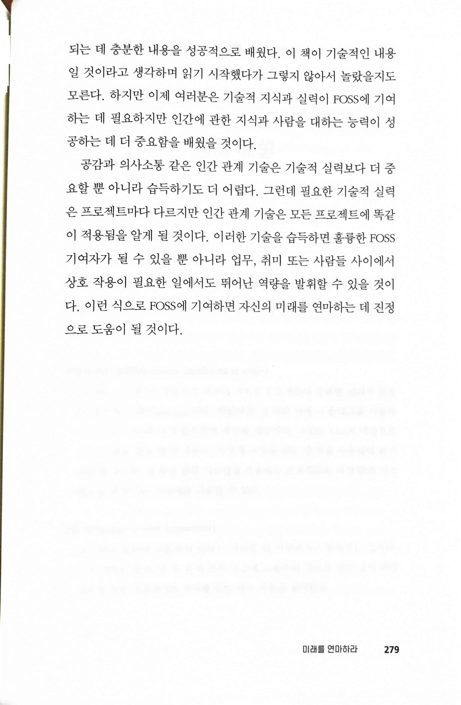

# 오픈소스로 미래를 연마하라 Forge Your Future with Open Source

* [Forge Your Future with Open Source: Build Your Skills. Build Your Network. Build the Future of Technology. by VM (Vicky) Brasseur](https://pragprog.com/titles/vbopens/forge-your-future-with-open-source/)

> 기여만 검토하고 기여를 한 사람은 판단하지 말라.

> 사람은 긍정적인 피드백보다 부정적인 피드백에 주의를 더 기울인다
>
> 피드백이 질문이든 평서문이든 간에 그 과정에서 대화가 이뤄져야 한다.

> 2. 태도를 고치라.
>
> 3. 언제나 예의를 지키라.

> • 말하고 쓰기보다는 듣고 읽으라.
>
> • 단순히 반응하기보다는 충분히 이해하고 나서 적절히 행동하라. 경청과 그냥 듣는 것은 다르다.
>
> • 다른 관점을 이해하려고 노력하라(이해되지 않는다면 더 자세한 정보를 요청하라).

> 사람들이 중요하다

> 공감과 의사소통 같은 인간 관계 기술은 기술적 실력보다 더 중요할 뿐 아니라 습득하기도 더 어렵다. 그런데 필요한 기술적 실력은 프로젝트마다 다르지만 인간 관계 기술은 모든 프로젝트에 똑같이 적용됨을 알게 될 것이다.