코딩의 미래
===========

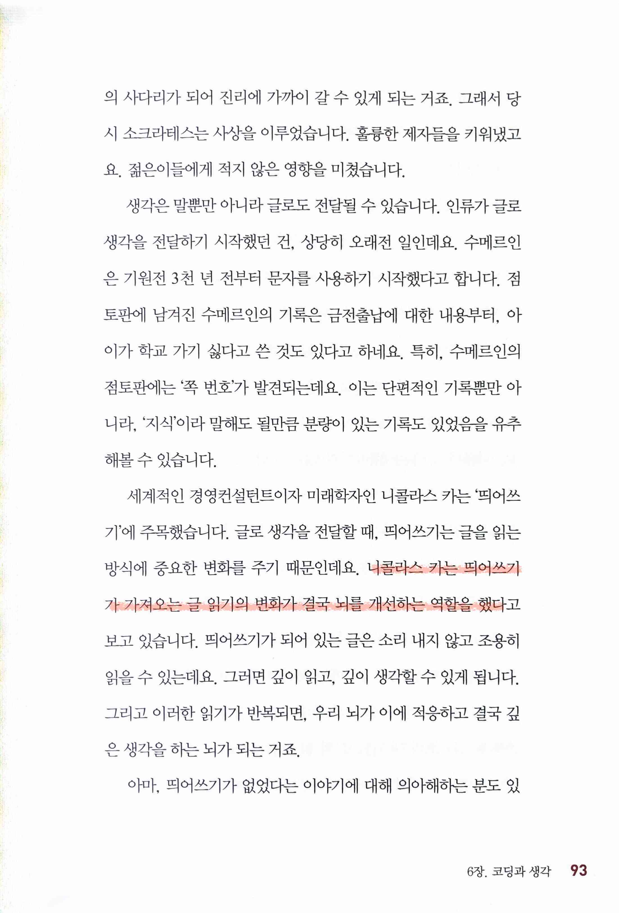 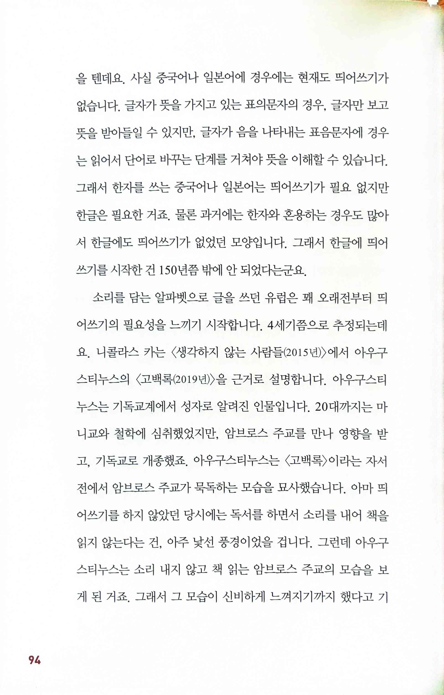

> 세계적인 경영컨설턴트이자 미래학자인 니콜라스카는 '띄어쓰기'에 주목했습니다. 글로 생각을 전달할 때, 띄어쓰기는 글을 읽는 방식에 중요한 변화를 주기 때문인데요. 니콜라스 카는 띄어쓰기가 가져오는 글 읽기의 변화가 결국 뇌를 개선하는 역할을 했다고 보고 있습니다.
* 바로 뒤에서 이야기하지만 중국어나 일본어도 그렇고 띄어쓰기가 이런 지적인 발전에 연결된다는 건 바로 와닿지는 않음. 버마어도 띄어쓰기가 없으며 띄어쓰기가 단어 기준이 아닌 베트남어도 있기도 하기 때문에 아마 서구 중심의 시각으로 이야기하는게 아닐까 싶음
  * [orthography - Is there a long list of languages whose writing systems don't use spaces? - Linguistics Stack Exchange](https://linguistics.stackexchange.com/questions/6131/is-there-a-long-list-of-languages-whose-writing-systems-dont-use-spaces)

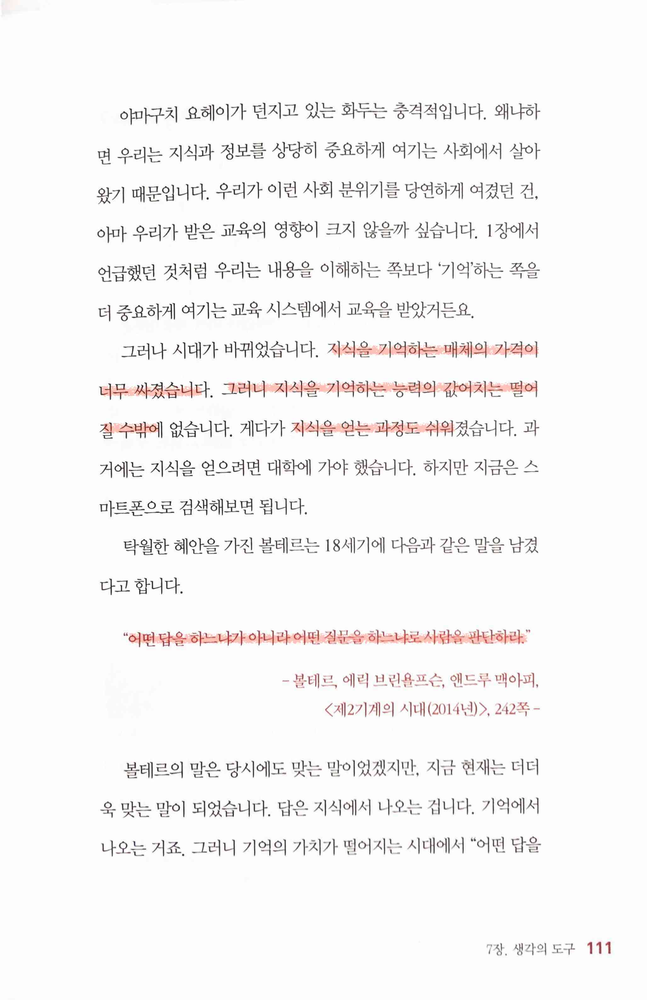

> 지식을 기억하는 매체의 가격이 너무 싸졌습니다. 그러니 지식을 기억하는 능력의 값어치는 떨어질 수밖에 없습니다. 게다가 지식을 얻는 과정도 쉬워졌습니다. 과거에는 지식을 얻으려면 대학에 가야 했습니다. 하지만 지금은 스마트폰으로 검색해보면 됩니다.
>
> 볼테르 "어떤 답을 하느냐가 아니라 어떤 질문을 하느냐로 사람을 판단하라."
* [Questioning Popular Answers to Pressing Problems - The Atlantic](https://www.theatlantic.com/personal/archive/2016/03/answers-questioned/624740/)

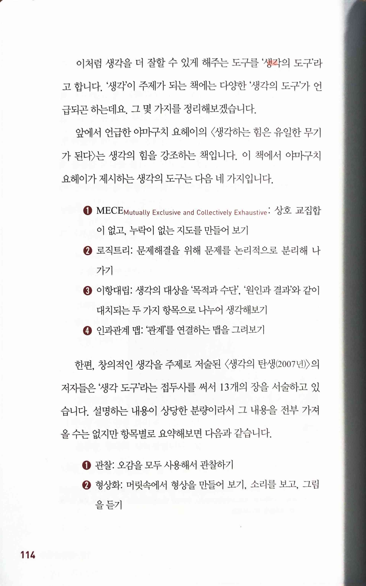

> 야마구치 요헤이가 제시하는 생각의 도구
>
> 1. MECE Mutually Exclusive and Collectively Exhaustive: 상호 교집합이 없고, 누락이 없는 지도를 만들어 보기
>
> 2. 로직트리: 문제해결을 위해 문제를 논리적으로 분리해 나가기
>
> 3. 이항대립: 생각의 대상을 목적과 수단', '원인과 결과'와 같이 대치되는 두 가지 항목으로 나누어 생각해보기
>
> 4. 인과관계 맵: '관계'를 연결하는 맵을 그려보기

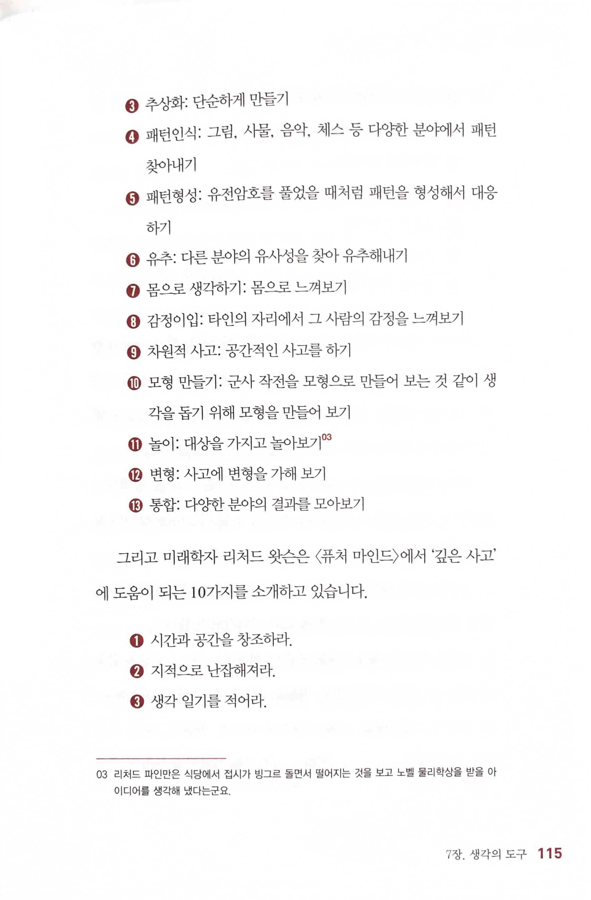

> <생각의 탄생(2007년)>
>
> 1. 관찰: 오감을 모두 사용해서 관찰하기
>
> 2. 형상화: 머릿속에서 형상을 만들어 보기, 소리를 보고, 그림을 듣기
>
> 3. 추상화: 단순하게 만들기
>
> 4. 패턴인식: 그림, 사물, 음악, 체스 등 다양한 분야에서 패턴 찾아내기
>
> 5. 패턴형성: 유전암호를 풀었을 때처럼 패턴을 형성해서 대응하기
>
> 6. 유추: 다른 분야의 유사성을 찾아 유추해내기
>
> 7. 몸으로 생각하기: 몸으로 느껴보기
>
> 8. 감정이입: 타인의 자리에서 그 사람의 감정을 느껴보기
>
> 9. 차원적 사고: 공간적인 사고를 하기
>
> 10. 모형 만들기 : 군사 작전을 모형으로 만들어 보는 것 같이 생각을 돕기 위해 모형을 만들어 보기
>
> 11. 놀이 : 대상을 가지고 놀아보기
>
> 12. 변형: 사고에 변형을 가해 보기
>
> 13. 통합: 다양한 분야의 결과를 모아보기

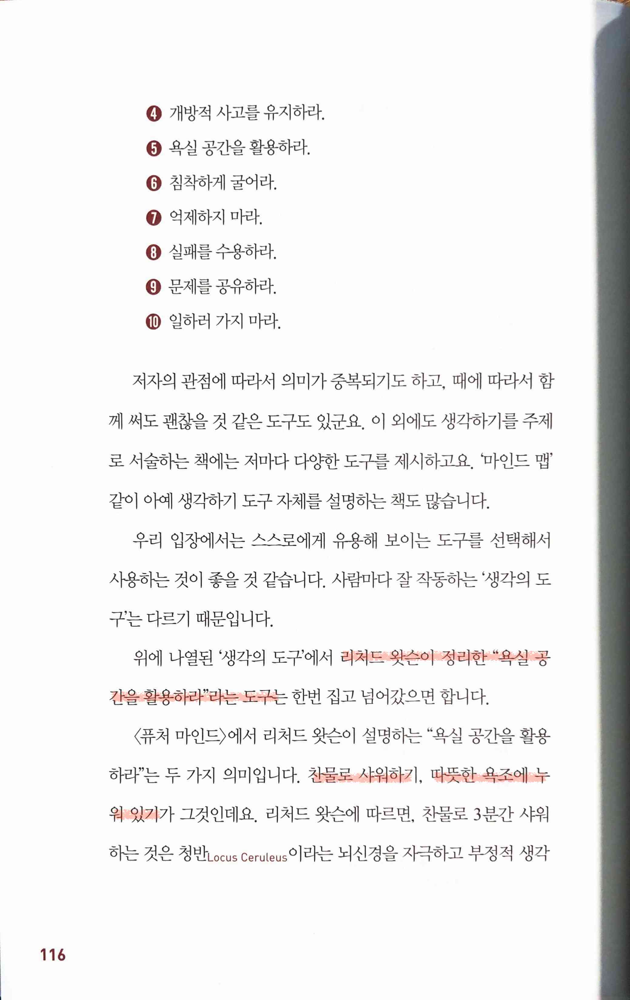

> 미래학자 리처드 왓슨은 <퓨처 마인드>에서 '깊은 사고'에 도움이 되는 10가지
>
> 1. 시간과 공간을 창조하라
>
> 2. 지적으로 난잡해져라
>
> 3. 생각 일기를 적어라.
>
> 4. 개방적 사고를 유지하라.
>
> 5. 욕실 공간을 활용하라.
>
> 6. 침착하게 굴어라.
>
> 7. 억제하지 마라.
>
> 8. 실패를 수용하라.
>
> 9. 문제를 공유하라.
>
> 10. 일하러 가지 마라.
>
> <퓨처 마인드>에서 리처드 왓슨이 설명하는 욕실 공간을 활용하라"는 두 가지 의미입니다. 찬물로 샤워하기, 따뜻한 욕조에 누워 있기가

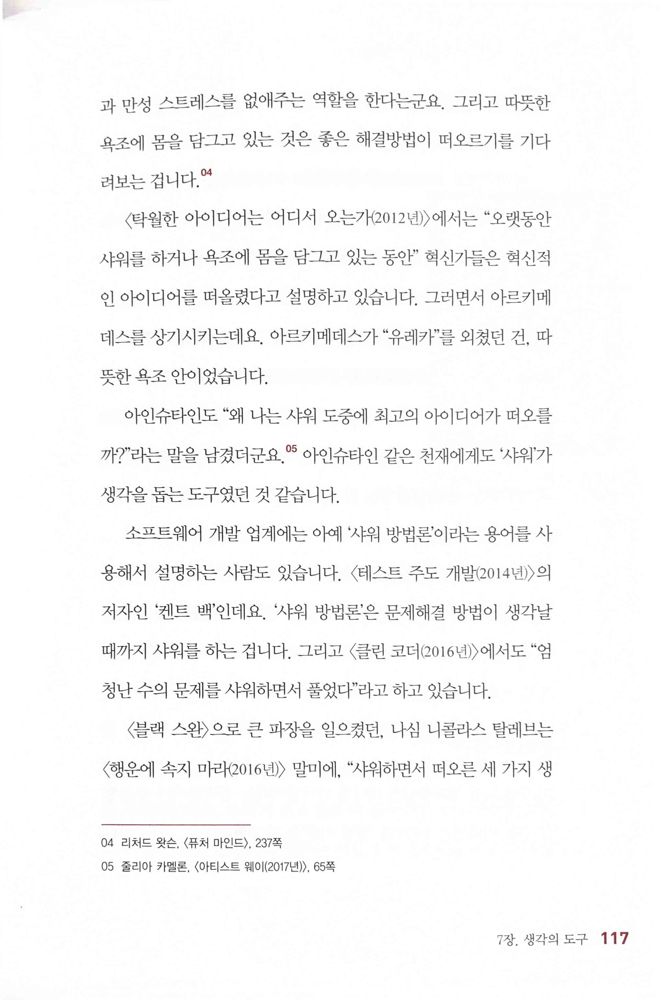

> <탁월한 아이디어는 어디서 오는가(2012년)>에서는 "오랫동안 샤워를 하거나 욕조에 몸을 담그고 있는 동안 혁신가들은 혁신적인 아이디어를 떠올렸다고 설명

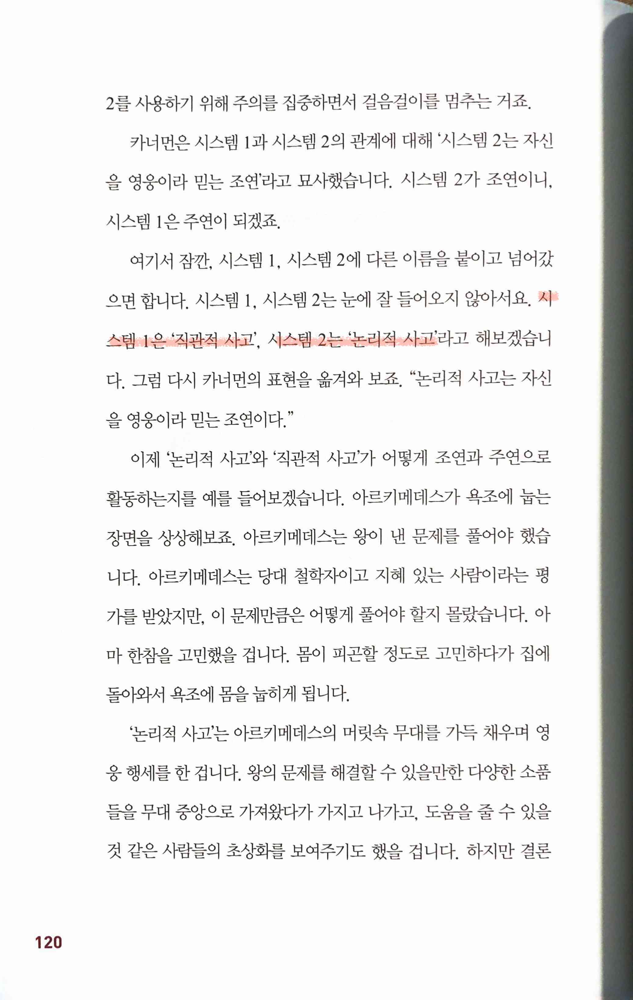

> `시스템 1`은 '직관적 사고', `시스템 2`는 '논리적 사고'라고 해보겠습니다. 그럼 다시 카너먼의 표현을 옮겨와 보죠. "논리적 사고는 자신을 영웅이라 믿는 조연이다."
* [2가지의 사고 모드 (시스템 1, 시스템 2). 인간의 뇌는 자동적이고 처리가 빠른 “시스템 1”과 의식적이고 처리가… | by UX DAYS SEOUL | Medium](https://medium.com/@uxdaysseoul/2%EA%B0%80%EC%A7%80%EC%9D%98-%EC%82%AC%EA%B3%A0-%EB%AA%A8%EB%93%9C-%EC%8B%9C%EC%8A%A4%ED%85%9C-1-%EC%8B%9C%EC%8A%A4%ED%85%9C-2-b22a752163ef)

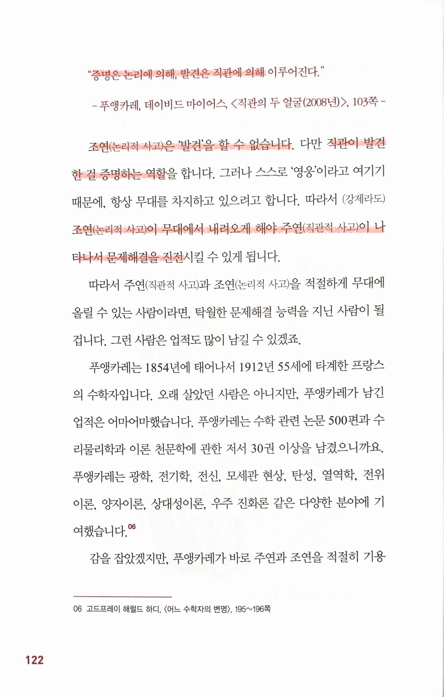 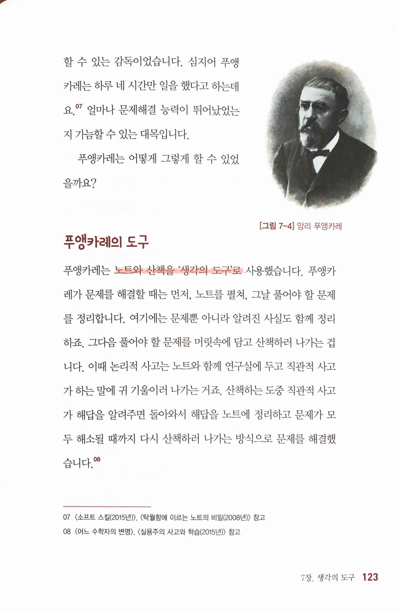

> "증명은 논리에 의해 발견은 직관에 의해 이루어진다."
>
> -푸앵카레, 데이비드 마이어스 <직관의 두 얼굴(2008년)>, 103쪽
>
> 조연(논리적 사고)은 '발견'을 할 수 없습니다. 다만 직관이 발견한 걸 증명하는 역할을 합니다. 그러나 스스로 '영웅'이라고 여기기 때문에, 항상 무대를 차지하고 있으려고 합니다. 따라서 (강제라도) 조연(논리적 사고)이 무대에서 내려오게 해야 주연(직관적 사고)이 나타나서 문제해결을 진전시킬 수 있게 됩니다.
>
> 푸앵카레는 노트와 산책을 '생각의 도구'로 사용

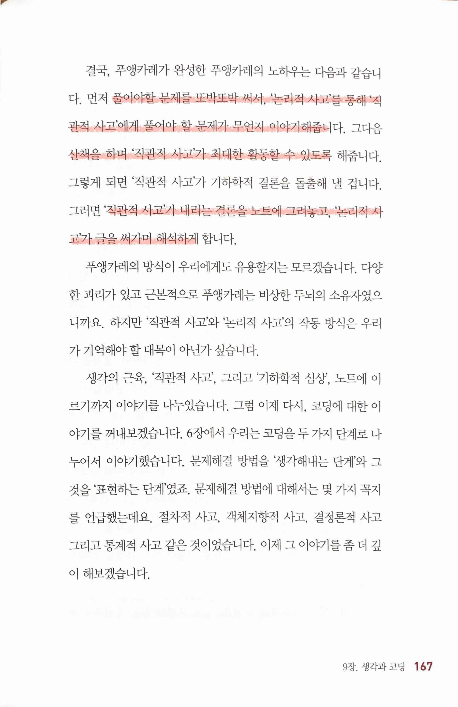

> 먼저 풀어야할 문제를 또박또박 써서, '논리적 사고'를 통해 '직관적 사고'에게 풀어야 할 문제가 무언지 이야기해줍니다. 그다음 산책을 하며 '직관적 사고'가 최대한 활동할 수 있도록 해줍니다.그렇게 되면 '직관적 사고'가 기하학적 결론을 돌출해 낼 겁니다. 그러면 '직관적 사고'가 내리는 결론을 노트에 그려놓고 '논리적 사고'가 글을 써가며 해석하게 합니다.

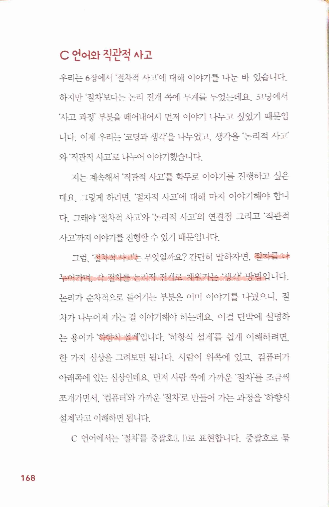 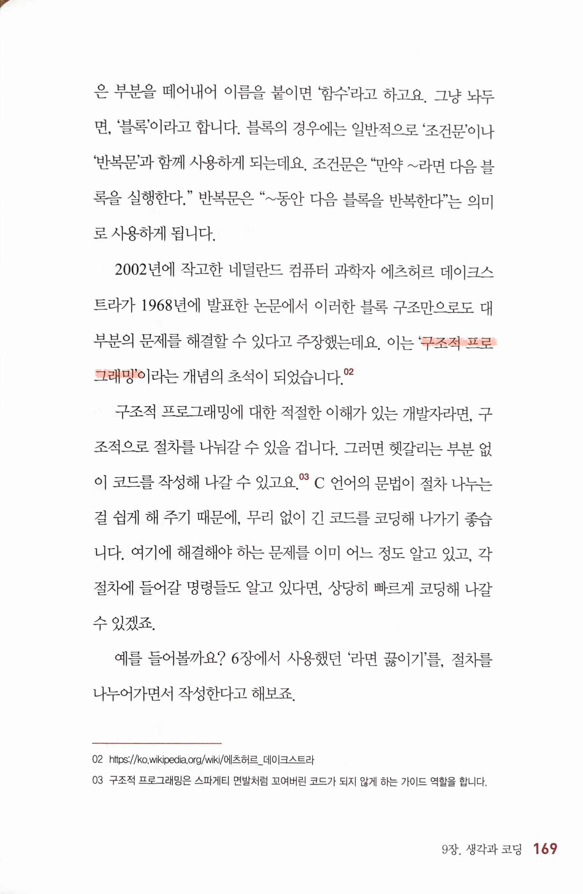

> '절차적 사고는 무엇일까요? 간단히 말하자면, 절차를 나누어가며, 각 절차를 논리적 전개로 채워가는 '생각' 방법입니다.
>
> 하향식 설계
>
> 구조적 프로그래밍

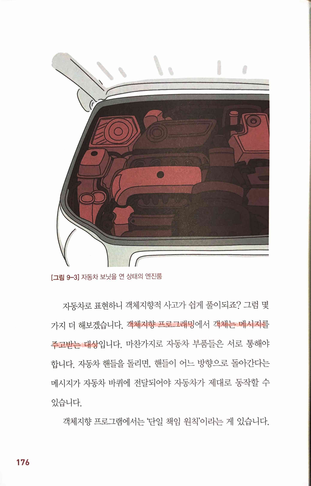 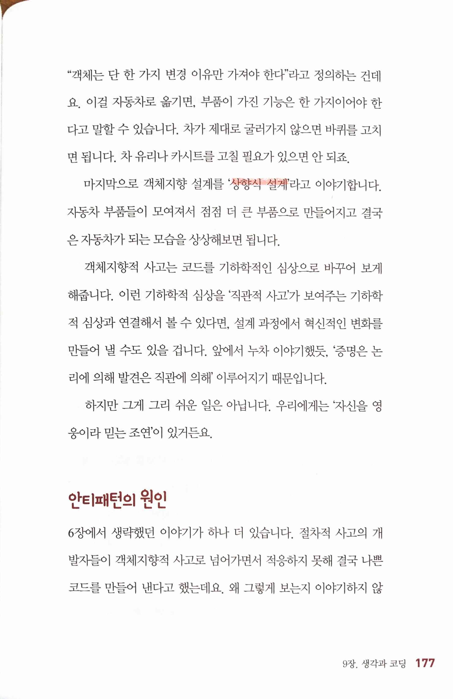

> 객체지향 프로그래밍에서 객체는 메시지를 주고받는 대상입니다.
>
> 상향식 설계

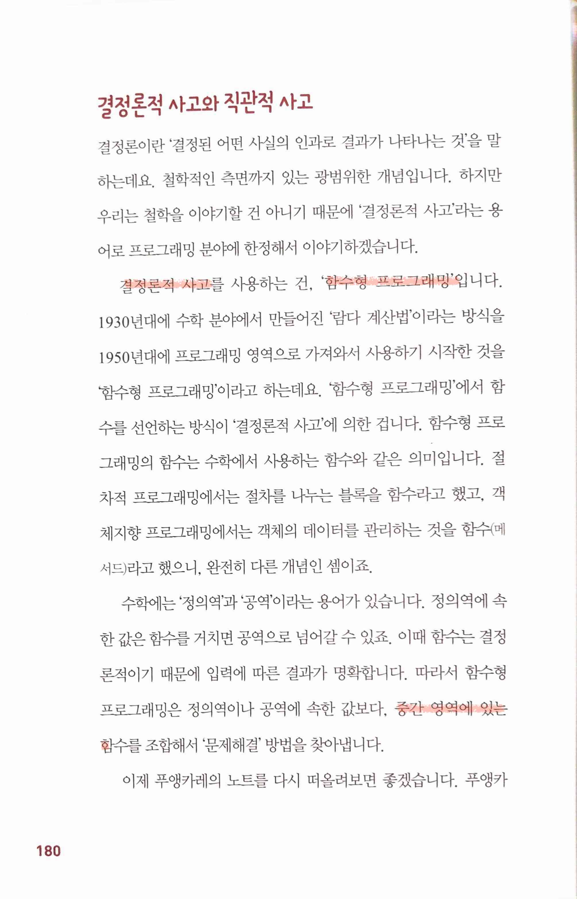 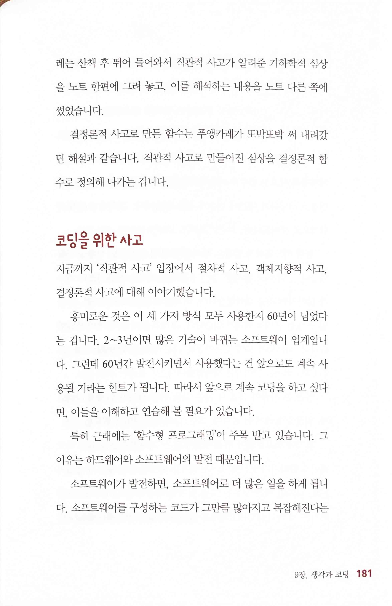

> 결정론이란 '결정된 어떤 사실의 인과로 결과가 나타나는 것'
>
> 결정론적 사고를 사용하는 건, '함수형 프로그래밍'
>
> 함수형 프로그래밍은 정의역이나 공역에 속한 값보다 중간 영역에 있는 함수를 조합해서 '문제해결' 방법을 찾아냅니다.

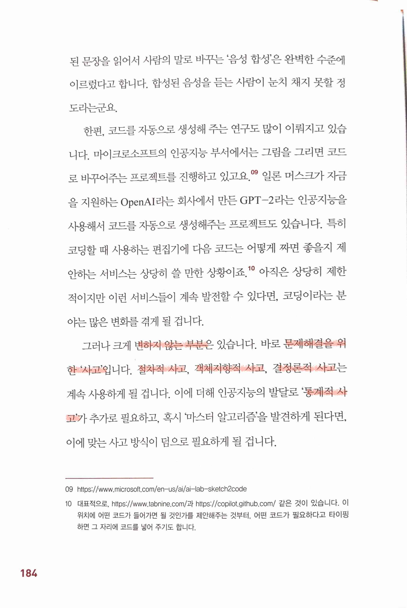 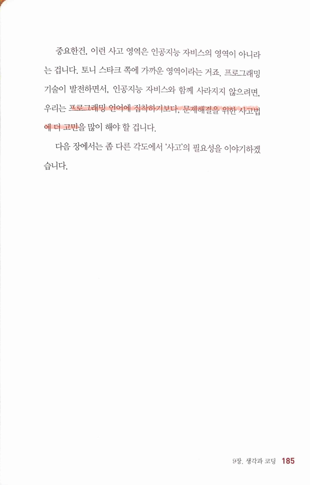

> 그러나 크게 변하지 않는 부분은 있습니다. 바로 문제해결을 위한 '사고'입니다. 절차적 사고, 객체지향적 사고, 결정론적 사고는 계속 사용하게 될 겁니다. 이에 더해 인공지능의 발달로 '통계적 사고'가 추가로 필요하고, 혹시 '마스터 알고리즘'을 발견하게 된다면, 이에 맞는 사고 방식이 덤으로 필요하게 될 겁니다.
>
> 우리는 프로그래밍 언어에 집착하기보다, 문제해결을 위한 사고법에 더 고민을 많이 해야 할 겁니다.

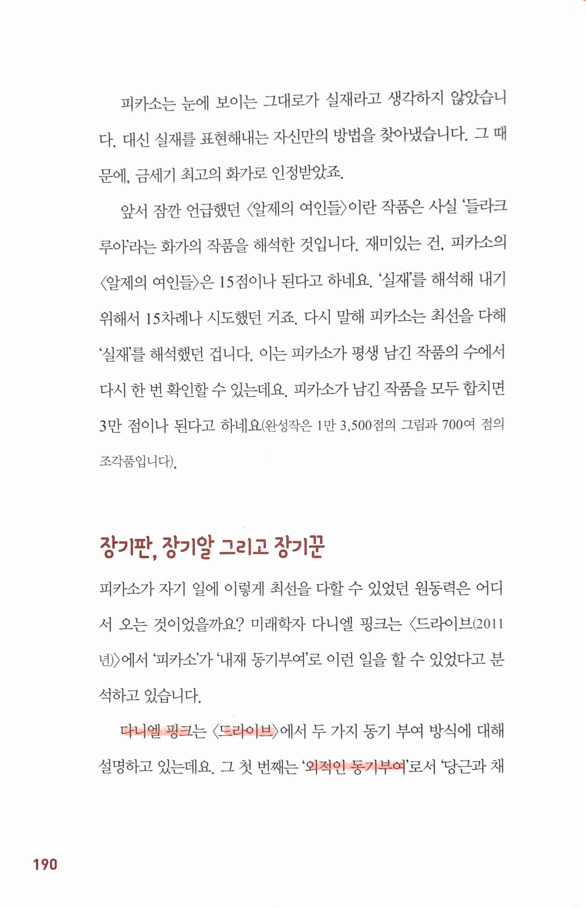 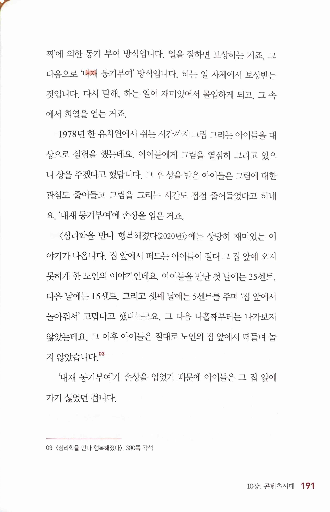

> 미래학자 다니엘 핑크는 <드라이브(2011년)> 두 가지 동기 부여 방식에 대해 설명
>
> 첫 번째는 '외적인 동기부여'로서 '당근과 채찍'에 의한 동기 부여 방식입니다.
>
> 그 다음으로 '내재 동기부여' 방식입니다. 하는 일 자체에서 보상받는 것입니다. 다시 말해, 하는 일이 재미있어서 몰입하게 되고, 그 속에서 희열을 얻는 거죠.

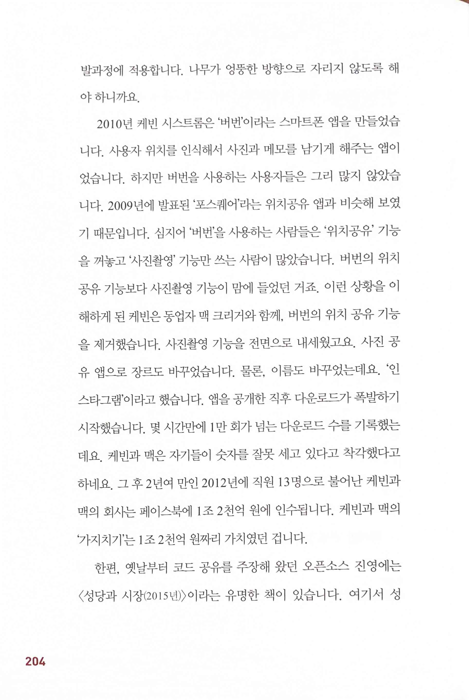 

> 옛날부터 코드 공유를 주장해 왔던 오픈소스 진영에는<성당과 시장(2015년)>이라는 유명한 책이 있습니다. 여기서 성당은 고립된 개발 생태계를, 시장은 오픈소스 진영을 의미하는데요. 성당보다 '시장'에서 소프트웨어를 만들 때 더 뛰어난 결과가 나온다고 주장합니다.
>
> 그 이유는 첫째, 보는 눈이 많아지기 때문입니다. 리누스 토발즈는 "보는 눈이 충분하게 많으면 찾지 못할 버그는 없다"고 했습니다... 둘째, 진화론적인 메커니즘이 작동할 수 있습니다. 같은 일을 하는 코드가 여러 벌 공유되었다면, 가장 많이 사용하는 코드가 안정적이라고 판단할 수 있습니다. 만약 여러 사람이 따로 코드를 가져다가 썼다면, 그 중 살아남는 코드는 가장 안정적으로 수정된 결과라고 믿을 수 있습니다.

 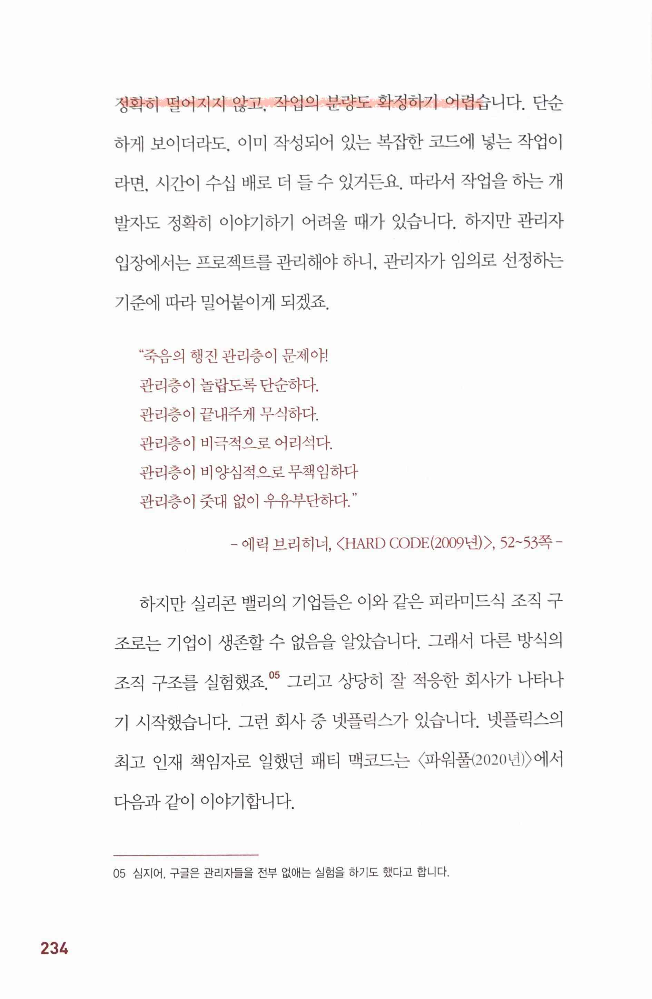 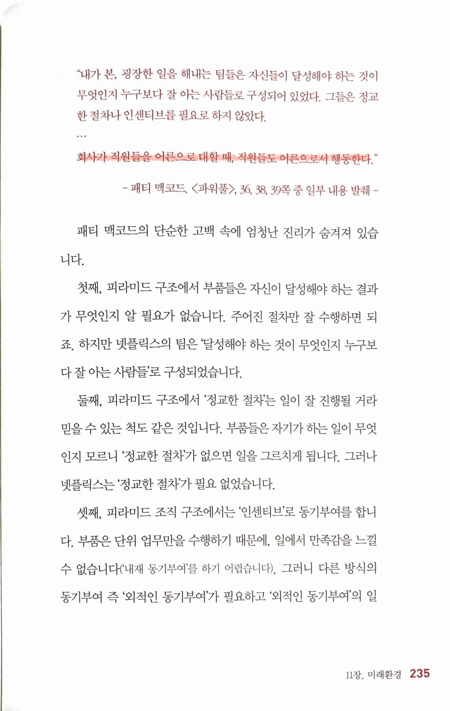 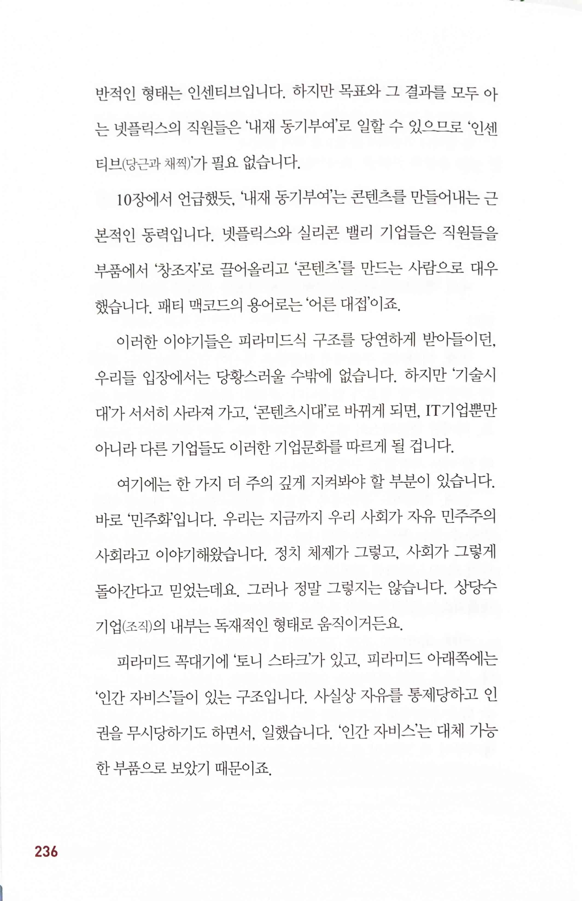 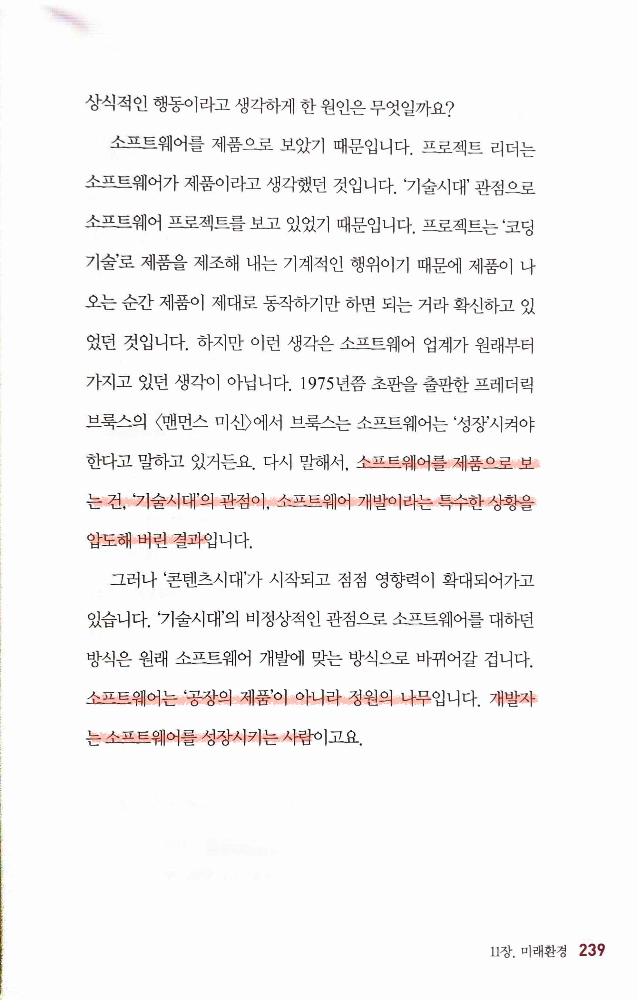

> 다른 엔지니어링 분야는 공정률이 정확히 나오는 경우가 많지만 소프트웨어 분야는 그렇지 않았습니다. 작업 자체가 정확히 떨어지지 않고, 작업의 분량도 확정하기 어렵습니다. 
>
> 실리콘 밸리의 기업들은 이와 같은 피라미드식 조직 구조로는 기업이 생존할 수 없음을 알았습니다. 그래서 다른 방식의 조직 구조를 실험했죠.
>
> 회사가 직원들을 어른으로 대할 때, 직원들도 어른으로서 행동한다."- 패티 맥코드 <파워풀>, 36, 38 39쪽 중 일부 내용 발췌 -
>
> 1975년쯤 초판을 출판한 프레더릭 브룩스의 <맨먼스 미신>에서 브룩스는 소프트웨어는 '성장'시켜야한다고 말하고 있거든요. 다시 말해서, 소프트웨어를 제품으로 보는 건, '기술시대'의 관점이, 소프트웨어 개발이라는 특수한 상황을 압도해 버린 결과입니다.
>
> 소프트웨어는 '공장의 제품'이 아니라 정원의 나무입니다. 개발자는 소프트웨어를 성장시키는 사람이고요.