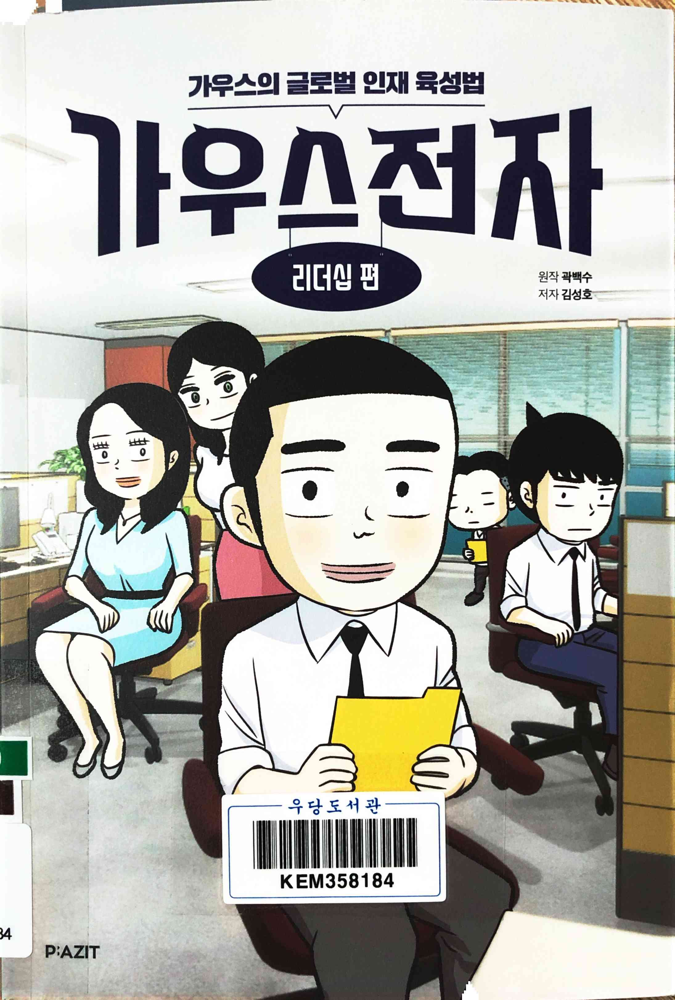
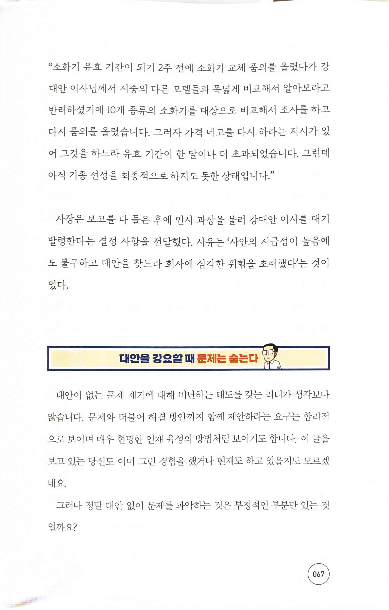
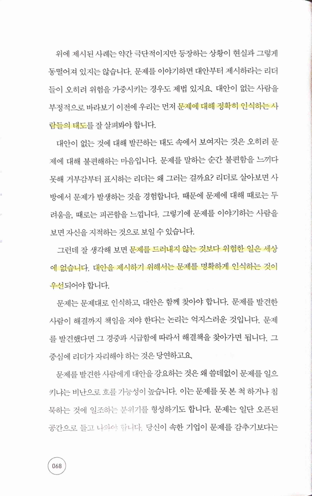
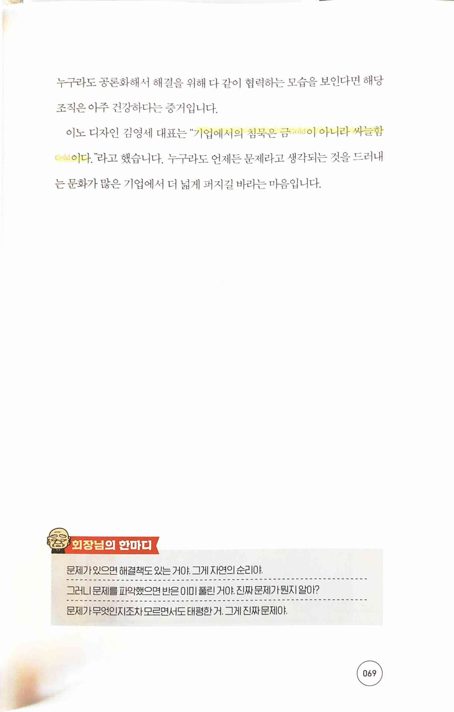
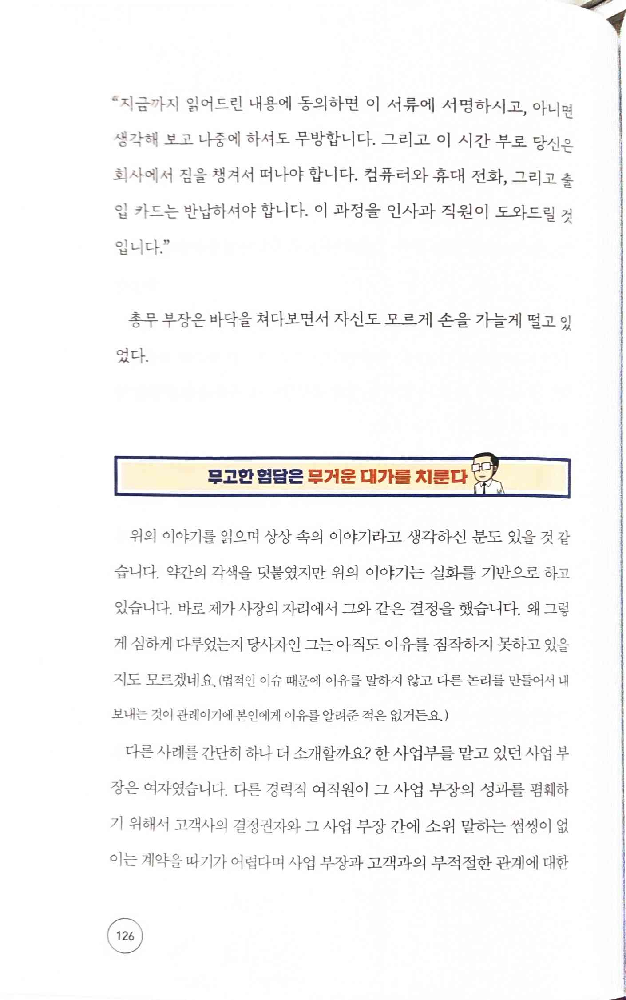
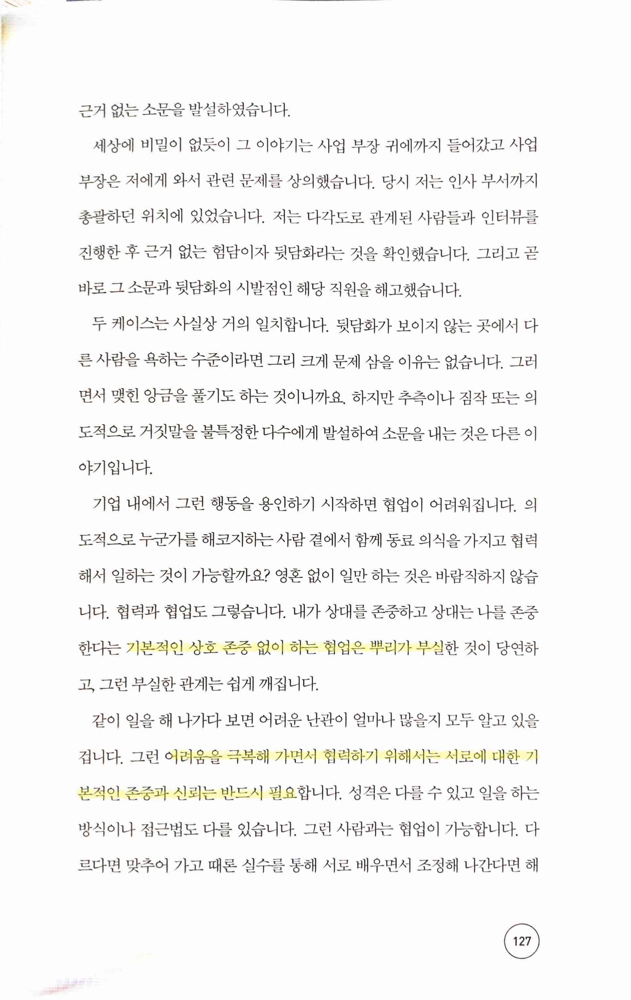
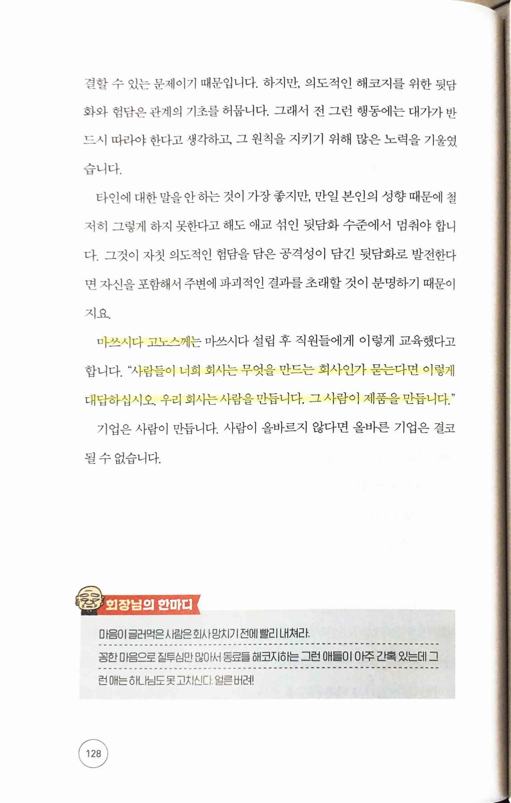
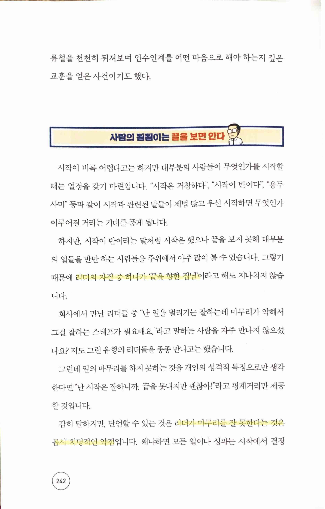
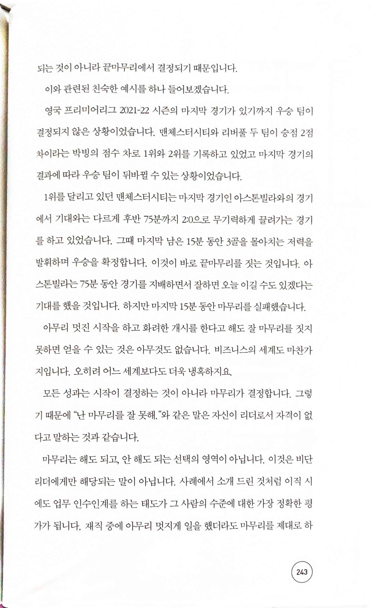
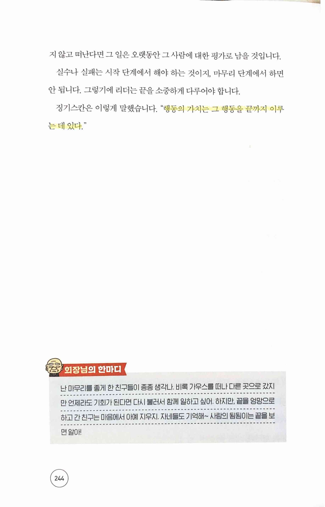

가우스전자 리더십 편
====================

# 대안을 강요할 때 문제는 숨는다
  

> 문제를 드러내지 않는 것보다 위험한 일은 세상에 없습니다. 대안을 제시하기 위해서는 문제를 명확하게 인식하는 것이 우선
>
> 이노디자인 김영세 대표 "기업에서의 침묵은 금Gold이 아니라 싸늘함Col이다."
* 이번에 제대로 경험해서 이 부분이 얼마나 중요한지 다시 한 번 뼈저리게 느끼게 됨

# 무고한 험담은 무거운 대가를 치룬다
  

> 기본적인 상호 존중 없이 하는 협업은 뿌리가 부실
>
> 어려움을 극복해 가면서 협력하기 위해서는 서로에 대한 기본적인 존중과 신뢰는 반드시 필요
>
> 마쓰시다 고노스께 "사람들이 너희 회사는 무엇을 만드는 회사인가 묻는다면 이렇게 대답하십시오. 우리 회사는 사람을 만듭니다. 그 사람이 제품을 만듭니다."

# 사람의 됨됨이는 끝을 보면 안다
  

> 리더의 자질 중 하나가 '끝을 향한 집념'
>
> 리더가 마무리를 잘 못한다는 것은 몹시 치명적인 약점
>
> 징기스칸 "행동의 가치는 그 행동을 끝까지 이루는 데 있다."
* 정말 징기스칸이 이런 말을 했는지는 모르겠지만, 이 문장에는 동의함

# 리더십편 요점정리

## 1 지적인 위장술에 속지 말라
* 보고서나 메일은 기업에서 가장 빈번하게 사용되는 의사소통의 방법입니다. 그리고 그 목적은 전하려는 메시지를 명확하게 전달하여 상대가 이해하도록 돕는 것입니다.
* 메시지의 내용에 집중하고 겉치장에 시간을 들이지 마십시오. 특히 최신 유행 용어 등을 섞어서 모호하게 작성하지 마십시오. 그런 용어는 오직 메시지의 정확한전달에 도움이 될 때만 사용하십시오.
* 스스로 이해를 못했으면서도 전문적인 용어를 섞어서 보고서를 써서 마치 아는것처럼 꾸미지 마십시오, 이해가 안 되면서도 모르겠다는 말을 하기 부끄러워서 마치 아는 것처럼 넘어가지 마십시오.
* 목적이 상대를 이해시키는 것이라면, 그에 걸맞는 행동을 해야 합니다.

## 2 소통은 경영의 현재형이다
* 어떠한 이유로든 회사 안에서 소통이 자유롭지 않다면 시급히 고쳐야 합니다. 소통이 가장 강력한 기업의 경쟁력이기 때문입니다.
* 소통을 가로막는 이유는 여러 가지가 있지만 그중 내부 경쟁, 즉 사일로 현상으로인한 소통 단절은 기업을 약화시키는 문화적인 중병으로 발전합니다.
* 같은 구성원끼리 경쟁하며 싸우도록 방치하지 마십시오. 우리가 사업을 하는 방식은 구성원 간의 협력을 통하는 것입니다.
* 내 편과 남의 편을 구분은 하고 삽시다.

## 3 당신이 커리어의 주인이다
* 우리 회사는 모든 직원들이 주도적인 존재이길 바랍니다. 즉 자기 인생과 경력의 주인으로서 주인의식을 가지고 기업 내에서 일하길 희망합니다.
* 우리가 생각하는 리더의 조건도 '주도성'입니다. 스스로 주인답게 자신을 세우고 다른 사람 또한 그 인생의 주인으로 존중하고 인정해야 합니다.
* 기업의 주인이 인생의 주인인 당신과 계약을 했습니다. 이 계약은 권리를 가진 주인간에 맺어진 고용 계약입니다.
* 기업의 주인이 인정하고 계약한 직원들을 종처럼 다루는 것은 절대 안 됩니다.

## 4 소통의 두 가지 모습, 경청과 반응
* 소통은 두 가지의 모습을 가지고 있습니다. ① 듣거나 읽는 것과 반응하는 것입니다.
* 둘 중 하나라도 부실하면 소통의 질은 현저히 떨어집니다.
* 듣거나 읽기, 그리고 반응에 대한 당신 자신의 원칙을 만들어 보십시오.
* 소통을 어떻게 하는지가 당신의 됨됨이를 보여줍니다.

## 5 워라밸에 대한 균형 있는 관점
* 워라밸을 법적으로 보호받는 근로조건으로만 이해하는 것은 균형 잡힌 시각이 아닙니다. 워라밸은 개인의 선택이기도 합니다.
* 어디까지 얼마나 빨리 올라갈지 원하는 정도는 각자 다를 것입니다. 각자 다르게 원하고 원하는 바에 따라 각자 다르게 노력할 수 있습니다.
* 서로의 다름을 인정하는 마음으로 각자가 선택한 노력의 모습도 인정해야 합니다.
* 워라밸은 각 사람이 주도적으로 선택하는 삶의 방식이어야 합니다.

## 6 무조건적인 추종이 위험한 이유
* 리더를 존경하는 마음과 행동은 아름다운 것입니다. 하지만, 무조건적인 추종은 위험합니다.
* 자신의 관점이 없는 무조건적인 추종은 자신과 리더 모두를 망가지게 만듭니다. 특히, 상사의 겉으로 보여지는 습관을 모방하지 마십시오.
* 존경은 하되 추종은 하지 마십시오.

## 7 정보와 경험이 흐르게 하라
* 소통의 조건이 꼭 환경에 달려 있지는 않습니다.
* 소통은 문화와 더 가깝게 연결되어 있습니다.
* 의사소통은 흐름과 공유의 개념을 갖습니다. 즉 정보와 경험이 흐르고 공유되는 것이 바로 소통입니다.
* 직원들이 소통을 잘하게 하고 싶다면, 리더들부터 협력하여 정보와 경험이 흐르도록 열린 자세로 소통하십시오.

## 8 대안을 강요할 때 문제는 숨는다
* 대안이 없는 문제제기를 비난하지 마십시오 대안이 없어도 문제는 제기되어야 합니다.
* 문제를 알고 원인을 파악하는 것이 시작이고, 대안은 그 다음입니다.
* 가장 위험한 일은 문제가 무엇인지 모르는 것입니다.
* 누구라도 자유롭게 문제제기를 하고 대안은 다같이 협력해서 찾도록 합시다.

## 9 솔선수범의 참 의미
* 리더의 솔선수범은 스스로 모든 것을 다하는 것이 아닙니다.
* 리더의 솔선수범은 자신이 주인공이 되는 것을 의미하지 않습니다.
* 리더의 솔선수범은 누군가를 키워서 그가 주인공이 되도록 만드는 것에 그 목적이 있습니다.
* 리더는 솔선수범을 하는데 정작 성장하는 구성원이 없다면 그의 솔선수범은 잘못되어 있는 것입니다.

## 10 경쟁 대신 자신에게 집중하라
* 치킨 게임(겁쟁이 게임)이 무서운 이유는 누구에게도 이롭지 않은 경쟁을 하기 때문입니다.
* 어떤 조직이던 치킨 게임의 함정에 빠질 수 있습니다.
* 의미 없는 내부 경쟁을 치킨 게임을 하듯이 반복하지 마십시오
* 경쟁 대신 자기 자신에게 집중하는 삶을 사십시오

## 11 가장 쉬운 것은 나를 변화시키는 것이다
* 사람은 어떤 상황에서도 적응합니다. 직원들도 리더에 맞추어 자신의 행동을 조정하며 적응을 하기 마련입니다.
* 하지만 잘 적응하는 것이 만족 혹은 행복하다는 의미는 아닙니다.
* 적응으로 회피하지 말고 자신에게 물으십시오. 나는 정말 괜찮은가?"
* 만족과 행복을 위해 무엇인가 변화가 필요하거든 자신부터 변화시키는 용기 있는 시작을 하십시오. 왜냐하면 세상에서 가장 쉬운 것은 자신을 변화시키는 것이기 때문입니다.

## 12 상대를 위한 것이라면 상대에게 물어라
* 리더들의 심각한 착각은 자신이 부하 직원들을 키우고 성장시킨다는 생각입니다. 마치 리더는 선생, 팔로워는 학생으로 여긴다는 것이죠
* 그렇기에 직원에게 쓰는 비용에 대해서도 그들의 성장을 위해 쓰여야 한다는 강박을 갖기도 합니다.
* 직원을 위해 쓰는 비용은 직원이 원하는 방향으로 쓰세요 복지 비용을 교육 훈련비처럼 쓰려고 하지 마세요
* 직원들은 그들 스스로 성장할 것입니다.

## 13 취향과 방식은 인정하되 원칙과 규범은 따르게 하라
* 모든 사람은 고유한 차별성을 갖기에 모두 다릅니다.
* 각 사람의 차이를 인정할 줄 아는 것이 '성숙함'입니다.
* 각자의 취향과 방식은 인정하되, 기업이 정한 원칙과 규범은 따르게 하십시오
* 취향에 대해 깐깐하고 원칙에 대해 헐거운 사람은 리더로서 존경받지 못합니다.

## 14 관점이 다르면 약점을 강점으로 볼 수도 있다
* 성공이 오히려 독이 되는 경우는 기업에서 아주 흔합니다. 마찬가지로 강점이 약점으로 변하는 경우도 많이 있습니다.
* 사람의 편견은 약점을 약점으로만 보게 합니다. 하지만 그렇지 않다는 것을 기억하십시오
* 하지만 좋은 리더는 편견을 거부하고 약점을 강점으로 보도록 사람들을 자극하며 훈련하여 편견에 사로잡힌 마음의 눈을 열어 줍니다.

## 15 스스로 생각하고 길을 찾는 주도성을 길러라
* 묻는 직원으로 키우길 원하시나요? 답을 찾는 직원으로 키우길 원하시나요?
* 습관적으로 묻는 직원은 스스로 답을 찾지 않습니다.
* 스스로 생각하고 답을 찾는 것이 리더의 조건입니다.
* 리더로 키우고 싶다면 그가 스스로 답을 찾도록 하십시오

## 16 무고와 험담은 무거운 대가를 치룬다
* 무고와 험담을 어떻게 다루는지에 따라서 기업의 문화는 바뀝니다.
* 방치하면 정치적인 문화가 싹트고 잘라내면 협력의 문화로 갈 수 있는 기틀이 생깁니다.
* 동료를 무고하는 것은 팀워크를 깨는 무자비한 행동입니다.
* 그렇기에 무고를 방치하는 리더는 선한 동료를 지키지 않는 비겁한 사람이며 그런 리더는 직원들도 보호하지 않습니다.

## 17 베끼지 말고 나만의 이야기를 찾아라
* 베끼는 것이 창조의 시작이라고 생각하는 사람이 있습니다. 그렇기에 일정 부분 베끼는 것에 대해 관대한 사람도 많습니다.
* 리더 중에도 그런 식으로 리더십을 발휘하는 사람이 존재합니다.
* 하지만, 다른 사람의 방식을 베끼는 리더의 근본적인 문제는 자기로부터 출발하지 않는다는 것입니다.
* 진정으로 자기 것이 아닌 것으로부터 출발한 사람이 주인 의식을 가질 수 있을까요? 잘났든 못났든 당신의 것으로부터 시작하십시오.

## 18 구조 조정을 제대로 알고 나 자신에게 먼저 적용하라
* 구조조정은 구조적인 변화를 통해 어려워진 사업을 다시 정상화시키는 것을 말합니다. 알고보면 이런 상황은 매우 보편적입니다.
* 기업은 방향과 전략을 가지고 스스로 건강해지기 위해 언제든 구조조정을 단행합니다.
* 대다수 개인들은 기업이 구조조정을 할 때 수동적으로 그 변화를 받아들이는 입장에 섭니다. 하지만 가우스의 직원들은 그런 경우가 생길 때 기업이 제시하는 선택안만을 받아들이는 수동적인 입장에 머물기보다 스스로 준비한 대안이 있기를 바랍니다.
* 기업이 자신을 보호하기 위해 구조조정이라는 대안을 필요할 때 실행하듯 개인도 자신을 위해 보다 적극적인 대안을 준비하기 바랍니다. 왜냐하면 비상시 자신을 위한 대안이 없는 사람은 현실적으로 주도성을 갖기 어렵기 때문입니다.

## 19 성과보다 관계를 앞세우지 말라
* 그 기업의 수준은 기업에 근무하는 사람을 보면 알 수 있습니다.
* 혈연, 지연, 학연 등 관계로 인해 모인 조직이라면 그게 그 수준입니다.
* 관계 중심의 조직은 성장에 뚜렷한 한계를 갖습니다.
* 성과를 중심으로 모이는 조직을 지향하십시오.

## 20 벤치마킹, 성공의 결과보다 이유와 과정을 카피하라
* 벤치마킹이란 기업이 경쟁력을 제고하기 위한 방법의 일환으로, 타사의 성공사례에서 배워오는 혁신적 기법을 말합니다.
* 벤치마킹은 단순한 복제와는 다른 개념으로서 장·단점을 분석하여 그중 적합한 것들을 자사에 적용해 시장 경쟁력을 높이는 개념입니다.
* 좋은 사례나 모델 케이스를 관찰해서 우리 회사에 적용해 보는 것도 권장할 일입니다. 그러나 한 단계 더 나아가길 바랍니다.
* 벤치마팅이 성공하기 위해서는 이유와 과정까지 자세하게 파악하여 자사에 맞도록 조정하여 적용해야 합니다.

## 21 이직을 통해 서로 성장하기
* 이직을 배신으로 여기는 생각은 절대 하지 않길 바랍니다.
* 누군가 떠나는 것은 누군가 새로 온다는 것을 의미합니다. 즉 서로에게 새로운 기회가 생긴다는 것입니다.
* 이직은 자연스런 순환이며, 이직을 통해 기업도 사람도 성장하는 기회를 얻게 됩니다.
* 새롭게 합류한 직원이 쉽게 적응할 수 있는 열린 조직 문화를 개발하는 것이 이직이 보편화되는 시대의 기업에게 필요한 자세입니다.

## 22 수평적인들 어떠하며 수직적인들 어떠하리
* 수평적 조직이나 수직적인 조직 중 무엇이 더 맞냐는 논의는 더 이상 도움이 되지 않습니다.
* 각 조직 형태가 갖는 특징과 강점을 이해하고 무엇이 우리 조직에 맞는지 선택하고 강점을 최대한 활용하는 것이 현명합니다.
* 두 조직의 문화는 다를 수 있지만 인간을 향한 존중의 정신은 동일해야 합니다.
* 자사의 특징을 이해하고 그에 맞는 조직과 문화를 채택해서 일관되게 가져가십시오 비교하면서 내가 아닌 다른 것의 장점이 마치 내 것인 것처럼 가장하지 마십시오.

## 23 회사에서 어른이 된다는 의미
* 모든 조직에는 어른이 필요합니다.
* 어른은 스스로 생각하고 판단하고 결정하고 책임을 집니다.
* 어른이 어른을 키울 수 있습니다.
* 아끼는 사람일수록 어른으로 키우세요.

## 24 가장 강력한 인재 육성의 방법을 알자
* 견디고 버티는 힘을 길러주는 것이 육성의 본질은 아닙니다.
* 육성의 본질은 직접 경험하게 해주는 것입니다.
* 직접 할 수 있는 기회를 주는 것이 육성의 핵심입니다.
* 리더는 그 기회를 줄 사람을 선택하는 존재입니다.

## 25 그래도 실수는 실수다
* 실수나 실패가 없는 성장은 있을 수 없습니다.
* 하지만 그것은 실수나 실패를 자유롭게 해도 된다는 무조건적인 허용이 아닙니다.
* 실수나 실패를 통해 배우고, 교훈을 얻어 이를 긍정적으로 활용해야만이 실수와 실패는 의미가 있습니다.
* 기업은 실수와 실패에 관대한 조직이 아닙니다. 그로 인해 얻을 수 있는 장기적인 효익이 없다면 “실수는 그냥 실수일 뿐입니다."

## 26 자신이라는 브랜드를 키워라
* 회사에서 벗어나는 순간 우리는 미약한 것이 사실입니다.
* 기업에 기대어 있을 때만 힘과 능력이 있는 사람이 당신이 바라는 모습인가요?
* 기업도 마찬가지입니다. 기업의 이름이 사라져도 얼마든지 혼자서 더 멋지게 앞길을 개척하는 사람이어야 기업의 성장을 맡길 만하지 않을까요?
* 서로 누가 누구를 일방적으로 의지하는 관계가 아니라 독립적으로도 잘할 존재들이 만나 서로 시너지를 일으키는 모습을 그려봅니다.

## 27 집중을 위한 조건은 단순화다
* 좋은 디자인의 핵심은 더하는 것이 아니라 빼는 것입니다.
* 부수적인 것을 뺌으로 얻게 되는 단순함이 집중의 비결입니다.
* 단순함을 바탕으로 한 집중이 위대함을 만듭니다.
* 집중할 단 하나의 강점을 더욱 강화하기 위해 자원을 집중해서 투입하는 것이 바로 브랜딩이고 그것을 아는 사람이 우리가 생각하는 리더입니다.

## 28 미괄식 보고와 친해지라
* 두괄식이 보고의 진리는 아닙니다.
* 결론만 알면 된다는 생각은 소통의 장애물로 작용합니다.
* 과정과 맥락을 보고자의 속도로 이해하려는 마음을 기르십시오.
* 바쁘기에 결론만 듣고자 하는 태도로 인재는 길러지지 않습니다.

## 29 답은 네 안에 있다
* 세상에 완벽한 안전함이라는 것은 없습니다.
* 기업이 안전해도 직원은 불안합니다. 왜냐하면 누구나 스스로 자신을 전적으로 믿기 어렵기 때문입니다.
* 도전과 실험은 안정감이 있을 때 활성화된다고 하지만, 불안정한 환경에서도 도전과 실험을 하는 사람들이 존재함을 잊지 마십시오.
* 도전은 환경 때문에 나오지 않습니다. 그 사람의 내면에 있는 용기 있는 선택으로 하는 것입니다. 우리의 생각하는 리더는 그런 사람입니다.

## 30 현재와 미래를 동시에 보라
* 단기적인 시야로 하는 선택은 습관이자 태도입니다.
* 나만을 생각하는 사람은 주로 단기적인 선택에 치우치지만 조직 전체를 생각하는 사람은 장기적인 선택을 간과하지 않습니다.
* 지금 하려는 선택이 장기적으로 많은 사람에게 유익한 것인지 깊이 생각하십시오.
* 비록 당장은 내게 불리한 선택이라도 장기적으로 많은 사람에게 유익하다면 그것을 추구하는 것이 우리가 바라는 리더입니다.

## 31 직원을 우선시하는 마음
* 평범한 말단의 직원을 늘 고려하십시오.
* 숨겨진 곳에서 섬기는 직원을 늘 고려하십시오
* 자신을 보호할 힘이 없는 직원들을 늘 고려하십시오.
* 그들을 생각하는 한 당신은 좋은 리더가 될 것입니다.

## 32 사람의 됨됨이는 끝을 보면 안다
* 시작은 열정적이지만 끝은 냉담하기 쉽다는 것을 기억하세요.
* 시작은 잘 하지만 마무리를 못 짓는다는 핑계를 대지 마십시오. 언제나 성과는 성공적인 끝에서 나옵니다.
* 리더는 시작만 하고 끝은 스태프에게 맡기는 것은 우리가 바라는 리더의 태도가 아닙니다.
* 인수인계를 허술하게 하는 사람과는 절대 다시 일하지 마십시오.

## 33 관계의 울타리에 갇혀 살지 말라
* 많은 경우 관계로 인하여 기회가 얻어집니다.
* 자신의 관계의 바운더리(울타리)에 너무 갇혀 살지 마세요. 그를 벗어나는 방법을 고안하여 익혀야 합니다.
* 기업 외부에도 소중한 관계가 있습니다. 울타리를 벗어나 밖에서 관계를 만드세요.
* 다만, 당신의 시간과 열정을 투자할 만한 가치가 있는 사람들과 만남을 가지세요.

## 34 누군가의 용기로 오늘이 있다
* 모든 기업은 그만의 이야기가 있고 그 속에는 사람이 있습니다.
* 그 기업의 이야기를 소중히 여기세요.
* 지금 당신이 누리는 일의 기회는 오래전 누군가의 용기 있는 결단과 의사 결정이 있었기에 얻어진 것입니다.
* 우리가 원하는 리더는 10년 혹은 20년 뒤에 후배들이 얻을 기회를 위해 지금 용기있게 결단을 내리는 사람입니다.