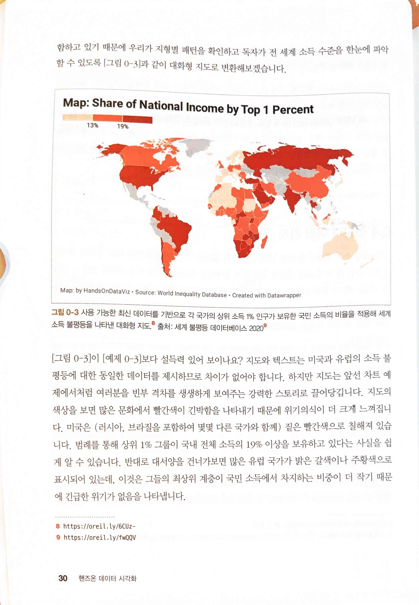
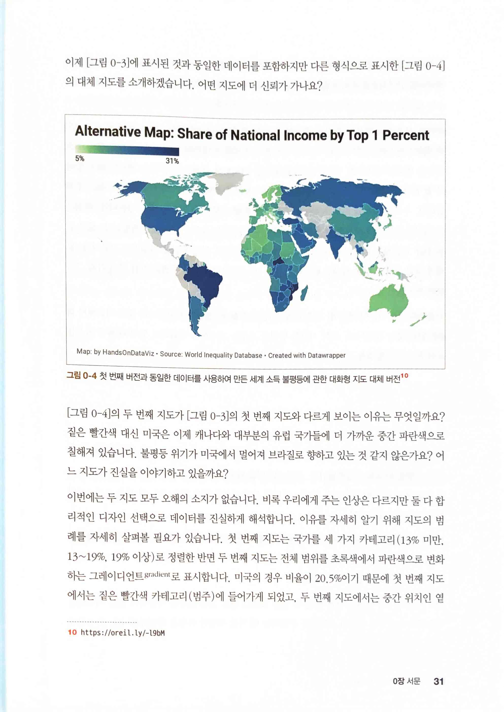
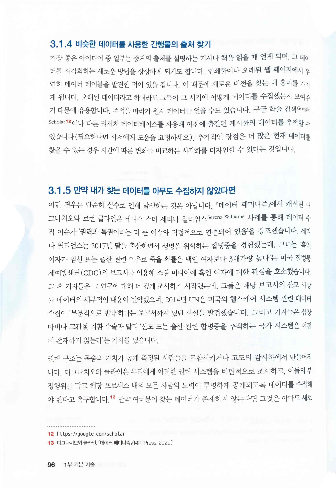

# 핸즈온 데이터 시각화 Hands-On Data Visualization

* 데이터 시각화라면 차트나 그래프를 통해 데이터를 더 보기 좋고 이해하기 쉽게 만드는 일이라고 단편적으로 생각했던 나에게 이 책은 예상보다 훨씬 더 넓은 시각화의 세계를 알려줬다. 많은 교육 기관에서 데이터 시각화 입문 교재로 이 책을 활용한다고 하는데, 책의 구성뿐만 아니라 내용이 교과서로 사용할 정도로 자세할 뿐만 아니라 정말 교과서에서나 볼법한 주제를 반복적으로 알려주고 있다는 점에서도 의외였고 좋았다.
* 책의 구성은 총 4부로, 1부 기본 기술에서는 도구 및 데이터를 이용해 스토리를 구상하는 기초, 2부 시각화 구축에서는 난이도가 낮은 도구로 실습, 3부 코드 템플릿과 고급 도구에서는 코드를 직접 다뤄야 하는 정도의 난이도가 높은 도구로 더 다양한 시각화를 소개, 4부 진실하고 의미 있는 스토리 전달하기에서는 이 책에서 반복적으로 이야기하는 데이터를 이용해 진실하고 의미 있는 스토리 전달에 대해 설명한다.
* 가디언이나 뉴욕 타임스의 사례가 아니더라도, 이제 한 번 만들면 변하지 않는 시각화가 아니라 사용자와의 인터랙션이 기본이 되면서 기술적인 요소는 전보다 훨씬 더 중요해졌고 앞으로도 3D뿐만 아니라 AR, VR 같은  분야를 생각하면 시각화에서도 기술의 중요성은 점점 더 높아져만 갈 것이 확실하다. 하지만 저자는 일관되게 진실한 이야기를 전달하는 스토리를 구성해야 한다고 말한다.
* 초반에 처음 소개하는 지도도 부의 불평등에 대한 지도를 어떻게 전달하느냐에 따라 둘 다 진실을 전하지만 느낌이 달라지고 중요하게 생각하는 부분이 변한다는 걸로 시작한다. 테니스 스타 세레나 윌리엄스가 겪었던 흑인 여성에 대한 차별이나 유명한 메르카토르 도법의 문제점 등 데이터 자체의 문제, 알고리즘의 편향성, 시각화가 유도하는 의도한(혹은 의도치 않은) 인식의 문제 등을 알려주고, 데이터 시각화가 왜 중요하고, 또 어떤 면을 전달해야 하는지 설명한다. 또 다른 기술들도 마찬가지이지만, 시각화 기술 역시 계속 발전하므로, 단 하나의 정답만 고수하지 않고 진실을 보여주기 위한 방법을 지속적으로 찾아야 한다고 주장한다.
* 좋은 기술을 알려주면 악용하는 일이 항상 발생한다. 책에서 차트를 사용해 속임수를 쓰는 방법도 설명하기 때문에 어쩌면 그렇게 저자의 의도와는 반대되는 결과를 가져올 수도 있다. 하지만, 시각화의 기술과 그 파급력, 또 그래서 어떤 마음을 가지고 기술을 대해야 할지까지 같이 작성한 걸 보면, 저자는 좋은 사람이기도 할 거란 생각이 든다. 다양하고 좋은 시각화 기술만 볼 거라고 생각한 나에게 저자는 시각화도 데이터를 다루는 일이므로 역시 항상 편향, 편견을 조심해야 한다는 점을 알려줬다. 생각보다 더 좋은 책을 읽게 되어 기분이 좋다.

* [Map: Share of National Income by Top 1 Percent](https://datawrapper.dwcdn.net/NLMLg/3/)
* [World - WID - World Inequality Database](https://wid.world/world/#sptinc_p99p100_z/US;FR;DE;CN;ZA;GB;WO/last/eu/k/p/yearly/s/false/5.1754999999999995/30/curve/false/country)

* [Alternative Map: Share of National Income by Top 1 Percent](https://datawrapper.dwcdn.net/o5f9Q/4/)

* 도구 선정에 대한 관점들
  * [What I Learned Recreating One Chart Using 24 Tools - Features - Source: An OpenNews project](https://source.opennews.org/articles/what-i-learned-recreating-one-chart-using-24-tools/)
  * [How to Make Prudent Choices About Your Tools | Lincoln Mullen](https://lincolnmullen.com/blog/how-to-make-prudent-choices-about-your-tools/)
  * ["The Audrey Test": Or, What Should Every Techie Know About Education?](http://hackeducation.com/2012/03/17/what-every-techie-should-know-about-education)

> 정보란 마법처럼 갑자기 나타나지 않습니다. 대신 사람들은 그들이 속한 사회와 시간 안에서명시적인 목적 또는 암시적인 목적을 가지고 데이터를 수집하고 공개합니다. 데이터 시각화의목적이 그렇듯이 우리는 정보가 부족한 그 어떤 것보다는 근거에 기반한 추론을 선호합니다.그러나 숫자를 비롯한 여러 형태의 데이터는 객관적이지 않기에 우리는 소위 말하는 데이터 객관성 objectivity을 무작정 옹호할 수는 없습니다. 따라서 데이터를 다룰 때는 잠시 멈춰서 '누구의 이야기가 전해지고 있는지 그리고 '누구의 견해가 아직 전해지지 않았는지 깊게 고민해봐야 합니다.
* [Data Feminism](https://data-feminism.mitpress.mit.edu/)

> 테니스 스타 세리나 윌리엄스 Serena Williams 사례를 통해 데이터 수집 이슈가 '권력과 특권'이라는 더 큰 이슈와 직접적으로 연결되어 있음을 강조

> 데이터를 검색할 때는 공공 데이터와 개인 데이터 관련 논쟁에 대해 이해할 필요가 있습니다. 이런 논쟁은 데이터 시각화 프로젝트에 어떤 종류의 데이터를 합법적으로 사용할 수 있을지 결정할 뿐만 아니라 어떤 사람들이 어느 정도 수준에서 개인 관련 사적 정보를 수집하고 배포해도 되는지에 대한 윤리적 문제와도 연관됩니다.
>
> '개인에 대한 데이터는 어느 정도까지 수집이 허용되어야 하는가?'

> 데이터에 대한 사회적 정의가 계속해서 바뀐다면 이를 시각화할 수 있는 완벽한 방법은 없습니다. 따라서 데이터에 대해 선택할 때 메모나 첨부한 텍스트에 본인의 사고 과정을 기술해야 합니다.

* 차트 유형 및 사용 사례에 대한 자세한 내용 [chart-doctor/visual-vocabulary at main · Financial-Times/chart-doctor](https://github.com/Financial-Times/chart-doctor/tree/main/visual-vocabulary)
* [Datawrapper Academy](https://academy.datawrapper.de/)
* 리사 샬럿 로스트, 데이터 대 규칙을 고려할 때 고려해야 할 사항 2020년 11월 27일 [What to consider when considering data vis rules · Lisa Charlotte Rost](https://lisacharlottemuth.com/datavisrules)

> 기본 차트 구성 요소

## 11장 Chart.js와 하이차트 템플릿
* [Chart.js | Open source HTML5 Charts for your website](https://www.chartjs.org/)
* [Interactive javascript charts library](https://www.highcharts.com/)
* Chart.js로 만든 열 차트 대화형 버전 [Chart.js Bar Chart Template by handsondataviz.org](https://handsondataviz.github.io/chartjs-bar/index.html)
* [HandsOnDataViz/chartjs-bar: Bar chart with Chart.js (template)](https://github.com/HandsOnDataViz/chartjs-bar)
* Chart.js로 만든 오류 바가 있는 막대 차트 대화형 버전 [Chart.js Error Bars Template by handsondataviz.org](https://handsondataviz.github.io/chartjs-error-bars/index.html)
* Chart.js로 만든 대화형 선 차트 대화형 버전 [Chart.js Line Chart Template by handsondataviz.org](https://handsondataviz.github.io/chartjs-line/)
* [HandsOnDataViz/chartjs-line: Line chart with Chart.js (template)](https://github.com/HandsOnDataViz/chartjs-line)
* 하이차트로 만든 주석이 달린 대화형 선 차트 대화형 버전 [Highcharts Annotated Line Chart Template by handsondataviz.org](https://handsondataviz.github.io/highcharts-line-annotated/)
* [HandsOnDataViz/highcharts-line-annotated: Annotated line chart with Highcharts (template)](https://github.com/HandsOnDataViz/highcharts-line-annotated)
* Chart.js로 만든 대화형 분산형 차트 대화형 버전 [Chart.js Scatter Chart Template by handsondataviz.org](https://handsondataviz.github.io/chartjs-scatter/)
* [HandsOnDataViz/chartjs-scatter: Scatter Chart in Chart.js (template)](https://github.com/HandsOnDataViz/chartjs-scatter)
* Chart.js로 만든 대화형 버블 차트 대화형 버전 [Chart.js Bubble Chart Template by handsondataviz.org](https://handsondataviz.github.io/chartjs-bubble/)
* [HandsOnDataViz/chartjs-bubble: Bubble Chart in Chart.js (template)](https://github.com/HandsOnDataViz/chartjs-bubble)

## 12장 리플릿 맵 템플릿
* [Leaflet - a JavaScript library for interactive maps](https://leafletjs.com/)
* [Leaflet Provider Demo](https://leaflet-extras.github.io/leaflet-providers/preview/)
* 그린웨이 지도
  * [Demo: Leaflet Maps with Google Sheets v. 1.2.0](https://handsondataviz.github.io/leaflet-maps-with-google-sheets/)
  * [East Coast Greenway - Route Map](https://www.greenway.org/route-map)
  * 위 리플릿 맵 데모에 데이터를 제공하는 온라인 구글 시트 템플릿 [Leaflet Maps with Google Sheets template v1.2.0 - Google Sheets](https://docs.google.com/spreadsheets/d/1ZxvU8eGyuN9M8GxTU9acKVJv70iC3px_m3EVFsOHN9g/edit#gid=0)
  * [HandsOnDataViz/leaflet-maps-with-google-sheets: Customize Leaflet maps with a linked Google Sheets template and GeoJSON data on GitHub](https://github.com/handsondataviz/leaflet-maps-with-google-sheets)
* 구글 시트로 만든 대화형 리플릿 스토리맵 [Leaflet Storymaps Demo](https://handsondataviz.github.io/leaflet-storymaps-with-google-sheets/#2)
  * 위 리플릿 스토리맵 데모에 데이터를 제공하는 온라인 구글 시트 템플릿 [Leaflet Storymaps with Google Sheets Template v1.2.0 - Google Sheets](https://docs.google.com/spreadsheets/d/1AO6XHL_0JafWZF4KEejkdDNqfuZWUk3SlNlQ6MjlRFM/edit#gid=0)
* 초보자들에게 더 쉬운 선택지이나 이러한 플랫폼은 데이터 이동성이 떨어지기 때문에 추천하지 않음
  * [StoryMapJS](https://storymap.knightlab.com/)
  * [Classic Story Maps - Harness the Power of Maps to Tell Your Story](https://storymaps-classic.arcgis.com/en/)
  * [ArcGIS StoryMaps](https://storymaps.arcgis.com/)
* 구글 시트로 만든 리플릿 스토리맵 갤러리
  * [Synagogue Map, Past and Present – Jewish Historical Society of Greater Hartford](https://jhsgh.org/synagogue-map/)
  * [Mapping the Upper Missouri](https://www.mappingtheuppermissouri.com/)
  * [Kensington Remembers – Kensington Remembers](https://kensingtonremembers.org/)
  * [wnttatb](https://www.weneedtotalkabouttheborder.eu/)
  * [HandsOnDataViz/leaflet-storymaps-with-google-sheets: Scroll-driven story map, with point markers and narrative text in GeoJSON, using Leaflet and jQuery](https://github.com/handsondataviz/leaflet-storymaps-with-google-sheets)
* [Home - Map Warper](https://mapwarper.net/)
* [NYPL Map Warper: Home -](https://wayback.archive-it.org/13216/20210520171637/http://maps.nypl.org/warper/)
* CSV 데이터로 만든 대화형 리플릿 포인트 지도 [leaflet-map-csv](https://handsondataviz.github.io/leaflet-map-csv/)
  * [HandsOnDataViz/leaflet-map-csv: Simple Leaflet map with points from local CSV file](https://github.com/HandsOnDataViz/leaflet-map-csv)
* [Leaflet/Leaflet.heat: A tiny, simple and fast heatmap plugin for Leaflet.](https://github.com/Leaflet/Leaflet.heat)
  * 대화형 리플릿 히트맵 [Bicycle Theft in London – Leaflet Heatmap Template](https://handsondataviz.github.io/leaflet-heatmap/)
  * [HandsOnDataViz/leaflet-heatmap: Leaflet.js heatmap template](https://github.com/HandsOnDataViz/leaflet-heatmap)
* [Derek Eder - Civic Tech Builder](https://derekeder.com/)
* [Searchable Map Template - CSV](https://searchable-map-template-csv.netlify.app/)
  * [HandsOnDataViz/searchable-map-template-csv: You want to put your data on a searchable, filterable map. This is a free, open source template using Leaflet & Turf to help you do it.](https://github.com/HandsOnDataViz/searchable-map-template-csv)
* [Home | Provider Data Catalog](https://data.cms.gov/provider-data/)
* [HIFLD Open Data](https://hifld-geoplatform.opendata.arcgis.com/)
* [Leaflet Maps with Open Data APIs](https://handsondataviz.github.io/leaflet-maps-open-data-apis/index.html)
  * [Esri/esri-leaflet: A lightweight set of tools for working with ArcGIS services in Leaflet.](https://github.com/Esri/esri-leaflet)
  * [HandsOnDataViz/leaflet-maps-open-data-apis: Leaflet map with multiple API data feeds from Socrata and Esri ArcGIS Online](https://github.com/HandsOnDataViz/leaflet-maps-open-data-apis)
* [lon lat lon lat lon - macwright.com](https://macwright.com/lonlat/)

## 13장 지도 데이터 변환하기
* [Geotools](https://hanshack.com/geotools/)
* [geojson.io](https://geojson.io/)
* [About - macwright.com](https://macwright.com/about/)
* KML 형식의 토론토 지역 샘플 파일 [toronto-neighborhoods-sample.kml - Google Drive](https://drive.google.com/file/d/1P8OfPUthTQuVIq9mvrPwGSV7KPK9Lf2e/view)
* [Neighbourhoods - City of Toronto Open Data Portal](https://open.toronto.ca/dataset/neighbourhoods/)
* [toronto-locations-sample.csv - Google Drive](https://drive.google.com/file/d/1uOTUAWzmviI1GIExusM9RjZsjcKgBeGh/view)
* [mapshaper](https://mapshaper.org/) ArcGIS/QGIS 대체
  * [mbloch/mapshaper: Tools for editing Shapefile, GeoJSON, TopoJSON and CSV files](https://github.com/mbloch/mapshaper)
  * [us-states-shapefile.zip - Google Drive](https://drive.google.com/file/d/16SbBukBPidPEh7tW3dU1C6R4mHc3TPdz/view)
  * [lower-48.geojson - Google Drive](https://drive.google.com/file/d/1AQ7gsc3XtMOi8joUXH0wm26-WqlzXg4B/view)
  * [ct-towns.geojson - Google Drive](https://drive.google.com/file/d/1CJ3I51Y-0wjwuEL_malw9NtKz7_AdLsW/view)
  * [hartfordcounty-outline.geojson - Google Drive](https://drive.google.com/file/d/1NSWi5NNrubUYjUJKyX4doj_xwHFbBhPI/view)
  * [hospitals-points.geojson - Google Drive](https://drive.google.com/file/d/158yNDyeLPFIRXRaI8uJT4PHQNri8OZTy/view)
  * [us-states.geojson - Google Drive](https://drive.google.com/file/d/1lXmbUzby97ba2niNVkLypNE8tURcY6O5/view)
* [Local Health Administration - Site Map](https://portal.ct.gov/DPH/Local-Health-Admin/LHA/Local-Health-Administration---Site-Map)
* [ericayhayes/georeferencingtutorial: This is a workshop written and taught by Erica Hayes and Mia Partlow on georeferencing historical maps in Map Warper and displaying them in StoryMap JS](https://github.com/ericayhayes/georeferencingtutorial)
* [Geocoding by SmartMonkey - Google Workspace Marketplace](https://workspace.google.com/marketplace/app/geocoding_by_smartmonkey/1033231575312)

## 14장 거짓을 발견하고 편향 줄이기
* 시각화 거짓말을 발견하는 방법 [How to Spot Visualization Lies | FlowingData](https://flowingdata.com/2017/02/09/how-to-spot-visualization-lies)
* [Educator Guide: Graphing Global Temperature Trends | NASA/JPL Edu](https://www.jpl.nasa.gov/edu/teach/activity/graphing-global-temperature-trends)
* [Gross Domestic Product (GDP) | FRED | St. Louis Fed](https://fred.stlouisfed.org/series/GDP)
* [US GDP in mid-2019 (go to File > Make a Copy) - Google Sheets](https://docs.google.com/spreadsheets/d/1teB2Pw2lNpFjE_GCNmeqVNURSid36IMrWUROpPZMScA/edit#gid=0)
* [Global Temperature | Vital Signs – Climate Change: Vital Signs of the Planet](https://climate.nasa.gov/vital-signs/global-temperature/)
* [global-temp-change-1880-2019 (go to File > Make a Copy) - Google Sheets](https://docs.google.com/spreadsheets/d/1Npc7ozRjlsgRLLEV_B5zBvqyRqL6akE2qrEIGegHfGU/edit#gid=0)
* [Climate at a Glance | National Centers for Environmental Information (NCEI)](https://www.ncei.noaa.gov/access/monitoring/climate-at-a-glance/global/time-series)
* [Real Gross Domestic Product (GDPCA) | FRED | St. Louis Fed](https://fred.stlouisfed.org/series/GDPCA)
* [global-temp-change-1880-2019 (go to File > Make a Copy) - Google Sheets](https://docs.google.com/spreadsheets/d/1Npc7ozRjlsgRLLEV_B5zBvqyRqL6akE2qrEIGegHfGU/edit#gid=374640985)
* [How to connect scatterplot dots with lines - Datawrapper Academy](https://academy.datawrapper.de/article/260-how-to-connect-scatterplot-dots-with-lines)
* [Relationship between US Real GDP and Global Temperature Change, 1929-2019](https://datawrapper.dwcdn.net/Zleaq/2/)
* [world-income-top1pct-recentyear-wid (File > Make a Copy) - Google Sheets](https://docs.google.com/spreadsheets/d/1IomO4pyGziTZnQrlSnlO11zqgdohwwTm2olR2-tGPfI/edit#gid=1463939565)
* 선형 보건과 연속 범위를 사용해 표현한 소득 불평등 지도 대화형 버전 [Map Color Range: Continuous, Linear Interpolation](https://datawrapper.dwcdn.net/aetEM/3/)
* 3단계 브레이크 보간법을 사용해 만든 소득 불평등 지도 대화형 버전 [Map Color Range: 3 Steps, Natural Breaks](https://datawrapper.dwcdn.net/VSfdZ/3/)
* 데이터래퍼 아카데미에서는 코로플레스 지도를 만들 때 정직함과 유용성 사이의 타협점을 찾을 것을 권장 [How to choose the best interpolation for your colors - Datawrapper Academy](https://academy.datawrapper.de/article/117-color-palette-for-your-map)
* [What to consider when creating choropleth maps - Datawrapper Academy](https://academy.datawrapper.de/article/134-what-to-consider-when-creating-choropleth-maps)
* [Machine Bias — ProPublica](https://www.propublica.org/article/machine-bias-risk-assessments-in-criminal-sentencing?token=pnmZCKup_9SO_Q1DvGQOooKLHsrJG0Fr)
  * 프로퍼블리카 ProPublica의 탐사 보도 기자들은 이 알고리듬이 흑인 피고인이 백인 피고인보다 거의 2배에 가깝게 재범을 저지를 것으로 예측하는 것을 발견
* [Apple Card Investigated After Gender Discrimination Complaints - The New York Times](https://www.nytimes.com/2019/11/10/business/Apple-credit-card-investigation.html)
  * 신청서를 평가하는 소프트웨어 수식이 여자보다 남자에게 10배에서 20배가 넘는 신용을 제공
* 데이터 시각화에서 인종 평등 인식 적용 [Applying Racial Equity Awareness in Data Visualization | by Data@Urban | Medium](https://urban-institute.medium.com/applying-racial-equity-awareness-in-data-visualization-bd359bf7a7ff)
* [Urban Institute Data Visualization style guide](http://urbaninstitute.github.io/graphics-styleguide/)
* [Real Country Sizes Shown on Mercator Projection (Updated) - Engaging Data](https://engaging-data.com/country-sizes-mercator/)
* [Maps Mania: How Map Projections Lie](https://googlemapsmania.blogspot.com/2020/09/how-map-projections-lie.html)
* [Web Mercator projection - Wikipedia](https://en.wikipedia.org/wiki/Web_Mercator_projection)
* [How to visualize polls & results of the U.S. elections with Datawrapper - Datawrapper Blog](https://blog.datawrapper.de/how-to-visualize-the-us-election-2020-with-datawrapper/)
* 소득 불평등 데이터로 만든 세계 인구 사각형 지도 대화형 버전 [World Population Square Map](https://datawrapper.dwcdn.net/YfNDe/2/)
* [Crimea, Kashmir, Korea — Google redraws disputed borders, depending on who’s looking - The Washington Post](https://www.washingtonpost.com/technology/2020/02/14/google-maps-political-borders/)
* [Native-Land.ca | Our home on native land](https://native-land.ca/)
  * 오늘날 원주민들의 영토와 언어의 아웃라인을 표시해 우리에게 식민지 정책과 강제 이주에 대한 내용을 상기

## 15장 데이터 스토리 말하고 보여주기
* [Plastic Pollution - Our World in Data](https://ourworldindata.org/plastic-pollution)
  * [global-plastics-production-1950-2015-ourworldindata (File > Make a Copy) - Google Sheets](https://docs.google.com/spreadsheets/d/1H3OwmiLQy5DugT-iArhuqHryzcWJi1kLocpGp7v-1VM/edit#gid=339613035)
  * 색상과 주석을 사용해 독자들이 2000년대 이후 플라스틱 생산량에 주목하도록 작성한 새로운 영역 차트의 대화형 버전 [(Hidden title) Annual Global Production of Plastics, 1950-2015](https://datawrapper.dwcdn.net/1TyyZ/3/)